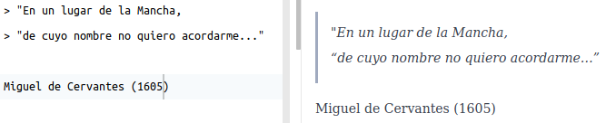
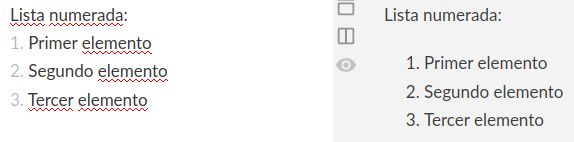

# Markdown: lenguaje de marcado

## Trabajo previo

### Tutoriales
- *Markdown Tutorial*. (s. f.). Recuperado 19 de marzo de 2022, de https://www.markdowntutorial.com/

### Otros
- Instale en su computadora el [sistema base del lenguaje R](https://cloud.r-project.org/) y luego el ambiente integrado de desarrollo [RStudio Desktop](https://www.rstudio.com/products/rstudio/download/#download).
- Cree una cuenta gratuita en la plataforma de desarrollo colaborativo [GitHub](https://github.com/).

## Resumen
Markdown es un lenguaje de marcado ligero ampliamente utilizado en comunicación científica, documentación de programas e investigación reproducible.

## Descripción general
[Markdown](https://daringfireball.net/projects/markdown/) es un [lenguaje de marcado](https://es.wikipedia.org/wiki/Lenguaje_de_marcado) creado en 2004 por John Gruber. Las "marcas" se utilizan para brindar información acerca de la presentación (ej. negritas, itálicas) o la estructura (ej. títulos, encabezados) de un documento. Se caracteriza por ser más sencillo de leer y de usar que otros lenguajes de marcado (ej. [Lenguaje de marcado de Hipertexto o HTML](https://es.wikipedia.org/wiki/HTML)), por lo que se considera un [lenguaje de marcado ligero](https://es.wikipedia.org/wiki/Lenguaje_de_marcas_ligero). Los documentos escritos en Markdown pueden exportarse a una gran variedad de formatos (ej. HTML, DOC, PDF, LaTex) para ser usados en libros, presentaciones o páginas web, entre otros. Markdown es ampliamente utilizado en comunicación científica, documentación de programas e investigación reproducible.

## Variaciones
Las variaciones de Markdown, también llamadas _flavors_, son extensiones o modificaciones de la especificación original. Entre las más populares están:

* [R Markdown](https://rmarkdown.rstudio.com/): para el lenguaje R.
* [GitHub Flavored Markdown](https://help.github.com/en/github/writing-on-github): para la plataforma GitHub.
* [Python Markdown](https://github.com/Python-Markdown/markdown): para el lenguaje Python.
* [Pandoc's Markdown](https://pandoc.org/MANUAL.html#pandocs-markdown): para el programa [Pandoc](https://pandoc.org/) de conversión entre formatos.
* [Kramdown](https://kramdown.gettalong.org/quickref.html): para el lenguaje Ruby.

Puede verse una lista más extensa en [https://github.com/commonmark/commonmark-spec/wiki/markdown-flavors](https://github.com/commonmark/commonmark-spec/wiki/markdown-flavors).

## Sintaxis
La sintaxis de Markdown permite especificar diferentes componentes de un documento, entre los que están:

- Encabezados.
- Estilos (ej. negritas, itálicas).
- Citas textuales.
- Enlaces a otros documentos (ej. páginas web).
- Imágenes.
- Listas.

### Encabezados
Pueden definirse seis niveles de encabezados, mediante símbolos de numeral (`#`) antes del texto. El primer nivel es el de tamaño de texto más grande y el sexto el más pequeño. En la parte izquierda de la figura \@ref(fig:md-encabezados) se muestra la sintaxis Markdown de los encabezados y a la derecha la forma en que se despliegan en un documento.

(\#fig:md-encabezados)Sintaxis de Markdown: encabezados.

### Itálicas
Se definen con un asterisco (`*`) antes y después del texto o con un guión bajo (`_`) antes y después del texto.

(\#fig:md-italica)Sintaxis de Markdown: itálicas.

### Negritas
Se definen con dos asteriscos (`**`) antes y después del texto o con dos guiones bajos (`__`) antes y después del texto.

(\#fig:md-negrita)Sintaxis de Markdown: negritas.

### Citas textuales
Se definen con un símbolo de "mayor que" (`>`) antes de cada línea.

(\#fig:md-cita)Sintaxis de Markdown: citas textuales.

### Enlaces a otros documentos (hipervínculos)
Se definen con paréntesis cuadrados (`[]`) seguidos de paréntesis redondos (`()`). En los paréntesis cuadrados se coloca (opcionalmente) el texto del enlace y en los redondos la dirección del documento.

(\#fig:md-enlace)Sintaxis de Markdown: enlaces a otros documentos.

### Imágenes
Se definen con un signo de admiración de cierre (`!`), paréntesis cuadrados (`[]`) y paréntesis redondos (`()`). En los paréntesis cuadrados se coloca (opcionalmente) un texto alternativo de la imagen y en los redondos la dirección de la imagen, ya sea local o remota.

(\#fig:md-imagen)Sintaxis de Markdown: imágenes.

### Listas numeradas
Se definen con números (`1. 2. 3. ...`) antes de cada elemento.

(\#fig:md-lista-numerada)Sintaxis de Markdown: listas numeradas.

### Listas no numeradas
Se definen con guiones (`-`) o asteriscos (`*`) antes de cada elemento.

(\#fig:md-lista-no-numerada)Sintaxis de Markdown: listas no numeradas.

### Otros elementos de sintaxis
Para conocer otros elementos de la sintaxis de Markdown, se recomienda revisar en detalle la [Guía de referencia de Markdown](https://www.markdownguide.org/).

## Ejercicios
1. Cree un documento Markdown en RStudio y escriba elementos de sintaxis Markdown como los descritos en la sección anterior.
2. Cree un repositorio y un archivo Markdown en [GitHub](https://github.com/) y repita el ejercicio anterior.

## Recursos de interés
Carrera Arias, F. J. (2020). *How to Install R on Windows, Mac OS X, and Ubuntu Tutorial*. DataCamp Community. https://www.datacamp.com/community/tutorials/installing-R-windows-mac-ubuntu

*Markdown Guide*. (s. f.). Recuperado 10 de abril de 2022, de https://www.markdownguide.org/
