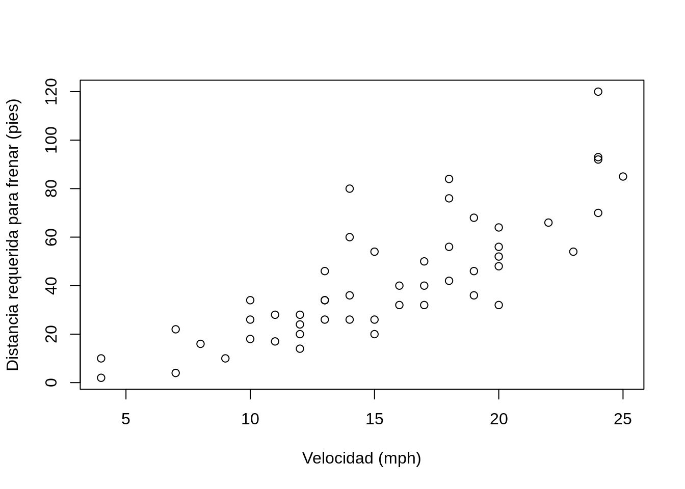
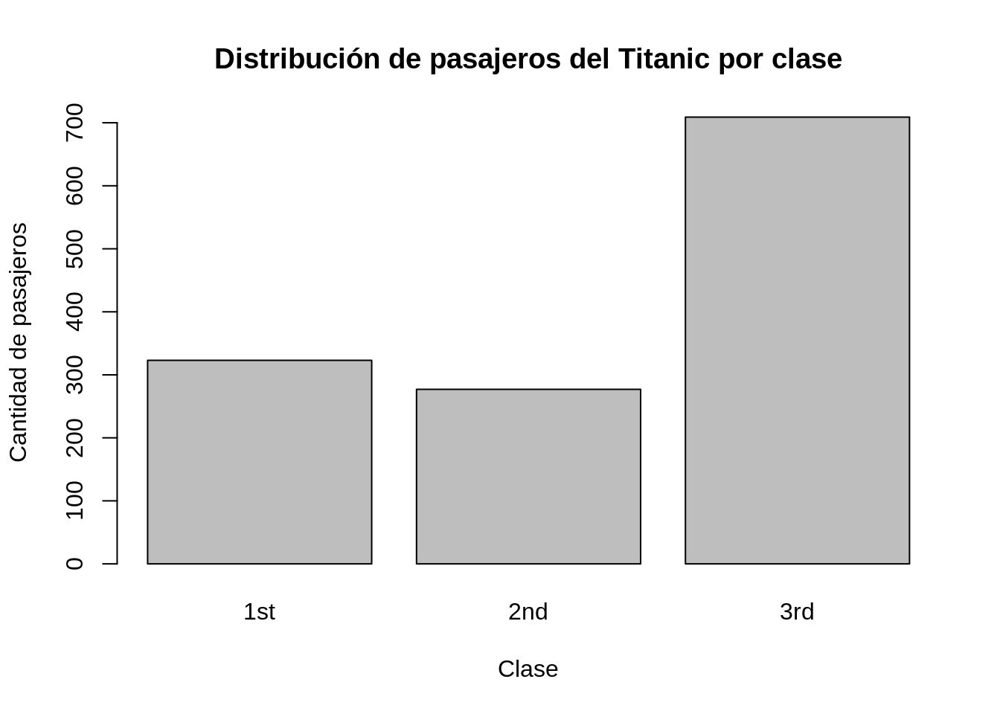
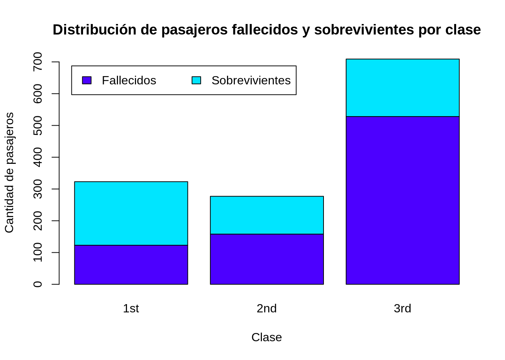
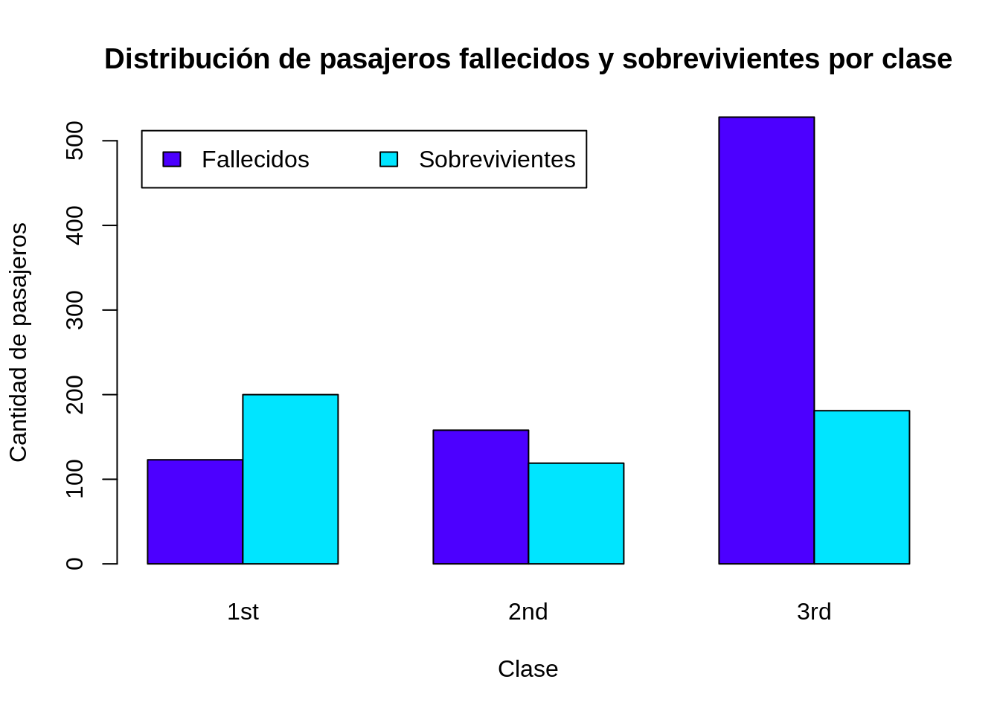

# R - Conceptos básicos

## Trabajo previo

### Lecturas
Grolemund, G., & Wickham, H. (2014). *Hands-On Programming with R: Write Your Own Functions And Simulations*. O’Reilly Media. https://rstudio-education.github.io/hopr/

## Resumen
En esta lección, se estudiarán los conceptos básicos del lenguaje de programación R, incluyendo:

- Características generales de R.
- El ambiente de desarrollo RStudio.
- Funciones y paquetes.
- Tipos de datos.
- Definición de funciones.
- Condicionales.
- Ciclos.

## Características generales
[R](https://www.r-project.org/) es un lenguaje de programación enfocado en análisis estadístico. Es ampliamente utilizado en diversas áreas de investigación, entre las que pueden mencionarse [aprendizaje automático (_machine learning_)](https://en.wikipedia.org/wiki/Machine_learning), [ciencia de datos (_data science_)](https://en.wikipedia.org/wiki/Data_science) y [_big data_](https://en.wikipedia.org/wiki/Big_data), con aplicaciones en campos como biomedicina, bioinformática y finanzas, entre muchos otros. Fue creado por Ross Ihaka y Robert Gentleman en la Universidad de Auckland, Nueva Zelanda, en 1993.

Algunas de las principales características de este lenguaje son:

* Es [interpretado](https://en.wikipedia.org/wiki/Interpreter_(computing)): las instrucciones se traducen una por una a [lenguaje máquina](https://en.wikipedia.org/wiki/Machine_code), a diferencia de los [lenguajes compilados](https://en.wikipedia.org/wiki/Compiler), que traducen de manera conjunta las instrucciones de una unidad completa (ej. un programa o una biblioteca). Los lenguajes interpretados tienden a ser más lentos que los compilados, pero también son más flexibles.
* Es [multiplataforma](https://en.wikipedia.org/wiki/Cross-platform_software): puede ejecutarse en los sistemas operativos más populares (ej. Microsoft Windows, macOS, Linux).
* Tiene un [sistema de tipos de datos dinámico](https://pythonconquerstheuniverse.wordpress.com/2009/10/03/static-vs-dynamic-typing-of-programming-languages/): las variables pueden tomar diferentes tipos de datos (ej. textuales, numéricos) durante la ejecución del programa, a diferencia del caso de un sistema de tipos de datos estático, en el que las variables solo pueden tener un tipo de datos.
* Soporta varios [paradigmas de programación](https://en.wikipedia.org/wiki/Programming_paradigm): los paradigmas son estilos o enfoques teóricos de programación. R soporta los paradigmas de [programación funcional](https://en.wikipedia.org/wiki/Functional_programming), [programación orientada a objetos](https://en.wikipedia.org/wiki/Object-oriented_programming), [programación imperativa](https://en.wikipedia.org/wiki/Imperative_programming) y [programación procedimental](https://en.wikipedia.org/wiki/Procedural_programming).

R es un proyecto de [software libre](https://en.wikipedia.org/wiki/Free_software) que se comparte mediante una licencia [GNU General Public Licence (GNU GPL)](https://www.gnu.org/licenses/old-licenses/gpl-2.0.html). Esta característica permite que la funcionalidad original de R pueda ser ampliada mediante bibliotecas o paquetes desarrollados por la comunidad de programadores.

Para programar en R, puede utilizarse una interfaz de línea de comandos, editores de texto (ej. [Visual Studio Code](https://code.visualstudio.com/), [Vim](https://www.vim.org/)) y también ambientes de desarrollo integrados (IDE, _integrated development environment_) como [Jupyter](https://jupyter.org/) o [RStudio](https://rstudio.com/).

## El ambiente de desarrollo RStudio
[RStudio](https://www.rstudio.com/) es el IDE más popular para el lenguaje R. Está disponible en una versión de escritorio (RStudio Desktop) y en una versión para servidor (RStudio Server). Esta última permite la conexión de varios usuarios a través de un navegador web. RStudio se ofrece también como un servicio en la nube, a través de [RStudio Cloud](https://www.rstudio.com/products/cloud/). 

La figura \@ref(fig:rstudio-interfaz) muestra la interfaz de RStudio.

<div class="figure">

<p class="caption">(\#fig:rstudio-interfaz)Interfaz del ambiente integrado de desarrollo RStudio.</p>
</div>

Además de edición de código fuente en R (y otros lenguajes), RStudio contiene capacidades para depurar código y visualizar datos en formatos tabulares, gráficos y de mapas.

## Conjuntos de datos para pruebas
Para efectos de pruebas y ejemplos, la distribución base de R incorpora varios conjuntos de datos que pueden listarse con la función [data()](https://rdrr.io/r/utils/data.html). Para obtener información acerca de un conjunto de datos en particular, puede utilizarse el operador  ```? ```.


```r
# Información sobre todos los conjuntos de datos incorporados en la distribución base de R
data()

# Información sobre el cojunto de datos "cars"
?cars

# Información sobre el cojunto de datos "Iris"
?iris
```

## Funciones
R, al igual que otros lenguajes de programación, estructura su funcionalidad en unidades de [código fuente](https://en.wikipedia.org/wiki/Source_code) llamadas [funciones](https://cran.r-project.org/doc/manuals/r-release/R-lang.html#Functions). Cada función realiza una tarea específica como, por ejemplo, un cálculo matemático y, por lo general, retorna un valor como salida. Todas las funciones tienen un nombre y, opcionalmente, un conjunto de argumentos que especifican los datos de entrada que procesa la función. Los argumentos se escriben entre paréntesis redondos (```()```) y estos siempre deben incluirse, aún en el caso de que la función no tenga ningún argumento. Si la función tiene varios argumentos, deben separarse mediante comas (```,```).

### Ejemplos
La función [print()](https://rdrr.io/r/base/print.html) recibe como argumento un valor (ej. un texto o un número) para imprimirlo en la pantalla. En el siguiente fragmento de código en R, se utiliza ```print()``` para imprimir la hilera ["Hola mundo"](https://en.wikipedia.org/wiki/%22Hello,_World!%22_program). Nótese el uso del símbolo ```#``` para comentarios (i.e. texto que no es código ejecutable).


```r
# Impresión de una hilera de caracteres
print("Hola mundo")
#> [1] "Hola mundo"
```

La función  [mean()](https://rdrr.io/r/base/mean.html) retorna la media aritmética del argumento de entrada. En el siguiente ejemplo, se calcula la media de los números de un vector creado a su vez con la función [c()](https://rdrr.io/r/base/c.html).


```r
# Media aritmética
mean(c(2, 4, 5, 9))
#> [1] 5
```

La función [getwd()](https://rdrr.io/r/base/getwd.html) (_get working directory_) retorna la ruta del directorio de trabajo de la sesión actual de R. Este es el directorio en el cual R espera encontrar, por ejemplo, archivos de datos.


```r
# Impresión del directorio de trabajo
getwd()
#> [1] "/home/mfvargas/gf0604-procesamientodatosgeograficos/2022-i/github/2022-i"
```

La función [setwd()](https://rdrr.io/r/base/getwd.html) (_set working directory_) establece la ruta del directorio de trabajo de la sesión actual de R. Como argumento, recibe una hilera de texto con la ruta.

**Note las barras utilizadas para separar los subdirectorios: / (no \\)**


```r
# Definición del directorio de trabajo (la ruta debe existir)
setwd("C:/Users/mfvargas")

# Directorio con espacios, tildes y eñes
setwd("C:/Users/mfvargas/mi directorio con espacios y tildes áéíóúñ")
```

### Ejercicios
1. Obtenga la ruta de su directorio de trabajo con la función ```getwd()```.  
2. Si lo desea, cambie la ruta de su directorio de trabajo con la función ```setwd()```. Verifique el cambio con ```getwd()```.  

### Argumentos
Los argumentos de las funciones tienen nombres que pueden especificarse, en caso de ser necesario. En algunos casos, el orden y el tipo de datos de los argumentos permiten que el interpretador de R conozca cuál es cada uno.

En el siguiente ejemplo, se utilizan los argumentos ```x```, ```xlab``` y ```ylab``` de la función [plot()](https://rdrr.io/r/graphics/plot.default.html) para especificar la fuente de datos y las etiquetas de los ejes x e y de un gráfico de dispersión.


```r
# Gráfico de dispersón del conjunto de datos "cars" con etiquetas en los ejes x e y
plot(
  x=cars, 
  xlab="Velocidad (mph)", 
  ylab="Distancia requerida para frenar (pies)"
)
```



#### Ejercicios
1. Estudie la documentación de la función ```plot()``` y agregue al gráfico anterior:  
    a. Un título.  
    b. Un subtítulo.  

### Ayuda
Para obtener ayuda de una función desde la línea de comandos de R, puede utilizarse un signo de pregunta (```?```) seguido del nombre de la función o bien la función [help()](https://rdrr.io/r/utils/help.html). Por ejemplo:


```r
# Ayuda de la función setwd()
?setwd
help(setwd)
```

Adicionalmente, puede utilizarse la función [apropos()](https://rdrr.io/r/utils/apropos.html) para buscar funciones por palabras clave.


```r
# Búsqueda, por palabras clave, de funciones relacionadas con "mean" (media aritmética). Note las comillas ("").
apropos("mean")
#>  [1] ".colMeans"     ".rowMeans"     "colMeans"     
#>  [4] "kmeans"        "mean"          "mean.Date"    
#>  [7] "mean.default"  "mean.difftime" "mean.POSIXct" 
#> [10] "mean.POSIXlt"  "rowMeans"      "weighted.mean"
```

La función [example()](https://rdrr.io/r/utils/example.html) presenta ejemplos sobre el uso de una función.


```r
# Ejemplos de uso de la función mean()
example("mean")
#> 
#> mean> x <- c(0:10, 50)
#> 
#> mean> xm <- mean(x)
#> 
#> mean> c(xm, mean(x, trim = 0.10))
#> [1] 8.75 5.50
```

Por otra parte, el sitio [All R Documentation](https://rdrr.io/r/) reúne documentación de funciones de una gran cantidad de paquetes de R. También puede obtenerse ayuda sobre una función en los buscadores de Internet (ej. Google), además de ejemplos, tutoriales y otros materiales de apoyo. 

## Paquetes
Las funciones de R se distribuyen mediante paquetes. Cada paquete contiene un conjunto de funciones y estructuras de datos relacionadas entre sí. Para utilizar un paquete, primero debe cargarse (en la memoria del computador) con la función [library()](https://rdrr.io/r/base/library.html).


```r
# Carga del paquete stats
library(stats)
```

Algunos paquetes están contenidos en la distribución base de R y otros deben instalarse de manera separada con la función [install.packages()](https://rdrr.io/r/utils/install.packages.html).

En el siguiente ejemplo, se instala el paquete [PASWR2](https://cran.r-project.org/package=PASWR2), el cual contiene el conjunto de datos [TITANIC3](https://rdrr.io/cran/PASWR2/man/TITANIC3.html).


```r
# Instalación del paquete PASWR2 (note las comillas)
install.packages("PASWR2")
```

El paquete PASWR2 se carga con ```library()```. 


```r
# Carga de PASWR2
library(PASWR2)
#> Loading required package: lattice
#> Loading required package: ggplot2
```

El conjunto de datos  ```TITANIC3 ``` puede visualizarse con la función [View()](https://rdrr.io/r/utils/View.html).


```r
# Visualización del conjunto de datos TITANIC3
View(TITANIC3)
```

Para visualizar gráficamente el conjunto de datos, el siguiente gráfico de barras muestra la distribución de pasajeros por clase.


```r
# Cantidades de pasajeros por clase
table(TITANIC3$pclass)
#> 
#> 1st 2nd 3rd 
#> 323 277 709

# Gráfico de barras por clase de pasajero
barplot(
  height=table(TITANIC3$pclass),
  main="Distribución de pasajeros del Titanic por clase",
  xlab = "Clase",
  ylab = "Cantidad de pasajeros"  
)
```



La distribución por cada clase puede dividirse en fallecidos y sobrevivientes.


```r
# Cantidades de pasajeros fallecidos y sobrevivientes por clase
# (0 corresponde a fallecidos y 1 a sobrevivientes)
table(TITANIC3$survived, TITANIC3$pclass)
#>    
#>     1st 2nd 3rd
#>   0 123 158 528
#>   1 200 119 181
```

El siguiente gráfico muestra en un gráfico de barras apiladas la distribución de pasajeros sobrevivientes y fallecidos en cada clase.


```r
# Gráfico de barras apiladas
barplot(
  height = table(TITANIC3$survived, TITANIC3$pclass),
  main = "Distribución de pasajeros fallecidos y sobrevivientes por clase",
  xlab = "Clase",
  ylab = "Cantidad de pasajeros",
  col = topo.colors(2)
)

# Leyenda
legend(
  x = "topleft",
  inset = 0.03,
  legend = c("Fallecidos", "Sobrevivientes"),
  fill = topo.colors(2),
  horiz = TRUE
)
```



La misma información se muestra seguidamente en un gráfico de barras agrupadas.


```r
# Gráfico de barras agrupadas
barplot(
  height = table(TITANIC3$survived, TITANIC3$pclass),
  main = "Distribución de pasajeros fallecidos y sobrevivientes por clase",
  xlab = "Clase",
  ylab = "Cantidad de pasajeros",  
  col = topo.colors(2),
  beside = TRUE
)

# Leyenda
legend(
  x = "topleft",
  inset = 0.03,
  legend = c("Fallecidos", "Sobrevivientes"),
  fill = topo.colors(2),
  horiz = TRUE
)
```



### Ejercicios
1. Muestre la distribución de pasajeros fallecidos y sobrevivientes por sexo en un gráfico de barras apiladas.  
2. Muestre la distribución de pasajeros fallecidos y sobrevivientes por sexo en un gráfico de barras agrupadas.

## Tipos de datos
R puede trabajar con varios [tipos de datos básicos](https://cran.r-project.org/doc/manuals/r-release/R-lang.html#Basic-types), entre los que están números, caracteres (i.e. textos) y lógicos. También puede trabajar con [tipos compuestos](https://cran.r-project.org/doc/manuals/r-release/R-lang.html#Special-compound-objects), como factores y _data frames_.

R proporciona acceso a los datos a través de objetos. Un objeto es una entidad que tiene asociadas propiedades (i.e. datos) y métodos (i.e. funciones) para manipular esas propiedades. Un objeto puede ser, por ejemplo, un número, una hilera de texto, un vector o una matriz.

Hay muchas formas de crear objetos en R. Una de las más sencillas es con los operadores de asignación. Estos son ```=``` y ```<-``` (o ```->```). Por ejemplo, las siguientes sentencias crean un número, un texto y un vector.


```r
# Número
x <- 10
x
#> [1] 10

# Otro número
20 -> y
y
#> [1] 20

# Hilera de caracteres
nombre <- 'Manuel'
nombre
#> [1] "Manuel"

# Vector de hileras de caracteres
dias <- c('Domingo', 'Lunes', 'Martes', 'Miércoles', 'Jueves', 'Viernes', 'Sábado')
dias
#> [1] "Domingo"   "Lunes"     "Martes"    "Miércoles"
#> [5] "Jueves"    "Viernes"   "Sábado"
```

Tanto ```x```, como ```nombre``` como ```dias``` son variables. Una variable es una etiqueta que se le asigna a un objeto. Una variable debe comenzar con una letra.

El tipo de una variable puede consultarse con la función [typeof()](https://rdrr.io/r/base/typeof.html). Por ejemplo:


```r
typeof(x)
#> [1] "double"
typeof(y)
#> [1] "double"
typeof(nombre)
#> [1] "character"
typeof(dias)
#> [1] "character"
```

A continuación, se describen con más detalle algunos de los tipos de datos utilizados en el lenguaje R.

### Tipos básicos
R define [seis tipos de datos básicos](https://cran.r-project.org/doc/manuals/r-release/R-lang.html#Basic-types). En esta sección, se describen los más utilizados durante este curso.

#### Números
Pueden ser enteros (```integer```) o decimales (```double```). Se utilizan en diversos tipos de operaciones, incluyendo las aritméticas (ej. suma, resta, multiplicación, división).


```r
# Declaración de variables numéricas
x <- 5
y <- 0.5

# Suma
x + y
#> [1] 5.5

# Tipos de datos numéricos
typeof(x)
#> [1] "double"
typeof(y)
#> [1] "double"
typeof(x + y)
#> [1] "double"
```

Para declarar números enteros puede usarse el sufijo ```L``` o la función [as.integer()](https://rdrr.io/r/base/integer.html).


```r
# Números enteros
x <- 10L
y <- as.integer(15)

# Multiplicación
x * y
#> [1] 150

# Tipos de datos enteros
typeof(x)
#> [1] "integer"
typeof(y)
#> [1] "integer"
typeof(x * y)
#> [1] "integer"
```

Nótese que al declararse una variable numérica, ya sea que tenga o no punto decimal, R la considera por defecto de tipo ```double```. Para que se considere de tipo ```integer```, debe utilizarse el sufijo  ```L ``` o la función  ```as.integer()```.

#### Caracteres
Se utilizan para representar textos. Deben estar encerrados entre comillas simples (```''```) o dobles (```""```).


```r
# Hileras de caracteres
nombre <- "María"
apellido <- "Pérez"

# Concatenación mediante la función paste()
paste(nombre, apellido)
#> [1] "María Pérez"
```

#### Lógicos
Los objetos lógicos (también llamados _booleanos_) tienen dos posibles valores: verdadero (```TRUE```) o falso (```FALSE```).


```r
# Variable lógica
a <- 1 < 2
a
#> [1] TRUE

# Variable lógica
b <- 1 > 2
b
#> [1] FALSE
```

Las expresiones lógicas pueden combinarse con operadores como: 

* ```&``` (Y, en inglés _AND_)
* ```|``` (O, en inglés _OR_)
* ```!``` (NO, en inglés _NOT_)


```r
# Operador lógico AND
(1 < 2) & (3 < 4)
#> [1] TRUE

# Operador lógico OR
(2 + 2 == 5) | (20 <= 10)
#> [1] FALSE

# Operador lógico NOT
!(2 + 2 == 5)
#> [1] TRUE
```

#### Vectores
Un [vector](https://cran.r-project.org/doc/manuals/r-release/R-lang.html#Vector-objects) es una estructura unidimensional que combina objetos del mismo tipo. 

##### Definición
Los vectores pueden definirse de varias formas como, por ejemplo, con la función [c()](https://rdrr.io/r/base/c.html) (del inglés _combine_):


```r
# Definición de un vector de números
vector_numeros <- c(1, 7, 32, 45, 57)
vector_numeros
#> [1]  1  7 32 45 57

# Definición de un vector de hileras de caracteres
vector_nombres <- c("Álvaro", "Ana", "Berta", "Bernardo")
vector_nombres
#> [1] "Álvaro"   "Ana"      "Berta"    "Bernardo"
```

Los vectores también pueden crearse con el operador ```:```, el cual especifica una secuencia:


```r
# Definición de un vector de números con la secuencia de 1 a 10
vector_secuencia <- 1:10
vector_secuencia
#>  [1]  1  2  3  4  5  6  7  8  9 10

# Definición de un vector de números con la secuencia de -5 a 5
vector_secuencia <- -5:5
vector_secuencia
#>  [1] -5 -4 -3 -2 -1  0  1  2  3  4  5

# Definición de un vector de números con la secuencia de -0.5 a 3.7
vector_secuencia <- -0.5:3.7
vector_secuencia
#> [1] -0.5  0.5  1.5  2.5  3.5
```

La función [seq()](https://rdrr.io/r/base/seq.html) también crea un vector con base en una secuencia y permite especificar argumentos como un valor de incremento y la longitud de la secuencia.


```r
# Definición de un vector de números con la secuencia de 1 a 10
vector_secuencia <- seq(1, 10)
vector_secuencia
#>  [1]  1  2  3  4  5  6  7  8  9 10

# Definición de un vector de números con la secuencia de 0.5 a 15.3, con incremento de 2
vector_secuencia <- seq(from=0.5, to=15.3, by=2)
vector_secuencia
#> [1]  0.5  2.5  4.5  6.5  8.5 10.5 12.5 14.5

# Definición de un vector de números con la secuencia de 1.5 a 9.4, con longitud de 4
vector_secuencia <- seq(from=1.5, to=9.4, length.out=4)
vector_secuencia
#> [1] 1.500000 4.133333 6.766667 9.400000
```

##### Indexación
Los elementos de un vector se acceden a través de sus [índices](https://cran.r-project.org/doc/manuals/r-release/R-lang.html#Indexing) (i.e. posiciones). La primera posición corresponde al índice 1, la segunda al índice 2 y así sucesivamente. Los índices se especifican entre paréntesis cuadrados (```[]```), ya sea para una posición específica o para un rango de posiciones. También es posible especificar los índices que se desea excluir.


```r
# Vector de nombres de países
paises <- c("Argentina", "Francia", "China", "Australia", "México")
paises
#> [1] "Argentina" "Francia"   "China"     "Australia"
#> [5] "México"

# Elemento en el índice 3
paises[3]
#> [1] "China"
```

El operador ```:``` puede utilizarse para especificar un rango de índices:


```r
# Elementos entre los índices 2 y 4 (2, 3 y 4)
paises[2:4]
#> [1] "Francia"   "China"     "Australia"
```

Con la función ```c()```, es posible especificar un conjunto de índices particulares:


```r
# Elementos entre los índices 1, 4 y 5
paises[c(1, 4, 5)]
#> [1] "Argentina" "Australia" "México"
```

Los números negativos pueden usarse para excluir índices:


```r
# Exclusión de los índices 3 y 4
paises[c(-3, -4)]
#> [1] "Argentina" "Francia"   "México"
```

Los valores lógicos ```TRUE``` y ```FALSE``` también pueden usarse para incluir y excluir índices de un vector:


```r
# Se incluyen los índices 1, 2 y 4; y se excluyen los índices 3 y 5
paises[c(TRUE, TRUE, FALSE, TRUE, FALSE)]
#> [1] "Argentina" "Francia"   "Australia"
```

##### Operaciones
En los vectores pueden aplicarse operaciones aritméticas:


```r
a <- c(1, 3, 5, 7)
b <- c(2, 4, 6, 8)

# Suma de vectores
a + b
#> [1]  3  7 11 15

# Multiplicación de vectores
a * b
#> [1]  2 12 30 56
```

Y también pueden realizarse operaciones relacionales:


```r
# Comparación con el operador <
a < b
#> [1] TRUE TRUE TRUE TRUE
```

#### Matrices
Una [matriz](https://cran.r-project.org/doc/manuals/r-release/R-lang.html#Vector-objects) es una estructura bidimensional de filas y columnas.

##### Definición
Las matrices se definen mediante la función [matrix()](https://rdrr.io/r/base/matrix.html).


```r
# Definición de una matriz de 3 x 3 con elementos de la secuencia 1:9 distribuidos en las columnas
m <- matrix(1:9, nrow=3, ncol=3)
m
#>      [,1] [,2] [,3]
#> [1,]    1    4    7
#> [2,]    2    5    8
#> [3,]    3    6    9

# Definición de una matriz de 3 x 3 con elementos de la secuencia 1:9 distribuidos en las filas
m <- matrix(1:9, nrow=3, ncol=3, byrow=TRUE)
m
#>      [,1] [,2] [,3]
#> [1,]    1    2    3
#> [2,]    4    5    6
#> [3,]    7    8    9

# Definición de una matriz de 3 x 2 con nombres para las filas y las columnas
datos <- c(18, 500, 25, 1000, 30, 2000)
filas <- c("Ana", "Mario", "Laura")
columnas <- c("Edad", "Salario")

m <- matrix(datos, nrow=3, ncol=2, byrow=TRUE, dimnames=list(filas, columnas))
m
#>       Edad Salario
#> Ana     18     500
#> Mario   25    1000
#> Laura   30    2000
```
La función [list()](https://rdrr.io/r/base/list.html) se utiliza, en este caso, para combinar vectores. En general, se usa para combinar datos de cualquier tipo.

##### Indexación
La indexación de matrices es similar a la de vectores, pero deben especificarse índices tanto para filas como para columnas.


```r
# Elemento en la posición [2,2] (segunda fila, segunda columna)
m[2, 2]
#> [1] 1000

# Elementos de la primera fila
m[1,]
#>    Edad Salario 
#>      18     500

# Elementos de la segunda columna
m[, 2]
#>   Ana Mario Laura 
#>   500  1000  2000

# Elementos de las filas 1 y 2
m[1:2, ]
#>       Edad Salario
#> Ana     18     500
#> Mario   25    1000

# Elementos de la fila "Mario"
m["Mario", ]
#>    Edad Salario 
#>      25    1000

# Elementos de la columna "Salario"
m[, "Salario"]
#>   Ana Mario Laura 
#>   500  1000  2000
```

##### Operaciones
De manera similar a los vectores, en las matrices pueden realizarse operaciones aritméticas y relacionales.


```r
a <- matrix(1:4, nrow=2, ncol=2)
a
#>      [,1] [,2]
#> [1,]    1    3
#> [2,]    2    4

b <- matrix(5:8, nrow=2, ncol=2)
b
#>      [,1] [,2]
#> [1,]    5    7
#> [2,]    6    8

# Suma de matrices
a + b
#>      [,1] [,2]
#> [1,]    6   10
#> [2,]    8   12

# Multiplicación de matrices
a * b
#>      [,1] [,2]
#> [1,]    5   21
#> [2,]   12   32

# Comparación de matrices con el operador >
a > b
#>       [,1]  [,2]
#> [1,] FALSE FALSE
#> [2,] FALSE FALSE
```

### Tipos compuestos

#### Factores
Los factores se utilizan para representar datos categóricos. Un factor corresponde a un conjunto de categorías correspondientes a un concepto (ej. ["Sí", "No"], ["Casado", "Soltero"], ["Alto", "Medio", "Bajo"]). 

Internamente, los factores se representan en R como números enteros con etiquetas asociadas. A pesar de que los factores parecen (y pueden funcionar como) hileras de caracteres, en realidad son números y debe tenerse cuidado de no manejarlos como caracteres.

Los elementos de un factor se denominan niveles (*levels*) y, por defecto, se almacenan en orden alfabético.

##### Definición
Un factor se crea con la función [factor()](https://rdrr.io/r/base/factor.html).


```r
# Factor de valores de sexo
sexo <- factor(c("Masculino", "Femenino", "Femenino", "Masculino"))
```

##### Operaciones
R proporciona una gran variedad de funciones para manejar factores. Seguidamente, se ejemplifican algunas de estas.


```r
# Etiquetas de los niveles
levels(sexo)
#> [1] "Femenino"  "Masculino"

# Cantidad de niveles
nlevels(sexo)
#> [1] 2

# Conteo de elementos de cada uno de los niveles del factor
table(sexo)
#> sexo
#>  Femenino Masculino 
#>         2         2
```

#### Data Frames
Los _data frames_ son estructuras bidimensionales compuestas por varios vectores, de manera similar a una matriz. Por lo general, las filas de la matriz corresponden a *observaciones* (o _cases_) y las columnas a *variables*. La definición de un data frame puede incluir nombres para cada observación y para cada variable. Los data frames implementan un conjunto de funciones similares a las de una hoja electrónica o la tabla de una base de datos relacional. Son fundamentales para el manejo de datos en R.

##### Definición
La función [data.frame()](https://rdrr.io/r/base/data.frame.html) crea un data frame a partir de vectores que serán las columnas del data frame.


```r
# Vector de nombres de países
paises <- c("PAN", "CRI", "NIC", "SLV", "HND", "GTM", "BLZ", "DOM")

# Vector de cantidades de habitantes de cada país (en millones)
poblaciones <- c(4.1, 5.0, 6.2, 6.4, 9.2, 16.9, 0.3, 10.6)

# Creación de un data frame a partir de los dos vectores
poblaciones_paises <- 
  data.frame(
    pais = paises, 
    poblacion = poblaciones
  )

# Impresión del data frame
poblaciones_paises
#>   pais poblacion
#> 1  PAN       4.1
#> 2  CRI       5.0
#> 3  NIC       6.2
#> 4  SLV       6.4
#> 5  HND       9.2
#> 6  GTM      16.9
#> 7  BLZ       0.3
#> 8  DOM      10.6
```

##### Indexación
Los datos de un data frame pueden accederse principalmente de dos formas. La primera es mediante la misma sintaxis ```[fila, columna]``` que se utiliza en las matrices.


```r
# Fila 1
poblaciones_paises[1, ]
#>   pais poblacion
#> 1  PAN       4.1

# Filas 1, 5 y 7
poblaciones_paises[c(1, 5, 7), ]
#>   pais poblacion
#> 1  PAN       4.1
#> 5  HND       9.2
#> 7  BLZ       0.3

# Columna 2
poblaciones_paises[, 2]
#> [1]  4.1  5.0  6.2  6.4  9.2 16.9  0.3 10.6

# Fila 1, columna 2
poblaciones_paises[1, 2]
#> [1] 4.1

# Filas 1:4, columna 2
poblaciones_paises[1:4, 2]
#> [1] 4.1 5.0 6.2 6.4
```

Además, mediante el operador ```$```, es posible acceder a las columnas (i.e. variables) del data frame.


```r
# Columna de nombres de países
poblaciones_paises$pais
#> [1] "PAN" "CRI" "NIC" "SLV" "HND" "GTM" "BLZ" "DOM"

# Modificación de los valores de toda una columna
poblaciones_paises$poblacion = poblaciones_paises$poblacion*2
poblaciones_paises
#>   pais poblacion
#> 1  PAN       8.2
#> 2  CRI      10.0
#> 3  NIC      12.4
#> 4  SLV      12.8
#> 5  HND      18.4
#> 6  GTM      33.8
#> 7  BLZ       0.6
#> 8  DOM      21.2
```

##### Operaciones
R proporciona una gran variedad de funciones para manejar data frames. Las siguientes son algunas de las más utilizadas.

La función [read.table()](https://rdrr.io/r/utils/read.table.html) lee los datos contenidos en un archivo de texto y los retorna en un data frame. [read.csv()](https://rdrr.io/r/utils/read.table.html) es una función derivada, con valores por defecto orientados a los archivos de valores separados por comas (CSV, _Comma Separated Values_). Como argumento principal, ```read.csv()``` recibe la ruta del archivo CSV, el cual puede encontrarse en un disco local, en la Web o en otra ubicación.


```r
# Lectura de archivo CSV ubicado en la Web
covid <- 
  read.csv("https://raw.githubusercontent.com/gf0604-procesamientodatosgeograficos/2022-i/main/datos/cepredenac/covid/covid-centroamericard-20210422.csv")

covid
#>   pais fallecidos recuperados activos positivos
#> 1  PAN       6198      351949    3845    361992
#> 2  CRI       3125      199779   32370    235274
#> 3  GTM       7345      194075   16725    218145
#> 4  HND       4981       77020  121358    203359
#> 5  SLV       2089       64208    1864     68161
#> 6  BLZ        318       12164     114     12596
#> 7  NIC        181        5212      57      5450
```

###### Ejercicios
1. Descargue el archivo del ejemplo anterior (https://raw.githubusercontent.com/gf0604-procesamientodatosgeograficos/2022-i/main/datos/cepredenac/covid/covid-centroamericard-20210422.csv) en su computadora y cárguelo en otro data frame mediante ```read.csv()```.  

La función [str()](https://rdrr.io/r/utils/str.html) despliega la estructura de un objeto R.


```r
# Estructura del data frame
str(poblaciones_paises)
#> 'data.frame':	8 obs. of  2 variables:
#>  $ pais     : chr  "PAN" "CRI" "NIC" "SLV" ...
#>  $ poblacion: num  8.2 10 12.4 12.8 18.4 33.8 0.6 21.2
```

La función [summary()](https://rdrr.io/r/base/summary.html) proporciona un resumen de los contenidos de un data frame:


```r
# Resumen de los contenidos del data frame
summary(poblaciones_paises)
#>      pais             poblacion    
#>  Length:8           Min.   : 0.60  
#>  Class :character   1st Qu.: 9.55  
#>  Mode  :character   Median :12.60  
#>                     Mean   :14.68  
#>                     3rd Qu.:19.10  
#>                     Max.   :33.80
```

La función [View()](https://rdrr.io/r/utils/View.html) invoca un visor de datos que permite visualizar un objeto R en un formato de tabla en una hoja de cálculo. Ejecute en su computadora la siguiente línea de código para apreciar el funcionamiento de ```View()```.


```r
# Vista de los casos de COVID-19
View(covid, "Casos de COVID-19 en Centramérica")
```

### Otros
#### Fechas
Las fecha se manejan en R mediante un tipo especial que permite realizar operaciones como diferencias, agrupamientos y otras. Internamente, las fechas en R se almacenan como un número que representa la cantidad de días transcurridos desde el 1 de enero de 1970 (1970-01-01).

##### Operaciones
La función [Sys.Date()](https://rdrr.io/r/base/Sys.time.html) retorna la fecha actual.


```r
# Fecha actual
fecha_actual <- Sys.Date()
fecha_actual
#> [1] "2022-05-08"

# Tipo de datos
typeof(fecha_actual)
#> [1] "double"

# Clase
class(fecha_actual)
#> [1] "Date"
```

La función [as.Date()](https://rdrr.io/r/base/as.Date.html) convierte datos entre los tipos fecha y carácter, de acuerdo con un formato.


```r
# Conversión de fecha en formato año-mes-día
fecha_caracter_01 <- "2020-01-01"
fecha_01 <- as.Date(fecha_caracter_01, format="%Y-%m-%d")
fecha_01
#> [1] "2020-01-01"

# Conversión de fecha en formato día/mes/año
fecha_caracter_02 <- "31/01/2020"
fecha_02 <- as.Date(fecha_caracter_02, format="%d/%m/%Y")
fecha_02
#> [1] "2020-01-31"

# Diferencia entre fechas
fecha_02 - fecha_01
#> Time difference of 30 days
```

Hay una lista de formatos de fechas en [Date Formats in R - R-bloggers](https://www.r-bloggers.com/date-formats-in-r/).

## Definición de funciones
Además de todas las funciones disponibles en la distribución base de R y en sus diferentes paquetes, R permite que los programadores definan sus propias funciones.

Toda función tiene tres partes esenciales:

* Un nombre.
* Un conjunto de argumentos.
* Un conjunto de líneas de código, también llamado *el cuerpo* de la función.

Para programar una función, debe definirse cada una de esas partes por medio de la palabra función [function()](https://rdrr.io/r/base/function.html).


```r
mi_funcion <- function(argumento_1, argumento_2, argumento_n) {
  # Cuerpo de la función
}
```

Por ejemplo, la siguiente función calcula la nota final de un curso con base en los promedios de exámenes, proyectos y tareas.


```r
nota_final <- function(promedio_examenes,
                       promedio_proyectos,
                       promedio_tareas) {
  factor_examenes <- promedio_examenes * 0.5
  factor_proyectos <- promedio_proyectos * 0.4
  factor_tareas <- promedio_tareas * 0.1
  
  return(factor_examenes + factor_proyectos + factor_tareas)
}
```

La función [return()](https://rdrr.io/r/base/function.html) es la que define el valor de retorno de la función. Si no se incluye, la función retorna la última expresión evaluada.

Ahora que está definida, la función ```nota_final()``` puede ser invocada, con diferentes argumentos:


```r
# Si ni se incluyen los nombres de los argumentos, la función asume que se ingresan en el mismo orden en el que fueron definidos
nota_final(100, 50, 0)
#> [1] 70

# El uso de los nombres de argumentos permite modificar su orden
nota_final(promedio_examenes =  100, promedio_tareas =  0, promedio_proyectos = 50)
#> [1] 70
```

Si se desea darle al usuario la opción de omitir algunos argumentos, se les puede asignar un valor por defecto.

Seguidamente, la función ```nota_final()``` se redefine asignando valores por defecto a algunos de los argumentos:


```r
nota_final <- function(promedio_examenes,
                       promedio_proyectos = 0,
                       promedio_tareas = 0) {
  factor_examenes <- promedio_examenes * 0.5
  factor_proyectos <- promedio_proyectos * 0.4
  factor_tareas <- promedio_tareas * 0.1
  
  # Al no llamarse a la función return(), se retorna la última expresión:
  factor_examenes + factor_proyectos + factor_tareas
}

# Se utiliza el valor por defecto (0) para el argumento promedio_tareas
nota_final(promedio_examenes = 100, promedio_proyectos = 50)
#> [1] 70

# Se llama la función usando la posición del primer argumento y el nombre del segundo
nota_final(100, promedio_proyectos = 50)
#> [1] 70
```

### Ejercicios
1. Defina una función con nombre ```celsius_a_fahrenheit()``` que reciba como argumento una cantidad en grados Celsius y retorne el equivalente en grados Fahrenheit.  
2. Defina una función con nombre ```fahrenheit_a_celsius()``` que reciba como argumento una cantidad en grados Fahrenheit y retorne el equivalente en grados Celsius.  
3. Defina una función con nombre ```imc()``` para calcular el [índice de masa corporal (IMC)](https://es.wikipedia.org/wiki/%C3%8Dndice_de_masa_corporal) de una persona con base en su peso (en kilogramos) y su estatura (en metros).

## Condicionales
Las sentencias condicionales evalúan una expresión lógica (i.e. condición) y ejecutan, o no, un bloque de intrucciones dependiendo de si la expresión es verdadera (```TRUE```) o falsa (```FALSE```). Permiten que los programas "tomen decisiones" y varíen su curso de acción.

[Los condicionales en R](https://cran.r-project.org/doc/manuals/r-devel/R-lang.html#if) se implementa mediante la sentencia ```if``` y sus cláusulas ```else``` y ```else if```.

### La sentencia ```if```
La sentencia [if](https://cran.r-project.org/doc/manuals/r-devel/R-lang.html#if) evalúa una condición (i.e. una expresión lógica) y ejecuta un bloque de instrucciones, si es verdadera. El bloque se delimita con los caracteres de "llaves": ```{}```. 


```r
if (condicion) {
  # bloque de instrucciones a ejecutar si la condicion es verdadera
}
```

Por ejemplo:


```r
edad <- 25

if (edad >= 18) {
  print("Adulto")
}
#> [1] "Adulto"
```

Ya sea que se ejecute o no el bloque del ```if```, el programa continúa con las instrucciones que siguen al bloque, si las hay.

### La claúsula ```else```
Una sentencia ```if``` puede ir seguida de una cláusula ```else```, la cual define un bloque que se ejecuta si la condición es falsa.
Por ejemplo:


```r
edad <- 15

if (edad >= 18) {
  print("Adulto")
} else {
  print("Menor")
}
#> [1] "Menor"
```

### La cláusula ```else if```
Una sentencia ```if``` también puede ir seguida de una o varias cláusulas ```else if```, las cuales evalúan condiciones adicionales.


```r
edad <- 70

if (edad < 18) {
  print("Menor")
} else if (edad < 65) {
  print("Adulto")
} else {
  print("Adulto mayor")
}
#> [1] "Adulto mayor"
```

Las cláusulas ```else if``` deben escribirse antes de la cláusula ```else```, la cual es siempre la última, si es que está presente. Tanto las cláusulas ```else if``` como la cláusula ```else``` son opcionales.

### Ejercicios
1. Defina una función con nombre ```interpretacion_imc()``` que reciba como argumento un número correspondiente al índice de masa corporal (IMC) de una persona.  Debe retornar una hilera de caracteres correspondiente a la interpretación del IMC ("Bajo peso", "Normal", "Sobrepeso", "Obesidad"), de acuerdo con la tabla disponible en [Índice de mapas corporal - Wikipedia](https://es.wikipedia.org/wiki/%C3%8Dndice_de_masa_corporal#Interpretaci%C3%B3n).

## Ciclos
Los ciclos permiten ejecutar tareas de manera repetitiva en un programa. Algunos ciclos se ejecutan una cantidad definida de veces, mientras que otros lo hacen mientras se cumple una condición lógica. Pueden usarse en combinación con cláusulas que terminan anticipadamente el ciclo o que omiten algunas de sus iteraciones.

[Los ciclos en R](https://cran.r-project.org/doc/manuals/r-devel/R-lang.html#Looping) se implementan mediante las sentencias ```for```, ```while``` y ```repeat```, en combinación con las sentencias ```break``` y ```next```.

R provee varias funciones que implementan ciclos de manera implícita, tales como [apply()](https://rdrr.io/r/base/apply.html), [tapply()](https://rdrr.io/r/base/tapply.html) y [lapply()](https://rdrr.io/r/base/lapply.html). Adicionalmente, hay muchas operaciones (ej. las aritméticas) que están "vectorizadas", por lo que no es necesario utilizarlas en ciclos. El uso de código vectorizado es muy recomendado en R, por ser muy eficiente.

### Sentencias básicas para manejo de ciclos

#### La sentencia ```for```
La sentencia [for](https://cran.r-project.org/doc/manuals/r-devel/R-lang.html#for) repite las instrucciones contenidas en un bloque para cada uno de los elementos de un vector o lista. En cada iteración, el valor del elemento que está siendo procesado se almacena en una variable.


```r
for (variable in vector) {
  # bloque de instrucciones
}
```

Por ejemplo, el siguiente fragmento de código utiliza un ciclo de tipo ```for``` para recorrer un vector de nombres e imprimir un saludo para cada uno.


```r
vector_nombres <- c("Andrés", "Beatriz", "Carlos", "Marta", "Pedro", "Sara")

for (nombre in vector_nombres) {
  cat("Hola", nombre, "\n")
}
#> Hola Andrés 
#> Hola Beatriz 
#> Hola Carlos 
#> Hola Marta 
#> Hola Pedro 
#> Hola Sara
```

En el siguiente ejemplo, se utiliza otro ciclo ```for``` para recorrer un vector de números y sumar sus elementos.


```r
vector_numeros <- c(29.6, -36.81, 31.85, 25.71, 90.2, 0.4)

suma <- 0

for (x in vector_numeros) {
  suma <- suma + x
}

cat("Suma:", suma)
#> Suma: 140.95
```

##### Ejercicios
1. Utilice un ciclo ```for``` para recorrer el vector del ejemplo anterior y calcular el promedio de sus elementos.

Seguidamente, se utiliza dos ```for``` "anidados" para sumar los elementos de cada una de las columnas de una matriz.


```r
m <- matrix(1:12, nrow=3, ncol=4)
m
#>      [,1] [,2] [,3] [,4]
#> [1,]    1    4    7   10
#> [2,]    2    5    8   11
#> [3,]    3    6    9   12

# Ciclo externo para recorrer las columnas de la matriz
for (j in 1:ncol(m)) {
  suma_columna <- 0
  # Ciclo interno para recorrer las elementos de cada columna
  for (i in 1:nrow(m)) {
    suma_columna <- suma_columna + m[i, j]
  }
  print(suma_columna)
}
#> [1] 6
#> [1] 15
#> [1] 24
#> [1] 33
```


##### Ejercicios
1. Utilice dos ciclos ```for``` anidados para recorrer la matriz del ejemplo anterior y calcular el promedio de cada una de sus columnas.

#### La sentencia ```while```
La sentencia [while](https://cran.r-project.org/doc/manuals/r-devel/R-lang.html#while) evalúa una condición (i.e. una expresión lógica) en cada iteración del ciclo y ejecuta las intrucciones del bloque mientras la condición sea verdadera. Generalmente, en algún momento la condición se vuelve falsa y así finaliza el ciclo.


```r
while (condicion) {
  # bloque de instrucciones 
}
```

En el siguiente ejemplo, se utiliza un ciclo ```while``` para preguntarle al usuario cuál es la [respuesta definitiva al sentido de la vida, el universo y todo lo demás](https://en.wikipedia.org/wiki/42_(number)#The_Hitchhiker's_Guide_to_the_Galaxy) y se continúa haciendo la pregunta hasta que responda correctamente:


```r
# Función para leer una respuesta desde la pantalla
leer_respuesta <- function() {
  readline(prompt="¿Cual es la respuesta definitiva al sentido de la vida, el universo y todo lo demás? ")
}

# Si la respuesta es incorrecta, se repite la pregunta hasta que el usuario conteste correctamente
while (leer_respuesta() != "42") {   
  print("¡Su respuesta es incorrecta!")
}
```

##### Ejercicios
1. Utilice un ciclo ```while``` para implementar el cálculo del promedio de los elementos de un vector. Sugerencia: utilice la función [length()](https://rdrr.io/r/base/length.html) para obtener la longitud del vector y así saber cuando terminar de recorrerlo.

#### La sentencia ```repeat```
La sentencia [repeat](https://cran.r-project.org/doc/manuals/r-devel/R-lang.html#repeat) implementa un ciclo que se repite indefinidamente. Puede interrumpirse con una sentencia  ```break ```.


```r
repeat {
  # bloque de instrucciones 
}
```

Los ciclos ```repeat``` tienen una estructura más sencilla que los ```while```. Algo que los diferencia es que los bloques de los ciclos ```repeat``` entran a ejecutarse al menos una vez.

En el siguiente ejemplo, se utiliza un ciclo ```repeat``` para implementar la pregunta y lectura de la respuesta que anteriormente se implementó con un ciclo ```while```.


```r
# Función para leer una respuesta desde la pantalla
leer_respuesta <- function() {
  readline(prompt="¿Cual es la respuesta definitiva al sentido de la vida, el universo y todo lo demás? ")
}

# Ciclo para imprimir la pregunta y leer la respuesta hasta que esta sea correcta
repeat {
  respuesta <- leer_respuesta()
  if (respuesta != "42") {
    # Respuesta incorrecta
    print("¡Su respuesta es incorrecta!")
  } else {
    # Respuesta correcta. Se interrumpe el ciclo.
    break
  }
}
```

#### Las sentencias ```break``` y ```next```
La sentencia ```break``` interrumpe un ciclo. La ejecución del programa continúa con la instrucción siguiente al bloque del ciclo.

En el siguiente ciclo ```for```, se suman uno a uno los números de un vector, pero se usa un ```break``` para interrumpir el ciclo cuando el acumulado es mayor que 100.


```r
vector_numeros <- c(17, 23, 37, 41, 52, 64, 75)

acumulado <- 0

for (x in vector_numeros) {
  acumulado <- acumulado + x
  cat("Acumulado:", acumulado, "\n")
  if (acumulado >= 100) {
    cat("Se superó el límite de 100 en el acumulado")
    break
  }
}
#> Acumulado: 17 
#> Acumulado: 40 
#> Acumulado: 77 
#> Acumulado: 118 
#> Se superó el límite de 100 en el acumulado
```

Por su parte, la sentencia ```next``` retorna el control al principio del bloque.  Las instrucciones que hay después del ```next``` no se ejecutan. La siguiente iteración del ciclo (si la hay), se inicia entonces.

El siguiente ciclo recorre un vector de números. Se utiliza la sentencia ```next``` para "saltar" los números impares y sumar solo los pares.


```r
vector_numeros <- c(17, 23, 37, 41, 52, 64, 75)

suma_pares <- 0

for (x in vector_numeros) {
  if (x %% 2 == 0) {
    # Número par: se suma
    suma_pares <- suma_pares + x
  } else {
    # Número impar: se "salta" al siguiente número
    next
  }
}

cat("Suma de los números pares:", suma_pares)
#> Suma de los números pares: 116
```

### Las funciones ```apply()```
Esta es una familia de funciones que manipulan subconjuntos de datos obtenidos a partir de matrices, listas y data frames, los cuales son recorridos de una forma repetitiva. Pueden funcionar como una alternativa a los ciclos y aplicar funciones en los subconjuntos de datos como, por ejemplo, funciones estadísticas en las columnas de una matriz o de un data frame. Su uso es muy recomendado por su eficiencia, flexibilidad y simplicidad.

Entre estas funciones, pueden mencionarse [apply()](https://rdrr.io/r/base/apply.html), [lapply()](https://rdrr.io/r/base/lapply.html), [sapply()](https://rdrr.io/cran/functools/man/Sapply.html), [vapply()](https://rdrr.io/cran/functools/man/Vapply.html), [mapply()](https://rdrr.io/r/base/mapply.html), [rapply()](https://rdrr.io/r/base/rapply.html) y [tapply()](https://rdrr.io/r/base/tapply.html).

#### ```apply()```
La función [apply()](https://rdrr.io/r/base/apply.html) toma como entrada un arreglo o una matriz y aplica alguna función sobre sus filas o columnas.

La sintaxis de la función es:


```r
apply(X, MARGIN, FUN, ...)
```

En donde:  
- ```X```: es un arreglo o matriz.  
- ```MARGIN```: ```MARGIN = 1``` significa que la función actúa en las filas, ```MARGIN = 2``` significa que la función actúa en las columnas y ```MARGIN = c(1, 2)``` significa que la función actúa en las filas y en las columnas.  
- ```FUN```: es la función que se aplicará a cada uno de los elementos de ```X```.

En el siguiente ejemplo, se utiliza la función ```apply()``` para sumar los elementos de las columnas de una matriz.


```r
m <- matrix(1:12, nrow=3, ncol=4)
m
#>      [,1] [,2] [,3] [,4]
#> [1,]    1    4    7   10
#> [2,]    2    5    8   11
#> [3,]    3    6    9   12

# Suma de las columnas
apply(m, 2, sum)
#> [1]  6 15 24 33
```

##### Ejercicios
1. Utilice la función ```apply()``` para obtener el promedio de los elementos de cada columna de la matriz del ejemplo anterior.

#### ```lapply()```
La función [lapply()](https://rdrr.io/r/base/lapply.html) toma como entrada un vector o lista y retorna una lista de la misma longitud en la que cada uno de sus elementos es el resultado de aplicar una función al vector o lista de entrada.

La sintaxis de la función es:


```r
lapply(X, FUN, ...)
```

En donde:  
- ```X```: es un vector o lista.  
- ```FUN```: es la función que se aplicará a cada elemento de X. Algunas funciones predefinidas que pueden utilizarse incluyen ```mean()```, ```median()```, ```sum()```, ```min()``` y ```max()```. También pueden usarse funciones definidas por el usuario.

En los siguientes ejemplos, se utiliza ```lapply()``` para aplicar diferentes funciones a un vector de nombres de personas.


```r
nombres <- c("Andrés", "Beatriz", "Carlos", "Marta", "Pedro", "Sara")

# Los nombres de la lista se transforman a minúscula
nombres_en_minuscula <- lapply(nombres, tolower)
nombres_en_minuscula
#> [[1]]
#> [1] "andrés"
#> 
#> [[2]]
#> [1] "beatriz"
#> 
#> [[3]]
#> [1] "carlos"
#> 
#> [[4]]
#> [1] "marta"
#> 
#> [[5]]
#> [1] "pedro"
#> 
#> [[6]]
#> [1] "sara"

# Se genera un saludo para cada nombre
nombres_con_saludo <- lapply(nombres, function(arg1, arg2) paste(arg1, arg2), arg1="Hola")
nombres_con_saludo
#> [[1]]
#> [1] "Hola Andrés"
#> 
#> [[2]]
#> [1] "Hola Beatriz"
#> 
#> [[3]]
#> [1] "Hola Carlos"
#> 
#> [[4]]
#> [1] "Hola Marta"
#> 
#> [[5]]
#> [1] "Hola Pedro"
#> 
#> [[6]]
#> [1] "Hola Sara"
```

#### ```tapply()```
La función [tapply()](https://rdrr.io/r/base/tapply.html) aplica una función a cada nivel de un factor.

La sintaxis de la función es:


```r
tapply(X, INDEX, FUN)
```

En donde:  
- ```X```: es un objeto, tipicamente un vector.  
- ```INDEX```: es una lista que contiene un factor.  
- ```FUN```: es la función que se aplicará a cada elemento de ```X```.

En el siguiente ejemplo, se utiliza ```tapply()``` para calcular la mediana del ancho del sépalo para cada especie del conjunto de datos ```iris```.


```r
data(iris)
tapply(iris$Sepal.Width, iris$Species, median)
#>     setosa versicolor  virginica 
#>        3.4        2.8        3.0
```

##### Ejercicios
1. Utilice la función ```tapply()``` para obtener el promedio de las longitudes de los pétalos para cada especie del conjunto de datos ```iris```.

### Vectorización
En R, muchas operaciones y funciones pueden ser vectorizadas, lo que significa que pueden aplicarse a los elementos de un vector sin necesidad de iterar uno por uno en estos. 

Por ejemplo, considérese el siguiente fragmento de código no vectorizado, que utiliza un ciclo para convertir los números de un vector a sus valores absolutos:


```r
vector_numeros <- c(23, -17, 34, 0, -12, 55)

for (i in 1:length(vector_numeros)) {
  if (vector_numeros[i] < 0) {
    vector_numeros[i] <- -vector_numeros[i]
  }
}

vector_numeros
#> [1] 23 17 34  0 12 55
```

El siguiente fragmento de código realiza la misma tarea, pero de forma vectorizada:


```r
vector_numeros <- c(23, -17, 34, 0, -12, 55)

# Se usa una expresión lógica para seleccionar los elementos del vector < 0
negativos <- vector_numeros < 0
negativos
#> [1] FALSE  TRUE FALSE FALSE  TRUE FALSE

# Se cambian los elementos seleccionados en el paso anterior sin utilizar el for
vector_numeros[negativos] <- vector_numeros[negativos] * -1

vector_numeros
#> [1] 23 17 34  0 12 55
```

#### Ejercicios
1. Utilice código vectorizado para implementar una función que reciba como argumento un vector de números y retorne el mismo vector con los elementos impares (solo los impares) elevados al cuadrado.

## Recursos de interés
*Find Open Datasets and Machine Learning Projects | Kaggle*. (s. f.). Recuperado 24 de abril de 2022, de https://www.kaggle.com/datasets

*Newest «r» Questions*. (s. f.). Stack Overflow. Recuperado 24 de abril de 2022, de https://stackoverflow.com/questions/tagged/r

*R Language Definition*. (s. f.). Recuperado 24 de abril de 2022, de https://cran.r-project.org/doc/manuals/r-release/R-lang.html
