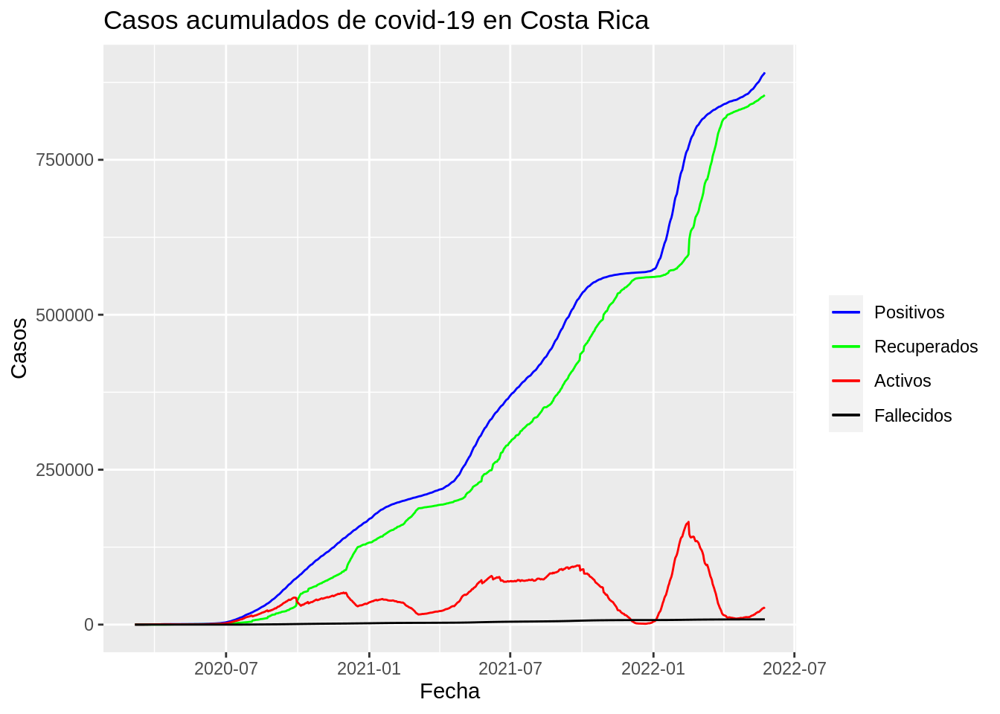

# (PART) III. Graficación estadística en R {-}

# Paquetes de R para graficación estadística

## Opciones generales
Se configuran opciones generales de la sesión R.


```r
# Configuración de la notación científica
options(scipen = 7)
```

## Trabajo previo

### Lecturas
Chang, W. (2018). *R graphics cookbook: Practical recipes for visualizing data*. O’Reilly. https://r-graphics.org/

Wickham, H., & Grolemund, G. (2017). *R for Data Science: Import, Tidy, Transform, Visualize, and Model Data* (capítulo 3). O’Reilly Media. https://r4ds.had.co.nz/

## Resumen
R proporciona una gran cantidad de funciones para la elaboración de gráficos estadísticos. En este capítulo, se describen algunos de los paquetes que contienen estas funciones y se ejemplifican varios tipos de gráficos.

## Paquetes
Se presentan ejemplos de los paquetes `graphics`, `ggplot2` y `plotly`. 

### graphics
[graphics](http://search.r-project.org/R/library/graphics/html/graphics-package.html) forma parte de la instalación base de R. Es muy versátil y permite construir una gran cantidad de tipos de gráficos. Sin embargo, estos graficos son estáticos y no ofrecen posibilidades de interacción con el usuario.

### ggplot2
[ggplot2](https://ggplot2.tidyverse.org/) es un sistema para la creación declarativa de gráficos, basado en el libro [*The Grammar of Graphics*, de Wilkinson et al.](https://www.springer.com/gp/book/9780387245447). El programador proporciona los datos, indica cuales variables mapear a las propiedades visuales (estéticas o *aesthetics*) de las geometrías y `ggplot2` trata de encargarse del resto de los detalles.

De acuerdo con *The Grammar of Graphics*, los componentes de un gráfico son:

- Un conjunto de datos y un mapeo de sus variables a elementos visuales o *aesthetics* (x, y, color tamaño, forma, etc.).
- Una o más capas, cada una con un objeto geométrico, una transformación estadística, un ajuste de posición y, opcionalmente, su propio conjunto de datos y de mapeos a elementos visuales.
- Una escala para cada mapeo de elementos visuales.
- Un sistema de coordenadas.
- Una especificación de *facets*.

`ggplot2` implementa estos componentes por medio de la función `ggplot()`, cuya sintaxis puede resumirse de la siguiente forma:

```
ggplot(data = <DATA>, mapping = aes(<MAPPINGS>)) + 
  <GEOM_FUNCTION>(
     mapping = aes(<MAPPINGS>),
     stat = <STAT>, 
     position = <POSITION>
  ) +
  <COORDINATE_FUNCTION> +
  <FACET_FUNCTION>
```

`ggplot2` provee más de 40 tipos de geometrías para gráficos (puntos, líneas, barras, histogramas, cajas, etc.) y los paquetes de extensión proporcionan aún más (ej. [https://exts.ggplot2.tidyverse.org/gallery/](https://exts.ggplot2.tidyverse.org/gallery/)). Para una explicación resumida de `ggplot2`, se recomienda [Data visualization with ggplot2::Cheat Sheet](https://raw.githubusercontent.com/rstudio/cheatsheets/main/data-visualization.pdf).

### plotly
[plotly R](https://plotly.com/r/) es una biblioteca para gráficos interactivos que forma parte de la familia de [Plotly](https://plotly.com/), la cual incluye bibliotecas para otros lenguajes como JavaScript, Python, Julia, F# y MATLAB. Es adecuada, por ejemplo, cuando los gráficos van a utilizarse en la Web. Incluye una función llamada `ggplotly()` que permite convertir gráficos de `ggplot2` a `plotly`.

### Instalación y carga
Seguidamente, se muestran las instrucciones para instalar y cargar estos paquetes. El paquete `graphics` forma parte de la instalación base de R, por lo que no necesita ser instalado ni cargado explícitamente.


```r
# Instalación de paquetes de graficación
install.packages("ggplot2")
install.packages("plotly")
```


```r
# Carga de paquetes de graficación
library(ggplot2)
library(plotly)
```

Adicionalmente, se cargan otros paquetes para importación y transformación de datos.


```r
# Carga de otros paquetes
library(readr) # paquete para transformación de datos
library(dplyr) # paquete para transformación de datos
```

Existen muchos otros paquetes de R para graficación, entre los que pueden mencionarse:

- [lattice](http://lattice.r-forge.r-project.org/): es especialmente utilizado para datos multivariados.
- [ggvis](https://ggvis.rstudio.com/): agrega interactividad a los gráficos de `ggplot2`.
- [rgl](https://github.com/dmurdoch/rgl): para gráficos en 3D.

## Conjuntos de datos para ejemplos
Para ejemplificar el uso de estos paquetes de graficación, se utilizarán varios conjuntos de datos. En esta sección, el contenido de estos conjuntos se muestra con el paquete [DT](https://rstudio.github.io/DT/), el cual despliega data frames como tablas en HTML con capacidades de filtrado, paginación, ordenamiento y otras.


```r
# Instalación del paquete DT
install.packages("DT")
```


```r
# Carga del paquete DT
library(DT)
```

Para cada conjunto de datos, se muestran los siguientes procesos del modelo de ciencia de datos: importación, transformación y visualización (en tablas).

### mtcars
[mtcars: *Motor Trend Car Road Tests*](https://rdrr.io/r/datasets/mtcars.html) contiene datos de aspectos de diseño y consumo de combustible para 32 modelos de automóviles. Es uno de los conjuntos de datos contenidos en la instalación base de R, por lo que no es necesario importarlo desde una fuente externa.

Transformación:


```r
# Transformación de datos de mtcars
mtcars <-
  datasets::mtcars %>%
  select(mpg, cyl, wt, gear)
```

Visualización en formato tabular:


```r
# Visualización de datos de mtcars en formato tabular
mtcars %>%
  datatable(options = list(
    pageLength = 5,
    language = list(url = '//cdn.datatables.net/plug-ins/1.10.11/i18n/Spanish.json')
  ))
```

```{=html}
<div id="htmlwidget-83baf80e48621ba6c189" style="width:100%;height:auto;" class="datatables html-widget"></div>
<script type="application/json" data-for="htmlwidget-83baf80e48621ba6c189">{"x":{"filter":"none","vertical":false,"data":[["Mazda RX4","Mazda RX4 Wag","Datsun 710","Hornet 4 Drive","Hornet Sportabout","Valiant","Duster 360","Merc 240D","Merc 230","Merc 280","Merc 280C","Merc 450SE","Merc 450SL","Merc 450SLC","Cadillac Fleetwood","Lincoln Continental","Chrysler Imperial","Fiat 128","Honda Civic","Toyota Corolla","Toyota Corona","Dodge Challenger","AMC Javelin","Camaro Z28","Pontiac Firebird","Fiat X1-9","Porsche 914-2","Lotus Europa","Ford Pantera L","Ferrari Dino","Maserati Bora","Volvo 142E"],[21,21,22.8,21.4,18.7,18.1,14.3,24.4,22.8,19.2,17.8,16.4,17.3,15.2,10.4,10.4,14.7,32.4,30.4,33.9,21.5,15.5,15.2,13.3,19.2,27.3,26,30.4,15.8,19.7,15,21.4],[6,6,4,6,8,6,8,4,4,6,6,8,8,8,8,8,8,4,4,4,4,8,8,8,8,4,4,4,8,6,8,4],[2.62,2.875,2.32,3.215,3.44,3.46,3.57,3.19,3.15,3.44,3.44,4.07,3.73,3.78,5.25,5.424,5.345,2.2,1.615,1.835,2.465,3.52,3.435,3.84,3.845,1.935,2.14,1.513,3.17,2.77,3.57,2.78],[4,4,4,3,3,3,3,4,4,4,4,3,3,3,3,3,3,4,4,4,3,3,3,3,3,4,5,5,5,5,5,4]],"container":"<table class=\"display\">\n  <thead>\n    <tr>\n      <th> <\/th>\n      <th>mpg<\/th>\n      <th>cyl<\/th>\n      <th>wt<\/th>\n      <th>gear<\/th>\n    <\/tr>\n  <\/thead>\n<\/table>","options":{"pageLength":5,"language":{"url":"//cdn.datatables.net/plug-ins/1.10.11/i18n/Spanish.json"},"columnDefs":[{"className":"dt-right","targets":[1,2,3,4]},{"orderable":false,"targets":0}],"order":[],"autoWidth":false,"orderClasses":false,"lengthMenu":[5,10,25,50,100]}},"evals":[],"jsHooks":[]}</script>
```

### Covid-19
Estos son datos publicados por el Ministerio de Salud de Costa Rica sobre la [situación nacional de covid-19](https://geovision.uned.ac.cr/oges/). Se distribuyen en archivos CSV, algunos correspondientes al nivel nacional y otros al nivel cantonal.

#### Datos nacionales
Este conjunto de datos contiene una observación por fecha y variables correspondientes a, entre otras, las cantidades de casos positivos, fallecidos, recuperados y activos a nivel nacional.

Importación:


```r
# Importación de datos nacionales de covid-19
covid_nacional <-
  read_delim(
    file = "datos/ministerio-salud/covid/05_24_22_CSV_GENERAL.csv",
    delim = ";",
    col_select = c("FECHA", "positivos", "fallecidos", "RECUPERADOS", "activos")
  )
```

Transformación:


```r
# Transformación de datos nacionales de covid-19
covid_nacional <-
  covid_nacional %>%
  select(fecha = FECHA,
         positivos,
         fallecidos,
         recuperados = RECUPERADOS,
         activos) %>%
  mutate(fecha = as.Date(fecha, format = "%d/%m/%Y"))
```

Visualización en formato tabular:


```r
# Visualización de datos nacionales de covid-19 en formato tabular
covid_nacional %>%
  datatable(options = list(
    pageLength = 5,
    language = list(url = '//cdn.datatables.net/plug-ins/1.10.11/i18n/Spanish.json')
  ))
```

```{=html}
<div id="htmlwidget-3196c238b0202c72450f" style="width:100%;height:auto;" class="datatables html-widget"></div>
<script type="application/json" data-for="htmlwidget-3196c238b0202c72450f">{"x":{"filter":"none","vertical":false,"data":[["1","2","3","4","5","6","7","8","9","10","11","12","13","14","15","16","17","18","19","20","21","22","23","24","25","26","27","28","29","30","31","32","33","34","35","36","37","38","39","40","41","42","43","44","45","46","47","48","49","50","51","52","53","54","55","56","57","58","59","60","61","62","63","64","65","66","67","68","69","70","71","72","73","74","75","76","77","78","79","80","81","82","83","84","85","86","87","88","89","90","91","92","93","94","95","96","97","98","99","100","101","102","103","104","105","106","107","108","109","110","111","112","113","114","115","116","117","118","119","120","121","122","123","124","125","126","127","128","129","130","131","132","133","134","135","136","137","138","139","140","141","142","143","144","145","146","147","148","149","150","151","152","153","154","155","156","157","158","159","160","161","162","163","164","165","166","167","168","169","170","171","172","173","174","175","176","177","178","179","180","181","182","183","184","185","186","187","188","189","190","191","192","193","194","195","196","197","198","199","200","201","202","203","204","205","206","207","208","209","210","211","212","213","214","215","216","217","218","219","220","221","222","223","224","225","226","227","228","229","230","231","232","233","234","235","236","237","238","239","240","241","242","243","244","245","246","247","248","249","250","251","252","253","254","255","256","257","258","259","260","261","262","263","264","265","266","267","268","269","270","271","272","273","274","275","276","277","278","279","280","281","282","283","284","285","286","287","288","289","290","291","292","293","294","295","296","297","298","299","300","301","302","303","304","305","306","307","308","309","310","311","312","313","314","315","316","317","318","319","320","321","322","323","324","325","326","327","328","329","330","331","332","333","334","335","336","337","338","339","340","341","342","343","344","345","346","347","348","349","350","351","352","353","354","355","356","357","358","359","360","361","362","363","364","365","366","367","368","369","370","371","372","373","374","375","376","377","378","379","380","381","382","383","384","385","386","387","388","389","390","391","392","393","394","395","396","397","398","399","400","401","402","403","404","405","406","407","408","409","410","411","412","413","414","415","416","417","418","419","420","421","422","423","424","425","426","427","428","429","430","431","432","433","434","435","436","437","438","439","440","441","442","443","444","445","446","447","448","449","450","451","452","453","454","455","456","457","458","459","460","461","462","463","464","465","466","467","468","469","470","471","472","473","474","475","476","477","478","479","480","481","482","483","484","485","486","487","488","489","490","491","492","493","494","495","496","497","498","499","500","501","502","503","504","505","506","507","508","509","510","511","512","513","514","515","516","517","518","519","520","521","522","523","524","525","526","527","528","529","530","531","532","533","534","535","536","537","538","539","540","541","542","543","544","545","546","547","548","549","550","551","552","553","554","555","556","557","558","559","560","561","562","563","564","565","566","567","568","569","570","571","572","573","574","575","576","577","578","579","580","581","582","583","584","585","586","587","588","589","590","591","592","593","594","595","596","597","598","599","600","601","602","603","604","605","606","607","608","609","610","611","612","613","614","615","616","617","618","619","620","621","622","623","624","625","626","627","628","629","630","631","632","633","634","635","636","637","638","639","640","641","642","643","644","645","646","647","648","649","650","651","652","653","654","655","656","657","658","659","660","661","662","663","664","665","666","667","668","669","670","671","672","673","674","675","676","677","678","679","680","681","682","683","684","685","686","687","688","689","690","691","692","693","694","695","696","697","698","699","700","701","702","703","704","705","706","707","708","709","710","711","712","713","714","715","716","717","718","719","720","721","722","723","724","725","726","727","728","729","730","731","732","733","734","735","736","737","738","739","740","741","742","743","744","745","746","747","748","749","750","751","752","753","754","755","756","757","758","759","760","761","762","763","764","765","766","767","768","769","770","771","772","773","774","775","776","777","778","779","780","781","782","783","784","785","786","787","788","789","790","791","792","793","794","795","796","797","798","799","800","801","802","803","804","805","806","807","808","809","810"],["2020-03-06","2020-03-07","2020-03-08","2020-03-09","2020-03-10","2020-03-11","2020-03-12","2020-03-13","2020-03-14","2020-03-15","2020-03-16","2020-03-17","2020-03-18","2020-03-19","2020-03-20","2020-03-21","2020-03-22","2020-03-23","2020-03-24","2020-03-25","2020-03-26","2020-03-27","2020-03-28","2020-03-29","2020-03-30","2020-03-31","2020-04-01","2020-04-02","2020-04-03","2020-04-04","2020-04-05","2020-04-06","2020-04-07","2020-04-08","2020-04-09","2020-04-10","2020-04-11","2020-04-12","2020-04-13","2020-04-14","2020-04-15","2020-04-16","2020-04-17","2020-04-18","2020-04-19","2020-04-20","2020-04-21","2020-04-22","2020-04-23","2020-04-24","2020-04-25","2020-04-26","2020-04-27","2020-04-28","2020-04-29","2020-04-30","2020-05-01","2020-05-02","2020-05-03","2020-05-04","2020-05-05","2020-05-06","2020-05-07","2020-05-08","2020-05-09","2020-05-10","2020-05-11","2020-05-12","2020-05-13","2020-05-14","2020-05-15","2020-05-16","2020-05-17","2020-05-18","2020-05-19","2020-05-20","2020-05-21","2020-05-22","2020-05-23","2020-05-24","2020-05-25","2020-05-26","2020-05-27","2020-05-28","2020-05-29","2020-05-30","2020-05-31","2020-06-01","2020-06-02","2020-06-03","2020-06-04","2020-06-05","2020-06-06","2020-06-07","2020-06-08","2020-06-09","2020-06-10","2020-06-11","2020-06-12","2020-06-13","2020-06-14","2020-06-15","2020-06-16","2020-06-17","2020-06-18","2020-06-19","2020-06-20","2020-06-21","2020-06-22","2020-06-23","2020-06-24","2020-06-25","2020-06-26","2020-06-27","2020-06-28","2020-06-29","2020-06-30","2020-07-01","2020-07-02","2020-07-03","2020-07-04","2020-07-05","2020-07-06","2020-07-07","2020-07-08","2020-07-09","2020-07-10","2020-07-11","2020-07-12","2020-07-13","2020-07-14","2020-07-15","2020-07-16","2020-07-17","2020-07-18","2020-07-19","2020-07-20","2020-07-21","2020-07-22","2020-07-23","2020-07-24","2020-07-25","2020-07-26","2020-07-27","2020-07-28","2020-07-29","2020-07-30","2020-07-31","2020-08-01","2020-08-02","2020-08-03","2020-08-04","2020-08-05","2020-08-06","2020-08-07","2020-08-08","2020-08-09","2020-08-10","2020-08-11","2020-08-12","2020-08-13","2020-08-14","2020-08-15","2020-08-16","2020-08-17","2020-08-18","2020-08-19","2020-08-20","2020-08-21","2020-08-22","2020-08-23","2020-08-24","2020-08-25","2020-08-26","2020-08-27","2020-08-28","2020-08-29","2020-08-30","2020-08-31","2020-09-01","2020-09-02","2020-09-03","2020-09-04","2020-09-05","2020-09-06","2020-09-07","2020-09-08","2020-09-09","2020-09-10","2020-09-11","2020-09-12","2020-09-13","2020-09-14","2020-09-15","2020-09-16","2020-09-17","2020-09-18","2020-09-19","2020-09-20","2020-09-21","2020-09-22","2020-09-23","2020-09-24","2020-09-25","2020-09-26","2020-09-27","2020-09-28","2020-09-29","2020-09-30","2020-10-01","2020-10-02","2020-10-03","2020-10-04","2020-10-05","2020-10-06","2020-10-07","2020-10-08","2020-10-09","2020-10-10","2020-10-11","2020-10-12","2020-10-13","2020-10-14","2020-10-15","2020-10-16","2020-10-17","2020-10-18","2020-10-19","2020-10-20","2020-10-21","2020-10-22","2020-10-23","2020-10-24","2020-10-25","2020-10-26","2020-10-27","2020-10-28","2020-10-29","2020-10-30","2020-10-31","2020-11-01","2020-11-02","2020-11-03","2020-11-04","2020-11-05","2020-11-06","2020-11-07","2020-11-08","2020-11-09","2020-11-10","2020-11-11","2020-11-12","2020-11-13","2020-11-14","2020-11-15","2020-11-16","2020-11-17","2020-11-18","2020-11-19","2020-11-20","2020-11-21","2020-11-22","2020-11-23","2020-11-24","2020-11-25","2020-11-26","2020-11-27","2020-11-28","2020-11-29","2020-11-30","2020-12-01","2020-12-02","2020-12-03","2020-12-04","2020-12-05","2020-12-06","2020-12-07","2020-12-08","2020-12-09","2020-12-10","2020-12-11","2020-12-12","2020-12-13","2020-12-14","2020-12-15","2020-12-16","2020-12-17","2020-12-18","2020-12-19","2020-12-20","2020-12-21","2020-12-22","2020-12-23","2020-12-24","2020-12-25","2020-12-26","2020-12-27","2020-12-28","2020-12-29","2020-12-30","2020-12-31","2021-01-01","2021-01-02","2021-01-03","2021-01-04","2021-01-05","2021-01-06","2021-01-07","2021-01-08","2021-01-09","2021-01-10","2021-01-11","2021-01-12","2021-01-13","2021-01-14","2021-01-15","2021-01-16","2021-01-17","2021-01-18","2021-01-19","2021-01-20","2021-01-21","2021-01-22","2021-01-23","2021-01-24","2021-01-25","2021-01-26","2021-01-27","2021-01-28","2021-01-29","2021-01-30","2021-01-31","2021-02-01","2021-02-02","2021-02-03","2021-02-04","2021-02-05","2021-02-06","2021-02-07","2021-02-08","2021-02-09","2021-02-10","2021-02-11","2021-02-12","2021-02-13","2021-02-14","2021-02-15","2021-02-16","2021-02-17","2021-02-18","2021-02-19","2021-02-20","2021-02-21","2021-02-22","2021-02-23","2021-02-24","2021-02-25","2021-02-26","2021-02-27","2021-02-28","2021-03-01","2021-03-02","2021-03-03","2021-03-04","2021-03-05","2021-03-06","2021-03-07","2021-03-08","2021-03-09","2021-03-10","2021-03-11","2021-03-12","2021-03-13","2021-03-14","2021-03-15","2021-03-16","2021-03-17","2021-03-18","2021-03-19","2021-03-20","2021-03-21","2021-03-22","2021-03-23","2021-03-24","2021-03-25","2021-03-26","2021-03-27","2021-03-28","2021-03-29","2021-03-30","2021-03-31","2021-04-01","2021-04-02","2021-04-03","2021-04-04","2021-04-05","2021-04-06","2021-04-07","2021-04-08","2021-04-09","2021-04-10","2021-04-11","2021-04-12","2021-04-13","2021-04-14","2021-04-15","2021-04-16","2021-04-17","2021-04-18","2021-04-19","2021-04-20","2021-04-21","2021-04-22","2021-04-23","2021-04-24","2021-04-25","2021-04-26","2021-04-27","2021-04-28","2021-04-29","2021-04-30","2021-05-01","2021-05-02","2021-05-03","2021-05-04","2021-05-05","2021-05-06","2021-05-07","2021-05-08","2021-05-09","2021-05-10","2021-05-11","2021-05-12","2021-05-13","2021-05-14","2021-05-15","2021-05-16","2021-05-17","2021-05-18","2021-05-19","2021-05-20","2021-05-21","2021-05-22","2021-05-23","2021-05-24","2021-05-25","2021-05-26","2021-05-27","2021-05-28","2021-05-29","2021-05-30","2021-05-31","2021-06-01","2021-06-02","2021-06-03","2021-06-04","2021-06-05","2021-06-06","2021-06-07","2021-06-08","2021-06-09","2021-06-10","2021-06-11","2021-06-12","2021-06-13","2021-06-14","2021-06-15","2021-06-16","2021-06-17","2021-06-18","2021-06-19","2021-06-20","2021-06-21","2021-06-22","2021-06-23","2021-06-24","2021-06-25","2021-06-26","2021-06-27","2021-06-28","2021-06-29","2021-06-30","2021-07-01","2021-07-02","2021-07-03","2021-07-04","2021-07-05","2021-07-06","2021-07-07","2021-07-08","2021-07-09","2021-07-10","2021-07-11","2021-07-12","2021-07-13","2021-07-14","2021-07-15","2021-07-16","2021-07-17","2021-07-18","2021-07-19","2021-07-20","2021-07-21","2021-07-22","2021-07-23","2021-07-24","2021-07-25","2021-07-26","2021-07-27","2021-07-28","2021-07-29","2021-07-30","2021-07-31","2021-08-01","2021-08-02","2021-08-03","2021-08-04","2021-08-05","2021-08-06","2021-08-07","2021-08-08","2021-08-09","2021-08-10","2021-08-11","2021-08-12","2021-08-13","2021-08-14","2021-08-15","2021-08-16","2021-08-17","2021-08-18","2021-08-19","2021-08-20","2021-08-21","2021-08-22","2021-08-23","2021-08-24","2021-08-25","2021-08-26","2021-08-27","2021-08-28","2021-08-29","2021-08-30","2021-08-31","2021-09-01","2021-09-02","2021-09-03","2021-09-04","2021-09-05","2021-09-06","2021-09-07","2021-09-08","2021-09-09","2021-09-10","2021-09-11","2021-09-12","2021-09-13","2021-09-14","2021-09-15","2021-09-16","2021-09-17","2021-09-18","2021-09-19","2021-09-20","2021-09-21","2021-09-22","2021-09-23","2021-09-24","2021-09-25","2021-09-26","2021-09-27","2021-09-28","2021-09-29","2021-09-30","2021-10-01","2021-10-02","2021-10-03","2021-10-04","2021-10-05","2021-10-06","2021-10-07","2021-10-08","2021-10-09","2021-10-10","2021-10-11","2021-10-12","2021-10-13","2021-10-14","2021-10-15","2021-10-16","2021-10-17","2021-10-18","2021-10-19","2021-10-20","2021-10-21","2021-10-22","2021-10-23","2021-10-24","2021-10-25","2021-10-26","2021-10-27","2021-10-28","2021-10-29","2021-10-30","2021-10-31","2021-11-01","2021-11-02","2021-11-03","2021-11-04","2021-11-05","2021-11-06","2021-11-07","2021-11-08","2021-11-09","2021-11-10","2021-11-11","2021-11-12","2021-11-13","2021-11-14","2021-11-15","2021-11-16","2021-11-17","2021-11-18","2021-11-19","2021-11-20","2021-11-21","2021-11-22","2021-11-23","2021-11-24","2021-11-25","2021-11-26","2021-11-27","2021-11-28","2021-11-29","2021-11-30","2021-12-01","2021-12-02","2021-12-03","2021-12-04","2021-12-05","2021-12-06","2021-12-07","2021-12-08","2021-12-09","2021-12-10","2021-12-11","2021-12-12","2021-12-13","2021-12-14","2021-12-15","2021-12-16","2021-12-17","2021-12-18","2021-12-19","2021-12-20","2021-12-21","2021-12-22","2021-12-23","2021-12-24","2021-12-25","2021-12-26","2021-12-27","2021-12-28","2021-12-29","2021-12-30","2021-12-31","2022-01-01","2022-01-02","2022-01-03","2022-01-04","2022-01-05","2022-01-06","2022-01-07","2022-01-08","2022-01-09","2022-01-10","2022-01-11","2022-01-12","2022-01-13","2022-01-14","2022-01-15","2022-01-16","2022-01-17","2022-01-18","2022-01-19","2022-01-20","2022-01-21","2022-01-22","2022-01-23","2022-01-24","2022-01-25","2022-01-26","2022-01-27","2022-01-28","2022-01-29","2022-01-30","2022-01-31","2022-02-01","2022-02-02","2022-02-03","2022-02-04","2022-02-05","2022-02-06","2022-02-07","2022-02-08","2022-02-09","2022-02-10","2022-02-11","2022-02-12","2022-02-13","2022-02-14","2022-02-15","2022-02-16","2022-02-17","2022-02-18","2022-02-19","2022-02-20","2022-02-21","2022-02-22","2022-02-23","2022-02-24","2022-02-25","2022-02-26","2022-02-27","2022-02-28","2022-03-01","2022-03-02","2022-03-03","2022-03-04","2022-03-05","2022-03-06","2022-03-07","2022-03-08","2022-03-09","2022-03-10","2022-03-11","2022-03-12","2022-03-13","2022-03-14","2022-03-15","2022-03-16","2022-03-17","2022-03-18","2022-03-19","2022-03-20","2022-03-21","2022-03-22","2022-03-23","2022-03-24","2022-03-25","2022-03-26","2022-03-27","2022-03-28","2022-03-29","2022-03-30","2022-03-31","2022-04-01","2022-04-02","2022-04-03","2022-04-04","2022-04-05","2022-04-06","2022-04-07","2022-04-08","2022-04-09","2022-04-10","2022-04-11","2022-04-12","2022-04-13","2022-04-14","2022-04-15","2022-04-16","2022-04-17","2022-04-18","2022-04-19","2022-04-20","2022-04-21","2022-04-22","2022-04-23","2022-04-24","2022-04-25","2022-04-26","2022-04-27","2022-04-28","2022-04-29","2022-04-30","2022-05-01","2022-05-02","2022-05-03","2022-05-04","2022-05-05","2022-05-06","2022-05-07","2022-05-08","2022-05-09","2022-05-10","2022-05-11","2022-05-12","2022-05-13","2022-05-14","2022-05-15","2022-05-16","2022-05-17","2022-05-18","2022-05-19","2022-05-20","2022-05-21","2022-05-22","2022-05-23","2022-05-24"],[2,7,10,12,13,22,23,26,27,35,41,50,69,87,113,117,134,158,177,201,231,263,295,314,330,347,375,396,416,435,454,467,483,502,539,558,577,595,612,618,626,642,649,655,660,662,669,681,686,687,693,695,697,705,713,719,725,733,739,742,755,761,765,773,780,792,801,804,815,830,843,853,863,866,882,897,903,911,918,930,951,956,984,1000,1022,1047,1056,1084,1105,1157,1194,1228,1263,1318,1342,1375,1461,1538,1612,1662,1715,1744,1796,1871,1939,2058,2127,2213,2277,2368,2515,2684,2836,2979,3130,3269,3459,3753,4023,4311,4621,4996,5241,5486,5836,6485,6845,7231,7596,8036,8482,8986,9546,9969,10551,11114,11534,11811,12361,13129,13669,14600,15229,15841,16344,16800,17290,17820,18187,19015,19464,20005,20683,21445,22081,22802,23286,23872,24624,25303,26129,26931,27737,28465,29084,29643,30409,31075,32134,33084,33820,34463,35305,36307,37292,38485,39699,40546,41287,42184,43305,44458,45680,46920,47947,48780,49897,51224,52549,53969,55454,56424,57361,58138,59516,60818,62374,63712,64899,65602,66689,68059,69459,70816,72049,72984,73714,74604,75760,76828,77829,79182,80407,81129,82142,83497,84828,86053,87439,88490,89223,90238,91780,93152,94348,95514,96443,97075,97922,99425,100616,101826,103088,103949,104460,105322,106553,107570,108866,109971,110717,111257,112120,113261,114367,115417,116363,117099,117587,118566,119768,120939,122123,123223,123949,124592,125590,127012,128231,129418,130722,131677,132295,133190,134520,135742,137093,138248,139099,139638,140172,141340,142505,143685,144891,145845,146421,147430,148688,149815,150947,152096,152620,153169,154096,155263,156388,157472,158491,159258,159893,160804,161942,162990,164062,164607,165204,165762,166799,168114,169321,170591,171130,171719,172436,173591,175038,176407,177614,178649,179405,180061,181093,182156,183242,184187,185145,185653,186016,186877,187712,188477,189308,189959,190390,190745,191345,192066,192637,193276,193844,194280,194569,195009,195537,195992,196438,196944,197225,197435,197852,198338,198756,199187,199577,199842,200024,200454,200888,201241,201678,202227,202466,202674,203097,203496,203914,204341,204706,204906,205086,205514,205890,206293,206640,207056,207272,207460,207832,208244,208717,209093,209573,209840,210016,210447,210948,211433,211903,212390,212670,212925,213438,213999,214608,215178,215706,216010,216268,216764,217346,217884,218156,218449,218808,219162,219846,220753,221630,222544,223435,223917,224386,225343,226412,227533,228577,229637,230301,230837,231967,233498,235274,236930,238760,240037,241240,243167,245601,248382,250991,252982,254821,256676,257980,260535,263094,265486,267515,269978,271478,273714,276887,279926,282741,285536,287304,288626,290920,293820,296632,299219,301664,303390,304529,306899,309486,311922,314102,316440,317845,318986,321279,323598,325779,327979,329815,330992,331920,333820,336007,338048,339900,341542,342738,343604,345312,347157,349026,350630,352212,353298,354095,355620,357523,359266,361005,362568,363512,364304,366161,367938,369540,371206,372641,373634,374324,375812,377091,378938,380482,381878,382715,383500,385069,386722,388298,389798,391067,392039,392781,394135,395667,397469,398608,399751,400574,401188,402044,403511,405206,406814,408200,409160,410180,411123,412918,414745,416677,418351,419574,420462,422344,424472,426474,428295,430087,431271,432149,434081,436276,438587,440647,442695,443962,445442,447672,450291,452997,455784,458062,459691,461145,463726,466574,469565,472315,474663,476709,478144,481100,483984,486959,489784,492330,493979,495360,496736,499461,502362,505163,507512,509139,510653,513384,515931,518632,521182,523453,524821,525999,528077,530113,532185,533873,535943,537035,537916,539422,541036,542653,544021,545276,546030,546595,547914,549084,550134,551144,552093,552595,552953,553661,554604,555352,555970,556707,557057,557333,557922,558654,559250,559698,560118,560344,560563,561054,561432,561829,562316,562655,562812,562966,563290,563610,563924,564159,564378,564544,564662,564901,565096,565347,565548,565740,565881,565952,566119,566296,566429,566560,566753,566845,566921,566988,567138,567263,567383,567507,567563,567614,567706,567824,567906,567995,568069,568165,568224,568305,568373,568428,568538,568641,568684,568755,568860,569023,569260,569523,569908,570018,570135,570556,570960,571481,572548,573293,573843,574371,575871,578413,581394,584547,587921,589788,591988,596388,601070,605819,609882,614593,617762,620587,625952,631311,637327,643496,648890,653129,656348,661684,668209,675178,682480,688501,691925,694865,701471,708560,715749,721971,727537,730962,733708,739844,745949,751605,757093,761728,764435,766520,771027,775318,779323,783437,786490,788669,790444,793835,797030,799826,802472,804627,805664,806928,809131,811040,812812,814583,815945,816718,817538,818996,820445,821813,822935,823915,824704,825158,826251,827346,828442,829400,830299,830728,831152,832054,832966,833909,834726,835452,835849,836218,837086,837828,838537,839368,840015,840383,840658,841343,842050,842770,843484,843992,844315,844604,844892,845432,845920,846142,846351,846687,846997,847784,848469,849199,849865,850584,851021,851363,852074,852871,853833,854597,855321,855829,856258,857290,858686,860167,861715,862879,863693,864577,866274,867968,869828,871675,873092,874419,875499,877533,879696,882201,884375,886017,887425,888800,891038],[0,0,0,0,0,0,0,0,0,0,0,0,0,1,2,2,2,2,2,2,2,2,2,2,2,2,2,2,2,2,2,2,2,2,3,3,3,3,3,3,4,4,4,4,4,6,6,6,6,6,6,6,6,6,6,6,6,6,6,6,6,6,6,6,6,6,7,7,7,8,8,10,10,10,10,10,10,10,10,10,10,10,10,10,10,10,10,10,10,10,10,10,10,10,10,11,12,12,12,12,12,12,12,12,12,12,12,12,12,12,12,12,12,13,15,15,16,16,17,18,18,19,23,23,24,25,26,28,30,31,36,40,42,47,54,62,66,68,71,80,87,98,104,115,125,133,140,150,154,162,171,181,191,200,218,228,235,244,255,263,272,281,291,294,304,314,321,333,340,348,355,362,376,386,397,407,418,429,436,443,453,460,469,478,491,510,531,543,567,583,590,605,621,633,649,666,686,706,727,745,760,781,795,812,828,847,861,880,904,917,930,950,971,987,1004,1024,1040,1055,1076,1090,1108,1124,1134,1159,1168,1183,1194,1204,1222,1236,1251,1265,1282,1298,1312,1329,1340,1357,1371,1385,1396,1404,1419,1431,1444,1453,1464,1476,1491,1502,1513,1527,1537,1546,1555,1566,1578,1588,1599,1608,1624,1634,1641,1662,1674,1679,1690,1700,1715,1726,1731,1739,1757,1773,1793,1810,1825,1846,1864,1882,1895,1913,1921,1936,1956,1967,1980,1996,2011,2023,2037,2051,2065,2086,2103,2117,2134,2144,2156,2171,2185,2193,2205,2218,2229,2248,2267,2286,2305,2322,2338,2353,2367,2384,2401,2416,2433,2449,2458,2477,2492,2506,2518,2532,2543,2558,2567,2584,2599,2604,2612,2627,2634,2641,2650,2662,2672,2680,2687,2692,2698,2701,2710,2714,2719,2723,2730,2737,2745,2756,2763,2771,2777,2782,2785,2793,2796,2800,2803,2806,2812,2820,2824,2829,2833,2835,2838,2841,2848,2852,2859,2862,2867,2875,2881,2886,2891,2894,2896,2897,2900,2904,2908,2914,2923,2931,2936,2942,2949,2957,2965,2970,2974,2981,2983,2992,3000,3004,3011,3018,3024,3030,3036,3044,3054,3065,3071,3084,3091,3099,3104,3115,3125,3136,3143,3158,3168,3186,3202,3217,3231,3254,3266,3290,3310,3326,3341,3365,3386,3409,3430,3456,3482,3514,3547,3571,3593,3625,3673,3696,3736,3765,3797,3820,3849,3877,3908,3929,3962,3993,4022,4041,4074,4098,4124,4153,4175,4205,4228,4251,4278,4298,4322,4346,4369,4388,4407,4437,4459,4473,4490,4506,4530,4546,4567,4581,4602,4614,4629,4648,4661,4667,4674,4686,4703,4718,4726,4740,4753,4760,4773,4786,4794,4812,4829,4842,4857,4874,4880,4895,4906,4915,4925,4933,4941,4949,4966,4981,4987,4997,5013,5030,5042,5048,5059,5070,5087,5108,5124,5136,5144,5162,5169,5185,5199,5211,5225,5236,5255,5269,5284,5296,5312,5330,5342,5361,5378,5394,5417,5431,5457,5471,5492,5506,5523,5540,5568,5593,5618,5642,5673,5702,5721,5754,5780,5805,5832,5851,5889,5919,5949,5991,6023,6056,6098,6128,6168,6189,6214,6249,6277,6316,6349,6386,6413,6441,6468,6494,6522,6553,6584,6612,6641,6664,6698,6718,6744,6771,6797,6819,6836,6857,6880,6895,6927,6946,6960,6974,6983,6997,7008,7021,7029,7047,7060,7078,7093,7111,7124,7134,7144,7156,7164,7176,7183,7190,7197,7204,7214,7223,7231,7241,7248,7251,7254,7257,7264,7271,7280,7284,7287,7289,7292,7296,7299,7305,7309,7312,7315,7317,7318,7324,7324,7328,7332,7333,7333,7333,7333,7336,7336,7340,7340,7340,7342,7343,7343,7345,7349,7351,7352,7352,7353,7354,7357,7357,7358,7361,7363,7366,7369,7370,7372,7379,7381,7382,7386,7394,7401,7406,7413,7415,7421,7425,7434,7441,7451,7462,7470,7483,7492,7505,7521,7533,7547,7555,7575,7593,7605,7621,7641,7658,7676,7694,7712,7730,7752,7772,7784,7798,7806,7829,7847,7874,7894,7906,7919,7936,7954,7969,7984,7999,8013,8031,8037,8047,8057,8073,8082,8097,8113,8121,8136,8142,8149,8160,8171,8178,8186,8192,8202,8215,8226,8232,8235,8244,8256,8261,8263,8266,8271,8273,8278,8288,8298,8300,8308,8313,8316,8320,8327,8332,8340,8343,8347,8352,8356,8357,8361,8363,8365,8369,8374,8378,8383,8388,8394,8397,8400,8402,8404,8405,8406,8408,8410,8413,8414,8417,8421,8427,8429,8433,8437,8440,8441,8444,8451,8453,8459,8461,8464,8466,8472,8473,8477,8481,8486,8489,8490,8495],[0,0,0,0,0,0,0,0,0,0,0,0,0,0,0,2,2,2,2,2,2,3,3,3,4,4,4,6,11,13,16,18,24,29,30,42,49,56,62,66,67,74,88,97,112,124,150,180,196,216,242,264,287,306,323,338,355,372,386,399,413,428,445,461,480,501,517,520,527,535,542,551,565,575,577,582,592,600,607,620,628,634,639,646,653,658,669,676,682,685,687,695,701,704,712,717,722,722,731,743,752,771,794,899,937,982,1014,1032,1043,1129,1210,1227,1280,1325,1366,1394,1436,1516,1589,1657,1721,1745,1766,1810,1929,2023,2110,2220,2239,2304,2441,2551,2673,2818,2902,2966,3019,3194,3322,3448,3505,3640,3736,3824,3920,4050,4280,4404,4531,4585,4689,6590,6851,7038,7266,7589,7730,7823,7971,8189,8412,8785,9010,9062,9233,9462,9660,9939,10159,10372,10518,12758,13073,13317,14471,14664,15737,15970,16056,16270,16512,17855,18053,18211,18445,19083,19285,19544,20322,20710,20928,21069,21206,21536,21752,22662,23168,23552,23842,25127,25706,26136,26554,27023,27760,28582,29420,30703,37841,39843,42621,45007,47549,49703,50020,50295,51782,52327,52669,53083,53247,53670,54155,57731,58269,58816,59049,59580,60109,60738,61162,61662,62037,62222,63709,64406,64996,65666,66202,66719,66937,68129,68604,69143,70002,70421,71119,71201,72249,72941,73509,74255,74868,75341,75691,77164,77558,78238,78851,79372,80272,80349,81336,81973,82611,83273,84991,85489,85639,87526,87721,88226,91424,95789,98610,100920,102855,105686,107624,109855,112622,114781,116755,118511,121031,122947,124907,125488,125795,126171,126777,127618,128216,128842,129110,129216,129281,130289,130989,131507,131923,132482,132563,132743,132916,133607,134911,135475,136083,136922,137141,138631,139297,139967,140573,141374,142017,142106,142245,144030,144877,145724,146448,147373,148115,149149,149808,150748,151382,151952,152539,152619,153063,154227,155045,155581,156181,157740,157996,158283,158820,159586,160462,160946,161230,162352,163334,165439,166979,168307,169053,170613,171776,172280,173591,174096,175883,177099,178845,179992,181851,183911,185045,186093,187484,187813,187869,187975,188151,188211,188741,188967,189286,189370,189480,189682,189904,190039,190236,190434,190489,190726,190950,191179,191448,191707,191922,191996,192394,192699,192951,193140,193256,193543,193573,193644,193857,194256,194509,194760,195311,195645,195665,196060,196574,196752,196974,197339,197506,197842,199166,199379,199779,199982,200408,200721,201264,201784,202215,202593,203009,203523,204460,205467,206319,209335,211043,212525,213021,213890,214788,216191,217684,219105,221903,222934,223737,224354,225158,225950,226667,228589,229362,230243,230635,231319,238971,239917,242019,242952,243144,243495,244582,245708,246686,247905,248793,248960,249209,252688,258822,259872,261195,262422,262757,262852,265255,266249,267769,272128,276896,277587,278225,281042,283935,285356,287248,288822,289235,289545,292078,293532,294872,296096,298341,298830,299908,300983,301726,304395,305426,305803,305829,307274,308570,311761,312474,313223,315202,316298,317290,318436,319731,321048,322423,323078,323238,324233,325139,326649,327249,329639,332296,333246,334067,334117,334759,335510,337423,339021,340645,342399,343769,345990,348388,350100,350729,350738,350763,351179,352332,353231,354010,354742,356152,357239,359834,361094,364651,366572,368468,369875,370724,372694,374630,375472,377597,380111,381327,384354,386971,388529,391285,392993,394399,395941,397228,400677,402981,404719,406660,408496,409538,411679,413729,416119,418345,420204,421861,423169,425077,426385,436577,437328,438817,440335,441271,449132,450535,452419,453789,454977,457799,458781,461980,464073,465762,468136,470056,472534,473618,476731,479169,480720,482679,484431,486035,488065,489113,490672,491197,492619,500425,501866,503647,505468,505709,508060,511455,513693,515782,516767,518156,519077,520251,522460,524560,526432,528317,530682,534171,534757,535289,535912,538241,539244,540478,541156,541578,543602,543875,544648,545665,546938,548020,549108,550529,552158,553910,555304,555649,556781,557620,558201,558639,558822,558961,559232,559282,559381,559496,559654,559754,559869,559941,560239,560290,560443,560492,560510,560529,560667,560709,560804,560844,560968,560999,561066,561116,561409,561587,561676,561829,561858,561897,562187,562617,563096,563353,564198,564310,564468,565370,566253,566893,567581,570481,570870,571693,571750,571971,572102,572137,573010,573396,574473,574517,576502,577717,578848,580204,581281,582256,584051,585448,587261,589231,591090,592444,593523,595250,597452,621554,629174,635012,637258,639353,640463,644514,651477,657323,659607,661941,664367,667558,673294,679146,682991,686840,691566,696754,705529,711766,714949,717893,718278,722969,728201,733664,739726,743751,748263,755691,760104,764164,769101,773722,780034,786453,792603,796116,800110,802967,806620,811186,813807,815710,816690,817646,818430,820853,822480,823137,823376,824051,824625,825333,825599,826396,827212,827541,828100,828642,828872,829515,829943,830842,830942,831352,831866,832409,832853,833046,833832,834326,834801,835382,835979,836721,838109,839042,839657,840152,840461,841048,841683,843190,843650,844533,845301,845647,846755,848035,848885,850261,851112,851674,852387,853453,854426],[2,7,10,12,13,22,23,26,27,35,41,50,69,86,111,113,130,154,173,197,227,258,290,309,324,341,369,388,403,420,436,447,457,471,506,513,525,536,547,549,555,564,557,554,544,532,513,495,484,465,445,425,404,393,384,375,364,355,347,337,336,327,314,306,294,285,277,277,281,287,293,292,288,281,295,305,301,301,301,300,313,312,335,344,359,379,377,398,413,462,497,523,552,604,620,647,727,804,869,907,951,961,990,960,990,1064,1101,1169,1222,1227,1293,1445,1544,1641,1749,1860,2007,2221,2417,2636,2882,3232,3452,3653,3883,4437,4709,4983,5327,5701,6005,6395,6831,7104,7595,8086,8449,8549,8968,9601,10077,10862,11389,11902,12299,12617,12870,13266,13502,14268,14604,13234,13641,14207,14597,14985,15321,15805,16398,16851,17445,17865,18436,19109,19547,19867,20428,20803,21635,22364,22947,21343,21856,22604,22424,23414,23544,24147,24795,25471,26340,26143,27158,28231,29011,29187,30081,31137,31660,32676,33936,34750,35534,35969,37115,37490,38520,39454,40330,39730,40223,41142,42110,42981,43461,43555,43433,43021,37015,36068,34278,33225,31887,30439,31118,32178,32006,32671,33694,34317,34868,35444,36491,34262,34911,35515,36200,36291,36591,37451,38203,38899,39769,40429,39439,39587,40217,40547,41293,41867,42384,41724,42097,42687,42921,43543,43780,44422,43847,44123,44746,45157,45718,46336,46703,45862,46454,47186,47781,48438,48826,49694,49318,49555,50235,50790,50412,51059,51745,50386,50720,51375,49324,46123,44488,43115,41741,39898,39200,38078,36430,35402,33944,32722,31109,30349,29501,29988,30685,31064,31079,31135,31661,32062,32849,33274,33789,33329,33654,34436,35213,35916,36362,36758,37291,37736,37860,38646,39226,39405,39926,39077,39429,39805,40268,40397,40695,41098,41313,40370,40343,40247,40342,40054,39732,39038,38970,38734,38656,38720,38693,39034,38872,38141,37842,37749,37585,36524,36542,36460,36334,36051,35584,35527,35628,34767,33960,32278,31164,30178,29862,28843,27913,27612,26721,26607,25235,24442,23058,22108,20423,18783,18021,17371,16323,16408,16565,16644,16833,17181,17117,17264,17420,17595,17655,17879,18153,18500,18771,19059,19281,19295,19580,19906,20237,20540,20848,21072,20925,21108,21430,21774,21926,21925,22252,22526,22989,23493,24110,24766,25100,25242,25685,26239,26784,27716,28532,29214,29704,29896,29697,31004,32370,33812,35209,36158,36808,38197,40184,42572,44751,46205,47095,47919,48351,47874,48710,49596,51108,52679,53260,54067,55721,57307,57291,59031,59974,60647,62089,64174,66229,66865,68505,69327,70045,71703,66607,68076,68121,69495,70679,71450,72623,73792,74969,75921,76847,77827,78483,76881,72907,73878,74383,74774,75612,76364,75650,76471,76798,74029,70826,71205,71340,70032,69021,69329,69155,69132,69648,70111,69422,69739,69994,70424,69597,70086,69690,70089,70612,69783,70283,71289,72092,71414,71670,70119,70967,71701,70985,70846,70585,70784,71011,71488,71244,71724,72370,71974,71918,71865,72944,72145,70862,70866,71054,71936,73072,74127,74130,74194,73785,72901,73406,73297,72887,72984,74133,75297,76131,77633,78660,80060,81325,82623,82468,82842,82460,83803,82929,83781,84137,84345,84929,85526,86421,88553,89150,88959,89764,88148,88456,89753,89953,91037,92151,92233,92300,90208,90591,91724,92554,93025,93578,92918,93557,93684,94119,94789,95378,95403,94645,95376,87187,88471,88643,89167,89296,82290,82365,82064,82280,82432,80836,80585,77917,77123,76578,75227,74291,72740,72141,69365,67612,66989,65746,64593,63712,62018,61237,60253,60449,59610,52244,51205,49637,48017,48252,46261,43250,41489,39729,38889,37646,37037,36176,34274,32402,30742,29013,26757,23499,23098,22810,22385,20245,19380,18210,17692,17438,15543,15398,14816,13888,12687,11669,10725,9425,7913,6282,4942,4647,3601,2880,2377,2024,1914,1871,1659,1690,1656,1596,1544,1547,1475,1472,1278,1390,1472,1682,2047,2137,2116,2494,2802,3280,4223,4936,5416,5892,7096,9457,12348,15346,18684,20510,22419,26385,30580,35065,38278,42870,45879,47796,52274,56984,62305,65564,70558,73966,77115,82221,88602,95520,101937,107558,109897,112773,117376,123238,129280,134126,138598,141030,141963,146684,150958,154622,158231,161500,163114,163464,165746,145917,142275,140531,141326,141397,142045,141367,137584,134519,134866,134673,133266,131333,127790,123837,121748,119661,116282,111851,103888,99094,97354,95771,96497,92775,88325,83308,78333,75393,71964,65483,61963,58329,53807,50076,44671,39193,33857,31065,27466,24973,22178,18344,16430,15350,15012,14421,13908,12163,11238,11293,11765,11594,11338,10915,10936,10675,10345,10236,9882,9671,9747,9886,10138,9963,10526,10832,10753,10550,10816,11419,11593,11861,12107,12033,11862,12148,12150,12696,13625,14290,14792,15088,16147,16327,17725,18683,19330,20308,20278,21026,22338,23463,24782,25857,26549,26857,28117]],"container":"<table class=\"display\">\n  <thead>\n    <tr>\n      <th> <\/th>\n      <th>fecha<\/th>\n      <th>positivos<\/th>\n      <th>fallecidos<\/th>\n      <th>recuperados<\/th>\n      <th>activos<\/th>\n    <\/tr>\n  <\/thead>\n<\/table>","options":{"pageLength":5,"language":{"url":"//cdn.datatables.net/plug-ins/1.10.11/i18n/Spanish.json"},"columnDefs":[{"className":"dt-right","targets":[2,3,4,5]},{"orderable":false,"targets":0}],"order":[],"autoWidth":false,"orderClasses":false,"lengthMenu":[5,10,25,50,100]}},"evals":[],"jsHooks":[]}</script>
```

#### Casos positivos por cantón
Este conjunto de datos contiene una observación por cantón y variables correspondientes a la cantidad de casos positivos para cada fecha. En los ejemplos siguientes, se utiliza solamente la variable correspondiente a la fecha máxima.

Importación:


```r
# Importación de casos positivos de covid-19 por cantón
covid_cantonal_positivos <-
  read_delim(
    file = "datos/ministerio-salud/covid/05_24_22_CSV_POSITIVOS.csv",
    delim = ";",
    locale = locale(encoding = "WINDOWS-1252"), # esto es para resolver el problema con las tildes
    col_select = c("canton", "24/05/2022")
  )
```

Transformación:


```r
# Transformación de casos positivos de covid-19 por cantón
covid_cantonal_positivos <-
  covid_cantonal_positivos %>%
  rename(positivos = '24/05/2022') %>% # renombramiento de columna
  filter(!is.na(canton) & canton != "Otros") # borrado de filas con valor NA u "Otros" en la columna canton
```

Visualización en formato tabular:


```r
# Visualización de casos positivos de covid-19 por cantón en formato tabular
covid_cantonal_positivos %>%
  datatable(options = list(
    pageLength = 5,
    language = list(url = '//cdn.datatables.net/plug-ins/1.10.11/i18n/Spanish.json')
  ))
```

```{=html}
<div id="htmlwidget-beeb272b5a7df5b040f0" style="width:100%;height:auto;" class="datatables html-widget"></div>
<script type="application/json" data-for="htmlwidget-beeb272b5a7df5b040f0">{"x":{"filter":"none","vertical":false,"data":[["1","2","3","4","5","6","7","8","9","10","11","12","13","14","15","16","17","18","19","20","21","22","23","24","25","26","27","28","29","30","31","32","33","34","35","36","37","38","39","40","41","42","43","44","45","46","47","48","49","50","51","52","53","54","55","56","57","58","59","60","61","62","63","64","65","66","67","68","69","70","71","72","73","74","75","76","77","78","79","80","81","82"],["Acosta","Alajuelita","Aserrí","Curridabat","Desamparados","Dota","Escazú","Goicoechea","León Cortés Castro","Montes de Oca","Mora","Moravia","Pérez Zeledón","Puriscal","San José","Santa Ana","Tarrazú","Tibás","Turrubares","Vázquez de Coronado","Alajuela","Atenas","Grecia","Guatuso","Los Chiles","Naranjo","Orotina","Palmares","Poás","Río Cuarto","San Carlos","San Mateo","San Ramón","Sarchí","Upala","Zarcero","Alvarado","Cartago","El Guarco","Jiménez","La Unión","Oreamuno","Paraíso","Turrialba","Barva","Belén","Flores","Heredia","San Isidro","San Pablo","San Rafael","Santa Barbara","Santo Domingo","Sarapiquí","Abangares","Bagaces","Cañas","Carrillo","Hojancha","La Cruz","Liberia","Nandayure","Nicoya","Santa Cruz","Tilarán","Buenos Aires","Corredores","Coto Brus","Esparza","Garabito","Golfito","Montes de Oro","Osa","Parrita","Puntarenas","Quepos","Guácimo","Limón","Matina","Pococí","Siquirres","Talamanca"],[4008,18763,10729,14268,42762,824,14813,25132,1331,9784,6952,10775,20669,5128,78852,15044,1938,14945,583,13668,63617,5907,12936,3088,3576,8757,4162,7941,6494,1516,32140,911,12463,3702,7173,2535,1820,32750,9523,1584,20099,9294,8709,8011,8674,5843,5683,30994,5253,6334,10136,8067,10136,7474,3251,3108,4047,7196,1288,3824,12547,1500,9119,11666,2759,5264,8574,5355,7345,6407,6232,3074,5452,3373,27719,7067,7758,16775,5785,20243,10265,5425]],"container":"<table class=\"display\">\n  <thead>\n    <tr>\n      <th> <\/th>\n      <th>canton<\/th>\n      <th>positivos<\/th>\n    <\/tr>\n  <\/thead>\n<\/table>","options":{"pageLength":5,"language":{"url":"//cdn.datatables.net/plug-ins/1.10.11/i18n/Spanish.json"},"columnDefs":[{"className":"dt-right","targets":2},{"orderable":false,"targets":0}],"order":[],"autoWidth":false,"orderClasses":false,"lengthMenu":[5,10,25,50,100]}},"evals":[],"jsHooks":[]}</script>
```

### diamonds
[diamonds: *Prices of over 50,000 round cut diamonds*](https://rdrr.io/github/tidyverse/ggplot2/man/diamonds.html) contiene los precios y otros atributos de casi 54000 diamantes. Este conjunto de datos está incluído en el paquete `ggplot2`.


```r
# Visualización de una muestra de 1000 observaciones de diamonds en formato tabular
diamonds %>%
  sample_n(1000) %>%
  datatable(options = list(
    pageLength = 5,
    language = list(url = '//cdn.datatables.net/plug-ins/1.10.11/i18n/Spanish.json')
  ))
```

```{=html}
<div id="htmlwidget-479994e5ed6f72fc2b54" style="width:100%;height:auto;" class="datatables html-widget"></div>
<script type="application/json" data-for="htmlwidget-479994e5ed6f72fc2b54">{"x":{"filter":"none","vertical":false,"data":[["1","2","3","4","5","6","7","8","9","10","11","12","13","14","15","16","17","18","19","20","21","22","23","24","25","26","27","28","29","30","31","32","33","34","35","36","37","38","39","40","41","42","43","44","45","46","47","48","49","50","51","52","53","54","55","56","57","58","59","60","61","62","63","64","65","66","67","68","69","70","71","72","73","74","75","76","77","78","79","80","81","82","83","84","85","86","87","88","89","90","91","92","93","94","95","96","97","98","99","100","101","102","103","104","105","106","107","108","109","110","111","112","113","114","115","116","117","118","119","120","121","122","123","124","125","126","127","128","129","130","131","132","133","134","135","136","137","138","139","140","141","142","143","144","145","146","147","148","149","150","151","152","153","154","155","156","157","158","159","160","161","162","163","164","165","166","167","168","169","170","171","172","173","174","175","176","177","178","179","180","181","182","183","184","185","186","187","188","189","190","191","192","193","194","195","196","197","198","199","200","201","202","203","204","205","206","207","208","209","210","211","212","213","214","215","216","217","218","219","220","221","222","223","224","225","226","227","228","229","230","231","232","233","234","235","236","237","238","239","240","241","242","243","244","245","246","247","248","249","250","251","252","253","254","255","256","257","258","259","260","261","262","263","264","265","266","267","268","269","270","271","272","273","274","275","276","277","278","279","280","281","282","283","284","285","286","287","288","289","290","291","292","293","294","295","296","297","298","299","300","301","302","303","304","305","306","307","308","309","310","311","312","313","314","315","316","317","318","319","320","321","322","323","324","325","326","327","328","329","330","331","332","333","334","335","336","337","338","339","340","341","342","343","344","345","346","347","348","349","350","351","352","353","354","355","356","357","358","359","360","361","362","363","364","365","366","367","368","369","370","371","372","373","374","375","376","377","378","379","380","381","382","383","384","385","386","387","388","389","390","391","392","393","394","395","396","397","398","399","400","401","402","403","404","405","406","407","408","409","410","411","412","413","414","415","416","417","418","419","420","421","422","423","424","425","426","427","428","429","430","431","432","433","434","435","436","437","438","439","440","441","442","443","444","445","446","447","448","449","450","451","452","453","454","455","456","457","458","459","460","461","462","463","464","465","466","467","468","469","470","471","472","473","474","475","476","477","478","479","480","481","482","483","484","485","486","487","488","489","490","491","492","493","494","495","496","497","498","499","500","501","502","503","504","505","506","507","508","509","510","511","512","513","514","515","516","517","518","519","520","521","522","523","524","525","526","527","528","529","530","531","532","533","534","535","536","537","538","539","540","541","542","543","544","545","546","547","548","549","550","551","552","553","554","555","556","557","558","559","560","561","562","563","564","565","566","567","568","569","570","571","572","573","574","575","576","577","578","579","580","581","582","583","584","585","586","587","588","589","590","591","592","593","594","595","596","597","598","599","600","601","602","603","604","605","606","607","608","609","610","611","612","613","614","615","616","617","618","619","620","621","622","623","624","625","626","627","628","629","630","631","632","633","634","635","636","637","638","639","640","641","642","643","644","645","646","647","648","649","650","651","652","653","654","655","656","657","658","659","660","661","662","663","664","665","666","667","668","669","670","671","672","673","674","675","676","677","678","679","680","681","682","683","684","685","686","687","688","689","690","691","692","693","694","695","696","697","698","699","700","701","702","703","704","705","706","707","708","709","710","711","712","713","714","715","716","717","718","719","720","721","722","723","724","725","726","727","728","729","730","731","732","733","734","735","736","737","738","739","740","741","742","743","744","745","746","747","748","749","750","751","752","753","754","755","756","757","758","759","760","761","762","763","764","765","766","767","768","769","770","771","772","773","774","775","776","777","778","779","780","781","782","783","784","785","786","787","788","789","790","791","792","793","794","795","796","797","798","799","800","801","802","803","804","805","806","807","808","809","810","811","812","813","814","815","816","817","818","819","820","821","822","823","824","825","826","827","828","829","830","831","832","833","834","835","836","837","838","839","840","841","842","843","844","845","846","847","848","849","850","851","852","853","854","855","856","857","858","859","860","861","862","863","864","865","866","867","868","869","870","871","872","873","874","875","876","877","878","879","880","881","882","883","884","885","886","887","888","889","890","891","892","893","894","895","896","897","898","899","900","901","902","903","904","905","906","907","908","909","910","911","912","913","914","915","916","917","918","919","920","921","922","923","924","925","926","927","928","929","930","931","932","933","934","935","936","937","938","939","940","941","942","943","944","945","946","947","948","949","950","951","952","953","954","955","956","957","958","959","960","961","962","963","964","965","966","967","968","969","970","971","972","973","974","975","976","977","978","979","980","981","982","983","984","985","986","987","988","989","990","991","992","993","994","995","996","997","998","999","1000"],[1.03,1.57,1.5,1.2,1.05,1.2,0.32,0.4,1.01,0.9,1.21,0.41,0.54,0.55,0.61,1.02,0.76,0.6,0.83,0.64,0.46,0.56,0.58,1.64,0.34,1.03,1.05,1.01,2.01,0.3,0.4,0.5,1.02,0.92,1.19,0.3,0.77,1.01,0.96,1.01,0.38,0.41,0.39,0.37,0.39,0.84,0.26,2.01,0.63,1.5,0.33,0.35,1.01,0.49,0.92,0.51,0.51,0.39,2.01,0.3,1.13,0.7,0.3,1.01,1.34,1.03,0.38,1.2,0.54,0.32,0.91,0.4,1.22,2.02,0.43,0.55,1.6,0.76,2,1.18,1.13,1.51,0.9,0.32,1.76,0.3,0.75,0.71,0.31,0.3,1.51,0.3,0.41,0.56,1,1.01,0.27,1.01,0.71,1.01,1.25,1.2,0.51,0.32,1.24,2,1.02,1,1.2,0.51,1.7,0.36,0.41,0.72,1.13,0.43,0.33,0.3,0.43,0.7,1.62,0.44,0.52,0.32,0.72,1.52,1.51,0.33,1.65,0.33,1.17,0.3,0.5,0.9,0.7,0.75,0.71,0.77,1.07,0.4,1.52,0.35,0.31,0.31,5.01,0.32,1.32,0.91,1.16,1.7,1.11,0.4,0.61,1.01,0.26,0.7,1.5,0.3,0.32,0.71,0.92,0.3,0.75,0.7,1.5,0.32,0.5,0.71,1,0.75,1.01,0.31,0.39,1.51,0.71,1.22,1.5,0.32,0.39,1.71,0.32,1.52,1,1.61,1.09,0.75,0.51,0.94,0.7,1.03,0.25,0.82,1.22,0.32,1.45,0.61,2.02,0.41,0.57,0.31,0.26,1.25,1.07,0.54,0.56,0.31,0.41,1,1.07,1.54,0.33,1.25,0.73,1,0.44,1.5,2.29,0.96,1.02,0.73,0.9,0.31,0.9,0.34,1,0.5,0.4,0.7,0.73,0.71,0.31,1.04,1.03,2.02,1.03,0.9,1.24,0.36,0.32,0.56,1,1.24,0.77,1.56,1.11,0.32,0.57,1.26,0.59,0.3,0.43,0.54,0.3,1.5,1.69,1.13,1.02,0.33,1.51,0.51,1.01,0.71,0.31,1.6,0.71,1,0.3,0.7,0.65,1.53,0.53,1.58,1.55,0.37,1.01,0.72,1,0.37,1.04,0.9,0.74,1.08,0.43,0.51,0.7,0.42,1.02,1.2,2.22,0.7,0.37,1.02,1.01,0.35,0.73,0.23,0.42,0.7,0.29,0.51,0.9,0.74,0.53,0.38,0.85,1,1.01,0.91,0.92,0.6,0.3,1.01,0.7,0.59,1.01,0.57,0.48,0.32,1.03,1,1.03,1.14,0.31,1.17,1,0.4,0.34,0.3,0.33,0.63,1.05,0.47,0.41,0.74,1.01,1.06,0.8,0.72,0.83,1.05,0.91,0.8,0.7,0.41,1,0.91,0.7,1,0.31,0.5,0.4,1.14,0.33,0.23,0.53,2.42,0.7,0.32,1.5,1,1.07,0.36,0.44,0.31,0.3,0.5,1.2,0.73,0.44,0.43,0.4,0.41,1.44,1.33,0.3,1.09,0.31,0.35,0.46,0.5,0.36,1,0.31,0.9,1.63,0.36,1.57,0.42,0.52,0.53,0.3,0.72,1,0.32,1.29,0.52,0.4,0.75,0.56,0.51,0.71,0.41,1.04,0.7,0.46,0.7,1.81,0.91,0.31,0.79,1.03,1,0.82,0.74,0.71,0.77,1.04,0.42,1.5,0.7,0.58,1.01,0.57,0.36,0.35,0.76,1.02,0.6,0.96,1.06,0.34,1.02,1.63,0.42,1,0.52,1.2,0.46,0.46,2.19,0.6,1.01,1.02,0.9,0.32,0.32,0.23,0.41,0.51,1.02,0.3,0.76,0.3,1.54,0.55,0.93,0.92,0.3,1.71,0.42,0.3,1.22,1.52,0.51,0.81,0.53,0.5,0.9,0.7,0.91,1.23,0.61,0.25,0.85,0.34,0.34,0.5,2.06,0.47,1.55,0.52,1.25,0.32,0.34,1.24,1.51,0.49,0.3,0.62,0.7,0.3,0.31,0.32,0.91,0.5,0.52,0.36,0.41,0.91,0.34,1.01,0.3,1.07,0.36,2.05,1.58,1.58,0.32,0.54,1.03,0.7,2.6,0.23,0.3,0.41,0.32,0.33,0.51,1.21,0.54,1.11,1,0.33,0.44,1.5,0.93,0.71,0.59,0.5,2.11,0.53,0.37,0.32,0.7,1.04,1.01,1.86,0.82,0.3,1.07,0.41,0.32,0.3,1.7,0.41,0.5,0.56,0.91,1.19,0.9,0.51,0.84,1.13,0.5,0.38,0.43,2.01,0.34,1.32,1,1.51,0.9,1.26,0.73,1.05,0.38,1.07,0.81,0.71,0.63,0.53,1.01,1.28,0.27,0.3,0.9,0.35,0.39,0.6,0.37,1.07,0.42,0.31,0.24,0.3,0.4,0.54,1.57,0.73,0.34,0.71,1.1,1.01,1.01,0.43,1.53,0.27,0.43,0.71,0.33,0.72,1.11,0.7,0.31,1.55,0.72,0.82,0.72,1.2,0.56,1.06,1,1.01,0.33,0.8,0.9,0.34,0.4,1.02,0.34,0.7,0.4,0.9,1.11,0.37,0.5,0.46,1.17,0.5,0.82,1.03,0.44,0.56,1.01,0.53,0.34,0.59,0.54,0.41,0.52,1.01,0.45,0.45,0.23,0.3,0.42,0.32,0.42,0.77,0.33,1.01,0.24,0.95,0.77,1.54,0.7,1.01,0.46,0.26,0.71,0.33,1.5,1.2,1.52,0.31,0.6,0.51,0.24,0.3,1.05,0.34,1,1.01,0.38,0.66,0.75,0.4,0.31,0.97,0.97,1.66,0.53,1.01,0.7,0.4,0.27,1.52,0.31,2.26,0.3,0.56,0.72,1.51,0.26,1.04,0.5,0.5,2,0.31,0.52,0.54,1.54,0.71,0.9,0.4,1.18,0.51,1.2,1.05,0.7,0.47,0.57,0.41,1.04,1,0.42,0.3,0.7,1.01,0.3,0.26,1.14,0.54,0.32,0.34,1.11,0.52,0.31,0.5,0.56,1,0.36,0.4,0.57,0.71,1.2,0.79,0.35,0.3,1,0.71,0.41,0.31,0.57,0.7,0.42,1.12,0.51,0.31,0.31,1.24,0.73,0.3,0.76,0.3,1.01,0.33,1.01,1.01,0.27,1.52,0.92,1.01,0.39,1.24,0.32,0.5,0.51,0.3,0.9,0.55,0.33,1.03,1.51,1.7,0.31,0.54,1.05,0.8,0.61,2.03,0.9,1.02,1.02,1.62,0.33,0.7,1.18,0.26,1.65,0.76,1.51,0.31,1.23,0.55,0.37,1.03,1,1.15,1.72,0.53,0.57,1.11,0.31,1.01,0.3,0.31,1.03,0.35,0.54,0.52,0.9,0.71,0.58,0.55,1,0.42,0.41,1.42,0.32,1,0.92,0.7,1.01,1.52,0.58,0.81,0.7,0.31,1.3,1.2,0.41,0.31,2,0.42,0.71,1.13,0.72,0.43,0.32,0.74,1.2,0.37,1.2,0.41,1.02,0.31,1.19,1.6,0.3,0.24,0.3,0.91,1.13,0.7,0.7,1.3,1.5,1.23,0.7,0.59,1.26,0.25,1.19,0.61,0.7,0.72,0.7,1.37,1.02,0.7,1,1.7,0.32,0.43,0.41,0.3,1.32,0.47,0.54,0.46,0.33,0.34,1,2.05,0.32,0.9,0.35,0.95,0.33,0.81,1.05,0.56,0.31,0.71,1.37,0.51,1.08,1,0.28,0.75,0.3,0.51,0.39,0.56,1.07,0.32,2.33,0.63,0.54,1.54,0.52,1.02,1.22,0.33,0.35,0.33,1.01,0.32,0.82,2.11,1.06,0.3,0.72,0.7,1.03,0.41,0.3,0.65,0.42,0.75,0.36,0.7,0.71,1.06,1.12,0.6,0.3,1,0.31,0.59,2.03,1.04,1.5,0.71,1.02,0.7,1.01,1.71,0.9,0.46,1.08,0.63,0.73,1.58,1.04,1,0.51,0.63,2.51,1.07,0.43,0.31,1.06,0.54,0.34,0.9,1.16,1.36,0.66,0.74,0.92,0.3,2.32,2.14,1.67,1.17,1.25,0.75,0.51,0.43,0.44,0.51,0.72,0.38,0.38,1.52,1.11,0.31,0.54,0.35,0.55,0.59,0.7,0.56,0.36,1.26,0.55,0.8,1.02],["Premium","Very Good","Very Good","Very Good","Premium","Premium","Ideal","Very Good","Very Good","Good","Ideal","Premium","Good","Ideal","Ideal","Very Good","Ideal","Good","Good","Ideal","Very Good","Premium","Ideal","Premium","Good","Premium","Very Good","Very Good","Ideal","Ideal","Ideal","Very Good","Good","Premium","Good","Very Good","Very Good","Premium","Fair","Very Good","Very Good","Ideal","Very Good","Ideal","Ideal","Very Good","Very Good","Premium","Premium","Very Good","Ideal","Good","Premium","Premium","Premium","Premium","Ideal","Ideal","Premium","Premium","Ideal","Premium","Ideal","Very Good","Premium","Premium","Ideal","Ideal","Ideal","Very Good","Premium","Very Good","Premium","Premium","Very Good","Ideal","Premium","Ideal","Good","Very Good","Ideal","Premium","Good","Good","Very Good","Very Good","Ideal","Ideal","Premium","Good","Ideal","Good","Good","Ideal","Ideal","Ideal","Very Good","Very Good","Very Good","Premium","Premium","Ideal","Fair","Premium","Ideal","Premium","Very Good","Fair","Ideal","Premium","Premium","Ideal","Premium","Ideal","Premium","Premium","Ideal","Premium","Premium","Ideal","Premium","Ideal","Ideal","Ideal","Very Good","Good","Very Good","Premium","Ideal","Premium","Ideal","Premium","Ideal","Good","Good","Premium","Very Good","Premium","Ideal","Very Good","Ideal","Good","Ideal","Good","Fair","Ideal","Premium","Very Good","Premium","Good","Premium","Very Good","Premium","Very Good","Ideal","Very Good","Good","Premium","Premium","Very Good","Good","Very Good","Premium","Ideal","Premium","Ideal","Ideal","Good","Premium","Very Good","Premium","Premium","Premium","Premium","Ideal","Very Good","Very Good","Ideal","Ideal","Very Good","Good","Very Good","Very Good","Premium","Premium","Ideal","Premium","Premium","Premium","Ideal","Premium","Premium","Premium","Ideal","Premium","Very Good","Good","Premium","Ideal","Very Good","Very Good","Premium","Ideal","Ideal","Good","Good","Ideal","Premium","Ideal","Premium","Ideal","Premium","Very Good","Very Good","Premium","Fair","Ideal","Very Good","Ideal","Ideal","Good","Very Good","Good","Ideal","Premium","Fair","Ideal","Premium","Ideal","Premium","Ideal","Premium","Fair","Good","Ideal","Ideal","Premium","Ideal","Ideal","Ideal","Ideal","Very Good","Premium","Ideal","Good","Very Good","Ideal","Ideal","Ideal","Ideal","Ideal","Ideal","Ideal","Good","Ideal","Premium","Good","Premium","Premium","Premium","Premium","Very Good","Ideal","Premium","Very Good","Premium","Premium","Good","Ideal","Very Good","Ideal","Ideal","Very Good","Ideal","Very Good","Very Good","Ideal","Ideal","Ideal","Very Good","Good","Ideal","Ideal","Very Good","Very Good","Ideal","Ideal","Very Good","Ideal","Good","Premium","Ideal","Good","Premium","Ideal","Very Good","Ideal","Fair","Ideal","Premium","Ideal","Premium","Ideal","Premium","Ideal","Very Good","Premium","Good","Very Good","Very Good","Ideal","Very Good","Very Good","Very Good","Ideal","Ideal","Good","Premium","Ideal","Premium","Fair","Ideal","Ideal","Ideal","Fair","Ideal","Ideal","Good","Ideal","Premium","Ideal","Very Good","Premium","Ideal","Ideal","Ideal","Good","Premium","Premium","Very Good","Premium","Ideal","Very Good","Ideal","Very Good","Very Good","Good","Good","Premium","Premium","Premium","Premium","Very Good","Ideal","Fair","Premium","Good","Good","Very Good","Very Good","Ideal","Ideal","Ideal","Very Good","Ideal","Ideal","Very Good","Ideal","Good","Premium","Very Good","Good","Good","Premium","Premium","Ideal","Ideal","Very Good","Very Good","Very Good","Premium","Ideal","Ideal","Very Good","Very Good","Ideal","Ideal","Ideal","Very Good","Very Good","Very Good","Ideal","Very Good","Very Good","Ideal","Premium","Ideal","Very Good","Very Good","Premium","Ideal","Premium","Premium","Ideal","Ideal","Very Good","Very Good","Very Good","Ideal","Ideal","Premium","Premium","Ideal","Premium","Ideal","Very Good","Good","Premium","Fair","Very Good","Ideal","Good","Very Good","Ideal","Premium","Ideal","Very Good","Ideal","Premium","Very Good","Ideal","Good","Ideal","Premium","Good","Ideal","Ideal","Very Good","Very Good","Premium","Ideal","Premium","Ideal","Fair","Premium","Premium","Ideal","Ideal","Premium","Good","Ideal","Ideal","Ideal","Ideal","Very Good","Good","Ideal","Good","Ideal","Ideal","Very Good","Ideal","Premium","Ideal","Ideal","Very Good","Ideal","Very Good","Very Good","Premium","Good","Ideal","Very Good","Premium","Premium","Ideal","Ideal","Premium","Good","Premium","Ideal","Premium","Very Good","Ideal","Ideal","Very Good","Ideal","Premium","Ideal","Ideal","Good","Premium","Premium","Ideal","Premium","Ideal","Ideal","Ideal","Very Good","Premium","Premium","Premium","Fair","Premium","Premium","Very Good","Ideal","Very Good","Good","Premium","Ideal","Fair","Very Good","Ideal","Premium","Ideal","Premium","Very Good","Good","Premium","Premium","Premium","Good","Ideal","Premium","Premium","Ideal","Good","Ideal","Premium","Ideal","Ideal","Premium","Ideal","Very Good","Premium","Ideal","Ideal","Ideal","Good","Ideal","Premium","Ideal","Ideal","Premium","Very Good","Ideal","Very Good","Ideal","Good","Premium","Ideal","Ideal","Very Good","Ideal","Ideal","Very Good","Ideal","Premium","Premium","Premium","Ideal","Premium","Fair","Premium","Premium","Premium","Ideal","Premium","Ideal","Ideal","Ideal","Ideal","Very Good","Ideal","Good","Premium","Very Good","Ideal","Ideal","Ideal","Ideal","Premium","Ideal","Good","Ideal","Ideal","Premium","Ideal","Ideal","Very Good","Very Good","Ideal","Premium","Ideal","Premium","Ideal","Very Good","Very Good","Ideal","Very Good","Very Good","Good","Ideal","Premium","Ideal","Premium","Premium","Ideal","Premium","Premium","Fair","Good","Ideal","Premium","Very Good","Very Good","Premium","Very Good","Premium","Premium","Good","Good","Ideal","Ideal","Premium","Premium","Fair","Ideal","Good","Fair","Ideal","Very Good","Premium","Very Good","Premium","Premium","Ideal","Ideal","Premium","Ideal","Premium","Fair","Premium","Very Good","Ideal","Ideal","Premium","Premium","Ideal","Premium","Very Good","Very Good","Ideal","Ideal","Very Good","Fair","Ideal","Premium","Premium","Ideal","Premium","Ideal","Very Good","Ideal","Good","Very Good","Very Good","Ideal","Ideal","Good","Very Good","Good","Ideal","Ideal","Ideal","Premium","Premium","Premium","Good","Ideal","Ideal","Premium","Fair","Very Good","Ideal","Good","Ideal","Premium","Ideal","Ideal","Premium","Ideal","Very Good","Ideal","Ideal","Good","Ideal","Ideal","Very Good","Premium","Premium","Good","Good","Ideal","Ideal","Premium","Ideal","Ideal","Ideal","Ideal","Ideal","Premium","Premium","Very Good","Premium","Ideal","Very Good","Very Good","Very Good","Ideal","Premium","Premium","Good","Premium","Premium","Premium","Ideal","Very Good","Ideal","Good","Ideal","Premium","Very Good","Premium","Premium","Premium","Ideal","Ideal","Premium","Ideal","Ideal","Good","Ideal","Ideal","Ideal","Good","Very Good","Ideal","Ideal","Ideal","Ideal","Ideal","Premium","Ideal","Fair","Very Good","Premium","Ideal","Ideal","Ideal","Premium","Premium","Very Good","Ideal","Premium","Ideal","Ideal","Ideal","Premium","Ideal","Ideal","Very Good","Premium","Very Good","Premium","Very Good","Ideal","Ideal","Ideal","Premium","Fair","Premium","Premium","Good","Ideal","Ideal","Ideal","Ideal","Premium","Ideal","Very Good","Ideal","Ideal","Ideal","Premium","Premium","Fair","Premium","Very Good","Very Good","Fair","Very Good","Ideal","Very Good","Ideal","Premium","Premium","Ideal","Premium","Good","Very Good","Very Good","Ideal","Very Good","Good","Very Good","Premium","Premium","Ideal","Very Good","Ideal","Premium","Good","Premium","Ideal","Ideal","Very Good","Premium","Ideal","Ideal","Ideal","Ideal","Fair","Ideal","Premium","Premium","Premium","Very Good","Ideal","Premium","Ideal","Very Good","Very Good","Very Good","Ideal","Ideal","Premium","Premium","Premium","Very Good","Ideal","Good","Premium","Ideal","Premium","Good","Good","Premium","Good","Very Good","Ideal","Very Good","Ideal","Good","Very Good","Very Good","Premium","Premium","Very Good","Good","Premium","Premium","Ideal","Very Good","Fair","Ideal","Fair","Premium","Ideal","Fair","Ideal","Ideal","Premium","Very Good","Premium","Premium","Premium","Very Good","Premium","Fair","Premium","Ideal","Ideal","Premium","Premium","Ideal","Very Good","Premium","Ideal","Very Good","Ideal","Premium","Very Good","Premium","Ideal","Ideal","Premium","Fair","Very Good","Ideal","Ideal","Good","Premium","Premium","Ideal","Ideal","Premium","Ideal","Premium","Premium","Very Good","Ideal","Ideal","Fair","Ideal","Very Good","Ideal","Good","Ideal","Good","Ideal","Ideal","Very Good","Premium","Premium","Very Good","Premium","Very Good","Premium","Ideal","Ideal","Premium","Premium","Premium","Ideal","Good","Very Good","Premium","Ideal","Ideal","Ideal","Ideal","Ideal","Very Good","Ideal","Very Good","Very Good","Very Good","Ideal","Very Good","Ideal","Very Good","Ideal","Premium","Premium","Good","Ideal","Very Good","Ideal","Premium","Ideal","Premium","Premium","Ideal","Ideal","Premium","Ideal","Very Good","Good","Ideal","Ideal","Ideal","Fair","Premium","Very Good","Premium","Ideal","Good","Ideal","Ideal","Premium","Fair","Premium","Very Good","Ideal","Ideal","Very Good","Ideal","Premium"],["J","G","E","E","F","J","H","D","G","D","H","D","D","F","D","J","D","I","F","H","E","F","J","G","E","H","J","F","G","G","H","H","H","E","G","G","J","F","H","H","H","D","F","D","G","D","F","J","F","I","F","E","D","G","G","E","F","D","D","D","G","F","H","D","G","D","F","J","E","G","G","I","I","J","G","D","H","F","F","F","I","F","G","D","G","F","E","J","J","E","F","G","E","G","E","G","E","D","F","F","G","J","F","G","I","E","G","G","G","F","G","D","D","E","F","I","G","G","F","J","G","E","I","E","E","G","H","G","G","I","H","F","G","D","H","E","F","H","I","D","F","J","D","E","J","E","H","E","H","G","E","G","G","H","E","J","G","D","J","F","F","H","E","H","E","J","D","E","G","E","G","E","F","G","G","J","D","H","E","D","E","F","G","I","F","G","F","H","G","E","H","H","H","D","D","E","I","G","G","E","E","H","H","E","E","E","E","E","H","H","J","J","F","E","E","I","J","D","H","G","I","G","F","D","F","G","E","G","F","G","F","G","G","I","E","J","E","G","G","H","I","G","F","I","E","F","I","H","G","D","I","G","G","D","G","I","F","I","G","G","G","D","D","G","F","E","H","E","E","F","E","G","F","E","F","H","F","E","G","E","E","H","F","D","E","G","F","H","J","E","F","G","G","E","H","E","D","F","G","G","D","D","E","G","G","F","G","H","H","F","E","E","D","F","G","E","G","H","J","F","I","F","F","G","G","E","G","H","G","E","I","F","H","G","I","H","G","E","F","E","D","G","F","F","D","G","E","H","G","E","E","I","D","F","E","J","F","F","D","G","G","D","E","F","I","I","G","G","F","F","D","D","G","G","D","E","I","E","G","H","E","H","H","F","F","E","F","G","D","E","H","D","D","E","H","E","E","E","E","D","E","E","G","H","E","F","I","E","E","E","G","F","F","H","J","H","J","G","J","G","G","E","I","F","G","F","F","F","I","F","G","I","D","D","E","D","H","I","F","J","E","G","J","E","G","H","F","H","E","D","I","G","F","G","D","D","D","I","J","F","G","I","G","E","I","I","D","J","E","E","H","H","F","I","D","G","D","G","E","J","G","D","F","E","G","I","H","G","E","E","J","G","F","H","E","D","E","E","J","H","I","D","G","E","J","H","H","G","E","G","D","G","E","E","G","D","G","G","F","H","E","H","D","D","H","E","G","F","G","J","I","F","H","J","G","E","J","F","F","H","F","H","G","F","J","G","D","D","G","F","G","J","D","D","G","D","I","D","I","G","H","G","H","I","H","E","I","E","D","H","G","H","G","G","E","E","F","F","F","E","G","F","E","F","F","I","E","G","G","I","E","F","F","D","G","H","F","E","F","D","H","I","H","G","H","I","H","F","G","E","F","H","E","G","D","F","E","F","G","H","E","D","G","J","E","F","E","E","E","J","H","H","F","J","E","D","H","F","G","H","J","F","F","H","E","H","D","D","D","D","E","D","E","F","G","F","E","D","E","E","E","I","H","I","D","G","G","E","J","J","H","G","H","I","D","G","F","E","G","J","I","D","F","E","D","E","F","G","H","F","G","E","H","E","F","F","J","I","E","G","E","H","J","D","G","E","E","G","G","G","H","E","F","D","E","F","D","E","E","F","F","E","G","D","J","H","D","E","D","G","E","H","D","J","E","F","J","E","E","D","F","E","H","I","E","G","F","E","G","H","I","I","E","F","E","J","G","H","G","G","F","I","G","I","J","F","J","J","H","I","E","E","F","G","J","H","J","G","H","J","I","E","I","E","J","F","H","F","H","I","F","H","H","E","F","E","E","E","H","E","G","F","E","G","G","D","D","J","D","G","F","E","G","G","D","E","H","E","G","I","D","G","E","F","G","D","H","F","F","F","H","F","H","H","E","G","I","D","E","H","E","H","G","E","F","E","F","G","F","F","F","D","F","I","D","H","E","E","I","G","F","F","E","H","F","H","E","D","J","F","F","E","H","F","I","D","F","I","H","H","F","E","F","E","F","H","G","G","E","J","F","F","F","J","D","H","D","D","F","H","F","H","E","J","D","G","H","H","H","H","G","F","D","I","E","G","F","G","F","F","J","H","H","E","F","I","E","G","F","H","E","D","E","E","F","F","G","D","F","E","G","I","H","F","G","D","H","E","H","F","F","F","J","F","I","E","F","E","H","H","H","D","H","F","D","F","F","H","D","D","D","F","G","F","H","H","H","G","E","F","G","D","E","H","D","E","D","F","E","G","F","D","G","E","E","D","H","G","G","F"],["I1","SI2","VS2","VS2","VS2","SI2","VS2","VVS2","IF","SI1","VS2","VS2","VS1","VS2","SI1","SI1","SI1","VS1","SI2","SI1","VS2","SI2","VS2","VS2","SI2","VS2","SI2","VVS1","SI1","VVS2","SI1","VS2","SI2","SI2","VVS2","VS2","SI2","VS1","I1","SI1","VS2","VS1","VVS2","VS2","VVS1","VS1","VS2","SI1","SI1","SI1","VVS1","SI2","SI1","SI1","VS2","VS2","VS1","VVS2","SI2","SI1","VVS2","SI1","SI1","VS2","VVS2","VS2","VVS1","SI2","VS2","VS2","SI2","VVS1","SI1","VS2","SI2","VS2","SI2","SI2","SI1","VVS2","VVS1","SI1","VS2","SI1","VS1","IF","SI1","SI1","SI1","SI1","SI2","VVS1","SI2","VS1","SI2","VVS2","VS1","SI2","SI2","SI1","VS2","SI1","SI1","SI1","SI1","SI2","SI1","SI1","VS1","VS2","SI1","VS1","SI1","VVS2","SI1","IF","IF","VS2","SI1","SI2","VS1","SI2","IF","VVS2","VS1","SI2","VS2","VS2","IF","SI1","SI2","SI2","SI2","SI1","VS1","VS2","VVS2","VS2","VS1","VS1","VS2","SI1","SI2","SI1","I1","VS2","VS2","VS1","SI1","VS1","SI2","VVS2","VS2","I1","VVS2","VS1","SI2","VS2","VS2","VS2","SI2","SI1","SI1","SI1","SI2","VS2","VS1","SI1","SI2","VS1","SI1","SI1","SI1","SI1","VS2","SI1","VS2","IF","VS2","SI2","SI1","VVS2","SI2","VS2","SI1","VVS2","SI2","SI2","VS2","VS2","VVS1","SI1","VS1","SI1","SI1","SI1","SI1","VS1","VS1","VS2","VVS1","VS1","SI1","VS2","VS2","SI1","VS1","VS2","VS1","IF","SI1","SI1","VS2","SI1","VS2","I1","SI2","SI2","I1","SI1","IF","SI1","SI2","VS2","VS2","SI2","VS1","VVS1","VVS2","SI2","VS2","VS2","SI1","VS1","SI1","VS1","SI2","VVS2","VS1","VVS2","SI1","VS1","VS1","VS2","SI1","SI1","VS2","SI2","VVS2","SI1","SI1","VS2","VS1","SI2","SI1","SI1","SI1","SI1","VVS1","VS1","VS2","VS2","SI1","SI1","VVS1","SI2","VVS1","SI1","VS2","SI1","SI1","SI1","SI1","VS1","SI2","VS2","SI2","VS2","VS2","SI2","VS2","SI2","VVS1","SI2","SI1","SI1","VS2","SI2","VS1","VS2","VS2","VS2","VS1","VS2","SI2","IF","VVS2","VS2","VVS2","VVS2","SI2","VS1","VVS2","VS1","SI2","VS2","SI1","SI1","VS1","VS2","VVS2","VVS1","VS2","SI1","VS2","VS2","VS1","SI1","SI1","VS1","SI2","VVS1","IF","VVS1","SI2","SI1","SI1","VVS1","VS2","VS1","SI1","VS2","SI1","SI1","SI1","SI2","SI2","SI1","VS2","VS1","SI1","VS2","VS2","SI1","SI1","SI1","VS1","VS2","VVS1","SI1","SI1","VS1","SI1","VVS2","SI1","VS2","SI1","SI1","SI1","SI1","SI2","VVS1","VS2","VVS1","SI1","VS1","SI1","VS1","SI1","VVS1","VS1","SI1","VS1","VS1","VS2","VS2","IF","VVS1","VS1","VS1","VS2","SI2","VS1","SI1","SI1","VVS1","SI1","VS2","SI1","VS1","VVS1","VS2","SI1","SI2","SI1","VS2","VS2","SI1","VS2","SI1","SI1","VS2","I1","VS1","VVS1","VS2","VS1","SI2","VS2","SI1","SI1","SI1","SI1","SI2","VS2","VS1","SI2","VS2","SI2","SI2","SI1","SI1","SI1","VS1","VS1","VS2","SI1","VS1","SI2","VS2","VS2","VS1","SI2","SI1","SI1","VS1","VS1","VVS1","VS2","SI2","VS2","SI1","SI2","SI2","VVS1","VS2","VVS2","VVS2","I1","SI1","VS1","VVS2","SI1","VVS1","SI2","SI1","SI1","SI1","SI2","VVS2","VS2","VS2","VS2","VS1","SI1","VS1","VS1","VS1","VVS1","VS1","SI2","VVS1","VVS2","I1","SI1","VVS2","VS2","SI1","VVS1","VS2","VS1","SI2","VS2","VVS2","VS2","SI2","SI2","IF","VS2","VS2","SI1","VS2","VVS1","VS2","SI1","VS2","VS1","VS1","I1","VS2","SI2","SI2","I1","SI2","VS2","SI2","VVS2","VVS2","SI2","VS1","SI1","SI2","VVS2","VS2","VVS1","SI1","VS1","VS2","VS2","VS1","VS2","SI1","VS2","VS1","SI1","SI2","VVS2","VS1","VVS2","SI2","VS1","IF","VVS2","VS1","VS2","SI1","VS2","VS2","IF","SI1","VS2","VS2","VVS1","VS2","VS2","VVS2","VS2","SI1","SI1","VS2","VS2","VS2","VVS2","SI1","SI1","VS1","VS2","VS2","SI2","VVS2","VS2","SI1","SI1","I1","VS2","VS2","I1","VVS1","SI1","VS2","VVS2","SI1","VS1","VVS2","VVS1","SI2","VS2","VS2","VS2","VVS2","VS1","SI1","SI1","VVS1","SI2","VVS1","VS2","VS1","SI1","IF","VS2","VS2","VS2","SI1","VVS1","SI1","VS2","SI1","I1","VS2","SI2","SI2","VS2","IF","VS2","VS1","VS1","VS2","SI1","VS1","SI1","VS1","SI2","VS1","SI1","VS1","SI2","VS2","VVS1","SI2","VS1","SI2","SI1","SI2","VS1","VVS2","VS2","VS2","SI1","SI1","SI2","SI1","VS1","VS2","SI1","SI1","VVS1","VS2","VVS2","VVS2","SI1","SI1","VS2","VVS2","VS2","IF","SI1","SI2","VS2","SI2","VS2","VVS2","SI2","VS1","SI2","VVS2","SI2","VS2","VVS1","SI2","VVS2","VS2","SI1","SI1","VS1","SI1","VS1","VS2","VS1","VS1","VS2","VVS1","VS1","SI1","SI1","SI1","SI1","VS2","SI2","VS2","VS2","VS2","SI2","SI2","SI1","VVS2","VS1","IF","SI2","VS2","VS2","SI2","VS2","VVS2","SI2","VVS2","VS2","VS1","VVS1","VS1","VS2","VS2","VS2","SI1","VVS2","IF","VS1","VS2","VS2","VVS1","VS2","VS2","VVS2","SI2","VS1","VS1","VS2","VS2","SI1","SI2","VVS2","VVS2","SI2","SI2","VS2","SI2","SI1","VS2","SI1","IF","VVS1","VS2","VS1","SI1","VVS1","VS2","SI1","SI1","VS2","SI2","VVS1","VVS2","VVS2","VVS1","SI1","VS2","VS2","SI1","VVS1","VVS2","SI1","VS1","VS2","SI2","VS1","VS2","SI1","SI2","VS2","VS2","SI1","SI1","SI1","VS2","VS2","VVS1","VS1","VS2","SI1","VS2","SI1","SI1","SI1","VS1","SI1","VVS2","VS2","SI1","VVS1","VS1","VS2","SI1","VS2","SI2","SI2","VS2","SI1","VVS2","IF","SI2","VS2","SI2","IF","SI2","VS2","SI1","VS2","VS1","SI1","SI2","VS2","VS1","SI2","VVS2","SI2","VS1","SI2","VS1","SI1","VS1","SI1","VS2","SI1","VS2","VS2","SI1","VS2","SI1","VS1","VS1","VS2","VS1","SI2","SI1","VS1","VVS2","SI2","VS1","VVS1","SI2","VS2","VS2","VVS1","SI1","VS2","VS1","VS1","VS2","SI2","VVS1","SI2","VS2","VS2","VVS2","IF","VVS2","VS1","VS2","SI2","VS1","VS2","SI2","VS1","SI2","SI1","VS2","VVS2","VS2","SI2","VS2","VS2","VS2","VVS2","SI1","VS1","SI1","SI1","SI1","VVS2","SI2","VS1","SI1","SI2","VVS1","IF","VVS2","IF","SI1","VS1","IF","SI1","VVS2","VS2","VS1","SI2","VS2","VS2","VVS2","SI2","VS1","SI2","SI2","VVS2","VS1","SI1","VS1","VS1","VS1","VS2","VVS1","SI1","SI1","SI2","VS2","SI1","VVS2","VS1","I1","SI2","SI2","VS1","SI2","VS1","SI2","VS1","VS1","VVS2","SI1","VS2","SI2","SI2","SI1","VVS2","VS1","SI1","VS1","VVS2","VS1","SI1","SI1","SI1","VVS2","SI2","VS2","SI2","VS2","VVS1","VS2","VVS2","SI2","IF","SI2","VS2","VS2","SI1","VS2","VVS2","SI2","VS2","SI2","SI1","VVS2","SI2","SI1","VS1","VVS2","SI2","VS1","VVS2","SI1","SI1","SI1","VS2","VVS2","SI1","VS1","VS2","VS2","VVS2","VVS2","SI1","SI1","VVS1","SI2","SI1","VS1","SI1","SI2","SI1","VS2","IF","VS1","VS1","SI2","VS2","VVS2","SI1","VS2","SI1","VS1","VS2","SI1","I1","VS1","IF","SI1","SI1","VS2","VS2","VS2"],[62.8,61.1,60.7,60.6,62.6,59.6,61.5,61.4,61.1,61.9,62.6,61.8,63.2,61.4,61.4,63.1,62.3,60.1,57.5,61.8,62.2,59.1,62.8,62.4,63.7,62.4,60.9,62.1,61.6,62.7,61.7,63,60.3,61.8,61.1,60.8,61.2,61.3,68.9,62.7,62.8,61,58.2,61.6,62.3,60.1,61.4,60.5,60.9,63.5,62.5,64,61.6,62.4,61.6,61.4,62.5,60,62.7,62.1,61.5,60.8,62.2,63.3,61.3,62.9,61.9,61.7,61.9,62,60.4,60.8,61.3,61.1,61.3,61.5,59.4,61.9,63,60.1,61.6,62.8,63.9,63.3,62.8,62.1,61.4,61,60.9,63.6,62.6,63.3,63.8,61.2,61.9,62,61.8,62,63.2,58.9,61.9,63,65.2,62.6,61.3,60.3,60.8,64.7,62,61.1,61.7,61.7,62.1,62.1,60.6,61.2,61.9,61.6,62.4,61.4,60.7,62,60.2,62,63.1,63.1,63,61.9,62.4,61.4,62.4,61.3,61.2,63.8,63.9,61.8,62.1,59.4,62.2,62.9,62.8,63.3,62.3,63.9,65.5,61.4,61.5,61.8,60.2,63.9,61,58.9,63,63.2,62,60.9,57.9,62,60,63.5,64.2,60.8,61.7,62.6,61.2,62.9,61.9,63.8,62.2,61.9,59.9,63,60.1,61.6,59.5,58.8,63,61.2,61.3,63.5,62.5,63.7,62.8,58.4,60.9,61.3,62.8,61.9,60.9,61.7,59.8,59.9,62.5,61.4,62.2,62.2,64.3,61.9,60.8,61,62.9,59.3,62,61.7,62.3,63.1,61.7,63,62.3,62.5,61.1,62,62.7,63.7,60.4,71.3,61.8,60.2,62.1,60.9,63.7,63.3,63.9,61,62.8,65.6,60.4,62,61.7,59.9,62.6,60,66.1,65.5,62.1,62.1,60.5,62.3,62,60.9,61.4,62,59.5,62.5,61.4,62.3,61.9,62,62.2,61,60.9,60.4,60.6,63.8,61.8,61.7,63.7,61.3,62.2,62.1,61.2,63,61.1,62.4,62.7,60.5,62.3,62.7,62,62,61.4,60.7,63.1,60.9,60,61.4,61.1,62,62.8,59.4,63.5,59.3,60.3,62.8,61.5,62.2,61.5,63.5,61.8,63,60.6,62.6,63.7,59.5,62.3,59.9,61.7,66.4,61.9,59.1,62.4,62.7,62.5,61.9,62,58.7,61,63.8,62.9,60.8,60.2,61.6,63.3,61.7,62,62.1,57.8,60.9,62.3,62.6,65.3,61.6,60.9,61.9,64.9,61.9,61.5,63.3,61.4,61.8,60.4,59.6,60.5,61.3,62.2,59.9,63.7,61.3,61.9,59.8,62.3,60.1,63.3,61.8,63.1,63,60.2,57.8,62.2,62.4,60.1,60.3,60,61.6,56.2,61.3,60,63.2,60.7,62.6,62.1,61.5,61.5,62.4,61.3,61,62.8,61.6,63.8,61.5,59.4,56.5,63.6,62.7,62,60.7,61.3,63,61.4,61.6,59.8,61.4,62.1,63.3,59.7,61.4,61.1,62.2,61.6,61.7,62.6,62,60.5,62.4,63.2,60.9,62.4,63.1,61.7,60.1,61.6,61.3,62.2,61,62.5,61.3,59.9,62.8,61.8,62.9,60.5,62.6,62.1,60.9,62,62.8,64.2,62.6,65.5,60.7,61.4,63.6,63.3,60.1,61.2,61,62.2,62.9,59.1,62.2,62.2,63.7,59.4,59.8,61.1,62.2,62.3,63.5,59.6,61.8,62.3,60.2,60.3,64.5,62.6,62.5,61,62.5,58,61,62,62,62.3,61.4,59.7,63.8,61.8,64.1,60.8,61.3,61.1,59.5,61.9,62.7,61.3,59.9,62.4,62.6,63.2,62.9,63.8,60.3,61.2,59.6,62,62.6,61.9,61.5,64,60.7,61.2,63,59.7,62.3,62.1,63.5,60.7,60.2,61.9,61.4,64,59.8,61.9,62.6,62.3,61.9,62,62.1,63.1,61.7,61.6,61,64.8,58.5,62.3,62.4,61.4,61.3,63.4,62.2,62.5,64.6,59.4,61.3,59.9,60.8,61.9,62.9,63.7,60.8,62.2,61.8,63.6,61.1,61.8,62.9,62.5,60.5,61.2,61,61.6,62,62.2,61.6,61.4,62.8,62.6,61.5,61.1,58.1,62.8,62.7,61.7,62.3,61.9,62.1,61.4,60.2,62.3,62.7,61.3,60.7,61.7,62.8,62.4,62.1,62.1,61.3,61.3,60.5,63,62.1,62.1,70.8,62.7,60.3,59.8,62.5,58.1,62.1,60,61.3,62,62.4,61.2,62.1,61.5,62.4,60.9,61.8,62.1,61.6,58.7,61.1,63.5,60.5,61.8,59.9,62,62.2,64,62.8,60.9,62.2,61.5,62,60.9,63.2,63.2,60.7,61,61.2,59.1,61.9,60.4,62.4,62.3,62.1,60.5,62.6,61.9,57.4,63.9,62.1,61.7,60.7,62.5,61,62.1,58.6,59.6,63.4,62.5,62.5,61.4,62.3,62.2,64.5,60.6,57.5,66.3,60.9,61.2,61,63.6,59.6,62,62,61.1,61.1,60.5,61.1,67,59.2,61.6,62.4,62,60.1,61.3,62.9,62.5,58.8,58.7,62.5,62.3,62.5,67.4,62.4,61.7,59,61.2,62.5,62.7,62.8,61.6,65.3,62.9,61.5,62,60.6,63.7,62.3,63.8,61.5,62.7,61.6,62.3,61,61.3,64.3,62.3,61.4,62.9,64.6,63.8,62.1,63.4,61.6,61.1,62,61.7,62.6,62.6,64.3,61.8,62.3,57.7,62,61.7,63.8,61.3,61,63.5,63.2,61.1,61.1,61.3,62.4,62.8,62.6,61.7,60.4,60.6,61,63,59.9,61.1,62.4,62.1,62.2,61.6,59.7,61.4,64.1,62.3,60.4,58.7,61.7,61.9,61.4,63.4,62.1,62.1,60.6,62.5,60.1,59.1,62.3,62.6,59.9,61.4,61.4,63.4,61.7,62.6,61.6,63.8,62.8,61.8,61.5,62.1,61.6,61.3,61.8,61.3,65.8,63.2,62.8,62.6,61.6,62.2,62.9,61.5,62.9,61.7,62.7,62.5,62.5,62.2,62.8,60.8,61.6,61.5,62.2,59.1,62.6,63,59.7,61.8,61.1,60.5,64.9,62,60.5,64.2,61.6,62.1,60.6,61.1,62,61.9,60.2,62,61.2,62.7,61.8,60,64.4,60.2,61,60.1,64.5,62.8,60,62.1,61,62.1,61.8,60.8,61.1,63.8,62.9,58.2,60,62.2,63.2,59,60.5,61.7,62.4,59.6,62,59.8,64.2,62.4,62.1,61.4,60,59.4,62.2,60.8,62.3,61.3,65.1,61.7,60.9,61.7,61.1,62.7,62.2,62.6,61.2,62.8,59.5,63.3,61.5,60.6,58.9,58.7,61.9,62.9,62.1,63.1,59.9,60.7,60.7,62.8,63.9,62.1,63.8,60.1,61.2,63.1,62,60,60.9,62.6,61.8,59.4,60.3,59.7,61.6,59.8,62,61,64.5,59.4,64.8,61.8,60.3,66.3,61,62.5,61.9,61.9,62.7,60.8,62.8,58.7,62.8,65.7,62.3,62.3,61.2,62.7,60.9,62.3,60.2,61.9,62,63.7,62,61.7,63.3,61.4,61.8,61.8,60.7,64.7,62.7,62,61.8,64.6,62.3,61.5,60.5,61.8,61,62.6,60.3,60.7,62.8,60.4,62.6,65.3,61.3,63.1,62.8,58.1,62.9,58.3,61.6,61.2,62.7,62.4,62.8,61.2,61.7,61.1,60.8,62.5,60.8,58.7,61.5,61.2,61.5,63.7,60.9,58.8,62.4,62.5,61.6,61.4,61.7,61.8,62.9,62.9,61.6,63.2,62.9,60.4,62.5,63.2,62.1,62.6,60.4,65,62.1,62.6,61.6,59.5,62.8,62.4,62.5,61.5,61.8,62.6,61.1,63.4,63.2,61.6,62.3,61.8,66,61.5,61.8,60.2,62.2,63.4,62,61.5,61,64.6,60.8,59.9,62,61.9,61.6,62.1,61.3],[55,61,60,56,58,62,57,58.3,56,64,54.8,58,56,57,56,60,55,62,61,55,58,58,57,58,55,58,60,58,57,57,56,55,63,59,61,61,56,58,59,58,56,57,62,56,57,58,56,59,56,59,56,55,58,58,62,56,55,56,58,58,57,56,53,58,58,59,54,56,55,59,61,58,58,58,56.2,56,59,57,64,58,57,59,61,57,55.4,57,55,57,60,57,55,55,57,54,56,58,55,59,57,60,58,57,57,58,56,58,60,60,57,58,58,55,59,57,60,58,54,60,57,55,58,54,56,55,56,58,57,59,55,58,53,58,56,57,58,58,60,60,58,56,55,56,56,56,59,57,59,60,59,58,60,58,58,58,56,58,61,62,61,60,58,61,60,55,59,56,55,54,57,58,56,58,59,59,57,61,59,57,56,59,61,57,57,59,59,55,60,57,60,56,59,57,59,57,58,60,56,60,56.8,59,58,57,57,55,63,57,57,58,55,58,56,58,58,55,59,58,56.4,63,56,57,64,57,55,58,59,56,57,61,54,59,57,58,56,57,56,57,62,56,56,57,56,55,58,57,57.5,55,57,55,56,56,57,57,57,58,53,58,61,59,58,60,57,57,56,61,58,61,58,61,56,56,56,56,56,56,55,57,54,57,56,58,56,57,59,57,56,53,57,57,59,61,58,57,57,58,56,58,55,53,56,59,56,56,57,56,57,62,62,56,58,56,57,58,56,57,54.9,55,60.9,60,57,58,55,57,56,56,57,57,55,59,56.1,60,57,58.1,58,57,56,58,58,58,58,59,60,57,56,55,56,57,61,59,59,61,59,57,59,54,64,59,62,55,62,57,55,55,56,57,56,57,57,57,54,56,60,63,58,58,58,57,57,59,59.7,57,62,56,54,55,62,57,55,54,58,59,56,54.8,58,58,57,58,55,56,56,60,53,58,58,56,53,54,61,59,54,55,60,60,56,61,56,58,59,57,60,58,55,57,56,57,58,55,56,57,62,57,57,58,59,59,58,56,54,57,58.2,60,53.8,60,54,55,58,59,57,56,60,63,58,56,53.9,56,64,59,55,57,57,57,62,57,56,56,56,58,53.7,55,57,56,57.4,56,55,58,58,54,59,58,62,59,56,62,62,57,56,60,56,58,57,57,55,60,59,57,58,57,54.2,55,57,60,59,61,56,59,60,57,56,57,56,57,55,57,59,57,59,57,59,54,58,61,58,59,56,56,60,57,57,61,56,58,55,57,58,57,63,59,56,57,57,60,57,58,55,56,59,61,55,60,55,59,59,56,57,61,57,55,60,57,59,62,58,56,57,55,59,58,59,54,61,54,57,57,57,56,57,63,59,58,55,54,54,56,60,56,57,57,57,56,54,53.5,57,56,58,53,56,60,57,57,55,57,56,61,65,55,60,55,60,57,56,58,58,68,55,55,58,57,59,59,59,62,57,59,62,57,56,58,58,56,57,62,57,57,58,61,57,61,58,55,55,59,56,58,56,61,61,57,57,58,60,56,58,58,63,57,60,58,60,56,59,60,57,59,55,62,54,56,58,58,57,56,57,56,59,56,55,55,60,59,57,58,54,56,59,53,54,57,60,55,57,54,56,59,57,57,56,57,60,57,56,58,59,60,64,55,57,56,58,54.7,57,57,57,57,58,59,56,61,56,58,56,58,57,58,59,54,60,59,58,56,61,57,59,55,58,61,57,57,57,56,54,59,56,56,56,56,57,56,57,56,55,56,56,55,57,58,57,55,57,61,56,54,56,60,59,57,55,60,57,57,57,61,56,55,59,58,61,58,57,56,57,56,62,56,58,58,62,55,56,55,57,59,57,59,54,55,55,58,59,55,60,57,59,61,55,58,61,57,59,58,55,59,56,57,57,56,60,57,57,61,55,54,60,57,61,58,58,57,57,57,58,56,55,57,56,59,56,58,54,60,55,56,58,59,60,54,56,57,56,61,58,59,58,57,59,57,56,59,59,58,59,59,57,57,56,56.4,65,59,59,59,61,59,63,59,61,55,56,57,60,58,58,55,56,54,55,60,56,54,61,58,63,58,57,56,54,55,60,59,56,58,59,55,58,56,58,56,58,55,55,58,61,59,57,55,58,58,59,57,54,59,55,57,60,58,56,55,54,53,58,57,61,57,60,57,55,59,58,56,56,58,55,61,57,59,62,58,61,56,54,58,60,57,56,57,54,55,57,55,56,59,60,56,58,55,57,57,57,58,58,57,58,57,60,56,57,59,57,55.9,59,55,57,56.5,57,55,55,60,62,56,58,54,55,56,57,58,56,60,60,54,57,56,57,58],[2392,8419,14256,9529,7154,3951,534,1359,9063,3505,7426,846,1939,2026,1904,3879,3732,1378,2358,1880,1243,1225,1196,14201,612,5078,3395,9908,12829,684,770,1209,4517,3679,8995,526,2001,6999,1773,4743,700,1151,1117,1124,1170,4869,499,12369,1736,8081,939,454,5939,1072,4287,1733,1744,1018,16776,709,8889,2394,514,6794,11118,7718,1200,4744,1847,561,3376,849,5602,12832,729,1928,8184,2403,17869,11430,7459,11666,3792,589,18014,886,3049,1713,363,675,9301,789,818,1890,4766,7597,518,4528,2397,5713,8064,4234,1193,477,5714,12987,4766,4312,8545,2203,13256,1094,1015,3093,5581,1056,984,526,1016,1767,14447,691,1988,1080,3048,7933,10319,579,17569,572,5423,394,1011,4178,2367,3150,3354,2546,5103,1123,14038,409,462,544,18018,780,6505,5530,5480,14787,4177,982,1800,3167,599,1904,8144,851,504,2630,3340,421,3024,2294,9900,504,1937,2606,3998,3543,4875,651,823,10739,2974,4969,13372,814,911,11873,564,16786,4207,9341,5287,3525,1036,3335,2657,7533,577,2721,7816,756,10800,1983,13286,961,1899,680,599,7560,4918,1847,1920,544,1079,7168,6082,12196,403,5166,2939,5413,1073,4368,13726,3419,3915,3089,3734,553,3453,753,6328,1035,918,2932,3524,1717,625,6122,3052,15765,5476,3418,4666,1053,645,1814,4200,8298,3211,9295,6178,533,1410,6239,2169,709,852,1637,624,8518,11843,4113,4678,572,15420,1656,5701,3033,571,11189,3626,4077,878,2239,2282,11267,1415,11610,11957,950,4425,2462,3674,811,6542,3872,3163,4536,1261,1264,2239,704,6306,5221,16689,2394,957,5922,6499,767,2278,492,1185,2516,607,1875,4007,3365,2250,1069,2913,5929,4672,3323,4228,2270,789,10693,2826,1412,6295,1654,1262,461,3738,7244,2884,9259,914,9799,3027,696,540,684,604,2064,3822,1226,876,3130,4316,4749,2484,2666,3408,7666,4663,2550,2593,711,5645,3830,3018,4166,816,1348,945,5148,608,650,1286,18615,2313,533,11442,4413,4752,1718,1073,897,506,1266,6526,3033,970,1422,952,758,9677,9876,911,9346,652,835,1179,1598,1013,4312,544,4004,12282,1043,12432,847,1429,1844,638,3543,5755,449,6760,1646,912,2868,1755,1569,2258,935,2801,2492,1955,2928,14177,3876,872,3075,5105,5197,3361,1962,2052,2961,3425,1087,5268,2141,1330,5251,1176,1013,906,3257,5222,2142,2454,6823,596,4478,10281,1040,6275,2296,7768,1164,1273,13355,2137,4805,2879,3084,1080,648,530,899,826,5219,491,3927,499,18294,1401,3812,4696,506,7695,1221,491,5761,13282,1636,3097,1350,2033,3102,4644,5228,5412,2237,583,1796,584,775,1712,18439,1690,7911,1662,5947,602,835,8504,7441,1190,956,2260,2633,339,544,990,4033,1415,1822,863,1153,2048,537,3411,574,2375,475,13543,8620,13397,672,1163,6659,2726,17027,530,658,1230,589,666,1438,7911,1637,7619,4150,625,1235,10567,3984,3042,1861,1935,12554,1263,1092,773,1657,5451,5515,10312,3798,1013,4832,1107,605,1013,18055,611,1715,1963,4466,6335,4493,1443,2376,12261,1395,855,1207,15919,1033,5588,7392,10548,4161,6435,1049,5370,1112,2260,5752,2249,1641,1865,5664,9498,504,838,3724,906,821,2099,1082,7485,760,651,963,394,1080,1590,14180,2583,668,2804,7174,7411,5656,1118,7608,577,948,1448,1002,1953,3956,2352,891,11048,2868,2985,2724,5996,1930,4862,4368,4440,854,3312,5242,477,842,7861,536,2818,622,4008,4073,874,2160,1302,6814,1250,2140,3749,1069,1929,3722,1432,803,1982,1619,1076,2246,3599,1046,923,500,585,1201,589,898,3428,631,6606,521,3527,3357,8923,3247,2797,1298,769,2410,1114,9055,6512,9129,696,1350,1656,419,411,3528,537,7507,5515,668,2079,2902,945,872,4101,3129,11156,1956,4616,2092,694,799,16519,891,13885,605,1698,2355,10685,547,4630,1850,963,17607,924,1641,1993,10977,1644,4381,915,14847,1831,8040,6604,3247,1136,1728,1192,4811,7453,1103,911,2952,5461,394,599,10258,1090,441,417,3605,1720,680,1436,2442,8359,568,1200,1037,3831,7865,2199,614,844,4928,5019,1187,625,1728,2656,1087,7051,1438,743,625,5797,2596,621,2491,736,3190,631,3959,6964,490,11637,3190,4916,650,5412,990,1082,1080,450,3246,1566,702,4996,14674,7713,802,1129,5204,3732,1569,16309,3743,4459,4478,6112,666,2113,11415,600,8590,3648,8444,789,6288,1698,649,6344,7392,4772,11638,1449,1788,4914,661,3966,761,462,3957,644,1847,1244,4580,2039,1761,1796,5299,843,969,11861,523,6745,5243,2135,4199,13034,2617,2375,2767,766,6442,7190,863,671,13442,1024,2694,5316,2721,716,730,2617,7072,649,12253,1255,10384,680,7397,10286,844,419,574,4502,4271,2822,2394,12967,13846,4773,2353,1813,9999,740,6275,2196,2273,2474,2355,7319,4241,2819,5600,8263,898,998,1089,873,6061,1143,2210,984,950,880,7260,15017,648,4259,1024,3590,557,2031,4363,2281,424,2822,8424,1882,9168,6521,586,2693,450,1265,746,1814,8491,720,8220,1235,1099,14650,1059,6797,4831,1002,906,761,4785,828,2723,12440,4785,776,3275,1974,5181,1133,776,1843,898,2923,1114,2239,2830,4372,7437,2528,710,8227,558,2611,13398,4477,14719,2386,9502,2427,4566,12607,3881,1018,10046,1065,3249,10112,10019,4255,1778,1932,15324,5367,774,628,9118,1650,745,4268,6954,14236,3103,2369,4232,1013,16237,18528,13887,4631,6371,2698,1569,1341,1294,2075,1799,1117,1000,12502,9144,544,1847,906,1692,903,2822,2724,626,8110,1563,3494,6597],[6.43,7.43,7.32,6.85,6.5,6.95,4.41,4.73,6.45,6.09,6.78,4.76,5.21,5.26,5.46,6.35,5.81,5.42,6.22,5.56,4.95,5.44,5.33,7.49,4.46,6.47,6.51,6.37,8.08,4.26,4.72,5.05,6.45,6.19,6.86,4.31,5.91,6.44,6.09,6.36,4.59,4.78,4.77,4.63,4.7,6.12,4.09,8.12,5.58,7.16,4.43,4.45,6.47,5.05,6.3,5.18,5.08,4.77,8.06,4.28,6.67,5.72,4.29,6.35,7.16,6.43,4.67,6.87,5.24,4.37,6.28,4.75,6.94,8.04,4.87,5.25,7.55,5.87,7.67,6.88,6.67,7.31,6.01,4.37,7.7,4.26,5.8,5.78,4.36,4.24,7.35,4.26,4.75,5.36,6.39,6.36,4.18,6.36,5.66,6.57,6.91,6.74,5.03,4.35,6.9,8.15,6.5,6.22,6.78,5.19,7.69,4.58,4.76,5.76,6.76,4.83,4.42,4.28,4.82,5.72,7.62,4.9,5.23,4.4,5.7,7.21,7.25,4.4,7.53,4.5,6.74,4.28,5.13,6.12,5.67,5.85,5.69,6,6.52,4.67,7.37,4.5,4.35,4.27,10.74,4.46,7.04,6.17,6.84,7.46,6.68,4.8,5.43,6.39,4.1,5.66,7.47,4.27,4.49,5.64,6.11,4.25,5.84,5.65,7.36,4.4,5.09,5.66,6.29,5.83,6.6,4.31,4.77,7.32,5.81,6.94,7.24,4.41,4.71,7.57,4.32,7.28,6.31,7.73,6.59,5.85,5.1,6.29,5.72,6.45,4.09,6.11,6.85,4.42,7.12,5.44,7.85,4.76,5.36,4.33,4.06,7.11,6.56,5.27,5.22,4.28,4.76,6.25,6.59,7.33,4.49,6.9,5.73,6.35,4.93,6.85,8.4,6.36,6.4,5.81,6.02,4.33,6.15,4.49,6.35,4.99,4.76,5.71,5.76,5.79,4.27,6.62,6.26,7.88,6.43,6.16,6.97,4.56,4.37,5.38,6.45,6.89,5.96,7.4,6.62,4.39,5.3,6.9,5.35,4.37,4.88,5.33,4.38,7.2,7.68,6.66,6.27,4.51,7.33,5.1,6.46,5.67,4.36,7.43,5.67,6.38,4.32,5.59,5.6,7.39,5.21,7.56,7.4,4.65,6.56,5.75,6.51,4.6,6.48,6.31,5.75,6.74,4.89,5.1,5.74,4.8,6.48,6.67,8.34,5.51,4.67,6.43,6.32,4.59,5.78,3.98,4.79,5.51,4.24,5.18,6.24,5.8,5.12,4.68,6.1,6.51,6.49,6.09,6.17,5.45,4.37,6.45,5.6,5.39,6.41,5.33,5.12,4.4,6.48,6.4,6.32,6.71,4.37,6.73,6.29,4.74,4.49,4.22,4.42,5.51,6.6,5.07,4.85,5.81,6.35,6.67,5.88,5.81,6.05,6.57,6.21,6.05,5.62,4.75,6.34,6.14,5.71,6.53,4.3,5.1,4.82,6.83,4.47,3.97,5.43,8.61,5.73,4.37,7.3,6.31,6.54,4.61,4.92,4.3,4.33,5.11,6.68,5.76,4.85,4.9,4.77,4.98,7.01,7.01,4.32,6.66,4.34,4.44,4.94,5.11,4.61,6.46,4.3,6.05,7.65,4.64,7.55,4.8,5.14,5.18,4.25,5.73,6.42,4.35,6.89,5.2,4.71,5.78,5.25,5.15,5.79,4.74,6.46,5.74,4.95,5.72,7.85,6.1,4.41,5.93,6.52,6.3,6.04,5.84,5.7,5.75,6.47,4.8,7.07,5.74,5.38,6.27,5.29,4.67,4.54,5.89,6.39,5.35,6.48,6.53,4.44,6.33,7.73,4.91,6.43,5.16,6.78,4.91,4.99,8.35,5.41,6.45,6.53,6.12,4.41,4.38,3.98,4.74,5.29,6.48,4.28,5.86,4.28,7.42,5.26,6.21,6.25,4.3,7.69,4.82,4.28,6.91,7.39,5.1,6.23,5.24,5.08,6.11,5.62,6.21,6.72,5.52,4.1,6.24,4.43,4.44,5.07,8.2,4.9,7.47,5.19,6.86,4.38,4.44,6.87,7.28,5.13,4.39,5.47,5.76,4.25,4.4,4.39,6.2,5.15,5.14,4.55,4.78,6.12,4.47,6.4,4.31,6.53,4.67,8.09,7.36,7.49,4.39,5.14,6.47,5.68,8.6,4.03,4.29,4.83,4.41,4.43,5.08,6.67,5.29,6.61,6.4,4.38,4.91,7.31,6.25,5.73,5.43,5.13,8.29,5.21,4.59,4.38,5.72,6.55,6.45,7.95,6.01,4.39,6.72,4.76,4.35,4.34,7.65,4.69,5.07,5.33,6.22,6.76,6.1,5.17,6.17,6.68,5.04,4.65,4.83,7.96,4.5,7.01,6.44,7.34,6.16,6.94,5.51,6.43,4.72,6.68,5.95,5.81,5.51,5.27,6.44,6.97,4.13,4.32,6.09,4.55,4.61,5.49,4.63,6.56,4.81,4.48,4.01,4.22,4.79,5.23,7.6,5.81,4.5,5.66,6.56,6.43,6.47,4.87,7.31,4.17,4.84,5.64,4.5,5.75,6.65,5.85,4.35,7.39,5.72,5.97,5.73,6.84,5.23,6.58,6.52,6.38,4.46,5.96,6.16,4.43,4.71,6.36,4.62,5.91,4.67,6.04,6.64,4.65,5.11,4.99,6.75,5.19,6.25,6.35,4.92,5.32,6.28,5.12,4.53,5.38,5.26,4.83,5.21,6.49,4.97,4.77,4.04,4.26,4.79,4.38,4.88,5.92,4.43,6.44,4.05,6.43,5.88,7.29,5.63,6.19,4.98,4.14,5.9,4.47,7.3,6.76,7.23,4.33,5.21,5.05,4.02,4.28,6.59,4.42,6.29,6.34,4.67,5.56,5.82,4.74,4.39,6.37,6.25,7.58,5.23,6.32,5.58,4.68,4.15,7.25,4.37,8.45,4.31,5.34,5.7,7.37,3.99,6.53,5.06,5.28,8.04,4.33,5.06,5.26,7.42,5.65,6.1,4.72,6.78,5.14,6.79,6.49,5.65,4.99,5.36,4.84,6.54,6.39,4.88,4.36,5.66,6.43,4.22,4.08,6.83,5.21,4.34,4.46,6.7,5.32,4.31,5.09,5.29,6.27,4.57,4.73,5.36,5.67,6.82,6.08,4.53,4.33,6.48,5.75,4.77,4.29,5.35,5.64,4.83,6.61,5.07,4.35,4.35,6.84,5.77,4.3,5.88,4.3,6.29,4.44,6.33,6.41,4.17,7.38,6.18,6.43,4.64,6.91,4.35,5.06,5.04,4.27,6.12,5.31,4.47,6.42,7.35,7.79,4.31,5.17,6.67,5.93,5.44,8.22,6.12,6.44,6.58,7.33,4.45,5.74,6.84,4.16,7.61,5.83,7.33,4.38,6.92,5.26,4.59,6.54,6.33,6.87,7.67,5.22,5.23,6.6,4.38,6.27,4.3,4.31,6.51,4.56,5.26,5.07,6.16,5.89,5.45,5.2,6.36,4.92,4.8,7.29,4.38,6.52,6.24,5.76,6.31,7.37,5.32,6,5.8,4.41,6.96,6.9,4.75,4.36,7.83,4.82,5.77,6.74,5.74,4.83,4.37,5.77,6.84,4.55,6.98,4.69,6.55,4.39,6.88,7.76,4.3,3.94,4.33,6.14,6.8,5.75,5.66,6.95,7.21,6.83,5.51,5.44,6.96,4.05,6.77,5.53,5.72,5.66,5.64,7.29,6.5,5.76,6.41,7.67,4.41,4.9,4.68,4.37,6.9,4.94,5.29,4.86,4.52,4.51,6.41,8.13,4.41,6.22,4.48,6.37,4.41,5.8,6.55,5.29,4.37,5.71,7.17,5.09,6.61,6.36,4.17,5.73,4.29,5.14,4.63,5.33,6.57,4.42,8.64,5.33,5.17,7.4,5.17,6.22,6.8,4.46,4.58,4.47,6.45,4.41,6.07,8.2,6.47,4.36,5.7,5.58,6.54,4.75,4.26,5.66,4.84,5.94,4.59,5.76,5.65,6.5,6.67,5.41,4.3,6.49,4.43,5.34,8.12,6.67,7.34,5.71,6.46,5.72,6.45,7.85,6.23,4.94,6.57,5.54,5.79,7.5,6.47,6.36,5.1,5.49,8.65,6.67,4.8,4.35,6.54,5.21,4.51,6.03,6.7,7.06,5.57,5.95,6.14,4.29,8.51,8.36,7.57,6.78,6.95,5.77,5.05,4.84,4.88,5.15,5.58,4.63,4.66,7.49,6.62,4.31,5.24,4.56,5.27,5.26,5.74,5.31,4.58,6.88,5.26,5.95,6.54],[6.41,7.46,7.41,6.87,6.47,6.9,4.45,4.74,6.48,6,6.84,4.79,5.23,5.3,5.48,6.4,5.84,5.49,6.17,5.57,4.99,5.38,5.28,7.52,4.43,6.39,6.59,6.41,8,4.29,4.77,5.08,6.49,6.11,6.83,4.34,5.96,6.52,5.96,6.34,4.62,4.82,4.82,4.59,4.64,6.15,4.12,8.01,5.56,7.08,4.44,4.49,6.42,4.99,6.24,5.15,5.13,4.79,7.99,4.25,6.71,5.66,4.32,6.38,7.1,6.38,4.7,6.79,5.2,4.41,6.21,4.83,6.9,8.1,4.89,5.28,7.6,5.9,7.76,6.92,6.75,7.28,5.97,4.38,7.74,4.3,5.86,5.8,4.38,4.22,7.39,4.3,4.68,5.32,6.43,6.39,4.21,6.4,5.7,6.5,6.85,6.64,5.09,4.37,6.93,8.08,6.55,6.18,6.81,5.16,7.6,4.62,4.74,5.74,6.67,4.88,4.46,4.33,4.79,5.75,7.54,4.94,5.27,4.38,5.65,7.3,7.3,4.46,7.61,4.46,6.76,4.33,5.17,6.07,5.59,5.83,5.72,5.96,6.57,4.71,7.28,4.53,4.38,4.31,10.54,4.4,7.01,6.2,6.77,7.5,6.66,4.84,5.4,6.33,4.13,5.73,7.51,4.24,4.45,5.67,6.14,4.3,5.8,5.7,7.41,4.37,5.12,5.72,6.25,5.86,6.45,4.29,4.74,7.3,5.8,7,7.3,4.44,4.75,7.59,4.35,7.31,6.37,7.68,6.64,5.89,5.03,6.21,5.68,6.54,4.07,6.07,6.79,4.41,7.03,5.4,7.99,4.7,5.39,4.39,4.08,7.05,6.51,5.24,5.27,4.31,4.8,6.22,6.54,7.38,4.55,6.88,5.75,6.4,4.9,6.81,8.5,6.3,6.45,5.85,6.07,4.3,6.12,4.53,6.32,4.92,4.81,5.62,5.82,5.82,4.33,6.54,6.2,7.96,6.48,6.18,6.89,4.53,4.41,5.33,6.39,6.95,5.94,7.36,6.66,4.44,5.33,6.97,5.39,4.35,4.9,5.26,4.4,7.16,7.71,6.62,6.23,4.46,7.3,5.11,6.41,5.7,4.38,7.4,5.72,6.31,4.29,5.67,5.57,7.47,5.24,7.6,7.38,4.68,6.53,5.79,6.47,4.63,6.42,6.35,5.8,6.71,4.93,5.12,5.8,4.84,6.5,6.71,8.37,5.64,4.63,6.41,6.37,4.62,5.72,4.03,4.83,5.49,4.25,5.21,6.16,5.77,5.18,4.63,6.02,6.6,6.4,6.04,6.2,5.48,4.4,6.57,5.58,5.43,6.44,5.37,5.19,4.43,6.43,6.37,6.27,6.76,4.4,6.78,6.2,4.76,4.52,4.28,4.45,5.49,6.58,5.11,4.81,5.83,6.42,6.63,5.83,5.78,6.01,6.75,6.15,6.02,5.66,4.8,6.3,6.2,5.75,6.47,4.32,4.98,4.76,6.81,4.5,3.99,5.41,8.58,5.83,4.4,7.33,6.37,6.61,4.63,4.9,4.32,4.32,5.13,6.73,5.79,4.8,4.86,4.83,4.94,6.96,6.96,4.29,6.68,4.4,4.48,4.97,5.13,4.56,6.41,4.37,6.08,7.73,4.61,7.53,4.82,5.22,5.2,4.28,5.76,6.48,4.4,6.96,5.18,4.74,5.7,5.31,5.17,5.73,4.79,6.41,5.76,5,5.76,7.91,6.16,4.36,5.86,6.48,6.32,6,5.75,5.75,5.78,6.38,4.76,7.03,5.8,5.41,6.3,5.27,4.62,4.51,5.92,6.43,5.31,6.38,6.58,4.47,6.26,7.67,4.86,6.41,5.13,6.86,4.85,5.06,8.25,5.45,6.43,6.5,6.03,4.38,4.33,4.02,4.77,5.23,6.54,4.3,5.88,4.31,7.47,5.32,6.15,6.28,4.25,7.64,4.8,4.33,6.97,7.28,5.14,6.27,5.28,5.12,6.13,5.67,6.13,6.78,5.55,4.14,6.14,4.47,4.47,5.1,8.15,4.97,7.5,5.22,6.82,4.43,4.48,6.91,7.21,5.18,4.35,5.44,5.8,4.28,4.43,4.34,6.23,5.09,5.17,4.58,4.75,6.06,4.51,6.35,4.25,6.43,4.63,8.15,7.45,7.52,4.43,5.18,6.42,5.72,8.55,4.08,4.33,4.79,4.44,4.45,5.12,6.71,5.23,6.64,6.35,4.42,4.95,7.23,6.19,5.7,5.5,5.1,8.2,5.25,4.62,4.33,5.77,6.51,6.41,7.87,6.05,4.35,6.78,4.73,4.33,4.32,7.61,4.74,5.1,5.35,6.27,6.81,6.14,5.11,6.12,6.65,5.08,4.62,4.86,8.01,4.47,6.95,6.39,7.27,6.2,6.88,5.34,6.49,4.67,6.62,5.98,5.79,5.54,5.29,6.46,6.96,4.16,4.34,6.12,4.53,4.65,5.51,4.6,6.59,4.85,4.45,4.05,4.25,4.76,5.26,7.55,5.84,4.52,5.68,6.59,6.47,6.43,4.89,7.27,4.2,4.78,5.57,4.46,5.8,6.69,5.75,4.38,7.44,5.75,5.94,5.71,6.87,5.28,6.53,6.47,6.33,4.43,5.93,6.23,4.46,4.76,6.39,4.6,5.83,4.7,6.09,6.6,4.66,5.06,4.95,6.68,5.14,6.2,6.25,4.9,5.33,6.22,5.16,4.5,5.36,5.23,4.8,5.17,6.53,4.95,4.7,4,4.31,4.82,4.42,4.83,5.89,4.41,6.4,4.08,6.37,5.9,7.34,5.67,6.05,4.95,4.1,5.87,4.45,7.26,6.73,7.29,4.37,5.26,5.1,4.05,4.3,6.55,4.44,6.4,6.3,4.7,5.61,5.86,4.7,4.33,6.32,6.22,7.61,5.2,6.27,5.63,4.75,4.13,7.3,4.39,8.4,4.34,5.3,5.74,7.33,4.03,6.49,5.08,5.26,7.99,4.36,5.09,5.21,7.46,5.6,6.14,4.78,6.91,5.17,6.85,6.45,5.7,5.03,5.4,4.79,6.51,6.41,4.84,4.32,5.68,6.48,4.33,4.1,6.91,5.24,4.37,4.49,6.64,5.28,4.35,5.12,5.32,6.24,4.61,4.7,5.4,5.62,6.76,6.06,4.56,4.29,6.44,5.78,4.81,4.32,5.31,5.67,4.82,6.59,5.15,4.39,4.37,6.88,5.79,4.34,5.83,4.34,6.24,4.39,6.25,6.44,4.2,7.41,6.13,6.48,4.68,6.96,4.32,5.09,5.08,4.28,6.02,5.34,4.49,6.49,7.29,7.85,4.28,5.21,6.64,5.89,5.49,8.17,6.18,6.47,6.54,7.41,4.48,5.67,6.88,4.12,7.54,5.86,7.43,4.4,7.01,5.24,4.64,6.6,6.3,6.78,7.76,5.26,5.19,6.62,4.42,6.38,4.33,4.35,6.41,4.59,5.22,5.12,6.18,5.93,5.48,5.25,6.39,4.95,4.78,7.24,4.4,6.57,6.28,5.74,6.33,7.3,5.4,5.96,5.87,4.45,7,6.85,4.78,4.39,7.77,4.8,5.73,6.71,5.69,4.87,4.38,5.73,6.89,4.59,6.96,4.75,6.5,4.42,6.81,7.68,4.26,4.01,4.3,6.19,6.76,5.72,5.68,6.99,7.19,6.79,5.55,5.48,6.99,4,6.81,5.47,5.75,5.71,5.6,7.25,6.53,5.79,6.38,7.62,4.43,4.93,4.65,4.39,6.83,4.99,5.33,4.79,4.49,4.48,6.44,8.18,4.39,6.12,4.44,6.43,4.38,5.75,6.51,5.34,4.39,5.67,7.24,5.12,6.67,6.41,4.22,5.77,4.32,5.07,4.6,5.29,6.61,4.41,8.56,5.27,5.2,7.45,5.21,6.28,6.85,4.42,4.55,4.5,6.51,4.38,6.03,8.27,6.49,4.32,5.73,5.54,6.57,4.72,4.24,5.74,4.76,5.99,4.56,5.68,5.7,6.54,6.61,5.46,4.32,6.51,4.39,5.38,8.2,6.65,7.32,5.66,6.49,5.62,6.49,7.8,6.15,4.92,6.6,5.56,5.82,7.56,6.51,6.42,5.12,5.39,8.61,6.73,4.83,4.32,6.5,5.12,4.53,6.06,6.73,7.21,5.64,5.88,6.18,4.27,8.44,8.29,7.6,6.71,6.99,5.75,5.08,4.81,4.84,31.8,5.51,4.6,4.68,7.46,6.69,4.33,5.21,4.52,5.29,5.2,5.71,5.38,4.61,6.93,5.3,6,6.42],[4.03,4.55,4.47,4.16,4.06,4.13,2.72,2.9,3.95,3.74,4.26,2.95,3.3,3.24,3.36,4.02,3.63,3.28,3.56,3.44,3.09,3.2,3.33,4.68,2.83,4.01,3.99,3.97,4.95,2.68,2.93,3.19,3.9,3.8,4.18,2.63,3.63,3.97,4.15,3.98,2.89,2.93,2.79,2.84,2.91,3.69,2.53,4.88,3.39,4.52,2.77,2.86,3.97,3.13,3.86,3.17,3.19,2.87,5.03,2.65,4.12,3.46,2.68,4.03,4.37,4.03,2.9,4.21,3.23,2.72,3.77,2.91,4.24,4.93,2.99,3.24,4.5,3.64,4.86,4.15,4.12,4.58,3.83,2.77,4.85,2.66,3.58,3.53,2.66,2.69,4.61,2.71,3.01,3.27,3.97,3.95,2.59,3.96,3.59,3.85,4.26,4.24,3.3,2.73,4.24,4.89,3.97,4.01,4.21,3.16,4.72,2.84,2.95,3.57,4.07,2.97,2.75,2.65,3,3.52,4.6,3.05,3.16,2.72,3.58,4.58,4.58,2.74,4.72,2.75,4.21,2.64,3.15,3.89,3.6,3.61,3.54,3.55,4.07,2.95,4.6,2.86,2.72,2.74,6.98,2.72,4.32,3.82,4.1,4.78,4.07,2.84,3.41,4.02,2.55,3.47,4.34,2.64,2.68,3.59,3.93,2.6,3.59,3.55,4.52,2.76,3.16,3.63,3.9,3.62,3.91,2.71,2.86,4.5,3.46,4.1,4.58,2.71,2.9,4.81,2.71,4.65,3.98,4.5,4.03,3.59,3.18,3.87,3.47,4.01,2.44,3.65,4.26,2.71,4.4,3.37,5.09,2.93,3.26,2.66,2.56,4.2,4.05,3.24,3.27,2.71,2.95,3.93,4.09,4.6,2.76,4.27,3.6,4.06,2.97,4.87,5.23,3.81,3.99,3.55,3.85,2.73,3.92,2.75,3.98,3.25,2.89,3.51,3.57,3.48,2.69,3.95,4.12,5.19,4.01,3.83,4.19,2.83,2.72,3.26,3.94,4.29,3.54,4.63,4.08,2.75,3.29,4.29,3.34,2.66,2.98,3.2,2.66,4.58,4.75,4.1,3.98,2.75,4.55,3.17,3.94,3.58,2.67,4.63,3.57,3.84,2.68,3.53,3.46,4.61,3.21,4.6,4.66,2.84,3.93,3.54,3.97,2.86,4.05,3.76,3.67,3.99,2.96,3.21,3.55,3,3.99,4.25,5.16,3.51,2.82,4.02,4.04,2.74,3.58,2.4,2.97,3.65,2.62,3.07,3.87,3.63,3.22,2.88,3.76,3.85,3.93,3.87,3.89,3.32,2.64,4.01,3.54,3.34,3.99,3.32,2.97,2.69,4.02,4,4.11,4.15,2.67,4.18,4.05,2.94,2.77,2.69,2.73,3.4,3.98,3.03,2.92,3.57,3.97,3.98,3.73,3.55,3.73,3.98,3.85,3.63,3.57,2.95,3.99,3.89,3.45,3.75,2.68,3.15,2.88,4.11,2.69,2.45,3.05,5.27,3.47,2.77,4.44,3.97,4.08,2.84,3.02,2.69,2.65,3.12,4.21,3.56,3.08,3,2.85,2.8,4.44,4.38,2.67,4.05,2.68,2.81,3.05,3.15,2.74,3.95,2.69,3.84,4.59,2.54,4.61,2.99,3.19,3.2,2.67,3.56,3.9,2.73,4.38,3.16,2.95,3.62,3.26,3.1,3.55,2.92,4,3.51,3.11,3.52,4.72,3.85,2.71,3.71,3.93,3.95,3.74,3.53,3.55,3.62,4.13,2.99,4.62,3.5,3.31,4,3.34,2.79,2.77,3.6,3.99,3.35,3.79,4.08,2.77,4.01,4.57,2.92,3.92,3.2,4.25,3.1,3,5.13,3.38,3.88,3.93,3.92,2.75,2.72,2.44,2.97,3.05,3.97,2.66,3.64,2.68,4.57,3.16,3.94,3.87,2.74,4.66,2.95,2.63,4.13,4.54,3.21,3.83,3.15,3.18,3.83,3.57,3.88,4.31,3.34,2.52,3.69,2.76,2.79,3.15,5.03,3.16,4.54,3.18,4.3,2.63,2.78,4.28,4.6,3.13,2.63,3.38,3.55,2.73,2.64,2.7,3.89,3.19,3.19,2.83,2.96,3.84,2.77,3.93,2.61,4.2,2.72,5.06,4.62,4.61,2.7,3.27,4.01,3.56,5.54,2.41,2.64,2.88,2.69,2.75,3.21,4.26,3.2,4.12,3.94,2.8,3.01,4.49,3.91,3.57,3.31,3.13,5.03,3.22,2.85,2.71,3.54,4.01,4.04,4.95,3.71,2.67,3.92,2.98,2.72,2.67,4.75,2.92,3.16,3.28,3.76,4.23,3.84,3.15,3.73,4.11,3.18,2.89,3.01,4.96,2.75,4.28,3.88,4.6,3.84,4.29,3.84,4.05,2.83,3.98,3.73,3.37,3.43,3.17,3.95,4.32,2.58,2.65,3.79,2.79,2.89,3.34,2.85,4.08,2.98,2.62,2.47,2.69,2.89,3.24,4.54,3.61,2.8,3.63,4.13,3.93,4.01,3,4.55,2.55,3.04,3.54,2.72,3.52,4.08,3.43,2.7,4.48,3.58,3.71,3.55,4.15,3.29,4.06,3.73,4.08,2.76,3.67,3.76,2.78,2.89,3.96,2.7,3.5,2.97,3.79,4.14,2.86,3.17,3.09,4.33,3.13,3.58,4.18,2.99,3.26,3.81,3.27,2.69,3.33,3.25,2.94,3.17,3.94,3.03,3.17,2.38,2.64,2.99,2.73,2.92,3.62,2.78,4.01,2.39,3.76,3.68,4.56,3.53,4.13,3.1,2.54,3.47,2.73,4.55,4.23,4.56,2.68,3.42,3.19,2.48,2.66,3.98,2.82,3.95,4.03,2.88,3.5,3.6,2.94,2.66,3.89,4.01,4.73,3.2,3.96,3.62,3.01,2.57,4.61,2.7,5.15,2.68,3.28,3.58,4.6,2.58,4.02,3.16,3.04,4.97,2.68,3.24,3.21,4.54,3.57,3.87,2.9,4.18,3.16,4.25,4.06,3.55,3.09,3.25,2.92,3.98,4.03,2.91,2.65,3.54,4.01,2.66,2.52,4.1,3.21,2.79,2.79,4.03,3.11,2.67,3.16,3.26,4,2.85,2.93,3.26,3.53,4.08,3.59,2.83,2.7,3.87,3.54,2.94,2.73,3.29,3.54,2.97,4.21,3.21,2.7,2.68,4.26,3.56,2.65,3.62,2.65,4.12,2.79,3.95,4.02,2.58,4.6,3.87,3.97,2.93,4.28,2.72,3.17,3.16,2.66,3.81,3.24,2.76,3.97,4.55,4.62,2.69,3.27,3.97,3.65,3.33,4.96,3.99,4,3.97,4.73,2.75,3.54,4.16,2.53,4.7,3.62,4.44,2.72,4.26,3.29,2.85,3.94,4.07,4.11,4.71,3.15,3.36,4.15,2.64,3.93,2.63,2.69,3.99,2.78,3.2,3.25,3.88,3.44,3.28,3.25,4.03,2.91,2.9,4.48,2.74,3.9,3.88,3.44,4.06,4.58,3.32,3.67,3.5,2.63,4.34,4.18,2.97,2.68,5.08,2.97,3.5,4.15,3.49,3.04,2.72,3.6,4.2,2.87,4.15,2.99,4.01,2.67,4.03,4.53,2.65,2.5,2.68,3.89,4.06,3.48,3.44,4.38,4.6,4.23,3.53,3.28,4.27,2.54,4.2,3.3,3.49,3.56,3.47,4.32,3.93,3.45,3.94,4.57,2.74,3,3.01,2.6,4.45,3.07,3.2,3.2,2.75,2.81,3.98,5.05,2.76,3.75,2.8,3.76,2.76,3.79,4.07,3.31,2.68,3.57,4.39,3.18,4,3.95,2.6,3.66,2.67,3.15,2.92,3.26,4.07,2.73,5.22,3.43,3.25,4.6,3.21,4.04,4.25,2.73,2.76,2.77,3.95,2.75,3.65,5,4.07,2.62,3.58,3.63,4.01,2.99,2.67,3.31,3.02,3.48,2.82,3.5,3.56,4.07,4.17,3.32,2.66,3.97,2.68,3.35,4.96,3.91,4.51,3.48,3.99,3.61,3.94,4.6,3.86,3.08,4.06,3.41,3.58,4.64,4.08,4.02,3.15,3.44,5.43,4.05,3.01,2.74,4.05,3.23,2.73,3.93,4.17,4.47,3.45,3.52,3.87,2.67,5.3,5.12,4.69,4.22,4.26,3.65,3.2,2.97,3.03,5.12,3.66,2.84,2.88,4.5,4.14,2.74,3.24,2.79,3.22,3.38,3.48,3.2,2.85,4.27,3.25,3.71,3.97]],"container":"<table class=\"display\">\n  <thead>\n    <tr>\n      <th> <\/th>\n      <th>carat<\/th>\n      <th>cut<\/th>\n      <th>color<\/th>\n      <th>clarity<\/th>\n      <th>depth<\/th>\n      <th>table<\/th>\n      <th>price<\/th>\n      <th>x<\/th>\n      <th>y<\/th>\n      <th>z<\/th>\n    <\/tr>\n  <\/thead>\n<\/table>","options":{"pageLength":5,"language":{"url":"//cdn.datatables.net/plug-ins/1.10.11/i18n/Spanish.json"},"columnDefs":[{"className":"dt-right","targets":[1,5,6,7,8,9,10]},{"orderable":false,"targets":0}],"order":[],"autoWidth":false,"orderClasses":false,"lengthMenu":[5,10,25,50,100]}},"evals":[],"jsHooks":[]}</script>
```

## Tipos de gráficos y ejemplos
En esta sección, se explican y ejemplifican varios tipos de gráficos estadísticos.

### Gráficos de dispersión
Un [gráfico de dispersión o *scatterplot*](https://es.wikipedia.org/wiki/Diagrama_de_dispersi%C3%B3n) despliega los valores de dos variables numéricas de un conjunto de datos, como puntos en un sistema de coordenadas. El valor de una variable se despliega en el eje X y el de la otra variable en el eje Y. Variables adicionales pueden ser mostradas mediante atributos de los puntos, tales como tamaño, color y forma.

Los siguientes gráficos de dispersión presentan la relación entre las variables `wt` (peso en miles de libras) y `mpg` (rendimiento en millas por galón de combustible) del conjunto de datos `mtcars`.

#### graphics


```r
# graphics - gráfico de dispersión
plot(
  x = mtcars$wt,
  y = mtcars$mpg,
  main = "Peso vs. rendimiento de automóviles",
  xlab = "Peso (miles de libras)",
  ylab = "Rendimiento (millas por galón de combustible)",
  col = mtcars$cyl
)
```


#### ggplot2


```r
# ggplot2 - gráfico de dispersión
ggplot2_mtcars_dispersion <-
  mtcars %>%
  ggplot(aes(x = wt, y = mpg)) +
  geom_point(aes(text = rownames(mtcars), color = factor(cyl))) +
  ggtitle("Peso vs. rendimiento de automóviles") +
  xlab("Peso (miles de libras)") +
  ylab("Rendimiento (millas por galón de combustible)") +
  labs(color = "Cilindros")
#> Warning: Ignoring unknown aesthetics: text

ggplot2_mtcars_dispersion
```


El argumento `text` de `aes()` en `geom_pont()` permite especificar texto que se despliega al colocar el ratón sobre un punto, cuando se utiliza la función `ggplotly()`.

#### ggplotly


```r
# ggplotly - gráfico de dispersión
ggplotly(ggplot2_mtcars_dispersion) %>% config(locale = 'es')
```

```{=html}
<div id="htmlwidget-368e3023826b26f193c8" style="width:672px;height:480px;" class="plotly html-widget"></div>
<script type="application/json" data-for="htmlwidget-368e3023826b26f193c8">{"x":{"data":[{"x":[2.32,3.19,3.15,2.2,1.615,1.835,2.465,1.935,2.14,1.513,2.78],"y":[22.8,24.4,22.8,32.4,30.4,33.9,21.5,27.3,26,30.4,21.4],"text":["wt: 2.320<br />mpg: 22.8<br />Datsun 710<br />factor(cyl): 4","wt: 3.190<br />mpg: 24.4<br />Merc 240D<br />factor(cyl): 4","wt: 3.150<br />mpg: 22.8<br />Merc 230<br />factor(cyl): 4","wt: 2.200<br />mpg: 32.4<br />Fiat 128<br />factor(cyl): 4","wt: 1.615<br />mpg: 30.4<br />Honda Civic<br />factor(cyl): 4","wt: 1.835<br />mpg: 33.9<br />Toyota Corolla<br />factor(cyl): 4","wt: 2.465<br />mpg: 21.5<br />Toyota Corona<br />factor(cyl): 4","wt: 1.935<br />mpg: 27.3<br />Fiat X1-9<br />factor(cyl): 4","wt: 2.140<br />mpg: 26.0<br />Porsche 914-2<br />factor(cyl): 4","wt: 1.513<br />mpg: 30.4<br />Lotus Europa<br />factor(cyl): 4","wt: 2.780<br />mpg: 21.4<br />Volvo 142E<br />factor(cyl): 4"],"type":"scatter","mode":"markers","marker":{"autocolorscale":false,"color":"rgba(248,118,109,1)","opacity":1,"size":5.66929133858268,"symbol":"circle","line":{"width":1.88976377952756,"color":"rgba(248,118,109,1)"}},"hoveron":"points","name":"4","legendgroup":"4","showlegend":true,"xaxis":"x","yaxis":"y","hoverinfo":"text","frame":null},{"x":[2.62,2.875,3.215,3.46,3.44,3.44,2.77],"y":[21,21,21.4,18.1,19.2,17.8,19.7],"text":["wt: 2.620<br />mpg: 21.0<br />Mazda RX4<br />factor(cyl): 6","wt: 2.875<br />mpg: 21.0<br />Mazda RX4 Wag<br />factor(cyl): 6","wt: 3.215<br />mpg: 21.4<br />Hornet 4 Drive<br />factor(cyl): 6","wt: 3.460<br />mpg: 18.1<br />Valiant<br />factor(cyl): 6","wt: 3.440<br />mpg: 19.2<br />Merc 280<br />factor(cyl): 6","wt: 3.440<br />mpg: 17.8<br />Merc 280C<br />factor(cyl): 6","wt: 2.770<br />mpg: 19.7<br />Ferrari Dino<br />factor(cyl): 6"],"type":"scatter","mode":"markers","marker":{"autocolorscale":false,"color":"rgba(0,186,56,1)","opacity":1,"size":5.66929133858268,"symbol":"circle","line":{"width":1.88976377952756,"color":"rgba(0,186,56,1)"}},"hoveron":"points","name":"6","legendgroup":"6","showlegend":true,"xaxis":"x","yaxis":"y","hoverinfo":"text","frame":null},{"x":[3.44,3.57,4.07,3.73,3.78,5.25,5.424,5.345,3.52,3.435,3.84,3.845,3.17,3.57],"y":[18.7,14.3,16.4,17.3,15.2,10.4,10.4,14.7,15.5,15.2,13.3,19.2,15.8,15],"text":["wt: 3.440<br />mpg: 18.7<br />Hornet Sportabout<br />factor(cyl): 8","wt: 3.570<br />mpg: 14.3<br />Duster 360<br />factor(cyl): 8","wt: 4.070<br />mpg: 16.4<br />Merc 450SE<br />factor(cyl): 8","wt: 3.730<br />mpg: 17.3<br />Merc 450SL<br />factor(cyl): 8","wt: 3.780<br />mpg: 15.2<br />Merc 450SLC<br />factor(cyl): 8","wt: 5.250<br />mpg: 10.4<br />Cadillac Fleetwood<br />factor(cyl): 8","wt: 5.424<br />mpg: 10.4<br />Lincoln Continental<br />factor(cyl): 8","wt: 5.345<br />mpg: 14.7<br />Chrysler Imperial<br />factor(cyl): 8","wt: 3.520<br />mpg: 15.5<br />Dodge Challenger<br />factor(cyl): 8","wt: 3.435<br />mpg: 15.2<br />AMC Javelin<br />factor(cyl): 8","wt: 3.840<br />mpg: 13.3<br />Camaro Z28<br />factor(cyl): 8","wt: 3.845<br />mpg: 19.2<br />Pontiac Firebird<br />factor(cyl): 8","wt: 3.170<br />mpg: 15.8<br />Ford Pantera L<br />factor(cyl): 8","wt: 3.570<br />mpg: 15.0<br />Maserati Bora<br />factor(cyl): 8"],"type":"scatter","mode":"markers","marker":{"autocolorscale":false,"color":"rgba(97,156,255,1)","opacity":1,"size":5.66929133858268,"symbol":"circle","line":{"width":1.88976377952756,"color":"rgba(97,156,255,1)"}},"hoveron":"points","name":"8","legendgroup":"8","showlegend":true,"xaxis":"x","yaxis":"y","hoverinfo":"text","frame":null}],"layout":{"margin":{"t":43.7625570776256,"r":7.30593607305936,"b":40.1826484018265,"l":37.2602739726027},"plot_bgcolor":"rgba(235,235,235,1)","paper_bgcolor":"rgba(255,255,255,1)","font":{"color":"rgba(0,0,0,1)","family":"","size":14.6118721461187},"title":{"text":"Peso vs. rendimiento de automóviles","font":{"color":"rgba(0,0,0,1)","family":"","size":17.5342465753425},"x":0,"xref":"paper"},"xaxis":{"domain":[0,1],"automargin":true,"type":"linear","autorange":false,"range":[1.31745,5.61955],"tickmode":"array","ticktext":["2","3","4","5"],"tickvals":[2,3,4,5],"categoryorder":"array","categoryarray":["2","3","4","5"],"nticks":null,"ticks":"outside","tickcolor":"rgba(51,51,51,1)","ticklen":3.65296803652968,"tickwidth":0.66417600664176,"showticklabels":true,"tickfont":{"color":"rgba(77,77,77,1)","family":"","size":11.689497716895},"tickangle":-0,"showline":false,"linecolor":null,"linewidth":0,"showgrid":true,"gridcolor":"rgba(255,255,255,1)","gridwidth":0.66417600664176,"zeroline":false,"anchor":"y","title":{"text":"Peso (miles de libras)","font":{"color":"rgba(0,0,0,1)","family":"","size":14.6118721461187}},"hoverformat":".2f"},"yaxis":{"domain":[0,1],"automargin":true,"type":"linear","autorange":false,"range":[9.225,35.075],"tickmode":"array","ticktext":["10","15","20","25","30","35"],"tickvals":[10,15,20,25,30,35],"categoryorder":"array","categoryarray":["10","15","20","25","30","35"],"nticks":null,"ticks":"outside","tickcolor":"rgba(51,51,51,1)","ticklen":3.65296803652968,"tickwidth":0.66417600664176,"showticklabels":true,"tickfont":{"color":"rgba(77,77,77,1)","family":"","size":11.689497716895},"tickangle":-0,"showline":false,"linecolor":null,"linewidth":0,"showgrid":true,"gridcolor":"rgba(255,255,255,1)","gridwidth":0.66417600664176,"zeroline":false,"anchor":"x","title":{"text":"Rendimiento (millas por galón de combustible)","font":{"color":"rgba(0,0,0,1)","family":"","size":14.6118721461187}},"hoverformat":".2f"},"shapes":[{"type":"rect","fillcolor":null,"line":{"color":null,"width":0,"linetype":[]},"yref":"paper","xref":"paper","x0":0,"x1":1,"y0":0,"y1":1}],"showlegend":true,"legend":{"bgcolor":"rgba(255,255,255,1)","bordercolor":"transparent","borderwidth":1.88976377952756,"font":{"color":"rgba(0,0,0,1)","family":"","size":11.689497716895},"title":{"text":"Cilindros","font":{"color":"rgba(0,0,0,1)","family":"","size":14.6118721461187}}},"hovermode":"closest","barmode":"relative"},"config":{"doubleClick":"reset","modeBarButtonsToAdd":["hoverclosest","hovercompare"],"showSendToCloud":false,"locale":"es"},"source":"A","attrs":{"bf1a435d494ae":{"x":{},"y":{},"text":{},"colour":{},"type":"scatter"}},"cur_data":"bf1a435d494ae","visdat":{"bf1a435d494ae":["function (y) ","x"]},"highlight":{"on":"plotly_click","persistent":false,"dynamic":false,"selectize":false,"opacityDim":0.2,"selected":{"opacity":1},"debounce":0},"shinyEvents":["plotly_hover","plotly_click","plotly_selected","plotly_relayout","plotly_brushed","plotly_brushing","plotly_clickannotation","plotly_doubleclick","plotly_deselect","plotly_afterplot","plotly_sunburstclick"],"base_url":"https://plot.ly"},"evals":[],"jsHooks":[]}</script>
```

#### plotly


```r
# plotly - gráfico de dispersión
mtcars %>%
  plot_ly(x = ~ wt,
          y = ~ mpg,
          text = rownames(mtcars),
          color = ~ factor(cyl)) %>% layout(
            title = "Peso vs. rendimiento de automóviles",
            xaxis = list(title = "Peso (miles de libras)"),
            yaxis = list(title = "Rendimiento (millas por galón de combustible)")
          ) %>% layout(legend = list(title = list(text = "Cilindros"))) %>% config(locale = 'es')
```

```{=html}
<div id="htmlwidget-48e98f1dccdbf2399f11" style="width:672px;height:480px;" class="plotly html-widget"></div>
<script type="application/json" data-for="htmlwidget-48e98f1dccdbf2399f11">{"x":{"visdat":{"bf1a4638a3504":["function () ","plotlyVisDat"]},"cur_data":"bf1a4638a3504","attrs":{"bf1a4638a3504":{"x":{},"y":{},"text":["Mazda RX4","Mazda RX4 Wag","Datsun 710","Hornet 4 Drive","Hornet Sportabout","Valiant","Duster 360","Merc 240D","Merc 230","Merc 280","Merc 280C","Merc 450SE","Merc 450SL","Merc 450SLC","Cadillac Fleetwood","Lincoln Continental","Chrysler Imperial","Fiat 128","Honda Civic","Toyota Corolla","Toyota Corona","Dodge Challenger","AMC Javelin","Camaro Z28","Pontiac Firebird","Fiat X1-9","Porsche 914-2","Lotus Europa","Ford Pantera L","Ferrari Dino","Maserati Bora","Volvo 142E"],"color":{},"alpha_stroke":1,"sizes":[10,100],"spans":[1,20]}},"layout":{"margin":{"b":40,"l":60,"t":25,"r":10},"title":"Peso vs. rendimiento de automóviles","xaxis":{"domain":[0,1],"automargin":true,"title":"Peso (miles de libras)"},"yaxis":{"domain":[0,1],"automargin":true,"title":"Rendimiento (millas por galón de combustible)"},"legend":{"title":{"text":"Cilindros"}},"hovermode":"closest","showlegend":true},"source":"A","config":{"modeBarButtonsToAdd":["hoverclosest","hovercompare"],"showSendToCloud":false,"locale":"es"},"data":[{"x":[2.32,3.19,3.15,2.2,1.615,1.835,2.465,1.935,2.14,1.513,2.78],"y":[22.8,24.4,22.8,32.4,30.4,33.9,21.5,27.3,26,30.4,21.4],"text":["Datsun 710","Merc 240D","Merc 230","Fiat 128","Honda Civic","Toyota Corolla","Toyota Corona","Fiat X1-9","Porsche 914-2","Lotus Europa","Volvo 142E"],"type":"scatter","mode":"markers","name":"4","marker":{"color":"rgba(102,194,165,1)","line":{"color":"rgba(102,194,165,1)"}},"textfont":{"color":"rgba(102,194,165,1)"},"error_y":{"color":"rgba(102,194,165,1)"},"error_x":{"color":"rgba(102,194,165,1)"},"line":{"color":"rgba(102,194,165,1)"},"xaxis":"x","yaxis":"y","frame":null},{"x":[2.62,2.875,3.215,3.46,3.44,3.44,2.77],"y":[21,21,21.4,18.1,19.2,17.8,19.7],"text":["Mazda RX4","Mazda RX4 Wag","Hornet 4 Drive","Valiant","Merc 280","Merc 280C","Ferrari Dino"],"type":"scatter","mode":"markers","name":"6","marker":{"color":"rgba(252,141,98,1)","line":{"color":"rgba(252,141,98,1)"}},"textfont":{"color":"rgba(252,141,98,1)"},"error_y":{"color":"rgba(252,141,98,1)"},"error_x":{"color":"rgba(252,141,98,1)"},"line":{"color":"rgba(252,141,98,1)"},"xaxis":"x","yaxis":"y","frame":null},{"x":[3.44,3.57,4.07,3.73,3.78,5.25,5.424,5.345,3.52,3.435,3.84,3.845,3.17,3.57],"y":[18.7,14.3,16.4,17.3,15.2,10.4,10.4,14.7,15.5,15.2,13.3,19.2,15.8,15],"text":["Hornet Sportabout","Duster 360","Merc 450SE","Merc 450SL","Merc 450SLC","Cadillac Fleetwood","Lincoln Continental","Chrysler Imperial","Dodge Challenger","AMC Javelin","Camaro Z28","Pontiac Firebird","Ford Pantera L","Maserati Bora"],"type":"scatter","mode":"markers","name":"8","marker":{"color":"rgba(141,160,203,1)","line":{"color":"rgba(141,160,203,1)"}},"textfont":{"color":"rgba(141,160,203,1)"},"error_y":{"color":"rgba(141,160,203,1)"},"error_x":{"color":"rgba(141,160,203,1)"},"line":{"color":"rgba(141,160,203,1)"},"xaxis":"x","yaxis":"y","frame":null}],"highlight":{"on":"plotly_click","persistent":false,"dynamic":false,"selectize":false,"opacityDim":0.2,"selected":{"opacity":1},"debounce":0},"shinyEvents":["plotly_hover","plotly_click","plotly_selected","plotly_relayout","plotly_brushed","plotly_brushing","plotly_clickannotation","plotly_doubleclick","plotly_deselect","plotly_afterplot","plotly_sunburstclick"],"base_url":"https://plot.ly"},"evals":[],"jsHooks":[]}</script>
```

El argumento `text` de `plot_ly()` permite especificar texto que se despliega al colocar el ratón sobre un punto.

### Gráficos de líneas
Un [gráfico de líneas](https://en.wikipedia.org/wiki/Line_chart) muestra información en la forma de puntos de datos, llamados marcadores (*markers*), conectados por segmentos de líneas rectas. Es similar a un gráfico de dispersión pero, además de los segmentos de línea, tiene la particularidad de que los datos están ordenados, usualmente con respecto al eje X. Los gráficos de línea son usados frecuentemente para mostrar tendencias a través del tiempo.

Los siguientes gráficos de línea muestran la evolución en el tiempo de los casos positivos, fallecidos, recuperados y activos de covid-19 en Costa Rica.

#### graphics


```r
# graphics - gráfico de línea
plot(
  covid_nacional$fecha,
  covid_nacional$positivos,
  type = "l",
  xaxt = "n",
  yaxt = "n",
  main = "Casos acumulados de covid-19 en Costa Rica",
  xlab = "Fecha",
  ylab = "Casos",
  col = "blue"
)

# Casos recuperados
lines(covid_nacional$fecha, covid_nacional$recuperados, col="green")

# Casos activos
lines(covid_nacional$fecha, covid_nacional$activos, col="red")

# Casos fallecidos
lines(covid_nacional$fecha, covid_nacional$fallecidos, col="black")

# Leyenda
legend(
  x = "topleft",
  inset = 0.03,
  legend = c("Positivos", "Recuperados", "Activos", "Fallecidos"),
  col = c("blue", "green", "red", "black"),
  lty = 1,
  cex = 0.7)

# Formato del eje X
axis(side = 1,
     covid_nacional$fecha,
     tick = FALSE,
     format(covid_nacional$fecha, "%m-%y"),
     cex.axis = .7)

# Formato del eje Y
axis(
  side = 2,
  covid_nacional$positivos,
  labels = TRUE,  
  at = seq(0, 1000000, by = 200000),
  cex.axis = .7
)
```


#### ggplot2


```r
# ggplot2 - gráfico de línea
ggplot2_covid_nacional_linea <-
  covid_nacional %>%
  ggplot(aes(x = fecha, y = value, color = variable)) +
  ggtitle("Casos acumulados de covid-19 en Costa Rica") +
  xlab("Fecha") +
  ylab("Casos") +
  geom_line(aes(y = positivos, color = "Positivos")) +
  geom_line(aes(y = recuperados, color = "Recuperados")) +
  geom_line(aes(y = activos, color = "Activos")) +
  geom_line(aes(y = fallecidos, color = "Fallecidos")) +
  scale_colour_manual(
    "",
    values = c(
      "Positivos" = "blue",
      "Recuperados" = "green",
      "Activos" = "red",
      "Fallecidos" = "black"
    )
  )

ggplot2_covid_nacional_linea
```



#### ggplotly


```r
# ggplotly - gráfico de línea
ggplotly(ggplot2_covid_nacional_linea) %>% layout(legend = list(x = 0.1, y = 0.9)) %>% config(locale = 'es')
```

```{=html}
<div id="htmlwidget-00b35cc0ea3995d6ae97" style="width:672px;height:480px;" class="plotly html-widget"></div>
<script type="application/json" data-for="htmlwidget-00b35cc0ea3995d6ae97">{"x":{"data":[{"x":[18327,18328,18329,18330,18331,18332,18333,18334,18335,18336,18337,18338,18339,18340,18341,18342,18343,18344,18345,18346,18347,18348,18349,18350,18351,18352,18353,18354,18355,18356,18357,18358,18359,18360,18361,18362,18363,18364,18365,18366,18367,18368,18369,18370,18371,18372,18373,18374,18375,18376,18377,18378,18379,18380,18381,18382,18383,18384,18385,18386,18387,18388,18389,18390,18391,18392,18393,18394,18395,18396,18397,18398,18399,18400,18401,18402,18403,18404,18405,18406,18407,18408,18409,18410,18411,18412,18413,18414,18415,18416,18417,18418,18419,18420,18421,18422,18423,18424,18425,18426,18427,18428,18429,18430,18431,18432,18433,18434,18435,18436,18437,18438,18439,18440,18441,18442,18443,18444,18445,18446,18447,18448,18449,18450,18451,18452,18453,18454,18455,18456,18457,18458,18459,18460,18461,18462,18463,18464,18465,18466,18467,18468,18469,18470,18471,18472,18473,18474,18475,18476,18477,18478,18479,18480,18481,18482,18483,18484,18485,18486,18487,18488,18489,18490,18491,18492,18493,18494,18495,18496,18497,18498,18499,18500,18501,18502,18503,18504,18505,18506,18507,18508,18509,18510,18511,18512,18513,18514,18515,18516,18517,18518,18519,18520,18521,18522,18523,18524,18525,18526,18527,18528,18529,18530,18531,18532,18533,18534,18535,18536,18537,18538,18539,18540,18541,18542,18543,18544,18545,18546,18547,18548,18549,18550,18551,18552,18553,18554,18555,18556,18557,18558,18559,18560,18561,18562,18563,18564,18565,18566,18567,18568,18569,18570,18571,18572,18573,18574,18575,18576,18577,18578,18579,18580,18581,18582,18583,18584,18585,18586,18587,18588,18589,18590,18591,18592,18593,18594,18595,18596,18597,18598,18599,18600,18601,18602,18603,18604,18605,18606,18607,18608,18609,18610,18611,18612,18613,18614,18615,18616,18617,18618,18619,18620,18621,18622,18623,18624,18625,18626,18627,18628,18629,18630,18631,18632,18633,18634,18635,18636,18637,18638,18639,18640,18641,18642,18643,18644,18645,18646,18647,18648,18649,18650,18651,18652,18653,18654,18655,18656,18657,18658,18659,18660,18661,18662,18663,18664,18665,18666,18667,18668,18669,18670,18671,18672,18673,18674,18675,18676,18677,18678,18679,18680,18681,18682,18683,18684,18685,18686,18687,18688,18689,18690,18691,18692,18693,18694,18695,18696,18697,18698,18699,18700,18701,18702,18703,18704,18705,18706,18707,18708,18709,18710,18711,18712,18713,18714,18715,18716,18717,18718,18719,18720,18721,18722,18723,18724,18725,18726,18727,18728,18729,18730,18731,18732,18733,18734,18735,18736,18737,18738,18739,18740,18741,18742,18743,18744,18745,18746,18747,18748,18749,18750,18751,18752,18753,18754,18755,18756,18757,18758,18759,18760,18761,18762,18763,18764,18765,18766,18767,18768,18769,18770,18771,18772,18773,18774,18775,18776,18777,18778,18779,18780,18781,18782,18783,18784,18785,18786,18787,18788,18789,18790,18791,18792,18793,18794,18795,18796,18797,18798,18799,18800,18801,18802,18803,18804,18805,18806,18807,18808,18809,18810,18811,18812,18813,18814,18815,18816,18817,18818,18819,18820,18821,18822,18823,18824,18825,18826,18827,18828,18829,18830,18831,18832,18833,18834,18835,18836,18837,18838,18839,18840,18841,18842,18843,18844,18845,18846,18847,18848,18849,18850,18851,18852,18853,18854,18855,18856,18857,18858,18859,18860,18861,18862,18863,18864,18865,18866,18867,18868,18869,18870,18871,18872,18873,18874,18875,18876,18877,18878,18879,18880,18881,18882,18883,18884,18885,18886,18887,18888,18889,18890,18891,18892,18893,18894,18895,18896,18897,18898,18899,18900,18901,18902,18903,18904,18905,18906,18907,18908,18909,18910,18911,18912,18913,18914,18915,18916,18917,18918,18919,18920,18921,18922,18923,18924,18925,18926,18927,18928,18929,18930,18931,18932,18933,18934,18935,18936,18937,18938,18939,18940,18941,18942,18943,18944,18945,18946,18947,18948,18949,18950,18951,18952,18953,18954,18955,18956,18957,18958,18959,18960,18961,18962,18963,18964,18965,18966,18967,18968,18969,18970,18971,18972,18973,18974,18975,18976,18977,18978,18979,18980,18981,18982,18983,18984,18985,18986,18987,18988,18989,18990,18991,18992,18993,18994,18995,18996,18997,18998,18999,19000,19001,19002,19003,19004,19005,19006,19007,19008,19009,19010,19011,19012,19013,19014,19015,19016,19017,19018,19019,19020,19021,19022,19023,19024,19025,19026,19027,19028,19029,19030,19031,19032,19033,19034,19035,19036,19037,19038,19039,19040,19041,19042,19043,19044,19045,19046,19047,19048,19049,19050,19051,19052,19053,19054,19055,19056,19057,19058,19059,19060,19061,19062,19063,19064,19065,19066,19067,19068,19069,19070,19071,19072,19073,19074,19075,19076,19077,19078,19079,19080,19081,19082,19083,19084,19085,19086,19087,19088,19089,19090,19091,19092,19093,19094,19095,19096,19097,19098,19099,19100,19101,19102,19103,19104,19105,19106,19107,19108,19109,19110,19111,19112,19113,19114,19115,19116,19117,19118,19119,19120,19121,19122,19123,19124,19125,19126,19127,19128,19129,19130,19131,19132,19133,19134,19135,19136],"y":[2,7,10,12,13,22,23,26,27,35,41,50,69,87,113,117,134,158,177,201,231,263,295,314,330,347,375,396,416,435,454,467,483,502,539,558,577,595,612,618,626,642,649,655,660,662,669,681,686,687,693,695,697,705,713,719,725,733,739,742,755,761,765,773,780,792,801,804,815,830,843,853,863,866,882,897,903,911,918,930,951,956,984,1000,1022,1047,1056,1084,1105,1157,1194,1228,1263,1318,1342,1375,1461,1538,1612,1662,1715,1744,1796,1871,1939,2058,2127,2213,2277,2368,2515,2684,2836,2979,3130,3269,3459,3753,4023,4311,4621,4996,5241,5486,5836,6485,6845,7231,7596,8036,8482,8986,9546,9969,10551,11114,11534,11811,12361,13129,13669,14600,15229,15841,16344,16800,17290,17820,18187,19015,19464,20005,20683,21445,22081,22802,23286,23872,24624,25303,26129,26931,27737,28465,29084,29643,30409,31075,32134,33084,33820,34463,35305,36307,37292,38485,39699,40546,41287,42184,43305,44458,45680,46920,47947,48780,49897,51224,52549,53969,55454,56424,57361,58138,59516,60818,62374,63712,64899,65602,66689,68059,69459,70816,72049,72984,73714,74604,75760,76828,77829,79182,80407,81129,82142,83497,84828,86053,87439,88490,89223,90238,91780,93152,94348,95514,96443,97075,97922,99425,100616,101826,103088,103949,104460,105322,106553,107570,108866,109971,110717,111257,112120,113261,114367,115417,116363,117099,117587,118566,119768,120939,122123,123223,123949,124592,125590,127012,128231,129418,130722,131677,132295,133190,134520,135742,137093,138248,139099,139638,140172,141340,142505,143685,144891,145845,146421,147430,148688,149815,150947,152096,152620,153169,154096,155263,156388,157472,158491,159258,159893,160804,161942,162990,164062,164607,165204,165762,166799,168114,169321,170591,171130,171719,172436,173591,175038,176407,177614,178649,179405,180061,181093,182156,183242,184187,185145,185653,186016,186877,187712,188477,189308,189959,190390,190745,191345,192066,192637,193276,193844,194280,194569,195009,195537,195992,196438,196944,197225,197435,197852,198338,198756,199187,199577,199842,200024,200454,200888,201241,201678,202227,202466,202674,203097,203496,203914,204341,204706,204906,205086,205514,205890,206293,206640,207056,207272,207460,207832,208244,208717,209093,209573,209840,210016,210447,210948,211433,211903,212390,212670,212925,213438,213999,214608,215178,215706,216010,216268,216764,217346,217884,218156,218449,218808,219162,219846,220753,221630,222544,223435,223917,224386,225343,226412,227533,228577,229637,230301,230837,231967,233498,235274,236930,238760,240037,241240,243167,245601,248382,250991,252982,254821,256676,257980,260535,263094,265486,267515,269978,271478,273714,276887,279926,282741,285536,287304,288626,290920,293820,296632,299219,301664,303390,304529,306899,309486,311922,314102,316440,317845,318986,321279,323598,325779,327979,329815,330992,331920,333820,336007,338048,339900,341542,342738,343604,345312,347157,349026,350630,352212,353298,354095,355620,357523,359266,361005,362568,363512,364304,366161,367938,369540,371206,372641,373634,374324,375812,377091,378938,380482,381878,382715,383500,385069,386722,388298,389798,391067,392039,392781,394135,395667,397469,398608,399751,400574,401188,402044,403511,405206,406814,408200,409160,410180,411123,412918,414745,416677,418351,419574,420462,422344,424472,426474,428295,430087,431271,432149,434081,436276,438587,440647,442695,443962,445442,447672,450291,452997,455784,458062,459691,461145,463726,466574,469565,472315,474663,476709,478144,481100,483984,486959,489784,492330,493979,495360,496736,499461,502362,505163,507512,509139,510653,513384,515931,518632,521182,523453,524821,525999,528077,530113,532185,533873,535943,537035,537916,539422,541036,542653,544021,545276,546030,546595,547914,549084,550134,551144,552093,552595,552953,553661,554604,555352,555970,556707,557057,557333,557922,558654,559250,559698,560118,560344,560563,561054,561432,561829,562316,562655,562812,562966,563290,563610,563924,564159,564378,564544,564662,564901,565096,565347,565548,565740,565881,565952,566119,566296,566429,566560,566753,566845,566921,566988,567138,567263,567383,567507,567563,567614,567706,567824,567906,567995,568069,568165,568224,568305,568373,568428,568538,568641,568684,568755,568860,569023,569260,569523,569908,570018,570135,570556,570960,571481,572548,573293,573843,574371,575871,578413,581394,584547,587921,589788,591988,596388,601070,605819,609882,614593,617762,620587,625952,631311,637327,643496,648890,653129,656348,661684,668209,675178,682480,688501,691925,694865,701471,708560,715749,721971,727537,730962,733708,739844,745949,751605,757093,761728,764435,766520,771027,775318,779323,783437,786490,788669,790444,793835,797030,799826,802472,804627,805664,806928,809131,811040,812812,814583,815945,816718,817538,818996,820445,821813,822935,823915,824704,825158,826251,827346,828442,829400,830299,830728,831152,832054,832966,833909,834726,835452,835849,836218,837086,837828,838537,839368,840015,840383,840658,841343,842050,842770,843484,843992,844315,844604,844892,845432,845920,846142,846351,846687,846997,847784,848469,849199,849865,850584,851021,851363,852074,852871,853833,854597,855321,855829,856258,857290,858686,860167,861715,862879,863693,864577,866274,867968,869828,871675,873092,874419,875499,877533,879696,882201,884375,886017,887425,888800,891038],"text":["fecha: 2020-03-06<br />positivos:      2<br />colour: Positivos","fecha: 2020-03-07<br />positivos:      7<br />colour: Positivos","fecha: 2020-03-08<br />positivos:     10<br />colour: Positivos","fecha: 2020-03-09<br />positivos:     12<br />colour: Positivos","fecha: 2020-03-10<br />positivos:     13<br />colour: Positivos","fecha: 2020-03-11<br />positivos:     22<br />colour: Positivos","fecha: 2020-03-12<br />positivos:     23<br />colour: Positivos","fecha: 2020-03-13<br />positivos:     26<br />colour: Positivos","fecha: 2020-03-14<br />positivos:     27<br />colour: Positivos","fecha: 2020-03-15<br />positivos:     35<br />colour: Positivos","fecha: 2020-03-16<br />positivos:     41<br />colour: Positivos","fecha: 2020-03-17<br />positivos:     50<br />colour: Positivos","fecha: 2020-03-18<br />positivos:     69<br />colour: Positivos","fecha: 2020-03-19<br />positivos:     87<br />colour: Positivos","fecha: 2020-03-20<br />positivos:    113<br />colour: Positivos","fecha: 2020-03-21<br />positivos:    117<br />colour: Positivos","fecha: 2020-03-22<br />positivos:    134<br />colour: Positivos","fecha: 2020-03-23<br />positivos:    158<br />colour: Positivos","fecha: 2020-03-24<br />positivos:    177<br />colour: Positivos","fecha: 2020-03-25<br />positivos:    201<br />colour: Positivos","fecha: 2020-03-26<br />positivos:    231<br />colour: Positivos","fecha: 2020-03-27<br />positivos:    263<br />colour: Positivos","fecha: 2020-03-28<br />positivos:    295<br />colour: Positivos","fecha: 2020-03-29<br />positivos:    314<br />colour: Positivos","fecha: 2020-03-30<br />positivos:    330<br />colour: Positivos","fecha: 2020-03-31<br />positivos:    347<br />colour: Positivos","fecha: 2020-04-01<br />positivos:    375<br />colour: Positivos","fecha: 2020-04-02<br />positivos:    396<br />colour: Positivos","fecha: 2020-04-03<br />positivos:    416<br />colour: Positivos","fecha: 2020-04-04<br />positivos:    435<br />colour: Positivos","fecha: 2020-04-05<br />positivos:    454<br />colour: Positivos","fecha: 2020-04-06<br />positivos:    467<br />colour: Positivos","fecha: 2020-04-07<br />positivos:    483<br />colour: Positivos","fecha: 2020-04-08<br />positivos:    502<br />colour: Positivos","fecha: 2020-04-09<br />positivos:    539<br />colour: Positivos","fecha: 2020-04-10<br />positivos:    558<br />colour: Positivos","fecha: 2020-04-11<br />positivos:    577<br />colour: Positivos","fecha: 2020-04-12<br />positivos:    595<br />colour: Positivos","fecha: 2020-04-13<br />positivos:    612<br />colour: Positivos","fecha: 2020-04-14<br />positivos:    618<br />colour: Positivos","fecha: 2020-04-15<br />positivos:    626<br />colour: Positivos","fecha: 2020-04-16<br />positivos:    642<br />colour: Positivos","fecha: 2020-04-17<br />positivos:    649<br />colour: Positivos","fecha: 2020-04-18<br />positivos:    655<br />colour: Positivos","fecha: 2020-04-19<br />positivos:    660<br />colour: Positivos","fecha: 2020-04-20<br />positivos:    662<br />colour: Positivos","fecha: 2020-04-21<br />positivos:    669<br />colour: Positivos","fecha: 2020-04-22<br />positivos:    681<br />colour: Positivos","fecha: 2020-04-23<br />positivos:    686<br />colour: Positivos","fecha: 2020-04-24<br />positivos:    687<br />colour: Positivos","fecha: 2020-04-25<br />positivos:    693<br />colour: Positivos","fecha: 2020-04-26<br />positivos:    695<br />colour: Positivos","fecha: 2020-04-27<br />positivos:    697<br />colour: Positivos","fecha: 2020-04-28<br />positivos:    705<br />colour: Positivos","fecha: 2020-04-29<br />positivos:    713<br />colour: Positivos","fecha: 2020-04-30<br />positivos:    719<br />colour: Positivos","fecha: 2020-05-01<br />positivos:    725<br />colour: Positivos","fecha: 2020-05-02<br />positivos:    733<br />colour: Positivos","fecha: 2020-05-03<br />positivos:    739<br />colour: Positivos","fecha: 2020-05-04<br />positivos:    742<br />colour: Positivos","fecha: 2020-05-05<br />positivos:    755<br />colour: Positivos","fecha: 2020-05-06<br />positivos:    761<br />colour: Positivos","fecha: 2020-05-07<br />positivos:    765<br />colour: Positivos","fecha: 2020-05-08<br />positivos:    773<br />colour: Positivos","fecha: 2020-05-09<br />positivos:    780<br />colour: Positivos","fecha: 2020-05-10<br />positivos:    792<br />colour: Positivos","fecha: 2020-05-11<br />positivos:    801<br />colour: Positivos","fecha: 2020-05-12<br />positivos:    804<br />colour: Positivos","fecha: 2020-05-13<br />positivos:    815<br />colour: Positivos","fecha: 2020-05-14<br />positivos:    830<br />colour: Positivos","fecha: 2020-05-15<br />positivos:    843<br />colour: Positivos","fecha: 2020-05-16<br />positivos:    853<br />colour: Positivos","fecha: 2020-05-17<br />positivos:    863<br />colour: Positivos","fecha: 2020-05-18<br />positivos:    866<br />colour: Positivos","fecha: 2020-05-19<br />positivos:    882<br />colour: Positivos","fecha: 2020-05-20<br />positivos:    897<br />colour: Positivos","fecha: 2020-05-21<br />positivos:    903<br />colour: Positivos","fecha: 2020-05-22<br />positivos:    911<br />colour: Positivos","fecha: 2020-05-23<br />positivos:    918<br />colour: Positivos","fecha: 2020-05-24<br />positivos:    930<br />colour: Positivos","fecha: 2020-05-25<br />positivos:    951<br />colour: Positivos","fecha: 2020-05-26<br />positivos:    956<br />colour: Positivos","fecha: 2020-05-27<br />positivos:    984<br />colour: Positivos","fecha: 2020-05-28<br />positivos:   1000<br />colour: Positivos","fecha: 2020-05-29<br />positivos:   1022<br />colour: Positivos","fecha: 2020-05-30<br />positivos:   1047<br />colour: Positivos","fecha: 2020-05-31<br />positivos:   1056<br />colour: Positivos","fecha: 2020-06-01<br />positivos:   1084<br />colour: Positivos","fecha: 2020-06-02<br />positivos:   1105<br />colour: Positivos","fecha: 2020-06-03<br />positivos:   1157<br />colour: Positivos","fecha: 2020-06-04<br />positivos:   1194<br />colour: Positivos","fecha: 2020-06-05<br />positivos:   1228<br />colour: Positivos","fecha: 2020-06-06<br />positivos:   1263<br />colour: Positivos","fecha: 2020-06-07<br />positivos:   1318<br />colour: Positivos","fecha: 2020-06-08<br />positivos:   1342<br />colour: Positivos","fecha: 2020-06-09<br />positivos:   1375<br />colour: Positivos","fecha: 2020-06-10<br />positivos:   1461<br />colour: Positivos","fecha: 2020-06-11<br />positivos:   1538<br />colour: Positivos","fecha: 2020-06-12<br />positivos:   1612<br />colour: Positivos","fecha: 2020-06-13<br />positivos:   1662<br />colour: Positivos","fecha: 2020-06-14<br />positivos:   1715<br />colour: Positivos","fecha: 2020-06-15<br />positivos:   1744<br />colour: Positivos","fecha: 2020-06-16<br />positivos:   1796<br />colour: Positivos","fecha: 2020-06-17<br />positivos:   1871<br />colour: Positivos","fecha: 2020-06-18<br />positivos:   1939<br />colour: Positivos","fecha: 2020-06-19<br />positivos:   2058<br />colour: Positivos","fecha: 2020-06-20<br />positivos:   2127<br />colour: Positivos","fecha: 2020-06-21<br />positivos:   2213<br />colour: Positivos","fecha: 2020-06-22<br />positivos:   2277<br />colour: Positivos","fecha: 2020-06-23<br />positivos:   2368<br />colour: Positivos","fecha: 2020-06-24<br />positivos:   2515<br />colour: Positivos","fecha: 2020-06-25<br />positivos:   2684<br />colour: Positivos","fecha: 2020-06-26<br />positivos:   2836<br />colour: Positivos","fecha: 2020-06-27<br />positivos:   2979<br />colour: Positivos","fecha: 2020-06-28<br />positivos:   3130<br />colour: Positivos","fecha: 2020-06-29<br />positivos:   3269<br />colour: Positivos","fecha: 2020-06-30<br />positivos:   3459<br />colour: Positivos","fecha: 2020-07-01<br />positivos:   3753<br />colour: Positivos","fecha: 2020-07-02<br />positivos:   4023<br />colour: Positivos","fecha: 2020-07-03<br />positivos:   4311<br />colour: Positivos","fecha: 2020-07-04<br />positivos:   4621<br />colour: Positivos","fecha: 2020-07-05<br />positivos:   4996<br />colour: Positivos","fecha: 2020-07-06<br />positivos:   5241<br />colour: Positivos","fecha: 2020-07-07<br />positivos:   5486<br />colour: Positivos","fecha: 2020-07-08<br />positivos:   5836<br />colour: Positivos","fecha: 2020-07-09<br />positivos:   6485<br />colour: Positivos","fecha: 2020-07-10<br />positivos:   6845<br />colour: Positivos","fecha: 2020-07-11<br />positivos:   7231<br />colour: Positivos","fecha: 2020-07-12<br />positivos:   7596<br />colour: Positivos","fecha: 2020-07-13<br />positivos:   8036<br />colour: Positivos","fecha: 2020-07-14<br />positivos:   8482<br />colour: Positivos","fecha: 2020-07-15<br />positivos:   8986<br />colour: Positivos","fecha: 2020-07-16<br />positivos:   9546<br />colour: Positivos","fecha: 2020-07-17<br />positivos:   9969<br />colour: Positivos","fecha: 2020-07-18<br />positivos:  10551<br />colour: Positivos","fecha: 2020-07-19<br />positivos:  11114<br />colour: Positivos","fecha: 2020-07-20<br />positivos:  11534<br />colour: Positivos","fecha: 2020-07-21<br />positivos:  11811<br />colour: Positivos","fecha: 2020-07-22<br />positivos:  12361<br />colour: Positivos","fecha: 2020-07-23<br />positivos:  13129<br />colour: Positivos","fecha: 2020-07-24<br />positivos:  13669<br />colour: Positivos","fecha: 2020-07-25<br />positivos:  14600<br />colour: Positivos","fecha: 2020-07-26<br />positivos:  15229<br />colour: Positivos","fecha: 2020-07-27<br />positivos:  15841<br />colour: Positivos","fecha: 2020-07-28<br />positivos:  16344<br />colour: Positivos","fecha: 2020-07-29<br />positivos:  16800<br />colour: Positivos","fecha: 2020-07-30<br />positivos:  17290<br />colour: Positivos","fecha: 2020-07-31<br />positivos:  17820<br />colour: Positivos","fecha: 2020-08-01<br />positivos:  18187<br />colour: Positivos","fecha: 2020-08-02<br />positivos:  19015<br />colour: Positivos","fecha: 2020-08-03<br />positivos:  19464<br />colour: Positivos","fecha: 2020-08-04<br />positivos:  20005<br />colour: Positivos","fecha: 2020-08-05<br />positivos:  20683<br />colour: Positivos","fecha: 2020-08-06<br />positivos:  21445<br />colour: Positivos","fecha: 2020-08-07<br />positivos:  22081<br />colour: Positivos","fecha: 2020-08-08<br />positivos:  22802<br />colour: Positivos","fecha: 2020-08-09<br />positivos:  23286<br />colour: Positivos","fecha: 2020-08-10<br />positivos:  23872<br />colour: Positivos","fecha: 2020-08-11<br />positivos:  24624<br />colour: Positivos","fecha: 2020-08-12<br />positivos:  25303<br />colour: Positivos","fecha: 2020-08-13<br />positivos:  26129<br />colour: Positivos","fecha: 2020-08-14<br />positivos:  26931<br />colour: Positivos","fecha: 2020-08-15<br />positivos:  27737<br />colour: Positivos","fecha: 2020-08-16<br />positivos:  28465<br />colour: Positivos","fecha: 2020-08-17<br />positivos:  29084<br />colour: Positivos","fecha: 2020-08-18<br />positivos:  29643<br />colour: Positivos","fecha: 2020-08-19<br />positivos:  30409<br />colour: Positivos","fecha: 2020-08-20<br />positivos:  31075<br />colour: Positivos","fecha: 2020-08-21<br />positivos:  32134<br />colour: Positivos","fecha: 2020-08-22<br />positivos:  33084<br />colour: Positivos","fecha: 2020-08-23<br />positivos:  33820<br />colour: Positivos","fecha: 2020-08-24<br />positivos:  34463<br />colour: Positivos","fecha: 2020-08-25<br />positivos:  35305<br />colour: Positivos","fecha: 2020-08-26<br />positivos:  36307<br />colour: Positivos","fecha: 2020-08-27<br />positivos:  37292<br />colour: Positivos","fecha: 2020-08-28<br />positivos:  38485<br />colour: Positivos","fecha: 2020-08-29<br />positivos:  39699<br />colour: Positivos","fecha: 2020-08-30<br />positivos:  40546<br />colour: Positivos","fecha: 2020-08-31<br />positivos:  41287<br />colour: Positivos","fecha: 2020-09-01<br />positivos:  42184<br />colour: Positivos","fecha: 2020-09-02<br />positivos:  43305<br />colour: Positivos","fecha: 2020-09-03<br />positivos:  44458<br />colour: Positivos","fecha: 2020-09-04<br />positivos:  45680<br />colour: Positivos","fecha: 2020-09-05<br />positivos:  46920<br />colour: Positivos","fecha: 2020-09-06<br />positivos:  47947<br />colour: Positivos","fecha: 2020-09-07<br />positivos:  48780<br />colour: Positivos","fecha: 2020-09-08<br />positivos:  49897<br />colour: Positivos","fecha: 2020-09-09<br />positivos:  51224<br />colour: Positivos","fecha: 2020-09-10<br />positivos:  52549<br />colour: Positivos","fecha: 2020-09-11<br />positivos:  53969<br />colour: Positivos","fecha: 2020-09-12<br />positivos:  55454<br />colour: Positivos","fecha: 2020-09-13<br />positivos:  56424<br />colour: Positivos","fecha: 2020-09-14<br />positivos:  57361<br />colour: Positivos","fecha: 2020-09-15<br />positivos:  58138<br />colour: Positivos","fecha: 2020-09-16<br />positivos:  59516<br />colour: Positivos","fecha: 2020-09-17<br />positivos:  60818<br />colour: Positivos","fecha: 2020-09-18<br />positivos:  62374<br />colour: Positivos","fecha: 2020-09-19<br />positivos:  63712<br />colour: Positivos","fecha: 2020-09-20<br />positivos:  64899<br />colour: Positivos","fecha: 2020-09-21<br />positivos:  65602<br />colour: Positivos","fecha: 2020-09-22<br />positivos:  66689<br />colour: Positivos","fecha: 2020-09-23<br />positivos:  68059<br />colour: Positivos","fecha: 2020-09-24<br />positivos:  69459<br />colour: Positivos","fecha: 2020-09-25<br />positivos:  70816<br />colour: Positivos","fecha: 2020-09-26<br />positivos:  72049<br />colour: Positivos","fecha: 2020-09-27<br />positivos:  72984<br />colour: Positivos","fecha: 2020-09-28<br />positivos:  73714<br />colour: Positivos","fecha: 2020-09-29<br />positivos:  74604<br />colour: Positivos","fecha: 2020-09-30<br />positivos:  75760<br />colour: Positivos","fecha: 2020-10-01<br />positivos:  76828<br />colour: Positivos","fecha: 2020-10-02<br />positivos:  77829<br />colour: Positivos","fecha: 2020-10-03<br />positivos:  79182<br />colour: Positivos","fecha: 2020-10-04<br />positivos:  80407<br />colour: Positivos","fecha: 2020-10-05<br />positivos:  81129<br />colour: Positivos","fecha: 2020-10-06<br />positivos:  82142<br />colour: Positivos","fecha: 2020-10-07<br />positivos:  83497<br />colour: Positivos","fecha: 2020-10-08<br />positivos:  84828<br />colour: Positivos","fecha: 2020-10-09<br />positivos:  86053<br />colour: Positivos","fecha: 2020-10-10<br />positivos:  87439<br />colour: Positivos","fecha: 2020-10-11<br />positivos:  88490<br />colour: Positivos","fecha: 2020-10-12<br />positivos:  89223<br />colour: Positivos","fecha: 2020-10-13<br />positivos:  90238<br />colour: Positivos","fecha: 2020-10-14<br />positivos:  91780<br />colour: Positivos","fecha: 2020-10-15<br />positivos:  93152<br />colour: Positivos","fecha: 2020-10-16<br />positivos:  94348<br />colour: Positivos","fecha: 2020-10-17<br />positivos:  95514<br />colour: Positivos","fecha: 2020-10-18<br />positivos:  96443<br />colour: Positivos","fecha: 2020-10-19<br />positivos:  97075<br />colour: Positivos","fecha: 2020-10-20<br />positivos:  97922<br />colour: Positivos","fecha: 2020-10-21<br />positivos:  99425<br />colour: Positivos","fecha: 2020-10-22<br />positivos: 100616<br />colour: Positivos","fecha: 2020-10-23<br />positivos: 101826<br />colour: Positivos","fecha: 2020-10-24<br />positivos: 103088<br />colour: Positivos","fecha: 2020-10-25<br />positivos: 103949<br />colour: Positivos","fecha: 2020-10-26<br />positivos: 104460<br />colour: Positivos","fecha: 2020-10-27<br />positivos: 105322<br />colour: Positivos","fecha: 2020-10-28<br />positivos: 106553<br />colour: Positivos","fecha: 2020-10-29<br />positivos: 107570<br />colour: Positivos","fecha: 2020-10-30<br />positivos: 108866<br />colour: Positivos","fecha: 2020-10-31<br />positivos: 109971<br />colour: Positivos","fecha: 2020-11-01<br />positivos: 110717<br />colour: Positivos","fecha: 2020-11-02<br />positivos: 111257<br />colour: Positivos","fecha: 2020-11-03<br />positivos: 112120<br />colour: Positivos","fecha: 2020-11-04<br />positivos: 113261<br />colour: Positivos","fecha: 2020-11-05<br />positivos: 114367<br />colour: Positivos","fecha: 2020-11-06<br />positivos: 115417<br />colour: Positivos","fecha: 2020-11-07<br />positivos: 116363<br />colour: Positivos","fecha: 2020-11-08<br />positivos: 117099<br />colour: Positivos","fecha: 2020-11-09<br />positivos: 117587<br />colour: Positivos","fecha: 2020-11-10<br />positivos: 118566<br />colour: Positivos","fecha: 2020-11-11<br />positivos: 119768<br />colour: Positivos","fecha: 2020-11-12<br />positivos: 120939<br />colour: Positivos","fecha: 2020-11-13<br />positivos: 122123<br />colour: Positivos","fecha: 2020-11-14<br />positivos: 123223<br />colour: Positivos","fecha: 2020-11-15<br />positivos: 123949<br />colour: Positivos","fecha: 2020-11-16<br />positivos: 124592<br />colour: Positivos","fecha: 2020-11-17<br />positivos: 125590<br />colour: Positivos","fecha: 2020-11-18<br />positivos: 127012<br />colour: Positivos","fecha: 2020-11-19<br />positivos: 128231<br />colour: Positivos","fecha: 2020-11-20<br />positivos: 129418<br />colour: Positivos","fecha: 2020-11-21<br />positivos: 130722<br />colour: Positivos","fecha: 2020-11-22<br />positivos: 131677<br />colour: Positivos","fecha: 2020-11-23<br />positivos: 132295<br />colour: Positivos","fecha: 2020-11-24<br />positivos: 133190<br />colour: Positivos","fecha: 2020-11-25<br />positivos: 134520<br />colour: Positivos","fecha: 2020-11-26<br />positivos: 135742<br />colour: Positivos","fecha: 2020-11-27<br />positivos: 137093<br />colour: Positivos","fecha: 2020-11-28<br />positivos: 138248<br />colour: Positivos","fecha: 2020-11-29<br />positivos: 139099<br />colour: Positivos","fecha: 2020-11-30<br />positivos: 139638<br />colour: Positivos","fecha: 2020-12-01<br />positivos: 140172<br />colour: Positivos","fecha: 2020-12-02<br />positivos: 141340<br />colour: Positivos","fecha: 2020-12-03<br />positivos: 142505<br />colour: Positivos","fecha: 2020-12-04<br />positivos: 143685<br />colour: Positivos","fecha: 2020-12-05<br />positivos: 144891<br />colour: Positivos","fecha: 2020-12-06<br />positivos: 145845<br />colour: Positivos","fecha: 2020-12-07<br />positivos: 146421<br />colour: Positivos","fecha: 2020-12-08<br />positivos: 147430<br />colour: Positivos","fecha: 2020-12-09<br />positivos: 148688<br />colour: Positivos","fecha: 2020-12-10<br />positivos: 149815<br />colour: Positivos","fecha: 2020-12-11<br />positivos: 150947<br />colour: Positivos","fecha: 2020-12-12<br />positivos: 152096<br />colour: Positivos","fecha: 2020-12-13<br />positivos: 152620<br />colour: Positivos","fecha: 2020-12-14<br />positivos: 153169<br />colour: Positivos","fecha: 2020-12-15<br />positivos: 154096<br />colour: Positivos","fecha: 2020-12-16<br />positivos: 155263<br />colour: Positivos","fecha: 2020-12-17<br />positivos: 156388<br />colour: Positivos","fecha: 2020-12-18<br />positivos: 157472<br />colour: Positivos","fecha: 2020-12-19<br />positivos: 158491<br />colour: Positivos","fecha: 2020-12-20<br />positivos: 159258<br />colour: Positivos","fecha: 2020-12-21<br />positivos: 159893<br />colour: Positivos","fecha: 2020-12-22<br />positivos: 160804<br />colour: Positivos","fecha: 2020-12-23<br />positivos: 161942<br />colour: Positivos","fecha: 2020-12-24<br />positivos: 162990<br />colour: Positivos","fecha: 2020-12-25<br />positivos: 164062<br />colour: Positivos","fecha: 2020-12-26<br />positivos: 164607<br />colour: Positivos","fecha: 2020-12-27<br />positivos: 165204<br />colour: Positivos","fecha: 2020-12-28<br />positivos: 165762<br />colour: Positivos","fecha: 2020-12-29<br />positivos: 166799<br />colour: Positivos","fecha: 2020-12-30<br />positivos: 168114<br />colour: Positivos","fecha: 2020-12-31<br />positivos: 169321<br />colour: Positivos","fecha: 2021-01-01<br />positivos: 170591<br />colour: Positivos","fecha: 2021-01-02<br />positivos: 171130<br />colour: Positivos","fecha: 2021-01-03<br />positivos: 171719<br />colour: Positivos","fecha: 2021-01-04<br />positivos: 172436<br />colour: Positivos","fecha: 2021-01-05<br />positivos: 173591<br />colour: Positivos","fecha: 2021-01-06<br />positivos: 175038<br />colour: Positivos","fecha: 2021-01-07<br />positivos: 176407<br />colour: Positivos","fecha: 2021-01-08<br />positivos: 177614<br />colour: Positivos","fecha: 2021-01-09<br />positivos: 178649<br />colour: Positivos","fecha: 2021-01-10<br />positivos: 179405<br />colour: Positivos","fecha: 2021-01-11<br />positivos: 180061<br />colour: Positivos","fecha: 2021-01-12<br />positivos: 181093<br />colour: Positivos","fecha: 2021-01-13<br />positivos: 182156<br />colour: Positivos","fecha: 2021-01-14<br />positivos: 183242<br />colour: Positivos","fecha: 2021-01-15<br />positivos: 184187<br />colour: Positivos","fecha: 2021-01-16<br />positivos: 185145<br />colour: Positivos","fecha: 2021-01-17<br />positivos: 185653<br />colour: Positivos","fecha: 2021-01-18<br />positivos: 186016<br />colour: Positivos","fecha: 2021-01-19<br />positivos: 186877<br />colour: Positivos","fecha: 2021-01-20<br />positivos: 187712<br />colour: Positivos","fecha: 2021-01-21<br />positivos: 188477<br />colour: Positivos","fecha: 2021-01-22<br />positivos: 189308<br />colour: Positivos","fecha: 2021-01-23<br />positivos: 189959<br />colour: Positivos","fecha: 2021-01-24<br />positivos: 190390<br />colour: Positivos","fecha: 2021-01-25<br />positivos: 190745<br />colour: Positivos","fecha: 2021-01-26<br />positivos: 191345<br />colour: Positivos","fecha: 2021-01-27<br />positivos: 192066<br />colour: Positivos","fecha: 2021-01-28<br />positivos: 192637<br />colour: Positivos","fecha: 2021-01-29<br />positivos: 193276<br />colour: Positivos","fecha: 2021-01-30<br />positivos: 193844<br />colour: Positivos","fecha: 2021-01-31<br />positivos: 194280<br />colour: Positivos","fecha: 2021-02-01<br />positivos: 194569<br />colour: Positivos","fecha: 2021-02-02<br />positivos: 195009<br />colour: Positivos","fecha: 2021-02-03<br />positivos: 195537<br />colour: Positivos","fecha: 2021-02-04<br />positivos: 195992<br />colour: Positivos","fecha: 2021-02-05<br />positivos: 196438<br />colour: Positivos","fecha: 2021-02-06<br />positivos: 196944<br />colour: Positivos","fecha: 2021-02-07<br />positivos: 197225<br />colour: Positivos","fecha: 2021-02-08<br />positivos: 197435<br />colour: Positivos","fecha: 2021-02-09<br />positivos: 197852<br />colour: Positivos","fecha: 2021-02-10<br />positivos: 198338<br />colour: Positivos","fecha: 2021-02-11<br />positivos: 198756<br />colour: Positivos","fecha: 2021-02-12<br />positivos: 199187<br />colour: Positivos","fecha: 2021-02-13<br />positivos: 199577<br />colour: Positivos","fecha: 2021-02-14<br />positivos: 199842<br />colour: Positivos","fecha: 2021-02-15<br />positivos: 200024<br />colour: Positivos","fecha: 2021-02-16<br />positivos: 200454<br />colour: Positivos","fecha: 2021-02-17<br />positivos: 200888<br />colour: Positivos","fecha: 2021-02-18<br />positivos: 201241<br />colour: Positivos","fecha: 2021-02-19<br />positivos: 201678<br />colour: Positivos","fecha: 2021-02-20<br />positivos: 202227<br />colour: Positivos","fecha: 2021-02-21<br />positivos: 202466<br />colour: Positivos","fecha: 2021-02-22<br />positivos: 202674<br />colour: Positivos","fecha: 2021-02-23<br />positivos: 203097<br />colour: Positivos","fecha: 2021-02-24<br />positivos: 203496<br />colour: Positivos","fecha: 2021-02-25<br />positivos: 203914<br />colour: Positivos","fecha: 2021-02-26<br />positivos: 204341<br />colour: Positivos","fecha: 2021-02-27<br />positivos: 204706<br />colour: Positivos","fecha: 2021-02-28<br />positivos: 204906<br />colour: Positivos","fecha: 2021-03-01<br />positivos: 205086<br />colour: Positivos","fecha: 2021-03-02<br />positivos: 205514<br />colour: Positivos","fecha: 2021-03-03<br />positivos: 205890<br />colour: Positivos","fecha: 2021-03-04<br />positivos: 206293<br />colour: Positivos","fecha: 2021-03-05<br />positivos: 206640<br />colour: Positivos","fecha: 2021-03-06<br />positivos: 207056<br />colour: Positivos","fecha: 2021-03-07<br />positivos: 207272<br />colour: Positivos","fecha: 2021-03-08<br />positivos: 207460<br />colour: Positivos","fecha: 2021-03-09<br />positivos: 207832<br />colour: Positivos","fecha: 2021-03-10<br />positivos: 208244<br />colour: Positivos","fecha: 2021-03-11<br />positivos: 208717<br />colour: Positivos","fecha: 2021-03-12<br />positivos: 209093<br />colour: Positivos","fecha: 2021-03-13<br />positivos: 209573<br />colour: Positivos","fecha: 2021-03-14<br />positivos: 209840<br />colour: Positivos","fecha: 2021-03-15<br />positivos: 210016<br />colour: Positivos","fecha: 2021-03-16<br />positivos: 210447<br />colour: Positivos","fecha: 2021-03-17<br />positivos: 210948<br />colour: Positivos","fecha: 2021-03-18<br />positivos: 211433<br />colour: Positivos","fecha: 2021-03-19<br />positivos: 211903<br />colour: Positivos","fecha: 2021-03-20<br />positivos: 212390<br />colour: Positivos","fecha: 2021-03-21<br />positivos: 212670<br />colour: Positivos","fecha: 2021-03-22<br />positivos: 212925<br />colour: Positivos","fecha: 2021-03-23<br />positivos: 213438<br />colour: Positivos","fecha: 2021-03-24<br />positivos: 213999<br />colour: Positivos","fecha: 2021-03-25<br />positivos: 214608<br />colour: Positivos","fecha: 2021-03-26<br />positivos: 215178<br />colour: Positivos","fecha: 2021-03-27<br />positivos: 215706<br />colour: Positivos","fecha: 2021-03-28<br />positivos: 216010<br />colour: Positivos","fecha: 2021-03-29<br />positivos: 216268<br />colour: Positivos","fecha: 2021-03-30<br />positivos: 216764<br />colour: Positivos","fecha: 2021-03-31<br />positivos: 217346<br />colour: Positivos","fecha: 2021-04-01<br />positivos: 217884<br />colour: Positivos","fecha: 2021-04-02<br />positivos: 218156<br />colour: Positivos","fecha: 2021-04-03<br />positivos: 218449<br />colour: Positivos","fecha: 2021-04-04<br />positivos: 218808<br />colour: Positivos","fecha: 2021-04-05<br />positivos: 219162<br />colour: Positivos","fecha: 2021-04-06<br />positivos: 219846<br />colour: Positivos","fecha: 2021-04-07<br />positivos: 220753<br />colour: Positivos","fecha: 2021-04-08<br />positivos: 221630<br />colour: Positivos","fecha: 2021-04-09<br />positivos: 222544<br />colour: Positivos","fecha: 2021-04-10<br />positivos: 223435<br />colour: Positivos","fecha: 2021-04-11<br />positivos: 223917<br />colour: Positivos","fecha: 2021-04-12<br />positivos: 224386<br />colour: Positivos","fecha: 2021-04-13<br />positivos: 225343<br />colour: Positivos","fecha: 2021-04-14<br />positivos: 226412<br />colour: Positivos","fecha: 2021-04-15<br />positivos: 227533<br />colour: Positivos","fecha: 2021-04-16<br />positivos: 228577<br />colour: Positivos","fecha: 2021-04-17<br />positivos: 229637<br />colour: Positivos","fecha: 2021-04-18<br />positivos: 230301<br />colour: Positivos","fecha: 2021-04-19<br />positivos: 230837<br />colour: Positivos","fecha: 2021-04-20<br />positivos: 231967<br />colour: Positivos","fecha: 2021-04-21<br />positivos: 233498<br />colour: Positivos","fecha: 2021-04-22<br />positivos: 235274<br />colour: Positivos","fecha: 2021-04-23<br />positivos: 236930<br />colour: Positivos","fecha: 2021-04-24<br />positivos: 238760<br />colour: Positivos","fecha: 2021-04-25<br />positivos: 240037<br />colour: Positivos","fecha: 2021-04-26<br />positivos: 241240<br />colour: Positivos","fecha: 2021-04-27<br />positivos: 243167<br />colour: Positivos","fecha: 2021-04-28<br />positivos: 245601<br />colour: Positivos","fecha: 2021-04-29<br />positivos: 248382<br />colour: Positivos","fecha: 2021-04-30<br />positivos: 250991<br />colour: Positivos","fecha: 2021-05-01<br />positivos: 252982<br />colour: Positivos","fecha: 2021-05-02<br />positivos: 254821<br />colour: Positivos","fecha: 2021-05-03<br />positivos: 256676<br />colour: Positivos","fecha: 2021-05-04<br />positivos: 257980<br />colour: Positivos","fecha: 2021-05-05<br />positivos: 260535<br />colour: Positivos","fecha: 2021-05-06<br />positivos: 263094<br />colour: Positivos","fecha: 2021-05-07<br />positivos: 265486<br />colour: Positivos","fecha: 2021-05-08<br />positivos: 267515<br />colour: Positivos","fecha: 2021-05-09<br />positivos: 269978<br />colour: Positivos","fecha: 2021-05-10<br />positivos: 271478<br />colour: Positivos","fecha: 2021-05-11<br />positivos: 273714<br />colour: Positivos","fecha: 2021-05-12<br />positivos: 276887<br />colour: Positivos","fecha: 2021-05-13<br />positivos: 279926<br />colour: Positivos","fecha: 2021-05-14<br />positivos: 282741<br />colour: Positivos","fecha: 2021-05-15<br />positivos: 285536<br />colour: Positivos","fecha: 2021-05-16<br />positivos: 287304<br />colour: Positivos","fecha: 2021-05-17<br />positivos: 288626<br />colour: Positivos","fecha: 2021-05-18<br />positivos: 290920<br />colour: Positivos","fecha: 2021-05-19<br />positivos: 293820<br />colour: Positivos","fecha: 2021-05-20<br />positivos: 296632<br />colour: Positivos","fecha: 2021-05-21<br />positivos: 299219<br />colour: Positivos","fecha: 2021-05-22<br />positivos: 301664<br />colour: Positivos","fecha: 2021-05-23<br />positivos: 303390<br />colour: Positivos","fecha: 2021-05-24<br />positivos: 304529<br />colour: Positivos","fecha: 2021-05-25<br />positivos: 306899<br />colour: Positivos","fecha: 2021-05-26<br />positivos: 309486<br />colour: Positivos","fecha: 2021-05-27<br />positivos: 311922<br />colour: Positivos","fecha: 2021-05-28<br />positivos: 314102<br />colour: Positivos","fecha: 2021-05-29<br />positivos: 316440<br />colour: Positivos","fecha: 2021-05-30<br />positivos: 317845<br />colour: Positivos","fecha: 2021-05-31<br />positivos: 318986<br />colour: Positivos","fecha: 2021-06-01<br />positivos: 321279<br />colour: Positivos","fecha: 2021-06-02<br />positivos: 323598<br />colour: Positivos","fecha: 2021-06-03<br />positivos: 325779<br />colour: Positivos","fecha: 2021-06-04<br />positivos: 327979<br />colour: Positivos","fecha: 2021-06-05<br />positivos: 329815<br />colour: Positivos","fecha: 2021-06-06<br />positivos: 330992<br />colour: Positivos","fecha: 2021-06-07<br />positivos: 331920<br />colour: Positivos","fecha: 2021-06-08<br />positivos: 333820<br />colour: Positivos","fecha: 2021-06-09<br />positivos: 336007<br />colour: Positivos","fecha: 2021-06-10<br />positivos: 338048<br />colour: Positivos","fecha: 2021-06-11<br />positivos: 339900<br />colour: Positivos","fecha: 2021-06-12<br />positivos: 341542<br />colour: Positivos","fecha: 2021-06-13<br />positivos: 342738<br />colour: Positivos","fecha: 2021-06-14<br />positivos: 343604<br />colour: Positivos","fecha: 2021-06-15<br />positivos: 345312<br />colour: Positivos","fecha: 2021-06-16<br />positivos: 347157<br />colour: Positivos","fecha: 2021-06-17<br />positivos: 349026<br />colour: Positivos","fecha: 2021-06-18<br />positivos: 350630<br />colour: Positivos","fecha: 2021-06-19<br />positivos: 352212<br />colour: Positivos","fecha: 2021-06-20<br />positivos: 353298<br />colour: Positivos","fecha: 2021-06-21<br />positivos: 354095<br />colour: Positivos","fecha: 2021-06-22<br />positivos: 355620<br />colour: Positivos","fecha: 2021-06-23<br />positivos: 357523<br />colour: Positivos","fecha: 2021-06-24<br />positivos: 359266<br />colour: Positivos","fecha: 2021-06-25<br />positivos: 361005<br />colour: Positivos","fecha: 2021-06-26<br />positivos: 362568<br />colour: Positivos","fecha: 2021-06-27<br />positivos: 363512<br />colour: Positivos","fecha: 2021-06-28<br />positivos: 364304<br />colour: Positivos","fecha: 2021-06-29<br />positivos: 366161<br />colour: Positivos","fecha: 2021-06-30<br />positivos: 367938<br />colour: Positivos","fecha: 2021-07-01<br />positivos: 369540<br />colour: Positivos","fecha: 2021-07-02<br />positivos: 371206<br />colour: Positivos","fecha: 2021-07-03<br />positivos: 372641<br />colour: Positivos","fecha: 2021-07-04<br />positivos: 373634<br />colour: Positivos","fecha: 2021-07-05<br />positivos: 374324<br />colour: Positivos","fecha: 2021-07-06<br />positivos: 375812<br />colour: Positivos","fecha: 2021-07-07<br />positivos: 377091<br />colour: Positivos","fecha: 2021-07-08<br />positivos: 378938<br />colour: Positivos","fecha: 2021-07-09<br />positivos: 380482<br />colour: Positivos","fecha: 2021-07-10<br />positivos: 381878<br />colour: Positivos","fecha: 2021-07-11<br />positivos: 382715<br />colour: Positivos","fecha: 2021-07-12<br />positivos: 383500<br />colour: Positivos","fecha: 2021-07-13<br />positivos: 385069<br />colour: Positivos","fecha: 2021-07-14<br />positivos: 386722<br />colour: Positivos","fecha: 2021-07-15<br />positivos: 388298<br />colour: Positivos","fecha: 2021-07-16<br />positivos: 389798<br />colour: Positivos","fecha: 2021-07-17<br />positivos: 391067<br />colour: Positivos","fecha: 2021-07-18<br />positivos: 392039<br />colour: Positivos","fecha: 2021-07-19<br />positivos: 392781<br />colour: Positivos","fecha: 2021-07-20<br />positivos: 394135<br />colour: Positivos","fecha: 2021-07-21<br />positivos: 395667<br />colour: Positivos","fecha: 2021-07-22<br />positivos: 397469<br />colour: Positivos","fecha: 2021-07-23<br />positivos: 398608<br />colour: Positivos","fecha: 2021-07-24<br />positivos: 399751<br />colour: Positivos","fecha: 2021-07-25<br />positivos: 400574<br />colour: Positivos","fecha: 2021-07-26<br />positivos: 401188<br />colour: Positivos","fecha: 2021-07-27<br />positivos: 402044<br />colour: Positivos","fecha: 2021-07-28<br />positivos: 403511<br />colour: Positivos","fecha: 2021-07-29<br />positivos: 405206<br />colour: Positivos","fecha: 2021-07-30<br />positivos: 406814<br />colour: Positivos","fecha: 2021-07-31<br />positivos: 408200<br />colour: Positivos","fecha: 2021-08-01<br />positivos: 409160<br />colour: Positivos","fecha: 2021-08-02<br />positivos: 410180<br />colour: Positivos","fecha: 2021-08-03<br />positivos: 411123<br />colour: Positivos","fecha: 2021-08-04<br />positivos: 412918<br />colour: Positivos","fecha: 2021-08-05<br />positivos: 414745<br />colour: Positivos","fecha: 2021-08-06<br />positivos: 416677<br />colour: Positivos","fecha: 2021-08-07<br />positivos: 418351<br />colour: Positivos","fecha: 2021-08-08<br />positivos: 419574<br />colour: Positivos","fecha: 2021-08-09<br />positivos: 420462<br />colour: Positivos","fecha: 2021-08-10<br />positivos: 422344<br />colour: Positivos","fecha: 2021-08-11<br />positivos: 424472<br />colour: Positivos","fecha: 2021-08-12<br />positivos: 426474<br />colour: Positivos","fecha: 2021-08-13<br />positivos: 428295<br />colour: Positivos","fecha: 2021-08-14<br />positivos: 430087<br />colour: Positivos","fecha: 2021-08-15<br />positivos: 431271<br />colour: Positivos","fecha: 2021-08-16<br />positivos: 432149<br />colour: Positivos","fecha: 2021-08-17<br />positivos: 434081<br />colour: Positivos","fecha: 2021-08-18<br />positivos: 436276<br />colour: Positivos","fecha: 2021-08-19<br />positivos: 438587<br />colour: Positivos","fecha: 2021-08-20<br />positivos: 440647<br />colour: Positivos","fecha: 2021-08-21<br />positivos: 442695<br />colour: Positivos","fecha: 2021-08-22<br />positivos: 443962<br />colour: Positivos","fecha: 2021-08-23<br />positivos: 445442<br />colour: Positivos","fecha: 2021-08-24<br />positivos: 447672<br />colour: Positivos","fecha: 2021-08-25<br />positivos: 450291<br />colour: Positivos","fecha: 2021-08-26<br />positivos: 452997<br />colour: Positivos","fecha: 2021-08-27<br />positivos: 455784<br />colour: Positivos","fecha: 2021-08-28<br />positivos: 458062<br />colour: Positivos","fecha: 2021-08-29<br />positivos: 459691<br />colour: Positivos","fecha: 2021-08-30<br />positivos: 461145<br />colour: Positivos","fecha: 2021-08-31<br />positivos: 463726<br />colour: Positivos","fecha: 2021-09-01<br />positivos: 466574<br />colour: Positivos","fecha: 2021-09-02<br />positivos: 469565<br />colour: Positivos","fecha: 2021-09-03<br />positivos: 472315<br />colour: Positivos","fecha: 2021-09-04<br />positivos: 474663<br />colour: Positivos","fecha: 2021-09-05<br />positivos: 476709<br />colour: Positivos","fecha: 2021-09-06<br />positivos: 478144<br />colour: Positivos","fecha: 2021-09-07<br />positivos: 481100<br />colour: Positivos","fecha: 2021-09-08<br />positivos: 483984<br />colour: Positivos","fecha: 2021-09-09<br />positivos: 486959<br />colour: Positivos","fecha: 2021-09-10<br />positivos: 489784<br />colour: Positivos","fecha: 2021-09-11<br />positivos: 492330<br />colour: Positivos","fecha: 2021-09-12<br />positivos: 493979<br />colour: Positivos","fecha: 2021-09-13<br />positivos: 495360<br />colour: Positivos","fecha: 2021-09-14<br />positivos: 496736<br />colour: Positivos","fecha: 2021-09-15<br />positivos: 499461<br />colour: Positivos","fecha: 2021-09-16<br />positivos: 502362<br />colour: Positivos","fecha: 2021-09-17<br />positivos: 505163<br />colour: Positivos","fecha: 2021-09-18<br />positivos: 507512<br />colour: Positivos","fecha: 2021-09-19<br />positivos: 509139<br />colour: Positivos","fecha: 2021-09-20<br />positivos: 510653<br />colour: Positivos","fecha: 2021-09-21<br />positivos: 513384<br />colour: Positivos","fecha: 2021-09-22<br />positivos: 515931<br />colour: Positivos","fecha: 2021-09-23<br />positivos: 518632<br />colour: Positivos","fecha: 2021-09-24<br />positivos: 521182<br />colour: Positivos","fecha: 2021-09-25<br />positivos: 523453<br />colour: Positivos","fecha: 2021-09-26<br />positivos: 524821<br />colour: Positivos","fecha: 2021-09-27<br />positivos: 525999<br />colour: Positivos","fecha: 2021-09-28<br />positivos: 528077<br />colour: Positivos","fecha: 2021-09-29<br />positivos: 530113<br />colour: Positivos","fecha: 2021-09-30<br />positivos: 532185<br />colour: Positivos","fecha: 2021-10-01<br />positivos: 533873<br />colour: Positivos","fecha: 2021-10-02<br />positivos: 535943<br />colour: Positivos","fecha: 2021-10-03<br />positivos: 537035<br />colour: Positivos","fecha: 2021-10-04<br />positivos: 537916<br />colour: Positivos","fecha: 2021-10-05<br />positivos: 539422<br />colour: Positivos","fecha: 2021-10-06<br />positivos: 541036<br />colour: Positivos","fecha: 2021-10-07<br />positivos: 542653<br />colour: Positivos","fecha: 2021-10-08<br />positivos: 544021<br />colour: Positivos","fecha: 2021-10-09<br />positivos: 545276<br />colour: Positivos","fecha: 2021-10-10<br />positivos: 546030<br />colour: Positivos","fecha: 2021-10-11<br />positivos: 546595<br />colour: Positivos","fecha: 2021-10-12<br />positivos: 547914<br />colour: Positivos","fecha: 2021-10-13<br />positivos: 549084<br />colour: Positivos","fecha: 2021-10-14<br />positivos: 550134<br />colour: Positivos","fecha: 2021-10-15<br />positivos: 551144<br />colour: Positivos","fecha: 2021-10-16<br />positivos: 552093<br />colour: Positivos","fecha: 2021-10-17<br />positivos: 552595<br />colour: Positivos","fecha: 2021-10-18<br />positivos: 552953<br />colour: Positivos","fecha: 2021-10-19<br />positivos: 553661<br />colour: Positivos","fecha: 2021-10-20<br />positivos: 554604<br />colour: Positivos","fecha: 2021-10-21<br />positivos: 555352<br />colour: Positivos","fecha: 2021-10-22<br />positivos: 555970<br />colour: Positivos","fecha: 2021-10-23<br />positivos: 556707<br />colour: Positivos","fecha: 2021-10-24<br />positivos: 557057<br />colour: Positivos","fecha: 2021-10-25<br />positivos: 557333<br />colour: Positivos","fecha: 2021-10-26<br />positivos: 557922<br />colour: Positivos","fecha: 2021-10-27<br />positivos: 558654<br />colour: Positivos","fecha: 2021-10-28<br />positivos: 559250<br />colour: Positivos","fecha: 2021-10-29<br />positivos: 559698<br />colour: Positivos","fecha: 2021-10-30<br />positivos: 560118<br />colour: Positivos","fecha: 2021-10-31<br />positivos: 560344<br />colour: Positivos","fecha: 2021-11-01<br />positivos: 560563<br />colour: Positivos","fecha: 2021-11-02<br />positivos: 561054<br />colour: Positivos","fecha: 2021-11-03<br />positivos: 561432<br />colour: Positivos","fecha: 2021-11-04<br />positivos: 561829<br />colour: Positivos","fecha: 2021-11-05<br />positivos: 562316<br />colour: Positivos","fecha: 2021-11-06<br />positivos: 562655<br />colour: Positivos","fecha: 2021-11-07<br />positivos: 562812<br />colour: Positivos","fecha: 2021-11-08<br />positivos: 562966<br />colour: Positivos","fecha: 2021-11-09<br />positivos: 563290<br />colour: Positivos","fecha: 2021-11-10<br />positivos: 563610<br />colour: Positivos","fecha: 2021-11-11<br />positivos: 563924<br />colour: Positivos","fecha: 2021-11-12<br />positivos: 564159<br />colour: Positivos","fecha: 2021-11-13<br />positivos: 564378<br />colour: Positivos","fecha: 2021-11-14<br />positivos: 564544<br />colour: Positivos","fecha: 2021-11-15<br />positivos: 564662<br />colour: Positivos","fecha: 2021-11-16<br />positivos: 564901<br />colour: Positivos","fecha: 2021-11-17<br />positivos: 565096<br />colour: Positivos","fecha: 2021-11-18<br />positivos: 565347<br />colour: Positivos","fecha: 2021-11-19<br />positivos: 565548<br />colour: Positivos","fecha: 2021-11-20<br />positivos: 565740<br />colour: Positivos","fecha: 2021-11-21<br />positivos: 565881<br />colour: Positivos","fecha: 2021-11-22<br />positivos: 565952<br />colour: Positivos","fecha: 2021-11-23<br />positivos: 566119<br />colour: Positivos","fecha: 2021-11-24<br />positivos: 566296<br />colour: Positivos","fecha: 2021-11-25<br />positivos: 566429<br />colour: Positivos","fecha: 2021-11-26<br />positivos: 566560<br />colour: Positivos","fecha: 2021-11-27<br />positivos: 566753<br />colour: Positivos","fecha: 2021-11-28<br />positivos: 566845<br />colour: Positivos","fecha: 2021-11-29<br />positivos: 566921<br />colour: Positivos","fecha: 2021-11-30<br />positivos: 566988<br />colour: Positivos","fecha: 2021-12-01<br />positivos: 567138<br />colour: Positivos","fecha: 2021-12-02<br />positivos: 567263<br />colour: Positivos","fecha: 2021-12-03<br />positivos: 567383<br />colour: Positivos","fecha: 2021-12-04<br />positivos: 567507<br />colour: Positivos","fecha: 2021-12-05<br />positivos: 567563<br />colour: Positivos","fecha: 2021-12-06<br />positivos: 567614<br />colour: Positivos","fecha: 2021-12-07<br />positivos: 567706<br />colour: Positivos","fecha: 2021-12-08<br />positivos: 567824<br />colour: Positivos","fecha: 2021-12-09<br />positivos: 567906<br />colour: Positivos","fecha: 2021-12-10<br />positivos: 567995<br />colour: Positivos","fecha: 2021-12-11<br />positivos: 568069<br />colour: Positivos","fecha: 2021-12-12<br />positivos: 568165<br />colour: Positivos","fecha: 2021-12-13<br />positivos: 568224<br />colour: Positivos","fecha: 2021-12-14<br />positivos: 568305<br />colour: Positivos","fecha: 2021-12-15<br />positivos: 568373<br />colour: Positivos","fecha: 2021-12-16<br />positivos: 568428<br />colour: Positivos","fecha: 2021-12-17<br />positivos: 568538<br />colour: Positivos","fecha: 2021-12-18<br />positivos: 568641<br />colour: Positivos","fecha: 2021-12-19<br />positivos: 568684<br />colour: Positivos","fecha: 2021-12-20<br />positivos: 568755<br />colour: Positivos","fecha: 2021-12-21<br />positivos: 568860<br />colour: Positivos","fecha: 2021-12-22<br />positivos: 569023<br />colour: Positivos","fecha: 2021-12-23<br />positivos: 569260<br />colour: Positivos","fecha: 2021-12-24<br />positivos: 569523<br />colour: Positivos","fecha: 2021-12-25<br />positivos: 569908<br />colour: Positivos","fecha: 2021-12-26<br />positivos: 570018<br />colour: Positivos","fecha: 2021-12-27<br />positivos: 570135<br />colour: Positivos","fecha: 2021-12-28<br />positivos: 570556<br />colour: Positivos","fecha: 2021-12-29<br />positivos: 570960<br />colour: Positivos","fecha: 2021-12-30<br />positivos: 571481<br />colour: Positivos","fecha: 2021-12-31<br />positivos: 572548<br />colour: Positivos","fecha: 2022-01-01<br />positivos: 573293<br />colour: Positivos","fecha: 2022-01-02<br />positivos: 573843<br />colour: Positivos","fecha: 2022-01-03<br />positivos: 574371<br />colour: Positivos","fecha: 2022-01-04<br />positivos: 575871<br />colour: Positivos","fecha: 2022-01-05<br />positivos: 578413<br />colour: Positivos","fecha: 2022-01-06<br />positivos: 581394<br />colour: Positivos","fecha: 2022-01-07<br />positivos: 584547<br />colour: Positivos","fecha: 2022-01-08<br />positivos: 587921<br />colour: Positivos","fecha: 2022-01-09<br />positivos: 589788<br />colour: Positivos","fecha: 2022-01-10<br />positivos: 591988<br />colour: Positivos","fecha: 2022-01-11<br />positivos: 596388<br />colour: Positivos","fecha: 2022-01-12<br />positivos: 601070<br />colour: Positivos","fecha: 2022-01-13<br />positivos: 605819<br />colour: Positivos","fecha: 2022-01-14<br />positivos: 609882<br />colour: Positivos","fecha: 2022-01-15<br />positivos: 614593<br />colour: Positivos","fecha: 2022-01-16<br />positivos: 617762<br />colour: Positivos","fecha: 2022-01-17<br />positivos: 620587<br />colour: Positivos","fecha: 2022-01-18<br />positivos: 625952<br />colour: Positivos","fecha: 2022-01-19<br />positivos: 631311<br />colour: Positivos","fecha: 2022-01-20<br />positivos: 637327<br />colour: Positivos","fecha: 2022-01-21<br />positivos: 643496<br />colour: Positivos","fecha: 2022-01-22<br />positivos: 648890<br />colour: Positivos","fecha: 2022-01-23<br />positivos: 653129<br />colour: Positivos","fecha: 2022-01-24<br />positivos: 656348<br />colour: Positivos","fecha: 2022-01-25<br />positivos: 661684<br />colour: Positivos","fecha: 2022-01-26<br />positivos: 668209<br />colour: Positivos","fecha: 2022-01-27<br />positivos: 675178<br />colour: Positivos","fecha: 2022-01-28<br />positivos: 682480<br />colour: Positivos","fecha: 2022-01-29<br />positivos: 688501<br />colour: Positivos","fecha: 2022-01-30<br />positivos: 691925<br />colour: Positivos","fecha: 2022-01-31<br />positivos: 694865<br />colour: Positivos","fecha: 2022-02-01<br />positivos: 701471<br />colour: Positivos","fecha: 2022-02-02<br />positivos: 708560<br />colour: Positivos","fecha: 2022-02-03<br />positivos: 715749<br />colour: Positivos","fecha: 2022-02-04<br />positivos: 721971<br />colour: Positivos","fecha: 2022-02-05<br />positivos: 727537<br />colour: Positivos","fecha: 2022-02-06<br />positivos: 730962<br />colour: Positivos","fecha: 2022-02-07<br />positivos: 733708<br />colour: Positivos","fecha: 2022-02-08<br />positivos: 739844<br />colour: Positivos","fecha: 2022-02-09<br />positivos: 745949<br />colour: Positivos","fecha: 2022-02-10<br />positivos: 751605<br />colour: Positivos","fecha: 2022-02-11<br />positivos: 757093<br />colour: Positivos","fecha: 2022-02-12<br />positivos: 761728<br />colour: Positivos","fecha: 2022-02-13<br />positivos: 764435<br />colour: Positivos","fecha: 2022-02-14<br />positivos: 766520<br />colour: Positivos","fecha: 2022-02-15<br />positivos: 771027<br />colour: Positivos","fecha: 2022-02-16<br />positivos: 775318<br />colour: Positivos","fecha: 2022-02-17<br />positivos: 779323<br />colour: Positivos","fecha: 2022-02-18<br />positivos: 783437<br />colour: Positivos","fecha: 2022-02-19<br />positivos: 786490<br />colour: Positivos","fecha: 2022-02-20<br />positivos: 788669<br />colour: Positivos","fecha: 2022-02-21<br />positivos: 790444<br />colour: Positivos","fecha: 2022-02-22<br />positivos: 793835<br />colour: Positivos","fecha: 2022-02-23<br />positivos: 797030<br />colour: Positivos","fecha: 2022-02-24<br />positivos: 799826<br />colour: Positivos","fecha: 2022-02-25<br />positivos: 802472<br />colour: Positivos","fecha: 2022-02-26<br />positivos: 804627<br />colour: Positivos","fecha: 2022-02-27<br />positivos: 805664<br />colour: Positivos","fecha: 2022-02-28<br />positivos: 806928<br />colour: Positivos","fecha: 2022-03-01<br />positivos: 809131<br />colour: Positivos","fecha: 2022-03-02<br />positivos: 811040<br />colour: Positivos","fecha: 2022-03-03<br />positivos: 812812<br />colour: Positivos","fecha: 2022-03-04<br />positivos: 814583<br />colour: Positivos","fecha: 2022-03-05<br />positivos: 815945<br />colour: Positivos","fecha: 2022-03-06<br />positivos: 816718<br />colour: Positivos","fecha: 2022-03-07<br />positivos: 817538<br />colour: Positivos","fecha: 2022-03-08<br />positivos: 818996<br />colour: Positivos","fecha: 2022-03-09<br />positivos: 820445<br />colour: Positivos","fecha: 2022-03-10<br />positivos: 821813<br />colour: Positivos","fecha: 2022-03-11<br />positivos: 822935<br />colour: Positivos","fecha: 2022-03-12<br />positivos: 823915<br />colour: Positivos","fecha: 2022-03-13<br />positivos: 824704<br />colour: Positivos","fecha: 2022-03-14<br />positivos: 825158<br />colour: Positivos","fecha: 2022-03-15<br />positivos: 826251<br />colour: Positivos","fecha: 2022-03-16<br />positivos: 827346<br />colour: Positivos","fecha: 2022-03-17<br />positivos: 828442<br />colour: Positivos","fecha: 2022-03-18<br />positivos: 829400<br />colour: Positivos","fecha: 2022-03-19<br />positivos: 830299<br />colour: Positivos","fecha: 2022-03-20<br />positivos: 830728<br />colour: Positivos","fecha: 2022-03-21<br />positivos: 831152<br />colour: Positivos","fecha: 2022-03-22<br />positivos: 832054<br />colour: Positivos","fecha: 2022-03-23<br />positivos: 832966<br />colour: Positivos","fecha: 2022-03-24<br />positivos: 833909<br />colour: Positivos","fecha: 2022-03-25<br />positivos: 834726<br />colour: Positivos","fecha: 2022-03-26<br />positivos: 835452<br />colour: Positivos","fecha: 2022-03-27<br />positivos: 835849<br />colour: Positivos","fecha: 2022-03-28<br />positivos: 836218<br />colour: Positivos","fecha: 2022-03-29<br />positivos: 837086<br />colour: Positivos","fecha: 2022-03-30<br />positivos: 837828<br />colour: Positivos","fecha: 2022-03-31<br />positivos: 838537<br />colour: Positivos","fecha: 2022-04-01<br />positivos: 839368<br />colour: Positivos","fecha: 2022-04-02<br />positivos: 840015<br />colour: Positivos","fecha: 2022-04-03<br />positivos: 840383<br />colour: Positivos","fecha: 2022-04-04<br />positivos: 840658<br />colour: Positivos","fecha: 2022-04-05<br />positivos: 841343<br />colour: Positivos","fecha: 2022-04-06<br />positivos: 842050<br />colour: Positivos","fecha: 2022-04-07<br />positivos: 842770<br />colour: Positivos","fecha: 2022-04-08<br />positivos: 843484<br />colour: Positivos","fecha: 2022-04-09<br />positivos: 843992<br />colour: Positivos","fecha: 2022-04-10<br />positivos: 844315<br />colour: Positivos","fecha: 2022-04-11<br />positivos: 844604<br />colour: Positivos","fecha: 2022-04-12<br />positivos: 844892<br />colour: Positivos","fecha: 2022-04-13<br />positivos: 845432<br />colour: Positivos","fecha: 2022-04-14<br />positivos: 845920<br />colour: Positivos","fecha: 2022-04-15<br />positivos: 846142<br />colour: Positivos","fecha: 2022-04-16<br />positivos: 846351<br />colour: Positivos","fecha: 2022-04-17<br />positivos: 846687<br />colour: Positivos","fecha: 2022-04-18<br />positivos: 846997<br />colour: Positivos","fecha: 2022-04-19<br />positivos: 847784<br />colour: Positivos","fecha: 2022-04-20<br />positivos: 848469<br />colour: Positivos","fecha: 2022-04-21<br />positivos: 849199<br />colour: Positivos","fecha: 2022-04-22<br />positivos: 849865<br />colour: Positivos","fecha: 2022-04-23<br />positivos: 850584<br />colour: Positivos","fecha: 2022-04-24<br />positivos: 851021<br />colour: Positivos","fecha: 2022-04-25<br />positivos: 851363<br />colour: Positivos","fecha: 2022-04-26<br />positivos: 852074<br />colour: Positivos","fecha: 2022-04-27<br />positivos: 852871<br />colour: Positivos","fecha: 2022-04-28<br />positivos: 853833<br />colour: Positivos","fecha: 2022-04-29<br />positivos: 854597<br />colour: Positivos","fecha: 2022-04-30<br />positivos: 855321<br />colour: Positivos","fecha: 2022-05-01<br />positivos: 855829<br />colour: Positivos","fecha: 2022-05-02<br />positivos: 856258<br />colour: Positivos","fecha: 2022-05-03<br />positivos: 857290<br />colour: Positivos","fecha: 2022-05-04<br />positivos: 858686<br />colour: Positivos","fecha: 2022-05-05<br />positivos: 860167<br />colour: Positivos","fecha: 2022-05-06<br />positivos: 861715<br />colour: Positivos","fecha: 2022-05-07<br />positivos: 862879<br />colour: Positivos","fecha: 2022-05-08<br />positivos: 863693<br />colour: Positivos","fecha: 2022-05-09<br />positivos: 864577<br />colour: Positivos","fecha: 2022-05-10<br />positivos: 866274<br />colour: Positivos","fecha: 2022-05-11<br />positivos: 867968<br />colour: Positivos","fecha: 2022-05-12<br />positivos: 869828<br />colour: Positivos","fecha: 2022-05-13<br />positivos: 871675<br />colour: Positivos","fecha: 2022-05-14<br />positivos: 873092<br />colour: Positivos","fecha: 2022-05-15<br />positivos: 874419<br />colour: Positivos","fecha: 2022-05-16<br />positivos: 875499<br />colour: Positivos","fecha: 2022-05-17<br />positivos: 877533<br />colour: Positivos","fecha: 2022-05-18<br />positivos: 879696<br />colour: Positivos","fecha: 2022-05-19<br />positivos: 882201<br />colour: Positivos","fecha: 2022-05-20<br />positivos: 884375<br />colour: Positivos","fecha: 2022-05-21<br />positivos: 886017<br />colour: Positivos","fecha: 2022-05-22<br />positivos: 887425<br />colour: Positivos","fecha: 2022-05-23<br />positivos: 888800<br />colour: Positivos","fecha: 2022-05-24<br />positivos: 891038<br />colour: Positivos"],"type":"scatter","mode":"lines","line":{"width":1.88976377952756,"color":"rgba(0,0,255,1)","dash":"solid"},"hoveron":"points","name":"Positivos","legendgroup":"Positivos","showlegend":true,"xaxis":"x","yaxis":"y","hoverinfo":"text","frame":null},{"x":[18327,18328,18329,18330,18331,18332,18333,18334,18335,18336,18337,18338,18339,18340,18341,18342,18343,18344,18345,18346,18347,18348,18349,18350,18351,18352,18353,18354,18355,18356,18357,18358,18359,18360,18361,18362,18363,18364,18365,18366,18367,18368,18369,18370,18371,18372,18373,18374,18375,18376,18377,18378,18379,18380,18381,18382,18383,18384,18385,18386,18387,18388,18389,18390,18391,18392,18393,18394,18395,18396,18397,18398,18399,18400,18401,18402,18403,18404,18405,18406,18407,18408,18409,18410,18411,18412,18413,18414,18415,18416,18417,18418,18419,18420,18421,18422,18423,18424,18425,18426,18427,18428,18429,18430,18431,18432,18433,18434,18435,18436,18437,18438,18439,18440,18441,18442,18443,18444,18445,18446,18447,18448,18449,18450,18451,18452,18453,18454,18455,18456,18457,18458,18459,18460,18461,18462,18463,18464,18465,18466,18467,18468,18469,18470,18471,18472,18473,18474,18475,18476,18477,18478,18479,18480,18481,18482,18483,18484,18485,18486,18487,18488,18489,18490,18491,18492,18493,18494,18495,18496,18497,18498,18499,18500,18501,18502,18503,18504,18505,18506,18507,18508,18509,18510,18511,18512,18513,18514,18515,18516,18517,18518,18519,18520,18521,18522,18523,18524,18525,18526,18527,18528,18529,18530,18531,18532,18533,18534,18535,18536,18537,18538,18539,18540,18541,18542,18543,18544,18545,18546,18547,18548,18549,18550,18551,18552,18553,18554,18555,18556,18557,18558,18559,18560,18561,18562,18563,18564,18565,18566,18567,18568,18569,18570,18571,18572,18573,18574,18575,18576,18577,18578,18579,18580,18581,18582,18583,18584,18585,18586,18587,18588,18589,18590,18591,18592,18593,18594,18595,18596,18597,18598,18599,18600,18601,18602,18603,18604,18605,18606,18607,18608,18609,18610,18611,18612,18613,18614,18615,18616,18617,18618,18619,18620,18621,18622,18623,18624,18625,18626,18627,18628,18629,18630,18631,18632,18633,18634,18635,18636,18637,18638,18639,18640,18641,18642,18643,18644,18645,18646,18647,18648,18649,18650,18651,18652,18653,18654,18655,18656,18657,18658,18659,18660,18661,18662,18663,18664,18665,18666,18667,18668,18669,18670,18671,18672,18673,18674,18675,18676,18677,18678,18679,18680,18681,18682,18683,18684,18685,18686,18687,18688,18689,18690,18691,18692,18693,18694,18695,18696,18697,18698,18699,18700,18701,18702,18703,18704,18705,18706,18707,18708,18709,18710,18711,18712,18713,18714,18715,18716,18717,18718,18719,18720,18721,18722,18723,18724,18725,18726,18727,18728,18729,18730,18731,18732,18733,18734,18735,18736,18737,18738,18739,18740,18741,18742,18743,18744,18745,18746,18747,18748,18749,18750,18751,18752,18753,18754,18755,18756,18757,18758,18759,18760,18761,18762,18763,18764,18765,18766,18767,18768,18769,18770,18771,18772,18773,18774,18775,18776,18777,18778,18779,18780,18781,18782,18783,18784,18785,18786,18787,18788,18789,18790,18791,18792,18793,18794,18795,18796,18797,18798,18799,18800,18801,18802,18803,18804,18805,18806,18807,18808,18809,18810,18811,18812,18813,18814,18815,18816,18817,18818,18819,18820,18821,18822,18823,18824,18825,18826,18827,18828,18829,18830,18831,18832,18833,18834,18835,18836,18837,18838,18839,18840,18841,18842,18843,18844,18845,18846,18847,18848,18849,18850,18851,18852,18853,18854,18855,18856,18857,18858,18859,18860,18861,18862,18863,18864,18865,18866,18867,18868,18869,18870,18871,18872,18873,18874,18875,18876,18877,18878,18879,18880,18881,18882,18883,18884,18885,18886,18887,18888,18889,18890,18891,18892,18893,18894,18895,18896,18897,18898,18899,18900,18901,18902,18903,18904,18905,18906,18907,18908,18909,18910,18911,18912,18913,18914,18915,18916,18917,18918,18919,18920,18921,18922,18923,18924,18925,18926,18927,18928,18929,18930,18931,18932,18933,18934,18935,18936,18937,18938,18939,18940,18941,18942,18943,18944,18945,18946,18947,18948,18949,18950,18951,18952,18953,18954,18955,18956,18957,18958,18959,18960,18961,18962,18963,18964,18965,18966,18967,18968,18969,18970,18971,18972,18973,18974,18975,18976,18977,18978,18979,18980,18981,18982,18983,18984,18985,18986,18987,18988,18989,18990,18991,18992,18993,18994,18995,18996,18997,18998,18999,19000,19001,19002,19003,19004,19005,19006,19007,19008,19009,19010,19011,19012,19013,19014,19015,19016,19017,19018,19019,19020,19021,19022,19023,19024,19025,19026,19027,19028,19029,19030,19031,19032,19033,19034,19035,19036,19037,19038,19039,19040,19041,19042,19043,19044,19045,19046,19047,19048,19049,19050,19051,19052,19053,19054,19055,19056,19057,19058,19059,19060,19061,19062,19063,19064,19065,19066,19067,19068,19069,19070,19071,19072,19073,19074,19075,19076,19077,19078,19079,19080,19081,19082,19083,19084,19085,19086,19087,19088,19089,19090,19091,19092,19093,19094,19095,19096,19097,19098,19099,19100,19101,19102,19103,19104,19105,19106,19107,19108,19109,19110,19111,19112,19113,19114,19115,19116,19117,19118,19119,19120,19121,19122,19123,19124,19125,19126,19127,19128,19129,19130,19131,19132,19133,19134,19135,19136],"y":[0,0,0,0,0,0,0,0,0,0,0,0,0,0,0,2,2,2,2,2,2,3,3,3,4,4,4,6,11,13,16,18,24,29,30,42,49,56,62,66,67,74,88,97,112,124,150,180,196,216,242,264,287,306,323,338,355,372,386,399,413,428,445,461,480,501,517,520,527,535,542,551,565,575,577,582,592,600,607,620,628,634,639,646,653,658,669,676,682,685,687,695,701,704,712,717,722,722,731,743,752,771,794,899,937,982,1014,1032,1043,1129,1210,1227,1280,1325,1366,1394,1436,1516,1589,1657,1721,1745,1766,1810,1929,2023,2110,2220,2239,2304,2441,2551,2673,2818,2902,2966,3019,3194,3322,3448,3505,3640,3736,3824,3920,4050,4280,4404,4531,4585,4689,6590,6851,7038,7266,7589,7730,7823,7971,8189,8412,8785,9010,9062,9233,9462,9660,9939,10159,10372,10518,12758,13073,13317,14471,14664,15737,15970,16056,16270,16512,17855,18053,18211,18445,19083,19285,19544,20322,20710,20928,21069,21206,21536,21752,22662,23168,23552,23842,25127,25706,26136,26554,27023,27760,28582,29420,30703,37841,39843,42621,45007,47549,49703,50020,50295,51782,52327,52669,53083,53247,53670,54155,57731,58269,58816,59049,59580,60109,60738,61162,61662,62037,62222,63709,64406,64996,65666,66202,66719,66937,68129,68604,69143,70002,70421,71119,71201,72249,72941,73509,74255,74868,75341,75691,77164,77558,78238,78851,79372,80272,80349,81336,81973,82611,83273,84991,85489,85639,87526,87721,88226,91424,95789,98610,100920,102855,105686,107624,109855,112622,114781,116755,118511,121031,122947,124907,125488,125795,126171,126777,127618,128216,128842,129110,129216,129281,130289,130989,131507,131923,132482,132563,132743,132916,133607,134911,135475,136083,136922,137141,138631,139297,139967,140573,141374,142017,142106,142245,144030,144877,145724,146448,147373,148115,149149,149808,150748,151382,151952,152539,152619,153063,154227,155045,155581,156181,157740,157996,158283,158820,159586,160462,160946,161230,162352,163334,165439,166979,168307,169053,170613,171776,172280,173591,174096,175883,177099,178845,179992,181851,183911,185045,186093,187484,187813,187869,187975,188151,188211,188741,188967,189286,189370,189480,189682,189904,190039,190236,190434,190489,190726,190950,191179,191448,191707,191922,191996,192394,192699,192951,193140,193256,193543,193573,193644,193857,194256,194509,194760,195311,195645,195665,196060,196574,196752,196974,197339,197506,197842,199166,199379,199779,199982,200408,200721,201264,201784,202215,202593,203009,203523,204460,205467,206319,209335,211043,212525,213021,213890,214788,216191,217684,219105,221903,222934,223737,224354,225158,225950,226667,228589,229362,230243,230635,231319,238971,239917,242019,242952,243144,243495,244582,245708,246686,247905,248793,248960,249209,252688,258822,259872,261195,262422,262757,262852,265255,266249,267769,272128,276896,277587,278225,281042,283935,285356,287248,288822,289235,289545,292078,293532,294872,296096,298341,298830,299908,300983,301726,304395,305426,305803,305829,307274,308570,311761,312474,313223,315202,316298,317290,318436,319731,321048,322423,323078,323238,324233,325139,326649,327249,329639,332296,333246,334067,334117,334759,335510,337423,339021,340645,342399,343769,345990,348388,350100,350729,350738,350763,351179,352332,353231,354010,354742,356152,357239,359834,361094,364651,366572,368468,369875,370724,372694,374630,375472,377597,380111,381327,384354,386971,388529,391285,392993,394399,395941,397228,400677,402981,404719,406660,408496,409538,411679,413729,416119,418345,420204,421861,423169,425077,426385,436577,437328,438817,440335,441271,449132,450535,452419,453789,454977,457799,458781,461980,464073,465762,468136,470056,472534,473618,476731,479169,480720,482679,484431,486035,488065,489113,490672,491197,492619,500425,501866,503647,505468,505709,508060,511455,513693,515782,516767,518156,519077,520251,522460,524560,526432,528317,530682,534171,534757,535289,535912,538241,539244,540478,541156,541578,543602,543875,544648,545665,546938,548020,549108,550529,552158,553910,555304,555649,556781,557620,558201,558639,558822,558961,559232,559282,559381,559496,559654,559754,559869,559941,560239,560290,560443,560492,560510,560529,560667,560709,560804,560844,560968,560999,561066,561116,561409,561587,561676,561829,561858,561897,562187,562617,563096,563353,564198,564310,564468,565370,566253,566893,567581,570481,570870,571693,571750,571971,572102,572137,573010,573396,574473,574517,576502,577717,578848,580204,581281,582256,584051,585448,587261,589231,591090,592444,593523,595250,597452,621554,629174,635012,637258,639353,640463,644514,651477,657323,659607,661941,664367,667558,673294,679146,682991,686840,691566,696754,705529,711766,714949,717893,718278,722969,728201,733664,739726,743751,748263,755691,760104,764164,769101,773722,780034,786453,792603,796116,800110,802967,806620,811186,813807,815710,816690,817646,818430,820853,822480,823137,823376,824051,824625,825333,825599,826396,827212,827541,828100,828642,828872,829515,829943,830842,830942,831352,831866,832409,832853,833046,833832,834326,834801,835382,835979,836721,838109,839042,839657,840152,840461,841048,841683,843190,843650,844533,845301,845647,846755,848035,848885,850261,851112,851674,852387,853453,854426],"text":["fecha: 2020-03-06<br />recuperados:      0<br />colour: Recuperados","fecha: 2020-03-07<br />recuperados:      0<br />colour: Recuperados","fecha: 2020-03-08<br />recuperados:      0<br />colour: Recuperados","fecha: 2020-03-09<br />recuperados:      0<br />colour: Recuperados","fecha: 2020-03-10<br />recuperados:      0<br />colour: Recuperados","fecha: 2020-03-11<br />recuperados:      0<br />colour: Recuperados","fecha: 2020-03-12<br />recuperados:      0<br />colour: Recuperados","fecha: 2020-03-13<br />recuperados:      0<br />colour: Recuperados","fecha: 2020-03-14<br />recuperados:      0<br />colour: Recuperados","fecha: 2020-03-15<br />recuperados:      0<br />colour: Recuperados","fecha: 2020-03-16<br />recuperados:      0<br />colour: Recuperados","fecha: 2020-03-17<br />recuperados:      0<br />colour: Recuperados","fecha: 2020-03-18<br />recuperados:      0<br />colour: Recuperados","fecha: 2020-03-19<br />recuperados:      0<br />colour: Recuperados","fecha: 2020-03-20<br />recuperados:      0<br />colour: Recuperados","fecha: 2020-03-21<br />recuperados:      2<br />colour: Recuperados","fecha: 2020-03-22<br />recuperados:      2<br />colour: Recuperados","fecha: 2020-03-23<br />recuperados:      2<br />colour: Recuperados","fecha: 2020-03-24<br />recuperados:      2<br />colour: Recuperados","fecha: 2020-03-25<br />recuperados:      2<br />colour: Recuperados","fecha: 2020-03-26<br />recuperados:      2<br />colour: Recuperados","fecha: 2020-03-27<br />recuperados:      3<br />colour: Recuperados","fecha: 2020-03-28<br />recuperados:      3<br />colour: Recuperados","fecha: 2020-03-29<br />recuperados:      3<br />colour: Recuperados","fecha: 2020-03-30<br />recuperados:      4<br />colour: Recuperados","fecha: 2020-03-31<br />recuperados:      4<br />colour: Recuperados","fecha: 2020-04-01<br />recuperados:      4<br />colour: Recuperados","fecha: 2020-04-02<br />recuperados:      6<br />colour: Recuperados","fecha: 2020-04-03<br />recuperados:     11<br />colour: Recuperados","fecha: 2020-04-04<br />recuperados:     13<br />colour: Recuperados","fecha: 2020-04-05<br />recuperados:     16<br />colour: Recuperados","fecha: 2020-04-06<br />recuperados:     18<br />colour: Recuperados","fecha: 2020-04-07<br />recuperados:     24<br />colour: Recuperados","fecha: 2020-04-08<br />recuperados:     29<br />colour: Recuperados","fecha: 2020-04-09<br />recuperados:     30<br />colour: Recuperados","fecha: 2020-04-10<br />recuperados:     42<br />colour: Recuperados","fecha: 2020-04-11<br />recuperados:     49<br />colour: Recuperados","fecha: 2020-04-12<br />recuperados:     56<br />colour: Recuperados","fecha: 2020-04-13<br />recuperados:     62<br />colour: Recuperados","fecha: 2020-04-14<br />recuperados:     66<br />colour: Recuperados","fecha: 2020-04-15<br />recuperados:     67<br />colour: Recuperados","fecha: 2020-04-16<br />recuperados:     74<br />colour: Recuperados","fecha: 2020-04-17<br />recuperados:     88<br />colour: Recuperados","fecha: 2020-04-18<br />recuperados:     97<br />colour: Recuperados","fecha: 2020-04-19<br />recuperados:    112<br />colour: Recuperados","fecha: 2020-04-20<br />recuperados:    124<br />colour: Recuperados","fecha: 2020-04-21<br />recuperados:    150<br />colour: Recuperados","fecha: 2020-04-22<br />recuperados:    180<br />colour: Recuperados","fecha: 2020-04-23<br />recuperados:    196<br />colour: Recuperados","fecha: 2020-04-24<br />recuperados:    216<br />colour: Recuperados","fecha: 2020-04-25<br />recuperados:    242<br />colour: Recuperados","fecha: 2020-04-26<br />recuperados:    264<br />colour: Recuperados","fecha: 2020-04-27<br />recuperados:    287<br />colour: Recuperados","fecha: 2020-04-28<br />recuperados:    306<br />colour: Recuperados","fecha: 2020-04-29<br />recuperados:    323<br />colour: Recuperados","fecha: 2020-04-30<br />recuperados:    338<br />colour: Recuperados","fecha: 2020-05-01<br />recuperados:    355<br />colour: Recuperados","fecha: 2020-05-02<br />recuperados:    372<br />colour: Recuperados","fecha: 2020-05-03<br />recuperados:    386<br />colour: Recuperados","fecha: 2020-05-04<br />recuperados:    399<br />colour: Recuperados","fecha: 2020-05-05<br />recuperados:    413<br />colour: Recuperados","fecha: 2020-05-06<br />recuperados:    428<br />colour: Recuperados","fecha: 2020-05-07<br />recuperados:    445<br />colour: Recuperados","fecha: 2020-05-08<br />recuperados:    461<br />colour: Recuperados","fecha: 2020-05-09<br />recuperados:    480<br />colour: Recuperados","fecha: 2020-05-10<br />recuperados:    501<br />colour: Recuperados","fecha: 2020-05-11<br />recuperados:    517<br />colour: Recuperados","fecha: 2020-05-12<br />recuperados:    520<br />colour: Recuperados","fecha: 2020-05-13<br />recuperados:    527<br />colour: Recuperados","fecha: 2020-05-14<br />recuperados:    535<br />colour: Recuperados","fecha: 2020-05-15<br />recuperados:    542<br />colour: Recuperados","fecha: 2020-05-16<br />recuperados:    551<br />colour: Recuperados","fecha: 2020-05-17<br />recuperados:    565<br />colour: Recuperados","fecha: 2020-05-18<br />recuperados:    575<br />colour: Recuperados","fecha: 2020-05-19<br />recuperados:    577<br />colour: Recuperados","fecha: 2020-05-20<br />recuperados:    582<br />colour: Recuperados","fecha: 2020-05-21<br />recuperados:    592<br />colour: Recuperados","fecha: 2020-05-22<br />recuperados:    600<br />colour: Recuperados","fecha: 2020-05-23<br />recuperados:    607<br />colour: Recuperados","fecha: 2020-05-24<br />recuperados:    620<br />colour: Recuperados","fecha: 2020-05-25<br />recuperados:    628<br />colour: Recuperados","fecha: 2020-05-26<br />recuperados:    634<br />colour: Recuperados","fecha: 2020-05-27<br />recuperados:    639<br />colour: Recuperados","fecha: 2020-05-28<br />recuperados:    646<br />colour: Recuperados","fecha: 2020-05-29<br />recuperados:    653<br />colour: Recuperados","fecha: 2020-05-30<br />recuperados:    658<br />colour: Recuperados","fecha: 2020-05-31<br />recuperados:    669<br />colour: Recuperados","fecha: 2020-06-01<br />recuperados:    676<br />colour: Recuperados","fecha: 2020-06-02<br />recuperados:    682<br />colour: Recuperados","fecha: 2020-06-03<br />recuperados:    685<br />colour: Recuperados","fecha: 2020-06-04<br />recuperados:    687<br />colour: Recuperados","fecha: 2020-06-05<br />recuperados:    695<br />colour: Recuperados","fecha: 2020-06-06<br />recuperados:    701<br />colour: Recuperados","fecha: 2020-06-07<br />recuperados:    704<br />colour: Recuperados","fecha: 2020-06-08<br />recuperados:    712<br />colour: Recuperados","fecha: 2020-06-09<br />recuperados:    717<br />colour: Recuperados","fecha: 2020-06-10<br />recuperados:    722<br />colour: Recuperados","fecha: 2020-06-11<br />recuperados:    722<br />colour: Recuperados","fecha: 2020-06-12<br />recuperados:    731<br />colour: Recuperados","fecha: 2020-06-13<br />recuperados:    743<br />colour: Recuperados","fecha: 2020-06-14<br />recuperados:    752<br />colour: Recuperados","fecha: 2020-06-15<br />recuperados:    771<br />colour: Recuperados","fecha: 2020-06-16<br />recuperados:    794<br />colour: Recuperados","fecha: 2020-06-17<br />recuperados:    899<br />colour: Recuperados","fecha: 2020-06-18<br />recuperados:    937<br />colour: Recuperados","fecha: 2020-06-19<br />recuperados:    982<br />colour: Recuperados","fecha: 2020-06-20<br />recuperados:   1014<br />colour: Recuperados","fecha: 2020-06-21<br />recuperados:   1032<br />colour: Recuperados","fecha: 2020-06-22<br />recuperados:   1043<br />colour: Recuperados","fecha: 2020-06-23<br />recuperados:   1129<br />colour: Recuperados","fecha: 2020-06-24<br />recuperados:   1210<br />colour: Recuperados","fecha: 2020-06-25<br />recuperados:   1227<br />colour: Recuperados","fecha: 2020-06-26<br />recuperados:   1280<br />colour: Recuperados","fecha: 2020-06-27<br />recuperados:   1325<br />colour: Recuperados","fecha: 2020-06-28<br />recuperados:   1366<br />colour: Recuperados","fecha: 2020-06-29<br />recuperados:   1394<br />colour: Recuperados","fecha: 2020-06-30<br />recuperados:   1436<br />colour: Recuperados","fecha: 2020-07-01<br />recuperados:   1516<br />colour: Recuperados","fecha: 2020-07-02<br />recuperados:   1589<br />colour: Recuperados","fecha: 2020-07-03<br />recuperados:   1657<br />colour: Recuperados","fecha: 2020-07-04<br />recuperados:   1721<br />colour: Recuperados","fecha: 2020-07-05<br />recuperados:   1745<br />colour: Recuperados","fecha: 2020-07-06<br />recuperados:   1766<br />colour: Recuperados","fecha: 2020-07-07<br />recuperados:   1810<br />colour: Recuperados","fecha: 2020-07-08<br />recuperados:   1929<br />colour: Recuperados","fecha: 2020-07-09<br />recuperados:   2023<br />colour: Recuperados","fecha: 2020-07-10<br />recuperados:   2110<br />colour: Recuperados","fecha: 2020-07-11<br />recuperados:   2220<br />colour: Recuperados","fecha: 2020-07-12<br />recuperados:   2239<br />colour: Recuperados","fecha: 2020-07-13<br />recuperados:   2304<br />colour: Recuperados","fecha: 2020-07-14<br />recuperados:   2441<br />colour: Recuperados","fecha: 2020-07-15<br />recuperados:   2551<br />colour: Recuperados","fecha: 2020-07-16<br />recuperados:   2673<br />colour: Recuperados","fecha: 2020-07-17<br />recuperados:   2818<br />colour: Recuperados","fecha: 2020-07-18<br />recuperados:   2902<br />colour: Recuperados","fecha: 2020-07-19<br />recuperados:   2966<br />colour: Recuperados","fecha: 2020-07-20<br />recuperados:   3019<br />colour: Recuperados","fecha: 2020-07-21<br />recuperados:   3194<br />colour: Recuperados","fecha: 2020-07-22<br />recuperados:   3322<br />colour: Recuperados","fecha: 2020-07-23<br />recuperados:   3448<br />colour: Recuperados","fecha: 2020-07-24<br />recuperados:   3505<br />colour: Recuperados","fecha: 2020-07-25<br />recuperados:   3640<br />colour: Recuperados","fecha: 2020-07-26<br />recuperados:   3736<br />colour: Recuperados","fecha: 2020-07-27<br />recuperados:   3824<br />colour: Recuperados","fecha: 2020-07-28<br />recuperados:   3920<br />colour: Recuperados","fecha: 2020-07-29<br />recuperados:   4050<br />colour: Recuperados","fecha: 2020-07-30<br />recuperados:   4280<br />colour: Recuperados","fecha: 2020-07-31<br />recuperados:   4404<br />colour: Recuperados","fecha: 2020-08-01<br />recuperados:   4531<br />colour: Recuperados","fecha: 2020-08-02<br />recuperados:   4585<br />colour: Recuperados","fecha: 2020-08-03<br />recuperados:   4689<br />colour: Recuperados","fecha: 2020-08-04<br />recuperados:   6590<br />colour: Recuperados","fecha: 2020-08-05<br />recuperados:   6851<br />colour: Recuperados","fecha: 2020-08-06<br />recuperados:   7038<br />colour: Recuperados","fecha: 2020-08-07<br />recuperados:   7266<br />colour: Recuperados","fecha: 2020-08-08<br />recuperados:   7589<br />colour: Recuperados","fecha: 2020-08-09<br />recuperados:   7730<br />colour: Recuperados","fecha: 2020-08-10<br />recuperados:   7823<br />colour: Recuperados","fecha: 2020-08-11<br />recuperados:   7971<br />colour: Recuperados","fecha: 2020-08-12<br />recuperados:   8189<br />colour: Recuperados","fecha: 2020-08-13<br />recuperados:   8412<br />colour: Recuperados","fecha: 2020-08-14<br />recuperados:   8785<br />colour: Recuperados","fecha: 2020-08-15<br />recuperados:   9010<br />colour: Recuperados","fecha: 2020-08-16<br />recuperados:   9062<br />colour: Recuperados","fecha: 2020-08-17<br />recuperados:   9233<br />colour: Recuperados","fecha: 2020-08-18<br />recuperados:   9462<br />colour: Recuperados","fecha: 2020-08-19<br />recuperados:   9660<br />colour: Recuperados","fecha: 2020-08-20<br />recuperados:   9939<br />colour: Recuperados","fecha: 2020-08-21<br />recuperados:  10159<br />colour: Recuperados","fecha: 2020-08-22<br />recuperados:  10372<br />colour: Recuperados","fecha: 2020-08-23<br />recuperados:  10518<br />colour: Recuperados","fecha: 2020-08-24<br />recuperados:  12758<br />colour: Recuperados","fecha: 2020-08-25<br />recuperados:  13073<br />colour: Recuperados","fecha: 2020-08-26<br />recuperados:  13317<br />colour: Recuperados","fecha: 2020-08-27<br />recuperados:  14471<br />colour: Recuperados","fecha: 2020-08-28<br />recuperados:  14664<br />colour: Recuperados","fecha: 2020-08-29<br />recuperados:  15737<br />colour: Recuperados","fecha: 2020-08-30<br />recuperados:  15970<br />colour: Recuperados","fecha: 2020-08-31<br />recuperados:  16056<br />colour: Recuperados","fecha: 2020-09-01<br />recuperados:  16270<br />colour: Recuperados","fecha: 2020-09-02<br />recuperados:  16512<br />colour: Recuperados","fecha: 2020-09-03<br />recuperados:  17855<br />colour: Recuperados","fecha: 2020-09-04<br />recuperados:  18053<br />colour: Recuperados","fecha: 2020-09-05<br />recuperados:  18211<br />colour: Recuperados","fecha: 2020-09-06<br />recuperados:  18445<br />colour: Recuperados","fecha: 2020-09-07<br />recuperados:  19083<br />colour: Recuperados","fecha: 2020-09-08<br />recuperados:  19285<br />colour: Recuperados","fecha: 2020-09-09<br />recuperados:  19544<br />colour: Recuperados","fecha: 2020-09-10<br />recuperados:  20322<br />colour: Recuperados","fecha: 2020-09-11<br />recuperados:  20710<br />colour: Recuperados","fecha: 2020-09-12<br />recuperados:  20928<br />colour: Recuperados","fecha: 2020-09-13<br />recuperados:  21069<br />colour: Recuperados","fecha: 2020-09-14<br />recuperados:  21206<br />colour: Recuperados","fecha: 2020-09-15<br />recuperados:  21536<br />colour: Recuperados","fecha: 2020-09-16<br />recuperados:  21752<br />colour: Recuperados","fecha: 2020-09-17<br />recuperados:  22662<br />colour: Recuperados","fecha: 2020-09-18<br />recuperados:  23168<br />colour: Recuperados","fecha: 2020-09-19<br />recuperados:  23552<br />colour: Recuperados","fecha: 2020-09-20<br />recuperados:  23842<br />colour: Recuperados","fecha: 2020-09-21<br />recuperados:  25127<br />colour: Recuperados","fecha: 2020-09-22<br />recuperados:  25706<br />colour: Recuperados","fecha: 2020-09-23<br />recuperados:  26136<br />colour: Recuperados","fecha: 2020-09-24<br />recuperados:  26554<br />colour: Recuperados","fecha: 2020-09-25<br />recuperados:  27023<br />colour: Recuperados","fecha: 2020-09-26<br />recuperados:  27760<br />colour: Recuperados","fecha: 2020-09-27<br />recuperados:  28582<br />colour: Recuperados","fecha: 2020-09-28<br />recuperados:  29420<br />colour: Recuperados","fecha: 2020-09-29<br />recuperados:  30703<br />colour: Recuperados","fecha: 2020-09-30<br />recuperados:  37841<br />colour: Recuperados","fecha: 2020-10-01<br />recuperados:  39843<br />colour: Recuperados","fecha: 2020-10-02<br />recuperados:  42621<br />colour: Recuperados","fecha: 2020-10-03<br />recuperados:  45007<br />colour: Recuperados","fecha: 2020-10-04<br />recuperados:  47549<br />colour: Recuperados","fecha: 2020-10-05<br />recuperados:  49703<br />colour: Recuperados","fecha: 2020-10-06<br />recuperados:  50020<br />colour: Recuperados","fecha: 2020-10-07<br />recuperados:  50295<br />colour: Recuperados","fecha: 2020-10-08<br />recuperados:  51782<br />colour: Recuperados","fecha: 2020-10-09<br />recuperados:  52327<br />colour: Recuperados","fecha: 2020-10-10<br />recuperados:  52669<br />colour: Recuperados","fecha: 2020-10-11<br />recuperados:  53083<br />colour: Recuperados","fecha: 2020-10-12<br />recuperados:  53247<br />colour: Recuperados","fecha: 2020-10-13<br />recuperados:  53670<br />colour: Recuperados","fecha: 2020-10-14<br />recuperados:  54155<br />colour: Recuperados","fecha: 2020-10-15<br />recuperados:  57731<br />colour: Recuperados","fecha: 2020-10-16<br />recuperados:  58269<br />colour: Recuperados","fecha: 2020-10-17<br />recuperados:  58816<br />colour: Recuperados","fecha: 2020-10-18<br />recuperados:  59049<br />colour: Recuperados","fecha: 2020-10-19<br />recuperados:  59580<br />colour: Recuperados","fecha: 2020-10-20<br />recuperados:  60109<br />colour: Recuperados","fecha: 2020-10-21<br />recuperados:  60738<br />colour: Recuperados","fecha: 2020-10-22<br />recuperados:  61162<br />colour: Recuperados","fecha: 2020-10-23<br />recuperados:  61662<br />colour: Recuperados","fecha: 2020-10-24<br />recuperados:  62037<br />colour: Recuperados","fecha: 2020-10-25<br />recuperados:  62222<br />colour: Recuperados","fecha: 2020-10-26<br />recuperados:  63709<br />colour: Recuperados","fecha: 2020-10-27<br />recuperados:  64406<br />colour: Recuperados","fecha: 2020-10-28<br />recuperados:  64996<br />colour: Recuperados","fecha: 2020-10-29<br />recuperados:  65666<br />colour: Recuperados","fecha: 2020-10-30<br />recuperados:  66202<br />colour: Recuperados","fecha: 2020-10-31<br />recuperados:  66719<br />colour: Recuperados","fecha: 2020-11-01<br />recuperados:  66937<br />colour: Recuperados","fecha: 2020-11-02<br />recuperados:  68129<br />colour: Recuperados","fecha: 2020-11-03<br />recuperados:  68604<br />colour: Recuperados","fecha: 2020-11-04<br />recuperados:  69143<br />colour: Recuperados","fecha: 2020-11-05<br />recuperados:  70002<br />colour: Recuperados","fecha: 2020-11-06<br />recuperados:  70421<br />colour: Recuperados","fecha: 2020-11-07<br />recuperados:  71119<br />colour: Recuperados","fecha: 2020-11-08<br />recuperados:  71201<br />colour: Recuperados","fecha: 2020-11-09<br />recuperados:  72249<br />colour: Recuperados","fecha: 2020-11-10<br />recuperados:  72941<br />colour: Recuperados","fecha: 2020-11-11<br />recuperados:  73509<br />colour: Recuperados","fecha: 2020-11-12<br />recuperados:  74255<br />colour: Recuperados","fecha: 2020-11-13<br />recuperados:  74868<br />colour: Recuperados","fecha: 2020-11-14<br />recuperados:  75341<br />colour: Recuperados","fecha: 2020-11-15<br />recuperados:  75691<br />colour: Recuperados","fecha: 2020-11-16<br />recuperados:  77164<br />colour: Recuperados","fecha: 2020-11-17<br />recuperados:  77558<br />colour: Recuperados","fecha: 2020-11-18<br />recuperados:  78238<br />colour: Recuperados","fecha: 2020-11-19<br />recuperados:  78851<br />colour: Recuperados","fecha: 2020-11-20<br />recuperados:  79372<br />colour: Recuperados","fecha: 2020-11-21<br />recuperados:  80272<br />colour: Recuperados","fecha: 2020-11-22<br />recuperados:  80349<br />colour: Recuperados","fecha: 2020-11-23<br />recuperados:  81336<br />colour: Recuperados","fecha: 2020-11-24<br />recuperados:  81973<br />colour: Recuperados","fecha: 2020-11-25<br />recuperados:  82611<br />colour: Recuperados","fecha: 2020-11-26<br />recuperados:  83273<br />colour: Recuperados","fecha: 2020-11-27<br />recuperados:  84991<br />colour: Recuperados","fecha: 2020-11-28<br />recuperados:  85489<br />colour: Recuperados","fecha: 2020-11-29<br />recuperados:  85639<br />colour: Recuperados","fecha: 2020-11-30<br />recuperados:  87526<br />colour: Recuperados","fecha: 2020-12-01<br />recuperados:  87721<br />colour: Recuperados","fecha: 2020-12-02<br />recuperados:  88226<br />colour: Recuperados","fecha: 2020-12-03<br />recuperados:  91424<br />colour: Recuperados","fecha: 2020-12-04<br />recuperados:  95789<br />colour: Recuperados","fecha: 2020-12-05<br />recuperados:  98610<br />colour: Recuperados","fecha: 2020-12-06<br />recuperados: 100920<br />colour: Recuperados","fecha: 2020-12-07<br />recuperados: 102855<br />colour: Recuperados","fecha: 2020-12-08<br />recuperados: 105686<br />colour: Recuperados","fecha: 2020-12-09<br />recuperados: 107624<br />colour: Recuperados","fecha: 2020-12-10<br />recuperados: 109855<br />colour: Recuperados","fecha: 2020-12-11<br />recuperados: 112622<br />colour: Recuperados","fecha: 2020-12-12<br />recuperados: 114781<br />colour: Recuperados","fecha: 2020-12-13<br />recuperados: 116755<br />colour: Recuperados","fecha: 2020-12-14<br />recuperados: 118511<br />colour: Recuperados","fecha: 2020-12-15<br />recuperados: 121031<br />colour: Recuperados","fecha: 2020-12-16<br />recuperados: 122947<br />colour: Recuperados","fecha: 2020-12-17<br />recuperados: 124907<br />colour: Recuperados","fecha: 2020-12-18<br />recuperados: 125488<br />colour: Recuperados","fecha: 2020-12-19<br />recuperados: 125795<br />colour: Recuperados","fecha: 2020-12-20<br />recuperados: 126171<br />colour: Recuperados","fecha: 2020-12-21<br />recuperados: 126777<br />colour: Recuperados","fecha: 2020-12-22<br />recuperados: 127618<br />colour: Recuperados","fecha: 2020-12-23<br />recuperados: 128216<br />colour: Recuperados","fecha: 2020-12-24<br />recuperados: 128842<br />colour: Recuperados","fecha: 2020-12-25<br />recuperados: 129110<br />colour: Recuperados","fecha: 2020-12-26<br />recuperados: 129216<br />colour: Recuperados","fecha: 2020-12-27<br />recuperados: 129281<br />colour: Recuperados","fecha: 2020-12-28<br />recuperados: 130289<br />colour: Recuperados","fecha: 2020-12-29<br />recuperados: 130989<br />colour: Recuperados","fecha: 2020-12-30<br />recuperados: 131507<br />colour: Recuperados","fecha: 2020-12-31<br />recuperados: 131923<br />colour: Recuperados","fecha: 2021-01-01<br />recuperados: 132482<br />colour: Recuperados","fecha: 2021-01-02<br />recuperados: 132563<br />colour: Recuperados","fecha: 2021-01-03<br />recuperados: 132743<br />colour: Recuperados","fecha: 2021-01-04<br />recuperados: 132916<br />colour: Recuperados","fecha: 2021-01-05<br />recuperados: 133607<br />colour: Recuperados","fecha: 2021-01-06<br />recuperados: 134911<br />colour: Recuperados","fecha: 2021-01-07<br />recuperados: 135475<br />colour: Recuperados","fecha: 2021-01-08<br />recuperados: 136083<br />colour: Recuperados","fecha: 2021-01-09<br />recuperados: 136922<br />colour: Recuperados","fecha: 2021-01-10<br />recuperados: 137141<br />colour: Recuperados","fecha: 2021-01-11<br />recuperados: 138631<br />colour: Recuperados","fecha: 2021-01-12<br />recuperados: 139297<br />colour: Recuperados","fecha: 2021-01-13<br />recuperados: 139967<br />colour: Recuperados","fecha: 2021-01-14<br />recuperados: 140573<br />colour: Recuperados","fecha: 2021-01-15<br />recuperados: 141374<br />colour: Recuperados","fecha: 2021-01-16<br />recuperados: 142017<br />colour: Recuperados","fecha: 2021-01-17<br />recuperados: 142106<br />colour: Recuperados","fecha: 2021-01-18<br />recuperados: 142245<br />colour: Recuperados","fecha: 2021-01-19<br />recuperados: 144030<br />colour: Recuperados","fecha: 2021-01-20<br />recuperados: 144877<br />colour: Recuperados","fecha: 2021-01-21<br />recuperados: 145724<br />colour: Recuperados","fecha: 2021-01-22<br />recuperados: 146448<br />colour: Recuperados","fecha: 2021-01-23<br />recuperados: 147373<br />colour: Recuperados","fecha: 2021-01-24<br />recuperados: 148115<br />colour: Recuperados","fecha: 2021-01-25<br />recuperados: 149149<br />colour: Recuperados","fecha: 2021-01-26<br />recuperados: 149808<br />colour: Recuperados","fecha: 2021-01-27<br />recuperados: 150748<br />colour: Recuperados","fecha: 2021-01-28<br />recuperados: 151382<br />colour: Recuperados","fecha: 2021-01-29<br />recuperados: 151952<br />colour: Recuperados","fecha: 2021-01-30<br />recuperados: 152539<br />colour: Recuperados","fecha: 2021-01-31<br />recuperados: 152619<br />colour: Recuperados","fecha: 2021-02-01<br />recuperados: 153063<br />colour: Recuperados","fecha: 2021-02-02<br />recuperados: 154227<br />colour: Recuperados","fecha: 2021-02-03<br />recuperados: 155045<br />colour: Recuperados","fecha: 2021-02-04<br />recuperados: 155581<br />colour: Recuperados","fecha: 2021-02-05<br />recuperados: 156181<br />colour: Recuperados","fecha: 2021-02-06<br />recuperados: 157740<br />colour: Recuperados","fecha: 2021-02-07<br />recuperados: 157996<br />colour: Recuperados","fecha: 2021-02-08<br />recuperados: 158283<br />colour: Recuperados","fecha: 2021-02-09<br />recuperados: 158820<br />colour: Recuperados","fecha: 2021-02-10<br />recuperados: 159586<br />colour: Recuperados","fecha: 2021-02-11<br />recuperados: 160462<br />colour: Recuperados","fecha: 2021-02-12<br />recuperados: 160946<br />colour: Recuperados","fecha: 2021-02-13<br />recuperados: 161230<br />colour: Recuperados","fecha: 2021-02-14<br />recuperados: 162352<br />colour: Recuperados","fecha: 2021-02-15<br />recuperados: 163334<br />colour: Recuperados","fecha: 2021-02-16<br />recuperados: 165439<br />colour: Recuperados","fecha: 2021-02-17<br />recuperados: 166979<br />colour: Recuperados","fecha: 2021-02-18<br />recuperados: 168307<br />colour: Recuperados","fecha: 2021-02-19<br />recuperados: 169053<br />colour: Recuperados","fecha: 2021-02-20<br />recuperados: 170613<br />colour: Recuperados","fecha: 2021-02-21<br />recuperados: 171776<br />colour: Recuperados","fecha: 2021-02-22<br />recuperados: 172280<br />colour: Recuperados","fecha: 2021-02-23<br />recuperados: 173591<br />colour: Recuperados","fecha: 2021-02-24<br />recuperados: 174096<br />colour: Recuperados","fecha: 2021-02-25<br />recuperados: 175883<br />colour: Recuperados","fecha: 2021-02-26<br />recuperados: 177099<br />colour: Recuperados","fecha: 2021-02-27<br />recuperados: 178845<br />colour: Recuperados","fecha: 2021-02-28<br />recuperados: 179992<br />colour: Recuperados","fecha: 2021-03-01<br />recuperados: 181851<br />colour: Recuperados","fecha: 2021-03-02<br />recuperados: 183911<br />colour: Recuperados","fecha: 2021-03-03<br />recuperados: 185045<br />colour: Recuperados","fecha: 2021-03-04<br />recuperados: 186093<br />colour: Recuperados","fecha: 2021-03-05<br />recuperados: 187484<br />colour: Recuperados","fecha: 2021-03-06<br />recuperados: 187813<br />colour: Recuperados","fecha: 2021-03-07<br />recuperados: 187869<br />colour: Recuperados","fecha: 2021-03-08<br />recuperados: 187975<br />colour: Recuperados","fecha: 2021-03-09<br />recuperados: 188151<br />colour: Recuperados","fecha: 2021-03-10<br />recuperados: 188211<br />colour: Recuperados","fecha: 2021-03-11<br />recuperados: 188741<br />colour: Recuperados","fecha: 2021-03-12<br />recuperados: 188967<br />colour: Recuperados","fecha: 2021-03-13<br />recuperados: 189286<br />colour: Recuperados","fecha: 2021-03-14<br />recuperados: 189370<br />colour: Recuperados","fecha: 2021-03-15<br />recuperados: 189480<br />colour: Recuperados","fecha: 2021-03-16<br />recuperados: 189682<br />colour: Recuperados","fecha: 2021-03-17<br />recuperados: 189904<br />colour: Recuperados","fecha: 2021-03-18<br />recuperados: 190039<br />colour: Recuperados","fecha: 2021-03-19<br />recuperados: 190236<br />colour: Recuperados","fecha: 2021-03-20<br />recuperados: 190434<br />colour: Recuperados","fecha: 2021-03-21<br />recuperados: 190489<br />colour: Recuperados","fecha: 2021-03-22<br />recuperados: 190726<br />colour: Recuperados","fecha: 2021-03-23<br />recuperados: 190950<br />colour: Recuperados","fecha: 2021-03-24<br />recuperados: 191179<br />colour: Recuperados","fecha: 2021-03-25<br />recuperados: 191448<br />colour: Recuperados","fecha: 2021-03-26<br />recuperados: 191707<br />colour: Recuperados","fecha: 2021-03-27<br />recuperados: 191922<br />colour: Recuperados","fecha: 2021-03-28<br />recuperados: 191996<br />colour: Recuperados","fecha: 2021-03-29<br />recuperados: 192394<br />colour: Recuperados","fecha: 2021-03-30<br />recuperados: 192699<br />colour: Recuperados","fecha: 2021-03-31<br />recuperados: 192951<br />colour: Recuperados","fecha: 2021-04-01<br />recuperados: 193140<br />colour: Recuperados","fecha: 2021-04-02<br />recuperados: 193256<br />colour: Recuperados","fecha: 2021-04-03<br />recuperados: 193543<br />colour: Recuperados","fecha: 2021-04-04<br />recuperados: 193573<br />colour: Recuperados","fecha: 2021-04-05<br />recuperados: 193644<br />colour: Recuperados","fecha: 2021-04-06<br />recuperados: 193857<br />colour: Recuperados","fecha: 2021-04-07<br />recuperados: 194256<br />colour: Recuperados","fecha: 2021-04-08<br />recuperados: 194509<br />colour: Recuperados","fecha: 2021-04-09<br />recuperados: 194760<br />colour: Recuperados","fecha: 2021-04-10<br />recuperados: 195311<br />colour: Recuperados","fecha: 2021-04-11<br />recuperados: 195645<br />colour: Recuperados","fecha: 2021-04-12<br />recuperados: 195665<br />colour: Recuperados","fecha: 2021-04-13<br />recuperados: 196060<br />colour: Recuperados","fecha: 2021-04-14<br />recuperados: 196574<br />colour: Recuperados","fecha: 2021-04-15<br />recuperados: 196752<br />colour: Recuperados","fecha: 2021-04-16<br />recuperados: 196974<br />colour: Recuperados","fecha: 2021-04-17<br />recuperados: 197339<br />colour: Recuperados","fecha: 2021-04-18<br />recuperados: 197506<br />colour: Recuperados","fecha: 2021-04-19<br />recuperados: 197842<br />colour: Recuperados","fecha: 2021-04-20<br />recuperados: 199166<br />colour: Recuperados","fecha: 2021-04-21<br />recuperados: 199379<br />colour: Recuperados","fecha: 2021-04-22<br />recuperados: 199779<br />colour: Recuperados","fecha: 2021-04-23<br />recuperados: 199982<br />colour: Recuperados","fecha: 2021-04-24<br />recuperados: 200408<br />colour: Recuperados","fecha: 2021-04-25<br />recuperados: 200721<br />colour: Recuperados","fecha: 2021-04-26<br />recuperados: 201264<br />colour: Recuperados","fecha: 2021-04-27<br />recuperados: 201784<br />colour: Recuperados","fecha: 2021-04-28<br />recuperados: 202215<br />colour: Recuperados","fecha: 2021-04-29<br />recuperados: 202593<br />colour: Recuperados","fecha: 2021-04-30<br />recuperados: 203009<br />colour: Recuperados","fecha: 2021-05-01<br />recuperados: 203523<br />colour: Recuperados","fecha: 2021-05-02<br />recuperados: 204460<br />colour: Recuperados","fecha: 2021-05-03<br />recuperados: 205467<br />colour: Recuperados","fecha: 2021-05-04<br />recuperados: 206319<br />colour: Recuperados","fecha: 2021-05-05<br />recuperados: 209335<br />colour: Recuperados","fecha: 2021-05-06<br />recuperados: 211043<br />colour: Recuperados","fecha: 2021-05-07<br />recuperados: 212525<br />colour: Recuperados","fecha: 2021-05-08<br />recuperados: 213021<br />colour: Recuperados","fecha: 2021-05-09<br />recuperados: 213890<br />colour: Recuperados","fecha: 2021-05-10<br />recuperados: 214788<br />colour: Recuperados","fecha: 2021-05-11<br />recuperados: 216191<br />colour: Recuperados","fecha: 2021-05-12<br />recuperados: 217684<br />colour: Recuperados","fecha: 2021-05-13<br />recuperados: 219105<br />colour: Recuperados","fecha: 2021-05-14<br />recuperados: 221903<br />colour: Recuperados","fecha: 2021-05-15<br />recuperados: 222934<br />colour: Recuperados","fecha: 2021-05-16<br />recuperados: 223737<br />colour: Recuperados","fecha: 2021-05-17<br />recuperados: 224354<br />colour: Recuperados","fecha: 2021-05-18<br />recuperados: 225158<br />colour: Recuperados","fecha: 2021-05-19<br />recuperados: 225950<br />colour: Recuperados","fecha: 2021-05-20<br />recuperados: 226667<br />colour: Recuperados","fecha: 2021-05-21<br />recuperados: 228589<br />colour: Recuperados","fecha: 2021-05-22<br />recuperados: 229362<br />colour: Recuperados","fecha: 2021-05-23<br />recuperados: 230243<br />colour: Recuperados","fecha: 2021-05-24<br />recuperados: 230635<br />colour: Recuperados","fecha: 2021-05-25<br />recuperados: 231319<br />colour: Recuperados","fecha: 2021-05-26<br />recuperados: 238971<br />colour: Recuperados","fecha: 2021-05-27<br />recuperados: 239917<br />colour: Recuperados","fecha: 2021-05-28<br />recuperados: 242019<br />colour: Recuperados","fecha: 2021-05-29<br />recuperados: 242952<br />colour: Recuperados","fecha: 2021-05-30<br />recuperados: 243144<br />colour: Recuperados","fecha: 2021-05-31<br />recuperados: 243495<br />colour: Recuperados","fecha: 2021-06-01<br />recuperados: 244582<br />colour: Recuperados","fecha: 2021-06-02<br />recuperados: 245708<br />colour: Recuperados","fecha: 2021-06-03<br />recuperados: 246686<br />colour: Recuperados","fecha: 2021-06-04<br />recuperados: 247905<br />colour: Recuperados","fecha: 2021-06-05<br />recuperados: 248793<br />colour: Recuperados","fecha: 2021-06-06<br />recuperados: 248960<br />colour: Recuperados","fecha: 2021-06-07<br />recuperados: 249209<br />colour: Recuperados","fecha: 2021-06-08<br />recuperados: 252688<br />colour: Recuperados","fecha: 2021-06-09<br />recuperados: 258822<br />colour: Recuperados","fecha: 2021-06-10<br />recuperados: 259872<br />colour: Recuperados","fecha: 2021-06-11<br />recuperados: 261195<br />colour: Recuperados","fecha: 2021-06-12<br />recuperados: 262422<br />colour: Recuperados","fecha: 2021-06-13<br />recuperados: 262757<br />colour: Recuperados","fecha: 2021-06-14<br />recuperados: 262852<br />colour: Recuperados","fecha: 2021-06-15<br />recuperados: 265255<br />colour: Recuperados","fecha: 2021-06-16<br />recuperados: 266249<br />colour: Recuperados","fecha: 2021-06-17<br />recuperados: 267769<br />colour: Recuperados","fecha: 2021-06-18<br />recuperados: 272128<br />colour: Recuperados","fecha: 2021-06-19<br />recuperados: 276896<br />colour: Recuperados","fecha: 2021-06-20<br />recuperados: 277587<br />colour: Recuperados","fecha: 2021-06-21<br />recuperados: 278225<br />colour: Recuperados","fecha: 2021-06-22<br />recuperados: 281042<br />colour: Recuperados","fecha: 2021-06-23<br />recuperados: 283935<br />colour: Recuperados","fecha: 2021-06-24<br />recuperados: 285356<br />colour: Recuperados","fecha: 2021-06-25<br />recuperados: 287248<br />colour: Recuperados","fecha: 2021-06-26<br />recuperados: 288822<br />colour: Recuperados","fecha: 2021-06-27<br />recuperados: 289235<br />colour: Recuperados","fecha: 2021-06-28<br />recuperados: 289545<br />colour: Recuperados","fecha: 2021-06-29<br />recuperados: 292078<br />colour: Recuperados","fecha: 2021-06-30<br />recuperados: 293532<br />colour: Recuperados","fecha: 2021-07-01<br />recuperados: 294872<br />colour: Recuperados","fecha: 2021-07-02<br />recuperados: 296096<br />colour: Recuperados","fecha: 2021-07-03<br />recuperados: 298341<br />colour: Recuperados","fecha: 2021-07-04<br />recuperados: 298830<br />colour: Recuperados","fecha: 2021-07-05<br />recuperados: 299908<br />colour: Recuperados","fecha: 2021-07-06<br />recuperados: 300983<br />colour: Recuperados","fecha: 2021-07-07<br />recuperados: 301726<br />colour: Recuperados","fecha: 2021-07-08<br />recuperados: 304395<br />colour: Recuperados","fecha: 2021-07-09<br />recuperados: 305426<br />colour: Recuperados","fecha: 2021-07-10<br />recuperados: 305803<br />colour: Recuperados","fecha: 2021-07-11<br />recuperados: 305829<br />colour: Recuperados","fecha: 2021-07-12<br />recuperados: 307274<br />colour: Recuperados","fecha: 2021-07-13<br />recuperados: 308570<br />colour: Recuperados","fecha: 2021-07-14<br />recuperados: 311761<br />colour: Recuperados","fecha: 2021-07-15<br />recuperados: 312474<br />colour: Recuperados","fecha: 2021-07-16<br />recuperados: 313223<br />colour: Recuperados","fecha: 2021-07-17<br />recuperados: 315202<br />colour: Recuperados","fecha: 2021-07-18<br />recuperados: 316298<br />colour: Recuperados","fecha: 2021-07-19<br />recuperados: 317290<br />colour: Recuperados","fecha: 2021-07-20<br />recuperados: 318436<br />colour: Recuperados","fecha: 2021-07-21<br />recuperados: 319731<br />colour: Recuperados","fecha: 2021-07-22<br />recuperados: 321048<br />colour: Recuperados","fecha: 2021-07-23<br />recuperados: 322423<br />colour: Recuperados","fecha: 2021-07-24<br />recuperados: 323078<br />colour: Recuperados","fecha: 2021-07-25<br />recuperados: 323238<br />colour: Recuperados","fecha: 2021-07-26<br />recuperados: 324233<br />colour: Recuperados","fecha: 2021-07-27<br />recuperados: 325139<br />colour: Recuperados","fecha: 2021-07-28<br />recuperados: 326649<br />colour: Recuperados","fecha: 2021-07-29<br />recuperados: 327249<br />colour: Recuperados","fecha: 2021-07-30<br />recuperados: 329639<br />colour: Recuperados","fecha: 2021-07-31<br />recuperados: 332296<br />colour: Recuperados","fecha: 2021-08-01<br />recuperados: 333246<br />colour: Recuperados","fecha: 2021-08-02<br />recuperados: 334067<br />colour: Recuperados","fecha: 2021-08-03<br />recuperados: 334117<br />colour: Recuperados","fecha: 2021-08-04<br />recuperados: 334759<br />colour: Recuperados","fecha: 2021-08-05<br />recuperados: 335510<br />colour: Recuperados","fecha: 2021-08-06<br />recuperados: 337423<br />colour: Recuperados","fecha: 2021-08-07<br />recuperados: 339021<br />colour: Recuperados","fecha: 2021-08-08<br />recuperados: 340645<br />colour: Recuperados","fecha: 2021-08-09<br />recuperados: 342399<br />colour: Recuperados","fecha: 2021-08-10<br />recuperados: 343769<br />colour: Recuperados","fecha: 2021-08-11<br />recuperados: 345990<br />colour: Recuperados","fecha: 2021-08-12<br />recuperados: 348388<br />colour: Recuperados","fecha: 2021-08-13<br />recuperados: 350100<br />colour: Recuperados","fecha: 2021-08-14<br />recuperados: 350729<br />colour: Recuperados","fecha: 2021-08-15<br />recuperados: 350738<br />colour: Recuperados","fecha: 2021-08-16<br />recuperados: 350763<br />colour: Recuperados","fecha: 2021-08-17<br />recuperados: 351179<br />colour: Recuperados","fecha: 2021-08-18<br />recuperados: 352332<br />colour: Recuperados","fecha: 2021-08-19<br />recuperados: 353231<br />colour: Recuperados","fecha: 2021-08-20<br />recuperados: 354010<br />colour: Recuperados","fecha: 2021-08-21<br />recuperados: 354742<br />colour: Recuperados","fecha: 2021-08-22<br />recuperados: 356152<br />colour: Recuperados","fecha: 2021-08-23<br />recuperados: 357239<br />colour: Recuperados","fecha: 2021-08-24<br />recuperados: 359834<br />colour: Recuperados","fecha: 2021-08-25<br />recuperados: 361094<br />colour: Recuperados","fecha: 2021-08-26<br />recuperados: 364651<br />colour: Recuperados","fecha: 2021-08-27<br />recuperados: 366572<br />colour: Recuperados","fecha: 2021-08-28<br />recuperados: 368468<br />colour: Recuperados","fecha: 2021-08-29<br />recuperados: 369875<br />colour: Recuperados","fecha: 2021-08-30<br />recuperados: 370724<br />colour: Recuperados","fecha: 2021-08-31<br />recuperados: 372694<br />colour: Recuperados","fecha: 2021-09-01<br />recuperados: 374630<br />colour: Recuperados","fecha: 2021-09-02<br />recuperados: 375472<br />colour: Recuperados","fecha: 2021-09-03<br />recuperados: 377597<br />colour: Recuperados","fecha: 2021-09-04<br />recuperados: 380111<br />colour: Recuperados","fecha: 2021-09-05<br />recuperados: 381327<br />colour: Recuperados","fecha: 2021-09-06<br />recuperados: 384354<br />colour: Recuperados","fecha: 2021-09-07<br />recuperados: 386971<br />colour: Recuperados","fecha: 2021-09-08<br />recuperados: 388529<br />colour: Recuperados","fecha: 2021-09-09<br />recuperados: 391285<br />colour: Recuperados","fecha: 2021-09-10<br />recuperados: 392993<br />colour: Recuperados","fecha: 2021-09-11<br />recuperados: 394399<br />colour: Recuperados","fecha: 2021-09-12<br />recuperados: 395941<br />colour: Recuperados","fecha: 2021-09-13<br />recuperados: 397228<br />colour: Recuperados","fecha: 2021-09-14<br />recuperados: 400677<br />colour: Recuperados","fecha: 2021-09-15<br />recuperados: 402981<br />colour: Recuperados","fecha: 2021-09-16<br />recuperados: 404719<br />colour: Recuperados","fecha: 2021-09-17<br />recuperados: 406660<br />colour: Recuperados","fecha: 2021-09-18<br />recuperados: 408496<br />colour: Recuperados","fecha: 2021-09-19<br />recuperados: 409538<br />colour: Recuperados","fecha: 2021-09-20<br />recuperados: 411679<br />colour: Recuperados","fecha: 2021-09-21<br />recuperados: 413729<br />colour: Recuperados","fecha: 2021-09-22<br />recuperados: 416119<br />colour: Recuperados","fecha: 2021-09-23<br />recuperados: 418345<br />colour: Recuperados","fecha: 2021-09-24<br />recuperados: 420204<br />colour: Recuperados","fecha: 2021-09-25<br />recuperados: 421861<br />colour: Recuperados","fecha: 2021-09-26<br />recuperados: 423169<br />colour: Recuperados","fecha: 2021-09-27<br />recuperados: 425077<br />colour: Recuperados","fecha: 2021-09-28<br />recuperados: 426385<br />colour: Recuperados","fecha: 2021-09-29<br />recuperados: 436577<br />colour: Recuperados","fecha: 2021-09-30<br />recuperados: 437328<br />colour: Recuperados","fecha: 2021-10-01<br />recuperados: 438817<br />colour: Recuperados","fecha: 2021-10-02<br />recuperados: 440335<br />colour: Recuperados","fecha: 2021-10-03<br />recuperados: 441271<br />colour: Recuperados","fecha: 2021-10-04<br />recuperados: 449132<br />colour: Recuperados","fecha: 2021-10-05<br />recuperados: 450535<br />colour: Recuperados","fecha: 2021-10-06<br />recuperados: 452419<br />colour: Recuperados","fecha: 2021-10-07<br />recuperados: 453789<br />colour: Recuperados","fecha: 2021-10-08<br />recuperados: 454977<br />colour: Recuperados","fecha: 2021-10-09<br />recuperados: 457799<br />colour: Recuperados","fecha: 2021-10-10<br />recuperados: 458781<br />colour: Recuperados","fecha: 2021-10-11<br />recuperados: 461980<br />colour: Recuperados","fecha: 2021-10-12<br />recuperados: 464073<br />colour: Recuperados","fecha: 2021-10-13<br />recuperados: 465762<br />colour: Recuperados","fecha: 2021-10-14<br />recuperados: 468136<br />colour: Recuperados","fecha: 2021-10-15<br />recuperados: 470056<br />colour: Recuperados","fecha: 2021-10-16<br />recuperados: 472534<br />colour: Recuperados","fecha: 2021-10-17<br />recuperados: 473618<br />colour: Recuperados","fecha: 2021-10-18<br />recuperados: 476731<br />colour: Recuperados","fecha: 2021-10-19<br />recuperados: 479169<br />colour: Recuperados","fecha: 2021-10-20<br />recuperados: 480720<br />colour: Recuperados","fecha: 2021-10-21<br />recuperados: 482679<br />colour: Recuperados","fecha: 2021-10-22<br />recuperados: 484431<br />colour: Recuperados","fecha: 2021-10-23<br />recuperados: 486035<br />colour: Recuperados","fecha: 2021-10-24<br />recuperados: 488065<br />colour: Recuperados","fecha: 2021-10-25<br />recuperados: 489113<br />colour: Recuperados","fecha: 2021-10-26<br />recuperados: 490672<br />colour: Recuperados","fecha: 2021-10-27<br />recuperados: 491197<br />colour: Recuperados","fecha: 2021-10-28<br />recuperados: 492619<br />colour: Recuperados","fecha: 2021-10-29<br />recuperados: 500425<br />colour: Recuperados","fecha: 2021-10-30<br />recuperados: 501866<br />colour: Recuperados","fecha: 2021-10-31<br />recuperados: 503647<br />colour: Recuperados","fecha: 2021-11-01<br />recuperados: 505468<br />colour: Recuperados","fecha: 2021-11-02<br />recuperados: 505709<br />colour: Recuperados","fecha: 2021-11-03<br />recuperados: 508060<br />colour: Recuperados","fecha: 2021-11-04<br />recuperados: 511455<br />colour: Recuperados","fecha: 2021-11-05<br />recuperados: 513693<br />colour: Recuperados","fecha: 2021-11-06<br />recuperados: 515782<br />colour: Recuperados","fecha: 2021-11-07<br />recuperados: 516767<br />colour: Recuperados","fecha: 2021-11-08<br />recuperados: 518156<br />colour: Recuperados","fecha: 2021-11-09<br />recuperados: 519077<br />colour: Recuperados","fecha: 2021-11-10<br />recuperados: 520251<br />colour: Recuperados","fecha: 2021-11-11<br />recuperados: 522460<br />colour: Recuperados","fecha: 2021-11-12<br />recuperados: 524560<br />colour: Recuperados","fecha: 2021-11-13<br />recuperados: 526432<br />colour: Recuperados","fecha: 2021-11-14<br />recuperados: 528317<br />colour: Recuperados","fecha: 2021-11-15<br />recuperados: 530682<br />colour: Recuperados","fecha: 2021-11-16<br />recuperados: 534171<br />colour: Recuperados","fecha: 2021-11-17<br />recuperados: 534757<br />colour: Recuperados","fecha: 2021-11-18<br />recuperados: 535289<br />colour: Recuperados","fecha: 2021-11-19<br />recuperados: 535912<br />colour: Recuperados","fecha: 2021-11-20<br />recuperados: 538241<br />colour: Recuperados","fecha: 2021-11-21<br />recuperados: 539244<br />colour: Recuperados","fecha: 2021-11-22<br />recuperados: 540478<br />colour: Recuperados","fecha: 2021-11-23<br />recuperados: 541156<br />colour: Recuperados","fecha: 2021-11-24<br />recuperados: 541578<br />colour: Recuperados","fecha: 2021-11-25<br />recuperados: 543602<br />colour: Recuperados","fecha: 2021-11-26<br />recuperados: 543875<br />colour: Recuperados","fecha: 2021-11-27<br />recuperados: 544648<br />colour: Recuperados","fecha: 2021-11-28<br />recuperados: 545665<br />colour: Recuperados","fecha: 2021-11-29<br />recuperados: 546938<br />colour: Recuperados","fecha: 2021-11-30<br />recuperados: 548020<br />colour: Recuperados","fecha: 2021-12-01<br />recuperados: 549108<br />colour: Recuperados","fecha: 2021-12-02<br />recuperados: 550529<br />colour: Recuperados","fecha: 2021-12-03<br />recuperados: 552158<br />colour: Recuperados","fecha: 2021-12-04<br />recuperados: 553910<br />colour: Recuperados","fecha: 2021-12-05<br />recuperados: 555304<br />colour: Recuperados","fecha: 2021-12-06<br />recuperados: 555649<br />colour: Recuperados","fecha: 2021-12-07<br />recuperados: 556781<br />colour: Recuperados","fecha: 2021-12-08<br />recuperados: 557620<br />colour: Recuperados","fecha: 2021-12-09<br />recuperados: 558201<br />colour: Recuperados","fecha: 2021-12-10<br />recuperados: 558639<br />colour: Recuperados","fecha: 2021-12-11<br />recuperados: 558822<br />colour: Recuperados","fecha: 2021-12-12<br />recuperados: 558961<br />colour: Recuperados","fecha: 2021-12-13<br />recuperados: 559232<br />colour: Recuperados","fecha: 2021-12-14<br />recuperados: 559282<br />colour: Recuperados","fecha: 2021-12-15<br />recuperados: 559381<br />colour: Recuperados","fecha: 2021-12-16<br />recuperados: 559496<br />colour: Recuperados","fecha: 2021-12-17<br />recuperados: 559654<br />colour: Recuperados","fecha: 2021-12-18<br />recuperados: 559754<br />colour: Recuperados","fecha: 2021-12-19<br />recuperados: 559869<br />colour: Recuperados","fecha: 2021-12-20<br />recuperados: 559941<br />colour: Recuperados","fecha: 2021-12-21<br />recuperados: 560239<br />colour: Recuperados","fecha: 2021-12-22<br />recuperados: 560290<br />colour: Recuperados","fecha: 2021-12-23<br />recuperados: 560443<br />colour: Recuperados","fecha: 2021-12-24<br />recuperados: 560492<br />colour: Recuperados","fecha: 2021-12-25<br />recuperados: 560510<br />colour: Recuperados","fecha: 2021-12-26<br />recuperados: 560529<br />colour: Recuperados","fecha: 2021-12-27<br />recuperados: 560667<br />colour: Recuperados","fecha: 2021-12-28<br />recuperados: 560709<br />colour: Recuperados","fecha: 2021-12-29<br />recuperados: 560804<br />colour: Recuperados","fecha: 2021-12-30<br />recuperados: 560844<br />colour: Recuperados","fecha: 2021-12-31<br />recuperados: 560968<br />colour: Recuperados","fecha: 2022-01-01<br />recuperados: 560999<br />colour: Recuperados","fecha: 2022-01-02<br />recuperados: 561066<br />colour: Recuperados","fecha: 2022-01-03<br />recuperados: 561116<br />colour: Recuperados","fecha: 2022-01-04<br />recuperados: 561409<br />colour: Recuperados","fecha: 2022-01-05<br />recuperados: 561587<br />colour: Recuperados","fecha: 2022-01-06<br />recuperados: 561676<br />colour: Recuperados","fecha: 2022-01-07<br />recuperados: 561829<br />colour: Recuperados","fecha: 2022-01-08<br />recuperados: 561858<br />colour: Recuperados","fecha: 2022-01-09<br />recuperados: 561897<br />colour: Recuperados","fecha: 2022-01-10<br />recuperados: 562187<br />colour: Recuperados","fecha: 2022-01-11<br />recuperados: 562617<br />colour: Recuperados","fecha: 2022-01-12<br />recuperados: 563096<br />colour: Recuperados","fecha: 2022-01-13<br />recuperados: 563353<br />colour: Recuperados","fecha: 2022-01-14<br />recuperados: 564198<br />colour: Recuperados","fecha: 2022-01-15<br />recuperados: 564310<br />colour: Recuperados","fecha: 2022-01-16<br />recuperados: 564468<br />colour: Recuperados","fecha: 2022-01-17<br />recuperados: 565370<br />colour: Recuperados","fecha: 2022-01-18<br />recuperados: 566253<br />colour: Recuperados","fecha: 2022-01-19<br />recuperados: 566893<br />colour: Recuperados","fecha: 2022-01-20<br />recuperados: 567581<br />colour: Recuperados","fecha: 2022-01-21<br />recuperados: 570481<br />colour: Recuperados","fecha: 2022-01-22<br />recuperados: 570870<br />colour: Recuperados","fecha: 2022-01-23<br />recuperados: 571693<br />colour: Recuperados","fecha: 2022-01-24<br />recuperados: 571750<br />colour: Recuperados","fecha: 2022-01-25<br />recuperados: 571971<br />colour: Recuperados","fecha: 2022-01-26<br />recuperados: 572102<br />colour: Recuperados","fecha: 2022-01-27<br />recuperados: 572137<br />colour: Recuperados","fecha: 2022-01-28<br />recuperados: 573010<br />colour: Recuperados","fecha: 2022-01-29<br />recuperados: 573396<br />colour: Recuperados","fecha: 2022-01-30<br />recuperados: 574473<br />colour: Recuperados","fecha: 2022-01-31<br />recuperados: 574517<br />colour: Recuperados","fecha: 2022-02-01<br />recuperados: 576502<br />colour: Recuperados","fecha: 2022-02-02<br />recuperados: 577717<br />colour: Recuperados","fecha: 2022-02-03<br />recuperados: 578848<br />colour: Recuperados","fecha: 2022-02-04<br />recuperados: 580204<br />colour: Recuperados","fecha: 2022-02-05<br />recuperados: 581281<br />colour: Recuperados","fecha: 2022-02-06<br />recuperados: 582256<br />colour: Recuperados","fecha: 2022-02-07<br />recuperados: 584051<br />colour: Recuperados","fecha: 2022-02-08<br />recuperados: 585448<br />colour: Recuperados","fecha: 2022-02-09<br />recuperados: 587261<br />colour: Recuperados","fecha: 2022-02-10<br />recuperados: 589231<br />colour: Recuperados","fecha: 2022-02-11<br />recuperados: 591090<br />colour: Recuperados","fecha: 2022-02-12<br />recuperados: 592444<br />colour: Recuperados","fecha: 2022-02-13<br />recuperados: 593523<br />colour: Recuperados","fecha: 2022-02-14<br />recuperados: 595250<br />colour: Recuperados","fecha: 2022-02-15<br />recuperados: 597452<br />colour: Recuperados","fecha: 2022-02-16<br />recuperados: 621554<br />colour: Recuperados","fecha: 2022-02-17<br />recuperados: 629174<br />colour: Recuperados","fecha: 2022-02-18<br />recuperados: 635012<br />colour: Recuperados","fecha: 2022-02-19<br />recuperados: 637258<br />colour: Recuperados","fecha: 2022-02-20<br />recuperados: 639353<br />colour: Recuperados","fecha: 2022-02-21<br />recuperados: 640463<br />colour: Recuperados","fecha: 2022-02-22<br />recuperados: 644514<br />colour: Recuperados","fecha: 2022-02-23<br />recuperados: 651477<br />colour: Recuperados","fecha: 2022-02-24<br />recuperados: 657323<br />colour: Recuperados","fecha: 2022-02-25<br />recuperados: 659607<br />colour: Recuperados","fecha: 2022-02-26<br />recuperados: 661941<br />colour: Recuperados","fecha: 2022-02-27<br />recuperados: 664367<br />colour: Recuperados","fecha: 2022-02-28<br />recuperados: 667558<br />colour: Recuperados","fecha: 2022-03-01<br />recuperados: 673294<br />colour: Recuperados","fecha: 2022-03-02<br />recuperados: 679146<br />colour: Recuperados","fecha: 2022-03-03<br />recuperados: 682991<br />colour: Recuperados","fecha: 2022-03-04<br />recuperados: 686840<br />colour: Recuperados","fecha: 2022-03-05<br />recuperados: 691566<br />colour: Recuperados","fecha: 2022-03-06<br />recuperados: 696754<br />colour: Recuperados","fecha: 2022-03-07<br />recuperados: 705529<br />colour: Recuperados","fecha: 2022-03-08<br />recuperados: 711766<br />colour: Recuperados","fecha: 2022-03-09<br />recuperados: 714949<br />colour: Recuperados","fecha: 2022-03-10<br />recuperados: 717893<br />colour: Recuperados","fecha: 2022-03-11<br />recuperados: 718278<br />colour: Recuperados","fecha: 2022-03-12<br />recuperados: 722969<br />colour: Recuperados","fecha: 2022-03-13<br />recuperados: 728201<br />colour: Recuperados","fecha: 2022-03-14<br />recuperados: 733664<br />colour: Recuperados","fecha: 2022-03-15<br />recuperados: 739726<br />colour: Recuperados","fecha: 2022-03-16<br />recuperados: 743751<br />colour: Recuperados","fecha: 2022-03-17<br />recuperados: 748263<br />colour: Recuperados","fecha: 2022-03-18<br />recuperados: 755691<br />colour: Recuperados","fecha: 2022-03-19<br />recuperados: 760104<br />colour: Recuperados","fecha: 2022-03-20<br />recuperados: 764164<br />colour: Recuperados","fecha: 2022-03-21<br />recuperados: 769101<br />colour: Recuperados","fecha: 2022-03-22<br />recuperados: 773722<br />colour: Recuperados","fecha: 2022-03-23<br />recuperados: 780034<br />colour: Recuperados","fecha: 2022-03-24<br />recuperados: 786453<br />colour: Recuperados","fecha: 2022-03-25<br />recuperados: 792603<br />colour: Recuperados","fecha: 2022-03-26<br />recuperados: 796116<br />colour: Recuperados","fecha: 2022-03-27<br />recuperados: 800110<br />colour: Recuperados","fecha: 2022-03-28<br />recuperados: 802967<br />colour: Recuperados","fecha: 2022-03-29<br />recuperados: 806620<br />colour: Recuperados","fecha: 2022-03-30<br />recuperados: 811186<br />colour: Recuperados","fecha: 2022-03-31<br />recuperados: 813807<br />colour: Recuperados","fecha: 2022-04-01<br />recuperados: 815710<br />colour: Recuperados","fecha: 2022-04-02<br />recuperados: 816690<br />colour: Recuperados","fecha: 2022-04-03<br />recuperados: 817646<br />colour: Recuperados","fecha: 2022-04-04<br />recuperados: 818430<br />colour: Recuperados","fecha: 2022-04-05<br />recuperados: 820853<br />colour: Recuperados","fecha: 2022-04-06<br />recuperados: 822480<br />colour: Recuperados","fecha: 2022-04-07<br />recuperados: 823137<br />colour: Recuperados","fecha: 2022-04-08<br />recuperados: 823376<br />colour: Recuperados","fecha: 2022-04-09<br />recuperados: 824051<br />colour: Recuperados","fecha: 2022-04-10<br />recuperados: 824625<br />colour: Recuperados","fecha: 2022-04-11<br />recuperados: 825333<br />colour: Recuperados","fecha: 2022-04-12<br />recuperados: 825599<br />colour: Recuperados","fecha: 2022-04-13<br />recuperados: 826396<br />colour: Recuperados","fecha: 2022-04-14<br />recuperados: 827212<br />colour: Recuperados","fecha: 2022-04-15<br />recuperados: 827541<br />colour: Recuperados","fecha: 2022-04-16<br />recuperados: 828100<br />colour: Recuperados","fecha: 2022-04-17<br />recuperados: 828642<br />colour: Recuperados","fecha: 2022-04-18<br />recuperados: 828872<br />colour: Recuperados","fecha: 2022-04-19<br />recuperados: 829515<br />colour: Recuperados","fecha: 2022-04-20<br />recuperados: 829943<br />colour: Recuperados","fecha: 2022-04-21<br />recuperados: 830842<br />colour: Recuperados","fecha: 2022-04-22<br />recuperados: 830942<br />colour: Recuperados","fecha: 2022-04-23<br />recuperados: 831352<br />colour: Recuperados","fecha: 2022-04-24<br />recuperados: 831866<br />colour: Recuperados","fecha: 2022-04-25<br />recuperados: 832409<br />colour: Recuperados","fecha: 2022-04-26<br />recuperados: 832853<br />colour: Recuperados","fecha: 2022-04-27<br />recuperados: 833046<br />colour: Recuperados","fecha: 2022-04-28<br />recuperados: 833832<br />colour: Recuperados","fecha: 2022-04-29<br />recuperados: 834326<br />colour: Recuperados","fecha: 2022-04-30<br />recuperados: 834801<br />colour: Recuperados","fecha: 2022-05-01<br />recuperados: 835382<br />colour: Recuperados","fecha: 2022-05-02<br />recuperados: 835979<br />colour: Recuperados","fecha: 2022-05-03<br />recuperados: 836721<br />colour: Recuperados","fecha: 2022-05-04<br />recuperados: 838109<br />colour: Recuperados","fecha: 2022-05-05<br />recuperados: 839042<br />colour: Recuperados","fecha: 2022-05-06<br />recuperados: 839657<br />colour: Recuperados","fecha: 2022-05-07<br />recuperados: 840152<br />colour: Recuperados","fecha: 2022-05-08<br />recuperados: 840461<br />colour: Recuperados","fecha: 2022-05-09<br />recuperados: 841048<br />colour: Recuperados","fecha: 2022-05-10<br />recuperados: 841683<br />colour: Recuperados","fecha: 2022-05-11<br />recuperados: 843190<br />colour: Recuperados","fecha: 2022-05-12<br />recuperados: 843650<br />colour: Recuperados","fecha: 2022-05-13<br />recuperados: 844533<br />colour: Recuperados","fecha: 2022-05-14<br />recuperados: 845301<br />colour: Recuperados","fecha: 2022-05-15<br />recuperados: 845647<br />colour: Recuperados","fecha: 2022-05-16<br />recuperados: 846755<br />colour: Recuperados","fecha: 2022-05-17<br />recuperados: 848035<br />colour: Recuperados","fecha: 2022-05-18<br />recuperados: 848885<br />colour: Recuperados","fecha: 2022-05-19<br />recuperados: 850261<br />colour: Recuperados","fecha: 2022-05-20<br />recuperados: 851112<br />colour: Recuperados","fecha: 2022-05-21<br />recuperados: 851674<br />colour: Recuperados","fecha: 2022-05-22<br />recuperados: 852387<br />colour: Recuperados","fecha: 2022-05-23<br />recuperados: 853453<br />colour: Recuperados","fecha: 2022-05-24<br />recuperados: 854426<br />colour: Recuperados"],"type":"scatter","mode":"lines","line":{"width":1.88976377952756,"color":"rgba(0,255,0,1)","dash":"solid"},"hoveron":"points","name":"Recuperados","legendgroup":"Recuperados","showlegend":true,"xaxis":"x","yaxis":"y","hoverinfo":"text","frame":null},{"x":[18327,18328,18329,18330,18331,18332,18333,18334,18335,18336,18337,18338,18339,18340,18341,18342,18343,18344,18345,18346,18347,18348,18349,18350,18351,18352,18353,18354,18355,18356,18357,18358,18359,18360,18361,18362,18363,18364,18365,18366,18367,18368,18369,18370,18371,18372,18373,18374,18375,18376,18377,18378,18379,18380,18381,18382,18383,18384,18385,18386,18387,18388,18389,18390,18391,18392,18393,18394,18395,18396,18397,18398,18399,18400,18401,18402,18403,18404,18405,18406,18407,18408,18409,18410,18411,18412,18413,18414,18415,18416,18417,18418,18419,18420,18421,18422,18423,18424,18425,18426,18427,18428,18429,18430,18431,18432,18433,18434,18435,18436,18437,18438,18439,18440,18441,18442,18443,18444,18445,18446,18447,18448,18449,18450,18451,18452,18453,18454,18455,18456,18457,18458,18459,18460,18461,18462,18463,18464,18465,18466,18467,18468,18469,18470,18471,18472,18473,18474,18475,18476,18477,18478,18479,18480,18481,18482,18483,18484,18485,18486,18487,18488,18489,18490,18491,18492,18493,18494,18495,18496,18497,18498,18499,18500,18501,18502,18503,18504,18505,18506,18507,18508,18509,18510,18511,18512,18513,18514,18515,18516,18517,18518,18519,18520,18521,18522,18523,18524,18525,18526,18527,18528,18529,18530,18531,18532,18533,18534,18535,18536,18537,18538,18539,18540,18541,18542,18543,18544,18545,18546,18547,18548,18549,18550,18551,18552,18553,18554,18555,18556,18557,18558,18559,18560,18561,18562,18563,18564,18565,18566,18567,18568,18569,18570,18571,18572,18573,18574,18575,18576,18577,18578,18579,18580,18581,18582,18583,18584,18585,18586,18587,18588,18589,18590,18591,18592,18593,18594,18595,18596,18597,18598,18599,18600,18601,18602,18603,18604,18605,18606,18607,18608,18609,18610,18611,18612,18613,18614,18615,18616,18617,18618,18619,18620,18621,18622,18623,18624,18625,18626,18627,18628,18629,18630,18631,18632,18633,18634,18635,18636,18637,18638,18639,18640,18641,18642,18643,18644,18645,18646,18647,18648,18649,18650,18651,18652,18653,18654,18655,18656,18657,18658,18659,18660,18661,18662,18663,18664,18665,18666,18667,18668,18669,18670,18671,18672,18673,18674,18675,18676,18677,18678,18679,18680,18681,18682,18683,18684,18685,18686,18687,18688,18689,18690,18691,18692,18693,18694,18695,18696,18697,18698,18699,18700,18701,18702,18703,18704,18705,18706,18707,18708,18709,18710,18711,18712,18713,18714,18715,18716,18717,18718,18719,18720,18721,18722,18723,18724,18725,18726,18727,18728,18729,18730,18731,18732,18733,18734,18735,18736,18737,18738,18739,18740,18741,18742,18743,18744,18745,18746,18747,18748,18749,18750,18751,18752,18753,18754,18755,18756,18757,18758,18759,18760,18761,18762,18763,18764,18765,18766,18767,18768,18769,18770,18771,18772,18773,18774,18775,18776,18777,18778,18779,18780,18781,18782,18783,18784,18785,18786,18787,18788,18789,18790,18791,18792,18793,18794,18795,18796,18797,18798,18799,18800,18801,18802,18803,18804,18805,18806,18807,18808,18809,18810,18811,18812,18813,18814,18815,18816,18817,18818,18819,18820,18821,18822,18823,18824,18825,18826,18827,18828,18829,18830,18831,18832,18833,18834,18835,18836,18837,18838,18839,18840,18841,18842,18843,18844,18845,18846,18847,18848,18849,18850,18851,18852,18853,18854,18855,18856,18857,18858,18859,18860,18861,18862,18863,18864,18865,18866,18867,18868,18869,18870,18871,18872,18873,18874,18875,18876,18877,18878,18879,18880,18881,18882,18883,18884,18885,18886,18887,18888,18889,18890,18891,18892,18893,18894,18895,18896,18897,18898,18899,18900,18901,18902,18903,18904,18905,18906,18907,18908,18909,18910,18911,18912,18913,18914,18915,18916,18917,18918,18919,18920,18921,18922,18923,18924,18925,18926,18927,18928,18929,18930,18931,18932,18933,18934,18935,18936,18937,18938,18939,18940,18941,18942,18943,18944,18945,18946,18947,18948,18949,18950,18951,18952,18953,18954,18955,18956,18957,18958,18959,18960,18961,18962,18963,18964,18965,18966,18967,18968,18969,18970,18971,18972,18973,18974,18975,18976,18977,18978,18979,18980,18981,18982,18983,18984,18985,18986,18987,18988,18989,18990,18991,18992,18993,18994,18995,18996,18997,18998,18999,19000,19001,19002,19003,19004,19005,19006,19007,19008,19009,19010,19011,19012,19013,19014,19015,19016,19017,19018,19019,19020,19021,19022,19023,19024,19025,19026,19027,19028,19029,19030,19031,19032,19033,19034,19035,19036,19037,19038,19039,19040,19041,19042,19043,19044,19045,19046,19047,19048,19049,19050,19051,19052,19053,19054,19055,19056,19057,19058,19059,19060,19061,19062,19063,19064,19065,19066,19067,19068,19069,19070,19071,19072,19073,19074,19075,19076,19077,19078,19079,19080,19081,19082,19083,19084,19085,19086,19087,19088,19089,19090,19091,19092,19093,19094,19095,19096,19097,19098,19099,19100,19101,19102,19103,19104,19105,19106,19107,19108,19109,19110,19111,19112,19113,19114,19115,19116,19117,19118,19119,19120,19121,19122,19123,19124,19125,19126,19127,19128,19129,19130,19131,19132,19133,19134,19135,19136],"y":[2,7,10,12,13,22,23,26,27,35,41,50,69,86,111,113,130,154,173,197,227,258,290,309,324,341,369,388,403,420,436,447,457,471,506,513,525,536,547,549,555,564,557,554,544,532,513,495,484,465,445,425,404,393,384,375,364,355,347,337,336,327,314,306,294,285,277,277,281,287,293,292,288,281,295,305,301,301,301,300,313,312,335,344,359,379,377,398,413,462,497,523,552,604,620,647,727,804,869,907,951,961,990,960,990,1064,1101,1169,1222,1227,1293,1445,1544,1641,1749,1860,2007,2221,2417,2636,2882,3232,3452,3653,3883,4437,4709,4983,5327,5701,6005,6395,6831,7104,7595,8086,8449,8549,8968,9601,10077,10862,11389,11902,12299,12617,12870,13266,13502,14268,14604,13234,13641,14207,14597,14985,15321,15805,16398,16851,17445,17865,18436,19109,19547,19867,20428,20803,21635,22364,22947,21343,21856,22604,22424,23414,23544,24147,24795,25471,26340,26143,27158,28231,29011,29187,30081,31137,31660,32676,33936,34750,35534,35969,37115,37490,38520,39454,40330,39730,40223,41142,42110,42981,43461,43555,43433,43021,37015,36068,34278,33225,31887,30439,31118,32178,32006,32671,33694,34317,34868,35444,36491,34262,34911,35515,36200,36291,36591,37451,38203,38899,39769,40429,39439,39587,40217,40547,41293,41867,42384,41724,42097,42687,42921,43543,43780,44422,43847,44123,44746,45157,45718,46336,46703,45862,46454,47186,47781,48438,48826,49694,49318,49555,50235,50790,50412,51059,51745,50386,50720,51375,49324,46123,44488,43115,41741,39898,39200,38078,36430,35402,33944,32722,31109,30349,29501,29988,30685,31064,31079,31135,31661,32062,32849,33274,33789,33329,33654,34436,35213,35916,36362,36758,37291,37736,37860,38646,39226,39405,39926,39077,39429,39805,40268,40397,40695,41098,41313,40370,40343,40247,40342,40054,39732,39038,38970,38734,38656,38720,38693,39034,38872,38141,37842,37749,37585,36524,36542,36460,36334,36051,35584,35527,35628,34767,33960,32278,31164,30178,29862,28843,27913,27612,26721,26607,25235,24442,23058,22108,20423,18783,18021,17371,16323,16408,16565,16644,16833,17181,17117,17264,17420,17595,17655,17879,18153,18500,18771,19059,19281,19295,19580,19906,20237,20540,20848,21072,20925,21108,21430,21774,21926,21925,22252,22526,22989,23493,24110,24766,25100,25242,25685,26239,26784,27716,28532,29214,29704,29896,29697,31004,32370,33812,35209,36158,36808,38197,40184,42572,44751,46205,47095,47919,48351,47874,48710,49596,51108,52679,53260,54067,55721,57307,57291,59031,59974,60647,62089,64174,66229,66865,68505,69327,70045,71703,66607,68076,68121,69495,70679,71450,72623,73792,74969,75921,76847,77827,78483,76881,72907,73878,74383,74774,75612,76364,75650,76471,76798,74029,70826,71205,71340,70032,69021,69329,69155,69132,69648,70111,69422,69739,69994,70424,69597,70086,69690,70089,70612,69783,70283,71289,72092,71414,71670,70119,70967,71701,70985,70846,70585,70784,71011,71488,71244,71724,72370,71974,71918,71865,72944,72145,70862,70866,71054,71936,73072,74127,74130,74194,73785,72901,73406,73297,72887,72984,74133,75297,76131,77633,78660,80060,81325,82623,82468,82842,82460,83803,82929,83781,84137,84345,84929,85526,86421,88553,89150,88959,89764,88148,88456,89753,89953,91037,92151,92233,92300,90208,90591,91724,92554,93025,93578,92918,93557,93684,94119,94789,95378,95403,94645,95376,87187,88471,88643,89167,89296,82290,82365,82064,82280,82432,80836,80585,77917,77123,76578,75227,74291,72740,72141,69365,67612,66989,65746,64593,63712,62018,61237,60253,60449,59610,52244,51205,49637,48017,48252,46261,43250,41489,39729,38889,37646,37037,36176,34274,32402,30742,29013,26757,23499,23098,22810,22385,20245,19380,18210,17692,17438,15543,15398,14816,13888,12687,11669,10725,9425,7913,6282,4942,4647,3601,2880,2377,2024,1914,1871,1659,1690,1656,1596,1544,1547,1475,1472,1278,1390,1472,1682,2047,2137,2116,2494,2802,3280,4223,4936,5416,5892,7096,9457,12348,15346,18684,20510,22419,26385,30580,35065,38278,42870,45879,47796,52274,56984,62305,65564,70558,73966,77115,82221,88602,95520,101937,107558,109897,112773,117376,123238,129280,134126,138598,141030,141963,146684,150958,154622,158231,161500,163114,163464,165746,145917,142275,140531,141326,141397,142045,141367,137584,134519,134866,134673,133266,131333,127790,123837,121748,119661,116282,111851,103888,99094,97354,95771,96497,92775,88325,83308,78333,75393,71964,65483,61963,58329,53807,50076,44671,39193,33857,31065,27466,24973,22178,18344,16430,15350,15012,14421,13908,12163,11238,11293,11765,11594,11338,10915,10936,10675,10345,10236,9882,9671,9747,9886,10138,9963,10526,10832,10753,10550,10816,11419,11593,11861,12107,12033,11862,12148,12150,12696,13625,14290,14792,15088,16147,16327,17725,18683,19330,20308,20278,21026,22338,23463,24782,25857,26549,26857,28117],"text":["fecha: 2020-03-06<br />activos:      2<br />colour: Activos","fecha: 2020-03-07<br />activos:      7<br />colour: Activos","fecha: 2020-03-08<br />activos:     10<br />colour: Activos","fecha: 2020-03-09<br />activos:     12<br />colour: Activos","fecha: 2020-03-10<br />activos:     13<br />colour: Activos","fecha: 2020-03-11<br />activos:     22<br />colour: Activos","fecha: 2020-03-12<br />activos:     23<br />colour: Activos","fecha: 2020-03-13<br />activos:     26<br />colour: Activos","fecha: 2020-03-14<br />activos:     27<br />colour: Activos","fecha: 2020-03-15<br />activos:     35<br />colour: Activos","fecha: 2020-03-16<br />activos:     41<br />colour: Activos","fecha: 2020-03-17<br />activos:     50<br />colour: Activos","fecha: 2020-03-18<br />activos:     69<br />colour: Activos","fecha: 2020-03-19<br />activos:     86<br />colour: Activos","fecha: 2020-03-20<br />activos:    111<br />colour: Activos","fecha: 2020-03-21<br />activos:    113<br />colour: Activos","fecha: 2020-03-22<br />activos:    130<br />colour: Activos","fecha: 2020-03-23<br />activos:    154<br />colour: Activos","fecha: 2020-03-24<br />activos:    173<br />colour: Activos","fecha: 2020-03-25<br />activos:    197<br />colour: Activos","fecha: 2020-03-26<br />activos:    227<br />colour: Activos","fecha: 2020-03-27<br />activos:    258<br />colour: Activos","fecha: 2020-03-28<br />activos:    290<br />colour: Activos","fecha: 2020-03-29<br />activos:    309<br />colour: Activos","fecha: 2020-03-30<br />activos:    324<br />colour: Activos","fecha: 2020-03-31<br />activos:    341<br />colour: Activos","fecha: 2020-04-01<br />activos:    369<br />colour: Activos","fecha: 2020-04-02<br />activos:    388<br />colour: Activos","fecha: 2020-04-03<br />activos:    403<br />colour: Activos","fecha: 2020-04-04<br />activos:    420<br />colour: Activos","fecha: 2020-04-05<br />activos:    436<br />colour: Activos","fecha: 2020-04-06<br />activos:    447<br />colour: Activos","fecha: 2020-04-07<br />activos:    457<br />colour: Activos","fecha: 2020-04-08<br />activos:    471<br />colour: Activos","fecha: 2020-04-09<br />activos:    506<br />colour: Activos","fecha: 2020-04-10<br />activos:    513<br />colour: Activos","fecha: 2020-04-11<br />activos:    525<br />colour: Activos","fecha: 2020-04-12<br />activos:    536<br />colour: Activos","fecha: 2020-04-13<br />activos:    547<br />colour: Activos","fecha: 2020-04-14<br />activos:    549<br />colour: Activos","fecha: 2020-04-15<br />activos:    555<br />colour: Activos","fecha: 2020-04-16<br />activos:    564<br />colour: Activos","fecha: 2020-04-17<br />activos:    557<br />colour: Activos","fecha: 2020-04-18<br />activos:    554<br />colour: Activos","fecha: 2020-04-19<br />activos:    544<br />colour: Activos","fecha: 2020-04-20<br />activos:    532<br />colour: Activos","fecha: 2020-04-21<br />activos:    513<br />colour: Activos","fecha: 2020-04-22<br />activos:    495<br />colour: Activos","fecha: 2020-04-23<br />activos:    484<br />colour: Activos","fecha: 2020-04-24<br />activos:    465<br />colour: Activos","fecha: 2020-04-25<br />activos:    445<br />colour: Activos","fecha: 2020-04-26<br />activos:    425<br />colour: Activos","fecha: 2020-04-27<br />activos:    404<br />colour: Activos","fecha: 2020-04-28<br />activos:    393<br />colour: Activos","fecha: 2020-04-29<br />activos:    384<br />colour: Activos","fecha: 2020-04-30<br />activos:    375<br />colour: Activos","fecha: 2020-05-01<br />activos:    364<br />colour: Activos","fecha: 2020-05-02<br />activos:    355<br />colour: Activos","fecha: 2020-05-03<br />activos:    347<br />colour: Activos","fecha: 2020-05-04<br />activos:    337<br />colour: Activos","fecha: 2020-05-05<br />activos:    336<br />colour: Activos","fecha: 2020-05-06<br />activos:    327<br />colour: Activos","fecha: 2020-05-07<br />activos:    314<br />colour: Activos","fecha: 2020-05-08<br />activos:    306<br />colour: Activos","fecha: 2020-05-09<br />activos:    294<br />colour: Activos","fecha: 2020-05-10<br />activos:    285<br />colour: Activos","fecha: 2020-05-11<br />activos:    277<br />colour: Activos","fecha: 2020-05-12<br />activos:    277<br />colour: Activos","fecha: 2020-05-13<br />activos:    281<br />colour: Activos","fecha: 2020-05-14<br />activos:    287<br />colour: Activos","fecha: 2020-05-15<br />activos:    293<br />colour: Activos","fecha: 2020-05-16<br />activos:    292<br />colour: Activos","fecha: 2020-05-17<br />activos:    288<br />colour: Activos","fecha: 2020-05-18<br />activos:    281<br />colour: Activos","fecha: 2020-05-19<br />activos:    295<br />colour: Activos","fecha: 2020-05-20<br />activos:    305<br />colour: Activos","fecha: 2020-05-21<br />activos:    301<br />colour: Activos","fecha: 2020-05-22<br />activos:    301<br />colour: Activos","fecha: 2020-05-23<br />activos:    301<br />colour: Activos","fecha: 2020-05-24<br />activos:    300<br />colour: Activos","fecha: 2020-05-25<br />activos:    313<br />colour: Activos","fecha: 2020-05-26<br />activos:    312<br />colour: Activos","fecha: 2020-05-27<br />activos:    335<br />colour: Activos","fecha: 2020-05-28<br />activos:    344<br />colour: Activos","fecha: 2020-05-29<br />activos:    359<br />colour: Activos","fecha: 2020-05-30<br />activos:    379<br />colour: Activos","fecha: 2020-05-31<br />activos:    377<br />colour: Activos","fecha: 2020-06-01<br />activos:    398<br />colour: Activos","fecha: 2020-06-02<br />activos:    413<br />colour: Activos","fecha: 2020-06-03<br />activos:    462<br />colour: Activos","fecha: 2020-06-04<br />activos:    497<br />colour: Activos","fecha: 2020-06-05<br />activos:    523<br />colour: Activos","fecha: 2020-06-06<br />activos:    552<br />colour: Activos","fecha: 2020-06-07<br />activos:    604<br />colour: Activos","fecha: 2020-06-08<br />activos:    620<br />colour: Activos","fecha: 2020-06-09<br />activos:    647<br />colour: Activos","fecha: 2020-06-10<br />activos:    727<br />colour: Activos","fecha: 2020-06-11<br />activos:    804<br />colour: Activos","fecha: 2020-06-12<br />activos:    869<br />colour: Activos","fecha: 2020-06-13<br />activos:    907<br />colour: Activos","fecha: 2020-06-14<br />activos:    951<br />colour: Activos","fecha: 2020-06-15<br />activos:    961<br />colour: Activos","fecha: 2020-06-16<br />activos:    990<br />colour: Activos","fecha: 2020-06-17<br />activos:    960<br />colour: Activos","fecha: 2020-06-18<br />activos:    990<br />colour: Activos","fecha: 2020-06-19<br />activos:   1064<br />colour: Activos","fecha: 2020-06-20<br />activos:   1101<br />colour: Activos","fecha: 2020-06-21<br />activos:   1169<br />colour: Activos","fecha: 2020-06-22<br />activos:   1222<br />colour: Activos","fecha: 2020-06-23<br />activos:   1227<br />colour: Activos","fecha: 2020-06-24<br />activos:   1293<br />colour: Activos","fecha: 2020-06-25<br />activos:   1445<br />colour: Activos","fecha: 2020-06-26<br />activos:   1544<br />colour: Activos","fecha: 2020-06-27<br />activos:   1641<br />colour: Activos","fecha: 2020-06-28<br />activos:   1749<br />colour: Activos","fecha: 2020-06-29<br />activos:   1860<br />colour: Activos","fecha: 2020-06-30<br />activos:   2007<br />colour: Activos","fecha: 2020-07-01<br />activos:   2221<br />colour: Activos","fecha: 2020-07-02<br />activos:   2417<br />colour: Activos","fecha: 2020-07-03<br />activos:   2636<br />colour: Activos","fecha: 2020-07-04<br />activos:   2882<br />colour: Activos","fecha: 2020-07-05<br />activos:   3232<br />colour: Activos","fecha: 2020-07-06<br />activos:   3452<br />colour: Activos","fecha: 2020-07-07<br />activos:   3653<br />colour: Activos","fecha: 2020-07-08<br />activos:   3883<br />colour: Activos","fecha: 2020-07-09<br />activos:   4437<br />colour: Activos","fecha: 2020-07-10<br />activos:   4709<br />colour: Activos","fecha: 2020-07-11<br />activos:   4983<br />colour: Activos","fecha: 2020-07-12<br />activos:   5327<br />colour: Activos","fecha: 2020-07-13<br />activos:   5701<br />colour: Activos","fecha: 2020-07-14<br />activos:   6005<br />colour: Activos","fecha: 2020-07-15<br />activos:   6395<br />colour: Activos","fecha: 2020-07-16<br />activos:   6831<br />colour: Activos","fecha: 2020-07-17<br />activos:   7104<br />colour: Activos","fecha: 2020-07-18<br />activos:   7595<br />colour: Activos","fecha: 2020-07-19<br />activos:   8086<br />colour: Activos","fecha: 2020-07-20<br />activos:   8449<br />colour: Activos","fecha: 2020-07-21<br />activos:   8549<br />colour: Activos","fecha: 2020-07-22<br />activos:   8968<br />colour: Activos","fecha: 2020-07-23<br />activos:   9601<br />colour: Activos","fecha: 2020-07-24<br />activos:  10077<br />colour: Activos","fecha: 2020-07-25<br />activos:  10862<br />colour: Activos","fecha: 2020-07-26<br />activos:  11389<br />colour: Activos","fecha: 2020-07-27<br />activos:  11902<br />colour: Activos","fecha: 2020-07-28<br />activos:  12299<br />colour: Activos","fecha: 2020-07-29<br />activos:  12617<br />colour: Activos","fecha: 2020-07-30<br />activos:  12870<br />colour: Activos","fecha: 2020-07-31<br />activos:  13266<br />colour: Activos","fecha: 2020-08-01<br />activos:  13502<br />colour: Activos","fecha: 2020-08-02<br />activos:  14268<br />colour: Activos","fecha: 2020-08-03<br />activos:  14604<br />colour: Activos","fecha: 2020-08-04<br />activos:  13234<br />colour: Activos","fecha: 2020-08-05<br />activos:  13641<br />colour: Activos","fecha: 2020-08-06<br />activos:  14207<br />colour: Activos","fecha: 2020-08-07<br />activos:  14597<br />colour: Activos","fecha: 2020-08-08<br />activos:  14985<br />colour: Activos","fecha: 2020-08-09<br />activos:  15321<br />colour: Activos","fecha: 2020-08-10<br />activos:  15805<br />colour: Activos","fecha: 2020-08-11<br />activos:  16398<br />colour: Activos","fecha: 2020-08-12<br />activos:  16851<br />colour: Activos","fecha: 2020-08-13<br />activos:  17445<br />colour: Activos","fecha: 2020-08-14<br />activos:  17865<br />colour: Activos","fecha: 2020-08-15<br />activos:  18436<br />colour: Activos","fecha: 2020-08-16<br />activos:  19109<br />colour: Activos","fecha: 2020-08-17<br />activos:  19547<br />colour: Activos","fecha: 2020-08-18<br />activos:  19867<br />colour: Activos","fecha: 2020-08-19<br />activos:  20428<br />colour: Activos","fecha: 2020-08-20<br />activos:  20803<br />colour: Activos","fecha: 2020-08-21<br />activos:  21635<br />colour: Activos","fecha: 2020-08-22<br />activos:  22364<br />colour: Activos","fecha: 2020-08-23<br />activos:  22947<br />colour: Activos","fecha: 2020-08-24<br />activos:  21343<br />colour: Activos","fecha: 2020-08-25<br />activos:  21856<br />colour: Activos","fecha: 2020-08-26<br />activos:  22604<br />colour: Activos","fecha: 2020-08-27<br />activos:  22424<br />colour: Activos","fecha: 2020-08-28<br />activos:  23414<br />colour: Activos","fecha: 2020-08-29<br />activos:  23544<br />colour: Activos","fecha: 2020-08-30<br />activos:  24147<br />colour: Activos","fecha: 2020-08-31<br />activos:  24795<br />colour: Activos","fecha: 2020-09-01<br />activos:  25471<br />colour: Activos","fecha: 2020-09-02<br />activos:  26340<br />colour: Activos","fecha: 2020-09-03<br />activos:  26143<br />colour: Activos","fecha: 2020-09-04<br />activos:  27158<br />colour: Activos","fecha: 2020-09-05<br />activos:  28231<br />colour: Activos","fecha: 2020-09-06<br />activos:  29011<br />colour: Activos","fecha: 2020-09-07<br />activos:  29187<br />colour: Activos","fecha: 2020-09-08<br />activos:  30081<br />colour: Activos","fecha: 2020-09-09<br />activos:  31137<br />colour: Activos","fecha: 2020-09-10<br />activos:  31660<br />colour: Activos","fecha: 2020-09-11<br />activos:  32676<br />colour: Activos","fecha: 2020-09-12<br />activos:  33936<br />colour: Activos","fecha: 2020-09-13<br />activos:  34750<br />colour: Activos","fecha: 2020-09-14<br />activos:  35534<br />colour: Activos","fecha: 2020-09-15<br />activos:  35969<br />colour: Activos","fecha: 2020-09-16<br />activos:  37115<br />colour: Activos","fecha: 2020-09-17<br />activos:  37490<br />colour: Activos","fecha: 2020-09-18<br />activos:  38520<br />colour: Activos","fecha: 2020-09-19<br />activos:  39454<br />colour: Activos","fecha: 2020-09-20<br />activos:  40330<br />colour: Activos","fecha: 2020-09-21<br />activos:  39730<br />colour: Activos","fecha: 2020-09-22<br />activos:  40223<br />colour: Activos","fecha: 2020-09-23<br />activos:  41142<br />colour: Activos","fecha: 2020-09-24<br />activos:  42110<br />colour: Activos","fecha: 2020-09-25<br />activos:  42981<br />colour: Activos","fecha: 2020-09-26<br />activos:  43461<br />colour: Activos","fecha: 2020-09-27<br />activos:  43555<br />colour: Activos","fecha: 2020-09-28<br />activos:  43433<br />colour: Activos","fecha: 2020-09-29<br />activos:  43021<br />colour: Activos","fecha: 2020-09-30<br />activos:  37015<br />colour: Activos","fecha: 2020-10-01<br />activos:  36068<br />colour: Activos","fecha: 2020-10-02<br />activos:  34278<br />colour: Activos","fecha: 2020-10-03<br />activos:  33225<br />colour: Activos","fecha: 2020-10-04<br />activos:  31887<br />colour: Activos","fecha: 2020-10-05<br />activos:  30439<br />colour: Activos","fecha: 2020-10-06<br />activos:  31118<br />colour: Activos","fecha: 2020-10-07<br />activos:  32178<br />colour: Activos","fecha: 2020-10-08<br />activos:  32006<br />colour: Activos","fecha: 2020-10-09<br />activos:  32671<br />colour: Activos","fecha: 2020-10-10<br />activos:  33694<br />colour: Activos","fecha: 2020-10-11<br />activos:  34317<br />colour: Activos","fecha: 2020-10-12<br />activos:  34868<br />colour: Activos","fecha: 2020-10-13<br />activos:  35444<br />colour: Activos","fecha: 2020-10-14<br />activos:  36491<br />colour: Activos","fecha: 2020-10-15<br />activos:  34262<br />colour: Activos","fecha: 2020-10-16<br />activos:  34911<br />colour: Activos","fecha: 2020-10-17<br />activos:  35515<br />colour: Activos","fecha: 2020-10-18<br />activos:  36200<br />colour: Activos","fecha: 2020-10-19<br />activos:  36291<br />colour: Activos","fecha: 2020-10-20<br />activos:  36591<br />colour: Activos","fecha: 2020-10-21<br />activos:  37451<br />colour: Activos","fecha: 2020-10-22<br />activos:  38203<br />colour: Activos","fecha: 2020-10-23<br />activos:  38899<br />colour: Activos","fecha: 2020-10-24<br />activos:  39769<br />colour: Activos","fecha: 2020-10-25<br />activos:  40429<br />colour: Activos","fecha: 2020-10-26<br />activos:  39439<br />colour: Activos","fecha: 2020-10-27<br />activos:  39587<br />colour: Activos","fecha: 2020-10-28<br />activos:  40217<br />colour: Activos","fecha: 2020-10-29<br />activos:  40547<br />colour: Activos","fecha: 2020-10-30<br />activos:  41293<br />colour: Activos","fecha: 2020-10-31<br />activos:  41867<br />colour: Activos","fecha: 2020-11-01<br />activos:  42384<br />colour: Activos","fecha: 2020-11-02<br />activos:  41724<br />colour: Activos","fecha: 2020-11-03<br />activos:  42097<br />colour: Activos","fecha: 2020-11-04<br />activos:  42687<br />colour: Activos","fecha: 2020-11-05<br />activos:  42921<br />colour: Activos","fecha: 2020-11-06<br />activos:  43543<br />colour: Activos","fecha: 2020-11-07<br />activos:  43780<br />colour: Activos","fecha: 2020-11-08<br />activos:  44422<br />colour: Activos","fecha: 2020-11-09<br />activos:  43847<br />colour: Activos","fecha: 2020-11-10<br />activos:  44123<br />colour: Activos","fecha: 2020-11-11<br />activos:  44746<br />colour: Activos","fecha: 2020-11-12<br />activos:  45157<br />colour: Activos","fecha: 2020-11-13<br />activos:  45718<br />colour: Activos","fecha: 2020-11-14<br />activos:  46336<br />colour: Activos","fecha: 2020-11-15<br />activos:  46703<br />colour: Activos","fecha: 2020-11-16<br />activos:  45862<br />colour: Activos","fecha: 2020-11-17<br />activos:  46454<br />colour: Activos","fecha: 2020-11-18<br />activos:  47186<br />colour: Activos","fecha: 2020-11-19<br />activos:  47781<br />colour: Activos","fecha: 2020-11-20<br />activos:  48438<br />colour: Activos","fecha: 2020-11-21<br />activos:  48826<br />colour: Activos","fecha: 2020-11-22<br />activos:  49694<br />colour: Activos","fecha: 2020-11-23<br />activos:  49318<br />colour: Activos","fecha: 2020-11-24<br />activos:  49555<br />colour: Activos","fecha: 2020-11-25<br />activos:  50235<br />colour: Activos","fecha: 2020-11-26<br />activos:  50790<br />colour: Activos","fecha: 2020-11-27<br />activos:  50412<br />colour: Activos","fecha: 2020-11-28<br />activos:  51059<br />colour: Activos","fecha: 2020-11-29<br />activos:  51745<br />colour: Activos","fecha: 2020-11-30<br />activos:  50386<br />colour: Activos","fecha: 2020-12-01<br />activos:  50720<br />colour: Activos","fecha: 2020-12-02<br />activos:  51375<br />colour: Activos","fecha: 2020-12-03<br />activos:  49324<br />colour: Activos","fecha: 2020-12-04<br />activos:  46123<br />colour: Activos","fecha: 2020-12-05<br />activos:  44488<br />colour: Activos","fecha: 2020-12-06<br />activos:  43115<br />colour: Activos","fecha: 2020-12-07<br />activos:  41741<br />colour: Activos","fecha: 2020-12-08<br />activos:  39898<br />colour: Activos","fecha: 2020-12-09<br />activos:  39200<br />colour: Activos","fecha: 2020-12-10<br />activos:  38078<br />colour: Activos","fecha: 2020-12-11<br />activos:  36430<br />colour: Activos","fecha: 2020-12-12<br />activos:  35402<br />colour: Activos","fecha: 2020-12-13<br />activos:  33944<br />colour: Activos","fecha: 2020-12-14<br />activos:  32722<br />colour: Activos","fecha: 2020-12-15<br />activos:  31109<br />colour: Activos","fecha: 2020-12-16<br />activos:  30349<br />colour: Activos","fecha: 2020-12-17<br />activos:  29501<br />colour: Activos","fecha: 2020-12-18<br />activos:  29988<br />colour: Activos","fecha: 2020-12-19<br />activos:  30685<br />colour: Activos","fecha: 2020-12-20<br />activos:  31064<br />colour: Activos","fecha: 2020-12-21<br />activos:  31079<br />colour: Activos","fecha: 2020-12-22<br />activos:  31135<br />colour: Activos","fecha: 2020-12-23<br />activos:  31661<br />colour: Activos","fecha: 2020-12-24<br />activos:  32062<br />colour: Activos","fecha: 2020-12-25<br />activos:  32849<br />colour: Activos","fecha: 2020-12-26<br />activos:  33274<br />colour: Activos","fecha: 2020-12-27<br />activos:  33789<br />colour: Activos","fecha: 2020-12-28<br />activos:  33329<br />colour: Activos","fecha: 2020-12-29<br />activos:  33654<br />colour: Activos","fecha: 2020-12-30<br />activos:  34436<br />colour: Activos","fecha: 2020-12-31<br />activos:  35213<br />colour: Activos","fecha: 2021-01-01<br />activos:  35916<br />colour: Activos","fecha: 2021-01-02<br />activos:  36362<br />colour: Activos","fecha: 2021-01-03<br />activos:  36758<br />colour: Activos","fecha: 2021-01-04<br />activos:  37291<br />colour: Activos","fecha: 2021-01-05<br />activos:  37736<br />colour: Activos","fecha: 2021-01-06<br />activos:  37860<br />colour: Activos","fecha: 2021-01-07<br />activos:  38646<br />colour: Activos","fecha: 2021-01-08<br />activos:  39226<br />colour: Activos","fecha: 2021-01-09<br />activos:  39405<br />colour: Activos","fecha: 2021-01-10<br />activos:  39926<br />colour: Activos","fecha: 2021-01-11<br />activos:  39077<br />colour: Activos","fecha: 2021-01-12<br />activos:  39429<br />colour: Activos","fecha: 2021-01-13<br />activos:  39805<br />colour: Activos","fecha: 2021-01-14<br />activos:  40268<br />colour: Activos","fecha: 2021-01-15<br />activos:  40397<br />colour: Activos","fecha: 2021-01-16<br />activos:  40695<br />colour: Activos","fecha: 2021-01-17<br />activos:  41098<br />colour: Activos","fecha: 2021-01-18<br />activos:  41313<br />colour: Activos","fecha: 2021-01-19<br />activos:  40370<br />colour: Activos","fecha: 2021-01-20<br />activos:  40343<br />colour: Activos","fecha: 2021-01-21<br />activos:  40247<br />colour: Activos","fecha: 2021-01-22<br />activos:  40342<br />colour: Activos","fecha: 2021-01-23<br />activos:  40054<br />colour: Activos","fecha: 2021-01-24<br />activos:  39732<br />colour: Activos","fecha: 2021-01-25<br />activos:  39038<br />colour: Activos","fecha: 2021-01-26<br />activos:  38970<br />colour: Activos","fecha: 2021-01-27<br />activos:  38734<br />colour: Activos","fecha: 2021-01-28<br />activos:  38656<br />colour: Activos","fecha: 2021-01-29<br />activos:  38720<br />colour: Activos","fecha: 2021-01-30<br />activos:  38693<br />colour: Activos","fecha: 2021-01-31<br />activos:  39034<br />colour: Activos","fecha: 2021-02-01<br />activos:  38872<br />colour: Activos","fecha: 2021-02-02<br />activos:  38141<br />colour: Activos","fecha: 2021-02-03<br />activos:  37842<br />colour: Activos","fecha: 2021-02-04<br />activos:  37749<br />colour: Activos","fecha: 2021-02-05<br />activos:  37585<br />colour: Activos","fecha: 2021-02-06<br />activos:  36524<br />colour: Activos","fecha: 2021-02-07<br />activos:  36542<br />colour: Activos","fecha: 2021-02-08<br />activos:  36460<br />colour: Activos","fecha: 2021-02-09<br />activos:  36334<br />colour: Activos","fecha: 2021-02-10<br />activos:  36051<br />colour: Activos","fecha: 2021-02-11<br />activos:  35584<br />colour: Activos","fecha: 2021-02-12<br />activos:  35527<br />colour: Activos","fecha: 2021-02-13<br />activos:  35628<br />colour: Activos","fecha: 2021-02-14<br />activos:  34767<br />colour: Activos","fecha: 2021-02-15<br />activos:  33960<br />colour: Activos","fecha: 2021-02-16<br />activos:  32278<br />colour: Activos","fecha: 2021-02-17<br />activos:  31164<br />colour: Activos","fecha: 2021-02-18<br />activos:  30178<br />colour: Activos","fecha: 2021-02-19<br />activos:  29862<br />colour: Activos","fecha: 2021-02-20<br />activos:  28843<br />colour: Activos","fecha: 2021-02-21<br />activos:  27913<br />colour: Activos","fecha: 2021-02-22<br />activos:  27612<br />colour: Activos","fecha: 2021-02-23<br />activos:  26721<br />colour: Activos","fecha: 2021-02-24<br />activos:  26607<br />colour: Activos","fecha: 2021-02-25<br />activos:  25235<br />colour: Activos","fecha: 2021-02-26<br />activos:  24442<br />colour: Activos","fecha: 2021-02-27<br />activos:  23058<br />colour: Activos","fecha: 2021-02-28<br />activos:  22108<br />colour: Activos","fecha: 2021-03-01<br />activos:  20423<br />colour: Activos","fecha: 2021-03-02<br />activos:  18783<br />colour: Activos","fecha: 2021-03-03<br />activos:  18021<br />colour: Activos","fecha: 2021-03-04<br />activos:  17371<br />colour: Activos","fecha: 2021-03-05<br />activos:  16323<br />colour: Activos","fecha: 2021-03-06<br />activos:  16408<br />colour: Activos","fecha: 2021-03-07<br />activos:  16565<br />colour: Activos","fecha: 2021-03-08<br />activos:  16644<br />colour: Activos","fecha: 2021-03-09<br />activos:  16833<br />colour: Activos","fecha: 2021-03-10<br />activos:  17181<br />colour: Activos","fecha: 2021-03-11<br />activos:  17117<br />colour: Activos","fecha: 2021-03-12<br />activos:  17264<br />colour: Activos","fecha: 2021-03-13<br />activos:  17420<br />colour: Activos","fecha: 2021-03-14<br />activos:  17595<br />colour: Activos","fecha: 2021-03-15<br />activos:  17655<br />colour: Activos","fecha: 2021-03-16<br />activos:  17879<br />colour: Activos","fecha: 2021-03-17<br />activos:  18153<br />colour: Activos","fecha: 2021-03-18<br />activos:  18500<br />colour: Activos","fecha: 2021-03-19<br />activos:  18771<br />colour: Activos","fecha: 2021-03-20<br />activos:  19059<br />colour: Activos","fecha: 2021-03-21<br />activos:  19281<br />colour: Activos","fecha: 2021-03-22<br />activos:  19295<br />colour: Activos","fecha: 2021-03-23<br />activos:  19580<br />colour: Activos","fecha: 2021-03-24<br />activos:  19906<br />colour: Activos","fecha: 2021-03-25<br />activos:  20237<br />colour: Activos","fecha: 2021-03-26<br />activos:  20540<br />colour: Activos","fecha: 2021-03-27<br />activos:  20848<br />colour: Activos","fecha: 2021-03-28<br />activos:  21072<br />colour: Activos","fecha: 2021-03-29<br />activos:  20925<br />colour: Activos","fecha: 2021-03-30<br />activos:  21108<br />colour: Activos","fecha: 2021-03-31<br />activos:  21430<br />colour: Activos","fecha: 2021-04-01<br />activos:  21774<br />colour: Activos","fecha: 2021-04-02<br />activos:  21926<br />colour: Activos","fecha: 2021-04-03<br />activos:  21925<br />colour: Activos","fecha: 2021-04-04<br />activos:  22252<br />colour: Activos","fecha: 2021-04-05<br />activos:  22526<br />colour: Activos","fecha: 2021-04-06<br />activos:  22989<br />colour: Activos","fecha: 2021-04-07<br />activos:  23493<br />colour: Activos","fecha: 2021-04-08<br />activos:  24110<br />colour: Activos","fecha: 2021-04-09<br />activos:  24766<br />colour: Activos","fecha: 2021-04-10<br />activos:  25100<br />colour: Activos","fecha: 2021-04-11<br />activos:  25242<br />colour: Activos","fecha: 2021-04-12<br />activos:  25685<br />colour: Activos","fecha: 2021-04-13<br />activos:  26239<br />colour: Activos","fecha: 2021-04-14<br />activos:  26784<br />colour: Activos","fecha: 2021-04-15<br />activos:  27716<br />colour: Activos","fecha: 2021-04-16<br />activos:  28532<br />colour: Activos","fecha: 2021-04-17<br />activos:  29214<br />colour: Activos","fecha: 2021-04-18<br />activos:  29704<br />colour: Activos","fecha: 2021-04-19<br />activos:  29896<br />colour: Activos","fecha: 2021-04-20<br />activos:  29697<br />colour: Activos","fecha: 2021-04-21<br />activos:  31004<br />colour: Activos","fecha: 2021-04-22<br />activos:  32370<br />colour: Activos","fecha: 2021-04-23<br />activos:  33812<br />colour: Activos","fecha: 2021-04-24<br />activos:  35209<br />colour: Activos","fecha: 2021-04-25<br />activos:  36158<br />colour: Activos","fecha: 2021-04-26<br />activos:  36808<br />colour: Activos","fecha: 2021-04-27<br />activos:  38197<br />colour: Activos","fecha: 2021-04-28<br />activos:  40184<br />colour: Activos","fecha: 2021-04-29<br />activos:  42572<br />colour: Activos","fecha: 2021-04-30<br />activos:  44751<br />colour: Activos","fecha: 2021-05-01<br />activos:  46205<br />colour: Activos","fecha: 2021-05-02<br />activos:  47095<br />colour: Activos","fecha: 2021-05-03<br />activos:  47919<br />colour: Activos","fecha: 2021-05-04<br />activos:  48351<br />colour: Activos","fecha: 2021-05-05<br />activos:  47874<br />colour: Activos","fecha: 2021-05-06<br />activos:  48710<br />colour: Activos","fecha: 2021-05-07<br />activos:  49596<br />colour: Activos","fecha: 2021-05-08<br />activos:  51108<br />colour: Activos","fecha: 2021-05-09<br />activos:  52679<br />colour: Activos","fecha: 2021-05-10<br />activos:  53260<br />colour: Activos","fecha: 2021-05-11<br />activos:  54067<br />colour: Activos","fecha: 2021-05-12<br />activos:  55721<br />colour: Activos","fecha: 2021-05-13<br />activos:  57307<br />colour: Activos","fecha: 2021-05-14<br />activos:  57291<br />colour: Activos","fecha: 2021-05-15<br />activos:  59031<br />colour: Activos","fecha: 2021-05-16<br />activos:  59974<br />colour: Activos","fecha: 2021-05-17<br />activos:  60647<br />colour: Activos","fecha: 2021-05-18<br />activos:  62089<br />colour: Activos","fecha: 2021-05-19<br />activos:  64174<br />colour: Activos","fecha: 2021-05-20<br />activos:  66229<br />colour: Activos","fecha: 2021-05-21<br />activos:  66865<br />colour: Activos","fecha: 2021-05-22<br />activos:  68505<br />colour: Activos","fecha: 2021-05-23<br />activos:  69327<br />colour: Activos","fecha: 2021-05-24<br />activos:  70045<br />colour: Activos","fecha: 2021-05-25<br />activos:  71703<br />colour: Activos","fecha: 2021-05-26<br />activos:  66607<br />colour: Activos","fecha: 2021-05-27<br />activos:  68076<br />colour: Activos","fecha: 2021-05-28<br />activos:  68121<br />colour: Activos","fecha: 2021-05-29<br />activos:  69495<br />colour: Activos","fecha: 2021-05-30<br />activos:  70679<br />colour: Activos","fecha: 2021-05-31<br />activos:  71450<br />colour: Activos","fecha: 2021-06-01<br />activos:  72623<br />colour: Activos","fecha: 2021-06-02<br />activos:  73792<br />colour: Activos","fecha: 2021-06-03<br />activos:  74969<br />colour: Activos","fecha: 2021-06-04<br />activos:  75921<br />colour: Activos","fecha: 2021-06-05<br />activos:  76847<br />colour: Activos","fecha: 2021-06-06<br />activos:  77827<br />colour: Activos","fecha: 2021-06-07<br />activos:  78483<br />colour: Activos","fecha: 2021-06-08<br />activos:  76881<br />colour: Activos","fecha: 2021-06-09<br />activos:  72907<br />colour: Activos","fecha: 2021-06-10<br />activos:  73878<br />colour: Activos","fecha: 2021-06-11<br />activos:  74383<br />colour: Activos","fecha: 2021-06-12<br />activos:  74774<br />colour: Activos","fecha: 2021-06-13<br />activos:  75612<br />colour: Activos","fecha: 2021-06-14<br />activos:  76364<br />colour: Activos","fecha: 2021-06-15<br />activos:  75650<br />colour: Activos","fecha: 2021-06-16<br />activos:  76471<br />colour: Activos","fecha: 2021-06-17<br />activos:  76798<br />colour: Activos","fecha: 2021-06-18<br />activos:  74029<br />colour: Activos","fecha: 2021-06-19<br />activos:  70826<br />colour: Activos","fecha: 2021-06-20<br />activos:  71205<br />colour: Activos","fecha: 2021-06-21<br />activos:  71340<br />colour: Activos","fecha: 2021-06-22<br />activos:  70032<br />colour: Activos","fecha: 2021-06-23<br />activos:  69021<br />colour: Activos","fecha: 2021-06-24<br />activos:  69329<br />colour: Activos","fecha: 2021-06-25<br />activos:  69155<br />colour: Activos","fecha: 2021-06-26<br />activos:  69132<br />colour: Activos","fecha: 2021-06-27<br />activos:  69648<br />colour: Activos","fecha: 2021-06-28<br />activos:  70111<br />colour: Activos","fecha: 2021-06-29<br />activos:  69422<br />colour: Activos","fecha: 2021-06-30<br />activos:  69739<br />colour: Activos","fecha: 2021-07-01<br />activos:  69994<br />colour: Activos","fecha: 2021-07-02<br />activos:  70424<br />colour: Activos","fecha: 2021-07-03<br />activos:  69597<br />colour: Activos","fecha: 2021-07-04<br />activos:  70086<br />colour: Activos","fecha: 2021-07-05<br />activos:  69690<br />colour: Activos","fecha: 2021-07-06<br />activos:  70089<br />colour: Activos","fecha: 2021-07-07<br />activos:  70612<br />colour: Activos","fecha: 2021-07-08<br />activos:  69783<br />colour: Activos","fecha: 2021-07-09<br />activos:  70283<br />colour: Activos","fecha: 2021-07-10<br />activos:  71289<br />colour: Activos","fecha: 2021-07-11<br />activos:  72092<br />colour: Activos","fecha: 2021-07-12<br />activos:  71414<br />colour: Activos","fecha: 2021-07-13<br />activos:  71670<br />colour: Activos","fecha: 2021-07-14<br />activos:  70119<br />colour: Activos","fecha: 2021-07-15<br />activos:  70967<br />colour: Activos","fecha: 2021-07-16<br />activos:  71701<br />colour: Activos","fecha: 2021-07-17<br />activos:  70985<br />colour: Activos","fecha: 2021-07-18<br />activos:  70846<br />colour: Activos","fecha: 2021-07-19<br />activos:  70585<br />colour: Activos","fecha: 2021-07-20<br />activos:  70784<br />colour: Activos","fecha: 2021-07-21<br />activos:  71011<br />colour: Activos","fecha: 2021-07-22<br />activos:  71488<br />colour: Activos","fecha: 2021-07-23<br />activos:  71244<br />colour: Activos","fecha: 2021-07-24<br />activos:  71724<br />colour: Activos","fecha: 2021-07-25<br />activos:  72370<br />colour: Activos","fecha: 2021-07-26<br />activos:  71974<br />colour: Activos","fecha: 2021-07-27<br />activos:  71918<br />colour: Activos","fecha: 2021-07-28<br />activos:  71865<br />colour: Activos","fecha: 2021-07-29<br />activos:  72944<br />colour: Activos","fecha: 2021-07-30<br />activos:  72145<br />colour: Activos","fecha: 2021-07-31<br />activos:  70862<br />colour: Activos","fecha: 2021-08-01<br />activos:  70866<br />colour: Activos","fecha: 2021-08-02<br />activos:  71054<br />colour: Activos","fecha: 2021-08-03<br />activos:  71936<br />colour: Activos","fecha: 2021-08-04<br />activos:  73072<br />colour: Activos","fecha: 2021-08-05<br />activos:  74127<br />colour: Activos","fecha: 2021-08-06<br />activos:  74130<br />colour: Activos","fecha: 2021-08-07<br />activos:  74194<br />colour: Activos","fecha: 2021-08-08<br />activos:  73785<br />colour: Activos","fecha: 2021-08-09<br />activos:  72901<br />colour: Activos","fecha: 2021-08-10<br />activos:  73406<br />colour: Activos","fecha: 2021-08-11<br />activos:  73297<br />colour: Activos","fecha: 2021-08-12<br />activos:  72887<br />colour: Activos","fecha: 2021-08-13<br />activos:  72984<br />colour: Activos","fecha: 2021-08-14<br />activos:  74133<br />colour: Activos","fecha: 2021-08-15<br />activos:  75297<br />colour: Activos","fecha: 2021-08-16<br />activos:  76131<br />colour: Activos","fecha: 2021-08-17<br />activos:  77633<br />colour: Activos","fecha: 2021-08-18<br />activos:  78660<br />colour: Activos","fecha: 2021-08-19<br />activos:  80060<br />colour: Activos","fecha: 2021-08-20<br />activos:  81325<br />colour: Activos","fecha: 2021-08-21<br />activos:  82623<br />colour: Activos","fecha: 2021-08-22<br />activos:  82468<br />colour: Activos","fecha: 2021-08-23<br />activos:  82842<br />colour: Activos","fecha: 2021-08-24<br />activos:  82460<br />colour: Activos","fecha: 2021-08-25<br />activos:  83803<br />colour: Activos","fecha: 2021-08-26<br />activos:  82929<br />colour: Activos","fecha: 2021-08-27<br />activos:  83781<br />colour: Activos","fecha: 2021-08-28<br />activos:  84137<br />colour: Activos","fecha: 2021-08-29<br />activos:  84345<br />colour: Activos","fecha: 2021-08-30<br />activos:  84929<br />colour: Activos","fecha: 2021-08-31<br />activos:  85526<br />colour: Activos","fecha: 2021-09-01<br />activos:  86421<br />colour: Activos","fecha: 2021-09-02<br />activos:  88553<br />colour: Activos","fecha: 2021-09-03<br />activos:  89150<br />colour: Activos","fecha: 2021-09-04<br />activos:  88959<br />colour: Activos","fecha: 2021-09-05<br />activos:  89764<br />colour: Activos","fecha: 2021-09-06<br />activos:  88148<br />colour: Activos","fecha: 2021-09-07<br />activos:  88456<br />colour: Activos","fecha: 2021-09-08<br />activos:  89753<br />colour: Activos","fecha: 2021-09-09<br />activos:  89953<br />colour: Activos","fecha: 2021-09-10<br />activos:  91037<br />colour: Activos","fecha: 2021-09-11<br />activos:  92151<br />colour: Activos","fecha: 2021-09-12<br />activos:  92233<br />colour: Activos","fecha: 2021-09-13<br />activos:  92300<br />colour: Activos","fecha: 2021-09-14<br />activos:  90208<br />colour: Activos","fecha: 2021-09-15<br />activos:  90591<br />colour: Activos","fecha: 2021-09-16<br />activos:  91724<br />colour: Activos","fecha: 2021-09-17<br />activos:  92554<br />colour: Activos","fecha: 2021-09-18<br />activos:  93025<br />colour: Activos","fecha: 2021-09-19<br />activos:  93578<br />colour: Activos","fecha: 2021-09-20<br />activos:  92918<br />colour: Activos","fecha: 2021-09-21<br />activos:  93557<br />colour: Activos","fecha: 2021-09-22<br />activos:  93684<br />colour: Activos","fecha: 2021-09-23<br />activos:  94119<br />colour: Activos","fecha: 2021-09-24<br />activos:  94789<br />colour: Activos","fecha: 2021-09-25<br />activos:  95378<br />colour: Activos","fecha: 2021-09-26<br />activos:  95403<br />colour: Activos","fecha: 2021-09-27<br />activos:  94645<br />colour: Activos","fecha: 2021-09-28<br />activos:  95376<br />colour: Activos","fecha: 2021-09-29<br />activos:  87187<br />colour: Activos","fecha: 2021-09-30<br />activos:  88471<br />colour: Activos","fecha: 2021-10-01<br />activos:  88643<br />colour: Activos","fecha: 2021-10-02<br />activos:  89167<br />colour: Activos","fecha: 2021-10-03<br />activos:  89296<br />colour: Activos","fecha: 2021-10-04<br />activos:  82290<br />colour: Activos","fecha: 2021-10-05<br />activos:  82365<br />colour: Activos","fecha: 2021-10-06<br />activos:  82064<br />colour: Activos","fecha: 2021-10-07<br />activos:  82280<br />colour: Activos","fecha: 2021-10-08<br />activos:  82432<br />colour: Activos","fecha: 2021-10-09<br />activos:  80836<br />colour: Activos","fecha: 2021-10-10<br />activos:  80585<br />colour: Activos","fecha: 2021-10-11<br />activos:  77917<br />colour: Activos","fecha: 2021-10-12<br />activos:  77123<br />colour: Activos","fecha: 2021-10-13<br />activos:  76578<br />colour: Activos","fecha: 2021-10-14<br />activos:  75227<br />colour: Activos","fecha: 2021-10-15<br />activos:  74291<br />colour: Activos","fecha: 2021-10-16<br />activos:  72740<br />colour: Activos","fecha: 2021-10-17<br />activos:  72141<br />colour: Activos","fecha: 2021-10-18<br />activos:  69365<br />colour: Activos","fecha: 2021-10-19<br />activos:  67612<br />colour: Activos","fecha: 2021-10-20<br />activos:  66989<br />colour: Activos","fecha: 2021-10-21<br />activos:  65746<br />colour: Activos","fecha: 2021-10-22<br />activos:  64593<br />colour: Activos","fecha: 2021-10-23<br />activos:  63712<br />colour: Activos","fecha: 2021-10-24<br />activos:  62018<br />colour: Activos","fecha: 2021-10-25<br />activos:  61237<br />colour: Activos","fecha: 2021-10-26<br />activos:  60253<br />colour: Activos","fecha: 2021-10-27<br />activos:  60449<br />colour: Activos","fecha: 2021-10-28<br />activos:  59610<br />colour: Activos","fecha: 2021-10-29<br />activos:  52244<br />colour: Activos","fecha: 2021-10-30<br />activos:  51205<br />colour: Activos","fecha: 2021-10-31<br />activos:  49637<br />colour: Activos","fecha: 2021-11-01<br />activos:  48017<br />colour: Activos","fecha: 2021-11-02<br />activos:  48252<br />colour: Activos","fecha: 2021-11-03<br />activos:  46261<br />colour: Activos","fecha: 2021-11-04<br />activos:  43250<br />colour: Activos","fecha: 2021-11-05<br />activos:  41489<br />colour: Activos","fecha: 2021-11-06<br />activos:  39729<br />colour: Activos","fecha: 2021-11-07<br />activos:  38889<br />colour: Activos","fecha: 2021-11-08<br />activos:  37646<br />colour: Activos","fecha: 2021-11-09<br />activos:  37037<br />colour: Activos","fecha: 2021-11-10<br />activos:  36176<br />colour: Activos","fecha: 2021-11-11<br />activos:  34274<br />colour: Activos","fecha: 2021-11-12<br />activos:  32402<br />colour: Activos","fecha: 2021-11-13<br />activos:  30742<br />colour: Activos","fecha: 2021-11-14<br />activos:  29013<br />colour: Activos","fecha: 2021-11-15<br />activos:  26757<br />colour: Activos","fecha: 2021-11-16<br />activos:  23499<br />colour: Activos","fecha: 2021-11-17<br />activos:  23098<br />colour: Activos","fecha: 2021-11-18<br />activos:  22810<br />colour: Activos","fecha: 2021-11-19<br />activos:  22385<br />colour: Activos","fecha: 2021-11-20<br />activos:  20245<br />colour: Activos","fecha: 2021-11-21<br />activos:  19380<br />colour: Activos","fecha: 2021-11-22<br />activos:  18210<br />colour: Activos","fecha: 2021-11-23<br />activos:  17692<br />colour: Activos","fecha: 2021-11-24<br />activos:  17438<br />colour: Activos","fecha: 2021-11-25<br />activos:  15543<br />colour: Activos","fecha: 2021-11-26<br />activos:  15398<br />colour: Activos","fecha: 2021-11-27<br />activos:  14816<br />colour: Activos","fecha: 2021-11-28<br />activos:  13888<br />colour: Activos","fecha: 2021-11-29<br />activos:  12687<br />colour: Activos","fecha: 2021-11-30<br />activos:  11669<br />colour: Activos","fecha: 2021-12-01<br />activos:  10725<br />colour: Activos","fecha: 2021-12-02<br />activos:   9425<br />colour: Activos","fecha: 2021-12-03<br />activos:   7913<br />colour: Activos","fecha: 2021-12-04<br />activos:   6282<br />colour: Activos","fecha: 2021-12-05<br />activos:   4942<br />colour: Activos","fecha: 2021-12-06<br />activos:   4647<br />colour: Activos","fecha: 2021-12-07<br />activos:   3601<br />colour: Activos","fecha: 2021-12-08<br />activos:   2880<br />colour: Activos","fecha: 2021-12-09<br />activos:   2377<br />colour: Activos","fecha: 2021-12-10<br />activos:   2024<br />colour: Activos","fecha: 2021-12-11<br />activos:   1914<br />colour: Activos","fecha: 2021-12-12<br />activos:   1871<br />colour: Activos","fecha: 2021-12-13<br />activos:   1659<br />colour: Activos","fecha: 2021-12-14<br />activos:   1690<br />colour: Activos","fecha: 2021-12-15<br />activos:   1656<br />colour: Activos","fecha: 2021-12-16<br />activos:   1596<br />colour: Activos","fecha: 2021-12-17<br />activos:   1544<br />colour: Activos","fecha: 2021-12-18<br />activos:   1547<br />colour: Activos","fecha: 2021-12-19<br />activos:   1475<br />colour: Activos","fecha: 2021-12-20<br />activos:   1472<br />colour: Activos","fecha: 2021-12-21<br />activos:   1278<br />colour: Activos","fecha: 2021-12-22<br />activos:   1390<br />colour: Activos","fecha: 2021-12-23<br />activos:   1472<br />colour: Activos","fecha: 2021-12-24<br />activos:   1682<br />colour: Activos","fecha: 2021-12-25<br />activos:   2047<br />colour: Activos","fecha: 2021-12-26<br />activos:   2137<br />colour: Activos","fecha: 2021-12-27<br />activos:   2116<br />colour: Activos","fecha: 2021-12-28<br />activos:   2494<br />colour: Activos","fecha: 2021-12-29<br />activos:   2802<br />colour: Activos","fecha: 2021-12-30<br />activos:   3280<br />colour: Activos","fecha: 2021-12-31<br />activos:   4223<br />colour: Activos","fecha: 2022-01-01<br />activos:   4936<br />colour: Activos","fecha: 2022-01-02<br />activos:   5416<br />colour: Activos","fecha: 2022-01-03<br />activos:   5892<br />colour: Activos","fecha: 2022-01-04<br />activos:   7096<br />colour: Activos","fecha: 2022-01-05<br />activos:   9457<br />colour: Activos","fecha: 2022-01-06<br />activos:  12348<br />colour: Activos","fecha: 2022-01-07<br />activos:  15346<br />colour: Activos","fecha: 2022-01-08<br />activos:  18684<br />colour: Activos","fecha: 2022-01-09<br />activos:  20510<br />colour: Activos","fecha: 2022-01-10<br />activos:  22419<br />colour: Activos","fecha: 2022-01-11<br />activos:  26385<br />colour: Activos","fecha: 2022-01-12<br />activos:  30580<br />colour: Activos","fecha: 2022-01-13<br />activos:  35065<br />colour: Activos","fecha: 2022-01-14<br />activos:  38278<br />colour: Activos","fecha: 2022-01-15<br />activos:  42870<br />colour: Activos","fecha: 2022-01-16<br />activos:  45879<br />colour: Activos","fecha: 2022-01-17<br />activos:  47796<br />colour: Activos","fecha: 2022-01-18<br />activos:  52274<br />colour: Activos","fecha: 2022-01-19<br />activos:  56984<br />colour: Activos","fecha: 2022-01-20<br />activos:  62305<br />colour: Activos","fecha: 2022-01-21<br />activos:  65564<br />colour: Activos","fecha: 2022-01-22<br />activos:  70558<br />colour: Activos","fecha: 2022-01-23<br />activos:  73966<br />colour: Activos","fecha: 2022-01-24<br />activos:  77115<br />colour: Activos","fecha: 2022-01-25<br />activos:  82221<br />colour: Activos","fecha: 2022-01-26<br />activos:  88602<br />colour: Activos","fecha: 2022-01-27<br />activos:  95520<br />colour: Activos","fecha: 2022-01-28<br />activos: 101937<br />colour: Activos","fecha: 2022-01-29<br />activos: 107558<br />colour: Activos","fecha: 2022-01-30<br />activos: 109897<br />colour: Activos","fecha: 2022-01-31<br />activos: 112773<br />colour: Activos","fecha: 2022-02-01<br />activos: 117376<br />colour: Activos","fecha: 2022-02-02<br />activos: 123238<br />colour: Activos","fecha: 2022-02-03<br />activos: 129280<br />colour: Activos","fecha: 2022-02-04<br />activos: 134126<br />colour: Activos","fecha: 2022-02-05<br />activos: 138598<br />colour: Activos","fecha: 2022-02-06<br />activos: 141030<br />colour: Activos","fecha: 2022-02-07<br />activos: 141963<br />colour: Activos","fecha: 2022-02-08<br />activos: 146684<br />colour: Activos","fecha: 2022-02-09<br />activos: 150958<br />colour: Activos","fecha: 2022-02-10<br />activos: 154622<br />colour: Activos","fecha: 2022-02-11<br />activos: 158231<br />colour: Activos","fecha: 2022-02-12<br />activos: 161500<br />colour: Activos","fecha: 2022-02-13<br />activos: 163114<br />colour: Activos","fecha: 2022-02-14<br />activos: 163464<br />colour: Activos","fecha: 2022-02-15<br />activos: 165746<br />colour: Activos","fecha: 2022-02-16<br />activos: 145917<br />colour: Activos","fecha: 2022-02-17<br />activos: 142275<br />colour: Activos","fecha: 2022-02-18<br />activos: 140531<br />colour: Activos","fecha: 2022-02-19<br />activos: 141326<br />colour: Activos","fecha: 2022-02-20<br />activos: 141397<br />colour: Activos","fecha: 2022-02-21<br />activos: 142045<br />colour: Activos","fecha: 2022-02-22<br />activos: 141367<br />colour: Activos","fecha: 2022-02-23<br />activos: 137584<br />colour: Activos","fecha: 2022-02-24<br />activos: 134519<br />colour: Activos","fecha: 2022-02-25<br />activos: 134866<br />colour: Activos","fecha: 2022-02-26<br />activos: 134673<br />colour: Activos","fecha: 2022-02-27<br />activos: 133266<br />colour: Activos","fecha: 2022-02-28<br />activos: 131333<br />colour: Activos","fecha: 2022-03-01<br />activos: 127790<br />colour: Activos","fecha: 2022-03-02<br />activos: 123837<br />colour: Activos","fecha: 2022-03-03<br />activos: 121748<br />colour: Activos","fecha: 2022-03-04<br />activos: 119661<br />colour: Activos","fecha: 2022-03-05<br />activos: 116282<br />colour: Activos","fecha: 2022-03-06<br />activos: 111851<br />colour: Activos","fecha: 2022-03-07<br />activos: 103888<br />colour: Activos","fecha: 2022-03-08<br />activos:  99094<br />colour: Activos","fecha: 2022-03-09<br />activos:  97354<br />colour: Activos","fecha: 2022-03-10<br />activos:  95771<br />colour: Activos","fecha: 2022-03-11<br />activos:  96497<br />colour: Activos","fecha: 2022-03-12<br />activos:  92775<br />colour: Activos","fecha: 2022-03-13<br />activos:  88325<br />colour: Activos","fecha: 2022-03-14<br />activos:  83308<br />colour: Activos","fecha: 2022-03-15<br />activos:  78333<br />colour: Activos","fecha: 2022-03-16<br />activos:  75393<br />colour: Activos","fecha: 2022-03-17<br />activos:  71964<br />colour: Activos","fecha: 2022-03-18<br />activos:  65483<br />colour: Activos","fecha: 2022-03-19<br />activos:  61963<br />colour: Activos","fecha: 2022-03-20<br />activos:  58329<br />colour: Activos","fecha: 2022-03-21<br />activos:  53807<br />colour: Activos","fecha: 2022-03-22<br />activos:  50076<br />colour: Activos","fecha: 2022-03-23<br />activos:  44671<br />colour: Activos","fecha: 2022-03-24<br />activos:  39193<br />colour: Activos","fecha: 2022-03-25<br />activos:  33857<br />colour: Activos","fecha: 2022-03-26<br />activos:  31065<br />colour: Activos","fecha: 2022-03-27<br />activos:  27466<br />colour: Activos","fecha: 2022-03-28<br />activos:  24973<br />colour: Activos","fecha: 2022-03-29<br />activos:  22178<br />colour: Activos","fecha: 2022-03-30<br />activos:  18344<br />colour: Activos","fecha: 2022-03-31<br />activos:  16430<br />colour: Activos","fecha: 2022-04-01<br />activos:  15350<br />colour: Activos","fecha: 2022-04-02<br />activos:  15012<br />colour: Activos","fecha: 2022-04-03<br />activos:  14421<br />colour: Activos","fecha: 2022-04-04<br />activos:  13908<br />colour: Activos","fecha: 2022-04-05<br />activos:  12163<br />colour: Activos","fecha: 2022-04-06<br />activos:  11238<br />colour: Activos","fecha: 2022-04-07<br />activos:  11293<br />colour: Activos","fecha: 2022-04-08<br />activos:  11765<br />colour: Activos","fecha: 2022-04-09<br />activos:  11594<br />colour: Activos","fecha: 2022-04-10<br />activos:  11338<br />colour: Activos","fecha: 2022-04-11<br />activos:  10915<br />colour: Activos","fecha: 2022-04-12<br />activos:  10936<br />colour: Activos","fecha: 2022-04-13<br />activos:  10675<br />colour: Activos","fecha: 2022-04-14<br />activos:  10345<br />colour: Activos","fecha: 2022-04-15<br />activos:  10236<br />colour: Activos","fecha: 2022-04-16<br />activos:   9882<br />colour: Activos","fecha: 2022-04-17<br />activos:   9671<br />colour: Activos","fecha: 2022-04-18<br />activos:   9747<br />colour: Activos","fecha: 2022-04-19<br />activos:   9886<br />colour: Activos","fecha: 2022-04-20<br />activos:  10138<br />colour: Activos","fecha: 2022-04-21<br />activos:   9963<br />colour: Activos","fecha: 2022-04-22<br />activos:  10526<br />colour: Activos","fecha: 2022-04-23<br />activos:  10832<br />colour: Activos","fecha: 2022-04-24<br />activos:  10753<br />colour: Activos","fecha: 2022-04-25<br />activos:  10550<br />colour: Activos","fecha: 2022-04-26<br />activos:  10816<br />colour: Activos","fecha: 2022-04-27<br />activos:  11419<br />colour: Activos","fecha: 2022-04-28<br />activos:  11593<br />colour: Activos","fecha: 2022-04-29<br />activos:  11861<br />colour: Activos","fecha: 2022-04-30<br />activos:  12107<br />colour: Activos","fecha: 2022-05-01<br />activos:  12033<br />colour: Activos","fecha: 2022-05-02<br />activos:  11862<br />colour: Activos","fecha: 2022-05-03<br />activos:  12148<br />colour: Activos","fecha: 2022-05-04<br />activos:  12150<br />colour: Activos","fecha: 2022-05-05<br />activos:  12696<br />colour: Activos","fecha: 2022-05-06<br />activos:  13625<br />colour: Activos","fecha: 2022-05-07<br />activos:  14290<br />colour: Activos","fecha: 2022-05-08<br />activos:  14792<br />colour: Activos","fecha: 2022-05-09<br />activos:  15088<br />colour: Activos","fecha: 2022-05-10<br />activos:  16147<br />colour: Activos","fecha: 2022-05-11<br />activos:  16327<br />colour: Activos","fecha: 2022-05-12<br />activos:  17725<br />colour: Activos","fecha: 2022-05-13<br />activos:  18683<br />colour: Activos","fecha: 2022-05-14<br />activos:  19330<br />colour: Activos","fecha: 2022-05-15<br />activos:  20308<br />colour: Activos","fecha: 2022-05-16<br />activos:  20278<br />colour: Activos","fecha: 2022-05-17<br />activos:  21026<br />colour: Activos","fecha: 2022-05-18<br />activos:  22338<br />colour: Activos","fecha: 2022-05-19<br />activos:  23463<br />colour: Activos","fecha: 2022-05-20<br />activos:  24782<br />colour: Activos","fecha: 2022-05-21<br />activos:  25857<br />colour: Activos","fecha: 2022-05-22<br />activos:  26549<br />colour: Activos","fecha: 2022-05-23<br />activos:  26857<br />colour: Activos","fecha: 2022-05-24<br />activos:  28117<br />colour: Activos"],"type":"scatter","mode":"lines","line":{"width":1.88976377952756,"color":"rgba(255,0,0,1)","dash":"solid"},"hoveron":"points","name":"Activos","legendgroup":"Activos","showlegend":true,"xaxis":"x","yaxis":"y","hoverinfo":"text","frame":null},{"x":[18327,18328,18329,18330,18331,18332,18333,18334,18335,18336,18337,18338,18339,18340,18341,18342,18343,18344,18345,18346,18347,18348,18349,18350,18351,18352,18353,18354,18355,18356,18357,18358,18359,18360,18361,18362,18363,18364,18365,18366,18367,18368,18369,18370,18371,18372,18373,18374,18375,18376,18377,18378,18379,18380,18381,18382,18383,18384,18385,18386,18387,18388,18389,18390,18391,18392,18393,18394,18395,18396,18397,18398,18399,18400,18401,18402,18403,18404,18405,18406,18407,18408,18409,18410,18411,18412,18413,18414,18415,18416,18417,18418,18419,18420,18421,18422,18423,18424,18425,18426,18427,18428,18429,18430,18431,18432,18433,18434,18435,18436,18437,18438,18439,18440,18441,18442,18443,18444,18445,18446,18447,18448,18449,18450,18451,18452,18453,18454,18455,18456,18457,18458,18459,18460,18461,18462,18463,18464,18465,18466,18467,18468,18469,18470,18471,18472,18473,18474,18475,18476,18477,18478,18479,18480,18481,18482,18483,18484,18485,18486,18487,18488,18489,18490,18491,18492,18493,18494,18495,18496,18497,18498,18499,18500,18501,18502,18503,18504,18505,18506,18507,18508,18509,18510,18511,18512,18513,18514,18515,18516,18517,18518,18519,18520,18521,18522,18523,18524,18525,18526,18527,18528,18529,18530,18531,18532,18533,18534,18535,18536,18537,18538,18539,18540,18541,18542,18543,18544,18545,18546,18547,18548,18549,18550,18551,18552,18553,18554,18555,18556,18557,18558,18559,18560,18561,18562,18563,18564,18565,18566,18567,18568,18569,18570,18571,18572,18573,18574,18575,18576,18577,18578,18579,18580,18581,18582,18583,18584,18585,18586,18587,18588,18589,18590,18591,18592,18593,18594,18595,18596,18597,18598,18599,18600,18601,18602,18603,18604,18605,18606,18607,18608,18609,18610,18611,18612,18613,18614,18615,18616,18617,18618,18619,18620,18621,18622,18623,18624,18625,18626,18627,18628,18629,18630,18631,18632,18633,18634,18635,18636,18637,18638,18639,18640,18641,18642,18643,18644,18645,18646,18647,18648,18649,18650,18651,18652,18653,18654,18655,18656,18657,18658,18659,18660,18661,18662,18663,18664,18665,18666,18667,18668,18669,18670,18671,18672,18673,18674,18675,18676,18677,18678,18679,18680,18681,18682,18683,18684,18685,18686,18687,18688,18689,18690,18691,18692,18693,18694,18695,18696,18697,18698,18699,18700,18701,18702,18703,18704,18705,18706,18707,18708,18709,18710,18711,18712,18713,18714,18715,18716,18717,18718,18719,18720,18721,18722,18723,18724,18725,18726,18727,18728,18729,18730,18731,18732,18733,18734,18735,18736,18737,18738,18739,18740,18741,18742,18743,18744,18745,18746,18747,18748,18749,18750,18751,18752,18753,18754,18755,18756,18757,18758,18759,18760,18761,18762,18763,18764,18765,18766,18767,18768,18769,18770,18771,18772,18773,18774,18775,18776,18777,18778,18779,18780,18781,18782,18783,18784,18785,18786,18787,18788,18789,18790,18791,18792,18793,18794,18795,18796,18797,18798,18799,18800,18801,18802,18803,18804,18805,18806,18807,18808,18809,18810,18811,18812,18813,18814,18815,18816,18817,18818,18819,18820,18821,18822,18823,18824,18825,18826,18827,18828,18829,18830,18831,18832,18833,18834,18835,18836,18837,18838,18839,18840,18841,18842,18843,18844,18845,18846,18847,18848,18849,18850,18851,18852,18853,18854,18855,18856,18857,18858,18859,18860,18861,18862,18863,18864,18865,18866,18867,18868,18869,18870,18871,18872,18873,18874,18875,18876,18877,18878,18879,18880,18881,18882,18883,18884,18885,18886,18887,18888,18889,18890,18891,18892,18893,18894,18895,18896,18897,18898,18899,18900,18901,18902,18903,18904,18905,18906,18907,18908,18909,18910,18911,18912,18913,18914,18915,18916,18917,18918,18919,18920,18921,18922,18923,18924,18925,18926,18927,18928,18929,18930,18931,18932,18933,18934,18935,18936,18937,18938,18939,18940,18941,18942,18943,18944,18945,18946,18947,18948,18949,18950,18951,18952,18953,18954,18955,18956,18957,18958,18959,18960,18961,18962,18963,18964,18965,18966,18967,18968,18969,18970,18971,18972,18973,18974,18975,18976,18977,18978,18979,18980,18981,18982,18983,18984,18985,18986,18987,18988,18989,18990,18991,18992,18993,18994,18995,18996,18997,18998,18999,19000,19001,19002,19003,19004,19005,19006,19007,19008,19009,19010,19011,19012,19013,19014,19015,19016,19017,19018,19019,19020,19021,19022,19023,19024,19025,19026,19027,19028,19029,19030,19031,19032,19033,19034,19035,19036,19037,19038,19039,19040,19041,19042,19043,19044,19045,19046,19047,19048,19049,19050,19051,19052,19053,19054,19055,19056,19057,19058,19059,19060,19061,19062,19063,19064,19065,19066,19067,19068,19069,19070,19071,19072,19073,19074,19075,19076,19077,19078,19079,19080,19081,19082,19083,19084,19085,19086,19087,19088,19089,19090,19091,19092,19093,19094,19095,19096,19097,19098,19099,19100,19101,19102,19103,19104,19105,19106,19107,19108,19109,19110,19111,19112,19113,19114,19115,19116,19117,19118,19119,19120,19121,19122,19123,19124,19125,19126,19127,19128,19129,19130,19131,19132,19133,19134,19135,19136],"y":[0,0,0,0,0,0,0,0,0,0,0,0,0,1,2,2,2,2,2,2,2,2,2,2,2,2,2,2,2,2,2,2,2,2,3,3,3,3,3,3,4,4,4,4,4,6,6,6,6,6,6,6,6,6,6,6,6,6,6,6,6,6,6,6,6,6,7,7,7,8,8,10,10,10,10,10,10,10,10,10,10,10,10,10,10,10,10,10,10,10,10,10,10,10,10,11,12,12,12,12,12,12,12,12,12,12,12,12,12,12,12,12,12,13,15,15,16,16,17,18,18,19,23,23,24,25,26,28,30,31,36,40,42,47,54,62,66,68,71,80,87,98,104,115,125,133,140,150,154,162,171,181,191,200,218,228,235,244,255,263,272,281,291,294,304,314,321,333,340,348,355,362,376,386,397,407,418,429,436,443,453,460,469,478,491,510,531,543,567,583,590,605,621,633,649,666,686,706,727,745,760,781,795,812,828,847,861,880,904,917,930,950,971,987,1004,1024,1040,1055,1076,1090,1108,1124,1134,1159,1168,1183,1194,1204,1222,1236,1251,1265,1282,1298,1312,1329,1340,1357,1371,1385,1396,1404,1419,1431,1444,1453,1464,1476,1491,1502,1513,1527,1537,1546,1555,1566,1578,1588,1599,1608,1624,1634,1641,1662,1674,1679,1690,1700,1715,1726,1731,1739,1757,1773,1793,1810,1825,1846,1864,1882,1895,1913,1921,1936,1956,1967,1980,1996,2011,2023,2037,2051,2065,2086,2103,2117,2134,2144,2156,2171,2185,2193,2205,2218,2229,2248,2267,2286,2305,2322,2338,2353,2367,2384,2401,2416,2433,2449,2458,2477,2492,2506,2518,2532,2543,2558,2567,2584,2599,2604,2612,2627,2634,2641,2650,2662,2672,2680,2687,2692,2698,2701,2710,2714,2719,2723,2730,2737,2745,2756,2763,2771,2777,2782,2785,2793,2796,2800,2803,2806,2812,2820,2824,2829,2833,2835,2838,2841,2848,2852,2859,2862,2867,2875,2881,2886,2891,2894,2896,2897,2900,2904,2908,2914,2923,2931,2936,2942,2949,2957,2965,2970,2974,2981,2983,2992,3000,3004,3011,3018,3024,3030,3036,3044,3054,3065,3071,3084,3091,3099,3104,3115,3125,3136,3143,3158,3168,3186,3202,3217,3231,3254,3266,3290,3310,3326,3341,3365,3386,3409,3430,3456,3482,3514,3547,3571,3593,3625,3673,3696,3736,3765,3797,3820,3849,3877,3908,3929,3962,3993,4022,4041,4074,4098,4124,4153,4175,4205,4228,4251,4278,4298,4322,4346,4369,4388,4407,4437,4459,4473,4490,4506,4530,4546,4567,4581,4602,4614,4629,4648,4661,4667,4674,4686,4703,4718,4726,4740,4753,4760,4773,4786,4794,4812,4829,4842,4857,4874,4880,4895,4906,4915,4925,4933,4941,4949,4966,4981,4987,4997,5013,5030,5042,5048,5059,5070,5087,5108,5124,5136,5144,5162,5169,5185,5199,5211,5225,5236,5255,5269,5284,5296,5312,5330,5342,5361,5378,5394,5417,5431,5457,5471,5492,5506,5523,5540,5568,5593,5618,5642,5673,5702,5721,5754,5780,5805,5832,5851,5889,5919,5949,5991,6023,6056,6098,6128,6168,6189,6214,6249,6277,6316,6349,6386,6413,6441,6468,6494,6522,6553,6584,6612,6641,6664,6698,6718,6744,6771,6797,6819,6836,6857,6880,6895,6927,6946,6960,6974,6983,6997,7008,7021,7029,7047,7060,7078,7093,7111,7124,7134,7144,7156,7164,7176,7183,7190,7197,7204,7214,7223,7231,7241,7248,7251,7254,7257,7264,7271,7280,7284,7287,7289,7292,7296,7299,7305,7309,7312,7315,7317,7318,7324,7324,7328,7332,7333,7333,7333,7333,7336,7336,7340,7340,7340,7342,7343,7343,7345,7349,7351,7352,7352,7353,7354,7357,7357,7358,7361,7363,7366,7369,7370,7372,7379,7381,7382,7386,7394,7401,7406,7413,7415,7421,7425,7434,7441,7451,7462,7470,7483,7492,7505,7521,7533,7547,7555,7575,7593,7605,7621,7641,7658,7676,7694,7712,7730,7752,7772,7784,7798,7806,7829,7847,7874,7894,7906,7919,7936,7954,7969,7984,7999,8013,8031,8037,8047,8057,8073,8082,8097,8113,8121,8136,8142,8149,8160,8171,8178,8186,8192,8202,8215,8226,8232,8235,8244,8256,8261,8263,8266,8271,8273,8278,8288,8298,8300,8308,8313,8316,8320,8327,8332,8340,8343,8347,8352,8356,8357,8361,8363,8365,8369,8374,8378,8383,8388,8394,8397,8400,8402,8404,8405,8406,8408,8410,8413,8414,8417,8421,8427,8429,8433,8437,8440,8441,8444,8451,8453,8459,8461,8464,8466,8472,8473,8477,8481,8486,8489,8490,8495],"text":["fecha: 2020-03-06<br />fallecidos:    0<br />colour: Fallecidos","fecha: 2020-03-07<br />fallecidos:    0<br />colour: Fallecidos","fecha: 2020-03-08<br />fallecidos:    0<br />colour: Fallecidos","fecha: 2020-03-09<br />fallecidos:    0<br />colour: Fallecidos","fecha: 2020-03-10<br />fallecidos:    0<br />colour: Fallecidos","fecha: 2020-03-11<br />fallecidos:    0<br />colour: Fallecidos","fecha: 2020-03-12<br />fallecidos:    0<br />colour: Fallecidos","fecha: 2020-03-13<br />fallecidos:    0<br />colour: Fallecidos","fecha: 2020-03-14<br />fallecidos:    0<br />colour: Fallecidos","fecha: 2020-03-15<br />fallecidos:    0<br />colour: Fallecidos","fecha: 2020-03-16<br />fallecidos:    0<br />colour: Fallecidos","fecha: 2020-03-17<br />fallecidos:    0<br />colour: Fallecidos","fecha: 2020-03-18<br />fallecidos:    0<br />colour: Fallecidos","fecha: 2020-03-19<br />fallecidos:    1<br />colour: Fallecidos","fecha: 2020-03-20<br />fallecidos:    2<br />colour: Fallecidos","fecha: 2020-03-21<br />fallecidos:    2<br />colour: Fallecidos","fecha: 2020-03-22<br />fallecidos:    2<br />colour: Fallecidos","fecha: 2020-03-23<br />fallecidos:    2<br />colour: Fallecidos","fecha: 2020-03-24<br />fallecidos:    2<br />colour: Fallecidos","fecha: 2020-03-25<br />fallecidos:    2<br />colour: Fallecidos","fecha: 2020-03-26<br />fallecidos:    2<br />colour: Fallecidos","fecha: 2020-03-27<br />fallecidos:    2<br />colour: Fallecidos","fecha: 2020-03-28<br />fallecidos:    2<br />colour: Fallecidos","fecha: 2020-03-29<br />fallecidos:    2<br />colour: Fallecidos","fecha: 2020-03-30<br />fallecidos:    2<br />colour: Fallecidos","fecha: 2020-03-31<br />fallecidos:    2<br />colour: Fallecidos","fecha: 2020-04-01<br />fallecidos:    2<br />colour: Fallecidos","fecha: 2020-04-02<br />fallecidos:    2<br />colour: Fallecidos","fecha: 2020-04-03<br />fallecidos:    2<br />colour: Fallecidos","fecha: 2020-04-04<br />fallecidos:    2<br />colour: Fallecidos","fecha: 2020-04-05<br />fallecidos:    2<br />colour: Fallecidos","fecha: 2020-04-06<br />fallecidos:    2<br />colour: Fallecidos","fecha: 2020-04-07<br />fallecidos:    2<br />colour: Fallecidos","fecha: 2020-04-08<br />fallecidos:    2<br />colour: Fallecidos","fecha: 2020-04-09<br />fallecidos:    3<br />colour: Fallecidos","fecha: 2020-04-10<br />fallecidos:    3<br />colour: Fallecidos","fecha: 2020-04-11<br />fallecidos:    3<br />colour: Fallecidos","fecha: 2020-04-12<br />fallecidos:    3<br />colour: Fallecidos","fecha: 2020-04-13<br />fallecidos:    3<br />colour: Fallecidos","fecha: 2020-04-14<br />fallecidos:    3<br />colour: Fallecidos","fecha: 2020-04-15<br />fallecidos:    4<br />colour: Fallecidos","fecha: 2020-04-16<br />fallecidos:    4<br />colour: Fallecidos","fecha: 2020-04-17<br />fallecidos:    4<br />colour: Fallecidos","fecha: 2020-04-18<br />fallecidos:    4<br />colour: Fallecidos","fecha: 2020-04-19<br />fallecidos:    4<br />colour: Fallecidos","fecha: 2020-04-20<br />fallecidos:    6<br />colour: Fallecidos","fecha: 2020-04-21<br />fallecidos:    6<br />colour: Fallecidos","fecha: 2020-04-22<br />fallecidos:    6<br />colour: Fallecidos","fecha: 2020-04-23<br />fallecidos:    6<br />colour: Fallecidos","fecha: 2020-04-24<br />fallecidos:    6<br />colour: Fallecidos","fecha: 2020-04-25<br />fallecidos:    6<br />colour: Fallecidos","fecha: 2020-04-26<br />fallecidos:    6<br />colour: Fallecidos","fecha: 2020-04-27<br />fallecidos:    6<br />colour: Fallecidos","fecha: 2020-04-28<br />fallecidos:    6<br />colour: Fallecidos","fecha: 2020-04-29<br />fallecidos:    6<br />colour: Fallecidos","fecha: 2020-04-30<br />fallecidos:    6<br />colour: Fallecidos","fecha: 2020-05-01<br />fallecidos:    6<br />colour: Fallecidos","fecha: 2020-05-02<br />fallecidos:    6<br />colour: Fallecidos","fecha: 2020-05-03<br />fallecidos:    6<br />colour: Fallecidos","fecha: 2020-05-04<br />fallecidos:    6<br />colour: Fallecidos","fecha: 2020-05-05<br />fallecidos:    6<br />colour: Fallecidos","fecha: 2020-05-06<br />fallecidos:    6<br />colour: Fallecidos","fecha: 2020-05-07<br />fallecidos:    6<br />colour: Fallecidos","fecha: 2020-05-08<br />fallecidos:    6<br />colour: Fallecidos","fecha: 2020-05-09<br />fallecidos:    6<br />colour: Fallecidos","fecha: 2020-05-10<br />fallecidos:    6<br />colour: Fallecidos","fecha: 2020-05-11<br />fallecidos:    7<br />colour: Fallecidos","fecha: 2020-05-12<br />fallecidos:    7<br />colour: Fallecidos","fecha: 2020-05-13<br />fallecidos:    7<br />colour: Fallecidos","fecha: 2020-05-14<br />fallecidos:    8<br />colour: Fallecidos","fecha: 2020-05-15<br />fallecidos:    8<br />colour: Fallecidos","fecha: 2020-05-16<br />fallecidos:   10<br />colour: Fallecidos","fecha: 2020-05-17<br />fallecidos:   10<br />colour: Fallecidos","fecha: 2020-05-18<br />fallecidos:   10<br />colour: Fallecidos","fecha: 2020-05-19<br />fallecidos:   10<br />colour: Fallecidos","fecha: 2020-05-20<br />fallecidos:   10<br />colour: Fallecidos","fecha: 2020-05-21<br />fallecidos:   10<br />colour: Fallecidos","fecha: 2020-05-22<br />fallecidos:   10<br />colour: Fallecidos","fecha: 2020-05-23<br />fallecidos:   10<br />colour: Fallecidos","fecha: 2020-05-24<br />fallecidos:   10<br />colour: Fallecidos","fecha: 2020-05-25<br />fallecidos:   10<br />colour: Fallecidos","fecha: 2020-05-26<br />fallecidos:   10<br />colour: Fallecidos","fecha: 2020-05-27<br />fallecidos:   10<br />colour: Fallecidos","fecha: 2020-05-28<br />fallecidos:   10<br />colour: Fallecidos","fecha: 2020-05-29<br />fallecidos:   10<br />colour: Fallecidos","fecha: 2020-05-30<br />fallecidos:   10<br />colour: Fallecidos","fecha: 2020-05-31<br />fallecidos:   10<br />colour: Fallecidos","fecha: 2020-06-01<br />fallecidos:   10<br />colour: Fallecidos","fecha: 2020-06-02<br />fallecidos:   10<br />colour: Fallecidos","fecha: 2020-06-03<br />fallecidos:   10<br />colour: Fallecidos","fecha: 2020-06-04<br />fallecidos:   10<br />colour: Fallecidos","fecha: 2020-06-05<br />fallecidos:   10<br />colour: Fallecidos","fecha: 2020-06-06<br />fallecidos:   10<br />colour: Fallecidos","fecha: 2020-06-07<br />fallecidos:   10<br />colour: Fallecidos","fecha: 2020-06-08<br />fallecidos:   10<br />colour: Fallecidos","fecha: 2020-06-09<br />fallecidos:   11<br />colour: Fallecidos","fecha: 2020-06-10<br />fallecidos:   12<br />colour: Fallecidos","fecha: 2020-06-11<br />fallecidos:   12<br />colour: Fallecidos","fecha: 2020-06-12<br />fallecidos:   12<br />colour: Fallecidos","fecha: 2020-06-13<br />fallecidos:   12<br />colour: Fallecidos","fecha: 2020-06-14<br />fallecidos:   12<br />colour: Fallecidos","fecha: 2020-06-15<br />fallecidos:   12<br />colour: Fallecidos","fecha: 2020-06-16<br />fallecidos:   12<br />colour: Fallecidos","fecha: 2020-06-17<br />fallecidos:   12<br />colour: Fallecidos","fecha: 2020-06-18<br />fallecidos:   12<br />colour: Fallecidos","fecha: 2020-06-19<br />fallecidos:   12<br />colour: Fallecidos","fecha: 2020-06-20<br />fallecidos:   12<br />colour: Fallecidos","fecha: 2020-06-21<br />fallecidos:   12<br />colour: Fallecidos","fecha: 2020-06-22<br />fallecidos:   12<br />colour: Fallecidos","fecha: 2020-06-23<br />fallecidos:   12<br />colour: Fallecidos","fecha: 2020-06-24<br />fallecidos:   12<br />colour: Fallecidos","fecha: 2020-06-25<br />fallecidos:   12<br />colour: Fallecidos","fecha: 2020-06-26<br />fallecidos:   12<br />colour: Fallecidos","fecha: 2020-06-27<br />fallecidos:   13<br />colour: Fallecidos","fecha: 2020-06-28<br />fallecidos:   15<br />colour: Fallecidos","fecha: 2020-06-29<br />fallecidos:   15<br />colour: Fallecidos","fecha: 2020-06-30<br />fallecidos:   16<br />colour: Fallecidos","fecha: 2020-07-01<br />fallecidos:   16<br />colour: Fallecidos","fecha: 2020-07-02<br />fallecidos:   17<br />colour: Fallecidos","fecha: 2020-07-03<br />fallecidos:   18<br />colour: Fallecidos","fecha: 2020-07-04<br />fallecidos:   18<br />colour: Fallecidos","fecha: 2020-07-05<br />fallecidos:   19<br />colour: Fallecidos","fecha: 2020-07-06<br />fallecidos:   23<br />colour: Fallecidos","fecha: 2020-07-07<br />fallecidos:   23<br />colour: Fallecidos","fecha: 2020-07-08<br />fallecidos:   24<br />colour: Fallecidos","fecha: 2020-07-09<br />fallecidos:   25<br />colour: Fallecidos","fecha: 2020-07-10<br />fallecidos:   26<br />colour: Fallecidos","fecha: 2020-07-11<br />fallecidos:   28<br />colour: Fallecidos","fecha: 2020-07-12<br />fallecidos:   30<br />colour: Fallecidos","fecha: 2020-07-13<br />fallecidos:   31<br />colour: Fallecidos","fecha: 2020-07-14<br />fallecidos:   36<br />colour: Fallecidos","fecha: 2020-07-15<br />fallecidos:   40<br />colour: Fallecidos","fecha: 2020-07-16<br />fallecidos:   42<br />colour: Fallecidos","fecha: 2020-07-17<br />fallecidos:   47<br />colour: Fallecidos","fecha: 2020-07-18<br />fallecidos:   54<br />colour: Fallecidos","fecha: 2020-07-19<br />fallecidos:   62<br />colour: Fallecidos","fecha: 2020-07-20<br />fallecidos:   66<br />colour: Fallecidos","fecha: 2020-07-21<br />fallecidos:   68<br />colour: Fallecidos","fecha: 2020-07-22<br />fallecidos:   71<br />colour: Fallecidos","fecha: 2020-07-23<br />fallecidos:   80<br />colour: Fallecidos","fecha: 2020-07-24<br />fallecidos:   87<br />colour: Fallecidos","fecha: 2020-07-25<br />fallecidos:   98<br />colour: Fallecidos","fecha: 2020-07-26<br />fallecidos:  104<br />colour: Fallecidos","fecha: 2020-07-27<br />fallecidos:  115<br />colour: Fallecidos","fecha: 2020-07-28<br />fallecidos:  125<br />colour: Fallecidos","fecha: 2020-07-29<br />fallecidos:  133<br />colour: Fallecidos","fecha: 2020-07-30<br />fallecidos:  140<br />colour: Fallecidos","fecha: 2020-07-31<br />fallecidos:  150<br />colour: Fallecidos","fecha: 2020-08-01<br />fallecidos:  154<br />colour: Fallecidos","fecha: 2020-08-02<br />fallecidos:  162<br />colour: Fallecidos","fecha: 2020-08-03<br />fallecidos:  171<br />colour: Fallecidos","fecha: 2020-08-04<br />fallecidos:  181<br />colour: Fallecidos","fecha: 2020-08-05<br />fallecidos:  191<br />colour: Fallecidos","fecha: 2020-08-06<br />fallecidos:  200<br />colour: Fallecidos","fecha: 2020-08-07<br />fallecidos:  218<br />colour: Fallecidos","fecha: 2020-08-08<br />fallecidos:  228<br />colour: Fallecidos","fecha: 2020-08-09<br />fallecidos:  235<br />colour: Fallecidos","fecha: 2020-08-10<br />fallecidos:  244<br />colour: Fallecidos","fecha: 2020-08-11<br />fallecidos:  255<br />colour: Fallecidos","fecha: 2020-08-12<br />fallecidos:  263<br />colour: Fallecidos","fecha: 2020-08-13<br />fallecidos:  272<br />colour: Fallecidos","fecha: 2020-08-14<br />fallecidos:  281<br />colour: Fallecidos","fecha: 2020-08-15<br />fallecidos:  291<br />colour: Fallecidos","fecha: 2020-08-16<br />fallecidos:  294<br />colour: Fallecidos","fecha: 2020-08-17<br />fallecidos:  304<br />colour: Fallecidos","fecha: 2020-08-18<br />fallecidos:  314<br />colour: Fallecidos","fecha: 2020-08-19<br />fallecidos:  321<br />colour: Fallecidos","fecha: 2020-08-20<br />fallecidos:  333<br />colour: Fallecidos","fecha: 2020-08-21<br />fallecidos:  340<br />colour: Fallecidos","fecha: 2020-08-22<br />fallecidos:  348<br />colour: Fallecidos","fecha: 2020-08-23<br />fallecidos:  355<br />colour: Fallecidos","fecha: 2020-08-24<br />fallecidos:  362<br />colour: Fallecidos","fecha: 2020-08-25<br />fallecidos:  376<br />colour: Fallecidos","fecha: 2020-08-26<br />fallecidos:  386<br />colour: Fallecidos","fecha: 2020-08-27<br />fallecidos:  397<br />colour: Fallecidos","fecha: 2020-08-28<br />fallecidos:  407<br />colour: Fallecidos","fecha: 2020-08-29<br />fallecidos:  418<br />colour: Fallecidos","fecha: 2020-08-30<br />fallecidos:  429<br />colour: Fallecidos","fecha: 2020-08-31<br />fallecidos:  436<br />colour: Fallecidos","fecha: 2020-09-01<br />fallecidos:  443<br />colour: Fallecidos","fecha: 2020-09-02<br />fallecidos:  453<br />colour: Fallecidos","fecha: 2020-09-03<br />fallecidos:  460<br />colour: Fallecidos","fecha: 2020-09-04<br />fallecidos:  469<br />colour: Fallecidos","fecha: 2020-09-05<br />fallecidos:  478<br />colour: Fallecidos","fecha: 2020-09-06<br />fallecidos:  491<br />colour: Fallecidos","fecha: 2020-09-07<br />fallecidos:  510<br />colour: Fallecidos","fecha: 2020-09-08<br />fallecidos:  531<br />colour: Fallecidos","fecha: 2020-09-09<br />fallecidos:  543<br />colour: Fallecidos","fecha: 2020-09-10<br />fallecidos:  567<br />colour: Fallecidos","fecha: 2020-09-11<br />fallecidos:  583<br />colour: Fallecidos","fecha: 2020-09-12<br />fallecidos:  590<br />colour: Fallecidos","fecha: 2020-09-13<br />fallecidos:  605<br />colour: Fallecidos","fecha: 2020-09-14<br />fallecidos:  621<br />colour: Fallecidos","fecha: 2020-09-15<br />fallecidos:  633<br />colour: Fallecidos","fecha: 2020-09-16<br />fallecidos:  649<br />colour: Fallecidos","fecha: 2020-09-17<br />fallecidos:  666<br />colour: Fallecidos","fecha: 2020-09-18<br />fallecidos:  686<br />colour: Fallecidos","fecha: 2020-09-19<br />fallecidos:  706<br />colour: Fallecidos","fecha: 2020-09-20<br />fallecidos:  727<br />colour: Fallecidos","fecha: 2020-09-21<br />fallecidos:  745<br />colour: Fallecidos","fecha: 2020-09-22<br />fallecidos:  760<br />colour: Fallecidos","fecha: 2020-09-23<br />fallecidos:  781<br />colour: Fallecidos","fecha: 2020-09-24<br />fallecidos:  795<br />colour: Fallecidos","fecha: 2020-09-25<br />fallecidos:  812<br />colour: Fallecidos","fecha: 2020-09-26<br />fallecidos:  828<br />colour: Fallecidos","fecha: 2020-09-27<br />fallecidos:  847<br />colour: Fallecidos","fecha: 2020-09-28<br />fallecidos:  861<br />colour: Fallecidos","fecha: 2020-09-29<br />fallecidos:  880<br />colour: Fallecidos","fecha: 2020-09-30<br />fallecidos:  904<br />colour: Fallecidos","fecha: 2020-10-01<br />fallecidos:  917<br />colour: Fallecidos","fecha: 2020-10-02<br />fallecidos:  930<br />colour: Fallecidos","fecha: 2020-10-03<br />fallecidos:  950<br />colour: Fallecidos","fecha: 2020-10-04<br />fallecidos:  971<br />colour: Fallecidos","fecha: 2020-10-05<br />fallecidos:  987<br />colour: Fallecidos","fecha: 2020-10-06<br />fallecidos: 1004<br />colour: Fallecidos","fecha: 2020-10-07<br />fallecidos: 1024<br />colour: Fallecidos","fecha: 2020-10-08<br />fallecidos: 1040<br />colour: Fallecidos","fecha: 2020-10-09<br />fallecidos: 1055<br />colour: Fallecidos","fecha: 2020-10-10<br />fallecidos: 1076<br />colour: Fallecidos","fecha: 2020-10-11<br />fallecidos: 1090<br />colour: Fallecidos","fecha: 2020-10-12<br />fallecidos: 1108<br />colour: Fallecidos","fecha: 2020-10-13<br />fallecidos: 1124<br />colour: Fallecidos","fecha: 2020-10-14<br />fallecidos: 1134<br />colour: Fallecidos","fecha: 2020-10-15<br />fallecidos: 1159<br />colour: Fallecidos","fecha: 2020-10-16<br />fallecidos: 1168<br />colour: Fallecidos","fecha: 2020-10-17<br />fallecidos: 1183<br />colour: Fallecidos","fecha: 2020-10-18<br />fallecidos: 1194<br />colour: Fallecidos","fecha: 2020-10-19<br />fallecidos: 1204<br />colour: Fallecidos","fecha: 2020-10-20<br />fallecidos: 1222<br />colour: Fallecidos","fecha: 2020-10-21<br />fallecidos: 1236<br />colour: Fallecidos","fecha: 2020-10-22<br />fallecidos: 1251<br />colour: Fallecidos","fecha: 2020-10-23<br />fallecidos: 1265<br />colour: Fallecidos","fecha: 2020-10-24<br />fallecidos: 1282<br />colour: Fallecidos","fecha: 2020-10-25<br />fallecidos: 1298<br />colour: Fallecidos","fecha: 2020-10-26<br />fallecidos: 1312<br />colour: Fallecidos","fecha: 2020-10-27<br />fallecidos: 1329<br />colour: Fallecidos","fecha: 2020-10-28<br />fallecidos: 1340<br />colour: Fallecidos","fecha: 2020-10-29<br />fallecidos: 1357<br />colour: Fallecidos","fecha: 2020-10-30<br />fallecidos: 1371<br />colour: Fallecidos","fecha: 2020-10-31<br />fallecidos: 1385<br />colour: Fallecidos","fecha: 2020-11-01<br />fallecidos: 1396<br />colour: Fallecidos","fecha: 2020-11-02<br />fallecidos: 1404<br />colour: Fallecidos","fecha: 2020-11-03<br />fallecidos: 1419<br />colour: Fallecidos","fecha: 2020-11-04<br />fallecidos: 1431<br />colour: Fallecidos","fecha: 2020-11-05<br />fallecidos: 1444<br />colour: Fallecidos","fecha: 2020-11-06<br />fallecidos: 1453<br />colour: Fallecidos","fecha: 2020-11-07<br />fallecidos: 1464<br />colour: Fallecidos","fecha: 2020-11-08<br />fallecidos: 1476<br />colour: Fallecidos","fecha: 2020-11-09<br />fallecidos: 1491<br />colour: Fallecidos","fecha: 2020-11-10<br />fallecidos: 1502<br />colour: Fallecidos","fecha: 2020-11-11<br />fallecidos: 1513<br />colour: Fallecidos","fecha: 2020-11-12<br />fallecidos: 1527<br />colour: Fallecidos","fecha: 2020-11-13<br />fallecidos: 1537<br />colour: Fallecidos","fecha: 2020-11-14<br />fallecidos: 1546<br />colour: Fallecidos","fecha: 2020-11-15<br />fallecidos: 1555<br />colour: Fallecidos","fecha: 2020-11-16<br />fallecidos: 1566<br />colour: Fallecidos","fecha: 2020-11-17<br />fallecidos: 1578<br />colour: Fallecidos","fecha: 2020-11-18<br />fallecidos: 1588<br />colour: Fallecidos","fecha: 2020-11-19<br />fallecidos: 1599<br />colour: Fallecidos","fecha: 2020-11-20<br />fallecidos: 1608<br />colour: Fallecidos","fecha: 2020-11-21<br />fallecidos: 1624<br />colour: Fallecidos","fecha: 2020-11-22<br />fallecidos: 1634<br />colour: Fallecidos","fecha: 2020-11-23<br />fallecidos: 1641<br />colour: Fallecidos","fecha: 2020-11-24<br />fallecidos: 1662<br />colour: Fallecidos","fecha: 2020-11-25<br />fallecidos: 1674<br />colour: Fallecidos","fecha: 2020-11-26<br />fallecidos: 1679<br />colour: Fallecidos","fecha: 2020-11-27<br />fallecidos: 1690<br />colour: Fallecidos","fecha: 2020-11-28<br />fallecidos: 1700<br />colour: Fallecidos","fecha: 2020-11-29<br />fallecidos: 1715<br />colour: Fallecidos","fecha: 2020-11-30<br />fallecidos: 1726<br />colour: Fallecidos","fecha: 2020-12-01<br />fallecidos: 1731<br />colour: Fallecidos","fecha: 2020-12-02<br />fallecidos: 1739<br />colour: Fallecidos","fecha: 2020-12-03<br />fallecidos: 1757<br />colour: Fallecidos","fecha: 2020-12-04<br />fallecidos: 1773<br />colour: Fallecidos","fecha: 2020-12-05<br />fallecidos: 1793<br />colour: Fallecidos","fecha: 2020-12-06<br />fallecidos: 1810<br />colour: Fallecidos","fecha: 2020-12-07<br />fallecidos: 1825<br />colour: Fallecidos","fecha: 2020-12-08<br />fallecidos: 1846<br />colour: Fallecidos","fecha: 2020-12-09<br />fallecidos: 1864<br />colour: Fallecidos","fecha: 2020-12-10<br />fallecidos: 1882<br />colour: Fallecidos","fecha: 2020-12-11<br />fallecidos: 1895<br />colour: Fallecidos","fecha: 2020-12-12<br />fallecidos: 1913<br />colour: Fallecidos","fecha: 2020-12-13<br />fallecidos: 1921<br />colour: Fallecidos","fecha: 2020-12-14<br />fallecidos: 1936<br />colour: Fallecidos","fecha: 2020-12-15<br />fallecidos: 1956<br />colour: Fallecidos","fecha: 2020-12-16<br />fallecidos: 1967<br />colour: Fallecidos","fecha: 2020-12-17<br />fallecidos: 1980<br />colour: Fallecidos","fecha: 2020-12-18<br />fallecidos: 1996<br />colour: Fallecidos","fecha: 2020-12-19<br />fallecidos: 2011<br />colour: Fallecidos","fecha: 2020-12-20<br />fallecidos: 2023<br />colour: Fallecidos","fecha: 2020-12-21<br />fallecidos: 2037<br />colour: Fallecidos","fecha: 2020-12-22<br />fallecidos: 2051<br />colour: Fallecidos","fecha: 2020-12-23<br />fallecidos: 2065<br />colour: Fallecidos","fecha: 2020-12-24<br />fallecidos: 2086<br />colour: Fallecidos","fecha: 2020-12-25<br />fallecidos: 2103<br />colour: Fallecidos","fecha: 2020-12-26<br />fallecidos: 2117<br />colour: Fallecidos","fecha: 2020-12-27<br />fallecidos: 2134<br />colour: Fallecidos","fecha: 2020-12-28<br />fallecidos: 2144<br />colour: Fallecidos","fecha: 2020-12-29<br />fallecidos: 2156<br />colour: Fallecidos","fecha: 2020-12-30<br />fallecidos: 2171<br />colour: Fallecidos","fecha: 2020-12-31<br />fallecidos: 2185<br />colour: Fallecidos","fecha: 2021-01-01<br />fallecidos: 2193<br />colour: Fallecidos","fecha: 2021-01-02<br />fallecidos: 2205<br />colour: Fallecidos","fecha: 2021-01-03<br />fallecidos: 2218<br />colour: Fallecidos","fecha: 2021-01-04<br />fallecidos: 2229<br />colour: Fallecidos","fecha: 2021-01-05<br />fallecidos: 2248<br />colour: Fallecidos","fecha: 2021-01-06<br />fallecidos: 2267<br />colour: Fallecidos","fecha: 2021-01-07<br />fallecidos: 2286<br />colour: Fallecidos","fecha: 2021-01-08<br />fallecidos: 2305<br />colour: Fallecidos","fecha: 2021-01-09<br />fallecidos: 2322<br />colour: Fallecidos","fecha: 2021-01-10<br />fallecidos: 2338<br />colour: Fallecidos","fecha: 2021-01-11<br />fallecidos: 2353<br />colour: Fallecidos","fecha: 2021-01-12<br />fallecidos: 2367<br />colour: Fallecidos","fecha: 2021-01-13<br />fallecidos: 2384<br />colour: Fallecidos","fecha: 2021-01-14<br />fallecidos: 2401<br />colour: Fallecidos","fecha: 2021-01-15<br />fallecidos: 2416<br />colour: Fallecidos","fecha: 2021-01-16<br />fallecidos: 2433<br />colour: Fallecidos","fecha: 2021-01-17<br />fallecidos: 2449<br />colour: Fallecidos","fecha: 2021-01-18<br />fallecidos: 2458<br />colour: Fallecidos","fecha: 2021-01-19<br />fallecidos: 2477<br />colour: Fallecidos","fecha: 2021-01-20<br />fallecidos: 2492<br />colour: Fallecidos","fecha: 2021-01-21<br />fallecidos: 2506<br />colour: Fallecidos","fecha: 2021-01-22<br />fallecidos: 2518<br />colour: Fallecidos","fecha: 2021-01-23<br />fallecidos: 2532<br />colour: Fallecidos","fecha: 2021-01-24<br />fallecidos: 2543<br />colour: Fallecidos","fecha: 2021-01-25<br />fallecidos: 2558<br />colour: Fallecidos","fecha: 2021-01-26<br />fallecidos: 2567<br />colour: Fallecidos","fecha: 2021-01-27<br />fallecidos: 2584<br />colour: Fallecidos","fecha: 2021-01-28<br />fallecidos: 2599<br />colour: Fallecidos","fecha: 2021-01-29<br />fallecidos: 2604<br />colour: Fallecidos","fecha: 2021-01-30<br />fallecidos: 2612<br />colour: Fallecidos","fecha: 2021-01-31<br />fallecidos: 2627<br />colour: Fallecidos","fecha: 2021-02-01<br />fallecidos: 2634<br />colour: Fallecidos","fecha: 2021-02-02<br />fallecidos: 2641<br />colour: Fallecidos","fecha: 2021-02-03<br />fallecidos: 2650<br />colour: Fallecidos","fecha: 2021-02-04<br />fallecidos: 2662<br />colour: Fallecidos","fecha: 2021-02-05<br />fallecidos: 2672<br />colour: Fallecidos","fecha: 2021-02-06<br />fallecidos: 2680<br />colour: Fallecidos","fecha: 2021-02-07<br />fallecidos: 2687<br />colour: Fallecidos","fecha: 2021-02-08<br />fallecidos: 2692<br />colour: Fallecidos","fecha: 2021-02-09<br />fallecidos: 2698<br />colour: Fallecidos","fecha: 2021-02-10<br />fallecidos: 2701<br />colour: Fallecidos","fecha: 2021-02-11<br />fallecidos: 2710<br />colour: Fallecidos","fecha: 2021-02-12<br />fallecidos: 2714<br />colour: Fallecidos","fecha: 2021-02-13<br />fallecidos: 2719<br />colour: Fallecidos","fecha: 2021-02-14<br />fallecidos: 2723<br />colour: Fallecidos","fecha: 2021-02-15<br />fallecidos: 2730<br />colour: Fallecidos","fecha: 2021-02-16<br />fallecidos: 2737<br />colour: Fallecidos","fecha: 2021-02-17<br />fallecidos: 2745<br />colour: Fallecidos","fecha: 2021-02-18<br />fallecidos: 2756<br />colour: Fallecidos","fecha: 2021-02-19<br />fallecidos: 2763<br />colour: Fallecidos","fecha: 2021-02-20<br />fallecidos: 2771<br />colour: Fallecidos","fecha: 2021-02-21<br />fallecidos: 2777<br />colour: Fallecidos","fecha: 2021-02-22<br />fallecidos: 2782<br />colour: Fallecidos","fecha: 2021-02-23<br />fallecidos: 2785<br />colour: Fallecidos","fecha: 2021-02-24<br />fallecidos: 2793<br />colour: Fallecidos","fecha: 2021-02-25<br />fallecidos: 2796<br />colour: Fallecidos","fecha: 2021-02-26<br />fallecidos: 2800<br />colour: Fallecidos","fecha: 2021-02-27<br />fallecidos: 2803<br />colour: Fallecidos","fecha: 2021-02-28<br />fallecidos: 2806<br />colour: Fallecidos","fecha: 2021-03-01<br />fallecidos: 2812<br />colour: Fallecidos","fecha: 2021-03-02<br />fallecidos: 2820<br />colour: Fallecidos","fecha: 2021-03-03<br />fallecidos: 2824<br />colour: Fallecidos","fecha: 2021-03-04<br />fallecidos: 2829<br />colour: Fallecidos","fecha: 2021-03-05<br />fallecidos: 2833<br />colour: Fallecidos","fecha: 2021-03-06<br />fallecidos: 2835<br />colour: Fallecidos","fecha: 2021-03-07<br />fallecidos: 2838<br />colour: Fallecidos","fecha: 2021-03-08<br />fallecidos: 2841<br />colour: Fallecidos","fecha: 2021-03-09<br />fallecidos: 2848<br />colour: Fallecidos","fecha: 2021-03-10<br />fallecidos: 2852<br />colour: Fallecidos","fecha: 2021-03-11<br />fallecidos: 2859<br />colour: Fallecidos","fecha: 2021-03-12<br />fallecidos: 2862<br />colour: Fallecidos","fecha: 2021-03-13<br />fallecidos: 2867<br />colour: Fallecidos","fecha: 2021-03-14<br />fallecidos: 2875<br />colour: Fallecidos","fecha: 2021-03-15<br />fallecidos: 2881<br />colour: Fallecidos","fecha: 2021-03-16<br />fallecidos: 2886<br />colour: Fallecidos","fecha: 2021-03-17<br />fallecidos: 2891<br />colour: Fallecidos","fecha: 2021-03-18<br />fallecidos: 2894<br />colour: Fallecidos","fecha: 2021-03-19<br />fallecidos: 2896<br />colour: Fallecidos","fecha: 2021-03-20<br />fallecidos: 2897<br />colour: Fallecidos","fecha: 2021-03-21<br />fallecidos: 2900<br />colour: Fallecidos","fecha: 2021-03-22<br />fallecidos: 2904<br />colour: Fallecidos","fecha: 2021-03-23<br />fallecidos: 2908<br />colour: Fallecidos","fecha: 2021-03-24<br />fallecidos: 2914<br />colour: Fallecidos","fecha: 2021-03-25<br />fallecidos: 2923<br />colour: Fallecidos","fecha: 2021-03-26<br />fallecidos: 2931<br />colour: Fallecidos","fecha: 2021-03-27<br />fallecidos: 2936<br />colour: Fallecidos","fecha: 2021-03-28<br />fallecidos: 2942<br />colour: Fallecidos","fecha: 2021-03-29<br />fallecidos: 2949<br />colour: Fallecidos","fecha: 2021-03-30<br />fallecidos: 2957<br />colour: Fallecidos","fecha: 2021-03-31<br />fallecidos: 2965<br />colour: Fallecidos","fecha: 2021-04-01<br />fallecidos: 2970<br />colour: Fallecidos","fecha: 2021-04-02<br />fallecidos: 2974<br />colour: Fallecidos","fecha: 2021-04-03<br />fallecidos: 2981<br />colour: Fallecidos","fecha: 2021-04-04<br />fallecidos: 2983<br />colour: Fallecidos","fecha: 2021-04-05<br />fallecidos: 2992<br />colour: Fallecidos","fecha: 2021-04-06<br />fallecidos: 3000<br />colour: Fallecidos","fecha: 2021-04-07<br />fallecidos: 3004<br />colour: Fallecidos","fecha: 2021-04-08<br />fallecidos: 3011<br />colour: Fallecidos","fecha: 2021-04-09<br />fallecidos: 3018<br />colour: Fallecidos","fecha: 2021-04-10<br />fallecidos: 3024<br />colour: Fallecidos","fecha: 2021-04-11<br />fallecidos: 3030<br />colour: Fallecidos","fecha: 2021-04-12<br />fallecidos: 3036<br />colour: Fallecidos","fecha: 2021-04-13<br />fallecidos: 3044<br />colour: Fallecidos","fecha: 2021-04-14<br />fallecidos: 3054<br />colour: Fallecidos","fecha: 2021-04-15<br />fallecidos: 3065<br />colour: Fallecidos","fecha: 2021-04-16<br />fallecidos: 3071<br />colour: Fallecidos","fecha: 2021-04-17<br />fallecidos: 3084<br />colour: Fallecidos","fecha: 2021-04-18<br />fallecidos: 3091<br />colour: Fallecidos","fecha: 2021-04-19<br />fallecidos: 3099<br />colour: Fallecidos","fecha: 2021-04-20<br />fallecidos: 3104<br />colour: Fallecidos","fecha: 2021-04-21<br />fallecidos: 3115<br />colour: Fallecidos","fecha: 2021-04-22<br />fallecidos: 3125<br />colour: Fallecidos","fecha: 2021-04-23<br />fallecidos: 3136<br />colour: Fallecidos","fecha: 2021-04-24<br />fallecidos: 3143<br />colour: Fallecidos","fecha: 2021-04-25<br />fallecidos: 3158<br />colour: Fallecidos","fecha: 2021-04-26<br />fallecidos: 3168<br />colour: Fallecidos","fecha: 2021-04-27<br />fallecidos: 3186<br />colour: Fallecidos","fecha: 2021-04-28<br />fallecidos: 3202<br />colour: Fallecidos","fecha: 2021-04-29<br />fallecidos: 3217<br />colour: Fallecidos","fecha: 2021-04-30<br />fallecidos: 3231<br />colour: Fallecidos","fecha: 2021-05-01<br />fallecidos: 3254<br />colour: Fallecidos","fecha: 2021-05-02<br />fallecidos: 3266<br />colour: Fallecidos","fecha: 2021-05-03<br />fallecidos: 3290<br />colour: Fallecidos","fecha: 2021-05-04<br />fallecidos: 3310<br />colour: Fallecidos","fecha: 2021-05-05<br />fallecidos: 3326<br />colour: Fallecidos","fecha: 2021-05-06<br />fallecidos: 3341<br />colour: Fallecidos","fecha: 2021-05-07<br />fallecidos: 3365<br />colour: Fallecidos","fecha: 2021-05-08<br />fallecidos: 3386<br />colour: Fallecidos","fecha: 2021-05-09<br />fallecidos: 3409<br />colour: Fallecidos","fecha: 2021-05-10<br />fallecidos: 3430<br />colour: Fallecidos","fecha: 2021-05-11<br />fallecidos: 3456<br />colour: Fallecidos","fecha: 2021-05-12<br />fallecidos: 3482<br />colour: Fallecidos","fecha: 2021-05-13<br />fallecidos: 3514<br />colour: Fallecidos","fecha: 2021-05-14<br />fallecidos: 3547<br />colour: Fallecidos","fecha: 2021-05-15<br />fallecidos: 3571<br />colour: Fallecidos","fecha: 2021-05-16<br />fallecidos: 3593<br />colour: Fallecidos","fecha: 2021-05-17<br />fallecidos: 3625<br />colour: Fallecidos","fecha: 2021-05-18<br />fallecidos: 3673<br />colour: Fallecidos","fecha: 2021-05-19<br />fallecidos: 3696<br />colour: Fallecidos","fecha: 2021-05-20<br />fallecidos: 3736<br />colour: Fallecidos","fecha: 2021-05-21<br />fallecidos: 3765<br />colour: Fallecidos","fecha: 2021-05-22<br />fallecidos: 3797<br />colour: Fallecidos","fecha: 2021-05-23<br />fallecidos: 3820<br />colour: Fallecidos","fecha: 2021-05-24<br />fallecidos: 3849<br />colour: Fallecidos","fecha: 2021-05-25<br />fallecidos: 3877<br />colour: Fallecidos","fecha: 2021-05-26<br />fallecidos: 3908<br />colour: Fallecidos","fecha: 2021-05-27<br />fallecidos: 3929<br />colour: Fallecidos","fecha: 2021-05-28<br />fallecidos: 3962<br />colour: Fallecidos","fecha: 2021-05-29<br />fallecidos: 3993<br />colour: Fallecidos","fecha: 2021-05-30<br />fallecidos: 4022<br />colour: Fallecidos","fecha: 2021-05-31<br />fallecidos: 4041<br />colour: Fallecidos","fecha: 2021-06-01<br />fallecidos: 4074<br />colour: Fallecidos","fecha: 2021-06-02<br />fallecidos: 4098<br />colour: Fallecidos","fecha: 2021-06-03<br />fallecidos: 4124<br />colour: Fallecidos","fecha: 2021-06-04<br />fallecidos: 4153<br />colour: Fallecidos","fecha: 2021-06-05<br />fallecidos: 4175<br />colour: Fallecidos","fecha: 2021-06-06<br />fallecidos: 4205<br />colour: Fallecidos","fecha: 2021-06-07<br />fallecidos: 4228<br />colour: Fallecidos","fecha: 2021-06-08<br />fallecidos: 4251<br />colour: Fallecidos","fecha: 2021-06-09<br />fallecidos: 4278<br />colour: Fallecidos","fecha: 2021-06-10<br />fallecidos: 4298<br />colour: Fallecidos","fecha: 2021-06-11<br />fallecidos: 4322<br />colour: Fallecidos","fecha: 2021-06-12<br />fallecidos: 4346<br />colour: Fallecidos","fecha: 2021-06-13<br />fallecidos: 4369<br />colour: Fallecidos","fecha: 2021-06-14<br />fallecidos: 4388<br />colour: Fallecidos","fecha: 2021-06-15<br />fallecidos: 4407<br />colour: Fallecidos","fecha: 2021-06-16<br />fallecidos: 4437<br />colour: Fallecidos","fecha: 2021-06-17<br />fallecidos: 4459<br />colour: Fallecidos","fecha: 2021-06-18<br />fallecidos: 4473<br />colour: Fallecidos","fecha: 2021-06-19<br />fallecidos: 4490<br />colour: Fallecidos","fecha: 2021-06-20<br />fallecidos: 4506<br />colour: Fallecidos","fecha: 2021-06-21<br />fallecidos: 4530<br />colour: Fallecidos","fecha: 2021-06-22<br />fallecidos: 4546<br />colour: Fallecidos","fecha: 2021-06-23<br />fallecidos: 4567<br />colour: Fallecidos","fecha: 2021-06-24<br />fallecidos: 4581<br />colour: Fallecidos","fecha: 2021-06-25<br />fallecidos: 4602<br />colour: Fallecidos","fecha: 2021-06-26<br />fallecidos: 4614<br />colour: Fallecidos","fecha: 2021-06-27<br />fallecidos: 4629<br />colour: Fallecidos","fecha: 2021-06-28<br />fallecidos: 4648<br />colour: Fallecidos","fecha: 2021-06-29<br />fallecidos: 4661<br />colour: Fallecidos","fecha: 2021-06-30<br />fallecidos: 4667<br />colour: Fallecidos","fecha: 2021-07-01<br />fallecidos: 4674<br />colour: Fallecidos","fecha: 2021-07-02<br />fallecidos: 4686<br />colour: Fallecidos","fecha: 2021-07-03<br />fallecidos: 4703<br />colour: Fallecidos","fecha: 2021-07-04<br />fallecidos: 4718<br />colour: Fallecidos","fecha: 2021-07-05<br />fallecidos: 4726<br />colour: Fallecidos","fecha: 2021-07-06<br />fallecidos: 4740<br />colour: Fallecidos","fecha: 2021-07-07<br />fallecidos: 4753<br />colour: Fallecidos","fecha: 2021-07-08<br />fallecidos: 4760<br />colour: Fallecidos","fecha: 2021-07-09<br />fallecidos: 4773<br />colour: Fallecidos","fecha: 2021-07-10<br />fallecidos: 4786<br />colour: Fallecidos","fecha: 2021-07-11<br />fallecidos: 4794<br />colour: Fallecidos","fecha: 2021-07-12<br />fallecidos: 4812<br />colour: Fallecidos","fecha: 2021-07-13<br />fallecidos: 4829<br />colour: Fallecidos","fecha: 2021-07-14<br />fallecidos: 4842<br />colour: Fallecidos","fecha: 2021-07-15<br />fallecidos: 4857<br />colour: Fallecidos","fecha: 2021-07-16<br />fallecidos: 4874<br />colour: Fallecidos","fecha: 2021-07-17<br />fallecidos: 4880<br />colour: Fallecidos","fecha: 2021-07-18<br />fallecidos: 4895<br />colour: Fallecidos","fecha: 2021-07-19<br />fallecidos: 4906<br />colour: Fallecidos","fecha: 2021-07-20<br />fallecidos: 4915<br />colour: Fallecidos","fecha: 2021-07-21<br />fallecidos: 4925<br />colour: Fallecidos","fecha: 2021-07-22<br />fallecidos: 4933<br />colour: Fallecidos","fecha: 2021-07-23<br />fallecidos: 4941<br />colour: Fallecidos","fecha: 2021-07-24<br />fallecidos: 4949<br />colour: Fallecidos","fecha: 2021-07-25<br />fallecidos: 4966<br />colour: Fallecidos","fecha: 2021-07-26<br />fallecidos: 4981<br />colour: Fallecidos","fecha: 2021-07-27<br />fallecidos: 4987<br />colour: Fallecidos","fecha: 2021-07-28<br />fallecidos: 4997<br />colour: Fallecidos","fecha: 2021-07-29<br />fallecidos: 5013<br />colour: Fallecidos","fecha: 2021-07-30<br />fallecidos: 5030<br />colour: Fallecidos","fecha: 2021-07-31<br />fallecidos: 5042<br />colour: Fallecidos","fecha: 2021-08-01<br />fallecidos: 5048<br />colour: Fallecidos","fecha: 2021-08-02<br />fallecidos: 5059<br />colour: Fallecidos","fecha: 2021-08-03<br />fallecidos: 5070<br />colour: Fallecidos","fecha: 2021-08-04<br />fallecidos: 5087<br />colour: Fallecidos","fecha: 2021-08-05<br />fallecidos: 5108<br />colour: Fallecidos","fecha: 2021-08-06<br />fallecidos: 5124<br />colour: Fallecidos","fecha: 2021-08-07<br />fallecidos: 5136<br />colour: Fallecidos","fecha: 2021-08-08<br />fallecidos: 5144<br />colour: Fallecidos","fecha: 2021-08-09<br />fallecidos: 5162<br />colour: Fallecidos","fecha: 2021-08-10<br />fallecidos: 5169<br />colour: Fallecidos","fecha: 2021-08-11<br />fallecidos: 5185<br />colour: Fallecidos","fecha: 2021-08-12<br />fallecidos: 5199<br />colour: Fallecidos","fecha: 2021-08-13<br />fallecidos: 5211<br />colour: Fallecidos","fecha: 2021-08-14<br />fallecidos: 5225<br />colour: Fallecidos","fecha: 2021-08-15<br />fallecidos: 5236<br />colour: Fallecidos","fecha: 2021-08-16<br />fallecidos: 5255<br />colour: Fallecidos","fecha: 2021-08-17<br />fallecidos: 5269<br />colour: Fallecidos","fecha: 2021-08-18<br />fallecidos: 5284<br />colour: Fallecidos","fecha: 2021-08-19<br />fallecidos: 5296<br />colour: Fallecidos","fecha: 2021-08-20<br />fallecidos: 5312<br />colour: Fallecidos","fecha: 2021-08-21<br />fallecidos: 5330<br />colour: Fallecidos","fecha: 2021-08-22<br />fallecidos: 5342<br />colour: Fallecidos","fecha: 2021-08-23<br />fallecidos: 5361<br />colour: Fallecidos","fecha: 2021-08-24<br />fallecidos: 5378<br />colour: Fallecidos","fecha: 2021-08-25<br />fallecidos: 5394<br />colour: Fallecidos","fecha: 2021-08-26<br />fallecidos: 5417<br />colour: Fallecidos","fecha: 2021-08-27<br />fallecidos: 5431<br />colour: Fallecidos","fecha: 2021-08-28<br />fallecidos: 5457<br />colour: Fallecidos","fecha: 2021-08-29<br />fallecidos: 5471<br />colour: Fallecidos","fecha: 2021-08-30<br />fallecidos: 5492<br />colour: Fallecidos","fecha: 2021-08-31<br />fallecidos: 5506<br />colour: Fallecidos","fecha: 2021-09-01<br />fallecidos: 5523<br />colour: Fallecidos","fecha: 2021-09-02<br />fallecidos: 5540<br />colour: Fallecidos","fecha: 2021-09-03<br />fallecidos: 5568<br />colour: Fallecidos","fecha: 2021-09-04<br />fallecidos: 5593<br />colour: Fallecidos","fecha: 2021-09-05<br />fallecidos: 5618<br />colour: Fallecidos","fecha: 2021-09-06<br />fallecidos: 5642<br />colour: Fallecidos","fecha: 2021-09-07<br />fallecidos: 5673<br />colour: Fallecidos","fecha: 2021-09-08<br />fallecidos: 5702<br />colour: Fallecidos","fecha: 2021-09-09<br />fallecidos: 5721<br />colour: Fallecidos","fecha: 2021-09-10<br />fallecidos: 5754<br />colour: Fallecidos","fecha: 2021-09-11<br />fallecidos: 5780<br />colour: Fallecidos","fecha: 2021-09-12<br />fallecidos: 5805<br />colour: Fallecidos","fecha: 2021-09-13<br />fallecidos: 5832<br />colour: Fallecidos","fecha: 2021-09-14<br />fallecidos: 5851<br />colour: Fallecidos","fecha: 2021-09-15<br />fallecidos: 5889<br />colour: Fallecidos","fecha: 2021-09-16<br />fallecidos: 5919<br />colour: Fallecidos","fecha: 2021-09-17<br />fallecidos: 5949<br />colour: Fallecidos","fecha: 2021-09-18<br />fallecidos: 5991<br />colour: Fallecidos","fecha: 2021-09-19<br />fallecidos: 6023<br />colour: Fallecidos","fecha: 2021-09-20<br />fallecidos: 6056<br />colour: Fallecidos","fecha: 2021-09-21<br />fallecidos: 6098<br />colour: Fallecidos","fecha: 2021-09-22<br />fallecidos: 6128<br />colour: Fallecidos","fecha: 2021-09-23<br />fallecidos: 6168<br />colour: Fallecidos","fecha: 2021-09-24<br />fallecidos: 6189<br />colour: Fallecidos","fecha: 2021-09-25<br />fallecidos: 6214<br />colour: Fallecidos","fecha: 2021-09-26<br />fallecidos: 6249<br />colour: Fallecidos","fecha: 2021-09-27<br />fallecidos: 6277<br />colour: Fallecidos","fecha: 2021-09-28<br />fallecidos: 6316<br />colour: Fallecidos","fecha: 2021-09-29<br />fallecidos: 6349<br />colour: Fallecidos","fecha: 2021-09-30<br />fallecidos: 6386<br />colour: Fallecidos","fecha: 2021-10-01<br />fallecidos: 6413<br />colour: Fallecidos","fecha: 2021-10-02<br />fallecidos: 6441<br />colour: Fallecidos","fecha: 2021-10-03<br />fallecidos: 6468<br />colour: Fallecidos","fecha: 2021-10-04<br />fallecidos: 6494<br />colour: Fallecidos","fecha: 2021-10-05<br />fallecidos: 6522<br />colour: Fallecidos","fecha: 2021-10-06<br />fallecidos: 6553<br />colour: Fallecidos","fecha: 2021-10-07<br />fallecidos: 6584<br />colour: Fallecidos","fecha: 2021-10-08<br />fallecidos: 6612<br />colour: Fallecidos","fecha: 2021-10-09<br />fallecidos: 6641<br />colour: Fallecidos","fecha: 2021-10-10<br />fallecidos: 6664<br />colour: Fallecidos","fecha: 2021-10-11<br />fallecidos: 6698<br />colour: Fallecidos","fecha: 2021-10-12<br />fallecidos: 6718<br />colour: Fallecidos","fecha: 2021-10-13<br />fallecidos: 6744<br />colour: Fallecidos","fecha: 2021-10-14<br />fallecidos: 6771<br />colour: Fallecidos","fecha: 2021-10-15<br />fallecidos: 6797<br />colour: Fallecidos","fecha: 2021-10-16<br />fallecidos: 6819<br />colour: Fallecidos","fecha: 2021-10-17<br />fallecidos: 6836<br />colour: Fallecidos","fecha: 2021-10-18<br />fallecidos: 6857<br />colour: Fallecidos","fecha: 2021-10-19<br />fallecidos: 6880<br />colour: Fallecidos","fecha: 2021-10-20<br />fallecidos: 6895<br />colour: Fallecidos","fecha: 2021-10-21<br />fallecidos: 6927<br />colour: Fallecidos","fecha: 2021-10-22<br />fallecidos: 6946<br />colour: Fallecidos","fecha: 2021-10-23<br />fallecidos: 6960<br />colour: Fallecidos","fecha: 2021-10-24<br />fallecidos: 6974<br />colour: Fallecidos","fecha: 2021-10-25<br />fallecidos: 6983<br />colour: Fallecidos","fecha: 2021-10-26<br />fallecidos: 6997<br />colour: Fallecidos","fecha: 2021-10-27<br />fallecidos: 7008<br />colour: Fallecidos","fecha: 2021-10-28<br />fallecidos: 7021<br />colour: Fallecidos","fecha: 2021-10-29<br />fallecidos: 7029<br />colour: Fallecidos","fecha: 2021-10-30<br />fallecidos: 7047<br />colour: Fallecidos","fecha: 2021-10-31<br />fallecidos: 7060<br />colour: Fallecidos","fecha: 2021-11-01<br />fallecidos: 7078<br />colour: Fallecidos","fecha: 2021-11-02<br />fallecidos: 7093<br />colour: Fallecidos","fecha: 2021-11-03<br />fallecidos: 7111<br />colour: Fallecidos","fecha: 2021-11-04<br />fallecidos: 7124<br />colour: Fallecidos","fecha: 2021-11-05<br />fallecidos: 7134<br />colour: Fallecidos","fecha: 2021-11-06<br />fallecidos: 7144<br />colour: Fallecidos","fecha: 2021-11-07<br />fallecidos: 7156<br />colour: Fallecidos","fecha: 2021-11-08<br />fallecidos: 7164<br />colour: Fallecidos","fecha: 2021-11-09<br />fallecidos: 7176<br />colour: Fallecidos","fecha: 2021-11-10<br />fallecidos: 7183<br />colour: Fallecidos","fecha: 2021-11-11<br />fallecidos: 7190<br />colour: Fallecidos","fecha: 2021-11-12<br />fallecidos: 7197<br />colour: Fallecidos","fecha: 2021-11-13<br />fallecidos: 7204<br />colour: Fallecidos","fecha: 2021-11-14<br />fallecidos: 7214<br />colour: Fallecidos","fecha: 2021-11-15<br />fallecidos: 7223<br />colour: Fallecidos","fecha: 2021-11-16<br />fallecidos: 7231<br />colour: Fallecidos","fecha: 2021-11-17<br />fallecidos: 7241<br />colour: Fallecidos","fecha: 2021-11-18<br />fallecidos: 7248<br />colour: Fallecidos","fecha: 2021-11-19<br />fallecidos: 7251<br />colour: Fallecidos","fecha: 2021-11-20<br />fallecidos: 7254<br />colour: Fallecidos","fecha: 2021-11-21<br />fallecidos: 7257<br />colour: Fallecidos","fecha: 2021-11-22<br />fallecidos: 7264<br />colour: Fallecidos","fecha: 2021-11-23<br />fallecidos: 7271<br />colour: Fallecidos","fecha: 2021-11-24<br />fallecidos: 7280<br />colour: Fallecidos","fecha: 2021-11-25<br />fallecidos: 7284<br />colour: Fallecidos","fecha: 2021-11-26<br />fallecidos: 7287<br />colour: Fallecidos","fecha: 2021-11-27<br />fallecidos: 7289<br />colour: Fallecidos","fecha: 2021-11-28<br />fallecidos: 7292<br />colour: Fallecidos","fecha: 2021-11-29<br />fallecidos: 7296<br />colour: Fallecidos","fecha: 2021-11-30<br />fallecidos: 7299<br />colour: Fallecidos","fecha: 2021-12-01<br />fallecidos: 7305<br />colour: Fallecidos","fecha: 2021-12-02<br />fallecidos: 7309<br />colour: Fallecidos","fecha: 2021-12-03<br />fallecidos: 7312<br />colour: Fallecidos","fecha: 2021-12-04<br />fallecidos: 7315<br />colour: Fallecidos","fecha: 2021-12-05<br />fallecidos: 7317<br />colour: Fallecidos","fecha: 2021-12-06<br />fallecidos: 7318<br />colour: Fallecidos","fecha: 2021-12-07<br />fallecidos: 7324<br />colour: Fallecidos","fecha: 2021-12-08<br />fallecidos: 7324<br />colour: Fallecidos","fecha: 2021-12-09<br />fallecidos: 7328<br />colour: Fallecidos","fecha: 2021-12-10<br />fallecidos: 7332<br />colour: Fallecidos","fecha: 2021-12-11<br />fallecidos: 7333<br />colour: Fallecidos","fecha: 2021-12-12<br />fallecidos: 7333<br />colour: Fallecidos","fecha: 2021-12-13<br />fallecidos: 7333<br />colour: Fallecidos","fecha: 2021-12-14<br />fallecidos: 7333<br />colour: Fallecidos","fecha: 2021-12-15<br />fallecidos: 7336<br />colour: Fallecidos","fecha: 2021-12-16<br />fallecidos: 7336<br />colour: Fallecidos","fecha: 2021-12-17<br />fallecidos: 7340<br />colour: Fallecidos","fecha: 2021-12-18<br />fallecidos: 7340<br />colour: Fallecidos","fecha: 2021-12-19<br />fallecidos: 7340<br />colour: Fallecidos","fecha: 2021-12-20<br />fallecidos: 7342<br />colour: Fallecidos","fecha: 2021-12-21<br />fallecidos: 7343<br />colour: Fallecidos","fecha: 2021-12-22<br />fallecidos: 7343<br />colour: Fallecidos","fecha: 2021-12-23<br />fallecidos: 7345<br />colour: Fallecidos","fecha: 2021-12-24<br />fallecidos: 7349<br />colour: Fallecidos","fecha: 2021-12-25<br />fallecidos: 7351<br />colour: Fallecidos","fecha: 2021-12-26<br />fallecidos: 7352<br />colour: Fallecidos","fecha: 2021-12-27<br />fallecidos: 7352<br />colour: Fallecidos","fecha: 2021-12-28<br />fallecidos: 7353<br />colour: Fallecidos","fecha: 2021-12-29<br />fallecidos: 7354<br />colour: Fallecidos","fecha: 2021-12-30<br />fallecidos: 7357<br />colour: Fallecidos","fecha: 2021-12-31<br />fallecidos: 7357<br />colour: Fallecidos","fecha: 2022-01-01<br />fallecidos: 7358<br />colour: Fallecidos","fecha: 2022-01-02<br />fallecidos: 7361<br />colour: Fallecidos","fecha: 2022-01-03<br />fallecidos: 7363<br />colour: Fallecidos","fecha: 2022-01-04<br />fallecidos: 7366<br />colour: Fallecidos","fecha: 2022-01-05<br />fallecidos: 7369<br />colour: Fallecidos","fecha: 2022-01-06<br />fallecidos: 7370<br />colour: Fallecidos","fecha: 2022-01-07<br />fallecidos: 7372<br />colour: Fallecidos","fecha: 2022-01-08<br />fallecidos: 7379<br />colour: Fallecidos","fecha: 2022-01-09<br />fallecidos: 7381<br />colour: Fallecidos","fecha: 2022-01-10<br />fallecidos: 7382<br />colour: Fallecidos","fecha: 2022-01-11<br />fallecidos: 7386<br />colour: Fallecidos","fecha: 2022-01-12<br />fallecidos: 7394<br />colour: Fallecidos","fecha: 2022-01-13<br />fallecidos: 7401<br />colour: Fallecidos","fecha: 2022-01-14<br />fallecidos: 7406<br />colour: Fallecidos","fecha: 2022-01-15<br />fallecidos: 7413<br />colour: Fallecidos","fecha: 2022-01-16<br />fallecidos: 7415<br />colour: Fallecidos","fecha: 2022-01-17<br />fallecidos: 7421<br />colour: Fallecidos","fecha: 2022-01-18<br />fallecidos: 7425<br />colour: Fallecidos","fecha: 2022-01-19<br />fallecidos: 7434<br />colour: Fallecidos","fecha: 2022-01-20<br />fallecidos: 7441<br />colour: Fallecidos","fecha: 2022-01-21<br />fallecidos: 7451<br />colour: Fallecidos","fecha: 2022-01-22<br />fallecidos: 7462<br />colour: Fallecidos","fecha: 2022-01-23<br />fallecidos: 7470<br />colour: Fallecidos","fecha: 2022-01-24<br />fallecidos: 7483<br />colour: Fallecidos","fecha: 2022-01-25<br />fallecidos: 7492<br />colour: Fallecidos","fecha: 2022-01-26<br />fallecidos: 7505<br />colour: Fallecidos","fecha: 2022-01-27<br />fallecidos: 7521<br />colour: Fallecidos","fecha: 2022-01-28<br />fallecidos: 7533<br />colour: Fallecidos","fecha: 2022-01-29<br />fallecidos: 7547<br />colour: Fallecidos","fecha: 2022-01-30<br />fallecidos: 7555<br />colour: Fallecidos","fecha: 2022-01-31<br />fallecidos: 7575<br />colour: Fallecidos","fecha: 2022-02-01<br />fallecidos: 7593<br />colour: Fallecidos","fecha: 2022-02-02<br />fallecidos: 7605<br />colour: Fallecidos","fecha: 2022-02-03<br />fallecidos: 7621<br />colour: Fallecidos","fecha: 2022-02-04<br />fallecidos: 7641<br />colour: Fallecidos","fecha: 2022-02-05<br />fallecidos: 7658<br />colour: Fallecidos","fecha: 2022-02-06<br />fallecidos: 7676<br />colour: Fallecidos","fecha: 2022-02-07<br />fallecidos: 7694<br />colour: Fallecidos","fecha: 2022-02-08<br />fallecidos: 7712<br />colour: Fallecidos","fecha: 2022-02-09<br />fallecidos: 7730<br />colour: Fallecidos","fecha: 2022-02-10<br />fallecidos: 7752<br />colour: Fallecidos","fecha: 2022-02-11<br />fallecidos: 7772<br />colour: Fallecidos","fecha: 2022-02-12<br />fallecidos: 7784<br />colour: Fallecidos","fecha: 2022-02-13<br />fallecidos: 7798<br />colour: Fallecidos","fecha: 2022-02-14<br />fallecidos: 7806<br />colour: Fallecidos","fecha: 2022-02-15<br />fallecidos: 7829<br />colour: Fallecidos","fecha: 2022-02-16<br />fallecidos: 7847<br />colour: Fallecidos","fecha: 2022-02-17<br />fallecidos: 7874<br />colour: Fallecidos","fecha: 2022-02-18<br />fallecidos: 7894<br />colour: Fallecidos","fecha: 2022-02-19<br />fallecidos: 7906<br />colour: Fallecidos","fecha: 2022-02-20<br />fallecidos: 7919<br />colour: Fallecidos","fecha: 2022-02-21<br />fallecidos: 7936<br />colour: Fallecidos","fecha: 2022-02-22<br />fallecidos: 7954<br />colour: Fallecidos","fecha: 2022-02-23<br />fallecidos: 7969<br />colour: Fallecidos","fecha: 2022-02-24<br />fallecidos: 7984<br />colour: Fallecidos","fecha: 2022-02-25<br />fallecidos: 7999<br />colour: Fallecidos","fecha: 2022-02-26<br />fallecidos: 8013<br />colour: Fallecidos","fecha: 2022-02-27<br />fallecidos: 8031<br />colour: Fallecidos","fecha: 2022-02-28<br />fallecidos: 8037<br />colour: Fallecidos","fecha: 2022-03-01<br />fallecidos: 8047<br />colour: Fallecidos","fecha: 2022-03-02<br />fallecidos: 8057<br />colour: Fallecidos","fecha: 2022-03-03<br />fallecidos: 8073<br />colour: Fallecidos","fecha: 2022-03-04<br />fallecidos: 8082<br />colour: Fallecidos","fecha: 2022-03-05<br />fallecidos: 8097<br />colour: Fallecidos","fecha: 2022-03-06<br />fallecidos: 8113<br />colour: Fallecidos","fecha: 2022-03-07<br />fallecidos: 8121<br />colour: Fallecidos","fecha: 2022-03-08<br />fallecidos: 8136<br />colour: Fallecidos","fecha: 2022-03-09<br />fallecidos: 8142<br />colour: Fallecidos","fecha: 2022-03-10<br />fallecidos: 8149<br />colour: Fallecidos","fecha: 2022-03-11<br />fallecidos: 8160<br />colour: Fallecidos","fecha: 2022-03-12<br />fallecidos: 8171<br />colour: Fallecidos","fecha: 2022-03-13<br />fallecidos: 8178<br />colour: Fallecidos","fecha: 2022-03-14<br />fallecidos: 8186<br />colour: Fallecidos","fecha: 2022-03-15<br />fallecidos: 8192<br />colour: Fallecidos","fecha: 2022-03-16<br />fallecidos: 8202<br />colour: Fallecidos","fecha: 2022-03-17<br />fallecidos: 8215<br />colour: Fallecidos","fecha: 2022-03-18<br />fallecidos: 8226<br />colour: Fallecidos","fecha: 2022-03-19<br />fallecidos: 8232<br />colour: Fallecidos","fecha: 2022-03-20<br />fallecidos: 8235<br />colour: Fallecidos","fecha: 2022-03-21<br />fallecidos: 8244<br />colour: Fallecidos","fecha: 2022-03-22<br />fallecidos: 8256<br />colour: Fallecidos","fecha: 2022-03-23<br />fallecidos: 8261<br />colour: Fallecidos","fecha: 2022-03-24<br />fallecidos: 8263<br />colour: Fallecidos","fecha: 2022-03-25<br />fallecidos: 8266<br />colour: Fallecidos","fecha: 2022-03-26<br />fallecidos: 8271<br />colour: Fallecidos","fecha: 2022-03-27<br />fallecidos: 8273<br />colour: Fallecidos","fecha: 2022-03-28<br />fallecidos: 8278<br />colour: Fallecidos","fecha: 2022-03-29<br />fallecidos: 8288<br />colour: Fallecidos","fecha: 2022-03-30<br />fallecidos: 8298<br />colour: Fallecidos","fecha: 2022-03-31<br />fallecidos: 8300<br />colour: Fallecidos","fecha: 2022-04-01<br />fallecidos: 8308<br />colour: Fallecidos","fecha: 2022-04-02<br />fallecidos: 8313<br />colour: Fallecidos","fecha: 2022-04-03<br />fallecidos: 8316<br />colour: Fallecidos","fecha: 2022-04-04<br />fallecidos: 8320<br />colour: Fallecidos","fecha: 2022-04-05<br />fallecidos: 8327<br />colour: Fallecidos","fecha: 2022-04-06<br />fallecidos: 8332<br />colour: Fallecidos","fecha: 2022-04-07<br />fallecidos: 8340<br />colour: Fallecidos","fecha: 2022-04-08<br />fallecidos: 8343<br />colour: Fallecidos","fecha: 2022-04-09<br />fallecidos: 8347<br />colour: Fallecidos","fecha: 2022-04-10<br />fallecidos: 8352<br />colour: Fallecidos","fecha: 2022-04-11<br />fallecidos: 8356<br />colour: Fallecidos","fecha: 2022-04-12<br />fallecidos: 8357<br />colour: Fallecidos","fecha: 2022-04-13<br />fallecidos: 8361<br />colour: Fallecidos","fecha: 2022-04-14<br />fallecidos: 8363<br />colour: Fallecidos","fecha: 2022-04-15<br />fallecidos: 8365<br />colour: Fallecidos","fecha: 2022-04-16<br />fallecidos: 8369<br />colour: Fallecidos","fecha: 2022-04-17<br />fallecidos: 8374<br />colour: Fallecidos","fecha: 2022-04-18<br />fallecidos: 8378<br />colour: Fallecidos","fecha: 2022-04-19<br />fallecidos: 8383<br />colour: Fallecidos","fecha: 2022-04-20<br />fallecidos: 8388<br />colour: Fallecidos","fecha: 2022-04-21<br />fallecidos: 8394<br />colour: Fallecidos","fecha: 2022-04-22<br />fallecidos: 8397<br />colour: Fallecidos","fecha: 2022-04-23<br />fallecidos: 8400<br />colour: Fallecidos","fecha: 2022-04-24<br />fallecidos: 8402<br />colour: Fallecidos","fecha: 2022-04-25<br />fallecidos: 8404<br />colour: Fallecidos","fecha: 2022-04-26<br />fallecidos: 8405<br />colour: Fallecidos","fecha: 2022-04-27<br />fallecidos: 8406<br />colour: Fallecidos","fecha: 2022-04-28<br />fallecidos: 8408<br />colour: Fallecidos","fecha: 2022-04-29<br />fallecidos: 8410<br />colour: Fallecidos","fecha: 2022-04-30<br />fallecidos: 8413<br />colour: Fallecidos","fecha: 2022-05-01<br />fallecidos: 8414<br />colour: Fallecidos","fecha: 2022-05-02<br />fallecidos: 8417<br />colour: Fallecidos","fecha: 2022-05-03<br />fallecidos: 8421<br />colour: Fallecidos","fecha: 2022-05-04<br />fallecidos: 8427<br />colour: Fallecidos","fecha: 2022-05-05<br />fallecidos: 8429<br />colour: Fallecidos","fecha: 2022-05-06<br />fallecidos: 8433<br />colour: Fallecidos","fecha: 2022-05-07<br />fallecidos: 8437<br />colour: Fallecidos","fecha: 2022-05-08<br />fallecidos: 8440<br />colour: Fallecidos","fecha: 2022-05-09<br />fallecidos: 8441<br />colour: Fallecidos","fecha: 2022-05-10<br />fallecidos: 8444<br />colour: Fallecidos","fecha: 2022-05-11<br />fallecidos: 8451<br />colour: Fallecidos","fecha: 2022-05-12<br />fallecidos: 8453<br />colour: Fallecidos","fecha: 2022-05-13<br />fallecidos: 8459<br />colour: Fallecidos","fecha: 2022-05-14<br />fallecidos: 8461<br />colour: Fallecidos","fecha: 2022-05-15<br />fallecidos: 8464<br />colour: Fallecidos","fecha: 2022-05-16<br />fallecidos: 8466<br />colour: Fallecidos","fecha: 2022-05-17<br />fallecidos: 8472<br />colour: Fallecidos","fecha: 2022-05-18<br />fallecidos: 8473<br />colour: Fallecidos","fecha: 2022-05-19<br />fallecidos: 8477<br />colour: Fallecidos","fecha: 2022-05-20<br />fallecidos: 8481<br />colour: Fallecidos","fecha: 2022-05-21<br />fallecidos: 8486<br />colour: Fallecidos","fecha: 2022-05-22<br />fallecidos: 8489<br />colour: Fallecidos","fecha: 2022-05-23<br />fallecidos: 8490<br />colour: Fallecidos","fecha: 2022-05-24<br />fallecidos: 8495<br />colour: Fallecidos"],"type":"scatter","mode":"lines","line":{"width":1.88976377952756,"color":"rgba(0,0,0,1)","dash":"solid"},"hoveron":"points","name":"Fallecidos","legendgroup":"Fallecidos","showlegend":true,"xaxis":"x","yaxis":"y","hoverinfo":"text","frame":null}],"layout":{"margin":{"t":43.7625570776256,"r":7.30593607305936,"b":40.1826484018265,"l":60.6392694063927},"plot_bgcolor":"rgba(235,235,235,1)","paper_bgcolor":"rgba(255,255,255,1)","font":{"color":"rgba(0,0,0,1)","family":"","size":14.6118721461187},"title":{"text":"Casos acumulados de covid-19 en Costa Rica","font":{"color":"rgba(0,0,0,1)","family":"","size":17.5342465753425},"x":0,"xref":"paper"},"xaxis":{"domain":[0,1],"automargin":true,"type":"linear","autorange":false,"range":[18286.55,19176.45],"tickmode":"array","ticktext":["2020-07","2021-01","2021-07","2022-01","2022-07"],"tickvals":[18444,18628,18809,18993,19174],"categoryorder":"array","categoryarray":["2020-07","2021-01","2021-07","2022-01","2022-07"],"nticks":null,"ticks":"outside","tickcolor":"rgba(51,51,51,1)","ticklen":3.65296803652968,"tickwidth":0.66417600664176,"showticklabels":true,"tickfont":{"color":"rgba(77,77,77,1)","family":"","size":11.689497716895},"tickangle":-0,"showline":false,"linecolor":null,"linewidth":0,"showgrid":true,"gridcolor":"rgba(255,255,255,1)","gridwidth":0.66417600664176,"zeroline":false,"anchor":"y","title":{"text":"Fecha","font":{"color":"rgba(0,0,0,1)","family":"","size":14.6118721461187}},"hoverformat":".2f"},"yaxis":{"domain":[0,1],"automargin":true,"type":"linear","autorange":false,"range":[-44551.9,935589.9],"tickmode":"array","ticktext":["0","250000","500000","750000"],"tickvals":[0,250000,500000,750000],"categoryorder":"array","categoryarray":["0","250000","500000","750000"],"nticks":null,"ticks":"outside","tickcolor":"rgba(51,51,51,1)","ticklen":3.65296803652968,"tickwidth":0.66417600664176,"showticklabels":true,"tickfont":{"color":"rgba(77,77,77,1)","family":"","size":11.689497716895},"tickangle":-0,"showline":false,"linecolor":null,"linewidth":0,"showgrid":true,"gridcolor":"rgba(255,255,255,1)","gridwidth":0.66417600664176,"zeroline":false,"anchor":"x","title":{"text":"Casos","font":{"color":"rgba(0,0,0,1)","family":"","size":14.6118721461187}},"hoverformat":".2f"},"shapes":[{"type":"rect","fillcolor":null,"line":{"color":null,"width":0,"linetype":[]},"yref":"paper","xref":"paper","x0":0,"x1":1,"y0":0,"y1":1}],"showlegend":true,"legend":{"bgcolor":"rgba(255,255,255,1)","bordercolor":"transparent","borderwidth":1.88976377952756,"font":{"color":"rgba(0,0,0,1)","family":"","size":11.689497716895},"title":{"text":"","font":{"color":"rgba(0,0,0,1)","family":"","size":14.6118721461187}},"x":0.1,"y":0.9},"hovermode":"closest","barmode":"relative"},"config":{"doubleClick":"reset","modeBarButtonsToAdd":["hoverclosest","hovercompare"],"showSendToCloud":false,"locale":"es"},"source":"A","attrs":{"bf1a4596e57bf":{"x":{},"y":{},"colour":{},"type":"scatter"},"bf1a479e7a835":{"x":{},"y":{},"colour":{}},"bf1a4768ae74b":{"x":{},"y":{},"colour":{}},"bf1a45bc7d051":{"x":{},"y":{},"colour":{}}},"cur_data":"bf1a4596e57bf","visdat":{"bf1a4596e57bf":["function (y) ","x"],"bf1a479e7a835":["function (y) ","x"],"bf1a4768ae74b":["function (y) ","x"],"bf1a45bc7d051":["function (y) ","x"]},"highlight":{"on":"plotly_click","persistent":false,"dynamic":false,"selectize":false,"opacityDim":0.2,"selected":{"opacity":1},"debounce":0},"shinyEvents":["plotly_hover","plotly_click","plotly_selected","plotly_relayout","plotly_brushed","plotly_brushing","plotly_clickannotation","plotly_doubleclick","plotly_deselect","plotly_afterplot","plotly_sunburstclick"],"base_url":"https://plot.ly"},"evals":[],"jsHooks":[]}</script>
```

#### plotly


```r
# plotly - gráfico de línea
covid_nacional %>%
  plot_ly(
    x = ~ fecha,
    y = ~ positivos,
    name = 'Positivos',
    type = 'scatter',
    mode = 'lines',
    line = list(color = "blue")
  ) %>%
  add_trace(
    y = ~ recuperados,
    name = 'Recuperados',
    mode = 'lines',
    line = list(color = "green")
  ) %>%
  add_trace(
    y = ~ activos,
    name = 'Activos',
    mode = 'lines',
    line = list(color = "red")
  ) %>%
  add_trace(
    y = ~ fallecidos,
    name = 'Fallecidos',
    mode = 'lines',
    line = list(color = "black")
  ) %>%
  layout(
    title = "",
    yaxis = list(title = "Casos"),
    xaxis = list(title = "Fecha"),
    legend = list(x = 0.1, y = 0.9),
    hovermode = "x unified"
  )
```

```{=html}
<div id="htmlwidget-73cf2523a06fb8a6726e" style="width:672px;height:480px;" class="plotly html-widget"></div>
<script type="application/json" data-for="htmlwidget-73cf2523a06fb8a6726e">{"x":{"visdat":{"bf1a435c4bd3c":["function () ","plotlyVisDat"]},"cur_data":"bf1a435c4bd3c","attrs":{"bf1a435c4bd3c":{"x":{},"y":{},"mode":"lines","line":{"color":"blue"},"name":"Positivos","alpha_stroke":1,"sizes":[10,100],"spans":[1,20],"type":"scatter"},"bf1a435c4bd3c.1":{"x":{},"y":{},"mode":"lines","line":{"color":"green"},"name":"Recuperados","alpha_stroke":1,"sizes":[10,100],"spans":[1,20],"type":"scatter","inherit":true},"bf1a435c4bd3c.2":{"x":{},"y":{},"mode":"lines","line":{"color":"red"},"name":"Activos","alpha_stroke":1,"sizes":[10,100],"spans":[1,20],"type":"scatter","inherit":true},"bf1a435c4bd3c.3":{"x":{},"y":{},"mode":"lines","line":{"color":"black"},"name":"Fallecidos","alpha_stroke":1,"sizes":[10,100],"spans":[1,20],"type":"scatter","inherit":true}},"layout":{"margin":{"b":40,"l":60,"t":25,"r":10},"title":"","yaxis":{"domain":[0,1],"automargin":true,"title":"Casos"},"xaxis":{"domain":[0,1],"automargin":true,"title":"Fecha"},"legend":{"x":0.1,"y":0.9},"hovermode":"x unified","showlegend":true},"source":"A","config":{"modeBarButtonsToAdd":["hoverclosest","hovercompare"],"showSendToCloud":false},"data":[{"x":["2020-03-06","2020-03-07","2020-03-08","2020-03-09","2020-03-10","2020-03-11","2020-03-12","2020-03-13","2020-03-14","2020-03-15","2020-03-16","2020-03-17","2020-03-18","2020-03-19","2020-03-20","2020-03-21","2020-03-22","2020-03-23","2020-03-24","2020-03-25","2020-03-26","2020-03-27","2020-03-28","2020-03-29","2020-03-30","2020-03-31","2020-04-01","2020-04-02","2020-04-03","2020-04-04","2020-04-05","2020-04-06","2020-04-07","2020-04-08","2020-04-09","2020-04-10","2020-04-11","2020-04-12","2020-04-13","2020-04-14","2020-04-15","2020-04-16","2020-04-17","2020-04-18","2020-04-19","2020-04-20","2020-04-21","2020-04-22","2020-04-23","2020-04-24","2020-04-25","2020-04-26","2020-04-27","2020-04-28","2020-04-29","2020-04-30","2020-05-01","2020-05-02","2020-05-03","2020-05-04","2020-05-05","2020-05-06","2020-05-07","2020-05-08","2020-05-09","2020-05-10","2020-05-11","2020-05-12","2020-05-13","2020-05-14","2020-05-15","2020-05-16","2020-05-17","2020-05-18","2020-05-19","2020-05-20","2020-05-21","2020-05-22","2020-05-23","2020-05-24","2020-05-25","2020-05-26","2020-05-27","2020-05-28","2020-05-29","2020-05-30","2020-05-31","2020-06-01","2020-06-02","2020-06-03","2020-06-04","2020-06-05","2020-06-06","2020-06-07","2020-06-08","2020-06-09","2020-06-10","2020-06-11","2020-06-12","2020-06-13","2020-06-14","2020-06-15","2020-06-16","2020-06-17","2020-06-18","2020-06-19","2020-06-20","2020-06-21","2020-06-22","2020-06-23","2020-06-24","2020-06-25","2020-06-26","2020-06-27","2020-06-28","2020-06-29","2020-06-30","2020-07-01","2020-07-02","2020-07-03","2020-07-04","2020-07-05","2020-07-06","2020-07-07","2020-07-08","2020-07-09","2020-07-10","2020-07-11","2020-07-12","2020-07-13","2020-07-14","2020-07-15","2020-07-16","2020-07-17","2020-07-18","2020-07-19","2020-07-20","2020-07-21","2020-07-22","2020-07-23","2020-07-24","2020-07-25","2020-07-26","2020-07-27","2020-07-28","2020-07-29","2020-07-30","2020-07-31","2020-08-01","2020-08-02","2020-08-03","2020-08-04","2020-08-05","2020-08-06","2020-08-07","2020-08-08","2020-08-09","2020-08-10","2020-08-11","2020-08-12","2020-08-13","2020-08-14","2020-08-15","2020-08-16","2020-08-17","2020-08-18","2020-08-19","2020-08-20","2020-08-21","2020-08-22","2020-08-23","2020-08-24","2020-08-25","2020-08-26","2020-08-27","2020-08-28","2020-08-29","2020-08-30","2020-08-31","2020-09-01","2020-09-02","2020-09-03","2020-09-04","2020-09-05","2020-09-06","2020-09-07","2020-09-08","2020-09-09","2020-09-10","2020-09-11","2020-09-12","2020-09-13","2020-09-14","2020-09-15","2020-09-16","2020-09-17","2020-09-18","2020-09-19","2020-09-20","2020-09-21","2020-09-22","2020-09-23","2020-09-24","2020-09-25","2020-09-26","2020-09-27","2020-09-28","2020-09-29","2020-09-30","2020-10-01","2020-10-02","2020-10-03","2020-10-04","2020-10-05","2020-10-06","2020-10-07","2020-10-08","2020-10-09","2020-10-10","2020-10-11","2020-10-12","2020-10-13","2020-10-14","2020-10-15","2020-10-16","2020-10-17","2020-10-18","2020-10-19","2020-10-20","2020-10-21","2020-10-22","2020-10-23","2020-10-24","2020-10-25","2020-10-26","2020-10-27","2020-10-28","2020-10-29","2020-10-30","2020-10-31","2020-11-01","2020-11-02","2020-11-03","2020-11-04","2020-11-05","2020-11-06","2020-11-07","2020-11-08","2020-11-09","2020-11-10","2020-11-11","2020-11-12","2020-11-13","2020-11-14","2020-11-15","2020-11-16","2020-11-17","2020-11-18","2020-11-19","2020-11-20","2020-11-21","2020-11-22","2020-11-23","2020-11-24","2020-11-25","2020-11-26","2020-11-27","2020-11-28","2020-11-29","2020-11-30","2020-12-01","2020-12-02","2020-12-03","2020-12-04","2020-12-05","2020-12-06","2020-12-07","2020-12-08","2020-12-09","2020-12-10","2020-12-11","2020-12-12","2020-12-13","2020-12-14","2020-12-15","2020-12-16","2020-12-17","2020-12-18","2020-12-19","2020-12-20","2020-12-21","2020-12-22","2020-12-23","2020-12-24","2020-12-25","2020-12-26","2020-12-27","2020-12-28","2020-12-29","2020-12-30","2020-12-31","2021-01-01","2021-01-02","2021-01-03","2021-01-04","2021-01-05","2021-01-06","2021-01-07","2021-01-08","2021-01-09","2021-01-10","2021-01-11","2021-01-12","2021-01-13","2021-01-14","2021-01-15","2021-01-16","2021-01-17","2021-01-18","2021-01-19","2021-01-20","2021-01-21","2021-01-22","2021-01-23","2021-01-24","2021-01-25","2021-01-26","2021-01-27","2021-01-28","2021-01-29","2021-01-30","2021-01-31","2021-02-01","2021-02-02","2021-02-03","2021-02-04","2021-02-05","2021-02-06","2021-02-07","2021-02-08","2021-02-09","2021-02-10","2021-02-11","2021-02-12","2021-02-13","2021-02-14","2021-02-15","2021-02-16","2021-02-17","2021-02-18","2021-02-19","2021-02-20","2021-02-21","2021-02-22","2021-02-23","2021-02-24","2021-02-25","2021-02-26","2021-02-27","2021-02-28","2021-03-01","2021-03-02","2021-03-03","2021-03-04","2021-03-05","2021-03-06","2021-03-07","2021-03-08","2021-03-09","2021-03-10","2021-03-11","2021-03-12","2021-03-13","2021-03-14","2021-03-15","2021-03-16","2021-03-17","2021-03-18","2021-03-19","2021-03-20","2021-03-21","2021-03-22","2021-03-23","2021-03-24","2021-03-25","2021-03-26","2021-03-27","2021-03-28","2021-03-29","2021-03-30","2021-03-31","2021-04-01","2021-04-02","2021-04-03","2021-04-04","2021-04-05","2021-04-06","2021-04-07","2021-04-08","2021-04-09","2021-04-10","2021-04-11","2021-04-12","2021-04-13","2021-04-14","2021-04-15","2021-04-16","2021-04-17","2021-04-18","2021-04-19","2021-04-20","2021-04-21","2021-04-22","2021-04-23","2021-04-24","2021-04-25","2021-04-26","2021-04-27","2021-04-28","2021-04-29","2021-04-30","2021-05-01","2021-05-02","2021-05-03","2021-05-04","2021-05-05","2021-05-06","2021-05-07","2021-05-08","2021-05-09","2021-05-10","2021-05-11","2021-05-12","2021-05-13","2021-05-14","2021-05-15","2021-05-16","2021-05-17","2021-05-18","2021-05-19","2021-05-20","2021-05-21","2021-05-22","2021-05-23","2021-05-24","2021-05-25","2021-05-26","2021-05-27","2021-05-28","2021-05-29","2021-05-30","2021-05-31","2021-06-01","2021-06-02","2021-06-03","2021-06-04","2021-06-05","2021-06-06","2021-06-07","2021-06-08","2021-06-09","2021-06-10","2021-06-11","2021-06-12","2021-06-13","2021-06-14","2021-06-15","2021-06-16","2021-06-17","2021-06-18","2021-06-19","2021-06-20","2021-06-21","2021-06-22","2021-06-23","2021-06-24","2021-06-25","2021-06-26","2021-06-27","2021-06-28","2021-06-29","2021-06-30","2021-07-01","2021-07-02","2021-07-03","2021-07-04","2021-07-05","2021-07-06","2021-07-07","2021-07-08","2021-07-09","2021-07-10","2021-07-11","2021-07-12","2021-07-13","2021-07-14","2021-07-15","2021-07-16","2021-07-17","2021-07-18","2021-07-19","2021-07-20","2021-07-21","2021-07-22","2021-07-23","2021-07-24","2021-07-25","2021-07-26","2021-07-27","2021-07-28","2021-07-29","2021-07-30","2021-07-31","2021-08-01","2021-08-02","2021-08-03","2021-08-04","2021-08-05","2021-08-06","2021-08-07","2021-08-08","2021-08-09","2021-08-10","2021-08-11","2021-08-12","2021-08-13","2021-08-14","2021-08-15","2021-08-16","2021-08-17","2021-08-18","2021-08-19","2021-08-20","2021-08-21","2021-08-22","2021-08-23","2021-08-24","2021-08-25","2021-08-26","2021-08-27","2021-08-28","2021-08-29","2021-08-30","2021-08-31","2021-09-01","2021-09-02","2021-09-03","2021-09-04","2021-09-05","2021-09-06","2021-09-07","2021-09-08","2021-09-09","2021-09-10","2021-09-11","2021-09-12","2021-09-13","2021-09-14","2021-09-15","2021-09-16","2021-09-17","2021-09-18","2021-09-19","2021-09-20","2021-09-21","2021-09-22","2021-09-23","2021-09-24","2021-09-25","2021-09-26","2021-09-27","2021-09-28","2021-09-29","2021-09-30","2021-10-01","2021-10-02","2021-10-03","2021-10-04","2021-10-05","2021-10-06","2021-10-07","2021-10-08","2021-10-09","2021-10-10","2021-10-11","2021-10-12","2021-10-13","2021-10-14","2021-10-15","2021-10-16","2021-10-17","2021-10-18","2021-10-19","2021-10-20","2021-10-21","2021-10-22","2021-10-23","2021-10-24","2021-10-25","2021-10-26","2021-10-27","2021-10-28","2021-10-29","2021-10-30","2021-10-31","2021-11-01","2021-11-02","2021-11-03","2021-11-04","2021-11-05","2021-11-06","2021-11-07","2021-11-08","2021-11-09","2021-11-10","2021-11-11","2021-11-12","2021-11-13","2021-11-14","2021-11-15","2021-11-16","2021-11-17","2021-11-18","2021-11-19","2021-11-20","2021-11-21","2021-11-22","2021-11-23","2021-11-24","2021-11-25","2021-11-26","2021-11-27","2021-11-28","2021-11-29","2021-11-30","2021-12-01","2021-12-02","2021-12-03","2021-12-04","2021-12-05","2021-12-06","2021-12-07","2021-12-08","2021-12-09","2021-12-10","2021-12-11","2021-12-12","2021-12-13","2021-12-14","2021-12-15","2021-12-16","2021-12-17","2021-12-18","2021-12-19","2021-12-20","2021-12-21","2021-12-22","2021-12-23","2021-12-24","2021-12-25","2021-12-26","2021-12-27","2021-12-28","2021-12-29","2021-12-30","2021-12-31","2022-01-01","2022-01-02","2022-01-03","2022-01-04","2022-01-05","2022-01-06","2022-01-07","2022-01-08","2022-01-09","2022-01-10","2022-01-11","2022-01-12","2022-01-13","2022-01-14","2022-01-15","2022-01-16","2022-01-17","2022-01-18","2022-01-19","2022-01-20","2022-01-21","2022-01-22","2022-01-23","2022-01-24","2022-01-25","2022-01-26","2022-01-27","2022-01-28","2022-01-29","2022-01-30","2022-01-31","2022-02-01","2022-02-02","2022-02-03","2022-02-04","2022-02-05","2022-02-06","2022-02-07","2022-02-08","2022-02-09","2022-02-10","2022-02-11","2022-02-12","2022-02-13","2022-02-14","2022-02-15","2022-02-16","2022-02-17","2022-02-18","2022-02-19","2022-02-20","2022-02-21","2022-02-22","2022-02-23","2022-02-24","2022-02-25","2022-02-26","2022-02-27","2022-02-28","2022-03-01","2022-03-02","2022-03-03","2022-03-04","2022-03-05","2022-03-06","2022-03-07","2022-03-08","2022-03-09","2022-03-10","2022-03-11","2022-03-12","2022-03-13","2022-03-14","2022-03-15","2022-03-16","2022-03-17","2022-03-18","2022-03-19","2022-03-20","2022-03-21","2022-03-22","2022-03-23","2022-03-24","2022-03-25","2022-03-26","2022-03-27","2022-03-28","2022-03-29","2022-03-30","2022-03-31","2022-04-01","2022-04-02","2022-04-03","2022-04-04","2022-04-05","2022-04-06","2022-04-07","2022-04-08","2022-04-09","2022-04-10","2022-04-11","2022-04-12","2022-04-13","2022-04-14","2022-04-15","2022-04-16","2022-04-17","2022-04-18","2022-04-19","2022-04-20","2022-04-21","2022-04-22","2022-04-23","2022-04-24","2022-04-25","2022-04-26","2022-04-27","2022-04-28","2022-04-29","2022-04-30","2022-05-01","2022-05-02","2022-05-03","2022-05-04","2022-05-05","2022-05-06","2022-05-07","2022-05-08","2022-05-09","2022-05-10","2022-05-11","2022-05-12","2022-05-13","2022-05-14","2022-05-15","2022-05-16","2022-05-17","2022-05-18","2022-05-19","2022-05-20","2022-05-21","2022-05-22","2022-05-23","2022-05-24"],"y":[2,7,10,12,13,22,23,26,27,35,41,50,69,87,113,117,134,158,177,201,231,263,295,314,330,347,375,396,416,435,454,467,483,502,539,558,577,595,612,618,626,642,649,655,660,662,669,681,686,687,693,695,697,705,713,719,725,733,739,742,755,761,765,773,780,792,801,804,815,830,843,853,863,866,882,897,903,911,918,930,951,956,984,1000,1022,1047,1056,1084,1105,1157,1194,1228,1263,1318,1342,1375,1461,1538,1612,1662,1715,1744,1796,1871,1939,2058,2127,2213,2277,2368,2515,2684,2836,2979,3130,3269,3459,3753,4023,4311,4621,4996,5241,5486,5836,6485,6845,7231,7596,8036,8482,8986,9546,9969,10551,11114,11534,11811,12361,13129,13669,14600,15229,15841,16344,16800,17290,17820,18187,19015,19464,20005,20683,21445,22081,22802,23286,23872,24624,25303,26129,26931,27737,28465,29084,29643,30409,31075,32134,33084,33820,34463,35305,36307,37292,38485,39699,40546,41287,42184,43305,44458,45680,46920,47947,48780,49897,51224,52549,53969,55454,56424,57361,58138,59516,60818,62374,63712,64899,65602,66689,68059,69459,70816,72049,72984,73714,74604,75760,76828,77829,79182,80407,81129,82142,83497,84828,86053,87439,88490,89223,90238,91780,93152,94348,95514,96443,97075,97922,99425,100616,101826,103088,103949,104460,105322,106553,107570,108866,109971,110717,111257,112120,113261,114367,115417,116363,117099,117587,118566,119768,120939,122123,123223,123949,124592,125590,127012,128231,129418,130722,131677,132295,133190,134520,135742,137093,138248,139099,139638,140172,141340,142505,143685,144891,145845,146421,147430,148688,149815,150947,152096,152620,153169,154096,155263,156388,157472,158491,159258,159893,160804,161942,162990,164062,164607,165204,165762,166799,168114,169321,170591,171130,171719,172436,173591,175038,176407,177614,178649,179405,180061,181093,182156,183242,184187,185145,185653,186016,186877,187712,188477,189308,189959,190390,190745,191345,192066,192637,193276,193844,194280,194569,195009,195537,195992,196438,196944,197225,197435,197852,198338,198756,199187,199577,199842,200024,200454,200888,201241,201678,202227,202466,202674,203097,203496,203914,204341,204706,204906,205086,205514,205890,206293,206640,207056,207272,207460,207832,208244,208717,209093,209573,209840,210016,210447,210948,211433,211903,212390,212670,212925,213438,213999,214608,215178,215706,216010,216268,216764,217346,217884,218156,218449,218808,219162,219846,220753,221630,222544,223435,223917,224386,225343,226412,227533,228577,229637,230301,230837,231967,233498,235274,236930,238760,240037,241240,243167,245601,248382,250991,252982,254821,256676,257980,260535,263094,265486,267515,269978,271478,273714,276887,279926,282741,285536,287304,288626,290920,293820,296632,299219,301664,303390,304529,306899,309486,311922,314102,316440,317845,318986,321279,323598,325779,327979,329815,330992,331920,333820,336007,338048,339900,341542,342738,343604,345312,347157,349026,350630,352212,353298,354095,355620,357523,359266,361005,362568,363512,364304,366161,367938,369540,371206,372641,373634,374324,375812,377091,378938,380482,381878,382715,383500,385069,386722,388298,389798,391067,392039,392781,394135,395667,397469,398608,399751,400574,401188,402044,403511,405206,406814,408200,409160,410180,411123,412918,414745,416677,418351,419574,420462,422344,424472,426474,428295,430087,431271,432149,434081,436276,438587,440647,442695,443962,445442,447672,450291,452997,455784,458062,459691,461145,463726,466574,469565,472315,474663,476709,478144,481100,483984,486959,489784,492330,493979,495360,496736,499461,502362,505163,507512,509139,510653,513384,515931,518632,521182,523453,524821,525999,528077,530113,532185,533873,535943,537035,537916,539422,541036,542653,544021,545276,546030,546595,547914,549084,550134,551144,552093,552595,552953,553661,554604,555352,555970,556707,557057,557333,557922,558654,559250,559698,560118,560344,560563,561054,561432,561829,562316,562655,562812,562966,563290,563610,563924,564159,564378,564544,564662,564901,565096,565347,565548,565740,565881,565952,566119,566296,566429,566560,566753,566845,566921,566988,567138,567263,567383,567507,567563,567614,567706,567824,567906,567995,568069,568165,568224,568305,568373,568428,568538,568641,568684,568755,568860,569023,569260,569523,569908,570018,570135,570556,570960,571481,572548,573293,573843,574371,575871,578413,581394,584547,587921,589788,591988,596388,601070,605819,609882,614593,617762,620587,625952,631311,637327,643496,648890,653129,656348,661684,668209,675178,682480,688501,691925,694865,701471,708560,715749,721971,727537,730962,733708,739844,745949,751605,757093,761728,764435,766520,771027,775318,779323,783437,786490,788669,790444,793835,797030,799826,802472,804627,805664,806928,809131,811040,812812,814583,815945,816718,817538,818996,820445,821813,822935,823915,824704,825158,826251,827346,828442,829400,830299,830728,831152,832054,832966,833909,834726,835452,835849,836218,837086,837828,838537,839368,840015,840383,840658,841343,842050,842770,843484,843992,844315,844604,844892,845432,845920,846142,846351,846687,846997,847784,848469,849199,849865,850584,851021,851363,852074,852871,853833,854597,855321,855829,856258,857290,858686,860167,861715,862879,863693,864577,866274,867968,869828,871675,873092,874419,875499,877533,879696,882201,884375,886017,887425,888800,891038],"mode":"lines","line":{"color":"blue"},"name":"Positivos","type":"scatter","marker":{"color":"rgba(31,119,180,1)","line":{"color":"rgba(31,119,180,1)"}},"error_y":{"color":"rgba(31,119,180,1)"},"error_x":{"color":"rgba(31,119,180,1)"},"xaxis":"x","yaxis":"y","frame":null},{"x":["2020-03-06","2020-03-07","2020-03-08","2020-03-09","2020-03-10","2020-03-11","2020-03-12","2020-03-13","2020-03-14","2020-03-15","2020-03-16","2020-03-17","2020-03-18","2020-03-19","2020-03-20","2020-03-21","2020-03-22","2020-03-23","2020-03-24","2020-03-25","2020-03-26","2020-03-27","2020-03-28","2020-03-29","2020-03-30","2020-03-31","2020-04-01","2020-04-02","2020-04-03","2020-04-04","2020-04-05","2020-04-06","2020-04-07","2020-04-08","2020-04-09","2020-04-10","2020-04-11","2020-04-12","2020-04-13","2020-04-14","2020-04-15","2020-04-16","2020-04-17","2020-04-18","2020-04-19","2020-04-20","2020-04-21","2020-04-22","2020-04-23","2020-04-24","2020-04-25","2020-04-26","2020-04-27","2020-04-28","2020-04-29","2020-04-30","2020-05-01","2020-05-02","2020-05-03","2020-05-04","2020-05-05","2020-05-06","2020-05-07","2020-05-08","2020-05-09","2020-05-10","2020-05-11","2020-05-12","2020-05-13","2020-05-14","2020-05-15","2020-05-16","2020-05-17","2020-05-18","2020-05-19","2020-05-20","2020-05-21","2020-05-22","2020-05-23","2020-05-24","2020-05-25","2020-05-26","2020-05-27","2020-05-28","2020-05-29","2020-05-30","2020-05-31","2020-06-01","2020-06-02","2020-06-03","2020-06-04","2020-06-05","2020-06-06","2020-06-07","2020-06-08","2020-06-09","2020-06-10","2020-06-11","2020-06-12","2020-06-13","2020-06-14","2020-06-15","2020-06-16","2020-06-17","2020-06-18","2020-06-19","2020-06-20","2020-06-21","2020-06-22","2020-06-23","2020-06-24","2020-06-25","2020-06-26","2020-06-27","2020-06-28","2020-06-29","2020-06-30","2020-07-01","2020-07-02","2020-07-03","2020-07-04","2020-07-05","2020-07-06","2020-07-07","2020-07-08","2020-07-09","2020-07-10","2020-07-11","2020-07-12","2020-07-13","2020-07-14","2020-07-15","2020-07-16","2020-07-17","2020-07-18","2020-07-19","2020-07-20","2020-07-21","2020-07-22","2020-07-23","2020-07-24","2020-07-25","2020-07-26","2020-07-27","2020-07-28","2020-07-29","2020-07-30","2020-07-31","2020-08-01","2020-08-02","2020-08-03","2020-08-04","2020-08-05","2020-08-06","2020-08-07","2020-08-08","2020-08-09","2020-08-10","2020-08-11","2020-08-12","2020-08-13","2020-08-14","2020-08-15","2020-08-16","2020-08-17","2020-08-18","2020-08-19","2020-08-20","2020-08-21","2020-08-22","2020-08-23","2020-08-24","2020-08-25","2020-08-26","2020-08-27","2020-08-28","2020-08-29","2020-08-30","2020-08-31","2020-09-01","2020-09-02","2020-09-03","2020-09-04","2020-09-05","2020-09-06","2020-09-07","2020-09-08","2020-09-09","2020-09-10","2020-09-11","2020-09-12","2020-09-13","2020-09-14","2020-09-15","2020-09-16","2020-09-17","2020-09-18","2020-09-19","2020-09-20","2020-09-21","2020-09-22","2020-09-23","2020-09-24","2020-09-25","2020-09-26","2020-09-27","2020-09-28","2020-09-29","2020-09-30","2020-10-01","2020-10-02","2020-10-03","2020-10-04","2020-10-05","2020-10-06","2020-10-07","2020-10-08","2020-10-09","2020-10-10","2020-10-11","2020-10-12","2020-10-13","2020-10-14","2020-10-15","2020-10-16","2020-10-17","2020-10-18","2020-10-19","2020-10-20","2020-10-21","2020-10-22","2020-10-23","2020-10-24","2020-10-25","2020-10-26","2020-10-27","2020-10-28","2020-10-29","2020-10-30","2020-10-31","2020-11-01","2020-11-02","2020-11-03","2020-11-04","2020-11-05","2020-11-06","2020-11-07","2020-11-08","2020-11-09","2020-11-10","2020-11-11","2020-11-12","2020-11-13","2020-11-14","2020-11-15","2020-11-16","2020-11-17","2020-11-18","2020-11-19","2020-11-20","2020-11-21","2020-11-22","2020-11-23","2020-11-24","2020-11-25","2020-11-26","2020-11-27","2020-11-28","2020-11-29","2020-11-30","2020-12-01","2020-12-02","2020-12-03","2020-12-04","2020-12-05","2020-12-06","2020-12-07","2020-12-08","2020-12-09","2020-12-10","2020-12-11","2020-12-12","2020-12-13","2020-12-14","2020-12-15","2020-12-16","2020-12-17","2020-12-18","2020-12-19","2020-12-20","2020-12-21","2020-12-22","2020-12-23","2020-12-24","2020-12-25","2020-12-26","2020-12-27","2020-12-28","2020-12-29","2020-12-30","2020-12-31","2021-01-01","2021-01-02","2021-01-03","2021-01-04","2021-01-05","2021-01-06","2021-01-07","2021-01-08","2021-01-09","2021-01-10","2021-01-11","2021-01-12","2021-01-13","2021-01-14","2021-01-15","2021-01-16","2021-01-17","2021-01-18","2021-01-19","2021-01-20","2021-01-21","2021-01-22","2021-01-23","2021-01-24","2021-01-25","2021-01-26","2021-01-27","2021-01-28","2021-01-29","2021-01-30","2021-01-31","2021-02-01","2021-02-02","2021-02-03","2021-02-04","2021-02-05","2021-02-06","2021-02-07","2021-02-08","2021-02-09","2021-02-10","2021-02-11","2021-02-12","2021-02-13","2021-02-14","2021-02-15","2021-02-16","2021-02-17","2021-02-18","2021-02-19","2021-02-20","2021-02-21","2021-02-22","2021-02-23","2021-02-24","2021-02-25","2021-02-26","2021-02-27","2021-02-28","2021-03-01","2021-03-02","2021-03-03","2021-03-04","2021-03-05","2021-03-06","2021-03-07","2021-03-08","2021-03-09","2021-03-10","2021-03-11","2021-03-12","2021-03-13","2021-03-14","2021-03-15","2021-03-16","2021-03-17","2021-03-18","2021-03-19","2021-03-20","2021-03-21","2021-03-22","2021-03-23","2021-03-24","2021-03-25","2021-03-26","2021-03-27","2021-03-28","2021-03-29","2021-03-30","2021-03-31","2021-04-01","2021-04-02","2021-04-03","2021-04-04","2021-04-05","2021-04-06","2021-04-07","2021-04-08","2021-04-09","2021-04-10","2021-04-11","2021-04-12","2021-04-13","2021-04-14","2021-04-15","2021-04-16","2021-04-17","2021-04-18","2021-04-19","2021-04-20","2021-04-21","2021-04-22","2021-04-23","2021-04-24","2021-04-25","2021-04-26","2021-04-27","2021-04-28","2021-04-29","2021-04-30","2021-05-01","2021-05-02","2021-05-03","2021-05-04","2021-05-05","2021-05-06","2021-05-07","2021-05-08","2021-05-09","2021-05-10","2021-05-11","2021-05-12","2021-05-13","2021-05-14","2021-05-15","2021-05-16","2021-05-17","2021-05-18","2021-05-19","2021-05-20","2021-05-21","2021-05-22","2021-05-23","2021-05-24","2021-05-25","2021-05-26","2021-05-27","2021-05-28","2021-05-29","2021-05-30","2021-05-31","2021-06-01","2021-06-02","2021-06-03","2021-06-04","2021-06-05","2021-06-06","2021-06-07","2021-06-08","2021-06-09","2021-06-10","2021-06-11","2021-06-12","2021-06-13","2021-06-14","2021-06-15","2021-06-16","2021-06-17","2021-06-18","2021-06-19","2021-06-20","2021-06-21","2021-06-22","2021-06-23","2021-06-24","2021-06-25","2021-06-26","2021-06-27","2021-06-28","2021-06-29","2021-06-30","2021-07-01","2021-07-02","2021-07-03","2021-07-04","2021-07-05","2021-07-06","2021-07-07","2021-07-08","2021-07-09","2021-07-10","2021-07-11","2021-07-12","2021-07-13","2021-07-14","2021-07-15","2021-07-16","2021-07-17","2021-07-18","2021-07-19","2021-07-20","2021-07-21","2021-07-22","2021-07-23","2021-07-24","2021-07-25","2021-07-26","2021-07-27","2021-07-28","2021-07-29","2021-07-30","2021-07-31","2021-08-01","2021-08-02","2021-08-03","2021-08-04","2021-08-05","2021-08-06","2021-08-07","2021-08-08","2021-08-09","2021-08-10","2021-08-11","2021-08-12","2021-08-13","2021-08-14","2021-08-15","2021-08-16","2021-08-17","2021-08-18","2021-08-19","2021-08-20","2021-08-21","2021-08-22","2021-08-23","2021-08-24","2021-08-25","2021-08-26","2021-08-27","2021-08-28","2021-08-29","2021-08-30","2021-08-31","2021-09-01","2021-09-02","2021-09-03","2021-09-04","2021-09-05","2021-09-06","2021-09-07","2021-09-08","2021-09-09","2021-09-10","2021-09-11","2021-09-12","2021-09-13","2021-09-14","2021-09-15","2021-09-16","2021-09-17","2021-09-18","2021-09-19","2021-09-20","2021-09-21","2021-09-22","2021-09-23","2021-09-24","2021-09-25","2021-09-26","2021-09-27","2021-09-28","2021-09-29","2021-09-30","2021-10-01","2021-10-02","2021-10-03","2021-10-04","2021-10-05","2021-10-06","2021-10-07","2021-10-08","2021-10-09","2021-10-10","2021-10-11","2021-10-12","2021-10-13","2021-10-14","2021-10-15","2021-10-16","2021-10-17","2021-10-18","2021-10-19","2021-10-20","2021-10-21","2021-10-22","2021-10-23","2021-10-24","2021-10-25","2021-10-26","2021-10-27","2021-10-28","2021-10-29","2021-10-30","2021-10-31","2021-11-01","2021-11-02","2021-11-03","2021-11-04","2021-11-05","2021-11-06","2021-11-07","2021-11-08","2021-11-09","2021-11-10","2021-11-11","2021-11-12","2021-11-13","2021-11-14","2021-11-15","2021-11-16","2021-11-17","2021-11-18","2021-11-19","2021-11-20","2021-11-21","2021-11-22","2021-11-23","2021-11-24","2021-11-25","2021-11-26","2021-11-27","2021-11-28","2021-11-29","2021-11-30","2021-12-01","2021-12-02","2021-12-03","2021-12-04","2021-12-05","2021-12-06","2021-12-07","2021-12-08","2021-12-09","2021-12-10","2021-12-11","2021-12-12","2021-12-13","2021-12-14","2021-12-15","2021-12-16","2021-12-17","2021-12-18","2021-12-19","2021-12-20","2021-12-21","2021-12-22","2021-12-23","2021-12-24","2021-12-25","2021-12-26","2021-12-27","2021-12-28","2021-12-29","2021-12-30","2021-12-31","2022-01-01","2022-01-02","2022-01-03","2022-01-04","2022-01-05","2022-01-06","2022-01-07","2022-01-08","2022-01-09","2022-01-10","2022-01-11","2022-01-12","2022-01-13","2022-01-14","2022-01-15","2022-01-16","2022-01-17","2022-01-18","2022-01-19","2022-01-20","2022-01-21","2022-01-22","2022-01-23","2022-01-24","2022-01-25","2022-01-26","2022-01-27","2022-01-28","2022-01-29","2022-01-30","2022-01-31","2022-02-01","2022-02-02","2022-02-03","2022-02-04","2022-02-05","2022-02-06","2022-02-07","2022-02-08","2022-02-09","2022-02-10","2022-02-11","2022-02-12","2022-02-13","2022-02-14","2022-02-15","2022-02-16","2022-02-17","2022-02-18","2022-02-19","2022-02-20","2022-02-21","2022-02-22","2022-02-23","2022-02-24","2022-02-25","2022-02-26","2022-02-27","2022-02-28","2022-03-01","2022-03-02","2022-03-03","2022-03-04","2022-03-05","2022-03-06","2022-03-07","2022-03-08","2022-03-09","2022-03-10","2022-03-11","2022-03-12","2022-03-13","2022-03-14","2022-03-15","2022-03-16","2022-03-17","2022-03-18","2022-03-19","2022-03-20","2022-03-21","2022-03-22","2022-03-23","2022-03-24","2022-03-25","2022-03-26","2022-03-27","2022-03-28","2022-03-29","2022-03-30","2022-03-31","2022-04-01","2022-04-02","2022-04-03","2022-04-04","2022-04-05","2022-04-06","2022-04-07","2022-04-08","2022-04-09","2022-04-10","2022-04-11","2022-04-12","2022-04-13","2022-04-14","2022-04-15","2022-04-16","2022-04-17","2022-04-18","2022-04-19","2022-04-20","2022-04-21","2022-04-22","2022-04-23","2022-04-24","2022-04-25","2022-04-26","2022-04-27","2022-04-28","2022-04-29","2022-04-30","2022-05-01","2022-05-02","2022-05-03","2022-05-04","2022-05-05","2022-05-06","2022-05-07","2022-05-08","2022-05-09","2022-05-10","2022-05-11","2022-05-12","2022-05-13","2022-05-14","2022-05-15","2022-05-16","2022-05-17","2022-05-18","2022-05-19","2022-05-20","2022-05-21","2022-05-22","2022-05-23","2022-05-24"],"y":[0,0,0,0,0,0,0,0,0,0,0,0,0,0,0,2,2,2,2,2,2,3,3,3,4,4,4,6,11,13,16,18,24,29,30,42,49,56,62,66,67,74,88,97,112,124,150,180,196,216,242,264,287,306,323,338,355,372,386,399,413,428,445,461,480,501,517,520,527,535,542,551,565,575,577,582,592,600,607,620,628,634,639,646,653,658,669,676,682,685,687,695,701,704,712,717,722,722,731,743,752,771,794,899,937,982,1014,1032,1043,1129,1210,1227,1280,1325,1366,1394,1436,1516,1589,1657,1721,1745,1766,1810,1929,2023,2110,2220,2239,2304,2441,2551,2673,2818,2902,2966,3019,3194,3322,3448,3505,3640,3736,3824,3920,4050,4280,4404,4531,4585,4689,6590,6851,7038,7266,7589,7730,7823,7971,8189,8412,8785,9010,9062,9233,9462,9660,9939,10159,10372,10518,12758,13073,13317,14471,14664,15737,15970,16056,16270,16512,17855,18053,18211,18445,19083,19285,19544,20322,20710,20928,21069,21206,21536,21752,22662,23168,23552,23842,25127,25706,26136,26554,27023,27760,28582,29420,30703,37841,39843,42621,45007,47549,49703,50020,50295,51782,52327,52669,53083,53247,53670,54155,57731,58269,58816,59049,59580,60109,60738,61162,61662,62037,62222,63709,64406,64996,65666,66202,66719,66937,68129,68604,69143,70002,70421,71119,71201,72249,72941,73509,74255,74868,75341,75691,77164,77558,78238,78851,79372,80272,80349,81336,81973,82611,83273,84991,85489,85639,87526,87721,88226,91424,95789,98610,100920,102855,105686,107624,109855,112622,114781,116755,118511,121031,122947,124907,125488,125795,126171,126777,127618,128216,128842,129110,129216,129281,130289,130989,131507,131923,132482,132563,132743,132916,133607,134911,135475,136083,136922,137141,138631,139297,139967,140573,141374,142017,142106,142245,144030,144877,145724,146448,147373,148115,149149,149808,150748,151382,151952,152539,152619,153063,154227,155045,155581,156181,157740,157996,158283,158820,159586,160462,160946,161230,162352,163334,165439,166979,168307,169053,170613,171776,172280,173591,174096,175883,177099,178845,179992,181851,183911,185045,186093,187484,187813,187869,187975,188151,188211,188741,188967,189286,189370,189480,189682,189904,190039,190236,190434,190489,190726,190950,191179,191448,191707,191922,191996,192394,192699,192951,193140,193256,193543,193573,193644,193857,194256,194509,194760,195311,195645,195665,196060,196574,196752,196974,197339,197506,197842,199166,199379,199779,199982,200408,200721,201264,201784,202215,202593,203009,203523,204460,205467,206319,209335,211043,212525,213021,213890,214788,216191,217684,219105,221903,222934,223737,224354,225158,225950,226667,228589,229362,230243,230635,231319,238971,239917,242019,242952,243144,243495,244582,245708,246686,247905,248793,248960,249209,252688,258822,259872,261195,262422,262757,262852,265255,266249,267769,272128,276896,277587,278225,281042,283935,285356,287248,288822,289235,289545,292078,293532,294872,296096,298341,298830,299908,300983,301726,304395,305426,305803,305829,307274,308570,311761,312474,313223,315202,316298,317290,318436,319731,321048,322423,323078,323238,324233,325139,326649,327249,329639,332296,333246,334067,334117,334759,335510,337423,339021,340645,342399,343769,345990,348388,350100,350729,350738,350763,351179,352332,353231,354010,354742,356152,357239,359834,361094,364651,366572,368468,369875,370724,372694,374630,375472,377597,380111,381327,384354,386971,388529,391285,392993,394399,395941,397228,400677,402981,404719,406660,408496,409538,411679,413729,416119,418345,420204,421861,423169,425077,426385,436577,437328,438817,440335,441271,449132,450535,452419,453789,454977,457799,458781,461980,464073,465762,468136,470056,472534,473618,476731,479169,480720,482679,484431,486035,488065,489113,490672,491197,492619,500425,501866,503647,505468,505709,508060,511455,513693,515782,516767,518156,519077,520251,522460,524560,526432,528317,530682,534171,534757,535289,535912,538241,539244,540478,541156,541578,543602,543875,544648,545665,546938,548020,549108,550529,552158,553910,555304,555649,556781,557620,558201,558639,558822,558961,559232,559282,559381,559496,559654,559754,559869,559941,560239,560290,560443,560492,560510,560529,560667,560709,560804,560844,560968,560999,561066,561116,561409,561587,561676,561829,561858,561897,562187,562617,563096,563353,564198,564310,564468,565370,566253,566893,567581,570481,570870,571693,571750,571971,572102,572137,573010,573396,574473,574517,576502,577717,578848,580204,581281,582256,584051,585448,587261,589231,591090,592444,593523,595250,597452,621554,629174,635012,637258,639353,640463,644514,651477,657323,659607,661941,664367,667558,673294,679146,682991,686840,691566,696754,705529,711766,714949,717893,718278,722969,728201,733664,739726,743751,748263,755691,760104,764164,769101,773722,780034,786453,792603,796116,800110,802967,806620,811186,813807,815710,816690,817646,818430,820853,822480,823137,823376,824051,824625,825333,825599,826396,827212,827541,828100,828642,828872,829515,829943,830842,830942,831352,831866,832409,832853,833046,833832,834326,834801,835382,835979,836721,838109,839042,839657,840152,840461,841048,841683,843190,843650,844533,845301,845647,846755,848035,848885,850261,851112,851674,852387,853453,854426],"mode":"lines","line":{"color":"green"},"name":"Recuperados","type":"scatter","marker":{"color":"rgba(255,127,14,1)","line":{"color":"rgba(255,127,14,1)"}},"error_y":{"color":"rgba(255,127,14,1)"},"error_x":{"color":"rgba(255,127,14,1)"},"xaxis":"x","yaxis":"y","frame":null},{"x":["2020-03-06","2020-03-07","2020-03-08","2020-03-09","2020-03-10","2020-03-11","2020-03-12","2020-03-13","2020-03-14","2020-03-15","2020-03-16","2020-03-17","2020-03-18","2020-03-19","2020-03-20","2020-03-21","2020-03-22","2020-03-23","2020-03-24","2020-03-25","2020-03-26","2020-03-27","2020-03-28","2020-03-29","2020-03-30","2020-03-31","2020-04-01","2020-04-02","2020-04-03","2020-04-04","2020-04-05","2020-04-06","2020-04-07","2020-04-08","2020-04-09","2020-04-10","2020-04-11","2020-04-12","2020-04-13","2020-04-14","2020-04-15","2020-04-16","2020-04-17","2020-04-18","2020-04-19","2020-04-20","2020-04-21","2020-04-22","2020-04-23","2020-04-24","2020-04-25","2020-04-26","2020-04-27","2020-04-28","2020-04-29","2020-04-30","2020-05-01","2020-05-02","2020-05-03","2020-05-04","2020-05-05","2020-05-06","2020-05-07","2020-05-08","2020-05-09","2020-05-10","2020-05-11","2020-05-12","2020-05-13","2020-05-14","2020-05-15","2020-05-16","2020-05-17","2020-05-18","2020-05-19","2020-05-20","2020-05-21","2020-05-22","2020-05-23","2020-05-24","2020-05-25","2020-05-26","2020-05-27","2020-05-28","2020-05-29","2020-05-30","2020-05-31","2020-06-01","2020-06-02","2020-06-03","2020-06-04","2020-06-05","2020-06-06","2020-06-07","2020-06-08","2020-06-09","2020-06-10","2020-06-11","2020-06-12","2020-06-13","2020-06-14","2020-06-15","2020-06-16","2020-06-17","2020-06-18","2020-06-19","2020-06-20","2020-06-21","2020-06-22","2020-06-23","2020-06-24","2020-06-25","2020-06-26","2020-06-27","2020-06-28","2020-06-29","2020-06-30","2020-07-01","2020-07-02","2020-07-03","2020-07-04","2020-07-05","2020-07-06","2020-07-07","2020-07-08","2020-07-09","2020-07-10","2020-07-11","2020-07-12","2020-07-13","2020-07-14","2020-07-15","2020-07-16","2020-07-17","2020-07-18","2020-07-19","2020-07-20","2020-07-21","2020-07-22","2020-07-23","2020-07-24","2020-07-25","2020-07-26","2020-07-27","2020-07-28","2020-07-29","2020-07-30","2020-07-31","2020-08-01","2020-08-02","2020-08-03","2020-08-04","2020-08-05","2020-08-06","2020-08-07","2020-08-08","2020-08-09","2020-08-10","2020-08-11","2020-08-12","2020-08-13","2020-08-14","2020-08-15","2020-08-16","2020-08-17","2020-08-18","2020-08-19","2020-08-20","2020-08-21","2020-08-22","2020-08-23","2020-08-24","2020-08-25","2020-08-26","2020-08-27","2020-08-28","2020-08-29","2020-08-30","2020-08-31","2020-09-01","2020-09-02","2020-09-03","2020-09-04","2020-09-05","2020-09-06","2020-09-07","2020-09-08","2020-09-09","2020-09-10","2020-09-11","2020-09-12","2020-09-13","2020-09-14","2020-09-15","2020-09-16","2020-09-17","2020-09-18","2020-09-19","2020-09-20","2020-09-21","2020-09-22","2020-09-23","2020-09-24","2020-09-25","2020-09-26","2020-09-27","2020-09-28","2020-09-29","2020-09-30","2020-10-01","2020-10-02","2020-10-03","2020-10-04","2020-10-05","2020-10-06","2020-10-07","2020-10-08","2020-10-09","2020-10-10","2020-10-11","2020-10-12","2020-10-13","2020-10-14","2020-10-15","2020-10-16","2020-10-17","2020-10-18","2020-10-19","2020-10-20","2020-10-21","2020-10-22","2020-10-23","2020-10-24","2020-10-25","2020-10-26","2020-10-27","2020-10-28","2020-10-29","2020-10-30","2020-10-31","2020-11-01","2020-11-02","2020-11-03","2020-11-04","2020-11-05","2020-11-06","2020-11-07","2020-11-08","2020-11-09","2020-11-10","2020-11-11","2020-11-12","2020-11-13","2020-11-14","2020-11-15","2020-11-16","2020-11-17","2020-11-18","2020-11-19","2020-11-20","2020-11-21","2020-11-22","2020-11-23","2020-11-24","2020-11-25","2020-11-26","2020-11-27","2020-11-28","2020-11-29","2020-11-30","2020-12-01","2020-12-02","2020-12-03","2020-12-04","2020-12-05","2020-12-06","2020-12-07","2020-12-08","2020-12-09","2020-12-10","2020-12-11","2020-12-12","2020-12-13","2020-12-14","2020-12-15","2020-12-16","2020-12-17","2020-12-18","2020-12-19","2020-12-20","2020-12-21","2020-12-22","2020-12-23","2020-12-24","2020-12-25","2020-12-26","2020-12-27","2020-12-28","2020-12-29","2020-12-30","2020-12-31","2021-01-01","2021-01-02","2021-01-03","2021-01-04","2021-01-05","2021-01-06","2021-01-07","2021-01-08","2021-01-09","2021-01-10","2021-01-11","2021-01-12","2021-01-13","2021-01-14","2021-01-15","2021-01-16","2021-01-17","2021-01-18","2021-01-19","2021-01-20","2021-01-21","2021-01-22","2021-01-23","2021-01-24","2021-01-25","2021-01-26","2021-01-27","2021-01-28","2021-01-29","2021-01-30","2021-01-31","2021-02-01","2021-02-02","2021-02-03","2021-02-04","2021-02-05","2021-02-06","2021-02-07","2021-02-08","2021-02-09","2021-02-10","2021-02-11","2021-02-12","2021-02-13","2021-02-14","2021-02-15","2021-02-16","2021-02-17","2021-02-18","2021-02-19","2021-02-20","2021-02-21","2021-02-22","2021-02-23","2021-02-24","2021-02-25","2021-02-26","2021-02-27","2021-02-28","2021-03-01","2021-03-02","2021-03-03","2021-03-04","2021-03-05","2021-03-06","2021-03-07","2021-03-08","2021-03-09","2021-03-10","2021-03-11","2021-03-12","2021-03-13","2021-03-14","2021-03-15","2021-03-16","2021-03-17","2021-03-18","2021-03-19","2021-03-20","2021-03-21","2021-03-22","2021-03-23","2021-03-24","2021-03-25","2021-03-26","2021-03-27","2021-03-28","2021-03-29","2021-03-30","2021-03-31","2021-04-01","2021-04-02","2021-04-03","2021-04-04","2021-04-05","2021-04-06","2021-04-07","2021-04-08","2021-04-09","2021-04-10","2021-04-11","2021-04-12","2021-04-13","2021-04-14","2021-04-15","2021-04-16","2021-04-17","2021-04-18","2021-04-19","2021-04-20","2021-04-21","2021-04-22","2021-04-23","2021-04-24","2021-04-25","2021-04-26","2021-04-27","2021-04-28","2021-04-29","2021-04-30","2021-05-01","2021-05-02","2021-05-03","2021-05-04","2021-05-05","2021-05-06","2021-05-07","2021-05-08","2021-05-09","2021-05-10","2021-05-11","2021-05-12","2021-05-13","2021-05-14","2021-05-15","2021-05-16","2021-05-17","2021-05-18","2021-05-19","2021-05-20","2021-05-21","2021-05-22","2021-05-23","2021-05-24","2021-05-25","2021-05-26","2021-05-27","2021-05-28","2021-05-29","2021-05-30","2021-05-31","2021-06-01","2021-06-02","2021-06-03","2021-06-04","2021-06-05","2021-06-06","2021-06-07","2021-06-08","2021-06-09","2021-06-10","2021-06-11","2021-06-12","2021-06-13","2021-06-14","2021-06-15","2021-06-16","2021-06-17","2021-06-18","2021-06-19","2021-06-20","2021-06-21","2021-06-22","2021-06-23","2021-06-24","2021-06-25","2021-06-26","2021-06-27","2021-06-28","2021-06-29","2021-06-30","2021-07-01","2021-07-02","2021-07-03","2021-07-04","2021-07-05","2021-07-06","2021-07-07","2021-07-08","2021-07-09","2021-07-10","2021-07-11","2021-07-12","2021-07-13","2021-07-14","2021-07-15","2021-07-16","2021-07-17","2021-07-18","2021-07-19","2021-07-20","2021-07-21","2021-07-22","2021-07-23","2021-07-24","2021-07-25","2021-07-26","2021-07-27","2021-07-28","2021-07-29","2021-07-30","2021-07-31","2021-08-01","2021-08-02","2021-08-03","2021-08-04","2021-08-05","2021-08-06","2021-08-07","2021-08-08","2021-08-09","2021-08-10","2021-08-11","2021-08-12","2021-08-13","2021-08-14","2021-08-15","2021-08-16","2021-08-17","2021-08-18","2021-08-19","2021-08-20","2021-08-21","2021-08-22","2021-08-23","2021-08-24","2021-08-25","2021-08-26","2021-08-27","2021-08-28","2021-08-29","2021-08-30","2021-08-31","2021-09-01","2021-09-02","2021-09-03","2021-09-04","2021-09-05","2021-09-06","2021-09-07","2021-09-08","2021-09-09","2021-09-10","2021-09-11","2021-09-12","2021-09-13","2021-09-14","2021-09-15","2021-09-16","2021-09-17","2021-09-18","2021-09-19","2021-09-20","2021-09-21","2021-09-22","2021-09-23","2021-09-24","2021-09-25","2021-09-26","2021-09-27","2021-09-28","2021-09-29","2021-09-30","2021-10-01","2021-10-02","2021-10-03","2021-10-04","2021-10-05","2021-10-06","2021-10-07","2021-10-08","2021-10-09","2021-10-10","2021-10-11","2021-10-12","2021-10-13","2021-10-14","2021-10-15","2021-10-16","2021-10-17","2021-10-18","2021-10-19","2021-10-20","2021-10-21","2021-10-22","2021-10-23","2021-10-24","2021-10-25","2021-10-26","2021-10-27","2021-10-28","2021-10-29","2021-10-30","2021-10-31","2021-11-01","2021-11-02","2021-11-03","2021-11-04","2021-11-05","2021-11-06","2021-11-07","2021-11-08","2021-11-09","2021-11-10","2021-11-11","2021-11-12","2021-11-13","2021-11-14","2021-11-15","2021-11-16","2021-11-17","2021-11-18","2021-11-19","2021-11-20","2021-11-21","2021-11-22","2021-11-23","2021-11-24","2021-11-25","2021-11-26","2021-11-27","2021-11-28","2021-11-29","2021-11-30","2021-12-01","2021-12-02","2021-12-03","2021-12-04","2021-12-05","2021-12-06","2021-12-07","2021-12-08","2021-12-09","2021-12-10","2021-12-11","2021-12-12","2021-12-13","2021-12-14","2021-12-15","2021-12-16","2021-12-17","2021-12-18","2021-12-19","2021-12-20","2021-12-21","2021-12-22","2021-12-23","2021-12-24","2021-12-25","2021-12-26","2021-12-27","2021-12-28","2021-12-29","2021-12-30","2021-12-31","2022-01-01","2022-01-02","2022-01-03","2022-01-04","2022-01-05","2022-01-06","2022-01-07","2022-01-08","2022-01-09","2022-01-10","2022-01-11","2022-01-12","2022-01-13","2022-01-14","2022-01-15","2022-01-16","2022-01-17","2022-01-18","2022-01-19","2022-01-20","2022-01-21","2022-01-22","2022-01-23","2022-01-24","2022-01-25","2022-01-26","2022-01-27","2022-01-28","2022-01-29","2022-01-30","2022-01-31","2022-02-01","2022-02-02","2022-02-03","2022-02-04","2022-02-05","2022-02-06","2022-02-07","2022-02-08","2022-02-09","2022-02-10","2022-02-11","2022-02-12","2022-02-13","2022-02-14","2022-02-15","2022-02-16","2022-02-17","2022-02-18","2022-02-19","2022-02-20","2022-02-21","2022-02-22","2022-02-23","2022-02-24","2022-02-25","2022-02-26","2022-02-27","2022-02-28","2022-03-01","2022-03-02","2022-03-03","2022-03-04","2022-03-05","2022-03-06","2022-03-07","2022-03-08","2022-03-09","2022-03-10","2022-03-11","2022-03-12","2022-03-13","2022-03-14","2022-03-15","2022-03-16","2022-03-17","2022-03-18","2022-03-19","2022-03-20","2022-03-21","2022-03-22","2022-03-23","2022-03-24","2022-03-25","2022-03-26","2022-03-27","2022-03-28","2022-03-29","2022-03-30","2022-03-31","2022-04-01","2022-04-02","2022-04-03","2022-04-04","2022-04-05","2022-04-06","2022-04-07","2022-04-08","2022-04-09","2022-04-10","2022-04-11","2022-04-12","2022-04-13","2022-04-14","2022-04-15","2022-04-16","2022-04-17","2022-04-18","2022-04-19","2022-04-20","2022-04-21","2022-04-22","2022-04-23","2022-04-24","2022-04-25","2022-04-26","2022-04-27","2022-04-28","2022-04-29","2022-04-30","2022-05-01","2022-05-02","2022-05-03","2022-05-04","2022-05-05","2022-05-06","2022-05-07","2022-05-08","2022-05-09","2022-05-10","2022-05-11","2022-05-12","2022-05-13","2022-05-14","2022-05-15","2022-05-16","2022-05-17","2022-05-18","2022-05-19","2022-05-20","2022-05-21","2022-05-22","2022-05-23","2022-05-24"],"y":[2,7,10,12,13,22,23,26,27,35,41,50,69,86,111,113,130,154,173,197,227,258,290,309,324,341,369,388,403,420,436,447,457,471,506,513,525,536,547,549,555,564,557,554,544,532,513,495,484,465,445,425,404,393,384,375,364,355,347,337,336,327,314,306,294,285,277,277,281,287,293,292,288,281,295,305,301,301,301,300,313,312,335,344,359,379,377,398,413,462,497,523,552,604,620,647,727,804,869,907,951,961,990,960,990,1064,1101,1169,1222,1227,1293,1445,1544,1641,1749,1860,2007,2221,2417,2636,2882,3232,3452,3653,3883,4437,4709,4983,5327,5701,6005,6395,6831,7104,7595,8086,8449,8549,8968,9601,10077,10862,11389,11902,12299,12617,12870,13266,13502,14268,14604,13234,13641,14207,14597,14985,15321,15805,16398,16851,17445,17865,18436,19109,19547,19867,20428,20803,21635,22364,22947,21343,21856,22604,22424,23414,23544,24147,24795,25471,26340,26143,27158,28231,29011,29187,30081,31137,31660,32676,33936,34750,35534,35969,37115,37490,38520,39454,40330,39730,40223,41142,42110,42981,43461,43555,43433,43021,37015,36068,34278,33225,31887,30439,31118,32178,32006,32671,33694,34317,34868,35444,36491,34262,34911,35515,36200,36291,36591,37451,38203,38899,39769,40429,39439,39587,40217,40547,41293,41867,42384,41724,42097,42687,42921,43543,43780,44422,43847,44123,44746,45157,45718,46336,46703,45862,46454,47186,47781,48438,48826,49694,49318,49555,50235,50790,50412,51059,51745,50386,50720,51375,49324,46123,44488,43115,41741,39898,39200,38078,36430,35402,33944,32722,31109,30349,29501,29988,30685,31064,31079,31135,31661,32062,32849,33274,33789,33329,33654,34436,35213,35916,36362,36758,37291,37736,37860,38646,39226,39405,39926,39077,39429,39805,40268,40397,40695,41098,41313,40370,40343,40247,40342,40054,39732,39038,38970,38734,38656,38720,38693,39034,38872,38141,37842,37749,37585,36524,36542,36460,36334,36051,35584,35527,35628,34767,33960,32278,31164,30178,29862,28843,27913,27612,26721,26607,25235,24442,23058,22108,20423,18783,18021,17371,16323,16408,16565,16644,16833,17181,17117,17264,17420,17595,17655,17879,18153,18500,18771,19059,19281,19295,19580,19906,20237,20540,20848,21072,20925,21108,21430,21774,21926,21925,22252,22526,22989,23493,24110,24766,25100,25242,25685,26239,26784,27716,28532,29214,29704,29896,29697,31004,32370,33812,35209,36158,36808,38197,40184,42572,44751,46205,47095,47919,48351,47874,48710,49596,51108,52679,53260,54067,55721,57307,57291,59031,59974,60647,62089,64174,66229,66865,68505,69327,70045,71703,66607,68076,68121,69495,70679,71450,72623,73792,74969,75921,76847,77827,78483,76881,72907,73878,74383,74774,75612,76364,75650,76471,76798,74029,70826,71205,71340,70032,69021,69329,69155,69132,69648,70111,69422,69739,69994,70424,69597,70086,69690,70089,70612,69783,70283,71289,72092,71414,71670,70119,70967,71701,70985,70846,70585,70784,71011,71488,71244,71724,72370,71974,71918,71865,72944,72145,70862,70866,71054,71936,73072,74127,74130,74194,73785,72901,73406,73297,72887,72984,74133,75297,76131,77633,78660,80060,81325,82623,82468,82842,82460,83803,82929,83781,84137,84345,84929,85526,86421,88553,89150,88959,89764,88148,88456,89753,89953,91037,92151,92233,92300,90208,90591,91724,92554,93025,93578,92918,93557,93684,94119,94789,95378,95403,94645,95376,87187,88471,88643,89167,89296,82290,82365,82064,82280,82432,80836,80585,77917,77123,76578,75227,74291,72740,72141,69365,67612,66989,65746,64593,63712,62018,61237,60253,60449,59610,52244,51205,49637,48017,48252,46261,43250,41489,39729,38889,37646,37037,36176,34274,32402,30742,29013,26757,23499,23098,22810,22385,20245,19380,18210,17692,17438,15543,15398,14816,13888,12687,11669,10725,9425,7913,6282,4942,4647,3601,2880,2377,2024,1914,1871,1659,1690,1656,1596,1544,1547,1475,1472,1278,1390,1472,1682,2047,2137,2116,2494,2802,3280,4223,4936,5416,5892,7096,9457,12348,15346,18684,20510,22419,26385,30580,35065,38278,42870,45879,47796,52274,56984,62305,65564,70558,73966,77115,82221,88602,95520,101937,107558,109897,112773,117376,123238,129280,134126,138598,141030,141963,146684,150958,154622,158231,161500,163114,163464,165746,145917,142275,140531,141326,141397,142045,141367,137584,134519,134866,134673,133266,131333,127790,123837,121748,119661,116282,111851,103888,99094,97354,95771,96497,92775,88325,83308,78333,75393,71964,65483,61963,58329,53807,50076,44671,39193,33857,31065,27466,24973,22178,18344,16430,15350,15012,14421,13908,12163,11238,11293,11765,11594,11338,10915,10936,10675,10345,10236,9882,9671,9747,9886,10138,9963,10526,10832,10753,10550,10816,11419,11593,11861,12107,12033,11862,12148,12150,12696,13625,14290,14792,15088,16147,16327,17725,18683,19330,20308,20278,21026,22338,23463,24782,25857,26549,26857,28117],"mode":"lines","line":{"color":"red"},"name":"Activos","type":"scatter","marker":{"color":"rgba(44,160,44,1)","line":{"color":"rgba(44,160,44,1)"}},"error_y":{"color":"rgba(44,160,44,1)"},"error_x":{"color":"rgba(44,160,44,1)"},"xaxis":"x","yaxis":"y","frame":null},{"x":["2020-03-06","2020-03-07","2020-03-08","2020-03-09","2020-03-10","2020-03-11","2020-03-12","2020-03-13","2020-03-14","2020-03-15","2020-03-16","2020-03-17","2020-03-18","2020-03-19","2020-03-20","2020-03-21","2020-03-22","2020-03-23","2020-03-24","2020-03-25","2020-03-26","2020-03-27","2020-03-28","2020-03-29","2020-03-30","2020-03-31","2020-04-01","2020-04-02","2020-04-03","2020-04-04","2020-04-05","2020-04-06","2020-04-07","2020-04-08","2020-04-09","2020-04-10","2020-04-11","2020-04-12","2020-04-13","2020-04-14","2020-04-15","2020-04-16","2020-04-17","2020-04-18","2020-04-19","2020-04-20","2020-04-21","2020-04-22","2020-04-23","2020-04-24","2020-04-25","2020-04-26","2020-04-27","2020-04-28","2020-04-29","2020-04-30","2020-05-01","2020-05-02","2020-05-03","2020-05-04","2020-05-05","2020-05-06","2020-05-07","2020-05-08","2020-05-09","2020-05-10","2020-05-11","2020-05-12","2020-05-13","2020-05-14","2020-05-15","2020-05-16","2020-05-17","2020-05-18","2020-05-19","2020-05-20","2020-05-21","2020-05-22","2020-05-23","2020-05-24","2020-05-25","2020-05-26","2020-05-27","2020-05-28","2020-05-29","2020-05-30","2020-05-31","2020-06-01","2020-06-02","2020-06-03","2020-06-04","2020-06-05","2020-06-06","2020-06-07","2020-06-08","2020-06-09","2020-06-10","2020-06-11","2020-06-12","2020-06-13","2020-06-14","2020-06-15","2020-06-16","2020-06-17","2020-06-18","2020-06-19","2020-06-20","2020-06-21","2020-06-22","2020-06-23","2020-06-24","2020-06-25","2020-06-26","2020-06-27","2020-06-28","2020-06-29","2020-06-30","2020-07-01","2020-07-02","2020-07-03","2020-07-04","2020-07-05","2020-07-06","2020-07-07","2020-07-08","2020-07-09","2020-07-10","2020-07-11","2020-07-12","2020-07-13","2020-07-14","2020-07-15","2020-07-16","2020-07-17","2020-07-18","2020-07-19","2020-07-20","2020-07-21","2020-07-22","2020-07-23","2020-07-24","2020-07-25","2020-07-26","2020-07-27","2020-07-28","2020-07-29","2020-07-30","2020-07-31","2020-08-01","2020-08-02","2020-08-03","2020-08-04","2020-08-05","2020-08-06","2020-08-07","2020-08-08","2020-08-09","2020-08-10","2020-08-11","2020-08-12","2020-08-13","2020-08-14","2020-08-15","2020-08-16","2020-08-17","2020-08-18","2020-08-19","2020-08-20","2020-08-21","2020-08-22","2020-08-23","2020-08-24","2020-08-25","2020-08-26","2020-08-27","2020-08-28","2020-08-29","2020-08-30","2020-08-31","2020-09-01","2020-09-02","2020-09-03","2020-09-04","2020-09-05","2020-09-06","2020-09-07","2020-09-08","2020-09-09","2020-09-10","2020-09-11","2020-09-12","2020-09-13","2020-09-14","2020-09-15","2020-09-16","2020-09-17","2020-09-18","2020-09-19","2020-09-20","2020-09-21","2020-09-22","2020-09-23","2020-09-24","2020-09-25","2020-09-26","2020-09-27","2020-09-28","2020-09-29","2020-09-30","2020-10-01","2020-10-02","2020-10-03","2020-10-04","2020-10-05","2020-10-06","2020-10-07","2020-10-08","2020-10-09","2020-10-10","2020-10-11","2020-10-12","2020-10-13","2020-10-14","2020-10-15","2020-10-16","2020-10-17","2020-10-18","2020-10-19","2020-10-20","2020-10-21","2020-10-22","2020-10-23","2020-10-24","2020-10-25","2020-10-26","2020-10-27","2020-10-28","2020-10-29","2020-10-30","2020-10-31","2020-11-01","2020-11-02","2020-11-03","2020-11-04","2020-11-05","2020-11-06","2020-11-07","2020-11-08","2020-11-09","2020-11-10","2020-11-11","2020-11-12","2020-11-13","2020-11-14","2020-11-15","2020-11-16","2020-11-17","2020-11-18","2020-11-19","2020-11-20","2020-11-21","2020-11-22","2020-11-23","2020-11-24","2020-11-25","2020-11-26","2020-11-27","2020-11-28","2020-11-29","2020-11-30","2020-12-01","2020-12-02","2020-12-03","2020-12-04","2020-12-05","2020-12-06","2020-12-07","2020-12-08","2020-12-09","2020-12-10","2020-12-11","2020-12-12","2020-12-13","2020-12-14","2020-12-15","2020-12-16","2020-12-17","2020-12-18","2020-12-19","2020-12-20","2020-12-21","2020-12-22","2020-12-23","2020-12-24","2020-12-25","2020-12-26","2020-12-27","2020-12-28","2020-12-29","2020-12-30","2020-12-31","2021-01-01","2021-01-02","2021-01-03","2021-01-04","2021-01-05","2021-01-06","2021-01-07","2021-01-08","2021-01-09","2021-01-10","2021-01-11","2021-01-12","2021-01-13","2021-01-14","2021-01-15","2021-01-16","2021-01-17","2021-01-18","2021-01-19","2021-01-20","2021-01-21","2021-01-22","2021-01-23","2021-01-24","2021-01-25","2021-01-26","2021-01-27","2021-01-28","2021-01-29","2021-01-30","2021-01-31","2021-02-01","2021-02-02","2021-02-03","2021-02-04","2021-02-05","2021-02-06","2021-02-07","2021-02-08","2021-02-09","2021-02-10","2021-02-11","2021-02-12","2021-02-13","2021-02-14","2021-02-15","2021-02-16","2021-02-17","2021-02-18","2021-02-19","2021-02-20","2021-02-21","2021-02-22","2021-02-23","2021-02-24","2021-02-25","2021-02-26","2021-02-27","2021-02-28","2021-03-01","2021-03-02","2021-03-03","2021-03-04","2021-03-05","2021-03-06","2021-03-07","2021-03-08","2021-03-09","2021-03-10","2021-03-11","2021-03-12","2021-03-13","2021-03-14","2021-03-15","2021-03-16","2021-03-17","2021-03-18","2021-03-19","2021-03-20","2021-03-21","2021-03-22","2021-03-23","2021-03-24","2021-03-25","2021-03-26","2021-03-27","2021-03-28","2021-03-29","2021-03-30","2021-03-31","2021-04-01","2021-04-02","2021-04-03","2021-04-04","2021-04-05","2021-04-06","2021-04-07","2021-04-08","2021-04-09","2021-04-10","2021-04-11","2021-04-12","2021-04-13","2021-04-14","2021-04-15","2021-04-16","2021-04-17","2021-04-18","2021-04-19","2021-04-20","2021-04-21","2021-04-22","2021-04-23","2021-04-24","2021-04-25","2021-04-26","2021-04-27","2021-04-28","2021-04-29","2021-04-30","2021-05-01","2021-05-02","2021-05-03","2021-05-04","2021-05-05","2021-05-06","2021-05-07","2021-05-08","2021-05-09","2021-05-10","2021-05-11","2021-05-12","2021-05-13","2021-05-14","2021-05-15","2021-05-16","2021-05-17","2021-05-18","2021-05-19","2021-05-20","2021-05-21","2021-05-22","2021-05-23","2021-05-24","2021-05-25","2021-05-26","2021-05-27","2021-05-28","2021-05-29","2021-05-30","2021-05-31","2021-06-01","2021-06-02","2021-06-03","2021-06-04","2021-06-05","2021-06-06","2021-06-07","2021-06-08","2021-06-09","2021-06-10","2021-06-11","2021-06-12","2021-06-13","2021-06-14","2021-06-15","2021-06-16","2021-06-17","2021-06-18","2021-06-19","2021-06-20","2021-06-21","2021-06-22","2021-06-23","2021-06-24","2021-06-25","2021-06-26","2021-06-27","2021-06-28","2021-06-29","2021-06-30","2021-07-01","2021-07-02","2021-07-03","2021-07-04","2021-07-05","2021-07-06","2021-07-07","2021-07-08","2021-07-09","2021-07-10","2021-07-11","2021-07-12","2021-07-13","2021-07-14","2021-07-15","2021-07-16","2021-07-17","2021-07-18","2021-07-19","2021-07-20","2021-07-21","2021-07-22","2021-07-23","2021-07-24","2021-07-25","2021-07-26","2021-07-27","2021-07-28","2021-07-29","2021-07-30","2021-07-31","2021-08-01","2021-08-02","2021-08-03","2021-08-04","2021-08-05","2021-08-06","2021-08-07","2021-08-08","2021-08-09","2021-08-10","2021-08-11","2021-08-12","2021-08-13","2021-08-14","2021-08-15","2021-08-16","2021-08-17","2021-08-18","2021-08-19","2021-08-20","2021-08-21","2021-08-22","2021-08-23","2021-08-24","2021-08-25","2021-08-26","2021-08-27","2021-08-28","2021-08-29","2021-08-30","2021-08-31","2021-09-01","2021-09-02","2021-09-03","2021-09-04","2021-09-05","2021-09-06","2021-09-07","2021-09-08","2021-09-09","2021-09-10","2021-09-11","2021-09-12","2021-09-13","2021-09-14","2021-09-15","2021-09-16","2021-09-17","2021-09-18","2021-09-19","2021-09-20","2021-09-21","2021-09-22","2021-09-23","2021-09-24","2021-09-25","2021-09-26","2021-09-27","2021-09-28","2021-09-29","2021-09-30","2021-10-01","2021-10-02","2021-10-03","2021-10-04","2021-10-05","2021-10-06","2021-10-07","2021-10-08","2021-10-09","2021-10-10","2021-10-11","2021-10-12","2021-10-13","2021-10-14","2021-10-15","2021-10-16","2021-10-17","2021-10-18","2021-10-19","2021-10-20","2021-10-21","2021-10-22","2021-10-23","2021-10-24","2021-10-25","2021-10-26","2021-10-27","2021-10-28","2021-10-29","2021-10-30","2021-10-31","2021-11-01","2021-11-02","2021-11-03","2021-11-04","2021-11-05","2021-11-06","2021-11-07","2021-11-08","2021-11-09","2021-11-10","2021-11-11","2021-11-12","2021-11-13","2021-11-14","2021-11-15","2021-11-16","2021-11-17","2021-11-18","2021-11-19","2021-11-20","2021-11-21","2021-11-22","2021-11-23","2021-11-24","2021-11-25","2021-11-26","2021-11-27","2021-11-28","2021-11-29","2021-11-30","2021-12-01","2021-12-02","2021-12-03","2021-12-04","2021-12-05","2021-12-06","2021-12-07","2021-12-08","2021-12-09","2021-12-10","2021-12-11","2021-12-12","2021-12-13","2021-12-14","2021-12-15","2021-12-16","2021-12-17","2021-12-18","2021-12-19","2021-12-20","2021-12-21","2021-12-22","2021-12-23","2021-12-24","2021-12-25","2021-12-26","2021-12-27","2021-12-28","2021-12-29","2021-12-30","2021-12-31","2022-01-01","2022-01-02","2022-01-03","2022-01-04","2022-01-05","2022-01-06","2022-01-07","2022-01-08","2022-01-09","2022-01-10","2022-01-11","2022-01-12","2022-01-13","2022-01-14","2022-01-15","2022-01-16","2022-01-17","2022-01-18","2022-01-19","2022-01-20","2022-01-21","2022-01-22","2022-01-23","2022-01-24","2022-01-25","2022-01-26","2022-01-27","2022-01-28","2022-01-29","2022-01-30","2022-01-31","2022-02-01","2022-02-02","2022-02-03","2022-02-04","2022-02-05","2022-02-06","2022-02-07","2022-02-08","2022-02-09","2022-02-10","2022-02-11","2022-02-12","2022-02-13","2022-02-14","2022-02-15","2022-02-16","2022-02-17","2022-02-18","2022-02-19","2022-02-20","2022-02-21","2022-02-22","2022-02-23","2022-02-24","2022-02-25","2022-02-26","2022-02-27","2022-02-28","2022-03-01","2022-03-02","2022-03-03","2022-03-04","2022-03-05","2022-03-06","2022-03-07","2022-03-08","2022-03-09","2022-03-10","2022-03-11","2022-03-12","2022-03-13","2022-03-14","2022-03-15","2022-03-16","2022-03-17","2022-03-18","2022-03-19","2022-03-20","2022-03-21","2022-03-22","2022-03-23","2022-03-24","2022-03-25","2022-03-26","2022-03-27","2022-03-28","2022-03-29","2022-03-30","2022-03-31","2022-04-01","2022-04-02","2022-04-03","2022-04-04","2022-04-05","2022-04-06","2022-04-07","2022-04-08","2022-04-09","2022-04-10","2022-04-11","2022-04-12","2022-04-13","2022-04-14","2022-04-15","2022-04-16","2022-04-17","2022-04-18","2022-04-19","2022-04-20","2022-04-21","2022-04-22","2022-04-23","2022-04-24","2022-04-25","2022-04-26","2022-04-27","2022-04-28","2022-04-29","2022-04-30","2022-05-01","2022-05-02","2022-05-03","2022-05-04","2022-05-05","2022-05-06","2022-05-07","2022-05-08","2022-05-09","2022-05-10","2022-05-11","2022-05-12","2022-05-13","2022-05-14","2022-05-15","2022-05-16","2022-05-17","2022-05-18","2022-05-19","2022-05-20","2022-05-21","2022-05-22","2022-05-23","2022-05-24"],"y":[0,0,0,0,0,0,0,0,0,0,0,0,0,1,2,2,2,2,2,2,2,2,2,2,2,2,2,2,2,2,2,2,2,2,3,3,3,3,3,3,4,4,4,4,4,6,6,6,6,6,6,6,6,6,6,6,6,6,6,6,6,6,6,6,6,6,7,7,7,8,8,10,10,10,10,10,10,10,10,10,10,10,10,10,10,10,10,10,10,10,10,10,10,10,10,11,12,12,12,12,12,12,12,12,12,12,12,12,12,12,12,12,12,13,15,15,16,16,17,18,18,19,23,23,24,25,26,28,30,31,36,40,42,47,54,62,66,68,71,80,87,98,104,115,125,133,140,150,154,162,171,181,191,200,218,228,235,244,255,263,272,281,291,294,304,314,321,333,340,348,355,362,376,386,397,407,418,429,436,443,453,460,469,478,491,510,531,543,567,583,590,605,621,633,649,666,686,706,727,745,760,781,795,812,828,847,861,880,904,917,930,950,971,987,1004,1024,1040,1055,1076,1090,1108,1124,1134,1159,1168,1183,1194,1204,1222,1236,1251,1265,1282,1298,1312,1329,1340,1357,1371,1385,1396,1404,1419,1431,1444,1453,1464,1476,1491,1502,1513,1527,1537,1546,1555,1566,1578,1588,1599,1608,1624,1634,1641,1662,1674,1679,1690,1700,1715,1726,1731,1739,1757,1773,1793,1810,1825,1846,1864,1882,1895,1913,1921,1936,1956,1967,1980,1996,2011,2023,2037,2051,2065,2086,2103,2117,2134,2144,2156,2171,2185,2193,2205,2218,2229,2248,2267,2286,2305,2322,2338,2353,2367,2384,2401,2416,2433,2449,2458,2477,2492,2506,2518,2532,2543,2558,2567,2584,2599,2604,2612,2627,2634,2641,2650,2662,2672,2680,2687,2692,2698,2701,2710,2714,2719,2723,2730,2737,2745,2756,2763,2771,2777,2782,2785,2793,2796,2800,2803,2806,2812,2820,2824,2829,2833,2835,2838,2841,2848,2852,2859,2862,2867,2875,2881,2886,2891,2894,2896,2897,2900,2904,2908,2914,2923,2931,2936,2942,2949,2957,2965,2970,2974,2981,2983,2992,3000,3004,3011,3018,3024,3030,3036,3044,3054,3065,3071,3084,3091,3099,3104,3115,3125,3136,3143,3158,3168,3186,3202,3217,3231,3254,3266,3290,3310,3326,3341,3365,3386,3409,3430,3456,3482,3514,3547,3571,3593,3625,3673,3696,3736,3765,3797,3820,3849,3877,3908,3929,3962,3993,4022,4041,4074,4098,4124,4153,4175,4205,4228,4251,4278,4298,4322,4346,4369,4388,4407,4437,4459,4473,4490,4506,4530,4546,4567,4581,4602,4614,4629,4648,4661,4667,4674,4686,4703,4718,4726,4740,4753,4760,4773,4786,4794,4812,4829,4842,4857,4874,4880,4895,4906,4915,4925,4933,4941,4949,4966,4981,4987,4997,5013,5030,5042,5048,5059,5070,5087,5108,5124,5136,5144,5162,5169,5185,5199,5211,5225,5236,5255,5269,5284,5296,5312,5330,5342,5361,5378,5394,5417,5431,5457,5471,5492,5506,5523,5540,5568,5593,5618,5642,5673,5702,5721,5754,5780,5805,5832,5851,5889,5919,5949,5991,6023,6056,6098,6128,6168,6189,6214,6249,6277,6316,6349,6386,6413,6441,6468,6494,6522,6553,6584,6612,6641,6664,6698,6718,6744,6771,6797,6819,6836,6857,6880,6895,6927,6946,6960,6974,6983,6997,7008,7021,7029,7047,7060,7078,7093,7111,7124,7134,7144,7156,7164,7176,7183,7190,7197,7204,7214,7223,7231,7241,7248,7251,7254,7257,7264,7271,7280,7284,7287,7289,7292,7296,7299,7305,7309,7312,7315,7317,7318,7324,7324,7328,7332,7333,7333,7333,7333,7336,7336,7340,7340,7340,7342,7343,7343,7345,7349,7351,7352,7352,7353,7354,7357,7357,7358,7361,7363,7366,7369,7370,7372,7379,7381,7382,7386,7394,7401,7406,7413,7415,7421,7425,7434,7441,7451,7462,7470,7483,7492,7505,7521,7533,7547,7555,7575,7593,7605,7621,7641,7658,7676,7694,7712,7730,7752,7772,7784,7798,7806,7829,7847,7874,7894,7906,7919,7936,7954,7969,7984,7999,8013,8031,8037,8047,8057,8073,8082,8097,8113,8121,8136,8142,8149,8160,8171,8178,8186,8192,8202,8215,8226,8232,8235,8244,8256,8261,8263,8266,8271,8273,8278,8288,8298,8300,8308,8313,8316,8320,8327,8332,8340,8343,8347,8352,8356,8357,8361,8363,8365,8369,8374,8378,8383,8388,8394,8397,8400,8402,8404,8405,8406,8408,8410,8413,8414,8417,8421,8427,8429,8433,8437,8440,8441,8444,8451,8453,8459,8461,8464,8466,8472,8473,8477,8481,8486,8489,8490,8495],"mode":"lines","line":{"color":"black"},"name":"Fallecidos","type":"scatter","marker":{"color":"rgba(214,39,40,1)","line":{"color":"rgba(214,39,40,1)"}},"error_y":{"color":"rgba(214,39,40,1)"},"error_x":{"color":"rgba(214,39,40,1)"},"xaxis":"x","yaxis":"y","frame":null}],"highlight":{"on":"plotly_click","persistent":false,"dynamic":false,"selectize":false,"opacityDim":0.2,"selected":{"opacity":1},"debounce":0},"shinyEvents":["plotly_hover","plotly_click","plotly_selected","plotly_relayout","plotly_brushed","plotly_brushing","plotly_clickannotation","plotly_doubleclick","plotly_deselect","plotly_afterplot","plotly_sunburstclick"],"base_url":"https://plot.ly"},"evals":[],"jsHooks":[]}</script>
```

### Gráficos de barras
Un [gráfico de barras](https://es.wikipedia.org/wiki/Diagrama_de_barras) se compone de barras rectangulares con longitud proporcional a estadísticas (ej. frecuencias, promedios, mínimos, máximos) asociadas a una variable categórica. Las barras pueden ser horizontales o verticales y se recomienda que estén ordenadas según su longitud, a menos que exista un orden inherente a la variable categórica (ej. el orden de los días de la semana).

Es uno de los tipos de gráficos estadísticos más antiguos y comunes y tiene la ventaja de ser muy fácil de comprender.

#### ggplot2 - ggplotly()
En esta sección, se muestran ejemplos de gráficos de barras generados con el paquete `ggplot2` y convertidos a gráficos de `plotly` mediante la función `ggplotly()`.

##### Barras con transformaciones estadísticas
Los gráficos de barras y otros tipos de gráficos (ej. histogramas, gráficos de caja, líneas de ajuste) pueden requerir de alguna **transformación estadística** antes de presentar la información. Por ejemplo, el siguiente gráfico muestra la cantidad de diamantes por tipo de corte (`cut`). Nótese que este conteo no está presente en ninguna de las variables del conjunto de datos.


```r
# ggplotly - Gráfico de barras simples con valores de conteo
ggplot2_barras_conteo <-
  diamonds %>%
  ggplot(aes(x = cut)) +
  geom_bar() +
  ggtitle("Cantidad de diamantes por tipo de corte") +
  xlab("Corte") +
  ylab("Cantidad") +
  theme_minimal()

ggplotly(ggplot2_barras_conteo) %>% config(locale = 'es')
```

```{=html}
<div id="htmlwidget-343944dee008e367d899" style="width:672px;height:480px;" class="plotly html-widget"></div>
<script type="application/json" data-for="htmlwidget-343944dee008e367d899">{"x":{"data":[{"orientation":"v","width":[0.9,0.9,0.9,0.9,0.9],"base":[0,0,0,0,0],"x":[1,2,3,4,5],"y":[1610,4906,12082,13791,21551],"text":["count:  1610<br />cut: Fair","count:  4906<br />cut: Good","count: 12082<br />cut: Very Good","count: 13791<br />cut: Premium","count: 21551<br />cut: Ideal"],"type":"bar","textposition":"none","marker":{"autocolorscale":false,"color":"rgba(89,89,89,1)","line":{"width":1.88976377952756,"color":"transparent"}},"showlegend":false,"xaxis":"x","yaxis":"y","hoverinfo":"text","frame":null}],"layout":{"margin":{"t":43.7625570776256,"r":7.30593607305936,"b":40.1826484018265,"l":54.7945205479452},"font":{"color":"rgba(0,0,0,1)","family":"","size":14.6118721461187},"title":{"text":"Cantidad de diamantes por tipo de corte","font":{"color":"rgba(0,0,0,1)","family":"","size":17.5342465753425},"x":0,"xref":"paper"},"xaxis":{"domain":[0,1],"automargin":true,"type":"linear","autorange":false,"range":[0.4,5.6],"tickmode":"array","ticktext":["Fair","Good","Very Good","Premium","Ideal"],"tickvals":[1,2,3,4,5],"categoryorder":"array","categoryarray":["Fair","Good","Very Good","Premium","Ideal"],"nticks":null,"ticks":"","tickcolor":null,"ticklen":3.65296803652968,"tickwidth":0,"showticklabels":true,"tickfont":{"color":"rgba(77,77,77,1)","family":"","size":11.689497716895},"tickangle":-0,"showline":false,"linecolor":null,"linewidth":0,"showgrid":true,"gridcolor":"rgba(235,235,235,1)","gridwidth":0.66417600664176,"zeroline":false,"anchor":"y","title":{"text":"Corte","font":{"color":"rgba(0,0,0,1)","family":"","size":14.6118721461187}},"hoverformat":".2f"},"yaxis":{"domain":[0,1],"automargin":true,"type":"linear","autorange":false,"range":[-1077.55,22628.55],"tickmode":"array","ticktext":["0","5000","10000","15000","20000"],"tickvals":[0,5000,10000,15000,20000],"categoryorder":"array","categoryarray":["0","5000","10000","15000","20000"],"nticks":null,"ticks":"","tickcolor":null,"ticklen":3.65296803652968,"tickwidth":0,"showticklabels":true,"tickfont":{"color":"rgba(77,77,77,1)","family":"","size":11.689497716895},"tickangle":-0,"showline":false,"linecolor":null,"linewidth":0,"showgrid":true,"gridcolor":"rgba(235,235,235,1)","gridwidth":0.66417600664176,"zeroline":false,"anchor":"x","title":{"text":"Cantidad","font":{"color":"rgba(0,0,0,1)","family":"","size":14.6118721461187}},"hoverformat":".2f"},"shapes":[{"type":"rect","fillcolor":null,"line":{"color":null,"width":0,"linetype":[]},"yref":"paper","xref":"paper","x0":0,"x1":1,"y0":0,"y1":1}],"showlegend":false,"legend":{"bgcolor":null,"bordercolor":null,"borderwidth":0,"font":{"color":"rgba(0,0,0,1)","family":"","size":11.689497716895}},"hovermode":"closest","barmode":"relative"},"config":{"doubleClick":"reset","modeBarButtonsToAdd":["hoverclosest","hovercompare"],"showSendToCloud":false,"locale":"es"},"source":"A","attrs":{"bf1a419494a61":{"x":{},"type":"bar"}},"cur_data":"bf1a419494a61","visdat":{"bf1a419494a61":["function (y) ","x"]},"highlight":{"on":"plotly_click","persistent":false,"dynamic":false,"selectize":false,"opacityDim":0.2,"selected":{"opacity":1},"debounce":0},"shinyEvents":["plotly_hover","plotly_click","plotly_selected","plotly_relayout","plotly_brushed","plotly_brushing","plotly_clickannotation","plotly_doubleclick","plotly_deselect","plotly_afterplot","plotly_sunburstclick"],"base_url":"https://plot.ly"},"evals":[],"jsHooks":[]}</script>
```

El cálculo de la cantidad de diamantes por tipo de corte es un ejemplo de transformación estadística. La figura \@ref(fig:ggplot2-transformacion-estadistica) muestra como se realiza este proceso para el gráfico anterior.

<div class="figure">

<p class="caption">(\#fig:ggplot2-transformacion-estadistica)Transformación estadística para un gráfico de barras de ggplot2. Imagen de [Hadley Wickham](https://r4ds.had.co.nz/data-visualisation.html).</p>
</div>

El tipo de transformación se especifica en el argumento `stat` de `geom_bar()` el cual, por defecto, tiene el valor `count`. Es posible cambiar la transformación representada en el eje y, con la función `stat()`.

El siguiente gráfico muestra la cantidad proporcional de cada corte de diamantes mediante el uso del argumento `y = stat(prop)`.


```r
# ggplotly - Gráfico de barras simples con valores proporcionales
ggplot2_barras_proporcion <-
  diamonds %>%
  ggplot(aes(x = cut, y = stat(prop), group = 1)) +
  geom_bar() +
  ggtitle("Proporciones de tipos de corte de diamantes") +
  xlab("Corte") +
  ylab("Proporción") +
  theme_minimal()

ggplotly(ggplot2_barras_proporcion) %>% config(locale = 'es')
```

```{=html}
<div id="htmlwidget-278ad38b786c7380c4ab" style="width:672px;height:480px;" class="plotly html-widget"></div>
<script type="application/json" data-for="htmlwidget-278ad38b786c7380c4ab">{"x":{"data":[{"orientation":"v","width":[0.9,0.9,0.9,0.9,0.9],"base":[0,0,0,0,0],"x":[1,2,3,4,5],"y":[0.0298479792361884,0.0909529106414535,0.223989618094179,0.25567296996663,0.39953652206155],"text":["cut: 1<br />prop: 0.02984798","cut: 2<br />prop: 0.09095291","cut: 3<br />prop: 0.22398962","cut: 4<br />prop: 0.25567297","cut: 5<br />prop: 0.39953652"],"type":"bar","textposition":"none","marker":{"autocolorscale":false,"color":"rgba(89,89,89,1)","line":{"width":1.88976377952756,"color":"transparent"}},"showlegend":false,"xaxis":"x","yaxis":"y","hoverinfo":"text","frame":null}],"layout":{"margin":{"t":43.7625570776256,"r":7.30593607305936,"b":40.1826484018265,"l":43.1050228310502},"font":{"color":"rgba(0,0,0,1)","family":"","size":14.6118721461187},"title":{"text":"Proporciones de tipos de corte de diamantes","font":{"color":"rgba(0,0,0,1)","family":"","size":17.5342465753425},"x":0,"xref":"paper"},"xaxis":{"domain":[0,1],"automargin":true,"type":"linear","autorange":false,"range":[0.4,5.6],"tickmode":"array","ticktext":["Fair","Good","Very Good","Premium","Ideal"],"tickvals":[1,2,3,4,5],"categoryorder":"array","categoryarray":["Fair","Good","Very Good","Premium","Ideal"],"nticks":null,"ticks":"","tickcolor":null,"ticklen":3.65296803652968,"tickwidth":0,"showticklabels":true,"tickfont":{"color":"rgba(77,77,77,1)","family":"","size":11.689497716895},"tickangle":-0,"showline":false,"linecolor":null,"linewidth":0,"showgrid":true,"gridcolor":"rgba(235,235,235,1)","gridwidth":0.66417600664176,"zeroline":false,"anchor":"y","title":{"text":"Corte","font":{"color":"rgba(0,0,0,1)","family":"","size":14.6118721461187}},"hoverformat":".2f"},"yaxis":{"domain":[0,1],"automargin":true,"type":"linear","autorange":false,"range":[-0.0199768261030775,0.419513348164627],"tickmode":"array","ticktext":["0.0","0.1","0.2","0.3","0.4"],"tickvals":[0,0.1,0.2,0.3,0.4],"categoryorder":"array","categoryarray":["0.0","0.1","0.2","0.3","0.4"],"nticks":null,"ticks":"","tickcolor":null,"ticklen":3.65296803652968,"tickwidth":0,"showticklabels":true,"tickfont":{"color":"rgba(77,77,77,1)","family":"","size":11.689497716895},"tickangle":-0,"showline":false,"linecolor":null,"linewidth":0,"showgrid":true,"gridcolor":"rgba(235,235,235,1)","gridwidth":0.66417600664176,"zeroline":false,"anchor":"x","title":{"text":"Proporción","font":{"color":"rgba(0,0,0,1)","family":"","size":14.6118721461187}},"hoverformat":".2f"},"shapes":[{"type":"rect","fillcolor":null,"line":{"color":null,"width":0,"linetype":[]},"yref":"paper","xref":"paper","x0":0,"x1":1,"y0":0,"y1":1}],"showlegend":false,"legend":{"bgcolor":null,"bordercolor":null,"borderwidth":0,"font":{"color":"rgba(0,0,0,1)","family":"","size":11.689497716895}},"hovermode":"closest","barmode":"relative"},"config":{"doubleClick":"reset","modeBarButtonsToAdd":["hoverclosest","hovercompare"],"showSendToCloud":false,"locale":"es"},"source":"A","attrs":{"bf1a435a0181":{"x":{},"y":{},"type":"bar"}},"cur_data":"bf1a435a0181","visdat":{"bf1a435a0181":["function (y) ","x"]},"highlight":{"on":"plotly_click","persistent":false,"dynamic":false,"selectize":false,"opacityDim":0.2,"selected":{"opacity":1},"debounce":0},"shinyEvents":["plotly_hover","plotly_click","plotly_selected","plotly_relayout","plotly_brushed","plotly_brushing","plotly_clickannotation","plotly_doubleclick","plotly_deselect","plotly_afterplot","plotly_sunburstclick"],"base_url":"https://plot.ly"},"evals":[],"jsHooks":[]}</script>
```

Las barras pueden mostrar otras transformaciones estadísticas, como el promedio, con los argumentos `stat = "summary"` y `fun.y = "mean"` de `geom_bar()`.

A continuación, se muestra el cálculo del precio promedio de diamantes por tipo de corte con la función `summarise()` y luego el gráfico de barras correspondiente.


```r
# Precio promedio de diamantes por tipo de corte
diamonds %>%
  group_by(clarity) %>%
  summarise(
    price_avg = mean(price, na.rm = TRUE),
    n = n()
  )
#> # A tibble: 8 × 3
#>   clarity price_avg     n
#>   <ord>       <dbl> <int>
#> 1 I1          3924.   741
#> 2 SI2         5063.  9194
#> 3 SI1         3996. 13065
#> 4 VS2         3925. 12258
#> 5 VS1         3839.  8171
#> 6 VVS2        3284.  5066
#> 7 VVS1        2523.  3655
#> 8 IF          2865.  1790
```


```r
# ggplotly - Gráfico de barras simples con promedio de una variable
ggplot2_barras_promedio <-
  diamonds %>%
  ggplot(aes(x = cut, y = price)) +
  geom_bar(stat = "summary", fun.y = "mean") +
  ggtitle("Precio promedio de diamantes por tipo de corte") +
  xlab("Corte") +
  ylab("Precio promedio (dólares estadounidenses)") +
  theme_minimal()
#> Warning: Ignoring unknown parameters: fun.y

ggplotly(ggplot2_barras_promedio) %>% config(locale = 'es')
#> No summary function supplied, defaulting to `mean_se()`
```

```{=html}
<div id="htmlwidget-65dd18787e4b19e74bae" style="width:672px;height:480px;" class="plotly html-widget"></div>
<script type="application/json" data-for="htmlwidget-65dd18787e4b19e74bae">{"x":{"data":[{"orientation":"v","width":[0.9,0.9,0.9,0.9,0.9],"base":[0,0,0,0,0],"x":[1,2,3,4,5],"y":[4358.75776397516,3928.86445169181,3981.75989074656,4584.25770429991,3457.5419702102],"text":["cut: Fair<br />price: 4358.758","cut: Good<br />price: 3928.864","cut: Very Good<br />price: 3981.760","cut: Premium<br />price: 4584.258","cut: Ideal<br />price: 3457.542"],"type":"bar","textposition":"none","marker":{"autocolorscale":false,"color":"rgba(89,89,89,1)","line":{"width":1.88976377952756,"color":"transparent"}},"showlegend":false,"xaxis":"x","yaxis":"y","hoverinfo":"text","frame":null}],"layout":{"margin":{"t":43.7625570776256,"r":7.30593607305936,"b":40.1826484018265,"l":48.9497716894977},"font":{"color":"rgba(0,0,0,1)","family":"","size":14.6118721461187},"title":{"text":"Precio promedio de diamantes por tipo de corte","font":{"color":"rgba(0,0,0,1)","family":"","size":17.5342465753425},"x":0,"xref":"paper"},"xaxis":{"domain":[0,1],"automargin":true,"type":"linear","autorange":false,"range":[0.4,5.6],"tickmode":"array","ticktext":["Fair","Good","Very Good","Premium","Ideal"],"tickvals":[1,2,3,4,5],"categoryorder":"array","categoryarray":["Fair","Good","Very Good","Premium","Ideal"],"nticks":null,"ticks":"","tickcolor":null,"ticklen":3.65296803652968,"tickwidth":0,"showticklabels":true,"tickfont":{"color":"rgba(77,77,77,1)","family":"","size":11.689497716895},"tickangle":-0,"showline":false,"linecolor":null,"linewidth":0,"showgrid":true,"gridcolor":"rgba(235,235,235,1)","gridwidth":0.66417600664176,"zeroline":false,"anchor":"y","title":{"text":"Corte","font":{"color":"rgba(0,0,0,1)","family":"","size":14.6118721461187}},"hoverformat":".2f"},"yaxis":{"domain":[0,1],"automargin":true,"type":"linear","autorange":false,"range":[-229.212885214995,4813.4705895149],"tickmode":"array","ticktext":["0","1000","2000","3000","4000"],"tickvals":[0,1000,2000,3000,4000],"categoryorder":"array","categoryarray":["0","1000","2000","3000","4000"],"nticks":null,"ticks":"","tickcolor":null,"ticklen":3.65296803652968,"tickwidth":0,"showticklabels":true,"tickfont":{"color":"rgba(77,77,77,1)","family":"","size":11.689497716895},"tickangle":-0,"showline":false,"linecolor":null,"linewidth":0,"showgrid":true,"gridcolor":"rgba(235,235,235,1)","gridwidth":0.66417600664176,"zeroline":false,"anchor":"x","title":{"text":"Precio promedio (dólares estadounidenses)","font":{"color":"rgba(0,0,0,1)","family":"","size":14.6118721461187}},"hoverformat":".2f"},"shapes":[{"type":"rect","fillcolor":null,"line":{"color":null,"width":0,"linetype":[]},"yref":"paper","xref":"paper","x0":0,"x1":1,"y0":0,"y1":1}],"showlegend":false,"legend":{"bgcolor":null,"bordercolor":null,"borderwidth":0,"font":{"color":"rgba(0,0,0,1)","family":"","size":11.689497716895}},"hovermode":"closest","barmode":"relative"},"config":{"doubleClick":"reset","modeBarButtonsToAdd":["hoverclosest","hovercompare"],"showSendToCloud":false,"locale":"es"},"source":"A","attrs":{"bf1a476f0ea1":{"x":{},"y":{},"type":"bar"}},"cur_data":"bf1a476f0ea1","visdat":{"bf1a476f0ea1":["function (y) ","x"]},"highlight":{"on":"plotly_click","persistent":false,"dynamic":false,"selectize":false,"opacityDim":0.2,"selected":{"opacity":1},"debounce":0},"shinyEvents":["plotly_hover","plotly_click","plotly_selected","plotly_relayout","plotly_brushed","plotly_brushing","plotly_clickannotation","plotly_doubleclick","plotly_deselect","plotly_afterplot","plotly_sunburstclick"],"base_url":"https://plot.ly"},"evals":[],"jsHooks":[]}</script>
```

##### Barras sin transformaciones estadísticas
En algunos conjuntos de datos, el valor que se quiere representar en la longitud de las barras ya está presente como una variable en el conjunto de datos, por lo que no es necesario que `ggplot2` realice una transformación estadística. En este caso, a `stat` se le asigna el valor "identity" y al argumento `y` de `aes()` la variable que contiene el valor que quiere mostrarse en las barras.

En el siguiente gráfico, se muestra en las barras la cantidad de casos positivos por cantón, tomada de la columna `positivos` del conjunto de datos `covid_cantonal_positivos`.


```r
# ggplotly - Gráfico de barras simples con valores de "identity"
ggplot2_barras_identity <-
covid_cantonal_positivos %>%
  slice_max(positivos, n = 15) %>% # se seleccionan los 15 cantones con mayor cantidad de casos
  ggplot(aes(x = reorder(canton, positivos), y = positivos)) +
  geom_bar(stat = "identity") +
  ggtitle("Cantidad de casos positivos de covid-19 por cantón") +
  xlab("Cantón") +
  ylab("Casos positivos") +
  coord_flip() + # se invierten los ejes para generar barras horizontales
  theme_minimal()

ggplotly(ggplot2_barras_identity) %>% config(locale = 'es')
```

```{=html}
<div id="htmlwidget-76bea846d362f42acd08" style="width:672px;height:480px;" class="plotly html-widget"></div>
<script type="application/json" data-for="htmlwidget-76bea846d362f42acd08">{"x":{"data":[{"orientation":"h","width":[0.899999999999999,0.899999999999999,0.899999999999999,0.899999999999999,0.899999999999999,0.899999999999999,0.899999999999999,0.899999999999999,0.9,0.9,0.9,0.9,0.9,0.9,0.9],"base":[0,0,0,0,0,0,0,0,0,0,0,0,0,0,0],"x":[78852,63617,42762,32750,32140,30994,27719,25132,20669,20243,20099,18763,16775,15044,14945],"y":[15,14,13,12,11,10,9,8,7,6,5,4,3,2,1],"text":["reorder(canton, positivos): San José<br />positivos: 78852","reorder(canton, positivos): Alajuela<br />positivos: 63617","reorder(canton, positivos): Desamparados<br />positivos: 42762","reorder(canton, positivos): Cartago<br />positivos: 32750","reorder(canton, positivos): San Carlos<br />positivos: 32140","reorder(canton, positivos): Heredia<br />positivos: 30994","reorder(canton, positivos): Puntarenas<br />positivos: 27719","reorder(canton, positivos): Goicoechea<br />positivos: 25132","reorder(canton, positivos): Pérez Zeledón<br />positivos: 20669","reorder(canton, positivos): Pococí<br />positivos: 20243","reorder(canton, positivos): La Unión<br />positivos: 20099","reorder(canton, positivos): Alajuelita<br />positivos: 18763","reorder(canton, positivos): Limón<br />positivos: 16775","reorder(canton, positivos): Santa Ana<br />positivos: 15044","reorder(canton, positivos): Tibás<br />positivos: 14945"],"type":"bar","textposition":"none","marker":{"autocolorscale":false,"color":"rgba(89,89,89,1)","line":{"width":1.88976377952756,"color":"transparent"}},"showlegend":false,"xaxis":"x","yaxis":"y","hoverinfo":"text","frame":null}],"layout":{"margin":{"t":43.7625570776256,"r":7.30593607305936,"b":40.1826484018265,"l":101.552511415525},"font":{"color":"rgba(0,0,0,1)","family":"","size":14.6118721461187},"title":{"text":"Cantidad de casos positivos de covid-19 por cantón","font":{"color":"rgba(0,0,0,1)","family":"","size":17.5342465753425},"x":0,"xref":"paper"},"xaxis":{"domain":[0,1],"automargin":true,"type":"linear","autorange":false,"range":[-3942.6,82794.6],"tickmode":"array","ticktext":["0","20000","40000","60000","80000"],"tickvals":[4.54747350886464e-13,20000,40000,60000,80000],"categoryorder":"array","categoryarray":["0","20000","40000","60000","80000"],"nticks":null,"ticks":"","tickcolor":null,"ticklen":3.65296803652968,"tickwidth":0,"showticklabels":true,"tickfont":{"color":"rgba(77,77,77,1)","family":"","size":11.689497716895},"tickangle":-0,"showline":false,"linecolor":null,"linewidth":0,"showgrid":true,"gridcolor":"rgba(235,235,235,1)","gridwidth":0.66417600664176,"zeroline":false,"anchor":"y","title":{"text":"Casos positivos","font":{"color":"rgba(0,0,0,1)","family":"","size":14.6118721461187}},"hoverformat":".2f"},"yaxis":{"domain":[0,1],"automargin":true,"type":"linear","autorange":false,"range":[0.4,15.6],"tickmode":"array","ticktext":["Tibás","Santa Ana","Limón","Alajuelita","La Unión","Pococí","Pérez Zeledón","Goicoechea","Puntarenas","Heredia","San Carlos","Cartago","Desamparados","Alajuela","San José"],"tickvals":[1,2,3,4,5,6,7,8,9,10,11,12,13,14,15],"categoryorder":"array","categoryarray":["Tibás","Santa Ana","Limón","Alajuelita","La Unión","Pococí","Pérez Zeledón","Goicoechea","Puntarenas","Heredia","San Carlos","Cartago","Desamparados","Alajuela","San José"],"nticks":null,"ticks":"","tickcolor":null,"ticklen":3.65296803652968,"tickwidth":0,"showticklabels":true,"tickfont":{"color":"rgba(77,77,77,1)","family":"","size":11.689497716895},"tickangle":-0,"showline":false,"linecolor":null,"linewidth":0,"showgrid":true,"gridcolor":"rgba(235,235,235,1)","gridwidth":0.66417600664176,"zeroline":false,"anchor":"x","title":{"text":"Cantón","font":{"color":"rgba(0,0,0,1)","family":"","size":14.6118721461187}},"hoverformat":".2f"},"shapes":[{"type":"rect","fillcolor":null,"line":{"color":null,"width":0,"linetype":[]},"yref":"paper","xref":"paper","x0":0,"x1":1,"y0":0,"y1":1}],"showlegend":false,"legend":{"bgcolor":null,"bordercolor":null,"borderwidth":0,"font":{"color":"rgba(0,0,0,1)","family":"","size":11.689497716895}},"hovermode":"closest","barmode":"relative"},"config":{"doubleClick":"reset","modeBarButtonsToAdd":["hoverclosest","hovercompare"],"showSendToCloud":false,"locale":"es"},"source":"A","attrs":{"bf1a47d8203d6":{"x":{},"y":{},"type":"bar"}},"cur_data":"bf1a47d8203d6","visdat":{"bf1a47d8203d6":["function (y) ","x"]},"highlight":{"on":"plotly_click","persistent":false,"dynamic":false,"selectize":false,"opacityDim":0.2,"selected":{"opacity":1},"debounce":0},"shinyEvents":["plotly_hover","plotly_click","plotly_selected","plotly_relayout","plotly_brushed","plotly_brushing","plotly_clickannotation","plotly_doubleclick","plotly_deselect","plotly_afterplot","plotly_sunburstclick"],"base_url":"https://plot.ly"},"evals":[],"jsHooks":[]}</script>
```

##### Barras apiladas

Al usar el argumento `fill` de `aes()` las barras pueden dividirse de acuerdo con una variable adicional, dando el efecto de barras apiladas.


```r
# ggplotly - Gráfico de barras apiladas de cantidades
ggplot2_barras_apiladas_cantidad <-
  diamonds %>%
  ggplot(aes(x = cut, fill = clarity)) +
  geom_bar() +
  ggtitle("Cantidad de diamantes por tipo de corte y claridad") +
  xlab("Corte") +
  ylab("Cantidad") +
  labs(fill = "Claridad") +
  theme_minimal()

ggplotly(ggplot2_barras_apiladas_cantidad) %>% config(locale = 'es')
```

```{=html}
<div id="htmlwidget-868ff5d0ede2bd716fd0" style="width:672px;height:480px;" class="plotly html-widget"></div>
<script type="application/json" data-for="htmlwidget-868ff5d0ede2bd716fd0">{"x":{"data":[{"orientation":"v","width":[0.9,0.9,0.9,0.9,0.9],"base":[1400,4810,11998,13586,21405],"x":[1,2,3,4,5],"y":[210,96,84,205,146],"text":["count:  210<br />cut: Fair<br />clarity: I1","count:   96<br />cut: Good<br />clarity: I1","count:   84<br />cut: Very Good<br />clarity: I1","count:  205<br />cut: Premium<br />clarity: I1","count:  146<br />cut: Ideal<br />clarity: I1"],"type":"bar","textposition":"none","marker":{"autocolorscale":false,"color":"rgba(68,1,84,1)","line":{"width":1.88976377952756,"color":"transparent"}},"name":"I1","legendgroup":"I1","showlegend":true,"xaxis":"x","yaxis":"y","hoverinfo":"text","frame":null},{"orientation":"v","width":[0.9,0.9,0.9,0.9,0.9],"base":[934,3729,9898,10637,18807],"x":[1,2,3,4,5],"y":[466,1081,2100,2949,2598],"text":["count:  466<br />cut: Fair<br />clarity: SI2","count: 1081<br />cut: Good<br />clarity: SI2","count: 2100<br />cut: Very Good<br />clarity: SI2","count: 2949<br />cut: Premium<br />clarity: SI2","count: 2598<br />cut: Ideal<br />clarity: SI2"],"type":"bar","textposition":"none","marker":{"autocolorscale":false,"color":"rgba(70,51,126,1)","line":{"width":1.88976377952756,"color":"transparent"}},"name":"SI2","legendgroup":"SI2","showlegend":true,"xaxis":"x","yaxis":"y","hoverinfo":"text","frame":null},{"orientation":"v","width":[0.9,0.9,0.9,0.9,0.9],"base":[526,2169,6658,7062,14525],"x":[1,2,3,4,5],"y":[408,1560,3240,3575,4282],"text":["count:  408<br />cut: Fair<br />clarity: SI1","count: 1560<br />cut: Good<br />clarity: SI1","count: 3240<br />cut: Very Good<br />clarity: SI1","count: 3575<br />cut: Premium<br />clarity: SI1","count: 4282<br />cut: Ideal<br />clarity: SI1"],"type":"bar","textposition":"none","marker":{"autocolorscale":false,"color":"rgba(54,92,141,1)","line":{"width":1.88976377952756,"color":"transparent"}},"name":"SI1","legendgroup":"SI1","showlegend":true,"xaxis":"x","yaxis":"y","hoverinfo":"text","frame":null},{"orientation":"v","width":[0.9,0.9,0.9,0.9,0.9],"base":[265,1191,4067,3705,9454],"x":[1,2,3,4,5],"y":[261,978,2591,3357,5071],"text":["count:  261<br />cut: Fair<br />clarity: VS2","count:  978<br />cut: Good<br />clarity: VS2","count: 2591<br />cut: Very Good<br />clarity: VS2","count: 3357<br />cut: Premium<br />clarity: VS2","count: 5071<br />cut: Ideal<br />clarity: VS2"],"type":"bar","textposition":"none","marker":{"autocolorscale":false,"color":"rgba(39,127,142,1)","line":{"width":1.88976377952756,"color":"transparent"}},"name":"VS2","legendgroup":"VS2","showlegend":true,"xaxis":"x","yaxis":"y","hoverinfo":"text","frame":null},{"orientation":"v","width":[0.9,0.9,0.9,0.9,0.9],"base":[95,543,2292,1716,5865],"x":[1,2,3,4,5],"y":[170,648,1775,1989,3589],"text":["count:  170<br />cut: Fair<br />clarity: VS1","count:  648<br />cut: Good<br />clarity: VS1","count: 1775<br />cut: Very Good<br />clarity: VS1","count: 1989<br />cut: Premium<br />clarity: VS1","count: 3589<br />cut: Ideal<br />clarity: VS1"],"type":"bar","textposition":"none","marker":{"autocolorscale":false,"color":"rgba(31,161,135,1)","line":{"width":1.88976377952756,"color":"transparent"}},"name":"VS1","legendgroup":"VS1","showlegend":true,"xaxis":"x","yaxis":"y","hoverinfo":"text","frame":null},{"orientation":"v","width":[0.9,0.9,0.9,0.9,0.9],"base":[26,257,1057,846,3259],"x":[1,2,3,4,5],"y":[69,286,1235,870,2606],"text":["count:   69<br />cut: Fair<br />clarity: VVS2","count:  286<br />cut: Good<br />clarity: VVS2","count: 1235<br />cut: Very Good<br />clarity: VVS2","count:  870<br />cut: Premium<br />clarity: VVS2","count: 2606<br />cut: Ideal<br />clarity: VVS2"],"type":"bar","textposition":"none","marker":{"autocolorscale":false,"color":"rgba(74,193,109,1)","line":{"width":1.88976377952756,"color":"transparent"}},"name":"VVS2","legendgroup":"VVS2","showlegend":true,"xaxis":"x","yaxis":"y","hoverinfo":"text","frame":null},{"orientation":"v","width":[0.9,0.9,0.9,0.9,0.9],"base":[9,71,268,230,1212],"x":[1,2,3,4,5],"y":[17,186,789,616,2047],"text":["count:   17<br />cut: Fair<br />clarity: VVS1","count:  186<br />cut: Good<br />clarity: VVS1","count:  789<br />cut: Very Good<br />clarity: VVS1","count:  616<br />cut: Premium<br />clarity: VVS1","count: 2047<br />cut: Ideal<br />clarity: VVS1"],"type":"bar","textposition":"none","marker":{"autocolorscale":false,"color":"rgba(159,218,58,1)","line":{"width":1.88976377952756,"color":"transparent"}},"name":"VVS1","legendgroup":"VVS1","showlegend":true,"xaxis":"x","yaxis":"y","hoverinfo":"text","frame":null},{"orientation":"v","width":[0.9,0.9,0.9,0.9,0.9],"base":[0,0,0,0,0],"x":[1,2,3,4,5],"y":[9,71,268,230,1212],"text":["count:    9<br />cut: Fair<br />clarity: IF","count:   71<br />cut: Good<br />clarity: IF","count:  268<br />cut: Very Good<br />clarity: IF","count:  230<br />cut: Premium<br />clarity: IF","count: 1212<br />cut: Ideal<br />clarity: IF"],"type":"bar","textposition":"none","marker":{"autocolorscale":false,"color":"rgba(253,231,37,1)","line":{"width":1.88976377952756,"color":"transparent"}},"name":"IF","legendgroup":"IF","showlegend":true,"xaxis":"x","yaxis":"y","hoverinfo":"text","frame":null}],"layout":{"margin":{"t":43.7625570776256,"r":7.30593607305936,"b":40.1826484018265,"l":54.7945205479452},"font":{"color":"rgba(0,0,0,1)","family":"","size":14.6118721461187},"title":{"text":"Cantidad de diamantes por tipo de corte y claridad","font":{"color":"rgba(0,0,0,1)","family":"","size":17.5342465753425},"x":0,"xref":"paper"},"xaxis":{"domain":[0,1],"automargin":true,"type":"linear","autorange":false,"range":[0.4,5.6],"tickmode":"array","ticktext":["Fair","Good","Very Good","Premium","Ideal"],"tickvals":[1,2,3,4,5],"categoryorder":"array","categoryarray":["Fair","Good","Very Good","Premium","Ideal"],"nticks":null,"ticks":"","tickcolor":null,"ticklen":3.65296803652968,"tickwidth":0,"showticklabels":true,"tickfont":{"color":"rgba(77,77,77,1)","family":"","size":11.689497716895},"tickangle":-0,"showline":false,"linecolor":null,"linewidth":0,"showgrid":true,"gridcolor":"rgba(235,235,235,1)","gridwidth":0.66417600664176,"zeroline":false,"anchor":"y","title":{"text":"Corte","font":{"color":"rgba(0,0,0,1)","family":"","size":14.6118721461187}},"hoverformat":".2f"},"yaxis":{"domain":[0,1],"automargin":true,"type":"linear","autorange":false,"range":[-1077.55,22628.55],"tickmode":"array","ticktext":["0","5000","10000","15000","20000"],"tickvals":[0,5000,10000,15000,20000],"categoryorder":"array","categoryarray":["0","5000","10000","15000","20000"],"nticks":null,"ticks":"","tickcolor":null,"ticklen":3.65296803652968,"tickwidth":0,"showticklabels":true,"tickfont":{"color":"rgba(77,77,77,1)","family":"","size":11.689497716895},"tickangle":-0,"showline":false,"linecolor":null,"linewidth":0,"showgrid":true,"gridcolor":"rgba(235,235,235,1)","gridwidth":0.66417600664176,"zeroline":false,"anchor":"x","title":{"text":"Cantidad","font":{"color":"rgba(0,0,0,1)","family":"","size":14.6118721461187}},"hoverformat":".2f"},"shapes":[{"type":"rect","fillcolor":null,"line":{"color":null,"width":0,"linetype":[]},"yref":"paper","xref":"paper","x0":0,"x1":1,"y0":0,"y1":1}],"showlegend":true,"legend":{"bgcolor":null,"bordercolor":null,"borderwidth":0,"font":{"color":"rgba(0,0,0,1)","family":"","size":11.689497716895},"title":{"text":"Claridad","font":{"color":"rgba(0,0,0,1)","family":"","size":14.6118721461187}}},"hovermode":"closest","barmode":"relative"},"config":{"doubleClick":"reset","modeBarButtonsToAdd":["hoverclosest","hovercompare"],"showSendToCloud":false,"locale":"es"},"source":"A","attrs":{"bf1a4483f11ea":{"x":{},"fill":{},"type":"bar"}},"cur_data":"bf1a4483f11ea","visdat":{"bf1a4483f11ea":["function (y) ","x"]},"highlight":{"on":"plotly_click","persistent":false,"dynamic":false,"selectize":false,"opacityDim":0.2,"selected":{"opacity":1},"debounce":0},"shinyEvents":["plotly_hover","plotly_click","plotly_selected","plotly_relayout","plotly_brushed","plotly_brushing","plotly_clickannotation","plotly_doubleclick","plotly_deselect","plotly_afterplot","plotly_sunburstclick"],"base_url":"https://plot.ly"},"evals":[],"jsHooks":[]}</script>
```

El argumento `position = "fill"` de `geom_bar()` también genera barras apiladas, pero le asigna a todas las barras la misma longitud, facilitando así la comparación de proporciones.


```r
# ggplotly - Gráfico de barras apiladas de proporciones
ggplot2_barras_apiladas_proporcion <-
  diamonds %>%
  ggplot(aes(x = cut, fill = clarity)) +
  geom_bar(position = "fill") +
  ggtitle("Proporciones de claridad por tipo de corte de diamantes") +
  xlab("Corte") +
  ylab("Proporción") +
  labs(fill = "Claridad") +
  theme_minimal()

ggplotly(ggplot2_barras_apiladas_proporcion) %>% config(locale = 'es')
```

```{=html}
<div id="htmlwidget-c14c75ccf9dbfc0fb017" style="width:672px;height:480px;" class="plotly html-widget"></div>
<script type="application/json" data-for="htmlwidget-c14c75ccf9dbfc0fb017">{"x":{"data":[{"orientation":"v","width":[0.9,0.9,0.9,0.9,0.9],"base":[0.869565217391304,0.980432123929882,0.993047508690614,0.985135233123051,0.993225372372512],"x":[1,2,3,4,5],"y":[0.130434782608696,0.0195678760701182,0.00695249130938591,0.0148647668769487,0.00677462762748826],"text":["count: 0.130434783<br />cut: Fair<br />clarity: I1","count: 0.019567876<br />cut: Good<br />clarity: I1","count: 0.006952491<br />cut: Very Good<br />clarity: I1","count: 0.014864767<br />cut: Premium<br />clarity: I1","count: 0.006774628<br />cut: Ideal<br />clarity: I1"],"type":"bar","textposition":"none","marker":{"autocolorscale":false,"color":"rgba(68,1,84,1)","line":{"width":1.88976377952756,"color":"transparent"}},"name":"I1","legendgroup":"I1","showlegend":true,"xaxis":"x","yaxis":"y","hoverinfo":"text","frame":null},{"orientation":"v","width":[0.9,0.9,0.9,0.9,0.9],"base":[0.580124223602485,0.760089686098655,0.819235225955968,0.771300123268798,0.872674121850494],"x":[1,2,3,4,5],"y":[0.28944099378882,0.220342437831227,0.173812282734647,0.213835109854253,0.120551250522018],"text":["count: 0.289440994<br />cut: Fair<br />clarity: SI2","count: 0.220342438<br />cut: Good<br />clarity: SI2","count: 0.173812283<br />cut: Very Good<br />clarity: SI2","count: 0.213835110<br />cut: Premium<br />clarity: SI2","count: 0.120551251<br />cut: Ideal<br />clarity: SI2"],"type":"bar","textposition":"none","marker":{"autocolorscale":false,"color":"rgba(70,51,126,1)","line":{"width":1.88976377952756,"color":"transparent"}},"name":"SI2","legendgroup":"SI2","showlegend":true,"xaxis":"x","yaxis":"y","hoverinfo":"text","frame":null},{"orientation":"v","width":[0.9,0.9,0.9,0.9,0.9],"base":[0.326708074534162,0.442111699959234,0.551067704022513,0.5120730911464,0.673982645816899],"x":[1,2,3,4,5],"y":[0.253416149068323,0.317977986139421,0.268167521933455,0.259227032122399,0.198691476033595],"text":["count: 0.253416149<br />cut: Fair<br />clarity: SI1","count: 0.317977986<br />cut: Good<br />clarity: SI1","count: 0.268167522<br />cut: Very Good<br />clarity: SI1","count: 0.259227032<br />cut: Premium<br />clarity: SI1","count: 0.198691476<br />cut: Ideal<br />clarity: SI1"],"type":"bar","textposition":"none","marker":{"autocolorscale":false,"color":"rgba(54,92,141,1)","line":{"width":1.88976377952756,"color":"transparent"}},"name":"SI1","legendgroup":"SI1","showlegend":true,"xaxis":"x","yaxis":"y","hoverinfo":"text","frame":null},{"orientation":"v","width":[0.9,0.9,0.9,0.9,0.9],"base":[0.164596273291925,0.242763962494904,0.336616454229432,0.268653469654122,0.438680339659413],"x":[1,2,3,4,5],"y":[0.162111801242236,0.199347737464329,0.214451249793081,0.243419621492278,0.235302306157487],"text":["count: 0.162111801<br />cut: Fair<br />clarity: VS2","count: 0.199347737<br />cut: Good<br />clarity: VS2","count: 0.214451250<br />cut: Very Good<br />clarity: VS2","count: 0.243419621<br />cut: Premium<br />clarity: VS2","count: 0.235302306<br />cut: Ideal<br />clarity: VS2"],"type":"bar","textposition":"none","marker":{"autocolorscale":false,"color":"rgba(39,127,142,1)","line":{"width":1.88976377952756,"color":"transparent"}},"name":"VS2","legendgroup":"VS2","showlegend":true,"xaxis":"x","yaxis":"y","hoverinfo":"text","frame":null},{"orientation":"v","width":[0.9,0.9,0.9,0.9,0.9],"base":[0.0590062111801242,0.110680799021606,0.189703691441814,0.124428975418751,0.272145144076841],"x":[1,2,3,4,5],"y":[0.105590062111801,0.132083163473298,0.146912762787618,0.144224494235371,0.166535195582572],"text":["count: 0.105590062<br />cut: Fair<br />clarity: VS1","count: 0.132083163<br />cut: Good<br />clarity: VS1","count: 0.146912763<br />cut: Very Good<br />clarity: VS1","count: 0.144224494<br />cut: Premium<br />clarity: VS1","count: 0.166535196<br />cut: Ideal<br />clarity: VS1"],"type":"bar","textposition":"none","marker":{"autocolorscale":false,"color":"rgba(31,161,135,1)","line":{"width":1.88976377952756,"color":"transparent"}},"name":"VS1","legendgroup":"VS1","showlegend":true,"xaxis":"x","yaxis":"y","hoverinfo":"text","frame":null},{"orientation":"v","width":[0.9,0.9,0.9,0.9,0.9],"base":[0.0161490683229814,0.0523848348960457,0.0874855156431054,0.0613443550141397,0.151222681082084],"x":[1,2,3,4,5],"y":[0.0428571428571429,0.0582959641255605,0.102218175798709,0.0630846204046117,0.120922462994757],"text":["count: 0.042857143<br />cut: Fair<br />clarity: VVS2","count: 0.058295964<br />cut: Good<br />clarity: VVS2","count: 0.102218176<br />cut: Very Good<br />clarity: VVS2","count: 0.063084620<br />cut: Premium<br />clarity: VVS2","count: 0.120922463<br />cut: Ideal<br />clarity: VVS2"],"type":"bar","textposition":"none","marker":{"autocolorscale":false,"color":"rgba(74,193,109,1)","line":{"width":1.88976377952756,"color":"transparent"}},"name":"VVS2","legendgroup":"VVS2","showlegend":true,"xaxis":"x","yaxis":"y","hoverinfo":"text","frame":null},{"orientation":"v","width":[0.9,0.9,0.9,0.9,0.9],"base":[0.00559006211180124,0.0144720750101916,0.0221817579870882,0.0166775433253571,0.0562386896199712],"x":[1,2,3,4,5],"y":[0.0105590062111801,0.0379127598858541,0.0653037576560172,0.0446668116887825,0.0949839914621131],"text":["count: 0.010559006<br />cut: Fair<br />clarity: VVS1","count: 0.037912760<br />cut: Good<br />clarity: VVS1","count: 0.065303758<br />cut: Very Good<br />clarity: VVS1","count: 0.044666812<br />cut: Premium<br />clarity: VVS1","count: 0.094983991<br />cut: Ideal<br />clarity: VVS1"],"type":"bar","textposition":"none","marker":{"autocolorscale":false,"color":"rgba(159,218,58,1)","line":{"width":1.88976377952756,"color":"transparent"}},"name":"VVS1","legendgroup":"VVS1","showlegend":true,"xaxis":"x","yaxis":"y","hoverinfo":"text","frame":null},{"orientation":"v","width":[0.9,0.9,0.9,0.9,0.9],"base":[0,0,0,0,0],"x":[1,2,3,4,5],"y":[0.00559006211180124,0.0144720750101916,0.0221817579870882,0.0166775433253571,0.0562386896199712],"text":["count: 0.005590062<br />cut: Fair<br />clarity: IF","count: 0.014472075<br />cut: Good<br />clarity: IF","count: 0.022181758<br />cut: Very Good<br />clarity: IF","count: 0.016677543<br />cut: Premium<br />clarity: IF","count: 0.056238690<br />cut: Ideal<br />clarity: IF"],"type":"bar","textposition":"none","marker":{"autocolorscale":false,"color":"rgba(253,231,37,1)","line":{"width":1.88976377952756,"color":"transparent"}},"name":"IF","legendgroup":"IF","showlegend":true,"xaxis":"x","yaxis":"y","hoverinfo":"text","frame":null}],"layout":{"margin":{"t":43.7625570776256,"r":7.30593607305936,"b":40.1826484018265,"l":48.9497716894977},"font":{"color":"rgba(0,0,0,1)","family":"","size":14.6118721461187},"title":{"text":"Proporciones de claridad por tipo de corte de diamantes","font":{"color":"rgba(0,0,0,1)","family":"","size":17.5342465753425},"x":0,"xref":"paper"},"xaxis":{"domain":[0,1],"automargin":true,"type":"linear","autorange":false,"range":[0.4,5.6],"tickmode":"array","ticktext":["Fair","Good","Very Good","Premium","Ideal"],"tickvals":[1,2,3,4,5],"categoryorder":"array","categoryarray":["Fair","Good","Very Good","Premium","Ideal"],"nticks":null,"ticks":"","tickcolor":null,"ticklen":3.65296803652968,"tickwidth":0,"showticklabels":true,"tickfont":{"color":"rgba(77,77,77,1)","family":"","size":11.689497716895},"tickangle":-0,"showline":false,"linecolor":null,"linewidth":0,"showgrid":true,"gridcolor":"rgba(235,235,235,1)","gridwidth":0.66417600664176,"zeroline":false,"anchor":"y","title":{"text":"Corte","font":{"color":"rgba(0,0,0,1)","family":"","size":14.6118721461187}},"hoverformat":".2f"},"yaxis":{"domain":[0,1],"automargin":true,"type":"linear","autorange":false,"range":[-0.05,1.05],"tickmode":"array","ticktext":["0.00","0.25","0.50","0.75","1.00"],"tickvals":[0,0.25,0.5,0.75,1],"categoryorder":"array","categoryarray":["0.00","0.25","0.50","0.75","1.00"],"nticks":null,"ticks":"","tickcolor":null,"ticklen":3.65296803652968,"tickwidth":0,"showticklabels":true,"tickfont":{"color":"rgba(77,77,77,1)","family":"","size":11.689497716895},"tickangle":-0,"showline":false,"linecolor":null,"linewidth":0,"showgrid":true,"gridcolor":"rgba(235,235,235,1)","gridwidth":0.66417600664176,"zeroline":false,"anchor":"x","title":{"text":"Proporción","font":{"color":"rgba(0,0,0,1)","family":"","size":14.6118721461187}},"hoverformat":".2f"},"shapes":[{"type":"rect","fillcolor":null,"line":{"color":null,"width":0,"linetype":[]},"yref":"paper","xref":"paper","x0":0,"x1":1,"y0":0,"y1":1}],"showlegend":true,"legend":{"bgcolor":null,"bordercolor":null,"borderwidth":0,"font":{"color":"rgba(0,0,0,1)","family":"","size":11.689497716895},"title":{"text":"Claridad","font":{"color":"rgba(0,0,0,1)","family":"","size":14.6118721461187}}},"hovermode":"closest","barmode":"relative"},"config":{"doubleClick":"reset","modeBarButtonsToAdd":["hoverclosest","hovercompare"],"showSendToCloud":false,"locale":"es"},"source":"A","attrs":{"bf1a44207f2fb":{"x":{},"fill":{},"type":"bar"}},"cur_data":"bf1a44207f2fb","visdat":{"bf1a44207f2fb":["function (y) ","x"]},"highlight":{"on":"plotly_click","persistent":false,"dynamic":false,"selectize":false,"opacityDim":0.2,"selected":{"opacity":1},"debounce":0},"shinyEvents":["plotly_hover","plotly_click","plotly_selected","plotly_relayout","plotly_brushed","plotly_brushing","plotly_clickannotation","plotly_doubleclick","plotly_deselect","plotly_afterplot","plotly_sunburstclick"],"base_url":"https://plot.ly"},"evals":[],"jsHooks":[]}</script>
```

##### Barras agrupadas

El argumento `position = "dodge"` de `geom_bar()` genera barras agrupadas, facilitando así la comparación de valores individuales.


```r
# ggplotly - Gráfico de barras agrupadas
ggplot2_barras_agrupadas <-
  diamonds %>%
  ggplot(aes(x = cut, fill = clarity)) +
  geom_bar(position = "dodge") +
  ggtitle("Cantidad de diamantes por tipo de corte y claridad") +
  xlab("Corte") +
  ylab("Cantidad") +
  labs(fill = "Claridad") +
  theme_minimal()

ggplotly(ggplot2_barras_agrupadas) %>% config(locale = 'es')
```

```{=html}
<div id="htmlwidget-2640d2de39167616baf5" style="width:672px;height:480px;" class="plotly html-widget"></div>
<script type="application/json" data-for="htmlwidget-2640d2de39167616baf5">{"x":{"data":[{"orientation":"v","width":[0.1125,0.1125,0.1125,0.1125,0.112500000000001],"base":[0,0,0,0,0],"x":[0.60625,1.60625,2.60625,3.60625,4.60625],"y":[210,96,84,205,146],"text":["count:  210<br />cut: Fair<br />clarity: I1","count:   96<br />cut: Good<br />clarity: I1","count:   84<br />cut: Very Good<br />clarity: I1","count:  205<br />cut: Premium<br />clarity: I1","count:  146<br />cut: Ideal<br />clarity: I1"],"type":"bar","textposition":"none","marker":{"autocolorscale":false,"color":"rgba(68,1,84,1)","line":{"width":1.88976377952756,"color":"transparent"}},"name":"I1","legendgroup":"I1","showlegend":true,"xaxis":"x","yaxis":"y","hoverinfo":"text","frame":null},{"orientation":"v","width":[0.1125,0.1125,0.1125,0.1125,0.112500000000001],"base":[0,0,0,0,0],"x":[0.71875,1.71875,2.71875,3.71875,4.71875],"y":[466,1081,2100,2949,2598],"text":["count:  466<br />cut: Fair<br />clarity: SI2","count: 1081<br />cut: Good<br />clarity: SI2","count: 2100<br />cut: Very Good<br />clarity: SI2","count: 2949<br />cut: Premium<br />clarity: SI2","count: 2598<br />cut: Ideal<br />clarity: SI2"],"type":"bar","textposition":"none","marker":{"autocolorscale":false,"color":"rgba(70,51,126,1)","line":{"width":1.88976377952756,"color":"transparent"}},"name":"SI2","legendgroup":"SI2","showlegend":true,"xaxis":"x","yaxis":"y","hoverinfo":"text","frame":null},{"orientation":"v","width":[0.1125,0.1125,0.1125,0.1125,0.112500000000001],"base":[0,0,0,0,0],"x":[0.83125,1.83125,2.83125,3.83125,4.83125],"y":[408,1560,3240,3575,4282],"text":["count:  408<br />cut: Fair<br />clarity: SI1","count: 1560<br />cut: Good<br />clarity: SI1","count: 3240<br />cut: Very Good<br />clarity: SI1","count: 3575<br />cut: Premium<br />clarity: SI1","count: 4282<br />cut: Ideal<br />clarity: SI1"],"type":"bar","textposition":"none","marker":{"autocolorscale":false,"color":"rgba(54,92,141,1)","line":{"width":1.88976377952756,"color":"transparent"}},"name":"SI1","legendgroup":"SI1","showlegend":true,"xaxis":"x","yaxis":"y","hoverinfo":"text","frame":null},{"orientation":"v","width":[0.1125,0.1125,0.1125,0.1125,0.112500000000001],"base":[0,0,0,0,0],"x":[0.94375,1.94375,2.94375,3.94375,4.94375],"y":[261,978,2591,3357,5071],"text":["count:  261<br />cut: Fair<br />clarity: VS2","count:  978<br />cut: Good<br />clarity: VS2","count: 2591<br />cut: Very Good<br />clarity: VS2","count: 3357<br />cut: Premium<br />clarity: VS2","count: 5071<br />cut: Ideal<br />clarity: VS2"],"type":"bar","textposition":"none","marker":{"autocolorscale":false,"color":"rgba(39,127,142,1)","line":{"width":1.88976377952756,"color":"transparent"}},"name":"VS2","legendgroup":"VS2","showlegend":true,"xaxis":"x","yaxis":"y","hoverinfo":"text","frame":null},{"orientation":"v","width":[0.1125,0.1125,0.1125,0.112500000000001,0.112500000000001],"base":[0,0,0,0,0],"x":[1.05625,2.05625,3.05625,4.05625,5.05625],"y":[170,648,1775,1989,3589],"text":["count:  170<br />cut: Fair<br />clarity: VS1","count:  648<br />cut: Good<br />clarity: VS1","count: 1775<br />cut: Very Good<br />clarity: VS1","count: 1989<br />cut: Premium<br />clarity: VS1","count: 3589<br />cut: Ideal<br />clarity: VS1"],"type":"bar","textposition":"none","marker":{"autocolorscale":false,"color":"rgba(31,161,135,1)","line":{"width":1.88976377952756,"color":"transparent"}},"name":"VS1","legendgroup":"VS1","showlegend":true,"xaxis":"x","yaxis":"y","hoverinfo":"text","frame":null},{"orientation":"v","width":[0.1125,0.1125,0.1125,0.112500000000001,0.112500000000001],"base":[0,0,0,0,0],"x":[1.16875,2.16875,3.16875,4.16875,5.16875],"y":[69,286,1235,870,2606],"text":["count:   69<br />cut: Fair<br />clarity: VVS2","count:  286<br />cut: Good<br />clarity: VVS2","count: 1235<br />cut: Very Good<br />clarity: VVS2","count:  870<br />cut: Premium<br />clarity: VVS2","count: 2606<br />cut: Ideal<br />clarity: VVS2"],"type":"bar","textposition":"none","marker":{"autocolorscale":false,"color":"rgba(74,193,109,1)","line":{"width":1.88976377952756,"color":"transparent"}},"name":"VVS2","legendgroup":"VVS2","showlegend":true,"xaxis":"x","yaxis":"y","hoverinfo":"text","frame":null},{"orientation":"v","width":[0.1125,0.1125,0.1125,0.112500000000001,0.112500000000001],"base":[0,0,0,0,0],"x":[1.28125,2.28125,3.28125,4.28125,5.28125],"y":[17,186,789,616,2047],"text":["count:   17<br />cut: Fair<br />clarity: VVS1","count:  186<br />cut: Good<br />clarity: VVS1","count:  789<br />cut: Very Good<br />clarity: VVS1","count:  616<br />cut: Premium<br />clarity: VVS1","count: 2047<br />cut: Ideal<br />clarity: VVS1"],"type":"bar","textposition":"none","marker":{"autocolorscale":false,"color":"rgba(159,218,58,1)","line":{"width":1.88976377952756,"color":"transparent"}},"name":"VVS1","legendgroup":"VVS1","showlegend":true,"xaxis":"x","yaxis":"y","hoverinfo":"text","frame":null},{"orientation":"v","width":[0.1125,0.1125,0.1125,0.112500000000001,0.112500000000001],"base":[0,0,0,0,0],"x":[1.39375,2.39375,3.39375,4.39375,5.39375],"y":[9,71,268,230,1212],"text":["count:    9<br />cut: Fair<br />clarity: IF","count:   71<br />cut: Good<br />clarity: IF","count:  268<br />cut: Very Good<br />clarity: IF","count:  230<br />cut: Premium<br />clarity: IF","count: 1212<br />cut: Ideal<br />clarity: IF"],"type":"bar","textposition":"none","marker":{"autocolorscale":false,"color":"rgba(253,231,37,1)","line":{"width":1.88976377952756,"color":"transparent"}},"name":"IF","legendgroup":"IF","showlegend":true,"xaxis":"x","yaxis":"y","hoverinfo":"text","frame":null}],"layout":{"margin":{"t":43.7625570776256,"r":7.30593607305936,"b":40.1826484018265,"l":48.9497716894977},"font":{"color":"rgba(0,0,0,1)","family":"","size":14.6118721461187},"title":{"text":"Cantidad de diamantes por tipo de corte y claridad","font":{"color":"rgba(0,0,0,1)","family":"","size":17.5342465753425},"x":0,"xref":"paper"},"xaxis":{"domain":[0,1],"automargin":true,"type":"linear","autorange":false,"range":[0.4,5.6],"tickmode":"array","ticktext":["Fair","Good","Very Good","Premium","Ideal"],"tickvals":[1,2,3,4,5],"categoryorder":"array","categoryarray":["Fair","Good","Very Good","Premium","Ideal"],"nticks":null,"ticks":"","tickcolor":null,"ticklen":3.65296803652968,"tickwidth":0,"showticklabels":true,"tickfont":{"color":"rgba(77,77,77,1)","family":"","size":11.689497716895},"tickangle":-0,"showline":false,"linecolor":null,"linewidth":0,"showgrid":true,"gridcolor":"rgba(235,235,235,1)","gridwidth":0.66417600664176,"zeroline":false,"anchor":"y","title":{"text":"Corte","font":{"color":"rgba(0,0,0,1)","family":"","size":14.6118721461187}},"hoverformat":".2f"},"yaxis":{"domain":[0,1],"automargin":true,"type":"linear","autorange":false,"range":[-253.55,5324.55],"tickmode":"array","ticktext":["0","1000","2000","3000","4000","5000"],"tickvals":[0,1000,2000,3000,4000,5000],"categoryorder":"array","categoryarray":["0","1000","2000","3000","4000","5000"],"nticks":null,"ticks":"","tickcolor":null,"ticklen":3.65296803652968,"tickwidth":0,"showticklabels":true,"tickfont":{"color":"rgba(77,77,77,1)","family":"","size":11.689497716895},"tickangle":-0,"showline":false,"linecolor":null,"linewidth":0,"showgrid":true,"gridcolor":"rgba(235,235,235,1)","gridwidth":0.66417600664176,"zeroline":false,"anchor":"x","title":{"text":"Cantidad","font":{"color":"rgba(0,0,0,1)","family":"","size":14.6118721461187}},"hoverformat":".2f"},"shapes":[{"type":"rect","fillcolor":null,"line":{"color":null,"width":0,"linetype":[]},"yref":"paper","xref":"paper","x0":0,"x1":1,"y0":0,"y1":1}],"showlegend":true,"legend":{"bgcolor":null,"bordercolor":null,"borderwidth":0,"font":{"color":"rgba(0,0,0,1)","family":"","size":11.689497716895},"title":{"text":"Claridad","font":{"color":"rgba(0,0,0,1)","family":"","size":14.6118721461187}}},"hovermode":"closest","barmode":"relative"},"config":{"doubleClick":"reset","modeBarButtonsToAdd":["hoverclosest","hovercompare"],"showSendToCloud":false,"locale":"es"},"source":"A","attrs":{"bf1a41a740510":{"x":{},"fill":{},"type":"bar"}},"cur_data":"bf1a41a740510","visdat":{"bf1a41a740510":["function (y) ","x"]},"highlight":{"on":"plotly_click","persistent":false,"dynamic":false,"selectize":false,"opacityDim":0.2,"selected":{"opacity":1},"debounce":0},"shinyEvents":["plotly_hover","plotly_click","plotly_selected","plotly_relayout","plotly_brushed","plotly_brushing","plotly_clickannotation","plotly_doubleclick","plotly_deselect","plotly_afterplot","plotly_sunburstclick"],"base_url":"https://plot.ly"},"evals":[],"jsHooks":[]}</script>
```

### Histogramas
Un [histograma](https://es.wikipedia.org/wiki/Histograma) es una representación gráfica de la distribución de una variable numérica en forma de barras (llamadas en inglés *bins*). La longitud de cada barra representa la frecuencia de un rango de valores de la variable. La graficación de la distribución de las variables es, frecuentemente, una de las primeras tareas que se realiza cuando se explora un conjunto de datos.

#### ggplot2 - ggplotly()
Los siguientes histogramas muestran la distribución de las variables `price` (precio en dólares estadounidenses) y `carat` (peso en quilates).


```r
# ggplotly - histograma
ggplot2_histograma_diamantes_precio <-
  diamonds %>%
  ggplot(aes(x = price)) +
  geom_histogram(bins = 20) + # cantidad de barras (bins) +  
  ggtitle("Distribución del precio de diamantes") +
  xlab("Precio (dólares estadounidenses)") +
  ylab("Frecuencia") +
  theme_minimal()

ggplotly(ggplot2_histograma_diamantes_precio) %>% config(locale = 'es')  
```

```{=html}
<div id="htmlwidget-6d6420d4e3f049341630" style="width:672px;height:480px;" class="plotly html-widget"></div>
<script type="application/json" data-for="htmlwidget-6d6420d4e3f049341630">{"x":{"data":[{"orientation":"v","width":[973.526315789474,973.526315789474,973.526315789474,973.526315789473,973.526315789473,973.526315789473,973.526315789473,973.526315789473,973.526315789473,973.526315789473,973.526315789473,973.526315789473,973.526315789473,973.526315789473,973.526315789473,973.526315789473,973.526315789473,973.526315789473,973.526315789473,973.526315789473],"base":[0,0,0,0,0,0,0,0,0,0,0,0,0,0,0,0,0,0,0,0],"x":[0,973.526315789474,1947.05263157895,2920.57894736842,3894.1052631579,4867.63157894737,5841.15789473684,6814.68421052632,7788.21052631579,8761.73684210526,9735.26315789474,10708.7894736842,11682.3157894737,12655.8421052632,13629.3684210526,14602.8947368421,15576.4210526316,16549.9473684211,17523.4736842105,18497],"y":[1467,18543,7143,4968,4281,4131,2672,2018,1470,1231,1024,911,725,684,566,495,488,425,391,307],"text":["count:  1467<br />price:     0.0000","count: 18543<br />price:   973.5263","count:  7143<br />price:  1947.0526","count:  4968<br />price:  2920.5789","count:  4281<br />price:  3894.1053","count:  4131<br />price:  4867.6316","count:  2672<br />price:  5841.1579","count:  2018<br />price:  6814.6842","count:  1470<br />price:  7788.2105","count:  1231<br />price:  8761.7368","count:  1024<br />price:  9735.2632","count:   911<br />price: 10708.7895","count:   725<br />price: 11682.3158","count:   684<br />price: 12655.8421","count:   566<br />price: 13629.3684","count:   495<br />price: 14602.8947","count:   488<br />price: 15576.4211","count:   425<br />price: 16549.9474","count:   391<br />price: 17523.4737","count:   307<br />price: 18497.0000"],"type":"bar","textposition":"none","marker":{"autocolorscale":false,"color":"rgba(89,89,89,1)","line":{"width":1.88976377952756,"color":"transparent"}},"showlegend":false,"xaxis":"x","yaxis":"y","hoverinfo":"text","frame":null}],"layout":{"margin":{"t":43.7625570776256,"r":7.30593607305936,"b":40.1826484018265,"l":54.7945205479452},"font":{"color":"rgba(0,0,0,1)","family":"","size":14.6118721461187},"title":{"text":"Distribución del precio de diamantes","font":{"color":"rgba(0,0,0,1)","family":"","size":17.5342465753425},"x":0,"xref":"paper"},"xaxis":{"domain":[0,1],"automargin":true,"type":"linear","autorange":false,"range":[-1460.28947368421,19957.2894736842],"tickmode":"array","ticktext":["0","5000","10000","15000"],"tickvals":[0,5000,10000,15000],"categoryorder":"array","categoryarray":["0","5000","10000","15000"],"nticks":null,"ticks":"","tickcolor":null,"ticklen":3.65296803652968,"tickwidth":0,"showticklabels":true,"tickfont":{"color":"rgba(77,77,77,1)","family":"","size":11.689497716895},"tickangle":-0,"showline":false,"linecolor":null,"linewidth":0,"showgrid":true,"gridcolor":"rgba(235,235,235,1)","gridwidth":0.66417600664176,"zeroline":false,"anchor":"y","title":{"text":"Precio (dólares estadounidenses)","font":{"color":"rgba(0,0,0,1)","family":"","size":14.6118721461187}},"hoverformat":".2f"},"yaxis":{"domain":[0,1],"automargin":true,"type":"linear","autorange":false,"range":[-927.15,19470.15],"tickmode":"array","ticktext":["0","5000","10000","15000"],"tickvals":[1.13686837721616e-13,5000,10000,15000],"categoryorder":"array","categoryarray":["0","5000","10000","15000"],"nticks":null,"ticks":"","tickcolor":null,"ticklen":3.65296803652968,"tickwidth":0,"showticklabels":true,"tickfont":{"color":"rgba(77,77,77,1)","family":"","size":11.689497716895},"tickangle":-0,"showline":false,"linecolor":null,"linewidth":0,"showgrid":true,"gridcolor":"rgba(235,235,235,1)","gridwidth":0.66417600664176,"zeroline":false,"anchor":"x","title":{"text":"Frecuencia","font":{"color":"rgba(0,0,0,1)","family":"","size":14.6118721461187}},"hoverformat":".2f"},"shapes":[{"type":"rect","fillcolor":null,"line":{"color":null,"width":0,"linetype":[]},"yref":"paper","xref":"paper","x0":0,"x1":1,"y0":0,"y1":1}],"showlegend":false,"legend":{"bgcolor":null,"bordercolor":null,"borderwidth":0,"font":{"color":"rgba(0,0,0,1)","family":"","size":11.689497716895}},"hovermode":"closest","barmode":"relative"},"config":{"doubleClick":"reset","modeBarButtonsToAdd":["hoverclosest","hovercompare"],"showSendToCloud":false,"locale":"es"},"source":"A","attrs":{"bf1a4132065f3":{"x":{},"type":"bar"}},"cur_data":"bf1a4132065f3","visdat":{"bf1a4132065f3":["function (y) ","x"]},"highlight":{"on":"plotly_click","persistent":false,"dynamic":false,"selectize":false,"opacityDim":0.2,"selected":{"opacity":1},"debounce":0},"shinyEvents":["plotly_hover","plotly_click","plotly_selected","plotly_relayout","plotly_brushed","plotly_brushing","plotly_clickannotation","plotly_doubleclick","plotly_deselect","plotly_afterplot","plotly_sunburstclick"],"base_url":"https://plot.ly"},"evals":[],"jsHooks":[]}</script>
```


```r
# ggplotly - histograma
ggplot2_histograma_diamantes_peso <-
  diamonds %>%
  ggplot(aes(x = carat)) +
  geom_histogram(binwidth = 0.5) + # ancho de las barras +  
  ggtitle("Distribución del peso de diamantes") +
  xlab("Peso (quilates)") +
  ylab("Frecuencia") +
  theme_minimal()

ggplotly(ggplot2_histograma_diamantes_peso) %>% config(locale = 'es')  
```

```{=html}
<div id="htmlwidget-6476a94049441f212355" style="width:672px;height:480px;" class="plotly html-widget"></div>
<script type="application/json" data-for="htmlwidget-6476a94049441f212355">{"x":{"data":[{"orientation":"v","width":[0.5,0.5,0.5,0.5,0.5,0.5,0.5,0.5,0.5,0.5,0.5],"base":[0,0,0,0,0,0,0,0,0,0,0],"x":[0,0.5,1,1.5,2,2.5,3,3.5,4,4.5,5],"y":[785,29498,15977,5313,2002,322,32,5,4,1,1],"text":["count:   785<br />carat: 0.0","count: 29498<br />carat: 0.5","count: 15977<br />carat: 1.0","count:  5313<br />carat: 1.5","count:  2002<br />carat: 2.0","count:   322<br />carat: 2.5","count:    32<br />carat: 3.0","count:     5<br />carat: 3.5","count:     4<br />carat: 4.0","count:     1<br />carat: 4.5","count:     1<br />carat: 5.0"],"type":"bar","textposition":"none","marker":{"autocolorscale":false,"color":"rgba(89,89,89,1)","line":{"width":1.88976377952756,"color":"transparent"}},"showlegend":false,"xaxis":"x","yaxis":"y","hoverinfo":"text","frame":null}],"layout":{"margin":{"t":43.7625570776256,"r":7.30593607305936,"b":40.1826484018265,"l":54.7945205479452},"font":{"color":"rgba(0,0,0,1)","family":"","size":14.6118721461187},"title":{"text":"Distribución del peso de diamantes","font":{"color":"rgba(0,0,0,1)","family":"","size":17.5342465753425},"x":0,"xref":"paper"},"xaxis":{"domain":[0,1],"automargin":true,"type":"linear","autorange":false,"range":[-0.525,5.525],"tickmode":"array","ticktext":["0","2","4"],"tickvals":[0,2,4],"categoryorder":"array","categoryarray":["0","2","4"],"nticks":null,"ticks":"","tickcolor":null,"ticklen":3.65296803652968,"tickwidth":0,"showticklabels":true,"tickfont":{"color":"rgba(77,77,77,1)","family":"","size":11.689497716895},"tickangle":-0,"showline":false,"linecolor":null,"linewidth":0,"showgrid":true,"gridcolor":"rgba(235,235,235,1)","gridwidth":0.66417600664176,"zeroline":false,"anchor":"y","title":{"text":"Peso (quilates)","font":{"color":"rgba(0,0,0,1)","family":"","size":14.6118721461187}},"hoverformat":".2f"},"yaxis":{"domain":[0,1],"automargin":true,"type":"linear","autorange":false,"range":[-1474.9,30972.9],"tickmode":"array","ticktext":["0","10000","20000","30000"],"tickvals":[0,10000,20000,30000],"categoryorder":"array","categoryarray":["0","10000","20000","30000"],"nticks":null,"ticks":"","tickcolor":null,"ticklen":3.65296803652968,"tickwidth":0,"showticklabels":true,"tickfont":{"color":"rgba(77,77,77,1)","family":"","size":11.689497716895},"tickangle":-0,"showline":false,"linecolor":null,"linewidth":0,"showgrid":true,"gridcolor":"rgba(235,235,235,1)","gridwidth":0.66417600664176,"zeroline":false,"anchor":"x","title":{"text":"Frecuencia","font":{"color":"rgba(0,0,0,1)","family":"","size":14.6118721461187}},"hoverformat":".2f"},"shapes":[{"type":"rect","fillcolor":null,"line":{"color":null,"width":0,"linetype":[]},"yref":"paper","xref":"paper","x0":0,"x1":1,"y0":0,"y1":1}],"showlegend":false,"legend":{"bgcolor":null,"bordercolor":null,"borderwidth":0,"font":{"color":"rgba(0,0,0,1)","family":"","size":11.689497716895}},"hovermode":"closest","barmode":"relative"},"config":{"doubleClick":"reset","modeBarButtonsToAdd":["hoverclosest","hovercompare"],"showSendToCloud":false,"locale":"es"},"source":"A","attrs":{"bf1a42106a34c":{"x":{},"type":"bar"}},"cur_data":"bf1a42106a34c","visdat":{"bf1a42106a34c":["function (y) ","x"]},"highlight":{"on":"plotly_click","persistent":false,"dynamic":false,"selectize":false,"opacityDim":0.2,"selected":{"opacity":1},"debounce":0},"shinyEvents":["plotly_hover","plotly_click","plotly_selected","plotly_relayout","plotly_brushed","plotly_brushing","plotly_clickannotation","plotly_doubleclick","plotly_deselect","plotly_afterplot","plotly_sunburstclick"],"base_url":"https://plot.ly"},"evals":[],"jsHooks":[]}</script>
```

Debe tenerse en cuenta que los argumentos `bins` y `binsize` de `geom_histogram()` determinan en gran medida el aspecto del histograma, por lo que puede ser necesario probarlos con diferentes valores.

Un mismo histograma puede presentar la distribución de varios valores de una variable categórica, como se muestra en el siguiente gráfico.


```r
# ggplotly - histograma con distribución de dos valores de una variable
ggplot2_histograma_diamantes_precio_claridad <-
  diamonds %>%
  filter(clarity == "SI2" | clarity == "VS1") %>%
  ggplot(aes(x = price, fill = clarity)) +
  geom_histogram(position = "identity", alpha = 0.4) + # ancho de las barras
  ggtitle("Distribución del precio de diamantes de claridad 'SI2' y 'VS1'") +
  xlab("Precio (dólares estadounidenses)") +
  ylab("Frecuencia") +
  theme_minimal()

ggplotly(ggplot2_histograma_diamantes_precio_claridad) %>% config(locale = 'es')  
```

```{=html}
<div id="htmlwidget-52188cec26776303a478" style="width:672px;height:480px;" class="plotly html-widget"></div>
<script type="application/json" data-for="htmlwidget-52188cec26776303a478">{"x":{"data":[{"orientation":"v","width":[637.172413793103,637.172413793103,637.172413793104,637.172413793103,637.172413793103,637.172413793104,637.172413793103,637.172413793103,637.172413793103,637.172413793103,637.172413793105,637.172413793103,637.172413793105,637.172413793101,637.172413793101,637.172413793101,637.172413793101,637.172413793101,637.172413793101,637.172413793101,637.172413793105,637.172413793101,637.172413793101,637.172413793101,637.172413793101,637.172413793101,637.172413793101,637.172413793101,637.172413793101,637.172413793101],"base":[0,0,0,0,0,0,0,0,0,0,0,0,0,0,0,0,0,0,0,0,0,0,0,0,0,0,0,0,0,0],"x":[637.172413793103,1274.34482758621,1911.51724137931,2548.68965517241,3185.86206896552,3823.03448275862,4460.20689655172,5097.37931034483,5734.55172413793,6371.72413793103,7008.89655172414,7646.06896551724,8283.24137931035,8920.41379310345,9557.58620689655,10194.7586206897,10831.9310344828,11469.1034482759,12106.275862069,12743.4482758621,13380.6206896552,14017.7931034483,14654.9655172414,15292.1379310345,15929.3103448276,16566.4827586207,17203.6551724138,17840.8275862069,18478,19115.1724137931],"y":[1025,735,482,790,594,1117,1339,639,290,221,151,160,128,147,118,95,97,75,103,95,94,92,85,82,116,89,85,77,72,1],"text":["count: 1025<br />price:   637.1724<br />clarity: SI2","count:  735<br />price:  1274.3448<br />clarity: SI2","count:  482<br />price:  1911.5172<br />clarity: SI2","count:  790<br />price:  2548.6897<br />clarity: SI2","count:  594<br />price:  3185.8621<br />clarity: SI2","count: 1117<br />price:  3823.0345<br />clarity: SI2","count: 1339<br />price:  4460.2069<br />clarity: SI2","count:  639<br />price:  5097.3793<br />clarity: SI2","count:  290<br />price:  5734.5517<br />clarity: SI2","count:  221<br />price:  6371.7241<br />clarity: SI2","count:  151<br />price:  7008.8966<br />clarity: SI2","count:  160<br />price:  7646.0690<br />clarity: SI2","count:  128<br />price:  8283.2414<br />clarity: SI2","count:  147<br />price:  8920.4138<br />clarity: SI2","count:  118<br />price:  9557.5862<br />clarity: SI2","count:   95<br />price: 10194.7586<br />clarity: SI2","count:   97<br />price: 10831.9310<br />clarity: SI2","count:   75<br />price: 11469.1034<br />clarity: SI2","count:  103<br />price: 12106.2759<br />clarity: SI2","count:   95<br />price: 12743.4483<br />clarity: SI2","count:   94<br />price: 13380.6207<br />clarity: SI2","count:   92<br />price: 14017.7931<br />clarity: SI2","count:   85<br />price: 14654.9655<br />clarity: SI2","count:   82<br />price: 15292.1379<br />clarity: SI2","count:  116<br />price: 15929.3103<br />clarity: SI2","count:   89<br />price: 16566.4828<br />clarity: SI2","count:   85<br />price: 17203.6552<br />clarity: SI2","count:   77<br />price: 17840.8276<br />clarity: SI2","count:   72<br />price: 18478.0000<br />clarity: SI2","count:    1<br />price: 19115.1724<br />clarity: SI2"],"type":"bar","textposition":"none","marker":{"autocolorscale":false,"color":"rgba(68,1,84,0.4)","line":{"width":1.88976377952756,"color":"transparent"}},"name":"SI2","legendgroup":"SI2","showlegend":true,"xaxis":"x","yaxis":"y","hoverinfo":"text","frame":null},{"orientation":"v","width":[637.172413793103,637.172413793103,637.172413793104,637.172413793103,637.172413793103,637.172413793104,637.172413793103,637.172413793103,637.172413793103,637.172413793103,637.172413793105,637.172413793103,637.172413793105,637.172413793101,637.172413793101,637.172413793101,637.172413793101,637.172413793101,637.172413793101,637.172413793101,637.172413793105,637.172413793101,637.172413793101,637.172413793101,637.172413793101,637.172413793101,637.172413793101,637.172413793101,637.172413793101,637.172413793101],"base":[0,0,0,0,0,0,0,0,0,0,0,0,0,0,0,0,0,0,0,0,0,0,0,0,0,0,0,0,0,0],"x":[637.172413793103,1274.34482758621,1911.51724137931,2548.68965517241,3185.86206896552,3823.03448275862,4460.20689655172,5097.37931034483,5734.55172413793,6371.72413793103,7008.89655172414,7646.06896551724,8283.24137931035,8920.41379310345,9557.58620689655,10194.7586206897,10831.9310344828,11469.1034482759,12106.275862069,12743.4482758621,13380.6206896552,14017.7931034483,14654.9655172414,15292.1379310345,15929.3103448276,16566.4827586207,17203.6551724138,17840.8275862069,18478,19115.1724137931],"y":[2311,941,1084,473,513,251,180,185,194,232,275,276,211,148,121,132,95,65,58,53,35,54,56,47,38,38,48,36,21,0],"text":["count: 2311<br />price:   637.1724<br />clarity: VS1","count:  941<br />price:  1274.3448<br />clarity: VS1","count: 1084<br />price:  1911.5172<br />clarity: VS1","count:  473<br />price:  2548.6897<br />clarity: VS1","count:  513<br />price:  3185.8621<br />clarity: VS1","count:  251<br />price:  3823.0345<br />clarity: VS1","count:  180<br />price:  4460.2069<br />clarity: VS1","count:  185<br />price:  5097.3793<br />clarity: VS1","count:  194<br />price:  5734.5517<br />clarity: VS1","count:  232<br />price:  6371.7241<br />clarity: VS1","count:  275<br />price:  7008.8966<br />clarity: VS1","count:  276<br />price:  7646.0690<br />clarity: VS1","count:  211<br />price:  8283.2414<br />clarity: VS1","count:  148<br />price:  8920.4138<br />clarity: VS1","count:  121<br />price:  9557.5862<br />clarity: VS1","count:  132<br />price: 10194.7586<br />clarity: VS1","count:   95<br />price: 10831.9310<br />clarity: VS1","count:   65<br />price: 11469.1034<br />clarity: VS1","count:   58<br />price: 12106.2759<br />clarity: VS1","count:   53<br />price: 12743.4483<br />clarity: VS1","count:   35<br />price: 13380.6207<br />clarity: VS1","count:   54<br />price: 14017.7931<br />clarity: VS1","count:   56<br />price: 14654.9655<br />clarity: VS1","count:   47<br />price: 15292.1379<br />clarity: VS1","count:   38<br />price: 15929.3103<br />clarity: VS1","count:   38<br />price: 16566.4828<br />clarity: VS1","count:   48<br />price: 17203.6552<br />clarity: VS1","count:   36<br />price: 17840.8276<br />clarity: VS1","count:   21<br />price: 18478.0000<br />clarity: VS1","count:    0<br />price: 19115.1724<br />clarity: VS1"],"type":"bar","textposition":"none","marker":{"autocolorscale":false,"color":"rgba(253,231,37,0.4)","line":{"width":1.88976377952756,"color":"transparent"}},"name":"VS1","legendgroup":"VS1","showlegend":true,"xaxis":"x","yaxis":"y","hoverinfo":"text","frame":null}],"layout":{"margin":{"t":43.7625570776256,"r":7.30593607305936,"b":40.1826484018265,"l":48.9497716894977},"font":{"color":"rgba(0,0,0,1)","family":"","size":14.6118721461187},"title":{"text":"Distribución del precio de diamantes de claridad 'SI2' y 'VS1'","font":{"color":"rgba(0,0,0,1)","family":"","size":17.5342465753425},"x":0,"xref":"paper"},"xaxis":{"domain":[0,1],"automargin":true,"type":"linear","autorange":false,"range":[-637.172413793103,20389.5172413793],"tickmode":"array","ticktext":["0","5000","10000","15000","20000"],"tickvals":[0,5000,10000,15000,20000],"categoryorder":"array","categoryarray":["0","5000","10000","15000","20000"],"nticks":null,"ticks":"","tickcolor":null,"ticklen":3.65296803652968,"tickwidth":0,"showticklabels":true,"tickfont":{"color":"rgba(77,77,77,1)","family":"","size":11.689497716895},"tickangle":-0,"showline":false,"linecolor":null,"linewidth":0,"showgrid":true,"gridcolor":"rgba(235,235,235,1)","gridwidth":0.66417600664176,"zeroline":false,"anchor":"y","title":{"text":"Precio (dólares estadounidenses)","font":{"color":"rgba(0,0,0,1)","family":"","size":14.6118721461187}},"hoverformat":".2f"},"yaxis":{"domain":[0,1],"automargin":true,"type":"linear","autorange":false,"range":[-115.55,2426.55],"tickmode":"array","ticktext":["0","500","1000","1500","2000"],"tickvals":[1.4210854715202e-14,500,1000,1500,2000],"categoryorder":"array","categoryarray":["0","500","1000","1500","2000"],"nticks":null,"ticks":"","tickcolor":null,"ticklen":3.65296803652968,"tickwidth":0,"showticklabels":true,"tickfont":{"color":"rgba(77,77,77,1)","family":"","size":11.689497716895},"tickangle":-0,"showline":false,"linecolor":null,"linewidth":0,"showgrid":true,"gridcolor":"rgba(235,235,235,1)","gridwidth":0.66417600664176,"zeroline":false,"anchor":"x","title":{"text":"Frecuencia","font":{"color":"rgba(0,0,0,1)","family":"","size":14.6118721461187}},"hoverformat":".2f"},"shapes":[{"type":"rect","fillcolor":null,"line":{"color":null,"width":0,"linetype":[]},"yref":"paper","xref":"paper","x0":0,"x1":1,"y0":0,"y1":1}],"showlegend":true,"legend":{"bgcolor":null,"bordercolor":null,"borderwidth":0,"font":{"color":"rgba(0,0,0,1)","family":"","size":11.689497716895},"title":{"text":"clarity","font":{"color":"rgba(0,0,0,1)","family":"","size":14.6118721461187}}},"hovermode":"closest","barmode":"relative"},"config":{"doubleClick":"reset","modeBarButtonsToAdd":["hoverclosest","hovercompare"],"showSendToCloud":false,"locale":"es"},"source":"A","attrs":{"bf1a42e646011":{"x":{},"fill":{},"type":"bar"}},"cur_data":"bf1a42e646011","visdat":{"bf1a42e646011":["function (y) ","x"]},"highlight":{"on":"plotly_click","persistent":false,"dynamic":false,"selectize":false,"opacityDim":0.2,"selected":{"opacity":1},"debounce":0},"shinyEvents":["plotly_hover","plotly_click","plotly_selected","plotly_relayout","plotly_brushed","plotly_brushing","plotly_clickannotation","plotly_doubleclick","plotly_deselect","plotly_afterplot","plotly_sunburstclick"],"base_url":"https://plot.ly"},"evals":[],"jsHooks":[]}</script>
```

### Diagramas de caja
Un [diagrama de caja](https://es.wikipedia.org/wiki/Diagrama_de_caja) muestra información de una variable numérica a través de su [mediana](https://es.wikipedia.org/wiki/Mediana), sus [cuartiles](https://es.wikipedia.org/wiki/Cuartiles) (Q1, Q2 y Q3) y sus [valores atípicos](https://es.wikipedia.org/wiki/Valor_at%C3%ADpico).

La figura \@ref(fig:componentes-diagrama-caja) muestra los componentes de un diagrama de caja.

<div class="figure">

<p class="caption">(\#fig:componentes-diagrama-caja)Componentes de un diagrama de caja. Imagen de [Onkel Dagobert](https://commons.wikimedia.org/wiki/File:Diagrama_de_caja.jpg).</p>
</div>

#### ggplot2 - ggplotly()
El siguiente diagrama de caja muestra los valores de Q1, Q2 (mediana), Q3, mínimo y máximo de la variable `mpg` (millas por galón).


```r
# ggplot2 - diagrama de caja
ggplot2_diagrama_caja_mtcars_mpg <-
  mtcars %>%
  ggplot(aes(y = mpg)) +
  geom_boxplot() +
  ylab("Rendimiento (millas por galón de combustible)") +  
  theme_minimal()
  
ggplotly(ggplot2_diagrama_caja_mtcars_mpg) %>% config(locale = 'es')  
```

```{=html}
<div id="htmlwidget-c283b7437c22f1dfe156" style="width:672px;height:480px;" class="plotly html-widget"></div>
<script type="application/json" data-for="htmlwidget-c283b7437c22f1dfe156">{"x":{"data":[{"y":[21,21,22.8,21.4,18.7,18.1,14.3,24.4,22.8,19.2,17.8,16.4,17.3,15.2,10.4,10.4,14.7,32.4,30.4,33.9,21.5,15.5,15.2,13.3,19.2,27.3,26,30.4,15.8,19.7,15,21.4],"hoverinfo":"y","type":"box","fillcolor":"rgba(255,255,255,1)","marker":{"opacity":null,"outliercolor":"rgba(0,0,0,1)","line":{"width":1.88976377952756,"color":"rgba(0,0,0,1)"},"size":5.66929133858268},"line":{"color":"rgba(51,51,51,1)","width":1.88976377952756},"showlegend":false,"xaxis":"x","yaxis":"y","frame":null}],"layout":{"margin":{"t":26.2283105022831,"r":7.30593607305936,"b":25.5707762557078,"l":37.2602739726027},"font":{"color":"rgba(0,0,0,1)","family":"","size":14.6118721461187},"xaxis":{"domain":[0,1],"automargin":true,"type":"linear","autorange":false,"range":[-0.4125,0.4125],"tickmode":"array","ticktext":["-0.4","-0.2","0.0","0.2","0.4"],"tickvals":[-0.4,-0.2,0,0.2,0.4],"categoryorder":"array","categoryarray":["-0.4","-0.2","0.0","0.2","0.4"],"nticks":null,"ticks":"","tickcolor":null,"ticklen":3.65296803652968,"tickwidth":0,"showticklabels":true,"tickfont":{"color":"rgba(77,77,77,1)","family":"","size":11.689497716895},"tickangle":-0,"showline":false,"linecolor":null,"linewidth":0,"showgrid":true,"gridcolor":"rgba(235,235,235,1)","gridwidth":0.66417600664176,"zeroline":false,"anchor":"y","title":{"text":"","font":{"color":"rgba(0,0,0,1)","family":"","size":14.6118721461187}},"hoverformat":".2f"},"yaxis":{"domain":[0,1],"automargin":true,"type":"linear","autorange":false,"range":[9.225,35.075],"tickmode":"array","ticktext":["10","15","20","25","30","35"],"tickvals":[10,15,20,25,30,35],"categoryorder":"array","categoryarray":["10","15","20","25","30","35"],"nticks":null,"ticks":"","tickcolor":null,"ticklen":3.65296803652968,"tickwidth":0,"showticklabels":true,"tickfont":{"color":"rgba(77,77,77,1)","family":"","size":11.689497716895},"tickangle":-0,"showline":false,"linecolor":null,"linewidth":0,"showgrid":true,"gridcolor":"rgba(235,235,235,1)","gridwidth":0.66417600664176,"zeroline":false,"anchor":"x","title":{"text":"Rendimiento (millas por galón de combustible)","font":{"color":"rgba(0,0,0,1)","family":"","size":14.6118721461187}},"hoverformat":".2f"},"shapes":[{"type":"rect","fillcolor":null,"line":{"color":null,"width":0,"linetype":[]},"yref":"paper","xref":"paper","x0":0,"x1":1,"y0":0,"y1":1}],"showlegend":false,"legend":{"bgcolor":null,"bordercolor":null,"borderwidth":0,"font":{"color":"rgba(0,0,0,1)","family":"","size":11.689497716895}},"hovermode":"closest","barmode":"relative"},"config":{"doubleClick":"reset","modeBarButtonsToAdd":["hoverclosest","hovercompare"],"showSendToCloud":false,"locale":"es"},"source":"A","attrs":{"bf1a47bcd2b1f":{"y":{},"type":"box"}},"cur_data":"bf1a47bcd2b1f","visdat":{"bf1a47bcd2b1f":["function (y) ","x"]},"highlight":{"on":"plotly_click","persistent":false,"dynamic":false,"selectize":false,"opacityDim":0.2,"selected":{"opacity":1},"debounce":0},"shinyEvents":["plotly_hover","plotly_click","plotly_selected","plotly_relayout","plotly_brushed","plotly_brushing","plotly_clickannotation","plotly_doubleclick","plotly_deselect","plotly_afterplot","plotly_sunburstclick"],"base_url":"https://plot.ly"},"evals":[],"jsHooks":[]}</script>
```

El argumento `x` de la función `aes()` puede utilizarse para mostrar el diagrama anterior categorizado por otra variable.


```r
# ggplot2 - diagrama de caja categorizado
ggplot2_diagrama_caja_mtcars_mpg_marchas <-
  mtcars %>%
  ggplot(aes(x = factor(gear), y = mpg)) +
  geom_boxplot() +
  xlab("Cantidad de marchas") +
  ylab("Rendimiento (millas por galón de combustible)") +
  theme_minimal()

ggplotly(ggplot2_diagrama_caja_mtcars_mpg_marchas) %>% config(locale = 'es')
```

```{=html}
<div id="htmlwidget-4ddc4bac1aaef1beb576" style="width:672px;height:480px;" class="plotly html-widget"></div>
<script type="application/json" data-for="htmlwidget-4ddc4bac1aaef1beb576">{"x":{"data":[{"x":[2,2,2,2,2,2,2,2,2,2,2,2,1,1,1,1,1,1,1,1,1,1,1,1,1,1,1,3,3,3,3,3],"y":[21,21,22.8,24.4,22.8,19.2,17.8,33.9,32.4,30.4,21.4,27.3,18.7,17.3,14.3,21.4,14.7,18.1,10.4,16.4,21.5,15.2,15.2,10.4,19.2,15.5,13.3,26,15.8,19.7,15,30.4],"hoverinfo":"y","type":"box","fillcolor":"rgba(255,255,255,1)","marker":{"opacity":null,"outliercolor":"rgba(0,0,0,1)","line":{"width":1.88976377952756,"color":"rgba(0,0,0,1)"},"size":5.66929133858268},"line":{"color":"rgba(51,51,51,1)","width":1.88976377952756},"showlegend":false,"xaxis":"x","yaxis":"y","frame":null}],"layout":{"margin":{"t":26.2283105022831,"r":7.30593607305936,"b":40.1826484018265,"l":37.2602739726027},"font":{"color":"rgba(0,0,0,1)","family":"","size":14.6118721461187},"xaxis":{"domain":[0,1],"automargin":true,"type":"linear","autorange":false,"range":[0.4,3.6],"tickmode":"array","ticktext":["3","4","5"],"tickvals":[1,2,3],"categoryorder":"array","categoryarray":["3","4","5"],"nticks":null,"ticks":"","tickcolor":null,"ticklen":3.65296803652968,"tickwidth":0,"showticklabels":true,"tickfont":{"color":"rgba(77,77,77,1)","family":"","size":11.689497716895},"tickangle":-0,"showline":false,"linecolor":null,"linewidth":0,"showgrid":true,"gridcolor":"rgba(235,235,235,1)","gridwidth":0.66417600664176,"zeroline":false,"anchor":"y","title":{"text":"Cantidad de marchas","font":{"color":"rgba(0,0,0,1)","family":"","size":14.6118721461187}},"hoverformat":".2f"},"yaxis":{"domain":[0,1],"automargin":true,"type":"linear","autorange":false,"range":[9.225,35.075],"tickmode":"array","ticktext":["10","15","20","25","30","35"],"tickvals":[10,15,20,25,30,35],"categoryorder":"array","categoryarray":["10","15","20","25","30","35"],"nticks":null,"ticks":"","tickcolor":null,"ticklen":3.65296803652968,"tickwidth":0,"showticklabels":true,"tickfont":{"color":"rgba(77,77,77,1)","family":"","size":11.689497716895},"tickangle":-0,"showline":false,"linecolor":null,"linewidth":0,"showgrid":true,"gridcolor":"rgba(235,235,235,1)","gridwidth":0.66417600664176,"zeroline":false,"anchor":"x","title":{"text":"Rendimiento (millas por galón de combustible)","font":{"color":"rgba(0,0,0,1)","family":"","size":14.6118721461187}},"hoverformat":".2f"},"shapes":[{"type":"rect","fillcolor":null,"line":{"color":null,"width":0,"linetype":[]},"yref":"paper","xref":"paper","x0":0,"x1":1,"y0":0,"y1":1}],"showlegend":false,"legend":{"bgcolor":null,"bordercolor":null,"borderwidth":0,"font":{"color":"rgba(0,0,0,1)","family":"","size":11.689497716895}},"hovermode":"closest","barmode":"relative"},"config":{"doubleClick":"reset","modeBarButtonsToAdd":["hoverclosest","hovercompare"],"showSendToCloud":false,"locale":"es"},"source":"A","attrs":{"bf1a4718376f5":{"x":{},"y":{},"type":"box"}},"cur_data":"bf1a4718376f5","visdat":{"bf1a4718376f5":["function (y) ","x"]},"highlight":{"on":"plotly_click","persistent":false,"dynamic":false,"selectize":false,"opacityDim":0.2,"selected":{"opacity":1},"debounce":0},"shinyEvents":["plotly_hover","plotly_click","plotly_selected","plotly_relayout","plotly_brushed","plotly_brushing","plotly_clickannotation","plotly_doubleclick","plotly_deselect","plotly_afterplot","plotly_sunburstclick"],"base_url":"https://plot.ly"},"evals":[],"jsHooks":[]}</script>
```

### Gráficos de pastel
Un [gráfico de pastel](https://es.wikipedia.org/wiki/Gr%C3%A1fico_circular) representa porcentajes y porciones en secciones (*slices*) de un círculo. Son muy populares, pero también criticados debido a la dificultad del cerebro humano de comparar áreas de sectores circulares, por lo que algunos expertos recomiendan sustituirlos por otros tipos de gráficos como, por ejemplo, gráficos de barras.

En los siguientes ejemplos, se utiliza un data frame llamado `diamonds_cut` que contiene el porcentaje que representa la cantidad de diamantes de cada tipo de corte (`cut`) con respecto al total.


```r
n <- nrow(diamonds)

diamonds_cut <-
  diamonds %>%
  group_by(cut) %>%
  summarise(cut_count = n(), cut_pct = round(cut_count/n * 100, digits = 1))
```

Seguidamente, se presentan ejemplos de gráficos de pastel elaborados con `ggplot2` y `plotly`.

#### ggplot2


```r
# ggplot2 - gráfico de pastel
diamonds_cut %>%
  ggplot(aes(x = factor(1), y = cut_pct, fill = cut)) +
  geom_bar(stat = "identity", width = 1) +
  coord_polar("y") +
  geom_text(aes(label = paste(cut_pct, "%")), position = position_stack(vjust=0.5)) +
  scale_fill_brewer(palette = "Spectral") +
  theme_void()
```


No es posible traducir un gráfico de pastel de `ggplot2` a `plotly` mediante `ggplotly()` debido que esa función aún no cuenta con soporte para `coord_polar()`.

#### plotly


```r
# ggplot2 - gráfico de pastel
diamonds_cut %>%
  plot_ly(
    labels = ~ cut,
    values = ~ cut_count,
    type = 'pie',
    textposition = 'inside',
    textinfo = 'label+percent',
    hoverinfo = 'text',
    text = ~ paste(cut_count, ' diamantes')
  ) %>%
  layout(title = 'Proporciones de tipos de corte de diamantes') %>%
  config(locale = 'es')
```

```{=html}
<div id="htmlwidget-81f601bd00d9d72cd724" style="width:672px;height:480px;" class="plotly html-widget"></div>
<script type="application/json" data-for="htmlwidget-81f601bd00d9d72cd724">{"x":{"visdat":{"bf1a4480ad830":["function () ","plotlyVisDat"]},"cur_data":"bf1a4480ad830","attrs":{"bf1a4480ad830":{"labels":{},"values":{},"textposition":"inside","textinfo":"label+percent","hoverinfo":"text","text":{},"alpha_stroke":1,"sizes":[10,100],"spans":[1,20],"type":"pie"}},"layout":{"margin":{"b":40,"l":60,"t":25,"r":10},"title":"Proporciones de tipos de corte de diamantes","hovermode":"closest","showlegend":true},"source":"A","config":{"modeBarButtonsToAdd":["hoverclosest","hovercompare"],"showSendToCloud":false,"locale":"es"},"data":[{"labels":["Fair","Good","Very Good","Premium","Ideal"],"values":[1610,4906,12082,13791,21551],"textposition":["inside","inside","inside","inside","inside"],"textinfo":"label+percent","hoverinfo":["text","text","text","text","text"],"text":["1610  diamantes","4906  diamantes","12082  diamantes","13791  diamantes","21551  diamantes"],"type":"pie","marker":{"color":"rgba(31,119,180,1)","line":{"color":"rgba(255,255,255,1)"}},"frame":null}],"highlight":{"on":"plotly_click","persistent":false,"dynamic":false,"selectize":false,"opacityDim":0.2,"selected":{"opacity":1},"debounce":0},"shinyEvents":["plotly_hover","plotly_click","plotly_selected","plotly_relayout","plotly_brushed","plotly_brushing","plotly_clickannotation","plotly_doubleclick","plotly_deselect","plotly_afterplot","plotly_sunburstclick"],"base_url":"https://plot.ly"},"evals":[],"jsHooks":[]}</script>
```

### *Facets*
La función `aes()` es una forma de introducir variables adicionales en gráficos. Otra forma es dividir el gráfico en *facets*, los cuales son subgráficos que despliegan subconjuntos de los datos.

Los *facets* se implementan mediante las funciones `facet_wrap()` y `facet_grid()`.

#### facet_wrap()
`facet_wrap()` divide el gráfico de acuerdo con una sola variable. El primer argumento es una [formula](https://www.datacamp.com/tutorial/r-formula-tutorial), la cual se crea con el caracter `~` seguido por el nombre de una variable, la cual debe ser discreta.


```r
diamonds %>%
  ggplot(aes(x = carat, y = price)) +
  geom_point() +
  xlab("Peso (quilates)") +
  ylab("Precio (dólares estadounidenses)") +
  facet_wrap(~ cut, nrow = 2)
```


#### facet_grid()
`facet_grid()` genera los subgráficos con la combinación de dos variables. El primer argumento es también una fórmula, la cual contiene dos variables separadas por `~`.


```r
ggplot(data = diamonds) + 
  geom_point(mapping = aes(x = carat, y = price)) + 
  xlab("Peso (quilates)") +
  ylab("Precio (dólares estadounidenses)") +  
  facet_grid(cut ~ clarity)
```


## Recursos de interés
*DT: An R interface to the DataTables library*. (s. f.). Recuperado 21 de mayo de 2022, de https://rstudio.github.io/DT/

Healy, Y. H. and C. (s. f.). *From data to Viz | Find the graphic you need*. Recuperado 20 de marzo de 2022, de https://www.data-to-viz.com/

RStudio. (2017). *Data visualization with ggplot2::Cheat Sheet*. https://raw.githubusercontent.com/rstudio/cheatsheets/main/data-visualization.pdf

Wickham, H. (2010). *A Layered Grammar of Graphics. Journal of Computational and Graphical Statistics, 19*(1), 3-28. https://doi.org/10.1198/jcgs.2009.07098
