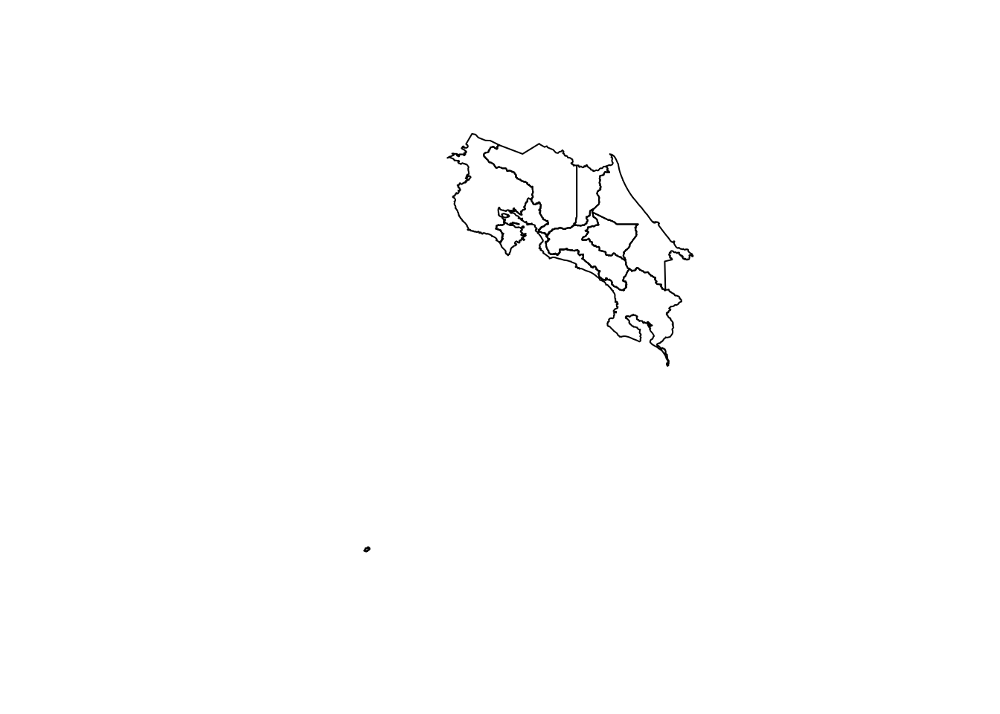
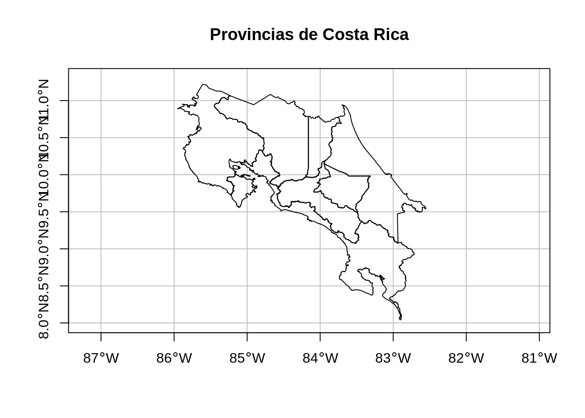
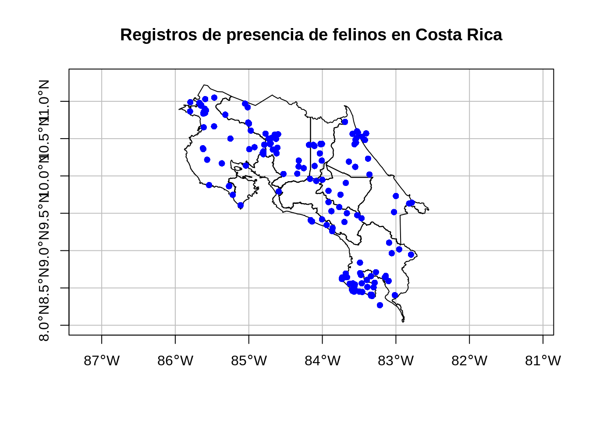
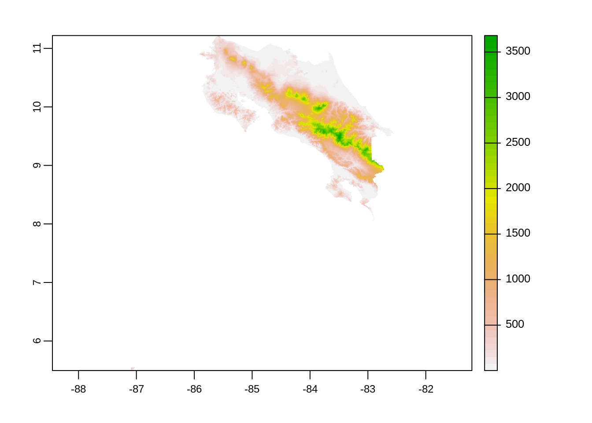
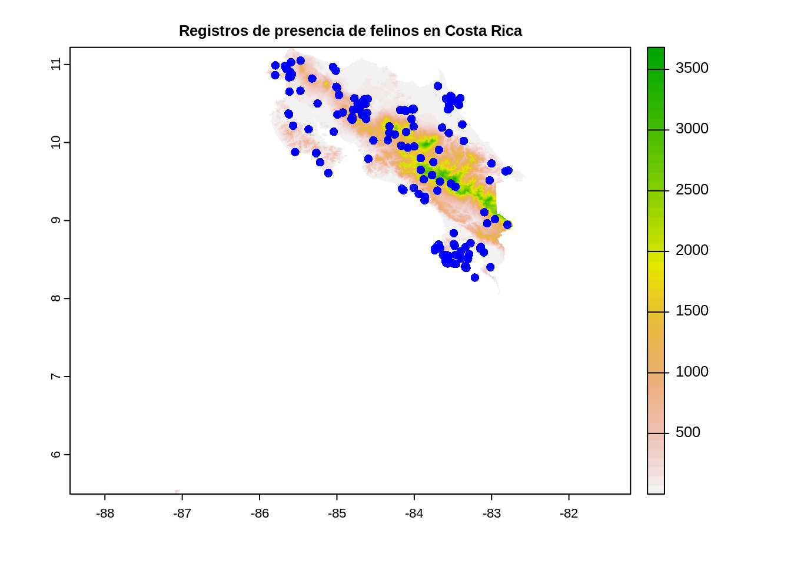

# (PART) IV. El ecosistema geoespacial de R {-}

# Introducción al manejo de datos geoespaciales en R

## Resumen
El lenguaje de programación R cuenta con varios paquetes para manejo de datos geoespaciales, entre los que están el paquete `sf` para datos vectoriales, el paquete `terra` para datos raster y el paquete `leaflet` para mapas en la Web.

## Trabajo previo

### Lecturas
Lovelace, R., Nowosad, J., & Münchow, J. (2019). *Geocomputation with R* (capítulos 1 y 2). CRC Press. https://geocompr.robinlovelace.net/

## Preparativos

### Carga de paquetes


```r
# Paquete para transformación de datos
library(dplyr)
```

## Introducción

La comunidad de programadores de R ha desarrollado un conjunto de paquetes para el manejo de datos geoespaciales, tanto en formatos vectoriales como raster. Algunos de los principales de estos paquetes son:

* El paquete [sf](https://cran.r-project.org/web/packages/sf/). Ofrece un conjunto de funciones para el manejo de datos vectoriales, de acuerdo con el estándar [Simple Features](https://www.ogc.org/standards/sfa).

* El paquete [terra](https://cran.r-project.org/web/packages/terra/). Implementa un conjunto de funciones para el manejo de datos raster. Es una reimplementación del paquete [raster](https://cran.r-project.org/web/packages/raster/).

* El paquete [leaflet](https://cran.r-project.org/web/packages/leaflet/). Es una implementación en R de la biblioteca [Leaflet para el lenguaje JavaScript](https://leafletjs.com/) para la programación de mapas interactivos en páginas web.

Algunos paquetes de graficación estadística, como [ggplot2](https://cran.r-project.org/web/packages/ggplot2/) y [plotly](https://cran.r-project.org/web/packages/plotly/), también cuentan con capacidades para visualización de datos geoespaciales.

En [CRAN Task View: Analysis of Spatial Data](https://cran.r-project.org/web/views/Spatial.html), puede encontrarse un resumen detallado de los paquetes geoespaciales de R.

## Datos vectoriales

### El modelo vectorial
El modelo vectorial de datos está basado en puntos localizados en un [sistema de referencia de coordenadas (CRS)](https://en.wikipedia.org/wiki/Spatial_reference_system). Los puntos individuales pueden representar objetos independientes (ej. postes eléctricos, cabinas telefónicas) o pueden también agruparse para formar geometrías más complejas como líneas (ej. ríos, caminos) o polígonos (ej. fincas, países, provincias). Por lo general, los puntos tienen solo dos dimensiones (x, y), a las que se les puede agregar una tercera dimensión z, usualmente correspondiente a la altitud sobre el nivel del mar.

### El estándar Simple Features
[Simple Features](https://www.ogc.org/standards/sfa) (o Simple Feature Access) es un estándar abierto de la [Organización Internacional de Estandarización (ISO)](https://iso.org/) y del [Open Geospatial Consortium (OGC)](https://www.ogc.org/) que especifica un modelo común de almacenamiento y acceso para geometrías de dos dimensiones (líneas, polígonos, multilíneas, multipolígonos, etc.). El estándar es implementado por muchas bibliotecas y bases de datos geoespaciales como [sf](https://cran.r-project.org/web/packages/sf/), [Fiona](https://pypi.org/project/Fiona/), [GDAL](https://gdal.org/), [PostgreSQL/PostGIS](https://postgis.net/), [SQLite/SpatiaLite](https://www.gaia-gis.it/fossil/libspatialite/), [Oracle Spatial](https://www.oracle.com/database/technologies/spatialandgraph.html) y [Microsoft SQL Server](https://www.microsoft.com/en-us/sql-server/), entre muchas otras.

La especificación define 17 tipos de geometrías, de las cuales siete son las más comúnmente utilizadas. Estas últimas se muestran en la figura \@ref(fig:tipos-geometrias-simple-features).

<div class="figure">

<p class="caption">(\#fig:tipos-geometrias-simple-features)Tipos de geometrías de Simple Features más usadas. Imagen de [Robin Lovelace et al.](https://geocompr.robinlovelace.net/spatial-class.html#vector-data)</p>
</div>

### El paquete sf
El paquete [sf](https://r-spatial.github.io/sf/) (de _Simple Features_) de R implementa los modelos de datos de las geometrías de tipo vectorial: puntos, líneas, polígonos, sus versiones múltiples y las colecciones de geometrías. Está basado en bibliotecas de sofware ampliamente utilizadas en aplicaciones geoespaciales:

* [Geospatial Data Abstraction Library (GDAL)](https://gdal.org/): es una biblioteca para leer y escribir datos geoespaciales en varios formatos [raster](https://gdal.org/drivers/raster/) y [vectoriales](https://gdal.org/drivers/vector/). Implementa un único [modelo abstracto de datos raster](https://gdal.org/user/raster_data_model.html) y un único [modelo abstracto de datos vectoriales](https://gdal.org/user/vector_data_model.html), lo que permite programar aplicaciones geoespaciales sin tener que ocuparse de las particularidades de cada formato que se utilice (GeoTIFF, NetCDF, ESRI Shapefile, GeoJSON, etc.). A pesar de que GDAL está programada en C/C++, cuenta con una interfaz de programación de aplicaciones (API) para varios lenguajes de programación, incluyendo [C](https://gdal.org/api/index.html#c-api), [C++](https://gdal.org/api/index.html#id3), [Python](https://gdal.org/python/index.html) y [Java](https://gdal.org/java/overview-summary.html). Además, ofrece un conjunto de [utilitarios de línea de comandos](https://gdal.org/programs/) cuyas [distribuciones binarias](https://gdal.org/download.html#binaries) están disponibles para varios sistemas operativos, incluyendo Windows, macOS y Linux.
* [Geometry Engine, Open Source (GEOS)](https://trac.osgeo.org/geos): es una implementación en C++ de la biblioteca [JTS Topology Suite](http://www.tsusiatsoftware.net/jts/main.html) (desarrollada en Java) y que implementa un conjunto de operaciones y predicados geoespaciales (ej. unión, intersección, distancia, área).
* [PROJ](https://proj.org/): es una biblioteca que transforma coordenadas entre diferentes CRS, incluyendo tanto proyecciones cartográficas como transformaciones geodésicas.

`sf` provee acceso, desde un mismo paquete de R, a la funcionalidad de estas tres bibliotecas, proporcionando así una interfaz unificada para leer y escribir datos geoespaciales mediante GDAL, realizar operaciones con geometrías mediante GEOS y efectuar transformaciones entre sistemas de coordenadas mediante PROJ.

En `sf`, los conjuntos de datos geoespaciales se almacenan en objetos de una clase también llamada [sf](https://rdrr.io/cran/sf/man/sf.html), los cuales son data frames que contiene una columna especial para las geometrías. Esta columna se denomina generalmente `geom` o `geometry` (aunque pueden tener cualquier otro nombre). El manejo de datos geoespaciales como data frames permite manipularlos con las funciones ya desarrolladas para este tipo de datos y con la misma forma de referenciar las filas (observaciones) y las columnas (variables).

#### Instalación y carga


```r
# Instalación de sf
install.packages("sf")
```


```r
# Carga de sf
library(sf)
```

#### Métodos
La lista de métodos (i.e. funciones) de la clase `sf` puede obtenerse a través de la función `methods()`:


```r
# Métodos de la clase sf
methods(class = "sf")
#>  [1] [                     [[<-                 
#>  [3] $<-                   aggregate            
#>  [5] anti_join             arrange              
#>  [7] as.data.frame         cbind                
#>  [9] coerce                dbDataType           
#> [11] dbWriteTable          distinct             
#> [13] dplyr_reconstruct     filter               
#> [15] full_join             group_by             
#> [17] group_split           identify             
#> [19] initialize            inner_join           
#> [21] left_join             merge                
#> [23] mutate                plot                 
#> [25] print                 rbind                
#> [27] rename                right_join           
#> [29] rowwise               sample_frac          
#> [31] sample_n              select               
#> [33] semi_join             show                 
#> [35] slice                 slotsFromS3          
#> [37] st_agr                st_agr<-             
#> [39] st_area               st_as_s2             
#> [41] st_as_sf              st_as_sfc            
#> [43] st_bbox               st_boundary          
#> [45] st_buffer             st_cast              
#> [47] st_centroid           st_collection_extract
#> [49] st_convex_hull        st_coordinates       
#> [51] st_crop               st_crs               
#> [53] st_crs<-              st_difference        
#> [55] st_drop_geometry      st_filter            
#> [57] st_geometry           st_geometry<-        
#> [59] st_inscribed_circle   st_interpolate_aw    
#> [61] st_intersection       st_intersects        
#> [63] st_is_valid           st_is                
#> [65] st_join               st_line_merge        
#> [67] st_m_range            st_make_valid        
#> [69] st_nearest_points     st_node              
#> [71] st_normalize          st_point_on_surface  
#> [73] st_polygonize         st_precision         
#> [75] st_reverse            st_sample            
#> [77] st_segmentize         st_set_precision     
#> [79] st_shift_longitude    st_simplify          
#> [81] st_snap               st_sym_difference    
#> [83] st_transform          st_triangulate       
#> [85] st_union              st_voronoi           
#> [87] st_wrap_dateline      st_write             
#> [89] st_z_range            st_zm                
#> [91] summarise             transform            
#> [93] transmute             ungroup              
#> see '?methods' for accessing help and source code
```

Seguidamente, se describen y ejemplifican algunos de los métodos básicos de la clase `sf`.

##### st_read() - lectura de datos
El método `st_read()` lee datos vectoriales de una fuente en formato geoespacial (ej. shapefiles, archivos GeoJSON, bases de datos geoespaciales) y los recupera en un [objeto sf](https://r-spatial.github.io/sf/reference/sf.html).

En el siguiente bloque de código en R, se utiliza el método `st_read()` para leer un [archivo GeoJSON con los polígonos de las provincias de Costa Rica](datos/ign/delimitacion-territorial-administrativa/provincias.geojson). Este archivo proviene de un [geoservicio de tipo Web Feature Service (WFS)](http://geos.snitcr.go.cr/be/IGN_5/wfs) publicado por el Instituto Geográfico Nacional (IGN).


```r
# Lectura de una capa vectorial (GeoJSON) de provincias de Costa Rica
provincias <-
  st_read(
    "datos/ign/delimitacion-territorial-administrativa/provincias.geojson",
    quiet = TRUE # para evitar el despliegue de mensajes
  )
```

`st_read()` también puede crear objetos `sf` a partir de archivos de texto. Esta variante se utiliza principalmente cuando el archivo contiene coordenadas correspondientes a geometrías de puntos. 

En el siguiente bloque de código, se utiliza `st_read()` para leer un [archivo CSV con registros de presencia de felinos de Costa Rica](datos/gbif/felinos.csv), el cual contiene dos columnas llamadas `decimalLongitude` y `decimalLatitude` correspondientes a la longitud decimal y latitud decimal en las que fue observado cada felino. Este archivo proviene de una [consulta al portal de datos de la Infraestructura Mundial de Información en Biodiversidad (GBIF)](https://doi.org/10.15468/dl.k4uuuy).


```r
# Lectura de un archivo CSV con registros de presencia de felinos en Costa Rica
felinos <-
  st_read(
    "datos/gbif/felinos.csv",
    options = c(
      "X_POSSIBLE_NAMES=decimalLongitude", # columna de longitud decimal
      "Y_POSSIBLE_NAMES=decimalLatitude"   # columna de latitud decimal
    ),
    quiet = TRUE
  )
```

Tanto `provincias` como `felinos` son objetos de la clase `sf ` (y además de `data.frame`).


```r
# Clase del objeto provincias
class(provincias)
#> [1] "sf"         "data.frame"

# Clase del objeto felinos
class(felinos)
#> [1] "sf"         "data.frame"
```

Al escribirse el nombre de un objeto `sf` en la consola de R, se despliega información general sobre este.


```r
# Información general sobre el objeto provincias
provincias
#> Simple feature collection with 7 features and 7 fields
#> Geometry type: MULTIPOLYGON
#> Dimension:     XY
#> Bounding box:  xmin: 156152 ymin: 608833.8 xmax: 658879.5 ymax: 1241118
#> Projected CRS: CR05 / CRTM05
#>                  gml_id cod_catalo cod_provin  provincia
#> 1 limiteprovincial_5k.1     160103          6 Puntarenas
#> 2 limiteprovincial_5k.2     160103          1   San José
#> 3 limiteprovincial_5k.3     160103          7      Limón
#> 4 limiteprovincial_5k.4     160103          3    Cartago
#> 5 limiteprovincial_5k.5     160103          2   Alajuela
#> 6 limiteprovincial_5k.6     160103          5 Guanacaste
#> 7 limiteprovincial_5k.7     160103          4    Heredia
#>                                                                                                                                                                                                                  ori_toponi
#> 1 En documento de 1720, se menciona la llegada del pirata Chipperton a la zona, en el cual aparece la descripcíon referente a una embarcación pequeña en la Punta de Arena, adoptando con el tiempo el nombre de Puntarenas
#> 2                                                                                                                                              Se remonta a la creación de la ermita dedicada al Patriarca San José en 1737
#> 3                                                                                         El origen del nombre de la provincia se remonta a 1852, cuando por primera vez se cita en un documento oficial el puerto de Limón
#> 4                                         Don Juan Vázques de Coronado escogió el sitio en el valle del Guarco para trasladar a la ciudad de Garcimuños, en 1563, bautizando al nuevo asentamiento con el nombre de Cartago
#> 5                                                                                                                  Se remonta al paraje llamado La Lajuela que por primera vez se cita en los Protocolos de Cartago de 1657
#> 6        En alegoria a un frondoso árbol de Guanacaste ubicado en la intersección de los caminos que se dirigían a Nicoya, Bagaces y Rivas, en lo que hoy día es el parque de Liberia. Esta referencia data del siglo XVIII
#> 7                                        En correspondiencia al Presidente  de la Real Audiencia de Guatemala, Capitán General don Alonso Fernández de Heredia, de la Inmaculada Concepción de Cubujuquí a Villa de Heredia
#>       area  version                       geometry
#> 1 11298.51 20201222 MULTIPOLYGON (((159917.7 60...
#> 2  4969.73 20201222 MULTIPOLYGON (((507877.9 11...
#> 3  9176.96 20201222 MULTIPOLYGON (((535996.1 11...
#> 4  3093.23 20201222 MULTIPOLYGON (((520206.6 11...
#> 5  9772.27 20201222 MULTIPOLYGON (((473981.3 11...
#> 6 10196.32 20201222 MULTIPOLYGON (((380807.3 11...
#> 7  2663.46 20201222 MULTIPOLYGON (((482356.4 11...
```

##### st_crs() y st_transform() - manejo de sistemas de coordenadas
El método `st_crs()` retorna el CRS de un objeto `sf`.


```r
# Despliegue del CRS del objeto provincias
st_crs(provincias)
#> Coordinate Reference System:
#>   User input: CR05 / CRTM05 
#>   wkt:
#> PROJCRS["CR05 / CRTM05",
#>     BASEGEOGCRS["CR05",
#>         DATUM["Costa Rica 2005",
#>             ELLIPSOID["WGS 84",6378137,298.257223563,
#>                 LENGTHUNIT["metre",1]]],
#>         PRIMEM["Greenwich",0,
#>             ANGLEUNIT["degree",0.0174532925199433]],
#>         ID["EPSG",5365]],
#>     CONVERSION["Costa Rica TM 2005",
#>         METHOD["Transverse Mercator",
#>             ID["EPSG",9807]],
#>         PARAMETER["Latitude of natural origin",0,
#>             ANGLEUNIT["degree",0.0174532925199433],
#>             ID["EPSG",8801]],
#>         PARAMETER["Longitude of natural origin",-84,
#>             ANGLEUNIT["degree",0.0174532925199433],
#>             ID["EPSG",8802]],
#>         PARAMETER["Scale factor at natural origin",0.9999,
#>             SCALEUNIT["unity",1],
#>             ID["EPSG",8805]],
#>         PARAMETER["False easting",500000,
#>             LENGTHUNIT["metre",1],
#>             ID["EPSG",8806]],
#>         PARAMETER["False northing",0,
#>             LENGTHUNIT["metre",1],
#>             ID["EPSG",8807]]],
#>     CS[Cartesian,2],
#>         AXIS["northing (N)",north,
#>             ORDER[1],
#>             LENGTHUNIT["metre",1]],
#>         AXIS["easting (E)",east,
#>             ORDER[2],
#>             LENGTHUNIT["metre",1]],
#>     USAGE[
#>         SCOPE["Cadastre, engineering survey, topographic mapping (large and medium scale)."],
#>         AREA["Costa Rica - onshore and offshore east of 86°30'W."],
#>         BBOX[2.21,-86.5,11.77,-81.43]],
#>     ID["EPSG",5367]]

# Despliegue CRS del objeto felinos
st_crs(felinos)
#> Coordinate Reference System: NA
```

`st_crs()` también puede asignar un CRS a un objeto `sf` que no lo tiene.


```r
# Asignación de un CRS al objeto felinos
st_crs(felinos) <- 4326
```

El método `st_transform()` transforma un objeto `sf` a un nuevo CRS.


```r
# Transformación del CRS del objeto provincias a WGS84 (EPSG = 4326)
provincias <-
  provincias %>%
  st_transform(4326)
```

##### plot() - mapeo

El método `plot()` grafica objetos `sf` en un mapa. 


```r
# Mapeo de las geometrías del objeto provincias
plot(provincias$geometry)
```



```r

# Mapeo con argumentos adicionales de plot()
plot(
  provincias$geometry,
  extent = st_bbox(c(xmin = -86.0, xmax = -82.3, ymin = 8.0, ymax = 11.3)),
  main = "Provincias de Costa Rica",
  axes = TRUE,
  graticule = TRUE
)
```



Los argumentos `reset` y `add` de `plot()` permiten generar un mapa con varias capas.


```r
# Primera capa del mapa
plot(
  provincias$geometry,
  extent = st_bbox(c(xmin = -86.0, xmax = -82.3, ymin = 8.0, ymax = 11.3)),
  main = "Registros de presencia de felinos en Costa Rica",
  axes = TRUE,
  graticule = TRUE,
  reset = FALSE
)

# Segunda capa
plot(felinos$geometry,
     add = TRUE,     
     pch = 16,
     col = "blue")
```



Para conocer los valores del argumento `pch`, puede consultar [R plot pch symbols](http://www.sthda.com/english/wiki/r-plot-pch-symbols-the-different-point-shapes-available-in-r).

##### st_write() - escritura de datos

El método `st_write()` guarda en el disco un objeto `sf` en los diferentes [formatos vectoriales de GDAL](https://gdal.org/drivers/vector/).


```r
# Especificación del directorio de trabajo (debe utilizarse una ruta existente)
setwd("/home/mfvargas")

# Escritura del objeto provincias en formato GPKG
provincias %>%
  st_write("provincias.gpkg")

# Escritura del objeto felinos en formato KML
felinos %>%
  st_write("felinos.kml")
```

##### Otros


```r
# Cantidad de filas de un objeto sf
nrow(provincias)
#> [1] 7

# Cantidad de columnas de un objeto sf
ncol(provincias)
#> [1] 8

# Resumen de la columna de geometría
summary(provincias$geometry)
#>  MULTIPOLYGON     epsg:4326 +proj=long... 
#>             7             0             0
```

### Mapeo de objetos sf con otros paquetes

#### leaflet
El paquete `leaflet` genera mapas interactivos en [lenguaje de marcado de hipertexto (HTML)](https://es.wikipedia.org/wiki/HTML), el lenguaje de marcado utilizado para desarrollar páginas web.

##### Instalación y carga


```r
# Instalación de leaflet
install.packages("leaflet")
```


```r
# Carga de leaflet
library(leaflet)
```

##### Ejemplos
Antes de mostrar la capa de provincias en `leaflet`, se simplifica para evitar un error que se produce al incluir el mapa en un documento `bookdown`. **Es posible que este paso sea innecesario en otros casos, por lo que podría omitirse**.


```r
provincias <-
  provincias %>%
  st_transform(5367) %>%
  st_simplify(dTolerance = 25) %>%
  st_transform(4326)
```

El siguiente bloque de código muestra las capas de provincias (polígonos) y de registros de presencia de felinos (puntos) sobre una capa base de [OpenStreetMap (OSM)](https://www.openstreetmap.org/).


```r
# Mapa leaflet básico de provincias y registros de presencia de felinos
leaflet() %>%
  addTiles() %>% # capa base de OSM
  addPolygons( # capa de provincias (polígonos)
    data = provincias,
    color = "black",
    fillColor = "transparent",
    stroke = TRUE,
    weight = 1.0,
  ) %>%  
  addCircleMarkers( # capa de registros de presencia (puntos)
    data = felinos,
    stroke = F,
    radius = 4,
    fillColor = 'blue',
    fillOpacity = 1
  )
```

```{=html}
<div id="htmlwidget-ce1d55fe0cd9ed7d2e06" style="width:672px;height:480px;" class="leaflet html-widget"></div>
<script type="application/json" data-for="htmlwidget-ce1d55fe0cd9ed7d2e06">{"x":{"options":{"crs":{"crsClass":"L.CRS.EPSG3857","code":null,"proj4def":null,"projectedBounds":null,"options":{}}},"calls":[{"method":"addTiles","args":["https://{s}.tile.openstreetmap.org/{z}/{x}/{y}.png",null,null,{"minZoom":0,"maxZoom":18,"tileSize":256,"subdomains":"abc","errorTileUrl":"","tms":false,"noWrap":false,"zoomOffset":0,"zoomReverse":false,"opacity":1,"zIndex":1,"detectRetina":false,"attribution":"&copy; <a href=\"https://openstreetmap.org\">OpenStreetMap<\/a> contributors, <a href=\"https://creativecommons.org/licenses/by-sa/2.0/\">CC-BY-SA<\/a>"}]},{"method":"addPolygons","args":[[[[{"lng":[-84.8596483553986,-84.8613445752065,-84.8624952604791,-84.8640785331083,-84.8642722418152,-84.8633176404451,-84.8643931728547,-84.8656606564542,-84.8663220259633,-84.865099653433,-84.8636393896887,-84.8628979053795,-84.8618673098889,-84.8611712137628,-84.8621084167829,-84.8641176872076,-84.8639458026584,-84.8649587772096,-84.8653154808082,-84.8664425392052,-84.8670754719434,-84.8678560223097,-84.8692956469162,-84.8694014256817,-84.8699020597822,-84.8707401560979,-84.8715040126615,-84.8705473108584,-84.8708729412086,-84.8731068042364,-84.874673783726,-84.8759743184988,-84.8758326435517,-84.8775719912329,-84.8786426226197,-84.8807900195524,-84.880903806509,-84.8814404503854,-84.8816572037462,-84.8844141701004,-84.885213611923,-84.8861801569296,-84.8861033455787,-84.8869768403426,-84.8854704723769,-84.8889833477488,-84.8905425671199,-84.8908742028634,-84.8910845082666,-84.8918271378553,-84.892640900886,-84.8948381104219,-84.8956678831622,-84.8962082524238,-84.8973160851494,-84.8979814002151,-84.8980411418733,-84.8985142043461,-84.8983938474912,-84.899470522233,-84.8999512366524,-84.8992257194822,-84.8992227472651,-84.8998175670362,-84.9004167314009,-84.9009467419863,-84.9027919562033,-84.9075480328079,-84.9101646825403,-84.9106434469668,-84.910155455067,-84.9095031644939,-84.9096553244291,-84.9105300917969,-84.9113695569908,-84.9112116817459,-84.9120202191158,-84.9112758539218,-84.9115619272361,-84.9108223318682,-84.9110579909436,-84.9116445041715,-84.9116741776991,-84.9152850193516,-84.9154043017969,-84.9145760045446,-84.9154018469785,-84.9158099251699,-84.9157710535878,-84.9148937373452,-84.9153318074318,-84.9165375676243,-84.9159428788912,-84.9161426992678,-84.9204791780583,-84.9206186058573,-84.9199553162937,-84.9196955611644,-84.9193908904855,-84.9191736521834,-84.9185529999336,-84.9187701036022,-84.9178326762244,-84.9178286748159,-84.9174548837682,-84.9175633988125,-84.9177643757243,-84.9174760400846,-84.9134795404082,-84.9131502542104,-84.9137163453098,-84.9134219463411,-84.9118480393849,-84.9116045589895,-84.9117051706096,-84.9134093540593,-84.9133329991248,-84.9135916032557,-84.9147098933487,-84.9155533323025,-84.9153421036878,-84.9128008611725,-84.9121903256005,-84.9127611280321,-84.9130888806031,-84.9149983928964,-84.9157058416767,-84.9150782999639,-84.9128510238706,-84.9126809848778,-84.9146323133411,-84.916071302495,-84.9174384693515,-84.9161857335596,-84.9159881152295,-84.9149382650417,-84.9133054042537,-84.912737109878,-84.9133591420659,-84.9146318715142,-84.9161913647952,-84.9163197424995,-84.9175292474452,-84.9176975804356,-84.9161562036815,-84.915062422576,-84.915600663855,-84.9149562897926,-84.9151409545159,-84.9147493742051,-84.9131543426116,-84.9133376234604,-84.9151400552736,-84.9160199981061,-84.9155383306736,-84.9152959118214,-84.9131897365625,-84.915895164082,-84.9159881035232,-84.9142194680961,-84.9140870781562,-84.9148506714924,-84.9159181234432,-84.9159320909164,-84.9181327042492,-84.9197356658729,-84.9193043037328,-84.9201450310156,-84.919373434956,-84.9199080565422,-84.9184384788436,-84.9195400430128,-84.9201536296162,-84.9215659067243,-84.923129046053,-84.9233404979071,-84.9246895243366,-84.9271788832909,-84.9281023683666,-84.9281273335033,-84.9282702162038,-84.9287615483282,-84.9284884447389,-84.929457188843,-84.9297919295707,-84.9294755781765,-84.9299548793752,-84.929515724549,-84.9300611898822,-84.9303247943032,-84.9300919329216,-84.9304948979842,-84.9304336214687,-84.9311768914819,-84.931857263828,-84.9315983719977,-84.9320142118292,-84.9320026956438,-84.9323349054859,-84.9325051043778,-84.9318176875017,-84.9325910812801,-84.9322462843257,-84.9326348801071,-84.9324541652861,-84.934063051081,-84.9338277223288,-84.9342630484854,-84.9357095097197,-84.9355176248205,-84.9363079168142,-84.9403692134071,-84.941363008382,-84.9415472006324,-84.9412180350396,-84.9397116450892,-84.9389882702194,-84.9379089828707,-84.9361816313628,-84.9354723578524,-84.9349901317057,-84.9349495295619,-84.9331376094702,-84.9343069633864,-84.9348619982508,-84.935290608095,-84.9351505064111,-84.9354483385976,-84.9361364552363,-84.9376397068674,-84.9385186370988,-84.9389531915318,-84.9394239870276,-84.9398878553303,-84.9416468260943,-84.9420696469327,-84.9432220245757,-84.9433502400343,-84.9435843021014,-84.9443934138573,-84.9461533893987,-84.945412085318,-84.9463478702873,-84.9459243721206,-84.9460937479024,-84.9457506007301,-84.9451312814615,-84.9444443877863,-84.9452475869495,-84.9457894784846,-84.9459235966447,-84.9463543698412,-84.9470443945511,-84.9480847835359,-84.950285361078,-84.9506164833344,-84.9514962051502,-84.9517481168148,-84.9528224718662,-84.9531458151825,-84.9537289756264,-84.9551269242082,-84.9549167934809,-84.9553490974492,-84.9550533014949,-84.9557508954792,-84.955738624401,-84.9581713418284,-84.958860267468,-84.9599483997819,-84.9611593367971,-84.96266734452,-84.9637873950024,-84.9656837247109,-84.9687279033909,-84.967703846018,-84.9678445462612,-84.9683463734344,-84.9680238690367,-84.9681818376891,-84.9670248137335,-84.9667060773855,-84.9658201239246,-84.9646604991125,-84.964322552476,-84.9632017569582,-84.9598620247857,-84.958669036442,-84.957247218932,-84.9555571848041,-84.9549766831496,-84.9545796093265,-84.954939625047,-84.9545996262399,-84.9551986403023,-84.9559402099589,-84.9567526215814,-84.9579357140937,-84.959125215497,-84.9591578659928,-84.9588303286556,-84.9595137238346,-84.9603842022082,-84.9609700417751,-84.9601174601383,-84.9611157352336,-84.9610964273602,-84.9614629224908,-84.9617421999469,-84.9619770075534,-84.9631888012268,-84.9651549424627,-84.9653196313824,-84.9649041510545,-84.9658181580489,-84.9677212456469,-84.9669214895825,-84.966903423261,-84.9669990450414,-84.9677565820384,-84.9683179257374,-84.9682073248228,-84.968622620796,-84.9689330951903,-84.9699700527414,-84.9715170438977,-84.9712786816556,-84.9716118640442,-84.9721756128569,-84.9717860112816,-84.9723538832654,-84.9723791951739,-84.9730154685318,-84.9732905647497,-84.9732095789415,-84.974267922929,-84.9729268014627,-84.9745047917997,-84.9750764710128,-84.9751778425013,-84.9759232115589,-84.9760521739392,-84.975736971177,-84.976204982483,-84.9782044386776,-84.9813936505433,-84.9831191663536,-84.9838826958849,-84.9844834282578,-84.9851412946878,-84.9853416525887,-84.9862514402004,-84.9883372326088,-84.9894174069031,-84.9898886905707,-84.9932021850484,-84.9989477119469,-85.0014816031473,-85.0023963232793,-85.0029526200656,-85.0033120551766,-85.0026482611058,-85.0039023378785,-85.0083862501811,-85.0093143757046,-85.0101704428676,-85.0114217644848,-85.0137670778456,-85.0134937559777,-85.0158377503663,-85.0163468741859,-85.0161399431645,-85.0180540270915,-85.0218235123383,-85.0242855161689,-85.0247253837168,-85.0252351439425,-85.0241571528953,-85.0244537138575,-85.0239472535936,-85.0241602642062,-85.0246064371087,-85.0244390740584,-85.0249860919517,-85.0246280996313,-85.0251889018847,-85.0252749631052,-85.0266282412328,-85.0296424580813,-85.0326674828531,-85.0350646579338,-85.0362298476712,-85.0383962872281,-85.0404733457299,-85.040628991506,-85.0411208564588,-85.0421091534378,-85.0429766154533,-85.043649347738,-85.0439989255917,-85.0457900788855,-85.0458473322434,-85.0465436259925,-85.0479745394373,-85.0480992723961,-85.0495193411788,-85.0501539944183,-85.050356983346,-85.0515532052627,-85.0522749970867,-85.0533912411175,-85.0568074082333,-85.058754457598,-85.059519844359,-85.06031978437,-85.0619995871276,-85.0631254159794,-85.0635819136049,-85.0634915275964,-85.0649018875013,-85.0668802103546,-85.0711661577374,-85.072066014577,-85.072428286185,-85.0751264396067,-85.0760477574217,-85.0762903722381,-85.0768274800654,-85.0774053895509,-85.078797337898,-85.0792955715236,-85.0788553482537,-85.0794913756208,-85.0781998841646,-85.0779965509698,-85.0748485169947,-85.0721737631195,-85.0706502548918,-85.0694966774012,-85.0692488662634,-85.0694486424737,-85.0699799103024,-85.0749998888842,-85.0767711859921,-85.0768471896098,-85.0752915614339,-85.0740270483882,-85.0728830820477,-85.0691487068506,-85.067146012183,-85.0660116733915,-85.0659369453071,-85.0680604959122,-85.0686686916519,-85.0684139559105,-85.0671284712077,-85.0659939444551,-85.0648237511845,-85.0623561303661,-85.0625939114372,-85.0622696979949,-85.0607615584061,-85.0603172564564,-85.0604933312726,-85.061508102327,-85.0610710567409,-85.0601737119482,-85.0587043086523,-85.0573950295647,-85.0573385551968,-85.0587644620458,-85.0586687481847,-85.0573849941961,-85.0550467940646,-85.0533412489354,-85.0518721005473,-85.0499998944205,-85.0488667991063,-85.0473449304593,-85.0452383051452,-85.0438607118529,-85.0424463813526,-85.0421731764025,-85.0429846952106,-85.0411520303712,-85.0407906431914,-85.0412526053281,-85.0410911077789,-85.0402915865949,-85.0384866035191,-85.0363111986546,-85.0324814439151,-85.0309413834782,-85.0294659591213,-85.0284277256876,-85.0277402218451,-85.0274380343027,-85.0276116080282,-85.0294886152751,-85.0298750974368,-85.0295161377833,-85.0279601929321,-85.0282316510056,-85.0274553769053,-85.0276244032045,-85.0282742384868,-85.0293232031487,-85.0298851256702,-85.0309802708699,-85.0311419596625,-85.0317839527731,-85.0331934232452,-85.0346923295668,-85.0356218458519,-85.0361380519231,-85.0349427929262,-85.034470638323,-85.0352987636446,-85.0361176597682,-85.0356584086015,-85.034968481286,-85.034815525267,-85.0369592521869,-85.0358342521628,-85.0344759468834,-85.0344300896008,-85.0363869375683,-85.0383771441988,-85.03769105116,-85.0371070292267,-85.0373055972711,-85.0363800981323,-85.0374841223111,-85.0387124270349,-85.0395227815663,-85.0388715027751,-85.0377623650443,-85.0373611274041,-85.0377936046587,-85.0371499338921,-85.0369769385786,-85.0351444397559,-85.0351052920163,-85.0359297529817,-85.0364372746527,-85.0357154085658,-85.0347140426151,-85.0339511924952,-85.0334763366299,-85.0323973215408,-85.0329557866742,-85.0305731145898,-85.0307313137458,-85.0280135340876,-85.0279204556716,-85.0274561701737,-85.0264173932627,-85.0266915791153,-85.0291058850652,-85.0254459669321,-85.0207516381731,-85.0199492901789,-85.018504052266,-85.0142323064105,-85.0095977294724,-85.0052923688961,-85.0030408399127,-85.002357127252,-85.0039029706625,-85.0042288758957,-85.0039932586774,-85.0034036916426,-84.9976493129622,-84.9945283136458,-84.9921817084715,-84.9848646484473,-84.9819762640799,-84.9811810599656,-84.9815703545626,-84.980607899118,-84.9798046917983,-84.9766854013792,-84.9724501988898,-84.9657695478449,-84.9588477083443,-84.9569587163515,-84.9543461486344,-84.9524084119888,-84.9494250806048,-84.949139987723,-84.9472964711786,-84.9431606503953,-84.9390003750645,-84.9369324731729,-84.934401779329,-84.9291791098657,-84.9276801926826,-84.9265022490726,-84.9251242734973,-84.9224037493613,-84.9211143875793,-84.9204850488423,-84.920439533257,-84.9211063233543,-84.9216519767091,-84.9232860715089,-84.92361932747,-84.9240957390772,-84.923902036287,-84.9241536448168,-84.9272421789167,-84.92753249629,-84.9265479809466,-84.9270920688732,-84.9267078990627,-84.9238943155882,-84.9243679950211,-84.9261640031232,-84.9271658682156,-84.9288884061385,-84.9296065088401,-84.9289267972522,-84.928154778394,-84.9262569852502,-84.9252383003575,-84.9243363704765,-84.9256977426058,-84.9259853955834,-84.9269165754828,-84.9270292952212,-84.9276774943749,-84.9292968431997,-84.9302386036738,-84.9295739902149,-84.929739663492,-84.9291501873004,-84.9278864449494,-84.9270141495251,-84.9279162959233,-84.9292946234527,-84.9306994668663,-84.9318296858679,-84.9322909123568,-84.9306141384706,-84.9305551804141,-84.9314067448149,-84.9332532129715,-84.9334112691514,-84.9321640655747,-84.931101486574,-84.929364685966,-84.9293772733185,-84.9277183688612,-84.9262057579414,-84.9247798375611,-84.9209600333709,-84.9204419649447,-84.9182000909315,-84.9171584424993,-84.9130257743149,-84.9129633632831,-84.908393522331,-84.9061342958383,-84.9036539426783,-84.9025827925788,-84.9020508992906,-84.9021550975462,-84.9015321659132,-84.8998969933593,-84.899671706323,-84.8999933286665,-84.8996584361427,-84.8974813368962,-84.8959497368537,-84.8952732645428,-84.8943110481151,-84.8930933660786,-84.8909945950712,-84.8896163997707,-84.8890705494842,-84.8873752774131,-84.8845873132132,-84.8843429913471,-84.8823533013915,-84.8804117508122,-84.8801918057585,-84.8791605931457,-84.8780506396717,-84.8767948459357,-84.8757145642057,-84.8750690344568,-84.8754646930886,-84.8753136496292,-84.8757619572326,-84.8738433880486,-84.87656403149,-84.8787818528225,-84.8797713768526,-84.8815459143308,-84.8836531745611,-84.8859355472662,-84.8874016504975,-84.8895778733825,-84.8897299789949,-84.8890702735194,-84.8886870724729,-84.888950469689,-84.889572592369,-84.8895147730488,-84.8888788014949,-84.8888132000522,-84.8875007298381,-84.8850683851895,-84.8821911599878,-84.8815584918102,-84.8805121417675,-84.8794827099115,-84.8787333051234,-84.8776921251158,-84.8780670045631,-84.8784673272285,-84.8781175510375,-84.8776521490896,-84.8766975686291,-84.8763160568027,-84.8767228873093,-84.8750331959513,-84.8749740129185,-84.8719560701341,-84.8726416077135,-84.8710513707923,-84.8705700947374,-84.8707646972031,-84.8714645806203,-84.8717232338855,-84.8716036616886,-84.8710126867123,-84.8716011355329,-84.8713261855421,-84.8725500019916,-84.8722723314729,-84.8714582277363,-84.8712577947589,-84.8716549292742,-84.8717671511831,-84.8725191641167,-84.8725829328619,-84.8723568790175,-84.8716125972261,-84.8716543838534,-84.870161261079,-84.8694305422288,-84.8680737565742,-84.8676635920005,-84.8675788565257,-84.8664832609222,-84.8658815863797,-84.8655622544464,-84.8648911349033,-84.8645237832878,-84.8646689191525,-84.8638848539557,-84.8641847563331,-84.8637551843341,-84.8636310698366,-84.8629588034461,-84.8626908104047,-84.8636289240248,-84.8619870060071,-84.8616357058526,-84.8607998044796,-84.8600714028628,-84.8583979005422,-84.8579150618857,-84.8567197353276,-84.8558085993169,-84.85435303245,-84.8536169336922,-84.8525981365939,-84.8520030496745,-84.8516304907256,-84.8503068886312,-84.8499269913426,-84.8482095719434,-84.8471886872261,-84.8465007059559,-84.8465832668699,-84.8453069686428,-84.8450170108843,-84.8437728212997,-84.844426597781,-84.8450453683989,-84.8449315602998,-84.844072980612,-84.8437829707327,-84.8443107035835,-84.8435534752716,-84.8437393304783,-84.8432977542106,-84.8440227046119,-84.8437109955639,-84.8446663113815,-84.8451608584617,-84.8449069735664,-84.8453068926643,-84.8449845382516,-84.8440356405911,-84.8441204901411,-84.8431943924685,-84.8430823762196,-84.8438335950854,-84.8435163718078,-84.8414813208447,-84.8410344741483,-84.8411004275846,-84.8395989466996,-84.8387341795644,-84.8384429275441,-84.8346769964065,-84.83307246562,-84.8320045019602,-84.8300032760242,-84.8291947243968,-84.8271497459505,-84.8262191773244,-84.8240810897593,-84.8217817427256,-84.820056255748,-84.8171433657029,-84.8148368697616,-84.812122684807,-84.8098395982254,-84.8083188976563,-84.8065401159568,-84.805375851178,-84.804293757222,-84.8038163042923,-84.8042209734686,-84.8034769439273,-84.8016796602284,-84.7969550642408,-84.7959028750696,-84.7938892287638,-84.7940408397909,-84.7935919758838,-84.793729307104,-84.7931683880092,-84.7912519114936,-84.7905021689709,-84.7864274911045,-84.7860514304242,-84.7865516829487,-84.7863213300363,-84.785984761958,-84.7842704073183,-84.7831090865135,-84.783284715148,-84.7828993275261,-84.782740941009,-84.7834257694178,-84.7822112721829,-84.780269922276,-84.7789226167142,-84.7777447361555,-84.7714445031242,-84.7709876661486,-84.7699121155087,-84.7694198599658,-84.7672673536393,-84.7666613980768,-84.767132249203,-84.7669171366457,-84.7657992897795,-84.7654781951827,-84.7657984626871,-84.7673168753856,-84.7636968857823,-84.7644551553989,-84.7654667821341,-84.7659321677978,-84.7657566645174,-84.7645443905707,-84.760812652424,-84.7593118388861,-84.7582710269227,-84.7581310373454,-84.7550256051345,-84.7536470860016,-84.7510016477544,-84.7492751225215,-84.7480995620407,-84.7472914990837,-84.7469935467548,-84.7449712167117,-84.7432059683876,-84.7413575671156,-84.7386111808626,-84.737649004842,-84.7368281832902,-84.7364880777549,-84.7334679821342,-84.7325503303071,-84.7313490369293,-84.7303909245715,-84.7295388246501,-84.7292180792715,-84.7273671780084,-84.7266060425258,-84.7255745240929,-84.7248984491334,-84.7227840721105,-84.7207120127817,-84.7214870705185,-84.7224270250259,-84.7227194384755,-84.7224707285251,-84.7212739166108,-84.7200591177593,-84.7191099627478,-84.7181297279214,-84.7171943980208,-84.7152820315935,-84.7126067955793,-84.7116922971399,-84.7114434659908,-84.7105060122028,-84.7074853526782,-84.7049098924701,-84.7033932542651,-84.7014795914609,-84.7005362883154,-84.6991381179005,-84.6969335692666,-84.6972566941233,-84.6969909872163,-84.6951044596233,-84.695070792676,-84.6948202225054,-84.693350977097,-84.692037606576,-84.6904806860856,-84.6854312599662,-84.6840981563599,-84.683498391811,-84.6830144455602,-84.6823924830779,-84.6808887595895,-84.6799613639808,-84.6786835318289,-84.6769051004024,-84.6764790926967,-84.6760113464783,-84.6745037390864,-84.6731379074318,-84.673155528666,-84.674293556062,-84.6738445854561,-84.6743585915064,-84.6738547047918,-84.6722177318958,-84.6714382640995,-84.6697083422275,-84.6701084489224,-84.6695080003159,-84.6694386853919,-84.6700823178029,-84.6700157968461,-84.6696105444168,-84.6684303746947,-84.6680899307725,-84.6668702107246,-84.6646767579171,-84.6620919780696,-84.6611052715102,-84.6602272685477,-84.6601111428942,-84.6596091726156,-84.6599787284898,-84.6597162546011,-84.6572876360371,-84.6568642947543,-84.6576676781558,-84.657697354772,-84.6588587716894,-84.6580979352516,-84.6563763253939,-84.6580058324279,-84.6594740798645,-84.6597137965145,-84.6619044987237,-84.6601691340109,-84.6612474172847,-84.6609526562122,-84.6601581963058,-84.6607048487385,-84.6615921749883,-84.6620415140203,-84.6606664532474,-84.6601454817128,-84.6607100982119,-84.6618410146277,-84.6629678531064,-84.6638877007265,-84.6646275344033,-84.6634909957173,-84.6620345670146,-84.6614008469818,-84.6613650993935,-84.6636476292223,-84.6639360114562,-84.6651790335748,-84.6654202048475,-84.6680338421583,-84.6701133854714,-84.6705730017421,-84.6708958077849,-84.6713920019375,-84.6723280010726,-84.6727455204199,-84.6739216554331,-84.6750124614603,-84.6763821679248,-84.6789643249236,-84.6802356792434,-84.6833171821476,-84.6829311417607,-84.6824959301058,-84.6811887471688,-84.6788590970649,-84.6778396218558,-84.6766028581456,-84.6749134857385,-84.6746759424681,-84.6729788730261,-84.672202143428,-84.6718016792324,-84.6708055360851,-84.6705242769013,-84.6702314240457,-84.6697311613615,-84.66958645295,-84.6688213421075,-84.6676993649851,-84.6675692553275,-84.6665946990942,-84.6664773485648,-84.6636549583191,-84.6652376506224,-84.6643199921233,-84.6635464377987,-84.6648022114376,-84.6637718749244,-84.6634121000939,-84.6647432356431,-84.6657179077655,-84.6655648238301,-84.6646099836437,-84.6652022668773,-84.6662209147752,-84.6666800393126,-84.666706060665,-84.666006637524,-84.6667317840282,-84.6668175573378,-84.6683554816535,-84.6677554999098,-84.6690094442586,-84.6699066939741,-84.6694183981805,-84.6696916544733,-84.6688261279867,-84.6681814031159,-84.667344122906,-84.6651919556038,-84.6658946330273,-84.6644919584346,-84.6642792812444,-84.6654021505781,-84.6664941466462,-84.665107699276,-84.6653121532921,-84.6665411811407,-84.6708933795511,-84.6733866059868,-84.6727678581185,-84.673063945333,-84.6724502521915,-84.6716474635809,-84.6720459030165,-84.6715177433439,-84.6718354814895,-84.6714098324905,-84.6701930262244,-84.6711048948683,-84.671477842005,-84.6703447841792,-84.670053979135,-84.6691228320097,-84.6690940757651,-84.6675896341524,-84.666213993456,-84.6651505223005,-84.6642880795483,-84.6635098675338,-84.6633961066011,-84.6638646121187,-84.6622092187595,-84.6611595773441,-84.6614466854699,-84.6604322428856,-84.6607268256217,-84.6594410928195,-84.6568516138633,-84.6566577112795,-84.6559827211082,-84.6552560445377,-84.6548694767222,-84.6543723365343,-84.6544691191677,-84.6536409980434,-84.6538886408834,-84.6529050793642,-84.6519900520498,-84.6515552568575,-84.6506894237834,-84.6505143606587,-84.6508286605191,-84.6505526210024,-84.6492851700008,-84.6479522918053,-84.6480944881848,-84.6492365050161,-84.6479233963273,-84.6476235429668,-84.6460112560469,-84.6448211928508,-84.6447642034292,-84.6438631858367,-84.6438318427933,-84.6429536657543,-84.6426282191464,-84.6407922563619,-84.6393611649435,-84.6389213999948,-84.6371504288463,-84.6371536390514,-84.6360498635326,-84.6361081445319,-84.6326601513836,-84.6317517119554,-84.6310907447193,-84.6306957711712,-84.6305051723829,-84.6313897562629,-84.6314018441855,-84.6295503235134,-84.6292148640591,-84.6280700679867,-84.6287298715212,-84.6266835239917,-84.6269317518746,-84.6267022682781,-84.6261844732386,-84.6263043705213,-84.6258661099943,-84.6249823038204,-84.6214109712936,-84.6183276855589,-84.6176324581724,-84.6171866455772,-84.6172290510454,-84.6165803244099,-84.6149903380175,-84.6122186791304,-84.6114473034617,-84.6109246112615,-84.610338218304,-84.6093219544468,-84.6069944104803,-84.6065773256208,-84.6058090425716,-84.6036982875085,-84.6026289208762,-84.6021640019782,-84.6013652721209,-84.6014995345646,-84.6002124403821,-84.598029563263,-84.5961834174374,-84.5954725809189,-84.5933539483621,-84.592644007967,-84.5901597087882,-84.5893525750867,-84.5872683404245,-84.5858099677511,-84.5855728190391,-84.5840048072619,-84.5825929446555,-84.5814553848598,-84.5813943127576,-84.5796423221641,-84.5782577268431,-84.5774004021055,-84.5770705668564,-84.5761750913976,-84.5755697017434,-84.575746314835,-84.5748352860678,-84.57441615455,-84.5738901095608,-84.5740545130232,-84.5721999821736,-84.5703876970357,-84.5695387488235,-84.5683172843852,-84.5670888307099,-84.5664163324055,-84.5661547657675,-84.5663787036913,-84.5658048908276,-84.5652000193457,-84.5655953510203,-84.5656519213359,-84.5662275685217,-84.5633273206793,-84.563403855388,-84.5626015783728,-84.562760689891,-84.5624405460793,-84.5629826441732,-84.5639577966428,-84.5635490056888,-84.5639220178204,-84.5640683943062,-84.5637329649731,-84.5628966568625,-84.5617661596584,-84.5617081721154,-84.5607804510926,-84.5613835264443,-84.5604703748124,-84.5594799424387,-84.559808935169,-84.5596049597652,-84.5586942504869,-84.5579930830528,-84.5568348840832,-84.5563556189653,-84.5560728574426,-84.5555783649548,-84.5567470331425,-84.5554464108655,-84.5547066278201,-84.5539862381991,-84.5540516874576,-84.5548082314942,-84.5550646962168,-84.553812377395,-84.5539888572008,-84.5530584257855,-84.5534403762214,-84.5540672264164,-84.5557218973785,-84.5558497759376,-84.556852896012,-84.5578457625662,-84.5589155148459,-84.5584291981725,-84.5599156720235,-84.5606156013258,-84.5620631896727,-84.56251190262,-84.564350135805,-84.566002855137,-84.5667232798459,-84.5682574649054,-84.568744128858,-84.5694585785949,-84.5702770887341,-84.5707948274229,-84.5711703279403,-84.5706287596797,-84.5709828590837,-84.5730606373679,-84.5742258386526,-84.5760427772611,-84.5775181687905,-84.5780997983615,-84.5775119162153,-84.5776928082839,-84.5794352395919,-84.5807937730852,-84.5818686507719,-84.5814274959224,-84.5817041224157,-84.5842464361702,-84.5845879787987,-84.5840494859026,-84.5843886389694,-84.5860005072782,-84.5880095656762,-84.5889153138222,-84.5892945780486,-84.5910692358755,-84.5909540587812,-84.5916591515633,-84.5913511974174,-84.5919824765003,-84.5931187017592,-84.5945545467792,-84.5957223880291,-84.5969081972876,-84.5961269614241,-84.5971684234419,-84.5974952444673,-84.597500686191,-84.5987433199312,-84.5985948581948,-84.5993510591475,-84.5998077727455,-84.6005713350936,-84.601617386732,-84.6023914319513,-84.605063126635,-84.6061377608804,-84.6070364798311,-84.607018554773,-84.6089044724827,-84.6090921633391,-84.6108633928917,-84.6110594177267,-84.6114877704285,-84.6122823879404,-84.612992125419,-84.614493875537,-84.6155245376602,-84.616388947611,-84.6151152600578,-84.6147231579457,-84.6150125728601,-84.6175915467583,-84.6182897796494,-84.6220494015992,-84.6242021292217,-84.6255667602016,-84.6270737315894,-84.6299892635873,-84.6326356981825,-84.6333007499583,-84.637210450334,-84.6365954384837,-84.6368170739873,-84.6384038037417,-84.6406353668013,-84.6411990311348,-84.6433261860511,-84.6455708025417,-84.647757733853,-84.6487612825204,-84.6497580833186,-84.6501733560413,-84.6501247921476,-84.6525203037466,-84.6529266962053,-84.6524656067297,-84.6535306348103,-84.6587686088901,-84.6594351940061,-84.659537708524,-84.6602788782438,-84.6616913424494,-84.6620439084684,-84.6614430776905,-84.6597469286871,-84.6592931738075,-84.659213156944,-84.6587636679713,-84.6580671970328,-84.6576922013163,-84.6577934405925,-84.6586233937147,-84.6587070664363,-84.6603994553208,-84.6618681469018,-84.6642330505398,-84.665267055416,-84.6655858114367,-84.667090701228,-84.6666564866764,-84.665222111452,-84.6659088124968,-84.6661976439368,-84.6695200874084,-84.6713603888346,-84.6716884053678,-84.6715702419797,-84.6705116424857,-84.6714495682389,-84.6734550867556,-84.6755650494846,-84.6762974499593,-84.6757289309901,-84.6759373572852,-84.676916060543,-84.6770118045984,-84.6775757477731,-84.6779649974678,-84.6774745309835,-84.6781750943174,-84.6791202051576,-84.6791192056757,-84.679766099048,-84.684581831461,-84.6861485988779,-84.6865962461753,-84.6878578702177,-84.6882770653292,-84.689338962345,-84.6892787425835,-84.6885677741061,-84.6879096386639,-84.6871080923037,-84.6864573680547,-84.6869660638344,-84.6866820219667,-84.6873447533431,-84.6875634543008,-84.6868018734696,-84.6853708828215,-84.684466475516,-84.6845734163085,-84.6854505139745,-84.6861012676964,-84.6857232135576,-84.6844431768565,-84.6839957329788,-84.6855179388156,-84.685589657461,-84.6847230224892,-84.6848274816664,-84.6858888060635,-84.687160298503,-84.6895730746391,-84.6878918738816,-84.6855570718994,-84.684740004345,-84.6834036136765,-84.6833806890461,-84.682015428356,-84.6821633223988,-84.6809832345975,-84.6808881385264,-84.6797816210238,-84.6795837299763,-84.6790433847762,-84.6813601197354,-84.6823428082652,-84.6812688779156,-84.6800826686972,-84.679621929781,-84.6781717371875,-84.6781517056867,-84.6773619651879,-84.6758250880917,-84.6744816893744,-84.6738322473284,-84.6735413868438,-84.6727699290646,-84.6721075546372,-84.6705655949081,-84.6702808063956,-84.670423852699,-84.669814284987,-84.6671062961325,-84.6661740208659,-84.6652201399853,-84.6643972756541,-84.6651507887273,-84.6649999887006,-84.6621094803321,-84.6615527591912,-84.6610442996446,-84.6606701075105,-84.6604929983876,-84.6601107709483,-84.6581932194993,-84.6584323869524,-84.6576387111901,-84.6560711921721,-84.6536887576078,-84.6521782315646,-84.6513178966135,-84.6507717866376,-84.6498332234159,-84.6487212173531,-84.6476537209011,-84.6477132748883,-84.6485740682525,-84.6479477480963,-84.6479361106761,-84.6472875102288,-84.646784145154,-84.6455385907746,-84.6449759684253,-84.6443571197982,-84.6434193923402,-84.6427307509586,-84.6411625480497,-84.6398981907394,-84.6388601627249,-84.6377608352145,-84.6369117617781,-84.6348922358132,-84.6335101335554,-84.6300043090514,-84.6290139496082,-84.627560545655,-84.6259167508775,-84.6208832518341,-84.6185604367977,-84.6162507302918,-84.6152282082231,-84.6133297328972,-84.6121434856878,-84.6109994932805,-84.6098237112416,-84.6078429832951,-84.6063809073514,-84.6055788642768,-84.6040418373045,-84.6031315866137,-84.6032743925781,-84.6027199030051,-84.6019480175613,-84.6015496390266,-84.6010452411981,-84.6005745191913,-84.6003994109718,-84.5993824223812,-84.5982465859453,-84.5976519818624,-84.5968785105783,-84.596703220355,-84.5956766441855,-84.5958410204285,-84.5988565973935,-84.5989595907783,-84.5999456336148,-84.6002089380955,-84.5997832576382,-84.5992902069874,-84.5991145713049,-84.5963922101914,-84.5945890800378,-84.5936094877131,-84.5918568866747,-84.5856720729273,-84.5844664106436,-84.5824948865744,-84.5802743456043,-84.5780113292826,-84.5743678395829,-84.5732736859981,-84.5709147706726,-84.5696401661642,-84.5682795115609,-84.5672213973706,-84.5649767357566,-84.5630903765928,-84.5635634139384,-84.5635061182391,-84.5604257678433,-84.558579414371,-84.5587623669683,-84.5603279523615,-84.5638177004277,-84.5660935828316,-84.567780664556,-84.5693520795302,-84.5697992111047,-84.5711762268759,-84.5767135413614,-84.5812988927579,-84.5822113957513,-84.5829858900702,-84.5825541970944,-84.5816699626545,-84.5794513133628,-84.5792432798884,-84.5797303661597,-84.578950156386,-84.5783974783655,-84.5778643500465,-84.5770351208112,-84.5761929496184,-84.5752173808526,-84.5745111309671,-84.5738925001641,-84.5713556267533,-84.5702442286892,-84.570485677104,-84.570209962034,-84.5663862203166,-84.5664660072959,-84.5681033204616,-84.5681723058937,-84.5657152595697,-84.5639042502305,-84.5605277498459,-84.5610425108516,-84.56227728673,-84.5631133539843,-84.5615812284922,-84.5620792333138,-84.5605223223678,-84.5585547891108,-84.5573405339572,-84.5575622483479,-84.5585685664114,-84.5576618436145,-84.5585310461204,-84.5569716903721,-84.5565341456679,-84.5529544150741,-84.5520775201638,-84.5516044832109,-84.5509290348227,-84.5502525210827,-84.5497857314598,-84.5503863649893,-84.5498665646921,-84.5485298964075,-84.5474928666275,-84.5457820698105,-84.5444209419916,-84.5432412461398,-84.5433869242379,-84.541274867764,-84.5409271374652,-84.541421411113,-84.5413534770481,-84.539426020586,-84.539313209733,-84.5387095128921,-84.540185899463,-84.5403476413394,-84.5415396113506,-84.541593649249,-84.5425615283817,-84.5427094507575,-84.5441825743823,-84.5443555717023,-84.5449546762217,-84.5475824670206,-84.5479020744633,-84.54943370468,-84.5499911153409,-84.5498325961404,-84.5502325362089,-84.5519523427415,-84.5524044388366,-84.5530706873649,-84.5539748821338,-84.5660715992514,-84.5666193407704,-84.5658483941933,-84.5664839818255,-84.5657618742461,-84.5659879158164,-84.565705346745,-84.566832447745,-84.5665320293335,-84.5671683058412,-84.567031989037,-84.5682749122337,-84.5687982017456,-84.5689690646437,-84.5684645019415,-84.5691897166072,-84.569566559654,-84.5716349202362,-84.5710368242761,-84.5721735697786,-84.5718292567231,-84.5729692573025,-84.5730206205815,-84.5735579549731,-84.5745694363658,-84.5751858475698,-84.5759347834511,-84.5774191872277,-84.5774574804199,-84.5779851387515,-84.5791492668296,-84.5822467470671,-84.5834978735292,-84.5840134368203,-84.5852125595508,-84.5862450836919,-84.5874141198656,-84.5878312543031,-84.5884895463062,-84.5912228466493,-84.5927232270799,-84.5921873408463,-84.5924990687467,-84.5921510160396,-84.5924616593032,-84.5902795375039,-84.5902545983557,-84.5908655899666,-84.5904915106598,-84.5906411412772,-84.5891572964295,-84.589356803793,-84.5885014117571,-84.587740787717,-84.5866933693717,-84.5870175685236,-84.5861447211006,-84.5865811443009,-84.5855461947311,-84.5848918862246,-84.5841787110651,-84.5832823787269,-84.5829790743662,-84.5831748616117,-84.5836919965674,-84.5839364820122,-84.5847461563767,-84.5847922040428,-84.5842511788226,-84.5847626595999,-84.584472763502,-84.5848983357963,-84.5843957210786,-84.5846840170172,-84.5831618338679,-84.5825354044032,-84.5836868423792,-84.5833002856356,-84.5853579197347,-84.5843092413613,-84.5834325882349,-84.583594140013,-84.5828450372537,-84.5834058633999,-84.5821951709195,-84.5820183091281,-84.580442511261,-84.5806556283609,-84.5802823455886,-84.5798057086726,-84.5804822792214,-84.5803557236197,-84.580869908979,-84.5802913741504,-84.57974886829,-84.5789454298077,-84.5780163952704,-84.5775753990976,-84.5777980076403,-84.5764332555908,-84.5758623909777,-84.575251352569,-84.5724949574262,-84.5736998456179,-84.5735322295637,-84.5727402429991,-84.5727375541549,-84.5720552336418,-84.572023528101,-84.5717498652905,-84.5702232884358,-84.5689253314759,-84.5679119918279,-84.5673738881187,-84.5659816802465,-84.5654374474917,-84.5654511897874,-84.5637642697593,-84.5645442703467,-84.564290007694,-84.5632529850126,-84.5630226162554,-84.5618045591848,-84.5613137845451,-84.5599396327986,-84.5594542230481,-84.5588545981239,-84.5577838412336,-84.5561661364921,-84.5551276481153,-84.5541395738991,-84.5520508822387,-84.5506519016338,-84.5503366212758,-84.5505864644282,-84.5497155793168,-84.5500903423476,-84.5495549625383,-84.5504898957187,-84.5517810118754,-84.5518022350019,-84.5508963244741,-84.550257828497,-84.5498820205712,-84.5507957496037,-84.5492047385631,-84.5503767628571,-84.5504789694222,-84.5501908625961,-84.5488927215442,-84.5487592350666,-84.5493411752057,-84.5488045175253,-84.5467371091149,-84.5465897872568,-84.5470524460124,-84.5455015604442,-84.5453591230655,-84.5445886922115,-84.5439519866055,-84.5437076573008,-84.5440067621745,-84.5435543343165,-84.5416166261485,-84.5424390944536,-84.5417668469885,-84.5401204298708,-84.5393603759109,-84.5386511442834,-84.5381912013967,-84.5360101988578,-84.5360853570483,-84.5369610161942,-84.5376535593318,-84.536912236101,-84.5356672717099,-84.5353566701219,-84.5348919028859,-84.5350111024811,-84.5343789125838,-84.5331835474233,-84.5334059909602,-84.5326183015922,-84.5302543407731,-84.5296663828138,-84.5286205783343,-84.5289457619543,-84.5272018886491,-84.5267868475754,-84.5254953450935,-84.5233310038,-84.5195990484117,-84.5168683692663,-84.5147487137042,-84.5139631983213,-84.5125538392046,-84.5093434653713,-84.5065837417381,-84.5040821872694,-84.5031141403361,-84.4995650117369,-84.4982642610425,-84.4970668514058,-84.4945313536359,-84.493489350678,-84.4918280356761,-84.4900050876974,-84.4860678253288,-84.4841773517373,-84.483780999948,-84.4838251020381,-84.4835071021939,-84.481947732236,-84.4805473219136,-84.4796333705416,-84.4784271707633,-84.477951671165,-84.4770876548611,-84.4747369140091,-84.4742214410554,-84.4741303227479,-84.4734117650605,-84.4727346478212,-84.4721362225041,-84.471074246419,-84.47012967246,-84.468014896098,-84.4651210664984,-84.465170358488,-84.4641777782553,-84.4624685859569,-84.4623413308356,-84.462972553782,-84.4629290544061,-84.4614388684141,-84.4588485029542,-84.4590701356286,-84.4588308577432,-84.4576641113991,-84.4553782942712,-84.454279589958,-84.4537047729854,-84.4530783163341,-84.4517655410986,-84.4510180982927,-84.4504501522933,-84.4496409481764,-84.4461391394263,-84.4447581256619,-84.4445455811413,-84.445444379696,-84.4451649559417,-84.4445907375178,-84.4428042035816,-84.4416828640739,-84.4415756409335,-84.4422431169676,-84.4422729464294,-84.441498604922,-84.4398355887747,-84.4392138429824,-84.4400197526638,-84.4395032022313,-84.4380248754803,-84.4356570301186,-84.4350614677074,-84.4344885351728,-84.4346782528958,-84.4364084766527,-84.4372322659058,-84.4382503079758,-84.4384104382097,-84.4378894834237,-84.4359976026329,-84.4347830654371,-84.4348074095277,-84.4365151808092,-84.4369627452434,-84.4351099704375,-84.4338070164418,-84.4333795825496,-84.4321938604138,-84.4317435124439,-84.4313318307905,-84.431204517477,-84.4306741642602,-84.429896225849,-84.4303936885149,-84.4298240678108,-84.4290502529503,-84.4287602806418,-84.4282884961953,-84.4265956465987,-84.4251554333317,-84.4246968836854,-84.4250789709517,-84.4268247360108,-84.4275290747329,-84.42839144332,-84.4280044438901,-84.4271799012051,-84.4263909099584,-84.425669595576,-84.4244235679649,-84.4235315111486,-84.4227381255553,-84.4221149640781,-84.4236379833279,-84.4240212322628,-84.4230211258521,-84.4236156484644,-84.4235696468951,-84.4225759984454,-84.4214702635872,-84.420858476022,-84.4199074787011,-84.4176307159341,-84.4172680481895,-84.418256282389,-84.418254447759,-84.4151558241523,-84.4145152933288,-84.4144498723812,-84.4157252884749,-84.4155073379684,-84.414476518349,-84.4136845825337,-84.413043016652,-84.4129888650514,-84.4142601374638,-84.4146755495931,-84.4142792173414,-84.412914204229,-84.4128176932391,-84.4136655045556,-84.4147262089735,-84.4153442126265,-84.4156675217332,-84.4141661262534,-84.4151015567448,-84.4141892572923,-84.4128506290625,-84.4119989911604,-84.4100524021299,-84.4095587649601,-84.4083244321512,-84.4051974071277,-84.4048438701066,-84.402524154643,-84.401786441477,-84.4015892767609,-84.4025937792452,-84.4021581671196,-84.4007112794393,-84.3993124634578,-84.3987753955241,-84.3992751481789,-84.3977692355227,-84.3977558913679,-84.3973263868017,-84.3939976601855,-84.3936567211484,-84.3936554922851,-84.3918573335319,-84.3941934057127,-84.3945226038853,-84.3964221126245,-84.3957868321337,-84.3967386215221,-84.3976722347609,-84.3979738433709,-84.3973565100014,-84.3983783798639,-84.3981675286442,-84.3976746762874,-84.3967929827871,-84.3950166827344,-84.3941688565761,-84.3944218446516,-84.3957481268762,-84.3971446577155,-84.3974593533206,-84.3975708465961,-84.3966888087524,-84.3966726871473,-84.3985331610332,-84.3984086634807,-84.3972662669368,-84.3964574668984,-84.3953187509093,-84.3951739716292,-84.3928986019802,-84.3910471222385,-84.3908728884919,-84.3877389197648,-84.3852122796587,-84.3855335067878,-84.3850457162954,-84.3847363856381,-84.3840939310571,-84.3835228612445,-84.3809405274451,-84.380464212985,-84.3793765217467,-84.3788343466096,-84.37819030444,-84.3772218649373,-84.377824402407,-84.3760558792405,-84.3757378749127,-84.3763237392011,-84.3758148324028,-84.3723907056065,-84.3712944474402,-84.3709225560378,-84.3706292764643,-84.3700750871645,-84.3697631856703,-84.3691694488271,-84.3689810091971,-84.3695096465585,-84.3695040769622,-84.3691417341258,-84.368366106907,-84.3677348031157,-84.367808040208,-84.3659252661518,-84.3643636593806,-84.3624844462763,-84.3623149637168,-84.3618616659963,-84.3612529768438,-84.3609323977406,-84.3602372203643,-84.3606367014583,-84.3616218202386,-84.3612372087118,-84.3616925970245,-84.3609682849522,-84.359402768654,-84.3577519278454,-84.3569461102566,-84.3559296928078,-84.3548431698258,-84.3533069978233,-84.3516258852159,-84.3512273252259,-84.3511506692402,-84.3503154463848,-84.3490686334191,-84.3475602507104,-84.3477632621416,-84.3471432782721,-84.3459059582658,-84.3447162275524,-84.3414849203424,-84.3419846092775,-84.3406283164381,-84.3389270004512,-84.3370948156325,-84.336817623609,-84.3359084845814,-84.3352733141114,-84.330584706699,-84.3305410016605,-84.3294338232633,-84.327531808001,-84.326827984109,-84.3253289233402,-84.3239119547745,-84.3235252917258,-84.3221452046314,-84.3213956744331,-84.3209975698536,-84.3194618217046,-84.3183440168679,-84.3180108935849,-84.3166569810574,-84.3159788354209,-84.3152531001717,-84.3144143396576,-84.3125785865167,-84.3112996257935,-84.3097893808367,-84.308675793478,-84.3076478665217,-84.3066556319145,-84.3054202155151,-84.3049019695198,-84.3049091085261,-84.3043951449472,-84.3051089844951,-84.3050233246448,-84.3054087976799,-84.3043171010272,-84.3032209656809,-84.3019363493731,-84.3013504767956,-84.3006740029695,-84.2969890848365,-84.295481611542,-84.29430662502,-84.2942260718335,-84.2951919906399,-84.2952275774345,-84.2962596823049,-84.2969396620474,-84.2965845210671,-84.2956540063259,-84.2954625687267,-84.2949978945708,-84.2944198552492,-84.2937350070241,-84.293093417543,-84.2931920739423,-84.2922599779282,-84.2917462481903,-84.2894990934997,-84.2900125964939,-84.2894160711351,-84.2896140744436,-84.287939503011,-84.2873885584455,-84.2871070305343,-84.2865159911571,-84.2865439027579,-84.2851139624391,-84.2853107570355,-84.2860947358609,-84.2861660796237,-84.28577598446,-84.284283829599,-84.283430403329,-84.2827542792873,-84.2826810692973,-84.2817500088662,-84.2796967671603,-84.2793471788137,-84.2784885612655,-84.2783857826167,-84.277449730797,-84.2759279205174,-84.2749346020281,-84.273013171411,-84.2726605265913,-84.2717248599538,-84.2713944844679,-84.2697698157783,-84.2687524178387,-84.2677533436798,-84.2653432119846,-84.2637487972909,-84.2625245147688,-84.2628152647322,-84.2618363623417,-84.2606394579667,-84.2598571697028,-84.2584086868784,-84.2579160293028,-84.255852210883,-84.2530375268655,-84.250674720231,-84.2483200073276,-84.2465300755759,-84.2453988367132,-84.2446657127266,-84.2443754750294,-84.2429960714417,-84.2413632142479,-84.2394342260074,-84.2384308907622,-84.237622586867,-84.236449478563,-84.2355533031149,-84.2338950728523,-84.2331724734195,-84.2323239803063,-84.2301649562276,-84.2294953647477,-84.2276638716656,-84.2268247563451,-84.2266025326945,-84.2256769338812,-84.2226377400964,-84.2212630203869,-84.2210850403562,-84.2189644445203,-84.2177285361251,-84.2138738531411,-84.2104827576578,-84.208173065033,-84.2041841126853,-84.2027180675255,-84.2008846228131,-84.200150318567,-84.1972726053762,-84.193908058285,-84.1917213787855,-84.1909206917,-84.1881572397464,-84.1817836756413,-84.1756084339845,-84.169759685175,-84.1600991222311,-84.1582836553107,-84.1574832743801,-84.1556097189377,-84.151485853544,-84.1499994206157,-84.1484757710484,-84.1441063434867,-84.1391605324806,-84.1383596855116,-84.1380331905815,-84.1370714799848,-84.1360194284698,-84.1349186704814,-84.1314807612323,-84.1318280157264,-84.13055419357,-84.1305033032867,-84.1297538173378,-84.1301842131897,-84.130147068709,-84.1306444898811,-84.1311824834756,-84.1310769780098,-84.131478889641,-84.1324554386166,-84.1336641143626,-84.1347620311789,-84.136359750232,-84.1397964167852,-84.1404373119576,-84.1418598436783,-84.1414248871172,-84.1405563630263,-84.1401689727066,-84.1394140617351,-84.1411939235132,-84.14130546945,-84.1428925715814,-84.1433276389609,-84.1420154121831,-84.1418056353463,-84.1405257706276,-84.1379909588802,-84.1382838152419,-84.1378200083069,-84.1362289555737,-84.1360124778252,-84.1345199067917,-84.1341380846819,-84.1334669764171,-84.1323482766765,-84.1311104580812,-84.1286669700452,-84.1281975156537,-84.1272685029976,-84.1273192105768,-84.1265063049903,-84.1268924865742,-84.1262719521501,-84.126241886368,-84.1253169637943,-84.1252266433531,-84.1259590080402,-84.1257982858856,-84.1245106491043,-84.1241989821513,-84.1222088993693,-84.1208349630529,-84.1204436463681,-84.1197487696171,-84.1190441519619,-84.118752508308,-84.1193818088577,-84.1189836960523,-84.1171464905405,-84.1160690404187,-84.1129741400155,-84.1121176729268,-84.1099686256816,-84.108564330402,-84.1080078179024,-84.1070695625945,-84.1069578997179,-84.1062782373011,-84.1051697541634,-84.1042730792687,-84.1038443361096,-84.1028052863908,-84.1014977847618,-84.1002800828224,-84.0991341221124,-84.0964160387814,-84.0957199489698,-84.0925435247702,-84.0906584306375,-84.0873941872136,-84.085819501952,-84.0842592009337,-84.0826027653902,-84.0805415127207,-84.0759295979188,-84.0747635605606,-84.0740452539618,-84.0727326633433,-84.0719593091681,-84.0729808129418,-84.0727980120423,-84.0737081996054,-84.0744956161919,-84.0762495014953,-84.0765004472038,-84.0721011399932,-84.0716815213724,-84.072521652761,-84.0717609154195,-84.0719834736021,-84.0715929797658,-84.0720022025126,-84.0690745105337,-84.0712284709417,-84.0710104391899,-84.0718738984691,-84.0716648215632,-84.0740333440047,-84.0740119335063,-84.0732901379565,-84.0746793924179,-84.0736526313521,-84.0736199421031,-84.0758658487977,-84.078480925594,-84.0797320248586,-84.0810275416251,-84.0820658318765,-84.0831192032636,-84.0837385224501,-84.0845238103535,-84.0848356917744,-84.0864192845489,-84.0864193530029,-84.0880691153744,-84.0878876007857,-84.0854072665031,-84.0852025413347,-84.0839048385061,-84.0831702797855,-84.0824773670253,-84.0826547752129,-84.0800032041286,-84.0792499313185,-84.0793752984067,-84.0789090413823,-84.07805260162,-84.0768394026547,-84.0748810729428,-84.069180742204,-84.0652998202195,-84.0636030256498,-84.0638086355985,-84.0623222533514,-84.0594511478216,-84.056444173297,-84.0554924532192,-84.0534065965902,-84.0525380128146,-84.0523860715016,-84.051483038995,-84.0495799252694,-84.0428672227419,-84.0413317473006,-84.038762502086,-84.0381274275226,-84.0354404672037,-84.0340047232924,-84.0329702422072,-84.0325351474717,-84.0303149077354,-84.0295951744073,-84.0280930016171,-84.0270557189418,-84.023719476114,-84.0215834955985,-84.0177464149524,-84.0153087729742,-84.0112715587388,-84.0108202901383,-84.0092184313181,-84.0048956743312,-84.0018689802866,-84.0027453952459,-84.0025740224705,-84.0017016164948,-84.0011056620029,-84.0004660106476,-83.9998535149877,-83.9990632567773,-83.9982345046331,-83.9948897085601,-83.9894726304607,-83.9843635780348,-83.983122959995,-83.9820991931287,-83.9809020577241,-83.9808528203284,-83.9803599984766,-83.9801468348945,-83.9778762243723,-83.9759563395082,-83.9724192983026,-83.9686497481072,-83.9660725504704,-83.9615288355976,-83.9630699277593,-83.9653848944481,-83.9634856113813,-83.9617752527131,-83.9601132004488,-83.9584525485934,-83.9576794093443,-83.9548926634505,-83.9501420787594,-83.9476604540319,-83.945390085891,-83.9447105897022,-83.9424593308366,-83.9374495681436,-83.9360687352202,-83.933518683338,-83.9331915550244,-83.9331453520475,-83.9339660184244,-83.9362384789306,-83.9365434152221,-83.9363099930017,-83.9348593877763,-83.9349536212204,-83.9343922161754,-83.9302026970988,-83.9281902961703,-83.9260847732115,-83.9245177776665,-83.9218023343531,-83.920164224856,-83.9172849926116,-83.9109661749986,-83.9092573383362,-83.9065760750733,-83.9054086116321,-83.9032772997288,-83.9020370332391,-83.8990978243336,-83.8991977608061,-83.8985838583386,-83.898612410547,-83.8975987589307,-83.8976844187037,-83.8955436324103,-83.8940965625721,-83.8907744596386,-83.8902894957853,-83.889040150587,-83.8881814126489,-83.8883142977328,-83.8871722115348,-83.8870022945013,-83.8876905899669,-83.8890482496286,-83.8906708322448,-83.8916218650539,-83.8910291527768,-83.8912346905259,-83.8905593731561,-83.8885868231907,-83.886197548428,-83.8847564445569,-83.8824483702639,-83.8809355805752,-83.8797757359394,-83.8785657804482,-83.8777482242873,-83.8768978330499,-83.8758435093747,-83.8749334367143,-83.8740303436984,-83.8734887191663,-83.8719168331104,-83.870371015265,-83.8699161535081,-83.8697352393043,-83.8707491250008,-83.8710768760637,-83.8708629201698,-83.8697698151986,-83.8704200738949,-83.8704868210976,-83.868536982169,-83.8681841230431,-83.8649685225204,-83.8632241338735,-83.8615822508664,-83.8601267982747,-83.8588525829264,-83.8577240694288,-83.8542962222776,-83.8516729054323,-83.849306490458,-83.8476146485736,-83.8466349181271,-83.8456303515513,-83.8447809639815,-83.8434918777813,-83.8424378363799,-83.8413679152442,-83.8409626944829,-83.839858516259,-83.8399536934118,-83.8417712528485,-83.8425124924913,-83.8459708348051,-83.8469834690635,-83.8467997878711,-83.8449940060492,-83.8448972220456,-83.8454111750227,-83.8458236446046,-83.8495333495296,-83.8501853258476,-83.8521819250491,-83.8529786108963,-83.8537022010647,-83.8550231252275,-83.8546475205684,-83.8551429895655,-83.8557226678507,-83.8563223750524,-83.8570187975763,-83.8596048618255,-83.8599834989839,-83.8583824388315,-83.8577214941638,-83.8552242591087,-83.8543415845905,-83.8563403090366,-83.856237681595,-83.8569592032201,-83.8568324650411,-83.85496597114,-83.8547169722402,-83.8574435164738,-83.8580306519807,-83.8577840303171,-83.8556828701959,-83.8557245161604,-83.8534767077447,-83.8532570421556,-83.8527573553127,-83.8516437645456,-83.8513439498298,-83.8506158336427,-83.8505016178274,-83.8493594763872,-83.8481155357801,-83.8464894517476,-83.8458331079104,-83.844670942896,-83.8426650545885,-83.8417679977055,-83.8400190934884,-83.8394575397505,-83.8364213475996,-83.8351391326817,-83.8313483338262,-83.8298540308748,-83.8281408177323,-83.8274198402531,-83.8265632350293,-83.8240647981669,-83.823957721734,-83.8225062502914,-83.8211856472967,-83.8189370564603,-83.8180804494604,-83.8178306043033,-83.8157629389706,-83.8159366123305,-83.8156533945079,-83.8147135066799,-83.8137438760404,-83.8121674810558,-83.8110110622268,-83.8109118235246,-83.808571467183,-83.8048268400143,-83.8045127497443,-83.8032706705542,-83.802499725406,-83.799887075519,-83.79791688305,-83.7932055482656,-83.7918439736034,-83.7906642840896,-83.7895506972817,-83.7880659137343,-83.7866525132687,-83.785710246334,-83.7818555181831,-83.7807562062269,-83.7807276524935,-83.7801851345726,-83.7768443716833,-83.7760337691012,-83.7750819824323,-83.7739017693437,-83.7727786638961,-83.7709131671251,-83.7691047744248,-83.7688192390277,-83.7680880811515,-83.7658668655234,-83.762199124281,-83.7606778001398,-83.7593184092651,-83.7564650776105,-83.7552658299017,-83.7551896880901,-83.7546947613255,-83.7533051561912,-83.7527150507259,-83.7532670873945,-83.7541236939877,-83.7531909471993,-83.7556465533815,-83.75549426982,-83.756407983595,-83.7573216976196,-83.7589968386186,-83.7595738596065,-83.760356785207,-83.7603072906567,-83.7591678837059,-83.7591442103517,-83.7586759332138,-83.7588891333331,-83.7583980137104,-83.7578282082465,-83.7573596458172,-83.75641749453,-83.7543121529138,-83.7529979576704,-83.7517724155716,-83.749895129793,-83.7480331921988,-83.7469417679088,-83.746009695123,-83.7438797123271,-83.7421770431549,-83.740333527276,-83.7398325838736,-83.7383451779953,-83.7380822275739,-83.7362972111848,-83.7365650775934,-83.7362535509783,-83.7354869858602,-83.7346199151648,-83.7328067662172,-83.729860991569,-83.727374454762,-83.7242930513418,-83.7188536036568,-83.717616283791,-83.7167216063644,-83.7150369480613,-83.7107967482767,-83.7099829735926,-83.7094404589237,-83.7071918684306,-83.7059664459647,-83.7046934326779,-83.7054685921796,-83.7050936040505,-83.7022170770621,-83.7009278842977,-83.6996929423058,-83.6979254786252,-83.6975043138931,-83.6953485210682,-83.6929428853078,-83.6914914143096,-83.6900637374354,-83.688445703526,-83.6872274176788,-83.6851525272644,-83.683877135295,-83.6837034337111,-83.6832037464148,-83.6830593346401,-83.6833108196701,-83.6817641689254,-83.6792919053345,-83.6774359250566,-83.6762342963096,-83.6761986030591,-83.6757465048831,-83.6754133786828,-83.6746281553237,-83.6724866389971,-83.6723438708186,-83.6718441834711,-83.6717537628094,-83.6703855719022,-83.6690292772504,-83.669695526239,-83.6699929579221,-83.6705283360617,-83.6705997174835,-83.6717537555007,-83.6737096715718,-83.6763984638288,-83.6768862538574,-83.6773026583325,-83.6766720977913,-83.6770290142854,-83.674749485732,-83.6747209303588,-83.6738072159658,-83.674073714746,-83.6737120354586,-83.6738167314457,-83.6730210389851,-83.6724499667949,-83.6713458968065,-83.6697183459474,-83.6685381323365,-83.6663280882898,-83.6624257699278,-83.6606459310159,-83.6592848792253,-83.6584320796166,-83.6571614476368,-83.6565532566659,-83.6555443651777,-83.6552017220928,-83.6538692228284,-83.6540405437165,-83.653572263592,-83.6526014425111,-83.6524110844437,-83.6515068888165,-83.6510024419206,-83.6498698178482,-83.6493463356347,-83.6493272991851,-83.6480043181454,-83.6475427019549,-83.6460864712549,-83.643188286654,-83.6413037527772,-83.6396190943443,-83.638799346975,-83.6365752856845,-83.6349477335786,-83.6331060311918,-83.6319924427557,-83.6308645781988,-83.6294083482846,-83.6285374639719,-83.6272405572792,-83.6265999211205,-83.6263308556948,-83.6251409705272,-83.6200679584875,-83.6154548993556,-83.6121767138401,-83.6057307406376,-83.6052665954216,-83.6042948053222,-83.6017063916945,-83.5986390817608,-83.5911094781084,-83.5833102149376,-83.5823977709578,-83.5811224762834,-83.5801086840243,-83.5769235661151,-83.5702260545272,-83.5688065049199,-83.5627814848898,-83.5613110606744,-83.5581417848165,-83.5552943174264,-83.5517089713633,-83.5495458717355,-83.547879747014,-83.5454802738293,-83.5440959960764,-83.5430968691279,-83.5418975579114,-83.5402905302933,-83.5389237479449,-83.5378706924577,-83.5327234125012,-83.5308333167743,-83.5302363442056,-83.5288017941995,-83.5285692945849,-83.5272193708032,-83.5263569478358,-83.5254948105692,-83.5182222679898,-83.517372875483,-83.5168285351067,-83.5148665728184,-83.5137213353539,-83.512582207483,-83.5115971574141,-83.5101258641082,-83.5065674745089,-83.5063184538953,-83.5071939688142,-83.5072020617341,-83.5067020451553,-83.5056662721867,-83.5051058747273,-83.5047911802949,-83.5047676445741,-83.5028173917158,-83.5026099561059,-83.5031985673497,-83.502926288344,-83.5044598075571,-83.5057627805076,-83.506570576489,-83.5076081750497,-83.508757928862,-83.5091791919339,-83.5106951433049,-83.5108232194192,-83.5101629673319,-83.5104431317666,-83.5101461620759,-83.5066876897396,-83.5050905246233,-83.5041094185872,-83.5037216705295,-83.5011912450455,-83.5012842455988,-83.4998358260946,-83.496909339053,-83.4941069732099,-83.4901229966343,-83.4897085219325,-83.4889099966055,-83.4878342617537,-83.4834880899419,-83.4825222003179,-83.4813525613194,-83.4787787783197,-83.4777592450147,-83.4736169050741,-83.4726578712939,-83.4727731037199,-83.4722104626072,-83.4749740408576,-83.4765615487656,-83.4778898862292,-83.4814937872881,-83.4823325722383,-83.4820311203349,-83.4811706770265,-83.482521938218,-83.4827760380846,-83.4824575251765,-83.4798769658733,-83.479252326293,-83.4791768353139,-83.4805981952266,-83.4800186606583,-83.4795911626444,-83.4785107546841,-83.475770291153,-83.4751480649572,-83.4743311617091,-83.4735595444034,-83.4732105910605,-83.4723645860758,-83.4717154644054,-83.4707563473974,-83.47189663651,-83.4715705222623,-83.4704051928596,-83.4705416976149,-83.4730403226967,-83.4736493048848,-83.473492990129,-83.4745954786996,-83.4764303736869,-83.4773935463387,-83.4782351926747,-83.4762448458269,-83.4739358189353,-83.4735104086617,-83.4738071518981,-83.4767401613638,-83.4797410853942,-83.4814555957052,-83.4827277253101,-83.4834475716181,-83.4831364613639,-83.4814110198054,-83.4818718391143,-83.483706388985,-83.4868686727104,-83.4879216808605,-83.4894605937955,-83.4894742769654,-83.4885366026027,-83.4882903376996,-83.4888506980725,-83.4899735633712,-83.4923567529746,-83.4951209691903,-83.4970941789731,-83.4986338086433,-83.4998007071572,-83.5016476162945,-83.5031635143149,-83.5060307081244,-83.5093995736852,-83.5125174539549,-83.5131994434095,-83.5133177554246,-83.5162138573372,-83.5145413210057,-83.514252364692,-83.5146761508774,-83.5161382195889,-83.5176163622155,-83.5188277408443,-83.5198341262898,-83.5210989987955,-83.5229307573767,-83.5238698213303,-83.5248243442157,-83.5255026117169,-83.5247521163958,-83.52283604891,-83.5223241057507,-83.5224133848903,-83.5230165112808,-83.523234870655,-83.5203997817829,-83.5174975510311,-83.5166968053536,-83.5164979343401,-83.5147397314382,-83.5153302110165,-83.5131645572503,-83.5126551319285,-83.5116950111048,-83.512719803646,-83.5106493021102,-83.5120044842703,-83.5116278144572,-83.5105514909297,-83.5102493365507,-83.509877248221,-83.5101437480019,-83.5091374905021,-83.5087877493848,-83.5095943950531,-83.5082950085422,-83.508311993097,-83.5075788435079,-83.5074432722635,-83.5060761777792,-83.5063481934989,-83.505636165465,-83.5055942900216,-83.5043331763808,-83.5014625080185,-83.4995876391614,-83.4965978460628,-83.4942047043369,-83.4923784701562,-83.4913371177703,-83.4911870085119,-83.4890641252643,-83.4889840692508,-83.4894466689159,-83.4891139326749,-83.4855860875677,-83.4843985018804,-83.4837941155296,-83.4822168425208,-83.4820731023341,-83.4806674718822,-83.4796566972283,-83.4784552606889,-83.4782778371061,-83.4765474064764,-83.4751325583369,-83.4750888519948,-83.4734983267946,-83.4733400991942,-83.4717855540406,-83.4712081697373,-83.4705138783638,-83.4691559490815,-83.4686293014038,-83.4687612762218,-83.4684448017125,-83.4663735823415,-83.4654158500402,-83.4635741480494,-83.4633885504024,-83.4581889578726,-83.4581175763089,-83.4560617253022,-83.4560474499002,-83.4544770086058,-83.4544484555748,-83.452669571841,-83.4503852908,-83.4482437771901,-83.4461736469599,-83.4446745882769,-83.444251996093,-83.4398833094444,-83.438955321008,-83.4370422344029,-83.4366995937434,-83.4349863822284,-83.4314600224822,-83.4307176316042,-83.4294755540672,-83.4293579624544,-83.4261430364771,-83.42267574403,-83.4190004368386,-83.4185964900323,-83.418405758589,-83.4163835881178,-83.4152326833429,-83.4117457140497,-83.4093781559954,-83.4083010154038,-83.4056614107245,-83.4058851650347,-83.4040203003194,-83.4036179517461,-83.4012098880564,-83.4015013965628,-83.401350967612,-83.4006969895414,-83.4004514138425,-83.3990862615043,-83.3989014021067,-83.3975860760411,-83.3966219082731,-83.3961357387645,-83.3952097696626,-83.3947259301516,-83.3924890540545,-83.3903699451924,-83.3874958355236,-83.3860904415552,-83.3845674276293,-83.3841057373289,-83.3825245767481,-83.3807914196092,-83.3785366765025,-83.3756629642666,-83.3750078064845,-83.3706160462047,-83.3691318636422,-83.3665802751721,-83.3661554174083,-83.3620876548609,-83.3604256402398,-83.3573035704503,-83.355330099404,-83.3528800817645,-83.3517664702088,-83.3510214532667,-83.350584744139,-83.3491588368607,-83.3480774075407,-83.3452216523426,-83.3437862221552,-83.3442168625825,-83.3438156919592,-83.3444133553681,-83.3471550795076,-83.3469122783459,-83.3457791286192,-83.3436846779423,-83.3425269687764,-83.3401898836937,-83.3395630512894,-83.3381615032784,-83.335943292984,-83.3344778643953,-83.3337958758835,-83.3343466740015,-83.3339345224764,-83.3325832730495,-83.3326506472204,-83.3323611225907,-83.331112760842,-83.32966569061,-83.3282021216899,-83.3272765046806,-83.3257706209521,-83.3232921613006,-83.3194559070371,-83.3146209440959,-83.3135095634104,-83.3123102530353,-83.3095270188869,-83.308590890419,-83.3069255384533,-83.3043831275706,-83.3026942518267,-83.3024209938318,-83.3010648924248,-83.3009514794553,-83.299886976009,-83.298212627288,-83.2974046386641,-83.2946606801116,-83.2910087939054,-83.2900881501636,-83.2895775978294,-83.2876024702032,-83.2852619680989,-83.2835116569931,-83.2813435524968,-83.2796804132154,-83.2767059901945,-83.2726049650481,-83.2720010574779,-83.2710489378949,-83.2705032347348,-83.2696231153463,-83.2663155046551,-83.2623860508268,-83.2603098677219,-83.259496619292,-83.2571703052244,-83.2548314646367,-83.2499316890895,-83.2491657971669,-83.2469994235633,-83.2458286843149,-83.2451938461682,-83.243126479176,-83.2416826237754,-83.2396625283894,-83.2391928119758,-83.2371011161771,-83.2367747029561,-83.2359997563819,-83.2345397561523,-83.2327059463264,-83.2306797563419,-83.2286271593974,-83.2286148520114,-83.2278101272741,-83.2272335875146,-83.2260207863432,-83.2242046793162,-83.2202794561846,-83.2172587831592,-83.2163494327195,-83.2156539251394,-83.2146571686035,-83.2139768452878,-83.2126901802681,-83.2106812503044,-83.2100176609112,-83.2062261399948,-83.2049395374952,-83.203361876089,-83.2020892626243,-83.2005000743323,-83.1979110256727,-83.1954588174197,-83.1944607829082,-83.1912825096626,-83.1904756009862,-83.1889159529368,-83.1879615659249,-83.1857320186012,-83.1841538764395,-83.1825351920841,-83.1810155180256,-83.1802645619351,-83.1787730981449,-83.1773913390582,-83.1751956319109,-83.1741957560199,-83.1741240834532,-83.1728534251803,-83.1710715947125,-83.1693638703235,-83.1682755643062,-83.1681681109106,-83.1676778590416,-83.1673725722155,-83.1667732054465,-83.166237432558,-83.1650763171176,-83.1655521904799,-83.1644601594318,-83.1640421407253,-83.1635898570941,-83.1616977540819,-83.1603537347162,-83.1581974228749,-83.1573154820838,-83.1542780917136,-83.1537172374884,-83.1524811698343,-83.1528283536262,-83.1519418222985,-83.1499326346568,-83.1474615867681,-83.1446978139178,-83.1457782627737,-83.1439415833261,-83.1420192643434,-83.1408166410863,-83.1399104268833,-83.1367833833625,-83.1362206942898,-83.135058358045,-83.1344036414606,-83.1342992491636,-83.1346792219817,-83.1343831796825,-83.1310618903665,-83.1296858765282,-83.1289516615021,-83.1278150169938,-83.1256307877847,-83.1242583159444,-83.1213785652577,-83.1195801696869,-83.1160792652823,-83.1153603076788,-83.11339797026,-83.1125207501231,-83.1096622630904,-83.1084201208421,-83.1070930687828,-83.105417174102,-83.1031360073932,-83.1021993155385,-83.102695048304,-83.1026150096991,-83.1019808505758,-83.0992100489217,-83.0984181129312,-83.0969599573269,-83.0958503012553,-83.0918947360294,-83.090282995748,-83.0883468085144,-83.0852381357093,-83.0836780555065,-83.0805756652067,-83.079186407672,-83.0765883253543,-83.0751179110385,-83.0732989785953,-83.0731630258174,-83.0714099512864,-83.0737181871971,-83.0731161299457,-83.0737816030469,-83.077871214776,-83.0800473965684,-83.0789671998623,-83.0787668887726,-83.0786823723766,-83.0793077215564,-83.0790647064023,-83.0767867365221,-83.0761246829087,-83.0758993728791,-83.0765246503748,-83.0765448777667,-83.0751939237347,-83.0724146461133,-83.0722902899927,-83.070504974884,-83.0670419924648,-83.0666732712871,-83.0658366135411,-83.0644692956718,-83.0639543654584,-83.0629450608901,-83.061558941235,-83.0604643751548,-83.0573885072188,-83.0566586957111,-83.0574526572264,-83.0559401381813,-83.0556266525139,-83.0558302852363,-83.0576215725081,-83.0602706943325,-83.063608494746,-83.064593434792,-83.065849392401,-83.0664857034127,-83.066791328994,-83.0665655901222,-83.0682982094454,-83.067012859957,-83.0656281232278,-83.0657137730888,-83.0633697374435,-83.062181888176,-83.0609945046504,-83.0607658197934,-83.0586109572513,-83.0586351058207,-83.0565180236119,-83.0532516990971,-83.0515391646591,-83.0494637885793,-83.0472133803107,-83.0468097839938,-83.0465872665946,-83.0437761675023,-83.0414819520355,-83.0383647905747,-83.0373909281483,-83.0364917775971,-83.0323475476402,-83.0302729582022,-83.0282008941357,-83.0239901169572,-83.0219436076734,-83.019058357807,-83.0157189914209,-83.0135255880884,-83.0084674779905,-83.0069949243383,-83.0035966659374,-83.0028437687045,-83.0022694889098,-83.0016971254836,-83.0001331496875,-82.9991992944322,-82.9974191664573,-82.9962476921022,-82.9947493559148,-82.9916817778434,-82.9914750294328,-82.9919008219953,-82.992685908396,-82.9947761324199,-82.9958329122371,-82.9956849848616,-82.9940974442928,-82.9937114035262,-82.9926008435589,-82.9923060156531,-82.9961223091397,-82.995612673365,-82.9932079985403,-82.9916761812268,-82.9902318583577,-82.9872890261737,-82.9869978395226,-82.9872404683347,-82.9890487534551,-82.9896895556588,-82.9883065323945,-82.9870156232409,-82.9810961129273,-82.9804685565355,-82.9805016928893,-82.981318058754,-82.9816851732343,-82.9806695001948,-82.9795589938492,-82.9795310281007,-82.9810706719402,-82.9804160104625,-82.9777717407106,-82.977166690025,-82.9748607324478,-82.9719132778004,-82.9704098326744,-82.9681793564212,-82.9661627165218,-82.9633701773789,-82.9621018662056,-82.9610285239162,-82.9580874513255,-82.9563142625477,-82.9546932633207,-82.9535974307447,-82.9511837275161,-82.9498595950946,-82.9494990235309,-82.947701901124,-82.9477818698167,-82.9475900668915,-82.9461255663475,-82.9439184540233,-82.943751674877,-82.9425176793034,-82.9390849846476,-82.93860311223,-82.936283636124,-82.9343937019358,-82.9343945180364,-82.9338556747503,-82.9330548677386,-82.9307455504667,-82.9268447382767,-82.9226104174461,-82.9190956920795,-82.9120698606562,-82.9097095329425,-82.9069091832472,-82.9047103620911,-82.902208215876,-82.8958634780743,-82.8941056112882,-82.8930608413767,-82.8902466164385,-82.8873005845733,-82.8865718719882,-82.8878540708533,-82.887184555172,-82.8871512593521,-82.8857668459468,-82.8847713493321,-82.8830630266181,-82.8827257471855,-82.8820519446458,-82.8815915529594,-82.8800301285086,-82.8794722294202,-82.8788978479711,-82.879034687039,-82.8783627968496,-82.8785119508286,-82.8780343203599,-82.8742848687155,-82.872033902511,-82.8711078320691,-82.8705920430946,-82.8687050928943,-82.8675663136766,-82.8662503858682,-82.8638002847639,-82.8614316220688,-82.8587099126578,-82.8585771565094,-82.859177851694,-82.8590067843467,-82.8584308056035,-82.8568519438436,-82.8579585325632,-82.8562290502311,-82.8553116350021,-82.8528824497714,-82.84985506112,-82.8489728298573,-82.8479852978494,-82.8463516906717,-82.8457443498216,-82.8448958498706,-82.8443812773152,-82.8447325111843,-82.8422350434455,-82.8411253382512,-82.8401346428159,-82.8382916937448,-82.8376761972524,-82.8363172560822,-82.8365733648766,-82.8359816442433,-82.8336152046598,-82.8327596535259,-82.8320333618214,-82.8300650578181,-82.8284186980328,-82.8242467492956,-82.8231034958258,-82.8236236162729,-82.8201771501725,-82.8200841701673,-82.8194495933173,-82.8175515050137,-82.8163015482354,-82.8139060541293,-82.8152760048176,-82.8150011958761,-82.8128505011473,-82.8097038431667,-82.8078230089975,-82.8062061563962,-82.8050750507849,-82.803800603034,-82.8047106376141,-82.8056804715196,-82.8054763948499,-82.8049894459364,-82.8037959481325,-82.8032999935781,-82.799630706183,-82.7981952903042,-82.7971323555814,-82.7926834956027,-82.789875768656,-82.7852099903898,-82.7828336059007,-82.7822717007529,-82.7768946606505,-82.7757679921033,-82.7741447019568,-82.7731471906214,-82.7707837290504,-82.7676947774415,-82.7656334336044,-82.7637792618428,-82.7617329711964,-82.7590784644774,-82.7572271210527,-82.7546297309192,-82.7506564174569,-82.7493770143771,-82.7483038569132,-82.7446702542948,-82.7429817187363,-82.7415222748199,-82.7407014265376,-82.7405220994994,-82.7382520483923,-82.73733643253,-82.7364287548003,-82.7361420045793,-82.7383017818674,-82.7385268999268,-82.7399033117638,-82.7384636285624,-82.7376757578069,-82.7361669736487,-82.7351212696001,-82.7322398670432,-82.7306196913148,-82.7297331715165,-82.7277348564809,-82.7271922668357,-82.7275060787897,-82.7255422458276,-82.7211744260097,-82.7189347057326,-82.7171208424116,-82.7167705061174,-82.7162741550117,-82.7168149095889,-82.7169683554638,-82.7163217921448,-82.7147326132254,-82.7146199860244,-82.7139001432052,-82.7136678453187,-82.7146753788864,-82.7141626959665,-82.712406849148,-82.712792393863,-82.7123532887863,-82.7120191100388,-82.7122124968778,-82.715692518736,-82.7160994732027,-82.7192164064945,-82.7226309939736,-82.7234707922805,-82.7243656198502,-82.7278945859835,-82.7319770546949,-82.7343717235369,-82.7380298663908,-82.7422977435963,-82.7444480745427,-82.7465743740101,-82.7482123090001,-82.7488611849757,-82.7483384122386,-82.7488409057469,-82.7468209687617,-82.7508145631791,-82.7510100194092,-82.7540210188836,-82.7566955442997,-82.7595161768936,-82.7596979068812,-82.760945890289,-82.7654445579335,-82.7674963295302,-82.7696004325065,-82.7696797500075,-82.7706921138474,-82.7726194938076,-82.7731682721986,-82.7759578489569,-82.7768929979006,-82.77919016161,-82.7808318280157,-82.7821925448145,-82.7850809174283,-82.7865383167877,-82.788702750003,-82.7939699057634,-82.7979452540464,-82.8039203401626,-82.8075371607552,-82.8088166339688,-82.8103021712196,-82.8130565434273,-82.8138605215735,-82.8165740382045,-82.8201804408333,-82.8243949195951,-82.8259767427375,-82.8278398591441,-82.8318583299187,-82.8339264734207,-82.8353484648544,-82.8367672345579,-82.8385756636783,-82.843566028164,-82.8458812123936,-82.8481563809366,-82.8497436171293,-82.8518625960819,-82.8532781236711,-82.8546177717665,-82.8556103678922,-82.8562248808734,-82.8621219453933,-82.8626525882485,-82.8619468320864,-82.8627088729161,-82.8681373572008,-82.8706019027556,-82.8728521139112,-82.8763233367136,-82.8779041851118,-82.8804021056212,-82.8827303625953,-82.8839027074906,-82.8836562513725,-82.8819122380702,-82.8812132028924,-82.8809238554296,-82.8798715031373,-82.8785944887253,-82.8767647294562,-82.8763603551292,-82.8764663253296,-82.8775059695913,-82.8773242094006,-82.8732900780929,-82.8721279220627,-82.8714047587848,-82.8718150256106,-82.8707695203793,-82.8694708481514,-82.8686207654243,-82.8666236697583,-82.86327459778,-82.8625584201198,-82.8625022016659,-82.8636868559974,-82.8635102117385,-82.8646531962527,-82.8647948678512,-82.8659179263404,-82.8655907656656,-82.8687756491262,-82.8708700359451,-82.8733285488431,-82.8744096918037,-82.8777318433713,-82.8826390378939,-82.8857083368909,-82.8905900378276,-82.8895871293443,-82.8901970266692,-82.8897827873824,-82.8906943071252,-82.8905976973416,-82.8935301300983,-82.8948571841433,-82.8944995172466,-82.8922798772466,-82.8914293298845,-82.8927797956825,-82.8919959920521,-82.893161884128,-82.892110274817,-82.8926208856427,-82.8968190360497,-82.8973622285504,-82.8976923889639,-82.898952192152,-82.9012402831946,-82.9025123924468,-82.9042044471181,-82.906544011599,-82.9074710776499,-82.9098819797744,-82.9111959295515,-82.9144630588962,-82.9146584195196,-82.9132868426293,-82.913314905515,-82.9139570307427,-82.9175376742228,-82.9187578695667,-82.9183425637029,-82.9161712882479,-82.9157859926186,-82.9157997781398,-82.9143495556293,-82.9116906006833,-82.9101102244855,-82.9096363639709,-82.9093826673789,-82.9095327718654,-82.9104475054491,-82.9125400783617,-82.9161274319091,-82.9173070679182,-82.9189861257883,-82.9192288944975,-82.9185285916559,-82.9184130048574,-82.9177017902385,-82.9165884397902,-82.916744922557,-82.9174686778753,-82.9175525664795,-82.9163492954203,-82.9142293605345,-82.9130024025697,-82.9109250244721,-82.9105742641245,-82.9095596711604,-82.9082775193961,-82.9064509407671,-82.9043391654264,-82.902998436217,-82.9012017112835,-82.9007689372409,-82.9018400095726,-82.9004255077016,-82.9004337646152,-82.8984269098715,-82.8976789332708,-82.8979824054856,-82.89471327006,-82.8933304555998,-82.893072383501,-82.8919675666705,-82.8922359907987,-82.8914390511122,-82.8906047900675,-82.8891483923313,-82.887242973781,-82.8871894609492,-82.8856248548051,-82.8833567053146,-82.8810771379494,-82.8806262572062,-82.8800025208019,-82.8786772202101,-82.8767062041425,-82.8750736329816,-82.8726247465557,-82.8704407305364,-82.8698412577129,-82.8681886917144,-82.8671368157637,-82.8667755193054,-82.8670816100567,-82.8662511543781,-82.8656004982582,-82.8650557871513,-82.8630725945394,-82.8618206945502,-82.862875452218,-82.8634629857333,-82.8645942256906,-82.8639374122512,-82.8615364591243,-82.8586680078561,-82.8590803975633,-82.8584676633471,-82.8589983610378,-82.8573940958638,-82.8571744705352,-82.8554547765524,-82.8549856567719,-82.8551852174105,-82.8546744816773,-82.8525780256678,-82.8515515416102,-82.8508270358442,-82.8493422111998,-82.8447908094814,-82.8434190470283,-82.8426336737949,-82.8412961337717,-82.8412994064486,-82.8402461969617,-82.8401731412665,-82.8388704331724,-82.8388869229374,-82.8374437385951,-82.8371571023131,-82.8360608927931,-82.8346397146148,-82.8352245378444,-82.8358592463184,-82.8305095335332,-82.8297476856177,-82.8299915681404,-82.829640165371,-82.8300026899784,-82.8291208106003,-82.8297275169305,-82.82804999364,-82.8288922117428,-82.8281061550965,-82.82858840854,-82.8281740140236,-82.8291624437924,-82.8302366120003,-82.8362941771382,-82.838385044448,-82.8385951292715,-82.8366786579374,-82.8364026903681,-82.8353331058657,-82.8337816760123,-82.832525602724,-82.8317953819581,-82.830435491057,-82.8287874470752,-82.8281535209914,-82.8276279537743,-82.8268463303357,-82.8268263739584,-82.8273729548403,-82.8303095835613,-82.8316727261791,-82.8333389080618,-82.8336072978507,-82.8301638985392,-82.8288610880883,-82.8290835844273,-82.8268756380147,-82.8266941213609,-82.8255114289157,-82.8260725302244,-82.8245556432732,-82.8245800472041,-82.8238308742788,-82.824379471446,-82.8240362419327,-82.8240396779775,-82.823060026173,-82.8224202712793,-82.8301646665281,-82.8350279128729,-82.8398187074423,-82.8394977003941,-82.8382955806645,-82.8375061729251,-82.8333964577294,-82.8341952407778,-82.8319134587225,-82.8395609568143,-82.8685165180643,-82.9153291288109,-82.9310391023459,-82.9356026377115,-82.9535348639601,-82.9541047506526,-82.9556701823784,-82.9570144782527,-82.9590148005683,-82.9590977976134,-82.9608704847696,-82.9626838479581,-82.9649562179978,-82.9660488680209,-82.9666351135933,-82.9668157734152,-82.9682714010623,-82.9681289228158,-82.9694537170773,-82.9706593517242,-82.9717814956444,-82.9724704787747,-82.972953307113,-82.9735721569195,-82.9736386303859,-82.9768656521704,-82.9790101127461,-82.9812704685583,-82.9832027669057,-82.9841585405201,-82.9858095059247,-82.9863638726953,-82.9893990969622,-82.9904293870273,-82.991688671554,-82.9931456127183,-82.993286953047,-82.9954839471466,-82.9960315849557,-82.9997283180633,-82.9999982919988,-83.0011506321082,-83.0012369627617,-83.0017250490501,-83.0033330129548,-83.0033583547527,-83.0058157285549,-83.0072384121346,-83.0086371996294,-83.0093577061483,-83.0096634721346,-83.0103733649111,-83.0121344450938,-83.01597760257,-83.0178659843819,-83.0183173488877,-83.0189462407787,-83.0202427815313,-83.0235553385761,-83.0255246823089,-83.0276009532524,-83.0388643227168,-83.0400353098685,-83.0477672854327,-83.0479508810521,-83.0464736742544,-83.0464155552826,-83.0467822340282,-83.0474214903201,-83.049651597234,-83.0518852638114,-83.0516199549913,-83.0504238954632,-83.0498809781133,-83.0483233182276,-83.0476036878828,-83.0490719304742,-83.0493862457451,-83.0455714999151,-83.0450236561681,-83.0460819562735,-83.0459160855338,-83.0435743707508,-83.0428156891442,-83.0405859537702,-83.0395260793812,-83.037890873388,-83.0368819998217,-83.0360662055489,-83.0348211321393,-83.0341544268185,-83.0334122784759,-83.0316847075799,-83.030115662579,-83.028776163449,-83.0279340142966,-83.027093217855,-83.0258709139241,-83.0239276751353,-83.022719321064,-83.0243953178499,-83.0255099901027,-83.0242766329179,-83.0227410060397,-83.0198895702316,-83.0181127372513,-83.0162621886332,-83.0152300583479,-83.0140564538136,-83.0132496778715,-83.0126023636309,-83.0086396509611,-83.0083327591808,-83.0085088013965,-83.008221577312,-83.0064605451398,-83.0055864127861,-83.0052112708716,-83.0050699991812,-83.004304365938,-83.0055864234658,-83.0050370358339,-83.0037416183867,-83.0023004809392,-82.9997839452566,-82.9987731523034,-82.9973910245281,-82.9974181273251,-82.9959598976791,-82.9936474470904,-82.9928360344715,-82.9927668445057,-82.9912068435066,-82.9906128606707,-82.9894124252943,-82.9873807357631,-82.9875940128836,-82.9871117301966,-82.9850874012932,-82.9830544384722,-82.9821860111614,-82.9811489849281,-82.980588935137,-82.9759238453298,-82.9754195770152,-82.9741278092998,-82.9711577668736,-82.9703244380188,-82.9685337028034,-82.9646909188836,-82.9628919808006,-82.9621707804763,-82.9616385028421,-82.9601713872361,-82.9570968860363,-82.9569783211833,-82.9557539165032,-82.956074605167,-82.9559306665161,-82.9548128734398,-82.9530653624192,-82.9527140447051,-82.9474061385771,-82.94680292667,-82.9450693203729,-82.9429760562948,-82.9422072744124,-82.9416373713394,-82.9404873670132,-82.9397824274032,-82.9390842796447,-82.938896193191,-82.9383703807405,-82.938591170666,-82.9378037688681,-82.9376872044506,-82.938439162599,-82.9381579636875,-82.9368894183737,-82.9341341870744,-82.9332690290933,-82.9325322247029,-82.9328405290652,-82.933830305413,-82.9338798754735,-82.9331386212799,-82.9308470804392,-82.9301682489723,-82.9301630901884,-82.9312749098748,-82.9311347502247,-82.9319131884484,-82.9306218044356,-82.9282956872443,-82.9309852501722,-82.9341869909009,-82.9367449610709,-82.9361962696993,-82.9352861774122,-82.9364009441033,-82.9359065857951,-82.9353081653214,-82.9348279519589,-82.9319909902632,-82.9312946158608,-82.9288963013665,-82.9270039819351,-82.9266039551808,-82.9238156057284,-82.9228621631754,-82.923338295414,-82.9244923985393,-82.9242795222862,-82.9217145560827,-82.9196376474967,-82.9185154492527,-82.9170278789456,-82.9162116129502,-82.9153940514981,-82.9139787740565,-82.9127536944909,-82.9118179660432,-82.910404324171,-82.9116283105475,-82.9113540310771,-82.9119335512401,-82.9143501062329,-82.9151582428261,-82.9151400376095,-82.914154663495,-82.9123279073687,-82.9098551621282,-82.9083682626868,-82.9086841433276,-82.9096002283812,-82.9092451708953,-82.9087905105983,-82.9096370914482,-82.9093757302549,-82.9082748738939,-82.9080872293546,-82.9093646358315,-82.9100970248542,-82.908615443809,-82.9067796327321,-82.9078015351439,-82.909050296904,-82.9101093324615,-82.9101599369587,-82.9089181162176,-82.9087829254312,-82.9080001031761,-82.906235578858,-82.9055545894683,-82.9045511901366,-82.9033295100319,-82.9029958566617,-82.9042510000037,-82.9030582419738,-82.9018843632449,-82.9013108278807,-82.9012462316527,-82.9000967013513,-82.8986641106341,-82.8990906876108,-82.8985889197524,-82.8960059557959,-82.8954828119809,-82.8942605225322,-82.8930445881973,-82.8895669166773,-82.8892824080644,-82.8901978595801,-82.8900085137948,-82.8886920157153,-82.8864610108048,-82.8860785224178,-82.8867211980573,-82.8898229419614,-82.8905704909459,-82.8905745884009,-82.88951641931,-82.8898071476954,-82.8896557768085,-82.888314786784,-82.8890212691548,-82.8890531690899,-82.8885130976836,-82.8888048588695,-82.8869350493763,-82.8877269887713,-82.8878993114155,-82.8916700985104,-82.891964737248,-82.891676030801,-82.8922068785587,-82.8952141492087,-82.8952912843626,-82.8971680909987,-82.8960875336656,-82.8967935127234,-82.8963431230897,-82.8947640935375,-82.8952727884658,-82.8950588794982,-82.8939810368879,-82.8921071344508,-82.8916275039104,-82.8909239631005,-82.8927735176239,-82.9009501626473,-82.9034627950584,-82.9043932044478,-82.9047204637297,-82.9055533568576,-82.9071664213705,-82.9089648515764,-82.9087739134341,-82.9098266072995,-82.9097226120737,-82.9107698966832,-82.9102210732463,-82.9106018899468,-82.9109910608857,-82.9119698104995,-82.9119049508638,-82.9129955159584,-82.9125460580535,-82.9128185956833,-82.9143005955535,-82.9156606639828,-82.9152194853963,-82.9151895734898,-82.9160819959761,-82.9165055196089,-82.9159402476178,-82.9156229063283,-82.9164011420271,-82.9150976522259,-82.9154985423033,-82.9144765581915,-82.9153565701514,-82.9138004811292,-82.914127056177,-82.9137534383948,-82.9141996483369,-82.9138917116453,-82.9150133113821,-82.9135796642758,-82.9134251555158,-82.9142644564051,-82.9143848723495,-82.9138999311294,-82.9163822611872,-82.9139538484814,-82.9128708365009,-82.9122669715785,-82.913363582346,-82.9131925264438,-82.9149610980076,-82.913290878644,-82.9123350628172,-82.9108558213713,-82.9091948113353,-82.9090425516642,-82.9085937683408,-82.9076721322065,-82.9067681670416,-82.90463413721,-82.9035951256586,-82.9006514620285,-82.8993793866968,-82.8994069321325,-82.9003459111801,-82.9028551147872,-82.9052746154856,-82.9128891829219,-82.9150296151358,-82.9157155248519,-82.9178385892583,-82.9221236784035,-82.9237131480181,-82.9242871135079,-82.9245220356832,-82.9270583153276,-82.9318118455562,-82.9340928069732,-82.9440473737346,-82.9480243237506,-82.951739973069,-82.9516013177064,-82.9534810291921,-82.9542760099528,-82.9567075777448,-82.9573647574725,-82.9576168868378,-82.9574710455524,-82.957811955107,-82.9581114860883,-82.959823014332,-82.9600809946589,-82.9619359594074,-82.9637549834038,-82.966580666533,-82.9680231542789,-82.96986566332,-82.9705121722933,-82.9705347204017,-82.9700500536589,-82.9699719233351,-82.9704546809511,-82.9720499012168,-82.9730551755307,-82.9751746794808,-82.977176684143,-82.9776068864495,-82.977987986778,-82.9786039143624,-82.9806009555487,-82.9819957368474,-82.9819784492264,-82.9832825448312,-82.9835227949047,-82.9849505348996,-82.988982642119,-82.992016566842,-82.9932771178055,-82.9941996025624,-82.994096497468,-82.9949492796466,-82.9983940946943,-83.0042500814614,-83.0080375842566,-83.0236063395964,-83.031671564435,-83.0360487102108,-83.0364623784139,-83.0407107706946,-83.0448933793164,-83.0505519922868,-83.0585470224624,-83.065814679276,-83.0765025864338,-83.0798647500105,-83.0854634179191,-83.0925378829831,-83.1088600347758,-83.1140377162888,-83.1188070089923,-83.1209242884837,-83.121935932055,-83.1223024163072,-83.1228948607692,-83.1240207037978,-83.1238360929157,-83.1258341802741,-83.1260951841994,-83.1269171746033,-83.1269056963013,-83.1282783637984,-83.1327170463923,-83.1367946679292,-83.1392830927881,-83.1425644395914,-83.1434697212254,-83.1457568481607,-83.1451727928258,-83.1444025605174,-83.1443528234566,-83.1454295638911,-83.1452736549125,-83.1457155367492,-83.1454893489888,-83.1439332246215,-83.1428920717699,-83.1424374052477,-83.1417946766021,-83.1395132846816,-83.1391842059749,-83.1375870179481,-83.1343403511787,-83.1330413499698,-83.1331716968021,-83.1323691436381,-83.1281053990766,-83.1263648298223,-83.1252079160552,-83.1225629879478,-83.1208504500238,-83.1198067115171,-83.1170937821225,-83.1149191651113,-83.1136528346381,-83.1128680844845,-83.111321032832,-83.1104728771201,-83.109028017784,-83.1073882209668,-83.1065986520734,-83.1053723979625,-83.1049254165878,-83.1053387967327,-83.1037401634805,-83.1033537336886,-83.1022719730579,-83.0987625929477,-83.0955578058049,-83.0942553690625,-83.0935582267596,-83.0926892870301,-83.0926894232124,-83.0939093073163,-83.0976605744714,-83.1062029600225,-83.1125471500852,-83.1195620053537,-83.1202587324915,-83.1216100340017,-83.1330654601638,-83.135777100145,-83.1409507847903,-83.1451315063361,-83.1474834660966,-83.1509574520781,-83.1517875835257,-83.1515719682325,-83.1519281737175,-83.1507219387992,-83.147807222916,-83.1470362657788,-83.1419776417081,-83.1411516883097,-83.142102338846,-83.1453523368558,-83.1475543380088,-83.1507855049788,-83.1561969848611,-83.160702328905,-83.1608346937498,-83.1632248365017,-83.1646832377058,-83.1681046809796,-83.1690074822759,-83.1699069037717,-83.1700832085769,-83.1727683653062,-83.1737736498155,-83.1746289838013,-83.1750637028132,-83.1747033897023,-83.1765322843563,-83.1768220791265,-83.1777298143669,-83.1767330323769,-83.176643239244,-83.178432994283,-83.1784210051979,-83.1773023038494,-83.1746403629809,-83.173470707095,-83.1719351349792,-83.170864649844,-83.1699260019618,-83.1695158135444,-83.1706372774199,-83.1710425261837,-83.1719474123895,-83.1716645071123,-83.170913843299,-83.1701174298436,-83.1707726570392,-83.1710319608,-83.1717013243069,-83.1699388011544,-83.1682667932001,-83.1699675484303,-83.1712166215719,-83.1737018555392,-83.1730455794034,-83.1766365782724,-83.1764812346728,-83.1762162455409,-83.1760379339494,-83.1757723183405,-83.1747502597562,-83.1767870332972,-83.1765344770962,-83.1770098494515,-83.1764106753286,-83.1762321406574,-83.1765142407196,-83.1770635391264,-83.1771863778633,-83.1776038753075,-83.1777019572408,-83.1780147142823,-83.1780934760063,-83.1770631873855,-83.1763328446757,-83.1764618787208,-83.1759272871079,-83.1759165301518,-83.1752783146109,-83.1737162646813,-83.1734982427157,-83.1721158225068,-83.1717308606589,-83.1719118187691,-83.1713756430486,-83.1721043406231,-83.1721011444167,-83.1706008362335,-83.1690553481903,-83.1685642300983,-83.1677517390988,-83.1681720133847,-83.166707369415,-83.1654921473864,-83.165186622162,-83.1674647000261,-83.1659178137578,-83.1660661079106,-83.165056153876,-83.1653872121391,-83.1649655214012,-83.1635174528953,-83.1618559363748,-83.1605320280548,-83.1588493491545,-83.1582404564692,-83.1570006169802,-83.1559273695591,-83.1549667559485,-83.1545281582828,-83.1531880661449,-83.1523060013781,-83.1517695053515,-83.1517654402652,-83.1526304445871,-83.1530606707507,-83.1534429589008,-83.154687152491,-83.1548946802869,-83.1560923403144,-83.1563246971079,-83.1570200712096,-83.1571150116578,-83.1565783076778,-83.1569786273911,-83.1588688818836,-83.1598341404155,-83.1608091921288,-83.160367639685,-83.1608595132597,-83.1605480928566,-83.1611483073945,-83.1603982075404,-83.1602833515127,-83.1607068981313,-83.1602320189813,-83.1588567567841,-83.1596025872872,-83.1579275733325,-83.1571708052264,-83.1554969579491,-83.155137650565,-83.1562480032399,-83.1598083139334,-83.1595331724091,-83.1606350520128,-83.1599291363421,-83.1601705030164,-83.1594060801164,-83.1597647371196,-83.1607831830808,-83.1599282978653,-83.1593285097211,-83.159649330041,-83.1599860110579,-83.1590912717315,-83.1599330955779,-83.1604934505715,-83.1611042757764,-83.1621011123435,-83.1628336996021,-83.1624401605205,-83.1627214276196,-83.1623657550706,-83.1627925697639,-83.1627777673991,-83.1633575983881,-83.1636331434399,-83.1635261743222,-83.1644278654524,-83.1665138134242,-83.1670783698826,-83.1641603475729,-83.1628636217806,-83.1622253131494,-83.1622543677302,-83.1611400557668,-83.1605115406921,-83.1607447786518,-83.1600625607696,-83.160301735809,-83.1597114509304,-83.1598425982869,-83.1555897000624,-83.1543835658227,-83.1541798583538,-83.1553122773081,-83.1541950834082,-83.153973456382,-83.1544899870843,-83.153943363435,-83.1539102865804,-83.1555406099248,-83.1557944086846,-83.1558608627505,-83.1562758606118,-83.1561751665883,-83.1571147652708,-83.1586463490468,-83.1597465936592,-83.1593081753458,-83.1594814319473,-83.1606837914742,-83.1628622138323,-83.1633309239681,-83.1629840760955,-83.1635828855204,-83.1632862796392,-83.16230675003,-83.1625684219641,-83.1609882153246,-83.1599397490436,-83.1596199076523,-83.1623024417586,-83.160530349587,-83.1600529189296,-83.1602655812345,-83.1593765122956,-83.1590275430212,-83.159808404204,-83.1598320568115,-83.1585557071252,-83.1559534565543,-83.1534402666803,-83.1534220359728,-83.15304217572,-83.1529766169783,-83.1524515105039,-83.1504308214764,-83.1496816871732,-83.1484919615226,-83.1483024985051,-83.1476779233436,-83.1478922715355,-83.1473822371721,-83.1477859379583,-83.1475204333808,-83.1472940776985,-83.1471054935945,-83.1462487499662,-83.1467167210147,-83.1465764004936,-83.1458236352879,-83.1457991786016,-83.1452318947937,-83.1449827144679,-83.1447039399481,-83.1439296797579,-83.1431630847712,-83.1431619583602,-83.142797725529,-83.1423971274395,-83.1426364708621,-83.1419230236072,-83.1411362197811,-83.1406116184911,-83.1401459758893,-83.1401009280997,-83.1397779576725,-83.1394143779935,-83.1385673038647,-83.1391909762596,-83.1389389196612,-83.1395000597166,-83.1391439220426,-83.1379740451073,-83.1363138435169,-83.136054483136,-83.1353211848268,-83.1337961658991,-83.1329366634079,-83.1326136366649,-83.1326716830814,-83.1304860871192,-83.1308728963102,-83.1302829118135,-83.1299808511296,-83.1287872837076,-83.1286537748862,-83.1279160017988,-83.1273030586469,-83.1261211701227,-83.126262796021,-83.1240165186842,-83.1228572037489,-83.1224220252893,-83.1222475317572,-83.1216170584165,-83.12144179304,-83.1210621301101,-83.120986376596,-83.1215316067274,-83.1206413741782,-83.1205384437716,-83.120803685501,-83.1226831098129,-83.1236274552404,-83.12333880684,-83.122721836611,-83.1223104945961,-83.1215077196258,-83.1195727484696,-83.1187620273403,-83.1179139716367,-83.1189847446268,-83.1200557461957,-83.1220672250192,-83.1223538646681,-83.1229842590682,-83.12227146483,-83.1233917919997,-83.1236186206703,-83.1228195328287,-83.1237733457138,-83.1242327902348,-83.1240904205181,-83.123610719301,-83.1253205925369,-83.1253898995118,-83.1268822143785,-83.1295926435372,-83.1304240405182,-83.1319310715782,-83.1327708639856,-83.1340991405872,-83.1342092963684,-83.1352430097003,-83.1355142604162,-83.1343774930324,-83.1347323060417,-83.1354500633041,-83.1361989207508,-83.1359765270253,-83.1373576270285,-83.1400002766378,-83.1397473940088,-83.1400098322335,-83.1406841611824,-83.1405438613953,-83.1410664374386,-83.140996565565,-83.1415385035218,-83.141407562707,-83.1434238827768,-83.1442914893014,-83.1447782094759,-83.1452527056255,-83.1462834577879,-83.1463211721296,-83.1470935648041,-83.1480309036957,-83.147701928961,-83.1479464253885,-83.1486504361407,-83.1486956426858,-83.1499415553006,-83.1511041713254,-83.1514841708668,-83.1521374714444,-83.1519860221741,-83.1532841223195,-83.1538645194693,-83.1543468940902,-83.1549001268835,-83.1548205403113,-83.1567444391056,-83.1567178415571,-83.1571909114776,-83.1570775573399,-83.1583991049847,-83.1589514972396,-83.1591811608231,-83.1593201237469,-83.1587571119168,-83.1588668107321,-83.1629020809863,-83.1643165956445,-83.1651620880979,-83.1666594726294,-83.1682219061412,-83.1711535527766,-83.1711488439093,-83.1704033320378,-83.1711913304019,-83.1703474367178,-83.1709639949947,-83.1722600415668,-83.1732530914434,-83.1734740631617,-83.1740824664116,-83.1742273625659,-83.1739726560413,-83.1751154923699,-83.17570255873,-83.1758935742706,-83.1771408386391,-83.1759144320352,-83.1766810936581,-83.1759598132404,-83.1757458797776,-83.1763036413756,-83.1769750161021,-83.1765941746893,-83.1781413471793,-83.1793732479328,-83.1799452806611,-83.1820849628758,-83.1841561086693,-83.1836510632847,-83.1840500308027,-83.1849183603405,-83.1843886684909,-83.1845272285587,-83.1841941717053,-83.1847132507334,-83.1845590083578,-83.1840221150521,-83.1839340712755,-83.1830320955152,-83.1822233311808,-83.1818237218463,-83.181186095673,-83.1797859129695,-83.1776785217126,-83.1767593959659,-83.1779399288204,-83.1777181669793,-83.1771969085516,-83.1774374861391,-83.1770661550374,-83.1757693215488,-83.1744407424695,-83.176414924801,-83.1770801288954,-83.1770167191889,-83.1769205931793,-83.1765595625742,-83.1762249134694,-83.1771000454339,-83.1766488563615,-83.1773186285775,-83.17930732227,-83.1822925545295,-83.1844027599416,-83.185104416592,-83.186249524629,-83.1874137861866,-83.1878827979602,-83.1877683950679,-83.1892908624052,-83.1900373229089,-83.1923331407648,-83.1947363012851,-83.1962622969304,-83.1966413672078,-83.1973685245724,-83.1991405166762,-83.2006279940383,-83.201232129632,-83.2020939648105,-83.2027077372671,-83.2030654836689,-83.2039376483824,-83.2040090218128,-83.2046604912942,-83.2043017444252,-83.2045447416647,-83.2054258444085,-83.2067148361286,-83.2083056001029,-83.2088919115893,-83.2116178910883,-83.2126451613464,-83.2135178425612,-83.214627105773,-83.2164502850954,-83.2169508559866,-83.2163591537365,-83.2171976587304,-83.2180302740387,-83.2183391185764,-83.219041419856,-83.2190632890879,-83.2196610140923,-83.2203772829769,-83.2227536882121,-83.2231360342302,-83.2248960516726,-83.2306259457715,-83.2341998690021,-83.2342418966122,-83.2355155360137,-83.2357291521591,-83.2353489539402,-83.2329690901174,-83.2329249975027,-83.2342162069896,-83.235807546437,-83.2360123991331,-83.2356873205117,-83.2361769751644,-83.2356834025337,-83.2356902691819,-83.2370023616034,-83.2370775257889,-83.2371934451782,-83.2378839403029,-83.238904824598,-83.2406887671258,-83.2425932915106,-83.243785403225,-83.2445165316736,-83.2445699063833,-83.2463654116936,-83.2472892927143,-83.2483089386114,-83.2489626056624,-83.2500654137106,-83.2502489576119,-83.2499675845495,-83.2498760771213,-83.2508162831944,-83.2520893659756,-83.2515404376231,-83.2512338244932,-83.2520785419199,-83.2522135063647,-83.2527790318014,-83.2527940991131,-83.2544603103302,-83.2560803619181,-83.2558557193886,-83.2644634094685,-83.272295696022,-83.2733944470327,-83.274670301063,-83.2755126795048,-83.2774812287849,-83.282209165452,-83.2843333089495,-83.2841208116541,-83.2847694195444,-83.2857327930104,-83.2886173652879,-83.2903697253708,-83.2923246883052,-83.2929490678955,-83.2928494625808,-83.293335828045,-83.2939099502568,-83.2941884659262,-83.2951021035687,-83.2956150345166,-83.2958919077367,-83.2964970766149,-83.297493543287,-83.2988704606139,-83.2990520402849,-83.3007141114984,-83.3028111862261,-83.3038123837397,-83.3051209111496,-83.3050963282948,-83.3054966222847,-83.3050982668148,-83.3066162131179,-83.3086370884182,-83.3116548268225,-83.31416725242,-83.3169792959444,-83.3187851789136,-83.3205061535885,-83.3221184228345,-83.3218416136201,-83.3220455610229,-83.3248642678111,-83.3269399172349,-83.3288479335782,-83.3284212587112,-83.3286122733538,-83.3298071407079,-83.3303679380854,-83.3297372672228,-83.3277457243839,-83.3265977203374,-83.3269393726164,-83.3266514483015,-83.3270358852325,-83.3267702235732,-83.3270694737657,-83.3265913889651,-83.3271742782726,-83.32682601688,-83.330578593659,-83.3303479255362,-83.3309316499684,-83.3306737081046,-83.3329966696265,-83.3323576732554,-83.3309395961519,-83.3298718184725,-83.3292837610989,-83.3294310326753,-83.3310318869313,-83.3308607027009,-83.3302059658333,-83.3295550414919,-83.3298963352978,-83.3291707388923,-83.32959420389,-83.3288213576698,-83.327555033118,-83.3259049804632,-83.3249543203556,-83.3231647655278,-83.3226020575882,-83.3236191206793,-83.3243182644742,-83.3230596569494,-83.3244204878779,-83.3249433497015,-83.3239181061743,-83.3249468181333,-83.3244258193553,-83.3261209589135,-83.3309222636964,-83.3330694258727,-83.3349715117645,-83.3354314734339,-83.3312279613122,-83.3351200930371,-83.3349039799925,-83.3355505820014,-83.3360650686405,-83.3376491079781,-83.3386977005069,-83.3383569364218,-83.3387694854615,-83.3398523548404,-83.3399263723363,-83.3413954618999,-83.3423155711316,-83.3459122496264,-83.34647060953,-83.3468746508884,-83.3467837556431,-83.347307742168,-83.3476828832742,-83.3474694224159,-83.3478501534123,-83.347507018656,-83.3474707764896,-83.3482708098527,-83.3489363142873,-83.349207317809,-83.3495437990918,-83.3515145874067,-83.3525180075316,-83.3538980781892,-83.3539440424552,-83.3545141232463,-83.3551987618925,-83.3564796221794,-83.3577641534053,-83.358823146602,-83.3614975385246,-83.3625831320464,-83.3635128712053,-83.3634697367363,-83.3638583361823,-83.3665308225661,-83.3670384504207,-83.3679358859549,-83.371138030215,-83.372054092402,-83.3722621168989,-83.3728483312149,-83.3735373508978,-83.3736101434646,-83.3725049755988,-83.3733948421596,-83.3734906670449,-83.3739078365889,-83.3759603365963,-83.3758246352244,-83.376166593125,-83.3767995031916,-83.3770218930594,-83.3765513507279,-83.3779698615598,-83.3776609672943,-83.3780614031566,-83.3788452114878,-83.3798176396316,-83.3797295839993,-83.3801336219779,-83.3815819514438,-83.3824373310031,-83.3818435927428,-83.3820537400875,-83.3833588365909,-83.3819857223787,-83.3808679756218,-83.3796737985826,-83.3796865548091,-83.3804030986892,-83.3810001871469,-83.3814790817298,-83.3831549004365,-83.3838350866774,-83.383337469704,-83.3845410657238,-83.3847369673303,-83.3851511882114,-83.3851786986194,-83.3857382079499,-83.3868974291035,-83.3866299336256,-83.388661658364,-83.3905433841849,-83.3908077071497,-83.3905714403067,-83.391168155997,-83.3916055529717,-83.3909187467722,-83.3908939744181,-83.3928695970716,-83.392961761425,-83.394027115288,-83.3934125130659,-83.3945171048129,-83.3960064138723,-83.3971222906522,-83.3978536629625,-83.3995283898514,-83.4012169029748,-83.4018605212295,-83.4030697283741,-83.4047101544491,-83.4052993092164,-83.404959550955,-83.4049717311335,-83.406656474558,-83.4073078557053,-83.408347382752,-83.4088643813343,-83.4101597664288,-83.4118479824871,-83.412762585118,-83.4134538042382,-83.413751444171,-83.4143795549435,-83.4157454426675,-83.4154618675464,-83.4161930036115,-83.4167137445185,-83.4175762668088,-83.4173925855802,-83.4176887939483,-83.4183490633672,-83.4189317783784,-83.4210994435636,-83.4218279840026,-83.4231746105896,-83.4242715775446,-83.4271123318975,-83.4273964178925,-83.427240418915,-83.4290060555029,-83.4332680491367,-83.4360872779234,-83.4369907085626,-83.4384714318165,-83.4379761706025,-83.4394809032058,-83.4407762289223,-83.4428660534886,-83.4432794864023,-83.4440541650745,-83.4484973923803,-83.4515114916158,-83.4559467105018,-83.4605030041579,-83.4630868347525,-83.4645053437967,-83.4657809022688,-83.4679695036866,-83.4684070296055,-83.4679299981366,-83.4687403527941,-83.4711710547552,-83.471822779699,-83.4739976136189,-83.4761250961319,-83.4774233226054,-83.4791854185669,-83.4805457853891,-83.4817708554121,-83.4813051953774,-83.482892006652,-83.4833147875969,-83.4841946385713,-83.4840049684886,-83.4845091801679,-83.4849726012315,-83.4845802992377,-83.4850441846237,-83.4846120823322,-83.4852650521399,-83.4847643903815,-83.4845842367903,-83.4850820876958,-83.4845841276806,-83.4851110316721,-83.4849360301518,-83.4855258791887,-83.484681366857,-83.4846161716859,-83.4837208778586,-83.4839978069394,-83.4837103491254,-83.4827331552867,-83.4822947556555,-83.4825286416006,-83.4818539032369,-83.4791645076509,-83.4772751621952,-83.4759189762631,-83.4764823926885,-83.4755869581799,-83.4764937707524,-83.4754958018857,-83.4754422035943,-83.4725177920873,-83.471590355539,-83.4715391062498,-83.4706231434962,-83.470542152831,-83.4700342671105,-83.4693087847509,-83.4698173408101,-83.4693697214795,-83.4692126058769,-83.4676035649757,-83.4679549615004,-83.4667837190979,-83.4668725799112,-83.4660550339123,-83.4660480106541,-83.4651029844186,-83.4631167255274,-83.4617725917437,-83.4614884757813,-83.4607792671339,-83.4590557866087,-83.4579056917703,-83.4573883486066,-83.4567950190186,-83.4553926597225,-83.455665234338,-83.4563021225881,-83.4564531482693,-83.4561465499543,-83.4558361090763,-83.4552479450689,-83.4544733040213,-83.4544893914105,-83.4537533703173,-83.4522962397121,-83.449297039856,-83.4448906331172,-83.4438011445311,-83.4439397328006,-83.4429080656958,-83.4420103832694,-83.4420558313763,-83.441148565023,-83.4405972733298,-83.4405718207426,-83.4402307533838,-83.4401812495621,-83.4379591302524,-83.4366551316591,-83.4349349923058,-83.4341836521485,-83.4343730170616,-83.4338247173902,-83.433890291688,-83.4332951710761,-83.4333564834082,-83.4329931096026,-83.4333163326131,-83.4332511292579,-83.4328063086489,-83.432873932982,-83.4325182391946,-83.4324370210524,-83.4328072551611,-83.4330276357927,-83.4347371655655,-83.4351389036653,-83.4346012461408,-83.4338157435733,-83.4337234598002,-83.4344064550503,-83.4344892966528,-83.4331276576553,-83.4330613620591,-83.43350775085,-83.4355413107289,-83.4352971650779,-83.4356078880224,-83.4357372717759,-83.4354346826484,-83.4358403173093,-83.4364560338404,-83.4364583616611,-83.4368906357374,-83.4365682997475,-83.4368622389473,-83.4372220848408,-83.4369775059971,-83.4364715315717,-83.4366093258029,-83.4370038294445,-83.4364901835156,-83.4366251398818,-83.4358008134124,-83.4361236231124,-83.4365840333752,-83.4362823928088,-83.4364808228772,-83.4360994220562,-83.4354431522504,-83.4344624215806,-83.4343797637813,-83.4338595513742,-83.4335805061929,-83.4338901923216,-83.4333171610485,-83.4326396125587,-83.4326355544206,-83.4329581548024,-83.4321791761967,-83.4312338392317,-83.4307227907205,-83.4315245611224,-83.4321080997647,-83.4313213595932,-83.4309483351394,-83.4310843532467,-83.43007570889,-83.4295240871933,-83.4286503192151,-83.4274101238056,-83.4277025971382,-83.4284178473433,-83.4286066278797,-83.4288389514688,-83.4277078575729,-83.4279682218752,-83.4285922843359,-83.4291690390163,-83.4284274487448,-83.4282330955207,-83.4271726697059,-83.4263310169473,-83.4256344310143,-83.4239930333782,-83.4240831032211,-83.4245457181196,-83.4248087155328,-83.4244963470234,-83.4239555448358,-83.4240366551755,-83.4231487220479,-83.4230417412743,-83.4223610335891,-83.4225020241065,-83.422925035186,-83.4224561138336,-83.4221850148618,-83.4218074650689,-83.4216117210873,-83.4196342668026,-83.4187635528671,-83.4190634353025,-83.4186959848727,-83.4181018053184,-83.4186303174072,-83.4183464760204,-83.4178507576931,-83.4172084297868,-83.4176826716267,-83.4167677964224,-83.4156346694153,-83.4164417392708,-83.4172979549919,-83.418365440578,-83.4191083500884,-83.4183531586393,-83.4171458677432,-83.4162191126462,-83.4156503522712,-83.4153900142877,-83.4165782245093,-83.4169121787395,-83.4165017697399,-83.415210935867,-83.4145418666433,-83.4132778027986,-83.4134939262854,-83.412081001163,-83.4115529856872,-83.4102122374757,-83.4093891173254,-83.4089214154416,-83.4080865222968,-83.4050623632128,-83.4048884672192,-83.404176006856,-83.4028038950535,-83.402122998136,-83.4022660842688,-83.4009868047589,-83.3987077228933,-83.3994313094392,-83.3987021769786,-83.3986310248417,-83.3979908856326,-83.3968626524292,-83.3955936384651,-83.3915103231274,-83.3904360547442,-83.3898243236442,-83.3893098530914,-83.389423112619,-83.3882644990224,-83.3866694196106,-83.3832384801804,-83.3816956990369,-83.3819408783274,-83.3815021398702,-83.3810677826833,-83.3808137444862,-83.3791975329393,-83.3779788557144,-83.3780635036809,-83.3776751465794,-83.3768556666671,-83.3771924648933,-83.377654571547,-83.3770099348745,-83.3768342648161,-83.3770235825551,-83.3772682598133,-83.3756836739914,-83.3749970652748,-83.3750224730387,-83.3743156277093,-83.3738170862916,-83.3742964835074,-83.3743459997999,-83.3737869124302,-83.3734232566104,-83.3722628226791,-83.3724253652211,-83.3719043110139,-83.3705745339603,-83.3676807870006,-83.3657677529961,-83.3619392365202,-83.3609040415921,-83.3611078415129,-83.3573079130965,-83.355375081677,-83.3536221888997,-83.351977746933,-83.3476164999134,-83.3468581724899,-83.3466483721019,-83.3462326055834,-83.3459595632948,-83.3443796580184,-83.3443688009238,-83.3426519527206,-83.3417535329098,-83.341291772515,-83.3388983855508,-83.3356066182197,-83.3356629888337,-83.3351517035715,-83.3363756296312,-83.3350617485679,-83.3352585048362,-83.3345698482906,-83.3333117700786,-83.3320591865674,-83.3297804258954,-83.3301038127359,-83.3298637488626,-83.3295326239388,-83.3297868576728,-83.3293556447382,-83.3302442999639,-83.3304914724758,-83.3298577219774,-83.3291499541013,-83.3293213243586,-83.3289065316195,-83.3283408807165,-83.3278932074966,-83.3279313162366,-83.3275473411883,-83.3272582677284,-83.3277094454824,-83.3271950107737,-83.325754913841,-83.3256569881498,-83.326026370322,-83.3256164018495,-83.325120835959,-83.3240996276951,-83.3242896776212,-83.3236558069366,-83.3229818936577,-83.3233587747596,-83.3229405757705,-83.3235931256165,-83.323169377832,-83.3236029386978,-83.3233866892763,-83.3224495583684,-83.3214399414504,-83.3196231178216,-83.3195926364174,-83.3178765650504,-83.3165025855707,-83.3156583173751,-83.3158561326899,-83.316571844322,-83.3158207971017,-83.3152684716443,-83.3153085227142,-83.3148373328965,-83.3147506076262,-83.3144080827178,-83.3143045461388,-83.3139409256987,-83.3134246283547,-83.3120783704528,-83.3129661196739,-83.3126480824687,-83.3130895437716,-83.3136657458547,-83.3119122475942,-83.3108361280475,-83.3106328024141,-83.3104698519407,-83.3102481802576,-83.3106384427471,-83.3103837718678,-83.3094922551878,-83.3082615644531,-83.3073369430876,-83.30728627692,-83.3068304111115,-83.3072218877272,-83.3061592220802,-83.3061769879088,-83.3057038072835,-83.3056111017773,-83.3039417873635,-83.304040334048,-83.3037287928958,-83.3037066418664,-83.302290036853,-83.3008928922795,-83.2997786895434,-83.2984183132143,-83.2979805065904,-83.2973992651965,-83.2985154233911,-83.2976257812499,-83.2975427042587,-83.2959483873315,-83.2950881612137,-83.2935212369871,-83.2919440778308,-83.2919325151229,-83.2914922974144,-83.2915755679169,-83.292725346098,-83.2932531379496,-83.292786292758,-83.2925181838437,-83.2924329869573,-83.2924318457052,-83.2912936965909,-83.2896247812185,-83.2877487900957,-83.2861378011905,-83.2845891524309,-83.2840413797992,-83.2839263943243,-83.2846590350702,-83.284677920592,-83.2873094908018,-83.2890851643728,-83.2901329091793,-83.2915627948195,-83.2914873250563,-83.2911095453504,-83.2906840814914,-83.2906889953403,-83.2901572566474,-83.2893491093695,-83.2882384474467,-83.2876028047686,-83.2880792300704,-83.2874347750773,-83.2864315426831,-83.2855124456817,-83.2831184105111,-83.2815081782334,-83.2796731482112,-83.2775403642253,-83.2758504789046,-83.2721520087586,-83.2715630069917,-83.2740353187559,-83.2770885216675,-83.2799505607777,-83.2808997110484,-83.2820450471363,-83.2819776787488,-83.2836694869763,-83.2844262182517,-83.2843729668521,-83.2835684788958,-83.2821723619431,-83.2805136042157,-83.2791541682833,-83.2782813950402,-83.2771488031398,-83.2739421937514,-83.2726784552379,-83.2737262974894,-83.2735978964083,-83.2743859871082,-83.2789384299546,-83.2787772873286,-83.2796717829436,-83.2784213204948,-83.279907803159,-83.2795037187152,-83.2805570359344,-83.2802372879344,-83.2806385677871,-83.2790280581029,-83.280052870151,-83.2798186449345,-83.2810876218557,-83.2806023148419,-83.2805068968827,-83.2797847995067,-83.278942081355,-83.2774710351528,-83.277867144387,-83.2785928019688,-83.2795382315161,-83.278910790303,-83.2775843090244,-83.2776298126468,-83.2791144850951,-83.2791580173223,-83.2795688065767,-83.2806278156009,-83.2815983571032,-83.2813903065716,-83.2821663680162,-83.2826662544883,-83.2836878131575,-83.2845190476647,-83.2851205700428,-83.2862361436482,-83.286656687379,-83.2880972158673,-83.2889043848158,-83.2901641527859,-83.2909496046527,-83.2948491673834,-83.2971904829304,-83.2985887652295,-83.2989118567586,-83.2991304654461,-83.2997207026131,-83.30320441611,-83.3096625838687,-83.3186694324201,-83.3289597295996,-83.3455611125447,-83.3472624257452,-83.3475654211806,-83.3480985817314,-83.3868764123514,-83.3910378685594,-83.3915195069056,-83.3911937138343,-83.3921737997217,-83.392320266414,-83.3928825344183,-83.3938422145042,-83.4034419071826,-83.4242430658259,-83.4347525468173,-83.4536215705886,-83.4668959551717,-83.4787062771498,-83.4904034186246,-83.4972620095886,-83.4991454784192,-83.5031730767645,-83.5036984484323,-83.5042514749775,-83.5044507158907,-83.5056105141737,-83.5072483395807,-83.5124414720768,-83.5138006204102,-83.513100692524,-83.5158254150597,-83.5181632834692,-83.5192135097458,-83.5210663111932,-83.5217679034802,-83.5216075295032,-83.5225537256129,-83.5268947150177,-83.5275036458099,-83.5291997604682,-83.5295066866307,-83.5358268358247,-83.5371433761903,-83.537365121093,-83.5377291146258,-83.5375654177787,-83.5379840765952,-83.5381302120624,-83.53849304359,-83.5391106477466,-83.5391512284133,-83.5401316826938,-83.5406274592509,-83.5418608468549,-83.5425471055494,-83.5412789772943,-83.5417292856236,-83.5428944517481,-83.5430523817174,-83.5434534339681,-83.5444143652377,-83.5442730895594,-83.5454512084073,-83.545323346147,-83.5468513650465,-83.5471718503193,-83.5474527922512,-83.5473580704742,-83.5478118450967,-83.547948627415,-83.5476506046678,-83.5479102209145,-83.5485446408799,-83.5486144350571,-83.5512783280771,-83.5534039251656,-83.5565752390463,-83.5599849530256,-83.5629260289907,-83.5648500162926,-83.564272177283,-83.5644487182473,-83.5653150457113,-83.5656465766841,-83.5672381892928,-83.5687884573722,-83.5687616584512,-83.5702339614533,-83.5699630898301,-83.5694383265649,-83.5694787624898,-83.5687019474492,-83.5683285205501,-83.5689798179842,-83.5703353434736,-83.5727153493035,-83.5800627501028,-83.5827262312507,-83.585621153366,-83.5894864209365,-83.5897918610973,-83.5889216272846,-83.5887911373158,-83.5922381443233,-83.5924331259186,-83.593113229944,-83.5930186182227,-83.5926280316862,-83.5933737781151,-83.5944786150944,-83.594980925745,-83.5952697178627,-83.596287923782,-83.5976422511478,-83.5979185095338,-83.598432020642,-83.5982675449217,-83.5987806270915,-83.5990184139384,-83.5983351051389,-83.5992183076753,-83.6004923086595,-83.6000834879281,-83.6021558448735,-83.6074302830439,-83.6130418255054,-83.6216591843262,-83.6316641724443,-83.6409690661733,-83.6455170221881,-83.6469673663256,-83.6499396669739,-83.6535462091712,-83.6551216839284,-83.6625748023649,-83.6839929165262,-83.6926557837032,-83.6978323306926,-83.6988635870692,-83.7023918726784,-83.7036862305955,-83.7039710826852,-83.7076661007718,-83.7082358576184,-83.7090831830921,-83.7098104941507,-83.7107278827851,-83.7126500241342,-83.7130637630388,-83.7134889793742,-83.7136656897788,-83.7139474816585,-83.7146189195272,-83.7146217777133,-83.7151307789534,-83.715005391905,-83.7159112385561,-83.7166844016853,-83.7172759519712,-83.7180107470607,-83.7189697374706,-83.7196510627522,-83.7191844357566,-83.7200269942451,-83.7205987585874,-83.7227074901015,-83.7223367098657,-83.7227561273914,-83.7233931946124,-83.723311867754,-83.723725272926,-83.7239285051054,-83.7244187827233,-83.7246410007738,-83.7254949803197,-83.726038433388,-83.7265296762936,-83.7269418688403,-83.7268382566783,-83.7272310519571,-83.7278821068736,-83.728974165656,-83.7287786592252,-83.7292356633946,-83.7287612285303,-83.7296045975618,-83.7293238486576,-83.7299147501815,-83.7309474475256,-83.731499548123,-83.732536691481,-83.732552367385,-83.7332117003167,-83.7330705401434,-83.7334356955105,-83.733769054309,-83.7337386694144,-83.7342841508437,-83.7351456774476,-83.7344993589508,-83.7351216266952,-83.7347302023429,-83.7339809017313,-83.7336203454777,-83.7341361005078,-83.7338162957103,-83.733995735047,-83.7344718689404,-83.7351826405809,-83.7352706070929,-83.7348252585493,-83.7353681128381,-83.7351819852401,-83.7346048073856,-83.7340645648346,-83.7341577279661,-83.7332068122862,-83.733403012871,-83.7346221867489,-83.7348838021954,-83.7342126278911,-83.735295020444,-83.7355026446484,-83.7351398525456,-83.7353383172263,-83.7356906699892,-83.7358783086327,-83.73495560325,-83.7354963930408,-83.7347964125201,-83.7352619765795,-83.734599930066,-83.7343988621564,-83.7358065988803,-83.7354118065401,-83.7360221725481,-83.7361049697896,-83.734899315478,-83.7360383124542,-83.736344140541,-83.7363130547522,-83.7358228863168,-83.7364759409679,-83.7356605090546,-83.7366192468799,-83.7363107473126,-83.7352544341671,-83.7356702235593,-83.7377894362424,-83.7382072071975,-83.7382391090174,-83.7366162544074,-83.7359072040905,-83.7362728046987,-83.7357434481025,-83.7358800081248,-83.7354311139314,-83.7355697909759,-83.7351466513128,-83.7347114792608,-83.7350542267681,-83.7345911717581,-83.7347053487057,-83.7342433627258,-83.7346892435716,-83.7345703063401,-83.7335296049788,-83.7326651228093,-83.7321554226326,-83.7315641126765,-83.7321758610942,-83.7317362937395,-83.7309569537855,-83.7295986349643,-83.7293739877214,-83.7307607214177,-83.7316422279495,-83.7321370729976,-83.7326486961181,-83.7320633919887,-83.7327647296328,-83.7321450934268,-83.7327967042232,-83.7324560838081,-83.7328284248226,-83.732652735925,-83.7318889366693,-83.7307185590692,-83.7307637778056,-83.7299184916043,-83.7293595632532,-83.7276549469666,-83.7267672659603,-83.7251834849713,-83.7241446395496,-83.7228088413909,-83.7218016038564,-83.721109783958,-83.720146705591,-83.7201178588012,-83.7192359831242,-83.719286519017,-83.7188827755407,-83.7188464685359,-83.7180937783682,-83.7166324621033,-83.7156403605936,-83.7142402848834,-83.7131794310396,-83.71480644627,-83.7165711755148,-83.7160198372041,-83.7169201590287,-83.7166460112303,-83.7155146709557,-83.7153712938942,-83.716202954684,-83.7170820739635,-83.7181698912144,-83.7169474487528,-83.7171496045171,-83.7168754398178,-83.7161520317465,-83.7167959682129,-83.7158219127267,-83.7154203413222,-83.7156958169129,-83.7150319307413,-83.7140789855551,-83.7140862665097,-83.7120812950432,-83.7118615611512,-83.7124069110307,-83.7124025139151,-83.7115188204663,-83.7119283278059,-83.7119134231832,-83.7108966828121,-83.7111870358714,-83.7105257328763,-83.7103243900728,-83.7098503373646,-83.7098803691604,-83.7087858956002,-83.707861466194,-83.7081551042446,-83.7056163796336,-83.7029102031706,-83.7023939618681,-83.70222464024,-83.7017392886215,-83.6993811460228,-83.6979658231287,-83.6967867754402,-83.6961037795258,-83.6963029216223,-83.6950423906331,-83.6946481473809,-83.6934849808111,-83.6938445171363,-83.6927561166228,-83.6913540938276,-83.6908624609059,-83.6904053269967,-83.6895903733784,-83.6871096125937,-83.6846469720674,-83.6831928817737,-83.6825341392081,-83.6817041011092,-83.6807983694197,-83.6796443942594,-83.6770932454612,-83.6767509864324,-83.6762196326714,-83.6744158822793,-83.6742433985584,-83.6738409141321,-83.6732671142214,-83.6729687193677,-83.673336812244,-83.6727609819746,-83.6736844364687,-83.6744485113742,-83.6748795526154,-83.6748613991106,-83.6745727055516,-83.6738048669073,-83.673075040026,-83.6720096872418,-83.6715924101971,-83.6717673489417,-83.6711837958983,-83.6682896596645,-83.6648525022139,-83.6624894023268,-83.66018794393,-83.6602230508604,-83.6599169109062,-83.6592842985229,-83.6586826346299,-83.6567525568428,-83.6557686866149,-83.6544003670158,-83.653427066458,-83.65142195234,-83.6500214921817,-83.6487812035996,-83.64855066049,-83.6489486510983,-83.649494749723,-83.6486660749741,-83.6484278712937,-83.6487149949902,-83.648107211617,-83.6478108972285,-83.6480874312866,-83.6469614173363,-83.6462527135708,-83.645665582114,-83.6453144783033,-83.6436559813647,-83.6428035064678,-83.6417581995191,-83.6419472093076,-83.6402783596745,-83.6401859625697,-83.6405637768853,-83.6410193742851,-83.6412348148822,-83.6405623729867,-83.6406897431756,-83.6426636701298,-83.6458183953767,-83.6468831224177,-83.6474623861006,-83.6471712262947,-83.6464780960337,-83.6443159354313,-83.6427630545204,-83.6415830159647,-83.6399681616215,-83.6389257037613,-83.6388473989481,-83.6381913328612,-83.6370647426326,-83.6364894406733,-83.6363203146114,-83.6359975651555,-83.6353914084057,-83.6347833503346,-83.6341488916073,-83.6302364815237,-83.628677913504,-83.6241474741507,-83.6238580619433,-83.62395647909,-83.6224574155668,-83.6210773650893,-83.6206078180744,-83.6192789681344,-83.6190478561171,-83.6186326698203,-83.6176570638911,-83.6172750002156,-83.6164940302096,-83.6161470869565,-83.6163527340772,-83.6165338367212,-83.6172531652752,-83.617668903753,-83.6190472889372,-83.618824820578,-83.6190998263944,-83.6221456924265,-83.6202815477065,-83.6174673748194,-83.6180492040065,-83.6178707591687,-83.6175565792787,-83.6166066378678,-83.6155898372026,-83.6240946256155,-83.6246510947927,-83.6253222915513,-83.6283647284533,-83.6297084662123,-83.6319194153189,-83.6387126536466,-83.6398510356994,-83.640893828339,-83.642926315541,-83.6441050818558,-83.6461057547149,-83.6473810933223,-83.6494006425735,-83.6512947210809,-83.6518185903296,-83.6523435014487,-83.6519465482867,-83.6522915794147,-83.6523047664666,-83.6527684067261,-83.6523699959374,-83.6524004634397,-83.6517263540143,-83.6513821311158,-83.6488315099734,-83.6477068215664,-83.646799708617,-83.6469856297164,-83.6461047280508,-83.6459101836518,-83.6467226710722,-83.6464262256581,-83.6448251854644,-83.6443245728049,-83.6436856722115,-83.6423043771089,-83.6419312439438,-83.6420591488103,-83.6411331970014,-83.6411796168144,-83.6415808566764,-83.6408791580714,-83.6406985244932,-83.6399579239744,-83.6389674035141,-83.639154440319,-83.6374021509021,-83.6368483117937,-83.6359251878486,-83.6364645058672,-83.6361679059928,-83.6356953067153,-83.6356123418468,-83.6337408369851,-83.6331956470971,-83.6296138833874,-83.6289769636209,-83.6282864792466,-83.6278460428277,-83.6275706637714,-83.6260109271991,-83.6255629391429,-83.6253715346196,-83.6256325705125,-83.6249089239127,-83.6225139497634,-83.6197482308862,-83.6179799089642,-83.6169278797385,-83.6153591593567,-83.6130264444383,-83.6112488455125,-83.6086500310045,-83.6071750353977,-83.6036851772026,-83.6016051852405,-83.5967344600439,-83.5965481294815,-83.5979571593551,-83.5972971676764,-83.5963575863111,-83.5966592186467,-83.5961873526505,-83.596305747635,-83.5955686596183,-83.5952422413045,-83.595339730041,-83.5946696804321,-83.592905852487,-83.5915944554469,-83.5916921411866,-83.5943222901815,-83.5993852403806,-83.6000494072245,-83.6031479467785,-83.6027970382249,-83.6059157556091,-83.6054734668161,-83.6061652631803,-83.6063762261137,-83.6063126382092,-83.6075092040692,-83.6076445661361,-83.6087694992155,-83.6091710049774,-83.6097040361327,-83.6092633427511,-83.6094638434873,-83.609955587097,-83.6097496288463,-83.6101929427627,-83.6103783065796,-83.6095332000618,-83.6093697309129,-83.6081328492471,-83.6077314799284,-83.6067042632757,-83.6061002195805,-83.6061063003271,-83.6055238049042,-83.6059428282171,-83.6049680899752,-83.604465841371,-83.6053367764756,-83.6038218270153,-83.6026413437298,-83.5982221379839,-83.5928867294006,-83.5914363298932,-83.5921877644141,-83.5927614378973,-83.5948568017346,-83.595519044472,-83.5964373897502,-83.596838574246,-83.5972314090187,-83.5971485826364,-83.5978945513041,-83.5974097484089,-83.598062912809,-83.5983868990732,-83.6000926568559,-83.5995425922967,-83.6000316509423,-83.6000310788895,-83.6023370626312,-83.6025191231798,-83.6018053648594,-83.6018246025178,-83.5998738713839,-83.5987527284086,-83.5984616376389,-83.600839914517,-83.6027778338037,-83.6023845048936,-83.6033125667588,-83.6019867365148,-83.6007721755145,-83.6007073527267,-83.6012045281831,-83.6009611313807,-83.6013191369744,-83.602476398805,-83.6019800178261,-83.6021921126116,-83.6017708567262,-83.6025973719351,-83.6028648723411,-83.6031165742029,-83.6038054182645,-83.6058083782657,-83.6064425881619,-83.6061416507679,-83.6070736572704,-83.6094793843783,-83.6120864056342,-83.6124045075848,-83.6122669822893,-83.6134984706474,-83.6158210656182,-83.620803173195,-83.6233791074931,-83.6253546900336,-83.6273049055963,-83.6291131419262,-83.6257295804123,-83.625405156486,-83.6245145022591,-83.6246790034156,-83.6239276277407,-83.6260274664001,-83.6265812690834,-83.625377048851,-83.6253861044414,-83.6244691271539,-83.6256173143739,-83.6279561036783,-83.6285345329786,-83.6280012971759,-83.626512378686,-83.6246237803244,-83.6240014211543,-83.6267458167085,-83.6267676711992,-83.6283151627026,-83.6309365656051,-83.632542179283,-83.6331708828028,-83.6330753454831,-83.6325694484163,-83.6326734155918,-83.6339179471828,-83.6359496821488,-83.638356037536,-83.6441589175245,-83.6486553339101,-83.6582586279064,-83.6608140853528,-83.6614462016753,-83.6606053302134,-83.6578085050476,-83.6590240993697,-83.660489044492,-83.6648524515772,-83.6668664578347,-83.6682131869642,-83.6698714078841,-83.6703363709421,-83.6712403384688,-83.6731950303698,-83.6750794388986,-83.6758922276505,-83.6770751110286,-83.6775867814197,-83.6776089015443,-83.6779996723526,-83.6784103797088,-83.6784606187614,-83.6795692967901,-83.678928625365,-83.6790698491158,-83.6784995172218,-83.677721937358,-83.6786950061642,-83.6774396489341,-83.6772631713915,-83.6769399802253,-83.6776186349442,-83.6779165935236,-83.6785954862081,-83.6792245153479,-83.679120463453,-83.6798429184497,-83.6800075568733,-83.6805699141457,-83.6802378580457,-83.6806165033975,-83.681317156373,-83.6819831662716,-83.6816786463715,-83.6821559181427,-83.6814216755653,-83.6815838874852,-83.6818835032447,-83.6818793940934,-83.6833600834643,-83.6840411034002,-83.6843996762191,-83.6857208488378,-83.6867850315814,-83.6874272421871,-83.6886995596791,-83.6888733912692,-83.6884923921177,-83.6878099974881,-83.686360818135,-83.6860891600569,-83.68628996657,-83.6872429745827,-83.6881779933211,-83.6894234909018,-83.6905478251659,-83.6920250409016,-83.6939079137696,-83.6935872110857,-83.6941769978912,-83.6944655724199,-83.6929341241358,-83.6943543253101,-83.6980546592772,-83.7054157647388,-83.707542747534,-83.7109163095472,-83.7121196657695,-83.7117569672562,-83.7125524226431,-83.712770218636,-83.7132591246205,-83.7126712112739,-83.7127735144617,-83.7139440542388,-83.7140154829773,-83.7165906253427,-83.7173718428903,-83.7181704619453,-83.7195046857238,-83.7211899731948,-83.7215033939471,-83.723234672504,-83.7238007463346,-83.7247876486377,-83.7263742344226,-83.7278618586568,-83.7275685668956,-83.7312132962305,-83.7392503735183,-83.7475299921811,-83.7486674935667,-83.7502245903059,-83.7518054268571,-83.7522942210265,-83.7571683067932,-83.7570498014169,-83.7574322379447,-83.7591864236878,-83.7642386064472,-83.769001867196,-83.7743208976706,-83.7773346195559,-83.7841533752633,-83.7856920824657,-83.7862468787965,-83.7865574576596,-83.7874676826016,-83.7878151176449,-83.7883617785397,-83.7892121054928,-83.7905542692705,-83.7902885957931,-83.7917470928971,-83.791386518956,-83.7935796201668,-83.7955418319641,-83.7981874447386,-83.800800025286,-83.804305129928,-83.8045597646892,-83.8042968607268,-83.8051217350063,-83.8049332675754,-83.8052958453653,-83.8064623214178,-83.808010025584,-83.8085416667161,-83.8088034632474,-83.8093675268779,-83.8091855177969,-83.8110171531227,-83.8129366917627,-83.814011642258,-83.8161410415757,-83.8183978131312,-83.819541193938,-83.8205862970322,-83.8212961875954,-83.8228142625867,-83.8245549788542,-83.8248091076354,-83.8310249554019,-83.832097549191,-83.8331316996377,-83.8330916062921,-83.8340645783306,-83.8351536629967,-83.835010997838,-83.8370540845057,-83.8374235705205,-83.8373321789425,-83.8378838703995,-83.8396621312246,-83.8418628596628,-83.843151814055,-83.8427886026643,-83.8438544604841,-83.8435967905605,-83.8438382881937,-83.844191051266,-83.8443660452596,-83.8448418619125,-83.8444538577914,-83.8449375029487,-83.8452618348099,-83.8446922311712,-83.8437576016734,-83.8433237505736,-83.8428284655006,-83.8419731603243,-83.8408637754251,-83.8407993276192,-83.8415067131759,-83.842626244635,-83.8457873410122,-83.849115671222,-83.8502218976678,-83.8510073365766,-83.8505511412421,-83.849811567336,-83.8497722373819,-83.8509191262273,-83.8510338731538,-83.8504621949482,-83.8512421369712,-83.8518764388616,-83.8528037340409,-83.8528536303768,-83.8524748351805,-83.8536234798443,-83.8534583130548,-83.8540769726877,-83.8543331311427,-83.8562238531444,-83.8572415235535,-83.866857830217,-83.8691500123942,-83.869964491295,-83.8708638200657,-83.891282243818,-83.9027734607942,-83.9045098237824,-83.9082494624456,-83.9117276627557,-83.925678298865,-83.9299064034715,-83.9345626661006,-83.9546982735632,-83.9554185350478,-83.9775173210572,-83.988607105629,-84.0030432099495,-84.0038240577018,-84.00607326445,-84.0167558946987,-84.0193450346697,-84.0215380971929,-84.0374594562935,-84.0517567329236,-84.0801517654823,-84.0912861877238,-84.1006201879089,-84.1124301577749,-84.1150406149321,-84.1170501026878,-84.1180731472671,-84.1187328636122,-84.1194391728025,-84.119591656193,-84.1210512144773,-84.1232289188239,-84.123010808435,-84.1234220803927,-84.1229771714131,-84.1234561730796,-84.1239905919577,-84.1244164545445,-84.1245485439535,-84.1247615380909,-84.1242279898382,-84.1239930456183,-84.1243458227262,-84.1248352627782,-84.1251885454585,-84.1257316206917,-84.1259014935787,-84.1264470434676,-84.1267918315613,-84.1264001856414,-84.1269205116667,-84.1274034920479,-84.1282955840978,-84.1289317911177,-84.1283934028771,-84.1279278496182,-84.1285223050971,-84.1290866816001,-84.1296834226716,-84.1305277512021,-84.1312941264082,-84.1323915434108,-84.1333499158013,-84.1345741284666,-84.135537982011,-84.1357492211047,-84.1354798578425,-84.1363320868817,-84.1366578981952,-84.1363372984146,-84.1345717701787,-84.1346648345145,-84.1352568940052,-84.1365267391034,-84.1369895165552,-84.1381797959836,-84.138556070381,-84.1389380547568,-84.1389655104059,-84.1400365741394,-84.1393910164037,-84.1394773203283,-84.1404029727162,-84.1409085745309,-84.1414360683107,-84.1414470616588,-84.1424963215066,-84.1433723397189,-84.143929148023,-84.1453083064418,-84.1461372214368,-84.145313940536,-84.1449177291529,-84.1451974307495,-84.1444460159594,-84.1447586156367,-84.1449550026879,-84.1462484769819,-84.1475328817164,-84.1493066674259,-84.1494634808151,-84.149120987691,-84.1474728813023,-84.1464813582654,-84.1460949095911,-84.1465200677551,-84.1474064494387,-84.1475484687519,-84.1474032328351,-84.1477708385047,-84.1474516467976,-84.1482567095381,-84.1531868863694,-84.1586034931857,-84.1591809362244,-84.1592358278402,-84.162134025461,-84.162919213874,-84.1633168926257,-84.1636097744763,-84.1643503247261,-84.164850633112,-84.1659271505148,-84.1666493172158,-84.1678185081281,-84.1692783932272,-84.1698402783714,-84.1706808602156,-84.1722836841873,-84.1731886067342,-84.1734743486999,-84.1739661537202,-84.1747507097474,-84.1750316369039,-84.175015380526,-84.1753615122353,-84.1757096761705,-84.1760756023843,-84.1761025771192,-84.1769610190129,-84.17693588004,-84.1765706289523,-84.1744868413692,-84.1725939738373,-84.1715038859635,-84.1706320548776,-84.1687186118799,-84.1686389595154,-84.167327418083,-84.1664932675744,-84.1659425236985,-84.1653747976373,-84.1640219717951,-84.1633944237306,-84.1640211438269,-84.1637314584428,-84.1641521446413,-84.1635199885091,-84.1636712411541,-84.164084954676,-84.1653590548476,-84.1657526120611,-84.1657529787584,-84.1669242809317,-84.1662289337899,-84.1667981625451,-84.1651088172791,-84.1641247969787,-84.163726010134,-84.1639440013894,-84.1663862611006,-84.1658899802108,-84.1650986008511,-84.1646952614353,-84.1647523351107,-84.1656258221055,-84.1676235078207,-84.1673030495084,-84.1686098316156,-84.1682184998409,-84.1664239894231,-84.1664020083573,-84.1685155067727,-84.1689525702072,-84.1694618331756,-84.1696620660345,-84.1691100922279,-84.1698016450828,-84.1693972708754,-84.1696478152732,-84.1720185726445,-84.172583041735,-84.1709357216434,-84.1701673719851,-84.1712112035309,-84.1699142218318,-84.1681059058704,-84.1683768882286,-84.1680940288576,-84.1674451129183,-84.1679353414728,-84.1695244185492,-84.1701022781226,-84.1703788327122,-84.1699294446763,-84.1704896378068,-84.1704015112347,-84.1694733607314,-84.166263449347,-84.1661439035707,-84.1668900408968,-84.1658693725655,-84.1651134514454,-84.1673649211728,-84.1715213021309,-84.1824385379325,-84.1909195714317,-84.2102359142595,-84.2204813556331,-84.2227638283953,-84.2310182070328,-84.2330892617637,-84.2341571526385,-84.2392459858636,-84.2402740583473,-84.2403777878221,-84.2419463092327,-84.2431385491994,-84.2439078457047,-84.2448312494096,-84.2504400671104,-84.278836515677,-84.2967238868678,-84.3154639981089,-84.3257941925594,-84.3327016849728,-84.3343765402578,-84.3352633095329,-84.3359120755706,-84.3374656883999,-84.339280872258,-84.3450876506778,-84.3638580413838,-84.392608489102,-84.3952744876315,-84.3959240798564,-84.4014037383767,-84.4163576861596,-84.4186408149976,-84.4195601210966,-84.4198688975206,-84.41967847427,-84.4215120915782,-84.4255584756714,-84.4438480670323,-84.4460851162923,-84.4548879409523,-84.4606764244745,-84.4619154185152,-84.4642405968641,-84.4671992838127,-84.4703383044067,-84.4726907542908,-84.4741033229746,-84.4740912206119,-84.4760888034086,-84.477143767567,-84.4779603736015,-84.4784606224262,-84.4781936792942,-84.4829490329564,-84.4832954571847,-84.4835306403222,-84.4837506385836,-84.4847857770058,-84.4878425584733,-84.4941978855687,-84.4968910113654,-84.5001473557356,-84.5020902682324,-84.5032663857885,-84.504038831889,-84.5046299204867,-84.5060904861244,-84.5062174557724,-84.5069208616167,-84.5070864401875,-84.5099880907673,-84.5125860220979,-84.5137333400437,-84.515642483046,-84.5183780856927,-84.5189615042376,-84.5232784981592,-84.5236110563685,-84.5242994118401,-84.5254329091995,-84.5258322746979,-84.5263572185629,-84.5272401308096,-84.5276021877824,-84.5280533295899,-84.5289635497355,-84.5292809867529,-84.5321871444507,-84.5335011439446,-84.5335727366557,-84.534411963504,-84.5344865173283,-84.5336187486554,-84.5341793471994,-84.5351378716795,-84.5352723439996,-84.534456093523,-84.5345373964831,-84.5383260986399,-84.5381016926682,-84.5387279543317,-84.5386547783298,-84.537873856666,-84.5376469170441,-84.5378880104461,-84.5373082418784,-84.5375629678954,-84.5367265020162,-84.5374869747775,-84.5403766070685,-84.5412349171895,-84.5416054650311,-84.5430733416437,-84.5465986272516,-84.559744680906,-84.5648216025641,-84.565247120575,-84.5649561956735,-84.5652787337233,-84.5683143055305,-84.5707024418781,-84.5715037373243,-84.5711634418042,-84.572387944691,-84.5852079784645,-84.611305159782,-84.6136048143138,-84.614348440312,-84.6144296269397,-84.6154601725997,-84.6162821075913,-84.6167014433253,-84.6181026781556,-84.6185731916268,-84.618047033802,-84.6181257623708,-84.6198894395107,-84.6195283230464,-84.6199054242344,-84.6206606240583,-84.6216981274236,-84.6221446393124,-84.6223539747603,-84.6220990124265,-84.6228817322049,-84.6231214898991,-84.6235750396991,-84.6244448732966,-84.6246346322376,-84.6252014516678,-84.6251387285587,-84.6256600447943,-84.6257265853246,-84.6271493737718,-84.6271772073408,-84.6261189046637,-84.6256454921839,-84.6258625929721,-84.6250464778457,-84.6252746898463,-84.6247509669065,-84.6247578335525,-84.6239611249059,-84.6214133398597,-84.6215634391737,-84.6212309539938,-84.6215424577569,-84.6211099539543,-84.6209435394472,-84.6213141324094,-84.6226519013244,-84.6250096672386,-84.6296772496154,-84.6325181024884,-84.6376003446459,-84.6418021354875,-84.6429111860095,-84.6434241811647,-84.6437261421811,-84.6450672374162,-84.6456212588389,-84.6461139852313,-84.6464654330841,-84.6470122333291,-84.6470669269239,-84.6486111789718,-84.650986196035,-84.6513923111103,-84.6528631967048,-84.6530111499373,-84.654160036698,-84.654113262505,-84.6544124604186,-84.6551021691298,-84.6546969644186,-84.6550459737782,-84.6555746147915,-84.6559388300939,-84.6558304283878,-84.6562724113702,-84.6570960030883,-84.6573457796212,-84.6585246946965,-84.657711301861,-84.657656759945,-84.6586634466958,-84.6582736154327,-84.6591991878382,-84.6593776218628,-84.6598964731864,-84.6607157053165,-84.6607559099996,-84.6618265093475,-84.6621243685252,-84.6640716109354,-84.6638475648003,-84.6641156546131,-84.6638293827887,-84.6633651189421,-84.6626646481395,-84.6626714350044,-84.6603883095168,-84.6603009302116,-84.6605912572949,-84.6601259278537,-84.6600084065795,-84.6594758040788,-84.6590866908532,-84.6586408274877,-84.6581603126245,-84.6569774525733,-84.6569043010093,-84.6560442058661,-84.6549901374763,-84.6545415125916,-84.6548314963875,-84.6562255224136,-84.6576863409215,-84.6599128440459,-84.6618161503074,-84.6633679175389,-84.6633180994761,-84.6636539065895,-84.66363254376,-84.6640430846393,-84.6659737582163,-84.6664762713802,-84.663874838663,-84.6642589141247,-84.6671635433789,-84.6666528120817,-84.6681219886081,-84.6690275173715,-84.6709843327885,-84.6720002398383,-84.6725415995967,-84.672985334199,-84.672921098671,-84.6735049446473,-84.6736563368495,-84.6744925774131,-84.6750990620022,-84.6748286846445,-84.6751016684944,-84.6759173156777,-84.6757591951696,-84.6767458967209,-84.6769980276363,-84.6769281452954,-84.6772645038405,-84.6771311731815,-84.6776468981949,-84.6781349541201,-84.6777547758769,-84.6784865989478,-84.6790736678742,-84.6794435357138,-84.6795702434439,-84.68025577435,-84.6806445394212,-84.6804333983471,-84.6807406738449,-84.6805493363893,-84.6800133959631,-84.6798256217356,-84.6788268773512,-84.678479652894,-84.6790878508507,-84.6788498348904,-84.6794676546634,-84.6794213361835,-84.6797418277942,-84.6799454493109,-84.6793539884604,-84.6796058774686,-84.6788934900977,-84.6791735988098,-84.678865793279,-84.6792501607836,-84.6791477410295,-84.6787434432811,-84.6787874902451,-84.6793259444161,-84.6791122182757,-84.6786834559435,-84.6777544283559,-84.6775856938485,-84.6768787755285,-84.6767798614577,-84.6763734390739,-84.6760671241195,-84.6762711113282,-84.6757957107442,-84.6757580603732,-84.6748287063932,-84.6748878514521,-84.6745722895271,-84.6741448470855,-84.6726990978781,-84.6722539112843,-84.6720152806067,-84.6729802263749,-84.6724501250769,-84.6718135066346,-84.671908408053,-84.6722909772702,-84.6720965045251,-84.6725173623219,-84.6717885798821,-84.6721415107475,-84.6700700583756,-84.6702708234913,-84.6698236846117,-84.6690746629382,-84.6691554706848,-84.6699493367442,-84.6685206026356,-84.6685247152189,-84.6691190605413,-84.6694550503142,-84.6697700695106,-84.6701050912851,-84.6700150473386,-84.6705900118353,-84.6712932606379,-84.6711143632892,-84.6713507781665,-84.671457321734,-84.6721883564308,-84.6731071535336,-84.672769669759,-84.6714620312905,-84.6728399668794,-84.6732820947407,-84.6738699580513,-84.6744338742953,-84.6749320293443,-84.6739241679052,-84.6732796797118,-84.6733067821833,-84.6739216155325,-84.6758923627929,-84.6755071276819,-84.6756882360659,-84.6770681981006,-84.6757296545459,-84.6754424365039,-84.6752848087376,-84.6747845688607,-84.6742516447171,-84.6739406693546,-84.674474854946,-84.6737675891147,-84.6740524819565,-84.6747084120836,-84.67464428562,-84.67532641859,-84.6748186902167,-84.6761035097477,-84.6716398525611,-84.6716420930157,-84.6713368887231,-84.6715681399584,-84.6709754637491,-84.6706522275631,-84.6699739930921,-84.6690240482097,-84.6698297091503,-84.6692593960603,-84.6697620752818,-84.668406395541,-84.6677319427489,-84.6691079199118,-84.6694019010774,-84.6690796938452,-84.6680613153199,-84.6677104179384,-84.6679982122441,-84.6664328283101,-84.6630634809894,-84.6608403755388,-84.6604302345822,-84.6600672194862,-84.6593599179002,-84.6601977654541,-84.6596857025336,-84.6592481921112,-84.6594883953771,-84.6590461211205,-84.6594459441711,-84.6593201006992,-84.6591465419961,-84.6588267275938,-84.6584200837288,-84.6580922114579,-84.6576695993232,-84.6571851176655,-84.655862103012,-84.6545914797624,-84.653211741927,-84.6527696536458,-84.6513377331382,-84.6517038975862,-84.6511991609458,-84.6507758014049,-84.6501588352599,-84.6493162610122,-84.6477830137007,-84.6467188520018,-84.645576896487,-84.6441067025899,-84.642114459511,-84.639425910507,-84.637182557746,-84.6347620926126,-84.6347340943753,-84.6342863770361,-84.6324962075453,-84.6319686733348,-84.6312675144276,-84.6310429510326,-84.6295801149168,-84.6292626330785,-84.628924386854,-84.6282636344988,-84.6275458985701,-84.6278014542816,-84.6290951419208,-84.6283934545044,-84.6283444353933,-84.6280568328537,-84.6278343333278,-84.6293488220301,-84.6318899640025,-84.6347853980696,-84.6371722584492,-84.6380612217881,-84.6390784270069,-84.6405958295736,-84.6411955009366,-84.6410281020883,-84.641520159103,-84.6424640981352,-84.6417370956232,-84.6416691160519,-84.6425240339984,-84.641433553799,-84.6410846635113,-84.6427655545327,-84.6569663679833,-84.664277338809,-84.6683732099525,-84.6715684881364,-84.6748967164664,-84.6762708184238,-84.6754139815693,-84.6756339634887,-84.6784209014463,-84.6782830197052,-84.6787670885773,-84.6839807992218,-84.6895660381683,-84.6968890824165,-84.7014404156161,-84.7017305935504,-84.7011414846637,-84.7012614014017,-84.7005570530374,-84.6997436877418,-84.6991788687394,-84.6972812059637,-84.6977482252233,-84.6990866435231,-84.6984011349587,-84.6972586029659,-84.6971766826344,-84.6994863056062,-84.7044939785808,-84.7087424891234,-84.7149338484904,-84.7154626491949,-84.7159919709663,-84.7203018359127,-84.7219375783527,-84.7221824997892,-84.7222445119935,-84.7225674408513,-84.7227352745336,-84.7227180194637,-84.7232366252854,-84.7226976630524,-84.7231673291916,-84.7228735276288,-84.7231647771343,-84.7236852503163,-84.7250790963748,-84.7264842778345,-84.726811069446,-84.7284248583257,-84.7284893132248,-84.7294797928452,-84.7305379196505,-84.7313947951872,-84.7307090097274,-84.7293865700279,-84.7294910338895,-84.7303996241317,-84.730031553349,-84.7301600702767,-84.7297306284539,-84.7281627756121,-84.727120135968,-84.7258265993142,-84.7247219040242,-84.7242659291943,-84.7244922587322,-84.7234067468123,-84.72262858698,-84.7245920720403,-84.7250350315575,-84.727605780785,-84.727647669081,-84.727321171407,-84.7272138369923,-84.7255138223463,-84.724934118591,-84.7226077214524,-84.7174197250848,-84.7168110245034,-84.7166112236123,-84.7171023736476,-84.7178860781433,-84.7170398157165,-84.7166206777931,-84.7169089882401,-84.7165024241119,-84.7153434736573,-84.7150112851507,-84.7162575614796,-84.7155913421116,-84.7147972983003,-84.7144779217366,-84.7138276973443,-84.7132438635864,-84.713251018366,-84.7140520037884,-84.7151026404973,-84.7135421042433,-84.7136274376283,-84.714059394703,-84.715164083762,-84.7149934320127,-84.7157182440736,-84.7195101708886,-84.7231196263983,-84.7279511541394,-84.7336756838207,-84.7357200122777,-84.7363456442165,-84.7365444436215,-84.7356649407349,-84.7363422093644,-84.7407606822417,-84.739927260804,-84.7407182215034,-84.7411081494657,-84.7404581741173,-84.7388620617498,-84.7395410843475,-84.7388083071395,-84.737180696026,-84.7374388610744,-84.7382985400034,-84.7380062956901,-84.7393871912388,-84.7407833716435,-84.7419571726195,-84.7416679053423,-84.7429974402996,-84.7559891696639,-84.7682567207789,-84.7751996122381,-84.7826754939876,-84.8024519957099,-84.8090079813033,-84.81874248275,-84.8329996265,-84.8421868747635,-84.8481154240054,-84.8482173038207,-84.8492563737436,-84.8492641712507,-84.8499738689886,-84.8500857170628,-84.8508718352149,-84.8514764637645,-84.8507601001256,-84.8489328034384,-84.8487227694776,-84.8481605976059,-84.8470234387575,-84.8438603004399,-84.8437748170223,-84.8435304218975,-84.843254947713,-84.8428514419337,-84.8407921663306,-84.8403910998847,-84.840003003954,-84.8397058076721,-84.8398922037103,-84.8395777396103,-84.8393385779777,-84.8392052897028,-84.8389888596215,-84.838814618139,-84.8386238920546,-84.8381672669085,-84.8376079667755,-84.8369461725175,-84.83551859597,-84.8341971539709,-84.8331632612112,-84.8331469202188,-84.8308039261833,-84.8285534660313,-84.8254746611742,-84.8249653450687,-84.8234727880911,-84.8228153230471,-84.8227361986069,-84.8196001709041,-84.8185819582963,-84.8182778035503,-84.8158879020068,-84.8159068502571,-84.8153385941597,-84.8147731701711,-84.8128687704837,-84.8122672815351,-84.8120514934158,-84.8096136792141,-84.8085627252367,-84.8084048355058,-84.8072079692346,-84.8068677651483,-84.8053499997101,-84.8013348602102,-84.7990738502176,-84.7953506166753,-84.7850613642893,-84.7827418607496,-84.7818817834053,-84.7814564987879,-84.7809180439746,-84.7818090008646,-84.7818667078943,-84.782439714528,-84.7829594524389,-84.7827369003199,-84.7840381566936,-84.7853958924074,-84.7872463349616,-84.7884183099759,-84.7917745203488,-84.7949694220035,-84.7956459385961,-84.7941157796658,-84.793817715784,-84.7950167431756,-84.7955403252193,-84.7965105309512,-84.7974812839247,-84.7983460288404,-84.8001036930528,-84.8039231160866,-84.8071575885259,-84.809307119805,-84.8131079833591,-84.8210965661754,-84.8210755507612,-84.8227975331334,-84.8261251027801,-84.8270156203855,-84.8276799524991,-84.8265350656726,-84.8268303857016,-84.8293926489715,-84.8324606901701,-84.8335007040336,-84.8343090799027,-84.8349389020493,-84.8359941306361,-84.8376532141877,-84.8382357613313,-84.8398637455436,-84.8414801092625,-84.8422522468743,-84.8423500887812,-84.844397712128,-84.8446553161047,-84.8469065687879,-84.8481265767597,-84.8494149849928,-84.8531412618746,-84.8533046524029,-84.8528508801987,-84.854108862014,-84.8545617194858,-84.8557538788967,-84.8565225529274,-84.8568803149004,-84.8563956729155,-84.8569676700046,-84.8575209601688,-84.8576068752972,-84.8582142582166,-84.85980899632,-84.8617164373107,-84.8630314452728,-84.8637659267227,-84.8622117936741,-84.8617157517332,-84.860890199787,-84.8618053525214,-84.8630929899649,-84.8640379368609,-84.8650253352714,-84.8659801477324,-84.8641539804949,-84.8631194607548,-84.8631020201438,-84.8639920466468,-84.8640079300438,-84.8625463638579,-84.8613481340354,-84.8596278907949,-84.8596483553986],"lat":[10.012455455906,10.0122185161126,10.0143473725744,10.014218675793,10.0124522167401,10.0110767767473,10.0103447439339,10.0104575304494,10.0100462556574,10.0084032754065,10.0078530464221,10.0080446494151,10.0094555313869,10.0091861990499,10.0064287408615,10.0052989290352,10.0031421305757,10.0030444774732,10.0026610299449,10.0030049044877,10.0037071781767,10.0035656417696,10.0047286073545,10.005611172175,10.0050244665104,10.0052564318519,10.006207700224,10.0063406658828,10.0067907718306,10.0079735162559,10.009336556489,10.0089869577538,10.0078205179719,10.0074757243616,10.0083979568007,10.0094326049224,10.0099240358935,10.0096746221313,10.0102296975612,10.0111602702172,10.0125007963408,10.0127652866322,10.0135674131766,10.0142277755918,10.0139513465375,10.0152513496828,10.0172780133998,10.0172076002847,10.0184665124702,10.0192608343229,10.0189824513702,10.0194822817092,10.0191557512904,10.0198637255395,10.0204162914039,10.0209840634166,10.0218777656696,10.0220884926002,10.0227006090592,10.0233610171039,10.025054501459,10.0254830123386,10.0258936532592,10.0263285307104,10.0265524735139,10.0263091036647,10.027215943318,10.0280322815334,10.0292692150569,10.0303392320992,10.0308318463704,10.0301410220458,10.0310283178059,10.0313276083902,10.0322780187946,10.0331653512758,10.0342741480248,10.0332149895722,10.0325052269919,10.031518741572,10.0309494304518,10.0313084561689,10.031709964353,10.0330086702558,10.0335508765992,10.0345695231231,10.0337160579074,10.0339034310162,10.0344826888253,10.035164070694,10.0359287038434,10.034978716599,10.0340518746172,10.0337156396729,10.0358459265224,10.0365412242382,10.037458079272,10.0376301210205,10.036658182373,10.0381588243483,10.0378954699964,10.0385448977116,10.0395513784922,10.0403970606264,10.0405006174959,10.04133016688,10.0410475392604,10.0425376190443,10.0438845209342,10.0441816939955,10.0440150492959,10.0448470676196,10.0444502647894,10.0439880481195,10.0444756113335,10.0450081181007,10.0463064899228,10.0461756804524,10.0469990995789,10.0482072346358,10.0489657944269,10.0500904256741,10.0499610171371,10.0502668298031,10.0510784182675,10.0512378694796,10.0519300618972,10.0528904772301,10.0534348217614,10.0540838738201,10.055028308392,10.0570239603168,10.0577098896793,10.058202645153,10.0598748244943,10.0598873126812,10.0609045682699,10.0622455228399,10.0610694134472,10.0600904925196,10.0598765218888,10.0582684522716,10.0580695495976,10.0576916321792,10.0565937478074,10.0550280236754,10.0548456300232,10.0549158502475,10.0545707970977,10.0547772851255,10.0538599851983,10.0535413357166,10.0532789680265,10.0520892139904,10.0507853343585,10.0509958401726,10.0504489944911,10.0491904647758,10.047662864708,10.0457547297499,10.0447693813376,10.0443154172112,10.0445464426065,10.0442586370908,10.0432762369987,10.0470144752867,10.0484398605831,10.0493594085161,10.0483705965774,10.0471386683054,10.0433124566651,10.0395706046004,10.0390752785839,10.0390947700719,10.0396254512759,10.0388249385825,10.0382858769918,10.0384977097684,10.0389483369277,10.039450478927,10.0387914625447,10.0397324906825,10.0397645375559,10.0402506531654,10.0408483903907,10.0409727738465,10.0410844382785,10.0420627905036,10.0418017013077,10.0419243671491,10.0421219283593,10.0421417707287,10.0434259045044,10.0430841572168,10.0438412119777,10.0439953616673,10.0441145240426,10.0452533228444,10.0452505799879,10.0457229298138,10.0457252256502,10.0472040974744,10.0461890737055,10.0459040114237,10.0461231243495,10.0485594903228,10.0489468246304,10.0488608855443,10.0508886085343,10.0510934694937,10.0512385990106,10.0551182902494,10.0551612102616,10.0556710325676,10.0574846245592,10.0589200453208,10.0609146650264,10.0595448086036,10.0592720612873,10.0580925396507,10.0582735411197,10.0595389909817,10.0594863362238,10.0598895960736,10.0597439195662,10.0592847068275,10.0583074425441,10.05824132691,10.0594230781945,10.0595490977078,10.0610029690754,10.0611501848121,10.0607697715888,10.0590039847635,10.0575960515078,10.0561825147463,10.05601812684,10.0570725366017,10.0569425877088,10.0576883046805,10.0602074305104,10.0614193714728,10.0618030031582,10.0624151824651,10.0633148776363,10.0638593827668,10.0638580794196,10.0645546360221,10.0638879428355,10.064021732282,10.0644670533081,10.06256240013,10.062473363589,10.0614701247621,10.0611943989536,10.0607214351623,10.060618916494,10.0596382758831,10.0594007596081,10.0589833256968,10.0595047369786,10.0595574795098,10.0597278693097,10.0601322748208,10.0607967127982,10.0614848595921,10.0620579811202,10.0635094682574,10.063574643504,10.0630583409564,10.063351356603,10.0626136859643,10.0637579497724,10.0644599363973,10.0643601749525,10.0651906598872,10.0660285835157,10.0664286978965,10.0666637035322,10.06711237823,10.0666416749886,10.0679282719503,10.068944947545,10.0687669789921,10.0683809354571,10.068837047487,10.0680011933024,10.0669029631316,10.0676141505682,10.06701991676,10.0670672492385,10.0675720498994,10.0682697610451,10.0688883993865,10.0698609783191,10.0692734533828,10.0691687629505,10.0699420178105,10.0768940617353,10.0777549957384,10.0780525695784,10.0784272171186,10.081103693097,10.081587559984,10.0819382849752,10.081834577515,10.0825533625579,10.0823793484637,10.0826655744489,10.0837061879543,10.085611397788,10.0871035007983,10.0873551614365,10.0875318546957,10.0876776273661,10.0893403124539,10.0898180118599,10.0903367237762,10.0898213103745,10.0894726535014,10.0899933718206,10.0908685545317,10.0900193278958,10.0902999401415,10.0901897618504,10.091376668171,10.0920232294238,10.091387237585,10.0917335485211,10.0922955743128,10.091796307109,10.0924785251099,10.0917597307172,10.0919843007088,10.0916896359974,10.0921982986613,10.0924612709035,10.0924825578293,10.0919462990976,10.0922843880723,10.0920774145007,10.0923374013499,10.0923976401306,10.0929418536911,10.0941877890833,10.0952639811216,10.0953133554507,10.0949580445866,10.0958200759554,10.0957291520374,10.0966030453071,10.0971807278416,10.0978556858704,10.0974343209112,10.0983528707499,10.0988128311527,10.1020391119997,10.1031235150232,10.1029441951431,10.1032009800263,10.1036531526345,10.1037690483573,10.1071277656818,10.1140759522847,10.114732993406,10.114722264972,10.1160460544217,10.1173409056337,10.1180698482395,10.1219355345358,10.1237094419856,10.1244163250742,10.1247772730826,10.1266709733665,10.1284690820066,10.1284664688548,10.1278339073944,10.1293211191006,10.1297538288262,10.1298951901818,10.1302496108924,10.1300395680746,10.1305008721378,10.1305651100592,10.1309903588273,10.1309856373004,10.1315129759942,10.1320626600261,10.1320546191219,10.1325002317868,10.1333006147006,10.1331843907469,10.1350802618246,10.1361723650058,10.1365964523942,10.1365091149255,10.1373170433287,10.1371933114339,10.1375762633943,10.138933304923,10.1405875308415,10.1413561914659,10.1408991746822,10.1411029896504,10.1415210225198,10.1408329999609,10.141040151616,10.1403354732763,10.140130624056,10.1389668460545,10.1384988340296,10.1344100715351,10.133152443369,10.1332095870724,10.1327803473385,10.1329215362695,10.1335503659926,10.1339415221259,10.1352104315382,10.134700701541,10.1351901822936,10.1350812208733,10.1355086512038,10.1351507577367,10.1351541107599,10.1352519474612,10.1357389119333,10.1354511406621,10.1364775003686,10.1373718600533,10.1386432957448,10.1416744833943,10.1423476183877,10.1430059879452,10.1439179965209,10.1434588471957,10.1439855132157,10.1452941868888,10.1473301168728,10.1484045489101,10.1506974208333,10.1515339943517,10.1541415599133,10.1557884901136,10.1565308569329,10.1593085357669,10.1600434761107,10.1600179986694,10.1581224271816,10.1580274182343,10.1588898968096,10.1602677915784,10.1627805871655,10.1642166433306,10.1664229426045,10.1676416963284,10.1671125573151,10.1644094271813,10.1636413287658,10.1621457424053,10.1618183512295,10.1622838489348,10.1634140611213,10.1639015775366,10.1644160339022,10.1659572790099,10.1657689812972,10.1637346044391,10.1638879981575,10.1643898267793,10.1664564475775,10.1668272895713,10.1665885595773,10.164181331908,10.1633990695395,10.1611676342102,10.1609398481951,10.1597323846005,10.1599186615722,10.159633115226,10.1603933809662,10.1604584407482,10.1612726719041,10.1626103212618,10.16371776888,10.1631142181084,10.1612684140355,10.160610476772,10.1597832312912,10.1589974323156,10.1601979180126,10.1594099336068,10.1594747185231,10.1601835968326,10.1589237004325,10.1591845362688,10.1597990593887,10.1603204356068,10.1609058098722,10.1625650934338,10.1636067410752,10.1650508247659,10.1659230336762,10.1694333119333,10.1700075210366,10.1705347434304,10.1701109442951,10.1704342253315,10.1698299219485,10.1705753232777,10.1710903338003,10.1709289783838,10.1720095877979,10.1745663394921,10.1749601314006,10.175911344589,10.1759081356371,10.1778345510854,10.1779769825557,10.1786599738272,10.1786727344459,10.1791776719345,10.1813521429436,10.1819683725971,10.1812940112038,10.1819305088649,10.1831707078984,10.1822446941,10.1852282084172,10.1857965495674,10.1868679246762,10.1879471162412,10.1890170037352,10.1891042905793,10.1895821185044,10.1907147761738,10.1907986691635,10.1911994365802,10.1929790135419,10.1929410087495,10.1921034262562,10.1925676738387,10.1929639465869,10.1931741435227,10.1945973848469,10.1945926229336,10.1961218096268,10.1960305672813,10.1965565017856,10.1967915286336,10.1980254904886,10.1973195524418,10.1986111031788,10.19938349233,10.2000966192418,10.2004393938752,10.1996528338309,10.1970875143932,10.1929322035664,10.1864858005175,10.1853462239105,10.1845269205085,10.1842242920779,10.1811029921028,10.1794878144953,10.1752124720764,10.1717246234078,10.1688150071768,10.1655078187738,10.1634407518503,10.1610293358783,10.1600497567757,10.1573468724496,10.1563254591581,10.1545903094116,10.1511735725202,10.149182288587,10.1483467917709,10.1466232250345,10.1451256466203,10.141263216175,10.1393329524367,10.1390223225421,10.1327783694436,10.1290137958404,10.1264528111493,10.1246696418034,10.1226370528221,10.1204119670081,10.1189627649426,10.1184526711148,10.1156195540763,10.1144256104371,10.114080092298,10.1141955030851,10.1149464696296,10.1128925873252,10.1131879197849,10.1122587052646,10.1118386846345,10.1105180541028,10.1110939689887,10.1115954300816,10.113131158883,10.1135784423709,10.1129596627372,10.1131273114,10.1136579293208,10.1149973077177,10.1153915355908,10.1142027311804,10.1145393384693,10.1171793677027,10.1179785419087,10.1187229488315,10.1193551872912,10.1205791659446,10.1225029429345,10.1259498600292,10.1263191803502,10.1280187968895,10.128666402096,10.1288187503657,10.1278696192744,10.1279936865749,10.1303862912771,10.133596261954,10.1354898329614,10.1364449209325,10.137893695427,10.1386536315962,10.1390427746902,10.1397138171846,10.1416176745117,10.1424616020507,10.1432115656616,10.1436297462303,10.1468151496007,10.1486707366321,10.1490611869238,10.1483689801308,10.149102580504,10.1506945380458,10.1512327180101,10.1516394434312,10.1529125715467,10.1536530857692,10.1540980666393,10.1546298604751,10.1557723648378,10.1586310641748,10.15935608872,10.1590423008728,10.1593547596157,10.1604376536018,10.161814050093,10.16330138437,10.1621850040614,10.162549503425,10.1672883308212,10.1708884288226,10.1742770579114,10.1783961148893,10.1794352889153,10.1793952567026,10.1784849234778,10.1780325900166,10.1776462004339,10.17904952698,10.1796614804196,10.1803952202754,10.1807548082415,10.1798525589766,10.1804303460558,10.1813051702862,10.1817002614175,10.18154243794,10.1800716293355,10.1802938498538,10.1800657897113,10.1807495343401,10.1803620807385,10.1816714499014,10.1831193659385,10.1833333337328,10.1853160450256,10.1861273280423,10.1864030029636,10.1880932400576,10.1886271687905,10.1909769238215,10.1926215870436,10.1944335312345,10.1957401602334,10.1992280910177,10.2014620427122,10.202259257178,10.2037867449032,10.2043282867266,10.2059416902358,10.2084550167563,10.2115364942568,10.2121670320768,10.2129251341286,10.2139000310405,10.2170821414878,10.2174581950985,10.2174720478723,10.2178822463423,10.2184847838573,10.2195590891941,10.2228218001747,10.2231338117912,10.2266936740002,10.2268669322588,10.2264466116039,10.2267500445087,10.2288322488461,10.2297133644501,10.2321127596024,10.23274349099,10.2339982938935,10.2344628877199,10.2344801961649,10.2349829826878,10.2379500518121,10.2388409546692,10.2403255113131,10.2416540170497,10.2433438805173,10.2459410290025,10.2478565143888,10.2488923331566,10.2494478187266,10.2503389033477,10.2517750739243,10.2528632649771,10.254923155266,10.2554511486242,10.2561296248557,10.256663864349,10.2570386185591,10.2578794925958,10.2583371536106,10.2601854108322,10.2606669792921,10.2612865498924,10.2617711076941,10.261847241027,10.2643404718185,10.2647330494465,10.2662016862406,10.2664504132852,10.2670081485691,10.2681709235356,10.2686685608639,10.2697996270407,10.272878308689,10.2735515551353,10.274618257252,10.2753205164968,10.2760540930719,10.2770052836359,10.2773483494001,10.2781674999685,10.2782219077078,10.2786677872794,10.2814094243786,10.2809280375025,10.2816585597968,10.2820014368886,10.2834780977207,10.2844526991687,10.2839059280895,10.2846838840282,10.2838748848964,10.2850706604992,10.2853273698264,10.2851166912668,10.2860440311747,10.2857680020663,10.286447096092,10.2860893556921,10.2872161792482,10.2874221785238,10.2883715410431,10.2902680791464,10.2909301248796,10.292397476248,10.2939472371111,10.2945114844024,10.2967049686514,10.297437297124,10.2979950033222,10.299652300661,10.3001552178155,10.3013399073768,10.3031861808742,10.3039115889677,10.3046259975687,10.3062612014359,10.3068467181673,10.3092444828688,10.3107541406892,10.3114888320374,10.312383535451,10.3131515877335,10.3138842103819,10.3145769818773,10.3154707731217,10.3156168991017,10.3176181775148,10.3194320019108,10.3208291510585,10.3233162747849,10.3247743917073,10.3268858518455,10.3289517012008,10.3319530598892,10.3323872802936,10.3339259465189,10.3348620860594,10.3364582503126,10.3374571544056,10.3372552155529,10.3365841182129,10.3340025471375,10.3331018733433,10.3323919835209,10.3303596189675,10.3305149933118,10.331849669535,10.3318265411467,10.3309637769342,10.3308161102552,10.3299556172984,10.3284029372156,10.3269152978568,10.3259637746672,10.325422243765,10.3255978231733,10.3242474607672,10.3231852982625,10.3195645764144,10.3189211999101,10.3166668010587,10.3154950059105,10.3149869596546,10.3115793998711,10.3107712541294,10.3093991058746,10.3054449732499,10.3027059084066,10.301431237414,10.3000408643598,10.2981561297146,10.2970654676629,10.2965078453598,10.2947315481862,10.2928318944422,10.2911151429111,10.2904775409325,10.2879138066263,10.2865355987096,10.2825076783933,10.2805095755941,10.2793774789196,10.2790703556146,10.2798786427478,10.2795807574562,10.2776586278892,10.2760894362281,10.2749222606269,10.2740372752712,10.272264998217,10.2697199866943,10.2691043505835,10.2686466399747,10.2666668631928,10.2649572949991,10.2639013242722,10.2622911977958,10.2619826437564,10.2610546606654,10.259437497462,10.2552722238176,10.2545308869581,10.2533954260925,10.2535228709706,10.2546792752174,10.2550071876216,10.2543727216659,10.2528955727996,10.2528224359671,10.2535459514595,10.2522862366492,10.2532258628197,10.2531502673829,10.2528484505299,10.2520250786768,10.2503375920165,10.251077974002,10.2509330175517,10.2520918613156,10.2525285599316,10.2535218994371,10.255445661419,10.2558247243521,10.2552010525592,10.2552791099315,10.2565920961716,10.2612258308859,10.2630033318625,10.2638829791738,10.2666667587737,10.2672964983359,10.2682524882084,10.2684082300475,10.267186889838,10.2668378354544,10.2669584189523,10.2664189897132,10.2668171831872,10.2658928654731,10.2650304322074,10.2648855092777,10.2628895562552,10.2626002177293,10.2629633591117,10.2625864817746,10.2647975422916,10.2656111773557,10.2679302276896,10.2690817840587,10.2705161794412,10.2744255281114,10.2767029025375,10.2769904950177,10.2766683122212,10.2769390370587,10.280731485063,10.2841868708201,10.2842853736819,10.2839421739636,10.2835413169762,10.2818585680512,10.2834883809982,10.2835477400062,10.2823830599437,10.2820614498802,10.2816413249186,10.2797668686402,10.2795786396226,10.2788159970118,10.2780122030357,10.277052984141,10.2749105648065,10.2712734519796,10.2705664266593,10.2701774840356,10.2683706099278,10.2679580742378,10.2661167502743,10.2649016608412,10.2626772019679,10.2613795224875,10.2604834175094,10.2598760889947,10.2596064469724,10.2590790050623,10.2553524997362,10.2542366912206,10.2545300493514,10.2540359240312,10.2514129924966,10.2499568308423,10.2494457101055,10.2484366842971,10.2465326968169,10.244168967095,10.2426013926154,10.2404071672989,10.2391267567654,10.2381801469024,10.2374934985773,10.2331757889379,10.2312199625587,10.2302087146044,10.2289278771822,10.2256905444971,10.2225251955707,10.220474445555,10.2185705204262,10.2172277603145,10.2159302963947,10.2153043247949,10.2138310076416,10.2129855635358,10.2110660896667,10.2106488314741,10.2106305346762,10.2086436999247,10.2081296882137,10.206511737422,10.2038093057351,10.2026599460615,10.200900744515,10.1992363577049,10.1967510422282,10.1955821338541,10.1951154765781,10.1945548309379,10.1928370250753,10.1906721726288,10.1910553348843,10.190910632805,10.1887010073124,10.1882189508391,10.1870177624088,10.1854949223934,10.1848845051179,10.1832332219774,10.1819795291916,10.1796722563638,10.176618839743,10.175375276715,10.1751010884488,10.1746851864488,10.1748933597074,10.173992847049,10.1748133610188,10.1749632261787,10.1754013992332,10.1756692578732,10.1753159882043,10.176008099114,10.1756875535216,10.1764337561486,10.1759545406976,10.1760999526982,10.175633543035,10.1761250495296,10.1754594686251,10.1744192743778,10.1733269154805,10.1720121134782,10.1697160501381,10.1683856813154,10.1681843887162,10.1670133139126,10.1654525169547,10.1658339753187,10.1652419632919,10.164911701873,10.1642251230712,10.1635862216129,10.1634914193734,10.1627082441145,10.1624608865971,10.1619814926213,10.1614155512815,10.1612684268546,10.160793916769,10.1595575395628,10.1583631389747,10.1571445238644,10.1571891620035,10.1555793534493,10.1548823707266,10.1541556240049,10.1546504070715,10.1531953657002,10.1535815929279,10.1523360198032,10.1512425973777,10.1504418600466,10.1499724194049,10.14864461255,10.1481887082275,10.1468440207598,10.1458069415999,10.1445916602624,10.1421057749447,10.1418724699985,10.1407485619346,10.138486331544,10.1381425451413,10.1354411406068,10.1330542623911,10.1320402865802,10.1310379622274,10.1304354222967,10.1299891007075,10.1292572529427,10.1284328374493,10.1276673710229,10.1270519864753,10.127197909655,10.1267073017438,10.1254905200184,10.1230556178231,10.1219485938987,10.1218210475954,10.1203663488415,10.119355317472,10.1183160782634,10.1175435868619,10.115554367134,10.1142884701192,10.1124595674794,10.1114574790225,10.1099664450099,10.1086993378768,10.1071652451285,10.1062282900736,10.105943219518,10.1046921374344,10.104256885196,10.1034333065426,10.102564820778,10.1014442994365,10.1009501562882,10.100959200988,10.0998534114648,10.0993244907871,10.0979299512658,10.0972852317056,10.0964472903465,10.0949646715858,10.0949304052782,10.0938599114821,10.0915796285572,10.0899274783267,10.0866167030042,10.0864974445866,10.08545252158,10.0839097395135,10.0834616044957,10.0809100364533,10.0807031654991,10.0795915408374,10.078269114208,10.0781774065521,10.0776587452895,10.0773158852745,10.0768601076106,10.0760521352361,10.0746941111337,10.0725267518665,10.07133485728,10.071339194281,10.0709010834244,10.0702356454034,10.0691370447724,10.0684741448579,10.0661803594782,10.0642945286874,10.0632351644945,10.059453544225,10.0563116032746,10.0536136554099,10.0516957024406,10.0507990596715,10.0492965266265,10.0483423201083,10.048220980116,10.0461305289746,10.0454052297546,10.0444903333584,10.0447797086316,10.046139590982,10.0468188228767,10.0454835090172,10.0463570102329,10.0462471975271,10.0455340924016,10.0454095826271,10.0461342807035,10.0453067311601,10.0448152836282,10.0452145092428,10.0443352022732,10.0443688843541,10.0427129835966,10.0415087651187,10.0397143713729,10.0374490356775,10.0376262061258,10.036694019962,10.0357305822305,10.0356370046663,10.03445837365,10.0331254019361,10.0323173614772,10.0315071520432,10.0300276649666,10.0292299089862,10.0278975290386,10.0276699072274,10.0266758108303,10.0262409357624,10.0261705905212,10.0247940469097,10.0245822090919,10.0236629996238,10.0229549848087,10.0229735753357,10.0222055623457,10.022192132256,10.0213230731381,10.0210719080017,10.0202579863499,10.01913326963,10.0202580413827,10.0201889944345,10.0213285451363,10.0211802377894,10.0216843117384,10.0222368855648,10.0229692211747,10.0230498546913,10.0240000546573,10.0250433953328,10.0284229745837,10.0287306706761,10.0291985361671,10.025878760972,10.0240675556003,10.0229302575012,10.0221051360447,10.0203506305469,10.0195202377343,10.0187572919461,10.0181885852815,10.0160611577249,10.0153616485346,10.0151342277866,10.0138383327332,10.0132175548928,10.0128720208481,10.0093946574976,10.0090810136199,10.0081683204023,10.0072511444824,10.0065482439377,10.0062703946564,10.0049894941296,10.0052290449832,10.0050010079606,10.0018942035841,10.0003781443949,9.99606495212563,9.99497365091762,9.99494097911016,9.99397230099045,9.99314055814302,9.99294760379953,9.99220934765575,9.99113676444573,9.98905489922137,9.98729841243525,9.98601385415211,9.98572583596958,9.98602072502724,9.98430349197394,9.98395824132791,9.98493668884806,9.98516158084552,9.98329074288737,9.98149994767038,9.9811777557784,9.98233696444958,9.98423021196406,9.98270334714679,9.98245470709863,9.98154228518574,9.98131906153005,9.98167473578715,9.98367845690669,9.98268665705479,9.98307663237618,9.98500904985456,9.98680506622094,9.9869762468916,9.98579512172349,9.98351078476007,9.98401677214973,9.98308828487324,9.98256893091356,9.98207701109569,9.98157516912679,9.98116229620928,9.98213767208015,9.98141528561041,9.98055106179455,9.98029118049959,9.98029224942184,9.97976516833571,9.97889207742101,9.97850875944622,9.97864571058005,9.97806207548808,9.97840368916888,9.97943274633514,9.97778912969211,9.976028336767,9.97445080562433,9.97346574664737,9.97258299808975,9.97217610508973,9.97253195081906,9.9711558436264,9.97163915756786,9.97290590021843,9.97355230654745,9.97311999392323,9.97135175544557,9.97153596148845,9.97074727448421,9.96866539819288,9.96869613212319,9.97029201387561,9.97060684980104,9.96901507011239,9.96682348312743,9.96499019755159,9.96090248420717,9.95865636113731,9.95957695969804,9.95820006435307,9.95752478295277,9.95626938803137,9.95591879266159,9.95650114039867,9.95636394679439,9.95716957900523,9.95663812740609,9.95455656199183,9.95358596469665,9.95283570799195,9.95227252961867,9.95166814925893,9.95119155261402,9.9514590738596,9.95116257218783,9.95050641999794,9.95065522047758,9.94904462416042,9.95021057452837,9.94895111890506,9.94695603797028,9.94527198983172,9.944768325698,9.94223254471422,9.94031395240837,9.94026025211362,9.94199889027768,9.94233316527109,9.94439958700924,9.9446895870655,9.94451767501448,9.94339311989476,9.94180067245039,9.94101357179492,9.93725935789276,9.93513789270151,9.93462163446321,9.93471624881634,9.93360466130278,9.93224599953625,9.93149636903578,9.93085327460867,9.92999989033467,9.92938102299644,9.92957306042647,9.9292168211669,9.92842161257988,9.92851010726907,9.92944833919212,9.92930414305267,9.92885576528222,9.92818019354812,9.92747570909999,9.92514016590251,9.92517271045609,9.92388877410049,9.92408749314652,9.92385016202242,9.92128661153112,9.9205350562647,9.92037073118404,9.91926487959556,9.91765820465485,9.9166676438234,9.91551691567798,9.91468874508992,9.91312550246488,9.91296941014603,9.9114808330458,9.90996451990803,9.91008034079399,9.90867515659371,9.90771477580674,9.90751426826898,9.90762164634645,9.90854046204008,9.90892321459879,9.90813573327578,9.9068135274399,9.90631872860587,9.90677259061545,9.90752413251878,9.90840229024448,9.90901174186321,9.9080531036565,9.90690001075963,9.90676189916175,9.90478027330524,9.90393205601999,9.90242870290731,9.90137562973501,9.90101967339573,9.9014680209884,9.90053933444977,9.89921609490204,9.89855366163165,9.89794822743846,9.89703258798328,9.89638502332959,9.89751244521668,9.89716454748327,9.89655243759394,9.895944023412,9.89486153644441,9.89443732143616,9.89435837781265,9.89373439863493,9.89277210474979,9.89228104542162,9.89222794714974,9.89163914525871,9.8904196603287,9.88788631268937,9.88631214544935,9.88571997805575,9.88774985095981,9.8878359612172,9.8869785123165,9.88610375580133,9.88511213458875,9.88353459247064,9.88368693314511,9.88278037169239,9.88112899627479,9.8795581495945,9.87872966870395,9.87766345415593,9.87602281509593,9.87554857883096,9.87590331702884,9.87722482318855,9.87703706580277,9.87847476754914,9.87880582351002,9.87729376623873,9.87743135688643,9.87837883297883,9.87743577090868,9.87770177247039,9.87749170898399,9.87863272676713,9.87838755030205,9.87730140046225,9.87673725861636,9.87699597344231,9.87659448478174,9.87764570978658,9.87660712720048,9.87575692790621,9.87548788390196,9.87566192981457,9.87548228729626,9.87458611184687,9.87472183363797,9.87579692740746,9.87611050796847,9.87574166718502,9.87478371930079,9.87483906627692,9.87248874620354,9.87281290027265,9.87100348478895,9.87067938841312,9.86972160558768,9.87023208516936,9.87017193307171,9.86965338397152,9.86849570106978,9.86677582082918,9.86554260521933,9.86471986147275,9.86491341786739,9.86617927421948,9.86495338936284,9.86505464497934,9.86465475238995,9.86578219707074,9.86582953165461,9.86436898747414,9.86491324100261,9.86585578690102,9.86588562593864,9.86457631826962,9.86480779064711,9.86390769657601,9.8630972841926,9.86183396767014,9.86216985227512,9.86143458511347,9.86227416581411,9.86209281458472,9.86101650150349,9.86007832989878,9.86231348787426,9.86202803528977,9.86230822525731,9.86126751308584,9.86143103278521,9.86202425316539,9.86148411137532,9.86217691252363,9.86204490926185,9.86070669840492,9.85921819941631,9.85946351667659,9.85923972792753,9.85982913619392,9.85983341056845,9.8585944085557,9.8573103397061,9.85761208080603,9.85858852878792,9.85815690236367,9.85442570586241,9.8535246378975,9.85255591510468,9.85153440628989,9.85010277749712,9.85042100412423,9.84926241391913,9.84895738787746,9.84910925609582,9.84868244860901,9.8485275058277,9.84671868293265,9.84296113795314,9.84159912932862,9.8401432294373,9.840384540786,9.84186730361773,9.84110560963556,9.84365482943242,9.84582841328066,9.84493617333117,9.8450693499932,9.84451171824517,9.84441353652313,9.84349669449444,9.84272536967985,9.84260326801626,9.84069598177374,9.83878962493711,9.83779258349719,9.83573242283483,9.8346251924759,9.83241470211152,9.82992636635963,9.82906693990081,9.826921338515,9.82718845169566,9.82887227150678,9.83031362411248,9.82687964686998,9.82548537373958,9.82456835171242,9.8207725214731,9.81478425491258,9.81331499059569,9.81160384183128,9.81040413588597,9.80970350703125,9.8091891194314,9.80915154621659,9.80966375404416,9.80885341855989,9.80872808913624,9.80927169569407,9.81052288550834,9.81072592162982,9.80909848250973,9.80996734753187,9.81090527195769,9.81114542721782,9.80942843168427,9.80885099570522,9.80664808605747,9.80588585872907,9.80286041619776,9.79813668949844,9.79317747360557,9.7926908200743,9.79278606416059,9.792452943447,9.79143577435186,9.79020294712781,9.78972613726631,9.7901922173474,9.78818508578683,9.78754521167392,9.78703759194997,9.78522905012026,9.78400429777124,9.78351716626045,9.78258153797568,9.78183394765962,9.77990029440258,9.77992746387933,9.78064194030702,9.78048923900584,9.77965979619943,9.7784592771535,9.7779295581866,9.77853207907104,9.77992968173018,9.78040530848697,9.78200767247368,9.782069596691,9.78118156978852,9.78183222826256,9.78144977997741,9.78068723839228,9.7801086844661,9.77878977694593,9.77768145578548,9.7771591456971,9.77615701271173,9.77539093218175,9.7739156169058,9.77334337844596,9.77269264895656,9.77195253895352,9.77119240906894,9.77001175178295,9.76915699465382,9.76711678943684,9.76608191664296,9.76533839851812,9.76425069888948,9.76218856761371,9.76095763189314,9.75883479502324,9.75662189636287,9.75588426281474,9.75555113728947,9.75884454510439,9.75807335571173,9.75713108958378,9.75587222390385,9.75470805539904,9.75362856810113,9.75123989140933,9.7489250030816,9.74784069411291,9.74671007216248,9.74613661083045,9.74538553771647,9.74443991117674,9.74393854209559,9.74307880618815,9.74269983981578,9.74348799779087,9.74095778001484,9.7401396149864,9.74031727629557,9.73941884990705,9.73920861981185,9.73822345431467,9.73799099703041,9.73905674334348,9.73891103981586,9.7398850000736,9.73982344993816,9.74126244049337,9.74176172624737,9.74142964460438,9.7415524912701,9.74088498573532,9.74134278166051,9.7411703840683,9.74303903689699,9.74337942918076,9.74279381289938,9.74283092362192,9.7440988847066,9.74282806735295,9.74195568830888,9.73827725957857,9.73673076970736,9.73629464887259,9.73206134118436,9.73121343163086,9.73027823751419,9.72805871190369,9.72671826753704,9.72239143830595,9.72133155241917,9.71951104276116,9.71937388144485,9.7180147345396,9.71683015491276,9.71634385511179,9.71535878445416,9.71399340251743,9.71217275182678,9.71145851085387,9.70845283138135,9.70590170763973,9.70396937787558,9.70413688796164,9.70307295603117,9.70195430732139,9.70036756815636,9.69906103526125,9.69788638535365,9.69551201951506,9.69398751654635,9.69291224518623,9.69152414255588,9.690481799449,9.68928396844536,9.68743687685762,9.68543391954125,9.68390880711021,9.68343473602777,9.68183867002703,9.68130367596765,9.68074509387812,9.6783938709323,9.67621816887599,9.67505942713322,9.67373496897739,9.67329799015804,9.67136218249547,9.67100530169171,9.66855325363071,9.66776386467535,9.66669418876111,9.66477780456138,9.66389047307691,9.66376813787359,9.66250622737306,9.66156031238814,9.66076002762263,9.65966068839055,9.65848171468602,9.6582180891559,9.65471924245839,9.65115773258452,9.64945800704599,9.64816465602708,9.6471122159681,9.64616940483721,9.64444232687137,9.64376836655733,9.64234195833546,9.64189328850943,9.63832460110449,9.63748972399568,9.63692279661925,9.63593173182361,9.63335077392431,9.63139439316493,9.62968813514786,9.62800581116939,9.62767992690852,9.6270231561655,9.62633906133591,9.62503921892053,9.62531345921708,9.62575603958081,9.62546336631672,9.62586311668263,9.62589062561944,9.62468617771296,9.62192778897491,9.62045752128891,9.61892598203726,9.61767081667831,9.61630024680258,9.61349248358089,9.61176142521552,9.61020882722179,9.60615441139048,9.60433371146074,9.60331920186858,9.60029855633518,9.60027534072169,9.59959564236877,9.59844137518999,9.59670247635428,9.59579020879777,9.5943733054905,9.59406580386422,9.59404978024452,9.59341318614501,9.59260872896188,9.59154772467577,9.59033280854708,9.58947263407542,9.58785443609162,9.58700913288214,9.58543980990501,9.58561398925236,9.58629628102803,9.5858401494166,9.58476823918898,9.5846953497819,9.58669831688527,9.58538761172427,9.58468648527773,9.58516889848405,9.58620409126473,9.58596423330851,9.58488130006923,9.58518793950022,9.58431873450303,9.58432226125562,9.58368645984434,9.58273190095074,9.58192034496163,9.58113772250112,9.58161575179668,9.58298005201423,9.58312334385286,9.5813454932558,9.58054302737544,9.57931565057671,9.57914467860794,9.57734862635574,9.57674297756512,9.57564073551197,9.57595540788814,9.57403402223268,9.57301779238858,9.57414783800843,9.572291145833,9.5728229285843,9.57248733129614,9.57310354501515,9.57320022218809,9.57173122433429,9.5710006792835,9.57310924316332,9.57332629434307,9.57269492879095,9.57149691225172,9.57132686787073,9.57000425789874,9.57010434181231,9.57182644548899,9.57249409256048,9.57000911842404,9.56979475855249,9.57073570195483,9.57553723316516,9.5760696497854,9.57692697672451,9.57659655964662,9.57425812737523,9.57323888495477,9.57316354419373,9.57414323600744,9.57466853442118,9.57395136645915,9.57288627736001,9.5726391066544,9.57277986138238,9.5734365230106,9.575649273762,9.57600024700633,9.57432983196498,9.57332529220439,9.57205950908715,9.57006219238496,9.57146531839165,9.57250642980615,9.57425897518323,9.575233966006,9.57769921142992,9.57962950383305,9.58111048460848,9.58192158033784,9.58224410720902,9.58045801487425,9.57772475974876,9.57712255889521,9.5771127990956,9.57811910315912,9.57751983511896,9.57590611121252,9.57565023799683,9.57755824567316,9.57763425328002,9.57727696681515,9.57595909739196,9.57538204513048,9.57522482100133,9.57572065491785,9.57554269497158,9.57480284803599,9.57388452296904,9.57303581863571,9.57211422163584,9.57230969370535,9.5719542331161,9.56994624088998,9.568649120708,9.56836264554012,9.56946692233227,9.56940708919405,9.56840054575489,9.5679052672822,9.5678132200397,9.56667318256365,9.56599159066475,9.56519642989378,9.56468188330224,9.56532718462115,9.56468533543407,9.56387809425473,9.56334008654214,9.56259994604286,9.56057219734913,9.56044715092912,9.55931948787033,9.55958155132643,9.55934837954426,9.55849769109737,9.55671918117827,9.55635418641955,9.55730024960117,9.55892798099862,9.5603374973782,9.56014929856956,9.55889971074289,9.55845873375538,9.55893840760647,9.55867669355799,9.55909711319378,9.56029939379414,9.56122793099915,9.56202184363852,9.56421465077938,9.56499675100164,9.5657382943302,9.5656980787221,9.56404123032777,9.56344115583605,9.56222697417366,9.56205194113759,9.56325196627103,9.56408770386259,9.56509694557831,9.56747508362881,9.56845001990527,9.56904028314596,9.5692953898961,9.56826609856038,9.56832045923797,9.5694800994144,9.56887803698674,9.5695797600625,9.57107472687494,9.57203208117052,9.572326318284,9.57276195266712,9.57339030467862,9.57416777992714,9.57491973621218,9.57492946905387,9.57424278094082,9.5744672865024,9.5756409396525,9.57596425221195,9.57675148262329,9.57855101539846,9.57883949695554,9.57933727595384,9.58004076182513,9.57942134765633,9.57947937981505,9.57996110415721,9.58107509523563,9.58239322840614,9.58369603106759,9.58401052214659,9.58255909663315,9.58340546333063,9.5818832165442,9.58126919330476,9.58154746485801,9.58337433542056,9.58233175247932,9.58235227465543,9.58326301966408,9.58602003113063,9.58840998654574,9.58973444391502,9.58917442398649,9.58951180734219,9.59224101719041,9.59410551161349,9.59613791309839,9.59688856515526,9.59726661440009,9.59768035163643,9.59862771516073,9.60020602622529,9.60325640443799,9.60505115626211,9.60498352047097,9.60706979977775,9.60854298458588,9.60899522541622,9.60957491366921,9.61134602053104,9.61371240959338,9.61653344124834,9.61735944033305,9.61765779608283,9.61910350119914,9.62056436889065,9.62171777595059,9.62360763353267,9.62458869803492,9.62617956635104,9.627361705378,9.63054694482331,9.63265778357166,9.63514431648057,9.63550351216332,9.63574466570331,9.63705951322237,9.63689070335946,9.63628433755112,9.63751898163554,9.63704304464358,9.63805403118092,9.63874855036816,9.63658312719244,9.63566703461255,9.63511975880404,9.63376346591817,9.63371587794165,9.63440592144043,9.63445691275522,9.63536261457444,9.63507827126252,9.63398299315154,9.63517415270306,9.63552712342392,9.63633634362323,9.63957553812218,9.63915796989986,9.63708972644025,9.63591655663586,9.63475821152324,9.63629741698309,9.63508683908276,9.63502313807076,9.63550232000921,9.63716364735205,9.63747677112041,9.63687984742989,9.6357750871254,9.63484377979683,9.63461423307681,9.63498605105673,9.63409429169058,9.63331923409496,9.6314023694948,9.63225857155042,9.63169118482066,9.63262195377696,9.63296348975065,9.63292579049338,9.63237755501486,9.63266337274958,9.63466690831886,9.63558615924888,9.63643134580208,9.63753361627548,9.63810672696723,9.63720544070829,9.63772797110738,9.63878281952386,9.6379912590797,9.63898951916797,9.63816964206724,9.63938975657932,9.63919974086851,9.63741305063795,9.63833572175436,9.6356227530705,9.63535684252983,9.63383666766584,9.63255584121132,9.63185390076722,9.63173492904017,9.63309598353561,9.63590374677516,9.63549923956906,9.63402397489673,9.63470212331398,9.63874112443703,9.6403276168097,9.64071512966739,9.63977869398562,9.63900366970348,9.63822777224085,9.6377808236001,9.6368669655391,9.63626020394221,9.63656656052862,9.6360490280128,9.63657845932589,9.63638810342437,9.63693364347033,9.63735523694322,9.63814295841135,9.63934458654208,9.64017263965077,9.64153488174853,9.64189180120628,9.64179662407856,9.64291140284964,9.64259612561212,9.64137748563673,9.64128468718054,9.64193428112045,9.64333340531693,9.64301836575751,9.64332888542223,9.64410696967011,9.64434253627209,9.64539187853435,9.64657185280603,9.6473356596813,9.6495746952514,9.64972763588962,9.64912733877225,9.6479496590032,9.64754242246243,9.64759833607037,9.64699382834636,9.6457973335746,9.6443996527934,9.64310145998306,9.64166079382952,9.63943044328778,9.63461130359922,9.63420004556972,9.6346638502957,9.63361734641641,9.63374152770909,9.63475204218802,9.63490385576164,9.63481208556205,9.63379248093517,9.63383695599102,9.63477218903537,9.63605607184224,9.63660945917317,9.63702859283204,9.63759120794026,9.63801030054846,9.63772155935029,9.6366814267989,9.63605605777469,9.63542354761171,9.63452114544101,9.63366378768584,9.63350786767399,9.63266485101807,9.63115414268834,9.62925972019584,9.62994141835159,9.62955972760181,9.62897951390446,9.62929579039684,9.62926474639354,9.62853938925965,9.628272015923,9.62897385607635,9.62923504059711,9.63049057671139,9.63075853844933,9.63021460189817,9.6307919678235,9.63050498050577,9.63136907444974,9.63071329196255,9.63090774644425,9.63039500991586,9.63076680362162,9.62962419208093,9.62959147857753,9.62790339011561,9.62758302279901,9.62786608509905,9.62692382123852,9.62727732863218,9.62773930369556,9.62723818876057,9.62758700000223,9.62721192844445,9.62800909203745,9.62807616677386,9.62558054335639,9.625217425525,9.62389704698369,9.62323772874358,9.62414318841703,9.62356079663484,9.62288206039819,9.62330605259801,9.62316093817828,9.62404194171348,9.624545466588,9.62544548462444,9.62557046056314,9.62703555699013,9.62791639297635,9.62892766360776,9.62866984181542,9.62801926473487,9.62821604509823,9.62720684581536,9.62463649263996,9.62364008464575,9.6213941497363,9.62078999678454,9.62047277127646,9.62156899814521,9.61986203376695,9.62048772116912,9.620247517637,9.61934790547133,9.61836580193934,9.61792568359622,9.61864458907625,9.61746260719354,9.6174638007207,9.62090244450065,9.62427902366482,9.62405903992076,9.62439070289116,9.62598022289622,9.62823204415827,9.62847560251414,9.62796639294723,9.62933243946016,9.62925449471824,9.62301760256109,9.62267783523234,9.62149474929721,9.62013282444249,9.6186959465904,9.61843698011686,9.61591066355753,9.61432608469398,9.61084871973666,9.60903926301382,9.6087682832854,9.6080805680445,9.60721429782991,9.60659766069339,9.60507894780327,9.60486732247363,9.60373783798882,9.60172912518355,9.6013173538678,9.60164940267705,9.59999183670017,9.59942047158211,9.59917061954056,9.60027819001859,9.60091123691075,9.60048837942068,9.59783509731425,9.5956325407382,9.59162972493406,9.58917546800252,9.58624373428039,9.58531846406912,9.5842131832756,9.58089032445246,9.57919807363207,9.57763273692714,9.57588733547361,9.5759459337146,9.57503596397566,9.57419414027049,9.57284038165864,9.57207896941918,9.57136135095392,9.57148308403405,9.57092257060891,9.57154639776941,9.57132346613044,9.5694949044016,9.56768643864108,9.56747763258615,9.56670807776632,9.56646046992123,9.56527106770607,9.56517928040287,9.56462092627762,9.56399343197379,9.562981690182,9.56108206152512,9.56055304645106,9.55955540091044,9.55778015637724,9.55699853649174,9.55543475833243,9.55429369190344,9.55708601221505,9.55703960488101,9.55744478088984,9.55927909011494,9.5600458467206,9.56099618147276,9.56002681821136,9.56032758626858,9.56098094284533,9.56154713909529,9.56421722086058,9.56403551519611,9.56442928322623,9.56367933163335,9.56352497547266,9.56534069345143,9.5652836711761,9.56587571153521,9.56590976648582,9.56759499312577,9.56745810358096,9.56912279965733,9.56892274084606,9.56800909996558,9.56806168782481,9.56666731281148,9.56508762069029,9.56449685947487,9.56460645295421,9.5637194620239,9.56478591801616,9.56613816695716,9.56693417485875,9.56768925650051,9.5709098257319,9.5709915235829,9.56674079446835,9.56605139032178,9.5641141235462,9.55976184779324,9.55908331852589,9.55852975540913,9.55222924674234,9.54945535089613,9.54024905961818,9.53756132645429,9.53680942072549,9.53542675911851,9.53459709516888,9.53054731108872,9.52924536000978,9.52748110924864,9.52640449436222,9.52512120868497,9.52375419940129,9.52278745448836,9.52166475316165,9.5212103004302,9.51968397296242,9.51869588899435,9.51723258739365,9.51719545800996,9.515470479805,9.51474626288952,9.5146405966934,9.51530489103462,9.51515339663038,9.51448439182586,9.51336238641413,9.51319609401171,9.51087533436919,9.5103651629664,9.5099546662791,9.51038329003089,9.50937095740709,9.51005068776134,9.50987482677039,9.51070604937031,9.51176392974872,9.51159215968759,9.51238448698587,9.51303775815659,9.51344448791975,9.51192349870533,9.50684712946963,9.50264709823331,9.50048512504166,9.49964097066678,9.49872698983288,9.49829550107317,9.49672378656967,9.49498798761486,9.49096677690951,9.49013973262964,9.48947953863876,9.48838740345173,9.48668169571157,9.48454619781825,9.48314049404646,9.47639044150722,9.47554740822621,9.47511950803642,9.47392771333699,9.47253932308018,9.47131523047292,9.47101818641578,9.46961087443727,9.46784103725737,9.46534092811653,9.46436531157322,9.46120304424544,9.46092486702192,9.45993329480804,9.45917525926851,9.45666025848519,9.4558692283967,9.4548925118827,9.45423158773296,9.45123802658288,9.45035723693325,9.44831106657388,9.44428723564101,9.44238953749364,9.44183599225891,9.44177441441676,9.44062007729123,9.4406425148293,9.43817398089605,9.43691475632767,9.43366789955084,9.4337217597573,9.43308253582556,9.43171850428614,9.42786086646862,9.42502499737468,9.42356098370237,9.42063228062876,9.42058778552043,9.42007806660004,9.41712899001404,9.41601644543053,9.41311297502127,9.40976946700803,9.40504941253381,9.40218830993465,9.39802901259527,9.39591512664937,9.3956608003792,9.39717310885282,9.39624393320969,9.3944563231631,9.39559915615156,9.3948572821801,9.39490555941314,9.39395303651917,9.38821322397279,9.38693858963367,9.38707910981407,9.38870819681045,9.38947553141041,9.39033564436659,9.39235735712703,9.39521479947538,9.39612113311791,9.39700462559627,9.39781930625742,9.39865605994945,9.39914463264822,9.39949643990834,9.40028826346114,9.40182398604571,9.40363824907005,9.4032682833623,9.40380409424889,9.40350394561352,9.40506576824016,9.40485772560976,9.40298703044469,9.40128946752562,9.40085666034327,9.3996874471252,9.39372836245022,9.39241489944772,9.39077307179066,9.38970231449777,9.38788773827405,9.38647433892974,9.38661442293487,9.38563311831183,9.38209851518239,9.38019795353996,9.37815943346603,9.37756097640433,9.37663973571153,9.3751467921996,9.37412956149778,9.37110843853441,9.36946677978835,9.36870043743258,9.36717134925422,9.36510894815838,9.36394437385581,9.36192916829456,9.3621157523456,9.36085171542875,9.3615849635651,9.36158115259667,9.36090609817924,9.3614176253526,9.36044880052449,9.36042972076211,9.35927697196692,9.35870627636391,9.35730285557254,9.35715373332881,9.35621597028189,9.35496725615883,9.35480153536523,9.35437945405116,9.3535132882308,9.35303373716305,9.35229007986905,9.35145516857458,9.35115398298303,9.35050863042169,9.34840182931892,9.34664261462587,9.34506965720532,9.34412094007584,9.34277824004764,9.34334455307366,9.34314356076598,9.34229846316849,9.34253364151293,9.34029083391133,9.33972251433792,9.34012184526484,9.34211556816881,9.34219990162397,9.34176233889478,9.34289143852017,9.34242024254578,9.34317177721796,9.34283022405488,9.3405647346579,9.33861603645429,9.33702179729544,9.33481181606851,9.33442719455873,9.33482728738088,9.33448047054003,9.33330992393214,9.33122737643897,9.33049442309995,9.3296401737939,9.32910567102741,9.32701214847743,9.32461273640354,9.32419355798094,9.32485620842236,9.3246493032973,9.32104524459855,9.31600682473937,9.31487590750071,9.31028891322241,9.30911318569113,9.30866501641025,9.30861389636605,9.30737955793403,9.3028453331277,9.30242839983099,9.30251510042058,9.30195982851108,9.30042388627187,9.29808745692265,9.29521080391849,9.29461002088153,9.2936179327454,9.29291266646648,9.29233892908013,9.2915938821649,9.29026487659563,9.28684567581143,9.28524469740936,9.28145271264735,9.27882214543178,9.27839384248966,9.27549566044523,9.27212634386503,9.270513069686,9.26847720291806,9.26793468606428,9.26376887085665,9.26177590414199,9.26015527944798,9.25942357977896,9.25693942365888,9.2563350420736,9.25597098552712,9.25534280822793,9.25533329328295,9.25350203833266,9.25167844449595,9.25013655517563,9.24944175368172,9.24872672605886,9.24867913780648,9.24571671067946,9.24495766290809,9.24433900442061,9.24283994492616,9.24222128641651,9.24087689183169,9.23889242157499,9.23710004451707,9.23632448313519,9.23581102064115,9.23447852379769,9.23391340209898,9.23157796251748,9.2311639373122,9.23052305524664,9.22849291371992,9.22716406830992,9.22630746282236,9.22520815213602,9.22516532232002,9.22388041609969,9.22497972832781,9.22370909990055,9.2243456649579,9.22388042346942,9.22472275349356,9.225136781048,9.22449432804014,9.22352350843347,9.22216721895436,9.22134202206817,9.22074239803871,9.22012849789469,9.22135630267281,9.22101381916578,9.21874857257707,9.2179110037007,9.2185391825606,9.2189008615436,9.21722572253622,9.21623586717983,9.21549722044173,9.21593448513752,9.21557921820546,9.21606992788666,9.21699992303842,9.21756837533133,9.21838691117141,9.21981458776229,9.22063312265633,9.22108998078745,9.22179430170542,9.22432604754267,9.22482097508125,9.22725754412171,9.23009385903219,9.2323743345481,9.23304058368372,9.23452536608944,9.23532486356446,9.23749683588546,9.23808822889459,9.23914792712823,9.23950384291905,9.24004974427583,9.24018489756759,9.24145305459385,9.24226435644541,9.24250145054416,9.24372443201866,9.24409167581859,9.24266153281552,9.24221803758113,9.2426358199751,9.24407759732454,9.24432368709533,9.24339485889108,9.24158709085457,9.239056296245,9.23933434878118,9.2363429157334,9.23362166033932,9.23286700988515,9.23069907901127,9.228663404456,9.22771722779233,9.22614086392841,9.22429857274292,9.22375137617281,9.2234943962312,9.22217141802081,9.22199296017185,9.22067236181126,9.22078848385424,9.220303074996,9.22098836078816,9.22065523725218,9.22077230974338,9.22164319376521,9.22481263606474,9.22547484230299,9.22521310238903,9.22386870798558,9.22100163036817,9.21951237022577,9.21633031226631,9.21601265549437,9.21398535559316,9.21349637760091,9.21297527611584,9.21202587248892,9.21170464760336,9.21217578212007,9.21181410518779,9.21084328607195,9.20941561069425,9.20852093520446,9.20711229525831,9.20600822479845,9.20579407440622,9.20498604382245,9.2026531852578,9.20127309943931,9.19739457974754,9.19687109998924,9.19507460782134,9.19415256659826,9.19373616098393,9.19178500314451,9.19021455907454,9.18849540049084,9.18735325929048,9.18684167535991,9.18518200189082,9.18423021814433,9.18257649425882,9.18191024440051,9.18069671837399,9.18043497788683,9.17797223546856,9.17636609855455,9.17602702353389,9.17730003282902,9.17708588127528,9.17574148488638,9.17176183647874,9.16876371561787,9.16336472028817,9.16050936656432,9.15906741446844,9.15764925495526,9.15685927428497,9.15586941834333,9.15522220549945,9.1541181362325,9.15361369095761,9.15383260267398,9.15324249745971,9.15282371393103,9.14992077459816,9.14751752073705,9.14731764660077,9.14637776075879,9.14649197607759,9.14571865182405,9.14576624147057,9.14483349252048,9.14371990659069,9.14293944306465,9.14082648205568,9.13950826109786,9.13835660195691,9.13779505020102,9.13611039157984,9.13573919699935,9.13513005532176,9.13336925385265,9.13299805908114,9.13234132817445,9.13152755428409,9.1308851019417,9.12904340023185,9.12922899927655,9.12808472667459,9.12761572779918,9.12627371292279,9.12648786587337,9.12580258218273,9.12615950171609,9.12600245840617,9.12487459479549,9.12522365095845,9.12519161959714,9.12481092096355,9.12499220508418,9.1235454966471,9.12546444773841,9.12389766331721,9.1180370116647,9.11394638314,9.11328266006821,9.1124852424548,9.10968769280988,9.10752761886137,9.10227633670398,9.10106661135208,9.0975301563437,9.09613561826884,9.0924979076481,9.08658174622354,9.08594301183749,9.08477383372473,9.0847902175169,9.08570484707819,9.08433487639913,9.08390683190967,9.08308301587119,9.08076149950948,9.07990026668607,9.0788979170764,9.07910002198212,9.07862086043502,9.07858457359141,9.0791235672837,9.07861588225833,9.07933948435823,9.08004984781735,9.0808395367502,9.08142741210486,9.08217778274348,9.08121360363072,9.0797756159825,9.07916379825589,9.07565872528444,9.0767604618933,9.07681444721885,9.07528003886202,9.07543937535779,9.07511523916745,9.07541529555158,9.07679874626686,9.07776471214722,9.07819170169617,9.07930586509947,9.08053212011765,9.08080937904885,9.08017723104148,9.08023743931313,9.08086737526737,9.08273804651264,9.08249458744028,9.08281839699829,9.08338306848864,9.08406237430975,9.08545008814369,9.08571070735528,9.08653114613179,9.08656370707527,9.08761597924961,9.0888226756223,9.08945619842923,9.08994119671104,9.09089654902468,9.09122908513313,9.0919057303017,9.09166085623691,9.09286107892778,9.09308293652755,9.09465973959422,9.09660389331405,9.09764407579884,9.09962717684182,9.10032526442837,9.10147764039144,9.10233656653749,9.10566583253737,9.10773912756104,9.10789380831398,9.11117090310736,9.11387507200141,9.11498309692328,9.11413968644204,9.11544844477815,9.11843237095693,9.11983649633565,9.12317071191211,9.12413087806341,9.12703779704395,9.12769922955377,9.12957333751916,9.13147899668355,9.13299108644201,9.13558338311935,9.13733282896862,9.14187252883455,9.14422925585402,9.14529939351899,9.14701081581206,9.14803630214791,9.14888842982886,9.15109909978115,9.15203181515276,9.15224518687429,9.15167456395339,9.15155826453723,9.15102430524966,9.14932393936638,9.14901757007107,9.14920681314858,9.1516118229377,9.15192330402425,9.15178804170499,9.1544687792661,9.15616837921151,9.15827558056106,9.15962182583828,9.16274351831116,9.16436394017015,9.16650429239114,9.16756185919658,9.16716711138774,9.16842170677626,9.17161815505905,9.17487848681761,9.17975832723728,9.18089646512271,9.18192089577271,9.18505977045536,9.18510737549153,9.18627393563407,9.18855739907068,9.19073341603465,9.19187768126831,9.19307424531519,9.19561551487065,9.19770093515321,9.20032403785452,9.20002278536606,9.19722201365265,9.1960737052108,9.19515132296562,9.19399019916798,9.19290168076295,9.19260064184222,9.19431935374319,9.19727653652021,9.19740465939735,9.1980562942674,9.19883494134671,9.20111699033134,9.20199375499685,9.20227918878241,9.20018216979144,9.20014310396821,9.20124134131264,9.20267848533788,9.20632436768689,9.20971085388285,9.21116530919692,9.2130236144786,9.21508653952912,9.21527991006757,9.21471396204394,9.21292908640027,9.2092310888091,9.20785791020963,9.20783522725043,9.20872715998837,9.2112106094035,9.21246002819151,9.21326615353651,9.21382063608422,9.2148491502152,9.21493787958743,9.21678577875715,9.21959793885697,9.2205376307284,9.22223213964783,9.22369170779036,9.22447578333621,9.22841709764758,9.22895017268377,9.23193638737257,9.23278680503365,9.2367125516372,9.24085762055908,9.24381078290441,9.24434358014538,9.24447439423819,9.24501536314122,9.24617596900735,9.24720865442454,9.24836449641352,9.25118051604141,9.25299550457708,9.25508455882248,9.25580270412841,9.25633795837684,9.25706109055575,9.2588830165889,9.26022800262164,9.26105126024826,9.26178345203536,9.26264005978402,9.26281041397221,9.2635915507514,9.26322571078715,9.26457308242437,9.26660306164966,9.26704080822083,9.26776130900161,9.27028278677058,9.27088799790464,9.27145732071853,9.27238203959647,9.27657095880503,9.27737724717412,9.27910068866885,9.28033022065811,9.2831321360499,9.28477040044199,9.28713292708998,9.28812438627659,9.28892504685611,9.29143678472517,9.29646364726122,9.29871161722192,9.30243800038414,9.30426168049623,9.30656002651233,9.30897139950593,9.31002653889861,9.31097537647455,9.31201767563899,9.31478088716857,9.31599196448755,9.31904449943909,9.32160769770796,9.32297826931152,9.32394908950056,9.33078766510577,9.333500250682,9.33774045181542,9.33966781589711,9.34311565621247,9.34395798494304,9.34571402932768,9.34679906468232,9.34941171543803,9.34985429678872,9.35169600049608,9.35283100356079,9.3569712696159,9.3585631304404,9.35954822883459,9.36106156586112,9.36228936924501,9.36388123176394,9.36530890930481,9.36660809619689,9.36737191817316,9.3679086210333,9.36704176375624,9.36380136957878,9.36336052454858,9.36217363026935,9.36028900468766,9.3571101342096,9.35656849775266,9.35499521880539,9.35382598392095,9.35361105345293,9.35234255293602,9.3498131630481,9.34845366231268,9.34808598349916,9.34664152698375,9.34445949865119,9.34376941558972,9.34088867565072,9.33916391739849,9.33769421204533,9.33753461816283,9.33795402839195,9.34053688190803,9.34114773600703,9.34237176722683,9.343324869826,9.34303416657819,9.34475167612393,9.34623055749542,9.34664896658993,9.34620798571316,9.34681766724268,9.34620222628464,9.34633225856277,9.34778173042368,9.34778057862049,9.34685418959852,9.34710035588802,9.34621545655149,9.34673143174614,9.34779589436825,9.35045312013396,9.35067714407128,9.35217033080811,9.35078161896367,9.35119808387205,9.35093918738869,9.35180412880005,9.35308741958981,9.35518888358873,9.35648354259509,9.35896406896356,9.36052940921901,9.36380129222339,9.36621858952595,9.36852022785123,9.36954845629255,9.37008702030452,9.36943723573603,9.37022453924647,9.37050726924465,9.37079317333237,9.3731349797545,9.37423127194226,9.37446245702381,9.37609320626051,9.37779274818265,9.37917948643137,9.38037307332615,9.38293292115036,9.38317160063862,9.38094444118712,9.38185076398218,9.38131212365887,9.38162614477514,9.38304428188346,9.38413520665946,9.38414374158118,9.38326959497754,9.3824923513582,9.38233213544622,9.37916894677515,9.37748775994987,9.37620991415,9.37554467062583,9.37447919250016,9.37380404006258,9.37256696754533,9.3714615256116,9.3689619172677,9.36788209584049,9.36648533724172,9.36547514689347,9.36320001742987,9.36107386308922,9.35770264789979,9.35533036709707,9.35496682708013,9.35575273816421,9.3558918907391,9.35644830382557,9.35443277484733,9.3528168141376,9.3513371747062,9.35051707686131,9.34885095995876,9.34816018814659,9.34658885126077,9.34592046029054,9.34361960254153,9.34207348414613,9.34189639052326,9.34081499209455,9.34116352311811,9.34047294578464,9.3398511696717,9.33993480926717,9.33945980092749,9.33984294677793,9.33925138399414,9.33782609087413,9.33585006863854,9.33413754305919,9.33139535808652,9.32891056977966,9.32912273355188,9.32845853246556,9.32656239349174,9.32683066571276,9.32585461366222,9.32380034778122,9.3231244916991,9.32264819958524,9.32053431532882,9.32009514803667,9.32033252983197,9.31987122628527,9.3207165387105,9.32057081056137,9.32108602749497,9.3213415453245,9.32148063207863,9.32097679760987,9.32085354429257,9.32108032655983,9.32221070732788,9.32263845468004,9.32247700615946,9.32353332244027,9.32351343835647,9.32392742514444,9.32356139342094,9.32255483697036,9.32212069364007,9.32240558302128,9.3242089919436,9.32489433215621,9.32499109191857,9.32600667328844,9.32580400162627,9.3268645755947,9.3264276634274,9.32394674898549,9.32360106880832,9.3231310360662,9.32188113513267,9.32137098339821,9.32030077192045,9.31888863587303,9.31816551517723,9.31774871979127,9.31528663332055,9.31485151039871,9.31263740850226,9.31022984509448,9.30803560348358,9.30821376498299,9.30803206800223,9.30695754636039,9.30695310544644,9.30599214224611,9.30235464440181,9.29989480866307,9.2995442638034,9.29824177156291,9.29780511869241,9.29717343221913,9.29512922556385,9.29466904314341,9.29336199263288,9.29274094930719,9.28981592101875,9.28950430767398,9.28700580772969,9.28630535338121,9.28491165631342,9.28409089624677,9.28335923466105,9.2830406587645,9.28194106898295,9.27903215133009,9.27727243260923,9.27622873106556,9.27548389432637,9.27570063129848,9.27657916208677,9.27659553142196,9.27567161038025,9.27601272673903,9.27590041359392,9.2747668939614,9.2749974820183,9.27361782242091,9.27257572794069,9.26901880866392,9.26527133907059,9.26512472038817,9.26427459284628,9.2642560600531,9.26363318289734,9.2626835452881,9.26090502517905,9.2594236040744,9.25881919316099,9.25759224626819,9.25654249345531,9.2561369434553,9.25504332805716,9.2538707515112,9.25477089890659,9.25486645387053,9.25583453324836,9.25574443384914,9.25428685688995,9.25295709150076,9.25203183296441,9.2508080566127,9.25027230989685,9.24701673997982,9.24340965431203,9.2391241223716,9.23732559638565,9.23696849148136,9.23649101243851,9.23405660557865,9.23279078871266,9.23204392708803,9.23121124520184,9.22960819868606,9.22861722989111,9.22687469570639,9.22592570852722,9.22368608639488,9.22210887798779,9.21988423838151,9.21721114123618,9.21662700904266,9.21445941032571,9.21218706056518,9.21068541701924,9.20917167545059,9.20872457049062,9.20682645303201,9.20488748622843,9.20418157750328,9.20394832746492,9.20271113626962,9.20235864379915,9.19975888115365,9.19831419531062,9.19673143407328,9.19510874957498,9.19457822844139,9.19452549855425,9.19235077941316,9.19138920041405,9.1903583502388,9.19063430555015,9.19034889410806,9.18947416110875,9.18742112288753,9.18400961886001,9.18209259033941,9.18136180271776,9.17807043991885,9.17595929370056,9.17360235185983,9.1725390760753,9.17161990173123,9.17082968107599,9.16897344593966,9.16847036952239,9.16561041741968,9.16507009832847,9.16338059510345,9.16234128147701,9.16203402723656,9.16026135137944,9.16006257184143,9.16101335972728,9.16004824757326,9.16132408764406,9.16174164768301,9.16191835263594,9.16131477412342,9.15978424617232,9.1591150943232,9.159259082453,9.15802532501695,9.15780695937712,9.15666474368623,9.15668084067919,9.15601897984885,9.15535182454343,9.15558896406861,9.15651432280116,9.15675195569085,9.1565084347347,9.15689457212136,9.15862392130039,9.15790304957176,9.15571610913574,9.15516936639172,9.15379333806481,9.15217985964936,9.15119530344861,9.1461777033878,9.14486497608907,9.14396753076484,9.14142153102429,9.13960246832519,9.13864254963549,9.13648884630525,9.12746924276577,9.12681000737768,9.12599602315656,9.12506484003808,9.12512063416899,9.12310907089748,9.12181054955325,9.12112349787771,9.12002218438564,9.11682453634351,9.11649178081806,9.11550145129363,9.11288352903058,9.11138671584693,9.11031036826679,9.10887739737492,9.10672554215378,9.104175123683,9.10324508084695,9.1024974737831,9.10061800977521,9.09807458130089,9.09696083644534,9.09390683310818,9.09444097176542,9.09627458316657,9.09673287061234,9.09569318589809,9.09394603975717,9.09420602792038,9.09336040965744,9.0916733303708,9.09003833191927,9.09068390961171,9.09196142123522,9.09140331958204,9.09116675038076,9.08967029004321,9.08787041470602,9.0835212401489,9.08250723235525,9.08225790461328,9.08269382230581,9.0809651579951,9.0787448370938,9.07630804979685,9.0747509213025,9.07494088749223,9.07805339416218,9.07856834623289,9.08374611707764,9.08418011022281,9.08360849423673,9.08325728339772,9.0833128195132,9.08286978277379,9.08417712329443,9.08274285351099,9.08335774564169,9.08213852518456,9.08388026550235,9.08406564089643,9.08669441363761,9.08785792346788,9.08908107144151,9.08895755797724,9.08781808177505,9.08657038735903,9.08337438670854,9.08168616793619,9.07998072628065,9.0788230067908,9.07657811811294,9.07419692361913,9.07105730290144,9.07076782713818,9.07003829717314,9.07003351865208,9.06966774837013,9.06840135685778,9.06778862051654,9.06688599010246,9.06230311412183,9.06092205212867,9.0578792594338,9.05739859859423,9.05673897642706,9.0552428243589,9.05456636475309,9.05504187171154,9.05668564853484,9.05732952986623,9.05659405512196,9.05656642271036,9.0558762141234,9.05488171460345,9.05411474206977,9.05338483035847,9.05282423934726,9.05033293136634,9.04864137269114,9.04616674438419,9.04631244026006,9.04547698812441,9.044994103662,9.04314173551293,9.04194207656915,9.04191391286137,9.04297449835341,9.042841611502,9.04036178545915,9.040905230046,9.04023226876856,9.04033415066454,9.03854310242638,9.0369423333491,9.03658360920957,9.03495672341883,9.03418037855486,9.03505234812422,9.0341964008655,9.03420721770071,9.03527732856859,9.03428354645662,9.0337491854913,9.03203907237448,9.03045242783007,9.03019068606702,9.03065109713256,9.03088533544759,9.02985536088693,9.02848617763857,9.02370302968882,9.02066209917099,9.01990250172026,9.01942300885772,9.01664314709606,9.01625122221161,9.01647549781374,9.01578326504659,9.01400555963582,9.01171331771699,9.01038107677739,9.00983676815734,9.00989892831004,9.00903956815327,9.0066801604852,9.00343257381502,9.00327404021455,9.00398524549227,9.00440915539095,9.00381290044394,9.00358454935684,9.00531659584423,9.00534627646396,9.00272099887483,9.00362390846416,9.00371307329991,9.00318312998041,8.99963986732051,8.99919791005799,8.99739988363561,8.99845282948214,8.99754699227366,8.99568007946053,8.99559718101031,8.99453328020865,8.9923301300714,8.9912271628758,8.99102404380696,8.98600899475261,8.98555237039026,8.98599229233589,8.98542978378777,8.98301812024841,8.98063519657734,8.97756802546808,8.97707697096772,8.97651628249562,8.97479651634205,8.96899963652152,8.96688679928793,8.96580552820363,8.96406630878305,8.96210217823986,8.96188333248642,8.9603306867291,8.96055997107089,8.96013565026488,8.96008860336883,8.95775014109486,8.95577468166793,8.95410051936282,8.9525804531079,8.95045972759118,8.94999015329367,8.94938022591239,8.94808729405901,8.94729599470043,8.94585774704979,8.94508078107585,8.94089201389655,8.93839747560059,8.93736201147695,8.93484549126438,8.93317748345823,8.93125733563841,8.92942510824858,8.92859772508763,8.92489609812123,8.92433012610169,8.92207154290151,8.92135739898893,8.92100147362494,8.92135803611604,8.91945633295193,8.91796072653247,8.9173067679879,8.91583189392993,8.91518880650931,8.91321433795649,8.91123261154657,8.91059003014404,8.90955685108622,8.90729879870953,8.90633347461496,8.90640481791549,8.90333688618321,8.90213976948002,8.89963162508818,8.89437720890889,8.89326198683227,8.89220934018518,8.88965927262957,8.88845832973646,8.88611894757861,8.88515228045951,8.88337151941911,8.88330913966169,8.88259302301671,8.88200226063199,8.88083743205588,8.87981026807423,8.87860172791339,8.87743882222977,8.87669268127345,8.87593302391185,8.87585928412249,8.87497784851353,8.8757664539454,8.8768857055373,8.87748461502258,8.87666360955041,8.87714671773993,8.8745053634285,8.87378066559429,8.87318345933871,8.87151568909509,8.86439983754207,8.8637597859532,8.86283665931443,8.86037915649668,8.85894999467789,8.85898298607409,8.85779447029173,8.85722364559413,8.8560987491092,8.85616845067802,8.85694529819922,8.85689269265282,8.85492272498306,8.85449157756214,8.85342310555712,8.85425683652723,8.85480506121811,8.85623050994305,8.85632917742823,8.85539830976903,8.85329966643756,8.85280620371968,8.85219349697024,8.85136981956982,8.8491967526218,8.84671876268794,8.84244548580004,8.84157845691512,8.8376703441044,8.83668393561599,8.83351663223538,8.832164739449,8.82954042460149,8.8264696129015,8.82581845759243,8.82436171028713,8.82250223793962,8.82232099919605,8.82273514434899,8.82273700015471,8.82249431106329,8.82138523110796,8.82002408326856,8.81980601767933,8.81842570948477,8.81846272689402,8.81808409666311,8.81743014292865,8.8174265519108,8.81661815049529,8.816979622157,8.81693500114237,8.81822160400272,8.81779216907249,8.81495546246835,8.81240931447626,8.81183017191519,8.8109482405275,8.80936634060411,8.80675866318898,8.80513576184015,8.8042699298401,8.80307994275323,8.80088379621141,8.79936501120738,8.79898201189526,8.79536011321975,8.79505910301703,8.79145917343961,8.79061459214636,8.78932493709946,8.7883369547483,8.78576898211525,8.78512427399461,8.7844077917111,8.78294272103198,8.78179041002825,8.7802000316495,8.77900000174691,8.77808388439817,8.77667521418998,8.77427858523944,8.77259935508569,8.77186982343743,8.77191459168559,8.77240033856443,8.7740036455484,8.77511397282013,8.77490148852595,8.7741905975664,8.77411481765277,8.7748863413789,8.77411275435,8.77390069636113,8.77231064603788,8.76997862979501,8.76961448080252,8.76814762399405,8.76762278840347,8.76700750131085,8.76663950085555,8.76533585288982,8.76438807878613,8.76391362991128,8.76308618257551,8.76002179789145,8.75942274355858,8.75950081139678,8.75909836903465,8.75891925978582,8.75815881890876,8.75748100165406,8.75693268313543,8.75422985943262,8.752252589155,8.75295537160239,8.75266408026876,8.75088705098368,8.74978865510409,8.74737343703402,8.74586739625752,8.74461575465251,8.74383000207998,8.7436299139715,8.74324772137423,8.74104823665109,8.74109234689158,8.74064717924029,8.7383348746084,8.73704524353693,8.73613974433828,8.73584172842558,8.73707489142035,8.73629489284177,8.73318573414265,8.73154512308759,8.72951210601875,8.72790131348093,8.72436782887763,8.72281805977205,8.71845206252284,8.7177227007176,8.71589603475024,8.71374066659144,8.71337301892193,8.71282095386152,8.71225720042322,8.71046381824318,8.71078913794964,8.71061239681003,8.70704133549507,8.70651492118783,8.70482104698377,8.70369060715392,8.70105749581202,8.70007728331455,8.69726831752291,8.69695195218227,8.69716195945414,8.69677959986091,8.69746745617723,8.69789844177404,8.69895120702732,8.69797042999666,8.69766974069942,8.69623863568741,8.69394881195656,8.69368019894181,8.69251885146499,8.69015071286547,8.68971692195165,8.6893476090989,8.68828917198729,8.68689455769005,8.68536774015436,8.67972872244639,8.67857548565246,8.67673571512203,8.67614371092788,8.6751823432032,8.67398545594241,8.67252863625052,8.66917175168514,8.66670851241161,8.66514984747993,8.66426343732632,8.66364681933288,8.66297337706452,8.66127221177362,8.6613133388584,8.66084999322929,8.65867519578925,8.6564173657946,8.65504191355034,8.65475127580903,8.65233817939772,8.65126749937516,8.65060542462127,8.64950712831359,8.6494527696699,8.64854228845978,8.64685775376774,8.6458685562043,8.64574168581466,8.64363717147835,8.64184760784704,8.63728264104543,8.63651326530706,8.63470361499075,8.63354186993192,8.63057467478678,8.62992993235215,8.62751128913883,8.62562343154204,8.62285740928998,8.62228447380352,8.62025999429561,8.61750982917518,8.61596610291918,8.61468857950958,8.61416826568315,8.61516522376425,8.61400998949547,8.61285846682423,8.61157850544372,8.60964851281414,8.60969129202491,8.60897282352574,8.60791721019611,8.60665904403057,8.60680244587664,8.60465651241865,8.60446800230738,8.60186865140643,8.60115134699342,8.59992866003544,8.59916753275474,8.59735585564674,8.59486270484642,8.59475115717737,8.58960188321165,8.58842832499366,8.58584069908176,8.58425469517151,8.58228389328468,8.58089966206705,8.57938455350993,8.5780092382859,8.57611662686378,8.57513847214207,8.57325257255723,8.57242555239253,8.57200458276081,8.57088641517679,8.56924067811867,8.56723081336395,8.55670667709179,8.55390070489008,8.54627647099722,8.53660569094937,8.53149475775229,8.52926844469336,8.52351665189249,8.50757179105127,8.50431911819932,8.48010360938501,8.43965720536235,8.42868331174793,8.43496813568794,8.42365737742198,8.4139140601677,8.40783482335792,8.40653559826479,8.40664422303926,8.4050067281599,8.40452604503392,8.40264635398627,8.39686230394799,8.39490877134027,8.39489011895049,8.39430732230186,8.39245913194656,8.39058362879471,8.38911360040148,8.3862665362397,8.3852576044465,8.38495746577484,8.38375785674637,8.38403279353878,8.3838164175179,8.38259918418433,8.38181002925709,8.37853684983252,8.37662801209774,8.37322062217279,8.37232772083025,8.37215854772216,8.37338118142356,8.37638447385615,8.37390667104956,8.37272420721927,8.37206510290114,8.37069298920076,8.36887918942442,8.36774236730612,8.36690239154688,8.3652813736105,8.36394331517801,8.36107611109201,8.36026928769063,8.35969189395351,8.35890770196462,8.35744968259479,8.35557431798256,8.35569797768716,8.35529540970255,8.35438728617225,8.35424720590243,8.35421677998807,8.35532737090959,8.35377586636417,8.35078815501052,8.35058733528524,8.35119539469772,8.35147491991438,8.35116728991438,8.35219768459709,8.34630429614121,8.34417973879874,8.34186940635134,8.34120335948808,8.33952490305916,8.33792959644803,8.33690039572509,8.33653800181341,8.33658211810933,8.33450601837461,8.3308403557309,8.32973298682175,8.32783715716022,8.32529736453774,8.32491288349795,8.32362459308909,8.32276414062225,8.32103259291811,8.31914141509877,8.31852197468095,8.31758860628768,8.31650460188966,8.31537931863786,8.31681027160181,8.31807559525678,8.31888500006823,8.31893040283312,8.31859351422508,8.3170116266487,8.31464170538426,8.31365909200384,8.31296114654178,8.31182462713183,8.31393486983724,8.31455479077874,8.31462450225415,8.31356893613246,8.31267905320303,8.31123653709603,8.30980071902357,8.30721779657822,8.30558937357128,8.30391130940669,8.30232518817143,8.30215335834069,8.30265115882941,8.30240938869293,8.301114691616,8.29911280562206,8.29865668185679,8.29801624230679,8.29767061376485,8.29650234279424,8.29598433190672,8.29608175956,8.29657454541167,8.29624609962068,8.29512140915897,8.29397123967897,8.29031436058774,8.28912645608484,8.28854909491381,8.28861726090025,8.28657758828842,8.28370551333995,8.28315073574668,8.2819307799812,8.27878691498227,8.27728999627895,8.27527850411793,8.27415399561915,8.27376731037214,8.27125400141059,8.27113135967402,8.27195484814764,8.27322216097826,8.27534895711128,8.27631282888945,8.27817221402659,8.28155256328766,8.28324837495033,8.28623718484051,8.28856958741684,8.28854437163102,8.28657946057935,8.283533743237,8.28075666300045,8.27859907843217,8.27873267031451,8.27789074283126,8.27817593118365,8.27968162092837,8.28051506638018,8.28072234769465,8.28014791566885,8.27895691780286,8.27786193962305,8.27672437088225,8.27258298922516,8.2704733057414,8.26709942329421,8.26737255389764,8.26844744264281,8.2701652348631,8.27166677170267,8.27178434708212,8.26936675350835,8.26774052623626,8.26570890118872,8.26500625452369,8.26349869278572,8.26256435522802,8.26081866209856,8.25892676528295,8.25761555159535,8.25479479222108,8.25218658915212,8.2506283207429,8.25056178440949,8.2502859782016,8.24940038646247,8.2471393624741,8.2457430823474,8.24460643611162,8.24343230665344,8.24322562915666,8.24074517965136,8.23908979132817,8.23638961275748,8.23493002161761,8.23118118412469,8.22921617734439,8.22916004188114,8.22799714288907,8.22494367581352,8.22016611663242,8.21882505298403,8.21794711333697,8.21409867358999,8.21038950926483,8.20969419985873,8.20969293030391,8.21107287392519,8.21109494795393,8.21005994705886,8.20837083028546,8.20636453318635,8.20649644292729,8.20618025422097,8.20541869731181,8.20482373889603,8.20362709179346,8.20208925815506,8.19942840549727,8.19710500709847,8.19671827195638,8.19669215875579,8.19714447030451,8.1966622330566,8.19687422646681,8.19663248842248,8.19555220626171,8.1869007097074,8.18180468828754,8.18058625215215,8.17932389993307,8.17868004609865,8.1780588372487,8.17733923365391,8.17681728109555,8.17676277937785,8.17616073146051,8.17477413648403,8.1733891599963,8.17152232539722,8.1709709048275,8.1686527995522,8.16764739208406,8.16635266336844,8.16472549519259,8.162886980346,8.15840127343974,8.15586160515769,8.15554428589326,8.15499823853369,8.15485807176528,8.15385621575113,8.15289948983413,8.15048007633527,8.1472120321508,8.14374130483422,8.14028404241521,8.14005580853127,8.14053215594518,8.13980558910259,8.13891002470832,8.13640165359053,8.13362354098552,8.13273527630419,8.13177686645274,8.12904964169527,8.12804183219052,8.12799923145835,8.12722578032368,8.12460262820935,8.12107917355104,8.11925972382396,8.11853876239206,8.11549743537233,8.11439236923703,8.11309983692954,8.11190626023435,8.11092496589201,8.10955785759523,8.10904463545361,8.10846947716995,8.1059097447077,8.10401494149122,8.10187349975537,8.10037677352598,8.09779075970675,8.09681077122616,8.09539873032833,8.09191816499029,8.08873478236264,8.0847263456058,8.08306382076729,8.08219762518694,8.078715106255,8.0778554005797,8.07671296783469,8.07385122195303,8.07317503272912,8.07167438313329,8.0706471960232,8.06807179535042,8.06618220297529,8.06446490853956,8.06278774401826,8.06097614044314,8.05889375456062,8.05702362366442,8.05530264350941,8.054527010601,8.05371077438091,8.05437552230424,8.05423069838161,8.05163077235566,8.05056758363562,8.04422962564839,8.04024711740639,8.04049357782162,8.04141566030539,8.04172491905959,8.04343637657793,8.046222962881,8.04666005140867,8.04788929046849,8.0489560610435,8.04963232221107,8.04980644675674,8.0505858174724,8.05092083329667,8.0506992056228,8.05117514547994,8.0522254626763,8.05262362385578,8.05339312270225,8.05403599073051,8.05652656329455,8.05688035640106,8.05745068963536,8.05834768037963,8.06064184137361,8.06041259830743,8.06093099810962,8.06151495028706,8.06127615966751,8.06208677345042,8.06190993444053,8.06283691171867,8.06315863798343,8.06387367089987,8.06436823136936,8.06505690970825,8.06561809728179,8.06630530961818,8.06693729109928,8.06758974922871,8.06834185473424,8.06962096691191,8.07001632050482,8.07238862755653,8.0714657740136,8.07218782665615,8.07356229865324,8.07535754512983,8.07636093922613,8.07958566876801,8.07893478755646,8.07747615758096,8.07635083988374,8.07596098902972,8.07617648760171,8.07583805358395,8.0762871134356,8.07616915311569,8.07743681127611,8.07865124631788,8.08616589319478,8.09308756829955,8.09771338437265,8.10316558029161,8.11336302342108,8.11842527644906,8.12913700041723,8.13284834906396,8.13549003358682,8.14052053209615,8.14563479803594,8.14812146753588,8.14972789915087,8.15353027065573,8.16267849558266,8.1754081162067,8.18005907633425,8.1966328134749,8.20247889740079,8.20664838201946,8.20792573597375,8.2105889433028,8.21100157320367,8.21520611585413,8.21595209827855,8.21583937338059,8.21615381373168,8.21617060925394,8.21740371401379,8.21909597210067,8.22029171864079,8.22239255594822,8.22614432838209,8.22962536698257,8.23084115345808,8.2335467968421,8.23380649380376,8.23438818020139,8.2343294348192,8.23502776729746,8.23607183177214,8.23744595129287,8.24013669277741,8.24230561166008,8.24341077973799,8.24446790503567,8.24443045038818,8.24650167324521,8.24824576715563,8.2487818461931,8.24954371705521,8.25051508413708,8.25139984754931,8.25271952574506,8.25526383236875,8.25485168544581,8.25522292916679,8.25655586617913,8.25920970470336,8.26015088376726,8.26173045682033,8.26515249880909,8.26667353877833,8.27740895577371,8.28428219453781,8.28701020162548,8.28785585531424,8.29216757668177,8.29545388931517,8.29830019737279,8.3033957960084,8.30673585162812,8.31254412763866,8.31387867575043,8.31776183402358,8.32193111693338,8.3304781201071,8.33489913524272,8.33797288405222,8.33881519969328,8.33961120745941,8.34043010828102,8.34035456439913,8.34119828884456,8.34342032319792,8.34439996732578,8.3451369868501,8.34570064733425,8.34743562879232,8.34895765141352,8.35165168505811,8.35474588702209,8.35892051981367,8.36188825604974,8.36404295586944,8.36582134152797,8.37019490915592,8.37113186219349,8.37178971923096,8.37564453777129,8.37685958616544,8.37815413841431,8.38107683121981,8.38352864282064,8.38390667714799,8.38459593241283,8.38844240739373,8.39090419002421,8.39368270395002,8.39577263298649,8.39726055618971,8.40018882758217,8.40139328318093,8.40212217300558,8.40485617574731,8.4052792643512,8.40505390960116,8.4061616829799,8.40618878493336,8.40663157229717,8.40880959189706,8.40967252209435,8.41116596876869,8.41290633794292,8.41381785683574,8.4151246216018,8.42006448415896,8.42176799767757,8.42404224342187,8.42603963316837,8.42866673264011,8.43224479714542,8.43414132866403,8.43755192383461,8.43900098409463,8.44122466537309,8.44591817217768,8.44657040543374,8.44746887975614,8.44890483628133,8.44997372824789,8.45505021672714,8.46442376102959,8.47870410267494,8.48786467412624,8.49689286898213,8.49739254400517,8.49959704009321,8.51154552438132,8.5139412585972,8.52179362281813,8.53326040281776,8.5384145176841,8.5434008286068,8.54610781489834,8.54794713564122,8.54808995981614,8.54807511085323,8.54670875775526,8.54955481259046,8.55366119052061,8.5547948046834,8.55537503372461,8.56033992534221,8.56273086874961,8.56485733585314,8.56719794929916,8.57107188837375,8.57259921999668,8.57738725842833,8.58156657572965,8.5882518648019,8.58950445372597,8.58963975571743,8.59023552865413,8.59317378327723,8.5933006243571,8.59273979402501,8.59314732866961,8.59546909085377,8.59824816439945,8.60086010899941,8.60338973838401,8.60440289698846,8.60542911515164,8.60953297620776,8.6109640661473,8.61377643617126,8.61819915520625,8.62307208238253,8.62494835309302,8.62535327906381,8.62450359698539,8.62325134658775,8.62346416891543,8.62406667501308,8.62323155114061,8.62256068364996,8.62329143762953,8.62287823237295,8.62258407600364,8.62286980927866,8.62217486542666,8.62263498778883,8.62129411208796,8.62090999420798,8.61938465193445,8.61879461111503,8.61857195012716,8.61422926440402,8.61393082804071,8.61425793027778,8.61369985840252,8.61406448187426,8.6128905807355,8.61262839810151,8.61220588286417,8.61167850549114,8.6119418723874,8.61102502686916,8.6107663159864,8.61113277496404,8.6117165869538,8.61131666281014,8.61175376591824,8.61126546106161,8.61055160877378,8.6086877265387,8.60814709946311,8.60729257648032,8.60718582528096,8.60774909803061,8.60804637674767,8.6076721363498,8.6091739399289,8.61016817172085,8.61106237644887,8.61182054723025,8.61202237749632,8.61214908339769,8.61274184743792,8.61312830964913,8.61515012132241,8.61356170800343,8.61353164992305,8.61477705148728,8.61559187709432,8.61547441217123,8.61497600660353,8.61326176836049,8.61363328250484,8.61266614850013,8.61133284673893,8.60983744489801,8.60829095159589,8.60719250188509,8.60793726244872,8.60805300237313,8.6073920913466,8.60827014839097,8.60857512021911,8.60942295066471,8.60937563360508,8.61043253914823,8.609283024049,8.60949690466516,8.60865711256929,8.60819778971711,8.60793323945845,8.60794603126056,8.60855898998518,8.60846253918452,8.60771100363708,8.60749907468064,8.60689768340641,8.60688537372109,8.60614371637783,8.60559995261324,8.60483925363974,8.60475695128333,8.6034750573739,8.60343685856062,8.60279357805898,8.60273868280512,8.60240771296932,8.60121380737367,8.60145340329112,8.60113524895658,8.60087776246325,8.60051831670661,8.60123430559894,8.59934523825122,8.59864546437554,8.5968881055712,8.59661246768919,8.59547035551616,8.59401030530494,8.5932972850319,8.59295536331692,8.59236345773704,8.59243054581193,8.59173124901577,8.5915942294301,8.59122032593894,8.5911397231053,8.59103614258688,8.59051665881009,8.59012178662578,8.59032161724627,8.58872173811459,8.58691343682634,8.5870208962877,8.58772521315619,8.58780088894826,8.5870002147558,8.58675505502172,8.58612519173081,8.58592866783679,8.58595373570221,8.58541247058248,8.58529573514789,8.58536975088348,8.58576491023086,8.58606162241778,8.58817754287997,8.58831836589564,8.58501700344316,8.5850355298051,8.58451949353827,8.58481639388326,8.58557925704158,8.58565085570315,8.58517532077278,8.58537799612639,8.5850946093104,8.58504920070469,8.58477317382292,8.58420963580386,8.58323510917258,8.5827606100377,8.58293135554808,8.58253071478056,8.58194406009857,8.5817360593175,8.58158567435857,8.58109789635773,8.58052479189836,8.58073574595604,8.58042549202166,8.58082115725559,8.5802638819927,8.58000372765664,8.58049812083107,8.58245206583446,8.58221150739613,8.5826148707777,8.58291477730192,8.58273370399754,8.58299828471336,8.58325323025612,8.58363653856445,8.58251898047943,8.58263511991736,8.58203297166392,8.58274346731991,8.58231631927289,8.58082302857899,8.57999947018661,8.58039580317609,8.58017487166312,8.57984260191352,8.58001092072492,8.57920681067778,8.57892098687481,8.57832664069982,8.57859113167254,8.5777382494112,8.5795419767168,8.57825712121674,8.57852835061045,8.57958191811417,8.5800534616729,8.5802267773621,8.58062106017194,8.58016337245643,8.58092416814385,8.58147288112948,8.58169333700042,8.58191996868745,8.58208216288524,8.5826005650824,8.58222447627671,8.58275254179012,8.58288220247658,8.58237320032612,8.58199377519342,8.58242438900698,8.58214892740979,8.58209911775074,8.58140977592781,8.58278257843749,8.58343963275997,8.58290501886976,8.58332644553819,8.58346975961836,8.58322085820157,8.58266460822364,8.58318119643597,8.58307121782206,8.58363316042672,8.58314351500082,8.58422940081215,8.58404007308151,8.58465906354379,8.58468791429656,8.58595910799178,8.58650999213362,8.58973285471754,8.59071469986426,8.59027094648365,8.59093296253176,8.59065317721379,8.59081907363164,8.58847107783142,8.58876914562587,8.58852483898873,8.58892578269723,8.58921055205702,8.58976901801512,8.59023025433342,8.59115081838958,8.59114179354304,8.59164592080696,8.59162155797149,8.59234747409245,8.59179895712504,8.59255262107878,8.59369778887174,8.59285392575079,8.59294977008576,8.59365370956504,8.59358301472824,8.59292420955575,8.59309440997909,8.59360300513675,8.59396383084308,8.59371207283681,8.5945815443582,8.59419670848305,8.59405632719774,8.59479708059307,8.5961975934357,8.5961391368056,8.59523042823256,8.59502787540631,8.59593231482533,8.59673163229163,8.59660303909752,8.59690320768897,8.59582284020236,8.59534434001857,8.59632021469971,8.59694117742922,8.59738837650587,8.59769029347913,8.59820889058694,8.5989674659454,8.5993487494678,8.60016163558964,8.6006430456955,8.60081781237221,8.60165732080775,8.60118550908107,8.60075047080442,8.6013625728764,8.60220884335091,8.60253258711802,8.6015682070313,8.60107861156248,8.60041584052658,8.60030324487043,8.60058992946895,8.60219867491316,8.60385380964034,8.60498408245408,8.60542111589019,8.60562197259764,8.60756783518329,8.60922121824401,8.60980826539029,8.61062259482115,8.61136352283807,8.61157821823422,8.61165135672822,8.612944689945,8.61293315156429,8.61419479340712,8.61467108105367,8.61604652135541,8.61578612167636,8.61749016117544,8.61778693691717,8.61818684003832,8.61872011050595,8.61862191844022,8.6191927987836,8.61942806089798,8.6191791690353,8.62017040937347,8.62098890125116,8.62119291888831,8.6221023492851,8.62239185738353,8.6225958633615,8.62397531190134,8.62346827175037,8.62369347566658,8.624330589956,8.62482146473052,8.62632777771872,8.62750584168523,8.6274204327482,8.62786070131218,8.62904796231455,8.62863416279111,8.6289683016767,8.62927484570342,8.62976583783507,8.63056924517895,8.63427093949491,8.63620956478335,8.63678889495395,8.63699341835284,8.63657809219567,8.63806229555856,8.63859628471487,8.63857450957743,8.63911129801775,8.64049600816899,8.64203053286275,8.64316353923102,8.6433359369668,8.64287311976469,8.64273491879889,8.64349572385677,8.64372067355059,8.64437078848365,8.64372494103219,8.64446206542718,8.64421971714363,8.64381074988855,8.64342821807827,8.64253525155443,8.64139011867266,8.64105722863965,8.64221265682478,8.64102665913408,8.64204146937685,8.64192521111522,8.64133601508883,8.64137042420266,8.64319519700321,8.64111236815724,8.64059693835755,8.64058902060173,8.64041999019721,8.63982570477551,8.6392238156168,8.63870692245059,8.6384810951937,8.6388742602217,8.6399332139055,8.64033563618599,8.63993906229351,8.63910728075459,8.63961306642657,8.63969859130336,8.63877101437244,8.63903658455993,8.63725284791255,8.63577668371665,8.63524246983185,8.63482553253309,8.63466153419698,8.63557132394718,8.63461421093331,8.63272630740629,8.63114571594228,8.6298000908719,8.63097629480896,8.63075644096895,8.62943112014445,8.62849266487723,8.62732369599489,8.62568352797853,8.62520938904295,8.62178426187696,8.62310087604329,8.62297053761962,8.62360317046835,8.62369243558757,8.62337922904982,8.62377157706793,8.62464035445556,8.62450458627726,8.62545726211825,8.62540760687236,8.62655304200356,8.62782835357507,8.62853268609788,8.62879922945534,8.6280979807937,8.62854969633763,8.62777173140491,8.62800447445959,8.62728423093306,8.62690701156608,8.62831359861261,8.62885492029567,8.62914215550034,8.63046229775126,8.63141901882671,8.63179176323579,8.63149061366141,8.63069181093847,8.62872758876679,8.6286032937518,8.63025791205433,8.63125830097999,8.63090578324767,8.63198241059342,8.63474083217851,8.63606363294182,8.63654291617831,8.63745775633671,8.63781941024873,8.63827443532047,8.63828369932062,8.6392339066732,8.63960908151408,8.63924366550738,8.64127502185275,8.64065671567081,8.63950326961244,8.63862159973884,8.6369469818698,8.63517946866218,8.6343500319778,8.63380440212059,8.63336804836801,8.63324702663114,8.63211473273856,8.63172082857886,8.63149440798624,8.63021027445478,8.62987338969483,8.62939536438357,8.62778030910911,8.62713252415362,8.62786233614758,8.62826886996125,8.62992572337537,8.63078551431695,8.63250730902534,8.63296536682084,8.63405534909354,8.63535919090182,8.63741738131279,8.64147145936424,8.64236859852729,8.64354477166259,8.64650242456352,8.64769331794733,8.6476584625239,8.64819531299944,8.64888921180382,8.64900237160439,8.64943982678919,8.65061692231744,8.65112762668692,8.652352693092,8.65285462281726,8.65493679895309,8.6571070075266,8.65697371958386,8.65712916358616,8.65769256518243,8.65609348193239,8.65725147885956,8.65793185695616,8.65983504360645,8.66006833926212,8.6590229592375,8.65813161329785,8.65787533104766,8.65723240156444,8.65836154089579,8.65843147396648,8.65795478538475,8.6570977096363,8.65604042127456,8.65527221989333,8.65401484986389,8.65412974659961,8.65348204756696,8.65356619295277,8.65429021676588,8.65594376387369,8.65651650487382,8.66049658529376,8.66212954501847,8.66417280221457,8.66668976329875,8.66737716101338,8.66730222019353,8.66835210512668,8.66956647765484,8.67034155347274,8.67073686429317,8.67309928626679,8.67389167429975,8.67346166644456,8.6726300801663,8.67373796097274,8.67358864786167,8.67396623057149,8.6753757477407,8.67680966627188,8.67749649223428,8.67892794067754,8.67885538244722,8.68035861792604,8.68140763685529,8.68242573300495,8.68343347746421,8.68484473281805,8.68532546996409,8.68555262519411,8.6862408602344,8.68701617659882,8.68734868168456,8.68849000036815,8.68887318042665,8.68932453915511,8.68994370002492,8.69104079149453,8.6912688470092,8.69528717937072,8.69663754803318,8.69809486692454,8.69939997799678,8.7017801826635,8.70335470965091,8.70365376843759,8.70478122685537,8.70493923766916,8.7061850221999,8.70910015429375,8.70959742948793,8.70948271078317,8.71003429696433,8.71143314210706,8.71211968201876,8.71218100955646,8.71316892293143,8.714317088978,8.71431923080697,8.7154840404225,8.71503183851373,8.71523835058706,8.71530137170768,8.71614649724722,8.71657863143335,8.71630581654027,8.71668578227381,8.71803265047541,8.71769052555599,8.71925837115753,8.72250805980884,8.72056737971388,8.72083508817592,8.72304492237444,8.72467725249117,8.72486952057284,8.72572059867367,8.72628633422112,8.72680475560762,8.72638439220076,8.72679476860561,8.72730014134557,8.7273311944528,8.72792587752094,8.72806329954481,8.7287126398551,8.72870868111128,8.73071351702841,8.73443524637587,8.73564710521475,8.73581598116392,8.73665925683593,8.73704932398177,8.73711443839123,8.73684010039738,8.73666931998496,8.73675227650225,8.73632245159261,8.73601097488878,8.73592178958431,8.73629324559523,8.73611596677624,8.73679830186353,8.73570015235832,8.73558179622576,8.73242478510619,8.73196009450947,8.73268479662499,8.73269953920791,8.73381089264113,8.73378971706926,8.73512222050218,8.73704745240468,8.7370430469256,8.73739769095203,8.7369244533346,8.737418277659,8.73722915327573,8.73822092701496,8.7372655398162,8.73658303155445,8.73517345938425,8.73488779799237,8.73524609480212,8.73710099750683,8.73902194842642,8.74025837308151,8.74203482990918,8.74268192959828,8.7434126515051,8.7456038445365,8.74377159711345,8.74503652634778,8.74487585420865,8.74418345976014,8.74364715923781,8.74456269081768,8.74357985621813,8.74340391852925,8.74425147967847,8.74523365755152,8.7456961836101,8.74631340561975,8.74578213585056,8.74489044083669,8.7442156186535,8.74400118756387,8.74401667426239,8.74184079287577,8.74060533198927,8.73992584703226,8.73958604493821,8.74069900475829,8.74084834630413,8.74023603878912,8.73906702031537,8.7389185555795,8.73801721481118,8.73660164536129,8.73667203085899,8.73641112229835,8.73677976800464,8.73599679633912,8.73473346765652,8.73493115010041,8.73381251571367,8.73322963979092,8.73293268233033,8.73294358547934,8.73211404900966,8.73167115537999,8.73035866696049,8.73044899618015,8.73083641419418,8.73120811511756,8.73315794914538,8.73445046171114,8.7347248204227,8.73448770491394,8.73304657274632,8.73478665230081,8.73552814524703,8.73656519651717,8.73684876063793,8.73628865273915,8.73579877506416,8.73496158264702,8.73300996841811,8.73211337543083,8.73111687516532,8.73104842114466,8.72950773881588,8.72907257069772,8.72779664387544,8.72804725843914,8.72777245380979,8.72707115965177,8.72687672911663,8.72551022810682,8.72389053911336,8.72342084342863,8.72102079616893,8.72050446104924,8.71992621081147,8.71908367317311,8.71888756718161,8.71924290747267,8.71799732469822,8.71861356560488,8.71833268515413,8.71871339202078,8.71617658878834,8.71575927263088,8.71513585748282,8.71552424822558,8.71307433997359,8.7167715937848,8.71725677432273,8.71736023675863,8.71837393756337,8.72212890076691,8.72285815578025,8.72271971726169,8.72387481871777,8.72454461662972,8.7238918326727,8.72218995070964,8.72183482247019,8.72570529132203,8.72572341919739,8.72621451151863,8.72542448838035,8.72292695764776,8.7209162370095,8.72046590391155,8.71964745812168,8.7199591841162,8.72078536769362,8.72139140486768,8.72057033280073,8.72109611280515,8.72043348151466,8.7193329228599,8.71603140438091,8.71437741163395,8.71360565310218,8.71233878868992,8.71150322092387,8.71044602512402,8.70877264206837,8.70861430735967,8.70760494261441,8.70717226899468,8.70709102889417,8.70634819421126,8.70596304297392,8.70512477189374,8.70490572090808,8.704606473775,8.70374176164987,8.70285738165443,8.70254649543338,8.70174720124704,8.70064396831849,8.69930487557517,8.69808645759461,8.69703817015424,8.69592203667853,8.69467805265546,8.69436487824333,8.69323685515881,8.69480046862821,8.69432334932931,8.69535437299341,8.69653731950003,8.69689650780434,8.69717869558268,8.69820993766195,8.69891569474784,8.70121984723199,8.70099476834083,8.7000836100016,8.70016796635615,8.69772267612934,8.69803555180521,8.69721469018148,8.69687704086883,8.69633886191247,8.69504217948551,8.69486288984771,8.69313280256644,8.69156705596865,8.68919560508618,8.6874331409124,8.68603810806653,8.68575032890016,8.68662960028251,8.68621303339859,8.68669403620802,8.68691420428028,8.68526238803665,8.68521346524822,8.6823097499426,8.68195273693323,8.67838406687101,8.6775253618395,8.6776019519205,8.67722221524254,8.67747785214127,8.67686670459723,8.67709390789855,8.67663617404884,8.67600388024196,8.67649164622119,8.67526136677769,8.6749263834413,8.66983290340763,8.66938789438888,8.66727485953522,8.66712398248576,8.66632642282375,8.6655766256588,8.6649958813226,8.6634603554288,8.66383619932144,8.66380558997517,8.66325222631889,8.66218860129635,8.66058704155967,8.65983111546306,8.65798839701801,8.65871729082217,8.65800061552536,8.65704758292287,8.65683638252908,8.65490561952632,8.65472866976809,8.65465500300227,8.65384003078898,8.65374641908423,8.65269926114663,8.65261355740821,8.65193645366802,8.65153426625883,8.65193497762933,8.65057756980279,8.64933577481677,8.65050864904933,8.65062413201137,8.65011501460338,8.65025183644915,8.64978140674457,8.64775242182513,8.64474961598406,8.64354206756026,8.64073821050717,8.63970126147867,8.6395314556541,8.63830942147768,8.63734779785022,8.63640611430232,8.63606576928822,8.63480258690486,8.63439704897994,8.63388461024144,8.63338754356968,8.63354196859528,8.63310324718714,8.63333524900468,8.63268731123388,8.63256853401667,8.63264373406937,8.63170336948312,8.63174149188596,8.63205527618647,8.63179056573232,8.63245752265149,8.63295160495294,8.63415934481074,8.6342160685724,8.6336027434228,8.63285402367869,8.63264031444744,8.63143268805011,8.63091765311805,8.63157941476656,8.63128572011975,8.62937791545325,8.62946338809284,8.62809895501872,8.62789139534644,8.62690287606527,8.62681246704283,8.62616898829166,8.6267205694256,8.62663574422306,8.62626820241146,8.62659647323811,8.62722001294615,8.62697240641461,8.62594084229858,8.62454906251237,8.62453231452126,8.62515053420251,8.62478593957912,8.62370959957303,8.62227961364939,8.62326730946147,8.6233296533422,8.6227979587851,8.62099132414511,8.61806317060464,8.61768115157735,8.6178011854436,8.61576434247683,8.61544221616111,8.61557356746824,8.61486939871796,8.6154176977963,8.61538117159986,8.61665776947119,8.61582356847844,8.61615299325297,8.61610884024556,8.61575993580157,8.61582531250306,8.61547928986548,8.61607077969648,8.61610267331511,8.6156523526656,8.61440282686923,8.61342821854493,8.61296915132175,8.61215986932566,8.61215734332188,8.61244459671614,8.61304890422828,8.61323984703423,8.61246143336066,8.61330333947459,8.61334671163015,8.61115255096761,8.61108107752113,8.60976557229838,8.60955297978392,8.6088949317347,8.60944490792706,8.60958676017355,8.61086716504993,8.6107012830053,8.61019642808862,8.60981963848854,8.60864629747304,8.60967249778335,8.60949032872155,8.60785205622864,8.60686879094508,8.60658284714833,8.60581039428518,8.60632914693236,8.60553401173937,8.60389215021378,8.60412517084704,8.60351815764549,8.59989738018546,8.59920349205816,8.59903619691861,8.59746789049053,8.59588681845358,8.59548195445619,8.59515228250579,8.59217415596454,8.59207328906677,8.59206139240695,8.59178414125309,8.59208514807544,8.59052190588186,8.59060835038122,8.58858780390015,8.58716080400061,8.58725278938385,8.58679932861848,8.5856790131801,8.5853649547035,8.58394353936346,8.58418817430318,8.58386724345182,8.58426991795426,8.58480034607101,8.58458797469797,8.58505585580271,8.58525408282886,8.5835602593775,8.58463386964269,8.58479401131236,8.58331639118027,8.58151259119504,8.58130518827049,8.58085629490725,8.58000452021198,8.579058935437,8.57909558885929,8.57685276818328,8.57641094741499,8.57676218223488,8.57675208598847,8.57618868091778,8.57573753569422,8.57490041141084,8.5752533212356,8.57470243166301,8.57464195496268,8.57507135519764,8.57549711251207,8.57510993695155,8.57543886206776,8.57442030339926,8.57588685627884,8.57584780098671,8.57522749259117,8.57588586802428,8.57552783744844,8.57610016149422,8.57592895274681,8.57348324947034,8.57362365646544,8.57316993501372,8.57347548468225,8.57287155843989,8.57300776579792,8.57261080304296,8.57229620762728,8.5717050486637,8.57202543381358,8.57115457953261,8.56848118244863,8.56798188973922,8.56747438750432,8.56720333175726,8.56732992248791,8.56806655081523,8.56863266078204,8.56780224606254,8.56752267532836,8.56767714675181,8.56799417694374,8.56818418510553,8.56751341871243,8.56720198218763,8.5669021445633,8.56604587156313,8.56490619501169,8.56633309864201,8.56681299535589,8.5685000755575,8.56917895131088,8.56906268338479,8.56818510385444,8.56872823174526,8.5688239514379,8.56805659772616,8.56714396137307,8.56678156783697,8.56852922483553,8.56796076548068,8.56774295543181,8.56758834588144,8.56796344654502,8.56634875400937,8.56716693326329,8.56730941137862,8.56636198879871,8.56534434101867,8.56465750366634,8.56453187714813,8.56287238466535,8.56236932402311,8.56162560461376,8.5613824530087,8.56057323473356,8.55813187531114,8.55708521308716,8.5556736337513,8.55289550570644,8.55285612858475,8.55246523208495,8.55261794900011,8.55236317622091,8.55263544824463,8.55218206428088,8.5526479772781,8.55182030281314,8.55195948537445,8.55118675627139,8.5511348443205,8.55025902860006,8.55069237206835,8.54962907549779,8.54928328897867,8.54933769095882,8.54866454317537,8.54693242778107,8.54692156364892,8.54739563378006,8.54688420161285,8.54705307260636,8.54587324833912,8.54494409506804,8.54557969472619,8.54414172691942,8.5442451431413,8.5434282020003,8.54320603988856,8.54261512435344,8.54059424493555,8.5409672575147,8.54077815690801,8.54105928618443,8.54148316352292,8.54234060810211,8.54222738592807,8.54141854340468,8.54043684372484,8.54024598334453,8.54080800947919,8.54057859746937,8.54032101383735,8.53892506053464,8.53898214656288,8.53859064768525,8.53891862934436,8.53752716733299,8.53784017397044,8.53623038995674,8.53545026977183,8.53576074869599,8.53583119540171,8.53648480800541,8.53653057864229,8.53749215591318,8.53776617980067,8.53730428091412,8.53794284775299,8.5375266454322,8.53939895995553,8.54083330156068,8.54205006746014,8.5422636582507,8.54202291047773,8.5412640961665,8.54003978908586,8.53688334146576,8.53239614208073,8.52289809675216,8.51160887435923,8.50951097739982,8.50437151867373,8.49763820330908,8.49642354389088,8.4962495259191,8.49530474147937,8.49414893553814,8.49355602911587,8.49339866208506,8.49279132892238,8.49142903530911,8.49023368822175,8.48649743978517,8.48476693770009,8.48289782714021,8.48254476225025,8.481275780149,8.48062181419263,8.4734824298793,8.46786531339829,8.46596080035902,8.46251128921322,8.46033286267742,8.4569610630752,8.45497556811052,8.45365673109317,8.45296091970231,8.44974010802308,8.44664172617239,8.44577341985651,8.44413897223205,8.44314361134776,8.44034461737448,8.43916838508738,8.43637561969767,8.43506263263415,8.43352536900376,8.43009649379614,8.42795124187041,8.42610065998042,8.4245059408109,8.41988447584626,8.4177534417582,8.41590129768152,8.41324347111965,8.41131700045369,8.41077971045073,8.40930616883465,8.40818926264474,8.40581295226416,8.40381444407468,8.40331204796055,8.40176137366938,8.39913392338267,8.39867632755066,8.39738640599929,8.39706852765869,8.39726392108648,8.39450442082987,8.39364724421756,8.39355679646361,8.39221434488459,8.38976065274941,8.38735080027836,8.38626123519368,8.38570144849638,8.38528532574275,8.38547206927508,8.38486167791139,8.38337558712984,8.38309698664163,8.38264277282965,8.38122933382415,8.38142730898015,8.38039079546294,8.38064334258254,8.38002236705842,8.37913990477336,8.37841860138941,8.37687441571555,8.37598812344536,8.37479707406038,8.37475974573617,8.37614653137921,8.37638808705296,8.37631578180492,8.37546875149443,8.37624641716758,8.37770264606798,8.38193706814897,8.38638322750964,8.39090932428804,8.39768931128679,8.39831395743736,8.39788568287737,8.39790329295317,8.41281555206235,8.41474374541218,8.41532626346794,8.41589387844598,8.41618157867613,8.41583521883994,8.41578273831824,8.41611308198567,8.42097274005282,8.43000202040101,8.43417481128482,8.44012809000632,8.44346911593942,8.44593490990088,8.44778696079836,8.44835942500049,8.44763004262609,8.44798727618503,8.44748943909346,8.44752332423465,8.44703230726094,8.44682787824378,8.44771880030634,8.44852246580548,8.44816770577979,8.44723059455077,8.44703910741672,8.44602246516135,8.44607068425703,8.4470491627027,8.44687125228241,8.4464226471307,8.44562264951064,8.44525780877946,8.44487550936351,8.4447678659434,8.44501861694888,8.44288718075321,8.44342992182247,8.4426890718314,8.44283716273906,8.4425716669682,8.4424187115421,8.4430188441715,8.44276925007175,8.44325537021862,8.44242424416858,8.44249086167321,8.44155519647293,8.44184047877618,8.44163601805186,8.44046861472212,8.43988825952066,8.43980018979819,8.43948832170928,8.4401722106658,8.44031077173308,8.43881047882555,8.43905924461022,8.43936599447593,8.44009250825721,8.43954680950444,8.43989246182415,8.43934782094082,8.43897995793035,8.43982621031793,8.43987722749173,8.44005358172007,8.44022105362479,8.43986640164797,8.44118638905752,8.44120662823847,8.44204221539672,8.44200021032931,8.44287437100374,8.44193139967506,8.44069764739887,8.44045776795362,8.44082684458039,8.44037075181204,8.44128109049148,8.4414823633433,8.44263641481961,8.44362383290148,8.44457976934428,8.44476845083729,8.4456499478862,8.44595147179834,8.44765907841293,8.4489244641599,8.4502493068426,8.45178025484845,8.4542562320307,8.45649635028175,8.45694865104345,8.4593539344763,8.45985719353957,8.46079714338786,8.46155078154585,8.46551550685562,8.46665008047499,8.46765829395554,8.46971100349244,8.47045035626501,8.47217877529318,8.47332966540716,8.47318695445665,8.47390693904458,8.4740952604593,8.47517460307597,8.4769505458885,8.47704610977122,8.47791509731075,8.47737407452628,8.47780383325127,8.47871569147269,8.4793934231893,8.47921424177113,8.48046357527299,8.48514197599674,8.49043532149883,8.49465460553634,8.50030110651426,8.50907190555933,8.51603269628624,8.51879535425559,8.51900347424129,8.52108709880232,8.52549834073554,8.52872780468804,8.5376891780178,8.55715347436604,8.56645184737472,8.57342187651107,8.57382932077348,8.57742001239179,8.57784392322362,8.57849709783873,8.58205703637584,8.58248508540371,8.58240877330407,8.58329222685995,8.58367523068317,8.58304306028704,8.58363917614498,8.58310499163015,8.58358147992465,8.58300984309848,8.58330042231583,8.5836096768583,8.5830456218012,8.5839164094671,8.58541505247305,8.58538415288189,8.58609333533831,8.58622670670514,8.58602404091788,8.58535810619396,8.58340178999004,8.58288824681464,8.58332568367287,8.58281829325846,8.58347234029616,8.583776378391,8.58336648777049,8.58489542158007,8.58509935416706,8.58459854643598,8.58503700462901,8.58453503452106,8.58544414020243,8.58534080904279,8.58570466489313,8.58544887372371,8.58626976687779,8.58633252814923,8.58784199618221,8.58857674246378,8.58895204874489,8.5893086432528,8.58983024179885,8.58984367402671,8.59025301094945,8.59076622387119,8.5905354579722,8.59183967739548,8.59175123900663,8.59336705019562,8.59464792159429,8.59552150802546,8.59523836938641,8.59560463914302,8.59500880934498,8.59474930476227,8.59506014481162,8.59530529408925,8.59554769871382,8.59598074518326,8.59589667650365,8.59648934279397,8.5963884230151,8.59691040539925,8.59729691425757,8.59707959004844,8.59743933650919,8.59780362789954,8.59804059642569,8.59856208738268,8.59943374472026,8.59979812122624,8.60087271829565,8.60173389743017,8.60242444693955,8.60275065433043,8.60263439590334,8.60335607502416,8.60456884126509,8.60413102653655,8.60475808386763,8.6054211000392,8.60589334398907,8.6056109182087,8.60636726898811,8.60711254870782,8.60735399282653,8.60778158206303,8.609066656835,8.60929280539887,8.60994697994616,8.61033767905627,8.61102011450133,8.61116801624223,8.61152362298287,8.6124094087479,8.61252882877419,8.61357543309836,8.61425016093044,8.61476090512497,8.61559579202947,8.61779381845838,8.62003176356754,8.61994763806237,8.62097106207441,8.62238685577373,8.62225520182622,8.62239040013562,8.62290448613409,8.62265082165403,8.62471961301822,8.62501130269507,8.62501844435139,8.62554544263104,8.6254770441212,8.6258349498695,8.6258378233544,8.62654817040105,8.62690983321949,8.62668978272465,8.62700074144662,8.62694146535699,8.62729406782402,8.62755504158164,8.62713692121402,8.6274410516945,8.62701163195388,8.6280246983048,8.62843917949613,8.62905665369267,8.6292169740421,8.63092477362619,8.63404272572541,8.63764757151166,8.63797552578758,8.63745593025664,8.63878787909985,8.63898966018881,8.63969148211149,8.64038641485988,8.64073871023885,8.64095540226068,8.64124275968056,8.64156970287915,8.64233352847035,8.64213784379541,8.64295187714542,8.64291330458529,8.64345165988562,8.64344312887794,8.6427179260241,8.64373931464415,8.64322296847846,8.64321893097772,8.6440915211344,8.64578973232929,8.6461565155236,8.64720026368779,8.64711290182621,8.64758341710537,8.64737496332811,8.64769006670586,8.64751237250142,8.648506686894,8.64818033394376,8.65013264013836,8.65624995912317,8.66442399625656,8.66582769832107,8.66780812341469,8.6689329457971,8.66940629483232,8.66952454365838,8.67034784052695,8.672033515297,8.6723603273096,8.67358954485699,8.67399934864579,8.67441011495866,8.67490082535634,8.67523033733408,8.67630225225357,8.6762927579373,8.67702525724736,8.67721327350513,8.67705272800154,8.67772549583082,8.67807146442196,8.67824610502964,8.6790851665417,8.6797758760113,8.68125602667382,8.68249652275455,8.68269675982589,8.68317545429433,8.68441657158472,8.68571266033884,8.68572237732955,8.68615011177181,8.68597785535457,8.68627682048567,8.6861285051846,8.68772206693516,8.68863702227396,8.68879060159303,8.69051967349449,8.69060408891078,8.68982242136872,8.68945772358622,8.68947332467196,8.69109803139339,8.69135335774666,8.69244775883878,8.69342458741351,8.69317880367281,8.69365466107435,8.69392518078045,8.69433825518892,8.69396691265071,8.69494136478592,8.69581608972397,8.69573270957536,8.69425795542589,8.69449003547088,8.69369715900528,8.69388530140867,8.69472470125065,8.69425850698505,8.69464693428534,8.6961735875058,8.69644388218784,8.69699309785421,8.69709301735115,8.69658917655316,8.69679863162834,8.69626089865884,8.69626393381624,8.69579229856647,8.69553427328251,8.69484068084432,8.69466966703665,8.6955307030251,8.69530519210649,8.69464680062989,8.69504360541714,8.69401672914386,8.69432942266995,8.6939196112044,8.69263441995705,8.69210911770201,8.6909009143956,8.69040532748976,8.69109162346664,8.69248079951037,8.69452730508505,8.69489933953545,8.69477283507457,8.6952995308767,8.69496460584394,8.69620990597954,8.69625133705018,8.69822205789437,8.69882095399464,8.70274893506306,8.70630021231783,8.71133783179981,8.72017633606023,8.73077252554748,8.73158430916392,8.73166293504922,8.73233582657248,8.73270709968563,8.73283792204326,8.73335197567524,8.73377342442247,8.73390168432186,8.73484151829477,8.73465677816964,8.73505368017507,8.73525322822259,8.7359789785637,8.73619437631017,8.73661122548324,8.73593942939348,8.73628322173633,8.73751812955189,8.73744124891867,8.73778072104349,8.73860510704492,8.74037038137032,8.75216651993756,8.76445674063737,8.76686190951289,8.76725081778984,8.76824312226984,8.76869386771909,8.76894692395808,8.7708003110534,8.77160414124114,8.77143089300914,8.77292151896568,8.77381428226852,8.77379647432064,8.7748599454529,8.77497730417645,8.77447827711842,8.7746437119177,8.77405754748355,8.77430336325977,8.77291773894916,8.7720998525502,8.7730078900535,8.77422773905977,8.77450007640919,8.77515528893943,8.77633833494975,8.77541988362549,8.77459394124214,8.77392817683574,8.77148462531556,8.77128608994852,8.77158603193372,8.77046358697076,8.76967060011518,8.76975922418442,8.77060235555149,8.77011904785535,8.77057225324356,8.77174084798956,8.77177379736269,8.77324882352518,8.77427250773243,8.77664880703136,8.77884584295906,8.7833028412156,8.78099701351807,8.78065521524503,8.78078329768449,8.78377307118721,8.78564677422865,8.78574223771512,8.78412376864997,8.78339155737784,8.78183684785707,8.7804580415823,8.77910331491125,8.77789883754944,8.77856444422977,8.77995578322915,8.7843936888605,8.78620597752441,8.78812808485823,8.79320084162838,8.79318147518713,8.79231715825328,8.79318100270789,8.79273398268327,8.79331024511722,8.79324111841068,8.79372191058524,8.7937679110808,8.79395679970428,8.7943300946437,8.79422286369601,8.79507975715742,8.79589210254414,8.79682431022417,8.79808332647539,8.79843823048713,8.79860351157615,8.8006296197659,8.80129598675448,8.8012141470558,8.80271963197438,8.80387567049174,8.80391286347601,8.80507719750666,8.80618732802519,8.80750798733161,8.80845871755748,8.80915257745934,8.80935270411003,8.80973976911512,8.81087757000476,8.81125528240355,8.81334265174213,8.81376510636098,8.81367290835112,8.81418489137059,8.81704624611809,8.81753921097014,8.81788379711744,8.81776859294178,8.81829242284503,8.81683280701458,8.81686048765352,8.81875956449081,8.82115948177372,8.82111503502809,8.82228864899512,8.82203754339615,8.82271362314817,8.82325245857501,8.82275521383865,8.82244342491209,8.82165747208672,8.82177660285757,8.82334273993514,8.8259895177892,8.82558941137551,8.82621832597757,8.82824175920538,8.82821767973398,8.82719600901059,8.82815213496192,8.83145413565019,8.83144533367166,8.83244716884929,8.83500872737924,8.83902381960197,8.83925504523831,8.84077439766711,8.84103513862998,8.84165348174541,8.84212814588194,8.84327363620135,8.84323178014966,8.84403664443668,8.84514287120193,8.8453415168752,8.84904225125638,8.84949682018911,8.84806413178496,8.84613227787563,8.84718224861715,8.84943552321647,8.84992713981984,8.85188165854445,8.85221503267791,8.85261488521684,8.85326045189292,8.85526387490757,8.86115181161221,8.86648081687003,8.8720620510142,8.8775582518274,8.87914165232736,8.88103237482391,8.88144518166311,8.88149244393914,8.88624482621468,8.88661303702596,8.88810275737821,8.88876828642812,8.88935920589014,8.89017686351388,8.89183216392308,8.89272978906586,8.89216545934982,8.89166497862082,8.89169899480353,8.89199683646277,8.89151665801511,8.89167291795931,8.89203688573362,8.8918421378889,8.89126697243926,8.88754109501895,8.88610727592307,8.89177768908813,8.89297542872352,8.89558057363781,8.89607511430336,8.89571134177803,8.89628923006648,8.89709948468974,8.89706491594783,8.89772382292829,8.89912635222654,8.89769896772335,8.8979057446069,8.89897334628711,8.90040602043609,8.9016251339588,8.90216023491478,8.9031897807166,8.90648424838072,8.90738920666346,8.90744920779083,8.90681337993463,8.90762156164837,8.90745696253157,8.90998575456436,8.91070129047188,8.91166708240752,8.91180898685108,8.91227610315456,8.91252352932909,8.91111788287554,8.91161215096159,8.91196958001285,8.91228661028599,8.91361212979258,8.91588187749043,8.9156246384634,8.91692721467703,8.91816518476993,8.91870905338193,8.91855770126882,8.91914200620752,8.91859505403522,8.91890543124634,8.92020971858553,8.92050788336925,8.92054295848704,8.92160632532028,8.9208145147365,8.92044628565532,8.91918809852055,8.91831165208473,8.91783418753518,8.91578472469988,8.91634190113772,8.91577432555154,8.91582881956434,8.91709283223869,8.91721965168269,8.91756012687519,8.92307173397491,8.92582625318252,8.92857993652987,8.92946747089559,8.93043428036199,8.9314886573049,8.93624849327332,8.93836932413922,8.94386209613981,8.95159003168222,8.95521102548277,8.9564290194966,8.95584881955525,8.95766783140216,8.95771964494934,8.96093873606782,8.96144494114593,8.96195250022258,8.96491798546981,8.97457612495759,8.98643605877441,8.99786865460925,9.00430384443935,9.01033581595629,9.01791775891202,9.02439922846076,9.02980141868463,9.03937082978125,9.04572974242301,9.05741292294038,9.06144106374311,9.06417655088428,9.06714812224505,9.06984714392121,9.07112575899625,9.07202265961889,9.07323860753898,9.07488911029662,9.07686478797141,9.07755548474617,9.07973706254624,9.07975505670323,9.0810767890783,9.08045112115312,9.08141212416567,9.08194910221553,9.08342903858063,9.08280225283664,9.08265023624868,9.08299329723235,9.08368335171167,9.08358621759168,9.0845548887186,9.08523299690665,9.08505382168475,9.08539800615298,9.08588479088496,9.08621155487074,9.08660681431643,9.08890288489017,9.09105263365026,9.09133890121999,9.09088449607919,9.09135985491479,9.09215222158403,9.09222682093717,9.09174320772176,9.09179722991293,9.09282196273312,9.09394316487368,9.09450077651763,9.09359550998008,9.09414057951665,9.09432925393125,9.09482267953448,9.0951286281655,9.09498755986657,9.09541733190765,9.09576113785326,9.09526928987746,9.09564141530476,9.09498726702913,9.09504315829244,9.09576111704825,9.0954191432358,9.09586733258225,9.09564836716751,9.09647288503536,9.09660582880568,9.09744633896763,9.09888431173593,9.10073751477621,9.10162761548627,9.10213232859304,9.10431417245309,9.10600758037796,9.10688119582117,9.10720581269672,9.1070241979985,9.10735719296833,9.10874903796337,9.11140619697588,9.11432611521046,9.11837039102167,9.12081241591113,9.12574989445824,9.12664756404809,9.12567334092846,9.1263721189219,9.12605418610381,9.12633198661645,9.12721368043065,9.12796372174417,9.12884029129327,9.12974700942238,9.13192837777391,9.13236590522469,9.13196459896125,9.13298975106985,9.13244842426994,9.13353454338042,9.13482537495667,9.13901641730768,9.14000855385241,9.14078864805747,9.14285401144561,9.14505990959209,9.14809095197182,9.15148095230638,9.15347202540671,9.15408397859253,9.15373710924168,9.15392428287768,9.15327918319081,9.15209523355013,9.1546980487538,9.15805649563204,9.16543485090466,9.17437993356026,9.18174291767356,9.18806615228498,9.19114282693578,9.1967224859926,9.19710199972906,9.19656739069952,9.19536893760395,9.19547798077813,9.19625898074733,9.19654494513228,9.19592170978499,9.1981296966446,9.19974086625941,9.20052892591427,9.20071851402575,9.20304534303927,9.20401442929549,9.20394936708249,9.2046935462399,9.20438296389746,9.20404130569249,9.20336625154498,9.20383716471625,9.20433284819839,9.20480052699393,9.20516483253654,9.20635850947523,9.20603426632247,9.20624771121036,9.20740640921743,9.20842473898826,9.21035965414013,9.21044275778283,9.20958773787225,9.21212933348422,9.21319736902017,9.21324432941846,9.2125510404368,9.21264922968664,9.21118748800842,9.21220278654169,9.2119374301003,9.21818694991788,9.21823691193281,9.217786365402,9.21653408801372,9.21650704856748,9.21807972114651,9.21859334516927,9.22066901460218,9.2212845053506,9.22212240780738,9.22253028017259,9.22305181772402,9.2229642664551,9.22215283695449,9.22131789963358,9.22056776684909,9.22021066770397,9.22009087232498,9.22068048829098,9.22029907193038,9.22086803364351,9.22198910367813,9.22193288847449,9.22240530378828,9.22277425330658,9.22269970310436,9.22334567286655,9.22317003790694,9.22378905695202,9.22659799039931,9.22967602768475,9.2318093111922,9.23386130309218,9.23725667150188,9.2385531101178,9.23820951534477,9.23843363651772,9.23895681161964,9.23874392094851,9.23920343060778,9.23934578009503,9.23961239252512,9.24010061663141,9.24042121563116,9.24122569311401,9.24111196071281,9.24216006585914,9.24258616138258,9.24335594333753,9.2439589927043,9.24431822064435,9.24509948252675,9.24581928123194,9.24687048392114,9.25268986326011,9.25461968356662,9.2544654474784,9.25499935363462,9.27238672266373,9.28143305988014,9.28351586025425,9.28536533840987,9.28778744782121,9.29774817857325,9.30136365838337,9.30374607889511,9.31638333887171,9.31634111155387,9.32681225116079,9.3313543117223,9.33635363638054,9.33718524018408,9.33729434650758,9.34004047506811,9.34156701951352,9.34188227469128,9.34736733322133,9.35388068234991,9.36764624734215,9.37178950325471,9.37349522584034,9.37398505899528,9.37479690291726,9.37665111685086,9.3737253454881,9.37415245746924,9.373655007589,9.37433328163895,9.3744112263685,9.37336414984054,9.37213515968328,9.37090185399381,9.36985232949676,9.36919180364482,9.37142137193625,9.37166803650051,9.37125352488466,9.37155242916386,9.37178080531285,9.37304664615647,9.37346285176759,9.3731385617257,9.37495930368456,9.37513234978188,9.3761508262991,9.37681447128641,9.37822687984284,9.37926270909194,9.37965184292388,9.38099182560483,9.38094907771514,9.38147754049416,9.38150273913791,9.38258006410431,9.38345871131103,9.38367753284396,9.38588827756818,9.38667070109128,9.3857136558052,9.38632304114941,9.3856868709219,9.3855273014141,9.38437116371718,9.38343746135191,9.38259700455551,9.38203230192217,9.38035405921909,9.37990088140391,9.37984821869613,9.37818207410412,9.37711013444156,9.3777700848333,9.37849338820426,9.37812850742621,9.3771343903287,9.37696857977015,9.37834729991514,9.37895073883819,9.37936247670569,9.37988080175323,9.38018505644435,9.37974133712384,9.3800724311124,9.38068693195707,9.38046741870967,9.3816419120695,9.38173129341896,9.38112969645834,9.37960095837504,9.37892015204548,9.37812984911173,9.37768920022417,9.37706189177038,9.37713120765708,9.3766801945763,9.37698067520713,9.37649909842193,9.37877661595882,9.38096095418639,9.38125921885577,9.38015857584802,9.38126095622707,9.38313736406933,9.38583771848253,9.38712440994641,9.38685986758345,9.38726908577011,9.38755556839862,9.38828386657744,9.38952565004917,9.39361077768298,9.39608529971123,9.39584207716138,9.39620979645737,9.39708791528372,9.39695599031684,9.39647178047096,9.39697068066122,9.39718011412976,9.3971088998529,9.39593273573648,9.3961635125153,9.39534437315129,9.39539187037045,9.39593810737085,9.39495671983318,9.3953444816589,9.394494619994,9.39489323802291,9.39439766746767,9.39502281504126,9.39471488137714,9.39552289500952,9.39577698809959,9.39446471009907,9.39425104279942,9.39483623658249,9.39553349852859,9.39856109001613,9.39993305556568,9.400477977185,9.40282579532589,9.40214572560806,9.40256534209653,9.40255794417447,9.40109966614186,9.40075442909639,9.40209459779955,9.40258078202817,9.40239957304306,9.40391123704913,9.40586680073752,9.40640162338131,9.40690775615608,9.40711028517928,9.40721727632084,9.40839295528979,9.40867370207341,9.40854443680421,9.40894436642252,9.40971294782743,9.41034715270072,9.41104137496019,9.41185634474311,9.41254045483713,9.4124419033902,9.41312205757702,9.41369604130914,9.41441989412262,9.41496726776322,9.41480099319402,9.41548341106725,9.41620829219282,9.41745524451973,9.41769617595977,9.41822104327756,9.41931750139978,9.4199707112691,9.42018034722391,9.42124543012278,9.4227195571954,9.42266183965829,9.42183496340902,9.42274721762225,9.42319552078547,9.4234565051818,9.42369902912792,9.42433041054981,9.42392344868355,9.42425275771279,9.4243881992471,9.42480930189537,9.42646160551628,9.42499560164649,9.42495433416895,9.42510864409234,9.42506166989419,9.42635554609556,9.42794943919878,9.42822419028189,9.42799577842474,9.42706701831997,9.42577086618974,9.42629115027674,9.42781659948617,9.42846790015693,9.42758701143664,9.42819605515981,9.42833079119266,9.42900229032465,9.43241767609291,9.43227238936335,9.43683394411019,9.44353760245339,9.4476679583986,9.45488137373153,9.45817116821713,9.45952818113172,9.46313702247421,9.46441199645875,9.46565836411964,9.4683339020377,9.4700652777034,9.47210260166065,9.47298917107132,9.47276389430181,9.47151172191174,9.47097786641837,9.47175088554738,9.48060247381047,9.48506374745172,9.48853123608973,9.48945318227376,9.48965518787295,9.49016147888569,9.49160707594354,9.49200059331454,9.4908915451304,9.49117786623366,9.49276067818024,9.49928449751208,9.50636512105965,9.50736468125943,9.50831470276296,9.50832345527586,9.51172160810881,9.51266981257877,9.51349974853377,9.51328092514461,9.51435080951895,9.51400148132903,9.51424757261761,9.52059504852333,9.52089048484861,9.52424828445562,9.52555753583328,9.52545951015099,9.52616475800394,9.5265343223964,9.52762000158944,9.52720568715854,9.52747809709289,9.52794864970444,9.52747331070657,9.52767666496082,9.52828152815304,9.5281543467117,9.52784855738992,9.52755220971479,9.52795861069949,9.52763494950877,9.52817091362392,9.52781160053665,9.52828627890463,9.52809684968455,9.52765376997267,9.52617946026396,9.52585215824447,9.52524999746107,9.52453720289452,9.52276660021586,9.523593432598,9.52198354141886,9.5222697768253,9.52182956318643,9.52182397437673,9.52007980610921,9.51985804133935,9.52085533384779,9.52146087396042,9.52051450917697,9.51884600201243,9.5177793903131,9.51733097034498,9.51737664382136,9.5164631865661,9.51672442414917,9.51646277986418,9.51705871694813,9.51629626683384,9.51750313625558,9.51644784517766,9.51556619335061,9.51237109530351,9.51384090247875,9.5133166438997,9.51510543786423,9.51784216564923,9.51800921284724,9.51582660444782,9.51614195497811,9.51797497285091,9.5186562339388,9.51122840643609,9.51252117873734,9.51164072274564,9.51260513714799,9.51453123644112,9.51443737213124,9.51472904877727,9.51587272738039,9.51620317225347,9.51785638484559,9.52078546105906,9.52572103490949,9.52671754931136,9.52661299384516,9.52883099579393,9.53238837310983,9.54214563940885,9.54536115892987,9.54577213567612,9.54655462347403,9.54688095632051,9.54858958876435,9.55057547915919,9.55055752639891,9.55073268022851,9.55186087538951,9.56124583029254,9.57879854785863,9.58006139371142,9.57995745475053,9.58027159653901,9.58039915371567,9.58123494448267,9.58093871971932,9.58117202865503,9.58202281603213,9.58284201782038,9.58365788021654,9.58321078769092,9.58501676645315,9.58549167907058,9.58508454121414,9.58582237264794,9.58524182545648,9.58613566122207,9.58654886694737,9.58684529007472,9.58818364449262,9.58856284557992,9.58847004922681,9.58951400828472,9.58975972910159,9.59043054667668,9.59055184728479,9.59101917602946,9.59110828386614,9.59148119794583,9.59148808585248,9.59240241082562,9.59260509204187,9.59293486545494,9.59328490449248,9.59309534408975,9.59341232901207,9.59354568217549,9.59581825198475,9.59639790879041,9.59646821619914,9.59653248502629,9.5965591203016,9.59732523991412,9.59981823958733,9.60326618571361,9.6070894977547,9.61256463748876,9.61515256480453,9.61891363143118,9.62151812648753,9.62204218925978,9.62168581142028,9.6220374148549,9.6220743336532,9.62144581679179,9.62154851086057,9.6207565395398,9.62098001618924,9.62056418393727,9.62164789649305,9.62188962686151,9.62291199778206,9.62273743066429,9.62501045508023,9.62524778975135,9.62579760163004,9.62570038079065,9.6265100042941,9.62677252465808,9.62718171345146,9.62700467158515,9.6270779389043,9.62741810521632,9.62718733965955,9.62744978397417,9.62638964512063,9.62575756713795,9.62676181897885,9.6273436535293,9.62739914690905,9.62877691003255,9.6285348200474,9.62907226689812,9.62910861622994,9.62839060084289,9.63023064730111,9.62988357194148,9.63068841579905,9.63084362187217,9.63149350268196,9.63198113520991,9.63184036886812,9.63260544806901,9.6329273151995,9.63379067324362,9.63436963852794,9.63483643781211,9.63481300676578,9.63522320597055,9.63452669407697,9.63449805702562,9.63502682384078,9.63462324915799,9.63472118274268,9.63606139824999,9.6368677663994,9.63701135656465,9.63876334087741,9.64122727734213,9.64328881916046,9.64667066644599,9.64881839659802,9.65088192176362,9.65171487652009,9.65095412390154,9.64952196034201,9.64931299772583,9.6516653575485,9.65174404126137,9.65110261680632,9.65004135156412,9.64869639553141,9.64842992598684,9.64998857451486,9.65168827440718,9.6517919344412,9.65226259202284,9.65083864133618,9.65086794322137,9.65042955085507,9.65061403355931,9.65102762484748,9.6509240425277,9.65136135355548,9.65107644740662,9.65021641116649,9.6494650540989,9.64910023886823,9.6497321731031,9.65035435442297,9.64999518866645,9.65045879049933,9.64963904849714,9.6496194913047,9.64933124003708,9.64883629206195,9.64926814526014,9.64992891943304,9.64973914472936,9.65101933989031,9.6510795503293,9.65056258176159,9.65055164396124,9.65167382253527,9.65202405330171,9.65213112931919,9.65267860522156,9.65204486486008,9.65305200028367,9.65313290331436,9.65359768526157,9.65414159430199,9.65449558337599,9.65429310252475,9.65500457456974,9.65465828647327,9.65487334263886,9.65531645642222,9.65570094357783,9.65604691917466,9.65600902524331,9.65641206722557,9.65661166606097,9.65706412200548,9.65701338362867,9.65775957726821,9.6579164683924,9.65843406073102,9.65808879964892,9.65850201683683,9.6579631185018,9.65822237211717,9.6588350332363,9.65858827876244,9.65878227741903,9.65918024159471,9.65902385567512,9.65988214362732,9.65931291047452,9.6596834937529,9.65958185400787,9.6589827919437,9.65922115120208,9.65964217870251,9.66024290698473,9.66148277291686,9.66145017567984,9.66242807654366,9.66433391920157,9.66486390525608,9.66526491210447,9.66561995951876,9.66566216236057,9.66594971383203,9.66658060185851,9.66682469125887,9.66727944380428,9.67026657288955,9.67081098032072,9.67141864613026,9.67204203629083,9.67306325839443,9.67336363532181,9.67521665665324,9.67568140573677,9.67557162190404,9.67639167599301,9.6769801463058,9.6770984808763,9.67855631315508,9.67875973366132,9.67840311342189,9.67911396586129,9.67906777392494,9.67949826373032,9.67903166351143,9.68061727717547,9.6805693929267,9.68131370765069,9.68119677921163,9.6822365577792,9.68427765350873,9.68479889176938,9.6855495508473,9.68605927513708,9.68550404975705,9.68693697129155,9.68768768807765,9.68866505589533,9.69003258998642,9.69104037290768,9.69023183524178,9.6897975654695,9.68978740230913,9.69035427851309,9.69199768373266,9.69262112485421,9.69300120908851,9.69304666478451,9.69406205130522,9.69453999420985,9.69510355184656,9.69711129044056,9.69787873464808,9.69827257505714,9.69826503588548,9.69856891733785,9.69862586593334,9.69963344324626,9.69974416980424,9.70102077824297,9.70138221736322,9.70136841376223,9.70183207054024,9.70144539447794,9.70461799386203,9.70709745253443,9.71016798248965,9.70880787717825,9.708171810564,9.70750668398515,9.70700224520914,9.70555938939098,9.70566384787893,9.70730401485068,9.71043938540211,9.71037426583091,9.71143248404983,9.71314033282875,9.71351943378128,9.7145993754715,9.71477250822984,9.71486305172944,9.71519988694777,9.71595039043173,9.71569693157626,9.71624184274166,9.71787053807006,9.71844321963258,9.71843146687821,9.7196852715845,9.72145459953277,9.72219454595849,9.72222123557438,9.72264766125752,9.72660150814423,9.72687232655503,9.72690692130969,9.72915254170186,9.72987540533279,9.73067292549672,9.73112673438456,9.73011186010631,9.73034801339379,9.73150945071515,9.73462708288936,9.73718978115457,9.73783980689174,9.73949402636526,9.73919507689711,9.73922294156071,9.74019532981725,9.74106013006948,9.74444511080407,9.75055675034328,9.7515357539288,9.75215206477296,9.75190287310895,9.75245932891784,9.75368893616705,9.75660271439622,9.75843493333305,9.76030446840277,9.75948739044288,9.75937011052538,9.76145521352863,9.7650460405595,9.76932147144201,9.77259713630945,9.77629659448253,9.77805168092013,9.78170531708326,9.78318046458989,9.78274335523212,9.78229259358052,9.78173272314973,9.78205055477041,9.78206286860683,9.7824530447013,9.78311959154786,9.78286713533171,9.78388585995515,9.78784256202644,9.81125875809523,9.82176849432999,9.82701310750606,9.83053444930383,9.833408581458,9.83545551068902,9.83560486899847,9.83659129312836,9.84047412323902,9.84103659096095,9.84169183965977,9.84702050376627,9.85157148564354,9.85604762357106,9.85789590677797,9.85965347337195,9.86027764381992,9.86097954140826,9.86009667626228,9.86017349804967,9.85982377671437,9.86025346040414,9.86148364838538,9.86200563315604,9.86339941369982,9.86342275439693,9.86379063349431,9.86747478805581,9.8733197632858,9.87689915058913,9.8809621320221,9.8805265759043,9.88130227507383,9.88351894337238,9.88414895775449,9.88365532273816,9.88420336020713,9.88435908125288,9.88405520537443,9.88442059903039,9.88407980521593,9.88461846513038,9.88462134368267,9.88523587534933,9.88545594610718,9.88842632045461,9.88950130481953,9.88925795619159,9.89025485955747,9.89087457944082,9.89124232735139,9.89123791958957,9.89283890234504,9.89315104082363,9.89405141045378,9.89473345934731,9.89583526736357,9.89697583308741,9.89810334987726,9.89968971436835,9.90044495645088,9.90004611453942,9.89923258305825,9.89992712444035,9.90183051826235,9.90421413692059,9.90442711209815,9.90539858175866,9.90694214885258,9.912925377592,9.91332982911307,9.91346593982975,9.9139776722899,9.91424428247865,9.91374399333949,9.91364903417826,9.91392441712623,9.91161298310777,9.91300796651904,9.91542716559721,9.91512832754293,9.91316514875323,9.9126848297925,9.91202938745111,9.91242886494208,9.91279758364189,9.9129398570522,9.91173324478378,9.91207037737859,9.91317879733053,9.91384637746678,9.91363975997388,9.91399955839124,9.91725597051095,9.91807544504101,9.91965430182832,9.92112197924477,9.92106259928403,9.92176634906393,9.92230484445143,9.92272334764545,9.92256711078021,9.92322242196114,9.92521356307854,9.93021609032456,9.93354841420701,9.93709439424621,9.9404052579991,9.94083176308964,9.94170693084922,9.94308943204686,9.94609421614109,9.94693238042439,9.94942720864248,9.95073143525565,9.95215384910846,9.95201962753029,9.9533879123618,9.95505854682844,9.95694664973188,9.95812217677899,9.95889671337265,9.95974113169357,9.96065022110115,9.96347080846981,9.96640143149289,9.96768851003729,9.96811147016866,9.96884706911749,9.96969334770959,9.97420073653793,9.97750977797979,9.9788808848225,9.97981074264912,9.98042905617038,9.98025327470673,9.97851623972306,9.97454792285898,9.97395699021046,9.97404810989732,9.97436871281246,9.97444725739082,9.9747464020754,9.97484178433359,9.97524246466299,9.9755810319748,9.97655102715526,9.97754301813811,9.97758456222164,9.97814916077636,9.97768932271367,9.97766707853264,9.97805961077215,9.97734061989288,9.97763380322565,9.97704918908471,9.97831386242486,9.97901367695539,9.9780697286901,9.97805687395826,9.97842468436049,9.97905699211718,9.97916410485918,9.97829813243831,9.97938546103374,9.97888405282423,9.97936501712015,9.97875062150996,9.97957983187647,9.97981096737165,9.97962087160631,9.98009132768292,9.97955109411867,9.97961407315787,9.98014581329365,9.98061338304946,9.97912288231409,9.97901669428996,9.97871074131156,9.9794971093863,9.97935733159142,9.97966356528158,9.98023825061461,9.9809950428975,9.981947354775,9.98245724934636,9.98270501685686,9.98242523226427,9.98277062523676,9.98267067096,9.98211891795414,9.98248659833197,9.98192140890484,9.98202621394164,9.98176097177599,9.98216701159664,9.98186505149919,9.98218036633391,9.98173970991661,9.98227204884357,9.98095137804373,9.98083192692313,9.98216443019972,9.98421868224389,9.98678002137219,9.98751596068355,9.990862593062,9.99304570306374,9.99331178362284,9.99203206550812,9.98607967781578,9.98289271460596,9.98208405002225,9.9821987553173,9.98174492565368,9.9825733588378,9.98261981815279,9.98324348342508,9.98409825730766,9.9846971232318,9.98652127913317,9.98662282598149,9.98664591317701,9.98603214537991,9.98387505243815,9.98457359674389,9.98518977104573,9.98677733083908,9.98696685865777,9.98696203380023,9.98490613928302,9.98529124686375,9.98523655043529,9.98627869795418,9.98624159049474,9.9873956487259,9.98844561634279,9.98898643882603,9.98842504248745,9.98638000873658,9.98620517818111,9.9866116255431,9.98774215581863,9.98863131025116,9.98937057888828,9.99037528168202,9.9896881366525,9.99069194129956,9.99161099015964,9.99252333525772,9.99409868534233,9.99517290858666,9.99573758100897,9.99511535214211,9.99512553808552,9.99640008946726,9.9969744928721,9.9971773578369,9.99803708790863,9.99968272719231,10.0001650696568,9.99963365639289,10.0001036760157,10.0009179723694,10.0004781061125,10.0006263979351,10.0036845327588,10.0045622840423,10.0045093443506,10.0029497360869,10.0031444128293,10.0053111439407,10.0059587977293,10.006529026706,10.0092916212934,10.0097914706075,10.0083159120924,10.0081831785446,10.0085822070102,10.0100033895092,10.0101576771151,10.011015632595,10.0115259454136,10.012488475952,10.0140098342112,10.0141151613253,10.0120808141629,10.0122864278586,10.012455455906]},{"lng":[-84.8596548783317,-84.8597134838698,-84.8607214062165,-84.860542221649,-84.860990304066,-84.8603939724196,-84.8588720954411,-84.8591642067854,-84.858819000154,-84.8591276552781,-84.8592984022642,-84.8589677618488,-84.8603792150268,-84.8611952991627,-84.8606590032706,-84.8608343694829,-84.8597642582058,-84.8596548783317],"lat":[10.0125093322302,10.0129933849939,10.0130428515158,10.0138213744896,10.0144982803904,10.014294236151,10.0151214369888,10.0159726040376,10.0159424093748,10.0162244873749,10.0158426105996,10.0152198249063,10.0144398317737,10.0145836375743,10.0137985611336,10.0128865131776,10.012912609792,10.0125093322302]},{"lng":[-83.1176840229924,-83.1173293014443,-83.1172345842007,-83.1176840229924],"lat":[8.59653857741327,8.59611271379785,8.59641258543562,8.59653857741327]},{"lng":[-83.3775559314973,-83.3772163548196,-83.3773296093864,-83.3778213426229,-83.3775559314973],"lat":[8.74487400516639,8.74588046825534,8.7459917228844,8.74518947873838,8.74487400516639]},{"lng":[-84.8581900143333,-84.8577145146107,-84.8572811755295,-84.857975429936,-84.8590054633594,-84.8591437369106,-84.8574094812765,-84.8577248985036,-84.8581900143333],"lat":[10.0158873920642,10.0158457993548,10.0167174655938,10.0178768855831,10.0186624986694,10.0185913305752,10.016879689749,10.0159444991122,10.0158873920642]},{"lng":[-84.8591968571453,-84.8596076543843,-84.8600371147011,-84.8613195714123,-84.8599797765098,-84.8591968571453],"lat":[10.018563990068,10.0183525559956,10.0173952799621,10.0173648344991,10.017339103673,10.018563990068]}],[{"lng":[-85.1628669933074,-85.1622380434403,-85.1611478414195,-85.1604613795676,-85.1575255864917,-85.1566508657838,-85.1558524507632,-85.1534447883016,-85.1522875165145,-85.1477721703903,-85.1444704547116,-85.1442970395304,-85.142677138037,-85.1403137414054,-85.1403714426133,-85.1390449588847,-85.1378975561938,-85.1377947490434,-85.1377101047757,-85.1370315533518,-85.1358886666209,-85.1351899005788,-85.134471771312,-85.1324115892861,-85.1325866495458,-85.1322342888611,-85.1320181179176,-85.1307040461042,-85.129660546716,-85.1280335506912,-85.1279812729082,-85.127720305092,-85.1268231012686,-85.1255760419045,-85.1257259476201,-85.1252631914952,-85.1247041431081,-85.1232288671935,-85.1236377116722,-85.1228574967224,-85.1209239793553,-85.1190838949307,-85.1179324065904,-85.1181871555401,-85.1164555943892,-85.1159037148183,-85.1159384929306,-85.116587244723,-85.1170869583273,-85.1169165727721,-85.1173087757533,-85.1168677657173,-85.11678780118,-85.1160544812141,-85.1152835645986,-85.1149066791659,-85.1147722119756,-85.1137532020112,-85.1106580595008,-85.1101508106199,-85.1087852106875,-85.1089409487848,-85.1078669293209,-85.1076496589038,-85.1063763301394,-85.1048464303204,-85.1036991970181,-85.1033244027408,-85.1035645298237,-85.1032128040836,-85.1032136367114,-85.1025321004897,-85.1025111306529,-85.1019110596938,-85.097940347796,-85.0960658263462,-85.0951449005751,-85.0947448372677,-85.0942733046103,-85.0940100766132,-85.0938720290614,-85.0936585609868,-85.0935477156476,-85.0931552329437,-85.0920360539848,-85.0916347701344,-85.0911141159738,-85.0909150052039,-85.0904319944253,-85.0899432710003,-85.0900269988201,-85.0887280219323,-85.0889010095861,-85.0879036856563,-85.0878814032844,-85.0870437925229,-85.0868178674481,-85.0857792753783,-85.0854144036053,-85.0844757840925,-85.0822747656226,-85.078788329659,-85.077121760845,-85.0774739888365,-85.0771596832603,-85.0779467328136,-85.0769612746938,-85.0767425194037,-85.0777715913098,-85.0789824431177,-85.0789319539814,-85.0798187449649,-85.0796313726153,-85.0802514116469,-85.0812649218617,-85.0802792354967,-85.0802195935499,-85.0792883105687,-85.078421645883,-85.0789227571975,-85.0789254696277,-85.0806072213791,-85.0815555964712,-85.0819026972494,-85.0816252011038,-85.0820490902269,-85.0823147086765,-85.081737524889,-85.0816961984794,-85.0822287896808,-85.0820633213863,-85.0827065015786,-85.0830360994489,-85.0824934086138,-85.0819788272342,-85.0819412029407,-85.0818248919836,-85.0814969207988,-85.0812607990278,-85.0812057060074,-85.0802438423684,-85.07972433061,-85.079220902318,-85.078993100099,-85.0779971294453,-85.0781216137509,-85.076788630083,-85.0763152702238,-85.0755895110767,-85.0749795328447,-85.0750429291472,-85.0745488756185,-85.0744914999395,-85.0742241885169,-85.0745661088905,-85.0749392231236,-85.0747136943266,-85.0742566762933,-85.0738977660161,-85.0733817251405,-85.0733546098666,-85.0728602360838,-85.0735398007915,-85.0736056799369,-85.0733805797348,-85.0730778344708,-85.0732170884486,-85.0722503767746,-85.0722498588101,-85.0716770372687,-85.0721996748391,-85.0728665434029,-85.0728244133131,-85.0731817897943,-85.0723882335371,-85.0732565712498,-85.073281010529,-85.0737511561789,-85.074112343631,-85.0740338405319,-85.0744005309889,-85.0742236136328,-85.0745045651299,-85.0743062155521,-85.074665631406,-85.0756520402566,-85.0756180960338,-85.0751621978051,-85.0750232892701,-85.0751605001761,-85.0755452337718,-85.0754067082921,-85.0751013343627,-85.0747122137548,-85.0749150758476,-85.0740327044045,-85.0735953092946,-85.0735895826077,-85.0732919089147,-85.0730281529153,-85.0729092430258,-85.0724769622472,-85.072088546777,-85.0722621305046,-85.0715511173488,-85.0702342064363,-85.0687572245211,-85.0685137254785,-85.0680943342346,-85.067399620121,-85.0667618309311,-85.0667332130828,-85.0662526247945,-85.0661822494097,-85.0659346532052,-85.0656582397722,-85.0649649116953,-85.0650257146862,-85.064291222249,-85.0641400807723,-85.063788669122,-85.0641059414457,-85.0637128546735,-85.064254343046,-85.0641494715498,-85.0648207306087,-85.0650627080405,-85.0647085207157,-85.065295903511,-85.0652119592983,-85.0656916210687,-85.0660020877084,-85.0664978555398,-85.0665885177008,-85.0664734917189,-85.0657419184264,-85.0659729598537,-85.0657359553819,-85.0660868242456,-85.0658232747205,-85.064773082109,-85.0650446376983,-85.0642213760568,-85.0645460455432,-85.0641487569895,-85.0636865107757,-85.0637826455551,-85.0633335898321,-85.0629497504369,-85.062487403817,-85.0623201095382,-85.0628379752892,-85.0610613376979,-85.0614513032806,-85.0610226031834,-85.0609320451626,-85.0602979060179,-85.0597353368462,-85.0596534211092,-85.0589222300895,-85.0594540309054,-85.0591297909872,-85.0595747425604,-85.0601409017654,-85.0600445703263,-85.0605345470686,-85.0598091826294,-85.0604945709229,-85.0606833379412,-85.0599651311093,-85.0594695125795,-85.0592642502987,-85.0603124618602,-85.0601674077099,-85.0598609837011,-85.0599823637316,-85.0595357601059,-85.0594202112884,-85.0589892484785,-85.0586959191849,-85.0590845082215,-85.0590143502841,-85.0591286520258,-85.0583844097616,-85.0590737166585,-85.0584883495837,-85.0588140692806,-85.0579190487641,-85.0573866811862,-85.0561526487628,-85.0558511876275,-85.0556872974575,-85.0570444246627,-85.0561570876513,-85.0550710774543,-85.0521439619395,-85.0505883062092,-85.0487231722311,-85.0475343702495,-85.0468192159543,-85.0468084478743,-85.0461377818307,-85.0459469808477,-85.0448153695549,-85.0442861943974,-85.0420292271544,-85.0388706972835,-85.0363066514332,-85.0305328635866,-85.0265172885257,-85.0262082799986,-85.0255856906442,-85.0253675072008,-85.0253638678827,-85.0237811505735,-85.0238441053243,-85.0223925677949,-85.0223528112974,-85.0230588340435,-85.0227980921957,-85.0232675970693,-85.0232478880488,-85.0225615634423,-85.0214765229994,-85.0203451924733,-85.0198529431601,-85.0192412555597,-85.0178772955397,-85.0160090324167,-85.0152013563051,-85.0137800354547,-85.0138037539407,-85.0130125652129,-85.0114681355821,-85.0094949924668,-85.0090144140607,-85.0074416429788,-85.0067128768937,-85.004381264211,-85.004154618996,-85.003725666401,-85.0022218803991,-85.0000294027646,-84.9999996842286,-85.0005619504906,-85.0004900716777,-84.9991658892424,-84.9982855070762,-84.9975946943505,-84.9952819545507,-84.9939075262988,-84.9929539342905,-84.9926294230186,-84.9929882273063,-84.9925871155014,-84.9894380391477,-84.9880013809639,-84.9876166141616,-84.98704355497,-84.9873142593602,-84.9870361532193,-84.9864869817328,-84.9860294303581,-84.9847884620156,-84.9839658035884,-84.9835561343839,-84.9831114922566,-84.9811346946839,-84.9802639123442,-84.9799670192542,-84.9778018934335,-84.9755243609666,-84.9742533594001,-84.9738517384972,-84.9717534846255,-84.9709377279597,-84.9706316061845,-84.9672415671169,-84.9669763576275,-84.9666783939393,-84.9662267539175,-84.9643517915644,-84.9633930105734,-84.9637754452086,-84.9616996109057,-84.9596496113799,-84.9585881748221,-84.958383733261,-84.9558481907444,-84.9556176444933,-84.9538434323982,-84.9508341181116,-84.9494840401426,-84.9481378046241,-84.9483230880745,-84.947310527639,-84.9453455127758,-84.942724955796,-84.9425284242364,-84.9425261150354,-84.9419434717213,-84.938734243995,-84.9377728763206,-84.9363174481419,-84.9349625004709,-84.9345192817285,-84.9333520868962,-84.9343474532361,-84.9359890552004,-84.9361486734409,-84.9347104628686,-84.933683974078,-84.9324390232975,-84.9315075815537,-84.9302502092692,-84.9296241057329,-84.9265678714057,-84.9244262135864,-84.9231137259884,-84.9215383574218,-84.9209145280139,-84.9201748698488,-84.9202768074074,-84.9195355880181,-84.9207869778071,-84.9207952089197,-84.9202155191554,-84.9191908481222,-84.9195765424972,-84.9191482420268,-84.9186923055126,-84.9189447649269,-84.9186121064535,-84.9181554471229,-84.9159366373811,-84.9158426939511,-84.9140400506766,-84.9144091365817,-84.9141005822148,-84.914446801777,-84.9140068208174,-84.9151690561789,-84.9158854052437,-84.917243089084,-84.9194855592575,-84.9208438380426,-84.9228488837888,-84.9276600682034,-84.9313341565883,-84.9318290074112,-84.931690133833,-84.9320745113946,-84.932571668529,-84.933489106531,-84.9331801017857,-84.9338093399796,-84.9357392551626,-84.935409552198,-84.9353873452239,-84.938140334498,-84.9375675878325,-84.9369098503821,-84.9359800937552,-84.9356673331899,-84.9353339338412,-84.9347537132579,-84.9340565138259,-84.9340632322151,-84.9335479302513,-84.9315115532854,-84.9309862984368,-84.929528362693,-84.9283457746509,-84.9278081819361,-84.9270835007976,-84.9252316039522,-84.9237268657157,-84.9232058838804,-84.9227551100351,-84.9228703777319,-84.9219895585616,-84.9211440285965,-84.9202495672738,-84.9201979273386,-84.9196340608943,-84.9197448736031,-84.921309406536,-84.9218080372042,-84.9213641972227,-84.9204283415732,-84.9200257850858,-84.9210619497554,-84.9198436427069,-84.9168798016562,-84.915874862053,-84.9149906120716,-84.9149800717088,-84.9142767492216,-84.912842796848,-84.9123159847863,-84.9110546008599,-84.9095138413333,-84.9090396513907,-84.9090872767844,-84.9083829314092,-84.9083706668461,-84.9089235141907,-84.9086646352236,-84.9078408766043,-84.9067552127029,-84.9061076546505,-84.9058031308169,-84.9061654741848,-84.9068497621378,-84.9081547118186,-84.9090669130475,-84.9102001430187,-84.9105804405707,-84.9103856154177,-84.9114041255204,-84.9120516335514,-84.9127069375774,-84.9136351462961,-84.915813896532,-84.9153728589216,-84.9165172253727,-84.9168330281251,-84.9166618748623,-84.9184490370271,-84.9213497563817,-84.9224792325832,-84.9231637475946,-84.9228890613249,-84.9238803887324,-84.9240279624394,-84.9235214259646,-84.9233225095168,-84.922384431956,-84.9222898544768,-84.9213452538065,-84.9211782282854,-84.9227775528246,-84.9225389946311,-84.9231738785994,-84.9247038438787,-84.9249066877484,-84.9253249984602,-84.9248407915259,-84.9252938745847,-84.9267004515213,-84.9286610962306,-84.9293069124105,-84.9300218815503,-84.9299911086993,-84.9303606087074,-84.9301451303897,-84.931127554541,-84.9318374344745,-84.9323472274232,-84.93198659574,-84.9321613943481,-84.9330954523114,-84.9303840638886,-84.928739990083,-84.9277491405288,-84.9282432097479,-84.9270671972199,-84.9264324893241,-84.926365525773,-84.9246881626912,-84.9241534273654,-84.9245284756609,-84.9239628521204,-84.922801166621,-84.9217501003121,-84.9218796514242,-84.9215059327065,-84.9199508216664,-84.9199649289986,-84.9193609432868,-84.9199881336232,-84.9208770426359,-84.9196029595644,-84.9196669280006,-84.9182363871987,-84.9179068929061,-84.9145124824154,-84.9131483629096,-84.9125133650999,-84.9114801714006,-84.9108425573395,-84.9100530111621,-84.9075144865439,-84.9066634890439,-84.9053798403117,-84.9050152565117,-84.9043661031828,-84.9037040253193,-84.9037923867953,-84.9025142336181,-84.9012123595491,-84.900815892833,-84.9009895293803,-84.8991477705398,-84.8984227449782,-84.8973084563456,-84.8957827119572,-84.8950614577173,-84.8947880806811,-84.8937933724576,-84.8921956637062,-84.8910618099285,-84.890314161475,-84.8893841382343,-84.8883022779317,-84.8876358173991,-84.8864464695751,-84.8853555233406,-84.8844452599065,-84.8831410885259,-84.8824281913692,-84.8801465267521,-84.8775229007637,-84.873832900462,-84.8725192027375,-84.8715807039029,-84.8702527911342,-84.8698998743453,-84.8689025050424,-84.8685508206139,-84.868284904596,-84.867367306018,-84.866654987457,-84.8663767267015,-84.8665446218234,-84.865495721486,-84.8637947854567,-84.8642522599459,-84.8641612576663,-84.8648007896776,-84.8647380471928,-84.8652130858647,-84.8659361152132,-84.8660476826617,-84.8674263283179,-84.8684118982904,-84.8686462051765,-84.8692152855406,-84.8698267911831,-84.8698147772307,-84.8707268256066,-84.8720153917871,-84.8750520479805,-84.8774223258515,-84.8791429367184,-84.8788219262962,-84.8792120449979,-84.8788313966876,-84.8793181419284,-84.8791002389556,-84.8801854660646,-84.8801206254305,-84.8793561773416,-84.8786565898213,-84.8777743588643,-84.8771583553729,-84.8777844511739,-84.8788553537875,-84.8789614481437,-84.8783612941402,-84.8800924739295,-84.8797102595895,-84.8802586222278,-84.8807345239796,-84.8813194047154,-84.8822768978617,-84.8837196888128,-84.8843423088922,-84.8855200295603,-84.8858477617916,-84.8865394097539,-84.88722125653,-84.8874582766372,-84.8881027886694,-84.889021207426,-84.8900314079356,-84.8918737308323,-84.8939965130573,-84.8942370584126,-84.8949486908175,-84.8966030527663,-84.898289143798,-84.8994292235716,-84.9004505936262,-84.900428562342,-84.9035200232509,-84.9032467579355,-84.9018408766815,-84.9015963265607,-84.9011001385695,-84.9007239194001,-84.9014305330891,-84.9075886479796,-84.9107274383935,-84.911264220382,-84.9112099661927,-84.9130392483817,-84.9139015168668,-84.9189558639613,-84.9229965056176,-84.923828082331,-84.923716770453,-84.9232151414898,-84.9206125016881,-84.9195785502591,-84.9192921112075,-84.9182045270242,-84.9189162896833,-84.9187975856561,-84.9196887025977,-84.9204162078818,-84.9213653750698,-84.9218121784911,-84.9241923333154,-84.9248136026304,-84.9247412643401,-84.9255114244562,-84.9260413849794,-84.9268806180334,-84.9288899552332,-84.9292662880362,-84.9299847989135,-84.9308535587198,-84.9303249737595,-84.9285200355286,-84.9293422916322,-84.9294864035779,-84.9283929447217,-84.929022836157,-84.9291687028023,-84.9298027276934,-84.9314924040317,-84.932063258381,-84.9323695674798,-84.9321286638378,-84.932551440029,-84.9329959458277,-84.9333846738679,-84.9331814130493,-84.9339337686297,-84.9334829629544,-84.9337938017536,-84.9332783778356,-84.933286010334,-84.9339426493489,-84.9339759444301,-84.9344333747386,-84.9343499870752,-84.9353570102971,-84.9360333081225,-84.9364695691524,-84.9387120909201,-84.9389255323677,-84.9397272070906,-84.9395274745067,-84.9404834815448,-84.9397960165592,-84.939964778113,-84.9404465520926,-84.9409343638508,-84.9424110735816,-84.9440118470915,-84.9467548869058,-84.9472225914799,-84.9467795426455,-84.9471237683715,-84.9469285390267,-84.948455476722,-84.9488504861649,-84.9496174693409,-84.9510738527254,-84.9520317290584,-84.9520606344091,-84.9530151754642,-84.9543338911956,-84.954336961254,-84.9530551551034,-84.9533218195766,-84.9529974429217,-84.9550053314671,-84.9559254959324,-84.9555662265911,-84.9550978531158,-84.9546169926661,-84.9535871816899,-84.9534485551779,-84.9517370914518,-84.9518373531782,-84.9512405481307,-84.9513204141876,-84.950917436973,-84.9528077612283,-84.9530051052361,-84.9527058874952,-84.952129742719,-84.9523244372269,-84.9519074286413,-84.9500326944783,-84.9505303089038,-84.9504637000446,-84.9517157770426,-84.9512349444556,-84.9524707845955,-84.9532286550225,-84.9529718332956,-84.953736999229,-84.9543163003585,-84.9541161956013,-84.9535347922886,-84.9535733909099,-84.95417255552,-84.9544491617566,-84.9545863503329,-84.9551233993589,-84.9551921062215,-84.9545807756141,-84.9549384462915,-84.9547369656055,-84.9556171762913,-84.9560083526213,-84.9565471540095,-84.9573918079226,-84.9577201012643,-84.9574200784354,-84.9580218256445,-84.9588496163279,-84.9588890376751,-84.9591946278967,-84.9586872205921,-84.9591012395381,-84.9598357292911,-84.961299438498,-84.9630416463735,-84.9646328082758,-84.966961319033,-84.9672919426758,-84.96757086964,-84.9676091200605,-84.9680406305729,-84.9686394728382,-84.9689457213647,-84.9703203120045,-84.9708124282159,-84.970877025023,-84.9717333436195,-84.9723676370434,-84.9731437333637,-84.9730239059763,-84.9733499475189,-84.9730520530404,-84.9734879205381,-84.9738537479786,-84.9736850416203,-84.9743626689328,-84.9742736111123,-84.9750574086571,-84.9749198241168,-84.9755749001826,-84.9756701473934,-84.9765803202053,-84.9761864122568,-84.9765549914718,-84.9764021670163,-84.9769857518342,-84.9769159097031,-84.9765594748679,-84.9769577078531,-84.9762338162438,-84.9759103614295,-84.9768662098031,-84.9770952672325,-84.9779608129724,-84.977594706533,-84.9778094286757,-84.977102282766,-84.9769973512396,-84.9773677581539,-84.9783053625517,-84.9779614144438,-84.978349522345,-84.9792212615612,-84.9796427964529,-84.9794880057687,-84.9799704634372,-84.980245076238,-84.9805719403312,-84.9811231453019,-84.9812382138865,-84.9827129259351,-84.9833737516734,-84.9845750936155,-84.9849959484802,-84.9858894225301,-84.9859371917784,-84.9874968638725,-84.9875942476613,-84.9860821133853,-84.9861742574996,-84.9853505537341,-84.9855799587521,-84.9863701504064,-84.9866356315324,-84.9869158754835,-84.9882183274354,-84.9891551295972,-84.9889986895704,-84.989706099025,-84.9902509721821,-84.9904332936093,-84.9914431753549,-84.9915722349406,-84.9921627886206,-84.992028034135,-84.9924953928429,-84.9916500711381,-84.9908831049038,-84.9910509879106,-84.9918305757361,-84.9920447026442,-84.9933620633607,-84.9944784188381,-84.9982083439695,-85.0043049819929,-85.0065820168318,-85.0096478661245,-85.0124579370238,-85.0141101197669,-85.0154709330765,-85.0165572775723,-85.0170360068511,-85.0164540719813,-85.016160831007,-85.0154692457711,-85.0143813204233,-85.0142079858551,-85.0133350313522,-85.0119196708177,-85.0108697332538,-85.0092413307605,-85.0055113285474,-85.004687543465,-85.0024854582549,-85.0016702208919,-85.0008714781633,-84.9998225384368,-84.9984510703034,-84.9977674508213,-84.998236092229,-84.99811269951,-84.9985089963308,-84.9976248421101,-84.9966864358918,-84.9955142292008,-84.9956859273241,-84.9946302841768,-84.9937418900533,-84.9946794659887,-84.9949817287175,-84.9950922478362,-84.9956447683885,-84.9959064867657,-84.9956582253897,-84.9960099144298,-84.9956877038279,-84.9963333009121,-84.998594341546,-84.9987342523201,-84.9972542795167,-84.9975724127509,-84.9984826760686,-84.9985693057489,-84.9997825523556,-85.0004012901597,-85.0006646282617,-85.0011284856717,-85.0012977679958,-85.0021754268151,-85.0029999094991,-85.0033804082826,-85.0039745519056,-85.0036807902932,-85.0040798565551,-85.003772945674,-85.0046086889519,-85.005873807401,-85.0060007950544,-85.0069058503681,-85.0070736458663,-85.0082051283516,-85.0086351597344,-85.0090711249055,-85.0097362874478,-85.010303820246,-85.0112024037618,-85.0112959998834,-85.0131518762472,-85.0141541836033,-85.0188096298545,-85.0204885316015,-85.0204935974576,-85.0209606530431,-85.0223193277382,-85.0235667440779,-85.0247031881378,-85.0259009269841,-85.0264409377956,-85.0306900447116,-85.0369100496168,-85.0387637727316,-85.0394108064543,-85.0393193229571,-85.0375300505662,-85.0384872543638,-85.0382476501768,-85.0388333345251,-85.0392491245992,-85.0398090515047,-85.0396801198197,-85.0403650222093,-85.040077475365,-85.0407351945614,-85.0403361755967,-85.0410535215051,-85.0419768581399,-85.0419537775795,-85.0424388910986,-85.042241600926,-85.0426869283357,-85.0425939050066,-85.042904760011,-85.0431957189594,-85.0431728908015,-85.0491470941384,-85.0549304181575,-85.0572947525296,-85.0573865338216,-85.0579325439586,-85.0575862382767,-85.0580001915752,-85.0578476948199,-85.0582548224222,-85.0578846782218,-85.0586793671463,-85.0582942256284,-85.0586455976117,-85.0590714063812,-85.0592267661221,-85.0596969143504,-85.060943591815,-85.0614529468896,-85.0610205747755,-85.0615309523509,-85.0614953091962,-85.0620663671343,-85.0648974235909,-85.0659442063115,-85.0657367417927,-85.0664337850213,-85.0677763390439,-85.0680991083236,-85.0674931746926,-85.0671260243317,-85.0676683843744,-85.0679615300728,-85.0687134320242,-85.0682473787745,-85.0688953016952,-85.0691290985488,-85.0692526333765,-85.0696735029542,-85.0697214639831,-85.0705549494195,-85.0706863828419,-85.07150843962,-85.0713753158525,-85.0719287593055,-85.0717294436709,-85.0721545845227,-85.0725524399586,-85.072208965108,-85.0722149721763,-85.0725908446332,-85.0728043601961,-85.0732020197318,-85.0729816796856,-85.0733469442226,-85.0733555879715,-85.0728608634244,-85.0728496554046,-85.0731189931737,-85.0730195121888,-85.0734437335353,-85.0731852540143,-85.0733263588851,-85.0735867881022,-85.0735711585947,-85.0733021228237,-85.0738186325091,-85.0735040448503,-85.0730970964644,-85.0734266705617,-85.0730585683718,-85.0733387072871,-85.0728155374553,-85.0732135247406,-85.0728072216857,-85.0731973740863,-85.0728241491167,-85.073207408853,-85.0731944683312,-85.0737573434646,-85.0743704480079,-85.0752154513867,-85.0759221929984,-85.0757923460259,-85.0761570888438,-85.0770496057213,-85.0774905288064,-85.0769675205158,-85.0775854935982,-85.0778308568618,-85.0775062898718,-85.0778535015186,-85.0771136496813,-85.076491914513,-85.0754258087532,-85.0756811503827,-85.0765173618704,-85.0758700977301,-85.0766701711764,-85.0765526068979,-85.078459083536,-85.0788056305317,-85.0803919686832,-85.0805621365184,-85.0817028097143,-85.0822344856074,-85.0819506234086,-85.082311175407,-85.0827800221342,-85.0823141940376,-85.0826523771876,-85.083515945532,-85.0849802436648,-85.0848333969182,-85.0853690276739,-85.0862582319595,-85.0873605949406,-85.0878425774339,-85.088683360066,-85.0893776121305,-85.0902314054211,-85.0925955730969,-85.0916458123003,-85.091863601668,-85.091321283024,-85.0914776351123,-85.0906908103429,-85.0912767482485,-85.0913323450552,-85.0907025385913,-85.0911542361244,-85.0911403805741,-85.0908089778622,-85.0904794080715,-85.0913509769372,-85.0912691426267,-85.0906330914948,-85.0904614072738,-85.0905216475537,-85.0908657076859,-85.0913731520455,-85.0908781306995,-85.0910098797683,-85.0926903590529,-85.0958564832757,-85.0960172041277,-85.0974277136841,-85.0978241786388,-85.0985824325261,-85.0997641674931,-85.1004093130351,-85.1002004816087,-85.1010529075999,-85.1010660801909,-85.1014534818897,-85.1027064743615,-85.1052693540721,-85.1070635547282,-85.1079035719595,-85.1084748804549,-85.1103270175685,-85.1111466423563,-85.1115938507985,-85.1113015857654,-85.1104582644217,-85.1100285692017,-85.1100543819979,-85.1107007940524,-85.1107314234926,-85.109160409352,-85.1099521204251,-85.1101197964842,-85.1104875387274,-85.1110103708241,-85.1120195770545,-85.112311333549,-85.1130345655226,-85.1133708950075,-85.1149084230536,-85.1161653289447,-85.116200738331,-85.1171010957547,-85.1176389616452,-85.1180403471032,-85.1178305018888,-85.115581159661,-85.1147536292991,-85.1145864194987,-85.1168366264229,-85.1179188894897,-85.1175805627222,-85.1180895047016,-85.1183843736878,-85.1197427991825,-85.1197771986493,-85.1201635661054,-85.1210532292585,-85.1207279207017,-85.1217649703269,-85.123601474334,-85.1246359805807,-85.125393056281,-85.1257837488199,-85.127724531051,-85.1273850082908,-85.1276251556693,-85.1302014205746,-85.131038148408,-85.1322256931578,-85.1336988077698,-85.1336113983375,-85.1331594202214,-85.1336397380349,-85.1327736036,-85.1330240258186,-85.1340190237772,-85.1347663878718,-85.1347052012963,-85.1350133786586,-85.1362201961152,-85.136579510658,-85.1365781482204,-85.1388600734568,-85.1379992584447,-85.1381682934345,-85.139334919147,-85.1395249288112,-85.1401217458825,-85.1399850311042,-85.1395396898633,-85.1403025092409,-85.141186832988,-85.1415763006947,-85.1412011503936,-85.1415605315553,-85.1412482318653,-85.142270700867,-85.1430223571789,-85.1423591324184,-85.1425729746166,-85.143474227917,-85.1436497004283,-85.1428629602939,-85.143131468231,-85.1427490557917,-85.1432089948858,-85.1430383733837,-85.1444589450539,-85.1444700404509,-85.1456645193535,-85.145987082837,-85.1458416001557,-85.1432243221305,-85.1435068782506,-85.1441688647622,-85.1440142567567,-85.1449622334552,-85.1438480035562,-85.1429939865281,-85.1424167283703,-85.1430134258239,-85.1439214060164,-85.1438276497816,-85.1447040500499,-85.1430780825408,-85.1433195784934,-85.143843672846,-85.145370999323,-85.1460184489646,-85.1462742654275,-85.1469153602215,-85.1464165523643,-85.1466089052368,-85.1458299406541,-85.1449914831984,-85.1453104910791,-85.1448681060536,-85.1444602224079,-85.1448233291806,-85.144282898693,-85.1445213005701,-85.1462419891454,-85.1460213586396,-85.1463097702161,-85.1472627141631,-85.1472032020321,-85.1478123572059,-85.1475410947213,-85.1478120901115,-85.1483551965959,-85.1487201409032,-85.1491593516822,-85.1496307388746,-85.1492142919976,-85.1494970227824,-85.1492438528412,-85.1500419317495,-85.1502485094497,-85.1505574657756,-85.1575969705929,-85.1600737880571,-85.1606622150582,-85.1613300023126,-85.1621151782529,-85.1633509407236,-85.1632450837425,-85.1628513395917,-85.1629023665148,-85.1633643459702,-85.163605755838,-85.1641817396447,-85.1642199902412,-85.1646641621309,-85.1655766243492,-85.1661307635254,-85.1659251153341,-85.1726918962011,-85.1768422860445,-85.1775476071682,-85.1780945998328,-85.1786461196661,-85.1793279073132,-85.1794996486221,-85.1790682808046,-85.1793538523774,-85.1809483116753,-85.1819571477312,-85.1836230304693,-85.1834218493417,-85.1844922229866,-85.1859640882072,-85.1867481413193,-85.1864008946277,-85.1868720403046,-85.1866540761072,-85.1855172312959,-85.1862119252157,-85.1868901153331,-85.1870644474168,-85.187679972237,-85.1909201504987,-85.1908492423266,-85.1931693496411,-85.1931452756755,-85.1954415807707,-85.1962199802975,-85.1967329319757,-85.197873492625,-85.1977580592524,-85.1982120129059,-85.1972330730411,-85.1991334154984,-85.1997974620207,-85.2015335845496,-85.2018311435981,-85.2009214432852,-85.2013031365942,-85.2007866725435,-85.2014239803559,-85.2028433957316,-85.2028749527353,-85.2023396749084,-85.2033789659767,-85.2031305075391,-85.2040581770862,-85.2041411326739,-85.2050772887861,-85.2049478733667,-85.2042929394632,-85.2032590709029,-85.2029264875776,-85.2029605481892,-85.2024098339239,-85.2031348101097,-85.2074045679698,-85.2110605571126,-85.2152170514544,-85.2158784667065,-85.216456805846,-85.2173721029642,-85.2184191843376,-85.2192291928529,-85.2220584669863,-85.2236254256369,-85.2307940937544,-85.2331620040382,-85.2316958313177,-85.2311248271541,-85.2301693540496,-85.2283469901168,-85.2267682252973,-85.2244361009489,-85.2203206792823,-85.2179052143362,-85.2155830861195,-85.2149752834351,-85.2157126382761,-85.2162993481026,-85.2173825196251,-85.217692050978,-85.2172285814299,-85.217527762236,-85.2173097920573,-85.2174491890465,-85.2192144302862,-85.2195507532851,-85.2193881785227,-85.2190106706398,-85.2183233773524,-85.2166164340261,-85.2124318552407,-85.2111024029848,-85.2102192604872,-85.2128924217445,-85.212794407218,-85.2122617835359,-85.2086280056155,-85.2074778786839,-85.2067137266153,-85.2054790793882,-85.2044616162943,-85.204555958971,-85.2034029539797,-85.2032032999449,-85.2047451969851,-85.2047934047117,-85.2058308732627,-85.2058907406474,-85.2048167623627,-85.2038851214588,-85.2026355509009,-85.2003976108994,-85.198893087026,-85.198459854542,-85.1978340671404,-85.1981822074742,-85.2002412522076,-85.2013052457771,-85.2011778292938,-85.200555059283,-85.199736249675,-85.2002959562994,-85.2001273590577,-85.1980840509419,-85.1975612648687,-85.1976907930742,-85.1991256609784,-85.1988869106889,-85.1982721868545,-85.195784732411,-85.1946121029705,-85.1949966182321,-85.1937383265718,-85.1923154110763,-85.189963901162,-85.1888122062826,-85.1866180362075,-85.1857560536326,-85.1846481080338,-85.1822214665262,-85.1802812424558,-85.1806145236982,-85.1821881242463,-85.1834407853895,-85.1830537653793,-85.1834841932096,-85.1841097296218,-85.1866733760896,-85.1873389606342,-85.1893342889837,-85.190434997272,-85.1915116311819,-85.1933950836139,-85.1946540745279,-85.1942933426854,-85.1921150134001,-85.190378167838,-85.1913077185184,-85.1928372967018,-85.1934476447956,-85.1952830339754,-85.1957154214754,-85.1931506760091,-85.1932169006348,-85.1951149079649,-85.1951490010036,-85.1940722308531,-85.191283384135,-85.190385456914,-85.1891791955296,-85.1889463257713,-85.1890265464361,-85.1908038391324,-85.1934109710486,-85.1939594276884,-85.1932782670458,-85.188748177843,-85.1879259958916,-85.1846404294531,-85.1841078442454,-85.1845827853768,-85.1868523203063,-85.1873845155102,-85.188245734953,-85.1892153058258,-85.1891398766234,-85.1877647744763,-85.1854403946134,-85.1858000829889,-85.1871036381756,-85.1878249431148,-85.1900437421275,-85.1901099844441,-85.1895485620274,-85.1886253353091,-85.1878564732498,-85.1865838093415,-85.1843219476275,-85.1834359286418,-85.185184932353,-85.1848692820673,-85.1862472495779,-85.1863264805478,-85.1856464299929,-85.1848294259701,-85.1821085641402,-85.1797247690282,-85.1785005781205,-85.1778655587845,-85.1766684045603,-85.1766247653052,-85.1759247961748,-85.1763913935563,-85.1758751428602,-85.1765988260156,-85.1783097255704,-85.1793288732785,-85.1804734290827,-85.1824725110592,-85.1826953040926,-85.1824023955558,-85.1830118581154,-85.1862326529925,-85.1889165558767,-85.1908966116856,-85.1913475432754,-85.1928349427177,-85.1927568201752,-85.1980621673291,-85.1981404958714,-85.197130716749,-85.1975573372999,-85.1968239191353,-85.1977610689848,-85.1989914284853,-85.1998298221182,-85.2002926300331,-85.2004844703457,-85.1997715610439,-85.1994389194328,-85.2001957556911,-85.2003988982359,-85.2015222589428,-85.2030565314169,-85.2039058773578,-85.2039272230374,-85.2050385671982,-85.2044583983159,-85.2049100918896,-85.2061048308214,-85.2064322147021,-85.2063255173205,-85.2047413040812,-85.2063788776934,-85.2093762811771,-85.2104167763626,-85.2103719302754,-85.2086601569038,-85.208524479707,-85.2088061307273,-85.2101396544726,-85.2127249198796,-85.2136477655563,-85.2154409119482,-85.2163048639588,-85.2153278688705,-85.216974654471,-85.2172418508068,-85.2161997403274,-85.2166797522541,-85.2186627301536,-85.2203085299416,-85.221423825908,-85.2235459013952,-85.2220660607894,-85.2222045886915,-85.2228708178385,-85.2243716112758,-85.2248437587693,-85.2258380507017,-85.2263549180306,-85.2274644363159,-85.2282106876249,-85.2270201751005,-85.2288581816379,-85.2320231656935,-85.2320865721648,-85.2313383543956,-85.2323835505707,-85.2339854672145,-85.2352731670892,-85.2368767151428,-85.2380188693829,-85.2391190771416,-85.2387521505163,-85.2392148138032,-85.2405192053351,-85.2422574934803,-85.2429133870849,-85.2436611662123,-85.2457430393772,-85.2464954589349,-85.2490637934717,-85.2510464189702,-85.2513934434514,-85.2511251923783,-85.2518666939581,-85.2525285860128,-85.2533080555823,-85.2540859042934,-85.2541944564831,-85.2552766141147,-85.2560659768391,-85.2569891399174,-85.2573004047978,-85.2572657978644,-85.2585789383372,-85.2592068513252,-85.2602508975757,-85.2617257149959,-85.2625602933312,-85.2632278645018,-85.2639700287447,-85.265205948063,-85.2657305970595,-85.264964969174,-85.2639525761582,-85.2639985081656,-85.2652491632878,-85.2668661149588,-85.2673818826733,-85.2691604798753,-85.2697204131912,-85.2711923499445,-85.2721083540319,-85.2727635401878,-85.2722378001752,-85.2723741439884,-85.2738482780409,-85.2746167514861,-85.2763692476338,-85.2770766239454,-85.2778171614388,-85.278509546843,-85.2783344928616,-85.2798209841837,-85.2788245788766,-85.2782012490378,-85.277173371282,-85.2780841848355,-85.27714043721,-85.2752432211021,-85.275872929414,-85.2753367271615,-85.2742816225591,-85.2749611762557,-85.2748495860599,-85.2752368143677,-85.2744647271298,-85.273838354665,-85.2732964683852,-85.2719350785056,-85.2718552981915,-85.2713383492201,-85.2706733670852,-85.2695751598147,-85.2696693794177,-85.2689734303401,-85.268368365833,-85.269288028528,-85.2693004205606,-85.2689789893603,-85.2696703623632,-85.2702334334942,-85.2709272366262,-85.2713498156415,-85.2703683262833,-85.269403814043,-85.2700289121082,-85.2703926544444,-85.2723820737913,-85.2728804694339,-85.2719604833498,-85.2718024637479,-85.2709700421376,-85.2708180653214,-85.2702372114648,-85.2697777876491,-85.2688471440345,-85.2674447004835,-85.2653515704193,-85.2631304593595,-85.2602993026245,-85.257413482089,-85.2543583607176,-85.2528543043097,-85.2516757090525,-85.2511480479416,-85.2496823450927,-85.2494722473136,-85.2486716959359,-85.2473540579604,-85.246262640548,-85.2450557766073,-85.2436039871864,-85.2424096405368,-85.24101433061,-85.23970220972,-85.2371996165743,-85.2359615773933,-85.2351040195262,-85.2348586652759,-85.2341519656357,-85.2331232785791,-85.2320382340934,-85.2315749910791,-85.2312698288411,-85.2306191417729,-85.2301574016599,-85.2297565274685,-85.2291803165577,-85.2287186288845,-85.2274942766991,-85.2267557021366,-85.2260619177205,-85.2249149520492,-85.2238478043325,-85.2222234439434,-85.2204344371723,-85.2188612786212,-85.2183890846708,-85.2170341560453,-85.2143697300381,-85.2138123459134,-85.2122332002651,-85.2116544245962,-85.2101408968454,-85.2099774773489,-85.2082154364407,-85.2069010244175,-85.206202722633,-85.2041219232229,-85.2037734740952,-85.2037524074389,-85.2027447316364,-85.2015650724847,-85.1994531336208,-85.1978339969292,-85.1976728730382,-85.1953049569433,-85.1938331287553,-85.1928098838108,-85.1909547026372,-85.186840261694,-85.1859229866935,-85.1860965670166,-85.1857751363514,-85.1843639293893,-85.1834377060405,-85.1831477175487,-85.1824614709465,-85.1809820619438,-85.1814049790543,-85.180374201736,-85.1797147194378,-85.1760201063068,-85.175003908711,-85.1727404993799,-85.1720161215285,-85.1711489553248,-85.1698365227057,-85.1687043025739,-85.1685156078881,-85.1675848717394,-85.1661640686168,-85.1655237537825,-85.1642633697753,-85.1637344377007,-85.1636967927108,-85.1625450104684,-85.1622452546747,-85.1627776193639,-85.1620733235659,-85.162263208488,-85.1626983090689,-85.1644322919094,-85.1642229116252,-85.164809463513,-85.1657236083149,-85.1659803000878,-85.1667323749541,-85.1672464832641,-85.1680535470562,-85.168724566691,-85.1689270611465,-85.1685258558389,-85.1692805603471,-85.1686930736247,-85.1700493132547,-85.170427011791,-85.1683098267628,-85.1658997994259,-85.1650499034005,-85.1637392205667,-85.1628669933074],"lat":[10.0178404997566,10.0167583708109,10.0166937495708,10.0158280275441,10.0138269352375,10.0122444358857,10.0116942297555,10.0110734014226,10.0088351024075,10.0039877582308,10.0018392617824,10.0008525830212,10.0005024200449,9.99731817377501,9.99694136266081,9.99612993878872,9.9948141781409,9.99419048607309,9.99466692149902,9.99367355429382,9.9934881539206,9.99295364044008,9.99188925535044,9.99113327514017,9.99068437656882,9.99091112755548,9.99034558450043,9.99036297582245,9.98972466237797,9.99097528450027,9.99156967444929,9.99123236408474,9.9917152555042,9.99098197217738,9.99048190321231,9.99025393594149,9.99091313853638,9.9912610131158,9.99218607571333,9.99248821009552,9.99231590880049,9.99152203720138,9.98999005874797,9.98859022678034,9.98601495479942,9.9838523877086,9.98203382543596,9.98160658042014,9.98065116024035,9.98029391821269,9.98004499165357,9.97982064402214,9.97911568222854,9.97878834943632,9.97954922531251,9.9792562256396,9.9796448637266,9.97960632264919,9.97816930158179,9.97836183082026,9.97779050943572,9.97757627954738,9.97689125185184,9.97632758921056,9.97593657486799,9.97471280078603,9.97535692240479,9.97529623646204,9.97497216135775,9.97505116177673,9.97543130315303,9.97496924745212,9.97529603286774,9.97527622878494,9.9737091686183,9.97334386670516,9.97274516801574,9.97152558659271,9.97146330876007,9.97192314882604,9.97128119652032,9.97178905810704,9.97121499961677,9.97173077026962,9.97119545121543,9.97192261188951,9.9721249198041,9.97186783123681,9.97232486184372,9.97210081224075,9.97246920326688,9.97219708186068,9.97304061299413,9.97322557749875,9.97376861257261,9.97409055737941,9.97460496542202,9.9749563104522,9.97472452846219,9.97552177554995,9.97601339723228,9.9785517437846,9.97870727038544,9.97833360079882,9.9778290793162,9.97754981057491,9.97755624923691,9.97689999251383,9.97675672350505,9.97725644630612,9.97687320814333,9.97659551112558,9.97613804298204,9.97640715540505,9.97592400914979,9.97582342007084,9.97390009710794,9.9745250881245,9.97370901547955,9.97348084371587,9.97280868427884,9.9733925818334,9.97241622420723,9.97169386321713,9.97089179523954,9.97091184654384,9.97035599797238,9.97052701452882,9.97001908069633,9.96986520477391,9.96891505796293,9.96774206579786,9.96769498110162,9.96714989070802,9.96727731040385,9.96676357867689,9.96725737814809,9.96731376791643,9.96686667368249,9.96729446094474,9.967408409991,9.96788082240325,9.96726625958731,9.96761758125964,9.96750444990753,9.96821100428383,9.96848461998878,9.96894774806282,9.97083952513878,9.97050003600131,9.96992368891556,9.96998133046586,9.97058911865442,9.97041531930098,9.9711494718704,9.97109475106086,9.97198604451885,9.97150512206747,9.97200150910139,9.9719347340649,9.97149916562685,9.97142915585608,9.97106553587626,9.97048077327785,9.97028658693877,9.97061265256556,9.97001101970467,9.9699208306166,9.96933564853653,9.96857710204877,9.96833413569794,9.96918422913294,9.96862982778555,9.96840926886219,9.96787337457615,9.96730646398138,9.96817869140315,9.96807529418716,9.96862903021719,9.96818503883829,9.96834450608424,9.96815441405841,9.96821950441895,9.96801492642886,9.96768533261022,9.96756327433637,9.96675327607505,9.96632532708887,9.96679099884794,9.96657810137697,9.96720688547125,9.96753685333968,9.96739897695794,9.96727366482804,9.96695890339207,9.9660888506288,9.96665772205003,9.96618962974152,9.96645366193145,9.96612770016526,9.96675394779593,9.9669299066698,9.96650652768564,9.96577216243318,9.96687140544205,9.9675581794343,9.96704345112429,9.96750402494906,9.96741631938692,9.96678996310537,9.96722078790268,9.96680529236006,9.96689479087995,9.96646776647748,9.96750115421832,9.9671537979123,9.9673518257582,9.96787000831488,9.96798725469468,9.96849399914634,9.96837678052778,9.96883239985119,9.968985350912,9.96907475184427,9.96990707443446,9.96890949475452,9.96914946845694,9.97058205556107,9.9701389190125,9.9704645509237,9.9706186046195,9.96999183670508,9.97026417659628,9.97123337871852,9.97089048260956,9.97078813222727,9.97119520648144,9.97166949952704,9.97180642544263,9.97215505147809,9.97128573504624,9.97247241504738,9.9726488890605,9.97200508084368,9.97139548836705,9.9725704968594,9.9719147612379,9.9713987200378,9.97250359557234,9.97278830420533,9.9720263691711,9.97180096985875,9.97116303791753,9.97184480043821,9.97188883475415,9.97250549783294,9.97011740981457,9.97028906622011,9.97003348264191,9.97027184895604,9.9705546627946,9.97119554881763,9.97063582404606,9.97086075932835,9.97135919209355,9.97186887029367,9.97195561263399,9.97211245561923,9.97276177061658,9.97424487265378,9.97477268958491,9.9744934503289,9.97270671820533,9.97248686436872,9.97327381137276,9.97288721934184,9.97236962792999,9.97371421388529,9.97371648632913,9.97266032167478,9.97203593255015,9.97134076653695,9.97119698156586,9.9712826465557,9.97064012674766,9.97085208341217,9.97034108013884,9.97087422980458,9.9727513522344,9.97300604250173,9.97347682751995,9.97412147634197,9.97530744007313,9.97496689588163,9.9756984486646,9.97542246993756,9.97482491907041,9.97337157080022,9.97105471380544,9.97039040592684,9.96960536709444,9.96965547497724,9.96903083539483,9.96828935609583,9.96832554678071,9.96601896545221,9.96360090005703,9.96369592741027,9.95992971590278,9.95938717407527,9.9590532630049,9.95930035369526,9.95877857224811,9.95934479074004,9.95950695018967,9.95907570539546,9.95874004667118,9.95821391960183,9.95780909355254,9.95681453056682,9.95688071611928,9.95631212778179,9.95296977785697,9.94990094355982,9.94895360531713,9.94906232775058,9.94861008679751,9.94606706959186,9.94573092693269,9.94462329052341,9.94375799029407,9.94257794558395,9.94227070298641,9.9401352037447,9.93851313643846,9.93884122118498,9.93775783566174,9.93817119344873,9.93810126246385,9.93775749635368,9.93817853703161,9.93753899167993,9.93748104407684,9.9377526199976,9.9377566371998,9.93831863427718,9.93992187045816,9.94017293413141,9.94003016373719,9.93835848102496,9.93834014431447,9.93784040704846,9.93787834560437,9.93817498866874,9.93815176870385,9.93714447448512,9.93783987324618,9.93897813731267,9.93878337591791,9.93925919916222,9.93953801861618,9.9394335912325,9.93877361772677,9.93865232974422,9.93790166449954,9.93846248368392,9.93772625409059,9.93630589299492,9.93656809195678,9.93724565239088,9.93924779792781,9.93822426061486,9.93821440143016,9.9390973968147,9.94026332203378,9.94249222443254,9.94153380684401,9.93948361624236,9.93854116806861,9.93889588169985,9.93827934593259,9.93757804200481,9.93800282189627,9.93806238488223,9.93858096236567,9.94167532764286,9.94161363781541,9.94014375519154,9.93786858994296,9.93811181118786,9.9377460209332,9.93584635843489,9.9358299387174,9.9346155163194,9.93508709911725,9.93546181051389,9.93558362829849,9.93449871537576,9.93528680642125,9.93438490889224,9.93398595322049,9.93277681571256,9.93329483186291,9.93179180966053,9.93118019122618,9.93109771067252,9.9321573781662,9.93021879527724,9.92918275158536,9.9286524277444,9.926490276966,9.92674221165045,9.92619599953828,9.92481535215716,9.9247746350521,9.92579897335818,9.92499675128981,9.92512977880336,9.92592238619151,9.92564401632761,9.92419793721036,9.92385126506191,9.92280388086575,9.92130803415391,9.91774162172513,9.91543203534558,9.91414250897312,9.91487500217747,9.9127467342149,9.91126684274191,9.91109269949427,9.91105204793446,9.90973173483779,9.90916585429243,9.90830734290714,9.90619476024415,9.90576245825464,9.90552801932294,9.90473760575812,9.90447746367824,9.90413411571413,9.90257656217557,9.9025600529493,9.90329163850756,9.90290091060263,9.90178300022985,9.90117149259078,9.90148407013688,9.8980735754248,9.89701714315876,9.8963993193552,9.89739210778496,9.8972512283133,9.89399553788719,9.89089242376685,9.89029145296036,9.88958515764244,9.88925798497861,9.88698329518848,9.88131691795043,9.88073818633767,9.88079588982885,9.8798365363856,9.87833925846255,9.87815123155982,9.8786348073299,9.87853566730997,9.87671628035505,9.87516368696185,9.87536641507106,9.87451749011965,9.87444548483736,9.8739226621899,9.87292856994038,9.87241984996331,9.87256896164283,9.87133874766635,9.87135916234372,9.87220065103506,9.87103253178744,9.86938589841485,9.86865734972541,9.86918398156277,9.86792274640776,9.8670092623649,9.8663016064274,9.86619589559138,9.86466482476516,9.86340728382776,9.86359915403217,9.86331890214535,9.86221652763639,9.86075957907165,9.86083183995772,9.86155865161481,9.86079438763702,9.85958402806389,9.85873627749387,9.85900704703458,9.85855878041416,9.85932397197236,9.85868107601509,9.8590363942901,9.85805153560428,9.8575566377271,9.85614014860514,9.85554594090808,9.85479244950848,9.85396661401552,9.85434500006448,9.85394243183899,9.85316338398613,9.85251400019828,9.85301411035123,9.85268250941859,9.85324736774821,9.85319540232883,9.85367715828015,9.85440728113901,9.85533790973347,9.8554538720535,9.85465831331536,9.85497349601785,9.85420345852652,9.85338537366211,9.85198609028577,9.85215312018759,9.85280063824338,9.85327828919697,9.85137886059555,9.85165350921045,9.8513761646491,9.85052120033678,9.84917863807788,9.84812262803813,9.84794816968941,9.84640815523577,9.84558574259901,9.84484890257978,9.8450572499703,9.84478901186846,9.84352697600533,9.8432039657016,9.842557529524,9.841963068674,9.84252232250172,9.8421501414551,9.84183992026904,9.84161283984547,9.84182225797585,9.84065467714455,9.83971844161218,9.83984521598616,9.83924038041837,9.83911794523165,9.83886702278639,9.838339135627,9.83723600794713,9.83704872305236,9.83688653175526,9.83667413307826,9.83613154833182,9.83691255386465,9.83645951892273,9.83468653110161,9.8332096209797,9.83289696058524,9.83241944560223,9.83190963576249,9.83111239445634,9.83019539734016,9.82938241489929,9.82912593477323,9.82943694633398,9.82871148158504,9.82795992486346,9.82816870159424,9.82719914398386,9.82669643441279,9.82617876953971,9.82635191496267,9.82553771931732,9.82591176845881,9.8253420210285,9.82633316688908,9.827108771655,9.82457413565552,9.82509323879129,9.82592761551357,9.82612486917828,9.82717134913403,9.82706335584791,9.8279877328302,9.82787655141658,9.8282301423722,9.82878559526844,9.82874872668662,9.82949121581163,9.83030728225493,9.8294315580892,9.82979187298886,9.83019072833266,9.83048536059748,9.83069964874451,9.83170059459042,9.83199042061108,9.83388781226014,9.83426401571318,9.83359173430546,9.8337752736255,9.83271257514619,9.83291708580773,9.83378779757377,9.83327608808255,9.83352864204818,9.83278261662078,9.83245004685538,9.83271373552412,9.83236189383235,9.83242018061632,9.83175943147251,9.83134289397731,9.83136679880875,9.83046285468407,9.83088529445021,9.83071069218561,9.83012653922541,9.82843940846139,9.8280246404929,9.82809832333389,9.82935488689682,9.82887282572472,9.82892695516629,9.82910092370304,9.82944677557327,9.83014317487329,9.82920545289665,9.82911269932794,9.82783960041708,9.82722580172198,9.82651461794279,9.82658735879166,9.82607858172189,9.82526831519825,9.8246216998198,9.82338336196276,9.82388381132527,9.82394482340582,9.82370574616485,9.82318962816618,9.82322769630439,9.82272170148645,9.82369046909538,9.82198662296001,9.81981323540229,9.81934683246586,9.81919583038525,9.81896301956607,9.81884675508264,9.81824528402033,9.81810911112436,9.81727037011565,9.81605815625544,9.81603755020121,9.81658337976138,9.81631844828414,9.81532783633875,9.81529364229061,9.81456362659673,9.81380890746398,9.81299669625933,9.81227151965953,9.81246836357813,9.81211588603234,9.81281648529055,9.81250569715678,9.81287876372235,9.81258068678737,9.81275065447206,9.81245298382436,9.8129531276207,9.81268129015594,9.81302992068714,9.81290979571063,9.81360462362282,9.81364509652952,9.8145241826517,9.81426860599976,9.81490888171317,9.81527505805257,9.81445374653955,9.81262364940279,9.81063262017458,9.80978376970529,9.80854522427378,9.80187620567033,9.80056573141294,9.7999730432568,9.79933522440858,9.79941718753765,9.79801811131163,9.79829279623363,9.79586625865966,9.79594735521386,9.79561320974742,9.79520506898036,9.79530403274314,9.79480138974814,9.79470646585849,9.79219525267771,9.78976606287284,9.78748372933588,9.78631267413276,9.78471516386364,9.78501956736707,9.7854964348718,9.78505836216146,9.78419511377705,9.7836531631486,9.78384395586475,9.7828081624246,9.78236756017782,9.78068330048185,9.77935659978031,9.77860705003597,9.77812365105943,9.77785521159387,9.7763897820215,9.77585480806425,9.77554989225188,9.77515576778554,9.77309800429152,9.77191163809282,9.76933662167341,9.76682159304509,9.76615611155342,9.76494713616318,9.76394658440049,9.763919822971,9.76337606923594,9.76319713753813,9.7631061789164,9.76256397368103,9.76180569243774,9.76156911995651,9.76142990862961,9.76012608514223,9.76006679695235,9.75992893849407,9.75839083579701,9.75844514127169,9.75813735241276,9.75792946917425,9.75690629494199,9.75699861078048,9.75736901359297,9.7571415571491,9.75776442921532,9.75692520647035,9.75697506268019,9.75768555911512,9.75828855891319,9.75903465351492,9.75871447652146,9.75947816451341,9.75959206246484,9.75959188064041,9.76000412907896,9.76010532217815,9.76079876282966,9.76117819158129,9.76046459563845,9.76017924737877,9.75959074583497,9.7590670677426,9.75903247892003,9.75822260272384,9.75873711669802,9.75851641522628,9.75924161124126,9.75955623626565,9.75869142897012,9.75815097919938,9.757974636231,9.75676896995847,9.75595845350347,9.75514267315572,9.75405097327645,9.75324281878597,9.75072882780012,9.74745130892067,9.74664678027719,9.74647676906753,9.74473595201117,9.74384279789096,9.74313312013151,9.74224855402316,9.73971341043544,9.73908031864206,9.73860934063598,9.73845360540118,9.7366991167084,9.7351714817216,9.73461449840684,9.73454793774143,9.73427119778688,9.73376083104472,9.73328987186122,9.73297956218553,9.7326603352947,9.73292382370112,9.73236906246362,9.73256306948272,9.73183063776877,9.73118312783775,9.73151387494162,9.73035069293546,9.7297473254471,9.72955882044938,9.72909455714666,9.72931221438301,9.72903180927172,9.7293336604049,9.7290502667398,9.72866330864042,9.72839722836111,9.72823087233607,9.72775254344568,9.72813115299736,9.72747360529757,9.72809609408569,9.72802013608369,9.72761879862441,9.72732301052508,9.72649635019665,9.72651644962056,9.72685473634717,9.72667396664934,9.72766653411399,9.72847027498267,9.7286222675429,9.72991912299299,9.72895399309796,9.72870811490628,9.72983063582419,9.73040134845501,9.73051953516404,9.73022605345176,9.73111444363214,9.73102676807565,9.73139141808808,9.73141282990257,9.7308479200938,9.73125294393051,9.73146025462862,9.73080624833812,9.7313191810063,9.73100770632784,9.73081041191237,9.73065711558776,9.73065343263677,9.73110379525058,9.7315047821412,9.73146569213975,9.73183508058341,9.73214230907479,9.73246455297884,9.73275587415628,9.73323195967905,9.73327853971869,9.73361046732729,9.73365687743403,9.73390882832273,9.73371341569415,9.7340774155364,9.73407075046722,9.73447418512722,9.73433738954803,9.73573954126582,9.73751394878126,9.73702690062382,9.73679777037613,9.73738312285847,9.73782631835316,9.73774697658259,9.73820392541407,9.73862615299529,9.73857410428079,9.73916427571207,9.74012482788749,9.74051731780915,9.73996995646779,9.74036014735481,9.74076568613534,9.74043192677561,9.74076477192748,9.74065063030369,9.74023397328832,9.73985905945082,9.7401773787681,9.73990667073827,9.74031165637149,9.73997221865283,9.7402879637426,9.74017162021872,9.74056180732978,9.74107074336509,9.74135290943142,9.74124571543887,9.74330254212851,9.7440058870773,9.7437604772858,9.74456890194868,9.7452684088264,9.74493941380575,9.74538512285991,9.7458572565275,9.74563444865355,9.74602294123497,9.74578332118682,9.74535595315467,9.74544979612933,9.74632433444,9.74639313058958,9.74653065779224,9.74715579311402,9.74756132277188,9.74732128550814,9.7480477165617,9.74854211473594,9.7485872283792,9.74752977856986,9.74445685158501,9.74292723834316,9.74003077065713,9.73667721973051,9.7340109265653,9.72826624595251,9.72543112019216,9.72321157080952,9.72107166001865,9.71666656530409,9.71448059742547,9.71327671472439,9.71351382287105,9.7131580371189,9.71321601783447,9.71373362631355,9.71382621855846,9.71249257861728,9.7130372591719,9.71335851507765,9.71282732037734,9.71290894461702,9.71186600128583,9.71194549544565,9.71071496883308,9.71021862323406,9.70963079426588,9.70947603671755,9.70763783467327,9.70683241807752,9.70689685329302,9.70610203620671,9.70626404023812,9.70439916712524,9.70415578112214,9.70440542157214,9.70396879509562,9.70404484907569,9.70349414095797,9.7030476181778,9.7030017536692,9.70269286490009,9.70210487756816,9.7018045606483,9.70092521431287,9.7003810251967,9.69980474758963,9.69923632792228,9.69839619275399,9.69786223630835,9.69796295227884,9.69608831471591,9.6960141824061,9.69557765434627,9.6951435762491,9.69552015121607,9.6953295443643,9.69445447244419,9.69402879211166,9.69291299482066,9.69210972255466,9.69213882698578,9.69153264554772,9.69075730399554,9.69016673100296,9.68957108900418,9.6892865990075,9.6896059177252,9.68910549852039,9.68937883005901,9.68857208509018,9.68895909089067,9.68863027627123,9.68801572844818,9.6885038564172,9.68733818834134,9.68651266716752,9.68577674183356,9.68625514043906,9.68632287736982,9.68566768814206,9.68606814200347,9.68495889080413,9.68545568691253,9.68433628424213,9.68131542509552,9.6794990743813,9.67814427773734,9.67633498407358,9.67569154873158,9.67558911843009,9.67518211069234,9.67524262960371,9.67486925974129,9.67529455358043,9.6749075533066,9.67470007655441,9.67387327864657,9.67193894467194,9.6712461951115,9.67196139545269,9.67163512314642,9.67115242423449,9.67154620847016,9.67100391803588,9.67125968201118,9.67164491365799,9.67125350612096,9.67159010892781,9.67127845790596,9.66949708012828,9.66650534018997,9.66433221616495,9.66195640450863,9.66188859348885,9.66169699484806,9.66168400506143,9.6614020103479,9.66149651566068,9.66113140251077,9.66125192719686,9.66036766033803,9.65984861734592,9.6601750726511,9.65960700891532,9.65985951964451,9.65935415115394,9.65850829016056,9.65829988268332,9.65836811955,9.65804203675096,9.65811973191358,9.65651965227005,9.65559422902382,9.6550227307819,9.65412100894259,9.65391658912474,9.65317167668247,9.65294102426737,9.65173796056146,9.65163120961082,9.65082736348662,9.65086179825917,9.65037396983089,9.6491172116075,9.64946693377301,9.6490694891432,9.64915771061183,9.6486070011121,9.64825001246139,9.64765689644229,9.64721034952659,9.64668246119972,9.64596065975223,9.64500469966883,9.64485759796521,9.64400478535363,9.64371324813628,9.64274276290424,9.64304356538954,9.64214272450798,9.64204450832962,9.641815383826,9.64167460606103,9.64102300901094,9.64075391170285,9.64030937772475,9.64041566063874,9.64008849467474,9.6398745672013,9.63946522063646,9.6391409037208,9.63936597973716,9.63869028383227,9.63852638479132,9.63787562891532,9.6367289294248,9.63678021762234,9.63662494186817,9.63624093325127,9.63606757669175,9.63580083620401,9.63539930031965,9.63549866364666,9.6341055215526,9.63388972768703,9.63384458008969,9.63341372067634,9.63292472840521,9.63298800148865,9.63240935004182,9.63092640485605,9.6299249820073,9.62956054124905,9.6295013884823,9.62898017175264,9.62865234921099,9.62879971532565,9.62839840791616,9.62757256478218,9.62680907374098,9.62607529368989,9.62597816715432,9.62347207885318,9.62217341332948,9.62120889312126,9.61768342395776,9.6160514266936,9.61332036293703,9.61087492705589,9.60862406986021,9.60761093337148,9.606362879229,9.60517508395604,9.60418766757338,9.60408279032778,9.60412969474492,9.60334614865525,9.60218930547707,9.59852147706949,9.59804748231928,9.59849791426486,9.59730507833908,9.59494190339064,9.59360633234854,9.5931237966894,9.59089701105634,9.58926815932148,9.58875303545962,9.58905070291731,9.58593988914379,9.58374966099466,9.5829771133712,9.58197375006028,9.58098775942014,9.57948038633358,9.57909088511359,9.57825752630997,9.5768772381257,9.5766409083716,9.57589313765505,9.57605138568858,9.5756538069144,9.57441179053607,9.57347223989716,9.57350559236466,9.57316087413414,9.57241746280413,9.57290992194523,9.57225096233427,9.57113702596058,9.57047899461423,9.56909344572536,9.56748158445445,9.5670678440913,9.5677553132172,9.56882679780289,9.5694815806564,9.56917658170345,9.5681316787843,9.567813265094,9.56803495692747,9.568326950499,9.56802025203361,9.5693346138744,9.56828100226833,9.56655414847365,9.5668593969849,9.56641238398656,9.563363079834,9.56280096168181,9.56156057887253,9.56106883514196,9.56121791526875,9.56090606302925,9.55860308084027,9.55780390713173,9.55693325622737,9.55608762721838,9.55541245175126,9.55458854527224,9.55450959545045,9.55611227560088,9.55610763790692,9.5568254131194,9.55684524685193,9.55832063235217,9.55840379303812,9.55924863947576,9.55963604516766,9.55919672333146,9.55991307729777,9.56078344867893,9.56173609312656,9.56400286122269,9.56406291633074,9.56527866326451,9.56901358599932,9.56857408115869,9.56906789337225,9.56935078457796,9.5704773235544,9.57136025437478,9.57046665795757,9.57122282874894,9.57086798446051,9.57271187526056,9.57394749838156,9.57453079308587,9.57526281681012,9.57502977644283,9.57553119269534,9.57492214584641,9.57440978954352,9.5734914424089,9.57234688784766,9.57161606482699,9.57250905521544,9.57267623915951,9.57328432018752,9.57357239552216,9.57488909822295,9.57542374743617,9.5760044536702,9.57610544710755,9.57674883105056,9.57747142242562,9.57670925767323,9.57617468952253,9.57664685836112,9.57773778523452,9.57832249904755,9.57925860938582,9.57948238280028,9.5796090224199,9.57849932371854,9.57961002525624,9.58069754454984,9.58097454133135,9.58098092901189,9.58012742823709,9.58025131925085,9.58235410759348,9.58269767002768,9.58313599946401,9.58317615192228,9.58362872121536,9.58652582487518,9.58703369494793,9.58706870045552,9.58758303354964,9.58897036103028,9.58928009313288,9.59028973569499,9.5906562423164,9.59136191793895,9.59293712956172,9.59358889397102,9.59336691762142,9.59371102918638,9.59439024262467,9.59459627265928,9.59510065977497,9.59529702614587,9.59632279552549,9.59636513439519,9.59777654698109,9.59763224536273,9.59915395415619,9.60092483528497,9.60165304610523,9.60237066342454,9.60348263960843,9.60615158682536,9.60705006919643,9.60752526906247,9.60684585726161,9.60706252484062,9.60862444600723,9.60967665945024,9.60993117246267,9.61029098221661,9.610129410414,9.610447190571,9.61090433493567,9.61116231137893,9.61276292766524,9.61453028891383,9.61471919621928,9.61606196552757,9.61555202668067,9.61585532992269,9.61689241268362,9.6168996547247,9.61783448811599,9.6194192520185,9.61978187550723,9.61994747991454,9.61954046842651,9.61977937515809,9.62095785846844,9.62116558219991,9.62120322918715,9.62204804743634,9.62234884845118,9.6229602646109,9.62276838248858,9.62386730793954,9.63067820958812,9.63209841921579,9.63322916141106,9.63358710581518,9.63343827047828,9.63472617797865,9.63508272229402,9.63490636349511,9.63544698130499,9.6356714752727,9.63521293306667,9.6352547348753,9.63628768387877,9.63672480912567,9.63624065629708,9.63735385528707,9.63799081443638,9.64533176231629,9.64882699221419,9.64923184360292,9.64880227925325,9.64959165624221,9.64971744897267,9.65129732744859,9.65151148546495,9.65192219019558,9.65217612427929,9.6538481940596,9.65475603700373,9.65581898998003,9.65729538834616,9.65788682694279,9.65781764171763,9.65786182547357,9.65820401738299,9.65859284699905,9.6578697532231,9.65878557211465,9.65885918873281,9.66014137339793,9.66026274676741,9.66308923082264,9.66356577663917,9.66508898614931,9.66546275446541,9.66782412435604,9.66812724497659,9.66753947581772,9.66897767969133,9.66944093825667,9.67012532303994,9.67164838631348,9.67319178409029,9.67289665494055,9.67398742817121,9.67496091488032,9.67553208933671,9.67649117960954,9.67701433119225,9.67783348965433,9.67847778314249,9.67915269984006,9.67943292079593,9.68058334343774,9.68129992207877,9.68139656271783,9.68189492553443,9.682582396397,9.68321050710581,9.68307530558317,9.68347633640992,9.68421083830989,9.68505090922123,9.68632089970607,9.6898234894214,9.69550909257925,9.70206301674934,9.70594520711033,9.70753545085156,9.71185554976176,9.71440467023078,9.71630161805088,9.71666639145681,9.72256532915245,9.72503064119861,9.73155964223284,9.73467980631651,9.73530735288981,9.73515439045038,9.73345261445124,9.73136514154664,9.73040262767276,9.72997589793401,9.72848925155,9.72693592780074,9.7274769281892,9.72853253016139,9.7294864374084,9.72935118870597,9.72819029204915,9.72838788970009,9.73042174878947,9.73206317234792,9.73694287310624,9.73781609820907,9.74101739078556,9.7422651630006,9.74319225936961,9.74362753119813,9.74362411041363,9.74177716983226,9.7412115112641,9.74219554464134,9.74372916467551,9.74656214160808,9.74730431867972,9.74746161140287,9.74606118252871,9.74747994025747,9.74749439730423,9.7468244632018,9.74722681705577,9.74875688233174,9.74987714421718,9.75078103653601,9.75184259363304,9.75298427787958,9.75401018511246,9.75492103378538,9.75601054816163,9.75636333140748,9.75596211504302,9.75590139239278,9.75531242053033,9.75680680291376,9.75747552962554,9.75878078274307,9.7598018459897,9.76230787800639,9.76311926090152,9.76383163261703,9.76322711417307,9.76189516112848,9.76146210143832,9.76112405437513,9.76149265063928,9.76234205625848,9.76432275670088,9.7691143124794,9.76987259240651,9.77084156359211,9.77268736675726,9.7741370354031,9.77547508153227,9.77593634649925,9.77475827214172,9.77493380931873,9.77618302987132,9.77830912984553,9.77962716467681,9.7796256622318,9.78179914970408,9.7824407472836,9.78280067984093,9.78357808284855,9.78502582083502,9.78681358279728,9.78773516543647,9.78281026898423,9.78201403935311,9.78104935103865,9.78267109325337,9.78553873415885,9.78609080249837,9.78802575248454,9.78873983388331,9.78920338006754,9.79342840697258,9.79391322216751,9.79346470438311,9.79361027461442,9.79520924938363,9.79638284944177,9.79946786401368,9.79984008360699,9.80127674559597,9.80295772282676,9.80407986687103,9.80338807204129,9.80352321064212,9.8057572783242,9.80736967698155,9.80821681629737,9.81062799380873,9.81151487805245,9.81314044080368,9.81365495681021,9.81266399905982,9.81648705021869,9.817679288512,9.81854972654795,9.81907826890918,9.81944259401164,9.82004985129863,9.82340848660158,9.82545283161157,9.82643423501133,9.82919159788238,9.83264032934244,9.83281950899477,9.83238064855523,9.83422293082867,9.83558651221286,9.83596126239694,9.83639173918025,9.83554322793454,9.83547089736033,9.83680390125908,9.83701541679883,9.83750062952157,9.8391978398238,9.8417594686056,9.84412775242341,9.84510244978773,9.84565655552647,9.8457665479429,9.84475816449657,9.84571462725898,9.84700983180094,9.84959933303338,9.84999964623358,9.85110970175394,9.8524519676729,9.85382786738982,9.85463714950619,9.85522280421455,9.8545572455994,9.85488502494665,9.85363339037757,9.85340771694142,9.85359074167398,9.85482184109747,9.85620222835225,9.85718713918011,9.8558120045201,9.85594038976661,9.85758007789718,9.85851860723824,9.85984985359789,9.86076904687986,9.86155742365849,9.8630221555796,9.8650130704414,9.86702519091285,9.86823847314602,9.86769494904682,9.8666931631882,9.86684542137863,9.86774423597136,9.86884523157599,9.87105662935128,9.8724513812583,9.87414290762792,9.87553739699929,9.87463035626563,9.87469900874834,9.8763075166232,9.87927949657445,9.88281145782531,9.88315309080708,9.88283123472801,9.88318352621255,9.88368670046283,9.88508870450133,9.88580731338267,9.88559242826739,9.88606979580524,9.88679144586403,9.88918126648919,9.89034809682046,9.89080631720802,9.89085982886479,9.88872855544606,9.89127649512924,9.89208641992654,9.89454780269006,9.89739330335511,9.8984807297983,9.89901917774785,9.90101391791264,9.90192964766066,9.90267594126573,9.90220359366606,9.9026167000768,9.90062844565278,9.8997250442637,9.89934187856007,9.89920828449171,9.89964017211466,9.90133109289182,9.90194263488954,9.90285721857988,9.90309534581949,9.90228265752514,9.90088376605541,9.9005821781844,9.9042990453214,9.90493691803608,9.90620696997708,9.90708774043259,9.90672303829138,9.90713621861853,9.90602391945189,9.90589171852685,9.90793918700796,9.90958315952116,9.90984397151014,9.90953382947612,9.91010681276972,9.90969596207578,9.90819275076493,9.9082848237937,9.90765033178721,9.90898006423761,9.90867723715326,9.90914104485474,9.91007233766384,9.91093803268479,9.91114998863127,9.91041665785644,9.9111768066942,9.91366200008673,9.91333459763106,9.91421827205606,9.91456366229188,9.91430088278988,9.91292370150824,9.91249001893979,9.91292275074797,9.91462573299088,9.91517622964452,9.91481100300331,9.91373235833075,9.91427383297103,9.91381862983572,9.9146378280755,9.91609784435616,9.91666637835432,9.91710160741076,9.91678907165661,9.91530445354932,9.91521991947339,9.9168122004664,9.91817760013571,9.9184574602949,9.91910422027096,9.91765670617705,9.91648289745371,9.91600380902036,9.9155057418095,9.91608819695698,9.91521597496064,9.91573014670862,9.91794188027272,9.91815809445175,9.9196624377298,9.92189311577407,9.92201976854537,9.92277904585087,9.92306690291217,9.92576505767539,9.92790665244833,9.92933520319415,9.9305235249231,9.93033699706036,9.93144169617357,9.93158627773649,9.93220113625837,9.93257761515769,9.93255424841923,9.9331235161598,9.93288276834887,9.93313671663407,9.9340098111589,9.93366301914229,9.93401104392482,9.93517655188171,9.93589404466018,9.93601600851701,9.93757585850513,9.93860101075472,9.93961504779968,9.94001058252682,9.94092143122399,9.94083658028596,9.94133673897074,9.94330797641269,9.94429270244946,9.94613361072128,9.94676067810552,9.94865331249764,9.94999961070202,9.95084469452772,9.95333119525743,9.95697588074948,9.95878908670866,9.96021930307151,9.96034860730673,9.96100439226206,9.96365333578085,9.9638992353006,9.96236972927498,9.96345474933268,9.96330247018636,9.96268487694283,9.96446101759396,9.96483443603338,9.96571552120073,9.96813068867495,9.97003709871773,9.97159273833511,9.97240561497792,9.97289661660543,9.97271176270023,9.97192609511549,9.97231913888097,9.97033472799885,9.96969989733786,9.96846730582876,9.96734949952479,9.96716144607811,9.9675905799708,9.96709067779408,9.96714120288288,9.96787045644368,9.9676776647771,9.96804024725889,9.96771223029463,9.96835293766288,9.96746357630936,9.96787429010891,9.967097895611,9.96731655329779,9.96695991344437,9.96802183573351,9.96806479345707,9.96918923200912,9.96895467391596,9.96917170907237,9.97062582120043,9.97083361396042,9.97166421076228,9.9714105229566,9.97203964866276,9.97163731971574,9.9725969575829,9.97210593013791,9.97206929710122,9.97174625893714,9.97143172529243,9.97061474832032,9.97101973323094,9.97101314636865,9.97063734572415,9.96954376386696,9.96936171569265,9.96962758260885,9.97137764053773,9.97068954623674,9.96962613736311,9.96884649693965,9.96996703241363,9.96989177212506,9.97074327926822,9.97104116350823,9.97059035888983,9.9717122287468,9.97237257125481,9.97274433872214,9.97226597170676,9.97329649846511,9.97354597910814,9.97316376295031,9.97525594253479,9.97567952807617,9.97692375959523,9.97826018510648,9.97916623817777,9.97955090736303,9.98069015451558,9.98109711309935,9.98100363652636,9.98042813805579,9.98147220695773,9.98167444086054,9.9836218605791,9.98548211218296,9.98595136056765,9.98643938517199,9.98724001784808,9.98801660656582,9.98896858140912,9.99049748443693,9.99322435939735,9.99625638031823,9.99676743455802,9.99744037453239,9.99872452948955,9.99983956137094,10.0006219439702,10.0013792368382,10.0017231067962,10.0034638701826,10.0043660397053,10.0044840963722,10.0050021948763,10.0055084931858,10.0068896051159,10.0079946503283,10.0085498225446,10.0093733996688,10.0114729892557,10.0111804666834,10.0133059731622,10.0153175648651,10.0178404997566]}],[{"lng":[-84.8693938582683,-84.8676653736134,-84.8680127932564,-84.867140194611,-84.8660522033737,-84.8654139730812,-84.864744046526,-84.8644318368061,-84.8671508014524,-84.8670580922183,-84.8676506465666,-84.8682741789141,-84.8692599823401,-84.8692642701212,-84.8697295738902,-84.8719436268477,-84.8743685590247,-84.8753460184637,-84.8760055050735,-84.8762943629674,-84.8762837023365,-84.8758696406732,-84.8764596222649,-84.8762282176782,-84.8748008015188,-84.8733766644025,-84.8708637950425,-84.8712939484877,-84.8716217933484,-84.8733952110695,-84.8735394865169,-84.8730169349839,-84.8742032726643,-84.874826289346,-84.8762122222809,-84.87765196104,-84.8780453524248,-84.8778465928724,-84.8783506423934,-84.8791918398887,-84.8797006021102,-84.8796430819534,-84.8806717670454,-84.8810752279976,-84.8808633272485,-84.8811868987235,-84.8820083157646,-84.8826681761136,-84.8828546109482,-84.8832200370455,-84.8842059923884,-84.8854393462902,-84.8856430330495,-84.8874985339397,-84.8893447189063,-84.8900406381266,-84.8898115526281,-84.8880083033684,-84.8868095824008,-84.8850384385743,-84.8826575251708,-84.8807201139683,-84.8798649701352,-84.8800665891216,-84.8817824091447,-84.8818669005522,-84.881054728082,-84.8807934809746,-84.8826677234797,-84.8823510428009,-84.8825769068099,-84.8817855099583,-84.8818748491739,-84.8828904654456,-84.8827089104696,-84.8831384622026,-84.8823359416832,-84.8824911479815,-84.8819850423073,-84.88197923249,-84.88134587378,-84.8809828061254,-84.8813493159387,-84.880907040534,-84.8800240396391,-84.8798101801983,-84.8785487792344,-84.8780899537466,-84.8774755606714,-84.876874054275,-84.8776697231734,-84.8775000408332,-84.8757796744208,-84.8753456666869,-84.8752109236973,-84.8752600886668,-84.8748252815722,-84.8731401871209,-84.8718201195538,-84.8712472243265,-84.8707226555928,-84.8693938582683],"lat":[9.85231643976493,9.85180519137604,9.850195458762,9.84958291595798,9.85017002611568,9.85098263820258,9.85089819463596,9.85028113464936,9.84921103400099,9.84886428092102,9.84868157785591,9.84786457088395,9.84812132828257,9.84864487993543,9.848852346019,9.8482304955985,9.84574845141837,9.84533057847707,9.84553970342353,9.84497045965162,9.84431592398442,9.84414549029435,9.8438220129335,9.84222028686756,9.84195167256649,9.84230596504383,9.84124851201036,9.84091822186212,9.84127377076516,9.84103765255653,9.84053876157629,9.83994666394477,9.83961315030912,9.84020607082182,9.83933454925379,9.83988936179314,9.8394497638228,9.83909551363275,9.83882388075612,9.83914924669129,9.83886792401656,9.83845580787373,9.8386996752858,9.83807154448595,9.83730000091265,9.83776087807605,9.83795004082341,9.83775475281026,9.83727762710688,9.83753587683547,9.83703631926047,9.83749029037551,9.83804938996449,9.83684940360631,9.83694318779863,9.83751852811112,9.83901865734367,9.83896264443839,9.83949911684927,9.83945050889796,9.83995760250353,9.8407067272342,9.84141658818922,9.84178240269901,9.84213956626793,9.84288883889384,9.8430277464011,9.84376038245189,9.84465479140732,9.84514400885414,9.8455404067679,9.846158612304,9.8468105925232,9.84692944885791,9.84773492664219,9.84807166283925,9.84889648516318,9.84994175389178,9.84995871638509,9.8490757051489,9.84909770116078,9.84938868173397,9.85001634089057,9.85065732176593,9.8500496323095,9.84940159328211,9.84976714922826,9.84939160713126,9.84969101298654,9.85062442532812,9.85126977901239,9.85184757433107,9.8514095788333,9.85149153060881,9.85201037797919,9.85146716116367,9.8511420911404,9.85170346675577,9.85129406916357,9.85143016808131,9.85236906738283,9.85231643976493]}],[{"lng":[-84.8944293879386,-84.8940328537189,-84.8941563551763,-84.8936458817549,-84.8931569756338,-84.8897412336097,-84.8882389549478,-84.8872712536834,-84.8872034398487,-84.8866519613027,-84.8854414815899,-84.8849088338804,-84.8849584567512,-84.8843210122151,-84.8842385316646,-84.8830479925449,-84.8839436218906,-84.885052193222,-84.8854748650207,-84.8867123012196,-84.8867547844325,-84.8872597252671,-84.8876612928912,-84.8880389068215,-84.8884272022225,-84.8879750661579,-84.8883152589488,-84.8892211205407,-84.8899202059239,-84.8905361471225,-84.8904862698965,-84.8909930556745,-84.890083456234,-84.8905867187818,-84.89059495571,-84.8914746776106,-84.8913264024316,-84.8917141253888,-84.8942732566018,-84.8944857257523,-84.8946874249331,-84.8952943362628,-84.8960746954629,-84.8964771891386,-84.8964183483541,-84.8971664739266,-84.8963868348731,-84.8967252917409,-84.8971076845188,-84.8968852346368,-84.8973718467509,-84.8988068883363,-84.8986358500751,-84.8990866183311,-84.8996694420797,-84.9000201046463,-84.9005874325016,-84.9004192699525,-84.9016591583134,-84.9006484871548,-84.9008994397514,-84.9006877274115,-84.8996587988172,-84.8992027396669,-84.8981526126732,-84.8974809567265,-84.8964104147404,-84.8956648460096,-84.8944293879386],"lat":[9.77314733879499,9.77298953198171,9.77336521997388,9.77361374080519,9.77292773269664,9.77250805308016,9.77194312240746,9.77227745078528,9.77279223879824,9.77318406519862,9.77191271444547,9.77198100351974,9.7715826201329,9.77141638706627,9.77096961628196,9.77044444485956,9.76977344949693,9.76966731999261,9.77088837727462,9.7703980276539,9.76864686432303,9.76803067268502,9.76861204386845,9.76851196978999,9.76752549227316,9.76743119976882,9.76700258442184,9.76672600681143,9.76731735647875,9.76673423146687,9.76607455341583,9.76533367755118,9.76430439412597,9.76397709590884,9.76420577579023,9.76407662880172,9.76367026471019,9.76343291903068,9.76396676484557,9.76359796910288,9.76383792818162,9.76353065853904,9.7640437582848,9.76387797278863,9.76440259250981,9.76438127416993,9.76505778180707,9.76572212249594,9.76553722229228,9.76585396999641,9.76820251659767,9.76860954933068,9.76967601707182,9.77007371204533,9.76968675674994,9.7707846635392,9.77046492173282,9.7715142044772,9.77136807400251,9.77212060533773,9.7722347605521,9.77244344322579,9.77233966392805,9.77285773954628,9.77263277294337,9.77347652755127,9.77315044147152,9.77379395022212,9.77314733879499]}],[{"lng":[-84.8892537455761,-84.8872464074125,-84.8872477286832,-84.888186843619,-84.8896261092343,-84.8903992156039,-84.8910675536618,-84.8947647726376,-84.8951684339675,-84.8953134691829,-84.8961415982123,-84.8947151255228,-84.8945534798169,-84.8937491587148,-84.8925429882845,-84.8914050411619,-84.8900455248484,-84.8899300043059,-84.8892537455761],"lat":[9.84553066833427,9.84341612276822,9.84240878111231,9.84150393965409,9.84112305664856,9.84175234620414,9.84084287778017,9.839428965179,9.83959623776311,9.84040727439536,9.84061292948004,9.84140652270632,9.84238372881375,9.84225196176103,9.84266280574995,9.84417383367926,9.84455107947397,9.84525973830932,9.84553066833427]}],[{"lng":[-84.9025794822168,-84.9010974430948,-84.8984037843127,-84.8971019738255,-84.8963888864644,-84.8930400785605,-84.8944227371544,-84.8948645748299,-84.8962241109362,-84.8975504003428,-84.8982062371258,-84.897836567946,-84.8964986620753,-84.8965838481041,-84.8942345875976,-84.89266154362,-84.8909477629085,-84.8914248522316,-84.8925381383462,-84.8960860989674,-84.8985055350868,-84.9013080157834,-84.9036950289946,-84.9061766253647,-84.9085781389086,-84.9111054406907,-84.9116213438027,-84.9116608078521,-84.912386702135,-84.9146343559714,-84.9151650589291,-84.9167014140055,-84.9181503661706,-84.9182464256766,-84.9191508868171,-84.9182005619928,-84.9181156480754,-84.9207044917356,-84.9209692285045,-84.9204557781281,-84.917065434243,-84.9169963715029,-84.9157852049681,-84.9144283169093,-84.9121860314049,-84.9111319180166,-84.910673635106,-84.9108603663874,-84.9104950259109,-84.9086825954664,-84.9064525829502,-84.9056739806033,-84.904800372724,-84.9043136565476,-84.9035814773627,-84.9032923932224,-84.9020586574617,-84.9022520177623,-84.9032908220627,-84.9029040123116,-84.9045945406277,-84.90729654167,-84.9108504229773,-84.9093855178911,-84.904900341089,-84.9025794822168],"lat":[9.95415560833951,9.95400518928091,9.95211314341893,9.95233714479582,9.95175203699842,9.95111204802461,9.95097337182465,9.950339782397,9.9501848865506,9.94717235762941,9.94462994038664,9.94343500949936,9.94311791950855,9.94108250674721,9.9402717712787,9.9382501865266,9.93722020700194,9.9370469797501,9.93497953274105,9.93243102484023,9.93281329896847,9.93191452252744,9.93194597150667,9.93089233865235,9.93241490732311,9.93219838496596,9.93238276984195,9.93293559859307,9.93308179975129,9.93280806162873,9.93391980614705,9.93422281024377,9.93499860918426,9.93762677553407,9.93846092914481,9.93994812545989,9.94177170668357,9.94325623272758,9.9436513087759,9.94490451008068,9.94557226307995,9.94595343058789,9.94491823255879,9.94460244358455,9.94319105655222,9.94337329950218,9.94371737390559,9.9440038208525,9.94386115780864,9.94484592916335,9.94453880549074,9.94403734060087,9.94489930608134,9.94601598875352,9.94608134374509,9.9474394238337,9.94900094068512,9.95097240417108,9.95101507433621,9.95212126965597,9.95215042137584,9.95031531698036,9.95153836765481,9.95276358835795,9.95394898792329,9.95415560833951]}],[{"lng":[-84.8988059753594,-84.8992309049262,-84.8989587870044,-84.8993466219345,-84.8975527744578,-84.8981928239304,-84.8979074006659,-84.8982074559853,-84.897304112264,-84.8975559860666,-84.9005049581369,-84.9007409387181,-84.9015876852761,-84.9025225371046,-84.9029734600451,-84.9030951238841,-84.9037807855199,-84.904210587249,-84.904094151101,-84.9048403736183,-84.9050884047895,-84.9046405038668,-84.9052072380758,-84.9041355089982,-84.9028994958463,-84.9028922287629,-84.9038640469766,-84.9044096704217,-84.9038822789865,-84.904266802248,-84.9039079853654,-84.9028956280881,-84.9024891296387,-84.9028505521727,-84.9038030697937,-84.9015553922968,-84.9000738482413,-84.899171975269,-84.8988059753594],"lat":[9.78421563591421,9.78384356261046,9.78358987111614,9.78227013611289,9.78156019339926,9.78099055160038,9.77948029583328,9.77849720655226,9.77690016137127,9.77650730111485,9.77548231006467,9.77477387133874,9.77461006641228,9.77359012193835,9.77410904909729,9.77339467445095,9.77484030377301,9.77452363341933,9.77528292768995,9.77542595925146,9.77607606399692,9.77687927514749,9.77741633387215,9.77787186398792,9.77909033806811,9.78004480669972,9.78035612439589,9.78097162476718,9.7810990580152,9.78132677022047,9.78170717173493,9.78181021688088,9.78242336645988,9.78317578571493,9.78366055867661,9.78403386212271,9.78489893741103,9.78474039707303,9.78421563591421]}],[{"lng":[-85.0095958375873,-85.0069257108331,-85.0064105028231,-85.0049500452346,-85.003426257689,-85.0027889672115,-85.0006366934927,-84.9998089676185,-84.998850975359,-84.9968142408536,-84.9948089727666,-84.9935353717207,-84.9918361763927,-84.990419418004,-84.9886950498663,-84.9885567599793,-84.9893897079441,-84.9896061693003,-84.9882609359225,-84.9861439207166,-84.9846761908329,-84.9831936948093,-84.9828431521597,-84.9810339643746,-84.9807667982845,-84.9781774961824,-84.9776091319257,-84.9763671462986,-84.9749392595181,-84.9731101047342,-84.9717571941455,-84.9710284248273,-84.9702038142997,-84.9692184639332,-84.9694002180404,-84.9701434394923,-84.9695081103047,-84.9689663426617,-84.968108535506,-84.966923317775,-84.9657371916107,-84.9652314261802,-84.9640523400578,-84.9624480689386,-84.9609201488571,-84.9599305660292,-84.9601590810916,-84.9598789220256,-84.9595088686886,-84.9586890822833,-84.9592281293671,-84.9590184555468,-84.9594603327996,-84.9593541463669,-84.9589796753979,-84.9587955511769,-84.9591233519359,-84.9595109571948,-84.9609831589464,-84.9628298191038,-84.9634056453097,-84.9644266958373,-84.9664471490326,-84.9670204972733,-84.9695880729447,-84.9705900362,-84.9719943302475,-84.9728907391845,-84.9746109379965,-84.9772691756049,-84.9786545367425,-84.9806179920509,-84.9868785605002,-84.9898883871556,-84.9917313203068,-84.9927636840356,-84.9950211354863,-84.9958753303339,-84.9968918144287,-84.9997656908381,-84.9996147334763,-85.0002732207939,-85.001791082612,-85.0024737809757,-85.0056697823907,-85.0066034363186,-85.0084563644207,-85.0090798596133,-85.0112733419593,-85.0119781929273,-85.0132209912864,-85.0134656410755,-85.0131228832052,-85.0117010198222,-85.0111570584152,-85.0095958375873],"lat":[9.99614272465312,9.99473235139617,9.99489365571718,9.99436386163517,9.99448119348885,9.99513439518364,9.99467541831604,9.99516293221301,9.99429728102931,9.99330991724077,9.99387878084232,9.99467354406883,9.99461505456288,9.99521269738701,9.9952755925724,9.99436190913592,9.9940274643742,9.99322573447751,9.99078126620814,9.99055664465248,9.99091420372037,9.98960624830663,9.9899828306419,9.98958124653369,9.99008649955716,9.98969352440311,9.98923701440982,9.98966502425315,9.98833815423703,9.98728900403623,9.98807768040138,9.98802330151163,9.988834659802,9.98809357469434,9.98762772301936,9.98738860517105,9.98578022564948,9.98527561495036,9.98547004216606,9.98464599284402,9.9849963214453,9.98587418886701,9.98505571627046,9.98503983149536,9.98645838114999,9.98650444906664,9.98555904084677,9.98466048231926,9.98430055320388,9.98452486200995,9.98382555181784,9.98239167095618,9.98180456465403,9.98135853232396,9.98148147721616,9.98045616255763,9.98021717868757,9.98109101954239,9.98142019850811,9.97969768595313,9.98019190281487,9.97972037225531,9.98059408760267,9.98120375387313,9.98062881412968,9.98162922813863,9.98156799930669,9.98200033015317,9.98178203624449,9.98210161428477,9.98125993584151,9.9823031484685,9.98381316506974,9.98600110249961,9.98583560376199,9.98676027417486,9.9875585128708,9.98735119143378,9.98910536741357,9.99019274155728,9.99087322501149,9.99186146066431,9.99207274117748,9.99280731113065,9.99198275871053,9.99238423091442,9.99228948471182,9.99271358605291,9.99233491358299,9.99294201360164,9.99318368441314,9.99361968767428,9.99454060445505,9.99513265326507,9.99608175365015,9.99614272465312]}],[{"lng":[-85.0494129877238,-85.0462245645516,-85.045221850869,-85.0429366886237,-85.0424588662716,-85.0407725705939,-85.0395723805762,-85.0382776618274,-85.0366984530696,-85.0354098156023,-85.0320352870701,-85.030475809008,-85.0296299790867,-85.0269539441734,-85.0261818130872,-85.0239076585449,-85.0228552136816,-85.0218146945062,-85.020576195891,-85.0189530760965,-85.0182077253014,-85.0187011057846,-85.0192073631059,-85.0207664473361,-85.0209402544764,-85.021409621395,-85.0282447431529,-85.0331224388035,-85.0366690549105,-85.0399754310797,-85.0435171066352,-85.0463890594385,-85.0479560113063,-85.0504115043784,-85.0494129877238],"lat":[10.0060001350824,10.0059300649756,10.0054304794377,10.0055480373107,10.0049070311686,10.0039676760301,10.0037072673223,10.0042486758796,10.0034932992262,10.0037218780519,10.0020526456125,10.0027029697972,10.001978011123,10.0016751090228,10.0009257749298,10.0000726685776,10.0007891103651,10.0001227680615,10.0004179445253,9.9998284152923,9.99796898444653,9.99805661404273,9.99744446805003,9.99673986451956,9.99596049192924,9.99575112042547,9.99665211645989,9.99868241926929,9.99897126213837,10.0001100775624,10.0024751789937,10.0036253220733,10.0037608772929,10.0060601570944,10.0060001350824]}],[{"lng":[-85.0705992007359,-85.0684058473685,-85.0679105781843,-85.0667998248413,-85.0661247493811,-85.0640502425168,-85.0624242113495,-85.0591799360742,-85.0581040481453,-85.0572368684322,-85.0537837633625,-85.0504372582963,-85.0493667929828,-85.0491289526614,-85.0491088948008,-85.0478262348063,-85.0451099280391,-85.0445818275222,-85.0439783550393,-85.0415761948123,-85.0417076362124,-85.0448005693104,-85.0468982590709,-85.0490359135739,-85.0493832247514,-85.0492121510678,-85.0504098445594,-85.051423754713,-85.0522777462356,-85.0522361382817,-85.0524702605152,-85.0532609440972,-85.0540296361617,-85.0548409585093,-85.0553434530558,-85.05566897753,-85.0562046699829,-85.0564231140426,-85.0571056810155,-85.0576208549453,-85.0575272446436,-85.0577625835677,-85.059401060194,-85.0598581245556,-85.0604128983224,-85.0611057933817,-85.0616134671079,-85.0626388760596,-85.063162653529,-85.062932263366,-85.0634428680676,-85.063993914102,-85.064414616128,-85.0647614338387,-85.0653179913677,-85.0653857856294,-85.0650382052281,-85.0649059787261,-85.0653222145985,-85.0659577035015,-85.0664509759586,-85.0667091489111,-85.0672259084747,-85.0676231430995,-85.0663888116829,-85.0664846320352,-85.0667258252922,-85.0671085392968,-85.0670127831089,-85.0675990877561,-85.068350090199,-85.0680086672412,-85.0681037647362,-85.0684549036681,-85.0682949304526,-85.0687734699965,-85.0692384543074,-85.0691097076784,-85.0696580019142,-85.0697810859736,-85.0699746954032,-85.0704754875245,-85.0712177965551,-85.0713863057007,-85.0720529513842,-85.0738710738652,-85.0730701293267,-85.0734099347189,-85.0739210111265,-85.0738553684101,-85.0722365386814,-85.0729586831674,-85.0728657136847,-85.0724675357455,-85.0726314898201,-85.0733001042441,-85.0735141173137,-85.0744456619389,-85.0753683335089,-85.0755062213283,-85.0759978625728,-85.0774465116579,-85.0770047081964,-85.0774067179412,-85.0780265749037,-85.0781705229949,-85.0801507935917,-85.0804053768322,-85.0799268093948,-85.0797062124811,-85.0799986664792,-85.080652788133,-85.0805439794053,-85.084502211348,-85.0831019263147,-85.0828168592153,-85.0818596657013,-85.0812487537183,-85.0807355485961,-85.0762740294654,-85.0756035719373,-85.0752333046176,-85.0741214694849,-85.0738523608549,-85.0723160172542,-85.0718849349304,-85.0708346103933,-85.0700873148894,-85.0711944499313,-85.0705992007359],"lat":[9.99481528472633,9.99411645844823,9.99361504077325,9.99356336486415,9.99270687151241,9.99268412593875,9.99211615703424,9.99264315117709,9.99227492064414,9.99248352516009,9.99125774172525,9.98956057728034,9.9885314437518,9.98764903297009,9.98814035329858,9.98760946766954,9.9854621252452,9.98431718125777,9.9841475750158,9.98200834481196,9.98139110366725,9.98027812727109,9.98065332440536,9.97996576904371,9.98019791927686,9.98046090162281,9.97950779396944,9.98000507628151,9.97983576675919,9.98024344063056,9.98003079394257,9.98044921910302,9.97984261802693,9.97977378569404,9.98033125504256,9.97995088837489,9.98040952975773,9.98001630266697,9.97998050870262,9.98052075720132,9.98129871059675,9.98084531040014,9.98117830906937,9.98173419728374,9.98116008474933,9.98110002126188,9.9822050405273,9.98168873031189,9.9818894746342,9.98259816301304,9.98280283610096,9.98209909070876,9.98243847996505,9.98138733049793,9.98166761249844,9.98196428229322,9.98170340249113,9.98214110876962,9.98259595685061,9.98205719708142,9.98248991949317,9.9817709249021,9.98173166276179,9.98105670112607,9.98086393317648,9.98009908089059,9.98028833820282,9.97984802173124,9.98032412385138,9.98066008601725,9.9795179587834,9.98053021979983,9.98079235749765,9.98053620300403,9.9809038456994,9.98150819824595,9.98124770011138,9.98159300362209,9.98160670365522,9.9819934177167,9.98126965633761,9.98207680070374,9.98168097873837,9.98197506298804,9.98194001257166,9.98321093118675,9.98374155895977,9.98432682294785,9.98440879972797,9.98491536221173,9.98458020514908,9.98515465632144,9.98569113996735,9.98557209448499,9.98622292536643,9.98617945772127,9.98556140157193,9.98677089271231,9.9860266062052,9.98700821558821,9.98755474510075,9.98587172099173,9.98383265016313,9.98369746304535,9.98433931266107,9.98384126582441,9.98358425483743,9.98418036385058,9.98431327132399,9.98488605950278,9.98552236600229,9.98541610040076,9.98583872790184,9.98930368501773,9.99041423626902,9.99000726311978,9.99000585349255,9.98879218229852,9.98859812428846,9.98910228555287,9.99037353687306,9.99022149835857,9.99082825895556,9.99197969382627,9.99216346312017,9.99168788117782,9.99206028825417,9.99325565817352,9.99457307693133,9.99481528472633]}],[{"lng":[-85.055801330892,-85.0560269646246,-85.0561258643225,-85.055801330892],"lat":[9.97412798615041,9.97344797460111,9.97393439781697,9.97412798615041]}],[{"lng":[-85.057692884659,-85.0568523281784,-85.0563553346827,-85.0566686936979,-85.0564800524914,-85.0576619558874,-85.0586253985817,-85.0578611010054,-85.0586351604595,-85.0587847183808,-85.0582086829989,-85.0588504547073,-85.0586298091184,-85.057692884659],"lat":[9.97518153061538,9.97491370573732,9.97401792794511,9.973699074287,9.97317153038489,9.97278329636118,9.97387765654266,9.97420002154354,9.97398620094391,9.97445700306497,9.97447971437306,9.97478532303606,9.97512757024881,9.97518153061538]}],[{"lng":[-85.0579672445612,-85.0580552861073,-85.0587106101262,-85.0579672445612],"lat":[9.97227597458692,9.97184989173341,9.97201623586387,9.97227597458692]}],[{"lng":[-85.0584255509597,-85.0582957302061,-85.0587574410645,-85.0587561085398,-85.0584255509597],"lat":[9.97179221473873,9.97141482752177,9.97161595846513,9.97189522112974,9.97179221473873]}],[{"lng":[-85.0606530314255,-85.0611962235205,-85.0610801002817,-85.0618017959136,-85.0609864179849,-85.0606530314255],"lat":[9.97358409222065,9.97330446254712,9.97299872369431,9.97322316086423,9.97392647715666,9.97358409222065]}],[{"lng":[-85.0610583546522,-85.0615100603077,-85.0610340054619,-85.0610583546522],"lat":[9.97487088055678,9.97567512430748,9.97530191424004,9.97487088055678]}],[{"lng":[-85.0617900726136,-85.0615604182368,-85.0621189213357,-85.0617900726136],"lat":[9.97932718909541,9.97920243958823,9.97902419221314,9.97932718909541]}],[{"lng":[-85.0631794304828,-85.0635072671821,-85.0634701881196,-85.0630045889682,-85.0628169098374,-85.0623460076152,-85.0623000070897,-85.0616626382088,-85.0617399489295,-85.062084350735,-85.0623402114658,-85.0620187915287,-85.0628592361627,-85.063012430455,-85.062904893121,-85.0631794304828],"lat":[9.97405492001933,9.97351777916405,9.97424329918044,9.97469824984826,9.97451805659424,9.97540577075655,9.9748819354575,9.97506368804578,9.9744259125439,9.97460408735109,9.97421390234902,9.97405554349874,9.97362769650668,9.97414947243335,9.974352195701,9.97405492001933]}],[{"lng":[-85.0636726582835,-85.0645079655958,-85.0637458250993,-85.0637137141434,-85.0636726582835],"lat":[9.97908695161944,9.97871136939384,9.9790868989981,9.97957545414327,9.97908695161944]}],[{"lng":[-85.0639878503735,-85.0642292463007,-85.0639737054854,-85.0639878503735],"lat":[9.97358920271957,9.97370803717906,9.9740554612644,9.97358920271957]}],[{"lng":[-85.0656909566746,-85.0657912492628,-85.0663928850936,-85.0661588114368,-85.0656909566746],"lat":[9.97984984399981,9.97935194022041,9.97923520347154,9.97984346633994,9.97984984399981]}],[{"lng":[-85.0671408253886,-85.0670712630804,-85.0674276385206,-85.0676353423959,-85.0671408253886],"lat":[9.97980678462246,9.97852788268739,9.97867301547179,9.9795195251407,9.97980678462246]}],[{"lng":[-85.0675904218002,-85.0672573506681,-85.0679943645063,-85.0675904218002],"lat":[9.96886294790113,9.96876899864921,9.96883236462954,9.96886294790113]}],[{"lng":[-85.0682350457667,-85.0680948350367,-85.0683867579373,-85.0687571728698,-85.0688397480744,-85.0693978851699,-85.0692790183485,-85.0687124170342,-85.0686282056851,-85.0682350457667],"lat":[9.97358937056142,9.97306077596717,9.97283672441726,9.97306624864789,9.97270210851838,9.97331398125572,9.9736875493919,9.97346986450584,9.97393643744836,9.97358937056142]}],[{"lng":[-85.0701979728373,-85.0703447579424,-85.069602600034,-85.0695464943779,-85.0690536053478,-85.0683772274573,-85.0681505753101,-85.0686920676898,-85.0687413277912,-85.0690726080277,-85.0705765041873,-85.0701396204954,-85.0703796371494,-85.0706296155325,-85.0706860103626,-85.0697491913115,-85.0701508211291,-85.0699448914729,-85.0702437765661,-85.0723359097347,-85.070984553273,-85.0704817621166,-85.0700072012697,-85.0701979728373],"lat":[9.97760107668947,9.97735976983489,9.97703109233161,9.97651352954654,9.97631387095934,9.97658300104525,9.97620140910138,9.97548828640448,9.97623947501818,9.975684056845,9.97636015431405,9.97608302232183,9.97559967654016,9.97572055771277,9.97481868911404,9.97397804636446,9.97397748136202,9.97372808493943,9.97355861342185,9.97650411997297,9.97784020064828,9.97759166782561,9.9780818235355,9.97760107668947]}],[{"lng":[-85.0697802917309,-85.0694298989318,-85.0701506235861,-85.0697802917309],"lat":[9.97334457732571,9.97294909908535,9.97333868853724,9.97334457732571]}],[{"lng":[-85.0703799827747,-85.0699072103672,-85.0701979026821,-85.0705457826734,-85.070906807428,-85.0711000684181,-85.0719958290311,-85.0716894161344,-85.0706672857432,-85.0704749476076,-85.0703799827747],"lat":[9.96997935987717,9.96937950953635,9.96878805949871,9.96930061841861,9.96896216341078,9.9692955853514,9.96939396144789,9.96986766708533,9.96999236039977,9.97047808444445,9.96997935987717]}],[{"lng":[-85.0714247086804,-85.070901308626,-85.0710300952188,-85.0705771603069,-85.0699656564482,-85.0723905711349,-85.0721561597427,-85.0716946355676,-85.0713650647291,-85.071703300455,-85.0714247086804],"lat":[9.98111628470467,9.98130790489264,9.98049846781318,9.98050769740362,9.97983127051178,9.98043542212893,9.98113219447214,9.98039779205155,9.9804132255665,9.98134872122569,9.98111628470467]}],[{"lng":[-85.0725320630186,-85.0710407539039,-85.0722354775535,-85.0719312836602,-85.0726890130714,-85.0724621481786,-85.0734298817585,-85.0730497775026,-85.0725320630186],"lat":[9.9794465829629,9.97899140267666,9.97854196263276,9.97813775108208,9.97780895683306,9.97850932111398,9.9787978494227,9.97954734451505,9.9794465829629]}],[{"lng":[-85.0717697762174,-85.0714971764446,-85.0716167973749,-85.0719500951117,-85.0717697762174],"lat":[9.96834401443485,9.96833141953477,9.96790794561604,9.9680796370304,9.96834401443485]}],[{"lng":[-85.0718925568767,-85.0719744013027,-85.0721523728909,-85.0718925568767],"lat":[9.97124793264375,9.9710156935796,9.97131607597395,9.97124793264375]}],[{"lng":[-85.0739449743866,-85.074528632951,-85.0735682851643,-85.0739449743866],"lat":[9.98100348723198,9.98081139704967,9.98161818005251,9.98100348723198]}],[{"lng":[-85.0740232266293,-85.0735878010971,-85.0737543316053,-85.0743781980557,-85.0745784401903,-85.0740232266293],"lat":[9.96782327718308,9.96771565108047,9.96700607869473,9.96675754026566,9.96773497376874,9.96782327718308]}],[{"lng":[-85.0756597014963,-85.0740593297307,-85.0755512508405,-85.0771850789351,-85.0771478177894,-85.0765539548399,-85.0765316663056,-85.0756962467625,-85.0759383276049,-85.0756597014963],"lat":[9.97663941785183,9.97495321294822,9.97500508852847,9.97613872088558,9.97642768079787,9.97615612735787,9.97656690302614,9.97637089150976,9.9766577750174,9.97663941785183]}],[{"lng":[-85.0744240183741,-85.0753037427663,-85.0746460044891,-85.0744240183741],"lat":[9.98494155432439,9.98478123353305,9.98528654203085,9.98494155432439]}],[{"lng":[-85.0759898829475,-85.0764544613051,-85.0764349714797,-85.0759898829475],"lat":[9.97747512887227,9.97709474786123,9.9777051257071,9.97747512887227]}],[{"lng":[-85.0767944820012,-85.0764278475161,-85.0764902302623,-85.0771203034031,-85.0767944820012],"lat":[9.97815146289899,9.97811829330045,9.97778106717818,9.97810050776282,9.97815146289899]}],[{"lng":[-85.0785445660738,-85.0780670911753,-85.0782594550242,-85.0779835782964,-85.0775926421403,-85.0777752476077,-85.0774300523302,-85.0774444983007,-85.0770777043391,-85.0784548295972,-85.0788620195228,-85.0785445660738],"lat":[9.97645245734452,9.97645427238996,9.97611219614158,9.97602847019356,9.97640563176246,9.97576652103144,9.97627046125834,9.97592389754129,9.97583865643405,9.97557384389498,9.97634511593439,9.97645245734452]}],[{"lng":[-85.0788638967802,-85.0786236108796,-85.0801377321406,-85.0801169522,-85.0797025688605,-85.078985517631,-85.0788638967802],"lat":[9.97599009503313,9.97570049593678,9.97480078150515,9.97571781192062,9.97553735211546,9.97634553003149,9.97599009503313]}],[{"lng":[-85.0801837848345,-85.0796633985586,-85.0799289251782,-85.0793770719939,-85.0798892050243,-85.0796492113929,-85.0799140031886,-85.079345274697,-85.0799367511037,-85.0803545247894,-85.0800588095778,-85.0806349769615,-85.0803519267351,-85.0808179330745,-85.0804066964388,-85.080240841052,-85.0801837848345],"lat":[9.97189442945163,9.9720063157733,9.97142108777076,9.97129856853405,9.97068569288149,9.97024557122363,9.9702544779896,9.96978640017343,9.96951634958625,9.96982038062271,9.9702267978577,9.97062994042282,9.97083381295107,9.97134199900872,9.97145063988119,9.97218941233203,9.97189442945163]}],[{"lng":[-85.0803385969033,-85.0802177147272,-85.0796836791389,-85.0793521551754,-85.0804770739978,-85.0806104224613,-85.0802491314919,-85.0808287711695,-85.0806273025209,-85.0809492292913,-85.0803385969033],"lat":[9.96935639068777,9.96842164743753,9.96910049832402,9.9684770626494,9.96781166865671,9.96805713466057,9.96817266471348,9.96862054585805,9.96925293832471,9.96963357953676,9.96935639068777]}],[{"lng":[-85.0802182823123,-85.0806286169955,-85.080561822368,-85.0802182823123],"lat":[9.97247726519805,9.97244816800048,9.97269045520062,9.97247726519805]}],[{"lng":[-85.0812366447079,-85.0815542666592,-85.080895158229,-85.0812734696386,-85.08164405161,-85.0814639780507,-85.0819743455425,-85.0824229275413,-85.0824378300253,-85.081999038685,-85.0822286865759,-85.0817751436501,-85.081900899352,-85.0814771645771,-85.0812366447079],"lat":[9.96933517558655,9.96922322123709,9.96765703575842,9.96753186717113,9.96788360189632,9.9674785447079,9.96777924532824,9.9674102101921,9.96806011794047,9.96820718077815,9.96846318221078,9.96886586342588,9.96947414270359,9.96965243586999,9.96933517558655]}],[{"lng":[-85.1641119592022,-85.1620081091477,-85.1586712409998,-85.1532307563447,-85.1505708998742,-85.1499362624856,-85.1486505212849,-85.1471520960034,-85.1461006550397,-85.1419512732681,-85.1404622510925,-85.1384571913958,-85.1306298875168,-85.1261000155221,-85.1227904476248,-85.1214236307367,-85.1182017943872,-85.1165778426395,-85.1128028117499,-85.104794861219,-85.1046949309329,-85.1067956471053,-85.1087545499523,-85.1095946849944,-85.110658406854,-85.1122336975944,-85.1126412096081,-85.1128150323931,-85.1159038030285,-85.1169362808628,-85.1182974617523,-85.1198061427794,-85.1208642011112,-85.120966485139,-85.1219687854263,-85.121897773789,-85.1222869989049,-85.1221058749573,-85.122445196895,-85.1216422955561,-85.1218687582513,-85.1214127579614,-85.1214410793021,-85.1210628116615,-85.119897820704,-85.1191492073071,-85.1185566428328,-85.1185781333213,-85.118060564148,-85.1178406351964,-85.1165649707324,-85.1161026666022,-85.1157230073086,-85.1144925205335,-85.1132504018756,-85.1125972927106,-85.1087778300033,-85.1085593128302,-85.1070194902419,-85.1062892111786,-85.1061169670782,-85.103673835013,-85.1028922759754,-85.1008420440269,-85.1003101807253,-85.098715440957,-85.0975147804049,-85.0950787760744,-85.094192435813,-85.0934004798535,-85.0938558053203,-85.0965685367648,-85.0990943131617,-85.0997529140813,-85.1010272456578,-85.1062837277302,-85.1084791569125,-85.1108603837611,-85.1112509412023,-85.1121778838504,-85.1157536817337,-85.1164531149731,-85.1180384268691,-85.11897872001,-85.1194493872929,-85.120854812654,-85.1243190094102,-85.1270876968811,-85.1308193294755,-85.1317085995692,-85.1330143613104,-85.1337447191828,-85.134825952952,-85.1362912073571,-85.1382582710117,-85.1391349357077,-85.1404191103577,-85.1420946050055,-85.1437718206771,-85.144361677195,-85.1450470304423,-85.1456660232168,-85.147231058176,-85.1495950310315,-85.1507565900608,-85.1515102396011,-85.1544692625445,-85.1550361045204,-85.1553625813139,-85.1559222182508,-85.1565151575768,-85.1580127679055,-85.1589465468734,-85.1597277029557,-85.1604277399243,-85.1613039569049,-85.1631356923333,-85.1633668315669,-85.166840402364,-85.1674007074778,-85.1674919177654,-85.1680219233101,-85.1681385995859,-85.168554137932,-85.1691302313156,-85.1692655057956,-85.1698860747431,-85.1741169275818,-85.179949970195,-85.1805701124477,-85.1833269374178,-85.184469602311,-85.1853208708677,-85.1868842647586,-85.1868756191559,-85.1873319309192,-85.1869291779334,-85.1875726582479,-85.1870961101657,-85.1876781858373,-85.1874769383464,-85.1881265845147,-85.1877776829923,-85.1884317956031,-85.1881353168046,-85.1888631052791,-85.1884260424514,-85.1897611734267,-85.1895589961062,-85.1902544021343,-85.1899724371515,-85.1906577437047,-85.1902701015104,-85.1902725516364,-85.1919323753782,-85.1924756219294,-85.1969589984696,-85.1971126624773,-85.1967862110324,-85.1980108205389,-85.19836580548,-85.1975489826279,-85.196436969985,-85.1961011902426,-85.1950186735455,-85.1945301288604,-85.1929508813176,-85.1918992624813,-85.1885937860256,-85.1841574252871,-85.1825543563188,-85.1803164355594,-85.1752505762353,-85.1739683672291,-85.1704870584113,-85.1687823782287,-85.1681049361906,-85.1659218994567,-85.1641119592022],"lat":[10.1262187355769,10.1260489030781,10.1248682976916,10.1217593809919,10.1211134718328,10.1202894282599,10.1203962088527,10.1214254983886,10.1214986820235,10.1195358637654,10.1181748885169,10.1171842561691,10.11532944968,10.1149094261941,10.1135297240791,10.1122313343024,10.1113858275344,10.1097844473033,10.1094216066947,10.1075023938705,10.106713156676,10.1051164739428,10.1045493035985,10.1047018761144,10.1036795515766,10.1033618083248,10.1037163448755,10.1032368987653,10.1022635820913,10.103795287691,10.1049387728321,10.1055152022814,10.1032681049172,10.1003152371568,10.0994115161647,10.0983194341816,10.0981298929459,10.097614225454,10.0973613919941,10.0956908793365,10.0952747130016,10.0949902330777,10.0943250512184,10.0943372759992,10.0932183539037,10.0913264347615,10.0911378776254,10.091707788304,10.0916641613555,10.0921531671569,10.091849940841,10.0922432169225,10.0920390178783,10.0931411095189,10.0926771127969,10.093182494153,10.0932090078964,10.0936139303165,10.0938553235748,10.0943617663217,10.0952866159585,10.0955614891738,10.0967695280613,10.0983038177099,10.0974694623412,10.0968490159227,10.0958932126492,10.096346996555,10.0957853756015,10.0958576127544,10.0939604519389,10.0884357169796,10.0857261792018,10.0856103494179,10.0844328586301,10.0828565675465,10.0815214663884,10.081281853012,10.0816015566076,10.0815107454312,10.0799886967426,10.0793730458316,10.0792594713137,10.0783824619124,10.078674220978,10.0784238323061,10.0787496173335,10.0769664090856,10.0757895540437,10.0749907040648,10.0747295786562,10.0740231168275,10.0742107847546,10.0735822502315,10.0737499542802,10.0731146661636,10.0735734527434,10.0727356125914,10.0732196050605,10.0730532134179,10.073592251641,10.0731056462998,10.0730778872382,10.0740219554888,10.0734410633057,10.0737483321649,10.0737344807944,10.0741056744232,10.0737235838134,10.0737389833856,10.0742477634087,10.0736441551565,10.0742656406066,10.0742042295038,10.0749141289013,10.0750895009299,10.0763285963067,10.0760574846091,10.076997150275,10.077683750728,10.0767657733465,10.0770530002226,10.0766996643193,10.0773150870088,10.0773799446507,10.0770416395119,10.0775709963723,10.078745018003,10.0820594032151,10.0821137766607,10.0844651533458,10.0883121803199,10.0899497900785,10.0916421483523,10.0922701867378,10.0925207597423,10.0930943495544,10.0938104399229,10.0941121924934,10.0940289176741,10.095122123365,10.0950557801724,10.0953141340027,10.0958432369991,10.0961924348195,10.0970095557726,10.0971836142198,10.0991303464131,10.100217137606,10.1018250963144,10.102276576013,10.1031213255869,10.1036624118689,10.1045514832016,10.1064144024931,10.10826490333,10.1104895489701,10.1118289800699,10.1122640839314,10.1129860787017,10.1138003691813,10.1166211794446,10.1170410614499,10.1192209066857,10.1196266658876,10.1207128713444,10.1201161806187,10.1190573466802,10.1192179223497,10.1214543183456,10.1237421371246,10.1251008408273,10.1252785427893,10.1256793465934,10.1255330159838,10.1259967761816,10.125687483939,10.1258209792838,10.1262187355769]}],[{"lng":[-87.0480811995978,-87.0476207010152,-87.0469837999202,-87.0468912303409,-87.0462990170777,-87.0460854368075,-87.0449609280017,-87.046173649344,-87.0453273699661,-87.0460835664473,-87.0460853117348,-87.0449707740208,-87.0430852254475,-87.0418946283527,-87.0406948376661,-87.0383332057961,-87.037167581437,-87.0350428997793,-87.0347689604535,-87.0337110816188,-87.0332442114114,-87.0329367503361,-87.0320746219481,-87.0318334078039,-87.0318010507773,-87.0311089979911,-87.0312482488256,-87.0306908944154,-87.0301063185996,-87.0296602588484,-87.0302382881469,-87.0301750094713,-87.0292175738264,-87.0286698740424,-87.0280618865166,-87.0285225016871,-87.0276666393375,-87.0281616197872,-87.0276633561582,-87.0286190346486,-87.028836345129,-87.0305327976027,-87.030769564798,-87.0301005431985,-87.0310541063637,-87.0321743969962,-87.0324739829964,-87.0331898281766,-87.0328612866542,-87.0339887017958,-87.034989599667,-87.0355242123372,-87.035542398621,-87.0361450103951,-87.0365506988492,-87.0372688879173,-87.0371870413793,-87.0375150575126,-87.0399749782211,-87.0404788095299,-87.040523364117,-87.0411127228946,-87.0406853539187,-87.0412474506422,-87.0427136380485,-87.0429648047781,-87.0434325515889,-87.0429031112682,-87.043447291157,-87.0447373144746,-87.0447444943822,-87.0441133849127,-87.0447303345704,-87.0457002661361,-87.0454959668815,-87.0461004397025,-87.0474403796163,-87.0488356565424,-87.0494368351143,-87.0495621197466,-87.05029302425,-87.0505692539491,-87.0514025815885,-87.0567069037057,-87.060695793863,-87.0610082183062,-87.0615998834786,-87.0618702145103,-87.0624145083312,-87.0623986878987,-87.0630494854984,-87.0640710594562,-87.0641207432151,-87.0647870264673,-87.0646344515817,-87.0654089112153,-87.0651584943762,-87.0669391956218,-87.0679127403348,-87.0686502859661,-87.0695198242899,-87.0698832832977,-87.0712304384796,-87.0721174092987,-87.072310725135,-87.0737559749147,-87.0740871658635,-87.0772022946068,-87.0778402110422,-87.0784810987164,-87.0794136978447,-87.0790213218183,-87.0798597049707,-87.0799660179009,-87.0805235183696,-87.0812487944733,-87.0812993321295,-87.0829739540729,-87.0834392024368,-87.0831298791237,-87.0835369304553,-87.0843865193755,-87.0847952166844,-87.0848213790017,-87.0841653867731,-87.0847617106597,-87.0862214168358,-87.0871490745402,-87.0877733404234,-87.0882764180899,-87.0882371902029,-87.0888402106016,-87.0906455737605,-87.0918240490101,-87.0926201156847,-87.0914882830028,-87.0914850826457,-87.0921498690602,-87.0920945410752,-87.0928459981763,-87.0937209077914,-87.0945500637163,-87.0942127128581,-87.0929650150153,-87.0908550632907,-87.0909982121871,-87.0915767752145,-87.0913882422228,-87.0906718761095,-87.090465188345,-87.09085911943,-87.0917731568752,-87.0918472633232,-87.0911972394462,-87.0899890244112,-87.0889308273212,-87.0889546815122,-87.0905492957929,-87.0910105499869,-87.0893949178441,-87.0885270329883,-87.0889077385436,-87.0889141454961,-87.0880918852588,-87.0866625214824,-87.0853856333505,-87.0845010867523,-87.0829140210489,-87.0825322176949,-87.0794473760745,-87.0788630229425,-87.078359298692,-87.0773641319527,-87.0770419963023,-87.0752379428267,-87.0745919462109,-87.0721765597321,-87.0720326542408,-87.0711256337529,-87.0711936150078,-87.0702039969326,-87.0698004325414,-87.0695179355329,-87.0673651644749,-87.066987912998,-87.0654536572949,-87.0643396682184,-87.06036924439,-87.0593461772405,-87.0586651837507,-87.0565669682208,-87.0574034082472,-87.0567965416966,-87.0567425817861,-87.0595597623685,-87.0603153803246,-87.0619925990638,-87.0622618239054,-87.0620590816969,-87.0615326466526,-87.0599411364381,-87.0577053113858,-87.0560203681299,-87.0546545545149,-87.0527966611928,-87.0516764406608,-87.0511272622091,-87.0504158631805,-87.0497155678122,-87.0495668270904,-87.0502967930102,-87.0503429133923,-87.0496772643919,-87.0503886235251,-87.0509784344906,-87.0507906425823,-87.0501076148961,-87.0493984654592,-87.0483843112586,-87.0480811995978],"lat":[5.55684638963181,5.55492185094937,5.55469086737555,5.55421653062816,5.55418113238821,5.55350494910621,5.55351566072,5.55219782723881,5.55143471218958,5.55088234037186,5.54967116963868,5.54926594115976,5.54768188017769,5.54794334000795,5.54910749559923,5.54998741690284,5.55099564881003,5.54989940163459,5.54932128126377,5.54977123436999,5.54958801327115,5.5476632258697,5.54701423388345,5.54618688454425,5.54364736926192,5.54315836644025,5.54278206276403,5.5422111438444,5.54058770385701,5.54057321097575,5.54014807886425,5.53975713171271,5.53860027616808,5.53723378835956,5.53700563569963,5.53623577274479,5.53405294504815,5.53279155188188,5.53248133978851,5.53189650549725,5.53080634500839,5.52916745404584,5.52841880673233,5.52732184899519,5.52638293250356,5.5261953556905,5.52533076307629,5.52530971723437,5.52496723536566,5.52423708449342,5.52412431063525,5.52462919086743,5.52519378928112,5.52556007666137,5.52485737584334,5.52553310887635,5.52496210999001,5.52475931743383,5.52491777098501,5.524616849436,5.52406395089537,5.52387431031984,5.52347490663868,5.52245717695267,5.52258576810613,5.52221929915549,5.52229044612693,5.52151059265634,5.52050870787689,5.51995575733783,5.51960758163224,5.51934480835696,5.51839190497434,5.51863667367544,5.51808454781012,5.51788667372302,5.51892237799947,5.51844881400651,5.51865437062534,5.51807199412549,5.51774629686921,5.51834530991081,5.51866147130452,5.51322297010793,5.51255162963042,5.51163149694706,5.51149772993804,5.51101917867357,5.51120032771281,5.51154591717292,5.51074853051509,5.51036355696723,5.51074317859507,5.51085568529421,5.51118282499295,5.51114361002515,5.51182325443819,5.51233740622523,5.51142710737783,5.50790572328746,5.50716067872806,5.50627452701747,5.50570709469444,5.50455169242447,5.50275428083237,5.50014120768269,5.49856661358238,5.50078928423706,5.5006310835554,5.50120488839381,5.50075625427615,5.50194256964041,5.50241271040359,5.50416542889353,5.50464915332935,5.50430049890229,5.50475130542638,5.50562521299629,5.50552398893432,5.50638497724218,5.50701523672129,5.50681439952391,5.50629391173712,5.50673371041519,5.50732413410679,5.50852856155749,5.50952680891775,5.51127627939646,5.51163072076748,5.51148361212621,5.51262622712105,5.51323489635237,5.51341160103846,5.51480995993543,5.51666690657321,5.51761622303512,5.51802897860733,5.5180728744904,5.51868877609011,5.51906374801926,5.51870445263471,5.5191690850106,5.52136645120228,5.52165669223383,5.52348909211754,5.52447796489025,5.52436345842688,5.52504477630655,5.52508296856733,5.52590767343997,5.52626540436949,5.52621018361316,5.52651586567339,5.52706787972764,5.52702761037944,5.52908871450867,5.53048053947937,5.53094030563846,5.53149620291455,5.53137273706869,5.53267370068511,5.53280600066441,5.5333490942196,5.53299498326684,5.53336745565445,5.53474069158779,5.53504249258919,5.53755207666697,5.53959266479272,5.54122629881845,5.54139087290019,5.54084904036706,5.54104488694422,5.54077965441271,5.54120631485191,5.54065078900334,5.54189969642462,5.54282471808831,5.54327166535632,5.54274817728373,5.54209891237496,5.54232416333659,5.54163096297059,5.54194845642506,5.54154900854273,5.54131222911139,5.5416530929111,5.54172597178354,5.54250547379352,5.54379213683899,5.54249987333462,5.54398279215367,5.54541529616098,5.54652369368933,5.54796907195591,5.54774232281886,5.5482586463609,5.5489663924819,5.54961906314289,5.54993457714734,5.5489974721501,5.55102963998456,5.5505432816663,5.54966611829753,5.55015782972738,5.55190645788249,5.55134657926444,5.55145790279034,5.55209296913848,5.55354989266933,5.55392612190021,5.55433037164206,5.55460024274632,5.55490837531846,5.55571745814953,5.55644024423941,5.55676820093648,5.55608520666748,5.55693895271721,5.55684638963181]}],[{"lng":[-87.0325834760039,-87.0329446878632,-87.0328352924828,-87.0320288654583,-87.0325834760039],"lat":[5.54982738329399,5.5499714037628,5.55049507732558,5.55080163662775,5.54982738329399]}],[{"lng":[-87.0353108469202,-87.0359323301845,-87.036179572759,-87.0353108469202],"lat":[5.52163597993997,5.52145166532451,5.52172867603316,5.52163597993997]}],[{"lng":[-87.0465935082612,-87.0461840832261,-87.0472806226644,-87.047072758243,-87.0481327048295,-87.0486847810506,-87.0485207476788,-87.0478189306858,-87.0465935082612],"lat":[5.56302073644802,5.56294490827521,5.56138209741581,5.55957885249407,5.55895782872034,5.56011268893444,5.56085407600693,5.56262166429478,5.56302073644802]}],[{"lng":[-87.0533954949533,-87.054510331444,-87.0546003884992,-87.0533954949533],"lat":[5.55434019864217,5.55426954944968,5.55524737059055,5.55434019864217]}],[{"lng":[-87.0542117233717,-87.0549433753167,-87.0544467991169,-87.0542117233717],"lat":[5.50893302152657,5.50898060757448,5.50930414751046,5.50893302152657]}],[{"lng":[-87.0564635960741,-87.0567457223093,-87.0564658462147,-87.0564635960741],"lat":[5.5056317327071,5.50579300192307,5.50602804519106,5.5056317327071]}],[{"lng":[-87.067920241033,-87.0689362508121,-87.0689097549731,-87.0682171209801,-87.067920241033],"lat":[5.50391163197153,5.503931951469,5.50508568132801,5.50476273539544,5.50391163197153]}],[{"lng":[-87.1002839506995,-87.1006712795445,-87.1001122321829,-87.0997379846336,-87.1002839506995],"lat":[5.51292079246631,5.51296157968688,5.51351902789901,5.51333962890881,5.51292079246631]}],[{"lng":[-87.1014793195072,-87.1018842674624,-87.1014709285418,-87.1012434352475,-87.1014793195072],"lat":[5.50864781504998,5.50900388016649,5.5093311086534,5.5090609391371,5.50864781504998]}]],[[{"lng":[-83.9280970454365,-83.9299459276808,-83.9324385972124,-83.9336342772104,-83.9338367201339,-83.9351268072879,-83.934934816345,-83.9361713001216,-83.9414617574139,-83.9454994379571,-83.9461060344621,-83.9459161612599,-83.9462989396783,-83.9473191764295,-83.9473864592487,-83.9472708339862,-83.9464722104068,-83.946125299256,-83.9447537034498,-83.9443142642623,-83.9431613298891,-83.9418320773862,-83.9417283973284,-83.9382472373039,-83.9373921706133,-83.9378843518958,-83.9373915354999,-83.9365926415493,-83.937110255281,-83.936077879489,-83.93556200492,-83.9344722535949,-83.9325625618208,-83.9329358964587,-83.9319016439649,-83.9316217989406,-83.9320367235123,-83.9313567273488,-83.9316676331677,-83.9302310041152,-83.9285959237767,-83.9262006736829,-83.9233917562059,-83.9224268128214,-83.9215544686928,-83.920347160994,-83.9191296165133,-83.9181015748585,-83.9168545018426,-83.9144737567582,-83.9123769542709,-83.9112149470243,-83.908853577401,-83.9083325641268,-83.907031339965,-83.9021705616011,-83.899819447133,-83.8985531023937,-83.8949490948873,-83.8936327152244,-83.891408561896,-83.888989074052,-83.8866494995098,-83.8815525065743,-83.8798273833495,-83.8796851376166,-83.8791898599139,-83.8786941441203,-83.876238750206,-83.8751788346046,-83.8759444433724,-83.8753981823217,-83.8754885358941,-83.8769746232157,-83.8769717788829,-83.8760661418828,-83.8755296026889,-83.8717665326969,-83.8714166871763,-83.8715733306693,-83.8706758089409,-83.869940470602,-83.8684658199862,-83.8679452207897,-83.8671626751711,-83.8675596712039,-83.8672367121444,-83.8684578014001,-83.8689624405381,-83.8688413034485,-83.8678304458568,-83.8659432092425,-83.8642458749578,-83.8635935108467,-83.8617503877073,-83.8606653513827,-83.8593875800946,-83.8597801889389,-83.8602941518484,-83.8592305309828,-83.8595491524894,-83.8600712223568,-83.8623198787664,-83.8671534509688,-83.8696948446652,-83.8716521882961,-83.8752285185424,-83.879323095687,-83.8820570971696,-83.8870887360493,-83.8879167872552,-83.8889542325156,-83.8908197291414,-83.8926186021201,-83.893446654639,-83.894893367096,-83.8974289807731,-83.8986996121828,-83.8994063126285,-83.9039087697213,-83.9044660203591,-83.9048314792613,-83.9061349848638,-83.9074299032092,-83.9090002932841,-83.9100210823734,-83.9115558339589,-83.9134054012388,-83.9144254616154,-83.9150587927761,-83.9164713132534,-83.9174143870858,-83.9190003863594,-83.9207287689651,-83.9216494869416,-83.9230582016989,-83.9253943941142,-83.9277689842327,-83.9292925069558,-83.930340586834,-83.9320151481325,-83.9324134648568,-83.9330185531805,-83.9356073298482,-83.9367908871405,-83.93761430483,-83.9384355630124,-83.9390410679984,-83.9393916632645,-83.9412418410898,-83.9429821920862,-83.9437066225979,-83.9446146177258,-83.9452658868333,-83.9459232157785,-83.9464300765957,-83.9465794268192,-83.9474091573883,-83.9477579533759,-83.948422403148,-83.949362344604,-83.9501700899405,-83.9515791594962,-83.9521731266122,-83.953239774637,-83.9544140656196,-83.9549327789915,-83.9548604959518,-83.9557074124525,-83.9565609764107,-83.9647140353636,-83.9643402523982,-83.9667563525909,-83.9671513702153,-83.9690827275964,-84.0053681966544,-84.0084952832455,-84.0050600618458,-84.0054295450132,-84.0172614539008,-84.0177525789872,-84.0164530741801,-84.0171471834661,-84.0159369798876,-84.0155626997548,-84.0260015002741,-84.0282482430011,-84.0288813954414,-84.0290502021981,-84.0302562690174,-84.0324180294794,-84.0340889390164,-84.0381794076646,-84.040567570549,-84.0416123389647,-84.0417989577911,-84.0408901406024,-84.0402093719176,-84.0399331198678,-84.038640553979,-84.0387027561827,-84.0376245889341,-84.0372931461816,-84.0364713476681,-84.0364929939289,-84.0351233874857,-84.0337544174843,-84.0321757247957,-84.0302008284061,-84.0284307437264,-84.0260192522796,-84.0245900419523,-84.0215976544731,-84.0192994129214,-84.0186229386941,-84.0175600596477,-84.0154052841035,-84.0128784133462,-84.0113687968264,-84.0095651157846,-84.0073853567689,-84.0033220825062,-84.0000618512622,-83.9983592600268,-83.9983323323265,-83.9990286679294,-83.9999524158344,-83.9986441369097,-83.9994420238596,-83.9993185126666,-84.0016865098102,-84.0031552921895,-84.0035231942088,-84.0048952941038,-84.0075591632628,-84.010177248789,-84.0119272235089,-84.0134572780379,-84.0142156052448,-84.0163753915207,-84.0184271847041,-84.018792182534,-84.0186203006646,-84.0167123435714,-84.0201308492331,-84.021062077622,-84.0224337653912,-84.0239352003384,-84.025574627862,-84.0264876386273,-84.0265803413928,-84.0271588868997,-84.026896474757,-84.0277814268259,-84.0285241660128,-84.0299328863725,-84.0300370812068,-84.0347674212898,-84.0353379925939,-84.036660850494,-84.0372192752112,-84.0394674064673,-84.0401921872234,-84.0412701812331,-84.0424211849793,-84.0442599199982,-84.0450475764775,-84.0460315616129,-84.0472283146433,-84.0487090601104,-84.0510847493239,-84.0521990935895,-84.0526673148017,-84.0532928398488,-84.0537842349302,-84.0545785565676,-84.0565737787475,-84.0572909682711,-84.0586966018457,-84.0596479220522,-84.0599270909709,-84.0603730664507,-84.0610363896251,-84.062099120624,-84.0628170548987,-84.0637613024793,-84.0645841936524,-84.0675093676717,-84.0679323776299,-84.0702439778334,-84.0709129759336,-84.0716136545482,-84.071260687005,-84.0725193064266,-84.0725208581288,-84.0735185260019,-84.0740038974208,-84.0751861626249,-84.0760593124561,-84.0757362693486,-84.0765983902928,-84.0758096741121,-84.0761013071062,-84.0758769306335,-84.0766893341829,-84.0764937784967,-84.0770787815781,-84.0767120973435,-84.077643036543,-84.0786661941633,-84.0794204030324,-84.0801907564376,-84.0808960877266,-84.0808676744725,-84.0823588652746,-84.0826086199242,-84.0814096396585,-84.0820324595011,-84.0826952387187,-84.0840656558246,-84.0835839081128,-84.0840935721642,-84.0840703737198,-84.084979632425,-84.0846527686885,-84.0850150975471,-84.0843988733943,-84.0844147596063,-84.083877272692,-84.0842363415774,-84.0842842295437,-84.0855231629691,-84.0863836141024,-84.087506474305,-84.0873685405724,-84.0880581274343,-84.088152683235,-84.0875294713168,-84.0878167844989,-84.0847099027223,-84.0845244872873,-84.0823959382535,-84.0817612544073,-84.0786786429982,-84.0752124071124,-84.0738371859291,-84.0724080626603,-84.0712530759541,-84.0694847354468,-84.0675505992065,-84.0666489562557,-84.0646511324033,-84.0635214122941,-84.0629858165126,-84.0629773752964,-84.0613724933568,-84.0613504978535,-84.0606907716196,-84.0605865856772,-84.0598776360913,-84.0598044739176,-84.0582112032324,-84.0581113994815,-84.0552931312575,-84.0539776316549,-84.0530736341664,-84.0522397217232,-84.0513012325659,-84.0502096498998,-84.0496261799572,-84.0487891654035,-84.0488861853697,-84.0475132450565,-84.0470586135492,-84.0467138981272,-84.045543746945,-84.0447922919339,-84.0439742981945,-84.0423196245929,-84.0415368959752,-84.040964771767,-84.0401905773265,-84.0390493507673,-84.0386005413937,-84.0374298906662,-84.0369387990165,-84.03631785609,-84.0355863267062,-84.0350582250823,-84.0350819808246,-84.0344191779894,-84.0333403001439,-84.032163340319,-84.0311950476667,-84.030779935265,-84.0300487984271,-84.0290667637386,-84.0283215169609,-84.0288045533034,-84.0287286541525,-84.0280384286316,-84.0264794979524,-84.0264944955209,-84.0256235054855,-84.0253652896921,-84.0245353016998,-84.0248279298867,-84.0245381572307,-84.0239101662706,-84.0229052205392,-84.0218301301443,-84.0207849050289,-84.0205138453223,-84.0195136791798,-84.0185279063904,-84.0187805870636,-84.0185447723096,-84.0167597350832,-84.0162366539283,-84.0157050271688,-84.0149576708018,-84.0138638998339,-84.0127792526666,-84.0124587894649,-84.011216154461,-84.0087459199708,-84.0070913931337,-84.0063101957442,-84.003319574554,-84.0021077342105,-84.0006261027119,-83.9999440564905,-84.000322833859,-83.9992266988352,-83.9997659895895,-83.9995768159196,-83.9987790105541,-83.9980629409859,-83.9967108667815,-83.9930681531635,-83.9926503920611,-83.9917468612341,-83.9920978225912,-83.9884366761429,-83.987799974376,-83.9869626631583,-83.9849184031698,-83.9822822712789,-83.9815498772571,-83.9819186189064,-83.9825622743861,-83.9818409758166,-83.9825972766108,-83.9818743209593,-83.9807279462056,-83.979775206913,-83.9784096565764,-83.9781930887043,-83.9784589869496,-83.9776456753827,-83.9781326776554,-83.9776933217562,-83.9781047247869,-83.9794663194287,-83.979372683089,-83.9777287456305,-83.9747778240907,-83.9729168083726,-83.9715712807003,-83.970237020412,-83.966810428788,-83.9651256417979,-83.9634089808336,-83.9614329345454,-83.9608210821938,-83.9602256831526,-83.9597442854116,-83.9577309043222,-83.9557744292857,-83.9540560956979,-83.9540164921891,-83.9535959598099,-83.9522861492471,-83.9511445910133,-83.9509491658518,-83.9516423196477,-83.9513431698602,-83.9506986436364,-83.9497239974024,-83.9491906899496,-83.9501878861897,-83.949048813763,-83.9491601294661,-83.9486430319672,-83.949194751835,-83.9496391397393,-83.9495497691472,-83.9484967340642,-83.948997643739,-83.9482922174771,-83.9489394299639,-83.9482351097802,-83.9479495725319,-83.9483302843729,-83.9460743271567,-83.9451132500296,-83.9445992844227,-83.9406874485437,-83.9392355604059,-83.93706744969,-83.9347257237737,-83.9332412779209,-83.9297888035332,-83.9270274307499,-83.9245169730865,-83.9245306200683,-83.9231130198284,-83.9213511959862,-83.9211499208774,-83.9216943153486,-83.9212838293578,-83.9206479903836,-83.9195186020725,-83.9176050381977,-83.9145667202772,-83.9114563003585,-83.9096715608562,-83.9088519250911,-83.9066337697175,-83.9056699997316,-83.9038140232976,-83.9023863471116,-83.9016439558899,-83.9007587952801,-83.8998165277295,-83.898988474488,-83.8967755751226,-83.8951622962907,-83.8954050007158,-83.8942057512176,-83.8928637346611,-83.8918643596396,-83.8908078777318,-83.8898541739802,-83.8886168539459,-83.8879791569228,-83.8873129073111,-83.8852570521807,-83.8829822884944,-83.881823028645,-83.8817635405019,-83.880469575021,-83.8795384523169,-83.8777446314659,-83.8770022403129,-83.8749035558575,-83.8732902806356,-83.872276631387,-83.8693381919109,-83.8669466378444,-83.8651739390867,-83.8628658618216,-83.8588207803222,-83.8577976118298,-83.8549303594624,-83.8541241825893,-83.852534701471,-83.8505740241054,-83.8498982552019,-83.8502884848721,-83.8494604319327,-83.8486990029587,-83.8488893572598,-83.8485657482154,-83.8460720714448,-83.8450726967061,-83.8455786114425,-83.8461101353067,-83.845900740574,-83.8462243440552,-83.847147572219,-83.8488988538712,-83.8489464411021,-83.8504692934928,-83.8465955313554,-83.8421697320712,-83.8404565187099,-83.8344983475704,-83.8330897054788,-83.8323663482228,-83.8304247065208,-83.8291397979073,-83.8280166933302,-83.826370107202,-83.8257514473121,-83.8249709832699,-83.8234576450584,-83.8195743630456,-83.8179658459559,-83.8163763663858,-83.8125882644964,-83.8107418035172,-83.8095044836586,-83.8077341636087,-83.806230343957,-83.8054593984621,-83.8014619017926,-83.8006624036493,-83.8001008512905,-83.7989967804544,-83.797293086112,-83.7962208228168,-83.7954373224767,-83.793225393893,-83.7891553281265,-83.787870418589,-83.7861191323796,-83.7822072975898,-83.7812269594479,-83.774573985714,-83.772537166636,-83.7698150625263,-83.7682636547728,-83.7648086763737,-83.7634619008747,-83.763461898841,-83.76292889916,-83.759321632984,-83.7595928904748,-83.7578653989891,-83.7591027171321,-83.7603781076747,-83.7608920689358,-83.7627099768168,-83.7630240639517,-83.7636903131544,-83.7625394961682,-83.7615653286705,-83.7603444879863,-83.7592384995899,-83.7585815559746,-83.7579743269605,-83.7570930320356,-83.7575302554418,-83.756981119422,-83.7570729571033,-83.7562902896516,-83.7563878527896,-83.7561230312082,-83.7563797143655,-83.7574377301013,-83.7568964258996,-83.7569696939361,-83.7558904125106,-83.7547069087884,-83.7541548349883,-83.7531388503683,-83.7522769074463,-83.747506598829,-83.7446864887209,-83.7427349315694,-83.7401257239632,-83.7369006349406,-83.7358884897478,-83.7344178580755,-83.7336700248585,-83.7330915970579,-83.73169435063,-83.7275733685867,-83.7247596570081,-83.7236958791233,-83.7231664589772,-83.7204684109328,-83.7185177690123,-83.7176740429035,-83.7174807336608,-83.7153099834831,-83.714153059678,-83.7105362830328,-83.7088830072446,-83.7079251733356,-83.7065780322964,-83.7028799968359,-83.699909912103,-83.698061895209,-83.695723228844,-83.693817657801,-83.6905316285668,-83.688760825282,-83.6858123385566,-83.6825562751171,-83.6806019683516,-83.6794973602852,-83.6780171266618,-83.6750074218437,-83.6704480689331,-83.6693647045035,-83.6659659118576,-83.6659531674593,-83.6640838311117,-83.6642112889315,-83.6630641961071,-83.6620020741294,-83.6605363442989,-83.6603451618739,-83.6578173082195,-83.6556505766891,-83.6556505785318,-83.6542910611725,-83.6528040880947,-83.6517632072806,-83.6509559927769,-83.6491750913696,-83.6464695824118,-83.6418548568915,-83.6379358703964,-83.637451886861,-83.6364130134187,-83.6355408606134,-83.6344463370785,-83.6339300449805,-83.6313483279991,-83.6293019905869,-83.6290283500522,-83.6296708026778,-83.6303132566222,-83.6301466938407,-83.6283026103229,-83.628052765624,-83.6273984129329,-83.6257089942681,-83.6247857633163,-83.6235722373464,-83.6224895818926,-83.6208834433965,-83.6203004746889,-83.6188727979675,-83.6170644062093,-83.6150299673707,-83.6131382955078,-83.6113655964698,-83.610054512129,-83.6090075491794,-83.6073657187484,-83.6055692249157,-83.6047959001091,-83.6038917059741,-83.6024045425008,-83.6004319694764,-83.5973743609726,-83.5964820631,-83.5954826901572,-83.5950543860946,-83.595018692883,-83.5946855673284,-83.5953994046949,-83.5953280201908,-83.5935695970618,-83.5895721015239,-83.5891200029959,-83.5882990885914,-83.5863598281148,-83.5858601405796,-83.5842777984256,-83.5826121751273,-83.5793118616216,-83.578145925261,-83.575695078977,-83.5755880027384,-83.5741722229221,-83.5719831175341,-83.5703603249012,-83.5692181839582,-83.5681712202462,-83.5671242578184,-83.5661724728188,-83.5653991483883,-83.5643283896076,-83.5626865627026,-83.5620203127618,-83.5608186851675,-83.5600358406737,-83.5583345268663,-83.5572161790324,-83.5558598863825,-83.5522392982233,-83.55029765849,-83.5496409271167,-83.5466285274127,-83.5461573927553,-83.5459717920683,-83.5448439271949,-83.5437874450125,-83.5424025980008,-83.5428794406742,-83.5421513249218,-83.5397813796488,-83.5386106840802,-83.5386677906256,-83.5379253970876,-83.5354840691294,-83.5349558270272,-83.5339992830432,-83.5288053931438,-83.5248935586366,-83.5238799081898,-83.521295812653,-83.5192999196279,-83.5151596560442,-83.5133322298616,-83.5126754976073,-83.5118474436701,-83.5108837600718,-83.5091562701328,-83.5079127642824,-83.5063351822093,-83.5043078789738,-83.501216959091,-83.5001319234733,-83.4997678655396,-83.4976791728974,-83.4969296401778,-83.493508927227,-83.492816503378,-83.488930365354,-83.4885103881653,-83.4886341192805,-83.4867476795862,-83.4865692184488,-83.4857268887563,-83.4837138636288,-83.483820936175,-83.4844039030109,-83.4835948864507,-83.4838685233017,-83.4835591929917,-83.4817841143379,-83.4815342688652,-83.4806181757834,-83.4812844232428,-83.4804813534168,-83.4805348898502,-83.4791548012355,-83.479178593068,-83.4780959364918,-83.4784409567786,-83.4799935527228,-83.4805348777322,-83.4805527227571,-83.4799221656291,-83.4795688133535,-83.4795021865696,-83.4817864670072,-83.4819006801384,-83.4813581623439,-83.482043446462,-83.4817008034442,-83.4828905334166,-83.4822699516568,-83.4820272455894,-83.481349099017,-83.4783438373954,-83.4767805301503,-83.4746532912839,-83.4741321878298,-83.4724817927188,-83.4716109067121,-83.4715680747467,-83.4709184809826,-83.4710541096103,-83.4705544219578,-83.4694408335279,-83.4696121529644,-83.4676519521516,-83.4663313513293,-83.4659530158636,-83.4650321615875,-83.4641826925513,-83.4641184460998,-83.4626460338974,-83.462227246174,-83.4613706392075,-83.4615514769054,-83.4612564234164,-83.4591244218976,-83.4585819033352,-83.4564955894474,-83.4542874477035,-83.4504403339949,-83.4454053935181,-83.4402733725773,-83.4391788188656,-83.4386648517548,-83.4360236493197,-83.4346530793294,-83.4318405574681,-83.4319690474658,-83.4313265911289,-83.4293613407236,-83.4314600224822,-83.4349863822284,-83.4366995937434,-83.4370422344029,-83.438955321008,-83.4398833094444,-83.444251996093,-83.4446745882769,-83.4461736469599,-83.4482437771901,-83.4503852908,-83.452669571841,-83.4544484555748,-83.4544770086058,-83.4560474499002,-83.4560617253022,-83.4581175763089,-83.4583317255038,-83.4633885504024,-83.4635741480494,-83.4654158500402,-83.4663735823415,-83.468507450595,-83.4686293014038,-83.4691559490815,-83.4705138783638,-83.4712081697373,-83.4717855540406,-83.4733400991942,-83.4734983267946,-83.4750888519948,-83.4751325583369,-83.4765657930253,-83.4782778371061,-83.4784552606889,-83.4796566972283,-83.4806674718822,-83.4820731023341,-83.4822168425208,-83.4837941155296,-83.4843985018804,-83.4855860875677,-83.4891139326749,-83.4894466689159,-83.4889840692508,-83.4890641252643,-83.4911870085119,-83.4913371177703,-83.4923784701562,-83.4942047043369,-83.4965026676813,-83.4995876391614,-83.5014625080185,-83.5043331763808,-83.5055942900216,-83.505636165465,-83.5063481934989,-83.5060761777792,-83.5074432722635,-83.5075788435079,-83.508311993097,-83.5082950085422,-83.5095943950531,-83.5087877493848,-83.5091374905021,-83.5101437480019,-83.509877248221,-83.5102493365507,-83.5105514909297,-83.5116278144572,-83.5120044842703,-83.5106493021102,-83.512719803646,-83.5116950111048,-83.5126551319285,-83.5131645572503,-83.5153302110165,-83.5147397314382,-83.5164979343401,-83.5166968053536,-83.5174975510311,-83.5203997817829,-83.523234870655,-83.5230165112808,-83.5224133848903,-83.5223241057507,-83.52283604891,-83.5247521163958,-83.5255026117169,-83.5248243442157,-83.5238698213303,-83.5229307573767,-83.5210989987955,-83.5198341262898,-83.5188277408443,-83.5176163622155,-83.5161382195889,-83.5146761508774,-83.514252364692,-83.5145413210057,-83.5162138573372,-83.5133177554246,-83.5131994434095,-83.5125174539549,-83.5093995736852,-83.5060307081244,-83.5031635143149,-83.5016476162945,-83.4998007071572,-83.4986338086433,-83.4970941789731,-83.4951209691903,-83.4923567529746,-83.4899735633712,-83.4888506980725,-83.4882903376996,-83.4883805496016,-83.4892701726992,-83.4895935477008,-83.4878523239243,-83.4868686727104,-83.483706388985,-83.4820158930846,-83.4814138431817,-83.4814516692884,-83.4831364613639,-83.4834475716181,-83.4827277253101,-83.4814555957052,-83.4797410853942,-83.4767401613638,-83.4744059952694,-83.4735069625741,-83.4762448458269,-83.4782351926747,-83.4773935463387,-83.4764303736869,-83.4745954786996,-83.473492990129,-83.4735508096216,-83.4723480366285,-83.4714371172656,-83.4705416976149,-83.4704121744546,-83.4718781135896,-83.4718323282519,-83.4707563473974,-83.4717154644054,-83.4723645860758,-83.4732105910605,-83.4735595444034,-83.4743311617091,-83.4751480649572,-83.475770291153,-83.4785107546841,-83.4795911626444,-83.4800186606583,-83.4805981952266,-83.4791768353139,-83.479252326293,-83.4798769658733,-83.4824575251765,-83.4827760380846,-83.482521938218,-83.4811706770265,-83.4820311203349,-83.4823325722383,-83.4814937872881,-83.4778898862292,-83.4765615487656,-83.4749740408576,-83.4722104626072,-83.4727731037199,-83.4725861649857,-83.4728505724163,-83.4736169050741,-83.4752188978825,-83.4757475102485,-83.4777592450147,-83.4787787783197,-83.4813525613194,-83.4825222003179,-83.4834880899419,-83.4878342617537,-83.4889099966055,-83.4897085219325,-83.4901229966343,-83.4941069732099,-83.496909339053,-83.4998358260946,-83.5012842455988,-83.5011912450455,-83.5037216705295,-83.5041094185872,-83.5050905246233,-83.5066876897396,-83.5101461620759,-83.5104431317666,-83.5101629673319,-83.5108232194192,-83.5106951433049,-83.5091791919339,-83.508757928862,-83.5076081750497,-83.506570576489,-83.5057627805076,-83.5044598075571,-83.502926288344,-83.5031985673497,-83.5026128747169,-83.5047676445741,-83.5049677759733,-83.5056662721867,-83.5067020451553,-83.5072700192595,-83.5071939688142,-83.5063364000256,-83.5075087019603,-83.5101258641082,-83.5116709743276,-83.5129639449593,-83.5137213353539,-83.5148665728184,-83.5168285351067,-83.517372875483,-83.5182222679898,-83.5199895178317,-83.5201989963774,-83.520987104485,-83.5262461169662,-83.5272193708032,-83.5285692945849,-83.5288017941995,-83.5302363442056,-83.5306671292456,-83.5319046028981,-83.5366823735438,-83.5378706924577,-83.5392069376038,-83.5400688132765,-83.5418975579114,-83.5430968691279,-83.5440959960764,-83.5454802738293,-83.547879747014,-83.5492417510247,-83.5501204220378,-83.5529257808675,-83.5552943174264,-83.5581417848165,-83.5620547380615,-83.5696852852202,-83.575726286561,-83.5801086840243,-83.5811224762834,-83.5823977709578,-83.5833102149376,-83.5911094781084,-83.5986390817608,-83.6017063916945,-83.6042948053222,-83.6052665954216,-83.6057307406376,-83.6121767138401,-83.6154548993556,-83.6203059039936,-83.6251409705272,-83.6263308556948,-83.6265999211205,-83.6272405572792,-83.6285374639719,-83.6294083482846,-83.6308645781988,-83.6319924427557,-83.6331060311918,-83.6349477335786,-83.6365752856845,-83.638799346975,-83.6396190943443,-83.6413037527772,-83.643188286654,-83.6460864712549,-83.6475427019549,-83.6480043181454,-83.6493272991851,-83.6493463356347,-83.6498698178482,-83.6510024419206,-83.6515068888165,-83.6524110844437,-83.6526014425111,-83.653572263592,-83.6540405437165,-83.6538692228284,-83.6552017220928,-83.6555443651777,-83.6565532566659,-83.6571614476368,-83.6584320796166,-83.6592848792253,-83.6606459310159,-83.6624257699278,-83.6663280882898,-83.6699277386029,-83.6710984325293,-83.6720978070492,-83.6738167314457,-83.6737120354586,-83.674073714746,-83.6738072159658,-83.6747209303588,-83.674749485732,-83.6770290142854,-83.6766720977913,-83.6773145543727,-83.6771836852984,-83.6763984638288,-83.6737096715718,-83.6717537555007,-83.6705997174835,-83.6705283360617,-83.6699929579221,-83.669695526239,-83.6690292772504,-83.6703855719022,-83.6717537628094,-83.6718441834711,-83.6723438708186,-83.6724866389971,-83.6746281553237,-83.6754133786828,-83.6757465048831,-83.6761986030591,-83.6762342963096,-83.6774359250566,-83.6792919053345,-83.6817641689254,-83.6833108196701,-83.6832037464148,-83.6837034337111,-83.683877135295,-83.6851525272644,-83.6872274176788,-83.688445703526,-83.690768058204,-83.6920624857596,-83.6929428853078,-83.6953485210682,-83.6975043138931,-83.6979254786252,-83.6996929423058,-83.7009278842977,-83.7020885862761,-83.7036518934904,-83.7040445046347,-83.7050936040505,-83.7054685921796,-83.7046934326779,-83.7059664459647,-83.7071918684306,-83.7094404589237,-83.7099829735926,-83.7107967482767,-83.7150369480613,-83.7167216063644,-83.717616283791,-83.7188536036568,-83.7242930513418,-83.727374454762,-83.729860991569,-83.7328067662172,-83.7346199151648,-83.7354869858602,-83.7362535509783,-83.7365650775934,-83.7362972111848,-83.7380822275739,-83.7383451779953,-83.7398325838736,-83.740333527276,-83.7421770431549,-83.7438797123271,-83.746009695123,-83.7469417679088,-83.7480331921988,-83.749895129793,-83.7517724155716,-83.7529979576704,-83.7543121529138,-83.75641749453,-83.7573596458172,-83.7578282082465,-83.7583980137104,-83.7588891333331,-83.7586759332138,-83.7591442103517,-83.7591678837059,-83.7603072906567,-83.760356785207,-83.7595738596065,-83.7589968386186,-83.7573216976196,-83.756407983595,-83.75549426982,-83.7556465533815,-83.7531909471993,-83.7541236939877,-83.7532670873945,-83.7527150507259,-83.7533051561912,-83.7546947613255,-83.7551896880901,-83.7552658299017,-83.7564650776105,-83.7593184092651,-83.7606778001398,-83.762199124281,-83.7658668655234,-83.7680880811515,-83.7688192390277,-83.7691047744248,-83.7709131671251,-83.7727786638961,-83.7739017693437,-83.7750819824323,-83.7760337691012,-83.7768443716833,-83.7801851345726,-83.7807276524935,-83.7807562062269,-83.7818555181831,-83.785710246334,-83.7866525132687,-83.7880659137343,-83.7895506972817,-83.7906642840896,-83.7918439736034,-83.7932055482656,-83.79791688305,-83.799887075519,-83.802499725406,-83.8032706705542,-83.8045127497443,-83.8048268400143,-83.808571467183,-83.8109118235246,-83.8110110622268,-83.8121674810558,-83.8137438760404,-83.8147135066799,-83.8156533945079,-83.8159366123305,-83.8157629389706,-83.8178306043033,-83.8180804494604,-83.8189370564603,-83.8211856472967,-83.8225062502914,-83.823957721734,-83.8240647981669,-83.8265632350293,-83.8274198402531,-83.8281408177323,-83.8298540308748,-83.8313483338262,-83.8351391326817,-83.8364213475996,-83.8394575397505,-83.8403331824152,-83.8423152738437,-83.844670942896,-83.8458331079104,-83.8464894517476,-83.8481155357801,-83.8493594763872,-83.8505016178274,-83.8506158336427,-83.8513439498298,-83.8516437645456,-83.8527573553127,-83.8532570421556,-83.8534767077447,-83.8557245161604,-83.8556828701959,-83.8577840303171,-83.8580306519807,-83.8574435164738,-83.8547169722402,-83.85496597114,-83.8568324650411,-83.8569592032201,-83.856237681595,-83.8563403090366,-83.8543415845905,-83.8552242591087,-83.8577214941638,-83.8583824388315,-83.8599834989839,-83.8596048618255,-83.8570187975763,-83.8563223750524,-83.8557226678507,-83.8551429895655,-83.8546475205684,-83.8550231252275,-83.8537022010647,-83.8529786108963,-83.8521819250491,-83.8501853258476,-83.8495333495296,-83.8458236446046,-83.8454111750227,-83.8448972220456,-83.8449940060492,-83.8467997878711,-83.8469834690635,-83.8459708348051,-83.8425124924913,-83.8417712528485,-83.8399536934118,-83.839858516259,-83.8409626944829,-83.8413679152442,-83.8424378363799,-83.8434918777813,-83.8447809639815,-83.8456303515513,-83.8466349181271,-83.8476146485736,-83.849306490458,-83.8516729054323,-83.8542962222776,-83.8577240694288,-83.8588525829264,-83.8601267982747,-83.8615822508664,-83.8632241338735,-83.8649685225204,-83.8681841230431,-83.868536982169,-83.8704868210976,-83.8704200738949,-83.8697698151986,-83.8708629201698,-83.8710768760637,-83.8707491250008,-83.8697352393043,-83.8699161535081,-83.870371015265,-83.8719168331104,-83.8734887191663,-83.8740303436984,-83.8749334367143,-83.8758435093747,-83.8768978330499,-83.8777482242873,-83.8785657804482,-83.8797757359394,-83.8809355805752,-83.8824483702639,-83.8847564445569,-83.886197548428,-83.8885868231907,-83.8905593731561,-83.8912346905259,-83.8910291527768,-83.8916218650539,-83.8906708322448,-83.8890482496286,-83.8876905899669,-83.8870022945013,-83.8871722115348,-83.8883142977328,-83.8881814126489,-83.889040150587,-83.8902894957853,-83.8907744596386,-83.8940965625721,-83.8955436324103,-83.8976844187037,-83.8975987589307,-83.898612410547,-83.8985838583386,-83.8991977608061,-83.8990978243336,-83.9020370332391,-83.9032772997288,-83.9054086116321,-83.9065760750733,-83.9092573383362,-83.9109661749986,-83.9172849926116,-83.920164224856,-83.9218023343531,-83.9245177776665,-83.9260847732115,-83.9281902961703,-83.9302026970988,-83.9343922161754,-83.9349536212204,-83.9348593877763,-83.9363099930017,-83.9365434152221,-83.9362384789306,-83.9339660184244,-83.9331453520475,-83.9331915550244,-83.933518683338,-83.9360687352202,-83.9374495681436,-83.9424593308366,-83.9447105897022,-83.945390085891,-83.9476604540319,-83.9501420787594,-83.9548926634505,-83.9576794093443,-83.9584525485934,-83.9601132004488,-83.9617752527131,-83.9634856113813,-83.9653848944481,-83.9630699277593,-83.9615288355976,-83.9660725504704,-83.9686497481072,-83.9724192983026,-83.9759563395082,-83.9778762243723,-83.9801468348945,-83.9803599984766,-83.9808528203284,-83.9809020577241,-83.9820991931287,-83.983122959995,-83.9843635780348,-83.9894726304607,-83.9948897085601,-83.9982345046331,-83.9990632567773,-83.9998535149877,-84.0004660106476,-84.0011056620029,-84.0017016164948,-84.0025740224705,-84.0027453952459,-84.0018689802866,-84.0048956743312,-84.0092184313181,-84.0108202901383,-84.0112715587388,-84.0153087729742,-84.0177464149524,-84.0215834955985,-84.023719476114,-84.0270557189418,-84.0280930016171,-84.0295951744073,-84.0303149077354,-84.0325351474717,-84.0329702422072,-84.0340047232924,-84.0354404672037,-84.0381274275226,-84.038762502086,-84.0413317473006,-84.0428672227419,-84.0495799252694,-84.051483038995,-84.0523860715016,-84.0525380128146,-84.0534065965902,-84.0554924532192,-84.056444173297,-84.0594511478216,-84.0623222533514,-84.0638086355985,-84.0636030256498,-84.0652998202195,-84.069180742204,-84.0748810729428,-84.0768394026547,-84.07805260162,-84.0789090413823,-84.0793752984067,-84.0792499313185,-84.0800032041286,-84.0826547752129,-84.0824773670253,-84.0831702797855,-84.0839048385061,-84.0852025413347,-84.0854072665031,-84.0878876007857,-84.0880691153744,-84.0864193530029,-84.0864192845489,-84.0848356917744,-84.0845238103535,-84.0837385224501,-84.0831192032636,-84.0820658318765,-84.0810275416251,-84.0797320248586,-84.078480925594,-84.0758658487977,-84.0736199421031,-84.0736526313521,-84.0746793924179,-84.0732901379565,-84.0740119335063,-84.0740333440047,-84.0716648215632,-84.0718738984691,-84.0710104391899,-84.0712284709417,-84.0690745105337,-84.0720022025126,-84.0715929797658,-84.0719834736021,-84.0717609154195,-84.072521652761,-84.0716815213724,-84.0721011399932,-84.0765004472038,-84.0762495014953,-84.0744956161919,-84.0737081996054,-84.0727980120423,-84.0729808129418,-84.0719593091681,-84.0727326633433,-84.0740452539618,-84.0747635605606,-84.0759295979188,-84.0805415127207,-84.0826027653902,-84.0842592009337,-84.085819501952,-84.0873941872136,-84.0906584306375,-84.0925435247702,-84.0957199489698,-84.0964160387814,-84.0991341221124,-84.1002800828224,-84.1014977847618,-84.1028052863908,-84.1038443361096,-84.1042730792687,-84.1051697541634,-84.1062782373011,-84.1069578997179,-84.1070695625945,-84.1080078179024,-84.108564330402,-84.1099686256816,-84.1121176729268,-84.1129741400155,-84.1160690404187,-84.1171464905405,-84.1189836960523,-84.1193818088577,-84.118752508308,-84.1190441519619,-84.1197487696171,-84.1204436463681,-84.1208349630529,-84.1222088993693,-84.1241989821513,-84.1245106491043,-84.1257982858856,-84.1259590080402,-84.1252266433531,-84.1253169637943,-84.126241886368,-84.1262719521501,-84.1268924865742,-84.1265063049903,-84.1273192105768,-84.1272685029976,-84.1281975156537,-84.1286669700452,-84.1311104580812,-84.1323482766765,-84.1334669764171,-84.1341380846819,-84.1345199067917,-84.1360124778252,-84.1362289555737,-84.1378200083069,-84.1382838152419,-84.1379909588802,-84.1405257706276,-84.1418056353463,-84.1420154121831,-84.1433276389609,-84.1428925715814,-84.14130546945,-84.1411939235132,-84.1394140617351,-84.1401689727066,-84.1405563630263,-84.1414248871172,-84.1418598436783,-84.1404373119576,-84.1397964167852,-84.136359750232,-84.1347620311789,-84.1336641143626,-84.1324554386166,-84.131478889641,-84.1310769780098,-84.1311824834756,-84.1306444898811,-84.130147068709,-84.1301842131897,-84.1297538173378,-84.1305033032867,-84.13055419357,-84.1318280157264,-84.1314807612323,-84.1349186704814,-84.1360194284698,-84.1370714799848,-84.1380331905815,-84.1383596855116,-84.1391605324806,-84.1441063434867,-84.1484757710484,-84.1499994206157,-84.151485853544,-84.1556097189377,-84.1574832743801,-84.1582836553107,-84.1600991222311,-84.169759685175,-84.1756084339845,-84.1817836756413,-84.1881572397464,-84.1909206917,-84.1917213787855,-84.193908058285,-84.1972726053762,-84.200150318567,-84.2008846228131,-84.2027180675255,-84.2041841126853,-84.208173065033,-84.2104827576578,-84.2138738531411,-84.2177285361251,-84.2189644445203,-84.2210850403562,-84.2212630203869,-84.2226377400964,-84.2256769338812,-84.2266025326945,-84.2268247563451,-84.2276638716656,-84.2294953647477,-84.2301649562276,-84.2323239803063,-84.2331724734195,-84.2338950728523,-84.2355533031149,-84.236449478563,-84.237622586867,-84.2384308907622,-84.2394342260074,-84.2413632142479,-84.2429960714417,-84.2443754750294,-84.2446657127266,-84.2453988367132,-84.2465300755759,-84.2483200073276,-84.250674720231,-84.2530375268655,-84.255852210883,-84.2579160293028,-84.2584086868784,-84.2598571697028,-84.2606394579667,-84.2618363623417,-84.2628152647322,-84.2625245147688,-84.2637487972909,-84.2653432119846,-84.2677533436798,-84.2687524178387,-84.2697698157783,-84.2713944844679,-84.2717248599538,-84.2726605265913,-84.273013171411,-84.2749346020281,-84.2759279205174,-84.277449730797,-84.2783857826167,-84.2784885612655,-84.2793471788137,-84.2796967671603,-84.2817500088662,-84.2826810692973,-84.2827542792873,-84.283430403329,-84.284283829599,-84.28577598446,-84.2861660796237,-84.2860947358609,-84.2853107570355,-84.2851139624391,-84.2865439027579,-84.2865159911571,-84.2871070305343,-84.2873885584455,-84.287939503011,-84.2896140744436,-84.2894160711351,-84.2900125964939,-84.2894990934997,-84.2917462481903,-84.2922599779282,-84.2931920739423,-84.293093417543,-84.2937350070241,-84.2944198552492,-84.2949978945708,-84.2954625687267,-84.2956540063259,-84.2965845210671,-84.2969396620474,-84.2962596823049,-84.2952275774345,-84.2951919906399,-84.2942260718335,-84.29430662502,-84.295481611542,-84.2969890848365,-84.3006740029695,-84.3013504767956,-84.3019363493731,-84.3032209656809,-84.3043171010272,-84.3054087976799,-84.3050233246448,-84.3051089844951,-84.3043951449472,-84.3049091085261,-84.3049019695198,-84.3054202155151,-84.3066556319145,-84.3076478665217,-84.308675793478,-84.3097893808367,-84.3112996257935,-84.3125785865167,-84.3144143396576,-84.3152531001717,-84.3159788354209,-84.3166569810574,-84.3180108935849,-84.3183440168679,-84.3194618217046,-84.3209975698536,-84.3213956744331,-84.3221452046314,-84.3235252917258,-84.3239119547745,-84.3253289233402,-84.326827984109,-84.327531808001,-84.3294338232633,-84.3305410016605,-84.330584706699,-84.3352733141114,-84.3359084845814,-84.336817623609,-84.3370948156325,-84.3389270004512,-84.3406283164381,-84.3419846092775,-84.3414849203424,-84.3447162275524,-84.3459059582658,-84.3471432782721,-84.3477632621416,-84.3475602507104,-84.3490686334191,-84.3503154463848,-84.3511506692402,-84.3512273252259,-84.3516258852159,-84.3533069978233,-84.3548431698258,-84.3559296928078,-84.3569461102566,-84.3577519278454,-84.359402768654,-84.3609682849522,-84.3616925970245,-84.3612372087118,-84.3616218202386,-84.3606367014583,-84.3602372203643,-84.3609323977406,-84.3612529768438,-84.3618616659963,-84.3623149637168,-84.3624844462763,-84.3643636593806,-84.3659252661518,-84.367808040208,-84.3677348031157,-84.368366106907,-84.3691417341258,-84.3695040769622,-84.3695096465585,-84.3689810091971,-84.3691694488271,-84.3697631856703,-84.3700750871645,-84.3706292764643,-84.3709225560378,-84.3712944474402,-84.3723907056065,-84.3758148324028,-84.3763237392011,-84.3757378749127,-84.3760558792405,-84.377824402407,-84.3772218649373,-84.37819030444,-84.3788343466096,-84.3793765217467,-84.380464212985,-84.3809405274451,-84.3835228612445,-84.3840939310571,-84.3847363856381,-84.3850457162954,-84.3855335067878,-84.3852122796587,-84.3877389197648,-84.3908728884919,-84.3910471222385,-84.3928986019802,-84.3951739716292,-84.3953187509093,-84.3964574668984,-84.3972662669368,-84.3984086634807,-84.3985331610332,-84.3966726871473,-84.3966888087524,-84.3975708465961,-84.3974593533206,-84.3971446577155,-84.3957481268762,-84.3944218446516,-84.3941688565761,-84.3950166827344,-84.3967929827871,-84.3976746762874,-84.3981675286442,-84.3983783798639,-84.3973565100014,-84.3979738433709,-84.3976722347609,-84.3967386215221,-84.3957868321337,-84.3964221126245,-84.3945226038853,-84.3941934057127,-84.3918573335319,-84.3936554922851,-84.3936567211484,-84.3939976601855,-84.3973263868017,-84.3977558913679,-84.3977692355227,-84.3992751481789,-84.3987753955241,-84.3993124634578,-84.4007112794393,-84.4021581671196,-84.4025937792452,-84.4015892767609,-84.401786441477,-84.402524154643,-84.4048438701066,-84.4051974071277,-84.4083244321512,-84.4095587649601,-84.4100524021299,-84.4119989911604,-84.4128506290625,-84.4141892572923,-84.4151015567448,-84.4141661262534,-84.4156675217332,-84.4153442126265,-84.4147262089735,-84.4136655045556,-84.4128176932391,-84.412914204229,-84.4142792173414,-84.4146755495931,-84.4142601374638,-84.4129888650514,-84.413043016652,-84.4136845825337,-84.414476518349,-84.4155073379684,-84.4157252884749,-84.4144498723812,-84.4145152933288,-84.4151558241523,-84.418254447759,-84.418256282389,-84.4172680481895,-84.4176307159341,-84.4199074787011,-84.420858476022,-84.4214702635872,-84.4225759984454,-84.4235696468951,-84.4236156484644,-84.4230211258521,-84.4240212322628,-84.4236379833279,-84.4221149640781,-84.4227381255553,-84.4235315111486,-84.4244235679649,-84.425669595576,-84.4263909099584,-84.4271799012051,-84.4280044438901,-84.42839144332,-84.4275290747329,-84.4268247360108,-84.4250789709517,-84.4246968836854,-84.4251554333317,-84.4265956465987,-84.4282884961953,-84.4287602806418,-84.4290502529503,-84.4298240678108,-84.4303936885149,-84.429896225849,-84.4307494141681,-84.431204517477,-84.4313318307905,-84.4317435124439,-84.4321938604138,-84.4333795825496,-84.4338070164418,-84.4351099704375,-84.4369627452434,-84.4365151808092,-84.4348074095277,-84.4347830654371,-84.4359976026329,-84.4378894834237,-84.4384104382097,-84.4382503079758,-84.4372322659058,-84.4364084766527,-84.4346782528958,-84.4344885351728,-84.4350614677074,-84.4356570301186,-84.4380248754803,-84.4395032022313,-84.4400197526638,-84.4392138429824,-84.4398355887747,-84.441498604922,-84.4422729464294,-84.4422431169676,-84.4415756409335,-84.4416828640739,-84.4428042035816,-84.4445907375178,-84.4451649559417,-84.445444379696,-84.4445455811413,-84.4447581256619,-84.4461391394263,-84.4496409481764,-84.4504501522933,-84.4510180982927,-84.4517655410986,-84.4530783163341,-84.4537047729854,-84.454279589958,-84.4553782942712,-84.4576641113991,-84.4588308577432,-84.4590701356286,-84.4588485029542,-84.4614388684141,-84.4629290544061,-84.462972553782,-84.4623413308356,-84.4624685859569,-84.4641777782553,-84.465170358488,-84.4651210664984,-84.468014896098,-84.47012967246,-84.471074246419,-84.4721362225041,-84.4727346478212,-84.4734117650605,-84.4741303227479,-84.4742214410554,-84.4747369140091,-84.4770876548611,-84.477951671165,-84.4784271707633,-84.4796333705416,-84.4805473219136,-84.481947732236,-84.4835071021939,-84.4838251020381,-84.483780999948,-84.4841773517373,-84.4860678253288,-84.4900050876974,-84.4918280356761,-84.493489350678,-84.4945313536359,-84.4970668514058,-84.4982642610425,-84.4995650117369,-84.5031141403361,-84.5040821872694,-84.5065837417381,-84.5093434653713,-84.5125538392046,-84.5139631983213,-84.5147487137042,-84.5168683692663,-84.5195990484117,-84.5233310038,-84.5254953450935,-84.5267868475754,-84.5272018886491,-84.5289457619543,-84.5286205783343,-84.5296663828138,-84.5302543407731,-84.5326183015922,-84.5334059909602,-84.5331835474233,-84.5343789125838,-84.5350111024811,-84.5348919028859,-84.5353566701219,-84.5356672717099,-84.536912236101,-84.5376535593318,-84.5369610161942,-84.5360853570483,-84.5360101988578,-84.5381912013967,-84.5386511442834,-84.5393603759109,-84.5401204298708,-84.5417668469885,-84.5424390944536,-84.5416166261485,-84.5435543343165,-84.5440067621745,-84.5437076573008,-84.5439519866055,-84.5445886922115,-84.5453591230655,-84.5455015604442,-84.5470524460124,-84.5465897872568,-84.5467371091149,-84.5488045175253,-84.5493411752057,-84.5487592350666,-84.5488927215442,-84.5501908625961,-84.5504789694222,-84.5503767628571,-84.5492047385631,-84.5507957496037,-84.5498820205712,-84.550257828497,-84.5508963244741,-84.5518022350019,-84.5517810118754,-84.5504898957187,-84.5495549625383,-84.5500903423476,-84.5497155793168,-84.5505864644282,-84.5503366212758,-84.5506519016338,-84.5520508822387,-84.5541395738991,-84.5551276481153,-84.5561661364921,-84.5577838412336,-84.5588545981239,-84.5594542230481,-84.5599396327986,-84.5613137845451,-84.5618045591848,-84.5630226162554,-84.5632529850126,-84.564290007694,-84.5645442703467,-84.5637642697593,-84.5654511897874,-84.5654374474917,-84.5659816802465,-84.5673738881187,-84.5679119918279,-84.5689253314759,-84.5702232884358,-84.5717498652905,-84.572023528101,-84.5720552336418,-84.5727375541549,-84.5727402429991,-84.5735322295637,-84.5736998456179,-84.5724949574262,-84.575251352569,-84.5758623909777,-84.5764332555908,-84.5777980076403,-84.5775753990976,-84.5780163952704,-84.5789454298077,-84.57974886829,-84.5802913741504,-84.580869908979,-84.5803557236197,-84.5804822792214,-84.5798057086726,-84.5802823455886,-84.5806556283609,-84.580442511261,-84.5820183091281,-84.5821951709195,-84.5834058633999,-84.5828450372537,-84.583594140013,-84.5834325882349,-84.5843092413613,-84.5853579197347,-84.5833002856356,-84.5836868423792,-84.5825354044032,-84.5831618338679,-84.5846840170172,-84.5843957210786,-84.5848983357963,-84.584472763502,-84.5847626595999,-84.5842511788226,-84.5847922040428,-84.5847461563767,-84.5839364820122,-84.5836919965674,-84.5831748616117,-84.5829790743662,-84.5832823787269,-84.5841787110651,-84.5848918862246,-84.5855461947311,-84.5865811443009,-84.5861447211006,-84.5870175685236,-84.5866933693717,-84.587740787717,-84.5885014117571,-84.589356803793,-84.5891572964295,-84.5906411412772,-84.5904915106598,-84.5908655899666,-84.5902545983557,-84.5902795375039,-84.5924616593032,-84.5921510160396,-84.5924990687467,-84.5921873408463,-84.5927232270799,-84.591320496503,-84.5908492602449,-84.5884895463062,-84.5878312543031,-84.5874141198656,-84.5862450836919,-84.5852125595508,-84.5840134368203,-84.5834978735292,-84.5822467470671,-84.5791492668296,-84.5782409181192,-84.5775529693867,-84.5774191872277,-84.5759347834511,-84.5752568351824,-84.5745694363658,-84.5738675122594,-84.5732584953247,-84.5728263979833,-84.5729692573025,-84.5718292567231,-84.5721735697786,-84.5710368242761,-84.5716349202362,-84.569566559654,-84.5691897166072,-84.5684645019415,-84.5689690646437,-84.5687982017456,-84.5682749122337,-84.567031989037,-84.5671683058412,-84.5665320293335,-84.566832447745,-84.565705346745,-84.5659879158164,-84.5657618742461,-84.5664839818255,-84.5658483941933,-84.5666193407704,-84.5660715992514,-84.5539748821338,-84.5530706873649,-84.5524044388366,-84.5519523427415,-84.5502325362089,-84.5498325961404,-84.5499911153409,-84.54943370468,-84.5479020744633,-84.5475824670206,-84.5449546762217,-84.5443555717023,-84.5441825743823,-84.5427094507575,-84.5425615283817,-84.541593649249,-84.5415396113506,-84.5403476413394,-84.540185899463,-84.5387095128921,-84.539313209733,-84.539426020586,-84.5413534770481,-84.541421411113,-84.5409271374652,-84.541274867764,-84.5433869242379,-84.5432412461398,-84.5444209419916,-84.5457820698105,-84.5474928666275,-84.5485298964075,-84.5498665646921,-84.5503863649893,-84.5497857314598,-84.5502525210827,-84.5509290348227,-84.5516044832109,-84.5520775201638,-84.5529544150741,-84.5565341456679,-84.5569716903721,-84.5585310461204,-84.5576618436145,-84.5585685664114,-84.5575622483479,-84.5573405339572,-84.5585547891108,-84.5605223223678,-84.5620792333138,-84.5615812284922,-84.5631133539843,-84.56227728673,-84.5610425108516,-84.5605277498459,-84.5639042502305,-84.5657152595697,-84.5681723058937,-84.5681033204616,-84.5664660072959,-84.5663862203166,-84.570209962034,-84.570485677104,-84.5702442286892,-84.5714469402205,-84.5738925001641,-84.574665206629,-84.5752927254041,-84.5762883596969,-84.5770351208112,-84.5778643500465,-84.5784996919684,-84.5797303661597,-84.5792432798884,-84.5794074640477,-84.5818650158499,-84.5827706887986,-84.5829917144841,-84.5822416885962,-84.5809475337236,-84.5767135413614,-84.5712662103394,-84.5697992111047,-84.5693520795302,-84.5678729107772,-84.5660935828316,-84.5638177004277,-84.5603279523615,-84.5584810769796,-84.5604257678433,-84.5635061182391,-84.5635634139384,-84.5630903765928,-84.5596422171903,-84.5581166717824,-84.5558671281515,-84.555779024467,-84.5530050456162,-84.5505062971993,-84.5490004744678,-84.5478859048487,-84.5470906699267,-84.5467494731688,-84.5475252751474,-84.5464820831181,-84.5491480721026,-84.5492039005525,-84.5484944106794,-84.5451819944485,-84.5432934053201,-84.5393987087371,-84.5384239508186,-84.5377643705626,-84.5375521915607,-84.5397566009663,-84.5417215482017,-84.5431295926019,-84.543666863217,-84.5423587694482,-84.5413429035549,-84.540807987845,-84.5392303344652,-84.5389813985807,-84.5371164846622,-84.5358239576406,-84.5339105628978,-84.5338685428753,-84.5352394509605,-84.5343817563136,-84.5328466751917,-84.5301495381405,-84.5288807992514,-84.5264835233506,-84.5265199574618,-84.526136132836,-84.5223498652059,-84.5189362734602,-84.5177723286484,-84.5157657080878,-84.5134014913596,-84.5120229220236,-84.5100893689685,-84.5096678290613,-84.5095238272725,-84.5089632884562,-84.5083502729032,-84.5075811178064,-84.5060025561788,-84.5046498329486,-84.5014829167686,-84.5008535182962,-84.499809399018,-84.4996171936237,-84.4988642326244,-84.4979234033761,-84.4967494698812,-84.4963021301253,-84.4965400745887,-84.4940410325508,-84.4826589111274,-84.4804973112973,-84.4771406635196,-84.4757492810947,-84.4730303428479,-84.4704802687918,-84.4691433659788,-84.4684764382418,-84.4674500053465,-84.4661533534206,-84.4650733118106,-84.4629400740268,-84.4621007947786,-84.4614928129693,-84.4616962769893,-84.4609880812966,-84.4586164732328,-84.457522900765,-84.4559854381229,-84.45474494676,-84.4535053312346,-84.4519988116263,-84.450100201044,-84.4480035437143,-84.4459028189573,-84.4428018033902,-84.4414490555661,-84.4409491525077,-84.440071970535,-84.4387355826441,-84.4382790733649,-84.4356656338794,-84.4318145387159,-84.4296563991113,-84.4241429965642,-84.4231392620286,-84.423098926315,-84.4217052363544,-84.4183033011356,-84.4152272072416,-84.4126871776163,-84.413645952409,-84.4129357124192,-84.4098313869587,-84.4085292282413,-84.4064820469196,-84.4054733435794,-84.3995096718751,-84.3963131169656,-84.3948767488311,-84.393909521648,-84.3936537271493,-84.3946084812892,-84.394268743817,-84.3935227478643,-84.3885882157179,-84.3879584740226,-84.3877107952282,-84.3863752702155,-84.386393426982,-84.3854481982886,-84.3840206125117,-84.3825985222909,-84.38146650737,-84.38087058338,-84.3751267781457,-84.3733859848901,-84.3728543414496,-84.372238665429,-84.3699583728136,-84.3682171496176,-84.3675435929518,-84.3663644224741,-84.3637411997239,-84.3615781978483,-84.3605210256434,-84.3596195208561,-84.3580300271511,-84.3570615444841,-84.3559352681655,-84.3545297219658,-84.3541555047368,-84.3544675641318,-84.3530660516625,-84.352350152283,-84.3511254120762,-84.3501132206844,-84.3490970586371,-84.346845232328,-84.3463106629048,-84.3453408078305,-84.3451022295334,-84.3435608040439,-84.3415560436617,-84.3388220815864,-84.3366489863783,-84.3343130601699,-84.3333350353545,-84.3316620676873,-84.3285131085421,-84.3278606671369,-84.3274948540276,-84.3270627031844,-84.3246903972878,-84.3235924093654,-84.3217196893552,-84.320996029504,-84.3204943960209,-84.3196290533859,-84.3152902621257,-84.3146886625153,-84.3109495024789,-84.3104553590674,-84.3078630447851,-84.305237133057,-84.3031956762067,-84.3007851466194,-84.2998712946031,-84.2992013554817,-84.2977092340367,-84.2954586248717,-84.2937684703898,-84.2923275847314,-84.2892986094902,-84.2884887418312,-84.2873320043926,-84.2867205431442,-84.2838281981272,-84.2819911958216,-84.2808984748299,-84.2792616546926,-84.2782433298794,-84.2767228530604,-84.2760372995229,-84.2749996162606,-84.2714387040335,-84.2691778007653,-84.2670317385431,-84.2644836769419,-84.2628012416831,-84.261427801104,-84.260715046813,-84.2595447899394,-84.2592594153166,-84.2587539329753,-84.2566341349877,-84.2539311780723,-84.2527312597372,-84.2516248604822,-84.2511588292278,-84.2490794093628,-84.248554031253,-84.2469332023156,-84.2462728781564,-84.2461443294669,-84.2455834757065,-84.2436091143554,-84.242706342739,-84.2420215115051,-84.2406945969405,-84.2389177542312,-84.2374507068542,-84.236006480338,-84.2357523761086,-84.2347362854192,-84.2336550216673,-84.2337449846834,-84.2329322542896,-84.2320357745286,-84.2315912088658,-84.2311106079626,-84.2280027478423,-84.2262092585363,-84.2255566074045,-84.2247572911701,-84.2226911917228,-84.2213963285255,-84.220235445876,-84.2193295685356,-84.2199491247656,-84.2187806535936,-84.2175483822491,-84.2161410052649,-84.2151872643009,-84.2148749968678,-84.2137278486406,-84.2125666099811,-84.2082447468955,-84.2062201813178,-84.2057002295092,-84.2050197361113,-84.2027133754442,-84.2014004671845,-84.1975869860419,-84.1973622902259,-84.1953756978404,-84.1919556167026,-84.1909697599643,-84.1905718534491,-84.1900904064148,-84.1876268732918,-84.1864817618771,-84.1840340092773,-84.1836657179195,-84.1836127189227,-84.1830156855256,-84.1832378828461,-84.182936435853,-84.1818294785089,-84.1803362905288,-84.1794009492872,-84.1780119634316,-84.1763801961662,-84.1753159349066,-84.1731330657829,-84.172259046488,-84.1710281748872,-84.1695089031928,-84.1683966458888,-84.1670440887204,-84.1649950036958,-84.1639677240454,-84.162875443694,-84.1617931610192,-84.1604620101297,-84.1589271674059,-84.157732220925,-84.1551040548137,-84.1539927485165,-84.1526768245958,-84.1501831259518,-84.148288721306,-84.146298243632,-84.1453481889243,-84.1439865597038,-84.1419567546069,-84.1397486242392,-84.1384583549002,-84.1377163132289,-84.1359179638646,-84.1344337891925,-84.1339254974881,-84.1333635297776,-84.1314916564112,-84.1306341729625,-84.1274705593709,-84.1265244786266,-84.1251454050131,-84.1238651704848,-84.1231661725987,-84.1208724207031,-84.1193839307348,-84.1154371375871,-84.1146375050888,-84.1142637176751,-84.1138025007449,-84.1118472648283,-84.1099805788098,-84.1089382578079,-84.1077820775231,-84.107015197152,-84.1064077582606,-84.1067982320322,-84.1062695249683,-84.1045870287223,-84.1021582160532,-84.1010518767399,-84.0976740119667,-84.0949031367183,-84.0937832727007,-84.0922264550495,-84.0905275577177,-84.0910185303386,-84.0906777465074,-84.0891646251458,-84.0885289866502,-84.0866732410483,-84.0861231903287,-84.0833032266927,-84.0819954784341,-84.0794138744999,-84.0790971102119,-84.0792934935646,-84.0769879906586,-84.0765173980251,-84.0761253625156,-84.0764351103455,-84.075970621792,-84.0745657636351,-84.0729509348125,-84.0728474448979,-84.0723525934318,-84.0700910837989,-84.0691609451859,-84.0691984014923,-84.0675974906936,-84.0669203726339,-84.0656818181448,-84.0646439769788,-84.0641169029629,-84.0639774689683,-84.0601094490337,-84.0605993455168,-84.060383782426,-84.0589715496122,-84.0575643537473,-84.0572479528636,-84.0558632336898,-84.0574104687966,-84.057467672721,-84.0548828996102,-84.0537510387034,-84.0530865269031,-84.051920788587,-84.0522022686879,-84.0533382353757,-84.0541775235801,-84.0511375254863,-84.0504187791449,-84.0494112334234,-84.0493197311713,-84.048474508381,-84.0477966410974,-84.0468156220281,-84.0457527189499,-84.0462009241342,-84.0455030310305,-84.0449407482633,-84.0442447983256,-84.0440291475917,-84.044576187435,-84.0430968129286,-84.0425363492397,-84.0407491774832,-84.041010102576,-84.0419724821884,-84.0427660121351,-84.042639353276,-84.0393612647974,-84.0388724803047,-84.0378791622788,-84.0354444242108,-84.0340801547982,-84.0331205565239,-84.031922207897,-84.0306382291063,-84.029920772149,-84.0293856742094,-84.0278707066877,-84.0275464124477,-84.026093751587,-84.0249731427307,-84.0230091921964,-84.0216265698588,-84.0206841305677,-84.0194757185807,-84.019922850237,-84.0204314112743,-84.0202048557503,-84.0188430257416,-84.0176133704032,-84.0165276012365,-84.015934253243,-84.0164585607683,-84.014656530791,-84.0140026050108,-84.0128651758943,-84.0126539299501,-84.0118429947951,-84.0128834429239,-84.0115527555401,-84.0117960335874,-84.0109975532582,-84.0112090674374,-84.0106744267104,-84.0111078620232,-84.0107135309522,-84.0108553367155,-84.0113060277485,-84.0102923356538,-84.011053125457,-84.0107240408167,-84.0100941317084,-84.0100225029364,-84.0125836628817,-84.0126888475451,-84.0138987281454,-84.0139532476355,-84.0155760492152,-84.0189309369497,-84.0205791023579,-84.0249997493655,-84.0282370566696,-84.0282947805085,-84.0217484747672,-84.0201997254141,-84.0188963629142,-84.0156026476335,-84.0142022003898,-84.0103487116599,-84.0057327809178,-84.0046909110052,-84.0048297088824,-84.0027678245442,-84.0018167441047,-83.9994452106278,-83.9974000156328,-83.9955830437133,-83.9934946158003,-83.9927874933565,-83.9920450449923,-83.9889133712551,-83.9848854499498,-83.9842527883154,-83.9845344320954,-83.9843052417558,-83.9821878210976,-83.9810638903406,-83.9803567860006,-83.9794612495783,-83.9807169520767,-83.9789903734364,-83.979976560818,-83.9789863146153,-83.979481897972,-83.9789043621265,-83.9788015494632,-83.9789556385838,-83.9798720925656,-83.9806026395372,-83.9805472235738,-83.9799483093156,-83.9809198046241,-83.9801454221124,-83.9782471278824,-83.9783346043964,-83.9775962580762,-83.9777128214419,-83.9770603259263,-83.9782748151259,-83.9787111824151,-83.978347980646,-83.9790679808087,-83.9782808759577,-83.9785675481702,-83.9784182728923,-83.9797271624809,-83.9789098964535,-83.9770515721872,-83.9763369734539,-83.9767906231232,-83.9763440270975,-83.9755369034852,-83.9749234776799,-83.9747130538757,-83.9741076876291,-83.9740878249504,-83.974723277845,-83.9744204630467,-83.9713913930797,-83.9698787226848,-83.9676199630857,-83.9661048483552,-83.9630147307917,-83.9617954325935,-83.9595496726808,-83.9576566572131,-83.9573352591908,-83.9567378782748,-83.9541014672407,-83.9534419204554,-83.9524724050793,-83.9516940676449,-83.9509023773863,-83.9489941662537,-83.9435684615341,-83.9422430878352,-83.9395315201986,-83.9363008090139,-83.9341136587158,-83.9328723762108,-83.930550547793,-83.9280970454365],"lat":[10.1910352032831,10.189611488628,10.1864240557053,10.1855439031021,10.1833341337099,10.1801963084795,10.1781729041779,10.1746615786649,10.1634802795159,10.1568142975528,10.1532858798773,10.1510507619747,10.1494401479886,10.1481454542058,10.1475082014166,10.1459588056781,10.1449263673367,10.1425864079026,10.141226973785,10.1371639764754,10.1355423713697,10.132551918022,10.1299038954222,10.1241359680997,10.119929674291,10.1179333957035,10.1161643710224,10.1149276279053,10.10904520368,10.1062316244043,10.1032760533176,10.1005761287588,10.0986355429111,10.0965652323203,10.0949173859261,10.0927272921294,10.089740255243,10.085682434071,10.0836628303462,10.0819295923212,10.0813503875207,10.0791745842308,10.079001253937,10.076827248913,10.0758925172972,10.0756872660809,10.0767551031223,10.0769914161705,10.0744775347424,10.0743725794517,10.0732834457992,10.0712449495913,10.0694934262307,10.0684572789654,10.0680651268886,10.0653935838198,10.0624877293592,10.0616712241026,10.060647823346,10.0588806470667,10.0571291882045,10.054240132761,10.0493821055334,10.0445541308999,10.0412925440341,10.0389837848614,10.0380155218222,10.0373528063355,10.0357876335887,10.0344620914353,10.0320697560772,10.0308467925691,10.0276047561494,10.0243816886623,10.0204435559481,10.019050338753,10.0170465592585,10.0139517610447,10.0131194964222,10.0114052822703,10.0103515552031,10.0080895699496,10.0063902466159,10.0049169033805,10.0039529371551,10.0020456346479,10.0008467954889,9.99897531401453,9.99633301046079,9.99464432217296,9.99080285109156,9.98614727684399,9.98461018917383,9.98350358940625,9.98269063619172,9.98044490159645,9.97956688137748,9.97702490296186,9.97664656763734,9.97391542341796,9.97159689157633,9.97138893446493,9.97212238793662,9.97092935165747,9.97085487989434,9.96937009499634,9.97035518925123,9.97097336947645,9.9708520144547,9.96971652292534,9.96898364829172,9.96885039790348,9.96782246902201,9.96808896760406,9.96857437701349,9.9681365544717,9.96879685277015,9.96821150496872,9.96829002603496,9.96602172240204,9.9651038013028,9.96312897042339,9.96114546597361,9.96124182555514,9.9605877028553,9.96107311196764,9.95992383107454,9.95731369628725,9.9566615878131,9.95464314827603,9.95402982723055,9.95298945458115,9.95296508548919,9.95156597731796,9.95182949759339,9.95123658942582,9.95161041267688,9.95118007921542,9.95165484732207,9.95154510359118,9.95231426533608,9.95311561281459,9.95346192146636,9.9543734589017,9.95521041217604,9.95784686360987,9.95826006724527,9.95805619386032,9.95740395175834,9.95676918351469,9.95539394671877,9.95526563621454,9.95583227184705,9.95458659087196,9.95451798623696,9.95493570200259,9.95380325988445,9.95385559224999,9.95321300749243,9.9533948835993,9.95290916362766,9.95413825073191,9.95365274746458,9.9538550713681,9.95227481132647,9.95242586980746,9.95157709572156,9.95077171178164,9.95076050750285,9.94952929839103,9.95053514568283,9.94922326061073,9.94717224043278,9.94517135976356,9.94340537807842,9.94080337920108,9.93976063422247,9.93014997285529,9.92417805374074,9.90670903955341,9.90484529383578,9.90391164616215,9.90172242174521,9.90115489062184,9.89920048143028,9.89367753962154,9.8942350828314,9.89475447490841,9.89542684608431,9.89621110597608,9.89584992503401,9.89382247758696,9.89609698711095,9.89654487886014,9.89727576831111,9.89633872326769,9.89551777200768,9.89566563753438,9.89325959152168,9.89291422570287,9.89160283035488,9.89039849773753,9.8887561227941,9.88834200321557,9.88800156534067,9.88756559508709,9.88505483464585,9.88381308978483,9.88359306738533,9.8828743900965,9.88370202341323,9.88356344157192,9.88427033888079,9.8833313554725,9.88263026075217,9.88301927065448,9.88205760200089,9.8822169339659,9.88136348973394,9.88106750108424,9.87851717222511,9.87692226228015,9.87693283776082,9.87638091227885,9.87540439027223,9.87342588549285,9.87270715039243,9.87155572947086,9.8705004672559,9.86798127467955,9.86663824384561,9.86520884440099,9.86434822647228,9.86322453719544,9.86241475163715,9.86016720086276,9.85929390986352,9.85774841493325,9.85582706272733,9.85479790548192,9.85148705654189,9.84894020066237,9.84751795347633,9.84445687404395,9.84232791269018,9.84238633396498,9.84077675112205,9.84087895473224,9.84011385305087,9.8374355473704,9.83493625508403,9.83425853355227,9.83309933067611,9.82946402256893,9.8289911330002,9.82685467440177,9.82571395666555,9.82338564812245,9.82261053846132,9.82194299197787,9.82088610777787,9.81898668715999,9.81876526058925,9.81930487882082,9.81858730892491,9.81644709603234,9.81434577987082,9.81324396740264,9.81341530061265,9.81269270065325,9.81285605546859,9.81186394849396,9.81094011843334,9.81046357673951,9.81064929291723,9.80999993819388,9.81005210894086,9.80937105517016,9.80994831538643,9.80977032309725,9.80928490129652,9.80985855398954,9.80899915023199,9.80848001307051,9.80894165127586,9.80851924554398,9.80896497072119,9.80757736128806,9.80775379629785,9.80615513925811,9.80618896381315,9.80497919452449,9.80440745563269,9.80431329256228,9.80359073929537,9.80375788861702,9.80236301609687,9.80204827313649,9.80004929822729,9.79893353755385,9.79872126327639,9.79798735032826,9.79780931732045,9.79682554344614,9.79674808039183,9.79628948557744,9.79580318362722,9.79521455378937,9.79476166186592,9.79281330913076,9.79276066608177,9.79211139980547,9.79132153754304,9.79074451778868,9.79011113577778,9.7887368797699,9.78806817949732,9.78706052719115,9.78742049939012,9.7865676890449,9.78620852210753,9.78527444396826,9.78437949840278,9.78372474431828,9.78256787105776,9.78060847882784,9.78039748205547,9.7798911106128,9.77962253026355,9.77888701979775,9.77554254997069,9.77461079998138,9.77448957861182,9.77252267166442,9.77178544912546,9.77104383894685,9.76969353661512,9.76902385579651,9.76826505677717,9.76808227273498,9.76697079875449,9.76607721263318,9.76543212154628,9.76605454141115,9.76494746076811,9.76416021720811,9.76414485002807,9.76366329802828,9.76458659159805,9.76451293299215,9.76550910369425,9.76499810674163,9.7638284622784,9.76393262093562,9.76487635950664,9.76432443101685,9.76610123872614,9.76609668730371,9.76541835295051,9.765441572145,9.76625283801347,9.76687508350598,9.76751111904113,9.76558985389755,9.76667440410326,9.76661040312314,9.76745345530279,9.76685485948444,9.7673012485548,9.7668923665977,9.76711396257542,9.76615316101767,9.76616194364786,9.76650647778838,9.76567600848525,9.76653743589506,9.766330365354,9.76713829611982,9.76756680963771,9.76722474625501,9.76765428674977,9.76610614333779,9.76651005862126,9.76578880212002,9.76581930488434,9.76466197033888,9.76512934642372,9.76453928369106,9.76496824367348,9.76423861444717,9.76413383897982,9.76477299134589,9.76466434939138,9.76398729856411,9.76471829083511,9.7645110628647,9.76494703772917,9.76665040415952,9.76727521413859,9.7678378770971,9.76820242483032,9.76826870027162,9.76878320789238,9.76866777929704,9.7691823600805,9.76912822393726,9.77005827269634,9.77041582482482,9.76978169151895,9.77039264961901,9.77001380777503,9.77060561583003,9.77004064956752,9.77006684233158,9.77081295139654,9.77130453099262,9.77194248315204,9.77203444103009,9.77285358817498,9.77266036830536,9.77312301392488,9.77301452841145,9.773452349287,9.77411631418835,9.77395271031043,9.7758743496726,9.77623066348353,9.7777770263853,9.77895343456283,9.77854729304964,9.78004444043699,9.78183881951371,9.7826218561564,9.78281399473217,9.784038891868,9.78514813260718,9.78568196960605,9.78541033233433,9.78585966042734,9.78418410416538,9.78357076215281,9.78333352135918,9.7793561765278,9.77644402818515,9.77170289378848,9.77132877758205,9.77187776200051,9.77088226394586,9.76999076921456,9.7663956367012,9.76469821673472,9.76210726591851,9.7598514198897,9.7592476229215,9.75954328825723,9.75849532236003,9.75786719300386,9.75727878904481,9.75538485762712,9.75349084224049,9.75175839682074,9.74806357198895,9.74710596416157,9.74584922288898,9.74506392079167,9.74472172658634,9.74326471589337,9.74356163606466,9.74276151167184,9.74264844728043,9.74118884421106,9.74186215003289,9.74089725655461,9.74076465764114,9.7411258750507,9.74248691933027,9.74262447252904,9.73953062888473,9.7383728377726,9.73858377187846,9.74005089313259,9.74055372533919,9.74036769573275,9.73959906580296,9.73854362884603,9.73654168219164,9.73500256143016,9.73458996174088,9.73562606798231,9.73523816910007,9.73274525305547,9.72877211539815,9.7267315144686,9.72548956894939,9.72457533334856,9.72107682233516,9.71767597263098,9.71486825369186,9.71396987345317,9.71232510233437,9.71127813941427,9.71068803388522,9.70922228600381,9.70630982479167,9.70396220346772,9.70244558261017,9.70074759948675,9.69831817269356,9.69795063554919,9.69938648284145,9.69946934818407,9.69810144496677,9.6971086662252,9.69536684994351,9.69288924435658,9.69110149296696,9.69100916231904,9.68986512715927,9.68941025582649,9.68423114878467,9.68328985490567,9.68290849649139,9.68292366744351,9.68403085636838,9.68514142199705,9.68516456054449,9.68693445177699,9.68631221906791,9.68583314999374,9.68511618982727,9.68857116868115,9.68951343649171,9.68949916022589,9.68835701990088,9.68791444043913,9.68671519284886,9.68574437503857,9.68101162814839,9.67991945519659,9.67884869840234,9.67847750381513,9.67642164960978,9.67566498220542,9.67382174693677,9.67267960611068,9.67108060931568,9.67056664619801,9.66999081755006,9.67099971157085,9.66993524753339,9.66880500365574,9.66823953866899,9.66829709333174,9.66912623409107,9.6699685638733,9.67042542202707,9.67033976245935,9.67093938736867,9.67108373880466,9.67082279852814,9.6702160375527,9.67032311518233,9.67314277984672,9.67300001228414,9.67078711649754,9.66934362969196,9.66770656162723,9.66675477946911,9.66401839966299,9.66181025881374,9.66142002830941,9.6590072552845,9.65667538353996,9.65296342384028,9.6510788927552,9.64987964503906,9.64792140346028,9.64221777957368,9.63999060381224,9.63591220789955,9.63264758645453,9.63064883770787,9.6276411985361,9.62527125410996,9.62553775728586,9.62359612005624,9.62229693603365,9.62170683426159,9.62011735512384,9.6182423410075,9.61727152206043,9.61762368386307,9.61899425407163,9.61961291544205,9.6193844877831,9.61833752487153,9.617994883647,9.61590096122681,9.6146541247897,9.61436859098802,9.61470171893052,9.61573916495784,9.6157201309286,9.61522520388973,9.61404499245984,9.61402595794619,9.61216046363308,9.61299803452044,9.61306465962738,9.6125031080691,9.61246503800825,9.6118554651424,9.61188248271069,9.61064566014737,9.61127531373672,9.61000944149014,9.60685427713721,9.60630224559226,9.60545515844518,9.60546468124864,9.6045128987254,9.60400845498848,9.60467708494196,9.60412029396784,9.60308760906189,9.60163137879316,9.60019418474191,9.59662975494484,9.59564465809106,9.59216112765875,9.59014810289476,9.5890821029223,9.58705480230786,9.58601735585451,9.58434221476626,9.58367596546118,9.5830189980046,9.58006853856311,9.57830212922512,9.57775590423698,9.57620519212928,9.57593921665638,9.57466466474688,9.57428102468227,9.5732277550379,9.57238472228154,9.57140330243086,9.56978852094069,9.56934574686624,9.56829980399155,9.56783947338705,9.56640367207772,9.56505203438372,9.56355672669783,9.56285332691782,9.56101348945335,9.56002917612831,9.55959424939084,9.55914092368399,9.55928240792558,9.55827617556925,9.55973013925312,9.56020963180431,9.55999355226942,9.56047090665992,9.56130766320009,9.56125937234498,9.56034919859918,9.55962828585063,9.55647609938079,9.55586921306735,9.55484007539965,9.55311541554,9.55112818026067,9.55131888642031,9.55191682139919,9.55380502138526,9.55382799756691,9.55554751038329,9.55822077606317,9.55815363959669,9.55746705791824,9.55372356802652,9.55326023925439,9.55223046978257,9.55186359901661,9.55294537780135,9.55327413993687,9.55310672696385,9.55180433599611,9.55189069720685,9.55331394428102,9.55471594874405,9.55508290051971,9.55781280984342,9.55968669594108,9.56181094418084,9.56559210828732,9.56671371047135,9.56919908262459,9.57244918060142,9.57334136569962,9.5757672577384,9.57689310976331,9.57761535440611,9.57827387304419,9.58020694071676,9.58201255142201,9.58352076761593,9.58405183075156,9.58403058989646,9.58356325545674,9.58429281268031,9.58445544345171,9.58192743545052,9.58203055302485,9.58104640809897,9.58054577033655,9.58082204178328,9.58065304947912,9.57956067500884,9.57672911901496,9.57576543866335,9.57282680429106,9.57101841360014,9.5703283690854,9.56951935226826,9.56835103896912,9.5664355722492,9.56525773958597,9.56450821138136,9.56345411061536,9.56296632174326,9.5619907433369,9.55999199802696,9.55854052679729,9.55818360875979,9.55683683498278,9.55715806396314,9.55671786574259,9.55702719732389,9.5551022140456,9.55443596524715,9.55225876043415,9.55165199931112,9.55167579392838,9.55260378457233,9.55222307188726,9.55233014947803,9.55164010825468,9.5520327198644,9.55193754239671,9.55148544478456,9.54948431844496,9.54875858265443,9.5474974684225,9.54671224590109,9.5447230178699,9.54366416128176,9.54258150675523,9.54203423081853,9.54203423247565,9.54127280545019,9.54124901187982,9.54008307808966,9.53924788943245,9.53837938717578,9.53765365313756,9.53715396668243,9.5359404424776,9.53456035720255,9.53432241212419,9.53479830582934,9.53375134364398,9.53423913347272,9.53398929128436,9.53422723778462,9.53335873571925,9.53392980786015,9.53334683974257,9.53331114936679,9.53193106266108,9.53232367516135,9.53134809696992,9.5310149733316,9.5308174808295,9.53200245381183,9.53201673158937,9.52911854997277,9.52792215752778,9.5249240364212,9.52442435105034,9.52221145319147,9.52146906158942,9.52022983826155,9.51885926964675,9.51663209540221,9.51610385578915,9.51516158988358,9.51315998713798,9.51214633947276,9.50991916423817,9.50914821935906,9.50707523652987,9.50684681217194,9.50601876002921,9.50506221929271,9.50366309703238,9.50237819209633,9.50222114876295,9.501510166377,9.49912594708305,9.49771968625902,9.49629914988375,9.49628344596301,9.49681168741188,9.49474726858158,9.4944046288249,9.49349805474552,9.49213462426755,9.490165860097,9.48799864756959,9.48765600722232,9.48677084895476,9.48457222997419,9.48290473770729,9.48178829403257,9.47804921035201,9.47644878522979,9.47523526021796,9.4738404216111,9.47086561942501,9.46948553166968,9.46896205121398,9.46797457459675,9.46733211978703,9.4667158410566,9.46455053196943,9.46344408323149,9.4610551034955,9.45950845464047,9.45771434097142,9.45606061660787,9.45303870100479,9.45024521469972,9.44830595326899,9.44614302188472,9.44339117490337,9.44215385517139,9.44129130086451,9.43910291042515,9.43688906048415,9.43369106230269,9.43270120660725,9.43181414386434,9.43134776918718,9.4302817704013,9.42928239555744,9.42928660744424,9.42784822407743,9.42718435451011,9.42550326747969,9.42378291908971,9.42270502467047,9.42132731698561,9.41955343044043,9.41617697526401,9.41427102748719,9.41318242396674,9.41248286309594,9.41105518634084,9.40995230716515,9.40840327780727,9.40706126287765,9.40696846493118,9.40636884131358,9.40253909942357,9.40109000867919,9.39956953260572,9.39761242685933,9.39471900288546,9.39338650493762,9.39216822140853,9.39097849058935,9.3864622758266,9.38406853765872,9.38133215897275,9.37920016415827,9.37781056146096,9.37708721021201,9.37758214214357,9.37647807297082,9.37189523117987,9.37096724324639,9.37093869065071,9.37215221867918,9.3706246045356,9.36911126742386,9.36705067598622,9.36388123176394,9.36228936924501,9.36106156586112,9.35954822883459,9.3585631304404,9.3569712696159,9.35283100356079,9.35169600049608,9.34985429678872,9.34941171543803,9.34679906468232,9.34571402932768,9.34395798494304,9.34311565621247,9.33966781589711,9.33774045181542,9.333500250682,9.33047357581812,9.32394908950056,9.32297826931152,9.32160769770796,9.31904449943909,9.31584523363827,9.31201767563899,9.31097537647455,9.31002653889861,9.30897139950593,9.30656002651233,9.30426168049623,9.30243800038414,9.29871161722192,9.29646364726122,9.29139212310288,9.28892504685611,9.28812438627659,9.28713292708998,9.28477040044199,9.2831321360499,9.28033022065811,9.27910068866885,9.27737724717412,9.27657095880503,9.27238203959647,9.27145732071853,9.27088799790464,9.27028278677058,9.26776130900161,9.26704080822083,9.26660306164966,9.26457308242437,9.26325247952618,9.2635915507514,9.26281041397221,9.26264005978402,9.26178345203536,9.26105126024826,9.26022800262164,9.2588830165889,9.25706109055575,9.25633795837684,9.25580270412841,9.25508455882248,9.25299550457708,9.25118051604141,9.24836449641352,9.24720865442454,9.24617596900735,9.24501536314122,9.24447439423819,9.24434358014538,9.24381078290441,9.24085762055908,9.2367125516372,9.23278680503365,9.23193638737257,9.22895017268377,9.22841709764758,9.22447578333621,9.22369170779036,9.22223213964783,9.2205376307284,9.21959793885697,9.21678577875715,9.21493787958743,9.2148491502152,9.21382063608422,9.21326615353651,9.21246002819151,9.2112106094035,9.20872715998837,9.20783522725043,9.20785791020963,9.2092310888091,9.21292908640027,9.21471396204394,9.21527991006757,9.21508653952912,9.2130236144786,9.21116530919692,9.20971085388285,9.20632436768689,9.20267848533788,9.20124134131264,9.20014310396821,9.20018216979144,9.20227918878241,9.20199375499685,9.20111699033134,9.19883494134671,9.1980562942674,9.19740465939735,9.19727653652021,9.19431935374319,9.19260064184222,9.19290168076295,9.19399019916798,9.19484009633092,9.19569064058374,9.19685138732037,9.200098374248,9.20032403785452,9.19770093515321,9.19587591207953,9.19406103018258,9.19297997106264,9.19187768126831,9.19073341603465,9.18855739907068,9.18627393563407,9.18510737549153,9.18505977045536,9.18273828417092,9.18115014300512,9.17487848681761,9.17161815505905,9.16842170677626,9.16716711138774,9.16756185919658,9.16650429239114,9.16397421456968,9.1615892883662,9.161011216619,9.15962182583828,9.15865068888693,9.15490831684813,9.15379922352932,9.15178804170499,9.15192330402425,9.1516118229377,9.14920681314858,9.14901757007107,9.14932393936638,9.15102430524966,9.15155826453723,9.15167456395339,9.15224518687429,9.15203181515276,9.15109909978115,9.14888842982886,9.14803630214791,9.14701081581206,9.14529939351899,9.14422925585402,9.14187252883455,9.13733282896862,9.13558338311935,9.13299108644201,9.13147899668355,9.12957333751916,9.12769922955377,9.12703779704395,9.12413087806341,9.12317071191211,9.12052721379983,9.11943607778962,9.11843237095693,9.1175337102577,9.11666464920743,9.11544844477815,9.11413968644204,9.11498309692328,9.11387507200141,9.11117090310736,9.10789380831398,9.10773912756104,9.10566583253737,9.10233656653749,9.10147764039144,9.10032526442837,9.09962717684182,9.09764407579884,9.09660389331405,9.09465973959422,9.09308293652755,9.09286107892778,9.09166085623691,9.0919057303017,9.09122908513313,9.09089654902468,9.08994119671104,9.08945619842914,9.0888226756223,9.08761597924961,9.08656370707527,9.08653114613179,9.08571070735528,9.08545008814369,9.08406237430975,9.08338306848864,9.08265974895069,9.08273804651264,9.08034705670203,9.08017723104148,9.08080937904885,9.08042794100805,9.07930586509947,9.07797363246624,9.07732057150414,9.07679874626686,9.07538474167183,9.07509070138351,9.07543937535779,9.07528003886202,9.07681444721885,9.0767604618933,9.07565872528444,9.07627645048854,9.07670477543307,9.07674134403602,9.07965937251917,9.08121360363072,9.08217778274348,9.08142741210486,9.0808395367502,9.08017839320694,9.07954161152752,9.0786712525747,9.07861588225833,9.07912347228427,9.07860301176138,9.07862086043502,9.07910002198212,9.0788979170764,9.07990026668607,9.08076149950948,9.08276374332828,9.08336878041171,9.08417598454742,9.08433487639913,9.08570484707819,9.08472323358532,9.08627921944671,9.09134565737951,9.09613561826884,9.0975301563437,9.10106661135208,9.10227633670398,9.10752761886137,9.10968769280988,9.1124852424548,9.11328266006821,9.11394638314,9.1180370116647,9.12389766331721,9.12546444773841,9.12354549636515,9.12499220508418,9.12481092096355,9.12519161959714,9.12522365095845,9.12487459479549,9.12600245840617,9.12615950171609,9.12580258218273,9.12648786587337,9.12627371292279,9.12761572779918,9.12808472667459,9.12922899927655,9.12904340023185,9.1308851019417,9.13152755428409,9.13234132817445,9.13299805908114,9.13336925385265,9.13513005532176,9.13573919699935,9.13611039157984,9.13779505020102,9.13835660195691,9.13950826109786,9.14082648205568,9.14293944306465,9.14371990659069,9.14483349252048,9.14576624147057,9.14571865182405,9.14649197607759,9.14637776075879,9.14731764660077,9.14751752073705,9.14992077459816,9.15282371393103,9.1538706744839,9.15361369182001,9.15383260122075,9.15586941834333,9.15685927428497,9.15764925495526,9.15906741446844,9.16050936656432,9.16336472028817,9.16876371561787,9.17176183647874,9.17495626313521,9.17646722043219,9.17730003282902,9.17602702353389,9.17636609855455,9.17797223546856,9.18043497788683,9.18069671837399,9.18191024440051,9.18257649425882,9.18423021814433,9.18518200189082,9.18684167535991,9.18735325929048,9.18849540049084,9.19021455907454,9.19178500314451,9.19373616098393,9.19415256659826,9.19507460782134,9.19687109998924,9.19739457974754,9.20127309943931,9.2026531852578,9.20579407440622,9.20600822479845,9.20711229525831,9.20852093520446,9.20941561069425,9.21084328607195,9.21209963972102,9.2121186745506,9.21170464760336,9.21202587248892,9.21297527611584,9.21349637760091,9.21398535559316,9.21601265549437,9.2162375131562,9.21764020477442,9.21861102452118,9.21951237022577,9.22100163036817,9.22386870798558,9.22521310238903,9.22547484230299,9.22481263606474,9.22164319376521,9.22077230974338,9.22065523725218,9.22098836078816,9.220303074996,9.22078848385424,9.22067236181126,9.22199296017185,9.22217141802081,9.2234943962312,9.22375137617281,9.22429857274292,9.22614086392841,9.22771722779233,9.228663404456,9.23069907901127,9.23286700988515,9.23362166033932,9.2363429157334,9.23933434878118,9.239056296245,9.24158709085457,9.24339485889108,9.24432368709533,9.24407759732454,9.2426358199751,9.24221803758113,9.24266153281552,9.24409167581859,9.24372443201866,9.24250145054416,9.24226435644541,9.24145305459385,9.24018489756759,9.24004974427583,9.23950384291905,9.23914792712823,9.23808822889459,9.23749683588546,9.23532486356446,9.23452536608944,9.23304058368372,9.2323743345481,9.23009385903219,9.22725754412171,9.22482097508125,9.22432604754267,9.22179430170542,9.22108998078745,9.22063312265633,9.21981458776229,9.21838691117141,9.21756837533133,9.21699992303842,9.21606992788666,9.21557921820546,9.21593448513752,9.21549722044173,9.21623586717983,9.21722572253622,9.2189008615436,9.2185391825606,9.2179110037007,9.21874857257707,9.22101381916578,9.22135630267281,9.22012849789469,9.22074239803871,9.22134202206817,9.22216721895436,9.22352350843347,9.22449432804014,9.225136781048,9.22472275349356,9.22388042346942,9.2243456649579,9.22370909990055,9.22497972832781,9.22388041609969,9.22516532232002,9.22520815213602,9.22630746282236,9.22716406830992,9.22849291371992,9.23052305524664,9.2311639373122,9.23157796251748,9.23391340209898,9.23447852379769,9.23581102064115,9.23632448313519,9.23710004451707,9.23889242157499,9.24087689183169,9.24222128641651,9.24283994492616,9.24433900442061,9.24495766290809,9.24571671067946,9.24867913780648,9.24872672605886,9.24944175368172,9.25013655517563,9.25167844449595,9.25350203833266,9.25533329328295,9.25534280822793,9.25611375267402,9.2566253353538,9.25942357977896,9.26015527944798,9.26177590414199,9.26376887085665,9.26793468606428,9.26847720291806,9.270513069686,9.27212634386503,9.27549566044523,9.27839384248966,9.27882214543178,9.28145271264735,9.28524469740936,9.28684567581143,9.29026487659563,9.2915938821649,9.29233892908013,9.29291266646648,9.2936179327454,9.29461002088153,9.29521080391849,9.29808745692265,9.30042388627187,9.30195982851108,9.30251510042058,9.30242839983099,9.3028453331277,9.30737955793403,9.30861389636605,9.30866501641025,9.30911318569113,9.31028891322241,9.31487590750071,9.31600682473937,9.32104524459855,9.3246493032973,9.32485620842236,9.32419355798094,9.32461273640354,9.32701214847743,9.32910567102741,9.3296401737939,9.33049442309995,9.33122737643897,9.33330992393214,9.33448047054003,9.33482728738088,9.33442719455873,9.33481181606851,9.33702179729544,9.33861603645429,9.3405647346579,9.34283022405488,9.34317177721796,9.34242024254578,9.34289143852017,9.34176233889478,9.34219990162397,9.34211556816881,9.34012184526484,9.33972251433792,9.34029083391133,9.34253364151293,9.34229846316849,9.34314356076598,9.34334455307366,9.34277824004764,9.34412094007584,9.34506965720532,9.34664261462587,9.34840182931892,9.35050863042169,9.35115398298303,9.35145516857458,9.35229007986905,9.35303373716305,9.3535132882308,9.35437945405116,9.35480153536523,9.35496725615883,9.35621597028189,9.35715373332881,9.35730285557254,9.35870627636391,9.35927697196692,9.36042972076211,9.36044880052449,9.3614176253526,9.36090609817924,9.36158115259667,9.3615849635651,9.36085171542875,9.3621157523456,9.36192916829456,9.36394437385581,9.36510894815838,9.36717134925422,9.36870043743258,9.36946677978835,9.37110843853441,9.37412956149778,9.3751467921996,9.37663973571153,9.37756097640433,9.37815943346603,9.38019795353996,9.38209851518239,9.38563311831183,9.38661442293487,9.38647433892974,9.38788773827405,9.38970231449777,9.39077307179066,9.39241489944772,9.39372836245022,9.3996874471252,9.40085666034327,9.40128946752562,9.40298703044469,9.40485772560976,9.40506576824016,9.40350394561352,9.40380409424889,9.4032682833623,9.40363824907005,9.40182398604571,9.40028826346114,9.39949643990834,9.39914463264822,9.39865605994945,9.39781930625742,9.39700462559627,9.39612113311791,9.39521479947538,9.39235735712703,9.39033564436659,9.38947553141041,9.38870819681045,9.38707910981407,9.38693858963367,9.38821322397279,9.39395303651917,9.39490555941314,9.3948572821801,9.39559915615156,9.3944563231631,9.39624393320969,9.39717310885282,9.3956608003792,9.39591512664937,9.39802901259527,9.40218830993465,9.40504941253381,9.40976946700803,9.41311297502127,9.41601644543053,9.41712899001404,9.42007806660004,9.42058778552043,9.42063228062876,9.42356098370237,9.42502499737468,9.42786086646862,9.43171850428614,9.43308253582556,9.4337217597573,9.43366789955084,9.43691475632767,9.43817398089605,9.4406425148293,9.44062007729123,9.44177441441676,9.44183599225891,9.44238953749364,9.44428723564101,9.44831106657388,9.45035723693325,9.45123802658288,9.45423158773296,9.4548925118827,9.4558692283967,9.45666025848519,9.45917525926851,9.45993329480804,9.46092486702192,9.46120304424544,9.46436531157322,9.46534092811653,9.46784103725737,9.46961087443727,9.47101818641578,9.47131523047292,9.47253932308018,9.47392771333699,9.47511950803642,9.47554740822621,9.47639044150722,9.48314049404646,9.48454619781825,9.48668169571157,9.48838740345173,9.48947953863876,9.49013973262964,9.49096677690951,9.49498798761486,9.49672378656967,9.49829550107317,9.49872698983288,9.49964097066678,9.50048512504166,9.50264709823331,9.50684712946963,9.51192349870533,9.51344448791975,9.51303775815659,9.51238448698587,9.51159215968759,9.51176392974872,9.51070604937031,9.50987482677039,9.51005068776134,9.50937095740709,9.51038329003089,9.5099546662791,9.5103651629664,9.51087533436919,9.51319609401171,9.51336238641413,9.51448439182586,9.51515339663038,9.51530489103462,9.5146405966934,9.51474626288952,9.515470479805,9.51719545800996,9.51723258739365,9.51869588899435,9.51968397296242,9.5212103004302,9.52166475316165,9.52278745448836,9.52375419940129,9.52512120868497,9.52640449436222,9.52748110924864,9.52924536000978,9.53054731108872,9.53459709516888,9.53542675911851,9.53680942072549,9.53756132645429,9.54024905961818,9.54945535089613,9.55222924674234,9.55852975540913,9.55908331852589,9.55976184779324,9.5641141235462,9.56605139032178,9.56674079446835,9.5709915235829,9.5709098257319,9.56768925650051,9.56693417485875,9.56613816695716,9.56478591801616,9.5637194620239,9.56460645295421,9.56449685947487,9.56508762069029,9.56666731281148,9.56806168782481,9.56800909996558,9.56892274084606,9.56912279965733,9.56745810358096,9.56759499312577,9.56590976648582,9.56587571153521,9.5652836711761,9.56534069345143,9.56352497547266,9.56367933163335,9.56442928322623,9.56403551519611,9.56421722086058,9.56154713909529,9.56098094284533,9.56032758626858,9.56002681821136,9.56099618147276,9.5600458467206,9.55927909011494,9.55744478088984,9.55703960488101,9.55708601221505,9.55429369190344,9.55543475833243,9.55699853649174,9.55778015637724,9.55955540091044,9.56055304645106,9.56108206152512,9.562981690182,9.56399343197379,9.56462092627762,9.56517928040287,9.56527106770607,9.56646046992123,9.56670807776632,9.56747763258615,9.56768643864108,9.5694949044016,9.57132346613044,9.57154639776941,9.57092257060891,9.57148308403405,9.57136135095392,9.57207896941918,9.57284038165864,9.57419414027049,9.57503596397566,9.5759459337146,9.57588733547361,9.57763273692714,9.57919807363207,9.58089032445246,9.5842131832756,9.58531846406912,9.58624373428039,9.58917546800252,9.59162972493406,9.5956325407382,9.59783509731425,9.60048837942068,9.60091123691075,9.60027819001859,9.59917061954056,9.59942047158211,9.59999183670017,9.60164940267705,9.6013173538678,9.60172912518355,9.60373783798882,9.60486732247363,9.60507894780327,9.60659766069339,9.60721429782991,9.6080805680445,9.6087682832854,9.60903926301382,9.61084871973666,9.61432608469398,9.61591066355753,9.61843698011686,9.6186959465904,9.62013282444249,9.62149474929721,9.62267783523234,9.62301760256109,9.62925449471824,9.62933243946016,9.62796639294723,9.62847560251414,9.62823204415827,9.62598022289622,9.62439070289116,9.62405903992076,9.62427902366482,9.62090244450065,9.6174638007207,9.61746260719354,9.61864458907625,9.61792568359622,9.61836580193934,9.61934790547133,9.620247517637,9.62048772116912,9.61986203376695,9.62156899814521,9.62047277127646,9.62078999678454,9.6213941497363,9.62364008464575,9.62463649263996,9.62720684581536,9.62821604509823,9.62801926473487,9.62866984181542,9.62892766360776,9.62791639297635,9.62703555699013,9.62557046056314,9.62544548462444,9.624545466588,9.62404194171348,9.62316093817828,9.62330605259801,9.62288206039819,9.62356079663484,9.62414318841703,9.62323772874358,9.62389704698369,9.625217425525,9.62558054335639,9.62807616677386,9.62800909203745,9.62721192844445,9.62758700000223,9.62723818876057,9.62773930369556,9.62727732863218,9.62692382123852,9.62786608509905,9.62758302279901,9.62790339011561,9.62959147857753,9.62962419208093,9.63076680362162,9.63039500991586,9.63090774644425,9.63071329196255,9.63136907444974,9.63050498050577,9.6307919678235,9.63021460189817,9.63075853844933,9.63049057671139,9.62923504059711,9.62897385607635,9.628272015923,9.62853938925965,9.62926474639354,9.62929579039684,9.62897951390446,9.62955972760181,9.62994141835159,9.62925972019584,9.63115414268834,9.63266485101807,9.63350786767399,9.63366378768584,9.63452114544101,9.63542354761171,9.63605605777469,9.6366814267989,9.63772155935029,9.63801030054846,9.63759120794026,9.63702859283204,9.63660945917317,9.63605607184224,9.63477218903537,9.63383695599102,9.63379248093517,9.63481208556205,9.63490385576164,9.63475204218802,9.63374152770909,9.63361734641641,9.6346638502957,9.63420004556972,9.63461130359922,9.63943044328778,9.64166079382952,9.64310145998306,9.6443996527934,9.6457973335746,9.64699382834636,9.64759833607037,9.64754242246243,9.6479496590032,9.64912733877225,9.64972763588962,9.6495746952514,9.6473356596813,9.64657185280603,9.64539187853435,9.64434253627209,9.64410696967011,9.64332888542223,9.64301836575751,9.64333340531693,9.64193428112045,9.64128468718054,9.64137748563673,9.64259612561212,9.64291140284964,9.64179662407856,9.64189180120628,9.64153488174853,9.64017263965077,9.63934458654208,9.63814295841135,9.63735523694322,9.63693364347033,9.63638810342437,9.63657845932589,9.6360490280128,9.63656656052862,9.63626020394221,9.6368669655391,9.6377808236001,9.63822777224085,9.63900366970348,9.63977869398562,9.64071512966739,9.6403276168097,9.63874112443703,9.63470212331398,9.63402397489673,9.63549923956906,9.63590374677516,9.63309598353561,9.63173492904017,9.63185390076722,9.63255584121132,9.63383666766584,9.63535684252983,9.6356227530705,9.63833572175436,9.63741305063795,9.63919974086851,9.63938975657932,9.63816964206724,9.63898951916797,9.6379912590797,9.63878281952386,9.63772797110738,9.63720544070829,9.63810672696723,9.63753361627548,9.63643134580208,9.63558615924888,9.63466690831886,9.63266337274958,9.63237755501486,9.63292579049338,9.63296348975065,9.63262195377696,9.63169118482066,9.63225857155042,9.6314023694948,9.63331923409496,9.63409429169058,9.63498605105673,9.63461423307681,9.63484377979683,9.6357750871254,9.63687984742989,9.63747677112041,9.63716364735205,9.63550232000921,9.63502313807076,9.63508683908276,9.63629741698309,9.63475821152324,9.63591655663586,9.63708972644025,9.63915796989986,9.63957553812218,9.63633634362323,9.63552712342392,9.63517415270306,9.63398299315154,9.63507827126252,9.63536261457444,9.63445691275522,9.63440592144043,9.63371587794165,9.63376346591817,9.63511975880404,9.63566703461255,9.63658312719244,9.63874855036816,9.63805403118092,9.63704304464358,9.63751898163554,9.63628433755112,9.63689070335946,9.63705951322237,9.63574466570331,9.63550351216332,9.63514431648057,9.63265778357166,9.63054694482331,9.627361705378,9.62617956635104,9.62458869803492,9.62360763353267,9.62171777595059,9.62056436889065,9.61910350119914,9.61765779608283,9.61735944033305,9.61653344124834,9.61371240959338,9.61134602053104,9.60957491366921,9.60899522541622,9.60854298458588,9.60706979977775,9.60498352047097,9.60505115626211,9.60325640443799,9.60020602622529,9.59862771516073,9.59768035163643,9.59726661440009,9.59688856515526,9.59613791309839,9.59410551161349,9.59224101719041,9.58951180734219,9.58917442398649,9.58973444391502,9.58840998654574,9.58602003113063,9.58326301966408,9.58235227465543,9.58233175247932,9.58337433542056,9.58154746485801,9.58126919330476,9.5818832165442,9.58340546333063,9.58255909663315,9.58401052214659,9.58369603106759,9.58239322840614,9.58107509523563,9.57996110415721,9.57947937981505,9.57942134765633,9.58004076182513,9.57933727595384,9.57883949695554,9.57855101539846,9.57675148262329,9.57596425221195,9.5756409396525,9.5744672865024,9.57424278094082,9.57492946905387,9.57491973621218,9.57416777992714,9.57339030467862,9.57276195266712,9.572326318284,9.57203208117052,9.57107472687494,9.5695797600625,9.56887803698674,9.5694800994144,9.56832045923797,9.56826609856038,9.5692953898961,9.56904028314596,9.56845001990527,9.56747508362881,9.56509694557831,9.56408770386259,9.56325196627103,9.56205194113759,9.56222697417366,9.56344115583605,9.56404123032777,9.5656980787221,9.5657382943302,9.56499675100164,9.56421465077938,9.56202184363852,9.56122793099915,9.56029939379414,9.55909711319378,9.55867669355799,9.55893840760647,9.55845873375538,9.55889971074289,9.56014929856956,9.5603374973782,9.55892798099862,9.55730024960117,9.55635920178732,9.55671918117827,9.55849769109737,9.55934837954426,9.55958155132643,9.55931948787033,9.56044715092912,9.56057219734913,9.56259994604286,9.56334008654214,9.56387809425473,9.56468533543407,9.56532718462115,9.56468188330224,9.56519642989378,9.56599159066475,9.56667318256365,9.5678132200397,9.5679052672822,9.56840054575489,9.56940708919405,9.56946692233227,9.56836264554012,9.568649120708,9.56994624088998,9.5719542331161,9.57230969370535,9.57211422163584,9.57303581863571,9.57388452296904,9.57480284803599,9.57554269497158,9.57572065491785,9.57522482100133,9.57538204513048,9.57595909739196,9.57727696681515,9.57763425328002,9.57755824567316,9.57565023799683,9.57590611121252,9.57751983511896,9.57811910315912,9.5771127990956,9.57712255889521,9.57772475974876,9.58045801487425,9.58224410720902,9.58192158033784,9.58111048460848,9.57962950383305,9.57769921142992,9.575233966006,9.57425897518323,9.57250642980615,9.57146531839165,9.57006219238496,9.57205950908715,9.57332529220439,9.57432983196498,9.57600024700633,9.575649273762,9.5734365230106,9.57277986138238,9.5726391066544,9.57288627736001,9.57395136645915,9.57466853442118,9.57414323600744,9.57316354419373,9.57323888495477,9.57425812737523,9.57659655964662,9.57692697672451,9.5760696497854,9.57553723316516,9.57073570195483,9.56979475855249,9.57000911842404,9.57249409256048,9.57182644548899,9.57010434181231,9.57000425789874,9.57132686787073,9.57149691225172,9.57269492879095,9.57332629434307,9.57310924316332,9.5710006792835,9.57173122433429,9.57320022218809,9.57310354501515,9.57248733129614,9.5728229285843,9.572291145833,9.57414783800843,9.57301779238858,9.57403402223268,9.57595540788814,9.57564073551197,9.57674297756512,9.57734862635574,9.57914467860794,9.57931565057671,9.58054302737544,9.5813454932558,9.58312334385286,9.58298005201423,9.58161575179668,9.58113772250112,9.58192034496163,9.58273190095074,9.58368645984434,9.58432226125562,9.58431873450303,9.58518793950022,9.58488130006923,9.58596423330851,9.58620409126473,9.58516889848405,9.58468648527773,9.58538761172427,9.58669831688527,9.5846953497819,9.58476823918898,9.5858401494166,9.58629628102803,9.58561398925236,9.58543980990501,9.58700913288214,9.58785443609162,9.58947263407542,9.59033280854708,9.59154772467577,9.59260872896188,9.59341318614501,9.59404978024452,9.59406580386422,9.5943733054905,9.59579020879777,9.59670247635428,9.59844137518999,9.59959564236877,9.60027534072169,9.60029855633518,9.60331920186858,9.60433371146074,9.60615441139048,9.61020882722179,9.61176142521552,9.61349248358089,9.61630024680258,9.61767081667831,9.61892598203726,9.62045752128891,9.62192778897491,9.62468617771296,9.62589062561944,9.62586311668263,9.62546336631672,9.62575603958081,9.62531345921708,9.62503921892053,9.62633906133591,9.6270231561655,9.62767992690852,9.62800581116939,9.62968813514786,9.63139439316493,9.63335077392431,9.63593173182361,9.63692279661925,9.63748972399568,9.63832460110449,9.64189328850943,9.64234195833546,9.64376836655733,9.64444232687137,9.64616940483721,9.6471122159681,9.64816465602708,9.64945800704599,9.65115773258452,9.65471924245839,9.6582180891559,9.65848171468602,9.65966068839055,9.66076002762263,9.66156031238814,9.66250622737306,9.66376813787359,9.66389047307691,9.66477780456138,9.66669418876111,9.66776386467535,9.66855325363071,9.67100530169171,9.67136218249547,9.67329799015804,9.67373496897739,9.67505942713322,9.67621816887599,9.6783938709323,9.68074509387812,9.68130367596765,9.68183867002703,9.68343473602777,9.68390880711021,9.68543391954125,9.68743687685762,9.68928396844536,9.690481799449,9.69152414255588,9.69291224518623,9.69398751654635,9.69551201951506,9.69788638535365,9.69906103526125,9.70036756815636,9.70195430732139,9.70307295603117,9.70413688796164,9.70396937787558,9.70590170763973,9.70845283138135,9.71145851085387,9.71217275182678,9.71399340251743,9.71535878445416,9.71634385511179,9.71683015491276,9.7180147345396,9.71937388144485,9.71951104276116,9.72133155241917,9.72239143830595,9.72671826753704,9.72805871190369,9.73027823751419,9.73121343163086,9.73206134118436,9.73629464887259,9.73673076970736,9.73827725957857,9.74195568830888,9.74282806735295,9.74406788377265,9.74410206370217,9.74283092362192,9.74279381289938,9.74337942918076,9.74303903689699,9.7411703840683,9.74134278166051,9.74088498573532,9.7415524912701,9.74142964460438,9.74183525279094,9.74151137393599,9.73982344993816,9.7398850000736,9.73895766506573,9.73905674334348,9.73817619051398,9.73806148193709,9.73848987384475,9.73920861981185,9.73941884990705,9.74031727629557,9.7401396149864,9.74095778001484,9.74348799779087,9.74269983981578,9.74307880618815,9.74393854209559,9.74443991117674,9.74538553771647,9.74613661083045,9.74671007216248,9.74784069411291,9.7489250030816,9.75123989140933,9.75362856810113,9.75470805539904,9.75587222390385,9.75713108958378,9.75807335571173,9.75884454510439,9.75555113728947,9.75588426281474,9.75662189636287,9.75883479502324,9.76095763189314,9.76218856761371,9.76425069888948,9.76533839851812,9.76608191664296,9.76711678943684,9.76915699465382,9.77001175178295,9.77119240906894,9.77195253895352,9.77269264895656,9.77334337844596,9.7739156169058,9.77539093218175,9.77615701271173,9.7771591456971,9.77768145578548,9.77878977694593,9.7801086844661,9.78068723839228,9.78144977997741,9.78183222826256,9.78118156978852,9.782069596691,9.78200767247368,9.78040530848697,9.77992968173018,9.77853207907104,9.7779295581866,9.7784592771535,9.77965979619943,9.78048923900584,9.78064194030702,9.77992746387933,9.77990029440258,9.78183394765962,9.78258153797568,9.78351716626045,9.78400429777124,9.78522905012026,9.78703759194997,9.78754521167392,9.78818508578683,9.7901922173474,9.78972613726631,9.79020294712781,9.79143577435186,9.792452943447,9.79278606416059,9.7926908200743,9.79317747360557,9.79813668949844,9.80286041619776,9.80588585872907,9.80664808605747,9.80885099570522,9.80942843168427,9.81114542721782,9.81090527195769,9.80996734753187,9.80908151129421,9.81072592162982,9.81037253482295,9.80919281606467,9.80870812596598,9.80885341855989,9.80966375404416,9.80911231236202,9.80970350703125,9.81040413588597,9.81152462265357,9.8135316973002,9.81545200540349,9.82071576147773,9.82447915027559,9.82572571564081,9.82687964686998,9.83030397672069,9.82887227150678,9.82718845169566,9.82688705190147,9.82906693990081,9.82992636635963,9.83241470211152,9.83546850989879,9.83779258349719,9.83878962493711,9.84069598177374,9.84260326801626,9.84333828870023,9.84454603640244,9.84760227448864,9.8498371770314,9.84968319400007,9.84791492262673,9.8475387362022,9.84789615091038,9.84889576344848,9.85038148695556,9.85447233876891,9.85865701205467,9.86188444557481,9.86273713386078,9.86308961069611,9.86320030058743,9.86224854016112,9.86117803489738,9.86153922079357,9.86239845291815,9.86357066760311,9.86490565502612,9.86914005284024,9.87111191714044,9.87305991102586,9.8755486872812,9.87621237749188,9.87618620833241,9.87499394148337,9.87412539286161,9.87272412894088,9.87239531202253,9.87274947945877,9.87388882751942,9.87662013940677,9.87802190306201,9.87854422593152,9.87715394424073,9.8770845268409,9.88087773978096,9.88366135395765,9.88465461399042,9.88582747776839,9.88625387264198,9.88727026644998,9.89050580283053,9.89299201196637,9.8931376045663,9.89275831162596,9.89222879799029,9.88999597178063,9.88875907327753,9.88824278668291,9.8887468767364,9.89032484269135,9.89264333050511,9.90045388807455,9.90425086590025,9.90662041505406,9.90979476680924,9.91095354529733,9.91129635302328,9.91058064944057,9.9094099546055,9.90798227752256,9.90719720928583,9.91056906397612,9.91163229482784,9.91490933462283,9.91570227127076,9.91624874967084,9.91576440597341,9.91572680396592,9.91608493358449,9.91715576359793,9.92124867625977,9.92266790272506,9.92409052657774,9.9239088181365,9.92332574784367,9.92147971025736,9.92112571073914,9.92203660789387,9.92184818301775,9.92099313142096,9.92119224068758,9.92278021261862,9.9228183944677,9.92213838826623,9.9219749215963,9.92254463404075,9.92221049748111,9.92266043130275,9.92376403496411,9.92411166407417,9.92333104237351,9.92151815547256,9.92107983252727,9.92266407748133,9.92266097415923,9.9255566354913,9.92487797122742,9.92251317365966,9.9204868941507,9.92091646089335,9.92249819329327,9.92466749130172,9.92772159778235,9.92879679356976,9.9284762335214,9.92757126003218,9.92702383526707,9.92735901242546,9.93139655726542,9.93105993620254,9.93046420314442,9.93065160125588,9.93107943867632,9.93433074800463,9.93575263818468,9.93617056426184,9.93600060459262,9.93532361457131,9.93398030487762,9.93258933643435,9.93154807294217,9.93168243713726,9.93305122860659,9.93343102623214,9.93214260890343,9.92958068609062,9.92740183175915,9.92606329678079,9.92600276690325,9.92646955227175,9.92905462922583,9.92985918825447,9.92982930660711,9.92924984881169,9.9266338442798,9.92641191861984,9.92496122178018,9.92493982324678,9.9224504372072,9.92214387699705,9.92281394313276,9.92210721997074,9.92099414709037,9.91919807780668,9.91929217963198,9.92004352685635,9.9197603199812,9.91765564946191,9.91654574696806,9.9167732524773,9.91644990065371,9.91736691711427,9.91606144716816,9.91571950138397,9.9159150330864,9.91513239196849,9.91679925255564,9.91778298169259,9.91725050256443,9.91551863343216,9.91435133822027,9.91481927696264,9.91654736235475,9.91688762171532,9.91564909585979,9.9162445804546,9.91558188390518,9.9157331971332,9.91946903361117,9.92037059938295,9.91753634505459,9.91759073331808,9.91964846412463,9.92332682177971,9.92312737786832,9.92518770151838,9.925057668506,9.92573857854135,9.92565249102318,9.92499075769801,9.92783422499687,9.92830721122305,9.93055283716071,9.93031398471027,9.9286876704109,9.92895974856057,9.93054610921241,9.93078059071217,9.92883443941252,9.93010736386072,9.93034531767887,9.92971254061712,9.92980881832718,9.93090598344125,9.93185409199226,9.93230451524058,9.93166860784786,9.93313529619194,9.93139664880899,9.93183747074337,9.9311200174209,9.93242636844032,9.93265690283269,9.93198338382023,9.9306564480334,9.93004800877582,9.93019758090907,9.92882382332763,9.92775657627912,9.92763032683018,9.92796508836456,9.93222459933036,9.9323891368821,9.9316873787454,9.93226871533537,9.93432451067079,9.93492492967409,9.93527260054518,9.9358623872365,9.93710691198796,9.93692100211237,9.93852764568675,9.93756795445744,9.9378227561291,9.93953904779318,9.94213749227402,9.9433911268829,9.9462135186618,9.94634030629073,9.94727261892353,9.94835213719119,9.94863451233437,9.94854151588925,9.9480056353411,9.94601666019462,9.94554185462866,9.94630038302191,9.94788294897131,9.9478146221525,9.95039695138343,9.95225105113282,9.95426014334652,9.95884066342602,9.95917697062493,9.95992328682333,9.96070577294082,9.96149603797039,9.96301944891572,9.96177703755118,9.96072931562847,9.96092616881065,9.96200935365932,9.96162948441363,9.96496819785854,9.96576073825542,9.96666716091463,9.96946032266146,9.97101859995957,9.97210075435175,9.97314631786601,9.97329293935368,9.97298256508633,9.9724008425252,9.9729440865255,9.97243629518064,9.97129397837142,9.97097294372262,9.9697209056579,9.96889826432064,9.96842066626646,9.96857217037586,9.9700398928301,9.97031145678787,9.97149789348633,9.97185694035322,9.97189232029952,9.97048823310539,9.96980857078799,9.96682664435025,9.9656494320757,9.96676008186102,9.96654838385137,9.96605522948272,9.9665871215513,9.96595978372279,9.96690871323786,9.96680605770113,9.96802763708205,9.96888532412255,9.9667353227978,9.96573983100722,9.96509570295179,9.96376090220414,9.96406750377085,9.96184024437318,9.96334600094293,9.96299390538242,9.96435987266869,9.96370511524595,9.96377080607829,9.96596056303259,9.96655784248277,9.96743803759447,9.96747609771515,9.96675677530243,9.96565673751719,9.96607455445704,9.96492015569213,9.96498078668025,9.96452564473124,9.96348551654067,9.9633865883814,9.96242711778002,9.96164879831081,9.96110787889546,9.9597021716561,9.95941899893163,9.96061016434665,9.96063858653821,9.96208647020234,9.96052966125443,9.96013238989484,9.96109645199621,9.96269812274705,9.96316185471607,9.96273075820683,9.96294617564486,9.96262109983501,9.96331003164584,9.96256350853902,9.96264058123898,9.96424962696354,9.96435399776646,9.96533325119644,9.96600529699776,9.96595265610251,9.96708695369032,9.96656101626952,9.96674818829188,9.97042619524934,9.97032694381195,9.96916652169676,9.96871931032101,9.96762724979164,9.96809274680748,9.96706047894339,9.96773506443053,9.9687545773624,9.96927525678571,9.96870673791756,9.96885618196709,9.96827823648429,9.96805707271194,9.9686555574246,9.9677791688747,9.96682620557994,9.96675685450197,9.9679574583047,9.96785723196057,9.96955857326631,9.96905277624999,9.96800574157882,9.96885975231618,9.97019686231528,9.97039919536547,9.96931384374704,9.96896965026916,9.96998810921438,9.97080256922334,9.97191259763604,9.97276828336765,9.97253403061705,9.97309032343227,9.97209359556399,9.97411901730695,9.97473247498992,9.97492015646517,9.97657360506459,9.97656839912624,9.97605067665453,9.97678264287138,9.97601321588954,9.97613359281609,9.97683385025035,9.97962195223974,9.97986567048676,9.98104609937199,9.98131682626068,9.98047101534284,9.98040064116048,9.98086176360845,9.98245609379358,9.9827461943913,9.98457582725121,9.98440438758271,9.98522726293894,9.98566015374783,9.98671865946823,9.98704762159254,9.98703332274425,9.98761371550224,9.98787162966118,9.99038268174556,9.99032283242567,9.99080151679001,9.99030524087771,9.99139451657745,9.99115379389766,9.99174561663153,9.99157925116019,9.99253708490733,9.99225078120049,9.99118959630475,10.0140638541872,10.0145459005916,10.0158373322529,10.0159949758857,10.0182854624435,10.0185320114565,10.0190102860348,10.0180503730882,10.0200814698992,10.0198118904682,10.0200237849507,10.020979937278,10.0210644396519,10.0219583645925,10.0215161104812,10.0226379888885,10.0231880676492,10.0240853446945,10.0238411075108,10.0246886463095,10.0248198851333,10.0253639602035,10.0259200021204,10.0265602470475,10.0274357551818,10.028647870465,10.0292136874018,10.0311288914948,10.0330242167536,10.0356277982955,10.0360034998565,10.0366442548818,10.0389902428091,10.0408818276518,10.0446056002307,10.0467495908311,10.050000787304,10.0525220677888,10.0527282186569,10.0569133561438,10.0605666292492,10.0829158015651,10.0822337723952,10.0816621037343,10.0804842547628,10.0794722169836,10.0815509037187,10.0831297864424,10.0862173406336,10.0881320424427,10.0892750972627,10.0907364865695,10.0920599438802,10.0920258572923,10.0942726585936,10.0952228327557,10.095710948164,10.095373245072,10.0942492186721,10.0941606974187,10.0977319059432,10.0991361563148,10.1003701517652,10.1013124501011,10.1029745317971,10.10215820576,10.1023080518624,10.1040652112052,10.1063274204625,10.1080635312916,10.1098213876877,10.1118923185843,10.1129090916264,10.1138372532119,10.1148439858245,10.1156704439268,10.1157818511278,10.1163241834193,10.1187053264742,10.1199189016151,10.1227558342695,10.1249166058338,10.1263826147948,10.1273214721894,10.1288412036539,10.1313841089935,10.1328024716846,10.1342028684364,10.1355068507126,10.1399279619483,10.1430226388598,10.1442220241828,10.1449919513956,10.1469930614394,10.1488132577243,10.1519193977592,10.1535495593983,10.1552024028462,10.1570838122041,10.1589063880267,10.1590818293767,10.1596767801352,10.1625845113094,10.1635905180038,10.1645424485283,10.1657918017236,10.1665614355892,10.1699894851617,10.1701205368688,10.171284447914,10.1711185729265,10.1726164868939,10.172344460218,10.1734007198071,10.174984946199,10.1765095782972,10.1774558428273,10.1781817879541,10.17940647775,10.1800781139001,10.1802192228976,10.1797817277702,10.1803932571384,10.1844237947115,10.1845859326798,10.1856739274881,10.18734400148,10.1874558133106,10.1895792931292,10.1905684287742,10.1910352032831]}]],[[{"lng":[-83.6707753485589,-83.6720679621452,-83.6725288851039,-83.6742485347976,-83.6751745180743,-83.6730772767905,-83.6728424127942,-83.6719684601445,-83.6708000112202,-83.6674235737055,-83.6668766310754,-83.6686147824514,-83.6683153758099,-83.669966433784,-83.670991034167,-83.674742519208,-83.6756666275145,-83.6768292545394,-83.6784659500778,-83.682255073547,-83.6829500315773,-83.6831234409955,-83.6828259785873,-83.6784455192196,-83.6765775548727,-83.6760968044487,-83.676344615845,-83.6774645246093,-83.6791935140258,-83.6793030954687,-83.678155338591,-83.6759658565757,-83.6756681569426,-83.6763298901672,-83.6777646991248,-83.6778279640327,-83.6784860926317,-83.6809104327753,-83.6829564597168,-83.6856230465506,-83.687884157435,-83.688754614411,-83.6909342764788,-83.6926139122913,-83.6940792655227,-83.6965119863515,-83.697551112973,-83.6979633016443,-83.697708651133,-83.6979588620952,-83.7019047140939,-83.7026448582454,-83.6956667563628,-83.6881252921166,-83.686681668904,-83.6833904268937,-83.6811754355669,-83.6744810588869,-83.6731654196268,-83.6733747409685,-83.6728204890388,-83.6729916683108,-83.6745173330954,-83.6762511562575,-83.675460075282,-83.6761661561428,-83.6757264102677,-83.6752598401265,-83.6755861598758,-83.6753900348679,-83.6736897949269,-83.6717621869698,-83.6706072962643,-83.6701130491316,-83.6696581288965,-83.6699458463807,-83.6703007576369,-83.6674769981844,-83.6675728631251,-83.6670296426585,-83.6632408805718,-83.658760579974,-83.6571462811551,-83.6557432895624,-83.65466099049,-83.6531134500223,-83.6477434294713,-83.6462062910648,-83.6438978342825,-83.6431054326302,-83.6422851015414,-83.6387014571545,-83.6379972602825,-83.636272342626,-83.6323044762035,-83.6284018276091,-83.6272029241323,-83.6210721854492,-83.6209142968847,-83.6216125235951,-83.6202304770239,-83.6196908177015,-83.6192017798065,-83.6144193296851,-83.6033660311775,-83.5997474508941,-83.5986994928939,-83.5987210581057,-83.5977885725908,-83.596227529907,-83.596002808851,-83.59390500948,-83.5897018039459,-83.5883328620991,-83.5876926975033,-83.5868169898349,-83.5877226701733,-83.584220500955,-83.5840786449769,-83.5851951952752,-83.5858444867354,-83.5856934106409,-83.5833418791321,-83.5768770738096,-83.5769997233389,-83.572769381126,-83.5678194571844,-83.5622877782272,-83.5606948700113,-83.5596527288808,-83.5486919967957,-83.5417873366034,-83.540922350042,-83.5396144876651,-83.5392590382937,-83.534112449567,-83.5338791269569,-83.5328679135095,-83.531931946325,-83.5257297008812,-83.5244072068776,-83.5240716744676,-83.524048329419,-83.5246665901213,-83.5232320923228,-83.5208624083273,-83.5205289765074,-83.5192933024718,-83.5154916854491,-83.5127292628165,-83.5117156752475,-83.511396777268,-83.5047404258107,-83.5030146347759,-83.502188751675,-83.4942215788483,-83.4821088608985,-83.4783894036481,-83.4773297456626,-83.475873271211,-83.4729336411849,-83.4706091109103,-83.4647001263487,-83.4601604091241,-83.4597101742764,-83.4522321536385,-83.4517025835976,-83.4504246530474,-83.4464042457267,-83.4454793636811,-83.436418007579,-83.4217217101035,-83.411018631617,-83.4101131179429,-83.4089754739425,-83.4064076035315,-83.4056903698184,-83.4036388963012,-83.4027949134438,-83.4002320366134,-83.3981260692872,-83.397101050093,-83.3954010557978,-83.3939599317582,-83.3935849187816,-83.3918536451047,-83.39031947575,-83.3900323435192,-83.3878444036333,-83.3868930795689,-83.3857207932476,-83.3846511733478,-83.3824072236186,-83.3797454410148,-83.3791632645113,-83.3778479310497,-83.3761045751136,-83.3744434755598,-83.3727609541211,-83.3646859642567,-83.3604633270668,-83.359606436686,-83.3577406115648,-83.3554509887697,-83.3489479559138,-83.3483803052025,-83.3469383497518,-83.3444918263539,-83.3401389812831,-83.339836332607,-83.3363602543428,-83.3358047142674,-83.3263106057938,-83.3229305908727,-83.3220272696182,-83.319651527961,-83.318989673917,-83.3183467776701,-83.3154018415128,-83.3145127786994,-83.313749694156,-83.306638788836,-83.294775064656,-83.2785366436819,-83.278083170536,-83.2781355517564,-83.2755878677357,-83.2742338717833,-83.2677993651542,-83.246261520703,-83.2221347559168,-83.2194202994632,-83.2168781825963,-83.2077406127737,-83.1948272343631,-83.1926692889317,-83.1921042830519,-83.1909117509037,-83.1896147717509,-83.1847313564826,-83.1662191439293,-83.1572164574469,-83.1386738906508,-83.125301443768,-83.1170386146084,-83.1140211396189,-83.1097543847267,-83.1069252346765,-83.1051535631309,-83.1044753818858,-83.1056401819813,-83.1026664176611,-83.103226243639,-83.1024997717752,-83.101473116128,-83.1009836414516,-83.0956204775966,-83.0991543694604,-83.1006150261697,-83.1018339703403,-83.1023822514571,-83.1033154917383,-83.1037673329031,-83.1046228041292,-83.1038675191768,-83.0985438882795,-83.0940158964786,-83.088692250854,-83.0820146053493,-83.0805798000998,-83.0798861881136,-83.0794045438309,-83.0796193210977,-83.0790207356448,-83.079283372464,-83.0795333214474,-83.0795093783523,-83.0780559727358,-83.0776040600813,-83.0766678877452,-83.0780540856473,-83.0780107305948,-83.0785038699055,-83.0780626099228,-83.078790872889,-83.0794520824507,-83.0791121461858,-83.0800677517639,-83.0777595482043,-83.0763664222695,-83.0752620984726,-83.0744636850978,-83.0736621387377,-83.0728567208994,-83.0725896114292,-83.071562618556,-83.0713819285442,-83.0713042269217,-83.0704521671243,-83.0694249550588,-83.0678170135578,-83.0670537741078,-83.0670457004786,-83.0674242745073,-83.0670302792776,-83.0673851104673,-83.0669746728184,-83.0674148774351,-83.0667279524647,-83.0667668117705,-83.0666246109038,-83.0660155351815,-83.0665029408107,-83.0661923255449,-83.0646573919034,-83.0632942934231,-83.0623016360631,-83.0635838438607,-83.0622741642289,-83.060110317767,-83.05985266778,-83.0594559453671,-83.0587629956892,-83.0587219139227,-83.0556105753388,-83.0546371555402,-83.053249015361,-83.0521346243659,-83.0516594870433,-83.0512636237981,-83.0509473802583,-83.0501902845174,-83.0495287752723,-83.0486045941758,-83.0485436628638,-83.0467294152424,-83.0455876451969,-83.0453609018859,-83.0462336653908,-83.0458075669647,-83.0456564816832,-83.0444007036746,-83.0446956635087,-83.0444937247597,-83.042792787072,-83.042545245728,-83.0420993317897,-83.0417872734727,-83.0392470644656,-83.0390155400367,-83.0381779793324,-83.0364898226475,-83.0363751114255,-83.0357672005028,-83.0352052078438,-83.0326141375275,-83.0335324399748,-83.0352094263675,-83.035216812492,-83.0332358005274,-83.0324046742218,-83.0317806600913,-83.0310287981175,-83.029403463631,-83.0290210933297,-83.0272775817941,-83.0272053420229,-83.0267529867188,-83.0273510826047,-83.027107943641,-83.0257050533281,-83.0251059912155,-83.0250204560371,-83.0246771405281,-83.0248101603689,-83.025194879289,-83.0265213116038,-83.0274110921314,-83.0271023493385,-83.0279152828008,-83.0267946089837,-83.0267920329689,-83.0263927918958,-83.0263222514324,-83.0270226960173,-83.0265974435486,-83.0263101371743,-83.0252536777446,-83.0255239111511,-83.0200665177407,-83.0200558317436,-83.0202981680227,-83.0203735319448,-83.0235456247716,-83.0240669798031,-83.0240378572505,-83.024398522521,-83.0242329522333,-83.0244477010806,-83.0250431557655,-83.0230192356069,-83.0250984130383,-83.0252669471284,-83.0272502431898,-83.0275317315297,-83.0268519798659,-83.0277368426083,-83.0292969519356,-83.029925710095,-83.0295162986324,-83.0298931117253,-83.0303311848021,-83.0308459372542,-83.0309454510526,-83.0307727225994,-83.0303469675896,-83.031043190541,-83.0307437807312,-83.0287065468168,-83.023894866276,-83.014247303701,-82.9974975595087,-82.9966475096853,-82.9955656878356,-82.9942319774569,-82.9842313653201,-82.9807692305311,-82.9773389040192,-82.9623731670666,-82.958919971431,-82.9582629000133,-82.9561064304447,-82.9538660100077,-82.9336389495596,-82.9180760430752,-82.9170698138187,-82.916294562271,-82.908104490877,-82.9062673611944,-82.8933899084072,-82.8914126818695,-82.8915226503621,-82.8898034501177,-82.8875151872329,-82.8710999171143,-82.8690236945608,-82.8684434890836,-82.8676952953737,-82.8649844913908,-82.8619325106579,-82.8591241595331,-82.858144880066,-82.8563942690431,-82.8547193291324,-82.8548157612797,-82.8546180869988,-82.8534335026253,-82.8494938541343,-82.8471205316828,-82.8468221701317,-82.8463105326579,-82.8452552335494,-82.84368603799,-82.8413367213098,-82.8401549512014,-82.8391039843883,-82.8388067985872,-82.8342018361902,-82.8291183832639,-82.8268133038632,-82.82671587672,-82.8244290978761,-82.8197923394969,-82.8186977316497,-82.8178511026582,-82.8162183617513,-82.8160101624623,-82.8141563725544,-82.8089670591428,-82.8101052351416,-82.8110990534281,-82.8112672564578,-82.8108455313663,-82.8139744736325,-82.8156171400945,-82.8157031149881,-82.8147819074297,-82.8118983828412,-82.8111649934256,-82.8105597779156,-82.8103004842911,-82.809701545066,-82.808631677976,-82.8076066497511,-82.8045134375698,-82.8036171583636,-82.802599751248,-82.8018207764871,-82.8017164572481,-82.8009140854567,-82.800363440041,-82.798798766136,-82.7984928277508,-82.7969267682752,-82.7962392013615,-82.7955070393123,-82.7941038911564,-82.7922897921642,-82.7906501980769,-82.7903782222964,-82.7897932430004,-82.7891448044643,-82.7882086385154,-82.7877278862662,-82.786770180766,-82.7856291968716,-82.7797198319196,-82.7758155715449,-82.7715481698478,-82.7662813849609,-82.7632264803377,-82.7606330066142,-82.7584934420163,-82.7567463808318,-82.7561965107865,-82.7560862868349,-82.7550253716189,-82.7530975346802,-82.7522795370136,-82.7515129098946,-82.7504252759148,-82.7472830633332,-82.7434422562126,-82.7423437542935,-82.7412179808371,-82.7402272138746,-82.7383896947032,-82.7332480902985,-82.7314030363678,-82.7291999020011,-82.7279800821223,-82.7258071277318,-82.7241987954863,-82.7223367114734,-82.7205957840693,-82.7191905411076,-82.7178303870803,-82.7166844794285,-82.7156447358621,-82.7150390578093,-82.7135026392265,-82.7116921696873,-82.7107965734114,-82.7100979264371,-82.7086122307343,-82.7079448525984,-82.7070594972304,-82.7061402288747,-82.7045747747524,-82.7000188231562,-82.6985101661401,-82.6960662379402,-82.6947453667529,-82.6928009526555,-82.6936406577143,-82.6925587298874,-82.6901649150906,-82.6879992602326,-82.6868474880967,-82.6858222116224,-82.6838662945476,-82.6824566895236,-82.679663236534,-82.6767602439104,-82.6735441550089,-82.6678469264971,-82.6650129768967,-82.6598419310905,-82.6564954252699,-82.6540550761312,-82.6503790801096,-82.6498973844783,-82.6492616257192,-82.6482738949881,-82.6459264590237,-82.6449772154915,-82.642990833414,-82.6404951987121,-82.6356047862702,-82.6351521565557,-82.6352154744161,-82.6342708789812,-82.6335305493902,-82.6322126919959,-82.6315167775461,-82.6307363892,-82.6296512263357,-82.6272654674462,-82.6256187218862,-82.624080583891,-82.6236890099147,-82.622138975921,-82.622268442421,-82.6216944793902,-82.6224659342726,-82.6221564390328,-82.6203285378806,-82.619798696296,-82.6198679852333,-82.6190117220223,-82.6199971646017,-82.6198176770841,-82.6190773748555,-82.6203443726493,-82.6206358078585,-82.6205035017357,-82.6197749675901,-82.6182505820413,-82.6123512138032,-82.6078753234347,-82.6042103544277,-82.6004264300214,-82.5970329679055,-82.5955686974283,-82.5948689793314,-82.5920400387358,-82.5877114549244,-82.5807862466467,-82.5751605226372,-82.5690030633188,-82.5679769887314,-82.5662257593392,-82.5635765004978,-82.5645187162162,-82.5644024329568,-82.5655852492513,-82.565369747583,-82.5633710526338,-82.5567947706813,-82.5532303259201,-82.5528696268919,-82.5529913794139,-82.5543747594455,-82.5554279863584,-82.5570190672415,-82.5600561443554,-82.5613575260526,-82.5642970795153,-82.5666310179951,-82.570004636993,-82.573533526478,-82.5789809236184,-82.5850509597243,-82.5938472244787,-82.5985340214966,-82.602101469364,-82.6033486626822,-82.6040545744936,-82.6041296062965,-82.6022511323234,-82.5983056872617,-82.5978444759203,-82.5976777729684,-82.5981362223179,-82.6003961756153,-82.6037785135887,-82.6045160285056,-82.6051810107957,-82.6040490603161,-82.6038293895712,-82.6050155122491,-82.6073783325123,-82.6100298922855,-82.6126592806556,-82.6178806676433,-82.6200976454962,-82.6298653947169,-82.6345240183812,-82.6353786447252,-82.636198268718,-82.6361263607763,-82.633946711382,-82.6337784928376,-82.6339567754791,-82.6349742640322,-82.6363574308739,-82.6402121192069,-82.6456336539815,-82.6487177204062,-82.6495849216639,-82.6507647557946,-82.6537277957483,-82.6565707673169,-82.656786876505,-82.6577069939627,-82.6591477805594,-82.6608586865656,-82.6617506485149,-82.6609441013402,-82.6617456330388,-82.6647648536973,-82.6680179366149,-82.671487628538,-82.6727162934046,-82.6729382570846,-82.6723054765311,-82.6725702294253,-82.6734854765786,-82.6756777126246,-82.6762560638863,-82.6767622604716,-82.6781122282853,-82.6788597193613,-82.6806189738399,-82.6823565818597,-82.6866907323371,-82.6900160579909,-82.6910521277873,-82.6924252820302,-82.6921353197757,-82.6923761352632,-82.695628637679,-82.699074356949,-82.7002068196267,-82.7006886378065,-82.7006883664848,-82.6997000874405,-82.6943245255993,-82.6930243735389,-82.692325296196,-82.6923230889331,-82.6930291528584,-82.694746414918,-82.6954767368318,-82.7002043303209,-82.702767326108,-82.7050567899374,-82.704891579575,-82.7052394624039,-82.7063002680503,-82.7074740785334,-82.7103868895543,-82.7108449189884,-82.7121096589951,-82.7133554609571,-82.7153932197773,-82.7163413605593,-82.7175867777134,-82.7187773692838,-82.7214835124125,-82.7280868344042,-82.7290154173643,-82.7290153230742,-82.7266539905134,-82.7262142049563,-82.7269835231712,-82.7300581275229,-82.7316141023462,-82.7391335801717,-82.7423149292559,-82.7431343575152,-82.7432760345755,-82.7439777816759,-82.7468854974052,-82.7478340153812,-82.7476170874687,-82.7455982773153,-82.7431580641661,-82.7422421438754,-82.7424108287165,-82.7437364533956,-82.7445559456534,-82.7460021209527,-82.746918035675,-82.750243972575,-82.7516904049115,-82.7534981125613,-82.7580295021403,-82.7608254794547,-82.7618619052831,-82.764344447684,-82.7678150289307,-82.7699016530166,-82.7708518206083,-82.7728764638512,-82.7755034912252,-82.7768050004019,-82.782347475747,-82.7840083123204,-82.7852418149696,-82.7880347400757,-82.7942328574947,-82.7994392517338,-82.8004515546377,-82.8021284769112,-82.8042111330573,-82.8074168839374,-82.8096584292124,-82.816238793638,-82.8171548798226,-82.8183851221797,-82.8191806087474,-82.8221453185334,-82.8245319154448,-82.8252795490568,-82.8253045947815,-82.825690421532,-82.8265823629389,-82.8332761628077,-82.8360074839873,-82.8395756290243,-82.8424682295902,-82.8458944648274,-82.8467109130618,-82.8499886189486,-82.853989889175,-82.8557974866814,-82.8587134936268,-82.8601348801866,-82.8613720012413,-82.8639257861872,-82.8642867064976,-82.8633044405428,-82.8624825666159,-82.8602096269999,-82.859173949519,-82.8590289726117,-82.8596554216584,-82.86124603722,-82.8640660511748,-82.8654156016675,-82.8723039997979,-82.8732509211113,-82.8739256406013,-82.8774193039982,-82.8777562765096,-82.8768634807043,-82.8765973579333,-82.8768614951583,-82.8795588751596,-82.8826665438282,-82.8832198116738,-82.8854253320024,-82.8847600982259,-82.8829241141525,-82.8818674207029,-82.8808031005703,-82.8808247828136,-82.8815998272627,-82.880997071159,-82.8790446333658,-82.8777696542103,-82.8771940679878,-82.8749568712368,-82.8728402591994,-82.8713841301016,-82.8704868953589,-82.8678949692629,-82.86803011784,-82.8702956328131,-82.8708255041449,-82.867304983333,-82.8669039260199,-82.8685090825722,-82.8698335934817,-82.8725955019767,-82.8740501180137,-82.8738740551189,-82.8719187014602,-82.871512689624,-82.8728887141335,-82.8704619464759,-82.8648904103251,-82.856572383934,-82.8549095420697,-82.8537277407888,-82.8537998220962,-82.8543538218979,-82.8573412891703,-82.8574080416679,-82.8567864899822,-82.855557521058,-82.8529698259517,-82.8497386833885,-82.8482572143045,-82.8475824458671,-82.8475339499754,-82.8484731507709,-82.8478457104254,-82.8465200254051,-82.8439351848495,-82.842743152331,-82.8427918628102,-82.8443011396669,-82.8444142225149,-82.8438189161991,-82.8428734136207,-82.8424541429456,-82.8408687912734,-82.9435033095631,-82.9343945180364,-82.9343937019358,-82.936283636124,-82.93860311223,-82.9393544057983,-82.9425176793034,-82.943751674877,-82.9439184540233,-82.9461255663475,-82.9475900668915,-82.947701901124,-82.9494990235309,-82.9498595950946,-82.9511837275161,-82.9535974307447,-82.9546932633207,-82.9563142625477,-82.9580874513255,-82.9610285239162,-82.9621018662056,-82.9633701773789,-82.9661627165218,-82.9681793564212,-82.9704098326744,-82.9719132778004,-82.9748607324478,-82.977166690025,-82.9777717407106,-82.9804160104625,-82.9810699104727,-82.9797729756993,-82.9795589938492,-82.9806695001948,-82.9816851732343,-82.981318058754,-82.9805016928893,-82.9804685565355,-82.9810961129273,-82.9870156232409,-82.9883065323945,-82.9896895556588,-82.9890487534551,-82.9872404683347,-82.9869978395226,-82.9872890261737,-82.9902318583577,-82.9916761812268,-82.9932079985403,-82.995612673365,-82.9961223091397,-82.9923060156531,-82.9926008435589,-82.9937114035262,-82.9940974442928,-82.9956849848616,-82.9958329122371,-82.9947761324199,-82.992685908396,-82.9919008219953,-82.9914750294328,-82.9916817778434,-82.9947493559148,-82.9962476921022,-82.9974191664573,-82.9991992944322,-83.0001331496875,-83.0016971254836,-83.0022694889098,-83.0028437687045,-83.0035966659374,-83.0069949243383,-83.0084674779905,-83.0135255880884,-83.0157189914209,-83.019058357807,-83.0219436076734,-83.0239901169572,-83.0282008941357,-83.0302729582022,-83.0323475476402,-83.0364917775971,-83.0373909281483,-83.0383647905747,-83.0414819520355,-83.0437761675023,-83.0462023696563,-83.046717882123,-83.0468097839938,-83.0494637885793,-83.0515391646591,-83.0532516990971,-83.0565180236119,-83.0586351058207,-83.0586109572513,-83.0607658197934,-83.0609945046504,-83.062181888176,-83.0633697374435,-83.0657137730888,-83.0656281232278,-83.067012859957,-83.0682982094454,-83.0665655901222,-83.066791328994,-83.0664857034127,-83.065849392401,-83.064593434792,-83.063608494746,-83.0602706943325,-83.0573611889285,-83.0555986381094,-83.0559401381813,-83.0574526572264,-83.0566586957111,-83.0571586035817,-83.0577779515417,-83.0604643751548,-83.061558941235,-83.0629450608901,-83.0639543654584,-83.0644692956718,-83.0658366135411,-83.0666732712871,-83.0670419924648,-83.070504974884,-83.0715999036448,-83.0724619144741,-83.0724146461133,-83.0753379327042,-83.0766308444358,-83.0765246503748,-83.0758993728791,-83.0761246829087,-83.0767867365221,-83.0790647064023,-83.0793077215564,-83.0786823723766,-83.0787668887726,-83.0792405987503,-83.0800193970553,-83.0796095533568,-83.077871214776,-83.0737816030469,-83.0731161299457,-83.0737181871971,-83.0714099512864,-83.0731630258174,-83.0732989785953,-83.0751179110385,-83.0765883253543,-83.079186407672,-83.0805756652067,-83.0836780555065,-83.0852381357093,-83.0883468085144,-83.090282995748,-83.0918947360294,-83.0958503012553,-83.0969599573269,-83.0984181129312,-83.0992100489217,-83.1019808505758,-83.1026150096991,-83.102695048304,-83.1021993155385,-83.1031360073932,-83.105417174102,-83.1070930687828,-83.1084201208421,-83.1096622630904,-83.1125207501231,-83.11339797026,-83.1153603076788,-83.1160792652823,-83.1195801696869,-83.1213785652577,-83.1242583159444,-83.1256307877847,-83.1278150169938,-83.1289516615021,-83.1296858765282,-83.1310618903665,-83.1343831796825,-83.1346792219817,-83.1342992491636,-83.1344036414606,-83.135058358045,-83.1362206942898,-83.1367833833625,-83.1399104268833,-83.1408166410863,-83.1420192643434,-83.1439415833261,-83.1457782627737,-83.1446978139178,-83.1474615867681,-83.1499326346568,-83.1519418222985,-83.1528283536262,-83.1524811698343,-83.1537172374884,-83.1542780917136,-83.1573154820838,-83.1581974228749,-83.1603537347162,-83.1616977540819,-83.1635898570941,-83.1640421407253,-83.1644601594318,-83.1655521904799,-83.1650763171176,-83.166237432558,-83.1667732054465,-83.1673725722155,-83.1676778590416,-83.1681681109106,-83.1682755643062,-83.1693638703235,-83.1710715947125,-83.1728534251803,-83.1741240834532,-83.1741957560199,-83.1754134540108,-83.1768463119653,-83.1787730981449,-83.1799608334681,-83.1810155180256,-83.1825351920841,-83.1841538764395,-83.1854571281129,-83.1879615659249,-83.1889159529368,-83.1904756009862,-83.1912825096626,-83.1944607829082,-83.1954588174197,-83.1979110256727,-83.2005000743323,-83.2020892626243,-83.203361876089,-83.2049395374952,-83.2062261399948,-83.2100176609112,-83.2106812503044,-83.2126901802681,-83.2139768452878,-83.2146571686035,-83.2156539251394,-83.2163494327195,-83.2172587831592,-83.2202794561846,-83.2242046793162,-83.2260207863432,-83.2272335875146,-83.2278101272741,-83.2286148520114,-83.2286271593974,-83.2306797563419,-83.2327059463264,-83.2345397561523,-83.2359997563819,-83.2367747029561,-83.2371011161771,-83.2391928119758,-83.2396625283894,-83.2416826237754,-83.243126479176,-83.2451938461682,-83.2458286843149,-83.2469994235633,-83.2491657971669,-83.2499316890895,-83.2548314646367,-83.2571703052244,-83.259496619292,-83.2603098677219,-83.2623860508268,-83.2663155046551,-83.2696231153463,-83.2705032347348,-83.2710489378949,-83.2720010574779,-83.2726049650481,-83.2767059901945,-83.2796804132154,-83.2813435524968,-83.2835116569931,-83.2852619680989,-83.2876024702032,-83.2895775978294,-83.2900881501636,-83.2910087939054,-83.2946606801116,-83.2974046386641,-83.298212627288,-83.299886976009,-83.3009514794553,-83.3010648924248,-83.3024209938318,-83.3026942518267,-83.3043831275706,-83.3069255384533,-83.3083311908254,-83.3095270188869,-83.3123102530353,-83.3135095634104,-83.3146209440959,-83.3194559070371,-83.3235813578102,-83.3257706209521,-83.3272765046806,-83.3282021216899,-83.32966569061,-83.331112760842,-83.3323611225907,-83.3326506472204,-83.3325832730495,-83.3339345224764,-83.3343466740015,-83.3337958758835,-83.3344778643953,-83.335943292984,-83.3381615032784,-83.3395630512894,-83.3401898836937,-83.3425269687764,-83.3436846779423,-83.3457791286192,-83.3469122783459,-83.3471550795076,-83.3444133553681,-83.3441498698559,-83.3437449996017,-83.3442168625825,-83.3437862221552,-83.3452216523426,-83.3480774075407,-83.3491588368607,-83.350584744139,-83.3510214532667,-83.3517664702088,-83.3528800817645,-83.355330099404,-83.3573035704503,-83.3604256402398,-83.3620876548609,-83.3661554174083,-83.3665802751721,-83.3691318636422,-83.3706160462047,-83.3756629642666,-83.3785366765025,-83.3807914196092,-83.3825245767481,-83.3841057373289,-83.3845674276293,-83.3860904415552,-83.3874958355236,-83.3899649943767,-83.3912756288357,-83.3924890540545,-83.3947259301516,-83.3952097696626,-83.3961357387645,-83.3966219082731,-83.3975860760411,-83.3989014021067,-83.3990862615043,-83.4004514138425,-83.4006969895414,-83.401350967612,-83.4015013965628,-83.4012098880564,-83.4036179517461,-83.4040203003194,-83.4058851650347,-83.4056614107245,-83.4083010154038,-83.4093781559954,-83.4117457140497,-83.4152326833429,-83.4163835881178,-83.418405758589,-83.4185964900323,-83.42267574403,-83.4261430364771,-83.4293579624544,-83.4313265911289,-83.4319690474658,-83.4318405574681,-83.4346530793294,-83.4379081831251,-83.4387296575565,-83.4391788188656,-83.4402733725773,-83.4454053935181,-83.4504403339949,-83.4542874477035,-83.4564955894474,-83.4585819033352,-83.4591244218976,-83.4612564234164,-83.4615514769054,-83.4613706392075,-83.462227246174,-83.4626460338974,-83.4641184460998,-83.4641826925513,-83.4650321615875,-83.4659530158636,-83.4663313513293,-83.4676519521516,-83.4696121529644,-83.4694408335279,-83.4705544219578,-83.4710541096103,-83.4709184809826,-83.4715680747467,-83.4716109067121,-83.4724817927188,-83.4741321878298,-83.4746532912839,-83.4767805301503,-83.4783438373954,-83.481349099017,-83.4820272455894,-83.4822699516568,-83.4828905334166,-83.4817008034442,-83.482043446462,-83.4813581623439,-83.4819006801384,-83.4817864670072,-83.4795021865696,-83.4795688133535,-83.4799221656291,-83.4805527227571,-83.4805348777322,-83.4799935527228,-83.4784409567786,-83.4780959364918,-83.479178593068,-83.4791548012355,-83.4805348898502,-83.4804813534168,-83.4812844232428,-83.4806181757834,-83.4815342688652,-83.4817841143379,-83.4835591929917,-83.4838685233017,-83.4835948864507,-83.4844039030109,-83.483820936175,-83.483778108817,-83.4857268887563,-83.4864835580618,-83.4867476795862,-83.488653155108,-83.4888691914281,-83.4880972871389,-83.4882478396461,-83.4876283633331,-83.4873475309222,-83.4882615909023,-83.4881533799429,-83.4878048748338,-83.4865681711875,-83.4867050415624,-83.4870559434861,-83.4886068847817,-83.4892662325154,-83.4897122804601,-83.4895691087841,-83.4905203807904,-83.4912256058015,-83.4910074984952,-83.4924834520227,-83.4921405529855,-83.4935299252534,-83.4933898661139,-83.4948427333824,-83.4943873003035,-83.4954184679608,-83.4954009489475,-83.4950425466777,-83.4955373933012,-83.4952327414591,-83.4956047539147,-83.4953841218631,-83.49588857464,-83.4957720029421,-83.4962790714753,-83.4977656540967,-83.4990687837609,-83.4991185382121,-83.5004025955778,-83.5008369828271,-83.5017528871705,-83.502647151816,-83.5038583889212,-83.5051702981889,-83.5056782818468,-83.5072186664493,-83.5093552917013,-83.5100433348042,-83.5119444179357,-83.5122869565722,-83.5145885848918,-83.5154531301055,-83.5139288304648,-83.5154151298742,-83.5154202186308,-83.5145729000629,-83.5151805149601,-83.5146650556794,-83.5163618393293,-83.5156251780728,-83.5156689192686,-83.5151890586214,-83.5128777223406,-83.5133269828618,-83.5130488622925,-83.5140378292803,-83.514456364043,-83.5141746961949,-83.5130547381285,-83.5122320056926,-83.511509057587,-83.5099001879984,-83.5092972529785,-83.5074492742972,-83.5073041570753,-83.5063970494892,-83.5038640394195,-83.505742052588,-83.506107165729,-83.5098141215965,-83.5105634576751,-83.5111497783009,-83.5110424222265,-83.5073347328126,-83.506525967694,-83.5039530061623,-83.5004165211886,-83.4999227010246,-83.4976704670905,-83.4963422623329,-83.4947184599407,-83.4928781960147,-83.4914689540536,-83.4904799759593,-83.4900902651367,-83.4885458108693,-83.4880383962747,-83.4878313339711,-83.4856470271398,-83.4833925332889,-83.4823524847062,-83.4805143800988,-83.4782512251821,-83.4750299557536,-83.4740362472855,-83.4723083410178,-83.4714974656793,-83.4700961169626,-83.4680914176151,-83.4676996597062,-83.4678140585789,-83.4664973959739,-83.4667313055511,-83.466481609812,-83.4645242250106,-83.4645028691736,-83.4632911395571,-83.4637559056608,-83.4632456931993,-83.4615430124759,-83.4598066764279,-83.4577922227132,-83.454669576413,-83.4530689648704,-83.4511626994843,-83.4501576584807,-83.4502208865768,-83.4490591404997,-83.4479391554775,-83.4471186459885,-83.4467874174897,-83.4452520797066,-83.4440068355488,-83.4424906802754,-83.4416101454736,-83.4417638011976,-83.4405524874727,-83.4361661021944,-83.4355681358446,-83.434272677863,-83.4322450263625,-83.431033165289,-83.4296621514897,-83.4291677512196,-83.4279576942225,-83.4274915640508,-83.4279853572768,-83.4277511144001,-83.4298029437365,-83.4291167074748,-83.4296271142672,-83.4293234774802,-83.4229370679962,-83.4193989017746,-83.4183925745052,-83.4170260883962,-83.4154646999834,-83.4141724796411,-83.4112032843687,-83.4099319830441,-83.4081578240691,-83.4073843530073,-83.4069175089789,-83.4070287370924,-83.4065931234639,-83.4048367351151,-83.4018281641618,-83.4001349013509,-83.3985991603007,-83.3969284413358,-83.3952906892816,-83.3942434926062,-83.3933892252106,-83.3902803250118,-83.3886749073544,-83.3856041104409,-83.3840302715738,-83.3820993425763,-83.380801850274,-83.3788694815522,-83.376559701071,-83.3757117709936,-83.3733076916138,-83.3688003260774,-83.3678197654716,-83.3677398640526,-83.3644202263852,-83.3634890102385,-83.3627493835427,-83.3610461914632,-83.358512723089,-83.3581939510562,-83.3558876404804,-83.3556333599403,-83.3567007763854,-83.3565057077407,-83.3530148082368,-83.3516533348282,-83.345841082427,-83.3450542958622,-83.3447975892424,-83.3437187896018,-83.3411226430823,-83.340909658856,-83.3404882707188,-83.3396504778009,-83.3382144558952,-83.3361054832264,-83.3358040996916,-83.3361047227924,-83.3368385257515,-83.3366182991904,-83.3370831369034,-83.3370802193999,-83.3391388547697,-83.338812249501,-83.3379921877867,-83.3366376543278,-83.3350178192002,-83.3347454065218,-83.3333857504488,-83.3328064083389,-83.3319266300621,-83.3331014147204,-83.3335573634482,-83.3348703429595,-83.3359979187978,-83.3356239292887,-83.337826654886,-83.338278536668,-83.3398066530709,-83.3374339912647,-83.3376123395665,-83.3370255569235,-83.3362119960493,-83.3344619597372,-83.334968912288,-83.3363989659554,-83.3365636560016,-83.3338431509818,-83.3337116989789,-83.3357176405116,-83.3361732679136,-83.3373999963123,-83.3370243901442,-83.3354698452941,-83.3349510240419,-83.3345158936511,-83.334478240696,-83.3374655439458,-83.3426729775827,-83.3425025820552,-83.3408363411054,-83.3403404430771,-83.3408657121857,-83.3419384061778,-83.3428341547634,-83.3433047912785,-83.3443602980704,-83.3456504593107,-83.3477735313536,-83.3483492545874,-83.3479128948306,-83.3455126318469,-83.3450650522106,-83.3456175983292,-83.3484857103415,-83.349177744412,-83.3480429490522,-83.3489996488436,-83.3485932781773,-83.3475790307698,-83.34534528004,-83.3449094550694,-83.3452210640891,-83.3460757957268,-83.3495455129051,-83.349770760551,-83.350815970901,-83.3504762280814,-83.3488565084884,-83.3488547834444,-83.3494560200583,-83.3507377538429,-83.3516850525381,-83.3518239231072,-83.3529483132013,-83.3524929458146,-83.3515617017007,-83.3492031864567,-83.3480091652573,-83.346754289339,-83.345780556405,-83.3412514221092,-83.3369815668776,-83.3370638636981,-83.3384002634895,-83.3390381037156,-83.3405731116528,-83.3411488373443,-83.3411927582226,-83.3417545584567,-83.3401538091493,-83.3393862048666,-83.3383305327623,-83.3345556794051,-83.3331030601465,-83.3277612526507,-83.3211133840794,-83.3192901954966,-83.3165180264897,-83.3155444876204,-83.312772682694,-83.3119019699334,-83.60508784927,-83.6162599316532,-83.6168958833904,-83.6176681226514,-83.6240337856936,-83.6247449924579,-83.6274005435315,-83.6290389456308,-83.6298529808655,-83.6300390202991,-83.6305777163499,-83.6316358486173,-83.6327473228167,-83.6320917334635,-83.6344004746105,-83.6361467979087,-83.637118519734,-83.637362419833,-83.6369482734581,-83.637746588997,-83.6377257680916,-83.6384739163927,-83.6394894868672,-83.6402981031706,-83.6418679531921,-83.6441316831439,-83.6454042013101,-83.6459011077003,-83.6482336195992,-83.6494925467366,-83.6517642287642,-83.6525990633494,-83.6541383074891,-83.6566274814573,-83.6575039869012,-83.6580805409592,-83.6593751604644,-83.663383111902,-83.664810610652,-83.666755554688,-83.6682927149229,-83.6718143178319,-83.6735870165176,-83.6754251508372,-83.6781282181637,-83.6810501967944,-83.6818401787574,-83.6832840359194,-83.6862536048412,-83.6876812823727,-83.6887282453677,-83.6912485706712,-83.6935671763034,-83.6980073105818,-83.7003925066414,-83.7017502337158,-83.7036767368788,-83.7067758358647,-83.7097865071139,-83.7113460571825,-83.714026647265,-83.716411842205,-83.7188704274298,-83.721163883807,-83.7232604648558,-83.7252308726016,-83.7740503117038,-83.9473864592487,-83.9473191764295,-83.9462989396783,-83.9459161612599,-83.9461060344621,-83.9454994379571,-83.9414617574139,-83.9361713001216,-83.934934816345,-83.9351268072879,-83.9338367201339,-83.9336342772104,-83.9324385972124,-83.9299459276808,-83.9247772744667,-83.9167439579336,-83.913201502868,-83.912528587293,-83.9114286133287,-83.9069164853281,-83.9062761926837,-83.9019439796955,-83.8986000297072,-83.8961663458096,-83.893223991827,-83.8923609214328,-83.8905581900457,-83.8899476914347,-83.8877999720483,-83.8861972252158,-83.8812763889016,-83.8782999890374,-83.8763912109735,-83.8748247704352,-83.8733971495075,-83.8713442727303,-83.8694354941491,-83.8657635517332,-83.8642216112184,-83.8614846234689,-83.8587579808787,-83.8572361351362,-83.8555240607309,-83.855088907854,-83.8537068941161,-83.8534130901295,-83.8526071986707,-83.8516560460755,-83.8504512509792,-83.8497537388155,-83.8491830489089,-83.8491196451795,-83.8505780840599,-83.8513390093625,-83.8511487811439,-83.8515926554945,-83.8515292476549,-83.8534315597867,-83.8534949710801,-83.8527340495398,-83.8530511044359,-83.8523728272436,-83.8511484814186,-83.8499999736664,-83.850324486133,-83.8510854139885,-83.8538120617581,-83.8553973230671,-83.8568557653031,-83.8582507940982,-83.862147356018,-83.8690939662901,-83.8724547182371,-83.8749911332856,-83.876600937284,-83.8802315940673,-83.880450702991,-83.8800440813437,-83.878294072604,-83.8773753181111,-83.8757190041363,-83.875314963352,-83.8748145135678,-83.8749621107242,-83.8740174245676,-83.8728316490912,-83.8721596614329,-83.8664768681184,-83.8649112703601,-83.8612001950832,-83.8597335761331,-83.8592756646126,-83.8596708134592,-83.8593562599118,-83.8560233081004,-83.8535194573141,-83.8463715011121,-83.8446949509474,-83.8436656797253,-83.8421872673373,-83.8409762556761,-83.8406605812499,-83.8393154464854,-83.8328716629232,-83.830990109027,-83.8308952326917,-83.831942695283,-83.833616327845,-83.8380368862563,-83.8386386622738,-83.8386142790781,-83.8364618723398,-83.8350295150446,-83.8309583698567,-83.830061407298,-83.8298803160689,-83.8303661300732,-83.8298271956481,-83.8283044197416,-83.828121954533,-83.8288365041947,-83.8308476836555,-83.8321871001473,-83.8319800767223,-83.8308619780852,-83.8311158583813,-83.8318425823264,-83.8343241951933,-83.8391562497735,-83.8393262596086,-83.8375645893835,-83.8381312469194,-83.8377861095709,-83.8383821656097,-83.8375832700335,-83.8378380230584,-83.8403976818098,-83.8417673395037,-83.8440812524926,-83.8453660975444,-83.8461488471276,-83.8431032365114,-83.8442573399339,-83.8464858983878,-83.8473409776766,-83.8450414149981,-83.8457008226879,-83.8447552667451,-83.8440223930129,-83.8426065833171,-83.8407200667314,-83.8403089886339,-83.8402892028184,-83.8426221761193,-83.8429611458789,-83.8438157985111,-83.8437294438418,-83.841585134039,-83.8411539329627,-83.8394375930706,-83.8378917316843,-83.8367064051086,-83.8386698078861,-83.837341107018,-83.8362687503734,-83.8367377252576,-83.8388752513832,-83.8413592929653,-83.8419991638225,-83.8415686003602,-83.8419925575882,-83.8431048595237,-83.8450958286032,-83.845651889224,-83.84560533118,-83.8438919689059,-83.8434204152388,-83.8433768960738,-83.8432881366455,-83.8435439764385,-83.844314431475,-83.8440969210932,-83.8449949448758,-83.843750186963,-83.8418424504953,-83.8418828305634,-83.8405524763467,-83.8404198392611,-83.8400760797867,-83.8404588747493,-83.8400702518715,-83.8413115210678,-83.8408584524362,-83.8415427750389,-83.8417114534296,-83.8423952466159,-83.8420477424624,-83.8405230275908,-83.8402644280099,-83.8400724409241,-83.8407736035658,-83.839054220385,-83.8355810349681,-83.834524950431,-83.8329270063702,-83.8322047902531,-83.8304616883635,-83.8289386434892,-83.8277945146469,-83.8247048125153,-83.8220094466177,-83.8189771929254,-83.8177705333572,-83.8170620293969,-83.8156577357461,-83.8145524878005,-83.8139016707261,-83.8124842181679,-83.8117345079506,-83.8103285189798,-83.8099010449172,-83.8091205022497,-83.8074348751229,-83.8050241872963,-83.8035644139971,-83.8007144438868,-83.7989144435838,-83.7975975372059,-83.79654873397,-83.7945045039754,-83.7931290811507,-83.7926037168862,-83.7916392052731,-83.7895697185546,-83.7874704638845,-83.7869276399871,-83.7861025075677,-83.7857337039192,-83.7864687883044,-83.7863902828893,-83.7848786668383,-83.7843887963434,-83.7836086335832,-83.7833405553834,-83.7820514604546,-83.7806732961633,-83.7805476184321,-83.7795958106306,-83.7798128363119,-83.7751967950537,-83.7742701165044,-83.7735470348425,-83.772863686084,-83.7709138893108,-83.7650829868139,-83.76262713704,-83.7609261767186,-83.7590027972953,-83.7561026191378,-83.7501186800297,-83.7483957388448,-83.7421112638492,-83.738112290221,-83.7353120766789,-83.7330963089285,-83.7302569749656,-83.7287760672435,-83.7248083176353,-83.7194397702875,-83.7173652501261,-83.7124226067343,-83.7099559402415,-83.7127200760895,-83.714714151467,-83.7165206072203,-83.7307178922149,-83.737131192177,-83.7393898733386,-83.7410088236514,-83.7404286784972,-83.7384982360414,-83.7348649291591,-83.7330717479882,-83.7325579041164,-83.7354602857444,-83.7387444806635,-83.7413141652569,-83.7429159483725,-83.7480623309761,-83.7499244198926,-83.7523300824649,-83.7548827157514,-83.7627456426031,-83.7609396030662,-83.7543000531985,-83.7520577311523,-83.7474501650113,-83.7458229843783,-83.742683243462,-83.7358297195576,-83.7321889160874,-83.7299819055875,-83.7266023224018,-83.7230399104431,-83.717305546256,-83.7143720773787,-83.7115941818968,-83.7078226760161,-83.7050752638226,-83.7007420478896,-83.6969295546525,-83.6924569030259,-83.689842946267,-83.6826801592908,-83.6796586994442,-83.6760807301443,-83.6753789627504,-83.6731333359357,-83.6706741416214,-83.6691628984324,-83.6680381863242,-83.6670664164597,-83.6633612156605,-83.6632234955545,-83.6613421157165,-83.6613988807077,-83.6606030711444,-83.6607943506792,-83.6627253331632,-83.6676292248813,-83.668903800708,-83.6703148338557,-83.6707203042777,-83.6707753485589],"lat":[10.8393080091993,10.8433971243755,10.8468040602391,10.8499061328554,10.8529537747815,10.8588075777727,10.8611420833541,10.8636443153065,10.869862694158,10.8767331792287,10.8810767530749,10.8844098819624,10.8893033895302,10.8914497452311,10.8921387911402,10.8915973316037,10.8917523715982,10.892805182128,10.8954538994176,10.8970604024663,10.8976659791317,10.8983031124869,10.8987979929854,10.9002586537853,10.9025994503972,10.9049071653122,10.9063545636767,10.9077125587146,10.9085712990411,10.90952336317,10.910824908686,10.9104393449728,10.9115529976596,10.9123608060353,10.9128745930063,10.914527664057,10.915551458678,10.9163862366177,10.9226970468172,10.9274355821352,10.933127348219,10.934415703013,10.9356371200055,10.9360183625709,10.935791179514,10.9347069396059,10.93480950162,10.9357773187956,10.9382515567817,10.9398051755352,10.9416181043889,10.9423772926058,10.939513764835,10.9379759418436,10.9381447120059,10.937330687997,10.9371698945711,10.934938437031,10.9342045164816,10.9337080159062,10.9318800172342,10.9315417882761,10.9317906014153,10.9303330106175,10.9296437757216,10.9278069901631,10.9252456947054,10.9251511716318,10.9256686743574,10.9259008253273,10.9259472072258,10.926598011269,10.9274749420817,10.9274223324813,10.9267189792532,10.9276385080388,10.9276921432085,10.9296712795108,10.9304325598441,10.9307208379864,10.927035571304,10.9244719530434,10.9228987006842,10.9221553874942,10.9209108248511,10.9201046815141,10.9150184019999,10.9141997600206,10.9116435849673,10.9113998170854,10.9099551648838,10.9060439967808,10.9045904293198,10.9029862007763,10.8958620837871,10.890145437616,10.8874439263105,10.8768126773921,10.8750082245632,10.8744753836886,10.8733323208902,10.8742600024039,10.8737118631958,10.8641024530646,10.8379551500184,10.8299602380871,10.8286201488718,10.8277401981835,10.8253383687168,10.8228027195724,10.8216539236377,10.8172511885707,10.8090604691172,10.8076665779587,10.8078119211143,10.8072643934178,10.8048111907427,10.801712970872,10.800065023818,10.7990157554792,10.7952628127853,10.7908586452236,10.780975181955,10.7490112965316,10.7462234253584,10.7283180309283,10.7097767062025,10.6916213632685,10.6879375404605,10.683956939569,10.6530235779292,10.6358707576896,10.6328103924804,10.6304737600649,10.6288946392632,10.6170112998821,10.6157429207763,10.6142135422059,10.6112267348556,10.5973582319486,10.5935350501204,10.5914399600162,10.5895711910543,10.5884712622887,10.5859009323414,10.583629346591,10.5821442685109,10.5804495067065,10.571288174297,10.5652349744466,10.56375489602,10.5624791363779,10.548657204918,10.5443632566258,10.5434454486878,10.5265168552652,10.5029043985407,10.4964770520213,10.4939319226127,10.4918153237876,10.4858372870089,10.4821628711295,10.4709333712788,10.4634780947448,10.46209963012,10.4498135075718,10.4482853552002,10.4468148648491,10.4394527993254,10.4384138958322,10.4233081752664,10.4006353806435,10.3848289255383,10.3840302035007,10.3818325335154,10.3787605388229,10.3769433082443,10.3747524728789,10.3729782366115,10.3699812835196,10.3665060954076,10.3656626857058,10.362756606787,10.3612972654786,10.360233872716,10.3585232162501,10.356013790719,10.3532621198404,10.3533034228726,10.3528072735083,10.3507779258044,10.3500856957215,10.3466015673931,10.3434490956769,10.342042405549,10.3409646490705,10.3380885985865,10.3365340734666,10.3339715471831,10.3244659171673,10.3199676813851,10.3178077504904,10.316743607469,10.3148007826962,10.3077761206015,10.3066603856802,10.3054106993873,10.3019370528312,10.2969548181567,10.2961388411645,10.2920293582868,10.290799826883,10.2789848602258,10.2742203946036,10.2735708246678,10.2704433164827,10.2700968546284,10.2688440365324,10.2656578817511,10.2640105828074,10.2636587152816,10.2543619197502,10.2404224983476,10.2230224455903,10.2224464338098,10.2203981451072,10.2204869147793,10.2196098924725,10.212687337846,10.1840217112146,10.152961334546,10.1485637395943,10.1463538661116,10.1353802436992,10.1209366822961,10.1176097012883,10.1172909573068,10.1173555621832,10.1166306322209,10.1108559436114,10.0834697704611,10.0718367254931,10.0460144937038,10.029238878202,10.0203044059641,10.0164058327215,10.0121579118851,10.0099418609638,10.0096386187952,10.0104850965819,10.0082226063074,10.0128174213446,10.013324712244,10.0130628652296,10.0147891821796,10.0142209501511,10.0124257388712,10.012840418195,10.0111052672486,10.0115190337034,10.0106741896969,10.0104416478063,10.0099322172139,10.0078495652309,10.0068063882439,10.0036057438815,10.0020636623049,10.0008664545522,10.0015953082507,10.0013751929501,10.0008516175887,10.0046691057087,10.0055231172025,10.0041199507679,10.0019772590821,10.0020029046341,10.000024404428,9.99954607423657,10.0001354368761,10.0074518466639,10.0088654999124,10.0099498681851,10.0101438027215,10.0103088284422,10.0114342371905,10.0113809339376,10.0118369901006,10.0132444719148,10.0107819440258,10.0110022325272,10.011903554364,10.011696137418,10.0130831270048,10.0132125081356,10.012827031212,10.0130720097758,10.0126960074991,10.0130484151618,10.0125478052117,10.0129715225012,10.0128420036125,10.0121032468956,10.0118188863422,10.0118675701774,10.011726739831,10.011559758478,10.0112616484806,10.0104047938517,10.0110305028359,10.0115578323442,10.0111014184465,10.0113608849578,10.0127299217053,10.0141683707579,10.0150462020386,10.0146838829036,10.0135848725785,10.0105312860511,10.0089667934156,10.0092485344688,10.0090036051739,10.0093661279216,10.0081381545844,10.0093871831331,10.0093781869961,10.0102475105262,10.0106272850823,10.0102283224816,10.010576108454,10.0103664868634,10.0118489236596,10.0120621563641,10.011614279738,10.0115794821409,10.0112776475962,10.0112075709739,10.0107464587678,10.0103747807985,10.0095804471998,10.009526226922,10.0089306715031,10.0089501905905,10.0091950092495,10.0093893930259,10.0088938965923,10.0093173268468,10.0092510334409,10.0085436359821,10.0070762110269,10.0063082457524,10.0065168561881,10.0059175275026,10.0070013046182,10.007987610011,10.0080379968919,10.0054715576367,10.0052089826876,10.0060258563303,10.0053687023787,10.00431926688,10.0042641625595,10.002624798809,10.0025278432839,10.003160222773,10.0026543871139,10.0028838572079,10.002345868004,10.0021527704637,10.0019399195153,10.0012844071879,10.0006745226858,10.001177818762,10.0003796112887,10.0001760161911,9.99928098013264,9.99933672294133,9.99815776974607,9.99798389400442,9.99763729200185,9.99582163389012,9.99555294184633,9.99601373972123,9.99596796460632,9.99496304352384,9.9943056215125,9.9944850895589,9.99409195256163,9.99444808403547,9.99404122287815,9.99011217985186,9.98830264206707,9.98818567728758,9.98866661371818,9.99115185632634,9.99114172493184,9.9908565073641,9.99086297885132,9.99056734836534,9.99082239933282,9.99033500886325,9.98775153085512,9.9902928124717,9.98997662130647,9.98961514069783,9.98983472025403,9.98713051053315,9.98986924280607,9.98906914858591,9.98796559096358,9.98756133395529,9.98711670821791,9.98720712719236,9.98577575978082,9.98072031248889,9.97959583660695,9.97964600170128,9.97906258489276,9.97655995058621,9.97050135128108,9.96171183741501,9.94806293089886,9.9272641807645,9.92489950753776,9.92432183730819,9.92294376360491,9.90886277693302,9.90499513301984,9.90008364844941,9.88080426642465,9.8759686513553,9.87442866473031,9.87275531953206,9.87020869863593,9.84383688251149,9.82480954875843,9.82298193105519,9.82269890517481,9.81257820714064,9.81086491238025,9.79608213987051,9.79308029519104,9.79077873778198,9.79063608838186,9.7879611515292,9.76389696499052,9.76071905446627,9.75923145515892,9.75895976930377,9.75520916536773,9.75178838368305,9.7506544655432,9.7494615693251,9.7484662309039,9.74702048596935,9.74678486731302,9.74693124940409,9.74403201099685,9.74156369266178,9.7404366784725,9.74069691993832,9.73998588710543,9.74035191243374,9.73987960910065,9.7409013502798,9.74074684089841,9.73830352525281,9.7365027839889,9.73494547606679,9.73417351741566,9.73512998915855,9.73568101834068,9.73698560403582,9.74185218274181,9.74344379575999,9.74582149592688,9.74755580518227,9.74993182851176,9.74920066444698,9.74472849927214,9.74333809021103,9.74037326662734,9.73899685433744,9.73641035589566,9.73284552880311,9.72736690922491,9.72266831956041,9.71814573919863,9.71132146432262,9.70982597470923,9.7093539561814,9.70816593161263,9.70774744796881,9.7051073765477,9.7039098874861,9.69798363864401,9.69709601113098,9.69453527998035,9.69382858145372,9.69285596727105,9.69216671259083,9.69059818288869,9.68871209351878,9.68752996438518,9.68508764632171,9.68459117273403,9.68281529046256,9.68133637055097,9.67812838299377,9.67630562465006,9.67531683702014,9.67511889411153,9.67360278609259,9.67311420945257,9.67192484745323,9.67128361991547,9.6695030236107,9.66378258880791,9.66070787602605,9.65799425106429,9.6557147948107,9.6547527672179,9.65436598399265,9.6544556851744,9.65510117881132,9.65580724157254,9.6572217329868,9.65859258019507,9.65781207127171,9.65888949268704,9.65900482563121,9.65983153868854,9.6595668432124,9.65789446968883,9.65669906861053,9.65673116978462,9.65447633839867,9.65202967372266,9.64890704121074,9.64737648106598,9.64661117749587,9.64527838884604,9.64373729150832,9.64329010549185,9.6449976373476,9.64568895857607,9.64509850436781,9.64291865668628,9.64224298675643,9.64210554295802,9.64258004253474,9.6426898020306,9.64160850438897,9.64176656891778,9.64093747961135,9.64026346664729,9.64012874573166,9.64068752037304,9.64076112407442,9.63940312195484,9.63840080183971,9.63774112094099,9.63773009255669,9.63810321751149,9.63984645873385,9.64125148743366,9.64079200365631,9.64098656472628,9.64209294846312,9.6437560743887,9.64392379984866,9.64220315650445,9.639436554626,9.63716719950139,9.63566858297905,9.63332871164091,9.63179437295078,9.63155091775033,9.63240054896542,9.63430102007283,9.63485076451987,9.6386201976202,9.63867098985174,9.63993703830548,9.63995733416634,9.63819865038046,9.63842049197399,9.63681400027146,9.63544140752077,9.63693996877984,9.63743266846731,9.63818894193276,9.63781872022962,9.6383255204446,9.63821905603866,9.63735019453227,9.63750544745415,9.63679945859657,9.63663006662737,9.63533643123401,9.63528251996224,9.63441464645543,9.63518398390372,9.63429572852056,9.63410497716258,9.63372161841163,9.63245536496962,9.63172299576378,9.63194441999045,9.63128807220331,9.63057651277106,9.62719189906475,9.62554108457689,9.62425091598903,9.62218196457339,9.61916074743623,9.61717919673179,9.61497656046805,9.61279368094274,9.60713677900435,9.60074109673137,9.59625822416355,9.59335359174233,9.59180324357719,9.59048805757331,9.58915837861337,9.58692482164814,9.58434249805816,9.58102260946922,9.57728277769453,9.57484835227969,9.57473853425047,9.57273869566591,9.57208076321733,9.57123199585696,9.56904060552979,9.5655965210948,9.5629889494111,9.55992591240799,9.55430073113133,9.55016028494726,9.54877262568554,9.54659582461546,9.54324876931696,9.54212384990885,9.54119179314546,9.54016483639189,9.54011770313776,9.54112399653533,9.54294515470847,9.54866232202294,9.55343354270963,9.55696800742821,9.55884357183636,9.559876051373,9.55941675128007,9.55810259885017,9.55710643293557,9.55583086949338,9.55066718114236,9.54638105885701,9.5400390832943,9.53834148152259,9.5338680580856,9.53257648910817,9.53008268424149,9.52506750712305,9.52339173615769,9.51760868231494,9.51224560321137,9.50938852897432,9.5061938223243,9.5029892936543,9.5006938901333,9.49956671130947,9.49831529594251,9.49841950574747,9.5023700316299,9.50300829447821,9.50266475639456,9.50163639278982,9.50048812812333,9.49732017561801,9.49598050418983,9.49460766867413,9.49368913895583,9.49399585658492,9.49605436174391,9.49631917025215,9.49710949849369,9.49799485277037,9.50103324572308,9.50395252439023,9.50553213148201,9.50833102640659,9.50957352840805,9.51058028926429,9.51053288858208,9.50909781587902,9.50399919405744,9.50250643557724,9.50072597757524,9.50043969883462,9.50125383645819,9.50237843096095,9.50421866810473,9.50756934566223,9.50895686158901,9.51091864268782,9.51369403196802,9.51362239024559,9.51290484629283,9.51041727359759,9.50809702428715,9.50721227663871,9.50743057695998,9.51072992112304,9.51116109987091,9.5117832407867,9.51407995158671,9.51879247275823,9.51974937976704,9.52412756855864,9.52616143056918,9.52721414719665,9.52824284718378,9.5301326586116,9.53178311191488,9.53317040069356,9.53422209395872,9.53548982675199,9.53709522006825,9.53985249893987,9.54338689255619,9.54392367832794,9.54438989654552,9.54552488749888,9.5483799939396,9.55098020699271,9.55234401136878,9.55407897810463,9.55485360772908,9.55434481325565,9.55390846213211,9.54738073955617,9.54621713143591,9.54595965857746,9.5467811185139,9.54952693944452,9.55105445832172,9.55235818899611,9.55377004034029,9.55450037324178,9.55605237037319,9.55916489286493,9.56089229053814,9.56241975184376,9.56558168675304,9.5665116111829,9.56804290639361,9.56816259704156,9.56871281016201,9.57310471255469,9.57569793706123,9.57971481123865,9.58230034194062,9.58373563681313,9.58797476103191,9.5892614697134,9.59014655003909,9.59177322185026,9.59351952293635,9.59402188941464,9.59438073155295,9.5942372108552,9.59040109419201,9.59002701660775,9.59045759021614,9.59359123951939,9.59466763288065,9.59454799005829,9.59294514813991,9.58847164720083,9.58639031881373,9.58629461035873,9.58686859947341,9.58497860714701,9.58476321428034,9.58892967851864,9.59135005658098,9.59437893189559,9.59664361200624,9.59913828816756,9.59963993453591,9.59937665017594,9.59702658908653,9.59595529401413,9.59617006939757,9.59590655234496,9.59700574473277,9.59784282285126,9.60269866151649,9.60303340471953,9.60286534784415,9.60441974332429,9.60630938478936,9.61056741736243,9.61128497953707,9.61166752837194,9.61170574223374,9.61312452650612,9.61580283394611,9.61601736611612,9.61711011040337,9.61702091102402,9.61524978390872,9.61500938813472,9.61424335047722,9.61228087841986,9.6099121938313,9.60649908667108,9.60283825466388,9.60094833182555,9.59485867361171,9.59389929616121,9.59308753653728,9.5921468408147,9.59102257178366,9.59032864786665,9.58982578621569,9.5898248684878,9.59017215970007,9.59470063410009,9.59465387838348,9.59419912726493,9.59080099280102,9.58955694584595,9.58687805542416,9.58419893452026,9.58154353980491,9.57613625661069,9.57240330801191,9.56967603054487,9.56538225394583,9.56412561751606,9.56381024961718,9.56264359116309,9.55894226620945,9.55793078869579,9.556208774689,9.55556311895553,9.55472659501479,9.5536350585581,9.55360210010521,9.55413279281459,9.5539196264722,9.55529307826577,9.55543010482509,9.55335683087841,9.55264934619201,9.55295954706011,9.5520264184967,9.54645388736502,9.54520656811891,9.5439177822279,9.54119025775292,9.54020310400375,9.53886837078281,9.53726272682619,9.53433086886238,9.53313952159484,9.52597979413396,9.52205746908265,9.51819657527496,9.52002871171078,9.51971823790281,9.51639348186714,9.51569973164746,9.51491014979867,9.51297157878037,9.51158778570624,9.51117762471296,9.51113015874426,9.5119620874629,9.51441675413865,9.51503154490906,9.51488820558217,9.51383566513687,9.51177813495487,9.50859672957857,9.50735317496164,9.50647472475588,9.50481658318872,9.50162156448328,9.50022512458953,9.49936364224237,9.49914877940398,9.4996646186413,9.49801985559384,9.49713240067721,9.47288327201205,9.08374611707764,9.07856834623289,9.07805339416218,9.07494088749223,9.0747899758334,9.07630804979685,9.0787448370938,9.0809651579951,9.08269382230581,9.08225790461328,9.0835212401489,9.08787041470602,9.08967029004321,9.09116675038076,9.09140331958204,9.09196142123522,9.09068390961171,9.09003833191927,9.0916733303708,9.09336040965744,9.09420602792038,9.09394603975717,9.09569318589809,9.09673287061234,9.09627458316657,9.09444097176542,9.09390683310818,9.09696083644534,9.09807458130089,9.10088711724833,9.10204963474294,9.10324508084695,9.104175123683,9.10672554215378,9.10887739737492,9.11031036826679,9.11138671584693,9.11288352903058,9.11550145129363,9.11649178081806,9.11682453634351,9.12002218438564,9.12112349787771,9.12181054955325,9.12310907089748,9.12512063416899,9.12506484003808,9.12599602315656,9.12681000737768,9.12746924276577,9.13648884630525,9.13864254963549,9.13960246832519,9.14142153102429,9.14396753076484,9.14486497608907,9.1461777033878,9.15119530344861,9.15217985964936,9.15379333806481,9.15516936639172,9.15571610913574,9.15790304957176,9.15862392130039,9.15689457212136,9.1565084347347,9.15675195569085,9.15651432280116,9.15558896406861,9.15535182454343,9.15601897984885,9.15668084067919,9.15666474368623,9.15780695937712,9.15802532501695,9.159259082453,9.1591150943232,9.15978424617232,9.16131477412342,9.16191835263594,9.16174164768301,9.16132408764406,9.16004824757326,9.16101335972728,9.16006257184143,9.16016465348996,9.16038800021798,9.16203402723656,9.16338059510345,9.16507009832847,9.16561041741968,9.16847036952239,9.16897344593966,9.17082968107599,9.17161990173123,9.1725390760753,9.17360235185983,9.17595929370056,9.17807043991885,9.18136180271776,9.18209259033941,9.18400961886001,9.18742112288753,9.18947416110875,9.19034889410806,9.19063430555015,9.1903583502388,9.19138920041405,9.19235077941316,9.19466834720279,9.19477856194286,9.19673143407328,9.19831419531062,9.19975888115365,9.20189875367985,9.20257495284754,9.20271113626962,9.20394832746492,9.20418157750328,9.20488748622843,9.20682645303201,9.20872457049062,9.20917167545059,9.21068541701924,9.21218706056518,9.21330940529628,9.21512008329743,9.21662700904266,9.217383745765,9.22015716338059,9.22210887798779,9.22368608639488,9.22592570852722,9.22687469570639,9.22861722989111,9.22960819868606,9.23121124520184,9.23204392708803,9.23320772171993,9.23371206527331,9.23465830414715,9.23649101243851,9.23696849148136,9.23732559638565,9.2391241223716,9.24340965431203,9.24701673997982,9.25027230989685,9.2508080566127,9.25203183296441,9.25295709150076,9.25428685688995,9.25574443384914,9.25583453324836,9.25486645387053,9.25477089890659,9.2538707515112,9.25504332805716,9.2561369434553,9.25654249345531,9.25759224626819,9.25881919316099,9.2594236040744,9.26090502517905,9.2626835452881,9.26363318289734,9.2642560600531,9.26427459284628,9.26512472038817,9.26527133907059,9.26901880866392,9.27257572794069,9.27361782242091,9.2749974820183,9.2747668939614,9.27590041359392,9.27601272673903,9.27567161038025,9.27659553142196,9.27657916208677,9.27570063129848,9.27548389432637,9.27622873106556,9.27727243260923,9.27903215133009,9.28194106898295,9.2830406587645,9.28335923466105,9.28409089624677,9.28491165631342,9.28630535338121,9.28700580772969,9.28950430767398,9.28981592101875,9.29274094930719,9.29336199263288,9.29466904314341,9.29512922556385,9.29717343221913,9.29780511869241,9.29824177156291,9.2995442638034,9.29989480866307,9.30235464440181,9.30599214224611,9.30695310544644,9.30695754636039,9.30803206800223,9.30821376498299,9.30803560348358,9.31022984509448,9.31263740850226,9.31485151039871,9.31528663332055,9.31774871979127,9.31816551517723,9.31888863587303,9.32030077192045,9.32137098339821,9.32188113513267,9.3231310360662,9.32360106880832,9.32416411492708,9.32608303960727,9.3268645755947,9.32591812717588,9.32600667328844,9.32499109191857,9.32489433215621,9.3243518946596,9.32240558302128,9.32212069364007,9.32255483697036,9.32356139342094,9.32392742514444,9.32351343835647,9.32353332244027,9.32247700615946,9.32263845468004,9.32221070732788,9.32108032655983,9.32085354429257,9.32097679760987,9.32148063207863,9.3213415453245,9.32108602749497,9.32057081056137,9.3207165387105,9.31987122628527,9.32033252983197,9.32009514803667,9.32053431532882,9.32264819958524,9.3231244916991,9.32380034778122,9.32585461366222,9.32683066571276,9.32656239349174,9.32845853246556,9.32912273355188,9.32891056977966,9.33139535808652,9.33413754305919,9.33585006863854,9.33782609087413,9.33925138399414,9.33984294677793,9.33945980092749,9.33993480926717,9.3398511696717,9.34047294578464,9.34116352311811,9.34081499209455,9.34189639052326,9.34207348414613,9.34361960254153,9.34592046029054,9.34658885126077,9.34816018814659,9.34885095995876,9.35051707686131,9.3513371747062,9.3528168141376,9.35443277484733,9.35644830382557,9.3558918907391,9.35575273816421,9.35496682708013,9.35533036709707,9.35770264789979,9.36107386308922,9.36320001742987,9.36547514689347,9.36648533724172,9.36788209584049,9.3689619172677,9.3714615256116,9.37256696754533,9.37380404006258,9.37447919250016,9.37554467062583,9.37620991415,9.37725759729321,9.37916894677515,9.38233213544622,9.3824923513582,9.38326959497754,9.38414374158118,9.38406877664165,9.38304428188346,9.38162614477514,9.38131212365887,9.38185076398218,9.38094444118712,9.38317160063862,9.38293292115036,9.38037307332615,9.37917948643137,9.37779274818265,9.37609320626051,9.37446245702381,9.37423127194226,9.3731349797545,9.37079317333237,9.37050726924465,9.37022453924647,9.36943723573603,9.37008702030452,9.36954845629255,9.36852022785123,9.36621858952595,9.3654286541453,9.36296386761128,9.36052940921901,9.35896406896356,9.35648354259509,9.35518888358873,9.35308741958981,9.35180412880005,9.35093918738869,9.35119808387205,9.35078161896367,9.35217033080811,9.35067714407128,9.35045312013396,9.34779589436825,9.34673143174614,9.34621545655149,9.34710035588802,9.34685418959852,9.34778173042368,9.34633225856277,9.34620222628464,9.34681766724268,9.34620798571316,9.34664896658993,9.34623055749542,9.34475167612393,9.34320571752324,9.34301658085797,9.343324869826,9.34237176722683,9.34114773600703,9.34053688190803,9.33795402839195,9.33753461816283,9.33769421204533,9.33916391739849,9.34088867565072,9.34376941558972,9.34445949865119,9.34664152698375,9.34808598349916,9.34845366231268,9.3498131630481,9.35234255293602,9.35361105345293,9.35382598392095,9.35499521880539,9.35656849775266,9.3571101342096,9.36028900468766,9.36217363026935,9.36336052454858,9.36704176375624,9.3679086210333,9.36737191817316,9.36911126742386,9.3706246045356,9.37215221867918,9.37093869065071,9.37143837535244,9.37198028853908,9.37647807297082,9.37758214214357,9.37708721021201,9.37781056146096,9.37920016415827,9.38133215897275,9.38406853765872,9.3864622758266,9.39097849058935,9.39216822140853,9.39338650493762,9.39471900288546,9.39761242685933,9.39956953260572,9.40109000867919,9.40253909942357,9.40636884131358,9.40696846493118,9.40706126287765,9.40840327780727,9.40995230716515,9.41105518634084,9.41248286309594,9.41318242396674,9.41427102748719,9.41617697526401,9.41955343044043,9.42132731698561,9.42270502467047,9.42378291908971,9.42550326747969,9.42718435451011,9.42784822407743,9.42928660744424,9.42928239555744,9.4302817704013,9.43134776918718,9.43181414386434,9.43270120660725,9.43369106230269,9.43688906048415,9.43910291042515,9.44129130086451,9.44215385517139,9.44339117490337,9.44614302188472,9.44830595326899,9.45024521469972,9.45303870100479,9.45606061660787,9.45771434097142,9.45950845464047,9.4610551034955,9.46344408323149,9.46455053196943,9.4667158410566,9.46733211978703,9.46797457459675,9.46896205121398,9.46948553166968,9.47086561942501,9.47403315872046,9.47523526021796,9.47630601740515,9.47804921035201,9.4818863275973,9.48694405917646,9.48897122947755,9.49001197840945,9.49061325564785,9.49156440218187,9.49431209127086,9.49612501071966,9.49713644735389,9.49849631840402,9.49936588643159,9.49999218269375,9.50093063927804,9.50287612829799,9.50315996797677,9.5035876162054,9.5045441772401,9.50460686892073,9.50514327180707,9.50680494625517,9.50772056187608,9.50788162247059,9.50848595327812,9.51044261876041,9.51120680478631,9.51223688870901,9.51393644777159,9.51455438798606,9.51499055522868,9.51553759517552,9.51675841168781,9.51733812338796,9.51787258835239,9.51935472994412,9.52127774477706,9.52408166392824,9.52478074866158,9.5257035341144,9.52643323851662,9.5274355995733,9.52759631541484,9.52936788277222,9.53039422297239,9.53020865031155,9.53046489156556,9.52981271674409,9.53152327148267,9.53141320551538,9.53242918522253,9.53322687968551,9.53474667225889,9.53575630678715,9.54105891623288,9.54531958184725,9.54668282024246,9.54983198129109,9.55116097680188,9.5515904668471,9.55313165131909,9.55422540676571,9.55511626480944,9.55594147351456,9.55717995337003,9.55795853742729,9.55847949750148,9.55934183951771,9.56130015150725,9.56355043899782,9.56536807853144,9.56994088967158,9.57141115178035,9.57249326545788,9.57449824090128,9.57504265165108,9.57617953858798,9.57728044152291,9.58450580936984,9.587137879582,9.58957827357556,9.5925200277301,9.5941300232278,9.59462127601866,9.59789989376682,9.59966913091574,9.60189306501259,9.60221394263445,9.60467264380651,9.60580834240016,9.6083405660663,9.61059251453637,9.61150969130481,9.61336249742677,9.61356296316201,9.61497852801695,9.61766091191145,9.61877104728825,9.61955975236729,9.62099482137871,9.62277383554161,9.62692038935286,9.62818865078567,9.62895381569723,9.6290374620241,9.63059619996219,9.63209529903749,9.63211354589812,9.63267927745203,9.63282391113788,9.6325018012367,9.63328347411793,9.6341233427973,9.63438685362751,9.63521766749955,9.63593302300977,9.63812088071454,9.63964608826851,9.64119878572439,9.64195715581949,9.64343440469326,9.64449667831991,9.64471439834961,9.64774575483395,9.64801587603799,9.64892397046621,9.64844688621011,9.65014647126524,9.65175372572731,9.65273121631165,9.65265112280185,9.65309280250567,9.65494485865473,9.65691468788315,9.65944831691787,9.66006485553099,9.66158373401935,9.66436084962536,9.66639917153421,9.66829712611957,9.67068891995109,9.6729858034193,9.67438291665629,9.67620261686006,9.67688122290941,9.67893655391566,9.6813398794515,9.68660068190179,9.69092171670316,9.69515289840561,9.69853821963154,9.70108599412669,9.70505997966252,9.70604669225707,9.71149591299955,9.71619788984252,9.71807170803277,9.71932962232722,9.72284356945951,9.7240853296024,9.72594618633486,9.72899411311532,9.73001971263026,9.7310590004728,9.7331499829352,9.7344434132847,9.7353277879865,9.73658603883852,9.74039671859723,9.74096491115042,9.74214366369592,9.74254337499432,9.74392658877905,9.74565690638143,9.74947862302501,9.75472451453183,9.7560010142225,9.7614151755898,9.76732092781759,9.76861101761955,9.77013689788819,9.77375724870714,9.77461368409719,9.77598852320638,9.77836437042398,9.78022197311998,9.78224158051161,9.786236444838,9.78806030461115,9.78946997151015,9.79158569999122,9.79308960010128,9.79406814618849,9.79637352270549,9.79793605785203,9.79847382425969,9.8016564814479,9.80252161222727,9.80471262530868,9.80657849260477,9.81088263441099,9.81236428561877,9.81412206280014,9.81690689856116,9.81856444553233,9.82095910845099,9.82174900316054,9.82247902468523,9.82297298772357,9.8227387786575,9.82324572213095,9.82485707674134,9.82605564832451,9.82763407061611,9.82882902179257,9.83029445363698,9.83372715880217,9.83421692252131,9.83419139653612,9.83488209341697,9.83664695858855,9.83755279421915,9.83925072284396,9.84209972814186,9.84377451822606,9.84434498539629,9.84552404315118,9.84585339436811,9.84729312749856,9.8494788290688,9.85170789967653,9.85594816161788,9.85981609752075,9.86234599829838,9.863063779638,9.86632266331316,9.86903620737048,9.87255064629029,9.87351789246863,9.87411617531951,9.87526735723401,9.87830491187361,9.87899048876599,9.88098425307918,9.88234870262558,9.88415722586585,9.88499375444028,9.88424910960144,9.88431985190678,9.88476154800727,9.88549109296429,9.88722854594124,9.88934666840581,9.89011183830194,9.89092192541991,9.89159076869067,9.89434282287474,9.89478747912033,9.89322234174723,9.89326416019326,9.89411901773381,9.89643337627573,9.89742015235426,9.89808923342156,9.89915291560275,9.89902864224329,9.89966170271576,9.90084691595878,9.90229976591784,9.90321290878702,9.91067319150162,9.91437260630079,9.91503842448048,9.91550293362409,9.91506068554455,9.91729188081628,9.91832113184996,9.91921987173531,9.92155182908213,9.92356170969137,9.9257645547078,9.92675665802323,9.92835628743961,9.92922943497022,9.9302233628517,9.93032586579015,9.9316510372771,9.9345555048302,9.93635459012336,9.9374987555784,9.93783185756155,9.93607178600577,9.93590201172721,9.93904290815018,9.94011260668878,9.94008861812519,9.94235123817471,9.94299173898647,9.94392256708933,9.94790150813258,9.95019274744504,9.95188037383163,9.95404539012229,9.95666594128584,9.95972270854974,9.96072391666847,9.96135555126007,9.96272624552389,9.96472889213231,9.96507048925959,9.97317042263807,9.9747212301536,9.97900331556549,9.97975802919393,9.98073227593505,9.98163068171987,9.98186437238117,9.98678586246734,9.98764678886428,9.98781929968512,9.99779789692285,9.99953275248753,10.0001025761847,10.0009168713466,10.000483839518,9.99973516521108,9.9998241075365,10.0016371667836,10.0023499765988,10.0039455865641,10.0061245189183,10.0046565216424,10.00450180287,10.0049435714684,10.0066725958098,10.0073905616225,10.008655006066,10.0090232103745,10.010444759121,10.0105497979853,10.0096855152838,10.0108665116679,10.0110572329346,10.011930643356,10.0132285189966,10.0150120034479,10.014684155927,10.0154499662238,10.015932558687,10.0183490577145,10.0175230937542,10.016288931715,10.0166077657192,10.0193612339438,10.0194682026228,10.0238425613871,10.0248465211578,10.0257507142305,10.0254770741261,10.0268095709057,10.0258577842445,10.0265430673886,10.0272854577756,10.0275805102586,10.029702987288,10.0301503243409,10.0299218951063,10.0309783742501,10.0332700768372,10.0358203965515,10.0380771565745,10.0386826277235,10.0389394934443,10.0408325525748,10.0410127731046,10.0402054752062,10.0379120164014,10.0384807912734,10.0381688792397,10.0383707019646,10.0390032732753,10.0403045835668,10.063505835062,10.1475082014166,10.1481454542058,10.1494401479886,10.1510507619747,10.1532858798773,10.1568142975528,10.1634802795159,10.1746615786649,10.1781729041779,10.1801963084795,10.1833341337099,10.1855439031021,10.1864240557053,10.189611488628,10.1942754193602,10.1985367130337,10.2020630676976,10.2033510229234,10.2043539417209,10.2065919279112,10.2083858417549,10.2129840135002,10.2155131250904,10.2191306502419,10.2208384446908,10.2224858757146,10.2244686375721,10.2259161324093,10.2279309521251,10.2304477385303,10.233244478279,10.235994418007,10.2380002558997,10.2407955340708,10.2424778933379,10.2432121984359,10.2448298097431,10.2451794199605,10.2482793949998,10.2510362621065,10.2521142392559,10.2545238321712,10.2583918628207,10.2607743973416,10.2638937430665,10.2697999859504,10.2732932874827,10.275512649058,10.2767808560592,10.2786197555311,10.2819995250993,10.2889746594276,10.2915110704957,10.2937938408878,10.2969009461426,10.2996909989293,10.3022274115654,10.3063490799858,10.307509487854,10.3101727218291,10.3135334678952,10.3294805923657,10.3367339415231,10.3384647263506,10.3444142894658,10.3494237033586,10.3548135773465,10.3591888865141,10.365086044044,10.3673688141356,10.3721570629477,10.3795435847033,10.3856943817887,10.3891819463272,10.3925577110173,10.4005708502784,10.4035796603824,10.4066318290281,10.4114960390283,10.4132644360077,10.4151202650929,10.4163584835516,10.4188340930181,10.424851331397,10.429008802051,10.4299361883034,10.4309970459656,10.4353688133059,10.4362071308417,10.4370865093821,10.4378240782392,10.4388091242546,10.4434994488006,10.4446050527845,10.4465910058888,10.4471181615024,10.4448066953766,10.4450695888672,10.4458643786871,10.4480300009595,10.4506826985456,10.4524519248408,10.4551044088064,10.4596071203461,10.4622144870864,10.4656210262497,10.467480870852,10.4691204827942,10.4721358863105,10.4731986430163,10.4744816477012,10.4787256018366,10.4799179158009,10.4819466902493,10.4837592314478,10.4851747077842,10.488847617005,10.4903952612934,10.4921625615823,10.4944186461062,10.4948622017228,10.4951750809568,10.4962390092245,10.4985653754345,10.5014420310756,10.5033925258279,10.5043263219646,10.5061531285523,10.5115446024391,10.5123927291327,10.5157390638766,10.5230951763962,10.5246207965331,10.5269533518495,10.530958273573,10.5324000344866,10.5392293089683,10.5400368967206,10.5397437015099,10.5400000270015,10.5462966108181,10.5487083537846,10.5504058509328,10.5499429386034,10.5510888569416,10.5558545736154,10.5588442979888,10.5607505390603,10.5636321485853,10.5648593746585,10.5657043254874,10.5666676550733,10.5672298101621,10.5685687935518,10.570985721134,10.5724283939005,10.5728521955437,10.57412068905,10.5758581375039,10.5774240248926,10.5806229001754,10.583969508909,10.5887629709671,10.5890152638629,10.5897342761278,10.5912187604552,10.5943167707351,10.5950836852355,10.5969075695175,10.598221087365,10.6011044590355,10.6022507796812,10.6032500698713,10.6038868131287,10.6062607463839,10.605834193707,10.6059606455562,10.6063845107442,10.608334445799,10.6091403080155,10.6096925975511,10.6117695153113,10.6129578906983,10.6142701620045,10.6147971384856,10.6163657407297,10.6175930787909,10.6201788385989,10.6207718061274,10.622595291933,10.6244599749636,10.6253945349487,10.6273651034283,10.6282140187417,10.6299523819657,10.6311404318766,10.6341073922287,10.6362458784823,10.6371781191795,10.6383067344729,10.6404007543884,10.643662338689,10.6452592734897,10.6451047209341,10.645459024499,10.6447855946322,10.6447688476294,10.6453959232588,10.6465590208392,10.6467083332611,10.6483722525114,10.6480449727693,10.6492906826807,10.6492334685043,10.650002218399,10.6499023038762,10.6492423762753,10.6493942780415,10.648551949744,10.6503300107145,10.6517171436685,10.6523607239326,10.6518532905628,10.6527044582854,10.6527300852876,10.6535384339841,10.6536195471623,10.6529724920765,10.6530127940277,10.6550140124675,10.6554322496018,10.65600612354,10.6564671057325,10.6566598599133,10.6576656195132,10.6601179390423,10.6619108962713,10.66521145194,10.6680190607364,10.6711942544211,10.673332612694,10.6753043260287,10.6763854854749,10.6766977480872,10.6767436443897,10.6790265444156,10.6813356535198,10.6831862832728,10.6842451026985,10.6882302999237,10.6895998507486,10.6927257951831,10.6940235964728,10.6962573359351,10.6993742539624,10.6989609451648,10.6980678571537,10.6990987999388,10.6956296030681,10.6959555358023,10.6938355131083,10.6926201091965,10.6930977891095,10.6923575898711,10.6930002266505,10.6932888868469,10.6943591737606,10.6940429625097,10.6918277656431,10.6924264649634,10.6928285134579,10.692541724612,10.6960620861027,10.6994088740712,10.7033943773824,10.7133272779932,10.719435193934,10.7210862684263,10.7258824182573,10.7303549496138,10.7325144312312,10.7347690451916,10.7366092065958,10.7388450407162,10.7474234928188,10.7540995982737,10.7579389118814,10.7591914899369,10.7660068309842,10.7676160382631,10.7691358899859,10.7701267722217,10.7718068566766,10.7747751160034,10.7756885321786,10.7769000706354,10.7781211554065,10.779708241405,10.7800501299041,10.7819963937801,10.7842132220936,10.7847280202189,10.7848092642196,10.7858586641534,10.7912693951768,10.7927263606037,10.7926420295751,10.7915859332263,10.7903968076602,10.787828232455,10.7872121271949,10.7886430280227,10.7914191795736,10.7924070709212,10.7942028783575,10.7953881731682,10.7960738890919,10.7963394493172,10.7971980254174,10.7985168962604,10.8003720183993,10.8039496652477,10.8111719276376,10.8131620640541,10.8164707714732,10.817638212251,10.8195434204101,10.8215913254504,10.8258993461224,10.8307693785593,10.8335839399051,10.835556597856,10.8365330337991,10.8393080091993]}]],[[{"lng":[-83.815634090603,-83.7252308726016,-83.7232604648558,-83.721163883807,-83.7188704274298,-83.716411842205,-83.714026647265,-83.7113460571825,-83.7097865071139,-83.7067758358647,-83.7036767368788,-83.7017502337158,-83.7003925066414,-83.6980073105818,-83.6935671763034,-83.6912485706712,-83.6887282453677,-83.6876812823727,-83.6862536048412,-83.6832840359194,-83.6818401787574,-83.6810501967944,-83.6781282181637,-83.6754251508372,-83.6735870165176,-83.6718143178319,-83.6682927149229,-83.666755554688,-83.664810610652,-83.663383111902,-83.6593751604644,-83.6580805409592,-83.6575039869012,-83.6566274814573,-83.6541383074891,-83.6525990633494,-83.6517642287642,-83.6494925467366,-83.6482336195992,-83.6459011077003,-83.6454042013101,-83.6441316831439,-83.6418679531921,-83.6402981031706,-83.6394894868672,-83.6384739163927,-83.6377257680916,-83.637746588997,-83.6369482734581,-83.637362419833,-83.637118519734,-83.6361467979087,-83.6344004746105,-83.6320917334635,-83.6327473228167,-83.6316358486173,-83.6305777163499,-83.6300390202991,-83.6298529808655,-83.6290389456308,-83.6274005435315,-83.6247449924579,-83.6240337856936,-83.6176681226514,-83.6168958833904,-83.6162599316532,-83.60508784927,-83.3119019699334,-83.312772682694,-83.3155444876204,-83.3165180264897,-83.3192901954966,-83.3211133840794,-83.3277612526507,-83.3331030601465,-83.3345556794051,-83.3383305327623,-83.3393862048666,-83.3401538091493,-83.3417545584567,-83.3411927582226,-83.3411488373443,-83.3405731116528,-83.3390381037156,-83.3384002634895,-83.3370638636981,-83.3369815668776,-83.3412514221092,-83.345780556405,-83.346754289339,-83.3480091652573,-83.3492031864567,-83.3515617017007,-83.3524929458146,-83.3529483132013,-83.3518239231072,-83.3516850525381,-83.3507377538429,-83.3494560200583,-83.3488547834444,-83.3488565084884,-83.3504762280814,-83.350815970901,-83.349770760551,-83.3495455129051,-83.3460757957268,-83.3452210640891,-83.3449094550694,-83.34534528004,-83.3475790307698,-83.3485932781773,-83.3489996488436,-83.3480429490522,-83.349177744412,-83.3484857103415,-83.3456175983292,-83.3450650522106,-83.3455126318469,-83.3479128948306,-83.3483492545874,-83.3477735313536,-83.3456504593107,-83.3443602980704,-83.3433047912785,-83.3428341547634,-83.3419384061778,-83.3408657121857,-83.3403404430771,-83.3408363411054,-83.3425025820552,-83.3426729775827,-83.3374655439458,-83.334478240696,-83.3345158936511,-83.3349510240419,-83.3354698452941,-83.3370243901442,-83.3373999963123,-83.3361732679136,-83.3357176405116,-83.3337116989788,-83.3338431509818,-83.3365636560016,-83.3363989659554,-83.334968912288,-83.3344619597372,-83.3362119960493,-83.3370255569235,-83.3376123395665,-83.3374339912647,-83.3398066530709,-83.338278536668,-83.337826654886,-83.3356239292887,-83.3359979187978,-83.3348703429595,-83.3335573634482,-83.3331014147204,-83.3319266300621,-83.3328064083389,-83.3333857504488,-83.3347454065218,-83.3350178192002,-83.3366376543278,-83.3379921877867,-83.338812249501,-83.3391388547697,-83.3370802193999,-83.3370831369034,-83.3366182991904,-83.3368385257515,-83.3361047227924,-83.3358040996916,-83.3361054832264,-83.3382144558952,-83.3396504778009,-83.3404882707188,-83.340909658856,-83.3411226430823,-83.3437187896018,-83.3447975892424,-83.3450542958622,-83.345841082427,-83.3516533348282,-83.3530148082368,-83.3565057077407,-83.3567007763854,-83.3556333599403,-83.3558876404804,-83.3581939510562,-83.358512723089,-83.3610461914632,-83.3627493835427,-83.3634890102385,-83.3644202263852,-83.3677398640526,-83.3678197654716,-83.3688003260774,-83.3733076916138,-83.3757117709936,-83.376559701071,-83.3788694815522,-83.380801850274,-83.3820993425763,-83.3840302715738,-83.3856041104409,-83.3886749073544,-83.3902803250118,-83.3933892252106,-83.3942434926062,-83.3952906892816,-83.3969284413358,-83.3985991603007,-83.4001349013509,-83.4018281641618,-83.4048367351151,-83.4065931234639,-83.4070287370924,-83.4069175089789,-83.4073843530073,-83.4081578240691,-83.4099319830441,-83.4112032843687,-83.4141724796411,-83.4154646999834,-83.4170260883962,-83.4183925745052,-83.4193989017746,-83.4229370679962,-83.4293234774802,-83.4296271142672,-83.4291167074748,-83.4298029437365,-83.4277511144001,-83.4279853572768,-83.4274915640508,-83.4279576942225,-83.4291677512196,-83.4296621514897,-83.431033165289,-83.4322450263625,-83.434272677863,-83.4355681358446,-83.4361661021944,-83.4405524874727,-83.4417638011976,-83.4416101454736,-83.4424906802754,-83.4440068355488,-83.4452520797066,-83.4467874174897,-83.4471186459885,-83.4479391554775,-83.4490591404997,-83.4502208865768,-83.4501576584807,-83.4511626994843,-83.4530689648704,-83.454669576413,-83.4577922227132,-83.4598066764279,-83.4615430124759,-83.4632456931993,-83.4637559056608,-83.4632911395571,-83.4645028691736,-83.4645242250106,-83.466481609812,-83.4667313055511,-83.4664973959739,-83.4678140585789,-83.4676996597062,-83.4680914176151,-83.4700961169626,-83.4714974656793,-83.4723083410178,-83.4740362472855,-83.4750299557536,-83.4782512251821,-83.4805143800988,-83.4823524847062,-83.4833925332889,-83.4856470271398,-83.4878313339711,-83.4880383962747,-83.4885458108693,-83.4900902651367,-83.4904799759593,-83.4914689540536,-83.4928781960147,-83.4947184599407,-83.4963422623329,-83.4976704670905,-83.4999227010246,-83.5004165211886,-83.5039530061623,-83.506525967694,-83.5073347328126,-83.5110424222265,-83.5111497783009,-83.5105634576751,-83.5098141215965,-83.506107165729,-83.505742052588,-83.5038640394195,-83.5063970494892,-83.5073041570753,-83.5074492742972,-83.5092972529785,-83.5099001879984,-83.511509057587,-83.5122320056926,-83.5130547381285,-83.5141746961949,-83.514456364043,-83.5140378292803,-83.5130488622925,-83.5133269828618,-83.5128777223406,-83.5151890586214,-83.5156689192686,-83.5156251780728,-83.5163618393293,-83.5146650556794,-83.5151805149601,-83.5145729000629,-83.5154202186308,-83.5154151298742,-83.5139288304648,-83.5154531301055,-83.5145885848918,-83.5122869565722,-83.5119444179357,-83.5100433348042,-83.5093552917013,-83.5072186664493,-83.5056782818468,-83.5051702981889,-83.5038583889212,-83.502647151816,-83.5017528871705,-83.5008369828271,-83.5004025955778,-83.4991185382121,-83.4990687837609,-83.4977937481834,-83.4962790714753,-83.4957608867798,-83.49588857464,-83.4953841218631,-83.4956047539147,-83.4952327414591,-83.4955373933012,-83.4950425466777,-83.4954009489475,-83.4954184679608,-83.4943873003035,-83.4948427333824,-83.4933898661139,-83.4935299252534,-83.4921405529855,-83.4924834520227,-83.4910074984952,-83.4912256058015,-83.4905203807904,-83.4895691087841,-83.4897122804601,-83.4892662325154,-83.4886068847817,-83.4870559434861,-83.4867050415624,-83.4865681711875,-83.4878048748338,-83.4881533799429,-83.4882615909023,-83.4873475309222,-83.4876283633331,-83.4882478396461,-83.4880972871389,-83.4888691914281,-83.4886424506706,-83.489789827394,-83.492816503378,-83.493508927227,-83.4969296401778,-83.4976791728974,-83.4997678655396,-83.4998892187004,-83.5009100082867,-83.5028659253717,-83.5043078789738,-83.5063351822093,-83.5079127642824,-83.5091562701328,-83.5108837600718,-83.5118474436701,-83.5126754976073,-83.5133322298616,-83.5151596560442,-83.5192999196279,-83.521295812653,-83.5238799081898,-83.5248935586366,-83.5288053931438,-83.5339992830432,-83.5349558270272,-83.5354840691294,-83.5379253970876,-83.5386677906256,-83.5386106840802,-83.5397813796488,-83.5421513249218,-83.5428794406742,-83.5424025980008,-83.5437874450125,-83.5448439271949,-83.5459717920683,-83.5461573927553,-83.5466285274127,-83.5496409271167,-83.55029765849,-83.5522392982233,-83.5558598863825,-83.5572161790324,-83.5583345268663,-83.5600358406737,-83.5608186851675,-83.5620203127618,-83.5626865627026,-83.5643283896076,-83.5653991483883,-83.5661724728188,-83.5671242578184,-83.5681712202462,-83.5692181839582,-83.5703603249012,-83.5719831175341,-83.5741722229221,-83.5755880027384,-83.575695078977,-83.578145925261,-83.5793118616216,-83.5826121751273,-83.5842777984256,-83.5858601405796,-83.5863598281148,-83.5882990885914,-83.5891200029959,-83.5895721015239,-83.5935695970618,-83.5953280201908,-83.5953994046949,-83.5946855673284,-83.595018692883,-83.5950543860946,-83.5954826901572,-83.5964820631,-83.5973743609726,-83.6004319694764,-83.6024045425008,-83.6038917059741,-83.6047959001091,-83.6055692249157,-83.6073657187484,-83.6090075491794,-83.610054512129,-83.6113655964698,-83.6131382955078,-83.6150299673707,-83.6170644062093,-83.6188727979675,-83.6203004746889,-83.6208834433965,-83.6224895818926,-83.6235722373464,-83.6247857633163,-83.6257089942681,-83.6273984129329,-83.628052765624,-83.6283026103229,-83.6301466938407,-83.6303132566222,-83.6296708026778,-83.6290283500522,-83.6293019905869,-83.6313483279991,-83.6339300449805,-83.6344463370785,-83.6355408606134,-83.6364130134187,-83.637451886861,-83.6379358703964,-83.6418548568915,-83.6464695824118,-83.6491750913696,-83.6509559927769,-83.6517632072806,-83.6528040880947,-83.6542910611725,-83.6556505785318,-83.6556505766891,-83.6578173082195,-83.6603451618739,-83.6605363442989,-83.6620020741294,-83.6630641961071,-83.6642112889315,-83.6640838311117,-83.6659531674593,-83.6659659118576,-83.6693647045035,-83.6704480689331,-83.6750074218437,-83.6780171266618,-83.6794973602852,-83.6806019683516,-83.6825562751171,-83.6858123385566,-83.688760825282,-83.6905316285668,-83.693817657801,-83.695723228844,-83.698061895209,-83.699909912103,-83.7028799968359,-83.7065780322964,-83.7079251733356,-83.7088830072446,-83.7105362830328,-83.714153059678,-83.7153099834831,-83.7174807336608,-83.7176740429035,-83.7185177690123,-83.7204684109328,-83.7231664589772,-83.7236958791233,-83.7247596570081,-83.7275733685867,-83.73169435063,-83.7330915970579,-83.7336700248585,-83.7344178580755,-83.7358884897478,-83.7369006349406,-83.7401257239632,-83.7427349315694,-83.7446864887209,-83.747506598829,-83.7522769074463,-83.7531388503683,-83.7541548349883,-83.7547069087884,-83.7558904125106,-83.7569696939361,-83.7568964258996,-83.7574377301013,-83.7563797143655,-83.7561230312082,-83.7563878527896,-83.7562902896516,-83.7570729571033,-83.756981119422,-83.7575302554418,-83.7570930320356,-83.7579743269605,-83.7585815559746,-83.7592384995899,-83.7603444879863,-83.7615653286705,-83.7625394961682,-83.7636903131544,-83.7630240639517,-83.7627099768168,-83.7608920689358,-83.7603781076747,-83.7591027171321,-83.7578653989891,-83.7595928904748,-83.759321632984,-83.76292889916,-83.763461898841,-83.7634619008747,-83.7648086763737,-83.7682636547728,-83.7698150625263,-83.772537166636,-83.774573985714,-83.7812269594479,-83.7822072975898,-83.7861191323796,-83.787870418589,-83.7891553281265,-83.793225393893,-83.7954373224767,-83.7962208228168,-83.797293086112,-83.7989967804544,-83.8001008512905,-83.8006624036493,-83.8014619017926,-83.8054593984621,-83.806230343957,-83.8077341636087,-83.8095044836586,-83.8107418035172,-83.8125882644964,-83.8163763663858,-83.8179658459559,-83.8195743630456,-83.8234576450584,-83.8249709832699,-83.8257514473121,-83.826370107202,-83.8280166933302,-83.8291397979073,-83.8304247065208,-83.8323663482228,-83.8330897054788,-83.8344983475704,-83.8404565187099,-83.8421697320712,-83.8465955313554,-83.8504692934928,-83.8489464411021,-83.8488988538712,-83.847147572219,-83.8462243440552,-83.845900740574,-83.8461101353067,-83.8455786114425,-83.8450726967061,-83.8460720714448,-83.8485657482154,-83.8488893572598,-83.8486990029587,-83.8494604319327,-83.8502884848721,-83.8498982552019,-83.8505740241054,-83.852534701471,-83.8541241825893,-83.8549303594624,-83.8577976118298,-83.8588207803222,-83.8628658618216,-83.8651739390867,-83.8669466378444,-83.8693381919109,-83.872276631387,-83.8732902806356,-83.8749035558575,-83.8770022403129,-83.8777446314659,-83.8795384523169,-83.880469575021,-83.8817635405019,-83.881823028645,-83.8829822884944,-83.8852570521807,-83.8873129073111,-83.8879791569228,-83.8886168539459,-83.8898541739802,-83.8908078777318,-83.8918643596396,-83.8928637346611,-83.8942057512176,-83.8954050007158,-83.8951622962907,-83.8967755751226,-83.898988474488,-83.8998165277295,-83.9007587952801,-83.9016439558899,-83.9023863471116,-83.9038140232976,-83.9056699997316,-83.9066337697175,-83.9088519250911,-83.9096715608562,-83.9114563003585,-83.9145667202772,-83.9176050381977,-83.9195186020725,-83.9206479903836,-83.9212838293578,-83.9216943153486,-83.9211499208774,-83.9213511959862,-83.9231130198284,-83.9245306200683,-83.9245169730865,-83.9270274307499,-83.9297888035332,-83.9332412779209,-83.9347257237737,-83.93706744969,-83.9392355604059,-83.9406874485437,-83.9445992844227,-83.9451132500296,-83.9460743271567,-83.9483302843729,-83.9479495725319,-83.9482351097802,-83.9489394299639,-83.9482922174771,-83.948997643739,-83.9484967340642,-83.9495497691472,-83.9496391397393,-83.949194751835,-83.9486430319672,-83.9491601294661,-83.949048813763,-83.9501878861897,-83.9491906899496,-83.9497239974024,-83.9506986436364,-83.9513431698602,-83.9516423196477,-83.9509491658518,-83.9511445910133,-83.9522861492471,-83.9535959598099,-83.9540164921891,-83.9540560956979,-83.9557744292857,-83.9577309043222,-83.9597442854116,-83.9602256831526,-83.9608210821938,-83.9614329345454,-83.9634089808336,-83.9651256417979,-83.966810428788,-83.970237020412,-83.9715712807003,-83.9729168083726,-83.9747778240907,-83.9777287456305,-83.979372683089,-83.9794663194287,-83.9781047247869,-83.9776933217562,-83.9781326776554,-83.9776456753827,-83.9784589869496,-83.9781930887043,-83.9784096565764,-83.979775206913,-83.9807279462056,-83.9818743209593,-83.9825972766108,-83.9818409758166,-83.9825622743861,-83.9819186189064,-83.9815498772571,-83.9822822712789,-83.9849184031698,-83.9869626631583,-83.987799974376,-83.9884366761429,-83.9920978225912,-83.9917468612341,-83.9926503920611,-83.9930681531635,-83.9967108667815,-83.9980629409859,-83.9987790105541,-83.9995768159196,-83.9997659895895,-83.9992266988352,-84.000322833859,-83.9999440564905,-84.0006261027119,-84.0021077342105,-84.003319574554,-84.0063101957442,-84.0070913931337,-84.0087459199708,-84.011216154461,-84.0124587894649,-84.0127792526666,-84.0138638998339,-84.0149576708018,-84.0157050271688,-84.0162366539283,-84.0167597350832,-84.0185447723096,-84.0187805870636,-84.0185279063904,-84.0195136791798,-84.0205138453223,-84.0207849050289,-84.0218301301443,-84.0229052205392,-84.0239101662706,-84.0245381572307,-84.0248279298867,-84.0245353016998,-84.0253652896921,-84.0256235054855,-84.0264944955209,-84.0264794979524,-84.0280384286316,-84.0287286541525,-84.0288045533034,-84.0283215169609,-84.0290667637386,-84.0300487984271,-84.030779935265,-84.0311950476667,-84.032163340319,-84.0333403001439,-84.0344191779894,-84.0350819808246,-84.0350582250823,-84.0355863267062,-84.03631785609,-84.0369387990165,-84.0374298906662,-84.0386005413937,-84.0390493507673,-84.0401905773265,-84.040964771767,-84.0415368959752,-84.0423196245929,-84.0439742981945,-84.0447922919339,-84.045543746945,-84.0467138981272,-84.0470586135492,-84.0475132450565,-84.0488861853697,-84.0487891654035,-84.0496261799572,-84.0502096498998,-84.0513012325659,-84.0522397217232,-84.0530736341664,-84.0539776316549,-84.0552931312575,-84.0581113994815,-84.0582112032324,-84.0598044739176,-84.0598776360913,-84.0605865856772,-84.0606907716196,-84.0613504978535,-84.0613724933568,-84.0629773752964,-84.0629858165126,-84.0635214122941,-84.0646511324033,-84.0666489562557,-84.0675505992065,-84.0694847354468,-84.0712530759541,-84.0724080626603,-84.0738371859291,-84.0752124071124,-84.0786786429982,-84.0817612544073,-84.0823959382535,-84.0845244872873,-84.0847099027223,-84.0878167844989,-84.0875294713168,-84.088152683235,-84.0880581274343,-84.0873685405724,-84.087506474305,-84.0863836141024,-84.0855231629691,-84.0842842295437,-84.0842363415774,-84.083877272692,-84.0844147596063,-84.0843988733943,-84.0850150975471,-84.0846527686885,-84.084979632425,-84.0840703737198,-84.0840935721642,-84.0835839081128,-84.0840656558246,-84.0826952387187,-84.0820324595011,-84.0814096396585,-84.0826086199242,-84.0823588652746,-84.0808676744725,-84.0808960877266,-84.0801907564376,-84.0794204030324,-84.0786661941633,-84.077643036543,-84.0767120973435,-84.0770787815781,-84.0764937784967,-84.0766893341829,-84.0758769306335,-84.0761013071062,-84.0758096741121,-84.0765983902928,-84.0757362693486,-84.0760593124561,-84.0751861626249,-84.0740038974208,-84.0735185260019,-84.0725208581288,-84.0725193064266,-84.071260687005,-84.0716136545482,-84.0709129759336,-84.0702439778334,-84.0679323776299,-84.0675093676717,-84.0645841936524,-84.0637613024793,-84.0628170548987,-84.062099120624,-84.0610363896251,-84.0603730664507,-84.0599270909709,-84.0596479220522,-84.0586966018457,-84.0572909682711,-84.0565737787475,-84.0545785565676,-84.0537842349302,-84.0532928398488,-84.0526673148017,-84.0521990935895,-84.0510847493239,-84.0487090601104,-84.0472283146433,-84.0460315616129,-84.0450475764775,-84.0442599199982,-84.0424211849793,-84.0412701812331,-84.0401921872234,-84.0394674064673,-84.0372192752112,-84.036660850494,-84.0353379925939,-84.0347674212898,-84.0300370812068,-84.0299328863725,-84.0285241660128,-84.0277814268259,-84.026896474757,-84.0271588868997,-84.0265803413928,-84.0264876386273,-84.025574627862,-84.0239352003384,-84.0224337653912,-84.021062077622,-84.0201308492331,-84.0167123435714,-84.0186203006646,-84.018792182534,-84.0184271847041,-84.0163753915207,-84.0142156052448,-84.0134572780379,-84.0119272235089,-84.010177248789,-84.0075591632628,-84.0048952941038,-84.0035231942088,-84.0031552921895,-84.0016865098102,-83.9993185126666,-83.9994420238596,-83.9986441369097,-83.9999524158344,-83.9990286679294,-83.9983323323265,-83.9983592600268,-84.0000618512622,-84.0033220825062,-84.0073853567689,-84.0095651157846,-84.0113687968264,-84.0128784133462,-84.0154052841035,-84.0175600596477,-84.0186229386941,-84.0192994129214,-84.0215976544731,-84.0245900419523,-84.0260192522796,-84.0284307437264,-84.0302008284061,-84.0321757247957,-84.0337544174843,-84.0351233874857,-84.0364929939289,-84.0364713476681,-84.0372931461816,-84.0376245889341,-84.0387027561827,-84.038640553979,-84.0399331198678,-84.0402093719176,-84.0408901406024,-84.0417989577911,-84.0416123389647,-84.040567570549,-84.0381794076646,-84.0340889390164,-84.0324180294794,-84.0302562690174,-84.0290502021981,-84.0288813954414,-84.0282482430011,-84.0260015002741,-84.0155626997548,-84.0159369798876,-84.0171471834661,-84.0164530741801,-84.0177525789872,-84.0172614539008,-84.0054295450132,-84.0050600618458,-84.0084952832455,-84.0053681966544,-83.9690827275964,-83.9671513702153,-83.9667563525909,-83.9643402523982,-83.9647140353636,-83.9565609764107,-83.9557074124525,-83.9548604959518,-83.9549327789915,-83.9544140656196,-83.953239774637,-83.9521731266122,-83.9515791594962,-83.9501700899405,-83.949362344604,-83.948422403148,-83.9477579533759,-83.9474091573883,-83.9465794268192,-83.9464300765957,-83.9459232157785,-83.9452658868333,-83.9446146177258,-83.9437066225979,-83.9429821920862,-83.9412418410898,-83.9393916632645,-83.9390410679984,-83.9384355630124,-83.93761430483,-83.9367908871405,-83.9356073298482,-83.9330185531805,-83.9324134648568,-83.9320151481325,-83.930340586834,-83.9292925069558,-83.9277689842327,-83.9253943941142,-83.9230582016989,-83.9216494869416,-83.9207287689651,-83.9190003863594,-83.9174143870858,-83.9164713132534,-83.9150587927761,-83.9144254616154,-83.9134054012388,-83.9115558339589,-83.9100210823734,-83.9090002932841,-83.9074299032092,-83.9061349848638,-83.9048314792613,-83.9044660203591,-83.9039087697213,-83.8994063126285,-83.8986996121828,-83.8974289807731,-83.894893367096,-83.893446654639,-83.8926186021201,-83.8908197291414,-83.8889542325156,-83.8879167872552,-83.8870887360493,-83.8820570971696,-83.879323095687,-83.8752285185424,-83.8716521882961,-83.8696948446652,-83.8671534509688,-83.8623198787664,-83.8600712223568,-83.8595491524894,-83.8592305309828,-83.8602941518484,-83.8597801889389,-83.8593875800946,-83.8606653513827,-83.8617503877073,-83.8635935108467,-83.8642458749578,-83.8659432092425,-83.8678304458568,-83.8688413034485,-83.8689624405381,-83.8684578014001,-83.8672367121444,-83.8675596712039,-83.8671626751711,-83.8679452207897,-83.8684658199862,-83.869940470602,-83.8706758089409,-83.8715733306693,-83.8714166871763,-83.8717665326969,-83.8755296026889,-83.8760661418828,-83.8769717788829,-83.8769746232157,-83.8754885358941,-83.8753981823217,-83.8759444433724,-83.8751788346046,-83.876238750206,-83.8786941441203,-83.8791898599139,-83.8796851376166,-83.8798273833495,-83.8815525065743,-83.8866494995098,-83.888989074052,-83.891408561896,-83.8936327152244,-83.8949490948873,-83.8985531023937,-83.899819447133,-83.9021705616011,-83.907031339965,-83.9083325641268,-83.908853577401,-83.9112149470243,-83.9123769542709,-83.9144737567582,-83.9168545018426,-83.9181015748585,-83.9191296165133,-83.920347160994,-83.9215544686928,-83.9224268128214,-83.9233917562059,-83.9262006736829,-83.9285959237767,-83.9302310041152,-83.9314969063035,-83.9313567273488,-83.9320367235123,-83.9316217989406,-83.9319016439649,-83.9329358964587,-83.9325625618208,-83.9344722535949,-83.93556200492,-83.936077879489,-83.937110255281,-83.9365926415493,-83.9373915354999,-83.9378843518958,-83.9373921706133,-83.9382472373039,-83.9417283973284,-83.9418320773862,-83.9431613298891,-83.9443142642623,-83.9447537034498,-83.946125299256,-83.9464722104068,-83.9472708339862,-83.9473864592487,-83.815634090603],"lat":[10.0836704602988,10.0403045835668,10.0390032732753,10.0383707019646,10.0381688792397,10.0384807912734,10.0379120164014,10.0402054752062,10.0410127731046,10.0408325525748,10.0389394934443,10.0386826277235,10.0380771565745,10.0358203965515,10.0332700768372,10.0309783742501,10.0299218951063,10.0301503243409,10.029702987288,10.0275805102586,10.0272854577756,10.0265430673886,10.0258577842445,10.0268095709057,10.0254770741261,10.0257507142305,10.0248465211578,10.0238425613871,10.0194682026228,10.0193612339438,10.0166077657192,10.016288931715,10.0175230937542,10.0183490577145,10.015932558687,10.0154499662238,10.014684155927,10.0150120034479,10.0132285189966,10.011930643356,10.0110572329346,10.0108665116679,10.0096855152838,10.0105497979853,10.010444759121,10.0090232103745,10.008655006066,10.0073905616225,10.0066725958098,10.0049435714684,10.00450180287,10.0046565216424,10.0061245189183,10.0039455865641,10.0023499765988,10.0016371667836,9.9998241075365,9.99973516521108,10.000483839518,10.0009168713466,10.0001025761847,9.99953275248753,9.99779789692285,9.98781929968512,9.98764678886428,9.98678586246734,9.98186437238117,9.98163068171987,9.98073227593505,9.97975802919393,9.97900331556549,9.9747212301536,9.97317042263807,9.96507048925959,9.96472889213231,9.96272624552389,9.96135555126007,9.96072391666847,9.95972270854974,9.95666594128584,9.95404539012229,9.95188037383163,9.95019274744504,9.94790150813258,9.94392256708933,9.94299173898647,9.94235123817471,9.94008861812519,9.94011260668878,9.93904290815018,9.93590201172721,9.93607178600577,9.93783185756155,9.9374987555784,9.93635459012336,9.9345555048302,9.9316510372771,9.93032586579015,9.9302233628517,9.92922943497022,9.92835628743961,9.92675665802323,9.9257645547078,9.92356170969137,9.92155182908213,9.91921987173531,9.91832113184996,9.91729188081628,9.91506068554455,9.91550293362409,9.91503842448048,9.91437260630079,9.91067319150162,9.90321290878702,9.90229976591784,9.90084691595878,9.89966170271576,9.89902864224329,9.89915291560275,9.89808923342156,9.89742015235426,9.89643337627573,9.89411901773381,9.89326416019326,9.89322234174723,9.89478747912033,9.89434282287474,9.89159076869067,9.89092192541991,9.89011183830194,9.88934666840581,9.88722854594124,9.88549109296429,9.88476154800727,9.88431985190678,9.88424910960144,9.88499375444028,9.88415722586585,9.88234870262558,9.88098425307918,9.87899048876599,9.87830491187361,9.87526735723401,9.87411617531951,9.87351789246863,9.87255064629029,9.86903620737048,9.86632266331316,9.863063779638,9.86234599829838,9.85981609752075,9.85594816161788,9.85170789967653,9.8494788290688,9.84729312749856,9.84585339436811,9.84552404315118,9.84434498539629,9.84377451822606,9.84209972814186,9.83925072284396,9.83755279421915,9.83664695858855,9.83488209341697,9.83419139653612,9.83421692252131,9.83372715880217,9.83029445363698,9.82882902179257,9.82763407061611,9.82605564832451,9.82485707674134,9.82324572213095,9.8227387786575,9.82297298772357,9.82247902468523,9.82174900316054,9.82095910845099,9.81856444553233,9.81690689856116,9.81412206280014,9.81236428561877,9.81088263441099,9.80657849260477,9.80471262530868,9.80252161222727,9.8016564814479,9.79847382425969,9.79793605785203,9.79637352270549,9.79406814618849,9.79308960010128,9.79158569999122,9.78946997151015,9.78806030461115,9.786236444838,9.78224158051161,9.78022197311998,9.77836437042398,9.77598852320638,9.77461368409719,9.77375724870714,9.77013689788819,9.76861101761955,9.76732092781759,9.7614151755898,9.7560010142225,9.75472451453183,9.74947862302501,9.74565690638143,9.74392658877905,9.74254337499432,9.74214366369592,9.74096491115042,9.74039671859723,9.73658603883852,9.7353277879865,9.7344434132847,9.7331499829352,9.7310590004728,9.73001971263026,9.72899411311532,9.72594618633486,9.7240853296024,9.72284356945951,9.71932962232722,9.71807170803277,9.71619788984252,9.71149591299955,9.70604669225707,9.70505997966252,9.70108599412669,9.69853821963154,9.69515289840561,9.69092171670316,9.68660068190179,9.6813398794515,9.67893655391566,9.67688122290941,9.67620261686006,9.67438291665629,9.6729858034193,9.67068891995109,9.66829712611957,9.66639917153421,9.66436084962536,9.66158373401935,9.66006485553099,9.65944831691787,9.65691468788315,9.65494485865473,9.65309280250567,9.65265112280185,9.65273121631165,9.65175372572731,9.65014647126524,9.64844688621011,9.64892397046621,9.64801587603799,9.64774575483395,9.64471439834961,9.64449667831991,9.64343440469326,9.64195715581949,9.64119878572439,9.63964608826851,9.63812088071454,9.63593302300977,9.63521766749955,9.63438685362751,9.6341233427973,9.63328347411793,9.6325018012367,9.63282391113788,9.63267927745203,9.63211354589812,9.63209529903749,9.63059619996219,9.6290374620241,9.62895381569723,9.62818865078567,9.62692038935286,9.62277383554161,9.62099482137871,9.61955975236729,9.61877104728825,9.61766091191145,9.61497852801695,9.61356296316201,9.61336249742677,9.61150969130481,9.61059251453637,9.6083405660663,9.60580834240016,9.60467264380651,9.60221394263445,9.60189306501259,9.59966913091574,9.59789989376682,9.59462127601866,9.5941300232278,9.5925200277301,9.58957827357556,9.587137879582,9.58450580936984,9.57728044152291,9.57617953858798,9.57504265165108,9.57449824090128,9.57249326545788,9.57141115178035,9.56994088967158,9.56536807853144,9.56355043899782,9.56130015150725,9.55934183951771,9.55847949750148,9.55795853742729,9.55717995337003,9.55594147351456,9.55511626480944,9.55422540676571,9.55313165131909,9.5515904668471,9.55116097680188,9.54983198129109,9.54668282024246,9.54531958184725,9.54105891623288,9.53575630678715,9.53474667225889,9.53322687968551,9.53242918522253,9.53141320551538,9.53152327148267,9.52981271674409,9.53046489156556,9.53020865031155,9.53039422297239,9.52936788277222,9.52759631541484,9.5274355995733,9.52643323851662,9.5257035341144,9.52478074866158,9.52411660563534,9.52127774477706,9.51929530938132,9.51787258835239,9.51733812338796,9.51675841168781,9.51553759517552,9.51499055522868,9.51455438798606,9.51393644777159,9.51223688870901,9.51120680478631,9.51044261876041,9.50848595327812,9.50788162247059,9.50772056187608,9.50680494625517,9.50514327180707,9.50460686892073,9.5045441772401,9.5035876162054,9.50315996797677,9.50287612829799,9.50093063927804,9.49999218269375,9.49936588643159,9.49849631840402,9.49713644735389,9.49612501071966,9.49431209127086,9.49156440218187,9.49061325564785,9.49001197840945,9.48897122947755,9.48694405917646,9.48414035738106,9.48525465848576,9.48677084895476,9.48765600722232,9.48799864756959,9.490165860097,9.49213462426755,9.49305547544354,9.49422617001759,9.49479723856519,9.49474726858158,9.49681168741188,9.49628344596301,9.49629914988375,9.49771968625902,9.49912594708305,9.501510166377,9.50222114876295,9.50237819209633,9.50366309703238,9.50506221929271,9.50601876002921,9.50684681217194,9.50707523652987,9.50914821935906,9.50991916423817,9.51214633947276,9.51315998713798,9.51516158988358,9.51610385578915,9.51663209540221,9.51885926964675,9.52022983826155,9.52146906158942,9.52221145319147,9.52442435105034,9.5249240364212,9.52792215752778,9.52911854997277,9.53201673158937,9.53200245381183,9.5308174808295,9.5310149733316,9.53134809696992,9.53232367516135,9.53193106266108,9.53331114936679,9.53334683974257,9.53392980786015,9.53335873571925,9.53422723778462,9.53398929128436,9.53423913347272,9.53375134364398,9.53479830582934,9.53432241212419,9.53456035720255,9.5359404424776,9.53715396668243,9.53765365313756,9.53837938717578,9.53924788943245,9.54008307808966,9.54124901187982,9.54127280545019,9.54203423247565,9.54203423081853,9.54258150675523,9.54366416128176,9.5447230178699,9.54671224590109,9.5474974684225,9.54875858265443,9.54948431844496,9.55148544478456,9.55193754239671,9.5520327198644,9.55164010825468,9.55233014947803,9.55222307188726,9.55260378457233,9.55167579392838,9.55165199931112,9.55225876043415,9.55443596524715,9.5551022140456,9.55702719732389,9.55671786574259,9.55715806396314,9.55683683498278,9.55818360875979,9.55854052679729,9.55999199802696,9.5619907433369,9.56296632174326,9.56345411061536,9.56450821138136,9.56525773958597,9.5664355722492,9.56835103896912,9.56951935226826,9.5703283690854,9.57101841360014,9.57282680429106,9.57576543866335,9.57672911901496,9.57956067500884,9.58065304947912,9.58082204178328,9.58054577033655,9.58104640809897,9.58203055302485,9.58192743545052,9.58445544345171,9.58429281268031,9.58356325545674,9.58403058989646,9.58405183075156,9.58352076761593,9.58201255142201,9.58020694071676,9.57827387304419,9.57761535440611,9.57689310976331,9.5757672577384,9.57334136569962,9.57244918060142,9.56919908262459,9.56671371047135,9.56559210828732,9.56181094418084,9.55968669594108,9.55781280984342,9.55508290051971,9.55471594874405,9.55331394428102,9.55189069720685,9.55180433599611,9.55310672696385,9.55327413993687,9.55294537780135,9.55186359901661,9.55223046978257,9.55326023925439,9.55372356802652,9.55746705791824,9.55815363959669,9.55822077606317,9.55554751038329,9.55382799756691,9.55380502138526,9.55191682139919,9.55131888642031,9.55112818026067,9.55311541554,9.55484007539965,9.55586921306735,9.55647609938079,9.55962828585063,9.56034919859918,9.56125937234498,9.56130766320009,9.56047090665992,9.55999355226942,9.56020963180431,9.55973013925312,9.55827617556925,9.55928240792558,9.55914092368399,9.55959424939084,9.56002917612831,9.56101348945335,9.56285332691782,9.56355672669783,9.56505203438372,9.56640367207772,9.56783947338705,9.56829980399155,9.56934574686624,9.56978852094069,9.57140330243086,9.57238472228154,9.5732277550379,9.57428102468227,9.57466466474688,9.57593921665638,9.57620519212928,9.57775590423698,9.57830212922512,9.58006853856311,9.5830189980046,9.58367596546118,9.58434221476626,9.58601735585451,9.58705480230786,9.5890821029223,9.59014810289476,9.59216112765875,9.59564465809106,9.59662975494484,9.60019418474191,9.60163137879316,9.60308760906189,9.60412029396784,9.60467708494196,9.60400845498848,9.6045128987254,9.60546468124864,9.60545515844518,9.60630224559226,9.60685427713721,9.61000944149014,9.61127531373672,9.61064566014737,9.61188248271069,9.6118554651424,9.61246503800825,9.6125031080691,9.61306465962738,9.61299803452044,9.61216046363308,9.61402595794619,9.61404499245984,9.61522520388973,9.6157201309286,9.61573916495784,9.61470171893052,9.61436859098802,9.6146541247897,9.61590096122681,9.617994883647,9.61833752487153,9.6193844877831,9.61961291544205,9.61899425407163,9.61762368386307,9.61727152206043,9.6182423410075,9.62011735512384,9.62170683426159,9.62229693603365,9.62359612005624,9.62553775728586,9.62527125410996,9.6276411985361,9.63064883770787,9.63264758645453,9.63591220789955,9.63999060381224,9.64221777957368,9.64792140346028,9.64987964503906,9.6510788927552,9.65296342384028,9.65667538353996,9.6590072552845,9.66142002830941,9.66181025881374,9.66401839966299,9.66675477946911,9.66770656162723,9.66934362969196,9.67078711649754,9.67300001228414,9.67314277984672,9.67032311518233,9.6702160375527,9.67082279852814,9.67108373880466,9.67093938736867,9.67033976245935,9.67042542202707,9.6699685638733,9.66912623409107,9.66829709333174,9.66823953866899,9.66880500365574,9.66993524753339,9.67099971157085,9.66999081755006,9.67056664619801,9.67108060931568,9.67267960611068,9.67382174693677,9.67566498220542,9.67642164960978,9.67847750381513,9.67884869840234,9.67991945519659,9.68101162814839,9.68574437503857,9.68671519284886,9.68791444043913,9.68835701990088,9.68949916022589,9.68951343649171,9.68857116868115,9.68511618982727,9.68583314999374,9.68631221906791,9.68693445177699,9.68516456054449,9.68514142199705,9.68403085636838,9.68292366744351,9.68290849649139,9.68328985490567,9.68423114878467,9.68941025582649,9.68986512715927,9.69100916231904,9.69110149296696,9.69288924435658,9.69536684994351,9.6971086662252,9.69810144496677,9.69946934818407,9.69938648284145,9.69795063554919,9.69831817269356,9.70074759948675,9.70244558261017,9.70396220346772,9.70630982479167,9.70922228600381,9.71068803388522,9.71127813941427,9.71232510233437,9.71396987345317,9.71486825369186,9.71767597263098,9.72107682233516,9.72457533334856,9.72548956894939,9.7267315144686,9.72877211539815,9.73274525305547,9.73523816910007,9.73562606798231,9.73458996174088,9.73500256143016,9.73654168219164,9.73854362884603,9.73959906580296,9.74036769573275,9.74055372533919,9.74005089313259,9.73858377187846,9.7383728377726,9.73953062888473,9.74262447252904,9.74248691933027,9.7411258750507,9.74076465764114,9.74089725655461,9.74186215003289,9.74118884421106,9.74264844728043,9.74276151167184,9.74356163606466,9.74326471589337,9.74472172658634,9.74506392079167,9.74584922288898,9.74710596416157,9.74806357198895,9.75175839682074,9.75349084224049,9.75538485762712,9.75727878904481,9.75786719300386,9.75849532236003,9.75954328825723,9.7592476229215,9.7598514198897,9.76210726591851,9.76469821673472,9.7663956367012,9.76999076921456,9.77088226394586,9.77187776200051,9.77132877758205,9.77170289378848,9.77644402818515,9.7793561765278,9.78333352135918,9.78357076215281,9.78418410416538,9.78585966042734,9.78541033233433,9.78568196960605,9.78514813260718,9.784038891868,9.78281399473217,9.7826218561564,9.78183881951371,9.78004444043699,9.77854729304964,9.77895343456283,9.7777770263853,9.77623066348353,9.7758743496726,9.77395271031043,9.77411631418835,9.773452349287,9.77301452841145,9.77312301392488,9.77266036830536,9.77285358817498,9.77203444103009,9.77194248315204,9.77130453099262,9.77081295139654,9.77006684233158,9.77004064956752,9.77060561583003,9.77001380777503,9.77039264961901,9.76978169151895,9.77041582482482,9.77005827269634,9.76912822393726,9.7691823600805,9.76866777929704,9.76878320789238,9.76826870027162,9.76820242483032,9.7678378770971,9.76727521413859,9.76665040415952,9.76494703772917,9.7645110628647,9.76471829083511,9.76398729856411,9.76466434939138,9.76477299134589,9.76413383897982,9.76423861444717,9.76496824367348,9.76453928369106,9.76512934642372,9.76466197033888,9.76581930488434,9.76578880212002,9.76651005862126,9.76610614333779,9.76765428674977,9.76722474625501,9.76756680963771,9.76713829611982,9.766330365354,9.76653743589506,9.76567600848525,9.76650647778838,9.76616194364786,9.76615316101767,9.76711396257542,9.7668923665977,9.7673012485548,9.76685485948444,9.76745345530279,9.76661040312314,9.76667440410326,9.76558985389755,9.76751111904113,9.76687508350598,9.76625283801347,9.765441572145,9.76541835295051,9.76609668730371,9.76610123872614,9.76432443101685,9.76487635950664,9.76393262093562,9.7638284622784,9.76499810674163,9.76550910369425,9.76451293299215,9.76458659159805,9.76366329802828,9.76414485002807,9.76416021720811,9.76494746076811,9.76605454141115,9.76543212154628,9.76607721263318,9.76697079875449,9.76808227273498,9.76826505677717,9.76902385579651,9.76969353661512,9.77104383894685,9.77178544912546,9.77252267166442,9.77448957861182,9.77461079998138,9.77554254997069,9.77888701979775,9.77962253026355,9.7798911106128,9.78039748205547,9.78060847882784,9.78256787105776,9.78372474431828,9.78437949840278,9.78527444396826,9.78620852210753,9.7865676890449,9.78742049939012,9.78706052719115,9.78806817949732,9.7887368797699,9.79011113577778,9.79074451778868,9.79132153754304,9.79211139980547,9.79276066608177,9.79281330913076,9.79476166186592,9.79521455378937,9.79580318362722,9.79628948557744,9.79674808039183,9.79682554344614,9.79780931732045,9.79798735032826,9.79872126327639,9.79893353755385,9.80004929822729,9.80204827313649,9.80236301609687,9.80375788861702,9.80359073929537,9.80431329256228,9.80440745563269,9.80497919452449,9.80618896381315,9.80615513925811,9.80775379629785,9.80757736128806,9.80896497072119,9.80851924554398,9.80894165127586,9.80848001307051,9.80899915023199,9.80985855398954,9.80928490129652,9.80977032309725,9.80994831538643,9.80937105517016,9.81005210894086,9.80999993819388,9.81064929291723,9.81046357673951,9.81094011843334,9.81186394849396,9.81285605546859,9.81269270065325,9.81341530061265,9.81324396740264,9.81434577987082,9.81644709603234,9.81858730892491,9.81930487882082,9.81876526058925,9.81898668715999,9.82088610777787,9.82194299197787,9.82261053846132,9.82338564812245,9.82571395666555,9.82685467440177,9.8289911330002,9.82946402256893,9.83309933067611,9.83425853355227,9.83493625508403,9.8374355473704,9.84011385305087,9.84087895473224,9.84077675112205,9.84238633396498,9.84232791269018,9.84445687404395,9.84751795347633,9.84894020066237,9.85148705654189,9.85479790548192,9.85582706272733,9.85774841493325,9.85929390986352,9.86016720086276,9.86241475163715,9.86322453719544,9.86434822647228,9.86520884440099,9.86663824384561,9.86798127467955,9.8705004672559,9.87155572947086,9.87270715039243,9.87342588549285,9.87540439027223,9.87638091227885,9.87693283776082,9.87692226228015,9.87851717222511,9.88106750108424,9.88136348973394,9.8822169339659,9.88205760200089,9.88301927065448,9.88263026075217,9.8833313554725,9.88427033888079,9.88356344157192,9.88370202341323,9.8828743900965,9.88359306738533,9.88381308978483,9.88505483464585,9.88756559508709,9.88800156534067,9.88834200321557,9.8887561227941,9.89039849773753,9.89160283035488,9.89291422570287,9.89325959152168,9.89566563753438,9.89551777200768,9.89633872326769,9.89727576831111,9.89654487886014,9.89609698711095,9.89382247758696,9.89584992503401,9.89621110597608,9.89542684608431,9.89475447490841,9.8942350828314,9.89367753962154,9.89920048143028,9.90115489062184,9.90172242174521,9.90391164616215,9.90484529383578,9.90670903955341,9.92417805374074,9.93014997285529,9.93976063422247,9.94080337920108,9.94340537807842,9.94517135976356,9.94717224043278,9.94922326061073,9.95053514568283,9.94952929839103,9.95076050750285,9.95077171178164,9.95157709572156,9.95242586980746,9.95227481132647,9.9538550713681,9.95365274746458,9.95413825073191,9.95290916362766,9.9533948835993,9.95321300749243,9.95385559224999,9.95380325988445,9.95493570200259,9.95451798623696,9.95458659087196,9.95583227184705,9.95526563621454,9.95539394671877,9.95676918351469,9.95740395175834,9.95805619386032,9.95826006724527,9.95784686360987,9.95521041217604,9.9543734589017,9.95346192146636,9.95311561281459,9.95231426533608,9.95154510359118,9.95165484732207,9.95118007921542,9.95161041267688,9.95123658942582,9.95182949759339,9.95156597731796,9.95296508548919,9.95298945458115,9.95402982723055,9.95464314827603,9.9566615878131,9.95731369628725,9.95992383107454,9.96107311196764,9.9605877028553,9.96124182555514,9.96114546597361,9.96312897042339,9.9651038013028,9.96602172240204,9.96829002603496,9.96821150496872,9.96879685277015,9.9681365544717,9.96857437701349,9.96808896760406,9.96782246902201,9.96885039790348,9.96898364829172,9.96971652292534,9.9708520144547,9.97097336947645,9.97035518925123,9.96937009499634,9.97085487989434,9.97092935165747,9.97212238793662,9.97138893446493,9.97159689157633,9.97391542341796,9.97664656763734,9.97702490296186,9.97956688137748,9.98044490159645,9.98269063619172,9.98350358940625,9.98461018917383,9.98614727684399,9.99080285109156,9.99464432217296,9.99633301046079,9.99897531401453,10.0008467954889,10.0020456346479,10.0039529371551,10.0049169033805,10.0063902466159,10.0080895699496,10.0103515552031,10.0114052822703,10.0131194964222,10.0139517610447,10.0170465592585,10.019050338753,10.0204435559481,10.0243816886623,10.0276047561494,10.0308467925691,10.0320697560772,10.0344620914353,10.0357876335887,10.0373528063355,10.0380155218222,10.0389837848614,10.0412925440341,10.0445541308999,10.0493821055334,10.054240132761,10.0571291882045,10.0588806470667,10.060647823346,10.0616712241026,10.0624877293592,10.0653935838198,10.0680651268886,10.0684572789654,10.0694934262307,10.0712449495913,10.0732834457992,10.0743725794517,10.0744775347424,10.0769914161705,10.0767551031223,10.0756872660809,10.0758925172972,10.076827248913,10.079001253937,10.0791745842308,10.0813503875207,10.0819295923212,10.083221263657,10.085682434071,10.089740255243,10.0927272921294,10.0949173859261,10.0965652323203,10.0986355429111,10.1005761287588,10.1032760533176,10.1062316244043,10.10904520368,10.1149276279053,10.1161643710224,10.1179333957035,10.119929674291,10.1241359680997,10.1299038954222,10.132551918022,10.1355423713697,10.1371639764754,10.141226973785,10.1425864079026,10.1449263673367,10.1459588056781,10.1475082014166,10.0836704602988]}]],[[{"lng":[-84.2379545813374,-84.2375488803595,-84.2365408149619,-84.2349283471539,-84.231702355683,-84.2299430347805,-84.228949642527,-84.2283933380164,-84.2281799222696,-84.2266467133053,-84.2245398454644,-84.2230962407356,-84.2217502558804,-84.2182622416895,-84.2131470110865,-84.2089016112519,-84.2056673021162,-84.2047129628606,-84.2046118389721,-84.2051257698245,-84.2067775257953,-84.207534849991,-84.2082161391116,-84.2082578770266,-84.206946186873,-84.2059581208809,-84.2046530985749,-84.2028733230696,-84.2014909551374,-84.1999071360469,-84.1983712815966,-84.1966505775494,-84.1920147598138,-84.1898229657449,-84.1870066888084,-84.1757035851006,-84.1729511019295,-84.170867062845,-84.1650428839325,-84.1612138561385,-84.16127464407,-84.1663285759151,-84.1737543468944,-84.1737800884813,-84.1749626640505,-84.1755793412236,-84.1759706386325,-84.1765252800914,-84.1764849775237,-84.1773965701282,-84.1784245477387,-84.1794448063774,-84.1795060053594,-84.1800487540889,-84.1807510860827,-84.1810501019337,-84.1819623582666,-84.1832732122248,-84.1848628454449,-84.1852741929245,-84.1854195738271,-84.1862882364122,-84.1863352584097,-84.1878604802341,-84.1881400235196,-84.1898377420531,-84.1911652673057,-84.1928133266956,-84.1938991339679,-84.1941202860689,-84.1950085166608,-84.1957547329738,-84.1960633528248,-84.1967325326785,-84.1973080287928,-84.197916452896,-84.1985023724537,-84.1947450867972,-84.1998101113341,-84.2001684074739,-84.199877602951,-84.1968553046005,-84.1950400332859,-84.1899237292777,-84.1866095441573,-84.1840771594991,-84.1833130805853,-84.183640573315,-84.1842022012511,-84.1864817618771,-84.1880391743507,-84.1905718534491,-84.1909697599643,-84.1919556167026,-84.1953756978404,-84.1973622902259,-84.1975869860419,-84.2014004671845,-84.2027798647857,-84.2050197361113,-84.2057002295092,-84.2062201813178,-84.2082447468955,-84.2125262451242,-84.2137278486406,-84.2148749968678,-84.2151872643009,-84.2161410052649,-84.2175483822491,-84.2187806535936,-84.2199491247656,-84.2193295685356,-84.220235445876,-84.2213963285255,-84.2226911917228,-84.2247572911701,-84.2255566074045,-84.2262092585363,-84.2280027478423,-84.2311106079626,-84.2315912088658,-84.2320357745286,-84.2329322542896,-84.2337449846834,-84.2336550216673,-84.2347362854192,-84.2357523761086,-84.236006480338,-84.2374507068542,-84.2389177542312,-84.2406945969405,-84.2420215115051,-84.242706342739,-84.2436091143554,-84.2455834757065,-84.2461443294669,-84.2462728781564,-84.2469332023156,-84.248554031253,-84.2490794093628,-84.2511588292278,-84.2516248604822,-84.2527312597372,-84.2539311780723,-84.2566341349877,-84.2587539329753,-84.2592594153166,-84.2595447899394,-84.260715046813,-84.261427801104,-84.2628012416831,-84.2644836769419,-84.2670317385431,-84.2691778007653,-84.2714387040335,-84.2749996162606,-84.2760372995229,-84.2767228530604,-84.2782433298794,-84.2792616546926,-84.2808984748299,-84.2819911958216,-84.2838281981272,-84.2867205431442,-84.2873320043926,-84.2884887418312,-84.2892986094902,-84.2923275847314,-84.2937684703898,-84.2954586248717,-84.2977092340367,-84.2992013554817,-84.2998712946031,-84.3007851466194,-84.3031956762067,-84.305237133057,-84.3078630447851,-84.3104553590674,-84.3109495024789,-84.3146886625153,-84.3152902621257,-84.3196290533859,-84.3204943960209,-84.320996029504,-84.3217196893552,-84.3235924093654,-84.3246903972878,-84.3270627031844,-84.3274948540276,-84.3278606671369,-84.3285131085421,-84.3316620676873,-84.3333350353545,-84.3343130601699,-84.3366489863783,-84.3388220815864,-84.3415560436617,-84.3435608040439,-84.3451022295334,-84.3453408078305,-84.3463106629048,-84.346845232328,-84.3490970586371,-84.3501132206844,-84.3511254120762,-84.352350152283,-84.3530660516625,-84.3544675641318,-84.3541555047368,-84.3545297219658,-84.3559352681655,-84.3570615444841,-84.3580300271511,-84.3596195208561,-84.3605210256434,-84.3615781978483,-84.3637411997239,-84.3665570897462,-84.3678594980663,-84.3688081674346,-84.3704772019443,-84.372238665429,-84.3728543414496,-84.3733859848901,-84.3751267781457,-84.38087058338,-84.38146650737,-84.3826637624684,-84.3840206125117,-84.3854481982886,-84.3864155056818,-84.3863752702155,-84.3877107952282,-84.3880351327711,-84.3885882157179,-84.3895282876521,-84.3935227478643,-84.394268743817,-84.3945983733612,-84.3936506617779,-84.3944400344484,-84.3963131169656,-84.3995096718751,-84.4054733435794,-84.4064820469196,-84.4085292282413,-84.4098313869587,-84.4129856518467,-84.413645952409,-84.4127009244496,-84.4160314221244,-84.4183033011356,-84.4202792634341,-84.4217052363544,-84.423098926315,-84.4231392620286,-84.4241429965642,-84.4296563991113,-84.4318145387159,-84.4356656338794,-84.4382790733649,-84.4387355826441,-84.440071970535,-84.4409491525077,-84.4414490555661,-84.4428018033902,-84.4459028189573,-84.4480035437143,-84.450100201044,-84.4519988116263,-84.4535053312346,-84.45474494676,-84.4559854381229,-84.457522900765,-84.4586164732328,-84.4609880812966,-84.4616962769893,-84.4615179898311,-84.4621007947786,-84.4630808331779,-84.4650733118106,-84.4662910455562,-84.4674500053465,-84.4684764382418,-84.4691433659788,-84.4704802687918,-84.4730303428479,-84.4757492810947,-84.4771406635196,-84.4804973112973,-84.4826589111274,-84.4940410325508,-84.4964006152559,-84.4965305589344,-84.4976535028812,-84.4985543796033,-84.4996171936237,-84.499809399018,-84.5008535182962,-84.5014829167686,-84.5043051666966,-84.5059203960643,-84.5075811178064,-84.5083502729032,-84.5089632884562,-84.5095238272725,-84.5096678290613,-84.5100893689685,-84.5120229220236,-84.5134014913596,-84.5157657080878,-84.5177723286484,-84.5189362734602,-84.5223498652059,-84.526136132836,-84.5265199574618,-84.5264835233506,-84.5288807992514,-84.5301495381405,-84.5328466751917,-84.5343817563136,-84.5352394509605,-84.5338685428753,-84.5339105628978,-84.5358239576406,-84.5371164846622,-84.5389813985807,-84.5392303344652,-84.540807987845,-84.5413429035549,-84.5423587694482,-84.543666863217,-84.5431295926019,-84.5417215482017,-84.5397566009663,-84.5377232165917,-84.5374917095161,-84.538282183998,-84.539351434339,-84.5432934053201,-84.5451819944485,-84.5484944106794,-84.5492039005525,-84.5491480721026,-84.5464820831181,-84.5475252751474,-84.5467579512153,-84.547262830521,-84.5482774110151,-84.5505062971993,-84.5520202581641,-84.5533696073125,-84.5555921615646,-84.5559838257709,-84.5556967925554,-84.5562564313027,-84.5581166717824,-84.5599008450997,-84.5646283542322,-84.5669896309604,-84.5682795115609,-84.5696401661642,-84.5709147706726,-84.5729695993463,-84.5740298823791,-84.5747826908039,-84.5780113292826,-84.5800911370854,-84.5824948865744,-84.5844664106436,-84.5866659686133,-84.5918568866747,-84.5936094877131,-84.5945890800378,-84.5963922101914,-84.5991145713049,-84.5992902069874,-84.5997832576382,-84.6002089380955,-84.5999456336148,-84.5989595907783,-84.5988565973935,-84.5958410204285,-84.5956766441855,-84.596703220355,-84.5968785105783,-84.5976519818624,-84.5982465859453,-84.5993824223812,-84.6003994109718,-84.6005745191913,-84.6010452411981,-84.6015496390266,-84.6019480175613,-84.6027199030051,-84.6032743925781,-84.6031315866137,-84.6040418373045,-84.6055788642768,-84.6063809073514,-84.6078429832951,-84.6098237112416,-84.6109994932805,-84.6121434856878,-84.6133297328972,-84.6152282082231,-84.6162507302918,-84.6185604367977,-84.6208832518341,-84.6259167508775,-84.627560545655,-84.6290139496082,-84.6300043090514,-84.6335101335554,-84.6348922358132,-84.6369117617781,-84.6377608352145,-84.6388601627249,-84.6398981907394,-84.6411625480497,-84.6427307509586,-84.6434193923402,-84.6443571197982,-84.6449759684253,-84.6455385907746,-84.646784145154,-84.6472875102288,-84.6479361106761,-84.6479477480963,-84.6485740682525,-84.6477132748883,-84.6476537209011,-84.6487212173531,-84.6498332234159,-84.6507717866376,-84.6513178966135,-84.6521782315646,-84.6536887576078,-84.6560711921721,-84.6576387111901,-84.6584323869524,-84.6581932194993,-84.6601107709483,-84.6604929983876,-84.6606701075105,-84.6610442996446,-84.6615527591912,-84.6621094803321,-84.6649999887006,-84.6651507887273,-84.6643972756541,-84.6652201399853,-84.6661740208659,-84.6671062961325,-84.669814284987,-84.670423852699,-84.6702808063956,-84.6705655949081,-84.6721075546372,-84.6727699290646,-84.6735413868438,-84.6738322473284,-84.6744816893744,-84.6758250880917,-84.6773619651879,-84.6781517056867,-84.6781717371875,-84.679621929781,-84.6800826686972,-84.6812688779156,-84.6823428082652,-84.6813601197354,-84.6790433847762,-84.6795837299763,-84.6797816210238,-84.6808881385264,-84.6809832345975,-84.6821633223988,-84.682015428356,-84.6833806890461,-84.6834036136765,-84.684740004345,-84.6855570718994,-84.6878918738816,-84.6895730746391,-84.687160298503,-84.6858888060635,-84.6848274816664,-84.6847230224892,-84.685589657461,-84.6855179388156,-84.6839957329788,-84.6844431768565,-84.6857232135576,-84.6861012676964,-84.6854505139745,-84.6845734163085,-84.684466475516,-84.6853708828215,-84.6868018734696,-84.6875634543008,-84.6873447533431,-84.6866820219667,-84.6869660638344,-84.6864573680547,-84.6871080923037,-84.6879096386639,-84.6885677741061,-84.6892787425835,-84.689338962345,-84.6882770653292,-84.6878578702177,-84.6865962461753,-84.6861485988779,-84.684581831461,-84.679766099048,-84.6791192056757,-84.6791202051576,-84.6781750943174,-84.6774745309835,-84.6779649974678,-84.6775757477731,-84.6770118045984,-84.676916060543,-84.6759373572852,-84.6757289309901,-84.6762974499593,-84.6755650494846,-84.6734550867556,-84.6714495682389,-84.6705116424857,-84.6715702419797,-84.6716884053678,-84.6713603888346,-84.6695200874084,-84.6661976439368,-84.6659088124968,-84.665222111452,-84.6666564866764,-84.667090701228,-84.6655858114367,-84.665267055416,-84.6642330505398,-84.6618681469018,-84.6603994553208,-84.6587070664363,-84.6586233937147,-84.6577934405925,-84.6576922013163,-84.6580671970328,-84.6587636679713,-84.659213156944,-84.6592931738075,-84.6597469286871,-84.6614430776905,-84.6620439084684,-84.6616913424494,-84.6602788782438,-84.659537708524,-84.6594351940061,-84.6587686088901,-84.6535306348103,-84.6524656067297,-84.6529266962053,-84.6525203037466,-84.6501247921476,-84.6501733560413,-84.6497580833186,-84.6487612825204,-84.647757733853,-84.6454884580556,-84.6429797170652,-84.6411990311348,-84.6402735107551,-84.6381513173729,-84.6367324993399,-84.637210450334,-84.6333007499583,-84.6326356981825,-84.6299892635873,-84.6270737315894,-84.6255667602016,-84.6242021292217,-84.6220494015992,-84.6182897796494,-84.6175915467583,-84.6149359744576,-84.6147378281015,-84.6151628313854,-84.616388947611,-84.6155245376602,-84.614493875537,-84.612992125419,-84.6122823879404,-84.6114877704285,-84.6110594177267,-84.6108633928917,-84.6090921633391,-84.6089044724827,-84.607018554773,-84.6070364798311,-84.6061377608804,-84.605063126635,-84.6023914319513,-84.601617386732,-84.6005713350936,-84.5998077727455,-84.5993510591475,-84.5985948581948,-84.5987433199312,-84.597500686191,-84.5974952444673,-84.5971684234419,-84.5961269614241,-84.5969081972876,-84.5957223880291,-84.5945545467792,-84.5931187017592,-84.5919824765003,-84.5913511974174,-84.5916591515633,-84.5909540587812,-84.5910692358755,-84.5896488860137,-84.5891803790182,-84.5889153138222,-84.5879383134385,-84.5860005072782,-84.5843886389694,-84.5840494859026,-84.5845879787987,-84.5842464361702,-84.5817041224157,-84.5814274959224,-84.5818686507719,-84.5807937730852,-84.5794352395919,-84.5776928082839,-84.5775119162153,-84.5780997983615,-84.5775181687905,-84.5760427772611,-84.5742258386526,-84.5730606373679,-84.5709828590837,-84.5706287596797,-84.5711703279403,-84.5707948274229,-84.5702770887341,-84.5694585785949,-84.5684675988436,-84.5667232798459,-84.566002855137,-84.564350135805,-84.56251190262,-84.5620631896727,-84.5606812382975,-84.5599156720235,-84.5584291981725,-84.5589452360818,-84.5578457625662,-84.5569277919796,-84.5559447580773,-84.5557695363059,-84.5536865716124,-84.5531917968845,-84.5530584257855,-84.5539888572008,-84.55382584112,-84.5550615437386,-84.5548294498379,-84.5540516874576,-84.5539862381991,-84.5547066278201,-84.5554464108655,-84.5567470331425,-84.5555783649548,-84.5560728574426,-84.5563556189653,-84.5568348840832,-84.5579930830528,-84.5586942504869,-84.5596049597652,-84.559808935169,-84.5594799424387,-84.5604703748124,-84.5613835264443,-84.5607804510926,-84.5617081721154,-84.5617661596584,-84.5628966568625,-84.5637329649731,-84.5640683943062,-84.5639220178204,-84.5635490056888,-84.5639577966428,-84.5629826441732,-84.5624405460793,-84.562760689891,-84.5626015783728,-84.563403855388,-84.5633273206793,-84.5662275685217,-84.5656519213359,-84.5655953510203,-84.5652000193457,-84.5658048908276,-84.5663787036913,-84.5661547657675,-84.5664163324055,-84.5670888307099,-84.5683172843852,-84.5695387488235,-84.5703876970357,-84.5721999821736,-84.5740545130232,-84.5738901095608,-84.57441615455,-84.5748352860678,-84.575746314835,-84.5755697017434,-84.5761750913976,-84.5770705668564,-84.5774004021055,-84.5782577268431,-84.5796423221641,-84.5813943127576,-84.5814553848598,-84.5825929446555,-84.5840048072619,-84.5855728190391,-84.5858099677511,-84.5872683404245,-84.5893525750867,-84.5901597087882,-84.592644007967,-84.5933539483621,-84.5954725809189,-84.5961834174374,-84.598029563263,-84.6002124403821,-84.6014995345646,-84.6013652721209,-84.6021640019782,-84.6026289208762,-84.6036982875085,-84.6058090425716,-84.6065773256208,-84.6069944104803,-84.6093219544468,-84.610338218304,-84.6109246112615,-84.6114473034617,-84.6122186791304,-84.6149903380175,-84.6165803244099,-84.6172290510454,-84.6171866455772,-84.6176324581724,-84.6183276855589,-84.6214109712936,-84.6249823038204,-84.6258661099943,-84.6263043705213,-84.6261844732386,-84.6267022682781,-84.6269317518746,-84.6266835239917,-84.6287298715212,-84.6280700679867,-84.6292148640591,-84.6295503235134,-84.6314018441855,-84.6313897562629,-84.6305051723829,-84.6306957711712,-84.6310907447193,-84.6317517119554,-84.6326601513836,-84.6361081445319,-84.6360498635326,-84.6371536390514,-84.6371504288463,-84.6389213999948,-84.6393611649435,-84.6407922563619,-84.6426282191464,-84.6429536657543,-84.6438318427933,-84.6438631858367,-84.6447642034292,-84.6448211928508,-84.6460112560469,-84.6476235429668,-84.6479233963273,-84.6492365050161,-84.6480944881848,-84.6479522918053,-84.6492851700008,-84.6505526210024,-84.6508286605191,-84.6505143606587,-84.6506894237834,-84.6515552568575,-84.6519900520498,-84.6529050793642,-84.6538886408834,-84.6536409980434,-84.6544691191677,-84.6543723365343,-84.6548694767222,-84.6552560445377,-84.6559827211082,-84.6566577112795,-84.6568516138633,-84.6594410928195,-84.6607268256217,-84.6604322428856,-84.6614466854699,-84.6611595773441,-84.6622092187595,-84.6638646121187,-84.6633961066011,-84.6635098675338,-84.6642880795483,-84.6651505223005,-84.666213993456,-84.6675896341524,-84.6690940757651,-84.6691228320097,-84.670053979135,-84.6703447841792,-84.671477842005,-84.6711048948683,-84.6701930262244,-84.6714098324905,-84.6718354814895,-84.6715177433439,-84.6720459030165,-84.6716474635809,-84.6724502521915,-84.673063945333,-84.6727678581185,-84.6733866059868,-84.6708933795511,-84.6665411811407,-84.6653121532921,-84.665107699276,-84.6664941466462,-84.6654021505781,-84.6642792812444,-84.6644919584346,-84.6658946330273,-84.6651919556038,-84.667344122906,-84.6681814031159,-84.6688261279867,-84.6696916544733,-84.6694183981805,-84.6699066939741,-84.6690094442586,-84.6677554999098,-84.6683554816535,-84.6668175573378,-84.6667317840282,-84.666006637524,-84.666706060665,-84.6666800393126,-84.6662209147752,-84.6652022668773,-84.6646099836437,-84.6655648238301,-84.6657179077655,-84.6647432356431,-84.6634121000939,-84.6637718749244,-84.6648022114376,-84.6635464377987,-84.6643199921233,-84.6652376506224,-84.6636549583191,-84.6664773485648,-84.6665946990942,-84.6675692553275,-84.6676993649851,-84.6688213421075,-84.66958645295,-84.6697311613615,-84.6702314240457,-84.6705242769013,-84.6708055360851,-84.6718016792324,-84.672202143428,-84.6729788730261,-84.6746759424681,-84.6749134857385,-84.6766028581456,-84.6778396218558,-84.6788590970649,-84.6811887471688,-84.6824959301058,-84.6829311417607,-84.6833171821476,-84.6802356792434,-84.6789643249236,-84.6763821679248,-84.6750124614603,-84.6739216554331,-84.6727455204199,-84.6723280010726,-84.6713920019375,-84.6708958077849,-84.6705730017421,-84.6701133854714,-84.6680338421583,-84.6654202048475,-84.6651790335748,-84.6639360114562,-84.6636476292223,-84.6613650993935,-84.6614008469818,-84.6620345670146,-84.6634909957173,-84.6646275344033,-84.6638877007265,-84.6629678531064,-84.6618410146277,-84.6607100982119,-84.6601454817128,-84.6606664532474,-84.6620415140203,-84.6615921749883,-84.6607048487385,-84.6601581963058,-84.6609526562122,-84.6612474172847,-84.6601691340109,-84.6619044987237,-84.6597137965145,-84.6594740798645,-84.6580058324279,-84.6563763253939,-84.6580979352516,-84.6588587716894,-84.657697354772,-84.6576676781558,-84.6568642947543,-84.6572876360371,-84.6597162546011,-84.6599787284898,-84.6596091726156,-84.6601111428942,-84.6602272685477,-84.6611052715102,-84.6620919780696,-84.6646767579171,-84.6668702107246,-84.6680899307725,-84.6684303746947,-84.6696105444168,-84.6700157968461,-84.6700823178029,-84.6694386853919,-84.6695080003159,-84.6701084489224,-84.6697083422275,-84.6714382640995,-84.6722177318958,-84.6738547047918,-84.6743585915064,-84.6738445854561,-84.674293556062,-84.673155528666,-84.6731379074318,-84.6745037390864,-84.6760113464783,-84.6764790926967,-84.6769051004024,-84.6786835318289,-84.6799613639808,-84.6808887595895,-84.6823924830779,-84.6830144455602,-84.683498391811,-84.6840981563599,-84.6854312599662,-84.6904806860856,-84.692037606576,-84.693350977097,-84.6948202225054,-84.695070792676,-84.6951044596233,-84.6969909872163,-84.6972566941233,-84.6969335692666,-84.6991381179005,-84.7005362883154,-84.7014795914609,-84.7033932542651,-84.7049098924701,-84.7074853526782,-84.7105060122028,-84.7114434659908,-84.7116922971399,-84.7126067955793,-84.7152820315935,-84.7171943980208,-84.7181297279214,-84.7191099627478,-84.7200591177593,-84.7212739166108,-84.7224707285251,-84.7227194384755,-84.7224270250259,-84.7214870705185,-84.7207120127817,-84.7227840721105,-84.7248984491334,-84.7255745240929,-84.7266060425258,-84.7273671780084,-84.7292180792715,-84.7295388246501,-84.7303909245715,-84.7313490369293,-84.7325503303071,-84.7334679821342,-84.7364880777549,-84.7368281832902,-84.737649004842,-84.7386111808626,-84.7413575671156,-84.7432059683876,-84.7449712167117,-84.7469935467548,-84.7472914990837,-84.7480995620407,-84.7492751225215,-84.7510016477544,-84.7536470860016,-84.7550256051345,-84.7581310373454,-84.7582710269227,-84.7593118388861,-84.760812652424,-84.7645443905707,-84.7657566645174,-84.7659321677978,-84.7654667821341,-84.7644551553989,-84.7636968857823,-84.7673168753856,-84.7657984626871,-84.7654781951827,-84.7657992897795,-84.7669171366457,-84.767132249203,-84.7666613980768,-84.7672673536393,-84.7694198599658,-84.7699121155087,-84.7709876661486,-84.7716597034974,-84.7777447361555,-84.7789226167142,-84.780269922276,-84.7824860887222,-84.7834730051328,-84.782740941009,-84.7828993275261,-84.783284715148,-84.7831823244366,-84.7842704073183,-84.785984761958,-84.7863213300363,-84.7865516829487,-84.7860514304242,-84.7864274911045,-84.7905021689709,-84.7912519114936,-84.7929807406043,-84.7936876559625,-84.7939170555137,-84.7924884687262,-84.7880744339699,-84.7855320108926,-84.784999488115,-84.7849155487296,-84.7830513988276,-84.7822348984043,-84.7796785109644,-84.7796859736098,-84.7783973323647,-84.7790514801192,-84.7773057586773,-84.7771157911108,-84.7776784933361,-84.77678765527,-84.7767311891099,-84.7759765741006,-84.7758004259055,-84.7764115420433,-84.7742843443673,-84.7739301436701,-84.7746161454398,-84.7744892255626,-84.7735205322787,-84.7710413666324,-84.7693307461259,-84.7673212489094,-84.7668967646158,-84.7668812116457,-84.7662360683054,-84.7671449280531,-84.7680965611731,-84.7685489154645,-84.7683049908157,-84.7692800195306,-84.768436617752,-84.7693715793558,-84.7693030889681,-84.7701021160264,-84.7698175595851,-84.7715617256903,-84.7709168620424,-84.7713952642122,-84.771078732892,-84.7721688233897,-84.7734209255157,-84.7735039679207,-84.7756302372661,-84.7777519926666,-84.7792530783896,-84.7790791671734,-84.7797650943474,-84.781228643874,-84.7810922037355,-84.7801114147884,-84.778957158128,-84.776493706391,-84.7748481701336,-84.7748121590611,-84.7742413306462,-84.7735663344751,-84.7725634241895,-84.7722388651998,-84.7714478016125,-84.7719603292502,-84.770197670048,-84.7699382096491,-84.768327381376,-84.7671403530445,-84.7673016803349,-84.7660918490508,-84.7668132628519,-84.7660960006917,-84.7661295975612,-84.7734130611386,-84.7734430416166,-84.7763889429298,-84.778855919053,-84.7809665794544,-84.7823589679026,-84.7842156226074,-84.7854307644816,-84.7872567287164,-84.7896038996019,-84.7903188992506,-84.7911363412898,-84.7923123995383,-84.7934393569013,-84.7948716285547,-84.7960501064483,-84.7967613923898,-84.8005613776635,-84.8019399902827,-84.8048012624681,-84.8081834745256,-84.8109972619983,-84.8119285505789,-84.812741277677,-84.8175443665183,-84.8205610834789,-84.8202623911206,-84.8217577285747,-84.8220634041426,-84.8205143183135,-84.8203415444441,-84.8216761514478,-84.8218233096326,-84.8214327595064,-84.8216658734156,-84.8225941329408,-84.8239545992749,-84.8295074284981,-84.8307386421086,-84.8323482019937,-84.8361617374287,-84.8379177809095,-84.8383252969311,-84.8387236654937,-84.8429881168285,-84.8450476434354,-84.8459776305383,-84.8460429844005,-84.8443653414866,-84.8446907116019,-84.844186662206,-84.8449133748958,-84.846581368472,-84.8500453978109,-84.8518439726266,-84.8533541375088,-84.8549258507385,-84.8576290155157,-84.8611117037182,-84.8639188178978,-84.8667550438998,-84.8701412735023,-84.8707083677584,-84.8719503116646,-84.8745624125743,-84.8759352047022,-84.8797207695734,-84.880417701071,-84.8809036983866,-84.8820836871744,-84.8825497498659,-84.8833820660536,-84.8844253122828,-84.885347218644,-84.8866198221152,-84.8881374317972,-84.8898669742175,-84.8900758010941,-84.891390099814,-84.8928156944349,-84.896474224087,-84.8988139440616,-84.9006680937011,-84.9016549252802,-84.9015730540336,-84.903358349647,-84.9054293085532,-84.9091937978351,-84.9101295471782,-84.9113609617323,-84.9138372413741,-84.9141679832033,-84.9149332246036,-84.9156052704272,-84.9161560855512,-84.918128173597,-84.9195438141997,-84.9203102792351,-84.9207689886561,-84.9218944955093,-84.9224869892809,-84.9242754931828,-84.9256962346017,-84.92757179744,-84.9282529577523,-84.9296331090245,-84.9300884004801,-84.9297624595498,-84.9308820515184,-84.9322803453807,-84.9339533388921,-84.9354335506397,-84.9365575190534,-84.9369614667456,-84.9399072791921,-84.9398506658551,-84.9414565387044,-84.9426419655525,-84.9445888656513,-84.9444325631844,-84.9469132606816,-84.9504273324253,-84.9565521424394,-84.9620666918059,-84.9645504050425,-84.9654568352715,-84.9666402774932,-84.9683712951041,-84.9692395670313,-84.9716586460698,-84.973907885431,-84.9758269637647,-84.9816652876501,-84.9831615273581,-84.984520089086,-84.9854926934526,-84.9862789055723,-84.9862012587511,-84.9872241514666,-84.9869258080973,-84.987400420974,-84.9875952796188,-84.9867784136537,-84.9879244970934,-84.9894980791041,-84.9909273304287,-84.9923126720863,-84.9949935431162,-84.996068117742,-84.999036268732,-85.0007105520194,-85.001571641672,-85.0019695285254,-85.0014140773586,-85.0022601549084,-85.003879967468,-85.00342730154,-85.0020584116816,-85.001067004528,-85.0014193447689,-85.0028639404083,-85.0031276084122,-85.0018535088048,-85.0009836424543,-85.0008646602151,-84.9999788378763,-85.0003437702078,-85.0000985253064,-85.0003300116643,-85.0015761585587,-85.0040314201139,-85.0044594553702,-85.0101383151608,-85.0106028633245,-85.0104659635335,-85.0120190563537,-85.0123753233627,-85.0142310855729,-85.0195635650875,-85.0199240489633,-85.0197276795956,-85.0201235671646,-85.0213607664916,-85.0218367970304,-85.0222054697701,-85.0219207962682,-85.0226455551803,-85.0238306473384,-85.0260564753195,-85.0269189998941,-85.0274768337583,-85.0288804570651,-85.0298500650655,-85.0344848545907,-85.0375028030572,-85.040843102503,-85.0440845753025,-85.0466434022194,-85.0518402920468,-85.0557708445943,-85.0576668806899,-85.0596079149721,-85.0607764067689,-85.061315203545,-85.0610789366069,-85.061663031249,-85.0675390614116,-85.0690916559162,-85.0691197003473,-85.0695327715471,-85.0720239741162,-85.0741699370678,-85.0780774841044,-85.0798865235602,-85.082026626924,-85.0844783212647,-85.0972822480287,-85.0983555770518,-85.0989150841003,-85.0998600417815,-85.1003429765689,-85.1020457854864,-85.1043604095181,-85.1070860170056,-85.1098658480238,-85.1114572420754,-85.1148411246843,-85.1167100188405,-85.1179951526069,-85.1206352308812,-85.1219305544681,-85.123967030877,-85.1252270572371,-85.1254333797928,-85.1243284237512,-85.1275731468692,-85.1294888213107,-85.1290811787338,-85.1294637134651,-85.1285400423004,-85.1290892937011,-85.1280422021703,-85.1291939865237,-85.1295362870493,-85.1287945287041,-85.1288946953834,-85.1337140041591,-85.1374310187128,-85.1385658032187,-85.1396241929171,-85.1414670242279,-85.1424526536995,-85.1436284058929,-85.1440499199134,-85.1448969123392,-85.1494041267712,-85.1502375214621,-85.1515208805539,-85.1523983685569,-85.1538621917004,-85.1556774138452,-85.1637734102321,-85.1693608636552,-85.1785831235999,-85.1810215852567,-85.1852208011023,-85.1895907769792,-85.1925707205976,-85.1957040319471,-85.1981197372221,-85.1999924229439,-85.2032158257488,-85.2162981349182,-85.2240043820242,-85.2252104019727,-85.2275202209205,-85.2298628050647,-85.2354275643069,-85.2380145129128,-85.2400183274641,-85.2424446862271,-85.2449061225627,-85.2457474270005,-85.2474398880598,-85.2494498579656,-85.2501932818071,-85.2505917536065,-85.2533865729084,-85.2545616284986,-85.2572597622789,-85.2579110323341,-85.2622257590093,-85.2630967484942,-85.2638698476072,-85.265995159293,-85.2670799226208,-85.2694195107178,-85.270723164525,-85.2712353297165,-85.2744150502384,-85.2761703383476,-85.2798483617704,-85.281084989498,-85.2820925301041,-85.2850595367537,-85.285645196524,-85.2861284042789,-85.2865721236267,-85.2890825109928,-85.2896020409837,-85.2908775470764,-85.2910168244417,-85.2904381021085,-85.290697045473,-85.2959219432722,-85.2966492682758,-85.2990462415512,-85.3003633594435,-85.3018438847065,-85.3020082312839,-85.3024594342334,-85.3034638856234,-85.3055704137837,-85.3100746628435,-85.3161654413739,-85.3183662641604,-85.3188829062357,-85.319250387089,-85.3211049577664,-85.3233340101694,-85.3248107523078,-85.3261919879498,-85.3286379758327,-85.3294557466811,-85.3311222611162,-85.3321073132125,-85.33714319814,-85.3410297470886,-85.3443020378611,-85.3471085764203,-85.3489658291058,-85.3516882376453,-85.3529672723715,-85.3552928331711,-85.3574776761073,-85.3602692271704,-85.3612829541371,-85.3631327451135,-85.3638923324704,-85.3666952480493,-85.368562787555,-85.3706892642714,-85.3718039990973,-85.3744980677183,-85.3753766153009,-85.3777030777241,-85.37847492718,-85.3800643147913,-85.3886101200147,-85.3903229409239,-85.3914031737396,-85.3932790049768,-85.3953657514011,-85.3977128192292,-85.3979471175544,-85.4036574955223,-85.4054462455612,-85.4058096496031,-85.4073930134062,-85.4074159482805,-85.4079053647567,-85.4093193016362,-85.4114775235016,-85.4128246024726,-85.4142761766755,-85.4156900913271,-85.4157615209346,-85.4183079889064,-85.419453240245,-85.4205419124125,-85.4214483086526,-85.422345990056,-85.4231197665868,-85.4257947746512,-85.4272191046991,-85.4298302893448,-85.4329858658518,-85.4342440006365,-85.4344225798797,-85.4350661135045,-85.435802689956,-85.4360761004766,-85.4374485339947,-85.4428887465671,-85.4461349925651,-85.4472630151101,-85.4478164602454,-85.4458080852391,-85.4454428530216,-85.447751279058,-85.4492417118288,-85.4492835895379,-85.4483554473157,-85.4475865547475,-85.4469888526394,-85.4450576893592,-85.4451483568614,-85.4441093006663,-85.4410642561788,-85.4402228479666,-85.4380798601253,-85.436381668053,-85.4335263968294,-85.4330078009828,-85.4315685303842,-85.4302389827562,-85.4294118545605,-85.4279941237685,-85.4264799117033,-85.4234726035788,-85.4215137668572,-85.4204860437137,-85.4190929177168,-85.4183678042495,-85.4172835140712,-85.4140636507169,-85.4120934497912,-85.411319596302,-85.40843545962,-85.4061642442069,-85.4047162020244,-85.4042002998042,-85.398534069951,-85.3966554977655,-85.3929895304911,-85.3914255389669,-85.3908273838403,-85.3891267766882,-85.3890279130222,-85.3868633124155,-85.3854366949579,-85.3838247382165,-85.3821246109182,-85.3813034258794,-85.380080452043,-85.3801419135728,-85.3813261476991,-85.3801281108553,-85.3795131616635,-85.37770769815,-85.3775032044974,-85.3778677738747,-85.3801671821592,-85.3802717383706,-85.3789258350957,-85.3795736657605,-85.3806181096463,-85.3790044847591,-85.3794891616893,-85.3792682762488,-85.376691778607,-85.3776372288354,-85.378406673936,-85.3782084963206,-85.3767868449433,-85.377572851571,-85.3756052534812,-85.3751557536126,-85.3744239945497,-85.373441108867,-85.3717922371613,-85.3708086823969,-85.3701283615813,-85.3676376962922,-85.3663936156122,-85.3662751088766,-85.3666382694353,-85.368164803678,-85.368728382888,-85.3687707876734,-85.3674919369088,-85.3690216514881,-85.3689026148885,-85.3671408782383,-85.3661065221371,-85.3656635492484,-85.3655384602904,-85.3649349702393,-85.3640943150678,-85.3637803632146,-85.3626541004307,-85.3620933921498,-85.3621355217714,-85.361535564993,-85.3624278045074,-85.3609845395994,-85.3584652068812,-85.3571408419933,-85.3575058383755,-85.3565563669627,-85.3562766466189,-85.3545906375175,-85.3547563732297,-85.3554014849125,-85.3562453424884,-85.3555665708142,-85.3557325717751,-85.3536453986515,-85.3533265424232,-85.3539734823358,-85.351683512511,-85.3513270799178,-85.3508470337244,-85.3499635116375,-85.3484352621866,-85.3479134926175,-85.3468730493663,-85.3431771247015,-85.3406086750677,-85.3390767236444,-85.3373516340072,-85.3358305584143,-85.3333791436032,-85.3328608012147,-85.3329846134278,-85.3318628758815,-85.3317454281837,-85.3311856326419,-85.3303220488715,-85.3289915964055,-85.3285899310618,-85.3265853952442,-85.3255447227304,-85.3230551273094,-85.3225318218258,-85.3221664161997,-85.3216438712589,-85.3190748303117,-85.3171902479116,-85.3144196018512,-85.3131365046674,-85.3117910329422,-85.3109462780124,-85.3109426666398,-85.3101389579056,-85.3092918450011,-85.3078437340673,-85.3058755661683,-85.3056327101817,-85.3069556011057,-85.3059487151572,-85.304865089926,-85.3041813887078,-85.3042193364579,-85.3050196900717,-85.3033695435294,-85.3015217826916,-85.2983817065812,-85.2975759346605,-85.297614996124,-85.2989022611545,-85.2996644235927,-85.298234243596,-85.2966605520742,-85.2943664900913,-85.2915111187399,-85.2900979184265,-85.2894152429566,-85.2880945593047,-85.2862426132728,-85.2859262728939,-85.284923246341,-85.2827894366496,-85.2816188674225,-85.278720656694,-85.2793195006739,-85.2788754100281,-85.2762028387262,-85.2763619332602,-85.2772838928906,-85.2772418044721,-85.2744702855018,-85.2731830201877,-85.2728619527758,-85.2719839770897,-85.2696936960584,-85.2684897415463,-85.2678448616591,-85.2689605031231,-85.2687577794018,-85.2671512575168,-85.2666346064043,-85.2660323952771,-85.2654678505149,-85.2650297349797,-85.2628564146348,-85.2619789754007,-85.2595358454296,-85.2586378185002,-85.2582020213396,-85.2586882375913,-85.2585726930827,-85.2592244092471,-85.2589035190177,-85.2591057637042,-85.2613180860119,-85.2613646336242,-85.2608467239916,-85.2622545657489,-85.2620181785123,-85.2634259149942,-85.2635076716953,-85.2628277926208,-85.2587158436806,-85.2576310904606,-85.2571866598793,-85.256704419647,-85.2549035835142,-85.2543096334236,-85.2516589028017,-85.2513843919535,-85.2503076762603,-85.2504729073648,-85.2491912379491,-85.2498214463094,-85.2496650871282,-85.2480497445923,-85.2457082252483,-85.2450243296995,-85.2444055789838,-85.243221894489,-85.2427956945913,-85.2404860935663,-85.2393027598596,-85.2369378833425,-85.235758651068,-85.2352606567648,-85.2339449509998,-85.2331959194011,-85.2305184471658,-85.229112849124,-84.910665529966,-84.6804540073427,-84.6663944663555,-84.6060379207426,-84.5747050401905,-84.5645404821571,-84.4861134507731,-84.4505958307769,-84.4203022000381,-84.3998189332974,-84.3764771509279,-84.3587470433272,-84.3564529885564,-84.3510153512897,-84.3500942401978,-84.3469501132862,-84.3463606968059,-84.3430730470338,-84.341676213153,-84.3420447707037,-84.3471201873412,-84.3476141441439,-84.3480010295407,-84.3484750327229,-84.3486179225585,-84.3503127156499,-84.3511360241412,-84.3508736792386,-84.350191500296,-84.3486111797714,-84.3450701995514,-84.3413524363846,-84.3391018716435,-84.3364407599698,-84.3356959308673,-84.3348665763343,-84.3344587214483,-84.3337960714553,-84.332255289897,-84.3313751916645,-84.3261719675491,-84.3246597133321,-84.3235332194981,-84.3226550224634,-84.3169451096283,-84.3152844182306,-84.3126765919615,-84.3114825327061,-84.3103018499553,-84.3084523059885,-84.3074095929828,-84.3062290266037,-84.3046548413164,-84.3020179434539,-84.2999321398585,-84.2985983808796,-84.2970595476455,-84.2940293050898,-84.2916683033893,-84.2909996194715,-84.2885406092624,-84.285708302786,-84.2850001356022,-84.2827179680441,-84.2801011738537,-84.2751035460832,-84.273568904719,-84.2721916058201,-84.2695155674721,-84.2639278983149,-84.2607991942852,-84.2583201082105,-84.2518671538683,-84.2493881894601,-84.2440765362583,-84.2411457209158,-84.2398871119869,-84.2395335289916,-84.2372518202956,-84.228595097565,-84.2264705459448,-84.2251331388614,-84.2237374500791,-84.2197256152314,-84.2192146385226,-84.2190577994973,-84.2195307986201,-84.2193346414595,-84.219650186567,-84.2181567936964,-84.2152477035117,-84.2147763755578,-84.2148559694019,-84.2161967527774,-84.2188618517512,-84.2198106320113,-84.220683777338,-84.2225668552424,-84.2267971338532,-84.2307982576651,-84.2361056900616,-84.2376956984505,-84.2379545813374],"lat":[10.8186133284281,10.8154041350857,10.8137468534917,10.81307374846,10.8128553728822,10.8122824004072,10.8115344928417,10.8105135422396,10.8086804955404,10.8050865691994,10.8022169392929,10.8009581470936,10.8005221172335,10.8013073164436,10.8010150583579,10.799611525493,10.7971364723805,10.7956447548223,10.7945000861941,10.793942597008,10.7937169758508,10.7932636399114,10.7923086031387,10.7914059344904,10.7869932853792,10.7851535282799,10.7834082987899,10.7819480922212,10.7815126735974,10.7822001625029,10.784112131468,10.785072751942,10.7893526861721,10.7899124347521,10.7894577418911,10.7860132788977,10.7863611155771,10.7857118373124,10.7851349066523,10.785360647725,10.0829412835068,10.0718464967576,10.0268485147264,10.0050162277835,10.0049709829469,10.0045792743321,10.0051612618265,10.0052011584353,10.0029731654979,10.0016851340788,10.0013975050679,10.0002414655323,9.99961703700092,9.99911435645135,9.99918191731385,9.99869754889593,9.99907692560787,9.99820090229291,9.99779551379845,9.99734343624318,9.99617477163458,9.99645589170423,9.99555748297093,9.99506146140476,9.99436439350007,9.99382459609912,9.99453675493359,9.99317442521091,9.99304117770004,9.99252663448176,9.99318173337226,9.99290381892443,9.99238710539022,9.99254514640803,9.99167028666048,9.99179128629537,9.99127148496325,9.97734577251967,9.97607461507165,9.97090411456529,9.96805673246073,9.96974930973511,9.9718777306133,9.97441216046375,9.97301579450331,9.9732508240075,9.97244922837923,9.97217102348955,9.9729753759871,9.9724008425252,9.97307409822562,9.97314631786601,9.97210075435175,9.97101859995957,9.96946032266146,9.96666716091463,9.96576073825542,9.96496819785854,9.96160760528238,9.96200935365932,9.96092616881065,9.96072931562847,9.96177703755118,9.96304670860022,9.96149603797039,9.96070577294082,9.95992328682333,9.95917697062493,9.95884066342602,9.95426014334652,9.95225105113282,9.95039695138343,9.9478146221525,9.94788294897131,9.94630038302191,9.94554185462866,9.94601666019462,9.9480056353411,9.94854151588925,9.94863451233437,9.94835213719119,9.94727261892353,9.94634030629073,9.9462135186618,9.9433911268829,9.94213749227402,9.93953904779318,9.9378227561291,9.93756795445744,9.93852764568675,9.93692100211237,9.93710691198796,9.9358623872365,9.93527260054518,9.93492492967409,9.93432451067079,9.93226871533537,9.9316873787454,9.9323891368821,9.93222459933036,9.92796508836456,9.92763032683018,9.92775657627912,9.92882382332763,9.93019758090907,9.93004800877582,9.9306564480334,9.93198338382023,9.93265690283269,9.93242636844032,9.9311200174209,9.93183747074337,9.93139664880899,9.93313529619194,9.93166860784786,9.93230451524058,9.93185409199226,9.93090598344125,9.92980881832718,9.92971254061712,9.93034531767887,9.93010736386072,9.92883443941252,9.93078059071217,9.93054610921241,9.92895974856057,9.9286876704109,9.93031398471027,9.93055283716071,9.92830721122305,9.92783422499687,9.92499075769801,9.92565249102318,9.92573857854135,9.925057668506,9.92518770151838,9.92312737786832,9.92332682177971,9.91964846412463,9.91759073331808,9.91753634505459,9.92037059938295,9.91946903361117,9.9157331971332,9.91558188390518,9.9162445804546,9.91564909585979,9.91688762171532,9.91654736235475,9.91481927696264,9.91435133822027,9.91551863343216,9.91725050256443,9.91778298169259,9.91679925255564,9.91513239196849,9.9159150330864,9.91571950138397,9.91606144716816,9.91736691711427,9.91644990065371,9.9167732524773,9.91654574696806,9.91765564946191,9.9197603199812,9.92004352685635,9.91929217963198,9.91919807780668,9.92099414709037,9.92210721997074,9.92281394313276,9.92214387699705,9.9224504372072,9.92493982324678,9.92496122178018,9.92641191861984,9.9266338442798,9.92938716260389,9.92991295733257,9.92961459853594,9.92871041604373,9.92646955227175,9.92600276690325,9.92606329678079,9.92740183175915,9.92958068609062,9.93214260890343,9.93346065366795,9.93305122860659,9.93168243713726,9.93155591374432,9.93258933643435,9.93398030487762,9.93548455837907,9.93600060459262,9.93616181026786,9.93617056426184,9.93575263818468,9.93422913128377,9.93103269670999,9.93044505214884,9.93105993620254,9.93139655726542,9.92735901242546,9.92702383526707,9.92757126003218,9.9284762335214,9.92877281404678,9.92772159778235,9.92464875809283,9.92197675696409,9.92091646089335,9.92048563894009,9.9204868941507,9.92251317365966,9.92487797122742,9.9255566354913,9.92266097415923,9.92266407748133,9.92107983252727,9.92151815547256,9.92333104237351,9.92411166407417,9.92376403496411,9.92266043130275,9.92221049748111,9.92254463404075,9.9219749215963,9.92213838826623,9.9228183944677,9.92278021261862,9.92119224068758,9.92099313142096,9.92184818301775,9.92203660789387,9.92112571073914,9.92147971025736,9.92336368799666,9.9239088181365,9.92405968099169,9.92266790272506,9.92104929785276,9.91715576359793,9.91608493358449,9.91572680396592,9.91576440597341,9.91624874967084,9.91570227127076,9.91490933462283,9.91163229482784,9.91056906397612,9.90719720928583,9.90783783736446,9.91026656035867,9.91121895059506,9.91117005449724,9.90979476680924,9.90662041505406,9.90425086590025,9.90045388807455,9.89342653276129,9.89044151237937,9.8887468767364,9.88824278668291,9.88875907327753,9.88999597178063,9.89222879799029,9.89275831162596,9.8931376045663,9.89299201196637,9.89050580283053,9.88727026644998,9.88625387264198,9.88582747776839,9.88465461399042,9.88366135395765,9.88087773978096,9.8770845268409,9.87715394424073,9.87854422593152,9.87802190306201,9.87662013940677,9.87388882751942,9.87274947945877,9.87239531202253,9.87272412894088,9.87412539286161,9.87499394148337,9.87618620833241,9.87621237749188,9.8755486872812,9.87305991102586,9.87111191714044,9.86914005284024,9.86490565502612,9.86376880548134,9.86312881270358,9.86165798197095,9.86117792968955,9.86224854016112,9.86320030058743,9.86308961069611,9.86273713386078,9.86188444557481,9.85865701205467,9.85447233876891,9.85032002593447,9.84855371374959,9.8476303718745,9.84791492262673,9.84926221404147,9.84980304347019,9.8498893161719,9.8496933044405,9.84818471341787,9.84692369869601,9.84454603640244,9.84324482268123,9.84262671868723,9.84338225534466,9.84441353652313,9.84451171824517,9.8450693499932,9.8448505689324,9.84568545389391,9.84579900061954,9.84365482943242,9.84117290735874,9.84186730361773,9.840384540786,9.84018935009268,9.84159912932862,9.84296113795314,9.84671868293265,9.8485275058277,9.84868244860901,9.84910925609582,9.84895738787746,9.84926241391913,9.85042100412423,9.85010277749712,9.85153440628989,9.85255591510468,9.8535246378975,9.85442570586241,9.85815690236367,9.85858852878792,9.85761208080603,9.8573103397061,9.8585944085557,9.85983341056845,9.85982913619392,9.85923972792753,9.85946351667659,9.85921819941631,9.86070669840492,9.86204490926185,9.86217691252363,9.86148411137532,9.86202425316539,9.86143103278521,9.86126751308584,9.86230822525731,9.86202803528977,9.86231348787426,9.86007832989878,9.86101650150349,9.86209281458472,9.86227416581411,9.86143458511347,9.86216985227512,9.86183396767014,9.8630972841926,9.86390769657601,9.86480779064711,9.86457631826962,9.86588562593864,9.86585578690102,9.86491324100261,9.86436898747414,9.86582953165461,9.86578219707074,9.86465475238995,9.86505464497934,9.86495338936284,9.86617927421948,9.86491341786739,9.86471986147275,9.86554260521933,9.86677582082918,9.86849570106978,9.86965338397152,9.87017193307171,9.87023208516936,9.86972160558768,9.87067938841312,9.87100348478895,9.87281290027265,9.87248874620354,9.87483906627692,9.87478371930079,9.87574166718502,9.87611050796847,9.87579692740746,9.87472183363797,9.87458611184687,9.87548228729626,9.87566192981457,9.87548788390196,9.87575692790621,9.87660712720048,9.87764570978658,9.87659448478174,9.87699597344231,9.87673725861636,9.87730140046225,9.87838755030205,9.87863272676713,9.87749170898399,9.87770177247039,9.87743577090868,9.87837883297883,9.87743135688643,9.87729376623873,9.87880582351002,9.87847476754914,9.87703706580277,9.87722482318855,9.87590331702884,9.87554857883096,9.87602281509593,9.87766345415593,9.87872966870395,9.8795581495945,9.88112899627479,9.88278037169239,9.88368693314511,9.88353459247064,9.88511213458875,9.88610375580133,9.8869785123165,9.8878359612172,9.88774985095981,9.88571997805575,9.88631214544935,9.88788631268937,9.8904196603287,9.89163914525871,9.89222794714974,9.89228104542162,9.89277210474979,9.89373439863493,9.89435837781265,9.89443732143616,9.89486153644441,9.895944023412,9.89655243759394,9.89716454748327,9.89751244521668,9.89638502332959,9.89703258798328,9.89794822743846,9.89855366163165,9.89921609490204,9.90053933444977,9.9014680209884,9.90101967339573,9.90137562973501,9.90242870290731,9.90393205601999,9.90478027330524,9.90676189916175,9.90690001075963,9.9080531036565,9.90901174186321,9.90840229024448,9.90752413251878,9.90677259061545,9.90631872860587,9.9068135274399,9.90813573327578,9.90892321459879,9.90854046204008,9.90762164634645,9.90751426826898,9.90771477580674,9.90867515659371,9.91008034079399,9.90996451990803,9.9114808330458,9.91296941014603,9.91312550246488,9.91468874508992,9.91551691567798,9.9166676438234,9.91765820465485,9.91926487959556,9.92037073118404,9.9205350562647,9.92128661153112,9.92385016202242,9.92408749314652,9.92388877410049,9.92517271045609,9.92514016590251,9.92747570909999,9.92818019354812,9.92885576528222,9.92930414305267,9.92944833919212,9.92851010726907,9.92842161257988,9.9292168211669,9.92957306042647,9.92938102299644,9.92999989033467,9.93085327460867,9.93149636903578,9.93224599953625,9.93360466130278,9.93471624881634,9.93462163446321,9.93513789270151,9.93725935789276,9.94101357179492,9.94180067245039,9.94339311989476,9.94451767501448,9.9446895870655,9.94439958700924,9.94228938319559,9.9418504643775,9.94026025211362,9.94045795051479,9.94253247629141,9.94493837390711,9.94695603797028,9.94895111890506,9.95021057452837,9.94904462416042,9.95065522047758,9.95050641999794,9.95116257218783,9.9514590738596,9.95119155261402,9.95166814925893,9.95232592436529,9.95292627577699,9.95366480849428,9.95455656199183,9.95663812740609,9.95716957900523,9.95636394679439,9.95650114039867,9.95591879266159,9.95626938803137,9.95752478295277,9.95820006435307,9.95957695969804,9.95865636113731,9.96090248420717,9.96499019755159,9.96682348312743,9.96901507011239,9.97060684980104,9.97029201387561,9.96869613212319,9.96866539819288,9.97074727448421,9.97153596148845,9.97135175544557,9.97311999392323,9.97355230654745,9.97290590021843,9.97163915756786,9.9711558436264,9.97253195081906,9.97217610508973,9.97258299808975,9.97346574664737,9.97445080562433,9.976028336767,9.97778912969211,9.97926349735267,9.97942833706595,9.97840368916888,9.97805098978103,9.97864571058005,9.97850875944622,9.97889207742101,9.97976516833571,9.98029224942184,9.98029118049959,9.98055106179455,9.98141528561041,9.98213767208015,9.98116229620928,9.98157516912679,9.98207701109569,9.98256893091356,9.98308828487324,9.98401677214973,9.98351078476007,9.98579512172349,9.9869762468916,9.98680506622094,9.98500904985456,9.98307663237618,9.98268665705479,9.98367845690669,9.98136653246302,9.98154228518574,9.98245470709863,9.98270334714679,9.98423021196406,9.98233696444958,9.98115865829913,9.98149994767038,9.98329074288737,9.98514120396964,9.98493668884806,9.98396625347321,9.98421594772992,9.98598330430044,9.98582268814223,9.98639857469591,9.98729841243525,9.98905489922137,9.99116969819705,9.99217910921447,9.99292763201077,9.99314055814302,9.99397230099045,9.99494097911016,9.99497365091762,9.99606495212563,10.0003781443949,10.0018942035841,10.0050010079606,10.0052290449832,10.0049894941296,10.0062703946564,10.0065482439377,10.0072511444824,10.0081683204023,10.0090810136199,10.0093946574976,10.0128720208481,10.0132175548928,10.0138383327332,10.0151342277866,10.0153616485346,10.0160611577249,10.0181885852815,10.0187572919461,10.0195202377343,10.0203506305469,10.0221051360447,10.0229302575012,10.0240675556003,10.025878760972,10.0291985361671,10.0287306706761,10.0284229745837,10.0250433953328,10.0240000546573,10.0230498546913,10.0229692211747,10.0222368855648,10.0216843117384,10.0211802377894,10.0213285451363,10.0201889944345,10.0202580413827,10.01913326963,10.0202579863499,10.0210719080017,10.0213230731381,10.022192132256,10.0222055623457,10.0229735753357,10.0229549848087,10.0236629996238,10.0245822090919,10.0247940469097,10.0261705905212,10.0262409357624,10.0266758108303,10.0276699072274,10.0278975290386,10.0292299089862,10.0300276649666,10.0315071520432,10.0323173614772,10.0331254019361,10.03445837365,10.0356370046663,10.0357305822305,10.036694019962,10.0376262061258,10.0374490356775,10.0397143713729,10.0415087651187,10.0427129835966,10.0443688843541,10.0443352022732,10.0452145092428,10.0448152836282,10.0453067311601,10.0461342807035,10.0454095826271,10.0455340924016,10.0462471975271,10.0463570102329,10.0454835090172,10.0468188228767,10.046139590982,10.0447797086316,10.0444903333584,10.0454052297546,10.0461305289746,10.048220980116,10.0483423201083,10.0492965266265,10.0507990596715,10.0516957024406,10.0536136554099,10.0563116032746,10.059453544225,10.0632351644945,10.0642945286874,10.0661803594782,10.0684741448579,10.0691370447724,10.0702356454034,10.0709010834244,10.071339194281,10.07133485728,10.0725267518665,10.0746941111337,10.0760521352361,10.0768601076106,10.0773158852745,10.0776587452895,10.0781774065521,10.078269114208,10.0795915408374,10.0807031654991,10.0809100364533,10.0834616044957,10.0839097395135,10.08545252158,10.0864974445866,10.0866167030042,10.0899274783267,10.0915796285572,10.0938599114821,10.0949304052782,10.0949646715858,10.0964472903465,10.0972852317056,10.0979299512658,10.0993244907871,10.0998534114648,10.100959200988,10.1009501562882,10.1014442994365,10.102564820778,10.1034333065426,10.104256885196,10.1046921374344,10.105943219518,10.1062282900736,10.1071652451285,10.1086993378768,10.1099664450099,10.1114574790225,10.1124595674794,10.1142884701192,10.115554367134,10.1175435868619,10.1183160782634,10.119355317472,10.1203663488415,10.1218210475954,10.1219485938987,10.1230556178231,10.1254905200184,10.1267073017438,10.127197909655,10.1270519864753,10.1276673710229,10.1284328374493,10.1292572529427,10.1299891007075,10.1304354222967,10.1310379622274,10.1320402865802,10.1330542623911,10.1354411406068,10.1381425451413,10.138486331544,10.1407485619346,10.1418724699985,10.1421057749447,10.1445916602624,10.1458069415999,10.1468440207598,10.1481887082275,10.14864461255,10.1499724194049,10.1504418600466,10.1512425973777,10.1523360198032,10.1535815929279,10.1531953657002,10.1546504070715,10.1541556240049,10.1548823707266,10.1555793534493,10.1571891620035,10.1571445238644,10.1583631389747,10.1595575395628,10.160793916769,10.1612684268546,10.1614155512815,10.1619814926213,10.1624608865971,10.1627082441145,10.1634914193734,10.1635862216129,10.1642251230712,10.164911701873,10.1652419632919,10.1658339753187,10.1654525169547,10.1670133139126,10.1681843887162,10.1683856813154,10.1697160501381,10.1720121134782,10.1733269154805,10.1744192743778,10.1754594686251,10.1761250495296,10.175633543035,10.1760999526982,10.1759545406976,10.1764337561486,10.1756875535216,10.176008099114,10.1753159882043,10.1756692578732,10.1754013992332,10.1749632261787,10.1748133610188,10.173992847049,10.1748933597074,10.1746851864488,10.1751010884488,10.175375276715,10.176618839743,10.1796722563638,10.1819795291916,10.1832332219774,10.1848845051179,10.1854949223934,10.1870177624088,10.1882189508391,10.1887010073124,10.190910632805,10.1910553348843,10.1906721726288,10.1928370250753,10.1945548309379,10.1951154765781,10.1955821338541,10.1967510422282,10.1992363577049,10.200900744515,10.2026599460615,10.2038093057351,10.206511737422,10.2081296882137,10.2086436999247,10.2106305346762,10.2106488314741,10.2110660896667,10.2129855635358,10.2138310076416,10.2153043247949,10.2159302963947,10.2172277603145,10.2185705204262,10.220474445555,10.2225251955707,10.2256905444971,10.2289278771822,10.2302087146044,10.2312199625587,10.2331757889379,10.2374934985773,10.2381801469024,10.2391267567654,10.2404071672989,10.2426013926154,10.244168967095,10.2465326968169,10.2484366842971,10.2494457101055,10.2499568308423,10.2514129924966,10.2540359240312,10.2545300493514,10.2542366912206,10.2553524997362,10.2590790050623,10.2596064469724,10.2598760889947,10.2604834175094,10.2613795224875,10.2626772019679,10.2649016608412,10.2661167502743,10.2679580742378,10.2683706099278,10.2701774840356,10.2705664266593,10.2712734519796,10.2749105648065,10.277052984141,10.2780122030357,10.2788159970118,10.2795786396226,10.2797668686402,10.2816413249186,10.2820614498802,10.2823830599437,10.2835477400062,10.2834883809982,10.2818585680512,10.2835413169762,10.2839421739636,10.2842853736819,10.2841868708201,10.280731485063,10.2769390370587,10.2766683122212,10.2769904950177,10.2767029025375,10.2744255281114,10.2705161794412,10.2690817840587,10.2679302276896,10.2656111773557,10.2647975422916,10.2625864817746,10.2629633591117,10.2626002177293,10.2628895562552,10.2648855092777,10.2650304322074,10.2658928654731,10.2668171831872,10.2664189897132,10.2669584189523,10.2668378354544,10.267186889838,10.2684082300475,10.2682524882084,10.2672964983359,10.2666667587737,10.2638829791738,10.2630033318625,10.2612258308859,10.2565920961716,10.2552791099315,10.2552010525592,10.2558247243521,10.255445661419,10.2535218994371,10.2525285599316,10.2520918613156,10.2509330175517,10.251077974002,10.2503375920165,10.2520250786768,10.2528484505299,10.2531502673829,10.2532258628197,10.2522862366492,10.2535459514595,10.2528224359671,10.2528955727996,10.2543727216659,10.2550071876216,10.2546792752174,10.2535228709706,10.2533954260925,10.2545308869581,10.2552722238176,10.259437497462,10.2610546606654,10.2619826437564,10.2622911977958,10.2639013242722,10.2649572949991,10.2666668631928,10.2686466399747,10.2691043505835,10.2697199866943,10.272264998217,10.2740372752712,10.2749222606269,10.2760894362281,10.2776586278892,10.2795807574562,10.2798786427478,10.2790703556146,10.2793774789196,10.2805095755941,10.2827197806066,10.2865355987096,10.2879138066263,10.2904775409325,10.2913456773231,10.2931293786199,10.2947315481862,10.2965078453598,10.2970654676629,10.2983781542631,10.3000408643598,10.301431237414,10.3027059084066,10.3054449732499,10.3093991058746,10.3107712541294,10.3115793998711,10.3149869596546,10.3152977807743,10.3164989728867,10.3208215649714,10.3212586806075,10.3208560146728,10.3225824390451,10.3239871292825,10.3268656738506,10.3296531686706,10.3302519386309,10.3354861074445,10.3363046341816,10.3375355120362,10.3394489751474,10.3402035608788,10.342060540478,10.3429794574756,10.3438331707237,10.3448871174092,10.3450634262825,10.3454618965804,10.3469130615813,10.3471008830806,10.3474146307514,10.3489384165743,10.3502631752803,10.3507504829007,10.3503869991834,10.351479185519,10.3519364933986,10.35241063539,10.3539299059165,10.3548942590602,10.3562242941746,10.3564462491078,10.3569857947985,10.358385748418,10.3604526126527,10.3629623336735,10.3644364479062,10.3658018561511,10.3666543542603,10.3678096433901,10.3695940415476,10.3719944806194,10.3734431466571,10.3742881027004,10.3751518791484,10.3747835329684,10.3770833405168,10.3781416377603,10.3785994264031,10.3796990483849,10.3809217835313,10.3816352396112,10.3848178524686,10.3857504949852,10.3860738909763,10.3895994102409,10.3930290058812,10.3943678744294,10.3968025288512,10.3973159129885,10.401514218073,10.4025625292758,10.4039744651279,10.4050783992994,10.4061408494252,10.4083345160576,10.4099778329372,10.411545619969,10.4121076788428,10.4159690199825,10.4184377643386,10.4227221753793,10.4236544563071,10.4243631064944,10.4645314806029,10.4969452340316,10.4976934112512,10.4954415355406,10.4961924991894,10.4961422752517,10.4941594187205,10.4942715815141,10.4936876684153,10.4909020446989,10.4904963255012,10.4902422186663,10.4905440456669,10.4922117812891,10.4985635503536,10.4998840328322,10.5004712827186,10.5014270746225,10.5022716027989,10.5056392515453,10.5083030237184,10.5084365195956,10.5106304041521,10.5111457119949,10.5137211108444,10.5143334649989,10.5180214353462,10.51925308586,10.5200130744111,10.5214933312771,10.5222684047036,10.5232623215837,10.5240740105858,10.5252427693393,10.5259598297665,10.526144934914,10.5245645214208,10.5242833016966,10.5229840318392,10.5235901416417,10.5237132800329,10.5247148897436,10.5256612359204,10.5299077176307,10.5303539481598,10.5312033235145,10.5324214379996,10.5368980173042,10.5395551583534,10.5428915914672,10.5455530493911,10.5465849640219,10.5468549006259,10.5459023093308,10.5462150505241,10.5474895941574,10.5508732287157,10.5539329795835,10.5559423503129,10.5564305681826,10.5589753390522,10.5596166501978,10.5618348535052,10.5633240267582,10.563756927808,10.5636383073319,10.561867283636,10.5621141074004,10.5629930018615,10.5630853865478,10.5637538391167,10.564000277343,10.5636146401564,10.5619393199042,10.5619499775185,10.5603026358332,10.559914425896,10.5606812107888,10.5616659928741,10.5614209699578,10.5651084503969,10.5663638202371,10.568358149451,10.5683516342109,10.5695952821672,10.5708232360415,10.570724651672,10.5696331787275,10.5699303484512,10.5713200402517,10.5715712102819,10.5723151085128,10.5727554027154,10.5727462767122,10.5721981856522,10.573323946018,10.5746515468646,10.5745738301629,10.573367059333,10.5734543493936,10.5725996824553,10.5734813780696,10.5760814853221,10.5767011774022,10.5778813372736,10.5786101957556,10.5792421472256,10.58346433086,10.5836028892913,10.5843741705662,10.5839428878224,10.5841537726278,10.5845147320428,10.5852272863268,10.5861248025509,10.5873807406546,10.5910093935453,10.5911388040452,10.5925833968518,10.5954360205013,10.5954859757964,10.5941708107328,10.5947935900741,10.5987876232628,10.5988366042355,10.5995079891219,10.6011866170676,10.6007969586893,10.6011267069628,10.6037572683572,10.6043848169327,10.6068198268051,10.6064825190457,10.605853745872,10.6047659894254,10.605034805713,10.6073862560541,10.6095631358347,10.6112285177842,10.6128205295239,10.6132032980307,10.6145147916756,10.6161318943234,10.6191540543085,10.6202615755304,10.620615617403,10.6228357133367,10.6241967068623,10.6252276843802,10.6257101244112,10.6252901695534,10.625445529366,10.6268185560668,10.6280243583297,10.6291933682778,10.629568012749,10.630980712625,10.6320476257068,10.6353138636292,10.6370277953847,10.6394928602341,10.6443823733024,10.6455847550679,10.6475140129517,10.6499991013627,10.6527275762321,10.6540419160789,10.6550672671287,10.6561730602927,10.6570651793632,10.657267746222,10.6582909397048,10.6639514307188,10.6648199396011,10.6666666764957,10.6685776080303,10.6711200912093,10.6707864509086,10.6739871299552,10.6752113234974,10.6797577475915,10.6810466221421,10.6815098755479,10.6821206387331,10.6844261681821,10.6864195342167,10.687818431026,10.6884660854421,10.6907574001583,10.6927221724788,10.6931987094094,10.6934811096565,10.6941476341632,10.6948104356589,10.6957150919847,10.6981055650781,10.6983339190286,10.6969619883271,10.6961791198639,10.6970651790165,10.6998572156631,10.7016684293195,10.7038649512857,10.7058005090908,10.7074038471189,10.7084542681797,10.7081950146587,10.7095530391187,10.7106531862913,10.7112018908736,10.7128843143399,10.7125920517662,10.7133201965498,10.7126012771331,10.7125220975616,10.7116525170539,10.7172141459277,10.7165092800317,10.7156012931607,10.7154887324126,10.7150445048093,10.7127747926833,10.7133253793996,10.7130688022582,10.7114670355564,10.7118707028381,10.7101757754127,10.7110072537653,10.7103074205827,10.7100315427647,10.7103192666616,10.7096753549616,10.7111004931699,10.7121546335723,10.714547302909,10.7162758016071,10.7180873011006,10.7196171369182,10.7210078578576,10.7223026107051,10.7241134183407,10.7275958911551,10.7290515138813,10.7303081837519,10.7322212161608,10.7330359917941,10.7357098109478,10.7393872674068,10.7407928653761,10.7449328161705,10.7448037427441,10.7452361978201,10.7462688221536,10.7472619141151,10.7477026450226,10.7467118760192,10.7467978622965,10.7475689711841,10.7467598204031,10.7468423978652,10.746389412828,10.747957467299,10.7477902189006,10.7470194429506,10.7457838630041,10.7471814873848,10.7474540593863,10.7492607581434,10.7496401777539,10.7507032884693,10.7518329471531,10.7546155978509,10.7595388829213,10.7609681408397,10.761929629221,10.7628321915153,10.7645638437804,10.7666662366724,10.7664559026732,10.7646921827921,10.7638688759041,10.764519452935,10.7638918586327,10.7639253981039,10.7630749989037,10.7626029904497,10.7613783882236,10.7598816692164,10.7581220939835,10.7574759753597,10.7566649429911,10.7543858405986,10.7543822976464,10.7558172388582,10.7557532660125,10.7552747454393,10.7558446755124,10.7527235411449,10.7523507495012,10.7523926311026,10.7530384714751,10.756423013851,10.7588009166351,10.7596936260216,10.7608820403179,10.7615929991152,10.7624739612506,10.7672749607397,10.7688286096299,10.7703543003348,10.772149220432,10.7727936307203,10.7743565442429,10.7748478695494,10.7771286972613,10.7792306750126,10.7829057210599,10.787008258218,10.7884631036495,10.7916358314771,10.7932295541247,10.7961112519727,10.800143474881,10.80250535524,10.807204022519,10.8084189880498,10.8089603981608,10.8111822179151,10.811447964668,10.8107283361859,10.8109273740062,10.813468430234,10.8161758465161,10.8165173411981,10.816387903086,10.8169786610635,10.8180304018014,10.8222834774975,10.8242257120298,10.8254108221592,10.8274914008112,10.8277895302368,10.8271282481322,10.8268029326422,10.8274440922402,10.8272400037493,10.8259845667415,10.8259025724055,10.8267143009506,10.8273099762329,10.8291880787166,10.8297857743777,10.830868880203,10.8349080783485,10.835465971627,10.8353018760029,10.8364422033992,10.8414854760331,10.8549303052003,10.8600084555494,10.8603380339612,10.8621599402377,10.8650815737343,10.8670991396419,10.8679281409795,10.8702386216686,10.871792127002,10.8738671800789,10.8760823473259,10.8776191581119,10.8786871108076,10.8787795074606,10.8796265616985,10.8791557324982,10.879531691877,10.8824393773591,10.8836224955774,10.8850096684074,10.8869635174095,10.8905697195369,10.8905274471106,10.8909958821326,10.8922940037485,10.8942576699347,10.8979731932971,10.8983410114528,10.8978041080866,10.898079819955,10.8992148376148,10.8999996608089,10.903445355205,10.9077424394563,10.9091241479563,10.912711380881,10.9164539390734,10.9172640423163,10.922548893103,10.9261812211569,10.9275819734585,10.933160907434,10.9342678779455,10.9349181605638,10.9374831313779,10.9378229166811,10.9391085689223,10.9407853445334,10.9420165270594,10.9440017377681,10.9460808763597,10.9486283346268,10.9510873212035,10.9522432336075,10.9526304938795,10.9534938664964,10.9541463265577,10.9564818763623,10.9572135471652,10.9574987974775,10.9583086480692,10.96276508077,10.963230573286,10.9644065842117,10.9643603482035,10.9635471562513,10.9632959470603,10.9632177996946,10.9618096654629,10.9618122796026,10.9632494113731,10.9629002034396,10.9618854951929,10.9618872269004,10.964455122395,10.9663625773978,10.964906899702,10.965113785806,10.9662904936454,10.9668568856687,10.9681316769461,10.9688015555281,10.9703565508655,10.9703919053897,10.9711111976965,10.9723883578691,10.9732428358956,10.9736580963194,10.974524702196,10.9757567957526,10.9772212632465,10.9770901671782,10.9776515999704,10.9786699768475,10.9797075004172,10.980114984151,10.9811997585293,10.9833145080038,10.9842804924442,10.9868482869554,10.9879639965213,10.9885806889718,10.9895577096267,10.9910167757131,10.9935663727284,10.9941803235243,10.9948336538449,10.9957057588055,10.9963668618722,10.9974348512345,10.9980020207699,10.9972405517721,10.9979086374668,10.9969432504467,10.9970159757523,10.9988310122658,10.9991128028614,10.9997083951098,11.0002230542633,11.000337149085,11.0007321198693,11.0014065450507,11.0033153350647,11.0043817351222,11.0048186020362,11.0064511951017,11.0094305446752,11.0090748580735,11.0076864630944,11.007370974273,11.0082069699149,11.0104300636147,11.0099178580097,11.0103958253395,11.0109908895845,11.0117467427032,11.0143627452726,11.0151609948661,11.0185022083739,11.0188239003761,11.0198940869735,11.0243015995235,11.0247389741327,11.0250221323974,11.0265691151632,11.0273209662869,11.0274373051184,11.0286695528041,11.0302958943467,11.03073904925,11.0314939851523,11.0328013512022,11.0326499474045,11.0341985932526,11.0347953214097,11.0348378159084,11.0342474820421,11.0343681800015,11.0355618790038,11.0353751936145,11.036057863956,11.0343167865238,11.0349570933576,11.0365887417939,11.036199633496,11.0373916512174,11.0384229365712,11.0393390796176,11.0402917599288,11.0410871050327,11.041089802859,11.0395464466371,11.0395476996034,11.0407443356874,11.0418982828787,11.0421440891787,11.0417885924752,11.0405596558137,11.0404422353871,11.0409660130861,11.0420034993796,11.0422897853872,11.0430079605087,11.0430517666509,11.0426575568707,11.0415068567196,11.0413902801069,11.0402421590754,11.0395720296089,11.0395780325587,11.0389835753595,11.0381462696496,11.0372763864363,11.0375574446205,11.0372817690475,11.0365674147819,11.035612665903,11.0345463324039,11.0345122618211,11.0322203438856,11.0314291848608,11.0310719500821,11.0317029350533,11.0313831904747,11.0299987225287,11.0276623688435,11.0261614511118,11.0249796399658,11.0225634079098,11.0226051347781,11.0241566012261,11.0227336615391,11.0243614788957,11.0247215905414,11.0230613905031,11.0211602382309,11.0190658021814,11.0178736297151,11.0171210280438,11.0165734158827,11.0160571078069,11.0154591823306,11.0148244288812,11.0147532519599,11.014082487615,11.0141627929024,11.0160303305502,11.0157196185253,11.0160405868409,11.015288557382,11.0123092955595,11.0116750115521,11.0116797154238,11.0135065035268,11.0135876234438,11.0128353545754,11.0140667096785,11.0125652100714,11.0146311206492,11.0169396535772,11.0188468932915,11.0208718285604,11.0222988947397,11.023965782485,11.027019238272,11.0339244480768,11.0344000177538,11.035464946333,11.0376075167304,11.0390374891836,11.0397079509416,11.0412561476078,11.0418869225011,11.0423628395571,11.0433568116269,11.0451146611463,11.0450384468827,11.0441667795663,11.0440888148671,11.0463557587321,11.0492540849556,11.0493807595606,11.05164328457,11.0543049100227,11.0558519347823,11.0571253588877,11.0597027186526,11.0611713079781,11.0623730070192,11.0607141813101,11.0610852011983,11.0624402120152,11.062259054994,11.0655818672215,11.0636815968237,11.0636234452133,11.0641222361786,11.0654788155323,11.0655417317869,11.0627774500049,11.0621644512172,11.0622334982897,11.0633058605256,10.9440153478049,11.08429555904,11.072458471645,11.0384259533563,11.051176197842,11.0330335607959,11.0010173374169,10.9609836562969,10.9554244849178,10.9752271154907,10.9776755566791,10.9957822455081,10.9921560905388,10.9879902803134,10.9860837859423,10.9820979651325,10.9805082045516,10.9765172801924,10.9738156278023,10.9711221898311,10.9678297348529,10.9664826583424,10.9618591918624,10.9611139876755,10.9597163094863,10.9568377248601,10.9546782791557,10.9510572781506,10.9503236013639,10.9495501442892,10.9493705579898,10.9480588289472,10.9479083242118,10.9461975259495,10.9447906245929,10.9416496661349,10.9369515901896,10.9351569605223,10.9327022658882,10.9302754130889,10.9248337339235,10.9200286811642,10.9187343615247,10.9179600202025,10.9161604295117,10.9172230399675,10.9206675041907,10.9216459968321,10.9217625994515,10.919467710546,10.9169589594443,10.9159476181357,10.9157530126109,10.9168418013406,10.916647120296,10.9156518504597,10.9137686473381,10.9131459863234,10.9110454057186,10.9085172009521,10.9041412743258,10.8965953922136,10.8954284592909,10.8937167605697,10.8929578942305,10.8924125080003,10.8919454909749,10.8918285496872,10.8923336520767,10.8908545090855,10.8918456148076,10.8914561042419,10.8884985599648,10.8877978214694,10.8849959917973,10.882136430305,10.8800746651398,10.878168737169,10.8761844442942,10.8753260490199,10.8743140915977,10.8729134430812,10.8694319193206,10.8645298201375,10.8630127538529,10.8614958139301,10.8592401008001,10.8576453556554,10.8555451627037,10.8506439174262,10.8438363045171,10.841658027679,10.8392854861343,10.8360543085598,10.8312120696993,10.826385052628,10.824716389487,10.823755190522,10.822753245576,10.821181839903,10.8201821447996,10.8192497119757,10.8186133284281]}]],[[{"lng":[-85.3575015345655,-85.229112849124,-85.2305184471658,-85.2331959194011,-85.2339449509998,-85.2352606567648,-85.235758651068,-85.2369378833425,-85.2393027598596,-85.2404860935663,-85.2427956945913,-85.243221894489,-85.2444055789838,-85.2450243296995,-85.2457082252483,-85.2480497445923,-85.2486235953916,-85.2496650871282,-85.2498214463094,-85.2491912379491,-85.2504729073648,-85.2503076762603,-85.2513843919535,-85.2516589028017,-85.2543096334236,-85.2549035835142,-85.256704419647,-85.2571866598793,-85.2576310904606,-85.2587158436806,-85.2632684465946,-85.2634259149942,-85.2620181785123,-85.2622545657489,-85.2608467239916,-85.2613646336242,-85.2613180860119,-85.2591057637042,-85.2589035190177,-85.2592244092471,-85.2585726930827,-85.2586882375913,-85.2582020213396,-85.2586378185002,-85.2595358454296,-85.2619789754007,-85.2628564146348,-85.2650297349797,-85.2654678505149,-85.2660323952771,-85.2666346064043,-85.2671512575168,-85.2687577794018,-85.2689605031231,-85.2678448616591,-85.2684897415463,-85.2696936960584,-85.2719839770897,-85.2728619527758,-85.2731830201877,-85.2744702855018,-85.2772418044721,-85.2772838928906,-85.2763619332602,-85.2762028387262,-85.2788754100281,-85.2793195006739,-85.278720656694,-85.2816188674225,-85.2827894366496,-85.284923246341,-85.2859262728939,-85.2862426132728,-85.2880945593047,-85.2894152429566,-85.2900979184265,-85.2915111187399,-85.2943664900913,-85.2966605520742,-85.298234243596,-85.2996644235927,-85.2989022611545,-85.297614996124,-85.2975759346605,-85.2983817065812,-85.3015217826916,-85.3033695435294,-85.3050196900717,-85.3042193364579,-85.3041813887078,-85.304865089926,-85.3059487151572,-85.3069556011057,-85.3056327101817,-85.3058755661683,-85.3078437340673,-85.3092918450011,-85.3101389579056,-85.3109426666398,-85.3109462780124,-85.3117910329422,-85.3131365046674,-85.3144196018512,-85.3171902479116,-85.3190748303117,-85.3216438712589,-85.3221664161997,-85.3225318218258,-85.3230551273094,-85.3255447227304,-85.3265853952442,-85.3285899310618,-85.3289915964055,-85.3303220488715,-85.3311856326419,-85.3317454281837,-85.3318628758815,-85.3329846134278,-85.3329792651171,-85.333780296023,-85.3358305584143,-85.3373516340072,-85.3390767236444,-85.3406086750677,-85.3431771247015,-85.3464716477121,-85.3484352621866,-85.3499635116375,-85.3508470337244,-85.3513270799178,-85.351683512511,-85.3538133401929,-85.3539728318128,-85.3533652804001,-85.3557325717751,-85.3555665708142,-85.3562453424884,-85.3554014849125,-85.3547563732297,-85.3544714448232,-85.3549113063331,-85.3562766466189,-85.3565563669627,-85.3575058383755,-85.3571408419933,-85.3584652068812,-85.3609845395994,-85.3624278045074,-85.361535564993,-85.3623333224611,-85.3626541004307,-85.3637803632146,-85.3640943150678,-85.3649349702393,-85.3655384602904,-85.3656635492484,-85.3661065221371,-85.3671408782383,-85.3689026148885,-85.3690216514881,-85.3674919369088,-85.3687707876734,-85.368728382888,-85.368164803678,-85.3666382694353,-85.3662751088766,-85.3663936156122,-85.3676376962922,-85.3701283615813,-85.3708086823969,-85.3717922371613,-85.373441108867,-85.3744239945497,-85.3751557536126,-85.3756052534812,-85.377572851571,-85.3767868449433,-85.3782084963206,-85.378406673936,-85.3776372288354,-85.376691778607,-85.3792682762488,-85.3794891616893,-85.3790044847591,-85.3806181096463,-85.3795736657605,-85.3789258350957,-85.3802717383706,-85.3801671821592,-85.3778677738747,-85.3775032044974,-85.37770769815,-85.3795131616635,-85.3801281108553,-85.3813261476991,-85.3801419135728,-85.380080452043,-85.3813034258794,-85.3821246109182,-85.3838247382165,-85.3854366949579,-85.3868633124155,-85.3890279130222,-85.3891267766882,-85.3908273838403,-85.3914255389669,-85.3929895304911,-85.3966554977655,-85.398534069951,-85.4042002998042,-85.4047162020244,-85.4061642442069,-85.40843545962,-85.411319596302,-85.4120934497912,-85.4140636507169,-85.4172835140712,-85.4183678042495,-85.4190929177168,-85.4204860437137,-85.4215137668572,-85.4234726035788,-85.4264799117033,-85.4279941237685,-85.4294118545605,-85.4302389827562,-85.4315685303842,-85.4330078009828,-85.4335263968294,-85.436381668053,-85.4380798601253,-85.4402228479666,-85.4410642561788,-85.4441093006663,-85.4451483568614,-85.4450576893592,-85.4469888526394,-85.4475865547475,-85.4483554473157,-85.4492417118288,-85.447751279058,-85.4454428530216,-85.4458080852391,-85.4478164602454,-85.4472630151101,-85.4461349925651,-85.4428887465671,-85.4374485339947,-85.4360761004766,-85.435802689956,-85.4350661135045,-85.4344225798797,-85.4342440006365,-85.4329858658518,-85.4298302893448,-85.4272191046991,-85.4257947746512,-85.4231197665868,-85.422345990056,-85.4214483086526,-85.4205419124125,-85.419453240245,-85.4183079889064,-85.4157615209346,-85.4156900913271,-85.4142761766755,-85.4128246024726,-85.4114775235016,-85.4093193016362,-85.4079053647567,-85.4074159482805,-85.4073930134062,-85.4058096496031,-85.4054462455612,-85.4036574955223,-85.3979471175544,-85.3977128192292,-85.3953657514011,-85.3932790049768,-85.3914031737396,-85.3903229409239,-85.3886101200147,-85.3800643147913,-85.3783310798573,-85.3773352251014,-85.3762020708663,-85.3744980677183,-85.3718039990973,-85.3706892642714,-85.368562787555,-85.3666952480493,-85.3638923324704,-85.3631327451135,-85.3623791251836,-85.3612829541371,-85.3602692271704,-85.3574776761073,-85.3552928331711,-85.3529672723715,-85.3516882376453,-85.3489658291058,-85.3471085764203,-85.3443020378611,-85.3410297470886,-85.33714319814,-85.3321073132125,-85.3311222611162,-85.3294557466811,-85.3286379758327,-85.3261919879498,-85.3248107523078,-85.3233340101694,-85.3211049577664,-85.319250387089,-85.3188829062357,-85.3183662641604,-85.3161654413739,-85.3100746628435,-85.3055704137837,-85.3034638856234,-85.3024594342334,-85.3020082312839,-85.3018438847065,-85.3003633594435,-85.2990462415512,-85.2966492682758,-85.2959219432722,-85.290697045473,-85.2904381021085,-85.2910168244417,-85.2908775470764,-85.2896020409837,-85.2890825109928,-85.2865721236267,-85.2861284042789,-85.285645196524,-85.2840625244497,-85.2820925301041,-85.281084989498,-85.2798483617704,-85.2776620804896,-85.2753851177539,-85.2712353297165,-85.270723164525,-85.2694195107178,-85.2670799226208,-85.265995159293,-85.2638698476072,-85.2630967484942,-85.2622257590093,-85.2579110323341,-85.2572597622789,-85.2545616284986,-85.2533865729084,-85.2505917536065,-85.2501932818071,-85.2494498579656,-85.2474398880598,-85.2457474270005,-85.2449061225627,-85.2424446862271,-85.2400183274641,-85.2380145129128,-85.2354275643069,-85.2298628050647,-85.2275202209205,-85.2252104019727,-85.2240043820242,-85.2162981349182,-85.2032158257488,-85.1999924229439,-85.1981197372221,-85.1957040319471,-85.1925707205976,-85.1895907769792,-85.1852208011023,-85.1810215852567,-85.1785831235999,-85.1693608636552,-85.1637734102321,-85.1556774138452,-85.1538621917004,-85.1523983685569,-85.1515208805539,-85.1502375214621,-85.1494041267712,-85.1448969123392,-85.1440499199134,-85.1436284058929,-85.1424526536995,-85.1414670242279,-85.1396241929171,-85.1385658032187,-85.1374310187128,-85.1337140041591,-85.1288946953834,-85.1287945287041,-85.1295362870493,-85.1291939865237,-85.1280422021703,-85.1290892937011,-85.1285400423004,-85.1294637134651,-85.1290811787338,-85.1294888213107,-85.1275731468692,-85.1243284237512,-85.1254333797928,-85.1252270572371,-85.123967030877,-85.1219305544681,-85.1206352308812,-85.1179951526069,-85.1167100188405,-85.1148411246843,-85.1114572420754,-85.1098658480238,-85.1070860170056,-85.1043604095181,-85.1026765418151,-85.1017438763172,-85.1006615730272,-85.0998600417815,-85.0989150841003,-85.0974736800756,-85.0936475027896,-85.0844783212647,-85.082026626924,-85.0798865235602,-85.0780774841044,-85.0741699370678,-85.0720239741162,-85.0695327715471,-85.0691197003473,-85.0690916559162,-85.0675390614116,-85.061663031249,-85.0610789366069,-85.061315203545,-85.0607764067689,-85.0596079149721,-85.0576668806899,-85.0557708445943,-85.0518402920468,-85.0466434022194,-85.0440845753025,-85.040843102503,-85.0375028030572,-85.0344848545907,-85.0298500650655,-85.0270890092385,-85.0260564753195,-85.0238306473384,-85.0226455551803,-85.0219207962682,-85.0222054697701,-85.0218367970304,-85.0213607664916,-85.0201235671646,-85.0197276795956,-85.0199240489633,-85.0195635650875,-85.0142310855729,-85.0123753233627,-85.0120190563537,-85.0104659635335,-85.0106028633245,-85.0101383151608,-85.0044594553702,-85.0040314201139,-85.0015761585587,-85.0003300116643,-85.0000985253064,-85.0003437702078,-84.9999788378763,-85.0008646602151,-85.0009836424543,-85.0018535088048,-85.0031276084122,-85.0028639404083,-85.0014193447689,-85.001067004528,-85.0020584116816,-85.00342730154,-85.003879967468,-85.0022601549084,-85.0014140773586,-85.0019695285254,-85.001571641672,-85.0007105520194,-84.999036268732,-84.996068117742,-84.9949935431162,-84.9923126720863,-84.9909273304287,-84.9894980791041,-84.9879244970934,-84.9867784136537,-84.9875952796188,-84.987400420974,-84.9869258080973,-84.9872241514666,-84.9862012587511,-84.9862789055723,-84.9854926934526,-84.984520089086,-84.9831615273581,-84.9816652876501,-84.9758269637647,-84.973907885431,-84.9716586460698,-84.9692395670313,-84.9683712951041,-84.9666402774932,-84.9654568352715,-84.9645504050425,-84.9620666918059,-84.9565521424394,-84.9504273324253,-84.9469132606816,-84.9444325631844,-84.9445888656513,-84.9426419655525,-84.9414565387044,-84.9398506658551,-84.9399072791921,-84.9369614667456,-84.9365575190534,-84.9354335506397,-84.9339533388921,-84.9322803453807,-84.9308820515184,-84.9297624595498,-84.9300884004801,-84.9296331090245,-84.9282529577523,-84.92757179744,-84.9256962346017,-84.9242754931828,-84.9224869892809,-84.9218944955093,-84.9207689886561,-84.9203102792351,-84.9195438141997,-84.918128173597,-84.9161560855512,-84.9156052704272,-84.9149332246036,-84.9141679832033,-84.9138372413741,-84.9113609617323,-84.9101295471782,-84.9091937978351,-84.9054293085532,-84.903358349647,-84.9015730540336,-84.9016549252802,-84.9006680937011,-84.8988139440616,-84.896474224087,-84.8928156944349,-84.891390099814,-84.8900758010941,-84.8898669742175,-84.8881374317972,-84.8866198221152,-84.885347218644,-84.8844253122828,-84.8833820660536,-84.8825497498659,-84.8820836871744,-84.8809036983866,-84.880417701071,-84.8797207695734,-84.8759352047022,-84.8745624125743,-84.8719503116646,-84.8707083677584,-84.8701412735023,-84.8667550438998,-84.8639188178978,-84.8611117037182,-84.8576290155157,-84.8549258507385,-84.8533541375088,-84.8518439726266,-84.8500453978109,-84.846581368472,-84.8449133748958,-84.844186662206,-84.8446907116019,-84.8443653414866,-84.8460429844005,-84.8459776305383,-84.8450476434354,-84.8429881168285,-84.8387236654937,-84.8383252969311,-84.8379177809095,-84.8361617374287,-84.8323482019937,-84.8307386421086,-84.8295074284981,-84.8239545992749,-84.8225941329408,-84.8216658734156,-84.8214327595064,-84.8218233096326,-84.8216761514478,-84.8203415444441,-84.8205143183135,-84.8220634041426,-84.8217577285747,-84.8202623911206,-84.8205610834789,-84.8175443665183,-84.812741277677,-84.8119285505789,-84.8109972619983,-84.8081834745256,-84.8048012624681,-84.8019399902827,-84.8005613776635,-84.7967613923898,-84.7960501064483,-84.7948716285547,-84.7934393569013,-84.7923123995383,-84.7911363412898,-84.7903188992506,-84.7896038996019,-84.7872567287164,-84.7854307644816,-84.7842156226074,-84.7823589679026,-84.7809665794544,-84.778855919053,-84.7763889429298,-84.7734430416166,-84.7734130611386,-84.7661295975612,-84.7660960006917,-84.7668134596247,-84.7660918490508,-84.7673016803349,-84.7671403530445,-84.768327381376,-84.7699382096491,-84.770197670048,-84.7709223028534,-84.7719313685648,-84.7714478016125,-84.7722388651998,-84.7725634241895,-84.7735663344751,-84.7742413306462,-84.7748121590611,-84.7748481701336,-84.776493706391,-84.778957158128,-84.7801114147884,-84.7810922037355,-84.781228643874,-84.7797650943474,-84.7790791671734,-84.7792530783896,-84.7777519926666,-84.7756302372661,-84.7735039679207,-84.7734209255157,-84.7721688233897,-84.771078732892,-84.7713952642122,-84.7709168620424,-84.7715617256903,-84.7698175595851,-84.7701021160264,-84.7693030889681,-84.7693715793558,-84.768436617752,-84.7692800195306,-84.7683049908157,-84.7685489154645,-84.7680965611731,-84.7671449280531,-84.7662360683054,-84.7669710510369,-84.7668967646158,-84.7677500618206,-84.7693307461259,-84.7710413666324,-84.7735205322787,-84.7744892255626,-84.7746161454398,-84.7739301436701,-84.7742843443673,-84.7764115420433,-84.7758004259055,-84.7759765741006,-84.7767311891099,-84.77678765527,-84.7776784933361,-84.7771157911108,-84.7773057586773,-84.7790800363965,-84.7783973323647,-84.7796859736098,-84.7796785109644,-84.7822348984043,-84.7830513988276,-84.7849155487296,-84.784999488115,-84.7855320108926,-84.7876148363255,-84.7893254750875,-84.7924884687262,-84.7939170555137,-84.7938892287638,-84.7959028750696,-84.7969550642408,-84.8016796602284,-84.8034769439273,-84.8042209734686,-84.8038163042923,-84.804293757222,-84.805375851178,-84.8065401159568,-84.8083188976563,-84.8098395982254,-84.812122684807,-84.8148368697616,-84.8171433657029,-84.820056255748,-84.8217817427256,-84.8240810897593,-84.8271497459505,-84.8291947243968,-84.8300032760242,-84.8320045019602,-84.83307246562,-84.8346769964065,-84.8372880576318,-84.8375952223644,-84.8381603315288,-84.8395989466996,-84.8411004275846,-84.8410344741483,-84.8414813208447,-84.8435163718078,-84.8438335950854,-84.8430823762196,-84.8431943924685,-84.8441204901411,-84.8440356405911,-84.8449845382516,-84.8453068926643,-84.8449069735664,-84.8451608584617,-84.8446663113815,-84.8437109955639,-84.8440227046119,-84.8432977542106,-84.8437393304783,-84.8435534752716,-84.8443107035835,-84.8437829707327,-84.844072980612,-84.8449315602998,-84.8450453683989,-84.844426597781,-84.8437728212997,-84.8450170108843,-84.8453069686428,-84.8465832668699,-84.8465007059559,-84.8471886872261,-84.8482095719434,-84.8499269913426,-84.8503068886312,-84.8516304907256,-84.8520030496745,-84.8525981365939,-84.8536169336922,-84.85435303245,-84.8558085993169,-84.8567197353276,-84.8579150618857,-84.8583979005422,-84.8600714028628,-84.8607998044796,-84.8616357058526,-84.8619870060071,-84.8636289240248,-84.8626908104047,-84.8629588034461,-84.8636310698366,-84.8637551843341,-84.8641847563331,-84.8638848539557,-84.8646689191525,-84.8645237832878,-84.8648911349033,-84.8655622544464,-84.8658815863797,-84.8664832609222,-84.8675788565257,-84.8676635920005,-84.8680737565742,-84.8694305422288,-84.870161261079,-84.8716543838534,-84.8716125972261,-84.8723568790175,-84.8725829328619,-84.8725191641167,-84.8717671511831,-84.8716549292742,-84.8712577947589,-84.8714582277363,-84.8722723314729,-84.8725500019916,-84.8713261855421,-84.8716011355329,-84.8710126867123,-84.8716036616886,-84.8717232338855,-84.8714645806203,-84.8707646972031,-84.8705700947374,-84.8710513707923,-84.8726416077135,-84.8719560701341,-84.8749740129185,-84.8750331959513,-84.8767228873093,-84.8763160568027,-84.8766975686291,-84.8776521490896,-84.8781175510375,-84.8784673272285,-84.8780670045631,-84.8776921251158,-84.8787333051234,-84.8794827099115,-84.8805121417675,-84.8815584918102,-84.8821911599878,-84.8850683851895,-84.8875007298381,-84.8888132000522,-84.8888788014949,-84.8896031992433,-84.8886870724729,-84.8890702735194,-84.8897299789949,-84.8895778733825,-84.8874016504975,-84.8859355472662,-84.8836531745611,-84.8815459143308,-84.8797713768526,-84.8787818528225,-84.87656403149,-84.8738433880486,-84.8757619572326,-84.8753136496292,-84.8754646930886,-84.8750690344568,-84.8756232557899,-84.8773968874294,-84.8778819602257,-84.8791605931457,-84.8801918057585,-84.8804117508122,-84.8823533013915,-84.8843429913471,-84.8845873132132,-84.8873752774131,-84.8890705494842,-84.8896163997707,-84.8909945950712,-84.8930933660786,-84.8943110481151,-84.8952732645428,-84.8959497368537,-84.8974813368962,-84.8996584361427,-84.8999933286665,-84.899671706323,-84.8998969933593,-84.9015321659132,-84.9021550975462,-84.9020508992906,-84.9025827925788,-84.9036539426783,-84.9061342958383,-84.908393522331,-84.9129633632831,-84.9130257743149,-84.9171584424993,-84.9182000909315,-84.9204419649447,-84.9209600333709,-84.9247798375611,-84.9262057579414,-84.9277183688612,-84.9293772733185,-84.929364685966,-84.931101486574,-84.9321640655747,-84.9334112691514,-84.9332532129715,-84.9314067448149,-84.9305551804141,-84.9306141384706,-84.9322909123568,-84.9318296858679,-84.9306994668663,-84.9292946234527,-84.9279162959233,-84.9270141495251,-84.9278864449494,-84.9291501873004,-84.929739663492,-84.9295739902149,-84.9302386036738,-84.9292968431997,-84.9276774943749,-84.9270292952212,-84.9269165754828,-84.9259853955834,-84.9256977426058,-84.9243363704765,-84.9252383003575,-84.9262569852502,-84.928154778394,-84.9289267972522,-84.9296065088401,-84.9288884061385,-84.9271658682156,-84.9261640031232,-84.9243679950211,-84.9238943155882,-84.9267078990627,-84.9270920688732,-84.9265479809466,-84.92753249629,-84.9272421789167,-84.9241536448168,-84.923902036287,-84.9240957390772,-84.92361932747,-84.9232860715089,-84.9216519767091,-84.9211063233543,-84.920439533257,-84.9204850488423,-84.9211143875793,-84.9224037493613,-84.9251242734973,-84.9265022490726,-84.9276801926826,-84.9291791098657,-84.934401779329,-84.9369324731729,-84.9390003750645,-84.9431606503953,-84.9472964711786,-84.949139987723,-84.9494250806048,-84.9524084119888,-84.9543461486344,-84.9569587163515,-84.9588477083443,-84.9657695478449,-84.9724501988898,-84.9766854013792,-84.9798046917983,-84.980607899118,-84.9815703545626,-84.9811810599656,-84.9819762640799,-84.9848646484473,-84.9921817084715,-84.9945283136458,-84.9976493129622,-85.0034036916426,-85.0039932586774,-85.0042288758957,-85.0039029706625,-85.002357127252,-85.0030408399127,-85.0052923688961,-85.0095977294724,-85.0142323064105,-85.018504052266,-85.0199492901789,-85.0207516381731,-85.0254459669321,-85.0291058850652,-85.0266915791153,-85.0264034748783,-85.0273890749939,-85.0279204556716,-85.0280135340876,-85.0307313137458,-85.0305731145898,-85.0329557866742,-85.0323973215408,-85.0334763366299,-85.0339511924952,-85.0347140426151,-85.0357154085658,-85.0364372746527,-85.0359297529817,-85.0351052920163,-85.0351444397559,-85.0369769385786,-85.0371499338921,-85.0377936046587,-85.0373611274041,-85.0377623650443,-85.0388715027751,-85.0395227815663,-85.0387124270349,-85.0374841223111,-85.0363800981323,-85.0373055972711,-85.0371070292267,-85.03769105116,-85.0383771441988,-85.0363869375683,-85.0344300896008,-85.0344759468834,-85.0358342521628,-85.0369592521869,-85.034815525267,-85.034968481286,-85.0356584086015,-85.0361176597682,-85.0352987636446,-85.034470638323,-85.0349427929262,-85.0361380519231,-85.0356218458519,-85.0346923295668,-85.0331934232452,-85.0317839527731,-85.0311419596625,-85.0309802708699,-85.0298851256702,-85.0293232031487,-85.0282742384868,-85.0276244032045,-85.0274553769053,-85.0282316510056,-85.0279601929321,-85.0295161377833,-85.0298750974368,-85.0294886152751,-85.0276116080282,-85.0274380343027,-85.0277402218451,-85.0284277256876,-85.0294659591213,-85.0309413834782,-85.0324814439151,-85.0363111986546,-85.0384866035191,-85.0402915865949,-85.0410911077789,-85.0412526053281,-85.0407906431914,-85.0411520303712,-85.0429846952106,-85.0421731764025,-85.0424463813526,-85.0438607118529,-85.0452383051452,-85.0473449304593,-85.0488667991063,-85.0499998944205,-85.0518721005473,-85.0533412489354,-85.0550467940646,-85.0573849941961,-85.0586687481847,-85.0587644620458,-85.0573385551968,-85.0573950295647,-85.0587043086523,-85.0601737119482,-85.0610710567409,-85.061508102327,-85.0604933312726,-85.0603172564564,-85.0607615584061,-85.0622696979949,-85.0625939114372,-85.0623561303661,-85.0648237511845,-85.0659939444551,-85.0671284712077,-85.0684139559105,-85.0686686916519,-85.0680604959122,-85.0659369453071,-85.0660116733915,-85.067146012183,-85.0691487068506,-85.0728830820477,-85.0740270483882,-85.0752915614339,-85.0768471896098,-85.0767711859921,-85.0749998888842,-85.0706168707628,-85.0694486424737,-85.0692488662634,-85.0706502548918,-85.0721737631195,-85.0748485169947,-85.0779965509698,-85.0778123040374,-85.0829787549579,-85.0839208705919,-85.0850615684275,-85.0887074221315,-85.0889821301924,-85.091984226516,-85.093053379104,-85.0944527022578,-85.0947168039643,-85.0959226480064,-85.0956991043297,-85.0962949714257,-85.0958764700931,-85.096430586357,-85.095562253794,-85.0940621232762,-85.092097608504,-85.091521952299,-85.0919000014087,-85.0914956575167,-85.0910058117257,-85.0913566980689,-85.0914652106953,-85.0906634797649,-85.0905212657114,-85.0899496786129,-85.0899394785337,-85.0890390111246,-85.0882657066349,-85.0878345129763,-85.087780246843,-85.0874365016611,-85.0871226416137,-85.0856914291692,-85.0842763135464,-85.0825422375358,-85.0834690857467,-85.0833314581111,-85.0836432900515,-85.0834428993867,-85.083792982972,-85.0834015783989,-85.0832272437675,-85.0842079910732,-85.0833319176625,-85.0847040311095,-85.0850308963687,-85.0851616028645,-85.0860668444027,-85.0876539507386,-85.0915378109031,-85.0915031833431,-85.0919048196781,-85.0921983027094,-85.0938150967034,-85.0954481334404,-85.0968333356062,-85.0978747396811,-85.0981717397544,-85.0997882990167,-85.1012606168547,-85.1021665451614,-85.1027703751587,-85.1031508413883,-85.1039986711585,-85.1050981332766,-85.1073145873535,-85.1076504643975,-85.1075193123186,-85.1082238166238,-85.1093644158062,-85.1099400796742,-85.1113483797234,-85.1128331683186,-85.1165381977291,-85.118137198823,-85.1196802297351,-85.1209319888145,-85.1230560466456,-85.123546159023,-85.1273257655422,-85.1283386042053,-85.1295156014927,-85.1295979307101,-85.1301087276281,-85.1303196431717,-85.1301539402274,-85.1310974089786,-85.1317269334496,-85.1339446948581,-85.1334725914813,-85.1346119381531,-85.1354930237175,-85.1357551744566,-85.1373534614566,-85.1384561739484,-85.1395981455725,-85.1400047543494,-85.1420188909648,-85.142096074786,-85.1426458492865,-85.142557201414,-85.1441018753547,-85.1446996912908,-85.1452511954666,-85.1464486481877,-85.1469032425518,-85.147708101139,-85.1489995552968,-85.1494718194441,-85.1490361686746,-85.1472769496427,-85.1460767778023,-85.1466091276226,-85.1479887126219,-85.148907769404,-85.1494405759437,-85.1501260844422,-85.1518831632222,-85.1546685004513,-85.1553744715983,-85.1561638782952,-85.1568098464066,-85.158763018591,-85.1594556508921,-85.1648390324225,-85.1685814838086,-85.1700791851376,-85.1701698215988,-85.1722235212241,-85.1729560828695,-85.1735221248907,-85.1743664528118,-85.1751580747805,-85.1755438777696,-85.1799642533137,-85.1806939616656,-85.1808335303104,-85.1811190518573,-85.182413334666,-85.1829558891828,-85.1908844383572,-85.1958833930451,-85.1988689279065,-85.199558087893,-85.199853028427,-85.2001078114061,-85.2002448192877,-85.2016447473092,-85.2020654344521,-85.2045986560995,-85.2106348821292,-85.2115103263708,-85.2123684409489,-85.2155975919065,-85.2170067756298,-85.2177855612262,-85.2178270878298,-85.2172057564024,-85.2172480535594,-85.2181186759539,-85.2187385030506,-85.2187559131676,-85.2199917468394,-85.2235457172502,-85.225005058935,-85.2262797054512,-85.2271251033616,-85.2263041569648,-85.2261646573235,-85.227289144503,-85.2313538025279,-85.233607396711,-85.2346095586377,-85.2430194326162,-85.2440536677876,-85.2446772255201,-85.2446590280377,-85.2452777768265,-85.2449768521912,-85.2458317370043,-85.2467613452732,-85.2466285305702,-85.246130304697,-85.2460972183128,-85.2466072296039,-85.2476189089339,-85.2476258040255,-85.2467852775421,-85.2470649560285,-85.2466730461411,-85.2459146050719,-85.2459938675705,-85.2457188155174,-85.2455668611028,-85.2457469258359,-85.2452374035775,-85.2447741788091,-85.2437561124504,-85.2438470072766,-85.2443202493758,-85.2444647688666,-85.2440362939128,-85.2444332643154,-85.2440306704185,-85.2444666479404,-85.2439241103319,-85.2445535469991,-85.2443426224039,-85.2451697760546,-85.2445874070349,-85.2427336962207,-85.2416217454238,-85.2405887610263,-85.2404397586483,-85.2410903671997,-85.2422684600261,-85.2425214721893,-85.2414458015928,-85.2406924611476,-85.2391396370751,-85.239910382742,-85.2399971574272,-85.2393835171817,-85.2391106709474,-85.2405474473263,-85.2406509619559,-85.2389298794074,-85.2376174739127,-85.2380486048145,-85.2377307436569,-85.2381204376458,-85.2389167529952,-85.2393400297087,-85.2400491438467,-85.2418328259498,-85.2440691597855,-85.2436296692335,-85.2402757078926,-85.2405418484511,-85.23994827916,-85.2402360332236,-85.239985591034,-85.240665320802,-85.2401120364803,-85.2390158452417,-85.2385522568631,-85.2382358921417,-85.2371984452762,-85.2361254418995,-85.2365332800376,-85.2358549177797,-85.2360439196481,-85.2351698831171,-85.2314474010471,-85.2297540226629,-85.2288115900671,-85.2283523482402,-85.2258003328248,-85.2252707931696,-85.2245807564853,-85.2232621251812,-85.2227927046504,-85.222684510824,-85.222633811259,-85.2223538715047,-85.2215057360661,-85.2205751796442,-85.2202950649628,-85.2203131618773,-85.2195096021617,-85.2193495446426,-85.2189469397481,-85.2184234411094,-85.2170618679947,-85.2167338158125,-85.2132791616671,-85.2105253942224,-85.2094085964674,-85.2093269237782,-85.2090658090647,-85.2058720970325,-85.2058938824943,-85.2055303106844,-85.2047203594969,-85.2034915312961,-85.2035511420457,-85.2024655455172,-85.2024801883616,-85.2017286181393,-85.1995984305019,-85.1995859905456,-85.1988504564084,-85.1987093593655,-85.1981894970919,-85.1948070666501,-85.1947002796113,-85.1943981211005,-85.1935794099734,-85.1930162489272,-85.1927607608965,-85.1920546685417,-85.1914853186555,-85.1907706552095,-85.1902676578463,-85.189142416127,-85.1884529861157,-85.1861978685864,-85.1839377384591,-85.1816884267239,-85.1816059933752,-85.1820122295211,-85.1813386730689,-85.1818615416381,-85.181156710282,-85.1814409514495,-85.1809831373666,-85.1803340959042,-85.1795569298015,-85.1787924993417,-85.1775811417472,-85.1774657639561,-85.1758807412001,-85.1760862688925,-85.1755078951997,-85.1753584540731,-85.1748801961725,-85.1748445965568,-85.1744610787002,-85.1746158844933,-85.1740879167941,-85.1742242339373,-85.1731448639284,-85.1718994656846,-85.169312883313,-85.1672631177756,-85.1643090738947,-85.1632600866813,-85.1620460946358,-85.1598690573327,-85.1590616082794,-85.1543994324463,-85.1538286605211,-85.1524409644624,-85.152111276229,-85.1520108552165,-85.1515449299836,-85.1518307182084,-85.1502776777288,-85.1497984211078,-85.1508405993196,-85.1506893012189,-85.1543602370104,-85.1547444763877,-85.1546732974476,-85.1570445829024,-85.1595955102816,-85.1610199665561,-85.1608579916529,-85.1614041788817,-85.1626433684508,-85.1667676795762,-85.1689634029798,-85.1684390097411,-85.168677148189,-85.1689664120947,-85.169858510075,-85.1704107395146,-85.1694482045699,-85.1695047216408,-85.1683735735938,-85.1688114811594,-85.1684153139767,-85.1671562935246,-85.1669009306367,-85.1653435813804,-85.1634680613055,-85.1635977739401,-85.1628669933074,-85.1637392205667,-85.1650499034005,-85.1658997994259,-85.1683098267628,-85.170427011791,-85.1700493132547,-85.1686930736247,-85.1692805603471,-85.1685258558389,-85.1689270611465,-85.168724566691,-85.1680535470562,-85.1672464832641,-85.1667323749541,-85.1659803000878,-85.1657236083149,-85.164809463513,-85.1642229116252,-85.1644322919094,-85.1622936132507,-85.1620686439082,-85.1627751882851,-85.1622452546747,-85.162572992596,-85.1636967927108,-85.1637344377007,-85.1642633697753,-85.1655237537825,-85.1661640686168,-85.1675848717394,-85.1685156078881,-85.1686504609723,-85.1698821630215,-85.1711489553248,-85.1720161215285,-85.1727404993799,-85.175003908711,-85.1760201063068,-85.1797147194378,-85.180374201736,-85.1814049790543,-85.1809820619438,-85.1824614709465,-85.1831477175487,-85.1834377060405,-85.1843639293893,-85.1857751363514,-85.1860965670166,-85.1859229866935,-85.186840261694,-85.1909547026372,-85.1928098838108,-85.1938331287553,-85.1951548776405,-85.1976728730382,-85.1977869560511,-85.1989086218647,-85.1995249986264,-85.2018632597179,-85.2033792450021,-85.2038381524284,-85.2037734740952,-85.2041219232229,-85.206202722633,-85.2069010244175,-85.2082154364407,-85.2099774773489,-85.2101408968454,-85.2116544245962,-85.2122332002651,-85.2138123459134,-85.2143697300381,-85.2170341560453,-85.2183890846708,-85.2188612786212,-85.2204344371723,-85.2222234439434,-85.2238478043325,-85.2249149520492,-85.2260619177205,-85.2267557021366,-85.2274942766991,-85.2287186288845,-85.2291803165577,-85.2297565274685,-85.2301574016599,-85.2306191417729,-85.2312698288411,-85.2315749910791,-85.2320382340934,-85.2331232785791,-85.2341972337799,-85.2349504920634,-85.2351528378716,-85.2360099965327,-85.237244807547,-85.2398339388736,-85.24101433061,-85.2424096405368,-85.2436039871864,-85.2450557766073,-85.246262640548,-85.2473540579604,-85.2486716959359,-85.2494722473136,-85.2496823450927,-85.2511480479416,-85.2516757090525,-85.2528543043097,-85.2543583607176,-85.257413482089,-85.2602993026245,-85.2631304593595,-85.2653515704193,-85.2674447004835,-85.2688127147211,-85.2697777876491,-85.2702372114648,-85.2708180653214,-85.2709700421376,-85.2718024637479,-85.2719604833498,-85.2728804694339,-85.2723820737913,-85.2703926544444,-85.2700289121082,-85.269403814043,-85.2703683262833,-85.2713498156415,-85.2709272366262,-85.2702334334942,-85.2696703623632,-85.2689789893603,-85.2693004205606,-85.269288028528,-85.268368365833,-85.2689734303401,-85.2696693794177,-85.2695751598147,-85.2706733670852,-85.2713383492201,-85.2718552981915,-85.2719350785056,-85.2732964683852,-85.273838354665,-85.2744647271298,-85.2752368143677,-85.2748495860599,-85.2749611762557,-85.2742816225591,-85.2753367271615,-85.275872929414,-85.2752432211021,-85.27714043721,-85.2780841848355,-85.277173371282,-85.2782012490378,-85.2788245788766,-85.2798227844114,-85.2783344928616,-85.278509546843,-85.2778171614388,-85.2770766239454,-85.2763692476338,-85.2746167514861,-85.2738482780409,-85.2723741439884,-85.2722378001752,-85.2727635401878,-85.2721083540319,-85.2711923499445,-85.2697204131912,-85.2691604798753,-85.2673818826733,-85.2668661149588,-85.2652491632878,-85.2639985081656,-85.2639525761582,-85.264964969174,-85.2657305970595,-85.265205948063,-85.2639700287447,-85.2632278645018,-85.2625602933312,-85.2617257149959,-85.2602508975757,-85.2592068513252,-85.2585789383372,-85.2572657978644,-85.2573004047978,-85.2569891399174,-85.2560659768391,-85.2552766141147,-85.2541944564831,-85.2540859042934,-85.2533080555823,-85.2525285860128,-85.2518666939581,-85.2511251923783,-85.2513934434514,-85.2510464189702,-85.2490637934717,-85.2464954589349,-85.2457430393772,-85.2436611662123,-85.2429133870849,-85.2422574934803,-85.2405192053351,-85.2392148138032,-85.2387521505163,-85.2391190771416,-85.2380188693829,-85.2368767151428,-85.2352731670892,-85.2339854672145,-85.2323835505707,-85.2313383543956,-85.2320865721648,-85.2320231656935,-85.2288581816379,-85.2270201751005,-85.2282106876249,-85.2274644363159,-85.2263549180306,-85.2258380507017,-85.2248437587693,-85.2243716112758,-85.2228708178385,-85.2222045886915,-85.2220660607894,-85.2235459013952,-85.221423825908,-85.2203085299416,-85.2186627301536,-85.2166797522541,-85.2161997403274,-85.2172418508068,-85.216974654471,-85.2153278688705,-85.2163048639588,-85.2154409119482,-85.2136477655563,-85.2127249198796,-85.2101396544726,-85.2088061307273,-85.208524479707,-85.2086601569038,-85.2103719302754,-85.2104167763626,-85.2093762811771,-85.2063788776934,-85.2047413040812,-85.2063255173205,-85.2064322147021,-85.2061048308214,-85.2049100918896,-85.2044583983159,-85.2050385671982,-85.2039272230374,-85.2039058773578,-85.2030565314169,-85.2015222589428,-85.2003988982359,-85.2001957556911,-85.1994389194328,-85.1997715610439,-85.2004844703457,-85.2002926300331,-85.1998298221182,-85.1989914284853,-85.1977610689848,-85.1968239191353,-85.1975573372999,-85.197130716749,-85.1981404958714,-85.1980621673291,-85.1927568201752,-85.1928349427177,-85.1913475432754,-85.1908966116856,-85.1889165558767,-85.1862326529925,-85.1830118581154,-85.1824023955558,-85.1826953040926,-85.1824725110592,-85.1804734290827,-85.1793288732785,-85.1783097255704,-85.1765988260156,-85.1758751428602,-85.1763913935563,-85.1759247961748,-85.1766247653052,-85.1766684045603,-85.1778655587845,-85.1785005781205,-85.1797247690282,-85.1821085641402,-85.1848294259701,-85.1856464299929,-85.1863264805478,-85.1862472495779,-85.1848692820673,-85.185184932353,-85.1834359286418,-85.1843219476275,-85.1865838093415,-85.1878564732498,-85.1886253353091,-85.1895485620274,-85.1901099844441,-85.1900437421275,-85.1878249431148,-85.1871036381756,-85.1858000829889,-85.1854403946134,-85.1877647744763,-85.1891398766234,-85.1892153058258,-85.188245734953,-85.1873845155102,-85.1868523203063,-85.1845827853768,-85.1841078442454,-85.1846404294531,-85.1879259958916,-85.188748177843,-85.1932782670458,-85.1939594276884,-85.1934109710486,-85.1908038391324,-85.1890265464361,-85.1889463257713,-85.1891791955296,-85.190385456914,-85.191283384135,-85.1940722308531,-85.1951490010036,-85.1951149079649,-85.1932169006348,-85.1931506760091,-85.1957154214754,-85.1952830339754,-85.1934476447956,-85.1928372967018,-85.1913077185184,-85.190378167838,-85.1921150134001,-85.1942933426854,-85.1946540745279,-85.1933950836139,-85.1915116311819,-85.190434997272,-85.1893342889837,-85.1873389606342,-85.1866733760896,-85.1841097296218,-85.1834841932096,-85.1830537653793,-85.1834407853895,-85.1821881242463,-85.1806145236982,-85.1802812424558,-85.1822214665262,-85.1846481080338,-85.1857560536326,-85.1866180362075,-85.1888122062826,-85.189963901162,-85.1923154110763,-85.1937383265718,-85.1949966182321,-85.1946121029705,-85.195784732411,-85.1982721868545,-85.1988869106889,-85.1991256609784,-85.1976907930742,-85.1975612648687,-85.1980840509419,-85.2001273590577,-85.2002959562994,-85.199736249675,-85.200555059283,-85.2011778292938,-85.2013052457771,-85.2002412522076,-85.1981822074742,-85.1978340671404,-85.198459854542,-85.198893087026,-85.2003976108994,-85.2026355509009,-85.2038851214588,-85.2048167623627,-85.2058907406474,-85.2058308732627,-85.2047934047117,-85.2047451969851,-85.2032032999449,-85.2034029539797,-85.204555958971,-85.2044616162943,-85.2054790793882,-85.2067137266153,-85.2074778786839,-85.2086280056155,-85.2122617835359,-85.212794407218,-85.2128924217445,-85.2102192604872,-85.2111024029848,-85.2124318552407,-85.2166164340261,-85.2180801222271,-85.2191701918933,-85.2194542516812,-85.2173097920573,-85.217527762236,-85.2172285814299,-85.217692050978,-85.2172053739491,-85.216006277872,-85.2153938338293,-85.2149752834351,-85.2155830861195,-85.2175138915022,-85.2184688545001,-85.2203206792823,-85.2276241823431,-85.2300735396196,-85.2311248271541,-85.2316958313177,-85.2331620040382,-85.2350060658585,-85.2348148635809,-85.2433279784984,-85.2553749455336,-85.261105805308,-85.26166681598,-85.26258934054,-85.2658809455093,-85.2663286792595,-85.2664153717959,-85.2676692353663,-85.2703213328747,-85.2704930540492,-85.2711384508357,-85.2711476097795,-85.2725638669065,-85.2731018596471,-85.2738337712992,-85.2741006075789,-85.2748587000448,-85.275196014652,-85.2754314068639,-85.2750492359532,-85.2744267088695,-85.2740769674491,-85.2729080469669,-85.2736141758729,-85.2727798334371,-85.2737449186562,-85.2729846890475,-85.2722177375646,-85.2716084159681,-85.2713442889963,-85.2702352900804,-85.2703233643642,-85.2692789719105,-85.2677994320289,-85.2671251310274,-85.2656671199225,-85.2675292893102,-85.2690574011397,-85.2722900222253,-85.2767374300482,-85.283539700458,-85.2885174875426,-85.2928127696293,-85.2986407971125,-85.3008271421745,-85.3026146697002,-85.3044804896095,-85.3100831286877,-85.3117434706291,-85.3131093861585,-85.3170740169286,-85.3176529268289,-85.3199873226269,-85.3232170994314,-85.3244851418074,-85.3249068640938,-85.3247084428087,-85.3249762000989,-85.3250752715161,-85.3257076900665,-85.3258235444702,-85.3269760784861,-85.3282280282292,-85.3297632780961,-85.3298858988665,-85.3307315437438,-85.3312210046144,-85.3323229250795,-85.3337873168537,-85.3342325029576,-85.3337772883243,-85.3340639766136,-85.334906615794,-85.3352954904954,-85.3347202896239,-85.334809672654,-85.3359275244687,-85.3360986645214,-85.3354677098343,-85.3361243032327,-85.3344519822193,-85.3334001595605,-85.3329552753417,-85.3332967267621,-85.3334145902293,-85.3337067324969,-85.3334282731112,-85.3341045645598,-85.3336736624056,-85.3334113870396,-85.3331697778024,-85.3329593119685,-85.3339899587994,-85.3367529258622,-85.3439057411655,-85.3597821843528,-85.3613524752554,-85.3624650353907,-85.3627403581631,-85.3640257028726,-85.3644355651024,-85.3655548435157,-85.3662883694284,-85.3670295793823,-85.367529408688,-85.3681328477541,-85.368348517236,-85.3685771875381,-85.3687338453811,-85.3690964106955,-85.3696226262535,-85.3698726711013,-85.3704106102423,-85.3707242571031,-85.3716399082375,-85.3719891300945,-85.3726963361463,-85.3731618280315,-85.3748276697481,-85.375167686204,-85.3748378646592,-85.3752087090281,-85.375668004683,-85.3757196121514,-85.3797531280098,-85.381433763921,-85.3817835081775,-85.3820899343552,-85.3841300724315,-85.3847000323405,-85.3844112313487,-85.3848195698164,-85.3851877191006,-85.3855474325173,-85.3860655906848,-85.3867740656698,-85.3877006955759,-85.3883425984425,-85.3883609465418,-85.3887170319329,-85.388940909881,-85.3888939952148,-85.3896793796046,-85.3899272773417,-85.3896257065346,-85.3905893000684,-85.3907559762488,-85.3912696822031,-85.3914098283816,-85.3920327591289,-85.3921196262825,-85.393665767508,-85.3941365845378,-85.394340124798,-85.3955713581308,-85.3974493164666,-85.4002398607965,-85.4005257172872,-85.401432159965,-85.4026592444761,-85.4039824217321,-85.4039683369719,-85.4034978881479,-85.4033651528754,-85.4029446847292,-85.4031463901023,-85.4021581348807,-85.4026780868078,-85.4029984293159,-85.4028149629824,-85.4034300001534,-85.4047772059841,-85.4049824058728,-85.4055481394881,-85.4055390449705,-85.4058080389114,-85.4060934874986,-85.4064481209524,-85.4064386926813,-85.4070436600555,-85.4073926192281,-85.4075516476345,-85.4080387160337,-85.408325344315,-85.40785523468,-85.408239983178,-85.4089965016976,-85.4091245740525,-85.4093604953562,-85.4098756812161,-85.4101877421831,-85.4105801961928,-85.4103942783675,-85.4107278883809,-85.4109668198724,-85.4115209407946,-85.4117172156945,-85.4111288647145,-85.4118510303664,-85.4122530250038,-85.4127090659522,-85.4130588467652,-85.4127873718129,-85.4131604270467,-85.4140194574652,-85.4143469875267,-85.4144952538312,-85.4146467301923,-85.4149279083091,-85.4152686388462,-85.4152846770316,-85.4155820223402,-85.4154601999654,-85.4160315648303,-85.4158281616639,-85.4162265372791,-85.4164638950535,-85.4169935461079,-85.4169685040026,-85.4173824603977,-85.4175269340869,-85.418106717576,-85.4178463287402,-85.4183264551412,-85.4182908408409,-85.4190496605082,-85.4185925313094,-85.4191318792696,-85.419769857085,-85.420049207065,-85.4199486579477,-85.420563218615,-85.4207709200335,-85.4212186460726,-85.4218126412469,-85.4225017090053,-85.4231350151868,-85.4232278195909,-85.42345667788,-85.4238864135371,-85.423592776483,-85.4239322834357,-85.4236672156954,-85.4240722251551,-85.4253378621218,-85.4253226609161,-85.4259682738436,-85.4261842173187,-85.4265182226018,-85.4268669339989,-85.4265064791071,-85.4268602161082,-85.4265780403664,-85.4269215064053,-85.4265489316984,-85.427064153285,-85.42663258131,-85.4266943929114,-85.4301053854424,-85.4426137199438,-85.449653763228,-85.4514892363149,-85.4521617197668,-85.4529224679053,-85.4526376259259,-85.4530301636701,-85.453033235834,-85.4526099451361,-85.452900817787,-85.45341509107,-85.4541046753329,-85.4541229047915,-85.4548223409736,-85.455129635993,-85.4555151149411,-85.4559217537635,-85.4559707455544,-85.4560825492981,-85.4569623256304,-85.4576611656362,-85.4574058133732,-85.457687455304,-85.4581398271739,-85.45809777262,-85.4599187286316,-85.4607789184509,-85.4602302371101,-85.460304703268,-85.4613482253477,-85.4610386148091,-85.4612245899043,-85.4615577157414,-85.4611298805705,-85.4620296178097,-85.4614475112225,-85.4622211801936,-85.4627624784175,-85.4623932768845,-85.4626107059685,-85.4623116776636,-85.4624523583165,-85.4630529340452,-85.4631357838542,-85.4633773368999,-85.4635614727776,-85.4642605559079,-85.4643148847674,-85.4645909176237,-85.4649815769783,-85.465344594678,-85.4656849733098,-85.4657343381217,-85.466323562201,-85.4664090721322,-85.4664455375849,-85.4665158166951,-85.4669185346727,-85.4669587460013,-85.467301013119,-85.467259890041,-85.4678762584657,-85.4677293846585,-85.4679640658184,-85.4685462933221,-85.4686106213236,-85.4680523153507,-85.468496715827,-85.468299056985,-85.4695878566466,-85.4693153903092,-85.4694913331302,-85.4694385787627,-85.470212321,-85.4701041861332,-85.4706157623962,-85.4705122893396,-85.4714928701801,-85.4713150967667,-85.4717234611073,-85.4717232881665,-85.472082131997,-85.4720914567041,-85.4725319247976,-85.4726744197735,-85.4729013967333,-85.4731444280122,-85.472946001372,-85.4733082317631,-85.47362096802,-85.4735745253711,-85.4738456947909,-85.4739261266423,-85.4744342472533,-85.4744820674895,-85.4748417390458,-85.4743898995996,-85.4749692160087,-85.4748067098334,-85.4755090235,-85.4756437374618,-85.4760401571712,-85.475902531633,-85.4762404212088,-85.4769469204112,-85.4770361935044,-85.4776773821877,-85.477380355337,-85.4787501143026,-85.4784269361712,-85.479013207409,-85.478901511998,-85.4793149613203,-85.4793537152714,-85.4796704738299,-85.4796560223286,-85.4798638863743,-85.4802121340967,-85.4813929337134,-85.4818307572391,-85.482126880145,-85.4830502788768,-85.4831274866941,-85.4833868572668,-85.4837239803417,-85.4836583461853,-85.4837795506856,-85.484113021451,-85.4845469024303,-85.4861211784958,-85.4868889886271,-85.4867898230294,-85.4861287666296,-85.48557400292,-85.4860418596529,-85.485710269165,-85.4832727123381,-85.4827611355998,-85.4829197328638,-85.4834124314551,-85.4832128823291,-85.4838390905076,-85.4835720694257,-85.4840812237018,-85.4832867952472,-85.4836852325942,-85.4852879145543,-85.488245928774,-85.4910572359828,-85.4931559561862,-85.4969974579515,-85.499178808903,-85.5001803286947,-85.4997314457533,-85.5000458828637,-85.4995517486548,-85.4995457653665,-85.4988746924031,-85.4990890481493,-85.4987400327746,-85.4990500430015,-85.4985433958805,-85.4989360525228,-85.5009437968489,-85.5015632519988,-85.502276520206,-85.5021613636328,-85.5031835174638,-85.5034907980899,-85.5039837863155,-85.5038054213971,-85.5052537315734,-85.5051363182061,-85.5062284866963,-85.5060248839423,-85.5069007485377,-85.5070672226859,-85.5076854329897,-85.5078255284755,-85.5080671971135,-85.5090972055212,-85.5090116711924,-85.5095522559596,-85.5098650098163,-85.5101252079194,-85.5105932744075,-85.5100975868825,-85.5096573626766,-85.5086482134187,-85.508249747791,-85.5086806945082,-85.5077313575381,-85.5076481111486,-85.5081609333953,-85.5092782632998,-85.5117239640998,-85.5149275139356,-85.5165151904258,-85.5204618780184,-85.524175393117,-85.5272801718802,-85.5291752961432,-85.530930132758,-85.5342785371122,-85.5374630743447,-85.5393314946919,-85.53994497379,-85.5400291828239,-85.5404103893397,-85.5407417475633,-85.541403897322,-85.5413099374107,-85.54179720223,-85.5423476208983,-85.5429387404691,-85.5437235720497,-85.5439091519236,-85.5442731999346,-85.5454432894298,-85.5462579937171,-85.5466376213646,-85.5474651286279,-85.5479321467956,-85.5483765422048,-85.548280883558,-85.5491769777311,-85.5508810942946,-85.5509900578657,-85.5498908559143,-85.552208297839,-85.5573326061158,-85.5592358854885,-85.5624377815623,-85.5655483800297,-85.5667904778,-85.5680206223281,-85.5680941362,-85.5687479065071,-85.5693138681377,-85.5703446267083,-85.5713477671339,-85.5713704860811,-85.572347669468,-85.572835992154,-85.5744897140435,-85.5742779618106,-85.575567264363,-85.5777980811071,-85.5801747700742,-85.5810288115034,-85.5806499307805,-85.5808421823869,-85.5821138914619,-85.5830769069474,-85.5860311044426,-85.5869972025137,-85.5894368332108,-85.5895156267311,-85.5888992978919,-85.5894746326494,-85.5914088081416,-85.5928192877484,-85.5935928173832,-85.5920764533385,-85.5932570246535,-85.5942850366673,-85.5992203626276,-85.6009443602581,-85.6030158524972,-85.6045164568818,-85.6058015429645,-85.6060311843332,-85.6069127405961,-85.6078555626401,-85.6099029674991,-85.6142220193279,-85.6181270615793,-85.62034925892,-85.6237695249526,-85.6242648471882,-85.6246786011024,-85.6256109616112,-85.6248262521513,-85.6247156443696,-85.6279866341736,-85.6282608717436,-85.6290712258821,-85.6293722329773,-85.6294668441565,-85.6300904942811,-85.6287863524331,-85.6279598055088,-85.6277790776513,-85.6279546079791,-85.6289616065288,-85.6294438584447,-85.6306301793287,-85.6310156362834,-85.6328823468514,-85.633760206388,-85.6336110744031,-85.6352870322822,-85.6385894199907,-85.6408141048537,-85.6437011103123,-85.6455965354171,-85.6515355511235,-85.6526070549431,-85.6525563415815,-85.6529857501397,-85.652595198483,-85.6518631751729,-85.6507244192396,-85.6523387093416,-85.6533245902711,-85.6541605452688,-85.6547867953387,-85.657076685701,-85.6581301067323,-85.659070746765,-85.661342322061,-85.6634105291644,-85.6640936882098,-85.6656029303123,-85.6670400527046,-85.6676420286883,-85.6687702983452,-85.6690879517186,-85.6712174864328,-85.6713685399507,-85.6707204603295,-85.6691773389886,-85.6676957482736,-85.665354149717,-85.6635372513327,-85.6623202473473,-85.6616611032722,-85.661502698001,-85.6619565966768,-85.6612877887062,-85.661162244979,-85.6625742818071,-85.6634976859061,-85.6650213412088,-85.6664740715053,-85.6670003332947,-85.6700144244758,-85.6734431380051,-85.6757204548632,-85.6770710573611,-85.6783275746516,-85.6768538250937,-85.6768055897393,-85.6756783563034,-85.6746321012556,-85.6748547030223,-85.675943819443,-85.6763660753451,-85.6755385788154,-85.6752553591267,-85.6766056805853,-85.6769582959404,-85.6781483105333,-85.6791675601616,-85.679336433562,-85.6787362729173,-85.6792895285237,-85.6800220522165,-85.6804580460534,-85.6807099955337,-85.6804191989186,-85.680739784761,-85.6813997194465,-85.6805980629907,-85.6795941224778,-85.6827743040936,-85.6890221400163,-85.6965811062024,-85.6982172465557,-85.6993557724698,-85.7078999815102,-85.7120064724555,-85.7155840855656,-85.7200204215739,-85.7210481036481,-85.7209252443798,-85.7213624759527,-85.722150890257,-85.7221794945289,-85.7234089415076,-85.7240134235175,-85.7245927179355,-85.7247385792447,-85.7241436768241,-85.7257339128345,-85.7259564194295,-85.7264058565984,-85.7267032863775,-85.7265218078027,-85.7270408332321,-85.7269805468525,-85.7271876231891,-85.7274504075715,-85.7280481081941,-85.7280098705062,-85.728568863672,-85.7286847247085,-85.7275887245977,-85.7277094035348,-85.7287336790055,-85.7300699799274,-85.7300439721015,-85.7302852910255,-85.7299326338194,-85.7306903897202,-85.731730370482,-85.7318885946975,-85.7318931752895,-85.7323905119818,-85.7321854893119,-85.7329872021138,-85.7334335838327,-85.7334784622559,-85.7338284246745,-85.7339432453196,-85.7340373587919,-85.734278287317,-85.7347412194519,-85.7349143961843,-85.7356390348017,-85.7361555380374,-85.7365734228057,-85.7372551812276,-85.7374209765998,-85.7378097701006,-85.737713497784,-85.7383631084153,-85.7386224574409,-85.7388364576004,-85.7398116682553,-85.7401148848738,-85.7388185694208,-85.7378552740968,-85.7381411677457,-85.7385645435194,-85.7388748899199,-85.7394350381564,-85.7397014252703,-85.7414534411656,-85.7419679791273,-85.7418045574093,-85.7423425055349,-85.7426322485154,-85.7429943660013,-85.7437036534975,-85.7441295214121,-85.7440822433123,-85.7444883924679,-85.7437174882847,-85.7432766511816,-85.7423409113504,-85.7420351620917,-85.7426822370831,-85.7438132604997,-85.7437328018096,-85.7440813511972,-85.743783565914,-85.7441986900364,-85.7439381322312,-85.7430998222285,-85.7430956539048,-85.7451757535335,-85.7451405009098,-85.7459783220381,-85.7467374086517,-85.7465290615704,-85.7474053282081,-85.7475102106316,-85.7479837876163,-85.748499765561,-85.7482791146121,-85.7486825269441,-85.748309902767,-85.7478870999669,-85.7487091787802,-85.7491767629053,-85.7492779662817,-85.7496393373809,-85.7491292423015,-85.7506947925559,-85.7524522272497,-85.7529038108751,-85.7531525051867,-85.7536300915415,-85.7536065162942,-85.7539804184216,-85.7537732977349,-85.7544673511519,-85.7548378109734,-85.7546947962867,-85.7549655443443,-85.7548950207889,-85.755726941432,-85.7575736776976,-85.7581286590178,-85.7581643367799,-85.7590786000911,-85.7596265057802,-85.7597161509632,-85.7598908321724,-85.7600118082092,-85.7604906126288,-85.7604963144806,-85.7613358405891,-85.7614206823857,-85.7616914942409,-85.7616972134298,-85.7619695760049,-85.7615655227701,-85.7625384617616,-85.7631599895164,-85.7637190721227,-85.7642536520062,-85.7632035710174,-85.7636953730558,-85.7632897156686,-85.763730240034,-85.7646570312685,-85.7648771576621,-85.7654010315597,-85.765587314412,-85.7662225170741,-85.7664753445382,-85.7667456771338,-85.7671412899468,-85.7671700822224,-85.7678003060697,-85.766881953884,-85.7664475521931,-85.7667981216253,-85.7661634332297,-85.7661598161566,-85.7655645884862,-85.7653815838803,-85.7656777772463,-85.7665014934587,-85.7665186949823,-85.7673225660482,-85.7686021447892,-85.7692602552689,-85.7700996019893,-85.7704719500433,-85.7702733062571,-85.7699139729797,-85.7699359418077,-85.7711400117705,-85.7712175376127,-85.7705653611828,-85.7703232598536,-85.7711553538751,-85.770497495644,-85.7698054713718,-85.7706118899699,-85.7698732040925,-85.7703343919005,-85.7692502157923,-85.7696940759539,-85.7711241023896,-85.7720965101424,-85.7721892516319,-85.7717074315127,-85.7721305156993,-85.7725884106942,-85.7738781777925,-85.7759522849266,-85.7764701448262,-85.7765287567411,-85.7776629465151,-85.7779574879316,-85.7777612599871,-85.7782563264543,-85.7781083794256,-85.7786002309409,-85.7784863064629,-85.7797522147721,-85.7802983982221,-85.7797845044361,-85.7790906762232,-85.7788251274888,-85.7796713167644,-85.7810282030789,-85.7807986302348,-85.7811951026923,-85.7810901805599,-85.7814174052912,-85.7809366495567,-85.7813333472731,-85.7827942969326,-85.7851078474143,-85.7885722903959,-85.7891431883679,-85.789625634706,-85.7891367682635,-85.7895257217497,-85.7887727274163,-85.7884986973691,-85.7891915017081,-85.787556665584,-85.7871933714735,-85.787820443635,-85.788597381035,-85.7879341320857,-85.7877523500915,-85.788660861092,-85.7914812852219,-85.7926030807297,-85.7935108908845,-85.795097786522,-85.7949335575973,-85.7935353487421,-85.7936360594472,-85.7932698414727,-85.7937024874472,-85.7931359656283,-85.7954211981147,-85.795131714828,-85.7954373240557,-85.796767317005,-85.7973089318696,-85.7971981129971,-85.7992362605349,-85.799801875179,-85.8000546712331,-85.7999808037457,-85.8007236161632,-85.8002515711594,-85.8004152528496,-85.8012232323024,-85.8000782278852,-85.8001319635234,-85.8008367217412,-85.800459998128,-85.8007109840596,-85.8003631092885,-85.8004682506134,-85.8009845789597,-85.8045762165994,-85.8079031946629,-85.8091746682035,-85.808764961755,-85.8089036268188,-85.8082161618341,-85.8079398312251,-85.8087991158281,-85.8083679103011,-85.8080078564763,-85.8083459506484,-85.8094976755009,-85.8100325472103,-85.8094540346484,-85.8088947285263,-85.8087341086596,-85.8082551114391,-85.808580975204,-85.8109844070554,-85.813057234609,-85.8140124917662,-85.8146818248365,-85.8160694193097,-85.8164338549794,-85.8174422120556,-85.8184559108689,-85.8181778196345,-85.8186152754161,-85.8183355444411,-85.8189880535396,-85.8194826311067,-85.8203954988108,-85.8202950710394,-85.822084565098,-85.8222615080492,-85.8231884042454,-85.8236809679603,-85.8233738681451,-85.8242061940099,-85.8242235105104,-85.8248811512179,-85.8253577553807,-85.8255218358379,-85.8264270893747,-85.8273758895343,-85.8278016942717,-85.828659751806,-85.8291388541472,-85.8308009445391,-85.8306875731632,-85.8330605932613,-85.834482810409,-85.8356051592451,-85.8354515443708,-85.8360797552897,-85.8370937264947,-85.8371155913256,-85.8376518309349,-85.8386820376016,-85.8395690617916,-85.840790306076,-85.8400077998667,-85.8407060194094,-85.8401776014338,-85.8364773504992,-85.8379123505043,-85.8380753546059,-85.8373957743474,-85.8360857202485,-85.8358879426277,-85.8363985443676,-85.8355241625889,-85.8356838585643,-85.8357915157332,-85.8362761991349,-85.8358472632808,-85.8359947124796,-85.8362889264616,-85.8366746254316,-85.8375240173196,-85.8371504821274,-85.837750031697,-85.8369113997167,-85.8374337367667,-85.8371311333725,-85.8374107283746,-85.836156051383,-85.8363638361416,-85.8373715947608,-85.8373567016742,-85.8385414656514,-85.8383014734309,-85.8375320683873,-85.8380612139572,-85.8373001344351,-85.8382325089322,-85.8385321163904,-85.8407001203619,-85.8423011875388,-85.8442873764631,-85.8447296244305,-85.8447357396531,-85.8481429861382,-85.8477839222764,-85.847900922501,-85.8502173062403,-85.850565062552,-85.8514126067781,-85.8507240457284,-85.8514849112109,-85.85188236083,-85.852496192504,-85.8513173037394,-85.8517413524913,-85.8514240521388,-85.8527051152718,-85.8537882742897,-85.8535165917996,-85.8527220291113,-85.8527998072748,-85.8533605082,-85.8532166466376,-85.8525750006852,-85.8529764116635,-85.8517592633871,-85.8528941044935,-85.8528146370593,-85.853575855328,-85.8537583553075,-85.8533890034745,-85.8535938331397,-85.8525921903171,-85.8537736533936,-85.8534841599518,-85.853427477911,-85.8527017322977,-85.8524569730637,-85.8530355916797,-85.8547376009256,-85.8547236902089,-85.8549999744415,-85.8542077769728,-85.8548572371953,-85.8544342003346,-85.8538565758012,-85.8528186579795,-85.853081643522,-85.8525812004349,-85.853346593325,-85.8535281898821,-85.8531756531303,-85.8533127492351,-85.8528985519249,-85.8530018036939,-85.8523638242535,-85.8525255189881,-85.8521828198465,-85.8525763095741,-85.8521075138338,-85.8513663021128,-85.8513397063561,-85.8519019208458,-85.8515534415133,-85.8508474946228,-85.8508999684324,-85.8506338267218,-85.8502919087276,-85.8500450063348,-85.8499168097364,-85.8503455828951,-85.8500213862671,-85.8501096331898,-85.8510511005708,-85.8497247095917,-85.849197676582,-85.8490998779519,-85.8500246884168,-85.8523127750601,-85.8524014678301,-85.8530353921113,-85.8531183011957,-85.8536020414128,-85.8539515178336,-85.8542071449393,-85.8539224781449,-85.8545617461961,-85.8547319510556,-85.8551083433751,-85.8555515584782,-85.8556161697772,-85.8550350478147,-85.8538815852149,-85.853813779437,-85.85294286887,-85.8534279917491,-85.8531739230928,-85.8524014503246,-85.8525747874074,-85.8519386588189,-85.8515840415448,-85.8518193321579,-85.851110614185,-85.8497098431036,-85.849264797451,-85.8487549323424,-85.845452404453,-85.8433482772093,-85.8435909736149,-85.8424916562371,-85.8420728540645,-85.8414632786143,-85.8423922162576,-85.8426054102161,-85.8423927925658,-85.8415319931402,-85.8406707149979,-85.8405192735158,-85.8412224593952,-85.8408025810561,-85.8410678609579,-85.840534074552,-85.8401985180398,-85.8400349750384,-85.8401954290983,-85.8411748906263,-85.8434904485187,-85.8450105870713,-85.8461468695529,-85.852486089758,-85.8532586535934,-85.8544586917307,-85.8549590105504,-85.8569505229547,-85.8580152064739,-85.8591087207288,-85.8598445104042,-85.8605146563589,-85.8614117837102,-85.8618144149986,-85.8614283836957,-85.8624368883924,-85.8621769474425,-85.8625741550127,-85.8639371790246,-85.8644357537925,-85.864554232562,-85.86524211412,-85.8657085256028,-85.8654684081627,-85.8660337223141,-85.866113421724,-85.8663954013569,-85.8665443079604,-85.8668216923347,-85.8668360032627,-85.8678930757615,-85.8685203866788,-85.8691149652332,-85.8697504814574,-85.8706359133366,-85.8714565106594,-85.8717328599434,-85.8726794338241,-85.8723690395179,-85.872772599181,-85.873610032824,-85.8734885644855,-85.8740888002031,-85.8731426851257,-85.873365644772,-85.8738364480042,-85.87328847101,-85.8743388343893,-85.873689560465,-85.8741346581528,-85.8744730538705,-85.8743106435772,-85.8746450543096,-85.874443411464,-85.8748226802358,-85.8752386704649,-85.8755574592763,-85.8754815308866,-85.8744621861797,-85.8741730557108,-85.8739667175168,-85.8743928637828,-85.8737447025524,-85.8739112125688,-85.8733509969274,-85.8731006451965,-85.8721689679668,-85.872048810285,-85.8714137618673,-85.8706739263394,-85.870333584096,-85.8693229245928,-85.8691338437084,-85.8685304757943,-85.8681411132331,-85.8685276191737,-85.8680297391351,-85.8679012680614,-85.8677951797407,-85.867296990885,-85.8674469801597,-85.8668618741738,-85.8665206362413,-85.8666677490066,-85.8670701978218,-85.8666467455605,-85.8665419441655,-85.866262562675,-85.8655324595808,-85.8653365833339,-85.8664164254184,-85.8659611451581,-85.8666936722626,-85.8671190819344,-85.8668402970678,-85.8671274939611,-85.8672309772366,-85.8668706064407,-85.8665235087349,-85.8657877613821,-85.8655308485387,-85.8646430978416,-85.8641178140713,-85.8635974586633,-85.8623301564324,-85.8615440479829,-85.8593462420247,-85.8594360639933,-85.8588097708659,-85.8585697062538,-85.857795000898,-85.8577421431783,-85.8576293443297,-85.856907325609,-85.8553815127673,-85.8542929387834,-85.8540864734114,-85.8536100937088,-85.8538426124022,-85.8533972058184,-85.8538916610806,-85.8533881452645,-85.8517258692073,-85.8512217521469,-85.8506692087217,-85.8501015857184,-85.8498623217509,-85.8487757191445,-85.8484219343063,-85.8480057478107,-85.8470905346174,-85.84655228682,-85.8473572968709,-85.8467961622795,-85.8475924292768,-85.8471552919669,-85.846679621254,-85.8463545090548,-85.8460340067218,-85.8463388796975,-85.8460462325489,-85.8464474136506,-85.8458808305243,-85.845535164046,-85.8462023393264,-85.8459340710059,-85.8456642542515,-85.8460362486167,-85.8455726097148,-85.8452179943764,-85.8448249111628,-85.8450783560325,-85.8443997689851,-85.8444590973795,-85.8454248003628,-85.8454680817573,-85.8448919010949,-85.8445575206531,-85.8442879395815,-85.8435709285482,-85.8410960163128,-85.8412489918232,-85.8407513827473,-85.8407746445684,-85.8394060276934,-85.8373565066163,-85.8354967461727,-85.8350798096408,-85.8353858579698,-85.8367238851413,-85.8361255555804,-85.8368906067819,-85.836796762955,-85.8363524123278,-85.8367158024134,-85.8364261533478,-85.8363858325254,-85.8363258853864,-85.8362523669851,-85.8353391152591,-85.8350792888839,-85.8343245343537,-85.8335071055876,-85.8335188396924,-85.8327190505221,-85.8297438008929,-85.8278277551996,-85.8280340056012,-85.8273635237247,-85.8269779923377,-85.826794124377,-85.8264422211258,-85.8268167946767,-85.8264091409078,-85.827211986794,-85.8273088251454,-85.8265777652933,-85.8267456690175,-85.8260213033811,-85.8257445586157,-85.8264389481017,-85.825157005017,-85.8246826669583,-85.824381169677,-85.8240135197193,-85.8239671388621,-85.8236980867797,-85.8227427616465,-85.8223338205842,-85.8226026287639,-85.8214929764112,-85.8213557116825,-85.820921949556,-85.821305156039,-85.8198345801201,-85.8199238848446,-85.8202150586933,-85.8198795202013,-85.8184280198888,-85.8149809957639,-85.8098156568032,-85.8077323420736,-85.8039370222226,-85.8038339207708,-85.803361037128,-85.8031602034935,-85.8033690095928,-85.8026561240696,-85.8014969003459,-85.7991038701121,-85.7974473606347,-85.7947740587832,-85.794293950925,-85.7946003150003,-85.7933264684924,-85.7918920523908,-85.790759160796,-85.7910314392037,-85.7904973600774,-85.7912050240724,-85.7910508334446,-85.7924452648894,-85.7930102072197,-85.7932466438574,-85.7934350808808,-85.7938938281788,-85.7937819985773,-85.7948795809366,-85.7947543104475,-85.7955313846286,-85.7954327317076,-85.7958946553635,-85.7957987697141,-85.7947147517073,-85.7940697350873,-85.7930446800258,-85.7929906642117,-85.7942043658454,-85.7958644660513,-85.7959401917239,-85.7969127374225,-85.7973628449167,-85.7975913365646,-85.7987319006454,-85.798794256143,-85.7992203719807,-85.7992026866064,-85.8000760489352,-85.7999730054652,-85.7982895547795,-85.7967461604983,-85.7965488854477,-85.7957605123626,-85.7954147639616,-85.7953675918888,-85.7949809588419,-85.793775273096,-85.7943298849994,-85.7934624044335,-85.7920760041085,-85.7911237957658,-85.7907035289083,-85.7899462461551,-85.7888417051126,-85.7873055480816,-85.7882975390828,-85.7889188696921,-85.7873314470657,-85.7875625320997,-85.7870217573741,-85.789072709553,-85.789764265832,-85.7876263288183,-85.7872132044453,-85.787081422042,-85.7846842123279,-85.7809036197908,-85.7777502829916,-85.7751812482279,-85.7728450421774,-85.7717378582112,-85.7717380390838,-85.7727167803129,-85.7741875410569,-85.775274327494,-85.7760928947289,-85.7766490477402,-85.7772061343871,-85.7771757734852,-85.7768263512408,-85.7772459761013,-85.777327938117,-85.7764367444529,-85.7762180214949,-85.7763616569199,-85.7776248121527,-85.779449688942,-85.7793351251777,-85.7783086438835,-85.7782917607543,-85.7788080907048,-85.7795632754421,-85.7792041125015,-85.7811133379868,-85.7818084254338,-85.7829467429023,-85.7836560653741,-85.7844201852213,-85.7849467683983,-85.7854767728027,-85.7864739939077,-85.7870340424354,-85.7878955130198,-85.7880738807048,-85.786488705891,-85.7867242759025,-85.7878301945419,-85.7885957582222,-85.7899895699567,-85.7910999613989,-85.7921311189785,-85.7928703089604,-85.7932262720719,-85.7940197748911,-85.7946042359853,-85.7946354619192,-85.7952352931898,-85.7956206990737,-85.7966296052996,-85.7968270159729,-85.7981068133382,-85.7978943665331,-85.7985348470377,-85.7972909803714,-85.7965801006799,-85.7965894636448,-85.796963028534,-85.7965971480985,-85.7964018926097,-85.7971186214832,-85.7961424587573,-85.7966362612698,-85.7960187708525,-85.7959406928264,-85.7950539430106,-85.7942254748848,-85.7944942173269,-85.7937635726477,-85.7939974838098,-85.7951130443238,-85.7946287875222,-85.7951837351792,-85.7967033475969,-85.7979791539723,-85.7986472235119,-85.7987934477675,-85.7989602087757,-85.7990223005162,-85.7993526743762,-85.7990289913176,-85.7995739399956,-85.7992376525891,-85.8000386745381,-85.8011310157173,-85.8021342560082,-85.8019128274659,-85.8022289007356,-85.8022430676221,-85.8029493373736,-85.8027967297121,-85.803759681451,-85.8033816881347,-85.8046572742311,-85.8036988439903,-85.8050101880906,-85.8023120128059,-85.8023947106707,-85.8019883021237,-85.8022638279693,-85.801776010954,-85.8016822342959,-85.8011651027999,-85.8014469568399,-85.8005953006624,-85.7997901707544,-85.7989302141909,-85.7986983219394,-85.7979327922259,-85.7983454056362,-85.7990817944916,-85.7994753491953,-85.8015870018201,-85.8017056802774,-85.8031151356452,-85.8035248712528,-85.8047906055032,-85.8056178388797,-85.8068039618149,-85.8074486314187,-85.8089051576747,-85.8098918766257,-85.8099119619359,-85.8105142263696,-85.8102079818969,-85.8106544445076,-85.8108502455159,-85.8117194468292,-85.8114606024566,-85.8119383252046,-85.8115322618487,-85.8120121888209,-85.8111847535789,-85.8112950125596,-85.8105485621712,-85.8109584902349,-85.8095566123483,-85.8097981709248,-85.8090398045139,-85.8084285040485,-85.8077325938657,-85.8077718182486,-85.8072102382881,-85.8063148444894,-85.8046248725003,-85.8029560849036,-85.802512742111,-85.8005139026461,-85.8003158472988,-85.8009308708278,-85.8005391749273,-85.7969904172211,-85.7953102591127,-85.7943241559826,-85.7933435577724,-85.7927369713423,-85.7910460842861,-85.7891982745644,-85.7895939523136,-85.7892430004964,-85.789834757195,-85.7910230969636,-85.7916973752686,-85.7916814912218,-85.7912132205688,-85.7906632780557,-85.7899683011962,-85.7895706248984,-85.7892524403347,-85.7883450492112,-85.7879802353504,-85.7870863689359,-85.7862636811785,-85.7859662090759,-85.7853159305477,-85.7855265802449,-85.7851396265975,-85.7856313198121,-85.7849792948338,-85.78462833434,-85.784736719286,-85.7860924285952,-85.7849534118428,-85.7851297293668,-85.7843718835973,-85.7823860918305,-85.7816021180118,-85.7812962339809,-85.7822559653424,-85.7811066297655,-85.7808929404107,-85.7814941502381,-85.7817878224754,-85.7819965942826,-85.7823451797373,-85.7824327061848,-85.7831016808023,-85.7831961854967,-85.7826858641147,-85.7830223053975,-85.7824088872401,-85.7828199832773,-85.7823663055978,-85.7817539388489,-85.7810631221361,-85.7804165886959,-85.7797811476592,-85.779718334224,-85.7787842374981,-85.7782130373987,-85.7781952891542,-85.7785299985914,-85.7779648329497,-85.778756932715,-85.7790151967465,-85.7792141610801,-85.7788130591364,-85.7794457020832,-85.7786216047116,-85.7768422259471,-85.77623932556,-85.7757140477418,-85.7755341185958,-85.7761971536633,-85.7760160263851,-85.7739913808634,-85.7727499887562,-85.771812651475,-85.7700579298369,-85.7696336799136,-85.7698623130367,-85.7690269573065,-85.7687222231883,-85.7690914947943,-85.7683465982787,-85.7685832421381,-85.7679308671391,-85.7673318420726,-85.7671914382043,-85.7662586674108,-85.7651995329078,-85.7629096747459,-85.7610273882959,-85.7603290764462,-85.758532663564,-85.7566771154479,-85.7528653889027,-85.7500002031658,-85.7476918036237,-85.7465435155949,-85.7464004490984,-85.7444737614334,-85.7436060467042,-85.7429388264333,-85.7432166882156,-85.7426822473785,-85.7420068150687,-85.7418802921324,-85.7413727101919,-85.741114937204,-85.7391078553448,-85.7380023259885,-85.738009981157,-85.7373056224593,-85.7370528022913,-85.7362828959798,-85.7357461579967,-85.7352914705987,-85.7358382917932,-85.7351329083152,-85.7331742955908,-85.7323824831907,-85.7318205458709,-85.730745373758,-85.7295496987912,-85.7288994679265,-85.7283466631857,-85.7277668892179,-85.7279606715599,-85.7272678190336,-85.7270644924017,-85.7266382683383,-85.7259581247095,-85.7264552598988,-85.7258260590644,-85.7255789647137,-85.7258829576697,-85.725530136523,-85.7252248708715,-85.725025534526,-85.7224832533513,-85.7207263898717,-85.7201640945078,-85.7190338900407,-85.7181292005003,-85.717881168219,-85.7186770576962,-85.7183201961161,-85.7166742085872,-85.7154353622593,-85.7149070881362,-85.7152273581085,-85.7139469257354,-85.7136619578439,-85.7138859564242,-85.7127999996546,-85.7115893251552,-85.7099661287098,-85.7094177080828,-85.7093788645224,-85.7085352540484,-85.7081275365199,-85.706341868089,-85.7065557011673,-85.7062511492733,-85.70398957168,-85.6997114440924,-85.6998525730576,-85.699490460689,-85.6953497551546,-85.6933538046606,-85.6914324100644,-85.6906485410084,-85.6907954160765,-85.692705568335,-85.693072793957,-85.6964232841567,-85.6970000061,-85.6986397479711,-85.6997575064096,-85.6999922859589,-85.6995010737298,-85.6996111123612,-85.6985520830452,-85.6984615157526,-85.6974630807256,-85.6947805581027,-85.694106091566,-85.6930491796685,-85.6925435473139,-85.6916334053251,-85.6906344811321,-85.6896913425679,-85.6888486500799,-85.6881519738129,-85.686968714483,-85.6845829817915,-85.6825441175595,-85.68095918448,-85.6779079341664,-85.6766061409381,-85.6770073390469,-85.6767652679689,-85.6779479834302,-85.6778988335091,-85.679221825381,-85.6783844816376,-85.6793552049619,-85.6787819786875,-85.6792988255416,-85.6787671501156,-85.6792145572163,-85.679076851771,-85.6807214701577,-85.6806397164088,-85.6811193137909,-85.6802356334483,-85.6800323974589,-85.6805337320867,-85.6802472519321,-85.6806298729186,-85.6803352521043,-85.6814225323862,-85.680814914167,-85.6800944859989,-85.6793925156188,-85.6791942480188,-85.678718162833,-85.6779956364831,-85.6761695399575,-85.675961815059,-85.675414511156,-85.6748911283473,-85.6733794320829,-85.6724341369214,-85.6718220752293,-85.6700040406571,-85.6701205512397,-85.6695484935068,-85.6697378156302,-85.6693642215124,-85.6694191241643,-85.6690888616824,-85.6694042809652,-85.6683376427157,-85.6657868513917,-85.6645078696484,-85.6644503483443,-85.6640879573038,-85.6640528514283,-85.6637443022298,-85.6634523036078,-85.6636215293122,-85.6632298400653,-85.6636132372318,-85.6627681986411,-85.6632640139729,-85.6638913994802,-85.6628693820333,-85.6607755023071,-85.6593336137328,-85.6557268772656,-85.6525428572025,-85.6503531420487,-85.6495169142133,-85.6492571486639,-85.6497947057661,-85.6503598017562,-85.6502994290547,-85.6494716408732,-85.6491955724071,-85.6493938731354,-85.6490623515168,-85.6485539676546,-85.6483760198893,-85.6475654133309,-85.6468716818073,-85.6459547130482,-85.644382525518,-85.6429705232785,-85.6421446040018,-85.6413562069904,-85.6411550486603,-85.6408823226848,-85.6407742883021,-85.6402946094797,-85.6401893484883,-85.6398094607489,-85.6390980186365,-85.6355008489653,-85.6347367256264,-85.632893321049,-85.6322422411215,-85.6314059574414,-85.6302007453473,-85.6291458792299,-85.6289621378102,-85.6278754373126,-85.6278924247091,-85.6289540358455,-85.6307858988226,-85.6325261600189,-85.6351204909652,-85.6363463833025,-85.6410304101082,-85.6455754524948,-85.6471629451543,-85.6479538114912,-85.6496740096705,-85.650557843388,-85.6525476139836,-85.6527861780394,-85.651412559184,-85.6518677257738,-85.6516014788558,-85.6519678208605,-85.6526708544876,-85.653115617033,-85.6540940057854,-85.655174697483,-85.6557743822958,-85.6558735993568,-85.6564752380574,-85.6568920562582,-85.6565326390115,-85.6567043362736,-85.6586095681412,-85.6589717567263,-85.6605592612835,-85.6631263770467,-85.6638983758707,-85.6651514170611,-85.6666330845081,-85.6689883713654,-85.6700524905767,-85.6713226594595,-85.6741349651573,-85.6748897252971,-85.6755044749496,-85.6741544840501,-85.6740093536357,-85.6768813488907,-85.6778107927801,-85.6789314867316,-85.6788334238796,-85.6793634584341,-85.67922465768,-85.6799393598077,-85.6818211624328,-85.6851228108534,-85.6896075698829,-85.6909642031378,-85.6907801973804,-85.6902916765196,-85.690868533939,-85.6919228570117,-85.6924911146145,-85.6930641975044,-85.6936403120568,-85.6951574675681,-85.6952521317738,-85.6959287205375,-85.6960825436385,-85.6992206929963,-85.6988014046237,-85.6974300252417,-85.6964730174167,-85.6958315603988,-85.6950911885443,-85.6945150449416,-85.6948163341501,-85.6941989455209,-85.6937365216498,-85.6916197175379,-85.6907158585886,-85.6895424269619,-85.6882574679601,-85.6877968452071,-85.6888789049647,-85.6881807220598,-85.6873365435229,-85.6868613225387,-85.6871803313036,-85.6866568167844,-85.6859067589383,-85.6854748141171,-85.6854940553305,-85.6863987649639,-85.687176388185,-85.6878098105525,-85.6884490040499,-85.6882392084574,-85.6900897365397,-85.6909713923985,-85.6909949246238,-85.6913611925184,-85.691096687128,-85.6905667911249,-85.6906563931893,-85.6888623336144,-85.6876409937977,-85.6878632280984,-85.6884850081779,-85.6883512311814,-85.6878147833933,-85.6877669608612,-85.6872666104073,-85.6861034975617,-85.6848170465071,-85.6838218197488,-85.683491158851,-85.6843609741229,-85.6837829172886,-85.6838666947466,-85.6813128101609,-85.6810209275771,-85.6800172823044,-85.6782894976882,-85.6767596704232,-85.6754650945586,-85.6726360469327,-85.6723157627457,-85.6705444715709,-85.6705172192631,-85.6719876293141,-85.6743661843411,-85.6752219893102,-85.6769307906169,-85.6787025382858,-85.6798658499517,-85.6814486993559,-85.6820819645052,-85.6829940180216,-85.6831565515385,-85.6848858823995,-85.6839986926421,-85.6830367449998,-85.6829883336483,-85.6824271210616,-85.6833287930928,-85.6816100371794,-85.6814462121956,-85.6808177089761,-85.6804188864207,-85.6796782055295,-85.6804034110865,-85.6801927281653,-85.6797678161474,-85.6800195955728,-85.6791010686331,-85.679381821496,-85.6791091631514,-85.6764066483039,-85.6752028818274,-85.6741653750536,-85.6727155404627,-85.6725434963262,-85.6702506944411,-85.6702454617102,-85.6710927815461,-85.6715150543883,-85.6721997127718,-85.6730065820376,-85.6740330776709,-85.674433498354,-85.6754765540945,-85.6760362838851,-85.67494850596,-85.6719504997297,-85.6709774165695,-85.6710881486607,-85.6683597989707,-85.6670876477982,-85.666027562589,-85.6645036114016,-85.6629267976942,-85.6608448279223,-85.6588811627923,-85.6581101372907,-85.6552806457007,-85.653726871849,-85.6530282216743,-85.6545016132845,-85.6560712841406,-85.6560891787258,-85.6571623879018,-85.6565311177001,-85.6558020926297,-85.6566892732587,-85.6592676239037,-85.6598401760352,-85.6608151087026,-85.6620598784193,-85.6618157121097,-85.6606487112451,-85.6610345284342,-85.6607704895904,-85.6620718660153,-85.6633207950063,-85.6626658881763,-85.6633412915495,-85.6625774710309,-85.6622633508313,-85.6595528589969,-85.6571367491908,-85.6576592354508,-85.6589638648467,-85.660688916833,-85.6652514440872,-85.6743218285887,-85.6760438889267,-85.6789022032554,-85.6795806967348,-85.6843655488764,-85.6863808901883,-85.6880012650148,-85.6910847840425,-85.6927674906306,-85.6933576672884,-85.6941866876135,-85.6947650230022,-85.6965028927127,-85.696730555711,-85.7006429086889,-85.7030453600312,-85.705586671701,-85.7063864911168,-85.7090945793858,-85.7100690368498,-85.7106484861567,-85.7103809047488,-85.7105530162861,-85.7123088212921,-85.7141589442657,-85.7156873078299,-85.7168658869721,-85.7184408612574,-85.7215633789838,-85.7227010307303,-85.7225465769957,-85.7229349484703,-85.7233164863547,-85.7233821975531,-85.7247095434234,-85.7248960413016,-85.7270032718585,-85.728472555993,-85.7287319613817,-85.7294350684824,-85.7305096039164,-85.7323364177771,-85.7329836103258,-85.7333210254531,-85.7335719524523,-85.7341325000815,-85.734177405534,-85.734677361904,-85.7352258822969,-85.7387178986239,-85.7421424236512,-85.7438011163865,-85.7452088467041,-85.748432727993,-85.7530614079041,-85.753661037943,-85.7557225687228,-85.7561302208745,-85.757762945536,-85.7595322955157,-85.7612812202879,-85.7611460868274,-85.7615243265538,-85.7622035803422,-85.7633842112551,-85.7649889339924,-85.7690667916145,-85.769866849958,-85.7710246630709,-85.7747307731179,-85.7777648397073,-85.7785390597903,-85.7808224052317,-85.7855611555362,-85.7886102039112,-85.7922729501442,-85.792994126032,-85.7929584312947,-85.7932731311501,-85.7929293697555,-85.7930447452028,-85.794864769439,-85.7968195860967,-85.7975882385137,-85.7974395770485,-85.7979736599001,-85.8003843792195,-85.8017736703335,-85.8023268333626,-85.8020842973526,-85.8024537353673,-85.8021059946918,-85.8023611222724,-85.8014805925868,-85.7981405020379,-85.7952690414943,-85.7942967947417,-85.7920783232508,-85.7914075615735,-85.7900065334839,-85.7888264889224,-85.7883475083691,-85.787839852452,-85.7888897319192,-85.7922019096059,-85.7954859345958,-85.7983875730227,-85.8016153987394,-85.8031067593992,-85.8044868483091,-85.8071254677624,-85.8080276228217,-85.8106162448043,-85.8112507763273,-85.8117758623827,-85.8123996796821,-85.8127366819238,-85.8128457972737,-85.8151167972553,-85.816549313303,-85.8210562287882,-85.8220881758716,-85.8221659697499,-85.8226063930343,-85.8230045225111,-85.8234133212607,-85.823647438955,-85.8236507047308,-85.8248793294098,-85.8285960202277,-85.8299301976939,-85.8306774454024,-85.8316874146149,-85.8338443063835,-85.8370349745505,-85.8396349207133,-85.8427434857212,-85.84663669113,-85.8494931524801,-85.8526514976165,-85.8536845776702,-85.854073845619,-85.8550471087832,-85.857741551726,-85.8588735130154,-85.8600112619436,-85.8605784885637,-85.8621337921056,-85.8631529402386,-85.8637719611453,-85.8644534144588,-85.8643081523471,-85.8648231556691,-85.8650194229041,-85.8651313372082,-85.8647820229837,-85.8653828864293,-85.8652369448065,-85.8658399519504,-85.8659899160116,-85.8663444593031,-85.8669097903314,-85.867617367387,-85.8677705478473,-85.8686355700411,-85.8689603451247,-85.8702413858912,-85.8711256769185,-85.8718439469929,-85.8723572809078,-85.8738878806729,-85.8744730235542,-85.8745877106585,-85.874832710208,-85.8754699237964,-85.8770574059098,-85.8766579586438,-85.8772196790512,-85.8779588317636,-85.8785137420574,-85.8787292544944,-85.8814311647489,-85.882259649964,-85.8829819010439,-85.8833369469615,-85.8847110549812,-85.8870431320213,-85.8882725354524,-85.8902551489988,-85.8919133012023,-85.8927849394855,-85.8947728605836,-85.896327695148,-85.8973336857164,-85.8976448936548,-85.8981316190682,-85.8979393185709,-85.8983513555316,-85.9013174005037,-85.9032447211219,-85.9039355017559,-85.9050183555484,-85.9069612470215,-85.9087507266818,-85.9104686784881,-85.9119129062729,-85.9123250374209,-85.9126936273306,-85.9136012999249,-85.9141154742027,-85.9145829139128,-85.9165985581815,-85.920185096965,-85.9228300812141,-85.9237043403873,-85.9247569123908,-85.9256714371347,-85.9267693991607,-85.9291710467181,-85.9321843702076,-85.93267093282,-85.9334613463388,-85.9336078139075,-85.9349723458781,-85.937868236242,-85.938554612385,-85.9448139665929,-85.950278854046,-85.9500926541123,-85.9494592856931,-85.9482014703883,-85.9474487261712,-85.9471882605415,-85.946072248511,-85.9459439400194,-85.945209956562,-85.9448377750973,-85.9432471252485,-85.9384245703683,-85.9352955527621,-85.9354049209894,-85.933826321035,-85.933268177882,-85.9318130497555,-85.9313261733311,-85.9313106224092,-85.9310804185678,-85.9311386597427,-85.9302745981313,-85.9301262281465,-85.9298079140115,-85.9291874498748,-85.9286338797995,-85.9285268349205,-85.9281138496164,-85.9267428346088,-85.9264206769608,-85.9255853279976,-85.9260995055897,-85.9259346445624,-85.9254715974576,-85.9251284363416,-85.924550600164,-85.9230124832957,-85.9180063355056,-85.9173444323314,-85.9173215802059,-85.9162366673418,-85.9142468285837,-85.9131181256414,-85.9130831360052,-85.9134953935104,-85.9120928027309,-85.9112468711297,-85.9107597276701,-85.9100279943835,-85.9089819632499,-85.9068635703302,-85.906312465691,-85.906159548353,-85.9057546994705,-85.9050565277481,-85.9036854689341,-85.9023133189363,-85.9001642120096,-85.8990677588234,-85.8989261626107,-85.8947032870809,-85.8886511386206,-85.8881708575075,-85.8882688323225,-85.8878451867922,-85.8871368701816,-85.8864327903668,-85.8858059329114,-85.8859954167451,-85.8855752418056,-85.8849159529983,-85.8843181124145,-85.884277655736,-85.8841326814763,-85.8835322354636,-85.8829429394732,-85.881402417918,-85.8800953017001,-85.8801842383788,-85.8808139723975,-85.8805069392537,-85.8812231840004,-85.8804197432251,-85.8798870935959,-85.8788659576246,-85.8779092703804,-85.8776134902244,-85.876890651137,-85.8751835926734,-85.8748958220685,-85.8751296909345,-85.8745615092599,-85.8735086903948,-85.8716121721516,-85.871506865397,-85.8709377207148,-85.8704543434872,-85.8703010004679,-85.8685227621727,-85.867570674786,-85.8657828319276,-85.8643999197989,-85.8619997061429,-85.8612283614857,-85.8612257026189,-85.861800574334,-85.8632841231246,-85.8641794037731,-85.8680751971646,-85.8696454926828,-85.8726632439889,-85.8735650402178,-85.8750326936583,-85.8760087228331,-85.8769467969871,-85.8767681271138,-85.8779344961359,-85.8810564924203,-85.8837631799604,-85.885077957397,-85.8845791348902,-85.8848725857726,-85.8844358343987,-85.8838069307868,-85.8829342529513,-85.8823269552414,-85.880555281878,-85.8801932151919,-85.878258777427,-85.8770344617884,-85.8755436636731,-85.8727452047848,-85.8708210329281,-85.8702056560903,-85.8699456002794,-85.8693620995635,-85.8684376541089,-85.8690303341176,-85.8686902526297,-85.8674185588671,-85.867002899065,-85.865873989893,-85.8651647137449,-85.8647764823752,-85.8638339706358,-85.8628729544934,-85.8632933899451,-85.8625059660236,-85.8608805325109,-85.8604507059786,-85.8595378136884,-85.8589726741961,-85.8584123819185,-85.858576258232,-85.8581547562635,-85.8569686941547,-85.8571270346115,-85.8566439442288,-85.8552325952608,-85.854612854238,-85.8515350789161,-85.8501494545055,-85.8493344829836,-85.8482270359369,-85.847908903864,-85.8465684991656,-85.8456991704524,-85.845633838987,-85.8445972318281,-85.8437451502204,-85.8420109693989,-85.8411068864284,-85.8407616687902,-85.8395439964015,-85.8380832107888,-85.83696578693,-85.8372311059575,-85.8365259642975,-85.835947029669,-85.836192961259,-85.8359430889153,-85.834958012787,-85.8345812495919,-85.8338755385743,-85.8333749573748,-85.8329526572757,-85.8320604301309,-85.8309600036089,-85.8310746431731,-85.8288194895532,-85.827959755571,-85.8281198655944,-85.8269060398612,-85.8266935335198,-85.8262731677632,-85.8266156719752,-85.8264611538087,-85.8250140218794,-85.823601152303,-85.8234244720556,-85.8237507217673,-85.8231125904841,-85.8231054505308,-85.8219000641824,-85.8213042626236,-85.8206257986839,-85.820280609809,-85.820375646678,-85.818787253265,-85.8178709914763,-85.8175568352295,-85.8179313104368,-85.8169076090954,-85.8165195743185,-85.8160132457093,-85.8160931844721,-85.8154201692415,-85.8144606866341,-85.8132147142325,-85.8118162217268,-85.8112757536391,-85.8113886311358,-85.8105081323711,-85.8138851020129,-85.8159944119175,-85.8198518409526,-85.8196624191328,-85.8181495589608,-85.8189730404588,-85.8184956312982,-85.8183760628274,-85.8168104248597,-85.8149735738749,-85.8136138575366,-85.8103145353634,-85.8076008376575,-85.8069545304588,-85.8058796350634,-85.8042821222462,-85.8030871989404,-85.8018682822532,-85.8012709802221,-85.7993323199428,-85.7986157745716,-85.7961739496647,-85.7943362028928,-85.7921207096154,-85.7901815252764,-85.7879022366472,-85.7863429925356,-85.7866219865863,-85.7862362411128,-85.785590040291,-85.7856282122547,-85.7869028767946,-85.7895669900516,-85.7899856127725,-85.7909104764826,-85.7916018433029,-85.792247916425,-85.7943103910012,-85.7957479982975,-85.7981792342122,-85.7991806057777,-85.7991377085808,-85.799951139157,-85.7972513767002,-85.7963116230705,-85.7955973125481,-85.795821247701,-85.7955171622,-85.7943845134867,-85.7919156218557,-85.789569625534,-85.787973504584,-85.7880295212351,-85.7892902759809,-85.7867747536145,-85.7861775830146,-85.7864758830302,-85.785649736107,-85.7846811676405,-85.7845432611749,-85.7848674604953,-85.7835780305144,-85.7829964250901,-85.7822289431439,-85.782343939314,-85.7818812243823,-85.7816613071472,-85.7819102304405,-85.7805866018928,-85.7788254305452,-85.7789019830955,-85.7784301649313,-85.7791071541835,-85.7787593098079,-85.7777049121228,-85.7774061951776,-85.7768351453413,-85.7762461102976,-85.7757749193971,-85.7755352743785,-85.7747064799568,-85.7740253971308,-85.773787618233,-85.7728760990416,-85.7728298054105,-85.7716643682079,-85.7704305098258,-85.770460769529,-85.7699617109349,-85.7702495455674,-85.7694480278068,-85.7684794653567,-85.7677656849637,-85.7671327283341,-85.7668594572678,-85.766389500591,-85.7653230935374,-85.7647118374566,-85.7645545690944,-85.7650489191303,-85.7641381590043,-85.7622271641009,-85.7610129510943,-85.7607315481707,-85.7592848520089,-85.7592655717162,-85.7577464604327,-85.7572735218673,-85.7567044157762,-85.7563373703152,-85.7562276314804,-85.7534033343131,-85.7533774372058,-85.7529024261941,-85.7519419329181,-85.7513464436407,-85.7512409586559,-85.750418177995,-85.7489734488316,-85.7492744731935,-85.7487921826888,-85.7482660412767,-85.7471872014587,-85.7460729893415,-85.7462510430705,-85.745096699442,-85.7450236199978,-85.7454339260106,-85.7442412615542,-85.7438027727586,-85.7421313654272,-85.7417684935414,-85.7416488096824,-85.7410896374808,-85.739681064173,-85.7383998617036,-85.7377215479408,-85.7370568352757,-85.7362714890459,-85.7343536636576,-85.7338616109348,-85.7327291057233,-85.734205141123,-85.7340265559745,-85.7332799488529,-85.7322037273853,-85.7299260557816,-85.7286664395726,-85.7287218944538,-85.7277715165699,-85.7282907575393,-85.7282634562515,-85.7276747633103,-85.7272003033845,-85.7265118379089,-85.7249519880104,-85.7236241644074,-85.7229337246859,-85.7218718874183,-85.720019150576,-85.7200240727739,-85.7204487947083,-85.7189900101366,-85.7189269761287,-85.7198245235124,-85.7199577496758,-85.7195577475383,-85.7201601980567,-85.7219187904534,-85.7230494011715,-85.7231168668218,-85.7225781593939,-85.7219633189452,-85.7218298934957,-85.7224028969853,-85.7217727111214,-85.7206412749306,-85.7178146341233,-85.7148154210194,-85.7132697548005,-85.7134279446996,-85.7124551316685,-85.7121973107218,-85.711629235683,-85.7121608968201,-85.7121467126748,-85.7142288381138,-85.7130903743313,-85.711855743905,-85.7115852387677,-85.7123198302401,-85.7119885913622,-85.7122026812546,-85.7116776521458,-85.7115100220935,-85.7107865507825,-85.7106296355965,-85.7096122083904,-85.7094453344051,-85.708072162102,-85.7055920776938,-85.7041189523355,-85.7025069515248,-85.7009221771191,-85.7008915634264,-85.7015319933523,-85.7025420873772,-85.7028087310691,-85.7024277342252,-85.7016154220466,-85.7011253088039,-85.7015754286882,-85.7013989563534,-85.7025720300865,-85.7046918540685,-85.7060993296817,-85.7075674611477,-85.7092172248454,-85.7116227036221,-85.7122948449661,-85.7126271053957,-85.7146676745571,-85.7159622667282,-85.7168700554761,-85.7182322271345,-85.7194572528633,-85.7200339886999,-85.7195627741753,-85.7198529064389,-85.7188721449455,-85.7172321053388,-85.7170379799898,-85.715027432759,-85.7140053468152,-85.7141002629451,-85.714456480894,-85.713457426106,-85.712443425591,-85.7116199322078,-85.7098776360067,-85.7091720154337,-85.7081399303019,-85.7072095632793,-85.7053635452547,-85.7048303019956,-85.7047438718064,-85.7056329513829,-85.7049948930987,-85.7051139755578,-85.7036290875653,-85.7018191906703,-85.7018602303317,-85.702760625255,-85.7025551400795,-85.7017031288927,-85.701139451035,-85.700606251387,-85.700238641575,-85.6985127704582,-85.6975142303817,-85.6962772374092,-85.6962496704331,-85.6955988495736,-85.6944343857689,-85.6935017327577,-85.6927733158001,-85.6917120922265,-85.6894933327441,-85.6885970092117,-85.688145767224,-85.6888464167296,-85.689991837676,-85.6918515367506,-85.6925789924839,-85.6936166069806,-85.6934515733441,-85.6944807359236,-85.6958576374105,-85.6972171746682,-85.6991175115281,-85.6993663487591,-85.7003493901556,-85.7010884611347,-85.7013080963476,-85.7016252873633,-85.7025229231225,-85.7035666571712,-85.7034887935752,-85.7041976072979,-85.7060640473508,-85.7065081449999,-85.7074399300287,-85.708433390885,-85.70973745021,-85.7095543023256,-85.7106262970884,-85.7091370711161,-85.7088775091566,-85.7093427186195,-85.7104386479646,-85.7129618295705,-85.7151962116247,-85.7171355544914,-85.7190270976524,-85.7192064048068,-85.7202680510393,-85.7205787476141,-85.7215595160432,-85.7227871745672,-85.7243192903583,-85.7244722387312,-85.7252405544173,-85.7261199829294,-85.7274196645633,-85.7277729574924,-85.7284848183726,-85.7296616474031,-85.7300004839812,-85.7307639965742,-85.7314393105039,-85.7314989435826,-85.7327156892116,-85.7346025703299,-85.7357908036313,-85.73664183248,-85.7380758863088,-85.7386325106421,-85.7388526282243,-85.739414183592,-85.7397269859983,-85.7406955562091,-85.7408427775776,-85.741949169564,-85.7433494420665,-85.743433132253,-85.7443956948438,-85.7455040485998,-85.7456776045309,-85.7465132684141,-85.7464104231858,-85.7466881869184,-85.7471636307603,-85.7496985600396,-85.7499295137958,-85.7523474895185,-85.7525171919164,-85.7520704978703,-85.7518355358746,-85.7521183641287,-85.7545131278873,-85.7535716975471,-85.7537139372521,-85.7532887083123,-85.7520791072217,-85.7508592593122,-85.7505037355187,-85.7487568744795,-85.7464615523425,-85.7451544654966,-85.7452283366953,-85.7466495648762,-85.7451489637926,-85.7456866691522,-85.7452218033836,-85.744466091604,-85.7439270538296,-85.7435921444757,-85.743606266314,-85.7428680048773,-85.7366053391019,-85.735600187658,-85.7343782042061,-85.7344591847788,-85.7360520085678,-85.737608124504,-85.7383736668607,-85.7391795701396,-85.7392761088458,-85.7400560075532,-85.7390291663667,-85.7387280881491,-85.7402194327704,-85.7400382106167,-85.7403842562361,-85.7399078963218,-85.7385358159731,-85.7377311320187,-85.7364280501348,-85.7358014165503,-85.7361432091749,-85.7352180615533,-85.7351824674343,-85.733735837605,-85.7335047315429,-85.7321704902502,-85.7310970458154,-85.7310077591399,-85.7305662825352,-85.7298227064991,-85.7290155515049,-85.7285208228726,-85.7274316290364,-85.7269022109036,-85.7263727791333,-85.7260200141102,-85.7249795482245,-85.7242106773098,-85.7236393563767,-85.72379975921,-85.7230687211464,-85.722241279338,-85.7226656320209,-85.7214615029093,-85.7200633371259,-85.7196508476658,-85.7191690615114,-85.7184586441921,-85.7182913959024,-85.7176472711243,-85.7177269628178,-85.7185787510282,-85.7179231374579,-85.7184317834228,-85.718232174569,-85.715471082237,-85.714084106166,-85.7126326467642,-85.7119920148584,-85.7120945687807,-85.7101342711923,-85.7083536088727,-85.7077518096746,-85.7075531359525,-85.7030817202001,-85.6990263127454,-85.6986018510836,-85.6990387432609,-85.698543114967,-85.6986298937502,-85.6974713192391,-85.6966660251492,-85.6948803794081,-85.6942025116227,-85.6912232740073,-85.6888080253643,-85.6854861699071,-85.6847821824069,-85.6818129096601,-85.6796240246772,-85.6803575788824,-85.67739948673,-85.6754455438885,-85.6734610638972,-85.6728909616817,-85.6725671089068,-85.6728055303025,-85.6705506033931,-85.670315965084,-85.6688847178904,-85.6678058212984,-85.6675463660299,-85.6682085493818,-85.6677370819058,-85.667433850895,-85.6673771207933,-85.6685594882915,-85.6696732970036,-85.6724666340631,-85.6732874763732,-85.6754051826436,-85.676552901795,-85.6757427833999,-85.6764995565992,-85.677834196893,-85.6785082404722,-85.6794833547875,-85.6816178101533,-85.6856319337312,-85.6872962642258,-85.6889023890345,-85.6886716358645,-85.6897870232642,-85.6896491867122,-85.6905368388865,-85.6907844047763,-85.6902769757992,-85.6904385577033,-85.6927708169529,-85.6098920821663,-85.5603769258161,-85.5222791326405,-85.4240462194895,-85.3575015345655],"lat":[11.1262535151036,11.0633058605256,11.0622334982897,11.0621644512172,11.0627774500049,11.0655417317869,11.0654788155323,11.0641222361786,11.0636234452133,11.0636815968237,11.0655818672215,11.062259054994,11.0624402120152,11.0610852011983,11.0607141813101,11.0623730070192,11.0621662833294,11.0611713079781,11.0597027186526,11.0571253588877,11.0558519347823,11.0543049100227,11.05164328457,11.0493807595606,11.0492540849556,11.0463557587321,11.0440888148671,11.0441667795663,11.0450384468827,11.0451146611463,11.0429587315133,11.0418869225011,11.0412561476078,11.0397079509416,11.0390374891836,11.0376075167304,11.035464946333,11.0344000177538,11.0339244480768,11.027019238272,11.023965782485,11.0222988947397,11.0208718285604,11.0188468932915,11.0169396535772,11.0146311206492,11.0125652100714,11.0140667096785,11.0128353545754,11.0135876234438,11.0135065035268,11.0116797154238,11.0116750115521,11.0123092955595,11.015288557382,11.0160405868409,11.0157196185253,11.0160303305502,11.0141627929024,11.014082487615,11.0147532519599,11.0148244288812,11.0154591823306,11.0160571078069,11.0165734158827,11.0171210280438,11.0178736297151,11.0190658021814,11.0211602382309,11.0230613905031,11.0247215905414,11.0243614788957,11.0227336615391,11.0241566012261,11.0226051347781,11.0225634079098,11.0249796399658,11.0261614511118,11.0276623688435,11.0299987225287,11.0313831904747,11.0317029350533,11.0310719500821,11.0314291848608,11.0322203438856,11.0345122618211,11.0345463324039,11.035612665903,11.0365674147819,11.0372817690475,11.0375574446205,11.0372763864363,11.0381462696496,11.0389835753595,11.0395780325587,11.0395720296089,11.0402421590754,11.0413902801069,11.0415068567196,11.0426575568707,11.0430517666509,11.0430079605087,11.0422897853872,11.0420034993796,11.0409660130861,11.0404422353871,11.0405596558137,11.0417885924752,11.0421440891787,11.0418982828787,11.0407443356874,11.0395476996034,11.0395464466371,11.041089802859,11.0410871050327,11.0402917599288,11.0393390796176,11.0384229365712,11.0367564038948,11.0360396586707,11.0365887417939,11.0349570933576,11.0343167865238,11.036057863956,11.0353751936145,11.0356425131217,11.0342474820421,11.0348378159084,11.0347953214097,11.0341985932526,11.0326499474045,11.0329605805869,11.032602954368,11.0310573840725,11.0302958943467,11.0286695528041,11.0274373051184,11.0273209662869,11.0265691151632,11.0254193108901,11.0248227072789,11.0247389741327,11.0243015995235,11.0198940869735,11.0188239003761,11.0185022083739,11.0151609948661,11.0143627452726,11.0117467427032,11.0100776114824,11.0099178580097,11.0104300636147,11.0082069699149,11.007370974273,11.0076864630944,11.0090748580735,11.0094305446752,11.0064511951017,11.0048186020362,11.0043817351222,11.0033153350647,11.0014065450507,11.0007321198693,11.000337149085,11.0002230542633,10.9997083951098,10.9991128028614,10.9988310122658,10.9970159757523,10.9969432504467,10.9979086374668,10.9972405517721,10.9980020207699,10.9974348512345,10.9963668618722,10.9957057588055,10.9948336538449,10.9941803235243,10.9935663727284,10.9910167757131,10.9895577096267,10.9885806889718,10.9879639965213,10.9868482869554,10.9842804924442,10.9833145080038,10.9811997585293,10.980114984151,10.9797075004172,10.9786699768475,10.9776515999704,10.9770901671782,10.9772212632465,10.9757567957526,10.974524702196,10.9736580963194,10.9732428358956,10.9723883578691,10.9711111976965,10.9703919053897,10.9703565508655,10.9688015555281,10.9681316769461,10.9668568856687,10.9662904936454,10.965113785806,10.964906899702,10.9663625773978,10.964455122395,10.9618872269004,10.9618854951929,10.9629002034396,10.9632494113731,10.9618122796026,10.9618096654629,10.9632177996946,10.9632959470603,10.9635471562513,10.9643603482035,10.9644065842117,10.963230573286,10.96276508077,10.9583086480692,10.9574987974775,10.9572135471652,10.9564818763623,10.9541463265577,10.9534938664964,10.9526304938795,10.9522432336075,10.9510873212035,10.9486283346268,10.9460808763597,10.9440017377681,10.9420165270594,10.9407853445334,10.9391085689223,10.9378229166811,10.9374831313779,10.9342678779455,10.933160907434,10.9275819734585,10.9261812211569,10.922548893103,10.9172640423163,10.9164539390734,10.912711380881,10.9091241479563,10.9077424394563,10.903445355205,10.8999996608089,10.8992148376148,10.898079819955,10.8978041080866,10.8983410114528,10.8979731932971,10.8942576699347,10.8922940037485,10.8909958821326,10.8905274471106,10.8905697195369,10.8869635174095,10.8850096684074,10.8836224955774,10.8824393773591,10.879531691877,10.8791557324982,10.8796265616985,10.8787795074606,10.8786871108076,10.8776191581119,10.8760823473259,10.8738671800789,10.871792127002,10.8702386216686,10.8679281409795,10.8670991396419,10.8650815737343,10.8621599402377,10.8603380339612,10.8600084555494,10.8549303052003,10.8414854760331,10.8360859685862,10.8351536743082,10.8355652268471,10.8349080783485,10.830868880203,10.8297857743777,10.8291880787166,10.8273099762329,10.8267143009506,10.8259025724055,10.825735653177,10.8259845667415,10.8272400037493,10.8274440922402,10.8268029326422,10.8271282481322,10.8277895302368,10.8274914008112,10.8254108221592,10.8242257120298,10.8222834774975,10.8180304018014,10.8169786610635,10.816387903086,10.8165173411981,10.8161758465161,10.813468430234,10.8109273740062,10.8107283361859,10.811447964668,10.8111822179151,10.8089603981608,10.8084189880498,10.807204022519,10.80250535524,10.800143474881,10.7961112519727,10.7932295541247,10.7916358314771,10.7884631036495,10.787008258218,10.7829057210599,10.7792306750126,10.7771286972613,10.7748478695494,10.7743565442429,10.7727936307203,10.772149220432,10.7703543003348,10.7688286096299,10.7672749607397,10.7624739612506,10.7615929991152,10.7603419968903,10.7596936260216,10.7588009166351,10.756423013851,10.7542268201906,10.7525560290468,10.7523507495012,10.7527235411449,10.7558446755124,10.7552747454393,10.7557532660125,10.7558172388582,10.7543822976464,10.7543858405986,10.7566649429911,10.7574759753597,10.7581220939835,10.7598816692164,10.7613783882236,10.7626029904497,10.7630749989037,10.7639253981039,10.7638918586327,10.764519452935,10.7638688759041,10.7646921827921,10.7664559026732,10.7666662366724,10.7645638437804,10.7628321915153,10.761929629221,10.7609681408397,10.7595388829213,10.7546155978509,10.7518329471531,10.7507032884693,10.7496401777539,10.7492607581434,10.7474540593863,10.7471814873848,10.7457838630041,10.7470194429506,10.7477902189006,10.747957467299,10.746389412828,10.7468423978652,10.7467598204031,10.7475689711841,10.7467978622965,10.7467118760192,10.7477026450226,10.7472619141151,10.7462688221536,10.7452361978201,10.7448037427441,10.7449328161705,10.7407928653761,10.7393872674068,10.7357098109478,10.7330359917941,10.7322212161608,10.7303081837519,10.7290515138813,10.7275958911551,10.7241134183407,10.7223026107051,10.7210078578576,10.7196171369182,10.7180873011006,10.7162758016071,10.714547302909,10.7121546335723,10.7111004931699,10.7096753549616,10.7103192666616,10.7100315427647,10.7103074205827,10.7110072537653,10.7101757754127,10.7118707028381,10.7114670355564,10.7130688022582,10.7133253793996,10.7127855557882,10.7128603274175,10.7147474184222,10.7154887324126,10.7156012931607,10.7172319896439,10.715858197298,10.7116525170539,10.7125220975616,10.7126012771331,10.7133201965498,10.7125920517662,10.7128843143399,10.7112018908736,10.7106531862913,10.7095530391187,10.7081950146587,10.7084542681797,10.7074038471189,10.7058005090908,10.7038649512857,10.7016684293195,10.6998572156631,10.6970651790165,10.6961791198639,10.6969619883271,10.6983339190286,10.6981055650781,10.6957150919847,10.6948104356589,10.6941476341632,10.692936880723,10.6907574001583,10.6884660854421,10.687818431026,10.6864195342167,10.6844261681821,10.6821206387331,10.6815098755479,10.6810466221421,10.6797577475915,10.6752113234974,10.6739871299552,10.6707864509086,10.6711200912093,10.6685776080303,10.6666666764957,10.6648199396011,10.6639514307188,10.6582909397048,10.657267746222,10.6570651793632,10.6561730602927,10.6550672671287,10.6540419160789,10.6527275762321,10.6499991013627,10.6475140129517,10.6455847550679,10.6443823733024,10.6394928602341,10.6370277953847,10.6353138636292,10.6320476257068,10.630980712625,10.629568012749,10.6291933682778,10.6280243583297,10.6268185560668,10.625445529366,10.6252901695534,10.6257101244112,10.6252276843802,10.6241967068623,10.6228357133367,10.620615617403,10.6202615755304,10.6191540543085,10.6161318943234,10.6145147916756,10.6132032980307,10.6128205295239,10.6112285177842,10.6095631358347,10.6073862560541,10.605034805713,10.6047659894254,10.605853745872,10.6064825190457,10.6068198268051,10.6043848169327,10.6037572683572,10.6011267069628,10.6007969586893,10.6011866170676,10.5995079891219,10.5988366042355,10.5987876232628,10.5947935900741,10.5941708107328,10.5954859757964,10.5954360205013,10.5925833968518,10.5911388040452,10.5910093935453,10.5873807406546,10.5861248025509,10.5852272863268,10.5845147320428,10.5841537726278,10.5839428878224,10.5843741705662,10.5836028892913,10.58346433086,10.5792421472256,10.5786101957556,10.5778813372736,10.5767011774022,10.5760814853221,10.5734813780696,10.5725996824553,10.5734543493936,10.573367059333,10.5745738301629,10.5746515468646,10.573323946018,10.5721981856522,10.5727462767122,10.5727554027154,10.5723151085128,10.5715712102819,10.5713200402517,10.5699303484512,10.5696331787275,10.570724651672,10.5708232360415,10.5695952821672,10.5683516342109,10.568358149451,10.5663638202371,10.5651084503969,10.5614209699578,10.5616659928741,10.5606812107888,10.559914425896,10.5603026358332,10.5619499775185,10.5619393199042,10.5636146401564,10.564000277343,10.5637538391167,10.5630853865478,10.5629930018615,10.5621141074004,10.561867283636,10.5636383073319,10.563756927808,10.5633240267582,10.5618348535052,10.5596166501978,10.5589753390522,10.5564305681826,10.5559423503129,10.5539329795835,10.5508732287157,10.5474895941574,10.5462150505241,10.5459023093308,10.5468549006259,10.5465849640219,10.5455530493911,10.5428915914672,10.5395551583534,10.5368980173042,10.5324214379996,10.5312033235145,10.5303539481598,10.5299077176307,10.5256612359204,10.5247148897436,10.5237132800329,10.5235901416417,10.5229840318392,10.5242833016966,10.5245645214208,10.526144934914,10.5259598297665,10.5252427693393,10.5240740105858,10.5232623215837,10.5222684047036,10.5214933312771,10.5200130744111,10.51925308586,10.5180214353462,10.5143334649989,10.5137211108444,10.5111457119949,10.5106304041521,10.5084365195956,10.5083030237184,10.5056392515453,10.5022716027989,10.5014270746225,10.5004712827186,10.4998840328322,10.4985635503536,10.4922117812891,10.4905440456669,10.4902422186663,10.4904963255012,10.4909020446989,10.4936876684153,10.4942715815141,10.4941594187205,10.4961422752517,10.4961924991894,10.4954415355406,10.4976934112512,10.4969452340316,10.4645314806029,10.4243631064944,10.4236544563071,10.4228025943102,10.4184377643386,10.4159690199825,10.4121076788428,10.411545619969,10.4099778329372,10.4083345160576,10.4070804380292,10.4062130336786,10.4050783992994,10.4039744651279,10.4025625292758,10.401514218073,10.3973159129885,10.3968025288512,10.3943678744294,10.3930290058812,10.3895994102409,10.3860738909763,10.3857504949852,10.3848178524686,10.3816352396112,10.3809217835313,10.3796990483849,10.3785994264031,10.3781416377603,10.3770833405168,10.3747835329684,10.3751518791484,10.3742881027004,10.3734431466571,10.3719944806194,10.3695940415476,10.3678096433901,10.3666543542603,10.3658018561511,10.3644364479062,10.3629623336735,10.3604526126527,10.358385748418,10.3569857947985,10.3564462491078,10.3562242941746,10.3548942590602,10.353663328742,10.35241063539,10.3517217051178,10.351479185519,10.3503869991834,10.3507504829007,10.3502631752803,10.3489384165743,10.3474146307514,10.3471008830806,10.3469130615813,10.3454618965804,10.3450634262825,10.3448871174092,10.3438331707237,10.3429794574756,10.342060540478,10.3402035608788,10.3393621280659,10.3375355120362,10.3363046341816,10.3354861074445,10.3302519386309,10.3296531686706,10.3268656738506,10.3239871292825,10.3225824390451,10.3209649171497,10.3207936853552,10.3212586806075,10.3208215649714,10.3231852982625,10.3242474607672,10.3255978231733,10.325422243765,10.3259637746672,10.3269152978568,10.3284029372156,10.3299556172984,10.3308161102552,10.3309637769342,10.3318265411467,10.331849669535,10.3305149933118,10.3303596189675,10.3323919835209,10.3331018733433,10.3340025471375,10.3365841182129,10.3374571544056,10.3364582503126,10.3348620860594,10.3339259465189,10.3323872802936,10.3319530598892,10.330148250602,10.3294449979822,10.3294271663325,10.3247743917073,10.3233162747849,10.3208291510585,10.3194320019108,10.3176181775148,10.3156168991017,10.3154707731217,10.3145769818773,10.3138842103819,10.3131515877335,10.312383535451,10.3114888320374,10.3107541406892,10.3092444828688,10.3068467181673,10.3062612014359,10.3046259975687,10.3039115889677,10.3031861808742,10.3013399073768,10.3001552178155,10.299652300661,10.2979950033222,10.297437297124,10.2967049686514,10.2945114844024,10.2939472371111,10.292397476248,10.2909301248796,10.2902680791464,10.2883715410431,10.2874221785238,10.2872161792482,10.2860893556921,10.286447096092,10.2857680020663,10.2860440311747,10.2851166912668,10.2853273698264,10.2850706604992,10.2838748848964,10.2846838840282,10.2839059280895,10.2844526991687,10.2834780977207,10.2820014368886,10.2816585597968,10.2809280375025,10.2814094243786,10.2786677872794,10.2782219077078,10.2781674999685,10.2773483494001,10.2770052836359,10.2760540930719,10.2753205164968,10.274618257252,10.2735515551353,10.272878308689,10.2697996270407,10.2686685608639,10.2681709235356,10.2670081485691,10.2664504132852,10.2662016862406,10.2647330494465,10.2643404718185,10.261847241027,10.2617711076941,10.2612865498924,10.2606669792921,10.2601854108322,10.2583371536106,10.2578794925958,10.2570386185591,10.256663864349,10.2561296248557,10.2554511486242,10.254923155266,10.2528632649771,10.2517750739243,10.2503389033477,10.2494478187266,10.2488923331566,10.2478565143888,10.2459410290025,10.2433438805173,10.2416540170497,10.2403255113131,10.2388409546692,10.2379500518121,10.2349829826878,10.2344801961649,10.2344628877199,10.2339982938935,10.23274349099,10.2321127596024,10.2297133644501,10.2288322488461,10.2267500445087,10.2264466116039,10.2268669322588,10.2266936740002,10.2231338117912,10.2228218001747,10.2195590891941,10.2184847838573,10.2175652654122,10.2170821414878,10.2139000310405,10.2129251341286,10.2121670320768,10.2115364942568,10.2084550167563,10.2059416902358,10.2043282867266,10.2037867449032,10.202259257178,10.2014620427122,10.1992280910177,10.1957401602334,10.1944335312345,10.1926215870436,10.1909769238215,10.18879007119,10.1875050962981,10.1865278423422,10.1861273280423,10.1853160450256,10.1833333337328,10.1831193659385,10.1816714499014,10.1803620807385,10.1807495343401,10.1800657897113,10.1802938498538,10.1800716293355,10.18154243794,10.1817002614175,10.1813051702862,10.1804303460558,10.1798525589766,10.1807548082415,10.1803952202754,10.1796614804196,10.17904952698,10.1776462004339,10.1780325900166,10.1784849234778,10.1793952567026,10.1794352889153,10.1783961148893,10.1742770579114,10.1708884288226,10.1672883308212,10.162549503425,10.1621850040614,10.16330138437,10.161814050093,10.1604376536018,10.1593547596157,10.1590423008728,10.15935608872,10.1586310641748,10.1557723648378,10.1546298604751,10.1540980666393,10.1536530857692,10.1529125715467,10.1516394434312,10.1512327180101,10.1506945380458,10.149102580504,10.1483689801308,10.1490611869238,10.1486707366321,10.1468151496007,10.1436297462303,10.1432115656616,10.1424616020507,10.1416176745117,10.1397138171846,10.1390427746902,10.1386536315962,10.137893695427,10.1364449209325,10.1354898329614,10.133596261954,10.1303862912771,10.1279936865749,10.1278696192744,10.1288187503657,10.128666402096,10.1280187968895,10.1263191803502,10.1259498600292,10.1225029429345,10.1205791659446,10.1193551872912,10.1187229488315,10.1179785419087,10.1171793677027,10.1145393384693,10.1142027311804,10.1153915355908,10.1149973077177,10.1136579293208,10.1131273114,10.1129596627372,10.1135784423709,10.113131158883,10.1115954300816,10.1110939689887,10.1105180541028,10.1118386846345,10.1122587052646,10.1131879197849,10.1128925873252,10.1149464696296,10.1141955030851,10.114080092298,10.1144256104371,10.1156195540763,10.1184526711148,10.1189627649426,10.1204119670081,10.1226370528221,10.1246696418034,10.1264528111493,10.1290137958404,10.1327783694436,10.1390223225421,10.1393329524367,10.141263216175,10.1451256466203,10.1466232250345,10.1483467917709,10.149182288587,10.1511735725202,10.1545903094116,10.1563254591581,10.1573468724496,10.1600497567757,10.1610293358783,10.1634407518503,10.1655078187738,10.1688150071768,10.1717246234078,10.1752124720764,10.1794878144953,10.1811029921028,10.1842242920779,10.1845269205085,10.1853462239105,10.1864858005175,10.1929322035664,10.1970875143932,10.1995894746675,10.2004260191387,10.2000966192418,10.19938349233,10.1986111031788,10.1973195524418,10.1980254904886,10.1967915286336,10.1965565017856,10.1960305672813,10.1961218096268,10.1945926229336,10.1945973848469,10.1931741435227,10.1929639465869,10.1925676738387,10.1921034262562,10.1929410087495,10.1929790135419,10.1911994365802,10.1907986691635,10.1907147761738,10.1895821185044,10.1891042905793,10.1890170037352,10.1879471162412,10.1868679246762,10.1857965495674,10.1852282084172,10.1822446941,10.1831707078984,10.1819305088649,10.1812940112038,10.1819683725971,10.1813521429436,10.1791776719345,10.1786727344459,10.1786599738272,10.1779769825557,10.1778345510854,10.1759081356371,10.175911344589,10.1749601314006,10.1745663394921,10.1720095877979,10.1709289783838,10.1710903338003,10.1705753232777,10.1698299219485,10.1704342253315,10.1701109442951,10.1705347434304,10.1700075210366,10.1694333119333,10.1659230336762,10.1650508247659,10.1636067410752,10.1625650934338,10.1609058098722,10.1603204356068,10.1597990593887,10.1591845362688,10.1589237004325,10.1601835968326,10.1594747185231,10.1594099336068,10.1601979180126,10.1589974323156,10.1597832312912,10.160610476772,10.1612684140355,10.1631142181084,10.16371776888,10.1626103212618,10.1612726719041,10.1604584407482,10.1603933809662,10.159633115226,10.1599186615722,10.1597323846005,10.1609398481951,10.1611676342102,10.1633990695395,10.164181331908,10.1665885595773,10.1668272895713,10.1664564475775,10.1643898267793,10.1638879981575,10.1637346044391,10.1657689812972,10.1659572790099,10.1644160339022,10.1639015775366,10.1634140611213,10.1622838489348,10.1618183512295,10.1621457424053,10.1636413287658,10.1644094271813,10.1671125573151,10.1676416963284,10.1664229426045,10.1642166433306,10.1627805871655,10.1602677915784,10.1588898968096,10.1580274182343,10.1581224271816,10.1600179986694,10.1600434761107,10.1593085357669,10.1565308569329,10.1557884901136,10.1541415599133,10.1520475322274,10.1506974208333,10.1484045489101,10.1452941868888,10.1439855132157,10.1434588471957,10.1439179965209,10.144744392459,10.1493750192782,10.1506073874326,10.1509867326873,10.1536278806726,10.1534813809507,10.1551578809581,10.1564948460045,10.1571359310449,10.1581996197167,10.1598142981841,10.1602614197062,10.1614840274253,10.1623326280144,10.1629417179095,10.1649741220415,10.1661113268651,10.1666286509176,10.1660337408195,10.1654058623733,10.165498151007,10.1658872324377,10.1657319141388,10.1663200538264,10.1668987106552,10.1663571215337,10.1665636921658,10.1661781894045,10.1661941664405,10.1655813374945,10.1656458335756,10.1652914956548,10.1658301430634,10.1655256629712,10.1607777353734,10.1614624685782,10.1602712955224,10.1621255684619,10.1627426379587,10.1626851097301,10.1651639170978,10.1666665619066,10.1665757214156,10.1670024018428,10.1673826436188,10.1693614687963,10.169386758116,10.1690114996719,10.1696438831828,10.1703056111454,10.1697218943876,10.170172696851,10.1705627169526,10.1704422276274,10.1708789760297,10.1703229199251,10.1718355107803,10.1724587146332,10.1725030461513,10.1731382991044,10.1727036430426,10.1734489383349,10.1733148062896,10.1735622806657,10.1744520904227,10.1748306368148,10.1741895934799,10.1750326917879,10.1738902335558,10.1756297351205,10.175194597152,10.1762948975158,10.1760996666671,10.1764508882286,10.1760172491232,10.1762491641219,10.1758090533354,10.1760412625638,10.175175000448,10.1747662452348,10.1741427841086,10.1721017270733,10.1718085028132,10.1720361418272,10.1714456281471,10.1712342251466,10.1714787550916,10.1707536786665,10.1692386427754,10.1690065777157,10.166561197514,10.1644338880156,10.1610911641939,10.1611969550564,10.1616212926663,10.1614249125938,10.162244544893,10.1621267603891,10.1625203975698,10.1611668639338,10.160506217272,10.1606839064986,10.1604498270111,10.1600604156264,10.1607286492485,10.1607413672235,10.1622813135307,10.1622223182065,10.1628690282427,10.1628608857005,10.1632831173022,10.1639554176128,10.164747074045,10.1666664207216,10.1666664061402,10.164976005936,10.1654320185455,10.1649573544964,10.1650983235533,10.1632806145924,10.1650968071329,10.1649315971874,10.1652589539377,10.1662910336201,10.1664571554077,10.1668924672671,10.1674270651178,10.1667931377737,10.1676415271499,10.1687522170732,10.1706810550205,10.1723639353661,10.1721480216441,10.1729254146651,10.1730134252615,10.1737383102096,10.1735039091058,10.1731065932339,10.171829466496,10.17215477878,10.1721131337749,10.1731784298063,10.1734145480638,10.1760036115596,10.1770528870542,10.1768959589124,10.1774647532562,10.1772741609739,10.1775792067502,10.1779193918874,10.1775867154823,10.1782646110081,10.1802409522631,10.1811121361012,10.1808971526986,10.1820396446409,10.183080764822,10.1843239170833,10.1852156313946,10.1856937116489,10.186139398771,10.1867655993418,10.1866836482059,10.187039030259,10.1877188254162,10.1912205809824,10.1922123846838,10.1941322681892,10.1960490552974,10.1976373587661,10.1991705804841,10.2036166462424,10.209687547966,10.2105678222823,10.2120062354807,10.200700285989,10.1997751978968,10.1963985568505,10.193685800743,10.1914936559877,10.1900651674187,10.1894674552704,10.186731649388,10.1827029637431,10.182254050641,10.1816759034146,10.1812124819075,10.1787038020075,10.1761573710875,10.1722403083683,10.167399725096,10.1654042903833,10.1640836658745,10.1626989261503,10.1627292608516,10.1615256527179,10.1589546943643,10.1582800046652,10.1544891323418,10.1527424449652,10.1514156952937,10.1513357062738,10.1509357811501,10.1503722403309,10.1501214178181,10.1495660952389,10.1491083854161,10.1476616394054,10.1466843135982,10.1456827840609,10.1450998360218,10.1438648624399,10.1417178887683,10.141139482414,10.1393277469937,10.1374272431969,10.1364952242941,10.1360874156176,10.1335722246557,10.1322003454659,10.1318820072274,10.1279998516053,10.1277766455159,10.1272597844946,10.1261813007947,10.1231586078483,10.1225071171742,10.1202425297831,10.1185503476367,10.1141199066463,10.1133078667272,10.1126142625477,10.1120358767002,10.1122571584045,10.1110944929901,10.1113006423219,10.110929253975,10.1115635403094,10.1111275845986,10.1106558839755,10.110026072915,10.1097847764259,10.1090459546084,10.1075770259629,10.1064725144466,10.1060079633958,10.1060505980735,10.1066244709387,10.1062602713466,10.1072223896967,10.1070511365403,10.1054327445113,10.1039450763565,10.1035843114249,10.1020555205509,10.0978621334301,10.0946246887111,10.0943078298852,10.0936770227867,10.0931673595953,10.0915963017917,10.0920941582326,10.0919547750923,10.0922317795914,10.0919724653447,10.0922534315151,10.0918056397132,10.0921068262078,10.091483627161,10.0916495508648,10.0912810186656,10.0910408177882,10.0906053258138,10.0907942104133,10.0896916518602,10.0884341672781,10.0885076962771,10.0856771891004,10.0854512690912,10.0851495431942,10.0848556837315,10.0854079846029,10.084399784811,10.0846969378799,10.0844277010696,10.0845720427176,10.0840325025264,10.083437186556,10.0836351398067,10.0840241652169,10.0844712151287,10.0845083436689,10.083942126873,10.0839906316026,10.0835972735957,10.0842048374516,10.082960001777,10.0795599171234,10.0794760345051,10.0761405357064,10.0753450641349,10.07255073778,10.0718966221051,10.0704431490425,10.065144048329,10.0636728845691,10.0640404301782,10.0636424369662,10.0663951656026,10.0652940581814,10.0616539178897,10.0611393837728,10.0609152770599,10.0607874164648,10.060135572183,10.0596492054526,10.0591711491545,10.0586631076102,10.0558702504643,10.0547792691458,10.0524821201033,10.0518841842504,10.0513042247781,10.0499270938915,10.0496538974369,10.0497822402173,10.0491088359832,10.0493180018051,10.0489065351911,10.0490518128478,10.0484604973326,10.048707806428,10.048336229532,10.0482589652354,10.0471577762967,10.0460438710148,10.046682186377,10.0467328106489,10.0471518873457,10.0468079245845,10.0474778309857,10.0473124213839,10.0498206960639,10.0494240167744,10.04945497456,10.0490979526564,10.0465387764063,10.0458992718108,10.0448969958126,10.0422116915882,10.0405914672695,10.0375534452508,10.0364953726983,10.0307590498728,10.0310053212674,10.030776221468,10.0300356213941,10.0309108369061,10.0325835146153,10.0335801184403,10.0347522423345,10.0361049974314,10.0377980896548,10.0338967099499,10.0310535587077,10.0280400273583,10.0276560713216,10.0275499614471,10.0268331262017,10.0262245971408,10.025717521515,10.0245959259959,10.02185967307,10.0213483144964,10.0218951466652,10.0215696974357,10.0214959754458,10.0200589407112,10.019074263054,10.0178404997566,10.0153175648651,10.0133059731622,10.0111804666834,10.0114729892557,10.0093733996688,10.0085498225446,10.0079946503283,10.0068896051159,10.0055084931858,10.0050021948763,10.0044840963722,10.0043660397053,10.0034638701826,10.0017231067962,10.0013792368382,10.0006219439702,9.99983956137094,9.99872452948955,9.99744037453239,9.99631774685337,9.99349874292678,9.99055760962063,9.98896858140912,9.98796100265804,9.98724001784808,9.98643938517199,9.98595136056765,9.98548211218296,9.9836218605791,9.98167444086054,9.98147220695773,9.98046882641835,9.98101577087606,9.98109711309935,9.98069015451558,9.97955090736303,9.97916623817777,9.97826018510648,9.97692375959523,9.97567952807617,9.97525594253479,9.97316376295031,9.97354597910814,9.97329649846511,9.97226597170676,9.97274433872214,9.97237257125481,9.9717122287468,9.97059035888983,9.97104116350823,9.97074327926822,9.96989177212506,9.96996703241363,9.96885173523058,9.96962613736311,9.97064324946166,9.97132391111203,9.97135238386986,9.96947734891076,9.96941565703142,9.96965039763334,9.97063734572415,9.97101314636865,9.97101973323094,9.97061474832032,9.97143172529243,9.97174625893714,9.97206929710122,9.97210593013791,9.9725969575829,9.97163731971574,9.97203964866276,9.9714105229566,9.97166421076228,9.97083361396042,9.97062582120043,9.96917170907237,9.96895467391596,9.96918923200912,9.96806479345707,9.96802183573351,9.96695991344437,9.96731655329779,9.967097895611,9.96787429010891,9.96746357630936,9.96835293766288,9.96771223029463,9.96804024725889,9.9676776647771,9.96787045644368,9.96712729486926,9.96711501697611,9.96759925841425,9.96716099559261,9.9673635246364,9.96855378009662,9.96969989733786,9.97033472799885,9.97231913888097,9.97192609511549,9.97271176270023,9.97289661660543,9.97240561497792,9.97159273833511,9.97003709871773,9.96813068867495,9.96571552120073,9.96483443603338,9.96446101759396,9.96268487694283,9.96330247018636,9.96345474933268,9.96236972927498,9.9638992353006,9.96367497315807,9.96100439226206,9.96034860730673,9.96021930307151,9.95878908670866,9.95697588074948,9.95333119525743,9.95084469452772,9.94999961070202,9.94865331249764,9.94676067810552,9.94613361072128,9.94429270244946,9.94330797641269,9.94133673897074,9.94083658028596,9.94092143122399,9.94001058252682,9.93961504779968,9.93860101075472,9.93757585850513,9.93601600851701,9.93589404466018,9.93517655188171,9.93401104392482,9.93366301914229,9.9340098111589,9.93313671663407,9.93288276834887,9.9331235161598,9.93255424841923,9.93257761515769,9.93220113625837,9.93158627773649,9.93144169617357,9.93033699706036,9.9305235249231,9.92933520319415,9.92790665244833,9.92576505767539,9.92306690291217,9.92277904585087,9.92201976854537,9.92195756244299,9.9196624377298,9.91815809445175,9.91794188027272,9.91573014670862,9.91521597496064,9.91608819695698,9.9155057418095,9.91600380902036,9.91648289745371,9.91765670617705,9.91910422027096,9.9184574602949,9.91817760013571,9.9168122004664,9.91521991947339,9.91530445354932,9.91678907165661,9.91710160741076,9.91666637835432,9.91609784435616,9.9146378280755,9.91381862983572,9.91427383297103,9.91373235833075,9.91481100300331,9.91517622964452,9.91462573299088,9.91292275074797,9.91249001893979,9.91292370150824,9.91430088278988,9.91456366229188,9.91421827205606,9.91333459763106,9.91366200008673,9.9111768066942,9.91041665785644,9.91114998863127,9.91093803268479,9.91007233766384,9.90914104485474,9.90867723715326,9.90898006423761,9.90765033178721,9.9082848237937,9.90819275076493,9.90969596207578,9.91010681276972,9.90953382947612,9.90984397151014,9.90958315952116,9.90793918700796,9.90589171852685,9.90602391945189,9.90713621861853,9.90672303829138,9.90708774043259,9.90620696997708,9.90493691803608,9.9042990453214,9.9005821781844,9.90088376605541,9.90228265752514,9.90309534581949,9.90285721857988,9.90194263488954,9.90133109289182,9.89964017211466,9.89920828449171,9.89934187856007,9.8997250442637,9.90062844565278,9.9026167000768,9.90220359366606,9.90267594126573,9.90192964766066,9.90101391791264,9.89901917774785,9.8984807297983,9.89739330335511,9.89454780269006,9.89208641992654,9.89127649512924,9.88872855544606,9.89085982886479,9.89080631720802,9.89034809682046,9.88918126648919,9.88679144586403,9.88606979580524,9.88559242826739,9.88580731338267,9.88508870450133,9.88368670046283,9.88318352621255,9.88283123472801,9.88315309080708,9.88281145782531,9.87927949657445,9.8763075166232,9.87469900874834,9.87463035626563,9.87553739699929,9.87414290762792,9.8724513812583,9.87105662935128,9.86884523157599,9.86774423597136,9.86684542137863,9.8666931631882,9.86769494904682,9.86823847314602,9.86702519091285,9.8650130704414,9.8630221555796,9.86155742365849,9.86076904687986,9.85984985359789,9.85851860723824,9.85758007789718,9.85594038976661,9.8558120045201,9.85718713918011,9.85620222835225,9.85482184109747,9.85359074167398,9.85340771694142,9.85363339037757,9.85488502494665,9.8545572455994,9.85522280421455,9.85463714950619,9.85382786738982,9.8524519676729,9.85110970175394,9.84999964623358,9.84959933303338,9.84700983180094,9.84571462725898,9.84475816449657,9.8457665479429,9.84565655552647,9.84510244978773,9.84412775242341,9.8417594686056,9.8391978398238,9.83750062952157,9.83701541679883,9.83680390125908,9.83547089736033,9.83554322793454,9.83639173918025,9.83596126239694,9.83558651221286,9.83422293082867,9.83238064855523,9.83281950899477,9.83264032934244,9.82919159788238,9.82643423501133,9.82545283161157,9.82340848660158,9.82004985129863,9.81944259401164,9.81907826890918,9.81854972654795,9.817679288512,9.81648705021869,9.81266399905982,9.81365495681021,9.81314044080368,9.81151487805245,9.81062799380873,9.80821681629737,9.80736967698155,9.8057572783242,9.80352321064212,9.80338807204129,9.80407986687103,9.80295772282676,9.80127674559597,9.79984008360699,9.79946786401368,9.79638284944177,9.79520924938363,9.79361027461442,9.79346470438311,9.79391322216751,9.79342840697258,9.78920338006754,9.78873983388331,9.78802575248454,9.78609080249837,9.78553873415885,9.78267109325337,9.78104935103865,9.78201403935311,9.78281026898423,9.78773516543647,9.78681358279728,9.78502582083502,9.78357808284855,9.78280067984093,9.7824407472836,9.78179914970408,9.7796256622318,9.77962716467681,9.77830912984553,9.77618302987132,9.77493380931873,9.77475827214172,9.77593634649925,9.77547508153227,9.7741370354031,9.77268736675726,9.77084156359211,9.76987259240651,9.7691143124794,9.76432275670088,9.76234205625848,9.76149265063928,9.76112405437513,9.76146210143832,9.76189516112848,9.76322711417307,9.76383163261703,9.76311926090152,9.76230787800639,9.7598018459897,9.75878078274307,9.75747552962554,9.75680680291376,9.75531242053033,9.75590139239278,9.75596211504302,9.75636333140748,9.75601054816163,9.75492103378538,9.75401018511246,9.75298427787958,9.75184259363304,9.75078103653601,9.74987714421718,9.74875688233174,9.74722681705577,9.7468244632018,9.74749439730423,9.74747994025747,9.74606118252871,9.74746161140287,9.74730431867972,9.74656214160808,9.74372916467551,9.74219554464134,9.7412115112641,9.74177716983226,9.74351351514366,9.74351549724625,9.74181395714813,9.73694287310624,9.73206317234792,9.73042174878947,9.72838788970009,9.72829027356755,9.72949750599829,9.72926961558867,9.72853253016139,9.7274769281892,9.72694943603948,9.72720032914079,9.72848925155,9.73078682761822,9.73333303552374,9.73515439045038,9.73530735288981,9.73467980631651,9.73641284485736,9.73670417280593,9.7440833442041,9.75221466991994,9.75502336947055,9.75565878735377,9.75588344708323,9.75801423192753,9.75784921693256,9.75826680900809,9.75884838213265,9.75924448289001,9.7587242300473,9.75880092115749,9.75818825437058,9.75934459043133,9.75899906484497,9.75937202546354,9.75994966942049,9.75961009763648,9.75983718190048,9.7605087759839,9.7609711497112,9.76099038445655,9.7620490864269,9.76291486735839,9.76383872290936,9.7640201997124,9.76450194087285,9.76459400794256,9.76581969845378,9.76574323794707,9.7662640173336,9.76671563171448,9.76718293587757,9.76681664927493,9.76777560036289,9.76885548541934,9.77343961616521,9.77568641509859,9.77971521270442,9.78420832573602,9.78892002548981,9.79438698089256,9.79749697793868,9.80085456014686,9.80351846504894,9.80486623013561,9.80668087758303,9.80713952155915,9.81029158288555,9.81168233908972,9.81195031931656,9.81405456063109,9.81466917823978,9.81548387688454,9.81723392166986,9.81706344872626,9.81747617759062,9.81697154593787,9.81710338165959,9.81671338442366,9.81695877723796,9.81625151237714,9.81641839099769,9.81502490218121,9.81551425196815,9.81611635369327,9.81589282659911,9.81649158778284,9.81594433416155,9.81603466231499,9.81549929930183,9.8152142643269,9.81504319023181,9.81527688990814,9.8155647158451,9.81558786436528,9.81610412721223,9.81641818628957,9.81688883747079,9.81664608075493,9.81735020935364,9.8176856646783,9.81854414371527,9.82052259286179,9.82082479937896,9.82048679518726,9.82076614437289,9.82083106103183,9.82119522508259,9.82152099375834,9.82118918751274,9.8213522197173,9.82219138439703,9.82393866293178,9.82652457395021,9.83096496470546,9.83932500007331,9.83994457505564,9.83945557273663,9.83998020128966,9.84017234817235,9.84089701866669,9.84151134214099,9.84114688673606,9.841454305423,9.84082665860666,9.84085739082467,9.84008544792804,9.84041238463645,9.84016253106211,9.84144024194604,9.84146577014702,9.84237810720661,9.84212968975468,9.84259458406259,9.84176999162405,9.84303581963937,9.84303113886411,9.84459542807211,9.84521092938097,9.84495363760105,9.84529567817793,9.84519717484818,9.84581179658133,9.84674012108347,9.84843989697596,9.84892386729678,9.8482449293028,9.84861230391845,9.84760987923917,9.84780659095936,9.84795050792605,9.84831890815996,9.84803346929189,9.84865372591837,9.84858100120157,9.84924936031118,9.84924862630698,9.84875279620095,9.8491298456288,9.84905534260556,9.84862269876666,9.84926125592029,9.84887755484012,9.8491316268664,9.84940368931539,9.84967569520962,9.85018898990283,9.8500543553781,9.85076183514184,9.85058995874838,9.85109011276874,9.85133999997831,9.85095514658483,9.85151972060039,9.85151300524177,9.85265694456006,9.85286476454579,9.85243456945277,9.85257390026144,9.85216772586952,9.85066801689522,9.85029032024886,9.85009051770032,9.84846805031965,9.84868475397124,9.84840233932334,9.84788107616493,9.84726387756977,9.84772753216797,9.84712735678696,9.84709714077837,9.84749062720881,9.8479054939565,9.84768321178232,9.84822642504395,9.84844469054518,9.84811446915601,9.84862434881931,9.84824907383089,9.84840203035268,9.84789527590208,9.84862011180827,9.84833279892149,9.84864671539854,9.84919320671876,9.84940972172938,9.8491467743695,9.85002911321409,9.84984200818394,9.8502948074187,9.84996456218335,9.85029936702355,9.84985522723836,9.84994169576822,9.84939074358486,9.84950358854036,9.84978940537039,9.84998684374489,9.84976968238004,9.85037571573129,9.85040173915021,9.85109639441585,9.85145322861007,9.85114848770727,9.85124233431896,9.85180537790136,9.85149778096591,9.85183657296665,9.85157542332176,9.85181353701112,9.85136358247403,9.85158081612428,9.8512065565401,9.85155750733406,9.85124704622984,9.85091724760779,9.85130277313622,9.85117002235547,9.85188034688771,9.85163472800798,9.85191253231249,9.85141700219677,9.85086814397392,9.85096329963956,9.85137455735918,9.85152359016653,9.85177635262906,9.85192910963014,9.8515929665253,9.85180050904736,9.8515422270212,9.85161313073953,9.85207497863492,9.8515423961143,9.85213205927968,9.85163723718761,9.85244494064079,9.85183168497915,9.85218876642836,9.85196811247109,9.85242538353513,9.85229188727263,9.85246086515964,9.85289304262801,9.85217639825074,9.85290295010095,9.85279663270056,9.85313830917593,9.85291254251387,9.85451743933547,9.85486697572504,9.85539292220925,9.85552617927696,9.85576191766969,9.85609125752197,9.85658759501532,9.85676342642123,9.85735957683523,9.85903791790717,9.86183372359652,9.86226236102616,9.8620443038241,9.86114219039543,9.86110094903765,9.86018641658051,9.86005049376653,9.8593577176747,9.85865285761635,9.85903016580236,9.85873950992797,9.85982801853985,9.85949520783178,9.85994035387646,9.85953081912211,9.86015475689877,9.86032447476284,9.86004377781823,9.86053339890539,9.86080077422932,9.8603623378084,9.86002148980159,9.85927182987571,9.85939461494364,9.85971857953964,9.85908672934955,9.85786678708457,9.85708908355868,9.85634285014463,9.85521449408938,9.85389467218967,9.8534878282022,9.85354486896234,9.85327943381718,9.85292997049254,9.85163898888666,9.85180548384786,9.85086776736853,9.85075231003854,9.85018244395963,9.85043692600111,9.84949407554008,9.84922635520182,9.84972206460463,9.8494559898527,9.8499977212148,9.8504068746817,9.84995332599519,9.85016861603619,9.84969372194395,9.84993647440942,9.84971706318155,9.85038999345008,9.85025600554516,9.85067179588671,9.85026053762546,9.8505297793214,9.85020605563672,9.84963189594776,9.84988142523977,9.84932099699685,9.8494929536954,9.84989727981289,9.84958278241992,9.84974286418448,9.85035606988519,9.85053530364967,9.85075410620571,9.85105172057099,9.85100426095632,9.85163673943375,9.85139589440143,9.85179167607586,9.85158329947498,9.85215196954981,9.8516087497131,9.85183047814273,9.85160727727362,9.85229845986515,9.8522417216388,9.85261386270031,9.85226320721801,9.85263937439724,9.85236103691754,9.85132019438895,9.85173545503409,9.8515988077967,9.85203056808577,9.85240230226882,9.85221934131574,9.85263959136298,9.85237374229324,9.85281368586167,9.85194533953409,9.85271779316369,9.85290287907326,9.8538013515226,9.85398113863767,9.85437333234138,9.85445893570414,9.85413022738225,9.85437978052785,9.85407422829204,9.85397250675521,9.85489637431947,9.85396305885116,9.85403636094192,9.85549557638499,9.85555230722531,9.85576460534029,9.85586770278612,9.85626808147889,9.85632918090835,9.85698687537821,9.85682703112916,9.8573676315401,9.85696890984748,9.85739077248503,9.85736263005048,9.85686039450087,9.85763139192189,9.85760410322217,9.85821679330071,9.85790217799646,9.85824038339404,9.85781086455436,9.85827430662133,9.85808121146301,9.85873562848164,9.85923280413231,9.85910395815906,9.8595116949836,9.85938028806868,9.86033020591194,9.86134422477156,9.86197769658487,9.86268579163698,9.86338992520743,9.86400026845191,9.86419018095912,9.86485796104576,9.86465471884345,9.86507340833724,9.86511084860667,9.86642410534677,9.86779167889469,9.86947130650864,9.87079937700585,9.87136408868698,9.87112791383127,9.86977327378039,9.86810130323421,9.86587542265151,9.86483513326707,9.86460667459836,9.86462478164469,9.86414836258217,9.86388044797889,9.86337005674641,9.863026680042,9.86278694335302,9.86243586083609,9.86176694667336,9.86384032913296,9.86365932177868,9.86394557268683,9.86373683319947,9.86371673024477,9.86327778279165,9.86336940864919,9.86303106160085,9.86263727850625,9.861550051927,9.8611732214219,9.86065664939026,9.86086072361013,9.86014662400191,9.8603560055026,9.86003521887346,9.86040347057499,9.86044984285939,9.86158353093848,9.86207979089318,9.86180423892601,9.86335822666468,9.86366146578233,9.86519859191827,9.86540529619317,9.86501869831106,9.86598945844013,9.86610711529543,9.86674671217033,9.86934560655047,9.87072862310061,9.87186795163675,9.87324798897955,9.87711626975561,9.87852344327382,9.88049356894695,9.88085143562173,9.88015926442371,9.87932107219161,9.87803111325087,9.87376381146283,9.87393765918537,9.87476205367311,9.8744157733,9.87484382898144,9.87433681479181,9.8745769973997,9.87399530164312,9.87311751897638,9.87313119725248,9.87396404554154,9.874160824851,9.87422402528728,9.87392995532565,9.87426037246255,9.87433508912371,9.87394394626885,9.87431143846895,9.87385162958794,9.87438946157684,9.87426042360323,9.87452452520168,9.87518475598608,9.87546741901408,9.87584528089513,9.87621324952271,9.87819879012534,9.88006594356741,9.88041940557994,9.88070862083222,9.88017678985839,9.87953558816438,9.87831559871594,9.87670880479993,9.8770629695433,9.87667971186102,9.87778079232155,9.87768997300669,9.87905805575169,9.88019905779238,9.8804534753326,9.88027256222817,9.88088420671941,9.88204434496156,9.88249613133486,9.8824951029016,9.88208380935226,9.88140452570449,9.88117828881469,9.88214324590307,9.88155228918357,9.88230910515912,9.88297078860772,9.88320864981681,9.88361510625767,9.88411676880466,9.88489128294878,9.8857670203421,9.88549994258406,9.88584318115301,9.88799215118885,9.89010268003023,9.89087449496074,9.89063060701628,9.88963629447034,9.88919393082204,9.88785141734685,9.88774323906525,9.88701715996561,9.88752896071603,9.88933614178687,9.89115782586335,9.89150335909469,9.89268806479796,9.89234899298308,9.89313474637888,9.89293016274931,9.89198662536603,9.89238649976018,9.8917051767741,9.8910108332421,9.89391497716405,9.89366599507263,9.89418485317496,9.89389307902635,9.89420625478496,9.89399923307357,9.89501298138963,9.89505621278637,9.8955247381002,9.89727599337404,9.89803838776745,9.90130001526232,9.90130627949572,9.90177865525087,9.90237651654381,9.90308393364048,9.90453894283429,9.90631795291558,9.9084637487228,9.90934596555299,9.90965396769985,9.90945415070033,9.90677583813828,9.90536817495936,9.90363197662106,9.90302700535546,9.9021071059172,9.9018044874312,9.89996906225232,9.89915924344085,9.89988098624426,9.90235328739764,9.9023029319502,9.90393942031515,9.90425598496387,9.90435003742166,9.90330066600839,9.90339364580331,9.90378351781763,9.90365781469954,9.9028611892847,9.90376293314918,9.90422514977082,9.90586212061212,9.90758741733495,9.90809335057179,9.90833383139611,9.90742330984935,9.90844169581595,9.90802599096588,9.90909456000954,9.91130485157255,9.91355015866438,9.915617913624,9.91752193374412,9.91920790886432,9.92088640193631,9.9290661115356,9.93152654047655,9.93332436622111,9.93585680473308,9.93766997356816,9.94331768829155,9.94715192933788,9.94831386845827,9.9485956876215,9.94957301210168,9.94976017721566,9.95040168106382,9.94989115990883,9.95131639892387,9.95293827873518,9.95312334502156,9.95390330480803,9.95423102313676,9.95538237670898,9.95703176769094,9.95865145435066,9.95971939853329,9.95916303566135,9.9595963821604,9.96047077289647,9.96031840921852,9.9611872734687,9.96108475582949,9.96150376427521,9.9619911213878,9.96189090122241,9.96247009084159,9.96280799762765,9.96411238131459,9.9705251404863,9.9788451906118,9.98599654411742,9.98959848143457,9.99114469732196,10.0005297646084,10.0043366308482,10.0069915522497,10.0114841989462,10.0116003494051,10.0119738029979,10.0119940431883,10.0128695358642,10.0135902577781,10.0138395679924,10.0129659840501,10.0127790551973,10.0131533743302,10.0133717463113,10.0137038613576,10.0144842192292,10.0144670619495,10.0151383028241,10.0156848682426,10.0160497445987,10.0163916028143,10.016064345983,10.0167871917941,10.0169417954422,10.0164363203311,10.0168405721669,10.0172648437232,10.0176815021041,10.0190674787689,10.0209456590897,10.0218573165925,10.0223348366945,10.0220512335473,10.0226780455945,10.0235573748655,10.0243686197934,10.0240116090054,10.0245305437238,10.0243104956173,10.0246978471382,10.0253873239931,10.0253933078825,10.025070328865,10.0254981642586,10.0251928957362,10.0257264554357,10.0252499821943,10.0258988360881,10.0253019699304,10.0262601780209,10.0259234348433,10.0266568448394,10.0265137312157,10.0258333927592,10.0259837364602,10.0250806298171,10.0257668208732,10.0253089574992,10.0263842514722,10.0261597904993,10.027446192417,10.027321576381,10.028002748824,10.0289486052646,10.0293417956028,10.0290760815364,10.0297929241298,10.0309434985371,10.0312957311358,10.0309156974785,10.0305884800524,10.029163633219,10.0302126759206,10.0292613433562,10.0302074981735,10.0294121852206,10.0301537209924,10.0304279639713,10.0303729995153,10.0312000235383,10.0312192196549,10.031628163259,10.0329442961525,10.0335813968298,10.0342570401505,10.0342291781315,10.0344904928736,10.0343617793678,10.0348490262515,10.0348950082234,10.0358028857456,10.0376797754959,10.0384185362184,10.0400653433934,10.0405308609207,10.0411972363408,10.0419851473646,10.0426674047704,10.0425713650272,10.0429676641466,10.0432951854977,10.0435310234227,10.0435095817919,10.044111474494,10.0450291784769,10.044869722437,10.0453074335505,10.0452031262895,10.0462927121823,10.0488515501552,10.0504612032026,10.0506822280572,10.0503976656749,10.0508409727912,10.0513563443433,10.0515287938033,10.0523188031065,10.0527911478269,10.0523760652889,10.0532160757114,10.0531653842763,10.053581769151,10.0543545196239,10.0556043179838,10.0554498965076,10.0559934214358,10.0566954989433,10.0567836878329,10.0564473656008,10.0566919936488,10.056196893211,10.0564240871577,10.05688751499,10.0569732446164,10.0579383906119,10.057714076925,10.058281257245,10.0582252195833,10.0589694639942,10.0589697039011,10.0580877398318,10.0595627082158,10.059395911581,10.0603213761838,10.0607743488836,10.0614578689353,10.062023093597,10.0621050925612,10.0616658580556,10.0616261881964,10.0609167230667,10.0615617013746,10.06131732477,10.0618268770487,10.0612429124213,10.0623615432248,10.0625765274836,10.0627719510458,10.0635181691165,10.0637732399438,10.0635258323238,10.0641855181967,10.0638830403708,10.0650279269814,10.0655299307531,10.0657396354693,10.0669570206603,10.0677756112165,10.0679131014112,10.0667501266588,10.0667315347356,10.06714961525,10.0677143632382,10.067642900877,10.0680761432126,10.0677957599263,10.0681653496478,10.0680242397219,10.0685633726084,10.0692037577578,10.0694592546816,10.0692525623011,10.069582730076,10.069699477674,10.069768496198,10.0703463000769,10.0723718139559,10.0740550222869,10.0742845176137,10.0746007022909,10.0749631693391,10.0749837644836,10.075950876398,10.0772452038786,10.0789943327274,10.078951329321,10.0793456899242,10.0792386355569,10.0799321395585,10.0803535388919,10.0807104839401,10.0815376882907,10.0818235221502,10.082418816607,10.0822155143817,10.0826629174049,10.0834789002859,10.083265464939,10.0848316831276,10.0858023786033,10.0858388005091,10.0859839194571,10.0861880196354,10.086561931883,10.0865618835214,10.0867202883465,10.0884747113511,10.0906974088134,10.0926439002211,10.0937135329126,10.093131573741,10.0936910981738,10.0941979612341,10.0952006547606,10.0952774949083,10.095943609213,10.0971211613126,10.0971319285791,10.098595738671,10.0997112891133,10.100103193371,10.1001163723536,10.1007246876117,10.1029742889331,10.1051534815858,10.1065648392541,10.1068200898872,10.1097972897656,10.111971278377,10.1134148862639,10.1147327445989,10.1157149601429,10.116413740083,10.1180841774834,10.1217943025506,10.1228632237424,10.1239888152588,10.1262615543211,10.1264923056374,10.1270822528491,10.1325211253387,10.1336342573555,10.1335772920556,10.1343316112881,10.1360754052903,10.1363008596541,10.1368153759795,10.1371933239459,10.1381072465861,10.1392851802174,10.1400270051738,10.1401232428651,10.1404597809893,10.1406422595808,10.1412738608996,10.1425403537827,10.1471105270024,10.1495430080908,10.1500153469226,10.1506715627994,10.1513562038838,10.1515251106782,10.152152392652,10.1538439964226,10.1549767886376,10.1550712292991,10.155386852801,10.1553231085391,10.1557555842721,10.1560948833578,10.155745687588,10.1563812790682,10.1566716765405,10.1597439919585,10.1642126902044,10.1669575987187,10.1676927204026,10.1697196449743,10.1711919285338,10.172305763937,10.1726738658647,10.1735823752099,10.1749120667768,10.1772227752901,10.1785528377595,10.179193852213,10.1786394548551,10.1798761224153,10.1803605467613,10.1803344050716,10.181019632572,10.1816875752226,10.183364346358,10.183614950197,10.1845913210621,10.1857275915306,10.1863037625029,10.185557140168,10.1874106138332,10.1884065414043,10.1885424019736,10.1902159191801,10.1910756369965,10.1922709540329,10.1939671818737,10.1949299388845,10.1961570106445,10.1974101006442,10.1992188595624,10.1997310578791,10.1992545092702,10.1999155820955,10.2004193826008,10.2002432084567,10.2006801477076,10.2028564059089,10.2036251051711,10.2049544840691,10.2064992761249,10.208259569358,10.2067511194478,10.2056586457299,10.2047960152895,10.2043662299816,10.2058488639338,10.2073462940471,10.2076448163325,10.2086280326659,10.2090963541801,10.2085561270094,10.2084234415394,10.2089228207803,10.2094826691167,10.2097672261987,10.2094121453774,10.2097655118021,10.2103322703905,10.2103748926851,10.2118645461811,10.2123939941731,10.2130800081164,10.2139318303761,10.215435486475,10.2162538240183,10.2174745142906,10.2194872174609,10.2203736058707,10.2232533559383,10.2244095980813,10.225008048004,10.2260420583481,10.2267285153366,10.2294685738512,10.2343622394906,10.2370666353574,10.2389600856083,10.2397188807392,10.2406187813919,10.2421241180269,10.2429693381885,10.245698749045,10.2473703024012,10.2482718695767,10.2484748995191,10.2493473039215,10.2494087609013,10.2504132480388,10.2505613942209,10.2513577001434,10.2518986945777,10.2521890631159,10.252189712446,10.2527243229767,10.2531392376158,10.2531842574279,10.253975478187,10.254227581934,10.2546720420059,10.2545750274484,10.2550975314523,10.2551220962303,10.2558654454414,10.2565411631577,10.2565191963088,10.2569443516492,10.2572905988769,10.2574761394375,10.2579858640866,10.2589927395481,10.2593738669116,10.2589473607828,10.2594528001198,10.2599638081279,10.2608626050694,10.2611443357096,10.2617794628613,10.2618248776466,10.2624048966183,10.2626344369446,10.2631951758765,10.2632834262529,10.2625958343938,10.2630213433906,10.263656176187,10.263940817297,10.2643978785971,10.2647498147398,10.2654937016625,10.2655676423881,10.265858504284,10.2664737891153,10.2670857727966,10.2672629620681,10.2677851473393,10.2676973612965,10.2682769046353,10.2689752754649,10.269780448988,10.2700311440669,10.2697878235864,10.2694908306918,10.2698254630412,10.2693845876957,10.2695286042454,10.270032078823,10.2703763928168,10.2703625174984,10.2715878292505,10.2722078351229,10.2735587944355,10.2750853041197,10.2773639773185,10.2815152993951,10.285652944975,10.2867785694405,10.2874174906912,10.2893808097283,10.2894749196204,10.2900797691868,10.2915993628518,10.2919200984454,10.2920341913083,10.29280192329,10.2929208649264,10.2923726559717,10.2927945953721,10.2932457217713,10.2930432097634,10.2939019552298,10.2944231505969,10.295127626784,10.2959849088443,10.2960647935026,10.2963688983967,10.2968880249414,10.2967638043756,10.2958779821732,10.295263980134,10.2961264637834,10.295517727571,10.2955931201428,10.2971055647865,10.2994424032806,10.3007371475176,10.3008586379754,10.3021907709517,10.3026518012164,10.3027175425707,10.3031439722306,10.3033821415908,10.3031855139555,10.3047769159343,10.3061842528163,10.3087815425809,10.3098045162745,10.3104616428006,10.3105713239696,10.3114529257072,10.3137148983847,10.316513376634,10.3202537495955,10.3254738395418,10.3274973606461,10.3297690626348,10.3376141702107,10.3383264706837,10.3384581983929,10.340974080155,10.3441450584168,10.3450018802721,10.3453444055075,10.3451379954957,10.3443551198321,10.3443925015834,10.3449567150218,10.3463878144059,10.346367072076,10.3477126740339,10.3481918770673,10.3483443990439,10.3480290976892,10.3484942772577,10.3485517456043,10.3481070359611,10.3467658672137,10.3466246848688,10.3469369989251,10.3466051471414,10.3469678486944,10.3468004993859,10.3474147619016,10.3470875419059,10.3488010497466,10.3485923650941,10.3491008095504,10.3482718412511,10.3486851301425,10.3493132306179,10.3489759732813,10.3496095638014,10.3507411942726,10.3509141715609,10.3515774798947,10.3515375660868,10.3521220814338,10.352795765984,10.3526308993748,10.3538327723855,10.3540184238786,10.3542546394642,10.3548632273697,10.354487662169,10.3551572639765,10.3549251407077,10.3551363378224,10.3553876190723,10.3551064906137,10.3553172756566,10.3568079366656,10.3570669163851,10.3567633273023,10.3575209354139,10.3575658975643,10.3579444424687,10.358440694367,10.3585360456092,10.359321473161,10.3594515192709,10.3597980691801,10.3596806673925,10.3603315775281,10.3614269588719,10.3612301324217,10.3616831784175,10.361691022691,10.3624634296309,10.3625025739804,10.3625988203751,10.3622210913768,10.3628942514175,10.3630309849977,10.3635897839492,10.3639847611693,10.3638219049106,10.365466985567,10.3657930580605,10.3661124498312,10.3653699341768,10.3661735123681,10.3662833946702,10.3666999690967,10.3670008731453,10.367433142389,10.3672390184628,10.3675731809163,10.3677225575751,10.3678682849952,10.3689576529808,10.3684628847457,10.3686676039188,10.3683339774679,10.367213778285,10.3668437071859,10.3660276264039,10.3664765368802,10.3661940600623,10.366480844232,10.3684968358431,10.368203963533,10.3681501100119,10.3674526532678,10.3668108831227,10.3671035415403,10.3666113054155,10.3666383414021,10.3673915461988,10.3684136096357,10.3690810232909,10.3692509596732,10.3701410479689,10.3705645702908,10.3708289478487,10.3712584990203,10.3709765431209,10.3713199702435,10.3705057371864,10.3704181819288,10.370818010522,10.3709527739073,10.3720118034274,10.3716768379125,10.3721027840695,10.373289394499,10.3743667937021,10.3748886673019,10.3768704707105,10.3774151288766,10.3769309386702,10.3774801029791,10.3773991645955,10.3780367960652,10.3782074749827,10.3786594699099,10.3784094140059,10.3790807891651,10.379875393003,10.3805143317539,10.3802980857591,10.3811736429904,10.3809052822749,10.3811718407919,10.3820235101981,10.3828410078638,10.3834171462192,10.3840857417334,10.3840910346133,10.384824609157,10.385212366317,10.3850388758368,10.3839449311119,10.3836660947709,10.3844953723889,10.384804924393,10.3847531941783,10.3857487856576,10.3862455502111,10.3891605167468,10.3931253349536,10.3976359677128,10.3983174333751,10.3985897427417,10.3987863880755,10.3989230757676,10.39937556743,10.3994749935141,10.399970593352,10.3997371940122,10.4000230028065,10.3996375452701,10.3998974265853,10.399878980744,10.3990781393542,10.3992665496712,10.3980389033853,10.3971715280385,10.3968065672831,10.3975667020359,10.3990205315092,10.4009865966566,10.4006773686324,10.4009557473533,10.4030088083002,10.4034975645777,10.4038769841185,10.4042449584127,10.4047873178565,10.4055367718151,10.4062711567793,10.4067612866799,10.4066856182286,10.4073053485313,10.4113272404448,10.4092807311778,10.4093759769408,10.4100099460886,10.4098018327568,10.4106488942203,10.4093892683134,10.4090013134163,10.409338203194,10.4096295729927,10.4096267602459,10.4103564023008,10.4100664214866,10.4090544097261,10.4074681320714,10.4035515621547,10.4030884609971,10.4021343967371,10.401028513314,10.399894707848,10.3999926962019,10.4005436269817,10.4031028142733,10.4043359183742,10.4044467589244,10.4049401580256,10.4052942435865,10.404642320157,10.4048291386612,10.4069878968061,10.4093881461245,10.4145884755506,10.4170780056036,10.4191959325978,10.4193213768308,10.4202966954968,10.4219884386071,10.4228092334216,10.4230970854098,10.4244277758447,10.4251160296076,10.425493662766,10.4263549279972,10.4262394586743,10.4275471159227,10.4276710660688,10.4281190477427,10.4283274351935,10.4286282724036,10.429129372308,10.4295025405065,10.4292086682204,10.4301916677552,10.4297546513304,10.4300576838524,10.4323279527021,10.4364617173287,10.4405153367844,10.4417041868023,10.4425374645279,10.4423792585943,10.4427910003953,10.4422764780003,10.4426468233591,10.4431701003909,10.44306114749,10.4436212962876,10.4444571229508,10.4459701161161,10.4450457702491,10.4451367040927,10.444664976138,10.4448591089716,10.4454972900405,10.4449779930105,10.4452538216123,10.4446897957359,10.4439653994962,10.4431337689219,10.4429452622938,10.4432281473519,10.4424459632684,10.4422018610072,10.4425574412696,10.4407189662613,10.4414542130899,10.4399099332944,10.4394991229871,10.4403304522803,10.4394196998149,10.4394625298114,10.4384648036629,10.437801769948,10.4390981592089,10.4377172465577,10.4372644081729,10.4380621062096,10.4402973945426,10.4433877947205,10.4481298548572,10.4530847849083,10.4554349973549,10.4573868168266,10.4583175436338,10.4580695580228,10.4569459719624,10.4571716125708,10.456758926979,10.457296195935,10.4574420210757,10.4573903369837,10.4579303235369,10.4585813837572,10.4594887949736,10.4617852416613,10.4647035499816,10.465356985544,10.4663388272745,10.4672868104901,10.4683777319084,10.4705027286168,10.470975327141,10.4722009217637,10.4760067780544,10.4767773996009,10.4772761284364,10.4771821398268,10.4763722551702,10.476625333531,10.4763118326994,10.4765996824749,10.4773063401507,10.4773122554063,10.4780187956609,10.4788000417571,10.480310234506,10.4815248006047,10.4820010179514,10.4821134652465,10.4831974909672,10.4832848578167,10.4825563412343,10.4828936899252,10.4826383357972,10.4821092410349,10.482346477985,10.4820922139559,10.481232116035,10.4811041427483,10.4821795644847,10.4825041853843,10.4830646212861,10.4838730107375,10.4842060226665,10.4848702228481,10.4857176986176,10.4857967435177,10.4858784307835,10.4865862598351,10.4866185396244,10.487455227101,10.4879096394197,10.487621039494,10.4880319600182,10.488254951191,10.4895596617689,10.4901461192146,10.4906321192163,10.4921304688354,10.4937372573231,10.4944012609168,10.4953380168442,10.4959247198749,10.4952324660975,10.4952792936917,10.4955997452605,10.4952867395836,10.4963600307384,10.4961844607007,10.4965222141164,10.4964378810114,10.4972172731966,10.4978148055952,10.4974526300974,10.4965750126493,10.4971136316666,10.4970233624103,10.4978609568991,10.4977860049115,10.4980667588048,10.4977222089408,10.4984255654281,10.4982479650834,10.4987266067129,10.4986051948671,10.4990588319327,10.4993678024577,10.4992812714467,10.4995684521494,10.4994112587257,10.4998222687197,10.499999154002,10.5008238611677,10.5014350102862,10.5011867995267,10.5021319236194,10.5018892278383,10.5055832625677,10.5075930104298,10.5091199509204,10.5095076823532,10.5094205073384,10.5099493333541,10.50949469888,10.5103565231694,10.5105655889468,10.5113125187154,10.5117442572481,10.5134136689383,10.5135614397078,10.5130424894583,10.513496049176,10.5139658967749,10.5143032012408,10.5142702869915,10.5151485917888,10.5149606209949,10.5154863552076,10.5157397435711,10.5159354625478,10.5160656593249,10.5166509449403,10.5173453760398,10.5170983115685,10.516641031097,10.5152797881786,10.5147803619556,10.5143990658272,10.5150120308879,10.5146606503877,10.5149511582242,10.5148186182213,10.5152457642077,10.51724776297,10.5180736029025,10.5181733660934,10.5172834272113,10.5179333454424,10.5192333130456,10.5199402729402,10.5184097759557,10.5181278394111,10.517212871975,10.5174713774036,10.5168359531506,10.5177321711382,10.520098934313,10.5207905038864,10.5216949630467,10.5233526100836,10.5236874195652,10.5231220224117,10.523882339749,10.5245547504241,10.5243842501945,10.5247819378133,10.524615997815,10.523664798095,10.5234937811582,10.5240380859729,10.5233771600172,10.5242131531035,10.5259223644543,10.5260590610228,10.526559813448,10.5268607722637,10.5273827148897,10.5272164859161,10.5275988496252,10.5282302276001,10.5290320688824,10.5289397111969,10.5299331074249,10.5295345794933,10.5296674062985,10.530363725692,10.5316466873644,10.5329113203495,10.5331080269972,10.5340334903474,10.5346358883652,10.5343425967092,10.5347068962453,10.5345767825553,10.5353131133356,10.5352634351979,10.5356407585959,10.5361852477783,10.5369125844603,10.5372376827886,10.5378921187047,10.5380118900782,10.5373767519894,10.5375360849549,10.5383293260664,10.5378583434364,10.5381165355784,10.5381692343894,10.5394068729228,10.5406745683289,10.5407826728778,10.5412107011094,10.5419237329388,10.5417928640939,10.5421822539707,10.5423616441048,10.5426778313238,10.5441545793036,10.5438756529673,10.5432833792859,10.543469608784,10.5425128265924,10.5422204471231,10.5413732966204,10.5400793719999,10.5400119514769,10.5409689411566,10.5403346605554,10.5407795103069,10.5420636361613,10.5422334241823,10.5419046263721,10.5410280918082,10.5406127349168,10.5400375299339,10.539350076957,10.5395289320879,10.5389476095334,10.53816131107,10.5348312870571,10.5333960530275,10.532707655158,10.5313230987675,10.5304267032068,10.529907581035,10.5298065140821,10.5305282159904,10.5317555115849,10.5327609564918,10.5335152120199,10.5355794547602,10.5351774512508,10.5352827098283,10.5366201952781,10.5378112258814,10.5375938840865,10.5380276641045,10.5377911409606,10.5382563710291,10.5381803753522,10.5393445341666,10.5407418037408,10.5405627502286,10.5412610321913,10.5409081806719,10.541515926352,10.5426190276132,10.5435817918735,10.5441175288642,10.5436524345233,10.5430251291809,10.5432935526327,10.5448316866089,10.5445346518383,10.5439744349297,10.5440309603284,10.5448197750684,10.5454199038794,10.5457987534353,10.5466148836956,10.5463594561415,10.5468395466379,10.5483460384219,10.5491013202911,10.5490468161074,10.5473643245271,10.5469230411044,10.5470336112093,10.5463376203303,10.5460479019125,10.5466338930716,10.547794775122,10.5480551544617,10.548925977786,10.5500024550672,10.5507231350097,10.5514452923563,10.5522348273273,10.5520298899227,10.5535497431656,10.554117292726,10.5549145015871,10.5554435809693,10.556158969418,10.55628515124,10.5559417703493,10.5549635448374,10.5555209797085,10.5550867441,10.5543409002815,10.5528217741765,10.5519580991318,10.5511650536352,10.5503307022893,10.5499531927461,10.5510870631853,10.5513886192291,10.5516955928759,10.5537977070468,10.5560638942604,10.5599757355733,10.5642879161689,10.5659237929337,10.5671577960044,10.5678962060758,10.5682519273456,10.5692800429709,10.5695200316293,10.5700831234925,10.5708349791236,10.5717374295974,10.5726945732865,10.5736769031397,10.5743329927691,10.573229428432,10.5740424344697,10.5731474261178,10.5733370203733,10.5722963144488,10.5722151567436,10.5726520687118,10.5718159689512,10.5718417200615,10.5723444288161,10.5721803043067,10.5704388916451,10.571449992888,10.5727898118094,10.577032631104,10.5806111542707,10.5815022360615,10.5819057104904,10.582836013919,10.5840276511019,10.5848322069408,10.5854789006048,10.5861762436789,10.5866777380917,10.5869783856659,10.5868903873954,10.5871883330786,10.5877007019245,10.5873254461133,10.5877284295278,10.5878314330854,10.5882568609249,10.588947173935,10.5894513441553,10.5896679740765,10.5903974588942,10.5905450830229,10.5914887997738,10.5915303638809,10.5904170353339,10.5905278780137,10.5898836290734,10.5897719287822,10.5903690251002,10.5909226502483,10.5924359763307,10.5921465134265,10.592459930309,10.5908743110994,10.5908576421017,10.5904342114942,10.5914506814448,10.5922162989486,10.5926854182589,10.5929124404342,10.5928004538495,10.5932053331089,10.5926436584501,10.5914598262679,10.5908307444302,10.5916588359569,10.5931354402005,10.5928872910219,10.5930398689743,10.5926455479167,10.5930416848967,10.5924759151893,10.5916713663853,10.5919636440128,10.5907948190156,10.5899234129381,10.5898656635982,10.5886955492638,10.5876472111697,10.5875204272257,10.5881454993113,10.5883427054515,10.5892643994896,10.5918014615015,10.5941926012444,10.5977504202006,10.5994112294585,10.6000551166808,10.6006542012156,10.6013661272091,10.6021518928262,10.6028452435777,10.6044327906703,10.6047420247244,10.6040959259604,10.6037700137477,10.6027493674812,10.6027941141391,10.6039301007564,10.6064108270787,10.6065544166578,10.6080297444182,10.6124681104564,10.6125840452881,10.6140137050253,10.6139881908714,10.6143279379227,10.6136906593904,10.6138393406172,10.6160895768062,10.6160226040602,10.6178219072905,10.617950919599,10.6190412784191,10.6196824599802,10.6214731349983,10.6230565663444,10.6235320011334,10.6249278458773,10.6284215234299,10.6313682759507,10.6336101574802,10.6355869171741,10.6359376180076,10.6390973353323,10.6411128527416,10.6424226193311,10.6423193162001,10.6431746620836,10.642808399043,10.6431271705533,10.6428906543849,10.6405807362633,10.6400338908036,10.6406438204705,10.6413326632063,10.641225021441,10.6419015188353,10.6421623457613,10.6416384946414,10.6418841440958,10.6423906487622,10.6424563396047,10.6417972591499,10.6413607270857,10.6405691793308,10.6396350668124,10.6400264823762,10.6378697604771,10.6358522664938,10.6358298263301,10.6347312151323,10.6342296959808,10.6326369860531,10.6329584067202,10.6327303052897,10.6315849440192,10.6298451906568,10.626775445913,10.6256116086117,10.6228184085141,10.6203404445416,10.6147233200295,10.6124993497905,10.6120572886919,10.6115523131579,10.6111783442699,10.6115003412125,10.611123793972,10.6116642904901,10.610315724766,10.6087034930997,10.607902285904,10.6076776107215,10.6058727282165,10.6059066441043,10.6068433393624,10.6068962892077,10.6081805336104,10.6084674422289,10.6093665561595,10.6094850977396,10.6099290192218,10.6107079424774,10.6112598868478,10.6108549902547,10.6122856882567,10.6115644984085,10.6118418851427,10.6124292857105,10.6127438038998,10.6126933571957,10.6120998046306,10.6118351889054,10.6122706135127,10.6121612384846,10.6131206388985,10.6143355394632,10.6154721086328,10.6162486844394,10.6157760216306,10.6162793597194,10.6178091078835,10.6194351156924,10.6193176733348,10.6199505615639,10.6223433169364,10.6237377897192,10.6239318123583,10.6233541445125,10.6243926797633,10.624935535337,10.6252898032631,10.6249468619451,10.6243257467398,10.6250571024827,10.6259667365434,10.6263806312457,10.6271900276309,10.6279027370525,10.6294444716424,10.6306989925225,10.6311923666273,10.6318362180903,10.63195813218,10.6309202140496,10.6303452064672,10.6303642913017,10.6310330414228,10.6319959427988,10.6329253615639,10.634498429445,10.6346980152615,10.6352805065031,10.6351962346398,10.6340159184464,10.6335611770408,10.6342764624164,10.6355236448398,10.6355828913921,10.6381541759485,10.6400893601194,10.6420875914429,10.642686949266,10.6453117573619,10.6430362453144,10.6430993667661,10.6423775942161,10.6429923570287,10.6420158209135,10.6425885596505,10.6423071582115,10.642481574045,10.6433297163637,10.6444701289536,10.6456137547422,10.6451564556825,10.6461410269977,10.6465003121654,10.6475440402577,10.6474682226192,10.648283862779,10.6483696610284,10.6488855116971,10.6488753843261,10.6503460210334,10.6505815025611,10.6500220786929,10.6507833425574,10.6507994742322,10.6516126414539,10.6523937085606,10.6521076757054,10.6510909385519,10.6510709080057,10.6526281070089,10.6542693120617,10.6563017890695,10.6580567946445,10.6597722729667,10.6599647846518,10.659599341279,10.6602629288878,10.6595833054715,10.6599738592374,10.6597999925121,10.6614178464236,10.6623195938782,10.6614988988541,10.6627257468492,10.6633766062309,10.6625098798717,10.6628497966518,10.6637426936451,10.6638028625907,10.664392565665,10.6646721410206,10.6640547836919,10.6641523219559,10.6686065641692,10.6727573301045,10.6772894019552,10.6873195087399,10.6909656764321,10.6925126045641,10.6946378705626,10.696809421739,10.6979092314492,10.7039557740727,10.7105738113655,10.7145018897308,10.7155588271297,10.72042614251,10.7258548810418,10.7280777454175,10.7312170763404,10.7324883101853,10.7360878355023,10.7373282928816,10.7394052670195,10.7420251678842,10.7441255012657,10.7483525709417,10.7531538035802,10.7592370130844,10.7635578580176,10.7671890815169,10.770422544572,10.7771506048006,10.7884738020833,10.7914088129475,10.7940429210894,10.795349895958,10.8012069995913,10.8026403329815,10.8032256281408,10.8017319163944,10.8016950499986,10.8004907050151,10.8004744135511,10.7996538729856,10.7998224740287,10.8010517074375,10.8050606517186,10.8068296483351,10.8075099020823,10.8063193835506,10.8059889109503,10.8068103726789,10.8066289426456,10.8069331849318,10.8076718721496,10.80935136802,10.8102830067282,10.8101388659031,10.8113716436382,10.8118514563647,10.8114456293508,10.8098753320449,10.8091606881504,10.8089123384074,10.8091004510511,10.8097383181775,10.8106209292295,10.8116790005435,10.8130431015401,10.8137727061471,10.8134801543085,10.8138531730826,10.8124579011433,10.8149080368284,10.8152376184193,10.8149036852907,10.8157456586161,10.8154891884053,10.8159381012145,10.8156369635383,10.8163254319744,10.8180611372742,10.8189314768007,10.818749041265,10.8180412218841,10.8156476595591,10.813742977763,10.812240713136,10.8117495631049,10.8110495555699,10.8105156445421,10.8090042739242,10.8063449900988,10.8049451425885,10.8037821313378,10.8032464073188,10.8031796645838,10.8037927285395,10.8081077122321,10.8085643063525,10.8086101774113,10.8121270274184,10.8137564478916,10.814012353549,10.8136313731472,10.8147934946697,10.8144044127985,10.8152262578397,10.8162914480849,10.817683755629,10.8179082202543,10.8182079950516,10.8187482046372,10.8215404372017,10.823015594624,10.8224239676705,10.8230183993983,10.8236838616043,10.8245599676979,10.8258391163796,10.8277056831362,10.8307304991268,10.8309331216142,10.8318819837958,10.8323681398962,10.833912233791,10.8359404427319,10.8364922789855,10.8370127041685,10.8358906256171,10.8361021123955,10.837864927863,10.8385263506584,10.8395983306029,10.8431843747247,10.8469206082851,10.8507325938085,10.8529544132684,10.8535556130334,10.8505372825493,10.849710682415,10.8494018365308,10.8497652843748,10.8494763092034,10.8498111011075,10.8501856629228,10.8499204947976,10.8506256056507,10.8503558500908,10.8506368952928,10.8511030199299,10.8509549436464,10.8532623214992,10.8533323948326,10.852908907309,10.8530815281777,10.85230993163,10.8524839135926,10.8520443173111,10.8524621733225,10.8530797136995,10.8542528005626,10.8541854038589,10.8533830760351,10.8534025495777,10.8524829239721,10.8546749825553,10.8557184044232,10.856436856557,10.8566411500764,10.8561751213329,10.8550451114953,10.8542617102139,10.8530602513371,10.8582291213103,10.8650799302619,10.8665179999864,10.8671323137181,10.8685379155356,10.8705085701566,10.8709835155791,10.8719511366277,10.8721067734411,10.8731834068842,10.8732270011734,10.8727520957061,10.8733417961092,10.8735815873892,10.8746267597245,10.8749905675666,10.8750418486554,10.875560106432,10.8753377229921,10.8769008295474,10.8769771353628,10.877482630008,10.8772809049309,10.8779596754161,10.8786998553682,10.8785384003484,10.8775147549208,10.8783004516238,10.8789013710339,10.8786825411348,10.8780447435705,10.8790350406493,10.8787946543435,10.8797767438607,10.8805366532664,10.8814397928273,10.881403009567,10.8807511314877,10.8813372056905,10.8818498501963,10.882659166781,10.8824495094704,10.8832692274222,10.8831566881683,10.8842612902256,10.8854302242971,10.886425795422,10.8863079464721,10.8868792048559,10.8871203230437,10.8879270936851,10.8874201479027,10.8879803974708,10.8878865669234,10.8881425923884,10.8885986561712,10.8897616531339,10.8894127204494,10.8901941733958,10.89324971061,10.8956885594594,10.8966898897601,10.8969973671921,10.8968212739813,10.8971009173909,10.896747634116,10.8974249578996,10.8969471429019,10.8979830749845,10.8991160492541,10.8978802514348,10.895781817296,10.8954827330524,10.8956996908874,10.8950512653841,10.8948626407146,10.895253639574,10.8936331132262,10.8943941768935,10.8939980912851,10.8944508020013,10.8947249456071,10.8938827935157,10.8931929438852,10.8906634797261,10.8895065354677,10.8904251906413,10.8905020514414,10.8921824244885,10.8924614633097,10.8934200803335,10.8936964542553,10.8944510919794,10.8943118893001,10.8937810075086,10.8940398676892,10.895858093347,10.8988272084854,10.8991408978116,10.8994318107768,10.9004015187531,10.9001474617779,10.9003313532589,10.900684418972,10.9005176996835,10.9007868026001,10.9006261554579,10.9011119014152,10.9004818896049,10.9003104875179,10.9005735928724,10.901130376852,10.9007492834472,10.9012760651379,10.9021643981866,10.9028004933785,10.9034192484757,10.9036595735805,10.9035554011121,10.9029280697531,10.9029737206263,10.9041209963373,10.9047650668271,10.9055189791855,10.9063615157529,10.9060547344119,10.9070763894494,10.9086864529489,10.9098773388475,10.910302195284,10.9104503028339,10.9100118868218,10.9103592229653,10.9096907402442,10.9101049982496,10.9090428366945,10.9093120369347,10.9099948049112,10.9098272560347,10.9102486437946,10.909821603434,10.9102864852131,10.9103313707259,10.911649580795,10.9125483462069,10.9145773247946,10.916711442579,10.9173267372711,10.9180137392222,10.9172888948262,10.917284227737,10.917979701262,10.9179297970677,10.9183678158077,10.9180328825696,10.9184080853427,10.9182472085849,10.9186758007963,10.9183355555056,10.918472093479,10.9199572106097,10.9197202564831,10.9211184228062,10.9218682912334,10.9224171091384,10.9224357152975,10.9229708967232,10.9231244933228,10.9223683161822,10.9225841546604,10.9221576198216,10.922453583814,10.9216973928468,10.9219098367404,10.9221274905571,10.9226458543386,10.9222143052246,10.9228322783927,10.9231061400444,10.9234472019925,10.9232848587668,10.9240122989706,10.9254439489655,10.9266783200899,10.9270171457014,10.9263962958883,10.9266859598027,10.929659893716,10.9328247879351,10.9348321653561,10.9376523224737,10.9405958905688,10.9415045936388,10.9414227666563,10.9422768952147,10.9431329826042,10.9438944026053,10.9441278493758,10.9448261805206,10.9447827300206,10.9450036929859,10.9457067211445,10.9466266873834,10.948536266905,10.9488713638876,10.949151150721,10.949742239443,10.9498885313961,10.9496704724274,10.9500357033347,10.9497490091574,10.9502086103479,10.949713096296,10.9496393425438,10.9490022828545,10.949686408853,10.9490889150346,10.9494852350253,10.9499057860561,10.95069710913,10.9507914139782,10.9503288789429,10.9496861648901,10.9488146574846,10.9490928253503,10.9485786425261,10.9484241498375,10.9488052324231,10.9498821772626,10.9500388520064,10.9490790426087,10.9483689788599,10.9475284790058,10.9473366924123,10.9478620058716,10.9470641919289,10.9470232630593,10.9477887558626,10.948286955098,10.948344196187,10.947764650405,10.9471400520506,10.9463390697301,10.9458234220355,10.9450464003277,10.9451857288699,10.9446876116748,10.9449715203796,10.944382693522,10.9446072002053,10.9442332302549,10.9445415870598,10.9451116701622,10.9453882326231,10.9447602521023,10.9446386914781,10.9452883018216,10.9446080929653,10.9448271700905,10.9441951580443,10.9457829947067,10.9462168899385,10.9466822019296,10.9464657240578,10.9458162029606,10.9451876463113,10.9447907911824,10.9438266394665,10.9436791495765,10.9440533061261,10.943431204421,10.9432456083702,10.9438989895486,10.9453218122456,10.9443405374484,10.9449949967102,10.945424020442,10.9451850291792,10.9457560860131,10.9456422949938,10.9446907242245,10.9434571898402,10.9426763687097,10.9432347159643,10.943922677489,10.9441395145263,10.9451578257347,10.9458891473935,10.945445124127,10.9460141287526,10.9460010976078,10.945692914182,10.9443186233684,10.9436912484693,10.9439580593825,10.9450190754882,10.9453312451893,10.9452565492675,10.9435445244858,10.9435047915976,10.9413299030802,10.9394014143425,10.9390862999504,10.9379924393394,10.9377427293982,10.9370641754934,10.9361053917244,10.9356179073645,10.9329197306516,10.932255898458,10.9298280938207,10.9281119053511,10.9260126472261,10.9242290708299,10.9235271082487,10.9224071304263,10.9205237969746,10.9194658827161,10.9190816470001,10.9192095440981,10.9184046564842,10.9178474496847,10.9151872958125,10.9143364720331,10.9131916378489,10.9127978369422,10.9118865198595,10.9120373651731,10.9114430427749,10.9107635050309,10.9091555380072,10.9090542830727,10.9097736924786,10.9123552126129,10.9131407955619,10.9142277023162,10.9148332790293,10.9150062280896,10.9159008728929,10.9182463663388,10.9195102842815,10.9200428374514,10.9238852893181,10.9242878234628,10.9240759105518,10.9252644970291,10.926600158111,10.9274122271772,10.929314353153,10.9302687501026,10.9320592838761,10.9330854406595,10.9345992724519,10.9339298398756,10.933318333072,10.9323577503081,10.9316932105847,10.9313161167734,10.9319125834961,10.933228256914,10.9356323716244,10.9368423021209,10.9372676789007,10.9378172912604,10.9385483751076,10.9378179368076,10.9383190199794,10.9373563663714,10.9367159002924,10.9356782764314,10.9356501316705,10.9362870366581,10.9365696823917,10.9366501032117,10.9357805568713,10.9346165535283,10.9341125815852,10.9346735713524,10.9370675477038,10.9383210521824,10.9393907345751,10.9396878282706,10.9393408822688,10.9401169338849,10.9400202137711,10.9391148527227,10.9392780958283,10.9399774369744,10.9390142729394,10.9390987522843,10.939682043125,10.9394933971322,10.9381826267529,10.9373998012831,10.9378458972929,10.9382908982613,10.9387515310055,10.9394203398453,10.9392599630333,10.9362829920345,10.9359576232495,10.9361535091522,10.9356258647256,10.9355344127597,10.9359975041278,10.9368477428932,10.9374088761315,10.9383457205583,10.9384082784643,10.9377694371284,10.9383557330149,10.939005242474,10.9386917608438,10.939268093211,10.9392986198143,10.9385466328194,10.9383755752887,10.9384915579492,10.9394083967405,10.9391629035582,10.9381801473757,10.937680485314,10.9373109448634,10.9378635626492,10.9371089123322,10.9368612151947,10.937411102035,10.9387617337412,10.9388133881283,10.9370006968315,10.9365819310721,10.9370409859836,10.9377278051776,10.9378780072933,10.9386110878674,10.9389479172004,10.9385826609046,10.9389311181465,10.9384892378373,10.938726098983,10.9381043739037,10.9378638234717,10.9379223682109,10.9386049417699,10.938242332736,10.9384404191551,10.9379461983014,10.9389101852667,10.9395174959623,10.9390855154319,10.9379659814108,10.936931482959,10.9352017922217,10.9345374967716,10.934100245214,10.9344858646925,10.9353915589969,10.9363850947689,10.9371066937287,10.9383767950651,10.9381067417041,10.9368113701666,10.9363829998001,10.9360131398874,10.9362779336962,10.9347783472706,10.9344955859224,10.9347640435702,10.9332858380747,10.9326388897188,10.9313143349018,10.9308814301443,10.9300164605724,10.9303466642665,10.9306807731771,10.93151669805,10.9300398248362,10.9271728976219,10.9260752724912,10.92655458536,10.9262332404408,10.9254877636495,10.9246284119973,10.9241825259367,10.9236854128219,10.9236457232901,10.9245289874558,10.9253121696548,10.9256755872702,10.9264303417718,10.9261392406891,10.9265083516841,10.927651337912,10.928510800234,10.9315003208183,10.93171041231,10.9326453983001,10.9338907535251,10.9343927408638,10.9345365763328,10.9349189306473,10.9349509745641,10.9364339827431,10.9363568790203,10.9368066528024,10.9362785900179,10.9366346100944,10.9362513260589,10.9346584810506,10.9355869104115,10.9386234949804,10.943375712088,10.9446141249179,10.9469144210046,10.9475465708722,10.9481468974876,10.9486295513294,10.9482152798636,10.9483445388829,10.9489633642363,10.9501076046544,10.9500178254769,10.94856611994,10.9492281192347,10.9508659198249,10.9520060790231,10.9522519703216,10.9519206773526,10.9512673847099,10.9526437271577,10.9525650507403,10.9529577747889,10.9542887426648,10.9543735705032,10.9553552259428,10.9560645267061,10.956337992493,10.956820975458,10.9554582290719,10.9548468479469,10.9537013560033,10.9542985181169,10.9563291720099,10.9567235559022,10.9567317028563,10.9555088348128,10.9560345621785,10.9553660676195,10.9546147539593,10.9549386585218,10.9546116468643,10.9561910792243,10.9571914482972,10.9580698421264,10.9591705277391,10.9598838169826,10.9603788629815,10.9598798856399,10.9623787668749,10.9631097682741,10.9642044324067,10.9649449454981,10.9648581540641,10.9635632319602,10.9635033974837,10.9639633827925,10.9626370683583,10.9629648233088,10.9641253613494,10.965482513455,10.9642196937069,10.963840625858,10.9641279648927,10.9632420766469,10.963437488549,10.9657456296256,10.9680041363506,10.9725548328222,10.9763907694418,10.9784631598139,10.9792326836562,10.9791714306014,10.9801361174973,10.9805486994233,10.9820507153048,10.9829378574102,10.9831379602158,10.9845439049801,10.9852546779384,10.9861219439036,10.9862659363466,10.9858540402076,10.9860256066218,10.9854443485129,10.9860954457146,10.9867290540257,10.9875134291985,10.9883270993874,10.9888545707583,10.9891699915961,10.9888696979474,10.9894696009392,10.9898304152741,10.9922056858083,10.9929369753405,10.9934507729908,10.9951476667673,10.9968629714529,10.9971363315248,10.999256038316,10.9993099734472,11.0008068200747,11.0014887687139,11.001853475778,11.0023514889852,11.0025395143288,11.0041604738806,11.0049039668028,11.0057537047502,11.0065909992614,11.006323281818,11.0067187799393,11.0063926865906,11.006911993563,11.0061935022645,11.006462875864,11.0062244547605,11.0064685917448,11.007140456167,11.0079154328282,11.0077663839218,11.0087162931987,11.0081461355617,11.010035331727,11.0100978457209,11.0096041367486,11.0101015911754,11.0112784557724,11.0111595731078,11.011944349155,11.0129398851011,11.0128721968565,11.0135232207139,11.0142473662116,11.0132598951264,11.0139473634888,11.0144496410448,11.0153137532744,11.0152434702594,11.016041533201,11.017146650882,11.0175294962754,11.0182215337891,11.0188264162802,11.0187778457557,11.0191404254161,11.0201882071657,11.0222377636652,11.0224946283655,11.0242064696456,11.0247558684207,11.0247901548545,11.0262155229585,11.0276162855853,11.0267398066516,11.0279462439873,11.0307794859896,11.0319342160369,11.0326117798199,11.0328851325642,11.0340586984371,11.0337253682028,11.033852539162,11.0329640165516,11.0330113120182,11.0334358062728,11.0335437135604,11.0319709352849,11.0321349403973,11.0352271293594,11.0374905360528,11.0387531510499,11.0379717986844,11.0379579153361,11.0387862632521,11.0394119090384,11.0396449300267,11.0400288638481,11.0409607209124,11.0424307568007,11.0428204963234,11.0436829317987,11.04399393575,11.0439341309267,11.0444039068008,11.044363307562,11.0453508941479,11.0467049039784,11.0469160830253,11.0478490369829,11.0478570594463,11.0463905283626,11.0458747226126,11.0465079719773,11.0477881809707,11.0478571316214,11.0472686196095,11.0485236514906,11.0480136950379,11.0490852486035,11.0476339674426,11.0475718290255,11.0469472761375,11.0471059426735,11.0463825396835,11.0464944249191,11.0449945597978,11.0440585569443,11.0441609617758,11.0431955153157,11.0416266851434,11.0381859351631,11.0377794228918,11.0380414437714,11.0375620618114,11.0366940573829,11.0361296154582,11.0355016007465,11.0351215323934,11.0334139143556,11.033099416939,11.0322977497924,11.0284715586954,11.0272515719233,11.0266003103548,11.026554494393,11.0274560394637,11.0285097657451,11.0286414542614,11.0291587201434,11.0300503075239,11.0280905558991,11.0279607648705,11.0275332270249,11.0274810714549,11.0267199037564,11.0272072654613,11.0283623419514,11.0276169133685,11.0279028222051,11.0273304661588,11.0265406803177,11.0265987931694,11.0279225884256,11.0288328867301,11.0305843363955,11.0309623224161,11.0317577252148,11.0317010030231,11.0323423731137,11.0343625074639,11.0361625276401,11.036276835483,11.0354541745266,11.0378508527291,11.0387290738426,11.0402947026544,11.0431486068222,11.0465680925601,11.0509853187597,11.0516623112008,11.0514625329817,11.0521901991598,11.0533769238384,11.0596480769693,11.065689855679,11.0665190339601,11.0659813040549,11.066095407989,11.0667016587619,11.0678801869126,11.068699357847,11.0687950262781,11.0680487000656,11.0682346566253,11.074511216937,11.0755651006375,11.0752429652026,11.076440019408,11.0765415043567,11.0768850715712,11.0766838946685,11.0770617245275,11.0773993189692,11.0777812456987,11.0794321084979,11.2196386757124,11.2101361403947,11.1676491176743,11.1291256446779,11.1262535151036]}],[{"lng":[-85.0882631270627,-85.0872824457319,-85.0880366716997,-85.0883080653187,-85.0890365753753,-85.0889426720776,-85.0899121110564,-85.0893749415565,-85.0882631270627],"lat":[10.1675283007404,10.1659366078351,10.165958033685,10.1667865822354,10.1668348754129,10.1674791231058,10.1669712737192,10.1681051685297,10.1675283007404]}]],[[{"lng":[-84.1612317322861,-84.1612138561385,-84.1565455629728,-84.1513463783465,-84.1464642538889,-84.13977692107,-84.1355901608627,-84.1330246261769,-84.1326068578309,-84.1327556318717,-84.1321074978829,-84.1282735096172,-84.1261976162716,-84.1212822327765,-84.1196293098241,-84.116260048751,-84.1136222142104,-84.1100819272125,-84.1087779248696,-84.1057511976512,-84.1019791866674,-84.0992983328923,-84.0967156219275,-84.0940444836861,-84.0891754644396,-84.0852577083374,-84.0853586247608,-84.0832135788831,-84.0824464084822,-84.08054138448,-84.0748848927773,-84.0703740974923,-84.0624109392825,-84.0612288193057,-84.0616529128657,-84.0624656511766,-84.061777276961,-84.0604652719223,-84.0596286287116,-84.0552244680395,-84.0497582215578,-84.0477122603657,-84.0451539149053,-84.0429924013367,-84.0414973662858,-84.0357275729106,-84.0333403309914,-84.0337702101555,-84.0320064858461,-84.0323522052165,-84.0320609848029,-84.0304967299749,-84.0281067549038,-84.0271539156507,-84.0244048585736,-84.0210690716277,-84.0185766535336,-84.0173517170622,-84.0160490128855,-84.015342719339,-84.0142956635053,-84.0127611475961,-84.0105926166243,-84.0093158556134,-84.0081208795138,-84.0066024528377,-84.0051613347788,-84.001440852805,-83.9982975774178,-83.9970895952173,-83.9960767343727,-83.9934942773138,-83.992097417227,-83.991334348425,-83.9903263038536,-83.9883558045202,-83.9847818172804,-83.9810413630913,-83.9784702241601,-83.9737383391294,-83.9716887738852,-83.9705503528201,-83.9696627875405,-83.9689475936412,-83.9675881278443,-83.9654864013747,-83.9628112424025,-83.9584679769317,-83.954351763477,-83.952336259374,-83.9494508960003,-83.9444584228312,-83.9397457918573,-83.936353183611,-83.9356416758962,-83.9353943947316,-83.9360029813731,-83.9356920179504,-83.9337991970278,-83.9312802730781,-83.9296631739793,-83.9249502260606,-83.9234506804451,-83.919028312316,-83.9139325673039,-83.911436696407,-83.9088537150978,-83.9013015380062,-83.8975422233115,-83.8932446083299,-83.8909471854405,-83.8778393084334,-83.8757737353267,-83.8723326794503,-83.8713112734636,-83.8687164650674,-83.8633410449144,-83.8614446906296,-83.8580641902058,-83.8539321474526,-83.847387788972,-83.8441082605695,-83.8417051261115,-83.8387861570559,-83.8334906843173,-83.8285729106521,-83.8268728857566,-83.8230262026122,-83.8204550116062,-83.813213561673,-83.8099041776658,-83.8072688176554,-83.800054763493,-83.7989045944474,-83.7973601680599,-83.7969048532527,-83.7953904556305,-83.7932411053624,-83.7926360241515,-83.785935367583,-83.7839442786918,-83.7767589958641,-83.7709364942328,-83.7653268881495,-83.7643439058093,-83.7627456426031,-83.7591868717784,-83.7523300824649,-83.7480623309761,-83.7440536906177,-83.7413141652569,-83.7377336125885,-83.7354602857444,-83.7325579041164,-83.7325971198043,-83.7330717479882,-83.7348649291591,-83.7384982360414,-83.7404286784972,-83.7410088236514,-83.7393898733386,-83.737131192177,-83.7307178922149,-83.7165206072203,-83.714714151467,-83.7127200760895,-83.7099559402415,-83.7124226067343,-83.7173652501261,-83.7194397702875,-83.7248083176353,-83.7287760672435,-83.7302569749656,-83.7330963089285,-83.7353120766789,-83.738112290221,-83.7421112638492,-83.7483957388448,-83.7501186800297,-83.7561026191378,-83.7590027972953,-83.7609261767186,-83.76262713704,-83.7650829868139,-83.7709138893108,-83.772863686084,-83.7735470348425,-83.7742701165044,-83.7751967950537,-83.7798128363119,-83.7795958106306,-83.7805476184321,-83.7806732961633,-83.7820514604546,-83.7833405553834,-83.7836086335832,-83.7843887963434,-83.7848786668383,-83.7863902828893,-83.7864687883044,-83.7857337039192,-83.7861025075677,-83.7869276399871,-83.7874704638845,-83.7895697185546,-83.7916392052731,-83.7926037168862,-83.7931290811507,-83.7945045039754,-83.79654873397,-83.7975975372059,-83.7989144435838,-83.8007144438868,-83.8035644139971,-83.8050241872963,-83.8074348751229,-83.8091205022497,-83.8099010449172,-83.8103285189798,-83.8117345079506,-83.8124842181679,-83.8139016707261,-83.8145524878005,-83.8156577357461,-83.8170620293969,-83.8177705333572,-83.8189771929254,-83.8220094466177,-83.8247048125153,-83.8277945146469,-83.8289386434892,-83.8304616883635,-83.8322047902531,-83.8329270063702,-83.834524950431,-83.8355810349681,-83.8387709384339,-83.8402539104937,-83.8407736035658,-83.8400724409241,-83.8402644280099,-83.8405230275908,-83.8420477424624,-83.8423952466159,-83.8417114534296,-83.8415427750389,-83.8408584524362,-83.8413115210678,-83.8400702518715,-83.8404588747493,-83.8400760797867,-83.8405064786964,-83.8404661045545,-83.8418828305634,-83.8418424504953,-83.843750186963,-83.8449949448758,-83.8440969210932,-83.844314431475,-83.8435439764385,-83.8432881366455,-83.8433768960738,-83.8434204152388,-83.8438919689059,-83.84560533118,-83.845651889224,-83.8450958286032,-83.8431048595237,-83.8419925575882,-83.8415686003602,-83.8419991638225,-83.8413592929653,-83.8388752513832,-83.8362678734156,-83.8362687503734,-83.8367408275674,-83.8386698078861,-83.8367064051086,-83.8394375930706,-83.8411539329627,-83.841585134039,-83.8437294438418,-83.8438157985111,-83.8429611458789,-83.8426221761193,-83.8402892028184,-83.8403089886339,-83.8407200667314,-83.8426065833171,-83.8440223930129,-83.8447552667451,-83.8457008226879,-83.8450414149981,-83.8473409776766,-83.8464858983878,-83.8442573399339,-83.8431032365114,-83.8461488471276,-83.8453660975444,-83.8440812524926,-83.8417673395037,-83.8403976818098,-83.8378380230584,-83.8375832700335,-83.8383821656097,-83.8377861095709,-83.8381312469194,-83.8375645893835,-83.8393262596086,-83.8391562497735,-83.8343241951933,-83.8318425823264,-83.8311158583813,-83.8308619780852,-83.8319800767223,-83.8321871001473,-83.8308476836555,-83.8288365041947,-83.828121954533,-83.8283044197416,-83.8298271956481,-83.8303661300732,-83.8298803160689,-83.830061407298,-83.8309583698567,-83.8350295150446,-83.8364618723398,-83.8386142790781,-83.8386386622738,-83.8380368862563,-83.833616327845,-83.831942695283,-83.8308952326917,-83.830990109027,-83.8328716629232,-83.8393154464854,-83.8406605812499,-83.8409762556761,-83.8421872673373,-83.8436656797253,-83.8446949509474,-83.8463715011121,-83.8535194573141,-83.8560233081004,-83.8593562599118,-83.8596708134592,-83.8592756646126,-83.8597335761331,-83.8612001950832,-83.8649112703601,-83.8664768681184,-83.8721596614329,-83.8728316490912,-83.8740174245676,-83.8749621107242,-83.8748145135678,-83.875314963352,-83.8757190041363,-83.8773753181111,-83.878294072604,-83.8800440813437,-83.880450702991,-83.8802315940673,-83.876600937284,-83.8749911332856,-83.8724547182371,-83.8690939662901,-83.862147356018,-83.8582507940982,-83.8568557653031,-83.8553973230671,-83.8538120617581,-83.8510854139885,-83.850324486133,-83.8499999736664,-83.8511484814186,-83.8523728272436,-83.8530511044359,-83.8527340495398,-83.8534949710801,-83.8534315597867,-83.8515292476549,-83.8515926554945,-83.8511487811439,-83.8513390093625,-83.8505780840599,-83.8491196451795,-83.8491830489089,-83.8497537388155,-83.8504512509792,-83.8516560460755,-83.8526071986707,-83.8534130901295,-83.8537068941161,-83.855088907854,-83.8555240607309,-83.8572361351362,-83.8587579808787,-83.8614846234689,-83.8642216112184,-83.8655858899214,-83.8661188116177,-83.8680443503753,-83.8694354941491,-83.8713442727303,-83.8733971495075,-83.8748247704352,-83.8763912109735,-83.8782999890374,-83.8812763889016,-83.8861972252158,-83.8877999720483,-83.8899476914347,-83.8905581900457,-83.8923609214328,-83.893223991827,-83.8961663458096,-83.8986000297072,-83.9019439796955,-83.9062761926837,-83.9069164853281,-83.9114286133287,-83.912528587293,-83.913201502868,-83.9167439579336,-83.9247772744667,-83.9280970454365,-83.930550547793,-83.9328723762108,-83.9341136587158,-83.9363008090139,-83.9395315201986,-83.9422430878352,-83.9435684615341,-83.9474602750654,-83.9502635825369,-83.9511961638595,-83.9516940676449,-83.9528481225504,-83.9541014672407,-83.9567378782748,-83.9573352591908,-83.9576566572131,-83.9611595034581,-83.9618681326467,-83.9630147307917,-83.966409452057,-83.9672350296763,-83.9681104197857,-83.9698787226848,-83.9713913930797,-83.9723876515199,-83.9747060624926,-83.9740878249504,-83.9741076876291,-83.9747130538757,-83.9749234776799,-83.9763551047868,-83.9767906231232,-83.9763369734539,-83.9770515721872,-83.9789098964535,-83.9796486897781,-83.979720776909,-83.9784182728923,-83.9785675481702,-83.9782808759577,-83.9790679808087,-83.978347980646,-83.9787111824151,-83.9782748151259,-83.9770603259263,-83.9777128214419,-83.9775962580762,-83.9783346043964,-83.9782471278824,-83.9801454221124,-83.9809198046241,-83.9799483093156,-83.9805472235738,-83.9806026395372,-83.9797212194026,-83.9790037041302,-83.9788115493384,-83.9789043621265,-83.979481897972,-83.9789863146153,-83.979976560818,-83.9789903734364,-83.9807169520767,-83.9794727486772,-83.9798629374924,-83.9807790894541,-83.9821878210976,-83.9843052417558,-83.9845344320954,-83.9842527883154,-83.9848854499498,-83.9889133712551,-83.9920450449923,-83.9927874933565,-83.9934946158003,-83.9955830437133,-83.9974000156328,-83.9994452106278,-84.0018167441047,-84.0027678245442,-84.0048297088824,-84.0046909110052,-84.0057327809178,-84.0103487116599,-84.0142022003898,-84.0156026476335,-84.0188963629142,-84.0201997254141,-84.0217484747672,-84.0282947805085,-84.0282370566696,-84.0249997493655,-84.0205791023579,-84.0189309369497,-84.0155760492152,-84.0139532476355,-84.0138987281454,-84.0126888475451,-84.0125836628817,-84.0100225029364,-84.0100941317084,-84.0107240408167,-84.011053125457,-84.0102923356538,-84.0113060277485,-84.0108553367155,-84.0107135309522,-84.0111078620232,-84.0106744267104,-84.0112090674374,-84.0109975532582,-84.0117960335874,-84.0115527555401,-84.0125786018191,-84.0128960397119,-84.0118660449833,-84.0126539299501,-84.0128651758943,-84.0140026050108,-84.014656530791,-84.0164585607683,-84.015934253243,-84.0165276012365,-84.0176133704032,-84.0187672941628,-84.0202048557503,-84.0204314112743,-84.019922850237,-84.0194757185807,-84.0206841305677,-84.0216265698588,-84.0230091921964,-84.0249731427307,-84.026093751587,-84.0275464124477,-84.0278707066877,-84.0293856742094,-84.029920772149,-84.0306382291063,-84.031922207897,-84.0331205565239,-84.0340801547982,-84.0354444242108,-84.0378791622788,-84.0388724803047,-84.0393612647974,-84.042639353276,-84.0427660121351,-84.0419724821884,-84.041010102576,-84.0407491774832,-84.0425363492397,-84.0430968129286,-84.044576187435,-84.0440291475917,-84.0442447983256,-84.0449407482633,-84.0455030310305,-84.0462009241342,-84.0457527189499,-84.0468156220281,-84.0477966410974,-84.048474508381,-84.0493197311713,-84.0494112334234,-84.0504187791449,-84.0511375254863,-84.0541775235801,-84.0533382353757,-84.0522022686879,-84.051920788587,-84.0530865269031,-84.0537510387034,-84.0548828996102,-84.057467672721,-84.0574104687966,-84.0558632336898,-84.0572479528636,-84.0575643537473,-84.0589715496122,-84.060383782426,-84.0605993455168,-84.0601094490337,-84.0639774689683,-84.0641169029629,-84.0646439769788,-84.0656818181448,-84.0669203726339,-84.0675974906936,-84.0691984014923,-84.0691609451859,-84.0700910837989,-84.0723525934318,-84.0728474448979,-84.0729509348125,-84.0745657636351,-84.075970621792,-84.0764351103455,-84.0761253625156,-84.0765173980251,-84.0769879906586,-84.0792934935646,-84.0790971102119,-84.0794138744999,-84.0819954784341,-84.0833032266927,-84.0861231903287,-84.0866732410483,-84.0885289866502,-84.0891646251458,-84.0906777465074,-84.0910185303386,-84.0905275577177,-84.0922264550495,-84.0937832727007,-84.0949031367183,-84.0976740119667,-84.1010518767399,-84.1021582160532,-84.1045870287223,-84.1062695249683,-84.1067982320322,-84.1064077582606,-84.107015197152,-84.1077820775231,-84.1089382578079,-84.1099805788098,-84.1118472648283,-84.1138025007449,-84.1142637176751,-84.1146375050888,-84.1154371375871,-84.1193839307348,-84.1208724207031,-84.1231661725987,-84.1238651704848,-84.1251454050131,-84.1265244786266,-84.1274705593709,-84.1306341729625,-84.1314916564112,-84.1335214159393,-84.1340718368799,-84.1345023503442,-84.1359179638646,-84.1377163132289,-84.1384583549002,-84.1397486242392,-84.1419567546069,-84.1439865597038,-84.1453245216996,-84.146298243632,-84.148288721306,-84.1501831259518,-84.1526768245958,-84.1539927485165,-84.155184883409,-84.157732220925,-84.1589271674059,-84.1604620101297,-84.1617931610192,-84.162875443694,-84.1639677240454,-84.1649950036958,-84.1669502765009,-84.1684724650546,-84.1695089031928,-84.1710281748872,-84.172259046488,-84.1731330657829,-84.1753159349066,-84.1763801961662,-84.1780119634316,-84.1794009492872,-84.1803362905288,-84.1825757303177,-84.1832378828461,-84.1829830651709,-84.1836127189227,-84.183640573315,-84.1833130805853,-84.1836584754287,-84.1850642886254,-84.1866095441573,-84.1896739775517,-84.1950400332859,-84.1968553046005,-84.199877602951,-84.2001749231399,-84.1998101113341,-84.1947450867972,-84.1985023724537,-84.197916452896,-84.1973080287928,-84.1967325326785,-84.1960633528248,-84.1957547329738,-84.1950085166608,-84.1941202860689,-84.1938991339679,-84.1928133266956,-84.1911652673057,-84.1898377420531,-84.1881400235196,-84.1878604802341,-84.1863352584097,-84.1862882364122,-84.1854195738271,-84.1852741929245,-84.1848628454449,-84.1832732122248,-84.1819623582666,-84.1810501019337,-84.1807510860827,-84.1800487540889,-84.1795060053594,-84.1794448063774,-84.1784245477387,-84.1773965701282,-84.1764849775237,-84.1765252800914,-84.1759706386325,-84.1755793412236,-84.1749626640505,-84.1737800884813,-84.1737543468944,-84.1663285759151,-84.16127464407,-84.1612317322861],"lat":[10.5752946780008,10.785360647725,10.7860550364525,10.7859246275427,10.7873390636315,10.7875345602087,10.7868442063214,10.7848837098452,10.782778692137,10.7750618825199,10.7719373603953,10.7664351060836,10.7648174563996,10.7636971112751,10.7646537029653,10.7651038928028,10.7663212137313,10.769014663744,10.7711272903458,10.7744291777912,10.77433469622,10.7727883134878,10.7703767911281,10.7686969049749,10.7640131745618,10.7613803406901,10.760511537783,10.7597405105795,10.7589911528084,10.7586177544611,10.759858160886,10.7597465829072,10.763519653311,10.7657787094187,10.7666674876332,10.7672142392677,10.7729500767693,10.7752247060253,10.7759529734787,10.778363513327,10.7786404765043,10.7780013925058,10.7752830223842,10.7720803166893,10.7709616452385,10.7713295407444,10.7739047161124,10.7764284922918,10.78093230269,10.7840469451831,10.7860664677913,10.7888939685738,10.7915854644809,10.7920266818452,10.7924164163019,10.7916325925799,10.7897881236716,10.7880622787677,10.7853883515422,10.7806349524168,10.7782932739989,10.7759754836892,10.7742158345558,10.7726693406343,10.768731562132,10.7660029853953,10.7643016877931,10.762354386726,10.7601103963934,10.7599055981056,10.7603745678672,10.7592967876168,10.7581220922109,10.7557231987028,10.7543717461724,10.7533553330412,10.7504909431418,10.7481047957303,10.7469760758378,10.7459668717826,10.7448857891364,10.7428465686634,10.7394601929346,10.7323738888921,10.7298091441636,10.7278952950223,10.7269261080424,10.7261771119362,10.7240971849305,10.7235122651516,10.7236657874708,10.7222948898273,10.7221410361083,10.7206459024624,10.7194946000629,10.7180790192375,10.7134097755641,10.712259276015,10.7088408496939,10.7074722436836,10.708395287621,10.7089545812214,10.7094686785266,10.70978853745,10.7112072261813,10.7122358070793,10.7140797917098,10.716570863799,10.7182110155772,10.720839322132,10.7216763721781,10.7191373908452,10.7184304890113,10.7162001401958,10.7159261703085,10.7159905435928,10.7175268809895,10.7188411802026,10.7221743224889,10.7288898461124,10.7362374977542,10.7408650089287,10.743041330332,10.7446491356602,10.7460488338218,10.7481757109581,10.7485817774485,10.748666509188,10.7481628242347,10.7458576114194,10.7473736801893,10.7509118607641,10.7550245742551,10.7565787651976,10.7598072381943,10.7623486574172,10.7658163576207,10.7690444065908,10.7694028334877,10.7703961185738,10.771935669455,10.7715275742285,10.7698875754213,10.768958827104,10.768934376067,10.7718068566766,10.7711929423073,10.7691358899859,10.7660068309842,10.7605270952504,10.7579389118814,10.7524304154954,10.7474234928188,10.7388450407162,10.7378373268465,10.7366092065958,10.7347690451916,10.7325144312312,10.7303549496138,10.7258824182573,10.7210862684263,10.719435193934,10.7133272779932,10.7033943773824,10.6994088740712,10.6960620861027,10.692541724612,10.6928285134579,10.6924264649634,10.6918277656431,10.6940429625097,10.6943591737606,10.6932888868469,10.6930002266505,10.6923575898711,10.6930977891095,10.6926201091965,10.6938355131083,10.6959555358023,10.6956296030681,10.6990987999388,10.6980678571537,10.6989609451648,10.6993742539624,10.6962573359351,10.6940235964728,10.6927257951831,10.6895998507486,10.6882302999237,10.6842451026985,10.6831862832728,10.6813356535198,10.6790265444156,10.6767436443897,10.6766977480872,10.6763854854749,10.6753043260287,10.673332612694,10.6711942544211,10.6680190607364,10.66521145194,10.6619108962713,10.6601179390423,10.6576656195132,10.6566598599133,10.6564671057325,10.65600612354,10.6554322496018,10.6550140124675,10.6530127940277,10.6529724920765,10.6536195471623,10.6535384339841,10.6527300852876,10.6527044582854,10.6518532905628,10.6523607239326,10.6517171436685,10.6503300107145,10.648551949744,10.6493942780415,10.6492423762753,10.6499023038762,10.650002218399,10.6492334685043,10.6492906826807,10.6480449727693,10.6483722525114,10.6467083332611,10.6465590208392,10.6453959232588,10.6447688476294,10.6447855946322,10.645459024499,10.6451047209341,10.6452592734897,10.6439131673719,10.6415992231507,10.6404007543884,10.6383067344729,10.6371781191795,10.6362458784823,10.6341073922287,10.6311404318766,10.6299523819657,10.6282140187417,10.6273651034283,10.6253945349487,10.6244599749636,10.622595291933,10.6207718061274,10.6195854737566,10.6180168726553,10.6163657407297,10.6147971384856,10.6142701620045,10.6129578906983,10.6117695153113,10.6096925975511,10.6091403080155,10.608334445799,10.6063845107442,10.6059606455562,10.605834193707,10.6062607463839,10.6038868131287,10.6032500698713,10.6022507796812,10.6011044590355,10.598221087365,10.5969075695175,10.5950836852355,10.5943167707351,10.5902853829805,10.5897342761278,10.5892686864175,10.5887629709671,10.583969508909,10.5774240248926,10.5758581375039,10.57412068905,10.5728521955437,10.5724283939005,10.570985721134,10.5685687935518,10.5672298101621,10.5666676550733,10.5657043254874,10.5648593746585,10.5636321485853,10.5607505390603,10.5588442979888,10.5558545736154,10.5510888569416,10.5499429386034,10.5504058509328,10.5487083537846,10.5462966108181,10.5400000270015,10.5397437015099,10.5400368967206,10.5392293089683,10.5324000344866,10.530958273573,10.5269533518495,10.5246207965331,10.5230951763962,10.5157390638766,10.5123927291327,10.5115446024391,10.5061531285523,10.5043263219646,10.5033925258279,10.5014420310756,10.4985653754345,10.4962390092245,10.4951750809568,10.4948622017228,10.4944186461062,10.4921625615823,10.4903952612934,10.488847617005,10.4851747077842,10.4837592314478,10.4819466902493,10.4799179158009,10.4787256018366,10.4744816477012,10.4731986430163,10.4721358863105,10.4691204827942,10.467480870852,10.4656210262497,10.4622144870864,10.4596071203461,10.4551044088064,10.4524519248408,10.4506826985456,10.4480300009595,10.4458643786871,10.4450695888672,10.4448066953766,10.4471181615024,10.4465910058888,10.4446050527845,10.4434994488006,10.4388091242546,10.4378240782392,10.4370865093821,10.4362071308417,10.4353688133059,10.4309970459656,10.4299361883034,10.429008802051,10.424851331397,10.4188340930181,10.4163584835516,10.4151202650929,10.4132644360077,10.4114960390283,10.4066318290281,10.4035796603824,10.4005708502784,10.3925577110173,10.3891819463272,10.3856943817887,10.3795435847033,10.3721570629477,10.3673688141356,10.365086044044,10.3591888865141,10.3548135773465,10.3494237033586,10.3444142894658,10.3384647263506,10.3367339415231,10.3294805923657,10.3135334678952,10.3101727218291,10.307509487854,10.3063490799858,10.3022274115654,10.2996909989293,10.2969009461426,10.2937938408878,10.2915110704957,10.2889746594276,10.2819995250993,10.2786197555311,10.2767808560592,10.275512649058,10.2732932874827,10.2697999859504,10.2638937430665,10.2607743973416,10.2583918628207,10.2545238321712,10.2521142392559,10.2510362621065,10.2482793949998,10.2453281921504,10.2450307206804,10.2451856851791,10.2448298097431,10.2432121984359,10.2424778933379,10.2407955340708,10.2380002558997,10.235994418007,10.233244478279,10.2304477385303,10.2279309521251,10.2259161324093,10.2244686375721,10.2224858757146,10.2208384446908,10.2191306502419,10.2155131250904,10.2129840135002,10.2083858417549,10.2065919279112,10.2043539417209,10.2033510229234,10.2020630676976,10.1985367130337,10.1942754193602,10.1910352032831,10.1905684287742,10.1895792931292,10.1874558133106,10.18734400148,10.1856739274881,10.1845859326798,10.1844237947115,10.1814147181407,10.1798671668686,10.1798004888253,10.1802192228976,10.1798632932394,10.1781817879541,10.1774558428273,10.1765095782972,10.174984946199,10.1725388109963,10.1723400996517,10.1726164868939,10.1710392236847,10.1713341848645,10.171173884097,10.1701205368688,10.1699894851617,10.1691865343185,10.1659591698949,10.1645424485283,10.1635905180038,10.1625845113094,10.1596767801352,10.1588768981679,10.1570838122041,10.1552024028462,10.1535495593983,10.1519193977592,10.1495881822293,10.1487573095168,10.1469930614394,10.1449919513956,10.1442220241828,10.1430226388598,10.1399279619483,10.1355068507126,10.1342028684364,10.1328024716846,10.1313841089935,10.1288412036539,10.1273214721894,10.1263826147948,10.1249166058338,10.1227558342695,10.1199189016151,10.1187053264742,10.1163241834193,10.1157221489488,10.115702486566,10.1151706530543,10.1138372532119,10.1129090916264,10.1118923185843,10.1098213876877,10.1080635312916,10.1063274204625,10.1041199184424,10.1029474444273,10.1020903036363,10.1029745317971,10.1013124501011,10.1003701517652,10.0991361563148,10.0977319059432,10.0941606974187,10.0942492186721,10.095373245072,10.095710948164,10.0952228327557,10.0942726585936,10.0920258572923,10.0920599438802,10.0907364865695,10.0892750972627,10.0881320424427,10.0862173406336,10.0831297864424,10.0815509037187,10.0794722169836,10.0804842547628,10.0816621037343,10.0822337723952,10.0829158015651,10.0605666292492,10.0569133561438,10.0527282186569,10.0525220677888,10.050000787304,10.0467495908311,10.0446056002307,10.0408818276518,10.0389902428091,10.0366442548818,10.0360034998565,10.0356277982955,10.0330242167536,10.0311288914948,10.0292136874018,10.028647870465,10.0274357551818,10.0265602470475,10.0259200021204,10.0253639602035,10.0248198851333,10.0246886463095,10.0238411075108,10.0242294249109,10.0240093628351,10.0230840367252,10.0226379888885,10.0215161104812,10.0219583645925,10.0210644396519,10.020979937278,10.0200237849507,10.0198118904682,10.0200814698992,10.0180858377664,10.0190102860348,10.0185320114565,10.0182854624435,10.0159949758857,10.0158373322529,10.0145459005916,10.0140638541872,9.99118959630475,9.99225078120049,9.99253708490733,9.99157925116019,9.99174561663153,9.99115379389766,9.99139451657745,9.99030524087771,9.99080151679001,9.99032283242567,9.99038268174556,9.98787162966118,9.98761371550224,9.98703332274425,9.98704762159254,9.98671865946823,9.98566015374783,9.98522726293894,9.98440438758271,9.98457582725121,9.9827461943913,9.98245609379358,9.98086176360845,9.98040064116048,9.98047101534284,9.98131682626068,9.98104609937199,9.97986567048676,9.97962195223974,9.97683385025035,9.97613359281609,9.97601321588954,9.97678264287138,9.97605067665453,9.97656839912624,9.97657360506459,9.97492015646517,9.97473247498992,9.97411901730695,9.97209359556399,9.97309032343227,9.97253403061705,9.97276828336765,9.97191259763604,9.97080256922334,9.96998810921438,9.96896965026916,9.96931384374704,9.97039919536547,9.97019686231528,9.96885975231618,9.96800574157882,9.96905277624999,9.96955857326631,9.96785723196057,9.9679574583047,9.96675685450197,9.96682620557994,9.9677791688747,9.9686555574246,9.96805707271194,9.96827823648429,9.96885618196709,9.96870673791756,9.96927525678571,9.9687545773624,9.96773506443053,9.96706047894339,9.96809274680748,9.96762724979164,9.96871931032101,9.96916652169676,9.97032694381195,9.97042619524934,9.96674818829188,9.96656101626952,9.96708695369032,9.96595265610251,9.96600529699776,9.96533325119644,9.96435399776646,9.96424962696354,9.96264058123898,9.96256350853902,9.96331003164584,9.96262109983501,9.96294617564486,9.96273075820683,9.96316185471607,9.96269812274705,9.96109645199621,9.96013238989484,9.96052966125443,9.96208647020234,9.96063858653821,9.96061016434665,9.95941899893163,9.9597021716561,9.96110787889546,9.96164879831081,9.96242711778002,9.9633865883814,9.96348551654067,9.96452564473124,9.96498078668025,9.96492015569213,9.96607455445704,9.96565673751719,9.96675677530243,9.96750002162782,9.96732639411613,9.96650977815254,9.96596056303259,9.96377080607829,9.96370511524595,9.96435987266869,9.96299390538242,9.96334600094293,9.96184004039626,9.96406750377085,9.96376090220414,9.96509570295179,9.96573983100722,9.9667353227978,9.96890229601793,9.96802763708205,9.96680605770113,9.96690871323786,9.96595978372279,9.9665871215513,9.96605522948272,9.96654838385137,9.96676423565737,9.96566431552802,9.96682664435025,9.96980857078799,9.97048823310539,9.97189232029952,9.97185694035322,9.97149789348633,9.97031145678787,9.9700398928301,9.96857217037586,9.96850522996333,9.9697209056579,9.97073373099952,9.97129397837142,9.97217102348955,9.97244922837923,9.97304532894194,9.97336142125055,9.97301579450331,9.97438440778092,9.9718777306133,9.96974930973511,9.96805673246073,9.9697199118755,9.97607461507165,9.97734577251967,9.99127148496325,9.99179128629537,9.99167028666048,9.99254514640803,9.99238710539022,9.99290381892443,9.99318173337226,9.99252663448176,9.99304117770004,9.99317442521091,9.99453675493359,9.99382459609912,9.99436439350007,9.99506146140476,9.99555748297093,9.99645589170423,9.99617477163458,9.99734343624318,9.99779551379845,9.99820090229291,9.99907692560787,9.99869754889593,9.99918191731385,9.99911435645135,9.99961703700092,10.0002414655323,10.0013975050679,10.0016851340788,10.0029731654979,10.0052011584353,10.0051612618265,10.0045792743321,10.0049709829469,10.0050162277835,10.0268485147264,10.0718464967576,10.0829412835068,10.5752946780008]}]]],null,null,{"interactive":true,"className":"","stroke":true,"color":"black","weight":1,"opacity":0.5,"fill":true,"fillColor":"transparent","fillOpacity":0.2,"smoothFactor":1,"noClip":false},null,null,null,{"interactive":false,"permanent":false,"direction":"auto","opacity":1,"offset":[0,0],"textsize":"10px","textOnly":false,"className":"","sticky":true},null]},{"method":"addCircleMarkers","args":[[11.02931,10.126253,10.663596,8.458845,8.458567,9.303332,10.59766,10.439739,10.865281,9.342408,10.435938,8.631942,10.496224,8.463965,8.619177,10.302784,10.295727,8.395056,10.859814,8.673717,10.385484,10.876837,10.29174,8.408661,8.632044,10.715132,10.70198,10.567064,10.558868,10.836068,9.747438,9.608214,11.049293,10.377738,8.450145,8.450145,9.792021,9.642406,10.9438,10.512959,8.642761,8.478535,8.560866,10.820738,10.416283,10.553958,10.104497,10.121712,10.191534,10.607369,8.403131,10.978781,10.301944,8.406944,8.591587,8.446631,8.593898,8.64369,8.593413,8.40959,8.4068,8.512211,8.40959,10.2057,9.877264,10.133582,10.02,10.4363,8.560631,8.454176,10.415315,8.48,10.415686,10.43814,10.4373,8.545378,8.661233,10.423268,10.304527,9.960779,10.482056,10.430623,10.3605,9.1062,10.9197,8.449956,9.389919,8.268703,9.52825,9.748917,10.355167,8.710681,9.731756,8.557283,9.408119,10.329438,10.651345,10.902129,8.620622,10.563141,8.411309,10.843254,10.724513,8.60676,10.523513,8.946157,10.231784,10.168423,8.839019,10.445335,10.030406,9.582887,9.868272,9.862827,10.138382,10.485827,10.418732,10.568895,9.418565,10.35192,10.50904,8.409854,10.424067,8.569859,8.391172,8.508516,10.947836,9.65,9.8,8.526414,10.428271,10.357941,10.431345,8.640454,8.640454,10.026743,10.498146,8.546267,8.480352,8.693212,8.657425,10.205651,10.402607,10.5,9.25996,10.43067,9.631145,10.430844,9.383333,9.933333,10.583333,10.426951,10.21667,10.9882329983231,8.6986488806157,9.01666,10.59504,9.95,10.96808,10.3706957757499,9.516038,9.906384,9.516038,9.516038,9.906384,9.516038,9.516038,9.516038,9.4333,9.474,9.5,9.106,8.965],[-85.592733,-84.323073,-85.472067,-83.587044,-83.587722,-83.860776,-83.528661,-84.708005,-85.798497,-83.941417,-84.702904,-83.728829,-84.629044,-83.55179,-83.734288,-84.621466,-84.80044,-83.336273,-85.610634,-83.475477,-84.923203,-85.582998,-84.800993,-83.327498,-83.720297,-85.007923,-84.996605,-84.773261,-84.602177,-85.619334,-85.217745,-85.111102,-85.470129,-84.61128,-83.567897,-83.567897,-84.593712,-82.784176,-85.654791,-84.683112,-83.664421,-83.597682,-83.464355,-85.319701,-84.181651,-84.646114,-84.25204,-83.553096,-83.639285,-84.973446,-83.01437,-85.672184,-84.034228,-83.339722,-83.099855,-83.458064,-83.102224,-83.148603,-83.098572,-83.32932,-83.33003,-83.387481,-83.32932,-84.3211,-85.540378,-84.105661,-83.36,-84.7098,-83.585358,-83.575916,-84.120659,-83.59,-84.121242,-84.710676,-84.7109,-83.575868,-83.138092,-84.02203,-84.811357,-84.167442,-83.42066,-84.006971,-85.6188,-83.0933,-85.0146,-83.495966,-84.139703,-83.217148,-83.876113,-83.753428,-84.673167,-83.272008,-83.000376,-83.628635,-84.158926,-84.80149,-85.614037,-85.601883,-83.731705,-83.589544,-83.343176,-85.594155,-83.692092,-83.394968,-83.45907,-82.794635,-83.378839,-85.365781,-83.488668,-83.542163,-84.341278,-83.769932,-85.26441,-85.269638,-85.040588,-83.548784,-84.789956,-83.40461,-84.005141,-84.670325,-83.536003,-83.337838,-83.563265,-83.288809,-83.325221,-83.303423,-85.64662,-83.91667,-83.91667,-83.561792,-84.005649,-84.994152,-84.009919,-83.731718,-83.731718,-84.528603,-84.731919,-83.557658,-83.589561,-83.683437,-83.339621,-84.008126,-84.107451,-85.25,-83.865575,-84.007645,-82.820137,-84.023652,-83.699997,-84.083336,-83.516667,-84.711639,-85.56667,-85.7949264205157,-83.4870175120886,-82.95596,-83.530469,-84,-85.05,-85.6243410390308,-83.025032,-83.680715,-83.025032,-83.025032,-83.680715,-83.025032,-83.025032,-83.025032,-83.4667,-83.526,-83.667,-83.093,-83.057],4,null,null,{"interactive":true,"className":"","stroke":false,"color":"#03F","weight":5,"opacity":0.5,"fill":true,"fillColor":"blue","fillOpacity":1},null,null,null,null,null,{"interactive":false,"permanent":false,"direction":"auto","opacity":1,"offset":[0,0],"textsize":"10px","textOnly":false,"className":"","sticky":true},null]}],"limits":{"lat":[5.49856661358238,11.2196386757124],"lng":[-87.1018842674624,-82.5528696268919]}},"evals":[],"jsHooks":[]}</script>
```

## Datos raster

### El modelo raster
El modelo de datos raster usualmente consiste de un encabezado y de una matriz con celdas (también llamadas pixeles) de un mismo tamaño. El encabezado define el CRS, la extensión y el punto de origen de una capa raster. Por lo general, el origen se ubica en la esquina inferior izquierda o en la esquina superior izquierda de la matriz. La extensión se define mediante el número de filas, el número de columnas y el tamaño (resolución) de la celda.

Cada celda tiene una identificación (ID) y almacena un único valor, el cual puede ser numérico o categórico, como se muestra en la figura \@ref(fig:modelo-raster).

<div class="figure">

<p class="caption">(\#fig:modelo-raster)El modelo raster: (A) ID de las celdas, (B) valores de las celdas, (C) mapa raster de colores. Imagen de [Robin Lovelace et al.](https://geocompr.robinlovelace.net/spatial-class.html#raster-data)</p>
</div>

A diferencia del modelo vectorial, el modelo raster no necesita almacenar todas las coordenadas de cada geometría (i.e. las esquinas de las celdas), debido a que la ubicación de cada celda puede calcularse a partir de la información contenida en el encabezado. Esta simplicidad, en conjunto con el [álgebra de mapas](https://en.wikipedia.org/wiki/Map_algebra), permiten que el procesamiento de datos raster sea mucho más eficiente que el procesamiento de datos vectoriales. Por otra parte, el modelo vectorial es mucho más flexible en cuanto a las posibilidades de representación de geometrías y almacenamiento de valores, por medio de múltiples elementos de datos.

Los mapas raster generalmente almacenan fenómenos continuos como elevación, precipitación, temperatura, densidad de población y datos espectrales. También es posible representar mediante raster datos discretos, tales como tipos de suelo o clases de cobertura de la tierra, como se muestra en la figura \@ref(fig:raster-continuo-categorico).

<div class="figure">

<p class="caption">(\#fig:raster-continuo-categorico)Ejemplos de mapas raster continuos y categóricos. Imagen de [Robin Lovelace et al.](https://geocompr.robinlovelace.net/spatial-class.html#raster-data)</p>
</div>

### El paquete terra
El paquete [terra](https://cran.r-project.org/web/packages/terra/) implementa un conjunto de funciones para la lectura, escritura, manipulación, análisis y modelado de datos raster y vectoriales. Implementa la clase [SpatRaster](https://rdrr.io/cran/terra/man/SpatRaster-class.html) para manejar los objetos raster.

#### Instalación y carga


```r
# Instalación de terra
install.packages("terra")
```


```r
# Carga de terra
library(terra)
```

#### Métodos
La función `help()` presenta la documentación del paquete terra, incluyendo sus métodos.


```r
# Ayuda sobre el paquete terra
help("terra-package")
```

Seguidamente, se describen y ejemplifican algunos de los métodos básicos para manejo de datos raster del paquete terra.

##### rast() - lectura de datos
El método `rast()` lee datos raster.

En el siguiente bloque de código en R, se utiliza el método `rast`()` para leer un [archivo GeoTIFF correspondiente a la altitud de Costa Rica](datos/worldclim/altitud.tif). Este archivo proviene de [WorldClim](https://www.worldclim.org/), un conjunto de capas climáticas disponibles en varias resoluciones espaciales.


```r
# Lectura de una capa raster de altitud
altitud <-
  rast(
    "datos/worldclim/altitud.tif"
  )
```

`altitud` es un objeto de la clase `SpatRaster`.


```r
# Clase del objeto altitud
class(altitud)
#> [1] "SpatRaster"
#> attr(,"package")
#> [1] "terra"
```

Al escribirse el nombre de un objeto `SpatRaster` en la consola de R, se despliega información general sobre este.


```r
# Información general sobre el objeto altitud
altitud
#> class       : SpatRaster 
#> dimensions  : 687, 546, 1  (nrow, ncol, nlyr)
#> resolution  : 0.008333333, 0.008333333  (x, y)
#> extent      : -87.10189, -82.55189, 5.494651, 11.21965  (xmin, xmax, ymin, ymax)
#> coord. ref. : lon/lat WGS 84 (EPSG:4326) 
#> source      : altitud.tif 
#> name        : altitud
```

##### crs() y project() - manejo de sistemas de coordenadas
El método `crs()` retorna el CRS de un objeto `SpatRaster`.


```r
# CRS del objeto altitud
crs(altitud)
#> [1] "GEOGCRS[\"WGS 84\",\n    DATUM[\"World Geodetic System 1984\",\n        ELLIPSOID[\"WGS 84\",6378137,298.257223563,\n            LENGTHUNIT[\"metre\",1]]],\n    PRIMEM[\"Greenwich\",0,\n        ANGLEUNIT[\"degree\",0.0174532925199433]],\n    CS[ellipsoidal,2],\n        AXIS[\"geodetic latitude (Lat)\",north,\n            ORDER[1],\n            ANGLEUNIT[\"degree\",0.0174532925199433]],\n        AXIS[\"geodetic longitude (Lon)\",east,\n            ORDER[2],\n            ANGLEUNIT[\"degree\",0.0174532925199433]],\n    ID[\"EPSG\",4326]]"
```

`crs()` también puede asignar un CRS a un objeto `SpatRaster`.


```r
# Asignación de un CRS a una copia del objeto altitud
altitud_crtm05 <- altitud
crs(altitud_crtm05) <- "EPSG:5367"

# Consulta
crs(altitud_crtm05)
#> [1] "PROJCRS[\"CR05 / CRTM05\",\n    BASEGEOGCRS[\"CR05\",\n        DATUM[\"Costa Rica 2005\",\n            ELLIPSOID[\"WGS 84\",6378137,298.257223563,\n                LENGTHUNIT[\"metre\",1]]],\n        PRIMEM[\"Greenwich\",0,\n            ANGLEUNIT[\"degree\",0.0174532925199433]],\n        ID[\"EPSG\",5365]],\n    CONVERSION[\"Costa Rica TM 2005\",\n        METHOD[\"Transverse Mercator\",\n            ID[\"EPSG\",9807]],\n        PARAMETER[\"Latitude of natural origin\",0,\n            ANGLEUNIT[\"degree\",0.0174532925199433],\n            ID[\"EPSG\",8801]],\n        PARAMETER[\"Longitude of natural origin\",-84,\n            ANGLEUNIT[\"degree\",0.0174532925199433],\n            ID[\"EPSG\",8802]],\n        PARAMETER[\"Scale factor at natural origin\",0.9999,\n            SCALEUNIT[\"unity\",1],\n            ID[\"EPSG\",8805]],\n        PARAMETER[\"False easting\",500000,\n            LENGTHUNIT[\"metre\",1],\n            ID[\"EPSG\",8806]],\n        PARAMETER[\"False northing\",0,\n            LENGTHUNIT[\"metre\",1],\n            ID[\"EPSG\",8807]]],\n    CS[Cartesian,2],\n        AXIS[\"northing (N)\",north,\n            ORDER[1],\n            LENGTHUNIT[\"metre\",1]],\n        AXIS[\"easting (E)\",east,\n            ORDER[2],\n            LENGTHUNIT[\"metre\",1]],\n    USAGE[\n        SCOPE[\"Cadastre, engineering survey, topographic mapping (large and medium scale).\"],\n        AREA[\"Costa Rica - onshore and offshore east of 86°30'W.\"],\n        BBOX[2.21,-86.5,11.77,-81.43]],\n    ID[\"EPSG\",5367]]"
```

El método `project()` reproyecta un objeto `SpatRaster` a un nuevo CRS.


```r
# Transformación del CRS del objeto altitud
altitud_utm17N <-
  altitud %>%
  project("EPSG:8910")

# Consulta
crs(altitud_utm17N)
#> [1] "PROJCRS[\"CR-SIRGAS / UTM zone 17N\",\n    BASEGEOGCRS[\"CR-SIRGAS\",\n        DATUM[\"CR-SIRGAS\",\n            ELLIPSOID[\"GRS 1980\",6378137,298.257222101,\n                LENGTHUNIT[\"metre\",1]]],\n        PRIMEM[\"Greenwich\",0,\n            ANGLEUNIT[\"degree\",0.0174532925199433]],\n        ID[\"EPSG\",8907]],\n    CONVERSION[\"UTM zone 17N\",\n        METHOD[\"Transverse Mercator\",\n            ID[\"EPSG\",9807]],\n        PARAMETER[\"Latitude of natural origin\",0,\n            ANGLEUNIT[\"degree\",0.0174532925199433],\n            ID[\"EPSG\",8801]],\n        PARAMETER[\"Longitude of natural origin\",-81,\n            ANGLEUNIT[\"degree\",0.0174532925199433],\n            ID[\"EPSG\",8802]],\n        PARAMETER[\"Scale factor at natural origin\",0.9996,\n            SCALEUNIT[\"unity\",1],\n            ID[\"EPSG\",8805]],\n        PARAMETER[\"False easting\",500000,\n            LENGTHUNIT[\"metre\",1],\n            ID[\"EPSG\",8806]],\n        PARAMETER[\"False northing\",0,\n            LENGTHUNIT[\"metre\",1],\n            ID[\"EPSG\",8807]]],\n    CS[Cartesian,2],\n        AXIS[\"(E)\",east,\n            ORDER[1],\n            LENGTHUNIT[\"metre\",1]],\n        AXIS[\"(N)\",north,\n            ORDER[2],\n            LENGTHUNIT[\"metre\",1]],\n    USAGE[\n        SCOPE[\"Oil and gas exploration and production.\"],\n        AREA[\"Costa Rica - offshore - Caribbean sea.\"],\n        BBOX[9.6,-83.6,11.77,-81.43]],\n    ID[\"EPSG\",8910]]"
```

##### plot() - mapeo
El método `plot()` muestra objetos `SpatRaster` en un mapa. 


```r
# Mapa de la capa de altitud
plot(altitud)
```



Los argumentos `reset` y `add` de `plot()` permiten generar un mapa con varias capas.


```r
# Primera capa del mapa (raster)
plot(
  altitud,
  main = "Registros de presencia de felinos en Costa Rica",
  axes = TRUE,
  reset = FALSE
)

# Segunda capa (vectorial)
plot(felinos$geometry,
     add = TRUE,     
     pch = 16,
     col = "blue")
```



##### writeRaster() - escritura de datos
La función `writeRaster()` guarda en el disco un objeto `SpatRaster` en los diferentes [formatos raster de GDAL](https://gdal.org/drivers/raster/).


```r
# Especificación del directorio de trabajo (debe utilizarse una ruta existente)
setwd("/home/mfvargas")

# Escritura del objeto altitud
altitud %>%
  writeRaster("altitud.asc")
```

##### Otros


```r
# Cantidad de filas de un objeto SpatRaster
nrow(altitud)
#> [1] 687

# Cantidad de columnas de un objeto SpatRaster
ncol(altitud)
#> [1] 546

# Resolución de un objeto SpatRaster
res(altitud)
#> [1] 0.008333333 0.008333333
```

### Mapeo de objetos SpatRaster con otros paquetes

#### leaflet
A la fecha de escritura de este documento (2022-06-05), el paquete `leaflet` no cuenta con soporte para objetos de tipo `SpatRaster`, pero sí para objetos de tipo `RasterLayer` del paquete [raster](https://cran.r-project.org/web/packages/raster/) (antecesor de `terra`). Por este motivo, se utiliza el método `raster()` de `raster` para realizar la conversión de `SpatRaster` a `RasterLayer` y así mapear el objeto `altitud` con el método `addRasterImage()` de `leaflet`. Para más información sobre el tema de conversiones entre las diferentes clases espaciales de R, puede consultarse [Conversions between different spatial classes in R](https://www.r-bloggers.com/2021/06/conversions-between-different-spatial-classes-in-r/).

Entonces, primero se instala y carga el paquete `raster`. También debe cargarse e instalarse el paquete `rgdal`, como complemento de `raster`.


```r
# Instalación de raster y rgdal
install.packages("raster")
install.packages("rgdal")
```


```r
# Carga de raster y rgdal
library(raster)
library(rgdal)
```

Se muestran en un mapa `leaflet` las capas de altitud (raster), provincias (polígonos) y registros de presencia de felinos (puntos) sobre una capa base de [OpenStreetMap (OSM)](https://www.openstreetmap.org/).


```r
# Mapa leaflet básico con capas de altitud, provincias y registros de presencia de felinos
leaflet() %>%
  addTiles() %>%
  addRasterImage( # capa raster
    raster(altitud), # conversión de SpatRaster a RasterLayer 
    opacity = 0.6
  ) %>%    
  addPolygons(
    data = provincias,
    color = "black",
    fillColor = "transparent",
    stroke = TRUE,
    weight = 1.0,
  ) %>%
  addCircleMarkers(
    data = felinos,
    stroke = F,
    radius = 4,
    fillColor = 'blue',
    fillOpacity = 1
  )
```

```{=html}
<div id="htmlwidget-a0e6319c42d6b060608d" style="width:672px;height:480px;" class="leaflet html-widget"></div>
<script type="application/json" data-for="htmlwidget-a0e6319c42d6b060608d">{"x":{"options":{"crs":{"crsClass":"L.CRS.EPSG3857","code":null,"proj4def":null,"projectedBounds":null,"options":{}}},"calls":[{"method":"addTiles","args":["https://{s}.tile.openstreetmap.org/{z}/{x}/{y}.png",null,null,{"minZoom":0,"maxZoom":18,"tileSize":256,"subdomains":"abc","errorTileUrl":"","tms":false,"noWrap":false,"zoomOffset":0,"zoomReverse":false,"opacity":1,"zIndex":1,"detectRetina":false,"attribution":"&copy; <a href=\"https://openstreetmap.org\">OpenStreetMap<\/a> contributors, <a href=\"https://creativecommons.org/licenses/by-sa/2.0/\">CC-BY-SA<\/a>"}]},{"method":"addRasterImage","args":["data:image/png;base64,iVBORw0KGgoAAAANSUhEUgAAAiIAAAKvCAYAAABXmqQsAAAgAElEQVR4nOy9W5MlyZEe9nlEZOY5p6q6ey4AlquViUuTzGSSmfSgF+l1emYp7hqfaEvuDViAP2wxGAywN0omM9FklHYBPfCdP0BmEklJSxAEMDPddTnnZEaE88HdIyKzqmdxR1/CzbqrKk9eIi8n/YvPP3cndOv2Gti3rt5ncsDuwuGLXxhw2DsET7g9ZvwP/+qf0696fN26devW7WFzv+oBdOv28zDygPPy+xwZ88K/2gF169atW7cfyzoQ6fbK219+8QN2+iTHmXG8ywAAIsKTxw7/6r//hx2VdOvWrdtLah2IdHul7S+/+AEDQBgIPhAYwBIZ5znjNGfc3jFyBv63v/c/djDSrVu3bi+hdSDS7dU2AnKWf8wAAeDMOJ8Zp1PGec54dp2wRC6gpVu3bt26vTzWgUi3V9b+l9/4Lfae4DzgQ9WjMgOnU8bpnDHPjHnOgEKQf/alDka6devW7WWynk3Q7ZW0//nXf4uZhf0AiR6EMyMnASVhIAwjgfQJj4uEaACACBgGwj/4v/9Ff/67devW7Vds4Vc9gG7dfhoLgZASg4nAWcAFE8F5FobEA94LEGEGQIxxJDADl5ceMTL++r/8BzwvjN/ugKRbt27dfmXWX8DdXjn753/37zM5QlYGJGfGMBDmmcEMTBNhGAiHg+Tzns+5bHs+M4aRsJscHAF3p4y724SUADDwj/79/9G/E926dev2S7TOiHR75eziwgsbAsLpmJEzQI7gPcAsEhBmYJ4z9nuPw94DBFxfR/ggn42DsCU7dlhmBiBg5X/6td/iZWb4Afjd7/9VByXdunXr9gu2/qLt9krZd/6r3+ZxEDYkRsmOSUkYkRiFEdkfHAiiG7k4OOwmhyEQfvDJgvPMGALh6tLjsHe4uc149jzidMoljHM6ZTgSnUmMjH/0vc6SdOvWrdsvyvoLttsrY//yv/kdDoEwLxkpA/M5gxwhJ4bz8vN8zpgmh2EkPLoMuLxwKmBl/OjThHlmXF14hEDY7YDn1xnHU8btnWTWEAmTkrNoTGIUhiXpTx8IzglgWWZGigwC8Puf/XX/LnXr1q3bT2E9NNPtlbHMUro9Z8mCcU60IMkLi5Ei4BxhiQzvhTUBA+OO4QbG7s4hpYwlMVJmMFNB4oMCjJSBiVxhV7wXZoUI2O+dZuhUEIJAAAN/9s4H7Aj4xz/s4Zxu3bp1+0msvzS7vRL2f/7Xv80mRI0ROJ4SHEkNkfOZkRMjBMKySNbMfucQAuFi7yU0MzFurhlLZARPSFkYjpik8NkwSDgnJgE4y5IRIyMmBhHBEeA8YRwImYFllholAJCSgCNLJc4JyInxe590lqRbt27d/jbrL8pur4T95Rc/4KtHXkIjRGBmAQIkTn8chcUwBsN5IHjCEAjT5DAGAggYRmE57m4hGpMlIyVhRAAgZWFTzueMlBgpSRgmhHU68LyIRiUnxn7vwSyAZj4zyAljwixj+/1POyDp1q1btxdZf0F2e+ntz95+nwFgmBy8B66uAhgCRBxJOMYHwjxnHPYO3hOOx4yLg4dz+rkTsBEGeeTv7jKWKCEa7yQsQwTEBDj9VkhmjpSPdxKVATmpXxI1/ANoqCYy5rPskyAhnjiLkNZSjP+g60i6devW7Z71F2O3l9o+vnyf08IgAlwg+AHYHRwOCjKGgWqfGZJCZ94Dx2OWWiFeQIhTnQdpb5qUJZxChAJCANWVQNgPzoyk63gvehIGlCkRIDIMhJQkVGTiVhO4Wnn5ZWbEhUsvnC5sXds3L54yGPjy3Xf6denW7Q20/sXv9tLbh8NT5swYdgQ4ARTTnnD1yGO3c0gJBWQ4J+LRqJoR70Tb4ZonnVmrrQIiPgVKKXhmASYASkn4ELRUPMv+MwuICb7tbyM7vL2TRnspSSE1C88syo7Y/nMC/uBZByQfX73PyFzuRwcj3bq9eda/9N1eCfu6f48BARUgIEyEx297XF76FSPinHXiFVGq138FaJT/qhmI4QeXi87EPicFLjGLiNU3oCVnxnlmnOeM27sEZkn7jYtQIXFWFkbXZwU6f3Tz5gGSbz16X7Abc7kORAApuPvD52/eNenW7U21/mXv9srYn7j32EBD2Dm89YWAw8EJ68A19GEmYRqCd1SYj5U9tKyxYaACNiprQuVYZTckDAwYOM+MZck4L6JfWSJjWbiGZ7QsPTkgR5QUY+DNYAO+efGUqaGfVtfRiQbH2Cdm4A+vOyDp1u11t/4l7/ZS2Temp/zH54cdsrEifiQMO8LV48qI5CzC0oeAiAhNq7DUfhrLYdvZMlKEMg1UBKk5S1qvaUwyCyNinjRlycJZVCOyqE4kZwEiJnA9n6T+iFdmJ54FnKyYGgK+fPv6gRIBIQBMbcMNQ2XXXq8xZ12sV6FlSL79+H3m3EFKt26vi/UvcreXyr79+H2e7xhfXe474g+H95hAuHjHY7cj7PdOu/CiiEwBFKbDaTaM95LyC6y1JNzMyG2Z6UMIhGmUbr45S6aMaEUYOVEBJswiXj2pLiRrqCGZ0BUqblXm4/ZWSsmnKNVgU2TMJwYaINUCKsarD0q+eXgqV9kYKKpABLDuyBJ2a7U6q3CY3hewand0mx7C6dbt1bf+Je720tjHV+8zmBFPjK/G766eza+795g8gRwwXRCevB1wOHjpwMsorIIjWjEczkHTc2vWzIoNMW0JSbZNEaBaBk5gpEUAhw8CSkzTINszYpLQzBIZgycwhAU5qUDVkTAmVoJ+HF0Zd1wY56NUhS2MiMWYWs0K0SunJSkApDVqwJayI6wg0vQ/YAUedp80c6kQKazLFJx00W+3bq+29S9wt5fC/uLdDzhnRjwz4qx6AWUOfKACGIa9/P7oicfjR0G0GbAMFy7l2O2fhGYIwbdiU2qjIKUImqX+krO+MoALwnBwJoAUlCQqxzRtiNQbEQDBGTjNWbQhWlfEQEfWgmkWMjqdMs6njPnENZtnq6hdxZzEG//RzcvNktwDIQ3FU5gOTWUyIGLAA6ghGnJYaX9aENKyWbINevG4bt1eQetf2m4vhf3Fux9wjFwc1bAjzEepXNpmVYTJwTmpJfLokS/btym5VhdkGqXzblAm5XTONRxg+9N+NS5IRVQfqlN0TsrFgxg5CniJJ1dCAznVpnj2TbKU3/OcMS9SRyRpFk9cZN1p5+S8JCKD01Frjcx1cMwt+miDNvftZQIlL2JB1uyO/tgwIu3nrikWRw4F7HETlrl3GFc/68XjunV7dax/Wbu9VPbtJ+8zGJj2DvM5S9+XU4YbVCgaBaQ4Bzx6HLCbHLjxclYF1TvCfudw+Uh0Hj4wTje+9Idh1kqrIyNMjDBmkINoQpIcy3nxfs4zUiTE2SHOEprJiZAjlVThzBYWkhTdJUoYxsCICWpTkpCP8/XLd3cr5eSXmVdhn/v442EgYqjqVx26eSEIMWsYjC0u2Z6i05L7hBqCMTZkDWT0syZU0x7Pj4R/0hsRduv2Ulv/gnZ76exbj97n6eAQF0YYCPMxF9reeUJOIvQ8XDg8eRKQExcqP2mTuiGI2HQ3OQw7xnSZcL5xOB+d1BgJBD8wxn3GeEiY9hnOC0sRZ4cwZjATchJgExfCfOcRZ0JOhLTIT86N1kSZmGWReiLzknE+Sw+aZckqbJVQUBgkZMRZMmlytvTepp4Jb7DIgzikDTJVT/9Hv8SMklaMujVyVIS4ZZkJeCzleqPQlWVUGA7yqNoQ1oJzLVmETZimCfGEQXQnv/v9Dka6dXtZrX85u72U9u3H73O2zrceCCMhLoxxkuZ2JkR9+51BBKaNALUIVT0heMJh5zAdMpazKz1iwsAY9hm7i4SLJxHjr41w+4B0PSNfL/BPJvApIl4nxMUhzYT55DEfnbIjOq0vDlIyagAgRul7c9IOvXdH0YFYOMZpaXjva9+aEqpJ2uNGQxDbAM36l/ohwZzxFq384piSb148wIC0RyYBFNwAkZoJ0wy8+Qyt8Nit72tZ5wHbApHSB0i1JD9t88G/+MIHnBbuZfm7dfsFWv9ydXup7aP9U3YeGPeuzp4BjJOIVsfJ4dGVX82sW6EqkYRprFcMWfO7KWM6ZBweR1z8pw7Tf/d3QE+ukP/tD5B+eAf/xQvw3YLlXz/D8iwjJWFEzncOaVEgAkA0Dih9a3IizFpdNSbJnrm5SZhnARu23jg5OK81SZIAqxgZKcrfAO6xI7j/a7E1a3IfjPy8Ba4fXzzdFqJdHY1czV4qeheu9VIkjFJ1IO1JVPEqrbJlpOAZCvhbbYs1ULMwjWXdSJfmnyzd98/f/aAU0FvO3LNzunX7BVn4VQ+gW7fPM85AjIAfGNPOYX/hcHuTNZ2WitNu6X3SAmZenaFVXiUiBHNsujqzhg6en0BXB9DbB3gAdDkiPzsDwSGrApUcFwfnvGkWlLWx7I5mBr8s0iGYWZvo6WCs9oixBeRkgxBMuEmV3TAw0kZe2uuz/uhFVxEA8PFlZTB+WlDyzcNTNsqJ2log2IyN9Pdt5OjeQBls5ebK/XtAwLo1uv97YYWogrh6n+Tntx69zy8CI3/6RLo8m1DW7q9TsXO3bt1+MdaBSLeX2ogAOGMRRIDqSEDI6Zix27l7RbCI1k3u5MP6WV1fNCDpWcTyb54jJIZ7+wB6NAFDgHs0Ad+7keyY2SHOrooicwUdAoaUcfGMaSfhmds7lu68WcJKzeRe9C+alsxZwjO7ncM4UdGLpI1uYoU4jCXYnOPqw62xXVDGxxdP2S7EjxO6WQlRW9alGce9wzchFWADMBoahDZDJq8AEfWeluuQm2M0P9uwHCDZSNBQV8m4SbLCx5dPeQvEvv3k/ULc5FwujWyPny6s061btx/POhDp9lLah+E9dgNhmAhhtMZ1IvDc7z3GgTAODoM589Yrq/cyv7tykkbrs3iunAjL2cEfI/hmBu8C3NtX4Ns75E+PQGQRseaamgsARKzMixwkRwC2zAEHJtweHfY7p8eTzBgGlRCN1RRxXhiT+Zwx2fpQx2016MuB63mslq1wR6ssaZc1P6kuN6bkRSzJQzVBCh7i1eIH/yDS89D7VwBDy2LZPrmGUoo25CFQgxqmAeRaCRMiC4yhsqJz5UHQA398+ZTJybUvY/CEpA0K0TAgaXnoqnTr1u3nZR2IdPu52Z+/+wFzZvzeJ+vZ44fDU36oZPuPY8uJtW4HYz4LEpgmArPDOFDptgsmgLRke1NF1dHaR5dC6mTiUEJcCBwzaPSgixGFPhk83JMJw/EWcdbaH1rMzGkJkyqOrSEiAjBMjMPO4fKS4MjjRvUqp1PWWbawIrsDFQfLLDVFtgJO3gCNbfrr/cSZhzYwAQYaFNCsy8IU2Fi+fPsdejAdd2OFZFmNhdZYiCAhJnARqa4aFDbDsmESjP1guZ+uYUMeOPWWxWhxR1sgzhgxO/9StdVBC9oJP9PuizRc9q0rYUx+1SnS3bq9jtaBSLefu320e8rjgbC/kBLsMTK++fwpf/m4BiMf7dXRNY70K7rOV+N3CVFATD5yifXfXCfMMyGEjMtLj8O+mbrq3r0KUtuGdoDMjFPSsA2LxsEyXkAMBAc67IG3HoGY4Ycfgv79NXhO8KcF86kN/7DS/Q2QAMThKgja7WTKfnlFmMaA5wOBEZFi1rEApyMjBEnr5SzaEaCGkex3rGb/qNoRPe/73rFWj70XSmmpCLR/V/vmxVPeLFprMdpF21099BNNeKkZ1grEGCZqxK0VXWzWRXP+vD7Fdpk1z0OurMmD5+TqzyFYfRgLC0lGVGdGfnL7upNGlV/L373/iHbrptaBSLefm1nhqA+HpxzPjBOpw21e4B9fvs/ToXaxXU5caHjngW/SU/7y3Xfow+EpX7ztMB8Zy5HhgjrqhXGMjGkvFU7nhTEEc1ZUZt1EVBrQGTBgFp1AZoZzDuQILhCcY/jHE2hwQqFkBt55Avr0ORBIa5SwTtchoKWZuZtxphK+MfHsfAamPRBGxhV7pCjdd09HDc9ExmK6k+KI1Um7NZJa1ciw7JHc6CM2TElhBOyvghq2Vs9nZQ+FgR74+AEU9CAoaJe34s9yb9qxrnZU/7Z6LdxodIz1YP28sGSo90FAieyLttiVLXOpsjVOWZKUGOQBYimM1+2nsw/De7ztH9Wtm1kHIt1+Lvbx5fs87tdhhjASlhmI5zWnvpwZ445w+chjnqR6alyM9cj4RhSmJEdg3Ak17gNh3EnK6/E2Yzln3N4mpOQQrvzKmc1LRowaQtHuu+aUY2J4EJbI8Fmcy7DLgCPwksE/eg46zQAYfDqLB3PqhAzvZFpFOux8oaEey9CYl4zgCSnK9uOOcZU9nAOuQ8LNdZKOvbFxzA0gsH3qpFzOx5ryabhqBVIesBLuQN1v/eQnMPrcP+sgmFdjkRDLAw5cr12bbWTsRSVB6kW25YVo2ZI67XLdb4qV0Sj7YVZQIce1dOp2v077AOWkz1TUzxzwp2+9z124+uPb1/J36cMgrIj97ICk29b6A9HtZ7JvHp7y1TsBFweHYSDc3WVcXXpc3yYc9g43txnH24TzURxBXoQJCBOwu3AYRodpR1gWyTA53mXcPpNqXodHHt4Trj8TjxAmyZixtEynYsO33pJS7ylJqfWcawO5YSBMo2wXEyNoEzzvgf0lY3clBc32X/Lw7+5BUwA9nuDeukD+7Bb5h0fkZ2ec/r8Tbj8bpLJqbqgHEoeVF1meo4CRpCGpcXCF7SGbUWfgs2cZf/PvZmmEl9aOuuoa9BCuzvydJ4SBEGcGM68EtLLxZj/N8lX4YgVOeLXeg9s3YZl7kR1lWwo42JwLa+q0nIAyTroyqYiHlMUogEBZjzZr5kGwRZUdEWSDmtlk7FKuYAaQ58YYKE7y0zkJ3QxjPZe4CHtl4tkigE3GWMl6HZj87WYgxIwZ+FrqgKSbWGdEuv3E9vHV+3zxyOFw4XG8y9jtCJcXHk8ee3z2LOGddwn4PvD24wDvI+ZzxtUTh9NdBiYp2c4ZON0yUsrIWViE+cxYzrmkWc6nDB8kc4aIpFlclrTXZZEMlRTF4WOq45O6ISjVSpmzAhB1QoSSyZEWwnJymM4JeHYGuVkSJuYEnhPy9Qw+RwmTkLA2pR+N9aaJhOSAOAPmSpml469zNWSAJgQTglRXHQY5l7gwcuR7uKCY1ioBoLVL8MKsmntYw0BD88GaJGkpjLq/e6LY1XiaX6hhbdpQiZ5MTb+VD2U4rOdSx0bNoCwEg6a3TCsZsfFZA8IyTmuKp+Y8kFmPxpUVQa4XoYR3tBfQahkUJCVNCUZlr7oX/Qmsuf9Wg+br/j3uYKQb0IFIt5/APpqecthTyfo43iU8fhzw6NJjHB12VwnvToRxn/HOWwFEwkBMO4cQqNTKuAvAOErPF+cqQJjnjOQJh8cOPgDD4DCOhKAakHlmTJN1vJUmddPkpBR4Y0TiT4molIP3mjZqQsiUGGl2iA6IEyPeRPjTCTQ40ZEEJ+JVb8JFYVEAcZ4ODD+w9KFBZWlkBR1HJp01r8MVzMBhJ92Dr28S9nsHHIDnn8b7dTLUHNXiXD6odgEP6EIMcDTOeVVjoxG92nEsbNUusw3JnDeqL1mtROvlWxBiHxAg9UHy5kLY9go8VuPYnF+bymvsRxvGakqT1I7NzT4Kxio/eS1gJQG2gIK8UpK/siHlWFbYzlEP1/xYpllKDfoj8Odv0u2Nsf7l6fZj20fTU/7KeZ358i//29/h65uEywuPx1ceuz0QJqm9sZwcPvlRRmbJBplnxjQSbu4SptFhNzmtOCqA5Dxn3NwmMAO7yeHyQrNiGLi+TbDjAMDxlHE+ZxwOorkYAiErDZ+s022WsumcGePo4BwwDvIzaL+XcQT2jzJ2lwlhyghDhh+ygJnRwx08+JwxP5deNWl2SEmcmwARlmJn1gQvAXGRwmecFBFhXeEzawrws2cZP/okYpocvAc++yximbX5nQKHKqwUUOO9dCa+uxFPy4VuWds2vMOoznm9YvODN0xAARfq/VeIhQogaAuOFRDCtV9MAWntOrnud1W1tAn5bMdyD4hQczzbuKyojJVrWBNumuypY3QBzbWW1N0CYkoVXe2Xk2vIyHkButNeatzkDBz12eWMXg7+AfvG+LQQU639tKn93V4f6w9At5/Z/uILH/DjJwG3t0lSag8O77wVsHuUcHzmcXOT8Ow6ISbGbnKFUndOmJEhEHajhF/Oc8asVUf3k4MP8tY6noB5zghBhKe3RykQtpvEW5RKmBlIWbvZRu3fohoMrx15h0Ga4Y2D1CIZDxnTRca4T/CBEYZSbUSKmQEAAymK8BQghCFLuAbSrTctDiAGZ8J8ciBAwzcVVDCAHCUUxACWE+GHny5wDri88DidM66vE+5upVleKR/vq37i8pHHMBI++yRWkSc3TtpCHltswrivJ2msjdysanyg+PUiKC0ogB7YXp19BSiy0j0gwg1r0QKZdkwPLGvPeQVOyjlzsz01oSJebU9Ekg2j52R6jxTrOsaCrGrGkIb2vLBs4ySanfnMBegwC7Pyu/+hd/xt7cNhXZfG7u8fzx2IvOnWQzPdfmb7xz/4K8IPJHPmdJdx9dhLHY/s4QaW8MltwvE64+Y64erK43gU1sErMzFNInbdT1JZdFkYzLkULfMOpUppzsKspEQrZ1VEjYBqQHIRrmbNvLH6ELaMlLfPCUhRi5aZ0zLHzUCY5I8wMPwggAWajeND0oqcxn744iBdYICpHJMIuPss4HznEAbG4yuPm7uMlIAnVwHeETJHsIojUtNp2HnC1ZXHsuSiPTFHatkfDFLx5jbGoZGMZhxbe9AbcPPZhjFpP9crtg4BbVSt1lEY2300a7b38t44m79NjLoKTfH6LEz3UTicJnxkbEdOaxBr+7T95mQgSurPkBNAa/uwjJsQBEgnLc9PBPyzL33Ap1vuRdDU2uvfrVtrHYh0+7mZvXD/FO/zsjDefjuUDri7yeHaJdx+Kum6p9sMPxDSkjHuCDcuKyBRKl+1I6YPESbDwTt54QcPELgkYJTZqoojOXMJCQEQR6zOJSVgCCjaEmZNsZ0BEGmjM65hFHVAYcoYxgx/6UGHAPLizVzKCHexZGD4IZZZvx9kWV6EUVlOXh2cAIZhIBz2UnF1NxIePxIQ472kZsTImOcsWgYAwQPLAgyjK5qXBIAsbZZRe7VwBStWe4TZGu41jp7XoZkWFTSRksKKoNF5cPN/u4yanZjTL2yK5hO3mo6tYHWlx1jjmbJtO+Z7QlbLusF6v+W4DMl+YQZZSjTXzyvgYuSsz1Ug7QWEAqK9J4zKykVNCWelnuLC8IMUh/vybZ/1b9Gm3bOfpfJyt9fDOhDp9nO303VGWhiXlx7MjNvbpDN5mTEfnyekBeDEGPYOu73DssgbKiUBH9NETYYLRPcxZwyBhG2BAA+pklpnvToJlvocSbIgjFrP6gizagQk/dX6xJholhGZQLHO4i085D3DPwpwTya4yxE0esATkBh8iuA5ATHDnVK5FjQ4cMxwNwvcKeJ0G5CjeNGkugPvRJB7mjOG0eHttx2mUc7/eMp4fpOEvQEQk4Szph0jJwElq5Lkxgo14RqiCgZIWQPbphVyttqMljHYMgorYLGK6eAeYDCrIZ1mWbPqQxkxK6PN7w0AsTCPMRS2vdR6odITSM5TjmrHFuYMkm0DAbAGagWAiu5H0oIZyywbDoOGZfR59I4wk4DsaSLc3CTkDAxOwPabbt+YXtwugAg9g+YNtw5Euv3c7Wvpu4RbAP+X/P2nb73P087hd7//V/Th8JSNDk8RGHTWv9s7nWECjuTlPmr9DwA4njOOx4w4EPzBr+jdEqJg0VWkpP9UEJk1hJO0sqaEZRonpuxBigB7gBeAs+g7xn2GC8KQhAvAv7ODf/cAuhqB4EHTKLPrJYKPZ+Cc4M5JkJMjwDvkZyfgagR/71YGTAB5hmdC1KyUYSCkJJVYD48YV48Bcoxh8JhGp0XapEkeoFlHCiZSW4eE5PoxcekQrIsBotKUjxQrFdHoPcev3YS3IR6GhF0MhDThK91sTaGgij/bg5TeMS9gO9rD3ROo2jVUsNFiIQNW9kwYmwXIWNk13X43x2tZFrRMSRu6iYAPpnGqICQmxrKwFtCTz0IAMjOGHQE36AZgq3kuYbIOQd5o60Ck2y/cfv/TvyZ8Kr+HEatOqcuZVYwpQlSnKbkhyKzdeQEOd8eM0zFjmgKYgZgZflMmPKXiQ6R8euLCgoRAxVsxhEXImRS8SEpyzsJCWHry4UnGuM/wA2PcJbiLEe5qAr21B33xHRFuXB1kdh4j6O4EnM9ATOCbOwEo5wg6LeCzFKJwTtJ+c1Swk2tkwjspurYcHcKU4Rzj8CThACCeJawzz4wlMsZEyCzl6WOsAtFKMQgtUgCILrdaJKSMEAva2FQ/pXu/mvMw9qQ4bLv4a4XHfS0JVh/fE6iu/t4efrO87ltK7zMasGFsif3umm3IWBDo81fZH9JzIEAASHs97Xy1cR8gHZRPx4yUCOczY1kycgbGkUAkxfXiIu0E8KLr8AbZH5+/Q9+YnvLquSiKY7n+nRV5c60DkW6/VHvrSwPOx4zdwSFFxvE2Y2pEqMzijM9zBsEheXn5p8Q4n0R8ukTGEnPJmAEUfDRZCwI06ksvW58R9agpSy+amAmIDJepvBd9AIZdxrgTEOJDhhtQps40DMCTK9Cjt4D9Ix1ABs634PkIzDPoB59Iqg/uQFNAvlkEiHiGI6UVNkSEzciXKJ8zM/ZTwrjP4AvgdOPh7xzCuWYexchIB4ktGDNiQMwcoHPrOhiFJWDSMQEZhBWQQd2+MBQ2e23CImWGu7rLG+piY2VGrPuwv1si5SExbXuhqCCFBlhYKAqVcWm1Iu2YbTtLqzahbzts1syuyogwmKlkfM1zxjJDexHpsgUAJOspRqmam+PnnMsbZA/eU7YV++QAACAASURBVGZYbZHPvefdXmvrQKTbL93MF1xeeoCAcSCcZ8ZyYlw99hgHhyVm3N4leC/Fu3KSHjXPniVMU8Y0SdM7BkrZd9MK1DTK6phTEqftPIBM4DnDOwciRnaAo1pjYh8ILsjcV9J1Heic4U5RtCCns7AfjwEMe+B8Ix7v8BZougSWI5gIeHYN8l4m5ZnBpwR/PauYtAkP2YUhgpMfAiQWSQV2njEeEvzgMF1khJEwzIQ4E+al6kPOJy4ADMzItNZCrJCFhVwsVNGEUNrUWBP0mqZEiYhVwbCHJvzbUMlqYft7AwwKUMoAlKWwkFtpSNdcq7LEGB1jbFbhGwK0eSBT09sGcgzbD0MYuracvu2jgDgVGOfIcKNoRygY0NPrlBg354zlzCUj5w+ve9YMAHzl9B36aPeUK3htLsuLUrm6vRHWgUi3X6r9zv/zL+gvv/gBxyTZII4Iz58nDINDnEUDcXObMJ+zZsEIQxEXRpolDp+SpAQfT5JpY03dWKlzcWDcOF9lWiIA0hg+AUDWDJU6ox2Ck14xC+F86xBGRh7EkYXbiHy7wF3PoM+egy/2IBfA15+qXuRSGJKLd0F+AHsHjAPIOfhxQL5bMP7gCD94kE61ueABeTs7kt+lmqeAg+XsMOwywpiBAcgTwc8Ef3ZwJwkFCBskM3RmdahsoQdSZ0pF9LoNc1ADTkrmCm2cMrCNwDTLWkhS0QdvV2uWFVYEKGJZau4ledawkjFZeHinXPvBVBBSM6j0AoMj1+qtum7LprSdjO06kMZyHAHcND60ui7D6DBNslCK55Fon0ZgPnEvbLaxJhpzD8F20eqbax2IdPulmxV6+l//7t/nu+uM+Zjxu3da/OkZ8OfvfMDLmTFMwHzMGPcO811GTkCcBTycDxlLZFxeeK3h0M6WgbbGQ+tIs5ZGZwfwAoByaUznPSH4ZmbG4lS811okTNp/5gy6OYJ+9Jmkal7fyqz8SQQNO2FJ/ADaPwJ7Ld05BLj9Z6Cdhw9cyoYDhMFLajBnAUDOa+2QwAijaEoAYNxJEbWcCM5LJ2JJ6/WIUSq+cs7N5FJKmO92VfR70k7IpXEfV/BRtBGwUBZqqINqr5V7zEYBBnTPuRR9Bd1bvLbm81XDO673sgAYHY+EXpQNoUb/YvedanZVeww7n7UqlkuYKTchmTCIZogc4EIVuoYgYBEsAATKyE07B1CWJo/oqbutfWN8yuV5eIBGa8Nm3d4s60Ck26/M/uG/+d8ffO38kx8pKLmRGgMxsBYMI8x3Mqu9vk5Ch1/UsEzVhdiUFlULoUa0PiSBSraDLXFaMZUcw3sGeUt1ZQEitwvcZ3cAGHSeJaeWGdhN4LtPQfMdOC8oCkqvdcYHJ+yEZ6ngqqXw/cg4PIo4XnvMdx5Ou/SGkTFMGX7MGKaM6TIDoxfh6zNzxg45ZuyisCKAQwhc6o+EgbQonMzqUyPgFQZJXHtpqMdrxkAWbm5QJZoKyHjRqlsrGM9+b5gOaoDEi3riwIgbao5vq/hC79SFGpIBN+yIgpByeGVDnJPMqRKW8nU8Eqaquw5aaE+0SyhgCICU6VddiPfSiyYteOMLm61qwtxbKEZE+BN6j/8pd1bkTbIORLq91PbV5TuERShbMIMd4eotX4pJAZqWWzQXNYPEUa29pQSBzPSJYCy7OWCj2p0jxEjKOgDOJ6TFgShjOXkQLQAREhHoZgEdRIwKR3C7ETieazrsNMpL9vkN+LNr8O0CjhmABznGdJlEEBsEcAgjIroVckAYM8ZDwjBlDJdA+PUruMsR+XYB/t/nOF8z4iwl6qXvjUfwGeeZMS8yhkmbC0JDVvu9x/Eo4gUmBW9MWndEPISFashJUbgG193Te/x43kLRQAM8DFS0Ilpz+KZNyY341sJM7T7Yfhp5Y7VRymErq1P8nYZ57Phy77mEZ2wcq5+WaszCikj/morWcpJu0ikx4iyCau9JtDyjPKc3z2ptmY/2T/krx58PS2L9W16mMuk2JiLgK5Ytg/Wzcy+jSnU+Vriv25tlHYh0eyXsa+m79HX3HgNCi/sg/WKqSLX2hNmGAsoEPjOo8WLOi/Ow0E4IwhrMWoCKbh1ykuZ2OaPUFhmez+BTAu09aHBw+wE0iQKVdkMNd1we5AX77Ab5kyPSpyekk4gYh4kxXaRSvXU+CQXgBzm2c3LcYZcxvuXhv3hA+M23QO88gfvsOdyjEf7fPgc4Yjl7YTlIxjyODnfHrE3+CDFCa6oAu4mQUs02itH68jBSquyIYBfS68lIbFQE1hqN1trYyefZNiLSgJEWmLimIWLd1PJlaihlTYvQvTFUgFFRigELi05J4zouIZki1KU6rrYEfE4KgElKvoOBMFJtWKil4A8Hj92OcDpmfHz5lHOUz/7s7Q+YHJCWKhJOC+Mrpx8fUFiRsJdB4/nh8JTbgnKWqVTCMS1lZvfmofzuF+Z8d3udrQORbq+MfS1/l76Bp3z9LGGYpD/NbifddFv9gjmXEmaAzvYVsEjvFwZF+6xxNEARLabIoLM2nUuSvRPPImZ1Z0Y4zzKL30dgcPBLhrsaAWZwYrhHCwBGvp6Rn5/Bt4vUKvHSn2bcJRyvA9JSPYkfZFYfxoz9ZcL4ayP8Fw7wv34F+nu/AVxdgH79C/CHvwESY5+eIXwSscxOwkgURNOA2pU4ekl59k7CNOKPpbjZ+ZwRk2pHliyl57kyS5JwojVHUD8roZkfw28Q0T2sUKwBIPc+N/bEWJCyes23YGhIp8niafUsW5ajHLZhf9oUXXLrHVjopupHGKQ0m+Eub9VVPeF4zMiDtRkQwMQsFVhjIHBqnkMbl4Wk/HqMH+2e8kPA5JuHp2ypyWDZ/qHO2L9I+zC8x1+N36UPw3v1Qj4gBGrDMWvR8wYpWlbUjwtmu71W1oFIt1fKXJD0Sdq5ImAsAELXkdLtFYhYfRJAnQkYlIEkOAEEYUMyM2JiZRIchkn24wNjd5GwnB3mk2g4nGfkqKAiJTgfZTyzVFVlBvL1LLP9OYOXpKEDLp17c968uEmb6gXGdBEx/WcXCL/5GO7JJfBr74LeeRe4fBfIGfzDT0EXA9zFAH+9IC7STdYHeamHkXE5iviVIDP+cRR9yjD6UmNj1NLygAC6RetftN6AqdFvAJJ9k/hBEGIhD27/1puzSquti4sfKsJTXUH2VRGIkDJcNy5DlCwpQMTIDlQ6F5fKsA/RBs1xJWuqGdgqxoOCOmqWUQ3tyfWV6rjD4JEyI0XGeWY4DQX5RlAtgKbZvZ6Hc4SPL9/nHBWkOJS/DZB8tBfmoWp4dC+e8Y3pKf/xLxiMlKJkWYCSiYrRALtyyVowuI2/PWBFgPwSMDzdfrnWgUi3V8oun3g4R9jtXXV6ViFT33ExalXL3ICQTVSBWSfRmYFGV5qzhDOmi4wwMeZbhxQJcZEaEkxQ/QiBM8EPGTk7AQDPZ9BtVM9E0hRPu7Lay9c5gL2keS4nutevxXnGsEsY3hkQfuMK7jd/HXj3LdBb/4msGBdgvgHOi9Q0OSfE2ZV/KUoDvzAy/JixHF0JWflg4IGRFtIQEcBwSElOLiUu5d+BdcXV1gk7J51mV36lQRef60u4YTLsb4ZmyFAFLe0ku2FEStV5va92752TbsW1987a4ZXdcXsuTdiHapiIvISGStERvu8gWxZnniV9+nDwCCAkzyCSDtMpqaaE6/GZUUrw2/NpbM9WwEtenL4fq46iMDW8Hs/Hl0/5j25+MWCk7RdT2Bj73mX62UCEabt0f3/i3uN/mrtg9U2xDkS6vVJ2usv4wq8NCF56s5gzNEFhXBjL3M7Wq6fk8p+Y9aFh1QZYg7c2W4S8VMY83/oSNslVd1hWzlkAgNe+NM5naaSzAOxIUI8yJQIWHHKklRM3h+oHhrsYQI/2wBfeBn3xvwCmC+D2E/D3/zXw7Ab8yTPkZ2fku4gUqRw/RSm05ZRZ8VdJtDCLVATlJON1nrGcRQMzjkCMhJgIjqTfT1LGw65ZQz7cYwfqBdXPH6DWVxkx5fpXTYgdy9n2dk3qrytrokOrFUpF1bAZXEPyrLKqbDs7rh7TGI/cbosGl7ShBjKtDQBKGIJD1F5HOTNOp4wUq6PlLAxK6cGzGlsdC7X/9E3tfL0SnLECiraPjy+kn9NPojd5kX04rJvVtd+N9vt0D5BmNCejmzBA4PZyrs67PQhtH6Bur7V1INLtlbE/e/sDBgFBX8a1XoT8jNrwzrJpTMS6jgNs6XGh8GMUkWoYCN4BdCsF1uwFm7OEI5xrPJEOgjXEIjU+BACQY7gFAEk4hrMMklwFLQ9pLBjCuPDSxJuIgNNzYDnKoJdFjuepOCwfGAtQRILMkNRfrUGSB0JKhOUksQTnJDPnfCt/DwMBp1oO3qrWFlOKwlJnLRxmjnsV22/AiA2/ZaxW20AzZEp6Dq3XLdtTBRCwG6iXiB/ItjAGrHXsWJ8TtaEY22fDnFUktnmEmn07YwZYQccRiEOS+jMB2O0cMgPD5HA+VgRrYlkLY5E9q2ygjVaMEfnaL6gwIU1WUMHbjKI5+VlCNR8OT9m5er3I/tPrbiDEwi6lCm7m5rmsbRNEJi5/0CYNq66zASjd3hjrQKTbK2O/98lf0Z+/80HxEWbMwozkVMtt58xIWoiK8nrdouI3etzJbPak1VxzJsQEhAUF1HhthueDprU6zehIWsXUMby3Y1S3RQ6lLonzgHdcww72r3EwMsuFhF2eH0H/7vvigIMH/Agc9sASQd7BfXaE++ERQEJaqIhenZNjjXupxpoiIXuCz4QcSRgXrWWSFg076VicVmEVkMcroWgZY+sEt0Yv+LPZz0POpupDmkn05zgjc4ysSKe9pvfKtD+4Ayq7bzM96KExrtALlEGrYDeapkOWIApOhHdO2hUsqd5roJT4F4Rbx15ANVUQYlioPFHl+jdja0AIkz7v23H/BPaN8Sm37NDK+P5u6xeS1hewxY1GM9l3z66WUUwEBbmyvFdXfbOsA5Fur5R96e8MADZOhlnTU3mVoSG6AYB9dXJlswcAQFwYZ5dBmoaREmlLd4C9zOo4yY59kLRL5wWY+FD3WSh3dXYc8oOhBZkNKtNgyzMBTOBTQvrBHcDfh7s9CgB5+xFweSGxlNMZ2AW4t/cYPnuGu+cBORLCIC/2YZIwkBslTBNPqn/ZZ7igzA6cVnR1yJkUNFVHbmXiUbJSxFus2BBzfnpN1yxKe8LNPWsZCm7Yku19tV20WTcbhGHblnvb/F0AymYoZTu7ZX8L4FnhxYZhAYvEqOg2qILgEAj7vZM6LQmYz1JfhDw1tWuonpKNt3HMK7CK+szAjucI2T408IEGUJFk2MAALj9cb+Qb41Nulxemx/blsAY/ZcXmZwtWW60Ib5raFSaruYfrPwHUrJztWLu9ntaBSLdXym5vM5il18zWeVHrXWBOyqabTdxZX29WonsLSFKSypisM9fKdABcGpxRCf34QMjqAIWV4KYqZ+XKRZOigKjNmGEtRe5qYzmOGfmzM6yiGD2ZZfxeBzUvoIsJ7skCt9dMnsAIk6CEYZcx7DL8WzvZ/noGUsb0BFiuuaTp+gBY9rBz2qOnXLt6/dp+PmZEmuXa0OsPzcJXjp7qJd+GX5zWhcmNI22ZC17fXoC04SHKLYalZhetR3NoRrOx3paW+WhZBxuTPV9rDYTee0VezHKHDYRYxlZKjHmWCrdxYWHffHXsRexaQAffY3esbxA2Yyvskl1cfZbt+Wr322CZlX20E/0H51qEbBWeaq9Vc4/LKvWrtdlAoDVtbjKDVuvce2BWzwn1vjNvkHUg0u2VsutnEcxAeMdmu817auuoGitZEk3RJdvcqHBL30ypyQYJshIzV2ACZTLYUjK1F00CeBHv6LPoREBUHKtkyEgKLVQ3snLGEDBiM9h8VC3I5OEGB9A1aBqBIUCVuuDjgnSbwTnAuRpymQ4JwxcmDP/5W1KW/gd3SM/OcPuAfLxDTl7Pn9fXo7mWjgjQNGMivu+grSjY1nF9jjW4sADHFauh506+NgIs2zKV+6VDrxvZOTjUcMf23gMKQKj83bIxW1udb7s+gMwC2LKyYj7os7Oo0DcDOWeEQA1DJsAVTU+fddhnowMpF2wDhICiBQKUHVHQso7joDQuNAxg6cDUMB52D1qQs/q9GcoWFQj2a8GGLm+YENt5GR+0Qm0A0vmBC98crzMjb4Z1INLtlTJ7QaYMFYY+TO2umRJZkFln3Ram4eqIXNEViOMt4IE1BbgcX3YmcX55P0paLyFldXBaNM01BarIobAm5biusiOS7UJwTjQddPbwnMGnEzhm+DnBv51A4wCEAL47In/vGukHR5zvvOg8INciDIzhAPgvHOB+413phZP/g+hOUoY/BIBFV8J31hiuXt+tk67LuXxuVP+9UMqG5VjN4DdOt7AWjR7CsmgsNLS6oVT3ZaBym/5MBGE6qC5vf8eL2AVer98erj1+AU/lojE4s/So0dLvxkoMI2EYpGVAGEnr1vA660rPwxKrts8xGXhpR9PSQHovAL73vN+zsq/1NWjv80MakHKNbB8NxXJvXVv+AGhpV/ZDe4LtzhqK5fNiZt1eK+tApNurZfqitLLk5AACPThbax1Ltvcb15La5KtjAXQddVZb7YEDNS/tug1r6feY0IRWFKA0TEedyTOcloqXip4CfNJCSASJ+yeHFBlu1n43x4TdcldPwgF8iojfu8HywxnLedC0XAFMfshwj0e4xxMwDcBuhHv7IGDs0xN48qB9wsRnzEcPdxZRrnfrd7+BOdZrVv41gGRzqeV3c/ztuaNZ1oCbbXjC+TXAKft9kU+SKXk5ejt+52phs3pGdQyr0MP6YyDr5d4IXxkszIyegDFdS1NTxZ6TnBnncy7Xz3kgx4ePb6fQgq/VccvYRCgrYJBWzQENhJlOaRUuM+Bmx9iAtPYStPfH7tu9a7U1Y24MEOlzU8Izm1WHncN8mx/cR2tb4NTt9bQORLq9Uvb7n/01fXz5lM+n+uLfztyB6rfK+1MLm2WtvWBFobB66crMs+ojsEoHttUzC5iw4mamFXBeQYJ68FVKKdm7n0ALQJ5VWCrZOKbZiE6Ko8WlptiGIcP7BLgj4B0oOKQf3GH+wYzzbUBanDh1bxkzDNqFWpTjnbdAwwD/1g3o//8h+JzAcwLHjOmUEGcq/XvcLALdzACSNr0rpcorCAHW7E57ze13bs67Oth12KTVatg6prUoobQNIVCqktrMvEFEVSekPXPsrjYz/W2IqTUDEsZqULOCC2tHWZy2goGSOp0lTHc6Mjhn+ECIswJgRwVsFYygrM6WECjMgw60iLF5sx5B6BRHoMw1NVj3V87XNQAFzbL284hGnNxcJwMXG6ywDRmtwqMGygpSQgFROTWi53u2ueHdXnvrQKTbK2fLHQNIODzy8hI0at9W0DehOc6UpL27OdF7YkB9ubcpmdbJ1zlhCjJLue6YGI6lOR70Zerbt3NpckK1cmYW4NFqQpyyC2bmAFO02S60dgTDea2WmgHMAiLiJ2ecrgcss0NUtenKwS+iIcE0gJ58CXjnN8Cf/A1cSuDrO/Bxgb+ZMX56g/Po4UeGO0koASTnyxki2uXqwLb2IHveOPgVOGk0IeWc7fYRwbkKPlxTN2PLpBi+ah11y+YL6FCHfY+q4QpgDCRtmAcDIW0H4JXuAk2DxXZsJn71UqHW1k9LFSFPe8l2WU4ZqS3zvqIk1teyRUsGqsp1TobEZfB2zuT1OjT7awGKfQ9Wl6Y9ngOQKlPzEBNStl99RqXqatvPBwDIEfxESGfGfMer53+z5zLIHp15M6wDkW6vjH1jfMp+VFFo2+QMdWJcZsoQNiNnIM6sbdvX7/VWX9DS1ZyBRAI8nBNWgLKUNGel6lPWSaiTjZgFkFgYQNYTRiMnAinj4bxR1wo4UtODxMnLORWxJZeKmpwBLAnpRyfkc8L5NuB055Fm0kZ6a0/Bs8YWlgicb4FHXwTCIE3zlgjEBDpUgSsRME2EIXjcHhOE2slYFkbWGfLK8WwpJwDbSeyK+DB/SY1OpwkhuKbZnP3dllAHUEMsrmFljE1pZ+YN2GlNpBWETLxma4hquEmfE69FuSwkZ/2LtvtV/1/ukZSGl2eULBXaCeOUM2PSHkk5EuKShcVo96XX9CGmQcAtg5tt2i9A+U64CrhWzr5lgrj+a8Ws9rtz8ozbvSvHsv3oesY0lX1k6we1BjnkRJxaGJryhW0u6ErkUq1nz7z+1oFIt1fCvnmQ9EIfhNoOozgIC50UJ9JUy2QGljMjR64v7GKi6reXvwEYhmZEZEJ2jJQr0LB4d2FLDEAoU2IvZAKALFkfAkQEzDhHKKm6xGAtyW5jCCPAlsVizhKSEjzDIyVZNy4D5pPDfOsqCLFGaI5LajCfE/CDT2U/t8+A8wLEBD7P4LuleAoDIrurhOXksGcHIqlSOwwkRc68NHKLkKaBxaE015Tu/XLfDCySkyaDW00E+bbsPa13ZQBDHbJts/VfrX9rhZVbj29/WsqtnVPb/I4KCBN2ZKs3sbo1bCGRVAGXPS9EwDBJCC5FrtEk/VeEnZXYWPnilV8mrJ7ZUjenPUcC2ICQLrPaHg/eM7sehBKqacM33Kyz+h41YKSkJHvAD3atZPB+rAzXcmoomXKzmtFwc1/b8+r2WlsHIt1eCQujNDQjX53QMjMwEDDWlFujrbMWKMsGEHQ/m/dwmU0DRiWTCBUVppD+tBCOvRkdAdkRAsQ5GxVf3tGNM4pRxjYEIKHpMMsQAKP4yZXqrRqmzwBYztvPAClFEGeSBnezghCtTWEVXJkBXhLyszMQnsOdZ9CPPgP2O+B0Bt+ckZ+dJYtGU5BdYIy7rCyEAzMhRifpqQ5YFsa8MJzLWGYZW27TnO06NgigLctOrhbyYlbdTRF9olyDtvlgu7v2fhn4W9ERqI72HhvS/t3M+s2KbogEdNGGiQFMRFvvvx3MmDZOKm4F4AZNT1XnnKKAuJyAZc7a86cZZ2ZNgd0MuwUQeh60EmHoeaiImQgSqtkCxc31WIESu8Z8f51735Umu4mae9VeW6cThfIsEDDuHbwH5jOvx12OuUFGbKm/shIR8HX3Hn+tN8F7ba0DkW6vjhEhRykWFmdGWqSl/ekkXU6HgQqFfjplLPbie2jW/gKzWZgJTrMyIlbsC7IY3hMcMyJEIJi38fAGiCyRETxACXCsGT+J4R0hMRBjRggOFOXYaSGEUUI6OQkQSq6eSFq0Vw2p8y6zbz2HTMi3EXAn+ftugbuaQRcnqSnyfJaGebcLcpIeNMaKHB5HgDxy9FgiwXuHEAinU8YwMOZAOPus3Y3lgNnYALI0aEJunEyOJqIVZ2ngMAQNiVgqMLR2CIQxKufV3h/1s3X52oveC2lg7WhFsKmF24hqyI7W6dar4+mxpAAeFR0LF2ZGKpwakCIijJOAmsxAXBJSZIw7h5SoNMDzqsdJs41LQNq9vjkEYWXs/FbXwi4c1mEPy6Z5AGSsrqNHJSIYq0Z8Lflj9+LetdX/ajVVLlV6230xozCTgjXoBV/GzYDt5nUI8lpbByLdXnr7aPeUU9TYewb+4NlfEyDhmllByO7gisj0fMqYT41z0v9WL1MNm5SXfotZ9GVPrGGILJkx3jVhGQfELKJT52pmbVy41IUo9AwDc5axeY/i/KIxJglgzuogCZkzBnWWiOLYLEWZFciAZDwAiphUqH4BKfPJY+AFSAy6GKQseGYpgnaKyLcL0vMoM9YpgZM4h92VdPNNi8R6cnYFKAyBEbyEa+aZteMsg7nJcjFmp6kz4pwxDqb7qOEX56gQI7kJtzhnlTkbFgQN40FYZcI85HG3upFiDVuTVTRc0nSbVVcaio0VR+6aUJJqQsyxxyjMz7QXMHdx4VUjw4hzLmGe7IUF84FwvpPfizh4C8RgDn5bN4RXIKGwUfZs3CdcCgipO8aKQWmvh43FQFjZhprr5AxwQEveC+Ccj1kE10u9F2WfD9nqRssCohet3O11sA5Eur0SRq4CELOcgPmOcfGWTGUXdY7zqXqQ+iqrdLHNXI1NAFoHZG9XlIyBDEnXzahdRq3RWSbAc02WWSKXxnsmgHROCqHmADituimgqDZPmxfWMIhVaWWEwSElhtMXuqP6fh6CK46WszlVkuwgOA2bMMAJPjhwYhAzKDjQIOIBt3fwjuBD1FomDn7vsFuk2IUPHvOREM9Om/5pOrEn0CQMVLKOx84V7YOwHAJG5lnSV9GAlTZEQ04zkKCgsAEaq/vf/m7nDdsPSqbGvedmM4vnenur+FS3tTDUdnu0+9gCg1wBVGEkMuN8lHNLjotQdZkznCMcDoRlIJyOGZxZMmmIMIyE+ZTEaW/rZ9gYNIzUjqWMbXWeXLBZq7coGS16bmSZQVsAYkDRY6198evPbT9QxitMVECR86TMZQP0muvYAr57J/tQnKrba2sdiHR7Jeyh2RMRMB4I40iiYThmpAjYS6xlQuSnvP2ca/7GC9nrstAmi6IB4JIealR0ygo8opSxjknKwBsF3zIZBmQAYUeMUUmJi6MgAAkAQxrXxXbmC2AIlQlBNsCjIIQBnwEOQIoORBk+KVKaE3hwoMnDv7MXZLNk8PduMUzSqZeCx/QukFPSOg9eus1GFGBHjhE0cyMmgANhGl0BXClJ6GmJDHICirwnxChaE6CmSleAaBkqzb2zW0AAQcSt9+QEzQNStAvNLP3eMwO5d/Zhq+NAJrCr6632dW8fNSS1ZU2scupuJ2GYmBi8SMl3ABhHQhgIQ5ITv7z00o8molYKbq1BXIUl4c01sgwwfS7kPukKBtI2oGSl9fjcVFqpJOwHgguicUoz13ouOh7npZpsCLW30vE243wj3wvnod9P4OEvXHvY+8Cjl3t/fa0DkW6vhOW4fnNZFk3QOHtcRBBYXnCa/bp7BAAAIABJREFU+WAvWnuvrXQHDRvykBUHwwBDq2OaSNLST1lDESqvy8pmFCGqvuDNSftgtD6D2Un6rOoOYmL4xg1xlH2mXMfhnAARhogfJRVW0yUzgSYGafnsGqPnmouZGbQfEB7twCmDr2fQszOmS5IiZ5nhr0aMu2MZd04AswOBEEOd8eYMgDL2kxMgEhjLDJxnxqLC1nEgHE9Zx04IoV5X05MAqAJH6PkY+lOxsIViVrZBkC8MoTy0DWndEth5UM0yaddFeQDWzErDSlhdk8LmNOxMCKTN/Bjj6HC8yzifGd4LONvtHA57Yb5SYkx7CTEaMN3WbzEgyy0iMWGpLqpCUrlo5AhINVun6EEAFbeur00b/uJcAbLzQAhQ9ozXzErz/RpGYbmWBSXjijUjfAsS222ZV8O4b50VeW2tA5FuL7195XS/dTkzMOykGmiKIlxtX2TA+uVoCv6i//hbjlle8y0FzUB26hhtRmoOMgOsL9mUZIsY65iCzug964xS4/zOA6POXEvmTZnqKuAw1iQDgzqilFQAylqnRMdBBIQxw3lGGKUBHoJQQDJT1uvgCUQOuBzh390DzMjXM/izGfl2gTs4TE6m9lYwDXAYAeTkSigjRMIQCMOOEcYMr8cKnjBlwrwIIzCfWRggXxvOWUiFoA5LHZWAucog2Qw+Kxpr7w1j7Z+27MSD7IiGhFKqy73f+Dm7uaazMOetG8jYSZq76e9tDRIRqcr9JS91RMaRMM9yr3yQUGJNj5aQTc7A8ZjK85UNPejDO0xU2ZsC1ipQXY3dAFSuJfntq8DNz+0XooTGmuUMuSdRwUlpltdsX8IvGWDNtFrOVksHQvNRs//2enNzr5r7trVeU+T1tA5Eur0y9q1H7/NylLeT0cDeE5a51oEAUNvFczPrpuZlTTqzRPPC26ITI1cMzNjfWf5YCzNV68HiPJNWu2xDM0boxJJiy8p0iD7AewEiKTOCOutUmAcZXE4M9uKYU2QMgZBIWJScSoFZ5EwIY0YYcmVH5gTczsAUwMcFCA40etAugCYPzAk0eoCA5dMoacEss9lhysiJMCp/z7o8LYQhkmZ9CH0fxowdHHIEUnJgzgiesBBjt3MSxtJrmrS+ytqrCCBxxMhMBQSY9sTAwYMzZtyfXdvvFfxoSIEbrU4jVK2j2OzHGITNTL5+XrcmBwRLV9aNGFJrhgg4qLD6fEw4HkVsHbwcdVky5rM2xivgQlmjoPVIMmOYCMuZqwC0NTa4ZsfH6uRMJ0J6IpYsWwr8FSSvQ9CfOVXWsRX4VjZIgFTUzDagYTIZpdZN0arYZXvgZr5IyOoCCaDp9lpZByLdXgn79uP3GbB6DlqbIBDmWXQhK4rZZq9ArZiK5uWJtQMqse6HrAE35Xd1bD7UGaV16JW0Vga0rLxpUqzOSYoVwJiTtZm/gRpAtstaY8TYE+vNYRVjHUtIJjthSlxg6VmjGTDMAGUBIexJBKunhHyMoODgDgG0C+CYwUsSCj84cM6YZ9F8kGMMO6F70qiMRCYMU8Z8cuBMmI9O0n8BwAPDlJECgU8oLAeRhLV2e3HQOVctSc61pD5QHaSUjNEbadlJ21AFasZSuWXN/a9/S62OdntzlitmQHe6ykwx8GpT9YJSNsfUjXMGxsHSySU8473cWx+EMbm+TlgWRowJ51PGMFIRWicrwNc4bDCwPzhMO4dhEIblBklCJM05lMvQXqPm/MiJ1sMYROsDw6uN67VtF6/61BBK+KeACu1CzAw4Ld5m2xWA8wKA0cp/XsSG2Ji6vX7WgUi3l9o+2j3lsCMsR8Z0QfCj1BIJKthcTozYhmUK6OBS68Fmc2QZM1RTYQu9/MAbrjhGfZOvnBX0BessVFCzQuyzClJqNkbmylzIx1q9lUXQl7mGXcxBZ9ZaIsq2xCiaAzsXZmVRshQ7G3aEnAjz0QszgiQFsyhJlddTAjMhXETQ6AR8zKnQ4wZoAAEi45BFT6Fdg5ezgx8Y5Bg5WsM9yRYqvXJka6XZJfTgPHDQTJ2YpEDakBlRs2tSplVmUOv0YOCNZP5u4YbCdG3vnf4nP5vy7Q1oWTMa+tNm/zbrp7XIeMXKbA7sHMEPWt6dahgqDCLmvb1NGEeHeck43eXCFuTEOB1RND1FN6E//SDs2m7vEAbC3ssTdDpJWizps4JSzbR5PvGAU2esANaDVBDqZ9vnvo5Rw1FKmaQESDdpZQHPcgPJo04OmnvK7bIHwN3WPg+gdHu1rQORbi+9EakeZJCXbiJlGPQlWWpotC8ze4lmgEmFpoOxGeL8CZo1QfXlX3rFNG88c2b2uwlUmeuxnatUf5lxu/XLFoB4OK/lzUlDMEVLUgWFlASAJEmfAZHQ9cYiEEnGCjkJzSxRQMygDAUgnzHkWviUxEkkQk4OaXFIS0YYEmgAeBEtSBgzYL1uSFORA2HwDLvgzmWAGEQO2Utmjx9k2usWAUHGPnknjfRiJHhHcEQIE4MWYQ7cQPDRgE+tXmvOKet9ylb6XjU25XYbvWWXN3Nzzas2wpa11UAfYgG2IboCLFcKzgpG2hvugrAf2cnPInTmWmsmnjJm631E9RgtCLGfAvAI+4OIXK1QXwgGroEwaTfbcy6ggcqFWXttggLbcwtYmvXovrN/EKc04K98N/Q8LVRETpv9KevEabuT5rAN6MLmOqzuAwNwwIfDU/7qcl831u3VtQ5Eur3UNh7kfbO7lLoZEdKNFtBsjvYFx/Wl2dK8Uo4c8IM4/UzS/80PNaOhrHzvzavMANW6IDYzZlApIMIWx9cDt8W5cmYRF1J1SE4Bkilc21mnlJMXIMLKqBjgYpbOrqUWRwJYi6QNgeCdw3LSUAkRvGcgO0QnYIEzlRof8c4jBhG05iSF0JaTB2mYhZlATpAWOZb6I54QPIMXBiAzcu8Z5Bk5SngpLoQ4ezhXWSjfhmi8gLZhIPjAcE60IxSzVJvVImN5NRVXFghSu4UcwaECLblu+jNXQLLVINybVTfPTHkMGs1I253Z8IcjqxxLZZ8omiPJDLJsJtHBMHaTw3zOOB8rKl2xAFSPbccJg4ixQxB90PEuIcb6iHKS70KOmpXSXAfagBC9hKvOvS3zUgFM+Rh2JMV/a5BW2KF6DgSUkJalMLfhzG3vG/t5jw3ZHovrDxt/F62+XtaBSLeXzj7aPWU/SjjmdM0YD1TrTmj6aoyMZck1jdKsmayaZe3zkRahwf0gdRxCoNqMDutZngAOWgGaInostHINxTiLtWuVNAsDlGGpd2HW9F6rimqshR6YUal923fO1u9GM0qsVw2UMYHoRZyGPGghpNmBHGM+ecmgGVhCLlnTYxV45EiIRp1DM3Ac1wJhDEQvjMwwZfgDCSAB4J00FKSQJTzgdJ/Jl2tm2C5orREfZBzkAK8/5Vyl869zInZMGVhiLunSBkyy/mSNsTADCXVGbtfaWIa2182KmdrYyqdaSAMoQmeg+kdz6MZiGQjJTXEzctbrSLRE85ylN1Kzr/KcNCxI+cnAtHNwHjifc3l2TSdkaCX9R/bebVeW5EjT+8w9Tpm51tp7VxWL7GHPjCABmvcotqQH0IUudNHNeTCRjcFoLgQBupZm+iEEXesAzQzJZh32OuQhDu6mC3P38Mi1dnULYBXJQTqwd+aKjHN4uP3+m9lvc7RzqgXdtl1vbW8ADVXAWZmCa3akXlkMGW/6an3viiutvBtX9/UNQFhYq4KErvb9iWd1HVh8a3/+7bps0a3d2o/S/vX9X705lvwvf/nfqEul1H1DSf2zOBAtDMMyaQkGrf3iwIbyDYsFdKJWn8b0NvIMLbEYbv2X2Y7VVVPtthpcV0PHylroduBVtr9LWp4DNWO0onyWqprUV4MZnCUVSgthzZyx2bIZ6ZAEw8x9o8UIhqRdYqyEMJ0cyyTbyaxAmF1iRqTUrolBisGIKdZjWWz7rLyqY0AXA1LiLSbCdZaB4zp7bs5rARltC23r2O88wyC0u0g3RLpdpB2MSXFe6QfY7U3sa7dz3O0du96k0bvWUl/b1uG9bNmV5P55qw+8xXxsAIdun5lebbPJCHmrs0oFVpMBXmaLWZpS7FJOyT6eYt6k7Lx+Hi6XG6iMeX6u07hWKXaJVbh2K5V+Wn9KYiHcG325rLu+LBkcrOutf0j5bwNXNtfz6p5Xx6yZntIZhc1J1c9DN+tcXZ+Yu/BX/qsbHvlPpN0YkVv70du/+fBXisL/9OV/paeP0dwKg7C7txlxOzh8oe1t3GpaC3ZczrEY5hIbct2qQStnFcBK64ZZmSdFJFrxusxOkI240ialUJvqJqOQ2AcVtkxMHoSrgV1Z11nBiJZiYOKqGAKnGxYnuxZEKLVMRCzbQlPwqoqlXZq4WWYBpIAcmaXIc7vGmI95cpbS6xTnncVyXBnmfPtUMXdSivVwPgXRLkLjo6X/Nkknv5Ei8OZm0zDxrQGMdgcaHU0f8a3SH+z3uIC0ugYCJ2AXJorh6dURYyzXl0GSiNCk87l2D5R7/+q68nOpDCuZ9aj6jq4z+1duHGHr2mC7Tv09Z0mBgeGQBeWgikNK/SDtrw49ARjPWR6/MuSVsTc3X2IqdD2nUk8u7XsFLVtGxm69rK6ezbVmigOK9ozxcis+qY6ZN84umM0Nrter7l2OzapRcmYapWIpP8ViXceR3Nqfb7sBkVv70dsyKof3nq4TLi+RtjUKerd3aXBxtJ0Z1d3OlWDOedFSfv661bO03PTaT51W1AXGY2SZhP2Dx/sVLMyzuTt8XOvAQCWw5aqBn2y01gF7ZUuqQMkqe6GAp7hVuqz3t+4XJC/wSQgNiz9w5LotUuJgcuxIiIJpkUky+ha3IU5oWjNg3S6wjI4Y5RUgyVV1y7kEYR6TJL13OB9wYqwIXkx/JFH7blB8jPhW6HZS9jUcgrmI+sQALUmEzVuq53i2tOMYzL1UnphQ2CGr2We/WawJqArLEgkJvOUidtedYgVZWv6vjaVefZZ+JVfLZPNR1skLr22juJT1VAEN1tVXF1hmI3KNovIs6gexGvrc1+qdlUJ3VVthsVEJJXakYkA2a2fAUYGUwkgoVaZQBfBzvZr6XuTzvV79CmwBG7dSjrfZApPqtxoIeuHXcgtc/U+h3YDIrf1o7X98/1c67BzHx0DfO+7uPCFQNBRQm/XT2TjUNkkqWq2iblYqLfUqcqtnVdXA9eZEKi2Ms4GF8RytYJuuVXtt9i/mGipAQSuqYJ2pGRigxBJcU/uZCSmgpgInmR0JFRDZTK9ZU3+Nqk9S6KQ4iRrESImbLe4rEaudkg2/tgY6MmMhLhpTMq7siMj2NMpti8ISBbnYb35RmhhK4DAuxY6op4kBjRHvlfHs8Y3S7UNiGVZrPJ2dAYlRmM6mlxI1FneUqsnez9nFke9nxYS4JOVfA7/rZ1/Pqutr3HSJAlSufr+ayb8CJNfrZoNd9pUYq8wkVNtm10kGp6tmiMVsSBJFi5UCbGYIs4sv77Tstz4/rf64fkcwBq0+d3Tr4iqnuXbd6j9Zr5eKQEnA7dpVVNiemsXUt5/Hhk25Xn61rM6CurU/33YDIrf2o7ZptGCJeY547/nwoUGA0zkwjlpqboDNtE4nM0R5MM76ICjgEuuxGWDZGIK30Mg604fpFAsjcn6yc2t7Z8Y+VAAiBetl4BSinZNk3z7VgFqNxLl8ecYxkgbjlR1Z69Gs26YNXE5VtX2FpIUSnd2HLJIlYnETBeTUM2+VEndiRlxYZoeIFkCCwHxxKzhSVgnxq7ZMBlpco6CB1gdz0TTOaok0DvZC2wSaS0ARfBNxDubJMV08yyTM5xS7EhNbIwZCMujIMRJLsJiYHKhZ20FdC9J8kr7P7VWsTw0w3tj2GmAUk14pgmajvRrs7U43NXLEgoBrYLlxO1wBm+tqtTlLSkRYUp2X6vTslmi9qy2aKK9HRSvUGSsJhxRw8ZbLrtz8zKakP+t6OJtb6bYL8v3agHV3vRGlH9cumuuW+yrc0nn/U2g3IHJrP1qbjjbiNB2cXiIfm4XDwVvsg1KMT4yrKmWMxpJIMjxBt0qOGx95anr1CZ82VHGBy0u0wTRSdA+WxeJInJdiBJYUbxKSaqpz4BNr82oWWM32Sh0SzbNj1piHdKL1rDwvk6R/opKzXQx8hCXpe6QaJd4ZoxRFaXUFJ46CZ8rMW4FltByfrg/4Vmm7iIhaMGo2KDHFnCzbQFdjpMzl4pzi2wXpIuIlxYuAJB2SCAxiEcVxNlZmviQAotD0qUT8kirrpnu4dTFUhlPXtNyoGYik55hYkk2cy6unXVFmmv+ufnqjXc/Wy4yf1bBCrkpcHh2CbPrDCkbYMFYoxf1WG3znqgRcsT6Yn19OkTW2xa7JsKtWjEsCDOsuN8QIV+dH7qvX4GjFelvWZL1QNjd9s3wF4JtbXYFmyZOJ+vqrPzYE4TWoyYDyBkH+7NsNiNzaj9bW2Z4NZi9PNgJ1qeqbb0CCDbr394YIsvjT5RKJCDRagMs8g7g0GsWrwbwclDdnvHllVVjG9QRFYR6VOFtWjjhNeiMrUBlPimug37kkbKbVOLs1nOW60ymKrj8U6eti/LeDdE7VjCmAVsR0UCS5gsYxIs4hjcVOdK3FV+Tsn1wrxjXrsrhYNo0ILM4hLtJ0kba3TJdyzs7Yj2V0ZCEz1RQsG7OKqwmjucloKensmWlQWCzPVqOxLXPel2KBrM5cYDGlEIcgRRl04wq4fmRsY0HqInQbJqi+r+U5XFuybTf5ZBOLrShMSkEilMDTlRV5c/dlhVU5du1T2UVibkA1pi9lWUnFnrhUKM/2b9vnzLHi9rm6+OpUy98bGoQKXL11E6oNC2tSAecc0yG6nkD+Lcd3ZA9Q6d9XQD3vs4Cgax9hZpp0ez7VIfl1+5X+zXzTFflzbTcgcms/Wvvr6d/J33a/UCuOJonpSLP55BNvOzO8TSPsB8fjc+B0iiU40bQVxOp0zDYSiUtzwjqTpZ7F8ZpufrOpZXNkl4u5TYQwmQiaNMCS4jZSto3kGXE1buapp6huYjmu9d3rQLxyyvXfcf0hqq6ZKyrM6WIu58jSmHppnwBdCNA21aCfWgiSlFUNoCyTKzNK31qRPLzgBg+Nw3+craKuV0TUwMTkmM6+uJaW2eEuAcaA73OOsqBzIMzCdG6YLi6lA5tyqzhSpV5lmR3zlNRekyJrlO2DkuqL2b0tutQ37lkxaHnT6vlvPChy9UllkDegIjMP8mrd/HMJtEx9ObMUpHPO+7WYoSSMVl2r5mvTVThvvWZzGYYlEsWAsEtBoloXQiqoYwuQyrW89Q5Ul1T65BWDUZRfr0FI1YczwLJ8rqv7egUitsBpez/16gbXAMk3CaQv1TFT8O6t/fm2GxC5tR+1/fX074QJ/s37v9LuwZUidseXyLB3vHvwFhMStQQqzrOyP3icmDtkCSsz4JLTWcSCHa+N+dvT6rcRybpYX1X4VAWd1wlaTBofVsb99W5VUyyAM1dKTv11sGVpruho1ZyxsDUi2fCXrCFJ7itMLCuqsN85ht5UShE7bh64wyzESSCSAlVTEOsszGKshxsUN3jcQwdeYIk0rbPqvK3HPY74x4WwJE0RNXZFg0c8+JS6m+u5TmdfAmENSFrWTNsHugfBP3SE54kYFsLcEhZngDTytpW6fl6JpVCA6tlr/TCkyhShAgv5OVR/1t9fgRHHOrWvfncVsCz1aJxU+5HquPYM13Tx1xP/fFDnVoogH9aJAfhlttgl36w7WCaSq0pWkLDu7vX3K1BWY5m3WgFyFTmRryevIAnFaLXNxgumbF+9zfaUTi/131e/+c4uYI66zYqTW6zIn3O7AZFb++M0gfMxcjlR6lIssybBKlM9vYwRxcrHN40wdMJlVJbZ0jV9I3hyimNds+V6YL8eALf0yFvgpRgJXYNF630tE5yfI/69p22lBNhWl1cIGudgTnLcha4u51mdR2Sdcko9Dqd4GYCwzpaXxBJlCfvLGEsNnBCUxQtNY6zHfLblzgMSaYeYmKR0XJVk6VzKgPG4+85ASL6O9z3+vNB0lk6rSeQsLub+CbNlyChJuXUyFsT7BLCcuWTandL+8weaf/Ez4tdP6OU/cn5uWCbFB2ERkFxbJj2a+r7VmiL183oFQsiBoSkjqJq6a7mzrGxG1T3MIEr5rY6fqMFKDlAVqnXS838VFCsUmf/ifrsOfqhPQtZzjNFE7tpWmBvbl8UIWQzVOQaWuTr4tTm+Yjk2TFBNqAhIcRlV27K9/jqOxK61pki2x8ksTJ2kc73PzTmx3p+8Tt2aVpgv9bOUjUvv1v782g2I3NofpY0vRvdn90HTGc18uUQOe19SYq1ImmwGrLa10a/vzMBMU2RZSDTuNnD1VfueH/9B983VKDxfzDXivSupxZINRPLtL4tapk81SpZBXq/OVauPDXDStJ2sg3k6jVzp1HlYFjhfkhvLgY/C6Qx+EubZKr96BTebmqrvkjnOmTKVCBdOjBlR0Cmgl8UKxni7xwKIzymzBjoQWGYz+Nn45/3n64kRNCjSenh3h1xGZPB0Q2QZDdj4oASXjYsWgFEXsfvUA7PZfTV911ckQNm2BiEl1qFadh0M6b1k3bY1dCGrlqbtnKxsRz72xkA6YzNKgcQcRFG5FbO7Ie+nBtchA9poGWjihJhq91zDgDXmgnITrm+ZXK8rBvCX+Rp+r+ttPq/u55vvT163+q0wKtW+rhlFWO9Dfg5hVstqq0887zCxIgA3ZuTPq92AyK39UVqpoKqSZulrRdvTOdB3jsbnejDKu7uGcYrsdo55VpRI30mptTKNocxkyzHqWd73gYyrgTpvW7Z/Y8aqAFEZj5b+G4IZ/6aRUgsmLCltNibmIthss9DUsTIcV8ZB3/gOlj1TDF8CIr4xA5jdRN6tmUWXyYBJ37liKKzOjMN3JjJmgaNqmS+dR3qPtA7xjvg8okHRMRBPo6UwL+ZSa4dQpOGzPLyqWCZT1ayybiJ7orBMjvnfP6Px/4Q54t/1HN5fmEfTFGmiFKYmRi3F/4obpn5kFcooQY9QhLcK47Nxz1RMhyOp666/1QGwK9uR1qkCjIWUkZTjGGQteqjpfAqwSWfg1TKdYnJhOE1BzE4K6MhsUKkrkw6mmuvXVPdjUZZyjeux3upL6/VvMXUNLpTk+vvUu5KvPceN5L+r9yvvZ9Oqd0yr75/s9/l++qvDO0tVb3op79Y1K/IPxoLd2p9cuwGRW/vR26/8V1q0N5wZ57YTY0VUOT5Hzk3kcPBW4C7A0AmCo++E71K2TU71LXVisvbCW6MveYBcR6rN7DF9vjWIbWeQNW0BYVKO35mbo92ZkXGS00yVpq1iRHQFEsX1Ug/K6e83SJJ1lcpyqCYtE4TFWxFAMGn8LIOe4xGcJIPrrdicAZB83xITkurHiE/y7RhgjMcZHQPzMamZRqHbB9oulgDTDDCsfo7pg1zfy5x1s0wO9/WCnh9xDx3tP3+gOy+0j5FldLhGaGeHE4t9aZYM7taHIfX9yzdI4dryrvd6u4HzBiCaZnVx2G6kFNcjMVlrrRbB+1UpNQMUSUr3GUyvboUa4a7g0Qmoy3+vJ1w8TjkTKwOFdFHXng+BVasjfV5npWw7z9V9qX+r2YirbK5N09frb/9O73VxMQqrK+yNQ1bHuX6ezrNh01wrdIMw7JzFj13e0OCpr+3W/mzaDYjc2o/aft3+QlHFtyB+dWEc7jxtJ5xPJmq1LDaq3N35Qonv964EfTZeOF+CsQIKbecIIVo12Ktgx0/NkOTVlzdmdq+M6dVO1GaQEmF8gTAFmt7R76zCr6qlXIY5DZphLWB2jThezVzzf9WY/tYVqGpyiUDTQCOOobN71iQNlmlW5iVw2HkLVI2mB9J0eVc2hdclVTSOBnik9YgsxEsgBk8MlvnS7U07RIIinUOccPnWMmxCEC4vHuL2hK2qb2JfEhWgUyCeZohK08Hu3WKia6PDeQc4vBM4B6YKi2Q9kaD2kDb0vqxugDL7zs80uc28zwZzlTrPmjENDlVlTpkZTtbZtnOWfVQ/gpwBkxmWAgJqtwHb88hVhTNYycAl9zljlqqqzhnA2kmX+CWBjUpv6Utadv22YZbNR/ljk1VTsx31dbBlVGqGaMVVK+tUNqvuwydZi4pxyQsUc2cNe0fbSvXstpvW7+2vm6/0b5ZbOu+fS7sBkVv7UZuktBHfCV0vxR2z3zu61nF8CWVAjRFejoGhdzwL7Pc+sQpK1wnjKJzOka6vshSc4FqIs66D8auT+EeglLJeFov6novKICIq8wWWKRIWoU0R/mFaN87CaZ+ccda7rQ1o/n492ycbLpuNd51Vrs2pvI0XfKuEWTieA8dzYIjJyGuk7Y3JMNdE0pvPQCS5kWTfIOeFJkRch4Gp1uM/G5DOWcbKHOiXCzI0NFMgzJF5dEWbRASaVul2Af+uQfrW3ByqhN+diKeFuy+EkIIQL8cGcR4RjzsJ86IIFgsUgmVOxRzTUs3usyQ/vDaA5oZZAUe+hyKmZdOl57Xq1CjTnGJuqqAID+Q5fg1A8vf8TMqn6Cuypu6vqCaNmeySsqBtiWoZOKy1hMSl4+vKdoUsAa+6unMyeC2dZf1Q3YLc+vdXfSvf1+qaavfPBoxQ8Gw5+KaL1/15+2heHbMAP2+puuKsMnPfO06naMD++mZWSORTiqy39qfZbkDk1n7UVmSlFYadaYJ07ZolkzNgouZMAVjmwDhGXo6Bw2F1GsdkgcOc1k++beex1L468h/WaVzd3oqUq9Z3Kd4iu1Y2dPcVo5E/NSrzSVku67F8J9uKvfr2IetTYrv6xgBkVsAh4NY00joLp+8BUYb7mGbNnsslJlrbodFxSseLDwFxSrdLN807ixkZGtz7wb7/5lgyaTQo7r7D/8Udel6ITyPSN+CF+DgynC9Ag2/M6jVNxLVK8+Ue/8U92UBAAAAgAElEQVQOGRoLgp0jepzAC/6LHc1xNhfR//XEMlnsyTJ5doPDOxjF4oOcZpZAS3yFeQMqS5eAmyaAYoBByv3zXgwAd+bycyLMi1VkbrzADs6jadbkbRTAJe2OBFAUSmr51qKvwbz1bD1/5uBTAzprn5AqG6YENlc1ejLI8OlVcD7FjigptWq9BW9+vwJv9fLatl+/LrU7p2ZINrj+6lTLsnx9FUhZf2TT1/M+xYlV4W5zqQOLwVqWXHrhjY10Bb63dN4/n3YDIrf2ozdVi8zvOsduZxb0+TmYimowxgO1DAxViMlHP2f9BG9MSQw2u426yq8rxoa8RYe/itK7OqeyftWaXvAtjEdLV60jJsvualo87w9KJoQNprYwcrXuNRoReRMv5Z0WlidiCpxkCXerf7MsME6WkRQj7A9C08aiYtr2wngW2l5ph1hOYTw5XONpF0UXRUJEsYBV99BDVNxxQVqH/+mhABXZD8jBTi8KMEek8/j7lnYONF3EHVqka5DB4w4d9I0BnH1rBsYL7oPDfbG3+jqnieZpoj/PhNmxDJE+WipwCBCzwqvoRsPF7o2QKxvXNq/gxKiWEeSg64W7gzcg7IVpsRsfIywofed4d+eZF+V0iVUAc6qQW7EeWXI/Mw2S/BQZUK9AJMd/pLgXWYO0kST9ngOOBStaqEAgBbFKiYvKbqDizomYyyt10cJ8cHUTPmGa3+iK22Wy/fqqsu5bx6oXZMaq2u4tYnBli+x72wnLbCvma6d5Izi1eiCKVO6dW/tTbzcgcms/aPtXu1+oyYWvMzERy/QYehvov31cGCdlHmPSp7BtNbEcLo2Ay6Kcz5H9weIGhl44HmOqw2EjXMh+85oGlvT7FfvxCUxStkEE16R6Mo0Spvzjup5rbcALRXp7awBsBm1y8LNXE0KbtShDIldMSd6uWvQKlCSrlevQqMjKBvWWSnyKlnlkQKkxQNAo7S6i6pObJNL0kTA75lGIsxCPC66f0UYsYHXXmOH+8o5mjoRvzsiuRQ6pRLJz0LfI3YRcFuJxLifvGqX5cof7fGcA5a4DVil4dh0yLfB+QA490nfmZ5iDgRY3I85E0JrRJRCquJA1SbJhz0AkuSZywGjlVsvxHU0rtK2jaYX7g6fvnBXZM3+LFQ9M9zwExYmw27kEgOy6QtJdUayvLqkYYY4VKX3DG4hYlhVAStI1yf3EJxASE8DNiqxZLVQcph1T9ceo5rrJhlk1BR5765w5q+YV3vgHuIG3yMHvy0Ipffz6XXuT8chgxITPtNrJK3AipIKPsKR6T/1gfXlebIwYT+s7tB6zOlm1nf5t9wv96+nGivyptxsQubUfrP1t94skOLFGwLvGBpimFS5TZEyF1tpUoj4sUKZKrMXMFme+4kktXdY35s5Rze4b0xgoA+B14N4bI+qnWIdMC4uD+ZIyU/Lsq9qVOKEdbIaaY1LEi7mEal2IFGDbdpJEyIR51LLOmvrKeo5vceP19eTLDLZQR+gGSfEN5joIUZlmOL0Ym7A/CLuHQH8INF2eNkN/CPR7GE+e8ezhu4nGizEZA7BEZOgtVuTUoNNiQmeNQ5cFOQzIhwecc9AIejGXS3OnuM93+J/sCziga5C2tb+HDuYFWQKEiI4T+vURnYOl9baRbheJi7lBstDdNGuVwUIqfggkV02+TwZ616wX3wjD4DjsHG36XnQ/NGfDSHGz+CTjHwP0vRRrOS8GeCQVG8yslEtgJAfAOmHLiOjKYkTNAbOp36RihT73vfUS7NpzXEsy6hY0axdatGRStk3p+5mZ+f9phtcuZ2fxZkjVNatxBUbKuhlo/KMPbveoaVehwmUyrZ6Y07mvatbkY5b3/KrdXDR/+u0GRG7tB2uuhXYw/4G2iYVIheOcE8ZL5Ns40/dmGLQTlsmKzTlZlVI1rMW+EOFyUXZ7YRzVAhdnS5X1rRmBPHstEtDw6WnddZPtpwYzPEX0K11DvVvvITixuIkGUAjTun4McHo290iZ8bEyKKWyatQ3sUfdFJAI6tR88clQgt2LeY50eZavWIVcj2XLJAG5bogpxdfOoRtWDZami7hOiC/zylxgx3Ff3AOChogcdmgWcYkKd3sz4tNCeH5Gl4j70Bt7sh/gw4PRDSJwuthN65rkY5jR8xF9HolPo2XuBKX50NIuC+PRIU6TgJ3ppcSoBCygM2IWP9ZujlQMsWnEGK0UFDr0jru9p2nEwJgoLomxtY0nRLUsHXI/tXuUyAYDNKOljzqpuousYCBrizixYoSNl8Jc5IwXjca2kACQ/bRVCI0pPqTxrzuEAR7L7MlxTNldFFgBT+k01flfY938fbtwraNk/fxtEP8GLnkNDvL3HFxSsyD5bzK4TwC/s8ylabQ03WWyl8639j7VAeBvtRoM3Vw0f/rtBkRu7Qdr/d5xuPNMU2S8GGORMx2Oz2b85sGVejJZMbVQzilWRLykeBCzXyIwXiKzW0XEaCxLJUb7TQR0XGu8XLfvc8usxgIQTNCrDgJMoESjEkYgZVtsWBMvScBL0aDMx7e48rw/KftcA1WvTkwrlpsERtLonQ1YTKCp70ly4LDfNTw8CLuHhbiYxohvYomt8G3EHxzSOnoW/H1D87M98XlC52DXPkckKtzvcY1Hxwk+e4d4B8eTVdjrO2M1pgVah3/okUOL+7CDXQ93e9jvkP0denyCaYGnF/TjM5wm4scz4bsL4ZsLzRc7ZPDE309Jj0RoWiV6aIPFcwSfS6vlWbtsYiZIbo2mZMgYGOlS+mc7GNuiKiwpOFQS6HAelmnti0VnRUATe+VifhAO55S6uF0dL6KsfTYzF9ntl3oNkmoIid8a9DqwNWMCIdVOzPuDUigyLBan45tVwfZVcHW1z/qzRr9FBXjTXyXd26qTqr56h67ZkfrYm9+uP+vVs6ZLzigKWP9jW+wuM3pUu8i7275L3Fw0f+LtBkRu7Q/e/vX9X2lMUtQxWl2SMGkZXPMM3jdSUiVzsGkOwospJTGTB5Iob9+YWyME216jzZK8NyAypqBC55I/PdefuRox32Qd8oCvlomTDQbpHJAUL9KZEcmuoNolFCY7V5/eLKu5sh0tK3tg43sGXPJ6jE6n88pAlfVsUm/3Ls2cz2e7B10v9K3QDopvUqaMpnOapTAg0nv8fWdpuZ1DDh2u84TfHtHzjA4NehmRrjHmYz8Ym3F/Z1a2baDx8HDA/eQBebegjyfi42jL7w5pu3fQ35uV7Bd4PhYtEV0UZmV+UsLxSIzC5dkTFscy2bPU2TqCiF1rg83+XTLgxghpZewpNL5P4KDxBsaa3v6F2W6oOKuX0+0MpM2jgZN8nzIzEhZJwFiSy8iYjZwZo2hRts3BpQIEUaKT8pwlG+eUYiJOi5voOggzMy25A4QcBB1MN8b6Wcq+8WbAl1mL6vCmQ0kuAihrf3/jPeCNTav/yonZb/kdS4v1DVfM5rcMHtluh4H/MCmzU9pOCHOllZLXy1otZAZmvVH1cVcG057DzUXzp9tuQOTW/mDtf/6L/1qnS2RJhjcGZbwoc8qGybQrKTtB/DoCxQBTsFL3WeUylCC/NV1vGm1QiostV02BsM58x1kC2xRHKYPtxn98NV3akBC5cmo6bgYJVIOgb1ajb0bKlk9nVneQk+221edmcE9firZIWrRFIVIo72vDUNsGjcoywYzSD44YlI/PAcUzHlt8o8RFuIyNub88+CbSXgI6mJCZ6zw6LsjQ4O7apCsSrdZMOyLOGbgAaFtjQhoPXWvn+vOfIpcJ2T+D+w5GS8el7cxXB7lUrM2oHw5I4yydd7Tp7st3LcvoEvBTuiEiXjk/NggGOn1JzU7xMDnbStbMinxvNLFHRUk2fSeBMt+q/fOZ+VD6veLbmOKWBOcta8rNlk4al7R8FkJ2rQE5V3gFBZZe7IOwVAUL8wxfg1XadU4KE5GvkdRlcwZNVAMXTu19cc70dEJQlsVUYkVSkK2DIFU3z92/MDd5IW+2Gii/QVqUjpogBa9qPF1t9Cn2cfNqJGQhPsWIaBWfldeTFYCUOKzv82Wup4rITejsT7XdgMit/UFbDBBGxbXGXLS9pKqzCmGd/Tu36iDkQTcsNtDWRARQRMDMXZMKfSWwkVUlCTCdY6G/v9eHnF0v16tkdkISYBKL+6gH62XSwujk0bEZhK4T2t6CWzNYiYugjQ2zYVmr72rUFYTUn9ff3SdG76tzBhLTYWmnOdhxmpQQzU3VtcK7d47x6JjOjnYXcU6ZL57xccG9XFgmx3A50Qj4Q4t7Nxg4aDzMAX26WHBpcrMQgwEQEWgGe2a7B4gL6hzOKhHaCV4u4Ft0fIanZzvh0xm8R8eZ+O0JPVqWTM6C+eyfXGh+MhC+vnB+bpgvEX8RZCqPMRnodWZdgjMFc5P4VeOjbYS2cYVCitEAhvPGGPk2f0aaVpEGCCbLn5mk2EmpnTNfHMvsWEZbZs82P0RJCrIUEb9WJAmOKTkjJqqWGBDvpXS1zIAY6K3YmPT7jNUPUmCak/5O+jGzQCVwN92sjfWVsnjT9/Tq92rzV+6OrSaIbJiRHAPyaYu/RSpaHdt5Ybf3nE9hG4tSgfaSWQeIJi2ZT70q9Un8I0DLrf347QZEbu0P1v7b3/yvAvCr5ivVCPNZWUZNRnkdzJqOFBlvgYfC6teOSwreq1J4c1OMJUGTsW+lSMGTDHHIGiJXg1IBHmmHuebMZljKA51iFWJlu7wcJx8zLZuOplya1w8zFjzbGOvjxIyZ7xLASSN0pqFj1I0Q1ea8c62YFuK8Hrb2kUv6zEyKZVRoEebqWqFthNPJVuo7aDql20d8YwqoJqluwLFxgp4X3N7ET9y+hcZZDMhlQfolS30aK4Ig3oPvoOntQXw+wX4woDLPWV0Nnp/t74/P6NdP0Dri44Xlt0fm342Mpwbn4fBhof3LO/znOwC6ZWQ6e+ZO8aMgS3bBmAEUSamzyYUirAUAvbdYkf3g6HYr2BABvLmnms4ASXeIuF1jRf+ScFsjEF/s5uscS12Xy2OgmZTJO8IiaMips8aGuWbbeTWCRKvDk5mZGNeUYeelgI5cqyUDmRK/0th+nMtB2QAOYbXM5Z2oGJYNe1b3501ne9tmvxlAXYONCkS8Avj5eP8YdiSzHdGCrp1fY582QadXzGABKSlWqLznV7RPPuaNFfnTazcgcmt/8PbL5e/k13yleYaoUYqQlDjodo6mM32GpjXlyn6wzIh5jCyzDS9aDWBtnwbeZc2Guc5iKfVccquBxHW7Ggl1M6qxzvjSfkpcRgE02/2GcQtOQjVrDzMlGLVpUj2TFOA6XSLLaOvEoJuBu9wzIcXDVPojV9flckG7VLE4n28IyvEU7LgiPNz5kr0TA8TgSoG63X3SZJkC4TdH+OneDG87IbsGGVoDRo23nV+SOEzTGJ/e39nJ+BbZvYPuYKhzvtjznM7wcoSPz8Rvn4nfnpGhIX4cmf9+ZJkcdz9LF9863F2LtA63a2iGibaP+M7RNo4lrFYyysqO+Mpi5kDmphGGTugGAx3toJYxk56X80q/C0gD7q7Ffzbg7jqjUrzAJUBzwd13lk3kQMfA4Cb0MuNbz3TxCQg7e04huXMyWJQMRFJ/VWNk2mYNVM7MTK5GXUI5KlePbZdiYxoKqPHOpTiWaJk0qRp0bY//IXdM/S68cumwXaZXX94CIHUm9WvkUK2km82KorLGVBH6elKQN5WtBk9xbQno911kihdRVX55AyR/Eu0GRG7tB2l/s/yd/Mp/ZfOUqnKqa8T+OTgeI21nrEjXW10SYxwi2fuRW84CyAY2BrgWAssBbRkwlJa/x5UJeSt49dUsrc6UaaSUeA9LteL1NvU5pyDWYnhUuIzBrt+b7LukoFpNLNA1INJoYlbz2dYHLexSvmb89pqz1gJYXEPXOfpeTDwLM2wxCtPZpVm50B+CuR8ixMeJOKWCdJdA89M9/ss9IMhdD4edHfh8sRPeDTBgoCOfvGvspDWAa9DzR/j2EcbZQMjvTyYL3zricYEIu5+3tP/5ezNAztiH+DKZewwQb+6TplcGdcQY7drTeXu/sVOWIdwKfecYBmgHpe2Vpo0WpJvul/Nq+37f4+46/JcH3Gd3RlU0DXo8QeNwX97hzpO5qZaIe5qIjyPy3YhIMDn6dD5hlsKIhNmlCsyChBU467QGNUNiCTtjUmrF2AKEo/URF1MwbHrWbpYCRKIqy+LQGA1oZldj7uRlp7wJDvKfdSDpW3i+FNdN+7F+lVWBt8GreePNO/Y9kwSNMI9J9Tedf1731epiAml1gO+r97hEe1dAJS36lf9KfxluYOSP3W5A5NZ+lCZibgYNMJ4ic4ruj0HR6PjwwfP8HExhsqJgAXAp/mNZB/FPZr144AqQ5BiVVRl1O93zTWIPPhFXkl01rrM0Yt/Y53X8yPUoWRe3UygGFWAZLbDUwMIngE1lJCxGIcWZJBXVnF0UZ9tHmO1aijR2b1akacw9kwunzbMAqTCYQL+PhFlYEhV+/ugMrBxNhM09TaZ0CsjQ2MlkNiRFfmp3Qpon2H2AZbRowynCMqHLCC8neHpGv3lEH0fCt2eYI/FFcQ8d/X9xh//JAfnM9Ei4TIR//4SeZqtHM0dQh/fGZojANEPXOs6XWJ51LvpmyTzCYectE8ZjBfdape0i/S4kkJhiOTpvAbofBuRhZ7on7++haZDTGe9/B+/vTf31fDE31e++BW+z8p4JXQLz6FA1kGfHtWwlAyMW4KrRgErO+IK1InPbR3xrbiJUyvWYiyL9rUoDFqQ7VwxQSEUOvRTBL5eecWWHUb16eTZ/bsH5+iXp1iQrXoBvNuqKvbcJ7CdnSDH412+WkAFDyuKpgA9q74fPafF5+3pHb+xUyz7rhSu9c52J9A+FX93aj9duQOTWfrAmYkqqtRhYmbXkoL5cej3pgAzR/N2Xpcp80So+4ppe3lC1KysijVG6rhH6vUuy6rGwHDmLRiQVpNNVHfWtmVyMoBejil1jE/7IWnlVI0Vmvdp0LateLQ9zMjyqrwfDNylsWzemehuuSXEosRpQ03XFoEi0+JkclzDNkXGUco/mRekWSfc8Ay0hzI7x5IlBmC8ecTAcFnQRS7EdA/o0IvsL+nJGPtybUQbwDnUeEWdocHxBj9+aK2ZZ4OmIfvdM/O6SmBCPpNgT/9ODGc3PH9DjCX0aiccZESEcF6ZvFpapIUZBvDLcL8xnz242670sVfBx0prpO2dxIe8NfOQaLG0XGe6sAjAY6yLepzo4Le6hR94d4N0d8sXPodubkRx6+O4R+af/GSwj+pvfIKczcpxx98FA9Wmhaxbmk4nGtV3E9ULTBzQsxpjMDg3C8WOTMsTMHZMNe9On7ZJbx4JgZWVRopT+GxZB1eEWIdVkNBePWz/fivPYsAb1+5Ssfd39CoCpI08TMHkTE9QMSsWyfC+IqBmZ+lNt/FjC9iWpXbZ5+3y9yHY/b81Y9OpY/4P7Sv9lvLEif8x2AyK39oM18SaB7hohLso8Kr7N4lF1oS84XyLHl2Cpl14SSNBiTNedXo0t9YiZB0G3FsrqBotFWdpUy6YGNGkgylojkjW5035rUFL83Zo0RlLhNNcYkFneEE+7Hns3v0kqevapdgWI8qAZFqXprgTQ8j+0zHZdUvOM0YIXT+fAMDjmxViRywiHvcd7x/jizR3gA+PRvk8XR7+PTGcPZ9j1c6KNIrJvid+d8X2LqiJzMLn2ZYLLM7Q79PIMX39rmTHHC3o8E59Gk4u/63C9+TCkb0yxVYG+haMghw5/11uMRucR90LzcWQ8edqe1CeE/g6mk7mXht5AifcWnNofgrml9sFiKJKbxDXGbMnQmHJsiAaKBo/7bGcg5O4ADx/g/T9hcpFOPfLuC/R0gf0HmE7QfW1syb41IiCq1VBZIuIiXReRRoxpEdAp4PtUVHAOzJOxOzEITR8T4FWaPtIMguyNedJzIIzRAIik51uBkGtvS/7uEtMn9W8Vu5YF2D7FCmxesboflt+TYJtqwSjft68MRt46n0+1ZdJXv0tmXQrAt5dgoyT71jnk97kG/4lVvLU/frsBkVv7g7dfua/KkLBMKesgrINbDCBpNAgzxEY5vuQYhRSMqpWsejLwkgy/OFkzV7Qa5DJoSP/5xgBJ16fS4YlG17gdNJfkq28GYbmsA9a1T1vEmAbXCPM5WiCpz6zIp0fVzewynXOsZ3n1j/8IujjMFrhYs0zZwIAiKbC1pE2nKrBO7D4IltorElgWpWmEw94xnRwTJvgVk7E7PTbmzvhuplki8eNoxxoDsjNBMpLkOyLo+WwxIzHCeYSXM7oEZOhwQ1dOWvoOPRszwpefpwCPRP/n4nfPJ6Q54b/YWeDq35/RydwfbRdLLMbQO5re3Bku6cn0B3M3NUkjZP0t0fSdxw3eAmv3De6uR+6SFP2HB6Q/EH3DEp7pThf0/GgKsU0Pz783lkcE9/kDUZ9w99ZJdYo0QY3tAaT3SCPEF8ytFUyFtd8H+ncQLwHXG3UhXsC3uH2DHEyXRS8BeRxt31Ft+yUizhVQnRmtDC68t7grl1myrAJLAg6KsSxUjF36jas+VfpsBr6vOraB9+tU3ex2KTu5yoJbD6vrO3zV94sblvX3LdjZvkP6D7lbct+rJhnZffor95X+8saK/NHaDYjc2g/WNCg0VsguLgrRgMlquA1cjGejp/vB4b1wOcWNVkCe7bhG8G0qGldHy1cTJ0koJCZZ9mlU9nsTOmtaWQFAXAe37F4ZDo7jFGzQzIF3ac+KnXO7d9w/eL75jWVPLKNuYlc21199fzXCXf34amb7iSFR0koxrJkxNbuzMSTpnEUsUHWcosmcdwKz8vISaRqrTZMLs7UN7AaHeBPZ6g8mKBajsDwHwiIgR/yHHl3UhM4+fsSNM7LrrWLvz34Cn7+Hd3cQApLUVWVKBXi8h6FD/v5bc4H85EsLaJ3PqchQhMcX0GgGOdinnyPL12cDFo0iEyn7JW50QE6PDW0faVoDVW0fafqUUZWFZ6JCa+4YeTcgdzsYepOhH+5guMOJw0trbE/T2fJMM7y7N7E2VVzboN1Hu/2XBQaP9I2Vqu89MrT4z4MVAxwDeKE9n3H7Hv+uA+8MhLTOxN36Btk1ZuAvi91TMMn9Odp+XmbEuRJoK95q8YBD1Z6XT4X0cuFIw9fm5okJ9GUtELPL9oexbAYwSmDnK0qPNSYnFzTM78rV+ht3p1711RqEXGH50q+vlq9gY6VYtLwImxVebZOZWMnbVbu6Ba7+8doNiNzaH7wVJkMsODVnj6BJXCoVIguLFjVQq7pr1jxW7pFul4BM0DTg5MJg6xRsk0GSWljs52VWLpdI1wvj5iRX5oTE2MyTlr/XDJwEmBJDs9s7Hh6sfk6M8PJN+CQt/MkRrR6UMwjJqYhX1wTVQF7NJq2UejIdtfx1YmjGszIcjDmaghKCJKlzYZ5zQTXb8TQrMUbLXmqF/i7QDpp0RSJtH5knZwGWCsPPHO7zHdJ7wt8fiU8TPiju3Yx71yM5m+bzL8y4n87IT36CqhVEkcNnMF/suu4PIB7awa5lmOC3v4fjCV0CTAHZt+hpXu9BBo+SNUAo6qcmImaGqd8HEKU52MrOmaukpD8J0DcWgNr3cNibeyjpoUQNTPFM077HHz6DdjBK7v6nSLtD295O4je/RS475LwgWX+ldbi7Drm3GJP48Qh+suUo/q41ALIzRsbYEGeunH1riFAjnGdcZ2yRTqbjou2MLpFmVGJihgDms0Nmi5XYDa5UCV5SlpSmvhILfbAClNV9IqWflclC1SdLN6/YhW3H1u3XaEzNBlNINXl4C3ysu3/1/bpZfNY6qYF0zHolTfoieV9XsVn1MW9g5I/TbkDk1v7gLcd5iFvFv3JhN9cI3SA0rTCetahUquYqukmUDHOD3L9vuJwj0yWWkSxX8F3TLy1eY6l1RLLRjvDyGNjfuzIguZbinilVRSNMp1QMrpESuLpihlRELdXHeXjX8N23i533BuGsA65deBJem3QFPtVvG3Yo1c4pcR/VmG5ZE1r+zoG2xe/Papwtq0dZZk0F11aQs4i5YuqgRtTcOVl91GbFdi/PT42t65Xzs2d3l7JNzuaaiI+jycCDzf7v92ZEnUe6PXR7tP0G+nukPyQ11h3MFwts1YieHhGNaJgt+HVe0OMFHRcrvncywxu+uTCdDBDFYPVZ7t8vTGfPdHElq6Rp1aTTMzDpk6EXkF1rLEjnjYHokzx919h5t635vZqeqJE5XljiiH/4Geo8p/DI4fCZuXTGI/r4LakErgXefrG3ej33O/jJZ/DFB5hm3P/9H1BvKct6WuxeeUESeyK7CozsBwNEIdp97E08xkCIsyrDc6QdL4VgiItlU7WzI0TTjBExZkRQluSSjLloXfrb0l+x0FPldZ2Yjb+lAu/kANq1T2r+r36vZAUw1xV36/d0887Wy6+AyqtW2BXbuQibonuF3an3f81eXoH/LDtwAyQ/XrsBkVv7YZrmUcdaVojMxs9qSJgsepuyVprGYhhOTxFVU/kUYNi5IugVggVsdv1af2XY2VRoTIJor2hchemiBl6SCwZsP8u8gpIMgLpemLSKJTH2Hw3w8euF58eFZUwF094I+iuDdZ695+vmir1Ig6TziclwKesFA2wGPFbNiGVmK2iWgYwARVciZeVk4KJSqsdmkGJ1WVLV4nSaS1CY4OUUieroLw7fZmPl6YZImBxIYPlmsviY00x8nvEfetyuwX04GAMSIowj7ID9B+NtnLNc1aa3oBwrEIQev4NvPqL3i+l2XEa7iMbh7h8gmvKsnmbwQtNGwuLZPywWO5uK0h3eLSDK8WMLjsQAKf4uG/zGAMLQ4N4PyH1vAGyXjH6TgEjTFflSkYbW9QSdOTETlgUvKWUpzHY9d3dFHtVNs5Ug2FZGhKgAACAASURBVPXw2Xvk5/8sga4Rff9krNq0IDuPo7X4j85bTZ/s1jI0WIoJihMIWUbf7ruLClNA545WpwTmAzEKzaLsnEv9zDGlPs2SQEgQNAmk5T5jGERSvZwKQGw6NCuDh1U+NgwrK6B/hWAyw5j7WY008hpbxP2K/ajeo7Loer3KF2TnwusmmA6RE65B0AYXlWu8tR+z3YDIrf3BW6Fw8zSddRYSZjOCsbGYjaYVhsHRNEKIMM8hbWaum5fnwLBzFnwnYpVlPdw/eC4XE356965hmizlcZnTSJTHtjwOLwpzBgXCw4MnRuXlJZhLBhgVdDHD13Tmb8mBoTnOZZmS/ofWF7sdYH0n+E6YT0ab+9Yq8IoIvqfEv2jywTeD0KUiddmH3/ZShNNyOXTfCpeXuAEz5Z7n/5RSb6fMTKMUbZZlsXvjc1ZNshWWMKRMc6RphH4QuiGyTI64iMnAT8J4tFK3B7mshiNaJoi+XOxcL6MFnO7Ppraagwmmk93Ml2/QuJj87MvJqvCeR7hLbIqICYmNk0nL5+eZspt29wvuoWP+ZmaZHN0Q8I0BzW6X7k+qpiu7xlwlzjJR3L5F7jrkfcrUaby5h+4PyO7eqgMP9+A7os4IjvPyRCSw8w/sm/cpa2YH/cFE26YFTheLe2lbE3x7f2/r3P8UXr62mJLLhOwvOO+sqvHjaMzM0CYWJBUQzHEybQJHWZQs/xYVCRG3mOhcFwPgGQ52H6aTS+rEBjpVTV9k1hWQ5qrA+V3VaAq1IFugzOu+Zs89uTrIgH0FJKqrngsJ8BRxwMxqXgH3DQtCte4bbeO2iVsQsjnNKzanXv5q4nD12/eRMLf2h283IHJrf/D2y2Cqqkoqg56KwOXZSK5e6xuh7RzLYnEcqjCPClFp9zZdi4syXiLD3uEa4XDwLIvSdRaU17aOvhNiNJBicXN2HOdWo5zl022gMZfFl593PA4Lv/96TumukSkF9w0HUyQ9nyzoUQQuZ2VKgbS55TgSSfM9ccL9556ud3z9H2Y0gRfVdA/ywJ+ZlGjqp00juG5lK/rBMU/RYl0SeMrbXNuFPIibHammdLL9HYxR8Y0xI31vIHCelRApxddCUJbJCrqFABJNOCsswjIJ7SKMJ7+6xi4BH5MS628f8V8+WPXh6YScn9CPf7+Ww1XgP/4OPryzLJRxQo9nOM/IT9WMuHPo49lYkKiEp4nw7QV/19LurPZNrtTbDikQNZigW78LVirg4giTw8MaBJpjMlJQKrvejPxusEDU/Wcw3KPtwGn5yBQvLDoyhwnvPJ3bGQg5f0ysSaK7ujYVAYxJZbY3UOM7mI5GpR3u4WE0EDDO6MsJ7Tw6BtzQ27nshwREPGs1x/Q8YwR/tkc6L8h5Rjpnbia3YBUlM7OXQEKwuBiXAIJzFrwq5gHaGm6xKsCvYicSA/K602lKmJGUrbIFJJAylBwFSNl7ufbh7fHTR43pr4DQ20yHbL6+ji1JBfGyKvN1yvw1Csn7Ccqvmq/0JgH/47QbELm1H6RlMCLOxtV2cCXltOuFtjUWZJoi02TGOgQlzjZw3D94VOF4DHSd4+HeM83K0Dt80vDY7xzOCadz4OXFUlHzmNm0aVAJ2XUiOUOUfnA83DX4Rvn8c8/LMaQ4ipwFY5onfe/Y7R0xwv29p2kCj7OuhfUgSdaDRmE+K741V9HpxdQ8NbxWbNWYxj9n7qZlVKYpst97Cy6cI8scjD1KGQ9ZhTa7uF4NyuaFKeOqVMfKpLjzGQmsM8i+c7SNMs2aglUdIRgz4s/mNgrBjNtanVY5Pzc0rdLtg1WofZoMbH0wQ8w4mcvldIavv0OfT3aP5wUdZ6tNl2Jj9GVETzP+7mwuksQAxeNk+z3OtH9xKIX3pG8Il4VmwGrBpOfe7J0ZPgn4lEkSjzPSOtg1uPsOhsbOr20sOFVBdndWF6fbQdMR0/RdRBB1OOdQVc7hCdd8RjM8wMvX6Ok7OB4tRqRLAaYPd+Z+Onxu/7wH1yTDGywW5eWUQNFM+M1H265rjRHpOvt7jWK2Z7Ys9sDmBela5NAhlwUXlTBHAyMZGDaKj0Af6aNDRwO3Lnl+ILMXlNgQAwxV3BGJOYHiGixdLblyUJDUvzIgiSUQ1M5bNUnzuLRuZurqjitsyimsGS5rd81lEq7bhpB8C6gor9L18/IC1HN2nq93bOvcCuT9OO0GRG7th2t5cp7iH9rOBvSucwyDI0RjQuZRCZk1aA1kTJMW94lvTCvibi/FRQOWunk+wTxXKo9i4ODuzhEVji+RGIwB8c1akXVZlJejjTddKqc+P8YCKpbZtE3u7j1dZymvl4uJRMWwTlh3d4537z0hwDd/PzOdlOfHQNcL/cFx0VgG97isxfFygOovw9/J3za/0BgsTmNJPv2Yg2lJBlHs3mRqPcvDx8B2UFWSlLwUj0gBJaopiNiuvx+MgVkSC4NabZbFGUBBlWW0FFjnLAgUgfli1Xp9G5gvpoTb9zN+15jC6ssJuYzovJi+CKBfvxDOC0yWvurud+jFNPfjR3Pp6OmCvLuDUiBRYE6pu//sHfo8grdqvXiHe7B4FFVfNGKYUypvF000rc2pr6lycNQUr5JR8c7Yjaazm+QaNI40riPGSJQFT4MSOS9PCMKh+xx/9wUiDg0LiU5KzMoDDA9w/yWn8Mg8XejbO4b2Z7Z+cjtZdPWCV7Xt7/YGkJoOaQeKRrsIhAklubuaxo41m0pwvAT0tIBa/EzTRsaTxz0Yq3V69IjzyEVT8GoVpxXNFRhjiveolFgLqSZS6t6U17piLST1NacQRJEUrLpgLhNNxyipwJkVyWODrAxKaRlQC0W1+JqpyWEhWeCsPq+32qu4knIx1degBpiuWJJbJs0P325A5NZ+8Cak+MMGlmAD3zRHGp/qbkxaDHu/d3gPh4OxIEtQ3t03PDxkXQ8DKargoxA1JjVNsYBUMcbFZQZBKFVp9wefXB/K77+ZUYW2Fe4OvgRyulS9NgTlcoo8PQb2B8du58xFkjJ0YjLqCNzfeRovnM+B6RQ4fRc4O6HdG6Owf/AMg+Pxu4XLk2bfDH+z/J38ujHWaBmVCxHvSRkvmdmx8/IpWydGZbwo7QBN47icInHRNUspxQRoVHKBPzWLUnw0ztl9Px3N9TPPEREh7g0gdo1dVwyW2ssMh4dYathcXqyeipwcu3tTw9WUiq2n2YBF58zt8PmE++IeeeiJvz0SP1qhO/fQE4+zGeElwr61nhKiaY90KZtk3+A/G4wB8EL87gwR3PvemA5Az4vpd0wBbRz+iwGdIm5IqbCqBpCWFBRzGdeCfe8ai2NxKW0XCLoQUolnL6YeqyJICrTxy2KiZhrtfIcO+p1VHHYe7r7gEl94nr/h92d46J74Yvgp+7svkDBDd0C9h8vFXop5MZdOOyC+TQGzbXJneZjP5vxbZjid0aejpQF/vkN2DfquR0MkPk2Eby7F6MYg7O4D3S7inzynZysUGDWnyEuK6Vgl8jPoqONDfJ3uvHZfUAs/KgGisi63d1UJCE6VkFJZxBlLWNgOvXKXODYia/kcS/dNrMoKrlew8irlPV/AWwjkmjosG64MSWGGnPBruTEjP2S7AZFb+8FanujEqMgC42gumNmb66Qf3JpyK9B0Vm/mw/uGd/dm3P/Jl2YcfBuLnPc822C6LMrTS+B0joTFmBNNA8k4RlNTTVT0buf44kPD6WKjzNNzMEA0KWNiYe4fPLvecXfwPL0EfvfbiemiHJ8C4xh5ePD0O0dYQgnGm8fIb3478cXnLcPO0e0j0ymx6Cc1CXgv7PeOy9kxX+x6/3r8d+ad8RbIqsHE3oZ7yxBaZtu237kSXOg97HYe7yPTGOl3wjzbrLPpE5N0SRPOPMAn4yGYwQkLjOdIl+79NAYLTO2EcYyczhF/8DhNRfbEatM8fTRXGJisejNEAyoXB2eHcwudu6wS+YAeZ2g98jAY2AiR5XkxYPq//57mJzuaf/GF+X4iMLQ221e1wM9+svovf/GAHHZokpd3gHs/mB17HK1ezJDUSKOic8TtWvBJYv2uTenGpIq63lxHImxiMUSIuhB0QTWgGhFM1Cyy4F3Lof0MzkcIMzq+2L6a3lKT9+/Bd5zjC6flkf/n2fG7c8tf7GYOzSPSQP/ZP8VdXuyxdC/QWa0e6XaWheNbaAZz7zQJnGVfXHMGEeT9PfKXPzV0/7tv0G+fiN9dTHX1EuBoQbyZMWhaTUqzHsX0RRYFJAEsYQNEVJPXLLt6RF4Z+RyY6pKbx2JP7HtILKZkITXZshd1rIq9R2JukYRwSvptZm3qTLOUfVYn27wlJvhW+yQr8j3NKkHbwW/MyA/XbkDk1n7QpkoqW6+MJ6OGDXDAeEkVddWWOW8shk8+6aYzcarp7FhGe/+fXgLzomXwu4zGIux35sY5n5N6aC9czpYBEiMlJuWLzzyXiwVkni92PqeTuU8OB8f7BytGls8924B5VB4/hpIqnBmIfnDc3zco8P6hIQb4KAvzSYude/kYjLmISn9wOAf/6vkX6lrhv3/6t/K3/S80pmyW82NM9kjKoBkWUI1oK/S9gbjxAscn46zFSVGshXTOKTjXubUSax6wY0qBzuqzzjlLh9bksjoFulYIwYSxnBeOp5DAjbP7cXaWaRHMdTNdHPIUiKcjzec98RwgRBpnVkhPMwQlTJbRMciC+8ke+ezderO7FGNxupgK631vKa+HpHr6ZJLy7mcP1kFOJhDmf3qAJaJTsM9gKdxZvEz2LdJ49DjBElYGou/sxoQJlhZiwDU9SiTowqITThqceAtwlhaXGAqGeyQXG3LeiuN1e4JzzPMLUzyj2vNZv+AEnueRyLeclkc+DD/HBSvqp64B1PbT7lYg0vb2qZZtpNMRnp8tmPewR37+X9p9Xf4P5DIhU0DOluKc2ZAYYZmEOWmsdDslBlPRda0Ul19O5Y4pPV4kBXp/wmivQGT9FwU0YUgfk8sPSr0j5yykO5KABisYye4QY1NW5i6zK7nVQGKTmfd9g89bG39fy27O+tjJDyToLWbkB2o3IHJrP1j7l/Hv5FfylYqIlasPWmb3IcB0iYRZrSZMmtGXCHkAAd8py4u5GbyDu73nPEZejoFpUrwT7u89+8HxcgqcTpGHe89h7/l9mOl7c73EAM/HwF+8F1zjiOpxKVZimiIhWDzg+RIZ58jj42LCYCnN1rIRlONiBtkqpwofPmv4+V96nj/Cx6dgYOfLlm+/WZgv0ZRlk6tl2LtUFVeJB8d/9/X/ZqxIY3Q1zooE5gBWgIvEohKrO5g75fkplJo5ecKctUPsXlcF+LzFsYApx8agScZDyyx1nu0+dknPZcqBwwnsNY2N+jmzqcuxKpMkIkGZTh6NwuH9TPg4EWdM1+JxBP9E/Hix7JdFaLqI6x36Mlnq7l/+dH3wLmWhvH9AQsQPbQEnTAF5t0MeDrAsSNvAA+Z2OV2QKRiNPwYLvlRWi9U6k01PBRVNXrY3VLZM9hCSMt2ufWCSMxIF1Ug084miRA34bm9xIMevYf8ZCwsijqiBl+lrnqYXxujxTjnNjtNi919k5tA4gs64/mAqs7mAEuSo7gREBqIGXJjh9NGu4bCH+wdTpu0OBloOO9j3yIvJ41t2kN3LXLlXHDiUJSnj9p0VNARQFeaLPc8llDfPAsJZ7XdhRCrXjGmPaEqKMdfhEnLfsUB020Rx0d4liZkFSa7D9H9Jm02xSqX/VvEi5eMajFTLctvgjvTH9+IQ2ZAs6x+1Dyjv69b+4O0GRG7tB22/DH8nv3a/0JxVGhcYXyIjyf/cCf3OYiAOB0fXOS5j5P7OExd4OdkMfJwiD+9s4ATH8RR4/87TNsL+IJyOypwCPfvOMezMlXDYe7785wugfP3/tnT7heEuEkND21iQ6bcfF6JGxikyLw4nlibc98rTUyiDYgyU+EHVVFCvs/N7OUU+flyYx/+PvTdrkmy5svO+7e5niCmHGu4AdKO7SRNJyWjGF/2Ci+ZvkInqAegf1gCbpIz6DeqLNz1IZnqQmYwmiTKiG8MdqyqHGM7k7lsP28+JqMK9aABEAxA7t1lZZkVGRkaciHN8+dprr6U8fxl4/4OK168m+oPxyuKMhRl6Y1/++7u/Xq5of3r8WL4fPrLN8cxciGln5r89C15TSkzd2yPEs5jPBQMFcwDfLFwdurywTSa0VbKYfqVdGVN06jLTZOO8MOtwFOFsiuV92elK8SFRyIOlwOZkybFxEvo7c2Otmkz1xQk+O9I/CHFwNJtE815lGo91ZYF4XQ+rlV30uwFQY0Bur+22uoJ+MLfSOsDNla1mU/EzHyfEG+0j04ROsfw8LxM4NuRR5qdnJfAUoRtQV1Js+wCtYZi2Whczs8iYTuSS4aKqaLtjyh31+hkTIzGPTHlgzCcU5XVf8VkXSCo8jELrYRUyN1lw4oh5oKquoIn2/KRoQVDTqVQtU+5RlBqgWiGhxk4aZ2ClXsHjZ2f6Ys57yWomcLOlfzDkMI02gt1uM+02kZKQRmEaigNtAIkwByT6AmaWBb187pd2yPJVyGoTVwBVMjAi2JATZFRNpJ5yEXorZG9/7zKxWhVU7DO6jKu/w4pw8d+fYUf42fte3vGtTc7l/WYQsjyw3ba85nce64kV+fXXExB5qr/3umzFzyr6qhVCY7qH9cabbfrOlx14MTiL8PAYF2fS4RQIdZng8MJu62m3pteYHpQqmNB0GDM78Ty7tfCzdhNtt35t2Smo0dShgu5g+SpTNKnC3X3k6spTVcIUbdomVNZOmUYlxXNvu2msYd0dhL7PdGVCZxiUqyvHauMZezVb+1nD8Y4PyVzfiT+Q7+lHmkbrr8/HDS3+DGKakwszV6tl12cdBucFX9vfTKNNQ6SIgZfC5MwXWOcNcKma7qbvbYKmbc4heGWAhSoITe3IavcBu22+37zbHk6efu+Xi/3+U4q5lrmfNu9X+A+3NkobHDJbmWdr5Ri3X2zXi3CVpoHnwb6uWxtvHUb72TCah8c8MixYDk+SS/RmYLBxZjh2qVAUIBvAEM1n19c4GvPhK9qwo48HFMuecaXXlUUR9VRuhRNP1Ik+HgiuWo7dJkBwurALTgxtZlXcMh1TnodYGnDMA0M6MuaOdbim3b20dhDM+Qkw9XC8s/+vV8j1hBstVC/3ETkpdZsYTn4xpfMeVldp0Vy4oGhnLVDnIaosxoLOG6i9BN6X08SLcLUABV8Zek6TLFqRunJLGzVlkGQtHBNVGwBKBTPOepBcgmjEA3Ow42xapoV9cW/rQvQdUPFz2zV8xc8vgce7j/c19QRGfr31BESe6u+9/ny0HT+cM07mCQwfbMFHjPWISdl4T4rKqc/0gy0SzgtCYiee3fPIqTMjrpWDpk3c3ATu7/Oi6XBBuXpvIk12wVMHtx8OqAo+JPqjY+qtPeO8CfKSKikr9/fWlkFhvfZnIZ8oXUqkMjKrKJviM9IPecmnebw3s639Q7S8nGsbAT7s0wIMvqoWIVzZJc6ZF5fqfYDvjB+/dQH8S/eRynyBVoi9+ZnM+pyZllYF8SV9tywwWZWmtnySGDPTCDnZE6gbR12C8LwXpkmZogE+xd6v1cqRoy1mw8GTk+2yzWvEL4Fkm2eRqk1I26L7gZyyTXzUHrnavr311AwPe/Tz1/azpi6mYQWIdIP1EeZZ1OJq+pZIRvQsdJi9SVJZgUMJKooJxql4ffTlgETTaqQRRsX7Cm3WrMKOKZuw1EtFpR66Pc4FaDaICOtwjRPPS3mki9aScaLUTrlpEpvgFp2Jkqy1Uoxh1JQpZJ0Y04lTfOBhzEgrZL+hWW3x1QqGg4G24xt0fw+ffYkeOsiZ/KazbJ4+UbfC6TGgWWg2mbFzxRzPVl3vlFDpwlKFWpkGx9S7pVVjeOucwIva+2z5NW8zC86XLBubzsaMzQy8hqAMozJh5yFiehKJ51H6vDikFs+cbOyITeZIOd/eNl17t110WT8DJr6uPbO0fuSMuucHfGds+d16Eq/++uoJiDzVb6TmUVU477BSLAZdpV0g2Nqx3yf2+2QWCtl6zs93gautp90lY1HWjqrNbG4seO7wZl5jbKENlbK+ilQrhcqRjpk02cU4jnaF6Ttbk26vAjFOi6tpSoAoVYlfr2tHFYRxskkcHUxTotk0JftjYn83izlhPCp7icQJVlvh+W3geMr0J9OMoPoLBWtd/uwv3UeqCt+ZvgKEwFu9bDu2LJz6zEY5sXZS1cjSZum7vLjHwnmss6rFxqvVpmbGSe21l/U9jcp27e14JmWKoDicU6ZBmIZiUz8J2+eRUGXEC9MnR3ufPtzg24Bs1/D8xp7rsbOvpwF9dUe+7/DelwCdbG2ZEEwX0dTWmknZxnEfDywiIycQFfEempJcO5UsG18ORCiK5JmFKcfONCM9JFemWGokTXgRvBTX0+lkjqlgrRTNeF/hqw1OPEECf3T1yH6aiFlYhUzrPetwS3DVIn7NRLJkVCeijqQ8MeWeMXe86oQpO1LuWIUjt+0tm3CDnzx69wmcjnD3AMcefezQw4i7amxyyEH3k4mqyayvIkPnGU6OujWPFZHClE1Cu0tmme+VZm2OuVNrdv7GKulC2qiCrxSnurRp5nXdOTtvwnwoy+co1OYHs39QrE1zfiwR8x4BKaSV4sRaQ5KsfajZJrdmE8CcBdLFc7owSbMbflYbMrdGtcwaLy0avQAh5ZeWUWIBuQAvxgYJP4tknurXUU9A5Kl+oyVOwFFSeUvQlip59irArNrBzvvVypxUZ28PsI3L7mW50F5PvPmkBYzV2G78Im6Lo6N5z5H2E2PnGU6eFIUcheFkjErT2nhjXTlibYwIWth8m3vF+cyq9TS1LV6nkzD0maHP/PA/9aSJYiJmpQrDwS6W3T7z+k0klRaGbYDlrfv/IvUX+QfCV7R0/iL/QBYwsjwBu6D6ytpfCNStY+wyY2/AzhW7fefLxESy55WWxF5oGmNBYjpT1ikp42j+KzEqoypTzKxbT3eE4M2oLmclJmF7bYtfHB3HO9tRN1dK+MYWebGFq815ZnSa7DPxsCd/fkDHhN5O6MPJTNA+eG7puKEGRtN4qJrKGMxIbc6qickM1doanLNFZf5QAUwJSBZ4B9aeyRGZ7TVFLNhOup8VIKiiaURcgBANuPgGxo66aqirGyq3ovUnskYyicq1NH6Nl7D8DdVEzCOx6Eum3PM4CveD5xAdDvgsVuzqxHUT8eogjoiv0e41DBNc73DfeHmeBPrxZzAk3Cd3NB+a98r4QzOOa7cGOkyALey7it3zidCoBQIGR32aiL0w9t6SjuPZbTUne/+WGN3yVWbb9mj+PcCiURFnDMqq5EnFaK29mM6AYD7cOReZS4JcgM3MsqiU80cplItdN2YW8LKl8lZ35mL0+NKR+K2vXwEu5N0HnN/3d0DJ98NHqhm+m5+Ykf+cegIiT/Wbqwu1mELJBym6Bm/ju9OUmSalbaW0w21aZhgz241HVUwL0SrrXcStA3EQNBtjcX3li2/CRKgzwxdm1tUfPcc7s3XPSTg8Guhot5ZRUgWznR8GJYtNl4xzvD2Ok7dR4NkTpG6E0ynbVEUZg517zfM1TIs49NUnk73seXy27Lp+XQL8vygXwe+5j/RSZOcu1lTNuli8izOfklCZv0q7cgy9mj9L1sVNfH7NTsyzJeWSUYL9vys7XCcU4KHsj8pu41mtCjW/TnSPHheUmw8SzSbjn61MH7Jujd0AMxh7/QA3O6SurMWQFK+QPj/i31vbyvT5K3h2XUZvS7+gpPeJd2g3nHUfU4Y8WNtG1VoxMVl4nHemLZmKzsQ7cNHGaYfO/pa5y51p+/K45aiiVQ1xQJwHDud04VDTrG9p6hcoSswjTjy+OIyiljycHWQ13clh6rgfAvej53XvOUznD8cxOn5vs6d2K1ZXLxFfITmh3iO//0/tje4f0c9/jB57y+UJin/WEj8/EUczntv9kQNqdLKQwupgOT1uW5lfy65Gx0ToItXdQHjIDJ1NnAmQnI1qh6Ywe8LSpkHs86Ul7TlNjhTs++HkqVqlUhgHxzhlZDLsNHfJDCRI2ZTY4Z9ZFhEDMzmDUz2/BeaOsxi1cr75rRtmMesSrQBvsSI/UwVovLVZcO/8DS0ZNl834/xUv1Q9AZGn+g1WWalLSXEmRWAajWHwQQjBaNG6gTgpq61NxwBogv29Y3trF0GdMtPgLKiuEVZXid3ziWaT6B5DMXZSDq8DXTEaa1shJrua5STkJGw2JrzsinPqBEsrYhiyTYBWdp9tEdcGL0yt4+5NZMyc6d1LmhhdvFLOL/zXB0J+pgTI8J30A/nX/tvqK3NtnXNrnJtHj8+5beOgi5X+POIrYi2yuhaaxiaDxjHb+yBmXhWjiQerIIgzAOnKGLCvlP5kHjDDybF7Hu24dgL3A27Xgb/D3eygydAN5NcH3LVpQmRdEf/mAf0/PkfHjASHnr7Avb9F6spAhRNr1cziVs12+2k0bwon6JiQPEDlrQ0DICXRdm7XdHq2/q1HAyZNbV/H8QxEvLPHrwOLYjIaILAxoQA+INWqiCUqxFdUbhZGzIIKB9XKJnAwDVTMwsPoedUHXvdwmIQxwW2jfLhOHCbPbTMaC9Bs4OabSL1m2Gyp/Rpe/w28ugMKsKiAYKF4zbZj6h06Cf6mgeDIh4l6NSLObnPXDbJrADNFk1VAx0cDANE0QZJMlFrVlnRtnayz343O3jeFNQg1TIOjamxqyx7E4b1pZ1TPzGflpTBpkAowSenielFYl4z5eSzTNFlQp2aIN999Zi1mgHIJTN6ZRxa+eqz3LYAhFy2g8hjWSj47vn7PfaRPrMivXk9A5Kl+Y/WdabY0F8Rbbkuoix178etYb2yUcraVzgqnzvw5puRYtzbB0u6S+VFctTz75sDYeQ5vAtvbUwqbjQAAIABJREFUidVVZDh69q8rppIPMw5w7Myoa1/cWJvaMRxM2T9NmWFSVivTg+wPiazmc5IV+i4zDmYmNo5K0wiCfe98mQCYd1zFQVIR5GJ08G2A8vPr3z//l5qK18fUK3/+jkD1q+q777Rv/nz4WBjgX9ffVjDX8GbjCGXBqCprd6WkxTStgJVQZBlJl/ss3iJpFhubQZVzRqP3vel5Vq2NAqeDvcJ+EJxk2sGxf1PRbiM+JPLjiLtp4eFg7MUXr0mfHaD6AnEOaW2rfPzbSLuNpNpZO8d7E5jqzITk83RNGdvVlGHMNj/qxOzf+1hSeL0tLCkjKcIpG4DIGXw0ZgZMrzILWv25bWgtm6ImnsIZ3IC1eUJApwnShPhgniAoiGeZjAlmpBbaLVErgqtYVz1VEWIGsX8DMGZhLGF0Y+4Y8tHAbZVYP/8WgYz0e6hX6HvPkfUKOfwIag8x41+u8T89Ea4T42uhaRPVH2xw25q1F9LdgLtpcVe1MUfeIWFEH3oQWH8gDF+ak7Fmy7NxXvG7snRka+vkLpKHclxUcKG0bzBA6IOQkoBkUIefoK4FV6J6ZrFq8b8rYXoUsHamL2aAsWQovQUyvgLwc9Fheesc/MWZjGU8eD5vC0i5zHFCnsDIf049AZGn+o2WC1KyJkoYVjFCCgG6yUZfm8Z24Tkrq9YtgknBxKjrm0RVm+4g1J7dPxbyYcJ5ZX0b6R4C0+AIVaZ7DByPeVk/pBaCZ8m7uX+E651nvVXSa+FxnzgcbUzXiS2yTs5r3jQqD1MkBCmLtGXbpEkWFl/nKZVkF+93d1c/D4V8z3+ky9guLOI7SzK2CZ8/6/9uUHJZfz5+LP9m9W1t1o7336+pKgMLsw1+LgvBbDqHiCW6ihS7jjMImZOAHbJoTWbtyGyIduqSaUCL7XddCcMxULWWSNwfPGFI5P0IP3mN+6aSfvxAfhyZ/pdP8M9b/LMWt/LEKXO8r9hWI3k3IvdHCz3cWXIu4wj9iI4TOi+EU0LHDCRb0eeFyJuYVUdziNMxmmYpeHuclM9Chbk34M6/b+2bopIM4QxWhNLGyeAmu19KaF0VW9xc2jfYRI5ZDcPgaJstroxnvLfaExVqH9hWtskvRCB9EobUk/UVs7Fa5VY0x7190DbPYf8Ar+5hiLhNQLY16ZMDAM0/f478X3dIcFAH3LZB2oAOd/YB27TGNDkxb5c20PyL98h3HdVhT472RMLOXoe05WvjLdSyDbg+WsvNC76LaJdQMqGGNDnG3hXhtFK3gp8c0Zs7shMhiZIp2hMEdaDezoXSALLFX6xdoxcAZCFOeEfSM99+ASa+rnXzFmF78b1e3ie/hXvOVW58AiO/Wj0Bkaf6jdbMirqyy9SsjIMt/PPPBJtGcWKp6M9uZ1t1WF1NtNtEnBxxchbzXnq129sJtwq4gwGQfm/siU28GJd7PCXqyi0Xk6a25+GCCVZFkuXWeKFphL7XZWeVspqXSIIUbRRl6LX0i6FZm84llYVbky3QOc5Nat7Kf/l5m7I42qI/DYV2/nk97V+g/rT7WP6n9b/Urs9kPY9Mzq81NM7C74pg1YSJBkLmnaSqUnl7L2LSkmpsBlaqRlQwmm2+D2agVtcmNAaj8btHjzioX42Ew0T41s4mPQBE6E8BP45Udz1uFZh6T73O5EFJrzpIdjwkZyRYFLKOE3oYzeI9mf7hfCAF8Q5ZVUjjYYpozIv7qIYibnbemAw4syyu2LPOo6VOEO/LwlQ+FHOSb1XYESf2f7ADUo0GKoMlE9suvqgmc4I0UK9uQYTbJtP4A7sqk7KQ1MiYDDReOUZPJYk2ZFbhiiZh9u9vPoX11sDRqrHP89qOad6P1H+4xX14jfvpwVouxxH37BlytSF0k2X11JUlACc7rn7dMI+whi4ac7IO5k4L9locFio4v64xFdbJ4fpIvh9owkjuEmkZp3GwzjZWHwTpHarF+TcqkygUwOscpqsJICXEMacSvljoj7cIEHfWgZSBsUVoKwXfmKmrnNmTd06oS4ZjeYzy2RR0/tWl3m4223P4S/1I/0KfwMgvU09A5Kl+o6XJgrZyLh2MctGJg1KvXWnDK0RltfJoNjFpqLWYJsHhTYUP5ltRt0Yhn+4r6hX4ndLeKC+qni9+2NIdbfdfBWsBGQtgC9V65akrx/6YSNnh5JzNEiph1XrWa6AwMqcuFdZDz+FxjWO7DYsRWNsID/vENJp4c+zLpEpxSV12XqW+bgflik4mT+b1YQfP9Cbwq3kY/Hev/2f5H9Mf6+7aUzeOlC1DR9pylVbLzumzCXBzVpjO66ZgI9dJWcYnwcCWTTfo2ZUz2iIRk4mCXVCGo7XC2qtEfwg0OSFfnmzRVKP4vY8MJ5twmr0tnIdTDlRjZhVG3G2EVwfY1pZDE/zCXOTThB4nZFvh1hXSBDSbZwlZTYA4JdRJGfM1oStVUU2Ok+XVxAJAHGeH1qqM/6qi8xhwAR4S4xmUFEbEtCvB3u+2gTqg0hcBxITkaOJWHPXqCiob7238iayJpBNjFlIWWm8MlRNH5TZsq+fG4tRr5Pk30L/5j3D/iL5+tPyd99ZIG6w9JSBtjdvVBia2xZdls0LWd7jbDdzsTBczg7A+GJMjgv9wi9Se3Ef889WygEvly7iwLB4c0pgASQ9mly+NJw8Jd5gQMR+d0MDUO4sFqJS2yHtkKFbzb7VUtEQxQEKpamfuvpO1Qg0oCBLO4mzNZ03HW1oswdxco/6MqeDS5il1yXpcApa37qfv3PeCffk7e69P9VY9oban+o3X9/xHGmrTiQSzYSBFWF+ZfoGymG23Nrp7ex2W7JPNlXJ4ELbXxjRcvz9StZn7TxvaXWL3Ylz8Dx5f1QwHz90r6Ia8THZ4Z0LTtjXNyeu7yDBa+2YYlaY2l9fNypPVJnamSTkckyX6eqE7JeJkq/PuKnB7bWnBNy9s8dQEKQqfv5p483qiPym5CEEvtSIzO3IJRr7nPtLNc0/dCMfHzNS9rTOpVnPvHYZ9/rleJF9X/2b9ba1aayfFwRgdFwyE5aksKvOFdTb/FOv3z38sVLJk7sRRFwfcEMxdc5oy67Vnu/GsWscUM23taLdKvcqEWtk9mwhrLCOl8UxvRrrHQLf31G3m8KYiNJnVLrG+nqieVYRvbNHThGwq/Iu1pfYOET1NpM8PpIeR8MEaaQsL4gVpK2NKxtll1aNDNIbFCbKpkXWD9iPaTQZWYlmtohbAIQuTMvuRSHBGW8weJt4Zu1BXy/+pKjNiC94OZlNR1M8mbG13FpoXGnLVMOWeqDbWG/PI5b6/ci2bcGt+Hfef2uiwC+irT+DTV+j+gD4OuH/yTTj1jP/b31qr659+g/zJa/Q44f/5t+z5Xm3hx5+hxw75R9+08V/FxqinCD/5vLzRnvS3r9HThHtvY5KX4ArAq+z1IsbGbFb2GPeP6P6EThntJ9LnJ9KrjvHRGLYZbJoTqxInM1KLozClotkadQnGOxwzdUnJHkel7/MirIaS4+StXTqn+8ZkDOY0qYEPpQjHi4D8wkLmXSHJVzKP79Ifs2ak3D537S5BzlOb5herJ0bkqX7j9d30A/n+9JG6DGMEVxY0sCmZOeei75WqgrE4eh5PiZg8KWVzRfXK45c1m9vI2AmKR6RaMjZO94E0CU2jDCP0o9G9zgltmQS5e4j0o2kl0GJpgbWGmsqxvlbkYBfd1cotfgdxUmLMaFbu30ROx0TTOE6dZ7uBdm3mTx+8rMw7YZqsdTFTvO9c1C4Nzr6bfyB/dfi2ijiq5iKCXWb/lbeP5a/yHvzp6WPhdB75tdHL82OvtsLYGVNlAbM2OeFUl1RWVSXUpuWJk9mE44UxW5BhSmc253BMtlajTPfQnALNJpOTsL6K5UI+Bw1aYqzpa6BuM1WT0Szk48T4/5iuofq9LTk40N60DaNpQ+a4+bmkCW8blzkxpiIrOpjHhqzVFuJhstujsXI6zmE/tvhmxcCIV2Q+ZlEAm+KRyp/Xq3n8ynszXVscXtNiqGZ5PsA0QN3i4oqmXhN8TZSG7CayJmIxPXPiCa6yILxhj/ZHSyU+HCFn5L3nIG8MZEzRrPSLwMFdrUmnB2M+NmsDSx+8QF7fw6ev4L/6QwiV9UOHwXQ4L27h89e2OfhHz5C2MQHvqjEWaNXa62tquNoiqw3aHW0Me5qQKcLdI9LcGZCth2JIZiZqcXDnc0Gt3eMnQXDsD9NinrtqHeuVW4z4Tl2m6zLTZGnbL19UxsypiWAB+sEAyzBkxiFfsJmzDuWi3hlje0s3stz4NSfTu23TJ0bkl64nIPJUv5X6TvyBfJ+P1FXmvlhVc3y57YD63oBBu3bkPC02Dodj4tl1KDH2ZQefAYR+L8Shotlmds8mG0E9WErvMGayKrt1YLs2Z8vHYyrgBrvQBli1ljPTFm1D3Sa8V5z3+DJQcSrBdb4svHHSsjvLnE6ZnEZzMK2Fm6uwMAmXV6dFwf/OxW0GBn/WfSzfGz/S0Ai+tqwagNOgOJQ/OfxygtWfW/NxV1mAmCY7HuOxWG6XiYV5PZfCUaciIs5l1HIOKlO1Ns40KftDxBVTuqzmPTKMyo2z9ktOwtibK2vVZtJoU0j93sDI3Bo63FX4RyUlYbWN+MMEwaFdGcPNSvyyI7y3QtqA7Gqk9kWMGqG0tSSIGZ9NaZmC0C7C4wHtRmvXADqls97EibEnAqqurJseicqiYCxTOsSEzuOhTX2esonJFv+YzpM6OaMplvbOysaHNeNDiw816lsSkZAjfdozpCNBKlaujBC7wrDEBj58z8BIEezoF3fIOuCuWms5vbjBdT36o8+Qb30ITYM8e47e3MIXn0PVGEODoj7ACwMa+nDA/5MPrH0zm8itW2N6VGGzgXFErl7A8z9ETm9gfQtjB8fX6OZTXErk+x7vHTomKgZCYwGOcXTn80AcSSAPZUzeCTFbrMB65Qh1JkUDJYdj5stXE1dXnvXKLf4iqrowoAZKjKowwbUxMDpP6synwLvAQWYbe/1qUDETKFz8+BKIPIGRX6qegMhT/dbKRKYWYe/KNTWVHf80Kk3rGHpLdHUeNmtP29iuqB9yUc9D/2jJpd2ghCj4SphGR70yVmMYLR+mqR1N4wi18uYu0XV5ASH2WHb1uN4GVlcJJDEcjXkJdSZEYX+037NwPmMJVFls1ClaiaFTxl7IKTKOmam/cJIUez1p0uV6Nbs1Xk7YfDf9QDgBp7/PN4G3Lpi5+KEc7xJVW0LHEuaGm9/+HWnsNZx9FsxcKqfzRX5+/9oydj0MWgIDhWF0uKNDc8AVK45pcOZdUQLPpqQMJ/OJGU4eEWNo6tYxvRqpRNAhLi2S6eTwkzFVrvZI26DDaG0WVQML3qGnwVowaq9FT6O1cQCagKSMnqZiilbM0hw2FTIDyDQbe5lWRGJGnRTQaSwPwZex4tLeiQWBpmy3u9HuUwW0SZAjEgeo1tBukXpN8BXOBXwJ1ot5gPa5pfKub+H3nsHhFXp4ZY99s4PXD2g34V6UHJ9nV3BzhTy7gS/fwCefQ4zo++8j7Q6+tQXxNtWjGanX4Gv005+aDuf5DTx7Zi88TUhoYF2s+TfPzOr+/icM2jM24PORplnj8w2sHmFKuGcrtCrBhLVH+4g8jrhDKn4l1mqZeuFwzLx8Fsw8TW3axvlMs7HQyNA7jidoW0dTWwu3rpU4Cccymt/WFEfjTFWZ90/OStdlTqdEt1eIFx3SS+BQ0PasCflKduQSjKhpYNELHYk8TdH8ovUERJ7qt1Z/Pn4s36++rXlSYhlQcEEWOtYHqCprh5zpVgvG26493sH9PjGMpc+clDrYlEX34HHeslVCbw6MIVgc+eFgfeZpKu0Yb5M1szVFTMrU2w4rTXZFUSDGzDjZSLH353TeWMLuqsqSS497E312Xeb4aFM4OTLnm9nFqhhuiaPstM9W2r/qZMyvUt9NP5Dv+Y90QVTnL0z9WY2naf7m/LtpYnnOAJplyXGbSuqwqkLpDjgndL2xB3UtHE4J8PQnR9NirpyihFqJoxAnoesT1dERh5k1gc1tJEVh/7pmhzmpTr1SrxIuyPlYqqI5QzTQSvA2D1sF9DjYC/VirplDRpMim8YYkn1fAEOZwvEKQUzTmxSyLyJXZ6xL5jxRoRgDs27QEqwnbWN/fzZGy7YILmO/s8FaNaLrlU2FzEZpzuN8jRMhSIWGNV18pHn+LZSMT9lEq6trm6B5OMAUkU2F3OyMgXk8wvUOWe3gD6/R29d2v08+hW9VsH1pKtI5Efj0Bp162G2Q9z9Af/Qj5A/eK+JaICfy5oYxd1hKY0d79QFDeqRyLSu3hv0rOLyGuzewaU3TCqbvWQekcqRXnWmqshkUjifHmze2O3BBaXf2eZk9O5pNwnnoHgFMh7Q/wHrlcCqc+kTbOHbP7Pf6vWecrEWzWTuc2LnrHIy9ktGfDaG8sF29nOT7unPzrZsuzof561M43t9dT0DkqX6r9Z3pY/k+31ZVxVVC29jYZyr+IjEavTqOymolbNeeurRxZp+LYTDnxqpYsI8nR38QqhaqRslqVGzXZY5Ho8nnIFbvoW0cm5WnH/Oyo5mKgn/WOHhvSaLXW3uO/ZB5PCSutjZtcTgmmlo4nswrwzlzcHXO0R2yZW5cTJUidk2vW8dwyotFvBYNyewn4oL80r4hv2zNF8nv8dFF7+jiDvqzmhZrx5yBiMDC5ohIme5RNBv7M47WwoiT3ed0yjhnwLIKghwwcOmF49Fcck+9+ZEcD8aYzW64Ip7+4Gm3iccva1wwB9dm7bn+QyV8Y2O6kLpCmtoC78RBCNaSSRnVMtXhxPQgitm9K5ZzM0RyFxdBqwKiJUAwCNqrjQFXHsZkf69y5bHVJm2iGggIzh67qczLpKnPEzZpstZNmj8ADTQ1GnukB8JoiNxVzLSR1CtWvi1akxqGN5bKG0dkc4U2DTzukZTgemctlDf3sD/CagehQV78Hrzn0LtP0fvX1pJpNmQnxDxQt9fI+wVMCCZEXd0w+kzSRO22nOI9p/iAamJXvWDyFcN4IpMIrqZqr2DqYXMwz5Vj6W1mhZjJjwPdg6fbB1KEqXM8PmamaGA/RbOUrxpj1YydE/qT4/A6IJJoVwb498fE81tPUzvqWqgaC1/0QVm3zg5VEIZRGYbMMJTx4JUjH/JXg/9yLs7fz4ZqX31fFmpldpd1/syS/KX7SP/iiRn52noCIk/1W6/vTB/LX3lz/5xGWxRCAR8hmDdHXVmgHcwbTqUWGKfMy2cVdTVn08DjHRxPiWv1pksoLEdVCeuVZxgVl0xcKWKBXHUtDCMMk3LqbXGcs2VK14TQZkIj+GA+FONku6vdbQY8q7I2dJXDB+H6KvB4iEyDkhww6jJWmKO9kG404FKtpLSZfvai+Ferb+ufdX+/YARM4b/k1VwAj7emfOZvBdMiSAkuxI7RAkC0+HY5ZepKInCxA58N0LwXGmegrqkdw2hXcO/hzYNtU0OwdlhV2fvkRLh/yLSNQ8TSf0OlVK3ig57ZpU1lrbacjY2ogv1bt3C/t6mPIjZeAJYT8md78mFEu2ji12SPKWR0tilPFOMvYzJ0FGRIxSDsYhInOKi8/e5phCEaAxMGpCmTNfMBdmY0Zlt1c47VNCG5tbaHmwyQxNGSf23MyXpiU88ys+o8Ehp0V1o/UzTg84337TmnEboJufkGtDskJwNDUw/DEcIzhnwCb2GE7vYDwv0X9hinO45tZswdXio+7yKfnSrGVPPfvveAYtk5+3GPIKzCNXWzA//qLXZKjxM6mDdJs1b6g+d0VyHepmWqyjYcoTIwUa+VVZuYBk/34Bk6V/RKZpgXvH0GXYAGqFoTpg4Hb9lSCldbz2anyKMBXVXLWprZs68lIS+Rx1vfn8+J5dvL29z5+8u7P9VX1xMQearfjRJMbDgaCImTUjdC00rZkVt/12wOzFRsGDMpKV2fCcFaMQ+Pia4ACRGbnpnZUucs5C2lhIi1CbxTToIxGWUCs+sztI62cZZMKkXdn4TNbcQF5XgXePbcLdTteoVpWRw0rdDWjqwWa7678WYR7+fMFzWn66ItSRHS4e00UmBZtOeJot9EffcyQO+tJ8M7LAmL0HO5qbye810EEmQxtiTFYlyq1jID05KsV45V4zj1mXE0BsyCD4tnRLT7bNYWqgauGNEpVaNsnkWadSJUGU2OfGc7b2kictUgL25tumPu+Q1jebLlSRf9Rn4YLGzvOJH7ouuYzeSyM82js9yhZQGbipV8bcxISbIrEzXluCUxbUlWNEphSrIBjpL6JsWfhNn8oowAa84QotnFpwBpQmdqzXlDe2nu+8mibQBs6sV7qFqkau3+7c76GvWaGDzh6gN70+5/atk4Alkjp3hPyhNT7nl5+0f4ZoO++RG73X/Df7j7Ca964dNTy3+4E/7pjXKcIllfc5zsfR9zz0qvYHOLHL5Aq4DuO+JP9qQvTkxHGDvP2Dv6o6frreVa147ghapV2l2i3SR7WVmM9dokVleJ4eTox8D+MFosQ2VtvXptn4lYQgM128TNfMi8nyfEYHvlGQZlrAWdjQN5+xDqjLDnumBJ7HNwPh+We122WC/OoqcWzdfXExB5qt+J+rPuY/nX9bfVi/latFtn/hSTsSLHUzJTMg+no+2IHx8TVV08A6LSriyobpwyOQv7IzyrvYWwFQfQqYwHd8UOvK4L4PDCZu1482Ax6du1p9laroZlq5gbZJyEm2cTVZMZO29sS+9Ml/Lacmu2a89mZe6tVxvPMClfvJpIMZntu5bU0Mw5lyaXsdh5wS/fz3kxv+maAcn3w0f6VYwIcL7Yyjs/X0R7RXoShTjo0uuvV8LtbaAp5lQ+WNtrmJRxNOGiczamOYy6tOKOR6WuzERUnAHHqs0FZCrhtsK/WJnodBGEJohFOHq9tYRfkTJpkpEqGDsyJHRMOAHWAb7syIeJ2Cu+UgMcs7eKCHLhzmuARdHJ2URObUZ88+KkWrQl6kzQm4tDp8AcaawaEBJIEd6ktKQFU0e0rmc1t72erG+vmLNyew4CdMFEt1Vrq3F7BXXRf9RrSBM5Ox71wDpcE5otoPTxQNbMkI788LHiEFv+69sf8uH6H+H7aybt+emx4tOT439/JXz5kw3yj4/c1CsD/qL8i+cntuEZdRZ4/GRROUvlzWjNC24/Uh0mmi6iucbdBdogpu2gtE2C0m4j0+A4PgSGo2dzq2jW4qxs6dDXu0DbQrNN+KBFOC7Uq0wcz3EG/mQsp6VMW1xEKnlXOaoB5ot24/JRng/z3HrhK9o0724i8vn+lzjmSbz61fUERJ7qd6b+fPxY/k31bZ1j6kVAnV2LtWTDBHUmMsUmV9atGWZVlUWOe2+TGVrBZm3TF/1gi1bO5kUyTcp67Zed9vOXYvH0IZFSxcMhGhPilHabrEc9Orq9sS4+KM4ncjJgUq0yU++ISQlFS9Jui9hukzneed7c27Vn8etwpoVhHoct7pQKby/ov+VapoHk/DznRfYt0PTWL5UvC4DRksVT9DbBWjNtIxxOZWEpzMf8L1QWklbXwm7rF8Fg1WAjnJMwDcaOpCgMneNKR5rpiH9/jbQtclWElcf+vH0VzHTr8YjsWqQK6DCRvziiMePaQDpF8mkij0qKhhQNNNjDOV+2zpecfNEsoWKZN8FZnlLMCA4lLwGIWjkkluNY3ncztp3j3eb+VTZAMk7QprMHSdZz+JH3Z1t5X2KVxSGhspaOr8FXduCaHZFE1kjV3FAj9Ploh6ZeQ72mj19wigeO0fMweoYsrHyLjxGuv8nd8EO+7LfcD8LpULF/rPm//6NwNxz4YAX/7FZ5HAOtv2dVfwOGA3r3urTLWuQ0WXvKO6RyBMnUKzMrm8e0nbPIBV9l0uQYTp7xZILlxy8q6nXm8NqTcuL5TcVqBdvnkXqVmUbLNZp6KVNY9jb1o/mN1FlIEa6uTI/kvX3WZONs3Ly70ENdtBzn9/vdtum7nZv5cy+X93+nxTmLw58AybmegMhT/U7Vnx5tkgYo1+PzmT+2jq6LxKgMg2XBbDeeaVKOZaT2cDDR6GbtSVm5e4g8PKaSXyZE4OY6cH3tuL+3VkB3MOCwuoq0D55TL+RJSF6IgzPB2/V0VtA7xQWHOyk6OKbBMfWOORZ8rtU2EUfH2DnLXWnMsOm0T7RrxzTaRS+OShzLFSufL4TCb5/OnRN959RkKGAkXQpGLn7hnfbNfNvCEHjT7BwOyYZWgtB1yuF0FrLWjaOuZBm3nAor1tYWST8c/KIHmnpba9Mo7KkZu8R23BOS4mYgMr8pswFXTMh2RUGncOrRLpIfR3IQtE/k/uw5kSZXdsmK89Ym1Ckvx8IWHS1OrGpTNBQgkeUsdAVbgKWIk33RkeDAZUiCSjJQOpVRjjnlbQ7hmz+Eyyw1gJ+tMs6AywUDIKE2kNFeMeaOLj3aw5JQVbwEuvgAzTWQOcUjf7tvGLMQnPJHVwONvyV6x2F6xf/5em3vm4Oqjbz88ER7NfJHO/i9jfJeG2lDpnKFfQnFR+WLN+Q3B/LDgJ6itcCmTJ6w80ONCU3RUTVQrzJVY0A/JwN4Lhigvf/CkXNmu/bcfDBRNTZeDxAHT793dENeGLWULM9KVTlmS9g2c0JrAVaVsN44Y1Nb5fiQ7P15xxhvHvO3b88I5HIsf2ZOZu2RXAD2GZx8neD1++Ej9bWNfzsH/+rxr//BAJUnIPJUv3P1neljYYJ/u/tj1ZIOKwJdm0lRuboOhCDcXBurkbJyfx9tRG/rudp59vtE35vwbbZrn6LtwtdbKVMY5gBat+aC6r3R8LHoTvwkpNGTohDqzO75CGoXRkcmVEKslPFkjHldC1IspNModHvP/Svh8TBRF3DUD5n+ZBke739Q4R188eXE6TGT9AxG5hL51cDI98NH+p346wMw82PN0zz/nITsAAAgAElEQVTz7tWe5Pm5vuWFMl/IF0rb/p9GWxhCyEwHXaQbVS1cXQV8ERHbBdtaNOZL4vDOHrupjXHIUch9mWbx0O5MNApKftOR73rc8x7Z1rjdyoLdvEf3RxiLIPUwWQbSlNFjKkyIMTKChfWZXsd20C6YSFKc4kWLcFSQIOe03lxAtIBostgBN7doBDxlRLdk12Rr2SxMiKTCNpU203yQVBdX1sV9Ds7tpzmoDygWwxBqJh3o04E+HaldSxcf6dMBQXgzeD5cR5KaceBPjhXHCW4aA8WneM+YO/p45JPTFlVovfLPbiHfDnywUv5gF3nRRp61yrZ6wcZfw/4LtHswStM7s9Efk/3rIvGYmQZPHB3t2uZzDw+CL0aFqCU193vPaV+yosbM9XNz2516A6O7lxP93pEmZ63Ucnjm1OhhzLTteWw3FCv4trbjVxXQm5LiXWbosm0MZjbjor2yfOaLiaKBa3uuvhZCZcxfHChjwfoz58l8ms9uyvPb5apzj1MR/qr9tqZR/0EwJ09A5Kl+Z+tP9n99ZkcEukNmtXWMYyZGYe9NE9IPtpsWYLN23N1HplFZbxzXu8D1TZnsyEK9zky9MJzsgmTuqUa9W8Ca9ZgfDondxuO9BbXtXcXN+7bzmnqPK8JZFGvj+My2yoydMxO0YFup7ZWwu/bkJHz5pZmhOWcXv3VrOoMQZot7S76Ft43NZjAyXxi/DpT8u90fq3j4V/d/LX8XCPn3z/5Yx6PyZ8MvN42zjPoWQLI8QXhrh7gI9eaWzsXFOCdjgU4YsGxWjnblqOaU3myaD1VrY5mewnavqSwkMSpSLORztpZYHIT+4AmvJprphM+Qvjjhx2ThbB+C9IN5a6iSvjgVIDLaqO6YyGMmp2KqFk0cOw+kiDMtKgmcn9so59fN7C6LtWMW0SKyTFFoyogWwILY/8WBZwExmjNMaq2cJa15puPKX3WmN1mcTp2DUFo9pT1jrEgNoWWMd+ynex5Gz/O24zgp+6niTR94mBxeThwmzyk2fH4S/t89/N5aOMUV39pGXrQDSQOCaW1rBzdbZVdlXraR99YTN/U1m+qWkAUePzeDtYdH6Hoba+6jiXTL4fK1fQ5CbQd36pyN2A5K6A1ojidPjjbNdnUFzQbWV4lmnRh7R7NOTJ0QR0cczaxwdZVwwVJ9txvh/jGy3Xi2u3NcwtCdhdJVMLpiBi7eC0kKHPCmIdns/NKGTEmLS+uZnEpTSbJeCXXryCubAIx9Jk0sbcm3wc35PF8yjCifNSkA5x9IPQGRp/qdLi2hVwqkMuww9JnhpNy/YhkWqFeOphXuHyJN7Xh2E6grYXddTJCClhC1wOloiZ5NScv1teVe9EfP6S7gfcIXW+lxskUlTcLx3gLYchKqQgU7r2XxsOt/vTahrA/K4c6maq5fWk5K/WDtJO8d772ocM6mdZrGMTQZccI0ZOJor3U5BgqXXO480fJuUN78/b/d/rH+yeHrad1/d/XHX0EM/3L13VRGfbFW1axtmQWqlP8vHiNcdG1KOwox47cw2/tnu/h7VyZOLnaTUhYGEMYiSFbAFwGpc4LmAkaOnlBP6E8PjJ0n9D31txz5yyOyM2MwPY7oENFTtDaLYq0Ssb8rYp2N+fM3nHyxvdeFqXlL0JOLSLI4m6kWcavn7FUiZpdPKKgkFeokFGYjq6klE+cEtdkAbT4I8/bc5leNHXlLlFCOsTj7QIaahLEdMcOXXSBpJGXHjw4196PwpheElsdR+NFB+E9vPK9+vOX17cCPX/b88LHi97eBbQVvBuGDtXJdZ1qvPG8jH6wzrb+2ML7uBKc3Zu9+KCBkGNFjbwxU8UuZ23wzg5FOpt1QNXEyYucM2DRaFWB9Y3qtdpNwIVOvE37tGB+Mter3ZmYo5ZxcNY6bDye2e9OY3H5jIITMw5c1OXoTwpc2yDQZCzrOQXsOyLLkLC0ZVa07H/6SHN73mdPRxu7H3ljW1cZAFWvH6ZAYT7OAVZe3ywVKQCdU7dllOkclXTIp/wDqCYg81e90zc6fztkJe3yTllaNq6CqHZut48XzilVrC3/bQr02oanzSvfoaapCt09CPyopGgCoSoqvZtjeTgwnB3tbFB/2BmrqYAtPHIUUPcPRUbWZzU1kOHqGk8NXyunB0kTv7zO7jedhH3l+Ewi1ja7utmFxcN1shTd3mVevJ1Ky19Eds424Jj37EMBi5KQXvWcw8DEv8N/NPxD2v9gx/R9+zb3nnOGrzJr+0n2kcgEk5p29IkvvPJexXic25uvLAjUTAPPFWFUZRxbRcVUJTeUsh6SY2Z09WoRuHxZw2awy4WGEKeO8I3UHEMHtatQJ+STWClGFyuGLMGDWCXSHwNjZe56zvRjn9fw889xa4QKQlXKCjsUWtAAKnbL9TuUNpIzF0CxmE3IKZilf2jAFG9nPwA5UwnxRlDMwmY/xZa9s2YgrQ3KsQ+bTY82QhS974TQJ9yP8r184hgQ/+fGGn/50wxSFN/cN969bXt8O/M3NwM0qc9vAe23ieRtZhcxNI2zDMzbVMxhPMHXocIKHOzicoB/QU38Gfb0FE84TSCma2DgOdm7WrVq+U62ESkswnm0qhqPptUKTCLcNmrJNNo0WbtnuEsd7b23Wcr6rmvA1Z/tctM+V/mggR3rh4cFM83JWxjHT93kZmdfC3uWoPE6JukzCta2zie3ipKwKuytfcqaMKRmGbJowLKV6EmNXROw5Va2Yi3QJ6nOCRQhgidianoDIUz3V71SZj4AWDwkrF+DqWeDF80CMls5705gJWk7C2BmligrTcA7VylkYhkSMStM49vew3jqmvqI7hDJ8YB4jbeO42np2LyfT3VXmKXL3mSc/eDTbxREMKLx6lclqqaCHYzKX18kMm1a7xNXLiabkpfQHR9+b8VKKJlZNxeHTB8vLmenc1dZACor1nqeLtk35+v3wkYZWmDp7DHFnXcffV/1dveu/+ArGZl43fSVvsR02wSDnQRQtOSHZWlcpwThmfCjGZk7M0AoWu30nkKK1Z5y3Ec/h6MlRqF6PuPtIPSRyl/AvV7gr8553mwptPXoQslr+jNMMDk6PwR6vaFM0C7gzCLHWTRnJTaUF5Vn8RzSWRdcZqtI4e4w4xOWl7YQ6zE/Y9CaKIsFoIi2tF6FY9sbSE4jZeiTzQTRqyFo9y1jvrDhwXDcgkqic8pNjzeMofHqC+0HI0XG6b/jh326pvPLBi56qzlR1YvOi53mjXFXwcqUEp7xcRVrfsg7XrNwWHj+D/gCxh1RGVVIyLc7J2Kd8HMmHifw4Z/+UFlw2RiPUZu9fr2xs3hctTrPNdI+OUNlxnwZPfV2jfWJ4ZYLwep1ZbSNxbDi8MYDWXiU0C/2jp9lktrcT/v0N6+OJONh0TRWExzsTwJ9OmWlUqsbRrgzYDn0ugZYwnDI5KlOZwBEHdeVK9qDgPYTK2bmclFOJd0iTnY9VaxoSV5i3OSgyp3L+T+WzvzAyXy1q/S+xnoDIU/3O13fiD+T74SOdg9Gch/WVZ7fzVMFEoFktsfdwTGw2ntbZdMXxAFNUrnZ2wTgcbOejavqSYVRSLhkm2dGszQzNyexJYsBGI6y2kdBkNlcVn/w00zRhSfbth4wT4XGf8B5WK8d65XFzS98rzS4xDY7x5GzEWNU8DLLa4IMXpkG5uvXUtePhLi4UrwgcH2xn7XxZ/Lwl86ZRiyRAaLZC7G0HOLuk/i6YKIk/98NDmShtSqy7qr1Hs14mzgxCAWXxYnfY1MZ6pah0cfYYsTZNFYTQOVZXibHztpAcHJrg8KYiVMpwNJS2SccFHOCKL4gTchcB263O2oN5mnYuLR0UiqBSk8CiC7nQcVz0o8yFVUwLUDnctlomjxRjVYgXOpCULSAPjBVxF2/h3KpBz34iF1U4p3LgHaoZJ57KtazDkYfRM2XBAZsATpQgidP6xNh7VOH2G0d8ldkE+OYabmrlpoXrKvHBemJX37INz3D9AcbP4XSHHh5hHO25Hzszjhsn8uNQkowz+XFkOkKKppuKg7U9RZR2mwlNJtTZQIgzEfnYZ5xz7F5MNJvI6aEifnai+oMrVr+v6N+O5CxIBevriDgYjtZCGY6O0FhY3tB53GdH6p2j7RLtVSJNghL44ssJzTbKe33jF2flYTBL+Ic3JgauGqGqTKdWOWu11rVdf+pk5+oxpcW4T2ch9so2CWmyDKaqkQttcdGk5AtX5SKGXvxI/guvJyDyVP//qGIlXm9sV1HVsqTgVlWmrh2HQ2K39axX5iWyP2SOXWbVOIbeqOuutywLQejHzGbl2Kzswh5q24nlrMuOOybl+CbweEiIVGxuo11AozKOpiN5fZfoe11C8J5dVdzeOja35keyvorULytwFQ9fwus3lnmTs9G7VWUx5vt9IsVE32VurgN1XeG9cHcX6Y65tPztucbJQEy7ckxjZrPzXF8Fpinz5k2kO2TG4+8Ovfud6WP5q9W31eh404ioZtq1o67dMhAyTUrfZZtAEltnU9TF5j8XFiSr0d8pGpMSAlTewEccjAVLJQXYTyY6jZOQNbN7Zl4W/Q8PxLHQ/UXz0x1CadXZuG2ahBTN6dO0QELGdvDiTC/kvLEEc1uFrJbCq2rMSNKLtopaa8I7pBbLpHGwmJGVf1JSgnFybrHMb2Yu2pK3e1eLt8gCWcSBeJQJUFIeUYTaKc+aSNTA82Seb32C/SQMf7Cn7z03q8z7K3jWKi9aZVtlVj5zVSfeX625Ci9g/7lpQTSj+we4e4RhKCZtljosTQ2+R+9GY0IKCxBHG3kfTo44OKrWMmXqdVrOQ1VzU7XXYl9cELYvE/EAVcr4D7Y0D2/QIeJWFeuQqduRQ6gYOxOf/3/svdmSbdl1nveNOefq9tpNtqerKlQBICgyKMqh8LVvUOCNI3ypMCWaEurJAIoWaQcfwHZIwAMoZMktgyJBFKpw6rTZ7W61s/HFWHvnKZIhRdgskFXOGYFAVp7M3P2aY47x/9+/ejYydoay9mrpTrD4INK+jnTbjHqmr1tR6XtRUBprWRgyF7EWdhvB5aorc04QY/BjmgoOFbiWpRYo1opa8+PU+YtTxyS/l/MMTTrKfY705InaehzBci9U//twmPgq10Mh8rC+FuuH4080JXa6Iu3WYXInalGSF8rqqErD22slT6Wk7XxB0zn3TWSzCYwTRjzGRNMqWnpWWmwmil3IDXWthcHL14MCyko9uQ2tmeCWiZs7Tz0zR7V9GBXpvm8CzgmLS20v+96Q9QqkygrDap6xrK0G8gW9CG03idupA3Kgw2aZKvpntTkiL8pKT3ptE7FOA/vKc3UzLGtLUStb5fmLQTf7oGF2Ot56R7Q/dVBSmuitf2X90Ym6an44/u1l3Pzz9ifyxyc/OCIYZnOrSb1jZLFQHsz6Tl+7GLT4mM2mdvZEWpVpytYP6pQ5YPlTgraPqoUYhBD0dT07m7Dgc0+zcQpT80J3ZRgayzjoxlMuNA++26smw48Gm6mWII5CdIIXg4lK/XS5bhTBayEiUw5NmuBkJO7D9Jwg1t4/+SkR7zrMSaGjlQiQFPPujBYhRu4LlKSbnXwpwOSdwuVQhAT9X4oRObD2fadBfwgiFiMjpYvMo5DbkSEIQxTWg0VIfDgXhipQObgoE99eepZZYJ4FEsJZUTDLThXgIkaLkH4H+wbWW1LbH23RWEHqAvtkqY/NCGlsiHst6A6arXwWsVlCJvt8PgcpM8JmgDSlaBeR25c5xvXU36uwYyT1AZmDezYnNSNxN2BPCsw8YrYKvcvKSHUaqUwitiCFxT6uiZuBfLOmnBu2V9rZtAYWtWUY45H6O/rEfh+n8QvH92Dm9P3YdVqoOGeY14Yhl2ksa/FlOrJxikr5OUM38XIm7cmhs5aVE9Dt3WDM6WUW+eaH5j0UIg/ra7M+CT+VP9h/nEZ7f1rQ+XKiaxSAtN6EyZkibHcBPyaqUrMsEsocOYw6QoBZaVjUltkqUMwizcbStIHNNuiFqE8UOUdr6e46o2n0b7RTtHieK2hNdSR6ajo50z3HD4KrI+0VjJ1htvRUC38ktYZR29O7JnB5mSHAvo2ECJXTQK+zE0daarZOP+jF0WVC30ViiEe9Sz9GMq9jpczpCW62MOzXkbHT3fH+tCzH8cePs49TVimG/d2ipJgL//34cfrvdn97xcg/vfs38iePfiflhWHoI2OfmK/09QleN/IYoFjcq3XjhMAPMSliAy0E3TTWiSkRvY4kYrwHoeWZYeyFrBKGzrK/dWRlpG+sanNGoyF9AsG7STSpoxiXJ1IyRK+akHsJhm6WrojTiVt1R2FIpH6KBHDCgadiZg5Tufvn3MpxzJKGiJnn0AfVP737LNupIzLd8JdGM4d1ZI4Ix0t5jLqbRa/FQlZiJcOZnDxVCILJOgobGYJC+PbekpsEOM7LxBihdLDKAyd54FHlqdwSweDMdKxHVKjlCnj7ArpB9SytBgbSB2IzQthiFrmGEJYOe14imxY/qvg7KxP16TgV2lOgZG6xpwWp82SlCm9ELGNnMCYhVYb7qCaue8JVC0Mgdup+8m9bxAkxOGYnmkFk5jnu/QXhpsU9rgEwq5z8uyu6/31PP2gHLk3djYvTjK7XRN9+Km5ntT12O9z0ucyj0Y5sru67PBMyZ8kzPUzs9oHRKUCtLAz9EGmtTN3QSdwsk1FqTGSlMor8JJh99/0g39gSRNdDIfKwvlZLrH5wXSHYDMZOo+YPgrG+i4SohUbf6umj6yL7vc56RbSN3/eR2lnyTEVyYQrJGltD13v8mBgn0ZlMJyU/idaGIdE0Gpx3c+uPI6KLi4yzE0eW66zaFZGhsbQ7y9BarFVsfLfTTTEGmK0CLk88Os+4vvXsmqAcBSeYuXa4y9JMNG9huxsQkaP2JCVYLpzakK1wexu5uhmPbeGzs4yiCNxeecaO4ykrK3VOHfzUCp7kCX+0+kEau8Q/u/vqqI7/5M2/lj+cKawJYBMSxcwwdAnfJYq5TPCpKR9oSMeOiLVKqC0K/W8EzexJapP1EwDPWhW7DmPEtarLsVni9cvIrDJapHi9fWNgu5na8/nU1dppZ0wEivowsgOmUczQGO2aOB3zpXhg0AhhnMZ8yxxTOeRQiMQ05eBM7+XKIXUBmddk3sN45vCCJN4RuvLOSOYday/xHmIW4zFIL4mm8BIDJiZKOwcEIxYjFmc8pR0BHVeFHJxJEydEyIxac5dZonQLCltTmrkm9aYE416FqcYoMn+9VSaKUTZKbLVDkfrA+MVOCbS5wawKDlovMVDOA9U8qOVWFApnFjlSaF5PisoH6faW+aknm01vooQWN7ctYQoolMIhWWT7heCypCOcNmHPSszjOfb9EygLCJHx339+z+sQOD91VKUeSIRAbaDeOdZrdUrtW21dJJRjcwhh7AfNsRnGRJZBkatodT3EYzTBIcvqbquFsveGGJRdlHotcrPSUNWGZqu6Fd7RRR2YPN/kEc1DIfKwvlbLWMAKRW2mtqeORLJKN9XgYei1eAij/tvVq/FIW1RDgXYLZKKrNntYnijQrO3UpZBQfYE/jAvSoLySzGinxavYdOwT9cLiMhXNguoKDlbDrIzs7xxDozbF3Y0jRXh9NRJj4pnJKWo9fe0a7eCEoMr8q5RYLhx5pmF8gt7foY/khbZ6s1y7AzHT4mu317HQ3U2grNRhEsIkip24B3YCqM0X9rjnIdC1kb6Jf/MT/1W8lu4A+pr0IGPClUKWG0KEvlMdjcum1k3SYlPQ19Dad+y/5jDJ0O+bqVJr+0g36HvjQNO92waqQvU/ZWGQqBtIliucLnrISnBZBNGiI6WkDo8J+39wdbg8Uj/STTF1Ab/22EKQXMP0zFmJqXMoLPhIar3+7G7ArErk/ESFndtmyoyZXDEHj1GI924xkUkQOxUgB/1PmOy/B/aID2B67Yj0+wn7W1HkM4wYjDh87EmUjLFjkXdULtIFc7SS1lnQLoqZMXMrMsmh36ozJga9/aHRjogrYFYi4wiZw0wFVWo9cT0QR2WBkBJF36jzKEExixSzgGRgCofkFrPIMScFqfWYyuFGT4lyXMo6kP36CfbJHMaIWIMsCmQ3ksaImWcQInnVU1w6SJZ8ZXWEc7KAJ5eamPjZ52AM4dVuYoQov+fp41FzpJy+tjZziLG0ezg9sbRt5G6jn69ZaY+ZSWZKj3ZWu7PeJ85PtPuWkkzdNx2djqUhBHXpjIMKtxF96YYu4vt0n2B9KDne6Y4cLPvftDHNQyHysL5WK3oQm2g3QW1x08dxbBNjd5/1Yidcsth7rz6opsRk+rWIpuwap0WLH4V6DsNomM1Ure8ydXFcvVHLnrHTdXi6nbIynKwsWWZYbz0pwuV5xtAYynmgXgS1f04grP0usd7qILjrIs9fDpysHHdTvsXFecbNnafZhePJf7MLbHeBWWVUjDkkYtCW8LMnOVVhKOYBFSQ6Xr8dVUeyj7x5O1JWhmpmMCYy9tpNms1UIBui6mgOG/5ov/o28B+f/iCFIbG81MvPfhNoNrqxhiEx2Ai9vlZ5ec+SjxPNNiZVsZqpW2AmsaAx93txSrpJ9H08dlZWC8fJUotFa/XUnBWJYh40w2avNmubK1smKyJ9o+OXA5PiQFo/YO7zKiB1qaOEPiDZQNyOk8gUJLOYJytFy8dI/OJKuyAJ5NmFbo5XtypsTUlbOcNIGsejo+fLNDje6ZgctCGiDhVj7uMBfFB4WPSawNtvkWpFXi6xNsNKBiTtjkhGsIGZg5DGyWEzx0mOMwVWcui20O+0sImag5N8D/s19KMSXotCb7/IYNPreMpPpNqgG3Jca2QCAvXJiBjV17inNTLPtbOxVEaIWeQ4KzSfJopZINc4HPynd9izCplp4SGZUUfOWm/TWO2CSGaQKiNuew0+vF1DnsGuwb9p6Df6s9UMul6/zopItQqIFfJyQExGWRvmZyN3r3MQR99rB9RO5F9rNOjSFYmhFeoFGtg3aDDjvg3HiIk8027K6FWsPUa17fqUCEGvV2KSsmIm+NmXXDPyV/77G7IeCpGH9bVboU9HRsYf5B+nw5gmxXvc8mHeC0zdEchngp30IVmmF/hdo0WBD4m60k2qaYO2YDNhv4kUM6W2Wqsn68Om533i9NTx6JHh6iqx2wYeP8pZXaibolkrzCwr1Y4Yo4BYNjvdCBENf9tuw3Fzy3OhyIV+shCPoyYGi+g4qSwNzV55GicnmrWTckhJhX9Nq12VLBO8aLETgnZ2ElDWhsXCUs9UlBejnuDGMdG3+nddDnRfzWv3rxZKdZ2fWpwThiEy7LWlbzPutRBJrbzvou4PolXhnX05aYF3CMYDdVvEGNnvI0WhF/55bSlK/ZUDl8a4xGzlma00al5TlfV/s4XHFgljLUObCEGf36yY+BYm4QdDs8kwptPR4Fml9Uc+ncIzFZ+SZ/DkAkaPOYTZBe16SDknXaBFRNvpnasKZLMneR05cOwaHcY2+rj1CB7vC5J+mMhwTv/NGvCDfgAc2sFAsFmJdSURtfUGMwEsEGLyGLFY0WLFhKBFSLfR3Jhuf0Dg6u32A3S9Pp7Rq2vHWR2bzBxmlqkGJh7eo1rUVfNAvjJIPmlhCoe5nJP2PeIM4ixYwcxzFk9a9leG288ds7s15SOLWRTadaoyrDNw0xE3PWE3IkaItx3ZP7zEnC0w3UDaNrBpkJSItzvCLtCsc4paRyExaSeTCtyTGVI57H5kNvaahTP3zEdhthQ2bzPGQRCbOFm5SSecyEwiK0AkMewNm53qzPwUvnfQmOjbNjH2qotyhQrux+H+IBVDUlvv+GUHzV+tSb8p66EQeVhfq/XPuy8LJ//F8BP54/oHSUQhUAff/sHyGf30vWzCM3jVGKQEXR/pe9UZZE7pnG2nG1h4RwC7XFmK3FCV6rDIc70Lw5goc40PP+wJt2tPjFaV9NMIqZwH2sHRri19B5dnGcU8Yl449vvI+s7jp47E3doTI8xqw821Z7G0SmnMzXGUBLoHNK26gHazQH6nTI5ZaeDUsdl45YoUgh8Ti6WOYea15WSp4tCuV5tzs1fRqBj43Tf/+iu/zolRQJlIop3Q2EQNCnMlGGOOOoLD6S/L5Dit0LEZCAoxixMZ03vdD63Vr/2YqGvD6YmjmJwZmoQ8dTOm0UB+6ch9otz1KJ4dbClIbpmVUO6Hia5qp7a5npyLmfJKmo2jSh25NdiLChYQbrtJSxH0Dm72cHkB36thv0fKQrsf2QzJZ6TRa8FyyIrxAekH/X66R6Ifd6OYpi5EzpeOyMbArIQiR8q5AluMUxJe3Ou4Jp9BVmBcgbE5mS1JxMntM/2tMELs9Pf6HQx7LUKa7r74OLSH+lHHPyL6tbWYlYpCiYls2OnhIEES7SqmCCkk1dCUKuiVzCKnNWnfaQZQ6wnXnYqLPVOQpCMre9ygJFz7wdn0BrnR584N+BtNyo5XDeakViFt7hj/rzfY/YD/dM3QKQ5+6Axn7/ds/szRbi2zlce/2pN9e4V7f0EtgBHC28DyA7j+i3vwmisixSziB6HduCmtGXxvprow0jRRRdaeKZ8m3XfWrD4XRanv90MXUwzYY1syabTFAW52GNFMgXnfFM3IQyHysL7265/efllY+UcnP0hpOl3ESYyJCL3XXIu8hKGPxFb3gmpmKQqhH9Sq1+wCfph4FUa0FRu0M5HnwqOzjPlZ5PaN8PxVz+nKqSDNCdu7oEC06RR7srecPOkJo8FlkWo0XL+wNFeKMz9ZWfb7oMJaD22rLhivh0u264CxMPSBslLvako6nmmJClDaR9IMZpUlAcu5djvclCha5GotnNeW2YknLwfcTQai45ksE968HBm2X70+5Pe2/0b+h7MfJEGFxcP+vrAC7frHTImaEXW+HBJNg59OjF4LCYuQrLpmDrkfKfu6q9EAACAASURBVGlxZa0WLj4k1pvAbDSAEliL3OBcYuwMQ2cpW497b457WqvAsgsqMA0RKSySj7hBuwYx6EgnnwWksGR1UN3maLBXrdpDLyrsRaWbqY+kqzUyeCgy5NmvwdKQ6tdw9ZbUbZDH/0CLAN9DVLJr6ntoOiREtcYeOiEHQaudxjApqgDTOVjUqiM5f0+LDUQLCt+TNHkNQK29wYPsVd+RlYjYSYg6zR2VM64dlbElDfeAMroeRk/a7JFlDcNAGiffaQikdYu5WCB1gVmOmMVA1vYwGPygo4fgDb4ZsZdGNSETPRZniXfd9Dp4TdQ1UC3V3jS0hmadYX+5URfO4zPIc0zXEzc9xjtsHSAkxBnSpiHetKQ+EHcD/b+9Ikao38uQyhL3Hve4pm867t7A+k2u78VPN/r6/vo543+8BiuEjcflGdViYGgVlOayRBgdWREZB71/XRePDJw8F4zRUUwME3so12LSe2XmhJDIcy2QD5k2MOmfRi3cD91d/bDwjWuLPBQiD+sbtw6Oj39ZfJx+6DWc7RAr/vvNT4RGLas2Q6/VQVkWKUG3jwxtwmZCWWs7fOgSlNpNqGe62W9vDNu9p2sjTR65ufO0k9CzLA13a09Z6Gx87CxIwhWwvzWMPvL6zYj3ieXyPmIzBdVAKBgpMXaRAOSlIt7326DuA30oKmz16Qh3G33idOWYlYbV3DF4pcSKEarCkpWRm9eW2cweqY/DNMap5kZhU81X//r87o2+Pn9QfJzEfHkcc9gjIZE7M9ms9SIepgu1TJiNQ5s7TgJe0H8rCu0OlZVe7K9vR3aNMlnyzCBEQlC7hB+EYQtmMyDWYFY5nBgk15aMFA6yliIlss1Av7fazVrkmDpDnMEOgXDVqfV4o6MF+6RW98oQdLM+W0JZkG6fI5ffRWYn8KyCvGIwnnByRhWdPoDdWzjtoJ7pxu/9fcquCCxrDVS620wVmdUipKyQolZrmQqfYHdF8t1xFISzJN8jfpjsxC2MJUc19+HoLUaTF8eO5AcFld1ttRgZPQwj4cUGPrtFcovMcx1JjYG4GZDcIHWlAtTaYetRC0Y/kYpRAap7o284e1aq4DbPMBczEMGelNhtj3/T0l5ZZqsRm1m6naV947GPOuxmD48r/fmLGTwR7G4k3rb6fhZR586naxJQfGuGZAb33VPSbiBct7jffp+n9gXhf2qZnXiWv1Vhn9SkLoBRITJXLX2rz1FWBvIqYEuh32iHRAtlOcp0+l4/e2WtdOW21+iHlJRpFKO67w4ur902YKxGO9gJAe9H8Eazcg4C1nfrkW8SX+ShEHlY39h1iLj/JP5UaL/8bz8cfyI/5uOUYiKOkW57SE+fMiQq1ZOEoGOSqjJYI7Rd4PZOHTNh0qSMXjUYh8CrplHb8D5E1neJ02dCUUU21xnbNez2elUZusSb/Ug+JdCOfaLvIt4rqyArhL5JE1VVqBdqOw1B2QQxqksmRt1wjRHKQv+9KISycFQLPZ01G9jewb4J3N4pj6Sf4EqHEUhRG/7H6ndSAn73+qsf0Rztk9qsUHR9SKSQCEkYJU66GnXDHH4nxUQSUX5I0EIF9CJ9AE3FqMdG69SG6yfdUJ5rlyQB0quOR50NI3kVcCHins5V41BlEBM2JSS3+LClEI8pLfa8UgaIj8TtgFkqJ+PACkkxYaocXIAy147FizdweQb9jnT2AejDZvR3NP4Olz9VfYbNkXJJimvY7VXvAZMQNU2jkOnJy52G3wmIzUhjC80duBzJaxWUtt29wjYAqdMTtkxjoKFFjIOs4L4bEiEG0thB18FmpxbdRscm8bZTXogRwhc7fbzzTG23XSB1HvehgUxv15QW1w+qxwjaEQijob2FikaBcHaD/eAMmc+w81o7Ly/WyJuWsva4ZzX2psM6T7ezZH+5RazB5ZkWPXWlH8iziCx2msVTOFJKZL9+ipmEq/Y758o8CUm7VuudFpauwdjE+HyHfX+B/Ufvk97c4D5YYk9L7Bdb2s86XG1UR1I60p/fTtlJET9miEnMay16qxnMzz1jZ8hvHTF6+l5dN2WhIERjDjouff/Wc8ussoxjpOsTIoGxP+qDp+Lq/jNkpkyar/t6KEQe1v9v15EaGuAPZx+ncq6Wi2ad2N+E4+YYJkttP51oqtrS7lUUKka7Ec02KOti1ATPvk0UpYoo3/6iZHk5cvPScrv2NI2K2FLSzTGERFEpW2Do9PtFpYVJPhOWS1XqX5yp3aftImcrxzAq3Gw+0xC43T7QtMrJqBcJm0UW5yPd3oJJbK61oNIok4i3agH2wyF0S29v7H81svwfjj+RH7nvJ4NMyaRgCz0tp8DRbgyqJzFWi0SJ08kzaAEWpkLQZSomRnSUY62mGotol2n0ypRxVshzxXgbG/G9sHmbM1t5lo+EcNVgoxYfUpdImYFtcE8jsZlC23YDKbfKxcgMZpmTQjo6ONJ+JDRr8AnZ95huEpKWe1g2iLZ98CYxhIbbPlCYDfPsDLIKqhXC56T1ZpoflroB7SabL6gTJ8/g9AwpF1o87K51A6cnmf198XKIrE5JwSsH143RSjAZ0Q7IREud2oT6tzY7WO+I21Zx9X4SF39PN/RY7fCvG8Jb7UIcRgnhbYtZZMTbnv4u4vLJkZVk4r5oF8E3wKs9ttdxlzmrIc+ncY1g5hlmlWPmOf7FnrHPWJzrqMy/2mPOb7R7tSi1+zSq6yU2AW4bJDPY91dIVWK8h7MVDCN2tSC8+BnD//ZK7b/GcPpfnQIQbzrMRwn57gfQ9qQ/+xxCoji3k1U41/tWZ2RpZOgzUhSKOlJUepgYO0N9Mk41YEHXG9osHkcvXa+HhLxQNHzfJXYT+Xk2s6QYpwOOfi5kKsiHRl+7w4Tmx+776asOuPyq10Mh8rAeFjqy+aPsB+mvIc89/MnJ76SuibSbSFbpxXzoEqFPFAuh2QR8r6MXImxuPNYJy5UjxsTbq5G8Uh1KSgroGiY4WgLGXi2E55eO21uvnZEmHVkfy4WlzdQiuDhJ9PtJ7Lo1nK7cMSsHgZOlZegVK1/UOmMnqYBzdRGVTimqZzlZWnZ7BTLttoGmT/S7dLQ3/yrWJ1OgYUpyFGXaTDD5Oy6BCUJ3tGBPrqVx1IJv7COuMOSF0LcJRLs81mn3ZFE7ilyTkA/ZICKQV5G8ikSvIxo/GPybVsPITktS50ljg1QZsiiUUzLPsafVlHorWnSMgXjX6wZdZ6TdiJR2cjsIxgflXpxW6gaJAV7/OdSnpIWKLWsX6OOeLBSYzFH0rXY3nFXxaVVqQWCmUYxzMJ8h8xXMTrSzsb9VAAqiXYxxEpAK90rHd7erQ1dF0AJk307FyfR+mnQqbHakfU9qRh1HffRUdSmTXsSWJSm8xV5WhFd7wnpQ0u16JG4H/GgIo2HsLSnc3xU7pekOrSbWZq22Le0QdMwzaFCeOSmQ3DL+ckuMU7bPeY5UjvC2xX96h1QO03p9jWaldmHmOclHTJ0jixpWc31c56damD1/hVnk9H9+R0qCsTnxriP7xx/oWKzMkZNzODWYpsX2HtNqAWneP1HBcWZ0pPdn14TBH59i8frmbdYZs5WKZ31ILBcaaGlFQWfeqWNNu6DKFtncBpqdOtqqegp5DPpe9mPCFaLi3SkoEuBH7vtJ+OoTt7+q9VCIPKyHNa1/tv6baaL/5PU7Y4oOuNUv/2j1g2SMhqYGnzAHZ0eA6kQvINc3niwXbq8sziUN3Zu6Dylpq9VOYVoH3QbovrA81SJkswss51adIYNQnwaKOiDGUs61g5GVibPC0OzUweMmV4cIxKgBY81O2LfxuOF7f88MMVaOsoLf3/91pPu/LD9Of9Wx9Le1fuh/Kj+y308yWatTTEQOJ0BQxLeZ9mA57pMxwtDqbN055Y5Yp0Wcy4UsE87PMh49FfIq0G4sflD9zTAmtndQBx17GKPgss3bAldEzC822EcVUjod0xjVGkidIwsLzpA2HXE7ELeDjivuBkwfiG1A9qJC18odW+eyUCdJevUSTpZIOSfre5blIxKJu76lD69Z5qcUkiPFgjQfVKwK6pAppgqtmMY95QKqExW6ChpCFw43OKmJ0uH/D92RdG/BlUn4Sjhm1RyfXO9huyfeNvqzIUGZceTsn5/oz7y6wr6/RPIMEUHylrDu9evakd52+MEgJpHliaHTr8s6YAohdIkwKvBveNHiGo+p1AJsny0w85LUj8iLHdllQRgH/I0n+yAj+9aSdLQTA4OHIiKnCw3ds4Z4tSG9uVXh75MLZP4IxobkrpBFjjsvGd70uCKy/7OGef4C++0z5NkjyGuoz2D+AvtbH4L3xF++Qd57jDx+gv3ODr54Q9Z65rfXWmBVwt3zjCxpKGP06pzLMkc9n+znNhGToRTtcO52gTAJ1OHg+oO6Vj1X04SpCBMGIi6fiucJB6+fk69lDQI8FCIP62H9v16HwuVHRq10Y6Mt62ymm+B+H9Xd2EXWO68nG5+YzY1STCetiHPCbhsmd4hCvfJJA/L69UheCG2vceNhFNqNmU7wevwaeoheC5m206wdN2gCrc0SRRUoqoAfCkYvU/ifZ+h15JTlQreLhJG/FnL3J49+J+1uAtXSfGVsEZhyhOLHyU/YdzH3EgabCUH0wuwmGmuMGvwnRsinQLH9AXI3Zf5UlaGeGerTgdV3DbvPB/Y3DrNTAF2M0O51Tl+vEvksMj8bsDmEJiF3PVIGpPU6plnk4AQyq+6lSWMQNwNho6nMZhwgCdmTErMskNJCZrVDst4hIcByGqOEEYqamDylXfB0tmCMHU5yUrVArENi0C6HGFgKUytB3S6+h/mFPknR34ttNBRHi4UY3mklGY4e55juxa8H9XOM95RWH2AYiOtWA+xAA/mqkqNq2BiYz8HeQkzE1xvSqE4hQiKRYO/xvdqeXR7JF4IfEkUdKH7rlNQHzF2HC0l/p9OMmtR6jI/YxzXMK+LrrULslgUiw5R+rHocsyghRsxJhVQ5aZjcPSTEOR2vFZl2ltZbuOz0ebk4wf62I3U/Q656htayeBxxv/5YBcECpEgqa+Rb3wUMqb3FlIV2VaoT2G9g3+Bf7PQ1rx3mpKTeXx/t3iEI1dJzemnxPZTzyOatI6VI00WGKUoiBKUex0nzZKd8q6q615MkpviCgHaGCsvYxEngPV2L5Otn630oRB7Ww/r/uD6ZVOs/dt9PJLXcDVMMeDsVI6enDueE3Gkh8K4Kvpt+Zn5qp5ROBRwdXDjGQLMPZFawRpjX2hnpWt1bmsnyGyf7allYUhT2tw4RPW2Wi0BWRlY51DOHiMLP9rtIu4u6yZfCj+L3U1YZjLvv0K8eOYJP/OHs4/T7zVfTFdEn4yBGBfWzTplCqEPIJiFlMA6JtolEn3A5nJw5cqchh+OoNteiUn7I4jROaPBL5vYWl/XEWBDGCUo3atiZ7w0+TwytZTaLuMsK+3g2aShEIVt1jswKUj+S1h2p99NoRgF2Map+xRbaDTEnBckn4lqdNGk3YHxAJjdM6rbw839Htrwgu/g2RE/mKtw00sE4PY1rdarakRignBOcxUYhWYf0e2jvtNM1P+MIYRkbkh9hv9Pnd1ap6yX1qhMJ8d6Rk0/zuAMYbRiJ1xsYDrh5ECf37JKooknJSpKzSJkjVYG5jEi9IbzY4t+0xGEatznwgyHeJcRC8WGNqXNiGsi+c0Lcj6T9qDTYhOLw4/TcFetjd8lezij2I/vPRvJ1jzstkdLqOCbL9K4edDEyjeFmpT6mtofzFWl3o4yVooT+hrQfME5/pbuD/PkN5rxTfUg5R9otLJ+SXIaEx/Doe9CuFfS2byBE7FmJ++45WMPwH15QvldS9J6wG4nDIc1ZHUP6NCeWZ+DWlh2R+dyyTeGY1muMUEwFSFWpDTjPzfF6ELy+zEagKYT9OhAGJvjd1289FCIP62H9La0f+p/KH1YfJ+uEoVNRWhgSdiaMY2I+s7iZYJ1m1fRtnER7kFUqOD0kCndNpJob6lq1JYvaYoxw+jhM4WqWEGDXqC0wz3UjrEpzL4bbQzck+sFjbpmcJPcZaUOf1IGSwE8CVVf+9TojRt38v9IiBIXT/ch9Px1Oggfd5NgnrIPMijoMfKLbRWYrSz6lnpaFPld9H1lvAidLR1UabO7JFoIsS2V7/HJgtvLqjujNBJ+S6cQ+0VKvYBY7nf87g73UpLW0V15GWndqUc2MItwrh/MDzdriR6iMJ25HYrNGMkO46Uh75YPE6w5z22FOS+TxGWSONJsj+2sIIy4rdYNbPNInxWYqdunWk6/5cFrOIJ8T0ojkBdYv1LZbzKFaKYCs3yG7K9Jspm0z45BFTap6LU7iJFZ9daVHbKcgNfYt4c12yq+ZXotKs2CwBh6fa3F2+R0tgGZqn01vb0jNqEXYRYXc9YxbyIqIPS2IjWfYaJGQxgiFxV2e622s96QqU/dMTKrPmbJ5/M9vwRnMIifudBRWnST8ncdct5iLSjN88gFzVpMELfYOEdt5ps6irtfH97PPiU2HnCxIb++QwmmdV0a6vcX9u2uqfxRw9RVJ/m8wBrl8H4kj2BxO39dOyduX8OItadfh/suPFNd/u8acXmNmGXEzYM4j/sWOuFFuTbUMDI1htlIoXlkbQjTs24C1igowh1iKCNVcA/PmtaUqNcE3RkPK7o1QXZcoakMbIsl/lZ/Qr249FCIP62H9La7fb38itNoiPYSk+g7ubj3DkI5ZNc0+EjX8VN0gog6QYSoIlqeWJ49yJYomePThSBhVUBmD4MpEWVrW20A/RGYzhaodKKPGKo1UxBBj1EjyUW2tIkJZykSIVf9fF5XgGAPvCFWEH45fXQrv37Q+8T+VH/P9ZJyOqQhJ0+Yzw9AnhjbqyQ9o1gFZqcbjYADxAep6Aride5YXA/a0PM7Py0tLmRJYQ//GY12i3TnCqM9zOffkNSQfGX+5x55kpM4T96OGrJWWcNfjt4n8UaajAyckn0hBGDrV49hNxLmoSA8DhBZ7WSm35qohtSOmGTFPT+HmmnRIRhs9Mj+BsdXCYtjrg7MZaX8DiI5r8hmIxYnBZxm+muOK+jjTGjNHJkv9+W4LroOsJPV76Fu9U9kkfF3O4fWVdhTWW2WfOAOVBvchglS5ClQvtXiS8w+ApF2dMte3y6wi7XrCmz3hlWa5aDaSijPz753g1j3+xZ7UeWRWwPlKwXFdj5mXehvdQHy71clIHnQ0JOpmIiayb68w5xX9v31J/9ke+6bFrHKyb6/0vrRJi6pFrUVIkWtHpGnVttuP+L+4xj5RAW77p3fsbjPOfsMQ9yPblxb3szsNLTzg65tOCa3PHmk3ZfkE8s9gNUdOFsh3vksaGsgc7r/4SG2/33lCutkw/mJD3ziKWZhcNA4xibGz+N7Q9QFnlR+STWGW1qnjrp5Z5rXCznzQz67KetS+boxQlPo5HsvEsNNx24/M99MnXyO+yEMh8rAe1lewPok/FaKimGNAHTe50G/Ubjq26TiiT0ER0MsTS/Aadvf4UU5ZGN7ejJyfOkiwfp3RdJHLJzp+WG8Cu31gXluWtZuKnERM4AdhtgrEIIRoNJOGyH4X8WNkt9WfPWRZHICaIgfhqhy7JH8XK0WOafe+Txot7w/6EaE+NVQz1WpUpSXPRJH6uY41ylkiLyPZUsh+4wJ57xEuz7BPFzAGwtuG1K/JPlyR70fGX+6VbGkTvhOG1mGzhGk9fjcSe3CnDrEqXA0ezZKJSU+/rp+AVhrQJgasU1y3m1vFmM9z7AdLUjNqZyVE4qtbpB+Q9VY34TwjZTvY3kK9QBBSt9OCoeuRxYmObKaOB+UC584ZxdMyYrAQBmLyJJuRLx+rnmTYQ7lA3AbylrS9njbXCVSWEqntdOPuPHJSIY/ONcBuGKfsGos8+RYsLklFjVx/pvGxfgKdzSt4fadOmX3AZRyx57HxKsx+f6mIknVPvN5hP3gCRpCLUy0YEqTbl8jFXAub2zVpiKT9gL2YIVYw5xWpGck+XOJ6T/fpnryO+gY2Bjlb6eNqJnhQWcDJSguTfQspIlVG/3+8Zdwmur1jcTZiL09x71uq3RX9xmBe7DDrXsdCdz320QIenU2ZAgG5eB/qpT4HNtPXo8ghy9RGnGVIP5I9q6njjrI2eC8szgfseUn7fKTdGh7NodtmvBVN5FYujorJU9KEZwRMZ2g6DagcQyTLNJaiLAx+DGS54A8FvOi15+uiFXkoRB7Ww/oK1yfhp0JQe93uTlHx0XMUEIqoXbWqDYu55e4maKCaT9wNnv0+cHbieP1Zxqu3PZfnGcYldYB4DROrSkO1iEfnpR/UxnrzRgPfnFUAWuLQNUhHcdt+FxCRI800JRV6xgi/t/nVdkMO6+CisYfk2aRBhiKQzQz10lBVlpOV5cXLAT+lmh70k0VmyMpItfS4y5mOC3xAfvsfwu4ORHCv3mKfXJN2I+6jM7JfGwkvtoSrlrgfMdbTrDO6nQa0lU8d5qwkvNrTvlUtSTVo292el6Soo54s10yb4kmOmSngLE2iS6kcspojpwa6gXQQhvaDiihHr5vm3VZfqPOgY5Wm1WJgVilgLExCzHrKWRk7YmYZom68MXmcKXCmJJGUthoGGKfcGNDWUdMp7CzP4OIUmboGaa8Idx1leKgKWC2grKGotbBJaerQAG9uoOtITU/aDZDA1ep68W9bTG6wpyWp186G+2hFvGoIrxvMF6+Rb78HTy8hr+Av/lI38Sn0jjzDvH9GenVNfLnB/uYz0s0GyoT7zVPwnnD7GWlQzUvat1qInCxhu9Pnsev1OfZeCxE4dn2GLpHlkeLbc+zljLgdyC9ydUPtR+XEnJaY3/iWPtaq0hZnSrB8rC3ErCStX8LzV6S3t0g5dY+shWeXZPMZ2d2G8PwW//lGwWsJ8rLj8sOO4tSwe+mxeU4IiX2j40drYN9GlmNGVmlR632iaQNGZMo91K5Inhv6PpGVQr//MvTs67AeCpGH9bB+BesT/1P5cff9ZKyQVUJWGPp9pFpa5nPDauVo24gA3Tby/HmPGGE2M1zfemI88AYSfhSMS4SYKKuJMzAqTGno9ArkI1zfedZbtQe6Ke23yBVqlhJHtb6i4iNjq2wTdyL8t1dfPVn1P7eCT1+6nuYzw+rCcXbiiCkpsr3QuXki0Q/CMCRmpRC8BqSlnzVUXSB/70zHCF2nePSqRH7tW4gxU6ZMhru4Qf7yFfFtQxojs9SyucqPAsjwYk97nVi/zSnrQP9mZOwM7qrBjw4/CGWdyBaiqbNWSENQnkXvCW8bnI/EW81Scc8WyLIgvNpjlh5peu1AALJaaPFRBB0J+ABu1O9VJbI41QC7GGF2hk97CjvDSU5IgUIKLTriTn+muSMNe2ga/RvDqGOMk4Vu0nUFvoS6woRIut2SNjvkycWxUyGu1HERIN2WtN3B81fEmx1x3cOgjpe4G1W8+eESyQxxOxzhX4SILCvMQr3j8dUGe75CTs9JXTMlFV9qIdJ2B80ypIT91hnkGXK+QrZ74kv10dvTEv9qT9wOuG9dTMj7hd7vptW/GRO8fEv4/Jp415GGSHcVFcmSJ9yHK2RVI+1IGiP2aY1Z5LhfewSPzpCnH8DZt4jWMcaeMe4wWKoYSM//HG43WgitW8Iv10hpMRc10vX6+x/+NvZ7G+yrK/z/+inDz9YMvcW6yLCOGGtYnHvOm4ymUeuzsVMeTZewmUqEUkoIqpWazYx+tqdsq7wQUtJR7CHD6evSFXkoRB7Ww/oVrhgOoWuCW1ncBNrq+0jTqE0yJRhajalvBbpWW7MnJ46Lx0K/M9zeebbbwIcfFFirHY12axh61YZUVWJWGe6mDBzN+FClfVEZZjNDOORdDGrdtYVQFXLUqfydrwP4yk1z81yBcLsmcLpU58/leUbTBtpWI9ZDSPRDxPVKtpyfJOyzuTI3/uIzpmOkBrZ9+BTOL+CXvyT97HO1eWaWcNMx3MWJ0ArN2pFXmp/iB6MpyjvD/s5N0wDV5FTzgM0isQ3E/Uj/aqBvLHnZkZWBbucwP9MTuUgie9XgntakPpCaUTfbx7Xafee1bqje62bqnBYMs0oFrsMeEGS1hDBQ5yvwA95CYUro96oz6bbgB0W9GwPzJeJyhaWNA7J8TOq3k+OmguhJPiDek/qpYHl0MXVVRtL1p4qf7zbHTV7mBdKOGlTXaiZO8irEVoHpqPj3eY45nevcbZ5jVyVp05Oev9HH9vgCTpfI2aW+/G6jBdKrK+TZpRYTw0C6XpN2vXJdFrnmxnSeuBsIn11hU1La7GxJynOOgI5ljTlriDcdzc87hs6weBQYdjoqMpmFwmEvK8w8U91PPyDLhXaBwgjWkUiMqcfgyM7fx4mQbv+UtN6qmDdE/Gd75HWDzBzuuxMiPwHbHfaDFfJ8R/PKThEHif2tY+wMmVNWToyq5xqGyGbnaTphHMPx8BCjakh8SLQdFLlol2QCkRwhuvL1IK8+FCIP62H9ipZMiPIUVZQaPKRNwpXmyMAIEzlRY8HlmDhb1Qr0unqd2DcDzZTa2Q+Riyc6jrl6o7h3EciKxKNH9thFSRF8F49/c30bCF55JdYJ5Uzbu//1z//nL12w/tXiBykM6Zjb86tanwQdzyBqh3Wi+7I1wnJuWSyFrIpkRSSMhv2dZbcPbHaBYUzUCPVqJP9ojlkVpJfX+Ocb7HsL4k2rTphhhJ//gvjiivDFFsIdsfWMm0DfOIIXynng7lVO35QUVeT2lRY+VWGIwagWJEuT+DDD3DnyKpLdRsKYKdAqCH1rmJ+N2AkFb5Y5cT/qqOLpHPvBCWnbEV5ukWVx4NfDMHVDskyLkRR1U5uC7tL+WsWoRQ3FHEcOmSh7JAy6gVqHGKvfczm4EvEd7G/AZYhTF4xyMa5VvBoC8uYG1jtYbEizAa7UIpyeCVLMScsedi30VdE/vQAAIABJREFUXsMBjSB1puLrzGihUDnMzKnLyBlS6ZD3HyO7ZtJaJGQ11yJESXxQrvQ+l0u9P99ZkfodfPEa9i1SFkie6c+LEG+2kBlljDijHZChg+UlYp2KSD/9DPoB/+kd4bpl6Ax5FTHLHNv1+Jc7sswg8xz30QqMUYv2XYPc3MHJU2Je0fo1Q+yo3ILczBAEFo+R33Tw/C+R568wT0+RX7xl+D+vSCHhX+5xj2ukdsS3Le7XTsk+WmK/2LF5nWHzxG6tOVYAIWpuVYJjdtWhqIgTnT+GRNemI3vIj4mhixw4PLMTS7NWC/TXoRh5KEQe1sP6Fa0DI6PbxGPirBgYdnqKOVK4p9OMsXrhcU65At0kVGtapbOmSbDadkLXJx6dZ6wuwxH7LKII+MwJ661naCNjN2G1J4R8XirQrO8S6eCW+XuyPgk/lR+bj9PYJqql4dHjfNKCKOb7wGVwRWR5kSjnhn5QLUyKEKPQ/XxHdq0ZKLGJuM2gp//Cwp/+kvB8S7jr6dZCMY9kHy0pSkt223H151bj3rPE7tayuTb4ECkLw/wsUi2C8khs0pj6pBC54AXfK+V1dubJK91gxBncewtk5pBlSfhigzmrkDqHp5fIewa3eEN8uyV8fo3ZNchiPtFU0cJEgKLQTTgmjgS3QUWYZBWYjGDAlgv0DWXA7NTamxVakAyt/lsxJxYzEomQRvJyiSxa0vUtPLlQTsbV7eSumVwob65Jj9ACqcgABbvZ8+oYiCd1pmJeO+Xw+KQJvecncLqEizPoe2S5V61KXSPLJxPorYfVY/ADhIF0/QJu7hRzv6j1Q3F1S7rVsD3/8zvSGDAnJTIvoK6Q1RN9rGHUEMB+xP/H1wB014nZKmBnBqkc2aV2RFJMmNOF6juaDskzzddZb0l3LxTRsag1ckAKTLfT8VgYYX4J1Rfw0XtwOzmPZo72ZaJ/bYmf9mRlS15GqnCNmefUq5H9jWN/J+yacEznjeHLcNwwWewFNfAc8pXiREa2Tmh3+tkWA8XMHCMOYpyCJPn7PaZ5KEQe1sP6Fa90yDuZxJgp3I9CjDswLSabngMjwjgkTk4sy7nyMa5uRvo2st0qf8BlQtcrB6GYRXY3lrutxxi1BVojx7TbYR+RKXJ86BLdPpKVfzMJ6fe2fzeC1cOyTp+TrBC228B8bnjvA8ts6YlRCKNu+PnCE68z5oeLcJ7Y3zn6xiI3UNSBbpdTtp7ZI6H/D2/p9o5ubxm7gmqh9Fl7WhL3I/G2Jysj61cZfhTaPjKOkacfCFmhgYj1yYgtRYuYS4e7rAi3PclHhqsRV0SksNiTmZ7UpzA4+8EFnCyxQOo98vhcHRZPvkUqcsyjhvT5S4WJxQBnl0ownWZVks/UOVPW0DcKPdPWzF/BfAuUy6mV5CCrGFKP92uqfInYnEFGen/LGDtm7kQ7Ae0GLs+Qoibt1veU0qcfaUfk+c/1e4satnvk0Rn2/Qy2O9LtnrgbkGJC45+fIJUjbXuwhnS31YyWxxfIxXukxQ5ur1W7UntYXOhdH3vYXel9KSt4kiF5rfyO3Rr8NeHl7qg/yf7BuULn5pWCy4zRx371KfzscxhV+zF8usFYQ/a4BMA9m0NIDH9xS7zrMRetMkhWcwj3AXVsdrD01GZJLzlue026+gyqOfgBmZ0iJ5cQPOmzl1qsPK6py57ZEIi7kdvnOevXObM7z+nTLWG0xABtr93Nxdyy3WunErRz2vcJI5oEbiYreFEKxhj6VmGEJO22GoPGTCSYLfTzHGNiaNCYAYEfy9/PzshDIfKwHtavaL2LT/+R/X5KUW24UyMEMZpCm1dCUSqi2w86WnGZUJUWM3VLhl6ZAgfiYtdH7jaerjfMa8t6O7DbBj1BjYl+Fwlj0kA5J5Rzw9mFo+0i/80v/hdh93f3vPynlljBFaL6mDPHqzcjYyd01r7zxKlNFKPjrJQSYRBGMYhEBZcN+tSHUbj91LC/rRk7oVxM7po8YmpHuGo03r33zFYQvHD7IiPGRJ4billgeTFgCkEKh3s2x951evJ/VGMe1coIqfeYeY5ZFdrxSAmqQh0TZQHnJ0hKyM1axacXjyGvkW//Y9LP/z3y/mMVqaYEb641CbcstJgZeihKJAw6ajlkxLucYA0CjLFDI+CSnohtxKSOMXb0YY+PA9ZkSBKG0JDbGU4ySCNy9oEWQGIQVyjDpF2Dm0Y7xcQNWTwiPRO4voU3N6SmJTYjZllgViVyecbxDZs7zHef6f1MqOZk9URHG+UChgaqpRZYoJ2GaoUcHp8rYX9Nev4LuNsSb7bKdpk5va3MIB880d+NibR5jRQLvbEiw/8/7L3Jk2RZdt73u8MbfQiPKSOHGnuoBgVRMEJmMpOZNkJ1c6GVTIQokqIA4S/rQoOkSaBMppUWxKCtNjIMxNBEd6G7K+fMiPDw4Y130uI8j8wuNEFIIFBVsDhmkRnhHhHu8fz5vd875xu+/4LwvMENhupRhq4t4WYAFPrDe+RG45/uJs8WLXbwbS9gqyrBB9L2FUobitmpcHC6Hj59DO9cQP6Y9OkPJX/n/inm3gnpx88Yf3Ajp6lWVMvA0Br2V1aMyPaG/Rb2bSBGOD8xlIWm7yNdI8T14KdU7EouNg7KuLLUlKVmfelxvSRNHxJ6q5l4wccolvFZOQXkBUhR/czOyHftL6Vf+wIByh0Quau7+gLqsBB8YiWn5vCPArJcOiBDH299PWIUPojzsF57kf8ViuPjSW2jBHD0ST53TlJ+h1YWsoMHxyG47jcX30khSqjW/3Ly7fRPrr/YzsfPqt+oP07awGyhb82c3nmQo43MvYMX9VCKsqj7URbqmCQ4NiUxf3O9YrdW+JAYRuGZHB/D0YWjXATKuUfPRa3inzdk7y3JvnFM5iPmhzcUVWD9rODlq0CzNuSVoS4i5rxGVRa7WoFRqFKWU2U1+rhCFTlx0wr4OF7KOOX8RDbI6ki6Yu+8Ly2y5X1cUWBVDvMF6vge6eY1zGaw34ukN0bhitSVjAOyUjbO/aXwKtIeYyzYgiKb4UKPiwN9mFCmUrjQ3Y5hUkjCc1AarQwhBVReQF4QUyCRMPNjFJLYjDYCGmbz6fEn99LMwqKGYcB8cC6ZOidLyeSpKwmbe72Wj/ceCOha3hcFThilo7N6BCniVMDqAqVnjLEnZjVGWTKVk26eCnDf7gmvWulm5Aa1rOQ4LGZTRo5DZSW4FlBChFUQWk95nmHvC2Dk0zWpc6T1Fv1ghd6PIvXeNfJazWvIc1EXZVP887CHbiu8k2Ek7Vr49An0A/GzV6irDerRPfCe1Ht265yxFT7K/soSo2K7i9xstBCvm0DfS0TDM0YWczOFX6af5oPs0m1kkLaKPpfRavCJYqYoawnFHPs0eZHAfCkcsao+JPiKQq7bRb47vgEjn2Qfy0XRF1h3QOSu7uoLrP/Z/676xP6SrDETI62buhd6CnjLckVdG3a7QIgCMPJCMZ8bxjGx2YSpZavJc0XXR7o24p1YuBP/YgjWP379W4rX8H/9/H/zpQUh9dLgRhmWn59kLM890SvGTot8eYpaBwElSkFVgxtlDNX3kdjC6ETi2E422qdnivmpw5hEtxFSaryUn5+fRPyLRrgD3zwmVzD+2x0JyDPFdgPFzOJdZD5sMXMhTJqzEn0sRlv6uCQ1I/iO8GKPuTdiFLJRXq5JJxE1O0GdvAcp0c9qXOzpx2uO8gvyxT3Ia+kGaAsmJ2kN1qLqBRyu9MulgIN+B8aQ5icTzyfR+x0hOcbQEpJjOwpPICXNIo9oZVAYFAqjMnwc8QzYVDCGFq0MXdgRYmSZn1IenU1gxZGvHgoosDlqdgr1itT9maQLnx1LsN+shosLlNJCmKxKsFr4FkWO0pap5SRcEL2BYk5WrQjJY5wjTxGXWbqwI9OrqTNiUFWJynboiyPhrRwyCzIrQC0E0vOn4B9DnhE+u8Y/azAzi313ifnwjDS6yVl2+tAaPc9RuRYAMq8hL6CK8hoIe5zkBtjvRK7rA6kZic/3GO9J+xFVZaQXl4TP1ox/ek2/q9hdaZQy+CDdj34QFdvoBBjoKcpgswk0zZu8GckrnMY0k59OQkIxw/gmksHmkuWjk6KqxRI+hIQxCqXjJBoSYFPNtBgqavhkEDI4fPEheXdA5K7u6gsuIaZOipoAQclVz8FEIyUxIeunDonNhPcxuoldnyCbArFu1oFxmBafMaHsZP3gfvZj/9d//H9+6UDIJ/aXUvSSWpyC5O50vbjE5lXEj+o2NDYGxdBIKvHBjTUvgEk5lKJicy1kQNkfxYJ9+zIjK2VxHns59vMThyoNzfPE7IEwAfWywGYbZivPdmME5G1FdrlPGekKjt4J6IWMX8J1L6OirRhi+bUjGyPJBcz7HvXoQroIfsAtz7A6Zxxfs3Nr+qAx6pr54hSrcmJRoZVBuxOUfSab9vyMNDuRoDttGK0izySXRgFt2BKSZwgNAK0b6YKmdYYIzG1AwnQHALQyZLqcOieByhi0Muxcw4s2Y55F4IpW32BURm2PyLNSOg7Gwsm7sL+Cs2Ppfpzek81z38L6mrSYoR6+y2ThS7q+miSuozAvZ6eijBlbUvsE1a4xy4moevOMrJxjjt+Bfi9//64hXu9R1aSaOT4SwzUfULMjUnDSqfjsOUySYv/Zltg47L1KvExmlQT0LcTwTGWi+NEnM3ltygLyHLW8gGFP2t+I4VxVymPuW9KLK9TJErWqiE/3xB+IuVu46sBHuscD28sSbRMPPxpwg2ZoNdmV5XLt6HsB2FkuOTL7JjD2iaGXDuYtcR0lKcY/o27TqSd7+JOVxRjFvgnSFZniHLROtzFFbkzUc0NLQGtxT05fbDMEuAMid3VXX3j9Wvhd9ev246QmAGIyUcmkac4bQqJvIzEJ7zBF6F28lfOREu0+4Mc0fc3EUxS/kgT8y+bbKSX4518w+fQ/VN+bQgOVliu/Yqap54artWcYDe99qLG5rJwmiwQvKhUQCbN3sjDLLF0TPFSVAJeXl47NNhGCocg1IYgkWpmEMaLA2T7RuEFTn4yk7QAxYWYac5M4WinWP4m0jWboDbOl5vyDDr0oiTcDsfOEy57xxUC/N0KircG+M0c/WKJ+/htiQX72NahXuLBl5y7RaB7U3yQRcLHHhY423RBTQKGwumB+/nUBH8GRiIQ8J6ZASI4m9QCoqAlREKdGT8Zbms5rhqjQgE+KkBSbUeOjojCJyraMQbEdLRsFR/mIi4oxaBpglYNVOZU9orZHsPkx2IJoc1xoKZRY3bM6htkJKgZSdgOL5ZsX9vzrYq2utKDF2QnMzwkEzOIe7F5BvyOtX6D8KKDF9XD1GtWsp/C/TEYvgHn3WEY/KaKqI9mV6xOU70jrNQye8HJPuOoJ1z3ZB0sJGlwW0u0IEfOfvEt6/FKee1nCciEqoVmFqlYSHhgDxGvoBtLz13Kc61IcZM0eVRWowtD/YC8S7ilI0Y0Z5SwwO3bo2uK3DjcUwu9yibo2YuWeoGmDdD+AQwgmYQp9RD6f7vqpSglcl9A6Uc8U7TSiPfCVU5T14uDC2neRhEIpASPOJUYr5mdftKLmDojc1V19CSqFJDyDiXCp9BsC66Ela618ffAGkLTeREChFeTlGxOjGKVj7aauiZl+9pPuy8maP5RSst8AmExTzzTnpxlFpmj7yIuniYfvKaKfMjWQBVcbSS31/Zvf5Ufh2qQJmeWZopiIvW0fqQppY2eZIss07cbedluGrSL+4SVuMESv8KM83mJmeHXlqCvD/Fgxdgb/2Uj9wBB2jr6x7K4yynlgfhHJ3jsSa3Ppy6PuPSTWK4awpw87ACIJHRw015i8gqRI9QWNu7kFJ9vxJbmpKYsVMY74JEqW3u/wyVHomtLOyXXFGDsyXeCTI9MtSg20rSYkxd4ZEtB7kTmPARqnab1m6wwK2DmNVpCZSGESIcnpkpg0pcUcxgalFIWZQWxQR/ckz2Zs4eIjVPFUTsaT9+Q2W+DTiL33TTDijKvDiAluymrJUYtzUnhOevVCyLkHHftPHpOW8ym4rkd/9K6MudpOOBxKS2fG5NCuhfx7vkLd9CTXYh/OxDn1/qkQTFfTSKjrocxEppxZASKZFXv7w4loC9T8SIzN9i3x1Yb4RPxm0rPdrVrHOwVJJOBFLfbxamYxqyX9D/e024yh0bR9OPCrJe4hyvsYI92LlKnbcaQbE0YrdDVJcBO38vvbnKok6dSXz51cfNSa5cqglAIlC4dzcjEj3xsZGvnTlitLlimCC6SBW8DzRdQdELmru/oSVEJG4GkyM7K52MC/7ZColACONEkKpduh0FNkePBTNEuS2bL33C5gKBj2Xy6fkM/Xv773nVSUmn66sru4n1PkCu8T9x5FzsvIfm3ROtLvzC1oQEmXvx9EyjiM4vVhp/uGIdIPibYTDWOIieXcsFoJifDgI+4HxdBqjIWrp8Vt50XrN+3rutL4YNjuAs8fG4zJQIkEGibC66hobyzV0mMm3xLzIMHrNWleo5WmD3sUhtIuqMxcpKqb52Ay1NEDfByp7RFDbLEqZwgNfdiR6RI79NiUhFORl3R+S2kX2GQIKlGYGh9HMqVxsSdERaETXVDsnHRIJsoBlYn4qPlsb9mMEu9yXGqWWWSRRZaZKHJCcoToGGNHnlXgetT+GvIaN1ti5qfo/RUYS5sa8uMH2HbPkAaccSi/Zgh7FJoyTX/z5BNCeyMgJoqDsDo7J7U71OqeqHUur2XU049w/0wIvuWCtHku3ZDFPQblKdo96fozWG+Iz69v3Wrt+0eS9PvwnhiolQvIClJ4hprXogKqCtT8TFKNDyqksYWxIW3X8vhWiyx5UWDyjPH3nzH+3ktSTJSnClxEzzIJ+Bsjce3E4j7C2GvGTjOMnjwXoJfEmYSyULf+IAD7RkCKUsL1OD62WKvYbDx+CLfrAdNoZnakp5iGRFEqhj5SVRofpNlTFBrnD5wxRVFDu4k0WWB1bAk+sb0MX2hX5A6I3NVdfQnqIJ37jdnHSWkZMSiVyEvxB1BaYQ7yVNJ0xYPYaCuI+o0B2oEBn0LCjwJSslLas1/Wbshvnn8nxQhlpZnPDX0fub52krRba2IwQtwtJVSuOgo8/dEbUl7bRbyPzGbmNgTPjQrnElfXHudEkjSfafJMs2sC4wC2UOSlSHyDUxgjtvd9D3kuSgQ7jXqUhnoRp9slw+fmdUaei5dJVkXajfzM4kRA3/Ckp/zaDLWawckStXpASJ5FdkoXtlT7PWn/Y9jeyCZ5/hDqY4E0KVGZBSF5SrsgpkBMQTbvbgvDHjM/xeoCHwfsGDCAKyrG2EroXYrkJpGbRGU9m9FwPVjMBL4UmkwncgMxKVoPmU5YpSlMYudkhKNVos42nCtDnq1g9ZAu7ChtReZHOtVQzE/RKTG612zda06qRxhl2YeGxnf4qJhnmtxMm73vwUtnB1vCuBc3VW0gH0TObAuSyWC3EWO1iws4eojLDJk2kNf0JlGOQQi0GyGR6vvHAkRoxMPl3Qeocj6Rfy1kNer4vpCAR4eqluIsm5XyMR1/QN5UixnUpRjMGQ2vriU6ICZUaYlTWGLcDMQx0u0ylErEHwS6fc7YabouEmOiLDRlITJrHxJHJ9LRc72A68wK4dz7RNMEjJFgS+cMWiv2N4EwEVptIfJ9axNZJgT2qysv+TST0KcsFUUSNc7QRUIQ3li3jWgVqGeavQmkpL4wn5E7IHJXd/UlqqxQk3xPvpYrHzUR+wV8aDWNayYQkoySOHqlbh0Z41tyvF/pf0fR/8XH+jLVIQvHTHPxYYj0TcRkiiJXbK/0ZNx0AFaRxSzn6cuR4EV58O7DgpeXU5R6hMwqQhSzKJsp5jPZAIxWrBbiQzI2mughOEkvHV3EeXG4dF6STZOV56Q1hL3CZnD/vuHp08TltaOqNPPacHMDMQZWKyHE7i5lRFO4QGp6lLohnd+gty9RD36ewsxI138E3/8RGI36+z9PPP8QnwbyfpCOAQmTleBHjC0wxVx2ET/drxTl5PVBt4XFOUNosKqgSjk6O0WpNZ0fOCo8LioaH8l1ojCJ1muGoJjZyKrQ3AzCKcp0QpHovZ7IrdD4SGWuGWNHTAGtDAmRABsyXOwpjMiBQ0xTGrBiiC1P9gXzLDLLxME3Go3OSnGCPVzihwWg5W9znTC3ywUqJdJuA48uoGug2xDsEuoFPo3sxyt0cZ/84d+HCwfdWjw/XlyLu6tW4Dyp20MMqHoCHbYQU7i0FzlxVopVvpJjoFyPONfVwhkRQw7S68dgDeZr96FpSd2I+bBCbzrG/SXBaVKEcRASdb8zDB3ElDg5soQI9TxRLuTNanP5/+hiyiaqLOtrzb4JkkHVRZZzi/OihktJRrOmUBydWKxRLBeWm410clYre5tVY62WFN82EgPMFmbyIJKRTt9GqplmfmLYvHrjyvy3XXdA5K7u6ktUrk/ktSar1K2PgCKJDBL+ImNtGgVrJT4ZwUvmhDaKf3rz5Samvl3/dP3b6l8uv512u0CeSzx7DOLSfbyyjC4x9gIa6lUgKwJZmTg7tuyawGYbcD5xdmJxLjGbyYEpoqQNbzYBaxRdLmObPBNQ510iBE1MojKwBlJSOJ9uxz29FlBjJiDomkhVGlAiEa7KqcMySicmRcXxwx6bR8qLDH1SEl/sSHGL2bWo4yXkNdnmmvTDz4jPNpife0Rqd+ibZ5jVfTAJmmvS0Ij5V1ZCt4HdS7AVyfWovCI116hskglpC2NLXa/QwUN7Q7Y4Y56dEsoXWD3ntGwYo2KeRXITuewyLnsrfE0DqyJJtlxU3IwWreTrTIOL0k2pTKAwidOyx6iOVVEzz05o/JqYPFZlhASd304yYTkNjUr4GHBxICSHtiXJGDGgS55oNYlAWZ6i0sTezCoZkZSFjFRSgrGh1PfZuku6sEUh/ijaaGz0YAq4fE181WJOK8LTHdp/hn73HhwtYC6dFMq5HNtuAyRG7RnDHq0MRlmKrBIgZCzMTglZhtmvUUcn0knxQTJ5Mgv3z1E3W7JmBL1DXTnyShRd/d6QF7A4TbdjPtdrXK9YnjuUht1lxtAYMcy75zCZxT/VdLkQqneNnL8KmB9b/Bhv14ey0MxqwzBGFjNDNUu4XnOzE2BitMI5SRomSSjmKKIplIL1a8/8yGALheu+GOLqHRC5q7v6EpV4JkX0UpPlQqJMJGJKGHXoiHA7mlHIlfo4Sf7GIfFl9AX5q5Q2AgzcGBi76Wox02x3k09KnnGzDTwoNLNjmB17SBZrLZtN4PrGk2WKWTXlvXhxpS0KjbWSbrxYmNv5el5HzKhoJu5MVb7pisgTks5S20bGMd3KJZVS3GwCzslt6xtZ8E9PMrxPk1xSMX83E9MtBeO/W4OG1DrMOx7d/RHuT19AFMlvign16QvML7ao1UMZWxgJb0t+kJRc18HQgd2Dd0LCDUG8LaxF6Qxshh4Lef7DHl3OyZXhrPqAITQMoeWidhRaoZRmP0bOSs8YFVYlGq951hi2IxST4iLXcCOeYPRBsVGaXMPTJqM0kf/yfiJEx961uNhTmSU+Kp4NCfAURrOfeCmLPKCUYgwdys4JoSMmzxBbjLL0fk+wR1TLC8ly0WJNr/JKPi/m0wxSFEMKzXn1IWrsYP1CZMAvn5N+9AS1zDEf3CPtGpiMy5TWcBzE3E1FKAqy/CGkyBj23IyXnJePKIYRlBMQpC2MHSZFsIVIhHcTp6XrST5KCF9dYb71AJTCXgTcjzb0e8lCqs8DSkkWjAQkGoJXtx9KJ9q1eNpkRURbSel+71HO9Ua8R2a1wVjpmFILL6RtI3kmI8q6NOS53G/zxGphsXnCDTLqAVGUtW3AZoqi0red1931RNCd1pbv8rcLRu6AyF3d1ZeofqUT59N/VX47ZbksMNZO9s7cWouIhxMHVY2w4/su/sWOyVekfvPsO0kZ6PaR5KXtbKzkvK2vPfcuMl68duSZKFiCUyxO5GoyvbYcryyXV06ydJaGxdzinEieDxk7y6XFvBWp4wc1SRxloR6dJPeGkKhKGeNkRlEWmrYLNE1k6BJxilo/+JYYKz4O6xtPTIl+jGibE0ZP/tmG2X24eZZRHznynyuIrxr8D9e0Px4o5pH8504wH90nPr2C3R7d7cCPpJvn8kJvdqTtXja+IhdNpg8wuDcaTRLJgGo3kj9jc/Hu2F1CXqHMKVZlzLIVC2VJKRKS47zaMAaR98ZJHWO1YTcojErUGeRGzjwXobKJziuuxC6Fea5pfENhZhTG0LiIUcIHed1ZWq8xOnEzaNpMc1wEcr0jmYQOhiG2hOjYjAOljQxB0/grjouRRXnOEHZUxVycY8sFqVqSUkQnWOb3xLgtOuz6CenqBWwb0tUN8VWDee8Evvl11NDC4xfiAUIi9Q1q+5Js9Yh9uCHoAq0N0XtybSgGB7vXkvgbA5PGe5K6RNjt5YS6vCGuWwGX5zcwq2BWYz48Iz5boxcZVeMmYBCpVgFdWtIQ6G6gbwwk6Zq4TmRy+xuFNZasTPgQOblILM/Bj2ayhc/ZN5GmDQx9pCzVrWQ3myzgjU23RG5tE9qJYkzCjhNVpclzIcLHg1FaEsLqYfyrlPBFhBulsKX6G5X+3wGRu7qrL2Ml2F0FyqWmKMytgVd6C42kBNHLxulc4n+4/K2vZCcE4B9f/pb63y6+kw7cF6VkHw0uUi2kKzL2kXsXOfVRmJRBEEYJAztZWQYXuXrlWIfpviBckxgTy6VlVgs/JEYhpOqJd+MnTsgwtbuLXGGNHMo8V+RJFvK6SjRtoJvGMU0TBfyFxHxuiClxcZKjFLx6FSjWhiK31K+TpAVbS/ZvL/GDpt1ajh5B9fE34FsfgrFopYhPL9HL35Mr7sOLHaPISu+foxZncnAqR2rWEj6XWcgKVFbJyEEbkbJGDzas6kd8AAAgAElEQVSD+Rlbd0ltj5jZE0BUMGPsmNkFhXEoN/LZPqNxgtRaDxoICUajWGSJ0iYKnVhmcF7J62ZV4qqzFHqNVoYhwHYcUUpRmsQYEz4KCXYMipdZRh8UF9WeRGAILXtn+OFGCKIxwfuLkdJs0RNgSkTq1SMCgWZ8jVaGmT3GbC+ZZaW0CA/cjpdXpGYQn5G6lERfpUijQ51ckPbr6Y0UoV1Tz47xacRHec6VPQIK4Y/0WyHIWiNSXw56WS+ck6Yn3vSSNlw9Rz86lW8ZRsg0+T+4j33ZwO9dy0jk4QwS+FcSmhicYmi0gOk08aRiYtdHslGxXGryyosizqnbbkk2SMClNnKeLuaGsgI3SGcF4OZGOiV5DW0f6frIMCTKSlMWiroS5Q7AZhcoCo3OotgIKMhLsaBn4qPlheJ7/uMUxvQ34sJ6B0Tu6q6+hPXPNnL18T0+TiQ4WlnxEplGAwezs5gEiIzDl1ua+1epX375W+o3Zh+nrBLHx0MLqG/FYXV1JsF34GluLDEo+fBgM5HkDkNkuw7sdrKwKy1XhtYqtFaMPpHGKK60k/NklimsVeSZpmkDIBwRHxLZ9HN26noA5LlmtwtiEBUTSYnaJpvaVKuzxMJr5ice12v21xbvEwro9hVaJxanjuzDI/jwHdS7v0CyOewb1OsbuXo/ORKHT2sOL7oYyYRRMl5iz4SkIC+ETKk01MfErEC7EfIZ1Csaf4NPg/h4AENsiSkwhIbNONJ5zc5lPN5b9g62o+J6EOAwi7DMhAhdGAUp0geN1YlFFqlsxCh40cJZNVBZTR/EDC0CMxsZo6K2hpsBfrwznDhNiIp5NqKV4fE+5w+vDBd1og9QmAwfFffqKzJdcDVsuFdGEokubMl0ybwzpP1r6FoBIsMoCbkK9Hv3xBtkcDA7YUg9xQe/AGGUBN8wyrjFFugYMNqKvb0qqOxSpNT9ZvIt6WDfCbhw0h1RtbwucdMTLjvClYzW8sqi5hXxsiE83ZF9dCJRATNFclGY2D6Shkhw5o3njxdeUTGLVBq6naGc/EjGTmS/fpg4TT7RdAEzqclSSixmBpNHtEm3AKfrA1obAToqkmWa/V6I3EVmJeemS7c5NwCLlbnNqcrzNx2Ubhfpmokgmyn+RflxEnXe5H+k1E8FegL8ev5x+tXxd/7KgOUOiNzVXX2ZK4nmHzxVrQlGpJQHozOFBOL1X3KPkL9qZaWQ82JAwAjisGoLRVWJcmZoNc1WFm+loGlEwhuj8Dx2BPomTm6V0vloajGSikmi1dtWuApVrcnsISxPFts817cmcgeiZj8mNlsvXBEN7RTXnhcKpRTbTSArRC5cFrkE6s0CR+8lluuR62eFeJRkiaN7nvkvLLHfukCtzvEafNhT5BnqwanktMwr2QiPT8VOHQVFLcoY102SKQvKy9igWkKxwOPZjS9Z5mcYjgg2w7kbFIa9uyI3M1q3RivLdgz86U3FblR0Hp62iqctuN6SgmI3dxwFcFFx2cMyT+RGVDQhaTKteGembt1a14OZxjhQ2chRHhiDQgfNqog0TvOsVTxtFNsx50EdaL3mj9eaZ60A7DFC7y3vzg2ZTizzkdddhuZSYmGUBPZ1uaaan5G2n8LzS+gHsWtfLWV8lRdQlLB+TLG4oLWOsjhCo+UYpkAqZrg0EKLHRwFFkKSTFLwEDQ6OFCOpdcTdCIB5YKDpUXWGMmJqp56O6HKNWjaE1x3js4G4fQFG4ZqEGwzq8Q5VSfBdDIqsSOhK+CB+FPk4gvUo5wFjEzEKj2PfinRpnGS7da2pK4NzAqpVp6iOAq7TrNeR3V46d9daeGPOCYldKRnhLpaGPBf+mZuymIpCAPcwSgaO9/J/UUnXpt1GOeWUYCpJ+BV7ge/1H6e31X4o+I3q43TwR/o8UPl83QGRu7qrL3H9Sv876tfzj1O/l1Zslh84D5K+OXTTgjF8Rckhn6t/cvVb6l/f+06SBfmQyaUwVtrRTRexo2LXBDJryetIiEnay1Pg32wpnZHgoawUXRNZv/b4lchxY0y0u0g1F9CTZdLiTiiaKaejLDRhMpU6HFmtFc5JZLs2kgJSVvoWBBkjTYldE6g6TVZq1DqQLRTH90f6xqBNol459DyHPCNtr7Cn76NMhVqckMYRFgv5RVkmL3Yxk0yWYQ/GkoYGmr2MZJpW/lcGhyekkZAcu/GSOjumd9dkSjgQO9dz3d/wsssoTUIrzc4pnreK9QAv9prupmDsDdXC0XUWFwI7l6iMKGl8hK2HQsPDWvG00bgIISmue4vV8KAWbo5CDNIASDDLIKTEi1bxpzeKIRhe94rvP8tZrkZuRhgCvOpgVcjj/WBTooAnUXFWenxUHBWOXLdURw9h9xqevZIOUmYlBK+qIXjU/ALqFdicFDpuxhcUuqauVigUfdgxxo6QHD4OZLpi766ZLy9Q+0vSvAbnUDGRTC+xA9c9DF7k3KUFqzE20e0s2RPJrkkegtfsPzNonYghQ+sEp4mw9XinyYpI8ErUM6PG5pG8jjJVs6IYc4N0Q1KUbpxSYM2bzlxmFWVusIX8bAqKq8vEeuMJXjyEQpDfpadoCG0VQxMZ2tu8O7SBota3U8Dg0223Js+FnxZCuv1ebZTk4Yg/INoqskpud52871KUtF+U4q+S7HsHRO7qrr7k9avj76jvmY9T8GJaJBbuib6TxSTF9JUlqf6s+u9fCdflu0bIcsHB0EQWR4b1xnN6LD4JTRfICvFbcFN7WStFSOJG6afF02aK3VrktTGIw+TBXhveOFqCXJWHyO19SsmCKlMXcav1o4BCmaNLK3scIsaKuVSjI6+ea05chjYZyzPHfi1L7ezY4zqD+XRNvipRyzk01+j9pSTu3psC4vJa/vcDuAE2LyB60vZKwEc/CGHVGkDBzVOy0w/IIkR7NDm3ijKmzo7xcRDfEnYcF4HXneV6sLyaQMirTpHCNHoqA7PjgZMc+gCbTjPohE+JxsPudcXseKAPERcVEbhfiuz5/iyR6cTOGU4KzxjEPt4nATFDUMwzeNXDD7eKjYOxs+xtorNBgFqe2I6Kx/uczagoDBwXcNVbKhtZ5WfMg4XXn8Kr13ByhLr/QHgd1UqO2bAHEmNuGcMNnd/ypEncr1vasKE2R2hlKcwMF3u0MlRmQaYrcZ198PfQyzWcXpN+8O9Q40jqPKn1hDEQ947UB/rG0u8yhk4ztCV6yiwaO00YFcpAXkWWZw6/T4y9mfhCQihNCcZWAEdRh0mVlRg7Q7c19EOkqqAqJHE6BelY9EPEW8V8IXEQw96w3U5du2HqEKpEXmiUVoyDnPfuEHKXDmnMk7fcGGi1wubCD5HRjACQcRRQM4mVsBmoXOGnBGA/JJl0WUV5YhmHSL+P08hJohf+Q/bxd0Dkru7qK1DFTFq0KYn76DiINbl3ibH5O4RC3qpfC7+rvmt+KZESttDEAFWpRL0yJHZ7R5EXDGMkRUnr7dqIzSSZuMg1XR/omsnemkgYE8ooxL020U1Ko0ppwnQV17aBvo/Mao21b6zjQ5hm+kEsuJPlVsJrM0VeCBFwGEQq7LzleGlRKsMNiouvdRQrDZnBfrjC//gGO06qjK4nXZyhigXCDqxgtxepaLOB9UY8MEYnBEqtBS0dL+FqTcr3ED2qXFKfvEuua2zSZPYEXE8yYFTGMjunMj2V2QBwWWT8eK+os8TDo8DjusMneH8GD+rEs1ax3mlUJhyNTIvlfbMuaBU0m5yj846XjOw95AbAUJnEGIQvsnWaVy34qPAJdg4qAy9axeZlzeK0pygCEemgzC1cDdB5zSyD8yrRec1JEfhgUTLXC9g8Jr18cmvPzvI+vpozxJaZuicy3xTJdEnj1rzqIk+agudtxnEReHd+ySJbcmTPKFWGMxGrCtT6MbgBdfq+eLfMT1Ff/xo0O8wPP8P92RoC6Dqj3wqY6HbCrYgahkZGLEqLYuWQCt3vDd5ZxlZj8kQ5D4RR024MJpPuQntj5fMkiq7NXkaB3SDeN0WmiEnk5cMY2TUJF8xkgDiNaDQslwZjBETMZ+LTcnktACW4yP/U/vSY5Hul8NBSTIwexi7cZl5BmgIkD2oa6ZgYq7C5/JqDGaGAHSGPZ6WWzspEHP8k/uWOrXdA5K7u6itQ2shiUM80y7mhH4SPMOwj0SeROPzdoIn8VJlcxjIn5xl1qdntRWLb7QJFLV+nCF0bGTo5FmVl2d0ExipSVlrcUeObCBGFAAebCUE1JWkujC7inFxNlqVi34jL6mFME4LM2YNLaKsmMqy0pkGAkELTNAGtFOsoG8lqNMwXIuHUJzWMAX2xQN+bEy8b9E+mzJOfPCMZLaqMB1fw4hJiJLU96WqP/uajN6qNEIjXDWqzBxdQ5ysYRtJqj0oRKzuJoKblfayy5ErjtcLFgdxoFlkk12Jk9u4s8e48cVIofrRTnJeJ8yryuje3r8V5IZ2Mh/d76YysC5rW0j+Zc1/tuX8xYhQ82SvOK6jtm7GWj8I/2TiwCvxB9eQ0ftQ8WAbmVjow9bQrlRZKk8h14qz03K8dhVlBuybdvILFHLW8uLVkd3HgeXPJIr/mKL8HGGx0GGWxOmGVWN2fl36yuFfCBdk8J1OK1N2QLq8F9L1zNRGEDTx5IQDQauyDGf75HpVrxlYAyOJUTixt0htfkOnQtzeWfm/od2Y6zxIpKW4uNd4nQohoDWUuPIxhK+ehNYqui/R9vAUCxkBZiuy272X8dXnlpEthFXkh9vCHMU6eTxJeJeGP0adb8PDvq3SQ80a4bbMmiEq6graUnx87mb2ZTN6fxk7jGJ8IkyVJOhBaJwnwX2aUdgdE7uquvgJlrSwq5ZQYW01jAdkE021Wzd+1MtMoqu8izT5IB6iXRdVkic3OE4OAAD9I+7jdBdyQUFpT14qy1qIEKOR3+cm6PU7dD62FWxKcjGvyPHF97RkmE6ixTLejMD+RVeNhjq4nbqNJlDNN24gjqC1kQxiGyOA0RzlcPy05K1qKX7gnxlp1iSly0r7F/+ETCVXLDeG6w9x7DTGR9iPhpsesSvSugQ8fCRfiegPW4D9do48K1HiFutygljWpfg3HC0mhXd2Hdo2OHsolLlPcjDc83uf0QdM4eFQLIXdVBAqjOSsVqyJQmsRJIRJSpeC4SMwzxd7Bdau5fllxs7U8uDdgi0Dn4cd7hVXC8dg5IZymJP4jmVZ0m4Jul+GdcCuaxrI4lS1vmScurIhgZhMpsraRbx71HBc1q/xd9NBC8xJ1+ghQjMsTdu4SqwtiGNiMlp1LWLUmkfBpJNclm9FwUXkuakemLfPsjMosobkSEzTXwdOXpNfXpJsePruU1+OoIr7a3+bODD+4od9Z4jOHNonFN3JUaUhDwL/uaK4tbtCSiu005SKwOHNEL943h47H+llO9AptFX0jEtt9GwheSNMpynkqVu3i85FSYr+TGUc4jDomrGAsxKgpCs0wRvJMU0w+RM4nhiH+e52Wf6X/nOKl+Di9/bsPnx8I5CaXjk9wE7gpRFlmLIA8pjIKq8F16VZqrxR8Yn92Z+QOiNzVXX0FahwSYytXR3VtODuxzOYaYyAvFbz6op/h30z9j9vfVv/q6NsppUQ3dX8OnY1uGyfAAb6fEoinKzmTKRZH4jTpvcgRi0IzTmMcN8lpdSFX7X0jHA+toW3fzNO1kfl5cNJ+Png+RLGCQE0UjcRkFz89NzdGsloC+LZbD1gevQ8oRXjVoEqLWi2gzKHrcU92DDdgbCQGRbkbiY3H9wljEtlHpxK8tu9gsyM8XpM6R+o9+ufOpaPSjwJSjuZQFKiz92FxDq//HO59gy7sxVpdCd9iPeXKPJonNqNs+l9bDvReUdnE719WfLZX9LucfOaobaKyiT+4EsVSWQVslhidZvOqYuwcWeF55zgQIjxr4HS6gh7iZJaWB7LcYEzi+qpgdIZum9OvHNtRUZjESZE4LgJWJ+7XjvPyhMoeoUMQHsi9b7APN8yyU9rxJb9/CUb3rPLA9WA5Lz1bN2BUmuzrPTeD4bzy5CZnbo/JTIVKUdxrVw/hxZ/BrELFFapoCU9uCE92JLcm9fKi+n3AD4b5e0ZmSD6iT0rsh6f4Ty/hVUdRB+qlw56VxGbk1Z/lpAjzjwr0PCc2jvaHHUpDdRQoZgFeZ7igmFVi0962aeqcvNWhSG+6C+kWmLx5n8RRuCUhBGYzg9aHzV+JP45/G1X85fWrw1+U4iJvq9uEcPWmUUZwiUC6HcukCHFSqyWm7kqalH7AJ9nHKcWf9iO5AyJ3dVdfgTqYlf3vR/8wxZh49mK8leXZ7It+dn+z9c82v63YwL9YfDv54SBdlkss10aUfouZr0RSWNaKZi9eH5InA26UjooxgJbRSggJN5mbFaViHBJDJ2AljImoD3PxyVgzcOtvcgAkeFmYUxRQGLy0ro2J4traRVLyzF7lFHWkbvekzqOebDH35+AjZlXgnju2+4ysjGjt2a8zglesLgYYvXhaaEVqelIz4j7bYd9ZEF/sULOeNHhUYdGPLlBHZyLv7XekfotSmo17yRgSL9qMm1FMxh7MEu/NHGNUlCYyzxbMbOJ6aLgeNI2H1WpkkUlHRCv4YAGKQPQ91XXB5U2O84pZZzl50ND5QOMVQ4BZlrBKLDj2HmwR+MWLFhfgD4Bnz2qUlu/JNFgNLzuFi5ZHM3ElfdVdc1z09GHP3hlcVCzzwFV/zfdvKp63hjHAPLMTsTWwGw0hwd4ZGqc5ysOtgic3NabvJvt2A/URavUAjgLp+gWMz+UbjSJejYwNlBcZMUTKC4OaZWQ/d4aalTCfkZ6/JrxosKcl2SJHzzPUvMD/8JqiDtg8EtcD5rgkrnv6vaFaCA8jBiEJWyOg2BjpLjRTdhHT6XZAHeln8dKn29woVr+H8WJQYsDX9/GvFftw8AP5JPs4HbzgUnoDxNPUnRHSvBKQFBVJvwEht3/C9L5V+qdt5O+AyF3d1Veo/rvn/0b9r6ffSWMnjqOkxC+/+Gpmy/x/rX+++20hr3JYCKcFLqbbQECFEHtnc3O491ZK6AaJRjeZLIQuCOjQWpHlEmoXQ5xm2/LTt50Ppn+mK1Te/nqah9tKoY2MfIITifAhTdkYkRjXl5ZuZ5g3DlsM6B/s0BrMwmCLRLixjNcSgKYUHN0biUHhn+/R2xE1cVqSi4x7SD/akL2/JD7eEvcOc1KSZT+EBxOhtS5htcTHAaMy5pmlD4Hei0dKZRJGJ96tR0pTUZsjXBrYjj3fPHJ0PuN1r3h/Id2J523GzaB41Sr26wKlYbUb6TLLyfFADJq9h5edHKJlLq/VEKdQvTzxrVXkR1vN0YMG5zRuMGycSIKtFkLrIku4qPiTtahYrIpcDXNCFLDyjaXjJ/uMP98qGg/LDH60g/MSxphTGunewBvqVG0jmRI+CWEk7S+BiLL5dJuTFzREUu8J1z1hSFTvVejTiqxZk390Ilf3VYH6L/4r0ssfwZOXmPszzDtH0uXyHnxAr1rycocfNTYmwnVH7APVIhGCQuvE/jqjXnlsbhg7RaWUhC46TYzxFowc6iC5TWk6+dLtPi+dviGKdDdIxtKBwP0fsw4gJAHJy/mvJo5aSOn2PXCrlFEyEn3zPNOtLf3t3/Uf9Rne1V3d1V39LdQBkHy+DvHoxsoc+2CwdPgaEMAyiU5STGS5nmST0HeJcR9/Sr6LensDOPi4vHX74Uq71qQoI5wwGU8ZK+3qotLMl4aq0KyWEl5WLgLzY0995Ni8KthdWVGk7BRnDwP1ylGeQBoj9rTEX/eMe5FxFmeWuHe4TtQMMSiqd3Kyj05IzWS89a1HcP8MtTgh3PsQH0d8HPjJfs1Pdjld0PQeLurAReV4bz5nkZ+zGy+5GjakBP/PZU2I8P7CscwDf74t+P5a8/3XlssnM64f55SDJ/8QHnxtw6KMXF6W5LXjaBY4L97gtqM88f4i8Wg28u9uCtREbP3BVp7/vJBxw0UF780TpZX71dRRedyIKuejZeKDReBPbix/8ErTb3Pq44H9ZUV1NPDwKFBoUf1c1ImLytEFzcxG3l9oVvkD7NjD+jHp6lKUN4dZxqsr4o9eMP7JJbHx5F8/wnxwDKNn/ONL8l98gLp/JiGD736NtH5B+pNPURen4mUSI+lPPyVetvgne7qnjmKRyL6xQmWacNmhck246hku5Txzg6bfWYo60O0Mu2vNdh/YNQHvpWMnY5r0ZjxzkOAeRjdIZtLb53hC1F0gHh/GKn75xb/5a+35n2SHMc2hAym/7vC46oCPEj+FLg7k3dvnfEAyiDruriNyV3d1V1+5upX2fq60lah0PwoHRFmFzaQLEoMs5OMhiXQCCSGIP8gBRMTPt5OVElUScGu+MGVwvL2gui7edkcOt8XJUMoWsqF4J46Xda050wZXa179uOLyhaLtJD24KjRjryi8IraBbm/xLwNDW+JHITzmV5HlOZTvlew/HbFZJPvaEfrrD6cWxAjzWsy9ZieYvkGXS/qwJ9eR//zckemSZ23H99clpYkMsWOZYGmOUaW02L+53GN04igP3AwWqxLvzBNGef5Y7Snrkv025+LdHb9wHukCXJvIxTLw0VFilkkeTR8U780dJ0XgrNLUtmMMmqM8AwzLPNI4xY/28KKTlN/ZpKJ50oDrLFntuT9l3FwOZuIDwesXNfHZjJTgPMLrouXrC6gy0ErGSQ/rkT5oQppaXPsr0mYtx+rHT8XCPUF8vsF9tgOtKP7TU8x/9gH4QLraYI4LOTlmFerB10VivXmJWs1RX/umnB5/8keEx1vCq5bkIuWZwpzV6NMKlRv0/SVp26Eyg65HhmcdwWsWZ9L50p0mLyEblCTpRghaztv4uc39cA6mmFCHUzJCNpGyy0rTNqLKqSrN6BL/xzv/MP23T/7/g5GDQ+on9q333jSKOYDyA1A6BHPeftvneCGH9+939S+lOyByV3d1V1/J+jwYOSzEhw0qKVA+iQW5f5NMHJ3QJ2KYvn/yX4iTk6qs72/1kuGNkvFz0Oen2tQTf+SAU4RUIrf5IdEhYX1FJdJN7xObraYfxJJ7MTesltIVUTpx8yKnKdKtD0XTRkJIlLmmXijqI8346Ui3NcxWidR52LdTRo0Vv5FJbaFsgQqOoppxXI4ss3tkfYuZWVzYU5pIpmdyzLYvWcxOSFnJ+wtHSJ71kBij4rT0fGvlebzPyQxcrxpCarhfJ/7esef/fplhi8AqF4fVi0o6KTtnuF9HjMqo7JJYXPODG8PzVnar9+byovlk2IzwdKtxvdihby5LbBZZnvY8N47CKHxKvOhA6YRzmsWf9zSznB/3C/7Bg5ZMy3ngoqLxmntV4qQsMCrDOi+mZ20Pm52cE083xM4Tr6RjYU4r6ShdSMig8h4126OqQgjBWhOqOTqIvWjqNuLn8nqNebiAzKAyLbbzRsMQCK8a9FlNeLbDv+7Q84z8QUk+BhKG4WWgmEWMTWiRoOC9R7npXNZqQiNvn4By4ieE76SN2LRrA0YrylII2k0T+UfP/3rdkLfrbeXLJ9nH6dYg7fAeQIitavIfOYDztyW8b79/74DIXd3VXX1l67CoHVxYtX7TJo5eCKe6ApJibOPtrDolSSp9e+Qic+u31AgTKDnUgTdyCz7+X/be5Eey7Erz+5177xtt8tkjIqdIJskatahS71oLid0aNoIAbSU1ivq3BKgaEnqrhQRIENBFQEu1QKFVKFZVs5KZZGZkTD7Z+MZ779HimntEJmtANbKSlaR9gMMtzM0tzNyG99k53/AWCbkX7cWob7Uky/1xAt+nyUh6U04OHe91L2RNb9TDmN7B66NAv7Ms75TMGfJMaNpk71zMLJNFCsTqtpYwpmhul0f8sw3aB6RMb+v2vWPIXCrECyMMDWUYKetzWF2hy+fMn/4Tvrdw1O4IWb+C5cdgMrB5ar11x2zG1wjwdCbcdp6jomKStRRWedk4ZnkiHADfXThKG/AR7nrDoxoWecF5VSFYSjvFiaMPW2b5yHbI+P5R+n0jsBlTK+xf2Mgv1iPrq4rNNiMEwblIOR151aaMkp2Hzesaa5WucizuWsbMsLkpuco7Sgu5FaJCbi0n2WPoN6AD2m1SiNymIV5vibsR7QPu/Tk4g/YeXa6TIPXyEk6OMGdbyPP7BxS7W6WG2vkkPYBth3z3PegHbLl804wsQvxihX++wxmBzDKulYwRd14TWk9sPFmldDubot27fefLPjyscHsrbp+4SLxPU34gvG9Gc86lIsf7n4kR6uofRoXxL90P3rxgviKk1fvXzFfPfAsHseoBBxzwa4MvTUe+sn9mm07fk5V7RP/GUojqlz5spomG7N9jv/xm+hCrz5vJSYxvpuYP63PeEJcogo4pCjvt62EclK5NzpqiTGLZto+UvWG3gc02qf3yXNg1gbIwlKVhcdFjnD5kUUzPRvxgsI3HQhK2Fjbli5yP6Oplmo5sdvDkAvRn6T5d3UH9MZOT99Gf/d9pxH/yCI7fpdWGbtgwxAYflaOiYJE/IjNLQCmzc74zv+HJZKB2BYWdsx5ueVKPLPuM44KU21F5andGZSbQbaBborNz7h+Ip/PIUR54d2oZYkftIre9RTXnKFf+1DSU05G7VzXbdc7QW3bHPWKU7bKgax3dteG47ZGomJhi1PfSCKYuMnER1UCQiG3X6e+xa2EYiddbECH7vUcpwOT8FH32Et10yMUpVCX4Ebl4koS/NyvIS7A5lHOoJ5DnyOlT1Fhkcob+xZ8SrzbsS3gwjyaEq4bhLmCOR3Q7EoIQ78AuAu3rSLvOycrI9taxXQmrzfhg1RegyA1NF4ghXSfsnWL78jn2U7yiTOS5H9IEMGrqpAle+V8e/2f6X3+NUxFIk5G31zQPL72vrC3vf3gINDvggAN+rfHD8CP52zotvvQmGP5mwSvsR8nyy4JJ0y8AACAASURBVKuZe4HqfeHXl3Y1RniL1zyQlfum5Ptej65RzD7oKyuEskpTjfXas90Gdo2l3bsdjEmTkyxLrcv3Qr9m6Wg2KUlzaC1DazlxPXaTOlHs0wWUGfQD8d/8hHjdIqXFDsmHrG2fDpSXV7C7g89fwruPoD5mlMAYe9qwpXZzJi4nqCfrOxbVBX1oKMgwuWUOlHZK0MAYB96d7Ji4yBCFy2qktDNKO03dL9ur1KcT/L7bZeAPzhpChMwsqN0CK9cgfv8nz3l/gHw+8m+7gVc/rhjV8vz4CNMrJ8uOu6OMxy83iCqr04rySVpr3Q1wGYS7wSDikmbC3XA0u0Bsjg4/Q1fbtH65OIU8Q7IKffUy5bH4VDgkp4/SA17OE9nIfoIcvUOcnmCiIuW+oLA+RpJKef9AQ3jd0H/R4v7qjmEL29uM7e3I2BvCWFAfecLHA9vbnO1dIhxNFxnHwOV5OjTvdimQLIREhu/dJsaASipb5C1CYm3Ky4l7J1ncJwZbKxSV8L998J/rf/mL//NrH4+8/TK4l0/9ks/4b3y1HYjIAQcc8BuKt4nLl8R3vDX1vn/Lfiur5EuOgP1p+cpb+8Ob8f4XFHkgMHFUdL8+6kNKa3V56r65j6vXmI461qUU2MnEMJs6ui5y90VOu0vXXx0Fzj/oGFtDCIJ/sSN7fwZRia82yLJl/GRJuO0wszydvxpAFfedY/j5M7QbkHcvkdkR7G7J8nfxpmCMQmFqKjvD6wibF+AKCltAs6QsJulG7F5h54+YumMKW1O5Oz7fQm6V3FbI/Y4gBnT9CqkWVG7OWaU4ybCSUbo5Y+zYjspN53ACzQgfzpXSwva9lmaT0f+Z8PjzLeVmgKjU657oDOVtz25RMpl6nr7f8NFceXcSuekN68FgxXFWbnBlxrRaQD1Bigzee4ycPoWhRa8+g5fXSF2iQ3Nvq4LJGVQLogimmkM5owtbakqoj6GYpQj0yTH6/Cew3SUSU1ryy4LNp8kN43shhv2Xh+Xz/EHYWc8jfhDOFkpeK8aMbG4yqtJQAdsm4IM8dBoJqecoBGXYN2+bfeaNtVAWKRytD2ky4mwitKrwf3z0X+gwKP/V518PIfkj/9cIx786Dfk7cCAiBxxwwG88/rrY6bffXFX1S1kIYuShjZQ3F0qrGt58cn2It0YfdCPpoypvifoU37/Z+UevZJWh2E9LFNjtImUZmcwcYw+7zjOpbCIqtaV6XND9vMXUDh0j46crUMUskn+2XTt0FZnGlDdiKodUG8yxx7xzkiys+QRsRrQOEz3zbEJhJ7C9xgWPLl+lNNIYUxDYsEPbTYqrz2piLrR+RRc8l3UKEyvtjtxUuDCiYYDdDlYvKBdPCHZCiCMTu4B2A9WUk2LCaWloxhUfr3O+v+gJKly3OV+8s6Od5Tx/NiH/05FyPRCGQHdU4kuLGwJt6zgr4aJSplnk/emAkjprnFGsuPSAdG36Y3uf0lrbNSzXcDIHa5HRwzCiN68SkSqm9HSUZx+yHa/RqKzpyIsJ0FIOgr78y7TyKQvskyPMucf/9AbV1IdkMyUvlawMKEKzSlkxYRQmxyMahXoxEoOwW2bYTMnKJOINMQmcpTKURXLAqEa8V1wmSWRtoKpsIh37ZFYRoSjkobVbDFSlYRj+jjrcvyfuV6MPmq2vEPu/aSVzjwMROeCAAw74a/BLVsOvvJU+xGbfj0PumYck6+vDSibeHxTYMxP55dH1/iBhsv3vBGUckysky9Llb249IcDRzKYANSv0O8PmC2ExVYqLjLgd2X7cpzG+USa1Q1tPv7P4UYghYJ1j8b0p7g+fpht1fgJFkU5nJWZzTTG2FEfvJhXu2KHr1/DyCl1t0kfuWZ2+bxt0PkeKCb2/IjcVJrPU7ojWbxhjxxBb3H08bZ+EojLzROMT0Rka6NbYas5xdonH42PPf3DS8bgu+XQ98O40Mv/Ac90Fflx5/mJzwgfhlmI9UK57JCjWR+rZQOfhk7VhnAqzPHBWembZgsLWlCMwblOZ3bTa7zhiUhrPJsjJJXr9AjlZJHKmiq6ukbzCzE9YD68ZYkPnR3JrcKagjhn6xZ/Bqxv0doVUJeH1mvHjJc2LiEZhcTHse4mEYqaEXhlag7XK9EkiIfkk4p5MCdctfghkZcRlkXbtyEuDbuHy0kGE5SoRlMXCkmepXyYEBRSR1AIdM6UfIiKy/1kaVPzHf/a//4MoV99+vfx9u68OROSAAw444O/AL32i22tMvuSquVdIkuzAuh9x3A9B7smHwEPQmpg0XLhf77j9J9eoyU7sfcQYg9sLDne78BBuNXrFDsn9M75oadaOdpMTxtQA+/i7Lfa0Jt72DJ3h6FHKqsirQLhpsbcr5PQotfxmFj1qkjjzdgmjRz7o0+pBY1qrLDfwxRUyr+E2Tzbh0yPEFRBGJu4YhwUxqAiZKRljh5OcWLmUYNqPsN5AdU1+8giRZHFlaNJUwvc46zir3+eoGOn8hvdnI5Ub+PO7ks+28O9+cswHP7vFBCVawTae9rxieVKyaD3/30+n/OFvbxkCPN9lCFDZgUV+CZvnMOxSaeCHT5HJcXoQXIEcn8PkBK5fwjuXyPFjGDvuS4ZEDD72RA2cV48ppYJmiV7/VZqE+ABNz/jnrwjLnuaFUkw80w8ryHIY0srNHhXIix32WqkXnup7kzSlqh1Spgj56fsRyS3tZx1jZ9islbIwTE88wQsxOLa7JGC+fBc0GoYmNfh2TVrbYED2z7//5Cf/MOTj68KBiBxwwAEH/Hvgq+Tkj81XdCZxbyUW2ZOPNxoT1aT9sBncOyDECDGm8+99v8HDuBfN2n1ZStsF6tIyO05DmnbjCKOhbwxXXxhCVKpSWL7KOf1kmUSqmWJdZPK9KTLLEWfQTU989TlxPeC+e4Is5vDiivjxF5iTKXp0A36A2xtYbdB1C1GRs2Ooq5SRMZ1DtQANuLaHsYXgkaMn2G6NNQ5kABtR36dVSIxQLSg028eqk8jL9ad7VgYytLj5JYWd4HXkuuvx+6nSO08a/M8c05stsbCM85zgDM4rXWcpK88nS8NqiHx3bpg4y3nZMMYOu7jEdDs4ukHOPqTPDIUUKVgmK2FygpxdJvJx/N7e9txCTFOazdhT2IiTPJGQu8/TJOT6Dt12xLuOcNsjmaE+D2S/c4mZZGiI+0wNQftA/HRNNVPyIkDQlIjbe8LzLd0XPahQXirNKqPfmTTAWSj13NNuHE0XyTLh5NRQTkbyKnDzrMAYMGL4J//mf/1HTTy+igMROeCAAw74GvDD+BYxiX+DK+ctN41GJQxJ1ScG1N6HrL35NWPB740Ybi9czTJh9MrqBs7fjUSfauVFoGlHokLbRcbREkZheuIZmpzdXUb5EbgPTgjPl4x/eUNYD9ijPLlEXl1DVaBjJN5sMeVLGJ6h24Z424Eq9vffQ977ABaPE0mBxLaWz8EPaLtFqimsX6bCvRiQ+jiNgdoeNg1UBexu05exMDlJJGW1SgTs5BhcjpfIanhJ4wc+mKW01Zlz+NGQjSPNZY0agxkDxW6kqDOmx4HvPN3dS3C4qJTT0pPbIjmBdEOR1xSPvg/ljHG8wdoMl9eQlQzaky8ew+olhJF1uKUqFggl3i9pvCEq7PwdRTWhbGdovUJOFogI8brBzDLsWQ25xf7u+5A7xAfIM3j+Gv/sFWaSUZ9a3OUEmWSYyyN0uSVeteRTuPvcsb4W1teOchJ59NhT1gGbR2wXmUwcw5B6h/wolBM4f7/n+H/4eu253xQOROSAAw444B8AX7UT/9LERHlIyrwvMZO98+E+3yQouCxJGaxNuSbeKzFG+tJw/dxSZMIwKquNpx+U+cwyn1hulp7llUUMjF0a22sfCC9WxFVP80Vg7B3T2OM/X+FUkWnKUB8/WWLXPf75FjPNcR/MMe+cpRyS+aOk94ghTUCyMq1u7m5g16JHIU0R1hvIMsjrNHHwHh1H5PUdOp3sLR4GiR42K1hvYTFLf5wYcBGcKeiDZ9lbVoPlRQvPnlfU7+YUfeD8sxW+cHSznPBdx+k7axZ56qrxCkdFYJEHnKkZYsNuXNOaFXW+wPg7fBzY6g2L6pKgnsFvIK/Jj94B4+jHln5oEAx96PAxYxUslVthxFIevZvswM0Swi+AG9xHx+iqw753irz7TlpvIej6JfrZC9xHp9iz1KRsvvMYnEVfXBNepJTX0Cl+FNbXltlJYH4+MHmaY44mxGVHs/L0XcqXKSaBvIy4IhDDt5KDAAcicsABBxzwjeGH8cvBa2L27bzZXjMZSXHee5cOkiYiyL7UTKDrUi6ED8py5dls9sFnRbIAN06Y1ZbZJOWRVFtL10XEKN1nHfZFgxjY3pXkVaTbOuSLLSiYqiHcdYyve/x1h51lZN89Rh6fpgK9egHrV+jYIuUMvX0JkyniytRvs9mlNNHNLhGL4wW6ukri0LYDIN5uMKfbRGasRT9/mUjJ2TFy/iSdXjym8UsMlkUuXLXC51thu8r58OmOtnHsfm65eW9O3K+yyjzgo+BEqTPlST1yWnoyI7R+QxeEIVhOy4yokSFsWA89XTBkZoUgPN/dMclumOfHZFExWJ7vRu4GUC0Rge8tOhb5I2o3h9vP0NsX8Pw1erPEXk6Qp0/gbg0fPIH6hLC4IGog67fw+BzmU6TtErss8lS0d7Nj/HRN7APbu5yhNVQTZXExkE8iZAYpLGZeYIwnzwXfpo6XchJwxwXaf71OmG8SByJywAEHHPAN4H5185ACG0mCwrfTMWPKUVPhTWqmKr6HXlJEfYzgh8irlwPurVbho3nGpDbUc8W6wObWEILS7SMxxtbSbS1FnZSyMQhZkSJhwy7if7omO3KYaUbfJGtw/rRM4lQReH2LrndJ5zGtUY2JcAwDOqlTZPquSfkceYautsgwQjtNBXy3K7QZ0MbD1S06jGll4xzyziVyfArljDg9YTO8pA0bVr3wfJez9QYncHE6sJyMZLcl4d0SRbi9LagHz8lk4HGtzHLlrAg4o/go/HSVURjloh45KgQrjjG2+DhijeJUWfavAXjdFQw7w2W15ri85bNNwcs2Z55FHtUjkyxQ2imZKUh56zFFufcDcjxPxKIuExnLHMQRG6HXlmx+gXxvDq5MyXZDg14/SzbhzYCUlnG9f7KoUC485YVByhxTZ2mateoxVqnmAe8N05OB7MQhlUNy+809mb9mHIjIAQcccMA3jB+GH8kfmx+oGLB5agbmrcKwh9DWe1ISlbhTsnKfpqkwdIqdChdn2UPbaVknJyo2HSOtFdp92/DrLwzOCplzuDLZSpcvc8QoxmTYXMlWEZsN+MFgbMC/brGvVokT9cNDkIrMpg8x6WwbaHpYb9HdgEzH1Fi76dHOYyYVbHbotkGXaSoSni3BCuakQsoCdg26XSF5jelKFtUj7Jhz092hwHoQVgMMEXy314nkET8ajCpN6SinI7WDsxKuOsvQOKzA6xa+M4+clj7liKR7AIAzKdSl9ZadNxT7f9/1jtvecdNZCqtcVCOXdU5lp1gpyNSmuPp+myY9R7PkIKrmqAaIAcnrxDJ9zyAt0RWYrMRKRqEVtGkdpesdYdWz+VzxvWNoDa6ILC4G3HsnyU0zyYl3XZr8zAOuiPS7iqG11P2InJa/XIj3LcKBiBxwwAEH/ApQzAzWCTYTxj7iu6/03dwXBu/dN6qpPE+sPGSTBK/0gzKbWsZRefUqcLJw5BPPyeOA79MBd3tnMEYoZxGRSFFHsjKmjposNb6qCkWVxvv1UcBdVEidgU0jF21HdDegfUhBaOOItj0yraFZEpdNagDuB3T0xN2IWI++vktBbXcdcbefgiCYowKZ1XB2vB/zeHR7jRhHKGuUyKMq47KKHBee123Jyw6y2hPvCmIUjs46Th837JY5Y59i0j/dCDedUDnIDVxWylEeqFxEEKIGooa09grCdrT4KNz1ltIqpVXGCD4KkyySG6ULhjF2lGZCIQ52N0kHE0bIMuTiEqYXkOVIty83shkU0yS87a9ZjlsmzlFnRxS2Tg/o3Rr/Vzd0X/QUFVRTz92LApvtI92dwVwuIET05RbGwLAz+FFwhRJGob0zVLrFTLNv6qn7teNARA444IADfgUwFkJQitpgxKAxErzyUKmub3LkNSR9SNAkt9CQjmNDq9zeenZNIMvStMQ5oZwJ1TwwPQ6MgyGMGfkkUNSBrIhUFwaxwnA94qZC7AJ2mmEmBfbJlPswE3NaJ6JhBCkduuqIyx7t0sRD5gX4LXHTo9sBMoPu+kRYdgNqJJETZ8DHdNoKZl6k6+tHxPsUJjY7SgdvY7HdjplaKN9hF9dU7ob3p8pFBTcd/HgzsNtmuDzwTz/s6WPPjz/L+cUWxihMM2Vu4Dtz5VHt94JVQxs6MmOxYlGNyQEzGm56x01nOC8jkywQVPAxdQdZo1hRnORYk78JotvfVuYTyGqo5gQDNp/idURE8HEkhDVBRwRFRKjtAm5/nrQzPqCdp3q3BIHtJwOTY09eBvL3J8g0xfKH50lgHHcelymIwWWKKyLVcXxY3XxbcSAiBxxwwAG/Ajw09mqqejd2P/nYr2i+HL36JiI+BsU4wQ9KDIpGxVlDnhnqyjCfWvJqTPHvNmWN1MeJhJRTj10ksiGZQapUWqOvGsZVIFOF51vs42mKhzeSbmRdId2AzAtMm6YdftNj1gNYgTGkQDcjKb7eR2Ljk6U1RCQzoBBbj5lkiBWkypB9OisiqAiUVWrpNQaZnNEVjs1wRYiWPzhr+LPbir9cCv0u4/zxjo8uB37ryLP1hh+Lsr4t+OhJz5NayW1qAD4vPZWL7EboguWsFKJGokaCCn0UPlkbrjshquFUE5lpvFA7ZYzCLEvTFCXijeKqBTR3iHFQVUnbYoQubAhxxOvAGDtAyUxJYSc4GZlmp2li4kf4/CW6bcn+4An4gP/kFpGeYhLI3pulv/+ei5qLCTLNkGqLWfZs/l16/vSNZXetzD4UpPr2Hs6/vbf8gAMOOOBbjOjTh+rdOlJU6YhjXQrohL++wVRQ1AsUPIhUq9own1nKwlBVhvn5SDXzbO8y8iqkrzpdqR8M7eeB/OqO7Nji3puhQyDLZ8jLHbuXYOxA3a+wjyaIM1C02N+dwnyCKXNAkFVHuOvwL3d78qGp5yYquhuRzKDNCM6kFFkF9RH8npRkaUKC7sWeN0vo+pS14Rycn8Pxu3T9CwAeTwrG2FFYpQ0wf9TwHz2KTDP4/lHHyybjn7xn+fGzjFkGiwLOyrSOGaOw6xxjFGoXUSKtV4yk9QsqRIXnDRgRhmDoQsotmedwXAh9ELrQggi1nePsNHXz+CF11YQRIxYrGSMdQ2j5bOuIKrw/a5hnZ8yLC0yzgt1NsvtWBfJbH6S1yy+e4182FNOImebINMM+PUtR+lWJrHcw3mLPavyLHX7IWJyPiFV2SwefesrJYSJywAEHHHDA3wP/7fZfC8D/PPln2qyUcmb25EK/VKv+NlTTOod9IGlKbxXuVp75zBEVip0lRmF95YhB9u2unmqW1jSrVykG/ujxwMkHgkxyQrPDTDPMyrO9zRi6yGy9RDLBnlbYpy3Mp+Ac5hw0t+AMcTUQNh6xipYW7dNkRJxBfUS93o990C6kyccQiKse3QyYk31Ca74vmqtLuDxFsgqi58id0dgKZwp24y3vTTv+6WXBZhT+03e3WMmo3RmvWPHhLNA+SlugzsPznaVyltwofRTmWaSwkTFGtqN9WL+8aBx7PTA3HawGYdkajqtIboSQK+vBcl4Zqn2TcBTF5DX4PuWkBA9jT+4qVAPeDEwyz1XrMBiMWEyMUEzR+giZrWHxKIW+ffIp2nvsIgcR3IcLZFbBYppcOCEmZ1Lr8c/W+I3u12tgL6fYn67xg6HfHVwzBxxwwAEH/HsgDIAq3TYm8WouhOEtMvLXkJLo33Tt3V35ffV7Wssgkd2d5fpuZNMYjhcWFEJIn/77nWHbBKq5ZfxsDUaI65SSGrxLCa1rS/CCdcrMN+T9mNwhqy3qA7rtiev+S7dJ+4AOMWlcxvhQ9CfOoJLOAwjLHtmOyXJaZYldzQvYdUiRJi66ukpNv9WCenoKQ4vJz/HVc141gXkuVG7OUf6IMfY8qm9ZFIH1WPN/vRD8aHFZ5Hg/0XhnopRlREiakOvO4aNw1VleNMJ6AA2GzkROHbTrnH6rTFzPR4vkuIkKqqlE7uEhyao0EckqRjyqA5FI0JExpJHVZhQKuyOawBAbTHRU+Zy8ehdZvYbHW4wqthkhRMyjEzg/hrKE1RpeXhOerdI67GWDHy3V3OPeWWAvatxna4onOWE1fJ1Py28UByJywAEHHPArxB+NfyL/0v1A/0X7Jw8TEmDv4f1bfnFv9Q29Eg3cXnsAhtHhfWS3C9SVoT7yNCtLu04pq9sm0HSRZuXYPfcED8ZkiKSALJspzcrie0NWRCZHI/FqjalLNEbi1TatXQAzz1Ef8buIyxT16YYr+2mNgGhEohJjCh6TNiA2YgtLXHZJ27AZ0Nxiiha5uk3TgCObDvJ3X4AGzOlTNsPIRWV4Z1JTuwVsrsiKCZWb86rdERQeVfCLxtIuC9o8sj7qKa3gjCOF2QqNN3TB8LIRdiNcdTApIu/U8L1FZJ53/ORZzmo/eZpmkWkm5LYiqCeGbfr/zYRBe6J6duNdmnyIQ0lOm/tpS+t7CtuyyJVpdkIRDcQ+7eJMCpARI8i8SsFxx+dgczQE1L9KpC1E8t8+wb7coT6V4pE7zFEJzmDPyn+AZ+c3gwMROeCAAw74FeOP3qpN/+92f/JLWd1fjYdHUx4a7A/4EdpN5Fo9TRPpu0hRGqwVsiLgcsPNKjKMyjjGdED2Qre19Ls30w8AV0SGLm0EqmjY3mWY/+cF2ct9+upRgTmr0d0Ac0lrhb4ntGCM4sc0CRCj+24dSQW+90QkChI1iV51n9s2BKTO0F2P5A5OFvvCuQZdvgRrMKdPqTMorad2C/LlNXRryN4Hk2777x/3PKocmYFPbMRYZQzCdadYgcw4fAzcdAaBh2ySoPBuCb9zHPn9k5YPZpajXHndCVetYZ5lqI6o3uFMQWmTM8aREeLAEDuWQ0/lIk4ybjvDejC0HoYoDFEwIoxx/6gFD3efp9PrLYw+raiOZskWNTlN980YJHPIe2eYMkevl9gnM/ynS8xZjUyqN7bd8Lex1n/cOBCRAw444IB/5LhPZb0nJF9a28i+0dcr/SYy7NLBTgz0Q6TdWoxV8iyFm3WdEqNyfefJJ+lnq1sYRk0TlJlhGJWuj4RgMM7he4O8GKimgelHgfy9E7ROFl2pMkwVGO+UaNLkI8tTRGwMAlH2jcNvLMlGIXYB4wxxOyK5QZxJE5LcItsGDc9hsYHbZWr77dZclB/R+FvyrkNf/By5eBeyioWZ8d3Fkt14y9ZHCgt/+MhjBW57IWj6Ps2UzltetckRA3DdQWFhkSsiyjTLOSlrCrum8YY/vcm5G+y+/XfkuFBEDKpKEI81OY7IUV7gtedlA3e9ow2Gp7PA+9OB0kVqV+GkIDMldFu028fgLzeJ4L13BnmGTI9hepaI2N7azGKWnEuTlFDrngTknQtoWsw8WYrvV1/fRhyIyAEHHHDAtwQPhOQrzb73JXkxKLI/HrWbyE3uCd5xduIwRlnMkqDx7s6z3Qa2S8vxZSRzhqaLrDaBEAy7NtL3aYKCWOJoqRYBPxjieiDebJCjeh9ElnzINosMrcXlMa159qRD76ci+oZAmUwhKtp61AjGOGIXoPEpxMteI5MquWmqMrlpmjvM5orpyQfo8i/hboVWJRIGmJ0zup7Pt2nS8bhW/sPzFifw8bpgjMK/vTY828nD4MCJMM+gK2CRw0UNv3fcUdpjplrz20fHLIcXjHHkshr5bJvTesMij4yxQzUQNWJN0rlkpmQMPevB8vHaMc/hvBo5KhyFnVLaGZnk0G9AFSknaEgBcFxOkPP3oN+CzWj9mqo6Svf9yWVqNM5rmI2Je2YOJhUs1xAVmReIPxCRAw444IADviH8MHx5QpI6aFJR3n00fOiV9Y1n6CPbXSDPhccXOecnaeIRo+KD4nJlchwZfSIgq03Ae2UYIj4IzgpV4WiW+xVOHpFPlmQfJjWqWRSYowJe7Bj2cfKqe0GnviEgcU9GhNRzIwI6pP4cNYL2ETPLUvqqbZBmRKY5UhUpIr5aw+0trG/gbgXrHdRrqGZQTJE48tG8wIjjtFxzWVWIGE5Kz89WI7UrGCN8b6HM88gQhNPS46Nw3Tt+96jjojqnjjl6/Qnm5H2q7IjvLW6o7ClGbpjnJQZLVM/GrxEMzuTYvS5kN0IbhLsuTVwab9iNA7DFx57aHVHEFAGvYUxWnUfnSDWHk/fTA7d5jYhAXiH1CRST9JWVEGOycB/tYOghROyHZ+jg0/TkW4oDETnggAMO+JbifkJC2E9J7tUl++++V1pNDpYhF17KwNHcsZhZrm9GiswQfKSsI5lzjGOkadPl80wYR6XpAnYNs6nFjcLYGsJViwDmvMYclyn2vbS43DN2hhgUl8eH23GfiaIxkRQ/GGJUjEmha3EXUgPxXpSpnUe7gBlD+sRfZEnU2Q/oZy+gG1IOx7SG+SUMDYvqIoWhVQuCjpR2RqU5rR0p3Wu+fxQpjPJ7Jy25zfBxpHIzOr9l0QRqF6jtHK7/Cm6u0b6hWlxSHX8A/QZTXVLaKTL29DbQ+obGC8KIkYHGG266nM+3lk+30AQhxJxmtNQuclE3GHG46hTrBySr0Coi1RF69pTOb7AmI6+PGcKKwk6R2TljniEYurBCUWZH7yHLZ+h6k4r1Hp8jXQ9tz7cVByJywAEHHPBrgPspCbxZ3WhMZGRwyjgo7S6y20WKwtD3yuAj7dpSTALT48hmZ9hsAmVpCDFlltgoNF3EWsEaS14Zxt7gIPXe+cNbxQAAIABJREFU7IY0xXCGfJGi6v1gUE2uG5CHnA40CVfDflISRTB2T1qcSeFeY4SQVhBxM2BWPTLNMD4i1hCfr8EJdlan9LfNa9R3SD5Jdz4ryUxJNQTor7DzUx7Xjid1ZNSeRfaIzBTs/B3T7IyJO2KaNYyxowlr6pN34fY1fPIM/Q5w9xI5uqSqFrD9GUzPUes4KR7T+Nc822V0e6tu64VlL5QWvmigMELhLO+6SO3205P76P7ZBbJ6Dsbg40Ab1pTMwOT4MBB0hLxgM77GSsbOL7HiqMs51jgIAd65RE7OIXq0b76x59rXjQMROeCAAw74NcOXVjcKwy6tQBDBdx5xQlmnicd6BeFWOFoYlIB1Ql1bhiFiJBXzFblhWlvyOlLNA1kZMUcFOsYUTtb5FGRWWFwWiEEJXsjKtDa6P/beC1bfDmxLehJSF82QJiC617xoH9CtgaXF7kbMcUm4bTHTHO0G5HaJNm26rLMwnyKuZDq/gN3n6NCS5zXH9RMEwxBbypD2V9PsDLu7w2LIihrsNNmFdzfp+tZb5JNnUBVQTdH1awgROXmPcujBFVxUU6xseNFkPKpHGm+wUnBZCx+vUldNbSOLPGAwOMkJEmF2gsUlZ0wxJRt6jHG0YY36SFRPMy5BhLu+pbQ7XrcZTyZKVMXWR3B2johNwtYYkOqQI3LAAQcccMA/Mtyvbv5H8wNNAWOKH0BGpRfDcuWxVghBMSajbSPWCHVpsCZpRPM8EQeXK1n5RhAZV32KgS8scTeiu5EYlRAMMey7c4S0egny8P1BM7JnJ0HMfoUTsRoQFx9K9x6cIJosvmaTpi86pLWP2XTItIDMJdvvMKLWwvol7Jo0hqkW2LGHcobJHYwt7G6xRY1urpByBqGHZpn+q3s3S4jE57eY77+DLm/g+g7eeQR9A5sryCsWk1NiEaizhok7wmA5L69ZDQaoeLETnjeG48LiY8SYW0IcqN0xUzuHcobWC2TomLoT+rij9SuuO1jkdxiB57sSI8rLJmM1eH7n+HOOiidkj38bGTrottDepXC1bykOROSAAw444Ncc//3bbps9EfCdsroLlLVhNrP4veui7yNioCoNo1cmlSVqEsK6THFZJHrBv25xT48wQdHOI4s8nUfqPElaEcHYiM0iY29TtkgQNApIGovECPh9cY4qMipiIqgQvHnIH7FhxO5Swpj0IRGT9YBZ9JhpDlUG3YBsGkChLODxeRKGNkukXZLXR4Cg66vUnNv1qTOm36E3V7Brk+hzvSXedsRmxNyu0Ku7NA05O0Zvfg53ibTI4575+VNAsCFA9Eyq7zHJbvj+sCHEnFHhiyZjkUUaH6ic8N2F0GuHLWva8ZbC1YxxhyAYsQwh8qc3NYVVXrWWZZ/sx+9NHKVVPpw/Z55fUNkChh3qh1Sk9y3FgYgccMABB/yG4IfhR/LH5geqJKtvt424XDAG+kFpmoj3yvWNR1WZTCyTCvJ9yV4IwtAljYixSmkEmRfY3KLbAfd4gjYjctuhMTJ0hrxUrFOiTxMRMam4Lzl8kmZETUp19SPJibMPKIteCMGk9Q0GdC9uHRTTD2/8wF6R1oPrkaxBZgWS59B0aPc5IGmFc7xBZiew62CzhbNjIKLL62SjvVmibZ/WI5sebT1x1RBvWsysQD79ItlnrUkkRwQbIqyew9DtR0CG6uwp78+W1K7jqnP8YuPYDIawNfzB2UDjl/tMkYLGL/GxJ6hHiWwGzxAdX+wMLxrhqoN2MFgXKa3wW6SoeYOFGGByguR1mvR8S3EgIgcccMABv0F4O4skemVoI10XmUws4xDxvbK8S1bQqGCNUBaCtUIMlrE1uDxy9HgAK0idI3WOZgaCEp1Bh0jme4whZYtkis0jfrQYkyYrwQsiKURM2K9rxrSmiZJSWWOUhzUPQLi/XBCMU7LWE5GUZeIMWMEuCqTK0Ne3SNOm/ZIxafqxmKXGXGtg28LFabrC9Rau79B+IC67pHnpA2E9YF41xGYk3HTYZYd9MoWnT+B4kdYhMUDw6Po2NQnXFS6rODv6ACcv2IyRWQ4/XwvWwF1vgcCTyYY+7rjtDIVtGPaC1z+/q7lq4Wcb4dmzmmaboQonly3DdEhuHFWG2FKYGb6aYKsFEg723QMOOOCAA75F+GH4kfyx/YH2O2WdBUJIa5J6ZilLQ9tGml3E2kA6nhuq0TCpDaqQ1aS8C2OQcn+w70ek80hpU/R447FeGXqD21t3YxDyKtBu0uFHbNKuwH5NA8ldg6DhTRqrCGhUIoIfBRMFiLgwoL1F8kRitPGY3QhWMJMOc15DULT3mMk1euph26C7NiW4ZlnSlqwbtE9i2bhMAly/jfB8i3Yed1kj8xyZVuk+5zXYDNavUgth16fV0MVjqBYMoaGPLbuxYghwWir3ZcTb0fB8l2NEuetTa/J2NDgD/++18NnLglfPpmzuLNPjwOWTHTYL3PYwBIMzFiOWaB1RB7qwxZnsm38SfU04EJEDDjjggN9Q/DD8SP6YH2i7isnqOyr1BE5PHP0Q2WwC4xCJViiKRAZCABdh89rinq1x783RGNFNyrGQWYEJmqYlzlA4j2wCY2/3U440JVFN6x4RJapg9qV794hBiGFPQNJWhhAEQzrPDwKYFI/uI2YI+zA3j9x22EWOdj5ZgkOy/t6LUPXqjrgesOttmpj0A9p5wl2HWINGJWxGwmiIy9SKrH1AVz1casrviBGMQ7sN7DbJStx2SXuSVRTGUNkZv3W8ZdFk7EbDo3qkdJFV7/h4XVDayHowRIWbTugCPL/L+Pznc7rBsDgduXxnx/lZz3EBsww2o+F1K1hZoxr3a53AGO2v5Dn0deBARA444IADfoNxT0ZiUMKoxJg6aiaVxVmh7xUFMpfcNMU0UkxCWq9ctZjjElYdcTOk4rV9YqoOASks4iMxRKyLZEXKGBl7gzGkYLPwxs57X5BnrCImkRGb6cPPABQl7AWv0UOQdNoPpP97P3kp4ojZjmjjk5bjpESbHl22hNc7zCRLZXMvr9Eu6UF0O6JvbD34IU1ZXD4imYHMopsWWa5TvPzRk9QJc7tKkfODh89/Ds0Ks3jEfHGBFcdsEelDwyQ7pQ87dmNPYSOvW8N6EDYjrAe47YQwGCaVZzGLHJ23nJ8OfDhTLmuYZwER2A6WV3gm2S0+Cs4ohT1EvB9wwAEHHPAtxQ/Dj4Ql/E/lP9PdJmCtsNkG6spycuSwTtlsFe+VUhSXJdEoEeJtR7huUR8JbcQWgj1PVlJ/1aJBKWaS+nBEEBMQo4zGIhIxLulF7gWwYiAMJjlsBKzTN6V5QfaTm3TZ4IUYTcpIgYeIe42SckzyiO2H1Cwc9vHzYyQsOwDMcpvWPTct8bYlbMbkxsntw3W4PGKnGTLJExmpC7AWiiIluY4jbBvi1RZKh2x3e9/zClk8Zp5fgB+I2RlGHH3YYUWZuch8HnnVOj5dC8sR5oWyMT0XWcRmgYtZZJbBRQXfX/TM8kAzGjKj9FGonaXxgcJGxremSd82HIjIAQcccMABAPyL7k/kX+X/XFe3HmMhHMHpkaOYRmwubFdKt7VppWKUIkbGzzc0S4sfLDE4pscj2dMMpjmwT1/1miLafUQqRVYpfCsrkjMmRktRB7I8ogjdFobW4DJ9ICCR+1wSCOPbB903p43RByeOmPTdBSE4RXpPvluD3WeUVGNa3Vghbnr8dYfvBD/atC6Klhgkka5JBigakoiWpoPX12i1BWfBe+J2wBhJhGcYU0YIAVav0O01ZnoG1YJpdgrcMMkavtjmKNAFyAzMM5g6kHokM3BcKKclHBUBZ5R5VjLPQIn0oaN252SmxYjFx4N994ADDjjggF8D/Dfrfy0A/2r2zzV4ZdsEyhkUdcRYAxoJozB2hn4VyfI0gdhcZRin1AufdBtnFVJnMAbiZkAKi4YkBDW1Iy8V7QLeGHIJ+zh4CF7ISyGMgh+EGAx+MNhMyeuwX73sycieF9xD5E3jrzEASe8hYyIoYYxYp9hMke2If7ZJItchQlCG1uFH2RMdISsiWRmIjccA5qhMepJhhM0OOZrBYvagQQm3LeRLjLUwtNi+g3YFKH5+yna8QcdI53e03hKB3CSNzMQlMpLt893mebpnE6cs8oAAQUcm2TEGS2U9lZsjHCEIox66Zg444IADDvg1gpIafTe7AK8sZWGZLhRXplTTrEwC1xiF3dKx3SiL03277nbAPpoiiwLdjRgrxM2YAssqBwboAlIJTgIuj4gzaFCMjQSfiIeYJEoVo/hBMMaguk9pjWmaovsOmzQYSescASRTUtHtfiUEQCrb86Pgh4hdNtgcxjZZk4fOEPZEpJwGqvmYSM/aY+Y5uhnwqz6taBSsj9B0xFcbNER0M6ILjy7X8PFPof483ef3njKGjsrOiRoIOvJspzzbZfx8LTxvwA8WnQYWeRKlNvuslcr+/+y9W4xte3be9Rv/y5xz3apq73322cfd7bZJYlmRQMATEo+n20YiihVAToxtnG4HE+AR3gChvCQ8IfEUFMWk28Ht2CCRKFwecPs88oBEHlAgMlHAl76esy9VtS7z8r8MHsZcVXXa7WDsc/bZ7Z4/aanWXve5qqT57TG+8Y3CRVN43Np4b9XMKuxwKpbyCpB6ol+mZhYWFhYW/hjxs/uvyt+9+HGtFb729Ym2Ey72gYutRwTe/qHK4WWkFuH2hSNGiG0hjY7mxYB0t/hPWbWg7if0kKh9thNz49FcIVW0Kq7z6FAsRVWEECvNSgC1yZU5SG08WdJq01n6KwJlejDei9z5RWo1o6sAiFoWSTIzKwjD3uGbSrsulGQGWlVrCTUrM+Tm0d47tBX3vKeGEZxNA4XPbKGLlN99RfnWycaDdw06JOrzipsyslvDowvwkdZvcKcbTq3jZkp887Ti/74RvnHOIVPhVGBd4ZBgHeCqUbxTNqEiEggScXhO+ZbWrwndhrEcadrHKItZdWFhYWHhjxn/2tf/ZwH41cc/ps7BN742cbNztK1DJJKz2mZeV3n6TNg+TsS2okk5/B8nwj8+EJ8E/JPOPCLVvCLldrKqReMRLdTelvLJnLAqTmnX2aZo2opWwUdHSRGKzlM3im/s8S7YT33YqsnMXhFr02i9v4CNIU+3nql3H/KdqJpBthZh6v38WKEkNUHilPikgWj31RcD+cVAfGeNrCO6T7hPd8iTS3jrEfL0GayucP0eTq+Q9ikvhsCr0Xwvn1nDKsDvHjM3E9wmeNpZa2YVYJ88Xzs2PGozj9pCqiNVC4f0nE18zFD2oLBr3nqNfxkfLYsQWVhYWFj4p/JTL39dAH55+zm9fr8SOrER341nGCpXFwFV2L+Idymop2vP6qKwnRK7p4I86ZDoqMeEDALBLlIcllw2r59xihZrpbigNj3DvAfvIlOKMB4tkyT1jjwJTdD7pXqVuykbsiDOckhkFiMlWdWkztenk0e8zoFpttwPbLQ4TyZu8uTRVaVWaFemZOr1gDihvBosur5xFgX/qDNvzA88RR49hXYLqUdf/i6ye4tKYRsrb3XKLsI2VjpfcRL4zRthtFU9TAWuK7wahZdD5K3Os2sqQZS+2Kn7Ry5f8nIItF6J/vja/h4+ahYhsrCwsLDwB+JnD78hX46fU0lw87ww9vfbcWOI5CqsWkcpSqlKGgMlC93XD7T/4jMriMyP16qQq7VoOHs5bPLFeaVmR3/riW2lWRWcV9ptsWwRr+TkyKOZWUua2zDz1Iy9oKWvyzxBI85SWQ0TLLVYTop3Jk58tMyUNDpqsfFgFEJ73pNjI73pxYQ/ZfSYkegoSUlfP6JFaS4aCzfLBf3gW7Z8b5xsG/Dqgsat+Oz2ikftc35r3/LOKvGtPiLAo8aiWFQhq+BQhizcTHDMDodtRfbzYVyPGzpf+fQmUXWJeF9YWFhY+D7gC+k3hDRnjrxSXIA0KSmZUTRGoW2EzdpTqi28QwTtk3koGg/BoadEHU2Y1LGQBjOiNisrCajCcPCWVzL3W7xXEypOkROczafD3oyczfpe1Ii3CRxVEBTR+ymbcxtnmpRabUTYe/AKNQlZ7blgya/O2wdIgwMV8uRYx2wVnVUEJsaDY/VEkG0Dqxa+9dw2+a476EfzipREPN4SV5ckP3ARB67aNfs0cjGLECfKVIR1UIKDdVCmAo23yeDW28XEibV1Wq/0eamILCwsLCx8H/Fzw2/Il/y7WouFi5aUiZ3DbRzFC00Urt622HXxYiO83pnZs/FIF3CpUA8JTQO13nsyAKbBxna1iiWpgi3EK1a9aFazuVUxwVOtUnIWLVoFP4elaZU774hWyFmpClOqOBEUxXuZd+EotcocPw+xM+Ez9Z5arJKzvsyIF8rLwXJS6myUXQebCgLqt6/RsSDdAYkeiQH94H3QiviIC4FPb1Y0fk3RkYtG6bNZaXZRab1VPs7hZd0shjpfWXllHR1eLG21Al1Yv7bf/UfNIkQWFhYWFv5IaFVKEpqVeS9CEIZJCY2yuUrgglUjhrl9EB1u28LkkFSReJ+Uerw2v0ke3V3iKgTEqY35AjkJNZ/jVO1HShb9fp6acV5R4X5fzby1NxclFb1bsFdVCQjCuWJi0fEy53k0nbVqpkHoNpXYVZxXxr29UbPKqAbzk5wy9eWA9pm6n3DriLtsbXpmu4YmIuvH0F3Q1AMrv+NU9jxuM04AGvpsO2e8QHDWKtqGai2jKuQqJKd8ap0QYBMrXhQv37un8+/dT76wsLCw8EagCjUr49EWxOWiOIHjq0C3KebRiGZu0GLekPq8p96MlEO6SzQ9i4c8ursJl9O1xwVLO+22BfGQR6EkdxdsFqN5PfobP1dNYHNVUCfoaFM1KDgUylwVmT9j21hEvAWgcVdRmSYzsLqTfZbQWpup3RScU063AefsdceTLfEbXmWa0y3SevzTFf6HHyE//Gm4vEC6C2i36O4pAqzGDOGEeHi6ept1vGYdBoYi3IwB75SxCKfsSFU4ZiHNo8ePWyEIrEOlKmxCJdUl0GxhYWFh4fuML5b35Ev+3Xkr3X31gTnZtEzCzfuRUjKbm1eET23wb29gsrRVrYprPFEqIpmms4rGNDjGo589IiYcXLQTfi0WOBZXFqgWoqIF1lsYT0qIc9VjcLiolAI+WIWkquCdUNXGhbvWEWbnpzwQIjZVY4d12MNmez9pk0c3L9cTShXGkzD1FsA2nWyap7tw+EcdcrmFUw8poU/Ukl/lbThdozffRDZPWHU7StPS51suGnjqNzxbHfESeT5MvBoDqQpeHKdi4msoQh48t86xjQ6/gVanT+Av4KNhESILCwsLC39ovljeu1v28t9e/pimSen7atkdCr6xzI8yOfwpI8FB63HRI40HVTRV/FgsWbXztEOm+cZkG3fnxXftplCSje6qOrqNTdDUAqEVmnVlOjlyEobBcX1diUHIpRKjICJ3/pJSoImCExMpNjc8p8LWeYLGC8dToW0tRTVPgvM2oXP2kGyusi3eK0LsKrXY2K+OhXpK8E++bQFu64h7e49evkDSYO/06qWpn93b9Pma4Bo8kV18i9F1OAkoL9jEkZdDwIsik3lIdF7dE50SnTJV4WZaklUXFhYWFr7P+cn3f11+9fHn9bQvFnZ2qgyjB1oef3qkATRXRDzusoVdgxZF+0S9GfHriOaKazxtVtZTnkdpxTJDslUf1lf5bjeNVhu7DU0lNJ7TTaDrhNoL/WjiYG9Dw4ypzBURBYQQbKz3nEEiDkTNqxK8GVxTUmpxaIGSrPUTogmjWuZFexXzr4j5V/qXjm66wa2PZsxdBUIq8ME1bkywXgEK7YYqEFxDI2tKTficWSelrFoumqd0pQdekGskCGQ1ARKcEsR8Ix/0gT677/5L+R5gESILCwsLCx8ZP/Xyq/KV3ef1+KrQbR0+CM+fF7S0pCHRffMFWqG7UPyTDulsggaBejuiU6G8GhEntnCuCuPJ2XbfbMKh6Wx5nQtmHPVXDWSHamE6mZcEzLfh2jngrFprxZLOzFDr5iA0d3cmVHwUUlJyVmIQxkkZRquunIZK8MI2WFVkPHqrhFQoyc3Jq9DvPePJ7ottotkkNBX8W2skPkceX8Kf+Cyo4mqhS0AMIAGOz+F0jS9v4TePyTLROM8qVLax8GIMOIWUbZLmNjmOSZjKJ/P7/ihYhMjCwsLCwkfKz+xtg++vbX5Mx6FyCELXOMbfiXjfoGrbfNdXhc3VwOqfWeGvOsqxpx5tsma6qeTk70LFauFuu6+PdsL3QU3INJ56Gudtvfa4blvw0dpCaXDztIxQyixE/LkaYp6Qs6EVUdpOyEdBVUnZhIiqIyUTJ+LMJGuaZq62nNxdRH0twnSyNo5WECk0G4t8ra8GfNfAza2lrva3cLqG9RX4CNMJzQMiQhEzoQbX8rgbGEqlSYqt6RGC2DH1GW4n+W6/iu8JFiGysLCwsPCxMZ7Mo/Hy2gSG9yYGHl0G0hAZDp4nOtBcDUjj8Y9a8IK8f0JuiiWiFkCgWVWbwpnX1mhyBArjfmTqPWlwd2ZW52F9manVAsjyqJSiTFO18eLRFuudN/zGttoUThZCq2xEaEdPyso4qXlNgsx+E+5aOXm09xoP7kMx8rGr8w4c853oMVNeDLhtQdYBt36Fdi3iPDrukZqhWaPjAaYJtKKqRNfSyYZjfkXrJ5woRc0wm1VovBKd3I0xfy+yCJGFhYWFhY+F8WgeDXGFcahzhLtVCVJWNmvH2z7ywW93rF5lrt4ZcbuIv1jBM0FCTzgmarawsmZdGY/3VZJuW9AipLkSMvWONDjGXoiNiYCchL6vDKNVM2p1pFQ5UogxAHL3WbQKtTK3fayL00ZhGCopVbR1qNoOGueU6rCKCtAPIM6EkI9Ku6k0nYkm5xVVhVTQ5NHbCW1vEQSdEpSCrkeoGb71bbjcgTiceDq/wylkN9G4gaumMBXBA7kK42zA/d51iCxCZGFhYWHhY+KcvlqyWJR6sZOyzEvonMD7HyRWK0+3FcZTQH/nRFPB7RpbINcFVtoz7k0AlGT7XkoW8rwx91ydKEkoCYaxMgzgj+bxaBphvXJ0KxgH2B8tJ+TFq2wZKFXZH+Qu6j0EYd15plSYkt5t9S3FRMc0KW1n7+e97bhxIhwPShOFZqXInCfvo+JjBcT26hwTBWyaZsy4cYLg4WJraubFNWxWMJ1wob1bF9y0Ky4aT3SJU3ZEp3wwBIreLTX+rvyZv/k/6f/4C//qG10vWYTIwsLCwsLHxhfLe8It/MrF5zVPapkeQciTkqIypULTONIoXH+roV0XNtMADDivxJ3gr1raMnB4FSlF7tovU2+L78Ci2KfeqhtObG/LabBJlugdm0sltBUfHSKeYTx7P8zE6pxVa855Iae+oHC3EG/deWIUjr09p20daYLQgBPBOTj1ShNtAidPc41CKuIEHwWdKjpWGAukihsLTAXZNMh5UV4pdn08QLuBqQcU332KVbgguIEf3PZUhaJCcI7nvb3Xf/K/fkVfTXC4jWgR4qrQ3w6fyO/9/w+LEFlYWFhY+Nj56duvypfj57QWiJ2dmMeh0nS2uO7l+44pVWJ0bJ+vWO0KF29PhLGQTpU8WViY80qZbI9MLTaKKwhlErptJSYhTY5uUzntPVOyPTIuWDy7VWMcbu/Ybd3d7pnzFA0CNdvkjO2xsc/fj5VmFiJNFIbBKilx9oiImAgaJgtVm3rzcTjP7N+wCZ9p8IRYECa7XUCyIscJLYp/ewfjhOYJ6W/Q8YiEFlcyu/iEsZxIdZhzRhL1GIkbxYlnn4TOQdklnnUWE3+z7j+5X/ofkDe6XLOwsLCw8MeLv91+TuNKTIx4u3SdI2WlZKXrHJ/5VMPTHx7YfsahqVKOtp23ZFuMV7PQbgvD3jMcbDrFR+4i31cXhdBUSnKMc0R77GziRquN1+bJEZpKGh3OmbHVzKVCv7cFd2DbeIcBbvaZlG2sFywaPgbhYucJwYTL4VgoFbYbz3ptk0GhrXM8fAW1llK7KbSbittGZBORaEYTd9ninqyRt67MJxI85GIR8etHsH3CGD1TPSE4+rLn/VPhevL8gw8aax8pTAWerpS3OmWfhH/0Svir/9LPvLHn+6UisrCwsLDw2siTEjph2Fe2jzwpKf0p2/+K5wrCMFT628CWaj6RTUFeDghWEQFQNTHig9Lv7USeehux7ZQ5w0PvxnLP+SPT4Oi2lVoqqoLzFXGKb5SmK0y9R6tN6PgAUy+Id6gGjqfCqVamsTKNhaYV2tY9aO/YNE7fF5oQKMnTbgStleysndRuKiKKFqWej1sT7qJBj4nKCeectWdUYbex+eLQQrMhlRvW4Qovkeg6dPVtUq28vbbv5dkqM1UhFWHXVJ6tK2Np+M/+wVf0kHgjBckiRBYWFhYWXivDbcV52L8oZgRVuHjL45xNw1zfFkRs4+7VOwfcyiPB4VaBzidrmYwVF2A6OnDKsPd3G3XHg6dM9/HwsausLgq+qTSi+DiLmTmI7Gx+7fe2RVcchMaES62e0BTEzRMzRclJSKmSM/R9JWehaeS8L49clHGyKaHY2e6ckiyGXpW7KoynwjGjqogT6lRwgMYT5II8voDdBmm3sH2COqFhhZ8mGF/Q7t5mF5/w9upbHLPj/T7wqXWiDZVUHMHZJ0qXwkUT+eZJ+A//l6/of/4vv1liZBEiCwsLCwuvjZ/X9+RvybuKCHnUu2Vzp32lXQv9URmGSi5KrYGSO9aXhW6TOT0vhCg0OyVcRcQL0ic7qUfbjmtm2IoCeXCES+uxpHHeE1OEhkLTVVJ2c+qq3e68LabzUe/Gbpuu3nk5avak7Bgn2/sSvMXI96Ptrula87uompekax3DyaZxmuY81SOEKJQiIEKdbFJHjglHtD01x2Qbh8tcFfER0oCMRxofYW87bNg8QcTR+I5n64knXeZxF4nJT0+iAAAgAElEQVSupWhGtSLi+OzuxCZW1iFSquev/8Nf1n//n/3ZN0aMLEJkYWFhYeG14jw2vuoAEbQq07FSk+V4lAx9rNz4gnOBMjlqFvYvAqFRLupEJwW5bIhrpRZbgDf1SrcxX0ZJwhQscKwWR55MWITmPv20VrlLSA3RAshKFppYbXeMs9HdmudFeEFZtY6hrUyjME2WD+KcjRCXqkxpXqAnNr2TMjTRgZrw8NERy2y0LR6RWfSkSh0L0haYHLof0W2PvLyxSsvqORI76C7QYW9VElU6t4YotH5AtdL6DV4CWSemOhClIdeRZ+vENlYum8Dt5Pkv/vev6O8c4Nvvd3zlz/0bn6goWYTIwsLCwsJr5Qv5PfmSf1dlDr+QeaVsyZYvgmLx6knZH21vzHBoOPUVRUAaSsps20x43OHaBJjZ1Dlltcvzll6x5NNglY12fS8wXLSgNdRaOiLmJ2lWFZ1FSk4WkDYNDqpt1vXehIX3lTwbbHWOia8DlKIkLEF2nExkaK2kJCiO2Fr4WskmgmJrI8YFR2gVnQrcKnWqyHqA/AI59hADermDzS0MI/oI5OYbAHSrK7r2golMox5qRUKHonR+R9VC0UyUA42f+Nqh4TMbh0OI7pMf712EyMLCwsLCa+csQpj9Eap2XQuATaGIVLyH66LUat6LGIT6Ncf2ZctwzDz5oRG3DsQuERoljQ7fCuuu0qxH8uQo2SZknFfCdg4ZQRBnVZA6mkfEeSXEyu2rhjwbS2s1MTP2UGql2MoYmsZC2hDufC6l3LeaSlXqZGPBk0DXCDkraRDy2lGLUuv8HYh9Np0KFcAJcsporbiLFndKyEVnBtZXt7Dp4LKgp1eQJhgPyMU7NJvHsP8AnEfCIxq3RoYDm+4xU+3xEii84O1VRoGhRB538Lf+0S/rz//pT65VswiRhYWFhYVPDrk//5kYgTTYMrqmsdunpKTJKhA5Ok59IWUlNJ6SWq7eGYmtIp0AFa1KeNLhHwtxP6G5IN5RThUqSBfQXJEM3is1mK9j6j3izIx6+wriwbPaWCvn2FsKq/OWF3IWIDLH1pdibRwv83UsJI1sqawjJmpC8DSDgDp8Y9UXlLudOJKsQuIakINQscU6kgrST7jLNVxu7Y1Lhus9bIu5YvMEgy3TcyXPS/SOUBJNt0Ndy8rviG2i9T2ds4rN8yHwS7/5yyrAz/3o6xckixBZWFhYWHjtqJ7HaueFbSLAuZWhjEeoxaZqQrDQsTQpUG1fjcJhr/QnR7MObC4zzc7T7Ly9phe0KHlv/pF4Ca5z87Y8xV80cCmEqvgXA2W0/JDx5GH+ODf7wjg5vLOgtX4o5GKG1tOxkubWCw7azlnLZa7eAPhg3pJS7HFNY+f48WCCJ+JwzrJMSjavSWjm9pHYMUqp6DGBiFWOwoC4a8gZVp3FwteKtg3oNdQyj0K7eWTnBFGhdMTYIeIYy5HgGjZhJOlIcIqTgBP43z74r9QB++RJVfjcZ/7ixy5MFiGysLCwsPD6mWddz8JDRGZviN2nRZl682CERmg6OzH3h8rmwlJWX91k1mvHi69FxqNnNyXWbyXEO/zjlvKyZxo8U++4uqr4Z2vzYDirMrhNhDYQO0/97SMlO4a9pz+aUFp3jsOpMI6WzpqzCRIRa7mMQ8UHa9GUAuuVp1ZlmpRa50RXZxkjMh9zKcqg0ARBRkBtfDg0ldjaA++KREUtFj5VfOupJxMmckrIoUc23VwZqXDsTZTEgIYIeeS8DlhsjhknjhAiSTyNW5FdQ82Ft1c2caMKqQpdqGxSpc+O//PlL+pUhX/hrb/0sQmSRYgsLCwsLHwynIM3sMmZ2SZyF/mtFcqo1KR3+R5aYRwqL0oyYTJUDofC+taz/qDh6on5NLaPR0ryXH8zIg52j09oPSGNx+0aW1frHXpKaFZ8K6Rx3uKblJQqVSEGa8Vcv8qIs1aOcxAbITbC7iIwzW2jqspq5WgbGKdKKda28d7i4Mvsc+mCCZSSbVT43OLJk7sz60Yqzlc0Fdy2QccCY0EHZ9WRw4Rbj8iuQWqFD2yxHqsO9nsTJzHAZm1falwxeSWXA4Kj8WukOoI0NGGFl4CipDrOW38zuSYqlT59vH8GixBZWFhYWHjtfLG8J19y72ots1m13t+nfMf1CjXpXamg31slIjTCNFR6Efah4Lzw7fcdTSNc7iLDWBmnxG7r6b7WUTJsrgrd9oSPlfAoU24mxqMZWsej53S0ZXg3N5mmNVNpzuZZ6VaOzcqTq5KTcnUVeHIVOfYFERgnq4bstp6mEaZkI7zihFpMiKSkdK2JneBtcqZmuziv5MmRV4WcHDEV67C4ZJUcsOyU1iOuRYtCqnAYkKrQRHATTOeNvjublW5WoEojLTgIEpHhgMwmnOhWdH5D1kR0HU48uU4MHEh1ILgHv5yPgUWILCwsLCx8MtyVPh6YP8+3670gObdrzg+oCWqGmq2KYg8wnXLyltr64nkmREGAw6Hw4pWNs7zzNLLexrv9MqENDPtgaamj8O3nEzmZ0Hj7qaW9Pn9h1ZeLrefxI297barFxnfbTLP3tJvCePB881uZ46myXTu61pJYBfDeMU1KqUo/bwUu3oLNRMAnR4g2QqzqbTvxKISolFRxvtyFrIVtheBwfm7LrCNEb+0tAcYEuzWUAtMI4xGGPfhIs7oEGWE64tpnrMIFgsOVjPcBh8e7SKmZIA2FicbDt06/qO+s/+2PpT3zxiSrLSwsLCx8//El/66ePRH6oBSic6fhzJ1AYfaV2ATu2eMKYltwfWPVB3HC7pFns3asOsepr5z6agbZ+XXWa8c7TxvWV4X+1vP+88Tz54luZYvynr0defREePVCef4y07bCZuXZrByrndLtCt2mkCeH87bz5vgy8OomU6oSg0NR2ugIwURRKvohkeXmY2gbR7Oud2IEgRD1zrzadBW/nQNLvECquIvGdvGsAtLZBe9hSMjFCjYr6FpboKcK3kG3tmA0rbB7G1zESk7FPCW+gWaFChTNDPlAroOlwGrmSfdzH7luWCoiCwsLCwufGOcwM5sSmU/P+mGxMd+EzP+edce9ongoSBS6rUNEaOeldN4L241nt/X0g7UZUrLKxD/5rYGrK884Fsax8ulPtVxeeA7HQoyOpqs8eVvo2obbQ2Gcqm0Krh5x3kTEutCs7BK7CjQcTgXnhCY6nBOmqbLdCTHZpmEnQlWlaYSSIWVFBmfpqMGqKDnZgcUO/Mab4IjOBMVsLNExQ6nokJHgkMYjq2gjy8feqiPDaALFe1iPNmETvE3YyPxaobHFei7AdEKcJ4SWdXNF1UylMJUT3z79oj77iCsjixBZWFhYWPhE+HJ8V+/6MedTm8xtj1lcPNAi93znjeeTss7bfVshBBhHC0XTam+z3XoeXQSaxrbkjkm5vc0MgwmgMi+rE/G89cxaP7YwrwKRcXKUYtMwh1NBxKPFW+XiqSKNp72q+DByOTn6W0/srGVTitBtzfPR33pKNkuHjxWfhZAhJ9t7o2p7aSwKX+4W+AEWdhYdEhx4mX86CA5pHBI9NA9O7SI2thPmasowWsvGexgmNAa7TytSMoQI2kJcQexw4gDPVE4UzTj56GXDIkQWFhYWFj4RvpDeky+Fd1WQu7aMAOLnToF8FxEyY/pF79s59d70Oh4quRFiEdKk1HLvIdEKlxeernN4rzQh4pzQdcLNbeFwKvR9xXnH1TvJTK1NZX0pjIfmrghTqtJEAafUAhSl3k64deDqRwM6Fk7ftGRXVCjZIw42jxI+KsPBoVVwTvGruVdzcNQM49FyRtpoiavntFaq2kjvkCE6a8WAiRMvJkjOvhFV7maH8fbNOrHb4v3zCGZmtcpIAZ3vqxnSQG06xnK8u5SH/bOPiEWILCwsLCx8cpzbLfVhsMiDKskDP8V3ipIPeUoeGFprAR0wrwgmPnxjIWRTUnJR2ta25a43QmhsP03sPJtDg3PQrAo5CeMpgEKep1p2TzN5ElLyjJPSrOfPnypp8LhcaNaB8MOXrMOeejPRbTOhaUiTI7aVdjPSrgOn2zCbXu2ziwc3L8G7W8jX2vGl20JoC7IKuLWdus9TMyKCosi8o0e8m2Nd9T5//uFlyvemm2L+ENVkH8SUENKuIbQ42SAiFM30WThm/5H/CSxCZGFhYWHhE+OL5T2hmGmVu3aMIHJfIjmHgXH++U8rk8yPUVXKZBMp4uZsL6zScjwW+l5Yr5VhEB5dBtpNZX2VccGj1SZqhqPHedvg26xsO7APSrsuTCdPGoTpJITWRn/T5Gg6qLcJfZKJP/KIejMiv7snHirjydlYriu0m0zsClPv6feBPJnQ8XE2s07njBFb2uf8XOE4H2YFKQpO0VqR6u4rJjKLkqqWMZKyPSmX+xbNue9Vit3fD/a9Og+rFnUeSbbRt2gmSKQykerv9+X/4VmEyMLCwsLCJ448PL89GMf9zk7A76dD7syr8xPOS/SsJGJBZbVYUivYOV1VOYlYAmrwrK+483E0a4tej515Rpqu4r1SsrB9VLh8NpFGx+FFoL/1eG/x7GfVpLkil2v8urGWzTfut9z6ywZyRcZC1Iq4zLD3Fmgm9h6IziZcZTzafbEtNFqQxlslwz9w8ipWFalqgiRXcNUMwLkg2ZsIKf68IMfaNk2E4wmGybL0o7cWTztadWQ2ET/qfmZJVl1YWFhY+OPLF/J7AvDl8O6sQh5MzTxQH3ee1u8iUlC9b9GcfyioqCWez75NFGIr9KdK2zkOxzIbRAPbJ5nNo0zTFuqFzBM8hdBUVrvKzfsNrnNcPPUM37AwNBdswiU0EJuK27VI62FKc8vFKiqhscAy7TP+SYeMBYmZkArO2ebgaXAo4BVqFooz02psKyU5cl9pdmptmTwLn7nlcr4qAiqCpHL3pWm0++e4VxMlOcM4WUXEOZBiImQYTaBMPdLfsg2rj+E3fs8iRBYWFhYWPnG+5N/VL5b35DvzQ+C+i8B3Co/zbQ+rIfrhh53FSs1K6h++6NzpEBvnPfWVcarkEu4md5xTQleZXkVia5EbPij5qKx+qMO/P7J5lPFB6fcBH62a4acCWdHbEVqPrCPxkWczZk63AeeVlQ7IJuC6gDZK11T8PiMSqA2k0SZrVhcF55XYFoZDoFbQrIifD3Rux0B9WABCiqLZDKzSeBNpUzKhQUHyPDkz793hbIj13r6YlNHpiFv/uY89b2wRIgsLCwsLbwRf8u/+viMZ58LI/ZUH1+c2zINiyO9l9kycKwY1gbrzqLCSxso42M6YcQpcXrU0nflGpsGZZ2TvCW0lrKG8HEij4/JPeXSqlN+uIIoPJgzq9WAhY43lf7htJLYDzinD3pNGx2qbCbEiK4/rAhFAzSRbi7l1axFCrKBCO0e/l5uE33jYCOBsekhAqqKp2s/gEJx5SHKFYqZWorVmLItFzBPi5xHgc8lonrpxn/0PXkvo6SJEFhYWFhbeDM6nvQfpp2fuWg7f+fBZTDxs0zx4mQ/nkzx43Zrn7JGqDAebFRax5Xb9UBnGwNXO0+9bVpeF8eSpxcyqbhPRVNFqOR7+yYqLuqf/QO0xTu7Cx6QLyK5DT4nwamRTE2nwTIOj3wdiWwmp4vsRvwmErSAna8OERhExo6qL2MK+PluFwwt1PyGdR4LDrYK1Y9wstoqiUu3w65yqGubqh6hVQs5TNWcRcv6iVXH/3F95LSIEFiGysLCwsPAGoNXGV39Pq2VGPqQu5tucCYlzOOhDb8h3DUF7+HQFRKmYkTU0SoiWyHo6VEpO9H3lYudpt5jAiLbHRqtlhoTWUV4OyCrQ/OknhHcGys2InjL1kHBX1dJgVfHPNmiq+KtE+GZPKZGmLagKJQvOC5rqLHImYmsZIrWCX7u7cWaJDhzzGK+N8EpwJiz07BvxJjb0oQqbR3vrLEKy+WJEwf0rf/21iY7vxiJEFhYWFhY+cX5e3xPyvHuG+1yRh9Mw38WbCoALYhUOJ7Nf4oGG+c5QtIcq5TziKqAqDEcldtatmEbFucrBwfplRKsZTn1QusOEREezC0jjbDOud4R//gcJp4H64oCeElRFc8G1kToVyzjpM6VYkFm7LYgT8mifpU4VaSpu5Qkl41qHZsVtGmuvVEtvBRNh0nr0mOy7ShVRsZZMfdCqqVZVQYACuHNwi4JW3J/5xU9UhMAiRBYWFhYW3iC+WN6Tu8mZMw930MxVEETwwQRE6ISaBR9hOnKXpPr7JqF96LXt5ctkJRVVwQdBHAx9pRSlbRyHHi42nqaD1S7TvWWPkdYTfvAC2c3L5T79DHf1Eo49uj/et0UQxDvEC06UECvj0dM9BsZKzs5yQfYZfxHwl40Fl80VDInORMV8PNLMse6rAFOdU1PlQSVp/lkta4RiN/mf/KVPXHh8J4sQWVhYWFh4Y/iSf1f1O0sf2Dk1tEK3cwz7Ss3QzC0L56A4JU9WAeA8PfKhF+D3CSBhrozY9Zqs3eE8lGS3H442BnvqK9uNR1zLkzoCBR8znRPin7RpG5oGnlxBrXM7SdBhRBqHu2zRokQv+JuJ43PP+KqianHvoTF/Rz1l3MrftV2kmVsvo2WISOPuQsnOmSI6nX0uD49tbskUJf6lX3njBMiZRYgsLCwsLHzifMm/q3fp7g9yugA7wWLR7d4Lu8eeOi/GqwXGvlImpSS9ExQo+GgvVPOHlY3lbDzo0Oi9TlFVtMgcva5kgf1tYb1xtCLkpPQHx+k23qWh1tKzAfyQcT/wCN55CqsO2gbGCWkjbAr4PU6xjblYNgiiUIW4LnfL/qiKjhXNkxlRNwHZNiY65GwWOe+XEfOERAeTBZidDapazD8Tf+FX31gRAosQWVhYWFj4hPl7n/lxPd5WUq/IgzqGFRTkLvZdKwzHymrruLz05KycTpWmE0ZbmUKtFm/OPJlasn6oQyNO7l8b7tJX5SyA5sASnUduVJWa7QneC5u1Ixfl9v1gbZuVGV3j7x6IU8HdjoRHl/DWIws0O/UmSlJGvMfll+gmUg8JPyTCzluLxQckOEtCFUFP2bI9KtSh4FyyasjaKi/inV0HdCyIc2gASdUEyJywql5If+MvaPzLv/bGipFFiCwsLCwsvHZ+7a0f09jcnxvlHAv6/0GeFB+EEATnLJ59SopqIQ2zwdWZgTV0gvbWmjjjA8SVmOhxULKg+d7g+rC1oWop5wCnQ7VqCzCOymbjaKKj28DUO6bBk39nokuVsD/C0yfIdg2bC0DR978Npx7tE0SHWwcC4HbR3rQo/p0NEj31ZkAvKtJ4dMiId9QhW/Vj9osAyK6zvtRxmM2xFvPOnJeCU6QKijD9l39em3/vv3kjxcgiRBYWFhYWXit/7zM/rt7P23BPdnYv6f7+sx45ixN9YO5w82LZJjrGyZ7btY6clKMWRGzTbmjMdFqCVTTOr1kydEFoHjlOtxUt9hri5T4injsLxixGlPForZ+UlKYRdltP2wh5EmpVjq8ioanEmwl9cY08ukCvrpDYouPRNt6uO2iO+EdrpA34UpEuUG9G3OMV7tHWotf1FXgxoTEvqvNDQsc8p6qKiSsB2azuyzt57u34eazXu7l1Y8eX/saf1/iX3zwxsgiRhYWFhYXXSpqUsLbplzzofXTIXMmo5X58924jb1XECb4RBCEXJWVl6Ot90NmsHMQJsZW7PBJx2PQI5gFJk9K0jvsWDIQGtAp5nKsqXuYtt3r32qkoJRX0wrM/zqJnMlE0DZ7dY0FzIv/jl7ibAf8jn0IfX0HXwNuPYRhxKUPb4HebeVynIM0B2Xbw7An0A3K1Qp49MVGyP9nUTRORlOE0oFNCjuPdRI6sOzu2odiI73mMucz3C8R/581tzfhP+gMsLCwsLHx/8ec3f/KvnPYVLdZqEWcn/u0TT7txlsOlEFp3N9Eizlot651nvXasOmtPlGq72w7XhZrMdeo87B55vJc7T0jJgAixE5u4Wdl9U285Ii6IVWVmVeTjLGD4jjjXKpRilZFpTme1HXK2nE5E4DTCyxPcHJCbWyRPcLGF1drEBcCzt2y6polWjXl8ZRWTVYc0EZ4+hq47G2Vgs7KJnMst0kTz0qgi3kOy5XqUYkmu0Vs1xAmiSvx337wqyEOWisjCwsLCwmvlJ9//dfly/Jz6xv7tztUHYHfh6TpHSkopyniqTCfFBbh6ElivHTEI41RJs/Doj2Z09a2Qe7vtXPXY7oR9VVKvhM5aNlM/P3fGtyZKXNBz4QQXBR/nzBKEdFJqURSlTMKklrLatEJMQtdCHh2Hl4E8Cf5WCS971lcH4osTYZyQp4+tOrLuoGmQdos6b+IkRtuEu1nZtE0/mtH19gBjgnph93etVUjWKxM9KaMp2y6ZZt4bgwWcMZa7StCbzCJEFhYWFhZeO+12jlbvwAdrifggXGw9zgnvf5BQVZwXLp950ljx3vwgt/tM31fG3sRK6pXtY4cPQh8r6aiUbO2f9cr8I7XC9sIzDhURxzwli4/CaudwTkijvV7NVqVpOxuVzdnGglP/IIm12ASPtY3scwUvlEkYjzZe3KxsH80q76n7ifDONe7xGtm0sNtY2+bUw2mAJqLvv0Qe7Wzi5vqW+lvfRqeM3ozI7hqy4t7eWCtmuwbv0HGCMqeVhfPOGAGnhH/rl9/oSsiZRYgsLCwsLLxW/u6nf1xDsP0qQ19Jk1KrMpwq06Rc7hzdyrHbeW73mauLwDBV6hwudthX+mPF3W3PhW7tWHUe5wrXp8xwVJwvlKKsVg7v7ZwcG6FpzWcyDpVu51itPU4gRBMwJVtmiXPCNFbGY8VFIa4EmT0nIlZZGY5KbJTjqTCOlcudR5zQn6AWT83C1DvWQ6K7foW7PN5NvkhwFt2eKu5Rh5ZKQBHn4DRQX/WU5z31erQE1x+YRUjXmvhQrDd1NtJ4a1f5P/s3vycEyJlFiCwsLCwsvFZKgeFU8N5SQ0pSagJpLb308VVgt/FsVo4mCruNVRiev0pcX+e70K7QCKuN43hb5rAzi2UHi2w/3VamofLk7UgIQkpKTmZQ3WwdYiYQ2s5RslU6ahBKPj9OGY6VzaUnRLnbxVcrViXBkfrK6VCsgtI6qkI8CVWVGALZWfrrePJorbiD+TlqMTNt0xVKctTfntj+6MoOYkqQMzoU6iHR33q2f6rFPdua16QJcOztiyzlzpRqxtTvKQ0CLEJkYWFhYeE1c3w5b34VRby1Zpy3E7wP4LxyeSW0m0y7deRRyQOEYLkhFxee21CYBqVrHWOsd35S5ywK3nnupmamcRYZ1QTGcLCWStdZS+YcejYMlba1Fk9OSn80Q+1u5+8EiHOQi7VwtCo+WibJUQtTW+lP9hnXa0/d2LGcg9LS5NABppMnzNt1bX+OcroJtF8/4j/do4cBUrXMESeUJGifkU1jHhPvoSlw6C07pCjiHs48f2+xCJGFhYWFhdeOOFhdOJpWWK09Q1/pT5XjofLqpvLo0tGuKuIgj54pKX1fubz0XF0EUlbSNI/QBqFpzMthY7mVks1fIgLTVJkGy93QqpQEp30lJ3uMVmV3GRhO9prd2qHAdDST7JSUzdrZvpsgNGpTMt4L06TUWm0brhPGwZbnOS/sj5kQbUpmPHriqpJHR3/riJ3Fw+8/iDTrytQ7Yldx//CDB/tjquV/jI79b1cuH78kfvqZxcBOE1rKHJDyYUNq+fu/oP4nvnfaM4sQWVhYWFh4rYi3EdvYCN3KsVk7LraeU1+4vS0cjoV155gGR2iVZl3hVlitHI8vA7koq85RtmaRCMHaJqfefCMhmABxTihVbRdNtmLBT9981U7QCf6O/7y6Ytkit9eZPFWmHnJSyoMQtFqU4C3NtYlCKdYJycW8Lc1cgXHOjmkaKsOpcmvTx6xax2plQmY8el5eZ9adZ3MBt7dKc3LEKAz7QP1/CqEp1Aq1OLpNYToFTjee9jf3hB/+BvLO0/l79KgTROfNu1XRkqFWyn/3RfX/+pe+J8TIIkQWFhYWFl4bv9R8Tmu2qZPT3ioXq85Cty53gc3aE7wwjJVX3/I8/Wy+m0rZXQjtpjCdHE9DxPvM/lA4HswX0nYmFhAb323nzJCfevnV73pC/jdf3d/+K5efV60W6a4VC0Srim+szbJeOYuVF0EDNHH2t2SYRhMOmpQQhRDlbg9OLsqw8gyjYzs5plTp+0oMwnB0TFPhdl/ZbQPgGU8OH63V0t94YqtMg2WVDEdP91s3xEeX4ARNCS1WjUEwX8l+gui/+6bhN5RFiCwsLCwsvDbOVQatShlhcnBzU1itHd7ZuO042RTKNCmXvSM0yvqykCdHGgUfzXCqFY77Qp6Un91/WGx85eLzqsBfePHrf6BT8k/ffFX+dvs5dR7WO0fTOK6zjRSD0kRHbBUfq+2nqTBlhzgzqnovpEmZxjmtVa2q0mf7OY6VnD3OW5UkZzhV87aowqkvtI2gaiPALiiHU2G6MdPsW48j49Ez/F97JHyN8CeeoDeDeUfeWkGu1NuJ8o097qqDUhn+6p/V7j/+7994SbIIkYWFhYWF14abN9mft+mCTaA4gRiEWmF/KOQMiLJ/6VlfWI7HyxeV46nQtpYDMoyVafy9IgTgZ26/Ktz+wT/XVy4+r84BYlM0cW7vrNY2+hs7tUqFqBlrEWKwIDY/e1HmsFPaTvDB0XWOYaiMQ6XOiazn6Z3gha61qZ0pKTkraa30Q73zn3gvpFMhRquSlCy8+mbD1O+5LDa3XG9Ha8t4oT4/cfqdCff1Ee8tO2X4az+h3X/0999oMbIIkYWFhYWFj5Vfaj6nf3H6DQGbaJmnZkm9hYcBtI1ts51ypc5poOeQ0JcfwKpzNLFynZXrVxMAu8vAeuvgGr4c3tUv5Pf+0Cdc5+29NjtvEzPzMr712vHkUaTpCjkJx71jSso4FXK2qZfLq8DxUECUGMWETCOzr8QmbiyjGsoAAB8ySURBVHK2KZw6iy8UUrLH16pMSXn+MpFmA6334J1tGA7ePDD9rWealPHoETmy/pSzKsjNhH/UUq5Hq5ocPVogtMpbu5Hhr/2EArypguSN/FALCwsLC9/b/Nfrz6lNhghpsFFXxFJMQxBUbZR27JVu7VhvHJeXgc3KcX2bGSfFObjaBV5cZ5zAduO52Wf2N4XhWGk3Diqcbuzs/oX0G3+kc9qvXH5et5f3K9iGvnL1OPDZH4ysLwrjyTH1jr6v9GPl1atM1zkudt6C1g6WjdK2dlsuVsnJRTkcCvtryztBzNjqoxCjVUi06l3UfYjCduvnLBIhzT6alBTnhO3Gsdt6tk8yeRJ2TxIhmnibRkd/47l97oktXDzNXH0q4bYRomP1n/4Pb9x5f6mILCwsLCx8pPydR5/X8//qa7UpmfPyOdT2s4R5K+yptb0v4mzM9nLnudgGrm+zGT4HM3buD4XjsVAKtCvHeKoMt3X2ilhWxx+1KtJt7GQfGxMIsTFRcjoogmca7HG7S6FeW1CZqu2nCcEmgJwIu62ZW4exkrLSOGG98QxDZZqrQDnB/9ve3T1Zdp13Hf+ttfbe55zu6Z4ejRRbOA4JFQoqUFzmgguq0IwkxxAnITKYkPILVVzzB1Bc8WdwIckhthM7uKI4dixZKuAW7qhQhBSQCAtbljQaTXefc/bLWg8Xz97nnBlLxvb0aLp7vp+qqX6Znu7dPRfr6Wc9L0Nr6qe4J+xMZ4/yUfPm1ytDb1qvBi32/Gd2clp0cpp1cFqp64qeWM+0OMy+4yaZhs4/7s6dohArzfazFqFXPJrdx//qg0MgAgA4U3FsdU2VNjUUOfvY9GJeD7E/dqLUddHJSVZT+xTVqjbVM6ntok6XRTnbOMrdsyc+ft3rS6ZrnYlJej49ZTLpC+UnD0j+0f99OXztI0+bFLQ8KXrsus8refOtXo/nWndOBpUifezJRv2QVaWgYtJymdX1nr2I0a9amrkUQ9K6LVp3HkzN51FDl5V7n6NSfFfdJgCZhpL1rbQM2R9q3GWTB8+G5EqqKv+a69bU1EGvv170xGO1ZnOp73yHznJdxhZmL57Nrenkz4f7/a99IAhEAABn5ktHN23ovKAzhTjO9ZByCRo6bzU1k9quqKmDrh4kHex7l8ow2KZ1ta6C/7vs9SGLRVTfZfWtaX1iKoPGqtdxcunO6/ezb/a5N73L5ivXn7bj4zxmI3ywWrv21/f3kvbmyWeNyNS2fgXTtn5FVNfVZgdOjNJyWdR1Re044fXgsaSuNbXH/vH3ziTLnWk9zjcJmypY6bRkH94288mvXZs1X0SV7LUmj1e11l1R13umaG8eZRbUr6JiNPXrqHf/xTN27d++fK6uZ+LDfgAAwOUxtKbcmXJv6tY+vVTyYGQ2j2qasMmQrNZF67ZosQi68tig/UNT1RTVc9PV6z5XRPJC1seOah0eVaoan2A6dd/4DA0/rIO0mXD6fHrqfuIRfeadV0LX+bVR7kx9byrZNHSm1Tr72I48tvXWngGqap+seutWr77zrEeMQVcPfaNw7k1XH6s0X/jVyeJqVDX3wGxqR7Yilbzdv+M/S3/fsDZ1p77wbxh/xu3Kn/HOnay3bvVarbNi3Hb05D6oXSad3q7VLqPaVdTJv7x5Xz+bs0ZGBABwppq9qKrezgwZduoupqVs0+6Xrjf1ndT0QbP9om4ZlcwDkqapVFU+3Kyug1L0YEbB1K+8riTE8RDPYTOTY/OF79Nz39+ZQfIX/uJPfvET1nWm904GvfN2r8cerzVv/BlXy6K+Kzq9bfrurNP1a5UOriQN2YOCvStexFryuFcnSrdvDd5FNAYjYdoofM+zTK3OJsnGzEqIQYP89TYW1U3QYh51dOCFJ6VIzcJ32gxd0PJOkllQMy9a/etP2uLffPNcZEbIiAAAzsSXj27a3tWk2cKzA83cswWxCsrTxtoxSIhRCsHrKY6XWcs7SesTP5LWJ1H9KqqaFV07TDL5bJF+sLETxYOQWE1ZEf/6IWp7NfOAfudfr30y6vGxL93Lg9dgBEnrpd/HhCitlkVvvtVvJsdeHTf41pUHC1cPk2LympJmEbaRxzTwzXaHv+28bT6VtmQfPZ8Hz4xYkWLwDpz3jrOOT7Nu3xl0513p+O1Kt9/yq6sySH0bZcW0/Fe/ci4yI2REAAD37UtXb5ovhfPiVGm7CHbKguTi9RRV5X/Z9/5r/jAEVSkrpaR67u9bn/ok0/kVU0xJJ2Pmo+xJ61jUh6KhH7948eV0qfYi1n5lsgf0u/6vf/fl8NWPPG3H75XN0LQ/ePIZ80FmUc086Dib2mWRlaDX3+j0sScb1VXQ0WGlFMN4lZNUis8tadui3GcN3Q9/vXszPDZGWkFjlmQMULpV0Z04qKqC2rZoPvcJtUM2pViUi+kjT1SKyQOR/lanVJ2LOISMCADg/sXkW3DNvC4iBA9AYvQ23hCm3+x9UVzO4yE5ZgXazrRe+3baPHgNyGopH3ceTbMmaj7zaaVVFVQ13pUzHdJeGyI/ocfA5/l4f3UiH+TTb74SdvfUtEuv2YjJt/KGIK2Pi55785WwPM363pudcjZdPUgehKSg2UzaW0TNZtN+HM9Y2L3XSuPbH3TbNGVLcu9fc3mn6Pi9rNPToq4t6sZx+bl4R83Qe7C2PqnUrdL7f9IPGRkRAMB9i2MWxK8QbJMVkfxKZhjbT2Pc1nJMh2j0kRxarnzuRkrBOz4krVb++bre1I/tuj6NNKgrpljvZF92ZoooBlkxPR+fsp+mlfcnsdnoO3qxuWFVE6S19OkfvBK+Xj9jpXiANp9FrXqveVmvi0IYNwVXUkhBJdtOJ9DdAYjZeBV1zzXOdK1jxbNOeZC6uqiZ+VwU//8wrduiEDzQK/lclIdIIiMCADgDU7fH2GmqMr7M2YMQK9qMbg/Bx5uX8eAsYzAieYGljXMw8uDBx7o1LVfeYbNuy+ZATlXQ/kHSYj+qmcXNzI2pVmTaSvugMiMfZP9a1OHjSV95zLtTfuONl0PXFb3+eqvX32j1/R/0+u73Or31dq+287HvVR0024++ZG+ni8Z/uNoGHWZ31Y/cZaopyZ6lWS99z03O0mpd9O6drDsnWae3Kq2Ok7r1+QgByIgAAO7bFGRIQSV7ZkLyA3MaRBaT1MzjXb/Jd2MHSAy+a0ZjZqOYt8e2bdl02ISxprPt/IROlTSfe3akbU1VGWtRhnHY2VRDIX0omZHJbB7HYGn75X7jjZfDF2c3bH1cVM+nfTtB7WpQHrZXV9XM23z/v8W2ZjJtl+1pLNKdMiYlS33r12Ap+VVXyX4lFtNYIHtOnI9wCABwoU01E33vMzeGwdS1RavTrL4tyr2pX5vWp0V9Z+o7u+u39rYzdX3ZjDY3s81U1WHslhl622zHnTIiTRPHOhOpmcWxW8cP2pj8umOqH7nf2SI/rl/9y2+HT73+7dC32y/3O3s3rJoHhSR1K88QzRZBiytJ+4dRVeP7d0r+0Z97Gmm/eWP7YhOoKW6ntXqmysYroOA/97aoXUbd+u75GPl+fkIiAMCF95XHblqqfNnd8r38Q1cIIWzrSUoeaz7mQXtXkpqZ11BUyU9Uv74x5ezBSCmmqg6bw7ofTHvjcLCcfbJpMSklzwa0aw+AyrBTj5I8W3I/O2l+XC9UT5lCUDWTZvtxbJ31IKueR83mQQeHPmX15DiP7bhSvyw/NG31h0xXT9Ob4e725RA1tgd7MFbVYcweeQB39SCpaaJ++T//0UOPA7iaAQCcmc/c2hZuvlDfsJjkh6a28z021zhBUpH6tekkZzWLqJylpvYMxjSjoxTfURPCuGPG/OpiPoubwKYfivb2/Eqk601VLRWLiskzMbk3Ted2SEEvxhu2m134Qj77wMQLVE2pjlrsRS1PilIlLa4kDYNfNU2FvCH4lVJVB/XaNNHcZbyBueedY1ZEQcG2QchUBBuiFMflfMPgy/lKMZ2uvDblPHjokRAA4PL64vyGSduhY5J2opKtkj1bUc+D0rg8bjqhQtDm+qWuPdvStkWzJmp/LyqE4BmTcaHeal02hZ5+RWTqx/dNO2A2k0qL7bTOnn1A8nz1lKUU1OyHzQC3uvHOoRiD8mBKVdD6tGhoTc1eUHviQ9t2f0b3NMhsfp5TcDddP01ZkVj51VQc24njmCGpa/+jIKUY9PSffeuhxwHUiAAAHpjPrl8N0k4HyD2m7pAy+E6VoR1rR06L2uX4Z1XU9/4bfIhBsyZob+EL9YpJ85lPK53PovYWSXt7fs0zFW7GINUzD2BSpXHWiDbXGzs1pWdeR/KF4bWQB1N7Mu7eaU2rO0Xt0rQ6KepWxb+P7HUjubu7fXcTjOnuzMFdnTNhesf45k4At9vuO2VZStl2J50HBCIAgAdqNxjZrX0wk8qgTZfIVN8wXZlsRpuX7TC0aSNtlYL295JmTdSVQ+nqtaCja1FHV32b73wWNZuubsYihKrxPTjNXlSqw/awl3w0+3hoP4ii1jLYZiGgtzmPywFb3+o7ZS5yvxMg3PsU4Z6X48dMccj243ZmupS7323mLdMy6Zn/8fCzIRI1IgCAD8Fn16+GF2c3TCaFtBtg2GbZ21QzoiAf0T4NOxv/zszrKGTaTFgdBo9gFgeDtwMvo0JI46A030nTtaa1/EQ2SXkoYzHn9gAvg7apg3EQ2nS2//P7bfvdLe4YW1umK6IiaVgXv5qqpdz5FcpUyHtXMPK+RSLb78FMCtNdjYVNPU4IQUpe0Bujvz2UM4+1fmpkRAAAH4rPta+GaWnb9Jv8prNjc3/gf0LwaxQf5R4UQ9jUiaRKWsyiUgxKMSh3QWZBs72s+ZWixWHWwZWko4OkeTO1+nqRqxWvyUiVVC+i16TU3lY7LdHzNMo9U0zvR9x+T9sJsNP7tNkZM6WDNtNh77mekXY+7v2YbbNHxTbXL6ZtG+80WC4PBCIAgEfQVKNg02/3U2FltZ2uqjFDEisvwGxm/rKqghaLqLry2SF1FXRwNejwZwbtXR1Uz8asR/HW3643zedRdTNuA55F1Y3XltSNv79ufJppGrcEx2ZnSJjOqHh1DB6moGaq79hsDg5SaoIHRU1QSOGuqyJJdwclH/BE22utu6+3St4GJVM7dDHp3/+VZ85FNEIgAgD40Hy+fzXsDuLaLaSUtgHItEQvjqdx3QQ1zbggblTNTPW8qJ4VNfOslEyp3s7gSMmLWPcXSXXlr3tGxT//1Do7XYOEuHMVdIamYMavoWwTIOTea0f8Wkjb8fSb66iw+dmEHxGATJmV6a+3WRFtsi+boGR8PQ/nJytCIAIA+FB9fngtfK4dC1in+obiv9GnyrMXs3lU04wBSO2DziRtpq2aSakyzfaKQrCxfiRusgyzhX/e5Spr3RbN5168OpvHbdtsCpvsy/R1Q5RSHT740P8pfSG/tinf8O/XNvUxVsYi1uJXUZqCiMkYiQTdHZSE3QBkJ32yW+BbshfHluzZECvjCPzsmZHzgEAEAPBQTDUjJY/ZEXnNSDMPamZ+wuZs2yV6NtaORM9o9G1QHoLWy6T1SaWTW7VO363UrXzDbDUukKuroGGQuq5o6L3+opn58LOq9gCkbnbmbqSdmpUz9IXdaa73DAaZilcVxnqVtFOvortf3/ln71PIss02bTIj2Tzzkv3nmYcpODkfGRG6ZgAAD83nOs+MvDjzSaclm2KM6jpTVQXN51EmadZ4y25VBa3bomJ+1bK6kzxTcG1Q3919lRE0DfoyDYOnGEKUZnVU3xXVzZhBGOeT9J1XdpbeNp/nrE2j5Z9PT5l2sxnySbJlvE6ZOot2H8Hbm3eCkagfKlw1C9q9+jLbTli1sVhVCj/6qudDRiACADgXpk6SlKS+9+LU/X0fhz5d4cxnUSn6VNKYbOyYkZbvJUlSVXsPa9X4FURo5VmROqqYqR6nsDaNb/ot2RRiVLv2u6E81WyMXqhvmBV7ICPgg+SFqWPgobKTpfiAAXC7wVFMO7UgOwW2m4Ehuy+1O8PFpBT023e+cy5CEa5mAAAP3efaV8PUTdK2Y5tt0qbI1FfZe6dMs/Df8IcuqOtNd06yTu8ELY+D+jYq92FTqJmL15RUyQtf62rc1NsE7c2j5mMB61R3Us/D9mQcJ4U9iMzIxIq3Dac6KM2mNM745Xe6aqbn2Sy3izstwO93kt9TBbx7VSNJv318PoIQiYwIAOCcqBof8b7Yl6o6qhRfYHd4JSmXrP15VC6m0AetVkUny6wYpiacorYrqqtaXW9+fVNMQ/ZsSt/760P287cfa0W8cLVoGEyzefT21sW478XCJhh5EKZtwGGseYkxqCTbBAtT8uKuQGi3nXenzmR6zN0WYWnn+sa289A+aNz+w3JuIiIAAF6c3bCqCbpylLTYi77YbhHVD6YUpT6bUgw6Oc3qB1MMQbOZH2Wny6LHjiopeKDRtkXrtiiloGGs+xjGbpmUtBkB37a22Qjsk1dNp7fzZtz65/tXH8hZ+Xx6yqqZzzCZOnZKlvq2bK9byjYg2bj3aXYmq977dozesjsFKFNNznlCRgQAcG58rn01vFBuWCmmvjMNfVbfF3W9aXVa9PgTlSxK/TDOxQieuXj33UE522Z4V0xS3/kU1XadNfTeIZN7U1uKZouoGL0gtm6Cus4DlGEwX6y3H7V8r+jeYtCzVC+8TiWmsWVYPgE2Z3/OGIMs2Hbs/ZTluLv0Q9Ld0993Myn2owKYc+KcPhYAANJLP/esVXVQ1xb9+ndf/sAz6/euP22Sz+EYelPdBJ2+m1XNgoZx0dxUBxIraf9q0nzumZbDAy+ILcU/Zt0W5UE6vjV4y2v/YIpVX5zdsGbhE1WrKmxGwLdrbzOWbaewWtm+vXstswk2bBt0vF9m5EFldc7CuX0wAADuxwvVdovubmYgxKBmP2i+F2VFuv54pb43v6qR1A2m5WnWyXtZfetdNGd9kL9QPWXNflRM0mwRN108GutZUvJlfWamYfAJrFNQstlJo3sCkam25J5A5Dxex+ziagYAcCl9fngtPB99Xsfu3YUVU3diyq2pmnu9SQhB85l30/j496ir14Nuvz2o68++ujOkoKoJYx2Hj6+XvM4lJengIKmfm5bLohhNQ9xOSfXAI2zSI9Nk2c+uz3fA8UEu5EMDAPCTej49Zfe+L1ZBzV5QPYs6OEja34+a1VGn42j42+8M+syts211faG+YfUi6OAoKY9zQ65cSYox6OQke2vxXlRdR3Vd0XpdlLNPhu1bn4y6mx35Z+eoFfenQUYEAPBImOo8dgMSK1K/NpXsmYiUpBh8dkk/eMHoWdrUhcyCcjYdHCR1vSkXUxnbeatx2V8M0sF+Ul0HLVdFPuCk+Mj77DUjv3X7YgchEoEIAOARs1t4+kK8YTIpd6Z2VRSjF4zuLZKqce/NWfnS0U1Lydt0m3n0IWsxqBpbibuuqK6CUgrKxTSsTe1YYDtlTqoqKFU+jv43v/fBxbsXyaX4JgAAuB8vzm5YPQ+a7/uk1YODSilJy2XRW2/0mrYF/7T+3ZWbNtsLamZROZv29qK3Dte+kG9v4TNNhuwlLTEGtV3Rau0zRdI4Ybbrig9oG0yf/J9/cinO8EvxTQAAcJa+9pGnbf9K0ulJ1nNvvnJfZ+WXr920mDzoaGae0TjYT0opaNYErVvTYhw13/U+XG0YTLlIZqa+99bi/f2oELw9ebUuevbPv3UpznCuZgAAuEff+Uj4+w1CJM9m+PySoJwlBVPbFV3ZT8rFsyF1HZRq3zzctkXD2Ht7dFjtjKyXmlr6u//1jy9FADIhEAEA4B7/9N3vBL17Np8rj1Ng0xWvBVmv/Hql601NLdVVVKpMMZqCfCnfVCwrSYtZ1NF16a9/648uVQAyuZTfFAAA58nvHt60xX5UMw+qq6i6CTo68ILYxRVTSFJMpqENGtqoVVu0t/AjupSgv/Uf//DSnteX9hsDAOA8+epHnrbZLOroqFI/mK4dJi0WQfXcFKIpJu+QGbqgO7elg8Ogv/HKS5f+nL703yAAAOfFSz/3rC0WUYt51GIRdeWK14/U8yJZUKxMv/DSNx6ps5kaEQAAPiSfev3bQZL++Bc+YcWk1dozAo8/kZRqu3tb7iMiPuwHAADgUdN1RUM2ff97nU6XReullHuvD/mzpz/1SIUjj1T6BwCA8+RLRzft+hO1YpSuHVUq4+yQWRN1/WODPv7Vb176c5qrGQAAHpLfuv2doNvSN37+Wet7052TrJJNh4dJh6tH49Li0kdaAABcFN/8a5+wnE37+0lPfrRSqk2Lg6yPf+3yZkYu7TcGAMBF9eovfdJi8KmrV/aSrn6018/+/uUMRriaAQDgnLnx3zzo+MOPP2vXjkwxbY/rP/17v2any6xf/i+Xo833UnwTAABcRl/9maetqoMef7zWtcNKe0dZQxv0ztumd271ms+jbv73i7387tGohAEA4AL69A9eCX3n23jf+H6r03eT+jaqmClnqW1N3/rFT1zodt8LHUUBAPCo+PrHnrGP/+xMXWfq+qJ33h4k+XbflKRf/ctvX8gz/UI+NAAAj6r/9Hf+gS2XWcfHWTLfT5OqoN/83ssX8kynWBUAgAvk7bd6DYOpmfmemqE35eHi3s5cyOgJAIBH3Us/96xJ0smdLEmqm6BP/+CVC3euU6wKAMAFVYop96Z6djGDEImrGQAALqT1qigPJitSM7u4eYWL++QAADzC/vFbr4TcSzL/842ff/ZCFopcyDQOAABwX5zfsP1rSTFKVRVUivRr/+fitPJyNQMAwAVWz4NWx0XzfY89SnnIDwQAAB49v3t4037/iacv3PUMNSIAAFwC/co7aH7v8YsVjBCIAABwCZiZht4UL9jJfsEeFwAAvJ9UB1mWwoUpU3UUqwIAcAlY9r0zw/CwnwQAADyyfmf/hr30Vy/OTBGuZgAAuERyJ/XthYlDCEQAALhUzNSuLs4wEQIRAAAukc8Pr4WSdWHaeAlEAAC4ZFIt5cH05Ws3z30wQtcMAACXTMn+8txHISIQAQDg0rEieRhy/oeKcDUDAMCl47mQqnnIj/FjICMCAMAl8nz1lIUQlOqH/SQ/HgIRAAAukRCCFKTP3PrO+b+XEVczAABcLmayYvraR5+5CLWqBCIAAFw2ZZCe+/7LFyIjAgAAAAAAAAAAAAAAAAAAAAAAAAAAAAAAAAAAAAAAAAAAAAAAAAAAAAAAAAAAAAAAAAAAAAAAAAAAAAAAAAAAAAAAAAAAAAAAAAAAAAAAAAAAAAAAAAAAAAAAAAAAAAAAAAAAAAAAAAAAAAAAAAAAAAAAAAAAAAAAAAAAAAAAAAAAAAAAAAAAAAAAAAAAAAAAAAAAAAAAAAAAAAAAAAAAAAAAAAAAAAAAAAAAAAAAAAAAAAAAAAAAAAAAAAAAAAAAAAAAAAAAAAAAAAAAAAAAAAAAAAAAAAAAAAAAAAAAAAAAAAAAAAAAAAAAAAAAAAAAAAAAAAAAAAAAAAAAAAAAAAAAAAAAAAAAAAAAAAAAAAAAAAAAAAAAAAAAAAAAAAAAAAAAAAAAAAAAAAAAAAAAAAAAAAAAAAAAAAAAAAAAAAAAAAAAAAAAAAAAAAAAAAAAAAAAAAAAAAAAAAAAAAAAAAAAAAAAAAAAAAAAAAAAAAAAAAAAAAAAAAAAAAAAAAAAAAAAAAAAAAAAAAAAAAAAAAAAAAAAAAAAAAAAAAAAAAAAAAAAAAAAAAAAAAAAAAAAAAAAAAAAAAAAAAAAAAAAAAAAAAAAAAAAAAAAAAAAAAAAAAAAAAAAAAAAAAAAAAAAAAAAAAAAAAAAAAAAAAAAAAAAAAAAAAAAAAAAAAAAAAAAAAAAAAAAAAAAAAAAAAAAAAAAAAAAAAAAAAAAAAAAAAAAAAAAAAAAAAAAAAAAAAAAAAAAAAAAAAAAAAAAAAAAAAAAAAAAAAAAAAAAAAAAAAAAAAAAAAAAAAAAAAAAAAAAAAAAAAAAAAAAAAAAAAAAAAAAAAAAAAAAAAAAAAAAAAAAAAAAAAAAAAAAAAAAAAAAAAAAAAAAAAAAAAAAAAAAAAAAAAAAAAAAAAAAAAAAAAAAAAAAAAAAAAAAAAAAAAAAAAAAAAAAAAAAAAAAAAAAAAAAAAAAAAAAAAAAAAAAAAAAAAAAAAAAAAAAAAAAAAAAAAAAAAAAAAAAAAAAAAAAAAAAAAAAAAAAAAAAAAAAAAAAAAAAAAAAAAAAAAAAAAAAAAAAAAAAAAAAAAAAAAAAAAAAAAAAAAAAAAAAAAAAAAAAAAAAAAAAAAAAAAAAAAAAAAAAAAAAAAAAAAAAAAAAAAAAAAAAAAAAAAAAAAAAAAAAAAAAAAAAAAAAAAAAAAAAAAAAAAAAAAAAAAAAAAAAAAAAAAAAAAAAAAAAAAAAAAAAAAAAAAAAAAAAAAAAAAAAAOAyCO/3zq9/7BmLMSgl6R/+xbff92MAAADu1ybI+A9/+5PWNFHHx1nrdVFVBS0WUW/9oNc/efsVghEAAHDmKkl65W/+ij35ZCWZFIO0txfV96Z1WwhCAADAA1O99kuftBSlMkjHJ6a6Clq3Rbfe6fXcmwQhAADgwYltW/TOO4NWK9PpMut//e+1JBGEAACABy5I0h88+YxZMV1/vNbf/9NvEoAAAAAAAIDL7f8B6e8J3UqpXhMAAAAASUVORK5CYII=",[[11.219650557,-87.101894643],[5.494650557,-82.551894643]],0.6,null,null,null]},{"method":"addPolygons","args":[[[[{"lng":[-84.8596483553986,-84.8613445752065,-84.8624952604791,-84.8640785331083,-84.8642722418152,-84.8633176404451,-84.8643931728547,-84.8656606564542,-84.8663220259633,-84.865099653433,-84.8636393896887,-84.8628979053795,-84.8618673098889,-84.8611712137628,-84.8621084167829,-84.8641176872076,-84.8639458026584,-84.8649587772096,-84.8653154808082,-84.8664425392052,-84.8670754719434,-84.8678560223097,-84.8692956469162,-84.8694014256817,-84.8699020597822,-84.8707401560979,-84.8715040126615,-84.8705473108584,-84.8708729412086,-84.8731068042364,-84.874673783726,-84.8759743184988,-84.8758326435517,-84.8775719912329,-84.8786426226197,-84.8807900195524,-84.880903806509,-84.8814404503854,-84.8816572037462,-84.8844141701004,-84.885213611923,-84.8861801569296,-84.8861033455787,-84.8869768403426,-84.8854704723769,-84.8889833477488,-84.8905425671199,-84.8908742028634,-84.8910845082666,-84.8918271378553,-84.892640900886,-84.8948381104219,-84.8956678831622,-84.8962082524238,-84.8973160851494,-84.8979814002151,-84.8980411418733,-84.8985142043461,-84.8983938474912,-84.899470522233,-84.8999512366524,-84.8992257194822,-84.8992227472651,-84.8998175670362,-84.9004167314009,-84.9009467419863,-84.9027919562033,-84.9075480328079,-84.9101646825403,-84.9106434469668,-84.910155455067,-84.9095031644939,-84.9096553244291,-84.9105300917969,-84.9113695569908,-84.9112116817459,-84.9120202191158,-84.9112758539218,-84.9115619272361,-84.9108223318682,-84.9110579909436,-84.9116445041715,-84.9116741776991,-84.9152850193516,-84.9154043017969,-84.9145760045446,-84.9154018469785,-84.9158099251699,-84.9157710535878,-84.9148937373452,-84.9153318074318,-84.9165375676243,-84.9159428788912,-84.9161426992678,-84.9204791780583,-84.9206186058573,-84.9199553162937,-84.9196955611644,-84.9193908904855,-84.9191736521834,-84.9185529999336,-84.9187701036022,-84.9178326762244,-84.9178286748159,-84.9174548837682,-84.9175633988125,-84.9177643757243,-84.9174760400846,-84.9134795404082,-84.9131502542104,-84.9137163453098,-84.9134219463411,-84.9118480393849,-84.9116045589895,-84.9117051706096,-84.9134093540593,-84.9133329991248,-84.9135916032557,-84.9147098933487,-84.9155533323025,-84.9153421036878,-84.9128008611725,-84.9121903256005,-84.9127611280321,-84.9130888806031,-84.9149983928964,-84.9157058416767,-84.9150782999639,-84.9128510238706,-84.9126809848778,-84.9146323133411,-84.916071302495,-84.9174384693515,-84.9161857335596,-84.9159881152295,-84.9149382650417,-84.9133054042537,-84.912737109878,-84.9133591420659,-84.9146318715142,-84.9161913647952,-84.9163197424995,-84.9175292474452,-84.9176975804356,-84.9161562036815,-84.915062422576,-84.915600663855,-84.9149562897926,-84.9151409545159,-84.9147493742051,-84.9131543426116,-84.9133376234604,-84.9151400552736,-84.9160199981061,-84.9155383306736,-84.9152959118214,-84.9131897365625,-84.915895164082,-84.9159881035232,-84.9142194680961,-84.9140870781562,-84.9148506714924,-84.9159181234432,-84.9159320909164,-84.9181327042492,-84.9197356658729,-84.9193043037328,-84.9201450310156,-84.919373434956,-84.9199080565422,-84.9184384788436,-84.9195400430128,-84.9201536296162,-84.9215659067243,-84.923129046053,-84.9233404979071,-84.9246895243366,-84.9271788832909,-84.9281023683666,-84.9281273335033,-84.9282702162038,-84.9287615483282,-84.9284884447389,-84.929457188843,-84.9297919295707,-84.9294755781765,-84.9299548793752,-84.929515724549,-84.9300611898822,-84.9303247943032,-84.9300919329216,-84.9304948979842,-84.9304336214687,-84.9311768914819,-84.931857263828,-84.9315983719977,-84.9320142118292,-84.9320026956438,-84.9323349054859,-84.9325051043778,-84.9318176875017,-84.9325910812801,-84.9322462843257,-84.9326348801071,-84.9324541652861,-84.934063051081,-84.9338277223288,-84.9342630484854,-84.9357095097197,-84.9355176248205,-84.9363079168142,-84.9403692134071,-84.941363008382,-84.9415472006324,-84.9412180350396,-84.9397116450892,-84.9389882702194,-84.9379089828707,-84.9361816313628,-84.9354723578524,-84.9349901317057,-84.9349495295619,-84.9331376094702,-84.9343069633864,-84.9348619982508,-84.935290608095,-84.9351505064111,-84.9354483385976,-84.9361364552363,-84.9376397068674,-84.9385186370988,-84.9389531915318,-84.9394239870276,-84.9398878553303,-84.9416468260943,-84.9420696469327,-84.9432220245757,-84.9433502400343,-84.9435843021014,-84.9443934138573,-84.9461533893987,-84.945412085318,-84.9463478702873,-84.9459243721206,-84.9460937479024,-84.9457506007301,-84.9451312814615,-84.9444443877863,-84.9452475869495,-84.9457894784846,-84.9459235966447,-84.9463543698412,-84.9470443945511,-84.9480847835359,-84.950285361078,-84.9506164833344,-84.9514962051502,-84.9517481168148,-84.9528224718662,-84.9531458151825,-84.9537289756264,-84.9551269242082,-84.9549167934809,-84.9553490974492,-84.9550533014949,-84.9557508954792,-84.955738624401,-84.9581713418284,-84.958860267468,-84.9599483997819,-84.9611593367971,-84.96266734452,-84.9637873950024,-84.9656837247109,-84.9687279033909,-84.967703846018,-84.9678445462612,-84.9683463734344,-84.9680238690367,-84.9681818376891,-84.9670248137335,-84.9667060773855,-84.9658201239246,-84.9646604991125,-84.964322552476,-84.9632017569582,-84.9598620247857,-84.958669036442,-84.957247218932,-84.9555571848041,-84.9549766831496,-84.9545796093265,-84.954939625047,-84.9545996262399,-84.9551986403023,-84.9559402099589,-84.9567526215814,-84.9579357140937,-84.959125215497,-84.9591578659928,-84.9588303286556,-84.9595137238346,-84.9603842022082,-84.9609700417751,-84.9601174601383,-84.9611157352336,-84.9610964273602,-84.9614629224908,-84.9617421999469,-84.9619770075534,-84.9631888012268,-84.9651549424627,-84.9653196313824,-84.9649041510545,-84.9658181580489,-84.9677212456469,-84.9669214895825,-84.966903423261,-84.9669990450414,-84.9677565820384,-84.9683179257374,-84.9682073248228,-84.968622620796,-84.9689330951903,-84.9699700527414,-84.9715170438977,-84.9712786816556,-84.9716118640442,-84.9721756128569,-84.9717860112816,-84.9723538832654,-84.9723791951739,-84.9730154685318,-84.9732905647497,-84.9732095789415,-84.974267922929,-84.9729268014627,-84.9745047917997,-84.9750764710128,-84.9751778425013,-84.9759232115589,-84.9760521739392,-84.975736971177,-84.976204982483,-84.9782044386776,-84.9813936505433,-84.9831191663536,-84.9838826958849,-84.9844834282578,-84.9851412946878,-84.9853416525887,-84.9862514402004,-84.9883372326088,-84.9894174069031,-84.9898886905707,-84.9932021850484,-84.9989477119469,-85.0014816031473,-85.0023963232793,-85.0029526200656,-85.0033120551766,-85.0026482611058,-85.0039023378785,-85.0083862501811,-85.0093143757046,-85.0101704428676,-85.0114217644848,-85.0137670778456,-85.0134937559777,-85.0158377503663,-85.0163468741859,-85.0161399431645,-85.0180540270915,-85.0218235123383,-85.0242855161689,-85.0247253837168,-85.0252351439425,-85.0241571528953,-85.0244537138575,-85.0239472535936,-85.0241602642062,-85.0246064371087,-85.0244390740584,-85.0249860919517,-85.0246280996313,-85.0251889018847,-85.0252749631052,-85.0266282412328,-85.0296424580813,-85.0326674828531,-85.0350646579338,-85.0362298476712,-85.0383962872281,-85.0404733457299,-85.040628991506,-85.0411208564588,-85.0421091534378,-85.0429766154533,-85.043649347738,-85.0439989255917,-85.0457900788855,-85.0458473322434,-85.0465436259925,-85.0479745394373,-85.0480992723961,-85.0495193411788,-85.0501539944183,-85.050356983346,-85.0515532052627,-85.0522749970867,-85.0533912411175,-85.0568074082333,-85.058754457598,-85.059519844359,-85.06031978437,-85.0619995871276,-85.0631254159794,-85.0635819136049,-85.0634915275964,-85.0649018875013,-85.0668802103546,-85.0711661577374,-85.072066014577,-85.072428286185,-85.0751264396067,-85.0760477574217,-85.0762903722381,-85.0768274800654,-85.0774053895509,-85.078797337898,-85.0792955715236,-85.0788553482537,-85.0794913756208,-85.0781998841646,-85.0779965509698,-85.0748485169947,-85.0721737631195,-85.0706502548918,-85.0694966774012,-85.0692488662634,-85.0694486424737,-85.0699799103024,-85.0749998888842,-85.0767711859921,-85.0768471896098,-85.0752915614339,-85.0740270483882,-85.0728830820477,-85.0691487068506,-85.067146012183,-85.0660116733915,-85.0659369453071,-85.0680604959122,-85.0686686916519,-85.0684139559105,-85.0671284712077,-85.0659939444551,-85.0648237511845,-85.0623561303661,-85.0625939114372,-85.0622696979949,-85.0607615584061,-85.0603172564564,-85.0604933312726,-85.061508102327,-85.0610710567409,-85.0601737119482,-85.0587043086523,-85.0573950295647,-85.0573385551968,-85.0587644620458,-85.0586687481847,-85.0573849941961,-85.0550467940646,-85.0533412489354,-85.0518721005473,-85.0499998944205,-85.0488667991063,-85.0473449304593,-85.0452383051452,-85.0438607118529,-85.0424463813526,-85.0421731764025,-85.0429846952106,-85.0411520303712,-85.0407906431914,-85.0412526053281,-85.0410911077789,-85.0402915865949,-85.0384866035191,-85.0363111986546,-85.0324814439151,-85.0309413834782,-85.0294659591213,-85.0284277256876,-85.0277402218451,-85.0274380343027,-85.0276116080282,-85.0294886152751,-85.0298750974368,-85.0295161377833,-85.0279601929321,-85.0282316510056,-85.0274553769053,-85.0276244032045,-85.0282742384868,-85.0293232031487,-85.0298851256702,-85.0309802708699,-85.0311419596625,-85.0317839527731,-85.0331934232452,-85.0346923295668,-85.0356218458519,-85.0361380519231,-85.0349427929262,-85.034470638323,-85.0352987636446,-85.0361176597682,-85.0356584086015,-85.034968481286,-85.034815525267,-85.0369592521869,-85.0358342521628,-85.0344759468834,-85.0344300896008,-85.0363869375683,-85.0383771441988,-85.03769105116,-85.0371070292267,-85.0373055972711,-85.0363800981323,-85.0374841223111,-85.0387124270349,-85.0395227815663,-85.0388715027751,-85.0377623650443,-85.0373611274041,-85.0377936046587,-85.0371499338921,-85.0369769385786,-85.0351444397559,-85.0351052920163,-85.0359297529817,-85.0364372746527,-85.0357154085658,-85.0347140426151,-85.0339511924952,-85.0334763366299,-85.0323973215408,-85.0329557866742,-85.0305731145898,-85.0307313137458,-85.0280135340876,-85.0279204556716,-85.0274561701737,-85.0264173932627,-85.0266915791153,-85.0291058850652,-85.0254459669321,-85.0207516381731,-85.0199492901789,-85.018504052266,-85.0142323064105,-85.0095977294724,-85.0052923688961,-85.0030408399127,-85.002357127252,-85.0039029706625,-85.0042288758957,-85.0039932586774,-85.0034036916426,-84.9976493129622,-84.9945283136458,-84.9921817084715,-84.9848646484473,-84.9819762640799,-84.9811810599656,-84.9815703545626,-84.980607899118,-84.9798046917983,-84.9766854013792,-84.9724501988898,-84.9657695478449,-84.9588477083443,-84.9569587163515,-84.9543461486344,-84.9524084119888,-84.9494250806048,-84.949139987723,-84.9472964711786,-84.9431606503953,-84.9390003750645,-84.9369324731729,-84.934401779329,-84.9291791098657,-84.9276801926826,-84.9265022490726,-84.9251242734973,-84.9224037493613,-84.9211143875793,-84.9204850488423,-84.920439533257,-84.9211063233543,-84.9216519767091,-84.9232860715089,-84.92361932747,-84.9240957390772,-84.923902036287,-84.9241536448168,-84.9272421789167,-84.92753249629,-84.9265479809466,-84.9270920688732,-84.9267078990627,-84.9238943155882,-84.9243679950211,-84.9261640031232,-84.9271658682156,-84.9288884061385,-84.9296065088401,-84.9289267972522,-84.928154778394,-84.9262569852502,-84.9252383003575,-84.9243363704765,-84.9256977426058,-84.9259853955834,-84.9269165754828,-84.9270292952212,-84.9276774943749,-84.9292968431997,-84.9302386036738,-84.9295739902149,-84.929739663492,-84.9291501873004,-84.9278864449494,-84.9270141495251,-84.9279162959233,-84.9292946234527,-84.9306994668663,-84.9318296858679,-84.9322909123568,-84.9306141384706,-84.9305551804141,-84.9314067448149,-84.9332532129715,-84.9334112691514,-84.9321640655747,-84.931101486574,-84.929364685966,-84.9293772733185,-84.9277183688612,-84.9262057579414,-84.9247798375611,-84.9209600333709,-84.9204419649447,-84.9182000909315,-84.9171584424993,-84.9130257743149,-84.9129633632831,-84.908393522331,-84.9061342958383,-84.9036539426783,-84.9025827925788,-84.9020508992906,-84.9021550975462,-84.9015321659132,-84.8998969933593,-84.899671706323,-84.8999933286665,-84.8996584361427,-84.8974813368962,-84.8959497368537,-84.8952732645428,-84.8943110481151,-84.8930933660786,-84.8909945950712,-84.8896163997707,-84.8890705494842,-84.8873752774131,-84.8845873132132,-84.8843429913471,-84.8823533013915,-84.8804117508122,-84.8801918057585,-84.8791605931457,-84.8780506396717,-84.8767948459357,-84.8757145642057,-84.8750690344568,-84.8754646930886,-84.8753136496292,-84.8757619572326,-84.8738433880486,-84.87656403149,-84.8787818528225,-84.8797713768526,-84.8815459143308,-84.8836531745611,-84.8859355472662,-84.8874016504975,-84.8895778733825,-84.8897299789949,-84.8890702735194,-84.8886870724729,-84.888950469689,-84.889572592369,-84.8895147730488,-84.8888788014949,-84.8888132000522,-84.8875007298381,-84.8850683851895,-84.8821911599878,-84.8815584918102,-84.8805121417675,-84.8794827099115,-84.8787333051234,-84.8776921251158,-84.8780670045631,-84.8784673272285,-84.8781175510375,-84.8776521490896,-84.8766975686291,-84.8763160568027,-84.8767228873093,-84.8750331959513,-84.8749740129185,-84.8719560701341,-84.8726416077135,-84.8710513707923,-84.8705700947374,-84.8707646972031,-84.8714645806203,-84.8717232338855,-84.8716036616886,-84.8710126867123,-84.8716011355329,-84.8713261855421,-84.8725500019916,-84.8722723314729,-84.8714582277363,-84.8712577947589,-84.8716549292742,-84.8717671511831,-84.8725191641167,-84.8725829328619,-84.8723568790175,-84.8716125972261,-84.8716543838534,-84.870161261079,-84.8694305422288,-84.8680737565742,-84.8676635920005,-84.8675788565257,-84.8664832609222,-84.8658815863797,-84.8655622544464,-84.8648911349033,-84.8645237832878,-84.8646689191525,-84.8638848539557,-84.8641847563331,-84.8637551843341,-84.8636310698366,-84.8629588034461,-84.8626908104047,-84.8636289240248,-84.8619870060071,-84.8616357058526,-84.8607998044796,-84.8600714028628,-84.8583979005422,-84.8579150618857,-84.8567197353276,-84.8558085993169,-84.85435303245,-84.8536169336922,-84.8525981365939,-84.8520030496745,-84.8516304907256,-84.8503068886312,-84.8499269913426,-84.8482095719434,-84.8471886872261,-84.8465007059559,-84.8465832668699,-84.8453069686428,-84.8450170108843,-84.8437728212997,-84.844426597781,-84.8450453683989,-84.8449315602998,-84.844072980612,-84.8437829707327,-84.8443107035835,-84.8435534752716,-84.8437393304783,-84.8432977542106,-84.8440227046119,-84.8437109955639,-84.8446663113815,-84.8451608584617,-84.8449069735664,-84.8453068926643,-84.8449845382516,-84.8440356405911,-84.8441204901411,-84.8431943924685,-84.8430823762196,-84.8438335950854,-84.8435163718078,-84.8414813208447,-84.8410344741483,-84.8411004275846,-84.8395989466996,-84.8387341795644,-84.8384429275441,-84.8346769964065,-84.83307246562,-84.8320045019602,-84.8300032760242,-84.8291947243968,-84.8271497459505,-84.8262191773244,-84.8240810897593,-84.8217817427256,-84.820056255748,-84.8171433657029,-84.8148368697616,-84.812122684807,-84.8098395982254,-84.8083188976563,-84.8065401159568,-84.805375851178,-84.804293757222,-84.8038163042923,-84.8042209734686,-84.8034769439273,-84.8016796602284,-84.7969550642408,-84.7959028750696,-84.7938892287638,-84.7940408397909,-84.7935919758838,-84.793729307104,-84.7931683880092,-84.7912519114936,-84.7905021689709,-84.7864274911045,-84.7860514304242,-84.7865516829487,-84.7863213300363,-84.785984761958,-84.7842704073183,-84.7831090865135,-84.783284715148,-84.7828993275261,-84.782740941009,-84.7834257694178,-84.7822112721829,-84.780269922276,-84.7789226167142,-84.7777447361555,-84.7714445031242,-84.7709876661486,-84.7699121155087,-84.7694198599658,-84.7672673536393,-84.7666613980768,-84.767132249203,-84.7669171366457,-84.7657992897795,-84.7654781951827,-84.7657984626871,-84.7673168753856,-84.7636968857823,-84.7644551553989,-84.7654667821341,-84.7659321677978,-84.7657566645174,-84.7645443905707,-84.760812652424,-84.7593118388861,-84.7582710269227,-84.7581310373454,-84.7550256051345,-84.7536470860016,-84.7510016477544,-84.7492751225215,-84.7480995620407,-84.7472914990837,-84.7469935467548,-84.7449712167117,-84.7432059683876,-84.7413575671156,-84.7386111808626,-84.737649004842,-84.7368281832902,-84.7364880777549,-84.7334679821342,-84.7325503303071,-84.7313490369293,-84.7303909245715,-84.7295388246501,-84.7292180792715,-84.7273671780084,-84.7266060425258,-84.7255745240929,-84.7248984491334,-84.7227840721105,-84.7207120127817,-84.7214870705185,-84.7224270250259,-84.7227194384755,-84.7224707285251,-84.7212739166108,-84.7200591177593,-84.7191099627478,-84.7181297279214,-84.7171943980208,-84.7152820315935,-84.7126067955793,-84.7116922971399,-84.7114434659908,-84.7105060122028,-84.7074853526782,-84.7049098924701,-84.7033932542651,-84.7014795914609,-84.7005362883154,-84.6991381179005,-84.6969335692666,-84.6972566941233,-84.6969909872163,-84.6951044596233,-84.695070792676,-84.6948202225054,-84.693350977097,-84.692037606576,-84.6904806860856,-84.6854312599662,-84.6840981563599,-84.683498391811,-84.6830144455602,-84.6823924830779,-84.6808887595895,-84.6799613639808,-84.6786835318289,-84.6769051004024,-84.6764790926967,-84.6760113464783,-84.6745037390864,-84.6731379074318,-84.673155528666,-84.674293556062,-84.6738445854561,-84.6743585915064,-84.6738547047918,-84.6722177318958,-84.6714382640995,-84.6697083422275,-84.6701084489224,-84.6695080003159,-84.6694386853919,-84.6700823178029,-84.6700157968461,-84.6696105444168,-84.6684303746947,-84.6680899307725,-84.6668702107246,-84.6646767579171,-84.6620919780696,-84.6611052715102,-84.6602272685477,-84.6601111428942,-84.6596091726156,-84.6599787284898,-84.6597162546011,-84.6572876360371,-84.6568642947543,-84.6576676781558,-84.657697354772,-84.6588587716894,-84.6580979352516,-84.6563763253939,-84.6580058324279,-84.6594740798645,-84.6597137965145,-84.6619044987237,-84.6601691340109,-84.6612474172847,-84.6609526562122,-84.6601581963058,-84.6607048487385,-84.6615921749883,-84.6620415140203,-84.6606664532474,-84.6601454817128,-84.6607100982119,-84.6618410146277,-84.6629678531064,-84.6638877007265,-84.6646275344033,-84.6634909957173,-84.6620345670146,-84.6614008469818,-84.6613650993935,-84.6636476292223,-84.6639360114562,-84.6651790335748,-84.6654202048475,-84.6680338421583,-84.6701133854714,-84.6705730017421,-84.6708958077849,-84.6713920019375,-84.6723280010726,-84.6727455204199,-84.6739216554331,-84.6750124614603,-84.6763821679248,-84.6789643249236,-84.6802356792434,-84.6833171821476,-84.6829311417607,-84.6824959301058,-84.6811887471688,-84.6788590970649,-84.6778396218558,-84.6766028581456,-84.6749134857385,-84.6746759424681,-84.6729788730261,-84.672202143428,-84.6718016792324,-84.6708055360851,-84.6705242769013,-84.6702314240457,-84.6697311613615,-84.66958645295,-84.6688213421075,-84.6676993649851,-84.6675692553275,-84.6665946990942,-84.6664773485648,-84.6636549583191,-84.6652376506224,-84.6643199921233,-84.6635464377987,-84.6648022114376,-84.6637718749244,-84.6634121000939,-84.6647432356431,-84.6657179077655,-84.6655648238301,-84.6646099836437,-84.6652022668773,-84.6662209147752,-84.6666800393126,-84.666706060665,-84.666006637524,-84.6667317840282,-84.6668175573378,-84.6683554816535,-84.6677554999098,-84.6690094442586,-84.6699066939741,-84.6694183981805,-84.6696916544733,-84.6688261279867,-84.6681814031159,-84.667344122906,-84.6651919556038,-84.6658946330273,-84.6644919584346,-84.6642792812444,-84.6654021505781,-84.6664941466462,-84.665107699276,-84.6653121532921,-84.6665411811407,-84.6708933795511,-84.6733866059868,-84.6727678581185,-84.673063945333,-84.6724502521915,-84.6716474635809,-84.6720459030165,-84.6715177433439,-84.6718354814895,-84.6714098324905,-84.6701930262244,-84.6711048948683,-84.671477842005,-84.6703447841792,-84.670053979135,-84.6691228320097,-84.6690940757651,-84.6675896341524,-84.666213993456,-84.6651505223005,-84.6642880795483,-84.6635098675338,-84.6633961066011,-84.6638646121187,-84.6622092187595,-84.6611595773441,-84.6614466854699,-84.6604322428856,-84.6607268256217,-84.6594410928195,-84.6568516138633,-84.6566577112795,-84.6559827211082,-84.6552560445377,-84.6548694767222,-84.6543723365343,-84.6544691191677,-84.6536409980434,-84.6538886408834,-84.6529050793642,-84.6519900520498,-84.6515552568575,-84.6506894237834,-84.6505143606587,-84.6508286605191,-84.6505526210024,-84.6492851700008,-84.6479522918053,-84.6480944881848,-84.6492365050161,-84.6479233963273,-84.6476235429668,-84.6460112560469,-84.6448211928508,-84.6447642034292,-84.6438631858367,-84.6438318427933,-84.6429536657543,-84.6426282191464,-84.6407922563619,-84.6393611649435,-84.6389213999948,-84.6371504288463,-84.6371536390514,-84.6360498635326,-84.6361081445319,-84.6326601513836,-84.6317517119554,-84.6310907447193,-84.6306957711712,-84.6305051723829,-84.6313897562629,-84.6314018441855,-84.6295503235134,-84.6292148640591,-84.6280700679867,-84.6287298715212,-84.6266835239917,-84.6269317518746,-84.6267022682781,-84.6261844732386,-84.6263043705213,-84.6258661099943,-84.6249823038204,-84.6214109712936,-84.6183276855589,-84.6176324581724,-84.6171866455772,-84.6172290510454,-84.6165803244099,-84.6149903380175,-84.6122186791304,-84.6114473034617,-84.6109246112615,-84.610338218304,-84.6093219544468,-84.6069944104803,-84.6065773256208,-84.6058090425716,-84.6036982875085,-84.6026289208762,-84.6021640019782,-84.6013652721209,-84.6014995345646,-84.6002124403821,-84.598029563263,-84.5961834174374,-84.5954725809189,-84.5933539483621,-84.592644007967,-84.5901597087882,-84.5893525750867,-84.5872683404245,-84.5858099677511,-84.5855728190391,-84.5840048072619,-84.5825929446555,-84.5814553848598,-84.5813943127576,-84.5796423221641,-84.5782577268431,-84.5774004021055,-84.5770705668564,-84.5761750913976,-84.5755697017434,-84.575746314835,-84.5748352860678,-84.57441615455,-84.5738901095608,-84.5740545130232,-84.5721999821736,-84.5703876970357,-84.5695387488235,-84.5683172843852,-84.5670888307099,-84.5664163324055,-84.5661547657675,-84.5663787036913,-84.5658048908276,-84.5652000193457,-84.5655953510203,-84.5656519213359,-84.5662275685217,-84.5633273206793,-84.563403855388,-84.5626015783728,-84.562760689891,-84.5624405460793,-84.5629826441732,-84.5639577966428,-84.5635490056888,-84.5639220178204,-84.5640683943062,-84.5637329649731,-84.5628966568625,-84.5617661596584,-84.5617081721154,-84.5607804510926,-84.5613835264443,-84.5604703748124,-84.5594799424387,-84.559808935169,-84.5596049597652,-84.5586942504869,-84.5579930830528,-84.5568348840832,-84.5563556189653,-84.5560728574426,-84.5555783649548,-84.5567470331425,-84.5554464108655,-84.5547066278201,-84.5539862381991,-84.5540516874576,-84.5548082314942,-84.5550646962168,-84.553812377395,-84.5539888572008,-84.5530584257855,-84.5534403762214,-84.5540672264164,-84.5557218973785,-84.5558497759376,-84.556852896012,-84.5578457625662,-84.5589155148459,-84.5584291981725,-84.5599156720235,-84.5606156013258,-84.5620631896727,-84.56251190262,-84.564350135805,-84.566002855137,-84.5667232798459,-84.5682574649054,-84.568744128858,-84.5694585785949,-84.5702770887341,-84.5707948274229,-84.5711703279403,-84.5706287596797,-84.5709828590837,-84.5730606373679,-84.5742258386526,-84.5760427772611,-84.5775181687905,-84.5780997983615,-84.5775119162153,-84.5776928082839,-84.5794352395919,-84.5807937730852,-84.5818686507719,-84.5814274959224,-84.5817041224157,-84.5842464361702,-84.5845879787987,-84.5840494859026,-84.5843886389694,-84.5860005072782,-84.5880095656762,-84.5889153138222,-84.5892945780486,-84.5910692358755,-84.5909540587812,-84.5916591515633,-84.5913511974174,-84.5919824765003,-84.5931187017592,-84.5945545467792,-84.5957223880291,-84.5969081972876,-84.5961269614241,-84.5971684234419,-84.5974952444673,-84.597500686191,-84.5987433199312,-84.5985948581948,-84.5993510591475,-84.5998077727455,-84.6005713350936,-84.601617386732,-84.6023914319513,-84.605063126635,-84.6061377608804,-84.6070364798311,-84.607018554773,-84.6089044724827,-84.6090921633391,-84.6108633928917,-84.6110594177267,-84.6114877704285,-84.6122823879404,-84.612992125419,-84.614493875537,-84.6155245376602,-84.616388947611,-84.6151152600578,-84.6147231579457,-84.6150125728601,-84.6175915467583,-84.6182897796494,-84.6220494015992,-84.6242021292217,-84.6255667602016,-84.6270737315894,-84.6299892635873,-84.6326356981825,-84.6333007499583,-84.637210450334,-84.6365954384837,-84.6368170739873,-84.6384038037417,-84.6406353668013,-84.6411990311348,-84.6433261860511,-84.6455708025417,-84.647757733853,-84.6487612825204,-84.6497580833186,-84.6501733560413,-84.6501247921476,-84.6525203037466,-84.6529266962053,-84.6524656067297,-84.6535306348103,-84.6587686088901,-84.6594351940061,-84.659537708524,-84.6602788782438,-84.6616913424494,-84.6620439084684,-84.6614430776905,-84.6597469286871,-84.6592931738075,-84.659213156944,-84.6587636679713,-84.6580671970328,-84.6576922013163,-84.6577934405925,-84.6586233937147,-84.6587070664363,-84.6603994553208,-84.6618681469018,-84.6642330505398,-84.665267055416,-84.6655858114367,-84.667090701228,-84.6666564866764,-84.665222111452,-84.6659088124968,-84.6661976439368,-84.6695200874084,-84.6713603888346,-84.6716884053678,-84.6715702419797,-84.6705116424857,-84.6714495682389,-84.6734550867556,-84.6755650494846,-84.6762974499593,-84.6757289309901,-84.6759373572852,-84.676916060543,-84.6770118045984,-84.6775757477731,-84.6779649974678,-84.6774745309835,-84.6781750943174,-84.6791202051576,-84.6791192056757,-84.679766099048,-84.684581831461,-84.6861485988779,-84.6865962461753,-84.6878578702177,-84.6882770653292,-84.689338962345,-84.6892787425835,-84.6885677741061,-84.6879096386639,-84.6871080923037,-84.6864573680547,-84.6869660638344,-84.6866820219667,-84.6873447533431,-84.6875634543008,-84.6868018734696,-84.6853708828215,-84.684466475516,-84.6845734163085,-84.6854505139745,-84.6861012676964,-84.6857232135576,-84.6844431768565,-84.6839957329788,-84.6855179388156,-84.685589657461,-84.6847230224892,-84.6848274816664,-84.6858888060635,-84.687160298503,-84.6895730746391,-84.6878918738816,-84.6855570718994,-84.684740004345,-84.6834036136765,-84.6833806890461,-84.682015428356,-84.6821633223988,-84.6809832345975,-84.6808881385264,-84.6797816210238,-84.6795837299763,-84.6790433847762,-84.6813601197354,-84.6823428082652,-84.6812688779156,-84.6800826686972,-84.679621929781,-84.6781717371875,-84.6781517056867,-84.6773619651879,-84.6758250880917,-84.6744816893744,-84.6738322473284,-84.6735413868438,-84.6727699290646,-84.6721075546372,-84.6705655949081,-84.6702808063956,-84.670423852699,-84.669814284987,-84.6671062961325,-84.6661740208659,-84.6652201399853,-84.6643972756541,-84.6651507887273,-84.6649999887006,-84.6621094803321,-84.6615527591912,-84.6610442996446,-84.6606701075105,-84.6604929983876,-84.6601107709483,-84.6581932194993,-84.6584323869524,-84.6576387111901,-84.6560711921721,-84.6536887576078,-84.6521782315646,-84.6513178966135,-84.6507717866376,-84.6498332234159,-84.6487212173531,-84.6476537209011,-84.6477132748883,-84.6485740682525,-84.6479477480963,-84.6479361106761,-84.6472875102288,-84.646784145154,-84.6455385907746,-84.6449759684253,-84.6443571197982,-84.6434193923402,-84.6427307509586,-84.6411625480497,-84.6398981907394,-84.6388601627249,-84.6377608352145,-84.6369117617781,-84.6348922358132,-84.6335101335554,-84.6300043090514,-84.6290139496082,-84.627560545655,-84.6259167508775,-84.6208832518341,-84.6185604367977,-84.6162507302918,-84.6152282082231,-84.6133297328972,-84.6121434856878,-84.6109994932805,-84.6098237112416,-84.6078429832951,-84.6063809073514,-84.6055788642768,-84.6040418373045,-84.6031315866137,-84.6032743925781,-84.6027199030051,-84.6019480175613,-84.6015496390266,-84.6010452411981,-84.6005745191913,-84.6003994109718,-84.5993824223812,-84.5982465859453,-84.5976519818624,-84.5968785105783,-84.596703220355,-84.5956766441855,-84.5958410204285,-84.5988565973935,-84.5989595907783,-84.5999456336148,-84.6002089380955,-84.5997832576382,-84.5992902069874,-84.5991145713049,-84.5963922101914,-84.5945890800378,-84.5936094877131,-84.5918568866747,-84.5856720729273,-84.5844664106436,-84.5824948865744,-84.5802743456043,-84.5780113292826,-84.5743678395829,-84.5732736859981,-84.5709147706726,-84.5696401661642,-84.5682795115609,-84.5672213973706,-84.5649767357566,-84.5630903765928,-84.5635634139384,-84.5635061182391,-84.5604257678433,-84.558579414371,-84.5587623669683,-84.5603279523615,-84.5638177004277,-84.5660935828316,-84.567780664556,-84.5693520795302,-84.5697992111047,-84.5711762268759,-84.5767135413614,-84.5812988927579,-84.5822113957513,-84.5829858900702,-84.5825541970944,-84.5816699626545,-84.5794513133628,-84.5792432798884,-84.5797303661597,-84.578950156386,-84.5783974783655,-84.5778643500465,-84.5770351208112,-84.5761929496184,-84.5752173808526,-84.5745111309671,-84.5738925001641,-84.5713556267533,-84.5702442286892,-84.570485677104,-84.570209962034,-84.5663862203166,-84.5664660072959,-84.5681033204616,-84.5681723058937,-84.5657152595697,-84.5639042502305,-84.5605277498459,-84.5610425108516,-84.56227728673,-84.5631133539843,-84.5615812284922,-84.5620792333138,-84.5605223223678,-84.5585547891108,-84.5573405339572,-84.5575622483479,-84.5585685664114,-84.5576618436145,-84.5585310461204,-84.5569716903721,-84.5565341456679,-84.5529544150741,-84.5520775201638,-84.5516044832109,-84.5509290348227,-84.5502525210827,-84.5497857314598,-84.5503863649893,-84.5498665646921,-84.5485298964075,-84.5474928666275,-84.5457820698105,-84.5444209419916,-84.5432412461398,-84.5433869242379,-84.541274867764,-84.5409271374652,-84.541421411113,-84.5413534770481,-84.539426020586,-84.539313209733,-84.5387095128921,-84.540185899463,-84.5403476413394,-84.5415396113506,-84.541593649249,-84.5425615283817,-84.5427094507575,-84.5441825743823,-84.5443555717023,-84.5449546762217,-84.5475824670206,-84.5479020744633,-84.54943370468,-84.5499911153409,-84.5498325961404,-84.5502325362089,-84.5519523427415,-84.5524044388366,-84.5530706873649,-84.5539748821338,-84.5660715992514,-84.5666193407704,-84.5658483941933,-84.5664839818255,-84.5657618742461,-84.5659879158164,-84.565705346745,-84.566832447745,-84.5665320293335,-84.5671683058412,-84.567031989037,-84.5682749122337,-84.5687982017456,-84.5689690646437,-84.5684645019415,-84.5691897166072,-84.569566559654,-84.5716349202362,-84.5710368242761,-84.5721735697786,-84.5718292567231,-84.5729692573025,-84.5730206205815,-84.5735579549731,-84.5745694363658,-84.5751858475698,-84.5759347834511,-84.5774191872277,-84.5774574804199,-84.5779851387515,-84.5791492668296,-84.5822467470671,-84.5834978735292,-84.5840134368203,-84.5852125595508,-84.5862450836919,-84.5874141198656,-84.5878312543031,-84.5884895463062,-84.5912228466493,-84.5927232270799,-84.5921873408463,-84.5924990687467,-84.5921510160396,-84.5924616593032,-84.5902795375039,-84.5902545983557,-84.5908655899666,-84.5904915106598,-84.5906411412772,-84.5891572964295,-84.589356803793,-84.5885014117571,-84.587740787717,-84.5866933693717,-84.5870175685236,-84.5861447211006,-84.5865811443009,-84.5855461947311,-84.5848918862246,-84.5841787110651,-84.5832823787269,-84.5829790743662,-84.5831748616117,-84.5836919965674,-84.5839364820122,-84.5847461563767,-84.5847922040428,-84.5842511788226,-84.5847626595999,-84.584472763502,-84.5848983357963,-84.5843957210786,-84.5846840170172,-84.5831618338679,-84.5825354044032,-84.5836868423792,-84.5833002856356,-84.5853579197347,-84.5843092413613,-84.5834325882349,-84.583594140013,-84.5828450372537,-84.5834058633999,-84.5821951709195,-84.5820183091281,-84.580442511261,-84.5806556283609,-84.5802823455886,-84.5798057086726,-84.5804822792214,-84.5803557236197,-84.580869908979,-84.5802913741504,-84.57974886829,-84.5789454298077,-84.5780163952704,-84.5775753990976,-84.5777980076403,-84.5764332555908,-84.5758623909777,-84.575251352569,-84.5724949574262,-84.5736998456179,-84.5735322295637,-84.5727402429991,-84.5727375541549,-84.5720552336418,-84.572023528101,-84.5717498652905,-84.5702232884358,-84.5689253314759,-84.5679119918279,-84.5673738881187,-84.5659816802465,-84.5654374474917,-84.5654511897874,-84.5637642697593,-84.5645442703467,-84.564290007694,-84.5632529850126,-84.5630226162554,-84.5618045591848,-84.5613137845451,-84.5599396327986,-84.5594542230481,-84.5588545981239,-84.5577838412336,-84.5561661364921,-84.5551276481153,-84.5541395738991,-84.5520508822387,-84.5506519016338,-84.5503366212758,-84.5505864644282,-84.5497155793168,-84.5500903423476,-84.5495549625383,-84.5504898957187,-84.5517810118754,-84.5518022350019,-84.5508963244741,-84.550257828497,-84.5498820205712,-84.5507957496037,-84.5492047385631,-84.5503767628571,-84.5504789694222,-84.5501908625961,-84.5488927215442,-84.5487592350666,-84.5493411752057,-84.5488045175253,-84.5467371091149,-84.5465897872568,-84.5470524460124,-84.5455015604442,-84.5453591230655,-84.5445886922115,-84.5439519866055,-84.5437076573008,-84.5440067621745,-84.5435543343165,-84.5416166261485,-84.5424390944536,-84.5417668469885,-84.5401204298708,-84.5393603759109,-84.5386511442834,-84.5381912013967,-84.5360101988578,-84.5360853570483,-84.5369610161942,-84.5376535593318,-84.536912236101,-84.5356672717099,-84.5353566701219,-84.5348919028859,-84.5350111024811,-84.5343789125838,-84.5331835474233,-84.5334059909602,-84.5326183015922,-84.5302543407731,-84.5296663828138,-84.5286205783343,-84.5289457619543,-84.5272018886491,-84.5267868475754,-84.5254953450935,-84.5233310038,-84.5195990484117,-84.5168683692663,-84.5147487137042,-84.5139631983213,-84.5125538392046,-84.5093434653713,-84.5065837417381,-84.5040821872694,-84.5031141403361,-84.4995650117369,-84.4982642610425,-84.4970668514058,-84.4945313536359,-84.493489350678,-84.4918280356761,-84.4900050876974,-84.4860678253288,-84.4841773517373,-84.483780999948,-84.4838251020381,-84.4835071021939,-84.481947732236,-84.4805473219136,-84.4796333705416,-84.4784271707633,-84.477951671165,-84.4770876548611,-84.4747369140091,-84.4742214410554,-84.4741303227479,-84.4734117650605,-84.4727346478212,-84.4721362225041,-84.471074246419,-84.47012967246,-84.468014896098,-84.4651210664984,-84.465170358488,-84.4641777782553,-84.4624685859569,-84.4623413308356,-84.462972553782,-84.4629290544061,-84.4614388684141,-84.4588485029542,-84.4590701356286,-84.4588308577432,-84.4576641113991,-84.4553782942712,-84.454279589958,-84.4537047729854,-84.4530783163341,-84.4517655410986,-84.4510180982927,-84.4504501522933,-84.4496409481764,-84.4461391394263,-84.4447581256619,-84.4445455811413,-84.445444379696,-84.4451649559417,-84.4445907375178,-84.4428042035816,-84.4416828640739,-84.4415756409335,-84.4422431169676,-84.4422729464294,-84.441498604922,-84.4398355887747,-84.4392138429824,-84.4400197526638,-84.4395032022313,-84.4380248754803,-84.4356570301186,-84.4350614677074,-84.4344885351728,-84.4346782528958,-84.4364084766527,-84.4372322659058,-84.4382503079758,-84.4384104382097,-84.4378894834237,-84.4359976026329,-84.4347830654371,-84.4348074095277,-84.4365151808092,-84.4369627452434,-84.4351099704375,-84.4338070164418,-84.4333795825496,-84.4321938604138,-84.4317435124439,-84.4313318307905,-84.431204517477,-84.4306741642602,-84.429896225849,-84.4303936885149,-84.4298240678108,-84.4290502529503,-84.4287602806418,-84.4282884961953,-84.4265956465987,-84.4251554333317,-84.4246968836854,-84.4250789709517,-84.4268247360108,-84.4275290747329,-84.42839144332,-84.4280044438901,-84.4271799012051,-84.4263909099584,-84.425669595576,-84.4244235679649,-84.4235315111486,-84.4227381255553,-84.4221149640781,-84.4236379833279,-84.4240212322628,-84.4230211258521,-84.4236156484644,-84.4235696468951,-84.4225759984454,-84.4214702635872,-84.420858476022,-84.4199074787011,-84.4176307159341,-84.4172680481895,-84.418256282389,-84.418254447759,-84.4151558241523,-84.4145152933288,-84.4144498723812,-84.4157252884749,-84.4155073379684,-84.414476518349,-84.4136845825337,-84.413043016652,-84.4129888650514,-84.4142601374638,-84.4146755495931,-84.4142792173414,-84.412914204229,-84.4128176932391,-84.4136655045556,-84.4147262089735,-84.4153442126265,-84.4156675217332,-84.4141661262534,-84.4151015567448,-84.4141892572923,-84.4128506290625,-84.4119989911604,-84.4100524021299,-84.4095587649601,-84.4083244321512,-84.4051974071277,-84.4048438701066,-84.402524154643,-84.401786441477,-84.4015892767609,-84.4025937792452,-84.4021581671196,-84.4007112794393,-84.3993124634578,-84.3987753955241,-84.3992751481789,-84.3977692355227,-84.3977558913679,-84.3973263868017,-84.3939976601855,-84.3936567211484,-84.3936554922851,-84.3918573335319,-84.3941934057127,-84.3945226038853,-84.3964221126245,-84.3957868321337,-84.3967386215221,-84.3976722347609,-84.3979738433709,-84.3973565100014,-84.3983783798639,-84.3981675286442,-84.3976746762874,-84.3967929827871,-84.3950166827344,-84.3941688565761,-84.3944218446516,-84.3957481268762,-84.3971446577155,-84.3974593533206,-84.3975708465961,-84.3966888087524,-84.3966726871473,-84.3985331610332,-84.3984086634807,-84.3972662669368,-84.3964574668984,-84.3953187509093,-84.3951739716292,-84.3928986019802,-84.3910471222385,-84.3908728884919,-84.3877389197648,-84.3852122796587,-84.3855335067878,-84.3850457162954,-84.3847363856381,-84.3840939310571,-84.3835228612445,-84.3809405274451,-84.380464212985,-84.3793765217467,-84.3788343466096,-84.37819030444,-84.3772218649373,-84.377824402407,-84.3760558792405,-84.3757378749127,-84.3763237392011,-84.3758148324028,-84.3723907056065,-84.3712944474402,-84.3709225560378,-84.3706292764643,-84.3700750871645,-84.3697631856703,-84.3691694488271,-84.3689810091971,-84.3695096465585,-84.3695040769622,-84.3691417341258,-84.368366106907,-84.3677348031157,-84.367808040208,-84.3659252661518,-84.3643636593806,-84.3624844462763,-84.3623149637168,-84.3618616659963,-84.3612529768438,-84.3609323977406,-84.3602372203643,-84.3606367014583,-84.3616218202386,-84.3612372087118,-84.3616925970245,-84.3609682849522,-84.359402768654,-84.3577519278454,-84.3569461102566,-84.3559296928078,-84.3548431698258,-84.3533069978233,-84.3516258852159,-84.3512273252259,-84.3511506692402,-84.3503154463848,-84.3490686334191,-84.3475602507104,-84.3477632621416,-84.3471432782721,-84.3459059582658,-84.3447162275524,-84.3414849203424,-84.3419846092775,-84.3406283164381,-84.3389270004512,-84.3370948156325,-84.336817623609,-84.3359084845814,-84.3352733141114,-84.330584706699,-84.3305410016605,-84.3294338232633,-84.327531808001,-84.326827984109,-84.3253289233402,-84.3239119547745,-84.3235252917258,-84.3221452046314,-84.3213956744331,-84.3209975698536,-84.3194618217046,-84.3183440168679,-84.3180108935849,-84.3166569810574,-84.3159788354209,-84.3152531001717,-84.3144143396576,-84.3125785865167,-84.3112996257935,-84.3097893808367,-84.308675793478,-84.3076478665217,-84.3066556319145,-84.3054202155151,-84.3049019695198,-84.3049091085261,-84.3043951449472,-84.3051089844951,-84.3050233246448,-84.3054087976799,-84.3043171010272,-84.3032209656809,-84.3019363493731,-84.3013504767956,-84.3006740029695,-84.2969890848365,-84.295481611542,-84.29430662502,-84.2942260718335,-84.2951919906399,-84.2952275774345,-84.2962596823049,-84.2969396620474,-84.2965845210671,-84.2956540063259,-84.2954625687267,-84.2949978945708,-84.2944198552492,-84.2937350070241,-84.293093417543,-84.2931920739423,-84.2922599779282,-84.2917462481903,-84.2894990934997,-84.2900125964939,-84.2894160711351,-84.2896140744436,-84.287939503011,-84.2873885584455,-84.2871070305343,-84.2865159911571,-84.2865439027579,-84.2851139624391,-84.2853107570355,-84.2860947358609,-84.2861660796237,-84.28577598446,-84.284283829599,-84.283430403329,-84.2827542792873,-84.2826810692973,-84.2817500088662,-84.2796967671603,-84.2793471788137,-84.2784885612655,-84.2783857826167,-84.277449730797,-84.2759279205174,-84.2749346020281,-84.273013171411,-84.2726605265913,-84.2717248599538,-84.2713944844679,-84.2697698157783,-84.2687524178387,-84.2677533436798,-84.2653432119846,-84.2637487972909,-84.2625245147688,-84.2628152647322,-84.2618363623417,-84.2606394579667,-84.2598571697028,-84.2584086868784,-84.2579160293028,-84.255852210883,-84.2530375268655,-84.250674720231,-84.2483200073276,-84.2465300755759,-84.2453988367132,-84.2446657127266,-84.2443754750294,-84.2429960714417,-84.2413632142479,-84.2394342260074,-84.2384308907622,-84.237622586867,-84.236449478563,-84.2355533031149,-84.2338950728523,-84.2331724734195,-84.2323239803063,-84.2301649562276,-84.2294953647477,-84.2276638716656,-84.2268247563451,-84.2266025326945,-84.2256769338812,-84.2226377400964,-84.2212630203869,-84.2210850403562,-84.2189644445203,-84.2177285361251,-84.2138738531411,-84.2104827576578,-84.208173065033,-84.2041841126853,-84.2027180675255,-84.2008846228131,-84.200150318567,-84.1972726053762,-84.193908058285,-84.1917213787855,-84.1909206917,-84.1881572397464,-84.1817836756413,-84.1756084339845,-84.169759685175,-84.1600991222311,-84.1582836553107,-84.1574832743801,-84.1556097189377,-84.151485853544,-84.1499994206157,-84.1484757710484,-84.1441063434867,-84.1391605324806,-84.1383596855116,-84.1380331905815,-84.1370714799848,-84.1360194284698,-84.1349186704814,-84.1314807612323,-84.1318280157264,-84.13055419357,-84.1305033032867,-84.1297538173378,-84.1301842131897,-84.130147068709,-84.1306444898811,-84.1311824834756,-84.1310769780098,-84.131478889641,-84.1324554386166,-84.1336641143626,-84.1347620311789,-84.136359750232,-84.1397964167852,-84.1404373119576,-84.1418598436783,-84.1414248871172,-84.1405563630263,-84.1401689727066,-84.1394140617351,-84.1411939235132,-84.14130546945,-84.1428925715814,-84.1433276389609,-84.1420154121831,-84.1418056353463,-84.1405257706276,-84.1379909588802,-84.1382838152419,-84.1378200083069,-84.1362289555737,-84.1360124778252,-84.1345199067917,-84.1341380846819,-84.1334669764171,-84.1323482766765,-84.1311104580812,-84.1286669700452,-84.1281975156537,-84.1272685029976,-84.1273192105768,-84.1265063049903,-84.1268924865742,-84.1262719521501,-84.126241886368,-84.1253169637943,-84.1252266433531,-84.1259590080402,-84.1257982858856,-84.1245106491043,-84.1241989821513,-84.1222088993693,-84.1208349630529,-84.1204436463681,-84.1197487696171,-84.1190441519619,-84.118752508308,-84.1193818088577,-84.1189836960523,-84.1171464905405,-84.1160690404187,-84.1129741400155,-84.1121176729268,-84.1099686256816,-84.108564330402,-84.1080078179024,-84.1070695625945,-84.1069578997179,-84.1062782373011,-84.1051697541634,-84.1042730792687,-84.1038443361096,-84.1028052863908,-84.1014977847618,-84.1002800828224,-84.0991341221124,-84.0964160387814,-84.0957199489698,-84.0925435247702,-84.0906584306375,-84.0873941872136,-84.085819501952,-84.0842592009337,-84.0826027653902,-84.0805415127207,-84.0759295979188,-84.0747635605606,-84.0740452539618,-84.0727326633433,-84.0719593091681,-84.0729808129418,-84.0727980120423,-84.0737081996054,-84.0744956161919,-84.0762495014953,-84.0765004472038,-84.0721011399932,-84.0716815213724,-84.072521652761,-84.0717609154195,-84.0719834736021,-84.0715929797658,-84.0720022025126,-84.0690745105337,-84.0712284709417,-84.0710104391899,-84.0718738984691,-84.0716648215632,-84.0740333440047,-84.0740119335063,-84.0732901379565,-84.0746793924179,-84.0736526313521,-84.0736199421031,-84.0758658487977,-84.078480925594,-84.0797320248586,-84.0810275416251,-84.0820658318765,-84.0831192032636,-84.0837385224501,-84.0845238103535,-84.0848356917744,-84.0864192845489,-84.0864193530029,-84.0880691153744,-84.0878876007857,-84.0854072665031,-84.0852025413347,-84.0839048385061,-84.0831702797855,-84.0824773670253,-84.0826547752129,-84.0800032041286,-84.0792499313185,-84.0793752984067,-84.0789090413823,-84.07805260162,-84.0768394026547,-84.0748810729428,-84.069180742204,-84.0652998202195,-84.0636030256498,-84.0638086355985,-84.0623222533514,-84.0594511478216,-84.056444173297,-84.0554924532192,-84.0534065965902,-84.0525380128146,-84.0523860715016,-84.051483038995,-84.0495799252694,-84.0428672227419,-84.0413317473006,-84.038762502086,-84.0381274275226,-84.0354404672037,-84.0340047232924,-84.0329702422072,-84.0325351474717,-84.0303149077354,-84.0295951744073,-84.0280930016171,-84.0270557189418,-84.023719476114,-84.0215834955985,-84.0177464149524,-84.0153087729742,-84.0112715587388,-84.0108202901383,-84.0092184313181,-84.0048956743312,-84.0018689802866,-84.0027453952459,-84.0025740224705,-84.0017016164948,-84.0011056620029,-84.0004660106476,-83.9998535149877,-83.9990632567773,-83.9982345046331,-83.9948897085601,-83.9894726304607,-83.9843635780348,-83.983122959995,-83.9820991931287,-83.9809020577241,-83.9808528203284,-83.9803599984766,-83.9801468348945,-83.9778762243723,-83.9759563395082,-83.9724192983026,-83.9686497481072,-83.9660725504704,-83.9615288355976,-83.9630699277593,-83.9653848944481,-83.9634856113813,-83.9617752527131,-83.9601132004488,-83.9584525485934,-83.9576794093443,-83.9548926634505,-83.9501420787594,-83.9476604540319,-83.945390085891,-83.9447105897022,-83.9424593308366,-83.9374495681436,-83.9360687352202,-83.933518683338,-83.9331915550244,-83.9331453520475,-83.9339660184244,-83.9362384789306,-83.9365434152221,-83.9363099930017,-83.9348593877763,-83.9349536212204,-83.9343922161754,-83.9302026970988,-83.9281902961703,-83.9260847732115,-83.9245177776665,-83.9218023343531,-83.920164224856,-83.9172849926116,-83.9109661749986,-83.9092573383362,-83.9065760750733,-83.9054086116321,-83.9032772997288,-83.9020370332391,-83.8990978243336,-83.8991977608061,-83.8985838583386,-83.898612410547,-83.8975987589307,-83.8976844187037,-83.8955436324103,-83.8940965625721,-83.8907744596386,-83.8902894957853,-83.889040150587,-83.8881814126489,-83.8883142977328,-83.8871722115348,-83.8870022945013,-83.8876905899669,-83.8890482496286,-83.8906708322448,-83.8916218650539,-83.8910291527768,-83.8912346905259,-83.8905593731561,-83.8885868231907,-83.886197548428,-83.8847564445569,-83.8824483702639,-83.8809355805752,-83.8797757359394,-83.8785657804482,-83.8777482242873,-83.8768978330499,-83.8758435093747,-83.8749334367143,-83.8740303436984,-83.8734887191663,-83.8719168331104,-83.870371015265,-83.8699161535081,-83.8697352393043,-83.8707491250008,-83.8710768760637,-83.8708629201698,-83.8697698151986,-83.8704200738949,-83.8704868210976,-83.868536982169,-83.8681841230431,-83.8649685225204,-83.8632241338735,-83.8615822508664,-83.8601267982747,-83.8588525829264,-83.8577240694288,-83.8542962222776,-83.8516729054323,-83.849306490458,-83.8476146485736,-83.8466349181271,-83.8456303515513,-83.8447809639815,-83.8434918777813,-83.8424378363799,-83.8413679152442,-83.8409626944829,-83.839858516259,-83.8399536934118,-83.8417712528485,-83.8425124924913,-83.8459708348051,-83.8469834690635,-83.8467997878711,-83.8449940060492,-83.8448972220456,-83.8454111750227,-83.8458236446046,-83.8495333495296,-83.8501853258476,-83.8521819250491,-83.8529786108963,-83.8537022010647,-83.8550231252275,-83.8546475205684,-83.8551429895655,-83.8557226678507,-83.8563223750524,-83.8570187975763,-83.8596048618255,-83.8599834989839,-83.8583824388315,-83.8577214941638,-83.8552242591087,-83.8543415845905,-83.8563403090366,-83.856237681595,-83.8569592032201,-83.8568324650411,-83.85496597114,-83.8547169722402,-83.8574435164738,-83.8580306519807,-83.8577840303171,-83.8556828701959,-83.8557245161604,-83.8534767077447,-83.8532570421556,-83.8527573553127,-83.8516437645456,-83.8513439498298,-83.8506158336427,-83.8505016178274,-83.8493594763872,-83.8481155357801,-83.8464894517476,-83.8458331079104,-83.844670942896,-83.8426650545885,-83.8417679977055,-83.8400190934884,-83.8394575397505,-83.8364213475996,-83.8351391326817,-83.8313483338262,-83.8298540308748,-83.8281408177323,-83.8274198402531,-83.8265632350293,-83.8240647981669,-83.823957721734,-83.8225062502914,-83.8211856472967,-83.8189370564603,-83.8180804494604,-83.8178306043033,-83.8157629389706,-83.8159366123305,-83.8156533945079,-83.8147135066799,-83.8137438760404,-83.8121674810558,-83.8110110622268,-83.8109118235246,-83.808571467183,-83.8048268400143,-83.8045127497443,-83.8032706705542,-83.802499725406,-83.799887075519,-83.79791688305,-83.7932055482656,-83.7918439736034,-83.7906642840896,-83.7895506972817,-83.7880659137343,-83.7866525132687,-83.785710246334,-83.7818555181831,-83.7807562062269,-83.7807276524935,-83.7801851345726,-83.7768443716833,-83.7760337691012,-83.7750819824323,-83.7739017693437,-83.7727786638961,-83.7709131671251,-83.7691047744248,-83.7688192390277,-83.7680880811515,-83.7658668655234,-83.762199124281,-83.7606778001398,-83.7593184092651,-83.7564650776105,-83.7552658299017,-83.7551896880901,-83.7546947613255,-83.7533051561912,-83.7527150507259,-83.7532670873945,-83.7541236939877,-83.7531909471993,-83.7556465533815,-83.75549426982,-83.756407983595,-83.7573216976196,-83.7589968386186,-83.7595738596065,-83.760356785207,-83.7603072906567,-83.7591678837059,-83.7591442103517,-83.7586759332138,-83.7588891333331,-83.7583980137104,-83.7578282082465,-83.7573596458172,-83.75641749453,-83.7543121529138,-83.7529979576704,-83.7517724155716,-83.749895129793,-83.7480331921988,-83.7469417679088,-83.746009695123,-83.7438797123271,-83.7421770431549,-83.740333527276,-83.7398325838736,-83.7383451779953,-83.7380822275739,-83.7362972111848,-83.7365650775934,-83.7362535509783,-83.7354869858602,-83.7346199151648,-83.7328067662172,-83.729860991569,-83.727374454762,-83.7242930513418,-83.7188536036568,-83.717616283791,-83.7167216063644,-83.7150369480613,-83.7107967482767,-83.7099829735926,-83.7094404589237,-83.7071918684306,-83.7059664459647,-83.7046934326779,-83.7054685921796,-83.7050936040505,-83.7022170770621,-83.7009278842977,-83.6996929423058,-83.6979254786252,-83.6975043138931,-83.6953485210682,-83.6929428853078,-83.6914914143096,-83.6900637374354,-83.688445703526,-83.6872274176788,-83.6851525272644,-83.683877135295,-83.6837034337111,-83.6832037464148,-83.6830593346401,-83.6833108196701,-83.6817641689254,-83.6792919053345,-83.6774359250566,-83.6762342963096,-83.6761986030591,-83.6757465048831,-83.6754133786828,-83.6746281553237,-83.6724866389971,-83.6723438708186,-83.6718441834711,-83.6717537628094,-83.6703855719022,-83.6690292772504,-83.669695526239,-83.6699929579221,-83.6705283360617,-83.6705997174835,-83.6717537555007,-83.6737096715718,-83.6763984638288,-83.6768862538574,-83.6773026583325,-83.6766720977913,-83.6770290142854,-83.674749485732,-83.6747209303588,-83.6738072159658,-83.674073714746,-83.6737120354586,-83.6738167314457,-83.6730210389851,-83.6724499667949,-83.6713458968065,-83.6697183459474,-83.6685381323365,-83.6663280882898,-83.6624257699278,-83.6606459310159,-83.6592848792253,-83.6584320796166,-83.6571614476368,-83.6565532566659,-83.6555443651777,-83.6552017220928,-83.6538692228284,-83.6540405437165,-83.653572263592,-83.6526014425111,-83.6524110844437,-83.6515068888165,-83.6510024419206,-83.6498698178482,-83.6493463356347,-83.6493272991851,-83.6480043181454,-83.6475427019549,-83.6460864712549,-83.643188286654,-83.6413037527772,-83.6396190943443,-83.638799346975,-83.6365752856845,-83.6349477335786,-83.6331060311918,-83.6319924427557,-83.6308645781988,-83.6294083482846,-83.6285374639719,-83.6272405572792,-83.6265999211205,-83.6263308556948,-83.6251409705272,-83.6200679584875,-83.6154548993556,-83.6121767138401,-83.6057307406376,-83.6052665954216,-83.6042948053222,-83.6017063916945,-83.5986390817608,-83.5911094781084,-83.5833102149376,-83.5823977709578,-83.5811224762834,-83.5801086840243,-83.5769235661151,-83.5702260545272,-83.5688065049199,-83.5627814848898,-83.5613110606744,-83.5581417848165,-83.5552943174264,-83.5517089713633,-83.5495458717355,-83.547879747014,-83.5454802738293,-83.5440959960764,-83.5430968691279,-83.5418975579114,-83.5402905302933,-83.5389237479449,-83.5378706924577,-83.5327234125012,-83.5308333167743,-83.5302363442056,-83.5288017941995,-83.5285692945849,-83.5272193708032,-83.5263569478358,-83.5254948105692,-83.5182222679898,-83.517372875483,-83.5168285351067,-83.5148665728184,-83.5137213353539,-83.512582207483,-83.5115971574141,-83.5101258641082,-83.5065674745089,-83.5063184538953,-83.5071939688142,-83.5072020617341,-83.5067020451553,-83.5056662721867,-83.5051058747273,-83.5047911802949,-83.5047676445741,-83.5028173917158,-83.5026099561059,-83.5031985673497,-83.502926288344,-83.5044598075571,-83.5057627805076,-83.506570576489,-83.5076081750497,-83.508757928862,-83.5091791919339,-83.5106951433049,-83.5108232194192,-83.5101629673319,-83.5104431317666,-83.5101461620759,-83.5066876897396,-83.5050905246233,-83.5041094185872,-83.5037216705295,-83.5011912450455,-83.5012842455988,-83.4998358260946,-83.496909339053,-83.4941069732099,-83.4901229966343,-83.4897085219325,-83.4889099966055,-83.4878342617537,-83.4834880899419,-83.4825222003179,-83.4813525613194,-83.4787787783197,-83.4777592450147,-83.4736169050741,-83.4726578712939,-83.4727731037199,-83.4722104626072,-83.4749740408576,-83.4765615487656,-83.4778898862292,-83.4814937872881,-83.4823325722383,-83.4820311203349,-83.4811706770265,-83.482521938218,-83.4827760380846,-83.4824575251765,-83.4798769658733,-83.479252326293,-83.4791768353139,-83.4805981952266,-83.4800186606583,-83.4795911626444,-83.4785107546841,-83.475770291153,-83.4751480649572,-83.4743311617091,-83.4735595444034,-83.4732105910605,-83.4723645860758,-83.4717154644054,-83.4707563473974,-83.47189663651,-83.4715705222623,-83.4704051928596,-83.4705416976149,-83.4730403226967,-83.4736493048848,-83.473492990129,-83.4745954786996,-83.4764303736869,-83.4773935463387,-83.4782351926747,-83.4762448458269,-83.4739358189353,-83.4735104086617,-83.4738071518981,-83.4767401613638,-83.4797410853942,-83.4814555957052,-83.4827277253101,-83.4834475716181,-83.4831364613639,-83.4814110198054,-83.4818718391143,-83.483706388985,-83.4868686727104,-83.4879216808605,-83.4894605937955,-83.4894742769654,-83.4885366026027,-83.4882903376996,-83.4888506980725,-83.4899735633712,-83.4923567529746,-83.4951209691903,-83.4970941789731,-83.4986338086433,-83.4998007071572,-83.5016476162945,-83.5031635143149,-83.5060307081244,-83.5093995736852,-83.5125174539549,-83.5131994434095,-83.5133177554246,-83.5162138573372,-83.5145413210057,-83.514252364692,-83.5146761508774,-83.5161382195889,-83.5176163622155,-83.5188277408443,-83.5198341262898,-83.5210989987955,-83.5229307573767,-83.5238698213303,-83.5248243442157,-83.5255026117169,-83.5247521163958,-83.52283604891,-83.5223241057507,-83.5224133848903,-83.5230165112808,-83.523234870655,-83.5203997817829,-83.5174975510311,-83.5166968053536,-83.5164979343401,-83.5147397314382,-83.5153302110165,-83.5131645572503,-83.5126551319285,-83.5116950111048,-83.512719803646,-83.5106493021102,-83.5120044842703,-83.5116278144572,-83.5105514909297,-83.5102493365507,-83.509877248221,-83.5101437480019,-83.5091374905021,-83.5087877493848,-83.5095943950531,-83.5082950085422,-83.508311993097,-83.5075788435079,-83.5074432722635,-83.5060761777792,-83.5063481934989,-83.505636165465,-83.5055942900216,-83.5043331763808,-83.5014625080185,-83.4995876391614,-83.4965978460628,-83.4942047043369,-83.4923784701562,-83.4913371177703,-83.4911870085119,-83.4890641252643,-83.4889840692508,-83.4894466689159,-83.4891139326749,-83.4855860875677,-83.4843985018804,-83.4837941155296,-83.4822168425208,-83.4820731023341,-83.4806674718822,-83.4796566972283,-83.4784552606889,-83.4782778371061,-83.4765474064764,-83.4751325583369,-83.4750888519948,-83.4734983267946,-83.4733400991942,-83.4717855540406,-83.4712081697373,-83.4705138783638,-83.4691559490815,-83.4686293014038,-83.4687612762218,-83.4684448017125,-83.4663735823415,-83.4654158500402,-83.4635741480494,-83.4633885504024,-83.4581889578726,-83.4581175763089,-83.4560617253022,-83.4560474499002,-83.4544770086058,-83.4544484555748,-83.452669571841,-83.4503852908,-83.4482437771901,-83.4461736469599,-83.4446745882769,-83.444251996093,-83.4398833094444,-83.438955321008,-83.4370422344029,-83.4366995937434,-83.4349863822284,-83.4314600224822,-83.4307176316042,-83.4294755540672,-83.4293579624544,-83.4261430364771,-83.42267574403,-83.4190004368386,-83.4185964900323,-83.418405758589,-83.4163835881178,-83.4152326833429,-83.4117457140497,-83.4093781559954,-83.4083010154038,-83.4056614107245,-83.4058851650347,-83.4040203003194,-83.4036179517461,-83.4012098880564,-83.4015013965628,-83.401350967612,-83.4006969895414,-83.4004514138425,-83.3990862615043,-83.3989014021067,-83.3975860760411,-83.3966219082731,-83.3961357387645,-83.3952097696626,-83.3947259301516,-83.3924890540545,-83.3903699451924,-83.3874958355236,-83.3860904415552,-83.3845674276293,-83.3841057373289,-83.3825245767481,-83.3807914196092,-83.3785366765025,-83.3756629642666,-83.3750078064845,-83.3706160462047,-83.3691318636422,-83.3665802751721,-83.3661554174083,-83.3620876548609,-83.3604256402398,-83.3573035704503,-83.355330099404,-83.3528800817645,-83.3517664702088,-83.3510214532667,-83.350584744139,-83.3491588368607,-83.3480774075407,-83.3452216523426,-83.3437862221552,-83.3442168625825,-83.3438156919592,-83.3444133553681,-83.3471550795076,-83.3469122783459,-83.3457791286192,-83.3436846779423,-83.3425269687764,-83.3401898836937,-83.3395630512894,-83.3381615032784,-83.335943292984,-83.3344778643953,-83.3337958758835,-83.3343466740015,-83.3339345224764,-83.3325832730495,-83.3326506472204,-83.3323611225907,-83.331112760842,-83.32966569061,-83.3282021216899,-83.3272765046806,-83.3257706209521,-83.3232921613006,-83.3194559070371,-83.3146209440959,-83.3135095634104,-83.3123102530353,-83.3095270188869,-83.308590890419,-83.3069255384533,-83.3043831275706,-83.3026942518267,-83.3024209938318,-83.3010648924248,-83.3009514794553,-83.299886976009,-83.298212627288,-83.2974046386641,-83.2946606801116,-83.2910087939054,-83.2900881501636,-83.2895775978294,-83.2876024702032,-83.2852619680989,-83.2835116569931,-83.2813435524968,-83.2796804132154,-83.2767059901945,-83.2726049650481,-83.2720010574779,-83.2710489378949,-83.2705032347348,-83.2696231153463,-83.2663155046551,-83.2623860508268,-83.2603098677219,-83.259496619292,-83.2571703052244,-83.2548314646367,-83.2499316890895,-83.2491657971669,-83.2469994235633,-83.2458286843149,-83.2451938461682,-83.243126479176,-83.2416826237754,-83.2396625283894,-83.2391928119758,-83.2371011161771,-83.2367747029561,-83.2359997563819,-83.2345397561523,-83.2327059463264,-83.2306797563419,-83.2286271593974,-83.2286148520114,-83.2278101272741,-83.2272335875146,-83.2260207863432,-83.2242046793162,-83.2202794561846,-83.2172587831592,-83.2163494327195,-83.2156539251394,-83.2146571686035,-83.2139768452878,-83.2126901802681,-83.2106812503044,-83.2100176609112,-83.2062261399948,-83.2049395374952,-83.203361876089,-83.2020892626243,-83.2005000743323,-83.1979110256727,-83.1954588174197,-83.1944607829082,-83.1912825096626,-83.1904756009862,-83.1889159529368,-83.1879615659249,-83.1857320186012,-83.1841538764395,-83.1825351920841,-83.1810155180256,-83.1802645619351,-83.1787730981449,-83.1773913390582,-83.1751956319109,-83.1741957560199,-83.1741240834532,-83.1728534251803,-83.1710715947125,-83.1693638703235,-83.1682755643062,-83.1681681109106,-83.1676778590416,-83.1673725722155,-83.1667732054465,-83.166237432558,-83.1650763171176,-83.1655521904799,-83.1644601594318,-83.1640421407253,-83.1635898570941,-83.1616977540819,-83.1603537347162,-83.1581974228749,-83.1573154820838,-83.1542780917136,-83.1537172374884,-83.1524811698343,-83.1528283536262,-83.1519418222985,-83.1499326346568,-83.1474615867681,-83.1446978139178,-83.1457782627737,-83.1439415833261,-83.1420192643434,-83.1408166410863,-83.1399104268833,-83.1367833833625,-83.1362206942898,-83.135058358045,-83.1344036414606,-83.1342992491636,-83.1346792219817,-83.1343831796825,-83.1310618903665,-83.1296858765282,-83.1289516615021,-83.1278150169938,-83.1256307877847,-83.1242583159444,-83.1213785652577,-83.1195801696869,-83.1160792652823,-83.1153603076788,-83.11339797026,-83.1125207501231,-83.1096622630904,-83.1084201208421,-83.1070930687828,-83.105417174102,-83.1031360073932,-83.1021993155385,-83.102695048304,-83.1026150096991,-83.1019808505758,-83.0992100489217,-83.0984181129312,-83.0969599573269,-83.0958503012553,-83.0918947360294,-83.090282995748,-83.0883468085144,-83.0852381357093,-83.0836780555065,-83.0805756652067,-83.079186407672,-83.0765883253543,-83.0751179110385,-83.0732989785953,-83.0731630258174,-83.0714099512864,-83.0737181871971,-83.0731161299457,-83.0737816030469,-83.077871214776,-83.0800473965684,-83.0789671998623,-83.0787668887726,-83.0786823723766,-83.0793077215564,-83.0790647064023,-83.0767867365221,-83.0761246829087,-83.0758993728791,-83.0765246503748,-83.0765448777667,-83.0751939237347,-83.0724146461133,-83.0722902899927,-83.070504974884,-83.0670419924648,-83.0666732712871,-83.0658366135411,-83.0644692956718,-83.0639543654584,-83.0629450608901,-83.061558941235,-83.0604643751548,-83.0573885072188,-83.0566586957111,-83.0574526572264,-83.0559401381813,-83.0556266525139,-83.0558302852363,-83.0576215725081,-83.0602706943325,-83.063608494746,-83.064593434792,-83.065849392401,-83.0664857034127,-83.066791328994,-83.0665655901222,-83.0682982094454,-83.067012859957,-83.0656281232278,-83.0657137730888,-83.0633697374435,-83.062181888176,-83.0609945046504,-83.0607658197934,-83.0586109572513,-83.0586351058207,-83.0565180236119,-83.0532516990971,-83.0515391646591,-83.0494637885793,-83.0472133803107,-83.0468097839938,-83.0465872665946,-83.0437761675023,-83.0414819520355,-83.0383647905747,-83.0373909281483,-83.0364917775971,-83.0323475476402,-83.0302729582022,-83.0282008941357,-83.0239901169572,-83.0219436076734,-83.019058357807,-83.0157189914209,-83.0135255880884,-83.0084674779905,-83.0069949243383,-83.0035966659374,-83.0028437687045,-83.0022694889098,-83.0016971254836,-83.0001331496875,-82.9991992944322,-82.9974191664573,-82.9962476921022,-82.9947493559148,-82.9916817778434,-82.9914750294328,-82.9919008219953,-82.992685908396,-82.9947761324199,-82.9958329122371,-82.9956849848616,-82.9940974442928,-82.9937114035262,-82.9926008435589,-82.9923060156531,-82.9961223091397,-82.995612673365,-82.9932079985403,-82.9916761812268,-82.9902318583577,-82.9872890261737,-82.9869978395226,-82.9872404683347,-82.9890487534551,-82.9896895556588,-82.9883065323945,-82.9870156232409,-82.9810961129273,-82.9804685565355,-82.9805016928893,-82.981318058754,-82.9816851732343,-82.9806695001948,-82.9795589938492,-82.9795310281007,-82.9810706719402,-82.9804160104625,-82.9777717407106,-82.977166690025,-82.9748607324478,-82.9719132778004,-82.9704098326744,-82.9681793564212,-82.9661627165218,-82.9633701773789,-82.9621018662056,-82.9610285239162,-82.9580874513255,-82.9563142625477,-82.9546932633207,-82.9535974307447,-82.9511837275161,-82.9498595950946,-82.9494990235309,-82.947701901124,-82.9477818698167,-82.9475900668915,-82.9461255663475,-82.9439184540233,-82.943751674877,-82.9425176793034,-82.9390849846476,-82.93860311223,-82.936283636124,-82.9343937019358,-82.9343945180364,-82.9338556747503,-82.9330548677386,-82.9307455504667,-82.9268447382767,-82.9226104174461,-82.9190956920795,-82.9120698606562,-82.9097095329425,-82.9069091832472,-82.9047103620911,-82.902208215876,-82.8958634780743,-82.8941056112882,-82.8930608413767,-82.8902466164385,-82.8873005845733,-82.8865718719882,-82.8878540708533,-82.887184555172,-82.8871512593521,-82.8857668459468,-82.8847713493321,-82.8830630266181,-82.8827257471855,-82.8820519446458,-82.8815915529594,-82.8800301285086,-82.8794722294202,-82.8788978479711,-82.879034687039,-82.8783627968496,-82.8785119508286,-82.8780343203599,-82.8742848687155,-82.872033902511,-82.8711078320691,-82.8705920430946,-82.8687050928943,-82.8675663136766,-82.8662503858682,-82.8638002847639,-82.8614316220688,-82.8587099126578,-82.8585771565094,-82.859177851694,-82.8590067843467,-82.8584308056035,-82.8568519438436,-82.8579585325632,-82.8562290502311,-82.8553116350021,-82.8528824497714,-82.84985506112,-82.8489728298573,-82.8479852978494,-82.8463516906717,-82.8457443498216,-82.8448958498706,-82.8443812773152,-82.8447325111843,-82.8422350434455,-82.8411253382512,-82.8401346428159,-82.8382916937448,-82.8376761972524,-82.8363172560822,-82.8365733648766,-82.8359816442433,-82.8336152046598,-82.8327596535259,-82.8320333618214,-82.8300650578181,-82.8284186980328,-82.8242467492956,-82.8231034958258,-82.8236236162729,-82.8201771501725,-82.8200841701673,-82.8194495933173,-82.8175515050137,-82.8163015482354,-82.8139060541293,-82.8152760048176,-82.8150011958761,-82.8128505011473,-82.8097038431667,-82.8078230089975,-82.8062061563962,-82.8050750507849,-82.803800603034,-82.8047106376141,-82.8056804715196,-82.8054763948499,-82.8049894459364,-82.8037959481325,-82.8032999935781,-82.799630706183,-82.7981952903042,-82.7971323555814,-82.7926834956027,-82.789875768656,-82.7852099903898,-82.7828336059007,-82.7822717007529,-82.7768946606505,-82.7757679921033,-82.7741447019568,-82.7731471906214,-82.7707837290504,-82.7676947774415,-82.7656334336044,-82.7637792618428,-82.7617329711964,-82.7590784644774,-82.7572271210527,-82.7546297309192,-82.7506564174569,-82.7493770143771,-82.7483038569132,-82.7446702542948,-82.7429817187363,-82.7415222748199,-82.7407014265376,-82.7405220994994,-82.7382520483923,-82.73733643253,-82.7364287548003,-82.7361420045793,-82.7383017818674,-82.7385268999268,-82.7399033117638,-82.7384636285624,-82.7376757578069,-82.7361669736487,-82.7351212696001,-82.7322398670432,-82.7306196913148,-82.7297331715165,-82.7277348564809,-82.7271922668357,-82.7275060787897,-82.7255422458276,-82.7211744260097,-82.7189347057326,-82.7171208424116,-82.7167705061174,-82.7162741550117,-82.7168149095889,-82.7169683554638,-82.7163217921448,-82.7147326132254,-82.7146199860244,-82.7139001432052,-82.7136678453187,-82.7146753788864,-82.7141626959665,-82.712406849148,-82.712792393863,-82.7123532887863,-82.7120191100388,-82.7122124968778,-82.715692518736,-82.7160994732027,-82.7192164064945,-82.7226309939736,-82.7234707922805,-82.7243656198502,-82.7278945859835,-82.7319770546949,-82.7343717235369,-82.7380298663908,-82.7422977435963,-82.7444480745427,-82.7465743740101,-82.7482123090001,-82.7488611849757,-82.7483384122386,-82.7488409057469,-82.7468209687617,-82.7508145631791,-82.7510100194092,-82.7540210188836,-82.7566955442997,-82.7595161768936,-82.7596979068812,-82.760945890289,-82.7654445579335,-82.7674963295302,-82.7696004325065,-82.7696797500075,-82.7706921138474,-82.7726194938076,-82.7731682721986,-82.7759578489569,-82.7768929979006,-82.77919016161,-82.7808318280157,-82.7821925448145,-82.7850809174283,-82.7865383167877,-82.788702750003,-82.7939699057634,-82.7979452540464,-82.8039203401626,-82.8075371607552,-82.8088166339688,-82.8103021712196,-82.8130565434273,-82.8138605215735,-82.8165740382045,-82.8201804408333,-82.8243949195951,-82.8259767427375,-82.8278398591441,-82.8318583299187,-82.8339264734207,-82.8353484648544,-82.8367672345579,-82.8385756636783,-82.843566028164,-82.8458812123936,-82.8481563809366,-82.8497436171293,-82.8518625960819,-82.8532781236711,-82.8546177717665,-82.8556103678922,-82.8562248808734,-82.8621219453933,-82.8626525882485,-82.8619468320864,-82.8627088729161,-82.8681373572008,-82.8706019027556,-82.8728521139112,-82.8763233367136,-82.8779041851118,-82.8804021056212,-82.8827303625953,-82.8839027074906,-82.8836562513725,-82.8819122380702,-82.8812132028924,-82.8809238554296,-82.8798715031373,-82.8785944887253,-82.8767647294562,-82.8763603551292,-82.8764663253296,-82.8775059695913,-82.8773242094006,-82.8732900780929,-82.8721279220627,-82.8714047587848,-82.8718150256106,-82.8707695203793,-82.8694708481514,-82.8686207654243,-82.8666236697583,-82.86327459778,-82.8625584201198,-82.8625022016659,-82.8636868559974,-82.8635102117385,-82.8646531962527,-82.8647948678512,-82.8659179263404,-82.8655907656656,-82.8687756491262,-82.8708700359451,-82.8733285488431,-82.8744096918037,-82.8777318433713,-82.8826390378939,-82.8857083368909,-82.8905900378276,-82.8895871293443,-82.8901970266692,-82.8897827873824,-82.8906943071252,-82.8905976973416,-82.8935301300983,-82.8948571841433,-82.8944995172466,-82.8922798772466,-82.8914293298845,-82.8927797956825,-82.8919959920521,-82.893161884128,-82.892110274817,-82.8926208856427,-82.8968190360497,-82.8973622285504,-82.8976923889639,-82.898952192152,-82.9012402831946,-82.9025123924468,-82.9042044471181,-82.906544011599,-82.9074710776499,-82.9098819797744,-82.9111959295515,-82.9144630588962,-82.9146584195196,-82.9132868426293,-82.913314905515,-82.9139570307427,-82.9175376742228,-82.9187578695667,-82.9183425637029,-82.9161712882479,-82.9157859926186,-82.9157997781398,-82.9143495556293,-82.9116906006833,-82.9101102244855,-82.9096363639709,-82.9093826673789,-82.9095327718654,-82.9104475054491,-82.9125400783617,-82.9161274319091,-82.9173070679182,-82.9189861257883,-82.9192288944975,-82.9185285916559,-82.9184130048574,-82.9177017902385,-82.9165884397902,-82.916744922557,-82.9174686778753,-82.9175525664795,-82.9163492954203,-82.9142293605345,-82.9130024025697,-82.9109250244721,-82.9105742641245,-82.9095596711604,-82.9082775193961,-82.9064509407671,-82.9043391654264,-82.902998436217,-82.9012017112835,-82.9007689372409,-82.9018400095726,-82.9004255077016,-82.9004337646152,-82.8984269098715,-82.8976789332708,-82.8979824054856,-82.89471327006,-82.8933304555998,-82.893072383501,-82.8919675666705,-82.8922359907987,-82.8914390511122,-82.8906047900675,-82.8891483923313,-82.887242973781,-82.8871894609492,-82.8856248548051,-82.8833567053146,-82.8810771379494,-82.8806262572062,-82.8800025208019,-82.8786772202101,-82.8767062041425,-82.8750736329816,-82.8726247465557,-82.8704407305364,-82.8698412577129,-82.8681886917144,-82.8671368157637,-82.8667755193054,-82.8670816100567,-82.8662511543781,-82.8656004982582,-82.8650557871513,-82.8630725945394,-82.8618206945502,-82.862875452218,-82.8634629857333,-82.8645942256906,-82.8639374122512,-82.8615364591243,-82.8586680078561,-82.8590803975633,-82.8584676633471,-82.8589983610378,-82.8573940958638,-82.8571744705352,-82.8554547765524,-82.8549856567719,-82.8551852174105,-82.8546744816773,-82.8525780256678,-82.8515515416102,-82.8508270358442,-82.8493422111998,-82.8447908094814,-82.8434190470283,-82.8426336737949,-82.8412961337717,-82.8412994064486,-82.8402461969617,-82.8401731412665,-82.8388704331724,-82.8388869229374,-82.8374437385951,-82.8371571023131,-82.8360608927931,-82.8346397146148,-82.8352245378444,-82.8358592463184,-82.8305095335332,-82.8297476856177,-82.8299915681404,-82.829640165371,-82.8300026899784,-82.8291208106003,-82.8297275169305,-82.82804999364,-82.8288922117428,-82.8281061550965,-82.82858840854,-82.8281740140236,-82.8291624437924,-82.8302366120003,-82.8362941771382,-82.838385044448,-82.8385951292715,-82.8366786579374,-82.8364026903681,-82.8353331058657,-82.8337816760123,-82.832525602724,-82.8317953819581,-82.830435491057,-82.8287874470752,-82.8281535209914,-82.8276279537743,-82.8268463303357,-82.8268263739584,-82.8273729548403,-82.8303095835613,-82.8316727261791,-82.8333389080618,-82.8336072978507,-82.8301638985392,-82.8288610880883,-82.8290835844273,-82.8268756380147,-82.8266941213609,-82.8255114289157,-82.8260725302244,-82.8245556432732,-82.8245800472041,-82.8238308742788,-82.824379471446,-82.8240362419327,-82.8240396779775,-82.823060026173,-82.8224202712793,-82.8301646665281,-82.8350279128729,-82.8398187074423,-82.8394977003941,-82.8382955806645,-82.8375061729251,-82.8333964577294,-82.8341952407778,-82.8319134587225,-82.8395609568143,-82.8685165180643,-82.9153291288109,-82.9310391023459,-82.9356026377115,-82.9535348639601,-82.9541047506526,-82.9556701823784,-82.9570144782527,-82.9590148005683,-82.9590977976134,-82.9608704847696,-82.9626838479581,-82.9649562179978,-82.9660488680209,-82.9666351135933,-82.9668157734152,-82.9682714010623,-82.9681289228158,-82.9694537170773,-82.9706593517242,-82.9717814956444,-82.9724704787747,-82.972953307113,-82.9735721569195,-82.9736386303859,-82.9768656521704,-82.9790101127461,-82.9812704685583,-82.9832027669057,-82.9841585405201,-82.9858095059247,-82.9863638726953,-82.9893990969622,-82.9904293870273,-82.991688671554,-82.9931456127183,-82.993286953047,-82.9954839471466,-82.9960315849557,-82.9997283180633,-82.9999982919988,-83.0011506321082,-83.0012369627617,-83.0017250490501,-83.0033330129548,-83.0033583547527,-83.0058157285549,-83.0072384121346,-83.0086371996294,-83.0093577061483,-83.0096634721346,-83.0103733649111,-83.0121344450938,-83.01597760257,-83.0178659843819,-83.0183173488877,-83.0189462407787,-83.0202427815313,-83.0235553385761,-83.0255246823089,-83.0276009532524,-83.0388643227168,-83.0400353098685,-83.0477672854327,-83.0479508810521,-83.0464736742544,-83.0464155552826,-83.0467822340282,-83.0474214903201,-83.049651597234,-83.0518852638114,-83.0516199549913,-83.0504238954632,-83.0498809781133,-83.0483233182276,-83.0476036878828,-83.0490719304742,-83.0493862457451,-83.0455714999151,-83.0450236561681,-83.0460819562735,-83.0459160855338,-83.0435743707508,-83.0428156891442,-83.0405859537702,-83.0395260793812,-83.037890873388,-83.0368819998217,-83.0360662055489,-83.0348211321393,-83.0341544268185,-83.0334122784759,-83.0316847075799,-83.030115662579,-83.028776163449,-83.0279340142966,-83.027093217855,-83.0258709139241,-83.0239276751353,-83.022719321064,-83.0243953178499,-83.0255099901027,-83.0242766329179,-83.0227410060397,-83.0198895702316,-83.0181127372513,-83.0162621886332,-83.0152300583479,-83.0140564538136,-83.0132496778715,-83.0126023636309,-83.0086396509611,-83.0083327591808,-83.0085088013965,-83.008221577312,-83.0064605451398,-83.0055864127861,-83.0052112708716,-83.0050699991812,-83.004304365938,-83.0055864234658,-83.0050370358339,-83.0037416183867,-83.0023004809392,-82.9997839452566,-82.9987731523034,-82.9973910245281,-82.9974181273251,-82.9959598976791,-82.9936474470904,-82.9928360344715,-82.9927668445057,-82.9912068435066,-82.9906128606707,-82.9894124252943,-82.9873807357631,-82.9875940128836,-82.9871117301966,-82.9850874012932,-82.9830544384722,-82.9821860111614,-82.9811489849281,-82.980588935137,-82.9759238453298,-82.9754195770152,-82.9741278092998,-82.9711577668736,-82.9703244380188,-82.9685337028034,-82.9646909188836,-82.9628919808006,-82.9621707804763,-82.9616385028421,-82.9601713872361,-82.9570968860363,-82.9569783211833,-82.9557539165032,-82.956074605167,-82.9559306665161,-82.9548128734398,-82.9530653624192,-82.9527140447051,-82.9474061385771,-82.94680292667,-82.9450693203729,-82.9429760562948,-82.9422072744124,-82.9416373713394,-82.9404873670132,-82.9397824274032,-82.9390842796447,-82.938896193191,-82.9383703807405,-82.938591170666,-82.9378037688681,-82.9376872044506,-82.938439162599,-82.9381579636875,-82.9368894183737,-82.9341341870744,-82.9332690290933,-82.9325322247029,-82.9328405290652,-82.933830305413,-82.9338798754735,-82.9331386212799,-82.9308470804392,-82.9301682489723,-82.9301630901884,-82.9312749098748,-82.9311347502247,-82.9319131884484,-82.9306218044356,-82.9282956872443,-82.9309852501722,-82.9341869909009,-82.9367449610709,-82.9361962696993,-82.9352861774122,-82.9364009441033,-82.9359065857951,-82.9353081653214,-82.9348279519589,-82.9319909902632,-82.9312946158608,-82.9288963013665,-82.9270039819351,-82.9266039551808,-82.9238156057284,-82.9228621631754,-82.923338295414,-82.9244923985393,-82.9242795222862,-82.9217145560827,-82.9196376474967,-82.9185154492527,-82.9170278789456,-82.9162116129502,-82.9153940514981,-82.9139787740565,-82.9127536944909,-82.9118179660432,-82.910404324171,-82.9116283105475,-82.9113540310771,-82.9119335512401,-82.9143501062329,-82.9151582428261,-82.9151400376095,-82.914154663495,-82.9123279073687,-82.9098551621282,-82.9083682626868,-82.9086841433276,-82.9096002283812,-82.9092451708953,-82.9087905105983,-82.9096370914482,-82.9093757302549,-82.9082748738939,-82.9080872293546,-82.9093646358315,-82.9100970248542,-82.908615443809,-82.9067796327321,-82.9078015351439,-82.909050296904,-82.9101093324615,-82.9101599369587,-82.9089181162176,-82.9087829254312,-82.9080001031761,-82.906235578858,-82.9055545894683,-82.9045511901366,-82.9033295100319,-82.9029958566617,-82.9042510000037,-82.9030582419738,-82.9018843632449,-82.9013108278807,-82.9012462316527,-82.9000967013513,-82.8986641106341,-82.8990906876108,-82.8985889197524,-82.8960059557959,-82.8954828119809,-82.8942605225322,-82.8930445881973,-82.8895669166773,-82.8892824080644,-82.8901978595801,-82.8900085137948,-82.8886920157153,-82.8864610108048,-82.8860785224178,-82.8867211980573,-82.8898229419614,-82.8905704909459,-82.8905745884009,-82.88951641931,-82.8898071476954,-82.8896557768085,-82.888314786784,-82.8890212691548,-82.8890531690899,-82.8885130976836,-82.8888048588695,-82.8869350493763,-82.8877269887713,-82.8878993114155,-82.8916700985104,-82.891964737248,-82.891676030801,-82.8922068785587,-82.8952141492087,-82.8952912843626,-82.8971680909987,-82.8960875336656,-82.8967935127234,-82.8963431230897,-82.8947640935375,-82.8952727884658,-82.8950588794982,-82.8939810368879,-82.8921071344508,-82.8916275039104,-82.8909239631005,-82.8927735176239,-82.9009501626473,-82.9034627950584,-82.9043932044478,-82.9047204637297,-82.9055533568576,-82.9071664213705,-82.9089648515764,-82.9087739134341,-82.9098266072995,-82.9097226120737,-82.9107698966832,-82.9102210732463,-82.9106018899468,-82.9109910608857,-82.9119698104995,-82.9119049508638,-82.9129955159584,-82.9125460580535,-82.9128185956833,-82.9143005955535,-82.9156606639828,-82.9152194853963,-82.9151895734898,-82.9160819959761,-82.9165055196089,-82.9159402476178,-82.9156229063283,-82.9164011420271,-82.9150976522259,-82.9154985423033,-82.9144765581915,-82.9153565701514,-82.9138004811292,-82.914127056177,-82.9137534383948,-82.9141996483369,-82.9138917116453,-82.9150133113821,-82.9135796642758,-82.9134251555158,-82.9142644564051,-82.9143848723495,-82.9138999311294,-82.9163822611872,-82.9139538484814,-82.9128708365009,-82.9122669715785,-82.913363582346,-82.9131925264438,-82.9149610980076,-82.913290878644,-82.9123350628172,-82.9108558213713,-82.9091948113353,-82.9090425516642,-82.9085937683408,-82.9076721322065,-82.9067681670416,-82.90463413721,-82.9035951256586,-82.9006514620285,-82.8993793866968,-82.8994069321325,-82.9003459111801,-82.9028551147872,-82.9052746154856,-82.9128891829219,-82.9150296151358,-82.9157155248519,-82.9178385892583,-82.9221236784035,-82.9237131480181,-82.9242871135079,-82.9245220356832,-82.9270583153276,-82.9318118455562,-82.9340928069732,-82.9440473737346,-82.9480243237506,-82.951739973069,-82.9516013177064,-82.9534810291921,-82.9542760099528,-82.9567075777448,-82.9573647574725,-82.9576168868378,-82.9574710455524,-82.957811955107,-82.9581114860883,-82.959823014332,-82.9600809946589,-82.9619359594074,-82.9637549834038,-82.966580666533,-82.9680231542789,-82.96986566332,-82.9705121722933,-82.9705347204017,-82.9700500536589,-82.9699719233351,-82.9704546809511,-82.9720499012168,-82.9730551755307,-82.9751746794808,-82.977176684143,-82.9776068864495,-82.977987986778,-82.9786039143624,-82.9806009555487,-82.9819957368474,-82.9819784492264,-82.9832825448312,-82.9835227949047,-82.9849505348996,-82.988982642119,-82.992016566842,-82.9932771178055,-82.9941996025624,-82.994096497468,-82.9949492796466,-82.9983940946943,-83.0042500814614,-83.0080375842566,-83.0236063395964,-83.031671564435,-83.0360487102108,-83.0364623784139,-83.0407107706946,-83.0448933793164,-83.0505519922868,-83.0585470224624,-83.065814679276,-83.0765025864338,-83.0798647500105,-83.0854634179191,-83.0925378829831,-83.1088600347758,-83.1140377162888,-83.1188070089923,-83.1209242884837,-83.121935932055,-83.1223024163072,-83.1228948607692,-83.1240207037978,-83.1238360929157,-83.1258341802741,-83.1260951841994,-83.1269171746033,-83.1269056963013,-83.1282783637984,-83.1327170463923,-83.1367946679292,-83.1392830927881,-83.1425644395914,-83.1434697212254,-83.1457568481607,-83.1451727928258,-83.1444025605174,-83.1443528234566,-83.1454295638911,-83.1452736549125,-83.1457155367492,-83.1454893489888,-83.1439332246215,-83.1428920717699,-83.1424374052477,-83.1417946766021,-83.1395132846816,-83.1391842059749,-83.1375870179481,-83.1343403511787,-83.1330413499698,-83.1331716968021,-83.1323691436381,-83.1281053990766,-83.1263648298223,-83.1252079160552,-83.1225629879478,-83.1208504500238,-83.1198067115171,-83.1170937821225,-83.1149191651113,-83.1136528346381,-83.1128680844845,-83.111321032832,-83.1104728771201,-83.109028017784,-83.1073882209668,-83.1065986520734,-83.1053723979625,-83.1049254165878,-83.1053387967327,-83.1037401634805,-83.1033537336886,-83.1022719730579,-83.0987625929477,-83.0955578058049,-83.0942553690625,-83.0935582267596,-83.0926892870301,-83.0926894232124,-83.0939093073163,-83.0976605744714,-83.1062029600225,-83.1125471500852,-83.1195620053537,-83.1202587324915,-83.1216100340017,-83.1330654601638,-83.135777100145,-83.1409507847903,-83.1451315063361,-83.1474834660966,-83.1509574520781,-83.1517875835257,-83.1515719682325,-83.1519281737175,-83.1507219387992,-83.147807222916,-83.1470362657788,-83.1419776417081,-83.1411516883097,-83.142102338846,-83.1453523368558,-83.1475543380088,-83.1507855049788,-83.1561969848611,-83.160702328905,-83.1608346937498,-83.1632248365017,-83.1646832377058,-83.1681046809796,-83.1690074822759,-83.1699069037717,-83.1700832085769,-83.1727683653062,-83.1737736498155,-83.1746289838013,-83.1750637028132,-83.1747033897023,-83.1765322843563,-83.1768220791265,-83.1777298143669,-83.1767330323769,-83.176643239244,-83.178432994283,-83.1784210051979,-83.1773023038494,-83.1746403629809,-83.173470707095,-83.1719351349792,-83.170864649844,-83.1699260019618,-83.1695158135444,-83.1706372774199,-83.1710425261837,-83.1719474123895,-83.1716645071123,-83.170913843299,-83.1701174298436,-83.1707726570392,-83.1710319608,-83.1717013243069,-83.1699388011544,-83.1682667932001,-83.1699675484303,-83.1712166215719,-83.1737018555392,-83.1730455794034,-83.1766365782724,-83.1764812346728,-83.1762162455409,-83.1760379339494,-83.1757723183405,-83.1747502597562,-83.1767870332972,-83.1765344770962,-83.1770098494515,-83.1764106753286,-83.1762321406574,-83.1765142407196,-83.1770635391264,-83.1771863778633,-83.1776038753075,-83.1777019572408,-83.1780147142823,-83.1780934760063,-83.1770631873855,-83.1763328446757,-83.1764618787208,-83.1759272871079,-83.1759165301518,-83.1752783146109,-83.1737162646813,-83.1734982427157,-83.1721158225068,-83.1717308606589,-83.1719118187691,-83.1713756430486,-83.1721043406231,-83.1721011444167,-83.1706008362335,-83.1690553481903,-83.1685642300983,-83.1677517390988,-83.1681720133847,-83.166707369415,-83.1654921473864,-83.165186622162,-83.1674647000261,-83.1659178137578,-83.1660661079106,-83.165056153876,-83.1653872121391,-83.1649655214012,-83.1635174528953,-83.1618559363748,-83.1605320280548,-83.1588493491545,-83.1582404564692,-83.1570006169802,-83.1559273695591,-83.1549667559485,-83.1545281582828,-83.1531880661449,-83.1523060013781,-83.1517695053515,-83.1517654402652,-83.1526304445871,-83.1530606707507,-83.1534429589008,-83.154687152491,-83.1548946802869,-83.1560923403144,-83.1563246971079,-83.1570200712096,-83.1571150116578,-83.1565783076778,-83.1569786273911,-83.1588688818836,-83.1598341404155,-83.1608091921288,-83.160367639685,-83.1608595132597,-83.1605480928566,-83.1611483073945,-83.1603982075404,-83.1602833515127,-83.1607068981313,-83.1602320189813,-83.1588567567841,-83.1596025872872,-83.1579275733325,-83.1571708052264,-83.1554969579491,-83.155137650565,-83.1562480032399,-83.1598083139334,-83.1595331724091,-83.1606350520128,-83.1599291363421,-83.1601705030164,-83.1594060801164,-83.1597647371196,-83.1607831830808,-83.1599282978653,-83.1593285097211,-83.159649330041,-83.1599860110579,-83.1590912717315,-83.1599330955779,-83.1604934505715,-83.1611042757764,-83.1621011123435,-83.1628336996021,-83.1624401605205,-83.1627214276196,-83.1623657550706,-83.1627925697639,-83.1627777673991,-83.1633575983881,-83.1636331434399,-83.1635261743222,-83.1644278654524,-83.1665138134242,-83.1670783698826,-83.1641603475729,-83.1628636217806,-83.1622253131494,-83.1622543677302,-83.1611400557668,-83.1605115406921,-83.1607447786518,-83.1600625607696,-83.160301735809,-83.1597114509304,-83.1598425982869,-83.1555897000624,-83.1543835658227,-83.1541798583538,-83.1553122773081,-83.1541950834082,-83.153973456382,-83.1544899870843,-83.153943363435,-83.1539102865804,-83.1555406099248,-83.1557944086846,-83.1558608627505,-83.1562758606118,-83.1561751665883,-83.1571147652708,-83.1586463490468,-83.1597465936592,-83.1593081753458,-83.1594814319473,-83.1606837914742,-83.1628622138323,-83.1633309239681,-83.1629840760955,-83.1635828855204,-83.1632862796392,-83.16230675003,-83.1625684219641,-83.1609882153246,-83.1599397490436,-83.1596199076523,-83.1623024417586,-83.160530349587,-83.1600529189296,-83.1602655812345,-83.1593765122956,-83.1590275430212,-83.159808404204,-83.1598320568115,-83.1585557071252,-83.1559534565543,-83.1534402666803,-83.1534220359728,-83.15304217572,-83.1529766169783,-83.1524515105039,-83.1504308214764,-83.1496816871732,-83.1484919615226,-83.1483024985051,-83.1476779233436,-83.1478922715355,-83.1473822371721,-83.1477859379583,-83.1475204333808,-83.1472940776985,-83.1471054935945,-83.1462487499662,-83.1467167210147,-83.1465764004936,-83.1458236352879,-83.1457991786016,-83.1452318947937,-83.1449827144679,-83.1447039399481,-83.1439296797579,-83.1431630847712,-83.1431619583602,-83.142797725529,-83.1423971274395,-83.1426364708621,-83.1419230236072,-83.1411362197811,-83.1406116184911,-83.1401459758893,-83.1401009280997,-83.1397779576725,-83.1394143779935,-83.1385673038647,-83.1391909762596,-83.1389389196612,-83.1395000597166,-83.1391439220426,-83.1379740451073,-83.1363138435169,-83.136054483136,-83.1353211848268,-83.1337961658991,-83.1329366634079,-83.1326136366649,-83.1326716830814,-83.1304860871192,-83.1308728963102,-83.1302829118135,-83.1299808511296,-83.1287872837076,-83.1286537748862,-83.1279160017988,-83.1273030586469,-83.1261211701227,-83.126262796021,-83.1240165186842,-83.1228572037489,-83.1224220252893,-83.1222475317572,-83.1216170584165,-83.12144179304,-83.1210621301101,-83.120986376596,-83.1215316067274,-83.1206413741782,-83.1205384437716,-83.120803685501,-83.1226831098129,-83.1236274552404,-83.12333880684,-83.122721836611,-83.1223104945961,-83.1215077196258,-83.1195727484696,-83.1187620273403,-83.1179139716367,-83.1189847446268,-83.1200557461957,-83.1220672250192,-83.1223538646681,-83.1229842590682,-83.12227146483,-83.1233917919997,-83.1236186206703,-83.1228195328287,-83.1237733457138,-83.1242327902348,-83.1240904205181,-83.123610719301,-83.1253205925369,-83.1253898995118,-83.1268822143785,-83.1295926435372,-83.1304240405182,-83.1319310715782,-83.1327708639856,-83.1340991405872,-83.1342092963684,-83.1352430097003,-83.1355142604162,-83.1343774930324,-83.1347323060417,-83.1354500633041,-83.1361989207508,-83.1359765270253,-83.1373576270285,-83.1400002766378,-83.1397473940088,-83.1400098322335,-83.1406841611824,-83.1405438613953,-83.1410664374386,-83.140996565565,-83.1415385035218,-83.141407562707,-83.1434238827768,-83.1442914893014,-83.1447782094759,-83.1452527056255,-83.1462834577879,-83.1463211721296,-83.1470935648041,-83.1480309036957,-83.147701928961,-83.1479464253885,-83.1486504361407,-83.1486956426858,-83.1499415553006,-83.1511041713254,-83.1514841708668,-83.1521374714444,-83.1519860221741,-83.1532841223195,-83.1538645194693,-83.1543468940902,-83.1549001268835,-83.1548205403113,-83.1567444391056,-83.1567178415571,-83.1571909114776,-83.1570775573399,-83.1583991049847,-83.1589514972396,-83.1591811608231,-83.1593201237469,-83.1587571119168,-83.1588668107321,-83.1629020809863,-83.1643165956445,-83.1651620880979,-83.1666594726294,-83.1682219061412,-83.1711535527766,-83.1711488439093,-83.1704033320378,-83.1711913304019,-83.1703474367178,-83.1709639949947,-83.1722600415668,-83.1732530914434,-83.1734740631617,-83.1740824664116,-83.1742273625659,-83.1739726560413,-83.1751154923699,-83.17570255873,-83.1758935742706,-83.1771408386391,-83.1759144320352,-83.1766810936581,-83.1759598132404,-83.1757458797776,-83.1763036413756,-83.1769750161021,-83.1765941746893,-83.1781413471793,-83.1793732479328,-83.1799452806611,-83.1820849628758,-83.1841561086693,-83.1836510632847,-83.1840500308027,-83.1849183603405,-83.1843886684909,-83.1845272285587,-83.1841941717053,-83.1847132507334,-83.1845590083578,-83.1840221150521,-83.1839340712755,-83.1830320955152,-83.1822233311808,-83.1818237218463,-83.181186095673,-83.1797859129695,-83.1776785217126,-83.1767593959659,-83.1779399288204,-83.1777181669793,-83.1771969085516,-83.1774374861391,-83.1770661550374,-83.1757693215488,-83.1744407424695,-83.176414924801,-83.1770801288954,-83.1770167191889,-83.1769205931793,-83.1765595625742,-83.1762249134694,-83.1771000454339,-83.1766488563615,-83.1773186285775,-83.17930732227,-83.1822925545295,-83.1844027599416,-83.185104416592,-83.186249524629,-83.1874137861866,-83.1878827979602,-83.1877683950679,-83.1892908624052,-83.1900373229089,-83.1923331407648,-83.1947363012851,-83.1962622969304,-83.1966413672078,-83.1973685245724,-83.1991405166762,-83.2006279940383,-83.201232129632,-83.2020939648105,-83.2027077372671,-83.2030654836689,-83.2039376483824,-83.2040090218128,-83.2046604912942,-83.2043017444252,-83.2045447416647,-83.2054258444085,-83.2067148361286,-83.2083056001029,-83.2088919115893,-83.2116178910883,-83.2126451613464,-83.2135178425612,-83.214627105773,-83.2164502850954,-83.2169508559866,-83.2163591537365,-83.2171976587304,-83.2180302740387,-83.2183391185764,-83.219041419856,-83.2190632890879,-83.2196610140923,-83.2203772829769,-83.2227536882121,-83.2231360342302,-83.2248960516726,-83.2306259457715,-83.2341998690021,-83.2342418966122,-83.2355155360137,-83.2357291521591,-83.2353489539402,-83.2329690901174,-83.2329249975027,-83.2342162069896,-83.235807546437,-83.2360123991331,-83.2356873205117,-83.2361769751644,-83.2356834025337,-83.2356902691819,-83.2370023616034,-83.2370775257889,-83.2371934451782,-83.2378839403029,-83.238904824598,-83.2406887671258,-83.2425932915106,-83.243785403225,-83.2445165316736,-83.2445699063833,-83.2463654116936,-83.2472892927143,-83.2483089386114,-83.2489626056624,-83.2500654137106,-83.2502489576119,-83.2499675845495,-83.2498760771213,-83.2508162831944,-83.2520893659756,-83.2515404376231,-83.2512338244932,-83.2520785419199,-83.2522135063647,-83.2527790318014,-83.2527940991131,-83.2544603103302,-83.2560803619181,-83.2558557193886,-83.2644634094685,-83.272295696022,-83.2733944470327,-83.274670301063,-83.2755126795048,-83.2774812287849,-83.282209165452,-83.2843333089495,-83.2841208116541,-83.2847694195444,-83.2857327930104,-83.2886173652879,-83.2903697253708,-83.2923246883052,-83.2929490678955,-83.2928494625808,-83.293335828045,-83.2939099502568,-83.2941884659262,-83.2951021035687,-83.2956150345166,-83.2958919077367,-83.2964970766149,-83.297493543287,-83.2988704606139,-83.2990520402849,-83.3007141114984,-83.3028111862261,-83.3038123837397,-83.3051209111496,-83.3050963282948,-83.3054966222847,-83.3050982668148,-83.3066162131179,-83.3086370884182,-83.3116548268225,-83.31416725242,-83.3169792959444,-83.3187851789136,-83.3205061535885,-83.3221184228345,-83.3218416136201,-83.3220455610229,-83.3248642678111,-83.3269399172349,-83.3288479335782,-83.3284212587112,-83.3286122733538,-83.3298071407079,-83.3303679380854,-83.3297372672228,-83.3277457243839,-83.3265977203374,-83.3269393726164,-83.3266514483015,-83.3270358852325,-83.3267702235732,-83.3270694737657,-83.3265913889651,-83.3271742782726,-83.32682601688,-83.330578593659,-83.3303479255362,-83.3309316499684,-83.3306737081046,-83.3329966696265,-83.3323576732554,-83.3309395961519,-83.3298718184725,-83.3292837610989,-83.3294310326753,-83.3310318869313,-83.3308607027009,-83.3302059658333,-83.3295550414919,-83.3298963352978,-83.3291707388923,-83.32959420389,-83.3288213576698,-83.327555033118,-83.3259049804632,-83.3249543203556,-83.3231647655278,-83.3226020575882,-83.3236191206793,-83.3243182644742,-83.3230596569494,-83.3244204878779,-83.3249433497015,-83.3239181061743,-83.3249468181333,-83.3244258193553,-83.3261209589135,-83.3309222636964,-83.3330694258727,-83.3349715117645,-83.3354314734339,-83.3312279613122,-83.3351200930371,-83.3349039799925,-83.3355505820014,-83.3360650686405,-83.3376491079781,-83.3386977005069,-83.3383569364218,-83.3387694854615,-83.3398523548404,-83.3399263723363,-83.3413954618999,-83.3423155711316,-83.3459122496264,-83.34647060953,-83.3468746508884,-83.3467837556431,-83.347307742168,-83.3476828832742,-83.3474694224159,-83.3478501534123,-83.347507018656,-83.3474707764896,-83.3482708098527,-83.3489363142873,-83.349207317809,-83.3495437990918,-83.3515145874067,-83.3525180075316,-83.3538980781892,-83.3539440424552,-83.3545141232463,-83.3551987618925,-83.3564796221794,-83.3577641534053,-83.358823146602,-83.3614975385246,-83.3625831320464,-83.3635128712053,-83.3634697367363,-83.3638583361823,-83.3665308225661,-83.3670384504207,-83.3679358859549,-83.371138030215,-83.372054092402,-83.3722621168989,-83.3728483312149,-83.3735373508978,-83.3736101434646,-83.3725049755988,-83.3733948421596,-83.3734906670449,-83.3739078365889,-83.3759603365963,-83.3758246352244,-83.376166593125,-83.3767995031916,-83.3770218930594,-83.3765513507279,-83.3779698615598,-83.3776609672943,-83.3780614031566,-83.3788452114878,-83.3798176396316,-83.3797295839993,-83.3801336219779,-83.3815819514438,-83.3824373310031,-83.3818435927428,-83.3820537400875,-83.3833588365909,-83.3819857223787,-83.3808679756218,-83.3796737985826,-83.3796865548091,-83.3804030986892,-83.3810001871469,-83.3814790817298,-83.3831549004365,-83.3838350866774,-83.383337469704,-83.3845410657238,-83.3847369673303,-83.3851511882114,-83.3851786986194,-83.3857382079499,-83.3868974291035,-83.3866299336256,-83.388661658364,-83.3905433841849,-83.3908077071497,-83.3905714403067,-83.391168155997,-83.3916055529717,-83.3909187467722,-83.3908939744181,-83.3928695970716,-83.392961761425,-83.394027115288,-83.3934125130659,-83.3945171048129,-83.3960064138723,-83.3971222906522,-83.3978536629625,-83.3995283898514,-83.4012169029748,-83.4018605212295,-83.4030697283741,-83.4047101544491,-83.4052993092164,-83.404959550955,-83.4049717311335,-83.406656474558,-83.4073078557053,-83.408347382752,-83.4088643813343,-83.4101597664288,-83.4118479824871,-83.412762585118,-83.4134538042382,-83.413751444171,-83.4143795549435,-83.4157454426675,-83.4154618675464,-83.4161930036115,-83.4167137445185,-83.4175762668088,-83.4173925855802,-83.4176887939483,-83.4183490633672,-83.4189317783784,-83.4210994435636,-83.4218279840026,-83.4231746105896,-83.4242715775446,-83.4271123318975,-83.4273964178925,-83.427240418915,-83.4290060555029,-83.4332680491367,-83.4360872779234,-83.4369907085626,-83.4384714318165,-83.4379761706025,-83.4394809032058,-83.4407762289223,-83.4428660534886,-83.4432794864023,-83.4440541650745,-83.4484973923803,-83.4515114916158,-83.4559467105018,-83.4605030041579,-83.4630868347525,-83.4645053437967,-83.4657809022688,-83.4679695036866,-83.4684070296055,-83.4679299981366,-83.4687403527941,-83.4711710547552,-83.471822779699,-83.4739976136189,-83.4761250961319,-83.4774233226054,-83.4791854185669,-83.4805457853891,-83.4817708554121,-83.4813051953774,-83.482892006652,-83.4833147875969,-83.4841946385713,-83.4840049684886,-83.4845091801679,-83.4849726012315,-83.4845802992377,-83.4850441846237,-83.4846120823322,-83.4852650521399,-83.4847643903815,-83.4845842367903,-83.4850820876958,-83.4845841276806,-83.4851110316721,-83.4849360301518,-83.4855258791887,-83.484681366857,-83.4846161716859,-83.4837208778586,-83.4839978069394,-83.4837103491254,-83.4827331552867,-83.4822947556555,-83.4825286416006,-83.4818539032369,-83.4791645076509,-83.4772751621952,-83.4759189762631,-83.4764823926885,-83.4755869581799,-83.4764937707524,-83.4754958018857,-83.4754422035943,-83.4725177920873,-83.471590355539,-83.4715391062498,-83.4706231434962,-83.470542152831,-83.4700342671105,-83.4693087847509,-83.4698173408101,-83.4693697214795,-83.4692126058769,-83.4676035649757,-83.4679549615004,-83.4667837190979,-83.4668725799112,-83.4660550339123,-83.4660480106541,-83.4651029844186,-83.4631167255274,-83.4617725917437,-83.4614884757813,-83.4607792671339,-83.4590557866087,-83.4579056917703,-83.4573883486066,-83.4567950190186,-83.4553926597225,-83.455665234338,-83.4563021225881,-83.4564531482693,-83.4561465499543,-83.4558361090763,-83.4552479450689,-83.4544733040213,-83.4544893914105,-83.4537533703173,-83.4522962397121,-83.449297039856,-83.4448906331172,-83.4438011445311,-83.4439397328006,-83.4429080656958,-83.4420103832694,-83.4420558313763,-83.441148565023,-83.4405972733298,-83.4405718207426,-83.4402307533838,-83.4401812495621,-83.4379591302524,-83.4366551316591,-83.4349349923058,-83.4341836521485,-83.4343730170616,-83.4338247173902,-83.433890291688,-83.4332951710761,-83.4333564834082,-83.4329931096026,-83.4333163326131,-83.4332511292579,-83.4328063086489,-83.432873932982,-83.4325182391946,-83.4324370210524,-83.4328072551611,-83.4330276357927,-83.4347371655655,-83.4351389036653,-83.4346012461408,-83.4338157435733,-83.4337234598002,-83.4344064550503,-83.4344892966528,-83.4331276576553,-83.4330613620591,-83.43350775085,-83.4355413107289,-83.4352971650779,-83.4356078880224,-83.4357372717759,-83.4354346826484,-83.4358403173093,-83.4364560338404,-83.4364583616611,-83.4368906357374,-83.4365682997475,-83.4368622389473,-83.4372220848408,-83.4369775059971,-83.4364715315717,-83.4366093258029,-83.4370038294445,-83.4364901835156,-83.4366251398818,-83.4358008134124,-83.4361236231124,-83.4365840333752,-83.4362823928088,-83.4364808228772,-83.4360994220562,-83.4354431522504,-83.4344624215806,-83.4343797637813,-83.4338595513742,-83.4335805061929,-83.4338901923216,-83.4333171610485,-83.4326396125587,-83.4326355544206,-83.4329581548024,-83.4321791761967,-83.4312338392317,-83.4307227907205,-83.4315245611224,-83.4321080997647,-83.4313213595932,-83.4309483351394,-83.4310843532467,-83.43007570889,-83.4295240871933,-83.4286503192151,-83.4274101238056,-83.4277025971382,-83.4284178473433,-83.4286066278797,-83.4288389514688,-83.4277078575729,-83.4279682218752,-83.4285922843359,-83.4291690390163,-83.4284274487448,-83.4282330955207,-83.4271726697059,-83.4263310169473,-83.4256344310143,-83.4239930333782,-83.4240831032211,-83.4245457181196,-83.4248087155328,-83.4244963470234,-83.4239555448358,-83.4240366551755,-83.4231487220479,-83.4230417412743,-83.4223610335891,-83.4225020241065,-83.422925035186,-83.4224561138336,-83.4221850148618,-83.4218074650689,-83.4216117210873,-83.4196342668026,-83.4187635528671,-83.4190634353025,-83.4186959848727,-83.4181018053184,-83.4186303174072,-83.4183464760204,-83.4178507576931,-83.4172084297868,-83.4176826716267,-83.4167677964224,-83.4156346694153,-83.4164417392708,-83.4172979549919,-83.418365440578,-83.4191083500884,-83.4183531586393,-83.4171458677432,-83.4162191126462,-83.4156503522712,-83.4153900142877,-83.4165782245093,-83.4169121787395,-83.4165017697399,-83.415210935867,-83.4145418666433,-83.4132778027986,-83.4134939262854,-83.412081001163,-83.4115529856872,-83.4102122374757,-83.4093891173254,-83.4089214154416,-83.4080865222968,-83.4050623632128,-83.4048884672192,-83.404176006856,-83.4028038950535,-83.402122998136,-83.4022660842688,-83.4009868047589,-83.3987077228933,-83.3994313094392,-83.3987021769786,-83.3986310248417,-83.3979908856326,-83.3968626524292,-83.3955936384651,-83.3915103231274,-83.3904360547442,-83.3898243236442,-83.3893098530914,-83.389423112619,-83.3882644990224,-83.3866694196106,-83.3832384801804,-83.3816956990369,-83.3819408783274,-83.3815021398702,-83.3810677826833,-83.3808137444862,-83.3791975329393,-83.3779788557144,-83.3780635036809,-83.3776751465794,-83.3768556666671,-83.3771924648933,-83.377654571547,-83.3770099348745,-83.3768342648161,-83.3770235825551,-83.3772682598133,-83.3756836739914,-83.3749970652748,-83.3750224730387,-83.3743156277093,-83.3738170862916,-83.3742964835074,-83.3743459997999,-83.3737869124302,-83.3734232566104,-83.3722628226791,-83.3724253652211,-83.3719043110139,-83.3705745339603,-83.3676807870006,-83.3657677529961,-83.3619392365202,-83.3609040415921,-83.3611078415129,-83.3573079130965,-83.355375081677,-83.3536221888997,-83.351977746933,-83.3476164999134,-83.3468581724899,-83.3466483721019,-83.3462326055834,-83.3459595632948,-83.3443796580184,-83.3443688009238,-83.3426519527206,-83.3417535329098,-83.341291772515,-83.3388983855508,-83.3356066182197,-83.3356629888337,-83.3351517035715,-83.3363756296312,-83.3350617485679,-83.3352585048362,-83.3345698482906,-83.3333117700786,-83.3320591865674,-83.3297804258954,-83.3301038127359,-83.3298637488626,-83.3295326239388,-83.3297868576728,-83.3293556447382,-83.3302442999639,-83.3304914724758,-83.3298577219774,-83.3291499541013,-83.3293213243586,-83.3289065316195,-83.3283408807165,-83.3278932074966,-83.3279313162366,-83.3275473411883,-83.3272582677284,-83.3277094454824,-83.3271950107737,-83.325754913841,-83.3256569881498,-83.326026370322,-83.3256164018495,-83.325120835959,-83.3240996276951,-83.3242896776212,-83.3236558069366,-83.3229818936577,-83.3233587747596,-83.3229405757705,-83.3235931256165,-83.323169377832,-83.3236029386978,-83.3233866892763,-83.3224495583684,-83.3214399414504,-83.3196231178216,-83.3195926364174,-83.3178765650504,-83.3165025855707,-83.3156583173751,-83.3158561326899,-83.316571844322,-83.3158207971017,-83.3152684716443,-83.3153085227142,-83.3148373328965,-83.3147506076262,-83.3144080827178,-83.3143045461388,-83.3139409256987,-83.3134246283547,-83.3120783704528,-83.3129661196739,-83.3126480824687,-83.3130895437716,-83.3136657458547,-83.3119122475942,-83.3108361280475,-83.3106328024141,-83.3104698519407,-83.3102481802576,-83.3106384427471,-83.3103837718678,-83.3094922551878,-83.3082615644531,-83.3073369430876,-83.30728627692,-83.3068304111115,-83.3072218877272,-83.3061592220802,-83.3061769879088,-83.3057038072835,-83.3056111017773,-83.3039417873635,-83.304040334048,-83.3037287928958,-83.3037066418664,-83.302290036853,-83.3008928922795,-83.2997786895434,-83.2984183132143,-83.2979805065904,-83.2973992651965,-83.2985154233911,-83.2976257812499,-83.2975427042587,-83.2959483873315,-83.2950881612137,-83.2935212369871,-83.2919440778308,-83.2919325151229,-83.2914922974144,-83.2915755679169,-83.292725346098,-83.2932531379496,-83.292786292758,-83.2925181838437,-83.2924329869573,-83.2924318457052,-83.2912936965909,-83.2896247812185,-83.2877487900957,-83.2861378011905,-83.2845891524309,-83.2840413797992,-83.2839263943243,-83.2846590350702,-83.284677920592,-83.2873094908018,-83.2890851643728,-83.2901329091793,-83.2915627948195,-83.2914873250563,-83.2911095453504,-83.2906840814914,-83.2906889953403,-83.2901572566474,-83.2893491093695,-83.2882384474467,-83.2876028047686,-83.2880792300704,-83.2874347750773,-83.2864315426831,-83.2855124456817,-83.2831184105111,-83.2815081782334,-83.2796731482112,-83.2775403642253,-83.2758504789046,-83.2721520087586,-83.2715630069917,-83.2740353187559,-83.2770885216675,-83.2799505607777,-83.2808997110484,-83.2820450471363,-83.2819776787488,-83.2836694869763,-83.2844262182517,-83.2843729668521,-83.2835684788958,-83.2821723619431,-83.2805136042157,-83.2791541682833,-83.2782813950402,-83.2771488031398,-83.2739421937514,-83.2726784552379,-83.2737262974894,-83.2735978964083,-83.2743859871082,-83.2789384299546,-83.2787772873286,-83.2796717829436,-83.2784213204948,-83.279907803159,-83.2795037187152,-83.2805570359344,-83.2802372879344,-83.2806385677871,-83.2790280581029,-83.280052870151,-83.2798186449345,-83.2810876218557,-83.2806023148419,-83.2805068968827,-83.2797847995067,-83.278942081355,-83.2774710351528,-83.277867144387,-83.2785928019688,-83.2795382315161,-83.278910790303,-83.2775843090244,-83.2776298126468,-83.2791144850951,-83.2791580173223,-83.2795688065767,-83.2806278156009,-83.2815983571032,-83.2813903065716,-83.2821663680162,-83.2826662544883,-83.2836878131575,-83.2845190476647,-83.2851205700428,-83.2862361436482,-83.286656687379,-83.2880972158673,-83.2889043848158,-83.2901641527859,-83.2909496046527,-83.2948491673834,-83.2971904829304,-83.2985887652295,-83.2989118567586,-83.2991304654461,-83.2997207026131,-83.30320441611,-83.3096625838687,-83.3186694324201,-83.3289597295996,-83.3455611125447,-83.3472624257452,-83.3475654211806,-83.3480985817314,-83.3868764123514,-83.3910378685594,-83.3915195069056,-83.3911937138343,-83.3921737997217,-83.392320266414,-83.3928825344183,-83.3938422145042,-83.4034419071826,-83.4242430658259,-83.4347525468173,-83.4536215705886,-83.4668959551717,-83.4787062771498,-83.4904034186246,-83.4972620095886,-83.4991454784192,-83.5031730767645,-83.5036984484323,-83.5042514749775,-83.5044507158907,-83.5056105141737,-83.5072483395807,-83.5124414720768,-83.5138006204102,-83.513100692524,-83.5158254150597,-83.5181632834692,-83.5192135097458,-83.5210663111932,-83.5217679034802,-83.5216075295032,-83.5225537256129,-83.5268947150177,-83.5275036458099,-83.5291997604682,-83.5295066866307,-83.5358268358247,-83.5371433761903,-83.537365121093,-83.5377291146258,-83.5375654177787,-83.5379840765952,-83.5381302120624,-83.53849304359,-83.5391106477466,-83.5391512284133,-83.5401316826938,-83.5406274592509,-83.5418608468549,-83.5425471055494,-83.5412789772943,-83.5417292856236,-83.5428944517481,-83.5430523817174,-83.5434534339681,-83.5444143652377,-83.5442730895594,-83.5454512084073,-83.545323346147,-83.5468513650465,-83.5471718503193,-83.5474527922512,-83.5473580704742,-83.5478118450967,-83.547948627415,-83.5476506046678,-83.5479102209145,-83.5485446408799,-83.5486144350571,-83.5512783280771,-83.5534039251656,-83.5565752390463,-83.5599849530256,-83.5629260289907,-83.5648500162926,-83.564272177283,-83.5644487182473,-83.5653150457113,-83.5656465766841,-83.5672381892928,-83.5687884573722,-83.5687616584512,-83.5702339614533,-83.5699630898301,-83.5694383265649,-83.5694787624898,-83.5687019474492,-83.5683285205501,-83.5689798179842,-83.5703353434736,-83.5727153493035,-83.5800627501028,-83.5827262312507,-83.585621153366,-83.5894864209365,-83.5897918610973,-83.5889216272846,-83.5887911373158,-83.5922381443233,-83.5924331259186,-83.593113229944,-83.5930186182227,-83.5926280316862,-83.5933737781151,-83.5944786150944,-83.594980925745,-83.5952697178627,-83.596287923782,-83.5976422511478,-83.5979185095338,-83.598432020642,-83.5982675449217,-83.5987806270915,-83.5990184139384,-83.5983351051389,-83.5992183076753,-83.6004923086595,-83.6000834879281,-83.6021558448735,-83.6074302830439,-83.6130418255054,-83.6216591843262,-83.6316641724443,-83.6409690661733,-83.6455170221881,-83.6469673663256,-83.6499396669739,-83.6535462091712,-83.6551216839284,-83.6625748023649,-83.6839929165262,-83.6926557837032,-83.6978323306926,-83.6988635870692,-83.7023918726784,-83.7036862305955,-83.7039710826852,-83.7076661007718,-83.7082358576184,-83.7090831830921,-83.7098104941507,-83.7107278827851,-83.7126500241342,-83.7130637630388,-83.7134889793742,-83.7136656897788,-83.7139474816585,-83.7146189195272,-83.7146217777133,-83.7151307789534,-83.715005391905,-83.7159112385561,-83.7166844016853,-83.7172759519712,-83.7180107470607,-83.7189697374706,-83.7196510627522,-83.7191844357566,-83.7200269942451,-83.7205987585874,-83.7227074901015,-83.7223367098657,-83.7227561273914,-83.7233931946124,-83.723311867754,-83.723725272926,-83.7239285051054,-83.7244187827233,-83.7246410007738,-83.7254949803197,-83.726038433388,-83.7265296762936,-83.7269418688403,-83.7268382566783,-83.7272310519571,-83.7278821068736,-83.728974165656,-83.7287786592252,-83.7292356633946,-83.7287612285303,-83.7296045975618,-83.7293238486576,-83.7299147501815,-83.7309474475256,-83.731499548123,-83.732536691481,-83.732552367385,-83.7332117003167,-83.7330705401434,-83.7334356955105,-83.733769054309,-83.7337386694144,-83.7342841508437,-83.7351456774476,-83.7344993589508,-83.7351216266952,-83.7347302023429,-83.7339809017313,-83.7336203454777,-83.7341361005078,-83.7338162957103,-83.733995735047,-83.7344718689404,-83.7351826405809,-83.7352706070929,-83.7348252585493,-83.7353681128381,-83.7351819852401,-83.7346048073856,-83.7340645648346,-83.7341577279661,-83.7332068122862,-83.733403012871,-83.7346221867489,-83.7348838021954,-83.7342126278911,-83.735295020444,-83.7355026446484,-83.7351398525456,-83.7353383172263,-83.7356906699892,-83.7358783086327,-83.73495560325,-83.7354963930408,-83.7347964125201,-83.7352619765795,-83.734599930066,-83.7343988621564,-83.7358065988803,-83.7354118065401,-83.7360221725481,-83.7361049697896,-83.734899315478,-83.7360383124542,-83.736344140541,-83.7363130547522,-83.7358228863168,-83.7364759409679,-83.7356605090546,-83.7366192468799,-83.7363107473126,-83.7352544341671,-83.7356702235593,-83.7377894362424,-83.7382072071975,-83.7382391090174,-83.7366162544074,-83.7359072040905,-83.7362728046987,-83.7357434481025,-83.7358800081248,-83.7354311139314,-83.7355697909759,-83.7351466513128,-83.7347114792608,-83.7350542267681,-83.7345911717581,-83.7347053487057,-83.7342433627258,-83.7346892435716,-83.7345703063401,-83.7335296049788,-83.7326651228093,-83.7321554226326,-83.7315641126765,-83.7321758610942,-83.7317362937395,-83.7309569537855,-83.7295986349643,-83.7293739877214,-83.7307607214177,-83.7316422279495,-83.7321370729976,-83.7326486961181,-83.7320633919887,-83.7327647296328,-83.7321450934268,-83.7327967042232,-83.7324560838081,-83.7328284248226,-83.732652735925,-83.7318889366693,-83.7307185590692,-83.7307637778056,-83.7299184916043,-83.7293595632532,-83.7276549469666,-83.7267672659603,-83.7251834849713,-83.7241446395496,-83.7228088413909,-83.7218016038564,-83.721109783958,-83.720146705591,-83.7201178588012,-83.7192359831242,-83.719286519017,-83.7188827755407,-83.7188464685359,-83.7180937783682,-83.7166324621033,-83.7156403605936,-83.7142402848834,-83.7131794310396,-83.71480644627,-83.7165711755148,-83.7160198372041,-83.7169201590287,-83.7166460112303,-83.7155146709557,-83.7153712938942,-83.716202954684,-83.7170820739635,-83.7181698912144,-83.7169474487528,-83.7171496045171,-83.7168754398178,-83.7161520317465,-83.7167959682129,-83.7158219127267,-83.7154203413222,-83.7156958169129,-83.7150319307413,-83.7140789855551,-83.7140862665097,-83.7120812950432,-83.7118615611512,-83.7124069110307,-83.7124025139151,-83.7115188204663,-83.7119283278059,-83.7119134231832,-83.7108966828121,-83.7111870358714,-83.7105257328763,-83.7103243900728,-83.7098503373646,-83.7098803691604,-83.7087858956002,-83.707861466194,-83.7081551042446,-83.7056163796336,-83.7029102031706,-83.7023939618681,-83.70222464024,-83.7017392886215,-83.6993811460228,-83.6979658231287,-83.6967867754402,-83.6961037795258,-83.6963029216223,-83.6950423906331,-83.6946481473809,-83.6934849808111,-83.6938445171363,-83.6927561166228,-83.6913540938276,-83.6908624609059,-83.6904053269967,-83.6895903733784,-83.6871096125937,-83.6846469720674,-83.6831928817737,-83.6825341392081,-83.6817041011092,-83.6807983694197,-83.6796443942594,-83.6770932454612,-83.6767509864324,-83.6762196326714,-83.6744158822793,-83.6742433985584,-83.6738409141321,-83.6732671142214,-83.6729687193677,-83.673336812244,-83.6727609819746,-83.6736844364687,-83.6744485113742,-83.6748795526154,-83.6748613991106,-83.6745727055516,-83.6738048669073,-83.673075040026,-83.6720096872418,-83.6715924101971,-83.6717673489417,-83.6711837958983,-83.6682896596645,-83.6648525022139,-83.6624894023268,-83.66018794393,-83.6602230508604,-83.6599169109062,-83.6592842985229,-83.6586826346299,-83.6567525568428,-83.6557686866149,-83.6544003670158,-83.653427066458,-83.65142195234,-83.6500214921817,-83.6487812035996,-83.64855066049,-83.6489486510983,-83.649494749723,-83.6486660749741,-83.6484278712937,-83.6487149949902,-83.648107211617,-83.6478108972285,-83.6480874312866,-83.6469614173363,-83.6462527135708,-83.645665582114,-83.6453144783033,-83.6436559813647,-83.6428035064678,-83.6417581995191,-83.6419472093076,-83.6402783596745,-83.6401859625697,-83.6405637768853,-83.6410193742851,-83.6412348148822,-83.6405623729867,-83.6406897431756,-83.6426636701298,-83.6458183953767,-83.6468831224177,-83.6474623861006,-83.6471712262947,-83.6464780960337,-83.6443159354313,-83.6427630545204,-83.6415830159647,-83.6399681616215,-83.6389257037613,-83.6388473989481,-83.6381913328612,-83.6370647426326,-83.6364894406733,-83.6363203146114,-83.6359975651555,-83.6353914084057,-83.6347833503346,-83.6341488916073,-83.6302364815237,-83.628677913504,-83.6241474741507,-83.6238580619433,-83.62395647909,-83.6224574155668,-83.6210773650893,-83.6206078180744,-83.6192789681344,-83.6190478561171,-83.6186326698203,-83.6176570638911,-83.6172750002156,-83.6164940302096,-83.6161470869565,-83.6163527340772,-83.6165338367212,-83.6172531652752,-83.617668903753,-83.6190472889372,-83.618824820578,-83.6190998263944,-83.6221456924265,-83.6202815477065,-83.6174673748194,-83.6180492040065,-83.6178707591687,-83.6175565792787,-83.6166066378678,-83.6155898372026,-83.6240946256155,-83.6246510947927,-83.6253222915513,-83.6283647284533,-83.6297084662123,-83.6319194153189,-83.6387126536466,-83.6398510356994,-83.640893828339,-83.642926315541,-83.6441050818558,-83.6461057547149,-83.6473810933223,-83.6494006425735,-83.6512947210809,-83.6518185903296,-83.6523435014487,-83.6519465482867,-83.6522915794147,-83.6523047664666,-83.6527684067261,-83.6523699959374,-83.6524004634397,-83.6517263540143,-83.6513821311158,-83.6488315099734,-83.6477068215664,-83.646799708617,-83.6469856297164,-83.6461047280508,-83.6459101836518,-83.6467226710722,-83.6464262256581,-83.6448251854644,-83.6443245728049,-83.6436856722115,-83.6423043771089,-83.6419312439438,-83.6420591488103,-83.6411331970014,-83.6411796168144,-83.6415808566764,-83.6408791580714,-83.6406985244932,-83.6399579239744,-83.6389674035141,-83.639154440319,-83.6374021509021,-83.6368483117937,-83.6359251878486,-83.6364645058672,-83.6361679059928,-83.6356953067153,-83.6356123418468,-83.6337408369851,-83.6331956470971,-83.6296138833874,-83.6289769636209,-83.6282864792466,-83.6278460428277,-83.6275706637714,-83.6260109271991,-83.6255629391429,-83.6253715346196,-83.6256325705125,-83.6249089239127,-83.6225139497634,-83.6197482308862,-83.6179799089642,-83.6169278797385,-83.6153591593567,-83.6130264444383,-83.6112488455125,-83.6086500310045,-83.6071750353977,-83.6036851772026,-83.6016051852405,-83.5967344600439,-83.5965481294815,-83.5979571593551,-83.5972971676764,-83.5963575863111,-83.5966592186467,-83.5961873526505,-83.596305747635,-83.5955686596183,-83.5952422413045,-83.595339730041,-83.5946696804321,-83.592905852487,-83.5915944554469,-83.5916921411866,-83.5943222901815,-83.5993852403806,-83.6000494072245,-83.6031479467785,-83.6027970382249,-83.6059157556091,-83.6054734668161,-83.6061652631803,-83.6063762261137,-83.6063126382092,-83.6075092040692,-83.6076445661361,-83.6087694992155,-83.6091710049774,-83.6097040361327,-83.6092633427511,-83.6094638434873,-83.609955587097,-83.6097496288463,-83.6101929427627,-83.6103783065796,-83.6095332000618,-83.6093697309129,-83.6081328492471,-83.6077314799284,-83.6067042632757,-83.6061002195805,-83.6061063003271,-83.6055238049042,-83.6059428282171,-83.6049680899752,-83.604465841371,-83.6053367764756,-83.6038218270153,-83.6026413437298,-83.5982221379839,-83.5928867294006,-83.5914363298932,-83.5921877644141,-83.5927614378973,-83.5948568017346,-83.595519044472,-83.5964373897502,-83.596838574246,-83.5972314090187,-83.5971485826364,-83.5978945513041,-83.5974097484089,-83.598062912809,-83.5983868990732,-83.6000926568559,-83.5995425922967,-83.6000316509423,-83.6000310788895,-83.6023370626312,-83.6025191231798,-83.6018053648594,-83.6018246025178,-83.5998738713839,-83.5987527284086,-83.5984616376389,-83.600839914517,-83.6027778338037,-83.6023845048936,-83.6033125667588,-83.6019867365148,-83.6007721755145,-83.6007073527267,-83.6012045281831,-83.6009611313807,-83.6013191369744,-83.602476398805,-83.6019800178261,-83.6021921126116,-83.6017708567262,-83.6025973719351,-83.6028648723411,-83.6031165742029,-83.6038054182645,-83.6058083782657,-83.6064425881619,-83.6061416507679,-83.6070736572704,-83.6094793843783,-83.6120864056342,-83.6124045075848,-83.6122669822893,-83.6134984706474,-83.6158210656182,-83.620803173195,-83.6233791074931,-83.6253546900336,-83.6273049055963,-83.6291131419262,-83.6257295804123,-83.625405156486,-83.6245145022591,-83.6246790034156,-83.6239276277407,-83.6260274664001,-83.6265812690834,-83.625377048851,-83.6253861044414,-83.6244691271539,-83.6256173143739,-83.6279561036783,-83.6285345329786,-83.6280012971759,-83.626512378686,-83.6246237803244,-83.6240014211543,-83.6267458167085,-83.6267676711992,-83.6283151627026,-83.6309365656051,-83.632542179283,-83.6331708828028,-83.6330753454831,-83.6325694484163,-83.6326734155918,-83.6339179471828,-83.6359496821488,-83.638356037536,-83.6441589175245,-83.6486553339101,-83.6582586279064,-83.6608140853528,-83.6614462016753,-83.6606053302134,-83.6578085050476,-83.6590240993697,-83.660489044492,-83.6648524515772,-83.6668664578347,-83.6682131869642,-83.6698714078841,-83.6703363709421,-83.6712403384688,-83.6731950303698,-83.6750794388986,-83.6758922276505,-83.6770751110286,-83.6775867814197,-83.6776089015443,-83.6779996723526,-83.6784103797088,-83.6784606187614,-83.6795692967901,-83.678928625365,-83.6790698491158,-83.6784995172218,-83.677721937358,-83.6786950061642,-83.6774396489341,-83.6772631713915,-83.6769399802253,-83.6776186349442,-83.6779165935236,-83.6785954862081,-83.6792245153479,-83.679120463453,-83.6798429184497,-83.6800075568733,-83.6805699141457,-83.6802378580457,-83.6806165033975,-83.681317156373,-83.6819831662716,-83.6816786463715,-83.6821559181427,-83.6814216755653,-83.6815838874852,-83.6818835032447,-83.6818793940934,-83.6833600834643,-83.6840411034002,-83.6843996762191,-83.6857208488378,-83.6867850315814,-83.6874272421871,-83.6886995596791,-83.6888733912692,-83.6884923921177,-83.6878099974881,-83.686360818135,-83.6860891600569,-83.68628996657,-83.6872429745827,-83.6881779933211,-83.6894234909018,-83.6905478251659,-83.6920250409016,-83.6939079137696,-83.6935872110857,-83.6941769978912,-83.6944655724199,-83.6929341241358,-83.6943543253101,-83.6980546592772,-83.7054157647388,-83.707542747534,-83.7109163095472,-83.7121196657695,-83.7117569672562,-83.7125524226431,-83.712770218636,-83.7132591246205,-83.7126712112739,-83.7127735144617,-83.7139440542388,-83.7140154829773,-83.7165906253427,-83.7173718428903,-83.7181704619453,-83.7195046857238,-83.7211899731948,-83.7215033939471,-83.723234672504,-83.7238007463346,-83.7247876486377,-83.7263742344226,-83.7278618586568,-83.7275685668956,-83.7312132962305,-83.7392503735183,-83.7475299921811,-83.7486674935667,-83.7502245903059,-83.7518054268571,-83.7522942210265,-83.7571683067932,-83.7570498014169,-83.7574322379447,-83.7591864236878,-83.7642386064472,-83.769001867196,-83.7743208976706,-83.7773346195559,-83.7841533752633,-83.7856920824657,-83.7862468787965,-83.7865574576596,-83.7874676826016,-83.7878151176449,-83.7883617785397,-83.7892121054928,-83.7905542692705,-83.7902885957931,-83.7917470928971,-83.791386518956,-83.7935796201668,-83.7955418319641,-83.7981874447386,-83.800800025286,-83.804305129928,-83.8045597646892,-83.8042968607268,-83.8051217350063,-83.8049332675754,-83.8052958453653,-83.8064623214178,-83.808010025584,-83.8085416667161,-83.8088034632474,-83.8093675268779,-83.8091855177969,-83.8110171531227,-83.8129366917627,-83.814011642258,-83.8161410415757,-83.8183978131312,-83.819541193938,-83.8205862970322,-83.8212961875954,-83.8228142625867,-83.8245549788542,-83.8248091076354,-83.8310249554019,-83.832097549191,-83.8331316996377,-83.8330916062921,-83.8340645783306,-83.8351536629967,-83.835010997838,-83.8370540845057,-83.8374235705205,-83.8373321789425,-83.8378838703995,-83.8396621312246,-83.8418628596628,-83.843151814055,-83.8427886026643,-83.8438544604841,-83.8435967905605,-83.8438382881937,-83.844191051266,-83.8443660452596,-83.8448418619125,-83.8444538577914,-83.8449375029487,-83.8452618348099,-83.8446922311712,-83.8437576016734,-83.8433237505736,-83.8428284655006,-83.8419731603243,-83.8408637754251,-83.8407993276192,-83.8415067131759,-83.842626244635,-83.8457873410122,-83.849115671222,-83.8502218976678,-83.8510073365766,-83.8505511412421,-83.849811567336,-83.8497722373819,-83.8509191262273,-83.8510338731538,-83.8504621949482,-83.8512421369712,-83.8518764388616,-83.8528037340409,-83.8528536303768,-83.8524748351805,-83.8536234798443,-83.8534583130548,-83.8540769726877,-83.8543331311427,-83.8562238531444,-83.8572415235535,-83.866857830217,-83.8691500123942,-83.869964491295,-83.8708638200657,-83.891282243818,-83.9027734607942,-83.9045098237824,-83.9082494624456,-83.9117276627557,-83.925678298865,-83.9299064034715,-83.9345626661006,-83.9546982735632,-83.9554185350478,-83.9775173210572,-83.988607105629,-84.0030432099495,-84.0038240577018,-84.00607326445,-84.0167558946987,-84.0193450346697,-84.0215380971929,-84.0374594562935,-84.0517567329236,-84.0801517654823,-84.0912861877238,-84.1006201879089,-84.1124301577749,-84.1150406149321,-84.1170501026878,-84.1180731472671,-84.1187328636122,-84.1194391728025,-84.119591656193,-84.1210512144773,-84.1232289188239,-84.123010808435,-84.1234220803927,-84.1229771714131,-84.1234561730796,-84.1239905919577,-84.1244164545445,-84.1245485439535,-84.1247615380909,-84.1242279898382,-84.1239930456183,-84.1243458227262,-84.1248352627782,-84.1251885454585,-84.1257316206917,-84.1259014935787,-84.1264470434676,-84.1267918315613,-84.1264001856414,-84.1269205116667,-84.1274034920479,-84.1282955840978,-84.1289317911177,-84.1283934028771,-84.1279278496182,-84.1285223050971,-84.1290866816001,-84.1296834226716,-84.1305277512021,-84.1312941264082,-84.1323915434108,-84.1333499158013,-84.1345741284666,-84.135537982011,-84.1357492211047,-84.1354798578425,-84.1363320868817,-84.1366578981952,-84.1363372984146,-84.1345717701787,-84.1346648345145,-84.1352568940052,-84.1365267391034,-84.1369895165552,-84.1381797959836,-84.138556070381,-84.1389380547568,-84.1389655104059,-84.1400365741394,-84.1393910164037,-84.1394773203283,-84.1404029727162,-84.1409085745309,-84.1414360683107,-84.1414470616588,-84.1424963215066,-84.1433723397189,-84.143929148023,-84.1453083064418,-84.1461372214368,-84.145313940536,-84.1449177291529,-84.1451974307495,-84.1444460159594,-84.1447586156367,-84.1449550026879,-84.1462484769819,-84.1475328817164,-84.1493066674259,-84.1494634808151,-84.149120987691,-84.1474728813023,-84.1464813582654,-84.1460949095911,-84.1465200677551,-84.1474064494387,-84.1475484687519,-84.1474032328351,-84.1477708385047,-84.1474516467976,-84.1482567095381,-84.1531868863694,-84.1586034931857,-84.1591809362244,-84.1592358278402,-84.162134025461,-84.162919213874,-84.1633168926257,-84.1636097744763,-84.1643503247261,-84.164850633112,-84.1659271505148,-84.1666493172158,-84.1678185081281,-84.1692783932272,-84.1698402783714,-84.1706808602156,-84.1722836841873,-84.1731886067342,-84.1734743486999,-84.1739661537202,-84.1747507097474,-84.1750316369039,-84.175015380526,-84.1753615122353,-84.1757096761705,-84.1760756023843,-84.1761025771192,-84.1769610190129,-84.17693588004,-84.1765706289523,-84.1744868413692,-84.1725939738373,-84.1715038859635,-84.1706320548776,-84.1687186118799,-84.1686389595154,-84.167327418083,-84.1664932675744,-84.1659425236985,-84.1653747976373,-84.1640219717951,-84.1633944237306,-84.1640211438269,-84.1637314584428,-84.1641521446413,-84.1635199885091,-84.1636712411541,-84.164084954676,-84.1653590548476,-84.1657526120611,-84.1657529787584,-84.1669242809317,-84.1662289337899,-84.1667981625451,-84.1651088172791,-84.1641247969787,-84.163726010134,-84.1639440013894,-84.1663862611006,-84.1658899802108,-84.1650986008511,-84.1646952614353,-84.1647523351107,-84.1656258221055,-84.1676235078207,-84.1673030495084,-84.1686098316156,-84.1682184998409,-84.1664239894231,-84.1664020083573,-84.1685155067727,-84.1689525702072,-84.1694618331756,-84.1696620660345,-84.1691100922279,-84.1698016450828,-84.1693972708754,-84.1696478152732,-84.1720185726445,-84.172583041735,-84.1709357216434,-84.1701673719851,-84.1712112035309,-84.1699142218318,-84.1681059058704,-84.1683768882286,-84.1680940288576,-84.1674451129183,-84.1679353414728,-84.1695244185492,-84.1701022781226,-84.1703788327122,-84.1699294446763,-84.1704896378068,-84.1704015112347,-84.1694733607314,-84.166263449347,-84.1661439035707,-84.1668900408968,-84.1658693725655,-84.1651134514454,-84.1673649211728,-84.1715213021309,-84.1824385379325,-84.1909195714317,-84.2102359142595,-84.2204813556331,-84.2227638283953,-84.2310182070328,-84.2330892617637,-84.2341571526385,-84.2392459858636,-84.2402740583473,-84.2403777878221,-84.2419463092327,-84.2431385491994,-84.2439078457047,-84.2448312494096,-84.2504400671104,-84.278836515677,-84.2967238868678,-84.3154639981089,-84.3257941925594,-84.3327016849728,-84.3343765402578,-84.3352633095329,-84.3359120755706,-84.3374656883999,-84.339280872258,-84.3450876506778,-84.3638580413838,-84.392608489102,-84.3952744876315,-84.3959240798564,-84.4014037383767,-84.4163576861596,-84.4186408149976,-84.4195601210966,-84.4198688975206,-84.41967847427,-84.4215120915782,-84.4255584756714,-84.4438480670323,-84.4460851162923,-84.4548879409523,-84.4606764244745,-84.4619154185152,-84.4642405968641,-84.4671992838127,-84.4703383044067,-84.4726907542908,-84.4741033229746,-84.4740912206119,-84.4760888034086,-84.477143767567,-84.4779603736015,-84.4784606224262,-84.4781936792942,-84.4829490329564,-84.4832954571847,-84.4835306403222,-84.4837506385836,-84.4847857770058,-84.4878425584733,-84.4941978855687,-84.4968910113654,-84.5001473557356,-84.5020902682324,-84.5032663857885,-84.504038831889,-84.5046299204867,-84.5060904861244,-84.5062174557724,-84.5069208616167,-84.5070864401875,-84.5099880907673,-84.5125860220979,-84.5137333400437,-84.515642483046,-84.5183780856927,-84.5189615042376,-84.5232784981592,-84.5236110563685,-84.5242994118401,-84.5254329091995,-84.5258322746979,-84.5263572185629,-84.5272401308096,-84.5276021877824,-84.5280533295899,-84.5289635497355,-84.5292809867529,-84.5321871444507,-84.5335011439446,-84.5335727366557,-84.534411963504,-84.5344865173283,-84.5336187486554,-84.5341793471994,-84.5351378716795,-84.5352723439996,-84.534456093523,-84.5345373964831,-84.5383260986399,-84.5381016926682,-84.5387279543317,-84.5386547783298,-84.537873856666,-84.5376469170441,-84.5378880104461,-84.5373082418784,-84.5375629678954,-84.5367265020162,-84.5374869747775,-84.5403766070685,-84.5412349171895,-84.5416054650311,-84.5430733416437,-84.5465986272516,-84.559744680906,-84.5648216025641,-84.565247120575,-84.5649561956735,-84.5652787337233,-84.5683143055305,-84.5707024418781,-84.5715037373243,-84.5711634418042,-84.572387944691,-84.5852079784645,-84.611305159782,-84.6136048143138,-84.614348440312,-84.6144296269397,-84.6154601725997,-84.6162821075913,-84.6167014433253,-84.6181026781556,-84.6185731916268,-84.618047033802,-84.6181257623708,-84.6198894395107,-84.6195283230464,-84.6199054242344,-84.6206606240583,-84.6216981274236,-84.6221446393124,-84.6223539747603,-84.6220990124265,-84.6228817322049,-84.6231214898991,-84.6235750396991,-84.6244448732966,-84.6246346322376,-84.6252014516678,-84.6251387285587,-84.6256600447943,-84.6257265853246,-84.6271493737718,-84.6271772073408,-84.6261189046637,-84.6256454921839,-84.6258625929721,-84.6250464778457,-84.6252746898463,-84.6247509669065,-84.6247578335525,-84.6239611249059,-84.6214133398597,-84.6215634391737,-84.6212309539938,-84.6215424577569,-84.6211099539543,-84.6209435394472,-84.6213141324094,-84.6226519013244,-84.6250096672386,-84.6296772496154,-84.6325181024884,-84.6376003446459,-84.6418021354875,-84.6429111860095,-84.6434241811647,-84.6437261421811,-84.6450672374162,-84.6456212588389,-84.6461139852313,-84.6464654330841,-84.6470122333291,-84.6470669269239,-84.6486111789718,-84.650986196035,-84.6513923111103,-84.6528631967048,-84.6530111499373,-84.654160036698,-84.654113262505,-84.6544124604186,-84.6551021691298,-84.6546969644186,-84.6550459737782,-84.6555746147915,-84.6559388300939,-84.6558304283878,-84.6562724113702,-84.6570960030883,-84.6573457796212,-84.6585246946965,-84.657711301861,-84.657656759945,-84.6586634466958,-84.6582736154327,-84.6591991878382,-84.6593776218628,-84.6598964731864,-84.6607157053165,-84.6607559099996,-84.6618265093475,-84.6621243685252,-84.6640716109354,-84.6638475648003,-84.6641156546131,-84.6638293827887,-84.6633651189421,-84.6626646481395,-84.6626714350044,-84.6603883095168,-84.6603009302116,-84.6605912572949,-84.6601259278537,-84.6600084065795,-84.6594758040788,-84.6590866908532,-84.6586408274877,-84.6581603126245,-84.6569774525733,-84.6569043010093,-84.6560442058661,-84.6549901374763,-84.6545415125916,-84.6548314963875,-84.6562255224136,-84.6576863409215,-84.6599128440459,-84.6618161503074,-84.6633679175389,-84.6633180994761,-84.6636539065895,-84.66363254376,-84.6640430846393,-84.6659737582163,-84.6664762713802,-84.663874838663,-84.6642589141247,-84.6671635433789,-84.6666528120817,-84.6681219886081,-84.6690275173715,-84.6709843327885,-84.6720002398383,-84.6725415995967,-84.672985334199,-84.672921098671,-84.6735049446473,-84.6736563368495,-84.6744925774131,-84.6750990620022,-84.6748286846445,-84.6751016684944,-84.6759173156777,-84.6757591951696,-84.6767458967209,-84.6769980276363,-84.6769281452954,-84.6772645038405,-84.6771311731815,-84.6776468981949,-84.6781349541201,-84.6777547758769,-84.6784865989478,-84.6790736678742,-84.6794435357138,-84.6795702434439,-84.68025577435,-84.6806445394212,-84.6804333983471,-84.6807406738449,-84.6805493363893,-84.6800133959631,-84.6798256217356,-84.6788268773512,-84.678479652894,-84.6790878508507,-84.6788498348904,-84.6794676546634,-84.6794213361835,-84.6797418277942,-84.6799454493109,-84.6793539884604,-84.6796058774686,-84.6788934900977,-84.6791735988098,-84.678865793279,-84.6792501607836,-84.6791477410295,-84.6787434432811,-84.6787874902451,-84.6793259444161,-84.6791122182757,-84.6786834559435,-84.6777544283559,-84.6775856938485,-84.6768787755285,-84.6767798614577,-84.6763734390739,-84.6760671241195,-84.6762711113282,-84.6757957107442,-84.6757580603732,-84.6748287063932,-84.6748878514521,-84.6745722895271,-84.6741448470855,-84.6726990978781,-84.6722539112843,-84.6720152806067,-84.6729802263749,-84.6724501250769,-84.6718135066346,-84.671908408053,-84.6722909772702,-84.6720965045251,-84.6725173623219,-84.6717885798821,-84.6721415107475,-84.6700700583756,-84.6702708234913,-84.6698236846117,-84.6690746629382,-84.6691554706848,-84.6699493367442,-84.6685206026356,-84.6685247152189,-84.6691190605413,-84.6694550503142,-84.6697700695106,-84.6701050912851,-84.6700150473386,-84.6705900118353,-84.6712932606379,-84.6711143632892,-84.6713507781665,-84.671457321734,-84.6721883564308,-84.6731071535336,-84.672769669759,-84.6714620312905,-84.6728399668794,-84.6732820947407,-84.6738699580513,-84.6744338742953,-84.6749320293443,-84.6739241679052,-84.6732796797118,-84.6733067821833,-84.6739216155325,-84.6758923627929,-84.6755071276819,-84.6756882360659,-84.6770681981006,-84.6757296545459,-84.6754424365039,-84.6752848087376,-84.6747845688607,-84.6742516447171,-84.6739406693546,-84.674474854946,-84.6737675891147,-84.6740524819565,-84.6747084120836,-84.67464428562,-84.67532641859,-84.6748186902167,-84.6761035097477,-84.6716398525611,-84.6716420930157,-84.6713368887231,-84.6715681399584,-84.6709754637491,-84.6706522275631,-84.6699739930921,-84.6690240482097,-84.6698297091503,-84.6692593960603,-84.6697620752818,-84.668406395541,-84.6677319427489,-84.6691079199118,-84.6694019010774,-84.6690796938452,-84.6680613153199,-84.6677104179384,-84.6679982122441,-84.6664328283101,-84.6630634809894,-84.6608403755388,-84.6604302345822,-84.6600672194862,-84.6593599179002,-84.6601977654541,-84.6596857025336,-84.6592481921112,-84.6594883953771,-84.6590461211205,-84.6594459441711,-84.6593201006992,-84.6591465419961,-84.6588267275938,-84.6584200837288,-84.6580922114579,-84.6576695993232,-84.6571851176655,-84.655862103012,-84.6545914797624,-84.653211741927,-84.6527696536458,-84.6513377331382,-84.6517038975862,-84.6511991609458,-84.6507758014049,-84.6501588352599,-84.6493162610122,-84.6477830137007,-84.6467188520018,-84.645576896487,-84.6441067025899,-84.642114459511,-84.639425910507,-84.637182557746,-84.6347620926126,-84.6347340943753,-84.6342863770361,-84.6324962075453,-84.6319686733348,-84.6312675144276,-84.6310429510326,-84.6295801149168,-84.6292626330785,-84.628924386854,-84.6282636344988,-84.6275458985701,-84.6278014542816,-84.6290951419208,-84.6283934545044,-84.6283444353933,-84.6280568328537,-84.6278343333278,-84.6293488220301,-84.6318899640025,-84.6347853980696,-84.6371722584492,-84.6380612217881,-84.6390784270069,-84.6405958295736,-84.6411955009366,-84.6410281020883,-84.641520159103,-84.6424640981352,-84.6417370956232,-84.6416691160519,-84.6425240339984,-84.641433553799,-84.6410846635113,-84.6427655545327,-84.6569663679833,-84.664277338809,-84.6683732099525,-84.6715684881364,-84.6748967164664,-84.6762708184238,-84.6754139815693,-84.6756339634887,-84.6784209014463,-84.6782830197052,-84.6787670885773,-84.6839807992218,-84.6895660381683,-84.6968890824165,-84.7014404156161,-84.7017305935504,-84.7011414846637,-84.7012614014017,-84.7005570530374,-84.6997436877418,-84.6991788687394,-84.6972812059637,-84.6977482252233,-84.6990866435231,-84.6984011349587,-84.6972586029659,-84.6971766826344,-84.6994863056062,-84.7044939785808,-84.7087424891234,-84.7149338484904,-84.7154626491949,-84.7159919709663,-84.7203018359127,-84.7219375783527,-84.7221824997892,-84.7222445119935,-84.7225674408513,-84.7227352745336,-84.7227180194637,-84.7232366252854,-84.7226976630524,-84.7231673291916,-84.7228735276288,-84.7231647771343,-84.7236852503163,-84.7250790963748,-84.7264842778345,-84.726811069446,-84.7284248583257,-84.7284893132248,-84.7294797928452,-84.7305379196505,-84.7313947951872,-84.7307090097274,-84.7293865700279,-84.7294910338895,-84.7303996241317,-84.730031553349,-84.7301600702767,-84.7297306284539,-84.7281627756121,-84.727120135968,-84.7258265993142,-84.7247219040242,-84.7242659291943,-84.7244922587322,-84.7234067468123,-84.72262858698,-84.7245920720403,-84.7250350315575,-84.727605780785,-84.727647669081,-84.727321171407,-84.7272138369923,-84.7255138223463,-84.724934118591,-84.7226077214524,-84.7174197250848,-84.7168110245034,-84.7166112236123,-84.7171023736476,-84.7178860781433,-84.7170398157165,-84.7166206777931,-84.7169089882401,-84.7165024241119,-84.7153434736573,-84.7150112851507,-84.7162575614796,-84.7155913421116,-84.7147972983003,-84.7144779217366,-84.7138276973443,-84.7132438635864,-84.713251018366,-84.7140520037884,-84.7151026404973,-84.7135421042433,-84.7136274376283,-84.714059394703,-84.715164083762,-84.7149934320127,-84.7157182440736,-84.7195101708886,-84.7231196263983,-84.7279511541394,-84.7336756838207,-84.7357200122777,-84.7363456442165,-84.7365444436215,-84.7356649407349,-84.7363422093644,-84.7407606822417,-84.739927260804,-84.7407182215034,-84.7411081494657,-84.7404581741173,-84.7388620617498,-84.7395410843475,-84.7388083071395,-84.737180696026,-84.7374388610744,-84.7382985400034,-84.7380062956901,-84.7393871912388,-84.7407833716435,-84.7419571726195,-84.7416679053423,-84.7429974402996,-84.7559891696639,-84.7682567207789,-84.7751996122381,-84.7826754939876,-84.8024519957099,-84.8090079813033,-84.81874248275,-84.8329996265,-84.8421868747635,-84.8481154240054,-84.8482173038207,-84.8492563737436,-84.8492641712507,-84.8499738689886,-84.8500857170628,-84.8508718352149,-84.8514764637645,-84.8507601001256,-84.8489328034384,-84.8487227694776,-84.8481605976059,-84.8470234387575,-84.8438603004399,-84.8437748170223,-84.8435304218975,-84.843254947713,-84.8428514419337,-84.8407921663306,-84.8403910998847,-84.840003003954,-84.8397058076721,-84.8398922037103,-84.8395777396103,-84.8393385779777,-84.8392052897028,-84.8389888596215,-84.838814618139,-84.8386238920546,-84.8381672669085,-84.8376079667755,-84.8369461725175,-84.83551859597,-84.8341971539709,-84.8331632612112,-84.8331469202188,-84.8308039261833,-84.8285534660313,-84.8254746611742,-84.8249653450687,-84.8234727880911,-84.8228153230471,-84.8227361986069,-84.8196001709041,-84.8185819582963,-84.8182778035503,-84.8158879020068,-84.8159068502571,-84.8153385941597,-84.8147731701711,-84.8128687704837,-84.8122672815351,-84.8120514934158,-84.8096136792141,-84.8085627252367,-84.8084048355058,-84.8072079692346,-84.8068677651483,-84.8053499997101,-84.8013348602102,-84.7990738502176,-84.7953506166753,-84.7850613642893,-84.7827418607496,-84.7818817834053,-84.7814564987879,-84.7809180439746,-84.7818090008646,-84.7818667078943,-84.782439714528,-84.7829594524389,-84.7827369003199,-84.7840381566936,-84.7853958924074,-84.7872463349616,-84.7884183099759,-84.7917745203488,-84.7949694220035,-84.7956459385961,-84.7941157796658,-84.793817715784,-84.7950167431756,-84.7955403252193,-84.7965105309512,-84.7974812839247,-84.7983460288404,-84.8001036930528,-84.8039231160866,-84.8071575885259,-84.809307119805,-84.8131079833591,-84.8210965661754,-84.8210755507612,-84.8227975331334,-84.8261251027801,-84.8270156203855,-84.8276799524991,-84.8265350656726,-84.8268303857016,-84.8293926489715,-84.8324606901701,-84.8335007040336,-84.8343090799027,-84.8349389020493,-84.8359941306361,-84.8376532141877,-84.8382357613313,-84.8398637455436,-84.8414801092625,-84.8422522468743,-84.8423500887812,-84.844397712128,-84.8446553161047,-84.8469065687879,-84.8481265767597,-84.8494149849928,-84.8531412618746,-84.8533046524029,-84.8528508801987,-84.854108862014,-84.8545617194858,-84.8557538788967,-84.8565225529274,-84.8568803149004,-84.8563956729155,-84.8569676700046,-84.8575209601688,-84.8576068752972,-84.8582142582166,-84.85980899632,-84.8617164373107,-84.8630314452728,-84.8637659267227,-84.8622117936741,-84.8617157517332,-84.860890199787,-84.8618053525214,-84.8630929899649,-84.8640379368609,-84.8650253352714,-84.8659801477324,-84.8641539804949,-84.8631194607548,-84.8631020201438,-84.8639920466468,-84.8640079300438,-84.8625463638579,-84.8613481340354,-84.8596278907949,-84.8596483553986],"lat":[10.012455455906,10.0122185161126,10.0143473725744,10.014218675793,10.0124522167401,10.0110767767473,10.0103447439339,10.0104575304494,10.0100462556574,10.0084032754065,10.0078530464221,10.0080446494151,10.0094555313869,10.0091861990499,10.0064287408615,10.0052989290352,10.0031421305757,10.0030444774732,10.0026610299449,10.0030049044877,10.0037071781767,10.0035656417696,10.0047286073545,10.005611172175,10.0050244665104,10.0052564318519,10.006207700224,10.0063406658828,10.0067907718306,10.0079735162559,10.009336556489,10.0089869577538,10.0078205179719,10.0074757243616,10.0083979568007,10.0094326049224,10.0099240358935,10.0096746221313,10.0102296975612,10.0111602702172,10.0125007963408,10.0127652866322,10.0135674131766,10.0142277755918,10.0139513465375,10.0152513496828,10.0172780133998,10.0172076002847,10.0184665124702,10.0192608343229,10.0189824513702,10.0194822817092,10.0191557512904,10.0198637255395,10.0204162914039,10.0209840634166,10.0218777656696,10.0220884926002,10.0227006090592,10.0233610171039,10.025054501459,10.0254830123386,10.0258936532592,10.0263285307104,10.0265524735139,10.0263091036647,10.027215943318,10.0280322815334,10.0292692150569,10.0303392320992,10.0308318463704,10.0301410220458,10.0310283178059,10.0313276083902,10.0322780187946,10.0331653512758,10.0342741480248,10.0332149895722,10.0325052269919,10.031518741572,10.0309494304518,10.0313084561689,10.031709964353,10.0330086702558,10.0335508765992,10.0345695231231,10.0337160579074,10.0339034310162,10.0344826888253,10.035164070694,10.0359287038434,10.034978716599,10.0340518746172,10.0337156396729,10.0358459265224,10.0365412242382,10.037458079272,10.0376301210205,10.036658182373,10.0381588243483,10.0378954699964,10.0385448977116,10.0395513784922,10.0403970606264,10.0405006174959,10.04133016688,10.0410475392604,10.0425376190443,10.0438845209342,10.0441816939955,10.0440150492959,10.0448470676196,10.0444502647894,10.0439880481195,10.0444756113335,10.0450081181007,10.0463064899228,10.0461756804524,10.0469990995789,10.0482072346358,10.0489657944269,10.0500904256741,10.0499610171371,10.0502668298031,10.0510784182675,10.0512378694796,10.0519300618972,10.0528904772301,10.0534348217614,10.0540838738201,10.055028308392,10.0570239603168,10.0577098896793,10.058202645153,10.0598748244943,10.0598873126812,10.0609045682699,10.0622455228399,10.0610694134472,10.0600904925196,10.0598765218888,10.0582684522716,10.0580695495976,10.0576916321792,10.0565937478074,10.0550280236754,10.0548456300232,10.0549158502475,10.0545707970977,10.0547772851255,10.0538599851983,10.0535413357166,10.0532789680265,10.0520892139904,10.0507853343585,10.0509958401726,10.0504489944911,10.0491904647758,10.047662864708,10.0457547297499,10.0447693813376,10.0443154172112,10.0445464426065,10.0442586370908,10.0432762369987,10.0470144752867,10.0484398605831,10.0493594085161,10.0483705965774,10.0471386683054,10.0433124566651,10.0395706046004,10.0390752785839,10.0390947700719,10.0396254512759,10.0388249385825,10.0382858769918,10.0384977097684,10.0389483369277,10.039450478927,10.0387914625447,10.0397324906825,10.0397645375559,10.0402506531654,10.0408483903907,10.0409727738465,10.0410844382785,10.0420627905036,10.0418017013077,10.0419243671491,10.0421219283593,10.0421417707287,10.0434259045044,10.0430841572168,10.0438412119777,10.0439953616673,10.0441145240426,10.0452533228444,10.0452505799879,10.0457229298138,10.0457252256502,10.0472040974744,10.0461890737055,10.0459040114237,10.0461231243495,10.0485594903228,10.0489468246304,10.0488608855443,10.0508886085343,10.0510934694937,10.0512385990106,10.0551182902494,10.0551612102616,10.0556710325676,10.0574846245592,10.0589200453208,10.0609146650264,10.0595448086036,10.0592720612873,10.0580925396507,10.0582735411197,10.0595389909817,10.0594863362238,10.0598895960736,10.0597439195662,10.0592847068275,10.0583074425441,10.05824132691,10.0594230781945,10.0595490977078,10.0610029690754,10.0611501848121,10.0607697715888,10.0590039847635,10.0575960515078,10.0561825147463,10.05601812684,10.0570725366017,10.0569425877088,10.0576883046805,10.0602074305104,10.0614193714728,10.0618030031582,10.0624151824651,10.0633148776363,10.0638593827668,10.0638580794196,10.0645546360221,10.0638879428355,10.064021732282,10.0644670533081,10.06256240013,10.062473363589,10.0614701247621,10.0611943989536,10.0607214351623,10.060618916494,10.0596382758831,10.0594007596081,10.0589833256968,10.0595047369786,10.0595574795098,10.0597278693097,10.0601322748208,10.0607967127982,10.0614848595921,10.0620579811202,10.0635094682574,10.063574643504,10.0630583409564,10.063351356603,10.0626136859643,10.0637579497724,10.0644599363973,10.0643601749525,10.0651906598872,10.0660285835157,10.0664286978965,10.0666637035322,10.06711237823,10.0666416749886,10.0679282719503,10.068944947545,10.0687669789921,10.0683809354571,10.068837047487,10.0680011933024,10.0669029631316,10.0676141505682,10.06701991676,10.0670672492385,10.0675720498994,10.0682697610451,10.0688883993865,10.0698609783191,10.0692734533828,10.0691687629505,10.0699420178105,10.0768940617353,10.0777549957384,10.0780525695784,10.0784272171186,10.081103693097,10.081587559984,10.0819382849752,10.081834577515,10.0825533625579,10.0823793484637,10.0826655744489,10.0837061879543,10.085611397788,10.0871035007983,10.0873551614365,10.0875318546957,10.0876776273661,10.0893403124539,10.0898180118599,10.0903367237762,10.0898213103745,10.0894726535014,10.0899933718206,10.0908685545317,10.0900193278958,10.0902999401415,10.0901897618504,10.091376668171,10.0920232294238,10.091387237585,10.0917335485211,10.0922955743128,10.091796307109,10.0924785251099,10.0917597307172,10.0919843007088,10.0916896359974,10.0921982986613,10.0924612709035,10.0924825578293,10.0919462990976,10.0922843880723,10.0920774145007,10.0923374013499,10.0923976401306,10.0929418536911,10.0941877890833,10.0952639811216,10.0953133554507,10.0949580445866,10.0958200759554,10.0957291520374,10.0966030453071,10.0971807278416,10.0978556858704,10.0974343209112,10.0983528707499,10.0988128311527,10.1020391119997,10.1031235150232,10.1029441951431,10.1032009800263,10.1036531526345,10.1037690483573,10.1071277656818,10.1140759522847,10.114732993406,10.114722264972,10.1160460544217,10.1173409056337,10.1180698482395,10.1219355345358,10.1237094419856,10.1244163250742,10.1247772730826,10.1266709733665,10.1284690820066,10.1284664688548,10.1278339073944,10.1293211191006,10.1297538288262,10.1298951901818,10.1302496108924,10.1300395680746,10.1305008721378,10.1305651100592,10.1309903588273,10.1309856373004,10.1315129759942,10.1320626600261,10.1320546191219,10.1325002317868,10.1333006147006,10.1331843907469,10.1350802618246,10.1361723650058,10.1365964523942,10.1365091149255,10.1373170433287,10.1371933114339,10.1375762633943,10.138933304923,10.1405875308415,10.1413561914659,10.1408991746822,10.1411029896504,10.1415210225198,10.1408329999609,10.141040151616,10.1403354732763,10.140130624056,10.1389668460545,10.1384988340296,10.1344100715351,10.133152443369,10.1332095870724,10.1327803473385,10.1329215362695,10.1335503659926,10.1339415221259,10.1352104315382,10.134700701541,10.1351901822936,10.1350812208733,10.1355086512038,10.1351507577367,10.1351541107599,10.1352519474612,10.1357389119333,10.1354511406621,10.1364775003686,10.1373718600533,10.1386432957448,10.1416744833943,10.1423476183877,10.1430059879452,10.1439179965209,10.1434588471957,10.1439855132157,10.1452941868888,10.1473301168728,10.1484045489101,10.1506974208333,10.1515339943517,10.1541415599133,10.1557884901136,10.1565308569329,10.1593085357669,10.1600434761107,10.1600179986694,10.1581224271816,10.1580274182343,10.1588898968096,10.1602677915784,10.1627805871655,10.1642166433306,10.1664229426045,10.1676416963284,10.1671125573151,10.1644094271813,10.1636413287658,10.1621457424053,10.1618183512295,10.1622838489348,10.1634140611213,10.1639015775366,10.1644160339022,10.1659572790099,10.1657689812972,10.1637346044391,10.1638879981575,10.1643898267793,10.1664564475775,10.1668272895713,10.1665885595773,10.164181331908,10.1633990695395,10.1611676342102,10.1609398481951,10.1597323846005,10.1599186615722,10.159633115226,10.1603933809662,10.1604584407482,10.1612726719041,10.1626103212618,10.16371776888,10.1631142181084,10.1612684140355,10.160610476772,10.1597832312912,10.1589974323156,10.1601979180126,10.1594099336068,10.1594747185231,10.1601835968326,10.1589237004325,10.1591845362688,10.1597990593887,10.1603204356068,10.1609058098722,10.1625650934338,10.1636067410752,10.1650508247659,10.1659230336762,10.1694333119333,10.1700075210366,10.1705347434304,10.1701109442951,10.1704342253315,10.1698299219485,10.1705753232777,10.1710903338003,10.1709289783838,10.1720095877979,10.1745663394921,10.1749601314006,10.175911344589,10.1759081356371,10.1778345510854,10.1779769825557,10.1786599738272,10.1786727344459,10.1791776719345,10.1813521429436,10.1819683725971,10.1812940112038,10.1819305088649,10.1831707078984,10.1822446941,10.1852282084172,10.1857965495674,10.1868679246762,10.1879471162412,10.1890170037352,10.1891042905793,10.1895821185044,10.1907147761738,10.1907986691635,10.1911994365802,10.1929790135419,10.1929410087495,10.1921034262562,10.1925676738387,10.1929639465869,10.1931741435227,10.1945973848469,10.1945926229336,10.1961218096268,10.1960305672813,10.1965565017856,10.1967915286336,10.1980254904886,10.1973195524418,10.1986111031788,10.19938349233,10.2000966192418,10.2004393938752,10.1996528338309,10.1970875143932,10.1929322035664,10.1864858005175,10.1853462239105,10.1845269205085,10.1842242920779,10.1811029921028,10.1794878144953,10.1752124720764,10.1717246234078,10.1688150071768,10.1655078187738,10.1634407518503,10.1610293358783,10.1600497567757,10.1573468724496,10.1563254591581,10.1545903094116,10.1511735725202,10.149182288587,10.1483467917709,10.1466232250345,10.1451256466203,10.141263216175,10.1393329524367,10.1390223225421,10.1327783694436,10.1290137958404,10.1264528111493,10.1246696418034,10.1226370528221,10.1204119670081,10.1189627649426,10.1184526711148,10.1156195540763,10.1144256104371,10.114080092298,10.1141955030851,10.1149464696296,10.1128925873252,10.1131879197849,10.1122587052646,10.1118386846345,10.1105180541028,10.1110939689887,10.1115954300816,10.113131158883,10.1135784423709,10.1129596627372,10.1131273114,10.1136579293208,10.1149973077177,10.1153915355908,10.1142027311804,10.1145393384693,10.1171793677027,10.1179785419087,10.1187229488315,10.1193551872912,10.1205791659446,10.1225029429345,10.1259498600292,10.1263191803502,10.1280187968895,10.128666402096,10.1288187503657,10.1278696192744,10.1279936865749,10.1303862912771,10.133596261954,10.1354898329614,10.1364449209325,10.137893695427,10.1386536315962,10.1390427746902,10.1397138171846,10.1416176745117,10.1424616020507,10.1432115656616,10.1436297462303,10.1468151496007,10.1486707366321,10.1490611869238,10.1483689801308,10.149102580504,10.1506945380458,10.1512327180101,10.1516394434312,10.1529125715467,10.1536530857692,10.1540980666393,10.1546298604751,10.1557723648378,10.1586310641748,10.15935608872,10.1590423008728,10.1593547596157,10.1604376536018,10.161814050093,10.16330138437,10.1621850040614,10.162549503425,10.1672883308212,10.1708884288226,10.1742770579114,10.1783961148893,10.1794352889153,10.1793952567026,10.1784849234778,10.1780325900166,10.1776462004339,10.17904952698,10.1796614804196,10.1803952202754,10.1807548082415,10.1798525589766,10.1804303460558,10.1813051702862,10.1817002614175,10.18154243794,10.1800716293355,10.1802938498538,10.1800657897113,10.1807495343401,10.1803620807385,10.1816714499014,10.1831193659385,10.1833333337328,10.1853160450256,10.1861273280423,10.1864030029636,10.1880932400576,10.1886271687905,10.1909769238215,10.1926215870436,10.1944335312345,10.1957401602334,10.1992280910177,10.2014620427122,10.202259257178,10.2037867449032,10.2043282867266,10.2059416902358,10.2084550167563,10.2115364942568,10.2121670320768,10.2129251341286,10.2139000310405,10.2170821414878,10.2174581950985,10.2174720478723,10.2178822463423,10.2184847838573,10.2195590891941,10.2228218001747,10.2231338117912,10.2266936740002,10.2268669322588,10.2264466116039,10.2267500445087,10.2288322488461,10.2297133644501,10.2321127596024,10.23274349099,10.2339982938935,10.2344628877199,10.2344801961649,10.2349829826878,10.2379500518121,10.2388409546692,10.2403255113131,10.2416540170497,10.2433438805173,10.2459410290025,10.2478565143888,10.2488923331566,10.2494478187266,10.2503389033477,10.2517750739243,10.2528632649771,10.254923155266,10.2554511486242,10.2561296248557,10.256663864349,10.2570386185591,10.2578794925958,10.2583371536106,10.2601854108322,10.2606669792921,10.2612865498924,10.2617711076941,10.261847241027,10.2643404718185,10.2647330494465,10.2662016862406,10.2664504132852,10.2670081485691,10.2681709235356,10.2686685608639,10.2697996270407,10.272878308689,10.2735515551353,10.274618257252,10.2753205164968,10.2760540930719,10.2770052836359,10.2773483494001,10.2781674999685,10.2782219077078,10.2786677872794,10.2814094243786,10.2809280375025,10.2816585597968,10.2820014368886,10.2834780977207,10.2844526991687,10.2839059280895,10.2846838840282,10.2838748848964,10.2850706604992,10.2853273698264,10.2851166912668,10.2860440311747,10.2857680020663,10.286447096092,10.2860893556921,10.2872161792482,10.2874221785238,10.2883715410431,10.2902680791464,10.2909301248796,10.292397476248,10.2939472371111,10.2945114844024,10.2967049686514,10.297437297124,10.2979950033222,10.299652300661,10.3001552178155,10.3013399073768,10.3031861808742,10.3039115889677,10.3046259975687,10.3062612014359,10.3068467181673,10.3092444828688,10.3107541406892,10.3114888320374,10.312383535451,10.3131515877335,10.3138842103819,10.3145769818773,10.3154707731217,10.3156168991017,10.3176181775148,10.3194320019108,10.3208291510585,10.3233162747849,10.3247743917073,10.3268858518455,10.3289517012008,10.3319530598892,10.3323872802936,10.3339259465189,10.3348620860594,10.3364582503126,10.3374571544056,10.3372552155529,10.3365841182129,10.3340025471375,10.3331018733433,10.3323919835209,10.3303596189675,10.3305149933118,10.331849669535,10.3318265411467,10.3309637769342,10.3308161102552,10.3299556172984,10.3284029372156,10.3269152978568,10.3259637746672,10.325422243765,10.3255978231733,10.3242474607672,10.3231852982625,10.3195645764144,10.3189211999101,10.3166668010587,10.3154950059105,10.3149869596546,10.3115793998711,10.3107712541294,10.3093991058746,10.3054449732499,10.3027059084066,10.301431237414,10.3000408643598,10.2981561297146,10.2970654676629,10.2965078453598,10.2947315481862,10.2928318944422,10.2911151429111,10.2904775409325,10.2879138066263,10.2865355987096,10.2825076783933,10.2805095755941,10.2793774789196,10.2790703556146,10.2798786427478,10.2795807574562,10.2776586278892,10.2760894362281,10.2749222606269,10.2740372752712,10.272264998217,10.2697199866943,10.2691043505835,10.2686466399747,10.2666668631928,10.2649572949991,10.2639013242722,10.2622911977958,10.2619826437564,10.2610546606654,10.259437497462,10.2552722238176,10.2545308869581,10.2533954260925,10.2535228709706,10.2546792752174,10.2550071876216,10.2543727216659,10.2528955727996,10.2528224359671,10.2535459514595,10.2522862366492,10.2532258628197,10.2531502673829,10.2528484505299,10.2520250786768,10.2503375920165,10.251077974002,10.2509330175517,10.2520918613156,10.2525285599316,10.2535218994371,10.255445661419,10.2558247243521,10.2552010525592,10.2552791099315,10.2565920961716,10.2612258308859,10.2630033318625,10.2638829791738,10.2666667587737,10.2672964983359,10.2682524882084,10.2684082300475,10.267186889838,10.2668378354544,10.2669584189523,10.2664189897132,10.2668171831872,10.2658928654731,10.2650304322074,10.2648855092777,10.2628895562552,10.2626002177293,10.2629633591117,10.2625864817746,10.2647975422916,10.2656111773557,10.2679302276896,10.2690817840587,10.2705161794412,10.2744255281114,10.2767029025375,10.2769904950177,10.2766683122212,10.2769390370587,10.280731485063,10.2841868708201,10.2842853736819,10.2839421739636,10.2835413169762,10.2818585680512,10.2834883809982,10.2835477400062,10.2823830599437,10.2820614498802,10.2816413249186,10.2797668686402,10.2795786396226,10.2788159970118,10.2780122030357,10.277052984141,10.2749105648065,10.2712734519796,10.2705664266593,10.2701774840356,10.2683706099278,10.2679580742378,10.2661167502743,10.2649016608412,10.2626772019679,10.2613795224875,10.2604834175094,10.2598760889947,10.2596064469724,10.2590790050623,10.2553524997362,10.2542366912206,10.2545300493514,10.2540359240312,10.2514129924966,10.2499568308423,10.2494457101055,10.2484366842971,10.2465326968169,10.244168967095,10.2426013926154,10.2404071672989,10.2391267567654,10.2381801469024,10.2374934985773,10.2331757889379,10.2312199625587,10.2302087146044,10.2289278771822,10.2256905444971,10.2225251955707,10.220474445555,10.2185705204262,10.2172277603145,10.2159302963947,10.2153043247949,10.2138310076416,10.2129855635358,10.2110660896667,10.2106488314741,10.2106305346762,10.2086436999247,10.2081296882137,10.206511737422,10.2038093057351,10.2026599460615,10.200900744515,10.1992363577049,10.1967510422282,10.1955821338541,10.1951154765781,10.1945548309379,10.1928370250753,10.1906721726288,10.1910553348843,10.190910632805,10.1887010073124,10.1882189508391,10.1870177624088,10.1854949223934,10.1848845051179,10.1832332219774,10.1819795291916,10.1796722563638,10.176618839743,10.175375276715,10.1751010884488,10.1746851864488,10.1748933597074,10.173992847049,10.1748133610188,10.1749632261787,10.1754013992332,10.1756692578732,10.1753159882043,10.176008099114,10.1756875535216,10.1764337561486,10.1759545406976,10.1760999526982,10.175633543035,10.1761250495296,10.1754594686251,10.1744192743778,10.1733269154805,10.1720121134782,10.1697160501381,10.1683856813154,10.1681843887162,10.1670133139126,10.1654525169547,10.1658339753187,10.1652419632919,10.164911701873,10.1642251230712,10.1635862216129,10.1634914193734,10.1627082441145,10.1624608865971,10.1619814926213,10.1614155512815,10.1612684268546,10.160793916769,10.1595575395628,10.1583631389747,10.1571445238644,10.1571891620035,10.1555793534493,10.1548823707266,10.1541556240049,10.1546504070715,10.1531953657002,10.1535815929279,10.1523360198032,10.1512425973777,10.1504418600466,10.1499724194049,10.14864461255,10.1481887082275,10.1468440207598,10.1458069415999,10.1445916602624,10.1421057749447,10.1418724699985,10.1407485619346,10.138486331544,10.1381425451413,10.1354411406068,10.1330542623911,10.1320402865802,10.1310379622274,10.1304354222967,10.1299891007075,10.1292572529427,10.1284328374493,10.1276673710229,10.1270519864753,10.127197909655,10.1267073017438,10.1254905200184,10.1230556178231,10.1219485938987,10.1218210475954,10.1203663488415,10.119355317472,10.1183160782634,10.1175435868619,10.115554367134,10.1142884701192,10.1124595674794,10.1114574790225,10.1099664450099,10.1086993378768,10.1071652451285,10.1062282900736,10.105943219518,10.1046921374344,10.104256885196,10.1034333065426,10.102564820778,10.1014442994365,10.1009501562882,10.100959200988,10.0998534114648,10.0993244907871,10.0979299512658,10.0972852317056,10.0964472903465,10.0949646715858,10.0949304052782,10.0938599114821,10.0915796285572,10.0899274783267,10.0866167030042,10.0864974445866,10.08545252158,10.0839097395135,10.0834616044957,10.0809100364533,10.0807031654991,10.0795915408374,10.078269114208,10.0781774065521,10.0776587452895,10.0773158852745,10.0768601076106,10.0760521352361,10.0746941111337,10.0725267518665,10.07133485728,10.071339194281,10.0709010834244,10.0702356454034,10.0691370447724,10.0684741448579,10.0661803594782,10.0642945286874,10.0632351644945,10.059453544225,10.0563116032746,10.0536136554099,10.0516957024406,10.0507990596715,10.0492965266265,10.0483423201083,10.048220980116,10.0461305289746,10.0454052297546,10.0444903333584,10.0447797086316,10.046139590982,10.0468188228767,10.0454835090172,10.0463570102329,10.0462471975271,10.0455340924016,10.0454095826271,10.0461342807035,10.0453067311601,10.0448152836282,10.0452145092428,10.0443352022732,10.0443688843541,10.0427129835966,10.0415087651187,10.0397143713729,10.0374490356775,10.0376262061258,10.036694019962,10.0357305822305,10.0356370046663,10.03445837365,10.0331254019361,10.0323173614772,10.0315071520432,10.0300276649666,10.0292299089862,10.0278975290386,10.0276699072274,10.0266758108303,10.0262409357624,10.0261705905212,10.0247940469097,10.0245822090919,10.0236629996238,10.0229549848087,10.0229735753357,10.0222055623457,10.022192132256,10.0213230731381,10.0210719080017,10.0202579863499,10.01913326963,10.0202580413827,10.0201889944345,10.0213285451363,10.0211802377894,10.0216843117384,10.0222368855648,10.0229692211747,10.0230498546913,10.0240000546573,10.0250433953328,10.0284229745837,10.0287306706761,10.0291985361671,10.025878760972,10.0240675556003,10.0229302575012,10.0221051360447,10.0203506305469,10.0195202377343,10.0187572919461,10.0181885852815,10.0160611577249,10.0153616485346,10.0151342277866,10.0138383327332,10.0132175548928,10.0128720208481,10.0093946574976,10.0090810136199,10.0081683204023,10.0072511444824,10.0065482439377,10.0062703946564,10.0049894941296,10.0052290449832,10.0050010079606,10.0018942035841,10.0003781443949,9.99606495212563,9.99497365091762,9.99494097911016,9.99397230099045,9.99314055814302,9.99294760379953,9.99220934765575,9.99113676444573,9.98905489922137,9.98729841243525,9.98601385415211,9.98572583596958,9.98602072502724,9.98430349197394,9.98395824132791,9.98493668884806,9.98516158084552,9.98329074288737,9.98149994767038,9.9811777557784,9.98233696444958,9.98423021196406,9.98270334714679,9.98245470709863,9.98154228518574,9.98131906153005,9.98167473578715,9.98367845690669,9.98268665705479,9.98307663237618,9.98500904985456,9.98680506622094,9.9869762468916,9.98579512172349,9.98351078476007,9.98401677214973,9.98308828487324,9.98256893091356,9.98207701109569,9.98157516912679,9.98116229620928,9.98213767208015,9.98141528561041,9.98055106179455,9.98029118049959,9.98029224942184,9.97976516833571,9.97889207742101,9.97850875944622,9.97864571058005,9.97806207548808,9.97840368916888,9.97943274633514,9.97778912969211,9.976028336767,9.97445080562433,9.97346574664737,9.97258299808975,9.97217610508973,9.97253195081906,9.9711558436264,9.97163915756786,9.97290590021843,9.97355230654745,9.97311999392323,9.97135175544557,9.97153596148845,9.97074727448421,9.96866539819288,9.96869613212319,9.97029201387561,9.97060684980104,9.96901507011239,9.96682348312743,9.96499019755159,9.96090248420717,9.95865636113731,9.95957695969804,9.95820006435307,9.95752478295277,9.95626938803137,9.95591879266159,9.95650114039867,9.95636394679439,9.95716957900523,9.95663812740609,9.95455656199183,9.95358596469665,9.95283570799195,9.95227252961867,9.95166814925893,9.95119155261402,9.9514590738596,9.95116257218783,9.95050641999794,9.95065522047758,9.94904462416042,9.95021057452837,9.94895111890506,9.94695603797028,9.94527198983172,9.944768325698,9.94223254471422,9.94031395240837,9.94026025211362,9.94199889027768,9.94233316527109,9.94439958700924,9.9446895870655,9.94451767501448,9.94339311989476,9.94180067245039,9.94101357179492,9.93725935789276,9.93513789270151,9.93462163446321,9.93471624881634,9.93360466130278,9.93224599953625,9.93149636903578,9.93085327460867,9.92999989033467,9.92938102299644,9.92957306042647,9.9292168211669,9.92842161257988,9.92851010726907,9.92944833919212,9.92930414305267,9.92885576528222,9.92818019354812,9.92747570909999,9.92514016590251,9.92517271045609,9.92388877410049,9.92408749314652,9.92385016202242,9.92128661153112,9.9205350562647,9.92037073118404,9.91926487959556,9.91765820465485,9.9166676438234,9.91551691567798,9.91468874508992,9.91312550246488,9.91296941014603,9.9114808330458,9.90996451990803,9.91008034079399,9.90867515659371,9.90771477580674,9.90751426826898,9.90762164634645,9.90854046204008,9.90892321459879,9.90813573327578,9.9068135274399,9.90631872860587,9.90677259061545,9.90752413251878,9.90840229024448,9.90901174186321,9.9080531036565,9.90690001075963,9.90676189916175,9.90478027330524,9.90393205601999,9.90242870290731,9.90137562973501,9.90101967339573,9.9014680209884,9.90053933444977,9.89921609490204,9.89855366163165,9.89794822743846,9.89703258798328,9.89638502332959,9.89751244521668,9.89716454748327,9.89655243759394,9.895944023412,9.89486153644441,9.89443732143616,9.89435837781265,9.89373439863493,9.89277210474979,9.89228104542162,9.89222794714974,9.89163914525871,9.8904196603287,9.88788631268937,9.88631214544935,9.88571997805575,9.88774985095981,9.8878359612172,9.8869785123165,9.88610375580133,9.88511213458875,9.88353459247064,9.88368693314511,9.88278037169239,9.88112899627479,9.8795581495945,9.87872966870395,9.87766345415593,9.87602281509593,9.87554857883096,9.87590331702884,9.87722482318855,9.87703706580277,9.87847476754914,9.87880582351002,9.87729376623873,9.87743135688643,9.87837883297883,9.87743577090868,9.87770177247039,9.87749170898399,9.87863272676713,9.87838755030205,9.87730140046225,9.87673725861636,9.87699597344231,9.87659448478174,9.87764570978658,9.87660712720048,9.87575692790621,9.87548788390196,9.87566192981457,9.87548228729626,9.87458611184687,9.87472183363797,9.87579692740746,9.87611050796847,9.87574166718502,9.87478371930079,9.87483906627692,9.87248874620354,9.87281290027265,9.87100348478895,9.87067938841312,9.86972160558768,9.87023208516936,9.87017193307171,9.86965338397152,9.86849570106978,9.86677582082918,9.86554260521933,9.86471986147275,9.86491341786739,9.86617927421948,9.86495338936284,9.86505464497934,9.86465475238995,9.86578219707074,9.86582953165461,9.86436898747414,9.86491324100261,9.86585578690102,9.86588562593864,9.86457631826962,9.86480779064711,9.86390769657601,9.8630972841926,9.86183396767014,9.86216985227512,9.86143458511347,9.86227416581411,9.86209281458472,9.86101650150349,9.86007832989878,9.86231348787426,9.86202803528977,9.86230822525731,9.86126751308584,9.86143103278521,9.86202425316539,9.86148411137532,9.86217691252363,9.86204490926185,9.86070669840492,9.85921819941631,9.85946351667659,9.85923972792753,9.85982913619392,9.85983341056845,9.8585944085557,9.8573103397061,9.85761208080603,9.85858852878792,9.85815690236367,9.85442570586241,9.8535246378975,9.85255591510468,9.85153440628989,9.85010277749712,9.85042100412423,9.84926241391913,9.84895738787746,9.84910925609582,9.84868244860901,9.8485275058277,9.84671868293265,9.84296113795314,9.84159912932862,9.8401432294373,9.840384540786,9.84186730361773,9.84110560963556,9.84365482943242,9.84582841328066,9.84493617333117,9.8450693499932,9.84451171824517,9.84441353652313,9.84349669449444,9.84272536967985,9.84260326801626,9.84069598177374,9.83878962493711,9.83779258349719,9.83573242283483,9.8346251924759,9.83241470211152,9.82992636635963,9.82906693990081,9.826921338515,9.82718845169566,9.82887227150678,9.83031362411248,9.82687964686998,9.82548537373958,9.82456835171242,9.8207725214731,9.81478425491258,9.81331499059569,9.81160384183128,9.81040413588597,9.80970350703125,9.8091891194314,9.80915154621659,9.80966375404416,9.80885341855989,9.80872808913624,9.80927169569407,9.81052288550834,9.81072592162982,9.80909848250973,9.80996734753187,9.81090527195769,9.81114542721782,9.80942843168427,9.80885099570522,9.80664808605747,9.80588585872907,9.80286041619776,9.79813668949844,9.79317747360557,9.7926908200743,9.79278606416059,9.792452943447,9.79143577435186,9.79020294712781,9.78972613726631,9.7901922173474,9.78818508578683,9.78754521167392,9.78703759194997,9.78522905012026,9.78400429777124,9.78351716626045,9.78258153797568,9.78183394765962,9.77990029440258,9.77992746387933,9.78064194030702,9.78048923900584,9.77965979619943,9.7784592771535,9.7779295581866,9.77853207907104,9.77992968173018,9.78040530848697,9.78200767247368,9.782069596691,9.78118156978852,9.78183222826256,9.78144977997741,9.78068723839228,9.7801086844661,9.77878977694593,9.77768145578548,9.7771591456971,9.77615701271173,9.77539093218175,9.7739156169058,9.77334337844596,9.77269264895656,9.77195253895352,9.77119240906894,9.77001175178295,9.76915699465382,9.76711678943684,9.76608191664296,9.76533839851812,9.76425069888948,9.76218856761371,9.76095763189314,9.75883479502324,9.75662189636287,9.75588426281474,9.75555113728947,9.75884454510439,9.75807335571173,9.75713108958378,9.75587222390385,9.75470805539904,9.75362856810113,9.75123989140933,9.7489250030816,9.74784069411291,9.74671007216248,9.74613661083045,9.74538553771647,9.74443991117674,9.74393854209559,9.74307880618815,9.74269983981578,9.74348799779087,9.74095778001484,9.7401396149864,9.74031727629557,9.73941884990705,9.73920861981185,9.73822345431467,9.73799099703041,9.73905674334348,9.73891103981586,9.7398850000736,9.73982344993816,9.74126244049337,9.74176172624737,9.74142964460438,9.7415524912701,9.74088498573532,9.74134278166051,9.7411703840683,9.74303903689699,9.74337942918076,9.74279381289938,9.74283092362192,9.7440988847066,9.74282806735295,9.74195568830888,9.73827725957857,9.73673076970736,9.73629464887259,9.73206134118436,9.73121343163086,9.73027823751419,9.72805871190369,9.72671826753704,9.72239143830595,9.72133155241917,9.71951104276116,9.71937388144485,9.7180147345396,9.71683015491276,9.71634385511179,9.71535878445416,9.71399340251743,9.71217275182678,9.71145851085387,9.70845283138135,9.70590170763973,9.70396937787558,9.70413688796164,9.70307295603117,9.70195430732139,9.70036756815636,9.69906103526125,9.69788638535365,9.69551201951506,9.69398751654635,9.69291224518623,9.69152414255588,9.690481799449,9.68928396844536,9.68743687685762,9.68543391954125,9.68390880711021,9.68343473602777,9.68183867002703,9.68130367596765,9.68074509387812,9.6783938709323,9.67621816887599,9.67505942713322,9.67373496897739,9.67329799015804,9.67136218249547,9.67100530169171,9.66855325363071,9.66776386467535,9.66669418876111,9.66477780456138,9.66389047307691,9.66376813787359,9.66250622737306,9.66156031238814,9.66076002762263,9.65966068839055,9.65848171468602,9.6582180891559,9.65471924245839,9.65115773258452,9.64945800704599,9.64816465602708,9.6471122159681,9.64616940483721,9.64444232687137,9.64376836655733,9.64234195833546,9.64189328850943,9.63832460110449,9.63748972399568,9.63692279661925,9.63593173182361,9.63335077392431,9.63139439316493,9.62968813514786,9.62800581116939,9.62767992690852,9.6270231561655,9.62633906133591,9.62503921892053,9.62531345921708,9.62575603958081,9.62546336631672,9.62586311668263,9.62589062561944,9.62468617771296,9.62192778897491,9.62045752128891,9.61892598203726,9.61767081667831,9.61630024680258,9.61349248358089,9.61176142521552,9.61020882722179,9.60615441139048,9.60433371146074,9.60331920186858,9.60029855633518,9.60027534072169,9.59959564236877,9.59844137518999,9.59670247635428,9.59579020879777,9.5943733054905,9.59406580386422,9.59404978024452,9.59341318614501,9.59260872896188,9.59154772467577,9.59033280854708,9.58947263407542,9.58785443609162,9.58700913288214,9.58543980990501,9.58561398925236,9.58629628102803,9.5858401494166,9.58476823918898,9.5846953497819,9.58669831688527,9.58538761172427,9.58468648527773,9.58516889848405,9.58620409126473,9.58596423330851,9.58488130006923,9.58518793950022,9.58431873450303,9.58432226125562,9.58368645984434,9.58273190095074,9.58192034496163,9.58113772250112,9.58161575179668,9.58298005201423,9.58312334385286,9.5813454932558,9.58054302737544,9.57931565057671,9.57914467860794,9.57734862635574,9.57674297756512,9.57564073551197,9.57595540788814,9.57403402223268,9.57301779238858,9.57414783800843,9.572291145833,9.5728229285843,9.57248733129614,9.57310354501515,9.57320022218809,9.57173122433429,9.5710006792835,9.57310924316332,9.57332629434307,9.57269492879095,9.57149691225172,9.57132686787073,9.57000425789874,9.57010434181231,9.57182644548899,9.57249409256048,9.57000911842404,9.56979475855249,9.57073570195483,9.57553723316516,9.5760696497854,9.57692697672451,9.57659655964662,9.57425812737523,9.57323888495477,9.57316354419373,9.57414323600744,9.57466853442118,9.57395136645915,9.57288627736001,9.5726391066544,9.57277986138238,9.5734365230106,9.575649273762,9.57600024700633,9.57432983196498,9.57332529220439,9.57205950908715,9.57006219238496,9.57146531839165,9.57250642980615,9.57425897518323,9.575233966006,9.57769921142992,9.57962950383305,9.58111048460848,9.58192158033784,9.58224410720902,9.58045801487425,9.57772475974876,9.57712255889521,9.5771127990956,9.57811910315912,9.57751983511896,9.57590611121252,9.57565023799683,9.57755824567316,9.57763425328002,9.57727696681515,9.57595909739196,9.57538204513048,9.57522482100133,9.57572065491785,9.57554269497158,9.57480284803599,9.57388452296904,9.57303581863571,9.57211422163584,9.57230969370535,9.5719542331161,9.56994624088998,9.568649120708,9.56836264554012,9.56946692233227,9.56940708919405,9.56840054575489,9.5679052672822,9.5678132200397,9.56667318256365,9.56599159066475,9.56519642989378,9.56468188330224,9.56532718462115,9.56468533543407,9.56387809425473,9.56334008654214,9.56259994604286,9.56057219734913,9.56044715092912,9.55931948787033,9.55958155132643,9.55934837954426,9.55849769109737,9.55671918117827,9.55635418641955,9.55730024960117,9.55892798099862,9.5603374973782,9.56014929856956,9.55889971074289,9.55845873375538,9.55893840760647,9.55867669355799,9.55909711319378,9.56029939379414,9.56122793099915,9.56202184363852,9.56421465077938,9.56499675100164,9.5657382943302,9.5656980787221,9.56404123032777,9.56344115583605,9.56222697417366,9.56205194113759,9.56325196627103,9.56408770386259,9.56509694557831,9.56747508362881,9.56845001990527,9.56904028314596,9.5692953898961,9.56826609856038,9.56832045923797,9.5694800994144,9.56887803698674,9.5695797600625,9.57107472687494,9.57203208117052,9.572326318284,9.57276195266712,9.57339030467862,9.57416777992714,9.57491973621218,9.57492946905387,9.57424278094082,9.5744672865024,9.5756409396525,9.57596425221195,9.57675148262329,9.57855101539846,9.57883949695554,9.57933727595384,9.58004076182513,9.57942134765633,9.57947937981505,9.57996110415721,9.58107509523563,9.58239322840614,9.58369603106759,9.58401052214659,9.58255909663315,9.58340546333063,9.5818832165442,9.58126919330476,9.58154746485801,9.58337433542056,9.58233175247932,9.58235227465543,9.58326301966408,9.58602003113063,9.58840998654574,9.58973444391502,9.58917442398649,9.58951180734219,9.59224101719041,9.59410551161349,9.59613791309839,9.59688856515526,9.59726661440009,9.59768035163643,9.59862771516073,9.60020602622529,9.60325640443799,9.60505115626211,9.60498352047097,9.60706979977775,9.60854298458588,9.60899522541622,9.60957491366921,9.61134602053104,9.61371240959338,9.61653344124834,9.61735944033305,9.61765779608283,9.61910350119914,9.62056436889065,9.62171777595059,9.62360763353267,9.62458869803492,9.62617956635104,9.627361705378,9.63054694482331,9.63265778357166,9.63514431648057,9.63550351216332,9.63574466570331,9.63705951322237,9.63689070335946,9.63628433755112,9.63751898163554,9.63704304464358,9.63805403118092,9.63874855036816,9.63658312719244,9.63566703461255,9.63511975880404,9.63376346591817,9.63371587794165,9.63440592144043,9.63445691275522,9.63536261457444,9.63507827126252,9.63398299315154,9.63517415270306,9.63552712342392,9.63633634362323,9.63957553812218,9.63915796989986,9.63708972644025,9.63591655663586,9.63475821152324,9.63629741698309,9.63508683908276,9.63502313807076,9.63550232000921,9.63716364735205,9.63747677112041,9.63687984742989,9.6357750871254,9.63484377979683,9.63461423307681,9.63498605105673,9.63409429169058,9.63331923409496,9.6314023694948,9.63225857155042,9.63169118482066,9.63262195377696,9.63296348975065,9.63292579049338,9.63237755501486,9.63266337274958,9.63466690831886,9.63558615924888,9.63643134580208,9.63753361627548,9.63810672696723,9.63720544070829,9.63772797110738,9.63878281952386,9.6379912590797,9.63898951916797,9.63816964206724,9.63938975657932,9.63919974086851,9.63741305063795,9.63833572175436,9.6356227530705,9.63535684252983,9.63383666766584,9.63255584121132,9.63185390076722,9.63173492904017,9.63309598353561,9.63590374677516,9.63549923956906,9.63402397489673,9.63470212331398,9.63874112443703,9.6403276168097,9.64071512966739,9.63977869398562,9.63900366970348,9.63822777224085,9.6377808236001,9.6368669655391,9.63626020394221,9.63656656052862,9.6360490280128,9.63657845932589,9.63638810342437,9.63693364347033,9.63735523694322,9.63814295841135,9.63934458654208,9.64017263965077,9.64153488174853,9.64189180120628,9.64179662407856,9.64291140284964,9.64259612561212,9.64137748563673,9.64128468718054,9.64193428112045,9.64333340531693,9.64301836575751,9.64332888542223,9.64410696967011,9.64434253627209,9.64539187853435,9.64657185280603,9.6473356596813,9.6495746952514,9.64972763588962,9.64912733877225,9.6479496590032,9.64754242246243,9.64759833607037,9.64699382834636,9.6457973335746,9.6443996527934,9.64310145998306,9.64166079382952,9.63943044328778,9.63461130359922,9.63420004556972,9.6346638502957,9.63361734641641,9.63374152770909,9.63475204218802,9.63490385576164,9.63481208556205,9.63379248093517,9.63383695599102,9.63477218903537,9.63605607184224,9.63660945917317,9.63702859283204,9.63759120794026,9.63801030054846,9.63772155935029,9.6366814267989,9.63605605777469,9.63542354761171,9.63452114544101,9.63366378768584,9.63350786767399,9.63266485101807,9.63115414268834,9.62925972019584,9.62994141835159,9.62955972760181,9.62897951390446,9.62929579039684,9.62926474639354,9.62853938925965,9.628272015923,9.62897385607635,9.62923504059711,9.63049057671139,9.63075853844933,9.63021460189817,9.6307919678235,9.63050498050577,9.63136907444974,9.63071329196255,9.63090774644425,9.63039500991586,9.63076680362162,9.62962419208093,9.62959147857753,9.62790339011561,9.62758302279901,9.62786608509905,9.62692382123852,9.62727732863218,9.62773930369556,9.62723818876057,9.62758700000223,9.62721192844445,9.62800909203745,9.62807616677386,9.62558054335639,9.625217425525,9.62389704698369,9.62323772874358,9.62414318841703,9.62356079663484,9.62288206039819,9.62330605259801,9.62316093817828,9.62404194171348,9.624545466588,9.62544548462444,9.62557046056314,9.62703555699013,9.62791639297635,9.62892766360776,9.62866984181542,9.62801926473487,9.62821604509823,9.62720684581536,9.62463649263996,9.62364008464575,9.6213941497363,9.62078999678454,9.62047277127646,9.62156899814521,9.61986203376695,9.62048772116912,9.620247517637,9.61934790547133,9.61836580193934,9.61792568359622,9.61864458907625,9.61746260719354,9.6174638007207,9.62090244450065,9.62427902366482,9.62405903992076,9.62439070289116,9.62598022289622,9.62823204415827,9.62847560251414,9.62796639294723,9.62933243946016,9.62925449471824,9.62301760256109,9.62267783523234,9.62149474929721,9.62013282444249,9.6186959465904,9.61843698011686,9.61591066355753,9.61432608469398,9.61084871973666,9.60903926301382,9.6087682832854,9.6080805680445,9.60721429782991,9.60659766069339,9.60507894780327,9.60486732247363,9.60373783798882,9.60172912518355,9.6013173538678,9.60164940267705,9.59999183670017,9.59942047158211,9.59917061954056,9.60027819001859,9.60091123691075,9.60048837942068,9.59783509731425,9.5956325407382,9.59162972493406,9.58917546800252,9.58624373428039,9.58531846406912,9.5842131832756,9.58089032445246,9.57919807363207,9.57763273692714,9.57588733547361,9.5759459337146,9.57503596397566,9.57419414027049,9.57284038165864,9.57207896941918,9.57136135095392,9.57148308403405,9.57092257060891,9.57154639776941,9.57132346613044,9.5694949044016,9.56768643864108,9.56747763258615,9.56670807776632,9.56646046992123,9.56527106770607,9.56517928040287,9.56462092627762,9.56399343197379,9.562981690182,9.56108206152512,9.56055304645106,9.55955540091044,9.55778015637724,9.55699853649174,9.55543475833243,9.55429369190344,9.55708601221505,9.55703960488101,9.55744478088984,9.55927909011494,9.5600458467206,9.56099618147276,9.56002681821136,9.56032758626858,9.56098094284533,9.56154713909529,9.56421722086058,9.56403551519611,9.56442928322623,9.56367933163335,9.56352497547266,9.56534069345143,9.5652836711761,9.56587571153521,9.56590976648582,9.56759499312577,9.56745810358096,9.56912279965733,9.56892274084606,9.56800909996558,9.56806168782481,9.56666731281148,9.56508762069029,9.56449685947487,9.56460645295421,9.5637194620239,9.56478591801616,9.56613816695716,9.56693417485875,9.56768925650051,9.5709098257319,9.5709915235829,9.56674079446835,9.56605139032178,9.5641141235462,9.55976184779324,9.55908331852589,9.55852975540913,9.55222924674234,9.54945535089613,9.54024905961818,9.53756132645429,9.53680942072549,9.53542675911851,9.53459709516888,9.53054731108872,9.52924536000978,9.52748110924864,9.52640449436222,9.52512120868497,9.52375419940129,9.52278745448836,9.52166475316165,9.5212103004302,9.51968397296242,9.51869588899435,9.51723258739365,9.51719545800996,9.515470479805,9.51474626288952,9.5146405966934,9.51530489103462,9.51515339663038,9.51448439182586,9.51336238641413,9.51319609401171,9.51087533436919,9.5103651629664,9.5099546662791,9.51038329003089,9.50937095740709,9.51005068776134,9.50987482677039,9.51070604937031,9.51176392974872,9.51159215968759,9.51238448698587,9.51303775815659,9.51344448791975,9.51192349870533,9.50684712946963,9.50264709823331,9.50048512504166,9.49964097066678,9.49872698983288,9.49829550107317,9.49672378656967,9.49498798761486,9.49096677690951,9.49013973262964,9.48947953863876,9.48838740345173,9.48668169571157,9.48454619781825,9.48314049404646,9.47639044150722,9.47554740822621,9.47511950803642,9.47392771333699,9.47253932308018,9.47131523047292,9.47101818641578,9.46961087443727,9.46784103725737,9.46534092811653,9.46436531157322,9.46120304424544,9.46092486702192,9.45993329480804,9.45917525926851,9.45666025848519,9.4558692283967,9.4548925118827,9.45423158773296,9.45123802658288,9.45035723693325,9.44831106657388,9.44428723564101,9.44238953749364,9.44183599225891,9.44177441441676,9.44062007729123,9.4406425148293,9.43817398089605,9.43691475632767,9.43366789955084,9.4337217597573,9.43308253582556,9.43171850428614,9.42786086646862,9.42502499737468,9.42356098370237,9.42063228062876,9.42058778552043,9.42007806660004,9.41712899001404,9.41601644543053,9.41311297502127,9.40976946700803,9.40504941253381,9.40218830993465,9.39802901259527,9.39591512664937,9.3956608003792,9.39717310885282,9.39624393320969,9.3944563231631,9.39559915615156,9.3948572821801,9.39490555941314,9.39395303651917,9.38821322397279,9.38693858963367,9.38707910981407,9.38870819681045,9.38947553141041,9.39033564436659,9.39235735712703,9.39521479947538,9.39612113311791,9.39700462559627,9.39781930625742,9.39865605994945,9.39914463264822,9.39949643990834,9.40028826346114,9.40182398604571,9.40363824907005,9.4032682833623,9.40380409424889,9.40350394561352,9.40506576824016,9.40485772560976,9.40298703044469,9.40128946752562,9.40085666034327,9.3996874471252,9.39372836245022,9.39241489944772,9.39077307179066,9.38970231449777,9.38788773827405,9.38647433892974,9.38661442293487,9.38563311831183,9.38209851518239,9.38019795353996,9.37815943346603,9.37756097640433,9.37663973571153,9.3751467921996,9.37412956149778,9.37110843853441,9.36946677978835,9.36870043743258,9.36717134925422,9.36510894815838,9.36394437385581,9.36192916829456,9.3621157523456,9.36085171542875,9.3615849635651,9.36158115259667,9.36090609817924,9.3614176253526,9.36044880052449,9.36042972076211,9.35927697196692,9.35870627636391,9.35730285557254,9.35715373332881,9.35621597028189,9.35496725615883,9.35480153536523,9.35437945405116,9.3535132882308,9.35303373716305,9.35229007986905,9.35145516857458,9.35115398298303,9.35050863042169,9.34840182931892,9.34664261462587,9.34506965720532,9.34412094007584,9.34277824004764,9.34334455307366,9.34314356076598,9.34229846316849,9.34253364151293,9.34029083391133,9.33972251433792,9.34012184526484,9.34211556816881,9.34219990162397,9.34176233889478,9.34289143852017,9.34242024254578,9.34317177721796,9.34283022405488,9.3405647346579,9.33861603645429,9.33702179729544,9.33481181606851,9.33442719455873,9.33482728738088,9.33448047054003,9.33330992393214,9.33122737643897,9.33049442309995,9.3296401737939,9.32910567102741,9.32701214847743,9.32461273640354,9.32419355798094,9.32485620842236,9.3246493032973,9.32104524459855,9.31600682473937,9.31487590750071,9.31028891322241,9.30911318569113,9.30866501641025,9.30861389636605,9.30737955793403,9.3028453331277,9.30242839983099,9.30251510042058,9.30195982851108,9.30042388627187,9.29808745692265,9.29521080391849,9.29461002088153,9.2936179327454,9.29291266646648,9.29233892908013,9.2915938821649,9.29026487659563,9.28684567581143,9.28524469740936,9.28145271264735,9.27882214543178,9.27839384248966,9.27549566044523,9.27212634386503,9.270513069686,9.26847720291806,9.26793468606428,9.26376887085665,9.26177590414199,9.26015527944798,9.25942357977896,9.25693942365888,9.2563350420736,9.25597098552712,9.25534280822793,9.25533329328295,9.25350203833266,9.25167844449595,9.25013655517563,9.24944175368172,9.24872672605886,9.24867913780648,9.24571671067946,9.24495766290809,9.24433900442061,9.24283994492616,9.24222128641651,9.24087689183169,9.23889242157499,9.23710004451707,9.23632448313519,9.23581102064115,9.23447852379769,9.23391340209898,9.23157796251748,9.2311639373122,9.23052305524664,9.22849291371992,9.22716406830992,9.22630746282236,9.22520815213602,9.22516532232002,9.22388041609969,9.22497972832781,9.22370909990055,9.2243456649579,9.22388042346942,9.22472275349356,9.225136781048,9.22449432804014,9.22352350843347,9.22216721895436,9.22134202206817,9.22074239803871,9.22012849789469,9.22135630267281,9.22101381916578,9.21874857257707,9.2179110037007,9.2185391825606,9.2189008615436,9.21722572253622,9.21623586717983,9.21549722044173,9.21593448513752,9.21557921820546,9.21606992788666,9.21699992303842,9.21756837533133,9.21838691117141,9.21981458776229,9.22063312265633,9.22108998078745,9.22179430170542,9.22432604754267,9.22482097508125,9.22725754412171,9.23009385903219,9.2323743345481,9.23304058368372,9.23452536608944,9.23532486356446,9.23749683588546,9.23808822889459,9.23914792712823,9.23950384291905,9.24004974427583,9.24018489756759,9.24145305459385,9.24226435644541,9.24250145054416,9.24372443201866,9.24409167581859,9.24266153281552,9.24221803758113,9.2426358199751,9.24407759732454,9.24432368709533,9.24339485889108,9.24158709085457,9.239056296245,9.23933434878118,9.2363429157334,9.23362166033932,9.23286700988515,9.23069907901127,9.228663404456,9.22771722779233,9.22614086392841,9.22429857274292,9.22375137617281,9.2234943962312,9.22217141802081,9.22199296017185,9.22067236181126,9.22078848385424,9.220303074996,9.22098836078816,9.22065523725218,9.22077230974338,9.22164319376521,9.22481263606474,9.22547484230299,9.22521310238903,9.22386870798558,9.22100163036817,9.21951237022577,9.21633031226631,9.21601265549437,9.21398535559316,9.21349637760091,9.21297527611584,9.21202587248892,9.21170464760336,9.21217578212007,9.21181410518779,9.21084328607195,9.20941561069425,9.20852093520446,9.20711229525831,9.20600822479845,9.20579407440622,9.20498604382245,9.2026531852578,9.20127309943931,9.19739457974754,9.19687109998924,9.19507460782134,9.19415256659826,9.19373616098393,9.19178500314451,9.19021455907454,9.18849540049084,9.18735325929048,9.18684167535991,9.18518200189082,9.18423021814433,9.18257649425882,9.18191024440051,9.18069671837399,9.18043497788683,9.17797223546856,9.17636609855455,9.17602702353389,9.17730003282902,9.17708588127528,9.17574148488638,9.17176183647874,9.16876371561787,9.16336472028817,9.16050936656432,9.15906741446844,9.15764925495526,9.15685927428497,9.15586941834333,9.15522220549945,9.1541181362325,9.15361369095761,9.15383260267398,9.15324249745971,9.15282371393103,9.14992077459816,9.14751752073705,9.14731764660077,9.14637776075879,9.14649197607759,9.14571865182405,9.14576624147057,9.14483349252048,9.14371990659069,9.14293944306465,9.14082648205568,9.13950826109786,9.13835660195691,9.13779505020102,9.13611039157984,9.13573919699935,9.13513005532176,9.13336925385265,9.13299805908114,9.13234132817445,9.13152755428409,9.1308851019417,9.12904340023185,9.12922899927655,9.12808472667459,9.12761572779918,9.12627371292279,9.12648786587337,9.12580258218273,9.12615950171609,9.12600245840617,9.12487459479549,9.12522365095845,9.12519161959714,9.12481092096355,9.12499220508418,9.1235454966471,9.12546444773841,9.12389766331721,9.1180370116647,9.11394638314,9.11328266006821,9.1124852424548,9.10968769280988,9.10752761886137,9.10227633670398,9.10106661135208,9.0975301563437,9.09613561826884,9.0924979076481,9.08658174622354,9.08594301183749,9.08477383372473,9.0847902175169,9.08570484707819,9.08433487639913,9.08390683190967,9.08308301587119,9.08076149950948,9.07990026668607,9.0788979170764,9.07910002198212,9.07862086043502,9.07858457359141,9.0791235672837,9.07861588225833,9.07933948435823,9.08004984781735,9.0808395367502,9.08142741210486,9.08217778274348,9.08121360363072,9.0797756159825,9.07916379825589,9.07565872528444,9.0767604618933,9.07681444721885,9.07528003886202,9.07543937535779,9.07511523916745,9.07541529555158,9.07679874626686,9.07776471214722,9.07819170169617,9.07930586509947,9.08053212011765,9.08080937904885,9.08017723104148,9.08023743931313,9.08086737526737,9.08273804651264,9.08249458744028,9.08281839699829,9.08338306848864,9.08406237430975,9.08545008814369,9.08571070735528,9.08653114613179,9.08656370707527,9.08761597924961,9.0888226756223,9.08945619842923,9.08994119671104,9.09089654902468,9.09122908513313,9.0919057303017,9.09166085623691,9.09286107892778,9.09308293652755,9.09465973959422,9.09660389331405,9.09764407579884,9.09962717684182,9.10032526442837,9.10147764039144,9.10233656653749,9.10566583253737,9.10773912756104,9.10789380831398,9.11117090310736,9.11387507200141,9.11498309692328,9.11413968644204,9.11544844477815,9.11843237095693,9.11983649633565,9.12317071191211,9.12413087806341,9.12703779704395,9.12769922955377,9.12957333751916,9.13147899668355,9.13299108644201,9.13558338311935,9.13733282896862,9.14187252883455,9.14422925585402,9.14529939351899,9.14701081581206,9.14803630214791,9.14888842982886,9.15109909978115,9.15203181515276,9.15224518687429,9.15167456395339,9.15155826453723,9.15102430524966,9.14932393936638,9.14901757007107,9.14920681314858,9.1516118229377,9.15192330402425,9.15178804170499,9.1544687792661,9.15616837921151,9.15827558056106,9.15962182583828,9.16274351831116,9.16436394017015,9.16650429239114,9.16756185919658,9.16716711138774,9.16842170677626,9.17161815505905,9.17487848681761,9.17975832723728,9.18089646512271,9.18192089577271,9.18505977045536,9.18510737549153,9.18627393563407,9.18855739907068,9.19073341603465,9.19187768126831,9.19307424531519,9.19561551487065,9.19770093515321,9.20032403785452,9.20002278536606,9.19722201365265,9.1960737052108,9.19515132296562,9.19399019916798,9.19290168076295,9.19260064184222,9.19431935374319,9.19727653652021,9.19740465939735,9.1980562942674,9.19883494134671,9.20111699033134,9.20199375499685,9.20227918878241,9.20018216979144,9.20014310396821,9.20124134131264,9.20267848533788,9.20632436768689,9.20971085388285,9.21116530919692,9.2130236144786,9.21508653952912,9.21527991006757,9.21471396204394,9.21292908640027,9.2092310888091,9.20785791020963,9.20783522725043,9.20872715998837,9.2112106094035,9.21246002819151,9.21326615353651,9.21382063608422,9.2148491502152,9.21493787958743,9.21678577875715,9.21959793885697,9.2205376307284,9.22223213964783,9.22369170779036,9.22447578333621,9.22841709764758,9.22895017268377,9.23193638737257,9.23278680503365,9.2367125516372,9.24085762055908,9.24381078290441,9.24434358014538,9.24447439423819,9.24501536314122,9.24617596900735,9.24720865442454,9.24836449641352,9.25118051604141,9.25299550457708,9.25508455882248,9.25580270412841,9.25633795837684,9.25706109055575,9.2588830165889,9.26022800262164,9.26105126024826,9.26178345203536,9.26264005978402,9.26281041397221,9.2635915507514,9.26322571078715,9.26457308242437,9.26660306164966,9.26704080822083,9.26776130900161,9.27028278677058,9.27088799790464,9.27145732071853,9.27238203959647,9.27657095880503,9.27737724717412,9.27910068866885,9.28033022065811,9.2831321360499,9.28477040044199,9.28713292708998,9.28812438627659,9.28892504685611,9.29143678472517,9.29646364726122,9.29871161722192,9.30243800038414,9.30426168049623,9.30656002651233,9.30897139950593,9.31002653889861,9.31097537647455,9.31201767563899,9.31478088716857,9.31599196448755,9.31904449943909,9.32160769770796,9.32297826931152,9.32394908950056,9.33078766510577,9.333500250682,9.33774045181542,9.33966781589711,9.34311565621247,9.34395798494304,9.34571402932768,9.34679906468232,9.34941171543803,9.34985429678872,9.35169600049608,9.35283100356079,9.3569712696159,9.3585631304404,9.35954822883459,9.36106156586112,9.36228936924501,9.36388123176394,9.36530890930481,9.36660809619689,9.36737191817316,9.3679086210333,9.36704176375624,9.36380136957878,9.36336052454858,9.36217363026935,9.36028900468766,9.3571101342096,9.35656849775266,9.35499521880539,9.35382598392095,9.35361105345293,9.35234255293602,9.3498131630481,9.34845366231268,9.34808598349916,9.34664152698375,9.34445949865119,9.34376941558972,9.34088867565072,9.33916391739849,9.33769421204533,9.33753461816283,9.33795402839195,9.34053688190803,9.34114773600703,9.34237176722683,9.343324869826,9.34303416657819,9.34475167612393,9.34623055749542,9.34664896658993,9.34620798571316,9.34681766724268,9.34620222628464,9.34633225856277,9.34778173042368,9.34778057862049,9.34685418959852,9.34710035588802,9.34621545655149,9.34673143174614,9.34779589436825,9.35045312013396,9.35067714407128,9.35217033080811,9.35078161896367,9.35119808387205,9.35093918738869,9.35180412880005,9.35308741958981,9.35518888358873,9.35648354259509,9.35896406896356,9.36052940921901,9.36380129222339,9.36621858952595,9.36852022785123,9.36954845629255,9.37008702030452,9.36943723573603,9.37022453924647,9.37050726924465,9.37079317333237,9.3731349797545,9.37423127194226,9.37446245702381,9.37609320626051,9.37779274818265,9.37917948643137,9.38037307332615,9.38293292115036,9.38317160063862,9.38094444118712,9.38185076398218,9.38131212365887,9.38162614477514,9.38304428188346,9.38413520665946,9.38414374158118,9.38326959497754,9.3824923513582,9.38233213544622,9.37916894677515,9.37748775994987,9.37620991415,9.37554467062583,9.37447919250016,9.37380404006258,9.37256696754533,9.3714615256116,9.3689619172677,9.36788209584049,9.36648533724172,9.36547514689347,9.36320001742987,9.36107386308922,9.35770264789979,9.35533036709707,9.35496682708013,9.35575273816421,9.3558918907391,9.35644830382557,9.35443277484733,9.3528168141376,9.3513371747062,9.35051707686131,9.34885095995876,9.34816018814659,9.34658885126077,9.34592046029054,9.34361960254153,9.34207348414613,9.34189639052326,9.34081499209455,9.34116352311811,9.34047294578464,9.3398511696717,9.33993480926717,9.33945980092749,9.33984294677793,9.33925138399414,9.33782609087413,9.33585006863854,9.33413754305919,9.33139535808652,9.32891056977966,9.32912273355188,9.32845853246556,9.32656239349174,9.32683066571276,9.32585461366222,9.32380034778122,9.3231244916991,9.32264819958524,9.32053431532882,9.32009514803667,9.32033252983197,9.31987122628527,9.3207165387105,9.32057081056137,9.32108602749497,9.3213415453245,9.32148063207863,9.32097679760987,9.32085354429257,9.32108032655983,9.32221070732788,9.32263845468004,9.32247700615946,9.32353332244027,9.32351343835647,9.32392742514444,9.32356139342094,9.32255483697036,9.32212069364007,9.32240558302128,9.3242089919436,9.32489433215621,9.32499109191857,9.32600667328844,9.32580400162627,9.3268645755947,9.3264276634274,9.32394674898549,9.32360106880832,9.3231310360662,9.32188113513267,9.32137098339821,9.32030077192045,9.31888863587303,9.31816551517723,9.31774871979127,9.31528663332055,9.31485151039871,9.31263740850226,9.31022984509448,9.30803560348358,9.30821376498299,9.30803206800223,9.30695754636039,9.30695310544644,9.30599214224611,9.30235464440181,9.29989480866307,9.2995442638034,9.29824177156291,9.29780511869241,9.29717343221913,9.29512922556385,9.29466904314341,9.29336199263288,9.29274094930719,9.28981592101875,9.28950430767398,9.28700580772969,9.28630535338121,9.28491165631342,9.28409089624677,9.28335923466105,9.2830406587645,9.28194106898295,9.27903215133009,9.27727243260923,9.27622873106556,9.27548389432637,9.27570063129848,9.27657916208677,9.27659553142196,9.27567161038025,9.27601272673903,9.27590041359392,9.2747668939614,9.2749974820183,9.27361782242091,9.27257572794069,9.26901880866392,9.26527133907059,9.26512472038817,9.26427459284628,9.2642560600531,9.26363318289734,9.2626835452881,9.26090502517905,9.2594236040744,9.25881919316099,9.25759224626819,9.25654249345531,9.2561369434553,9.25504332805716,9.2538707515112,9.25477089890659,9.25486645387053,9.25583453324836,9.25574443384914,9.25428685688995,9.25295709150076,9.25203183296441,9.2508080566127,9.25027230989685,9.24701673997982,9.24340965431203,9.2391241223716,9.23732559638565,9.23696849148136,9.23649101243851,9.23405660557865,9.23279078871266,9.23204392708803,9.23121124520184,9.22960819868606,9.22861722989111,9.22687469570639,9.22592570852722,9.22368608639488,9.22210887798779,9.21988423838151,9.21721114123618,9.21662700904266,9.21445941032571,9.21218706056518,9.21068541701924,9.20917167545059,9.20872457049062,9.20682645303201,9.20488748622843,9.20418157750328,9.20394832746492,9.20271113626962,9.20235864379915,9.19975888115365,9.19831419531062,9.19673143407328,9.19510874957498,9.19457822844139,9.19452549855425,9.19235077941316,9.19138920041405,9.1903583502388,9.19063430555015,9.19034889410806,9.18947416110875,9.18742112288753,9.18400961886001,9.18209259033941,9.18136180271776,9.17807043991885,9.17595929370056,9.17360235185983,9.1725390760753,9.17161990173123,9.17082968107599,9.16897344593966,9.16847036952239,9.16561041741968,9.16507009832847,9.16338059510345,9.16234128147701,9.16203402723656,9.16026135137944,9.16006257184143,9.16101335972728,9.16004824757326,9.16132408764406,9.16174164768301,9.16191835263594,9.16131477412342,9.15978424617232,9.1591150943232,9.159259082453,9.15802532501695,9.15780695937712,9.15666474368623,9.15668084067919,9.15601897984885,9.15535182454343,9.15558896406861,9.15651432280116,9.15675195569085,9.1565084347347,9.15689457212136,9.15862392130039,9.15790304957176,9.15571610913574,9.15516936639172,9.15379333806481,9.15217985964936,9.15119530344861,9.1461777033878,9.14486497608907,9.14396753076484,9.14142153102429,9.13960246832519,9.13864254963549,9.13648884630525,9.12746924276577,9.12681000737768,9.12599602315656,9.12506484003808,9.12512063416899,9.12310907089748,9.12181054955325,9.12112349787771,9.12002218438564,9.11682453634351,9.11649178081806,9.11550145129363,9.11288352903058,9.11138671584693,9.11031036826679,9.10887739737492,9.10672554215378,9.104175123683,9.10324508084695,9.1024974737831,9.10061800977521,9.09807458130089,9.09696083644534,9.09390683310818,9.09444097176542,9.09627458316657,9.09673287061234,9.09569318589809,9.09394603975717,9.09420602792038,9.09336040965744,9.0916733303708,9.09003833191927,9.09068390961171,9.09196142123522,9.09140331958204,9.09116675038076,9.08967029004321,9.08787041470602,9.0835212401489,9.08250723235525,9.08225790461328,9.08269382230581,9.0809651579951,9.0787448370938,9.07630804979685,9.0747509213025,9.07494088749223,9.07805339416218,9.07856834623289,9.08374611707764,9.08418011022281,9.08360849423673,9.08325728339772,9.0833128195132,9.08286978277379,9.08417712329443,9.08274285351099,9.08335774564169,9.08213852518456,9.08388026550235,9.08406564089643,9.08669441363761,9.08785792346788,9.08908107144151,9.08895755797724,9.08781808177505,9.08657038735903,9.08337438670854,9.08168616793619,9.07998072628065,9.0788230067908,9.07657811811294,9.07419692361913,9.07105730290144,9.07076782713818,9.07003829717314,9.07003351865208,9.06966774837013,9.06840135685778,9.06778862051654,9.06688599010246,9.06230311412183,9.06092205212867,9.0578792594338,9.05739859859423,9.05673897642706,9.0552428243589,9.05456636475309,9.05504187171154,9.05668564853484,9.05732952986623,9.05659405512196,9.05656642271036,9.0558762141234,9.05488171460345,9.05411474206977,9.05338483035847,9.05282423934726,9.05033293136634,9.04864137269114,9.04616674438419,9.04631244026006,9.04547698812441,9.044994103662,9.04314173551293,9.04194207656915,9.04191391286137,9.04297449835341,9.042841611502,9.04036178545915,9.040905230046,9.04023226876856,9.04033415066454,9.03854310242638,9.0369423333491,9.03658360920957,9.03495672341883,9.03418037855486,9.03505234812422,9.0341964008655,9.03420721770071,9.03527732856859,9.03428354645662,9.0337491854913,9.03203907237448,9.03045242783007,9.03019068606702,9.03065109713256,9.03088533544759,9.02985536088693,9.02848617763857,9.02370302968882,9.02066209917099,9.01990250172026,9.01942300885772,9.01664314709606,9.01625122221161,9.01647549781374,9.01578326504659,9.01400555963582,9.01171331771699,9.01038107677739,9.00983676815734,9.00989892831004,9.00903956815327,9.0066801604852,9.00343257381502,9.00327404021455,9.00398524549227,9.00440915539095,9.00381290044394,9.00358454935684,9.00531659584423,9.00534627646396,9.00272099887483,9.00362390846416,9.00371307329991,9.00318312998041,8.99963986732051,8.99919791005799,8.99739988363561,8.99845282948214,8.99754699227366,8.99568007946053,8.99559718101031,8.99453328020865,8.9923301300714,8.9912271628758,8.99102404380696,8.98600899475261,8.98555237039026,8.98599229233589,8.98542978378777,8.98301812024841,8.98063519657734,8.97756802546808,8.97707697096772,8.97651628249562,8.97479651634205,8.96899963652152,8.96688679928793,8.96580552820363,8.96406630878305,8.96210217823986,8.96188333248642,8.9603306867291,8.96055997107089,8.96013565026488,8.96008860336883,8.95775014109486,8.95577468166793,8.95410051936282,8.9525804531079,8.95045972759118,8.94999015329367,8.94938022591239,8.94808729405901,8.94729599470043,8.94585774704979,8.94508078107585,8.94089201389655,8.93839747560059,8.93736201147695,8.93484549126438,8.93317748345823,8.93125733563841,8.92942510824858,8.92859772508763,8.92489609812123,8.92433012610169,8.92207154290151,8.92135739898893,8.92100147362494,8.92135803611604,8.91945633295193,8.91796072653247,8.9173067679879,8.91583189392993,8.91518880650931,8.91321433795649,8.91123261154657,8.91059003014404,8.90955685108622,8.90729879870953,8.90633347461496,8.90640481791549,8.90333688618321,8.90213976948002,8.89963162508818,8.89437720890889,8.89326198683227,8.89220934018518,8.88965927262957,8.88845832973646,8.88611894757861,8.88515228045951,8.88337151941911,8.88330913966169,8.88259302301671,8.88200226063199,8.88083743205588,8.87981026807423,8.87860172791339,8.87743882222977,8.87669268127345,8.87593302391185,8.87585928412249,8.87497784851353,8.8757664539454,8.8768857055373,8.87748461502258,8.87666360955041,8.87714671773993,8.8745053634285,8.87378066559429,8.87318345933871,8.87151568909509,8.86439983754207,8.8637597859532,8.86283665931443,8.86037915649668,8.85894999467789,8.85898298607409,8.85779447029173,8.85722364559413,8.8560987491092,8.85616845067802,8.85694529819922,8.85689269265282,8.85492272498306,8.85449157756214,8.85342310555712,8.85425683652723,8.85480506121811,8.85623050994305,8.85632917742823,8.85539830976903,8.85329966643756,8.85280620371968,8.85219349697024,8.85136981956982,8.8491967526218,8.84671876268794,8.84244548580004,8.84157845691512,8.8376703441044,8.83668393561599,8.83351663223538,8.832164739449,8.82954042460149,8.8264696129015,8.82581845759243,8.82436171028713,8.82250223793962,8.82232099919605,8.82273514434899,8.82273700015471,8.82249431106329,8.82138523110796,8.82002408326856,8.81980601767933,8.81842570948477,8.81846272689402,8.81808409666311,8.81743014292865,8.8174265519108,8.81661815049529,8.816979622157,8.81693500114237,8.81822160400272,8.81779216907249,8.81495546246835,8.81240931447626,8.81183017191519,8.8109482405275,8.80936634060411,8.80675866318898,8.80513576184015,8.8042699298401,8.80307994275323,8.80088379621141,8.79936501120738,8.79898201189526,8.79536011321975,8.79505910301703,8.79145917343961,8.79061459214636,8.78932493709946,8.7883369547483,8.78576898211525,8.78512427399461,8.7844077917111,8.78294272103198,8.78179041002825,8.7802000316495,8.77900000174691,8.77808388439817,8.77667521418998,8.77427858523944,8.77259935508569,8.77186982343743,8.77191459168559,8.77240033856443,8.7740036455484,8.77511397282013,8.77490148852595,8.7741905975664,8.77411481765277,8.7748863413789,8.77411275435,8.77390069636113,8.77231064603788,8.76997862979501,8.76961448080252,8.76814762399405,8.76762278840347,8.76700750131085,8.76663950085555,8.76533585288982,8.76438807878613,8.76391362991128,8.76308618257551,8.76002179789145,8.75942274355858,8.75950081139678,8.75909836903465,8.75891925978582,8.75815881890876,8.75748100165406,8.75693268313543,8.75422985943262,8.752252589155,8.75295537160239,8.75266408026876,8.75088705098368,8.74978865510409,8.74737343703402,8.74586739625752,8.74461575465251,8.74383000207998,8.7436299139715,8.74324772137423,8.74104823665109,8.74109234689158,8.74064717924029,8.7383348746084,8.73704524353693,8.73613974433828,8.73584172842558,8.73707489142035,8.73629489284177,8.73318573414265,8.73154512308759,8.72951210601875,8.72790131348093,8.72436782887763,8.72281805977205,8.71845206252284,8.7177227007176,8.71589603475024,8.71374066659144,8.71337301892193,8.71282095386152,8.71225720042322,8.71046381824318,8.71078913794964,8.71061239681003,8.70704133549507,8.70651492118783,8.70482104698377,8.70369060715392,8.70105749581202,8.70007728331455,8.69726831752291,8.69695195218227,8.69716195945414,8.69677959986091,8.69746745617723,8.69789844177404,8.69895120702732,8.69797042999666,8.69766974069942,8.69623863568741,8.69394881195656,8.69368019894181,8.69251885146499,8.69015071286547,8.68971692195165,8.6893476090989,8.68828917198729,8.68689455769005,8.68536774015436,8.67972872244639,8.67857548565246,8.67673571512203,8.67614371092788,8.6751823432032,8.67398545594241,8.67252863625052,8.66917175168514,8.66670851241161,8.66514984747993,8.66426343732632,8.66364681933288,8.66297337706452,8.66127221177362,8.6613133388584,8.66084999322929,8.65867519578925,8.6564173657946,8.65504191355034,8.65475127580903,8.65233817939772,8.65126749937516,8.65060542462127,8.64950712831359,8.6494527696699,8.64854228845978,8.64685775376774,8.6458685562043,8.64574168581466,8.64363717147835,8.64184760784704,8.63728264104543,8.63651326530706,8.63470361499075,8.63354186993192,8.63057467478678,8.62992993235215,8.62751128913883,8.62562343154204,8.62285740928998,8.62228447380352,8.62025999429561,8.61750982917518,8.61596610291918,8.61468857950958,8.61416826568315,8.61516522376425,8.61400998949547,8.61285846682423,8.61157850544372,8.60964851281414,8.60969129202491,8.60897282352574,8.60791721019611,8.60665904403057,8.60680244587664,8.60465651241865,8.60446800230738,8.60186865140643,8.60115134699342,8.59992866003544,8.59916753275474,8.59735585564674,8.59486270484642,8.59475115717737,8.58960188321165,8.58842832499366,8.58584069908176,8.58425469517151,8.58228389328468,8.58089966206705,8.57938455350993,8.5780092382859,8.57611662686378,8.57513847214207,8.57325257255723,8.57242555239253,8.57200458276081,8.57088641517679,8.56924067811867,8.56723081336395,8.55670667709179,8.55390070489008,8.54627647099722,8.53660569094937,8.53149475775229,8.52926844469336,8.52351665189249,8.50757179105127,8.50431911819932,8.48010360938501,8.43965720536235,8.42868331174793,8.43496813568794,8.42365737742198,8.4139140601677,8.40783482335792,8.40653559826479,8.40664422303926,8.4050067281599,8.40452604503392,8.40264635398627,8.39686230394799,8.39490877134027,8.39489011895049,8.39430732230186,8.39245913194656,8.39058362879471,8.38911360040148,8.3862665362397,8.3852576044465,8.38495746577484,8.38375785674637,8.38403279353878,8.3838164175179,8.38259918418433,8.38181002925709,8.37853684983252,8.37662801209774,8.37322062217279,8.37232772083025,8.37215854772216,8.37338118142356,8.37638447385615,8.37390667104956,8.37272420721927,8.37206510290114,8.37069298920076,8.36887918942442,8.36774236730612,8.36690239154688,8.3652813736105,8.36394331517801,8.36107611109201,8.36026928769063,8.35969189395351,8.35890770196462,8.35744968259479,8.35557431798256,8.35569797768716,8.35529540970255,8.35438728617225,8.35424720590243,8.35421677998807,8.35532737090959,8.35377586636417,8.35078815501052,8.35058733528524,8.35119539469772,8.35147491991438,8.35116728991438,8.35219768459709,8.34630429614121,8.34417973879874,8.34186940635134,8.34120335948808,8.33952490305916,8.33792959644803,8.33690039572509,8.33653800181341,8.33658211810933,8.33450601837461,8.3308403557309,8.32973298682175,8.32783715716022,8.32529736453774,8.32491288349795,8.32362459308909,8.32276414062225,8.32103259291811,8.31914141509877,8.31852197468095,8.31758860628768,8.31650460188966,8.31537931863786,8.31681027160181,8.31807559525678,8.31888500006823,8.31893040283312,8.31859351422508,8.3170116266487,8.31464170538426,8.31365909200384,8.31296114654178,8.31182462713183,8.31393486983724,8.31455479077874,8.31462450225415,8.31356893613246,8.31267905320303,8.31123653709603,8.30980071902357,8.30721779657822,8.30558937357128,8.30391130940669,8.30232518817143,8.30215335834069,8.30265115882941,8.30240938869293,8.301114691616,8.29911280562206,8.29865668185679,8.29801624230679,8.29767061376485,8.29650234279424,8.29598433190672,8.29608175956,8.29657454541167,8.29624609962068,8.29512140915897,8.29397123967897,8.29031436058774,8.28912645608484,8.28854909491381,8.28861726090025,8.28657758828842,8.28370551333995,8.28315073574668,8.2819307799812,8.27878691498227,8.27728999627895,8.27527850411793,8.27415399561915,8.27376731037214,8.27125400141059,8.27113135967402,8.27195484814764,8.27322216097826,8.27534895711128,8.27631282888945,8.27817221402659,8.28155256328766,8.28324837495033,8.28623718484051,8.28856958741684,8.28854437163102,8.28657946057935,8.283533743237,8.28075666300045,8.27859907843217,8.27873267031451,8.27789074283126,8.27817593118365,8.27968162092837,8.28051506638018,8.28072234769465,8.28014791566885,8.27895691780286,8.27786193962305,8.27672437088225,8.27258298922516,8.2704733057414,8.26709942329421,8.26737255389764,8.26844744264281,8.2701652348631,8.27166677170267,8.27178434708212,8.26936675350835,8.26774052623626,8.26570890118872,8.26500625452369,8.26349869278572,8.26256435522802,8.26081866209856,8.25892676528295,8.25761555159535,8.25479479222108,8.25218658915212,8.2506283207429,8.25056178440949,8.2502859782016,8.24940038646247,8.2471393624741,8.2457430823474,8.24460643611162,8.24343230665344,8.24322562915666,8.24074517965136,8.23908979132817,8.23638961275748,8.23493002161761,8.23118118412469,8.22921617734439,8.22916004188114,8.22799714288907,8.22494367581352,8.22016611663242,8.21882505298403,8.21794711333697,8.21409867358999,8.21038950926483,8.20969419985873,8.20969293030391,8.21107287392519,8.21109494795393,8.21005994705886,8.20837083028546,8.20636453318635,8.20649644292729,8.20618025422097,8.20541869731181,8.20482373889603,8.20362709179346,8.20208925815506,8.19942840549727,8.19710500709847,8.19671827195638,8.19669215875579,8.19714447030451,8.1966622330566,8.19687422646681,8.19663248842248,8.19555220626171,8.1869007097074,8.18180468828754,8.18058625215215,8.17932389993307,8.17868004609865,8.1780588372487,8.17733923365391,8.17681728109555,8.17676277937785,8.17616073146051,8.17477413648403,8.1733891599963,8.17152232539722,8.1709709048275,8.1686527995522,8.16764739208406,8.16635266336844,8.16472549519259,8.162886980346,8.15840127343974,8.15586160515769,8.15554428589326,8.15499823853369,8.15485807176528,8.15385621575113,8.15289948983413,8.15048007633527,8.1472120321508,8.14374130483422,8.14028404241521,8.14005580853127,8.14053215594518,8.13980558910259,8.13891002470832,8.13640165359053,8.13362354098552,8.13273527630419,8.13177686645274,8.12904964169527,8.12804183219052,8.12799923145835,8.12722578032368,8.12460262820935,8.12107917355104,8.11925972382396,8.11853876239206,8.11549743537233,8.11439236923703,8.11309983692954,8.11190626023435,8.11092496589201,8.10955785759523,8.10904463545361,8.10846947716995,8.1059097447077,8.10401494149122,8.10187349975537,8.10037677352598,8.09779075970675,8.09681077122616,8.09539873032833,8.09191816499029,8.08873478236264,8.0847263456058,8.08306382076729,8.08219762518694,8.078715106255,8.0778554005797,8.07671296783469,8.07385122195303,8.07317503272912,8.07167438313329,8.0706471960232,8.06807179535042,8.06618220297529,8.06446490853956,8.06278774401826,8.06097614044314,8.05889375456062,8.05702362366442,8.05530264350941,8.054527010601,8.05371077438091,8.05437552230424,8.05423069838161,8.05163077235566,8.05056758363562,8.04422962564839,8.04024711740639,8.04049357782162,8.04141566030539,8.04172491905959,8.04343637657793,8.046222962881,8.04666005140867,8.04788929046849,8.0489560610435,8.04963232221107,8.04980644675674,8.0505858174724,8.05092083329667,8.0506992056228,8.05117514547994,8.0522254626763,8.05262362385578,8.05339312270225,8.05403599073051,8.05652656329455,8.05688035640106,8.05745068963536,8.05834768037963,8.06064184137361,8.06041259830743,8.06093099810962,8.06151495028706,8.06127615966751,8.06208677345042,8.06190993444053,8.06283691171867,8.06315863798343,8.06387367089987,8.06436823136936,8.06505690970825,8.06561809728179,8.06630530961818,8.06693729109928,8.06758974922871,8.06834185473424,8.06962096691191,8.07001632050482,8.07238862755653,8.0714657740136,8.07218782665615,8.07356229865324,8.07535754512983,8.07636093922613,8.07958566876801,8.07893478755646,8.07747615758096,8.07635083988374,8.07596098902972,8.07617648760171,8.07583805358395,8.0762871134356,8.07616915311569,8.07743681127611,8.07865124631788,8.08616589319478,8.09308756829955,8.09771338437265,8.10316558029161,8.11336302342108,8.11842527644906,8.12913700041723,8.13284834906396,8.13549003358682,8.14052053209615,8.14563479803594,8.14812146753588,8.14972789915087,8.15353027065573,8.16267849558266,8.1754081162067,8.18005907633425,8.1966328134749,8.20247889740079,8.20664838201946,8.20792573597375,8.2105889433028,8.21100157320367,8.21520611585413,8.21595209827855,8.21583937338059,8.21615381373168,8.21617060925394,8.21740371401379,8.21909597210067,8.22029171864079,8.22239255594822,8.22614432838209,8.22962536698257,8.23084115345808,8.2335467968421,8.23380649380376,8.23438818020139,8.2343294348192,8.23502776729746,8.23607183177214,8.23744595129287,8.24013669277741,8.24230561166008,8.24341077973799,8.24446790503567,8.24443045038818,8.24650167324521,8.24824576715563,8.2487818461931,8.24954371705521,8.25051508413708,8.25139984754931,8.25271952574506,8.25526383236875,8.25485168544581,8.25522292916679,8.25655586617913,8.25920970470336,8.26015088376726,8.26173045682033,8.26515249880909,8.26667353877833,8.27740895577371,8.28428219453781,8.28701020162548,8.28785585531424,8.29216757668177,8.29545388931517,8.29830019737279,8.3033957960084,8.30673585162812,8.31254412763866,8.31387867575043,8.31776183402358,8.32193111693338,8.3304781201071,8.33489913524272,8.33797288405222,8.33881519969328,8.33961120745941,8.34043010828102,8.34035456439913,8.34119828884456,8.34342032319792,8.34439996732578,8.3451369868501,8.34570064733425,8.34743562879232,8.34895765141352,8.35165168505811,8.35474588702209,8.35892051981367,8.36188825604974,8.36404295586944,8.36582134152797,8.37019490915592,8.37113186219349,8.37178971923096,8.37564453777129,8.37685958616544,8.37815413841431,8.38107683121981,8.38352864282064,8.38390667714799,8.38459593241283,8.38844240739373,8.39090419002421,8.39368270395002,8.39577263298649,8.39726055618971,8.40018882758217,8.40139328318093,8.40212217300558,8.40485617574731,8.4052792643512,8.40505390960116,8.4061616829799,8.40618878493336,8.40663157229717,8.40880959189706,8.40967252209435,8.41116596876869,8.41290633794292,8.41381785683574,8.4151246216018,8.42006448415896,8.42176799767757,8.42404224342187,8.42603963316837,8.42866673264011,8.43224479714542,8.43414132866403,8.43755192383461,8.43900098409463,8.44122466537309,8.44591817217768,8.44657040543374,8.44746887975614,8.44890483628133,8.44997372824789,8.45505021672714,8.46442376102959,8.47870410267494,8.48786467412624,8.49689286898213,8.49739254400517,8.49959704009321,8.51154552438132,8.5139412585972,8.52179362281813,8.53326040281776,8.5384145176841,8.5434008286068,8.54610781489834,8.54794713564122,8.54808995981614,8.54807511085323,8.54670875775526,8.54955481259046,8.55366119052061,8.5547948046834,8.55537503372461,8.56033992534221,8.56273086874961,8.56485733585314,8.56719794929916,8.57107188837375,8.57259921999668,8.57738725842833,8.58156657572965,8.5882518648019,8.58950445372597,8.58963975571743,8.59023552865413,8.59317378327723,8.5933006243571,8.59273979402501,8.59314732866961,8.59546909085377,8.59824816439945,8.60086010899941,8.60338973838401,8.60440289698846,8.60542911515164,8.60953297620776,8.6109640661473,8.61377643617126,8.61819915520625,8.62307208238253,8.62494835309302,8.62535327906381,8.62450359698539,8.62325134658775,8.62346416891543,8.62406667501308,8.62323155114061,8.62256068364996,8.62329143762953,8.62287823237295,8.62258407600364,8.62286980927866,8.62217486542666,8.62263498778883,8.62129411208796,8.62090999420798,8.61938465193445,8.61879461111503,8.61857195012716,8.61422926440402,8.61393082804071,8.61425793027778,8.61369985840252,8.61406448187426,8.6128905807355,8.61262839810151,8.61220588286417,8.61167850549114,8.6119418723874,8.61102502686916,8.6107663159864,8.61113277496404,8.6117165869538,8.61131666281014,8.61175376591824,8.61126546106161,8.61055160877378,8.6086877265387,8.60814709946311,8.60729257648032,8.60718582528096,8.60774909803061,8.60804637674767,8.6076721363498,8.6091739399289,8.61016817172085,8.61106237644887,8.61182054723025,8.61202237749632,8.61214908339769,8.61274184743792,8.61312830964913,8.61515012132241,8.61356170800343,8.61353164992305,8.61477705148728,8.61559187709432,8.61547441217123,8.61497600660353,8.61326176836049,8.61363328250484,8.61266614850013,8.61133284673893,8.60983744489801,8.60829095159589,8.60719250188509,8.60793726244872,8.60805300237313,8.6073920913466,8.60827014839097,8.60857512021911,8.60942295066471,8.60937563360508,8.61043253914823,8.609283024049,8.60949690466516,8.60865711256929,8.60819778971711,8.60793323945845,8.60794603126056,8.60855898998518,8.60846253918452,8.60771100363708,8.60749907468064,8.60689768340641,8.60688537372109,8.60614371637783,8.60559995261324,8.60483925363974,8.60475695128333,8.6034750573739,8.60343685856062,8.60279357805898,8.60273868280512,8.60240771296932,8.60121380737367,8.60145340329112,8.60113524895658,8.60087776246325,8.60051831670661,8.60123430559894,8.59934523825122,8.59864546437554,8.5968881055712,8.59661246768919,8.59547035551616,8.59401030530494,8.5932972850319,8.59295536331692,8.59236345773704,8.59243054581193,8.59173124901577,8.5915942294301,8.59122032593894,8.5911397231053,8.59103614258688,8.59051665881009,8.59012178662578,8.59032161724627,8.58872173811459,8.58691343682634,8.5870208962877,8.58772521315619,8.58780088894826,8.5870002147558,8.58675505502172,8.58612519173081,8.58592866783679,8.58595373570221,8.58541247058248,8.58529573514789,8.58536975088348,8.58576491023086,8.58606162241778,8.58817754287997,8.58831836589564,8.58501700344316,8.5850355298051,8.58451949353827,8.58481639388326,8.58557925704158,8.58565085570315,8.58517532077278,8.58537799612639,8.5850946093104,8.58504920070469,8.58477317382292,8.58420963580386,8.58323510917258,8.5827606100377,8.58293135554808,8.58253071478056,8.58194406009857,8.5817360593175,8.58158567435857,8.58109789635773,8.58052479189836,8.58073574595604,8.58042549202166,8.58082115725559,8.5802638819927,8.58000372765664,8.58049812083107,8.58245206583446,8.58221150739613,8.5826148707777,8.58291477730192,8.58273370399754,8.58299828471336,8.58325323025612,8.58363653856445,8.58251898047943,8.58263511991736,8.58203297166392,8.58274346731991,8.58231631927289,8.58082302857899,8.57999947018661,8.58039580317609,8.58017487166312,8.57984260191352,8.58001092072492,8.57920681067778,8.57892098687481,8.57832664069982,8.57859113167254,8.5777382494112,8.5795419767168,8.57825712121674,8.57852835061045,8.57958191811417,8.5800534616729,8.5802267773621,8.58062106017194,8.58016337245643,8.58092416814385,8.58147288112948,8.58169333700042,8.58191996868745,8.58208216288524,8.5826005650824,8.58222447627671,8.58275254179012,8.58288220247658,8.58237320032612,8.58199377519342,8.58242438900698,8.58214892740979,8.58209911775074,8.58140977592781,8.58278257843749,8.58343963275997,8.58290501886976,8.58332644553819,8.58346975961836,8.58322085820157,8.58266460822364,8.58318119643597,8.58307121782206,8.58363316042672,8.58314351500082,8.58422940081215,8.58404007308151,8.58465906354379,8.58468791429656,8.58595910799178,8.58650999213362,8.58973285471754,8.59071469986426,8.59027094648365,8.59093296253176,8.59065317721379,8.59081907363164,8.58847107783142,8.58876914562587,8.58852483898873,8.58892578269723,8.58921055205702,8.58976901801512,8.59023025433342,8.59115081838958,8.59114179354304,8.59164592080696,8.59162155797149,8.59234747409245,8.59179895712504,8.59255262107878,8.59369778887174,8.59285392575079,8.59294977008576,8.59365370956504,8.59358301472824,8.59292420955575,8.59309440997909,8.59360300513675,8.59396383084308,8.59371207283681,8.5945815443582,8.59419670848305,8.59405632719774,8.59479708059307,8.5961975934357,8.5961391368056,8.59523042823256,8.59502787540631,8.59593231482533,8.59673163229163,8.59660303909752,8.59690320768897,8.59582284020236,8.59534434001857,8.59632021469971,8.59694117742922,8.59738837650587,8.59769029347913,8.59820889058694,8.5989674659454,8.5993487494678,8.60016163558964,8.6006430456955,8.60081781237221,8.60165732080775,8.60118550908107,8.60075047080442,8.6013625728764,8.60220884335091,8.60253258711802,8.6015682070313,8.60107861156248,8.60041584052658,8.60030324487043,8.60058992946895,8.60219867491316,8.60385380964034,8.60498408245408,8.60542111589019,8.60562197259764,8.60756783518329,8.60922121824401,8.60980826539029,8.61062259482115,8.61136352283807,8.61157821823422,8.61165135672822,8.612944689945,8.61293315156429,8.61419479340712,8.61467108105367,8.61604652135541,8.61578612167636,8.61749016117544,8.61778693691717,8.61818684003832,8.61872011050595,8.61862191844022,8.6191927987836,8.61942806089798,8.6191791690353,8.62017040937347,8.62098890125116,8.62119291888831,8.6221023492851,8.62239185738353,8.6225958633615,8.62397531190134,8.62346827175037,8.62369347566658,8.624330589956,8.62482146473052,8.62632777771872,8.62750584168523,8.6274204327482,8.62786070131218,8.62904796231455,8.62863416279111,8.6289683016767,8.62927484570342,8.62976583783507,8.63056924517895,8.63427093949491,8.63620956478335,8.63678889495395,8.63699341835284,8.63657809219567,8.63806229555856,8.63859628471487,8.63857450957743,8.63911129801775,8.64049600816899,8.64203053286275,8.64316353923102,8.6433359369668,8.64287311976469,8.64273491879889,8.64349572385677,8.64372067355059,8.64437078848365,8.64372494103219,8.64446206542718,8.64421971714363,8.64381074988855,8.64342821807827,8.64253525155443,8.64139011867266,8.64105722863965,8.64221265682478,8.64102665913408,8.64204146937685,8.64192521111522,8.64133601508883,8.64137042420266,8.64319519700321,8.64111236815724,8.64059693835755,8.64058902060173,8.64041999019721,8.63982570477551,8.6392238156168,8.63870692245059,8.6384810951937,8.6388742602217,8.6399332139055,8.64033563618599,8.63993906229351,8.63910728075459,8.63961306642657,8.63969859130336,8.63877101437244,8.63903658455993,8.63725284791255,8.63577668371665,8.63524246983185,8.63482553253309,8.63466153419698,8.63557132394718,8.63461421093331,8.63272630740629,8.63114571594228,8.6298000908719,8.63097629480896,8.63075644096895,8.62943112014445,8.62849266487723,8.62732369599489,8.62568352797853,8.62520938904295,8.62178426187696,8.62310087604329,8.62297053761962,8.62360317046835,8.62369243558757,8.62337922904982,8.62377157706793,8.62464035445556,8.62450458627726,8.62545726211825,8.62540760687236,8.62655304200356,8.62782835357507,8.62853268609788,8.62879922945534,8.6280979807937,8.62854969633763,8.62777173140491,8.62800447445959,8.62728423093306,8.62690701156608,8.62831359861261,8.62885492029567,8.62914215550034,8.63046229775126,8.63141901882671,8.63179176323579,8.63149061366141,8.63069181093847,8.62872758876679,8.6286032937518,8.63025791205433,8.63125830097999,8.63090578324767,8.63198241059342,8.63474083217851,8.63606363294182,8.63654291617831,8.63745775633671,8.63781941024873,8.63827443532047,8.63828369932062,8.6392339066732,8.63960908151408,8.63924366550738,8.64127502185275,8.64065671567081,8.63950326961244,8.63862159973884,8.6369469818698,8.63517946866218,8.6343500319778,8.63380440212059,8.63336804836801,8.63324702663114,8.63211473273856,8.63172082857886,8.63149440798624,8.63021027445478,8.62987338969483,8.62939536438357,8.62778030910911,8.62713252415362,8.62786233614758,8.62826886996125,8.62992572337537,8.63078551431695,8.63250730902534,8.63296536682084,8.63405534909354,8.63535919090182,8.63741738131279,8.64147145936424,8.64236859852729,8.64354477166259,8.64650242456352,8.64769331794733,8.6476584625239,8.64819531299944,8.64888921180382,8.64900237160439,8.64943982678919,8.65061692231744,8.65112762668692,8.652352693092,8.65285462281726,8.65493679895309,8.6571070075266,8.65697371958386,8.65712916358616,8.65769256518243,8.65609348193239,8.65725147885956,8.65793185695616,8.65983504360645,8.66006833926212,8.6590229592375,8.65813161329785,8.65787533104766,8.65723240156444,8.65836154089579,8.65843147396648,8.65795478538475,8.6570977096363,8.65604042127456,8.65527221989333,8.65401484986389,8.65412974659961,8.65348204756696,8.65356619295277,8.65429021676588,8.65594376387369,8.65651650487382,8.66049658529376,8.66212954501847,8.66417280221457,8.66668976329875,8.66737716101338,8.66730222019353,8.66835210512668,8.66956647765484,8.67034155347274,8.67073686429317,8.67309928626679,8.67389167429975,8.67346166644456,8.6726300801663,8.67373796097274,8.67358864786167,8.67396623057149,8.6753757477407,8.67680966627188,8.67749649223428,8.67892794067754,8.67885538244722,8.68035861792604,8.68140763685529,8.68242573300495,8.68343347746421,8.68484473281805,8.68532546996409,8.68555262519411,8.6862408602344,8.68701617659882,8.68734868168456,8.68849000036815,8.68887318042665,8.68932453915511,8.68994370002492,8.69104079149453,8.6912688470092,8.69528717937072,8.69663754803318,8.69809486692454,8.69939997799678,8.7017801826635,8.70335470965091,8.70365376843759,8.70478122685537,8.70493923766916,8.7061850221999,8.70910015429375,8.70959742948793,8.70948271078317,8.71003429696433,8.71143314210706,8.71211968201876,8.71218100955646,8.71316892293143,8.714317088978,8.71431923080697,8.7154840404225,8.71503183851373,8.71523835058706,8.71530137170768,8.71614649724722,8.71657863143335,8.71630581654027,8.71668578227381,8.71803265047541,8.71769052555599,8.71925837115753,8.72250805980884,8.72056737971388,8.72083508817592,8.72304492237444,8.72467725249117,8.72486952057284,8.72572059867367,8.72628633422112,8.72680475560762,8.72638439220076,8.72679476860561,8.72730014134557,8.7273311944528,8.72792587752094,8.72806329954481,8.7287126398551,8.72870868111128,8.73071351702841,8.73443524637587,8.73564710521475,8.73581598116392,8.73665925683593,8.73704932398177,8.73711443839123,8.73684010039738,8.73666931998496,8.73675227650225,8.73632245159261,8.73601097488878,8.73592178958431,8.73629324559523,8.73611596677624,8.73679830186353,8.73570015235832,8.73558179622576,8.73242478510619,8.73196009450947,8.73268479662499,8.73269953920791,8.73381089264113,8.73378971706926,8.73512222050218,8.73704745240468,8.7370430469256,8.73739769095203,8.7369244533346,8.737418277659,8.73722915327573,8.73822092701496,8.7372655398162,8.73658303155445,8.73517345938425,8.73488779799237,8.73524609480212,8.73710099750683,8.73902194842642,8.74025837308151,8.74203482990918,8.74268192959828,8.7434126515051,8.7456038445365,8.74377159711345,8.74503652634778,8.74487585420865,8.74418345976014,8.74364715923781,8.74456269081768,8.74357985621813,8.74340391852925,8.74425147967847,8.74523365755152,8.7456961836101,8.74631340561975,8.74578213585056,8.74489044083669,8.7442156186535,8.74400118756387,8.74401667426239,8.74184079287577,8.74060533198927,8.73992584703226,8.73958604493821,8.74069900475829,8.74084834630413,8.74023603878912,8.73906702031537,8.7389185555795,8.73801721481118,8.73660164536129,8.73667203085899,8.73641112229835,8.73677976800464,8.73599679633912,8.73473346765652,8.73493115010041,8.73381251571367,8.73322963979092,8.73293268233033,8.73294358547934,8.73211404900966,8.73167115537999,8.73035866696049,8.73044899618015,8.73083641419418,8.73120811511756,8.73315794914538,8.73445046171114,8.7347248204227,8.73448770491394,8.73304657274632,8.73478665230081,8.73552814524703,8.73656519651717,8.73684876063793,8.73628865273915,8.73579877506416,8.73496158264702,8.73300996841811,8.73211337543083,8.73111687516532,8.73104842114466,8.72950773881588,8.72907257069772,8.72779664387544,8.72804725843914,8.72777245380979,8.72707115965177,8.72687672911663,8.72551022810682,8.72389053911336,8.72342084342863,8.72102079616893,8.72050446104924,8.71992621081147,8.71908367317311,8.71888756718161,8.71924290747267,8.71799732469822,8.71861356560488,8.71833268515413,8.71871339202078,8.71617658878834,8.71575927263088,8.71513585748282,8.71552424822558,8.71307433997359,8.7167715937848,8.71725677432273,8.71736023675863,8.71837393756337,8.72212890076691,8.72285815578025,8.72271971726169,8.72387481871777,8.72454461662972,8.7238918326727,8.72218995070964,8.72183482247019,8.72570529132203,8.72572341919739,8.72621451151863,8.72542448838035,8.72292695764776,8.7209162370095,8.72046590391155,8.71964745812168,8.7199591841162,8.72078536769362,8.72139140486768,8.72057033280073,8.72109611280515,8.72043348151466,8.7193329228599,8.71603140438091,8.71437741163395,8.71360565310218,8.71233878868992,8.71150322092387,8.71044602512402,8.70877264206837,8.70861430735967,8.70760494261441,8.70717226899468,8.70709102889417,8.70634819421126,8.70596304297392,8.70512477189374,8.70490572090808,8.704606473775,8.70374176164987,8.70285738165443,8.70254649543338,8.70174720124704,8.70064396831849,8.69930487557517,8.69808645759461,8.69703817015424,8.69592203667853,8.69467805265546,8.69436487824333,8.69323685515881,8.69480046862821,8.69432334932931,8.69535437299341,8.69653731950003,8.69689650780434,8.69717869558268,8.69820993766195,8.69891569474784,8.70121984723199,8.70099476834083,8.7000836100016,8.70016796635615,8.69772267612934,8.69803555180521,8.69721469018148,8.69687704086883,8.69633886191247,8.69504217948551,8.69486288984771,8.69313280256644,8.69156705596865,8.68919560508618,8.6874331409124,8.68603810806653,8.68575032890016,8.68662960028251,8.68621303339859,8.68669403620802,8.68691420428028,8.68526238803665,8.68521346524822,8.6823097499426,8.68195273693323,8.67838406687101,8.6775253618395,8.6776019519205,8.67722221524254,8.67747785214127,8.67686670459723,8.67709390789855,8.67663617404884,8.67600388024196,8.67649164622119,8.67526136677769,8.6749263834413,8.66983290340763,8.66938789438888,8.66727485953522,8.66712398248576,8.66632642282375,8.6655766256588,8.6649958813226,8.6634603554288,8.66383619932144,8.66380558997517,8.66325222631889,8.66218860129635,8.66058704155967,8.65983111546306,8.65798839701801,8.65871729082217,8.65800061552536,8.65704758292287,8.65683638252908,8.65490561952632,8.65472866976809,8.65465500300227,8.65384003078898,8.65374641908423,8.65269926114663,8.65261355740821,8.65193645366802,8.65153426625883,8.65193497762933,8.65057756980279,8.64933577481677,8.65050864904933,8.65062413201137,8.65011501460338,8.65025183644915,8.64978140674457,8.64775242182513,8.64474961598406,8.64354206756026,8.64073821050717,8.63970126147867,8.6395314556541,8.63830942147768,8.63734779785022,8.63640611430232,8.63606576928822,8.63480258690486,8.63439704897994,8.63388461024144,8.63338754356968,8.63354196859528,8.63310324718714,8.63333524900468,8.63268731123388,8.63256853401667,8.63264373406937,8.63170336948312,8.63174149188596,8.63205527618647,8.63179056573232,8.63245752265149,8.63295160495294,8.63415934481074,8.6342160685724,8.6336027434228,8.63285402367869,8.63264031444744,8.63143268805011,8.63091765311805,8.63157941476656,8.63128572011975,8.62937791545325,8.62946338809284,8.62809895501872,8.62789139534644,8.62690287606527,8.62681246704283,8.62616898829166,8.6267205694256,8.62663574422306,8.62626820241146,8.62659647323811,8.62722001294615,8.62697240641461,8.62594084229858,8.62454906251237,8.62453231452126,8.62515053420251,8.62478593957912,8.62370959957303,8.62227961364939,8.62326730946147,8.6233296533422,8.6227979587851,8.62099132414511,8.61806317060464,8.61768115157735,8.6178011854436,8.61576434247683,8.61544221616111,8.61557356746824,8.61486939871796,8.6154176977963,8.61538117159986,8.61665776947119,8.61582356847844,8.61615299325297,8.61610884024556,8.61575993580157,8.61582531250306,8.61547928986548,8.61607077969648,8.61610267331511,8.6156523526656,8.61440282686923,8.61342821854493,8.61296915132175,8.61215986932566,8.61215734332188,8.61244459671614,8.61304890422828,8.61323984703423,8.61246143336066,8.61330333947459,8.61334671163015,8.61115255096761,8.61108107752113,8.60976557229838,8.60955297978392,8.6088949317347,8.60944490792706,8.60958676017355,8.61086716504993,8.6107012830053,8.61019642808862,8.60981963848854,8.60864629747304,8.60967249778335,8.60949032872155,8.60785205622864,8.60686879094508,8.60658284714833,8.60581039428518,8.60632914693236,8.60553401173937,8.60389215021378,8.60412517084704,8.60351815764549,8.59989738018546,8.59920349205816,8.59903619691861,8.59746789049053,8.59588681845358,8.59548195445619,8.59515228250579,8.59217415596454,8.59207328906677,8.59206139240695,8.59178414125309,8.59208514807544,8.59052190588186,8.59060835038122,8.58858780390015,8.58716080400061,8.58725278938385,8.58679932861848,8.5856790131801,8.5853649547035,8.58394353936346,8.58418817430318,8.58386724345182,8.58426991795426,8.58480034607101,8.58458797469797,8.58505585580271,8.58525408282886,8.5835602593775,8.58463386964269,8.58479401131236,8.58331639118027,8.58151259119504,8.58130518827049,8.58085629490725,8.58000452021198,8.579058935437,8.57909558885929,8.57685276818328,8.57641094741499,8.57676218223488,8.57675208598847,8.57618868091778,8.57573753569422,8.57490041141084,8.5752533212356,8.57470243166301,8.57464195496268,8.57507135519764,8.57549711251207,8.57510993695155,8.57543886206776,8.57442030339926,8.57588685627884,8.57584780098671,8.57522749259117,8.57588586802428,8.57552783744844,8.57610016149422,8.57592895274681,8.57348324947034,8.57362365646544,8.57316993501372,8.57347548468225,8.57287155843989,8.57300776579792,8.57261080304296,8.57229620762728,8.5717050486637,8.57202543381358,8.57115457953261,8.56848118244863,8.56798188973922,8.56747438750432,8.56720333175726,8.56732992248791,8.56806655081523,8.56863266078204,8.56780224606254,8.56752267532836,8.56767714675181,8.56799417694374,8.56818418510553,8.56751341871243,8.56720198218763,8.5669021445633,8.56604587156313,8.56490619501169,8.56633309864201,8.56681299535589,8.5685000755575,8.56917895131088,8.56906268338479,8.56818510385444,8.56872823174526,8.5688239514379,8.56805659772616,8.56714396137307,8.56678156783697,8.56852922483553,8.56796076548068,8.56774295543181,8.56758834588144,8.56796344654502,8.56634875400937,8.56716693326329,8.56730941137862,8.56636198879871,8.56534434101867,8.56465750366634,8.56453187714813,8.56287238466535,8.56236932402311,8.56162560461376,8.5613824530087,8.56057323473356,8.55813187531114,8.55708521308716,8.5556736337513,8.55289550570644,8.55285612858475,8.55246523208495,8.55261794900011,8.55236317622091,8.55263544824463,8.55218206428088,8.5526479772781,8.55182030281314,8.55195948537445,8.55118675627139,8.5511348443205,8.55025902860006,8.55069237206835,8.54962907549779,8.54928328897867,8.54933769095882,8.54866454317537,8.54693242778107,8.54692156364892,8.54739563378006,8.54688420161285,8.54705307260636,8.54587324833912,8.54494409506804,8.54557969472619,8.54414172691942,8.5442451431413,8.5434282020003,8.54320603988856,8.54261512435344,8.54059424493555,8.5409672575147,8.54077815690801,8.54105928618443,8.54148316352292,8.54234060810211,8.54222738592807,8.54141854340468,8.54043684372484,8.54024598334453,8.54080800947919,8.54057859746937,8.54032101383735,8.53892506053464,8.53898214656288,8.53859064768525,8.53891862934436,8.53752716733299,8.53784017397044,8.53623038995674,8.53545026977183,8.53576074869599,8.53583119540171,8.53648480800541,8.53653057864229,8.53749215591318,8.53776617980067,8.53730428091412,8.53794284775299,8.5375266454322,8.53939895995553,8.54083330156068,8.54205006746014,8.5422636582507,8.54202291047773,8.5412640961665,8.54003978908586,8.53688334146576,8.53239614208073,8.52289809675216,8.51160887435923,8.50951097739982,8.50437151867373,8.49763820330908,8.49642354389088,8.4962495259191,8.49530474147937,8.49414893553814,8.49355602911587,8.49339866208506,8.49279132892238,8.49142903530911,8.49023368822175,8.48649743978517,8.48476693770009,8.48289782714021,8.48254476225025,8.481275780149,8.48062181419263,8.4734824298793,8.46786531339829,8.46596080035902,8.46251128921322,8.46033286267742,8.4569610630752,8.45497556811052,8.45365673109317,8.45296091970231,8.44974010802308,8.44664172617239,8.44577341985651,8.44413897223205,8.44314361134776,8.44034461737448,8.43916838508738,8.43637561969767,8.43506263263415,8.43352536900376,8.43009649379614,8.42795124187041,8.42610065998042,8.4245059408109,8.41988447584626,8.4177534417582,8.41590129768152,8.41324347111965,8.41131700045369,8.41077971045073,8.40930616883465,8.40818926264474,8.40581295226416,8.40381444407468,8.40331204796055,8.40176137366938,8.39913392338267,8.39867632755066,8.39738640599929,8.39706852765869,8.39726392108648,8.39450442082987,8.39364724421756,8.39355679646361,8.39221434488459,8.38976065274941,8.38735080027836,8.38626123519368,8.38570144849638,8.38528532574275,8.38547206927508,8.38486167791139,8.38337558712984,8.38309698664163,8.38264277282965,8.38122933382415,8.38142730898015,8.38039079546294,8.38064334258254,8.38002236705842,8.37913990477336,8.37841860138941,8.37687441571555,8.37598812344536,8.37479707406038,8.37475974573617,8.37614653137921,8.37638808705296,8.37631578180492,8.37546875149443,8.37624641716758,8.37770264606798,8.38193706814897,8.38638322750964,8.39090932428804,8.39768931128679,8.39831395743736,8.39788568287737,8.39790329295317,8.41281555206235,8.41474374541218,8.41532626346794,8.41589387844598,8.41618157867613,8.41583521883994,8.41578273831824,8.41611308198567,8.42097274005282,8.43000202040101,8.43417481128482,8.44012809000632,8.44346911593942,8.44593490990088,8.44778696079836,8.44835942500049,8.44763004262609,8.44798727618503,8.44748943909346,8.44752332423465,8.44703230726094,8.44682787824378,8.44771880030634,8.44852246580548,8.44816770577979,8.44723059455077,8.44703910741672,8.44602246516135,8.44607068425703,8.4470491627027,8.44687125228241,8.4464226471307,8.44562264951064,8.44525780877946,8.44487550936351,8.4447678659434,8.44501861694888,8.44288718075321,8.44342992182247,8.4426890718314,8.44283716273906,8.4425716669682,8.4424187115421,8.4430188441715,8.44276925007175,8.44325537021862,8.44242424416858,8.44249086167321,8.44155519647293,8.44184047877618,8.44163601805186,8.44046861472212,8.43988825952066,8.43980018979819,8.43948832170928,8.4401722106658,8.44031077173308,8.43881047882555,8.43905924461022,8.43936599447593,8.44009250825721,8.43954680950444,8.43989246182415,8.43934782094082,8.43897995793035,8.43982621031793,8.43987722749173,8.44005358172007,8.44022105362479,8.43986640164797,8.44118638905752,8.44120662823847,8.44204221539672,8.44200021032931,8.44287437100374,8.44193139967506,8.44069764739887,8.44045776795362,8.44082684458039,8.44037075181204,8.44128109049148,8.4414823633433,8.44263641481961,8.44362383290148,8.44457976934428,8.44476845083729,8.4456499478862,8.44595147179834,8.44765907841293,8.4489244641599,8.4502493068426,8.45178025484845,8.4542562320307,8.45649635028175,8.45694865104345,8.4593539344763,8.45985719353957,8.46079714338786,8.46155078154585,8.46551550685562,8.46665008047499,8.46765829395554,8.46971100349244,8.47045035626501,8.47217877529318,8.47332966540716,8.47318695445665,8.47390693904458,8.4740952604593,8.47517460307597,8.4769505458885,8.47704610977122,8.47791509731075,8.47737407452628,8.47780383325127,8.47871569147269,8.4793934231893,8.47921424177113,8.48046357527299,8.48514197599674,8.49043532149883,8.49465460553634,8.50030110651426,8.50907190555933,8.51603269628624,8.51879535425559,8.51900347424129,8.52108709880232,8.52549834073554,8.52872780468804,8.5376891780178,8.55715347436604,8.56645184737472,8.57342187651107,8.57382932077348,8.57742001239179,8.57784392322362,8.57849709783873,8.58205703637584,8.58248508540371,8.58240877330407,8.58329222685995,8.58367523068317,8.58304306028704,8.58363917614498,8.58310499163015,8.58358147992465,8.58300984309848,8.58330042231583,8.5836096768583,8.5830456218012,8.5839164094671,8.58541505247305,8.58538415288189,8.58609333533831,8.58622670670514,8.58602404091788,8.58535810619396,8.58340178999004,8.58288824681464,8.58332568367287,8.58281829325846,8.58347234029616,8.583776378391,8.58336648777049,8.58489542158007,8.58509935416706,8.58459854643598,8.58503700462901,8.58453503452106,8.58544414020243,8.58534080904279,8.58570466489313,8.58544887372371,8.58626976687779,8.58633252814923,8.58784199618221,8.58857674246378,8.58895204874489,8.5893086432528,8.58983024179885,8.58984367402671,8.59025301094945,8.59076622387119,8.5905354579722,8.59183967739548,8.59175123900663,8.59336705019562,8.59464792159429,8.59552150802546,8.59523836938641,8.59560463914302,8.59500880934498,8.59474930476227,8.59506014481162,8.59530529408925,8.59554769871382,8.59598074518326,8.59589667650365,8.59648934279397,8.5963884230151,8.59691040539925,8.59729691425757,8.59707959004844,8.59743933650919,8.59780362789954,8.59804059642569,8.59856208738268,8.59943374472026,8.59979812122624,8.60087271829565,8.60173389743017,8.60242444693955,8.60275065433043,8.60263439590334,8.60335607502416,8.60456884126509,8.60413102653655,8.60475808386763,8.6054211000392,8.60589334398907,8.6056109182087,8.60636726898811,8.60711254870782,8.60735399282653,8.60778158206303,8.609066656835,8.60929280539887,8.60994697994616,8.61033767905627,8.61102011450133,8.61116801624223,8.61152362298287,8.6124094087479,8.61252882877419,8.61357543309836,8.61425016093044,8.61476090512497,8.61559579202947,8.61779381845838,8.62003176356754,8.61994763806237,8.62097106207441,8.62238685577373,8.62225520182622,8.62239040013562,8.62290448613409,8.62265082165403,8.62471961301822,8.62501130269507,8.62501844435139,8.62554544263104,8.6254770441212,8.6258349498695,8.6258378233544,8.62654817040105,8.62690983321949,8.62668978272465,8.62700074144662,8.62694146535699,8.62729406782402,8.62755504158164,8.62713692121402,8.6274410516945,8.62701163195388,8.6280246983048,8.62843917949613,8.62905665369267,8.6292169740421,8.63092477362619,8.63404272572541,8.63764757151166,8.63797552578758,8.63745593025664,8.63878787909985,8.63898966018881,8.63969148211149,8.64038641485988,8.64073871023885,8.64095540226068,8.64124275968056,8.64156970287915,8.64233352847035,8.64213784379541,8.64295187714542,8.64291330458529,8.64345165988562,8.64344312887794,8.6427179260241,8.64373931464415,8.64322296847846,8.64321893097772,8.6440915211344,8.64578973232929,8.6461565155236,8.64720026368779,8.64711290182621,8.64758341710537,8.64737496332811,8.64769006670586,8.64751237250142,8.648506686894,8.64818033394376,8.65013264013836,8.65624995912317,8.66442399625656,8.66582769832107,8.66780812341469,8.6689329457971,8.66940629483232,8.66952454365838,8.67034784052695,8.672033515297,8.6723603273096,8.67358954485699,8.67399934864579,8.67441011495866,8.67490082535634,8.67523033733408,8.67630225225357,8.6762927579373,8.67702525724736,8.67721327350513,8.67705272800154,8.67772549583082,8.67807146442196,8.67824610502964,8.6790851665417,8.6797758760113,8.68125602667382,8.68249652275455,8.68269675982589,8.68317545429433,8.68441657158472,8.68571266033884,8.68572237732955,8.68615011177181,8.68597785535457,8.68627682048567,8.6861285051846,8.68772206693516,8.68863702227396,8.68879060159303,8.69051967349449,8.69060408891078,8.68982242136872,8.68945772358622,8.68947332467196,8.69109803139339,8.69135335774666,8.69244775883878,8.69342458741351,8.69317880367281,8.69365466107435,8.69392518078045,8.69433825518892,8.69396691265071,8.69494136478592,8.69581608972397,8.69573270957536,8.69425795542589,8.69449003547088,8.69369715900528,8.69388530140867,8.69472470125065,8.69425850698505,8.69464693428534,8.6961735875058,8.69644388218784,8.69699309785421,8.69709301735115,8.69658917655316,8.69679863162834,8.69626089865884,8.69626393381624,8.69579229856647,8.69553427328251,8.69484068084432,8.69466966703665,8.6955307030251,8.69530519210649,8.69464680062989,8.69504360541714,8.69401672914386,8.69432942266995,8.6939196112044,8.69263441995705,8.69210911770201,8.6909009143956,8.69040532748976,8.69109162346664,8.69248079951037,8.69452730508505,8.69489933953545,8.69477283507457,8.6952995308767,8.69496460584394,8.69620990597954,8.69625133705018,8.69822205789437,8.69882095399464,8.70274893506306,8.70630021231783,8.71133783179981,8.72017633606023,8.73077252554748,8.73158430916392,8.73166293504922,8.73233582657248,8.73270709968563,8.73283792204326,8.73335197567524,8.73377342442247,8.73390168432186,8.73484151829477,8.73465677816964,8.73505368017507,8.73525322822259,8.7359789785637,8.73619437631017,8.73661122548324,8.73593942939348,8.73628322173633,8.73751812955189,8.73744124891867,8.73778072104349,8.73860510704492,8.74037038137032,8.75216651993756,8.76445674063737,8.76686190951289,8.76725081778984,8.76824312226984,8.76869386771909,8.76894692395808,8.7708003110534,8.77160414124114,8.77143089300914,8.77292151896568,8.77381428226852,8.77379647432064,8.7748599454529,8.77497730417645,8.77447827711842,8.7746437119177,8.77405754748355,8.77430336325977,8.77291773894916,8.7720998525502,8.7730078900535,8.77422773905977,8.77450007640919,8.77515528893943,8.77633833494975,8.77541988362549,8.77459394124214,8.77392817683574,8.77148462531556,8.77128608994852,8.77158603193372,8.77046358697076,8.76967060011518,8.76975922418442,8.77060235555149,8.77011904785535,8.77057225324356,8.77174084798956,8.77177379736269,8.77324882352518,8.77427250773243,8.77664880703136,8.77884584295906,8.7833028412156,8.78099701351807,8.78065521524503,8.78078329768449,8.78377307118721,8.78564677422865,8.78574223771512,8.78412376864997,8.78339155737784,8.78183684785707,8.7804580415823,8.77910331491125,8.77789883754944,8.77856444422977,8.77995578322915,8.7843936888605,8.78620597752441,8.78812808485823,8.79320084162838,8.79318147518713,8.79231715825328,8.79318100270789,8.79273398268327,8.79331024511722,8.79324111841068,8.79372191058524,8.7937679110808,8.79395679970428,8.7943300946437,8.79422286369601,8.79507975715742,8.79589210254414,8.79682431022417,8.79808332647539,8.79843823048713,8.79860351157615,8.8006296197659,8.80129598675448,8.8012141470558,8.80271963197438,8.80387567049174,8.80391286347601,8.80507719750666,8.80618732802519,8.80750798733161,8.80845871755748,8.80915257745934,8.80935270411003,8.80973976911512,8.81087757000476,8.81125528240355,8.81334265174213,8.81376510636098,8.81367290835112,8.81418489137059,8.81704624611809,8.81753921097014,8.81788379711744,8.81776859294178,8.81829242284503,8.81683280701458,8.81686048765352,8.81875956449081,8.82115948177372,8.82111503502809,8.82228864899512,8.82203754339615,8.82271362314817,8.82325245857501,8.82275521383865,8.82244342491209,8.82165747208672,8.82177660285757,8.82334273993514,8.8259895177892,8.82558941137551,8.82621832597757,8.82824175920538,8.82821767973398,8.82719600901059,8.82815213496192,8.83145413565019,8.83144533367166,8.83244716884929,8.83500872737924,8.83902381960197,8.83925504523831,8.84077439766711,8.84103513862998,8.84165348174541,8.84212814588194,8.84327363620135,8.84323178014966,8.84403664443668,8.84514287120193,8.8453415168752,8.84904225125638,8.84949682018911,8.84806413178496,8.84613227787563,8.84718224861715,8.84943552321647,8.84992713981984,8.85188165854445,8.85221503267791,8.85261488521684,8.85326045189292,8.85526387490757,8.86115181161221,8.86648081687003,8.8720620510142,8.8775582518274,8.87914165232736,8.88103237482391,8.88144518166311,8.88149244393914,8.88624482621468,8.88661303702596,8.88810275737821,8.88876828642812,8.88935920589014,8.89017686351388,8.89183216392308,8.89272978906586,8.89216545934982,8.89166497862082,8.89169899480353,8.89199683646277,8.89151665801511,8.89167291795931,8.89203688573362,8.8918421378889,8.89126697243926,8.88754109501895,8.88610727592307,8.89177768908813,8.89297542872352,8.89558057363781,8.89607511430336,8.89571134177803,8.89628923006648,8.89709948468974,8.89706491594783,8.89772382292829,8.89912635222654,8.89769896772335,8.8979057446069,8.89897334628711,8.90040602043609,8.9016251339588,8.90216023491478,8.9031897807166,8.90648424838072,8.90738920666346,8.90744920779083,8.90681337993463,8.90762156164837,8.90745696253157,8.90998575456436,8.91070129047188,8.91166708240752,8.91180898685108,8.91227610315456,8.91252352932909,8.91111788287554,8.91161215096159,8.91196958001285,8.91228661028599,8.91361212979258,8.91588187749043,8.9156246384634,8.91692721467703,8.91816518476993,8.91870905338193,8.91855770126882,8.91914200620752,8.91859505403522,8.91890543124634,8.92020971858553,8.92050788336925,8.92054295848704,8.92160632532028,8.9208145147365,8.92044628565532,8.91918809852055,8.91831165208473,8.91783418753518,8.91578472469988,8.91634190113772,8.91577432555154,8.91582881956434,8.91709283223869,8.91721965168269,8.91756012687519,8.92307173397491,8.92582625318252,8.92857993652987,8.92946747089559,8.93043428036199,8.9314886573049,8.93624849327332,8.93836932413922,8.94386209613981,8.95159003168222,8.95521102548277,8.9564290194966,8.95584881955525,8.95766783140216,8.95771964494934,8.96093873606782,8.96144494114593,8.96195250022258,8.96491798546981,8.97457612495759,8.98643605877441,8.99786865460925,9.00430384443935,9.01033581595629,9.01791775891202,9.02439922846076,9.02980141868463,9.03937082978125,9.04572974242301,9.05741292294038,9.06144106374311,9.06417655088428,9.06714812224505,9.06984714392121,9.07112575899625,9.07202265961889,9.07323860753898,9.07488911029662,9.07686478797141,9.07755548474617,9.07973706254624,9.07975505670323,9.0810767890783,9.08045112115312,9.08141212416567,9.08194910221553,9.08342903858063,9.08280225283664,9.08265023624868,9.08299329723235,9.08368335171167,9.08358621759168,9.0845548887186,9.08523299690665,9.08505382168475,9.08539800615298,9.08588479088496,9.08621155487074,9.08660681431643,9.08890288489017,9.09105263365026,9.09133890121999,9.09088449607919,9.09135985491479,9.09215222158403,9.09222682093717,9.09174320772176,9.09179722991293,9.09282196273312,9.09394316487368,9.09450077651763,9.09359550998008,9.09414057951665,9.09432925393125,9.09482267953448,9.0951286281655,9.09498755986657,9.09541733190765,9.09576113785326,9.09526928987746,9.09564141530476,9.09498726702913,9.09504315829244,9.09576111704825,9.0954191432358,9.09586733258225,9.09564836716751,9.09647288503536,9.09660582880568,9.09744633896763,9.09888431173593,9.10073751477621,9.10162761548627,9.10213232859304,9.10431417245309,9.10600758037796,9.10688119582117,9.10720581269672,9.1070241979985,9.10735719296833,9.10874903796337,9.11140619697588,9.11432611521046,9.11837039102167,9.12081241591113,9.12574989445824,9.12664756404809,9.12567334092846,9.1263721189219,9.12605418610381,9.12633198661645,9.12721368043065,9.12796372174417,9.12884029129327,9.12974700942238,9.13192837777391,9.13236590522469,9.13196459896125,9.13298975106985,9.13244842426994,9.13353454338042,9.13482537495667,9.13901641730768,9.14000855385241,9.14078864805747,9.14285401144561,9.14505990959209,9.14809095197182,9.15148095230638,9.15347202540671,9.15408397859253,9.15373710924168,9.15392428287768,9.15327918319081,9.15209523355013,9.1546980487538,9.15805649563204,9.16543485090466,9.17437993356026,9.18174291767356,9.18806615228498,9.19114282693578,9.1967224859926,9.19710199972906,9.19656739069952,9.19536893760395,9.19547798077813,9.19625898074733,9.19654494513228,9.19592170978499,9.1981296966446,9.19974086625941,9.20052892591427,9.20071851402575,9.20304534303927,9.20401442929549,9.20394936708249,9.2046935462399,9.20438296389746,9.20404130569249,9.20336625154498,9.20383716471625,9.20433284819839,9.20480052699393,9.20516483253654,9.20635850947523,9.20603426632247,9.20624771121036,9.20740640921743,9.20842473898826,9.21035965414013,9.21044275778283,9.20958773787225,9.21212933348422,9.21319736902017,9.21324432941846,9.2125510404368,9.21264922968664,9.21118748800842,9.21220278654169,9.2119374301003,9.21818694991788,9.21823691193281,9.217786365402,9.21653408801372,9.21650704856748,9.21807972114651,9.21859334516927,9.22066901460218,9.2212845053506,9.22212240780738,9.22253028017259,9.22305181772402,9.2229642664551,9.22215283695449,9.22131789963358,9.22056776684909,9.22021066770397,9.22009087232498,9.22068048829098,9.22029907193038,9.22086803364351,9.22198910367813,9.22193288847449,9.22240530378828,9.22277425330658,9.22269970310436,9.22334567286655,9.22317003790694,9.22378905695202,9.22659799039931,9.22967602768475,9.2318093111922,9.23386130309218,9.23725667150188,9.2385531101178,9.23820951534477,9.23843363651772,9.23895681161964,9.23874392094851,9.23920343060778,9.23934578009503,9.23961239252512,9.24010061663141,9.24042121563116,9.24122569311401,9.24111196071281,9.24216006585914,9.24258616138258,9.24335594333753,9.2439589927043,9.24431822064435,9.24509948252675,9.24581928123194,9.24687048392114,9.25268986326011,9.25461968356662,9.2544654474784,9.25499935363462,9.27238672266373,9.28143305988014,9.28351586025425,9.28536533840987,9.28778744782121,9.29774817857325,9.30136365838337,9.30374607889511,9.31638333887171,9.31634111155387,9.32681225116079,9.3313543117223,9.33635363638054,9.33718524018408,9.33729434650758,9.34004047506811,9.34156701951352,9.34188227469128,9.34736733322133,9.35388068234991,9.36764624734215,9.37178950325471,9.37349522584034,9.37398505899528,9.37479690291726,9.37665111685086,9.3737253454881,9.37415245746924,9.373655007589,9.37433328163895,9.3744112263685,9.37336414984054,9.37213515968328,9.37090185399381,9.36985232949676,9.36919180364482,9.37142137193625,9.37166803650051,9.37125352488466,9.37155242916386,9.37178080531285,9.37304664615647,9.37346285176759,9.3731385617257,9.37495930368456,9.37513234978188,9.3761508262991,9.37681447128641,9.37822687984284,9.37926270909194,9.37965184292388,9.38099182560483,9.38094907771514,9.38147754049416,9.38150273913791,9.38258006410431,9.38345871131103,9.38367753284396,9.38588827756818,9.38667070109128,9.3857136558052,9.38632304114941,9.3856868709219,9.3855273014141,9.38437116371718,9.38343746135191,9.38259700455551,9.38203230192217,9.38035405921909,9.37990088140391,9.37984821869613,9.37818207410412,9.37711013444156,9.3777700848333,9.37849338820426,9.37812850742621,9.3771343903287,9.37696857977015,9.37834729991514,9.37895073883819,9.37936247670569,9.37988080175323,9.38018505644435,9.37974133712384,9.3800724311124,9.38068693195707,9.38046741870967,9.3816419120695,9.38173129341896,9.38112969645834,9.37960095837504,9.37892015204548,9.37812984911173,9.37768920022417,9.37706189177038,9.37713120765708,9.3766801945763,9.37698067520713,9.37649909842193,9.37877661595882,9.38096095418639,9.38125921885577,9.38015857584802,9.38126095622707,9.38313736406933,9.38583771848253,9.38712440994641,9.38685986758345,9.38726908577011,9.38755556839862,9.38828386657744,9.38952565004917,9.39361077768298,9.39608529971123,9.39584207716138,9.39620979645737,9.39708791528372,9.39695599031684,9.39647178047096,9.39697068066122,9.39718011412976,9.3971088998529,9.39593273573648,9.3961635125153,9.39534437315129,9.39539187037045,9.39593810737085,9.39495671983318,9.3953444816589,9.394494619994,9.39489323802291,9.39439766746767,9.39502281504126,9.39471488137714,9.39552289500952,9.39577698809959,9.39446471009907,9.39425104279942,9.39483623658249,9.39553349852859,9.39856109001613,9.39993305556568,9.400477977185,9.40282579532589,9.40214572560806,9.40256534209653,9.40255794417447,9.40109966614186,9.40075442909639,9.40209459779955,9.40258078202817,9.40239957304306,9.40391123704913,9.40586680073752,9.40640162338131,9.40690775615608,9.40711028517928,9.40721727632084,9.40839295528979,9.40867370207341,9.40854443680421,9.40894436642252,9.40971294782743,9.41034715270072,9.41104137496019,9.41185634474311,9.41254045483713,9.4124419033902,9.41312205757702,9.41369604130914,9.41441989412262,9.41496726776322,9.41480099319402,9.41548341106725,9.41620829219282,9.41745524451973,9.41769617595977,9.41822104327756,9.41931750139978,9.4199707112691,9.42018034722391,9.42124543012278,9.4227195571954,9.42266183965829,9.42183496340902,9.42274721762225,9.42319552078547,9.4234565051818,9.42369902912792,9.42433041054981,9.42392344868355,9.42425275771279,9.4243881992471,9.42480930189537,9.42646160551628,9.42499560164649,9.42495433416895,9.42510864409234,9.42506166989419,9.42635554609556,9.42794943919878,9.42822419028189,9.42799577842474,9.42706701831997,9.42577086618974,9.42629115027674,9.42781659948617,9.42846790015693,9.42758701143664,9.42819605515981,9.42833079119266,9.42900229032465,9.43241767609291,9.43227238936335,9.43683394411019,9.44353760245339,9.4476679583986,9.45488137373153,9.45817116821713,9.45952818113172,9.46313702247421,9.46441199645875,9.46565836411964,9.4683339020377,9.4700652777034,9.47210260166065,9.47298917107132,9.47276389430181,9.47151172191174,9.47097786641837,9.47175088554738,9.48060247381047,9.48506374745172,9.48853123608973,9.48945318227376,9.48965518787295,9.49016147888569,9.49160707594354,9.49200059331454,9.4908915451304,9.49117786623366,9.49276067818024,9.49928449751208,9.50636512105965,9.50736468125943,9.50831470276296,9.50832345527586,9.51172160810881,9.51266981257877,9.51349974853377,9.51328092514461,9.51435080951895,9.51400148132903,9.51424757261761,9.52059504852333,9.52089048484861,9.52424828445562,9.52555753583328,9.52545951015099,9.52616475800394,9.5265343223964,9.52762000158944,9.52720568715854,9.52747809709289,9.52794864970444,9.52747331070657,9.52767666496082,9.52828152815304,9.5281543467117,9.52784855738992,9.52755220971479,9.52795861069949,9.52763494950877,9.52817091362392,9.52781160053665,9.52828627890463,9.52809684968455,9.52765376997267,9.52617946026396,9.52585215824447,9.52524999746107,9.52453720289452,9.52276660021586,9.523593432598,9.52198354141886,9.5222697768253,9.52182956318643,9.52182397437673,9.52007980610921,9.51985804133935,9.52085533384779,9.52146087396042,9.52051450917697,9.51884600201243,9.5177793903131,9.51733097034498,9.51737664382136,9.5164631865661,9.51672442414917,9.51646277986418,9.51705871694813,9.51629626683384,9.51750313625558,9.51644784517766,9.51556619335061,9.51237109530351,9.51384090247875,9.5133166438997,9.51510543786423,9.51784216564923,9.51800921284724,9.51582660444782,9.51614195497811,9.51797497285091,9.5186562339388,9.51122840643609,9.51252117873734,9.51164072274564,9.51260513714799,9.51453123644112,9.51443737213124,9.51472904877727,9.51587272738039,9.51620317225347,9.51785638484559,9.52078546105906,9.52572103490949,9.52671754931136,9.52661299384516,9.52883099579393,9.53238837310983,9.54214563940885,9.54536115892987,9.54577213567612,9.54655462347403,9.54688095632051,9.54858958876435,9.55057547915919,9.55055752639891,9.55073268022851,9.55186087538951,9.56124583029254,9.57879854785863,9.58006139371142,9.57995745475053,9.58027159653901,9.58039915371567,9.58123494448267,9.58093871971932,9.58117202865503,9.58202281603213,9.58284201782038,9.58365788021654,9.58321078769092,9.58501676645315,9.58549167907058,9.58508454121414,9.58582237264794,9.58524182545648,9.58613566122207,9.58654886694737,9.58684529007472,9.58818364449262,9.58856284557992,9.58847004922681,9.58951400828472,9.58975972910159,9.59043054667668,9.59055184728479,9.59101917602946,9.59110828386614,9.59148119794583,9.59148808585248,9.59240241082562,9.59260509204187,9.59293486545494,9.59328490449248,9.59309534408975,9.59341232901207,9.59354568217549,9.59581825198475,9.59639790879041,9.59646821619914,9.59653248502629,9.5965591203016,9.59732523991412,9.59981823958733,9.60326618571361,9.6070894977547,9.61256463748876,9.61515256480453,9.61891363143118,9.62151812648753,9.62204218925978,9.62168581142028,9.6220374148549,9.6220743336532,9.62144581679179,9.62154851086057,9.6207565395398,9.62098001618924,9.62056418393727,9.62164789649305,9.62188962686151,9.62291199778206,9.62273743066429,9.62501045508023,9.62524778975135,9.62579760163004,9.62570038079065,9.6265100042941,9.62677252465808,9.62718171345146,9.62700467158515,9.6270779389043,9.62741810521632,9.62718733965955,9.62744978397417,9.62638964512063,9.62575756713795,9.62676181897885,9.6273436535293,9.62739914690905,9.62877691003255,9.6285348200474,9.62907226689812,9.62910861622994,9.62839060084289,9.63023064730111,9.62988357194148,9.63068841579905,9.63084362187217,9.63149350268196,9.63198113520991,9.63184036886812,9.63260544806901,9.6329273151995,9.63379067324362,9.63436963852794,9.63483643781211,9.63481300676578,9.63522320597055,9.63452669407697,9.63449805702562,9.63502682384078,9.63462324915799,9.63472118274268,9.63606139824999,9.6368677663994,9.63701135656465,9.63876334087741,9.64122727734213,9.64328881916046,9.64667066644599,9.64881839659802,9.65088192176362,9.65171487652009,9.65095412390154,9.64952196034201,9.64931299772583,9.6516653575485,9.65174404126137,9.65110261680632,9.65004135156412,9.64869639553141,9.64842992598684,9.64998857451486,9.65168827440718,9.6517919344412,9.65226259202284,9.65083864133618,9.65086794322137,9.65042955085507,9.65061403355931,9.65102762484748,9.6509240425277,9.65136135355548,9.65107644740662,9.65021641116649,9.6494650540989,9.64910023886823,9.6497321731031,9.65035435442297,9.64999518866645,9.65045879049933,9.64963904849714,9.6496194913047,9.64933124003708,9.64883629206195,9.64926814526014,9.64992891943304,9.64973914472936,9.65101933989031,9.6510795503293,9.65056258176159,9.65055164396124,9.65167382253527,9.65202405330171,9.65213112931919,9.65267860522156,9.65204486486008,9.65305200028367,9.65313290331436,9.65359768526157,9.65414159430199,9.65449558337599,9.65429310252475,9.65500457456974,9.65465828647327,9.65487334263886,9.65531645642222,9.65570094357783,9.65604691917466,9.65600902524331,9.65641206722557,9.65661166606097,9.65706412200548,9.65701338362867,9.65775957726821,9.6579164683924,9.65843406073102,9.65808879964892,9.65850201683683,9.6579631185018,9.65822237211717,9.6588350332363,9.65858827876244,9.65878227741903,9.65918024159471,9.65902385567512,9.65988214362732,9.65931291047452,9.6596834937529,9.65958185400787,9.6589827919437,9.65922115120208,9.65964217870251,9.66024290698473,9.66148277291686,9.66145017567984,9.66242807654366,9.66433391920157,9.66486390525608,9.66526491210447,9.66561995951876,9.66566216236057,9.66594971383203,9.66658060185851,9.66682469125887,9.66727944380428,9.67026657288955,9.67081098032072,9.67141864613026,9.67204203629083,9.67306325839443,9.67336363532181,9.67521665665324,9.67568140573677,9.67557162190404,9.67639167599301,9.6769801463058,9.6770984808763,9.67855631315508,9.67875973366132,9.67840311342189,9.67911396586129,9.67906777392494,9.67949826373032,9.67903166351143,9.68061727717547,9.6805693929267,9.68131370765069,9.68119677921163,9.6822365577792,9.68427765350873,9.68479889176938,9.6855495508473,9.68605927513708,9.68550404975705,9.68693697129155,9.68768768807765,9.68866505589533,9.69003258998642,9.69104037290768,9.69023183524178,9.6897975654695,9.68978740230913,9.69035427851309,9.69199768373266,9.69262112485421,9.69300120908851,9.69304666478451,9.69406205130522,9.69453999420985,9.69510355184656,9.69711129044056,9.69787873464808,9.69827257505714,9.69826503588548,9.69856891733785,9.69862586593334,9.69963344324626,9.69974416980424,9.70102077824297,9.70138221736322,9.70136841376223,9.70183207054024,9.70144539447794,9.70461799386203,9.70709745253443,9.71016798248965,9.70880787717825,9.708171810564,9.70750668398515,9.70700224520914,9.70555938939098,9.70566384787893,9.70730401485068,9.71043938540211,9.71037426583091,9.71143248404983,9.71314033282875,9.71351943378128,9.7145993754715,9.71477250822984,9.71486305172944,9.71519988694777,9.71595039043173,9.71569693157626,9.71624184274166,9.71787053807006,9.71844321963258,9.71843146687821,9.7196852715845,9.72145459953277,9.72219454595849,9.72222123557438,9.72264766125752,9.72660150814423,9.72687232655503,9.72690692130969,9.72915254170186,9.72987540533279,9.73067292549672,9.73112673438456,9.73011186010631,9.73034801339379,9.73150945071515,9.73462708288936,9.73718978115457,9.73783980689174,9.73949402636526,9.73919507689711,9.73922294156071,9.74019532981725,9.74106013006948,9.74444511080407,9.75055675034328,9.7515357539288,9.75215206477296,9.75190287310895,9.75245932891784,9.75368893616705,9.75660271439622,9.75843493333305,9.76030446840277,9.75948739044288,9.75937011052538,9.76145521352863,9.7650460405595,9.76932147144201,9.77259713630945,9.77629659448253,9.77805168092013,9.78170531708326,9.78318046458989,9.78274335523212,9.78229259358052,9.78173272314973,9.78205055477041,9.78206286860683,9.7824530447013,9.78311959154786,9.78286713533171,9.78388585995515,9.78784256202644,9.81125875809523,9.82176849432999,9.82701310750606,9.83053444930383,9.833408581458,9.83545551068902,9.83560486899847,9.83659129312836,9.84047412323902,9.84103659096095,9.84169183965977,9.84702050376627,9.85157148564354,9.85604762357106,9.85789590677797,9.85965347337195,9.86027764381992,9.86097954140826,9.86009667626228,9.86017349804967,9.85982377671437,9.86025346040414,9.86148364838538,9.86200563315604,9.86339941369982,9.86342275439693,9.86379063349431,9.86747478805581,9.8733197632858,9.87689915058913,9.8809621320221,9.8805265759043,9.88130227507383,9.88351894337238,9.88414895775449,9.88365532273816,9.88420336020713,9.88435908125288,9.88405520537443,9.88442059903039,9.88407980521593,9.88461846513038,9.88462134368267,9.88523587534933,9.88545594610718,9.88842632045461,9.88950130481953,9.88925795619159,9.89025485955747,9.89087457944082,9.89124232735139,9.89123791958957,9.89283890234504,9.89315104082363,9.89405141045378,9.89473345934731,9.89583526736357,9.89697583308741,9.89810334987726,9.89968971436835,9.90044495645088,9.90004611453942,9.89923258305825,9.89992712444035,9.90183051826235,9.90421413692059,9.90442711209815,9.90539858175866,9.90694214885258,9.912925377592,9.91332982911307,9.91346593982975,9.9139776722899,9.91424428247865,9.91374399333949,9.91364903417826,9.91392441712623,9.91161298310777,9.91300796651904,9.91542716559721,9.91512832754293,9.91316514875323,9.9126848297925,9.91202938745111,9.91242886494208,9.91279758364189,9.9129398570522,9.91173324478378,9.91207037737859,9.91317879733053,9.91384637746678,9.91363975997388,9.91399955839124,9.91725597051095,9.91807544504101,9.91965430182832,9.92112197924477,9.92106259928403,9.92176634906393,9.92230484445143,9.92272334764545,9.92256711078021,9.92322242196114,9.92521356307854,9.93021609032456,9.93354841420701,9.93709439424621,9.9404052579991,9.94083176308964,9.94170693084922,9.94308943204686,9.94609421614109,9.94693238042439,9.94942720864248,9.95073143525565,9.95215384910846,9.95201962753029,9.9533879123618,9.95505854682844,9.95694664973188,9.95812217677899,9.95889671337265,9.95974113169357,9.96065022110115,9.96347080846981,9.96640143149289,9.96768851003729,9.96811147016866,9.96884706911749,9.96969334770959,9.97420073653793,9.97750977797979,9.9788808848225,9.97981074264912,9.98042905617038,9.98025327470673,9.97851623972306,9.97454792285898,9.97395699021046,9.97404810989732,9.97436871281246,9.97444725739082,9.9747464020754,9.97484178433359,9.97524246466299,9.9755810319748,9.97655102715526,9.97754301813811,9.97758456222164,9.97814916077636,9.97768932271367,9.97766707853264,9.97805961077215,9.97734061989288,9.97763380322565,9.97704918908471,9.97831386242486,9.97901367695539,9.9780697286901,9.97805687395826,9.97842468436049,9.97905699211718,9.97916410485918,9.97829813243831,9.97938546103374,9.97888405282423,9.97936501712015,9.97875062150996,9.97957983187647,9.97981096737165,9.97962087160631,9.98009132768292,9.97955109411867,9.97961407315787,9.98014581329365,9.98061338304946,9.97912288231409,9.97901669428996,9.97871074131156,9.9794971093863,9.97935733159142,9.97966356528158,9.98023825061461,9.9809950428975,9.981947354775,9.98245724934636,9.98270501685686,9.98242523226427,9.98277062523676,9.98267067096,9.98211891795414,9.98248659833197,9.98192140890484,9.98202621394164,9.98176097177599,9.98216701159664,9.98186505149919,9.98218036633391,9.98173970991661,9.98227204884357,9.98095137804373,9.98083192692313,9.98216443019972,9.98421868224389,9.98678002137219,9.98751596068355,9.990862593062,9.99304570306374,9.99331178362284,9.99203206550812,9.98607967781578,9.98289271460596,9.98208405002225,9.9821987553173,9.98174492565368,9.9825733588378,9.98261981815279,9.98324348342508,9.98409825730766,9.9846971232318,9.98652127913317,9.98662282598149,9.98664591317701,9.98603214537991,9.98387505243815,9.98457359674389,9.98518977104573,9.98677733083908,9.98696685865777,9.98696203380023,9.98490613928302,9.98529124686375,9.98523655043529,9.98627869795418,9.98624159049474,9.9873956487259,9.98844561634279,9.98898643882603,9.98842504248745,9.98638000873658,9.98620517818111,9.9866116255431,9.98774215581863,9.98863131025116,9.98937057888828,9.99037528168202,9.9896881366525,9.99069194129956,9.99161099015964,9.99252333525772,9.99409868534233,9.99517290858666,9.99573758100897,9.99511535214211,9.99512553808552,9.99640008946726,9.9969744928721,9.9971773578369,9.99803708790863,9.99968272719231,10.0001650696568,9.99963365639289,10.0001036760157,10.0009179723694,10.0004781061125,10.0006263979351,10.0036845327588,10.0045622840423,10.0045093443506,10.0029497360869,10.0031444128293,10.0053111439407,10.0059587977293,10.006529026706,10.0092916212934,10.0097914706075,10.0083159120924,10.0081831785446,10.0085822070102,10.0100033895092,10.0101576771151,10.011015632595,10.0115259454136,10.012488475952,10.0140098342112,10.0141151613253,10.0120808141629,10.0122864278586,10.012455455906]},{"lng":[-84.8596548783317,-84.8597134838698,-84.8607214062165,-84.860542221649,-84.860990304066,-84.8603939724196,-84.8588720954411,-84.8591642067854,-84.858819000154,-84.8591276552781,-84.8592984022642,-84.8589677618488,-84.8603792150268,-84.8611952991627,-84.8606590032706,-84.8608343694829,-84.8597642582058,-84.8596548783317],"lat":[10.0125093322302,10.0129933849939,10.0130428515158,10.0138213744896,10.0144982803904,10.014294236151,10.0151214369888,10.0159726040376,10.0159424093748,10.0162244873749,10.0158426105996,10.0152198249063,10.0144398317737,10.0145836375743,10.0137985611336,10.0128865131776,10.012912609792,10.0125093322302]},{"lng":[-83.1176840229924,-83.1173293014443,-83.1172345842007,-83.1176840229924],"lat":[8.59653857741327,8.59611271379785,8.59641258543562,8.59653857741327]},{"lng":[-83.3775559314973,-83.3772163548196,-83.3773296093864,-83.3778213426229,-83.3775559314973],"lat":[8.74487400516639,8.74588046825534,8.7459917228844,8.74518947873838,8.74487400516639]},{"lng":[-84.8581900143333,-84.8577145146107,-84.8572811755295,-84.857975429936,-84.8590054633594,-84.8591437369106,-84.8574094812765,-84.8577248985036,-84.8581900143333],"lat":[10.0158873920642,10.0158457993548,10.0167174655938,10.0178768855831,10.0186624986694,10.0185913305752,10.016879689749,10.0159444991122,10.0158873920642]},{"lng":[-84.8591968571453,-84.8596076543843,-84.8600371147011,-84.8613195714123,-84.8599797765098,-84.8591968571453],"lat":[10.018563990068,10.0183525559956,10.0173952799621,10.0173648344991,10.017339103673,10.018563990068]}],[{"lng":[-85.1628669933074,-85.1622380434403,-85.1611478414195,-85.1604613795676,-85.1575255864917,-85.1566508657838,-85.1558524507632,-85.1534447883016,-85.1522875165145,-85.1477721703903,-85.1444704547116,-85.1442970395304,-85.142677138037,-85.1403137414054,-85.1403714426133,-85.1390449588847,-85.1378975561938,-85.1377947490434,-85.1377101047757,-85.1370315533518,-85.1358886666209,-85.1351899005788,-85.134471771312,-85.1324115892861,-85.1325866495458,-85.1322342888611,-85.1320181179176,-85.1307040461042,-85.129660546716,-85.1280335506912,-85.1279812729082,-85.127720305092,-85.1268231012686,-85.1255760419045,-85.1257259476201,-85.1252631914952,-85.1247041431081,-85.1232288671935,-85.1236377116722,-85.1228574967224,-85.1209239793553,-85.1190838949307,-85.1179324065904,-85.1181871555401,-85.1164555943892,-85.1159037148183,-85.1159384929306,-85.116587244723,-85.1170869583273,-85.1169165727721,-85.1173087757533,-85.1168677657173,-85.11678780118,-85.1160544812141,-85.1152835645986,-85.1149066791659,-85.1147722119756,-85.1137532020112,-85.1106580595008,-85.1101508106199,-85.1087852106875,-85.1089409487848,-85.1078669293209,-85.1076496589038,-85.1063763301394,-85.1048464303204,-85.1036991970181,-85.1033244027408,-85.1035645298237,-85.1032128040836,-85.1032136367114,-85.1025321004897,-85.1025111306529,-85.1019110596938,-85.097940347796,-85.0960658263462,-85.0951449005751,-85.0947448372677,-85.0942733046103,-85.0940100766132,-85.0938720290614,-85.0936585609868,-85.0935477156476,-85.0931552329437,-85.0920360539848,-85.0916347701344,-85.0911141159738,-85.0909150052039,-85.0904319944253,-85.0899432710003,-85.0900269988201,-85.0887280219323,-85.0889010095861,-85.0879036856563,-85.0878814032844,-85.0870437925229,-85.0868178674481,-85.0857792753783,-85.0854144036053,-85.0844757840925,-85.0822747656226,-85.078788329659,-85.077121760845,-85.0774739888365,-85.0771596832603,-85.0779467328136,-85.0769612746938,-85.0767425194037,-85.0777715913098,-85.0789824431177,-85.0789319539814,-85.0798187449649,-85.0796313726153,-85.0802514116469,-85.0812649218617,-85.0802792354967,-85.0802195935499,-85.0792883105687,-85.078421645883,-85.0789227571975,-85.0789254696277,-85.0806072213791,-85.0815555964712,-85.0819026972494,-85.0816252011038,-85.0820490902269,-85.0823147086765,-85.081737524889,-85.0816961984794,-85.0822287896808,-85.0820633213863,-85.0827065015786,-85.0830360994489,-85.0824934086138,-85.0819788272342,-85.0819412029407,-85.0818248919836,-85.0814969207988,-85.0812607990278,-85.0812057060074,-85.0802438423684,-85.07972433061,-85.079220902318,-85.078993100099,-85.0779971294453,-85.0781216137509,-85.076788630083,-85.0763152702238,-85.0755895110767,-85.0749795328447,-85.0750429291472,-85.0745488756185,-85.0744914999395,-85.0742241885169,-85.0745661088905,-85.0749392231236,-85.0747136943266,-85.0742566762933,-85.0738977660161,-85.0733817251405,-85.0733546098666,-85.0728602360838,-85.0735398007915,-85.0736056799369,-85.0733805797348,-85.0730778344708,-85.0732170884486,-85.0722503767746,-85.0722498588101,-85.0716770372687,-85.0721996748391,-85.0728665434029,-85.0728244133131,-85.0731817897943,-85.0723882335371,-85.0732565712498,-85.073281010529,-85.0737511561789,-85.074112343631,-85.0740338405319,-85.0744005309889,-85.0742236136328,-85.0745045651299,-85.0743062155521,-85.074665631406,-85.0756520402566,-85.0756180960338,-85.0751621978051,-85.0750232892701,-85.0751605001761,-85.0755452337718,-85.0754067082921,-85.0751013343627,-85.0747122137548,-85.0749150758476,-85.0740327044045,-85.0735953092946,-85.0735895826077,-85.0732919089147,-85.0730281529153,-85.0729092430258,-85.0724769622472,-85.072088546777,-85.0722621305046,-85.0715511173488,-85.0702342064363,-85.0687572245211,-85.0685137254785,-85.0680943342346,-85.067399620121,-85.0667618309311,-85.0667332130828,-85.0662526247945,-85.0661822494097,-85.0659346532052,-85.0656582397722,-85.0649649116953,-85.0650257146862,-85.064291222249,-85.0641400807723,-85.063788669122,-85.0641059414457,-85.0637128546735,-85.064254343046,-85.0641494715498,-85.0648207306087,-85.0650627080405,-85.0647085207157,-85.065295903511,-85.0652119592983,-85.0656916210687,-85.0660020877084,-85.0664978555398,-85.0665885177008,-85.0664734917189,-85.0657419184264,-85.0659729598537,-85.0657359553819,-85.0660868242456,-85.0658232747205,-85.064773082109,-85.0650446376983,-85.0642213760568,-85.0645460455432,-85.0641487569895,-85.0636865107757,-85.0637826455551,-85.0633335898321,-85.0629497504369,-85.062487403817,-85.0623201095382,-85.0628379752892,-85.0610613376979,-85.0614513032806,-85.0610226031834,-85.0609320451626,-85.0602979060179,-85.0597353368462,-85.0596534211092,-85.0589222300895,-85.0594540309054,-85.0591297909872,-85.0595747425604,-85.0601409017654,-85.0600445703263,-85.0605345470686,-85.0598091826294,-85.0604945709229,-85.0606833379412,-85.0599651311093,-85.0594695125795,-85.0592642502987,-85.0603124618602,-85.0601674077099,-85.0598609837011,-85.0599823637316,-85.0595357601059,-85.0594202112884,-85.0589892484785,-85.0586959191849,-85.0590845082215,-85.0590143502841,-85.0591286520258,-85.0583844097616,-85.0590737166585,-85.0584883495837,-85.0588140692806,-85.0579190487641,-85.0573866811862,-85.0561526487628,-85.0558511876275,-85.0556872974575,-85.0570444246627,-85.0561570876513,-85.0550710774543,-85.0521439619395,-85.0505883062092,-85.0487231722311,-85.0475343702495,-85.0468192159543,-85.0468084478743,-85.0461377818307,-85.0459469808477,-85.0448153695549,-85.0442861943974,-85.0420292271544,-85.0388706972835,-85.0363066514332,-85.0305328635866,-85.0265172885257,-85.0262082799986,-85.0255856906442,-85.0253675072008,-85.0253638678827,-85.0237811505735,-85.0238441053243,-85.0223925677949,-85.0223528112974,-85.0230588340435,-85.0227980921957,-85.0232675970693,-85.0232478880488,-85.0225615634423,-85.0214765229994,-85.0203451924733,-85.0198529431601,-85.0192412555597,-85.0178772955397,-85.0160090324167,-85.0152013563051,-85.0137800354547,-85.0138037539407,-85.0130125652129,-85.0114681355821,-85.0094949924668,-85.0090144140607,-85.0074416429788,-85.0067128768937,-85.004381264211,-85.004154618996,-85.003725666401,-85.0022218803991,-85.0000294027646,-84.9999996842286,-85.0005619504906,-85.0004900716777,-84.9991658892424,-84.9982855070762,-84.9975946943505,-84.9952819545507,-84.9939075262988,-84.9929539342905,-84.9926294230186,-84.9929882273063,-84.9925871155014,-84.9894380391477,-84.9880013809639,-84.9876166141616,-84.98704355497,-84.9873142593602,-84.9870361532193,-84.9864869817328,-84.9860294303581,-84.9847884620156,-84.9839658035884,-84.9835561343839,-84.9831114922566,-84.9811346946839,-84.9802639123442,-84.9799670192542,-84.9778018934335,-84.9755243609666,-84.9742533594001,-84.9738517384972,-84.9717534846255,-84.9709377279597,-84.9706316061845,-84.9672415671169,-84.9669763576275,-84.9666783939393,-84.9662267539175,-84.9643517915644,-84.9633930105734,-84.9637754452086,-84.9616996109057,-84.9596496113799,-84.9585881748221,-84.958383733261,-84.9558481907444,-84.9556176444933,-84.9538434323982,-84.9508341181116,-84.9494840401426,-84.9481378046241,-84.9483230880745,-84.947310527639,-84.9453455127758,-84.942724955796,-84.9425284242364,-84.9425261150354,-84.9419434717213,-84.938734243995,-84.9377728763206,-84.9363174481419,-84.9349625004709,-84.9345192817285,-84.9333520868962,-84.9343474532361,-84.9359890552004,-84.9361486734409,-84.9347104628686,-84.933683974078,-84.9324390232975,-84.9315075815537,-84.9302502092692,-84.9296241057329,-84.9265678714057,-84.9244262135864,-84.9231137259884,-84.9215383574218,-84.9209145280139,-84.9201748698488,-84.9202768074074,-84.9195355880181,-84.9207869778071,-84.9207952089197,-84.9202155191554,-84.9191908481222,-84.9195765424972,-84.9191482420268,-84.9186923055126,-84.9189447649269,-84.9186121064535,-84.9181554471229,-84.9159366373811,-84.9158426939511,-84.9140400506766,-84.9144091365817,-84.9141005822148,-84.914446801777,-84.9140068208174,-84.9151690561789,-84.9158854052437,-84.917243089084,-84.9194855592575,-84.9208438380426,-84.9228488837888,-84.9276600682034,-84.9313341565883,-84.9318290074112,-84.931690133833,-84.9320745113946,-84.932571668529,-84.933489106531,-84.9331801017857,-84.9338093399796,-84.9357392551626,-84.935409552198,-84.9353873452239,-84.938140334498,-84.9375675878325,-84.9369098503821,-84.9359800937552,-84.9356673331899,-84.9353339338412,-84.9347537132579,-84.9340565138259,-84.9340632322151,-84.9335479302513,-84.9315115532854,-84.9309862984368,-84.929528362693,-84.9283457746509,-84.9278081819361,-84.9270835007976,-84.9252316039522,-84.9237268657157,-84.9232058838804,-84.9227551100351,-84.9228703777319,-84.9219895585616,-84.9211440285965,-84.9202495672738,-84.9201979273386,-84.9196340608943,-84.9197448736031,-84.921309406536,-84.9218080372042,-84.9213641972227,-84.9204283415732,-84.9200257850858,-84.9210619497554,-84.9198436427069,-84.9168798016562,-84.915874862053,-84.9149906120716,-84.9149800717088,-84.9142767492216,-84.912842796848,-84.9123159847863,-84.9110546008599,-84.9095138413333,-84.9090396513907,-84.9090872767844,-84.9083829314092,-84.9083706668461,-84.9089235141907,-84.9086646352236,-84.9078408766043,-84.9067552127029,-84.9061076546505,-84.9058031308169,-84.9061654741848,-84.9068497621378,-84.9081547118186,-84.9090669130475,-84.9102001430187,-84.9105804405707,-84.9103856154177,-84.9114041255204,-84.9120516335514,-84.9127069375774,-84.9136351462961,-84.915813896532,-84.9153728589216,-84.9165172253727,-84.9168330281251,-84.9166618748623,-84.9184490370271,-84.9213497563817,-84.9224792325832,-84.9231637475946,-84.9228890613249,-84.9238803887324,-84.9240279624394,-84.9235214259646,-84.9233225095168,-84.922384431956,-84.9222898544768,-84.9213452538065,-84.9211782282854,-84.9227775528246,-84.9225389946311,-84.9231738785994,-84.9247038438787,-84.9249066877484,-84.9253249984602,-84.9248407915259,-84.9252938745847,-84.9267004515213,-84.9286610962306,-84.9293069124105,-84.9300218815503,-84.9299911086993,-84.9303606087074,-84.9301451303897,-84.931127554541,-84.9318374344745,-84.9323472274232,-84.93198659574,-84.9321613943481,-84.9330954523114,-84.9303840638886,-84.928739990083,-84.9277491405288,-84.9282432097479,-84.9270671972199,-84.9264324893241,-84.926365525773,-84.9246881626912,-84.9241534273654,-84.9245284756609,-84.9239628521204,-84.922801166621,-84.9217501003121,-84.9218796514242,-84.9215059327065,-84.9199508216664,-84.9199649289986,-84.9193609432868,-84.9199881336232,-84.9208770426359,-84.9196029595644,-84.9196669280006,-84.9182363871987,-84.9179068929061,-84.9145124824154,-84.9131483629096,-84.9125133650999,-84.9114801714006,-84.9108425573395,-84.9100530111621,-84.9075144865439,-84.9066634890439,-84.9053798403117,-84.9050152565117,-84.9043661031828,-84.9037040253193,-84.9037923867953,-84.9025142336181,-84.9012123595491,-84.900815892833,-84.9009895293803,-84.8991477705398,-84.8984227449782,-84.8973084563456,-84.8957827119572,-84.8950614577173,-84.8947880806811,-84.8937933724576,-84.8921956637062,-84.8910618099285,-84.890314161475,-84.8893841382343,-84.8883022779317,-84.8876358173991,-84.8864464695751,-84.8853555233406,-84.8844452599065,-84.8831410885259,-84.8824281913692,-84.8801465267521,-84.8775229007637,-84.873832900462,-84.8725192027375,-84.8715807039029,-84.8702527911342,-84.8698998743453,-84.8689025050424,-84.8685508206139,-84.868284904596,-84.867367306018,-84.866654987457,-84.8663767267015,-84.8665446218234,-84.865495721486,-84.8637947854567,-84.8642522599459,-84.8641612576663,-84.8648007896776,-84.8647380471928,-84.8652130858647,-84.8659361152132,-84.8660476826617,-84.8674263283179,-84.8684118982904,-84.8686462051765,-84.8692152855406,-84.8698267911831,-84.8698147772307,-84.8707268256066,-84.8720153917871,-84.8750520479805,-84.8774223258515,-84.8791429367184,-84.8788219262962,-84.8792120449979,-84.8788313966876,-84.8793181419284,-84.8791002389556,-84.8801854660646,-84.8801206254305,-84.8793561773416,-84.8786565898213,-84.8777743588643,-84.8771583553729,-84.8777844511739,-84.8788553537875,-84.8789614481437,-84.8783612941402,-84.8800924739295,-84.8797102595895,-84.8802586222278,-84.8807345239796,-84.8813194047154,-84.8822768978617,-84.8837196888128,-84.8843423088922,-84.8855200295603,-84.8858477617916,-84.8865394097539,-84.88722125653,-84.8874582766372,-84.8881027886694,-84.889021207426,-84.8900314079356,-84.8918737308323,-84.8939965130573,-84.8942370584126,-84.8949486908175,-84.8966030527663,-84.898289143798,-84.8994292235716,-84.9004505936262,-84.900428562342,-84.9035200232509,-84.9032467579355,-84.9018408766815,-84.9015963265607,-84.9011001385695,-84.9007239194001,-84.9014305330891,-84.9075886479796,-84.9107274383935,-84.911264220382,-84.9112099661927,-84.9130392483817,-84.9139015168668,-84.9189558639613,-84.9229965056176,-84.923828082331,-84.923716770453,-84.9232151414898,-84.9206125016881,-84.9195785502591,-84.9192921112075,-84.9182045270242,-84.9189162896833,-84.9187975856561,-84.9196887025977,-84.9204162078818,-84.9213653750698,-84.9218121784911,-84.9241923333154,-84.9248136026304,-84.9247412643401,-84.9255114244562,-84.9260413849794,-84.9268806180334,-84.9288899552332,-84.9292662880362,-84.9299847989135,-84.9308535587198,-84.9303249737595,-84.9285200355286,-84.9293422916322,-84.9294864035779,-84.9283929447217,-84.929022836157,-84.9291687028023,-84.9298027276934,-84.9314924040317,-84.932063258381,-84.9323695674798,-84.9321286638378,-84.932551440029,-84.9329959458277,-84.9333846738679,-84.9331814130493,-84.9339337686297,-84.9334829629544,-84.9337938017536,-84.9332783778356,-84.933286010334,-84.9339426493489,-84.9339759444301,-84.9344333747386,-84.9343499870752,-84.9353570102971,-84.9360333081225,-84.9364695691524,-84.9387120909201,-84.9389255323677,-84.9397272070906,-84.9395274745067,-84.9404834815448,-84.9397960165592,-84.939964778113,-84.9404465520926,-84.9409343638508,-84.9424110735816,-84.9440118470915,-84.9467548869058,-84.9472225914799,-84.9467795426455,-84.9471237683715,-84.9469285390267,-84.948455476722,-84.9488504861649,-84.9496174693409,-84.9510738527254,-84.9520317290584,-84.9520606344091,-84.9530151754642,-84.9543338911956,-84.954336961254,-84.9530551551034,-84.9533218195766,-84.9529974429217,-84.9550053314671,-84.9559254959324,-84.9555662265911,-84.9550978531158,-84.9546169926661,-84.9535871816899,-84.9534485551779,-84.9517370914518,-84.9518373531782,-84.9512405481307,-84.9513204141876,-84.950917436973,-84.9528077612283,-84.9530051052361,-84.9527058874952,-84.952129742719,-84.9523244372269,-84.9519074286413,-84.9500326944783,-84.9505303089038,-84.9504637000446,-84.9517157770426,-84.9512349444556,-84.9524707845955,-84.9532286550225,-84.9529718332956,-84.953736999229,-84.9543163003585,-84.9541161956013,-84.9535347922886,-84.9535733909099,-84.95417255552,-84.9544491617566,-84.9545863503329,-84.9551233993589,-84.9551921062215,-84.9545807756141,-84.9549384462915,-84.9547369656055,-84.9556171762913,-84.9560083526213,-84.9565471540095,-84.9573918079226,-84.9577201012643,-84.9574200784354,-84.9580218256445,-84.9588496163279,-84.9588890376751,-84.9591946278967,-84.9586872205921,-84.9591012395381,-84.9598357292911,-84.961299438498,-84.9630416463735,-84.9646328082758,-84.966961319033,-84.9672919426758,-84.96757086964,-84.9676091200605,-84.9680406305729,-84.9686394728382,-84.9689457213647,-84.9703203120045,-84.9708124282159,-84.970877025023,-84.9717333436195,-84.9723676370434,-84.9731437333637,-84.9730239059763,-84.9733499475189,-84.9730520530404,-84.9734879205381,-84.9738537479786,-84.9736850416203,-84.9743626689328,-84.9742736111123,-84.9750574086571,-84.9749198241168,-84.9755749001826,-84.9756701473934,-84.9765803202053,-84.9761864122568,-84.9765549914718,-84.9764021670163,-84.9769857518342,-84.9769159097031,-84.9765594748679,-84.9769577078531,-84.9762338162438,-84.9759103614295,-84.9768662098031,-84.9770952672325,-84.9779608129724,-84.977594706533,-84.9778094286757,-84.977102282766,-84.9769973512396,-84.9773677581539,-84.9783053625517,-84.9779614144438,-84.978349522345,-84.9792212615612,-84.9796427964529,-84.9794880057687,-84.9799704634372,-84.980245076238,-84.9805719403312,-84.9811231453019,-84.9812382138865,-84.9827129259351,-84.9833737516734,-84.9845750936155,-84.9849959484802,-84.9858894225301,-84.9859371917784,-84.9874968638725,-84.9875942476613,-84.9860821133853,-84.9861742574996,-84.9853505537341,-84.9855799587521,-84.9863701504064,-84.9866356315324,-84.9869158754835,-84.9882183274354,-84.9891551295972,-84.9889986895704,-84.989706099025,-84.9902509721821,-84.9904332936093,-84.9914431753549,-84.9915722349406,-84.9921627886206,-84.992028034135,-84.9924953928429,-84.9916500711381,-84.9908831049038,-84.9910509879106,-84.9918305757361,-84.9920447026442,-84.9933620633607,-84.9944784188381,-84.9982083439695,-85.0043049819929,-85.0065820168318,-85.0096478661245,-85.0124579370238,-85.0141101197669,-85.0154709330765,-85.0165572775723,-85.0170360068511,-85.0164540719813,-85.016160831007,-85.0154692457711,-85.0143813204233,-85.0142079858551,-85.0133350313522,-85.0119196708177,-85.0108697332538,-85.0092413307605,-85.0055113285474,-85.004687543465,-85.0024854582549,-85.0016702208919,-85.0008714781633,-84.9998225384368,-84.9984510703034,-84.9977674508213,-84.998236092229,-84.99811269951,-84.9985089963308,-84.9976248421101,-84.9966864358918,-84.9955142292008,-84.9956859273241,-84.9946302841768,-84.9937418900533,-84.9946794659887,-84.9949817287175,-84.9950922478362,-84.9956447683885,-84.9959064867657,-84.9956582253897,-84.9960099144298,-84.9956877038279,-84.9963333009121,-84.998594341546,-84.9987342523201,-84.9972542795167,-84.9975724127509,-84.9984826760686,-84.9985693057489,-84.9997825523556,-85.0004012901597,-85.0006646282617,-85.0011284856717,-85.0012977679958,-85.0021754268151,-85.0029999094991,-85.0033804082826,-85.0039745519056,-85.0036807902932,-85.0040798565551,-85.003772945674,-85.0046086889519,-85.005873807401,-85.0060007950544,-85.0069058503681,-85.0070736458663,-85.0082051283516,-85.0086351597344,-85.0090711249055,-85.0097362874478,-85.010303820246,-85.0112024037618,-85.0112959998834,-85.0131518762472,-85.0141541836033,-85.0188096298545,-85.0204885316015,-85.0204935974576,-85.0209606530431,-85.0223193277382,-85.0235667440779,-85.0247031881378,-85.0259009269841,-85.0264409377956,-85.0306900447116,-85.0369100496168,-85.0387637727316,-85.0394108064543,-85.0393193229571,-85.0375300505662,-85.0384872543638,-85.0382476501768,-85.0388333345251,-85.0392491245992,-85.0398090515047,-85.0396801198197,-85.0403650222093,-85.040077475365,-85.0407351945614,-85.0403361755967,-85.0410535215051,-85.0419768581399,-85.0419537775795,-85.0424388910986,-85.042241600926,-85.0426869283357,-85.0425939050066,-85.042904760011,-85.0431957189594,-85.0431728908015,-85.0491470941384,-85.0549304181575,-85.0572947525296,-85.0573865338216,-85.0579325439586,-85.0575862382767,-85.0580001915752,-85.0578476948199,-85.0582548224222,-85.0578846782218,-85.0586793671463,-85.0582942256284,-85.0586455976117,-85.0590714063812,-85.0592267661221,-85.0596969143504,-85.060943591815,-85.0614529468896,-85.0610205747755,-85.0615309523509,-85.0614953091962,-85.0620663671343,-85.0648974235909,-85.0659442063115,-85.0657367417927,-85.0664337850213,-85.0677763390439,-85.0680991083236,-85.0674931746926,-85.0671260243317,-85.0676683843744,-85.0679615300728,-85.0687134320242,-85.0682473787745,-85.0688953016952,-85.0691290985488,-85.0692526333765,-85.0696735029542,-85.0697214639831,-85.0705549494195,-85.0706863828419,-85.07150843962,-85.0713753158525,-85.0719287593055,-85.0717294436709,-85.0721545845227,-85.0725524399586,-85.072208965108,-85.0722149721763,-85.0725908446332,-85.0728043601961,-85.0732020197318,-85.0729816796856,-85.0733469442226,-85.0733555879715,-85.0728608634244,-85.0728496554046,-85.0731189931737,-85.0730195121888,-85.0734437335353,-85.0731852540143,-85.0733263588851,-85.0735867881022,-85.0735711585947,-85.0733021228237,-85.0738186325091,-85.0735040448503,-85.0730970964644,-85.0734266705617,-85.0730585683718,-85.0733387072871,-85.0728155374553,-85.0732135247406,-85.0728072216857,-85.0731973740863,-85.0728241491167,-85.073207408853,-85.0731944683312,-85.0737573434646,-85.0743704480079,-85.0752154513867,-85.0759221929984,-85.0757923460259,-85.0761570888438,-85.0770496057213,-85.0774905288064,-85.0769675205158,-85.0775854935982,-85.0778308568618,-85.0775062898718,-85.0778535015186,-85.0771136496813,-85.076491914513,-85.0754258087532,-85.0756811503827,-85.0765173618704,-85.0758700977301,-85.0766701711764,-85.0765526068979,-85.078459083536,-85.0788056305317,-85.0803919686832,-85.0805621365184,-85.0817028097143,-85.0822344856074,-85.0819506234086,-85.082311175407,-85.0827800221342,-85.0823141940376,-85.0826523771876,-85.083515945532,-85.0849802436648,-85.0848333969182,-85.0853690276739,-85.0862582319595,-85.0873605949406,-85.0878425774339,-85.088683360066,-85.0893776121305,-85.0902314054211,-85.0925955730969,-85.0916458123003,-85.091863601668,-85.091321283024,-85.0914776351123,-85.0906908103429,-85.0912767482485,-85.0913323450552,-85.0907025385913,-85.0911542361244,-85.0911403805741,-85.0908089778622,-85.0904794080715,-85.0913509769372,-85.0912691426267,-85.0906330914948,-85.0904614072738,-85.0905216475537,-85.0908657076859,-85.0913731520455,-85.0908781306995,-85.0910098797683,-85.0926903590529,-85.0958564832757,-85.0960172041277,-85.0974277136841,-85.0978241786388,-85.0985824325261,-85.0997641674931,-85.1004093130351,-85.1002004816087,-85.1010529075999,-85.1010660801909,-85.1014534818897,-85.1027064743615,-85.1052693540721,-85.1070635547282,-85.1079035719595,-85.1084748804549,-85.1103270175685,-85.1111466423563,-85.1115938507985,-85.1113015857654,-85.1104582644217,-85.1100285692017,-85.1100543819979,-85.1107007940524,-85.1107314234926,-85.109160409352,-85.1099521204251,-85.1101197964842,-85.1104875387274,-85.1110103708241,-85.1120195770545,-85.112311333549,-85.1130345655226,-85.1133708950075,-85.1149084230536,-85.1161653289447,-85.116200738331,-85.1171010957547,-85.1176389616452,-85.1180403471032,-85.1178305018888,-85.115581159661,-85.1147536292991,-85.1145864194987,-85.1168366264229,-85.1179188894897,-85.1175805627222,-85.1180895047016,-85.1183843736878,-85.1197427991825,-85.1197771986493,-85.1201635661054,-85.1210532292585,-85.1207279207017,-85.1217649703269,-85.123601474334,-85.1246359805807,-85.125393056281,-85.1257837488199,-85.127724531051,-85.1273850082908,-85.1276251556693,-85.1302014205746,-85.131038148408,-85.1322256931578,-85.1336988077698,-85.1336113983375,-85.1331594202214,-85.1336397380349,-85.1327736036,-85.1330240258186,-85.1340190237772,-85.1347663878718,-85.1347052012963,-85.1350133786586,-85.1362201961152,-85.136579510658,-85.1365781482204,-85.1388600734568,-85.1379992584447,-85.1381682934345,-85.139334919147,-85.1395249288112,-85.1401217458825,-85.1399850311042,-85.1395396898633,-85.1403025092409,-85.141186832988,-85.1415763006947,-85.1412011503936,-85.1415605315553,-85.1412482318653,-85.142270700867,-85.1430223571789,-85.1423591324184,-85.1425729746166,-85.143474227917,-85.1436497004283,-85.1428629602939,-85.143131468231,-85.1427490557917,-85.1432089948858,-85.1430383733837,-85.1444589450539,-85.1444700404509,-85.1456645193535,-85.145987082837,-85.1458416001557,-85.1432243221305,-85.1435068782506,-85.1441688647622,-85.1440142567567,-85.1449622334552,-85.1438480035562,-85.1429939865281,-85.1424167283703,-85.1430134258239,-85.1439214060164,-85.1438276497816,-85.1447040500499,-85.1430780825408,-85.1433195784934,-85.143843672846,-85.145370999323,-85.1460184489646,-85.1462742654275,-85.1469153602215,-85.1464165523643,-85.1466089052368,-85.1458299406541,-85.1449914831984,-85.1453104910791,-85.1448681060536,-85.1444602224079,-85.1448233291806,-85.144282898693,-85.1445213005701,-85.1462419891454,-85.1460213586396,-85.1463097702161,-85.1472627141631,-85.1472032020321,-85.1478123572059,-85.1475410947213,-85.1478120901115,-85.1483551965959,-85.1487201409032,-85.1491593516822,-85.1496307388746,-85.1492142919976,-85.1494970227824,-85.1492438528412,-85.1500419317495,-85.1502485094497,-85.1505574657756,-85.1575969705929,-85.1600737880571,-85.1606622150582,-85.1613300023126,-85.1621151782529,-85.1633509407236,-85.1632450837425,-85.1628513395917,-85.1629023665148,-85.1633643459702,-85.163605755838,-85.1641817396447,-85.1642199902412,-85.1646641621309,-85.1655766243492,-85.1661307635254,-85.1659251153341,-85.1726918962011,-85.1768422860445,-85.1775476071682,-85.1780945998328,-85.1786461196661,-85.1793279073132,-85.1794996486221,-85.1790682808046,-85.1793538523774,-85.1809483116753,-85.1819571477312,-85.1836230304693,-85.1834218493417,-85.1844922229866,-85.1859640882072,-85.1867481413193,-85.1864008946277,-85.1868720403046,-85.1866540761072,-85.1855172312959,-85.1862119252157,-85.1868901153331,-85.1870644474168,-85.187679972237,-85.1909201504987,-85.1908492423266,-85.1931693496411,-85.1931452756755,-85.1954415807707,-85.1962199802975,-85.1967329319757,-85.197873492625,-85.1977580592524,-85.1982120129059,-85.1972330730411,-85.1991334154984,-85.1997974620207,-85.2015335845496,-85.2018311435981,-85.2009214432852,-85.2013031365942,-85.2007866725435,-85.2014239803559,-85.2028433957316,-85.2028749527353,-85.2023396749084,-85.2033789659767,-85.2031305075391,-85.2040581770862,-85.2041411326739,-85.2050772887861,-85.2049478733667,-85.2042929394632,-85.2032590709029,-85.2029264875776,-85.2029605481892,-85.2024098339239,-85.2031348101097,-85.2074045679698,-85.2110605571126,-85.2152170514544,-85.2158784667065,-85.216456805846,-85.2173721029642,-85.2184191843376,-85.2192291928529,-85.2220584669863,-85.2236254256369,-85.2307940937544,-85.2331620040382,-85.2316958313177,-85.2311248271541,-85.2301693540496,-85.2283469901168,-85.2267682252973,-85.2244361009489,-85.2203206792823,-85.2179052143362,-85.2155830861195,-85.2149752834351,-85.2157126382761,-85.2162993481026,-85.2173825196251,-85.217692050978,-85.2172285814299,-85.217527762236,-85.2173097920573,-85.2174491890465,-85.2192144302862,-85.2195507532851,-85.2193881785227,-85.2190106706398,-85.2183233773524,-85.2166164340261,-85.2124318552407,-85.2111024029848,-85.2102192604872,-85.2128924217445,-85.212794407218,-85.2122617835359,-85.2086280056155,-85.2074778786839,-85.2067137266153,-85.2054790793882,-85.2044616162943,-85.204555958971,-85.2034029539797,-85.2032032999449,-85.2047451969851,-85.2047934047117,-85.2058308732627,-85.2058907406474,-85.2048167623627,-85.2038851214588,-85.2026355509009,-85.2003976108994,-85.198893087026,-85.198459854542,-85.1978340671404,-85.1981822074742,-85.2002412522076,-85.2013052457771,-85.2011778292938,-85.200555059283,-85.199736249675,-85.2002959562994,-85.2001273590577,-85.1980840509419,-85.1975612648687,-85.1976907930742,-85.1991256609784,-85.1988869106889,-85.1982721868545,-85.195784732411,-85.1946121029705,-85.1949966182321,-85.1937383265718,-85.1923154110763,-85.189963901162,-85.1888122062826,-85.1866180362075,-85.1857560536326,-85.1846481080338,-85.1822214665262,-85.1802812424558,-85.1806145236982,-85.1821881242463,-85.1834407853895,-85.1830537653793,-85.1834841932096,-85.1841097296218,-85.1866733760896,-85.1873389606342,-85.1893342889837,-85.190434997272,-85.1915116311819,-85.1933950836139,-85.1946540745279,-85.1942933426854,-85.1921150134001,-85.190378167838,-85.1913077185184,-85.1928372967018,-85.1934476447956,-85.1952830339754,-85.1957154214754,-85.1931506760091,-85.1932169006348,-85.1951149079649,-85.1951490010036,-85.1940722308531,-85.191283384135,-85.190385456914,-85.1891791955296,-85.1889463257713,-85.1890265464361,-85.1908038391324,-85.1934109710486,-85.1939594276884,-85.1932782670458,-85.188748177843,-85.1879259958916,-85.1846404294531,-85.1841078442454,-85.1845827853768,-85.1868523203063,-85.1873845155102,-85.188245734953,-85.1892153058258,-85.1891398766234,-85.1877647744763,-85.1854403946134,-85.1858000829889,-85.1871036381756,-85.1878249431148,-85.1900437421275,-85.1901099844441,-85.1895485620274,-85.1886253353091,-85.1878564732498,-85.1865838093415,-85.1843219476275,-85.1834359286418,-85.185184932353,-85.1848692820673,-85.1862472495779,-85.1863264805478,-85.1856464299929,-85.1848294259701,-85.1821085641402,-85.1797247690282,-85.1785005781205,-85.1778655587845,-85.1766684045603,-85.1766247653052,-85.1759247961748,-85.1763913935563,-85.1758751428602,-85.1765988260156,-85.1783097255704,-85.1793288732785,-85.1804734290827,-85.1824725110592,-85.1826953040926,-85.1824023955558,-85.1830118581154,-85.1862326529925,-85.1889165558767,-85.1908966116856,-85.1913475432754,-85.1928349427177,-85.1927568201752,-85.1980621673291,-85.1981404958714,-85.197130716749,-85.1975573372999,-85.1968239191353,-85.1977610689848,-85.1989914284853,-85.1998298221182,-85.2002926300331,-85.2004844703457,-85.1997715610439,-85.1994389194328,-85.2001957556911,-85.2003988982359,-85.2015222589428,-85.2030565314169,-85.2039058773578,-85.2039272230374,-85.2050385671982,-85.2044583983159,-85.2049100918896,-85.2061048308214,-85.2064322147021,-85.2063255173205,-85.2047413040812,-85.2063788776934,-85.2093762811771,-85.2104167763626,-85.2103719302754,-85.2086601569038,-85.208524479707,-85.2088061307273,-85.2101396544726,-85.2127249198796,-85.2136477655563,-85.2154409119482,-85.2163048639588,-85.2153278688705,-85.216974654471,-85.2172418508068,-85.2161997403274,-85.2166797522541,-85.2186627301536,-85.2203085299416,-85.221423825908,-85.2235459013952,-85.2220660607894,-85.2222045886915,-85.2228708178385,-85.2243716112758,-85.2248437587693,-85.2258380507017,-85.2263549180306,-85.2274644363159,-85.2282106876249,-85.2270201751005,-85.2288581816379,-85.2320231656935,-85.2320865721648,-85.2313383543956,-85.2323835505707,-85.2339854672145,-85.2352731670892,-85.2368767151428,-85.2380188693829,-85.2391190771416,-85.2387521505163,-85.2392148138032,-85.2405192053351,-85.2422574934803,-85.2429133870849,-85.2436611662123,-85.2457430393772,-85.2464954589349,-85.2490637934717,-85.2510464189702,-85.2513934434514,-85.2511251923783,-85.2518666939581,-85.2525285860128,-85.2533080555823,-85.2540859042934,-85.2541944564831,-85.2552766141147,-85.2560659768391,-85.2569891399174,-85.2573004047978,-85.2572657978644,-85.2585789383372,-85.2592068513252,-85.2602508975757,-85.2617257149959,-85.2625602933312,-85.2632278645018,-85.2639700287447,-85.265205948063,-85.2657305970595,-85.264964969174,-85.2639525761582,-85.2639985081656,-85.2652491632878,-85.2668661149588,-85.2673818826733,-85.2691604798753,-85.2697204131912,-85.2711923499445,-85.2721083540319,-85.2727635401878,-85.2722378001752,-85.2723741439884,-85.2738482780409,-85.2746167514861,-85.2763692476338,-85.2770766239454,-85.2778171614388,-85.278509546843,-85.2783344928616,-85.2798209841837,-85.2788245788766,-85.2782012490378,-85.277173371282,-85.2780841848355,-85.27714043721,-85.2752432211021,-85.275872929414,-85.2753367271615,-85.2742816225591,-85.2749611762557,-85.2748495860599,-85.2752368143677,-85.2744647271298,-85.273838354665,-85.2732964683852,-85.2719350785056,-85.2718552981915,-85.2713383492201,-85.2706733670852,-85.2695751598147,-85.2696693794177,-85.2689734303401,-85.268368365833,-85.269288028528,-85.2693004205606,-85.2689789893603,-85.2696703623632,-85.2702334334942,-85.2709272366262,-85.2713498156415,-85.2703683262833,-85.269403814043,-85.2700289121082,-85.2703926544444,-85.2723820737913,-85.2728804694339,-85.2719604833498,-85.2718024637479,-85.2709700421376,-85.2708180653214,-85.2702372114648,-85.2697777876491,-85.2688471440345,-85.2674447004835,-85.2653515704193,-85.2631304593595,-85.2602993026245,-85.257413482089,-85.2543583607176,-85.2528543043097,-85.2516757090525,-85.2511480479416,-85.2496823450927,-85.2494722473136,-85.2486716959359,-85.2473540579604,-85.246262640548,-85.2450557766073,-85.2436039871864,-85.2424096405368,-85.24101433061,-85.23970220972,-85.2371996165743,-85.2359615773933,-85.2351040195262,-85.2348586652759,-85.2341519656357,-85.2331232785791,-85.2320382340934,-85.2315749910791,-85.2312698288411,-85.2306191417729,-85.2301574016599,-85.2297565274685,-85.2291803165577,-85.2287186288845,-85.2274942766991,-85.2267557021366,-85.2260619177205,-85.2249149520492,-85.2238478043325,-85.2222234439434,-85.2204344371723,-85.2188612786212,-85.2183890846708,-85.2170341560453,-85.2143697300381,-85.2138123459134,-85.2122332002651,-85.2116544245962,-85.2101408968454,-85.2099774773489,-85.2082154364407,-85.2069010244175,-85.206202722633,-85.2041219232229,-85.2037734740952,-85.2037524074389,-85.2027447316364,-85.2015650724847,-85.1994531336208,-85.1978339969292,-85.1976728730382,-85.1953049569433,-85.1938331287553,-85.1928098838108,-85.1909547026372,-85.186840261694,-85.1859229866935,-85.1860965670166,-85.1857751363514,-85.1843639293893,-85.1834377060405,-85.1831477175487,-85.1824614709465,-85.1809820619438,-85.1814049790543,-85.180374201736,-85.1797147194378,-85.1760201063068,-85.175003908711,-85.1727404993799,-85.1720161215285,-85.1711489553248,-85.1698365227057,-85.1687043025739,-85.1685156078881,-85.1675848717394,-85.1661640686168,-85.1655237537825,-85.1642633697753,-85.1637344377007,-85.1636967927108,-85.1625450104684,-85.1622452546747,-85.1627776193639,-85.1620733235659,-85.162263208488,-85.1626983090689,-85.1644322919094,-85.1642229116252,-85.164809463513,-85.1657236083149,-85.1659803000878,-85.1667323749541,-85.1672464832641,-85.1680535470562,-85.168724566691,-85.1689270611465,-85.1685258558389,-85.1692805603471,-85.1686930736247,-85.1700493132547,-85.170427011791,-85.1683098267628,-85.1658997994259,-85.1650499034005,-85.1637392205667,-85.1628669933074],"lat":[10.0178404997566,10.0167583708109,10.0166937495708,10.0158280275441,10.0138269352375,10.0122444358857,10.0116942297555,10.0110734014226,10.0088351024075,10.0039877582308,10.0018392617824,10.0008525830212,10.0005024200449,9.99731817377501,9.99694136266081,9.99612993878872,9.9948141781409,9.99419048607309,9.99466692149902,9.99367355429382,9.9934881539206,9.99295364044008,9.99188925535044,9.99113327514017,9.99068437656882,9.99091112755548,9.99034558450043,9.99036297582245,9.98972466237797,9.99097528450027,9.99156967444929,9.99123236408474,9.9917152555042,9.99098197217738,9.99048190321231,9.99025393594149,9.99091313853638,9.9912610131158,9.99218607571333,9.99248821009552,9.99231590880049,9.99152203720138,9.98999005874797,9.98859022678034,9.98601495479942,9.9838523877086,9.98203382543596,9.98160658042014,9.98065116024035,9.98029391821269,9.98004499165357,9.97982064402214,9.97911568222854,9.97878834943632,9.97954922531251,9.9792562256396,9.9796448637266,9.97960632264919,9.97816930158179,9.97836183082026,9.97779050943572,9.97757627954738,9.97689125185184,9.97632758921056,9.97593657486799,9.97471280078603,9.97535692240479,9.97529623646204,9.97497216135775,9.97505116177673,9.97543130315303,9.97496924745212,9.97529603286774,9.97527622878494,9.9737091686183,9.97334386670516,9.97274516801574,9.97152558659271,9.97146330876007,9.97192314882604,9.97128119652032,9.97178905810704,9.97121499961677,9.97173077026962,9.97119545121543,9.97192261188951,9.9721249198041,9.97186783123681,9.97232486184372,9.97210081224075,9.97246920326688,9.97219708186068,9.97304061299413,9.97322557749875,9.97376861257261,9.97409055737941,9.97460496542202,9.9749563104522,9.97472452846219,9.97552177554995,9.97601339723228,9.9785517437846,9.97870727038544,9.97833360079882,9.9778290793162,9.97754981057491,9.97755624923691,9.97689999251383,9.97675672350505,9.97725644630612,9.97687320814333,9.97659551112558,9.97613804298204,9.97640715540505,9.97592400914979,9.97582342007084,9.97390009710794,9.9745250881245,9.97370901547955,9.97348084371587,9.97280868427884,9.9733925818334,9.97241622420723,9.97169386321713,9.97089179523954,9.97091184654384,9.97035599797238,9.97052701452882,9.97001908069633,9.96986520477391,9.96891505796293,9.96774206579786,9.96769498110162,9.96714989070802,9.96727731040385,9.96676357867689,9.96725737814809,9.96731376791643,9.96686667368249,9.96729446094474,9.967408409991,9.96788082240325,9.96726625958731,9.96761758125964,9.96750444990753,9.96821100428383,9.96848461998878,9.96894774806282,9.97083952513878,9.97050003600131,9.96992368891556,9.96998133046586,9.97058911865442,9.97041531930098,9.9711494718704,9.97109475106086,9.97198604451885,9.97150512206747,9.97200150910139,9.9719347340649,9.97149916562685,9.97142915585608,9.97106553587626,9.97048077327785,9.97028658693877,9.97061265256556,9.97001101970467,9.9699208306166,9.96933564853653,9.96857710204877,9.96833413569794,9.96918422913294,9.96862982778555,9.96840926886219,9.96787337457615,9.96730646398138,9.96817869140315,9.96807529418716,9.96862903021719,9.96818503883829,9.96834450608424,9.96815441405841,9.96821950441895,9.96801492642886,9.96768533261022,9.96756327433637,9.96675327607505,9.96632532708887,9.96679099884794,9.96657810137697,9.96720688547125,9.96753685333968,9.96739897695794,9.96727366482804,9.96695890339207,9.9660888506288,9.96665772205003,9.96618962974152,9.96645366193145,9.96612770016526,9.96675394779593,9.9669299066698,9.96650652768564,9.96577216243318,9.96687140544205,9.9675581794343,9.96704345112429,9.96750402494906,9.96741631938692,9.96678996310537,9.96722078790268,9.96680529236006,9.96689479087995,9.96646776647748,9.96750115421832,9.9671537979123,9.9673518257582,9.96787000831488,9.96798725469468,9.96849399914634,9.96837678052778,9.96883239985119,9.968985350912,9.96907475184427,9.96990707443446,9.96890949475452,9.96914946845694,9.97058205556107,9.9701389190125,9.9704645509237,9.9706186046195,9.96999183670508,9.97026417659628,9.97123337871852,9.97089048260956,9.97078813222727,9.97119520648144,9.97166949952704,9.97180642544263,9.97215505147809,9.97128573504624,9.97247241504738,9.9726488890605,9.97200508084368,9.97139548836705,9.9725704968594,9.9719147612379,9.9713987200378,9.97250359557234,9.97278830420533,9.9720263691711,9.97180096985875,9.97116303791753,9.97184480043821,9.97188883475415,9.97250549783294,9.97011740981457,9.97028906622011,9.97003348264191,9.97027184895604,9.9705546627946,9.97119554881763,9.97063582404606,9.97086075932835,9.97135919209355,9.97186887029367,9.97195561263399,9.97211245561923,9.97276177061658,9.97424487265378,9.97477268958491,9.9744934503289,9.97270671820533,9.97248686436872,9.97327381137276,9.97288721934184,9.97236962792999,9.97371421388529,9.97371648632913,9.97266032167478,9.97203593255015,9.97134076653695,9.97119698156586,9.9712826465557,9.97064012674766,9.97085208341217,9.97034108013884,9.97087422980458,9.9727513522344,9.97300604250173,9.97347682751995,9.97412147634197,9.97530744007313,9.97496689588163,9.9756984486646,9.97542246993756,9.97482491907041,9.97337157080022,9.97105471380544,9.97039040592684,9.96960536709444,9.96965547497724,9.96903083539483,9.96828935609583,9.96832554678071,9.96601896545221,9.96360090005703,9.96369592741027,9.95992971590278,9.95938717407527,9.9590532630049,9.95930035369526,9.95877857224811,9.95934479074004,9.95950695018967,9.95907570539546,9.95874004667118,9.95821391960183,9.95780909355254,9.95681453056682,9.95688071611928,9.95631212778179,9.95296977785697,9.94990094355982,9.94895360531713,9.94906232775058,9.94861008679751,9.94606706959186,9.94573092693269,9.94462329052341,9.94375799029407,9.94257794558395,9.94227070298641,9.9401352037447,9.93851313643846,9.93884122118498,9.93775783566174,9.93817119344873,9.93810126246385,9.93775749635368,9.93817853703161,9.93753899167993,9.93748104407684,9.9377526199976,9.9377566371998,9.93831863427718,9.93992187045816,9.94017293413141,9.94003016373719,9.93835848102496,9.93834014431447,9.93784040704846,9.93787834560437,9.93817498866874,9.93815176870385,9.93714447448512,9.93783987324618,9.93897813731267,9.93878337591791,9.93925919916222,9.93953801861618,9.9394335912325,9.93877361772677,9.93865232974422,9.93790166449954,9.93846248368392,9.93772625409059,9.93630589299492,9.93656809195678,9.93724565239088,9.93924779792781,9.93822426061486,9.93821440143016,9.9390973968147,9.94026332203378,9.94249222443254,9.94153380684401,9.93948361624236,9.93854116806861,9.93889588169985,9.93827934593259,9.93757804200481,9.93800282189627,9.93806238488223,9.93858096236567,9.94167532764286,9.94161363781541,9.94014375519154,9.93786858994296,9.93811181118786,9.9377460209332,9.93584635843489,9.9358299387174,9.9346155163194,9.93508709911725,9.93546181051389,9.93558362829849,9.93449871537576,9.93528680642125,9.93438490889224,9.93398595322049,9.93277681571256,9.93329483186291,9.93179180966053,9.93118019122618,9.93109771067252,9.9321573781662,9.93021879527724,9.92918275158536,9.9286524277444,9.926490276966,9.92674221165045,9.92619599953828,9.92481535215716,9.9247746350521,9.92579897335818,9.92499675128981,9.92512977880336,9.92592238619151,9.92564401632761,9.92419793721036,9.92385126506191,9.92280388086575,9.92130803415391,9.91774162172513,9.91543203534558,9.91414250897312,9.91487500217747,9.9127467342149,9.91126684274191,9.91109269949427,9.91105204793446,9.90973173483779,9.90916585429243,9.90830734290714,9.90619476024415,9.90576245825464,9.90552801932294,9.90473760575812,9.90447746367824,9.90413411571413,9.90257656217557,9.9025600529493,9.90329163850756,9.90290091060263,9.90178300022985,9.90117149259078,9.90148407013688,9.8980735754248,9.89701714315876,9.8963993193552,9.89739210778496,9.8972512283133,9.89399553788719,9.89089242376685,9.89029145296036,9.88958515764244,9.88925798497861,9.88698329518848,9.88131691795043,9.88073818633767,9.88079588982885,9.8798365363856,9.87833925846255,9.87815123155982,9.8786348073299,9.87853566730997,9.87671628035505,9.87516368696185,9.87536641507106,9.87451749011965,9.87444548483736,9.8739226621899,9.87292856994038,9.87241984996331,9.87256896164283,9.87133874766635,9.87135916234372,9.87220065103506,9.87103253178744,9.86938589841485,9.86865734972541,9.86918398156277,9.86792274640776,9.8670092623649,9.8663016064274,9.86619589559138,9.86466482476516,9.86340728382776,9.86359915403217,9.86331890214535,9.86221652763639,9.86075957907165,9.86083183995772,9.86155865161481,9.86079438763702,9.85958402806389,9.85873627749387,9.85900704703458,9.85855878041416,9.85932397197236,9.85868107601509,9.8590363942901,9.85805153560428,9.8575566377271,9.85614014860514,9.85554594090808,9.85479244950848,9.85396661401552,9.85434500006448,9.85394243183899,9.85316338398613,9.85251400019828,9.85301411035123,9.85268250941859,9.85324736774821,9.85319540232883,9.85367715828015,9.85440728113901,9.85533790973347,9.8554538720535,9.85465831331536,9.85497349601785,9.85420345852652,9.85338537366211,9.85198609028577,9.85215312018759,9.85280063824338,9.85327828919697,9.85137886059555,9.85165350921045,9.8513761646491,9.85052120033678,9.84917863807788,9.84812262803813,9.84794816968941,9.84640815523577,9.84558574259901,9.84484890257978,9.8450572499703,9.84478901186846,9.84352697600533,9.8432039657016,9.842557529524,9.841963068674,9.84252232250172,9.8421501414551,9.84183992026904,9.84161283984547,9.84182225797585,9.84065467714455,9.83971844161218,9.83984521598616,9.83924038041837,9.83911794523165,9.83886702278639,9.838339135627,9.83723600794713,9.83704872305236,9.83688653175526,9.83667413307826,9.83613154833182,9.83691255386465,9.83645951892273,9.83468653110161,9.8332096209797,9.83289696058524,9.83241944560223,9.83190963576249,9.83111239445634,9.83019539734016,9.82938241489929,9.82912593477323,9.82943694633398,9.82871148158504,9.82795992486346,9.82816870159424,9.82719914398386,9.82669643441279,9.82617876953971,9.82635191496267,9.82553771931732,9.82591176845881,9.8253420210285,9.82633316688908,9.827108771655,9.82457413565552,9.82509323879129,9.82592761551357,9.82612486917828,9.82717134913403,9.82706335584791,9.8279877328302,9.82787655141658,9.8282301423722,9.82878559526844,9.82874872668662,9.82949121581163,9.83030728225493,9.8294315580892,9.82979187298886,9.83019072833266,9.83048536059748,9.83069964874451,9.83170059459042,9.83199042061108,9.83388781226014,9.83426401571318,9.83359173430546,9.8337752736255,9.83271257514619,9.83291708580773,9.83378779757377,9.83327608808255,9.83352864204818,9.83278261662078,9.83245004685538,9.83271373552412,9.83236189383235,9.83242018061632,9.83175943147251,9.83134289397731,9.83136679880875,9.83046285468407,9.83088529445021,9.83071069218561,9.83012653922541,9.82843940846139,9.8280246404929,9.82809832333389,9.82935488689682,9.82887282572472,9.82892695516629,9.82910092370304,9.82944677557327,9.83014317487329,9.82920545289665,9.82911269932794,9.82783960041708,9.82722580172198,9.82651461794279,9.82658735879166,9.82607858172189,9.82526831519825,9.8246216998198,9.82338336196276,9.82388381132527,9.82394482340582,9.82370574616485,9.82318962816618,9.82322769630439,9.82272170148645,9.82369046909538,9.82198662296001,9.81981323540229,9.81934683246586,9.81919583038525,9.81896301956607,9.81884675508264,9.81824528402033,9.81810911112436,9.81727037011565,9.81605815625544,9.81603755020121,9.81658337976138,9.81631844828414,9.81532783633875,9.81529364229061,9.81456362659673,9.81380890746398,9.81299669625933,9.81227151965953,9.81246836357813,9.81211588603234,9.81281648529055,9.81250569715678,9.81287876372235,9.81258068678737,9.81275065447206,9.81245298382436,9.8129531276207,9.81268129015594,9.81302992068714,9.81290979571063,9.81360462362282,9.81364509652952,9.8145241826517,9.81426860599976,9.81490888171317,9.81527505805257,9.81445374653955,9.81262364940279,9.81063262017458,9.80978376970529,9.80854522427378,9.80187620567033,9.80056573141294,9.7999730432568,9.79933522440858,9.79941718753765,9.79801811131163,9.79829279623363,9.79586625865966,9.79594735521386,9.79561320974742,9.79520506898036,9.79530403274314,9.79480138974814,9.79470646585849,9.79219525267771,9.78976606287284,9.78748372933588,9.78631267413276,9.78471516386364,9.78501956736707,9.7854964348718,9.78505836216146,9.78419511377705,9.7836531631486,9.78384395586475,9.7828081624246,9.78236756017782,9.78068330048185,9.77935659978031,9.77860705003597,9.77812365105943,9.77785521159387,9.7763897820215,9.77585480806425,9.77554989225188,9.77515576778554,9.77309800429152,9.77191163809282,9.76933662167341,9.76682159304509,9.76615611155342,9.76494713616318,9.76394658440049,9.763919822971,9.76337606923594,9.76319713753813,9.7631061789164,9.76256397368103,9.76180569243774,9.76156911995651,9.76142990862961,9.76012608514223,9.76006679695235,9.75992893849407,9.75839083579701,9.75844514127169,9.75813735241276,9.75792946917425,9.75690629494199,9.75699861078048,9.75736901359297,9.7571415571491,9.75776442921532,9.75692520647035,9.75697506268019,9.75768555911512,9.75828855891319,9.75903465351492,9.75871447652146,9.75947816451341,9.75959206246484,9.75959188064041,9.76000412907896,9.76010532217815,9.76079876282966,9.76117819158129,9.76046459563845,9.76017924737877,9.75959074583497,9.7590670677426,9.75903247892003,9.75822260272384,9.75873711669802,9.75851641522628,9.75924161124126,9.75955623626565,9.75869142897012,9.75815097919938,9.757974636231,9.75676896995847,9.75595845350347,9.75514267315572,9.75405097327645,9.75324281878597,9.75072882780012,9.74745130892067,9.74664678027719,9.74647676906753,9.74473595201117,9.74384279789096,9.74313312013151,9.74224855402316,9.73971341043544,9.73908031864206,9.73860934063598,9.73845360540118,9.7366991167084,9.7351714817216,9.73461449840684,9.73454793774143,9.73427119778688,9.73376083104472,9.73328987186122,9.73297956218553,9.7326603352947,9.73292382370112,9.73236906246362,9.73256306948272,9.73183063776877,9.73118312783775,9.73151387494162,9.73035069293546,9.7297473254471,9.72955882044938,9.72909455714666,9.72931221438301,9.72903180927172,9.7293336604049,9.7290502667398,9.72866330864042,9.72839722836111,9.72823087233607,9.72775254344568,9.72813115299736,9.72747360529757,9.72809609408569,9.72802013608369,9.72761879862441,9.72732301052508,9.72649635019665,9.72651644962056,9.72685473634717,9.72667396664934,9.72766653411399,9.72847027498267,9.7286222675429,9.72991912299299,9.72895399309796,9.72870811490628,9.72983063582419,9.73040134845501,9.73051953516404,9.73022605345176,9.73111444363214,9.73102676807565,9.73139141808808,9.73141282990257,9.7308479200938,9.73125294393051,9.73146025462862,9.73080624833812,9.7313191810063,9.73100770632784,9.73081041191237,9.73065711558776,9.73065343263677,9.73110379525058,9.7315047821412,9.73146569213975,9.73183508058341,9.73214230907479,9.73246455297884,9.73275587415628,9.73323195967905,9.73327853971869,9.73361046732729,9.73365687743403,9.73390882832273,9.73371341569415,9.7340774155364,9.73407075046722,9.73447418512722,9.73433738954803,9.73573954126582,9.73751394878126,9.73702690062382,9.73679777037613,9.73738312285847,9.73782631835316,9.73774697658259,9.73820392541407,9.73862615299529,9.73857410428079,9.73916427571207,9.74012482788749,9.74051731780915,9.73996995646779,9.74036014735481,9.74076568613534,9.74043192677561,9.74076477192748,9.74065063030369,9.74023397328832,9.73985905945082,9.7401773787681,9.73990667073827,9.74031165637149,9.73997221865283,9.7402879637426,9.74017162021872,9.74056180732978,9.74107074336509,9.74135290943142,9.74124571543887,9.74330254212851,9.7440058870773,9.7437604772858,9.74456890194868,9.7452684088264,9.74493941380575,9.74538512285991,9.7458572565275,9.74563444865355,9.74602294123497,9.74578332118682,9.74535595315467,9.74544979612933,9.74632433444,9.74639313058958,9.74653065779224,9.74715579311402,9.74756132277188,9.74732128550814,9.7480477165617,9.74854211473594,9.7485872283792,9.74752977856986,9.74445685158501,9.74292723834316,9.74003077065713,9.73667721973051,9.7340109265653,9.72826624595251,9.72543112019216,9.72321157080952,9.72107166001865,9.71666656530409,9.71448059742547,9.71327671472439,9.71351382287105,9.7131580371189,9.71321601783447,9.71373362631355,9.71382621855846,9.71249257861728,9.7130372591719,9.71335851507765,9.71282732037734,9.71290894461702,9.71186600128583,9.71194549544565,9.71071496883308,9.71021862323406,9.70963079426588,9.70947603671755,9.70763783467327,9.70683241807752,9.70689685329302,9.70610203620671,9.70626404023812,9.70439916712524,9.70415578112214,9.70440542157214,9.70396879509562,9.70404484907569,9.70349414095797,9.7030476181778,9.7030017536692,9.70269286490009,9.70210487756816,9.7018045606483,9.70092521431287,9.7003810251967,9.69980474758963,9.69923632792228,9.69839619275399,9.69786223630835,9.69796295227884,9.69608831471591,9.6960141824061,9.69557765434627,9.6951435762491,9.69552015121607,9.6953295443643,9.69445447244419,9.69402879211166,9.69291299482066,9.69210972255466,9.69213882698578,9.69153264554772,9.69075730399554,9.69016673100296,9.68957108900418,9.6892865990075,9.6896059177252,9.68910549852039,9.68937883005901,9.68857208509018,9.68895909089067,9.68863027627123,9.68801572844818,9.6885038564172,9.68733818834134,9.68651266716752,9.68577674183356,9.68625514043906,9.68632287736982,9.68566768814206,9.68606814200347,9.68495889080413,9.68545568691253,9.68433628424213,9.68131542509552,9.6794990743813,9.67814427773734,9.67633498407358,9.67569154873158,9.67558911843009,9.67518211069234,9.67524262960371,9.67486925974129,9.67529455358043,9.6749075533066,9.67470007655441,9.67387327864657,9.67193894467194,9.6712461951115,9.67196139545269,9.67163512314642,9.67115242423449,9.67154620847016,9.67100391803588,9.67125968201118,9.67164491365799,9.67125350612096,9.67159010892781,9.67127845790596,9.66949708012828,9.66650534018997,9.66433221616495,9.66195640450863,9.66188859348885,9.66169699484806,9.66168400506143,9.6614020103479,9.66149651566068,9.66113140251077,9.66125192719686,9.66036766033803,9.65984861734592,9.6601750726511,9.65960700891532,9.65985951964451,9.65935415115394,9.65850829016056,9.65829988268332,9.65836811955,9.65804203675096,9.65811973191358,9.65651965227005,9.65559422902382,9.6550227307819,9.65412100894259,9.65391658912474,9.65317167668247,9.65294102426737,9.65173796056146,9.65163120961082,9.65082736348662,9.65086179825917,9.65037396983089,9.6491172116075,9.64946693377301,9.6490694891432,9.64915771061183,9.6486070011121,9.64825001246139,9.64765689644229,9.64721034952659,9.64668246119972,9.64596065975223,9.64500469966883,9.64485759796521,9.64400478535363,9.64371324813628,9.64274276290424,9.64304356538954,9.64214272450798,9.64204450832962,9.641815383826,9.64167460606103,9.64102300901094,9.64075391170285,9.64030937772475,9.64041566063874,9.64008849467474,9.6398745672013,9.63946522063646,9.6391409037208,9.63936597973716,9.63869028383227,9.63852638479132,9.63787562891532,9.6367289294248,9.63678021762234,9.63662494186817,9.63624093325127,9.63606757669175,9.63580083620401,9.63539930031965,9.63549866364666,9.6341055215526,9.63388972768703,9.63384458008969,9.63341372067634,9.63292472840521,9.63298800148865,9.63240935004182,9.63092640485605,9.6299249820073,9.62956054124905,9.6295013884823,9.62898017175264,9.62865234921099,9.62879971532565,9.62839840791616,9.62757256478218,9.62680907374098,9.62607529368989,9.62597816715432,9.62347207885318,9.62217341332948,9.62120889312126,9.61768342395776,9.6160514266936,9.61332036293703,9.61087492705589,9.60862406986021,9.60761093337148,9.606362879229,9.60517508395604,9.60418766757338,9.60408279032778,9.60412969474492,9.60334614865525,9.60218930547707,9.59852147706949,9.59804748231928,9.59849791426486,9.59730507833908,9.59494190339064,9.59360633234854,9.5931237966894,9.59089701105634,9.58926815932148,9.58875303545962,9.58905070291731,9.58593988914379,9.58374966099466,9.5829771133712,9.58197375006028,9.58098775942014,9.57948038633358,9.57909088511359,9.57825752630997,9.5768772381257,9.5766409083716,9.57589313765505,9.57605138568858,9.5756538069144,9.57441179053607,9.57347223989716,9.57350559236466,9.57316087413414,9.57241746280413,9.57290992194523,9.57225096233427,9.57113702596058,9.57047899461423,9.56909344572536,9.56748158445445,9.5670678440913,9.5677553132172,9.56882679780289,9.5694815806564,9.56917658170345,9.5681316787843,9.567813265094,9.56803495692747,9.568326950499,9.56802025203361,9.5693346138744,9.56828100226833,9.56655414847365,9.5668593969849,9.56641238398656,9.563363079834,9.56280096168181,9.56156057887253,9.56106883514196,9.56121791526875,9.56090606302925,9.55860308084027,9.55780390713173,9.55693325622737,9.55608762721838,9.55541245175126,9.55458854527224,9.55450959545045,9.55611227560088,9.55610763790692,9.5568254131194,9.55684524685193,9.55832063235217,9.55840379303812,9.55924863947576,9.55963604516766,9.55919672333146,9.55991307729777,9.56078344867893,9.56173609312656,9.56400286122269,9.56406291633074,9.56527866326451,9.56901358599932,9.56857408115869,9.56906789337225,9.56935078457796,9.5704773235544,9.57136025437478,9.57046665795757,9.57122282874894,9.57086798446051,9.57271187526056,9.57394749838156,9.57453079308587,9.57526281681012,9.57502977644283,9.57553119269534,9.57492214584641,9.57440978954352,9.5734914424089,9.57234688784766,9.57161606482699,9.57250905521544,9.57267623915951,9.57328432018752,9.57357239552216,9.57488909822295,9.57542374743617,9.5760044536702,9.57610544710755,9.57674883105056,9.57747142242562,9.57670925767323,9.57617468952253,9.57664685836112,9.57773778523452,9.57832249904755,9.57925860938582,9.57948238280028,9.5796090224199,9.57849932371854,9.57961002525624,9.58069754454984,9.58097454133135,9.58098092901189,9.58012742823709,9.58025131925085,9.58235410759348,9.58269767002768,9.58313599946401,9.58317615192228,9.58362872121536,9.58652582487518,9.58703369494793,9.58706870045552,9.58758303354964,9.58897036103028,9.58928009313288,9.59028973569499,9.5906562423164,9.59136191793895,9.59293712956172,9.59358889397102,9.59336691762142,9.59371102918638,9.59439024262467,9.59459627265928,9.59510065977497,9.59529702614587,9.59632279552549,9.59636513439519,9.59777654698109,9.59763224536273,9.59915395415619,9.60092483528497,9.60165304610523,9.60237066342454,9.60348263960843,9.60615158682536,9.60705006919643,9.60752526906247,9.60684585726161,9.60706252484062,9.60862444600723,9.60967665945024,9.60993117246267,9.61029098221661,9.610129410414,9.610447190571,9.61090433493567,9.61116231137893,9.61276292766524,9.61453028891383,9.61471919621928,9.61606196552757,9.61555202668067,9.61585532992269,9.61689241268362,9.6168996547247,9.61783448811599,9.6194192520185,9.61978187550723,9.61994747991454,9.61954046842651,9.61977937515809,9.62095785846844,9.62116558219991,9.62120322918715,9.62204804743634,9.62234884845118,9.6229602646109,9.62276838248858,9.62386730793954,9.63067820958812,9.63209841921579,9.63322916141106,9.63358710581518,9.63343827047828,9.63472617797865,9.63508272229402,9.63490636349511,9.63544698130499,9.6356714752727,9.63521293306667,9.6352547348753,9.63628768387877,9.63672480912567,9.63624065629708,9.63735385528707,9.63799081443638,9.64533176231629,9.64882699221419,9.64923184360292,9.64880227925325,9.64959165624221,9.64971744897267,9.65129732744859,9.65151148546495,9.65192219019558,9.65217612427929,9.6538481940596,9.65475603700373,9.65581898998003,9.65729538834616,9.65788682694279,9.65781764171763,9.65786182547357,9.65820401738299,9.65859284699905,9.6578697532231,9.65878557211465,9.65885918873281,9.66014137339793,9.66026274676741,9.66308923082264,9.66356577663917,9.66508898614931,9.66546275446541,9.66782412435604,9.66812724497659,9.66753947581772,9.66897767969133,9.66944093825667,9.67012532303994,9.67164838631348,9.67319178409029,9.67289665494055,9.67398742817121,9.67496091488032,9.67553208933671,9.67649117960954,9.67701433119225,9.67783348965433,9.67847778314249,9.67915269984006,9.67943292079593,9.68058334343774,9.68129992207877,9.68139656271783,9.68189492553443,9.682582396397,9.68321050710581,9.68307530558317,9.68347633640992,9.68421083830989,9.68505090922123,9.68632089970607,9.6898234894214,9.69550909257925,9.70206301674934,9.70594520711033,9.70753545085156,9.71185554976176,9.71440467023078,9.71630161805088,9.71666639145681,9.72256532915245,9.72503064119861,9.73155964223284,9.73467980631651,9.73530735288981,9.73515439045038,9.73345261445124,9.73136514154664,9.73040262767276,9.72997589793401,9.72848925155,9.72693592780074,9.7274769281892,9.72853253016139,9.7294864374084,9.72935118870597,9.72819029204915,9.72838788970009,9.73042174878947,9.73206317234792,9.73694287310624,9.73781609820907,9.74101739078556,9.7422651630006,9.74319225936961,9.74362753119813,9.74362411041363,9.74177716983226,9.7412115112641,9.74219554464134,9.74372916467551,9.74656214160808,9.74730431867972,9.74746161140287,9.74606118252871,9.74747994025747,9.74749439730423,9.7468244632018,9.74722681705577,9.74875688233174,9.74987714421718,9.75078103653601,9.75184259363304,9.75298427787958,9.75401018511246,9.75492103378538,9.75601054816163,9.75636333140748,9.75596211504302,9.75590139239278,9.75531242053033,9.75680680291376,9.75747552962554,9.75878078274307,9.7598018459897,9.76230787800639,9.76311926090152,9.76383163261703,9.76322711417307,9.76189516112848,9.76146210143832,9.76112405437513,9.76149265063928,9.76234205625848,9.76432275670088,9.7691143124794,9.76987259240651,9.77084156359211,9.77268736675726,9.7741370354031,9.77547508153227,9.77593634649925,9.77475827214172,9.77493380931873,9.77618302987132,9.77830912984553,9.77962716467681,9.7796256622318,9.78179914970408,9.7824407472836,9.78280067984093,9.78357808284855,9.78502582083502,9.78681358279728,9.78773516543647,9.78281026898423,9.78201403935311,9.78104935103865,9.78267109325337,9.78553873415885,9.78609080249837,9.78802575248454,9.78873983388331,9.78920338006754,9.79342840697258,9.79391322216751,9.79346470438311,9.79361027461442,9.79520924938363,9.79638284944177,9.79946786401368,9.79984008360699,9.80127674559597,9.80295772282676,9.80407986687103,9.80338807204129,9.80352321064212,9.8057572783242,9.80736967698155,9.80821681629737,9.81062799380873,9.81151487805245,9.81314044080368,9.81365495681021,9.81266399905982,9.81648705021869,9.817679288512,9.81854972654795,9.81907826890918,9.81944259401164,9.82004985129863,9.82340848660158,9.82545283161157,9.82643423501133,9.82919159788238,9.83264032934244,9.83281950899477,9.83238064855523,9.83422293082867,9.83558651221286,9.83596126239694,9.83639173918025,9.83554322793454,9.83547089736033,9.83680390125908,9.83701541679883,9.83750062952157,9.8391978398238,9.8417594686056,9.84412775242341,9.84510244978773,9.84565655552647,9.8457665479429,9.84475816449657,9.84571462725898,9.84700983180094,9.84959933303338,9.84999964623358,9.85110970175394,9.8524519676729,9.85382786738982,9.85463714950619,9.85522280421455,9.8545572455994,9.85488502494665,9.85363339037757,9.85340771694142,9.85359074167398,9.85482184109747,9.85620222835225,9.85718713918011,9.8558120045201,9.85594038976661,9.85758007789718,9.85851860723824,9.85984985359789,9.86076904687986,9.86155742365849,9.8630221555796,9.8650130704414,9.86702519091285,9.86823847314602,9.86769494904682,9.8666931631882,9.86684542137863,9.86774423597136,9.86884523157599,9.87105662935128,9.8724513812583,9.87414290762792,9.87553739699929,9.87463035626563,9.87469900874834,9.8763075166232,9.87927949657445,9.88281145782531,9.88315309080708,9.88283123472801,9.88318352621255,9.88368670046283,9.88508870450133,9.88580731338267,9.88559242826739,9.88606979580524,9.88679144586403,9.88918126648919,9.89034809682046,9.89080631720802,9.89085982886479,9.88872855544606,9.89127649512924,9.89208641992654,9.89454780269006,9.89739330335511,9.8984807297983,9.89901917774785,9.90101391791264,9.90192964766066,9.90267594126573,9.90220359366606,9.9026167000768,9.90062844565278,9.8997250442637,9.89934187856007,9.89920828449171,9.89964017211466,9.90133109289182,9.90194263488954,9.90285721857988,9.90309534581949,9.90228265752514,9.90088376605541,9.9005821781844,9.9042990453214,9.90493691803608,9.90620696997708,9.90708774043259,9.90672303829138,9.90713621861853,9.90602391945189,9.90589171852685,9.90793918700796,9.90958315952116,9.90984397151014,9.90953382947612,9.91010681276972,9.90969596207578,9.90819275076493,9.9082848237937,9.90765033178721,9.90898006423761,9.90867723715326,9.90914104485474,9.91007233766384,9.91093803268479,9.91114998863127,9.91041665785644,9.9111768066942,9.91366200008673,9.91333459763106,9.91421827205606,9.91456366229188,9.91430088278988,9.91292370150824,9.91249001893979,9.91292275074797,9.91462573299088,9.91517622964452,9.91481100300331,9.91373235833075,9.91427383297103,9.91381862983572,9.9146378280755,9.91609784435616,9.91666637835432,9.91710160741076,9.91678907165661,9.91530445354932,9.91521991947339,9.9168122004664,9.91817760013571,9.9184574602949,9.91910422027096,9.91765670617705,9.91648289745371,9.91600380902036,9.9155057418095,9.91608819695698,9.91521597496064,9.91573014670862,9.91794188027272,9.91815809445175,9.9196624377298,9.92189311577407,9.92201976854537,9.92277904585087,9.92306690291217,9.92576505767539,9.92790665244833,9.92933520319415,9.9305235249231,9.93033699706036,9.93144169617357,9.93158627773649,9.93220113625837,9.93257761515769,9.93255424841923,9.9331235161598,9.93288276834887,9.93313671663407,9.9340098111589,9.93366301914229,9.93401104392482,9.93517655188171,9.93589404466018,9.93601600851701,9.93757585850513,9.93860101075472,9.93961504779968,9.94001058252682,9.94092143122399,9.94083658028596,9.94133673897074,9.94330797641269,9.94429270244946,9.94613361072128,9.94676067810552,9.94865331249764,9.94999961070202,9.95084469452772,9.95333119525743,9.95697588074948,9.95878908670866,9.96021930307151,9.96034860730673,9.96100439226206,9.96365333578085,9.9638992353006,9.96236972927498,9.96345474933268,9.96330247018636,9.96268487694283,9.96446101759396,9.96483443603338,9.96571552120073,9.96813068867495,9.97003709871773,9.97159273833511,9.97240561497792,9.97289661660543,9.97271176270023,9.97192609511549,9.97231913888097,9.97033472799885,9.96969989733786,9.96846730582876,9.96734949952479,9.96716144607811,9.9675905799708,9.96709067779408,9.96714120288288,9.96787045644368,9.9676776647771,9.96804024725889,9.96771223029463,9.96835293766288,9.96746357630936,9.96787429010891,9.967097895611,9.96731655329779,9.96695991344437,9.96802183573351,9.96806479345707,9.96918923200912,9.96895467391596,9.96917170907237,9.97062582120043,9.97083361396042,9.97166421076228,9.9714105229566,9.97203964866276,9.97163731971574,9.9725969575829,9.97210593013791,9.97206929710122,9.97174625893714,9.97143172529243,9.97061474832032,9.97101973323094,9.97101314636865,9.97063734572415,9.96954376386696,9.96936171569265,9.96962758260885,9.97137764053773,9.97068954623674,9.96962613736311,9.96884649693965,9.96996703241363,9.96989177212506,9.97074327926822,9.97104116350823,9.97059035888983,9.9717122287468,9.97237257125481,9.97274433872214,9.97226597170676,9.97329649846511,9.97354597910814,9.97316376295031,9.97525594253479,9.97567952807617,9.97692375959523,9.97826018510648,9.97916623817777,9.97955090736303,9.98069015451558,9.98109711309935,9.98100363652636,9.98042813805579,9.98147220695773,9.98167444086054,9.9836218605791,9.98548211218296,9.98595136056765,9.98643938517199,9.98724001784808,9.98801660656582,9.98896858140912,9.99049748443693,9.99322435939735,9.99625638031823,9.99676743455802,9.99744037453239,9.99872452948955,9.99983956137094,10.0006219439702,10.0013792368382,10.0017231067962,10.0034638701826,10.0043660397053,10.0044840963722,10.0050021948763,10.0055084931858,10.0068896051159,10.0079946503283,10.0085498225446,10.0093733996688,10.0114729892557,10.0111804666834,10.0133059731622,10.0153175648651,10.0178404997566]}],[{"lng":[-84.8693938582683,-84.8676653736134,-84.8680127932564,-84.867140194611,-84.8660522033737,-84.8654139730812,-84.864744046526,-84.8644318368061,-84.8671508014524,-84.8670580922183,-84.8676506465666,-84.8682741789141,-84.8692599823401,-84.8692642701212,-84.8697295738902,-84.8719436268477,-84.8743685590247,-84.8753460184637,-84.8760055050735,-84.8762943629674,-84.8762837023365,-84.8758696406732,-84.8764596222649,-84.8762282176782,-84.8748008015188,-84.8733766644025,-84.8708637950425,-84.8712939484877,-84.8716217933484,-84.8733952110695,-84.8735394865169,-84.8730169349839,-84.8742032726643,-84.874826289346,-84.8762122222809,-84.87765196104,-84.8780453524248,-84.8778465928724,-84.8783506423934,-84.8791918398887,-84.8797006021102,-84.8796430819534,-84.8806717670454,-84.8810752279976,-84.8808633272485,-84.8811868987235,-84.8820083157646,-84.8826681761136,-84.8828546109482,-84.8832200370455,-84.8842059923884,-84.8854393462902,-84.8856430330495,-84.8874985339397,-84.8893447189063,-84.8900406381266,-84.8898115526281,-84.8880083033684,-84.8868095824008,-84.8850384385743,-84.8826575251708,-84.8807201139683,-84.8798649701352,-84.8800665891216,-84.8817824091447,-84.8818669005522,-84.881054728082,-84.8807934809746,-84.8826677234797,-84.8823510428009,-84.8825769068099,-84.8817855099583,-84.8818748491739,-84.8828904654456,-84.8827089104696,-84.8831384622026,-84.8823359416832,-84.8824911479815,-84.8819850423073,-84.88197923249,-84.88134587378,-84.8809828061254,-84.8813493159387,-84.880907040534,-84.8800240396391,-84.8798101801983,-84.8785487792344,-84.8780899537466,-84.8774755606714,-84.876874054275,-84.8776697231734,-84.8775000408332,-84.8757796744208,-84.8753456666869,-84.8752109236973,-84.8752600886668,-84.8748252815722,-84.8731401871209,-84.8718201195538,-84.8712472243265,-84.8707226555928,-84.8693938582683],"lat":[9.85231643976493,9.85180519137604,9.850195458762,9.84958291595798,9.85017002611568,9.85098263820258,9.85089819463596,9.85028113464936,9.84921103400099,9.84886428092102,9.84868157785591,9.84786457088395,9.84812132828257,9.84864487993543,9.848852346019,9.8482304955985,9.84574845141837,9.84533057847707,9.84553970342353,9.84497045965162,9.84431592398442,9.84414549029435,9.8438220129335,9.84222028686756,9.84195167256649,9.84230596504383,9.84124851201036,9.84091822186212,9.84127377076516,9.84103765255653,9.84053876157629,9.83994666394477,9.83961315030912,9.84020607082182,9.83933454925379,9.83988936179314,9.8394497638228,9.83909551363275,9.83882388075612,9.83914924669129,9.83886792401656,9.83845580787373,9.8386996752858,9.83807154448595,9.83730000091265,9.83776087807605,9.83795004082341,9.83775475281026,9.83727762710688,9.83753587683547,9.83703631926047,9.83749029037551,9.83804938996449,9.83684940360631,9.83694318779863,9.83751852811112,9.83901865734367,9.83896264443839,9.83949911684927,9.83945050889796,9.83995760250353,9.8407067272342,9.84141658818922,9.84178240269901,9.84213956626793,9.84288883889384,9.8430277464011,9.84376038245189,9.84465479140732,9.84514400885414,9.8455404067679,9.846158612304,9.8468105925232,9.84692944885791,9.84773492664219,9.84807166283925,9.84889648516318,9.84994175389178,9.84995871638509,9.8490757051489,9.84909770116078,9.84938868173397,9.85001634089057,9.85065732176593,9.8500496323095,9.84940159328211,9.84976714922826,9.84939160713126,9.84969101298654,9.85062442532812,9.85126977901239,9.85184757433107,9.8514095788333,9.85149153060881,9.85201037797919,9.85146716116367,9.8511420911404,9.85170346675577,9.85129406916357,9.85143016808131,9.85236906738283,9.85231643976493]}],[{"lng":[-84.8944293879386,-84.8940328537189,-84.8941563551763,-84.8936458817549,-84.8931569756338,-84.8897412336097,-84.8882389549478,-84.8872712536834,-84.8872034398487,-84.8866519613027,-84.8854414815899,-84.8849088338804,-84.8849584567512,-84.8843210122151,-84.8842385316646,-84.8830479925449,-84.8839436218906,-84.885052193222,-84.8854748650207,-84.8867123012196,-84.8867547844325,-84.8872597252671,-84.8876612928912,-84.8880389068215,-84.8884272022225,-84.8879750661579,-84.8883152589488,-84.8892211205407,-84.8899202059239,-84.8905361471225,-84.8904862698965,-84.8909930556745,-84.890083456234,-84.8905867187818,-84.89059495571,-84.8914746776106,-84.8913264024316,-84.8917141253888,-84.8942732566018,-84.8944857257523,-84.8946874249331,-84.8952943362628,-84.8960746954629,-84.8964771891386,-84.8964183483541,-84.8971664739266,-84.8963868348731,-84.8967252917409,-84.8971076845188,-84.8968852346368,-84.8973718467509,-84.8988068883363,-84.8986358500751,-84.8990866183311,-84.8996694420797,-84.9000201046463,-84.9005874325016,-84.9004192699525,-84.9016591583134,-84.9006484871548,-84.9008994397514,-84.9006877274115,-84.8996587988172,-84.8992027396669,-84.8981526126732,-84.8974809567265,-84.8964104147404,-84.8956648460096,-84.8944293879386],"lat":[9.77314733879499,9.77298953198171,9.77336521997388,9.77361374080519,9.77292773269664,9.77250805308016,9.77194312240746,9.77227745078528,9.77279223879824,9.77318406519862,9.77191271444547,9.77198100351974,9.7715826201329,9.77141638706627,9.77096961628196,9.77044444485956,9.76977344949693,9.76966731999261,9.77088837727462,9.7703980276539,9.76864686432303,9.76803067268502,9.76861204386845,9.76851196978999,9.76752549227316,9.76743119976882,9.76700258442184,9.76672600681143,9.76731735647875,9.76673423146687,9.76607455341583,9.76533367755118,9.76430439412597,9.76397709590884,9.76420577579023,9.76407662880172,9.76367026471019,9.76343291903068,9.76396676484557,9.76359796910288,9.76383792818162,9.76353065853904,9.7640437582848,9.76387797278863,9.76440259250981,9.76438127416993,9.76505778180707,9.76572212249594,9.76553722229228,9.76585396999641,9.76820251659767,9.76860954933068,9.76967601707182,9.77007371204533,9.76968675674994,9.7707846635392,9.77046492173282,9.7715142044772,9.77136807400251,9.77212060533773,9.7722347605521,9.77244344322579,9.77233966392805,9.77285773954628,9.77263277294337,9.77347652755127,9.77315044147152,9.77379395022212,9.77314733879499]}],[{"lng":[-84.8892537455761,-84.8872464074125,-84.8872477286832,-84.888186843619,-84.8896261092343,-84.8903992156039,-84.8910675536618,-84.8947647726376,-84.8951684339675,-84.8953134691829,-84.8961415982123,-84.8947151255228,-84.8945534798169,-84.8937491587148,-84.8925429882845,-84.8914050411619,-84.8900455248484,-84.8899300043059,-84.8892537455761],"lat":[9.84553066833427,9.84341612276822,9.84240878111231,9.84150393965409,9.84112305664856,9.84175234620414,9.84084287778017,9.839428965179,9.83959623776311,9.84040727439536,9.84061292948004,9.84140652270632,9.84238372881375,9.84225196176103,9.84266280574995,9.84417383367926,9.84455107947397,9.84525973830932,9.84553066833427]}],[{"lng":[-84.9025794822168,-84.9010974430948,-84.8984037843127,-84.8971019738255,-84.8963888864644,-84.8930400785605,-84.8944227371544,-84.8948645748299,-84.8962241109362,-84.8975504003428,-84.8982062371258,-84.897836567946,-84.8964986620753,-84.8965838481041,-84.8942345875976,-84.89266154362,-84.8909477629085,-84.8914248522316,-84.8925381383462,-84.8960860989674,-84.8985055350868,-84.9013080157834,-84.9036950289946,-84.9061766253647,-84.9085781389086,-84.9111054406907,-84.9116213438027,-84.9116608078521,-84.912386702135,-84.9146343559714,-84.9151650589291,-84.9167014140055,-84.9181503661706,-84.9182464256766,-84.9191508868171,-84.9182005619928,-84.9181156480754,-84.9207044917356,-84.9209692285045,-84.9204557781281,-84.917065434243,-84.9169963715029,-84.9157852049681,-84.9144283169093,-84.9121860314049,-84.9111319180166,-84.910673635106,-84.9108603663874,-84.9104950259109,-84.9086825954664,-84.9064525829502,-84.9056739806033,-84.904800372724,-84.9043136565476,-84.9035814773627,-84.9032923932224,-84.9020586574617,-84.9022520177623,-84.9032908220627,-84.9029040123116,-84.9045945406277,-84.90729654167,-84.9108504229773,-84.9093855178911,-84.904900341089,-84.9025794822168],"lat":[9.95415560833951,9.95400518928091,9.95211314341893,9.95233714479582,9.95175203699842,9.95111204802461,9.95097337182465,9.950339782397,9.9501848865506,9.94717235762941,9.94462994038664,9.94343500949936,9.94311791950855,9.94108250674721,9.9402717712787,9.9382501865266,9.93722020700194,9.9370469797501,9.93497953274105,9.93243102484023,9.93281329896847,9.93191452252744,9.93194597150667,9.93089233865235,9.93241490732311,9.93219838496596,9.93238276984195,9.93293559859307,9.93308179975129,9.93280806162873,9.93391980614705,9.93422281024377,9.93499860918426,9.93762677553407,9.93846092914481,9.93994812545989,9.94177170668357,9.94325623272758,9.9436513087759,9.94490451008068,9.94557226307995,9.94595343058789,9.94491823255879,9.94460244358455,9.94319105655222,9.94337329950218,9.94371737390559,9.9440038208525,9.94386115780864,9.94484592916335,9.94453880549074,9.94403734060087,9.94489930608134,9.94601598875352,9.94608134374509,9.9474394238337,9.94900094068512,9.95097240417108,9.95101507433621,9.95212126965597,9.95215042137584,9.95031531698036,9.95153836765481,9.95276358835795,9.95394898792329,9.95415560833951]}],[{"lng":[-84.8988059753594,-84.8992309049262,-84.8989587870044,-84.8993466219345,-84.8975527744578,-84.8981928239304,-84.8979074006659,-84.8982074559853,-84.897304112264,-84.8975559860666,-84.9005049581369,-84.9007409387181,-84.9015876852761,-84.9025225371046,-84.9029734600451,-84.9030951238841,-84.9037807855199,-84.904210587249,-84.904094151101,-84.9048403736183,-84.9050884047895,-84.9046405038668,-84.9052072380758,-84.9041355089982,-84.9028994958463,-84.9028922287629,-84.9038640469766,-84.9044096704217,-84.9038822789865,-84.904266802248,-84.9039079853654,-84.9028956280881,-84.9024891296387,-84.9028505521727,-84.9038030697937,-84.9015553922968,-84.9000738482413,-84.899171975269,-84.8988059753594],"lat":[9.78421563591421,9.78384356261046,9.78358987111614,9.78227013611289,9.78156019339926,9.78099055160038,9.77948029583328,9.77849720655226,9.77690016137127,9.77650730111485,9.77548231006467,9.77477387133874,9.77461006641228,9.77359012193835,9.77410904909729,9.77339467445095,9.77484030377301,9.77452363341933,9.77528292768995,9.77542595925146,9.77607606399692,9.77687927514749,9.77741633387215,9.77787186398792,9.77909033806811,9.78004480669972,9.78035612439589,9.78097162476718,9.7810990580152,9.78132677022047,9.78170717173493,9.78181021688088,9.78242336645988,9.78317578571493,9.78366055867661,9.78403386212271,9.78489893741103,9.78474039707303,9.78421563591421]}],[{"lng":[-85.0095958375873,-85.0069257108331,-85.0064105028231,-85.0049500452346,-85.003426257689,-85.0027889672115,-85.0006366934927,-84.9998089676185,-84.998850975359,-84.9968142408536,-84.9948089727666,-84.9935353717207,-84.9918361763927,-84.990419418004,-84.9886950498663,-84.9885567599793,-84.9893897079441,-84.9896061693003,-84.9882609359225,-84.9861439207166,-84.9846761908329,-84.9831936948093,-84.9828431521597,-84.9810339643746,-84.9807667982845,-84.9781774961824,-84.9776091319257,-84.9763671462986,-84.9749392595181,-84.9731101047342,-84.9717571941455,-84.9710284248273,-84.9702038142997,-84.9692184639332,-84.9694002180404,-84.9701434394923,-84.9695081103047,-84.9689663426617,-84.968108535506,-84.966923317775,-84.9657371916107,-84.9652314261802,-84.9640523400578,-84.9624480689386,-84.9609201488571,-84.9599305660292,-84.9601590810916,-84.9598789220256,-84.9595088686886,-84.9586890822833,-84.9592281293671,-84.9590184555468,-84.9594603327996,-84.9593541463669,-84.9589796753979,-84.9587955511769,-84.9591233519359,-84.9595109571948,-84.9609831589464,-84.9628298191038,-84.9634056453097,-84.9644266958373,-84.9664471490326,-84.9670204972733,-84.9695880729447,-84.9705900362,-84.9719943302475,-84.9728907391845,-84.9746109379965,-84.9772691756049,-84.9786545367425,-84.9806179920509,-84.9868785605002,-84.9898883871556,-84.9917313203068,-84.9927636840356,-84.9950211354863,-84.9958753303339,-84.9968918144287,-84.9997656908381,-84.9996147334763,-85.0002732207939,-85.001791082612,-85.0024737809757,-85.0056697823907,-85.0066034363186,-85.0084563644207,-85.0090798596133,-85.0112733419593,-85.0119781929273,-85.0132209912864,-85.0134656410755,-85.0131228832052,-85.0117010198222,-85.0111570584152,-85.0095958375873],"lat":[9.99614272465312,9.99473235139617,9.99489365571718,9.99436386163517,9.99448119348885,9.99513439518364,9.99467541831604,9.99516293221301,9.99429728102931,9.99330991724077,9.99387878084232,9.99467354406883,9.99461505456288,9.99521269738701,9.9952755925724,9.99436190913592,9.9940274643742,9.99322573447751,9.99078126620814,9.99055664465248,9.99091420372037,9.98960624830663,9.9899828306419,9.98958124653369,9.99008649955716,9.98969352440311,9.98923701440982,9.98966502425315,9.98833815423703,9.98728900403623,9.98807768040138,9.98802330151163,9.988834659802,9.98809357469434,9.98762772301936,9.98738860517105,9.98578022564948,9.98527561495036,9.98547004216606,9.98464599284402,9.9849963214453,9.98587418886701,9.98505571627046,9.98503983149536,9.98645838114999,9.98650444906664,9.98555904084677,9.98466048231926,9.98430055320388,9.98452486200995,9.98382555181784,9.98239167095618,9.98180456465403,9.98135853232396,9.98148147721616,9.98045616255763,9.98021717868757,9.98109101954239,9.98142019850811,9.97969768595313,9.98019190281487,9.97972037225531,9.98059408760267,9.98120375387313,9.98062881412968,9.98162922813863,9.98156799930669,9.98200033015317,9.98178203624449,9.98210161428477,9.98125993584151,9.9823031484685,9.98381316506974,9.98600110249961,9.98583560376199,9.98676027417486,9.9875585128708,9.98735119143378,9.98910536741357,9.99019274155728,9.99087322501149,9.99186146066431,9.99207274117748,9.99280731113065,9.99198275871053,9.99238423091442,9.99228948471182,9.99271358605291,9.99233491358299,9.99294201360164,9.99318368441314,9.99361968767428,9.99454060445505,9.99513265326507,9.99608175365015,9.99614272465312]}],[{"lng":[-85.0494129877238,-85.0462245645516,-85.045221850869,-85.0429366886237,-85.0424588662716,-85.0407725705939,-85.0395723805762,-85.0382776618274,-85.0366984530696,-85.0354098156023,-85.0320352870701,-85.030475809008,-85.0296299790867,-85.0269539441734,-85.0261818130872,-85.0239076585449,-85.0228552136816,-85.0218146945062,-85.020576195891,-85.0189530760965,-85.0182077253014,-85.0187011057846,-85.0192073631059,-85.0207664473361,-85.0209402544764,-85.021409621395,-85.0282447431529,-85.0331224388035,-85.0366690549105,-85.0399754310797,-85.0435171066352,-85.0463890594385,-85.0479560113063,-85.0504115043784,-85.0494129877238],"lat":[10.0060001350824,10.0059300649756,10.0054304794377,10.0055480373107,10.0049070311686,10.0039676760301,10.0037072673223,10.0042486758796,10.0034932992262,10.0037218780519,10.0020526456125,10.0027029697972,10.001978011123,10.0016751090228,10.0009257749298,10.0000726685776,10.0007891103651,10.0001227680615,10.0004179445253,9.9998284152923,9.99796898444653,9.99805661404273,9.99744446805003,9.99673986451956,9.99596049192924,9.99575112042547,9.99665211645989,9.99868241926929,9.99897126213837,10.0001100775624,10.0024751789937,10.0036253220733,10.0037608772929,10.0060601570944,10.0060001350824]}],[{"lng":[-85.0705992007359,-85.0684058473685,-85.0679105781843,-85.0667998248413,-85.0661247493811,-85.0640502425168,-85.0624242113495,-85.0591799360742,-85.0581040481453,-85.0572368684322,-85.0537837633625,-85.0504372582963,-85.0493667929828,-85.0491289526614,-85.0491088948008,-85.0478262348063,-85.0451099280391,-85.0445818275222,-85.0439783550393,-85.0415761948123,-85.0417076362124,-85.0448005693104,-85.0468982590709,-85.0490359135739,-85.0493832247514,-85.0492121510678,-85.0504098445594,-85.051423754713,-85.0522777462356,-85.0522361382817,-85.0524702605152,-85.0532609440972,-85.0540296361617,-85.0548409585093,-85.0553434530558,-85.05566897753,-85.0562046699829,-85.0564231140426,-85.0571056810155,-85.0576208549453,-85.0575272446436,-85.0577625835677,-85.059401060194,-85.0598581245556,-85.0604128983224,-85.0611057933817,-85.0616134671079,-85.0626388760596,-85.063162653529,-85.062932263366,-85.0634428680676,-85.063993914102,-85.064414616128,-85.0647614338387,-85.0653179913677,-85.0653857856294,-85.0650382052281,-85.0649059787261,-85.0653222145985,-85.0659577035015,-85.0664509759586,-85.0667091489111,-85.0672259084747,-85.0676231430995,-85.0663888116829,-85.0664846320352,-85.0667258252922,-85.0671085392968,-85.0670127831089,-85.0675990877561,-85.068350090199,-85.0680086672412,-85.0681037647362,-85.0684549036681,-85.0682949304526,-85.0687734699965,-85.0692384543074,-85.0691097076784,-85.0696580019142,-85.0697810859736,-85.0699746954032,-85.0704754875245,-85.0712177965551,-85.0713863057007,-85.0720529513842,-85.0738710738652,-85.0730701293267,-85.0734099347189,-85.0739210111265,-85.0738553684101,-85.0722365386814,-85.0729586831674,-85.0728657136847,-85.0724675357455,-85.0726314898201,-85.0733001042441,-85.0735141173137,-85.0744456619389,-85.0753683335089,-85.0755062213283,-85.0759978625728,-85.0774465116579,-85.0770047081964,-85.0774067179412,-85.0780265749037,-85.0781705229949,-85.0801507935917,-85.0804053768322,-85.0799268093948,-85.0797062124811,-85.0799986664792,-85.080652788133,-85.0805439794053,-85.084502211348,-85.0831019263147,-85.0828168592153,-85.0818596657013,-85.0812487537183,-85.0807355485961,-85.0762740294654,-85.0756035719373,-85.0752333046176,-85.0741214694849,-85.0738523608549,-85.0723160172542,-85.0718849349304,-85.0708346103933,-85.0700873148894,-85.0711944499313,-85.0705992007359],"lat":[9.99481528472633,9.99411645844823,9.99361504077325,9.99356336486415,9.99270687151241,9.99268412593875,9.99211615703424,9.99264315117709,9.99227492064414,9.99248352516009,9.99125774172525,9.98956057728034,9.9885314437518,9.98764903297009,9.98814035329858,9.98760946766954,9.9854621252452,9.98431718125777,9.9841475750158,9.98200834481196,9.98139110366725,9.98027812727109,9.98065332440536,9.97996576904371,9.98019791927686,9.98046090162281,9.97950779396944,9.98000507628151,9.97983576675919,9.98024344063056,9.98003079394257,9.98044921910302,9.97984261802693,9.97977378569404,9.98033125504256,9.97995088837489,9.98040952975773,9.98001630266697,9.97998050870262,9.98052075720132,9.98129871059675,9.98084531040014,9.98117830906937,9.98173419728374,9.98116008474933,9.98110002126188,9.9822050405273,9.98168873031189,9.9818894746342,9.98259816301304,9.98280283610096,9.98209909070876,9.98243847996505,9.98138733049793,9.98166761249844,9.98196428229322,9.98170340249113,9.98214110876962,9.98259595685061,9.98205719708142,9.98248991949317,9.9817709249021,9.98173166276179,9.98105670112607,9.98086393317648,9.98009908089059,9.98028833820282,9.97984802173124,9.98032412385138,9.98066008601725,9.9795179587834,9.98053021979983,9.98079235749765,9.98053620300403,9.9809038456994,9.98150819824595,9.98124770011138,9.98159300362209,9.98160670365522,9.9819934177167,9.98126965633761,9.98207680070374,9.98168097873837,9.98197506298804,9.98194001257166,9.98321093118675,9.98374155895977,9.98432682294785,9.98440879972797,9.98491536221173,9.98458020514908,9.98515465632144,9.98569113996735,9.98557209448499,9.98622292536643,9.98617945772127,9.98556140157193,9.98677089271231,9.9860266062052,9.98700821558821,9.98755474510075,9.98587172099173,9.98383265016313,9.98369746304535,9.98433931266107,9.98384126582441,9.98358425483743,9.98418036385058,9.98431327132399,9.98488605950278,9.98552236600229,9.98541610040076,9.98583872790184,9.98930368501773,9.99041423626902,9.99000726311978,9.99000585349255,9.98879218229852,9.98859812428846,9.98910228555287,9.99037353687306,9.99022149835857,9.99082825895556,9.99197969382627,9.99216346312017,9.99168788117782,9.99206028825417,9.99325565817352,9.99457307693133,9.99481528472633]}],[{"lng":[-85.055801330892,-85.0560269646246,-85.0561258643225,-85.055801330892],"lat":[9.97412798615041,9.97344797460111,9.97393439781697,9.97412798615041]}],[{"lng":[-85.057692884659,-85.0568523281784,-85.0563553346827,-85.0566686936979,-85.0564800524914,-85.0576619558874,-85.0586253985817,-85.0578611010054,-85.0586351604595,-85.0587847183808,-85.0582086829989,-85.0588504547073,-85.0586298091184,-85.057692884659],"lat":[9.97518153061538,9.97491370573732,9.97401792794511,9.973699074287,9.97317153038489,9.97278329636118,9.97387765654266,9.97420002154354,9.97398620094391,9.97445700306497,9.97447971437306,9.97478532303606,9.97512757024881,9.97518153061538]}],[{"lng":[-85.0579672445612,-85.0580552861073,-85.0587106101262,-85.0579672445612],"lat":[9.97227597458692,9.97184989173341,9.97201623586387,9.97227597458692]}],[{"lng":[-85.0584255509597,-85.0582957302061,-85.0587574410645,-85.0587561085398,-85.0584255509597],"lat":[9.97179221473873,9.97141482752177,9.97161595846513,9.97189522112974,9.97179221473873]}],[{"lng":[-85.0606530314255,-85.0611962235205,-85.0610801002817,-85.0618017959136,-85.0609864179849,-85.0606530314255],"lat":[9.97358409222065,9.97330446254712,9.97299872369431,9.97322316086423,9.97392647715666,9.97358409222065]}],[{"lng":[-85.0610583546522,-85.0615100603077,-85.0610340054619,-85.0610583546522],"lat":[9.97487088055678,9.97567512430748,9.97530191424004,9.97487088055678]}],[{"lng":[-85.0617900726136,-85.0615604182368,-85.0621189213357,-85.0617900726136],"lat":[9.97932718909541,9.97920243958823,9.97902419221314,9.97932718909541]}],[{"lng":[-85.0631794304828,-85.0635072671821,-85.0634701881196,-85.0630045889682,-85.0628169098374,-85.0623460076152,-85.0623000070897,-85.0616626382088,-85.0617399489295,-85.062084350735,-85.0623402114658,-85.0620187915287,-85.0628592361627,-85.063012430455,-85.062904893121,-85.0631794304828],"lat":[9.97405492001933,9.97351777916405,9.97424329918044,9.97469824984826,9.97451805659424,9.97540577075655,9.9748819354575,9.97506368804578,9.9744259125439,9.97460408735109,9.97421390234902,9.97405554349874,9.97362769650668,9.97414947243335,9.974352195701,9.97405492001933]}],[{"lng":[-85.0636726582835,-85.0645079655958,-85.0637458250993,-85.0637137141434,-85.0636726582835],"lat":[9.97908695161944,9.97871136939384,9.9790868989981,9.97957545414327,9.97908695161944]}],[{"lng":[-85.0639878503735,-85.0642292463007,-85.0639737054854,-85.0639878503735],"lat":[9.97358920271957,9.97370803717906,9.9740554612644,9.97358920271957]}],[{"lng":[-85.0656909566746,-85.0657912492628,-85.0663928850936,-85.0661588114368,-85.0656909566746],"lat":[9.97984984399981,9.97935194022041,9.97923520347154,9.97984346633994,9.97984984399981]}],[{"lng":[-85.0671408253886,-85.0670712630804,-85.0674276385206,-85.0676353423959,-85.0671408253886],"lat":[9.97980678462246,9.97852788268739,9.97867301547179,9.9795195251407,9.97980678462246]}],[{"lng":[-85.0675904218002,-85.0672573506681,-85.0679943645063,-85.0675904218002],"lat":[9.96886294790113,9.96876899864921,9.96883236462954,9.96886294790113]}],[{"lng":[-85.0682350457667,-85.0680948350367,-85.0683867579373,-85.0687571728698,-85.0688397480744,-85.0693978851699,-85.0692790183485,-85.0687124170342,-85.0686282056851,-85.0682350457667],"lat":[9.97358937056142,9.97306077596717,9.97283672441726,9.97306624864789,9.97270210851838,9.97331398125572,9.9736875493919,9.97346986450584,9.97393643744836,9.97358937056142]}],[{"lng":[-85.0701979728373,-85.0703447579424,-85.069602600034,-85.0695464943779,-85.0690536053478,-85.0683772274573,-85.0681505753101,-85.0686920676898,-85.0687413277912,-85.0690726080277,-85.0705765041873,-85.0701396204954,-85.0703796371494,-85.0706296155325,-85.0706860103626,-85.0697491913115,-85.0701508211291,-85.0699448914729,-85.0702437765661,-85.0723359097347,-85.070984553273,-85.0704817621166,-85.0700072012697,-85.0701979728373],"lat":[9.97760107668947,9.97735976983489,9.97703109233161,9.97651352954654,9.97631387095934,9.97658300104525,9.97620140910138,9.97548828640448,9.97623947501818,9.975684056845,9.97636015431405,9.97608302232183,9.97559967654016,9.97572055771277,9.97481868911404,9.97397804636446,9.97397748136202,9.97372808493943,9.97355861342185,9.97650411997297,9.97784020064828,9.97759166782561,9.9780818235355,9.97760107668947]}],[{"lng":[-85.0697802917309,-85.0694298989318,-85.0701506235861,-85.0697802917309],"lat":[9.97334457732571,9.97294909908535,9.97333868853724,9.97334457732571]}],[{"lng":[-85.0703799827747,-85.0699072103672,-85.0701979026821,-85.0705457826734,-85.070906807428,-85.0711000684181,-85.0719958290311,-85.0716894161344,-85.0706672857432,-85.0704749476076,-85.0703799827747],"lat":[9.96997935987717,9.96937950953635,9.96878805949871,9.96930061841861,9.96896216341078,9.9692955853514,9.96939396144789,9.96986766708533,9.96999236039977,9.97047808444445,9.96997935987717]}],[{"lng":[-85.0714247086804,-85.070901308626,-85.0710300952188,-85.0705771603069,-85.0699656564482,-85.0723905711349,-85.0721561597427,-85.0716946355676,-85.0713650647291,-85.071703300455,-85.0714247086804],"lat":[9.98111628470467,9.98130790489264,9.98049846781318,9.98050769740362,9.97983127051178,9.98043542212893,9.98113219447214,9.98039779205155,9.9804132255665,9.98134872122569,9.98111628470467]}],[{"lng":[-85.0725320630186,-85.0710407539039,-85.0722354775535,-85.0719312836602,-85.0726890130714,-85.0724621481786,-85.0734298817585,-85.0730497775026,-85.0725320630186],"lat":[9.9794465829629,9.97899140267666,9.97854196263276,9.97813775108208,9.97780895683306,9.97850932111398,9.9787978494227,9.97954734451505,9.9794465829629]}],[{"lng":[-85.0717697762174,-85.0714971764446,-85.0716167973749,-85.0719500951117,-85.0717697762174],"lat":[9.96834401443485,9.96833141953477,9.96790794561604,9.9680796370304,9.96834401443485]}],[{"lng":[-85.0718925568767,-85.0719744013027,-85.0721523728909,-85.0718925568767],"lat":[9.97124793264375,9.9710156935796,9.97131607597395,9.97124793264375]}],[{"lng":[-85.0739449743866,-85.074528632951,-85.0735682851643,-85.0739449743866],"lat":[9.98100348723198,9.98081139704967,9.98161818005251,9.98100348723198]}],[{"lng":[-85.0740232266293,-85.0735878010971,-85.0737543316053,-85.0743781980557,-85.0745784401903,-85.0740232266293],"lat":[9.96782327718308,9.96771565108047,9.96700607869473,9.96675754026566,9.96773497376874,9.96782327718308]}],[{"lng":[-85.0756597014963,-85.0740593297307,-85.0755512508405,-85.0771850789351,-85.0771478177894,-85.0765539548399,-85.0765316663056,-85.0756962467625,-85.0759383276049,-85.0756597014963],"lat":[9.97663941785183,9.97495321294822,9.97500508852847,9.97613872088558,9.97642768079787,9.97615612735787,9.97656690302614,9.97637089150976,9.9766577750174,9.97663941785183]}],[{"lng":[-85.0744240183741,-85.0753037427663,-85.0746460044891,-85.0744240183741],"lat":[9.98494155432439,9.98478123353305,9.98528654203085,9.98494155432439]}],[{"lng":[-85.0759898829475,-85.0764544613051,-85.0764349714797,-85.0759898829475],"lat":[9.97747512887227,9.97709474786123,9.9777051257071,9.97747512887227]}],[{"lng":[-85.0767944820012,-85.0764278475161,-85.0764902302623,-85.0771203034031,-85.0767944820012],"lat":[9.97815146289899,9.97811829330045,9.97778106717818,9.97810050776282,9.97815146289899]}],[{"lng":[-85.0785445660738,-85.0780670911753,-85.0782594550242,-85.0779835782964,-85.0775926421403,-85.0777752476077,-85.0774300523302,-85.0774444983007,-85.0770777043391,-85.0784548295972,-85.0788620195228,-85.0785445660738],"lat":[9.97645245734452,9.97645427238996,9.97611219614158,9.97602847019356,9.97640563176246,9.97576652103144,9.97627046125834,9.97592389754129,9.97583865643405,9.97557384389498,9.97634511593439,9.97645245734452]}],[{"lng":[-85.0788638967802,-85.0786236108796,-85.0801377321406,-85.0801169522,-85.0797025688605,-85.078985517631,-85.0788638967802],"lat":[9.97599009503313,9.97570049593678,9.97480078150515,9.97571781192062,9.97553735211546,9.97634553003149,9.97599009503313]}],[{"lng":[-85.0801837848345,-85.0796633985586,-85.0799289251782,-85.0793770719939,-85.0798892050243,-85.0796492113929,-85.0799140031886,-85.079345274697,-85.0799367511037,-85.0803545247894,-85.0800588095778,-85.0806349769615,-85.0803519267351,-85.0808179330745,-85.0804066964388,-85.080240841052,-85.0801837848345],"lat":[9.97189442945163,9.9720063157733,9.97142108777076,9.97129856853405,9.97068569288149,9.97024557122363,9.9702544779896,9.96978640017343,9.96951634958625,9.96982038062271,9.9702267978577,9.97062994042282,9.97083381295107,9.97134199900872,9.97145063988119,9.97218941233203,9.97189442945163]}],[{"lng":[-85.0803385969033,-85.0802177147272,-85.0796836791389,-85.0793521551754,-85.0804770739978,-85.0806104224613,-85.0802491314919,-85.0808287711695,-85.0806273025209,-85.0809492292913,-85.0803385969033],"lat":[9.96935639068777,9.96842164743753,9.96910049832402,9.9684770626494,9.96781166865671,9.96805713466057,9.96817266471348,9.96862054585805,9.96925293832471,9.96963357953676,9.96935639068777]}],[{"lng":[-85.0802182823123,-85.0806286169955,-85.080561822368,-85.0802182823123],"lat":[9.97247726519805,9.97244816800048,9.97269045520062,9.97247726519805]}],[{"lng":[-85.0812366447079,-85.0815542666592,-85.080895158229,-85.0812734696386,-85.08164405161,-85.0814639780507,-85.0819743455425,-85.0824229275413,-85.0824378300253,-85.081999038685,-85.0822286865759,-85.0817751436501,-85.081900899352,-85.0814771645771,-85.0812366447079],"lat":[9.96933517558655,9.96922322123709,9.96765703575842,9.96753186717113,9.96788360189632,9.9674785447079,9.96777924532824,9.9674102101921,9.96806011794047,9.96820718077815,9.96846318221078,9.96886586342588,9.96947414270359,9.96965243586999,9.96933517558655]}],[{"lng":[-85.1641119592022,-85.1620081091477,-85.1586712409998,-85.1532307563447,-85.1505708998742,-85.1499362624856,-85.1486505212849,-85.1471520960034,-85.1461006550397,-85.1419512732681,-85.1404622510925,-85.1384571913958,-85.1306298875168,-85.1261000155221,-85.1227904476248,-85.1214236307367,-85.1182017943872,-85.1165778426395,-85.1128028117499,-85.104794861219,-85.1046949309329,-85.1067956471053,-85.1087545499523,-85.1095946849944,-85.110658406854,-85.1122336975944,-85.1126412096081,-85.1128150323931,-85.1159038030285,-85.1169362808628,-85.1182974617523,-85.1198061427794,-85.1208642011112,-85.120966485139,-85.1219687854263,-85.121897773789,-85.1222869989049,-85.1221058749573,-85.122445196895,-85.1216422955561,-85.1218687582513,-85.1214127579614,-85.1214410793021,-85.1210628116615,-85.119897820704,-85.1191492073071,-85.1185566428328,-85.1185781333213,-85.118060564148,-85.1178406351964,-85.1165649707324,-85.1161026666022,-85.1157230073086,-85.1144925205335,-85.1132504018756,-85.1125972927106,-85.1087778300033,-85.1085593128302,-85.1070194902419,-85.1062892111786,-85.1061169670782,-85.103673835013,-85.1028922759754,-85.1008420440269,-85.1003101807253,-85.098715440957,-85.0975147804049,-85.0950787760744,-85.094192435813,-85.0934004798535,-85.0938558053203,-85.0965685367648,-85.0990943131617,-85.0997529140813,-85.1010272456578,-85.1062837277302,-85.1084791569125,-85.1108603837611,-85.1112509412023,-85.1121778838504,-85.1157536817337,-85.1164531149731,-85.1180384268691,-85.11897872001,-85.1194493872929,-85.120854812654,-85.1243190094102,-85.1270876968811,-85.1308193294755,-85.1317085995692,-85.1330143613104,-85.1337447191828,-85.134825952952,-85.1362912073571,-85.1382582710117,-85.1391349357077,-85.1404191103577,-85.1420946050055,-85.1437718206771,-85.144361677195,-85.1450470304423,-85.1456660232168,-85.147231058176,-85.1495950310315,-85.1507565900608,-85.1515102396011,-85.1544692625445,-85.1550361045204,-85.1553625813139,-85.1559222182508,-85.1565151575768,-85.1580127679055,-85.1589465468734,-85.1597277029557,-85.1604277399243,-85.1613039569049,-85.1631356923333,-85.1633668315669,-85.166840402364,-85.1674007074778,-85.1674919177654,-85.1680219233101,-85.1681385995859,-85.168554137932,-85.1691302313156,-85.1692655057956,-85.1698860747431,-85.1741169275818,-85.179949970195,-85.1805701124477,-85.1833269374178,-85.184469602311,-85.1853208708677,-85.1868842647586,-85.1868756191559,-85.1873319309192,-85.1869291779334,-85.1875726582479,-85.1870961101657,-85.1876781858373,-85.1874769383464,-85.1881265845147,-85.1877776829923,-85.1884317956031,-85.1881353168046,-85.1888631052791,-85.1884260424514,-85.1897611734267,-85.1895589961062,-85.1902544021343,-85.1899724371515,-85.1906577437047,-85.1902701015104,-85.1902725516364,-85.1919323753782,-85.1924756219294,-85.1969589984696,-85.1971126624773,-85.1967862110324,-85.1980108205389,-85.19836580548,-85.1975489826279,-85.196436969985,-85.1961011902426,-85.1950186735455,-85.1945301288604,-85.1929508813176,-85.1918992624813,-85.1885937860256,-85.1841574252871,-85.1825543563188,-85.1803164355594,-85.1752505762353,-85.1739683672291,-85.1704870584113,-85.1687823782287,-85.1681049361906,-85.1659218994567,-85.1641119592022],"lat":[10.1262187355769,10.1260489030781,10.1248682976916,10.1217593809919,10.1211134718328,10.1202894282599,10.1203962088527,10.1214254983886,10.1214986820235,10.1195358637654,10.1181748885169,10.1171842561691,10.11532944968,10.1149094261941,10.1135297240791,10.1122313343024,10.1113858275344,10.1097844473033,10.1094216066947,10.1075023938705,10.106713156676,10.1051164739428,10.1045493035985,10.1047018761144,10.1036795515766,10.1033618083248,10.1037163448755,10.1032368987653,10.1022635820913,10.103795287691,10.1049387728321,10.1055152022814,10.1032681049172,10.1003152371568,10.0994115161647,10.0983194341816,10.0981298929459,10.097614225454,10.0973613919941,10.0956908793365,10.0952747130016,10.0949902330777,10.0943250512184,10.0943372759992,10.0932183539037,10.0913264347615,10.0911378776254,10.091707788304,10.0916641613555,10.0921531671569,10.091849940841,10.0922432169225,10.0920390178783,10.0931411095189,10.0926771127969,10.093182494153,10.0932090078964,10.0936139303165,10.0938553235748,10.0943617663217,10.0952866159585,10.0955614891738,10.0967695280613,10.0983038177099,10.0974694623412,10.0968490159227,10.0958932126492,10.096346996555,10.0957853756015,10.0958576127544,10.0939604519389,10.0884357169796,10.0857261792018,10.0856103494179,10.0844328586301,10.0828565675465,10.0815214663884,10.081281853012,10.0816015566076,10.0815107454312,10.0799886967426,10.0793730458316,10.0792594713137,10.0783824619124,10.078674220978,10.0784238323061,10.0787496173335,10.0769664090856,10.0757895540437,10.0749907040648,10.0747295786562,10.0740231168275,10.0742107847546,10.0735822502315,10.0737499542802,10.0731146661636,10.0735734527434,10.0727356125914,10.0732196050605,10.0730532134179,10.073592251641,10.0731056462998,10.0730778872382,10.0740219554888,10.0734410633057,10.0737483321649,10.0737344807944,10.0741056744232,10.0737235838134,10.0737389833856,10.0742477634087,10.0736441551565,10.0742656406066,10.0742042295038,10.0749141289013,10.0750895009299,10.0763285963067,10.0760574846091,10.076997150275,10.077683750728,10.0767657733465,10.0770530002226,10.0766996643193,10.0773150870088,10.0773799446507,10.0770416395119,10.0775709963723,10.078745018003,10.0820594032151,10.0821137766607,10.0844651533458,10.0883121803199,10.0899497900785,10.0916421483523,10.0922701867378,10.0925207597423,10.0930943495544,10.0938104399229,10.0941121924934,10.0940289176741,10.095122123365,10.0950557801724,10.0953141340027,10.0958432369991,10.0961924348195,10.0970095557726,10.0971836142198,10.0991303464131,10.100217137606,10.1018250963144,10.102276576013,10.1031213255869,10.1036624118689,10.1045514832016,10.1064144024931,10.10826490333,10.1104895489701,10.1118289800699,10.1122640839314,10.1129860787017,10.1138003691813,10.1166211794446,10.1170410614499,10.1192209066857,10.1196266658876,10.1207128713444,10.1201161806187,10.1190573466802,10.1192179223497,10.1214543183456,10.1237421371246,10.1251008408273,10.1252785427893,10.1256793465934,10.1255330159838,10.1259967761816,10.125687483939,10.1258209792838,10.1262187355769]}],[{"lng":[-87.0480811995978,-87.0476207010152,-87.0469837999202,-87.0468912303409,-87.0462990170777,-87.0460854368075,-87.0449609280017,-87.046173649344,-87.0453273699661,-87.0460835664473,-87.0460853117348,-87.0449707740208,-87.0430852254475,-87.0418946283527,-87.0406948376661,-87.0383332057961,-87.037167581437,-87.0350428997793,-87.0347689604535,-87.0337110816188,-87.0332442114114,-87.0329367503361,-87.0320746219481,-87.0318334078039,-87.0318010507773,-87.0311089979911,-87.0312482488256,-87.0306908944154,-87.0301063185996,-87.0296602588484,-87.0302382881469,-87.0301750094713,-87.0292175738264,-87.0286698740424,-87.0280618865166,-87.0285225016871,-87.0276666393375,-87.0281616197872,-87.0276633561582,-87.0286190346486,-87.028836345129,-87.0305327976027,-87.030769564798,-87.0301005431985,-87.0310541063637,-87.0321743969962,-87.0324739829964,-87.0331898281766,-87.0328612866542,-87.0339887017958,-87.034989599667,-87.0355242123372,-87.035542398621,-87.0361450103951,-87.0365506988492,-87.0372688879173,-87.0371870413793,-87.0375150575126,-87.0399749782211,-87.0404788095299,-87.040523364117,-87.0411127228946,-87.0406853539187,-87.0412474506422,-87.0427136380485,-87.0429648047781,-87.0434325515889,-87.0429031112682,-87.043447291157,-87.0447373144746,-87.0447444943822,-87.0441133849127,-87.0447303345704,-87.0457002661361,-87.0454959668815,-87.0461004397025,-87.0474403796163,-87.0488356565424,-87.0494368351143,-87.0495621197466,-87.05029302425,-87.0505692539491,-87.0514025815885,-87.0567069037057,-87.060695793863,-87.0610082183062,-87.0615998834786,-87.0618702145103,-87.0624145083312,-87.0623986878987,-87.0630494854984,-87.0640710594562,-87.0641207432151,-87.0647870264673,-87.0646344515817,-87.0654089112153,-87.0651584943762,-87.0669391956218,-87.0679127403348,-87.0686502859661,-87.0695198242899,-87.0698832832977,-87.0712304384796,-87.0721174092987,-87.072310725135,-87.0737559749147,-87.0740871658635,-87.0772022946068,-87.0778402110422,-87.0784810987164,-87.0794136978447,-87.0790213218183,-87.0798597049707,-87.0799660179009,-87.0805235183696,-87.0812487944733,-87.0812993321295,-87.0829739540729,-87.0834392024368,-87.0831298791237,-87.0835369304553,-87.0843865193755,-87.0847952166844,-87.0848213790017,-87.0841653867731,-87.0847617106597,-87.0862214168358,-87.0871490745402,-87.0877733404234,-87.0882764180899,-87.0882371902029,-87.0888402106016,-87.0906455737605,-87.0918240490101,-87.0926201156847,-87.0914882830028,-87.0914850826457,-87.0921498690602,-87.0920945410752,-87.0928459981763,-87.0937209077914,-87.0945500637163,-87.0942127128581,-87.0929650150153,-87.0908550632907,-87.0909982121871,-87.0915767752145,-87.0913882422228,-87.0906718761095,-87.090465188345,-87.09085911943,-87.0917731568752,-87.0918472633232,-87.0911972394462,-87.0899890244112,-87.0889308273212,-87.0889546815122,-87.0905492957929,-87.0910105499869,-87.0893949178441,-87.0885270329883,-87.0889077385436,-87.0889141454961,-87.0880918852588,-87.0866625214824,-87.0853856333505,-87.0845010867523,-87.0829140210489,-87.0825322176949,-87.0794473760745,-87.0788630229425,-87.078359298692,-87.0773641319527,-87.0770419963023,-87.0752379428267,-87.0745919462109,-87.0721765597321,-87.0720326542408,-87.0711256337529,-87.0711936150078,-87.0702039969326,-87.0698004325414,-87.0695179355329,-87.0673651644749,-87.066987912998,-87.0654536572949,-87.0643396682184,-87.06036924439,-87.0593461772405,-87.0586651837507,-87.0565669682208,-87.0574034082472,-87.0567965416966,-87.0567425817861,-87.0595597623685,-87.0603153803246,-87.0619925990638,-87.0622618239054,-87.0620590816969,-87.0615326466526,-87.0599411364381,-87.0577053113858,-87.0560203681299,-87.0546545545149,-87.0527966611928,-87.0516764406608,-87.0511272622091,-87.0504158631805,-87.0497155678122,-87.0495668270904,-87.0502967930102,-87.0503429133923,-87.0496772643919,-87.0503886235251,-87.0509784344906,-87.0507906425823,-87.0501076148961,-87.0493984654592,-87.0483843112586,-87.0480811995978],"lat":[5.55684638963181,5.55492185094937,5.55469086737555,5.55421653062816,5.55418113238821,5.55350494910621,5.55351566072,5.55219782723881,5.55143471218958,5.55088234037186,5.54967116963868,5.54926594115976,5.54768188017769,5.54794334000795,5.54910749559923,5.54998741690284,5.55099564881003,5.54989940163459,5.54932128126377,5.54977123436999,5.54958801327115,5.5476632258697,5.54701423388345,5.54618688454425,5.54364736926192,5.54315836644025,5.54278206276403,5.5422111438444,5.54058770385701,5.54057321097575,5.54014807886425,5.53975713171271,5.53860027616808,5.53723378835956,5.53700563569963,5.53623577274479,5.53405294504815,5.53279155188188,5.53248133978851,5.53189650549725,5.53080634500839,5.52916745404584,5.52841880673233,5.52732184899519,5.52638293250356,5.5261953556905,5.52533076307629,5.52530971723437,5.52496723536566,5.52423708449342,5.52412431063525,5.52462919086743,5.52519378928112,5.52556007666137,5.52485737584334,5.52553310887635,5.52496210999001,5.52475931743383,5.52491777098501,5.524616849436,5.52406395089537,5.52387431031984,5.52347490663868,5.52245717695267,5.52258576810613,5.52221929915549,5.52229044612693,5.52151059265634,5.52050870787689,5.51995575733783,5.51960758163224,5.51934480835696,5.51839190497434,5.51863667367544,5.51808454781012,5.51788667372302,5.51892237799947,5.51844881400651,5.51865437062534,5.51807199412549,5.51774629686921,5.51834530991081,5.51866147130452,5.51322297010793,5.51255162963042,5.51163149694706,5.51149772993804,5.51101917867357,5.51120032771281,5.51154591717292,5.51074853051509,5.51036355696723,5.51074317859507,5.51085568529421,5.51118282499295,5.51114361002515,5.51182325443819,5.51233740622523,5.51142710737783,5.50790572328746,5.50716067872806,5.50627452701747,5.50570709469444,5.50455169242447,5.50275428083237,5.50014120768269,5.49856661358238,5.50078928423706,5.5006310835554,5.50120488839381,5.50075625427615,5.50194256964041,5.50241271040359,5.50416542889353,5.50464915332935,5.50430049890229,5.50475130542638,5.50562521299629,5.50552398893432,5.50638497724218,5.50701523672129,5.50681439952391,5.50629391173712,5.50673371041519,5.50732413410679,5.50852856155749,5.50952680891775,5.51127627939646,5.51163072076748,5.51148361212621,5.51262622712105,5.51323489635237,5.51341160103846,5.51480995993543,5.51666690657321,5.51761622303512,5.51802897860733,5.5180728744904,5.51868877609011,5.51906374801926,5.51870445263471,5.5191690850106,5.52136645120228,5.52165669223383,5.52348909211754,5.52447796489025,5.52436345842688,5.52504477630655,5.52508296856733,5.52590767343997,5.52626540436949,5.52621018361316,5.52651586567339,5.52706787972764,5.52702761037944,5.52908871450867,5.53048053947937,5.53094030563846,5.53149620291455,5.53137273706869,5.53267370068511,5.53280600066441,5.5333490942196,5.53299498326684,5.53336745565445,5.53474069158779,5.53504249258919,5.53755207666697,5.53959266479272,5.54122629881845,5.54139087290019,5.54084904036706,5.54104488694422,5.54077965441271,5.54120631485191,5.54065078900334,5.54189969642462,5.54282471808831,5.54327166535632,5.54274817728373,5.54209891237496,5.54232416333659,5.54163096297059,5.54194845642506,5.54154900854273,5.54131222911139,5.5416530929111,5.54172597178354,5.54250547379352,5.54379213683899,5.54249987333462,5.54398279215367,5.54541529616098,5.54652369368933,5.54796907195591,5.54774232281886,5.5482586463609,5.5489663924819,5.54961906314289,5.54993457714734,5.5489974721501,5.55102963998456,5.5505432816663,5.54966611829753,5.55015782972738,5.55190645788249,5.55134657926444,5.55145790279034,5.55209296913848,5.55354989266933,5.55392612190021,5.55433037164206,5.55460024274632,5.55490837531846,5.55571745814953,5.55644024423941,5.55676820093648,5.55608520666748,5.55693895271721,5.55684638963181]}],[{"lng":[-87.0325834760039,-87.0329446878632,-87.0328352924828,-87.0320288654583,-87.0325834760039],"lat":[5.54982738329399,5.5499714037628,5.55049507732558,5.55080163662775,5.54982738329399]}],[{"lng":[-87.0353108469202,-87.0359323301845,-87.036179572759,-87.0353108469202],"lat":[5.52163597993997,5.52145166532451,5.52172867603316,5.52163597993997]}],[{"lng":[-87.0465935082612,-87.0461840832261,-87.0472806226644,-87.047072758243,-87.0481327048295,-87.0486847810506,-87.0485207476788,-87.0478189306858,-87.0465935082612],"lat":[5.56302073644802,5.56294490827521,5.56138209741581,5.55957885249407,5.55895782872034,5.56011268893444,5.56085407600693,5.56262166429478,5.56302073644802]}],[{"lng":[-87.0533954949533,-87.054510331444,-87.0546003884992,-87.0533954949533],"lat":[5.55434019864217,5.55426954944968,5.55524737059055,5.55434019864217]}],[{"lng":[-87.0542117233717,-87.0549433753167,-87.0544467991169,-87.0542117233717],"lat":[5.50893302152657,5.50898060757448,5.50930414751046,5.50893302152657]}],[{"lng":[-87.0564635960741,-87.0567457223093,-87.0564658462147,-87.0564635960741],"lat":[5.5056317327071,5.50579300192307,5.50602804519106,5.5056317327071]}],[{"lng":[-87.067920241033,-87.0689362508121,-87.0689097549731,-87.0682171209801,-87.067920241033],"lat":[5.50391163197153,5.503931951469,5.50508568132801,5.50476273539544,5.50391163197153]}],[{"lng":[-87.1002839506995,-87.1006712795445,-87.1001122321829,-87.0997379846336,-87.1002839506995],"lat":[5.51292079246631,5.51296157968688,5.51351902789901,5.51333962890881,5.51292079246631]}],[{"lng":[-87.1014793195072,-87.1018842674624,-87.1014709285418,-87.1012434352475,-87.1014793195072],"lat":[5.50864781504998,5.50900388016649,5.5093311086534,5.5090609391371,5.50864781504998]}]],[[{"lng":[-83.9280970454365,-83.9299459276808,-83.9324385972124,-83.9336342772104,-83.9338367201339,-83.9351268072879,-83.934934816345,-83.9361713001216,-83.9414617574139,-83.9454994379571,-83.9461060344621,-83.9459161612599,-83.9462989396783,-83.9473191764295,-83.9473864592487,-83.9472708339862,-83.9464722104068,-83.946125299256,-83.9447537034498,-83.9443142642623,-83.9431613298891,-83.9418320773862,-83.9417283973284,-83.9382472373039,-83.9373921706133,-83.9378843518958,-83.9373915354999,-83.9365926415493,-83.937110255281,-83.936077879489,-83.93556200492,-83.9344722535949,-83.9325625618208,-83.9329358964587,-83.9319016439649,-83.9316217989406,-83.9320367235123,-83.9313567273488,-83.9316676331677,-83.9302310041152,-83.9285959237767,-83.9262006736829,-83.9233917562059,-83.9224268128214,-83.9215544686928,-83.920347160994,-83.9191296165133,-83.9181015748585,-83.9168545018426,-83.9144737567582,-83.9123769542709,-83.9112149470243,-83.908853577401,-83.9083325641268,-83.907031339965,-83.9021705616011,-83.899819447133,-83.8985531023937,-83.8949490948873,-83.8936327152244,-83.891408561896,-83.888989074052,-83.8866494995098,-83.8815525065743,-83.8798273833495,-83.8796851376166,-83.8791898599139,-83.8786941441203,-83.876238750206,-83.8751788346046,-83.8759444433724,-83.8753981823217,-83.8754885358941,-83.8769746232157,-83.8769717788829,-83.8760661418828,-83.8755296026889,-83.8717665326969,-83.8714166871763,-83.8715733306693,-83.8706758089409,-83.869940470602,-83.8684658199862,-83.8679452207897,-83.8671626751711,-83.8675596712039,-83.8672367121444,-83.8684578014001,-83.8689624405381,-83.8688413034485,-83.8678304458568,-83.8659432092425,-83.8642458749578,-83.8635935108467,-83.8617503877073,-83.8606653513827,-83.8593875800946,-83.8597801889389,-83.8602941518484,-83.8592305309828,-83.8595491524894,-83.8600712223568,-83.8623198787664,-83.8671534509688,-83.8696948446652,-83.8716521882961,-83.8752285185424,-83.879323095687,-83.8820570971696,-83.8870887360493,-83.8879167872552,-83.8889542325156,-83.8908197291414,-83.8926186021201,-83.893446654639,-83.894893367096,-83.8974289807731,-83.8986996121828,-83.8994063126285,-83.9039087697213,-83.9044660203591,-83.9048314792613,-83.9061349848638,-83.9074299032092,-83.9090002932841,-83.9100210823734,-83.9115558339589,-83.9134054012388,-83.9144254616154,-83.9150587927761,-83.9164713132534,-83.9174143870858,-83.9190003863594,-83.9207287689651,-83.9216494869416,-83.9230582016989,-83.9253943941142,-83.9277689842327,-83.9292925069558,-83.930340586834,-83.9320151481325,-83.9324134648568,-83.9330185531805,-83.9356073298482,-83.9367908871405,-83.93761430483,-83.9384355630124,-83.9390410679984,-83.9393916632645,-83.9412418410898,-83.9429821920862,-83.9437066225979,-83.9446146177258,-83.9452658868333,-83.9459232157785,-83.9464300765957,-83.9465794268192,-83.9474091573883,-83.9477579533759,-83.948422403148,-83.949362344604,-83.9501700899405,-83.9515791594962,-83.9521731266122,-83.953239774637,-83.9544140656196,-83.9549327789915,-83.9548604959518,-83.9557074124525,-83.9565609764107,-83.9647140353636,-83.9643402523982,-83.9667563525909,-83.9671513702153,-83.9690827275964,-84.0053681966544,-84.0084952832455,-84.0050600618458,-84.0054295450132,-84.0172614539008,-84.0177525789872,-84.0164530741801,-84.0171471834661,-84.0159369798876,-84.0155626997548,-84.0260015002741,-84.0282482430011,-84.0288813954414,-84.0290502021981,-84.0302562690174,-84.0324180294794,-84.0340889390164,-84.0381794076646,-84.040567570549,-84.0416123389647,-84.0417989577911,-84.0408901406024,-84.0402093719176,-84.0399331198678,-84.038640553979,-84.0387027561827,-84.0376245889341,-84.0372931461816,-84.0364713476681,-84.0364929939289,-84.0351233874857,-84.0337544174843,-84.0321757247957,-84.0302008284061,-84.0284307437264,-84.0260192522796,-84.0245900419523,-84.0215976544731,-84.0192994129214,-84.0186229386941,-84.0175600596477,-84.0154052841035,-84.0128784133462,-84.0113687968264,-84.0095651157846,-84.0073853567689,-84.0033220825062,-84.0000618512622,-83.9983592600268,-83.9983323323265,-83.9990286679294,-83.9999524158344,-83.9986441369097,-83.9994420238596,-83.9993185126666,-84.0016865098102,-84.0031552921895,-84.0035231942088,-84.0048952941038,-84.0075591632628,-84.010177248789,-84.0119272235089,-84.0134572780379,-84.0142156052448,-84.0163753915207,-84.0184271847041,-84.018792182534,-84.0186203006646,-84.0167123435714,-84.0201308492331,-84.021062077622,-84.0224337653912,-84.0239352003384,-84.025574627862,-84.0264876386273,-84.0265803413928,-84.0271588868997,-84.026896474757,-84.0277814268259,-84.0285241660128,-84.0299328863725,-84.0300370812068,-84.0347674212898,-84.0353379925939,-84.036660850494,-84.0372192752112,-84.0394674064673,-84.0401921872234,-84.0412701812331,-84.0424211849793,-84.0442599199982,-84.0450475764775,-84.0460315616129,-84.0472283146433,-84.0487090601104,-84.0510847493239,-84.0521990935895,-84.0526673148017,-84.0532928398488,-84.0537842349302,-84.0545785565676,-84.0565737787475,-84.0572909682711,-84.0586966018457,-84.0596479220522,-84.0599270909709,-84.0603730664507,-84.0610363896251,-84.062099120624,-84.0628170548987,-84.0637613024793,-84.0645841936524,-84.0675093676717,-84.0679323776299,-84.0702439778334,-84.0709129759336,-84.0716136545482,-84.071260687005,-84.0725193064266,-84.0725208581288,-84.0735185260019,-84.0740038974208,-84.0751861626249,-84.0760593124561,-84.0757362693486,-84.0765983902928,-84.0758096741121,-84.0761013071062,-84.0758769306335,-84.0766893341829,-84.0764937784967,-84.0770787815781,-84.0767120973435,-84.077643036543,-84.0786661941633,-84.0794204030324,-84.0801907564376,-84.0808960877266,-84.0808676744725,-84.0823588652746,-84.0826086199242,-84.0814096396585,-84.0820324595011,-84.0826952387187,-84.0840656558246,-84.0835839081128,-84.0840935721642,-84.0840703737198,-84.084979632425,-84.0846527686885,-84.0850150975471,-84.0843988733943,-84.0844147596063,-84.083877272692,-84.0842363415774,-84.0842842295437,-84.0855231629691,-84.0863836141024,-84.087506474305,-84.0873685405724,-84.0880581274343,-84.088152683235,-84.0875294713168,-84.0878167844989,-84.0847099027223,-84.0845244872873,-84.0823959382535,-84.0817612544073,-84.0786786429982,-84.0752124071124,-84.0738371859291,-84.0724080626603,-84.0712530759541,-84.0694847354468,-84.0675505992065,-84.0666489562557,-84.0646511324033,-84.0635214122941,-84.0629858165126,-84.0629773752964,-84.0613724933568,-84.0613504978535,-84.0606907716196,-84.0605865856772,-84.0598776360913,-84.0598044739176,-84.0582112032324,-84.0581113994815,-84.0552931312575,-84.0539776316549,-84.0530736341664,-84.0522397217232,-84.0513012325659,-84.0502096498998,-84.0496261799572,-84.0487891654035,-84.0488861853697,-84.0475132450565,-84.0470586135492,-84.0467138981272,-84.045543746945,-84.0447922919339,-84.0439742981945,-84.0423196245929,-84.0415368959752,-84.040964771767,-84.0401905773265,-84.0390493507673,-84.0386005413937,-84.0374298906662,-84.0369387990165,-84.03631785609,-84.0355863267062,-84.0350582250823,-84.0350819808246,-84.0344191779894,-84.0333403001439,-84.032163340319,-84.0311950476667,-84.030779935265,-84.0300487984271,-84.0290667637386,-84.0283215169609,-84.0288045533034,-84.0287286541525,-84.0280384286316,-84.0264794979524,-84.0264944955209,-84.0256235054855,-84.0253652896921,-84.0245353016998,-84.0248279298867,-84.0245381572307,-84.0239101662706,-84.0229052205392,-84.0218301301443,-84.0207849050289,-84.0205138453223,-84.0195136791798,-84.0185279063904,-84.0187805870636,-84.0185447723096,-84.0167597350832,-84.0162366539283,-84.0157050271688,-84.0149576708018,-84.0138638998339,-84.0127792526666,-84.0124587894649,-84.011216154461,-84.0087459199708,-84.0070913931337,-84.0063101957442,-84.003319574554,-84.0021077342105,-84.0006261027119,-83.9999440564905,-84.000322833859,-83.9992266988352,-83.9997659895895,-83.9995768159196,-83.9987790105541,-83.9980629409859,-83.9967108667815,-83.9930681531635,-83.9926503920611,-83.9917468612341,-83.9920978225912,-83.9884366761429,-83.987799974376,-83.9869626631583,-83.9849184031698,-83.9822822712789,-83.9815498772571,-83.9819186189064,-83.9825622743861,-83.9818409758166,-83.9825972766108,-83.9818743209593,-83.9807279462056,-83.979775206913,-83.9784096565764,-83.9781930887043,-83.9784589869496,-83.9776456753827,-83.9781326776554,-83.9776933217562,-83.9781047247869,-83.9794663194287,-83.979372683089,-83.9777287456305,-83.9747778240907,-83.9729168083726,-83.9715712807003,-83.970237020412,-83.966810428788,-83.9651256417979,-83.9634089808336,-83.9614329345454,-83.9608210821938,-83.9602256831526,-83.9597442854116,-83.9577309043222,-83.9557744292857,-83.9540560956979,-83.9540164921891,-83.9535959598099,-83.9522861492471,-83.9511445910133,-83.9509491658518,-83.9516423196477,-83.9513431698602,-83.9506986436364,-83.9497239974024,-83.9491906899496,-83.9501878861897,-83.949048813763,-83.9491601294661,-83.9486430319672,-83.949194751835,-83.9496391397393,-83.9495497691472,-83.9484967340642,-83.948997643739,-83.9482922174771,-83.9489394299639,-83.9482351097802,-83.9479495725319,-83.9483302843729,-83.9460743271567,-83.9451132500296,-83.9445992844227,-83.9406874485437,-83.9392355604059,-83.93706744969,-83.9347257237737,-83.9332412779209,-83.9297888035332,-83.9270274307499,-83.9245169730865,-83.9245306200683,-83.9231130198284,-83.9213511959862,-83.9211499208774,-83.9216943153486,-83.9212838293578,-83.9206479903836,-83.9195186020725,-83.9176050381977,-83.9145667202772,-83.9114563003585,-83.9096715608562,-83.9088519250911,-83.9066337697175,-83.9056699997316,-83.9038140232976,-83.9023863471116,-83.9016439558899,-83.9007587952801,-83.8998165277295,-83.898988474488,-83.8967755751226,-83.8951622962907,-83.8954050007158,-83.8942057512176,-83.8928637346611,-83.8918643596396,-83.8908078777318,-83.8898541739802,-83.8886168539459,-83.8879791569228,-83.8873129073111,-83.8852570521807,-83.8829822884944,-83.881823028645,-83.8817635405019,-83.880469575021,-83.8795384523169,-83.8777446314659,-83.8770022403129,-83.8749035558575,-83.8732902806356,-83.872276631387,-83.8693381919109,-83.8669466378444,-83.8651739390867,-83.8628658618216,-83.8588207803222,-83.8577976118298,-83.8549303594624,-83.8541241825893,-83.852534701471,-83.8505740241054,-83.8498982552019,-83.8502884848721,-83.8494604319327,-83.8486990029587,-83.8488893572598,-83.8485657482154,-83.8460720714448,-83.8450726967061,-83.8455786114425,-83.8461101353067,-83.845900740574,-83.8462243440552,-83.847147572219,-83.8488988538712,-83.8489464411021,-83.8504692934928,-83.8465955313554,-83.8421697320712,-83.8404565187099,-83.8344983475704,-83.8330897054788,-83.8323663482228,-83.8304247065208,-83.8291397979073,-83.8280166933302,-83.826370107202,-83.8257514473121,-83.8249709832699,-83.8234576450584,-83.8195743630456,-83.8179658459559,-83.8163763663858,-83.8125882644964,-83.8107418035172,-83.8095044836586,-83.8077341636087,-83.806230343957,-83.8054593984621,-83.8014619017926,-83.8006624036493,-83.8001008512905,-83.7989967804544,-83.797293086112,-83.7962208228168,-83.7954373224767,-83.793225393893,-83.7891553281265,-83.787870418589,-83.7861191323796,-83.7822072975898,-83.7812269594479,-83.774573985714,-83.772537166636,-83.7698150625263,-83.7682636547728,-83.7648086763737,-83.7634619008747,-83.763461898841,-83.76292889916,-83.759321632984,-83.7595928904748,-83.7578653989891,-83.7591027171321,-83.7603781076747,-83.7608920689358,-83.7627099768168,-83.7630240639517,-83.7636903131544,-83.7625394961682,-83.7615653286705,-83.7603444879863,-83.7592384995899,-83.7585815559746,-83.7579743269605,-83.7570930320356,-83.7575302554418,-83.756981119422,-83.7570729571033,-83.7562902896516,-83.7563878527896,-83.7561230312082,-83.7563797143655,-83.7574377301013,-83.7568964258996,-83.7569696939361,-83.7558904125106,-83.7547069087884,-83.7541548349883,-83.7531388503683,-83.7522769074463,-83.747506598829,-83.7446864887209,-83.7427349315694,-83.7401257239632,-83.7369006349406,-83.7358884897478,-83.7344178580755,-83.7336700248585,-83.7330915970579,-83.73169435063,-83.7275733685867,-83.7247596570081,-83.7236958791233,-83.7231664589772,-83.7204684109328,-83.7185177690123,-83.7176740429035,-83.7174807336608,-83.7153099834831,-83.714153059678,-83.7105362830328,-83.7088830072446,-83.7079251733356,-83.7065780322964,-83.7028799968359,-83.699909912103,-83.698061895209,-83.695723228844,-83.693817657801,-83.6905316285668,-83.688760825282,-83.6858123385566,-83.6825562751171,-83.6806019683516,-83.6794973602852,-83.6780171266618,-83.6750074218437,-83.6704480689331,-83.6693647045035,-83.6659659118576,-83.6659531674593,-83.6640838311117,-83.6642112889315,-83.6630641961071,-83.6620020741294,-83.6605363442989,-83.6603451618739,-83.6578173082195,-83.6556505766891,-83.6556505785318,-83.6542910611725,-83.6528040880947,-83.6517632072806,-83.6509559927769,-83.6491750913696,-83.6464695824118,-83.6418548568915,-83.6379358703964,-83.637451886861,-83.6364130134187,-83.6355408606134,-83.6344463370785,-83.6339300449805,-83.6313483279991,-83.6293019905869,-83.6290283500522,-83.6296708026778,-83.6303132566222,-83.6301466938407,-83.6283026103229,-83.628052765624,-83.6273984129329,-83.6257089942681,-83.6247857633163,-83.6235722373464,-83.6224895818926,-83.6208834433965,-83.6203004746889,-83.6188727979675,-83.6170644062093,-83.6150299673707,-83.6131382955078,-83.6113655964698,-83.610054512129,-83.6090075491794,-83.6073657187484,-83.6055692249157,-83.6047959001091,-83.6038917059741,-83.6024045425008,-83.6004319694764,-83.5973743609726,-83.5964820631,-83.5954826901572,-83.5950543860946,-83.595018692883,-83.5946855673284,-83.5953994046949,-83.5953280201908,-83.5935695970618,-83.5895721015239,-83.5891200029959,-83.5882990885914,-83.5863598281148,-83.5858601405796,-83.5842777984256,-83.5826121751273,-83.5793118616216,-83.578145925261,-83.575695078977,-83.5755880027384,-83.5741722229221,-83.5719831175341,-83.5703603249012,-83.5692181839582,-83.5681712202462,-83.5671242578184,-83.5661724728188,-83.5653991483883,-83.5643283896076,-83.5626865627026,-83.5620203127618,-83.5608186851675,-83.5600358406737,-83.5583345268663,-83.5572161790324,-83.5558598863825,-83.5522392982233,-83.55029765849,-83.5496409271167,-83.5466285274127,-83.5461573927553,-83.5459717920683,-83.5448439271949,-83.5437874450125,-83.5424025980008,-83.5428794406742,-83.5421513249218,-83.5397813796488,-83.5386106840802,-83.5386677906256,-83.5379253970876,-83.5354840691294,-83.5349558270272,-83.5339992830432,-83.5288053931438,-83.5248935586366,-83.5238799081898,-83.521295812653,-83.5192999196279,-83.5151596560442,-83.5133322298616,-83.5126754976073,-83.5118474436701,-83.5108837600718,-83.5091562701328,-83.5079127642824,-83.5063351822093,-83.5043078789738,-83.501216959091,-83.5001319234733,-83.4997678655396,-83.4976791728974,-83.4969296401778,-83.493508927227,-83.492816503378,-83.488930365354,-83.4885103881653,-83.4886341192805,-83.4867476795862,-83.4865692184488,-83.4857268887563,-83.4837138636288,-83.483820936175,-83.4844039030109,-83.4835948864507,-83.4838685233017,-83.4835591929917,-83.4817841143379,-83.4815342688652,-83.4806181757834,-83.4812844232428,-83.4804813534168,-83.4805348898502,-83.4791548012355,-83.479178593068,-83.4780959364918,-83.4784409567786,-83.4799935527228,-83.4805348777322,-83.4805527227571,-83.4799221656291,-83.4795688133535,-83.4795021865696,-83.4817864670072,-83.4819006801384,-83.4813581623439,-83.482043446462,-83.4817008034442,-83.4828905334166,-83.4822699516568,-83.4820272455894,-83.481349099017,-83.4783438373954,-83.4767805301503,-83.4746532912839,-83.4741321878298,-83.4724817927188,-83.4716109067121,-83.4715680747467,-83.4709184809826,-83.4710541096103,-83.4705544219578,-83.4694408335279,-83.4696121529644,-83.4676519521516,-83.4663313513293,-83.4659530158636,-83.4650321615875,-83.4641826925513,-83.4641184460998,-83.4626460338974,-83.462227246174,-83.4613706392075,-83.4615514769054,-83.4612564234164,-83.4591244218976,-83.4585819033352,-83.4564955894474,-83.4542874477035,-83.4504403339949,-83.4454053935181,-83.4402733725773,-83.4391788188656,-83.4386648517548,-83.4360236493197,-83.4346530793294,-83.4318405574681,-83.4319690474658,-83.4313265911289,-83.4293613407236,-83.4314600224822,-83.4349863822284,-83.4366995937434,-83.4370422344029,-83.438955321008,-83.4398833094444,-83.444251996093,-83.4446745882769,-83.4461736469599,-83.4482437771901,-83.4503852908,-83.452669571841,-83.4544484555748,-83.4544770086058,-83.4560474499002,-83.4560617253022,-83.4581175763089,-83.4583317255038,-83.4633885504024,-83.4635741480494,-83.4654158500402,-83.4663735823415,-83.468507450595,-83.4686293014038,-83.4691559490815,-83.4705138783638,-83.4712081697373,-83.4717855540406,-83.4733400991942,-83.4734983267946,-83.4750888519948,-83.4751325583369,-83.4765657930253,-83.4782778371061,-83.4784552606889,-83.4796566972283,-83.4806674718822,-83.4820731023341,-83.4822168425208,-83.4837941155296,-83.4843985018804,-83.4855860875677,-83.4891139326749,-83.4894466689159,-83.4889840692508,-83.4890641252643,-83.4911870085119,-83.4913371177703,-83.4923784701562,-83.4942047043369,-83.4965026676813,-83.4995876391614,-83.5014625080185,-83.5043331763808,-83.5055942900216,-83.505636165465,-83.5063481934989,-83.5060761777792,-83.5074432722635,-83.5075788435079,-83.508311993097,-83.5082950085422,-83.5095943950531,-83.5087877493848,-83.5091374905021,-83.5101437480019,-83.509877248221,-83.5102493365507,-83.5105514909297,-83.5116278144572,-83.5120044842703,-83.5106493021102,-83.512719803646,-83.5116950111048,-83.5126551319285,-83.5131645572503,-83.5153302110165,-83.5147397314382,-83.5164979343401,-83.5166968053536,-83.5174975510311,-83.5203997817829,-83.523234870655,-83.5230165112808,-83.5224133848903,-83.5223241057507,-83.52283604891,-83.5247521163958,-83.5255026117169,-83.5248243442157,-83.5238698213303,-83.5229307573767,-83.5210989987955,-83.5198341262898,-83.5188277408443,-83.5176163622155,-83.5161382195889,-83.5146761508774,-83.514252364692,-83.5145413210057,-83.5162138573372,-83.5133177554246,-83.5131994434095,-83.5125174539549,-83.5093995736852,-83.5060307081244,-83.5031635143149,-83.5016476162945,-83.4998007071572,-83.4986338086433,-83.4970941789731,-83.4951209691903,-83.4923567529746,-83.4899735633712,-83.4888506980725,-83.4882903376996,-83.4883805496016,-83.4892701726992,-83.4895935477008,-83.4878523239243,-83.4868686727104,-83.483706388985,-83.4820158930846,-83.4814138431817,-83.4814516692884,-83.4831364613639,-83.4834475716181,-83.4827277253101,-83.4814555957052,-83.4797410853942,-83.4767401613638,-83.4744059952694,-83.4735069625741,-83.4762448458269,-83.4782351926747,-83.4773935463387,-83.4764303736869,-83.4745954786996,-83.473492990129,-83.4735508096216,-83.4723480366285,-83.4714371172656,-83.4705416976149,-83.4704121744546,-83.4718781135896,-83.4718323282519,-83.4707563473974,-83.4717154644054,-83.4723645860758,-83.4732105910605,-83.4735595444034,-83.4743311617091,-83.4751480649572,-83.475770291153,-83.4785107546841,-83.4795911626444,-83.4800186606583,-83.4805981952266,-83.4791768353139,-83.479252326293,-83.4798769658733,-83.4824575251765,-83.4827760380846,-83.482521938218,-83.4811706770265,-83.4820311203349,-83.4823325722383,-83.4814937872881,-83.4778898862292,-83.4765615487656,-83.4749740408576,-83.4722104626072,-83.4727731037199,-83.4725861649857,-83.4728505724163,-83.4736169050741,-83.4752188978825,-83.4757475102485,-83.4777592450147,-83.4787787783197,-83.4813525613194,-83.4825222003179,-83.4834880899419,-83.4878342617537,-83.4889099966055,-83.4897085219325,-83.4901229966343,-83.4941069732099,-83.496909339053,-83.4998358260946,-83.5012842455988,-83.5011912450455,-83.5037216705295,-83.5041094185872,-83.5050905246233,-83.5066876897396,-83.5101461620759,-83.5104431317666,-83.5101629673319,-83.5108232194192,-83.5106951433049,-83.5091791919339,-83.508757928862,-83.5076081750497,-83.506570576489,-83.5057627805076,-83.5044598075571,-83.502926288344,-83.5031985673497,-83.5026128747169,-83.5047676445741,-83.5049677759733,-83.5056662721867,-83.5067020451553,-83.5072700192595,-83.5071939688142,-83.5063364000256,-83.5075087019603,-83.5101258641082,-83.5116709743276,-83.5129639449593,-83.5137213353539,-83.5148665728184,-83.5168285351067,-83.517372875483,-83.5182222679898,-83.5199895178317,-83.5201989963774,-83.520987104485,-83.5262461169662,-83.5272193708032,-83.5285692945849,-83.5288017941995,-83.5302363442056,-83.5306671292456,-83.5319046028981,-83.5366823735438,-83.5378706924577,-83.5392069376038,-83.5400688132765,-83.5418975579114,-83.5430968691279,-83.5440959960764,-83.5454802738293,-83.547879747014,-83.5492417510247,-83.5501204220378,-83.5529257808675,-83.5552943174264,-83.5581417848165,-83.5620547380615,-83.5696852852202,-83.575726286561,-83.5801086840243,-83.5811224762834,-83.5823977709578,-83.5833102149376,-83.5911094781084,-83.5986390817608,-83.6017063916945,-83.6042948053222,-83.6052665954216,-83.6057307406376,-83.6121767138401,-83.6154548993556,-83.6203059039936,-83.6251409705272,-83.6263308556948,-83.6265999211205,-83.6272405572792,-83.6285374639719,-83.6294083482846,-83.6308645781988,-83.6319924427557,-83.6331060311918,-83.6349477335786,-83.6365752856845,-83.638799346975,-83.6396190943443,-83.6413037527772,-83.643188286654,-83.6460864712549,-83.6475427019549,-83.6480043181454,-83.6493272991851,-83.6493463356347,-83.6498698178482,-83.6510024419206,-83.6515068888165,-83.6524110844437,-83.6526014425111,-83.653572263592,-83.6540405437165,-83.6538692228284,-83.6552017220928,-83.6555443651777,-83.6565532566659,-83.6571614476368,-83.6584320796166,-83.6592848792253,-83.6606459310159,-83.6624257699278,-83.6663280882898,-83.6699277386029,-83.6710984325293,-83.6720978070492,-83.6738167314457,-83.6737120354586,-83.674073714746,-83.6738072159658,-83.6747209303588,-83.674749485732,-83.6770290142854,-83.6766720977913,-83.6773145543727,-83.6771836852984,-83.6763984638288,-83.6737096715718,-83.6717537555007,-83.6705997174835,-83.6705283360617,-83.6699929579221,-83.669695526239,-83.6690292772504,-83.6703855719022,-83.6717537628094,-83.6718441834711,-83.6723438708186,-83.6724866389971,-83.6746281553237,-83.6754133786828,-83.6757465048831,-83.6761986030591,-83.6762342963096,-83.6774359250566,-83.6792919053345,-83.6817641689254,-83.6833108196701,-83.6832037464148,-83.6837034337111,-83.683877135295,-83.6851525272644,-83.6872274176788,-83.688445703526,-83.690768058204,-83.6920624857596,-83.6929428853078,-83.6953485210682,-83.6975043138931,-83.6979254786252,-83.6996929423058,-83.7009278842977,-83.7020885862761,-83.7036518934904,-83.7040445046347,-83.7050936040505,-83.7054685921796,-83.7046934326779,-83.7059664459647,-83.7071918684306,-83.7094404589237,-83.7099829735926,-83.7107967482767,-83.7150369480613,-83.7167216063644,-83.717616283791,-83.7188536036568,-83.7242930513418,-83.727374454762,-83.729860991569,-83.7328067662172,-83.7346199151648,-83.7354869858602,-83.7362535509783,-83.7365650775934,-83.7362972111848,-83.7380822275739,-83.7383451779953,-83.7398325838736,-83.740333527276,-83.7421770431549,-83.7438797123271,-83.746009695123,-83.7469417679088,-83.7480331921988,-83.749895129793,-83.7517724155716,-83.7529979576704,-83.7543121529138,-83.75641749453,-83.7573596458172,-83.7578282082465,-83.7583980137104,-83.7588891333331,-83.7586759332138,-83.7591442103517,-83.7591678837059,-83.7603072906567,-83.760356785207,-83.7595738596065,-83.7589968386186,-83.7573216976196,-83.756407983595,-83.75549426982,-83.7556465533815,-83.7531909471993,-83.7541236939877,-83.7532670873945,-83.7527150507259,-83.7533051561912,-83.7546947613255,-83.7551896880901,-83.7552658299017,-83.7564650776105,-83.7593184092651,-83.7606778001398,-83.762199124281,-83.7658668655234,-83.7680880811515,-83.7688192390277,-83.7691047744248,-83.7709131671251,-83.7727786638961,-83.7739017693437,-83.7750819824323,-83.7760337691012,-83.7768443716833,-83.7801851345726,-83.7807276524935,-83.7807562062269,-83.7818555181831,-83.785710246334,-83.7866525132687,-83.7880659137343,-83.7895506972817,-83.7906642840896,-83.7918439736034,-83.7932055482656,-83.79791688305,-83.799887075519,-83.802499725406,-83.8032706705542,-83.8045127497443,-83.8048268400143,-83.808571467183,-83.8109118235246,-83.8110110622268,-83.8121674810558,-83.8137438760404,-83.8147135066799,-83.8156533945079,-83.8159366123305,-83.8157629389706,-83.8178306043033,-83.8180804494604,-83.8189370564603,-83.8211856472967,-83.8225062502914,-83.823957721734,-83.8240647981669,-83.8265632350293,-83.8274198402531,-83.8281408177323,-83.8298540308748,-83.8313483338262,-83.8351391326817,-83.8364213475996,-83.8394575397505,-83.8403331824152,-83.8423152738437,-83.844670942896,-83.8458331079104,-83.8464894517476,-83.8481155357801,-83.8493594763872,-83.8505016178274,-83.8506158336427,-83.8513439498298,-83.8516437645456,-83.8527573553127,-83.8532570421556,-83.8534767077447,-83.8557245161604,-83.8556828701959,-83.8577840303171,-83.8580306519807,-83.8574435164738,-83.8547169722402,-83.85496597114,-83.8568324650411,-83.8569592032201,-83.856237681595,-83.8563403090366,-83.8543415845905,-83.8552242591087,-83.8577214941638,-83.8583824388315,-83.8599834989839,-83.8596048618255,-83.8570187975763,-83.8563223750524,-83.8557226678507,-83.8551429895655,-83.8546475205684,-83.8550231252275,-83.8537022010647,-83.8529786108963,-83.8521819250491,-83.8501853258476,-83.8495333495296,-83.8458236446046,-83.8454111750227,-83.8448972220456,-83.8449940060492,-83.8467997878711,-83.8469834690635,-83.8459708348051,-83.8425124924913,-83.8417712528485,-83.8399536934118,-83.839858516259,-83.8409626944829,-83.8413679152442,-83.8424378363799,-83.8434918777813,-83.8447809639815,-83.8456303515513,-83.8466349181271,-83.8476146485736,-83.849306490458,-83.8516729054323,-83.8542962222776,-83.8577240694288,-83.8588525829264,-83.8601267982747,-83.8615822508664,-83.8632241338735,-83.8649685225204,-83.8681841230431,-83.868536982169,-83.8704868210976,-83.8704200738949,-83.8697698151986,-83.8708629201698,-83.8710768760637,-83.8707491250008,-83.8697352393043,-83.8699161535081,-83.870371015265,-83.8719168331104,-83.8734887191663,-83.8740303436984,-83.8749334367143,-83.8758435093747,-83.8768978330499,-83.8777482242873,-83.8785657804482,-83.8797757359394,-83.8809355805752,-83.8824483702639,-83.8847564445569,-83.886197548428,-83.8885868231907,-83.8905593731561,-83.8912346905259,-83.8910291527768,-83.8916218650539,-83.8906708322448,-83.8890482496286,-83.8876905899669,-83.8870022945013,-83.8871722115348,-83.8883142977328,-83.8881814126489,-83.889040150587,-83.8902894957853,-83.8907744596386,-83.8940965625721,-83.8955436324103,-83.8976844187037,-83.8975987589307,-83.898612410547,-83.8985838583386,-83.8991977608061,-83.8990978243336,-83.9020370332391,-83.9032772997288,-83.9054086116321,-83.9065760750733,-83.9092573383362,-83.9109661749986,-83.9172849926116,-83.920164224856,-83.9218023343531,-83.9245177776665,-83.9260847732115,-83.9281902961703,-83.9302026970988,-83.9343922161754,-83.9349536212204,-83.9348593877763,-83.9363099930017,-83.9365434152221,-83.9362384789306,-83.9339660184244,-83.9331453520475,-83.9331915550244,-83.933518683338,-83.9360687352202,-83.9374495681436,-83.9424593308366,-83.9447105897022,-83.945390085891,-83.9476604540319,-83.9501420787594,-83.9548926634505,-83.9576794093443,-83.9584525485934,-83.9601132004488,-83.9617752527131,-83.9634856113813,-83.9653848944481,-83.9630699277593,-83.9615288355976,-83.9660725504704,-83.9686497481072,-83.9724192983026,-83.9759563395082,-83.9778762243723,-83.9801468348945,-83.9803599984766,-83.9808528203284,-83.9809020577241,-83.9820991931287,-83.983122959995,-83.9843635780348,-83.9894726304607,-83.9948897085601,-83.9982345046331,-83.9990632567773,-83.9998535149877,-84.0004660106476,-84.0011056620029,-84.0017016164948,-84.0025740224705,-84.0027453952459,-84.0018689802866,-84.0048956743312,-84.0092184313181,-84.0108202901383,-84.0112715587388,-84.0153087729742,-84.0177464149524,-84.0215834955985,-84.023719476114,-84.0270557189418,-84.0280930016171,-84.0295951744073,-84.0303149077354,-84.0325351474717,-84.0329702422072,-84.0340047232924,-84.0354404672037,-84.0381274275226,-84.038762502086,-84.0413317473006,-84.0428672227419,-84.0495799252694,-84.051483038995,-84.0523860715016,-84.0525380128146,-84.0534065965902,-84.0554924532192,-84.056444173297,-84.0594511478216,-84.0623222533514,-84.0638086355985,-84.0636030256498,-84.0652998202195,-84.069180742204,-84.0748810729428,-84.0768394026547,-84.07805260162,-84.0789090413823,-84.0793752984067,-84.0792499313185,-84.0800032041286,-84.0826547752129,-84.0824773670253,-84.0831702797855,-84.0839048385061,-84.0852025413347,-84.0854072665031,-84.0878876007857,-84.0880691153744,-84.0864193530029,-84.0864192845489,-84.0848356917744,-84.0845238103535,-84.0837385224501,-84.0831192032636,-84.0820658318765,-84.0810275416251,-84.0797320248586,-84.078480925594,-84.0758658487977,-84.0736199421031,-84.0736526313521,-84.0746793924179,-84.0732901379565,-84.0740119335063,-84.0740333440047,-84.0716648215632,-84.0718738984691,-84.0710104391899,-84.0712284709417,-84.0690745105337,-84.0720022025126,-84.0715929797658,-84.0719834736021,-84.0717609154195,-84.072521652761,-84.0716815213724,-84.0721011399932,-84.0765004472038,-84.0762495014953,-84.0744956161919,-84.0737081996054,-84.0727980120423,-84.0729808129418,-84.0719593091681,-84.0727326633433,-84.0740452539618,-84.0747635605606,-84.0759295979188,-84.0805415127207,-84.0826027653902,-84.0842592009337,-84.085819501952,-84.0873941872136,-84.0906584306375,-84.0925435247702,-84.0957199489698,-84.0964160387814,-84.0991341221124,-84.1002800828224,-84.1014977847618,-84.1028052863908,-84.1038443361096,-84.1042730792687,-84.1051697541634,-84.1062782373011,-84.1069578997179,-84.1070695625945,-84.1080078179024,-84.108564330402,-84.1099686256816,-84.1121176729268,-84.1129741400155,-84.1160690404187,-84.1171464905405,-84.1189836960523,-84.1193818088577,-84.118752508308,-84.1190441519619,-84.1197487696171,-84.1204436463681,-84.1208349630529,-84.1222088993693,-84.1241989821513,-84.1245106491043,-84.1257982858856,-84.1259590080402,-84.1252266433531,-84.1253169637943,-84.126241886368,-84.1262719521501,-84.1268924865742,-84.1265063049903,-84.1273192105768,-84.1272685029976,-84.1281975156537,-84.1286669700452,-84.1311104580812,-84.1323482766765,-84.1334669764171,-84.1341380846819,-84.1345199067917,-84.1360124778252,-84.1362289555737,-84.1378200083069,-84.1382838152419,-84.1379909588802,-84.1405257706276,-84.1418056353463,-84.1420154121831,-84.1433276389609,-84.1428925715814,-84.14130546945,-84.1411939235132,-84.1394140617351,-84.1401689727066,-84.1405563630263,-84.1414248871172,-84.1418598436783,-84.1404373119576,-84.1397964167852,-84.136359750232,-84.1347620311789,-84.1336641143626,-84.1324554386166,-84.131478889641,-84.1310769780098,-84.1311824834756,-84.1306444898811,-84.130147068709,-84.1301842131897,-84.1297538173378,-84.1305033032867,-84.13055419357,-84.1318280157264,-84.1314807612323,-84.1349186704814,-84.1360194284698,-84.1370714799848,-84.1380331905815,-84.1383596855116,-84.1391605324806,-84.1441063434867,-84.1484757710484,-84.1499994206157,-84.151485853544,-84.1556097189377,-84.1574832743801,-84.1582836553107,-84.1600991222311,-84.169759685175,-84.1756084339845,-84.1817836756413,-84.1881572397464,-84.1909206917,-84.1917213787855,-84.193908058285,-84.1972726053762,-84.200150318567,-84.2008846228131,-84.2027180675255,-84.2041841126853,-84.208173065033,-84.2104827576578,-84.2138738531411,-84.2177285361251,-84.2189644445203,-84.2210850403562,-84.2212630203869,-84.2226377400964,-84.2256769338812,-84.2266025326945,-84.2268247563451,-84.2276638716656,-84.2294953647477,-84.2301649562276,-84.2323239803063,-84.2331724734195,-84.2338950728523,-84.2355533031149,-84.236449478563,-84.237622586867,-84.2384308907622,-84.2394342260074,-84.2413632142479,-84.2429960714417,-84.2443754750294,-84.2446657127266,-84.2453988367132,-84.2465300755759,-84.2483200073276,-84.250674720231,-84.2530375268655,-84.255852210883,-84.2579160293028,-84.2584086868784,-84.2598571697028,-84.2606394579667,-84.2618363623417,-84.2628152647322,-84.2625245147688,-84.2637487972909,-84.2653432119846,-84.2677533436798,-84.2687524178387,-84.2697698157783,-84.2713944844679,-84.2717248599538,-84.2726605265913,-84.273013171411,-84.2749346020281,-84.2759279205174,-84.277449730797,-84.2783857826167,-84.2784885612655,-84.2793471788137,-84.2796967671603,-84.2817500088662,-84.2826810692973,-84.2827542792873,-84.283430403329,-84.284283829599,-84.28577598446,-84.2861660796237,-84.2860947358609,-84.2853107570355,-84.2851139624391,-84.2865439027579,-84.2865159911571,-84.2871070305343,-84.2873885584455,-84.287939503011,-84.2896140744436,-84.2894160711351,-84.2900125964939,-84.2894990934997,-84.2917462481903,-84.2922599779282,-84.2931920739423,-84.293093417543,-84.2937350070241,-84.2944198552492,-84.2949978945708,-84.2954625687267,-84.2956540063259,-84.2965845210671,-84.2969396620474,-84.2962596823049,-84.2952275774345,-84.2951919906399,-84.2942260718335,-84.29430662502,-84.295481611542,-84.2969890848365,-84.3006740029695,-84.3013504767956,-84.3019363493731,-84.3032209656809,-84.3043171010272,-84.3054087976799,-84.3050233246448,-84.3051089844951,-84.3043951449472,-84.3049091085261,-84.3049019695198,-84.3054202155151,-84.3066556319145,-84.3076478665217,-84.308675793478,-84.3097893808367,-84.3112996257935,-84.3125785865167,-84.3144143396576,-84.3152531001717,-84.3159788354209,-84.3166569810574,-84.3180108935849,-84.3183440168679,-84.3194618217046,-84.3209975698536,-84.3213956744331,-84.3221452046314,-84.3235252917258,-84.3239119547745,-84.3253289233402,-84.326827984109,-84.327531808001,-84.3294338232633,-84.3305410016605,-84.330584706699,-84.3352733141114,-84.3359084845814,-84.336817623609,-84.3370948156325,-84.3389270004512,-84.3406283164381,-84.3419846092775,-84.3414849203424,-84.3447162275524,-84.3459059582658,-84.3471432782721,-84.3477632621416,-84.3475602507104,-84.3490686334191,-84.3503154463848,-84.3511506692402,-84.3512273252259,-84.3516258852159,-84.3533069978233,-84.3548431698258,-84.3559296928078,-84.3569461102566,-84.3577519278454,-84.359402768654,-84.3609682849522,-84.3616925970245,-84.3612372087118,-84.3616218202386,-84.3606367014583,-84.3602372203643,-84.3609323977406,-84.3612529768438,-84.3618616659963,-84.3623149637168,-84.3624844462763,-84.3643636593806,-84.3659252661518,-84.367808040208,-84.3677348031157,-84.368366106907,-84.3691417341258,-84.3695040769622,-84.3695096465585,-84.3689810091971,-84.3691694488271,-84.3697631856703,-84.3700750871645,-84.3706292764643,-84.3709225560378,-84.3712944474402,-84.3723907056065,-84.3758148324028,-84.3763237392011,-84.3757378749127,-84.3760558792405,-84.377824402407,-84.3772218649373,-84.37819030444,-84.3788343466096,-84.3793765217467,-84.380464212985,-84.3809405274451,-84.3835228612445,-84.3840939310571,-84.3847363856381,-84.3850457162954,-84.3855335067878,-84.3852122796587,-84.3877389197648,-84.3908728884919,-84.3910471222385,-84.3928986019802,-84.3951739716292,-84.3953187509093,-84.3964574668984,-84.3972662669368,-84.3984086634807,-84.3985331610332,-84.3966726871473,-84.3966888087524,-84.3975708465961,-84.3974593533206,-84.3971446577155,-84.3957481268762,-84.3944218446516,-84.3941688565761,-84.3950166827344,-84.3967929827871,-84.3976746762874,-84.3981675286442,-84.3983783798639,-84.3973565100014,-84.3979738433709,-84.3976722347609,-84.3967386215221,-84.3957868321337,-84.3964221126245,-84.3945226038853,-84.3941934057127,-84.3918573335319,-84.3936554922851,-84.3936567211484,-84.3939976601855,-84.3973263868017,-84.3977558913679,-84.3977692355227,-84.3992751481789,-84.3987753955241,-84.3993124634578,-84.4007112794393,-84.4021581671196,-84.4025937792452,-84.4015892767609,-84.401786441477,-84.402524154643,-84.4048438701066,-84.4051974071277,-84.4083244321512,-84.4095587649601,-84.4100524021299,-84.4119989911604,-84.4128506290625,-84.4141892572923,-84.4151015567448,-84.4141661262534,-84.4156675217332,-84.4153442126265,-84.4147262089735,-84.4136655045556,-84.4128176932391,-84.412914204229,-84.4142792173414,-84.4146755495931,-84.4142601374638,-84.4129888650514,-84.413043016652,-84.4136845825337,-84.414476518349,-84.4155073379684,-84.4157252884749,-84.4144498723812,-84.4145152933288,-84.4151558241523,-84.418254447759,-84.418256282389,-84.4172680481895,-84.4176307159341,-84.4199074787011,-84.420858476022,-84.4214702635872,-84.4225759984454,-84.4235696468951,-84.4236156484644,-84.4230211258521,-84.4240212322628,-84.4236379833279,-84.4221149640781,-84.4227381255553,-84.4235315111486,-84.4244235679649,-84.425669595576,-84.4263909099584,-84.4271799012051,-84.4280044438901,-84.42839144332,-84.4275290747329,-84.4268247360108,-84.4250789709517,-84.4246968836854,-84.4251554333317,-84.4265956465987,-84.4282884961953,-84.4287602806418,-84.4290502529503,-84.4298240678108,-84.4303936885149,-84.429896225849,-84.4307494141681,-84.431204517477,-84.4313318307905,-84.4317435124439,-84.4321938604138,-84.4333795825496,-84.4338070164418,-84.4351099704375,-84.4369627452434,-84.4365151808092,-84.4348074095277,-84.4347830654371,-84.4359976026329,-84.4378894834237,-84.4384104382097,-84.4382503079758,-84.4372322659058,-84.4364084766527,-84.4346782528958,-84.4344885351728,-84.4350614677074,-84.4356570301186,-84.4380248754803,-84.4395032022313,-84.4400197526638,-84.4392138429824,-84.4398355887747,-84.441498604922,-84.4422729464294,-84.4422431169676,-84.4415756409335,-84.4416828640739,-84.4428042035816,-84.4445907375178,-84.4451649559417,-84.445444379696,-84.4445455811413,-84.4447581256619,-84.4461391394263,-84.4496409481764,-84.4504501522933,-84.4510180982927,-84.4517655410986,-84.4530783163341,-84.4537047729854,-84.454279589958,-84.4553782942712,-84.4576641113991,-84.4588308577432,-84.4590701356286,-84.4588485029542,-84.4614388684141,-84.4629290544061,-84.462972553782,-84.4623413308356,-84.4624685859569,-84.4641777782553,-84.465170358488,-84.4651210664984,-84.468014896098,-84.47012967246,-84.471074246419,-84.4721362225041,-84.4727346478212,-84.4734117650605,-84.4741303227479,-84.4742214410554,-84.4747369140091,-84.4770876548611,-84.477951671165,-84.4784271707633,-84.4796333705416,-84.4805473219136,-84.481947732236,-84.4835071021939,-84.4838251020381,-84.483780999948,-84.4841773517373,-84.4860678253288,-84.4900050876974,-84.4918280356761,-84.493489350678,-84.4945313536359,-84.4970668514058,-84.4982642610425,-84.4995650117369,-84.5031141403361,-84.5040821872694,-84.5065837417381,-84.5093434653713,-84.5125538392046,-84.5139631983213,-84.5147487137042,-84.5168683692663,-84.5195990484117,-84.5233310038,-84.5254953450935,-84.5267868475754,-84.5272018886491,-84.5289457619543,-84.5286205783343,-84.5296663828138,-84.5302543407731,-84.5326183015922,-84.5334059909602,-84.5331835474233,-84.5343789125838,-84.5350111024811,-84.5348919028859,-84.5353566701219,-84.5356672717099,-84.536912236101,-84.5376535593318,-84.5369610161942,-84.5360853570483,-84.5360101988578,-84.5381912013967,-84.5386511442834,-84.5393603759109,-84.5401204298708,-84.5417668469885,-84.5424390944536,-84.5416166261485,-84.5435543343165,-84.5440067621745,-84.5437076573008,-84.5439519866055,-84.5445886922115,-84.5453591230655,-84.5455015604442,-84.5470524460124,-84.5465897872568,-84.5467371091149,-84.5488045175253,-84.5493411752057,-84.5487592350666,-84.5488927215442,-84.5501908625961,-84.5504789694222,-84.5503767628571,-84.5492047385631,-84.5507957496037,-84.5498820205712,-84.550257828497,-84.5508963244741,-84.5518022350019,-84.5517810118754,-84.5504898957187,-84.5495549625383,-84.5500903423476,-84.5497155793168,-84.5505864644282,-84.5503366212758,-84.5506519016338,-84.5520508822387,-84.5541395738991,-84.5551276481153,-84.5561661364921,-84.5577838412336,-84.5588545981239,-84.5594542230481,-84.5599396327986,-84.5613137845451,-84.5618045591848,-84.5630226162554,-84.5632529850126,-84.564290007694,-84.5645442703467,-84.5637642697593,-84.5654511897874,-84.5654374474917,-84.5659816802465,-84.5673738881187,-84.5679119918279,-84.5689253314759,-84.5702232884358,-84.5717498652905,-84.572023528101,-84.5720552336418,-84.5727375541549,-84.5727402429991,-84.5735322295637,-84.5736998456179,-84.5724949574262,-84.575251352569,-84.5758623909777,-84.5764332555908,-84.5777980076403,-84.5775753990976,-84.5780163952704,-84.5789454298077,-84.57974886829,-84.5802913741504,-84.580869908979,-84.5803557236197,-84.5804822792214,-84.5798057086726,-84.5802823455886,-84.5806556283609,-84.580442511261,-84.5820183091281,-84.5821951709195,-84.5834058633999,-84.5828450372537,-84.583594140013,-84.5834325882349,-84.5843092413613,-84.5853579197347,-84.5833002856356,-84.5836868423792,-84.5825354044032,-84.5831618338679,-84.5846840170172,-84.5843957210786,-84.5848983357963,-84.584472763502,-84.5847626595999,-84.5842511788226,-84.5847922040428,-84.5847461563767,-84.5839364820122,-84.5836919965674,-84.5831748616117,-84.5829790743662,-84.5832823787269,-84.5841787110651,-84.5848918862246,-84.5855461947311,-84.5865811443009,-84.5861447211006,-84.5870175685236,-84.5866933693717,-84.587740787717,-84.5885014117571,-84.589356803793,-84.5891572964295,-84.5906411412772,-84.5904915106598,-84.5908655899666,-84.5902545983557,-84.5902795375039,-84.5924616593032,-84.5921510160396,-84.5924990687467,-84.5921873408463,-84.5927232270799,-84.591320496503,-84.5908492602449,-84.5884895463062,-84.5878312543031,-84.5874141198656,-84.5862450836919,-84.5852125595508,-84.5840134368203,-84.5834978735292,-84.5822467470671,-84.5791492668296,-84.5782409181192,-84.5775529693867,-84.5774191872277,-84.5759347834511,-84.5752568351824,-84.5745694363658,-84.5738675122594,-84.5732584953247,-84.5728263979833,-84.5729692573025,-84.5718292567231,-84.5721735697786,-84.5710368242761,-84.5716349202362,-84.569566559654,-84.5691897166072,-84.5684645019415,-84.5689690646437,-84.5687982017456,-84.5682749122337,-84.567031989037,-84.5671683058412,-84.5665320293335,-84.566832447745,-84.565705346745,-84.5659879158164,-84.5657618742461,-84.5664839818255,-84.5658483941933,-84.5666193407704,-84.5660715992514,-84.5539748821338,-84.5530706873649,-84.5524044388366,-84.5519523427415,-84.5502325362089,-84.5498325961404,-84.5499911153409,-84.54943370468,-84.5479020744633,-84.5475824670206,-84.5449546762217,-84.5443555717023,-84.5441825743823,-84.5427094507575,-84.5425615283817,-84.541593649249,-84.5415396113506,-84.5403476413394,-84.540185899463,-84.5387095128921,-84.539313209733,-84.539426020586,-84.5413534770481,-84.541421411113,-84.5409271374652,-84.541274867764,-84.5433869242379,-84.5432412461398,-84.5444209419916,-84.5457820698105,-84.5474928666275,-84.5485298964075,-84.5498665646921,-84.5503863649893,-84.5497857314598,-84.5502525210827,-84.5509290348227,-84.5516044832109,-84.5520775201638,-84.5529544150741,-84.5565341456679,-84.5569716903721,-84.5585310461204,-84.5576618436145,-84.5585685664114,-84.5575622483479,-84.5573405339572,-84.5585547891108,-84.5605223223678,-84.5620792333138,-84.5615812284922,-84.5631133539843,-84.56227728673,-84.5610425108516,-84.5605277498459,-84.5639042502305,-84.5657152595697,-84.5681723058937,-84.5681033204616,-84.5664660072959,-84.5663862203166,-84.570209962034,-84.570485677104,-84.5702442286892,-84.5714469402205,-84.5738925001641,-84.574665206629,-84.5752927254041,-84.5762883596969,-84.5770351208112,-84.5778643500465,-84.5784996919684,-84.5797303661597,-84.5792432798884,-84.5794074640477,-84.5818650158499,-84.5827706887986,-84.5829917144841,-84.5822416885962,-84.5809475337236,-84.5767135413614,-84.5712662103394,-84.5697992111047,-84.5693520795302,-84.5678729107772,-84.5660935828316,-84.5638177004277,-84.5603279523615,-84.5584810769796,-84.5604257678433,-84.5635061182391,-84.5635634139384,-84.5630903765928,-84.5596422171903,-84.5581166717824,-84.5558671281515,-84.555779024467,-84.5530050456162,-84.5505062971993,-84.5490004744678,-84.5478859048487,-84.5470906699267,-84.5467494731688,-84.5475252751474,-84.5464820831181,-84.5491480721026,-84.5492039005525,-84.5484944106794,-84.5451819944485,-84.5432934053201,-84.5393987087371,-84.5384239508186,-84.5377643705626,-84.5375521915607,-84.5397566009663,-84.5417215482017,-84.5431295926019,-84.543666863217,-84.5423587694482,-84.5413429035549,-84.540807987845,-84.5392303344652,-84.5389813985807,-84.5371164846622,-84.5358239576406,-84.5339105628978,-84.5338685428753,-84.5352394509605,-84.5343817563136,-84.5328466751917,-84.5301495381405,-84.5288807992514,-84.5264835233506,-84.5265199574618,-84.526136132836,-84.5223498652059,-84.5189362734602,-84.5177723286484,-84.5157657080878,-84.5134014913596,-84.5120229220236,-84.5100893689685,-84.5096678290613,-84.5095238272725,-84.5089632884562,-84.5083502729032,-84.5075811178064,-84.5060025561788,-84.5046498329486,-84.5014829167686,-84.5008535182962,-84.499809399018,-84.4996171936237,-84.4988642326244,-84.4979234033761,-84.4967494698812,-84.4963021301253,-84.4965400745887,-84.4940410325508,-84.4826589111274,-84.4804973112973,-84.4771406635196,-84.4757492810947,-84.4730303428479,-84.4704802687918,-84.4691433659788,-84.4684764382418,-84.4674500053465,-84.4661533534206,-84.4650733118106,-84.4629400740268,-84.4621007947786,-84.4614928129693,-84.4616962769893,-84.4609880812966,-84.4586164732328,-84.457522900765,-84.4559854381229,-84.45474494676,-84.4535053312346,-84.4519988116263,-84.450100201044,-84.4480035437143,-84.4459028189573,-84.4428018033902,-84.4414490555661,-84.4409491525077,-84.440071970535,-84.4387355826441,-84.4382790733649,-84.4356656338794,-84.4318145387159,-84.4296563991113,-84.4241429965642,-84.4231392620286,-84.423098926315,-84.4217052363544,-84.4183033011356,-84.4152272072416,-84.4126871776163,-84.413645952409,-84.4129357124192,-84.4098313869587,-84.4085292282413,-84.4064820469196,-84.4054733435794,-84.3995096718751,-84.3963131169656,-84.3948767488311,-84.393909521648,-84.3936537271493,-84.3946084812892,-84.394268743817,-84.3935227478643,-84.3885882157179,-84.3879584740226,-84.3877107952282,-84.3863752702155,-84.386393426982,-84.3854481982886,-84.3840206125117,-84.3825985222909,-84.38146650737,-84.38087058338,-84.3751267781457,-84.3733859848901,-84.3728543414496,-84.372238665429,-84.3699583728136,-84.3682171496176,-84.3675435929518,-84.3663644224741,-84.3637411997239,-84.3615781978483,-84.3605210256434,-84.3596195208561,-84.3580300271511,-84.3570615444841,-84.3559352681655,-84.3545297219658,-84.3541555047368,-84.3544675641318,-84.3530660516625,-84.352350152283,-84.3511254120762,-84.3501132206844,-84.3490970586371,-84.346845232328,-84.3463106629048,-84.3453408078305,-84.3451022295334,-84.3435608040439,-84.3415560436617,-84.3388220815864,-84.3366489863783,-84.3343130601699,-84.3333350353545,-84.3316620676873,-84.3285131085421,-84.3278606671369,-84.3274948540276,-84.3270627031844,-84.3246903972878,-84.3235924093654,-84.3217196893552,-84.320996029504,-84.3204943960209,-84.3196290533859,-84.3152902621257,-84.3146886625153,-84.3109495024789,-84.3104553590674,-84.3078630447851,-84.305237133057,-84.3031956762067,-84.3007851466194,-84.2998712946031,-84.2992013554817,-84.2977092340367,-84.2954586248717,-84.2937684703898,-84.2923275847314,-84.2892986094902,-84.2884887418312,-84.2873320043926,-84.2867205431442,-84.2838281981272,-84.2819911958216,-84.2808984748299,-84.2792616546926,-84.2782433298794,-84.2767228530604,-84.2760372995229,-84.2749996162606,-84.2714387040335,-84.2691778007653,-84.2670317385431,-84.2644836769419,-84.2628012416831,-84.261427801104,-84.260715046813,-84.2595447899394,-84.2592594153166,-84.2587539329753,-84.2566341349877,-84.2539311780723,-84.2527312597372,-84.2516248604822,-84.2511588292278,-84.2490794093628,-84.248554031253,-84.2469332023156,-84.2462728781564,-84.2461443294669,-84.2455834757065,-84.2436091143554,-84.242706342739,-84.2420215115051,-84.2406945969405,-84.2389177542312,-84.2374507068542,-84.236006480338,-84.2357523761086,-84.2347362854192,-84.2336550216673,-84.2337449846834,-84.2329322542896,-84.2320357745286,-84.2315912088658,-84.2311106079626,-84.2280027478423,-84.2262092585363,-84.2255566074045,-84.2247572911701,-84.2226911917228,-84.2213963285255,-84.220235445876,-84.2193295685356,-84.2199491247656,-84.2187806535936,-84.2175483822491,-84.2161410052649,-84.2151872643009,-84.2148749968678,-84.2137278486406,-84.2125666099811,-84.2082447468955,-84.2062201813178,-84.2057002295092,-84.2050197361113,-84.2027133754442,-84.2014004671845,-84.1975869860419,-84.1973622902259,-84.1953756978404,-84.1919556167026,-84.1909697599643,-84.1905718534491,-84.1900904064148,-84.1876268732918,-84.1864817618771,-84.1840340092773,-84.1836657179195,-84.1836127189227,-84.1830156855256,-84.1832378828461,-84.182936435853,-84.1818294785089,-84.1803362905288,-84.1794009492872,-84.1780119634316,-84.1763801961662,-84.1753159349066,-84.1731330657829,-84.172259046488,-84.1710281748872,-84.1695089031928,-84.1683966458888,-84.1670440887204,-84.1649950036958,-84.1639677240454,-84.162875443694,-84.1617931610192,-84.1604620101297,-84.1589271674059,-84.157732220925,-84.1551040548137,-84.1539927485165,-84.1526768245958,-84.1501831259518,-84.148288721306,-84.146298243632,-84.1453481889243,-84.1439865597038,-84.1419567546069,-84.1397486242392,-84.1384583549002,-84.1377163132289,-84.1359179638646,-84.1344337891925,-84.1339254974881,-84.1333635297776,-84.1314916564112,-84.1306341729625,-84.1274705593709,-84.1265244786266,-84.1251454050131,-84.1238651704848,-84.1231661725987,-84.1208724207031,-84.1193839307348,-84.1154371375871,-84.1146375050888,-84.1142637176751,-84.1138025007449,-84.1118472648283,-84.1099805788098,-84.1089382578079,-84.1077820775231,-84.107015197152,-84.1064077582606,-84.1067982320322,-84.1062695249683,-84.1045870287223,-84.1021582160532,-84.1010518767399,-84.0976740119667,-84.0949031367183,-84.0937832727007,-84.0922264550495,-84.0905275577177,-84.0910185303386,-84.0906777465074,-84.0891646251458,-84.0885289866502,-84.0866732410483,-84.0861231903287,-84.0833032266927,-84.0819954784341,-84.0794138744999,-84.0790971102119,-84.0792934935646,-84.0769879906586,-84.0765173980251,-84.0761253625156,-84.0764351103455,-84.075970621792,-84.0745657636351,-84.0729509348125,-84.0728474448979,-84.0723525934318,-84.0700910837989,-84.0691609451859,-84.0691984014923,-84.0675974906936,-84.0669203726339,-84.0656818181448,-84.0646439769788,-84.0641169029629,-84.0639774689683,-84.0601094490337,-84.0605993455168,-84.060383782426,-84.0589715496122,-84.0575643537473,-84.0572479528636,-84.0558632336898,-84.0574104687966,-84.057467672721,-84.0548828996102,-84.0537510387034,-84.0530865269031,-84.051920788587,-84.0522022686879,-84.0533382353757,-84.0541775235801,-84.0511375254863,-84.0504187791449,-84.0494112334234,-84.0493197311713,-84.048474508381,-84.0477966410974,-84.0468156220281,-84.0457527189499,-84.0462009241342,-84.0455030310305,-84.0449407482633,-84.0442447983256,-84.0440291475917,-84.044576187435,-84.0430968129286,-84.0425363492397,-84.0407491774832,-84.041010102576,-84.0419724821884,-84.0427660121351,-84.042639353276,-84.0393612647974,-84.0388724803047,-84.0378791622788,-84.0354444242108,-84.0340801547982,-84.0331205565239,-84.031922207897,-84.0306382291063,-84.029920772149,-84.0293856742094,-84.0278707066877,-84.0275464124477,-84.026093751587,-84.0249731427307,-84.0230091921964,-84.0216265698588,-84.0206841305677,-84.0194757185807,-84.019922850237,-84.0204314112743,-84.0202048557503,-84.0188430257416,-84.0176133704032,-84.0165276012365,-84.015934253243,-84.0164585607683,-84.014656530791,-84.0140026050108,-84.0128651758943,-84.0126539299501,-84.0118429947951,-84.0128834429239,-84.0115527555401,-84.0117960335874,-84.0109975532582,-84.0112090674374,-84.0106744267104,-84.0111078620232,-84.0107135309522,-84.0108553367155,-84.0113060277485,-84.0102923356538,-84.011053125457,-84.0107240408167,-84.0100941317084,-84.0100225029364,-84.0125836628817,-84.0126888475451,-84.0138987281454,-84.0139532476355,-84.0155760492152,-84.0189309369497,-84.0205791023579,-84.0249997493655,-84.0282370566696,-84.0282947805085,-84.0217484747672,-84.0201997254141,-84.0188963629142,-84.0156026476335,-84.0142022003898,-84.0103487116599,-84.0057327809178,-84.0046909110052,-84.0048297088824,-84.0027678245442,-84.0018167441047,-83.9994452106278,-83.9974000156328,-83.9955830437133,-83.9934946158003,-83.9927874933565,-83.9920450449923,-83.9889133712551,-83.9848854499498,-83.9842527883154,-83.9845344320954,-83.9843052417558,-83.9821878210976,-83.9810638903406,-83.9803567860006,-83.9794612495783,-83.9807169520767,-83.9789903734364,-83.979976560818,-83.9789863146153,-83.979481897972,-83.9789043621265,-83.9788015494632,-83.9789556385838,-83.9798720925656,-83.9806026395372,-83.9805472235738,-83.9799483093156,-83.9809198046241,-83.9801454221124,-83.9782471278824,-83.9783346043964,-83.9775962580762,-83.9777128214419,-83.9770603259263,-83.9782748151259,-83.9787111824151,-83.978347980646,-83.9790679808087,-83.9782808759577,-83.9785675481702,-83.9784182728923,-83.9797271624809,-83.9789098964535,-83.9770515721872,-83.9763369734539,-83.9767906231232,-83.9763440270975,-83.9755369034852,-83.9749234776799,-83.9747130538757,-83.9741076876291,-83.9740878249504,-83.974723277845,-83.9744204630467,-83.9713913930797,-83.9698787226848,-83.9676199630857,-83.9661048483552,-83.9630147307917,-83.9617954325935,-83.9595496726808,-83.9576566572131,-83.9573352591908,-83.9567378782748,-83.9541014672407,-83.9534419204554,-83.9524724050793,-83.9516940676449,-83.9509023773863,-83.9489941662537,-83.9435684615341,-83.9422430878352,-83.9395315201986,-83.9363008090139,-83.9341136587158,-83.9328723762108,-83.930550547793,-83.9280970454365],"lat":[10.1910352032831,10.189611488628,10.1864240557053,10.1855439031021,10.1833341337099,10.1801963084795,10.1781729041779,10.1746615786649,10.1634802795159,10.1568142975528,10.1532858798773,10.1510507619747,10.1494401479886,10.1481454542058,10.1475082014166,10.1459588056781,10.1449263673367,10.1425864079026,10.141226973785,10.1371639764754,10.1355423713697,10.132551918022,10.1299038954222,10.1241359680997,10.119929674291,10.1179333957035,10.1161643710224,10.1149276279053,10.10904520368,10.1062316244043,10.1032760533176,10.1005761287588,10.0986355429111,10.0965652323203,10.0949173859261,10.0927272921294,10.089740255243,10.085682434071,10.0836628303462,10.0819295923212,10.0813503875207,10.0791745842308,10.079001253937,10.076827248913,10.0758925172972,10.0756872660809,10.0767551031223,10.0769914161705,10.0744775347424,10.0743725794517,10.0732834457992,10.0712449495913,10.0694934262307,10.0684572789654,10.0680651268886,10.0653935838198,10.0624877293592,10.0616712241026,10.060647823346,10.0588806470667,10.0571291882045,10.054240132761,10.0493821055334,10.0445541308999,10.0412925440341,10.0389837848614,10.0380155218222,10.0373528063355,10.0357876335887,10.0344620914353,10.0320697560772,10.0308467925691,10.0276047561494,10.0243816886623,10.0204435559481,10.019050338753,10.0170465592585,10.0139517610447,10.0131194964222,10.0114052822703,10.0103515552031,10.0080895699496,10.0063902466159,10.0049169033805,10.0039529371551,10.0020456346479,10.0008467954889,9.99897531401453,9.99633301046079,9.99464432217296,9.99080285109156,9.98614727684399,9.98461018917383,9.98350358940625,9.98269063619172,9.98044490159645,9.97956688137748,9.97702490296186,9.97664656763734,9.97391542341796,9.97159689157633,9.97138893446493,9.97212238793662,9.97092935165747,9.97085487989434,9.96937009499634,9.97035518925123,9.97097336947645,9.9708520144547,9.96971652292534,9.96898364829172,9.96885039790348,9.96782246902201,9.96808896760406,9.96857437701349,9.9681365544717,9.96879685277015,9.96821150496872,9.96829002603496,9.96602172240204,9.9651038013028,9.96312897042339,9.96114546597361,9.96124182555514,9.9605877028553,9.96107311196764,9.95992383107454,9.95731369628725,9.9566615878131,9.95464314827603,9.95402982723055,9.95298945458115,9.95296508548919,9.95156597731796,9.95182949759339,9.95123658942582,9.95161041267688,9.95118007921542,9.95165484732207,9.95154510359118,9.95231426533608,9.95311561281459,9.95346192146636,9.9543734589017,9.95521041217604,9.95784686360987,9.95826006724527,9.95805619386032,9.95740395175834,9.95676918351469,9.95539394671877,9.95526563621454,9.95583227184705,9.95458659087196,9.95451798623696,9.95493570200259,9.95380325988445,9.95385559224999,9.95321300749243,9.9533948835993,9.95290916362766,9.95413825073191,9.95365274746458,9.9538550713681,9.95227481132647,9.95242586980746,9.95157709572156,9.95077171178164,9.95076050750285,9.94952929839103,9.95053514568283,9.94922326061073,9.94717224043278,9.94517135976356,9.94340537807842,9.94080337920108,9.93976063422247,9.93014997285529,9.92417805374074,9.90670903955341,9.90484529383578,9.90391164616215,9.90172242174521,9.90115489062184,9.89920048143028,9.89367753962154,9.8942350828314,9.89475447490841,9.89542684608431,9.89621110597608,9.89584992503401,9.89382247758696,9.89609698711095,9.89654487886014,9.89727576831111,9.89633872326769,9.89551777200768,9.89566563753438,9.89325959152168,9.89291422570287,9.89160283035488,9.89039849773753,9.8887561227941,9.88834200321557,9.88800156534067,9.88756559508709,9.88505483464585,9.88381308978483,9.88359306738533,9.8828743900965,9.88370202341323,9.88356344157192,9.88427033888079,9.8833313554725,9.88263026075217,9.88301927065448,9.88205760200089,9.8822169339659,9.88136348973394,9.88106750108424,9.87851717222511,9.87692226228015,9.87693283776082,9.87638091227885,9.87540439027223,9.87342588549285,9.87270715039243,9.87155572947086,9.8705004672559,9.86798127467955,9.86663824384561,9.86520884440099,9.86434822647228,9.86322453719544,9.86241475163715,9.86016720086276,9.85929390986352,9.85774841493325,9.85582706272733,9.85479790548192,9.85148705654189,9.84894020066237,9.84751795347633,9.84445687404395,9.84232791269018,9.84238633396498,9.84077675112205,9.84087895473224,9.84011385305087,9.8374355473704,9.83493625508403,9.83425853355227,9.83309933067611,9.82946402256893,9.8289911330002,9.82685467440177,9.82571395666555,9.82338564812245,9.82261053846132,9.82194299197787,9.82088610777787,9.81898668715999,9.81876526058925,9.81930487882082,9.81858730892491,9.81644709603234,9.81434577987082,9.81324396740264,9.81341530061265,9.81269270065325,9.81285605546859,9.81186394849396,9.81094011843334,9.81046357673951,9.81064929291723,9.80999993819388,9.81005210894086,9.80937105517016,9.80994831538643,9.80977032309725,9.80928490129652,9.80985855398954,9.80899915023199,9.80848001307051,9.80894165127586,9.80851924554398,9.80896497072119,9.80757736128806,9.80775379629785,9.80615513925811,9.80618896381315,9.80497919452449,9.80440745563269,9.80431329256228,9.80359073929537,9.80375788861702,9.80236301609687,9.80204827313649,9.80004929822729,9.79893353755385,9.79872126327639,9.79798735032826,9.79780931732045,9.79682554344614,9.79674808039183,9.79628948557744,9.79580318362722,9.79521455378937,9.79476166186592,9.79281330913076,9.79276066608177,9.79211139980547,9.79132153754304,9.79074451778868,9.79011113577778,9.7887368797699,9.78806817949732,9.78706052719115,9.78742049939012,9.7865676890449,9.78620852210753,9.78527444396826,9.78437949840278,9.78372474431828,9.78256787105776,9.78060847882784,9.78039748205547,9.7798911106128,9.77962253026355,9.77888701979775,9.77554254997069,9.77461079998138,9.77448957861182,9.77252267166442,9.77178544912546,9.77104383894685,9.76969353661512,9.76902385579651,9.76826505677717,9.76808227273498,9.76697079875449,9.76607721263318,9.76543212154628,9.76605454141115,9.76494746076811,9.76416021720811,9.76414485002807,9.76366329802828,9.76458659159805,9.76451293299215,9.76550910369425,9.76499810674163,9.7638284622784,9.76393262093562,9.76487635950664,9.76432443101685,9.76610123872614,9.76609668730371,9.76541835295051,9.765441572145,9.76625283801347,9.76687508350598,9.76751111904113,9.76558985389755,9.76667440410326,9.76661040312314,9.76745345530279,9.76685485948444,9.7673012485548,9.7668923665977,9.76711396257542,9.76615316101767,9.76616194364786,9.76650647778838,9.76567600848525,9.76653743589506,9.766330365354,9.76713829611982,9.76756680963771,9.76722474625501,9.76765428674977,9.76610614333779,9.76651005862126,9.76578880212002,9.76581930488434,9.76466197033888,9.76512934642372,9.76453928369106,9.76496824367348,9.76423861444717,9.76413383897982,9.76477299134589,9.76466434939138,9.76398729856411,9.76471829083511,9.7645110628647,9.76494703772917,9.76665040415952,9.76727521413859,9.7678378770971,9.76820242483032,9.76826870027162,9.76878320789238,9.76866777929704,9.7691823600805,9.76912822393726,9.77005827269634,9.77041582482482,9.76978169151895,9.77039264961901,9.77001380777503,9.77060561583003,9.77004064956752,9.77006684233158,9.77081295139654,9.77130453099262,9.77194248315204,9.77203444103009,9.77285358817498,9.77266036830536,9.77312301392488,9.77301452841145,9.773452349287,9.77411631418835,9.77395271031043,9.7758743496726,9.77623066348353,9.7777770263853,9.77895343456283,9.77854729304964,9.78004444043699,9.78183881951371,9.7826218561564,9.78281399473217,9.784038891868,9.78514813260718,9.78568196960605,9.78541033233433,9.78585966042734,9.78418410416538,9.78357076215281,9.78333352135918,9.7793561765278,9.77644402818515,9.77170289378848,9.77132877758205,9.77187776200051,9.77088226394586,9.76999076921456,9.7663956367012,9.76469821673472,9.76210726591851,9.7598514198897,9.7592476229215,9.75954328825723,9.75849532236003,9.75786719300386,9.75727878904481,9.75538485762712,9.75349084224049,9.75175839682074,9.74806357198895,9.74710596416157,9.74584922288898,9.74506392079167,9.74472172658634,9.74326471589337,9.74356163606466,9.74276151167184,9.74264844728043,9.74118884421106,9.74186215003289,9.74089725655461,9.74076465764114,9.7411258750507,9.74248691933027,9.74262447252904,9.73953062888473,9.7383728377726,9.73858377187846,9.74005089313259,9.74055372533919,9.74036769573275,9.73959906580296,9.73854362884603,9.73654168219164,9.73500256143016,9.73458996174088,9.73562606798231,9.73523816910007,9.73274525305547,9.72877211539815,9.7267315144686,9.72548956894939,9.72457533334856,9.72107682233516,9.71767597263098,9.71486825369186,9.71396987345317,9.71232510233437,9.71127813941427,9.71068803388522,9.70922228600381,9.70630982479167,9.70396220346772,9.70244558261017,9.70074759948675,9.69831817269356,9.69795063554919,9.69938648284145,9.69946934818407,9.69810144496677,9.6971086662252,9.69536684994351,9.69288924435658,9.69110149296696,9.69100916231904,9.68986512715927,9.68941025582649,9.68423114878467,9.68328985490567,9.68290849649139,9.68292366744351,9.68403085636838,9.68514142199705,9.68516456054449,9.68693445177699,9.68631221906791,9.68583314999374,9.68511618982727,9.68857116868115,9.68951343649171,9.68949916022589,9.68835701990088,9.68791444043913,9.68671519284886,9.68574437503857,9.68101162814839,9.67991945519659,9.67884869840234,9.67847750381513,9.67642164960978,9.67566498220542,9.67382174693677,9.67267960611068,9.67108060931568,9.67056664619801,9.66999081755006,9.67099971157085,9.66993524753339,9.66880500365574,9.66823953866899,9.66829709333174,9.66912623409107,9.6699685638733,9.67042542202707,9.67033976245935,9.67093938736867,9.67108373880466,9.67082279852814,9.6702160375527,9.67032311518233,9.67314277984672,9.67300001228414,9.67078711649754,9.66934362969196,9.66770656162723,9.66675477946911,9.66401839966299,9.66181025881374,9.66142002830941,9.6590072552845,9.65667538353996,9.65296342384028,9.6510788927552,9.64987964503906,9.64792140346028,9.64221777957368,9.63999060381224,9.63591220789955,9.63264758645453,9.63064883770787,9.6276411985361,9.62527125410996,9.62553775728586,9.62359612005624,9.62229693603365,9.62170683426159,9.62011735512384,9.6182423410075,9.61727152206043,9.61762368386307,9.61899425407163,9.61961291544205,9.6193844877831,9.61833752487153,9.617994883647,9.61590096122681,9.6146541247897,9.61436859098802,9.61470171893052,9.61573916495784,9.6157201309286,9.61522520388973,9.61404499245984,9.61402595794619,9.61216046363308,9.61299803452044,9.61306465962738,9.6125031080691,9.61246503800825,9.6118554651424,9.61188248271069,9.61064566014737,9.61127531373672,9.61000944149014,9.60685427713721,9.60630224559226,9.60545515844518,9.60546468124864,9.6045128987254,9.60400845498848,9.60467708494196,9.60412029396784,9.60308760906189,9.60163137879316,9.60019418474191,9.59662975494484,9.59564465809106,9.59216112765875,9.59014810289476,9.5890821029223,9.58705480230786,9.58601735585451,9.58434221476626,9.58367596546118,9.5830189980046,9.58006853856311,9.57830212922512,9.57775590423698,9.57620519212928,9.57593921665638,9.57466466474688,9.57428102468227,9.5732277550379,9.57238472228154,9.57140330243086,9.56978852094069,9.56934574686624,9.56829980399155,9.56783947338705,9.56640367207772,9.56505203438372,9.56355672669783,9.56285332691782,9.56101348945335,9.56002917612831,9.55959424939084,9.55914092368399,9.55928240792558,9.55827617556925,9.55973013925312,9.56020963180431,9.55999355226942,9.56047090665992,9.56130766320009,9.56125937234498,9.56034919859918,9.55962828585063,9.55647609938079,9.55586921306735,9.55484007539965,9.55311541554,9.55112818026067,9.55131888642031,9.55191682139919,9.55380502138526,9.55382799756691,9.55554751038329,9.55822077606317,9.55815363959669,9.55746705791824,9.55372356802652,9.55326023925439,9.55223046978257,9.55186359901661,9.55294537780135,9.55327413993687,9.55310672696385,9.55180433599611,9.55189069720685,9.55331394428102,9.55471594874405,9.55508290051971,9.55781280984342,9.55968669594108,9.56181094418084,9.56559210828732,9.56671371047135,9.56919908262459,9.57244918060142,9.57334136569962,9.5757672577384,9.57689310976331,9.57761535440611,9.57827387304419,9.58020694071676,9.58201255142201,9.58352076761593,9.58405183075156,9.58403058989646,9.58356325545674,9.58429281268031,9.58445544345171,9.58192743545052,9.58203055302485,9.58104640809897,9.58054577033655,9.58082204178328,9.58065304947912,9.57956067500884,9.57672911901496,9.57576543866335,9.57282680429106,9.57101841360014,9.5703283690854,9.56951935226826,9.56835103896912,9.5664355722492,9.56525773958597,9.56450821138136,9.56345411061536,9.56296632174326,9.5619907433369,9.55999199802696,9.55854052679729,9.55818360875979,9.55683683498278,9.55715806396314,9.55671786574259,9.55702719732389,9.5551022140456,9.55443596524715,9.55225876043415,9.55165199931112,9.55167579392838,9.55260378457233,9.55222307188726,9.55233014947803,9.55164010825468,9.5520327198644,9.55193754239671,9.55148544478456,9.54948431844496,9.54875858265443,9.5474974684225,9.54671224590109,9.5447230178699,9.54366416128176,9.54258150675523,9.54203423081853,9.54203423247565,9.54127280545019,9.54124901187982,9.54008307808966,9.53924788943245,9.53837938717578,9.53765365313756,9.53715396668243,9.5359404424776,9.53456035720255,9.53432241212419,9.53479830582934,9.53375134364398,9.53423913347272,9.53398929128436,9.53422723778462,9.53335873571925,9.53392980786015,9.53334683974257,9.53331114936679,9.53193106266108,9.53232367516135,9.53134809696992,9.5310149733316,9.5308174808295,9.53200245381183,9.53201673158937,9.52911854997277,9.52792215752778,9.5249240364212,9.52442435105034,9.52221145319147,9.52146906158942,9.52022983826155,9.51885926964675,9.51663209540221,9.51610385578915,9.51516158988358,9.51315998713798,9.51214633947276,9.50991916423817,9.50914821935906,9.50707523652987,9.50684681217194,9.50601876002921,9.50506221929271,9.50366309703238,9.50237819209633,9.50222114876295,9.501510166377,9.49912594708305,9.49771968625902,9.49629914988375,9.49628344596301,9.49681168741188,9.49474726858158,9.4944046288249,9.49349805474552,9.49213462426755,9.490165860097,9.48799864756959,9.48765600722232,9.48677084895476,9.48457222997419,9.48290473770729,9.48178829403257,9.47804921035201,9.47644878522979,9.47523526021796,9.4738404216111,9.47086561942501,9.46948553166968,9.46896205121398,9.46797457459675,9.46733211978703,9.4667158410566,9.46455053196943,9.46344408323149,9.4610551034955,9.45950845464047,9.45771434097142,9.45606061660787,9.45303870100479,9.45024521469972,9.44830595326899,9.44614302188472,9.44339117490337,9.44215385517139,9.44129130086451,9.43910291042515,9.43688906048415,9.43369106230269,9.43270120660725,9.43181414386434,9.43134776918718,9.4302817704013,9.42928239555744,9.42928660744424,9.42784822407743,9.42718435451011,9.42550326747969,9.42378291908971,9.42270502467047,9.42132731698561,9.41955343044043,9.41617697526401,9.41427102748719,9.41318242396674,9.41248286309594,9.41105518634084,9.40995230716515,9.40840327780727,9.40706126287765,9.40696846493118,9.40636884131358,9.40253909942357,9.40109000867919,9.39956953260572,9.39761242685933,9.39471900288546,9.39338650493762,9.39216822140853,9.39097849058935,9.3864622758266,9.38406853765872,9.38133215897275,9.37920016415827,9.37781056146096,9.37708721021201,9.37758214214357,9.37647807297082,9.37189523117987,9.37096724324639,9.37093869065071,9.37215221867918,9.3706246045356,9.36911126742386,9.36705067598622,9.36388123176394,9.36228936924501,9.36106156586112,9.35954822883459,9.3585631304404,9.3569712696159,9.35283100356079,9.35169600049608,9.34985429678872,9.34941171543803,9.34679906468232,9.34571402932768,9.34395798494304,9.34311565621247,9.33966781589711,9.33774045181542,9.333500250682,9.33047357581812,9.32394908950056,9.32297826931152,9.32160769770796,9.31904449943909,9.31584523363827,9.31201767563899,9.31097537647455,9.31002653889861,9.30897139950593,9.30656002651233,9.30426168049623,9.30243800038414,9.29871161722192,9.29646364726122,9.29139212310288,9.28892504685611,9.28812438627659,9.28713292708998,9.28477040044199,9.2831321360499,9.28033022065811,9.27910068866885,9.27737724717412,9.27657095880503,9.27238203959647,9.27145732071853,9.27088799790464,9.27028278677058,9.26776130900161,9.26704080822083,9.26660306164966,9.26457308242437,9.26325247952618,9.2635915507514,9.26281041397221,9.26264005978402,9.26178345203536,9.26105126024826,9.26022800262164,9.2588830165889,9.25706109055575,9.25633795837684,9.25580270412841,9.25508455882248,9.25299550457708,9.25118051604141,9.24836449641352,9.24720865442454,9.24617596900735,9.24501536314122,9.24447439423819,9.24434358014538,9.24381078290441,9.24085762055908,9.2367125516372,9.23278680503365,9.23193638737257,9.22895017268377,9.22841709764758,9.22447578333621,9.22369170779036,9.22223213964783,9.2205376307284,9.21959793885697,9.21678577875715,9.21493787958743,9.2148491502152,9.21382063608422,9.21326615353651,9.21246002819151,9.2112106094035,9.20872715998837,9.20783522725043,9.20785791020963,9.2092310888091,9.21292908640027,9.21471396204394,9.21527991006757,9.21508653952912,9.2130236144786,9.21116530919692,9.20971085388285,9.20632436768689,9.20267848533788,9.20124134131264,9.20014310396821,9.20018216979144,9.20227918878241,9.20199375499685,9.20111699033134,9.19883494134671,9.1980562942674,9.19740465939735,9.19727653652021,9.19431935374319,9.19260064184222,9.19290168076295,9.19399019916798,9.19484009633092,9.19569064058374,9.19685138732037,9.200098374248,9.20032403785452,9.19770093515321,9.19587591207953,9.19406103018258,9.19297997106264,9.19187768126831,9.19073341603465,9.18855739907068,9.18627393563407,9.18510737549153,9.18505977045536,9.18273828417092,9.18115014300512,9.17487848681761,9.17161815505905,9.16842170677626,9.16716711138774,9.16756185919658,9.16650429239114,9.16397421456968,9.1615892883662,9.161011216619,9.15962182583828,9.15865068888693,9.15490831684813,9.15379922352932,9.15178804170499,9.15192330402425,9.1516118229377,9.14920681314858,9.14901757007107,9.14932393936638,9.15102430524966,9.15155826453723,9.15167456395339,9.15224518687429,9.15203181515276,9.15109909978115,9.14888842982886,9.14803630214791,9.14701081581206,9.14529939351899,9.14422925585402,9.14187252883455,9.13733282896862,9.13558338311935,9.13299108644201,9.13147899668355,9.12957333751916,9.12769922955377,9.12703779704395,9.12413087806341,9.12317071191211,9.12052721379983,9.11943607778962,9.11843237095693,9.1175337102577,9.11666464920743,9.11544844477815,9.11413968644204,9.11498309692328,9.11387507200141,9.11117090310736,9.10789380831398,9.10773912756104,9.10566583253737,9.10233656653749,9.10147764039144,9.10032526442837,9.09962717684182,9.09764407579884,9.09660389331405,9.09465973959422,9.09308293652755,9.09286107892778,9.09166085623691,9.0919057303017,9.09122908513313,9.09089654902468,9.08994119671104,9.08945619842914,9.0888226756223,9.08761597924961,9.08656370707527,9.08653114613179,9.08571070735528,9.08545008814369,9.08406237430975,9.08338306848864,9.08265974895069,9.08273804651264,9.08034705670203,9.08017723104148,9.08080937904885,9.08042794100805,9.07930586509947,9.07797363246624,9.07732057150414,9.07679874626686,9.07538474167183,9.07509070138351,9.07543937535779,9.07528003886202,9.07681444721885,9.0767604618933,9.07565872528444,9.07627645048854,9.07670477543307,9.07674134403602,9.07965937251917,9.08121360363072,9.08217778274348,9.08142741210486,9.0808395367502,9.08017839320694,9.07954161152752,9.0786712525747,9.07861588225833,9.07912347228427,9.07860301176138,9.07862086043502,9.07910002198212,9.0788979170764,9.07990026668607,9.08076149950948,9.08276374332828,9.08336878041171,9.08417598454742,9.08433487639913,9.08570484707819,9.08472323358532,9.08627921944671,9.09134565737951,9.09613561826884,9.0975301563437,9.10106661135208,9.10227633670398,9.10752761886137,9.10968769280988,9.1124852424548,9.11328266006821,9.11394638314,9.1180370116647,9.12389766331721,9.12546444773841,9.12354549636515,9.12499220508418,9.12481092096355,9.12519161959714,9.12522365095845,9.12487459479549,9.12600245840617,9.12615950171609,9.12580258218273,9.12648786587337,9.12627371292279,9.12761572779918,9.12808472667459,9.12922899927655,9.12904340023185,9.1308851019417,9.13152755428409,9.13234132817445,9.13299805908114,9.13336925385265,9.13513005532176,9.13573919699935,9.13611039157984,9.13779505020102,9.13835660195691,9.13950826109786,9.14082648205568,9.14293944306465,9.14371990659069,9.14483349252048,9.14576624147057,9.14571865182405,9.14649197607759,9.14637776075879,9.14731764660077,9.14751752073705,9.14992077459816,9.15282371393103,9.1538706744839,9.15361369182001,9.15383260122075,9.15586941834333,9.15685927428497,9.15764925495526,9.15906741446844,9.16050936656432,9.16336472028817,9.16876371561787,9.17176183647874,9.17495626313521,9.17646722043219,9.17730003282902,9.17602702353389,9.17636609855455,9.17797223546856,9.18043497788683,9.18069671837399,9.18191024440051,9.18257649425882,9.18423021814433,9.18518200189082,9.18684167535991,9.18735325929048,9.18849540049084,9.19021455907454,9.19178500314451,9.19373616098393,9.19415256659826,9.19507460782134,9.19687109998924,9.19739457974754,9.20127309943931,9.2026531852578,9.20579407440622,9.20600822479845,9.20711229525831,9.20852093520446,9.20941561069425,9.21084328607195,9.21209963972102,9.2121186745506,9.21170464760336,9.21202587248892,9.21297527611584,9.21349637760091,9.21398535559316,9.21601265549437,9.2162375131562,9.21764020477442,9.21861102452118,9.21951237022577,9.22100163036817,9.22386870798558,9.22521310238903,9.22547484230299,9.22481263606474,9.22164319376521,9.22077230974338,9.22065523725218,9.22098836078816,9.220303074996,9.22078848385424,9.22067236181126,9.22199296017185,9.22217141802081,9.2234943962312,9.22375137617281,9.22429857274292,9.22614086392841,9.22771722779233,9.228663404456,9.23069907901127,9.23286700988515,9.23362166033932,9.2363429157334,9.23933434878118,9.239056296245,9.24158709085457,9.24339485889108,9.24432368709533,9.24407759732454,9.2426358199751,9.24221803758113,9.24266153281552,9.24409167581859,9.24372443201866,9.24250145054416,9.24226435644541,9.24145305459385,9.24018489756759,9.24004974427583,9.23950384291905,9.23914792712823,9.23808822889459,9.23749683588546,9.23532486356446,9.23452536608944,9.23304058368372,9.2323743345481,9.23009385903219,9.22725754412171,9.22482097508125,9.22432604754267,9.22179430170542,9.22108998078745,9.22063312265633,9.21981458776229,9.21838691117141,9.21756837533133,9.21699992303842,9.21606992788666,9.21557921820546,9.21593448513752,9.21549722044173,9.21623586717983,9.21722572253622,9.2189008615436,9.2185391825606,9.2179110037007,9.21874857257707,9.22101381916578,9.22135630267281,9.22012849789469,9.22074239803871,9.22134202206817,9.22216721895436,9.22352350843347,9.22449432804014,9.225136781048,9.22472275349356,9.22388042346942,9.2243456649579,9.22370909990055,9.22497972832781,9.22388041609969,9.22516532232002,9.22520815213602,9.22630746282236,9.22716406830992,9.22849291371992,9.23052305524664,9.2311639373122,9.23157796251748,9.23391340209898,9.23447852379769,9.23581102064115,9.23632448313519,9.23710004451707,9.23889242157499,9.24087689183169,9.24222128641651,9.24283994492616,9.24433900442061,9.24495766290809,9.24571671067946,9.24867913780648,9.24872672605886,9.24944175368172,9.25013655517563,9.25167844449595,9.25350203833266,9.25533329328295,9.25534280822793,9.25611375267402,9.2566253353538,9.25942357977896,9.26015527944798,9.26177590414199,9.26376887085665,9.26793468606428,9.26847720291806,9.270513069686,9.27212634386503,9.27549566044523,9.27839384248966,9.27882214543178,9.28145271264735,9.28524469740936,9.28684567581143,9.29026487659563,9.2915938821649,9.29233892908013,9.29291266646648,9.2936179327454,9.29461002088153,9.29521080391849,9.29808745692265,9.30042388627187,9.30195982851108,9.30251510042058,9.30242839983099,9.3028453331277,9.30737955793403,9.30861389636605,9.30866501641025,9.30911318569113,9.31028891322241,9.31487590750071,9.31600682473937,9.32104524459855,9.3246493032973,9.32485620842236,9.32419355798094,9.32461273640354,9.32701214847743,9.32910567102741,9.3296401737939,9.33049442309995,9.33122737643897,9.33330992393214,9.33448047054003,9.33482728738088,9.33442719455873,9.33481181606851,9.33702179729544,9.33861603645429,9.3405647346579,9.34283022405488,9.34317177721796,9.34242024254578,9.34289143852017,9.34176233889478,9.34219990162397,9.34211556816881,9.34012184526484,9.33972251433792,9.34029083391133,9.34253364151293,9.34229846316849,9.34314356076598,9.34334455307366,9.34277824004764,9.34412094007584,9.34506965720532,9.34664261462587,9.34840182931892,9.35050863042169,9.35115398298303,9.35145516857458,9.35229007986905,9.35303373716305,9.3535132882308,9.35437945405116,9.35480153536523,9.35496725615883,9.35621597028189,9.35715373332881,9.35730285557254,9.35870627636391,9.35927697196692,9.36042972076211,9.36044880052449,9.3614176253526,9.36090609817924,9.36158115259667,9.3615849635651,9.36085171542875,9.3621157523456,9.36192916829456,9.36394437385581,9.36510894815838,9.36717134925422,9.36870043743258,9.36946677978835,9.37110843853441,9.37412956149778,9.3751467921996,9.37663973571153,9.37756097640433,9.37815943346603,9.38019795353996,9.38209851518239,9.38563311831183,9.38661442293487,9.38647433892974,9.38788773827405,9.38970231449777,9.39077307179066,9.39241489944772,9.39372836245022,9.3996874471252,9.40085666034327,9.40128946752562,9.40298703044469,9.40485772560976,9.40506576824016,9.40350394561352,9.40380409424889,9.4032682833623,9.40363824907005,9.40182398604571,9.40028826346114,9.39949643990834,9.39914463264822,9.39865605994945,9.39781930625742,9.39700462559627,9.39612113311791,9.39521479947538,9.39235735712703,9.39033564436659,9.38947553141041,9.38870819681045,9.38707910981407,9.38693858963367,9.38821322397279,9.39395303651917,9.39490555941314,9.3948572821801,9.39559915615156,9.3944563231631,9.39624393320969,9.39717310885282,9.3956608003792,9.39591512664937,9.39802901259527,9.40218830993465,9.40504941253381,9.40976946700803,9.41311297502127,9.41601644543053,9.41712899001404,9.42007806660004,9.42058778552043,9.42063228062876,9.42356098370237,9.42502499737468,9.42786086646862,9.43171850428614,9.43308253582556,9.4337217597573,9.43366789955084,9.43691475632767,9.43817398089605,9.4406425148293,9.44062007729123,9.44177441441676,9.44183599225891,9.44238953749364,9.44428723564101,9.44831106657388,9.45035723693325,9.45123802658288,9.45423158773296,9.4548925118827,9.4558692283967,9.45666025848519,9.45917525926851,9.45993329480804,9.46092486702192,9.46120304424544,9.46436531157322,9.46534092811653,9.46784103725737,9.46961087443727,9.47101818641578,9.47131523047292,9.47253932308018,9.47392771333699,9.47511950803642,9.47554740822621,9.47639044150722,9.48314049404646,9.48454619781825,9.48668169571157,9.48838740345173,9.48947953863876,9.49013973262964,9.49096677690951,9.49498798761486,9.49672378656967,9.49829550107317,9.49872698983288,9.49964097066678,9.50048512504166,9.50264709823331,9.50684712946963,9.51192349870533,9.51344448791975,9.51303775815659,9.51238448698587,9.51159215968759,9.51176392974872,9.51070604937031,9.50987482677039,9.51005068776134,9.50937095740709,9.51038329003089,9.5099546662791,9.5103651629664,9.51087533436919,9.51319609401171,9.51336238641413,9.51448439182586,9.51515339663038,9.51530489103462,9.5146405966934,9.51474626288952,9.515470479805,9.51719545800996,9.51723258739365,9.51869588899435,9.51968397296242,9.5212103004302,9.52166475316165,9.52278745448836,9.52375419940129,9.52512120868497,9.52640449436222,9.52748110924864,9.52924536000978,9.53054731108872,9.53459709516888,9.53542675911851,9.53680942072549,9.53756132645429,9.54024905961818,9.54945535089613,9.55222924674234,9.55852975540913,9.55908331852589,9.55976184779324,9.5641141235462,9.56605139032178,9.56674079446835,9.5709915235829,9.5709098257319,9.56768925650051,9.56693417485875,9.56613816695716,9.56478591801616,9.5637194620239,9.56460645295421,9.56449685947487,9.56508762069029,9.56666731281148,9.56806168782481,9.56800909996558,9.56892274084606,9.56912279965733,9.56745810358096,9.56759499312577,9.56590976648582,9.56587571153521,9.5652836711761,9.56534069345143,9.56352497547266,9.56367933163335,9.56442928322623,9.56403551519611,9.56421722086058,9.56154713909529,9.56098094284533,9.56032758626858,9.56002681821136,9.56099618147276,9.5600458467206,9.55927909011494,9.55744478088984,9.55703960488101,9.55708601221505,9.55429369190344,9.55543475833243,9.55699853649174,9.55778015637724,9.55955540091044,9.56055304645106,9.56108206152512,9.562981690182,9.56399343197379,9.56462092627762,9.56517928040287,9.56527106770607,9.56646046992123,9.56670807776632,9.56747763258615,9.56768643864108,9.5694949044016,9.57132346613044,9.57154639776941,9.57092257060891,9.57148308403405,9.57136135095392,9.57207896941918,9.57284038165864,9.57419414027049,9.57503596397566,9.5759459337146,9.57588733547361,9.57763273692714,9.57919807363207,9.58089032445246,9.5842131832756,9.58531846406912,9.58624373428039,9.58917546800252,9.59162972493406,9.5956325407382,9.59783509731425,9.60048837942068,9.60091123691075,9.60027819001859,9.59917061954056,9.59942047158211,9.59999183670017,9.60164940267705,9.6013173538678,9.60172912518355,9.60373783798882,9.60486732247363,9.60507894780327,9.60659766069339,9.60721429782991,9.6080805680445,9.6087682832854,9.60903926301382,9.61084871973666,9.61432608469398,9.61591066355753,9.61843698011686,9.6186959465904,9.62013282444249,9.62149474929721,9.62267783523234,9.62301760256109,9.62925449471824,9.62933243946016,9.62796639294723,9.62847560251414,9.62823204415827,9.62598022289622,9.62439070289116,9.62405903992076,9.62427902366482,9.62090244450065,9.6174638007207,9.61746260719354,9.61864458907625,9.61792568359622,9.61836580193934,9.61934790547133,9.620247517637,9.62048772116912,9.61986203376695,9.62156899814521,9.62047277127646,9.62078999678454,9.6213941497363,9.62364008464575,9.62463649263996,9.62720684581536,9.62821604509823,9.62801926473487,9.62866984181542,9.62892766360776,9.62791639297635,9.62703555699013,9.62557046056314,9.62544548462444,9.624545466588,9.62404194171348,9.62316093817828,9.62330605259801,9.62288206039819,9.62356079663484,9.62414318841703,9.62323772874358,9.62389704698369,9.625217425525,9.62558054335639,9.62807616677386,9.62800909203745,9.62721192844445,9.62758700000223,9.62723818876057,9.62773930369556,9.62727732863218,9.62692382123852,9.62786608509905,9.62758302279901,9.62790339011561,9.62959147857753,9.62962419208093,9.63076680362162,9.63039500991586,9.63090774644425,9.63071329196255,9.63136907444974,9.63050498050577,9.6307919678235,9.63021460189817,9.63075853844933,9.63049057671139,9.62923504059711,9.62897385607635,9.628272015923,9.62853938925965,9.62926474639354,9.62929579039684,9.62897951390446,9.62955972760181,9.62994141835159,9.62925972019584,9.63115414268834,9.63266485101807,9.63350786767399,9.63366378768584,9.63452114544101,9.63542354761171,9.63605605777469,9.6366814267989,9.63772155935029,9.63801030054846,9.63759120794026,9.63702859283204,9.63660945917317,9.63605607184224,9.63477218903537,9.63383695599102,9.63379248093517,9.63481208556205,9.63490385576164,9.63475204218802,9.63374152770909,9.63361734641641,9.6346638502957,9.63420004556972,9.63461130359922,9.63943044328778,9.64166079382952,9.64310145998306,9.6443996527934,9.6457973335746,9.64699382834636,9.64759833607037,9.64754242246243,9.6479496590032,9.64912733877225,9.64972763588962,9.6495746952514,9.6473356596813,9.64657185280603,9.64539187853435,9.64434253627209,9.64410696967011,9.64332888542223,9.64301836575751,9.64333340531693,9.64193428112045,9.64128468718054,9.64137748563673,9.64259612561212,9.64291140284964,9.64179662407856,9.64189180120628,9.64153488174853,9.64017263965077,9.63934458654208,9.63814295841135,9.63735523694322,9.63693364347033,9.63638810342437,9.63657845932589,9.6360490280128,9.63656656052862,9.63626020394221,9.6368669655391,9.6377808236001,9.63822777224085,9.63900366970348,9.63977869398562,9.64071512966739,9.6403276168097,9.63874112443703,9.63470212331398,9.63402397489673,9.63549923956906,9.63590374677516,9.63309598353561,9.63173492904017,9.63185390076722,9.63255584121132,9.63383666766584,9.63535684252983,9.6356227530705,9.63833572175436,9.63741305063795,9.63919974086851,9.63938975657932,9.63816964206724,9.63898951916797,9.6379912590797,9.63878281952386,9.63772797110738,9.63720544070829,9.63810672696723,9.63753361627548,9.63643134580208,9.63558615924888,9.63466690831886,9.63266337274958,9.63237755501486,9.63292579049338,9.63296348975065,9.63262195377696,9.63169118482066,9.63225857155042,9.6314023694948,9.63331923409496,9.63409429169058,9.63498605105673,9.63461423307681,9.63484377979683,9.6357750871254,9.63687984742989,9.63747677112041,9.63716364735205,9.63550232000921,9.63502313807076,9.63508683908276,9.63629741698309,9.63475821152324,9.63591655663586,9.63708972644025,9.63915796989986,9.63957553812218,9.63633634362323,9.63552712342392,9.63517415270306,9.63398299315154,9.63507827126252,9.63536261457444,9.63445691275522,9.63440592144043,9.63371587794165,9.63376346591817,9.63511975880404,9.63566703461255,9.63658312719244,9.63874855036816,9.63805403118092,9.63704304464358,9.63751898163554,9.63628433755112,9.63689070335946,9.63705951322237,9.63574466570331,9.63550351216332,9.63514431648057,9.63265778357166,9.63054694482331,9.627361705378,9.62617956635104,9.62458869803492,9.62360763353267,9.62171777595059,9.62056436889065,9.61910350119914,9.61765779608283,9.61735944033305,9.61653344124834,9.61371240959338,9.61134602053104,9.60957491366921,9.60899522541622,9.60854298458588,9.60706979977775,9.60498352047097,9.60505115626211,9.60325640443799,9.60020602622529,9.59862771516073,9.59768035163643,9.59726661440009,9.59688856515526,9.59613791309839,9.59410551161349,9.59224101719041,9.58951180734219,9.58917442398649,9.58973444391502,9.58840998654574,9.58602003113063,9.58326301966408,9.58235227465543,9.58233175247932,9.58337433542056,9.58154746485801,9.58126919330476,9.5818832165442,9.58340546333063,9.58255909663315,9.58401052214659,9.58369603106759,9.58239322840614,9.58107509523563,9.57996110415721,9.57947937981505,9.57942134765633,9.58004076182513,9.57933727595384,9.57883949695554,9.57855101539846,9.57675148262329,9.57596425221195,9.5756409396525,9.5744672865024,9.57424278094082,9.57492946905387,9.57491973621218,9.57416777992714,9.57339030467862,9.57276195266712,9.572326318284,9.57203208117052,9.57107472687494,9.5695797600625,9.56887803698674,9.5694800994144,9.56832045923797,9.56826609856038,9.5692953898961,9.56904028314596,9.56845001990527,9.56747508362881,9.56509694557831,9.56408770386259,9.56325196627103,9.56205194113759,9.56222697417366,9.56344115583605,9.56404123032777,9.5656980787221,9.5657382943302,9.56499675100164,9.56421465077938,9.56202184363852,9.56122793099915,9.56029939379414,9.55909711319378,9.55867669355799,9.55893840760647,9.55845873375538,9.55889971074289,9.56014929856956,9.5603374973782,9.55892798099862,9.55730024960117,9.55635920178732,9.55671918117827,9.55849769109737,9.55934837954426,9.55958155132643,9.55931948787033,9.56044715092912,9.56057219734913,9.56259994604286,9.56334008654214,9.56387809425473,9.56468533543407,9.56532718462115,9.56468188330224,9.56519642989378,9.56599159066475,9.56667318256365,9.5678132200397,9.5679052672822,9.56840054575489,9.56940708919405,9.56946692233227,9.56836264554012,9.568649120708,9.56994624088998,9.5719542331161,9.57230969370535,9.57211422163584,9.57303581863571,9.57388452296904,9.57480284803599,9.57554269497158,9.57572065491785,9.57522482100133,9.57538204513048,9.57595909739196,9.57727696681515,9.57763425328002,9.57755824567316,9.57565023799683,9.57590611121252,9.57751983511896,9.57811910315912,9.5771127990956,9.57712255889521,9.57772475974876,9.58045801487425,9.58224410720902,9.58192158033784,9.58111048460848,9.57962950383305,9.57769921142992,9.575233966006,9.57425897518323,9.57250642980615,9.57146531839165,9.57006219238496,9.57205950908715,9.57332529220439,9.57432983196498,9.57600024700633,9.575649273762,9.5734365230106,9.57277986138238,9.5726391066544,9.57288627736001,9.57395136645915,9.57466853442118,9.57414323600744,9.57316354419373,9.57323888495477,9.57425812737523,9.57659655964662,9.57692697672451,9.5760696497854,9.57553723316516,9.57073570195483,9.56979475855249,9.57000911842404,9.57249409256048,9.57182644548899,9.57010434181231,9.57000425789874,9.57132686787073,9.57149691225172,9.57269492879095,9.57332629434307,9.57310924316332,9.5710006792835,9.57173122433429,9.57320022218809,9.57310354501515,9.57248733129614,9.5728229285843,9.572291145833,9.57414783800843,9.57301779238858,9.57403402223268,9.57595540788814,9.57564073551197,9.57674297756512,9.57734862635574,9.57914467860794,9.57931565057671,9.58054302737544,9.5813454932558,9.58312334385286,9.58298005201423,9.58161575179668,9.58113772250112,9.58192034496163,9.58273190095074,9.58368645984434,9.58432226125562,9.58431873450303,9.58518793950022,9.58488130006923,9.58596423330851,9.58620409126473,9.58516889848405,9.58468648527773,9.58538761172427,9.58669831688527,9.5846953497819,9.58476823918898,9.5858401494166,9.58629628102803,9.58561398925236,9.58543980990501,9.58700913288214,9.58785443609162,9.58947263407542,9.59033280854708,9.59154772467577,9.59260872896188,9.59341318614501,9.59404978024452,9.59406580386422,9.5943733054905,9.59579020879777,9.59670247635428,9.59844137518999,9.59959564236877,9.60027534072169,9.60029855633518,9.60331920186858,9.60433371146074,9.60615441139048,9.61020882722179,9.61176142521552,9.61349248358089,9.61630024680258,9.61767081667831,9.61892598203726,9.62045752128891,9.62192778897491,9.62468617771296,9.62589062561944,9.62586311668263,9.62546336631672,9.62575603958081,9.62531345921708,9.62503921892053,9.62633906133591,9.6270231561655,9.62767992690852,9.62800581116939,9.62968813514786,9.63139439316493,9.63335077392431,9.63593173182361,9.63692279661925,9.63748972399568,9.63832460110449,9.64189328850943,9.64234195833546,9.64376836655733,9.64444232687137,9.64616940483721,9.6471122159681,9.64816465602708,9.64945800704599,9.65115773258452,9.65471924245839,9.6582180891559,9.65848171468602,9.65966068839055,9.66076002762263,9.66156031238814,9.66250622737306,9.66376813787359,9.66389047307691,9.66477780456138,9.66669418876111,9.66776386467535,9.66855325363071,9.67100530169171,9.67136218249547,9.67329799015804,9.67373496897739,9.67505942713322,9.67621816887599,9.6783938709323,9.68074509387812,9.68130367596765,9.68183867002703,9.68343473602777,9.68390880711021,9.68543391954125,9.68743687685762,9.68928396844536,9.690481799449,9.69152414255588,9.69291224518623,9.69398751654635,9.69551201951506,9.69788638535365,9.69906103526125,9.70036756815636,9.70195430732139,9.70307295603117,9.70413688796164,9.70396937787558,9.70590170763973,9.70845283138135,9.71145851085387,9.71217275182678,9.71399340251743,9.71535878445416,9.71634385511179,9.71683015491276,9.7180147345396,9.71937388144485,9.71951104276116,9.72133155241917,9.72239143830595,9.72671826753704,9.72805871190369,9.73027823751419,9.73121343163086,9.73206134118436,9.73629464887259,9.73673076970736,9.73827725957857,9.74195568830888,9.74282806735295,9.74406788377265,9.74410206370217,9.74283092362192,9.74279381289938,9.74337942918076,9.74303903689699,9.7411703840683,9.74134278166051,9.74088498573532,9.7415524912701,9.74142964460438,9.74183525279094,9.74151137393599,9.73982344993816,9.7398850000736,9.73895766506573,9.73905674334348,9.73817619051398,9.73806148193709,9.73848987384475,9.73920861981185,9.73941884990705,9.74031727629557,9.7401396149864,9.74095778001484,9.74348799779087,9.74269983981578,9.74307880618815,9.74393854209559,9.74443991117674,9.74538553771647,9.74613661083045,9.74671007216248,9.74784069411291,9.7489250030816,9.75123989140933,9.75362856810113,9.75470805539904,9.75587222390385,9.75713108958378,9.75807335571173,9.75884454510439,9.75555113728947,9.75588426281474,9.75662189636287,9.75883479502324,9.76095763189314,9.76218856761371,9.76425069888948,9.76533839851812,9.76608191664296,9.76711678943684,9.76915699465382,9.77001175178295,9.77119240906894,9.77195253895352,9.77269264895656,9.77334337844596,9.7739156169058,9.77539093218175,9.77615701271173,9.7771591456971,9.77768145578548,9.77878977694593,9.7801086844661,9.78068723839228,9.78144977997741,9.78183222826256,9.78118156978852,9.782069596691,9.78200767247368,9.78040530848697,9.77992968173018,9.77853207907104,9.7779295581866,9.7784592771535,9.77965979619943,9.78048923900584,9.78064194030702,9.77992746387933,9.77990029440258,9.78183394765962,9.78258153797568,9.78351716626045,9.78400429777124,9.78522905012026,9.78703759194997,9.78754521167392,9.78818508578683,9.7901922173474,9.78972613726631,9.79020294712781,9.79143577435186,9.792452943447,9.79278606416059,9.7926908200743,9.79317747360557,9.79813668949844,9.80286041619776,9.80588585872907,9.80664808605747,9.80885099570522,9.80942843168427,9.81114542721782,9.81090527195769,9.80996734753187,9.80908151129421,9.81072592162982,9.81037253482295,9.80919281606467,9.80870812596598,9.80885341855989,9.80966375404416,9.80911231236202,9.80970350703125,9.81040413588597,9.81152462265357,9.8135316973002,9.81545200540349,9.82071576147773,9.82447915027559,9.82572571564081,9.82687964686998,9.83030397672069,9.82887227150678,9.82718845169566,9.82688705190147,9.82906693990081,9.82992636635963,9.83241470211152,9.83546850989879,9.83779258349719,9.83878962493711,9.84069598177374,9.84260326801626,9.84333828870023,9.84454603640244,9.84760227448864,9.8498371770314,9.84968319400007,9.84791492262673,9.8475387362022,9.84789615091038,9.84889576344848,9.85038148695556,9.85447233876891,9.85865701205467,9.86188444557481,9.86273713386078,9.86308961069611,9.86320030058743,9.86224854016112,9.86117803489738,9.86153922079357,9.86239845291815,9.86357066760311,9.86490565502612,9.86914005284024,9.87111191714044,9.87305991102586,9.8755486872812,9.87621237749188,9.87618620833241,9.87499394148337,9.87412539286161,9.87272412894088,9.87239531202253,9.87274947945877,9.87388882751942,9.87662013940677,9.87802190306201,9.87854422593152,9.87715394424073,9.8770845268409,9.88087773978096,9.88366135395765,9.88465461399042,9.88582747776839,9.88625387264198,9.88727026644998,9.89050580283053,9.89299201196637,9.8931376045663,9.89275831162596,9.89222879799029,9.88999597178063,9.88875907327753,9.88824278668291,9.8887468767364,9.89032484269135,9.89264333050511,9.90045388807455,9.90425086590025,9.90662041505406,9.90979476680924,9.91095354529733,9.91129635302328,9.91058064944057,9.9094099546055,9.90798227752256,9.90719720928583,9.91056906397612,9.91163229482784,9.91490933462283,9.91570227127076,9.91624874967084,9.91576440597341,9.91572680396592,9.91608493358449,9.91715576359793,9.92124867625977,9.92266790272506,9.92409052657774,9.9239088181365,9.92332574784367,9.92147971025736,9.92112571073914,9.92203660789387,9.92184818301775,9.92099313142096,9.92119224068758,9.92278021261862,9.9228183944677,9.92213838826623,9.9219749215963,9.92254463404075,9.92221049748111,9.92266043130275,9.92376403496411,9.92411166407417,9.92333104237351,9.92151815547256,9.92107983252727,9.92266407748133,9.92266097415923,9.9255566354913,9.92487797122742,9.92251317365966,9.9204868941507,9.92091646089335,9.92249819329327,9.92466749130172,9.92772159778235,9.92879679356976,9.9284762335214,9.92757126003218,9.92702383526707,9.92735901242546,9.93139655726542,9.93105993620254,9.93046420314442,9.93065160125588,9.93107943867632,9.93433074800463,9.93575263818468,9.93617056426184,9.93600060459262,9.93532361457131,9.93398030487762,9.93258933643435,9.93154807294217,9.93168243713726,9.93305122860659,9.93343102623214,9.93214260890343,9.92958068609062,9.92740183175915,9.92606329678079,9.92600276690325,9.92646955227175,9.92905462922583,9.92985918825447,9.92982930660711,9.92924984881169,9.9266338442798,9.92641191861984,9.92496122178018,9.92493982324678,9.9224504372072,9.92214387699705,9.92281394313276,9.92210721997074,9.92099414709037,9.91919807780668,9.91929217963198,9.92004352685635,9.9197603199812,9.91765564946191,9.91654574696806,9.9167732524773,9.91644990065371,9.91736691711427,9.91606144716816,9.91571950138397,9.9159150330864,9.91513239196849,9.91679925255564,9.91778298169259,9.91725050256443,9.91551863343216,9.91435133822027,9.91481927696264,9.91654736235475,9.91688762171532,9.91564909585979,9.9162445804546,9.91558188390518,9.9157331971332,9.91946903361117,9.92037059938295,9.91753634505459,9.91759073331808,9.91964846412463,9.92332682177971,9.92312737786832,9.92518770151838,9.925057668506,9.92573857854135,9.92565249102318,9.92499075769801,9.92783422499687,9.92830721122305,9.93055283716071,9.93031398471027,9.9286876704109,9.92895974856057,9.93054610921241,9.93078059071217,9.92883443941252,9.93010736386072,9.93034531767887,9.92971254061712,9.92980881832718,9.93090598344125,9.93185409199226,9.93230451524058,9.93166860784786,9.93313529619194,9.93139664880899,9.93183747074337,9.9311200174209,9.93242636844032,9.93265690283269,9.93198338382023,9.9306564480334,9.93004800877582,9.93019758090907,9.92882382332763,9.92775657627912,9.92763032683018,9.92796508836456,9.93222459933036,9.9323891368821,9.9316873787454,9.93226871533537,9.93432451067079,9.93492492967409,9.93527260054518,9.9358623872365,9.93710691198796,9.93692100211237,9.93852764568675,9.93756795445744,9.9378227561291,9.93953904779318,9.94213749227402,9.9433911268829,9.9462135186618,9.94634030629073,9.94727261892353,9.94835213719119,9.94863451233437,9.94854151588925,9.9480056353411,9.94601666019462,9.94554185462866,9.94630038302191,9.94788294897131,9.9478146221525,9.95039695138343,9.95225105113282,9.95426014334652,9.95884066342602,9.95917697062493,9.95992328682333,9.96070577294082,9.96149603797039,9.96301944891572,9.96177703755118,9.96072931562847,9.96092616881065,9.96200935365932,9.96162948441363,9.96496819785854,9.96576073825542,9.96666716091463,9.96946032266146,9.97101859995957,9.97210075435175,9.97314631786601,9.97329293935368,9.97298256508633,9.9724008425252,9.9729440865255,9.97243629518064,9.97129397837142,9.97097294372262,9.9697209056579,9.96889826432064,9.96842066626646,9.96857217037586,9.9700398928301,9.97031145678787,9.97149789348633,9.97185694035322,9.97189232029952,9.97048823310539,9.96980857078799,9.96682664435025,9.9656494320757,9.96676008186102,9.96654838385137,9.96605522948272,9.9665871215513,9.96595978372279,9.96690871323786,9.96680605770113,9.96802763708205,9.96888532412255,9.9667353227978,9.96573983100722,9.96509570295179,9.96376090220414,9.96406750377085,9.96184024437318,9.96334600094293,9.96299390538242,9.96435987266869,9.96370511524595,9.96377080607829,9.96596056303259,9.96655784248277,9.96743803759447,9.96747609771515,9.96675677530243,9.96565673751719,9.96607455445704,9.96492015569213,9.96498078668025,9.96452564473124,9.96348551654067,9.9633865883814,9.96242711778002,9.96164879831081,9.96110787889546,9.9597021716561,9.95941899893163,9.96061016434665,9.96063858653821,9.96208647020234,9.96052966125443,9.96013238989484,9.96109645199621,9.96269812274705,9.96316185471607,9.96273075820683,9.96294617564486,9.96262109983501,9.96331003164584,9.96256350853902,9.96264058123898,9.96424962696354,9.96435399776646,9.96533325119644,9.96600529699776,9.96595265610251,9.96708695369032,9.96656101626952,9.96674818829188,9.97042619524934,9.97032694381195,9.96916652169676,9.96871931032101,9.96762724979164,9.96809274680748,9.96706047894339,9.96773506443053,9.9687545773624,9.96927525678571,9.96870673791756,9.96885618196709,9.96827823648429,9.96805707271194,9.9686555574246,9.9677791688747,9.96682620557994,9.96675685450197,9.9679574583047,9.96785723196057,9.96955857326631,9.96905277624999,9.96800574157882,9.96885975231618,9.97019686231528,9.97039919536547,9.96931384374704,9.96896965026916,9.96998810921438,9.97080256922334,9.97191259763604,9.97276828336765,9.97253403061705,9.97309032343227,9.97209359556399,9.97411901730695,9.97473247498992,9.97492015646517,9.97657360506459,9.97656839912624,9.97605067665453,9.97678264287138,9.97601321588954,9.97613359281609,9.97683385025035,9.97962195223974,9.97986567048676,9.98104609937199,9.98131682626068,9.98047101534284,9.98040064116048,9.98086176360845,9.98245609379358,9.9827461943913,9.98457582725121,9.98440438758271,9.98522726293894,9.98566015374783,9.98671865946823,9.98704762159254,9.98703332274425,9.98761371550224,9.98787162966118,9.99038268174556,9.99032283242567,9.99080151679001,9.99030524087771,9.99139451657745,9.99115379389766,9.99174561663153,9.99157925116019,9.99253708490733,9.99225078120049,9.99118959630475,10.0140638541872,10.0145459005916,10.0158373322529,10.0159949758857,10.0182854624435,10.0185320114565,10.0190102860348,10.0180503730882,10.0200814698992,10.0198118904682,10.0200237849507,10.020979937278,10.0210644396519,10.0219583645925,10.0215161104812,10.0226379888885,10.0231880676492,10.0240853446945,10.0238411075108,10.0246886463095,10.0248198851333,10.0253639602035,10.0259200021204,10.0265602470475,10.0274357551818,10.028647870465,10.0292136874018,10.0311288914948,10.0330242167536,10.0356277982955,10.0360034998565,10.0366442548818,10.0389902428091,10.0408818276518,10.0446056002307,10.0467495908311,10.050000787304,10.0525220677888,10.0527282186569,10.0569133561438,10.0605666292492,10.0829158015651,10.0822337723952,10.0816621037343,10.0804842547628,10.0794722169836,10.0815509037187,10.0831297864424,10.0862173406336,10.0881320424427,10.0892750972627,10.0907364865695,10.0920599438802,10.0920258572923,10.0942726585936,10.0952228327557,10.095710948164,10.095373245072,10.0942492186721,10.0941606974187,10.0977319059432,10.0991361563148,10.1003701517652,10.1013124501011,10.1029745317971,10.10215820576,10.1023080518624,10.1040652112052,10.1063274204625,10.1080635312916,10.1098213876877,10.1118923185843,10.1129090916264,10.1138372532119,10.1148439858245,10.1156704439268,10.1157818511278,10.1163241834193,10.1187053264742,10.1199189016151,10.1227558342695,10.1249166058338,10.1263826147948,10.1273214721894,10.1288412036539,10.1313841089935,10.1328024716846,10.1342028684364,10.1355068507126,10.1399279619483,10.1430226388598,10.1442220241828,10.1449919513956,10.1469930614394,10.1488132577243,10.1519193977592,10.1535495593983,10.1552024028462,10.1570838122041,10.1589063880267,10.1590818293767,10.1596767801352,10.1625845113094,10.1635905180038,10.1645424485283,10.1657918017236,10.1665614355892,10.1699894851617,10.1701205368688,10.171284447914,10.1711185729265,10.1726164868939,10.172344460218,10.1734007198071,10.174984946199,10.1765095782972,10.1774558428273,10.1781817879541,10.17940647775,10.1800781139001,10.1802192228976,10.1797817277702,10.1803932571384,10.1844237947115,10.1845859326798,10.1856739274881,10.18734400148,10.1874558133106,10.1895792931292,10.1905684287742,10.1910352032831]}]],[[{"lng":[-83.6707753485589,-83.6720679621452,-83.6725288851039,-83.6742485347976,-83.6751745180743,-83.6730772767905,-83.6728424127942,-83.6719684601445,-83.6708000112202,-83.6674235737055,-83.6668766310754,-83.6686147824514,-83.6683153758099,-83.669966433784,-83.670991034167,-83.674742519208,-83.6756666275145,-83.6768292545394,-83.6784659500778,-83.682255073547,-83.6829500315773,-83.6831234409955,-83.6828259785873,-83.6784455192196,-83.6765775548727,-83.6760968044487,-83.676344615845,-83.6774645246093,-83.6791935140258,-83.6793030954687,-83.678155338591,-83.6759658565757,-83.6756681569426,-83.6763298901672,-83.6777646991248,-83.6778279640327,-83.6784860926317,-83.6809104327753,-83.6829564597168,-83.6856230465506,-83.687884157435,-83.688754614411,-83.6909342764788,-83.6926139122913,-83.6940792655227,-83.6965119863515,-83.697551112973,-83.6979633016443,-83.697708651133,-83.6979588620952,-83.7019047140939,-83.7026448582454,-83.6956667563628,-83.6881252921166,-83.686681668904,-83.6833904268937,-83.6811754355669,-83.6744810588869,-83.6731654196268,-83.6733747409685,-83.6728204890388,-83.6729916683108,-83.6745173330954,-83.6762511562575,-83.675460075282,-83.6761661561428,-83.6757264102677,-83.6752598401265,-83.6755861598758,-83.6753900348679,-83.6736897949269,-83.6717621869698,-83.6706072962643,-83.6701130491316,-83.6696581288965,-83.6699458463807,-83.6703007576369,-83.6674769981844,-83.6675728631251,-83.6670296426585,-83.6632408805718,-83.658760579974,-83.6571462811551,-83.6557432895624,-83.65466099049,-83.6531134500223,-83.6477434294713,-83.6462062910648,-83.6438978342825,-83.6431054326302,-83.6422851015414,-83.6387014571545,-83.6379972602825,-83.636272342626,-83.6323044762035,-83.6284018276091,-83.6272029241323,-83.6210721854492,-83.6209142968847,-83.6216125235951,-83.6202304770239,-83.6196908177015,-83.6192017798065,-83.6144193296851,-83.6033660311775,-83.5997474508941,-83.5986994928939,-83.5987210581057,-83.5977885725908,-83.596227529907,-83.596002808851,-83.59390500948,-83.5897018039459,-83.5883328620991,-83.5876926975033,-83.5868169898349,-83.5877226701733,-83.584220500955,-83.5840786449769,-83.5851951952752,-83.5858444867354,-83.5856934106409,-83.5833418791321,-83.5768770738096,-83.5769997233389,-83.572769381126,-83.5678194571844,-83.5622877782272,-83.5606948700113,-83.5596527288808,-83.5486919967957,-83.5417873366034,-83.540922350042,-83.5396144876651,-83.5392590382937,-83.534112449567,-83.5338791269569,-83.5328679135095,-83.531931946325,-83.5257297008812,-83.5244072068776,-83.5240716744676,-83.524048329419,-83.5246665901213,-83.5232320923228,-83.5208624083273,-83.5205289765074,-83.5192933024718,-83.5154916854491,-83.5127292628165,-83.5117156752475,-83.511396777268,-83.5047404258107,-83.5030146347759,-83.502188751675,-83.4942215788483,-83.4821088608985,-83.4783894036481,-83.4773297456626,-83.475873271211,-83.4729336411849,-83.4706091109103,-83.4647001263487,-83.4601604091241,-83.4597101742764,-83.4522321536385,-83.4517025835976,-83.4504246530474,-83.4464042457267,-83.4454793636811,-83.436418007579,-83.4217217101035,-83.411018631617,-83.4101131179429,-83.4089754739425,-83.4064076035315,-83.4056903698184,-83.4036388963012,-83.4027949134438,-83.4002320366134,-83.3981260692872,-83.397101050093,-83.3954010557978,-83.3939599317582,-83.3935849187816,-83.3918536451047,-83.39031947575,-83.3900323435192,-83.3878444036333,-83.3868930795689,-83.3857207932476,-83.3846511733478,-83.3824072236186,-83.3797454410148,-83.3791632645113,-83.3778479310497,-83.3761045751136,-83.3744434755598,-83.3727609541211,-83.3646859642567,-83.3604633270668,-83.359606436686,-83.3577406115648,-83.3554509887697,-83.3489479559138,-83.3483803052025,-83.3469383497518,-83.3444918263539,-83.3401389812831,-83.339836332607,-83.3363602543428,-83.3358047142674,-83.3263106057938,-83.3229305908727,-83.3220272696182,-83.319651527961,-83.318989673917,-83.3183467776701,-83.3154018415128,-83.3145127786994,-83.313749694156,-83.306638788836,-83.294775064656,-83.2785366436819,-83.278083170536,-83.2781355517564,-83.2755878677357,-83.2742338717833,-83.2677993651542,-83.246261520703,-83.2221347559168,-83.2194202994632,-83.2168781825963,-83.2077406127737,-83.1948272343631,-83.1926692889317,-83.1921042830519,-83.1909117509037,-83.1896147717509,-83.1847313564826,-83.1662191439293,-83.1572164574469,-83.1386738906508,-83.125301443768,-83.1170386146084,-83.1140211396189,-83.1097543847267,-83.1069252346765,-83.1051535631309,-83.1044753818858,-83.1056401819813,-83.1026664176611,-83.103226243639,-83.1024997717752,-83.101473116128,-83.1009836414516,-83.0956204775966,-83.0991543694604,-83.1006150261697,-83.1018339703403,-83.1023822514571,-83.1033154917383,-83.1037673329031,-83.1046228041292,-83.1038675191768,-83.0985438882795,-83.0940158964786,-83.088692250854,-83.0820146053493,-83.0805798000998,-83.0798861881136,-83.0794045438309,-83.0796193210977,-83.0790207356448,-83.079283372464,-83.0795333214474,-83.0795093783523,-83.0780559727358,-83.0776040600813,-83.0766678877452,-83.0780540856473,-83.0780107305948,-83.0785038699055,-83.0780626099228,-83.078790872889,-83.0794520824507,-83.0791121461858,-83.0800677517639,-83.0777595482043,-83.0763664222695,-83.0752620984726,-83.0744636850978,-83.0736621387377,-83.0728567208994,-83.0725896114292,-83.071562618556,-83.0713819285442,-83.0713042269217,-83.0704521671243,-83.0694249550588,-83.0678170135578,-83.0670537741078,-83.0670457004786,-83.0674242745073,-83.0670302792776,-83.0673851104673,-83.0669746728184,-83.0674148774351,-83.0667279524647,-83.0667668117705,-83.0666246109038,-83.0660155351815,-83.0665029408107,-83.0661923255449,-83.0646573919034,-83.0632942934231,-83.0623016360631,-83.0635838438607,-83.0622741642289,-83.060110317767,-83.05985266778,-83.0594559453671,-83.0587629956892,-83.0587219139227,-83.0556105753388,-83.0546371555402,-83.053249015361,-83.0521346243659,-83.0516594870433,-83.0512636237981,-83.0509473802583,-83.0501902845174,-83.0495287752723,-83.0486045941758,-83.0485436628638,-83.0467294152424,-83.0455876451969,-83.0453609018859,-83.0462336653908,-83.0458075669647,-83.0456564816832,-83.0444007036746,-83.0446956635087,-83.0444937247597,-83.042792787072,-83.042545245728,-83.0420993317897,-83.0417872734727,-83.0392470644656,-83.0390155400367,-83.0381779793324,-83.0364898226475,-83.0363751114255,-83.0357672005028,-83.0352052078438,-83.0326141375275,-83.0335324399748,-83.0352094263675,-83.035216812492,-83.0332358005274,-83.0324046742218,-83.0317806600913,-83.0310287981175,-83.029403463631,-83.0290210933297,-83.0272775817941,-83.0272053420229,-83.0267529867188,-83.0273510826047,-83.027107943641,-83.0257050533281,-83.0251059912155,-83.0250204560371,-83.0246771405281,-83.0248101603689,-83.025194879289,-83.0265213116038,-83.0274110921314,-83.0271023493385,-83.0279152828008,-83.0267946089837,-83.0267920329689,-83.0263927918958,-83.0263222514324,-83.0270226960173,-83.0265974435486,-83.0263101371743,-83.0252536777446,-83.0255239111511,-83.0200665177407,-83.0200558317436,-83.0202981680227,-83.0203735319448,-83.0235456247716,-83.0240669798031,-83.0240378572505,-83.024398522521,-83.0242329522333,-83.0244477010806,-83.0250431557655,-83.0230192356069,-83.0250984130383,-83.0252669471284,-83.0272502431898,-83.0275317315297,-83.0268519798659,-83.0277368426083,-83.0292969519356,-83.029925710095,-83.0295162986324,-83.0298931117253,-83.0303311848021,-83.0308459372542,-83.0309454510526,-83.0307727225994,-83.0303469675896,-83.031043190541,-83.0307437807312,-83.0287065468168,-83.023894866276,-83.014247303701,-82.9974975595087,-82.9966475096853,-82.9955656878356,-82.9942319774569,-82.9842313653201,-82.9807692305311,-82.9773389040192,-82.9623731670666,-82.958919971431,-82.9582629000133,-82.9561064304447,-82.9538660100077,-82.9336389495596,-82.9180760430752,-82.9170698138187,-82.916294562271,-82.908104490877,-82.9062673611944,-82.8933899084072,-82.8914126818695,-82.8915226503621,-82.8898034501177,-82.8875151872329,-82.8710999171143,-82.8690236945608,-82.8684434890836,-82.8676952953737,-82.8649844913908,-82.8619325106579,-82.8591241595331,-82.858144880066,-82.8563942690431,-82.8547193291324,-82.8548157612797,-82.8546180869988,-82.8534335026253,-82.8494938541343,-82.8471205316828,-82.8468221701317,-82.8463105326579,-82.8452552335494,-82.84368603799,-82.8413367213098,-82.8401549512014,-82.8391039843883,-82.8388067985872,-82.8342018361902,-82.8291183832639,-82.8268133038632,-82.82671587672,-82.8244290978761,-82.8197923394969,-82.8186977316497,-82.8178511026582,-82.8162183617513,-82.8160101624623,-82.8141563725544,-82.8089670591428,-82.8101052351416,-82.8110990534281,-82.8112672564578,-82.8108455313663,-82.8139744736325,-82.8156171400945,-82.8157031149881,-82.8147819074297,-82.8118983828412,-82.8111649934256,-82.8105597779156,-82.8103004842911,-82.809701545066,-82.808631677976,-82.8076066497511,-82.8045134375698,-82.8036171583636,-82.802599751248,-82.8018207764871,-82.8017164572481,-82.8009140854567,-82.800363440041,-82.798798766136,-82.7984928277508,-82.7969267682752,-82.7962392013615,-82.7955070393123,-82.7941038911564,-82.7922897921642,-82.7906501980769,-82.7903782222964,-82.7897932430004,-82.7891448044643,-82.7882086385154,-82.7877278862662,-82.786770180766,-82.7856291968716,-82.7797198319196,-82.7758155715449,-82.7715481698478,-82.7662813849609,-82.7632264803377,-82.7606330066142,-82.7584934420163,-82.7567463808318,-82.7561965107865,-82.7560862868349,-82.7550253716189,-82.7530975346802,-82.7522795370136,-82.7515129098946,-82.7504252759148,-82.7472830633332,-82.7434422562126,-82.7423437542935,-82.7412179808371,-82.7402272138746,-82.7383896947032,-82.7332480902985,-82.7314030363678,-82.7291999020011,-82.7279800821223,-82.7258071277318,-82.7241987954863,-82.7223367114734,-82.7205957840693,-82.7191905411076,-82.7178303870803,-82.7166844794285,-82.7156447358621,-82.7150390578093,-82.7135026392265,-82.7116921696873,-82.7107965734114,-82.7100979264371,-82.7086122307343,-82.7079448525984,-82.7070594972304,-82.7061402288747,-82.7045747747524,-82.7000188231562,-82.6985101661401,-82.6960662379402,-82.6947453667529,-82.6928009526555,-82.6936406577143,-82.6925587298874,-82.6901649150906,-82.6879992602326,-82.6868474880967,-82.6858222116224,-82.6838662945476,-82.6824566895236,-82.679663236534,-82.6767602439104,-82.6735441550089,-82.6678469264971,-82.6650129768967,-82.6598419310905,-82.6564954252699,-82.6540550761312,-82.6503790801096,-82.6498973844783,-82.6492616257192,-82.6482738949881,-82.6459264590237,-82.6449772154915,-82.642990833414,-82.6404951987121,-82.6356047862702,-82.6351521565557,-82.6352154744161,-82.6342708789812,-82.6335305493902,-82.6322126919959,-82.6315167775461,-82.6307363892,-82.6296512263357,-82.6272654674462,-82.6256187218862,-82.624080583891,-82.6236890099147,-82.622138975921,-82.622268442421,-82.6216944793902,-82.6224659342726,-82.6221564390328,-82.6203285378806,-82.619798696296,-82.6198679852333,-82.6190117220223,-82.6199971646017,-82.6198176770841,-82.6190773748555,-82.6203443726493,-82.6206358078585,-82.6205035017357,-82.6197749675901,-82.6182505820413,-82.6123512138032,-82.6078753234347,-82.6042103544277,-82.6004264300214,-82.5970329679055,-82.5955686974283,-82.5948689793314,-82.5920400387358,-82.5877114549244,-82.5807862466467,-82.5751605226372,-82.5690030633188,-82.5679769887314,-82.5662257593392,-82.5635765004978,-82.5645187162162,-82.5644024329568,-82.5655852492513,-82.565369747583,-82.5633710526338,-82.5567947706813,-82.5532303259201,-82.5528696268919,-82.5529913794139,-82.5543747594455,-82.5554279863584,-82.5570190672415,-82.5600561443554,-82.5613575260526,-82.5642970795153,-82.5666310179951,-82.570004636993,-82.573533526478,-82.5789809236184,-82.5850509597243,-82.5938472244787,-82.5985340214966,-82.602101469364,-82.6033486626822,-82.6040545744936,-82.6041296062965,-82.6022511323234,-82.5983056872617,-82.5978444759203,-82.5976777729684,-82.5981362223179,-82.6003961756153,-82.6037785135887,-82.6045160285056,-82.6051810107957,-82.6040490603161,-82.6038293895712,-82.6050155122491,-82.6073783325123,-82.6100298922855,-82.6126592806556,-82.6178806676433,-82.6200976454962,-82.6298653947169,-82.6345240183812,-82.6353786447252,-82.636198268718,-82.6361263607763,-82.633946711382,-82.6337784928376,-82.6339567754791,-82.6349742640322,-82.6363574308739,-82.6402121192069,-82.6456336539815,-82.6487177204062,-82.6495849216639,-82.6507647557946,-82.6537277957483,-82.6565707673169,-82.656786876505,-82.6577069939627,-82.6591477805594,-82.6608586865656,-82.6617506485149,-82.6609441013402,-82.6617456330388,-82.6647648536973,-82.6680179366149,-82.671487628538,-82.6727162934046,-82.6729382570846,-82.6723054765311,-82.6725702294253,-82.6734854765786,-82.6756777126246,-82.6762560638863,-82.6767622604716,-82.6781122282853,-82.6788597193613,-82.6806189738399,-82.6823565818597,-82.6866907323371,-82.6900160579909,-82.6910521277873,-82.6924252820302,-82.6921353197757,-82.6923761352632,-82.695628637679,-82.699074356949,-82.7002068196267,-82.7006886378065,-82.7006883664848,-82.6997000874405,-82.6943245255993,-82.6930243735389,-82.692325296196,-82.6923230889331,-82.6930291528584,-82.694746414918,-82.6954767368318,-82.7002043303209,-82.702767326108,-82.7050567899374,-82.704891579575,-82.7052394624039,-82.7063002680503,-82.7074740785334,-82.7103868895543,-82.7108449189884,-82.7121096589951,-82.7133554609571,-82.7153932197773,-82.7163413605593,-82.7175867777134,-82.7187773692838,-82.7214835124125,-82.7280868344042,-82.7290154173643,-82.7290153230742,-82.7266539905134,-82.7262142049563,-82.7269835231712,-82.7300581275229,-82.7316141023462,-82.7391335801717,-82.7423149292559,-82.7431343575152,-82.7432760345755,-82.7439777816759,-82.7468854974052,-82.7478340153812,-82.7476170874687,-82.7455982773153,-82.7431580641661,-82.7422421438754,-82.7424108287165,-82.7437364533956,-82.7445559456534,-82.7460021209527,-82.746918035675,-82.750243972575,-82.7516904049115,-82.7534981125613,-82.7580295021403,-82.7608254794547,-82.7618619052831,-82.764344447684,-82.7678150289307,-82.7699016530166,-82.7708518206083,-82.7728764638512,-82.7755034912252,-82.7768050004019,-82.782347475747,-82.7840083123204,-82.7852418149696,-82.7880347400757,-82.7942328574947,-82.7994392517338,-82.8004515546377,-82.8021284769112,-82.8042111330573,-82.8074168839374,-82.8096584292124,-82.816238793638,-82.8171548798226,-82.8183851221797,-82.8191806087474,-82.8221453185334,-82.8245319154448,-82.8252795490568,-82.8253045947815,-82.825690421532,-82.8265823629389,-82.8332761628077,-82.8360074839873,-82.8395756290243,-82.8424682295902,-82.8458944648274,-82.8467109130618,-82.8499886189486,-82.853989889175,-82.8557974866814,-82.8587134936268,-82.8601348801866,-82.8613720012413,-82.8639257861872,-82.8642867064976,-82.8633044405428,-82.8624825666159,-82.8602096269999,-82.859173949519,-82.8590289726117,-82.8596554216584,-82.86124603722,-82.8640660511748,-82.8654156016675,-82.8723039997979,-82.8732509211113,-82.8739256406013,-82.8774193039982,-82.8777562765096,-82.8768634807043,-82.8765973579333,-82.8768614951583,-82.8795588751596,-82.8826665438282,-82.8832198116738,-82.8854253320024,-82.8847600982259,-82.8829241141525,-82.8818674207029,-82.8808031005703,-82.8808247828136,-82.8815998272627,-82.880997071159,-82.8790446333658,-82.8777696542103,-82.8771940679878,-82.8749568712368,-82.8728402591994,-82.8713841301016,-82.8704868953589,-82.8678949692629,-82.86803011784,-82.8702956328131,-82.8708255041449,-82.867304983333,-82.8669039260199,-82.8685090825722,-82.8698335934817,-82.8725955019767,-82.8740501180137,-82.8738740551189,-82.8719187014602,-82.871512689624,-82.8728887141335,-82.8704619464759,-82.8648904103251,-82.856572383934,-82.8549095420697,-82.8537277407888,-82.8537998220962,-82.8543538218979,-82.8573412891703,-82.8574080416679,-82.8567864899822,-82.855557521058,-82.8529698259517,-82.8497386833885,-82.8482572143045,-82.8475824458671,-82.8475339499754,-82.8484731507709,-82.8478457104254,-82.8465200254051,-82.8439351848495,-82.842743152331,-82.8427918628102,-82.8443011396669,-82.8444142225149,-82.8438189161991,-82.8428734136207,-82.8424541429456,-82.8408687912734,-82.9435033095631,-82.9343945180364,-82.9343937019358,-82.936283636124,-82.93860311223,-82.9393544057983,-82.9425176793034,-82.943751674877,-82.9439184540233,-82.9461255663475,-82.9475900668915,-82.947701901124,-82.9494990235309,-82.9498595950946,-82.9511837275161,-82.9535974307447,-82.9546932633207,-82.9563142625477,-82.9580874513255,-82.9610285239162,-82.9621018662056,-82.9633701773789,-82.9661627165218,-82.9681793564212,-82.9704098326744,-82.9719132778004,-82.9748607324478,-82.977166690025,-82.9777717407106,-82.9804160104625,-82.9810699104727,-82.9797729756993,-82.9795589938492,-82.9806695001948,-82.9816851732343,-82.981318058754,-82.9805016928893,-82.9804685565355,-82.9810961129273,-82.9870156232409,-82.9883065323945,-82.9896895556588,-82.9890487534551,-82.9872404683347,-82.9869978395226,-82.9872890261737,-82.9902318583577,-82.9916761812268,-82.9932079985403,-82.995612673365,-82.9961223091397,-82.9923060156531,-82.9926008435589,-82.9937114035262,-82.9940974442928,-82.9956849848616,-82.9958329122371,-82.9947761324199,-82.992685908396,-82.9919008219953,-82.9914750294328,-82.9916817778434,-82.9947493559148,-82.9962476921022,-82.9974191664573,-82.9991992944322,-83.0001331496875,-83.0016971254836,-83.0022694889098,-83.0028437687045,-83.0035966659374,-83.0069949243383,-83.0084674779905,-83.0135255880884,-83.0157189914209,-83.019058357807,-83.0219436076734,-83.0239901169572,-83.0282008941357,-83.0302729582022,-83.0323475476402,-83.0364917775971,-83.0373909281483,-83.0383647905747,-83.0414819520355,-83.0437761675023,-83.0462023696563,-83.046717882123,-83.0468097839938,-83.0494637885793,-83.0515391646591,-83.0532516990971,-83.0565180236119,-83.0586351058207,-83.0586109572513,-83.0607658197934,-83.0609945046504,-83.062181888176,-83.0633697374435,-83.0657137730888,-83.0656281232278,-83.067012859957,-83.0682982094454,-83.0665655901222,-83.066791328994,-83.0664857034127,-83.065849392401,-83.064593434792,-83.063608494746,-83.0602706943325,-83.0573611889285,-83.0555986381094,-83.0559401381813,-83.0574526572264,-83.0566586957111,-83.0571586035817,-83.0577779515417,-83.0604643751548,-83.061558941235,-83.0629450608901,-83.0639543654584,-83.0644692956718,-83.0658366135411,-83.0666732712871,-83.0670419924648,-83.070504974884,-83.0715999036448,-83.0724619144741,-83.0724146461133,-83.0753379327042,-83.0766308444358,-83.0765246503748,-83.0758993728791,-83.0761246829087,-83.0767867365221,-83.0790647064023,-83.0793077215564,-83.0786823723766,-83.0787668887726,-83.0792405987503,-83.0800193970553,-83.0796095533568,-83.077871214776,-83.0737816030469,-83.0731161299457,-83.0737181871971,-83.0714099512864,-83.0731630258174,-83.0732989785953,-83.0751179110385,-83.0765883253543,-83.079186407672,-83.0805756652067,-83.0836780555065,-83.0852381357093,-83.0883468085144,-83.090282995748,-83.0918947360294,-83.0958503012553,-83.0969599573269,-83.0984181129312,-83.0992100489217,-83.1019808505758,-83.1026150096991,-83.102695048304,-83.1021993155385,-83.1031360073932,-83.105417174102,-83.1070930687828,-83.1084201208421,-83.1096622630904,-83.1125207501231,-83.11339797026,-83.1153603076788,-83.1160792652823,-83.1195801696869,-83.1213785652577,-83.1242583159444,-83.1256307877847,-83.1278150169938,-83.1289516615021,-83.1296858765282,-83.1310618903665,-83.1343831796825,-83.1346792219817,-83.1342992491636,-83.1344036414606,-83.135058358045,-83.1362206942898,-83.1367833833625,-83.1399104268833,-83.1408166410863,-83.1420192643434,-83.1439415833261,-83.1457782627737,-83.1446978139178,-83.1474615867681,-83.1499326346568,-83.1519418222985,-83.1528283536262,-83.1524811698343,-83.1537172374884,-83.1542780917136,-83.1573154820838,-83.1581974228749,-83.1603537347162,-83.1616977540819,-83.1635898570941,-83.1640421407253,-83.1644601594318,-83.1655521904799,-83.1650763171176,-83.166237432558,-83.1667732054465,-83.1673725722155,-83.1676778590416,-83.1681681109106,-83.1682755643062,-83.1693638703235,-83.1710715947125,-83.1728534251803,-83.1741240834532,-83.1741957560199,-83.1754134540108,-83.1768463119653,-83.1787730981449,-83.1799608334681,-83.1810155180256,-83.1825351920841,-83.1841538764395,-83.1854571281129,-83.1879615659249,-83.1889159529368,-83.1904756009862,-83.1912825096626,-83.1944607829082,-83.1954588174197,-83.1979110256727,-83.2005000743323,-83.2020892626243,-83.203361876089,-83.2049395374952,-83.2062261399948,-83.2100176609112,-83.2106812503044,-83.2126901802681,-83.2139768452878,-83.2146571686035,-83.2156539251394,-83.2163494327195,-83.2172587831592,-83.2202794561846,-83.2242046793162,-83.2260207863432,-83.2272335875146,-83.2278101272741,-83.2286148520114,-83.2286271593974,-83.2306797563419,-83.2327059463264,-83.2345397561523,-83.2359997563819,-83.2367747029561,-83.2371011161771,-83.2391928119758,-83.2396625283894,-83.2416826237754,-83.243126479176,-83.2451938461682,-83.2458286843149,-83.2469994235633,-83.2491657971669,-83.2499316890895,-83.2548314646367,-83.2571703052244,-83.259496619292,-83.2603098677219,-83.2623860508268,-83.2663155046551,-83.2696231153463,-83.2705032347348,-83.2710489378949,-83.2720010574779,-83.2726049650481,-83.2767059901945,-83.2796804132154,-83.2813435524968,-83.2835116569931,-83.2852619680989,-83.2876024702032,-83.2895775978294,-83.2900881501636,-83.2910087939054,-83.2946606801116,-83.2974046386641,-83.298212627288,-83.299886976009,-83.3009514794553,-83.3010648924248,-83.3024209938318,-83.3026942518267,-83.3043831275706,-83.3069255384533,-83.3083311908254,-83.3095270188869,-83.3123102530353,-83.3135095634104,-83.3146209440959,-83.3194559070371,-83.3235813578102,-83.3257706209521,-83.3272765046806,-83.3282021216899,-83.32966569061,-83.331112760842,-83.3323611225907,-83.3326506472204,-83.3325832730495,-83.3339345224764,-83.3343466740015,-83.3337958758835,-83.3344778643953,-83.335943292984,-83.3381615032784,-83.3395630512894,-83.3401898836937,-83.3425269687764,-83.3436846779423,-83.3457791286192,-83.3469122783459,-83.3471550795076,-83.3444133553681,-83.3441498698559,-83.3437449996017,-83.3442168625825,-83.3437862221552,-83.3452216523426,-83.3480774075407,-83.3491588368607,-83.350584744139,-83.3510214532667,-83.3517664702088,-83.3528800817645,-83.355330099404,-83.3573035704503,-83.3604256402398,-83.3620876548609,-83.3661554174083,-83.3665802751721,-83.3691318636422,-83.3706160462047,-83.3756629642666,-83.3785366765025,-83.3807914196092,-83.3825245767481,-83.3841057373289,-83.3845674276293,-83.3860904415552,-83.3874958355236,-83.3899649943767,-83.3912756288357,-83.3924890540545,-83.3947259301516,-83.3952097696626,-83.3961357387645,-83.3966219082731,-83.3975860760411,-83.3989014021067,-83.3990862615043,-83.4004514138425,-83.4006969895414,-83.401350967612,-83.4015013965628,-83.4012098880564,-83.4036179517461,-83.4040203003194,-83.4058851650347,-83.4056614107245,-83.4083010154038,-83.4093781559954,-83.4117457140497,-83.4152326833429,-83.4163835881178,-83.418405758589,-83.4185964900323,-83.42267574403,-83.4261430364771,-83.4293579624544,-83.4313265911289,-83.4319690474658,-83.4318405574681,-83.4346530793294,-83.4379081831251,-83.4387296575565,-83.4391788188656,-83.4402733725773,-83.4454053935181,-83.4504403339949,-83.4542874477035,-83.4564955894474,-83.4585819033352,-83.4591244218976,-83.4612564234164,-83.4615514769054,-83.4613706392075,-83.462227246174,-83.4626460338974,-83.4641184460998,-83.4641826925513,-83.4650321615875,-83.4659530158636,-83.4663313513293,-83.4676519521516,-83.4696121529644,-83.4694408335279,-83.4705544219578,-83.4710541096103,-83.4709184809826,-83.4715680747467,-83.4716109067121,-83.4724817927188,-83.4741321878298,-83.4746532912839,-83.4767805301503,-83.4783438373954,-83.481349099017,-83.4820272455894,-83.4822699516568,-83.4828905334166,-83.4817008034442,-83.482043446462,-83.4813581623439,-83.4819006801384,-83.4817864670072,-83.4795021865696,-83.4795688133535,-83.4799221656291,-83.4805527227571,-83.4805348777322,-83.4799935527228,-83.4784409567786,-83.4780959364918,-83.479178593068,-83.4791548012355,-83.4805348898502,-83.4804813534168,-83.4812844232428,-83.4806181757834,-83.4815342688652,-83.4817841143379,-83.4835591929917,-83.4838685233017,-83.4835948864507,-83.4844039030109,-83.483820936175,-83.483778108817,-83.4857268887563,-83.4864835580618,-83.4867476795862,-83.488653155108,-83.4888691914281,-83.4880972871389,-83.4882478396461,-83.4876283633331,-83.4873475309222,-83.4882615909023,-83.4881533799429,-83.4878048748338,-83.4865681711875,-83.4867050415624,-83.4870559434861,-83.4886068847817,-83.4892662325154,-83.4897122804601,-83.4895691087841,-83.4905203807904,-83.4912256058015,-83.4910074984952,-83.4924834520227,-83.4921405529855,-83.4935299252534,-83.4933898661139,-83.4948427333824,-83.4943873003035,-83.4954184679608,-83.4954009489475,-83.4950425466777,-83.4955373933012,-83.4952327414591,-83.4956047539147,-83.4953841218631,-83.49588857464,-83.4957720029421,-83.4962790714753,-83.4977656540967,-83.4990687837609,-83.4991185382121,-83.5004025955778,-83.5008369828271,-83.5017528871705,-83.502647151816,-83.5038583889212,-83.5051702981889,-83.5056782818468,-83.5072186664493,-83.5093552917013,-83.5100433348042,-83.5119444179357,-83.5122869565722,-83.5145885848918,-83.5154531301055,-83.5139288304648,-83.5154151298742,-83.5154202186308,-83.5145729000629,-83.5151805149601,-83.5146650556794,-83.5163618393293,-83.5156251780728,-83.5156689192686,-83.5151890586214,-83.5128777223406,-83.5133269828618,-83.5130488622925,-83.5140378292803,-83.514456364043,-83.5141746961949,-83.5130547381285,-83.5122320056926,-83.511509057587,-83.5099001879984,-83.5092972529785,-83.5074492742972,-83.5073041570753,-83.5063970494892,-83.5038640394195,-83.505742052588,-83.506107165729,-83.5098141215965,-83.5105634576751,-83.5111497783009,-83.5110424222265,-83.5073347328126,-83.506525967694,-83.5039530061623,-83.5004165211886,-83.4999227010246,-83.4976704670905,-83.4963422623329,-83.4947184599407,-83.4928781960147,-83.4914689540536,-83.4904799759593,-83.4900902651367,-83.4885458108693,-83.4880383962747,-83.4878313339711,-83.4856470271398,-83.4833925332889,-83.4823524847062,-83.4805143800988,-83.4782512251821,-83.4750299557536,-83.4740362472855,-83.4723083410178,-83.4714974656793,-83.4700961169626,-83.4680914176151,-83.4676996597062,-83.4678140585789,-83.4664973959739,-83.4667313055511,-83.466481609812,-83.4645242250106,-83.4645028691736,-83.4632911395571,-83.4637559056608,-83.4632456931993,-83.4615430124759,-83.4598066764279,-83.4577922227132,-83.454669576413,-83.4530689648704,-83.4511626994843,-83.4501576584807,-83.4502208865768,-83.4490591404997,-83.4479391554775,-83.4471186459885,-83.4467874174897,-83.4452520797066,-83.4440068355488,-83.4424906802754,-83.4416101454736,-83.4417638011976,-83.4405524874727,-83.4361661021944,-83.4355681358446,-83.434272677863,-83.4322450263625,-83.431033165289,-83.4296621514897,-83.4291677512196,-83.4279576942225,-83.4274915640508,-83.4279853572768,-83.4277511144001,-83.4298029437365,-83.4291167074748,-83.4296271142672,-83.4293234774802,-83.4229370679962,-83.4193989017746,-83.4183925745052,-83.4170260883962,-83.4154646999834,-83.4141724796411,-83.4112032843687,-83.4099319830441,-83.4081578240691,-83.4073843530073,-83.4069175089789,-83.4070287370924,-83.4065931234639,-83.4048367351151,-83.4018281641618,-83.4001349013509,-83.3985991603007,-83.3969284413358,-83.3952906892816,-83.3942434926062,-83.3933892252106,-83.3902803250118,-83.3886749073544,-83.3856041104409,-83.3840302715738,-83.3820993425763,-83.380801850274,-83.3788694815522,-83.376559701071,-83.3757117709936,-83.3733076916138,-83.3688003260774,-83.3678197654716,-83.3677398640526,-83.3644202263852,-83.3634890102385,-83.3627493835427,-83.3610461914632,-83.358512723089,-83.3581939510562,-83.3558876404804,-83.3556333599403,-83.3567007763854,-83.3565057077407,-83.3530148082368,-83.3516533348282,-83.345841082427,-83.3450542958622,-83.3447975892424,-83.3437187896018,-83.3411226430823,-83.340909658856,-83.3404882707188,-83.3396504778009,-83.3382144558952,-83.3361054832264,-83.3358040996916,-83.3361047227924,-83.3368385257515,-83.3366182991904,-83.3370831369034,-83.3370802193999,-83.3391388547697,-83.338812249501,-83.3379921877867,-83.3366376543278,-83.3350178192002,-83.3347454065218,-83.3333857504488,-83.3328064083389,-83.3319266300621,-83.3331014147204,-83.3335573634482,-83.3348703429595,-83.3359979187978,-83.3356239292887,-83.337826654886,-83.338278536668,-83.3398066530709,-83.3374339912647,-83.3376123395665,-83.3370255569235,-83.3362119960493,-83.3344619597372,-83.334968912288,-83.3363989659554,-83.3365636560016,-83.3338431509818,-83.3337116989789,-83.3357176405116,-83.3361732679136,-83.3373999963123,-83.3370243901442,-83.3354698452941,-83.3349510240419,-83.3345158936511,-83.334478240696,-83.3374655439458,-83.3426729775827,-83.3425025820552,-83.3408363411054,-83.3403404430771,-83.3408657121857,-83.3419384061778,-83.3428341547634,-83.3433047912785,-83.3443602980704,-83.3456504593107,-83.3477735313536,-83.3483492545874,-83.3479128948306,-83.3455126318469,-83.3450650522106,-83.3456175983292,-83.3484857103415,-83.349177744412,-83.3480429490522,-83.3489996488436,-83.3485932781773,-83.3475790307698,-83.34534528004,-83.3449094550694,-83.3452210640891,-83.3460757957268,-83.3495455129051,-83.349770760551,-83.350815970901,-83.3504762280814,-83.3488565084884,-83.3488547834444,-83.3494560200583,-83.3507377538429,-83.3516850525381,-83.3518239231072,-83.3529483132013,-83.3524929458146,-83.3515617017007,-83.3492031864567,-83.3480091652573,-83.346754289339,-83.345780556405,-83.3412514221092,-83.3369815668776,-83.3370638636981,-83.3384002634895,-83.3390381037156,-83.3405731116528,-83.3411488373443,-83.3411927582226,-83.3417545584567,-83.3401538091493,-83.3393862048666,-83.3383305327623,-83.3345556794051,-83.3331030601465,-83.3277612526507,-83.3211133840794,-83.3192901954966,-83.3165180264897,-83.3155444876204,-83.312772682694,-83.3119019699334,-83.60508784927,-83.6162599316532,-83.6168958833904,-83.6176681226514,-83.6240337856936,-83.6247449924579,-83.6274005435315,-83.6290389456308,-83.6298529808655,-83.6300390202991,-83.6305777163499,-83.6316358486173,-83.6327473228167,-83.6320917334635,-83.6344004746105,-83.6361467979087,-83.637118519734,-83.637362419833,-83.6369482734581,-83.637746588997,-83.6377257680916,-83.6384739163927,-83.6394894868672,-83.6402981031706,-83.6418679531921,-83.6441316831439,-83.6454042013101,-83.6459011077003,-83.6482336195992,-83.6494925467366,-83.6517642287642,-83.6525990633494,-83.6541383074891,-83.6566274814573,-83.6575039869012,-83.6580805409592,-83.6593751604644,-83.663383111902,-83.664810610652,-83.666755554688,-83.6682927149229,-83.6718143178319,-83.6735870165176,-83.6754251508372,-83.6781282181637,-83.6810501967944,-83.6818401787574,-83.6832840359194,-83.6862536048412,-83.6876812823727,-83.6887282453677,-83.6912485706712,-83.6935671763034,-83.6980073105818,-83.7003925066414,-83.7017502337158,-83.7036767368788,-83.7067758358647,-83.7097865071139,-83.7113460571825,-83.714026647265,-83.716411842205,-83.7188704274298,-83.721163883807,-83.7232604648558,-83.7252308726016,-83.7740503117038,-83.9473864592487,-83.9473191764295,-83.9462989396783,-83.9459161612599,-83.9461060344621,-83.9454994379571,-83.9414617574139,-83.9361713001216,-83.934934816345,-83.9351268072879,-83.9338367201339,-83.9336342772104,-83.9324385972124,-83.9299459276808,-83.9247772744667,-83.9167439579336,-83.913201502868,-83.912528587293,-83.9114286133287,-83.9069164853281,-83.9062761926837,-83.9019439796955,-83.8986000297072,-83.8961663458096,-83.893223991827,-83.8923609214328,-83.8905581900457,-83.8899476914347,-83.8877999720483,-83.8861972252158,-83.8812763889016,-83.8782999890374,-83.8763912109735,-83.8748247704352,-83.8733971495075,-83.8713442727303,-83.8694354941491,-83.8657635517332,-83.8642216112184,-83.8614846234689,-83.8587579808787,-83.8572361351362,-83.8555240607309,-83.855088907854,-83.8537068941161,-83.8534130901295,-83.8526071986707,-83.8516560460755,-83.8504512509792,-83.8497537388155,-83.8491830489089,-83.8491196451795,-83.8505780840599,-83.8513390093625,-83.8511487811439,-83.8515926554945,-83.8515292476549,-83.8534315597867,-83.8534949710801,-83.8527340495398,-83.8530511044359,-83.8523728272436,-83.8511484814186,-83.8499999736664,-83.850324486133,-83.8510854139885,-83.8538120617581,-83.8553973230671,-83.8568557653031,-83.8582507940982,-83.862147356018,-83.8690939662901,-83.8724547182371,-83.8749911332856,-83.876600937284,-83.8802315940673,-83.880450702991,-83.8800440813437,-83.878294072604,-83.8773753181111,-83.8757190041363,-83.875314963352,-83.8748145135678,-83.8749621107242,-83.8740174245676,-83.8728316490912,-83.8721596614329,-83.8664768681184,-83.8649112703601,-83.8612001950832,-83.8597335761331,-83.8592756646126,-83.8596708134592,-83.8593562599118,-83.8560233081004,-83.8535194573141,-83.8463715011121,-83.8446949509474,-83.8436656797253,-83.8421872673373,-83.8409762556761,-83.8406605812499,-83.8393154464854,-83.8328716629232,-83.830990109027,-83.8308952326917,-83.831942695283,-83.833616327845,-83.8380368862563,-83.8386386622738,-83.8386142790781,-83.8364618723398,-83.8350295150446,-83.8309583698567,-83.830061407298,-83.8298803160689,-83.8303661300732,-83.8298271956481,-83.8283044197416,-83.828121954533,-83.8288365041947,-83.8308476836555,-83.8321871001473,-83.8319800767223,-83.8308619780852,-83.8311158583813,-83.8318425823264,-83.8343241951933,-83.8391562497735,-83.8393262596086,-83.8375645893835,-83.8381312469194,-83.8377861095709,-83.8383821656097,-83.8375832700335,-83.8378380230584,-83.8403976818098,-83.8417673395037,-83.8440812524926,-83.8453660975444,-83.8461488471276,-83.8431032365114,-83.8442573399339,-83.8464858983878,-83.8473409776766,-83.8450414149981,-83.8457008226879,-83.8447552667451,-83.8440223930129,-83.8426065833171,-83.8407200667314,-83.8403089886339,-83.8402892028184,-83.8426221761193,-83.8429611458789,-83.8438157985111,-83.8437294438418,-83.841585134039,-83.8411539329627,-83.8394375930706,-83.8378917316843,-83.8367064051086,-83.8386698078861,-83.837341107018,-83.8362687503734,-83.8367377252576,-83.8388752513832,-83.8413592929653,-83.8419991638225,-83.8415686003602,-83.8419925575882,-83.8431048595237,-83.8450958286032,-83.845651889224,-83.84560533118,-83.8438919689059,-83.8434204152388,-83.8433768960738,-83.8432881366455,-83.8435439764385,-83.844314431475,-83.8440969210932,-83.8449949448758,-83.843750186963,-83.8418424504953,-83.8418828305634,-83.8405524763467,-83.8404198392611,-83.8400760797867,-83.8404588747493,-83.8400702518715,-83.8413115210678,-83.8408584524362,-83.8415427750389,-83.8417114534296,-83.8423952466159,-83.8420477424624,-83.8405230275908,-83.8402644280099,-83.8400724409241,-83.8407736035658,-83.839054220385,-83.8355810349681,-83.834524950431,-83.8329270063702,-83.8322047902531,-83.8304616883635,-83.8289386434892,-83.8277945146469,-83.8247048125153,-83.8220094466177,-83.8189771929254,-83.8177705333572,-83.8170620293969,-83.8156577357461,-83.8145524878005,-83.8139016707261,-83.8124842181679,-83.8117345079506,-83.8103285189798,-83.8099010449172,-83.8091205022497,-83.8074348751229,-83.8050241872963,-83.8035644139971,-83.8007144438868,-83.7989144435838,-83.7975975372059,-83.79654873397,-83.7945045039754,-83.7931290811507,-83.7926037168862,-83.7916392052731,-83.7895697185546,-83.7874704638845,-83.7869276399871,-83.7861025075677,-83.7857337039192,-83.7864687883044,-83.7863902828893,-83.7848786668383,-83.7843887963434,-83.7836086335832,-83.7833405553834,-83.7820514604546,-83.7806732961633,-83.7805476184321,-83.7795958106306,-83.7798128363119,-83.7751967950537,-83.7742701165044,-83.7735470348425,-83.772863686084,-83.7709138893108,-83.7650829868139,-83.76262713704,-83.7609261767186,-83.7590027972953,-83.7561026191378,-83.7501186800297,-83.7483957388448,-83.7421112638492,-83.738112290221,-83.7353120766789,-83.7330963089285,-83.7302569749656,-83.7287760672435,-83.7248083176353,-83.7194397702875,-83.7173652501261,-83.7124226067343,-83.7099559402415,-83.7127200760895,-83.714714151467,-83.7165206072203,-83.7307178922149,-83.737131192177,-83.7393898733386,-83.7410088236514,-83.7404286784972,-83.7384982360414,-83.7348649291591,-83.7330717479882,-83.7325579041164,-83.7354602857444,-83.7387444806635,-83.7413141652569,-83.7429159483725,-83.7480623309761,-83.7499244198926,-83.7523300824649,-83.7548827157514,-83.7627456426031,-83.7609396030662,-83.7543000531985,-83.7520577311523,-83.7474501650113,-83.7458229843783,-83.742683243462,-83.7358297195576,-83.7321889160874,-83.7299819055875,-83.7266023224018,-83.7230399104431,-83.717305546256,-83.7143720773787,-83.7115941818968,-83.7078226760161,-83.7050752638226,-83.7007420478896,-83.6969295546525,-83.6924569030259,-83.689842946267,-83.6826801592908,-83.6796586994442,-83.6760807301443,-83.6753789627504,-83.6731333359357,-83.6706741416214,-83.6691628984324,-83.6680381863242,-83.6670664164597,-83.6633612156605,-83.6632234955545,-83.6613421157165,-83.6613988807077,-83.6606030711444,-83.6607943506792,-83.6627253331632,-83.6676292248813,-83.668903800708,-83.6703148338557,-83.6707203042777,-83.6707753485589],"lat":[10.8393080091993,10.8433971243755,10.8468040602391,10.8499061328554,10.8529537747815,10.8588075777727,10.8611420833541,10.8636443153065,10.869862694158,10.8767331792287,10.8810767530749,10.8844098819624,10.8893033895302,10.8914497452311,10.8921387911402,10.8915973316037,10.8917523715982,10.892805182128,10.8954538994176,10.8970604024663,10.8976659791317,10.8983031124869,10.8987979929854,10.9002586537853,10.9025994503972,10.9049071653122,10.9063545636767,10.9077125587146,10.9085712990411,10.90952336317,10.910824908686,10.9104393449728,10.9115529976596,10.9123608060353,10.9128745930063,10.914527664057,10.915551458678,10.9163862366177,10.9226970468172,10.9274355821352,10.933127348219,10.934415703013,10.9356371200055,10.9360183625709,10.935791179514,10.9347069396059,10.93480950162,10.9357773187956,10.9382515567817,10.9398051755352,10.9416181043889,10.9423772926058,10.939513764835,10.9379759418436,10.9381447120059,10.937330687997,10.9371698945711,10.934938437031,10.9342045164816,10.9337080159062,10.9318800172342,10.9315417882761,10.9317906014153,10.9303330106175,10.9296437757216,10.9278069901631,10.9252456947054,10.9251511716318,10.9256686743574,10.9259008253273,10.9259472072258,10.926598011269,10.9274749420817,10.9274223324813,10.9267189792532,10.9276385080388,10.9276921432085,10.9296712795108,10.9304325598441,10.9307208379864,10.927035571304,10.9244719530434,10.9228987006842,10.9221553874942,10.9209108248511,10.9201046815141,10.9150184019999,10.9141997600206,10.9116435849673,10.9113998170854,10.9099551648838,10.9060439967808,10.9045904293198,10.9029862007763,10.8958620837871,10.890145437616,10.8874439263105,10.8768126773921,10.8750082245632,10.8744753836886,10.8733323208902,10.8742600024039,10.8737118631958,10.8641024530646,10.8379551500184,10.8299602380871,10.8286201488718,10.8277401981835,10.8253383687168,10.8228027195724,10.8216539236377,10.8172511885707,10.8090604691172,10.8076665779587,10.8078119211143,10.8072643934178,10.8048111907427,10.801712970872,10.800065023818,10.7990157554792,10.7952628127853,10.7908586452236,10.780975181955,10.7490112965316,10.7462234253584,10.7283180309283,10.7097767062025,10.6916213632685,10.6879375404605,10.683956939569,10.6530235779292,10.6358707576896,10.6328103924804,10.6304737600649,10.6288946392632,10.6170112998821,10.6157429207763,10.6142135422059,10.6112267348556,10.5973582319486,10.5935350501204,10.5914399600162,10.5895711910543,10.5884712622887,10.5859009323414,10.583629346591,10.5821442685109,10.5804495067065,10.571288174297,10.5652349744466,10.56375489602,10.5624791363779,10.548657204918,10.5443632566258,10.5434454486878,10.5265168552652,10.5029043985407,10.4964770520213,10.4939319226127,10.4918153237876,10.4858372870089,10.4821628711295,10.4709333712788,10.4634780947448,10.46209963012,10.4498135075718,10.4482853552002,10.4468148648491,10.4394527993254,10.4384138958322,10.4233081752664,10.4006353806435,10.3848289255383,10.3840302035007,10.3818325335154,10.3787605388229,10.3769433082443,10.3747524728789,10.3729782366115,10.3699812835196,10.3665060954076,10.3656626857058,10.362756606787,10.3612972654786,10.360233872716,10.3585232162501,10.356013790719,10.3532621198404,10.3533034228726,10.3528072735083,10.3507779258044,10.3500856957215,10.3466015673931,10.3434490956769,10.342042405549,10.3409646490705,10.3380885985865,10.3365340734666,10.3339715471831,10.3244659171673,10.3199676813851,10.3178077504904,10.316743607469,10.3148007826962,10.3077761206015,10.3066603856802,10.3054106993873,10.3019370528312,10.2969548181567,10.2961388411645,10.2920293582868,10.290799826883,10.2789848602258,10.2742203946036,10.2735708246678,10.2704433164827,10.2700968546284,10.2688440365324,10.2656578817511,10.2640105828074,10.2636587152816,10.2543619197502,10.2404224983476,10.2230224455903,10.2224464338098,10.2203981451072,10.2204869147793,10.2196098924725,10.212687337846,10.1840217112146,10.152961334546,10.1485637395943,10.1463538661116,10.1353802436992,10.1209366822961,10.1176097012883,10.1172909573068,10.1173555621832,10.1166306322209,10.1108559436114,10.0834697704611,10.0718367254931,10.0460144937038,10.029238878202,10.0203044059641,10.0164058327215,10.0121579118851,10.0099418609638,10.0096386187952,10.0104850965819,10.0082226063074,10.0128174213446,10.013324712244,10.0130628652296,10.0147891821796,10.0142209501511,10.0124257388712,10.012840418195,10.0111052672486,10.0115190337034,10.0106741896969,10.0104416478063,10.0099322172139,10.0078495652309,10.0068063882439,10.0036057438815,10.0020636623049,10.0008664545522,10.0015953082507,10.0013751929501,10.0008516175887,10.0046691057087,10.0055231172025,10.0041199507679,10.0019772590821,10.0020029046341,10.000024404428,9.99954607423657,10.0001354368761,10.0074518466639,10.0088654999124,10.0099498681851,10.0101438027215,10.0103088284422,10.0114342371905,10.0113809339376,10.0118369901006,10.0132444719148,10.0107819440258,10.0110022325272,10.011903554364,10.011696137418,10.0130831270048,10.0132125081356,10.012827031212,10.0130720097758,10.0126960074991,10.0130484151618,10.0125478052117,10.0129715225012,10.0128420036125,10.0121032468956,10.0118188863422,10.0118675701774,10.011726739831,10.011559758478,10.0112616484806,10.0104047938517,10.0110305028359,10.0115578323442,10.0111014184465,10.0113608849578,10.0127299217053,10.0141683707579,10.0150462020386,10.0146838829036,10.0135848725785,10.0105312860511,10.0089667934156,10.0092485344688,10.0090036051739,10.0093661279216,10.0081381545844,10.0093871831331,10.0093781869961,10.0102475105262,10.0106272850823,10.0102283224816,10.010576108454,10.0103664868634,10.0118489236596,10.0120621563641,10.011614279738,10.0115794821409,10.0112776475962,10.0112075709739,10.0107464587678,10.0103747807985,10.0095804471998,10.009526226922,10.0089306715031,10.0089501905905,10.0091950092495,10.0093893930259,10.0088938965923,10.0093173268468,10.0092510334409,10.0085436359821,10.0070762110269,10.0063082457524,10.0065168561881,10.0059175275026,10.0070013046182,10.007987610011,10.0080379968919,10.0054715576367,10.0052089826876,10.0060258563303,10.0053687023787,10.00431926688,10.0042641625595,10.002624798809,10.0025278432839,10.003160222773,10.0026543871139,10.0028838572079,10.002345868004,10.0021527704637,10.0019399195153,10.0012844071879,10.0006745226858,10.001177818762,10.0003796112887,10.0001760161911,9.99928098013264,9.99933672294133,9.99815776974607,9.99798389400442,9.99763729200185,9.99582163389012,9.99555294184633,9.99601373972123,9.99596796460632,9.99496304352384,9.9943056215125,9.9944850895589,9.99409195256163,9.99444808403547,9.99404122287815,9.99011217985186,9.98830264206707,9.98818567728758,9.98866661371818,9.99115185632634,9.99114172493184,9.9908565073641,9.99086297885132,9.99056734836534,9.99082239933282,9.99033500886325,9.98775153085512,9.9902928124717,9.98997662130647,9.98961514069783,9.98983472025403,9.98713051053315,9.98986924280607,9.98906914858591,9.98796559096358,9.98756133395529,9.98711670821791,9.98720712719236,9.98577575978082,9.98072031248889,9.97959583660695,9.97964600170128,9.97906258489276,9.97655995058621,9.97050135128108,9.96171183741501,9.94806293089886,9.9272641807645,9.92489950753776,9.92432183730819,9.92294376360491,9.90886277693302,9.90499513301984,9.90008364844941,9.88080426642465,9.8759686513553,9.87442866473031,9.87275531953206,9.87020869863593,9.84383688251149,9.82480954875843,9.82298193105519,9.82269890517481,9.81257820714064,9.81086491238025,9.79608213987051,9.79308029519104,9.79077873778198,9.79063608838186,9.7879611515292,9.76389696499052,9.76071905446627,9.75923145515892,9.75895976930377,9.75520916536773,9.75178838368305,9.7506544655432,9.7494615693251,9.7484662309039,9.74702048596935,9.74678486731302,9.74693124940409,9.74403201099685,9.74156369266178,9.7404366784725,9.74069691993832,9.73998588710543,9.74035191243374,9.73987960910065,9.7409013502798,9.74074684089841,9.73830352525281,9.7365027839889,9.73494547606679,9.73417351741566,9.73512998915855,9.73568101834068,9.73698560403582,9.74185218274181,9.74344379575999,9.74582149592688,9.74755580518227,9.74993182851176,9.74920066444698,9.74472849927214,9.74333809021103,9.74037326662734,9.73899685433744,9.73641035589566,9.73284552880311,9.72736690922491,9.72266831956041,9.71814573919863,9.71132146432262,9.70982597470923,9.7093539561814,9.70816593161263,9.70774744796881,9.7051073765477,9.7039098874861,9.69798363864401,9.69709601113098,9.69453527998035,9.69382858145372,9.69285596727105,9.69216671259083,9.69059818288869,9.68871209351878,9.68752996438518,9.68508764632171,9.68459117273403,9.68281529046256,9.68133637055097,9.67812838299377,9.67630562465006,9.67531683702014,9.67511889411153,9.67360278609259,9.67311420945257,9.67192484745323,9.67128361991547,9.6695030236107,9.66378258880791,9.66070787602605,9.65799425106429,9.6557147948107,9.6547527672179,9.65436598399265,9.6544556851744,9.65510117881132,9.65580724157254,9.6572217329868,9.65859258019507,9.65781207127171,9.65888949268704,9.65900482563121,9.65983153868854,9.6595668432124,9.65789446968883,9.65669906861053,9.65673116978462,9.65447633839867,9.65202967372266,9.64890704121074,9.64737648106598,9.64661117749587,9.64527838884604,9.64373729150832,9.64329010549185,9.6449976373476,9.64568895857607,9.64509850436781,9.64291865668628,9.64224298675643,9.64210554295802,9.64258004253474,9.6426898020306,9.64160850438897,9.64176656891778,9.64093747961135,9.64026346664729,9.64012874573166,9.64068752037304,9.64076112407442,9.63940312195484,9.63840080183971,9.63774112094099,9.63773009255669,9.63810321751149,9.63984645873385,9.64125148743366,9.64079200365631,9.64098656472628,9.64209294846312,9.6437560743887,9.64392379984866,9.64220315650445,9.639436554626,9.63716719950139,9.63566858297905,9.63332871164091,9.63179437295078,9.63155091775033,9.63240054896542,9.63430102007283,9.63485076451987,9.6386201976202,9.63867098985174,9.63993703830548,9.63995733416634,9.63819865038046,9.63842049197399,9.63681400027146,9.63544140752077,9.63693996877984,9.63743266846731,9.63818894193276,9.63781872022962,9.6383255204446,9.63821905603866,9.63735019453227,9.63750544745415,9.63679945859657,9.63663006662737,9.63533643123401,9.63528251996224,9.63441464645543,9.63518398390372,9.63429572852056,9.63410497716258,9.63372161841163,9.63245536496962,9.63172299576378,9.63194441999045,9.63128807220331,9.63057651277106,9.62719189906475,9.62554108457689,9.62425091598903,9.62218196457339,9.61916074743623,9.61717919673179,9.61497656046805,9.61279368094274,9.60713677900435,9.60074109673137,9.59625822416355,9.59335359174233,9.59180324357719,9.59048805757331,9.58915837861337,9.58692482164814,9.58434249805816,9.58102260946922,9.57728277769453,9.57484835227969,9.57473853425047,9.57273869566591,9.57208076321733,9.57123199585696,9.56904060552979,9.5655965210948,9.5629889494111,9.55992591240799,9.55430073113133,9.55016028494726,9.54877262568554,9.54659582461546,9.54324876931696,9.54212384990885,9.54119179314546,9.54016483639189,9.54011770313776,9.54112399653533,9.54294515470847,9.54866232202294,9.55343354270963,9.55696800742821,9.55884357183636,9.559876051373,9.55941675128007,9.55810259885017,9.55710643293557,9.55583086949338,9.55066718114236,9.54638105885701,9.5400390832943,9.53834148152259,9.5338680580856,9.53257648910817,9.53008268424149,9.52506750712305,9.52339173615769,9.51760868231494,9.51224560321137,9.50938852897432,9.5061938223243,9.5029892936543,9.5006938901333,9.49956671130947,9.49831529594251,9.49841950574747,9.5023700316299,9.50300829447821,9.50266475639456,9.50163639278982,9.50048812812333,9.49732017561801,9.49598050418983,9.49460766867413,9.49368913895583,9.49399585658492,9.49605436174391,9.49631917025215,9.49710949849369,9.49799485277037,9.50103324572308,9.50395252439023,9.50553213148201,9.50833102640659,9.50957352840805,9.51058028926429,9.51053288858208,9.50909781587902,9.50399919405744,9.50250643557724,9.50072597757524,9.50043969883462,9.50125383645819,9.50237843096095,9.50421866810473,9.50756934566223,9.50895686158901,9.51091864268782,9.51369403196802,9.51362239024559,9.51290484629283,9.51041727359759,9.50809702428715,9.50721227663871,9.50743057695998,9.51072992112304,9.51116109987091,9.5117832407867,9.51407995158671,9.51879247275823,9.51974937976704,9.52412756855864,9.52616143056918,9.52721414719665,9.52824284718378,9.5301326586116,9.53178311191488,9.53317040069356,9.53422209395872,9.53548982675199,9.53709522006825,9.53985249893987,9.54338689255619,9.54392367832794,9.54438989654552,9.54552488749888,9.5483799939396,9.55098020699271,9.55234401136878,9.55407897810463,9.55485360772908,9.55434481325565,9.55390846213211,9.54738073955617,9.54621713143591,9.54595965857746,9.5467811185139,9.54952693944452,9.55105445832172,9.55235818899611,9.55377004034029,9.55450037324178,9.55605237037319,9.55916489286493,9.56089229053814,9.56241975184376,9.56558168675304,9.5665116111829,9.56804290639361,9.56816259704156,9.56871281016201,9.57310471255469,9.57569793706123,9.57971481123865,9.58230034194062,9.58373563681313,9.58797476103191,9.5892614697134,9.59014655003909,9.59177322185026,9.59351952293635,9.59402188941464,9.59438073155295,9.5942372108552,9.59040109419201,9.59002701660775,9.59045759021614,9.59359123951939,9.59466763288065,9.59454799005829,9.59294514813991,9.58847164720083,9.58639031881373,9.58629461035873,9.58686859947341,9.58497860714701,9.58476321428034,9.58892967851864,9.59135005658098,9.59437893189559,9.59664361200624,9.59913828816756,9.59963993453591,9.59937665017594,9.59702658908653,9.59595529401413,9.59617006939757,9.59590655234496,9.59700574473277,9.59784282285126,9.60269866151649,9.60303340471953,9.60286534784415,9.60441974332429,9.60630938478936,9.61056741736243,9.61128497953707,9.61166752837194,9.61170574223374,9.61312452650612,9.61580283394611,9.61601736611612,9.61711011040337,9.61702091102402,9.61524978390872,9.61500938813472,9.61424335047722,9.61228087841986,9.6099121938313,9.60649908667108,9.60283825466388,9.60094833182555,9.59485867361171,9.59389929616121,9.59308753653728,9.5921468408147,9.59102257178366,9.59032864786665,9.58982578621569,9.5898248684878,9.59017215970007,9.59470063410009,9.59465387838348,9.59419912726493,9.59080099280102,9.58955694584595,9.58687805542416,9.58419893452026,9.58154353980491,9.57613625661069,9.57240330801191,9.56967603054487,9.56538225394583,9.56412561751606,9.56381024961718,9.56264359116309,9.55894226620945,9.55793078869579,9.556208774689,9.55556311895553,9.55472659501479,9.5536350585581,9.55360210010521,9.55413279281459,9.5539196264722,9.55529307826577,9.55543010482509,9.55335683087841,9.55264934619201,9.55295954706011,9.5520264184967,9.54645388736502,9.54520656811891,9.5439177822279,9.54119025775292,9.54020310400375,9.53886837078281,9.53726272682619,9.53433086886238,9.53313952159484,9.52597979413396,9.52205746908265,9.51819657527496,9.52002871171078,9.51971823790281,9.51639348186714,9.51569973164746,9.51491014979867,9.51297157878037,9.51158778570624,9.51117762471296,9.51113015874426,9.5119620874629,9.51441675413865,9.51503154490906,9.51488820558217,9.51383566513687,9.51177813495487,9.50859672957857,9.50735317496164,9.50647472475588,9.50481658318872,9.50162156448328,9.50022512458953,9.49936364224237,9.49914877940398,9.4996646186413,9.49801985559384,9.49713240067721,9.47288327201205,9.08374611707764,9.07856834623289,9.07805339416218,9.07494088749223,9.0747899758334,9.07630804979685,9.0787448370938,9.0809651579951,9.08269382230581,9.08225790461328,9.0835212401489,9.08787041470602,9.08967029004321,9.09116675038076,9.09140331958204,9.09196142123522,9.09068390961171,9.09003833191927,9.0916733303708,9.09336040965744,9.09420602792038,9.09394603975717,9.09569318589809,9.09673287061234,9.09627458316657,9.09444097176542,9.09390683310818,9.09696083644534,9.09807458130089,9.10088711724833,9.10204963474294,9.10324508084695,9.104175123683,9.10672554215378,9.10887739737492,9.11031036826679,9.11138671584693,9.11288352903058,9.11550145129363,9.11649178081806,9.11682453634351,9.12002218438564,9.12112349787771,9.12181054955325,9.12310907089748,9.12512063416899,9.12506484003808,9.12599602315656,9.12681000737768,9.12746924276577,9.13648884630525,9.13864254963549,9.13960246832519,9.14142153102429,9.14396753076484,9.14486497608907,9.1461777033878,9.15119530344861,9.15217985964936,9.15379333806481,9.15516936639172,9.15571610913574,9.15790304957176,9.15862392130039,9.15689457212136,9.1565084347347,9.15675195569085,9.15651432280116,9.15558896406861,9.15535182454343,9.15601897984885,9.15668084067919,9.15666474368623,9.15780695937712,9.15802532501695,9.159259082453,9.1591150943232,9.15978424617232,9.16131477412342,9.16191835263594,9.16174164768301,9.16132408764406,9.16004824757326,9.16101335972728,9.16006257184143,9.16016465348996,9.16038800021798,9.16203402723656,9.16338059510345,9.16507009832847,9.16561041741968,9.16847036952239,9.16897344593966,9.17082968107599,9.17161990173123,9.1725390760753,9.17360235185983,9.17595929370056,9.17807043991885,9.18136180271776,9.18209259033941,9.18400961886001,9.18742112288753,9.18947416110875,9.19034889410806,9.19063430555015,9.1903583502388,9.19138920041405,9.19235077941316,9.19466834720279,9.19477856194286,9.19673143407328,9.19831419531062,9.19975888115365,9.20189875367985,9.20257495284754,9.20271113626962,9.20394832746492,9.20418157750328,9.20488748622843,9.20682645303201,9.20872457049062,9.20917167545059,9.21068541701924,9.21218706056518,9.21330940529628,9.21512008329743,9.21662700904266,9.217383745765,9.22015716338059,9.22210887798779,9.22368608639488,9.22592570852722,9.22687469570639,9.22861722989111,9.22960819868606,9.23121124520184,9.23204392708803,9.23320772171993,9.23371206527331,9.23465830414715,9.23649101243851,9.23696849148136,9.23732559638565,9.2391241223716,9.24340965431203,9.24701673997982,9.25027230989685,9.2508080566127,9.25203183296441,9.25295709150076,9.25428685688995,9.25574443384914,9.25583453324836,9.25486645387053,9.25477089890659,9.2538707515112,9.25504332805716,9.2561369434553,9.25654249345531,9.25759224626819,9.25881919316099,9.2594236040744,9.26090502517905,9.2626835452881,9.26363318289734,9.2642560600531,9.26427459284628,9.26512472038817,9.26527133907059,9.26901880866392,9.27257572794069,9.27361782242091,9.2749974820183,9.2747668939614,9.27590041359392,9.27601272673903,9.27567161038025,9.27659553142196,9.27657916208677,9.27570063129848,9.27548389432637,9.27622873106556,9.27727243260923,9.27903215133009,9.28194106898295,9.2830406587645,9.28335923466105,9.28409089624677,9.28491165631342,9.28630535338121,9.28700580772969,9.28950430767398,9.28981592101875,9.29274094930719,9.29336199263288,9.29466904314341,9.29512922556385,9.29717343221913,9.29780511869241,9.29824177156291,9.2995442638034,9.29989480866307,9.30235464440181,9.30599214224611,9.30695310544644,9.30695754636039,9.30803206800223,9.30821376498299,9.30803560348358,9.31022984509448,9.31263740850226,9.31485151039871,9.31528663332055,9.31774871979127,9.31816551517723,9.31888863587303,9.32030077192045,9.32137098339821,9.32188113513267,9.3231310360662,9.32360106880832,9.32416411492708,9.32608303960727,9.3268645755947,9.32591812717588,9.32600667328844,9.32499109191857,9.32489433215621,9.3243518946596,9.32240558302128,9.32212069364007,9.32255483697036,9.32356139342094,9.32392742514444,9.32351343835647,9.32353332244027,9.32247700615946,9.32263845468004,9.32221070732788,9.32108032655983,9.32085354429257,9.32097679760987,9.32148063207863,9.3213415453245,9.32108602749497,9.32057081056137,9.3207165387105,9.31987122628527,9.32033252983197,9.32009514803667,9.32053431532882,9.32264819958524,9.3231244916991,9.32380034778122,9.32585461366222,9.32683066571276,9.32656239349174,9.32845853246556,9.32912273355188,9.32891056977966,9.33139535808652,9.33413754305919,9.33585006863854,9.33782609087413,9.33925138399414,9.33984294677793,9.33945980092749,9.33993480926717,9.3398511696717,9.34047294578464,9.34116352311811,9.34081499209455,9.34189639052326,9.34207348414613,9.34361960254153,9.34592046029054,9.34658885126077,9.34816018814659,9.34885095995876,9.35051707686131,9.3513371747062,9.3528168141376,9.35443277484733,9.35644830382557,9.3558918907391,9.35575273816421,9.35496682708013,9.35533036709707,9.35770264789979,9.36107386308922,9.36320001742987,9.36547514689347,9.36648533724172,9.36788209584049,9.3689619172677,9.3714615256116,9.37256696754533,9.37380404006258,9.37447919250016,9.37554467062583,9.37620991415,9.37725759729321,9.37916894677515,9.38233213544622,9.3824923513582,9.38326959497754,9.38414374158118,9.38406877664165,9.38304428188346,9.38162614477514,9.38131212365887,9.38185076398218,9.38094444118712,9.38317160063862,9.38293292115036,9.38037307332615,9.37917948643137,9.37779274818265,9.37609320626051,9.37446245702381,9.37423127194226,9.3731349797545,9.37079317333237,9.37050726924465,9.37022453924647,9.36943723573603,9.37008702030452,9.36954845629255,9.36852022785123,9.36621858952595,9.3654286541453,9.36296386761128,9.36052940921901,9.35896406896356,9.35648354259509,9.35518888358873,9.35308741958981,9.35180412880005,9.35093918738869,9.35119808387205,9.35078161896367,9.35217033080811,9.35067714407128,9.35045312013396,9.34779589436825,9.34673143174614,9.34621545655149,9.34710035588802,9.34685418959852,9.34778173042368,9.34633225856277,9.34620222628464,9.34681766724268,9.34620798571316,9.34664896658993,9.34623055749542,9.34475167612393,9.34320571752324,9.34301658085797,9.343324869826,9.34237176722683,9.34114773600703,9.34053688190803,9.33795402839195,9.33753461816283,9.33769421204533,9.33916391739849,9.34088867565072,9.34376941558972,9.34445949865119,9.34664152698375,9.34808598349916,9.34845366231268,9.3498131630481,9.35234255293602,9.35361105345293,9.35382598392095,9.35499521880539,9.35656849775266,9.3571101342096,9.36028900468766,9.36217363026935,9.36336052454858,9.36704176375624,9.3679086210333,9.36737191817316,9.36911126742386,9.3706246045356,9.37215221867918,9.37093869065071,9.37143837535244,9.37198028853908,9.37647807297082,9.37758214214357,9.37708721021201,9.37781056146096,9.37920016415827,9.38133215897275,9.38406853765872,9.3864622758266,9.39097849058935,9.39216822140853,9.39338650493762,9.39471900288546,9.39761242685933,9.39956953260572,9.40109000867919,9.40253909942357,9.40636884131358,9.40696846493118,9.40706126287765,9.40840327780727,9.40995230716515,9.41105518634084,9.41248286309594,9.41318242396674,9.41427102748719,9.41617697526401,9.41955343044043,9.42132731698561,9.42270502467047,9.42378291908971,9.42550326747969,9.42718435451011,9.42784822407743,9.42928660744424,9.42928239555744,9.4302817704013,9.43134776918718,9.43181414386434,9.43270120660725,9.43369106230269,9.43688906048415,9.43910291042515,9.44129130086451,9.44215385517139,9.44339117490337,9.44614302188472,9.44830595326899,9.45024521469972,9.45303870100479,9.45606061660787,9.45771434097142,9.45950845464047,9.4610551034955,9.46344408323149,9.46455053196943,9.4667158410566,9.46733211978703,9.46797457459675,9.46896205121398,9.46948553166968,9.47086561942501,9.47403315872046,9.47523526021796,9.47630601740515,9.47804921035201,9.4818863275973,9.48694405917646,9.48897122947755,9.49001197840945,9.49061325564785,9.49156440218187,9.49431209127086,9.49612501071966,9.49713644735389,9.49849631840402,9.49936588643159,9.49999218269375,9.50093063927804,9.50287612829799,9.50315996797677,9.5035876162054,9.5045441772401,9.50460686892073,9.50514327180707,9.50680494625517,9.50772056187608,9.50788162247059,9.50848595327812,9.51044261876041,9.51120680478631,9.51223688870901,9.51393644777159,9.51455438798606,9.51499055522868,9.51553759517552,9.51675841168781,9.51733812338796,9.51787258835239,9.51935472994412,9.52127774477706,9.52408166392824,9.52478074866158,9.5257035341144,9.52643323851662,9.5274355995733,9.52759631541484,9.52936788277222,9.53039422297239,9.53020865031155,9.53046489156556,9.52981271674409,9.53152327148267,9.53141320551538,9.53242918522253,9.53322687968551,9.53474667225889,9.53575630678715,9.54105891623288,9.54531958184725,9.54668282024246,9.54983198129109,9.55116097680188,9.5515904668471,9.55313165131909,9.55422540676571,9.55511626480944,9.55594147351456,9.55717995337003,9.55795853742729,9.55847949750148,9.55934183951771,9.56130015150725,9.56355043899782,9.56536807853144,9.56994088967158,9.57141115178035,9.57249326545788,9.57449824090128,9.57504265165108,9.57617953858798,9.57728044152291,9.58450580936984,9.587137879582,9.58957827357556,9.5925200277301,9.5941300232278,9.59462127601866,9.59789989376682,9.59966913091574,9.60189306501259,9.60221394263445,9.60467264380651,9.60580834240016,9.6083405660663,9.61059251453637,9.61150969130481,9.61336249742677,9.61356296316201,9.61497852801695,9.61766091191145,9.61877104728825,9.61955975236729,9.62099482137871,9.62277383554161,9.62692038935286,9.62818865078567,9.62895381569723,9.6290374620241,9.63059619996219,9.63209529903749,9.63211354589812,9.63267927745203,9.63282391113788,9.6325018012367,9.63328347411793,9.6341233427973,9.63438685362751,9.63521766749955,9.63593302300977,9.63812088071454,9.63964608826851,9.64119878572439,9.64195715581949,9.64343440469326,9.64449667831991,9.64471439834961,9.64774575483395,9.64801587603799,9.64892397046621,9.64844688621011,9.65014647126524,9.65175372572731,9.65273121631165,9.65265112280185,9.65309280250567,9.65494485865473,9.65691468788315,9.65944831691787,9.66006485553099,9.66158373401935,9.66436084962536,9.66639917153421,9.66829712611957,9.67068891995109,9.6729858034193,9.67438291665629,9.67620261686006,9.67688122290941,9.67893655391566,9.6813398794515,9.68660068190179,9.69092171670316,9.69515289840561,9.69853821963154,9.70108599412669,9.70505997966252,9.70604669225707,9.71149591299955,9.71619788984252,9.71807170803277,9.71932962232722,9.72284356945951,9.7240853296024,9.72594618633486,9.72899411311532,9.73001971263026,9.7310590004728,9.7331499829352,9.7344434132847,9.7353277879865,9.73658603883852,9.74039671859723,9.74096491115042,9.74214366369592,9.74254337499432,9.74392658877905,9.74565690638143,9.74947862302501,9.75472451453183,9.7560010142225,9.7614151755898,9.76732092781759,9.76861101761955,9.77013689788819,9.77375724870714,9.77461368409719,9.77598852320638,9.77836437042398,9.78022197311998,9.78224158051161,9.786236444838,9.78806030461115,9.78946997151015,9.79158569999122,9.79308960010128,9.79406814618849,9.79637352270549,9.79793605785203,9.79847382425969,9.8016564814479,9.80252161222727,9.80471262530868,9.80657849260477,9.81088263441099,9.81236428561877,9.81412206280014,9.81690689856116,9.81856444553233,9.82095910845099,9.82174900316054,9.82247902468523,9.82297298772357,9.8227387786575,9.82324572213095,9.82485707674134,9.82605564832451,9.82763407061611,9.82882902179257,9.83029445363698,9.83372715880217,9.83421692252131,9.83419139653612,9.83488209341697,9.83664695858855,9.83755279421915,9.83925072284396,9.84209972814186,9.84377451822606,9.84434498539629,9.84552404315118,9.84585339436811,9.84729312749856,9.8494788290688,9.85170789967653,9.85594816161788,9.85981609752075,9.86234599829838,9.863063779638,9.86632266331316,9.86903620737048,9.87255064629029,9.87351789246863,9.87411617531951,9.87526735723401,9.87830491187361,9.87899048876599,9.88098425307918,9.88234870262558,9.88415722586585,9.88499375444028,9.88424910960144,9.88431985190678,9.88476154800727,9.88549109296429,9.88722854594124,9.88934666840581,9.89011183830194,9.89092192541991,9.89159076869067,9.89434282287474,9.89478747912033,9.89322234174723,9.89326416019326,9.89411901773381,9.89643337627573,9.89742015235426,9.89808923342156,9.89915291560275,9.89902864224329,9.89966170271576,9.90084691595878,9.90229976591784,9.90321290878702,9.91067319150162,9.91437260630079,9.91503842448048,9.91550293362409,9.91506068554455,9.91729188081628,9.91832113184996,9.91921987173531,9.92155182908213,9.92356170969137,9.9257645547078,9.92675665802323,9.92835628743961,9.92922943497022,9.9302233628517,9.93032586579015,9.9316510372771,9.9345555048302,9.93635459012336,9.9374987555784,9.93783185756155,9.93607178600577,9.93590201172721,9.93904290815018,9.94011260668878,9.94008861812519,9.94235123817471,9.94299173898647,9.94392256708933,9.94790150813258,9.95019274744504,9.95188037383163,9.95404539012229,9.95666594128584,9.95972270854974,9.96072391666847,9.96135555126007,9.96272624552389,9.96472889213231,9.96507048925959,9.97317042263807,9.9747212301536,9.97900331556549,9.97975802919393,9.98073227593505,9.98163068171987,9.98186437238117,9.98678586246734,9.98764678886428,9.98781929968512,9.99779789692285,9.99953275248753,10.0001025761847,10.0009168713466,10.000483839518,9.99973516521108,9.9998241075365,10.0016371667836,10.0023499765988,10.0039455865641,10.0061245189183,10.0046565216424,10.00450180287,10.0049435714684,10.0066725958098,10.0073905616225,10.008655006066,10.0090232103745,10.010444759121,10.0105497979853,10.0096855152838,10.0108665116679,10.0110572329346,10.011930643356,10.0132285189966,10.0150120034479,10.014684155927,10.0154499662238,10.015932558687,10.0183490577145,10.0175230937542,10.016288931715,10.0166077657192,10.0193612339438,10.0194682026228,10.0238425613871,10.0248465211578,10.0257507142305,10.0254770741261,10.0268095709057,10.0258577842445,10.0265430673886,10.0272854577756,10.0275805102586,10.029702987288,10.0301503243409,10.0299218951063,10.0309783742501,10.0332700768372,10.0358203965515,10.0380771565745,10.0386826277235,10.0389394934443,10.0408325525748,10.0410127731046,10.0402054752062,10.0379120164014,10.0384807912734,10.0381688792397,10.0383707019646,10.0390032732753,10.0403045835668,10.063505835062,10.1475082014166,10.1481454542058,10.1494401479886,10.1510507619747,10.1532858798773,10.1568142975528,10.1634802795159,10.1746615786649,10.1781729041779,10.1801963084795,10.1833341337099,10.1855439031021,10.1864240557053,10.189611488628,10.1942754193602,10.1985367130337,10.2020630676976,10.2033510229234,10.2043539417209,10.2065919279112,10.2083858417549,10.2129840135002,10.2155131250904,10.2191306502419,10.2208384446908,10.2224858757146,10.2244686375721,10.2259161324093,10.2279309521251,10.2304477385303,10.233244478279,10.235994418007,10.2380002558997,10.2407955340708,10.2424778933379,10.2432121984359,10.2448298097431,10.2451794199605,10.2482793949998,10.2510362621065,10.2521142392559,10.2545238321712,10.2583918628207,10.2607743973416,10.2638937430665,10.2697999859504,10.2732932874827,10.275512649058,10.2767808560592,10.2786197555311,10.2819995250993,10.2889746594276,10.2915110704957,10.2937938408878,10.2969009461426,10.2996909989293,10.3022274115654,10.3063490799858,10.307509487854,10.3101727218291,10.3135334678952,10.3294805923657,10.3367339415231,10.3384647263506,10.3444142894658,10.3494237033586,10.3548135773465,10.3591888865141,10.365086044044,10.3673688141356,10.3721570629477,10.3795435847033,10.3856943817887,10.3891819463272,10.3925577110173,10.4005708502784,10.4035796603824,10.4066318290281,10.4114960390283,10.4132644360077,10.4151202650929,10.4163584835516,10.4188340930181,10.424851331397,10.429008802051,10.4299361883034,10.4309970459656,10.4353688133059,10.4362071308417,10.4370865093821,10.4378240782392,10.4388091242546,10.4434994488006,10.4446050527845,10.4465910058888,10.4471181615024,10.4448066953766,10.4450695888672,10.4458643786871,10.4480300009595,10.4506826985456,10.4524519248408,10.4551044088064,10.4596071203461,10.4622144870864,10.4656210262497,10.467480870852,10.4691204827942,10.4721358863105,10.4731986430163,10.4744816477012,10.4787256018366,10.4799179158009,10.4819466902493,10.4837592314478,10.4851747077842,10.488847617005,10.4903952612934,10.4921625615823,10.4944186461062,10.4948622017228,10.4951750809568,10.4962390092245,10.4985653754345,10.5014420310756,10.5033925258279,10.5043263219646,10.5061531285523,10.5115446024391,10.5123927291327,10.5157390638766,10.5230951763962,10.5246207965331,10.5269533518495,10.530958273573,10.5324000344866,10.5392293089683,10.5400368967206,10.5397437015099,10.5400000270015,10.5462966108181,10.5487083537846,10.5504058509328,10.5499429386034,10.5510888569416,10.5558545736154,10.5588442979888,10.5607505390603,10.5636321485853,10.5648593746585,10.5657043254874,10.5666676550733,10.5672298101621,10.5685687935518,10.570985721134,10.5724283939005,10.5728521955437,10.57412068905,10.5758581375039,10.5774240248926,10.5806229001754,10.583969508909,10.5887629709671,10.5890152638629,10.5897342761278,10.5912187604552,10.5943167707351,10.5950836852355,10.5969075695175,10.598221087365,10.6011044590355,10.6022507796812,10.6032500698713,10.6038868131287,10.6062607463839,10.605834193707,10.6059606455562,10.6063845107442,10.608334445799,10.6091403080155,10.6096925975511,10.6117695153113,10.6129578906983,10.6142701620045,10.6147971384856,10.6163657407297,10.6175930787909,10.6201788385989,10.6207718061274,10.622595291933,10.6244599749636,10.6253945349487,10.6273651034283,10.6282140187417,10.6299523819657,10.6311404318766,10.6341073922287,10.6362458784823,10.6371781191795,10.6383067344729,10.6404007543884,10.643662338689,10.6452592734897,10.6451047209341,10.645459024499,10.6447855946322,10.6447688476294,10.6453959232588,10.6465590208392,10.6467083332611,10.6483722525114,10.6480449727693,10.6492906826807,10.6492334685043,10.650002218399,10.6499023038762,10.6492423762753,10.6493942780415,10.648551949744,10.6503300107145,10.6517171436685,10.6523607239326,10.6518532905628,10.6527044582854,10.6527300852876,10.6535384339841,10.6536195471623,10.6529724920765,10.6530127940277,10.6550140124675,10.6554322496018,10.65600612354,10.6564671057325,10.6566598599133,10.6576656195132,10.6601179390423,10.6619108962713,10.66521145194,10.6680190607364,10.6711942544211,10.673332612694,10.6753043260287,10.6763854854749,10.6766977480872,10.6767436443897,10.6790265444156,10.6813356535198,10.6831862832728,10.6842451026985,10.6882302999237,10.6895998507486,10.6927257951831,10.6940235964728,10.6962573359351,10.6993742539624,10.6989609451648,10.6980678571537,10.6990987999388,10.6956296030681,10.6959555358023,10.6938355131083,10.6926201091965,10.6930977891095,10.6923575898711,10.6930002266505,10.6932888868469,10.6943591737606,10.6940429625097,10.6918277656431,10.6924264649634,10.6928285134579,10.692541724612,10.6960620861027,10.6994088740712,10.7033943773824,10.7133272779932,10.719435193934,10.7210862684263,10.7258824182573,10.7303549496138,10.7325144312312,10.7347690451916,10.7366092065958,10.7388450407162,10.7474234928188,10.7540995982737,10.7579389118814,10.7591914899369,10.7660068309842,10.7676160382631,10.7691358899859,10.7701267722217,10.7718068566766,10.7747751160034,10.7756885321786,10.7769000706354,10.7781211554065,10.779708241405,10.7800501299041,10.7819963937801,10.7842132220936,10.7847280202189,10.7848092642196,10.7858586641534,10.7912693951768,10.7927263606037,10.7926420295751,10.7915859332263,10.7903968076602,10.787828232455,10.7872121271949,10.7886430280227,10.7914191795736,10.7924070709212,10.7942028783575,10.7953881731682,10.7960738890919,10.7963394493172,10.7971980254174,10.7985168962604,10.8003720183993,10.8039496652477,10.8111719276376,10.8131620640541,10.8164707714732,10.817638212251,10.8195434204101,10.8215913254504,10.8258993461224,10.8307693785593,10.8335839399051,10.835556597856,10.8365330337991,10.8393080091993]}]],[[{"lng":[-83.815634090603,-83.7252308726016,-83.7232604648558,-83.721163883807,-83.7188704274298,-83.716411842205,-83.714026647265,-83.7113460571825,-83.7097865071139,-83.7067758358647,-83.7036767368788,-83.7017502337158,-83.7003925066414,-83.6980073105818,-83.6935671763034,-83.6912485706712,-83.6887282453677,-83.6876812823727,-83.6862536048412,-83.6832840359194,-83.6818401787574,-83.6810501967944,-83.6781282181637,-83.6754251508372,-83.6735870165176,-83.6718143178319,-83.6682927149229,-83.666755554688,-83.664810610652,-83.663383111902,-83.6593751604644,-83.6580805409592,-83.6575039869012,-83.6566274814573,-83.6541383074891,-83.6525990633494,-83.6517642287642,-83.6494925467366,-83.6482336195992,-83.6459011077003,-83.6454042013101,-83.6441316831439,-83.6418679531921,-83.6402981031706,-83.6394894868672,-83.6384739163927,-83.6377257680916,-83.637746588997,-83.6369482734581,-83.637362419833,-83.637118519734,-83.6361467979087,-83.6344004746105,-83.6320917334635,-83.6327473228167,-83.6316358486173,-83.6305777163499,-83.6300390202991,-83.6298529808655,-83.6290389456308,-83.6274005435315,-83.6247449924579,-83.6240337856936,-83.6176681226514,-83.6168958833904,-83.6162599316532,-83.60508784927,-83.3119019699334,-83.312772682694,-83.3155444876204,-83.3165180264897,-83.3192901954966,-83.3211133840794,-83.3277612526507,-83.3331030601465,-83.3345556794051,-83.3383305327623,-83.3393862048666,-83.3401538091493,-83.3417545584567,-83.3411927582226,-83.3411488373443,-83.3405731116528,-83.3390381037156,-83.3384002634895,-83.3370638636981,-83.3369815668776,-83.3412514221092,-83.345780556405,-83.346754289339,-83.3480091652573,-83.3492031864567,-83.3515617017007,-83.3524929458146,-83.3529483132013,-83.3518239231072,-83.3516850525381,-83.3507377538429,-83.3494560200583,-83.3488547834444,-83.3488565084884,-83.3504762280814,-83.350815970901,-83.349770760551,-83.3495455129051,-83.3460757957268,-83.3452210640891,-83.3449094550694,-83.34534528004,-83.3475790307698,-83.3485932781773,-83.3489996488436,-83.3480429490522,-83.349177744412,-83.3484857103415,-83.3456175983292,-83.3450650522106,-83.3455126318469,-83.3479128948306,-83.3483492545874,-83.3477735313536,-83.3456504593107,-83.3443602980704,-83.3433047912785,-83.3428341547634,-83.3419384061778,-83.3408657121857,-83.3403404430771,-83.3408363411054,-83.3425025820552,-83.3426729775827,-83.3374655439458,-83.334478240696,-83.3345158936511,-83.3349510240419,-83.3354698452941,-83.3370243901442,-83.3373999963123,-83.3361732679136,-83.3357176405116,-83.3337116989788,-83.3338431509818,-83.3365636560016,-83.3363989659554,-83.334968912288,-83.3344619597372,-83.3362119960493,-83.3370255569235,-83.3376123395665,-83.3374339912647,-83.3398066530709,-83.338278536668,-83.337826654886,-83.3356239292887,-83.3359979187978,-83.3348703429595,-83.3335573634482,-83.3331014147204,-83.3319266300621,-83.3328064083389,-83.3333857504488,-83.3347454065218,-83.3350178192002,-83.3366376543278,-83.3379921877867,-83.338812249501,-83.3391388547697,-83.3370802193999,-83.3370831369034,-83.3366182991904,-83.3368385257515,-83.3361047227924,-83.3358040996916,-83.3361054832264,-83.3382144558952,-83.3396504778009,-83.3404882707188,-83.340909658856,-83.3411226430823,-83.3437187896018,-83.3447975892424,-83.3450542958622,-83.345841082427,-83.3516533348282,-83.3530148082368,-83.3565057077407,-83.3567007763854,-83.3556333599403,-83.3558876404804,-83.3581939510562,-83.358512723089,-83.3610461914632,-83.3627493835427,-83.3634890102385,-83.3644202263852,-83.3677398640526,-83.3678197654716,-83.3688003260774,-83.3733076916138,-83.3757117709936,-83.376559701071,-83.3788694815522,-83.380801850274,-83.3820993425763,-83.3840302715738,-83.3856041104409,-83.3886749073544,-83.3902803250118,-83.3933892252106,-83.3942434926062,-83.3952906892816,-83.3969284413358,-83.3985991603007,-83.4001349013509,-83.4018281641618,-83.4048367351151,-83.4065931234639,-83.4070287370924,-83.4069175089789,-83.4073843530073,-83.4081578240691,-83.4099319830441,-83.4112032843687,-83.4141724796411,-83.4154646999834,-83.4170260883962,-83.4183925745052,-83.4193989017746,-83.4229370679962,-83.4293234774802,-83.4296271142672,-83.4291167074748,-83.4298029437365,-83.4277511144001,-83.4279853572768,-83.4274915640508,-83.4279576942225,-83.4291677512196,-83.4296621514897,-83.431033165289,-83.4322450263625,-83.434272677863,-83.4355681358446,-83.4361661021944,-83.4405524874727,-83.4417638011976,-83.4416101454736,-83.4424906802754,-83.4440068355488,-83.4452520797066,-83.4467874174897,-83.4471186459885,-83.4479391554775,-83.4490591404997,-83.4502208865768,-83.4501576584807,-83.4511626994843,-83.4530689648704,-83.454669576413,-83.4577922227132,-83.4598066764279,-83.4615430124759,-83.4632456931993,-83.4637559056608,-83.4632911395571,-83.4645028691736,-83.4645242250106,-83.466481609812,-83.4667313055511,-83.4664973959739,-83.4678140585789,-83.4676996597062,-83.4680914176151,-83.4700961169626,-83.4714974656793,-83.4723083410178,-83.4740362472855,-83.4750299557536,-83.4782512251821,-83.4805143800988,-83.4823524847062,-83.4833925332889,-83.4856470271398,-83.4878313339711,-83.4880383962747,-83.4885458108693,-83.4900902651367,-83.4904799759593,-83.4914689540536,-83.4928781960147,-83.4947184599407,-83.4963422623329,-83.4976704670905,-83.4999227010246,-83.5004165211886,-83.5039530061623,-83.506525967694,-83.5073347328126,-83.5110424222265,-83.5111497783009,-83.5105634576751,-83.5098141215965,-83.506107165729,-83.505742052588,-83.5038640394195,-83.5063970494892,-83.5073041570753,-83.5074492742972,-83.5092972529785,-83.5099001879984,-83.511509057587,-83.5122320056926,-83.5130547381285,-83.5141746961949,-83.514456364043,-83.5140378292803,-83.5130488622925,-83.5133269828618,-83.5128777223406,-83.5151890586214,-83.5156689192686,-83.5156251780728,-83.5163618393293,-83.5146650556794,-83.5151805149601,-83.5145729000629,-83.5154202186308,-83.5154151298742,-83.5139288304648,-83.5154531301055,-83.5145885848918,-83.5122869565722,-83.5119444179357,-83.5100433348042,-83.5093552917013,-83.5072186664493,-83.5056782818468,-83.5051702981889,-83.5038583889212,-83.502647151816,-83.5017528871705,-83.5008369828271,-83.5004025955778,-83.4991185382121,-83.4990687837609,-83.4977937481834,-83.4962790714753,-83.4957608867798,-83.49588857464,-83.4953841218631,-83.4956047539147,-83.4952327414591,-83.4955373933012,-83.4950425466777,-83.4954009489475,-83.4954184679608,-83.4943873003035,-83.4948427333824,-83.4933898661139,-83.4935299252534,-83.4921405529855,-83.4924834520227,-83.4910074984952,-83.4912256058015,-83.4905203807904,-83.4895691087841,-83.4897122804601,-83.4892662325154,-83.4886068847817,-83.4870559434861,-83.4867050415624,-83.4865681711875,-83.4878048748338,-83.4881533799429,-83.4882615909023,-83.4873475309222,-83.4876283633331,-83.4882478396461,-83.4880972871389,-83.4888691914281,-83.4886424506706,-83.489789827394,-83.492816503378,-83.493508927227,-83.4969296401778,-83.4976791728974,-83.4997678655396,-83.4998892187004,-83.5009100082867,-83.5028659253717,-83.5043078789738,-83.5063351822093,-83.5079127642824,-83.5091562701328,-83.5108837600718,-83.5118474436701,-83.5126754976073,-83.5133322298616,-83.5151596560442,-83.5192999196279,-83.521295812653,-83.5238799081898,-83.5248935586366,-83.5288053931438,-83.5339992830432,-83.5349558270272,-83.5354840691294,-83.5379253970876,-83.5386677906256,-83.5386106840802,-83.5397813796488,-83.5421513249218,-83.5428794406742,-83.5424025980008,-83.5437874450125,-83.5448439271949,-83.5459717920683,-83.5461573927553,-83.5466285274127,-83.5496409271167,-83.55029765849,-83.5522392982233,-83.5558598863825,-83.5572161790324,-83.5583345268663,-83.5600358406737,-83.5608186851675,-83.5620203127618,-83.5626865627026,-83.5643283896076,-83.5653991483883,-83.5661724728188,-83.5671242578184,-83.5681712202462,-83.5692181839582,-83.5703603249012,-83.5719831175341,-83.5741722229221,-83.5755880027384,-83.575695078977,-83.578145925261,-83.5793118616216,-83.5826121751273,-83.5842777984256,-83.5858601405796,-83.5863598281148,-83.5882990885914,-83.5891200029959,-83.5895721015239,-83.5935695970618,-83.5953280201908,-83.5953994046949,-83.5946855673284,-83.595018692883,-83.5950543860946,-83.5954826901572,-83.5964820631,-83.5973743609726,-83.6004319694764,-83.6024045425008,-83.6038917059741,-83.6047959001091,-83.6055692249157,-83.6073657187484,-83.6090075491794,-83.610054512129,-83.6113655964698,-83.6131382955078,-83.6150299673707,-83.6170644062093,-83.6188727979675,-83.6203004746889,-83.6208834433965,-83.6224895818926,-83.6235722373464,-83.6247857633163,-83.6257089942681,-83.6273984129329,-83.628052765624,-83.6283026103229,-83.6301466938407,-83.6303132566222,-83.6296708026778,-83.6290283500522,-83.6293019905869,-83.6313483279991,-83.6339300449805,-83.6344463370785,-83.6355408606134,-83.6364130134187,-83.637451886861,-83.6379358703964,-83.6418548568915,-83.6464695824118,-83.6491750913696,-83.6509559927769,-83.6517632072806,-83.6528040880947,-83.6542910611725,-83.6556505785318,-83.6556505766891,-83.6578173082195,-83.6603451618739,-83.6605363442989,-83.6620020741294,-83.6630641961071,-83.6642112889315,-83.6640838311117,-83.6659531674593,-83.6659659118576,-83.6693647045035,-83.6704480689331,-83.6750074218437,-83.6780171266618,-83.6794973602852,-83.6806019683516,-83.6825562751171,-83.6858123385566,-83.688760825282,-83.6905316285668,-83.693817657801,-83.695723228844,-83.698061895209,-83.699909912103,-83.7028799968359,-83.7065780322964,-83.7079251733356,-83.7088830072446,-83.7105362830328,-83.714153059678,-83.7153099834831,-83.7174807336608,-83.7176740429035,-83.7185177690123,-83.7204684109328,-83.7231664589772,-83.7236958791233,-83.7247596570081,-83.7275733685867,-83.73169435063,-83.7330915970579,-83.7336700248585,-83.7344178580755,-83.7358884897478,-83.7369006349406,-83.7401257239632,-83.7427349315694,-83.7446864887209,-83.747506598829,-83.7522769074463,-83.7531388503683,-83.7541548349883,-83.7547069087884,-83.7558904125106,-83.7569696939361,-83.7568964258996,-83.7574377301013,-83.7563797143655,-83.7561230312082,-83.7563878527896,-83.7562902896516,-83.7570729571033,-83.756981119422,-83.7575302554418,-83.7570930320356,-83.7579743269605,-83.7585815559746,-83.7592384995899,-83.7603444879863,-83.7615653286705,-83.7625394961682,-83.7636903131544,-83.7630240639517,-83.7627099768168,-83.7608920689358,-83.7603781076747,-83.7591027171321,-83.7578653989891,-83.7595928904748,-83.759321632984,-83.76292889916,-83.763461898841,-83.7634619008747,-83.7648086763737,-83.7682636547728,-83.7698150625263,-83.772537166636,-83.774573985714,-83.7812269594479,-83.7822072975898,-83.7861191323796,-83.787870418589,-83.7891553281265,-83.793225393893,-83.7954373224767,-83.7962208228168,-83.797293086112,-83.7989967804544,-83.8001008512905,-83.8006624036493,-83.8014619017926,-83.8054593984621,-83.806230343957,-83.8077341636087,-83.8095044836586,-83.8107418035172,-83.8125882644964,-83.8163763663858,-83.8179658459559,-83.8195743630456,-83.8234576450584,-83.8249709832699,-83.8257514473121,-83.826370107202,-83.8280166933302,-83.8291397979073,-83.8304247065208,-83.8323663482228,-83.8330897054788,-83.8344983475704,-83.8404565187099,-83.8421697320712,-83.8465955313554,-83.8504692934928,-83.8489464411021,-83.8488988538712,-83.847147572219,-83.8462243440552,-83.845900740574,-83.8461101353067,-83.8455786114425,-83.8450726967061,-83.8460720714448,-83.8485657482154,-83.8488893572598,-83.8486990029587,-83.8494604319327,-83.8502884848721,-83.8498982552019,-83.8505740241054,-83.852534701471,-83.8541241825893,-83.8549303594624,-83.8577976118298,-83.8588207803222,-83.8628658618216,-83.8651739390867,-83.8669466378444,-83.8693381919109,-83.872276631387,-83.8732902806356,-83.8749035558575,-83.8770022403129,-83.8777446314659,-83.8795384523169,-83.880469575021,-83.8817635405019,-83.881823028645,-83.8829822884944,-83.8852570521807,-83.8873129073111,-83.8879791569228,-83.8886168539459,-83.8898541739802,-83.8908078777318,-83.8918643596396,-83.8928637346611,-83.8942057512176,-83.8954050007158,-83.8951622962907,-83.8967755751226,-83.898988474488,-83.8998165277295,-83.9007587952801,-83.9016439558899,-83.9023863471116,-83.9038140232976,-83.9056699997316,-83.9066337697175,-83.9088519250911,-83.9096715608562,-83.9114563003585,-83.9145667202772,-83.9176050381977,-83.9195186020725,-83.9206479903836,-83.9212838293578,-83.9216943153486,-83.9211499208774,-83.9213511959862,-83.9231130198284,-83.9245306200683,-83.9245169730865,-83.9270274307499,-83.9297888035332,-83.9332412779209,-83.9347257237737,-83.93706744969,-83.9392355604059,-83.9406874485437,-83.9445992844227,-83.9451132500296,-83.9460743271567,-83.9483302843729,-83.9479495725319,-83.9482351097802,-83.9489394299639,-83.9482922174771,-83.948997643739,-83.9484967340642,-83.9495497691472,-83.9496391397393,-83.949194751835,-83.9486430319672,-83.9491601294661,-83.949048813763,-83.9501878861897,-83.9491906899496,-83.9497239974024,-83.9506986436364,-83.9513431698602,-83.9516423196477,-83.9509491658518,-83.9511445910133,-83.9522861492471,-83.9535959598099,-83.9540164921891,-83.9540560956979,-83.9557744292857,-83.9577309043222,-83.9597442854116,-83.9602256831526,-83.9608210821938,-83.9614329345454,-83.9634089808336,-83.9651256417979,-83.966810428788,-83.970237020412,-83.9715712807003,-83.9729168083726,-83.9747778240907,-83.9777287456305,-83.979372683089,-83.9794663194287,-83.9781047247869,-83.9776933217562,-83.9781326776554,-83.9776456753827,-83.9784589869496,-83.9781930887043,-83.9784096565764,-83.979775206913,-83.9807279462056,-83.9818743209593,-83.9825972766108,-83.9818409758166,-83.9825622743861,-83.9819186189064,-83.9815498772571,-83.9822822712789,-83.9849184031698,-83.9869626631583,-83.987799974376,-83.9884366761429,-83.9920978225912,-83.9917468612341,-83.9926503920611,-83.9930681531635,-83.9967108667815,-83.9980629409859,-83.9987790105541,-83.9995768159196,-83.9997659895895,-83.9992266988352,-84.000322833859,-83.9999440564905,-84.0006261027119,-84.0021077342105,-84.003319574554,-84.0063101957442,-84.0070913931337,-84.0087459199708,-84.011216154461,-84.0124587894649,-84.0127792526666,-84.0138638998339,-84.0149576708018,-84.0157050271688,-84.0162366539283,-84.0167597350832,-84.0185447723096,-84.0187805870636,-84.0185279063904,-84.0195136791798,-84.0205138453223,-84.0207849050289,-84.0218301301443,-84.0229052205392,-84.0239101662706,-84.0245381572307,-84.0248279298867,-84.0245353016998,-84.0253652896921,-84.0256235054855,-84.0264944955209,-84.0264794979524,-84.0280384286316,-84.0287286541525,-84.0288045533034,-84.0283215169609,-84.0290667637386,-84.0300487984271,-84.030779935265,-84.0311950476667,-84.032163340319,-84.0333403001439,-84.0344191779894,-84.0350819808246,-84.0350582250823,-84.0355863267062,-84.03631785609,-84.0369387990165,-84.0374298906662,-84.0386005413937,-84.0390493507673,-84.0401905773265,-84.040964771767,-84.0415368959752,-84.0423196245929,-84.0439742981945,-84.0447922919339,-84.045543746945,-84.0467138981272,-84.0470586135492,-84.0475132450565,-84.0488861853697,-84.0487891654035,-84.0496261799572,-84.0502096498998,-84.0513012325659,-84.0522397217232,-84.0530736341664,-84.0539776316549,-84.0552931312575,-84.0581113994815,-84.0582112032324,-84.0598044739176,-84.0598776360913,-84.0605865856772,-84.0606907716196,-84.0613504978535,-84.0613724933568,-84.0629773752964,-84.0629858165126,-84.0635214122941,-84.0646511324033,-84.0666489562557,-84.0675505992065,-84.0694847354468,-84.0712530759541,-84.0724080626603,-84.0738371859291,-84.0752124071124,-84.0786786429982,-84.0817612544073,-84.0823959382535,-84.0845244872873,-84.0847099027223,-84.0878167844989,-84.0875294713168,-84.088152683235,-84.0880581274343,-84.0873685405724,-84.087506474305,-84.0863836141024,-84.0855231629691,-84.0842842295437,-84.0842363415774,-84.083877272692,-84.0844147596063,-84.0843988733943,-84.0850150975471,-84.0846527686885,-84.084979632425,-84.0840703737198,-84.0840935721642,-84.0835839081128,-84.0840656558246,-84.0826952387187,-84.0820324595011,-84.0814096396585,-84.0826086199242,-84.0823588652746,-84.0808676744725,-84.0808960877266,-84.0801907564376,-84.0794204030324,-84.0786661941633,-84.077643036543,-84.0767120973435,-84.0770787815781,-84.0764937784967,-84.0766893341829,-84.0758769306335,-84.0761013071062,-84.0758096741121,-84.0765983902928,-84.0757362693486,-84.0760593124561,-84.0751861626249,-84.0740038974208,-84.0735185260019,-84.0725208581288,-84.0725193064266,-84.071260687005,-84.0716136545482,-84.0709129759336,-84.0702439778334,-84.0679323776299,-84.0675093676717,-84.0645841936524,-84.0637613024793,-84.0628170548987,-84.062099120624,-84.0610363896251,-84.0603730664507,-84.0599270909709,-84.0596479220522,-84.0586966018457,-84.0572909682711,-84.0565737787475,-84.0545785565676,-84.0537842349302,-84.0532928398488,-84.0526673148017,-84.0521990935895,-84.0510847493239,-84.0487090601104,-84.0472283146433,-84.0460315616129,-84.0450475764775,-84.0442599199982,-84.0424211849793,-84.0412701812331,-84.0401921872234,-84.0394674064673,-84.0372192752112,-84.036660850494,-84.0353379925939,-84.0347674212898,-84.0300370812068,-84.0299328863725,-84.0285241660128,-84.0277814268259,-84.026896474757,-84.0271588868997,-84.0265803413928,-84.0264876386273,-84.025574627862,-84.0239352003384,-84.0224337653912,-84.021062077622,-84.0201308492331,-84.0167123435714,-84.0186203006646,-84.018792182534,-84.0184271847041,-84.0163753915207,-84.0142156052448,-84.0134572780379,-84.0119272235089,-84.010177248789,-84.0075591632628,-84.0048952941038,-84.0035231942088,-84.0031552921895,-84.0016865098102,-83.9993185126666,-83.9994420238596,-83.9986441369097,-83.9999524158344,-83.9990286679294,-83.9983323323265,-83.9983592600268,-84.0000618512622,-84.0033220825062,-84.0073853567689,-84.0095651157846,-84.0113687968264,-84.0128784133462,-84.0154052841035,-84.0175600596477,-84.0186229386941,-84.0192994129214,-84.0215976544731,-84.0245900419523,-84.0260192522796,-84.0284307437264,-84.0302008284061,-84.0321757247957,-84.0337544174843,-84.0351233874857,-84.0364929939289,-84.0364713476681,-84.0372931461816,-84.0376245889341,-84.0387027561827,-84.038640553979,-84.0399331198678,-84.0402093719176,-84.0408901406024,-84.0417989577911,-84.0416123389647,-84.040567570549,-84.0381794076646,-84.0340889390164,-84.0324180294794,-84.0302562690174,-84.0290502021981,-84.0288813954414,-84.0282482430011,-84.0260015002741,-84.0155626997548,-84.0159369798876,-84.0171471834661,-84.0164530741801,-84.0177525789872,-84.0172614539008,-84.0054295450132,-84.0050600618458,-84.0084952832455,-84.0053681966544,-83.9690827275964,-83.9671513702153,-83.9667563525909,-83.9643402523982,-83.9647140353636,-83.9565609764107,-83.9557074124525,-83.9548604959518,-83.9549327789915,-83.9544140656196,-83.953239774637,-83.9521731266122,-83.9515791594962,-83.9501700899405,-83.949362344604,-83.948422403148,-83.9477579533759,-83.9474091573883,-83.9465794268192,-83.9464300765957,-83.9459232157785,-83.9452658868333,-83.9446146177258,-83.9437066225979,-83.9429821920862,-83.9412418410898,-83.9393916632645,-83.9390410679984,-83.9384355630124,-83.93761430483,-83.9367908871405,-83.9356073298482,-83.9330185531805,-83.9324134648568,-83.9320151481325,-83.930340586834,-83.9292925069558,-83.9277689842327,-83.9253943941142,-83.9230582016989,-83.9216494869416,-83.9207287689651,-83.9190003863594,-83.9174143870858,-83.9164713132534,-83.9150587927761,-83.9144254616154,-83.9134054012388,-83.9115558339589,-83.9100210823734,-83.9090002932841,-83.9074299032092,-83.9061349848638,-83.9048314792613,-83.9044660203591,-83.9039087697213,-83.8994063126285,-83.8986996121828,-83.8974289807731,-83.894893367096,-83.893446654639,-83.8926186021201,-83.8908197291414,-83.8889542325156,-83.8879167872552,-83.8870887360493,-83.8820570971696,-83.879323095687,-83.8752285185424,-83.8716521882961,-83.8696948446652,-83.8671534509688,-83.8623198787664,-83.8600712223568,-83.8595491524894,-83.8592305309828,-83.8602941518484,-83.8597801889389,-83.8593875800946,-83.8606653513827,-83.8617503877073,-83.8635935108467,-83.8642458749578,-83.8659432092425,-83.8678304458568,-83.8688413034485,-83.8689624405381,-83.8684578014001,-83.8672367121444,-83.8675596712039,-83.8671626751711,-83.8679452207897,-83.8684658199862,-83.869940470602,-83.8706758089409,-83.8715733306693,-83.8714166871763,-83.8717665326969,-83.8755296026889,-83.8760661418828,-83.8769717788829,-83.8769746232157,-83.8754885358941,-83.8753981823217,-83.8759444433724,-83.8751788346046,-83.876238750206,-83.8786941441203,-83.8791898599139,-83.8796851376166,-83.8798273833495,-83.8815525065743,-83.8866494995098,-83.888989074052,-83.891408561896,-83.8936327152244,-83.8949490948873,-83.8985531023937,-83.899819447133,-83.9021705616011,-83.907031339965,-83.9083325641268,-83.908853577401,-83.9112149470243,-83.9123769542709,-83.9144737567582,-83.9168545018426,-83.9181015748585,-83.9191296165133,-83.920347160994,-83.9215544686928,-83.9224268128214,-83.9233917562059,-83.9262006736829,-83.9285959237767,-83.9302310041152,-83.9314969063035,-83.9313567273488,-83.9320367235123,-83.9316217989406,-83.9319016439649,-83.9329358964587,-83.9325625618208,-83.9344722535949,-83.93556200492,-83.936077879489,-83.937110255281,-83.9365926415493,-83.9373915354999,-83.9378843518958,-83.9373921706133,-83.9382472373039,-83.9417283973284,-83.9418320773862,-83.9431613298891,-83.9443142642623,-83.9447537034498,-83.946125299256,-83.9464722104068,-83.9472708339862,-83.9473864592487,-83.815634090603],"lat":[10.0836704602988,10.0403045835668,10.0390032732753,10.0383707019646,10.0381688792397,10.0384807912734,10.0379120164014,10.0402054752062,10.0410127731046,10.0408325525748,10.0389394934443,10.0386826277235,10.0380771565745,10.0358203965515,10.0332700768372,10.0309783742501,10.0299218951063,10.0301503243409,10.029702987288,10.0275805102586,10.0272854577756,10.0265430673886,10.0258577842445,10.0268095709057,10.0254770741261,10.0257507142305,10.0248465211578,10.0238425613871,10.0194682026228,10.0193612339438,10.0166077657192,10.016288931715,10.0175230937542,10.0183490577145,10.015932558687,10.0154499662238,10.014684155927,10.0150120034479,10.0132285189966,10.011930643356,10.0110572329346,10.0108665116679,10.0096855152838,10.0105497979853,10.010444759121,10.0090232103745,10.008655006066,10.0073905616225,10.0066725958098,10.0049435714684,10.00450180287,10.0046565216424,10.0061245189183,10.0039455865641,10.0023499765988,10.0016371667836,9.9998241075365,9.99973516521108,10.000483839518,10.0009168713466,10.0001025761847,9.99953275248753,9.99779789692285,9.98781929968512,9.98764678886428,9.98678586246734,9.98186437238117,9.98163068171987,9.98073227593505,9.97975802919393,9.97900331556549,9.9747212301536,9.97317042263807,9.96507048925959,9.96472889213231,9.96272624552389,9.96135555126007,9.96072391666847,9.95972270854974,9.95666594128584,9.95404539012229,9.95188037383163,9.95019274744504,9.94790150813258,9.94392256708933,9.94299173898647,9.94235123817471,9.94008861812519,9.94011260668878,9.93904290815018,9.93590201172721,9.93607178600577,9.93783185756155,9.9374987555784,9.93635459012336,9.9345555048302,9.9316510372771,9.93032586579015,9.9302233628517,9.92922943497022,9.92835628743961,9.92675665802323,9.9257645547078,9.92356170969137,9.92155182908213,9.91921987173531,9.91832113184996,9.91729188081628,9.91506068554455,9.91550293362409,9.91503842448048,9.91437260630079,9.91067319150162,9.90321290878702,9.90229976591784,9.90084691595878,9.89966170271576,9.89902864224329,9.89915291560275,9.89808923342156,9.89742015235426,9.89643337627573,9.89411901773381,9.89326416019326,9.89322234174723,9.89478747912033,9.89434282287474,9.89159076869067,9.89092192541991,9.89011183830194,9.88934666840581,9.88722854594124,9.88549109296429,9.88476154800727,9.88431985190678,9.88424910960144,9.88499375444028,9.88415722586585,9.88234870262558,9.88098425307918,9.87899048876599,9.87830491187361,9.87526735723401,9.87411617531951,9.87351789246863,9.87255064629029,9.86903620737048,9.86632266331316,9.863063779638,9.86234599829838,9.85981609752075,9.85594816161788,9.85170789967653,9.8494788290688,9.84729312749856,9.84585339436811,9.84552404315118,9.84434498539629,9.84377451822606,9.84209972814186,9.83925072284396,9.83755279421915,9.83664695858855,9.83488209341697,9.83419139653612,9.83421692252131,9.83372715880217,9.83029445363698,9.82882902179257,9.82763407061611,9.82605564832451,9.82485707674134,9.82324572213095,9.8227387786575,9.82297298772357,9.82247902468523,9.82174900316054,9.82095910845099,9.81856444553233,9.81690689856116,9.81412206280014,9.81236428561877,9.81088263441099,9.80657849260477,9.80471262530868,9.80252161222727,9.8016564814479,9.79847382425969,9.79793605785203,9.79637352270549,9.79406814618849,9.79308960010128,9.79158569999122,9.78946997151015,9.78806030461115,9.786236444838,9.78224158051161,9.78022197311998,9.77836437042398,9.77598852320638,9.77461368409719,9.77375724870714,9.77013689788819,9.76861101761955,9.76732092781759,9.7614151755898,9.7560010142225,9.75472451453183,9.74947862302501,9.74565690638143,9.74392658877905,9.74254337499432,9.74214366369592,9.74096491115042,9.74039671859723,9.73658603883852,9.7353277879865,9.7344434132847,9.7331499829352,9.7310590004728,9.73001971263026,9.72899411311532,9.72594618633486,9.7240853296024,9.72284356945951,9.71932962232722,9.71807170803277,9.71619788984252,9.71149591299955,9.70604669225707,9.70505997966252,9.70108599412669,9.69853821963154,9.69515289840561,9.69092171670316,9.68660068190179,9.6813398794515,9.67893655391566,9.67688122290941,9.67620261686006,9.67438291665629,9.6729858034193,9.67068891995109,9.66829712611957,9.66639917153421,9.66436084962536,9.66158373401935,9.66006485553099,9.65944831691787,9.65691468788315,9.65494485865473,9.65309280250567,9.65265112280185,9.65273121631165,9.65175372572731,9.65014647126524,9.64844688621011,9.64892397046621,9.64801587603799,9.64774575483395,9.64471439834961,9.64449667831991,9.64343440469326,9.64195715581949,9.64119878572439,9.63964608826851,9.63812088071454,9.63593302300977,9.63521766749955,9.63438685362751,9.6341233427973,9.63328347411793,9.6325018012367,9.63282391113788,9.63267927745203,9.63211354589812,9.63209529903749,9.63059619996219,9.6290374620241,9.62895381569723,9.62818865078567,9.62692038935286,9.62277383554161,9.62099482137871,9.61955975236729,9.61877104728825,9.61766091191145,9.61497852801695,9.61356296316201,9.61336249742677,9.61150969130481,9.61059251453637,9.6083405660663,9.60580834240016,9.60467264380651,9.60221394263445,9.60189306501259,9.59966913091574,9.59789989376682,9.59462127601866,9.5941300232278,9.5925200277301,9.58957827357556,9.587137879582,9.58450580936984,9.57728044152291,9.57617953858798,9.57504265165108,9.57449824090128,9.57249326545788,9.57141115178035,9.56994088967158,9.56536807853144,9.56355043899782,9.56130015150725,9.55934183951771,9.55847949750148,9.55795853742729,9.55717995337003,9.55594147351456,9.55511626480944,9.55422540676571,9.55313165131909,9.5515904668471,9.55116097680188,9.54983198129109,9.54668282024246,9.54531958184725,9.54105891623288,9.53575630678715,9.53474667225889,9.53322687968551,9.53242918522253,9.53141320551538,9.53152327148267,9.52981271674409,9.53046489156556,9.53020865031155,9.53039422297239,9.52936788277222,9.52759631541484,9.5274355995733,9.52643323851662,9.5257035341144,9.52478074866158,9.52411660563534,9.52127774477706,9.51929530938132,9.51787258835239,9.51733812338796,9.51675841168781,9.51553759517552,9.51499055522868,9.51455438798606,9.51393644777159,9.51223688870901,9.51120680478631,9.51044261876041,9.50848595327812,9.50788162247059,9.50772056187608,9.50680494625517,9.50514327180707,9.50460686892073,9.5045441772401,9.5035876162054,9.50315996797677,9.50287612829799,9.50093063927804,9.49999218269375,9.49936588643159,9.49849631840402,9.49713644735389,9.49612501071966,9.49431209127086,9.49156440218187,9.49061325564785,9.49001197840945,9.48897122947755,9.48694405917646,9.48414035738106,9.48525465848576,9.48677084895476,9.48765600722232,9.48799864756959,9.490165860097,9.49213462426755,9.49305547544354,9.49422617001759,9.49479723856519,9.49474726858158,9.49681168741188,9.49628344596301,9.49629914988375,9.49771968625902,9.49912594708305,9.501510166377,9.50222114876295,9.50237819209633,9.50366309703238,9.50506221929271,9.50601876002921,9.50684681217194,9.50707523652987,9.50914821935906,9.50991916423817,9.51214633947276,9.51315998713798,9.51516158988358,9.51610385578915,9.51663209540221,9.51885926964675,9.52022983826155,9.52146906158942,9.52221145319147,9.52442435105034,9.5249240364212,9.52792215752778,9.52911854997277,9.53201673158937,9.53200245381183,9.5308174808295,9.5310149733316,9.53134809696992,9.53232367516135,9.53193106266108,9.53331114936679,9.53334683974257,9.53392980786015,9.53335873571925,9.53422723778462,9.53398929128436,9.53423913347272,9.53375134364398,9.53479830582934,9.53432241212419,9.53456035720255,9.5359404424776,9.53715396668243,9.53765365313756,9.53837938717578,9.53924788943245,9.54008307808966,9.54124901187982,9.54127280545019,9.54203423247565,9.54203423081853,9.54258150675523,9.54366416128176,9.5447230178699,9.54671224590109,9.5474974684225,9.54875858265443,9.54948431844496,9.55148544478456,9.55193754239671,9.5520327198644,9.55164010825468,9.55233014947803,9.55222307188726,9.55260378457233,9.55167579392838,9.55165199931112,9.55225876043415,9.55443596524715,9.5551022140456,9.55702719732389,9.55671786574259,9.55715806396314,9.55683683498278,9.55818360875979,9.55854052679729,9.55999199802696,9.5619907433369,9.56296632174326,9.56345411061536,9.56450821138136,9.56525773958597,9.5664355722492,9.56835103896912,9.56951935226826,9.5703283690854,9.57101841360014,9.57282680429106,9.57576543866335,9.57672911901496,9.57956067500884,9.58065304947912,9.58082204178328,9.58054577033655,9.58104640809897,9.58203055302485,9.58192743545052,9.58445544345171,9.58429281268031,9.58356325545674,9.58403058989646,9.58405183075156,9.58352076761593,9.58201255142201,9.58020694071676,9.57827387304419,9.57761535440611,9.57689310976331,9.5757672577384,9.57334136569962,9.57244918060142,9.56919908262459,9.56671371047135,9.56559210828732,9.56181094418084,9.55968669594108,9.55781280984342,9.55508290051971,9.55471594874405,9.55331394428102,9.55189069720685,9.55180433599611,9.55310672696385,9.55327413993687,9.55294537780135,9.55186359901661,9.55223046978257,9.55326023925439,9.55372356802652,9.55746705791824,9.55815363959669,9.55822077606317,9.55554751038329,9.55382799756691,9.55380502138526,9.55191682139919,9.55131888642031,9.55112818026067,9.55311541554,9.55484007539965,9.55586921306735,9.55647609938079,9.55962828585063,9.56034919859918,9.56125937234498,9.56130766320009,9.56047090665992,9.55999355226942,9.56020963180431,9.55973013925312,9.55827617556925,9.55928240792558,9.55914092368399,9.55959424939084,9.56002917612831,9.56101348945335,9.56285332691782,9.56355672669783,9.56505203438372,9.56640367207772,9.56783947338705,9.56829980399155,9.56934574686624,9.56978852094069,9.57140330243086,9.57238472228154,9.5732277550379,9.57428102468227,9.57466466474688,9.57593921665638,9.57620519212928,9.57775590423698,9.57830212922512,9.58006853856311,9.5830189980046,9.58367596546118,9.58434221476626,9.58601735585451,9.58705480230786,9.5890821029223,9.59014810289476,9.59216112765875,9.59564465809106,9.59662975494484,9.60019418474191,9.60163137879316,9.60308760906189,9.60412029396784,9.60467708494196,9.60400845498848,9.6045128987254,9.60546468124864,9.60545515844518,9.60630224559226,9.60685427713721,9.61000944149014,9.61127531373672,9.61064566014737,9.61188248271069,9.6118554651424,9.61246503800825,9.6125031080691,9.61306465962738,9.61299803452044,9.61216046363308,9.61402595794619,9.61404499245984,9.61522520388973,9.6157201309286,9.61573916495784,9.61470171893052,9.61436859098802,9.6146541247897,9.61590096122681,9.617994883647,9.61833752487153,9.6193844877831,9.61961291544205,9.61899425407163,9.61762368386307,9.61727152206043,9.6182423410075,9.62011735512384,9.62170683426159,9.62229693603365,9.62359612005624,9.62553775728586,9.62527125410996,9.6276411985361,9.63064883770787,9.63264758645453,9.63591220789955,9.63999060381224,9.64221777957368,9.64792140346028,9.64987964503906,9.6510788927552,9.65296342384028,9.65667538353996,9.6590072552845,9.66142002830941,9.66181025881374,9.66401839966299,9.66675477946911,9.66770656162723,9.66934362969196,9.67078711649754,9.67300001228414,9.67314277984672,9.67032311518233,9.6702160375527,9.67082279852814,9.67108373880466,9.67093938736867,9.67033976245935,9.67042542202707,9.6699685638733,9.66912623409107,9.66829709333174,9.66823953866899,9.66880500365574,9.66993524753339,9.67099971157085,9.66999081755006,9.67056664619801,9.67108060931568,9.67267960611068,9.67382174693677,9.67566498220542,9.67642164960978,9.67847750381513,9.67884869840234,9.67991945519659,9.68101162814839,9.68574437503857,9.68671519284886,9.68791444043913,9.68835701990088,9.68949916022589,9.68951343649171,9.68857116868115,9.68511618982727,9.68583314999374,9.68631221906791,9.68693445177699,9.68516456054449,9.68514142199705,9.68403085636838,9.68292366744351,9.68290849649139,9.68328985490567,9.68423114878467,9.68941025582649,9.68986512715927,9.69100916231904,9.69110149296696,9.69288924435658,9.69536684994351,9.6971086662252,9.69810144496677,9.69946934818407,9.69938648284145,9.69795063554919,9.69831817269356,9.70074759948675,9.70244558261017,9.70396220346772,9.70630982479167,9.70922228600381,9.71068803388522,9.71127813941427,9.71232510233437,9.71396987345317,9.71486825369186,9.71767597263098,9.72107682233516,9.72457533334856,9.72548956894939,9.7267315144686,9.72877211539815,9.73274525305547,9.73523816910007,9.73562606798231,9.73458996174088,9.73500256143016,9.73654168219164,9.73854362884603,9.73959906580296,9.74036769573275,9.74055372533919,9.74005089313259,9.73858377187846,9.7383728377726,9.73953062888473,9.74262447252904,9.74248691933027,9.7411258750507,9.74076465764114,9.74089725655461,9.74186215003289,9.74118884421106,9.74264844728043,9.74276151167184,9.74356163606466,9.74326471589337,9.74472172658634,9.74506392079167,9.74584922288898,9.74710596416157,9.74806357198895,9.75175839682074,9.75349084224049,9.75538485762712,9.75727878904481,9.75786719300386,9.75849532236003,9.75954328825723,9.7592476229215,9.7598514198897,9.76210726591851,9.76469821673472,9.7663956367012,9.76999076921456,9.77088226394586,9.77187776200051,9.77132877758205,9.77170289378848,9.77644402818515,9.7793561765278,9.78333352135918,9.78357076215281,9.78418410416538,9.78585966042734,9.78541033233433,9.78568196960605,9.78514813260718,9.784038891868,9.78281399473217,9.7826218561564,9.78183881951371,9.78004444043699,9.77854729304964,9.77895343456283,9.7777770263853,9.77623066348353,9.7758743496726,9.77395271031043,9.77411631418835,9.773452349287,9.77301452841145,9.77312301392488,9.77266036830536,9.77285358817498,9.77203444103009,9.77194248315204,9.77130453099262,9.77081295139654,9.77006684233158,9.77004064956752,9.77060561583003,9.77001380777503,9.77039264961901,9.76978169151895,9.77041582482482,9.77005827269634,9.76912822393726,9.7691823600805,9.76866777929704,9.76878320789238,9.76826870027162,9.76820242483032,9.7678378770971,9.76727521413859,9.76665040415952,9.76494703772917,9.7645110628647,9.76471829083511,9.76398729856411,9.76466434939138,9.76477299134589,9.76413383897982,9.76423861444717,9.76496824367348,9.76453928369106,9.76512934642372,9.76466197033888,9.76581930488434,9.76578880212002,9.76651005862126,9.76610614333779,9.76765428674977,9.76722474625501,9.76756680963771,9.76713829611982,9.766330365354,9.76653743589506,9.76567600848525,9.76650647778838,9.76616194364786,9.76615316101767,9.76711396257542,9.7668923665977,9.7673012485548,9.76685485948444,9.76745345530279,9.76661040312314,9.76667440410326,9.76558985389755,9.76751111904113,9.76687508350598,9.76625283801347,9.765441572145,9.76541835295051,9.76609668730371,9.76610123872614,9.76432443101685,9.76487635950664,9.76393262093562,9.7638284622784,9.76499810674163,9.76550910369425,9.76451293299215,9.76458659159805,9.76366329802828,9.76414485002807,9.76416021720811,9.76494746076811,9.76605454141115,9.76543212154628,9.76607721263318,9.76697079875449,9.76808227273498,9.76826505677717,9.76902385579651,9.76969353661512,9.77104383894685,9.77178544912546,9.77252267166442,9.77448957861182,9.77461079998138,9.77554254997069,9.77888701979775,9.77962253026355,9.7798911106128,9.78039748205547,9.78060847882784,9.78256787105776,9.78372474431828,9.78437949840278,9.78527444396826,9.78620852210753,9.7865676890449,9.78742049939012,9.78706052719115,9.78806817949732,9.7887368797699,9.79011113577778,9.79074451778868,9.79132153754304,9.79211139980547,9.79276066608177,9.79281330913076,9.79476166186592,9.79521455378937,9.79580318362722,9.79628948557744,9.79674808039183,9.79682554344614,9.79780931732045,9.79798735032826,9.79872126327639,9.79893353755385,9.80004929822729,9.80204827313649,9.80236301609687,9.80375788861702,9.80359073929537,9.80431329256228,9.80440745563269,9.80497919452449,9.80618896381315,9.80615513925811,9.80775379629785,9.80757736128806,9.80896497072119,9.80851924554398,9.80894165127586,9.80848001307051,9.80899915023199,9.80985855398954,9.80928490129652,9.80977032309725,9.80994831538643,9.80937105517016,9.81005210894086,9.80999993819388,9.81064929291723,9.81046357673951,9.81094011843334,9.81186394849396,9.81285605546859,9.81269270065325,9.81341530061265,9.81324396740264,9.81434577987082,9.81644709603234,9.81858730892491,9.81930487882082,9.81876526058925,9.81898668715999,9.82088610777787,9.82194299197787,9.82261053846132,9.82338564812245,9.82571395666555,9.82685467440177,9.8289911330002,9.82946402256893,9.83309933067611,9.83425853355227,9.83493625508403,9.8374355473704,9.84011385305087,9.84087895473224,9.84077675112205,9.84238633396498,9.84232791269018,9.84445687404395,9.84751795347633,9.84894020066237,9.85148705654189,9.85479790548192,9.85582706272733,9.85774841493325,9.85929390986352,9.86016720086276,9.86241475163715,9.86322453719544,9.86434822647228,9.86520884440099,9.86663824384561,9.86798127467955,9.8705004672559,9.87155572947086,9.87270715039243,9.87342588549285,9.87540439027223,9.87638091227885,9.87693283776082,9.87692226228015,9.87851717222511,9.88106750108424,9.88136348973394,9.8822169339659,9.88205760200089,9.88301927065448,9.88263026075217,9.8833313554725,9.88427033888079,9.88356344157192,9.88370202341323,9.8828743900965,9.88359306738533,9.88381308978483,9.88505483464585,9.88756559508709,9.88800156534067,9.88834200321557,9.8887561227941,9.89039849773753,9.89160283035488,9.89291422570287,9.89325959152168,9.89566563753438,9.89551777200768,9.89633872326769,9.89727576831111,9.89654487886014,9.89609698711095,9.89382247758696,9.89584992503401,9.89621110597608,9.89542684608431,9.89475447490841,9.8942350828314,9.89367753962154,9.89920048143028,9.90115489062184,9.90172242174521,9.90391164616215,9.90484529383578,9.90670903955341,9.92417805374074,9.93014997285529,9.93976063422247,9.94080337920108,9.94340537807842,9.94517135976356,9.94717224043278,9.94922326061073,9.95053514568283,9.94952929839103,9.95076050750285,9.95077171178164,9.95157709572156,9.95242586980746,9.95227481132647,9.9538550713681,9.95365274746458,9.95413825073191,9.95290916362766,9.9533948835993,9.95321300749243,9.95385559224999,9.95380325988445,9.95493570200259,9.95451798623696,9.95458659087196,9.95583227184705,9.95526563621454,9.95539394671877,9.95676918351469,9.95740395175834,9.95805619386032,9.95826006724527,9.95784686360987,9.95521041217604,9.9543734589017,9.95346192146636,9.95311561281459,9.95231426533608,9.95154510359118,9.95165484732207,9.95118007921542,9.95161041267688,9.95123658942582,9.95182949759339,9.95156597731796,9.95296508548919,9.95298945458115,9.95402982723055,9.95464314827603,9.9566615878131,9.95731369628725,9.95992383107454,9.96107311196764,9.9605877028553,9.96124182555514,9.96114546597361,9.96312897042339,9.9651038013028,9.96602172240204,9.96829002603496,9.96821150496872,9.96879685277015,9.9681365544717,9.96857437701349,9.96808896760406,9.96782246902201,9.96885039790348,9.96898364829172,9.96971652292534,9.9708520144547,9.97097336947645,9.97035518925123,9.96937009499634,9.97085487989434,9.97092935165747,9.97212238793662,9.97138893446493,9.97159689157633,9.97391542341796,9.97664656763734,9.97702490296186,9.97956688137748,9.98044490159645,9.98269063619172,9.98350358940625,9.98461018917383,9.98614727684399,9.99080285109156,9.99464432217296,9.99633301046079,9.99897531401453,10.0008467954889,10.0020456346479,10.0039529371551,10.0049169033805,10.0063902466159,10.0080895699496,10.0103515552031,10.0114052822703,10.0131194964222,10.0139517610447,10.0170465592585,10.019050338753,10.0204435559481,10.0243816886623,10.0276047561494,10.0308467925691,10.0320697560772,10.0344620914353,10.0357876335887,10.0373528063355,10.0380155218222,10.0389837848614,10.0412925440341,10.0445541308999,10.0493821055334,10.054240132761,10.0571291882045,10.0588806470667,10.060647823346,10.0616712241026,10.0624877293592,10.0653935838198,10.0680651268886,10.0684572789654,10.0694934262307,10.0712449495913,10.0732834457992,10.0743725794517,10.0744775347424,10.0769914161705,10.0767551031223,10.0756872660809,10.0758925172972,10.076827248913,10.079001253937,10.0791745842308,10.0813503875207,10.0819295923212,10.083221263657,10.085682434071,10.089740255243,10.0927272921294,10.0949173859261,10.0965652323203,10.0986355429111,10.1005761287588,10.1032760533176,10.1062316244043,10.10904520368,10.1149276279053,10.1161643710224,10.1179333957035,10.119929674291,10.1241359680997,10.1299038954222,10.132551918022,10.1355423713697,10.1371639764754,10.141226973785,10.1425864079026,10.1449263673367,10.1459588056781,10.1475082014166,10.0836704602988]}]],[[{"lng":[-84.2379545813374,-84.2375488803595,-84.2365408149619,-84.2349283471539,-84.231702355683,-84.2299430347805,-84.228949642527,-84.2283933380164,-84.2281799222696,-84.2266467133053,-84.2245398454644,-84.2230962407356,-84.2217502558804,-84.2182622416895,-84.2131470110865,-84.2089016112519,-84.2056673021162,-84.2047129628606,-84.2046118389721,-84.2051257698245,-84.2067775257953,-84.207534849991,-84.2082161391116,-84.2082578770266,-84.206946186873,-84.2059581208809,-84.2046530985749,-84.2028733230696,-84.2014909551374,-84.1999071360469,-84.1983712815966,-84.1966505775494,-84.1920147598138,-84.1898229657449,-84.1870066888084,-84.1757035851006,-84.1729511019295,-84.170867062845,-84.1650428839325,-84.1612138561385,-84.16127464407,-84.1663285759151,-84.1737543468944,-84.1737800884813,-84.1749626640505,-84.1755793412236,-84.1759706386325,-84.1765252800914,-84.1764849775237,-84.1773965701282,-84.1784245477387,-84.1794448063774,-84.1795060053594,-84.1800487540889,-84.1807510860827,-84.1810501019337,-84.1819623582666,-84.1832732122248,-84.1848628454449,-84.1852741929245,-84.1854195738271,-84.1862882364122,-84.1863352584097,-84.1878604802341,-84.1881400235196,-84.1898377420531,-84.1911652673057,-84.1928133266956,-84.1938991339679,-84.1941202860689,-84.1950085166608,-84.1957547329738,-84.1960633528248,-84.1967325326785,-84.1973080287928,-84.197916452896,-84.1985023724537,-84.1947450867972,-84.1998101113341,-84.2001684074739,-84.199877602951,-84.1968553046005,-84.1950400332859,-84.1899237292777,-84.1866095441573,-84.1840771594991,-84.1833130805853,-84.183640573315,-84.1842022012511,-84.1864817618771,-84.1880391743507,-84.1905718534491,-84.1909697599643,-84.1919556167026,-84.1953756978404,-84.1973622902259,-84.1975869860419,-84.2014004671845,-84.2027798647857,-84.2050197361113,-84.2057002295092,-84.2062201813178,-84.2082447468955,-84.2125262451242,-84.2137278486406,-84.2148749968678,-84.2151872643009,-84.2161410052649,-84.2175483822491,-84.2187806535936,-84.2199491247656,-84.2193295685356,-84.220235445876,-84.2213963285255,-84.2226911917228,-84.2247572911701,-84.2255566074045,-84.2262092585363,-84.2280027478423,-84.2311106079626,-84.2315912088658,-84.2320357745286,-84.2329322542896,-84.2337449846834,-84.2336550216673,-84.2347362854192,-84.2357523761086,-84.236006480338,-84.2374507068542,-84.2389177542312,-84.2406945969405,-84.2420215115051,-84.242706342739,-84.2436091143554,-84.2455834757065,-84.2461443294669,-84.2462728781564,-84.2469332023156,-84.248554031253,-84.2490794093628,-84.2511588292278,-84.2516248604822,-84.2527312597372,-84.2539311780723,-84.2566341349877,-84.2587539329753,-84.2592594153166,-84.2595447899394,-84.260715046813,-84.261427801104,-84.2628012416831,-84.2644836769419,-84.2670317385431,-84.2691778007653,-84.2714387040335,-84.2749996162606,-84.2760372995229,-84.2767228530604,-84.2782433298794,-84.2792616546926,-84.2808984748299,-84.2819911958216,-84.2838281981272,-84.2867205431442,-84.2873320043926,-84.2884887418312,-84.2892986094902,-84.2923275847314,-84.2937684703898,-84.2954586248717,-84.2977092340367,-84.2992013554817,-84.2998712946031,-84.3007851466194,-84.3031956762067,-84.305237133057,-84.3078630447851,-84.3104553590674,-84.3109495024789,-84.3146886625153,-84.3152902621257,-84.3196290533859,-84.3204943960209,-84.320996029504,-84.3217196893552,-84.3235924093654,-84.3246903972878,-84.3270627031844,-84.3274948540276,-84.3278606671369,-84.3285131085421,-84.3316620676873,-84.3333350353545,-84.3343130601699,-84.3366489863783,-84.3388220815864,-84.3415560436617,-84.3435608040439,-84.3451022295334,-84.3453408078305,-84.3463106629048,-84.346845232328,-84.3490970586371,-84.3501132206844,-84.3511254120762,-84.352350152283,-84.3530660516625,-84.3544675641318,-84.3541555047368,-84.3545297219658,-84.3559352681655,-84.3570615444841,-84.3580300271511,-84.3596195208561,-84.3605210256434,-84.3615781978483,-84.3637411997239,-84.3665570897462,-84.3678594980663,-84.3688081674346,-84.3704772019443,-84.372238665429,-84.3728543414496,-84.3733859848901,-84.3751267781457,-84.38087058338,-84.38146650737,-84.3826637624684,-84.3840206125117,-84.3854481982886,-84.3864155056818,-84.3863752702155,-84.3877107952282,-84.3880351327711,-84.3885882157179,-84.3895282876521,-84.3935227478643,-84.394268743817,-84.3945983733612,-84.3936506617779,-84.3944400344484,-84.3963131169656,-84.3995096718751,-84.4054733435794,-84.4064820469196,-84.4085292282413,-84.4098313869587,-84.4129856518467,-84.413645952409,-84.4127009244496,-84.4160314221244,-84.4183033011356,-84.4202792634341,-84.4217052363544,-84.423098926315,-84.4231392620286,-84.4241429965642,-84.4296563991113,-84.4318145387159,-84.4356656338794,-84.4382790733649,-84.4387355826441,-84.440071970535,-84.4409491525077,-84.4414490555661,-84.4428018033902,-84.4459028189573,-84.4480035437143,-84.450100201044,-84.4519988116263,-84.4535053312346,-84.45474494676,-84.4559854381229,-84.457522900765,-84.4586164732328,-84.4609880812966,-84.4616962769893,-84.4615179898311,-84.4621007947786,-84.4630808331779,-84.4650733118106,-84.4662910455562,-84.4674500053465,-84.4684764382418,-84.4691433659788,-84.4704802687918,-84.4730303428479,-84.4757492810947,-84.4771406635196,-84.4804973112973,-84.4826589111274,-84.4940410325508,-84.4964006152559,-84.4965305589344,-84.4976535028812,-84.4985543796033,-84.4996171936237,-84.499809399018,-84.5008535182962,-84.5014829167686,-84.5043051666966,-84.5059203960643,-84.5075811178064,-84.5083502729032,-84.5089632884562,-84.5095238272725,-84.5096678290613,-84.5100893689685,-84.5120229220236,-84.5134014913596,-84.5157657080878,-84.5177723286484,-84.5189362734602,-84.5223498652059,-84.526136132836,-84.5265199574618,-84.5264835233506,-84.5288807992514,-84.5301495381405,-84.5328466751917,-84.5343817563136,-84.5352394509605,-84.5338685428753,-84.5339105628978,-84.5358239576406,-84.5371164846622,-84.5389813985807,-84.5392303344652,-84.540807987845,-84.5413429035549,-84.5423587694482,-84.543666863217,-84.5431295926019,-84.5417215482017,-84.5397566009663,-84.5377232165917,-84.5374917095161,-84.538282183998,-84.539351434339,-84.5432934053201,-84.5451819944485,-84.5484944106794,-84.5492039005525,-84.5491480721026,-84.5464820831181,-84.5475252751474,-84.5467579512153,-84.547262830521,-84.5482774110151,-84.5505062971993,-84.5520202581641,-84.5533696073125,-84.5555921615646,-84.5559838257709,-84.5556967925554,-84.5562564313027,-84.5581166717824,-84.5599008450997,-84.5646283542322,-84.5669896309604,-84.5682795115609,-84.5696401661642,-84.5709147706726,-84.5729695993463,-84.5740298823791,-84.5747826908039,-84.5780113292826,-84.5800911370854,-84.5824948865744,-84.5844664106436,-84.5866659686133,-84.5918568866747,-84.5936094877131,-84.5945890800378,-84.5963922101914,-84.5991145713049,-84.5992902069874,-84.5997832576382,-84.6002089380955,-84.5999456336148,-84.5989595907783,-84.5988565973935,-84.5958410204285,-84.5956766441855,-84.596703220355,-84.5968785105783,-84.5976519818624,-84.5982465859453,-84.5993824223812,-84.6003994109718,-84.6005745191913,-84.6010452411981,-84.6015496390266,-84.6019480175613,-84.6027199030051,-84.6032743925781,-84.6031315866137,-84.6040418373045,-84.6055788642768,-84.6063809073514,-84.6078429832951,-84.6098237112416,-84.6109994932805,-84.6121434856878,-84.6133297328972,-84.6152282082231,-84.6162507302918,-84.6185604367977,-84.6208832518341,-84.6259167508775,-84.627560545655,-84.6290139496082,-84.6300043090514,-84.6335101335554,-84.6348922358132,-84.6369117617781,-84.6377608352145,-84.6388601627249,-84.6398981907394,-84.6411625480497,-84.6427307509586,-84.6434193923402,-84.6443571197982,-84.6449759684253,-84.6455385907746,-84.646784145154,-84.6472875102288,-84.6479361106761,-84.6479477480963,-84.6485740682525,-84.6477132748883,-84.6476537209011,-84.6487212173531,-84.6498332234159,-84.6507717866376,-84.6513178966135,-84.6521782315646,-84.6536887576078,-84.6560711921721,-84.6576387111901,-84.6584323869524,-84.6581932194993,-84.6601107709483,-84.6604929983876,-84.6606701075105,-84.6610442996446,-84.6615527591912,-84.6621094803321,-84.6649999887006,-84.6651507887273,-84.6643972756541,-84.6652201399853,-84.6661740208659,-84.6671062961325,-84.669814284987,-84.670423852699,-84.6702808063956,-84.6705655949081,-84.6721075546372,-84.6727699290646,-84.6735413868438,-84.6738322473284,-84.6744816893744,-84.6758250880917,-84.6773619651879,-84.6781517056867,-84.6781717371875,-84.679621929781,-84.6800826686972,-84.6812688779156,-84.6823428082652,-84.6813601197354,-84.6790433847762,-84.6795837299763,-84.6797816210238,-84.6808881385264,-84.6809832345975,-84.6821633223988,-84.682015428356,-84.6833806890461,-84.6834036136765,-84.684740004345,-84.6855570718994,-84.6878918738816,-84.6895730746391,-84.687160298503,-84.6858888060635,-84.6848274816664,-84.6847230224892,-84.685589657461,-84.6855179388156,-84.6839957329788,-84.6844431768565,-84.6857232135576,-84.6861012676964,-84.6854505139745,-84.6845734163085,-84.684466475516,-84.6853708828215,-84.6868018734696,-84.6875634543008,-84.6873447533431,-84.6866820219667,-84.6869660638344,-84.6864573680547,-84.6871080923037,-84.6879096386639,-84.6885677741061,-84.6892787425835,-84.689338962345,-84.6882770653292,-84.6878578702177,-84.6865962461753,-84.6861485988779,-84.684581831461,-84.679766099048,-84.6791192056757,-84.6791202051576,-84.6781750943174,-84.6774745309835,-84.6779649974678,-84.6775757477731,-84.6770118045984,-84.676916060543,-84.6759373572852,-84.6757289309901,-84.6762974499593,-84.6755650494846,-84.6734550867556,-84.6714495682389,-84.6705116424857,-84.6715702419797,-84.6716884053678,-84.6713603888346,-84.6695200874084,-84.6661976439368,-84.6659088124968,-84.665222111452,-84.6666564866764,-84.667090701228,-84.6655858114367,-84.665267055416,-84.6642330505398,-84.6618681469018,-84.6603994553208,-84.6587070664363,-84.6586233937147,-84.6577934405925,-84.6576922013163,-84.6580671970328,-84.6587636679713,-84.659213156944,-84.6592931738075,-84.6597469286871,-84.6614430776905,-84.6620439084684,-84.6616913424494,-84.6602788782438,-84.659537708524,-84.6594351940061,-84.6587686088901,-84.6535306348103,-84.6524656067297,-84.6529266962053,-84.6525203037466,-84.6501247921476,-84.6501733560413,-84.6497580833186,-84.6487612825204,-84.647757733853,-84.6454884580556,-84.6429797170652,-84.6411990311348,-84.6402735107551,-84.6381513173729,-84.6367324993399,-84.637210450334,-84.6333007499583,-84.6326356981825,-84.6299892635873,-84.6270737315894,-84.6255667602016,-84.6242021292217,-84.6220494015992,-84.6182897796494,-84.6175915467583,-84.6149359744576,-84.6147378281015,-84.6151628313854,-84.616388947611,-84.6155245376602,-84.614493875537,-84.612992125419,-84.6122823879404,-84.6114877704285,-84.6110594177267,-84.6108633928917,-84.6090921633391,-84.6089044724827,-84.607018554773,-84.6070364798311,-84.6061377608804,-84.605063126635,-84.6023914319513,-84.601617386732,-84.6005713350936,-84.5998077727455,-84.5993510591475,-84.5985948581948,-84.5987433199312,-84.597500686191,-84.5974952444673,-84.5971684234419,-84.5961269614241,-84.5969081972876,-84.5957223880291,-84.5945545467792,-84.5931187017592,-84.5919824765003,-84.5913511974174,-84.5916591515633,-84.5909540587812,-84.5910692358755,-84.5896488860137,-84.5891803790182,-84.5889153138222,-84.5879383134385,-84.5860005072782,-84.5843886389694,-84.5840494859026,-84.5845879787987,-84.5842464361702,-84.5817041224157,-84.5814274959224,-84.5818686507719,-84.5807937730852,-84.5794352395919,-84.5776928082839,-84.5775119162153,-84.5780997983615,-84.5775181687905,-84.5760427772611,-84.5742258386526,-84.5730606373679,-84.5709828590837,-84.5706287596797,-84.5711703279403,-84.5707948274229,-84.5702770887341,-84.5694585785949,-84.5684675988436,-84.5667232798459,-84.566002855137,-84.564350135805,-84.56251190262,-84.5620631896727,-84.5606812382975,-84.5599156720235,-84.5584291981725,-84.5589452360818,-84.5578457625662,-84.5569277919796,-84.5559447580773,-84.5557695363059,-84.5536865716124,-84.5531917968845,-84.5530584257855,-84.5539888572008,-84.55382584112,-84.5550615437386,-84.5548294498379,-84.5540516874576,-84.5539862381991,-84.5547066278201,-84.5554464108655,-84.5567470331425,-84.5555783649548,-84.5560728574426,-84.5563556189653,-84.5568348840832,-84.5579930830528,-84.5586942504869,-84.5596049597652,-84.559808935169,-84.5594799424387,-84.5604703748124,-84.5613835264443,-84.5607804510926,-84.5617081721154,-84.5617661596584,-84.5628966568625,-84.5637329649731,-84.5640683943062,-84.5639220178204,-84.5635490056888,-84.5639577966428,-84.5629826441732,-84.5624405460793,-84.562760689891,-84.5626015783728,-84.563403855388,-84.5633273206793,-84.5662275685217,-84.5656519213359,-84.5655953510203,-84.5652000193457,-84.5658048908276,-84.5663787036913,-84.5661547657675,-84.5664163324055,-84.5670888307099,-84.5683172843852,-84.5695387488235,-84.5703876970357,-84.5721999821736,-84.5740545130232,-84.5738901095608,-84.57441615455,-84.5748352860678,-84.575746314835,-84.5755697017434,-84.5761750913976,-84.5770705668564,-84.5774004021055,-84.5782577268431,-84.5796423221641,-84.5813943127576,-84.5814553848598,-84.5825929446555,-84.5840048072619,-84.5855728190391,-84.5858099677511,-84.5872683404245,-84.5893525750867,-84.5901597087882,-84.592644007967,-84.5933539483621,-84.5954725809189,-84.5961834174374,-84.598029563263,-84.6002124403821,-84.6014995345646,-84.6013652721209,-84.6021640019782,-84.6026289208762,-84.6036982875085,-84.6058090425716,-84.6065773256208,-84.6069944104803,-84.6093219544468,-84.610338218304,-84.6109246112615,-84.6114473034617,-84.6122186791304,-84.6149903380175,-84.6165803244099,-84.6172290510454,-84.6171866455772,-84.6176324581724,-84.6183276855589,-84.6214109712936,-84.6249823038204,-84.6258661099943,-84.6263043705213,-84.6261844732386,-84.6267022682781,-84.6269317518746,-84.6266835239917,-84.6287298715212,-84.6280700679867,-84.6292148640591,-84.6295503235134,-84.6314018441855,-84.6313897562629,-84.6305051723829,-84.6306957711712,-84.6310907447193,-84.6317517119554,-84.6326601513836,-84.6361081445319,-84.6360498635326,-84.6371536390514,-84.6371504288463,-84.6389213999948,-84.6393611649435,-84.6407922563619,-84.6426282191464,-84.6429536657543,-84.6438318427933,-84.6438631858367,-84.6447642034292,-84.6448211928508,-84.6460112560469,-84.6476235429668,-84.6479233963273,-84.6492365050161,-84.6480944881848,-84.6479522918053,-84.6492851700008,-84.6505526210024,-84.6508286605191,-84.6505143606587,-84.6506894237834,-84.6515552568575,-84.6519900520498,-84.6529050793642,-84.6538886408834,-84.6536409980434,-84.6544691191677,-84.6543723365343,-84.6548694767222,-84.6552560445377,-84.6559827211082,-84.6566577112795,-84.6568516138633,-84.6594410928195,-84.6607268256217,-84.6604322428856,-84.6614466854699,-84.6611595773441,-84.6622092187595,-84.6638646121187,-84.6633961066011,-84.6635098675338,-84.6642880795483,-84.6651505223005,-84.666213993456,-84.6675896341524,-84.6690940757651,-84.6691228320097,-84.670053979135,-84.6703447841792,-84.671477842005,-84.6711048948683,-84.6701930262244,-84.6714098324905,-84.6718354814895,-84.6715177433439,-84.6720459030165,-84.6716474635809,-84.6724502521915,-84.673063945333,-84.6727678581185,-84.6733866059868,-84.6708933795511,-84.6665411811407,-84.6653121532921,-84.665107699276,-84.6664941466462,-84.6654021505781,-84.6642792812444,-84.6644919584346,-84.6658946330273,-84.6651919556038,-84.667344122906,-84.6681814031159,-84.6688261279867,-84.6696916544733,-84.6694183981805,-84.6699066939741,-84.6690094442586,-84.6677554999098,-84.6683554816535,-84.6668175573378,-84.6667317840282,-84.666006637524,-84.666706060665,-84.6666800393126,-84.6662209147752,-84.6652022668773,-84.6646099836437,-84.6655648238301,-84.6657179077655,-84.6647432356431,-84.6634121000939,-84.6637718749244,-84.6648022114376,-84.6635464377987,-84.6643199921233,-84.6652376506224,-84.6636549583191,-84.6664773485648,-84.6665946990942,-84.6675692553275,-84.6676993649851,-84.6688213421075,-84.66958645295,-84.6697311613615,-84.6702314240457,-84.6705242769013,-84.6708055360851,-84.6718016792324,-84.672202143428,-84.6729788730261,-84.6746759424681,-84.6749134857385,-84.6766028581456,-84.6778396218558,-84.6788590970649,-84.6811887471688,-84.6824959301058,-84.6829311417607,-84.6833171821476,-84.6802356792434,-84.6789643249236,-84.6763821679248,-84.6750124614603,-84.6739216554331,-84.6727455204199,-84.6723280010726,-84.6713920019375,-84.6708958077849,-84.6705730017421,-84.6701133854714,-84.6680338421583,-84.6654202048475,-84.6651790335748,-84.6639360114562,-84.6636476292223,-84.6613650993935,-84.6614008469818,-84.6620345670146,-84.6634909957173,-84.6646275344033,-84.6638877007265,-84.6629678531064,-84.6618410146277,-84.6607100982119,-84.6601454817128,-84.6606664532474,-84.6620415140203,-84.6615921749883,-84.6607048487385,-84.6601581963058,-84.6609526562122,-84.6612474172847,-84.6601691340109,-84.6619044987237,-84.6597137965145,-84.6594740798645,-84.6580058324279,-84.6563763253939,-84.6580979352516,-84.6588587716894,-84.657697354772,-84.6576676781558,-84.6568642947543,-84.6572876360371,-84.6597162546011,-84.6599787284898,-84.6596091726156,-84.6601111428942,-84.6602272685477,-84.6611052715102,-84.6620919780696,-84.6646767579171,-84.6668702107246,-84.6680899307725,-84.6684303746947,-84.6696105444168,-84.6700157968461,-84.6700823178029,-84.6694386853919,-84.6695080003159,-84.6701084489224,-84.6697083422275,-84.6714382640995,-84.6722177318958,-84.6738547047918,-84.6743585915064,-84.6738445854561,-84.674293556062,-84.673155528666,-84.6731379074318,-84.6745037390864,-84.6760113464783,-84.6764790926967,-84.6769051004024,-84.6786835318289,-84.6799613639808,-84.6808887595895,-84.6823924830779,-84.6830144455602,-84.683498391811,-84.6840981563599,-84.6854312599662,-84.6904806860856,-84.692037606576,-84.693350977097,-84.6948202225054,-84.695070792676,-84.6951044596233,-84.6969909872163,-84.6972566941233,-84.6969335692666,-84.6991381179005,-84.7005362883154,-84.7014795914609,-84.7033932542651,-84.7049098924701,-84.7074853526782,-84.7105060122028,-84.7114434659908,-84.7116922971399,-84.7126067955793,-84.7152820315935,-84.7171943980208,-84.7181297279214,-84.7191099627478,-84.7200591177593,-84.7212739166108,-84.7224707285251,-84.7227194384755,-84.7224270250259,-84.7214870705185,-84.7207120127817,-84.7227840721105,-84.7248984491334,-84.7255745240929,-84.7266060425258,-84.7273671780084,-84.7292180792715,-84.7295388246501,-84.7303909245715,-84.7313490369293,-84.7325503303071,-84.7334679821342,-84.7364880777549,-84.7368281832902,-84.737649004842,-84.7386111808626,-84.7413575671156,-84.7432059683876,-84.7449712167117,-84.7469935467548,-84.7472914990837,-84.7480995620407,-84.7492751225215,-84.7510016477544,-84.7536470860016,-84.7550256051345,-84.7581310373454,-84.7582710269227,-84.7593118388861,-84.760812652424,-84.7645443905707,-84.7657566645174,-84.7659321677978,-84.7654667821341,-84.7644551553989,-84.7636968857823,-84.7673168753856,-84.7657984626871,-84.7654781951827,-84.7657992897795,-84.7669171366457,-84.767132249203,-84.7666613980768,-84.7672673536393,-84.7694198599658,-84.7699121155087,-84.7709876661486,-84.7716597034974,-84.7777447361555,-84.7789226167142,-84.780269922276,-84.7824860887222,-84.7834730051328,-84.782740941009,-84.7828993275261,-84.783284715148,-84.7831823244366,-84.7842704073183,-84.785984761958,-84.7863213300363,-84.7865516829487,-84.7860514304242,-84.7864274911045,-84.7905021689709,-84.7912519114936,-84.7929807406043,-84.7936876559625,-84.7939170555137,-84.7924884687262,-84.7880744339699,-84.7855320108926,-84.784999488115,-84.7849155487296,-84.7830513988276,-84.7822348984043,-84.7796785109644,-84.7796859736098,-84.7783973323647,-84.7790514801192,-84.7773057586773,-84.7771157911108,-84.7776784933361,-84.77678765527,-84.7767311891099,-84.7759765741006,-84.7758004259055,-84.7764115420433,-84.7742843443673,-84.7739301436701,-84.7746161454398,-84.7744892255626,-84.7735205322787,-84.7710413666324,-84.7693307461259,-84.7673212489094,-84.7668967646158,-84.7668812116457,-84.7662360683054,-84.7671449280531,-84.7680965611731,-84.7685489154645,-84.7683049908157,-84.7692800195306,-84.768436617752,-84.7693715793558,-84.7693030889681,-84.7701021160264,-84.7698175595851,-84.7715617256903,-84.7709168620424,-84.7713952642122,-84.771078732892,-84.7721688233897,-84.7734209255157,-84.7735039679207,-84.7756302372661,-84.7777519926666,-84.7792530783896,-84.7790791671734,-84.7797650943474,-84.781228643874,-84.7810922037355,-84.7801114147884,-84.778957158128,-84.776493706391,-84.7748481701336,-84.7748121590611,-84.7742413306462,-84.7735663344751,-84.7725634241895,-84.7722388651998,-84.7714478016125,-84.7719603292502,-84.770197670048,-84.7699382096491,-84.768327381376,-84.7671403530445,-84.7673016803349,-84.7660918490508,-84.7668132628519,-84.7660960006917,-84.7661295975612,-84.7734130611386,-84.7734430416166,-84.7763889429298,-84.778855919053,-84.7809665794544,-84.7823589679026,-84.7842156226074,-84.7854307644816,-84.7872567287164,-84.7896038996019,-84.7903188992506,-84.7911363412898,-84.7923123995383,-84.7934393569013,-84.7948716285547,-84.7960501064483,-84.7967613923898,-84.8005613776635,-84.8019399902827,-84.8048012624681,-84.8081834745256,-84.8109972619983,-84.8119285505789,-84.812741277677,-84.8175443665183,-84.8205610834789,-84.8202623911206,-84.8217577285747,-84.8220634041426,-84.8205143183135,-84.8203415444441,-84.8216761514478,-84.8218233096326,-84.8214327595064,-84.8216658734156,-84.8225941329408,-84.8239545992749,-84.8295074284981,-84.8307386421086,-84.8323482019937,-84.8361617374287,-84.8379177809095,-84.8383252969311,-84.8387236654937,-84.8429881168285,-84.8450476434354,-84.8459776305383,-84.8460429844005,-84.8443653414866,-84.8446907116019,-84.844186662206,-84.8449133748958,-84.846581368472,-84.8500453978109,-84.8518439726266,-84.8533541375088,-84.8549258507385,-84.8576290155157,-84.8611117037182,-84.8639188178978,-84.8667550438998,-84.8701412735023,-84.8707083677584,-84.8719503116646,-84.8745624125743,-84.8759352047022,-84.8797207695734,-84.880417701071,-84.8809036983866,-84.8820836871744,-84.8825497498659,-84.8833820660536,-84.8844253122828,-84.885347218644,-84.8866198221152,-84.8881374317972,-84.8898669742175,-84.8900758010941,-84.891390099814,-84.8928156944349,-84.896474224087,-84.8988139440616,-84.9006680937011,-84.9016549252802,-84.9015730540336,-84.903358349647,-84.9054293085532,-84.9091937978351,-84.9101295471782,-84.9113609617323,-84.9138372413741,-84.9141679832033,-84.9149332246036,-84.9156052704272,-84.9161560855512,-84.918128173597,-84.9195438141997,-84.9203102792351,-84.9207689886561,-84.9218944955093,-84.9224869892809,-84.9242754931828,-84.9256962346017,-84.92757179744,-84.9282529577523,-84.9296331090245,-84.9300884004801,-84.9297624595498,-84.9308820515184,-84.9322803453807,-84.9339533388921,-84.9354335506397,-84.9365575190534,-84.9369614667456,-84.9399072791921,-84.9398506658551,-84.9414565387044,-84.9426419655525,-84.9445888656513,-84.9444325631844,-84.9469132606816,-84.9504273324253,-84.9565521424394,-84.9620666918059,-84.9645504050425,-84.9654568352715,-84.9666402774932,-84.9683712951041,-84.9692395670313,-84.9716586460698,-84.973907885431,-84.9758269637647,-84.9816652876501,-84.9831615273581,-84.984520089086,-84.9854926934526,-84.9862789055723,-84.9862012587511,-84.9872241514666,-84.9869258080973,-84.987400420974,-84.9875952796188,-84.9867784136537,-84.9879244970934,-84.9894980791041,-84.9909273304287,-84.9923126720863,-84.9949935431162,-84.996068117742,-84.999036268732,-85.0007105520194,-85.001571641672,-85.0019695285254,-85.0014140773586,-85.0022601549084,-85.003879967468,-85.00342730154,-85.0020584116816,-85.001067004528,-85.0014193447689,-85.0028639404083,-85.0031276084122,-85.0018535088048,-85.0009836424543,-85.0008646602151,-84.9999788378763,-85.0003437702078,-85.0000985253064,-85.0003300116643,-85.0015761585587,-85.0040314201139,-85.0044594553702,-85.0101383151608,-85.0106028633245,-85.0104659635335,-85.0120190563537,-85.0123753233627,-85.0142310855729,-85.0195635650875,-85.0199240489633,-85.0197276795956,-85.0201235671646,-85.0213607664916,-85.0218367970304,-85.0222054697701,-85.0219207962682,-85.0226455551803,-85.0238306473384,-85.0260564753195,-85.0269189998941,-85.0274768337583,-85.0288804570651,-85.0298500650655,-85.0344848545907,-85.0375028030572,-85.040843102503,-85.0440845753025,-85.0466434022194,-85.0518402920468,-85.0557708445943,-85.0576668806899,-85.0596079149721,-85.0607764067689,-85.061315203545,-85.0610789366069,-85.061663031249,-85.0675390614116,-85.0690916559162,-85.0691197003473,-85.0695327715471,-85.0720239741162,-85.0741699370678,-85.0780774841044,-85.0798865235602,-85.082026626924,-85.0844783212647,-85.0972822480287,-85.0983555770518,-85.0989150841003,-85.0998600417815,-85.1003429765689,-85.1020457854864,-85.1043604095181,-85.1070860170056,-85.1098658480238,-85.1114572420754,-85.1148411246843,-85.1167100188405,-85.1179951526069,-85.1206352308812,-85.1219305544681,-85.123967030877,-85.1252270572371,-85.1254333797928,-85.1243284237512,-85.1275731468692,-85.1294888213107,-85.1290811787338,-85.1294637134651,-85.1285400423004,-85.1290892937011,-85.1280422021703,-85.1291939865237,-85.1295362870493,-85.1287945287041,-85.1288946953834,-85.1337140041591,-85.1374310187128,-85.1385658032187,-85.1396241929171,-85.1414670242279,-85.1424526536995,-85.1436284058929,-85.1440499199134,-85.1448969123392,-85.1494041267712,-85.1502375214621,-85.1515208805539,-85.1523983685569,-85.1538621917004,-85.1556774138452,-85.1637734102321,-85.1693608636552,-85.1785831235999,-85.1810215852567,-85.1852208011023,-85.1895907769792,-85.1925707205976,-85.1957040319471,-85.1981197372221,-85.1999924229439,-85.2032158257488,-85.2162981349182,-85.2240043820242,-85.2252104019727,-85.2275202209205,-85.2298628050647,-85.2354275643069,-85.2380145129128,-85.2400183274641,-85.2424446862271,-85.2449061225627,-85.2457474270005,-85.2474398880598,-85.2494498579656,-85.2501932818071,-85.2505917536065,-85.2533865729084,-85.2545616284986,-85.2572597622789,-85.2579110323341,-85.2622257590093,-85.2630967484942,-85.2638698476072,-85.265995159293,-85.2670799226208,-85.2694195107178,-85.270723164525,-85.2712353297165,-85.2744150502384,-85.2761703383476,-85.2798483617704,-85.281084989498,-85.2820925301041,-85.2850595367537,-85.285645196524,-85.2861284042789,-85.2865721236267,-85.2890825109928,-85.2896020409837,-85.2908775470764,-85.2910168244417,-85.2904381021085,-85.290697045473,-85.2959219432722,-85.2966492682758,-85.2990462415512,-85.3003633594435,-85.3018438847065,-85.3020082312839,-85.3024594342334,-85.3034638856234,-85.3055704137837,-85.3100746628435,-85.3161654413739,-85.3183662641604,-85.3188829062357,-85.319250387089,-85.3211049577664,-85.3233340101694,-85.3248107523078,-85.3261919879498,-85.3286379758327,-85.3294557466811,-85.3311222611162,-85.3321073132125,-85.33714319814,-85.3410297470886,-85.3443020378611,-85.3471085764203,-85.3489658291058,-85.3516882376453,-85.3529672723715,-85.3552928331711,-85.3574776761073,-85.3602692271704,-85.3612829541371,-85.3631327451135,-85.3638923324704,-85.3666952480493,-85.368562787555,-85.3706892642714,-85.3718039990973,-85.3744980677183,-85.3753766153009,-85.3777030777241,-85.37847492718,-85.3800643147913,-85.3886101200147,-85.3903229409239,-85.3914031737396,-85.3932790049768,-85.3953657514011,-85.3977128192292,-85.3979471175544,-85.4036574955223,-85.4054462455612,-85.4058096496031,-85.4073930134062,-85.4074159482805,-85.4079053647567,-85.4093193016362,-85.4114775235016,-85.4128246024726,-85.4142761766755,-85.4156900913271,-85.4157615209346,-85.4183079889064,-85.419453240245,-85.4205419124125,-85.4214483086526,-85.422345990056,-85.4231197665868,-85.4257947746512,-85.4272191046991,-85.4298302893448,-85.4329858658518,-85.4342440006365,-85.4344225798797,-85.4350661135045,-85.435802689956,-85.4360761004766,-85.4374485339947,-85.4428887465671,-85.4461349925651,-85.4472630151101,-85.4478164602454,-85.4458080852391,-85.4454428530216,-85.447751279058,-85.4492417118288,-85.4492835895379,-85.4483554473157,-85.4475865547475,-85.4469888526394,-85.4450576893592,-85.4451483568614,-85.4441093006663,-85.4410642561788,-85.4402228479666,-85.4380798601253,-85.436381668053,-85.4335263968294,-85.4330078009828,-85.4315685303842,-85.4302389827562,-85.4294118545605,-85.4279941237685,-85.4264799117033,-85.4234726035788,-85.4215137668572,-85.4204860437137,-85.4190929177168,-85.4183678042495,-85.4172835140712,-85.4140636507169,-85.4120934497912,-85.411319596302,-85.40843545962,-85.4061642442069,-85.4047162020244,-85.4042002998042,-85.398534069951,-85.3966554977655,-85.3929895304911,-85.3914255389669,-85.3908273838403,-85.3891267766882,-85.3890279130222,-85.3868633124155,-85.3854366949579,-85.3838247382165,-85.3821246109182,-85.3813034258794,-85.380080452043,-85.3801419135728,-85.3813261476991,-85.3801281108553,-85.3795131616635,-85.37770769815,-85.3775032044974,-85.3778677738747,-85.3801671821592,-85.3802717383706,-85.3789258350957,-85.3795736657605,-85.3806181096463,-85.3790044847591,-85.3794891616893,-85.3792682762488,-85.376691778607,-85.3776372288354,-85.378406673936,-85.3782084963206,-85.3767868449433,-85.377572851571,-85.3756052534812,-85.3751557536126,-85.3744239945497,-85.373441108867,-85.3717922371613,-85.3708086823969,-85.3701283615813,-85.3676376962922,-85.3663936156122,-85.3662751088766,-85.3666382694353,-85.368164803678,-85.368728382888,-85.3687707876734,-85.3674919369088,-85.3690216514881,-85.3689026148885,-85.3671408782383,-85.3661065221371,-85.3656635492484,-85.3655384602904,-85.3649349702393,-85.3640943150678,-85.3637803632146,-85.3626541004307,-85.3620933921498,-85.3621355217714,-85.361535564993,-85.3624278045074,-85.3609845395994,-85.3584652068812,-85.3571408419933,-85.3575058383755,-85.3565563669627,-85.3562766466189,-85.3545906375175,-85.3547563732297,-85.3554014849125,-85.3562453424884,-85.3555665708142,-85.3557325717751,-85.3536453986515,-85.3533265424232,-85.3539734823358,-85.351683512511,-85.3513270799178,-85.3508470337244,-85.3499635116375,-85.3484352621866,-85.3479134926175,-85.3468730493663,-85.3431771247015,-85.3406086750677,-85.3390767236444,-85.3373516340072,-85.3358305584143,-85.3333791436032,-85.3328608012147,-85.3329846134278,-85.3318628758815,-85.3317454281837,-85.3311856326419,-85.3303220488715,-85.3289915964055,-85.3285899310618,-85.3265853952442,-85.3255447227304,-85.3230551273094,-85.3225318218258,-85.3221664161997,-85.3216438712589,-85.3190748303117,-85.3171902479116,-85.3144196018512,-85.3131365046674,-85.3117910329422,-85.3109462780124,-85.3109426666398,-85.3101389579056,-85.3092918450011,-85.3078437340673,-85.3058755661683,-85.3056327101817,-85.3069556011057,-85.3059487151572,-85.304865089926,-85.3041813887078,-85.3042193364579,-85.3050196900717,-85.3033695435294,-85.3015217826916,-85.2983817065812,-85.2975759346605,-85.297614996124,-85.2989022611545,-85.2996644235927,-85.298234243596,-85.2966605520742,-85.2943664900913,-85.2915111187399,-85.2900979184265,-85.2894152429566,-85.2880945593047,-85.2862426132728,-85.2859262728939,-85.284923246341,-85.2827894366496,-85.2816188674225,-85.278720656694,-85.2793195006739,-85.2788754100281,-85.2762028387262,-85.2763619332602,-85.2772838928906,-85.2772418044721,-85.2744702855018,-85.2731830201877,-85.2728619527758,-85.2719839770897,-85.2696936960584,-85.2684897415463,-85.2678448616591,-85.2689605031231,-85.2687577794018,-85.2671512575168,-85.2666346064043,-85.2660323952771,-85.2654678505149,-85.2650297349797,-85.2628564146348,-85.2619789754007,-85.2595358454296,-85.2586378185002,-85.2582020213396,-85.2586882375913,-85.2585726930827,-85.2592244092471,-85.2589035190177,-85.2591057637042,-85.2613180860119,-85.2613646336242,-85.2608467239916,-85.2622545657489,-85.2620181785123,-85.2634259149942,-85.2635076716953,-85.2628277926208,-85.2587158436806,-85.2576310904606,-85.2571866598793,-85.256704419647,-85.2549035835142,-85.2543096334236,-85.2516589028017,-85.2513843919535,-85.2503076762603,-85.2504729073648,-85.2491912379491,-85.2498214463094,-85.2496650871282,-85.2480497445923,-85.2457082252483,-85.2450243296995,-85.2444055789838,-85.243221894489,-85.2427956945913,-85.2404860935663,-85.2393027598596,-85.2369378833425,-85.235758651068,-85.2352606567648,-85.2339449509998,-85.2331959194011,-85.2305184471658,-85.229112849124,-84.910665529966,-84.6804540073427,-84.6663944663555,-84.6060379207426,-84.5747050401905,-84.5645404821571,-84.4861134507731,-84.4505958307769,-84.4203022000381,-84.3998189332974,-84.3764771509279,-84.3587470433272,-84.3564529885564,-84.3510153512897,-84.3500942401978,-84.3469501132862,-84.3463606968059,-84.3430730470338,-84.341676213153,-84.3420447707037,-84.3471201873412,-84.3476141441439,-84.3480010295407,-84.3484750327229,-84.3486179225585,-84.3503127156499,-84.3511360241412,-84.3508736792386,-84.350191500296,-84.3486111797714,-84.3450701995514,-84.3413524363846,-84.3391018716435,-84.3364407599698,-84.3356959308673,-84.3348665763343,-84.3344587214483,-84.3337960714553,-84.332255289897,-84.3313751916645,-84.3261719675491,-84.3246597133321,-84.3235332194981,-84.3226550224634,-84.3169451096283,-84.3152844182306,-84.3126765919615,-84.3114825327061,-84.3103018499553,-84.3084523059885,-84.3074095929828,-84.3062290266037,-84.3046548413164,-84.3020179434539,-84.2999321398585,-84.2985983808796,-84.2970595476455,-84.2940293050898,-84.2916683033893,-84.2909996194715,-84.2885406092624,-84.285708302786,-84.2850001356022,-84.2827179680441,-84.2801011738537,-84.2751035460832,-84.273568904719,-84.2721916058201,-84.2695155674721,-84.2639278983149,-84.2607991942852,-84.2583201082105,-84.2518671538683,-84.2493881894601,-84.2440765362583,-84.2411457209158,-84.2398871119869,-84.2395335289916,-84.2372518202956,-84.228595097565,-84.2264705459448,-84.2251331388614,-84.2237374500791,-84.2197256152314,-84.2192146385226,-84.2190577994973,-84.2195307986201,-84.2193346414595,-84.219650186567,-84.2181567936964,-84.2152477035117,-84.2147763755578,-84.2148559694019,-84.2161967527774,-84.2188618517512,-84.2198106320113,-84.220683777338,-84.2225668552424,-84.2267971338532,-84.2307982576651,-84.2361056900616,-84.2376956984505,-84.2379545813374],"lat":[10.8186133284281,10.8154041350857,10.8137468534917,10.81307374846,10.8128553728822,10.8122824004072,10.8115344928417,10.8105135422396,10.8086804955404,10.8050865691994,10.8022169392929,10.8009581470936,10.8005221172335,10.8013073164436,10.8010150583579,10.799611525493,10.7971364723805,10.7956447548223,10.7945000861941,10.793942597008,10.7937169758508,10.7932636399114,10.7923086031387,10.7914059344904,10.7869932853792,10.7851535282799,10.7834082987899,10.7819480922212,10.7815126735974,10.7822001625029,10.784112131468,10.785072751942,10.7893526861721,10.7899124347521,10.7894577418911,10.7860132788977,10.7863611155771,10.7857118373124,10.7851349066523,10.785360647725,10.0829412835068,10.0718464967576,10.0268485147264,10.0050162277835,10.0049709829469,10.0045792743321,10.0051612618265,10.0052011584353,10.0029731654979,10.0016851340788,10.0013975050679,10.0002414655323,9.99961703700092,9.99911435645135,9.99918191731385,9.99869754889593,9.99907692560787,9.99820090229291,9.99779551379845,9.99734343624318,9.99617477163458,9.99645589170423,9.99555748297093,9.99506146140476,9.99436439350007,9.99382459609912,9.99453675493359,9.99317442521091,9.99304117770004,9.99252663448176,9.99318173337226,9.99290381892443,9.99238710539022,9.99254514640803,9.99167028666048,9.99179128629537,9.99127148496325,9.97734577251967,9.97607461507165,9.97090411456529,9.96805673246073,9.96974930973511,9.9718777306133,9.97441216046375,9.97301579450331,9.9732508240075,9.97244922837923,9.97217102348955,9.9729753759871,9.9724008425252,9.97307409822562,9.97314631786601,9.97210075435175,9.97101859995957,9.96946032266146,9.96666716091463,9.96576073825542,9.96496819785854,9.96160760528238,9.96200935365932,9.96092616881065,9.96072931562847,9.96177703755118,9.96304670860022,9.96149603797039,9.96070577294082,9.95992328682333,9.95917697062493,9.95884066342602,9.95426014334652,9.95225105113282,9.95039695138343,9.9478146221525,9.94788294897131,9.94630038302191,9.94554185462866,9.94601666019462,9.9480056353411,9.94854151588925,9.94863451233437,9.94835213719119,9.94727261892353,9.94634030629073,9.9462135186618,9.9433911268829,9.94213749227402,9.93953904779318,9.9378227561291,9.93756795445744,9.93852764568675,9.93692100211237,9.93710691198796,9.9358623872365,9.93527260054518,9.93492492967409,9.93432451067079,9.93226871533537,9.9316873787454,9.9323891368821,9.93222459933036,9.92796508836456,9.92763032683018,9.92775657627912,9.92882382332763,9.93019758090907,9.93004800877582,9.9306564480334,9.93198338382023,9.93265690283269,9.93242636844032,9.9311200174209,9.93183747074337,9.93139664880899,9.93313529619194,9.93166860784786,9.93230451524058,9.93185409199226,9.93090598344125,9.92980881832718,9.92971254061712,9.93034531767887,9.93010736386072,9.92883443941252,9.93078059071217,9.93054610921241,9.92895974856057,9.9286876704109,9.93031398471027,9.93055283716071,9.92830721122305,9.92783422499687,9.92499075769801,9.92565249102318,9.92573857854135,9.925057668506,9.92518770151838,9.92312737786832,9.92332682177971,9.91964846412463,9.91759073331808,9.91753634505459,9.92037059938295,9.91946903361117,9.9157331971332,9.91558188390518,9.9162445804546,9.91564909585979,9.91688762171532,9.91654736235475,9.91481927696264,9.91435133822027,9.91551863343216,9.91725050256443,9.91778298169259,9.91679925255564,9.91513239196849,9.9159150330864,9.91571950138397,9.91606144716816,9.91736691711427,9.91644990065371,9.9167732524773,9.91654574696806,9.91765564946191,9.9197603199812,9.92004352685635,9.91929217963198,9.91919807780668,9.92099414709037,9.92210721997074,9.92281394313276,9.92214387699705,9.9224504372072,9.92493982324678,9.92496122178018,9.92641191861984,9.9266338442798,9.92938716260389,9.92991295733257,9.92961459853594,9.92871041604373,9.92646955227175,9.92600276690325,9.92606329678079,9.92740183175915,9.92958068609062,9.93214260890343,9.93346065366795,9.93305122860659,9.93168243713726,9.93155591374432,9.93258933643435,9.93398030487762,9.93548455837907,9.93600060459262,9.93616181026786,9.93617056426184,9.93575263818468,9.93422913128377,9.93103269670999,9.93044505214884,9.93105993620254,9.93139655726542,9.92735901242546,9.92702383526707,9.92757126003218,9.9284762335214,9.92877281404678,9.92772159778235,9.92464875809283,9.92197675696409,9.92091646089335,9.92048563894009,9.9204868941507,9.92251317365966,9.92487797122742,9.9255566354913,9.92266097415923,9.92266407748133,9.92107983252727,9.92151815547256,9.92333104237351,9.92411166407417,9.92376403496411,9.92266043130275,9.92221049748111,9.92254463404075,9.9219749215963,9.92213838826623,9.9228183944677,9.92278021261862,9.92119224068758,9.92099313142096,9.92184818301775,9.92203660789387,9.92112571073914,9.92147971025736,9.92336368799666,9.9239088181365,9.92405968099169,9.92266790272506,9.92104929785276,9.91715576359793,9.91608493358449,9.91572680396592,9.91576440597341,9.91624874967084,9.91570227127076,9.91490933462283,9.91163229482784,9.91056906397612,9.90719720928583,9.90783783736446,9.91026656035867,9.91121895059506,9.91117005449724,9.90979476680924,9.90662041505406,9.90425086590025,9.90045388807455,9.89342653276129,9.89044151237937,9.8887468767364,9.88824278668291,9.88875907327753,9.88999597178063,9.89222879799029,9.89275831162596,9.8931376045663,9.89299201196637,9.89050580283053,9.88727026644998,9.88625387264198,9.88582747776839,9.88465461399042,9.88366135395765,9.88087773978096,9.8770845268409,9.87715394424073,9.87854422593152,9.87802190306201,9.87662013940677,9.87388882751942,9.87274947945877,9.87239531202253,9.87272412894088,9.87412539286161,9.87499394148337,9.87618620833241,9.87621237749188,9.8755486872812,9.87305991102586,9.87111191714044,9.86914005284024,9.86490565502612,9.86376880548134,9.86312881270358,9.86165798197095,9.86117792968955,9.86224854016112,9.86320030058743,9.86308961069611,9.86273713386078,9.86188444557481,9.85865701205467,9.85447233876891,9.85032002593447,9.84855371374959,9.8476303718745,9.84791492262673,9.84926221404147,9.84980304347019,9.8498893161719,9.8496933044405,9.84818471341787,9.84692369869601,9.84454603640244,9.84324482268123,9.84262671868723,9.84338225534466,9.84441353652313,9.84451171824517,9.8450693499932,9.8448505689324,9.84568545389391,9.84579900061954,9.84365482943242,9.84117290735874,9.84186730361773,9.840384540786,9.84018935009268,9.84159912932862,9.84296113795314,9.84671868293265,9.8485275058277,9.84868244860901,9.84910925609582,9.84895738787746,9.84926241391913,9.85042100412423,9.85010277749712,9.85153440628989,9.85255591510468,9.8535246378975,9.85442570586241,9.85815690236367,9.85858852878792,9.85761208080603,9.8573103397061,9.8585944085557,9.85983341056845,9.85982913619392,9.85923972792753,9.85946351667659,9.85921819941631,9.86070669840492,9.86204490926185,9.86217691252363,9.86148411137532,9.86202425316539,9.86143103278521,9.86126751308584,9.86230822525731,9.86202803528977,9.86231348787426,9.86007832989878,9.86101650150349,9.86209281458472,9.86227416581411,9.86143458511347,9.86216985227512,9.86183396767014,9.8630972841926,9.86390769657601,9.86480779064711,9.86457631826962,9.86588562593864,9.86585578690102,9.86491324100261,9.86436898747414,9.86582953165461,9.86578219707074,9.86465475238995,9.86505464497934,9.86495338936284,9.86617927421948,9.86491341786739,9.86471986147275,9.86554260521933,9.86677582082918,9.86849570106978,9.86965338397152,9.87017193307171,9.87023208516936,9.86972160558768,9.87067938841312,9.87100348478895,9.87281290027265,9.87248874620354,9.87483906627692,9.87478371930079,9.87574166718502,9.87611050796847,9.87579692740746,9.87472183363797,9.87458611184687,9.87548228729626,9.87566192981457,9.87548788390196,9.87575692790621,9.87660712720048,9.87764570978658,9.87659448478174,9.87699597344231,9.87673725861636,9.87730140046225,9.87838755030205,9.87863272676713,9.87749170898399,9.87770177247039,9.87743577090868,9.87837883297883,9.87743135688643,9.87729376623873,9.87880582351002,9.87847476754914,9.87703706580277,9.87722482318855,9.87590331702884,9.87554857883096,9.87602281509593,9.87766345415593,9.87872966870395,9.8795581495945,9.88112899627479,9.88278037169239,9.88368693314511,9.88353459247064,9.88511213458875,9.88610375580133,9.8869785123165,9.8878359612172,9.88774985095981,9.88571997805575,9.88631214544935,9.88788631268937,9.8904196603287,9.89163914525871,9.89222794714974,9.89228104542162,9.89277210474979,9.89373439863493,9.89435837781265,9.89443732143616,9.89486153644441,9.895944023412,9.89655243759394,9.89716454748327,9.89751244521668,9.89638502332959,9.89703258798328,9.89794822743846,9.89855366163165,9.89921609490204,9.90053933444977,9.9014680209884,9.90101967339573,9.90137562973501,9.90242870290731,9.90393205601999,9.90478027330524,9.90676189916175,9.90690001075963,9.9080531036565,9.90901174186321,9.90840229024448,9.90752413251878,9.90677259061545,9.90631872860587,9.9068135274399,9.90813573327578,9.90892321459879,9.90854046204008,9.90762164634645,9.90751426826898,9.90771477580674,9.90867515659371,9.91008034079399,9.90996451990803,9.9114808330458,9.91296941014603,9.91312550246488,9.91468874508992,9.91551691567798,9.9166676438234,9.91765820465485,9.91926487959556,9.92037073118404,9.9205350562647,9.92128661153112,9.92385016202242,9.92408749314652,9.92388877410049,9.92517271045609,9.92514016590251,9.92747570909999,9.92818019354812,9.92885576528222,9.92930414305267,9.92944833919212,9.92851010726907,9.92842161257988,9.9292168211669,9.92957306042647,9.92938102299644,9.92999989033467,9.93085327460867,9.93149636903578,9.93224599953625,9.93360466130278,9.93471624881634,9.93462163446321,9.93513789270151,9.93725935789276,9.94101357179492,9.94180067245039,9.94339311989476,9.94451767501448,9.9446895870655,9.94439958700924,9.94228938319559,9.9418504643775,9.94026025211362,9.94045795051479,9.94253247629141,9.94493837390711,9.94695603797028,9.94895111890506,9.95021057452837,9.94904462416042,9.95065522047758,9.95050641999794,9.95116257218783,9.9514590738596,9.95119155261402,9.95166814925893,9.95232592436529,9.95292627577699,9.95366480849428,9.95455656199183,9.95663812740609,9.95716957900523,9.95636394679439,9.95650114039867,9.95591879266159,9.95626938803137,9.95752478295277,9.95820006435307,9.95957695969804,9.95865636113731,9.96090248420717,9.96499019755159,9.96682348312743,9.96901507011239,9.97060684980104,9.97029201387561,9.96869613212319,9.96866539819288,9.97074727448421,9.97153596148845,9.97135175544557,9.97311999392323,9.97355230654745,9.97290590021843,9.97163915756786,9.9711558436264,9.97253195081906,9.97217610508973,9.97258299808975,9.97346574664737,9.97445080562433,9.976028336767,9.97778912969211,9.97926349735267,9.97942833706595,9.97840368916888,9.97805098978103,9.97864571058005,9.97850875944622,9.97889207742101,9.97976516833571,9.98029224942184,9.98029118049959,9.98055106179455,9.98141528561041,9.98213767208015,9.98116229620928,9.98157516912679,9.98207701109569,9.98256893091356,9.98308828487324,9.98401677214973,9.98351078476007,9.98579512172349,9.9869762468916,9.98680506622094,9.98500904985456,9.98307663237618,9.98268665705479,9.98367845690669,9.98136653246302,9.98154228518574,9.98245470709863,9.98270334714679,9.98423021196406,9.98233696444958,9.98115865829913,9.98149994767038,9.98329074288737,9.98514120396964,9.98493668884806,9.98396625347321,9.98421594772992,9.98598330430044,9.98582268814223,9.98639857469591,9.98729841243525,9.98905489922137,9.99116969819705,9.99217910921447,9.99292763201077,9.99314055814302,9.99397230099045,9.99494097911016,9.99497365091762,9.99606495212563,10.0003781443949,10.0018942035841,10.0050010079606,10.0052290449832,10.0049894941296,10.0062703946564,10.0065482439377,10.0072511444824,10.0081683204023,10.0090810136199,10.0093946574976,10.0128720208481,10.0132175548928,10.0138383327332,10.0151342277866,10.0153616485346,10.0160611577249,10.0181885852815,10.0187572919461,10.0195202377343,10.0203506305469,10.0221051360447,10.0229302575012,10.0240675556003,10.025878760972,10.0291985361671,10.0287306706761,10.0284229745837,10.0250433953328,10.0240000546573,10.0230498546913,10.0229692211747,10.0222368855648,10.0216843117384,10.0211802377894,10.0213285451363,10.0201889944345,10.0202580413827,10.01913326963,10.0202579863499,10.0210719080017,10.0213230731381,10.022192132256,10.0222055623457,10.0229735753357,10.0229549848087,10.0236629996238,10.0245822090919,10.0247940469097,10.0261705905212,10.0262409357624,10.0266758108303,10.0276699072274,10.0278975290386,10.0292299089862,10.0300276649666,10.0315071520432,10.0323173614772,10.0331254019361,10.03445837365,10.0356370046663,10.0357305822305,10.036694019962,10.0376262061258,10.0374490356775,10.0397143713729,10.0415087651187,10.0427129835966,10.0443688843541,10.0443352022732,10.0452145092428,10.0448152836282,10.0453067311601,10.0461342807035,10.0454095826271,10.0455340924016,10.0462471975271,10.0463570102329,10.0454835090172,10.0468188228767,10.046139590982,10.0447797086316,10.0444903333584,10.0454052297546,10.0461305289746,10.048220980116,10.0483423201083,10.0492965266265,10.0507990596715,10.0516957024406,10.0536136554099,10.0563116032746,10.059453544225,10.0632351644945,10.0642945286874,10.0661803594782,10.0684741448579,10.0691370447724,10.0702356454034,10.0709010834244,10.071339194281,10.07133485728,10.0725267518665,10.0746941111337,10.0760521352361,10.0768601076106,10.0773158852745,10.0776587452895,10.0781774065521,10.078269114208,10.0795915408374,10.0807031654991,10.0809100364533,10.0834616044957,10.0839097395135,10.08545252158,10.0864974445866,10.0866167030042,10.0899274783267,10.0915796285572,10.0938599114821,10.0949304052782,10.0949646715858,10.0964472903465,10.0972852317056,10.0979299512658,10.0993244907871,10.0998534114648,10.100959200988,10.1009501562882,10.1014442994365,10.102564820778,10.1034333065426,10.104256885196,10.1046921374344,10.105943219518,10.1062282900736,10.1071652451285,10.1086993378768,10.1099664450099,10.1114574790225,10.1124595674794,10.1142884701192,10.115554367134,10.1175435868619,10.1183160782634,10.119355317472,10.1203663488415,10.1218210475954,10.1219485938987,10.1230556178231,10.1254905200184,10.1267073017438,10.127197909655,10.1270519864753,10.1276673710229,10.1284328374493,10.1292572529427,10.1299891007075,10.1304354222967,10.1310379622274,10.1320402865802,10.1330542623911,10.1354411406068,10.1381425451413,10.138486331544,10.1407485619346,10.1418724699985,10.1421057749447,10.1445916602624,10.1458069415999,10.1468440207598,10.1481887082275,10.14864461255,10.1499724194049,10.1504418600466,10.1512425973777,10.1523360198032,10.1535815929279,10.1531953657002,10.1546504070715,10.1541556240049,10.1548823707266,10.1555793534493,10.1571891620035,10.1571445238644,10.1583631389747,10.1595575395628,10.160793916769,10.1612684268546,10.1614155512815,10.1619814926213,10.1624608865971,10.1627082441145,10.1634914193734,10.1635862216129,10.1642251230712,10.164911701873,10.1652419632919,10.1658339753187,10.1654525169547,10.1670133139126,10.1681843887162,10.1683856813154,10.1697160501381,10.1720121134782,10.1733269154805,10.1744192743778,10.1754594686251,10.1761250495296,10.175633543035,10.1760999526982,10.1759545406976,10.1764337561486,10.1756875535216,10.176008099114,10.1753159882043,10.1756692578732,10.1754013992332,10.1749632261787,10.1748133610188,10.173992847049,10.1748933597074,10.1746851864488,10.1751010884488,10.175375276715,10.176618839743,10.1796722563638,10.1819795291916,10.1832332219774,10.1848845051179,10.1854949223934,10.1870177624088,10.1882189508391,10.1887010073124,10.190910632805,10.1910553348843,10.1906721726288,10.1928370250753,10.1945548309379,10.1951154765781,10.1955821338541,10.1967510422282,10.1992363577049,10.200900744515,10.2026599460615,10.2038093057351,10.206511737422,10.2081296882137,10.2086436999247,10.2106305346762,10.2106488314741,10.2110660896667,10.2129855635358,10.2138310076416,10.2153043247949,10.2159302963947,10.2172277603145,10.2185705204262,10.220474445555,10.2225251955707,10.2256905444971,10.2289278771822,10.2302087146044,10.2312199625587,10.2331757889379,10.2374934985773,10.2381801469024,10.2391267567654,10.2404071672989,10.2426013926154,10.244168967095,10.2465326968169,10.2484366842971,10.2494457101055,10.2499568308423,10.2514129924966,10.2540359240312,10.2545300493514,10.2542366912206,10.2553524997362,10.2590790050623,10.2596064469724,10.2598760889947,10.2604834175094,10.2613795224875,10.2626772019679,10.2649016608412,10.2661167502743,10.2679580742378,10.2683706099278,10.2701774840356,10.2705664266593,10.2712734519796,10.2749105648065,10.277052984141,10.2780122030357,10.2788159970118,10.2795786396226,10.2797668686402,10.2816413249186,10.2820614498802,10.2823830599437,10.2835477400062,10.2834883809982,10.2818585680512,10.2835413169762,10.2839421739636,10.2842853736819,10.2841868708201,10.280731485063,10.2769390370587,10.2766683122212,10.2769904950177,10.2767029025375,10.2744255281114,10.2705161794412,10.2690817840587,10.2679302276896,10.2656111773557,10.2647975422916,10.2625864817746,10.2629633591117,10.2626002177293,10.2628895562552,10.2648855092777,10.2650304322074,10.2658928654731,10.2668171831872,10.2664189897132,10.2669584189523,10.2668378354544,10.267186889838,10.2684082300475,10.2682524882084,10.2672964983359,10.2666667587737,10.2638829791738,10.2630033318625,10.2612258308859,10.2565920961716,10.2552791099315,10.2552010525592,10.2558247243521,10.255445661419,10.2535218994371,10.2525285599316,10.2520918613156,10.2509330175517,10.251077974002,10.2503375920165,10.2520250786768,10.2528484505299,10.2531502673829,10.2532258628197,10.2522862366492,10.2535459514595,10.2528224359671,10.2528955727996,10.2543727216659,10.2550071876216,10.2546792752174,10.2535228709706,10.2533954260925,10.2545308869581,10.2552722238176,10.259437497462,10.2610546606654,10.2619826437564,10.2622911977958,10.2639013242722,10.2649572949991,10.2666668631928,10.2686466399747,10.2691043505835,10.2697199866943,10.272264998217,10.2740372752712,10.2749222606269,10.2760894362281,10.2776586278892,10.2795807574562,10.2798786427478,10.2790703556146,10.2793774789196,10.2805095755941,10.2827197806066,10.2865355987096,10.2879138066263,10.2904775409325,10.2913456773231,10.2931293786199,10.2947315481862,10.2965078453598,10.2970654676629,10.2983781542631,10.3000408643598,10.301431237414,10.3027059084066,10.3054449732499,10.3093991058746,10.3107712541294,10.3115793998711,10.3149869596546,10.3152977807743,10.3164989728867,10.3208215649714,10.3212586806075,10.3208560146728,10.3225824390451,10.3239871292825,10.3268656738506,10.3296531686706,10.3302519386309,10.3354861074445,10.3363046341816,10.3375355120362,10.3394489751474,10.3402035608788,10.342060540478,10.3429794574756,10.3438331707237,10.3448871174092,10.3450634262825,10.3454618965804,10.3469130615813,10.3471008830806,10.3474146307514,10.3489384165743,10.3502631752803,10.3507504829007,10.3503869991834,10.351479185519,10.3519364933986,10.35241063539,10.3539299059165,10.3548942590602,10.3562242941746,10.3564462491078,10.3569857947985,10.358385748418,10.3604526126527,10.3629623336735,10.3644364479062,10.3658018561511,10.3666543542603,10.3678096433901,10.3695940415476,10.3719944806194,10.3734431466571,10.3742881027004,10.3751518791484,10.3747835329684,10.3770833405168,10.3781416377603,10.3785994264031,10.3796990483849,10.3809217835313,10.3816352396112,10.3848178524686,10.3857504949852,10.3860738909763,10.3895994102409,10.3930290058812,10.3943678744294,10.3968025288512,10.3973159129885,10.401514218073,10.4025625292758,10.4039744651279,10.4050783992994,10.4061408494252,10.4083345160576,10.4099778329372,10.411545619969,10.4121076788428,10.4159690199825,10.4184377643386,10.4227221753793,10.4236544563071,10.4243631064944,10.4645314806029,10.4969452340316,10.4976934112512,10.4954415355406,10.4961924991894,10.4961422752517,10.4941594187205,10.4942715815141,10.4936876684153,10.4909020446989,10.4904963255012,10.4902422186663,10.4905440456669,10.4922117812891,10.4985635503536,10.4998840328322,10.5004712827186,10.5014270746225,10.5022716027989,10.5056392515453,10.5083030237184,10.5084365195956,10.5106304041521,10.5111457119949,10.5137211108444,10.5143334649989,10.5180214353462,10.51925308586,10.5200130744111,10.5214933312771,10.5222684047036,10.5232623215837,10.5240740105858,10.5252427693393,10.5259598297665,10.526144934914,10.5245645214208,10.5242833016966,10.5229840318392,10.5235901416417,10.5237132800329,10.5247148897436,10.5256612359204,10.5299077176307,10.5303539481598,10.5312033235145,10.5324214379996,10.5368980173042,10.5395551583534,10.5428915914672,10.5455530493911,10.5465849640219,10.5468549006259,10.5459023093308,10.5462150505241,10.5474895941574,10.5508732287157,10.5539329795835,10.5559423503129,10.5564305681826,10.5589753390522,10.5596166501978,10.5618348535052,10.5633240267582,10.563756927808,10.5636383073319,10.561867283636,10.5621141074004,10.5629930018615,10.5630853865478,10.5637538391167,10.564000277343,10.5636146401564,10.5619393199042,10.5619499775185,10.5603026358332,10.559914425896,10.5606812107888,10.5616659928741,10.5614209699578,10.5651084503969,10.5663638202371,10.568358149451,10.5683516342109,10.5695952821672,10.5708232360415,10.570724651672,10.5696331787275,10.5699303484512,10.5713200402517,10.5715712102819,10.5723151085128,10.5727554027154,10.5727462767122,10.5721981856522,10.573323946018,10.5746515468646,10.5745738301629,10.573367059333,10.5734543493936,10.5725996824553,10.5734813780696,10.5760814853221,10.5767011774022,10.5778813372736,10.5786101957556,10.5792421472256,10.58346433086,10.5836028892913,10.5843741705662,10.5839428878224,10.5841537726278,10.5845147320428,10.5852272863268,10.5861248025509,10.5873807406546,10.5910093935453,10.5911388040452,10.5925833968518,10.5954360205013,10.5954859757964,10.5941708107328,10.5947935900741,10.5987876232628,10.5988366042355,10.5995079891219,10.6011866170676,10.6007969586893,10.6011267069628,10.6037572683572,10.6043848169327,10.6068198268051,10.6064825190457,10.605853745872,10.6047659894254,10.605034805713,10.6073862560541,10.6095631358347,10.6112285177842,10.6128205295239,10.6132032980307,10.6145147916756,10.6161318943234,10.6191540543085,10.6202615755304,10.620615617403,10.6228357133367,10.6241967068623,10.6252276843802,10.6257101244112,10.6252901695534,10.625445529366,10.6268185560668,10.6280243583297,10.6291933682778,10.629568012749,10.630980712625,10.6320476257068,10.6353138636292,10.6370277953847,10.6394928602341,10.6443823733024,10.6455847550679,10.6475140129517,10.6499991013627,10.6527275762321,10.6540419160789,10.6550672671287,10.6561730602927,10.6570651793632,10.657267746222,10.6582909397048,10.6639514307188,10.6648199396011,10.6666666764957,10.6685776080303,10.6711200912093,10.6707864509086,10.6739871299552,10.6752113234974,10.6797577475915,10.6810466221421,10.6815098755479,10.6821206387331,10.6844261681821,10.6864195342167,10.687818431026,10.6884660854421,10.6907574001583,10.6927221724788,10.6931987094094,10.6934811096565,10.6941476341632,10.6948104356589,10.6957150919847,10.6981055650781,10.6983339190286,10.6969619883271,10.6961791198639,10.6970651790165,10.6998572156631,10.7016684293195,10.7038649512857,10.7058005090908,10.7074038471189,10.7084542681797,10.7081950146587,10.7095530391187,10.7106531862913,10.7112018908736,10.7128843143399,10.7125920517662,10.7133201965498,10.7126012771331,10.7125220975616,10.7116525170539,10.7172141459277,10.7165092800317,10.7156012931607,10.7154887324126,10.7150445048093,10.7127747926833,10.7133253793996,10.7130688022582,10.7114670355564,10.7118707028381,10.7101757754127,10.7110072537653,10.7103074205827,10.7100315427647,10.7103192666616,10.7096753549616,10.7111004931699,10.7121546335723,10.714547302909,10.7162758016071,10.7180873011006,10.7196171369182,10.7210078578576,10.7223026107051,10.7241134183407,10.7275958911551,10.7290515138813,10.7303081837519,10.7322212161608,10.7330359917941,10.7357098109478,10.7393872674068,10.7407928653761,10.7449328161705,10.7448037427441,10.7452361978201,10.7462688221536,10.7472619141151,10.7477026450226,10.7467118760192,10.7467978622965,10.7475689711841,10.7467598204031,10.7468423978652,10.746389412828,10.747957467299,10.7477902189006,10.7470194429506,10.7457838630041,10.7471814873848,10.7474540593863,10.7492607581434,10.7496401777539,10.7507032884693,10.7518329471531,10.7546155978509,10.7595388829213,10.7609681408397,10.761929629221,10.7628321915153,10.7645638437804,10.7666662366724,10.7664559026732,10.7646921827921,10.7638688759041,10.764519452935,10.7638918586327,10.7639253981039,10.7630749989037,10.7626029904497,10.7613783882236,10.7598816692164,10.7581220939835,10.7574759753597,10.7566649429911,10.7543858405986,10.7543822976464,10.7558172388582,10.7557532660125,10.7552747454393,10.7558446755124,10.7527235411449,10.7523507495012,10.7523926311026,10.7530384714751,10.756423013851,10.7588009166351,10.7596936260216,10.7608820403179,10.7615929991152,10.7624739612506,10.7672749607397,10.7688286096299,10.7703543003348,10.772149220432,10.7727936307203,10.7743565442429,10.7748478695494,10.7771286972613,10.7792306750126,10.7829057210599,10.787008258218,10.7884631036495,10.7916358314771,10.7932295541247,10.7961112519727,10.800143474881,10.80250535524,10.807204022519,10.8084189880498,10.8089603981608,10.8111822179151,10.811447964668,10.8107283361859,10.8109273740062,10.813468430234,10.8161758465161,10.8165173411981,10.816387903086,10.8169786610635,10.8180304018014,10.8222834774975,10.8242257120298,10.8254108221592,10.8274914008112,10.8277895302368,10.8271282481322,10.8268029326422,10.8274440922402,10.8272400037493,10.8259845667415,10.8259025724055,10.8267143009506,10.8273099762329,10.8291880787166,10.8297857743777,10.830868880203,10.8349080783485,10.835465971627,10.8353018760029,10.8364422033992,10.8414854760331,10.8549303052003,10.8600084555494,10.8603380339612,10.8621599402377,10.8650815737343,10.8670991396419,10.8679281409795,10.8702386216686,10.871792127002,10.8738671800789,10.8760823473259,10.8776191581119,10.8786871108076,10.8787795074606,10.8796265616985,10.8791557324982,10.879531691877,10.8824393773591,10.8836224955774,10.8850096684074,10.8869635174095,10.8905697195369,10.8905274471106,10.8909958821326,10.8922940037485,10.8942576699347,10.8979731932971,10.8983410114528,10.8978041080866,10.898079819955,10.8992148376148,10.8999996608089,10.903445355205,10.9077424394563,10.9091241479563,10.912711380881,10.9164539390734,10.9172640423163,10.922548893103,10.9261812211569,10.9275819734585,10.933160907434,10.9342678779455,10.9349181605638,10.9374831313779,10.9378229166811,10.9391085689223,10.9407853445334,10.9420165270594,10.9440017377681,10.9460808763597,10.9486283346268,10.9510873212035,10.9522432336075,10.9526304938795,10.9534938664964,10.9541463265577,10.9564818763623,10.9572135471652,10.9574987974775,10.9583086480692,10.96276508077,10.963230573286,10.9644065842117,10.9643603482035,10.9635471562513,10.9632959470603,10.9632177996946,10.9618096654629,10.9618122796026,10.9632494113731,10.9629002034396,10.9618854951929,10.9618872269004,10.964455122395,10.9663625773978,10.964906899702,10.965113785806,10.9662904936454,10.9668568856687,10.9681316769461,10.9688015555281,10.9703565508655,10.9703919053897,10.9711111976965,10.9723883578691,10.9732428358956,10.9736580963194,10.974524702196,10.9757567957526,10.9772212632465,10.9770901671782,10.9776515999704,10.9786699768475,10.9797075004172,10.980114984151,10.9811997585293,10.9833145080038,10.9842804924442,10.9868482869554,10.9879639965213,10.9885806889718,10.9895577096267,10.9910167757131,10.9935663727284,10.9941803235243,10.9948336538449,10.9957057588055,10.9963668618722,10.9974348512345,10.9980020207699,10.9972405517721,10.9979086374668,10.9969432504467,10.9970159757523,10.9988310122658,10.9991128028614,10.9997083951098,11.0002230542633,11.000337149085,11.0007321198693,11.0014065450507,11.0033153350647,11.0043817351222,11.0048186020362,11.0064511951017,11.0094305446752,11.0090748580735,11.0076864630944,11.007370974273,11.0082069699149,11.0104300636147,11.0099178580097,11.0103958253395,11.0109908895845,11.0117467427032,11.0143627452726,11.0151609948661,11.0185022083739,11.0188239003761,11.0198940869735,11.0243015995235,11.0247389741327,11.0250221323974,11.0265691151632,11.0273209662869,11.0274373051184,11.0286695528041,11.0302958943467,11.03073904925,11.0314939851523,11.0328013512022,11.0326499474045,11.0341985932526,11.0347953214097,11.0348378159084,11.0342474820421,11.0343681800015,11.0355618790038,11.0353751936145,11.036057863956,11.0343167865238,11.0349570933576,11.0365887417939,11.036199633496,11.0373916512174,11.0384229365712,11.0393390796176,11.0402917599288,11.0410871050327,11.041089802859,11.0395464466371,11.0395476996034,11.0407443356874,11.0418982828787,11.0421440891787,11.0417885924752,11.0405596558137,11.0404422353871,11.0409660130861,11.0420034993796,11.0422897853872,11.0430079605087,11.0430517666509,11.0426575568707,11.0415068567196,11.0413902801069,11.0402421590754,11.0395720296089,11.0395780325587,11.0389835753595,11.0381462696496,11.0372763864363,11.0375574446205,11.0372817690475,11.0365674147819,11.035612665903,11.0345463324039,11.0345122618211,11.0322203438856,11.0314291848608,11.0310719500821,11.0317029350533,11.0313831904747,11.0299987225287,11.0276623688435,11.0261614511118,11.0249796399658,11.0225634079098,11.0226051347781,11.0241566012261,11.0227336615391,11.0243614788957,11.0247215905414,11.0230613905031,11.0211602382309,11.0190658021814,11.0178736297151,11.0171210280438,11.0165734158827,11.0160571078069,11.0154591823306,11.0148244288812,11.0147532519599,11.014082487615,11.0141627929024,11.0160303305502,11.0157196185253,11.0160405868409,11.015288557382,11.0123092955595,11.0116750115521,11.0116797154238,11.0135065035268,11.0135876234438,11.0128353545754,11.0140667096785,11.0125652100714,11.0146311206492,11.0169396535772,11.0188468932915,11.0208718285604,11.0222988947397,11.023965782485,11.027019238272,11.0339244480768,11.0344000177538,11.035464946333,11.0376075167304,11.0390374891836,11.0397079509416,11.0412561476078,11.0418869225011,11.0423628395571,11.0433568116269,11.0451146611463,11.0450384468827,11.0441667795663,11.0440888148671,11.0463557587321,11.0492540849556,11.0493807595606,11.05164328457,11.0543049100227,11.0558519347823,11.0571253588877,11.0597027186526,11.0611713079781,11.0623730070192,11.0607141813101,11.0610852011983,11.0624402120152,11.062259054994,11.0655818672215,11.0636815968237,11.0636234452133,11.0641222361786,11.0654788155323,11.0655417317869,11.0627774500049,11.0621644512172,11.0622334982897,11.0633058605256,10.9440153478049,11.08429555904,11.072458471645,11.0384259533563,11.051176197842,11.0330335607959,11.0010173374169,10.9609836562969,10.9554244849178,10.9752271154907,10.9776755566791,10.9957822455081,10.9921560905388,10.9879902803134,10.9860837859423,10.9820979651325,10.9805082045516,10.9765172801924,10.9738156278023,10.9711221898311,10.9678297348529,10.9664826583424,10.9618591918624,10.9611139876755,10.9597163094863,10.9568377248601,10.9546782791557,10.9510572781506,10.9503236013639,10.9495501442892,10.9493705579898,10.9480588289472,10.9479083242118,10.9461975259495,10.9447906245929,10.9416496661349,10.9369515901896,10.9351569605223,10.9327022658882,10.9302754130889,10.9248337339235,10.9200286811642,10.9187343615247,10.9179600202025,10.9161604295117,10.9172230399675,10.9206675041907,10.9216459968321,10.9217625994515,10.919467710546,10.9169589594443,10.9159476181357,10.9157530126109,10.9168418013406,10.916647120296,10.9156518504597,10.9137686473381,10.9131459863234,10.9110454057186,10.9085172009521,10.9041412743258,10.8965953922136,10.8954284592909,10.8937167605697,10.8929578942305,10.8924125080003,10.8919454909749,10.8918285496872,10.8923336520767,10.8908545090855,10.8918456148076,10.8914561042419,10.8884985599648,10.8877978214694,10.8849959917973,10.882136430305,10.8800746651398,10.878168737169,10.8761844442942,10.8753260490199,10.8743140915977,10.8729134430812,10.8694319193206,10.8645298201375,10.8630127538529,10.8614958139301,10.8592401008001,10.8576453556554,10.8555451627037,10.8506439174262,10.8438363045171,10.841658027679,10.8392854861343,10.8360543085598,10.8312120696993,10.826385052628,10.824716389487,10.823755190522,10.822753245576,10.821181839903,10.8201821447996,10.8192497119757,10.8186133284281]}]],[[{"lng":[-85.3575015345655,-85.229112849124,-85.2305184471658,-85.2331959194011,-85.2339449509998,-85.2352606567648,-85.235758651068,-85.2369378833425,-85.2393027598596,-85.2404860935663,-85.2427956945913,-85.243221894489,-85.2444055789838,-85.2450243296995,-85.2457082252483,-85.2480497445923,-85.2486235953916,-85.2496650871282,-85.2498214463094,-85.2491912379491,-85.2504729073648,-85.2503076762603,-85.2513843919535,-85.2516589028017,-85.2543096334236,-85.2549035835142,-85.256704419647,-85.2571866598793,-85.2576310904606,-85.2587158436806,-85.2632684465946,-85.2634259149942,-85.2620181785123,-85.2622545657489,-85.2608467239916,-85.2613646336242,-85.2613180860119,-85.2591057637042,-85.2589035190177,-85.2592244092471,-85.2585726930827,-85.2586882375913,-85.2582020213396,-85.2586378185002,-85.2595358454296,-85.2619789754007,-85.2628564146348,-85.2650297349797,-85.2654678505149,-85.2660323952771,-85.2666346064043,-85.2671512575168,-85.2687577794018,-85.2689605031231,-85.2678448616591,-85.2684897415463,-85.2696936960584,-85.2719839770897,-85.2728619527758,-85.2731830201877,-85.2744702855018,-85.2772418044721,-85.2772838928906,-85.2763619332602,-85.2762028387262,-85.2788754100281,-85.2793195006739,-85.278720656694,-85.2816188674225,-85.2827894366496,-85.284923246341,-85.2859262728939,-85.2862426132728,-85.2880945593047,-85.2894152429566,-85.2900979184265,-85.2915111187399,-85.2943664900913,-85.2966605520742,-85.298234243596,-85.2996644235927,-85.2989022611545,-85.297614996124,-85.2975759346605,-85.2983817065812,-85.3015217826916,-85.3033695435294,-85.3050196900717,-85.3042193364579,-85.3041813887078,-85.304865089926,-85.3059487151572,-85.3069556011057,-85.3056327101817,-85.3058755661683,-85.3078437340673,-85.3092918450011,-85.3101389579056,-85.3109426666398,-85.3109462780124,-85.3117910329422,-85.3131365046674,-85.3144196018512,-85.3171902479116,-85.3190748303117,-85.3216438712589,-85.3221664161997,-85.3225318218258,-85.3230551273094,-85.3255447227304,-85.3265853952442,-85.3285899310618,-85.3289915964055,-85.3303220488715,-85.3311856326419,-85.3317454281837,-85.3318628758815,-85.3329846134278,-85.3329792651171,-85.333780296023,-85.3358305584143,-85.3373516340072,-85.3390767236444,-85.3406086750677,-85.3431771247015,-85.3464716477121,-85.3484352621866,-85.3499635116375,-85.3508470337244,-85.3513270799178,-85.351683512511,-85.3538133401929,-85.3539728318128,-85.3533652804001,-85.3557325717751,-85.3555665708142,-85.3562453424884,-85.3554014849125,-85.3547563732297,-85.3544714448232,-85.3549113063331,-85.3562766466189,-85.3565563669627,-85.3575058383755,-85.3571408419933,-85.3584652068812,-85.3609845395994,-85.3624278045074,-85.361535564993,-85.3623333224611,-85.3626541004307,-85.3637803632146,-85.3640943150678,-85.3649349702393,-85.3655384602904,-85.3656635492484,-85.3661065221371,-85.3671408782383,-85.3689026148885,-85.3690216514881,-85.3674919369088,-85.3687707876734,-85.368728382888,-85.368164803678,-85.3666382694353,-85.3662751088766,-85.3663936156122,-85.3676376962922,-85.3701283615813,-85.3708086823969,-85.3717922371613,-85.373441108867,-85.3744239945497,-85.3751557536126,-85.3756052534812,-85.377572851571,-85.3767868449433,-85.3782084963206,-85.378406673936,-85.3776372288354,-85.376691778607,-85.3792682762488,-85.3794891616893,-85.3790044847591,-85.3806181096463,-85.3795736657605,-85.3789258350957,-85.3802717383706,-85.3801671821592,-85.3778677738747,-85.3775032044974,-85.37770769815,-85.3795131616635,-85.3801281108553,-85.3813261476991,-85.3801419135728,-85.380080452043,-85.3813034258794,-85.3821246109182,-85.3838247382165,-85.3854366949579,-85.3868633124155,-85.3890279130222,-85.3891267766882,-85.3908273838403,-85.3914255389669,-85.3929895304911,-85.3966554977655,-85.398534069951,-85.4042002998042,-85.4047162020244,-85.4061642442069,-85.40843545962,-85.411319596302,-85.4120934497912,-85.4140636507169,-85.4172835140712,-85.4183678042495,-85.4190929177168,-85.4204860437137,-85.4215137668572,-85.4234726035788,-85.4264799117033,-85.4279941237685,-85.4294118545605,-85.4302389827562,-85.4315685303842,-85.4330078009828,-85.4335263968294,-85.436381668053,-85.4380798601253,-85.4402228479666,-85.4410642561788,-85.4441093006663,-85.4451483568614,-85.4450576893592,-85.4469888526394,-85.4475865547475,-85.4483554473157,-85.4492417118288,-85.447751279058,-85.4454428530216,-85.4458080852391,-85.4478164602454,-85.4472630151101,-85.4461349925651,-85.4428887465671,-85.4374485339947,-85.4360761004766,-85.435802689956,-85.4350661135045,-85.4344225798797,-85.4342440006365,-85.4329858658518,-85.4298302893448,-85.4272191046991,-85.4257947746512,-85.4231197665868,-85.422345990056,-85.4214483086526,-85.4205419124125,-85.419453240245,-85.4183079889064,-85.4157615209346,-85.4156900913271,-85.4142761766755,-85.4128246024726,-85.4114775235016,-85.4093193016362,-85.4079053647567,-85.4074159482805,-85.4073930134062,-85.4058096496031,-85.4054462455612,-85.4036574955223,-85.3979471175544,-85.3977128192292,-85.3953657514011,-85.3932790049768,-85.3914031737396,-85.3903229409239,-85.3886101200147,-85.3800643147913,-85.3783310798573,-85.3773352251014,-85.3762020708663,-85.3744980677183,-85.3718039990973,-85.3706892642714,-85.368562787555,-85.3666952480493,-85.3638923324704,-85.3631327451135,-85.3623791251836,-85.3612829541371,-85.3602692271704,-85.3574776761073,-85.3552928331711,-85.3529672723715,-85.3516882376453,-85.3489658291058,-85.3471085764203,-85.3443020378611,-85.3410297470886,-85.33714319814,-85.3321073132125,-85.3311222611162,-85.3294557466811,-85.3286379758327,-85.3261919879498,-85.3248107523078,-85.3233340101694,-85.3211049577664,-85.319250387089,-85.3188829062357,-85.3183662641604,-85.3161654413739,-85.3100746628435,-85.3055704137837,-85.3034638856234,-85.3024594342334,-85.3020082312839,-85.3018438847065,-85.3003633594435,-85.2990462415512,-85.2966492682758,-85.2959219432722,-85.290697045473,-85.2904381021085,-85.2910168244417,-85.2908775470764,-85.2896020409837,-85.2890825109928,-85.2865721236267,-85.2861284042789,-85.285645196524,-85.2840625244497,-85.2820925301041,-85.281084989498,-85.2798483617704,-85.2776620804896,-85.2753851177539,-85.2712353297165,-85.270723164525,-85.2694195107178,-85.2670799226208,-85.265995159293,-85.2638698476072,-85.2630967484942,-85.2622257590093,-85.2579110323341,-85.2572597622789,-85.2545616284986,-85.2533865729084,-85.2505917536065,-85.2501932818071,-85.2494498579656,-85.2474398880598,-85.2457474270005,-85.2449061225627,-85.2424446862271,-85.2400183274641,-85.2380145129128,-85.2354275643069,-85.2298628050647,-85.2275202209205,-85.2252104019727,-85.2240043820242,-85.2162981349182,-85.2032158257488,-85.1999924229439,-85.1981197372221,-85.1957040319471,-85.1925707205976,-85.1895907769792,-85.1852208011023,-85.1810215852567,-85.1785831235999,-85.1693608636552,-85.1637734102321,-85.1556774138452,-85.1538621917004,-85.1523983685569,-85.1515208805539,-85.1502375214621,-85.1494041267712,-85.1448969123392,-85.1440499199134,-85.1436284058929,-85.1424526536995,-85.1414670242279,-85.1396241929171,-85.1385658032187,-85.1374310187128,-85.1337140041591,-85.1288946953834,-85.1287945287041,-85.1295362870493,-85.1291939865237,-85.1280422021703,-85.1290892937011,-85.1285400423004,-85.1294637134651,-85.1290811787338,-85.1294888213107,-85.1275731468692,-85.1243284237512,-85.1254333797928,-85.1252270572371,-85.123967030877,-85.1219305544681,-85.1206352308812,-85.1179951526069,-85.1167100188405,-85.1148411246843,-85.1114572420754,-85.1098658480238,-85.1070860170056,-85.1043604095181,-85.1026765418151,-85.1017438763172,-85.1006615730272,-85.0998600417815,-85.0989150841003,-85.0974736800756,-85.0936475027896,-85.0844783212647,-85.082026626924,-85.0798865235602,-85.0780774841044,-85.0741699370678,-85.0720239741162,-85.0695327715471,-85.0691197003473,-85.0690916559162,-85.0675390614116,-85.061663031249,-85.0610789366069,-85.061315203545,-85.0607764067689,-85.0596079149721,-85.0576668806899,-85.0557708445943,-85.0518402920468,-85.0466434022194,-85.0440845753025,-85.040843102503,-85.0375028030572,-85.0344848545907,-85.0298500650655,-85.0270890092385,-85.0260564753195,-85.0238306473384,-85.0226455551803,-85.0219207962682,-85.0222054697701,-85.0218367970304,-85.0213607664916,-85.0201235671646,-85.0197276795956,-85.0199240489633,-85.0195635650875,-85.0142310855729,-85.0123753233627,-85.0120190563537,-85.0104659635335,-85.0106028633245,-85.0101383151608,-85.0044594553702,-85.0040314201139,-85.0015761585587,-85.0003300116643,-85.0000985253064,-85.0003437702078,-84.9999788378763,-85.0008646602151,-85.0009836424543,-85.0018535088048,-85.0031276084122,-85.0028639404083,-85.0014193447689,-85.001067004528,-85.0020584116816,-85.00342730154,-85.003879967468,-85.0022601549084,-85.0014140773586,-85.0019695285254,-85.001571641672,-85.0007105520194,-84.999036268732,-84.996068117742,-84.9949935431162,-84.9923126720863,-84.9909273304287,-84.9894980791041,-84.9879244970934,-84.9867784136537,-84.9875952796188,-84.987400420974,-84.9869258080973,-84.9872241514666,-84.9862012587511,-84.9862789055723,-84.9854926934526,-84.984520089086,-84.9831615273581,-84.9816652876501,-84.9758269637647,-84.973907885431,-84.9716586460698,-84.9692395670313,-84.9683712951041,-84.9666402774932,-84.9654568352715,-84.9645504050425,-84.9620666918059,-84.9565521424394,-84.9504273324253,-84.9469132606816,-84.9444325631844,-84.9445888656513,-84.9426419655525,-84.9414565387044,-84.9398506658551,-84.9399072791921,-84.9369614667456,-84.9365575190534,-84.9354335506397,-84.9339533388921,-84.9322803453807,-84.9308820515184,-84.9297624595498,-84.9300884004801,-84.9296331090245,-84.9282529577523,-84.92757179744,-84.9256962346017,-84.9242754931828,-84.9224869892809,-84.9218944955093,-84.9207689886561,-84.9203102792351,-84.9195438141997,-84.918128173597,-84.9161560855512,-84.9156052704272,-84.9149332246036,-84.9141679832033,-84.9138372413741,-84.9113609617323,-84.9101295471782,-84.9091937978351,-84.9054293085532,-84.903358349647,-84.9015730540336,-84.9016549252802,-84.9006680937011,-84.8988139440616,-84.896474224087,-84.8928156944349,-84.891390099814,-84.8900758010941,-84.8898669742175,-84.8881374317972,-84.8866198221152,-84.885347218644,-84.8844253122828,-84.8833820660536,-84.8825497498659,-84.8820836871744,-84.8809036983866,-84.880417701071,-84.8797207695734,-84.8759352047022,-84.8745624125743,-84.8719503116646,-84.8707083677584,-84.8701412735023,-84.8667550438998,-84.8639188178978,-84.8611117037182,-84.8576290155157,-84.8549258507385,-84.8533541375088,-84.8518439726266,-84.8500453978109,-84.846581368472,-84.8449133748958,-84.844186662206,-84.8446907116019,-84.8443653414866,-84.8460429844005,-84.8459776305383,-84.8450476434354,-84.8429881168285,-84.8387236654937,-84.8383252969311,-84.8379177809095,-84.8361617374287,-84.8323482019937,-84.8307386421086,-84.8295074284981,-84.8239545992749,-84.8225941329408,-84.8216658734156,-84.8214327595064,-84.8218233096326,-84.8216761514478,-84.8203415444441,-84.8205143183135,-84.8220634041426,-84.8217577285747,-84.8202623911206,-84.8205610834789,-84.8175443665183,-84.812741277677,-84.8119285505789,-84.8109972619983,-84.8081834745256,-84.8048012624681,-84.8019399902827,-84.8005613776635,-84.7967613923898,-84.7960501064483,-84.7948716285547,-84.7934393569013,-84.7923123995383,-84.7911363412898,-84.7903188992506,-84.7896038996019,-84.7872567287164,-84.7854307644816,-84.7842156226074,-84.7823589679026,-84.7809665794544,-84.778855919053,-84.7763889429298,-84.7734430416166,-84.7734130611386,-84.7661295975612,-84.7660960006917,-84.7668134596247,-84.7660918490508,-84.7673016803349,-84.7671403530445,-84.768327381376,-84.7699382096491,-84.770197670048,-84.7709223028534,-84.7719313685648,-84.7714478016125,-84.7722388651998,-84.7725634241895,-84.7735663344751,-84.7742413306462,-84.7748121590611,-84.7748481701336,-84.776493706391,-84.778957158128,-84.7801114147884,-84.7810922037355,-84.781228643874,-84.7797650943474,-84.7790791671734,-84.7792530783896,-84.7777519926666,-84.7756302372661,-84.7735039679207,-84.7734209255157,-84.7721688233897,-84.771078732892,-84.7713952642122,-84.7709168620424,-84.7715617256903,-84.7698175595851,-84.7701021160264,-84.7693030889681,-84.7693715793558,-84.768436617752,-84.7692800195306,-84.7683049908157,-84.7685489154645,-84.7680965611731,-84.7671449280531,-84.7662360683054,-84.7669710510369,-84.7668967646158,-84.7677500618206,-84.7693307461259,-84.7710413666324,-84.7735205322787,-84.7744892255626,-84.7746161454398,-84.7739301436701,-84.7742843443673,-84.7764115420433,-84.7758004259055,-84.7759765741006,-84.7767311891099,-84.77678765527,-84.7776784933361,-84.7771157911108,-84.7773057586773,-84.7790800363965,-84.7783973323647,-84.7796859736098,-84.7796785109644,-84.7822348984043,-84.7830513988276,-84.7849155487296,-84.784999488115,-84.7855320108926,-84.7876148363255,-84.7893254750875,-84.7924884687262,-84.7939170555137,-84.7938892287638,-84.7959028750696,-84.7969550642408,-84.8016796602284,-84.8034769439273,-84.8042209734686,-84.8038163042923,-84.804293757222,-84.805375851178,-84.8065401159568,-84.8083188976563,-84.8098395982254,-84.812122684807,-84.8148368697616,-84.8171433657029,-84.820056255748,-84.8217817427256,-84.8240810897593,-84.8271497459505,-84.8291947243968,-84.8300032760242,-84.8320045019602,-84.83307246562,-84.8346769964065,-84.8372880576318,-84.8375952223644,-84.8381603315288,-84.8395989466996,-84.8411004275846,-84.8410344741483,-84.8414813208447,-84.8435163718078,-84.8438335950854,-84.8430823762196,-84.8431943924685,-84.8441204901411,-84.8440356405911,-84.8449845382516,-84.8453068926643,-84.8449069735664,-84.8451608584617,-84.8446663113815,-84.8437109955639,-84.8440227046119,-84.8432977542106,-84.8437393304783,-84.8435534752716,-84.8443107035835,-84.8437829707327,-84.844072980612,-84.8449315602998,-84.8450453683989,-84.844426597781,-84.8437728212997,-84.8450170108843,-84.8453069686428,-84.8465832668699,-84.8465007059559,-84.8471886872261,-84.8482095719434,-84.8499269913426,-84.8503068886312,-84.8516304907256,-84.8520030496745,-84.8525981365939,-84.8536169336922,-84.85435303245,-84.8558085993169,-84.8567197353276,-84.8579150618857,-84.8583979005422,-84.8600714028628,-84.8607998044796,-84.8616357058526,-84.8619870060071,-84.8636289240248,-84.8626908104047,-84.8629588034461,-84.8636310698366,-84.8637551843341,-84.8641847563331,-84.8638848539557,-84.8646689191525,-84.8645237832878,-84.8648911349033,-84.8655622544464,-84.8658815863797,-84.8664832609222,-84.8675788565257,-84.8676635920005,-84.8680737565742,-84.8694305422288,-84.870161261079,-84.8716543838534,-84.8716125972261,-84.8723568790175,-84.8725829328619,-84.8725191641167,-84.8717671511831,-84.8716549292742,-84.8712577947589,-84.8714582277363,-84.8722723314729,-84.8725500019916,-84.8713261855421,-84.8716011355329,-84.8710126867123,-84.8716036616886,-84.8717232338855,-84.8714645806203,-84.8707646972031,-84.8705700947374,-84.8710513707923,-84.8726416077135,-84.8719560701341,-84.8749740129185,-84.8750331959513,-84.8767228873093,-84.8763160568027,-84.8766975686291,-84.8776521490896,-84.8781175510375,-84.8784673272285,-84.8780670045631,-84.8776921251158,-84.8787333051234,-84.8794827099115,-84.8805121417675,-84.8815584918102,-84.8821911599878,-84.8850683851895,-84.8875007298381,-84.8888132000522,-84.8888788014949,-84.8896031992433,-84.8886870724729,-84.8890702735194,-84.8897299789949,-84.8895778733825,-84.8874016504975,-84.8859355472662,-84.8836531745611,-84.8815459143308,-84.8797713768526,-84.8787818528225,-84.87656403149,-84.8738433880486,-84.8757619572326,-84.8753136496292,-84.8754646930886,-84.8750690344568,-84.8756232557899,-84.8773968874294,-84.8778819602257,-84.8791605931457,-84.8801918057585,-84.8804117508122,-84.8823533013915,-84.8843429913471,-84.8845873132132,-84.8873752774131,-84.8890705494842,-84.8896163997707,-84.8909945950712,-84.8930933660786,-84.8943110481151,-84.8952732645428,-84.8959497368537,-84.8974813368962,-84.8996584361427,-84.8999933286665,-84.899671706323,-84.8998969933593,-84.9015321659132,-84.9021550975462,-84.9020508992906,-84.9025827925788,-84.9036539426783,-84.9061342958383,-84.908393522331,-84.9129633632831,-84.9130257743149,-84.9171584424993,-84.9182000909315,-84.9204419649447,-84.9209600333709,-84.9247798375611,-84.9262057579414,-84.9277183688612,-84.9293772733185,-84.929364685966,-84.931101486574,-84.9321640655747,-84.9334112691514,-84.9332532129715,-84.9314067448149,-84.9305551804141,-84.9306141384706,-84.9322909123568,-84.9318296858679,-84.9306994668663,-84.9292946234527,-84.9279162959233,-84.9270141495251,-84.9278864449494,-84.9291501873004,-84.929739663492,-84.9295739902149,-84.9302386036738,-84.9292968431997,-84.9276774943749,-84.9270292952212,-84.9269165754828,-84.9259853955834,-84.9256977426058,-84.9243363704765,-84.9252383003575,-84.9262569852502,-84.928154778394,-84.9289267972522,-84.9296065088401,-84.9288884061385,-84.9271658682156,-84.9261640031232,-84.9243679950211,-84.9238943155882,-84.9267078990627,-84.9270920688732,-84.9265479809466,-84.92753249629,-84.9272421789167,-84.9241536448168,-84.923902036287,-84.9240957390772,-84.92361932747,-84.9232860715089,-84.9216519767091,-84.9211063233543,-84.920439533257,-84.9204850488423,-84.9211143875793,-84.9224037493613,-84.9251242734973,-84.9265022490726,-84.9276801926826,-84.9291791098657,-84.934401779329,-84.9369324731729,-84.9390003750645,-84.9431606503953,-84.9472964711786,-84.949139987723,-84.9494250806048,-84.9524084119888,-84.9543461486344,-84.9569587163515,-84.9588477083443,-84.9657695478449,-84.9724501988898,-84.9766854013792,-84.9798046917983,-84.980607899118,-84.9815703545626,-84.9811810599656,-84.9819762640799,-84.9848646484473,-84.9921817084715,-84.9945283136458,-84.9976493129622,-85.0034036916426,-85.0039932586774,-85.0042288758957,-85.0039029706625,-85.002357127252,-85.0030408399127,-85.0052923688961,-85.0095977294724,-85.0142323064105,-85.018504052266,-85.0199492901789,-85.0207516381731,-85.0254459669321,-85.0291058850652,-85.0266915791153,-85.0264034748783,-85.0273890749939,-85.0279204556716,-85.0280135340876,-85.0307313137458,-85.0305731145898,-85.0329557866742,-85.0323973215408,-85.0334763366299,-85.0339511924952,-85.0347140426151,-85.0357154085658,-85.0364372746527,-85.0359297529817,-85.0351052920163,-85.0351444397559,-85.0369769385786,-85.0371499338921,-85.0377936046587,-85.0373611274041,-85.0377623650443,-85.0388715027751,-85.0395227815663,-85.0387124270349,-85.0374841223111,-85.0363800981323,-85.0373055972711,-85.0371070292267,-85.03769105116,-85.0383771441988,-85.0363869375683,-85.0344300896008,-85.0344759468834,-85.0358342521628,-85.0369592521869,-85.034815525267,-85.034968481286,-85.0356584086015,-85.0361176597682,-85.0352987636446,-85.034470638323,-85.0349427929262,-85.0361380519231,-85.0356218458519,-85.0346923295668,-85.0331934232452,-85.0317839527731,-85.0311419596625,-85.0309802708699,-85.0298851256702,-85.0293232031487,-85.0282742384868,-85.0276244032045,-85.0274553769053,-85.0282316510056,-85.0279601929321,-85.0295161377833,-85.0298750974368,-85.0294886152751,-85.0276116080282,-85.0274380343027,-85.0277402218451,-85.0284277256876,-85.0294659591213,-85.0309413834782,-85.0324814439151,-85.0363111986546,-85.0384866035191,-85.0402915865949,-85.0410911077789,-85.0412526053281,-85.0407906431914,-85.0411520303712,-85.0429846952106,-85.0421731764025,-85.0424463813526,-85.0438607118529,-85.0452383051452,-85.0473449304593,-85.0488667991063,-85.0499998944205,-85.0518721005473,-85.0533412489354,-85.0550467940646,-85.0573849941961,-85.0586687481847,-85.0587644620458,-85.0573385551968,-85.0573950295647,-85.0587043086523,-85.0601737119482,-85.0610710567409,-85.061508102327,-85.0604933312726,-85.0603172564564,-85.0607615584061,-85.0622696979949,-85.0625939114372,-85.0623561303661,-85.0648237511845,-85.0659939444551,-85.0671284712077,-85.0684139559105,-85.0686686916519,-85.0680604959122,-85.0659369453071,-85.0660116733915,-85.067146012183,-85.0691487068506,-85.0728830820477,-85.0740270483882,-85.0752915614339,-85.0768471896098,-85.0767711859921,-85.0749998888842,-85.0706168707628,-85.0694486424737,-85.0692488662634,-85.0706502548918,-85.0721737631195,-85.0748485169947,-85.0779965509698,-85.0778123040374,-85.0829787549579,-85.0839208705919,-85.0850615684275,-85.0887074221315,-85.0889821301924,-85.091984226516,-85.093053379104,-85.0944527022578,-85.0947168039643,-85.0959226480064,-85.0956991043297,-85.0962949714257,-85.0958764700931,-85.096430586357,-85.095562253794,-85.0940621232762,-85.092097608504,-85.091521952299,-85.0919000014087,-85.0914956575167,-85.0910058117257,-85.0913566980689,-85.0914652106953,-85.0906634797649,-85.0905212657114,-85.0899496786129,-85.0899394785337,-85.0890390111246,-85.0882657066349,-85.0878345129763,-85.087780246843,-85.0874365016611,-85.0871226416137,-85.0856914291692,-85.0842763135464,-85.0825422375358,-85.0834690857467,-85.0833314581111,-85.0836432900515,-85.0834428993867,-85.083792982972,-85.0834015783989,-85.0832272437675,-85.0842079910732,-85.0833319176625,-85.0847040311095,-85.0850308963687,-85.0851616028645,-85.0860668444027,-85.0876539507386,-85.0915378109031,-85.0915031833431,-85.0919048196781,-85.0921983027094,-85.0938150967034,-85.0954481334404,-85.0968333356062,-85.0978747396811,-85.0981717397544,-85.0997882990167,-85.1012606168547,-85.1021665451614,-85.1027703751587,-85.1031508413883,-85.1039986711585,-85.1050981332766,-85.1073145873535,-85.1076504643975,-85.1075193123186,-85.1082238166238,-85.1093644158062,-85.1099400796742,-85.1113483797234,-85.1128331683186,-85.1165381977291,-85.118137198823,-85.1196802297351,-85.1209319888145,-85.1230560466456,-85.123546159023,-85.1273257655422,-85.1283386042053,-85.1295156014927,-85.1295979307101,-85.1301087276281,-85.1303196431717,-85.1301539402274,-85.1310974089786,-85.1317269334496,-85.1339446948581,-85.1334725914813,-85.1346119381531,-85.1354930237175,-85.1357551744566,-85.1373534614566,-85.1384561739484,-85.1395981455725,-85.1400047543494,-85.1420188909648,-85.142096074786,-85.1426458492865,-85.142557201414,-85.1441018753547,-85.1446996912908,-85.1452511954666,-85.1464486481877,-85.1469032425518,-85.147708101139,-85.1489995552968,-85.1494718194441,-85.1490361686746,-85.1472769496427,-85.1460767778023,-85.1466091276226,-85.1479887126219,-85.148907769404,-85.1494405759437,-85.1501260844422,-85.1518831632222,-85.1546685004513,-85.1553744715983,-85.1561638782952,-85.1568098464066,-85.158763018591,-85.1594556508921,-85.1648390324225,-85.1685814838086,-85.1700791851376,-85.1701698215988,-85.1722235212241,-85.1729560828695,-85.1735221248907,-85.1743664528118,-85.1751580747805,-85.1755438777696,-85.1799642533137,-85.1806939616656,-85.1808335303104,-85.1811190518573,-85.182413334666,-85.1829558891828,-85.1908844383572,-85.1958833930451,-85.1988689279065,-85.199558087893,-85.199853028427,-85.2001078114061,-85.2002448192877,-85.2016447473092,-85.2020654344521,-85.2045986560995,-85.2106348821292,-85.2115103263708,-85.2123684409489,-85.2155975919065,-85.2170067756298,-85.2177855612262,-85.2178270878298,-85.2172057564024,-85.2172480535594,-85.2181186759539,-85.2187385030506,-85.2187559131676,-85.2199917468394,-85.2235457172502,-85.225005058935,-85.2262797054512,-85.2271251033616,-85.2263041569648,-85.2261646573235,-85.227289144503,-85.2313538025279,-85.233607396711,-85.2346095586377,-85.2430194326162,-85.2440536677876,-85.2446772255201,-85.2446590280377,-85.2452777768265,-85.2449768521912,-85.2458317370043,-85.2467613452732,-85.2466285305702,-85.246130304697,-85.2460972183128,-85.2466072296039,-85.2476189089339,-85.2476258040255,-85.2467852775421,-85.2470649560285,-85.2466730461411,-85.2459146050719,-85.2459938675705,-85.2457188155174,-85.2455668611028,-85.2457469258359,-85.2452374035775,-85.2447741788091,-85.2437561124504,-85.2438470072766,-85.2443202493758,-85.2444647688666,-85.2440362939128,-85.2444332643154,-85.2440306704185,-85.2444666479404,-85.2439241103319,-85.2445535469991,-85.2443426224039,-85.2451697760546,-85.2445874070349,-85.2427336962207,-85.2416217454238,-85.2405887610263,-85.2404397586483,-85.2410903671997,-85.2422684600261,-85.2425214721893,-85.2414458015928,-85.2406924611476,-85.2391396370751,-85.239910382742,-85.2399971574272,-85.2393835171817,-85.2391106709474,-85.2405474473263,-85.2406509619559,-85.2389298794074,-85.2376174739127,-85.2380486048145,-85.2377307436569,-85.2381204376458,-85.2389167529952,-85.2393400297087,-85.2400491438467,-85.2418328259498,-85.2440691597855,-85.2436296692335,-85.2402757078926,-85.2405418484511,-85.23994827916,-85.2402360332236,-85.239985591034,-85.240665320802,-85.2401120364803,-85.2390158452417,-85.2385522568631,-85.2382358921417,-85.2371984452762,-85.2361254418995,-85.2365332800376,-85.2358549177797,-85.2360439196481,-85.2351698831171,-85.2314474010471,-85.2297540226629,-85.2288115900671,-85.2283523482402,-85.2258003328248,-85.2252707931696,-85.2245807564853,-85.2232621251812,-85.2227927046504,-85.222684510824,-85.222633811259,-85.2223538715047,-85.2215057360661,-85.2205751796442,-85.2202950649628,-85.2203131618773,-85.2195096021617,-85.2193495446426,-85.2189469397481,-85.2184234411094,-85.2170618679947,-85.2167338158125,-85.2132791616671,-85.2105253942224,-85.2094085964674,-85.2093269237782,-85.2090658090647,-85.2058720970325,-85.2058938824943,-85.2055303106844,-85.2047203594969,-85.2034915312961,-85.2035511420457,-85.2024655455172,-85.2024801883616,-85.2017286181393,-85.1995984305019,-85.1995859905456,-85.1988504564084,-85.1987093593655,-85.1981894970919,-85.1948070666501,-85.1947002796113,-85.1943981211005,-85.1935794099734,-85.1930162489272,-85.1927607608965,-85.1920546685417,-85.1914853186555,-85.1907706552095,-85.1902676578463,-85.189142416127,-85.1884529861157,-85.1861978685864,-85.1839377384591,-85.1816884267239,-85.1816059933752,-85.1820122295211,-85.1813386730689,-85.1818615416381,-85.181156710282,-85.1814409514495,-85.1809831373666,-85.1803340959042,-85.1795569298015,-85.1787924993417,-85.1775811417472,-85.1774657639561,-85.1758807412001,-85.1760862688925,-85.1755078951997,-85.1753584540731,-85.1748801961725,-85.1748445965568,-85.1744610787002,-85.1746158844933,-85.1740879167941,-85.1742242339373,-85.1731448639284,-85.1718994656846,-85.169312883313,-85.1672631177756,-85.1643090738947,-85.1632600866813,-85.1620460946358,-85.1598690573327,-85.1590616082794,-85.1543994324463,-85.1538286605211,-85.1524409644624,-85.152111276229,-85.1520108552165,-85.1515449299836,-85.1518307182084,-85.1502776777288,-85.1497984211078,-85.1508405993196,-85.1506893012189,-85.1543602370104,-85.1547444763877,-85.1546732974476,-85.1570445829024,-85.1595955102816,-85.1610199665561,-85.1608579916529,-85.1614041788817,-85.1626433684508,-85.1667676795762,-85.1689634029798,-85.1684390097411,-85.168677148189,-85.1689664120947,-85.169858510075,-85.1704107395146,-85.1694482045699,-85.1695047216408,-85.1683735735938,-85.1688114811594,-85.1684153139767,-85.1671562935246,-85.1669009306367,-85.1653435813804,-85.1634680613055,-85.1635977739401,-85.1628669933074,-85.1637392205667,-85.1650499034005,-85.1658997994259,-85.1683098267628,-85.170427011791,-85.1700493132547,-85.1686930736247,-85.1692805603471,-85.1685258558389,-85.1689270611465,-85.168724566691,-85.1680535470562,-85.1672464832641,-85.1667323749541,-85.1659803000878,-85.1657236083149,-85.164809463513,-85.1642229116252,-85.1644322919094,-85.1622936132507,-85.1620686439082,-85.1627751882851,-85.1622452546747,-85.162572992596,-85.1636967927108,-85.1637344377007,-85.1642633697753,-85.1655237537825,-85.1661640686168,-85.1675848717394,-85.1685156078881,-85.1686504609723,-85.1698821630215,-85.1711489553248,-85.1720161215285,-85.1727404993799,-85.175003908711,-85.1760201063068,-85.1797147194378,-85.180374201736,-85.1814049790543,-85.1809820619438,-85.1824614709465,-85.1831477175487,-85.1834377060405,-85.1843639293893,-85.1857751363514,-85.1860965670166,-85.1859229866935,-85.186840261694,-85.1909547026372,-85.1928098838108,-85.1938331287553,-85.1951548776405,-85.1976728730382,-85.1977869560511,-85.1989086218647,-85.1995249986264,-85.2018632597179,-85.2033792450021,-85.2038381524284,-85.2037734740952,-85.2041219232229,-85.206202722633,-85.2069010244175,-85.2082154364407,-85.2099774773489,-85.2101408968454,-85.2116544245962,-85.2122332002651,-85.2138123459134,-85.2143697300381,-85.2170341560453,-85.2183890846708,-85.2188612786212,-85.2204344371723,-85.2222234439434,-85.2238478043325,-85.2249149520492,-85.2260619177205,-85.2267557021366,-85.2274942766991,-85.2287186288845,-85.2291803165577,-85.2297565274685,-85.2301574016599,-85.2306191417729,-85.2312698288411,-85.2315749910791,-85.2320382340934,-85.2331232785791,-85.2341972337799,-85.2349504920634,-85.2351528378716,-85.2360099965327,-85.237244807547,-85.2398339388736,-85.24101433061,-85.2424096405368,-85.2436039871864,-85.2450557766073,-85.246262640548,-85.2473540579604,-85.2486716959359,-85.2494722473136,-85.2496823450927,-85.2511480479416,-85.2516757090525,-85.2528543043097,-85.2543583607176,-85.257413482089,-85.2602993026245,-85.2631304593595,-85.2653515704193,-85.2674447004835,-85.2688127147211,-85.2697777876491,-85.2702372114648,-85.2708180653214,-85.2709700421376,-85.2718024637479,-85.2719604833498,-85.2728804694339,-85.2723820737913,-85.2703926544444,-85.2700289121082,-85.269403814043,-85.2703683262833,-85.2713498156415,-85.2709272366262,-85.2702334334942,-85.2696703623632,-85.2689789893603,-85.2693004205606,-85.269288028528,-85.268368365833,-85.2689734303401,-85.2696693794177,-85.2695751598147,-85.2706733670852,-85.2713383492201,-85.2718552981915,-85.2719350785056,-85.2732964683852,-85.273838354665,-85.2744647271298,-85.2752368143677,-85.2748495860599,-85.2749611762557,-85.2742816225591,-85.2753367271615,-85.275872929414,-85.2752432211021,-85.27714043721,-85.2780841848355,-85.277173371282,-85.2782012490378,-85.2788245788766,-85.2798227844114,-85.2783344928616,-85.278509546843,-85.2778171614388,-85.2770766239454,-85.2763692476338,-85.2746167514861,-85.2738482780409,-85.2723741439884,-85.2722378001752,-85.2727635401878,-85.2721083540319,-85.2711923499445,-85.2697204131912,-85.2691604798753,-85.2673818826733,-85.2668661149588,-85.2652491632878,-85.2639985081656,-85.2639525761582,-85.264964969174,-85.2657305970595,-85.265205948063,-85.2639700287447,-85.2632278645018,-85.2625602933312,-85.2617257149959,-85.2602508975757,-85.2592068513252,-85.2585789383372,-85.2572657978644,-85.2573004047978,-85.2569891399174,-85.2560659768391,-85.2552766141147,-85.2541944564831,-85.2540859042934,-85.2533080555823,-85.2525285860128,-85.2518666939581,-85.2511251923783,-85.2513934434514,-85.2510464189702,-85.2490637934717,-85.2464954589349,-85.2457430393772,-85.2436611662123,-85.2429133870849,-85.2422574934803,-85.2405192053351,-85.2392148138032,-85.2387521505163,-85.2391190771416,-85.2380188693829,-85.2368767151428,-85.2352731670892,-85.2339854672145,-85.2323835505707,-85.2313383543956,-85.2320865721648,-85.2320231656935,-85.2288581816379,-85.2270201751005,-85.2282106876249,-85.2274644363159,-85.2263549180306,-85.2258380507017,-85.2248437587693,-85.2243716112758,-85.2228708178385,-85.2222045886915,-85.2220660607894,-85.2235459013952,-85.221423825908,-85.2203085299416,-85.2186627301536,-85.2166797522541,-85.2161997403274,-85.2172418508068,-85.216974654471,-85.2153278688705,-85.2163048639588,-85.2154409119482,-85.2136477655563,-85.2127249198796,-85.2101396544726,-85.2088061307273,-85.208524479707,-85.2086601569038,-85.2103719302754,-85.2104167763626,-85.2093762811771,-85.2063788776934,-85.2047413040812,-85.2063255173205,-85.2064322147021,-85.2061048308214,-85.2049100918896,-85.2044583983159,-85.2050385671982,-85.2039272230374,-85.2039058773578,-85.2030565314169,-85.2015222589428,-85.2003988982359,-85.2001957556911,-85.1994389194328,-85.1997715610439,-85.2004844703457,-85.2002926300331,-85.1998298221182,-85.1989914284853,-85.1977610689848,-85.1968239191353,-85.1975573372999,-85.197130716749,-85.1981404958714,-85.1980621673291,-85.1927568201752,-85.1928349427177,-85.1913475432754,-85.1908966116856,-85.1889165558767,-85.1862326529925,-85.1830118581154,-85.1824023955558,-85.1826953040926,-85.1824725110592,-85.1804734290827,-85.1793288732785,-85.1783097255704,-85.1765988260156,-85.1758751428602,-85.1763913935563,-85.1759247961748,-85.1766247653052,-85.1766684045603,-85.1778655587845,-85.1785005781205,-85.1797247690282,-85.1821085641402,-85.1848294259701,-85.1856464299929,-85.1863264805478,-85.1862472495779,-85.1848692820673,-85.185184932353,-85.1834359286418,-85.1843219476275,-85.1865838093415,-85.1878564732498,-85.1886253353091,-85.1895485620274,-85.1901099844441,-85.1900437421275,-85.1878249431148,-85.1871036381756,-85.1858000829889,-85.1854403946134,-85.1877647744763,-85.1891398766234,-85.1892153058258,-85.188245734953,-85.1873845155102,-85.1868523203063,-85.1845827853768,-85.1841078442454,-85.1846404294531,-85.1879259958916,-85.188748177843,-85.1932782670458,-85.1939594276884,-85.1934109710486,-85.1908038391324,-85.1890265464361,-85.1889463257713,-85.1891791955296,-85.190385456914,-85.191283384135,-85.1940722308531,-85.1951490010036,-85.1951149079649,-85.1932169006348,-85.1931506760091,-85.1957154214754,-85.1952830339754,-85.1934476447956,-85.1928372967018,-85.1913077185184,-85.190378167838,-85.1921150134001,-85.1942933426854,-85.1946540745279,-85.1933950836139,-85.1915116311819,-85.190434997272,-85.1893342889837,-85.1873389606342,-85.1866733760896,-85.1841097296218,-85.1834841932096,-85.1830537653793,-85.1834407853895,-85.1821881242463,-85.1806145236982,-85.1802812424558,-85.1822214665262,-85.1846481080338,-85.1857560536326,-85.1866180362075,-85.1888122062826,-85.189963901162,-85.1923154110763,-85.1937383265718,-85.1949966182321,-85.1946121029705,-85.195784732411,-85.1982721868545,-85.1988869106889,-85.1991256609784,-85.1976907930742,-85.1975612648687,-85.1980840509419,-85.2001273590577,-85.2002959562994,-85.199736249675,-85.200555059283,-85.2011778292938,-85.2013052457771,-85.2002412522076,-85.1981822074742,-85.1978340671404,-85.198459854542,-85.198893087026,-85.2003976108994,-85.2026355509009,-85.2038851214588,-85.2048167623627,-85.2058907406474,-85.2058308732627,-85.2047934047117,-85.2047451969851,-85.2032032999449,-85.2034029539797,-85.204555958971,-85.2044616162943,-85.2054790793882,-85.2067137266153,-85.2074778786839,-85.2086280056155,-85.2122617835359,-85.212794407218,-85.2128924217445,-85.2102192604872,-85.2111024029848,-85.2124318552407,-85.2166164340261,-85.2180801222271,-85.2191701918933,-85.2194542516812,-85.2173097920573,-85.217527762236,-85.2172285814299,-85.217692050978,-85.2172053739491,-85.216006277872,-85.2153938338293,-85.2149752834351,-85.2155830861195,-85.2175138915022,-85.2184688545001,-85.2203206792823,-85.2276241823431,-85.2300735396196,-85.2311248271541,-85.2316958313177,-85.2331620040382,-85.2350060658585,-85.2348148635809,-85.2433279784984,-85.2553749455336,-85.261105805308,-85.26166681598,-85.26258934054,-85.2658809455093,-85.2663286792595,-85.2664153717959,-85.2676692353663,-85.2703213328747,-85.2704930540492,-85.2711384508357,-85.2711476097795,-85.2725638669065,-85.2731018596471,-85.2738337712992,-85.2741006075789,-85.2748587000448,-85.275196014652,-85.2754314068639,-85.2750492359532,-85.2744267088695,-85.2740769674491,-85.2729080469669,-85.2736141758729,-85.2727798334371,-85.2737449186562,-85.2729846890475,-85.2722177375646,-85.2716084159681,-85.2713442889963,-85.2702352900804,-85.2703233643642,-85.2692789719105,-85.2677994320289,-85.2671251310274,-85.2656671199225,-85.2675292893102,-85.2690574011397,-85.2722900222253,-85.2767374300482,-85.283539700458,-85.2885174875426,-85.2928127696293,-85.2986407971125,-85.3008271421745,-85.3026146697002,-85.3044804896095,-85.3100831286877,-85.3117434706291,-85.3131093861585,-85.3170740169286,-85.3176529268289,-85.3199873226269,-85.3232170994314,-85.3244851418074,-85.3249068640938,-85.3247084428087,-85.3249762000989,-85.3250752715161,-85.3257076900665,-85.3258235444702,-85.3269760784861,-85.3282280282292,-85.3297632780961,-85.3298858988665,-85.3307315437438,-85.3312210046144,-85.3323229250795,-85.3337873168537,-85.3342325029576,-85.3337772883243,-85.3340639766136,-85.334906615794,-85.3352954904954,-85.3347202896239,-85.334809672654,-85.3359275244687,-85.3360986645214,-85.3354677098343,-85.3361243032327,-85.3344519822193,-85.3334001595605,-85.3329552753417,-85.3332967267621,-85.3334145902293,-85.3337067324969,-85.3334282731112,-85.3341045645598,-85.3336736624056,-85.3334113870396,-85.3331697778024,-85.3329593119685,-85.3339899587994,-85.3367529258622,-85.3439057411655,-85.3597821843528,-85.3613524752554,-85.3624650353907,-85.3627403581631,-85.3640257028726,-85.3644355651024,-85.3655548435157,-85.3662883694284,-85.3670295793823,-85.367529408688,-85.3681328477541,-85.368348517236,-85.3685771875381,-85.3687338453811,-85.3690964106955,-85.3696226262535,-85.3698726711013,-85.3704106102423,-85.3707242571031,-85.3716399082375,-85.3719891300945,-85.3726963361463,-85.3731618280315,-85.3748276697481,-85.375167686204,-85.3748378646592,-85.3752087090281,-85.375668004683,-85.3757196121514,-85.3797531280098,-85.381433763921,-85.3817835081775,-85.3820899343552,-85.3841300724315,-85.3847000323405,-85.3844112313487,-85.3848195698164,-85.3851877191006,-85.3855474325173,-85.3860655906848,-85.3867740656698,-85.3877006955759,-85.3883425984425,-85.3883609465418,-85.3887170319329,-85.388940909881,-85.3888939952148,-85.3896793796046,-85.3899272773417,-85.3896257065346,-85.3905893000684,-85.3907559762488,-85.3912696822031,-85.3914098283816,-85.3920327591289,-85.3921196262825,-85.393665767508,-85.3941365845378,-85.394340124798,-85.3955713581308,-85.3974493164666,-85.4002398607965,-85.4005257172872,-85.401432159965,-85.4026592444761,-85.4039824217321,-85.4039683369719,-85.4034978881479,-85.4033651528754,-85.4029446847292,-85.4031463901023,-85.4021581348807,-85.4026780868078,-85.4029984293159,-85.4028149629824,-85.4034300001534,-85.4047772059841,-85.4049824058728,-85.4055481394881,-85.4055390449705,-85.4058080389114,-85.4060934874986,-85.4064481209524,-85.4064386926813,-85.4070436600555,-85.4073926192281,-85.4075516476345,-85.4080387160337,-85.408325344315,-85.40785523468,-85.408239983178,-85.4089965016976,-85.4091245740525,-85.4093604953562,-85.4098756812161,-85.4101877421831,-85.4105801961928,-85.4103942783675,-85.4107278883809,-85.4109668198724,-85.4115209407946,-85.4117172156945,-85.4111288647145,-85.4118510303664,-85.4122530250038,-85.4127090659522,-85.4130588467652,-85.4127873718129,-85.4131604270467,-85.4140194574652,-85.4143469875267,-85.4144952538312,-85.4146467301923,-85.4149279083091,-85.4152686388462,-85.4152846770316,-85.4155820223402,-85.4154601999654,-85.4160315648303,-85.4158281616639,-85.4162265372791,-85.4164638950535,-85.4169935461079,-85.4169685040026,-85.4173824603977,-85.4175269340869,-85.418106717576,-85.4178463287402,-85.4183264551412,-85.4182908408409,-85.4190496605082,-85.4185925313094,-85.4191318792696,-85.419769857085,-85.420049207065,-85.4199486579477,-85.420563218615,-85.4207709200335,-85.4212186460726,-85.4218126412469,-85.4225017090053,-85.4231350151868,-85.4232278195909,-85.42345667788,-85.4238864135371,-85.423592776483,-85.4239322834357,-85.4236672156954,-85.4240722251551,-85.4253378621218,-85.4253226609161,-85.4259682738436,-85.4261842173187,-85.4265182226018,-85.4268669339989,-85.4265064791071,-85.4268602161082,-85.4265780403664,-85.4269215064053,-85.4265489316984,-85.427064153285,-85.42663258131,-85.4266943929114,-85.4301053854424,-85.4426137199438,-85.449653763228,-85.4514892363149,-85.4521617197668,-85.4529224679053,-85.4526376259259,-85.4530301636701,-85.453033235834,-85.4526099451361,-85.452900817787,-85.45341509107,-85.4541046753329,-85.4541229047915,-85.4548223409736,-85.455129635993,-85.4555151149411,-85.4559217537635,-85.4559707455544,-85.4560825492981,-85.4569623256304,-85.4576611656362,-85.4574058133732,-85.457687455304,-85.4581398271739,-85.45809777262,-85.4599187286316,-85.4607789184509,-85.4602302371101,-85.460304703268,-85.4613482253477,-85.4610386148091,-85.4612245899043,-85.4615577157414,-85.4611298805705,-85.4620296178097,-85.4614475112225,-85.4622211801936,-85.4627624784175,-85.4623932768845,-85.4626107059685,-85.4623116776636,-85.4624523583165,-85.4630529340452,-85.4631357838542,-85.4633773368999,-85.4635614727776,-85.4642605559079,-85.4643148847674,-85.4645909176237,-85.4649815769783,-85.465344594678,-85.4656849733098,-85.4657343381217,-85.466323562201,-85.4664090721322,-85.4664455375849,-85.4665158166951,-85.4669185346727,-85.4669587460013,-85.467301013119,-85.467259890041,-85.4678762584657,-85.4677293846585,-85.4679640658184,-85.4685462933221,-85.4686106213236,-85.4680523153507,-85.468496715827,-85.468299056985,-85.4695878566466,-85.4693153903092,-85.4694913331302,-85.4694385787627,-85.470212321,-85.4701041861332,-85.4706157623962,-85.4705122893396,-85.4714928701801,-85.4713150967667,-85.4717234611073,-85.4717232881665,-85.472082131997,-85.4720914567041,-85.4725319247976,-85.4726744197735,-85.4729013967333,-85.4731444280122,-85.472946001372,-85.4733082317631,-85.47362096802,-85.4735745253711,-85.4738456947909,-85.4739261266423,-85.4744342472533,-85.4744820674895,-85.4748417390458,-85.4743898995996,-85.4749692160087,-85.4748067098334,-85.4755090235,-85.4756437374618,-85.4760401571712,-85.475902531633,-85.4762404212088,-85.4769469204112,-85.4770361935044,-85.4776773821877,-85.477380355337,-85.4787501143026,-85.4784269361712,-85.479013207409,-85.478901511998,-85.4793149613203,-85.4793537152714,-85.4796704738299,-85.4796560223286,-85.4798638863743,-85.4802121340967,-85.4813929337134,-85.4818307572391,-85.482126880145,-85.4830502788768,-85.4831274866941,-85.4833868572668,-85.4837239803417,-85.4836583461853,-85.4837795506856,-85.484113021451,-85.4845469024303,-85.4861211784958,-85.4868889886271,-85.4867898230294,-85.4861287666296,-85.48557400292,-85.4860418596529,-85.485710269165,-85.4832727123381,-85.4827611355998,-85.4829197328638,-85.4834124314551,-85.4832128823291,-85.4838390905076,-85.4835720694257,-85.4840812237018,-85.4832867952472,-85.4836852325942,-85.4852879145543,-85.488245928774,-85.4910572359828,-85.4931559561862,-85.4969974579515,-85.499178808903,-85.5001803286947,-85.4997314457533,-85.5000458828637,-85.4995517486548,-85.4995457653665,-85.4988746924031,-85.4990890481493,-85.4987400327746,-85.4990500430015,-85.4985433958805,-85.4989360525228,-85.5009437968489,-85.5015632519988,-85.502276520206,-85.5021613636328,-85.5031835174638,-85.5034907980899,-85.5039837863155,-85.5038054213971,-85.5052537315734,-85.5051363182061,-85.5062284866963,-85.5060248839423,-85.5069007485377,-85.5070672226859,-85.5076854329897,-85.5078255284755,-85.5080671971135,-85.5090972055212,-85.5090116711924,-85.5095522559596,-85.5098650098163,-85.5101252079194,-85.5105932744075,-85.5100975868825,-85.5096573626766,-85.5086482134187,-85.508249747791,-85.5086806945082,-85.5077313575381,-85.5076481111486,-85.5081609333953,-85.5092782632998,-85.5117239640998,-85.5149275139356,-85.5165151904258,-85.5204618780184,-85.524175393117,-85.5272801718802,-85.5291752961432,-85.530930132758,-85.5342785371122,-85.5374630743447,-85.5393314946919,-85.53994497379,-85.5400291828239,-85.5404103893397,-85.5407417475633,-85.541403897322,-85.5413099374107,-85.54179720223,-85.5423476208983,-85.5429387404691,-85.5437235720497,-85.5439091519236,-85.5442731999346,-85.5454432894298,-85.5462579937171,-85.5466376213646,-85.5474651286279,-85.5479321467956,-85.5483765422048,-85.548280883558,-85.5491769777311,-85.5508810942946,-85.5509900578657,-85.5498908559143,-85.552208297839,-85.5573326061158,-85.5592358854885,-85.5624377815623,-85.5655483800297,-85.5667904778,-85.5680206223281,-85.5680941362,-85.5687479065071,-85.5693138681377,-85.5703446267083,-85.5713477671339,-85.5713704860811,-85.572347669468,-85.572835992154,-85.5744897140435,-85.5742779618106,-85.575567264363,-85.5777980811071,-85.5801747700742,-85.5810288115034,-85.5806499307805,-85.5808421823869,-85.5821138914619,-85.5830769069474,-85.5860311044426,-85.5869972025137,-85.5894368332108,-85.5895156267311,-85.5888992978919,-85.5894746326494,-85.5914088081416,-85.5928192877484,-85.5935928173832,-85.5920764533385,-85.5932570246535,-85.5942850366673,-85.5992203626276,-85.6009443602581,-85.6030158524972,-85.6045164568818,-85.6058015429645,-85.6060311843332,-85.6069127405961,-85.6078555626401,-85.6099029674991,-85.6142220193279,-85.6181270615793,-85.62034925892,-85.6237695249526,-85.6242648471882,-85.6246786011024,-85.6256109616112,-85.6248262521513,-85.6247156443696,-85.6279866341736,-85.6282608717436,-85.6290712258821,-85.6293722329773,-85.6294668441565,-85.6300904942811,-85.6287863524331,-85.6279598055088,-85.6277790776513,-85.6279546079791,-85.6289616065288,-85.6294438584447,-85.6306301793287,-85.6310156362834,-85.6328823468514,-85.633760206388,-85.6336110744031,-85.6352870322822,-85.6385894199907,-85.6408141048537,-85.6437011103123,-85.6455965354171,-85.6515355511235,-85.6526070549431,-85.6525563415815,-85.6529857501397,-85.652595198483,-85.6518631751729,-85.6507244192396,-85.6523387093416,-85.6533245902711,-85.6541605452688,-85.6547867953387,-85.657076685701,-85.6581301067323,-85.659070746765,-85.661342322061,-85.6634105291644,-85.6640936882098,-85.6656029303123,-85.6670400527046,-85.6676420286883,-85.6687702983452,-85.6690879517186,-85.6712174864328,-85.6713685399507,-85.6707204603295,-85.6691773389886,-85.6676957482736,-85.665354149717,-85.6635372513327,-85.6623202473473,-85.6616611032722,-85.661502698001,-85.6619565966768,-85.6612877887062,-85.661162244979,-85.6625742818071,-85.6634976859061,-85.6650213412088,-85.6664740715053,-85.6670003332947,-85.6700144244758,-85.6734431380051,-85.6757204548632,-85.6770710573611,-85.6783275746516,-85.6768538250937,-85.6768055897393,-85.6756783563034,-85.6746321012556,-85.6748547030223,-85.675943819443,-85.6763660753451,-85.6755385788154,-85.6752553591267,-85.6766056805853,-85.6769582959404,-85.6781483105333,-85.6791675601616,-85.679336433562,-85.6787362729173,-85.6792895285237,-85.6800220522165,-85.6804580460534,-85.6807099955337,-85.6804191989186,-85.680739784761,-85.6813997194465,-85.6805980629907,-85.6795941224778,-85.6827743040936,-85.6890221400163,-85.6965811062024,-85.6982172465557,-85.6993557724698,-85.7078999815102,-85.7120064724555,-85.7155840855656,-85.7200204215739,-85.7210481036481,-85.7209252443798,-85.7213624759527,-85.722150890257,-85.7221794945289,-85.7234089415076,-85.7240134235175,-85.7245927179355,-85.7247385792447,-85.7241436768241,-85.7257339128345,-85.7259564194295,-85.7264058565984,-85.7267032863775,-85.7265218078027,-85.7270408332321,-85.7269805468525,-85.7271876231891,-85.7274504075715,-85.7280481081941,-85.7280098705062,-85.728568863672,-85.7286847247085,-85.7275887245977,-85.7277094035348,-85.7287336790055,-85.7300699799274,-85.7300439721015,-85.7302852910255,-85.7299326338194,-85.7306903897202,-85.731730370482,-85.7318885946975,-85.7318931752895,-85.7323905119818,-85.7321854893119,-85.7329872021138,-85.7334335838327,-85.7334784622559,-85.7338284246745,-85.7339432453196,-85.7340373587919,-85.734278287317,-85.7347412194519,-85.7349143961843,-85.7356390348017,-85.7361555380374,-85.7365734228057,-85.7372551812276,-85.7374209765998,-85.7378097701006,-85.737713497784,-85.7383631084153,-85.7386224574409,-85.7388364576004,-85.7398116682553,-85.7401148848738,-85.7388185694208,-85.7378552740968,-85.7381411677457,-85.7385645435194,-85.7388748899199,-85.7394350381564,-85.7397014252703,-85.7414534411656,-85.7419679791273,-85.7418045574093,-85.7423425055349,-85.7426322485154,-85.7429943660013,-85.7437036534975,-85.7441295214121,-85.7440822433123,-85.7444883924679,-85.7437174882847,-85.7432766511816,-85.7423409113504,-85.7420351620917,-85.7426822370831,-85.7438132604997,-85.7437328018096,-85.7440813511972,-85.743783565914,-85.7441986900364,-85.7439381322312,-85.7430998222285,-85.7430956539048,-85.7451757535335,-85.7451405009098,-85.7459783220381,-85.7467374086517,-85.7465290615704,-85.7474053282081,-85.7475102106316,-85.7479837876163,-85.748499765561,-85.7482791146121,-85.7486825269441,-85.748309902767,-85.7478870999669,-85.7487091787802,-85.7491767629053,-85.7492779662817,-85.7496393373809,-85.7491292423015,-85.7506947925559,-85.7524522272497,-85.7529038108751,-85.7531525051867,-85.7536300915415,-85.7536065162942,-85.7539804184216,-85.7537732977349,-85.7544673511519,-85.7548378109734,-85.7546947962867,-85.7549655443443,-85.7548950207889,-85.755726941432,-85.7575736776976,-85.7581286590178,-85.7581643367799,-85.7590786000911,-85.7596265057802,-85.7597161509632,-85.7598908321724,-85.7600118082092,-85.7604906126288,-85.7604963144806,-85.7613358405891,-85.7614206823857,-85.7616914942409,-85.7616972134298,-85.7619695760049,-85.7615655227701,-85.7625384617616,-85.7631599895164,-85.7637190721227,-85.7642536520062,-85.7632035710174,-85.7636953730558,-85.7632897156686,-85.763730240034,-85.7646570312685,-85.7648771576621,-85.7654010315597,-85.765587314412,-85.7662225170741,-85.7664753445382,-85.7667456771338,-85.7671412899468,-85.7671700822224,-85.7678003060697,-85.766881953884,-85.7664475521931,-85.7667981216253,-85.7661634332297,-85.7661598161566,-85.7655645884862,-85.7653815838803,-85.7656777772463,-85.7665014934587,-85.7665186949823,-85.7673225660482,-85.7686021447892,-85.7692602552689,-85.7700996019893,-85.7704719500433,-85.7702733062571,-85.7699139729797,-85.7699359418077,-85.7711400117705,-85.7712175376127,-85.7705653611828,-85.7703232598536,-85.7711553538751,-85.770497495644,-85.7698054713718,-85.7706118899699,-85.7698732040925,-85.7703343919005,-85.7692502157923,-85.7696940759539,-85.7711241023896,-85.7720965101424,-85.7721892516319,-85.7717074315127,-85.7721305156993,-85.7725884106942,-85.7738781777925,-85.7759522849266,-85.7764701448262,-85.7765287567411,-85.7776629465151,-85.7779574879316,-85.7777612599871,-85.7782563264543,-85.7781083794256,-85.7786002309409,-85.7784863064629,-85.7797522147721,-85.7802983982221,-85.7797845044361,-85.7790906762232,-85.7788251274888,-85.7796713167644,-85.7810282030789,-85.7807986302348,-85.7811951026923,-85.7810901805599,-85.7814174052912,-85.7809366495567,-85.7813333472731,-85.7827942969326,-85.7851078474143,-85.7885722903959,-85.7891431883679,-85.789625634706,-85.7891367682635,-85.7895257217497,-85.7887727274163,-85.7884986973691,-85.7891915017081,-85.787556665584,-85.7871933714735,-85.787820443635,-85.788597381035,-85.7879341320857,-85.7877523500915,-85.788660861092,-85.7914812852219,-85.7926030807297,-85.7935108908845,-85.795097786522,-85.7949335575973,-85.7935353487421,-85.7936360594472,-85.7932698414727,-85.7937024874472,-85.7931359656283,-85.7954211981147,-85.795131714828,-85.7954373240557,-85.796767317005,-85.7973089318696,-85.7971981129971,-85.7992362605349,-85.799801875179,-85.8000546712331,-85.7999808037457,-85.8007236161632,-85.8002515711594,-85.8004152528496,-85.8012232323024,-85.8000782278852,-85.8001319635234,-85.8008367217412,-85.800459998128,-85.8007109840596,-85.8003631092885,-85.8004682506134,-85.8009845789597,-85.8045762165994,-85.8079031946629,-85.8091746682035,-85.808764961755,-85.8089036268188,-85.8082161618341,-85.8079398312251,-85.8087991158281,-85.8083679103011,-85.8080078564763,-85.8083459506484,-85.8094976755009,-85.8100325472103,-85.8094540346484,-85.8088947285263,-85.8087341086596,-85.8082551114391,-85.808580975204,-85.8109844070554,-85.813057234609,-85.8140124917662,-85.8146818248365,-85.8160694193097,-85.8164338549794,-85.8174422120556,-85.8184559108689,-85.8181778196345,-85.8186152754161,-85.8183355444411,-85.8189880535396,-85.8194826311067,-85.8203954988108,-85.8202950710394,-85.822084565098,-85.8222615080492,-85.8231884042454,-85.8236809679603,-85.8233738681451,-85.8242061940099,-85.8242235105104,-85.8248811512179,-85.8253577553807,-85.8255218358379,-85.8264270893747,-85.8273758895343,-85.8278016942717,-85.828659751806,-85.8291388541472,-85.8308009445391,-85.8306875731632,-85.8330605932613,-85.834482810409,-85.8356051592451,-85.8354515443708,-85.8360797552897,-85.8370937264947,-85.8371155913256,-85.8376518309349,-85.8386820376016,-85.8395690617916,-85.840790306076,-85.8400077998667,-85.8407060194094,-85.8401776014338,-85.8364773504992,-85.8379123505043,-85.8380753546059,-85.8373957743474,-85.8360857202485,-85.8358879426277,-85.8363985443676,-85.8355241625889,-85.8356838585643,-85.8357915157332,-85.8362761991349,-85.8358472632808,-85.8359947124796,-85.8362889264616,-85.8366746254316,-85.8375240173196,-85.8371504821274,-85.837750031697,-85.8369113997167,-85.8374337367667,-85.8371311333725,-85.8374107283746,-85.836156051383,-85.8363638361416,-85.8373715947608,-85.8373567016742,-85.8385414656514,-85.8383014734309,-85.8375320683873,-85.8380612139572,-85.8373001344351,-85.8382325089322,-85.8385321163904,-85.8407001203619,-85.8423011875388,-85.8442873764631,-85.8447296244305,-85.8447357396531,-85.8481429861382,-85.8477839222764,-85.847900922501,-85.8502173062403,-85.850565062552,-85.8514126067781,-85.8507240457284,-85.8514849112109,-85.85188236083,-85.852496192504,-85.8513173037394,-85.8517413524913,-85.8514240521388,-85.8527051152718,-85.8537882742897,-85.8535165917996,-85.8527220291113,-85.8527998072748,-85.8533605082,-85.8532166466376,-85.8525750006852,-85.8529764116635,-85.8517592633871,-85.8528941044935,-85.8528146370593,-85.853575855328,-85.8537583553075,-85.8533890034745,-85.8535938331397,-85.8525921903171,-85.8537736533936,-85.8534841599518,-85.853427477911,-85.8527017322977,-85.8524569730637,-85.8530355916797,-85.8547376009256,-85.8547236902089,-85.8549999744415,-85.8542077769728,-85.8548572371953,-85.8544342003346,-85.8538565758012,-85.8528186579795,-85.853081643522,-85.8525812004349,-85.853346593325,-85.8535281898821,-85.8531756531303,-85.8533127492351,-85.8528985519249,-85.8530018036939,-85.8523638242535,-85.8525255189881,-85.8521828198465,-85.8525763095741,-85.8521075138338,-85.8513663021128,-85.8513397063561,-85.8519019208458,-85.8515534415133,-85.8508474946228,-85.8508999684324,-85.8506338267218,-85.8502919087276,-85.8500450063348,-85.8499168097364,-85.8503455828951,-85.8500213862671,-85.8501096331898,-85.8510511005708,-85.8497247095917,-85.849197676582,-85.8490998779519,-85.8500246884168,-85.8523127750601,-85.8524014678301,-85.8530353921113,-85.8531183011957,-85.8536020414128,-85.8539515178336,-85.8542071449393,-85.8539224781449,-85.8545617461961,-85.8547319510556,-85.8551083433751,-85.8555515584782,-85.8556161697772,-85.8550350478147,-85.8538815852149,-85.853813779437,-85.85294286887,-85.8534279917491,-85.8531739230928,-85.8524014503246,-85.8525747874074,-85.8519386588189,-85.8515840415448,-85.8518193321579,-85.851110614185,-85.8497098431036,-85.849264797451,-85.8487549323424,-85.845452404453,-85.8433482772093,-85.8435909736149,-85.8424916562371,-85.8420728540645,-85.8414632786143,-85.8423922162576,-85.8426054102161,-85.8423927925658,-85.8415319931402,-85.8406707149979,-85.8405192735158,-85.8412224593952,-85.8408025810561,-85.8410678609579,-85.840534074552,-85.8401985180398,-85.8400349750384,-85.8401954290983,-85.8411748906263,-85.8434904485187,-85.8450105870713,-85.8461468695529,-85.852486089758,-85.8532586535934,-85.8544586917307,-85.8549590105504,-85.8569505229547,-85.8580152064739,-85.8591087207288,-85.8598445104042,-85.8605146563589,-85.8614117837102,-85.8618144149986,-85.8614283836957,-85.8624368883924,-85.8621769474425,-85.8625741550127,-85.8639371790246,-85.8644357537925,-85.864554232562,-85.86524211412,-85.8657085256028,-85.8654684081627,-85.8660337223141,-85.866113421724,-85.8663954013569,-85.8665443079604,-85.8668216923347,-85.8668360032627,-85.8678930757615,-85.8685203866788,-85.8691149652332,-85.8697504814574,-85.8706359133366,-85.8714565106594,-85.8717328599434,-85.8726794338241,-85.8723690395179,-85.872772599181,-85.873610032824,-85.8734885644855,-85.8740888002031,-85.8731426851257,-85.873365644772,-85.8738364480042,-85.87328847101,-85.8743388343893,-85.873689560465,-85.8741346581528,-85.8744730538705,-85.8743106435772,-85.8746450543096,-85.874443411464,-85.8748226802358,-85.8752386704649,-85.8755574592763,-85.8754815308866,-85.8744621861797,-85.8741730557108,-85.8739667175168,-85.8743928637828,-85.8737447025524,-85.8739112125688,-85.8733509969274,-85.8731006451965,-85.8721689679668,-85.872048810285,-85.8714137618673,-85.8706739263394,-85.870333584096,-85.8693229245928,-85.8691338437084,-85.8685304757943,-85.8681411132331,-85.8685276191737,-85.8680297391351,-85.8679012680614,-85.8677951797407,-85.867296990885,-85.8674469801597,-85.8668618741738,-85.8665206362413,-85.8666677490066,-85.8670701978218,-85.8666467455605,-85.8665419441655,-85.866262562675,-85.8655324595808,-85.8653365833339,-85.8664164254184,-85.8659611451581,-85.8666936722626,-85.8671190819344,-85.8668402970678,-85.8671274939611,-85.8672309772366,-85.8668706064407,-85.8665235087349,-85.8657877613821,-85.8655308485387,-85.8646430978416,-85.8641178140713,-85.8635974586633,-85.8623301564324,-85.8615440479829,-85.8593462420247,-85.8594360639933,-85.8588097708659,-85.8585697062538,-85.857795000898,-85.8577421431783,-85.8576293443297,-85.856907325609,-85.8553815127673,-85.8542929387834,-85.8540864734114,-85.8536100937088,-85.8538426124022,-85.8533972058184,-85.8538916610806,-85.8533881452645,-85.8517258692073,-85.8512217521469,-85.8506692087217,-85.8501015857184,-85.8498623217509,-85.8487757191445,-85.8484219343063,-85.8480057478107,-85.8470905346174,-85.84655228682,-85.8473572968709,-85.8467961622795,-85.8475924292768,-85.8471552919669,-85.846679621254,-85.8463545090548,-85.8460340067218,-85.8463388796975,-85.8460462325489,-85.8464474136506,-85.8458808305243,-85.845535164046,-85.8462023393264,-85.8459340710059,-85.8456642542515,-85.8460362486167,-85.8455726097148,-85.8452179943764,-85.8448249111628,-85.8450783560325,-85.8443997689851,-85.8444590973795,-85.8454248003628,-85.8454680817573,-85.8448919010949,-85.8445575206531,-85.8442879395815,-85.8435709285482,-85.8410960163128,-85.8412489918232,-85.8407513827473,-85.8407746445684,-85.8394060276934,-85.8373565066163,-85.8354967461727,-85.8350798096408,-85.8353858579698,-85.8367238851413,-85.8361255555804,-85.8368906067819,-85.836796762955,-85.8363524123278,-85.8367158024134,-85.8364261533478,-85.8363858325254,-85.8363258853864,-85.8362523669851,-85.8353391152591,-85.8350792888839,-85.8343245343537,-85.8335071055876,-85.8335188396924,-85.8327190505221,-85.8297438008929,-85.8278277551996,-85.8280340056012,-85.8273635237247,-85.8269779923377,-85.826794124377,-85.8264422211258,-85.8268167946767,-85.8264091409078,-85.827211986794,-85.8273088251454,-85.8265777652933,-85.8267456690175,-85.8260213033811,-85.8257445586157,-85.8264389481017,-85.825157005017,-85.8246826669583,-85.824381169677,-85.8240135197193,-85.8239671388621,-85.8236980867797,-85.8227427616465,-85.8223338205842,-85.8226026287639,-85.8214929764112,-85.8213557116825,-85.820921949556,-85.821305156039,-85.8198345801201,-85.8199238848446,-85.8202150586933,-85.8198795202013,-85.8184280198888,-85.8149809957639,-85.8098156568032,-85.8077323420736,-85.8039370222226,-85.8038339207708,-85.803361037128,-85.8031602034935,-85.8033690095928,-85.8026561240696,-85.8014969003459,-85.7991038701121,-85.7974473606347,-85.7947740587832,-85.794293950925,-85.7946003150003,-85.7933264684924,-85.7918920523908,-85.790759160796,-85.7910314392037,-85.7904973600774,-85.7912050240724,-85.7910508334446,-85.7924452648894,-85.7930102072197,-85.7932466438574,-85.7934350808808,-85.7938938281788,-85.7937819985773,-85.7948795809366,-85.7947543104475,-85.7955313846286,-85.7954327317076,-85.7958946553635,-85.7957987697141,-85.7947147517073,-85.7940697350873,-85.7930446800258,-85.7929906642117,-85.7942043658454,-85.7958644660513,-85.7959401917239,-85.7969127374225,-85.7973628449167,-85.7975913365646,-85.7987319006454,-85.798794256143,-85.7992203719807,-85.7992026866064,-85.8000760489352,-85.7999730054652,-85.7982895547795,-85.7967461604983,-85.7965488854477,-85.7957605123626,-85.7954147639616,-85.7953675918888,-85.7949809588419,-85.793775273096,-85.7943298849994,-85.7934624044335,-85.7920760041085,-85.7911237957658,-85.7907035289083,-85.7899462461551,-85.7888417051126,-85.7873055480816,-85.7882975390828,-85.7889188696921,-85.7873314470657,-85.7875625320997,-85.7870217573741,-85.789072709553,-85.789764265832,-85.7876263288183,-85.7872132044453,-85.787081422042,-85.7846842123279,-85.7809036197908,-85.7777502829916,-85.7751812482279,-85.7728450421774,-85.7717378582112,-85.7717380390838,-85.7727167803129,-85.7741875410569,-85.775274327494,-85.7760928947289,-85.7766490477402,-85.7772061343871,-85.7771757734852,-85.7768263512408,-85.7772459761013,-85.777327938117,-85.7764367444529,-85.7762180214949,-85.7763616569199,-85.7776248121527,-85.779449688942,-85.7793351251777,-85.7783086438835,-85.7782917607543,-85.7788080907048,-85.7795632754421,-85.7792041125015,-85.7811133379868,-85.7818084254338,-85.7829467429023,-85.7836560653741,-85.7844201852213,-85.7849467683983,-85.7854767728027,-85.7864739939077,-85.7870340424354,-85.7878955130198,-85.7880738807048,-85.786488705891,-85.7867242759025,-85.7878301945419,-85.7885957582222,-85.7899895699567,-85.7910999613989,-85.7921311189785,-85.7928703089604,-85.7932262720719,-85.7940197748911,-85.7946042359853,-85.7946354619192,-85.7952352931898,-85.7956206990737,-85.7966296052996,-85.7968270159729,-85.7981068133382,-85.7978943665331,-85.7985348470377,-85.7972909803714,-85.7965801006799,-85.7965894636448,-85.796963028534,-85.7965971480985,-85.7964018926097,-85.7971186214832,-85.7961424587573,-85.7966362612698,-85.7960187708525,-85.7959406928264,-85.7950539430106,-85.7942254748848,-85.7944942173269,-85.7937635726477,-85.7939974838098,-85.7951130443238,-85.7946287875222,-85.7951837351792,-85.7967033475969,-85.7979791539723,-85.7986472235119,-85.7987934477675,-85.7989602087757,-85.7990223005162,-85.7993526743762,-85.7990289913176,-85.7995739399956,-85.7992376525891,-85.8000386745381,-85.8011310157173,-85.8021342560082,-85.8019128274659,-85.8022289007356,-85.8022430676221,-85.8029493373736,-85.8027967297121,-85.803759681451,-85.8033816881347,-85.8046572742311,-85.8036988439903,-85.8050101880906,-85.8023120128059,-85.8023947106707,-85.8019883021237,-85.8022638279693,-85.801776010954,-85.8016822342959,-85.8011651027999,-85.8014469568399,-85.8005953006624,-85.7997901707544,-85.7989302141909,-85.7986983219394,-85.7979327922259,-85.7983454056362,-85.7990817944916,-85.7994753491953,-85.8015870018201,-85.8017056802774,-85.8031151356452,-85.8035248712528,-85.8047906055032,-85.8056178388797,-85.8068039618149,-85.8074486314187,-85.8089051576747,-85.8098918766257,-85.8099119619359,-85.8105142263696,-85.8102079818969,-85.8106544445076,-85.8108502455159,-85.8117194468292,-85.8114606024566,-85.8119383252046,-85.8115322618487,-85.8120121888209,-85.8111847535789,-85.8112950125596,-85.8105485621712,-85.8109584902349,-85.8095566123483,-85.8097981709248,-85.8090398045139,-85.8084285040485,-85.8077325938657,-85.8077718182486,-85.8072102382881,-85.8063148444894,-85.8046248725003,-85.8029560849036,-85.802512742111,-85.8005139026461,-85.8003158472988,-85.8009308708278,-85.8005391749273,-85.7969904172211,-85.7953102591127,-85.7943241559826,-85.7933435577724,-85.7927369713423,-85.7910460842861,-85.7891982745644,-85.7895939523136,-85.7892430004964,-85.789834757195,-85.7910230969636,-85.7916973752686,-85.7916814912218,-85.7912132205688,-85.7906632780557,-85.7899683011962,-85.7895706248984,-85.7892524403347,-85.7883450492112,-85.7879802353504,-85.7870863689359,-85.7862636811785,-85.7859662090759,-85.7853159305477,-85.7855265802449,-85.7851396265975,-85.7856313198121,-85.7849792948338,-85.78462833434,-85.784736719286,-85.7860924285952,-85.7849534118428,-85.7851297293668,-85.7843718835973,-85.7823860918305,-85.7816021180118,-85.7812962339809,-85.7822559653424,-85.7811066297655,-85.7808929404107,-85.7814941502381,-85.7817878224754,-85.7819965942826,-85.7823451797373,-85.7824327061848,-85.7831016808023,-85.7831961854967,-85.7826858641147,-85.7830223053975,-85.7824088872401,-85.7828199832773,-85.7823663055978,-85.7817539388489,-85.7810631221361,-85.7804165886959,-85.7797811476592,-85.779718334224,-85.7787842374981,-85.7782130373987,-85.7781952891542,-85.7785299985914,-85.7779648329497,-85.778756932715,-85.7790151967465,-85.7792141610801,-85.7788130591364,-85.7794457020832,-85.7786216047116,-85.7768422259471,-85.77623932556,-85.7757140477418,-85.7755341185958,-85.7761971536633,-85.7760160263851,-85.7739913808634,-85.7727499887562,-85.771812651475,-85.7700579298369,-85.7696336799136,-85.7698623130367,-85.7690269573065,-85.7687222231883,-85.7690914947943,-85.7683465982787,-85.7685832421381,-85.7679308671391,-85.7673318420726,-85.7671914382043,-85.7662586674108,-85.7651995329078,-85.7629096747459,-85.7610273882959,-85.7603290764462,-85.758532663564,-85.7566771154479,-85.7528653889027,-85.7500002031658,-85.7476918036237,-85.7465435155949,-85.7464004490984,-85.7444737614334,-85.7436060467042,-85.7429388264333,-85.7432166882156,-85.7426822473785,-85.7420068150687,-85.7418802921324,-85.7413727101919,-85.741114937204,-85.7391078553448,-85.7380023259885,-85.738009981157,-85.7373056224593,-85.7370528022913,-85.7362828959798,-85.7357461579967,-85.7352914705987,-85.7358382917932,-85.7351329083152,-85.7331742955908,-85.7323824831907,-85.7318205458709,-85.730745373758,-85.7295496987912,-85.7288994679265,-85.7283466631857,-85.7277668892179,-85.7279606715599,-85.7272678190336,-85.7270644924017,-85.7266382683383,-85.7259581247095,-85.7264552598988,-85.7258260590644,-85.7255789647137,-85.7258829576697,-85.725530136523,-85.7252248708715,-85.725025534526,-85.7224832533513,-85.7207263898717,-85.7201640945078,-85.7190338900407,-85.7181292005003,-85.717881168219,-85.7186770576962,-85.7183201961161,-85.7166742085872,-85.7154353622593,-85.7149070881362,-85.7152273581085,-85.7139469257354,-85.7136619578439,-85.7138859564242,-85.7127999996546,-85.7115893251552,-85.7099661287098,-85.7094177080828,-85.7093788645224,-85.7085352540484,-85.7081275365199,-85.706341868089,-85.7065557011673,-85.7062511492733,-85.70398957168,-85.6997114440924,-85.6998525730576,-85.699490460689,-85.6953497551546,-85.6933538046606,-85.6914324100644,-85.6906485410084,-85.6907954160765,-85.692705568335,-85.693072793957,-85.6964232841567,-85.6970000061,-85.6986397479711,-85.6997575064096,-85.6999922859589,-85.6995010737298,-85.6996111123612,-85.6985520830452,-85.6984615157526,-85.6974630807256,-85.6947805581027,-85.694106091566,-85.6930491796685,-85.6925435473139,-85.6916334053251,-85.6906344811321,-85.6896913425679,-85.6888486500799,-85.6881519738129,-85.686968714483,-85.6845829817915,-85.6825441175595,-85.68095918448,-85.6779079341664,-85.6766061409381,-85.6770073390469,-85.6767652679689,-85.6779479834302,-85.6778988335091,-85.679221825381,-85.6783844816376,-85.6793552049619,-85.6787819786875,-85.6792988255416,-85.6787671501156,-85.6792145572163,-85.679076851771,-85.6807214701577,-85.6806397164088,-85.6811193137909,-85.6802356334483,-85.6800323974589,-85.6805337320867,-85.6802472519321,-85.6806298729186,-85.6803352521043,-85.6814225323862,-85.680814914167,-85.6800944859989,-85.6793925156188,-85.6791942480188,-85.678718162833,-85.6779956364831,-85.6761695399575,-85.675961815059,-85.675414511156,-85.6748911283473,-85.6733794320829,-85.6724341369214,-85.6718220752293,-85.6700040406571,-85.6701205512397,-85.6695484935068,-85.6697378156302,-85.6693642215124,-85.6694191241643,-85.6690888616824,-85.6694042809652,-85.6683376427157,-85.6657868513917,-85.6645078696484,-85.6644503483443,-85.6640879573038,-85.6640528514283,-85.6637443022298,-85.6634523036078,-85.6636215293122,-85.6632298400653,-85.6636132372318,-85.6627681986411,-85.6632640139729,-85.6638913994802,-85.6628693820333,-85.6607755023071,-85.6593336137328,-85.6557268772656,-85.6525428572025,-85.6503531420487,-85.6495169142133,-85.6492571486639,-85.6497947057661,-85.6503598017562,-85.6502994290547,-85.6494716408732,-85.6491955724071,-85.6493938731354,-85.6490623515168,-85.6485539676546,-85.6483760198893,-85.6475654133309,-85.6468716818073,-85.6459547130482,-85.644382525518,-85.6429705232785,-85.6421446040018,-85.6413562069904,-85.6411550486603,-85.6408823226848,-85.6407742883021,-85.6402946094797,-85.6401893484883,-85.6398094607489,-85.6390980186365,-85.6355008489653,-85.6347367256264,-85.632893321049,-85.6322422411215,-85.6314059574414,-85.6302007453473,-85.6291458792299,-85.6289621378102,-85.6278754373126,-85.6278924247091,-85.6289540358455,-85.6307858988226,-85.6325261600189,-85.6351204909652,-85.6363463833025,-85.6410304101082,-85.6455754524948,-85.6471629451543,-85.6479538114912,-85.6496740096705,-85.650557843388,-85.6525476139836,-85.6527861780394,-85.651412559184,-85.6518677257738,-85.6516014788558,-85.6519678208605,-85.6526708544876,-85.653115617033,-85.6540940057854,-85.655174697483,-85.6557743822958,-85.6558735993568,-85.6564752380574,-85.6568920562582,-85.6565326390115,-85.6567043362736,-85.6586095681412,-85.6589717567263,-85.6605592612835,-85.6631263770467,-85.6638983758707,-85.6651514170611,-85.6666330845081,-85.6689883713654,-85.6700524905767,-85.6713226594595,-85.6741349651573,-85.6748897252971,-85.6755044749496,-85.6741544840501,-85.6740093536357,-85.6768813488907,-85.6778107927801,-85.6789314867316,-85.6788334238796,-85.6793634584341,-85.67922465768,-85.6799393598077,-85.6818211624328,-85.6851228108534,-85.6896075698829,-85.6909642031378,-85.6907801973804,-85.6902916765196,-85.690868533939,-85.6919228570117,-85.6924911146145,-85.6930641975044,-85.6936403120568,-85.6951574675681,-85.6952521317738,-85.6959287205375,-85.6960825436385,-85.6992206929963,-85.6988014046237,-85.6974300252417,-85.6964730174167,-85.6958315603988,-85.6950911885443,-85.6945150449416,-85.6948163341501,-85.6941989455209,-85.6937365216498,-85.6916197175379,-85.6907158585886,-85.6895424269619,-85.6882574679601,-85.6877968452071,-85.6888789049647,-85.6881807220598,-85.6873365435229,-85.6868613225387,-85.6871803313036,-85.6866568167844,-85.6859067589383,-85.6854748141171,-85.6854940553305,-85.6863987649639,-85.687176388185,-85.6878098105525,-85.6884490040499,-85.6882392084574,-85.6900897365397,-85.6909713923985,-85.6909949246238,-85.6913611925184,-85.691096687128,-85.6905667911249,-85.6906563931893,-85.6888623336144,-85.6876409937977,-85.6878632280984,-85.6884850081779,-85.6883512311814,-85.6878147833933,-85.6877669608612,-85.6872666104073,-85.6861034975617,-85.6848170465071,-85.6838218197488,-85.683491158851,-85.6843609741229,-85.6837829172886,-85.6838666947466,-85.6813128101609,-85.6810209275771,-85.6800172823044,-85.6782894976882,-85.6767596704232,-85.6754650945586,-85.6726360469327,-85.6723157627457,-85.6705444715709,-85.6705172192631,-85.6719876293141,-85.6743661843411,-85.6752219893102,-85.6769307906169,-85.6787025382858,-85.6798658499517,-85.6814486993559,-85.6820819645052,-85.6829940180216,-85.6831565515385,-85.6848858823995,-85.6839986926421,-85.6830367449998,-85.6829883336483,-85.6824271210616,-85.6833287930928,-85.6816100371794,-85.6814462121956,-85.6808177089761,-85.6804188864207,-85.6796782055295,-85.6804034110865,-85.6801927281653,-85.6797678161474,-85.6800195955728,-85.6791010686331,-85.679381821496,-85.6791091631514,-85.6764066483039,-85.6752028818274,-85.6741653750536,-85.6727155404627,-85.6725434963262,-85.6702506944411,-85.6702454617102,-85.6710927815461,-85.6715150543883,-85.6721997127718,-85.6730065820376,-85.6740330776709,-85.674433498354,-85.6754765540945,-85.6760362838851,-85.67494850596,-85.6719504997297,-85.6709774165695,-85.6710881486607,-85.6683597989707,-85.6670876477982,-85.666027562589,-85.6645036114016,-85.6629267976942,-85.6608448279223,-85.6588811627923,-85.6581101372907,-85.6552806457007,-85.653726871849,-85.6530282216743,-85.6545016132845,-85.6560712841406,-85.6560891787258,-85.6571623879018,-85.6565311177001,-85.6558020926297,-85.6566892732587,-85.6592676239037,-85.6598401760352,-85.6608151087026,-85.6620598784193,-85.6618157121097,-85.6606487112451,-85.6610345284342,-85.6607704895904,-85.6620718660153,-85.6633207950063,-85.6626658881763,-85.6633412915495,-85.6625774710309,-85.6622633508313,-85.6595528589969,-85.6571367491908,-85.6576592354508,-85.6589638648467,-85.660688916833,-85.6652514440872,-85.6743218285887,-85.6760438889267,-85.6789022032554,-85.6795806967348,-85.6843655488764,-85.6863808901883,-85.6880012650148,-85.6910847840425,-85.6927674906306,-85.6933576672884,-85.6941866876135,-85.6947650230022,-85.6965028927127,-85.696730555711,-85.7006429086889,-85.7030453600312,-85.705586671701,-85.7063864911168,-85.7090945793858,-85.7100690368498,-85.7106484861567,-85.7103809047488,-85.7105530162861,-85.7123088212921,-85.7141589442657,-85.7156873078299,-85.7168658869721,-85.7184408612574,-85.7215633789838,-85.7227010307303,-85.7225465769957,-85.7229349484703,-85.7233164863547,-85.7233821975531,-85.7247095434234,-85.7248960413016,-85.7270032718585,-85.728472555993,-85.7287319613817,-85.7294350684824,-85.7305096039164,-85.7323364177771,-85.7329836103258,-85.7333210254531,-85.7335719524523,-85.7341325000815,-85.734177405534,-85.734677361904,-85.7352258822969,-85.7387178986239,-85.7421424236512,-85.7438011163865,-85.7452088467041,-85.748432727993,-85.7530614079041,-85.753661037943,-85.7557225687228,-85.7561302208745,-85.757762945536,-85.7595322955157,-85.7612812202879,-85.7611460868274,-85.7615243265538,-85.7622035803422,-85.7633842112551,-85.7649889339924,-85.7690667916145,-85.769866849958,-85.7710246630709,-85.7747307731179,-85.7777648397073,-85.7785390597903,-85.7808224052317,-85.7855611555362,-85.7886102039112,-85.7922729501442,-85.792994126032,-85.7929584312947,-85.7932731311501,-85.7929293697555,-85.7930447452028,-85.794864769439,-85.7968195860967,-85.7975882385137,-85.7974395770485,-85.7979736599001,-85.8003843792195,-85.8017736703335,-85.8023268333626,-85.8020842973526,-85.8024537353673,-85.8021059946918,-85.8023611222724,-85.8014805925868,-85.7981405020379,-85.7952690414943,-85.7942967947417,-85.7920783232508,-85.7914075615735,-85.7900065334839,-85.7888264889224,-85.7883475083691,-85.787839852452,-85.7888897319192,-85.7922019096059,-85.7954859345958,-85.7983875730227,-85.8016153987394,-85.8031067593992,-85.8044868483091,-85.8071254677624,-85.8080276228217,-85.8106162448043,-85.8112507763273,-85.8117758623827,-85.8123996796821,-85.8127366819238,-85.8128457972737,-85.8151167972553,-85.816549313303,-85.8210562287882,-85.8220881758716,-85.8221659697499,-85.8226063930343,-85.8230045225111,-85.8234133212607,-85.823647438955,-85.8236507047308,-85.8248793294098,-85.8285960202277,-85.8299301976939,-85.8306774454024,-85.8316874146149,-85.8338443063835,-85.8370349745505,-85.8396349207133,-85.8427434857212,-85.84663669113,-85.8494931524801,-85.8526514976165,-85.8536845776702,-85.854073845619,-85.8550471087832,-85.857741551726,-85.8588735130154,-85.8600112619436,-85.8605784885637,-85.8621337921056,-85.8631529402386,-85.8637719611453,-85.8644534144588,-85.8643081523471,-85.8648231556691,-85.8650194229041,-85.8651313372082,-85.8647820229837,-85.8653828864293,-85.8652369448065,-85.8658399519504,-85.8659899160116,-85.8663444593031,-85.8669097903314,-85.867617367387,-85.8677705478473,-85.8686355700411,-85.8689603451247,-85.8702413858912,-85.8711256769185,-85.8718439469929,-85.8723572809078,-85.8738878806729,-85.8744730235542,-85.8745877106585,-85.874832710208,-85.8754699237964,-85.8770574059098,-85.8766579586438,-85.8772196790512,-85.8779588317636,-85.8785137420574,-85.8787292544944,-85.8814311647489,-85.882259649964,-85.8829819010439,-85.8833369469615,-85.8847110549812,-85.8870431320213,-85.8882725354524,-85.8902551489988,-85.8919133012023,-85.8927849394855,-85.8947728605836,-85.896327695148,-85.8973336857164,-85.8976448936548,-85.8981316190682,-85.8979393185709,-85.8983513555316,-85.9013174005037,-85.9032447211219,-85.9039355017559,-85.9050183555484,-85.9069612470215,-85.9087507266818,-85.9104686784881,-85.9119129062729,-85.9123250374209,-85.9126936273306,-85.9136012999249,-85.9141154742027,-85.9145829139128,-85.9165985581815,-85.920185096965,-85.9228300812141,-85.9237043403873,-85.9247569123908,-85.9256714371347,-85.9267693991607,-85.9291710467181,-85.9321843702076,-85.93267093282,-85.9334613463388,-85.9336078139075,-85.9349723458781,-85.937868236242,-85.938554612385,-85.9448139665929,-85.950278854046,-85.9500926541123,-85.9494592856931,-85.9482014703883,-85.9474487261712,-85.9471882605415,-85.946072248511,-85.9459439400194,-85.945209956562,-85.9448377750973,-85.9432471252485,-85.9384245703683,-85.9352955527621,-85.9354049209894,-85.933826321035,-85.933268177882,-85.9318130497555,-85.9313261733311,-85.9313106224092,-85.9310804185678,-85.9311386597427,-85.9302745981313,-85.9301262281465,-85.9298079140115,-85.9291874498748,-85.9286338797995,-85.9285268349205,-85.9281138496164,-85.9267428346088,-85.9264206769608,-85.9255853279976,-85.9260995055897,-85.9259346445624,-85.9254715974576,-85.9251284363416,-85.924550600164,-85.9230124832957,-85.9180063355056,-85.9173444323314,-85.9173215802059,-85.9162366673418,-85.9142468285837,-85.9131181256414,-85.9130831360052,-85.9134953935104,-85.9120928027309,-85.9112468711297,-85.9107597276701,-85.9100279943835,-85.9089819632499,-85.9068635703302,-85.906312465691,-85.906159548353,-85.9057546994705,-85.9050565277481,-85.9036854689341,-85.9023133189363,-85.9001642120096,-85.8990677588234,-85.8989261626107,-85.8947032870809,-85.8886511386206,-85.8881708575075,-85.8882688323225,-85.8878451867922,-85.8871368701816,-85.8864327903668,-85.8858059329114,-85.8859954167451,-85.8855752418056,-85.8849159529983,-85.8843181124145,-85.884277655736,-85.8841326814763,-85.8835322354636,-85.8829429394732,-85.881402417918,-85.8800953017001,-85.8801842383788,-85.8808139723975,-85.8805069392537,-85.8812231840004,-85.8804197432251,-85.8798870935959,-85.8788659576246,-85.8779092703804,-85.8776134902244,-85.876890651137,-85.8751835926734,-85.8748958220685,-85.8751296909345,-85.8745615092599,-85.8735086903948,-85.8716121721516,-85.871506865397,-85.8709377207148,-85.8704543434872,-85.8703010004679,-85.8685227621727,-85.867570674786,-85.8657828319276,-85.8643999197989,-85.8619997061429,-85.8612283614857,-85.8612257026189,-85.861800574334,-85.8632841231246,-85.8641794037731,-85.8680751971646,-85.8696454926828,-85.8726632439889,-85.8735650402178,-85.8750326936583,-85.8760087228331,-85.8769467969871,-85.8767681271138,-85.8779344961359,-85.8810564924203,-85.8837631799604,-85.885077957397,-85.8845791348902,-85.8848725857726,-85.8844358343987,-85.8838069307868,-85.8829342529513,-85.8823269552414,-85.880555281878,-85.8801932151919,-85.878258777427,-85.8770344617884,-85.8755436636731,-85.8727452047848,-85.8708210329281,-85.8702056560903,-85.8699456002794,-85.8693620995635,-85.8684376541089,-85.8690303341176,-85.8686902526297,-85.8674185588671,-85.867002899065,-85.865873989893,-85.8651647137449,-85.8647764823752,-85.8638339706358,-85.8628729544934,-85.8632933899451,-85.8625059660236,-85.8608805325109,-85.8604507059786,-85.8595378136884,-85.8589726741961,-85.8584123819185,-85.858576258232,-85.8581547562635,-85.8569686941547,-85.8571270346115,-85.8566439442288,-85.8552325952608,-85.854612854238,-85.8515350789161,-85.8501494545055,-85.8493344829836,-85.8482270359369,-85.847908903864,-85.8465684991656,-85.8456991704524,-85.845633838987,-85.8445972318281,-85.8437451502204,-85.8420109693989,-85.8411068864284,-85.8407616687902,-85.8395439964015,-85.8380832107888,-85.83696578693,-85.8372311059575,-85.8365259642975,-85.835947029669,-85.836192961259,-85.8359430889153,-85.834958012787,-85.8345812495919,-85.8338755385743,-85.8333749573748,-85.8329526572757,-85.8320604301309,-85.8309600036089,-85.8310746431731,-85.8288194895532,-85.827959755571,-85.8281198655944,-85.8269060398612,-85.8266935335198,-85.8262731677632,-85.8266156719752,-85.8264611538087,-85.8250140218794,-85.823601152303,-85.8234244720556,-85.8237507217673,-85.8231125904841,-85.8231054505308,-85.8219000641824,-85.8213042626236,-85.8206257986839,-85.820280609809,-85.820375646678,-85.818787253265,-85.8178709914763,-85.8175568352295,-85.8179313104368,-85.8169076090954,-85.8165195743185,-85.8160132457093,-85.8160931844721,-85.8154201692415,-85.8144606866341,-85.8132147142325,-85.8118162217268,-85.8112757536391,-85.8113886311358,-85.8105081323711,-85.8138851020129,-85.8159944119175,-85.8198518409526,-85.8196624191328,-85.8181495589608,-85.8189730404588,-85.8184956312982,-85.8183760628274,-85.8168104248597,-85.8149735738749,-85.8136138575366,-85.8103145353634,-85.8076008376575,-85.8069545304588,-85.8058796350634,-85.8042821222462,-85.8030871989404,-85.8018682822532,-85.8012709802221,-85.7993323199428,-85.7986157745716,-85.7961739496647,-85.7943362028928,-85.7921207096154,-85.7901815252764,-85.7879022366472,-85.7863429925356,-85.7866219865863,-85.7862362411128,-85.785590040291,-85.7856282122547,-85.7869028767946,-85.7895669900516,-85.7899856127725,-85.7909104764826,-85.7916018433029,-85.792247916425,-85.7943103910012,-85.7957479982975,-85.7981792342122,-85.7991806057777,-85.7991377085808,-85.799951139157,-85.7972513767002,-85.7963116230705,-85.7955973125481,-85.795821247701,-85.7955171622,-85.7943845134867,-85.7919156218557,-85.789569625534,-85.787973504584,-85.7880295212351,-85.7892902759809,-85.7867747536145,-85.7861775830146,-85.7864758830302,-85.785649736107,-85.7846811676405,-85.7845432611749,-85.7848674604953,-85.7835780305144,-85.7829964250901,-85.7822289431439,-85.782343939314,-85.7818812243823,-85.7816613071472,-85.7819102304405,-85.7805866018928,-85.7788254305452,-85.7789019830955,-85.7784301649313,-85.7791071541835,-85.7787593098079,-85.7777049121228,-85.7774061951776,-85.7768351453413,-85.7762461102976,-85.7757749193971,-85.7755352743785,-85.7747064799568,-85.7740253971308,-85.773787618233,-85.7728760990416,-85.7728298054105,-85.7716643682079,-85.7704305098258,-85.770460769529,-85.7699617109349,-85.7702495455674,-85.7694480278068,-85.7684794653567,-85.7677656849637,-85.7671327283341,-85.7668594572678,-85.766389500591,-85.7653230935374,-85.7647118374566,-85.7645545690944,-85.7650489191303,-85.7641381590043,-85.7622271641009,-85.7610129510943,-85.7607315481707,-85.7592848520089,-85.7592655717162,-85.7577464604327,-85.7572735218673,-85.7567044157762,-85.7563373703152,-85.7562276314804,-85.7534033343131,-85.7533774372058,-85.7529024261941,-85.7519419329181,-85.7513464436407,-85.7512409586559,-85.750418177995,-85.7489734488316,-85.7492744731935,-85.7487921826888,-85.7482660412767,-85.7471872014587,-85.7460729893415,-85.7462510430705,-85.745096699442,-85.7450236199978,-85.7454339260106,-85.7442412615542,-85.7438027727586,-85.7421313654272,-85.7417684935414,-85.7416488096824,-85.7410896374808,-85.739681064173,-85.7383998617036,-85.7377215479408,-85.7370568352757,-85.7362714890459,-85.7343536636576,-85.7338616109348,-85.7327291057233,-85.734205141123,-85.7340265559745,-85.7332799488529,-85.7322037273853,-85.7299260557816,-85.7286664395726,-85.7287218944538,-85.7277715165699,-85.7282907575393,-85.7282634562515,-85.7276747633103,-85.7272003033845,-85.7265118379089,-85.7249519880104,-85.7236241644074,-85.7229337246859,-85.7218718874183,-85.720019150576,-85.7200240727739,-85.7204487947083,-85.7189900101366,-85.7189269761287,-85.7198245235124,-85.7199577496758,-85.7195577475383,-85.7201601980567,-85.7219187904534,-85.7230494011715,-85.7231168668218,-85.7225781593939,-85.7219633189452,-85.7218298934957,-85.7224028969853,-85.7217727111214,-85.7206412749306,-85.7178146341233,-85.7148154210194,-85.7132697548005,-85.7134279446996,-85.7124551316685,-85.7121973107218,-85.711629235683,-85.7121608968201,-85.7121467126748,-85.7142288381138,-85.7130903743313,-85.711855743905,-85.7115852387677,-85.7123198302401,-85.7119885913622,-85.7122026812546,-85.7116776521458,-85.7115100220935,-85.7107865507825,-85.7106296355965,-85.7096122083904,-85.7094453344051,-85.708072162102,-85.7055920776938,-85.7041189523355,-85.7025069515248,-85.7009221771191,-85.7008915634264,-85.7015319933523,-85.7025420873772,-85.7028087310691,-85.7024277342252,-85.7016154220466,-85.7011253088039,-85.7015754286882,-85.7013989563534,-85.7025720300865,-85.7046918540685,-85.7060993296817,-85.7075674611477,-85.7092172248454,-85.7116227036221,-85.7122948449661,-85.7126271053957,-85.7146676745571,-85.7159622667282,-85.7168700554761,-85.7182322271345,-85.7194572528633,-85.7200339886999,-85.7195627741753,-85.7198529064389,-85.7188721449455,-85.7172321053388,-85.7170379799898,-85.715027432759,-85.7140053468152,-85.7141002629451,-85.714456480894,-85.713457426106,-85.712443425591,-85.7116199322078,-85.7098776360067,-85.7091720154337,-85.7081399303019,-85.7072095632793,-85.7053635452547,-85.7048303019956,-85.7047438718064,-85.7056329513829,-85.7049948930987,-85.7051139755578,-85.7036290875653,-85.7018191906703,-85.7018602303317,-85.702760625255,-85.7025551400795,-85.7017031288927,-85.701139451035,-85.700606251387,-85.700238641575,-85.6985127704582,-85.6975142303817,-85.6962772374092,-85.6962496704331,-85.6955988495736,-85.6944343857689,-85.6935017327577,-85.6927733158001,-85.6917120922265,-85.6894933327441,-85.6885970092117,-85.688145767224,-85.6888464167296,-85.689991837676,-85.6918515367506,-85.6925789924839,-85.6936166069806,-85.6934515733441,-85.6944807359236,-85.6958576374105,-85.6972171746682,-85.6991175115281,-85.6993663487591,-85.7003493901556,-85.7010884611347,-85.7013080963476,-85.7016252873633,-85.7025229231225,-85.7035666571712,-85.7034887935752,-85.7041976072979,-85.7060640473508,-85.7065081449999,-85.7074399300287,-85.708433390885,-85.70973745021,-85.7095543023256,-85.7106262970884,-85.7091370711161,-85.7088775091566,-85.7093427186195,-85.7104386479646,-85.7129618295705,-85.7151962116247,-85.7171355544914,-85.7190270976524,-85.7192064048068,-85.7202680510393,-85.7205787476141,-85.7215595160432,-85.7227871745672,-85.7243192903583,-85.7244722387312,-85.7252405544173,-85.7261199829294,-85.7274196645633,-85.7277729574924,-85.7284848183726,-85.7296616474031,-85.7300004839812,-85.7307639965742,-85.7314393105039,-85.7314989435826,-85.7327156892116,-85.7346025703299,-85.7357908036313,-85.73664183248,-85.7380758863088,-85.7386325106421,-85.7388526282243,-85.739414183592,-85.7397269859983,-85.7406955562091,-85.7408427775776,-85.741949169564,-85.7433494420665,-85.743433132253,-85.7443956948438,-85.7455040485998,-85.7456776045309,-85.7465132684141,-85.7464104231858,-85.7466881869184,-85.7471636307603,-85.7496985600396,-85.7499295137958,-85.7523474895185,-85.7525171919164,-85.7520704978703,-85.7518355358746,-85.7521183641287,-85.7545131278873,-85.7535716975471,-85.7537139372521,-85.7532887083123,-85.7520791072217,-85.7508592593122,-85.7505037355187,-85.7487568744795,-85.7464615523425,-85.7451544654966,-85.7452283366953,-85.7466495648762,-85.7451489637926,-85.7456866691522,-85.7452218033836,-85.744466091604,-85.7439270538296,-85.7435921444757,-85.743606266314,-85.7428680048773,-85.7366053391019,-85.735600187658,-85.7343782042061,-85.7344591847788,-85.7360520085678,-85.737608124504,-85.7383736668607,-85.7391795701396,-85.7392761088458,-85.7400560075532,-85.7390291663667,-85.7387280881491,-85.7402194327704,-85.7400382106167,-85.7403842562361,-85.7399078963218,-85.7385358159731,-85.7377311320187,-85.7364280501348,-85.7358014165503,-85.7361432091749,-85.7352180615533,-85.7351824674343,-85.733735837605,-85.7335047315429,-85.7321704902502,-85.7310970458154,-85.7310077591399,-85.7305662825352,-85.7298227064991,-85.7290155515049,-85.7285208228726,-85.7274316290364,-85.7269022109036,-85.7263727791333,-85.7260200141102,-85.7249795482245,-85.7242106773098,-85.7236393563767,-85.72379975921,-85.7230687211464,-85.722241279338,-85.7226656320209,-85.7214615029093,-85.7200633371259,-85.7196508476658,-85.7191690615114,-85.7184586441921,-85.7182913959024,-85.7176472711243,-85.7177269628178,-85.7185787510282,-85.7179231374579,-85.7184317834228,-85.718232174569,-85.715471082237,-85.714084106166,-85.7126326467642,-85.7119920148584,-85.7120945687807,-85.7101342711923,-85.7083536088727,-85.7077518096746,-85.7075531359525,-85.7030817202001,-85.6990263127454,-85.6986018510836,-85.6990387432609,-85.698543114967,-85.6986298937502,-85.6974713192391,-85.6966660251492,-85.6948803794081,-85.6942025116227,-85.6912232740073,-85.6888080253643,-85.6854861699071,-85.6847821824069,-85.6818129096601,-85.6796240246772,-85.6803575788824,-85.67739948673,-85.6754455438885,-85.6734610638972,-85.6728909616817,-85.6725671089068,-85.6728055303025,-85.6705506033931,-85.670315965084,-85.6688847178904,-85.6678058212984,-85.6675463660299,-85.6682085493818,-85.6677370819058,-85.667433850895,-85.6673771207933,-85.6685594882915,-85.6696732970036,-85.6724666340631,-85.6732874763732,-85.6754051826436,-85.676552901795,-85.6757427833999,-85.6764995565992,-85.677834196893,-85.6785082404722,-85.6794833547875,-85.6816178101533,-85.6856319337312,-85.6872962642258,-85.6889023890345,-85.6886716358645,-85.6897870232642,-85.6896491867122,-85.6905368388865,-85.6907844047763,-85.6902769757992,-85.6904385577033,-85.6927708169529,-85.6098920821663,-85.5603769258161,-85.5222791326405,-85.4240462194895,-85.3575015345655],"lat":[11.1262535151036,11.0633058605256,11.0622334982897,11.0621644512172,11.0627774500049,11.0655417317869,11.0654788155323,11.0641222361786,11.0636234452133,11.0636815968237,11.0655818672215,11.062259054994,11.0624402120152,11.0610852011983,11.0607141813101,11.0623730070192,11.0621662833294,11.0611713079781,11.0597027186526,11.0571253588877,11.0558519347823,11.0543049100227,11.05164328457,11.0493807595606,11.0492540849556,11.0463557587321,11.0440888148671,11.0441667795663,11.0450384468827,11.0451146611463,11.0429587315133,11.0418869225011,11.0412561476078,11.0397079509416,11.0390374891836,11.0376075167304,11.035464946333,11.0344000177538,11.0339244480768,11.027019238272,11.023965782485,11.0222988947397,11.0208718285604,11.0188468932915,11.0169396535772,11.0146311206492,11.0125652100714,11.0140667096785,11.0128353545754,11.0135876234438,11.0135065035268,11.0116797154238,11.0116750115521,11.0123092955595,11.015288557382,11.0160405868409,11.0157196185253,11.0160303305502,11.0141627929024,11.014082487615,11.0147532519599,11.0148244288812,11.0154591823306,11.0160571078069,11.0165734158827,11.0171210280438,11.0178736297151,11.0190658021814,11.0211602382309,11.0230613905031,11.0247215905414,11.0243614788957,11.0227336615391,11.0241566012261,11.0226051347781,11.0225634079098,11.0249796399658,11.0261614511118,11.0276623688435,11.0299987225287,11.0313831904747,11.0317029350533,11.0310719500821,11.0314291848608,11.0322203438856,11.0345122618211,11.0345463324039,11.035612665903,11.0365674147819,11.0372817690475,11.0375574446205,11.0372763864363,11.0381462696496,11.0389835753595,11.0395780325587,11.0395720296089,11.0402421590754,11.0413902801069,11.0415068567196,11.0426575568707,11.0430517666509,11.0430079605087,11.0422897853872,11.0420034993796,11.0409660130861,11.0404422353871,11.0405596558137,11.0417885924752,11.0421440891787,11.0418982828787,11.0407443356874,11.0395476996034,11.0395464466371,11.041089802859,11.0410871050327,11.0402917599288,11.0393390796176,11.0384229365712,11.0367564038948,11.0360396586707,11.0365887417939,11.0349570933576,11.0343167865238,11.036057863956,11.0353751936145,11.0356425131217,11.0342474820421,11.0348378159084,11.0347953214097,11.0341985932526,11.0326499474045,11.0329605805869,11.032602954368,11.0310573840725,11.0302958943467,11.0286695528041,11.0274373051184,11.0273209662869,11.0265691151632,11.0254193108901,11.0248227072789,11.0247389741327,11.0243015995235,11.0198940869735,11.0188239003761,11.0185022083739,11.0151609948661,11.0143627452726,11.0117467427032,11.0100776114824,11.0099178580097,11.0104300636147,11.0082069699149,11.007370974273,11.0076864630944,11.0090748580735,11.0094305446752,11.0064511951017,11.0048186020362,11.0043817351222,11.0033153350647,11.0014065450507,11.0007321198693,11.000337149085,11.0002230542633,10.9997083951098,10.9991128028614,10.9988310122658,10.9970159757523,10.9969432504467,10.9979086374668,10.9972405517721,10.9980020207699,10.9974348512345,10.9963668618722,10.9957057588055,10.9948336538449,10.9941803235243,10.9935663727284,10.9910167757131,10.9895577096267,10.9885806889718,10.9879639965213,10.9868482869554,10.9842804924442,10.9833145080038,10.9811997585293,10.980114984151,10.9797075004172,10.9786699768475,10.9776515999704,10.9770901671782,10.9772212632465,10.9757567957526,10.974524702196,10.9736580963194,10.9732428358956,10.9723883578691,10.9711111976965,10.9703919053897,10.9703565508655,10.9688015555281,10.9681316769461,10.9668568856687,10.9662904936454,10.965113785806,10.964906899702,10.9663625773978,10.964455122395,10.9618872269004,10.9618854951929,10.9629002034396,10.9632494113731,10.9618122796026,10.9618096654629,10.9632177996946,10.9632959470603,10.9635471562513,10.9643603482035,10.9644065842117,10.963230573286,10.96276508077,10.9583086480692,10.9574987974775,10.9572135471652,10.9564818763623,10.9541463265577,10.9534938664964,10.9526304938795,10.9522432336075,10.9510873212035,10.9486283346268,10.9460808763597,10.9440017377681,10.9420165270594,10.9407853445334,10.9391085689223,10.9378229166811,10.9374831313779,10.9342678779455,10.933160907434,10.9275819734585,10.9261812211569,10.922548893103,10.9172640423163,10.9164539390734,10.912711380881,10.9091241479563,10.9077424394563,10.903445355205,10.8999996608089,10.8992148376148,10.898079819955,10.8978041080866,10.8983410114528,10.8979731932971,10.8942576699347,10.8922940037485,10.8909958821326,10.8905274471106,10.8905697195369,10.8869635174095,10.8850096684074,10.8836224955774,10.8824393773591,10.879531691877,10.8791557324982,10.8796265616985,10.8787795074606,10.8786871108076,10.8776191581119,10.8760823473259,10.8738671800789,10.871792127002,10.8702386216686,10.8679281409795,10.8670991396419,10.8650815737343,10.8621599402377,10.8603380339612,10.8600084555494,10.8549303052003,10.8414854760331,10.8360859685862,10.8351536743082,10.8355652268471,10.8349080783485,10.830868880203,10.8297857743777,10.8291880787166,10.8273099762329,10.8267143009506,10.8259025724055,10.825735653177,10.8259845667415,10.8272400037493,10.8274440922402,10.8268029326422,10.8271282481322,10.8277895302368,10.8274914008112,10.8254108221592,10.8242257120298,10.8222834774975,10.8180304018014,10.8169786610635,10.816387903086,10.8165173411981,10.8161758465161,10.813468430234,10.8109273740062,10.8107283361859,10.811447964668,10.8111822179151,10.8089603981608,10.8084189880498,10.807204022519,10.80250535524,10.800143474881,10.7961112519727,10.7932295541247,10.7916358314771,10.7884631036495,10.787008258218,10.7829057210599,10.7792306750126,10.7771286972613,10.7748478695494,10.7743565442429,10.7727936307203,10.772149220432,10.7703543003348,10.7688286096299,10.7672749607397,10.7624739612506,10.7615929991152,10.7603419968903,10.7596936260216,10.7588009166351,10.756423013851,10.7542268201906,10.7525560290468,10.7523507495012,10.7527235411449,10.7558446755124,10.7552747454393,10.7557532660125,10.7558172388582,10.7543822976464,10.7543858405986,10.7566649429911,10.7574759753597,10.7581220939835,10.7598816692164,10.7613783882236,10.7626029904497,10.7630749989037,10.7639253981039,10.7638918586327,10.764519452935,10.7638688759041,10.7646921827921,10.7664559026732,10.7666662366724,10.7645638437804,10.7628321915153,10.761929629221,10.7609681408397,10.7595388829213,10.7546155978509,10.7518329471531,10.7507032884693,10.7496401777539,10.7492607581434,10.7474540593863,10.7471814873848,10.7457838630041,10.7470194429506,10.7477902189006,10.747957467299,10.746389412828,10.7468423978652,10.7467598204031,10.7475689711841,10.7467978622965,10.7467118760192,10.7477026450226,10.7472619141151,10.7462688221536,10.7452361978201,10.7448037427441,10.7449328161705,10.7407928653761,10.7393872674068,10.7357098109478,10.7330359917941,10.7322212161608,10.7303081837519,10.7290515138813,10.7275958911551,10.7241134183407,10.7223026107051,10.7210078578576,10.7196171369182,10.7180873011006,10.7162758016071,10.714547302909,10.7121546335723,10.7111004931699,10.7096753549616,10.7103192666616,10.7100315427647,10.7103074205827,10.7110072537653,10.7101757754127,10.7118707028381,10.7114670355564,10.7130688022582,10.7133253793996,10.7127855557882,10.7128603274175,10.7147474184222,10.7154887324126,10.7156012931607,10.7172319896439,10.715858197298,10.7116525170539,10.7125220975616,10.7126012771331,10.7133201965498,10.7125920517662,10.7128843143399,10.7112018908736,10.7106531862913,10.7095530391187,10.7081950146587,10.7084542681797,10.7074038471189,10.7058005090908,10.7038649512857,10.7016684293195,10.6998572156631,10.6970651790165,10.6961791198639,10.6969619883271,10.6983339190286,10.6981055650781,10.6957150919847,10.6948104356589,10.6941476341632,10.692936880723,10.6907574001583,10.6884660854421,10.687818431026,10.6864195342167,10.6844261681821,10.6821206387331,10.6815098755479,10.6810466221421,10.6797577475915,10.6752113234974,10.6739871299552,10.6707864509086,10.6711200912093,10.6685776080303,10.6666666764957,10.6648199396011,10.6639514307188,10.6582909397048,10.657267746222,10.6570651793632,10.6561730602927,10.6550672671287,10.6540419160789,10.6527275762321,10.6499991013627,10.6475140129517,10.6455847550679,10.6443823733024,10.6394928602341,10.6370277953847,10.6353138636292,10.6320476257068,10.630980712625,10.629568012749,10.6291933682778,10.6280243583297,10.6268185560668,10.625445529366,10.6252901695534,10.6257101244112,10.6252276843802,10.6241967068623,10.6228357133367,10.620615617403,10.6202615755304,10.6191540543085,10.6161318943234,10.6145147916756,10.6132032980307,10.6128205295239,10.6112285177842,10.6095631358347,10.6073862560541,10.605034805713,10.6047659894254,10.605853745872,10.6064825190457,10.6068198268051,10.6043848169327,10.6037572683572,10.6011267069628,10.6007969586893,10.6011866170676,10.5995079891219,10.5988366042355,10.5987876232628,10.5947935900741,10.5941708107328,10.5954859757964,10.5954360205013,10.5925833968518,10.5911388040452,10.5910093935453,10.5873807406546,10.5861248025509,10.5852272863268,10.5845147320428,10.5841537726278,10.5839428878224,10.5843741705662,10.5836028892913,10.58346433086,10.5792421472256,10.5786101957556,10.5778813372736,10.5767011774022,10.5760814853221,10.5734813780696,10.5725996824553,10.5734543493936,10.573367059333,10.5745738301629,10.5746515468646,10.573323946018,10.5721981856522,10.5727462767122,10.5727554027154,10.5723151085128,10.5715712102819,10.5713200402517,10.5699303484512,10.5696331787275,10.570724651672,10.5708232360415,10.5695952821672,10.5683516342109,10.568358149451,10.5663638202371,10.5651084503969,10.5614209699578,10.5616659928741,10.5606812107888,10.559914425896,10.5603026358332,10.5619499775185,10.5619393199042,10.5636146401564,10.564000277343,10.5637538391167,10.5630853865478,10.5629930018615,10.5621141074004,10.561867283636,10.5636383073319,10.563756927808,10.5633240267582,10.5618348535052,10.5596166501978,10.5589753390522,10.5564305681826,10.5559423503129,10.5539329795835,10.5508732287157,10.5474895941574,10.5462150505241,10.5459023093308,10.5468549006259,10.5465849640219,10.5455530493911,10.5428915914672,10.5395551583534,10.5368980173042,10.5324214379996,10.5312033235145,10.5303539481598,10.5299077176307,10.5256612359204,10.5247148897436,10.5237132800329,10.5235901416417,10.5229840318392,10.5242833016966,10.5245645214208,10.526144934914,10.5259598297665,10.5252427693393,10.5240740105858,10.5232623215837,10.5222684047036,10.5214933312771,10.5200130744111,10.51925308586,10.5180214353462,10.5143334649989,10.5137211108444,10.5111457119949,10.5106304041521,10.5084365195956,10.5083030237184,10.5056392515453,10.5022716027989,10.5014270746225,10.5004712827186,10.4998840328322,10.4985635503536,10.4922117812891,10.4905440456669,10.4902422186663,10.4904963255012,10.4909020446989,10.4936876684153,10.4942715815141,10.4941594187205,10.4961422752517,10.4961924991894,10.4954415355406,10.4976934112512,10.4969452340316,10.4645314806029,10.4243631064944,10.4236544563071,10.4228025943102,10.4184377643386,10.4159690199825,10.4121076788428,10.411545619969,10.4099778329372,10.4083345160576,10.4070804380292,10.4062130336786,10.4050783992994,10.4039744651279,10.4025625292758,10.401514218073,10.3973159129885,10.3968025288512,10.3943678744294,10.3930290058812,10.3895994102409,10.3860738909763,10.3857504949852,10.3848178524686,10.3816352396112,10.3809217835313,10.3796990483849,10.3785994264031,10.3781416377603,10.3770833405168,10.3747835329684,10.3751518791484,10.3742881027004,10.3734431466571,10.3719944806194,10.3695940415476,10.3678096433901,10.3666543542603,10.3658018561511,10.3644364479062,10.3629623336735,10.3604526126527,10.358385748418,10.3569857947985,10.3564462491078,10.3562242941746,10.3548942590602,10.353663328742,10.35241063539,10.3517217051178,10.351479185519,10.3503869991834,10.3507504829007,10.3502631752803,10.3489384165743,10.3474146307514,10.3471008830806,10.3469130615813,10.3454618965804,10.3450634262825,10.3448871174092,10.3438331707237,10.3429794574756,10.342060540478,10.3402035608788,10.3393621280659,10.3375355120362,10.3363046341816,10.3354861074445,10.3302519386309,10.3296531686706,10.3268656738506,10.3239871292825,10.3225824390451,10.3209649171497,10.3207936853552,10.3212586806075,10.3208215649714,10.3231852982625,10.3242474607672,10.3255978231733,10.325422243765,10.3259637746672,10.3269152978568,10.3284029372156,10.3299556172984,10.3308161102552,10.3309637769342,10.3318265411467,10.331849669535,10.3305149933118,10.3303596189675,10.3323919835209,10.3331018733433,10.3340025471375,10.3365841182129,10.3374571544056,10.3364582503126,10.3348620860594,10.3339259465189,10.3323872802936,10.3319530598892,10.330148250602,10.3294449979822,10.3294271663325,10.3247743917073,10.3233162747849,10.3208291510585,10.3194320019108,10.3176181775148,10.3156168991017,10.3154707731217,10.3145769818773,10.3138842103819,10.3131515877335,10.312383535451,10.3114888320374,10.3107541406892,10.3092444828688,10.3068467181673,10.3062612014359,10.3046259975687,10.3039115889677,10.3031861808742,10.3013399073768,10.3001552178155,10.299652300661,10.2979950033222,10.297437297124,10.2967049686514,10.2945114844024,10.2939472371111,10.292397476248,10.2909301248796,10.2902680791464,10.2883715410431,10.2874221785238,10.2872161792482,10.2860893556921,10.286447096092,10.2857680020663,10.2860440311747,10.2851166912668,10.2853273698264,10.2850706604992,10.2838748848964,10.2846838840282,10.2839059280895,10.2844526991687,10.2834780977207,10.2820014368886,10.2816585597968,10.2809280375025,10.2814094243786,10.2786677872794,10.2782219077078,10.2781674999685,10.2773483494001,10.2770052836359,10.2760540930719,10.2753205164968,10.274618257252,10.2735515551353,10.272878308689,10.2697996270407,10.2686685608639,10.2681709235356,10.2670081485691,10.2664504132852,10.2662016862406,10.2647330494465,10.2643404718185,10.261847241027,10.2617711076941,10.2612865498924,10.2606669792921,10.2601854108322,10.2583371536106,10.2578794925958,10.2570386185591,10.256663864349,10.2561296248557,10.2554511486242,10.254923155266,10.2528632649771,10.2517750739243,10.2503389033477,10.2494478187266,10.2488923331566,10.2478565143888,10.2459410290025,10.2433438805173,10.2416540170497,10.2403255113131,10.2388409546692,10.2379500518121,10.2349829826878,10.2344801961649,10.2344628877199,10.2339982938935,10.23274349099,10.2321127596024,10.2297133644501,10.2288322488461,10.2267500445087,10.2264466116039,10.2268669322588,10.2266936740002,10.2231338117912,10.2228218001747,10.2195590891941,10.2184847838573,10.2175652654122,10.2170821414878,10.2139000310405,10.2129251341286,10.2121670320768,10.2115364942568,10.2084550167563,10.2059416902358,10.2043282867266,10.2037867449032,10.202259257178,10.2014620427122,10.1992280910177,10.1957401602334,10.1944335312345,10.1926215870436,10.1909769238215,10.18879007119,10.1875050962981,10.1865278423422,10.1861273280423,10.1853160450256,10.1833333337328,10.1831193659385,10.1816714499014,10.1803620807385,10.1807495343401,10.1800657897113,10.1802938498538,10.1800716293355,10.18154243794,10.1817002614175,10.1813051702862,10.1804303460558,10.1798525589766,10.1807548082415,10.1803952202754,10.1796614804196,10.17904952698,10.1776462004339,10.1780325900166,10.1784849234778,10.1793952567026,10.1794352889153,10.1783961148893,10.1742770579114,10.1708884288226,10.1672883308212,10.162549503425,10.1621850040614,10.16330138437,10.161814050093,10.1604376536018,10.1593547596157,10.1590423008728,10.15935608872,10.1586310641748,10.1557723648378,10.1546298604751,10.1540980666393,10.1536530857692,10.1529125715467,10.1516394434312,10.1512327180101,10.1506945380458,10.149102580504,10.1483689801308,10.1490611869238,10.1486707366321,10.1468151496007,10.1436297462303,10.1432115656616,10.1424616020507,10.1416176745117,10.1397138171846,10.1390427746902,10.1386536315962,10.137893695427,10.1364449209325,10.1354898329614,10.133596261954,10.1303862912771,10.1279936865749,10.1278696192744,10.1288187503657,10.128666402096,10.1280187968895,10.1263191803502,10.1259498600292,10.1225029429345,10.1205791659446,10.1193551872912,10.1187229488315,10.1179785419087,10.1171793677027,10.1145393384693,10.1142027311804,10.1153915355908,10.1149973077177,10.1136579293208,10.1131273114,10.1129596627372,10.1135784423709,10.113131158883,10.1115954300816,10.1110939689887,10.1105180541028,10.1118386846345,10.1122587052646,10.1131879197849,10.1128925873252,10.1149464696296,10.1141955030851,10.114080092298,10.1144256104371,10.1156195540763,10.1184526711148,10.1189627649426,10.1204119670081,10.1226370528221,10.1246696418034,10.1264528111493,10.1290137958404,10.1327783694436,10.1390223225421,10.1393329524367,10.141263216175,10.1451256466203,10.1466232250345,10.1483467917709,10.149182288587,10.1511735725202,10.1545903094116,10.1563254591581,10.1573468724496,10.1600497567757,10.1610293358783,10.1634407518503,10.1655078187738,10.1688150071768,10.1717246234078,10.1752124720764,10.1794878144953,10.1811029921028,10.1842242920779,10.1845269205085,10.1853462239105,10.1864858005175,10.1929322035664,10.1970875143932,10.1995894746675,10.2004260191387,10.2000966192418,10.19938349233,10.1986111031788,10.1973195524418,10.1980254904886,10.1967915286336,10.1965565017856,10.1960305672813,10.1961218096268,10.1945926229336,10.1945973848469,10.1931741435227,10.1929639465869,10.1925676738387,10.1921034262562,10.1929410087495,10.1929790135419,10.1911994365802,10.1907986691635,10.1907147761738,10.1895821185044,10.1891042905793,10.1890170037352,10.1879471162412,10.1868679246762,10.1857965495674,10.1852282084172,10.1822446941,10.1831707078984,10.1819305088649,10.1812940112038,10.1819683725971,10.1813521429436,10.1791776719345,10.1786727344459,10.1786599738272,10.1779769825557,10.1778345510854,10.1759081356371,10.175911344589,10.1749601314006,10.1745663394921,10.1720095877979,10.1709289783838,10.1710903338003,10.1705753232777,10.1698299219485,10.1704342253315,10.1701109442951,10.1705347434304,10.1700075210366,10.1694333119333,10.1659230336762,10.1650508247659,10.1636067410752,10.1625650934338,10.1609058098722,10.1603204356068,10.1597990593887,10.1591845362688,10.1589237004325,10.1601835968326,10.1594747185231,10.1594099336068,10.1601979180126,10.1589974323156,10.1597832312912,10.160610476772,10.1612684140355,10.1631142181084,10.16371776888,10.1626103212618,10.1612726719041,10.1604584407482,10.1603933809662,10.159633115226,10.1599186615722,10.1597323846005,10.1609398481951,10.1611676342102,10.1633990695395,10.164181331908,10.1665885595773,10.1668272895713,10.1664564475775,10.1643898267793,10.1638879981575,10.1637346044391,10.1657689812972,10.1659572790099,10.1644160339022,10.1639015775366,10.1634140611213,10.1622838489348,10.1618183512295,10.1621457424053,10.1636413287658,10.1644094271813,10.1671125573151,10.1676416963284,10.1664229426045,10.1642166433306,10.1627805871655,10.1602677915784,10.1588898968096,10.1580274182343,10.1581224271816,10.1600179986694,10.1600434761107,10.1593085357669,10.1565308569329,10.1557884901136,10.1541415599133,10.1520475322274,10.1506974208333,10.1484045489101,10.1452941868888,10.1439855132157,10.1434588471957,10.1439179965209,10.144744392459,10.1493750192782,10.1506073874326,10.1509867326873,10.1536278806726,10.1534813809507,10.1551578809581,10.1564948460045,10.1571359310449,10.1581996197167,10.1598142981841,10.1602614197062,10.1614840274253,10.1623326280144,10.1629417179095,10.1649741220415,10.1661113268651,10.1666286509176,10.1660337408195,10.1654058623733,10.165498151007,10.1658872324377,10.1657319141388,10.1663200538264,10.1668987106552,10.1663571215337,10.1665636921658,10.1661781894045,10.1661941664405,10.1655813374945,10.1656458335756,10.1652914956548,10.1658301430634,10.1655256629712,10.1607777353734,10.1614624685782,10.1602712955224,10.1621255684619,10.1627426379587,10.1626851097301,10.1651639170978,10.1666665619066,10.1665757214156,10.1670024018428,10.1673826436188,10.1693614687963,10.169386758116,10.1690114996719,10.1696438831828,10.1703056111454,10.1697218943876,10.170172696851,10.1705627169526,10.1704422276274,10.1708789760297,10.1703229199251,10.1718355107803,10.1724587146332,10.1725030461513,10.1731382991044,10.1727036430426,10.1734489383349,10.1733148062896,10.1735622806657,10.1744520904227,10.1748306368148,10.1741895934799,10.1750326917879,10.1738902335558,10.1756297351205,10.175194597152,10.1762948975158,10.1760996666671,10.1764508882286,10.1760172491232,10.1762491641219,10.1758090533354,10.1760412625638,10.175175000448,10.1747662452348,10.1741427841086,10.1721017270733,10.1718085028132,10.1720361418272,10.1714456281471,10.1712342251466,10.1714787550916,10.1707536786665,10.1692386427754,10.1690065777157,10.166561197514,10.1644338880156,10.1610911641939,10.1611969550564,10.1616212926663,10.1614249125938,10.162244544893,10.1621267603891,10.1625203975698,10.1611668639338,10.160506217272,10.1606839064986,10.1604498270111,10.1600604156264,10.1607286492485,10.1607413672235,10.1622813135307,10.1622223182065,10.1628690282427,10.1628608857005,10.1632831173022,10.1639554176128,10.164747074045,10.1666664207216,10.1666664061402,10.164976005936,10.1654320185455,10.1649573544964,10.1650983235533,10.1632806145924,10.1650968071329,10.1649315971874,10.1652589539377,10.1662910336201,10.1664571554077,10.1668924672671,10.1674270651178,10.1667931377737,10.1676415271499,10.1687522170732,10.1706810550205,10.1723639353661,10.1721480216441,10.1729254146651,10.1730134252615,10.1737383102096,10.1735039091058,10.1731065932339,10.171829466496,10.17215477878,10.1721131337749,10.1731784298063,10.1734145480638,10.1760036115596,10.1770528870542,10.1768959589124,10.1774647532562,10.1772741609739,10.1775792067502,10.1779193918874,10.1775867154823,10.1782646110081,10.1802409522631,10.1811121361012,10.1808971526986,10.1820396446409,10.183080764822,10.1843239170833,10.1852156313946,10.1856937116489,10.186139398771,10.1867655993418,10.1866836482059,10.187039030259,10.1877188254162,10.1912205809824,10.1922123846838,10.1941322681892,10.1960490552974,10.1976373587661,10.1991705804841,10.2036166462424,10.209687547966,10.2105678222823,10.2120062354807,10.200700285989,10.1997751978968,10.1963985568505,10.193685800743,10.1914936559877,10.1900651674187,10.1894674552704,10.186731649388,10.1827029637431,10.182254050641,10.1816759034146,10.1812124819075,10.1787038020075,10.1761573710875,10.1722403083683,10.167399725096,10.1654042903833,10.1640836658745,10.1626989261503,10.1627292608516,10.1615256527179,10.1589546943643,10.1582800046652,10.1544891323418,10.1527424449652,10.1514156952937,10.1513357062738,10.1509357811501,10.1503722403309,10.1501214178181,10.1495660952389,10.1491083854161,10.1476616394054,10.1466843135982,10.1456827840609,10.1450998360218,10.1438648624399,10.1417178887683,10.141139482414,10.1393277469937,10.1374272431969,10.1364952242941,10.1360874156176,10.1335722246557,10.1322003454659,10.1318820072274,10.1279998516053,10.1277766455159,10.1272597844946,10.1261813007947,10.1231586078483,10.1225071171742,10.1202425297831,10.1185503476367,10.1141199066463,10.1133078667272,10.1126142625477,10.1120358767002,10.1122571584045,10.1110944929901,10.1113006423219,10.110929253975,10.1115635403094,10.1111275845986,10.1106558839755,10.110026072915,10.1097847764259,10.1090459546084,10.1075770259629,10.1064725144466,10.1060079633958,10.1060505980735,10.1066244709387,10.1062602713466,10.1072223896967,10.1070511365403,10.1054327445113,10.1039450763565,10.1035843114249,10.1020555205509,10.0978621334301,10.0946246887111,10.0943078298852,10.0936770227867,10.0931673595953,10.0915963017917,10.0920941582326,10.0919547750923,10.0922317795914,10.0919724653447,10.0922534315151,10.0918056397132,10.0921068262078,10.091483627161,10.0916495508648,10.0912810186656,10.0910408177882,10.0906053258138,10.0907942104133,10.0896916518602,10.0884341672781,10.0885076962771,10.0856771891004,10.0854512690912,10.0851495431942,10.0848556837315,10.0854079846029,10.084399784811,10.0846969378799,10.0844277010696,10.0845720427176,10.0840325025264,10.083437186556,10.0836351398067,10.0840241652169,10.0844712151287,10.0845083436689,10.083942126873,10.0839906316026,10.0835972735957,10.0842048374516,10.082960001777,10.0795599171234,10.0794760345051,10.0761405357064,10.0753450641349,10.07255073778,10.0718966221051,10.0704431490425,10.065144048329,10.0636728845691,10.0640404301782,10.0636424369662,10.0663951656026,10.0652940581814,10.0616539178897,10.0611393837728,10.0609152770599,10.0607874164648,10.060135572183,10.0596492054526,10.0591711491545,10.0586631076102,10.0558702504643,10.0547792691458,10.0524821201033,10.0518841842504,10.0513042247781,10.0499270938915,10.0496538974369,10.0497822402173,10.0491088359832,10.0493180018051,10.0489065351911,10.0490518128478,10.0484604973326,10.048707806428,10.048336229532,10.0482589652354,10.0471577762967,10.0460438710148,10.046682186377,10.0467328106489,10.0471518873457,10.0468079245845,10.0474778309857,10.0473124213839,10.0498206960639,10.0494240167744,10.04945497456,10.0490979526564,10.0465387764063,10.0458992718108,10.0448969958126,10.0422116915882,10.0405914672695,10.0375534452508,10.0364953726983,10.0307590498728,10.0310053212674,10.030776221468,10.0300356213941,10.0309108369061,10.0325835146153,10.0335801184403,10.0347522423345,10.0361049974314,10.0377980896548,10.0338967099499,10.0310535587077,10.0280400273583,10.0276560713216,10.0275499614471,10.0268331262017,10.0262245971408,10.025717521515,10.0245959259959,10.02185967307,10.0213483144964,10.0218951466652,10.0215696974357,10.0214959754458,10.0200589407112,10.019074263054,10.0178404997566,10.0153175648651,10.0133059731622,10.0111804666834,10.0114729892557,10.0093733996688,10.0085498225446,10.0079946503283,10.0068896051159,10.0055084931858,10.0050021948763,10.0044840963722,10.0043660397053,10.0034638701826,10.0017231067962,10.0013792368382,10.0006219439702,9.99983956137094,9.99872452948955,9.99744037453239,9.99631774685337,9.99349874292678,9.99055760962063,9.98896858140912,9.98796100265804,9.98724001784808,9.98643938517199,9.98595136056765,9.98548211218296,9.9836218605791,9.98167444086054,9.98147220695773,9.98046882641835,9.98101577087606,9.98109711309935,9.98069015451558,9.97955090736303,9.97916623817777,9.97826018510648,9.97692375959523,9.97567952807617,9.97525594253479,9.97316376295031,9.97354597910814,9.97329649846511,9.97226597170676,9.97274433872214,9.97237257125481,9.9717122287468,9.97059035888983,9.97104116350823,9.97074327926822,9.96989177212506,9.96996703241363,9.96885173523058,9.96962613736311,9.97064324946166,9.97132391111203,9.97135238386986,9.96947734891076,9.96941565703142,9.96965039763334,9.97063734572415,9.97101314636865,9.97101973323094,9.97061474832032,9.97143172529243,9.97174625893714,9.97206929710122,9.97210593013791,9.9725969575829,9.97163731971574,9.97203964866276,9.9714105229566,9.97166421076228,9.97083361396042,9.97062582120043,9.96917170907237,9.96895467391596,9.96918923200912,9.96806479345707,9.96802183573351,9.96695991344437,9.96731655329779,9.967097895611,9.96787429010891,9.96746357630936,9.96835293766288,9.96771223029463,9.96804024725889,9.9676776647771,9.96787045644368,9.96712729486926,9.96711501697611,9.96759925841425,9.96716099559261,9.9673635246364,9.96855378009662,9.96969989733786,9.97033472799885,9.97231913888097,9.97192609511549,9.97271176270023,9.97289661660543,9.97240561497792,9.97159273833511,9.97003709871773,9.96813068867495,9.96571552120073,9.96483443603338,9.96446101759396,9.96268487694283,9.96330247018636,9.96345474933268,9.96236972927498,9.9638992353006,9.96367497315807,9.96100439226206,9.96034860730673,9.96021930307151,9.95878908670866,9.95697588074948,9.95333119525743,9.95084469452772,9.94999961070202,9.94865331249764,9.94676067810552,9.94613361072128,9.94429270244946,9.94330797641269,9.94133673897074,9.94083658028596,9.94092143122399,9.94001058252682,9.93961504779968,9.93860101075472,9.93757585850513,9.93601600851701,9.93589404466018,9.93517655188171,9.93401104392482,9.93366301914229,9.9340098111589,9.93313671663407,9.93288276834887,9.9331235161598,9.93255424841923,9.93257761515769,9.93220113625837,9.93158627773649,9.93144169617357,9.93033699706036,9.9305235249231,9.92933520319415,9.92790665244833,9.92576505767539,9.92306690291217,9.92277904585087,9.92201976854537,9.92195756244299,9.9196624377298,9.91815809445175,9.91794188027272,9.91573014670862,9.91521597496064,9.91608819695698,9.9155057418095,9.91600380902036,9.91648289745371,9.91765670617705,9.91910422027096,9.9184574602949,9.91817760013571,9.9168122004664,9.91521991947339,9.91530445354932,9.91678907165661,9.91710160741076,9.91666637835432,9.91609784435616,9.9146378280755,9.91381862983572,9.91427383297103,9.91373235833075,9.91481100300331,9.91517622964452,9.91462573299088,9.91292275074797,9.91249001893979,9.91292370150824,9.91430088278988,9.91456366229188,9.91421827205606,9.91333459763106,9.91366200008673,9.9111768066942,9.91041665785644,9.91114998863127,9.91093803268479,9.91007233766384,9.90914104485474,9.90867723715326,9.90898006423761,9.90765033178721,9.9082848237937,9.90819275076493,9.90969596207578,9.91010681276972,9.90953382947612,9.90984397151014,9.90958315952116,9.90793918700796,9.90589171852685,9.90602391945189,9.90713621861853,9.90672303829138,9.90708774043259,9.90620696997708,9.90493691803608,9.9042990453214,9.9005821781844,9.90088376605541,9.90228265752514,9.90309534581949,9.90285721857988,9.90194263488954,9.90133109289182,9.89964017211466,9.89920828449171,9.89934187856007,9.8997250442637,9.90062844565278,9.9026167000768,9.90220359366606,9.90267594126573,9.90192964766066,9.90101391791264,9.89901917774785,9.8984807297983,9.89739330335511,9.89454780269006,9.89208641992654,9.89127649512924,9.88872855544606,9.89085982886479,9.89080631720802,9.89034809682046,9.88918126648919,9.88679144586403,9.88606979580524,9.88559242826739,9.88580731338267,9.88508870450133,9.88368670046283,9.88318352621255,9.88283123472801,9.88315309080708,9.88281145782531,9.87927949657445,9.8763075166232,9.87469900874834,9.87463035626563,9.87553739699929,9.87414290762792,9.8724513812583,9.87105662935128,9.86884523157599,9.86774423597136,9.86684542137863,9.8666931631882,9.86769494904682,9.86823847314602,9.86702519091285,9.8650130704414,9.8630221555796,9.86155742365849,9.86076904687986,9.85984985359789,9.85851860723824,9.85758007789718,9.85594038976661,9.8558120045201,9.85718713918011,9.85620222835225,9.85482184109747,9.85359074167398,9.85340771694142,9.85363339037757,9.85488502494665,9.8545572455994,9.85522280421455,9.85463714950619,9.85382786738982,9.8524519676729,9.85110970175394,9.84999964623358,9.84959933303338,9.84700983180094,9.84571462725898,9.84475816449657,9.8457665479429,9.84565655552647,9.84510244978773,9.84412775242341,9.8417594686056,9.8391978398238,9.83750062952157,9.83701541679883,9.83680390125908,9.83547089736033,9.83554322793454,9.83639173918025,9.83596126239694,9.83558651221286,9.83422293082867,9.83238064855523,9.83281950899477,9.83264032934244,9.82919159788238,9.82643423501133,9.82545283161157,9.82340848660158,9.82004985129863,9.81944259401164,9.81907826890918,9.81854972654795,9.817679288512,9.81648705021869,9.81266399905982,9.81365495681021,9.81314044080368,9.81151487805245,9.81062799380873,9.80821681629737,9.80736967698155,9.8057572783242,9.80352321064212,9.80338807204129,9.80407986687103,9.80295772282676,9.80127674559597,9.79984008360699,9.79946786401368,9.79638284944177,9.79520924938363,9.79361027461442,9.79346470438311,9.79391322216751,9.79342840697258,9.78920338006754,9.78873983388331,9.78802575248454,9.78609080249837,9.78553873415885,9.78267109325337,9.78104935103865,9.78201403935311,9.78281026898423,9.78773516543647,9.78681358279728,9.78502582083502,9.78357808284855,9.78280067984093,9.7824407472836,9.78179914970408,9.7796256622318,9.77962716467681,9.77830912984553,9.77618302987132,9.77493380931873,9.77475827214172,9.77593634649925,9.77547508153227,9.7741370354031,9.77268736675726,9.77084156359211,9.76987259240651,9.7691143124794,9.76432275670088,9.76234205625848,9.76149265063928,9.76112405437513,9.76146210143832,9.76189516112848,9.76322711417307,9.76383163261703,9.76311926090152,9.76230787800639,9.7598018459897,9.75878078274307,9.75747552962554,9.75680680291376,9.75531242053033,9.75590139239278,9.75596211504302,9.75636333140748,9.75601054816163,9.75492103378538,9.75401018511246,9.75298427787958,9.75184259363304,9.75078103653601,9.74987714421718,9.74875688233174,9.74722681705577,9.7468244632018,9.74749439730423,9.74747994025747,9.74606118252871,9.74746161140287,9.74730431867972,9.74656214160808,9.74372916467551,9.74219554464134,9.7412115112641,9.74177716983226,9.74351351514366,9.74351549724625,9.74181395714813,9.73694287310624,9.73206317234792,9.73042174878947,9.72838788970009,9.72829027356755,9.72949750599829,9.72926961558867,9.72853253016139,9.7274769281892,9.72694943603948,9.72720032914079,9.72848925155,9.73078682761822,9.73333303552374,9.73515439045038,9.73530735288981,9.73467980631651,9.73641284485736,9.73670417280593,9.7440833442041,9.75221466991994,9.75502336947055,9.75565878735377,9.75588344708323,9.75801423192753,9.75784921693256,9.75826680900809,9.75884838213265,9.75924448289001,9.7587242300473,9.75880092115749,9.75818825437058,9.75934459043133,9.75899906484497,9.75937202546354,9.75994966942049,9.75961009763648,9.75983718190048,9.7605087759839,9.7609711497112,9.76099038445655,9.7620490864269,9.76291486735839,9.76383872290936,9.7640201997124,9.76450194087285,9.76459400794256,9.76581969845378,9.76574323794707,9.7662640173336,9.76671563171448,9.76718293587757,9.76681664927493,9.76777560036289,9.76885548541934,9.77343961616521,9.77568641509859,9.77971521270442,9.78420832573602,9.78892002548981,9.79438698089256,9.79749697793868,9.80085456014686,9.80351846504894,9.80486623013561,9.80668087758303,9.80713952155915,9.81029158288555,9.81168233908972,9.81195031931656,9.81405456063109,9.81466917823978,9.81548387688454,9.81723392166986,9.81706344872626,9.81747617759062,9.81697154593787,9.81710338165959,9.81671338442366,9.81695877723796,9.81625151237714,9.81641839099769,9.81502490218121,9.81551425196815,9.81611635369327,9.81589282659911,9.81649158778284,9.81594433416155,9.81603466231499,9.81549929930183,9.8152142643269,9.81504319023181,9.81527688990814,9.8155647158451,9.81558786436528,9.81610412721223,9.81641818628957,9.81688883747079,9.81664608075493,9.81735020935364,9.8176856646783,9.81854414371527,9.82052259286179,9.82082479937896,9.82048679518726,9.82076614437289,9.82083106103183,9.82119522508259,9.82152099375834,9.82118918751274,9.8213522197173,9.82219138439703,9.82393866293178,9.82652457395021,9.83096496470546,9.83932500007331,9.83994457505564,9.83945557273663,9.83998020128966,9.84017234817235,9.84089701866669,9.84151134214099,9.84114688673606,9.841454305423,9.84082665860666,9.84085739082467,9.84008544792804,9.84041238463645,9.84016253106211,9.84144024194604,9.84146577014702,9.84237810720661,9.84212968975468,9.84259458406259,9.84176999162405,9.84303581963937,9.84303113886411,9.84459542807211,9.84521092938097,9.84495363760105,9.84529567817793,9.84519717484818,9.84581179658133,9.84674012108347,9.84843989697596,9.84892386729678,9.8482449293028,9.84861230391845,9.84760987923917,9.84780659095936,9.84795050792605,9.84831890815996,9.84803346929189,9.84865372591837,9.84858100120157,9.84924936031118,9.84924862630698,9.84875279620095,9.8491298456288,9.84905534260556,9.84862269876666,9.84926125592029,9.84887755484012,9.8491316268664,9.84940368931539,9.84967569520962,9.85018898990283,9.8500543553781,9.85076183514184,9.85058995874838,9.85109011276874,9.85133999997831,9.85095514658483,9.85151972060039,9.85151300524177,9.85265694456006,9.85286476454579,9.85243456945277,9.85257390026144,9.85216772586952,9.85066801689522,9.85029032024886,9.85009051770032,9.84846805031965,9.84868475397124,9.84840233932334,9.84788107616493,9.84726387756977,9.84772753216797,9.84712735678696,9.84709714077837,9.84749062720881,9.8479054939565,9.84768321178232,9.84822642504395,9.84844469054518,9.84811446915601,9.84862434881931,9.84824907383089,9.84840203035268,9.84789527590208,9.84862011180827,9.84833279892149,9.84864671539854,9.84919320671876,9.84940972172938,9.8491467743695,9.85002911321409,9.84984200818394,9.8502948074187,9.84996456218335,9.85029936702355,9.84985522723836,9.84994169576822,9.84939074358486,9.84950358854036,9.84978940537039,9.84998684374489,9.84976968238004,9.85037571573129,9.85040173915021,9.85109639441585,9.85145322861007,9.85114848770727,9.85124233431896,9.85180537790136,9.85149778096591,9.85183657296665,9.85157542332176,9.85181353701112,9.85136358247403,9.85158081612428,9.8512065565401,9.85155750733406,9.85124704622984,9.85091724760779,9.85130277313622,9.85117002235547,9.85188034688771,9.85163472800798,9.85191253231249,9.85141700219677,9.85086814397392,9.85096329963956,9.85137455735918,9.85152359016653,9.85177635262906,9.85192910963014,9.8515929665253,9.85180050904736,9.8515422270212,9.85161313073953,9.85207497863492,9.8515423961143,9.85213205927968,9.85163723718761,9.85244494064079,9.85183168497915,9.85218876642836,9.85196811247109,9.85242538353513,9.85229188727263,9.85246086515964,9.85289304262801,9.85217639825074,9.85290295010095,9.85279663270056,9.85313830917593,9.85291254251387,9.85451743933547,9.85486697572504,9.85539292220925,9.85552617927696,9.85576191766969,9.85609125752197,9.85658759501532,9.85676342642123,9.85735957683523,9.85903791790717,9.86183372359652,9.86226236102616,9.8620443038241,9.86114219039543,9.86110094903765,9.86018641658051,9.86005049376653,9.8593577176747,9.85865285761635,9.85903016580236,9.85873950992797,9.85982801853985,9.85949520783178,9.85994035387646,9.85953081912211,9.86015475689877,9.86032447476284,9.86004377781823,9.86053339890539,9.86080077422932,9.8603623378084,9.86002148980159,9.85927182987571,9.85939461494364,9.85971857953964,9.85908672934955,9.85786678708457,9.85708908355868,9.85634285014463,9.85521449408938,9.85389467218967,9.8534878282022,9.85354486896234,9.85327943381718,9.85292997049254,9.85163898888666,9.85180548384786,9.85086776736853,9.85075231003854,9.85018244395963,9.85043692600111,9.84949407554008,9.84922635520182,9.84972206460463,9.8494559898527,9.8499977212148,9.8504068746817,9.84995332599519,9.85016861603619,9.84969372194395,9.84993647440942,9.84971706318155,9.85038999345008,9.85025600554516,9.85067179588671,9.85026053762546,9.8505297793214,9.85020605563672,9.84963189594776,9.84988142523977,9.84932099699685,9.8494929536954,9.84989727981289,9.84958278241992,9.84974286418448,9.85035606988519,9.85053530364967,9.85075410620571,9.85105172057099,9.85100426095632,9.85163673943375,9.85139589440143,9.85179167607586,9.85158329947498,9.85215196954981,9.8516087497131,9.85183047814273,9.85160727727362,9.85229845986515,9.8522417216388,9.85261386270031,9.85226320721801,9.85263937439724,9.85236103691754,9.85132019438895,9.85173545503409,9.8515988077967,9.85203056808577,9.85240230226882,9.85221934131574,9.85263959136298,9.85237374229324,9.85281368586167,9.85194533953409,9.85271779316369,9.85290287907326,9.8538013515226,9.85398113863767,9.85437333234138,9.85445893570414,9.85413022738225,9.85437978052785,9.85407422829204,9.85397250675521,9.85489637431947,9.85396305885116,9.85403636094192,9.85549557638499,9.85555230722531,9.85576460534029,9.85586770278612,9.85626808147889,9.85632918090835,9.85698687537821,9.85682703112916,9.8573676315401,9.85696890984748,9.85739077248503,9.85736263005048,9.85686039450087,9.85763139192189,9.85760410322217,9.85821679330071,9.85790217799646,9.85824038339404,9.85781086455436,9.85827430662133,9.85808121146301,9.85873562848164,9.85923280413231,9.85910395815906,9.8595116949836,9.85938028806868,9.86033020591194,9.86134422477156,9.86197769658487,9.86268579163698,9.86338992520743,9.86400026845191,9.86419018095912,9.86485796104576,9.86465471884345,9.86507340833724,9.86511084860667,9.86642410534677,9.86779167889469,9.86947130650864,9.87079937700585,9.87136408868698,9.87112791383127,9.86977327378039,9.86810130323421,9.86587542265151,9.86483513326707,9.86460667459836,9.86462478164469,9.86414836258217,9.86388044797889,9.86337005674641,9.863026680042,9.86278694335302,9.86243586083609,9.86176694667336,9.86384032913296,9.86365932177868,9.86394557268683,9.86373683319947,9.86371673024477,9.86327778279165,9.86336940864919,9.86303106160085,9.86263727850625,9.861550051927,9.8611732214219,9.86065664939026,9.86086072361013,9.86014662400191,9.8603560055026,9.86003521887346,9.86040347057499,9.86044984285939,9.86158353093848,9.86207979089318,9.86180423892601,9.86335822666468,9.86366146578233,9.86519859191827,9.86540529619317,9.86501869831106,9.86598945844013,9.86610711529543,9.86674671217033,9.86934560655047,9.87072862310061,9.87186795163675,9.87324798897955,9.87711626975561,9.87852344327382,9.88049356894695,9.88085143562173,9.88015926442371,9.87932107219161,9.87803111325087,9.87376381146283,9.87393765918537,9.87476205367311,9.8744157733,9.87484382898144,9.87433681479181,9.8745769973997,9.87399530164312,9.87311751897638,9.87313119725248,9.87396404554154,9.874160824851,9.87422402528728,9.87392995532565,9.87426037246255,9.87433508912371,9.87394394626885,9.87431143846895,9.87385162958794,9.87438946157684,9.87426042360323,9.87452452520168,9.87518475598608,9.87546741901408,9.87584528089513,9.87621324952271,9.87819879012534,9.88006594356741,9.88041940557994,9.88070862083222,9.88017678985839,9.87953558816438,9.87831559871594,9.87670880479993,9.8770629695433,9.87667971186102,9.87778079232155,9.87768997300669,9.87905805575169,9.88019905779238,9.8804534753326,9.88027256222817,9.88088420671941,9.88204434496156,9.88249613133486,9.8824951029016,9.88208380935226,9.88140452570449,9.88117828881469,9.88214324590307,9.88155228918357,9.88230910515912,9.88297078860772,9.88320864981681,9.88361510625767,9.88411676880466,9.88489128294878,9.8857670203421,9.88549994258406,9.88584318115301,9.88799215118885,9.89010268003023,9.89087449496074,9.89063060701628,9.88963629447034,9.88919393082204,9.88785141734685,9.88774323906525,9.88701715996561,9.88752896071603,9.88933614178687,9.89115782586335,9.89150335909469,9.89268806479796,9.89234899298308,9.89313474637888,9.89293016274931,9.89198662536603,9.89238649976018,9.8917051767741,9.8910108332421,9.89391497716405,9.89366599507263,9.89418485317496,9.89389307902635,9.89420625478496,9.89399923307357,9.89501298138963,9.89505621278637,9.8955247381002,9.89727599337404,9.89803838776745,9.90130001526232,9.90130627949572,9.90177865525087,9.90237651654381,9.90308393364048,9.90453894283429,9.90631795291558,9.9084637487228,9.90934596555299,9.90965396769985,9.90945415070033,9.90677583813828,9.90536817495936,9.90363197662106,9.90302700535546,9.9021071059172,9.9018044874312,9.89996906225232,9.89915924344085,9.89988098624426,9.90235328739764,9.9023029319502,9.90393942031515,9.90425598496387,9.90435003742166,9.90330066600839,9.90339364580331,9.90378351781763,9.90365781469954,9.9028611892847,9.90376293314918,9.90422514977082,9.90586212061212,9.90758741733495,9.90809335057179,9.90833383139611,9.90742330984935,9.90844169581595,9.90802599096588,9.90909456000954,9.91130485157255,9.91355015866438,9.915617913624,9.91752193374412,9.91920790886432,9.92088640193631,9.9290661115356,9.93152654047655,9.93332436622111,9.93585680473308,9.93766997356816,9.94331768829155,9.94715192933788,9.94831386845827,9.9485956876215,9.94957301210168,9.94976017721566,9.95040168106382,9.94989115990883,9.95131639892387,9.95293827873518,9.95312334502156,9.95390330480803,9.95423102313676,9.95538237670898,9.95703176769094,9.95865145435066,9.95971939853329,9.95916303566135,9.9595963821604,9.96047077289647,9.96031840921852,9.9611872734687,9.96108475582949,9.96150376427521,9.9619911213878,9.96189090122241,9.96247009084159,9.96280799762765,9.96411238131459,9.9705251404863,9.9788451906118,9.98599654411742,9.98959848143457,9.99114469732196,10.0005297646084,10.0043366308482,10.0069915522497,10.0114841989462,10.0116003494051,10.0119738029979,10.0119940431883,10.0128695358642,10.0135902577781,10.0138395679924,10.0129659840501,10.0127790551973,10.0131533743302,10.0133717463113,10.0137038613576,10.0144842192292,10.0144670619495,10.0151383028241,10.0156848682426,10.0160497445987,10.0163916028143,10.016064345983,10.0167871917941,10.0169417954422,10.0164363203311,10.0168405721669,10.0172648437232,10.0176815021041,10.0190674787689,10.0209456590897,10.0218573165925,10.0223348366945,10.0220512335473,10.0226780455945,10.0235573748655,10.0243686197934,10.0240116090054,10.0245305437238,10.0243104956173,10.0246978471382,10.0253873239931,10.0253933078825,10.025070328865,10.0254981642586,10.0251928957362,10.0257264554357,10.0252499821943,10.0258988360881,10.0253019699304,10.0262601780209,10.0259234348433,10.0266568448394,10.0265137312157,10.0258333927592,10.0259837364602,10.0250806298171,10.0257668208732,10.0253089574992,10.0263842514722,10.0261597904993,10.027446192417,10.027321576381,10.028002748824,10.0289486052646,10.0293417956028,10.0290760815364,10.0297929241298,10.0309434985371,10.0312957311358,10.0309156974785,10.0305884800524,10.029163633219,10.0302126759206,10.0292613433562,10.0302074981735,10.0294121852206,10.0301537209924,10.0304279639713,10.0303729995153,10.0312000235383,10.0312192196549,10.031628163259,10.0329442961525,10.0335813968298,10.0342570401505,10.0342291781315,10.0344904928736,10.0343617793678,10.0348490262515,10.0348950082234,10.0358028857456,10.0376797754959,10.0384185362184,10.0400653433934,10.0405308609207,10.0411972363408,10.0419851473646,10.0426674047704,10.0425713650272,10.0429676641466,10.0432951854977,10.0435310234227,10.0435095817919,10.044111474494,10.0450291784769,10.044869722437,10.0453074335505,10.0452031262895,10.0462927121823,10.0488515501552,10.0504612032026,10.0506822280572,10.0503976656749,10.0508409727912,10.0513563443433,10.0515287938033,10.0523188031065,10.0527911478269,10.0523760652889,10.0532160757114,10.0531653842763,10.053581769151,10.0543545196239,10.0556043179838,10.0554498965076,10.0559934214358,10.0566954989433,10.0567836878329,10.0564473656008,10.0566919936488,10.056196893211,10.0564240871577,10.05688751499,10.0569732446164,10.0579383906119,10.057714076925,10.058281257245,10.0582252195833,10.0589694639942,10.0589697039011,10.0580877398318,10.0595627082158,10.059395911581,10.0603213761838,10.0607743488836,10.0614578689353,10.062023093597,10.0621050925612,10.0616658580556,10.0616261881964,10.0609167230667,10.0615617013746,10.06131732477,10.0618268770487,10.0612429124213,10.0623615432248,10.0625765274836,10.0627719510458,10.0635181691165,10.0637732399438,10.0635258323238,10.0641855181967,10.0638830403708,10.0650279269814,10.0655299307531,10.0657396354693,10.0669570206603,10.0677756112165,10.0679131014112,10.0667501266588,10.0667315347356,10.06714961525,10.0677143632382,10.067642900877,10.0680761432126,10.0677957599263,10.0681653496478,10.0680242397219,10.0685633726084,10.0692037577578,10.0694592546816,10.0692525623011,10.069582730076,10.069699477674,10.069768496198,10.0703463000769,10.0723718139559,10.0740550222869,10.0742845176137,10.0746007022909,10.0749631693391,10.0749837644836,10.075950876398,10.0772452038786,10.0789943327274,10.078951329321,10.0793456899242,10.0792386355569,10.0799321395585,10.0803535388919,10.0807104839401,10.0815376882907,10.0818235221502,10.082418816607,10.0822155143817,10.0826629174049,10.0834789002859,10.083265464939,10.0848316831276,10.0858023786033,10.0858388005091,10.0859839194571,10.0861880196354,10.086561931883,10.0865618835214,10.0867202883465,10.0884747113511,10.0906974088134,10.0926439002211,10.0937135329126,10.093131573741,10.0936910981738,10.0941979612341,10.0952006547606,10.0952774949083,10.095943609213,10.0971211613126,10.0971319285791,10.098595738671,10.0997112891133,10.100103193371,10.1001163723536,10.1007246876117,10.1029742889331,10.1051534815858,10.1065648392541,10.1068200898872,10.1097972897656,10.111971278377,10.1134148862639,10.1147327445989,10.1157149601429,10.116413740083,10.1180841774834,10.1217943025506,10.1228632237424,10.1239888152588,10.1262615543211,10.1264923056374,10.1270822528491,10.1325211253387,10.1336342573555,10.1335772920556,10.1343316112881,10.1360754052903,10.1363008596541,10.1368153759795,10.1371933239459,10.1381072465861,10.1392851802174,10.1400270051738,10.1401232428651,10.1404597809893,10.1406422595808,10.1412738608996,10.1425403537827,10.1471105270024,10.1495430080908,10.1500153469226,10.1506715627994,10.1513562038838,10.1515251106782,10.152152392652,10.1538439964226,10.1549767886376,10.1550712292991,10.155386852801,10.1553231085391,10.1557555842721,10.1560948833578,10.155745687588,10.1563812790682,10.1566716765405,10.1597439919585,10.1642126902044,10.1669575987187,10.1676927204026,10.1697196449743,10.1711919285338,10.172305763937,10.1726738658647,10.1735823752099,10.1749120667768,10.1772227752901,10.1785528377595,10.179193852213,10.1786394548551,10.1798761224153,10.1803605467613,10.1803344050716,10.181019632572,10.1816875752226,10.183364346358,10.183614950197,10.1845913210621,10.1857275915306,10.1863037625029,10.185557140168,10.1874106138332,10.1884065414043,10.1885424019736,10.1902159191801,10.1910756369965,10.1922709540329,10.1939671818737,10.1949299388845,10.1961570106445,10.1974101006442,10.1992188595624,10.1997310578791,10.1992545092702,10.1999155820955,10.2004193826008,10.2002432084567,10.2006801477076,10.2028564059089,10.2036251051711,10.2049544840691,10.2064992761249,10.208259569358,10.2067511194478,10.2056586457299,10.2047960152895,10.2043662299816,10.2058488639338,10.2073462940471,10.2076448163325,10.2086280326659,10.2090963541801,10.2085561270094,10.2084234415394,10.2089228207803,10.2094826691167,10.2097672261987,10.2094121453774,10.2097655118021,10.2103322703905,10.2103748926851,10.2118645461811,10.2123939941731,10.2130800081164,10.2139318303761,10.215435486475,10.2162538240183,10.2174745142906,10.2194872174609,10.2203736058707,10.2232533559383,10.2244095980813,10.225008048004,10.2260420583481,10.2267285153366,10.2294685738512,10.2343622394906,10.2370666353574,10.2389600856083,10.2397188807392,10.2406187813919,10.2421241180269,10.2429693381885,10.245698749045,10.2473703024012,10.2482718695767,10.2484748995191,10.2493473039215,10.2494087609013,10.2504132480388,10.2505613942209,10.2513577001434,10.2518986945777,10.2521890631159,10.252189712446,10.2527243229767,10.2531392376158,10.2531842574279,10.253975478187,10.254227581934,10.2546720420059,10.2545750274484,10.2550975314523,10.2551220962303,10.2558654454414,10.2565411631577,10.2565191963088,10.2569443516492,10.2572905988769,10.2574761394375,10.2579858640866,10.2589927395481,10.2593738669116,10.2589473607828,10.2594528001198,10.2599638081279,10.2608626050694,10.2611443357096,10.2617794628613,10.2618248776466,10.2624048966183,10.2626344369446,10.2631951758765,10.2632834262529,10.2625958343938,10.2630213433906,10.263656176187,10.263940817297,10.2643978785971,10.2647498147398,10.2654937016625,10.2655676423881,10.265858504284,10.2664737891153,10.2670857727966,10.2672629620681,10.2677851473393,10.2676973612965,10.2682769046353,10.2689752754649,10.269780448988,10.2700311440669,10.2697878235864,10.2694908306918,10.2698254630412,10.2693845876957,10.2695286042454,10.270032078823,10.2703763928168,10.2703625174984,10.2715878292505,10.2722078351229,10.2735587944355,10.2750853041197,10.2773639773185,10.2815152993951,10.285652944975,10.2867785694405,10.2874174906912,10.2893808097283,10.2894749196204,10.2900797691868,10.2915993628518,10.2919200984454,10.2920341913083,10.29280192329,10.2929208649264,10.2923726559717,10.2927945953721,10.2932457217713,10.2930432097634,10.2939019552298,10.2944231505969,10.295127626784,10.2959849088443,10.2960647935026,10.2963688983967,10.2968880249414,10.2967638043756,10.2958779821732,10.295263980134,10.2961264637834,10.295517727571,10.2955931201428,10.2971055647865,10.2994424032806,10.3007371475176,10.3008586379754,10.3021907709517,10.3026518012164,10.3027175425707,10.3031439722306,10.3033821415908,10.3031855139555,10.3047769159343,10.3061842528163,10.3087815425809,10.3098045162745,10.3104616428006,10.3105713239696,10.3114529257072,10.3137148983847,10.316513376634,10.3202537495955,10.3254738395418,10.3274973606461,10.3297690626348,10.3376141702107,10.3383264706837,10.3384581983929,10.340974080155,10.3441450584168,10.3450018802721,10.3453444055075,10.3451379954957,10.3443551198321,10.3443925015834,10.3449567150218,10.3463878144059,10.346367072076,10.3477126740339,10.3481918770673,10.3483443990439,10.3480290976892,10.3484942772577,10.3485517456043,10.3481070359611,10.3467658672137,10.3466246848688,10.3469369989251,10.3466051471414,10.3469678486944,10.3468004993859,10.3474147619016,10.3470875419059,10.3488010497466,10.3485923650941,10.3491008095504,10.3482718412511,10.3486851301425,10.3493132306179,10.3489759732813,10.3496095638014,10.3507411942726,10.3509141715609,10.3515774798947,10.3515375660868,10.3521220814338,10.352795765984,10.3526308993748,10.3538327723855,10.3540184238786,10.3542546394642,10.3548632273697,10.354487662169,10.3551572639765,10.3549251407077,10.3551363378224,10.3553876190723,10.3551064906137,10.3553172756566,10.3568079366656,10.3570669163851,10.3567633273023,10.3575209354139,10.3575658975643,10.3579444424687,10.358440694367,10.3585360456092,10.359321473161,10.3594515192709,10.3597980691801,10.3596806673925,10.3603315775281,10.3614269588719,10.3612301324217,10.3616831784175,10.361691022691,10.3624634296309,10.3625025739804,10.3625988203751,10.3622210913768,10.3628942514175,10.3630309849977,10.3635897839492,10.3639847611693,10.3638219049106,10.365466985567,10.3657930580605,10.3661124498312,10.3653699341768,10.3661735123681,10.3662833946702,10.3666999690967,10.3670008731453,10.367433142389,10.3672390184628,10.3675731809163,10.3677225575751,10.3678682849952,10.3689576529808,10.3684628847457,10.3686676039188,10.3683339774679,10.367213778285,10.3668437071859,10.3660276264039,10.3664765368802,10.3661940600623,10.366480844232,10.3684968358431,10.368203963533,10.3681501100119,10.3674526532678,10.3668108831227,10.3671035415403,10.3666113054155,10.3666383414021,10.3673915461988,10.3684136096357,10.3690810232909,10.3692509596732,10.3701410479689,10.3705645702908,10.3708289478487,10.3712584990203,10.3709765431209,10.3713199702435,10.3705057371864,10.3704181819288,10.370818010522,10.3709527739073,10.3720118034274,10.3716768379125,10.3721027840695,10.373289394499,10.3743667937021,10.3748886673019,10.3768704707105,10.3774151288766,10.3769309386702,10.3774801029791,10.3773991645955,10.3780367960652,10.3782074749827,10.3786594699099,10.3784094140059,10.3790807891651,10.379875393003,10.3805143317539,10.3802980857591,10.3811736429904,10.3809052822749,10.3811718407919,10.3820235101981,10.3828410078638,10.3834171462192,10.3840857417334,10.3840910346133,10.384824609157,10.385212366317,10.3850388758368,10.3839449311119,10.3836660947709,10.3844953723889,10.384804924393,10.3847531941783,10.3857487856576,10.3862455502111,10.3891605167468,10.3931253349536,10.3976359677128,10.3983174333751,10.3985897427417,10.3987863880755,10.3989230757676,10.39937556743,10.3994749935141,10.399970593352,10.3997371940122,10.4000230028065,10.3996375452701,10.3998974265853,10.399878980744,10.3990781393542,10.3992665496712,10.3980389033853,10.3971715280385,10.3968065672831,10.3975667020359,10.3990205315092,10.4009865966566,10.4006773686324,10.4009557473533,10.4030088083002,10.4034975645777,10.4038769841185,10.4042449584127,10.4047873178565,10.4055367718151,10.4062711567793,10.4067612866799,10.4066856182286,10.4073053485313,10.4113272404448,10.4092807311778,10.4093759769408,10.4100099460886,10.4098018327568,10.4106488942203,10.4093892683134,10.4090013134163,10.409338203194,10.4096295729927,10.4096267602459,10.4103564023008,10.4100664214866,10.4090544097261,10.4074681320714,10.4035515621547,10.4030884609971,10.4021343967371,10.401028513314,10.399894707848,10.3999926962019,10.4005436269817,10.4031028142733,10.4043359183742,10.4044467589244,10.4049401580256,10.4052942435865,10.404642320157,10.4048291386612,10.4069878968061,10.4093881461245,10.4145884755506,10.4170780056036,10.4191959325978,10.4193213768308,10.4202966954968,10.4219884386071,10.4228092334216,10.4230970854098,10.4244277758447,10.4251160296076,10.425493662766,10.4263549279972,10.4262394586743,10.4275471159227,10.4276710660688,10.4281190477427,10.4283274351935,10.4286282724036,10.429129372308,10.4295025405065,10.4292086682204,10.4301916677552,10.4297546513304,10.4300576838524,10.4323279527021,10.4364617173287,10.4405153367844,10.4417041868023,10.4425374645279,10.4423792585943,10.4427910003953,10.4422764780003,10.4426468233591,10.4431701003909,10.44306114749,10.4436212962876,10.4444571229508,10.4459701161161,10.4450457702491,10.4451367040927,10.444664976138,10.4448591089716,10.4454972900405,10.4449779930105,10.4452538216123,10.4446897957359,10.4439653994962,10.4431337689219,10.4429452622938,10.4432281473519,10.4424459632684,10.4422018610072,10.4425574412696,10.4407189662613,10.4414542130899,10.4399099332944,10.4394991229871,10.4403304522803,10.4394196998149,10.4394625298114,10.4384648036629,10.437801769948,10.4390981592089,10.4377172465577,10.4372644081729,10.4380621062096,10.4402973945426,10.4433877947205,10.4481298548572,10.4530847849083,10.4554349973549,10.4573868168266,10.4583175436338,10.4580695580228,10.4569459719624,10.4571716125708,10.456758926979,10.457296195935,10.4574420210757,10.4573903369837,10.4579303235369,10.4585813837572,10.4594887949736,10.4617852416613,10.4647035499816,10.465356985544,10.4663388272745,10.4672868104901,10.4683777319084,10.4705027286168,10.470975327141,10.4722009217637,10.4760067780544,10.4767773996009,10.4772761284364,10.4771821398268,10.4763722551702,10.476625333531,10.4763118326994,10.4765996824749,10.4773063401507,10.4773122554063,10.4780187956609,10.4788000417571,10.480310234506,10.4815248006047,10.4820010179514,10.4821134652465,10.4831974909672,10.4832848578167,10.4825563412343,10.4828936899252,10.4826383357972,10.4821092410349,10.482346477985,10.4820922139559,10.481232116035,10.4811041427483,10.4821795644847,10.4825041853843,10.4830646212861,10.4838730107375,10.4842060226665,10.4848702228481,10.4857176986176,10.4857967435177,10.4858784307835,10.4865862598351,10.4866185396244,10.487455227101,10.4879096394197,10.487621039494,10.4880319600182,10.488254951191,10.4895596617689,10.4901461192146,10.4906321192163,10.4921304688354,10.4937372573231,10.4944012609168,10.4953380168442,10.4959247198749,10.4952324660975,10.4952792936917,10.4955997452605,10.4952867395836,10.4963600307384,10.4961844607007,10.4965222141164,10.4964378810114,10.4972172731966,10.4978148055952,10.4974526300974,10.4965750126493,10.4971136316666,10.4970233624103,10.4978609568991,10.4977860049115,10.4980667588048,10.4977222089408,10.4984255654281,10.4982479650834,10.4987266067129,10.4986051948671,10.4990588319327,10.4993678024577,10.4992812714467,10.4995684521494,10.4994112587257,10.4998222687197,10.499999154002,10.5008238611677,10.5014350102862,10.5011867995267,10.5021319236194,10.5018892278383,10.5055832625677,10.5075930104298,10.5091199509204,10.5095076823532,10.5094205073384,10.5099493333541,10.50949469888,10.5103565231694,10.5105655889468,10.5113125187154,10.5117442572481,10.5134136689383,10.5135614397078,10.5130424894583,10.513496049176,10.5139658967749,10.5143032012408,10.5142702869915,10.5151485917888,10.5149606209949,10.5154863552076,10.5157397435711,10.5159354625478,10.5160656593249,10.5166509449403,10.5173453760398,10.5170983115685,10.516641031097,10.5152797881786,10.5147803619556,10.5143990658272,10.5150120308879,10.5146606503877,10.5149511582242,10.5148186182213,10.5152457642077,10.51724776297,10.5180736029025,10.5181733660934,10.5172834272113,10.5179333454424,10.5192333130456,10.5199402729402,10.5184097759557,10.5181278394111,10.517212871975,10.5174713774036,10.5168359531506,10.5177321711382,10.520098934313,10.5207905038864,10.5216949630467,10.5233526100836,10.5236874195652,10.5231220224117,10.523882339749,10.5245547504241,10.5243842501945,10.5247819378133,10.524615997815,10.523664798095,10.5234937811582,10.5240380859729,10.5233771600172,10.5242131531035,10.5259223644543,10.5260590610228,10.526559813448,10.5268607722637,10.5273827148897,10.5272164859161,10.5275988496252,10.5282302276001,10.5290320688824,10.5289397111969,10.5299331074249,10.5295345794933,10.5296674062985,10.530363725692,10.5316466873644,10.5329113203495,10.5331080269972,10.5340334903474,10.5346358883652,10.5343425967092,10.5347068962453,10.5345767825553,10.5353131133356,10.5352634351979,10.5356407585959,10.5361852477783,10.5369125844603,10.5372376827886,10.5378921187047,10.5380118900782,10.5373767519894,10.5375360849549,10.5383293260664,10.5378583434364,10.5381165355784,10.5381692343894,10.5394068729228,10.5406745683289,10.5407826728778,10.5412107011094,10.5419237329388,10.5417928640939,10.5421822539707,10.5423616441048,10.5426778313238,10.5441545793036,10.5438756529673,10.5432833792859,10.543469608784,10.5425128265924,10.5422204471231,10.5413732966204,10.5400793719999,10.5400119514769,10.5409689411566,10.5403346605554,10.5407795103069,10.5420636361613,10.5422334241823,10.5419046263721,10.5410280918082,10.5406127349168,10.5400375299339,10.539350076957,10.5395289320879,10.5389476095334,10.53816131107,10.5348312870571,10.5333960530275,10.532707655158,10.5313230987675,10.5304267032068,10.529907581035,10.5298065140821,10.5305282159904,10.5317555115849,10.5327609564918,10.5335152120199,10.5355794547602,10.5351774512508,10.5352827098283,10.5366201952781,10.5378112258814,10.5375938840865,10.5380276641045,10.5377911409606,10.5382563710291,10.5381803753522,10.5393445341666,10.5407418037408,10.5405627502286,10.5412610321913,10.5409081806719,10.541515926352,10.5426190276132,10.5435817918735,10.5441175288642,10.5436524345233,10.5430251291809,10.5432935526327,10.5448316866089,10.5445346518383,10.5439744349297,10.5440309603284,10.5448197750684,10.5454199038794,10.5457987534353,10.5466148836956,10.5463594561415,10.5468395466379,10.5483460384219,10.5491013202911,10.5490468161074,10.5473643245271,10.5469230411044,10.5470336112093,10.5463376203303,10.5460479019125,10.5466338930716,10.547794775122,10.5480551544617,10.548925977786,10.5500024550672,10.5507231350097,10.5514452923563,10.5522348273273,10.5520298899227,10.5535497431656,10.554117292726,10.5549145015871,10.5554435809693,10.556158969418,10.55628515124,10.5559417703493,10.5549635448374,10.5555209797085,10.5550867441,10.5543409002815,10.5528217741765,10.5519580991318,10.5511650536352,10.5503307022893,10.5499531927461,10.5510870631853,10.5513886192291,10.5516955928759,10.5537977070468,10.5560638942604,10.5599757355733,10.5642879161689,10.5659237929337,10.5671577960044,10.5678962060758,10.5682519273456,10.5692800429709,10.5695200316293,10.5700831234925,10.5708349791236,10.5717374295974,10.5726945732865,10.5736769031397,10.5743329927691,10.573229428432,10.5740424344697,10.5731474261178,10.5733370203733,10.5722963144488,10.5722151567436,10.5726520687118,10.5718159689512,10.5718417200615,10.5723444288161,10.5721803043067,10.5704388916451,10.571449992888,10.5727898118094,10.577032631104,10.5806111542707,10.5815022360615,10.5819057104904,10.582836013919,10.5840276511019,10.5848322069408,10.5854789006048,10.5861762436789,10.5866777380917,10.5869783856659,10.5868903873954,10.5871883330786,10.5877007019245,10.5873254461133,10.5877284295278,10.5878314330854,10.5882568609249,10.588947173935,10.5894513441553,10.5896679740765,10.5903974588942,10.5905450830229,10.5914887997738,10.5915303638809,10.5904170353339,10.5905278780137,10.5898836290734,10.5897719287822,10.5903690251002,10.5909226502483,10.5924359763307,10.5921465134265,10.592459930309,10.5908743110994,10.5908576421017,10.5904342114942,10.5914506814448,10.5922162989486,10.5926854182589,10.5929124404342,10.5928004538495,10.5932053331089,10.5926436584501,10.5914598262679,10.5908307444302,10.5916588359569,10.5931354402005,10.5928872910219,10.5930398689743,10.5926455479167,10.5930416848967,10.5924759151893,10.5916713663853,10.5919636440128,10.5907948190156,10.5899234129381,10.5898656635982,10.5886955492638,10.5876472111697,10.5875204272257,10.5881454993113,10.5883427054515,10.5892643994896,10.5918014615015,10.5941926012444,10.5977504202006,10.5994112294585,10.6000551166808,10.6006542012156,10.6013661272091,10.6021518928262,10.6028452435777,10.6044327906703,10.6047420247244,10.6040959259604,10.6037700137477,10.6027493674812,10.6027941141391,10.6039301007564,10.6064108270787,10.6065544166578,10.6080297444182,10.6124681104564,10.6125840452881,10.6140137050253,10.6139881908714,10.6143279379227,10.6136906593904,10.6138393406172,10.6160895768062,10.6160226040602,10.6178219072905,10.617950919599,10.6190412784191,10.6196824599802,10.6214731349983,10.6230565663444,10.6235320011334,10.6249278458773,10.6284215234299,10.6313682759507,10.6336101574802,10.6355869171741,10.6359376180076,10.6390973353323,10.6411128527416,10.6424226193311,10.6423193162001,10.6431746620836,10.642808399043,10.6431271705533,10.6428906543849,10.6405807362633,10.6400338908036,10.6406438204705,10.6413326632063,10.641225021441,10.6419015188353,10.6421623457613,10.6416384946414,10.6418841440958,10.6423906487622,10.6424563396047,10.6417972591499,10.6413607270857,10.6405691793308,10.6396350668124,10.6400264823762,10.6378697604771,10.6358522664938,10.6358298263301,10.6347312151323,10.6342296959808,10.6326369860531,10.6329584067202,10.6327303052897,10.6315849440192,10.6298451906568,10.626775445913,10.6256116086117,10.6228184085141,10.6203404445416,10.6147233200295,10.6124993497905,10.6120572886919,10.6115523131579,10.6111783442699,10.6115003412125,10.611123793972,10.6116642904901,10.610315724766,10.6087034930997,10.607902285904,10.6076776107215,10.6058727282165,10.6059066441043,10.6068433393624,10.6068962892077,10.6081805336104,10.6084674422289,10.6093665561595,10.6094850977396,10.6099290192218,10.6107079424774,10.6112598868478,10.6108549902547,10.6122856882567,10.6115644984085,10.6118418851427,10.6124292857105,10.6127438038998,10.6126933571957,10.6120998046306,10.6118351889054,10.6122706135127,10.6121612384846,10.6131206388985,10.6143355394632,10.6154721086328,10.6162486844394,10.6157760216306,10.6162793597194,10.6178091078835,10.6194351156924,10.6193176733348,10.6199505615639,10.6223433169364,10.6237377897192,10.6239318123583,10.6233541445125,10.6243926797633,10.624935535337,10.6252898032631,10.6249468619451,10.6243257467398,10.6250571024827,10.6259667365434,10.6263806312457,10.6271900276309,10.6279027370525,10.6294444716424,10.6306989925225,10.6311923666273,10.6318362180903,10.63195813218,10.6309202140496,10.6303452064672,10.6303642913017,10.6310330414228,10.6319959427988,10.6329253615639,10.634498429445,10.6346980152615,10.6352805065031,10.6351962346398,10.6340159184464,10.6335611770408,10.6342764624164,10.6355236448398,10.6355828913921,10.6381541759485,10.6400893601194,10.6420875914429,10.642686949266,10.6453117573619,10.6430362453144,10.6430993667661,10.6423775942161,10.6429923570287,10.6420158209135,10.6425885596505,10.6423071582115,10.642481574045,10.6433297163637,10.6444701289536,10.6456137547422,10.6451564556825,10.6461410269977,10.6465003121654,10.6475440402577,10.6474682226192,10.648283862779,10.6483696610284,10.6488855116971,10.6488753843261,10.6503460210334,10.6505815025611,10.6500220786929,10.6507833425574,10.6507994742322,10.6516126414539,10.6523937085606,10.6521076757054,10.6510909385519,10.6510709080057,10.6526281070089,10.6542693120617,10.6563017890695,10.6580567946445,10.6597722729667,10.6599647846518,10.659599341279,10.6602629288878,10.6595833054715,10.6599738592374,10.6597999925121,10.6614178464236,10.6623195938782,10.6614988988541,10.6627257468492,10.6633766062309,10.6625098798717,10.6628497966518,10.6637426936451,10.6638028625907,10.664392565665,10.6646721410206,10.6640547836919,10.6641523219559,10.6686065641692,10.6727573301045,10.6772894019552,10.6873195087399,10.6909656764321,10.6925126045641,10.6946378705626,10.696809421739,10.6979092314492,10.7039557740727,10.7105738113655,10.7145018897308,10.7155588271297,10.72042614251,10.7258548810418,10.7280777454175,10.7312170763404,10.7324883101853,10.7360878355023,10.7373282928816,10.7394052670195,10.7420251678842,10.7441255012657,10.7483525709417,10.7531538035802,10.7592370130844,10.7635578580176,10.7671890815169,10.770422544572,10.7771506048006,10.7884738020833,10.7914088129475,10.7940429210894,10.795349895958,10.8012069995913,10.8026403329815,10.8032256281408,10.8017319163944,10.8016950499986,10.8004907050151,10.8004744135511,10.7996538729856,10.7998224740287,10.8010517074375,10.8050606517186,10.8068296483351,10.8075099020823,10.8063193835506,10.8059889109503,10.8068103726789,10.8066289426456,10.8069331849318,10.8076718721496,10.80935136802,10.8102830067282,10.8101388659031,10.8113716436382,10.8118514563647,10.8114456293508,10.8098753320449,10.8091606881504,10.8089123384074,10.8091004510511,10.8097383181775,10.8106209292295,10.8116790005435,10.8130431015401,10.8137727061471,10.8134801543085,10.8138531730826,10.8124579011433,10.8149080368284,10.8152376184193,10.8149036852907,10.8157456586161,10.8154891884053,10.8159381012145,10.8156369635383,10.8163254319744,10.8180611372742,10.8189314768007,10.818749041265,10.8180412218841,10.8156476595591,10.813742977763,10.812240713136,10.8117495631049,10.8110495555699,10.8105156445421,10.8090042739242,10.8063449900988,10.8049451425885,10.8037821313378,10.8032464073188,10.8031796645838,10.8037927285395,10.8081077122321,10.8085643063525,10.8086101774113,10.8121270274184,10.8137564478916,10.814012353549,10.8136313731472,10.8147934946697,10.8144044127985,10.8152262578397,10.8162914480849,10.817683755629,10.8179082202543,10.8182079950516,10.8187482046372,10.8215404372017,10.823015594624,10.8224239676705,10.8230183993983,10.8236838616043,10.8245599676979,10.8258391163796,10.8277056831362,10.8307304991268,10.8309331216142,10.8318819837958,10.8323681398962,10.833912233791,10.8359404427319,10.8364922789855,10.8370127041685,10.8358906256171,10.8361021123955,10.837864927863,10.8385263506584,10.8395983306029,10.8431843747247,10.8469206082851,10.8507325938085,10.8529544132684,10.8535556130334,10.8505372825493,10.849710682415,10.8494018365308,10.8497652843748,10.8494763092034,10.8498111011075,10.8501856629228,10.8499204947976,10.8506256056507,10.8503558500908,10.8506368952928,10.8511030199299,10.8509549436464,10.8532623214992,10.8533323948326,10.852908907309,10.8530815281777,10.85230993163,10.8524839135926,10.8520443173111,10.8524621733225,10.8530797136995,10.8542528005626,10.8541854038589,10.8533830760351,10.8534025495777,10.8524829239721,10.8546749825553,10.8557184044232,10.856436856557,10.8566411500764,10.8561751213329,10.8550451114953,10.8542617102139,10.8530602513371,10.8582291213103,10.8650799302619,10.8665179999864,10.8671323137181,10.8685379155356,10.8705085701566,10.8709835155791,10.8719511366277,10.8721067734411,10.8731834068842,10.8732270011734,10.8727520957061,10.8733417961092,10.8735815873892,10.8746267597245,10.8749905675666,10.8750418486554,10.875560106432,10.8753377229921,10.8769008295474,10.8769771353628,10.877482630008,10.8772809049309,10.8779596754161,10.8786998553682,10.8785384003484,10.8775147549208,10.8783004516238,10.8789013710339,10.8786825411348,10.8780447435705,10.8790350406493,10.8787946543435,10.8797767438607,10.8805366532664,10.8814397928273,10.881403009567,10.8807511314877,10.8813372056905,10.8818498501963,10.882659166781,10.8824495094704,10.8832692274222,10.8831566881683,10.8842612902256,10.8854302242971,10.886425795422,10.8863079464721,10.8868792048559,10.8871203230437,10.8879270936851,10.8874201479027,10.8879803974708,10.8878865669234,10.8881425923884,10.8885986561712,10.8897616531339,10.8894127204494,10.8901941733958,10.89324971061,10.8956885594594,10.8966898897601,10.8969973671921,10.8968212739813,10.8971009173909,10.896747634116,10.8974249578996,10.8969471429019,10.8979830749845,10.8991160492541,10.8978802514348,10.895781817296,10.8954827330524,10.8956996908874,10.8950512653841,10.8948626407146,10.895253639574,10.8936331132262,10.8943941768935,10.8939980912851,10.8944508020013,10.8947249456071,10.8938827935157,10.8931929438852,10.8906634797261,10.8895065354677,10.8904251906413,10.8905020514414,10.8921824244885,10.8924614633097,10.8934200803335,10.8936964542553,10.8944510919794,10.8943118893001,10.8937810075086,10.8940398676892,10.895858093347,10.8988272084854,10.8991408978116,10.8994318107768,10.9004015187531,10.9001474617779,10.9003313532589,10.900684418972,10.9005176996835,10.9007868026001,10.9006261554579,10.9011119014152,10.9004818896049,10.9003104875179,10.9005735928724,10.901130376852,10.9007492834472,10.9012760651379,10.9021643981866,10.9028004933785,10.9034192484757,10.9036595735805,10.9035554011121,10.9029280697531,10.9029737206263,10.9041209963373,10.9047650668271,10.9055189791855,10.9063615157529,10.9060547344119,10.9070763894494,10.9086864529489,10.9098773388475,10.910302195284,10.9104503028339,10.9100118868218,10.9103592229653,10.9096907402442,10.9101049982496,10.9090428366945,10.9093120369347,10.9099948049112,10.9098272560347,10.9102486437946,10.909821603434,10.9102864852131,10.9103313707259,10.911649580795,10.9125483462069,10.9145773247946,10.916711442579,10.9173267372711,10.9180137392222,10.9172888948262,10.917284227737,10.917979701262,10.9179297970677,10.9183678158077,10.9180328825696,10.9184080853427,10.9182472085849,10.9186758007963,10.9183355555056,10.918472093479,10.9199572106097,10.9197202564831,10.9211184228062,10.9218682912334,10.9224171091384,10.9224357152975,10.9229708967232,10.9231244933228,10.9223683161822,10.9225841546604,10.9221576198216,10.922453583814,10.9216973928468,10.9219098367404,10.9221274905571,10.9226458543386,10.9222143052246,10.9228322783927,10.9231061400444,10.9234472019925,10.9232848587668,10.9240122989706,10.9254439489655,10.9266783200899,10.9270171457014,10.9263962958883,10.9266859598027,10.929659893716,10.9328247879351,10.9348321653561,10.9376523224737,10.9405958905688,10.9415045936388,10.9414227666563,10.9422768952147,10.9431329826042,10.9438944026053,10.9441278493758,10.9448261805206,10.9447827300206,10.9450036929859,10.9457067211445,10.9466266873834,10.948536266905,10.9488713638876,10.949151150721,10.949742239443,10.9498885313961,10.9496704724274,10.9500357033347,10.9497490091574,10.9502086103479,10.949713096296,10.9496393425438,10.9490022828545,10.949686408853,10.9490889150346,10.9494852350253,10.9499057860561,10.95069710913,10.9507914139782,10.9503288789429,10.9496861648901,10.9488146574846,10.9490928253503,10.9485786425261,10.9484241498375,10.9488052324231,10.9498821772626,10.9500388520064,10.9490790426087,10.9483689788599,10.9475284790058,10.9473366924123,10.9478620058716,10.9470641919289,10.9470232630593,10.9477887558626,10.948286955098,10.948344196187,10.947764650405,10.9471400520506,10.9463390697301,10.9458234220355,10.9450464003277,10.9451857288699,10.9446876116748,10.9449715203796,10.944382693522,10.9446072002053,10.9442332302549,10.9445415870598,10.9451116701622,10.9453882326231,10.9447602521023,10.9446386914781,10.9452883018216,10.9446080929653,10.9448271700905,10.9441951580443,10.9457829947067,10.9462168899385,10.9466822019296,10.9464657240578,10.9458162029606,10.9451876463113,10.9447907911824,10.9438266394665,10.9436791495765,10.9440533061261,10.943431204421,10.9432456083702,10.9438989895486,10.9453218122456,10.9443405374484,10.9449949967102,10.945424020442,10.9451850291792,10.9457560860131,10.9456422949938,10.9446907242245,10.9434571898402,10.9426763687097,10.9432347159643,10.943922677489,10.9441395145263,10.9451578257347,10.9458891473935,10.945445124127,10.9460141287526,10.9460010976078,10.945692914182,10.9443186233684,10.9436912484693,10.9439580593825,10.9450190754882,10.9453312451893,10.9452565492675,10.9435445244858,10.9435047915976,10.9413299030802,10.9394014143425,10.9390862999504,10.9379924393394,10.9377427293982,10.9370641754934,10.9361053917244,10.9356179073645,10.9329197306516,10.932255898458,10.9298280938207,10.9281119053511,10.9260126472261,10.9242290708299,10.9235271082487,10.9224071304263,10.9205237969746,10.9194658827161,10.9190816470001,10.9192095440981,10.9184046564842,10.9178474496847,10.9151872958125,10.9143364720331,10.9131916378489,10.9127978369422,10.9118865198595,10.9120373651731,10.9114430427749,10.9107635050309,10.9091555380072,10.9090542830727,10.9097736924786,10.9123552126129,10.9131407955619,10.9142277023162,10.9148332790293,10.9150062280896,10.9159008728929,10.9182463663388,10.9195102842815,10.9200428374514,10.9238852893181,10.9242878234628,10.9240759105518,10.9252644970291,10.926600158111,10.9274122271772,10.929314353153,10.9302687501026,10.9320592838761,10.9330854406595,10.9345992724519,10.9339298398756,10.933318333072,10.9323577503081,10.9316932105847,10.9313161167734,10.9319125834961,10.933228256914,10.9356323716244,10.9368423021209,10.9372676789007,10.9378172912604,10.9385483751076,10.9378179368076,10.9383190199794,10.9373563663714,10.9367159002924,10.9356782764314,10.9356501316705,10.9362870366581,10.9365696823917,10.9366501032117,10.9357805568713,10.9346165535283,10.9341125815852,10.9346735713524,10.9370675477038,10.9383210521824,10.9393907345751,10.9396878282706,10.9393408822688,10.9401169338849,10.9400202137711,10.9391148527227,10.9392780958283,10.9399774369744,10.9390142729394,10.9390987522843,10.939682043125,10.9394933971322,10.9381826267529,10.9373998012831,10.9378458972929,10.9382908982613,10.9387515310055,10.9394203398453,10.9392599630333,10.9362829920345,10.9359576232495,10.9361535091522,10.9356258647256,10.9355344127597,10.9359975041278,10.9368477428932,10.9374088761315,10.9383457205583,10.9384082784643,10.9377694371284,10.9383557330149,10.939005242474,10.9386917608438,10.939268093211,10.9392986198143,10.9385466328194,10.9383755752887,10.9384915579492,10.9394083967405,10.9391629035582,10.9381801473757,10.937680485314,10.9373109448634,10.9378635626492,10.9371089123322,10.9368612151947,10.937411102035,10.9387617337412,10.9388133881283,10.9370006968315,10.9365819310721,10.9370409859836,10.9377278051776,10.9378780072933,10.9386110878674,10.9389479172004,10.9385826609046,10.9389311181465,10.9384892378373,10.938726098983,10.9381043739037,10.9378638234717,10.9379223682109,10.9386049417699,10.938242332736,10.9384404191551,10.9379461983014,10.9389101852667,10.9395174959623,10.9390855154319,10.9379659814108,10.936931482959,10.9352017922217,10.9345374967716,10.934100245214,10.9344858646925,10.9353915589969,10.9363850947689,10.9371066937287,10.9383767950651,10.9381067417041,10.9368113701666,10.9363829998001,10.9360131398874,10.9362779336962,10.9347783472706,10.9344955859224,10.9347640435702,10.9332858380747,10.9326388897188,10.9313143349018,10.9308814301443,10.9300164605724,10.9303466642665,10.9306807731771,10.93151669805,10.9300398248362,10.9271728976219,10.9260752724912,10.92655458536,10.9262332404408,10.9254877636495,10.9246284119973,10.9241825259367,10.9236854128219,10.9236457232901,10.9245289874558,10.9253121696548,10.9256755872702,10.9264303417718,10.9261392406891,10.9265083516841,10.927651337912,10.928510800234,10.9315003208183,10.93171041231,10.9326453983001,10.9338907535251,10.9343927408638,10.9345365763328,10.9349189306473,10.9349509745641,10.9364339827431,10.9363568790203,10.9368066528024,10.9362785900179,10.9366346100944,10.9362513260589,10.9346584810506,10.9355869104115,10.9386234949804,10.943375712088,10.9446141249179,10.9469144210046,10.9475465708722,10.9481468974876,10.9486295513294,10.9482152798636,10.9483445388829,10.9489633642363,10.9501076046544,10.9500178254769,10.94856611994,10.9492281192347,10.9508659198249,10.9520060790231,10.9522519703216,10.9519206773526,10.9512673847099,10.9526437271577,10.9525650507403,10.9529577747889,10.9542887426648,10.9543735705032,10.9553552259428,10.9560645267061,10.956337992493,10.956820975458,10.9554582290719,10.9548468479469,10.9537013560033,10.9542985181169,10.9563291720099,10.9567235559022,10.9567317028563,10.9555088348128,10.9560345621785,10.9553660676195,10.9546147539593,10.9549386585218,10.9546116468643,10.9561910792243,10.9571914482972,10.9580698421264,10.9591705277391,10.9598838169826,10.9603788629815,10.9598798856399,10.9623787668749,10.9631097682741,10.9642044324067,10.9649449454981,10.9648581540641,10.9635632319602,10.9635033974837,10.9639633827925,10.9626370683583,10.9629648233088,10.9641253613494,10.965482513455,10.9642196937069,10.963840625858,10.9641279648927,10.9632420766469,10.963437488549,10.9657456296256,10.9680041363506,10.9725548328222,10.9763907694418,10.9784631598139,10.9792326836562,10.9791714306014,10.9801361174973,10.9805486994233,10.9820507153048,10.9829378574102,10.9831379602158,10.9845439049801,10.9852546779384,10.9861219439036,10.9862659363466,10.9858540402076,10.9860256066218,10.9854443485129,10.9860954457146,10.9867290540257,10.9875134291985,10.9883270993874,10.9888545707583,10.9891699915961,10.9888696979474,10.9894696009392,10.9898304152741,10.9922056858083,10.9929369753405,10.9934507729908,10.9951476667673,10.9968629714529,10.9971363315248,10.999256038316,10.9993099734472,11.0008068200747,11.0014887687139,11.001853475778,11.0023514889852,11.0025395143288,11.0041604738806,11.0049039668028,11.0057537047502,11.0065909992614,11.006323281818,11.0067187799393,11.0063926865906,11.006911993563,11.0061935022645,11.006462875864,11.0062244547605,11.0064685917448,11.007140456167,11.0079154328282,11.0077663839218,11.0087162931987,11.0081461355617,11.010035331727,11.0100978457209,11.0096041367486,11.0101015911754,11.0112784557724,11.0111595731078,11.011944349155,11.0129398851011,11.0128721968565,11.0135232207139,11.0142473662116,11.0132598951264,11.0139473634888,11.0144496410448,11.0153137532744,11.0152434702594,11.016041533201,11.017146650882,11.0175294962754,11.0182215337891,11.0188264162802,11.0187778457557,11.0191404254161,11.0201882071657,11.0222377636652,11.0224946283655,11.0242064696456,11.0247558684207,11.0247901548545,11.0262155229585,11.0276162855853,11.0267398066516,11.0279462439873,11.0307794859896,11.0319342160369,11.0326117798199,11.0328851325642,11.0340586984371,11.0337253682028,11.033852539162,11.0329640165516,11.0330113120182,11.0334358062728,11.0335437135604,11.0319709352849,11.0321349403973,11.0352271293594,11.0374905360528,11.0387531510499,11.0379717986844,11.0379579153361,11.0387862632521,11.0394119090384,11.0396449300267,11.0400288638481,11.0409607209124,11.0424307568007,11.0428204963234,11.0436829317987,11.04399393575,11.0439341309267,11.0444039068008,11.044363307562,11.0453508941479,11.0467049039784,11.0469160830253,11.0478490369829,11.0478570594463,11.0463905283626,11.0458747226126,11.0465079719773,11.0477881809707,11.0478571316214,11.0472686196095,11.0485236514906,11.0480136950379,11.0490852486035,11.0476339674426,11.0475718290255,11.0469472761375,11.0471059426735,11.0463825396835,11.0464944249191,11.0449945597978,11.0440585569443,11.0441609617758,11.0431955153157,11.0416266851434,11.0381859351631,11.0377794228918,11.0380414437714,11.0375620618114,11.0366940573829,11.0361296154582,11.0355016007465,11.0351215323934,11.0334139143556,11.033099416939,11.0322977497924,11.0284715586954,11.0272515719233,11.0266003103548,11.026554494393,11.0274560394637,11.0285097657451,11.0286414542614,11.0291587201434,11.0300503075239,11.0280905558991,11.0279607648705,11.0275332270249,11.0274810714549,11.0267199037564,11.0272072654613,11.0283623419514,11.0276169133685,11.0279028222051,11.0273304661588,11.0265406803177,11.0265987931694,11.0279225884256,11.0288328867301,11.0305843363955,11.0309623224161,11.0317577252148,11.0317010030231,11.0323423731137,11.0343625074639,11.0361625276401,11.036276835483,11.0354541745266,11.0378508527291,11.0387290738426,11.0402947026544,11.0431486068222,11.0465680925601,11.0509853187597,11.0516623112008,11.0514625329817,11.0521901991598,11.0533769238384,11.0596480769693,11.065689855679,11.0665190339601,11.0659813040549,11.066095407989,11.0667016587619,11.0678801869126,11.068699357847,11.0687950262781,11.0680487000656,11.0682346566253,11.074511216937,11.0755651006375,11.0752429652026,11.076440019408,11.0765415043567,11.0768850715712,11.0766838946685,11.0770617245275,11.0773993189692,11.0777812456987,11.0794321084979,11.2196386757124,11.2101361403947,11.1676491176743,11.1291256446779,11.1262535151036]}],[{"lng":[-85.0882631270627,-85.0872824457319,-85.0880366716997,-85.0883080653187,-85.0890365753753,-85.0889426720776,-85.0899121110564,-85.0893749415565,-85.0882631270627],"lat":[10.1675283007404,10.1659366078351,10.165958033685,10.1667865822354,10.1668348754129,10.1674791231058,10.1669712737192,10.1681051685297,10.1675283007404]}]],[[{"lng":[-84.1612317322861,-84.1612138561385,-84.1565455629728,-84.1513463783465,-84.1464642538889,-84.13977692107,-84.1355901608627,-84.1330246261769,-84.1326068578309,-84.1327556318717,-84.1321074978829,-84.1282735096172,-84.1261976162716,-84.1212822327765,-84.1196293098241,-84.116260048751,-84.1136222142104,-84.1100819272125,-84.1087779248696,-84.1057511976512,-84.1019791866674,-84.0992983328923,-84.0967156219275,-84.0940444836861,-84.0891754644396,-84.0852577083374,-84.0853586247608,-84.0832135788831,-84.0824464084822,-84.08054138448,-84.0748848927773,-84.0703740974923,-84.0624109392825,-84.0612288193057,-84.0616529128657,-84.0624656511766,-84.061777276961,-84.0604652719223,-84.0596286287116,-84.0552244680395,-84.0497582215578,-84.0477122603657,-84.0451539149053,-84.0429924013367,-84.0414973662858,-84.0357275729106,-84.0333403309914,-84.0337702101555,-84.0320064858461,-84.0323522052165,-84.0320609848029,-84.0304967299749,-84.0281067549038,-84.0271539156507,-84.0244048585736,-84.0210690716277,-84.0185766535336,-84.0173517170622,-84.0160490128855,-84.015342719339,-84.0142956635053,-84.0127611475961,-84.0105926166243,-84.0093158556134,-84.0081208795138,-84.0066024528377,-84.0051613347788,-84.001440852805,-83.9982975774178,-83.9970895952173,-83.9960767343727,-83.9934942773138,-83.992097417227,-83.991334348425,-83.9903263038536,-83.9883558045202,-83.9847818172804,-83.9810413630913,-83.9784702241601,-83.9737383391294,-83.9716887738852,-83.9705503528201,-83.9696627875405,-83.9689475936412,-83.9675881278443,-83.9654864013747,-83.9628112424025,-83.9584679769317,-83.954351763477,-83.952336259374,-83.9494508960003,-83.9444584228312,-83.9397457918573,-83.936353183611,-83.9356416758962,-83.9353943947316,-83.9360029813731,-83.9356920179504,-83.9337991970278,-83.9312802730781,-83.9296631739793,-83.9249502260606,-83.9234506804451,-83.919028312316,-83.9139325673039,-83.911436696407,-83.9088537150978,-83.9013015380062,-83.8975422233115,-83.8932446083299,-83.8909471854405,-83.8778393084334,-83.8757737353267,-83.8723326794503,-83.8713112734636,-83.8687164650674,-83.8633410449144,-83.8614446906296,-83.8580641902058,-83.8539321474526,-83.847387788972,-83.8441082605695,-83.8417051261115,-83.8387861570559,-83.8334906843173,-83.8285729106521,-83.8268728857566,-83.8230262026122,-83.8204550116062,-83.813213561673,-83.8099041776658,-83.8072688176554,-83.800054763493,-83.7989045944474,-83.7973601680599,-83.7969048532527,-83.7953904556305,-83.7932411053624,-83.7926360241515,-83.785935367583,-83.7839442786918,-83.7767589958641,-83.7709364942328,-83.7653268881495,-83.7643439058093,-83.7627456426031,-83.7591868717784,-83.7523300824649,-83.7480623309761,-83.7440536906177,-83.7413141652569,-83.7377336125885,-83.7354602857444,-83.7325579041164,-83.7325971198043,-83.7330717479882,-83.7348649291591,-83.7384982360414,-83.7404286784972,-83.7410088236514,-83.7393898733386,-83.737131192177,-83.7307178922149,-83.7165206072203,-83.714714151467,-83.7127200760895,-83.7099559402415,-83.7124226067343,-83.7173652501261,-83.7194397702875,-83.7248083176353,-83.7287760672435,-83.7302569749656,-83.7330963089285,-83.7353120766789,-83.738112290221,-83.7421112638492,-83.7483957388448,-83.7501186800297,-83.7561026191378,-83.7590027972953,-83.7609261767186,-83.76262713704,-83.7650829868139,-83.7709138893108,-83.772863686084,-83.7735470348425,-83.7742701165044,-83.7751967950537,-83.7798128363119,-83.7795958106306,-83.7805476184321,-83.7806732961633,-83.7820514604546,-83.7833405553834,-83.7836086335832,-83.7843887963434,-83.7848786668383,-83.7863902828893,-83.7864687883044,-83.7857337039192,-83.7861025075677,-83.7869276399871,-83.7874704638845,-83.7895697185546,-83.7916392052731,-83.7926037168862,-83.7931290811507,-83.7945045039754,-83.79654873397,-83.7975975372059,-83.7989144435838,-83.8007144438868,-83.8035644139971,-83.8050241872963,-83.8074348751229,-83.8091205022497,-83.8099010449172,-83.8103285189798,-83.8117345079506,-83.8124842181679,-83.8139016707261,-83.8145524878005,-83.8156577357461,-83.8170620293969,-83.8177705333572,-83.8189771929254,-83.8220094466177,-83.8247048125153,-83.8277945146469,-83.8289386434892,-83.8304616883635,-83.8322047902531,-83.8329270063702,-83.834524950431,-83.8355810349681,-83.8387709384339,-83.8402539104937,-83.8407736035658,-83.8400724409241,-83.8402644280099,-83.8405230275908,-83.8420477424624,-83.8423952466159,-83.8417114534296,-83.8415427750389,-83.8408584524362,-83.8413115210678,-83.8400702518715,-83.8404588747493,-83.8400760797867,-83.8405064786964,-83.8404661045545,-83.8418828305634,-83.8418424504953,-83.843750186963,-83.8449949448758,-83.8440969210932,-83.844314431475,-83.8435439764385,-83.8432881366455,-83.8433768960738,-83.8434204152388,-83.8438919689059,-83.84560533118,-83.845651889224,-83.8450958286032,-83.8431048595237,-83.8419925575882,-83.8415686003602,-83.8419991638225,-83.8413592929653,-83.8388752513832,-83.8362678734156,-83.8362687503734,-83.8367408275674,-83.8386698078861,-83.8367064051086,-83.8394375930706,-83.8411539329627,-83.841585134039,-83.8437294438418,-83.8438157985111,-83.8429611458789,-83.8426221761193,-83.8402892028184,-83.8403089886339,-83.8407200667314,-83.8426065833171,-83.8440223930129,-83.8447552667451,-83.8457008226879,-83.8450414149981,-83.8473409776766,-83.8464858983878,-83.8442573399339,-83.8431032365114,-83.8461488471276,-83.8453660975444,-83.8440812524926,-83.8417673395037,-83.8403976818098,-83.8378380230584,-83.8375832700335,-83.8383821656097,-83.8377861095709,-83.8381312469194,-83.8375645893835,-83.8393262596086,-83.8391562497735,-83.8343241951933,-83.8318425823264,-83.8311158583813,-83.8308619780852,-83.8319800767223,-83.8321871001473,-83.8308476836555,-83.8288365041947,-83.828121954533,-83.8283044197416,-83.8298271956481,-83.8303661300732,-83.8298803160689,-83.830061407298,-83.8309583698567,-83.8350295150446,-83.8364618723398,-83.8386142790781,-83.8386386622738,-83.8380368862563,-83.833616327845,-83.831942695283,-83.8308952326917,-83.830990109027,-83.8328716629232,-83.8393154464854,-83.8406605812499,-83.8409762556761,-83.8421872673373,-83.8436656797253,-83.8446949509474,-83.8463715011121,-83.8535194573141,-83.8560233081004,-83.8593562599118,-83.8596708134592,-83.8592756646126,-83.8597335761331,-83.8612001950832,-83.8649112703601,-83.8664768681184,-83.8721596614329,-83.8728316490912,-83.8740174245676,-83.8749621107242,-83.8748145135678,-83.875314963352,-83.8757190041363,-83.8773753181111,-83.878294072604,-83.8800440813437,-83.880450702991,-83.8802315940673,-83.876600937284,-83.8749911332856,-83.8724547182371,-83.8690939662901,-83.862147356018,-83.8582507940982,-83.8568557653031,-83.8553973230671,-83.8538120617581,-83.8510854139885,-83.850324486133,-83.8499999736664,-83.8511484814186,-83.8523728272436,-83.8530511044359,-83.8527340495398,-83.8534949710801,-83.8534315597867,-83.8515292476549,-83.8515926554945,-83.8511487811439,-83.8513390093625,-83.8505780840599,-83.8491196451795,-83.8491830489089,-83.8497537388155,-83.8504512509792,-83.8516560460755,-83.8526071986707,-83.8534130901295,-83.8537068941161,-83.855088907854,-83.8555240607309,-83.8572361351362,-83.8587579808787,-83.8614846234689,-83.8642216112184,-83.8655858899214,-83.8661188116177,-83.8680443503753,-83.8694354941491,-83.8713442727303,-83.8733971495075,-83.8748247704352,-83.8763912109735,-83.8782999890374,-83.8812763889016,-83.8861972252158,-83.8877999720483,-83.8899476914347,-83.8905581900457,-83.8923609214328,-83.893223991827,-83.8961663458096,-83.8986000297072,-83.9019439796955,-83.9062761926837,-83.9069164853281,-83.9114286133287,-83.912528587293,-83.913201502868,-83.9167439579336,-83.9247772744667,-83.9280970454365,-83.930550547793,-83.9328723762108,-83.9341136587158,-83.9363008090139,-83.9395315201986,-83.9422430878352,-83.9435684615341,-83.9474602750654,-83.9502635825369,-83.9511961638595,-83.9516940676449,-83.9528481225504,-83.9541014672407,-83.9567378782748,-83.9573352591908,-83.9576566572131,-83.9611595034581,-83.9618681326467,-83.9630147307917,-83.966409452057,-83.9672350296763,-83.9681104197857,-83.9698787226848,-83.9713913930797,-83.9723876515199,-83.9747060624926,-83.9740878249504,-83.9741076876291,-83.9747130538757,-83.9749234776799,-83.9763551047868,-83.9767906231232,-83.9763369734539,-83.9770515721872,-83.9789098964535,-83.9796486897781,-83.979720776909,-83.9784182728923,-83.9785675481702,-83.9782808759577,-83.9790679808087,-83.978347980646,-83.9787111824151,-83.9782748151259,-83.9770603259263,-83.9777128214419,-83.9775962580762,-83.9783346043964,-83.9782471278824,-83.9801454221124,-83.9809198046241,-83.9799483093156,-83.9805472235738,-83.9806026395372,-83.9797212194026,-83.9790037041302,-83.9788115493384,-83.9789043621265,-83.979481897972,-83.9789863146153,-83.979976560818,-83.9789903734364,-83.9807169520767,-83.9794727486772,-83.9798629374924,-83.9807790894541,-83.9821878210976,-83.9843052417558,-83.9845344320954,-83.9842527883154,-83.9848854499498,-83.9889133712551,-83.9920450449923,-83.9927874933565,-83.9934946158003,-83.9955830437133,-83.9974000156328,-83.9994452106278,-84.0018167441047,-84.0027678245442,-84.0048297088824,-84.0046909110052,-84.0057327809178,-84.0103487116599,-84.0142022003898,-84.0156026476335,-84.0188963629142,-84.0201997254141,-84.0217484747672,-84.0282947805085,-84.0282370566696,-84.0249997493655,-84.0205791023579,-84.0189309369497,-84.0155760492152,-84.0139532476355,-84.0138987281454,-84.0126888475451,-84.0125836628817,-84.0100225029364,-84.0100941317084,-84.0107240408167,-84.011053125457,-84.0102923356538,-84.0113060277485,-84.0108553367155,-84.0107135309522,-84.0111078620232,-84.0106744267104,-84.0112090674374,-84.0109975532582,-84.0117960335874,-84.0115527555401,-84.0125786018191,-84.0128960397119,-84.0118660449833,-84.0126539299501,-84.0128651758943,-84.0140026050108,-84.014656530791,-84.0164585607683,-84.015934253243,-84.0165276012365,-84.0176133704032,-84.0187672941628,-84.0202048557503,-84.0204314112743,-84.019922850237,-84.0194757185807,-84.0206841305677,-84.0216265698588,-84.0230091921964,-84.0249731427307,-84.026093751587,-84.0275464124477,-84.0278707066877,-84.0293856742094,-84.029920772149,-84.0306382291063,-84.031922207897,-84.0331205565239,-84.0340801547982,-84.0354444242108,-84.0378791622788,-84.0388724803047,-84.0393612647974,-84.042639353276,-84.0427660121351,-84.0419724821884,-84.041010102576,-84.0407491774832,-84.0425363492397,-84.0430968129286,-84.044576187435,-84.0440291475917,-84.0442447983256,-84.0449407482633,-84.0455030310305,-84.0462009241342,-84.0457527189499,-84.0468156220281,-84.0477966410974,-84.048474508381,-84.0493197311713,-84.0494112334234,-84.0504187791449,-84.0511375254863,-84.0541775235801,-84.0533382353757,-84.0522022686879,-84.051920788587,-84.0530865269031,-84.0537510387034,-84.0548828996102,-84.057467672721,-84.0574104687966,-84.0558632336898,-84.0572479528636,-84.0575643537473,-84.0589715496122,-84.060383782426,-84.0605993455168,-84.0601094490337,-84.0639774689683,-84.0641169029629,-84.0646439769788,-84.0656818181448,-84.0669203726339,-84.0675974906936,-84.0691984014923,-84.0691609451859,-84.0700910837989,-84.0723525934318,-84.0728474448979,-84.0729509348125,-84.0745657636351,-84.075970621792,-84.0764351103455,-84.0761253625156,-84.0765173980251,-84.0769879906586,-84.0792934935646,-84.0790971102119,-84.0794138744999,-84.0819954784341,-84.0833032266927,-84.0861231903287,-84.0866732410483,-84.0885289866502,-84.0891646251458,-84.0906777465074,-84.0910185303386,-84.0905275577177,-84.0922264550495,-84.0937832727007,-84.0949031367183,-84.0976740119667,-84.1010518767399,-84.1021582160532,-84.1045870287223,-84.1062695249683,-84.1067982320322,-84.1064077582606,-84.107015197152,-84.1077820775231,-84.1089382578079,-84.1099805788098,-84.1118472648283,-84.1138025007449,-84.1142637176751,-84.1146375050888,-84.1154371375871,-84.1193839307348,-84.1208724207031,-84.1231661725987,-84.1238651704848,-84.1251454050131,-84.1265244786266,-84.1274705593709,-84.1306341729625,-84.1314916564112,-84.1335214159393,-84.1340718368799,-84.1345023503442,-84.1359179638646,-84.1377163132289,-84.1384583549002,-84.1397486242392,-84.1419567546069,-84.1439865597038,-84.1453245216996,-84.146298243632,-84.148288721306,-84.1501831259518,-84.1526768245958,-84.1539927485165,-84.155184883409,-84.157732220925,-84.1589271674059,-84.1604620101297,-84.1617931610192,-84.162875443694,-84.1639677240454,-84.1649950036958,-84.1669502765009,-84.1684724650546,-84.1695089031928,-84.1710281748872,-84.172259046488,-84.1731330657829,-84.1753159349066,-84.1763801961662,-84.1780119634316,-84.1794009492872,-84.1803362905288,-84.1825757303177,-84.1832378828461,-84.1829830651709,-84.1836127189227,-84.183640573315,-84.1833130805853,-84.1836584754287,-84.1850642886254,-84.1866095441573,-84.1896739775517,-84.1950400332859,-84.1968553046005,-84.199877602951,-84.2001749231399,-84.1998101113341,-84.1947450867972,-84.1985023724537,-84.197916452896,-84.1973080287928,-84.1967325326785,-84.1960633528248,-84.1957547329738,-84.1950085166608,-84.1941202860689,-84.1938991339679,-84.1928133266956,-84.1911652673057,-84.1898377420531,-84.1881400235196,-84.1878604802341,-84.1863352584097,-84.1862882364122,-84.1854195738271,-84.1852741929245,-84.1848628454449,-84.1832732122248,-84.1819623582666,-84.1810501019337,-84.1807510860827,-84.1800487540889,-84.1795060053594,-84.1794448063774,-84.1784245477387,-84.1773965701282,-84.1764849775237,-84.1765252800914,-84.1759706386325,-84.1755793412236,-84.1749626640505,-84.1737800884813,-84.1737543468944,-84.1663285759151,-84.16127464407,-84.1612317322861],"lat":[10.5752946780008,10.785360647725,10.7860550364525,10.7859246275427,10.7873390636315,10.7875345602087,10.7868442063214,10.7848837098452,10.782778692137,10.7750618825199,10.7719373603953,10.7664351060836,10.7648174563996,10.7636971112751,10.7646537029653,10.7651038928028,10.7663212137313,10.769014663744,10.7711272903458,10.7744291777912,10.77433469622,10.7727883134878,10.7703767911281,10.7686969049749,10.7640131745618,10.7613803406901,10.760511537783,10.7597405105795,10.7589911528084,10.7586177544611,10.759858160886,10.7597465829072,10.763519653311,10.7657787094187,10.7666674876332,10.7672142392677,10.7729500767693,10.7752247060253,10.7759529734787,10.778363513327,10.7786404765043,10.7780013925058,10.7752830223842,10.7720803166893,10.7709616452385,10.7713295407444,10.7739047161124,10.7764284922918,10.78093230269,10.7840469451831,10.7860664677913,10.7888939685738,10.7915854644809,10.7920266818452,10.7924164163019,10.7916325925799,10.7897881236716,10.7880622787677,10.7853883515422,10.7806349524168,10.7782932739989,10.7759754836892,10.7742158345558,10.7726693406343,10.768731562132,10.7660029853953,10.7643016877931,10.762354386726,10.7601103963934,10.7599055981056,10.7603745678672,10.7592967876168,10.7581220922109,10.7557231987028,10.7543717461724,10.7533553330412,10.7504909431418,10.7481047957303,10.7469760758378,10.7459668717826,10.7448857891364,10.7428465686634,10.7394601929346,10.7323738888921,10.7298091441636,10.7278952950223,10.7269261080424,10.7261771119362,10.7240971849305,10.7235122651516,10.7236657874708,10.7222948898273,10.7221410361083,10.7206459024624,10.7194946000629,10.7180790192375,10.7134097755641,10.712259276015,10.7088408496939,10.7074722436836,10.708395287621,10.7089545812214,10.7094686785266,10.70978853745,10.7112072261813,10.7122358070793,10.7140797917098,10.716570863799,10.7182110155772,10.720839322132,10.7216763721781,10.7191373908452,10.7184304890113,10.7162001401958,10.7159261703085,10.7159905435928,10.7175268809895,10.7188411802026,10.7221743224889,10.7288898461124,10.7362374977542,10.7408650089287,10.743041330332,10.7446491356602,10.7460488338218,10.7481757109581,10.7485817774485,10.748666509188,10.7481628242347,10.7458576114194,10.7473736801893,10.7509118607641,10.7550245742551,10.7565787651976,10.7598072381943,10.7623486574172,10.7658163576207,10.7690444065908,10.7694028334877,10.7703961185738,10.771935669455,10.7715275742285,10.7698875754213,10.768958827104,10.768934376067,10.7718068566766,10.7711929423073,10.7691358899859,10.7660068309842,10.7605270952504,10.7579389118814,10.7524304154954,10.7474234928188,10.7388450407162,10.7378373268465,10.7366092065958,10.7347690451916,10.7325144312312,10.7303549496138,10.7258824182573,10.7210862684263,10.719435193934,10.7133272779932,10.7033943773824,10.6994088740712,10.6960620861027,10.692541724612,10.6928285134579,10.6924264649634,10.6918277656431,10.6940429625097,10.6943591737606,10.6932888868469,10.6930002266505,10.6923575898711,10.6930977891095,10.6926201091965,10.6938355131083,10.6959555358023,10.6956296030681,10.6990987999388,10.6980678571537,10.6989609451648,10.6993742539624,10.6962573359351,10.6940235964728,10.6927257951831,10.6895998507486,10.6882302999237,10.6842451026985,10.6831862832728,10.6813356535198,10.6790265444156,10.6767436443897,10.6766977480872,10.6763854854749,10.6753043260287,10.673332612694,10.6711942544211,10.6680190607364,10.66521145194,10.6619108962713,10.6601179390423,10.6576656195132,10.6566598599133,10.6564671057325,10.65600612354,10.6554322496018,10.6550140124675,10.6530127940277,10.6529724920765,10.6536195471623,10.6535384339841,10.6527300852876,10.6527044582854,10.6518532905628,10.6523607239326,10.6517171436685,10.6503300107145,10.648551949744,10.6493942780415,10.6492423762753,10.6499023038762,10.650002218399,10.6492334685043,10.6492906826807,10.6480449727693,10.6483722525114,10.6467083332611,10.6465590208392,10.6453959232588,10.6447688476294,10.6447855946322,10.645459024499,10.6451047209341,10.6452592734897,10.6439131673719,10.6415992231507,10.6404007543884,10.6383067344729,10.6371781191795,10.6362458784823,10.6341073922287,10.6311404318766,10.6299523819657,10.6282140187417,10.6273651034283,10.6253945349487,10.6244599749636,10.622595291933,10.6207718061274,10.6195854737566,10.6180168726553,10.6163657407297,10.6147971384856,10.6142701620045,10.6129578906983,10.6117695153113,10.6096925975511,10.6091403080155,10.608334445799,10.6063845107442,10.6059606455562,10.605834193707,10.6062607463839,10.6038868131287,10.6032500698713,10.6022507796812,10.6011044590355,10.598221087365,10.5969075695175,10.5950836852355,10.5943167707351,10.5902853829805,10.5897342761278,10.5892686864175,10.5887629709671,10.583969508909,10.5774240248926,10.5758581375039,10.57412068905,10.5728521955437,10.5724283939005,10.570985721134,10.5685687935518,10.5672298101621,10.5666676550733,10.5657043254874,10.5648593746585,10.5636321485853,10.5607505390603,10.5588442979888,10.5558545736154,10.5510888569416,10.5499429386034,10.5504058509328,10.5487083537846,10.5462966108181,10.5400000270015,10.5397437015099,10.5400368967206,10.5392293089683,10.5324000344866,10.530958273573,10.5269533518495,10.5246207965331,10.5230951763962,10.5157390638766,10.5123927291327,10.5115446024391,10.5061531285523,10.5043263219646,10.5033925258279,10.5014420310756,10.4985653754345,10.4962390092245,10.4951750809568,10.4948622017228,10.4944186461062,10.4921625615823,10.4903952612934,10.488847617005,10.4851747077842,10.4837592314478,10.4819466902493,10.4799179158009,10.4787256018366,10.4744816477012,10.4731986430163,10.4721358863105,10.4691204827942,10.467480870852,10.4656210262497,10.4622144870864,10.4596071203461,10.4551044088064,10.4524519248408,10.4506826985456,10.4480300009595,10.4458643786871,10.4450695888672,10.4448066953766,10.4471181615024,10.4465910058888,10.4446050527845,10.4434994488006,10.4388091242546,10.4378240782392,10.4370865093821,10.4362071308417,10.4353688133059,10.4309970459656,10.4299361883034,10.429008802051,10.424851331397,10.4188340930181,10.4163584835516,10.4151202650929,10.4132644360077,10.4114960390283,10.4066318290281,10.4035796603824,10.4005708502784,10.3925577110173,10.3891819463272,10.3856943817887,10.3795435847033,10.3721570629477,10.3673688141356,10.365086044044,10.3591888865141,10.3548135773465,10.3494237033586,10.3444142894658,10.3384647263506,10.3367339415231,10.3294805923657,10.3135334678952,10.3101727218291,10.307509487854,10.3063490799858,10.3022274115654,10.2996909989293,10.2969009461426,10.2937938408878,10.2915110704957,10.2889746594276,10.2819995250993,10.2786197555311,10.2767808560592,10.275512649058,10.2732932874827,10.2697999859504,10.2638937430665,10.2607743973416,10.2583918628207,10.2545238321712,10.2521142392559,10.2510362621065,10.2482793949998,10.2453281921504,10.2450307206804,10.2451856851791,10.2448298097431,10.2432121984359,10.2424778933379,10.2407955340708,10.2380002558997,10.235994418007,10.233244478279,10.2304477385303,10.2279309521251,10.2259161324093,10.2244686375721,10.2224858757146,10.2208384446908,10.2191306502419,10.2155131250904,10.2129840135002,10.2083858417549,10.2065919279112,10.2043539417209,10.2033510229234,10.2020630676976,10.1985367130337,10.1942754193602,10.1910352032831,10.1905684287742,10.1895792931292,10.1874558133106,10.18734400148,10.1856739274881,10.1845859326798,10.1844237947115,10.1814147181407,10.1798671668686,10.1798004888253,10.1802192228976,10.1798632932394,10.1781817879541,10.1774558428273,10.1765095782972,10.174984946199,10.1725388109963,10.1723400996517,10.1726164868939,10.1710392236847,10.1713341848645,10.171173884097,10.1701205368688,10.1699894851617,10.1691865343185,10.1659591698949,10.1645424485283,10.1635905180038,10.1625845113094,10.1596767801352,10.1588768981679,10.1570838122041,10.1552024028462,10.1535495593983,10.1519193977592,10.1495881822293,10.1487573095168,10.1469930614394,10.1449919513956,10.1442220241828,10.1430226388598,10.1399279619483,10.1355068507126,10.1342028684364,10.1328024716846,10.1313841089935,10.1288412036539,10.1273214721894,10.1263826147948,10.1249166058338,10.1227558342695,10.1199189016151,10.1187053264742,10.1163241834193,10.1157221489488,10.115702486566,10.1151706530543,10.1138372532119,10.1129090916264,10.1118923185843,10.1098213876877,10.1080635312916,10.1063274204625,10.1041199184424,10.1029474444273,10.1020903036363,10.1029745317971,10.1013124501011,10.1003701517652,10.0991361563148,10.0977319059432,10.0941606974187,10.0942492186721,10.095373245072,10.095710948164,10.0952228327557,10.0942726585936,10.0920258572923,10.0920599438802,10.0907364865695,10.0892750972627,10.0881320424427,10.0862173406336,10.0831297864424,10.0815509037187,10.0794722169836,10.0804842547628,10.0816621037343,10.0822337723952,10.0829158015651,10.0605666292492,10.0569133561438,10.0527282186569,10.0525220677888,10.050000787304,10.0467495908311,10.0446056002307,10.0408818276518,10.0389902428091,10.0366442548818,10.0360034998565,10.0356277982955,10.0330242167536,10.0311288914948,10.0292136874018,10.028647870465,10.0274357551818,10.0265602470475,10.0259200021204,10.0253639602035,10.0248198851333,10.0246886463095,10.0238411075108,10.0242294249109,10.0240093628351,10.0230840367252,10.0226379888885,10.0215161104812,10.0219583645925,10.0210644396519,10.020979937278,10.0200237849507,10.0198118904682,10.0200814698992,10.0180858377664,10.0190102860348,10.0185320114565,10.0182854624435,10.0159949758857,10.0158373322529,10.0145459005916,10.0140638541872,9.99118959630475,9.99225078120049,9.99253708490733,9.99157925116019,9.99174561663153,9.99115379389766,9.99139451657745,9.99030524087771,9.99080151679001,9.99032283242567,9.99038268174556,9.98787162966118,9.98761371550224,9.98703332274425,9.98704762159254,9.98671865946823,9.98566015374783,9.98522726293894,9.98440438758271,9.98457582725121,9.9827461943913,9.98245609379358,9.98086176360845,9.98040064116048,9.98047101534284,9.98131682626068,9.98104609937199,9.97986567048676,9.97962195223974,9.97683385025035,9.97613359281609,9.97601321588954,9.97678264287138,9.97605067665453,9.97656839912624,9.97657360506459,9.97492015646517,9.97473247498992,9.97411901730695,9.97209359556399,9.97309032343227,9.97253403061705,9.97276828336765,9.97191259763604,9.97080256922334,9.96998810921438,9.96896965026916,9.96931384374704,9.97039919536547,9.97019686231528,9.96885975231618,9.96800574157882,9.96905277624999,9.96955857326631,9.96785723196057,9.9679574583047,9.96675685450197,9.96682620557994,9.9677791688747,9.9686555574246,9.96805707271194,9.96827823648429,9.96885618196709,9.96870673791756,9.96927525678571,9.9687545773624,9.96773506443053,9.96706047894339,9.96809274680748,9.96762724979164,9.96871931032101,9.96916652169676,9.97032694381195,9.97042619524934,9.96674818829188,9.96656101626952,9.96708695369032,9.96595265610251,9.96600529699776,9.96533325119644,9.96435399776646,9.96424962696354,9.96264058123898,9.96256350853902,9.96331003164584,9.96262109983501,9.96294617564486,9.96273075820683,9.96316185471607,9.96269812274705,9.96109645199621,9.96013238989484,9.96052966125443,9.96208647020234,9.96063858653821,9.96061016434665,9.95941899893163,9.9597021716561,9.96110787889546,9.96164879831081,9.96242711778002,9.9633865883814,9.96348551654067,9.96452564473124,9.96498078668025,9.96492015569213,9.96607455445704,9.96565673751719,9.96675677530243,9.96750002162782,9.96732639411613,9.96650977815254,9.96596056303259,9.96377080607829,9.96370511524595,9.96435987266869,9.96299390538242,9.96334600094293,9.96184004039626,9.96406750377085,9.96376090220414,9.96509570295179,9.96573983100722,9.9667353227978,9.96890229601793,9.96802763708205,9.96680605770113,9.96690871323786,9.96595978372279,9.9665871215513,9.96605522948272,9.96654838385137,9.96676423565737,9.96566431552802,9.96682664435025,9.96980857078799,9.97048823310539,9.97189232029952,9.97185694035322,9.97149789348633,9.97031145678787,9.9700398928301,9.96857217037586,9.96850522996333,9.9697209056579,9.97073373099952,9.97129397837142,9.97217102348955,9.97244922837923,9.97304532894194,9.97336142125055,9.97301579450331,9.97438440778092,9.9718777306133,9.96974930973511,9.96805673246073,9.9697199118755,9.97607461507165,9.97734577251967,9.99127148496325,9.99179128629537,9.99167028666048,9.99254514640803,9.99238710539022,9.99290381892443,9.99318173337226,9.99252663448176,9.99304117770004,9.99317442521091,9.99453675493359,9.99382459609912,9.99436439350007,9.99506146140476,9.99555748297093,9.99645589170423,9.99617477163458,9.99734343624318,9.99779551379845,9.99820090229291,9.99907692560787,9.99869754889593,9.99918191731385,9.99911435645135,9.99961703700092,10.0002414655323,10.0013975050679,10.0016851340788,10.0029731654979,10.0052011584353,10.0051612618265,10.0045792743321,10.0049709829469,10.0050162277835,10.0268485147264,10.0718464967576,10.0829412835068,10.5752946780008]}]]],null,null,{"interactive":true,"className":"","stroke":true,"color":"black","weight":1,"opacity":0.5,"fill":true,"fillColor":"transparent","fillOpacity":0.2,"smoothFactor":1,"noClip":false},null,null,null,{"interactive":false,"permanent":false,"direction":"auto","opacity":1,"offset":[0,0],"textsize":"10px","textOnly":false,"className":"","sticky":true},null]},{"method":"addCircleMarkers","args":[[11.02931,10.126253,10.663596,8.458845,8.458567,9.303332,10.59766,10.439739,10.865281,9.342408,10.435938,8.631942,10.496224,8.463965,8.619177,10.302784,10.295727,8.395056,10.859814,8.673717,10.385484,10.876837,10.29174,8.408661,8.632044,10.715132,10.70198,10.567064,10.558868,10.836068,9.747438,9.608214,11.049293,10.377738,8.450145,8.450145,9.792021,9.642406,10.9438,10.512959,8.642761,8.478535,8.560866,10.820738,10.416283,10.553958,10.104497,10.121712,10.191534,10.607369,8.403131,10.978781,10.301944,8.406944,8.591587,8.446631,8.593898,8.64369,8.593413,8.40959,8.4068,8.512211,8.40959,10.2057,9.877264,10.133582,10.02,10.4363,8.560631,8.454176,10.415315,8.48,10.415686,10.43814,10.4373,8.545378,8.661233,10.423268,10.304527,9.960779,10.482056,10.430623,10.3605,9.1062,10.9197,8.449956,9.389919,8.268703,9.52825,9.748917,10.355167,8.710681,9.731756,8.557283,9.408119,10.329438,10.651345,10.902129,8.620622,10.563141,8.411309,10.843254,10.724513,8.60676,10.523513,8.946157,10.231784,10.168423,8.839019,10.445335,10.030406,9.582887,9.868272,9.862827,10.138382,10.485827,10.418732,10.568895,9.418565,10.35192,10.50904,8.409854,10.424067,8.569859,8.391172,8.508516,10.947836,9.65,9.8,8.526414,10.428271,10.357941,10.431345,8.640454,8.640454,10.026743,10.498146,8.546267,8.480352,8.693212,8.657425,10.205651,10.402607,10.5,9.25996,10.43067,9.631145,10.430844,9.383333,9.933333,10.583333,10.426951,10.21667,10.9882329983231,8.6986488806157,9.01666,10.59504,9.95,10.96808,10.3706957757499,9.516038,9.906384,9.516038,9.516038,9.906384,9.516038,9.516038,9.516038,9.4333,9.474,9.5,9.106,8.965],[-85.592733,-84.323073,-85.472067,-83.587044,-83.587722,-83.860776,-83.528661,-84.708005,-85.798497,-83.941417,-84.702904,-83.728829,-84.629044,-83.55179,-83.734288,-84.621466,-84.80044,-83.336273,-85.610634,-83.475477,-84.923203,-85.582998,-84.800993,-83.327498,-83.720297,-85.007923,-84.996605,-84.773261,-84.602177,-85.619334,-85.217745,-85.111102,-85.470129,-84.61128,-83.567897,-83.567897,-84.593712,-82.784176,-85.654791,-84.683112,-83.664421,-83.597682,-83.464355,-85.319701,-84.181651,-84.646114,-84.25204,-83.553096,-83.639285,-84.973446,-83.01437,-85.672184,-84.034228,-83.339722,-83.099855,-83.458064,-83.102224,-83.148603,-83.098572,-83.32932,-83.33003,-83.387481,-83.32932,-84.3211,-85.540378,-84.105661,-83.36,-84.7098,-83.585358,-83.575916,-84.120659,-83.59,-84.121242,-84.710676,-84.7109,-83.575868,-83.138092,-84.02203,-84.811357,-84.167442,-83.42066,-84.006971,-85.6188,-83.0933,-85.0146,-83.495966,-84.139703,-83.217148,-83.876113,-83.753428,-84.673167,-83.272008,-83.000376,-83.628635,-84.158926,-84.80149,-85.614037,-85.601883,-83.731705,-83.589544,-83.343176,-85.594155,-83.692092,-83.394968,-83.45907,-82.794635,-83.378839,-85.365781,-83.488668,-83.542163,-84.341278,-83.769932,-85.26441,-85.269638,-85.040588,-83.548784,-84.789956,-83.40461,-84.005141,-84.670325,-83.536003,-83.337838,-83.563265,-83.288809,-83.325221,-83.303423,-85.64662,-83.91667,-83.91667,-83.561792,-84.005649,-84.994152,-84.009919,-83.731718,-83.731718,-84.528603,-84.731919,-83.557658,-83.589561,-83.683437,-83.339621,-84.008126,-84.107451,-85.25,-83.865575,-84.007645,-82.820137,-84.023652,-83.699997,-84.083336,-83.516667,-84.711639,-85.56667,-85.7949264205157,-83.4870175120886,-82.95596,-83.530469,-84,-85.05,-85.6243410390308,-83.025032,-83.680715,-83.025032,-83.025032,-83.680715,-83.025032,-83.025032,-83.025032,-83.4667,-83.526,-83.667,-83.093,-83.057],4,null,null,{"interactive":true,"className":"","stroke":false,"color":"#03F","weight":5,"opacity":0.5,"fill":true,"fillColor":"blue","fillOpacity":1},null,null,null,null,null,{"interactive":false,"permanent":false,"direction":"auto","opacity":1,"offset":[0,0],"textsize":"10px","textOnly":false,"className":"","sticky":true},null]}],"limits":{"lat":[5.494650557,11.219650557],"lng":[-87.101894643,-82.551894643]}},"evals":[],"jsHooks":[]}</script>
```

## Ejercicios
En un documento R Markdown incluya:

1. Una tabla `DT` con las columnas del conjunto de datos de felinos de Costa Rica correspondientes a especie (`species`), fecha (`eventDate`), provincia (`stateProvince`), localidad (`locality`), longitud (`decimalLongitude`) y latitud (`decimalLatitude`).
    - Las columnas deben, si es necesario, convertirse al tipo de datos adecuado (ej. `Date`).
    - Los encabezados de las columnas en la tabla deben desplegarse en español, pero no deben alterarse los nombres de las columnas. Sugerencia: utilice el argumento `colnames` de la función `datatable()`.
    - Los controles de la tabla deben estar en español.

2. Un gráfico de barras, generado con `gglot2` y traducido a `plotly` con `ggplotly()`, que muestre la cantidad de registros para cada especie de felinos.
    - Las barras deben estar ordenadas de mayor a menor.
    - Todos los controles y etiquetas del gráfico deben estar en español.
    
3. Un mapa `leaflet` con las siguientes capas:
    - Capa base de OpenStreetMap (OSM).
    - Provincias de Costa Rica (polígonos).
    - Registros de presencia de felinos (puntos).
    
Publique el documento como un sitio web en [GitHub Pages](https://pages.github.com/).

## Recursos de interés
Bivand, R. (2022). *CRAN Task View: Analysis of Spatial Data*. https://CRAN.R-project.org/view=Spatial

R-Ladies Madrid. (2021). *R-Ladies Madrid (español)—Analiza datos espaciales—Stephanie Orellana*. https://www.youtube.com/watch?v=59tO2ARvVVU
