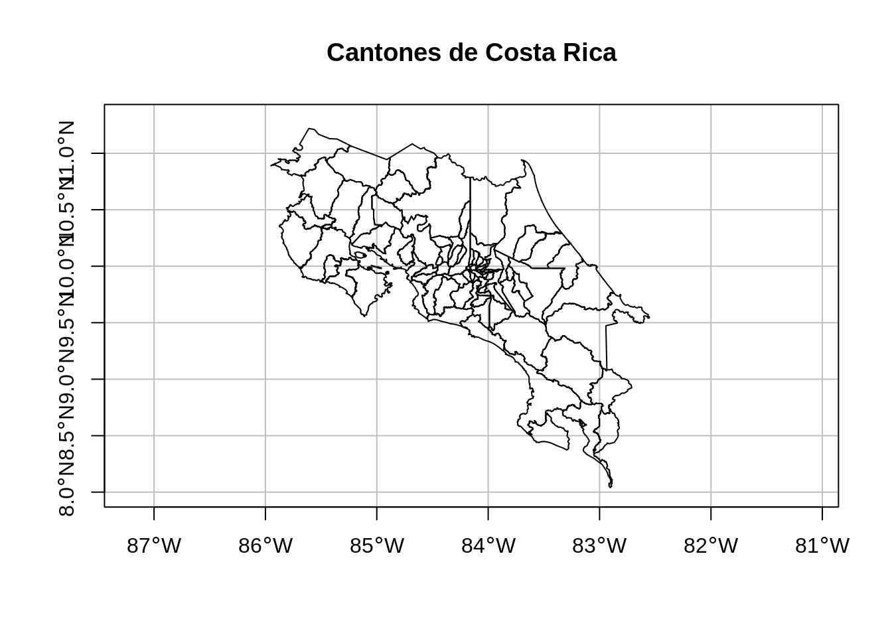
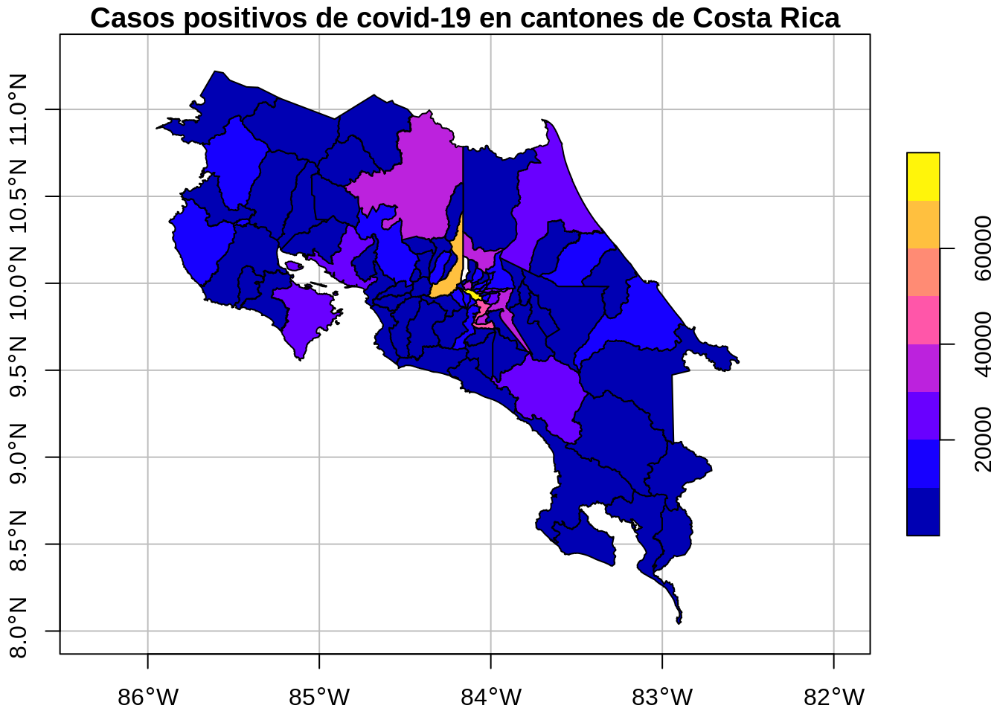

# Operaciones con datos de atributos

## Resumen
Se les llama atributos a los elementos de datos no espaciales o geométricos de un conjunto de datos geoespaciales. Estos datos pueden ser de tipos numéricos o textuales, entre otros. Un conjunto de datos vectoriales puede tener asociados varios campos de atributos, mientras que un conjunto de datos raster tiene solamente uno.

Las operaciones con atributos en datos vectoriales incluyen creación de subconjuntos, agregación y cruce de datos. Estas operaciones pueden ejecutarse con funciones del paquete base de R o con las de paquetes de Tidyverse. Por su parte, las operaciones con atributos en datos raster incluyen creación de subconjuntos y resumen de información.

## Trabajo previo

### Lecturas
Lovelace, R., Nowosad, J., & Münchow, J. (2019). *Geocomputation with R* (capítulo 3). CRC Press. https://geocompr.robinlovelace.net/

## Preparativos

### Carga de paquetes


```r
# Carga de paquetes

library(readr) # lectura de datos
library(dplyr) # transformación de datos
library(DT) # tablas interactivas
library(sf) # manejo de datos vectoriales
library(terra) # manejo de datos raster
library(raster) # manejo de datos raster
library(rgdal) # manejo de datos raster
library(leaflet) # mapas interactivos
```

### Conjuntos de datos para ejemplos

#### Cantones de Costa Rica
Es un [archivo GeoJSON con los polígonos de los cantones de Costa Rica](datos/ign/delimitacion-territorial-administrativa/cantones.geojson). Este archivo proviene de un [geoservicio de tipo Web Feature Service (WFS)](http://geos.snitcr.go.cr/be/IGN_5/wfs) publicado por el Instituto Geográfico Nacional (IGN). Se transforma a WGS84 para desplegarlo más fácilmente en `leaflet`.


```r
# Lectura y visualización de datos geoespaciales de cantones

# Lectura
cantones <-
  st_read(
    dsn = "datos/ign/delimitacion-territorial-administrativa/cantones.geojson",
    quiet = TRUE
  ) %>%
  st_transform(4326) # transformación a WGS84

# Visualización en un mapa
plot(
  cantones$geometry,
  extent = st_bbox(c(xmin = -86.0, xmax = -82.3, ymin = 8.0, ymax = 11.3)),
  main = "Cantones de Costa Rica",
  axes = TRUE,
  graticule = TRUE
)
```



#### Casos positivos de covid-19 en antones de Costa Rica
Es un [archivo CSV con el acumulado de casos positivos de covid-19 en cada cantón](datos/ministerio-salud/covid/05_30_22_CSV_POSITIVOS.csv). Es publicado regularmente por el Ministerio de Salud en el sitio web [Situación Nacional COVID-19](https://geovision.uned.ac.cr/oges/).


```r
# Lectura, transformación y visualización de casos positivos acumulados de covid-19 en cantones de Costa Rica

# Carga
covid_cantonal_positivos <-
  read_delim(file = "datos/ministerio-salud/covid/05_30_22_CSV_POSITIVOS.csv",
             locale = locale(encoding = "WINDOWS-1252"), # para desplegar correctamente acentos y otros caracteres
             col_select = c("cod_provin", "provincia", "cod_canton", "canton", "30/05/2022"))

# Transformación
covid_cantonal_positivos <-
  covid_cantonal_positivos %>%
  rename(positivos = '30/05/2022') %>% # renombramiento de columna
  filter(!is.na(canton) & canton != "Otros") # borrado de filas con valor NA u "Otros" en la columna canton

# Visualización en una tabla
covid_cantonal_positivos %>%
  datatable(options = list(
    pageLength = 5,
    language = list(url = '//cdn.datatables.net/plug-ins/1.10.11/i18n/Spanish.json')
  ))
```

```{=html}
<div id="htmlwidget-8fc4b2c751ed24b6c926" style="width:100%;height:auto;" class="datatables html-widget"></div>
<script type="application/json" data-for="htmlwidget-8fc4b2c751ed24b6c926">{"x":{"filter":"none","vertical":false,"data":[["1","2","3","4","5","6","7","8","9","10","11","12","13","14","15","16","17","18","19","20","21","22","23","24","25","26","27","28","29","30","31","32","33","34","35","36","37","38","39","40","41","42","43","44","45","46","47","48","49","50","51","52","53","54","55","56","57","58","59","60","61","62","63","64","65","66","67","68","69","70","71","72","73","74","75","76","77","78","79","80","81","82"],[1,1,1,1,1,1,1,1,1,1,1,1,1,1,1,1,1,1,1,1,2,2,2,2,2,2,2,2,2,2,2,2,2,2,2,2,3,3,3,3,3,3,3,3,4,4,4,4,4,4,4,4,4,4,5,5,5,5,5,5,5,5,5,5,5,6,6,6,6,6,6,6,6,6,6,6,7,7,7,7,7,7],["San José","San José","San José","San José","San José","San José","San José","San José","San José","San José","San José","San José","San José","San José","San José","San José","San José","San José","San José","San José","Alajuela","Alajuela","Alajuela","Alajuela","Alajuela","Alajuela","Alajuela","Alajuela","Alajuela","Alajuela","Alajuela","Alajuela","Alajuela","Alajuela","Alajuela","Alajuela","Cartago","Cartago","Cartago","Cartago","Cartago","Cartago","Cartago","Cartago","Heredia","Heredia","Heredia","Heredia","Heredia","Heredia","Heredia","Heredia","Heredia","Heredia","Guanacaste","Guanacaste","Guanacaste","Guanacaste","Guanacaste","Guanacaste","Guanacaste","Guanacaste","Guanacaste","Guanacaste","Guanacaste","Puntarenas","Puntarenas","Puntarenas","Puntarenas","Puntarenas","Puntarenas","Puntarenas","Puntarenas","Puntarenas","Puntarenas","Puntarenas","Limón","Limón","Limón","Limón","Limón","Limón"],[112,110,106,118,103,117,102,108,120,115,107,114,119,104,101,109,105,113,116,111,201,205,203,215,214,206,209,207,208,216,210,204,202,212,213,211,306,301,308,304,303,307,302,305,402,407,408,401,406,409,405,404,403,410,507,504,506,505,511,510,501,509,502,503,508,603,610,608,602,611,607,604,605,609,601,606,706,701,705,702,703,704],["Acosta","Alajuelita","Aserrí","Curridabat","Desamparados","Dota","Escazú","Goicoechea","León Cortés Castro","Montes de Oca","Mora","Moravia","Pérez Zeledón","Puriscal","San José","Santa Ana","Tarrazú","Tibás","Turrubares","Vázquez de Coronado","Alajuela","Atenas","Grecia","Guatuso","Los Chiles","Naranjo","Orotina","Palmares","Poás","Río Cuarto","San Carlos","San Mateo","San Ramón","Sarchí","Upala","Zarcero","Alvarado","Cartago","El Guarco","Jiménez","La Unión","Oreamuno","Paraíso","Turrialba","Barva","Belén","Flores","Heredia","San Isidro","San Pablo","San Rafael","Santa Barbara","Santo Domingo","Sarapiquí","Abangares","Bagaces","Cañas","Carrillo","Hojancha","La Cruz","Liberia","Nandayure","Nicoya","Santa Cruz","Tilarán","Buenos Aires","Corredores","Coto Brus","Esparza","Garabito","Golfito","Montes de Oro","Osa","Parrita","Puntarenas","Quepos","Guácimo","Limón","Matina","Pococí","Siquirres","Talamanca"],[4104,18973,10880,14518,43283,834,15134,25497,1339,9987,7132,11042,20987,5226,79939,15398,1958,15261,592,13885,64702,6078,13161,3112,3604,8865,4249,8078,6595,1521,32552,926,12730,3755,7257,2569,1835,33168,9620,1609,20370,9425,8799,8107,8831,5976,5841,31775,5346,6483,10362,8255,10378,7519,3314,3220,4135,7320,1310,3875,12834,1530,9235,11839,2858,5348,8645,5410,7493,6487,6276,3107,5527,3397,28090,7158,7842,16822,5822,20449,10349,5468]],"container":"<table class=\"display\">\n  <thead>\n    <tr>\n      <th> <\/th>\n      <th>cod_provin<\/th>\n      <th>provincia<\/th>\n      <th>cod_canton<\/th>\n      <th>canton<\/th>\n      <th>positivos<\/th>\n    <\/tr>\n  <\/thead>\n<\/table>","options":{"pageLength":5,"language":{"url":"//cdn.datatables.net/plug-ins/1.10.11/i18n/Spanish.json"},"columnDefs":[{"className":"dt-right","targets":[1,3,5]},{"orderable":false,"targets":0}],"order":[],"autoWidth":false,"orderClasses":false,"lengthMenu":[5,10,25,50,100]}},"evals":[],"jsHooks":[]}</script>
```

## Introducción
Se les llama atributos a los elementos de datos no espaciales o geométricos de un conjunto de datos geográficos. Estos datos pueden ser de tipos numéricos o textuales, entre otros. Un conjunto de datos vectoriales puede tener asociados varios campos de atributos, mientras que un conjunto de datos raster tiene solamente uno.

## Datos vectoriales
Las operaciones con atributos en datos vectoriales incluyen:

- Creación de subconjuntos (*subsetting*).  
- Agregación (*aggregation*).  
- Cruce (unión) de datos (*joining*). 

Seguidamente, se explicará como maneja estas operaciones el paquete `sf`.

## Manejo de datos de atributos con el paquete sf
Como se mencionó en capítulos anteriores, el paquete `sf` define una clase, llamada `sf`, la cual extiende la clase `data.frame` del paquete base de R. Los objetos de la clase `sf` tienen una fila (o *feature*) por cada observación y una columna por cada atributo. También tienen una columna especial para almacenar las geometrías (puntos, líneas, polígonos, etc.), la cual generalmente se denomina `geometry` o `geom`. Esto permite que sf utilice métodos (i.e. funciones) de la clase `data.frame`, tales como `plot()` y `summary()`, entre otros.

Además de `data.frame`, `sf` es compatible con clases como las del paquete [tibble](https://tibble.tidyverse.org/), las cuales pueden manipularse mediante los métodos de `dplyr`. Esto que permite un manejo *tidy* (i.e. ordenado, organizado) de los datos geoespaciales, de acuerdo con el enfoque de [Tidyverse](https://www.tidyverse.org/).

En la secciones siguientes, se explicará el manejo de datos de atributos tanto mediante funciones y operaciones del paquete base de R, como mediante Tidyverse.

### Funciones básicas para manejo de data frames y objetos sf
Las siguientes son algunas de las funciones disponibles para obtener información básica de un objeto sf.


```r
# Funciones básicas para manejo de objetos tipo data.frame y sf

# Clase de cantones
class(cantones)
#> [1] "sf"         "data.frame"

# Dimensiones (cantidad de filas y de columnas)
dim(cantones)
#> [1] 82 11

# Cantidad de filas (i.e. observaciones)
nrow(cantones)
#> [1] 82

# Cantidad de columnas (i.e. variables)
ncol(cantones)
#> [1] 11

# Nombres de las columnas
names(cantones)
#>  [1] "gml_id"     "gmlid"      "cod_catalo" "cod_canton"
#>  [5] "canton"     "ori_toponi" "area"       "cod_provin"
#>  [9] "provincia"  "version"    "geometry"

# Estructura del conjunto de datos
glimpse(cantones)
#> Rows: 82
#> Columns: 11
#> $ gml_id     <chr> "limitecantonal_5k.1", "limitecantonal_…
#> $ gmlid      <chr> "limitecantonal_5k.1", "limitecantonal_…
#> $ cod_catalo <chr> "160104", "160104", "160104", "160104",…
#> $ cod_canton <int> 610, 607, 608, 605, 603, 119, 606, 704,…
#> $ canton     <chr> "Corredores", "Golfito", "Coto Brus", "…
#> $ ori_toponi <chr> "Tiene su origen en el topónimo del río…
#> $ area       <dbl> 623.61, 1752.75, 944.24, 1932.70, 2382.…
#> $ cod_provin <int> 6, 6, 6, 6, 6, 1, 6, 7, 6, 1, 1, 6, 1, …
#> $ provincia  <chr> "Puntarenas", "Puntarenas", "Puntarenas…
#> $ version    <chr> "20201222", "20201222", "20201222", "20…
#> $ geometry   <MULTIPOLYGON [°]> MULTIPOLYGON (((-82.94161 …
```

La función `st_drop_geometry()` remueve la columna de geometría de un objeto `sf`. Puede ser útil cuando, por ejemplo, solo se necesita trabajar con los atributos o cuando la columna con la geometría consume demasiados recursos del computador.


```r
# Ejemplos de uso de st_drop_geometry()

# Remoción de la columna de geometría
cantones_df <- st_drop_geometry(cantones)

# Nombres de las columnas (nótese que ya no está la columna de geometría)
names(cantones_df)
#>  [1] "gml_id"     "gmlid"      "cod_catalo" "cod_canton"
#>  [5] "canton"     "ori_toponi" "area"       "cod_provin"
#>  [9] "provincia"  "version"

# Clase de df_cantones (nótese como no se muestra ya la clase sf)
class(cantones_df)
#> [1] "data.frame"

# Tamaño del conjunto de datos original (tipo sf)
print(object.size(cantones), units="Kb")
#> 20442.9 Kb

# Tamaño del conjunto de datos sin geometrías (tipo data.frame)
print(object.size(cantones_df), units="Kb")
#> 42.5 Kb
```

Para algunas operaciones, también es posible ocultar la columna de geometría de un conjunto de datos (sin borrarla) mediante el argumento `drop = TRUE`.


```r
# Ejemplos de uso del argumento drop

# Sin drop = TRUE
cantones[1:10, c("canton", "area")]
#> Simple feature collection with 10 features and 2 fields
#> Geometry type: MULTIPOLYGON
#> Dimension:     XY
#> Bounding box:  xmin: -84.55536 ymin: 8.040247 xmax: -82.55285 ymax: 9.76779
#> Geodetic CRS:  WGS 84
#>           canton    area                       geometry
#> 1     Corredores  623.61 MULTIPOLYGON (((-82.94161 8...
#> 2        Golfito 1752.75 MULTIPOLYGON (((-83.46678 8...
#> 3      Coto Brus  944.24 MULTIPOLYGON (((-82.90501 8...
#> 4            Osa 1932.70 MULTIPOLYGON (((-83.83946 9...
#> 5   Buenos Aires 2382.94 MULTIPOLYGON (((-83.32101 9...
#> 6  Pérez Zeledón 1901.08 MULTIPOLYGON (((-83.77329 9...
#> 7         Quepos  557.85 MULTIPOLYGON (((-84.13572 9...
#> 8      Talamanca 2792.23 MULTIPOLYGON (((-82.89452 9...
#> 9        Parrita  483.22 MULTIPOLYGON (((-84.30298 9...
#> 10       Tarrazú  291.27 MULTIPOLYGON (((-83.98178 9...

# Con drop = TRUE
cantones[1:10, c("canton", "area"), drop=TRUE]
#>           canton    area
#> 1     Corredores  623.61
#> 2        Golfito 1752.75
#> 3      Coto Brus  944.24
#> 4            Osa 1932.70
#> 5   Buenos Aires 2382.94
#> 6  Pérez Zeledón 1901.08
#> 7         Quepos  557.85
#> 8      Talamanca 2792.23
#> 9        Parrita  483.22
#> 10       Tarrazú  291.27
```

### Creación de subconjuntos
Frecuentemente, es necesario extrer subconjuntos del conjunto de datos original, para facilidad de manejo y para atender requerimientos específicos de un análisis. En esta sección, se explican las diferentes opciones para creación de subconjuntos, tanto con el paquete base de R como con `dplyr`. En resumen, estas son las opciones:

- Con el paquete base:
  - La notación de `[]` y `$`
  - La función `subset()`
- Con el paquete `dplyr`:
  - La función `select()`
  - La función `slice()`
  - La función `filter()`

#### Notaciones y funciones del paquete base

##### La notación de `[]` y `$`
La notación de paréntesis cuadrados (`[]`) y el signo de dólar (`$`) permite crear subconjuntos con base en la posición de filas y de columnas, por medio de nombres de columnas y a través de la especificación de condiciones (i.e. expresiones lógicas).


```r
# Ejemplos de uso de la notación []

# Subconjunto especificado por posiciones de filas
cantones[1:10, ]

# Subconjunto especificado por posiciones de columnas
cantones[, 8:10]

# Subconjunto especificado por nombres de columnas
cantones[, c("canton", "area", "provincia")]
```

Especificación mediante una condición (i.e. expresión lógica):


```r
# Ejemplos de uso de la notación $

# Cantones de la provincia de Cartago
cantones[cantones$provincia == "Cartago", c("canton", "provincia"), drop = TRUE]
#>       canton provincia
#> 19 El Guarco   Cartago
#> 20   Cartago   Cartago
#> 22   Paraíso   Cartago
#> 23   Jiménez   Cartago
#> 24 Turrialba   Cartago
#> 26  Oreamuno   Cartago
#> 29  La Unión   Cartago
#> 34  Alvarado   Cartago
```

##### La función subset()
La función [subset()](https://www.rdocumentation.org/packages/base/versions/3.6.2/topics/subset) también retorna un subconjunto cuyos registros cumplen una condición.


```r
# Ejemplos de uso de subset()

# Cantones con área >= 2000 km2
subset(cantones[, c("canton", "area"), drop = TRUE],
       area >= 2000)
#>          canton    area
#> 5  Buenos Aires 2382.94
#> 8     Talamanca 2792.23
#> 70       Pococí 2408.76
#> 71   San Carlos 3352.33
#> 74    Sarapiquí 2144.38
```

Los operadores lógicos y de comparación que pueden utilizarse en las condiciones de la función `subset()`, y en expresiones lógicas en general, se listan en la siguiente tabla:


|Operador     |Descripción                          |
|:------------|:------------------------------------|
|==           |igual a                              |
|!=           |distinto de                          |
|>, <         |mayor que, menor que                 |
|>=, <=       |mayor o igual que, menor o igual que |
|&, &#124;, ! |Operadores lógicos: y, o, no         |

#### Métodos del paquete dplyr
Las funciones del paquete base de R son confiables y ampliamente usadas. Sin embargo, el enfoque más moderno de `dplyr` permite flujos de trabajo más intuitivos y es más rápido, debido a que se apoya en código escrito en el lenguaje C++. Esto es útil, por ejemplo, cuando se trabaja con conjuntos de datos grandes (_big data_) y cuando se necesita integración con bases de datos. Los principales métodos de `dplyr` para creación de subconjuntos son `select()`, `slice()` y `filter()`.

##### El método select()
`dplyr::select()` permite seleccionar y renombrar columnas de un conjunto de datos.


```r
# Ejemplos de uso de dplyr::select()

# Selección de columnas
cantones %>%
  dplyr::select(canton, provincia) # se especifica el nombre del paquete para evitar un conflicto con raster::select
#> Simple feature collection with 82 features and 2 fields
#> Geometry type: MULTIPOLYGON
#> Dimension:     XY
#> Bounding box:  xmin: -87.10188 ymin: 5.498558 xmax: -82.55285 ymax: 11.21964
#> Geodetic CRS:  WGS 84
#> First 10 features:
#>           canton  provincia                       geometry
#> 1     Corredores Puntarenas MULTIPOLYGON (((-82.94161 8...
#> 2        Golfito Puntarenas MULTIPOLYGON (((-83.46678 8...
#> 3      Coto Brus Puntarenas MULTIPOLYGON (((-82.90501 8...
#> 4            Osa Puntarenas MULTIPOLYGON (((-83.83946 9...
#> 5   Buenos Aires Puntarenas MULTIPOLYGON (((-83.32101 9...
#> 6  Pérez Zeledón   San José MULTIPOLYGON (((-83.77329 9...
#> 7         Quepos Puntarenas MULTIPOLYGON (((-84.13572 9...
#> 8      Talamanca      Limón MULTIPOLYGON (((-82.89452 9...
#> 9        Parrita Puntarenas MULTIPOLYGON (((-84.30298 9...
#> 10       Tarrazú   San José MULTIPOLYGON (((-83.98178 9...

# Selección y cambio de nombre de columnas
cantones %>%
  dplyr::select(canton, area_km2 = area, provincia)
#> Simple feature collection with 82 features and 3 fields
#> Geometry type: MULTIPOLYGON
#> Dimension:     XY
#> Bounding box:  xmin: -87.10188 ymin: 5.498558 xmax: -82.55285 ymax: 11.21964
#> Geodetic CRS:  WGS 84
#> First 10 features:
#>           canton area_km2  provincia
#> 1     Corredores   623.61 Puntarenas
#> 2        Golfito  1752.75 Puntarenas
#> 3      Coto Brus   944.24 Puntarenas
#> 4            Osa  1932.70 Puntarenas
#> 5   Buenos Aires  2382.94 Puntarenas
#> 6  Pérez Zeledón  1901.08   San José
#> 7         Quepos   557.85 Puntarenas
#> 8      Talamanca  2792.23      Limón
#> 9        Parrita   483.22 Puntarenas
#> 10       Tarrazú   291.27   San José
#>                          geometry
#> 1  MULTIPOLYGON (((-82.94161 8...
#> 2  MULTIPOLYGON (((-83.46678 8...
#> 3  MULTIPOLYGON (((-82.90501 8...
#> 4  MULTIPOLYGON (((-83.83946 9...
#> 5  MULTIPOLYGON (((-83.32101 9...
#> 6  MULTIPOLYGON (((-83.77329 9...
#> 7  MULTIPOLYGON (((-84.13572 9...
#> 8  MULTIPOLYGON (((-82.89452 9...
#> 9  MULTIPOLYGON (((-84.30298 9...
#> 10 MULTIPOLYGON (((-83.98178 9...
```

##### El método slice()
`slice()` es el equivalente de `select()` para filas. Crea un subconjunto con base en las posiciones de las filas.


```r
# Ejemplos de uso de slice()

# Subconjunto especificado mediante un rango de filas
cantones %>%
  slice(1:10)
```

##### El método filter()
`filter()` es el equivalente en `dplyr` de la función `subset()` del paquete `base`. Retorna los registros que cumplen con una condición.


```r
# Androides de "La Guerra de las Galaxias"
starwars %>%
  filter(species == "Droid")
#> # A tibble: 6 × 14
#>   name   height  mass hair_color skin_color  eye_color
#>   <chr>   <int> <dbl> <chr>      <chr>       <chr>    
#> 1 C-3PO     167    75 <NA>       gold        yellow   
#> 2 R2-D2      96    32 <NA>       white, blue red      
#> 3 R5-D4      97    32 <NA>       white, red  red      
#> 4 IG-88     200   140 none       metal       red      
#> 5 R4-P17     96    NA none       silver, red red, blue
#> 6 BB8        NA    NA none       none        black    
#> # … with 8 more variables: birth_year <dbl>, sex <chr>,
#> #   gender <chr>, homeworld <chr>, species <chr>,
#> #   films <list>, vehicles <list>, starships <list>
```

##### El operador pipe (%>%)
Los métodos del paquete `dplyr` (y otros) suelen ser utilizados conjuntamente con el [operador _pipe_ (%>%)](http://r4ds.had.co.nz/pipes.html), el cual posibilita el "encadenamiento" (*chaining*) de funciones: la salida de la función previa se convierte en el primer argumento de la siguiente función. En el siguiente ejemplo, el conjunto de datos [starwars](https://dplyr.tidyverse.org/reference/starwars.html) se pasa como entrada al método `filter()`, para filtrar los personajes humanos. Seguidamente, el resultado se pasa a `select()`, para seleccionar las columnas  `name`, `homeworld` y `species`. Finalmente, `slice()` reduce el resultado a las 10 primeras filas.


```r
# Encadenamiento de funciones mediante pipes (%>%)

starwars %>%
  filter(species == "Human") %>%
  dplyr::select(name, homeworld, species) %>%
  slice(1:10)
#> # A tibble: 10 × 3
#>    name               homeworld species
#>    <chr>              <chr>     <chr>  
#>  1 Luke Skywalker     Tatooine  Human  
#>  2 Darth Vader        Tatooine  Human  
#>  3 Leia Organa        Alderaan  Human  
#>  4 Owen Lars          Tatooine  Human  
#>  5 Beru Whitesun lars Tatooine  Human  
#>  6 Biggs Darklighter  Tatooine  Human  
#>  7 Obi-Wan Kenobi     Stewjon   Human  
#>  8 Anakin Skywalker   Tatooine  Human  
#>  9 Wilhuff Tarkin     Eriadu    Human  
#> 10 Han Solo           Corellia  Human
```

Una alternativa al uso de *pipes* es el "anidamiento" (*nesting*) de las funciones:


```r
# Anidamiento de funciones
slice(
  dplyr::select(
    filter(
      starwars,
      species=="Human"
    ),
    name, homeworld, species
  ),
  1:10
)
#> # A tibble: 10 × 3
#>    name               homeworld species
#>    <chr>              <chr>     <chr>  
#>  1 Luke Skywalker     Tatooine  Human  
#>  2 Darth Vader        Tatooine  Human  
#>  3 Leia Organa        Alderaan  Human  
#>  4 Owen Lars          Tatooine  Human  
#>  5 Beru Whitesun lars Tatooine  Human  
#>  6 Biggs Darklighter  Tatooine  Human  
#>  7 Obi-Wan Kenobi     Stewjon   Human  
#>  8 Anakin Skywalker   Tatooine  Human  
#>  9 Wilhuff Tarkin     Eriadu    Human  
#> 10 Han Solo           Corellia  Human
```

**Ejercicio: mediante las funciones `select()` y `filter()` de `dplyr`, cree un nuevo objeto `sf` que contenga los cantones de Puntarenas y Guanacaste con área mayor o igual a 2000 km2. Incluya las columnas de provincia, cantón y área.**

### Agregación de datos
Las operaciones de agregación realizan cálculos (suma, promedio, etc.) a partir de la agrupación de valores de variables. En esta sección, se explican funciones de agregación contenidas en los paquetes  `stats`, `sf` y `dplyr`, las cuales son:

- Del paquete stats:
  - La función `aggregate()`
- Del paquete sf:
  - El método `aggregate()`  
- Del paquete dplyr:
  - El método `summarize()`
  
#### La función aggregate() de stats
La función `aggregate()` del paquete [stats](https://rdrr.io/r/#stats) aplica una función de agregación (ej. suma, promedio, mínimo, máximo) sobre una columna. El resultado es un objeto de tipo `data.frame`.


```r
# Ejemplos de uso de stats::agregate()

# Suma de áreas de cantones por provincia
aggregate(
  data = cantones, 
  area ~ provincia, 
  FUN = sum, 
  na.rm = TRUE
)
#>    provincia     area
#> 1   Alajuela  9772.26
#> 2    Cartago  3093.23
#> 3 Guanacaste 10196.30
#> 4    Heredia  2663.45
#> 5      Limón  9176.97
#> 6 Puntarenas 11298.51
#> 7   San José  4969.73
```

#### El método aggregate() de sf
`aggregate()` es una [función genérica](https://adv-r.hadley.nz/s3.html#s3-methods), lo que significa que puede comportarse de manera diferente, dependiendo de los valores de entrada. El paquete `sf` también provee una versión de [aggregate()](https://r-spatial.github.io/sf/reference/aggregate.sf.html), la cual se activa cuando recibe un objeto  `sf`` y se usa el argumento  `by`. El resultado es un objeto de tipo `sf`.


```r
# Ejemplos de uso de sf::agregate()

# Suma de áreas de cantones por provincia
aggregate(
  cantones["area"], 
  by = list(cantones$provincia), 
  FUN = sum, 
  na.rm = TRUE
)
#> Simple feature collection with 7 features and 2 fields
#> Attribute-geometry relationship: 0 constant, 1 aggregate, 1 identity
#> Geometry type: GEOMETRY
#> Dimension:     XY
#> Bounding box:  xmin: -87.10188 ymin: 5.498558 xmax: -82.55285 ymax: 11.21964
#> Geodetic CRS:  WGS 84
#>      Group.1     area                       geometry
#> 1   Alajuela  9772.26 POLYGON ((-84.46249 9.92404...
#> 2    Cartago  3093.23 POLYGON ((-83.77405 10.0635...
#> 3 Guanacaste 10196.30 MULTIPOLYGON (((-85.19022 1...
#> 4    Heredia  2663.45 POLYGON ((-84.17533 10.0046...
#> 5      Limón  9176.97 POLYGON ((-82.8705 9.76278,...
#> 6 Puntarenas 11298.51 MULTIPOLYGON (((-87.06866 5...
#> 7   San José  4969.73 POLYGON ((-84.15026 9.62930...
```

#### El método `summarise()` de dplyr
`summarise()` es el equivalente de `aggregate()` en el paquete `dplyr`. Suele utilizarse conjuntamente con `group_by()`, que especifica la variable a agrupar.


```r
# Ejemplos de uso de de summarise()

# Suma de áreas de cantones por provincia
cantones %>%
  group_by(provincia) %>%
  summarise(area_km2 = sum(area, na.rm = TRUE))
#> Simple feature collection with 7 features and 2 fields
#> Geometry type: GEOMETRY
#> Dimension:     XY
#> Bounding box:  xmin: -87.10188 ymin: 5.498558 xmax: -82.55285 ymax: 11.21964
#> Geodetic CRS:  WGS 84
#> # A tibble: 7 × 3
#>   provincia  area_km2                               geometry
#>   <chr>         <dbl>                         <GEOMETRY [°]>
#> 1 Alajuela      9772. POLYGON ((-85.24136 11.06429, -85.241…
#> 2 Cartago       3093. POLYGON ((-83.99836 9.876381, -83.998…
#> 3 Guanacaste   10196. MULTIPOLYGON (((-85.08773 10.16581, -…
#> 4 Heredia       2663. POLYGON ((-84.16124 10.43999, -84.161…
#> 5 Limón         9177. POLYGON ((-83.67931 10.9093, -83.6793…
#> 6 Puntarenas   11299. MULTIPOLYGON (((-87.06792 5.504218, -…
#> 7 San José      4970. POLYGON ((-83.92911 10.19094, -83.929…
```

`summarize()` permite renombrar las variables, como se muestra seguidamente.


```r
# Ejemplo de renombramiento de variables con summarise()

# Suma total de las áreas de cantones
cantones %>%
  summarize(area_km2 = sum(area, na.rm = TRUE),
            cantidad_cantones = n())
#> Simple feature collection with 1 feature and 2 fields
#> Geometry type: MULTIPOLYGON
#> Dimension:     XY
#> Bounding box:  xmin: -87.10188 ymin: 5.498558 xmax: -82.55285 ymax: 11.21964
#> Geodetic CRS:  WGS 84
#>   area_km2 cantidad_cantones                       geometry
#> 1 51170.45                82 MULTIPOLYGON (((-87.06792 5...
```

El siguiente ejemplo utiliza otras funciones del paquete `dplyr` para encontrar las tres provincias más grandes y sus respectivas áreas, con base en los datos disponibles en la capa de cantones.


```r
# Área y cantidad de cantones de las tres provincias más grandes
cantones %>%
  st_drop_geometry() %>%  
  dplyr::select(area, provincia) %>%
  group_by(provincia) %>%
  summarise(area = sum(area, na.rm = TRUE),
            cantidad_cantones = n()) %>%
  arrange(desc(area)) %>%
  top_n(n = 3, wt = area)
#> # A tibble: 3 × 3
#>   provincia    area cantidad_cantones
#>   <chr>       <dbl>             <int>
#> 1 Puntarenas 11299.                11
#> 2 Guanacaste 10196.                11
#> 3 Alajuela    9772.                16
```

**Ejercicio: mediante ```summarize()```, y otras funciones de dplyr, despliegue el área y la cantidad de cantones de las dos provincias más pequeñas.**

### Cruce de datos
La combinación de datos ubicados en diferentes fuentes es una tarea común en análisis de información. Este tipo de operaciones se realizan con base en atributos que son comunes en los conjuntos de datos que se desea "cruzar" (*join*). El paquete `dplyr` proporciona varios [métodos para realizar cruces de datos](https://dplyr.tidyverse.org/reference/mutate-joins.html), entre los que se encuentran:

- `left_join()`
- `inner_join()`
- `right_join()`
- `full_join()`

Seguidamente, se ejemplificarán las dos primeras.

#### El método left_join()
El método `left_join()` mantiene todos los registros de la tabla del lado izquierdo y agrega las columnas de la tabla del lado derecho, en los registros en los que hay coincidencia.

Todos los tipos de *joins* requiere de al menos una columna que sea común a ambos conjuntos de datos. En este caso, esa columna es `cod_canton`. Si la columna no tiene el mismo nombre, puede utilizarse el argumento `by` (ej. `by = c(cod_canton_1 = "cod_canton_2")`, en donde `cod_canton_1` es el nombre de la columna en el primer conjunto de datos y `cod_canton_2` en el segundo).


```r
# Ejemplos de uso de left_join()

# "Join" de los datos geoespaciales de cantones con los de casos positivos de covid. 
# Ambas tablas comparten la columna cod_canton.
covid_cantonal_positivos_geoespacial <- left_join(cantones, covid_cantonal_positivos)
#> Joining, by = c("cod_canton", "canton", "cod_provin",
#> "provincia")

# Visualización en un mapa generado con plot()
plot(
  covid_cantonal_positivos_geoespacial["positivos"],
  extent = st_bbox(c(xmin = -86.0, xmax = -82.3, ymin = 8.0, ymax = 11.3)),
  main = "Casos positivos de covid-19 en cantones de Costa Rica",
  axes = TRUE,
  graticule = TRUE
)
```



Seguidamente, se muestra el mismo resultado en un mapa `leaflet`.


```r
# OPCIONAL: simplificación de geometrías

covid_cantonal_positivos_geoespacial <-
  covid_cantonal_positivos_geoespacial %>%
  st_transform(5367) %>%
  st_simplify(dTolerance = 100) %>%
  st_transform(4326)
```


```r
# Función para generar colores
colores <-
  colorNumeric(palette = "YlOrBr",
               domain = covid_cantonal_positivos_geoespacial$positivos,
               na.color = "transparent")

# Mapa
leaflet() %>%
  setView(lng = -84.19452,
          lat = 9.572735,
          zoom = 7) %>%
  addProviderTiles(providers$Stamen.TonerLite, group = "Stamen TonerLite") %>% # capa base de Stamen TonerLite
  addProviderTiles(providers$OpenStreetMap.Mapnik, group = "OpenStreetMap") %>% # capa base de OSM
  addProviderTiles(providers$Esri.WorldImagery, group = "ESRI World Imagery") %>% # capa base de ESRI World Imagery
  addPolygons(
    # polígonos de cantones
    data = covid_cantonal_positivos_geoespacial,
    fillColor = ~ colores(covid_cantonal_positivos_geoespacial$positivos),
    fillOpacity = 0.7,
    color = "black",
    stroke = TRUE,
    weight = 1.0,
    popup = paste(
      paste(
        "<strong>Cantón:</strong>",
        covid_cantonal_positivos_geoespacial$canton
      ),
      paste(
        "<strong>Casos positivos de covid:</strong>",
        covid_cantonal_positivos_geoespacial$positivos
        
      ),
      sep = '<br/>'
    ),
    group = "Casos positivos de covid"
  ) %>%
  addLayersControl( # control de capas
    baseGroups = c("Stamen TonerLite", "OpenStreetMap", "ESRI World Imagery"),
    overlayGroups = c("Casos positivos de COVID")
  ) %>%
  addLegend( # leyenda
    position = "bottomleft",
    pal = colores,
    values = covid_cantonal_positivos_geoespacial$positivos,
    group = "Casos positivos de COVID",
    title = "Cantidad de casos"
  )
```
