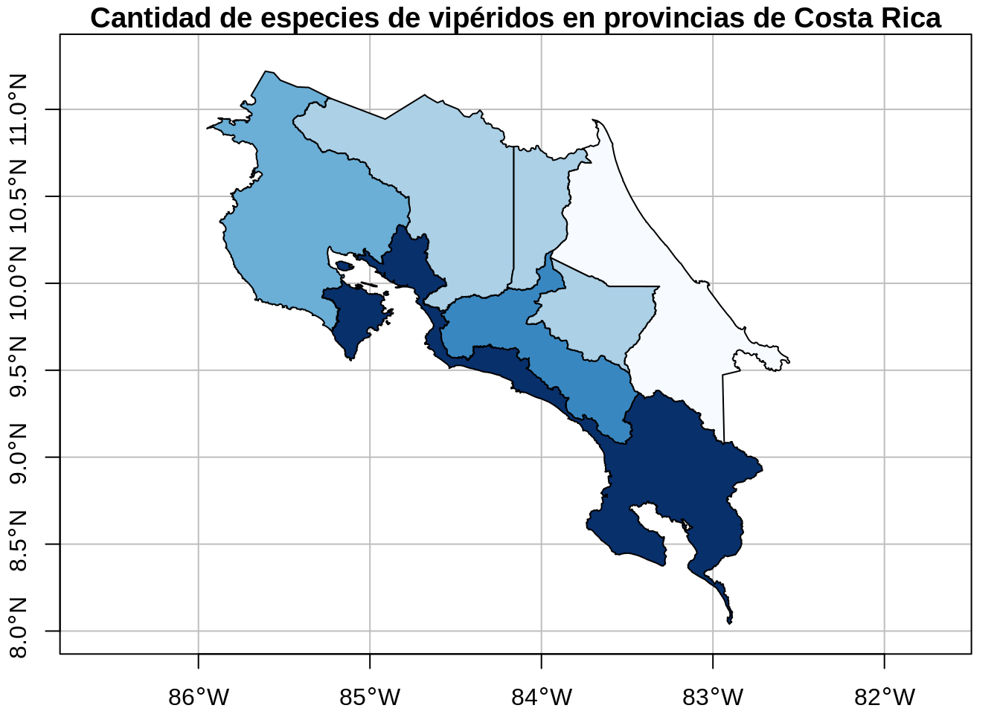

# Operaciones con datos espaciales

## Resumen
Las operaciones espaciales en datos vectoriales incluyen creación de subconjuntos espaciales, unión de datos espaciales, agregación espacial y relaciones de distancia, entre otras. Estas operaciones pueden ejecutarse con funciones del paquete base de R o con las de paquetes de Tidyverse. Por su parte, las operaciones espaciales en datos raster incluyen creación de subconjuntos espaciales y álgebra de mapas, entre otras.

## Trabajo previo

### Lecturas
Lovelace, R., Nowosad, J., & Münchow, J. (2019). *Geocomputation with R* (capítulo 4). CRC Press. https://geocompr.robinlovelace.net/

## Preparativos

### Carga de paquetes


```r
# Carga de paquetes

library(dplyr) # transformación de datos
library(sf) # manejo de datos vectoriales
library(DT) # tablas interactivas
library(leaflet) # mapas interactivos
library(leaflet.extras) # funciones adicionales de leaflet
library(leafem) # funciones adicionales de leaflet
```

Datos de ejemplo de Lovelace et al.:


```r
# Instalación de paquete de datos de ejemplo de Lovelace et al.

install.packages("spData")
```


```r
# Carga de paquete de datos de ejemplo de Lovelace et al.

library(spData)
```

### Conjuntos de datos para ejemplos

#### Provincias de Costa Rica
Es un [archivo GeoJSON con los polígonos de las provincias de Costa Rica](datos/ign/delimitacion-territorial-administrativa/provincias.geojson). Este archivo proviene de un [geoservicio de tipo Web Feature Service (WFS)](http://geos.snitcr.go.cr/be/IGN_5/wfs) publicado por el Instituto Geográfico Nacional (IGN). Se transforma a WGS84 para combinarlo más fácilmente con otros conjuntos de datos.


```r
# Lectura y visualización de datos geoespaciales de provincias

# Lectura
provincias <-
  st_read(
    dsn = "datos/ign/delimitacion-territorial-administrativa/provincias.geojson",
    quiet = TRUE
  ) %>%
  st_transform(4326) # transformación a WGS84

# Transformación
provincias <-
  provincias %>%
  st_transform(5367) %>%
  st_simplify(dTolerance = 100) %>% # simplificación de geometrías
  st_transform(4326)

# Visualización en un mapa
plot(
  provincias$geometry,
  extent = st_bbox(c(xmin = -86.0, xmax = -82.3, ymin = 8.0, ymax = 11.3)),
  main = "Provincias de Costa Rica",
  axes = TRUE,
  graticule = TRUE
)
```


#### Cantones de Costa Rica
Es un [archivo GeoJSON con los polígonos de los cantones de Costa Rica](datos/ign/delimitacion-territorial-administrativa/cantones.geojson). Este archivo proviene de un [geoservicio de tipo Web Feature Service (WFS)](http://geos.snitcr.go.cr/be/IGN_5/wfs) publicado por el Instituto Geográfico Nacional (IGN). Se transforma a WGS84 para combinarlo más fácilmente con otros conjuntos de datos.


```r
# Lectura y visualización de datos geoespaciales de cantones

# Lectura
cantones <-
  st_read(
    dsn = "datos/ign/delimitacion-territorial-administrativa/cantones.geojson",
    quiet = TRUE
  ) %>%
  st_transform(4326) # transformación a WGS84

# Transformación
cantones <-
  cantones %>%
  st_transform(5367) %>%
  st_simplify(dTolerance = 100) %>% # simplificación de geometrías
  st_transform(4326)

# Visualización en un mapa
plot(
  cantones$geometry,
  extent = st_bbox(c(xmin = -86.0, xmax = -82.3, ymin = 8.0, ymax = 11.3)),
  main = "Cantones de Costa Rica",
  axes = TRUE,
  graticule = TRUE
)
```


#### Aeródromos de Costa Rica
Es un [archivo GeoJSON con las geometrías de puntos de los aeródromos de Costa Rica](datos/ign/infraestructura/aerodromos.geojson). Este archivo proviene de un [geoservicio de tipo Web Feature Service (WFS)](https://geos.snitcr.go.cr/be/IGN_200/wfs?version=1.1.0) publicado por el Instituto Geográfico Nacional (IGN). Se transforma a WGS84 para combinarlo más fácilmente con otros conjuntos de datos.


```r
# Lectura y visualización de datos geoespaciales de aeródromos

# Lectura
aerodromos <-
  st_read(
    dsn = "datos/ign/infraestructura/aerodromos.geojson",
    quiet = TRUE
  ) %>%
  st_transform(4326) # transformación a WGS84

# Visualización en un mapa
plot(
  aerodromos$geometry,
  pch = 16,
  main = "Aeródromos de Costa Rica",
  axes = TRUE,
  graticule = TRUE
)
```


#### Vipéridos de Costa Rica
Es un [archivo CSV con registros de presencia de la familia *Viperidae* (serpientes venenosas) de Costa Rica](datos/gbif/viperidos.csv). Este archivo proviene de una [consulta al portal de datos de la Infraestructura Mundial de Información en Biodiversidad (GBIF)](https://www.gbif.org/occurrence/download/0362184-210914110416597).


```r
# Lectura y visualización de datos geoespaciales de aeródromos

# Lectura
viperidos <-
  st_read(
    "datos/gbif/viperidos.csv",
    options = c(
      "X_POSSIBLE_NAMES=decimalLongitude", # columna de longitud decimal
      "Y_POSSIBLE_NAMES=decimalLatitude"   # columna de latitud decimal
    ),
    quiet = TRUE
  )

# Asignación del CRS WGS84
st_crs(viperidos) <- 4326

# Visualización en un mapa
plot(
  viperidos$geometry,
  pch = 16,
  main = "Vipéridos de Costa Rica",
  axes = TRUE,
  graticule = TRUE
)
```


## Introducción
Esta lección brinda una visión general de las operaciones espaciales en datos vectoriales implementadas en el paquete `sf` y en datos raster implementadas en el paquete `terra`.

## Datos vectoriales
Las operaciones espaciales en datos vectoriales incluyen:

- Creación de subconjuntos espaciales (*spatial subsetting*).  
- Unión de datos espaciales (*spatial joining*).
- Agregación espacial (*spatial aggregation*).
- Relaciones de distancia. 

Seguidamente, se explicará como maneja estas operaciones el paquete `sf`.

## Manejo de datos espaciales con el paquete sf

### Creación de subconjuntos espaciales
Es el proceso de selección de objetos espaciales con base en su relación con otros objetos espaciales. Estas relaciones se expresan como [predicados espaciales](https://en.wikipedia.org/wiki/DE-9IM), los cuales están implementados como [métodos de sf](https://r-spatial.github.io/sf/reference/geos_binary_pred.html).

La creación de subconjuntos espaciales es análoga a la creación de subconjuntos por datos de atributos. Puede realizarse a través de los operadores `[` y `$` del paquete base de R o por medio de la función `filter()` de `dplyr`.

En los dos ejemplos siguientes, se utiliza el método `st_within()` para filtrar los puntos contenidos en un polígono. 

Primero, se utilizan los operadores del paquete base.


```r
# Selección de la provincia de Limón (por atributos)
limon <- provincias[provincias$provincia == "Limón",]

# Selección de los aeródromos ubicados en Limón (espacial)
aerodromos_limon <- aerodromos[limon, , op = st_within]
```

Mapa leaflet.


```r
# Mapa leaflet
leaflet() %>%
  addTiles() %>% # capa base de OSM
  addPolygons( # capa de provincias (polígonos)
    data = limon,
    color = "black",
    fillColor = "transparent",
    stroke = TRUE,
    weight = 1.0,
  ) %>%  
  addCircleMarkers( # capa de registros de presencia (puntos)
    data = aerodromos_limon,
    stroke = F,
    radius = 4,
    fillColor = 'brown',
    fillOpacity = 1
  )
```

```{=html}
<div id="htmlwidget-717265d8bd7349f12329" style="width:672px;height:480px;" class="leaflet html-widget"></div>
<script type="application/json" data-for="htmlwidget-717265d8bd7349f12329">{"x":{"options":{"crs":{"crsClass":"L.CRS.EPSG3857","code":null,"proj4def":null,"projectedBounds":null,"options":{}}},"calls":[{"method":"addTiles","args":["https://{s}.tile.openstreetmap.org/{z}/{x}/{y}.png",null,null,{"minZoom":0,"maxZoom":18,"tileSize":256,"subdomains":"abc","errorTileUrl":"","tms":false,"noWrap":false,"zoomOffset":0,"zoomReverse":false,"opacity":1,"zIndex":1,"detectRetina":false,"attribution":"&copy; <a href=\"https://openstreetmap.org\">OpenStreetMap<\/a> contributors, <a href=\"https://creativecommons.org/licenses/by-sa/2.0/\">CC-BY-SA<\/a>"}]},{"method":"addPolygons","args":[[[[{"lng":[-83.6707753485589,-83.6751745180743,-83.6708000112202,-83.6674235737055,-83.6683153758099,-83.670991034167,-83.6756666275145,-83.6784659500778,-83.6829500315773,-83.6765775548727,-83.676344615845,-83.6793030954687,-83.6756681569426,-83.6777646991248,-83.6784860926317,-83.6809104327753,-83.688754614411,-83.6926139122913,-83.697551112973,-83.6979588620952,-83.7026448582454,-83.6956667563628,-83.6744810588869,-83.6728204890388,-83.6762511562575,-83.6757264102677,-83.6706072962643,-83.6696581288965,-83.6703007576369,-83.6670296426585,-83.6531134500223,-83.6431054326302,-83.636272342626,-83.6210721854492,-83.6216125235951,-83.6192017798065,-83.59390500948,-83.5897018039459,-83.5868169898349,-83.5877226701733,-83.584220500955,-83.5856934106409,-83.5769997233389,-83.5678194571844,-83.5486919967957,-83.5257297008812,-83.5240716744676,-83.5246665901213,-83.5208624083273,-83.5030146347759,-83.4773297456626,-83.436418007579,-83.4056903698184,-83.3918536451047,-83.3900323435192,-83.3868930795689,-83.359606436686,-83.3469383497518,-83.306638788836,-83.2785366436819,-83.2781355517564,-83.2742338717833,-83.2677993651542,-83.2194202994632,-83.1926692889317,-83.1896147717509,-83.1847313564826,-83.1662191439293,-83.125301443768,-83.1097543847267,-83.1069252346765,-83.1044753818858,-83.1056401819813,-83.101473116128,-83.0956204775966,-83.0991543694604,-83.1006150261697,-83.1018339703403,-83.1046228041292,-83.0940158964786,-83.0798861881136,-83.0796193210977,-83.0795093783523,-83.0780559727358,-83.0766678877452,-83.0800677517639,-83.0777595482043,-83.0736621387377,-83.0678170135578,-83.0674148774351,-83.0646573919034,-83.0623016360631,-83.0635838438607,-83.0622741642289,-83.0594559453671,-83.0587629956892,-83.0587219139227,-83.0512636237981,-83.0501902845174,-83.0455876451969,-83.0456564816832,-83.0420993317897,-83.0390155400367,-83.0364898226475,-83.0352052078438,-83.0326141375275,-83.035216812492,-83.0317806600913,-83.0272775817941,-83.027107943641,-83.0251059912155,-83.0248101603689,-83.0274110921314,-83.0279152828008,-83.0263927918958,-83.0270226960173,-83.0252536777446,-83.0200665177407,-83.0200558317436,-83.0235456247716,-83.0250431557655,-83.0230192356069,-83.0250984130383,-83.0275317315297,-83.0268519798659,-83.0277368426083,-83.0292969519356,-83.0308459372542,-83.031043190541,-83.0287065468168,-83.023894866276,-82.9582629000133,-82.9170698138187,-82.8933899084072,-82.8915226503621,-82.8875151872329,-82.8684434890836,-82.8619325106579,-82.8546180869988,-82.8534335026253,-82.8463105326579,-82.8401549512014,-82.8388067985872,-82.8342018361902,-82.8291183832639,-82.8244290978761,-82.8186977316497,-82.8160101624623,-82.8089670591428,-82.8110990534281,-82.8108455313663,-82.8139744736325,-82.8156171400945,-82.8147819074297,-82.7955070393123,-82.7891448044643,-82.7797198319196,-82.7715481698478,-82.7606330066142,-82.7567463808318,-82.7550253716189,-82.7530975346802,-82.7504252759148,-82.7472830633332,-82.7412179808371,-82.7383896947032,-82.7258071277318,-82.7241987954863,-82.7205957840693,-82.7166844794285,-82.7135026392265,-82.6985101661401,-82.6947453667529,-82.6928009526555,-82.6936406577143,-82.6901649150906,-82.6858222116224,-82.679663236534,-82.6735441550089,-82.6678469264971,-82.6598419310905,-82.6540550761312,-82.6492616257192,-82.6404951987121,-82.6335305493902,-82.6236890099147,-82.622138975921,-82.6221564390328,-82.6190117220223,-82.6206358078585,-82.6182505820413,-82.6042103544277,-82.5920400387358,-82.5635765004978,-82.565369747583,-82.5532303259201,-82.5543747594455,-82.5613575260526,-82.5666310179951,-82.573533526478,-82.5789809236184,-82.5938472244787,-82.602101469364,-82.6040545744936,-82.6041296062965,-82.5983056872617,-82.5976777729684,-82.6045160285056,-82.6051810107957,-82.6038293895712,-82.6050155122491,-82.6100298922855,-82.6178806676433,-82.6298653947169,-82.6353786447252,-82.6361263607763,-82.6337784928376,-82.6349742640322,-82.6402121192069,-82.6487177204062,-82.6507647557946,-82.6565707673169,-82.656786876505,-82.6591477805594,-82.6617506485149,-82.6617456330388,-82.6680179366149,-82.6727162934046,-82.6725702294253,-82.6756777126246,-82.6806189738399,-82.6910521277873,-82.6924252820302,-82.6923761352632,-82.7006886378065,-82.6997000874405,-82.6943245255993,-82.692325296196,-82.694746414918,-82.702767326108,-82.7074740785334,-82.7108449189884,-82.7121096589951,-82.7153932197773,-82.7187773692838,-82.7290154173643,-82.7262142049563,-82.7300581275229,-82.7431343575152,-82.7439777816759,-82.7478340153812,-82.7455982773153,-82.7422421438754,-82.7445559456534,-82.746918035675,-82.7516904049115,-82.7618619052831,-82.7699016530166,-82.7728764638512,-82.7768050004019,-82.782347475747,-82.7880347400757,-82.7994392517338,-82.8042111330573,-82.816238793638,-82.8183851221797,-82.8245319154448,-82.825690421532,-82.8332761628077,-82.8395756290243,-82.8458944648274,-82.8587134936268,-82.8639257861872,-82.8633044405428,-82.859173949519,-82.8596554216584,-82.8654156016675,-82.8723039997979,-82.8774193039982,-82.8768614951583,-82.8854253320024,-82.8818674207029,-82.880997071159,-82.8771940679878,-82.8704868953589,-82.8678949692629,-82.8708255041449,-82.8669039260199,-82.8698335934817,-82.8740501180137,-82.871512689624,-82.8728887141335,-82.8704619464759,-82.8648904103251,-82.8549095420697,-82.8537998220962,-82.8573412891703,-82.8567864899822,-82.8475824458671,-82.8478457104254,-82.842743152331,-82.8444142225149,-82.8428734136207,-82.8408687912734,-82.9435033095631,-82.9343945180364,-82.9343937019358,-82.93860311223,-82.9425176793034,-82.9439184540233,-82.9475900668915,-82.9511837275161,-82.9546932633207,-82.9580874513255,-82.9633701773789,-82.9661627165218,-82.9704098326744,-82.977166690025,-82.9777717407106,-82.9804160104625,-82.9810699104727,-82.9795589938492,-82.9816851732343,-82.9810961129273,-82.9896895556588,-82.9872890261737,-82.9961223091397,-82.9923060156531,-82.9958329122371,-82.9919008219953,-82.9916817778434,-82.9947493559148,-82.9974191664573,-83.0035966659374,-83.0282008941357,-83.0323475476402,-83.0364917775971,-83.0383647905747,-83.0414819520355,-83.0462023696563,-83.0468097839938,-83.0586351058207,-83.0586109572513,-83.0607658197934,-83.0682982094454,-83.0664857034127,-83.0555986381094,-83.0574526572264,-83.0571586035817,-83.0639543654584,-83.0670419924648,-83.0715999036448,-83.0724146461133,-83.0753379327042,-83.0766308444358,-83.0761246829087,-83.0790647064023,-83.0787668887726,-83.0800193970553,-83.077871214776,-83.0731161299457,-83.0737181871971,-83.0714099512864,-83.0732989785953,-83.0836780555065,-83.0918947360294,-83.0958503012553,-83.1026150096991,-83.1031360073932,-83.1096622630904,-83.1160792652823,-83.1343831796825,-83.135058358045,-83.1399104268833,-83.1439415833261,-83.1457782627737,-83.1446978139178,-83.1519418222985,-83.1542780917136,-83.1573154820838,-83.1603537347162,-83.1655521904799,-83.1650763171176,-83.1682755643062,-83.1768463119653,-83.1787730981449,-83.1889159529368,-83.1944607829082,-83.2062261399948,-83.2242046793162,-83.2278101272741,-83.2286271593974,-83.2359997563819,-83.2371011161771,-83.2416826237754,-83.259496619292,-83.2623860508268,-83.2696231153463,-83.2726049650481,-83.2796804132154,-83.2876024702032,-83.2910087939054,-83.2974046386641,-83.3026942518267,-83.3083311908254,-83.3123102530353,-83.3194559070371,-83.3235813578102,-83.331112760842,-83.3323611225907,-83.3344778643953,-83.3381615032784,-83.3401898836937,-83.3469122783459,-83.3441498698559,-83.3437862221552,-83.3510214532667,-83.355330099404,-83.3665802751721,-83.3756629642666,-83.3785366765025,-83.3860904415552,-83.3899649943767,-83.3947259301516,-83.3966219082731,-83.3989014021067,-83.401350967612,-83.4012098880564,-83.4036179517461,-83.4056614107245,-83.4152326833429,-83.4185964900323,-83.42267574403,-83.4293579624544,-83.4313265911289,-83.4318405574681,-83.4379081831251,-83.4402733725773,-83.4504403339949,-83.4564955894474,-83.4612564234164,-83.4659530158636,-83.4696121529644,-83.4724817927188,-83.4828905334166,-83.4795021865696,-83.4805348777322,-83.4780959364918,-83.4812844232428,-83.4806181757834,-83.4844039030109,-83.483778108817,-83.4864835580618,-83.488653155108,-83.4873475309222,-83.4881533799429,-83.4867050415624,-83.4948427333824,-83.4957720029421,-83.4977656540967,-83.5038583889212,-83.5072186664493,-83.5154531301055,-83.5139288304648,-83.5154151298742,-83.5146650556794,-83.5163618393293,-83.5151890586214,-83.5128777223406,-83.5141746961949,-83.511509057587,-83.5074492742972,-83.5038640394195,-83.506107165729,-83.5111497783009,-83.5110424222265,-83.5073347328126,-83.506525967694,-83.5004165211886,-83.4963422623329,-83.4914689540536,-83.4900902651367,-83.4823524847062,-83.4782512251821,-83.4740362472855,-83.4680914176151,-83.4645242250106,-83.4632456931993,-83.4598066764279,-83.4577922227132,-83.4511626994843,-83.4502208865768,-83.4471186459885,-83.4416101454736,-83.4405524874727,-83.4361661021944,-83.434272677863,-83.4296621514897,-83.4279576942225,-83.4277511144001,-83.4298029437365,-83.4293234774802,-83.4229370679962,-83.4154646999834,-83.4112032843687,-83.4073843530073,-83.4065931234639,-83.4018281641618,-83.3952906892816,-83.3933892252106,-83.3856041104409,-83.3840302715738,-83.3788694815522,-83.3688003260774,-83.3677398640526,-83.3644202263852,-83.3627493835427,-83.358512723089,-83.3581939510562,-83.3558876404804,-83.3565057077407,-83.345841082427,-83.3404882707188,-83.3358040996916,-83.3370802193999,-83.3391388547697,-83.3350178192002,-83.3319266300621,-83.3359979187978,-83.3356239292887,-83.337826654886,-83.3398066530709,-83.3374339912647,-83.3344619597372,-83.3365636560016,-83.3337116989789,-83.3373999963123,-83.334478240696,-83.3426729775827,-83.3403404430771,-83.3408657121857,-83.3433047912785,-83.3483492545874,-83.3450650522106,-83.349177744412,-83.3480429490522,-83.3489996488436,-83.34534528004,-83.3449094550694,-83.3495455129051,-83.350815970901,-83.3488547834444,-83.3516850525381,-83.3529483132013,-83.3515617017007,-83.3480091652573,-83.345780556405,-83.3412514221092,-83.3369815668776,-83.3411488373443,-83.3417545584567,-83.3401538091493,-83.3331030601465,-83.3277612526507,-83.3165180264897,-83.3119019699334,-83.60508784927,-83.6176681226514,-83.6247449924579,-83.6290389456308,-83.6305777163499,-83.6344004746105,-83.637118519734,-83.6377257680916,-83.6394894868672,-83.6418679531921,-83.6454042013101,-83.6494925467366,-83.6517642287642,-83.6566274814573,-83.6580805409592,-83.6593751604644,-83.664810610652,-83.6682927149229,-83.6754251508372,-83.6810501967944,-83.6912485706712,-83.7003925066414,-83.7067758358647,-83.7097865071139,-83.714026647265,-83.7232604648558,-83.9473864592487,-83.9454994379571,-83.9361713001216,-83.9336342772104,-83.9247772744667,-83.9167439579336,-83.9114286133287,-83.9069164853281,-83.8961663458096,-83.893223991827,-83.8861972252158,-83.8782999890374,-83.8733971495075,-83.8657635517332,-83.8614846234689,-83.8587579808787,-83.8555240607309,-83.8526071986707,-83.8497537388155,-83.8491196451795,-83.8513390093625,-83.8515292476549,-83.8534949710801,-83.8523728272436,-83.8499999736664,-83.8510854139885,-83.8568557653031,-83.8690939662901,-83.876600937284,-83.880450702991,-83.878294072604,-83.875314963352,-83.8740174245676,-83.8664768681184,-83.8597335761331,-83.8593562599118,-83.8560233081004,-83.8446949509474,-83.8393154464854,-83.830990109027,-83.831942695283,-83.8380368862563,-83.8386142790781,-83.8364618723398,-83.8309583698567,-83.8303661300732,-83.828121954533,-83.8321871001473,-83.8311158583813,-83.8391562497735,-83.8375645893835,-83.8378380230584,-83.8403976818098,-83.8453660975444,-83.8461488471276,-83.8431032365114,-83.8442573399339,-83.8464858983878,-83.8473409776766,-83.8450414149981,-83.8457008226879,-83.8440223930129,-83.8403089886339,-83.8426221761193,-83.8437294438418,-83.841585134039,-83.8378917316843,-83.8367064051086,-83.8386698078861,-83.8362687503734,-83.8388752513832,-83.8413592929653,-83.8419925575882,-83.845651889224,-83.84560533118,-83.8433768960738,-83.8449949448758,-83.8418424504953,-83.8400760797867,-83.8423952466159,-83.8402644280099,-83.8407736035658,-83.839054220385,-83.8355810349681,-83.8304616883635,-83.8156577357461,-83.8117345079506,-83.8091205022497,-83.79654873397,-83.7874704638845,-83.7857337039192,-83.7863902828893,-83.7806732961633,-83.7798128363119,-83.7751967950537,-83.7709138893108,-83.7650829868139,-83.7609261767186,-83.7590027972953,-83.7561026191378,-83.7501186800297,-83.7483957388448,-83.7421112638492,-83.7353120766789,-83.7287760672435,-83.7194397702875,-83.7099559402415,-83.7165206072203,-83.7393898733386,-83.7410088236514,-83.7404286784972,-83.7330717479882,-83.7325579041164,-83.7387444806635,-83.7499244198926,-83.7627456426031,-83.7609396030662,-83.7543000531985,-83.7321889160874,-83.7230399104431,-83.7143720773787,-83.6969295546525,-83.6924569030259,-83.689842946267,-83.6826801592908,-83.6706741416214,-83.6680381863242,-83.6606030711444,-83.6627253331632,-83.6703148338557,-83.6707753485589],"lat":[10.8393080091993,10.8529537747815,10.869862694158,10.8767331792287,10.8893033895302,10.8921387911402,10.8917523715982,10.8954538994176,10.8976659791317,10.9025994503972,10.9063545636767,10.90952336317,10.9115529976596,10.9128745930063,10.915551458678,10.9163862366177,10.934415703013,10.9360183625709,10.93480950162,10.9398051755352,10.9423772926058,10.939513764835,10.934938437031,10.9318800172342,10.9303330106175,10.9252456947054,10.9274749420817,10.9267189792532,10.9276921432085,10.9307208379864,10.9201046815141,10.9113998170854,10.9029862007763,10.8768126773921,10.8744753836886,10.8737118631958,10.8172511885707,10.8090604691172,10.8072643934178,10.8048111907427,10.801712970872,10.7908586452236,10.7462234253584,10.7097767062025,10.6530235779292,10.5973582319486,10.5914399600162,10.5884712622887,10.583629346591,10.5443632566258,10.4939319226127,10.4233081752664,10.3769433082443,10.3585232162501,10.3532621198404,10.3528072735083,10.3178077504904,10.3054106993873,10.2543619197502,10.2230224455903,10.2203981451072,10.2196098924725,10.212687337846,10.1485637395943,10.1176097012883,10.1166306322209,10.1108559436114,10.0834697704611,10.029238878202,10.0121579118851,10.0099418609638,10.0104850965819,10.0082226063074,10.0147891821796,10.0124257388712,10.012840418195,10.0111052672486,10.0115190337034,10.0078495652309,10.0020636623049,10.0008516175887,10.0055231172025,10.000024404428,9.99954607423657,10.0074518466639,10.0132444719148,10.0107819440258,10.0130831270048,10.0128420036125,10.0104047938517,10.0150462020386,10.0135848725785,10.0105312860511,10.0089667934156,10.0093661279216,10.0081381545844,10.0093871831331,10.0103664868634,10.0120621563641,10.0107464587678,10.0089306715031,10.0092510334409,10.0063082457524,10.0059175275026,10.0080379968919,10.0054715576367,10.0053687023787,10.002624798809,10.0028838572079,10.0012844071879,10.001177818762,9.99928098013264,9.99798389400442,9.99582163389012,9.99596796460632,9.9943056215125,9.99444808403547,9.99011217985186,9.98830264206707,9.99115185632634,9.99033500886325,9.98775153085512,9.9902928124717,9.98983472025403,9.98713051053315,9.98986924280607,9.98906914858591,9.98577575978082,9.97906258489276,9.97050135128108,9.96171183741501,9.87442866473031,9.82298193105519,9.79608213987051,9.79077873778198,9.7879611515292,9.75923145515892,9.75178838368305,9.74693124940409,9.74403201099685,9.73998588710543,9.74074684089841,9.7365027839889,9.73494547606679,9.73417351741566,9.73698560403582,9.74344379575999,9.74993182851176,9.74472849927214,9.74037326662734,9.73641035589566,9.73284552880311,9.72736690922491,9.71814573919863,9.68281529046256,9.67360278609259,9.66378258880791,9.65799425106429,9.65436598399265,9.65510117881132,9.65859258019507,9.65781207127171,9.65983153868854,9.6595668432124,9.65673116978462,9.65202967372266,9.64373729150832,9.64329010549185,9.64568895857607,9.64224298675643,9.6426898020306,9.63774112094099,9.63810321751149,9.63984645873385,9.64125148743366,9.64098656472628,9.64392379984866,9.63716719950139,9.63332871164091,9.63179437295078,9.63240054896542,9.63485076451987,9.63993703830548,9.63544140752077,9.6383255204446,9.63441464645543,9.63518398390372,9.63245536496962,9.63057651277106,9.61916074743623,9.61279368094274,9.59625822416355,9.58692482164814,9.57208076321733,9.5629889494111,9.55016028494726,9.54324876931696,9.54011770313776,9.54294515470847,9.55343354270963,9.55696800742821,9.559876051373,9.55810259885017,9.55583086949338,9.55066718114236,9.5400390832943,9.5338680580856,9.52339173615769,9.51760868231494,9.50938852897432,9.5061938223243,9.5006938901333,9.49831529594251,9.5023700316299,9.50266475639456,9.50048812812333,9.49598050418983,9.49368913895583,9.49605436174391,9.49710949849369,9.50103324572308,9.50553213148201,9.50833102640659,9.51058028926429,9.50909781587902,9.50250643557724,9.50043969883462,9.50237843096095,9.50895686158901,9.51369403196802,9.50721227663871,9.5117832407867,9.51407995158671,9.51974937976704,9.52824284718378,9.53178311191488,9.53317040069356,9.53548982675199,9.54338689255619,9.54552488749888,9.55485360772908,9.55390846213211,9.54738073955617,9.54595965857746,9.55105445832172,9.55450037324178,9.56089229053814,9.56558168675304,9.56871281016201,9.57569793706123,9.58230034194062,9.58797476103191,9.59014655003909,9.59402188941464,9.5942372108552,9.59002701660775,9.59454799005829,9.58639031881373,9.58686859947341,9.58476321428034,9.58892967851864,9.59664361200624,9.59963993453591,9.59595529401413,9.59700574473277,9.60269866151649,9.60441974332429,9.61128497953707,9.61170574223374,9.61580283394611,9.61711011040337,9.61228087841986,9.60283825466388,9.59485867361171,9.5921468408147,9.59032864786665,9.59017215970007,9.59470063410009,9.59080099280102,9.58154353980491,9.56538225394583,9.56264359116309,9.55556311895553,9.55360210010521,9.55543010482509,9.55335683087841,9.5520264184967,9.54520656811891,9.54119025775292,9.53886837078281,9.53313952159484,9.52597979413396,9.52205746908265,9.51819657527496,9.51971823790281,9.51569973164746,9.51297157878037,9.51117762471296,9.51488820558217,9.50859672957857,9.50481658318872,9.49936364224237,9.4996646186413,9.49713240067721,9.47288327201205,9.08374611707764,9.07856834623289,9.07494088749223,9.07630804979685,9.0809651579951,9.08225790461328,9.09116675038076,9.09196142123522,9.09003833191927,9.09420602792038,9.09394603975717,9.09673287061234,9.09390683310818,9.09696083644534,9.09807458130089,9.10088711724833,9.10324508084695,9.10672554215378,9.11288352903058,9.11682453634351,9.12310907089748,9.12746924276577,9.13648884630525,9.14486497608907,9.15217985964936,9.15516936639172,9.15571610913574,9.15862392130039,9.15535182454343,9.15978424617232,9.16191835263594,9.16174164768301,9.16004824757326,9.16101335972728,9.16016465348996,9.16203402723656,9.16897344593966,9.17082968107599,9.17161990173123,9.18400961886001,9.19034889410806,9.19477856194286,9.19831419531062,9.20189875367985,9.20488748622843,9.21068541701924,9.21330940529628,9.21662700904266,9.217383745765,9.22015716338059,9.22592570852722,9.22861722989111,9.23204392708803,9.23371206527331,9.23649101243851,9.23732559638565,9.2391241223716,9.24340965431203,9.25027230989685,9.25574443384914,9.2538707515112,9.25504332805716,9.2594236040744,9.26363318289734,9.26527133907059,9.2749974820183,9.27622873106556,9.2830406587645,9.28491165631342,9.28950430767398,9.28981592101875,9.29274094930719,9.29512922556385,9.2995442638034,9.29989480866307,9.30599214224611,9.30803560348358,9.31022984509448,9.31888863587303,9.32608303960727,9.3268645755947,9.32212069364007,9.32392742514444,9.32085354429257,9.32053431532882,9.32380034778122,9.32683066571276,9.32891056977966,9.33413754305919,9.33925138399414,9.34207348414613,9.34592046029054,9.34816018814659,9.3528168141376,9.35644830382557,9.35533036709707,9.36320001742987,9.36648533724172,9.37447919250016,9.37725759729321,9.38233213544622,9.38414374158118,9.38406877664165,9.38094444118712,9.38317160063862,9.37446245702381,9.3731349797545,9.37050726924465,9.36954845629255,9.3654286541453,9.35896406896356,9.35093918738869,9.35217033080811,9.34621545655149,9.34778173042368,9.34633225856277,9.34623055749542,9.34320571752324,9.34237176722683,9.33795402839195,9.33769421204533,9.34445949865119,9.34808598349916,9.34845366231268,9.35361105345293,9.3571101342096,9.36336052454858,9.36704176375624,9.36737191817316,9.36911126742386,9.37215221867918,9.37143837535244,9.37758214214357,9.37781056146096,9.38133215897275,9.39097849058935,9.40636884131358,9.40840327780727,9.41955343044043,9.42928239555744,9.43688906048415,9.44339117490337,9.45024521469972,9.4610551034955,9.46344408323149,9.46948553166968,9.47403315872046,9.47630601740515,9.4818863275973,9.49156440218187,9.49612501071966,9.49936588643159,9.51044261876041,9.51935472994412,9.52408166392824,9.53039422297239,9.52981271674409,9.53575630678715,9.54105891623288,9.54531958184725,9.5515904668471,9.55313165131909,9.55594147351456,9.55717995337003,9.56355043899782,9.57141115178035,9.57504265165108,9.58450580936984,9.58957827357556,9.59462127601866,9.59789989376682,9.59966913091574,9.60189306501259,9.60467264380651,9.61059251453637,9.61356296316201,9.61766091191145,9.62818865078567,9.6290374620241,9.63209529903749,9.6325018012367,9.63812088071454,9.64343440469326,9.64471439834961,9.64774575483395,9.64844688621011,9.65175372572731,9.65309280250567,9.66158373401935,9.66639917153421,9.66829712611957,9.6729858034193,9.67688122290941,9.6813398794515,9.69515289840561,9.69853821963154,9.70604669225707,9.71149591299955,9.72284356945951,9.72594618633486,9.7310590004728,9.7353277879865,9.74039671859723,9.74392658877905,9.74947862302501,9.7614151755898,9.76732092781759,9.77375724870714,9.78022197311998,9.786236444838,9.78806030461115,9.79158569999122,9.79406814618849,9.79637352270549,9.79793605785203,9.80252161222727,9.81088263441099,9.82174900316054,9.82324572213095,9.83029445363698,9.83372715880217,9.83664695858855,9.84377451822606,9.84729312749856,9.8494788290688,9.85170789967653,9.85981609752075,9.86234599829838,9.87255064629029,9.87526735723401,9.87899048876599,9.88415722586585,9.88549109296429,9.88934666840581,9.89159076869067,9.89434282287474,9.89326416019326,9.89808923342156,9.89966170271576,9.90321290878702,9.91067319150162,9.91437260630079,9.91506068554455,9.91729188081628,9.92155182908213,9.9257645547078,9.92922943497022,9.9316510372771,9.93635459012336,9.93783185756155,9.93590201172721,9.94011260668878,9.94008861812519,9.94235123817471,9.95188037383163,9.95666594128584,9.95972270854974,9.96472889213231,9.96507048925959,9.97900331556549,9.98163068171987,9.98186437238117,9.98781929968512,9.99953275248753,10.0009168713466,9.9998241075365,10.0061245189183,10.00450180287,10.008655006066,10.010444759121,10.0096855152838,10.0110572329346,10.0150120034479,10.014684155927,10.0183490577145,10.016288931715,10.0166077657192,10.0194682026228,10.0248465211578,10.0268095709057,10.0265430673886,10.0309783742501,10.0380771565745,10.0408325525748,10.0410127731046,10.0379120164014,10.0390032732753,10.1475082014166,10.1568142975528,10.1746615786649,10.1855439031021,10.1942754193602,10.1985367130337,10.2043539417209,10.2065919279112,10.2191306502419,10.2208384446908,10.2304477385303,10.235994418007,10.2424778933379,10.2451794199605,10.2510362621065,10.2521142392559,10.2583918628207,10.2732932874827,10.2786197555311,10.2889746594276,10.2937938408878,10.3022274115654,10.307509487854,10.3294805923657,10.3384647263506,10.3494237033586,10.365086044044,10.3795435847033,10.3925577110173,10.4035796603824,10.4114960390283,10.4163584835516,10.429008802051,10.4353688133059,10.4378240782392,10.4446050527845,10.4465910058888,10.4450695888672,10.4551044088064,10.4622144870864,10.467480870852,10.4721358863105,10.4744816477012,10.4787256018366,10.4819466902493,10.488847617005,10.4944186461062,10.4962390092245,10.5033925258279,10.5115446024391,10.5157390638766,10.5324000344866,10.5392293089683,10.5400000270015,10.5462966108181,10.5487083537846,10.5504058509328,10.5499429386034,10.5510888569416,10.5558545736154,10.5588442979888,10.5636321485853,10.5666676550733,10.5685687935518,10.5728521955437,10.57412068905,10.5806229001754,10.583969508909,10.5887629709671,10.5897342761278,10.5943167707351,10.5950836852355,10.6011044590355,10.6038868131287,10.6062607463839,10.6063845107442,10.6129578906983,10.6147971384856,10.6207718061274,10.6311404318766,10.6371781191795,10.6404007543884,10.643662338689,10.6452592734897,10.6447688476294,10.650002218399,10.648551949744,10.6523607239326,10.6530127940277,10.6576656195132,10.66521145194,10.6711942544211,10.6790265444156,10.6842451026985,10.6882302999237,10.6962573359351,10.6993742539624,10.6980678571537,10.6990987999388,10.6956296030681,10.6959555358023,10.6938355131083,10.6926201091965,10.6923575898711,10.6943591737606,10.6918277656431,10.692541724612,10.7033943773824,10.7210862684263,10.7258824182573,10.7303549496138,10.7366092065958,10.7388450407162,10.7540995982737,10.7676160382631,10.7718068566766,10.7747751160034,10.7756885321786,10.7842132220936,10.7858586641534,10.7927263606037,10.7872121271949,10.7886430280227,10.7914191795736,10.7924070709212,10.7971980254174,10.8003720183993,10.8195434204101,10.8258993461224,10.835556597856,10.8393080091993]}]]],null,null,{"interactive":true,"className":"","stroke":true,"color":"black","weight":1,"opacity":0.5,"fill":true,"fillColor":"transparent","fillOpacity":0.2,"smoothFactor":1,"noClip":false},null,null,null,{"interactive":false,"permanent":false,"direction":"auto","opacity":1,"offset":[0,0],"textsize":"10px","textOnly":false,"className":"","sticky":true},null]},{"method":"addCircleMarkers","args":[[10.569792487759,10.7690708180178,9.73232091700536,10.0878707184227,10.1017193564252,10.1481852979906,10.188646384559,10.2018880024757,10.3022181441404,10.1603694149827,10.2085743798587,10.2707796407175,10.2881989006924,10.338720542553,10.3515312833718,10.4204650975819,10.2201410812076,10.3089986227298,10.3962298340543,10.4103013975271,10.4494288022564,9.50374911130575,9.52226118138894,9.55748035520935,9.58627755346272],[-83.5153810778245,-83.5856415406483,-82.9832431801108,-83.3230589873645,-83.3753702128682,-83.4907484222945,-83.4030518382819,-83.472877233085,-83.3457376125739,-83.5936297605314,-83.5950614207466,-83.5837938843918,-83.7136046312154,-83.6701425681963,-83.6305555351288,-83.6098240657115,-83.8004188428037,-83.7579101001747,-83.8295152151306,-83.7774219832489,-83.7856923604249,-82.6304350981855,-82.9525302714702,-82.8902410415796,-82.9577822549325],4,null,null,{"interactive":true,"className":"","stroke":false,"color":"#03F","weight":5,"opacity":0.5,"fill":true,"fillColor":"brown","fillOpacity":1},null,null,null,null,null,{"interactive":false,"permanent":false,"direction":"auto","opacity":1,"offset":[0,0],"textsize":"10px","textOnly":false,"className":"","sticky":true},null]}],"limits":{"lat":[9.07494088749223,10.9423772926058],"lng":[-83.9473864592487,-82.5532303259201]}},"evals":[],"jsHooks":[]}</script>
```

El mismo resultado se obtiene con las funciones y operadores de Tidyverse.


```r
# Selección de la provincia de Limón (por atributos)
limon <-
  provincias %>%
  filter(provincia == "Limón")

# Selección de los aeródromos ubicados en Limón (espacial)
aerodromos_limon <-
  aerodromos %>%
  filter(st_within(x = ., y = limon, sparse = FALSE))
```

En el anterior llamado a `filter()`, la expresión `x = .` es equivalente a `x = aerodromos`. Para una explicación sobre el argumento `sparse`, por favor lea la [sección 4.2.2. del libro “Geocomputation with R” de R. Lovelace et. al.](https://geocompr.robinlovelace.net/spatial-operations.html#topological-relations).

Mapa leaflet.


```r
# Mapa leaflet
leaflet() %>%
  addTiles() %>% # capa base de OSM
  addPolygons( # capa de provincias (polígonos)
    data = limon,
    color = "black",
    fillColor = "transparent",
    stroke = TRUE,
    weight = 1.0,
  ) %>%  
  addCircleMarkers( # capa de registros de presencia (puntos)
    data = aerodromos_limon,
    stroke = F,
    radius = 4,
    fillColor = 'black',
    fillOpacity = 1
  )
```

```{=html}
<div id="htmlwidget-91dd576c703f451a84b5" style="width:672px;height:480px;" class="leaflet html-widget"></div>
<script type="application/json" data-for="htmlwidget-91dd576c703f451a84b5">{"x":{"options":{"crs":{"crsClass":"L.CRS.EPSG3857","code":null,"proj4def":null,"projectedBounds":null,"options":{}}},"calls":[{"method":"addTiles","args":["https://{s}.tile.openstreetmap.org/{z}/{x}/{y}.png",null,null,{"minZoom":0,"maxZoom":18,"tileSize":256,"subdomains":"abc","errorTileUrl":"","tms":false,"noWrap":false,"zoomOffset":0,"zoomReverse":false,"opacity":1,"zIndex":1,"detectRetina":false,"attribution":"&copy; <a href=\"https://openstreetmap.org\">OpenStreetMap<\/a> contributors, <a href=\"https://creativecommons.org/licenses/by-sa/2.0/\">CC-BY-SA<\/a>"}]},{"method":"addPolygons","args":[[[[{"lng":[-83.6707753485589,-83.6751745180743,-83.6708000112202,-83.6674235737055,-83.6683153758099,-83.670991034167,-83.6756666275145,-83.6784659500778,-83.6829500315773,-83.6765775548727,-83.676344615845,-83.6793030954687,-83.6756681569426,-83.6777646991248,-83.6784860926317,-83.6809104327753,-83.688754614411,-83.6926139122913,-83.697551112973,-83.6979588620952,-83.7026448582454,-83.6956667563628,-83.6744810588869,-83.6728204890388,-83.6762511562575,-83.6757264102677,-83.6706072962643,-83.6696581288965,-83.6703007576369,-83.6670296426585,-83.6531134500223,-83.6431054326302,-83.636272342626,-83.6210721854492,-83.6216125235951,-83.6192017798065,-83.59390500948,-83.5897018039459,-83.5868169898349,-83.5877226701733,-83.584220500955,-83.5856934106409,-83.5769997233389,-83.5678194571844,-83.5486919967957,-83.5257297008812,-83.5240716744676,-83.5246665901213,-83.5208624083273,-83.5030146347759,-83.4773297456626,-83.436418007579,-83.4056903698184,-83.3918536451047,-83.3900323435192,-83.3868930795689,-83.359606436686,-83.3469383497518,-83.306638788836,-83.2785366436819,-83.2781355517564,-83.2742338717833,-83.2677993651542,-83.2194202994632,-83.1926692889317,-83.1896147717509,-83.1847313564826,-83.1662191439293,-83.125301443768,-83.1097543847267,-83.1069252346765,-83.1044753818858,-83.1056401819813,-83.101473116128,-83.0956204775966,-83.0991543694604,-83.1006150261697,-83.1018339703403,-83.1046228041292,-83.0940158964786,-83.0798861881136,-83.0796193210977,-83.0795093783523,-83.0780559727358,-83.0766678877452,-83.0800677517639,-83.0777595482043,-83.0736621387377,-83.0678170135578,-83.0674148774351,-83.0646573919034,-83.0623016360631,-83.0635838438607,-83.0622741642289,-83.0594559453671,-83.0587629956892,-83.0587219139227,-83.0512636237981,-83.0501902845174,-83.0455876451969,-83.0456564816832,-83.0420993317897,-83.0390155400367,-83.0364898226475,-83.0352052078438,-83.0326141375275,-83.035216812492,-83.0317806600913,-83.0272775817941,-83.027107943641,-83.0251059912155,-83.0248101603689,-83.0274110921314,-83.0279152828008,-83.0263927918958,-83.0270226960173,-83.0252536777446,-83.0200665177407,-83.0200558317436,-83.0235456247716,-83.0250431557655,-83.0230192356069,-83.0250984130383,-83.0275317315297,-83.0268519798659,-83.0277368426083,-83.0292969519356,-83.0308459372542,-83.031043190541,-83.0287065468168,-83.023894866276,-82.9582629000133,-82.9170698138187,-82.8933899084072,-82.8915226503621,-82.8875151872329,-82.8684434890836,-82.8619325106579,-82.8546180869988,-82.8534335026253,-82.8463105326579,-82.8401549512014,-82.8388067985872,-82.8342018361902,-82.8291183832639,-82.8244290978761,-82.8186977316497,-82.8160101624623,-82.8089670591428,-82.8110990534281,-82.8108455313663,-82.8139744736325,-82.8156171400945,-82.8147819074297,-82.7955070393123,-82.7891448044643,-82.7797198319196,-82.7715481698478,-82.7606330066142,-82.7567463808318,-82.7550253716189,-82.7530975346802,-82.7504252759148,-82.7472830633332,-82.7412179808371,-82.7383896947032,-82.7258071277318,-82.7241987954863,-82.7205957840693,-82.7166844794285,-82.7135026392265,-82.6985101661401,-82.6947453667529,-82.6928009526555,-82.6936406577143,-82.6901649150906,-82.6858222116224,-82.679663236534,-82.6735441550089,-82.6678469264971,-82.6598419310905,-82.6540550761312,-82.6492616257192,-82.6404951987121,-82.6335305493902,-82.6236890099147,-82.622138975921,-82.6221564390328,-82.6190117220223,-82.6206358078585,-82.6182505820413,-82.6042103544277,-82.5920400387358,-82.5635765004978,-82.565369747583,-82.5532303259201,-82.5543747594455,-82.5613575260526,-82.5666310179951,-82.573533526478,-82.5789809236184,-82.5938472244787,-82.602101469364,-82.6040545744936,-82.6041296062965,-82.5983056872617,-82.5976777729684,-82.6045160285056,-82.6051810107957,-82.6038293895712,-82.6050155122491,-82.6100298922855,-82.6178806676433,-82.6298653947169,-82.6353786447252,-82.6361263607763,-82.6337784928376,-82.6349742640322,-82.6402121192069,-82.6487177204062,-82.6507647557946,-82.6565707673169,-82.656786876505,-82.6591477805594,-82.6617506485149,-82.6617456330388,-82.6680179366149,-82.6727162934046,-82.6725702294253,-82.6756777126246,-82.6806189738399,-82.6910521277873,-82.6924252820302,-82.6923761352632,-82.7006886378065,-82.6997000874405,-82.6943245255993,-82.692325296196,-82.694746414918,-82.702767326108,-82.7074740785334,-82.7108449189884,-82.7121096589951,-82.7153932197773,-82.7187773692838,-82.7290154173643,-82.7262142049563,-82.7300581275229,-82.7431343575152,-82.7439777816759,-82.7478340153812,-82.7455982773153,-82.7422421438754,-82.7445559456534,-82.746918035675,-82.7516904049115,-82.7618619052831,-82.7699016530166,-82.7728764638512,-82.7768050004019,-82.782347475747,-82.7880347400757,-82.7994392517338,-82.8042111330573,-82.816238793638,-82.8183851221797,-82.8245319154448,-82.825690421532,-82.8332761628077,-82.8395756290243,-82.8458944648274,-82.8587134936268,-82.8639257861872,-82.8633044405428,-82.859173949519,-82.8596554216584,-82.8654156016675,-82.8723039997979,-82.8774193039982,-82.8768614951583,-82.8854253320024,-82.8818674207029,-82.880997071159,-82.8771940679878,-82.8704868953589,-82.8678949692629,-82.8708255041449,-82.8669039260199,-82.8698335934817,-82.8740501180137,-82.871512689624,-82.8728887141335,-82.8704619464759,-82.8648904103251,-82.8549095420697,-82.8537998220962,-82.8573412891703,-82.8567864899822,-82.8475824458671,-82.8478457104254,-82.842743152331,-82.8444142225149,-82.8428734136207,-82.8408687912734,-82.9435033095631,-82.9343945180364,-82.9343937019358,-82.93860311223,-82.9425176793034,-82.9439184540233,-82.9475900668915,-82.9511837275161,-82.9546932633207,-82.9580874513255,-82.9633701773789,-82.9661627165218,-82.9704098326744,-82.977166690025,-82.9777717407106,-82.9804160104625,-82.9810699104727,-82.9795589938492,-82.9816851732343,-82.9810961129273,-82.9896895556588,-82.9872890261737,-82.9961223091397,-82.9923060156531,-82.9958329122371,-82.9919008219953,-82.9916817778434,-82.9947493559148,-82.9974191664573,-83.0035966659374,-83.0282008941357,-83.0323475476402,-83.0364917775971,-83.0383647905747,-83.0414819520355,-83.0462023696563,-83.0468097839938,-83.0586351058207,-83.0586109572513,-83.0607658197934,-83.0682982094454,-83.0664857034127,-83.0555986381094,-83.0574526572264,-83.0571586035817,-83.0639543654584,-83.0670419924648,-83.0715999036448,-83.0724146461133,-83.0753379327042,-83.0766308444358,-83.0761246829087,-83.0790647064023,-83.0787668887726,-83.0800193970553,-83.077871214776,-83.0731161299457,-83.0737181871971,-83.0714099512864,-83.0732989785953,-83.0836780555065,-83.0918947360294,-83.0958503012553,-83.1026150096991,-83.1031360073932,-83.1096622630904,-83.1160792652823,-83.1343831796825,-83.135058358045,-83.1399104268833,-83.1439415833261,-83.1457782627737,-83.1446978139178,-83.1519418222985,-83.1542780917136,-83.1573154820838,-83.1603537347162,-83.1655521904799,-83.1650763171176,-83.1682755643062,-83.1768463119653,-83.1787730981449,-83.1889159529368,-83.1944607829082,-83.2062261399948,-83.2242046793162,-83.2278101272741,-83.2286271593974,-83.2359997563819,-83.2371011161771,-83.2416826237754,-83.259496619292,-83.2623860508268,-83.2696231153463,-83.2726049650481,-83.2796804132154,-83.2876024702032,-83.2910087939054,-83.2974046386641,-83.3026942518267,-83.3083311908254,-83.3123102530353,-83.3194559070371,-83.3235813578102,-83.331112760842,-83.3323611225907,-83.3344778643953,-83.3381615032784,-83.3401898836937,-83.3469122783459,-83.3441498698559,-83.3437862221552,-83.3510214532667,-83.355330099404,-83.3665802751721,-83.3756629642666,-83.3785366765025,-83.3860904415552,-83.3899649943767,-83.3947259301516,-83.3966219082731,-83.3989014021067,-83.401350967612,-83.4012098880564,-83.4036179517461,-83.4056614107245,-83.4152326833429,-83.4185964900323,-83.42267574403,-83.4293579624544,-83.4313265911289,-83.4318405574681,-83.4379081831251,-83.4402733725773,-83.4504403339949,-83.4564955894474,-83.4612564234164,-83.4659530158636,-83.4696121529644,-83.4724817927188,-83.4828905334166,-83.4795021865696,-83.4805348777322,-83.4780959364918,-83.4812844232428,-83.4806181757834,-83.4844039030109,-83.483778108817,-83.4864835580618,-83.488653155108,-83.4873475309222,-83.4881533799429,-83.4867050415624,-83.4948427333824,-83.4957720029421,-83.4977656540967,-83.5038583889212,-83.5072186664493,-83.5154531301055,-83.5139288304648,-83.5154151298742,-83.5146650556794,-83.5163618393293,-83.5151890586214,-83.5128777223406,-83.5141746961949,-83.511509057587,-83.5074492742972,-83.5038640394195,-83.506107165729,-83.5111497783009,-83.5110424222265,-83.5073347328126,-83.506525967694,-83.5004165211886,-83.4963422623329,-83.4914689540536,-83.4900902651367,-83.4823524847062,-83.4782512251821,-83.4740362472855,-83.4680914176151,-83.4645242250106,-83.4632456931993,-83.4598066764279,-83.4577922227132,-83.4511626994843,-83.4502208865768,-83.4471186459885,-83.4416101454736,-83.4405524874727,-83.4361661021944,-83.434272677863,-83.4296621514897,-83.4279576942225,-83.4277511144001,-83.4298029437365,-83.4293234774802,-83.4229370679962,-83.4154646999834,-83.4112032843687,-83.4073843530073,-83.4065931234639,-83.4018281641618,-83.3952906892816,-83.3933892252106,-83.3856041104409,-83.3840302715738,-83.3788694815522,-83.3688003260774,-83.3677398640526,-83.3644202263852,-83.3627493835427,-83.358512723089,-83.3581939510562,-83.3558876404804,-83.3565057077407,-83.345841082427,-83.3404882707188,-83.3358040996916,-83.3370802193999,-83.3391388547697,-83.3350178192002,-83.3319266300621,-83.3359979187978,-83.3356239292887,-83.337826654886,-83.3398066530709,-83.3374339912647,-83.3344619597372,-83.3365636560016,-83.3337116989789,-83.3373999963123,-83.334478240696,-83.3426729775827,-83.3403404430771,-83.3408657121857,-83.3433047912785,-83.3483492545874,-83.3450650522106,-83.349177744412,-83.3480429490522,-83.3489996488436,-83.34534528004,-83.3449094550694,-83.3495455129051,-83.350815970901,-83.3488547834444,-83.3516850525381,-83.3529483132013,-83.3515617017007,-83.3480091652573,-83.345780556405,-83.3412514221092,-83.3369815668776,-83.3411488373443,-83.3417545584567,-83.3401538091493,-83.3331030601465,-83.3277612526507,-83.3165180264897,-83.3119019699334,-83.60508784927,-83.6176681226514,-83.6247449924579,-83.6290389456308,-83.6305777163499,-83.6344004746105,-83.637118519734,-83.6377257680916,-83.6394894868672,-83.6418679531921,-83.6454042013101,-83.6494925467366,-83.6517642287642,-83.6566274814573,-83.6580805409592,-83.6593751604644,-83.664810610652,-83.6682927149229,-83.6754251508372,-83.6810501967944,-83.6912485706712,-83.7003925066414,-83.7067758358647,-83.7097865071139,-83.714026647265,-83.7232604648558,-83.9473864592487,-83.9454994379571,-83.9361713001216,-83.9336342772104,-83.9247772744667,-83.9167439579336,-83.9114286133287,-83.9069164853281,-83.8961663458096,-83.893223991827,-83.8861972252158,-83.8782999890374,-83.8733971495075,-83.8657635517332,-83.8614846234689,-83.8587579808787,-83.8555240607309,-83.8526071986707,-83.8497537388155,-83.8491196451795,-83.8513390093625,-83.8515292476549,-83.8534949710801,-83.8523728272436,-83.8499999736664,-83.8510854139885,-83.8568557653031,-83.8690939662901,-83.876600937284,-83.880450702991,-83.878294072604,-83.875314963352,-83.8740174245676,-83.8664768681184,-83.8597335761331,-83.8593562599118,-83.8560233081004,-83.8446949509474,-83.8393154464854,-83.830990109027,-83.831942695283,-83.8380368862563,-83.8386142790781,-83.8364618723398,-83.8309583698567,-83.8303661300732,-83.828121954533,-83.8321871001473,-83.8311158583813,-83.8391562497735,-83.8375645893835,-83.8378380230584,-83.8403976818098,-83.8453660975444,-83.8461488471276,-83.8431032365114,-83.8442573399339,-83.8464858983878,-83.8473409776766,-83.8450414149981,-83.8457008226879,-83.8440223930129,-83.8403089886339,-83.8426221761193,-83.8437294438418,-83.841585134039,-83.8378917316843,-83.8367064051086,-83.8386698078861,-83.8362687503734,-83.8388752513832,-83.8413592929653,-83.8419925575882,-83.845651889224,-83.84560533118,-83.8433768960738,-83.8449949448758,-83.8418424504953,-83.8400760797867,-83.8423952466159,-83.8402644280099,-83.8407736035658,-83.839054220385,-83.8355810349681,-83.8304616883635,-83.8156577357461,-83.8117345079506,-83.8091205022497,-83.79654873397,-83.7874704638845,-83.7857337039192,-83.7863902828893,-83.7806732961633,-83.7798128363119,-83.7751967950537,-83.7709138893108,-83.7650829868139,-83.7609261767186,-83.7590027972953,-83.7561026191378,-83.7501186800297,-83.7483957388448,-83.7421112638492,-83.7353120766789,-83.7287760672435,-83.7194397702875,-83.7099559402415,-83.7165206072203,-83.7393898733386,-83.7410088236514,-83.7404286784972,-83.7330717479882,-83.7325579041164,-83.7387444806635,-83.7499244198926,-83.7627456426031,-83.7609396030662,-83.7543000531985,-83.7321889160874,-83.7230399104431,-83.7143720773787,-83.6969295546525,-83.6924569030259,-83.689842946267,-83.6826801592908,-83.6706741416214,-83.6680381863242,-83.6606030711444,-83.6627253331632,-83.6703148338557,-83.6707753485589],"lat":[10.8393080091993,10.8529537747815,10.869862694158,10.8767331792287,10.8893033895302,10.8921387911402,10.8917523715982,10.8954538994176,10.8976659791317,10.9025994503972,10.9063545636767,10.90952336317,10.9115529976596,10.9128745930063,10.915551458678,10.9163862366177,10.934415703013,10.9360183625709,10.93480950162,10.9398051755352,10.9423772926058,10.939513764835,10.934938437031,10.9318800172342,10.9303330106175,10.9252456947054,10.9274749420817,10.9267189792532,10.9276921432085,10.9307208379864,10.9201046815141,10.9113998170854,10.9029862007763,10.8768126773921,10.8744753836886,10.8737118631958,10.8172511885707,10.8090604691172,10.8072643934178,10.8048111907427,10.801712970872,10.7908586452236,10.7462234253584,10.7097767062025,10.6530235779292,10.5973582319486,10.5914399600162,10.5884712622887,10.583629346591,10.5443632566258,10.4939319226127,10.4233081752664,10.3769433082443,10.3585232162501,10.3532621198404,10.3528072735083,10.3178077504904,10.3054106993873,10.2543619197502,10.2230224455903,10.2203981451072,10.2196098924725,10.212687337846,10.1485637395943,10.1176097012883,10.1166306322209,10.1108559436114,10.0834697704611,10.029238878202,10.0121579118851,10.0099418609638,10.0104850965819,10.0082226063074,10.0147891821796,10.0124257388712,10.012840418195,10.0111052672486,10.0115190337034,10.0078495652309,10.0020636623049,10.0008516175887,10.0055231172025,10.000024404428,9.99954607423657,10.0074518466639,10.0132444719148,10.0107819440258,10.0130831270048,10.0128420036125,10.0104047938517,10.0150462020386,10.0135848725785,10.0105312860511,10.0089667934156,10.0093661279216,10.0081381545844,10.0093871831331,10.0103664868634,10.0120621563641,10.0107464587678,10.0089306715031,10.0092510334409,10.0063082457524,10.0059175275026,10.0080379968919,10.0054715576367,10.0053687023787,10.002624798809,10.0028838572079,10.0012844071879,10.001177818762,9.99928098013264,9.99798389400442,9.99582163389012,9.99596796460632,9.9943056215125,9.99444808403547,9.99011217985186,9.98830264206707,9.99115185632634,9.99033500886325,9.98775153085512,9.9902928124717,9.98983472025403,9.98713051053315,9.98986924280607,9.98906914858591,9.98577575978082,9.97906258489276,9.97050135128108,9.96171183741501,9.87442866473031,9.82298193105519,9.79608213987051,9.79077873778198,9.7879611515292,9.75923145515892,9.75178838368305,9.74693124940409,9.74403201099685,9.73998588710543,9.74074684089841,9.7365027839889,9.73494547606679,9.73417351741566,9.73698560403582,9.74344379575999,9.74993182851176,9.74472849927214,9.74037326662734,9.73641035589566,9.73284552880311,9.72736690922491,9.71814573919863,9.68281529046256,9.67360278609259,9.66378258880791,9.65799425106429,9.65436598399265,9.65510117881132,9.65859258019507,9.65781207127171,9.65983153868854,9.6595668432124,9.65673116978462,9.65202967372266,9.64373729150832,9.64329010549185,9.64568895857607,9.64224298675643,9.6426898020306,9.63774112094099,9.63810321751149,9.63984645873385,9.64125148743366,9.64098656472628,9.64392379984866,9.63716719950139,9.63332871164091,9.63179437295078,9.63240054896542,9.63485076451987,9.63993703830548,9.63544140752077,9.6383255204446,9.63441464645543,9.63518398390372,9.63245536496962,9.63057651277106,9.61916074743623,9.61279368094274,9.59625822416355,9.58692482164814,9.57208076321733,9.5629889494111,9.55016028494726,9.54324876931696,9.54011770313776,9.54294515470847,9.55343354270963,9.55696800742821,9.559876051373,9.55810259885017,9.55583086949338,9.55066718114236,9.5400390832943,9.5338680580856,9.52339173615769,9.51760868231494,9.50938852897432,9.5061938223243,9.5006938901333,9.49831529594251,9.5023700316299,9.50266475639456,9.50048812812333,9.49598050418983,9.49368913895583,9.49605436174391,9.49710949849369,9.50103324572308,9.50553213148201,9.50833102640659,9.51058028926429,9.50909781587902,9.50250643557724,9.50043969883462,9.50237843096095,9.50895686158901,9.51369403196802,9.50721227663871,9.5117832407867,9.51407995158671,9.51974937976704,9.52824284718378,9.53178311191488,9.53317040069356,9.53548982675199,9.54338689255619,9.54552488749888,9.55485360772908,9.55390846213211,9.54738073955617,9.54595965857746,9.55105445832172,9.55450037324178,9.56089229053814,9.56558168675304,9.56871281016201,9.57569793706123,9.58230034194062,9.58797476103191,9.59014655003909,9.59402188941464,9.5942372108552,9.59002701660775,9.59454799005829,9.58639031881373,9.58686859947341,9.58476321428034,9.58892967851864,9.59664361200624,9.59963993453591,9.59595529401413,9.59700574473277,9.60269866151649,9.60441974332429,9.61128497953707,9.61170574223374,9.61580283394611,9.61711011040337,9.61228087841986,9.60283825466388,9.59485867361171,9.5921468408147,9.59032864786665,9.59017215970007,9.59470063410009,9.59080099280102,9.58154353980491,9.56538225394583,9.56264359116309,9.55556311895553,9.55360210010521,9.55543010482509,9.55335683087841,9.5520264184967,9.54520656811891,9.54119025775292,9.53886837078281,9.53313952159484,9.52597979413396,9.52205746908265,9.51819657527496,9.51971823790281,9.51569973164746,9.51297157878037,9.51117762471296,9.51488820558217,9.50859672957857,9.50481658318872,9.49936364224237,9.4996646186413,9.49713240067721,9.47288327201205,9.08374611707764,9.07856834623289,9.07494088749223,9.07630804979685,9.0809651579951,9.08225790461328,9.09116675038076,9.09196142123522,9.09003833191927,9.09420602792038,9.09394603975717,9.09673287061234,9.09390683310818,9.09696083644534,9.09807458130089,9.10088711724833,9.10324508084695,9.10672554215378,9.11288352903058,9.11682453634351,9.12310907089748,9.12746924276577,9.13648884630525,9.14486497608907,9.15217985964936,9.15516936639172,9.15571610913574,9.15862392130039,9.15535182454343,9.15978424617232,9.16191835263594,9.16174164768301,9.16004824757326,9.16101335972728,9.16016465348996,9.16203402723656,9.16897344593966,9.17082968107599,9.17161990173123,9.18400961886001,9.19034889410806,9.19477856194286,9.19831419531062,9.20189875367985,9.20488748622843,9.21068541701924,9.21330940529628,9.21662700904266,9.217383745765,9.22015716338059,9.22592570852722,9.22861722989111,9.23204392708803,9.23371206527331,9.23649101243851,9.23732559638565,9.2391241223716,9.24340965431203,9.25027230989685,9.25574443384914,9.2538707515112,9.25504332805716,9.2594236040744,9.26363318289734,9.26527133907059,9.2749974820183,9.27622873106556,9.2830406587645,9.28491165631342,9.28950430767398,9.28981592101875,9.29274094930719,9.29512922556385,9.2995442638034,9.29989480866307,9.30599214224611,9.30803560348358,9.31022984509448,9.31888863587303,9.32608303960727,9.3268645755947,9.32212069364007,9.32392742514444,9.32085354429257,9.32053431532882,9.32380034778122,9.32683066571276,9.32891056977966,9.33413754305919,9.33925138399414,9.34207348414613,9.34592046029054,9.34816018814659,9.3528168141376,9.35644830382557,9.35533036709707,9.36320001742987,9.36648533724172,9.37447919250016,9.37725759729321,9.38233213544622,9.38414374158118,9.38406877664165,9.38094444118712,9.38317160063862,9.37446245702381,9.3731349797545,9.37050726924465,9.36954845629255,9.3654286541453,9.35896406896356,9.35093918738869,9.35217033080811,9.34621545655149,9.34778173042368,9.34633225856277,9.34623055749542,9.34320571752324,9.34237176722683,9.33795402839195,9.33769421204533,9.34445949865119,9.34808598349916,9.34845366231268,9.35361105345293,9.3571101342096,9.36336052454858,9.36704176375624,9.36737191817316,9.36911126742386,9.37215221867918,9.37143837535244,9.37758214214357,9.37781056146096,9.38133215897275,9.39097849058935,9.40636884131358,9.40840327780727,9.41955343044043,9.42928239555744,9.43688906048415,9.44339117490337,9.45024521469972,9.4610551034955,9.46344408323149,9.46948553166968,9.47403315872046,9.47630601740515,9.4818863275973,9.49156440218187,9.49612501071966,9.49936588643159,9.51044261876041,9.51935472994412,9.52408166392824,9.53039422297239,9.52981271674409,9.53575630678715,9.54105891623288,9.54531958184725,9.5515904668471,9.55313165131909,9.55594147351456,9.55717995337003,9.56355043899782,9.57141115178035,9.57504265165108,9.58450580936984,9.58957827357556,9.59462127601866,9.59789989376682,9.59966913091574,9.60189306501259,9.60467264380651,9.61059251453637,9.61356296316201,9.61766091191145,9.62818865078567,9.6290374620241,9.63209529903749,9.6325018012367,9.63812088071454,9.64343440469326,9.64471439834961,9.64774575483395,9.64844688621011,9.65175372572731,9.65309280250567,9.66158373401935,9.66639917153421,9.66829712611957,9.6729858034193,9.67688122290941,9.6813398794515,9.69515289840561,9.69853821963154,9.70604669225707,9.71149591299955,9.72284356945951,9.72594618633486,9.7310590004728,9.7353277879865,9.74039671859723,9.74392658877905,9.74947862302501,9.7614151755898,9.76732092781759,9.77375724870714,9.78022197311998,9.786236444838,9.78806030461115,9.79158569999122,9.79406814618849,9.79637352270549,9.79793605785203,9.80252161222727,9.81088263441099,9.82174900316054,9.82324572213095,9.83029445363698,9.83372715880217,9.83664695858855,9.84377451822606,9.84729312749856,9.8494788290688,9.85170789967653,9.85981609752075,9.86234599829838,9.87255064629029,9.87526735723401,9.87899048876599,9.88415722586585,9.88549109296429,9.88934666840581,9.89159076869067,9.89434282287474,9.89326416019326,9.89808923342156,9.89966170271576,9.90321290878702,9.91067319150162,9.91437260630079,9.91506068554455,9.91729188081628,9.92155182908213,9.9257645547078,9.92922943497022,9.9316510372771,9.93635459012336,9.93783185756155,9.93590201172721,9.94011260668878,9.94008861812519,9.94235123817471,9.95188037383163,9.95666594128584,9.95972270854974,9.96472889213231,9.96507048925959,9.97900331556549,9.98163068171987,9.98186437238117,9.98781929968512,9.99953275248753,10.0009168713466,9.9998241075365,10.0061245189183,10.00450180287,10.008655006066,10.010444759121,10.0096855152838,10.0110572329346,10.0150120034479,10.014684155927,10.0183490577145,10.016288931715,10.0166077657192,10.0194682026228,10.0248465211578,10.0268095709057,10.0265430673886,10.0309783742501,10.0380771565745,10.0408325525748,10.0410127731046,10.0379120164014,10.0390032732753,10.1475082014166,10.1568142975528,10.1746615786649,10.1855439031021,10.1942754193602,10.1985367130337,10.2043539417209,10.2065919279112,10.2191306502419,10.2208384446908,10.2304477385303,10.235994418007,10.2424778933379,10.2451794199605,10.2510362621065,10.2521142392559,10.2583918628207,10.2732932874827,10.2786197555311,10.2889746594276,10.2937938408878,10.3022274115654,10.307509487854,10.3294805923657,10.3384647263506,10.3494237033586,10.365086044044,10.3795435847033,10.3925577110173,10.4035796603824,10.4114960390283,10.4163584835516,10.429008802051,10.4353688133059,10.4378240782392,10.4446050527845,10.4465910058888,10.4450695888672,10.4551044088064,10.4622144870864,10.467480870852,10.4721358863105,10.4744816477012,10.4787256018366,10.4819466902493,10.488847617005,10.4944186461062,10.4962390092245,10.5033925258279,10.5115446024391,10.5157390638766,10.5324000344866,10.5392293089683,10.5400000270015,10.5462966108181,10.5487083537846,10.5504058509328,10.5499429386034,10.5510888569416,10.5558545736154,10.5588442979888,10.5636321485853,10.5666676550733,10.5685687935518,10.5728521955437,10.57412068905,10.5806229001754,10.583969508909,10.5887629709671,10.5897342761278,10.5943167707351,10.5950836852355,10.6011044590355,10.6038868131287,10.6062607463839,10.6063845107442,10.6129578906983,10.6147971384856,10.6207718061274,10.6311404318766,10.6371781191795,10.6404007543884,10.643662338689,10.6452592734897,10.6447688476294,10.650002218399,10.648551949744,10.6523607239326,10.6530127940277,10.6576656195132,10.66521145194,10.6711942544211,10.6790265444156,10.6842451026985,10.6882302999237,10.6962573359351,10.6993742539624,10.6980678571537,10.6990987999388,10.6956296030681,10.6959555358023,10.6938355131083,10.6926201091965,10.6923575898711,10.6943591737606,10.6918277656431,10.692541724612,10.7033943773824,10.7210862684263,10.7258824182573,10.7303549496138,10.7366092065958,10.7388450407162,10.7540995982737,10.7676160382631,10.7718068566766,10.7747751160034,10.7756885321786,10.7842132220936,10.7858586641534,10.7927263606037,10.7872121271949,10.7886430280227,10.7914191795736,10.7924070709212,10.7971980254174,10.8003720183993,10.8195434204101,10.8258993461224,10.835556597856,10.8393080091993]}]]],null,null,{"interactive":true,"className":"","stroke":true,"color":"black","weight":1,"opacity":0.5,"fill":true,"fillColor":"transparent","fillOpacity":0.2,"smoothFactor":1,"noClip":false},null,null,null,{"interactive":false,"permanent":false,"direction":"auto","opacity":1,"offset":[0,0],"textsize":"10px","textOnly":false,"className":"","sticky":true},null]},{"method":"addCircleMarkers","args":[[10.569792487759,10.7690708180178,9.73232091700536,10.0878707184227,10.1017193564252,10.1481852979906,10.188646384559,10.2018880024757,10.3022181441404,10.1603694149827,10.2085743798587,10.2707796407175,10.2881989006924,10.338720542553,10.3515312833718,10.4204650975819,10.2201410812076,10.3089986227298,10.3962298340543,10.4103013975271,10.4494288022564,9.50374911130575,9.52226118138894,9.55748035520935,9.58627755346272],[-83.5153810778245,-83.5856415406483,-82.9832431801108,-83.3230589873645,-83.3753702128682,-83.4907484222945,-83.4030518382819,-83.472877233085,-83.3457376125739,-83.5936297605314,-83.5950614207466,-83.5837938843918,-83.7136046312154,-83.6701425681963,-83.6305555351288,-83.6098240657115,-83.8004188428037,-83.7579101001747,-83.8295152151306,-83.7774219832489,-83.7856923604249,-82.6304350981855,-82.9525302714702,-82.8902410415796,-82.9577822549325],4,null,null,{"interactive":true,"className":"","stroke":false,"color":"#03F","weight":5,"opacity":0.5,"fill":true,"fillColor":"black","fillOpacity":1},null,null,null,null,null,{"interactive":false,"permanent":false,"direction":"auto","opacity":1,"offset":[0,0],"textsize":"10px","textOnly":false,"className":"","sticky":true},null]}],"limits":{"lat":[9.07494088749223,10.9423772926058],"lng":[-83.9473864592487,-82.5532303259201]}},"evals":[],"jsHooks":[]}</script>
```

Además de `st_within()`, `sf` implementa predicados espaciales como, entre otros, `st_contains()`, `st_intersects()` y `st_disjoint()`, entre otros.

### Unión de datos espaciales
La unión “no espacial” de dos conjuntos de datos se basa en uno o varios campos (llamados llaves o *keys*) que están presentes en ambos conjuntos. Las uniones espaciales se basan en un principio similar pero, en lugar de campos, la relación entre los conjuntos se realiza a través de una operación topológica, a veces llamada *spatial overlay*. Al igual que con los datos de atributos, la unión espacial, ejecutada con el método `st_join()`, agrega una o varias columnas al conjunto de datos destino (i.e. el argumento `x` de la función), provenientes del objeto fuente (i.e. el argumento `y`). La operación topológica que ejecuta por defecto `st_join()` es `st_intersects()`.

#### Ejemplos

##### Vipéridos de Costa Rica

###### En provincias
En el siguiente ejemplo, se unen los registros de presencia de vipéridos (geometrías de puntos) con la capa de provincias (geometrías de polígonos), para agregar las columnas de código y nombre de provincia al conjunto de registros de presencia.


```r
# Unión de provincias y vipéridos a través st_join()
viperidos <- 
  viperidos %>%
  st_join(provincias[c("cod_provin", "provincia")])

# Despliegue de los datos unidos
viperidos %>%
  st_drop_geometry() %>%
  select(species, stateProvince, provincia, locality) %>%
  datatable(options = list(
    pageLength = 10,
    language = list(url = '//cdn.datatables.net/plug-ins/1.10.11/i18n/Spanish.json')
  ))
```

```{=html}
<div id="htmlwidget-613032e981fb2eb3090d" style="width:100%;height:auto;" class="datatables html-widget"></div>
<script type="application/json" data-for="htmlwidget-613032e981fb2eb3090d">{"x":{"filter":"none","vertical":false,"data":[["1","2","3","4","5","6","7","8","9","10","11","12","13","14","15","16","17","18","19","20","21","22","23","24","25","26","27","28","29","30","31","32","33","34","35","36","37","38","39","40","41","42","43","44","45","46","47","48","49","50","51","52","53","54","55","56","57","58","59","60","61","62","63","64","65","66","67","68","69","70","71","72","73","74","75","76","77","78","79","80","81","82","83","84","85","86","87","88","89","90","91","92","93","94","95","96","97","98","99","100","101","102","103","104","105","106","107","108","109","110","111","112","113","114","115","116","117","118","119","120","121","122","123","124","125","126","127","128","129","130","131","132","133","134","135","136","137","138","139","140","141","142","143","144","145","146","147","148","149","150","151","152","153","154","155","156","157","158","159","160","161","162","163","164","165","166","167","168","169","170","171","172","173","174","175","176","177","178","179","180","181","182","183","184","185","186","187","188","189","190","191","192","193","194","195","196","197","198","199","200","201","202","203","204","205","206","207","208","209","210","211","212","213","214","215","216","217","218","219","220","221","222","223","224","225","226","227","228","229","230","231","232","233","234","235","236","237","238","239","240","241","242","243","244","245","246","247","248","249","250","250.1","251","252","253","254","255","256","257","258","259","260","261","262","263","264","265","266","267","268","269","270","271","272","273","274","275","276","277","278","279","280","281","282","283","284","285","286","287","288","289","290","291","292","293","294","295","296","297","298","299","300","301","302","303","304","305","306","307","308","309","310","311","312","313","314","315","316","317","318","319","320","321","322","323","324","325","326","327","328","329","330","331","332","333","334","335","336","337","338","339","340","341","342","343","344","345","346","347","348","349","350","351","352","353","354","355","356","357","358","359","360","361","362","363","364","365","366","367","368","369","370","371","372","373","374","375","376","377","378","379","380","381","382","383","384","385","386","387","388","389","390","391","392","393","394","395","396","397","398","399","400","401","402","403","404","405","406","407","408","409","410","411","412","413","414","415","416","417","418","419","420","421","422","423","424","425","426","427","428","429","430","431","432","433","434","435","436","437","438","439","440","441","442","443","444","445","446","447","448","449","450","451","452","453","454","455","456","457","458","459","460","461","462","463","464","465","466","467","468","469","470","471","472","473","474","475","476","477","478","479","480","481","482","483","484","485","486","487","488","489","490","491","492","493","494","495","496","497","498","499","500","501","502","503","504","505","506","507","508","509","510","511","512","513","514","515","516","517","518","519","520","521","522","523","524","525","526","527","528","529","530","531","532","533","534","535","536","537","538","539","540","541","542","543","544","545","546","547","548","549","550","551","552","553","554","555","556","557","558","559","560","561","562","563","564","565","566","567","568","569","570","571","572","573","574","575","576","577","578","579","580","581","582","583","584","585","586","587","588","589","590","591","592","593","594","595","596","597","598","599","600","601","602","603","604","605","606","607","608","609","610","611","612","613","614","615","616","617","618","619","620","621","622","623","624","625","626","627","628","629","630","631","632","633","634","635","636","637","638","639","640","641","642","643","644","645","646","647","648","649","650","651","652","653","654","655","656","657","658","659","660","661","662","663","664","665","666","667","668","669","670","671","672","673","674","675","676","677","678","679","680","681","682","683","684","685","686","687","688","689","690","691","692","693","694","695","696","697","698","699","700","701","702","703","704","705","706","707","708","709","710","711","712","713","714","715","716","717","718","719","720","721","722","723","724","725","726","727","728","729","730","731","732","733","734","735","736","737","738","739","740","741","742","743","744","745","746","747","748","749","750","751","752","753","754","755","756","757","758","759","760","761","762","763","764","765","766","767","768","769","770","771","772","773","774","775","776","777","778","779","780","781","782","783","784","785","786","787","788","789","790","791","792","793","794","795","796","797","798","799","800","801","802","803","804","805","806","807","808","809","810","811","812","813","814","815","816","817","818","819","820","821","822","823","824","825","826","827","828","829","830","831","832","833","834","835","836","837","838","839","840","841","842","843","844","845","846","847","848","849","850","851","852","853","854","855","856","857","858","859","860","861","862","863","864","865","866","867","868","869","870","871","872","873","874","875","876","877","878","879","880","881","882","883","884","885","886","887","888","889","890","891","892","893","894","895","896","897","898","899","900","901","902","903","904","905","906","907","908","909","910","911","912","913","914","915","916","917","918","919","920","921","922","923","924","925","926","927","928","929","930","931","932","933","934","935","936","937","938","939","940","941","942","943","944","945","946","947","948","949","950","951","952","953","954","955","956","957","958","959","960","961","962","963","964","965","966","967","968","969","970","971","972","973","974","975","976","977","978","979","980","981","982","983","984","985","986","987","988","989","990","991","992","993","994","995","996","997","998","999","1000","1001","1002","1003","1004","1005","1006","1007","1008","1009","1010","1011","1012","1013","1014","1015","1016","1017","1018","1019","1020","1021","1022","1023","1024","1025","1026","1027","1028","1029","1030","1031","1032","1033","1034","1035","1036","1037","1038","1039","1040","1041","1042","1043","1044","1045","1046","1047","1048","1049","1050","1051","1052","1053","1054","1055","1056","1057","1058","1059","1060","1061","1062","1063","1064","1065","1066","1067","1068","1069","1070","1071","1072","1073","1074","1075","1076","1077","1078","1079","1080","1081","1082","1083","1084","1085","1086","1087","1088","1089","1090","1091","1092","1093","1094","1095","1096","1097","1098","1099","1100","1101","1102","1103","1104","1105","1106","1107","1108","1109","1110","1111","1112","1113","1114","1115","1116","1117","1118","1119","1120","1121","1122","1123","1124","1125","1126","1127","1128","1129","1130","1131","1132","1133","1134","1135","1136","1137","1138","1139","1140","1141","1142","1143","1144","1145","1146","1147","1148","1149","1150","1151","1152","1153","1154","1155","1156","1157","1158","1159","1160","1161","1162","1163","1164","1165","1166","1167","1168","1169","1170","1171","1172","1173","1174","1175","1176","1177","1178","1179","1180","1181","1182","1183","1184","1185","1186","1187","1188","1189","1190","1191","1192","1193","1194","1195","1196","1197","1198","1199","1200","1201","1202","1203","1204","1205","1206","1207","1208","1209","1210","1211","1212","1213","1214","1215","1216","1217","1218","1219","1220","1221","1222","1223","1224","1225","1226","1227","1228","1229","1230","1231","1232","1233","1234","1235","1236","1237","1238","1239","1240","1241","1242","1243","1244","1245","1246","1247","1248","1249","1250","1251","1252","1253","1254","1255","1256","1257","1258","1259","1260","1261","1262","1263","1264","1265","1266","1267","1268","1269","1270","1271","1272","1273","1274","1275","1276","1277","1278","1279","1280","1281","1282","1283","1284","1285","1286","1287","1288","1289","1290","1291","1292","1293","1294","1295","1296","1297","1298","1299","1300","1301","1302","1303","1304","1305","1306","1307","1308","1309","1310","1311","1312","1313","1314","1315","1316","1317","1318","1319","1320","1321","1322","1323","1324","1325","1326","1327","1328","1329","1330","1331","1332","1333","1334","1335","1336","1337","1338","1339","1340","1341","1342","1343","1344","1345","1346","1347","1348","1349","1350","1351","1352","1353","1354","1355","1356","1357","1358","1359","1360","1361","1362","1363","1364","1365","1366","1367","1368","1369","1370","1371","1372","1373","1374","1375","1376","1377","1378","1379","1380","1381","1382","1383","1384","1385","1386","1387","1388","1389","1390","1391","1392","1393","1394","1395","1396","1397","1398","1399","1400","1401","1402","1403","1404","1405","1406","1407","1408","1409","1410","1411","1412","1413","1414","1415","1416","1417","1418","1419","1420","1421","1422","1423","1424","1425","1426","1427","1428","1429","1430","1431","1432","1433","1434","1435","1436","1437","1438","1439","1440","1441","1442","1443","1444","1445","1446","1447","1448","1449","1450","1451","1452","1453","1454","1455","1456","1457","1458","1459","1460","1461","1462","1463","1464","1465","1466","1467","1468","1469","1470","1471","1472","1473","1474","1475","1476","1477","1478","1479","1480","1481","1482","1483","1484","1485","1486","1487","1488","1489","1490","1491","1492","1493","1494","1495","1496","1497","1498","1499","1500","1501","1502","1503","1504","1505","1506","1507","1508","1509","1510","1511","1512","1513","1514","1515","1516","1517","1518","1519","1520","1521","1522","1523","1524","1525","1526","1527","1528","1528.1","1529","1530","1531","1532","1533","1534","1535","1536","1537","1538","1539","1540","1541","1542","1543","1544","1545","1546","1547","1548","1549","1550","1551","1552","1553","1554","1555","1556","1557","1558","1559","1560","1561","1562","1563","1564","1565","1566","1567","1568","1569","1570","1571","1572","1573","1574","1575","1576","1577","1578","1579","1580","1581","1582","1583","1584","1585","1586","1587","1588","1589","1590","1591","1592","1593","1594","1595","1596","1597","1598","1599","1600","1601","1602","1603","1604","1605","1606","1607","1608","1609","1610","1611","1612","1613","1614","1615","1616","1617","1618","1619","1620","1621","1622","1623","1624","1625","1626","1627","1628","1629","1630","1631","1632","1633","1634","1635","1636","1637","1638","1639","1640","1641","1642","1643","1644","1645","1646","1647","1648","1649","1650","1651","1652","1653","1654","1655","1656","1657","1658","1659","1660","1661","1662","1663","1664","1665","1666","1667","1668","1669","1670","1671","1672","1673","1674","1675","1676","1677","1678","1679","1680","1681","1682","1683","1684","1685","1686","1687","1688","1689","1690","1691","1692","1693","1694","1695","1696","1697","1698","1699","1700","1701","1702","1703","1704","1705","1706","1707","1708","1709","1710","1711","1712","1713","1714","1715","1716","1717","1718","1719","1720","1721","1722","1723","1724","1725","1726","1727","1728","1729","1730","1731","1732","1733","1734","1735","1736","1737","1738","1739","1740","1741","1742","1743","1744","1745","1746","1747","1748","1749","1750","1751","1752","1753","1754","1755","1756","1757","1758","1759","1760","1761","1762","1763","1764","1765","1766","1767","1768","1769","1770","1771","1772","1773","1774","1775","1776","1777","1778","1779","1780","1781","1782","1783","1784","1785","1786","1787","1788","1789","1790","1791","1792","1793","1794","1795","1796","1797","1798","1799","1800","1801","1802","1803","1804","1805","1806","1807","1808","1809","1810","1811","1812","1813","1814","1815","1816","1817","1818","1819","1820","1821","1822","1823","1824","1825","1826","1827","1828","1829","1830","1831","1832","1833","1834","1835","1836","1837","1838","1839","1840","1841","1842","1843","1844","1845","1846","1847","1848","1849","1850","1851","1852","1853","1854","1855","1856","1857","1858","1859","1860","1861","1862","1863","1864","1865","1866","1867","1868","1869","1870","1871","1872","1873","1874","1875","1876","1877","1878","1879","1880","1881","1882","1883","1884","1885","1886","1887","1888","1889","1890","1891","1892","1893","1894","1895","1896","1897","1898","1899","1900","1901","1902","1903","1904","1905","1906","1907","1908","1909","1910","1911","1912","1913","1914","1915","1916","1917","1918","1919","1920","1921","1922","1923","1924","1925","1926","1927","1928","1929","1930","1931","1932","1933","1934","1935","1936","1937","1938","1939","1940","1941","1942","1943","1944","1945","1946","1947","1948","1949","1950","1951","1952","1953","1954","1955","1956","1957","1958","1959","1960","1961","1962","1963","1964","1965","1966","1967","1968","1969","1970","1971","1972","1973","1974","1975","1976","1977","1978","1979","1980","1981","1982","1983","1984","1985","1986","1987","1988","1989","1990","1991","1992","1993","1994","1995","1996","1997","1998","1999","2000","2001","2002","2003","2004","2005","2006","2007","2008","2009","2010","2011","2012","2013","2014","2015","2016","2017","2018","2019","2020","2021","2022","2023","2024","2025","2026","2027","2028","2029","2030","2031","2032","2033","2034","2035","2036","2037","2038","2039","2040","2041","2042","2043","2044","2045","2046","2047","2048","2049","2050","2051","2052","2053","2054","2055","2056","2057","2058","2059","2060","2061","2062","2063","2064","2065","2066","2067","2068","2069","2070","2071","2072","2073","2074","2075","2076","2077","2078","2079","2080","2081","2082","2083","2084","2085","2086","2087","2088","2089","2090","2091","2092","2093","2094","2095","2096","2097","2098","2099","2100","2101","2102","2103","2104","2105","2106","2107","2108","2109","2110","2111","2112","2113","2114","2115","2116","2117","2118","2119","2120","2121","2122","2123","2124","2125","2126","2127","2128","2129","2130","2131","2132","2133","2134","2135","2136","2137","2138","2139","2140","2141","2142","2143","2144","2145","2146","2147","2148","2149","2150","2151","2152","2153","2154","2155","2156","2157","2158","2159","2160","2161","2162","2163","2164","2165","2166","2167","2168","2169","2170","2171","2172","2173","2174","2175","2176","2177","2178","2179","2180","2181","2182","2183","2184","2185","2186","2187","2188","2189","2190","2191","2192","2193","2194","2195","2196","2197","2198","2199","2200","2201","2202","2203","2204","2205","2206","2207","2208","2209","2210","2211","2212","2213","2214","2215","2216","2217","2218","2219","2220","2221","2222","2223","2224","2225","2226","2227","2228","2229","2230","2231","2232","2233","2234","2235","2236","2237","2238","2239","2240","2241","2242","2243","2244","2245","2246","2247","2248","2249","2250","2251","2252","2253","2254","2255","2256","2257","2258","2259","2260","2261","2262","2263","2264","2265","2266","2267","2268","2269","2270","2271","2272","2273","2274","2275","2276","2277","2278","2279","2280","2281","2282","2283","2284","2285","2286","2287","2288","2289","2290","2291","2292","2293","2294","2295","2296","2297","2298","2299","2300","2301","2302","2303","2304","2305","2306","2307","2308","2309","2310","2311","2312","2313","2314","2315","2316","2317","2318","2319","2320","2321","2322","2323","2324","2325","2326","2327","2328","2329","2330","2331","2332","2333","2334","2335","2336","2337","2338","2339","2340","2341","2342","2343","2344","2345","2346","2347","2348","2349","2350","2351","2352","2353","2354","2355","2356","2357","2358","2359","2360","2361","2362","2363","2364","2365","2366","2367","2368","2369","2370","2371","2372","2373","2374","2375","2376","2377","2378","2379","2380","2381","2382","2383","2384","2385","2386","2387","2388","2389","2390","2391","2392","2393","2394","2395","2396","2397","2398","2399","2400","2401","2402","2403","2404","2405","2406","2407","2408","2409","2410","2411","2412","2413","2414","2415","2416","2417","2418","2419","2420","2421","2422","2423","2424","2425","2426","2427","2428","2429","2430","2431","2432","2433","2434","2435","2436","2437","2438","2439","2440","2441","2442","2443","2444","2445","2446","2447","2448","2449","2450","2451","2452","2453","2454","2455","2456","2457","2458","2459","2460","2461","2462","2463","2464","2465","2466","2467","2468","2469","2470","2471","2472","2473","2474","2475","2476","2477","2478","2479","2480","2481","2482","2483","2484","2485","2486","2487","2488","2489","2490","2491","2492","2493","2494","2495","2496","2497","2498","2499","2500","2501","2502","2503","2504","2505","2506","2507","2508","2509","2510","2511","2512","2513","2514","2515","2516","2517","2518","2519","2520","2521","2522","2523","2524","2525","2526","2527","2528","2529","2530","2531","2532","2533","2534","2535","2536","2537","2538","2539","2540","2541","2542","2543","2544","2545","2546","2547","2548","2549","2550","2551","2552","2553","2554","2555","2556","2557","2558","2559","2560","2561","2562","2563","2564","2565","2566","2567","2568","2569","2570","2571","2572","2573","2574","2575","2576","2577","2578","2579","2580","2581","2582","2583","2584","2585","2586","2587","2588","2589","2590","2591","2592","2593","2594","2595","2596","2597","2598","2599","2600","2601","2602","2603","2604","2605","2606","2607","2608","2609","2610","2611","2612","2613","2614","2615","2616","2617","2618","2619","2620","2621","2622","2623","2624","2625","2626","2627","2628","2629","2630","2631","2632","2633","2634","2635","2636","2637","2638","2639","2640","2641","2642","2643","2644","2645","2646","2647","2648","2649","2650","2651","2652","2653","2654","2655","2656","2657","2658","2659","2660","2661","2662","2663","2664","2665","2666","2667","2668","2669","2670","2671","2672","2673","2674","2675","2676","2677","2678","2679","2680","2681","2682","2683","2684","2685","2686","2687","2688","2689","2690","2691","2692","2693","2694","2695","2696","2697","2698","2699","2700","2701","2702","2703","2704","2705","2706","2707","2708","2709","2710","2711","2712","2713","2714","2715","2716","2717","2718","2719","2720","2721","2722","2723","2724","2725","2726","2727","2728","2729","2730","2731","2732","2733","2734","2735","2736","2737","2738","2739","2740","2741","2742","2743","2744","2745","2746","2747","2748","2749","2750","2751","2752","2753","2754","2755","2756","2757","2758","2759","2760","2761","2762","2763","2764","2765","2766","2767","2768","2769","2770","2771","2772","2773","2774","2775","2776","2777","2778","2779","2780","2781","2782","2783","2784","2785","2786","2787","2788","2789","2790","2791","2792","2793","2794","2795","2796","2797","2798","2799","2800","2801","2802","2803","2804","2805","2806","2807","2808","2809","2810","2811","2812","2813","2814","2815","2816","2817","2818","2819","2820","2821","2822","2823","2824","2825","2826","2827","2828","2829","2830","2831","2832","2833","2834","2835","2836","2837","2838","2839","2840","2841","2842","2843","2844","2845","2846","2847","2848","2849","2850","2851","2852","2853","2854","2855","2856","2857","2858","2859","2860","2861","2862","2863","2864","2865","2866","2867","2868","2869","2870","2871","2872","2873","2874","2875","2876","2877","2878","2879","2880","2881","2882","2883","2884","2885","2886","2887","2888","2889","2890","2891","2892","2893","2894","2895","2896","2897","2898","2899","2900","2901","2902","2903","2904","2905","2906","2907","2908","2909","2910","2911","2912","2913","2914","2915","2916","2917","2918","2919","2920","2921","2922","2923","2924","2925","2926","2927","2928","2929","2930","2931","2932","2933","2934","2935","2936","2937","2938","2939","2940","2941","2942","2943","2944","2945","2946","2947","2948","2949","2950","2951","2952","2953","2954","2955","2956","2957","2958","2959","2960","2961","2962","2963","2964","2965","2966","2967","2968","2969","2970","2971","2972","2973","2974","2975","2976","2977","2978","2979","2980","2981","2982","2983","2984","2985","2986","2987","2988","2989","2990","2991","2992","2993","2994","2995","2996","2997","2998","2999","3000","3001","3002","3003","3004","3005","3006","3007","3008","3009","3010","3011","3012","3013","3014","3015","3016","3017","3018","3019","3020","3021","3022","3023","3024","3025","3026","3027","3028","3029"],["Bothriechis schlegelii","Bothrops asper","Crotalus simus","Bothrops asper","Bothrops asper","Bothriechis schlegelii","Bothrops asper","Bothriechis schlegelii","Bothriechis schlegelii","Bothrops asper","Bothrops asper","Bothriechis schlegelii","Bothrops asper","Bothriechis lateralis","Bothriechis schlegelii","Bothriechis schlegelii","Porthidium ophryomegas","Porthidium ophryomegas","Bothriechis lateralis","Bothriechis nigroviridis","Porthidium porrasi","Bothriechis schlegelii","Bothrops asper","Bothrops asper","Bothrops asper","Bothriechis schlegelii","Bothrops asper","Bothriechis lateralis","Bothriechis schlegelii","Bothriechis schlegelii","Bothriechis schlegelii","Bothriechis schlegelii","Bothriechis schlegelii","Porthidium porrasi","Bothrops asper","Bothriechis schlegelii","Bothriechis schlegelii","Bothriechis schlegelii","Bothriechis lateralis","Bothrops asper","Bothriechis schlegelii","Bothrops asper","Porthidium nasutum","Bothrops asper","Bothriechis schlegelii","Bothriechis schlegelii","Bothrops asper","Bothrops asper","Bothriechis schlegelii","Bothriechis lateralis","Bothrops asper","Bothriechis schlegelii","Bothrops asper","Bothriechis schlegelii","Bothriechis schlegelii","Bothriechis lateralis","Bothriechis schlegelii","Bothrops asper","Bothriechis schlegelii","Metlapilcoatlus mexicanus","Porthidium nasutum","Bothrops asper","Bothriechis schlegelii","Bothrops asper","Bothriechis schlegelii","Bothriechis schlegelii","Bothriechis schlegelii","Bothrops asper","Lachesis stenophrys","Bothrops asper","Bothrops asper","Bothriechis schlegelii","Bothrops asper","Bothrops asper","Bothrops asper","Bothrops asper","Bothriechis schlegelii","Bothrops asper","Porthidium nasutum","Bothriechis schlegelii","Agkistrodon howardgloydi","Bothrops asper","Bothriechis schlegelii","Bothriechis schlegelii","Bothriechis lateralis","Bothriechis schlegelii","Bothriechis schlegelii","Bothrops asper","Bothriechis lateralis","Bothriechis schlegelii","Bothriechis schlegelii","Bothriechis schlegelii","Bothriechis lateralis","Bothriechis schlegelii","Bothriechis schlegelii","Bothriechis schlegelii","Bothrops asper","Bothrops asper","Bothriechis schlegelii","Bothrops asper","Bothriechis schlegelii","Bothriechis schlegelii","Bothriechis schlegelii","Bothriechis schlegelii","Bothriechis lateralis","Bothrops asper","Bothrops asper","Bothriechis schlegelii","Bothriechis schlegelii","Bothrops asper","Porthidium nasutum","Bothriechis schlegelii","Bothriechis schlegelii","Metlapilcoatlus mexicanus","Bothrops asper","Bothriechis schlegelii","Bothrops asper","Metlapilcoatlus mexicanus","Bothrops asper","Bothrops asper","Porthidium nasutum","Bothriechis schlegelii","Bothriechis schlegelii","Bothrops asper","Bothriechis schlegelii","Bothriechis schlegelii","Porthidium nasutum","Porthidium nasutum","Bothriechis lateralis","Bothriechis schlegelii","Bothriechis schlegelii","Bothriechis schlegelii","Bothriechis lateralis","Bothrops asper","Bothriechis lateralis","Bothrops asper","Bothriechis lateralis","Bothriechis lateralis","Bothriechis schlegelii","Bothriechis schlegelii","Bothriechis schlegelii","Porthidium nasutum","Bothriechis schlegelii","Bothriechis schlegelii","Bothriechis schlegelii","Bothriechis schlegelii","Bothriechis schlegelii","Bothrops asper","Bothrops asper","Bothriechis schlegelii","Bothriechis schlegelii","Bothriechis lateralis","Bothriechis schlegelii","Bothriechis lateralis","Bothriechis schlegelii","Bothriechis schlegelii","Bothrops asper","Bothriechis schlegelii","Bothrops asper","Bothriechis schlegelii","Atropoides picadoi","Bothriechis schlegelii","Bothriechis schlegelii","Bothriechis nigroviridis","Bothriechis schlegelii","Bothriechis schlegelii","Bothrops asper","Bothrops asper","Bothriechis schlegelii","Bothrops asper","Bothrops asper","Bothriechis schlegelii","Bothriechis schlegelii","Bothriechis schlegelii","Bothriechis schlegelii","Bothriechis schlegelii","Bothriechis schlegelii","Bothriechis schlegelii","Bothrops asper","Bothrops asper","Bothriechis schlegelii","Bothriechis schlegelii","Bothriechis schlegelii","Bothriechis schlegelii","Bothriechis schlegelii","Porthidium ophryomegas","Bothriechis schlegelii","Bothriechis lateralis","Bothriechis schlegelii","Bothrops asper","Bothriechis schlegelii","Bothriechis schlegelii","Porthidium ophryomegas","Bothriechis schlegelii","Bothriechis schlegelii","Bothrops asper","Bothriechis lateralis","Bothriechis lateralis","Bothriechis schlegelii","Bothriechis schlegelii","Bothriechis lateralis","Bothriechis schlegelii","Bothriechis lateralis","Bothrops asper","Porthidium nasutum","Bothrops asper","Bothriechis schlegelii","Bothrops asper","Bothrops asper","Bothriechis schlegelii","Bothriechis nigroviridis","Bothriechis schlegelii","Bothrops asper","Bothriechis schlegelii","Bothriechis lateralis","Bothriechis schlegelii","Bothrops asper","Bothriechis schlegelii","Bothrops asper","Bothriechis schlegelii","Porthidium nasutum","Bothriechis schlegelii","Bothriechis schlegelii","Bothriechis schlegelii","Bothriechis schlegelii","Bothriechis schlegelii","Bothriechis schlegelii","Bothriechis schlegelii","Lachesis stenophrys","Porthidium nasutum","Porthidium nasutum","Bothrops asper","Bothrops asper","Bothriechis schlegelii","Bothriechis schlegelii","Bothriechis schlegelii","Bothriechis schlegelii","Bothrops asper","Bothriechis schlegelii","Bothriechis schlegelii","Bothriechis schlegelii","Bothrops asper","Bothrops asper","Bothrops asper","Bothrops asper","Cerrophidion sasai","Porthidium nasutum","Bothriechis schlegelii","Bothriechis schlegelii","Bothriechis lateralis","Bothriechis lateralis","Porthidium porrasi","Bothrops asper","Bothrops asper","Bothriechis lateralis","Bothriechis lateralis","Bothriechis lateralis","Bothrops asper","Bothrops asper","Bothriechis lateralis","Bothriechis schlegelii","Porthidium nasutum","Bothriechis schlegelii","Bothriechis lateralis","Bothrops asper","Bothrops asper","Bothriechis schlegelii","Bothrops asper","Bothrops asper","Porthidium nasutum","Bothriechis lateralis","Bothriechis schlegelii","Bothriechis lateralis","Bothrops asper","Metlapilcoatlus mexicanus","Bothrops asper","Bothriechis schlegelii","Bothrops asper","Porthidium nasutum","Bothrops asper","Bothrops asper","Bothriechis schlegelii","Bothriechis lateralis","Bothriechis schlegelii","Bothriechis schlegelii","Bothrops asper","Bothriechis lateralis","Bothriechis schlegelii","Bothriechis lateralis","Porthidium nasutum","Bothriechis schlegelii","Bothrops asper","Porthidium nasutum","Bothrops asper","Bothriechis schlegelii","Bothriechis schlegelii","Bothriechis schlegelii","Bothriechis schlegelii","Bothriechis schlegelii","Bothrops asper","Bothrops asper","Bothriechis schlegelii","Bothriechis schlegelii","Bothriechis schlegelii","Bothriechis lateralis","Bothrops asper","Bothriechis schlegelii","Bothriechis schlegelii","Bothrops asper","Bothriechis schlegelii","Crotalus simus","Porthidium ophryomegas","Bothriechis schlegelii","Bothrops asper","Bothrops asper","Bothriechis lateralis","Bothriechis schlegelii","Bothriechis schlegelii","Bothriechis schlegelii","Bothriechis schlegelii","Bothriechis lateralis","Bothrops asper","Bothriechis schlegelii","Bothriechis schlegelii","Bothriechis schlegelii","Bothriechis schlegelii","Bothrops asper","Bothrops asper","Bothriechis schlegelii","Bothriechis schlegelii","Bothriechis schlegelii","Bothriechis nigroviridis","Bothriechis lateralis","Bothrops asper","Bothriechis schlegelii","Bothriechis schlegelii","Bothriechis schlegelii","Bothriechis schlegelii","Metlapilcoatlus mexicanus","Bothrops asper","Bothriechis schlegelii","Bothrops asper","Bothriechis schlegelii","Bothrops asper","Bothrops asper","Porthidium ophryomegas","Bothrops asper","Bothrops asper","Bothriechis schlegelii","Bothriechis lateralis","Bothriechis schlegelii","Bothrops asper","Porthidium nasutum","Bothriechis schlegelii","Porthidium nasutum","Bothriechis schlegelii","Bothrops asper","Bothriechis schlegelii","Bothriechis lateralis","Bothriechis schlegelii","Bothriechis schlegelii","Bothriechis lateralis","Bothriechis schlegelii","Bothriechis schlegelii","Bothriechis schlegelii","Porthidium ophryomegas","Bothriechis schlegelii","Bothrops asper","Bothriechis lateralis","Bothrops asper","Bothrops asper","Metlapilcoatlus mexicanus","Bothrops asper","Bothrops asper","Bothriechis schlegelii","Bothrops asper","Bothriechis schlegelii","Bothrops asper","Bothrops asper","Bothriechis schlegelii","Porthidium ophryomegas","Bothriechis schlegelii","Bothriechis schlegelii","Bothriechis schlegelii","Bothrops asper","Bothriechis lateralis","Bothriechis schlegelii","Bothrops asper","Bothriechis lateralis","Bothriechis schlegelii","Porthidium nasutum","Bothriechis lateralis","Bothriechis lateralis","Bothriechis schlegelii","Bothriechis schlegelii","Bothrops asper","Bothriechis lateralis","Bothrops asper","Bothriechis schlegelii","Bothriechis schlegelii","Bothriechis schlegelii","Bothrops asper","Bothriechis schlegelii","Bothriechis lateralis","Bothrops asper","Bothrops asper","Bothriechis schlegelii","Bothrops asper","Bothrops asper","Bothrops asper","Bothriechis lateralis","Bothriechis lateralis","Porthidium nasutum","Bothriechis schlegelii","Bothriechis schlegelii","Bothriechis schlegelii","Bothrops asper","Bothriechis schlegelii","Porthidium ophryomegas","Porthidium nasutum","","Bothriechis schlegelii","Bothriechis schlegelii","Bothriechis schlegelii","Bothrops asper","Bothrops asper","Bothrops asper","Porthidium nasutum","Bothrops asper","Bothrops asper","Metlapilcoatlus mexicanus","Bothrops asper","Bothriechis schlegelii","Bothriechis lateralis","Bothrops asper","Porthidium ophryomegas","Bothrops asper","Porthidium ophryomegas","Bothriechis schlegelii","Bothriechis schlegelii","Bothriechis lateralis","Bothriechis lateralis","Bothrops asper","Bothriechis schlegelii","Porthidium ophryomegas","Bothriechis schlegelii","Metlapilcoatlus mexicanus","Porthidium ophryomegas","Bothriechis schlegelii","Porthidium nasutum","Crotalus simus","Bothrops asper","Bothriechis lateralis","Porthidium nasutum","Bothriechis lateralis","Porthidium nasutum","Bothriechis lateralis","Porthidium ophryomegas","Bothrops asper","Bothriechis schlegelii","Bothriechis lateralis","Bothriechis schlegelii","Bothriechis lateralis","Bothriechis schlegelii","Bothriechis schlegelii","Bothriechis schlegelii","Bothriechis schlegelii","Bothrops asper","Bothrops asper","Bothrops asper","Bothriechis lateralis","Bothriechis schlegelii","Lachesis stenophrys","Crotalus simus","Bothriechis schlegelii","Bothriechis schlegelii","Porthidium nasutum","Bothriechis schlegelii","Porthidium nasutum","Porthidium nasutum","Bothriechis lateralis","Bothrops asper","Porthidium nasutum","Porthidium nasutum","Porthidium nasutum","Porthidium ophryomegas","Porthidium nasutum","Porthidium nasutum","Bothriechis schlegelii","Porthidium nasutum","Bothriechis schlegelii","Bothriechis schlegelii","Bothrops asper","Porthidium nasutum","Bothriechis schlegelii","Bothriechis schlegelii","Bothriechis schlegelii","Cerrophidion sasai","Bothriechis schlegelii","Bothrops asper","Porthidium nasutum","Bothriechis lateralis","Bothriechis schlegelii","Bothriechis schlegelii","Metlapilcoatlus mexicanus","Bothriechis schlegelii","Porthidium porrasi","Bothriechis schlegelii","Porthidium porrasi","Bothriechis lateralis","Bothriechis schlegelii","Bothrops asper","Bothriechis schlegelii","Bothriechis schlegelii","Bothriechis schlegelii","Bothriechis schlegelii","Bothriechis schlegelii","Bothriechis schlegelii","Bothriechis schlegelii","Bothrops asper","Bothriechis schlegelii","Metlapilcoatlus mexicanus","Bothrops asper","Bothrops asper","Bothriechis schlegelii","Bothriechis schlegelii","Bothriechis schlegelii","Bothrops asper","Bothrops asper","Crotalus simus","Crotalus simus","Crotalus simus","Crotalus simus","Crotalus simus","Bothrops asper","Crotalus simus","Crotalus simus","Crotalus simus","Crotalus simus","Crotalus simus","Crotalus simus","Crotalus simus","Crotalus simus","Crotalus simus","Crotalus simus","Bothrops asper","Crotalus simus","Cerrophidion godmani","Crotalus simus","Crotalus simus","Crotalus simus","Crotalus simus","Crotalus simus","Crotalus simus","Bothrops asper","Bothrops asper","Crotalus simus","Cerrophidion godmani","Crotalus simus","Bothrops asper","Crotalus simus","Crotalus simus","Bothriechis lateralis","Cerrophidion godmani","Crotalus simus","Crotalus simus","Porthidium ophryomegas","Crotalus simus","Bothrops asper","Crotalus simus","Bothrops asper","Bothriechis nigroviridis","Crotalus simus","Crotalus simus","Bothrops asper","Crotalus simus","Crotalus simus","Crotalus simus","Crotalus simus","Crotalus simus","Crotalus simus","Crotalus simus","Bothrops asper","Crotalus simus","Crotalus simus","Crotalus simus","Bothrops asper","Crotalus simus","Bothrops asper","Crotalus simus","Bothrops asper","Crotalus simus","Crotalus simus","Bothrops asper","Crotalus simus","Crotalus simus","Crotalus simus","Bothrops asper","Crotalus simus","Crotalus simus","Crotalus simus","Crotalus simus","Bothrops asper","Crotalus simus","Bothrops asper","Porthidium ophryomegas","Porthidium nasutum","Bothriechis schlegelii","Bothrops asper","Bothriechis lateralis","Bothriechis schlegelii","Bothriechis schlegelii","Bothriechis nigroviridis","Metlapilcoatlus mexicanus","Bothriechis schlegelii","Bothrops asper","Bothrops asper","Bothriechis schlegelii","Bothriechis schlegelii","Bothriechis schlegelii","Bothrops asper","Metlapilcoatlus mexicanus","Bothriechis schlegelii","Bothriechis schlegelii","Porthidium ophryomegas","Bothriechis schlegelii","Bothriechis schlegelii","Bothriechis lateralis","Porthidium ophryomegas","Bothriechis lateralis","Bothriechis schlegelii","Bothrops asper","Bothriechis schlegelii","Bothrops asper","Porthidium nasutum","Bothriechis schlegelii","Porthidium nasutum","Bothrops asper","Porthidium nasutum","Bothriechis schlegelii","Bothriechis schlegelii","Bothriechis schlegelii","Bothriechis schlegelii","Bothriechis schlegelii","Bothrops asper","Bothriechis schlegelii","Crotalus simus","Bothriechis schlegelii","Bothriechis schlegelii","Bothriechis schlegelii","Bothriechis schlegelii","Bothrops asper","Bothriechis schlegelii","Bothriechis schlegelii","Bothrops asper","Bothriechis schlegelii","Bothrops asper","Bothrops asper","Bothriechis schlegelii","Bothriechis schlegelii","Bothriechis schlegelii","Bothriechis schlegelii","Bothriechis schlegelii","Bothriechis lateralis","Bothriechis lateralis","Crotalus simus","Crotalus simus","Bothriechis schlegelii","Bothriechis schlegelii","Bothriechis lateralis","Cerrophidion sasai","Bothriechis schlegelii","Bothriechis lateralis","Crotalus simus","Bothriechis schlegelii","Bothriechis schlegelii","Crotalus simus","Bothriechis schlegelii","Bothriechis schlegelii","Bothriechis schlegelii","Bothriechis nigroviridis","Bothriechis schlegelii","Metlapilcoatlus mexicanus","Bothrops asper","Bothriechis schlegelii","Bothriechis schlegelii","Bothriechis schlegelii","Bothriechis schlegelii","Bothriechis schlegelii","Bothriechis schlegelii","Bothriechis schlegelii","Bothriechis schlegelii","Bothriechis schlegelii","Bothriechis lateralis","Bothrops asper","Bothriechis schlegelii","Bothriechis schlegelii","Bothriechis lateralis","Bothriechis lateralis","Bothriechis supraciliaris","Bothriechis schlegelii","Bothriechis nubestris","Bothriechis schlegelii","Bothriechis lateralis","Porthidium nasutum","Porthidium nasutum","Bothriechis schlegelii","Bothriechis lateralis","Bothrops asper","Porthidium nasutum","Bothriechis schlegelii","Bothriechis schlegelii","Bothriechis schlegelii","Bothriechis schlegelii","Bothriechis schlegelii","Bothriechis schlegelii","Porthidium ophryomegas","Bothriechis schlegelii","Bothriechis nubestris","Cerrophidion sasai","Porthidium nasutum","Bothriechis nigroviridis","Bothriechis schlegelii","Lachesis stenophrys","Bothrops asper","Bothrops asper","Bothriechis schlegelii","Bothrops asper","Porthidium nasutum","Bothriechis schlegelii","Porthidium ophryomegas","Porthidium nasutum","Bothrops asper","Bothriechis schlegelii","Cerrophidion sasai","Bothrops asper","Bothriechis schlegelii","Bothrops asper","Bothriechis schlegelii","Bothrops asper","Bothriechis schlegelii","Bothrops asper","Porthidium ophryomegas","Bothrops asper","Bothriechis schlegelii","Porthidium ophryomegas","Bothrops asper","Bothriechis schlegelii","Bothriechis lateralis","Bothrops asper","Bothriechis nubestris","Bothrops asper","Bothriechis schlegelii","Bothriechis schlegelii","Bothrops asper","Bothriechis schlegelii","Bothrops asper","Bothrops asper","Bothriechis schlegelii","Bothriechis schlegelii","Bothriechis lateralis","Bothriechis schlegelii","Porthidium porrasi","Porthidium ophryomegas","Bothriechis lateralis","Bothriechis lateralis","Bothrops asper","Bothriechis lateralis","Bothrops asper","Bothriechis schlegelii","Bothrops asper","Bothriechis schlegelii","Bothriechis schlegelii","Bothriechis schlegelii","Bothriechis schlegelii","Bothriechis schlegelii","Bothriechis schlegelii","Bothriechis schlegelii","Bothrops asper","Bothriechis schlegelii","Porthidium ophryomegas","Bothriechis schlegelii","Bothrops asper","Porthidium ophryomegas","Porthidium nasutum","Bothriechis schlegelii","Porthidium nasutum","Bothrops asper","Bothriechis schlegelii","Bothriechis schlegelii","Bothriechis schlegelii","Bothriechis schlegelii","Bothriechis schlegelii","Bothriechis schlegelii","Lachesis stenophrys","Bothriechis schlegelii","Bothriechis lateralis","Bothrops asper","Bothriechis schlegelii","Bothriechis schlegelii","Bothrops asper","Bothrops asper","Bothrops asper","Bothriechis schlegelii","Bothriechis lateralis","Bothrops asper","Lachesis stenophrys","Porthidium nasutum","Lachesis stenophrys","Bothrops asper","Porthidium ophryomegas","Porthidium ophryomegas","Bothriechis schlegelii","Porthidium nasutum","Bothriechis nigroviridis","Bothriechis schlegelii","Bothriechis lateralis","Bothrops asper","Bothriechis lateralis","Bothriechis schlegelii","Bothriechis lateralis","Bothriechis schlegelii","Porthidium nasutum","Bothriechis schlegelii","Bothriechis schlegelii","Bothrops asper","Bothrops asper","Bothrops asper","Bothrops asper","Lachesis stenophrys","Porthidium nasutum","Bothrops asper","Bothriechis schlegelii","Bothriechis schlegelii","Porthidium ophryomegas","Bothriechis lateralis","Bothrops asper","Lachesis stenophrys","Bothrops asper","Lachesis stenophrys","Lachesis stenophrys","Bothriechis schlegelii","Bothriechis schlegelii","Porthidium nasutum","Porthidium nasutum","Bothriechis lateralis","Lachesis stenophrys","Bothriechis schlegelii","Bothriechis schlegelii","Bothrops asper","Lachesis stenophrys","Bothrops asper","Bothriechis nigroviridis","Bothriechis schlegelii","Bothriechis schlegelii","Bothriechis schlegelii","Bothrops asper","Bothrops asper","Bothriechis schlegelii","Bothrops asper","Bothriechis lateralis","Bothriechis schlegelii","Bothrops asper","Bothriechis nigroviridis","Bothriechis schlegelii","Bothriechis schlegelii","Bothriechis schlegelii","Bothriechis schlegelii","Bothriechis schlegelii","Bothriechis schlegelii","Bothriechis schlegelii","Bothriechis schlegelii","Bothrops asper","Bothriechis schlegelii","Bothriechis schlegelii","Bothriechis schlegelii","Bothriechis schlegelii","Bothriechis schlegelii","Bothriechis schlegelii","Bothriechis schlegelii","Bothriechis schlegelii","Bothrops asper","Bothriechis supraciliaris","Bothriechis schlegelii","Bothriechis schlegelii","Bothriechis schlegelii","Crotalus simus","Bothriechis schlegelii","Bothriechis schlegelii","Bothriechis schlegelii","Bothrops asper","Bothriechis schlegelii","Bothrops asper","Bothriechis schlegelii","Bothriechis schlegelii","Bothriechis schlegelii","Bothriechis lateralis","Bothriechis lateralis","Metlapilcoatlus mexicanus","Porthidium nasutum","Bothrops asper","Lachesis stenophrys","Bothriechis schlegelii","Bothriechis nigroviridis","Bothriechis schlegelii","Bothriechis schlegelii","Bothrops asper","Bothriechis nigroviridis","Bothrops asper","Bothriechis schlegelii","Bothriechis schlegelii","Bothrops asper","Bothriechis schlegelii","Bothrops asper","Bothriechis schlegelii","Bothrops asper","Bothriechis schlegelii","Porthidium nasutum","Bothrops asper","Porthidium nasutum","Bothriechis schlegelii","Porthidium nasutum","Bothrops asper","Bothriechis schlegelii","Porthidium nasutum","Bothrops asper","Bothriechis lateralis","Bothrops asper","Bothriechis schlegelii","Bothriechis schlegelii","Bothriechis lateralis","Bothrops asper","Bothrops asper","Crotalus simus","Bothriechis schlegelii","Porthidium nasutum","Bothrops asper","Bothriechis lateralis","Bothriechis schlegelii","Bothrops asper","Bothrops asper","Bothriechis lateralis","Porthidium ophryomegas","Bothriechis schlegelii","Bothriechis schlegelii","Metlapilcoatlus mexicanus","Bothrops asper","Bothriechis lateralis","Bothriechis schlegelii","Porthidium nasutum","Bothriechis schlegelii","Metlapilcoatlus mexicanus","Bothrops asper","Porthidium nasutum","Bothrops asper","Bothrops asper","Bothrops asper","Metlapilcoatlus mexicanus","Bothriechis schlegelii","Metlapilcoatlus mexicanus","Bothriechis nubestris","Bothrops asper","Bothriechis schlegelii","Bothrops asper","Bothriechis schlegelii","Bothrops asper","Bothriechis lateralis","Bothrops asper","Porthidium porrasi","Porthidium porrasi","Porthidium nasutum","Bothriechis schlegelii","Bothrops asper","Bothriechis nubestris","Bothriechis schlegelii","Bothrops asper","Bothriechis schlegelii","Bothriechis lateralis","Bothriechis schlegelii","Porthidium ophryomegas","Bothriechis schlegelii","Porthidium ophryomegas","Porthidium ophryomegas","Bothrops asper","Bothriechis lateralis","Bothrops asper","Bothrops asper","Bothriechis schlegelii","Bothrops asper","Bothriechis schlegelii","Porthidium nasutum","Bothrops asper","Bothrops asper","Bothriechis schlegelii","Bothriechis lateralis","Bothriechis schlegelii","Bothrops asper","Bothrops asper","Bothrops asper","Porthidium porrasi","Porthidium porrasi","Bothriechis schlegelii","Porthidium porrasi","Bothrops asper","Bothrops asper","Bothriechis lateralis","Porthidium porrasi","Bothriechis schlegelii","Bothriechis lateralis","Bothrops asper","Lachesis melanocephala","Bothrops asper","Metlapilcoatlus mexicanus","Bothriechis schlegelii","Porthidium nasutum","Bothrops asper","Bothriechis schlegelii","Bothriechis schlegelii","Bothriechis schlegelii","Porthidium nasutum","Bothriechis schlegelii","Bothrops asper","Bothriechis schlegelii","Bothriechis schlegelii","Bothriechis schlegelii","Porthidium nasutum","Bothriechis schlegelii","Porthidium ophryomegas","Bothriechis lateralis","Bothriechis schlegelii","Bothriechis schlegelii","Bothrops asper","Bothriechis schlegelii","Bothrops asper","Bothrops asper","Bothriechis schlegelii","Bothriechis schlegelii","Lachesis stenophrys","Bothriechis schlegelii","Crotalus simus","Bothrops asper","Porthidium nasutum","Bothrops asper","Cerrophidion sasai","Porthidium nasutum","Crotalus simus","Porthidium nasutum","Bothriechis schlegelii","Bothrops asper","Bothriechis lateralis","Bothriechis schlegelii","Bothriechis lateralis","Bothriechis lateralis","Bothriechis lateralis","Bothriechis schlegelii","Bothriechis schlegelii","Bothriechis lateralis","Bothriechis lateralis","Bothrops asper","Porthidium nasutum","Bothriechis schlegelii","Bothriechis schlegelii","Bothriechis lateralis","Bothriechis lateralis","Bothriechis schlegelii","Porthidium nasutum","Bothrops asper","Porthidium nasutum","Bothrops asper","Bothrops asper","Bothriechis schlegelii","Porthidium nasutum","Bothriechis schlegelii","Bothriechis schlegelii","Bothrops asper","Bothriechis schlegelii","Bothriechis lateralis","Bothrops asper","Bothrops asper","Bothrops asper","Bothriechis schlegelii","Bothriechis lateralis","Porthidium nasutum","Bothriechis schlegelii","Bothriechis schlegelii","Bothriechis schlegelii","Bothriechis schlegelii","Porthidium nasutum","Bothriechis schlegelii","Bothriechis schlegelii","Bothrops asper","Bothriechis lateralis","Bothriechis schlegelii","Bothriechis schlegelii","Bothriechis schlegelii","Porthidium nasutum","Bothriechis lateralis","Bothriechis schlegelii","Bothriechis schlegelii","Bothriechis schlegelii","Bothrops asper","Bothrops asper","Bothriechis schlegelii","Porthidium nasutum","Bothriechis lateralis","Porthidium nasutum","Bothriechis schlegelii","Bothriechis schlegelii","Bothriechis lateralis","Bothrops asper","Bothrops asper","Bothriechis lateralis","Bothrops asper","Bothriechis schlegelii","Bothrops asper","Bothriechis schlegelii","Bothrops asper","Bothriechis schlegelii","Bothrops asper","Bothrops asper","Bothrops asper","Bothriechis schlegelii","Bothriechis schlegelii","Bothrops asper","Bothrops asper","Bothrops asper","Bothrops asper","Porthidium nasutum","Bothriechis schlegelii","Porthidium nasutum","Bothrops asper","Bothriechis schlegelii","Bothriechis schlegelii","Bothrops asper","Porthidium nasutum","Bothriechis schlegelii","Bothrops asper","Bothriechis schlegelii","Porthidium nasutum","Porthidium nasutum","Bothrops asper","Porthidium nasutum","Bothrops asper","Bothrops asper","Bothrops asper","Porthidium nasutum","Bothriechis schlegelii","Porthidium nasutum","Bothriechis lateralis","Bothrops asper","Lachesis stenophrys","Bothriechis schlegelii","Bothriechis schlegelii","Bothriechis lateralis","Bothrops asper","Bothrops asper","Bothriechis schlegelii","Bothriechis schlegelii","Bothriechis schlegelii","Bothriechis lateralis","Porthidium nasutum","Bothriechis schlegelii","Bothriechis schlegelii","Bothriechis schlegelii","Bothriechis schlegelii","Bothrops asper","Bothriechis schlegelii","Bothriechis schlegelii","Bothriechis schlegelii","Bothriechis lateralis","Bothriechis schlegelii","Porthidium nasutum","Bothrops asper","Bothriechis schlegelii","Bothrops asper","Bothriechis schlegelii","Bothriechis schlegelii","Bothriechis schlegelii","Bothriechis lateralis","Bothriechis schlegelii","Bothriechis lateralis","Bothrops asper","Bothriechis lateralis","Bothrops asper","Bothriechis schlegelii","Bothrops asper","Bothrops asper","Bothriechis schlegelii","Bothriechis lateralis","Bothriechis schlegelii","Bothriechis schlegelii","Bothriechis schlegelii","Bothriechis schlegelii","Bothrops asper","Bothriechis schlegelii","Bothriechis schlegelii","Porthidium nasutum","Bothriechis lateralis","Bothrops asper","Porthidium nasutum","Porthidium nasutum","Bothriechis schlegelii","Bothriechis schlegelii","Bothrops asper","Bothrops asper","Bothrops asper","Bothrops asper","Bothrops asper","Bothriechis lateralis","Bothrops asper","Bothriechis schlegelii","Bothriechis lateralis","Bothrops asper","Bothrops asper","Bothrops asper","Bothriechis schlegelii","Bothriechis schlegelii","Porthidium nasutum","Bothriechis schlegelii","Bothriechis schlegelii","Bothriechis schlegelii","Bothrops asper","Bothriechis schlegelii","Bothriechis schlegelii","Porthidium nasutum","Porthidium nasutum","Bothriechis schlegelii","Bothriechis schlegelii","Bothriechis schlegelii","Bothriechis schlegelii","Bothriechis schlegelii","Bothriechis lateralis","Bothriechis lateralis","Bothrops asper","Bothrops asper","Bothriechis schlegelii","Crotalus durissus","Bothriechis schlegelii","Bothriechis schlegelii","Bothriechis schlegelii","Bothriechis schlegelii","Bothriechis schlegelii","Bothriechis lateralis","Bothrops asper","Bothriechis schlegelii","Bothrops asper","Bothrops asper","Bothrops asper","Porthidium nasutum","Bothriechis schlegelii","Bothrops asper","Bothrops asper","Bothriechis schlegelii","Bothrops asper","Bothrops asper","Bothriechis schlegelii","Bothrops asper","Bothrops asper","Bothriechis lateralis","Bothriechis schlegelii","Bothriechis lateralis","Bothriechis schlegelii","Bothrops asper","Bothrops asper","Porthidium nasutum","Bothriechis lateralis","Bothriechis schlegelii","Bothriechis schlegelii","Bothriechis schlegelii","Bothriechis schlegelii","Porthidium nasutum","Porthidium nasutum","Bothriechis schlegelii","Bothrops asper","Porthidium nasutum","Bothrops asper","Bothriechis schlegelii","Bothriechis schlegelii","Porthidium nasutum","Bothriechis schlegelii","Porthidium nasutum","Porthidium nasutum","Porthidium nasutum","Porthidium nasutum","Bothriechis schlegelii","Bothriechis lateralis","Bothrops asper","Bothriechis schlegelii","Bothriechis schlegelii","Bothriechis schlegelii","Bothrops asper","Bothriechis schlegelii","Metlapilcoatlus nummifer","Bothriechis schlegelii","Bothriechis schlegelii","Porthidium nasutum","Metlapilcoatlus nummifer","Porthidium porrasi","Porthidium nasutum","Bothrops asper","Porthidium nasutum","Bothrops asper","Bothrops asper","Bothriechis schlegelii","Bothriechis schlegelii","Crotalus simus","Bothrops asper","Bothriechis schlegelii","Metlapilcoatlus mexicanus","Porthidium nasutum","Bothriechis lateralis","Metlapilcoatlus mexicanus","Porthidium nasutum","Bothriechis schlegelii","Bothriechis schlegelii","Bothriechis schlegelii","Bothriechis schlegelii","Bothriechis schlegelii","Bothriechis schlegelii","Bothriechis schlegelii","Bothriechis schlegelii","Bothriechis schlegelii","Bothrops asper","Bothriechis schlegelii","Bothriechis lateralis","Bothriechis schlegelii","Bothriechis schlegelii","Bothriechis schlegelii","Bothrops asper","Metlapilcoatlus mexicanus","Bothriechis schlegelii","Bothriechis lateralis","Bothriechis schlegelii","Bothrops asper","Bothriechis schlegelii","Bothriechis schlegelii","Bothriechis lateralis","Bothriechis schlegelii","Crotalus simus","Bothriechis schlegelii","Porthidium nasutum","Bothriechis schlegelii","Bothriechis lateralis","Bothrops asper","Porthidium nasutum","Bothriechis schlegelii","Bothrops asper","Bothrops asper","Bothrops asper","Bothrops asper","Bothrops asper","Bothrops asper","Bothriechis schlegelii","Bothriechis schlegelii","Bothriechis schlegelii","Bothriechis schlegelii","Bothrops asper","Bothriechis lateralis","Bothrops asper","Bothriechis schlegelii","Bothriechis schlegelii","Bothrops asper","Bothrops asper","Bothriechis lateralis","Bothriechis schlegelii","Bothriechis lateralis","Bothriechis schlegelii","Bothriechis schlegelii","Bothriechis schlegelii","Bothriechis schlegelii","Bothriechis schlegelii","Bothriechis lateralis","Bothriechis supraciliaris","Bothriechis schlegelii","Bothrops asper","Bothriechis lateralis","Bothriechis schlegelii","Bothrops asper","Bothriechis schlegelii","Bothriechis schlegelii","Porthidium nasutum","Bothriechis schlegelii","Bothrops asper","Bothriechis schlegelii","Porthidium nasutum","Bothriechis schlegelii","Porthidium porrasi","Bothriechis schlegelii","Bothriechis lateralis","Bothriechis lateralis","Bothriechis lateralis","Bothriechis schlegelii","Metlapilcoatlus mexicanus","Bothriechis schlegelii","Bothriechis lateralis","Porthidium ophryomegas","Crotalus simus","Bothrops asper","Bothrops asper","Bothriechis schlegelii","Bothriechis schlegelii","Bothriechis schlegelii","Bothrops asper","Porthidium nasutum","Bothriechis schlegelii","Bothrops asper","Bothriechis schlegelii","Bothriechis schlegelii","Bothriechis schlegelii","Bothriechis schlegelii","Bothrops asper","Bothriechis schlegelii","Bothriechis schlegelii","Metlapilcoatlus mexicanus","Bothriechis schlegelii","Porthidium nasutum","Bothrops asper","Bothrops asper","Bothriechis lateralis","Bothrops asper","Bothriechis schlegelii","Metlapilcoatlus mexicanus","Bothriechis schlegelii","Bothriechis schlegelii","Bothrops asper","Bothriechis schlegelii","Bothriechis schlegelii","Bothriechis schlegelii","Bothriechis schlegelii","Bothrops asper","Bothrops asper","Bothriechis schlegelii","Bothriechis lateralis","Bothrops asper","Bothrops asper","Bothrops asper","Bothriechis lateralis","Bothriechis schlegelii","Bothrops asper","Bothrops asper","Bothrops asper","Bothriechis schlegelii","Bothrops asper","Bothrops asper","Bothrops asper","Porthidium nasutum","Bothriechis schlegelii","Bothriechis schlegelii","Bothriechis schlegelii","Bothriechis schlegelii","Bothriechis nigroviridis","Bothriechis schlegelii","Bothriechis nubestris","Bothriechis schlegelii","Bothriechis schlegelii","Bothriechis lateralis","Bothrops asper","Porthidium ophryomegas","Bothriechis schlegelii","Bothrops asper","Bothriechis schlegelii","Bothriechis schlegelii","Bothrops asper","Bothriechis schlegelii","Bothriechis lateralis","Bothrops asper","Bothrops asper","Bothriechis schlegelii","Bothrops asper","Bothriechis schlegelii","Bothriechis schlegelii","Bothrops asper","Bothriechis schlegelii","Bothriechis schlegelii","Bothriechis schlegelii","Bothrops asper","Bothriechis schlegelii","Lachesis stenophrys","Bothriechis schlegelii","Bothriechis lateralis","Crotalus simus","Bothriechis schlegelii","Bothriechis schlegelii","Bothriechis schlegelii","Bothrops asper","Bothriechis schlegelii","Bothrops asper","Bothriechis schlegelii","Bothriechis schlegelii","Crotalus simus","Bothriechis schlegelii","Bothriechis schlegelii","Bothriechis schlegelii","Bothriechis schlegelii","Bothriechis schlegelii","Bothriechis lateralis","Bothriechis schlegelii","Bothrops asper","Bothriechis schlegelii","Porthidium nasutum","Bothriechis schlegelii","Bothriechis schlegelii","Bothriechis lateralis","Bothriechis schlegelii","Porthidium nasutum","Porthidium ophryomegas","Agkistrodon howardgloydi","Porthidium ophryomegas","Porthidium ophryomegas","Bothrops asper","Bothriechis schlegelii","Bothriechis nubestris","Porthidium ophryomegas","Porthidium ophryomegas","Metlapilcoatlus mexicanus","Porthidium nasutum","Bothriechis schlegelii","Bothriechis schlegelii","Bothriechis schlegelii","Bothriechis schlegelii","Bothriechis schlegelii","Bothriechis schlegelii","Bothriechis lateralis","Porthidium nasutum","Bothrops asper","Bothrops asper","Bothriechis schlegelii","Bothrops asper","Bothriechis schlegelii","Bothriechis schlegelii","Bothrops asper","Bothrops asper","Bothriechis schlegelii","Bothriechis lateralis","Bothriechis schlegelii","Bothriechis schlegelii","Bothriechis schlegelii","Bothrops asper","Bothriechis lateralis","Bothriechis schlegelii","Bothrops asper","Bothriechis lateralis","Bothrops asper","Bothrops asper","Bothriechis schlegelii","Bothriechis schlegelii","Bothrops asper","Bothrops asper","Bothriechis schlegelii","Bothrops asper","Bothrops asper","Bothriechis schlegelii","Bothriechis schlegelii","Bothriechis lateralis","Bothriechis lateralis","Bothrops asper","Bothrops asper","Bothrops asper","Bothrops asper","Bothriechis lateralis","Bothriechis schlegelii","Bothrops asper","Bothriechis schlegelii","Bothrops asper","Bothriechis lateralis","Bothriechis lateralis","Bothriechis schlegelii","Bothrops asper","Bothrops asper","Bothriechis lateralis","Bothriechis schlegelii","Bothriechis schlegelii","Bothriechis schlegelii","Bothriechis schlegelii","Bothriechis schlegelii","Bothriechis schlegelii","Porthidium nasutum","Porthidium nasutum","Bothriechis lateralis","Bothrops asper","Bothriechis schlegelii","Bothrops asper","Bothriechis schlegelii","Bothriechis schlegelii","Bothriechis lateralis","Bothriechis schlegelii","Crotalus simus","Bothriechis schlegelii","Bothriechis lateralis","Bothriechis lateralis","Bothrops asper","Bothriechis schlegelii","Bothrops asper","Porthidium nasutum","Bothriechis schlegelii","Porthidium nasutum","Bothrops asper","Bothriechis schlegelii","Bothrops asper","Bothriechis schlegelii","Bothriechis schlegelii","Bothriechis schlegelii","Bothriechis schlegelii","Porthidium nasutum","Porthidium ophryomegas","Bothriechis schlegelii","Crotalus simus","Bothriechis schlegelii","Bothriechis schlegelii","Bothriechis schlegelii","Bothriechis nigroviridis","Porthidium nasutum","Bothriechis schlegelii","Metlapilcoatlus mexicanus","Bothriechis schlegelii","Bothriechis nubestris","Cerrophidion sasai","Bothriechis schlegelii","Bothriechis schlegelii","Metlapilcoatlus mexicanus","Bothriechis lateralis","Bothriechis schlegelii","Bothriechis schlegelii","Bothriechis lateralis","Porthidium nasutum","Bothriechis supraciliaris","Bothrops asper","Bothriechis schlegelii","Bothriechis schlegelii","Bothriechis schlegelii","Bothriechis schlegelii","Bothriechis schlegelii","Bothriechis schlegelii","Bothriechis schlegelii","Bothriechis schlegelii","Bothrops asper","Bothrops asper","Bothriechis schlegelii","Bothriechis schlegelii","Bothriechis schlegelii","Bothriechis schlegelii","Bothrops asper","Bothriechis schlegelii","Bothrops asper","Bothriechis schlegelii","Bothriechis schlegelii","Crotalus simus","Bothrops asper","Metlapilcoatlus mexicanus","Bothrops asper","Bothriechis schlegelii","Bothrops asper","Bothrops asper","Bothriechis lateralis","Bothrops asper","Bothrops asper","Bothrops asper","Bothriechis schlegelii","Bothriechis schlegelii","Bothrops asper","Bothrops asper","Bothriechis schlegelii","Bothriechis schlegelii","Bothrops asper","Bothrops asper","Bothriechis schlegelii","Porthidium nasutum","Bothrops asper","Bothriechis schlegelii","Bothriechis schlegelii","Bothriechis schlegelii","Bothrops asper","Bothrops asper","Bothriechis schlegelii","Bothriechis nubestris","Bothriechis schlegelii","Bothrops asper","Bothriechis schlegelii","Bothriechis schlegelii","Bothriechis schlegelii","Porthidium nasutum","Bothriechis nigroviridis","Bothrops asper","Bothriechis schlegelii","Bothriechis schlegelii","Bothriechis lateralis","Bothriechis lateralis","Bothriechis lateralis","Bothriechis schlegelii","Bothrops asper","Bothrops asper","Bothriechis lateralis","Bothrops asper","Bothriechis schlegelii","Bothriechis lateralis","Bothriechis schlegelii","Bothriechis lateralis","Bothriechis lateralis","Bothrops asper","Cerrophidion sasai","Bothrops asper","Bothriechis schlegelii","Bothriechis schlegelii","Bothriechis schlegelii","Bothriechis schlegelii","Bothrops asper","Bothriechis schlegelii","Bothriechis schlegelii","Bothrops asper","Bothriechis schlegelii","Bothriechis schlegelii","Bothriechis schlegelii","Bothriechis schlegelii","Bothriechis schlegelii","Bothriechis schlegelii","Bothriechis lateralis","Bothriechis schlegelii","Bothriechis schlegelii","Bothriechis schlegelii","Crotalus simus","Bothrops asper","Bothriechis schlegelii","Porthidium ophryomegas","Bothriechis schlegelii","Bothrops asper","Bothriechis schlegelii","Porthidium nasutum","Bothriechis schlegelii","Bothriechis schlegelii","Crotalus durissus","Bothrops asper","Bothriechis lateralis","Porthidium nasutum","Bothriechis schlegelii","Bothriechis schlegelii","Bothriechis schlegelii","Porthidium nasutum","Bothrops asper","Bothriechis schlegelii","Porthidium nasutum","Porthidium ophryomegas","Bothriechis schlegelii","Bothriechis supraciliaris","Porthidium nasutum","Bothriechis lateralis","Crotalus simus","Bothrops asper","Bothriechis lateralis","Porthidium nasutum","Bothriechis schlegelii","Bothriechis schlegelii","Porthidium ophryomegas","Bothriechis schlegelii","Porthidium ophryomegas","Bothriechis schlegelii","Bothriechis schlegelii","Bothriechis schlegelii","Bothriechis schlegelii","Bothrops asper","Bothriechis schlegelii","Bothriechis schlegelii","Bothrops asper","Bothrops asper","Bothriechis nigroviridis","Atropoides picadoi","Porthidium nasutum","Bothriechis schlegelii","Bothriechis schlegelii","Bothriechis schlegelii","Porthidium nasutum","Bothrops asper","Bothriechis schlegelii","Bothriechis schlegelii","Bothriechis schlegelii","Bothriechis schlegelii","Bothriechis schlegelii","Bothrops asper","Bothriechis schlegelii","Bothriechis lateralis","Bothrops asper","Bothriechis lateralis","Bothriechis schlegelii","Bothriechis lateralis","Bothriechis lateralis","Bothriechis schlegelii","Bothriechis schlegelii","Bothrops asper","Bothriechis lateralis","Bothriechis schlegelii","Porthidium nasutum","Porthidium nasutum","Bothriechis lateralis","Bothriechis lateralis","Bothriechis lateralis","Bothriechis schlegelii","Bothrops asper","Bothrops asper","Bothrops asper","Porthidium nasutum","Bothrops asper","Crotalus simus","Porthidium ophryomegas","Bothrops asper","Bothriechis schlegelii","Bothriechis schlegelii","Bothrops asper","Bothriechis schlegelii","Bothriechis schlegelii","Bothrops asper","Porthidium nasutum","Metlapilcoatlus mexicanus","Bothriechis schlegelii","Bothrops asper","Bothrops asper","Bothriechis schlegelii","Bothriechis lateralis","Bothriechis schlegelii","Bothriechis schlegelii","Crotalus simus","Bothriechis schlegelii","Bothrops asper","Porthidium nasutum","Bothriechis schlegelii","Bothriechis schlegelii","Porthidium porrasi","Bothriechis schlegelii","Bothrops asper","Bothrops asper","Crotalus simus","Bothriechis schlegelii","Bothrops asper","Porthidium nasutum","Bothriechis schlegelii","Bothriechis lateralis","Porthidium nasutum","Bothriechis schlegelii","Bothriechis lateralis","Bothriechis schlegelii","Bothriechis schlegelii","Bothrops asper","Bothrops asper","Bothriechis lateralis","Bothriechis lateralis","Bothriechis schlegelii","Bothriechis schlegelii","Bothriechis schlegelii","Bothriechis schlegelii","Bothriechis schlegelii","Bothrops asper","Bothriechis lateralis","Bothrops asper","Bothriechis lateralis","Bothriechis schlegelii","Bothriechis schlegelii","Bothriechis schlegelii","Bothrops asper","Bothrops asper","Bothriechis schlegelii","Bothriechis lateralis","Bothriechis schlegelii","Bothrops asper","Bothriechis lateralis","Bothriechis lateralis","Bothriechis schlegelii","Bothriechis schlegelii","Bothrops asper","Bothrops asper","Bothriechis schlegelii","Bothriechis schlegelii","Bothriechis schlegelii","Bothrops asper","Bothrops asper","Porthidium nasutum","Bothriechis schlegelii","Bothriechis lateralis","Bothriechis schlegelii","Bothriechis lateralis","Bothriechis schlegelii","Bothriechis lateralis","Bothrops asper","Bothriechis schlegelii","Bothriechis schlegelii","Bothriechis lateralis","Bothrops asper","Bothrops asper","Bothrops asper","Bothrops asper","Bothrops asper","Bothriechis lateralis","Bothriechis lateralis","Bothriechis lateralis","Bothrops asper","Bothrops asper","Bothriechis schlegelii","Bothriechis lateralis","Bothriechis lateralis","Bothrops asper","Bothriechis schlegelii","Bothriechis schlegelii","Bothriechis schlegelii","Bothriechis schlegelii","Bothriechis schlegelii","Bothriechis schlegelii","Bothrops asper","Porthidium nasutum","Bothrops asper","Bothriechis schlegelii","Bothriechis schlegelii","Bothriechis schlegelii","Bothrops asper","Bothriechis schlegelii","Bothriechis schlegelii","Bothriechis schlegelii","Bothriechis schlegelii","Bothriechis schlegelii","Bothrops asper","Bothriechis schlegelii","Bothriechis schlegelii","Bothriechis schlegelii","Bothriechis schlegelii","Bothriechis schlegelii","Bothriechis schlegelii","Bothriechis schlegelii","Bothriechis schlegelii","Bothriechis schlegelii","Bothriechis schlegelii","Bothriechis lateralis","Bothriechis lateralis","Bothrops asper","Bothrops asper","Bothriechis schlegelii","Bothrops asper","Bothriechis schlegelii","Bothriechis schlegelii","Bothriechis schlegelii","Bothrops asper","Bothriechis schlegelii","Bothriechis schlegelii","Bothriechis schlegelii","Bothrops asper","Bothriechis lateralis","Bothriechis schlegelii","Bothriechis schlegelii","Bothriechis lateralis","Bothrops asper","Bothriechis lateralis","Bothriechis lateralis","","Bothriechis lateralis","Bothrops asper","Bothrops asper","","","","","","","","Bothriechis schlegelii","Bothriechis lateralis","","","","Bothrops asper","Bothriechis lateralis","","Bothrops asper","","","","Bothriechis schlegelii","Bothriechis nigroviridis","Bothriechis schlegelii","Bothriechis lateralis","","","Bothriechis schlegelii","Bothriechis nigroviridis","","","","","Bothriechis lateralis","","","","Bothriechis lateralis","Bothriechis lateralis","Bothrops asper","","","","Bothrops asper","","","","Bothrops asper","","","","Bothriechis schlegelii","","","Bothriechis schlegelii","Bothrops asper","Bothrops asper","","","Bothriechis nigroviridis","Bothriechis schlegelii","","Bothriechis lateralis","","","","","Bothriechis lateralis","Bothriechis schlegelii","Bothriechis lateralis","","Bothriechis schlegelii","","","Bothriechis lateralis","Bothriechis schlegelii","","Bothriechis schlegelii","Bothriechis schlegelii","","Bothriechis schlegelii","Bothrops asper","","Bothriechis schlegelii","","Bothriechis schlegelii","","Bothrops asper","","Bothriechis lateralis","","","","","","","","","","","","Bothrops atrox","","","Bothriechis lateralis","Bothriechis schlegelii","Bothriechis lateralis","Bothrops asper","","","Bothriechis schlegelii","Bothriechis lateralis","Bothriechis schlegelii","Bothrops asper","Cerrophidion sasai","Bothriechis schlegelii","Bothriechis lateralis","Bothriechis lateralis","Bothrops asper","Crotalus simus","Bothriechis lateralis","Crotalus simus","Metlapilcoatlus mexicanus","Bothriechis schlegelii","Bothriechis schlegelii","Bothriechis schlegelii","Bothriechis schlegelii","Bothriechis schlegelii","Bothriechis lateralis","Bothriechis schlegelii","Bothriechis schlegelii","Porthidium nasutum","Bothriechis schlegelii","Bothriechis schlegelii","Porthidium nasutum","Porthidium nasutum","Bothriechis schlegelii","Porthidium nasutum","Bothriechis schlegelii","Porthidium ophryomegas","Bothriechis lateralis","Metlapilcoatlus mexicanus","Bothriechis schlegelii","Bothriechis lateralis","Bothrops asper","Bothriechis schlegelii","Bothriechis schlegelii","Metlapilcoatlus mexicanus","Bothriechis schlegelii","Porthidium nasutum","Bothriechis schlegelii","Porthidium porrasi","Bothriechis schlegelii","Bothriechis schlegelii","Bothriechis schlegelii","Porthidium nasutum","Bothriechis lateralis","Bothriechis lateralis","Bothriechis schlegelii","Bothriechis schlegelii","Porthidium ophryomegas","Crotalus simus","Bothriechis schlegelii","Bothrops asper","Bothriechis schlegelii","Bothriechis schlegelii","Bothrops asper","Bothriechis schlegelii","Bothriechis schlegelii","Bothriechis schlegelii","Porthidium nasutum","Bothriechis schlegelii","Bothriechis schlegelii","Metlapilcoatlus mexicanus","Bothrops asper","Bothriechis schlegelii","Bothrops asper","Bothriechis schlegelii","Porthidium ophryomegas","Bothrops asper","Bothrops asper","Bothrops asper","Porthidium nasutum","Bothrops asper","Bothrops asper","Bothriechis lateralis","Bothriechis schlegelii","Bothriechis lateralis","Bothrops asper","Bothriechis schlegelii","Bothriechis lateralis","Metlapilcoatlus nummifer","Bothriechis lateralis","Bothriechis schlegelii","Bothriechis lateralis","Bothriechis schlegelii","Bothriechis schlegelii","Bothriechis schlegelii","Bothrops asper","Bothriechis schlegelii","Bothrops asper","Bothriechis schlegelii","Bothriechis lateralis","Bothrops asper","Bothriechis schlegelii","Bothriechis schlegelii","Bothriechis schlegelii","Bothriechis schlegelii","Bothriechis schlegelii","Bothriechis schlegelii","Bothrops asper","Bothriechis schlegelii","Porthidium porrasi","Bothriechis schlegelii","Bothriechis schlegelii","Bothriechis schlegelii","Bothriechis schlegelii","Lachesis muta","Bothriechis schlegelii","Bothriechis schlegelii","Bothriechis schlegelii","Bothriechis schlegelii","Bothriechis lateralis","Bothrops asper","Bothrops asper","Bothrops asper","Bothriechis schlegelii","Bothrops asper","Bothrops asper","Bothriechis schlegelii","Porthidium nasutum","Porthidium nasutum","Bothrops asper","Bothriechis schlegelii","Lachesis stenophrys","Bothriechis schlegelii","Bothriechis schlegelii","Bothriechis schlegelii","Bothriechis schlegelii","Bothriechis schlegelii","Porthidium nasutum","Bothriechis schlegelii","Bothrops asper","Bothrops asper","Bothriechis schlegelii","Bothrops asper","Bothriechis schlegelii","Bothriechis schlegelii","Porthidium ophryomegas","Bothrops asper","Bothriechis schlegelii","Bothrops asper","Bothriechis schlegelii","Bothriechis schlegelii","Bothriechis schlegelii","Bothriechis schlegelii","Bothrops asper","Bothriechis schlegelii","Bothriechis schlegelii","Bothriechis schlegelii","Bothriechis schlegelii","Bothriechis schlegelii","Bothriechis schlegelii","Porthidium nasutum","Bothrops asper","Porthidium nasutum","Bothriechis schlegelii","Porthidium nasutum","Bothrops asper","Porthidium nasutum","Bothrops asper","Bothriechis schlegelii","Bothriechis lateralis","Bothriechis lateralis","Bothriechis lateralis","Bothrops asper","Bothriechis schlegelii","Bothriechis schlegelii","Porthidium nasutum","Bothrops asper","Bothriechis schlegelii","Bothriechis schlegelii","Bothriechis lateralis","Bothrops asper","Porthidium nasutum","Bothrops asper","Bothriechis schlegelii","Bothriechis schlegelii","Bothrops asper","Bothrops asper","Bothriechis schlegelii","Bothriechis schlegelii","Bothriechis schlegelii","Bothriechis schlegelii","Bothrops asper","Bothriechis lateralis","Bothriechis lateralis","Bothriechis schlegelii","Bothrops asper","Bothriechis schlegelii","Bothriechis schlegelii","Bothriechis schlegelii","Porthidium ophryomegas","Crotalus simus","Metlapilcoatlus mexicanus","Bothriechis lateralis","Bothriechis schlegelii","Bothriechis lateralis","Porthidium nasutum","Porthidium nasutum","Bothrops asper","Bothrops asper","Bothrops asper","Bothrops asper","Bothrops asper","Bothrops asper","Bothrops asper","Bothrops asper","Porthidium nasutum","Bothriechis lateralis","Bothrops asper","Bothrops asper","Bothrops asper","Bothriechis schlegelii","Bothriechis schlegelii","Bothriechis schlegelii","Bothrops asper","Bothrops asper","Bothriechis schlegelii","Bothriechis schlegelii","Bothriechis schlegelii","Bothriechis schlegelii","Bothriechis schlegelii","Bothriechis schlegelii","Bothriechis schlegelii","Bothriechis schlegelii","Bothriechis schlegelii","Bothriechis schlegelii","Bothriechis lateralis","Bothriechis schlegelii","Bothriechis schlegelii","Bothrops asper","Bothriechis lateralis","Bothriechis lateralis","Bothriechis schlegelii","Bothriechis lateralis","Bothriechis lateralis","Bothriechis schlegelii","Porthidium nasutum","Porthidium nasutum","Crotalus simus","Bothriechis schlegelii","Bothriechis schlegelii","Porthidium nasutum","Bothriechis schlegelii","Bothriechis schlegelii","Bothrops asper","Bothriechis lateralis","Bothriechis lateralis","Bothriechis schlegelii","Bothrops asper","Bothrops asper","Bothriechis schlegelii","Bothriechis schlegelii","Bothrops asper","Bothriechis schlegelii","Porthidium nasutum","Bothrops asper","Bothriechis schlegelii","Bothrops asper","Bothriechis schlegelii","Bothriechis schlegelii","Bothrops asper","Bothriechis schlegelii","Porthidium nasutum","Porthidium nasutum","Bothriechis schlegelii","Bothriechis lateralis","Bothrops asper","Bothriechis schlegelii","Bothriechis schlegelii","Bothriechis schlegelii","Bothrops asper","Porthidium nasutum","Bothriechis schlegelii","Bothriechis schlegelii","Bothriechis schlegelii","Bothriechis schlegelii","Bothriechis schlegelii","Bothriechis lateralis","Bothrops asper","Bothrops asper","Porthidium nasutum","Porthidium nasutum","Porthidium nasutum","Bothriechis schlegelii","Porthidium nasutum","Bothrops asper","Bothrops asper","Bothriechis schlegelii","Porthidium nasutum","Porthidium nasutum","Bothriechis schlegelii","Bothriechis schlegelii","Bothriechis schlegelii","Bothrops asper","Bothriechis schlegelii","Bothriechis schlegelii","Bothriechis schlegelii","Bothrops asper","Bothrops asper","Bothrops asper","Bothriechis schlegelii","Bothriechis schlegelii","Bothriechis schlegelii","Bothriechis schlegelii","Bothriechis schlegelii","Bothriechis schlegelii","Bothrops asper","Bothriechis schlegelii","Bothriechis schlegelii","Bothriechis schlegelii","Bothriechis schlegelii","Bothriechis schlegelii","Bothriechis schlegelii","Bothrops asper","Bothriechis schlegelii","Bothrops asper","Bothrops asper","Bothrops asper","Porthidium nasutum","Bothrops asper","Bothriechis schlegelii","Bothriechis schlegelii","Bothrops asper","Bothriechis schlegelii","Bothriechis schlegelii","Bothriechis schlegelii","Bothriechis schlegelii","Bothriechis lateralis","Porthidium nasutum","Bothrops asper","Bothrops asper","Bothriechis schlegelii","Bothrops asper","Bothrops asper","Porthidium ophryomegas","Bothriechis schlegelii","Bothriechis schlegelii","Bothriechis schlegelii","Porthidium nasutum","Bothriechis schlegelii","Bothrops asper","Bothriechis schlegelii","Bothriechis schlegelii","Bothrops asper","Bothrops asper","Porthidium nasutum","Bothrops asper","Porthidium nasutum","Bothrops asper","Porthidium ophryomegas","Cerrophidion godmani","Bothriechis schlegelii","Porthidium ophryomegas","Bothrops asper","Bothriechis nigroviridis","Cerrophidion godmani","Bothriechis schlegelii","Bothriechis schlegelii","Bothrops asper","Porthidium ophryomegas","Bothrops asper","Bothrops asper","Bothrops asper","Bothrops asper","Bothrops asper","Bothriechis nigroviridis","Bothrops asper","Crotalus durissus","Bothrops asper","Bothrops asper","Bothriechis nigroviridis","Porthidium ophryomegas","Bothrops asper","Bothriechis schlegelii","Bothriechis nigroviridis","Lachesis muta","Cerrophidion godmani","Bothrops asper","Bothrops asper","Crotalus durissus","Bothrops asper","Cerrophidion godmani","Bothriechis schlegelii","Lachesis stenophrys","Bothrops asper","Porthidium nasutum","Bothriechis schlegelii","Porthidium nasutum","Bothrops asper","Bothriechis schlegelii","Bothriechis schlegelii","Bothriechis schlegelii","Bothriechis schlegelii","Bothriechis schlegelii","Bothriechis schlegelii","Bothriechis schlegelii","Bothriechis schlegelii","Bothriechis schlegelii","Bothrops asper","Bothriechis schlegelii","Bothrops asper","Bothrops asper","Porthidium nasutum","Bothriechis schlegelii","Bothrops asper","Bothriechis schlegelii","Bothriechis schlegelii","Bothriechis schlegelii","Bothriechis schlegelii","Bothriechis schlegelii","Bothriechis schlegelii","Bothrops asper","Bothrops asper","Bothrops asper","Bothrops asper","Bothriechis lateralis","Bothriechis schlegelii","Bothriechis schlegelii","Bothriechis schlegelii","Bothriechis schlegelii","Metlapilcoatlus nummifer","Bothrops asper","Bothriechis schlegelii","Bothriechis schlegelii","Bothriechis schlegelii","Bothriechis schlegelii","Bothriechis schlegelii","Bothriechis schlegelii","Bothriechis nigroviridis","Lachesis stenophrys","Lachesis stenophrys","Lachesis stenophrys","Porthidium nasutum","Lachesis melanocephala","Bothrops asper","Bothriechis schlegelii","Bothrops asper","Bothrops asper","Bothriechis schlegelii","Bothrops asper","Bothrops asper","Agkistrodon bilineatus","Bothriechis schlegelii","Lachesis stenophrys","Porthidium nasutum","Bothriechis nigroviridis","Bothriechis lateralis","Bothriechis lateralis","Bothriechis schlegelii","Bothriechis lateralis","Bothriechis lateralis","Bothriechis lateralis","Bothriechis lateralis","Bothriechis lateralis","Bothriechis lateralis","Bothriechis lateralis","Bothrops asper","Bothrops asper","Bothriechis schlegelii","Bothriechis schlegelii","Bothriechis schlegelii","Bothriechis schlegelii","Bothriechis schlegelii","Bothriechis schlegelii","Bothriechis schlegelii","Bothrops asper","Porthidium ophryomegas","Bothrops asper","Bothrops asper","Bothrops asper","Bothriechis schlegelii","Bothrops atrox","Bothrops atrox","Bothriechis schlegelii","Bothriechis schlegelii","Bothrops atrox","Bothrops atrox","Bothriechis schlegelii","Bothrops atrox","Porthidium ophryomegas","Porthidium nasutum","Porthidium nasutum","Porthidium nasutum","Porthidium nasutum","Porthidium nasutum","Porthidium nasutum","Porthidium nasutum","Porthidium ophryomegas","Porthidium nasutum","Cerrophidion godmani","Cerrophidion godmani","Cerrophidion godmani","Bothriechis lateralis","Bothriechis lateralis","Metlapilcoatlus nummifer","Metlapilcoatlus nummifer","Metlapilcoatlus nummifer","Crotalus simus","Bothriechis schlegelii","Bothriechis schlegelii","Bothriechis schlegelii","Bothriechis schlegelii","Bothriechis schlegelii","Bothriechis lateralis","Bothriechis lateralis","Bothriechis schlegelii","Bothrops asper","Bothriechis schlegelii","Bothrops lanceolatus","Lachesis muta","Lachesis muta","Bothriechis schlegelii","Bothriechis schlegelii","Bothriechis lateralis","Bothriechis schlegelii","Bothriechis schlegelii","Bothriechis schlegelii","Bothriechis schlegelii","Bothriechis schlegelii","Bothrops asper","Porthidium nasutum","Bothriechis schlegelii","Atropoides picadoi","Bothriechis nigroviridis","Bothriechis nigroviridis","Metlapilcoatlus nummifer","Bothriechis nigroviridis","Bothriechis lateralis","Bothriechis lateralis","Bothriechis lateralis","Bothriechis schlegelii","Bothriechis schlegelii","Bothriechis lateralis","Bothriechis schlegelii","Bothriechis schlegelii","Bothriechis schlegelii","Bothriechis schlegelii","Bothriechis schlegelii","Bothriechis schlegelii","Bothriechis schlegelii","Bothriechis schlegelii","Bothriechis lateralis","Bothriechis lateralis","Bothriechis lateralis","","","Bothriechis schlegelii","Bothriechis schlegelii","Bothriechis schlegelii","Bothriechis schlegelii","Bothriechis schlegelii","Bothriechis schlegelii","Atropoides picadoi","Atropoides picadoi","","","","Bothriechis schlegelii","Bothriechis lateralis","Bothriechis lateralis","","Bothrops asper","Bothriechis schlegelii","Metlapilcoatlus nummifer","Metlapilcoatlus nummifer","Bothrops bilineatus","","Bothriechis schlegelii","Bothriechis schlegelii","Bothriechis lateralis","Bothriechis lateralis","","Bothriechis schlegelii","Lachesis muta","Lachesis muta","Bothriechis lateralis","Bothriechis schlegelii","Porthidium ophryomegas","Porthidium ophryomegas","Porthidium nasutum","Bothriechis lateralis","Bothriechis nigroviridis","Bothrops asper","Lachesis melanocephala","Crotalus durissus","Bothrops asper","Bothrops asper","Bothriechis schlegelii","Bothriechis lateralis","Bothriechis schlegelii","Bothriechis schlegelii","Bothriechis nigroviridis","Bothriechis nigroviridis","Bothrops asper","Bothrops asper","Bothrops asper","Porthidium nasutum","Porthidium nasutum","Porthidium nasutum","Porthidium nasutum","Porthidium nasutum","Porthidium nasutum","Bothriechis schlegelii","Bothriechis schlegelii","Bothriechis schlegelii","Bothriechis lateralis","Porthidium ophryomegas","Porthidium nasutum","Porthidium nasutum","Porthidium nasutum","Bothriechis schlegelii","Porthidium nasutum","Porthidium nasutum","Porthidium nasutum","Bothrops asper","Bothrops asper","Bothrops asper","Bothrops asper","Porthidium nasutum","Bothriechis schlegelii","Bothriechis schlegelii","Bothriechis schlegelii","Bothriechis schlegelii","Bothriechis schlegelii","Bothriechis schlegelii","Bothriechis nigroviridis","Crotalus durissus","Bothrops asper","","Bothrops asper","Porthidium nasutum","Porthidium nasutum","Porthidium nasutum","Porthidium nasutum","Porthidium nasutum","Porthidium nasutum","Bothriechis schlegelii","Bothriechis schlegelii","Bothrops asper","Bothriechis lateralis","","Bothriechis schlegelii","Bothriechis schlegelii","","","Bothriechis nigroviridis","Porthidium nasutum","","Bothrops asper","Bothriechis lateralis","Bothriechis schlegelii","Bothriechis schlegelii","Bothriechis lateralis","Bothriechis lateralis","Crotalus durissus","Bothrops asper","Bothrops asper","Bothrops asper","Bothrops asper","Bothrops asper","Bothrops asper","Bothrops asper","Bothrops asper","Bothrops asper","Bothrops asper","Bothrops asper","Bothrops asper","Bothrops asper","Bothrops asper","Bothrops asper","Bothrops asper","Bothrops asper","Bothrops asper","Bothrops asper","Bothrops asper","Bothrops asper","Bothrops asper","Bothrops asper","Bothrops asper","Bothrops asper","Bothrops asper","Bothrops asper","Bothrops asper","Bothrops asper","Bothrops asper","Bothrops asper","Bothrops asper","Bothrops asper","Bothrops asper","Bothrops asper","Bothriechis schlegelii","Bothriechis schlegelii","Bothriechis schlegelii","Bothriechis schlegelii","Bothriechis schlegelii","Bothriechis schlegelii","Bothriechis schlegelii","Bothriechis schlegelii","Bothriechis schlegelii","Bothriechis schlegelii","Bothriechis schlegelii","Bothriechis schlegelii","Bothriechis schlegelii","Bothriechis schlegelii","Bothriechis schlegelii","Bothriechis schlegelii","Bothriechis schlegelii","Bothriechis schlegelii","Bothriechis schlegelii","Bothriechis schlegelii","Bothriechis schlegelii","Bothriechis schlegelii","Bothriechis schlegelii","Bothriechis schlegelii","Bothriechis schlegelii","Bothriechis schlegelii","Bothriechis schlegelii","Bothriechis schlegelii","Bothriechis schlegelii","Bothriechis schlegelii","Bothriechis schlegelii","Bothriechis schlegelii","Bothriechis schlegelii","Bothriechis schlegelii","Bothriechis schlegelii","Bothriechis schlegelii","Bothriechis schlegelii","Bothriechis schlegelii","Bothriechis schlegelii","Bothriechis schlegelii","Bothriechis schlegelii","Bothriechis schlegelii","Bothriechis schlegelii","Bothriechis schlegelii","Bothriechis schlegelii","Bothriechis schlegelii","Bothriechis schlegelii","Bothriechis schlegelii","Bothriechis schlegelii","Bothriechis schlegelii","Bothriechis schlegelii","Bothriechis schlegelii","Bothriechis schlegelii","Bothriechis schlegelii","Bothriechis schlegelii","Bothriechis schlegelii","Bothriechis schlegelii","Bothriechis schlegelii","Bothriechis schlegelii","Bothriechis schlegelii","Bothriechis schlegelii","Bothriechis schlegelii","Bothriechis schlegelii","Bothriechis schlegelii","Bothriechis schlegelii","Bothriechis schlegelii","Bothriechis schlegelii","Bothriechis schlegelii","Bothriechis schlegelii","Crotalus durissus","Crotalus durissus","Crotalus durissus","Lachesis stenophrys","Lachesis melanocephala","Lachesis stenophrys","Porthidium ophryomegas","Porthidium ophryomegas","Porthidium ophryomegas","Porthidium ophryomegas","Porthidium ophryomegas","Porthidium ophryomegas","Porthidium ophryomegas","Porthidium ophryomegas","Porthidium ophryomegas","Porthidium ophryomegas","Porthidium ophryomegas","Porthidium ophryomegas","Porthidium ophryomegas","Porthidium ophryomegas","Porthidium ophryomegas","Porthidium ophryomegas","Porthidium ophryomegas","Porthidium ophryomegas","Porthidium ophryomegas","Porthidium ophryomegas","Porthidium ophryomegas","Porthidium ophryomegas","Porthidium ophryomegas","Porthidium ophryomegas","Porthidium nasutum","Porthidium nasutum","Porthidium nasutum","Porthidium nasutum","Porthidium nasutum","Porthidium nasutum","Porthidium nasutum","Porthidium nasutum","Porthidium nasutum","Porthidium nasutum","Porthidium nasutum","Porthidium nasutum","Porthidium nasutum","Porthidium nasutum","Porthidium nasutum","Porthidium nasutum","Porthidium nasutum","Porthidium nasutum","Porthidium nasutum","Porthidium nasutum","Porthidium nasutum","Porthidium nasutum","Porthidium nasutum","Porthidium nasutum","Porthidium nasutum","Porthidium nasutum","Porthidium nasutum","Porthidium nasutum","Porthidium nasutum","Porthidium nasutum","Porthidium nasutum","Porthidium nasutum","Porthidium nasutum","Metlapilcoatlus nummifer","Bothriechis lateralis","Bothriechis lateralis","Bothriechis lateralis","Bothriechis lateralis","Bothriechis lateralis","Bothriechis lateralis","Bothriechis lateralis","Bothriechis lateralis","Bothriechis lateralis","Bothriechis lateralis","Bothriechis lateralis","Bothriechis lateralis","Bothriechis lateralis","Bothriechis lateralis","Bothriechis lateralis","Bothriechis lateralis","Bothriechis lateralis","Bothriechis lateralis","Bothriechis lateralis","Metlapilcoatlus nummifer","Metlapilcoatlus nummifer","Metlapilcoatlus nummifer","Metlapilcoatlus nummifer","Metlapilcoatlus nummifer","Metlapilcoatlus nummifer","Metlapilcoatlus nummifer","Metlapilcoatlus nummifer","Metlapilcoatlus nummifer","Metlapilcoatlus nummifer","Metlapilcoatlus nummifer","Metlapilcoatlus nummifer","Metlapilcoatlus nummifer","Bothriechis nigroviridis","Bothriechis nigroviridis","Bothriechis nigroviridis","Bothriechis nigroviridis","Bothriechis nigroviridis","Bothriechis nigroviridis","Bothriechis nigroviridis","Atropoides picadoi","Atropoides picadoi","Atropoides picadoi","Atropoides picadoi","Atropoides picadoi","Cerrophidion godmani","Cerrophidion godmani","Cerrophidion godmani","Cerrophidion godmani","Lachesis stenophrys","Lachesis stenophrys","Bothrops asper","Lachesis melanocephala","Lachesis stenophrys","Bothrops asper","Bothrops asper","Bothrops asper","Bothrops asper","Bothrops asper","Bothrops asper","Bothrops asper","Bothrops asper","Bothrops asper","Lachesis melanocephala","Lachesis muta","Lachesis stenophrys","Bothrops asper","Porthidium porrasi","Bothriechis schlegelii","Bothriechis schlegelii","Bothrops asper","Bothriechis schlegelii","Bothriechis schlegelii","Porthidium ophryomegas","Porthidium ophryomegas","Porthidium nasutum","Porthidium nasutum","Metlapilcoatlus nummifer","Bothrops asper","Bothrops asper","Bothrops asper","Bothriechis schlegelii","Bothrops asper","Bothriechis nigroviridis","Bothriechis schlegelii","","Bothriechis schlegelii","Bothriechis schlegelii","Bothriechis schlegelii","Bothriechis schlegelii","Bothriechis schlegelii","Porthidium nasutum","Porthidium nasutum","Porthidium nasutum","Porthidium nasutum","Porthidium nasutum","Porthidium nasutum","Porthidium nasutum","Bothrops atrox","Bothrops atrox","Bothrops atrox","Bothrops atrox","Bothrops atrox","Bothriechis schlegelii","Bothrops atrox","Bothrops atrox","Porthidium nasutum","Bothrops asper","Bothrops asper","Bothrops asper","Bothrops asper","Bothrops asper","Bothrops asper","Bothrops asper","Bothrops asper","Bothrops asper","Bothrops asper","Bothrops asper","Bothrops asper","Bothrops asper","Bothrops asper","Bothrops asper","Bothrops asper","Bothrops asper","Bothrops asper","Bothrops asper","Bothrops asper","Bothrops asper","Bothrops asper","Bothrops asper","Metlapilcoatlus nummifer","Bothriechis schlegelii","","","Porthidium nasutum","Bothriechis schlegelii","","Bothriechis schlegelii","Porthidium nasutum","Porthidium nasutum","Bothriechis schlegelii","Porthidium nasutum","Bothrops asper","Bothrops asper","Bothrops asper","Bothrops asper","Lachesis muta","Crotalus simus"],["Limón","Heredia","Guanacaste","Puntarenas","Heredia","Heredia","Heredia","Alajuela","Limón","Puntarenas","Heredia","Alajuela","Heredia","Puntarenas","Limón","Limón","Guanacaste","Guanacaste","Cartago","Guanacaste","Puntarenas","Cartago","Heredia","Puntarenas","Alajuela","Heredia","Puntarenas","Puntarenas","Heredia","Limón","Heredia","Limón","Heredia","Puntarenas","Limón","Limón","Heredia","Alajuela","Puntarenas","Limón","Alajuela","Alajuela","Alajuela","Alajuela","Alajuela","Alajuela","Limón","Heredia","Guanacaste","Cartago","Alajuela","Limón","Alajuela","Alajuela","Alajuela","Puntarenas","Puntarenas","Puntarenas","Alajuela","Puntarenas","Limón","Puntarenas","Alajuela","Puntarenas","Alajuela","Alajuela","Guanacaste","Heredia","Limón","Limón","Puntarenas","Alajuela","Puntarenas","Heredia","Limón","Heredia","Heredia","Puntarenas","Heredia","Puntarenas","Guanacaste","Puntarenas","Heredia","Limón","San José","Alajuela","San José","Limón","Puntarenas","Limón","Limón","Limón","Heredia","Limón","Heredia","Heredia","Limón","Puntarenas","Alajuela","Puntarenas","Limón","Puntarenas","Heredia","Heredia","Puntarenas","Limón","Heredia","Alajuela","Alajuela","Alajuela","Alajuela","Alajuela","Heredia","Alajuela","Heredia","Heredia","Puntarenas","Puntarenas","Puntarenas","Alajuela","Alajuela","Limón","Heredia","San José","Limón","Alajuela","Limón","Limón","Guanacaste","Alajuela","Heredia","Limón","Puntarenas","Puntarenas","Puntarenas","Alajuela","Puntarenas","Puntarenas","Limón","","","","","","","","","","","","","","","","","","","","","","","","","","","","","","","","","","","","","","","","","Puntarenas","Alajuela","Heredia","Puntarenas","Heredia","Alajuela","Guanacaste","Alajuela","Puntarenas","Alajuela","Heredia","Heredia","Puntarenas","Guanacaste","Puntarenas","Alajuela","Heredia","Puntarenas","Puntarenas","Alajuela","Alajuela","Puntarenas","Alajuela","Puntarenas","Puntarenas","San José","Puntarenas","Alajuela","Heredia","Heredia","Heredia","San José","Heredia","Heredia","Heredia","Puntarenas","Limón","Puntarenas","Puntarenas","Puntarenas","Alajuela","Alajuela","Alajuela","Limón","Guanacaste","Limón","Limón","Puntarenas","Limón","Limón","Limón","Limón","Limón","Puntarenas","Limón","Limón","Alajuela","Limón","Limón","Limón","Alajuela","Heredia","Puntarenas","Heredia","Puntarenas","Limón","San José","Limón","Alajuela","Limón","Puntarenas","Puntarenas","Puntarenas","Alajuela","Puntarenas","Puntarenas","Puntarenas","Puntarenas","Puntarenas","Puntarenas","Puntarenas","Alajuela","Alajuela","Limón","Puntarenas","San José","Cartago","Heredia","Heredia","Heredia","Limón","Puntarenas","Limón","Puntarenas","San José","Alajuela","San José","Puntarenas","Limón","Heredia","Puntarenas","Alajuela","Limón","Puntarenas","Limón","Alajuela","Limón","Heredia","Alajuela","Puntarenas","Alajuela","Limón","Heredia","Limón","Puntarenas","Alajuela","Alajuela","Limón","Limón","Limón","Guanacaste","Puntarenas","Heredia","Limón","Alajuela","Alajuela","Puntarenas","Limón","Cartago","Puntarenas","Limón","Guanacaste","Guanacaste","Alajuela","Puntarenas","Alajuela","Alajuela","Heredia","Alajuela","Limón","Puntarenas","Alajuela","Puntarenas","Alajuela","Limón","Puntarenas","Alajuela","Puntarenas","Puntarenas","Alajuela","Alajuela","San José","Heredia","Puntarenas","Puntarenas","Limón","Limón","Limón","Alajuela","Alajuela","Puntarenas","Limón","San José","Heredia","San José","Limón","Guanacaste","Puntarenas","Limón","Heredia","Puntarenas","Alajuela","Puntarenas","Heredia","Limón","Puntarenas","Puntarenas","Limón","Alajuela","Cartago","Heredia","Limón","Puntarenas","Puntarenas","Puntarenas","Alajuela","Alajuela","Puntarenas","Puntarenas","Alajuela","Alajuela","Alajuela","Alajuela","Puntarenas","Puntarenas","Alajuela","Heredia","Alajuela","Puntarenas","San José","Limón","Guanacaste","Limón","Alajuela","Limón","Heredia","Puntarenas","Alajuela","San José","Puntarenas","Alajuela","Alajuela","Puntarenas","Alajuela","Alajuela","Heredia","Puntarenas","Puntarenas","Heredia","Alajuela","Alajuela","Heredia","Limón","Alajuela","San José","San José","Limón","Alajuela","San José","Cartago","Puntarenas","Alajuela","Alajuela","Limón","Alajuela","Alajuela","Alajuela","Puntarenas","Alajuela","Guanacaste","Limón","","","Puntarenas","Puntarenas","Puntarenas","Puntarenas","Puntarenas","Guanacaste","Puntarenas","Puntarenas","Alajuela","Puntarenas","Heredia","Puntarenas","Alajuela","Guanacaste","Alajuela","Guanacaste","Alajuela","Limón","Puntarenas","Puntarenas","San José","Limón","Guanacaste","Alajuela","Alajuela","Guanacaste","Heredia","Limón","Guanacaste","Heredia","Puntarenas","Alajuela","Puntarenas","Alajuela","Heredia","Guanacaste","Puntarenas","Limón","Puntarenas","Limón","Puntarenas","Limón","Limón","Cartago","Alajuela","Cartago","Alajuela","Puntarenas","Guanacaste","Limón","Limón","Guanacaste","Alajuela","Alajuela","Heredia","Alajuela","Heredia","Heredia","Puntarenas","Heredia","Heredia","Heredia","Heredia","Guanacaste","Heredia","Heredia","Limón","Heredia","Alajuela","Puntarenas","","","Puntarenas","Limón","Puntarenas","San José","Limón","Alajuela","Limón","San José","San José","Puntarenas","Alajuela","Limón","Puntarenas","Limón","Puntarenas","Alajuela","Limón","Heredia","Heredia","Alajuela","Limón","Heredia","Alajuela","Alajuela","Alajuela","Alajuela","Alajuela","Alajuela","Alajuela","Puntarenas","Puntarenas","San José","Alajuela","Puntarenas","Guanacaste","","","","","","","","","","","","","","","","","","","","","","","","","","","","","","","","","","","","","","","","","","","","","","","","","","","","","","","","","","","","","","","","","","","","","","","","","","","Guanacaste","Puntarenas","Guanacaste","Heredia","Alajuela","Puntarenas","Puntarenas","Alajuela","Limón","San José","Guanacaste","Alajuela","Puntarenas","Puntarenas","Alajuela","Alajuela","Limón","Puntarenas","Alajuela","Limón","Alajuela","Guanacaste","Alajuela","Alajuela","Puntarenas","Guanacaste","Guanacaste","Alajuela","Alajuela","Limón","San José","Limón","Limón","Alajuela","Limón","Alajuela","Alajuela","Puntarenas","Alajuela","Alajuela","Limón","Alajuela","Alajuela","Puntarenas","Alajuela","Alajuela","Limón","Limón","Puntarenas","Limón","Limón","Puntarenas","Alajuela","Limón","Puntarenas","Limón","Cartago","Puntarenas","Alajuela","Limón","Puntarenas","Puntarenas","Guanacaste","Guanacaste","Alajuela","Alajuela","San José","San José","Alajuela","San José","Puntarenas","Alajuela","Alajuela","Guanacaste","Alajuela","Alajuela","Alajuela","San José","Alajuela","Puntarenas","Heredia","Alajuela","Limón","Alajuela","Guanacaste","Limón","Limón","Limón","Puntarenas","Limón","Alajuela","Alajuela","Limón","Puntarenas","Puntarenas","Puntarenas","Puntarenas","Limón","San José","Alajuela","Guanacaste","Alajuela","Alajuela","Alajuela","Alajuela","Alajuela","Alajuela","Alajuela","Alajuela","Alajuela","Alajuela","Alajuela","Limón","Guanacaste","Alajuela","San José","San José","Alajuela","Heredia","Limón","Limón","Puntarenas","Limón","Limón","Alajuela","Limón","Cartago","Guanacaste","Heredia","Limón","Heredia","San José","Heredia","Alajuela","Puntarenas","Heredia","Heredia","Heredia","Heredia","Guanacaste","Guanacaste","Heredia","Guanacaste","Alajuela","Alajuela","Puntarenas","Puntarenas","San José","Alajuela","Heredia","Puntarenas","Alajuela","Limón","Puntarenas","Puntarenas","Heredia","Heredia","Cartago","Puntarenas","Puntarenas","Guanacaste","Puntarenas","Puntarenas","Alajuela","Alajuela","Heredia","Alajuela","Puntarenas","Alajuela","Alajuela","Alajuela","Alajuela","Alajuela","Alajuela","Alajuela","Puntarenas","Limón","Guanacaste","Limón","Alajuela","Guanacaste","Heredia","Heredia","Alajuela","Puntarenas","San José","Puntarenas","Heredia","Heredia","Alajuela","Alajuela","Heredia","Heredia","Puntarenas","Heredia","Limón","Alajuela","Puntarenas","Puntarenas","Limón","Puntarenas","Puntarenas","Limón","Limón","Cartago","Limón","Alajuela","Guanacaste","Guanacaste","Limón","Alajuela","Limón","Alajuela","Puntarenas","Puntarenas","Puntarenas","Puntarenas","Puntarenas","Limón","Alajuela","Alajuela","Alajuela","Puntarenas","Puntarenas","Puntarenas","Heredia","Limón","Heredia","Heredia","Puntarenas","Heredia","Guanacaste","San José","Puntarenas","Limón","Heredia","Limón","Limón","Alajuela","Puntarenas","Heredia","Heredia","Puntarenas","Limón","Alajuela","San José","Puntarenas","Limón","Puntarenas","Alajuela","Limón","Heredia","Heredia","Alajuela","Puntarenas","Limón","Heredia","Guanacaste","Alajuela","Heredia","Guanacaste","Limón","Limón","Alajuela","Limón","Alajuela","Limón","Limón","Alajuela","Alajuela","Alajuela","Alajuela","Limón","Alajuela","Alajuela","Limón","Limón","Limón","Alajuela","Puntarenas","Limón","Limón","Limón","Guanacaste","Limón","Alajuela","Heredia","Alajuela","Alajuela","Alajuela","Limón","Limón","Heredia","Puntarenas","Puntarenas","Alajuela","Limón","Puntarenas","Limón","Puntarenas","Heredia","Limón","Limón","Limón","Alajuela","Heredia","Puntarenas","Alajuela","Alajuela","Limón","Heredia","Limón","Puntarenas","Limón","Heredia","Puntarenas","Heredia","Alajuela","Heredia","Heredia","Alajuela","Alajuela","Puntarenas","Guanacaste","Heredia","Cartago","Limón","Puntarenas","Limón","Heredia","Guanacaste","Heredia","Heredia","Puntarenas","San José","Heredia","Puntarenas","Alajuela","Heredia","Guanacaste","Alajuela","Heredia","Alajuela","Puntarenas","Puntarenas","Alajuela","Alajuela","Heredia","Alajuela","San José","Heredia","Heredia","Heredia","Puntarenas","Guanacaste","Alajuela","Alajuela","San José","Puntarenas","Alajuela","Puntarenas","Alajuela","Puntarenas","Puntarenas","Heredia","Puntarenas","Puntarenas","Cartago","San José","Heredia","San José","Heredia","Alajuela","Limón","San José","Limón","Guanacaste","Alajuela","Guanacaste","Guanacaste","Puntarenas","Alajuela","Heredia","Heredia","Alajuela","Puntarenas","Alajuela","Alajuela","Puntarenas","Limón","Heredia","Alajuela","Cartago","Puntarenas","Puntarenas","Puntarenas","Puntarenas","Puntarenas","Puntarenas","Puntarenas","Puntarenas","Puntarenas","Puntarenas","Puntarenas","Puntarenas","Puntarenas","Puntarenas","Puntarenas","Puntarenas","Puntarenas","Heredia","Heredia","Cartago","Limón","Alajuela","Heredia","Heredia","Limón","Limón","Alajuela","Limón","Alajuela","Heredia","Heredia","Guanacaste","Puntarenas","Limón","Heredia","Heredia","Alajuela","Alajuela","Puntarenas","Limón","Cartago","Limón","Heredia","Guanacaste","Puntarenas","Limón","Puntarenas","Cartago","Alajuela","Guanacaste","Alajuela","","","","","","","","","","","","","","","","","","","","","","","","","","","","","","","","","","","","","","","","","","","","","","","","","","","","","","","","","","","","","","","","","","","","","","","","","","","","","","","","","","","","","","","","","","","","","","","","","","","","","","","","","","","","","","","","","","","","","","","","","","","","","","","","","","","","","","","","","","","","","","","","","","","","","","","","","","","","","","","","","","","","","","","","","","","","","","","","","","","","","","","","","","","","","","","","","","","","","","","","","","","","","","","","","","","","","","","","","","","","","","","","","","","","","","","","","","","","","","","","","","","","","","","","","","","","","Alajuela","Heredia","Heredia","Puntarenas","Heredia","Heredia","San José","Heredia","Alajuela","Alajuela","Limón","Alajuela","Alajuela","Alajuela","Alajuela","Heredia","Heredia","Heredia","Limón","Heredia","Heredia","Alajuela","Alajuela","Puntarenas","Alajuela","Puntarenas","Limón","Limón","Alajuela","Alajuela","Alajuela","Limón","Puntarenas","Limón","Heredia","Limón","Alajuela","Puntarenas","Alajuela","Guanacaste","Alajuela","Limón","Limón","Puntarenas","Puntarenas","Limón","Limón","Puntarenas","Alajuela","Heredia","Puntarenas","Heredia","Heredia","Alajuela","Guanacaste","Guanacaste","Heredia","Heredia","Alajuela","Puntarenas","Heredia","Limón","Heredia","Heredia","Alajuela","San José","Alajuela","Puntarenas","Heredia","Alajuela","Heredia","Limón","Guanacaste","Puntarenas","Guanacaste","Puntarenas","Puntarenas","Limón","Limón","Alajuela","Alajuela","Alajuela","Limón","Heredia","Limón","Heredia","Puntarenas","Puntarenas","Alajuela","Puntarenas","Puntarenas","Puntarenas","Alajuela","Puntarenas","Limón","Puntarenas","Guanacaste","Guanacaste","Puntarenas","Puntarenas","Alajuela","Heredia","Heredia","Puntarenas","Heredia","Alajuela","Cartago","Alajuela","Limón","Alajuela","Alajuela","Alajuela","Heredia","Limón","Alajuela","Puntarenas","Alajuela","Puntarenas","Limón","Puntarenas","Limón","Alajuela","Cartago","Limón","Alajuela","Heredia","Alajuela","Alajuela","Limón","Heredia","Puntarenas","Alajuela","Alajuela","Alajuela","Puntarenas","Puntarenas","Puntarenas","Guanacaste","Limón","Puntarenas","San José","Puntarenas","Alajuela","Puntarenas","Alajuela","Puntarenas","Alajuela","Limón","Puntarenas","Limón","Limón","Heredia","Alajuela","San José","Heredia","Alajuela","Puntarenas","Puntarenas","Guanacaste","Puntarenas","Alajuela","Alajuela","Limón","Heredia","Puntarenas","Puntarenas","Puntarenas","Puntarenas","Heredia","Heredia","Limón","Limón","Alajuela","Alajuela","Limón","Alajuela","Puntarenas","Heredia","Limón","Alajuela","Puntarenas","Guanacaste","Puntarenas","Alajuela","Heredia","Puntarenas","Alajuela","Puntarenas","Heredia","Alajuela","Guanacaste","Limón","Puntarenas","Alajuela","Limón","Heredia","Puntarenas","Alajuela","Puntarenas","Limón","Limón","Alajuela","Limón","Puntarenas","Alajuela","Limón","Guanacaste","Guanacaste","Guanacaste","Guanacaste","Heredia","Heredia","San José","Guanacaste","Guanacaste","Guanacaste","Heredia","Heredia","Alajuela","Alajuela","Alajuela","Alajuela","Puntarenas","Puntarenas","Limón","Limón","Cartago","Puntarenas","Puntarenas","Puntarenas","Puntarenas","Puntarenas","Puntarenas","Alajuela","Puntarenas","Alajuela","Alajuela","Alajuela","Puntarenas","Puntarenas","Puntarenas","Puntarenas","Puntarenas","Puntarenas","Puntarenas","Alajuela","Limón","Puntarenas","Puntarenas","Alajuela","Heredia","Alajuela","Limón","Heredia","Puntarenas","Puntarenas","Heredia","Puntarenas","Heredia","Heredia","Alajuela","Alajuela","Puntarenas","Cartago","Alajuela","Puntarenas","Puntarenas","Alajuela","Puntarenas","Puntarenas","Puntarenas","Limón","Alajuela","Heredia","Alajuela","Alajuela","Limón","Alajuela","Alajuela","Puntarenas","Alajuela","Limón","Puntarenas","Limón","Heredia","Puntarenas","Puntarenas","Guanacaste","Alajuela","Puntarenas","San José","Puntarenas","Alajuela","Alajuela","Alajuela","Alajuela","Cartago","Alajuela","Alajuela","Puntarenas","Heredia","Alajuela","Alajuela","Alajuela","Heredia","Guanacaste","Heredia","Guanacaste","Alajuela","Alajuela","Limón","Cartago","Heredia","Limón","Alajuela","Limón","San José","Cartago","Alajuela","Alajuela","Alajuela","Puntarenas","Alajuela","Limón","Puntarenas","Heredia","San José","Guanacaste","Heredia","Alajuela","Guanacaste","Limón","Guanacaste","Alajuela","Heredia","Guanacaste","Alajuela","Guanacaste","Alajuela","Heredia","Alajuela","Limón","Cartago","Guanacaste","Heredia","Guanacaste","Alajuela","Guanacaste","Guanacaste","Guanacaste","Guanacaste","Guanacaste","Puntarenas","Limón","Puntarenas","Guanacaste","Puntarenas","Alajuela","Alajuela","Alajuela","Alajuela","Alajuela","Guanacaste","Alajuela","Alajuela","Alajuela","Alajuela","Alajuela","Alajuela","Alajuela","Alajuela","Alajuela","Alajuela","Puntarenas","Guanacaste","San José","Heredia","Puntarenas","Alajuela","Alajuela","Alajuela","Limón","Alajuela","Puntarenas","Alajuela","San José","Puntarenas","Puntarenas","Alajuela","Alajuela","Puntarenas","Puntarenas","Puntarenas","Puntarenas","Alajuela","Guanacaste","Guanacaste","Puntarenas","Puntarenas","Limon","San José","Cartago","Heredia","Alajuela","Alajuela","Alajuela","Puntarenas","Limón","Limón","Limón","Limón","Limón","Limón","Alajuela","Limón","Limón","Puntarenas","Alajuela","Limón","Limón","Guanacaste","Limón","Cartago","Guanacaste","Limón","Puntarenas","Limón","Heredia","Puntarenas","Cartago","Guanacaste","Puntarenas","Puntarenas","Alajuela","Limón","Cartago","Heredia","Heredia","Heredia","Alajuela","Alajuela","Guanacaste","Limón","Puntarenas","Heredia","Alajuela","Guanacaste","Puntarenas","Puntarenas","Heredia","Alajuela","Heredia","Guanacaste","Alajuela","Guanacaste","Limón","Limón","Limón","Limón","Puntarenas","Limón","Limón","Heredia","Puntarenas","San José","San José","Heredia","Alajuela","Alajuela","Alajuela","Heredia","Puntarenas","Heredia","Alajuela","Limón","Alajuela","Alajuela","San José","Puntarenas","Puntarenas","Alajuela","Puntarenas","Limón","Puntarenas","Puntarenas","Heredia","Alajuela","Puntarenas","Puntarenas","Alajuela","Heredia","Heredia","Puntarenas","Puntarenas","San José","Alajuela","Puntarenas","Puntarenas","Puntarenas","Heredia","Puntarenas","Guanacaste","Guanacaste","Puntarenas","Cartago","Heredia","Heredia","Puntarenas","Heredia","Alajuela","Heredia","Guanacaste","San José","Limón","Heredia","Alajuela","Puntarenas","Limón","Limón","Guanacaste","Limón","Puntarenas","Cartago","Puntarenas","Limón","Puntarenas","Puntarenas","Puntarenas","Puntarenas","Guanacaste","Limón","Alajuela","Alajuela","Heredia","Puntarenas","Heredia","Puntarenas","Puntarenas","Puntarenas","Heredia","Heredia","Cartago","Puntarenas","Puntarenas","Puntarenas","Limón","Limón","Limón","Limón","Guanacaste","Guanacaste","Puntarenas","Puntarenas","Alajuela","Limón","Alajuela","Puntarenas","Puntarenas","Alajuela","Puntarenas","Limón","Puntarenas","Alajuela","Alajuela","Heredia","Alajuela","Puntarenas","Puntarenas","Alajuela","Limón","Alajuela","Heredia","Heredia","Limón","Alajuela","Puntarenas","Alajuela","Puntarenas","Alajuela","Puntarenas","Puntarenas","","Limón","Puntarenas","Puntarenas","Puntarenas","Puntarenas","Puntarenas","Puntarenas","Puntarenas","Puntarenas","Puntarenas","Puntarenas","Puntarenas","Alajuela","Alajuela","Puntarenas","Heredia","Alajuela","Alajuela","Alajuela","Puntarenas","Alajuela","Alajuela","Puntarenas","Heredia","Limón","Alajuela","Alajuela","Alajuela","Puntarenas","Puntarenas","Alajuela","Limón","Heredia","Limón","Puntarenas","Alajuela","Limón","Limón","Limón","Limón","Limón","Limón","Limón","Limón","Limón","Guanacaste","Puntarenas","Limón","San José","Limón","Puntarenas","Alajuela","Alajuela","Alajuela","Puntarenas","Limón","Alajuela","Alajuela","Guanacaste","San José","Heredia","Puntarenas","San jose","Alajuela","San jose","San jose","Cartago","San jose","Alajuela","Alajuela","Heredia","San jose","Heredia","San jose","Puntarenas","Limon","Limon","San jose","San jose","Puntarenas","San jose","San jose","Heredia","San jose","San jose","Cartago","San jose","San jose","Guanacaste","Limon","San jose","Guanacaste","San jose","Heredia","Heredia","Guanacaste","Limon","San jose","Cartago","Limon","Alajuela","San jose","Heredia","San jose","Cartago","San jose","San jose","Alajuela","San jose","Cartago","San jose","Alajuela","San jose","Limon","Cartago","Cartago","San jose","Limon","Puntarenas","Alajuela","San jose","Guanacaste","Guanacaste","Limon","Cartago","San jose","Cartago","San jose","San jose","San jose","San jose","San jose","Puntarenas","San jose","Cartago","San jose","Limon","Puntarenas","San jose","San jose","San jose","Limon","San jose","Cartago","Heredia","Limon","San jose","Alajuela","Alajuela","Puntarenas","ALAJUELA/HEREDIA","Limon","San jose","Alajuela","Cartago","Limon","Limon","San jose","SAN JOSE/CARTAGO","San jose","San jose","Puntarenas","Alajuela","Puntarenas","Guanacaste","Cartago","San jose","Puntarenas","Cartago","Puntarenas","San jose","San jose","San jose","Cartago","San jose","Puntarenas","Alajuela","Alajuela","Puntarenas","Puntarenas","Alajuela","Heredia","San José","Alajuela","Puntarenas","Puntarenas","Puntarenas","Guanacaste","Alajuela","Guanacaste","Guanacaste","","Alajuela","Alajuela","Heredia","Alajuela","Guanacaste","Puntarenas","Heredia","Heredia","Limón","Puntarenas","Cartago","Heredia","Heredia","Heredia","Heredia","Guanacaste","Puntarenas","Guanacaste","Limón","Guanacaste","Limón","Puntarenas","Heredia","Alajuela","Limón","Alajuela","Limón","Puntarenas","Alajuela","Alajuela","Guanacaste","Heredia","Puntarenas","Puntarenas","Alajuela","Heredia","","","Heredia","Heredia","Cartago","Cartago","Guanacaste","Limón","Limón","Limón","Alajuela","Puntarenas","Alajuela","Puntarenas","Cartago","Cartago","Puntarenas","Limón","Guanacaste","Puntarenas","","San José","Alajuela","Alajuela","Heredia","Puntarenas","Heredia","Puntarenas","Heredia","Heredia","","","","","","","","","","","Limón","Alajuela","Puntarenas","Puntarenas","Limón","Alajuela","Alajuela","Heredia","Alajuela","Alajuela","Alajuela","Puntarenas","Puntarenas","Alajuela","Alajuela","Limón","Heredia","","Alajuela","Alajuela","Alajuela","Alajuela","Puntarenas","Heredia","Heredia","Heredia","","Heredia","Heredia","Heredia","Alajuela","Alajuela","Heredia","San José","Limón","Limón","Limón","Limón","Heredia","Heredia","Heredia","Heredia","Alajuela","Puntarenas","Puntarenas","Alajuela","Alajuela","Heredia","Guanacaste","Puntarenas","Heredia","Alajuela","Alajuela","Puntarenas","Puntarenas","Puntarenas","Puntarenas","Heredia","Heredia","","Heredia","Cartago","Cartago","Heredia","Heredia","Cartago","Limón","Cartago","Cartago","Cartago","Cartago","Puntarenas","Puntarenas","Puntarenas","Puntarenas","Limón","Alajuela","Limón","Heredia","Heredia","Limón","Limón","Puntarenas","Limón","Alajuela","Alajuela","Puntarenas","Heredia","Guanacaste","Puntarenas","Heredia","Alajuela","Puntarenas","Alajuela","Limón","Puntarenas","Puntarenas","Heredia","Heredia","Alajuela","Alajuela","Alajuela","Guanacaste","Guanacaste","Alajuela","Cartago","Alajuela","Puntarenas","Heredia","Alajuela","Heredia","Heredia","Puntarenas","Limón","Limón","Heredia","Heredia","Puntarenas","Limón","","Heredia","Heredia","Alajuela","Heredia","Alajuela","Alajuela","San José","Guanacaste","Alajuela","Heredia","Alajuela","Alajuela","Heredia","Heredia","Heredia","Limón","Limón","","","","Heredia","Heredia","Puntarenas","Puntarenas","Limón","Puntarenas","Puntarenas","Alajuela","Heredia","","","","","Heredia","Alajuela","Heredia","Puntarenas","Puntarenas","Puntarenas","Heredia","Guanacaste","Heredia","Alajuela","Alajuela","Heredia","Heredia","Alajuela","Puntarenas","Limón","Heredia","Heredia","Heredia","Heredia","Heredia","Heredia","Heredia","Heredia","Puntarenas","Limón","Limón","Limón","Limón","Limón","Limón","Limón","Puntarenas","Limón","Alajuela","Limón","Puntarenas","Puntarenas","Puntarenas","Alajuela","Alajuela","Alajuela","Alajuela","Alajuela","Heredia","Heredia","Limón","Heredia","Heredia","Limón","Limón","Limón","Heredia","Limón","Puntarenas","Heredia","Heredia","Puntarenas","Puntarenas","Limón","Limón","Heredia","Heredia","Alajuela","Alajuela","Heredia","Alajuela","Alajuela","Heredia","Alajuela","Puntarenas","Puntarenas","Heredia","Heredia","Heredia","Heredia","Cartago","Heredia","Heredia","Cartago","Cartago","Heredia","Puntarenas","Heredia","Alajuela","Alajuela","Puntarenas","Heredia","Heredia","Heredia","Alajuela","Heredia","Cartago","Guanacaste","Limón","Limón","Limón","","","","","","Heredia","Heredia","Heredia","Puntarenas","Heredia","Limon Province","Guanacaste Province","San Jose Province","Alajuela Province - Guanacaste Province","Puntarenas Province","Puntarenas Province","San Jose Province","San Jose Province","Alajuela Province - Guanacaste Province","","Guanacaste Province","Guanacaste Province","","Guanacaste Province","Alajuela Province","Limon Province","Limon Province","Limon Province","Puntarenas Province","San Jose Province","Guanacaste Province","Guanacaste Province","Limon Province","Guanacaste Province","Guanacaste Province","Limon Province","Cartago Province","Limon Province","San Jose Province","Guanacaste Province","Cartago Province","San Jose Province","Puntarenas Province","San Jose Province","","Limon Province","Limon Province","Heredia","Limón","Cartago","Heredia","Heredia","Heredia","Limón","Limón","Puntarenas","Alajuela","Alajuela","Alajuela","Limón","Heredia","Heredia","Heredia","Cartago","Alajuela","Alajuela","Alajuela","Heredia","Heredia","Heredia","Heredia","Alajuela","Alajuela","Puntarenas","Heredia","Puntarenas","Limón","Puntarenas","Puntarenas","San Jose","San Jose","Limon","Puntarenas","","Heredia","Heredia","Heredia","Alajuela","San José","Cartago","Cartago","Heredia","Heredia","Heredia","Heredia","Puntarenas","Heredia","San Jose","Heredia","Heredia","San Jose","Heredia","Heredia","Guanacaste","Limon","Heredia","Heredia","Puntarenas","Guanacaste","Guanacaste","Guanacaste","Guanacaste","Guanacaste","Guanacaste","Guanacaste","Guanacaste","Guanacaste","Guanacaste","Heredia","Puntarenas","Heredia","Limón","Heredia","Limón","Alajuela","Alajuela","Limón","Heredia","Alajuela","Puntarenas","","Puntarenas","Limón","Heredia Province","Heredia Province","Heredia Province","Heredia Province","Heredia Province","Heredia Province","Heredia Province","Heredia Province","Guanacaste","","","","","","","","","","","","","","","","","","Guanacaste","","","","","","","","","Limón","Limón","Puntarenas","","","Limón","Limón","Puntarenas","Heredia","Puntarenas","Limón","Heredia","Limón","Limón","Heredia","Limón","Heredia","San José","San José","","San José","Cartago","Cartago","Cartago","Limón","Limón","","Limón","Limón","Limón","Limón","Limón","Limón","Limón","Limón","Cartago","Cartago","San José","Guanacaste","","","Limón","Limón","Limón","Cartago","Limón","San José","San José","Limón","Limón","Limón","Limón","Alajuela","Alajuela","Guanacaste","Cartago","Cartago","","","","Guanacaste","Puntarenas","","Puntarenas","Puntarenas","Cartago","Limon","Limon","Limon","San Jose","San Jose","Guanacaste","Guanacaste","Cartago","Alajuela","San Jose","Heredia","Puntarenas","Guanacaste","Puntarenas","Puntarenas","Limon","San Jose","Heredia","Heredia","Alajuela","Alajuela","Cartago","Heredia","Cartago","Guanacaste","Guanacaste","Guanacaste","Limon","Cartago","Cartago","Limon","Cartago","Cartago","Cartago","Limon","Cartago","Cartago","Cartago","Puntarenas","Cartago","Cartago","Cartago","Guanacaste","Guanacaste","Guanacaste","Guanacaste","Limon","Guanacaste","Cartago","Cartago","San Jose","San Jose","San Jose","San Jose","Guanacaste","Cartago","Cartago","Cartago","Cartago","Cartago","Cartago","Cartago","Cartago","Cartago","Cartago","Cartago","Cartago","","Guanacaste","Cartago","Cartago","Cartago","Cartago","San Jose","Cartago","Cartago","Limon","Cartago","Cartago","Cartago","","Puntarenas","Guanacaste","Puntarenas","Heredia","Cartago","Puntarenas","Cartago","Puntarenas","Limon","Puntarenas","Cartago","Cartago","Cartago","Heredia","Puntarenas","Cartago","Guanacaste","Guanacaste","Cartago","Cartago","Limon","Puntarenas","Puntarenas","Cartago","Cartago","Cartago","Guanacaste","Puntarenas","Limon","Puntarenas","Puntarenas","Puntarenas","Puntarenas","Cartago","Puntarenas","Cartago","Alajuela","Alajuela","Cartago","Alajuela","Cartago","Heredia","Alajuela","Guanacaste","Guanacaste","Heredia","Guanacaste","Guanacaste","Alajuela","Limon","Limon","Limon","Alajuela","Guanacaste","Guanacaste","Limon","Limon","Limon","Guanacaste","Limon","Guanacaste","Alajuela","Puntarenas","Guanacaste","Alajuela","Heredia","Heredia","Puntarenas","Limon","Cartago","San Jose","Puntarenas","Guanacaste","Alajuela","Alajuela","Guanacaste","Puntarenas","Puntarenas","Puntarenas","Guanacaste","Limon","Limon","Alajuela","Alajuela","Alajuela","Alajuela","Alajuela","Alajuela","Alajuela","Alajuela","Puntarenas","Limon","Limon","Guanacaste","Limon","Alajuela","Guanacaste","Alajuela","Limon","Guanacaste","Limon","San Jose","Puntarenas","Guanacaste","Limon","Limon","Guanacaste","Guanacaste","Guanacaste","Alajuela","Puntarenas","Alajuela","Guanacaste","Guanacaste","Guanacaste","Guanacaste","Guanacaste","Guanacaste","Guanacaste","Guanacaste","Guanacaste","Guanacaste","Guanacaste","Guanacaste","Guanacaste","Guanacaste","Guanacaste","Guanacaste","Guanacaste","Guanacaste","Guanacaste","Puntarenas","Guanacaste","Guanacaste","Guanacaste","Guanacaste","Cartago","Cartago","Cartago","Limon","Limon","Limon","Limon","Cartago","Guanacaste","Heredia","Alajuela","Cartago","Limon","Limon","Limon","Heredia","Limon","Limon","Limon","Alajuela","Limon","Guanacaste","Limon","Limon","Heredia","Alajuela","Heredia","Guanacaste","Puntarenas","Guanacaste","Guanacaste","Alajuela","Alajuela","Limon","Puntarenas","San Jose","San Jose","San Jose","Guanacaste","Alajuela","Puntarenas","San Jose","San Jose","San Jose","San Jose","San Jose","San Jose","San Jose","San Jose","San Jose","San Jose","San Jose","Guanacaste","Alajuela","Alajuela","San Jose","Alajuela","Cartago","Alajuela","Puntarenas","Alajuela","Puntarenas","Puntarenas","Puntarenas","Alajuela","Limon","San Jose","San Jose","Puntarenas","Cartago","San Jose","Puntarenas","San Jose","Alajuela","Alajuela","Guanacaste","Heredia","Guanacaste","Cartago","Cartago","Cartago","Cartago","Alajuela","Heredia","Cartago","Puntarenas","Limon","Cartago","Cartago","Limon","Puntarenas","Puntarenas","Limon","Limon","Puntarenas","Limon","Puntarenas","Alajuela","Alajuela","Puntarenas","Puntarenas","Limon","Limon","Limon","Limon","Puntarenas","Guanacaste","Guanacaste","Puntarenas","Puntarenas","Puntarenas","Puntarenas","Alajuela","Alajuela","Guanacaste","Puntarenas","Puntarenas Prov.","San José","","Cartago","Cartago","Cartago","Cartago","Cartago","Cartago","Cartago","Cartago","Cartago","Cartago","Cartago","Cartago","Cartago","Cartago","Cartago","Cartago","Cartago","Cartago","Cartago","Cartago","Cartago","","","","","","","","","","","","","","","","","","","","","","","","","Limón","Cartago","Cartago","Limón","Limón","","Limón","Limón","Limón","Cartago","Cartago","","","","","Puntarenas Province","Unknown"],["Limón","Heredia","Guanacaste","Puntarenas","Heredia","Heredia","Heredia","Alajuela","Limón","Puntarenas","Heredia","Alajuela","Heredia","Puntarenas","Limón","Limón","Guanacaste","Guanacaste","Cartago","Guanacaste","Puntarenas","Cartago","Heredia","Puntarenas","Alajuela","Heredia","Puntarenas","Puntarenas","Heredia","Limón","Heredia","Limón","Heredia","Puntarenas","Limón","Limón","Heredia","Alajuela","Puntarenas","Limón","Alajuela","Alajuela","Alajuela","Alajuela","Alajuela","Alajuela","Limón","Heredia","Guanacaste","Cartago","Alajuela","Limón","Alajuela","Alajuela","Alajuela","Puntarenas","Puntarenas","Puntarenas","Alajuela","Puntarenas","Limón","Puntarenas","Alajuela","Puntarenas","Alajuela","Alajuela","Guanacaste","Heredia","Limón",null,"Puntarenas","Alajuela","Puntarenas","Heredia","Limón","Heredia","Heredia","Puntarenas","Heredia","Guanacaste","Guanacaste","Puntarenas","Heredia","Limón","San José","Alajuela","San José","Limón","Puntarenas","Limón","Limón","Limón","Heredia","Limón","Heredia","Heredia","Limón","Puntarenas","Alajuela","Puntarenas","Limón","Puntarenas","Heredia","Heredia","Puntarenas","Limón","Heredia","Alajuela","Alajuela","Alajuela","Alajuela","Alajuela","Heredia","Alajuela","Heredia","Heredia","Puntarenas","Puntarenas","Puntarenas","Alajuela","Alajuela","Limón","Heredia","San José","Limón","Alajuela","Limón","Limón","Guanacaste","Alajuela","Heredia","Limón","Puntarenas","Puntarenas","Puntarenas","Alajuela","Puntarenas","Puntarenas","Limón","Alajuela","Limón","Limón","Limón","Limón","Limón","Alajuela","Limón","San José","Puntarenas","Alajuela","Heredia","Puntarenas","Heredia","Puntarenas","Alajuela","Guanacaste","Heredia","Alajuela","Puntarenas","Alajuela","San José",null,"Limón","San José","Limón","Alajuela","Limón","Limón","Limón","Limón","Puntarenas","Alajuela","Alajuela","Limón","Alajuela","Limón","Alajuela","Puntarenas","Heredia","Puntarenas","Alajuela","Heredia","Puntarenas","Heredia","Alajuela","Guanacaste","Alajuela","Puntarenas","Alajuela","Heredia","Heredia","Puntarenas","Guanacaste","Puntarenas","Alajuela","Heredia","Puntarenas","Puntarenas","Alajuela","Alajuela","Puntarenas","Alajuela","Puntarenas","Puntarenas","San José","Puntarenas","Alajuela","Heredia","Heredia","Heredia","San José","Heredia","Heredia","Heredia","Puntarenas",null,"Puntarenas","Puntarenas","Puntarenas","Alajuela","Alajuela","Alajuela","Limón","Guanacaste","Limón","Limón","Puntarenas","Limón","Limón","Limón","Limón","Limón","Puntarenas","Limón","Limón","Alajuela","Limón","Limón","Limón","Alajuela","Heredia","Puntarenas","Heredia","Puntarenas","Limón","San José","Limón","Alajuela","Limón","Puntarenas","Guanacaste","Puntarenas","Alajuela","Puntarenas","Puntarenas","Puntarenas","Puntarenas","Puntarenas","Puntarenas","Puntarenas","Alajuela","Alajuela","Limón","Puntarenas","San José","Cartago","Heredia","Heredia","Heredia","Limón","Puntarenas","Limón","Puntarenas","San José","Alajuela","San José","Puntarenas","Limón","Heredia","Puntarenas","Alajuela","Limón","Puntarenas","Limón","Alajuela","Limón","Heredia","Alajuela","Puntarenas","Alajuela","Limón","Heredia","Limón","Puntarenas","Alajuela","Alajuela","Limón","Limón","Limón","Guanacaste","Puntarenas","Heredia","Limón","Alajuela","Alajuela","Puntarenas","Limón","Cartago","Puntarenas","Limón","Guanacaste","Guanacaste","Alajuela","Puntarenas","Alajuela","Alajuela","Heredia","Alajuela","Limón","Puntarenas","Alajuela","Puntarenas","Alajuela","Limón","Puntarenas","Alajuela","Puntarenas","Puntarenas","Alajuela","Alajuela","San José","Heredia","Puntarenas","Puntarenas","Limón","Limón","Limón","Alajuela","Alajuela","Puntarenas","Limón","San José","Heredia","San José",null,"Guanacaste","Puntarenas","Limón","Heredia","Puntarenas","Guanacaste","Puntarenas","Heredia","Limón","Puntarenas","Puntarenas","Limón","Alajuela","Cartago","Heredia","Limón","Puntarenas","Puntarenas","Puntarenas","Alajuela","Alajuela","Puntarenas","Puntarenas","Alajuela","Alajuela","Alajuela","Alajuela",null,"Puntarenas","Alajuela","Heredia","Alajuela","Puntarenas","San José","Limón","Guanacaste","Limón","Alajuela","Limón","Heredia","Puntarenas","Alajuela","San José","Puntarenas","Alajuela","Alajuela","Puntarenas","Alajuela","Alajuela","Heredia","Puntarenas","Puntarenas","Heredia","Alajuela","Alajuela","Heredia","Limón","Alajuela","San José","San José","Limón","Alajuela","San José","Cartago","Puntarenas","Alajuela","Alajuela","Limón","Alajuela","Alajuela","Alajuela","Puntarenas","Alajuela","Guanacaste","Limón","Guanacaste","Alajuela","Puntarenas","Puntarenas","Puntarenas","Puntarenas","Puntarenas","Alajuela","Puntarenas","Puntarenas","Alajuela","Puntarenas","Heredia","Puntarenas","Alajuela","Guanacaste","Alajuela","Guanacaste","Alajuela","Limón","Puntarenas","Puntarenas","San José","Limón","Guanacaste","Alajuela","Alajuela","Guanacaste","Heredia","Limón","Guanacaste","Heredia","Puntarenas","Alajuela","Puntarenas","Alajuela","Heredia","Guanacaste","Puntarenas","Limón","Puntarenas","Limón","Guanacaste","Limón","Limón","Cartago","Alajuela","Cartago","Alajuela","Puntarenas","Guanacaste","Limón","Limón","Guanacaste","Alajuela","Alajuela","Heredia","Alajuela","Heredia","Heredia","Puntarenas","Heredia","Heredia","Heredia","Heredia","Guanacaste","Heredia","Heredia","Limón","Heredia","Alajuela","Puntarenas","Heredia","Heredia","Puntarenas","Limón","Puntarenas","San José","Limón","Alajuela","Limón","San José","San José","Puntarenas","Alajuela","Limón","Puntarenas","Limón","Puntarenas","Alajuela","Limón","Heredia","Heredia","Alajuela","Limón","Heredia","Alajuela","Alajuela","Alajuela","Guanacaste","Alajuela","Alajuela","Alajuela","Puntarenas","Puntarenas","Limón","Alajuela","Puntarenas","Alajuela","Puntarenas","Guanacaste","Puntarenas","Guanacaste","Guanacaste","Alajuela","Puntarenas","Guanacaste","Puntarenas","Guanacaste","Puntarenas","Guanacaste","Puntarenas","Puntarenas","Puntarenas","San José","Alajuela","San José","San José","Guanacaste","Puntarenas","Puntarenas","Guanacaste","Guanacaste","Guanacaste","San José","San José","Guanacaste","San José","Guanacaste","San José","Guanacaste","Guanacaste","Cartago","San José","Guanacaste","Guanacaste","Guanacaste","Guanacaste","San José","Guanacaste",null,"Puntarenas","Guanacaste","Guanacaste","Alajuela","Guanacaste","Puntarenas","Puntarenas","Guanacaste","Guanacaste","Puntarenas","Puntarenas","Alajuela","Puntarenas","Puntarenas","Guanacaste","Alajuela","Puntarenas","Alajuela","Guanacaste","Puntarenas","Guanacaste","Puntarenas","Alajuela","Puntarenas","Puntarenas","Puntarenas","San José","Guanacaste","Puntarenas","Puntarenas","Guanacaste","Alajuela","Guanacaste",null,"Guanacaste","Heredia","Alajuela","Puntarenas","Puntarenas","Alajuela","Limón","San José","Guanacaste","Alajuela","Puntarenas","Puntarenas","Alajuela","Alajuela","Limón","Puntarenas","Alajuela","Limón","Alajuela","Guanacaste","Alajuela","Alajuela","Puntarenas","Guanacaste","Guanacaste","Alajuela","Alajuela","Limón","San José","Limón","Limón","Alajuela","Limón","Alajuela","Alajuela","Puntarenas","Alajuela","Alajuela","Limón","Alajuela","Alajuela","Puntarenas","Alajuela","Alajuela","Limón","Limón","Puntarenas","Limón",null,"San José","Alajuela","Limón","Puntarenas","Limón","Cartago","Puntarenas","Alajuela","Limón","Puntarenas","Puntarenas","Guanacaste","Guanacaste","Alajuela","Alajuela","San José","San José","Alajuela","San José","Puntarenas","Alajuela","Alajuela","Guanacaste","Alajuela","Alajuela","Alajuela","San José","Alajuela","Puntarenas","Heredia","Alajuela","Limón","Alajuela","Guanacaste","Limón","Limón","Limón","Puntarenas","Limón","Alajuela","Alajuela","Limón","Puntarenas","Puntarenas","Puntarenas","Puntarenas","Limón","San José","Alajuela","Guanacaste","Alajuela","Alajuela","Alajuela","Alajuela","Alajuela","Alajuela","Alajuela","Alajuela","Alajuela","Alajuela","Alajuela","Limón","Guanacaste","Alajuela","San José","San José","Alajuela","Heredia","Limón","Limón",null,"Limón","Limón","Alajuela","Limón","Cartago","Guanacaste","Heredia","Limón","Heredia","San José","Heredia","Alajuela","Puntarenas","Heredia","Heredia","Heredia","Heredia","Guanacaste","Guanacaste","Heredia","Guanacaste","Alajuela","Alajuela","Puntarenas","Puntarenas","San José","Alajuela","Heredia","Puntarenas","Alajuela","Limón","Puntarenas","Puntarenas","Heredia","Heredia","Cartago","Puntarenas","Puntarenas","Guanacaste","Puntarenas","Puntarenas","Alajuela","Alajuela","Heredia","Alajuela","Puntarenas","Alajuela","Alajuela","Alajuela","Alajuela","Alajuela","Alajuela","Alajuela","Puntarenas","Limón","Guanacaste","Limón","Alajuela","Guanacaste","Heredia","Heredia","Alajuela","Puntarenas","San José","Puntarenas","Heredia","Heredia","Alajuela","Alajuela","Heredia","Heredia","Puntarenas","Heredia","Limón","Alajuela","Puntarenas","Puntarenas","Limón","Guanacaste","Guanacaste","Limón",null,"Cartago",null,"Alajuela","Guanacaste","Guanacaste","Limón","Alajuela","Limón","Alajuela","Puntarenas","Puntarenas","Puntarenas","Puntarenas","Puntarenas","Limón","Alajuela","Alajuela","Alajuela","Puntarenas","Puntarenas","Puntarenas","Heredia","Limón","Heredia","Heredia","Puntarenas","Heredia","Guanacaste","San José","Puntarenas","Limón","Heredia","Limón","Limón","Alajuela","Puntarenas","Heredia","Heredia","Puntarenas","Limón","Alajuela","San José","Puntarenas","Limón","Puntarenas","Alajuela","Limón","Heredia","Heredia","Alajuela","Puntarenas","Limón","Heredia","Guanacaste","Alajuela","Heredia","Guanacaste","Limón","Limón","Alajuela","Limón","Alajuela","Limón","Limón","Alajuela","Alajuela","Alajuela","Alajuela","Limón","Alajuela","Alajuela","Limón","Limón","Limón","Alajuela","Puntarenas","Limón","Limón","Limón","Guanacaste","Limón","Alajuela","Heredia","Alajuela","Alajuela","Alajuela","Limón","Limón","Heredia","Guanacaste","Puntarenas","Alajuela","Limón","Puntarenas","Limón","Puntarenas","Heredia","Limón","Limón","Limón","Alajuela","Heredia","Puntarenas","Alajuela","Alajuela","Limón","Heredia","Limón","Puntarenas","Limón","Heredia","Puntarenas","Heredia","Alajuela","Heredia","Heredia","Alajuela","Alajuela","Puntarenas","Guanacaste","Heredia","Cartago","Limón","Puntarenas","Limón","Heredia","Guanacaste","Heredia","Heredia","Puntarenas","San José","Heredia","Puntarenas","Alajuela","Heredia","Guanacaste","Alajuela","Heredia","Alajuela","Puntarenas","Puntarenas","Alajuela","Alajuela","Heredia","Alajuela","San José","Heredia","Heredia","Heredia",null,"Guanacaste","Alajuela","Alajuela","San José","Puntarenas","Alajuela","Puntarenas","Alajuela","Puntarenas","Puntarenas","Heredia","Puntarenas",null,"Cartago","Limón","Heredia","San José","Heredia","Alajuela","Limón","San José","Limón","Guanacaste","Alajuela","Guanacaste","Guanacaste","Puntarenas","Puntarenas","Heredia","Heredia","Alajuela","Puntarenas","Alajuela","Alajuela","Puntarenas","Limón","Heredia","Alajuela","Cartago","Puntarenas","Puntarenas","Puntarenas",null,null,"Puntarenas",null,"Puntarenas","Puntarenas","Puntarenas",null,"Puntarenas","Puntarenas","Puntarenas","Puntarenas","Puntarenas","Puntarenas","Heredia","Heredia","Cartago","Limón","Alajuela","Heredia","Heredia","Limón","Limón","Alajuela","Limón","Alajuela","Heredia","Heredia","Guanacaste","Puntarenas","Limón","Heredia","Heredia","Alajuela","Alajuela","Puntarenas","Limón","Cartago","Limón","Heredia","Guanacaste","Puntarenas","Limón","Puntarenas","Cartago","Alajuela","Guanacaste","Alajuela","Limón","Puntarenas","Puntarenas","Limón","Puntarenas","Guanacaste","Puntarenas","Heredia","Limón","Puntarenas","Guanacaste","Limón","Heredia","Limón","Alajuela","Guanacaste","Puntarenas","Limón","Heredia","Heredia","Heredia","Limón","Limón","Limón","Heredia","Alajuela","Alajuela","Heredia","Limón","Puntarenas","Limón","Heredia","Heredia","Limón","Puntarenas","Heredia","Limón","Alajuela","Heredia","Heredia","Limón","Alajuela","Limón","Heredia","Guanacaste","Limón","Heredia","Limón","Heredia","Puntarenas","Heredia","Heredia",null,"Limón","Limón","Guanacaste","Heredia","Puntarenas","Heredia","Limón","Alajuela","Puntarenas","Heredia","Limón","Puntarenas","Cartago","Heredia","Heredia","Heredia","Alajuela","Heredia","Limón","Limón","Limón","Heredia","Alajuela","Heredia","Heredia","Heredia","Heredia","Heredia","Limón","Heredia","Heredia",null,"Heredia","Cartago","Heredia","Limón","Heredia","Limón","Heredia","Heredia","Heredia","Heredia","Alajuela","Heredia","Heredia","Heredia","Puntarenas","Heredia","Puntarenas","Heredia","Limón","Limón","Alajuela","Alajuela","Limón","Puntarenas","Limón",null,"Limón","Puntarenas","Heredia","Alajuela","Alajuela","Cartago","Alajuela","Cartago","Limón","Heredia","Alajuela","Puntarenas","Limón","Cartago","Heredia","Limón","Heredia","Limón",null,"Alajuela","Puntarenas","Limón","Puntarenas","Limón","Puntarenas","Limón","Limón","Heredia","Limón","Heredia","Alajuela","Heredia","Alajuela","Heredia","Heredia","Limón","Alajuela","Heredia","Heredia","Puntarenas","Limón","Heredia","Heredia","Alajuela","Limón","Puntarenas","Heredia","Puntarenas","Heredia","Heredia","Puntarenas","Heredia","Alajuela","Puntarenas","Heredia","Heredia","Limón","Alajuela","Alajuela","Heredia","Limón","Limón","Heredia","Cartago","Limón","Limón","Limón","Heredia","Limón","Heredia","Limón","Limón","Limón","Puntarenas","Guanacaste","Limón","Limón","Puntarenas","Guanacaste","Limón","Puntarenas","Puntarenas","Alajuela","Alajuela","Guanacaste","Puntarenas","Limón","Puntarenas","Heredia","Puntarenas","Heredia","Limón","Heredia","Heredia","Limón","Puntarenas","Alajuela","Limón","Heredia","Heredia","Puntarenas","Limón","Puntarenas","Limón","Heredia","Heredia","Heredia","Puntarenas","Heredia","Heredia","Limón","Alajuela","Heredia","Heredia","Heredia","Heredia","Heredia","Heredia","Limón","Limón","Heredia","Alajuela","Heredia","Heredia","Heredia","Heredia","Limón","Alajuela","Limón","Alajuela","Puntarenas","Limón","Puntarenas","Heredia","Cartago","Alajuela","Limón","Cartago","Cartago","Puntarenas","Cartago","Alajuela","Heredia","Heredia","Puntarenas","Alajuela","Heredia","San José","Heredia","Alajuela","Alajuela","Limón","Alajuela","Alajuela","Alajuela","Alajuela","Heredia","Heredia","Heredia","Limón","Heredia","Heredia","Alajuela","Alajuela","Puntarenas","Alajuela","Puntarenas","Limón","Limón","Alajuela","Alajuela","Alajuela","Limón","Puntarenas","Limón","Heredia","Limón","Alajuela","Puntarenas","Alajuela","Guanacaste","Alajuela","Limón","Limón","Puntarenas","Puntarenas","Limón","Limón","Puntarenas","Alajuela","Heredia","Puntarenas","Heredia","Heredia","Alajuela","Guanacaste","Guanacaste","Heredia","Heredia","Alajuela","Puntarenas","Heredia","Limón","Heredia","Heredia","Alajuela","San José","Alajuela","Puntarenas","Heredia","Alajuela","Heredia",null,"Guanacaste","Puntarenas","Guanacaste","Puntarenas","Puntarenas","Limón","Limón","Alajuela","Alajuela","Alajuela","Limón","Heredia","Limón","Heredia","Puntarenas","Puntarenas","Alajuela","Puntarenas","Puntarenas","Guanacaste","Alajuela","Puntarenas",null,"Puntarenas","Guanacaste","Guanacaste","Puntarenas","Puntarenas","Alajuela","Heredia","Heredia","Puntarenas","Heredia","Alajuela","Cartago","Alajuela","Limón","Alajuela","Alajuela","Alajuela","Heredia","Limón","Alajuela","Puntarenas","Alajuela","Puntarenas","Limón","Puntarenas","Limón","Alajuela","Cartago","Limón","Alajuela","Heredia","Alajuela","Alajuela",null,"Heredia","Puntarenas","Alajuela","Alajuela","Alajuela","Puntarenas","Puntarenas","Puntarenas","Guanacaste","Limón","Puntarenas","San José","Puntarenas","Alajuela","Puntarenas","Alajuela","Puntarenas","Alajuela","Limón","Puntarenas","Limón","Limón","Heredia","Alajuela","Cartago","Heredia","Alajuela","Puntarenas","Puntarenas","Guanacaste","Puntarenas","Alajuela","Alajuela","Limón","Heredia","Puntarenas","Puntarenas","Puntarenas","Puntarenas","Heredia","Heredia","Limón","Limón","Alajuela","Alajuela","Limón","Alajuela","Puntarenas","Heredia","Limón","Alajuela","Puntarenas","Guanacaste","Puntarenas","Alajuela","Heredia","Puntarenas","Alajuela","Puntarenas","Heredia","Alajuela","Guanacaste","Limón","Puntarenas","Alajuela","Limón","Heredia","Puntarenas","Alajuela","Puntarenas","Limón","Limón","Alajuela","Limón","Puntarenas","Alajuela","Limón","Guanacaste","Guanacaste","Guanacaste","Guanacaste","Heredia","Heredia","San José","Guanacaste","Guanacaste","Alajuela","Heredia","Heredia","Alajuela","Alajuela","Alajuela","Alajuela","Puntarenas","Puntarenas","Limón","Limón","Cartago","Puntarenas","Puntarenas","Puntarenas","Guanacaste","Puntarenas",null,"Alajuela","Puntarenas","Alajuela","Alajuela","Alajuela","Puntarenas","Puntarenas","Puntarenas","Puntarenas","Puntarenas","Puntarenas","Puntarenas","Alajuela","Limón","Puntarenas","Puntarenas","Alajuela","Heredia","Alajuela","Limón","Heredia","Puntarenas","Puntarenas","Heredia","Puntarenas","Heredia","Heredia","Alajuela","Alajuela","Puntarenas","Cartago","Alajuela","Puntarenas","Puntarenas","Alajuela",null,"Puntarenas","Puntarenas","Limón","Alajuela","Heredia","Alajuela","Alajuela","Limón","Guanacaste","Guanacaste","Puntarenas","Alajuela","Limón","Puntarenas","Limón","Heredia","Puntarenas","Puntarenas","Guanacaste","Alajuela","Puntarenas","Heredia","Puntarenas","Alajuela","Alajuela","Alajuela","Alajuela","Cartago","Alajuela","Alajuela","Puntarenas","Heredia","Alajuela","Alajuela","Alajuela","Heredia","Guanacaste","Heredia","Guanacaste","Alajuela","Alajuela","Limón","Cartago","Heredia","Limón","Alajuela","Limón","San José","Cartago","Alajuela","Alajuela","Alajuela","Puntarenas","Alajuela","Limón","Puntarenas","Heredia","San José","Guanacaste","Heredia","Alajuela","Guanacaste","Limón","Guanacaste","Alajuela","Heredia","Guanacaste","Alajuela","Guanacaste","Alajuela","Heredia","Alajuela","Limón","Cartago","Guanacaste","Heredia","Guanacaste","Alajuela","Guanacaste","Guanacaste","Guanacaste","Guanacaste","Guanacaste","Puntarenas","Limón","Guanacaste","Guanacaste","Puntarenas","Alajuela","Alajuela","Alajuela","Alajuela","Alajuela","Guanacaste","Alajuela","Alajuela","Alajuela","Alajuela","Alajuela","Alajuela","Alajuela","Alajuela","Alajuela","Alajuela","Puntarenas","Guanacaste","San José","Heredia","Puntarenas","Alajuela","Alajuela","Alajuela","Limón","Alajuela","Puntarenas","Alajuela","San José","Puntarenas","Puntarenas","Alajuela","Alajuela","Puntarenas","Puntarenas","Puntarenas","Puntarenas","Alajuela","Guanacaste","Guanacaste","Puntarenas","Puntarenas","Limón","San José","Cartago","Heredia","Alajuela","Alajuela","Alajuela","Puntarenas","Limón","Limón","Limón","Limón","Limón","Limón","Alajuela","Limón","Limón","Puntarenas","Alajuela","Limón","Limón","Guanacaste","Limón","Cartago","Guanacaste","Limón","Puntarenas","Limón","Heredia","Puntarenas","Cartago","San José","Puntarenas","Puntarenas","Alajuela","Limón","Cartago","Alajuela","Heredia","Heredia","Alajuela","Alajuela","Guanacaste","Limón","Puntarenas","Heredia","Alajuela","Guanacaste","Puntarenas","Puntarenas","Heredia","Alajuela","Heredia","Guanacaste","Alajuela","Guanacaste","Limón","Limón","Limón","Limón","Puntarenas","Limón","Limón","Heredia","Puntarenas","San José","San José","Heredia","Alajuela","Alajuela","Alajuela","Heredia","Puntarenas","Heredia","Alajuela","Limón","Alajuela","Alajuela","San José","Puntarenas","Puntarenas","Alajuela","Puntarenas","Limón","Puntarenas","Puntarenas","Heredia","Guanacaste","Puntarenas","Puntarenas","Alajuela","Heredia","Heredia","Puntarenas","Puntarenas","San José","Alajuela","San José","San José","San José","Heredia","Puntarenas","Guanacaste","Guanacaste","Puntarenas","Cartago","Heredia","Heredia","Puntarenas","Heredia","Alajuela","Heredia","Guanacaste","San José","Limón","Heredia","Alajuela","Guanacaste","Limón","Limón","Guanacaste","Limón","Puntarenas","Cartago","Puntarenas","Limón","Puntarenas","Puntarenas","Puntarenas","Puntarenas","Guanacaste","Limón","Alajuela","Alajuela","Heredia","Puntarenas","Heredia","Puntarenas","Puntarenas","Puntarenas","Heredia","Heredia","Cartago","Puntarenas","Puntarenas","Puntarenas","Limón","Limón","Limón","Limón","Guanacaste","Guanacaste","Puntarenas","Puntarenas","Alajuela","Limón","Alajuela","Puntarenas","Puntarenas","Alajuela","Puntarenas","Limón","Puntarenas","Puntarenas","Alajuela","Heredia","Alajuela","Puntarenas","Puntarenas","Alajuela",null,"Alajuela","Heredia","Heredia","Limón","Alajuela","Puntarenas","Alajuela","Puntarenas","Alajuela","Puntarenas","Puntarenas","Alajuela","Limón","Puntarenas","Puntarenas","Puntarenas","Puntarenas","Puntarenas","Puntarenas","Puntarenas","Puntarenas","Puntarenas","Puntarenas","Puntarenas","Alajuela","Alajuela","Puntarenas","Heredia","Alajuela","Alajuela","Alajuela","Puntarenas","Alajuela","Alajuela","Puntarenas","Heredia","Limón","Alajuela","Alajuela","Alajuela","Puntarenas","Puntarenas","Alajuela",null,"Heredia","Limón","Puntarenas","Alajuela","Limón","Limón","Limón","Limón","Limón","Limón","Limón","Limón","Limón","Guanacaste","Puntarenas","Limón","Limón","Limón","Puntarenas","Alajuela","Alajuela","Alajuela","Puntarenas","Limón","Alajuela","Alajuela","Guanacaste","San José","Heredia","Guanacaste","San José","Alajuela","San José","San José","Cartago","San José","Alajuela","Alajuela","San José","San José","San José","Heredia","Puntarenas","Limón","Limón","San José","Limón","Puntarenas","San José","San José","Alajuela","San José","San José","Heredia","San José","San José","Guanacaste","Limón","San José","Guanacaste","San José","San José","San José","Guanacaste","Limón","San José","Cartago","Limón","Alajuela","Limón","San José","San José","Cartago","San José","San José","Alajuela","San José","Cartago","San José","Alajuela","San José","Limón","Cartago","Heredia","San José","Limón","Puntarenas","Alajuela","San José","Guanacaste","Guanacaste","Limón","Cartago","San José","Cartago","San José","San José","San José","Limón","San José","Puntarenas","San José","Cartago","San José","Limón","Puntarenas","San José","San José","San José","Limón","San José","Cartago","San José","Limón","San José","Alajuela","Alajuela","Puntarenas","Alajuela","Limón","San José","Alajuela","Cartago","Limón","Limón","San José","San José","San José","San José","Puntarenas","Alajuela","Puntarenas","Guanacaste","Cartago","San José","Puntarenas","Cartago","Puntarenas","San José","San José","San José","Cartago","San José","Puntarenas","Alajuela","Alajuela","Puntarenas","Puntarenas","Alajuela","Heredia","San José","Alajuela","Puntarenas","Puntarenas","Puntarenas","Guanacaste","Alajuela","Guanacaste","Guanacaste","Heredia","Alajuela","Alajuela","Heredia","Alajuela","Guanacaste","Puntarenas","Heredia","Heredia","Limón","Puntarenas","Cartago","Heredia","Heredia","Heredia","Heredia","Guanacaste","Puntarenas","Guanacaste","Limón","Guanacaste","Limón","Puntarenas","Heredia","Alajuela",null,"Alajuela","Limón","Puntarenas","Alajuela","Alajuela","Guanacaste","Heredia","Puntarenas","Puntarenas","Alajuela","Alajuela","Guanacaste","Guanacaste","Heredia","Heredia","Cartago","Cartago","Guanacaste","Limón","Limón","Limón","Alajuela","Puntarenas","Alajuela","Puntarenas","Cartago","Cartago","Puntarenas","Limón","Guanacaste","Puntarenas","San José","Limón","Alajuela","Alajuela","Heredia","Puntarenas","Heredia","Puntarenas","Heredia","Heredia","San José","Alajuela","San José","Alajuela","San José","Alajuela","Alajuela","Alajuela","Alajuela","Alajuela","Limón","Alajuela","Puntarenas","Puntarenas",null,"Alajuela","Alajuela","Heredia","Alajuela","Alajuela","Alajuela","Puntarenas","Puntarenas","Alajuela","Alajuela","Limón","Heredia","Limón","Alajuela","Alajuela","Guanacaste","Alajuela","Puntarenas","Heredia","Heredia","Heredia","Alajuela","Heredia","Heredia","Heredia","Alajuela","Alajuela","Heredia","San José","Limón","Limón","Limón","Limón","Heredia","Heredia","Heredia","Heredia","Alajuela","Puntarenas","Puntarenas","Alajuela","Alajuela","Heredia","Guanacaste","Puntarenas","Heredia","Alajuela","Alajuela","Puntarenas","Puntarenas","Puntarenas","Puntarenas","Heredia","Heredia","Alajuela","Heredia","Cartago","Cartago","Heredia","Heredia","Cartago","Limón","Cartago","Cartago","Cartago","Cartago","Puntarenas","Puntarenas","Puntarenas","Puntarenas","Limón","Alajuela","Limón","Heredia","Heredia","Limón","Limón","Guanacaste","Limón","Alajuela","Alajuela","Puntarenas","Heredia","Guanacaste","Puntarenas","Heredia","Alajuela","Puntarenas","Alajuela","Limón","Puntarenas","Puntarenas","Heredia","Heredia","Alajuela","Alajuela","Alajuela","Guanacaste","Guanacaste","Alajuela","Cartago","Alajuela","Puntarenas","Heredia","Alajuela","Heredia","Heredia",null,"Limón","Limón","Heredia","Heredia","Puntarenas","Limón","Puntarenas","Heredia","Heredia","Alajuela","Heredia","Alajuela","Alajuela","San José","Guanacaste","Alajuela","Heredia","Alajuela","Alajuela","Heredia","Heredia","Heredia","Limón","Limón","Limón","Guanacaste","Limón","Heredia","Heredia","Puntarenas","Puntarenas","Limón","Puntarenas","Puntarenas","Alajuela","Heredia","Puntarenas","Guanacaste","Guanacaste","Limón","Heredia","Alajuela","Heredia","Puntarenas","Puntarenas","Puntarenas","Heredia","Guanacaste","Heredia","Alajuela","Alajuela","Heredia","Heredia","Alajuela","Puntarenas","Limón","Heredia","Heredia","Heredia","Heredia","Heredia","Heredia","Heredia","Heredia","Puntarenas","Limón","Limón","Limón","Limón","Limón","Limón","Limón","Puntarenas","Limón","Alajuela","Limón","Puntarenas","Puntarenas","Puntarenas","Alajuela","Alajuela","Alajuela","Alajuela","Alajuela","Heredia","Heredia","Limón","Heredia","Heredia","Limón","Limón","Limón","Heredia","Limón","Puntarenas","Heredia","Heredia",null,"Puntarenas","Limón","Limón","Heredia","Heredia","Alajuela","Alajuela","Heredia","Alajuela","Alajuela","Heredia","Alajuela","Puntarenas","Puntarenas","Heredia","Heredia","Heredia","Heredia","Cartago","Heredia","Heredia","Cartago","Cartago","Heredia","Puntarenas","Heredia","Alajuela","Alajuela","Puntarenas","Heredia","Heredia","Heredia","Alajuela","Heredia","Cartago","Guanacaste","Limón","Limón","Limón","Alajuela","Limón","Limón","Alajuela","Alajuela","Heredia","Heredia","Heredia","Puntarenas","Heredia","Limón","Guanacaste","San José","San José","Puntarenas","Puntarenas","Heredia","San José","San José","Limón","San José","Guanacaste","Limón","San José","Alajuela","Limón","Limón","Limón","Puntarenas","San José","San José","San José","Limón","Guanacaste","San José","Limón","Cartago","Limón","San José","San José","Cartago","San José","Puntarenas","San José","Limón","Limón","Limón","Heredia","Limón","Cartago","Heredia","Heredia","Heredia","Limón",null,"Puntarenas","Alajuela","Alajuela","Alajuela","Limón","Heredia","Heredia","Heredia","Cartago","Alajuela","Alajuela","Alajuela","Heredia","Heredia","Heredia","Heredia","Alajuela","Alajuela","Puntarenas","Heredia",null,"Limón","Puntarenas","Puntarenas","San José","San José","Limón","Puntarenas","Cartago","Heredia","Heredia","Heredia","Alajuela","Limón","Cartago","Cartago","Heredia","Heredia","Heredia","Heredia","Puntarenas","Heredia","Puntarenas","Heredia","Heredia","Puntarenas","Heredia","Heredia","Guanacaste",null,"Heredia","Heredia","Alajuela","Guanacaste","Guanacaste","Guanacaste","Guanacaste","Guanacaste","Guanacaste","Guanacaste","Guanacaste","Guanacaste","Guanacaste","Heredia","Puntarenas","Heredia","Limón","Heredia","Limón","Alajuela","Alajuela","Limón","Heredia","Alajuela",null,"Puntarenas","Puntarenas","Limón","Heredia","Heredia","Heredia","Heredia","Heredia","Heredia","Heredia","Heredia","Guanacaste","Alajuela","Alajuela","Alajuela","Alajuela","Alajuela","Alajuela","Alajuela","Guanacaste","Alajuela","San José","San José","San José","San José","Guanacaste","Alajuela","Alajuela","Alajuela","Guanacaste","Alajuela","Limón","Limón","Alajuela","Limón","Puntarenas","San José","Alajuela","Limón","Limón","Puntarenas","Limón","Limón","Limón","Limón","Puntarenas","Heredia","Puntarenas","Limón","Heredia","Limón","Limón","Heredia","Limón","Heredia","San José","San José","Heredia","San José","Cartago","Cartago","Cartago","Limón","Limón","Heredia","Limón","Limón","Limón","Limón","Limón","Limón","Limón","Limón","Cartago","Cartago","San José","Guanacaste","Heredia","Heredia","Limón","Limón","Limón","Cartago","Limón","San José","San José",null,null,null,"Limón","Alajuela","Alajuela","Guanacaste","Cartago","Cartago","Heredia","Heredia","Heredia","Guanacaste","Puntarenas","Alajuela","Puntarenas","Puntarenas","Cartago","Limón","Limón","Limón","San José","San José","Guanacaste","Guanacaste","Cartago","Alajuela","San José","Heredia","Puntarenas","Guanacaste","Puntarenas",null,"Limón","San José","Heredia","Heredia","Alajuela","Alajuela","Cartago","Heredia","Cartago","Guanacaste","Guanacaste","Guanacaste","Limón","Cartago","Cartago","Limón","Cartago","Cartago","Cartago","Limón","Cartago","Cartago","Cartago","Puntarenas","Cartago","Cartago","Cartago","Guanacaste","Guanacaste","Guanacaste","Guanacaste","Limón","Guanacaste","Cartago","Cartago","San José","San José","San José","San José","Guanacaste","Cartago","Cartago","Cartago","Cartago","Cartago","Cartago","Cartago","Cartago","Cartago","Cartago","Cartago","Cartago","Alajuela","Guanacaste","Cartago","Cartago","Cartago","Cartago","San José","Cartago","Cartago","Limón","Cartago","Cartago","Cartago","Heredia","Puntarenas","Guanacaste","Puntarenas","Heredia","Cartago","Puntarenas","Cartago","Puntarenas","Limón","Puntarenas","Cartago","Cartago","Cartago","Heredia","Puntarenas","Cartago","Guanacaste","Guanacaste","Cartago","Cartago","Limón","Puntarenas","Puntarenas","Cartago","Cartago","Cartago","Guanacaste","Puntarenas","Limón","Puntarenas","Puntarenas","Puntarenas","Puntarenas","Cartago","Puntarenas","Cartago","Alajuela","Alajuela","Cartago","Alajuela","Cartago","Heredia","Alajuela","Guanacaste","Guanacaste","Heredia","Guanacaste","Guanacaste","Alajuela","Limón","Limón","Limón","Alajuela","Guanacaste","Guanacaste","Limón","Limón","Limón","Guanacaste","Limón","Guanacaste","Alajuela","Puntarenas","Guanacaste","Alajuela","Heredia","Heredia","Puntarenas","Limón","Cartago","San José","Puntarenas","Guanacaste","Alajuela","Alajuela","Guanacaste","Puntarenas","Puntarenas","Puntarenas","Guanacaste","Limón","Limón","Alajuela","Alajuela","Alajuela","Alajuela","Alajuela","Alajuela","Alajuela","Alajuela","Puntarenas","Limón","Limón","Guanacaste","Limón","Alajuela","Guanacaste","Alajuela","Limón","Guanacaste","Limón","San José","Puntarenas","Guanacaste","Limón","Limón","Guanacaste","Guanacaste","Guanacaste","Alajuela","Puntarenas","Alajuela","Guanacaste","Guanacaste","Guanacaste","Guanacaste","Guanacaste","Guanacaste","Guanacaste","Guanacaste","Guanacaste","Guanacaste","Guanacaste","Guanacaste","Guanacaste","Guanacaste","Guanacaste","Guanacaste","Guanacaste","Guanacaste","Guanacaste","Puntarenas","Guanacaste","Guanacaste","Guanacaste","Guanacaste","Cartago","Cartago","Cartago","Limón","Limón","Limón","Limón","Cartago","Guanacaste","Heredia","Alajuela","Cartago","Limón","Limón","Limón","Heredia","Limón","Limón","Limón","Alajuela","Limón","Guanacaste","Limón","Limón","Heredia","Alajuela","Heredia","Guanacaste","Puntarenas","Guanacaste","Guanacaste","Alajuela","Alajuela","Limón","Puntarenas","San José","San José","San José","Guanacaste","Alajuela","Puntarenas","San José","San José","San José","San José","San José","San José","San José","San José","San José","San José","San José","Guanacaste","Alajuela","Alajuela","San José","Alajuela","Cartago","Alajuela","Puntarenas","Alajuela","Puntarenas","Puntarenas","Puntarenas","Alajuela","Limón","San José","San José","Puntarenas","San José","San José","Puntarenas","San José","Alajuela","Alajuela","Guanacaste","Heredia","Guanacaste","San José","Cartago","San José","San José","Alajuela","Heredia","Cartago","Puntarenas","Limón","Cartago","Cartago","Limón","Puntarenas","Puntarenas","Limón",null,"Puntarenas","Limón","Puntarenas","Alajuela","Alajuela","Puntarenas","Puntarenas","Limón","Limón","Limón","Limón","Puntarenas","Guanacaste","Guanacaste",null,null,"Puntarenas",null,"Alajuela","Alajuela","Alajuela","Puntarenas","Puntarenas","San José","San José","Cartago","Cartago","Cartago","Cartago","Cartago","Cartago","Cartago","Cartago","Cartago","Cartago","Cartago","Cartago","Cartago","Cartago","Cartago","Cartago","Cartago","Cartago","Cartago","Cartago","Cartago","San José","San José","San José","San José","San José","San José","San José","San José","San José","San José","San José","San José","San José","San José","San José","San José","San José","San José","San José","San José","San José","San José","San José","San José",null,"Cartago","Cartago","Limón","San José","San José","Limón","Limón","Limón","Cartago","Cartago","San José","San José","San José","San José","Puntarenas","Heredia"],["","","","","","","","","","","","","","","","","","","","","","","","","","","","","","","","","","","","","","","","","","","","","","","","","","","","","","","","","","","","","","","","","","","","","","","","","","","","","","","","","","","","","","","","","","","","","","","","","","","","","","","","","","","","","","","","","","","","","","","","","","","","","","","","","","","","","","","","","","","","Costa Rica - San Carlos","Costa Rica - Cahuita NP","Costa Rica - Work with Nature - Reserve","Costa Rica - Pococí","Costa Rica - Cahuita NP","Costa Rica - Cahuita NP","Costa Rica - San Carlos","Costa Rica - Cahuita NP","Costa Rica - Vásquez de Coronado","Costa Rica - Corcovado NP","Costa Rica - Arenal NP","Costa Rica - La Selva Reserve","Costa Rica - Monteverde","Costa Rica - La Selva Reserve","Costa Rica - Monteverde","Costa Rica - San Carlos","Costa Rica - San Carlos","Costa Rica - Sarapiquí","Costa Rica - Arenal NP","Costa Rica - Carara NP","Costa Rica - Arenal NP","Costa Rica - Vásquez de Coronado","Costa Rica - Matina","Costa Rica - Pococí","Costa Rica - Vásquez de Coronado","Costa Rica - Cahuita NP","Costa Rica - San Carlos","Costa Rica - Talamanca","Costa Rica - Work with Nature - Research Centre","Costa Rica - Work with Nature - Reserve","Costa Rica - Matina","Costa Rica - Corcovado NP","Costa Rica - Arenal NP","Costa Rica - Arenal NP","Costa Rica - Limón","Costa Rica - Arenal NP","Costa Rica - Cahuita NP","Costa Rica - San Carlos","Costa Rica - Manuel Antonio N.P.","Costa Rica - Braulio Carillo N.P.","","","","","","","","","","","","","","","","","","","","","","","","","","","","","","","","","","","","","","","","","","","","","","","","","","","","","","","","","","","","","","","","","","","","","","","","","","","","","","","","","","","","","","","","","","","","","","","","","","","","","","","","","","","","","","","","","","","","","","","","","","","","","","","","","","","","","","","","","","","","","","","","","","","","","","","","","","","","","","","","","","","","","","","","","","","","","","","","","","","","","","","","","","","","","","","","","","","","","","","","","","","","","","","","","","","","","","","","","","","","","","","","","","","","","","","","","","","","","","","","","","Rincon De La Vieja N.P.","UTM50_16P_0750_1150","","","","","","","","","","","","","","","","","","","","","","","","","","","","","","","","","","","","","","","","","","","","","","","","","","","","","","","","","","","","","","","","","","","","","","","La Selva Biological Station","La Selva Biological Station","","","","","","","","","","","","","","","","","","","","","","","","","","","","","","","","","","","","Puntarenas, Manzanillo, Costa de Pajaros","Guanacaste, Las Vueltas de Sonzapote,La Cruz","Puntarenas, Manzanillo, Costa de Pajaros","Guanacaste, Las Vueltas de Sonzapote,La Cruz","Guanacaste, Las Vueltas de Sonzapote,La Cruz","Alajuela, Proyecto Hidroelectrico Matamoros, Ciudad Quesada","Puntarenas, Manzanillo, Costa de Pajaros","Guanacaste, Las Vueltas de Sonzapote,La Cruz","Puntarenas, Manzanillo, Costa de Pajaros","Guanacaste, Las Vueltas de Sonzapote,La Cruz","Puntarenas, Manzanillo, Costa de Pajaros","Guanacaste, Las Vueltas de Sonzapote,La Cruz","Puntarenas, Manzanillo, Costa de Pajaros","Puntarenas, Manzanillo, Costa de Pajaros","Puntarenas, Manzanillo, Costa de Pajaros","N/A, San Carlos de Turrubares, Los Santos","Alajuela, Proyecto Hidroelectrico Matamoros, Ciudad Quesada","N/A, San Carlos de Turrubares, Los Santos","San Jose, Patio de Agua, Coronado","Guanacaste, Las Vueltas de Sonzapote,La Cruz","Puntarenas, Manzanillo, Costa de Pajaros","Puntarenas, Manzanillo, Costa de Pajaros","Guanacaste, Las Vueltas de Sonzapote,La Cruz","Guanacaste, Las Vueltas de Sonzapote,La Cruz","Guanacaste, Las Vueltas de Sonzapote,La Cruz","San Jose, Bajo Perez , Sabanillas,Acosta","N/A, Puriscal","Guanacaste, Las Vueltas de Sonzapote,La Cruz","San Jose, Dulce Nombre de Coronado","Guanacaste, Las Vueltas de Sonzapote,La Cruz","San Jose, Bajo Perez , Sabanillas,Acosta","Guanacaste, Las Vueltas de Sonzapote,La Cruz","Guanacaste, Las Vueltas de Sonzapote,La Cruz","Cartago, Coris, San Diego","San Jose, Providencia, Zona de Los Santos","Guanacaste, Las Vueltas de Sonzapote,La Cruz","Guanacaste, Las Vueltas de Sonzapote,La Cruz","Guanacaste, Cuajiniquil","Guanacaste, Las Vueltas de Sonzapote,La Cruz","San Jose, Bajo Perez , Sabanillas,Acosta","Guanacaste, Las Vueltas de Sonzapote,La Cruz","Puntarenas, Jaco, Garabito","Puntarenas, vicinity Sitio Las Tablas, Prov. Puntarenas, Costa Rica 1750-1950 m elev. Trail to Panama","Guanacaste, Las Vueltas de Sonzapote,La Cruz","Guanacaste, Las Vueltas de Sonzapote,La Cruz","Alajuela, Proyecto Hidroelectrico Matamoros, Ciudad Quesada","Guanacaste, Las Vueltas de Sonzapote,La Cruz","Puntarenas, Manzanillo, Costa de Pajaros","Puntarenas, Manzanillo, Costa de Pajaros","Guanacaste, Las Vueltas de Sonzapote,La Cruz","Guanacaste, Las Vueltas de Sonzapote,La Cruz","Puntarenas, Manzanillo, Costa de Pajaros","Puntarenas, Manzanillo, Costa de Pajaros","Alajuela, Proyecto Hidroelectrico Matamoros, Ciudad Quesada","Puntarenas, Manzanillo, Costa de Pajaros","Puntarenas, Manzanillo, Costa de Pajaros","Guanacaste, Las Vueltas de Sonzapote,La Cruz","Alajuela, Proyecto Hidroelectrico Matamoros, Ciudad Quesada","Puntarenas, Manzanillo, Costa de Pajaros","Alajuela, Proyecto Hidroelectrico Matamoros, Ciudad Quesada","Guanacaste, Las Vueltas de Sonzapote,La Cruz","Puntarenas, Dominical","Guanacaste, Las Vueltas de Sonzapote,La Cruz","Puntarenas, Manzanillo, Costa de Pajaros","Alajuela, Proyecto Hidroelectrico Matamoros, Ciudad Quesada","Puntarenas, Manzanillo, Costa de Pajaros","Puntarenas, Manzanillo, Costa de Pajaros","Puntarenas, Manzanillo, Costa de Pajaros","San Jose, Bajo Perez , Sabanillas,Acosta","Guanacaste, Las Vueltas de Sonzapote,La Cruz","Puntarenas, Manzanillo, Costa de Pajaros","Puntarenas, Manzanillo, Costa de Pajaros","Guanacaste, Las Vueltas de Sonzapote,La Cruz","Alajuela, Proyecto Hidroelectrico Matamoros, Ciudad Quesada","","","","","","","","","","","","","","","","","","","","","","","","","","","","","","","","","","","","","","","","","","","","","","","","","","","","","","","","","","","","","","","","","","","","","","","","","","","","","","","","","","","","","","","","","","","","","","","","","","","","","","","","","","","","","","","","","","","","","","","","","","","","","","","","","","","","","","","","","","","","","","","","","","","","","","","","","","","","","","","","","","","","","","","","","","","","","","","","","","","","","","","","","","","","","","","","","","","","","","","","","","","","","","","","","","","","","","","","","","","","","","","","","","","","","","","","","","","","","","","","","","","","","","","","","","","","","","","","","","","","","","","","","","","","","","","","","","","","","","","","","","","","","","","","","","","","","","","","","","","","","","","","","","","","","","","","","","","","","","","","","","","","","","","","","","","","","","","","","","","","","","","","","","","","","","","","","","","","","","","","","","","","","","","","","","","","","","","","","","","","","","","","","","","","","","","","","","","","","","","","","","","","","","","","","","","","","","","","","","","","","","","","","","","","","","","","","","","","","","","","","","","","","Costa Rica - Talamanca","Costa Rica - NP Corcovado","Costa Rica - Monteverde","Costa Rica - Talamanca","Costa Rica - Monteverde","Costa Rica - Puntarenas","Costa Rica - Monteverde","Costa Rica - Braulio Carillo N.P.","Costa Rica - Tortuguero","Costa Rica - Monteverde","Costa Rica - Puntarenas","Costa Rica - Siquirres","Costa Rica - Sarapiquí","Costa Rica - Cahuita NP","Costa Rica - San Ramón","Costa Rica - Puntarenas","Costa Rica - Monteverde","Costa Rica - Talamanca","Costa Rica - Sarapiquí","Costa Rica - Sarapiquí","Costa Rica - Sarapiquí","Costa Rica - Matina","Costa Rica - Pococí","Costa Rica - Siquirres","Costa Rica - Sarapiquí","Costa Rica - Arenal NP","Costa Rica - Arenal NP","Costa Rica - Sarapiquí","Costa Rica - Pococí","Costa Rica - Monteverde","Costa Rica - Work with Nature - Reserve","Costa Rica - Sarapiquí","Costa Rica - Sarapiquí","Costa Rica - Talamanca","Costa Rica - Monteverde","Costa Rica - Sarapiquí","Costa Rica - Cahuita NP","Costa Rica - San Ramón","Costa Rica - La Selva Reserve","Costa Rica - La Selva Reserve","Costa Rica - Talamanca","Costa Rica - Arenal NP","Costa Rica - Tortuguero","Costa Rica - La Selva Reserve","Costa Rica - Monteverde","Costa Rica - Tortuguero","Costa Rica - La Selva Reserve","Costa Rica - Cahuita NP","Costa Rica - Sarapiquí","Costa Rica - Monteverde","Costa Rica - Sarapiquí","Costa Rica - La Selva Reserve","Costa Rica - Cahuita NP","Costa Rica - Pococí","Costa Rica - Siquirres","Costa Rica - Monteverde","Costa Rica - Sarapiquí","Costa Rica - Monteverde","Costa Rica - Sarapiquí","Costa Rica - Talamanca","Costa Rica - San Carlos","Costa Rica - Monteverde","Costa Rica - Sarapiquí","Costa Rica - Siquirres","Costa Rica - Monteverde","Costa Rica - Turrialba","Costa Rica - Sarapiquí","Costa Rica - Sarapiquí","Costa Rica - La Selva Reserve","Costa Rica - San Ramón","Costa Rica - La Selva Reserve","Costa Rica - Siquirres","Costa Rica - Pococí","Costa Rica - Siquirres","Costa Rica - La Selva Reserve","Costa Rica - Arenal NP","Costa Rica - Sarapiquí","Costa Rica - Sarapiquí","Costa Rica - Sarapiquí","Costa Rica - Sarapiquí","Costa Rica - Sarapiquí","Costa Rica - Talamanca","Costa Rica - Sarapiquí","Costa Rica - Sarapiquí","Costa Rica - Tortuguero NP","Costa Rica - La Selva Reserve","Costa Rica - Turrialba","Costa Rica - Sarapiquí","Costa Rica - Pococí","Costa Rica - Sarapiquí","Costa Rica - Pococí","Costa Rica - Sarapiquí","Costa Rica - Sarapiquí","Costa Rica - Sarapiquí","Costa Rica - Sarapiquí","Costa Rica - San Ramón","Costa Rica - Sarapiquí","Costa Rica - Sarapiquí","Costa Rica - Sarapiquí","Costa Rica - NP Corcovado","Costa Rica - Sarapiquí","Costa Rica - Monteverde","Costa Rica - Sarapiquí","Costa Rica - Siquirres","Costa Rica - Talamanca","Costa Rica - Arenal NP","Costa Rica - Monteverde","Costa Rica - Pococí","Costa Rica - Corcovado NP","Costa Rica - Cahuita NP","Costa Rica - Limón","Costa Rica - Cahuita NP","Costa Rica - Monteverde","Costa Rica - Sarapiquí","Costa Rica - Arenal NP","Costa Rica - Arenal NP","Costa Rica - Turrialba","Costa Rica - San Carlos","Costa Rica - Turrialba","Costa Rica - Cahuita NP","Costa Rica - La Selva Reserve","Costa Rica - San Carlos","Costa Rica - Monteverde","Costa Rica - Tortuguero NP","Costa Rica - Turrialba","Costa Rica - Sarapiquí","Costa Rica - Talamanca","Costa Rica - Sarapiquí","Costa Rica - Talamanca","Costa Rica - Cahuita NP","Costa Rica - San Carlos","Costa Rica - Monteverde","Costa Rica - Talamanca","Costa Rica - Puntarenas","Costa Rica - Work with Nature - Reserve","Costa Rica - Monteverde","Costa Rica - Pococí","Costa Rica - Cahuita NP","Costa Rica - Sarapiquí","Costa Rica - Matina","Costa Rica - La Selva Reserve","Costa Rica - Arenal NP","Costa Rica - La Selva Reserve","Costa Rica - Arenal NP","Costa Rica - Sarapiquí","Costa Rica - La Selva Reserve","Costa Rica - Matina","Costa Rica - San Ramón","Costa Rica - Sarapiquí","Costa Rica - Sarapiquí","Costa Rica - Monteverde","Costa Rica - Siquirres","Costa Rica - Sarapiquí","Costa Rica - Sarapiquí","Costa Rica - Arenal NP","Costa Rica - Cahuita NP","Costa Rica - Carara NP","Costa Rica - Sarapiquí","Costa Rica - NP Corcovado","Costa Rica - Sarapiquí","Costa Rica - Sarapiquí","Costa Rica - Puntarenas","Costa Rica - Sarapiquí","Costa Rica - San Ramón","Costa Rica - Monteverde","Costa Rica - Sarapiquí","Costa Rica - Sarapiquí","Costa Rica - Tortuguero NP","Costa Rica - San Carlos","Costa Rica - San Carlos","Costa Rica - Sarapiquí","Costa Rica - Pococí","Costa Rica - Matina","Costa Rica - Braulio Carillo N.P.","Costa Rica - Turrialba","Costa Rica - Tortuguero","Costa Rica - Pococí","Costa Rica - Cahuita NP","Costa Rica - Sarapiquí","Costa Rica - Cahuita NP","Costa Rica - La Selva Reserve","Costa Rica - Talamanca","Costa Rica - Tortuguero","Costa Rica - Cahuita NP","Costa Rica - Monteverde","Costa Rica - Puntarenas","Costa Rica - Matina","Costa Rica - Pococí","Costa Rica - NP Corcovado","Costa Rica - Santa Cruz","Costa Rica - Limón","Costa Rica - NP Corcovado","Costa Rica - NP Corcovado","Costa Rica - Arenal NP","Costa Rica - San Carlos","Costa Rica - Puntarenas","Costa Rica - NP Corcovado","Costa Rica - Talamanca","Costa Rica - NP Corcovado","Costa Rica - Sarapiquí","Costa Rica - NP Corcovado","Costa Rica - Sarapiquí","Costa Rica - Pococí","Costa Rica - Sarapiquí","Costa Rica - Sarapiquí","Costa Rica - Talamanca","Costa Rica - NP Corcovado","Costa Rica - San Ramón","Costa Rica - Cahuita NP","Costa Rica - Sarapiquí","Costa Rica - Sarapiquí","Costa Rica - Monteverde","Costa Rica - Pococí","Costa Rica - Monteverde","Costa Rica - Talamanca","Costa Rica - Sarapiquí","Costa Rica - Sarapiquí","Costa Rica - Sarapiquí","Costa Rica - Monteverde","Costa Rica - Sarapiquí","Costa Rica - La Selva Reserve","Costa Rica - Talamanca","Costa Rica - San Ramón","Costa Rica - Sarapiquí","Costa Rica - Sarapiquí","Costa Rica - La Selva Reserve","Costa Rica - Sarapiquí","Costa Rica - Sarapiquí","Costa Rica - Sarapiquí","Costa Rica - Pococí","Costa Rica - Limón","Costa Rica - Sarapiquí","Costa Rica - San Carlos","Costa Rica - Sarapiquí","Costa Rica - Sarapiquí","Costa Rica - Sarapiquí","Costa Rica - Sarapiquí","Costa Rica - Cahuita NP","Costa Rica - Monteverde","Costa Rica - Pococí","Costa Rica - San Carlos","Costa Rica - Manuel Antonio N.P.","Costa Rica - Cahuita NP","Costa Rica - Playa Dominical","Costa Rica - Braulio Carillo N.P.","Costa Rica - Turrialba","Costa Rica - San Carlos","Costa Rica - Cahuita NP","Costa Rica - Turrialba","Costa Rica - Turrialba","Costa Rica - Puntarenas","Costa Rica - Turrialba","","","","","","","","","","","","","","","","","","","","","","","","","","","","","","","","","","","","","","","","","","","","","","","","","","","","","","","","","","","","","","","","","","","","","","","","","","","","","","","","","","","","","","","","","","","","","","","","","","","","","","","","","","","","","","","","","","","","","","","","","","","","","","","","","","","","","","","","","","","","","","","","","","","","","","","","","","","","","","","","","","","","","","","","","","","","","","","","","","","","","","","","","","","","","","","","","","","","","","","","","","","","","","","","","","","","","","","","","","","","","","","","","","","","","","","","","","","","","","","","","","","","","","","","","","","","","","","","","","","","","","","","","","","","","","","","","","","","","","","","","","","","","","","","","","","","","","","","","","","","","","","","","","","","","","","","","","","","","","","","","","","","","","","","","","","","","","","","","","","","","","","","","","","","","","","","","","","","","","","","","","","","","","","","","","","","","","","","","","","","","","","","","","","","","","","","","","","","","","","","Hotel, 0.75 mi S mouth of Rio Tortuguero on W side of River","","","","","","","","","","","","","","","","","","","","","","","","","","","","","","",".","","","","","","","","","","","","","","","","","","","","","","","","","","","","","","","","","","","","","","","","","","","","","","","","","","","","","","","","","","","","","","","","","","","","","","","","","","","","","","","","","","","","","","","","","","","","","","","","","","","","","","","","","","","","","","","","","","","","","","","","","","","","","","","","","","","","","","","","","","","","","","","","","","","","","","","Sendero Las Coladas im Arenal-Nationalpark","","","","","","","","","","","","","","","","","","","","","","","","","","","","","","","","","","","","","","","","","","","","","","","","","","","","","","","","","","","","","","","CANTON DE SAN JOSE SAN ANTONIO DE ESCAZU","SAN CARLOS","CANTON DE SAN JOSE SAN ANTONIO DE ESCAZU","CANTON DE SAN JOSE SAN ANTONIO DE ESCAZU","TURRIALBA","SAN JOSE PROV","SAN CARLOS","SAN CARLOS","CANTON DE SARAPICI BAJO HONDURA","SALITRALES DISTRICT CANTON DE PURISCAL","CANTON DE SARAPICI BAJO HONDURA","MORAVIA","PUNTARENAS","PENSHURST DISTRICT LIMON CITY","GUAPILES","SALITRALES DISTRICT CANTON DE PURISCAL","PICO BLANCO NEAR SAN JOSE","FINCA LAS CRUCES NEAR SAN VITO DE JAVA","SALITRALES DISTRICT CANTON DE PURISCAL","SALITRALES DISTRICT CANTON DE PURISCAL","COLONIA SOCORRO","CANTON DE SAN JOSE SAN ANTONIO DE ESCAZU","SALITRALES DISTRICT CANTON DE PURISCAL","MORAVIA","CANTON DE CORONADO LAS NUBES DE CORONADO","SALITRALES DISTRICT CANTON DE PURISCAL","VICINITY FINCA LA PACIFICA 5 KM NW CANAS","SIQUIRRES","11.7 MI N OF SAN ISIDRO DEL GENERAL","ZAPOTE","CANTON DE SAN JOSE SAN ANTONIO DE ESCAZU","CANTON DE SARAPICI BAJO HONDURA","CANTON DE SARAPICI BAJO HONDURA","TILARAN-ARENAL ROAD NEAR JUNCTION OF ROAD TO SAN LUIS","SIQUIRRES","SALITRALES DISTRICT CANTON DE PURISCAL","TURRIALBA","PENSHURST DISTRICT LIMON CITY","SAN CARLOS","PICO BLANCO","CANTON DE SARAPICI BAJO HONDURA","SALITRALES DISTRICT CANTON DE PURISCAL","TURRIALBA","CANTON DE SAN JOSE SAN ANTONIO DE ESCAZU","CANTON DE SAN JOSE SAN ANTONIO DE ESCAZU","SAN CARLOS","SALITRALES DISTRICT CANTON DE PURISCAL","TURRIALBA","SALITRALES DISTRICT CANTON DE PURISCAL","SAN CARLOS","SALITRALES DISTRICT CANTON DE PURISCAL","LOS DIAMANTES","TURRIALBA","MORAVIA","SALITRALES DISTRICT CANTON DE PURISCAL","LA LOLA","FINCA LAS CRUCES NEAR SAN VITO","SAN CARLOS","SALITRALES DISTRICT CANTON DE PURISCAL","ZAPOTE","HAE STA MARIA","10 KM N N W OF LOS DIAMANTES","TURRIALBA","SALITRALES DISTRICT CANTON DE PURISCAL","TURRIALBA","CERRO DE LA MUERTE RIO SAVEGRE","SALITRALES DISTRICT CANTON DE PURISCAL","SALITRALES DISTRICT CANTON DE PURISCAL","PICO BLANCO","SALITRALES DISTRICT CANTON DE PURISCAL","ESPARTA","SALITRALES DISTRICT CANTON DE PURISCAL","TURRIALBA","CANTON DE SAN JOSE SAN ANTONIO DE ESCAZU","SIQUIRRES","MONTEVERDE","SALITRALES DISTRICT CANTON DE PURISCAL","SALITRALES DISTRICT CANTON DE PURISCAL","SALITRALES DISTRICT CANTON DE PURISCAL","LA LOLA","CANTON DE SAN JOSE SAN ANTONIO DE ESCAZU","TURRIALBA LA SUIZA ZONA ATLANTICA","CANTON DE SARAPICI BAJO HONDURA","GUAPILES","SALITRALES DISTRICT CANTON DE PURISCAL","SAN CARLOS","SAN CARLOS","RINCON DE OSA TROPICAL SCIENCE CENTER FIELD STATION","LAKE NEAR CARIBLANCO SARAPIQUI","10 KM N N W OF LOS DIAMANTES","SALITRALES DISTRICT CANTON DE PURISCAL","SAN CARLOS","TURRIALBA","LOS DIAMANTES","GUAPILES","CANTON DE SAN JOSE SAN ANTONIO DE ESCAZU","EL EMPALME","SALITRALES DISTRICT CANTON DE PURISCAL","SALITRALES DISTRICT CANTON DE PURISCAL","PUNTARENAS","SAN CARLOS","FINCA LAS CRUCES NEAR SAN VITO DE JAVA","27 DE ABRIL","NEAR TURRIALBA","SALITRALES DISTRICT CANTON DE PURISCAL","TARCOLES","TURRIALBA","OSA PENINSULA/ COCOVADO NP/ 5 KM E OF SIRENA BIOLOGICAL STATION","CANTON DE CORONADO LAS NUBES DE CORONADO","SALITRALES DISTRICT CANTON DE PURISCAL","CANTON DE SAN JOSE SAN ANTONIO DE ESCAZU","TURRIALBA","CANTON DE SAN JOSE SAN ANTONIO DE ESCAZU","COTO GULF OF DULCE","SAN CARLOS","SAN CARLOS","","","","","","","","","","","","","","La Selva Biological Station","","","","","","","","","","","","","","","","","","","","","","","","","","","","","","","","","","","","","Parque Nacional Santa Rosa: dirt road just SE of camping site","Parque Nacional Santa Rosa: camping site","","","","","","","","","","","","","","","","","","","UTM50_17P_0150_1100","","","","","","","","","","San Jose, Escazu","unspecified","San Jose, Escazu","unspecified","San Jose, Escazu","unspecified","unspecified","unspecified","Turrubares","San Carlos","","","","","","","","","","","","","","","","","","Near Bribri.","","","","","","","","","Arenal Hängebrückenpark","","","","","","","","","","","","","","","","","","","","","","","","","","","","","","","","","P.N. Volcan Arenal","","","","","","","","","","","","","","","","","","","","","","","","","","","","","","","","","","","","","","","","","","","","","","","","","","","","","","","","","","","","Monte Verde","","","","","","","","","","","","","","","","","","Gandoca-Manzanillo","Reserva Bosque Nuboso Santa Elena","Cahuita","","","","","","","","","","Piedras Blancas National Park","Rincon De La Vieja N.P.","Arenalsee und Umgebung","Cahuita","","","","","","","","","","","","","","","","","","","","","","","","","","","","","","","","","","","","","","","","","","","","","","","","","","","","","","","","","","","","","","","","","","","","","","","","","","","","","","","","","","","","","","","","","","","","","","","","","","Arenal Lodge und Dschungeltrail","Tortuguero Nationalpark","Braulio Carilio NP","Arenal Hängebrückenpark","Arenal Lodge und Dschungeltrail","Rio Frio, Standard Fruit Company","Rio Frio, Standard Fruit Company","Rio Frio, Standard Fruit Company","","","Tortuguero","Liberia, 6 mi S of","Santa Maria","Miravalles (= Volcan Miravalles ?)","Esparta","Rincon de Osa, ca. 1.0 km SW of, Osa Tropical Science Center","El Gallito","Santa Maria","Miravalles (= Volcan Miravalles ?)","No Further Locality Data","Miravalles, Pacific side","Liberia, 5.3 km N of, on Costa Rica route 1","No Further Locality Data","Miravalles, Pacific side","Volcan Arenal, Arenal Observatory lodge","Tortuguero, across river from Archie Carr's green turtle camp","Reventazon, ca. 1 km NW of Cairo on linea vieja railroad","Pico Blanco (= Cerro Kamuk)","Rincon de Osa, ca. 2.5 km SW of, Osa Tropical Science Center","San Jose","Miravalles, Pacific side","Miravalles, Pacific side","Pico Blanco (= Cerro Kamuk)","Jimenez","Miravalles, Pacific side","Cahuita, Bribri","Irazu, west slope of","Penhurst, 9 mi N of","Santa Maria","Miravalles","Turrialba","San Jose","Esparta","San Joaquim","No Further Locality Data","Sipurio","Tortuguero","","","","","","","","","","","","","","","","","","","","","","","","","","","","","","","Monteverde-Main road at cheese factory, [point estimated 4.27 air miles E Monte Verde]","Pavones","Zapaton","Zapaton","Cahuita","San Vito","Rio Chitaria [Rio Reventazon] above Hwy 10, Jabillos","","","","","","vicinity of Turrialba","Cartago","La Selva Biological Station","La Selva Biological Station","\"Rara Avis\", near Las Horquetas","La Selva Biological Station","Wilson Botanical Garden, 5.6 km S San Vito","La Selva Biological Station","Concepción de Puriscal","La Selva Biological Station","La Selva Biological Station","Zapatón de Puriscal","La Selva Biological Station","La Selva Biological Station","Santa Rosa National Park","Penshurst","La Selva Biological Station","10 km WSW Puerto Viejo de Sarapiquí","Monteverde","trail from Casa Mengo to Casa Frank, N of summit of Trail, Volcan Cacao","trail from Casa Mengo to Casa Frank, first stream N of summit of trail, Volcan Cacao","trail from Casa Mengo to Casa Frank, S of summit of Trail, Volcan Cacao","trail from Casa Mengo to Casa Frank, first stream N of summit of trail, Volcan Cacao","trail from Casa Mengo to Casa Frank, first stream N of summit of trail, Volcan Cacao","Waterpipe Trail N of Casa Mengo, Volcan Cacao","trail from Casa Mengo to Casa Frank, S of summit of Trail, Volcan Cacao","trail from Casa Mengo to Casa Frank, Volcan Cacao","Casa Mengo, Volcan Cacao","trail from Finca Harold to Casa Mengo, Volcan Cacao","trail from La Cantarrana Camp to Cascante Camp, Zona Protectora La Selva","","","","","","","","","","","","San Vita de Java","","","Rara Avis Rainforest Preserve","Rara Avis Rainforest Preserve","Rara Avis Rainforest Preserve","Rara Avis Rainforest Preserve","Rara Avis Rainforest Preserve","Rara Avis Rainforest Preserve","Rara Avis Rainforest Preserve","Rara Avis Rainforest Preserve","","Fortuna","Fortuna","Fortuna","Fortuna","Fortuna","Fortuna","Fortuna","Region Guanacaste","Fortuna","Coronado","Coronado","Coronado","Coronado","Cerro Cacao","Cerro Chato","Cerro Chato","Cerro Chato","","Sendero Las Coladas im Arenal-Nationalpark","Tortuguero Nationalpark","Cahuita","Arenal Hängebrückenpark","Gandoca-Manzanillo","Santamarias Nightwalk/SantaElena-Monteverde","Escazu, Rio Agres","Fortuna","","","1.5 mi. N Villa Neilly","Near Bribri [GPS near vicinity of Bribri; confidence large due to vagueness of locality]","Near Bribri [GPS near vicinity of Bribri; confidence large due to vagueness of locality]","","","","","","","","","","","","","CERRO DE LA MUERTE MOUNTAINS NEAR SAN GERADO","CERRO DE LA MUERTE MOUNTAINS NEAR SAN GERADO","Specific Locality Unknown","CERRO DE LA MUERTE MOUNTAINS NEAR SAN GERADO","CARAGRAL","CARAGRAL","CARAGRAL","BRIBRI","BRIBRI","Specific Locality Unknown","NEAR BRIBRI (ESE CORNER COUNTRY)","NEAR BRIBRI (ESE CORNER COUNTRY)","NEAR BRIBRI (ESE CORNER COUNTRY)","NEAR BRIBRI (ESE CORNER COUNTRY)","NEAR BRIBRI (ESE CORNER COUNTRY)","NEAR BRIBRI (ESE CORNER COUNTRY)","NEAR BRIBRI","BRIBRI","CARAGRAL","CARAGRAL","ABOUT 10 KM S OF SAN JOSE, NEAR TARBACA","15 KM FROM CANAS","Specific Locality Unknown","Specific Locality Unknown","BETWEEN LIMON AND CAHUITA, NEAR FILA CARBON","BETWEEN LIMON AND CAHUITA, NEAR FILA CARBON","NEAR SAN CLEMENTE","PAVONE, 5 KM E OF TURRIALBA","NEAR SAN CLEMENTE","ALTO DE PALMA REGION","ALTO DE PALMA","COMADRE, NEAR COAST","COMADRE, NEAR COAST","COMADRE, NEAR COAST","BETWEEN LIMON AND CAHUITA, NEAR FILA CARBON","6 MI W OF VILLA QUESADA","6 MI W OF VILLA QUESADA","6.4 KM NE OF CANAS","MOUNTAINS ABOVE TURRIALBA, ABOUT 6 KM NE","MOUNTAINS ABOVE TURRIALBA, ABOUT 6 KM NE","Specific Locality Unknown","Specific Locality Unknown","Specific Locality Unknown","PLAYA DE COCOS (PLAYAS DEL COCO)","PENINSULA DE OSA, 3 MI UP RIO DRAKE","Specific Locality Unknown","Monteverde","Monteverde","Turrialba","Penhurst","San Clemente","San Clemente","Patarra","Rio Escazu, ca Country Club","12 mi N Liberia on Pan-Am Highway","10 mi N Liberia on Pan-Am Highway","Pavones, ca Turrialba","La Balsa","Providencia, Rio Brujo","Puerto Viejo","4.5 km W Rincon de Osa","Playa del Coco","4.5 km W Rincon de Oso","6 km E Golfito","Rio Toro Amarillo, 7 km W Guapiles","14 km N San Isidro del General","1.5 km N Puerto Viejo","Puerto Viejo","Rio Poasito, 1 km E Poasito","Rio Poasito, 1 km E Poasito","Moravia de Turrialba","La Virgen","Turrialba","5 km ENE Tilaran","Tilaran","Tilaran","ca Suretka, Mt Mirador","Turrialba","Turrialba","Mt Mirador, Suretka","Turrialba","Turrialba","Navarro","Batan","Turrialba","Turrialba","Turrialba","Golfito","Instituto Interamericano de Ciencias Agricolas, Turrialba","Instituto Interamericano de Ciencias Agricolas, Turrialba","Instituto Interamericano de Ciencias Agricolas, Turrialba","Nameless","Nameless","Nameless","Tenorio, ca Las Flores","La Lola","Tenorio, Las Flores","Reventazon River","Turrialba","San Isidro del General","San Isidro del General","San Isidro del General","San Isidro del General","Tenorio","Turrialba","Turrialba","Turrialba","Turrialba","Turrialba","Turrialba","Turrialba","Turrialba","Turrialba","Turrialba","Turrialba","Turrialba","7 mi SW Villa Quesada","Tenorio","Turrialba","Turrialba","Turrialba","Turrialba","ca San Isidro del General","Instituto Interamericano de Ciencias Agricolas, Turrialba","Turrialba","Los Diamantes","Turrialba, Santa Cruz","Instituto Interamericano de Ciencias Agricolas, Turrialba","Instituto Interamericano de Ciencias Agricolas, Turrialba","Volcan Barra, San Miguel","Monteverde","Finca la Pacifica, 24 mi N Canas","6.3 km NW of Villa Valley","La Selva, at junction of Sarapiqui River and Puerto Viejo River, near the area called Puerto Viejo de Sarapiqui","Turrialba, IICA station","6 km SW Rincon de Osa","Turrialba, IICA station","5.5 km SW Rincon de Osa","Pandora","Osa Peninsula, Camp Seattle, 4 mi up Rion Rincon","Turrialba, IICA station","Turrialba, IICA station","Turrialba","La Selva, at junction of Sarapiqui River and Puerto Viejo River, near the area called Puerto Viejo de Sarapiqui","Villa Neily near the town of Corredor (both places are few kilometers north of COTO #47)","Turrialba, IICA station","Arenal, Finca Rio Chiquito","Arenal, Finca Rio Chiquito","Turrialba, IICA station","Turrialba","La Lola","4.7 km SE Golfito","Parrita, La Julieta, Finca La Ligia","Turrialba","Turrialba, IICA station","Turrialba, IICA station","Silencio","1.3 km NW of Rio Volcan on Pan Am Hwy, 9 km W of Buenos Aires","1.6 km S Pandora","Parrita, La Julieta, Finca La Ligia","Parrita, La Julieta, Finca La Ligia","Parrita, La Julieta, Finca La Ligia","Parrita, La Julieta, Finca La Ligia","vic Pavores","3.2-4.8 km W of Palmar Norte on road to Puerto Cortes","Turrialba, IICA station","Penas Blancas drainage, ca 0.5 km below Dos Aces","vic Esperanza (de San Carlos)","vic Pavores","Venado, 9 km N Arenal","On the road to Pavones, 6.2 miles from the second bridge. (bridge #2 see map page 24) Rio Chitaria SW Chitaria","Puerto Viejo at Finca La Selva","Venado, 9 km N Arenal","Rio Naranjo vic rd to Upala","1 mi (1.6 km) SE Tilaran, Lombardia","Puerto Viejo at Finca La Selva","1 mi (1.6 km) SE Tilaran, Lombardia","1 mi (1.6 km) SE Tilaran, Lombardia","Poco Sol. San Carlos Drainage","Los Diamantes, 1 mi. E Guapiles","Limon Prov; Tortugero; Green Turtle Inn","Sequirres","vic Muelle San Carlos","Pitilla Biological Station","1.2 km by road SW of Tilaran, Rio Santa Rosa drainage","Pens Hurst","La Lola","vic San Clemente","Silencio","5 km S Guapiles, Rio Toro Amarillo, nr bridge over Rio - south not west","Rio Naranjo vic rd to Upala","Venado, 9 km N Arenal","vic of Rincon de Osa","Pitilla Biological Station","Quebrada de Palo, San Carlos","Puerto Viejo at Finca La Selva","Puerto Viejo at Finca La Selva","airport 3 km WSW Rincon de Osa small stream ~150 yds up from trail to river behind T.S.C. Station","Pens Hurst","Turrialba, Roncha","Llano Hermoso Puriscal","11.3 km W Rincon de Osa","1 mi (1.6 km) SE Tilaran, Lombardia","Poco Sol. San Carlos Drainage","Poco Sol. San Carlos Drainage","Silencio","4 km S San Vito de Java","6 km SW Rincon de Osa","8 km SW Rincon de Osa, W bank Rio Riyito","Silencio","Bri-bri vic.","Tortuguero National Park, Jalova and Tortuguero Station","Ron-Ron de San Carlos, 3 km SW Quesada","Dulce Nombre San Carlos, 4 km NE Florencia","Quebrada de Palo, San Carlos","Dulce Nombre San Carlos, 4 km NE Florencia","Sucre de San Carlos","Quebrada de Palo, San Carlos","Colon nr Cuidad Quesada, 1.5 km SE C. Quesada","La Palmera de San Carlos","near Las Juntas, approx. halfway between Las Alturas &amp; Las Tablas where path meets roadway","Tortuguero National Park, Jalova Station","Tortuguero National Park, Jalova and Tortuguero Station","Rio Naranjo vic rd to Upala","Tortuguero National Park, Jalova Station","Venado, 9 km N Arenal","Finca Tenorio, N of Canas","vic Bijagua (rd to Upala)","Pens Hurst","1 mi (1.6 km) SE Tilaran, Lombardia","Baja Talamanca, Bambu","Llano Hermoso Puriscal","Monteverde","1 mi (1.6 km) SE Tilaran, Lombardia","22.5 km N of Limon, Ley River","Colonia Cariari de Guapiles on Rio Desenredito 15 km NE Guapiles, 2 km N Astua y Pirie","43.4 km N of Liberia, 15.6 km S La Cruz","vic Nicoya","","Ciudad Quesada","Buenos Aires","Hacienda La Vieja de San Carlos, 6 km W C. Quesada","3.5 km NW Rio Tenorio on Interamerican Hwy","Near Rio Tempisquito","Palo Verde","2.0 km N Irigaray","9.2 km N of Liberia, nr Guadalupe","9.6 km N of Liberia, 3 km NW Rio Colorado","Finca Taboga","9.6 km N of Liberia, 3 km NW Rio Colorado","Liberia","vic Nicoya","4.2 km N Liberia","3.7 km S of La Cruz","Liberia, Hacienda La Norma, 5 km N and 4.5 km W from Liberia, on the Rio Colorado","12.9 km N of Canas","9.3 km N of Liberia, nr Guadalupe","Rio Canas at Canas","3.2 km W of Bagaces","Rio Canas at Canas","8 km NW Canas","Barranca River, west side of Pan American Highway","Liberia, Hacienda La Norma, 5 km N and 4.5 km W from Liberia, on the Rio Colorado","Finca la Pacifica, 24 mi N Canas","6.7 km N of Liberia, S side Rio Colorado","9.6 km E Canas, 2.4 km W Los Angeles","Turrialba, IICA station","Turrialba, IICA station","Turrialba, IICA station","La Lola","La Lola","La Lola","La Lola","Turrialba, IICA station","1 mi (1.6 km) SE Tilaran, Lombardia","Puerto Viejo at Finca La Selva","vic Fortuna (de San Carlos)","vic Pavores","La Lola","La Lola","La Lola","Finca La Selva, River Road Cacao","Tortuguero National Park, Jalova Station","La Lola","La Lola","Ciudad Quesada","La Lola","1 mi (1.6 km) SE Tilaran, Lombardia","La Lola","La Lola","Puerto Viejo at Finca La Selva","vic Muelle San Carlos","Sarapiqui","1 mi (1.6 km) SE Tilaran, Lombardia","vic of Rincon de Osa","1 mi (1.6 km) SE Tilaran, Lombardia","Silencio","Cataratas de San Ramon, Lado San Carlos, 11 km SW Quesada","Cuidad Quesada, San Roque","Guacimo","Las Alturas, near main plaza and nearby streams and forest","Escazu","Escazu","vic San Antonio de Alajuelita","","bwtn Zacero &amp; Laguna","Monteverde","Bajo La Hondura","vic Alajuelita","vic San Antonio de Alajuelita","Patarra, 4 mi. SE Desamparados","San Jose , Parque Bolivar","vic San Antonio de Alajuelita","Guadalupe (suburb of San Jose)","Patarra, 4 mi. SE Desamparados","vic San Antonio de Alajuelita","Escazu","Tarbaca","within 1/4 km from Finca San Gerardo","Poco Sol. San Carlos Drainage","Poco Sol. San Carlos Drainage","San Isidro, Del Prado motel","vic Bijagua (rd to Upala)","vic Pavores","Ciudad Quesada","Finca Las Alturas, 4.8 km WNW of main plaza towards San Vito","vic Esperanza (de San Carlos)","Finca El Helechal, 15 km NE Potrero Grande","San Vito de Java","6 km S San Vito de Java, Finca Las Cruces","Quebrada de Palo, San Carlos","Guacimo","Guadalupe (suburb of San Jose)","Guadalupe (suburb of San Jose)","Monteverde","Cerro de La Muerte, 3.2 km S of El Empalme, Pan Am Hwy","Guadalupe (suburb of San Jose)","Las Tablas, Rio Coton","Guadalupe (suburb of San Jose)","vic Muelle San Carlos","Cinchona or Cariblanco","1 mi (1.6 km) SE Tilaran, Lombardia","Sarapiqui","1 mi (1.6 km) SE Tilaran, Lombardia","NW Santa Cruz, 10.4 km SE Lecheria Central, 1 km NW Pastora, W Rio Jesus Maria","Volcan Irazu","Reserva Forestal de Rio Macho, Finca de Los Angeles, ca 1.5 km NE Trinidad de Dota","NW Santa Cruz, 10.4 km SE Lecheria Central, 1 km NW Pastora, W Rio Jesus Maria","La Palmera de San Carlos","nr El Muelle de Sarapiqui, 2km NW Puerto Viejo","Turrialba, IICA station","8 mi. N Golfito","Sequirres","Turrialba, IICA station","Turrialba, IICA station","El Tigre, area is 9-14 km from Siquirres on the Petrolera Road to Turrialba","Rio Purruja, 4 mi (6.4 km) SE of Golfito","vic of Rincon de Osa","","Tortuguero National Park, Tortuguero Station","5.6 km by road NW of Villa Neily, nr Rio Nuevo","Tortuguero National Park, Jalova Station","Villa Neily near the town of Corredor (both places are few kilometers north of COTO #47)","Cedral de San Carlos, 5 km E Florencia","Cedral de San Carlos, 5 km E Florencia","Osa Peninsula, Camp Seattle, 4 mi up Rio Rincon","Golfito","ca. 29 km (air) W. Tortuguero, Hacienda Tapezco","ca. 29 km (air) W. Tortuguero, Hacienda Tapezco","ca. 29 km (air) W. Tortuguero, Hacienda Tapezco","Limon: Hacienda Tapezco, 29 km (air) N Tortuguero","4 km S San Vito de Java","Finca Jimenez nr. Taboga","Finca Jimenez nr. Taboga","Rincon, at Osa Peninsula","bridge on main stream ca. 10 m on Carretera al Pasifico from Rincon","6 km S San Vito de Java, Finca Las Cruces","bridge on main stream ca. 10 m on Carretera al Pasifico from Rincon","Ciudad Quesada","Tesalia, NE Quesada, ~4 mi aling stream below house","Rio Frio, nr. Nicaraguan borer","8 mi. N Golfito","vic Sitio Las Tablas (trail to Panama)","15.2 km S of main intersection in Santiago de Puriscal","Banana Boat","Turrialba,Costa Rica","Turrialba,Costa Rica","Turrialba,Costa Rica","Turrialba,Costa Rica","Turrialba,Costa Rica","Turrialba,Costa Rica","Turrialba,Costa Rica","Turrialba,Costa Rica","Turrialba,Costa Rica","Turrialba,Costa Rica","Turrialba,Costa Rica","Turrialba,Costa Rica","Turrialba,Costa Rica","Turrialba,Costa Rica","Turrialba,Costa Rica","Turrialba,Costa Rica","Turrialba,Costa Rica","Truialba Volcan,Costa Rica","Turrialba,Costa Rica","IICA, Turrialba","Finca de IICA, Turrialba","Limon,Costa Rica","Limon,Costa Rica","Limon,Costa Rica","Limon,Costa Rica","Limon,Costa Rica","Limon,Costa Rica","Limon,Costa Rica","Limon,Costa Rica","Limon,Costa Rica","Limon,Costa Rica","Limon,Costa Rica","Limon,Costa Rica","Limon,Costa Rica","Limon,Costa Rica","Limon,Costa Rica","Limon,Costa Rica","Limon,Costa Rica","Limon,Costa Rica","Limon,Costa Rica","Limon,Costa Rica","Limon,Costa Rica","Limon,Costa Rica","Limon,Costa Rica","Chofaria: Costa Rica","between Estrella and Lixaola Rs,Costa Rica","Orosi","Cachi: Costa Rica [VERBATIM ELEVATION:3500ft]","Zent","Costa Rica,Port Lucion","Costa Rica,Santa Cecilia","Costa Rica,Berston,near Zent","Gent","Gent","Turrialba,Costa Rica","Turrialba,Costa Rica","Limon,Costa Rica","Limon,Costa Rica","Limon,Costa Rica","Limon,Costa Rica","Palmar Norte, 7 mi. NW. of","Unknown"]],"container":"<table class=\"display\">\n  <thead>\n    <tr>\n      <th> <\/th>\n      <th>species<\/th>\n      <th>stateProvince<\/th>\n      <th>provincia<\/th>\n      <th>locality<\/th>\n    <\/tr>\n  <\/thead>\n<\/table>","options":{"pageLength":10,"language":{"url":"//cdn.datatables.net/plug-ins/1.10.11/i18n/Spanish.json"},"columnDefs":[{"orderable":false,"targets":0}],"order":[],"autoWidth":false,"orderClasses":false}},"evals":[],"jsHooks":[]}</script>
```

###### Registros de presencia
Se cuenta la cantidad de registros de presencia por provincia y se une al data frame `provincias`.


```r
# Conteo de registros de presencia por código de provincia
registros_viperidos_x_provincia <-
  viperidos %>%
  st_drop_geometry() %>%
  count(cod_provin, name = "registros_viperidos")

# Unión de cantidad de registros de presencia por provincia a provincias
provincias_viperidos <-
  provincias %>%
  left_join(
    registros_viperidos_x_provincia,
    by = "cod_provin",
    copy = FALSE,
    keep = FALSE
  )
```

Paleta de colores para los mapas de coropletas.


```r
# Paleta de colores para los mapas
colores_provincias_registros_viperidos <-
  colorNumeric(palette = "Reds",
               domain = provincias_viperidos$registros_viperidos,
               na.color = "transparent")
```

Mapa de coropletas generado con `plot()`.


```r
# Visualización en un mapa generado con plot()
plot(
  provincias_viperidos["registros_viperidos"],
  extent = st_bbox(c(xmin = -86.0, xmax = -82.3, ymin = 8.0, ymax = 11.3)),
  col = colores_provincias_registros_viperidos(provincias_viperidos$registros_viperidos),
  main = "Cantidad de registros de presencia de vipéridos en provincias de Costa Rica",
  axes = TRUE,
  graticule = TRUE
)
```


###### Especies
Se cuenta la cantidad de especies por provincia y se une al data frame `provincias`.


```r
# Conteo de especies por código de provincia
especies_viperidos_x_provincia <-
  viperidos %>%
  st_drop_geometry() %>%
  filter(taxonRank == "SPECIES" | taxonRank == "SUBSPECIES") %>% # para excluir identificaciones a género o superiores
  group_by(cod_provin) %>%
  summarise(especies_viperidos = n_distinct(species, na.rm = TRUE))

# Unión de cantidad de registros de presencia por provincia a provincias
provincias_viperidos <-
  provincias_viperidos %>%
  left_join(
    especies_viperidos_x_provincia,
    by = "cod_provin",
    copy = FALSE,
    keep = FALSE
  )
```

Paleta de colores para los mapas de coropletas.


```r
# Paleta de colores para los mapas
colores_provincias_especies_viperidos <-
  colorNumeric(palette = "Blues",
               domain = provincias_viperidos$especies_viperidos,
               na.color = "transparent")
```

Mapa de coropletas generado con `plot()`.


```r
# Visualización en un mapa generado con plot()
plot(
  provincias_viperidos["especies_viperidos"],
  extent = st_bbox(c(xmin = -86.0, xmax = -82.3, ymin = 8.0, ymax = 11.3)),
  col = colores_provincias_especies_viperidos(provincias_viperidos$especies_viperidos),
  main = "Cantidad de especies de vipéridos en provincias de Costa Rica",
  axes = TRUE,
  graticule = TRUE
)
```



###### Tabla y mapa interactivos de cantidades de especies y registros de presencia

Tabla DT.


```r
# Visualización en formato de tabla
provincias_viperidos %>%
  st_drop_geometry() %>%
  select(provincia, especies_viperidos, registros_viperidos) %>%
  arrange(desc(especies_viperidos)) %>%
  datatable(options = list(
    pageLength = 10,
    language = list(url = '//cdn.datatables.net/plug-ins/1.10.11/i18n/Spanish.json')
  ))
```

```{=html}
<div id="htmlwidget-b5c4dc6168a5fa46210a" style="width:100%;height:auto;" class="datatables html-widget"></div>
<script type="application/json" data-for="htmlwidget-b5c4dc6168a5fa46210a">{"x":{"filter":"none","vertical":false,"data":[["1","2","3","4","5","6","7"],["Puntarenas","San José","Guanacaste","Cartago","Alajuela","Heredia","Limón"],[15,13,12,11,11,11,9],[597,224,289,180,651,502,543]],"container":"<table class=\"display\">\n  <thead>\n    <tr>\n      <th> <\/th>\n      <th>provincia<\/th>\n      <th>especies_viperidos<\/th>\n      <th>registros_viperidos<\/th>\n    <\/tr>\n  <\/thead>\n<\/table>","options":{"pageLength":10,"language":{"url":"//cdn.datatables.net/plug-ins/1.10.11/i18n/Spanish.json"},"columnDefs":[{"className":"dt-right","targets":[2,3]},{"orderable":false,"targets":0}],"order":[],"autoWidth":false,"orderClasses":false}},"evals":[],"jsHooks":[]}</script>
```

Mapa leaflet.


```r
# Mapa leaflet de vipéridos en provincias
leaflet() %>%
  setView(# centro y nivel inicial de acercamiento
    lng = -84.19452,
    lat = 9.572735,
    zoom = 7) %>%
  addTiles(group = "OpenStreetMap") %>% # capa base
  addPolygons(
    data = provincias_viperidos,
    fillColor = ~ colores_provincias_registros_viperidos(provincias_viperidos$registros_viperidos),
    fillOpacity = 0.8,
    color = "black",
    stroke = TRUE,
    weight = 1.0,
    popup = paste(
      paste(
        "<strong>Provincia:</strong>",
        provincias_viperidos$provincia
      ),
      paste(
        "<strong>Registros:</strong>",
        provincias_viperidos$registros_viperidos
      ),
      sep = '<br/>'
    ),
    group = "Cantidad de registros de vipéridos"
  ) %>%
  addPolygons(
    data = provincias_viperidos,
    fillColor = ~ colores_provincias_especies_viperidos(provincias_viperidos$especies_viperidos),
    fillOpacity = 0.8,
    color = "black",
    stroke = TRUE,
    weight = 1.0,
    popup = paste(
      paste(
        "<strong>Provincia:</strong>",
        provincias_viperidos$provincia
      ),
      paste(
        "<strong>Registros:</strong>",
        provincias_viperidos$especies_viperidos
      ),
      sep = '<br/>'
    ),
    group = "Cantidad de especies de vipéridos"
  ) %>%
  addHeatmap(
    data = viperidos,
    lng = ~decimalLongitude,
    lat = ~decimalLatitude,
    radius = 10,
    blur = 20,
    group = "Mapa de calor"
  ) %>%  
  addCircleMarkers(
    data = viperidos,
    stroke = F,
    radius = 3,
    fillColor = 'black',
    fillOpacity = 1,
    popup = paste(
      viperidos$species,
      viperidos$provincia,
      viperidos$eventDate,
      paste0("<a href='", viperidos$occurrenceID, "'>Más información</a>"),
      sep = '<br/>'
    ),
    clusterOptions = markerClusterOptions(),
    group = "Registros de presencia de vipéridos"
  ) %>%
  addLayersControl(
    baseGroups = c("OpenStreetMap"),
    overlayGroups = c(
      "Cantidad de registros de vipéridos",
      "Cantidad de especies de vipéridos",
      "Mapa de calor",
      "Registros de presencia de vipéridos"
    )
  ) %>%
  addLegend(
    position = "bottomleft",
    pal = colores_provincias_registros_viperidos,
    values = provincias_viperidos$registros_viperidos,
    group = "Cantidad de registros de vipéridos",
    title = "Cantidad de registros"
  ) %>%
  addLegend(
    position = "bottomleft",
    pal = colores_provincias_especies_viperidos,
    values = provincias_viperidos$especies_viperidos,
    group = "Cantidad de especies de vipéridos",
    title = "Cantidad de especies"
  )  %>%
  addResetMapButton() %>%
  addSearchOSM() %>%
  addMouseCoordinates() %>%
  addScaleBar(position = "bottomright", options = scaleBarOptions(imperial = FALSE)) %>%
  addMiniMap(position = "bottomright") %>%
  hideGroup("Cantidad de especies de vipéridos") %>%
  hideGroup("Mapa de calor")  
```

```{=html}
<div id="htmlwidget-d9ebe2db9b895e1dbcaa" style="width:672px;height:480px;" class="leaflet html-widget"></div>
<script type="application/json" data-for="htmlwidget-d9ebe2db9b895e1dbcaa">{"x":{"options":{"crs":{"crsClass":"L.CRS.EPSG3857","code":null,"proj4def":null,"projectedBounds":null,"options":{}}},"setView":[[9.572735,-84.19452],7,[]],"calls":[{"method":"addTiles","args":["https://{s}.tile.openstreetmap.org/{z}/{x}/{y}.png",null,"OpenStreetMap",{"minZoom":0,"maxZoom":18,"tileSize":256,"subdomains":"abc","errorTileUrl":"","tms":false,"noWrap":false,"zoomOffset":0,"zoomReverse":false,"opacity":1,"zIndex":1,"detectRetina":false,"attribution":"&copy; <a href=\"https://openstreetmap.org\">OpenStreetMap<\/a> contributors, <a href=\"https://creativecommons.org/licenses/by-sa/2.0/\">CC-BY-SA<\/a>"}]},{"method":"addPolygons","args":[[[[{"lng":[-84.9350445839781,-84.9354483385976,-84.9389531915318,-84.9432220245757,-84.9461533893987,-84.9460937479024,-84.9444443877863,-84.9531458151825,-84.9581713418284,-84.96266734452,-84.9656837247109,-84.9687279033909,-84.9681818376891,-84.9670248137335,-84.9658201239246,-84.958669036442,-84.9545796093265,-84.9551986403023,-84.9579357140937,-84.9601174601383,-84.9677212456469,-84.966903423261,-84.9699700527414,-84.9723791951739,-84.9759232115589,-84.9782044386776,-84.9838826958849,-84.9862514402004,-85.0029526200656,-85.0083862501811,-85.0137670778456,-85.0161399431645,-85.0242855161689,-85.0252351439425,-85.0239472535936,-85.0252749631052,-85.0362298476712,-85.043649347738,-85.0458473322434,-85.0501539944183,-85.0568074082333,-85.06031978437,-85.0631254159794,-85.0634915275964,-85.0768274800654,-85.0792955715236,-85.0794913756208,-85.0779965509698,-85.0721737631195,-85.0694966774012,-85.0699799103024,-85.0768471896098,-85.0740270483882,-85.0691487068506,-85.0660116733915,-85.0686686916519,-85.0671284712077,-85.0648237511845,-85.0623561303661,-85.0622696979949,-85.0603172564564,-85.0610710567409,-85.0573950295647,-85.0586687481847,-85.0488667991063,-85.0424463813526,-85.0429846952106,-85.0411520303712,-85.0410911077789,-85.0384866035191,-85.0363111986546,-85.0277402218451,-85.0298750974368,-85.0279601929321,-85.0276244032045,-85.0309802708699,-85.0346923295668,-85.0361380519231,-85.034470638323,-85.0361176597682,-85.034815525267,-85.0369592521869,-85.0344300896008,-85.0363869375683,-85.0383771441988,-85.0363800981323,-85.0395227815663,-85.0373611274041,-85.0377936046587,-85.0351444397559,-85.0364372746527,-85.0323973215408,-85.0329557866742,-85.0305731145898,-85.0307313137458,-85.0274561701737,-85.0266915791153,-85.0291058850652,-85.0254459669321,-85.0095977294724,-85.0030408399127,-85.002357127252,-85.0042288758957,-85.0034036916426,-84.9819762640799,-84.9798046917983,-84.9766854013792,-84.9724501988898,-84.9657695478449,-84.9588477083443,-84.949139987723,-84.9390003750645,-84.9291791098657,-84.9276801926826,-84.9211143875793,-84.9211063233543,-84.92361932747,-84.9241536448168,-84.92753249629,-84.9267078990627,-84.9238943155882,-84.9296065088401,-84.9252383003575,-84.9243363704765,-84.9270292952212,-84.9302386036738,-84.9270141495251,-84.9279162959233,-84.9318296858679,-84.9322909123568,-84.9305551804141,-84.9334112691514,-84.9293772733185,-84.9262057579414,-84.9209600333709,-84.9204419649447,-84.9171584424993,-84.9130257743149,-84.9129633632831,-84.908393522331,-84.9061342958383,-84.9025827925788,-84.9015321659132,-84.8996584361427,-84.8974813368962,-84.8943110481151,-84.8909945950712,-84.8845873132132,-84.8757145642057,-84.8757619572326,-84.8738433880486,-84.8836531745611,-84.8874016504975,-84.8895778733825,-84.8895147730488,-84.8875007298381,-84.8850683851895,-84.8821911599878,-84.8794827099115,-84.8776921251158,-84.8781175510375,-84.8763160568027,-84.8767228873093,-84.8719560701341,-84.8726416077135,-84.8705700947374,-84.8725829328619,-84.8716543838534,-84.8680737565742,-84.8658815863797,-84.8626908104047,-84.8636289240248,-84.8619870060071,-84.8583979005422,-84.8558085993169,-84.8471886872261,-84.8437728212997,-84.8450453683989,-84.8432977542106,-84.8453068926643,-84.8384429275441,-84.8291947243968,-84.8262191773244,-84.8148368697616,-84.8098395982254,-84.805375851178,-84.8034769439273,-84.7969550642408,-84.7938892287638,-84.7931683880092,-84.7912519114936,-84.7905021689709,-84.7864274911045,-84.7863213300363,-84.7831090865135,-84.7834257694178,-84.7777447361555,-84.7714445031242,-84.7699121155087,-84.7666613980768,-84.7669171366457,-84.7654781951827,-84.7673168753856,-84.7636968857823,-84.7657566645174,-84.7645443905707,-84.7593118388861,-84.7581310373454,-84.7536470860016,-84.7480995620407,-84.7469935467548,-84.737649004842,-84.7334679821342,-84.7313490369293,-84.7273671780084,-84.7227840721105,-84.7207120127817,-84.7227194384755,-84.7212739166108,-84.7126067955793,-84.7074853526782,-84.7014795914609,-84.6969335692666,-84.695070792676,-84.692037606576,-84.6904806860856,-84.6854312599662,-84.683498391811,-84.6823924830779,-84.6799613639808,-84.6731379074318,-84.6743585915064,-84.6697083422275,-84.6700157968461,-84.6668702107246,-84.6611052715102,-84.6597162546011,-84.6568642947543,-84.6588587716894,-84.6563763253939,-84.6619044987237,-84.6601691340109,-84.6612474172847,-84.6601581963058,-84.6620415140203,-84.6601454817128,-84.6646275344033,-84.6613650993935,-84.6639360114562,-84.6708958077849,-84.6739216554331,-84.6833171821476,-84.6824959301058,-84.6778396218558,-84.6688213421075,-84.6636549583191,-84.6652376506224,-84.6635464377987,-84.6648022114376,-84.6634121000939,-84.6657179077655,-84.6646099836437,-84.6666800393126,-84.6677554999098,-84.6699066939741,-84.6696916544733,-84.6651919556038,-84.6658946330273,-84.6642792812444,-84.6664941466462,-84.6653121532921,-84.6733866059868,-84.6718354814895,-84.6701930262244,-84.671477842005,-84.6642880795483,-84.6638646121187,-84.6611595773441,-84.6607268256217,-84.6568516138633,-84.6538886408834,-84.6519900520498,-84.6505526210024,-84.6479522918053,-84.6492365050161,-84.6476235429668,-84.6448211928508,-84.6438318427933,-84.6371504288463,-84.6361081445319,-84.6306957711712,-84.6314018441855,-84.6280700679867,-84.6287298715212,-84.6266835239917,-84.6258661099943,-84.6176324581724,-84.6165803244099,-84.6149903380175,-84.6093219544468,-84.6026289208762,-84.6002124403821,-84.5933539483621,-84.5840048072619,-84.5774004021055,-84.5721999821736,-84.5664163324055,-84.5652000193457,-84.5662275685217,-84.5633273206793,-84.5624405460793,-84.5640683943062,-84.5607804510926,-84.5613835264443,-84.5594799424387,-84.5596049597652,-84.5563556189653,-84.5555783649548,-84.5567470331425,-84.5539862381991,-84.5550646962168,-84.553812377395,-84.5534403762214,-84.5557218973785,-84.556852896012,-84.5589155148459,-84.5584291981725,-84.5606156013258,-84.56251190262,-84.5682574649054,-84.5694585785949,-84.5707948274229,-84.5709828590837,-84.5742258386526,-84.5775181687905,-84.5776928082839,-84.5807937730852,-84.5817041224157,-84.5842464361702,-84.5843886389694,-84.5880095656762,-84.5892945780486,-84.5910692358755,-84.5919824765003,-84.5957223880291,-84.5971684234419,-84.5993510591475,-84.601617386732,-84.605063126635,-84.607018554773,-84.6089044724827,-84.6114877704285,-84.6155245376602,-84.616388947611,-84.6150125728601,-84.6270737315894,-84.6299892635873,-84.6326356981825,-84.637210450334,-84.6368170739873,-84.6406353668013,-84.6497580833186,-84.6501247921476,-84.6525203037466,-84.6524656067297,-84.6587686088901,-84.6620439084684,-84.6577934405925,-84.6603994553208,-84.6655858114367,-84.667090701228,-84.665222111452,-84.6661976439368,-84.6713603888346,-84.6714495682389,-84.6755650494846,-84.6759373572852,-84.6775757477731,-84.6781750943174,-84.679766099048,-84.684581831461,-84.6878578702177,-84.6892787425835,-84.6864573680547,-84.6875634543008,-84.684466475516,-84.6861012676964,-84.6839957329788,-84.687160298503,-84.6895730746391,-84.6878918738816,-84.684740004345,-84.682015428356,-84.6821633223988,-84.6809832345975,-84.6790433847762,-84.6823428082652,-84.6800826686972,-84.6773619651879,-84.6758250880917,-84.6705655949081,-84.669814284987,-84.6652201399853,-84.6649999887006,-84.6610442996446,-84.6601107709483,-84.6581932194993,-84.6560711921721,-84.6536887576078,-84.6507717866376,-84.6476537209011,-84.6479361106761,-84.646784145154,-84.6443571197982,-84.6427307509586,-84.6411625480497,-84.6377608352145,-84.6290139496082,-84.6185604367977,-84.6152282082231,-84.6133297328972,-84.6098237112416,-84.6031315866137,-84.6027199030051,-84.6005745191913,-84.5993824223812,-84.5968785105783,-84.5956766441855,-84.6002089380955,-84.5963922101914,-84.5918568866747,-84.5856720729273,-84.5824948865744,-84.5802743456043,-84.5743678395829,-84.5630903765928,-84.5635061182391,-84.558579414371,-84.5603279523615,-84.567780664556,-84.5693520795302,-84.5711762268759,-84.5812988927579,-84.5829858900702,-84.5825541970944,-84.578950156386,-84.5761929496184,-84.5738925001641,-84.5713556267533,-84.570209962034,-84.5663862203166,-84.5681723058937,-84.5605277498459,-84.5631133539843,-84.5615812284922,-84.5620792333138,-84.5585547891108,-84.5573405339572,-84.5585310461204,-84.5529544150741,-84.5520775201638,-84.5502525210827,-84.5498665646921,-84.5444209419916,-84.541274867764,-84.5387095128921,-84.54943370468,-84.5530706873649,-84.5660715992514,-84.565705346745,-84.567031989037,-84.5730206205815,-84.5774191872277,-84.5779851387515,-84.5852125595508,-84.5862450836919,-84.5912228466493,-84.5927232270799,-84.5924616593032,-84.5902795375039,-84.589356803793,-84.5866933693717,-84.5832823787269,-84.5848983357963,-84.5846840170172,-84.5825354044032,-84.5833002856356,-84.5853579197347,-84.580442511261,-84.5802913741504,-84.5724949574262,-84.5736998456179,-84.572023528101,-84.5654374474917,-84.5637642697593,-84.564290007694,-84.5613137845451,-84.5561661364921,-84.5506519016338,-84.5495549625383,-84.5518022350019,-84.5492047385631,-84.5504789694222,-84.5488927215442,-84.5488045175253,-84.5467371091149,-84.5470524460124,-84.5453591230655,-84.5439519866055,-84.5435543343165,-84.5416166261485,-84.5417668469885,-84.5393603759109,-84.5381912013967,-84.5360101988578,-84.5376535593318,-84.536912236101,-84.5353566701219,-84.5343789125838,-84.5326183015922,-84.5302543407731,-84.5289457619543,-84.5272018886491,-84.5254953450935,-84.5233310038,-84.5195990484117,-84.5125538392046,-84.5065837417381,-84.5031141403361,-84.4945313536359,-84.4900050876974,-84.4841773517373,-84.4838251020381,-84.481947732236,-84.4784271707633,-84.4747369140091,-84.4734117650605,-84.47012967246,-84.4651210664984,-84.4641777782553,-84.4624685859569,-84.4629290544061,-84.4576641113991,-84.4537047729854,-84.4517655410986,-84.4496409481764,-84.4447581256619,-84.4451649559417,-84.4416828640739,-84.4422729464294,-84.4392138429824,-84.4395032022313,-84.4350614677074,-84.4346782528958,-84.4364084766527,-84.4384104382097,-84.4347830654371,-84.4369627452434,-84.4317435124439,-84.4306741642602,-84.4298240678108,-84.4282884961953,-84.4246968836854,-84.4275290747329,-84.4280044438901,-84.4263909099584,-84.4227381255553,-84.4221149640781,-84.4240212322628,-84.4235696468951,-84.4176307159341,-84.418254447759,-84.4145152933288,-84.4155073379684,-84.413043016652,-84.4146755495931,-84.4128176932391,-84.4156675217332,-84.4141661262534,-84.4151015567448,-84.4141892572923,-84.4119989911604,-84.4100524021299,-84.4083244321512,-84.4051974071277,-84.4048438701066,-84.401786441477,-84.4021581671196,-84.3987753955241,-84.3992751481789,-84.3973263868017,-84.3939976601855,-84.3918573335319,-84.3945226038853,-84.3964221126245,-84.3957868321337,-84.3979738433709,-84.3981675286442,-84.3941688565761,-84.3974593533206,-84.3966726871473,-84.3985331610332,-84.3964574668984,-84.3910471222385,-84.3877389197648,-84.3852122796587,-84.3847363856381,-84.380464212985,-84.3788343466096,-84.3760558792405,-84.3758148324028,-84.3723907056065,-84.3712944474402,-84.3706292764643,-84.3691694488271,-84.3695040769622,-84.3659252661518,-84.3602372203643,-84.3616218202386,-84.3609682849522,-84.359402768654,-84.3516258852159,-84.3511506692402,-84.3503154463848,-84.3490686334191,-84.3475602507104,-84.3471432782721,-84.3447162275524,-84.3414849203424,-84.3419846092775,-84.3389270004512,-84.3370948156325,-84.3352733141114,-84.3235252917258,-84.3194618217046,-84.3159788354209,-84.3125785865167,-84.308675793478,-84.3049019695198,-84.3054087976799,-84.3032209656809,-84.3006740029695,-84.2969890848365,-84.29430662502,-84.2969396620474,-84.2954625687267,-84.2937350070241,-84.2922599779282,-84.287939503011,-84.2851139624391,-84.2861660796237,-84.284283829599,-84.2784885612655,-84.2759279205174,-84.2713944844679,-84.2653432119846,-84.2598571697028,-84.2465300755759,-84.2429960714417,-84.2413632142479,-84.236449478563,-84.2276638716656,-84.2226377400964,-84.2210850403562,-84.2177285361251,-84.2104827576578,-84.208173065033,-84.2041841126853,-84.200150318567,-84.1909206917,-84.1881572397464,-84.1817836756413,-84.169759685175,-84.1600991222311,-84.1574832743801,-84.1499994206157,-84.1484757710484,-84.1391605324806,-84.1297538173378,-84.1310769780098,-84.1336641143626,-84.136359750232,-84.1418598436783,-84.1394140617351,-84.1428925715814,-84.1433276389609,-84.1405257706276,-84.1379909588802,-84.1360124778252,-84.1311104580812,-84.1286669700452,-84.1253169637943,-84.1257982858856,-84.1204436463681,-84.1189836960523,-84.1099686256816,-84.108564330402,-84.1062782373011,-84.0991341221124,-84.0925435247702,-84.0826027653902,-84.0747635605606,-84.0719593091681,-84.0744956161919,-84.0765004472038,-84.0721011399932,-84.0720022025126,-84.0690745105337,-84.0712284709417,-84.0716648215632,-84.0740333440047,-84.0736199421031,-84.078480925594,-84.0810275416251,-84.0837385224501,-84.0878876007857,-84.0831702797855,-84.0826547752129,-84.0800032041286,-84.0789090413823,-84.0748810729428,-84.0636030256498,-84.056444173297,-84.0534065965902,-84.051483038995,-84.0428672227419,-84.0329702422072,-84.0270557189418,-84.0177464149524,-84.0153087729742,-84.0112715587388,-84.0018689802866,-84.0025740224705,-83.9982345046331,-83.9894726304607,-83.983122959995,-83.9809020577241,-83.9801468348945,-83.9759563395082,-83.9686497481072,-83.9615288355976,-83.9653848944481,-83.9617752527131,-83.9584525485934,-83.9548926634505,-83.9501420787594,-83.945390085891,-83.9424593308366,-83.9360687352202,-83.9331915550244,-83.9365434152221,-83.9343922161754,-83.9281902961703,-83.9245177776665,-83.9092573383362,-83.9020370332391,-83.8990978243336,-83.8976844187037,-83.8940965625721,-83.8881814126489,-83.8870022945013,-83.8876905899669,-83.8916218650539,-83.8905593731561,-83.8777482242873,-83.8699161535081,-83.8710768760637,-83.8697698151986,-83.8704868210976,-83.8681841230431,-83.8632241338735,-83.8577240694288,-83.8516729054323,-83.8476146485736,-83.8413679152442,-83.8399536934118,-83.8425124924913,-83.8469834690635,-83.8454111750227,-83.8495333495296,-83.8501853258476,-83.8537022010647,-83.8557226678507,-83.8599834989839,-83.8583824388315,-83.8543415845905,-83.8563403090366,-83.8569592032201,-83.8547169722402,-83.8580306519807,-83.8534767077447,-83.8505016178274,-83.8426650545885,-83.8364213475996,-83.8265632350293,-83.823957721734,-83.8189370564603,-83.8121674810558,-83.8032706705542,-83.7932055482656,-83.7880659137343,-83.7801851345726,-83.7768443716833,-83.7739017693437,-83.7709131671251,-83.7680880811515,-83.762199124281,-83.7564650776105,-83.7527150507259,-83.7541236939877,-83.7531909471993,-83.7556465533815,-83.75549426982,-83.760356785207,-83.75641749453,-83.7529979576704,-83.7480331921988,-83.7438797123271,-83.7421770431549,-83.7346199151648,-83.7242930513418,-83.717616283791,-83.7107967482767,-83.7094404589237,-83.7059664459647,-83.7046934326779,-83.7050936040505,-83.6996929423058,-83.6953485210682,-83.6900637374354,-83.683877135295,-83.6833108196701,-83.6792919053345,-83.6774359250566,-83.6717537628094,-83.6690292772504,-83.6717537555007,-83.6763984638288,-83.6773026583325,-83.6770290142854,-83.6724499667949,-83.6663280882898,-83.6606459310159,-83.6555443651777,-83.6493272991851,-83.6413037527772,-83.6285374639719,-83.6200679584875,-83.6154548993556,-83.6121767138401,-83.6057307406376,-83.6052665954216,-83.5986390817608,-83.5911094781084,-83.5833102149376,-83.5801086840243,-83.5702260545272,-83.5517089713633,-83.5440959960764,-83.5327234125012,-83.5285692945849,-83.5254948105692,-83.5182222679898,-83.5168285351067,-83.512582207483,-83.5065674745089,-83.5072020617341,-83.5051058747273,-83.5047676445741,-83.5026099561059,-83.5106951433049,-83.5101461620759,-83.5041094185872,-83.4998358260946,-83.4901229966343,-83.4889099966055,-83.4834880899419,-83.4813525613194,-83.4787787783197,-83.4726578712939,-83.4722104626072,-83.4823325722383,-83.4811706770265,-83.4827760380846,-83.479252326293,-83.4800186606583,-83.475770291153,-83.4735595444034,-83.4723645860758,-83.4707563473974,-83.47189663651,-83.4705416976149,-83.4730403226967,-83.473492990129,-83.4764303736869,-83.4782351926747,-83.4738071518981,-83.4767401613638,-83.4814555957052,-83.4834475716181,-83.4814110198054,-83.4818718391143,-83.4868686727104,-83.4894605937955,-83.4882903376996,-83.4899735633712,-83.5031635143149,-83.5125174539549,-83.5162138573372,-83.514252364692,-83.5161382195889,-83.5188277408443,-83.5229307573767,-83.5248243442157,-83.5255026117169,-83.5223241057507,-83.523234870655,-83.5174975510311,-83.5164979343401,-83.5147397314382,-83.5153302110165,-83.5131645572503,-83.5116950111048,-83.512719803646,-83.5106493021102,-83.5120044842703,-83.5102493365507,-83.5087877493848,-83.5095943950531,-83.5055942900216,-83.4942047043369,-83.4822168425208,-83.4820731023341,-83.4765474064764,-83.4733400991942,-83.4686293014038,-83.4684448017125,-83.4581889578726,-83.4544484555748,-83.4461736469599,-83.4366995937434,-83.4314600224822,-83.4293579624544,-83.4261430364771,-83.42267574403,-83.4190004368386,-83.4152326833429,-83.4056614107245,-83.4036179517461,-83.4012098880564,-83.401350967612,-83.3989014021067,-83.3966219082731,-83.3947259301516,-83.3903699451924,-83.3845674276293,-83.3785366765025,-83.3750078064845,-83.3665802751721,-83.355330099404,-83.3510214532667,-83.3480774075407,-83.3452216523426,-83.3437862221552,-83.3438156919592,-83.3469122783459,-83.3401898836937,-83.3381615032784,-83.3344778643953,-83.3323611225907,-83.331112760842,-83.3232921613006,-83.3146209440959,-83.3069255384533,-83.3026942518267,-83.2974046386641,-83.2910087939054,-83.2876024702032,-83.2796804132154,-83.2726049650481,-83.2696231153463,-83.2623860508268,-83.259496619292,-83.2416826237754,-83.2371011161771,-83.2359997563819,-83.2286271593974,-83.2278101272741,-83.2242046793162,-83.2062261399948,-83.1944607829082,-83.1889159529368,-83.1841538764395,-83.1773913390582,-83.1682755643062,-83.1650763171176,-83.1655521904799,-83.1603537347162,-83.1573154820838,-83.1542780917136,-83.1519418222985,-83.1446978139178,-83.1457782627737,-83.1439415833261,-83.1399104268833,-83.135058358045,-83.1343831796825,-83.1160792652823,-83.1096622630904,-83.1031360073932,-83.1026150096991,-83.0958503012553,-83.0918947360294,-83.0836780555065,-83.0732989785953,-83.0714099512864,-83.0737181871971,-83.0731161299457,-83.077871214776,-83.0800473965684,-83.0790647064023,-83.0761246829087,-83.0765448777667,-83.0751939237347,-83.0724146461133,-83.070504974884,-83.0670419924648,-83.0639543654584,-83.0573885072188,-83.0574526572264,-83.0556266525139,-83.0664857034127,-83.0682982094454,-83.0656281232278,-83.0657137730888,-83.0607658197934,-83.0586109572513,-83.0586351058207,-83.0472133803107,-83.0465872665946,-83.0383647905747,-83.0364917775971,-83.0323475476402,-83.0282008941357,-83.0035966659374,-82.9974191664573,-82.9947493559148,-82.9916817778434,-82.9919008219953,-82.9958329122371,-82.9923060156531,-82.9961223091397,-82.9872890261737,-82.9896895556588,-82.9810961129273,-82.9816851732343,-82.9795310281007,-82.9810706719402,-82.9804160104625,-82.9777717407106,-82.977166690025,-82.9704098326744,-82.9661627165218,-82.9633701773789,-82.9580874513255,-82.9546932633207,-82.9511837275161,-82.9477818698167,-82.9439184540233,-82.9425176793034,-82.9390849846476,-82.9343937019358,-82.9338556747503,-82.9226104174461,-82.9190956920795,-82.9069091832472,-82.8930608413767,-82.8873005845733,-82.8871512593521,-82.8830630266181,-82.8827257471855,-82.8794722294202,-82.8780343203599,-82.8687050928943,-82.8638002847639,-82.8587099126578,-82.8590067843467,-82.8568519438436,-82.8579585325632,-82.8553116350021,-82.84985506112,-82.8463516906717,-82.8443812773152,-82.8447325111843,-82.8401346428159,-82.8363172560822,-82.8359816442433,-82.8300650578181,-82.8242467492956,-82.8236236162729,-82.8175515050137,-82.8139060541293,-82.8150011958761,-82.8097038431667,-82.8050750507849,-82.803800603034,-82.8054763948499,-82.799630706183,-82.7852099903898,-82.7822717007529,-82.7768946606505,-82.7741447019568,-82.7707837290504,-82.7656334336044,-82.7637792618428,-82.7546297309192,-82.7483038569132,-82.7446702542948,-82.7407014265376,-82.7405220994994,-82.7361420045793,-82.7383017818674,-82.7385268999268,-82.7399033117638,-82.7361669736487,-82.7277348564809,-82.7275060787897,-82.7167705061174,-82.7169683554638,-82.7139001432052,-82.7146753788864,-82.712406849148,-82.7122124968778,-82.7192164064945,-82.7243656198502,-82.7444480745427,-82.7488611849757,-82.7488409057469,-82.7468209687617,-82.7510100194092,-82.7595161768936,-82.760945890289,-82.7696004325065,-82.7768929979006,-82.7821925448145,-82.788702750003,-82.7979452540464,-82.8088166339688,-82.8130565434273,-82.8201804408333,-82.8339264734207,-82.8385756636783,-82.8481563809366,-82.8546177717665,-82.8562248808734,-82.8621219453933,-82.8627088729161,-82.8681373572008,-82.8706019027556,-82.8827303625953,-82.8839027074906,-82.8836562513725,-82.8819122380702,-82.8809238554296,-82.8763603551292,-82.8773242094006,-82.8694708481514,-82.8625584201198,-82.8655907656656,-82.8905900378276,-82.8895871293443,-82.8905976973416,-82.8948571841433,-82.8914293298845,-82.8927797956825,-82.8926208856427,-82.8968190360497,-82.898952192152,-82.906544011599,-82.9098819797744,-82.9144630588962,-82.9139570307427,-82.9187578695667,-82.9161712882479,-82.9157997781398,-82.9093826673789,-82.9125400783617,-82.9161274319091,-82.9189861257883,-82.9163492954203,-82.9130024025697,-82.9095596711604,-82.9043391654264,-82.9012017112835,-82.9018400095726,-82.8979824054856,-82.8919675666705,-82.8922359907987,-82.8906047900675,-82.8871894609492,-82.8810771379494,-82.8806262572062,-82.8767062041425,-82.8704407305364,-82.8681886917144,-82.8656004982582,-82.8618206945502,-82.8645942256906,-82.8615364591243,-82.8586680078561,-82.8571744705352,-82.8546744816773,-82.8426336737949,-82.8401731412665,-82.8388704331724,-82.8346397146148,-82.8358592463184,-82.8305095335332,-82.8297476856177,-82.8281740140236,-82.8302366120003,-82.8362941771382,-82.8385951292715,-82.8364026903681,-82.830435491057,-82.8268463303357,-82.8316727261791,-82.8333389080618,-82.8336072978507,-82.8301638985392,-82.8290835844273,-82.8268756380147,-82.8224202712793,-82.8301646665281,-82.8350279128729,-82.8398187074423,-82.8382955806645,-82.8333964577294,-82.8341952407778,-82.8319134587225,-82.8395609568143,-82.8685165180643,-82.9153291288109,-82.9310391023459,-82.9356026377115,-82.9535348639601,-82.9541047506526,-82.9608704847696,-82.9626838479581,-82.9666351135933,-82.9694537170773,-82.9736386303859,-82.9768656521704,-82.9841585405201,-82.9858095059247,-82.9893990969622,-82.9960315849557,-82.9997283180633,-83.0017250490501,-83.0072384121346,-83.0103733649111,-83.01597760257,-83.0189462407787,-83.0276009532524,-83.0388643227168,-83.0400353098685,-83.0477672854327,-83.0467822340282,-83.049651597234,-83.0518852638114,-83.0516199549913,-83.0476036878828,-83.0493862457451,-83.0455714999151,-83.0459160855338,-83.0428156891442,-83.0368819998217,-83.0334122784759,-83.030115662579,-83.0279340142966,-83.0239276751353,-83.022719321064,-83.0255099901027,-83.0242766329179,-83.0198895702316,-83.0152300583479,-83.0126023636309,-83.0086396509611,-83.008221577312,-83.0052112708716,-83.0050370358339,-82.9997839452566,-82.9906128606707,-82.9873807357631,-82.9871117301966,-82.9830544384722,-82.980588935137,-82.9759238453298,-82.9685337028034,-82.9628919808006,-82.9601713872361,-82.9570968860363,-82.9527140447051,-82.9474061385771,-82.9422072744124,-82.9383703807405,-82.9381579636875,-82.9325322247029,-82.9338798754735,-82.9308470804392,-82.9301682489723,-82.9319131884484,-82.9306218044356,-82.9282956872443,-82.9341869909009,-82.9367449610709,-82.9352861774122,-82.9359065857951,-82.9312946158608,-82.9288963013665,-82.9266039551808,-82.9228621631754,-82.9242795222862,-82.9185154492527,-82.910404324171,-82.9113540310771,-82.9151400376095,-82.9083682626868,-82.9096370914482,-82.9080872293546,-82.9100970248542,-82.908615443809,-82.9067796327321,-82.9101599369587,-82.9080001031761,-82.906235578858,-82.9033295100319,-82.9042510000037,-82.9013108278807,-82.9012462316527,-82.8986641106341,-82.8985889197524,-82.8954828119809,-82.8930445881973,-82.8895669166773,-82.8900085137948,-82.8860785224178,-82.8867211980573,-82.8898229419614,-82.8905704909459,-82.888314786784,-82.8888048588695,-82.8869350493763,-82.8916700985104,-82.8922068785587,-82.8971680909987,-82.8950588794982,-82.8916275039104,-82.8909239631005,-82.9009501626473,-82.9034627950584,-82.9071664213705,-82.9106018899468,-82.9143005955535,-82.9165055196089,-82.9138004811292,-82.9150133113821,-82.9134251555158,-82.9163822611872,-82.9139538484814,-82.9122669715785,-82.9149610980076,-82.9108558213713,-82.9067681670416,-82.9035951256586,-82.9006514620285,-82.8994069321325,-82.9028551147872,-82.9150296151358,-82.9178385892583,-82.9237131480181,-82.9270583153276,-82.9340928069732,-82.9637549834038,-82.9705121722933,-82.9699719233351,-82.9730551755307,-82.9849505348996,-82.988982642119,-82.9932771178055,-82.9949492796466,-83.0080375842566,-83.0236063395964,-83.0448933793164,-83.0798647500105,-83.1209242884837,-83.1240207037978,-83.1238360929157,-83.1269171746033,-83.1282783637984,-83.1367946679292,-83.1457568481607,-83.1443528234566,-83.1454893489888,-83.1424374052477,-83.1391842059749,-83.1343403511787,-83.1323691436381,-83.1281053990766,-83.1198067115171,-83.111321032832,-83.1053723979625,-83.1053387967327,-83.1033537336886,-83.0987625929477,-83.0926894232124,-83.0976605744714,-83.1062029600225,-83.1216100340017,-83.135777100145,-83.1409507847903,-83.1474834660966,-83.1509574520781,-83.1519281737175,-83.147807222916,-83.1470362657788,-83.1411516883097,-83.1475543380088,-83.160702328905,-83.1681046809796,-83.1727683653062,-83.1750637028132,-83.1784210051979,-83.173470707095,-83.170864649844,-83.1695158135444,-83.1710425261837,-83.1716645071123,-83.1701174298436,-83.1717013243069,-83.1682667932001,-83.1737018555392,-83.1766365782724,-83.1747502597562,-83.1767870332972,-83.1765142407196,-83.1780147142823,-83.1764618787208,-83.1737162646813,-83.1713756430486,-83.1721011444167,-83.1690553481903,-83.1677517390988,-83.1681720133847,-83.166707369415,-83.165186622162,-83.1674647000261,-83.1659178137578,-83.1649655214012,-83.1635174528953,-83.1588493491545,-83.1545281582828,-83.1517695053515,-83.154687152491,-83.1570200712096,-83.1569786273911,-83.1608091921288,-83.1611483073945,-83.1588567567841,-83.1596025872872,-83.155137650565,-83.1606350520128,-83.1594060801164,-83.1607831830808,-83.1593285097211,-83.1599330955779,-83.1621011123435,-83.1633575983881,-83.1670783698826,-83.1641603475729,-83.1605115406921,-83.1543835658227,-83.1553122773081,-83.1539102865804,-83.1571147652708,-83.1594814319473,-83.1635828855204,-83.1625684219641,-83.1599397490436,-83.1596199076523,-83.1623024417586,-83.1593765122956,-83.1598320568115,-83.1559534565543,-83.1534402666803,-83.1534220359728,-83.1524515105039,-83.1484919615226,-83.1475204333808,-83.1449827144679,-83.1439296797579,-83.1401459758893,-83.1385673038647,-83.1391439220426,-83.1353211848268,-83.1326136366649,-83.1240165186842,-83.1210621301101,-83.1205384437716,-83.1226831098129,-83.12333880684,-83.1220813115506,-83.123610719301,-83.1253205925369,-83.1268822143785,-83.1319310715782,-83.1352430097003,-83.1347323060417,-83.1400002766378,-83.141407562707,-83.1543468940902,-83.1643165956445,-83.1711535527766,-83.1709639949947,-83.1740824664116,-83.1751154923699,-83.1771408386391,-83.1759144320352,-83.1763036413756,-83.1769750161021,-83.1765941746893,-83.1781413471793,-83.1820849628758,-83.1841561086693,-83.1845590083578,-83.1830320955152,-83.1818237218463,-83.1767593959659,-83.1774374861391,-83.1744407424695,-83.1770801288954,-83.1762249134694,-83.1773186285775,-83.1822925545295,-83.1947363012851,-83.1973685245724,-83.201232129632,-83.2039376483824,-83.2045447416647,-83.2067148361286,-83.2126451613464,-83.214627105773,-83.2164502850954,-83.2163591537365,-83.2190632890879,-83.2231360342302,-83.2248960516726,-83.2341998690021,-83.2357291521591,-83.2329249975027,-83.235807546437,-83.2370775257889,-83.2445165316736,-83.2498760771213,-83.2520893659756,-83.2512338244932,-83.2544603103302,-83.2644634094685,-83.272295696022,-83.2755126795048,-83.2774812287849,-83.2847694195444,-83.2857327930104,-83.2903697253708,-83.2951021035687,-83.2990520402849,-83.3007141114984,-83.3051209111496,-83.3066162131179,-83.3086370884182,-83.31416725242,-83.3205061535885,-83.3221184228345,-83.3220455610229,-83.3288479335782,-83.3303679380854,-83.3265977203374,-83.32682601688,-83.330578593659,-83.3306737081046,-83.3329966696265,-83.3292837610989,-83.3310318869313,-83.3288213576698,-83.3249543203556,-83.3238226139134,-83.3243182644742,-83.3230596569494,-83.3249433497015,-83.3239181061743,-83.3249468181333,-83.3261209589135,-83.3330694258727,-83.3354314734339,-83.3312279613122,-83.3413954618999,-83.347307742168,-83.3538980781892,-83.3545141232463,-83.3614975385246,-83.3625831320464,-83.3679358859549,-83.371138030215,-83.3728483312149,-83.3736101434646,-83.3725049755988,-83.3739078365889,-83.3759603365963,-83.3758246352244,-83.376166593125,-83.3767995031916,-83.3779698615598,-83.3777598716184,-83.3788452114878,-83.3815819514438,-83.3833588365909,-83.3819857223787,-83.3796865548091,-83.3831549004365,-83.3866299336256,-83.3905433841849,-83.3908939744181,-83.394027115288,-83.3945171048129,-83.3971222906522,-83.3978536629625,-83.4018605212295,-83.4047101544491,-83.4049717311335,-83.4157454426675,-83.4176887939483,-83.4242715775446,-83.427240418915,-83.4290060555029,-83.4332680491367,-83.4360872779234,-83.4384714318165,-83.4394809032058,-83.4428660534886,-83.4440541650745,-83.4559467105018,-83.4605030041579,-83.4645053437967,-83.4679695036866,-83.4687403527941,-83.4739976136189,-83.4805457853891,-83.4813051953774,-83.482892006652,-83.4849726012315,-83.4855258791887,-83.4837103491254,-83.4818539032369,-83.4772751621952,-83.4754422035943,-83.471590355539,-83.4692126058769,-83.4676035649757,-83.4660480106541,-83.4607792671339,-83.4579056917703,-83.4553926597225,-83.4564531482693,-83.449297039856,-83.4438011445311,-83.4439397328006,-83.4405972733298,-83.4349349923058,-83.4324370210524,-83.4338140576522,-83.4330613620591,-83.4355413107289,-83.4370038294445,-83.4358008134124,-83.4354431522504,-83.4338901923216,-83.4326396125587,-83.4329581548024,-83.4307227907205,-83.4321080997647,-83.4295240871933,-83.4274101238056,-83.4288389514688,-83.4279682218752,-83.4291690390163,-83.4271726697059,-83.4243202323116,-83.4240366551755,-83.4196342668026,-83.4186959848727,-83.4167677964224,-83.4156346694153,-83.4191083500884,-83.4156503522712,-83.4169121787395,-83.415210935867,-83.4134939262854,-83.4102122374757,-83.3994313094392,-83.3915103231274,-83.3866694196106,-83.3816956990369,-83.3791975329393,-83.3779788557144,-83.3776751465794,-83.3772682598133,-83.3738170862916,-83.3743459997999,-83.351977746933,-83.3388983855508,-83.3356066182197,-83.3353839144453,-83.3345698482906,-83.3298637488626,-83.3304914724758,-83.3289065316195,-83.3271950107737,-83.325754913841,-83.3240996276951,-83.3236558069366,-83.3233866892763,-83.3156583173751,-83.316571844322,-83.3148373328965,-83.3134246283547,-83.3120783704528,-83.3136657458547,-83.3102481802576,-83.3103837718678,-83.3073369430876,-83.3061592220802,-83.304040334048,-83.302290036853,-83.2984183132143,-83.2973992651965,-83.2985154233911,-83.2919440778308,-83.2932531379496,-83.2896247812185,-83.2861378011905,-83.2840413797992,-83.284677920592,-83.2915627948195,-83.2914873250563,-83.2901572566474,-83.2876028047686,-83.2855124456817,-83.2775403642253,-83.2758504789046,-83.2715630069917,-83.2799505607777,-83.2844262182517,-83.2782813950402,-83.2739421937514,-83.2726784552379,-83.2743859871082,-83.2789384299546,-83.2796717829436,-83.2784213204948,-83.2805570359344,-83.2806385677871,-83.2790280581029,-83.2810876218557,-83.2774710351528,-83.2795382315161,-83.2776298126468,-83.2909496046527,-83.2985887652295,-83.2991304654461,-83.3289597295996,-83.3868764123514,-83.3911937138343,-83.4347525468173,-83.4787062771498,-83.4972620095886,-83.5056105141737,-83.5124414720768,-83.5138006204102,-83.513100692524,-83.5181632834692,-83.5210663111932,-83.5225537256129,-83.5379840765952,-83.5391106477466,-83.5425471055494,-83.5417292856236,-83.5444143652377,-83.5442730895594,-83.5629260289907,-83.5648500162926,-83.5644487182473,-83.5687884573722,-83.5702339614533,-83.5683285205501,-83.5703353434736,-83.5894864209365,-83.5887911373158,-83.5922381443233,-83.5933737781151,-83.5976422511478,-83.5983351051389,-83.6004923086595,-83.6021558448735,-83.6074302830439,-83.6409690661733,-83.6499396669739,-83.6625748023649,-83.6839929165262,-83.6978323306926,-83.7076661007718,-83.7107278827851,-83.7151307789534,-83.7159112385561,-83.7180107470607,-83.7196510627522,-83.7191844357566,-83.7227074901015,-83.723311867754,-83.7269418688403,-83.7287612285303,-83.732536691481,-83.7330705401434,-83.7351456774476,-83.7336203454777,-83.7351826405809,-83.7351819852401,-83.7332068122862,-83.7346221867489,-83.7342126278911,-83.735295020444,-83.7358783086327,-83.7343988621564,-83.7358065988803,-83.734899315478,-83.736344140541,-83.7366192468799,-83.7352544341671,-83.7356702235593,-83.7382391090174,-83.7366162544074,-83.7345703063401,-83.7321554226326,-83.7295986349643,-83.7293739877214,-83.7307607214177,-83.7321370729976,-83.732652735925,-83.7293595632532,-83.7228088413909,-83.7201178588012,-83.7156403605936,-83.7142402848834,-83.7131794310396,-83.7169201590287,-83.7153712938942,-83.7181698912144,-83.7156958169129,-83.7120812950432,-83.7111870358714,-83.7087858956002,-83.7081551042446,-83.7029102031706,-83.6993811460228,-83.6963029216223,-83.6927561166228,-83.6908624609059,-83.6895903733784,-83.6846469720674,-83.6796443942594,-83.6742433985584,-83.6727609819746,-83.6748613991106,-83.6720096872418,-83.6711837958983,-83.6682896596645,-83.6557686866149,-83.65142195234,-83.6487812035996,-83.649494749723,-83.6462527135708,-83.6401859625697,-83.6426636701298,-83.6471712262947,-83.6399681616215,-83.6370647426326,-83.6302364815237,-83.6241474741507,-83.6224574155668,-83.6161470869565,-83.6221456924265,-83.6174673748194,-83.6175565792787,-83.6155898372026,-83.6240946256155,-83.6253222915513,-83.6319194153189,-83.6387126536466,-83.6461057547149,-83.6473810933223,-83.6512947210809,-83.6527684067261,-83.6461047280508,-83.6467226710722,-83.6423043771089,-83.6415808566764,-83.639154440319,-83.6368483117937,-83.6356123418468,-83.6331956470971,-83.6296138833874,-83.6278460428277,-83.6255629391429,-83.6249089239127,-83.6225139497634,-83.6179799089642,-83.6130264444383,-83.6086500310045,-83.6036851772026,-83.5967344600439,-83.5979571593551,-83.5915944554469,-83.5993852403806,-83.6063762261137,-83.6103783065796,-83.6067042632757,-83.5982221379839,-83.5928867294006,-83.5914363298932,-83.5927614378973,-83.5964373897502,-83.6000926568559,-83.6000310788895,-83.6025191231798,-83.5987527284086,-83.5984616376389,-83.6033125667588,-83.6007721755145,-83.602476398805,-83.6017708567262,-83.6058083782657,-83.6061416507679,-83.6094793843783,-83.6120864056342,-83.6134984706474,-83.620803173195,-83.6273049055963,-83.6291131419262,-83.625405156486,-83.6239276277407,-83.6265812690834,-83.6244691271539,-83.6285345329786,-83.6240014211543,-83.6309365656051,-83.6331708828028,-83.6326734155918,-83.6359496821488,-83.6441589175245,-83.6608140853528,-83.6606053302134,-83.6578085050476,-83.6648524515772,-83.6698714078841,-83.6703363709421,-83.6750794388986,-83.6775867814197,-83.6795692967901,-83.6772631713915,-83.6776186349442,-83.6805699141457,-83.6818793940934,-83.6886995596791,-83.686360818135,-83.68628996657,-83.6944655724199,-83.6929341241358,-83.6943543253101,-83.7054157647388,-83.7109163095472,-83.7132591246205,-83.7127735144617,-83.7165906253427,-83.7211899731948,-83.723234672504,-83.7238007463346,-83.7278618586568,-83.7275685668956,-83.7312132962305,-83.7486674935667,-83.7571683067932,-83.7591864236878,-83.7642386064472,-83.7743208976706,-83.7841533752633,-83.7856920824657,-83.7865574576596,-83.7892121054928,-83.7902885957931,-83.7935796201668,-83.800800025286,-83.804305129928,-83.8042968607268,-83.8088034632474,-83.8110171531227,-83.814011642258,-83.8183978131312,-83.8228142625867,-83.8248091076354,-83.8310249554019,-83.8340645783306,-83.8378838703995,-83.8418628596628,-83.8443660452596,-83.8452618348099,-83.8419731603243,-83.8408637754251,-83.8415067131759,-83.8457873410122,-83.8510073365766,-83.8497722373819,-83.8528037340409,-83.8543331311427,-83.8708638200657,-83.9045098237824,-83.9299064034715,-83.9546982735632,-84.0038240577018,-84.0167558946987,-84.0374594562935,-84.0912861877238,-84.1124301577749,-84.1170501026878,-84.1180731472671,-84.1232289188239,-84.1234561730796,-84.1264001856414,-84.1289317911177,-84.1279278496182,-84.1305277512021,-84.135537982011,-84.1366578981952,-84.1345717701787,-84.1352568940052,-84.1369895165552,-84.1389380547568,-84.1394773203283,-84.143929148023,-84.1461372214368,-84.1444460159594,-84.1475328817164,-84.1494634808151,-84.1474728813023,-84.1464813582654,-84.1465200677551,-84.1482567095381,-84.1531868863694,-84.1643503247261,-84.1731886067342,-84.1753615122353,-84.1760756023843,-84.1765706289523,-84.1725939738373,-84.1687186118799,-84.167327418083,-84.1633944237306,-84.1636712411541,-84.1669242809317,-84.1667981625451,-84.163726010134,-84.1663862611006,-84.1647523351107,-84.1686098316156,-84.1664020083573,-84.1685155067727,-84.1694618331756,-84.1696478152732,-84.172583041735,-84.1701673719851,-84.1712112035309,-84.1699472698718,-84.1704015112347,-84.1700870038579,-84.1699349819594,-84.1681059058704,-84.1679506498371,-84.166263449347,-84.1651134514454,-84.1673649211728,-84.1715213021309,-84.1824385379325,-84.2310182070328,-84.2392459858636,-84.2403777878221,-84.2419463092327,-84.2448312494096,-84.2504400671104,-84.2967238868678,-84.3154639981089,-84.3327016849728,-84.3359120755706,-84.339280872258,-84.3638580413838,-84.392608489102,-84.3959240798564,-84.4163576861596,-84.4198688975206,-84.41967847427,-84.4255584756714,-84.4548879409523,-84.4703383044067,-84.4968910113654,-84.5032663857885,-84.5046299204867,-84.5060904861244,-84.5062174557724,-84.5137333400437,-84.5183780856927,-84.5258322746979,-84.5289635497355,-84.5321871444507,-84.5335011439446,-84.5344865173283,-84.5336187486554,-84.5352723439996,-84.5345373964831,-84.5383260986399,-84.5367265020162,-84.5374869747775,-84.5465986272516,-84.5852079784645,-84.611305159782,-84.6181026781556,-84.6181257623708,-84.6198894395107,-84.6199054242344,-84.6221446393124,-84.6231214898991,-84.6271772073408,-84.6214133398597,-84.6213141324094,-84.6296772496154,-84.6418021354875,-84.6450672374162,-84.6470669269239,-84.650986196035,-84.6528631967048,-84.6550459737782,-84.6570960030883,-84.6585246946965,-84.6582736154327,-84.6607157053165,-84.6607559099996,-84.6640716109354,-84.6626714350044,-84.6581603126245,-84.6549901374763,-84.6548314963875,-84.6576863409215,-84.6618161503074,-84.6636539065895,-84.6640430846393,-84.6664762713802,-84.6642589141247,-84.6671635433789,-84.6666528120817,-84.6690275173715,-84.6725415995967,-84.6744925774131,-84.6751016684944,-84.6769980276363,-84.6776468981949,-84.6807406738449,-84.678479652894,-84.6799454493109,-84.6791122182757,-84.6722539112843,-84.6725173623219,-84.6700700583756,-84.6699493367442,-84.6685206026356,-84.6711143632892,-84.6731071535336,-84.6714620312905,-84.6749320293443,-84.6733067821833,-84.6758923627929,-84.6756882360659,-84.6770681981006,-84.6754424365039,-84.6739406693546,-84.6761035097477,-84.6716398525611,-84.6690240482097,-84.6697620752818,-84.668406395541,-84.6677319427489,-84.6694019010774,-84.6664328283101,-84.6608403755388,-84.6584200837288,-84.655862103012,-84.6527696536458,-84.6501588352599,-84.6477830137007,-84.645576896487,-84.639425910507,-84.6324962075453,-84.6310429510326,-84.6275458985701,-84.6290951419208,-84.6278343333278,-84.6371722584492,-84.6390784270069,-84.6405958295736,-84.6424640981352,-84.6410846635113,-84.6427655545327,-84.6569663679833,-84.6683732099525,-84.6748967164664,-84.6787670885773,-84.6895660381683,-84.7014404156161,-84.7012614014017,-84.6972812059637,-84.6990866435231,-84.6971766826344,-84.7044939785808,-84.7149338484904,-84.7232366252854,-84.7236852503163,-84.7313947951872,-84.7293865700279,-84.7297306284539,-84.7258265993142,-84.72262858698,-84.7245920720403,-84.727647669081,-84.724934118591,-84.7226077214524,-84.7177994250625,-84.7178860781433,-84.7153434736573,-84.7162575614796,-84.7144779217366,-84.713251018366,-84.7151026404973,-84.7136274376283,-84.715164083762,-84.7195101708886,-84.7279511541394,-84.7357200122777,-84.7356649407349,-84.7407606822417,-84.739927260804,-84.7411081494657,-84.7388620617498,-84.7395410843475,-84.737180696026,-84.7393871912388,-84.7429974402996,-84.7559891696639,-84.7826754939876,-84.8090079813033,-84.8329996265,-84.8492563737436,-84.8514764637645,-84.8487227694776,-84.843254947713,-84.8407921663306,-84.840003003954,-84.8392052897028,-84.8308039261833,-84.8249653450687,-84.8159068502571,-84.7850613642893,-84.7827418607496,-84.7809180439746,-84.7818667078943,-84.7829594524389,-84.7827369003199,-84.7853958924074,-84.7949694220035,-84.793817715784,-84.7955403252193,-84.7974812839247,-84.7983460288404,-84.809307119805,-84.8210965661754,-84.8270156203855,-84.8268303857016,-84.8335007040336,-84.8382357613313,-84.8414801092625,-84.8446553161047,-84.8531412618746,-84.8545617194858,-84.8575209601688,-84.8582142582166,-84.8630314452728,-84.8637659267227,-84.8617157517332,-84.860890199787,-84.8640379368609,-84.8659801477324,-84.8631194607548,-84.8640079300438,-84.8596278907949,-84.8597624979498,-84.8640785331083,-84.8633176404451,-84.8663220259633,-84.8636393896887,-84.8611712137628,-84.8621084167829,-84.8641176872076,-84.8639458026584,-84.8678560223097,-84.874673783726,-84.8775719912329,-84.8844141701004,-84.8869768403426,-84.8854704723769,-84.8889833477488,-84.8918271378553,-84.8973160851494,-84.8998175670362,-84.9101646825403,-84.9096553244291,-84.9120202191158,-84.9110579909436,-84.9152850193516,-84.9153318074318,-84.9161426992678,-84.9204791780583,-84.9185529999336,-84.9174760400846,-84.9134219463411,-84.9116045589895,-84.9154462614673,-84.9140870781562,-84.9181327042492,-84.9201450310156,-84.9184384788436,-84.9195400430128,-84.9282702162038,-84.9338277223288,-84.9415472006324,-84.9389882702194,-84.9354723578524,-84.9350445839781],"lat":[10.0592760153095,10.05824132691,10.0611501848121,10.05601812684,10.0602074305104,10.0633148776363,10.0645546360221,10.0589833256968,10.0635094682574,10.0626136859643,10.0644599363973,10.0643601749525,10.06711237823,10.0666416749886,10.068944947545,10.0669029631316,10.0675720498994,10.0698609783191,10.0699420178105,10.0819382849752,10.0893403124539,10.0903367237762,10.0901897618504,10.0924785251099,10.0920774145007,10.0941877890833,10.0949580445866,10.0971807278416,10.1032009800263,10.1140759522847,10.1173409056337,10.1244163250742,10.1284690820066,10.1278339073944,10.1298951901818,10.1315129759942,10.1331843907469,10.1375762633943,10.1413561914659,10.141040151616,10.1344100715351,10.1327803473385,10.1335503659926,10.1352104315382,10.1354511406621,10.1386432957448,10.1423476183877,10.1439179965209,10.1439855132157,10.1473301168728,10.1515339943517,10.1565308569329,10.1600434761107,10.1581224271816,10.1588898968096,10.1642166433306,10.1676416963284,10.1644094271813,10.1636413287658,10.1618183512295,10.1634140611213,10.1659572790099,10.1638879981575,10.1668272895713,10.1597323846005,10.1604584407482,10.1626103212618,10.16371776888,10.160610476772,10.1589974323156,10.1601979180126,10.1591845362688,10.1625650934338,10.1650508247659,10.1700075210366,10.1698299219485,10.1720095877979,10.1749601314006,10.1759081356371,10.1779769825557,10.1791776719345,10.1813521429436,10.1819305088649,10.1831707078984,10.1822446941,10.1879471162412,10.1895821185044,10.1911994365802,10.1929790135419,10.1925676738387,10.1945973848469,10.1967915286336,10.1980254904886,10.1973195524418,10.1986111031788,10.2004393938752,10.1970875143932,10.1929322035664,10.1864858005175,10.1794878144953,10.1717246234078,10.1688150071768,10.1634407518503,10.1600497567757,10.149182288587,10.141263216175,10.1393329524367,10.1390223225421,10.1327783694436,10.1290137958404,10.1189627649426,10.1144256104371,10.1149464696296,10.1128925873252,10.1105180541028,10.113131158883,10.1131273114,10.1153915355908,10.1145393384693,10.1187229488315,10.1193551872912,10.1280187968895,10.1279936865749,10.1303862912771,10.137893695427,10.1397138171846,10.1468151496007,10.1486707366321,10.149102580504,10.1506945380458,10.1516394434312,10.1540980666393,10.15935608872,10.1593547596157,10.161814050093,10.16330138437,10.162549503425,10.1672883308212,10.1708884288226,10.1742770579114,10.1783961148893,10.1793952567026,10.1776462004339,10.1807548082415,10.1798525589766,10.1817002614175,10.1800716293355,10.1803620807385,10.1886271687905,10.1957401602334,10.1992280910177,10.2059416902358,10.2115364942568,10.2121670320768,10.2178822463423,10.2228218001747,10.2231338117912,10.2266936740002,10.2267500445087,10.2297133644501,10.2339982938935,10.2349829826878,10.2379500518121,10.2416540170497,10.2433438805173,10.2478565143888,10.2612865498924,10.2643404718185,10.2664504132852,10.2697996270407,10.2786677872794,10.2814094243786,10.2809280375025,10.2844526991687,10.2838748848964,10.2874221785238,10.2939472371111,10.2967049686514,10.3039115889677,10.3114888320374,10.3289517012008,10.3364582503126,10.3372552155529,10.3303596189675,10.331849669535,10.3308161102552,10.3259637746672,10.3255978231733,10.3231852982625,10.3154950059105,10.3149869596546,10.3115793998711,10.3107712541294,10.3027059084066,10.2981561297146,10.2928318944422,10.2865355987096,10.2825076783933,10.2793774789196,10.2795807574562,10.2760894362281,10.2740372752712,10.2697199866943,10.2691043505835,10.2639013242722,10.2622911977958,10.2610546606654,10.2552722238176,10.2533954260925,10.2550071876216,10.2528955727996,10.2531502673829,10.2503375920165,10.2509330175517,10.255445661419,10.2565920961716,10.2612258308859,10.2666667587737,10.2682524882084,10.2668171831872,10.2628895562552,10.2625864817746,10.2679302276896,10.2767029025375,10.2769390370587,10.280731485063,10.2841868708201,10.2839421739636,10.2818585680512,10.2835477400062,10.2788159970118,10.2712734519796,10.2679580742378,10.2604834175094,10.2553524997362,10.2540359240312,10.2465326968169,10.2426013926154,10.2381801469024,10.2331757889379,10.2256905444971,10.2225251955707,10.220474445555,10.2172277603145,10.2138310076416,10.2110660896667,10.206511737422,10.1992363577049,10.1955821338541,10.190910632805,10.1854949223934,10.176618839743,10.1751010884488,10.173992847049,10.1761250495296,10.1697160501381,10.1683856813154,10.1670133139126,10.1654525169547,10.1652419632919,10.1642251230712,10.1634914193734,10.1619814926213,10.1571445238644,10.1555793534493,10.1541556240049,10.1523360198032,10.1512425973777,10.1499724194049,10.1481887082275,10.1458069415999,10.1418724699985,10.1310379622274,10.1299891007075,10.1284328374493,10.1218210475954,10.1183160782634,10.115554367134,10.1114574790225,10.1086993378768,10.1014442994365,10.100959200988,10.0964472903465,10.0949304052782,10.0915796285572,10.0866167030042,10.08545252158,10.0809100364533,10.0773158852745,10.0746941111337,10.0709010834244,10.0684741448579,10.0632351644945,10.059453544225,10.0563116032746,10.0483423201083,10.0444903333584,10.0468188228767,10.0454835090172,10.0461342807035,10.0443688843541,10.0374490356775,10.0356370046663,10.0278975290386,10.0245822090919,10.01913326963,10.0216843117384,10.0240000546573,10.0287306706761,10.0291985361671,10.0221051360447,10.0160611577249,10.0128720208481,10.0093946574976,10.0081683204023,10.0065482439377,10.0050010079606,10.0003781443949,9.99606495212563,9.99397230099045,9.99220934765575,9.99113676444573,9.98601385415211,9.98602072502724,9.98395824132791,9.98516158084552,9.98329074288737,9.9811777557784,9.98423021196406,9.98131906153005,9.98367845690669,9.98307663237618,9.9869762468916,9.98351078476007,9.98308828487324,9.98157516912679,9.98213767208015,9.98029118049959,9.98029224942184,9.97850875944622,9.97806207548808,9.97943274633514,9.97778912969211,9.97258299808975,9.9711558436264,9.97355230654745,9.96866539819288,9.97060684980104,9.96682348312743,9.95865636113731,9.95957695969804,9.95591879266159,9.95663812740609,9.95455656199183,9.95227252961867,9.95065522047758,9.94904462416042,9.95021057452837,9.94695603797028,9.944768325698,9.94031395240837,9.94451767501448,9.94180067245039,9.94101357179492,9.93513789270151,9.93471624881634,9.92999989033467,9.92885576528222,9.92514016590251,9.92385016202242,9.92128661153112,9.92037073118404,9.91765820465485,9.91551691567798,9.9114808330458,9.91008034079399,9.90751426826898,9.90892321459879,9.90631872860587,9.90840229024448,9.90901174186321,9.90676189916175,9.90242870290731,9.90053933444977,9.89703258798328,9.89716454748327,9.89486153644441,9.89373439863493,9.88788631268937,9.88631214544935,9.88571997805575,9.8878359612172,9.88511213458875,9.88353459247064,9.88368693314511,9.87872966870395,9.87602281509593,9.87590331702884,9.87880582351002,9.87729376623873,9.87863272676713,9.87673725861636,9.87764570978658,9.87548788390196,9.87458611184687,9.87611050796847,9.87574166718502,9.87248874620354,9.87281290027265,9.86972160558768,9.86965338397152,9.86471986147275,9.86617927421948,9.86465475238995,9.86582953165461,9.86436898747414,9.86588562593864,9.86183396767014,9.86209281458472,9.86007832989878,9.86231348787426,9.86126751308584,9.86204490926185,9.85921819941631,9.85983341056845,9.8573103397061,9.85815690236367,9.8535246378975,9.84926241391913,9.8485275058277,9.84159912932862,9.8401432294373,9.84186730361773,9.84110560963556,9.84582841328066,9.84260326801626,9.83878962493711,9.83573242283483,9.83241470211152,9.826921338515,9.82718845169566,9.83031362411248,9.82548537373958,9.8207725214731,9.81478425491258,9.8091891194314,9.80872808913624,9.81072592162982,9.80909848250973,9.81114542721782,9.80942843168427,9.80588585872907,9.79317747360557,9.792452943447,9.79143577435186,9.79020294712781,9.7901922173474,9.78818508578683,9.78400429777124,9.78183394765962,9.77990029440258,9.78048923900584,9.7779295581866,9.78200767247368,9.78183222826256,9.7771591456971,9.76533839851812,9.75588426281474,9.75884454510439,9.75123989140933,9.74613661083045,9.73822345431467,9.73982344993816,9.74176172624737,9.7411703840683,9.74303903689699,9.7440988847066,9.74282806735295,9.73629464887259,9.73206134118436,9.72133155241917,9.7180147345396,9.70845283138135,9.69398751654635,9.69152414255588,9.68928396844536,9.68543391954125,9.68390880711021,9.67373496897739,9.66477780456138,9.65471924245839,9.65115773258452,9.64444232687137,9.63593173182361,9.63139439316493,9.62800581116939,9.62503921892053,9.62589062561944,9.61892598203726,9.61020882722179,9.60331920186858,9.59670247635428,9.5943733054905,9.59404978024452,9.59154772467577,9.59033280854708,9.58785443609162,9.58543980990501,9.58629628102803,9.5846953497819,9.58669831688527,9.58468648527773,9.58620409126473,9.58488130006923,9.58518793950022,9.58368645984434,9.58273190095074,9.58113772250112,9.58312334385286,9.57931565057671,9.57914467860794,9.57564073551197,9.57595540788814,9.57301779238858,9.57414783800843,9.572291145833,9.57320022218809,9.5710006792835,9.57332629434307,9.57000425789874,9.57249409256048,9.56979475855249,9.57553723316516,9.57692697672451,9.57323888495477,9.57466853442118,9.5726391066544,9.57600024700633,9.57332529220439,9.57006219238496,9.57146531839165,9.575233966006,9.58224410720902,9.57712255889521,9.57811910315912,9.57565023799683,9.57763425328002,9.57538204513048,9.57554269497158,9.57303581863571,9.5719542331161,9.568649120708,9.56940708919405,9.5679052672822,9.5678132200397,9.56519642989378,9.56468533543407,9.56259994604286,9.55934837954426,9.55635418641955,9.5603374973782,9.55845873375538,9.55909711319378,9.56202184363852,9.56499675100164,9.5656980787221,9.56205194113759,9.56325196627103,9.56509694557831,9.56904028314596,9.56887803698674,9.57203208117052,9.57276195266712,9.57491973621218,9.5744672865024,9.57675148262329,9.57933727595384,9.57996110415721,9.58107509523563,9.58239322840614,9.58369603106759,9.58255909663315,9.58340546333063,9.58126919330476,9.58154746485801,9.58337433542056,9.58235227465543,9.58840998654574,9.58951180734219,9.59224101719041,9.59688856515526,9.59726661440009,9.60020602622529,9.60505115626211,9.60498352047097,9.60706979977775,9.60957491366921,9.61653344124834,9.62056436889065,9.62617956635104,9.63265778357166,9.63514431648057,9.63705951322237,9.63704304464358,9.63874855036816,9.63658312719244,9.63376346591817,9.63536261457444,9.63398299315154,9.63957553812218,9.63591655663586,9.63475821152324,9.63629741698309,9.63502313807076,9.63747677112041,9.63484377979683,9.6314023694948,9.63266337274958,9.63558615924888,9.63810672696723,9.63720544070829,9.63938975657932,9.63741305063795,9.63833572175436,9.6356227530705,9.63535684252983,9.63255584121132,9.63173492904017,9.63309598353561,9.63590374677516,9.63402397489673,9.63470212331398,9.64071512966739,9.6360490280128,9.63735523694322,9.64153488174853,9.64291140284964,9.64128468718054,9.64332888542223,9.6473356596813,9.64972763588962,9.64754242246243,9.64759833607037,9.6457973335746,9.63461130359922,9.63361734641641,9.63490385576164,9.63383695599102,9.63801030054846,9.63452114544101,9.63266485101807,9.62925972019584,9.628272015923,9.63049057671139,9.63136907444974,9.63076680362162,9.62692382123852,9.62807616677386,9.62323772874358,9.62414318841703,9.62316093817828,9.62892766360776,9.62720684581536,9.62364008464575,9.62078999678454,9.62156899814521,9.61986203376695,9.62048772116912,9.61836580193934,9.6174638007207,9.62090244450065,9.62427902366482,9.62439070289116,9.62598022289622,9.62847560251414,9.62925449471824,9.62301760256109,9.62149474929721,9.60721429782991,9.60172912518355,9.59999183670017,9.59917061954056,9.60048837942068,9.58917546800252,9.5842131832756,9.58089032445246,9.57588733547361,9.5759459337146,9.57207896941918,9.57132346613044,9.5694949044016,9.56399343197379,9.56055304645106,9.55429369190344,9.5600458467206,9.56154713909529,9.56421722086058,9.56352497547266,9.56912279965733,9.56806168782481,9.5637194620239,9.56693417485875,9.5709915235829,9.55976184779324,9.55852975540913,9.55222924674234,9.53459709516888,9.53054731108872,9.52924536000978,9.52512120868497,9.52375419940129,9.51869588899435,9.51719545800996,9.51474626288952,9.51515339663038,9.5099546662791,9.50987482677039,9.51176392974872,9.51159215968759,9.51344448791975,9.50264709823331,9.49872698983288,9.49096677690951,9.48947953863876,9.48454619781825,9.47639044150722,9.47101818641578,9.46120304424544,9.45917525926851,9.45666025848519,9.4558692283967,9.45035723693325,9.44428723564101,9.43817398089605,9.43366789955084,9.43308253582556,9.42786086646862,9.42063228062876,9.42007806660004,9.41601644543053,9.40976946700803,9.40218830993465,9.39591512664937,9.39717310885282,9.3944563231631,9.39559915615156,9.39490555941314,9.38821322397279,9.38707910981407,9.38947553141041,9.39612113311791,9.39914463264822,9.40028826346114,9.40363824907005,9.40485772560976,9.3996874471252,9.39372836245022,9.38647433892974,9.38563311831183,9.37756097640433,9.37412956149778,9.37110843853441,9.36717134925422,9.36192916829456,9.36042972076211,9.35437945405116,9.35229007986905,9.35115398298303,9.34840182931892,9.34506965720532,9.34277824004764,9.34253364151293,9.33972251433792,9.34211556816881,9.34283022405488,9.33702179729544,9.33442719455873,9.33448047054003,9.3296401737939,9.32701214847743,9.32461273640354,9.3246493032973,9.31028891322241,9.30737955793403,9.3028453331277,9.30195982851108,9.30042388627187,9.29521080391849,9.29291266646648,9.2915938821649,9.28145271264735,9.26847720291806,9.25693942365888,9.25533329328295,9.24867913780648,9.24495766290809,9.24222128641651,9.23157796251748,9.22520815213602,9.22370909990055,9.225136781048,9.22012849789469,9.22135630267281,9.2179110037007,9.2189008615436,9.21549722044173,9.21557921820546,9.21756837533133,9.22179430170542,9.22482097508125,9.22725754412171,9.23009385903219,9.2323743345481,9.23808822889459,9.24409167581859,9.24221803758113,9.24432368709533,9.239056296245,9.23933434878118,9.22375137617281,9.22067236181126,9.220303074996,9.22077230974338,9.22481263606474,9.22521310238903,9.22386870798558,9.21951237022577,9.21398535559316,9.21202587248892,9.21181410518779,9.20711229525831,9.2026531852578,9.19739457974754,9.19687109998924,9.18518200189082,9.18257649425882,9.17636609855455,9.17730003282902,9.17574148488638,9.16876371561787,9.1541181362325,9.15282371393103,9.14751752073705,9.14576624147057,9.13336925385265,9.12904340023185,9.12487459479549,9.1235454966471,9.12546444773841,9.12389766331721,9.1180370116647,9.11394638314,9.10968769280988,9.10752761886137,9.10227633670398,9.09613561826884,9.08658174622354,9.08390683190967,9.0788979170764,9.07933948435823,9.08217778274348,9.07916379825589,9.07565872528444,9.07681444721885,9.07511523916745,9.07776471214722,9.08053212011765,9.08023743931313,9.08273804651264,9.08281839699829,9.08945619842923,9.0919057303017,9.09308293652755,9.09962717684182,9.10233656653749,9.10773912756104,9.11117090310736,9.11498309692328,9.11413968644204,9.11983649633565,9.12413087806341,9.13299108644201,9.13733282896862,9.14422925585402,9.14803630214791,9.15203181515276,9.15155826453723,9.14901757007107,9.1516118229377,9.15178804170499,9.1544687792661,9.15962182583828,9.16274351831116,9.16650429239114,9.16716711138774,9.17161815505905,9.18192089577271,9.18505977045536,9.18627393563407,9.19073341603465,9.19307424531519,9.19561551487065,9.20032403785452,9.19722201365265,9.19399019916798,9.19260064184222,9.20199375499685,9.20014310396821,9.20632436768689,9.21116530919692,9.21508653952912,9.21471396204394,9.20785791020963,9.20872715998837,9.2112106094035,9.21382063608422,9.21678577875715,9.2205376307284,9.22369170779036,9.22447578333621,9.22841709764758,9.22895017268377,9.23278680503365,9.2367125516372,9.24085762055908,9.24381078290441,9.24501536314122,9.25118051604141,9.25299550457708,9.26178345203536,9.26457308242437,9.28033022065811,9.2831321360499,9.29143678472517,9.30426168049623,9.31201767563899,9.31599196448755,9.33078766510577,9.34395798494304,9.34985429678872,9.36106156586112,9.36388123176394,9.36737191817316,9.3679086210333,9.36704176375624,9.36380136957878,9.3571101342096,9.35361105345293,9.34845366231268,9.34808598349916,9.34445949865119,9.33769421204533,9.33795402839195,9.34237176722683,9.34303416657819,9.34664896658993,9.34633225856277,9.34778057862049,9.34621545655149,9.35217033080811,9.35093918738869,9.35518888358873,9.35648354259509,9.35896406896356,9.36380129222339,9.36954845629255,9.37050726924465,9.3731349797545,9.37446245702381,9.38317160063862,9.38094444118712,9.38413520665946,9.38326959497754,9.37620991415,9.37447919250016,9.36648533724172,9.36320001742987,9.35533036709707,9.35644830382557,9.3528168141376,9.34816018814659,9.34592046029054,9.34207348414613,9.33925138399414,9.33413754305919,9.32891056977966,9.32683066571276,9.32380034778122,9.32053431532882,9.32085354429257,9.32392742514444,9.32212069364007,9.32489433215621,9.3264276634274,9.31888863587303,9.31022984509448,9.30803560348358,9.30599214224611,9.29989480866307,9.2995442638034,9.29512922556385,9.29274094930719,9.28981592101875,9.28950430767398,9.28491165631342,9.2830406587645,9.27622873106556,9.2749974820183,9.26527133907059,9.26363318289734,9.2594236040744,9.25504332805716,9.2538707515112,9.25574443384914,9.25027230989685,9.24340965431203,9.2391241223716,9.23732559638565,9.23649101243851,9.23405660557865,9.22861722989111,9.22592570852722,9.21988423838151,9.21721114123618,9.21662700904266,9.21218706056518,9.21068541701924,9.20488748622843,9.20235864379915,9.19831419531062,9.19510874957498,9.19034889410806,9.18400961886001,9.18136180271776,9.17807043991885,9.17161990173123,9.17082968107599,9.16897344593966,9.16234128147701,9.16026135137944,9.16004824757326,9.16174164768301,9.16191835263594,9.15978424617232,9.15535182454343,9.15862392130039,9.15571610913574,9.15516936639172,9.15217985964936,9.14486497608907,9.13648884630525,9.12746924276577,9.12310907089748,9.11682453634351,9.11288352903058,9.10672554215378,9.1024974737831,9.10061800977521,9.09807458130089,9.09696083644534,9.09390683310818,9.09673287061234,9.09394603975717,9.09420602792038,9.09003833191927,9.09196142123522,9.09116675038076,9.08250723235525,9.0809651579951,9.07630804979685,9.0747509213025,9.07856834623289,9.08418011022281,9.08286978277379,9.08417712329443,9.08213852518456,9.08908107144151,9.08781808177505,9.07998072628065,9.07419692361913,9.07105730290144,9.06966774837013,9.06092205212867,9.05456636475309,9.05732952986623,9.05656642271036,9.05411474206977,9.05282423934726,9.05033293136634,9.04616674438419,9.04547698812441,9.04194207656915,9.042841611502,9.04036178545915,9.04033415066454,9.03658360920957,9.03418037855486,9.03527732856859,9.0337491854913,9.03045242783007,9.02985536088693,9.02370302968882,9.01990250172026,9.01664314709606,9.01578326504659,9.01400555963582,9.00983676815734,9.00343257381502,9.00358454935684,9.00534627646396,9.00272099887483,9.00371307329991,8.99963986732051,8.99739988363561,8.99845282948214,8.99453328020865,8.99102404380696,8.98600899475261,8.98542978378777,8.98301812024841,8.97651628249562,8.97479651634205,8.96899963652152,8.96688679928793,8.96210217823986,8.96008860336883,8.95577468166793,8.94938022591239,8.94585774704979,8.93736201147695,8.93317748345823,8.92942510824858,8.92207154290151,8.92135803611604,8.9173067679879,8.90955685108622,8.90640481791549,8.90213976948002,8.89963162508818,8.89326198683227,8.88845832973646,8.88515228045951,8.88259302301671,8.87669268127345,8.87497784851353,8.87748461502258,8.87714671773993,8.87318345933871,8.86439983754207,8.86037915649668,8.8560987491092,8.85689269265282,8.85342310555712,8.85632917742823,8.85329966643756,8.85280620371968,8.8491967526218,8.84671876268794,8.84244548580004,8.832164739449,8.82954042460149,8.8264696129015,8.82581845759243,8.82250223793962,8.82249431106329,8.81980601767933,8.81661815049529,8.81779216907249,8.80513576184015,8.79145917343961,8.79061459214636,8.78512427399461,8.78294272103198,8.77900000174691,8.77808388439817,8.77186982343743,8.77191459168559,8.77511397282013,8.7748863413789,8.77390069636113,8.76997862979501,8.76700750131085,8.76533585288982,8.76391362991128,8.76002179789145,8.75815881890876,8.75422985943262,8.752252589155,8.75266408026876,8.74104823665109,8.74064717924029,8.73613974433828,8.73629489284177,8.73154512308759,8.72790131348093,8.71589603475024,8.71225720042322,8.71046381824318,8.71061239681003,8.70482104698377,8.70007728331455,8.69726831752291,8.69677959986091,8.69895120702732,8.69766974069942,8.69015071286547,8.68828917198729,8.67972872244639,8.67673571512203,8.67614371092788,8.66670851241161,8.66297337706452,8.65475127580903,8.64950712831359,8.6494527696699,8.64363717147835,8.63728264104543,8.63651326530706,8.63470361499075,8.61596610291918,8.61416826568315,8.61516522376425,8.61285846682423,8.60964851281414,8.60680244587664,8.60115134699342,8.59486270484642,8.59475115717737,8.58960188321165,8.58842832499366,8.58425469517151,8.58228389328468,8.56723081336395,8.55670667709179,8.55390070489008,8.54627647099722,8.53149475775229,8.52351665189249,8.50757179105127,8.50431911819932,8.48010360938501,8.43965720536235,8.42868331174793,8.43496813568794,8.42365737742198,8.4139140601677,8.40783482335792,8.40264635398627,8.39686230394799,8.39430732230186,8.3862665362397,8.38259918418433,8.38181002925709,8.37232772083025,8.37215854772216,8.37638447385615,8.36774236730612,8.36690239154688,8.36026928769063,8.35557431798256,8.35424720590243,8.35532737090959,8.35058733528524,8.35219768459709,8.34630429614121,8.34417973879874,8.34186940635134,8.33690039572509,8.33658211810933,8.33450601837461,8.3308403557309,8.32491288349795,8.32276414062225,8.32103259291811,8.31758860628768,8.31537931863786,8.31893040283312,8.31365909200384,8.31182462713183,8.31455479077874,8.31267905320303,8.31123653709603,8.30721779657822,8.30558937357128,8.30232518817143,8.30240938869293,8.29865668185679,8.29801624230679,8.29598433190672,8.29624609962068,8.28912645608484,8.28657758828842,8.27125400141059,8.27195484814764,8.27534895711128,8.27817221402659,8.28623718484051,8.28856958741684,8.27859907843217,8.27789074283126,8.28051506638018,8.28072234769465,8.26709942329421,8.26737255389764,8.27178434708212,8.26256435522802,8.25218658915212,8.24940038646247,8.24460643611162,8.24322562915666,8.24074517965136,8.23118118412469,8.22921617734439,8.22916004188114,8.22494367581352,8.22016611663242,8.21794711333697,8.21038950926483,8.21109494795393,8.21005994705886,8.20636453318635,8.20618025422097,8.20362709179346,8.19710500709847,8.19555220626171,8.18180468828754,8.1780588372487,8.17616073146051,8.1686527995522,8.16472549519259,8.15840127343974,8.15586160515769,8.15554428589326,8.15289948983413,8.14374130483422,8.14028404241521,8.13980558910259,8.13640165359053,8.13177686645274,8.12904964169527,8.12799923145835,8.12460262820935,8.11925972382396,8.11549743537233,8.11439236923703,8.11092496589201,8.10846947716995,8.1059097447077,8.10401494149122,8.10187349975537,8.09191816499029,8.08219762518694,8.078715106255,8.07385122195303,8.0706471960232,8.06446490853956,8.054527010601,8.05423069838161,8.05163077235566,8.04422962564839,8.04024711740639,8.04343637657793,8.0505858174724,8.05403599073051,8.06064184137361,8.06315863798343,8.06630530961818,8.06758974922871,8.07238862755653,8.0714657740136,8.07356229865324,8.07958566876801,8.07635083988374,8.07616915311569,8.07865124631788,8.08616589319478,8.09771338437265,8.11336302342108,8.13284834906396,8.14052053209615,8.14812146753588,8.16267849558266,8.18005907633425,8.22614432838209,8.23380649380376,8.23502776729746,8.24013669277741,8.25271952574506,8.25526383236875,8.25522292916679,8.26015088376726,8.26667353877833,8.27740895577371,8.29545388931517,8.31387867575043,8.33881519969328,8.34119828884456,8.34342032319792,8.34570064733425,8.34895765141352,8.35474588702209,8.36582134152797,8.37178971923096,8.38107683121981,8.38459593241283,8.39368270395002,8.39726055618971,8.40212217300558,8.40485617574731,8.40663157229717,8.41381785683574,8.42603963316837,8.43224479714542,8.43755192383461,8.44122466537309,8.44997372824789,8.46442376102959,8.47870410267494,8.49959704009321,8.5139412585972,8.52179362281813,8.5384145176841,8.5434008286068,8.54808995981614,8.54670875775526,8.54955481259046,8.5547948046834,8.56273086874961,8.57107188837375,8.5882518648019,8.59317378327723,8.59314732866961,8.6109640661473,8.62307208238253,8.62535327906381,8.62325134658775,8.62406667501308,8.62256068364996,8.62287823237295,8.62217486542666,8.62129411208796,8.61879461111503,8.61422926440402,8.6128905807355,8.61262839810151,8.6107663159864,8.61126546106161,8.60729257648032,8.6076721363498,8.61202237749632,8.61274184743792,8.61515012132241,8.61353164992305,8.61477705148728,8.61559187709432,8.61497600660353,8.61326176836049,8.61363328250484,8.60829095159589,8.60719250188509,8.6073920913466,8.61043253914823,8.60865711256929,8.60846253918452,8.60688537372109,8.60483925363974,8.60343685856062,8.60121380737367,8.60123430559894,8.59934523825122,8.59547035551616,8.59236345773704,8.5915942294301,8.5911397231053,8.59051665881009,8.58691343682634,8.58780088894826,8.58529573514789,8.58831836589564,8.58501700344316,8.58565085570315,8.58323510917258,8.58293135554808,8.58109789635773,8.58000372765664,8.5826148707777,8.58363653856445,8.58203297166392,8.58231631927289,8.58082302857899,8.57999947018661,8.58001092072492,8.57832664069982,8.5777382494112,8.5795419767168,8.57825712121674,8.5800534616729,8.58016337245643,8.5826005650824,8.58140977592781,8.58343963275997,8.58314351500082,8.58468791429656,8.59071469986426,8.59081907363164,8.58852483898873,8.59369778887174,8.59309440997909,8.5945815443582,8.59405632719774,8.5961975934357,8.59539429367172,8.60081781237221,8.60165732080775,8.60075047080442,8.60253258711802,8.60030324487043,8.60385380964034,8.60922121824401,8.61419479340712,8.62369347566658,8.63620956478335,8.63806229555856,8.64203053286275,8.64273491879889,8.64437078848365,8.64421971714363,8.64381074988855,8.64105722863965,8.64221265682478,8.64102665913408,8.64204146937685,8.64137042420266,8.64319519700321,8.6384810951937,8.64033563618599,8.63910728075459,8.63903658455993,8.63482553253309,8.63461421093331,8.63114571594228,8.62943112014445,8.62568352797853,8.62178426187696,8.62540760687236,8.62853268609788,8.62854969633763,8.62690701156608,8.63046229775126,8.63179176323579,8.6286032937518,8.63125830097999,8.63090578324767,8.63474083217851,8.63827443532047,8.63924366550738,8.64127502185275,8.63950326961244,8.63517946866218,8.63336804836801,8.63211473273856,8.62713252415362,8.63405534909354,8.64819531299944,8.64900237160439,8.65061692231744,8.6571070075266,8.65769256518243,8.65609348193239,8.65983504360645,8.66006833926212,8.65723240156444,8.65836154089579,8.65795478538475,8.65356619295277,8.66417280221457,8.66668976329875,8.66835210512668,8.67309928626679,8.67389167429975,8.6726300801663,8.67396623057149,8.6753757477407,8.67749649223428,8.68035861792604,8.68484473281805,8.6862408602344,8.6912688470092,8.69528717937072,8.69939997799678,8.7017801826635,8.70493923766916,8.70910015429375,8.71316892293143,8.7154840404225,8.71554735497827,8.71614649724722,8.71657863143335,8.71668578227381,8.71803265047541,8.71769052555599,8.72250805980884,8.72083508817592,8.72467725249117,8.72486952057284,8.72870868111128,8.73704932398177,8.73558179622576,8.73196009450947,8.73512222050218,8.73704745240468,8.73822092701496,8.7372655398162,8.73488779799237,8.73710099750683,8.73902194842642,8.74268192959828,8.7434126515051,8.7456038445365,8.74377159711345,8.74503652634778,8.74364715923781,8.74641438633505,8.74340391852925,8.74631340561975,8.74400118756387,8.74401667426239,8.73992584703226,8.74023603878912,8.73473346765652,8.73381251571367,8.73035866696049,8.73120811511756,8.73445046171114,8.73448770491394,8.73304657274632,8.73656519651717,8.73628865273915,8.73300996841811,8.72551022810682,8.71908367317311,8.71871339202078,8.71513585748282,8.71552424822558,8.71307433997359,8.7167715937848,8.71736023675863,8.72212890076691,8.72271971726169,8.72454461662972,8.72183482247019,8.72570529132203,8.72621451151863,8.72292695764776,8.71964745812168,8.72139140486768,8.7193329228599,8.71437741163395,8.71360565310218,8.70861430735967,8.70254649543338,8.69703817015424,8.69323685515881,8.69432334932931,8.69891569474784,8.70099476834083,8.69504217948551,8.69486288984771,8.68603810806653,8.68691420428028,8.68521346524822,8.67838406687101,8.67722221524254,8.6749263834413,8.66938789438888,8.66727485953522,8.6634603554288,8.65983111546306,8.65193645366802,8.65061100356885,8.64474961598406,8.64073821050717,8.63256853401667,8.63174149188596,8.6342160685724,8.63091765311805,8.63128572011975,8.62946338809284,8.62690287606527,8.62616898829166,8.62722001294615,8.62594084229858,8.62478593957912,8.62227961364939,8.6233296533422,8.61806317060464,8.61600090469008,8.61665776947119,8.61440282686923,8.61215986932566,8.61334671163015,8.61115255096761,8.6088949317347,8.6107012830053,8.60864629747304,8.60949032872155,8.60658284714833,8.60553401173937,8.59207328906677,8.58858780390015,8.58394353936346,8.58386724345182,8.58525408282886,8.5835602593775,8.58479401131236,8.57909558885929,8.57618868091778,8.57490041141084,8.57592895274681,8.57115457953261,8.56848118244863,8.56798830596865,8.56863266078204,8.56818418510553,8.56490619501169,8.56917895131088,8.56678156783697,8.56852922483553,8.56634875400937,8.56730941137862,8.56162560461376,8.55285612858475,8.55261794900011,8.5526479772781,8.55025902860006,8.55069237206835,8.54866454317537,8.54705307260636,8.54494409506804,8.5442451431413,8.54059424493555,8.54234060810211,8.54043684372484,8.54057859746937,8.53892506053464,8.53898214656288,8.53545026977183,8.53749215591318,8.54083330156068,8.5422636582507,8.5412640961665,8.53239614208073,8.50437151867373,8.49763820330908,8.49414893553814,8.49279132892238,8.48476693770009,8.48062181419263,8.4734824298793,8.46596080035902,8.4569610630752,8.44664172617239,8.43637561969767,8.43352536900376,8.43009649379614,8.4245059408109,8.41988447584626,8.41590129768152,8.41324347111965,8.40930616883465,8.40581295226416,8.40381444407468,8.39913392338267,8.39450442082987,8.39221434488459,8.38626123519368,8.37479707406038,8.37638808705296,8.37546875149443,8.39090932428804,8.41281555206235,8.41589387844598,8.43417481128482,8.44593490990088,8.44835942500049,8.44682787824378,8.44852246580548,8.44816770577979,8.44723059455077,8.44602246516135,8.4470491627027,8.44562264951064,8.4424187115421,8.44325537021862,8.44163601805186,8.43988825952066,8.44031077173308,8.43881047882555,8.44287437100374,8.44193139967506,8.44045776795362,8.4414823633433,8.44362383290148,8.44765907841293,8.4502493068426,8.4593539344763,8.46155078154585,8.46551550685562,8.47217877529318,8.47517460307597,8.47871569147269,8.47921424177113,8.48514197599674,8.49043532149883,8.51603269628624,8.52108709880232,8.5376891780178,8.55715347436604,8.57342187651107,8.58205703637584,8.58367523068317,8.5830456218012,8.58541505247305,8.58622670670514,8.58535810619396,8.58340178999004,8.58281829325846,8.58489542158007,8.58544887372371,8.58983024179885,8.59175123900663,8.59552150802546,8.59506014481162,8.59648934279397,8.59743933650919,8.59943374472026,8.60242444693955,8.60263439590334,8.60456884126509,8.60413102653655,8.60636726898811,8.60994697994616,8.61033767905627,8.6124094087479,8.61357543309836,8.62003176356754,8.62097106207441,8.62238685577373,8.62290448613409,8.62265082165403,8.62755504158164,8.62701163195388,8.63092477362619,8.63404272572541,8.63764757151166,8.63745593025664,8.64156970287915,8.64345165988562,8.64321893097772,8.64720026368779,8.64818033394376,8.65013264013836,8.65624995912317,8.6689329457971,8.67034784052695,8.67358954485699,8.67721327350513,8.67824610502964,8.68571266033884,8.6861285051846,8.68863702227396,8.69051967349449,8.68947332467196,8.69342458741351,8.69396691265071,8.69581608972397,8.69425795542589,8.69369715900528,8.6961735875058,8.69679863162834,8.69484068084432,8.69464680062989,8.6939196112044,8.6909009143956,8.69040532748976,8.69625133705018,8.70274893506306,8.71133783179981,8.73158430916392,8.73484151829477,8.73628322173633,8.75216651993756,8.76824312226984,8.77143089300914,8.7748599454529,8.7720998525502,8.77422773905977,8.77633833494975,8.76975922418442,8.77664880703136,8.7833028412156,8.78078329768449,8.78564677422865,8.78574223771512,8.78339155737784,8.77910331491125,8.77789883754944,8.78812808485823,8.79320084162838,8.79231715825328,8.7937679110808,8.79860351157615,8.80129598675448,8.80507719750666,8.80935270411003,8.81376510636098,8.81418489137059,8.81829242284503,8.81686048765352,8.81875956449081,8.82228864899512,8.82325245857501,8.82165747208672,8.82177660285757,8.8259895177892,8.82824175920538,8.82719600901059,8.83145413565019,8.83244716884929,8.83902381960197,8.84904225125638,8.84613227787563,8.85326045189292,8.88810275737821,8.89272978906586,8.88754109501895,8.88610727592307,8.89177768908813,8.89558057363781,8.89628923006648,8.90040602043609,8.9031897807166,8.90738920666346,8.90745696253157,8.90998575456436,8.91227610315456,8.91111788287554,8.91588187749043,8.91816518476993,8.91890543124634,8.92050788336925,8.92160632532028,8.9208145147365,8.91831165208473,8.91578472469988,8.91582881956434,8.91709283223869,8.91756012687519,8.92857993652987,8.93043428036199,8.93836932413922,8.95521102548277,8.95771964494934,8.96491798546981,8.98643605877441,9.01033581595629,9.02439922846076,9.03937082978125,9.06144106374311,9.06714812224505,9.06984714392121,9.07323860753898,9.07755548474617,9.07973706254624,9.08045112115312,9.08342903858063,9.08358621759168,9.08660681431643,9.09105263365026,9.09179722991293,9.09541733190765,9.0954191432358,9.09660582880568,9.09888431173593,9.10735719296833,9.10874903796337,9.11140619697588,9.11837039102167,9.12574989445824,9.12633198661645,9.12796372174417,9.13192837777391,9.13244842426994,9.13482537495667,9.13901641730768,9.14285401144561,9.14505990959209,9.14809095197182,9.15408397859253,9.15209523355013,9.16543485090466,9.17437993356026,9.18806615228498,9.1967224859926,9.19710199972906,9.19536893760395,9.19592170978499,9.19974086625941,9.20304534303927,9.2046935462399,9.20438296389746,9.20336625154498,9.20624771121036,9.21035965414013,9.20958773787225,9.21319736902017,9.21118748800842,9.2119374301003,9.21818694991788,9.21650704856748,9.22253028017259,9.2229642664551,9.22029907193038,9.22240530378828,9.22378905695202,9.22659799039931,9.2318093111922,9.23725667150188,9.23843363651772,9.23920343060778,9.24111196071281,9.24509948252675,9.25499935363462,9.28351586025425,9.30136365838337,9.31638333887171,9.33718524018408,9.34004047506811,9.34736733322133,9.37178950325471,9.37398505899528,9.37665111685086,9.3737253454881,9.37336414984054,9.36919180364482,9.37926270909194,9.38147754049416,9.38258006410431,9.38667070109128,9.38437116371718,9.38035405921909,9.37984821869613,9.37711013444156,9.37849338820426,9.37696857977015,9.37988080175323,9.38173129341896,9.37960095837504,9.37706189177038,9.37649909842193,9.38096095418639,9.38015857584802,9.38126095622707,9.38583771848253,9.38952565004917,9.39361077768298,9.39718011412976,9.394494619994,9.39577698809959,9.39425104279942,9.39993305556568,9.40282579532589,9.40255794417447,9.40075442909639,9.40586680073752,9.40839295528979,9.41034715270072,9.41185634474311,9.41312205757702,9.41441989412262,9.41620829219282,9.41931750139978,9.42124543012278,9.4227195571954,9.42183496340902,9.42433041054981,9.42425275771279,9.42480930189537,9.42646160551628,9.42584811338713,9.42781659948617,9.42779915169963,9.42584214900797,9.42495433416895,9.4276806266471,9.42758701143664,9.43241767609291,9.43227238936335,9.43683394411019,9.44353760245339,9.46313702247421,9.4683339020377,9.47210260166065,9.47298917107132,9.47097786641837,9.47175088554738,9.48506374745172,9.48853123608973,9.48965518787295,9.49200059331454,9.49117786623366,9.49928449751208,9.50636512105965,9.50831470276296,9.51172160810881,9.51328092514461,9.51435080951895,9.51424757261761,9.52424828445562,9.52762000158944,9.52765376997267,9.52524999746107,9.52276660021586,9.523593432598,9.52198354141886,9.51985804133935,9.52146087396042,9.5164631865661,9.51750313625558,9.51556619335061,9.51237109530351,9.51510543786423,9.51784216564923,9.51614195497811,9.5186562339388,9.51122840643609,9.51785638484559,9.52078546105906,9.53238837310983,9.56124583029254,9.57879854785863,9.58117202865503,9.58365788021654,9.58321078769092,9.58549167907058,9.58524182545648,9.58818364449262,9.59148119794583,9.59581825198475,9.59981823958733,9.61256463748876,9.62151812648753,9.6220743336532,9.62056418393727,9.62188962686151,9.62273743066429,9.62718171345146,9.62744978397417,9.62575756713795,9.62877691003255,9.62839060084289,9.63023064730111,9.63084362187217,9.63379067324362,9.63472118274268,9.63876334087741,9.64328881916046,9.64881839659802,9.65171487652009,9.64931299772583,9.65174404126137,9.65004135156412,9.64842992598684,9.64998857451486,9.65168827440718,9.65226259202284,9.65042955085507,9.65107644740662,9.64910023886823,9.65045879049933,9.64883629206195,9.65213112931919,9.65359768526157,9.65487334263886,9.65843406073102,9.65964217870251,9.66561995951876,9.66658060185851,9.67141864613026,9.67204203629083,9.67855631315508,9.67906777392494,9.67903166351143,9.6822365577792,9.6855495508473,9.68550404975705,9.68768768807765,9.68866505589533,9.69104037290768,9.69035427851309,9.69711129044056,9.69787873464808,9.70102077824297,9.70183207054024,9.70144539447794,9.70461799386203,9.71016798248965,9.70555938939098,9.70730401485068,9.71787053807006,9.72145459953277,9.72264766125752,9.72987540533279,9.73112673438456,9.73034801339379,9.73718978115457,9.74019532981725,9.75055675034328,9.75368893616705,9.75843493333305,9.76145521352863,9.77629659448253,9.78170531708326,9.78318046458989,9.78205055477041,9.78388585995515,9.78784256202644,9.81125875809523,9.82701310750606,9.833408581458,9.84169183965977,9.85157148564354,9.85789590677797,9.86097954140826,9.86025346040414,9.86200563315604,9.86379063349431,9.8733197632858,9.8809621320221,9.88407980521593,9.88842632045461,9.89315104082363,9.89473345934731,9.90044495645088,9.89992712444035,9.90694214885258,9.912925377592,9.9139776722899,9.91392441712623,9.91161298310777,9.91290587329859,9.9126848297925,9.91173324478378,9.91317879733053,9.91399955839124,9.91965430182832,9.92106259928403,9.92230484445143,9.92256711078021,9.93021609032456,9.93709439424621,9.94083176308964,9.94609421614109,9.94942720864248,9.95073143525565,9.95201962753029,9.95505854682844,9.95694664973188,9.95889671337265,9.96640143149289,9.96969334770959,9.97420073653793,9.97981074264912,9.98025327470673,9.97454792285898,9.97444725739082,9.97655102715526,9.97814916077636,9.97704918908471,9.97901367695539,9.97805687395826,9.97938546103374,9.98061338304946,9.97871074131156,9.98270501685686,9.98083192692313,9.98216443019972,9.98751596068355,9.99304570306374,9.99203206550812,9.98607967781578,9.98208405002225,9.98261981815279,9.9846971232318,9.98662282598149,9.98603214537991,9.98387505243815,9.98696685865777,9.98490613928302,9.98624159049474,9.98898643882603,9.98620517818111,9.99037528168202,9.99069194129956,9.99517290858666,9.99640008946726,9.99968272719231,10.0006263979351,10.0045622840423,10.0031444128293,10.0053111439407,10.006529026706,10.0092916212934,10.0081831785446,10.0100033895092,10.011015632595,10.0140098342112,10.0122864278586,10.0125049617856,10.014218675793,10.0110767767473,10.0100462556574,10.0078530464221,10.0091861990499,10.0064287408615,10.0052989290352,10.0031421305757,10.0035656417696,10.009336556489,10.0074757243616,10.0111602702172,10.0142277755918,10.0139513465375,10.0152513496828,10.0192608343229,10.0204162914039,10.0263285307104,10.0292692150569,10.0310283178059,10.0342741480248,10.0309494304518,10.0330086702558,10.0359287038434,10.0337156396729,10.0358459265224,10.0378954699964,10.0425376190443,10.0448470676196,10.0439880481195,10.048092833764,10.0447693813376,10.0432762369987,10.0493594085161,10.0433124566651,10.0395706046004,10.0387914625447,10.0489468246304,10.0556710325676,10.0609146650264,10.0580925396507,10.0592760153095]},{"lng":[-84.8602262249467,-84.860990304066,-84.8572811755295,-84.8574195656261,-84.8611952991627,-84.8602262249467],"lat":[10.0132578169562,10.0144982803904,10.0167174655938,10.0168735738111,10.0145836375743,10.0132578169562]},{"lng":[-84.8575334797629,-84.8590054633594,-84.8591396213045,-84.8575334797629],"lat":[10.0170020722392,10.0186624986694,10.0185872686708,10.0170020722392]},{"lng":[-83.1220195955726,-83.1215077196258,-83.1172345842007,-83.1220195955726],"lat":[8.59535486874317,8.59502787540631,8.59641258543562,8.59535486874317]},{"lng":[-84.9155036454579,-84.9121903256005,-84.9157058416767,-84.9126809848778,-84.9174384693515,-84.912737109878,-84.9176975804356,-84.9131543426116,-84.9160199981061,-84.9131897365625,-84.915895164082,-84.9155036454579],"lat":[10.0482331463211,10.0499610171371,10.0519300618972,10.0540838738201,10.0577098896793,10.0622455228399,10.0576916321792,10.0538599851983,10.0520892139904,10.0504489944911,10.0491904647758,10.0482331463211]},{"lng":[-84.9349420504054,-84.9331376094702,-84.9348619982508,-84.9349420504054],"lat":[10.0595387736564,10.0594863362238,10.0597439195662,10.0595387736564]}],[{"lng":[-85.1628669933074,-85.1566508657838,-85.1534447883016,-85.1377947490434,-85.1325866495458,-85.129660546716,-85.1268231012686,-85.1252631914952,-85.1228574967224,-85.1190838949307,-85.1159037148183,-85.1173087757533,-85.1160544812141,-85.1137532020112,-85.1048464303204,-85.1019110596938,-85.0920360539848,-85.077121760845,-85.0779467328136,-85.0767425194037,-85.0812649218617,-85.0802195935499,-85.078421645883,-85.0815555964712,-85.0830360994489,-85.0822653907903,-85.0812366447079,-85.080895158229,-85.0811108281714,-85.0779971294453,-85.0755895110767,-85.0742241885169,-85.0747136943266,-85.0733817251405,-85.0716770372687,-85.0728665434029,-85.0732565712498,-85.074112343631,-85.0756180960338,-85.0724769622472,-85.0722621305046,-85.0702342064363,-85.0661822494097,-85.0662868394263,-85.063788669122,-85.0647085207157,-85.0664978555398,-85.0658232747205,-85.064773082109,-85.0642213760568,-85.0641487569895,-85.0636865107757,-85.0633335898321,-85.062487403817,-85.0628379752892,-85.0610613376979,-85.0609320451626,-85.0596534211092,-85.0558511876275,-85.0570444246627,-85.0521439619395,-85.0388706972835,-85.0363066514332,-85.0305328635866,-85.0223925677949,-85.0232478880488,-85.0214765229994,-85.0094949924668,-85.0000294027646,-84.9982855070762,-84.9894380391477,-84.9870361532193,-84.9811346946839,-84.9778018934335,-84.9742533594001,-84.9709377279597,-84.9643517915644,-84.9585881748221,-84.9558481907444,-84.9481378046241,-84.9425284242364,-84.9349625004709,-84.9333520868962,-84.9361486734409,-84.9315075815537,-84.9215383574218,-84.9195355880181,-84.9207952089197,-84.9202155191554,-84.9191908481222,-84.9186121064535,-84.9159366373811,-84.9140068208174,-84.9151690561789,-84.9276600682034,-84.931690133833,-84.932571668529,-84.9331801017857,-84.9357392551626,-84.9353873452239,-84.938140334498,-84.9356673331899,-84.9340565138259,-84.9335479302513,-84.9315115532854,-84.9237268657157,-84.9227551100351,-84.9196340608943,-84.9218080372042,-84.9200257850858,-84.9210619497554,-84.9198436427069,-84.915874862053,-84.9142767492216,-84.9090396513907,-84.9086646352236,-84.9058031308169,-84.9102001430187,-84.9120516335514,-84.915813896532,-84.9165172253727,-84.9184490370271,-84.9231637475946,-84.9240279624394,-84.9211782282854,-84.9231738785994,-84.9300218815503,-84.9330954523114,-84.928739990083,-84.9282432097479,-84.9246881626912,-84.9245284756609,-84.9199508216664,-84.9194321732218,-84.9179068929061,-84.9145124824154,-84.9108425573395,-84.9043661031828,-84.9037923867953,-84.9025142336181,-84.8991477705398,-84.8950614577173,-84.8921956637062,-84.890314161475,-84.8715807039029,-84.8689025050424,-84.865495721486,-84.8637947854567,-84.8647380471928,-84.8684118982904,-84.8750520479805,-84.8774223258515,-84.8801854660646,-84.8793561773416,-84.8771583553729,-84.8797102595895,-84.88722125653,-84.8949486908175,-84.8966030527663,-84.9004505936262,-84.9035200232509,-84.9007239194001,-84.9189558639613,-84.9229965056176,-84.9232151414898,-84.9206125016881,-84.9182045270242,-84.9260413849794,-84.9292662880362,-84.9308535587198,-84.9283929447217,-84.932063258381,-84.9339337686297,-84.933286010334,-84.9360333081225,-84.9424110735816,-84.9467548869058,-84.9469285390267,-84.9510738527254,-84.9543338911956,-84.9529974429217,-84.9559254959324,-84.9517370914518,-84.950917436973,-84.9530051052361,-84.9500326944783,-84.953736999229,-84.9547369656055,-84.9573918079226,-84.9588496163279,-84.9591012395381,-84.961299438498,-84.9646328082758,-84.9689457213647,-84.9734879205381,-84.9769857518342,-84.9759103614295,-84.9768662098031,-84.9779608129724,-84.9769973512396,-84.978349522345,-84.9874968638725,-84.9853505537341,-84.9855799587521,-84.989706099025,-84.9921627886206,-84.9908831049038,-84.9933620633607,-85.0043049819929,-85.0096478661245,-85.0141101197669,-85.0165572775723,-85.0154692457711,-85.0143813204233,-85.0024854582549,-84.9984510703034,-84.9976248421101,-84.9937418900533,-84.998594341546,-84.9975724127509,-85.0012977679958,-85.0033804082826,-85.003772945674,-85.0070736458663,-85.0188096298545,-85.0204935974576,-85.0247031881378,-85.0369100496168,-85.0394108064543,-85.0393193229571,-85.0375300505662,-85.0403650222093,-85.0403361755967,-85.0431957189594,-85.0549304181575,-85.0572947525296,-85.0586455976117,-85.0677763390439,-85.0671260243317,-85.07150843962,-85.0733469442226,-85.0728241491167,-85.0778308568618,-85.0754258087532,-85.0765526068979,-85.0827800221342,-85.0826523771876,-85.0849802436648,-85.0853690276739,-85.088683360066,-85.0925955730969,-85.0906908103429,-85.0910098797683,-85.0960172041277,-85.0985824325261,-85.1002004816087,-85.1027064743615,-85.1084748804549,-85.1115938507985,-85.1100285692017,-85.1107314234926,-85.109160409352,-85.1104875387274,-85.1133708950075,-85.1176389616452,-85.1178305018888,-85.1145864194987,-85.1183843736878,-85.1210532292585,-85.1217649703269,-85.1257837488199,-85.131038148408,-85.1336988077698,-85.1327736036,-85.1347052012963,-85.1362201961152,-85.1365781482204,-85.1388600734568,-85.1381682934345,-85.1395249288112,-85.1395396898633,-85.1415763006947,-85.1412482318653,-85.1430223571789,-85.1423591324184,-85.1436497004283,-85.1430383733837,-85.145987082837,-85.1432243221305,-85.1449622334552,-85.1424167283703,-85.1447040500499,-85.1433195784934,-85.1460184489646,-85.1469153602215,-85.1449914831984,-85.1445213005701,-85.1462419891454,-85.1505574657756,-85.1621151782529,-85.1629023665148,-85.1655766243492,-85.1726918962011,-85.1793279073132,-85.1793538523774,-85.1836230304693,-85.1844922229866,-85.1867481413193,-85.1855172312959,-85.1870644474168,-85.197873492625,-85.1972330730411,-85.2015335845496,-85.2007866725435,-85.2050772887861,-85.2029264875776,-85.2031348101097,-85.2110605571126,-85.2152170514544,-85.2173721029642,-85.2236254256369,-85.2331620040382,-85.2311248271541,-85.2267682252973,-85.2179052143362,-85.2155830861195,-85.2157126382761,-85.217692050978,-85.2173097920573,-85.2193881785227,-85.2124318552407,-85.2102192604872,-85.212794407218,-85.2086280056155,-85.2074778786839,-85.2044616162943,-85.2032032999449,-85.2058907406474,-85.2038851214588,-85.198893087026,-85.1978340671404,-85.2013052457771,-85.200555059283,-85.2001273590577,-85.1975612648687,-85.1991256609784,-85.1988869106889,-85.195784732411,-85.1937383265718,-85.1888122062826,-85.1846481080338,-85.1822214665262,-85.1802812424558,-85.1834407853895,-85.1841097296218,-85.1866733760896,-85.1893342889837,-85.1915116311819,-85.1946540745279,-85.1921150134001,-85.190378167838,-85.1934476447956,-85.1957154214754,-85.1931506760091,-85.1951490010036,-85.1940722308531,-85.190385456914,-85.1889463257713,-85.1939594276884,-85.188748177843,-85.1879259958916,-85.1841078442454,-85.1873845155102,-85.1892153058258,-85.1854403946134,-85.1871036381756,-85.1901099844441,-85.1878564732498,-85.1834359286418,-85.185184932353,-85.1863264805478,-85.1797247690282,-85.1766684045603,-85.1758751428602,-85.1824725110592,-85.1830118581154,-85.1862326529925,-85.1908966116856,-85.1927568201752,-85.1980621673291,-85.1968239191353,-85.1977610689848,-85.2002926300331,-85.1994389194328,-85.2003988982359,-85.2015222589428,-85.2039058773578,-85.2044583983159,-85.2064322147021,-85.2047413040812,-85.2104167763626,-85.2088061307273,-85.2127249198796,-85.2154409119482,-85.2163048639588,-85.2153278688705,-85.2172418508068,-85.2166797522541,-85.221423825908,-85.2235459013952,-85.2220660607894,-85.2228708178385,-85.2274644363159,-85.2270201751005,-85.2288581816379,-85.2320231656935,-85.2313383543956,-85.2323835505707,-85.2380188693829,-85.2387521505163,-85.2422574934803,-85.2436611662123,-85.2464954589349,-85.2510464189702,-85.2518666939581,-85.2540859042934,-85.2541944564831,-85.2569891399174,-85.2585789383372,-85.2617257149959,-85.265205948063,-85.2639985081656,-85.2673818826733,-85.2721083540319,-85.2723741439884,-85.2763692476338,-85.2798209841837,-85.277173371282,-85.2780841848355,-85.2742816225591,-85.2752368143677,-85.2706733670852,-85.268368365833,-85.2713498156415,-85.269403814043,-85.2728804694339,-85.2688471440345,-85.2653515704193,-85.2631304593595,-85.257413482089,-85.2516757090525,-85.2494722473136,-85.2473540579604,-85.2436039871864,-85.23970220972,-85.2348586652759,-85.2306191417729,-85.2274942766991,-85.2183890846708,-85.2122332002651,-85.2069010244175,-85.2041219232229,-85.2027447316364,-85.1994531336208,-85.1953049569433,-85.1909547026372,-85.1859229866935,-85.1857751363514,-85.1809820619438,-85.1814049790543,-85.1797147194378,-85.1711489553248,-85.1687043025739,-85.1625450104684,-85.162263208488,-85.1644322919094,-85.164809463513,-85.168724566691,-85.1686930736247,-85.170427011791,-85.1683098267628,-85.1658997994259,-85.1628669933074],"lat":[10.0178404997566,10.0122444358857,10.0110734014226,9.99419048607309,9.99068437656882,9.98972466237797,9.9917152555042,9.99025393594149,9.99248821009552,9.99152203720138,9.9838523877086,9.98004499165357,9.97878834943632,9.97960632264919,9.97471280078603,9.97527622878494,9.97119545121543,9.97870727038544,9.97754981057491,9.97689999251383,9.97592400914979,9.97390009710794,9.97370901547955,9.97241622420723,9.96769498110162,9.96766584438585,9.96933517558655,9.96765703575842,9.96762219268073,9.96750444990753,9.97083952513878,9.97041531930098,9.97198604451885,9.9719347340649,9.96857710204877,9.96918422913294,9.96730646398138,9.96862903021719,9.96675327607505,9.9669299066698,9.96577216243318,9.9675581794343,9.96646776647748,9.9679437292503,9.96837678052778,9.97058205556107,9.97026417659628,9.97215505147809,9.97128573504624,9.9726488890605,9.97139548836705,9.9725704968594,9.9713987200378,9.97278830420533,9.97180096985875,9.97116303791753,9.97250549783294,9.97003348264191,9.97347682751995,9.97530744007313,9.97542246993756,9.96360090005703,9.96369592741027,9.95992971590278,9.95874004667118,9.95631212778179,9.94990094355982,9.93851313643846,9.93748104407684,9.94017293413141,9.93714447448512,9.93953801861618,9.93630589299492,9.93924779792781,9.93821440143016,9.94249222443254,9.93757804200481,9.94161363781541,9.93786858994296,9.9346155163194,9.93528680642125,9.93118019122618,9.9321573781662,9.9286524277444,9.92481535215716,9.92564401632761,9.92130803415391,9.91543203534558,9.91414250897312,9.91487500217747,9.90973173483779,9.90830734290714,9.90413411571413,9.90257656217557,9.90148407013688,9.8963993193552,9.8972512283133,9.89089242376685,9.88958515764244,9.88698329518848,9.88131691795043,9.87833925846255,9.87853566730997,9.87516368696185,9.87536641507106,9.87133874766635,9.87220065103506,9.8670092623649,9.86466482476516,9.86331890214535,9.86221652763639,9.86075957907165,9.86155865161481,9.85873627749387,9.8590363942901,9.85479244950848,9.85316338398613,9.85319540232883,9.8554538720535,9.85420345852652,9.85198609028577,9.85327828919697,9.8513761646491,9.84812262803813,9.84478901186846,9.842557529524,9.83984521598616,9.83613154833182,9.83645951892273,9.8332096209797,9.83111239445634,9.82938241489929,9.82719914398386,9.82630198384748,9.827108771655,9.82457413565552,9.82717134913403,9.82874872668662,9.83030728225493,9.8294315580892,9.83069964874451,9.83426401571318,9.83271257514619,9.83378779757377,9.83071069218561,9.8280246404929,9.83014317487329,9.82920545289665,9.82651461794279,9.82338336196276,9.82369046909538,9.82198662296001,9.81810911112436,9.81605815625544,9.81631844828414,9.81227151965953,9.81268129015594,9.81527505805257,9.81445374653955,9.80978376970529,9.80187620567033,9.79801811131163,9.79470646585849,9.79219525267771,9.78631267413276,9.78471516386364,9.78505836216146,9.7763897820215,9.77515576778554,9.77191163809282,9.76394658440049,9.76256397368103,9.75839083579701,9.75690629494199,9.75697506268019,9.76117819158129,9.76017924737877,9.75822260272384,9.75955623626565,9.75676896995847,9.75324281878597,9.74745130892067,9.74224855402316,9.73845360540118,9.7351714817216,9.73328987186122,9.73151387494162,9.72775254344568,9.72802013608369,9.72651644962056,9.72847027498267,9.72991912299299,9.72870811490628,9.73139141808808,9.73065343263677,9.73371341569415,9.73573954126582,9.73751394878126,9.73679777037613,9.73820392541407,9.74012482788749,9.74017162021872,9.74124571543887,9.74330254212851,9.7458572565275,9.74544979612933,9.74715579311402,9.74854211473594,9.74445685158501,9.74003077065713,9.7340109265653,9.72543112019216,9.71448059742547,9.71327671472439,9.71335851507765,9.71194549544565,9.70763783467327,9.70439916712524,9.7018045606483,9.69980474758963,9.69557765434627,9.6953295443643,9.69210972255466,9.68957108900418,9.68733818834134,9.68577674183356,9.68606814200347,9.68131542509552,9.67814427773734,9.67633498407358,9.67569154873158,9.67470007655441,9.6712461951115,9.67159010892781,9.66650534018997,9.66433221616495,9.65984861734592,9.65391658912474,9.65173796056146,9.64721034952659,9.64167460606103,9.63388972768703,9.62839840791616,9.62347207885318,9.61332036293703,9.60334614865525,9.59852147706949,9.59849791426486,9.59494190339064,9.58926815932148,9.58593988914379,9.57948038633358,9.57047899461423,9.5670678440913,9.5694815806564,9.567813265094,9.5693346138744,9.56641238398656,9.56156057887253,9.56090606302925,9.55693325622737,9.55608762721838,9.55450959545045,9.55832063235217,9.55991307729777,9.56173609312656,9.56527866326451,9.5704773235544,9.57086798446051,9.57394749838156,9.57553119269534,9.57161606482699,9.57267623915951,9.57542374743617,9.57747142242562,9.57617468952253,9.57773778523452,9.57832249904755,9.57948238280028,9.57849932371854,9.58097454133135,9.58025131925085,9.58313599946401,9.58362872121536,9.58652582487518,9.58758303354964,9.59136191793895,9.59371102918638,9.59459627265928,9.59636513439519,9.59915395415619,9.60348263960843,9.60705006919643,9.60706252484062,9.60967665945024,9.610447190571,9.61606196552757,9.61555202668067,9.62386730793954,9.63343827047828,9.63544698130499,9.63624065629708,9.64533176231629,9.64971744897267,9.65192219019558,9.65475603700373,9.65729538834616,9.65781764171763,9.6578697532231,9.66014137339793,9.66897767969133,9.67164838631348,9.67398742817121,9.67701433119225,9.682582396397,9.68421083830989,9.6898234894214,9.70206301674934,9.70594520711033,9.71440467023078,9.72503064119861,9.73467980631651,9.73515439045038,9.73040262767276,9.72693592780074,9.7274769281892,9.7294864374084,9.72838788970009,9.73694287310624,9.74319225936961,9.7412115112641,9.74372916467551,9.74730431867972,9.74606118252871,9.74747994025747,9.74722681705577,9.75078103653601,9.75492103378538,9.75636333140748,9.75531242053033,9.75747552962554,9.76230787800639,9.76383163261703,9.76146210143832,9.76149265063928,9.76432275670088,9.7691143124794,9.77084156359211,9.77547508153227,9.77493380931873,9.77962716467681,9.7796256622318,9.78179914970408,9.78357808284855,9.78773516543647,9.78281026898423,9.78104935103865,9.78553873415885,9.78802575248454,9.78920338006754,9.79342840697258,9.79361027461442,9.79638284944177,9.79946786401368,9.80295772282676,9.80407986687103,9.80352321064212,9.80736967698155,9.81314044080368,9.81266399905982,9.81648705021869,9.81854972654795,9.82004985129863,9.82545283161157,9.83264032934244,9.83238064855523,9.83596126239694,9.83547089736033,9.83750062952157,9.8391978398238,9.84510244978773,9.84571462725898,9.84999964623358,9.85463714950619,9.85340771694142,9.85620222835225,9.85718713918011,9.85594038976661,9.85984985359789,9.86076904687986,9.86702519091285,9.86823847314602,9.86684542137863,9.87105662935128,9.87414290762792,9.87553739699929,9.87469900874834,9.88281145782531,9.88318352621255,9.88508870450133,9.88606979580524,9.89080631720802,9.88872855544606,9.89208641992654,9.89454780269006,9.89739330335511,9.89901917774785,9.90192964766066,9.9026167000768,9.90062844565278,9.8997250442637,9.89920828449171,9.90309534581949,9.90088376605541,9.9005821781844,9.9042990453214,9.90620696997708,9.90708774043259,9.90589171852685,9.90958315952116,9.91010681276972,9.90819275076493,9.90765033178721,9.90867723715326,9.91093803268479,9.9111768066942,9.91366200008673,9.91456366229188,9.91249001893979,9.91517622964452,9.91381862983572,9.91710160741076,9.91521991947339,9.91910422027096,9.91600380902036,9.91521597496064,9.92189311577407,9.92306690291217,9.92576505767539,9.93144169617357,9.93257761515769,9.93401104392482,9.93757585850513,9.94330797641269,9.94613361072128,9.95084469452772,9.96365333578085,9.96236972927498,9.96345474933268,9.96268487694283,9.96571552120073,9.97159273833511,9.97289661660543,9.97231913888097,9.96846730582876,9.96709067779408,9.96835293766288,9.96695991344437,9.97166421076228,9.9725969575829,9.97061474832032,9.97101314636865,9.96936171569265,9.97137764053773,9.96884649693965,9.97074327926822,9.97059035888983,9.97237257125481,9.97316376295031,9.97525594253479,9.97692375959523,9.98109711309935,9.98042813805579,9.98801660656582,9.99625638031823,9.99744037453239,9.99983956137094,10.0044840963722,10.0079946503283,10.0093733996688,10.0114729892557,10.0111804666834,10.0178404997566]}],[{"lng":[-84.8693938582683,-84.8676653736134,-84.867140194611,-84.8654139730812,-84.8644318368061,-84.8682741789141,-84.8719436268477,-84.8762943629674,-84.8762282176782,-84.8712939484877,-84.87765196104,-84.8806717670454,-84.8808633272485,-84.8900406381266,-84.8898115526281,-84.8798649701352,-84.8817824091447,-84.8807934809746,-84.8826677234797,-84.8824911479815,-84.88134587378,-84.880907040534,-84.8780899537466,-84.8775000408332,-84.8693938582683],"lat":[9.85231643976493,9.85180519137604,9.84958291595798,9.85098263820258,9.85028113464936,9.84786457088395,9.8482304955985,9.84497045965162,9.84222028686756,9.84091822186212,9.83988936179314,9.8386996752858,9.83730000091265,9.83751852811112,9.83901865734367,9.84141658818922,9.84213956626793,9.84376038245189,9.84465479140732,9.84994175389178,9.84909770116078,9.85065732176593,9.84939160713126,9.85184757433107,9.85231643976493]}],[{"lng":[-84.8944293879386,-84.8882389549478,-84.8866519613027,-84.8830479925449,-84.8867123012196,-84.8883152589488,-84.8905361471225,-84.8905722242678,-84.8952943362628,-84.8971664739266,-84.8973718467509,-84.9016591583134,-84.8974809567265,-84.8944293879386],"lat":[9.77314733879499,9.77194312240746,9.77318406519862,9.77044444485956,9.7703980276539,9.76700258442184,9.76673423146687,9.76357468644089,9.76353065853904,9.76438127416993,9.76820251659767,9.77136807400251,9.77347652755127,9.77314733879499]}],[{"lng":[-84.8892537455761,-84.8872464074125,-84.888186843619,-84.8947647726376,-84.8961415982123,-84.8892537455761],"lat":[9.84553066833427,9.84341612276822,9.84150393965409,9.839428965179,9.84061292948004,9.84553066833427]}],[{"lng":[-84.9025794822168,-84.8930400785605,-84.8962241109362,-84.8982062371258,-84.8964986620753,-84.8965838481041,-84.8909477629085,-84.8925381383462,-84.8960860989674,-84.9061766253647,-84.9085781389086,-84.9146343559714,-84.9181503661706,-84.9191508868171,-84.9181156480754,-84.9207044917356,-84.9204557781281,-84.9169963715029,-84.9121860314049,-84.9086825954664,-84.9056739806033,-84.9020586574617,-84.9029040123116,-84.90729654167,-84.9108504229773,-84.9025794822168],"lat":[9.95415560833951,9.95111204802461,9.9501848865506,9.94462994038664,9.94311791950855,9.94108250674721,9.93722020700194,9.93497953274105,9.93243102484023,9.93089233865235,9.93241490732311,9.93280806162873,9.93499860918426,9.93846092914481,9.94177170668357,9.94325623272758,9.94490451008068,9.94595343058789,9.94319105655222,9.94484592916335,9.94403734060087,9.94900094068512,9.95212126965597,9.95031531698036,9.95153836765481,9.95415560833951]}],[{"lng":[-84.8988059753594,-84.8993466219345,-84.8975527744578,-84.897304112264,-84.9030951238841,-84.9052072380758,-84.9028994958463,-84.9044096704217,-84.9024891296387,-84.9038030697937,-84.8988059753594],"lat":[9.78421563591421,9.78227013611289,9.78156019339926,9.77690016137127,9.77339467445095,9.77741633387215,9.77909033806811,9.78097162476718,9.78242336645988,9.78366055867661,9.78421563591421]}],[{"lng":[-85.0095958375873,-85.0049500452346,-84.9998089676185,-84.9968142408536,-84.9886950498663,-84.9896061693003,-84.9882609359225,-84.9763671462986,-84.9731101047342,-84.9702038142997,-84.9695081103047,-84.966923317775,-84.9599305660292,-84.9587955511769,-84.9609831589464,-84.9644266958373,-84.9728907391845,-84.9786545367425,-84.9958753303339,-85.0024737809757,-85.0056697823907,-85.0132209912864,-85.0131228832052,-85.0095958375873],"lat":[9.99614272465312,9.99436386163517,9.99516293221301,9.99330991724077,9.9952755925724,9.99322573447751,9.99078126620814,9.98966502425315,9.98728900403623,9.988834659802,9.98578022564948,9.98464599284402,9.98650444906664,9.98045616255763,9.98142019850811,9.97972037225531,9.98200033015317,9.98125993584151,9.98735119143378,9.99280731113065,9.99198275871053,9.99318368441314,9.99454060445505,9.99614272465312]}],[{"lng":[-85.0494129877238,-85.0429366886237,-85.0320352870701,-85.030475809008,-85.0239076585449,-85.020576195891,-85.0182077253014,-85.021409621395,-85.0282447431529,-85.0399754310797,-85.0479560113063,-85.0504115043784,-85.0494129877238],"lat":[10.0060001350824,10.0055480373107,10.0020526456125,10.0027029697972,10.0000726685776,10.0004179445253,9.99796898444653,9.99575112042547,9.99665211645989,10.0001100775624,10.0037608772929,10.0060601570944,10.0060001350824]}],[{"lng":[-85.0705992007359,-85.0661247493811,-85.0537837633625,-85.0451099280391,-85.0417076362124,-85.0548409585093,-85.0634428680676,-85.0647614338387,-85.0664509759586,-85.0676231430995,-85.0664846320352,-85.068350090199,-85.0687734699965,-85.0738710738652,-85.0738553684101,-85.0722365386814,-85.0726314898201,-85.0753683335089,-85.0759978625728,-85.0774465116579,-85.0770047081964,-85.0801507935917,-85.0799986664792,-85.084502211348,-85.0831019263147,-85.0807355485961,-85.0762740294654,-85.0738523608549,-85.0708346103933,-85.0705992007359],"lat":[9.99481528472633,9.99270687151241,9.99125774172525,9.9854621252452,9.98139110366725,9.97977378569404,9.98280283610096,9.98138733049793,9.98248991949317,9.98105670112607,9.98009908089059,9.9795179587834,9.98150819824595,9.98321093118675,9.98491536221173,9.98458020514908,9.98622292536643,9.9860266062052,9.98755474510075,9.98587172099173,9.98383265016313,9.98358425483743,9.98552236600229,9.98930368501773,9.99041423626902,9.98859812428846,9.98910228555287,9.99197969382627,9.99206028825417,9.99481528472633]}],[{"lng":[-85.057692884659,-85.0563553346827,-85.0576619558874,-85.0588504547073,-85.057692884659],"lat":[9.97518153061538,9.97401792794511,9.97278329636118,9.97478532303606,9.97518153061538]}],[{"lng":[-85.0592642502987,-85.0595747425604,-85.0606833379412,-85.0592642502987],"lat":[9.9744934503289,9.97063582404606,9.97276177061658,9.9744934503289]}],[{"lng":[-85.0701979728373,-85.0681505753101,-85.0705765041873,-85.0702437765661,-85.0723359097347,-85.0701979728373],"lat":[9.97760107668947,9.97620140910138,9.97636015431405,9.97355861342185,9.97650411997297,9.97760107668947]}],[{"lng":[-85.0714247086804,-85.0699656564482,-85.0723905711349,-85.0714247086804],"lat":[9.98111628470467,9.97983127051178,9.98043542212893,9.98111628470467]}],[{"lng":[-85.0703799827747,-85.0701979026821,-85.0719958290311,-85.0703799827747],"lat":[9.96997935987717,9.96878805949871,9.96939396144789,9.96997935987717]}],[{"lng":[-85.0725320630186,-85.0710407539039,-85.0726890130714,-85.0725320630186],"lat":[9.9794465829629,9.97899140267666,9.97780895683306,9.9794465829629]}],[{"lng":[-85.0756597014963,-85.0740593297307,-85.0771850789351,-85.0756597014963],"lat":[9.97663941785183,9.97495321294822,9.97613872088558,9.97663941785183]}],[{"lng":[-85.0803385969033,-85.0793521551754,-85.0804770739978,-85.0803385969033],"lat":[9.96935639068777,9.9684770626494,9.96781166865671,9.96935639068777]}],[{"lng":[-85.1641119592022,-85.1499362624856,-85.1461006550397,-85.1384571913958,-85.1261000155221,-85.1165778426395,-85.104794861219,-85.1067956471053,-85.1159038030285,-85.1198061427794,-85.122445196895,-85.1218687582513,-85.1185566428328,-85.1144925205335,-85.1070194902419,-85.1008420440269,-85.0975147804049,-85.0934004798535,-85.0965685367648,-85.1010272456578,-85.1084791569125,-85.1121778838504,-85.11897872001,-85.1243190094102,-85.1337447191828,-85.1420946050055,-85.1580127679055,-85.1805701124477,-85.1833269374178,-85.1873319309192,-85.1902725516364,-85.1924756219294,-85.1969589984696,-85.19836580548,-85.1975489826279,-85.1945301288604,-85.1918992624813,-85.1885937860256,-85.1803164355594,-85.1641119592022],"lat":[10.1262187355769,10.1202894282599,10.1214986820235,10.1171842561691,10.1149094261941,10.1097844473033,10.1075023938705,10.1051164739428,10.1022635820913,10.1055152022814,10.0973613919941,10.0952747130016,10.0911378776254,10.0931411095189,10.0938553235748,10.0983038177099,10.0958932126492,10.0958576127544,10.0884357169796,10.0844328586301,10.0815214663884,10.0815107454312,10.0783824619124,10.0787496173335,10.0740231168275,10.0727356125914,10.0736441551565,10.0821137766607,10.0844651533458,10.0925207597423,10.1045514832016,10.10826490333,10.1104895489701,10.1138003691813,10.1166211794446,10.1207128713444,10.1190573466802,10.1192179223497,10.1251008408273,10.1262187355769]}],[{"lng":[-87.0480811995978,-87.0476207010152,-87.0449609280017,-87.0460853117348,-87.0430852254475,-87.037167581437,-87.0332442114114,-87.0318010507773,-87.0280618865166,-87.0276633561582,-87.0305327976027,-87.0301005431985,-87.0339887017958,-87.0361450103951,-87.0399749782211,-87.0412474506422,-87.0434325515889,-87.0447303345704,-87.0514025815885,-87.0567069037057,-87.060695793863,-87.0618702145103,-87.0640710594562,-87.0669391956218,-87.0686502859661,-87.0721174092987,-87.0740871658635,-87.0794136978447,-87.0799660179009,-87.0834392024368,-87.0835369304553,-87.0847952166844,-87.0847617106597,-87.0918240490101,-87.0926201156847,-87.0914850826457,-87.0945500637163,-87.0942127128581,-87.0908550632907,-87.090465188345,-87.0918472633232,-87.0889308273212,-87.0910105499869,-87.0845010867523,-87.0825322176949,-87.0794473760745,-87.0745919462109,-87.0711256337529,-87.0695179355329,-87.0654536572949,-87.06036924439,-87.0586651837507,-87.0565669682208,-87.0567425817861,-87.0619925990638,-87.0620590816969,-87.0599411364381,-87.0577053113858,-87.0527966611928,-87.0497155678122,-87.0507906425823,-87.0480811995978],"lat":[5.55684638963181,5.55492185094937,5.55351566072,5.54967116963868,5.54768188017769,5.55099564881003,5.54958801327115,5.54364736926192,5.53700563569963,5.53248133978851,5.52916745404584,5.52732184899519,5.52423708449342,5.52556007666137,5.52491777098501,5.52245717695267,5.52229044612693,5.51839190497434,5.51866147130452,5.51322297010793,5.51255162963042,5.51101917867357,5.51036355696723,5.51233740622523,5.50790572328746,5.50455169242447,5.49856661358238,5.50075625427615,5.50416542889353,5.50552398893432,5.50701523672129,5.50629391173712,5.50852856155749,5.51480995993543,5.51666690657321,5.51802897860733,5.5191690850106,5.52136645120228,5.52348909211754,5.52590767343997,5.52651586567339,5.52908871450867,5.53149620291455,5.53504249258919,5.53959266479272,5.54122629881845,5.54065078900334,5.54327166535632,5.54163096297059,5.54131222911139,5.54172597178354,5.54379213683899,5.54249987333462,5.54652369368933,5.5482586463609,5.54961906314289,5.5489974721501,5.55102963998456,5.55015782972738,5.55209296913848,5.55644024423941,5.55684638963181]}],[{"lng":[-87.0465935082612,-87.0481327048295,-87.0485207476788,-87.0465935082612],"lat":[5.56302073644802,5.55895782872034,5.56085407600693,5.56302073644802]}]],[[{"lng":[-83.9280970454365,-83.9336342772104,-83.9361713001216,-83.9454994379571,-83.9473864592487,-83.9417283973284,-83.9382472373039,-83.9365926415493,-83.937110255281,-83.9319016439649,-83.9316676331677,-83.9262006736829,-83.9233917562059,-83.9215544686928,-83.9181015748585,-83.9168545018426,-83.9123769542709,-83.9083325641268,-83.9021705616011,-83.8985531023937,-83.8949490948873,-83.8815525065743,-83.8791898599139,-83.8751788346046,-83.8769717788829,-83.8755296026889,-83.8717665326969,-83.8671626751711,-83.8688413034485,-83.8659432092425,-83.8593875800946,-83.8595491524894,-83.8696948446652,-83.8716521882961,-83.879323095687,-83.8908197291414,-83.8994063126285,-83.9039087697213,-83.9061349848638,-83.9100210823734,-83.9150587927761,-83.9207287689651,-83.930340586834,-83.9367908871405,-83.9384355630124,-83.9477579533759,-83.9521731266122,-83.9565609764107,-83.9647140353636,-83.9643402523982,-83.9690827275964,-84.0084952832455,-84.0050600618458,-84.0054295450132,-84.0172614539008,-84.0171471834661,-84.0155626997548,-84.0260015002741,-84.0302562690174,-84.0340889390164,-84.0416123389647,-84.0417989577911,-84.0402093719176,-84.0372931461816,-84.0321757247957,-84.0284307437264,-84.0215976544731,-84.0095651157846,-84.0073853567689,-84.0033220825062,-83.9983592600268,-83.9999524158344,-83.9986441369097,-83.9993185126666,-84.0163753915207,-84.018792182534,-84.0167123435714,-84.025574627862,-84.0277814268259,-84.0300370812068,-84.0394674064673,-84.0424211849793,-84.0460315616129,-84.0510847493239,-84.0545785565676,-84.0679323776299,-84.0751861626249,-84.0767120973435,-84.0823588652746,-84.0820324595011,-84.0840656558246,-84.0842842295437,-84.087506474305,-84.0878167844989,-84.0847099027223,-84.0817612544073,-84.0786786429982,-84.0712530759541,-84.0666489562557,-84.0635214122941,-84.0613724933568,-84.0613504978535,-84.0598776360913,-84.0581113994815,-84.0552931312575,-84.0522397217232,-84.0467138981272,-84.040964771767,-84.0369387990165,-84.0311950476667,-84.0290667637386,-84.0287286541525,-84.0245353016998,-84.0245381572307,-84.0195136791798,-84.0185447723096,-84.0021077342105,-83.9987790105541,-83.9930681531635,-83.9917468612341,-83.9920978225912,-83.9884366761429,-83.987799974376,-83.9849184031698,-83.9815498772571,-83.9825972766108,-83.9784096565764,-83.9776456753827,-83.9776933217562,-83.979372683089,-83.966810428788,-83.9614329345454,-83.9597442854116,-83.9557744292857,-83.9540560956979,-83.9535959598099,-83.9511445910133,-83.9513431698602,-83.9491906899496,-83.9501878861897,-83.9486430319672,-83.9496391397393,-83.9483302843729,-83.9445992844227,-83.9392355604059,-83.9347257237737,-83.9270274307499,-83.9245169730865,-83.9245306200683,-83.9213511959862,-83.9206479903836,-83.9114563003585,-83.9096715608562,-83.9056699997316,-83.9038140232976,-83.9016439558899,-83.8967755751226,-83.8954050007158,-83.8928637346611,-83.8879791569228,-83.8852570521807,-83.8829822884944,-83.880469575021,-83.872276631387,-83.8628658618216,-83.8577976118298,-83.8505740241054,-83.8485657482154,-83.8450726967061,-83.8462243440552,-83.8504692934928,-83.8465955313554,-83.8404565187099,-83.8344983475704,-83.8304247065208,-83.826370107202,-83.8179658459559,-83.8095044836586,-83.8014619017926,-83.8001008512905,-83.793225393893,-83.7891553281265,-83.7861191323796,-83.7812269594479,-83.7648086763737,-83.759321632984,-83.7578653989891,-83.7636903131544,-83.7570930320356,-83.7569696939361,-83.7531388503683,-83.7427349315694,-83.7330915970579,-83.7275733685867,-83.7185177690123,-83.7105362830328,-83.7088830072446,-83.7028799968359,-83.698061895209,-83.6905316285668,-83.6825562751171,-83.6704480689331,-83.6659659118576,-83.6620020741294,-83.6556505766891,-83.6542910611725,-83.6464695824118,-83.6418548568915,-83.6379358703964,-83.6344463370785,-83.6293019905869,-83.6301466938407,-83.6203004746889,-83.6170644062093,-83.6113655964698,-83.6055692249157,-83.5954826901572,-83.5953280201908,-83.5935695970618,-83.575695078977,-83.5719831175341,-83.5626865627026,-83.5558598863825,-83.5496409271167,-83.5466285274127,-83.5459717920683,-83.5424025980008,-83.5421513249218,-83.5386106840802,-83.5379253970876,-83.5354840691294,-83.5339992830432,-83.5133322298616,-83.5091562701328,-83.5063351822093,-83.5043078789738,-83.501216959091,-83.4969296401778,-83.493508927227,-83.488930365354,-83.4865692184488,-83.4837138636288,-83.4844039030109,-83.4806181757834,-83.4812844232428,-83.4780959364918,-83.4805348777322,-83.4795021865696,-83.4828905334166,-83.4724817927188,-83.4696121529644,-83.4659530158636,-83.4612564234164,-83.4564955894474,-83.4504403339949,-83.4402733725773,-83.4386648517548,-83.4346530793294,-83.4318405574681,-83.4293613407236,-83.4314600224822,-83.4366995937434,-83.4461736469599,-83.4544484555748,-83.4583317255038,-83.468507450595,-83.4686293014038,-83.4733400991942,-83.4765657930253,-83.4913371177703,-83.4965026676813,-83.5055942900216,-83.5095943950531,-83.5087877493848,-83.5102493365507,-83.5120044842703,-83.5106493021102,-83.512719803646,-83.5116950111048,-83.5131645572503,-83.5153302110165,-83.5147397314382,-83.5164979343401,-83.5174975510311,-83.523234870655,-83.5223241057507,-83.5255026117169,-83.5248243442157,-83.5229307573767,-83.5188277408443,-83.5161382195889,-83.514252364692,-83.5162138573372,-83.5125174539549,-83.5031635143149,-83.4899735633712,-83.4882903376996,-83.4895935477008,-83.4878523239243,-83.483706388985,-83.4814138431817,-83.4834475716181,-83.4814555957052,-83.4767401613638,-83.4735069625741,-83.4782351926747,-83.4764303736869,-83.473492990129,-83.4735508096216,-83.4704121744546,-83.4718781135896,-83.4707563473974,-83.4723645860758,-83.4735595444034,-83.475770291153,-83.4800186606583,-83.479252326293,-83.4827760380846,-83.4811706770265,-83.4823325722383,-83.4722104626072,-83.4728505724163,-83.4787787783197,-83.4813525613194,-83.4834880899419,-83.4889099966055,-83.4901229966343,-83.4998358260946,-83.5041094185872,-83.5101461620759,-83.5106951433049,-83.5044598075571,-83.5026128747169,-83.5047676445741,-83.5049677759733,-83.5072700192595,-83.5063364000256,-83.5116709743276,-83.5199895178317,-83.5285692945849,-83.5319046028981,-83.5418975579114,-83.547879747014,-83.5501204220378,-83.5581417848165,-83.5620547380615,-83.5696852852202,-83.5801086840243,-83.5833102149376,-83.5911094781084,-83.5986390817608,-83.6052665954216,-83.6057307406376,-83.6121767138401,-83.6154548993556,-83.6203059039936,-83.6349477335786,-83.6493272991851,-83.6555443651777,-83.6606459310159,-83.6663280882898,-83.6720978070492,-83.6738167314457,-83.6770290142854,-83.6771836852984,-83.6717537555007,-83.6690292772504,-83.6717537628094,-83.6762342963096,-83.6833108196701,-83.6832037464148,-83.6851525272644,-83.690768058204,-83.6953485210682,-83.6996929423058,-83.7036518934904,-83.7059664459647,-83.7094404589237,-83.7107967482767,-83.717616283791,-83.7242930513418,-83.7346199151648,-83.7421770431549,-83.7438797123271,-83.7480331921988,-83.7529979576704,-83.75641749453,-83.760356785207,-83.75549426982,-83.7556465533815,-83.7531909471993,-83.7541236939877,-83.7527150507259,-83.7564650776105,-83.762199124281,-83.7680880811515,-83.7709131671251,-83.7739017693437,-83.7768443716833,-83.7801851345726,-83.7880659137343,-83.7932055482656,-83.8032706705542,-83.8121674810558,-83.8189370564603,-83.823957721734,-83.8265632350293,-83.8364213475996,-83.8423152738437,-83.8505016178274,-83.8534767077447,-83.8580306519807,-83.8547169722402,-83.8569592032201,-83.8563403090366,-83.8543415845905,-83.8583824388315,-83.8599834989839,-83.8557226678507,-83.8537022010647,-83.8501853258476,-83.8495333495296,-83.8454111750227,-83.8469834690635,-83.8425124924913,-83.8399536934118,-83.8413679152442,-83.8476146485736,-83.8516729054323,-83.8577240694288,-83.8632241338735,-83.8681841230431,-83.8704868210976,-83.8697698151986,-83.8710768760637,-83.8699161535081,-83.8777482242873,-83.8905593731561,-83.8916218650539,-83.8876905899669,-83.8870022945013,-83.8881814126489,-83.8940965625721,-83.8976844187037,-83.8990978243336,-83.9020370332391,-83.9092573383362,-83.9245177776665,-83.9281902961703,-83.9343922161754,-83.9365434152221,-83.9331915550244,-83.9360687352202,-83.9424593308366,-83.945390085891,-83.9501420787594,-83.9548926634505,-83.9584525485934,-83.9617752527131,-83.9653848944481,-83.9615288355976,-83.9686497481072,-83.9759563395082,-83.9801468348945,-83.9809020577241,-83.983122959995,-83.9894726304607,-83.9982345046331,-84.0025740224705,-84.0018689802866,-84.0112715587388,-84.0153087729742,-84.0177464149524,-84.0270557189418,-84.0329702422072,-84.0428672227419,-84.051483038995,-84.0534065965902,-84.056444173297,-84.0636030256498,-84.0748810729428,-84.0789090413823,-84.0800032041286,-84.0826547752129,-84.0831702797855,-84.0878876007857,-84.0837385224501,-84.0810275416251,-84.078480925594,-84.0736199421031,-84.0740333440047,-84.0716648215632,-84.0712284709417,-84.0690745105337,-84.0720022025126,-84.0721011399932,-84.0765004472038,-84.0744956161919,-84.0719593091681,-84.0747635605606,-84.0826027653902,-84.0925435247702,-84.0991341221124,-84.1062782373011,-84.108564330402,-84.1099686256816,-84.1189836960523,-84.1204436463681,-84.1257982858856,-84.1253169637943,-84.1286669700452,-84.1311104580812,-84.1360124778252,-84.1379909588802,-84.1405257706276,-84.1433276389609,-84.1428925715814,-84.1394140617351,-84.1418598436783,-84.136359750232,-84.1336641143626,-84.1310769780098,-84.1297538173378,-84.1391605324806,-84.1484757710484,-84.1499994206157,-84.1574832743801,-84.1600991222311,-84.169759685175,-84.1817836756413,-84.1881572397464,-84.1909206917,-84.200150318567,-84.2041841126853,-84.208173065033,-84.2104827576578,-84.2177285361251,-84.2210850403562,-84.2226377400964,-84.2276638716656,-84.236449478563,-84.2413632142479,-84.2429960714417,-84.2465300755759,-84.2598571697028,-84.2653432119846,-84.2713944844679,-84.2759279205174,-84.2784885612655,-84.284283829599,-84.2861660796237,-84.2851139624391,-84.287939503011,-84.2922599779282,-84.2937350070241,-84.2954625687267,-84.2969396620474,-84.29430662502,-84.2969890848365,-84.3006740029695,-84.3032209656809,-84.3054087976799,-84.3049019695198,-84.308675793478,-84.3125785865167,-84.3159788354209,-84.3194618217046,-84.3235252917258,-84.3352733141114,-84.3370948156325,-84.3389270004512,-84.3419846092775,-84.3414849203424,-84.3447162275524,-84.3471432782721,-84.3475602507104,-84.3490686334191,-84.3503154463848,-84.3511506692402,-84.3516258852159,-84.359402768654,-84.3609682849522,-84.3616218202386,-84.3602372203643,-84.3659252661518,-84.3695040769622,-84.3691694488271,-84.3706292764643,-84.3712944474402,-84.3723907056065,-84.3758148324028,-84.3760558792405,-84.3788343466096,-84.380464212985,-84.3847363856381,-84.3852122796587,-84.3877389197648,-84.3910471222385,-84.3964574668984,-84.3985331610332,-84.3966726871473,-84.3974593533206,-84.3941688565761,-84.3981675286442,-84.3979738433709,-84.3957868321337,-84.3964221126245,-84.3945226038853,-84.3918573335319,-84.3939976601855,-84.3973263868017,-84.3992751481789,-84.3987753955241,-84.4021581671196,-84.401786441477,-84.4048438701066,-84.4051974071277,-84.4083244321512,-84.4100524021299,-84.4119989911604,-84.4141892572923,-84.4151015567448,-84.4141661262534,-84.4156675217332,-84.4128176932391,-84.4146755495931,-84.413043016652,-84.4155073379684,-84.4145152933288,-84.418254447759,-84.4176307159341,-84.4235696468951,-84.4240212322628,-84.4221149640781,-84.4227381255553,-84.4263909099584,-84.4280044438901,-84.4275290747329,-84.4246968836854,-84.4282884961953,-84.4298240678108,-84.4307494141681,-84.4317435124439,-84.4369627452434,-84.4347830654371,-84.4384104382097,-84.4364084766527,-84.4346782528958,-84.4350614677074,-84.4395032022313,-84.4392138429824,-84.4422729464294,-84.4416828640739,-84.4451649559417,-84.4447581256619,-84.4496409481764,-84.4517655410986,-84.4537047729854,-84.4576641113991,-84.4629290544061,-84.4624685859569,-84.4641777782553,-84.4651210664984,-84.47012967246,-84.4734117650605,-84.4747369140091,-84.4784271707633,-84.481947732236,-84.4838251020381,-84.4841773517373,-84.4900050876974,-84.4945313536359,-84.5031141403361,-84.5065837417381,-84.5125538392046,-84.5195990484117,-84.5233310038,-84.5254953450935,-84.5272018886491,-84.5289457619543,-84.5302543407731,-84.5326183015922,-84.5343789125838,-84.5353566701219,-84.536912236101,-84.5376535593318,-84.5360101988578,-84.5381912013967,-84.5393603759109,-84.5417668469885,-84.5416166261485,-84.5435543343165,-84.5439519866055,-84.5453591230655,-84.5470524460124,-84.5467371091149,-84.5488045175253,-84.5488927215442,-84.5504789694222,-84.5492047385631,-84.5518022350019,-84.5495549625383,-84.5506519016338,-84.5561661364921,-84.5613137845451,-84.564290007694,-84.5637642697593,-84.5654374474917,-84.572023528101,-84.5736998456179,-84.5724949574262,-84.5802913741504,-84.580442511261,-84.5853579197347,-84.5833002856356,-84.5825354044032,-84.5846840170172,-84.5848983357963,-84.5832823787269,-84.5866933693717,-84.589356803793,-84.5927232270799,-84.5908492602449,-84.5862450836919,-84.5852125595508,-84.5782409181192,-84.5774191872277,-84.5732584953247,-84.567031989037,-84.565705346745,-84.5660715992514,-84.5530706873649,-84.54943370468,-84.5387095128921,-84.541274867764,-84.5444209419916,-84.5498665646921,-84.5502525210827,-84.5520775201638,-84.5529544150741,-84.5585310461204,-84.5573405339572,-84.5585547891108,-84.5620792333138,-84.5615812284922,-84.5631133539843,-84.5605277498459,-84.5681723058937,-84.5663862203166,-84.570209962034,-84.5714469402205,-84.5738925001641,-84.5762883596969,-84.5797303661597,-84.5794074640477,-84.5827706887986,-84.5822416885962,-84.5712662103394,-84.5678729107772,-84.5603279523615,-84.5584810769796,-84.5635061182391,-84.5630903765928,-84.5581166717824,-84.555779024467,-84.5490004744678,-84.5470906699267,-84.5464820831181,-84.5492039005525,-84.5451819944485,-84.5393987087371,-84.5377643705626,-84.5431295926019,-84.5423587694482,-84.540807987845,-84.5371164846622,-84.5339105628978,-84.5352394509605,-84.5343817563136,-84.5288807992514,-84.5264835233506,-84.526136132836,-84.5189362734602,-84.5134014913596,-84.5100893689685,-84.5089632884562,-84.5075811178064,-84.5014829167686,-84.4988642326244,-84.4967494698812,-84.4965400745887,-84.4940410325508,-84.4826589111274,-84.4757492810947,-84.4684764382418,-84.4661533534206,-84.4629400740268,-84.4609880812966,-84.45474494676,-84.4535053312346,-84.4428018033902,-84.440071970535,-84.4382790733649,-84.4356656338794,-84.4241429965642,-84.4217052363544,-84.4183033011356,-84.4126871776163,-84.4129357124192,-84.4064820469196,-84.3995096718751,-84.393909521648,-84.3946084812892,-84.3935227478643,-84.3885882157179,-84.386393426982,-84.3825985222909,-84.38087058338,-84.3733859848901,-84.3675435929518,-84.3596195208561,-84.3580300271511,-84.3545297219658,-84.3544675641318,-84.3511254120762,-84.3490970586371,-84.3453408078305,-84.3451022295334,-84.3388220815864,-84.3343130601699,-84.3285131085421,-84.3270627031844,-84.320996029504,-84.3196290533859,-84.3146886625153,-84.3109495024789,-84.3104553590674,-84.3078630447851,-84.305237133057,-84.2992013554817,-84.2977092340367,-84.2937684703898,-84.2892986094902,-84.2867205431442,-84.2838281981272,-84.2808984748299,-84.2782433298794,-84.2749996162606,-84.2714387040335,-84.2691778007653,-84.2670317385431,-84.2628012416831,-84.260715046813,-84.2587539329753,-84.2516248604822,-84.2490794093628,-84.2462728781564,-84.2455834757065,-84.2389177542312,-84.236006480338,-84.2337449846834,-84.2315912088658,-84.2262092585363,-84.2247572911701,-84.220235445876,-84.2175483822491,-84.2125666099811,-84.2062201813178,-84.2050197361113,-84.2027133754442,-84.2014004671845,-84.1975869860419,-84.1953756978404,-84.1900904064148,-84.1840340092773,-84.1818294785089,-84.1731330657829,-84.1683966458888,-84.1670440887204,-84.1617931610192,-84.1551040548137,-84.1526768245958,-84.146298243632,-84.1453481889243,-84.1439865597038,-84.1377163132289,-84.1333635297776,-84.1154371375871,-84.1138025007449,-84.1089382578079,-84.107015197152,-84.1062695249683,-84.0937832727007,-84.0905275577177,-84.0906777465074,-84.0861231903287,-84.0833032266927,-84.0765173980251,-84.075970621792,-84.0700910837989,-84.0691984014923,-84.0675974906936,-84.0646439769788,-84.0639774689683,-84.0601094490337,-84.060383782426,-84.0575643537473,-84.0558632336898,-84.057467672721,-84.0530865269031,-84.051920788587,-84.0541775235801,-84.048474508381,-84.0462009241342,-84.0442447983256,-84.044576187435,-84.0425363492397,-84.0407491774832,-84.042639353276,-84.0393612647974,-84.0354444242108,-84.031922207897,-84.0275464124477,-84.0249731427307,-84.0230091921964,-84.0194757185807,-84.0202048557503,-84.0188430257416,-84.0176133704032,-84.015934253243,-84.0164585607683,-84.0128651758943,-84.0118429947951,-84.0128834429239,-84.0115527555401,-84.0106744267104,-84.0100225029364,-84.0125836628817,-84.0155760492152,-84.0205791023579,-84.0282370566696,-84.0282947805085,-84.0217484747672,-84.0156026476335,-84.0142022003898,-84.0057327809178,-84.0048297088824,-84.0018167441047,-83.9994452106278,-83.9934946158003,-83.9920450449923,-83.9889133712551,-83.9848854499498,-83.9843052417558,-83.9821878210976,-83.9803567860006,-83.9788015494632,-83.9806026395372,-83.9809198046241,-83.9782471278824,-83.9770603259263,-83.9787111824151,-83.9784182728923,-83.9797271624809,-83.9763369734539,-83.9763440270975,-83.9749234776799,-83.9744204630467,-83.9713913930797,-83.9595496726808,-83.9567378782748,-83.9524724050793,-83.9489941662537,-83.9435684615341,-83.9341136587158,-83.9328723762108,-83.9280970454365],"lat":[10.1910352032831,10.1855439031021,10.1746615786649,10.1568142975528,10.1475082014166,10.1299038954222,10.1241359680997,10.1149276279053,10.10904520368,10.0949173859261,10.0836628303462,10.0791745842308,10.079001253937,10.0758925172972,10.0769914161705,10.0744775347424,10.0732834457992,10.0684572789654,10.0653935838198,10.0616712241026,10.060647823346,10.0445541308999,10.0380155218222,10.0344620914353,10.0204435559481,10.0170465592585,10.0139517610447,10.0039529371551,9.99464432217296,9.98614727684399,9.97956688137748,9.97159689157633,9.97085487989434,9.96937009499634,9.97097336947645,9.96782246902201,9.96829002603496,9.96602172240204,9.96114546597361,9.96107311196764,9.95464314827603,9.95156597731796,9.95154510359118,9.95521041217604,9.95826006724527,9.95321300749243,9.9538550713681,9.94952929839103,9.95053514568283,9.94922326061073,9.94340537807842,9.93976063422247,9.93014997285529,9.92417805374074,9.90670903955341,9.90172242174521,9.89920048143028,9.89367753962154,9.89621110597608,9.89382247758696,9.89727576831111,9.89633872326769,9.89566563753438,9.8887561227941,9.88381308978483,9.8828743900965,9.88427033888079,9.88106750108424,9.87851717222511,9.87692226228015,9.87638091227885,9.87270715039243,9.87155572947086,9.86798127467955,9.85479790548192,9.84894020066237,9.84445687404395,9.84011385305087,9.82946402256893,9.82571395666555,9.81898668715999,9.81858730892491,9.81324396740264,9.81285605546859,9.80999993819388,9.80775379629785,9.80204827313649,9.79521455378937,9.79011113577778,9.78706052719115,9.7865676890449,9.77554254997069,9.77252267166442,9.76826505677717,9.76808227273498,9.76543212154628,9.76605454141115,9.76366329802828,9.76550910369425,9.7638284622784,9.76432443101685,9.76610123872614,9.765441572145,9.76751111904113,9.76558985389755,9.76745345530279,9.76567600848525,9.76765428674977,9.76466197033888,9.76398729856411,9.76494703772917,9.7678378770971,9.76912822393726,9.77041582482482,9.77006684233158,9.77194248315204,9.77854729304964,9.78568196960605,9.78418410416538,9.78333352135918,9.7793561765278,9.77644402818515,9.77170289378848,9.77187776200051,9.76999076921456,9.7598514198897,9.75786719300386,9.75349084224049,9.74806357198895,9.74506392079167,9.74118884421106,9.74076465764114,9.74262447252904,9.7383728377726,9.73858377187846,9.74055372533919,9.73959906580296,9.73500256143016,9.73523816910007,9.73274525305547,9.72548956894939,9.72107682233516,9.70630982479167,9.70074759948675,9.69795063554919,9.69946934818407,9.69536684994351,9.69288924435658,9.69110149296696,9.68986512715927,9.68290849649139,9.68516456054449,9.68693445177699,9.68511618982727,9.68857116868115,9.68949916022589,9.68574437503857,9.67991945519659,9.67847750381513,9.67108060931568,9.66999081755006,9.67099971157085,9.66823953866899,9.67093938736867,9.67032311518233,9.67300001228414,9.66675477946911,9.65296342384028,9.64987964503906,9.63591220789955,9.62527125410996,9.62553775728586,9.62229693603365,9.62170683426159,9.61727152206043,9.61961291544205,9.6146541247897,9.6157201309286,9.61216046363308,9.61306465962738,9.61064566014737,9.61127531373672,9.60685427713721,9.60545515844518,9.60412029396784,9.59662975494484,9.59216112765875,9.58367596546118,9.57466466474688,9.56505203438372,9.56002917612831,9.55827617556925,9.56125937234498,9.55962828585063,9.55112818026067,9.55554751038329,9.55822077606317,9.55372356802652,9.55223046978257,9.55327413993687,9.55189069720685,9.55968669594108,9.56559210828732,9.5757672577384,9.58020694071676,9.58352076761593,9.58445544345171,9.58192743545052,9.58203055302485,9.58065304947912,9.57576543866335,9.56951935226826,9.55854052679729,9.55683683498278,9.55702719732389,9.55165199931112,9.55193754239671,9.54671224590109,9.5447230178699,9.53765365313756,9.53456035720255,9.53392980786015,9.5310149733316,9.53201673158937,9.52911854997277,9.5249240364212,9.52146906158942,9.51885926964675,9.51610385578915,9.51315998713798,9.51214633947276,9.50914821935906,9.50222114876295,9.49629914988375,9.49681168741188,9.49474726858158,9.4944046288249,9.48799864756959,9.48765600722232,9.48457222997419,9.47644878522979,9.4738404216111,9.46948553166968,9.46344408323149,9.4610551034955,9.45024521469972,9.44339117490337,9.43688906048415,9.42928239555744,9.41955343044043,9.40840327780727,9.40636884131358,9.39097849058935,9.38133215897275,9.37781056146096,9.37758214214357,9.37189523117987,9.37093869065071,9.37215221867918,9.36705067598622,9.36388123176394,9.36106156586112,9.34985429678872,9.34395798494304,9.33047357581812,9.31584523363827,9.31201767563899,9.30426168049623,9.29139212310288,9.26704080822083,9.26325247952618,9.26178345203536,9.25299550457708,9.25118051604141,9.24501536314122,9.24381078290441,9.24085762055908,9.2367125516372,9.23278680503365,9.22895017268377,9.22841709764758,9.22447578333621,9.22369170779036,9.2205376307284,9.21678577875715,9.21382063608422,9.2112106094035,9.20872715998837,9.20785791020963,9.21471396204394,9.21508653952912,9.21116530919692,9.20632436768689,9.20014310396821,9.20199375499685,9.19260064184222,9.19399019916798,9.19685138732037,9.200098374248,9.19770093515321,9.19406103018258,9.19073341603465,9.18627393563407,9.18505977045536,9.18115014300512,9.17161815505905,9.16716711138774,9.16650429239114,9.16397421456968,9.15865068888693,9.15490831684813,9.15178804170499,9.1516118229377,9.14901757007107,9.15155826453723,9.15203181515276,9.14803630214791,9.14422925585402,9.13733282896862,9.13299108644201,9.12413087806341,9.11943607778962,9.11413968644204,9.11498309692328,9.11117090310736,9.10773912756104,9.10233656653749,9.09962717684182,9.09308293652755,9.0919057303017,9.08945619842914,9.08545008814369,9.08265974895069,9.08273804651264,9.08034705670203,9.08042794100805,9.07797363246624,9.07538474167183,9.07627645048854,9.08217778274348,9.07954161152752,9.07862086043502,9.08076149950948,9.08336878041171,9.08570484707819,9.08472323358532,9.08627921944671,9.09613561826884,9.10227633670398,9.10752761886137,9.10968769280988,9.11394638314,9.1180370116647,9.12389766331721,9.12546444773841,9.12354549636515,9.12627371292279,9.13336925385265,9.14576624147057,9.14751752073705,9.15282371393103,9.15383260122075,9.15586941834333,9.16876371561787,9.17646722043219,9.17636609855455,9.18257649425882,9.18518200189082,9.19507460782134,9.2026531852578,9.20579407440622,9.20852093520446,9.21209963972102,9.21202587248892,9.21398535559316,9.21764020477442,9.22521310238903,9.22481263606474,9.22077230974338,9.220303074996,9.22067236181126,9.22375137617281,9.23933434878118,9.239056296245,9.24432368709533,9.24221803758113,9.24409167581859,9.23808822889459,9.2323743345481,9.23009385903219,9.22725754412171,9.22482097508125,9.22179430170542,9.21756837533133,9.21557921820546,9.21549722044173,9.2189008615436,9.2179110037007,9.22135630267281,9.22012849789469,9.225136781048,9.22370909990055,9.22520815213602,9.23157796251748,9.24222128641651,9.24495766290809,9.24867913780648,9.25533329328295,9.2566253353538,9.26847720291806,9.28145271264735,9.2915938821649,9.29291266646648,9.29521080391849,9.30042388627187,9.30195982851108,9.3028453331277,9.30737955793403,9.31028891322241,9.3246493032973,9.32461273640354,9.32701214847743,9.3296401737939,9.33448047054003,9.33442719455873,9.33702179729544,9.34283022405488,9.34211556816881,9.33972251433792,9.34253364151293,9.34277824004764,9.34506965720532,9.34840182931892,9.35115398298303,9.35229007986905,9.35437945405116,9.36042972076211,9.36192916829456,9.36717134925422,9.37110843853441,9.37412956149778,9.37756097640433,9.38563311831183,9.38647433892974,9.39372836245022,9.3996874471252,9.40485772560976,9.40363824907005,9.40028826346114,9.39914463264822,9.39612113311791,9.38947553141041,9.38707910981407,9.38821322397279,9.39490555941314,9.39559915615156,9.3944563231631,9.39717310885282,9.39591512664937,9.40218830993465,9.40976946700803,9.41601644543053,9.42007806660004,9.42063228062876,9.42786086646862,9.43308253582556,9.43366789955084,9.43817398089605,9.44428723564101,9.45035723693325,9.4558692283967,9.45666025848519,9.45917525926851,9.46120304424544,9.47101818641578,9.47639044150722,9.48454619781825,9.48947953863876,9.49096677690951,9.49872698983288,9.50264709823331,9.51344448791975,9.51159215968759,9.51176392974872,9.50987482677039,9.5099546662791,9.51515339663038,9.51474626288952,9.51719545800996,9.51869588899435,9.52375419940129,9.52512120868497,9.52924536000978,9.53054731108872,9.53459709516888,9.55222924674234,9.55852975540913,9.55976184779324,9.5709915235829,9.56693417485875,9.5637194620239,9.56806168782481,9.56912279965733,9.56352497547266,9.56421722086058,9.56154713909529,9.5600458467206,9.55429369190344,9.56055304645106,9.56399343197379,9.5694949044016,9.57132346613044,9.57207896941918,9.5759459337146,9.57588733547361,9.58089032445246,9.5842131832756,9.58917546800252,9.60048837942068,9.59917061954056,9.59999183670017,9.60172912518355,9.60721429782991,9.62149474929721,9.62301760256109,9.62925449471824,9.62847560251414,9.62598022289622,9.62439070289116,9.62427902366482,9.62090244450065,9.6174638007207,9.61836580193934,9.62048772116912,9.61986203376695,9.62156899814521,9.62078999678454,9.62364008464575,9.62720684581536,9.62892766360776,9.62316093817828,9.62414318841703,9.62323772874358,9.62807616677386,9.62692382123852,9.63076680362162,9.63136907444974,9.63049057671139,9.628272015923,9.62925972019584,9.63266485101807,9.63452114544101,9.63801030054846,9.63383695599102,9.63490385576164,9.63361734641641,9.63461130359922,9.6457973335746,9.64759833607037,9.64754242246243,9.64972763588962,9.6473356596813,9.64332888542223,9.64128468718054,9.64291140284964,9.64153488174853,9.63735523694322,9.6360490280128,9.64071512966739,9.63470212331398,9.63402397489673,9.63590374677516,9.63309598353561,9.63173492904017,9.63255584121132,9.63535684252983,9.6356227530705,9.63833572175436,9.63741305063795,9.63938975657932,9.63720544070829,9.63810672696723,9.63558615924888,9.63266337274958,9.6314023694948,9.63484377979683,9.63747677112041,9.63502313807076,9.63629741698309,9.63475821152324,9.63591655663586,9.63957553812218,9.63398299315154,9.63536261457444,9.63376346591817,9.63658312719244,9.63874855036816,9.63704304464358,9.63705951322237,9.63514431648057,9.63265778357166,9.62617956635104,9.62056436889065,9.61653344124834,9.60957491366921,9.60706979977775,9.60498352047097,9.60505115626211,9.60020602622529,9.59726661440009,9.59688856515526,9.59224101719041,9.58951180734219,9.58840998654574,9.58235227465543,9.58337433542056,9.58154746485801,9.58126919330476,9.58340546333063,9.58255909663315,9.58369603106759,9.58239322840614,9.58107509523563,9.57996110415721,9.57933727595384,9.57675148262329,9.5744672865024,9.57491973621218,9.57276195266712,9.57203208117052,9.56887803698674,9.56904028314596,9.56509694557831,9.56325196627103,9.56205194113759,9.5656980787221,9.56499675100164,9.56202184363852,9.55909711319378,9.55845873375538,9.5603374973782,9.55635920178732,9.55934837954426,9.56259994604286,9.56468533543407,9.56519642989378,9.5678132200397,9.5679052672822,9.56940708919405,9.568649120708,9.5719542331161,9.57303581863571,9.57554269497158,9.57538204513048,9.57763425328002,9.57565023799683,9.57811910315912,9.57712255889521,9.58224410720902,9.575233966006,9.57146531839165,9.57006219238496,9.57332529220439,9.57600024700633,9.5726391066544,9.57466853442118,9.57323888495477,9.57692697672451,9.57553723316516,9.56979475855249,9.57249409256048,9.57000425789874,9.57332629434307,9.5710006792835,9.57320022218809,9.572291145833,9.57414783800843,9.57301779238858,9.57595540788814,9.57564073551197,9.57914467860794,9.57931565057671,9.58312334385286,9.58113772250112,9.58273190095074,9.58368645984434,9.58518793950022,9.58488130006923,9.58620409126473,9.58468648527773,9.58669831688527,9.5846953497819,9.58629628102803,9.58543980990501,9.58785443609162,9.59033280854708,9.59154772467577,9.59404978024452,9.5943733054905,9.59670247635428,9.60331920186858,9.61020882722179,9.61892598203726,9.62589062561944,9.62503921892053,9.62800581116939,9.63139439316493,9.63593173182361,9.64444232687137,9.65115773258452,9.65471924245839,9.66477780456138,9.67373496897739,9.68390880711021,9.68543391954125,9.68928396844536,9.69152414255588,9.69398751654635,9.70845283138135,9.7180147345396,9.72133155241917,9.74282806735295,9.74410206370217,9.74303903689699,9.7411703840683,9.74183525279094,9.73982344993816,9.73806148193709,9.74613661083045,9.75123989140933,9.75884454510439,9.75588426281474,9.76533839851812,9.7771591456971,9.78183222826256,9.78200767247368,9.7779295581866,9.78048923900584,9.77990029440258,9.78183394765962,9.78400429777124,9.78818508578683,9.7901922173474,9.79020294712781,9.79143577435186,9.792452943447,9.79317747360557,9.80588585872907,9.80942843168427,9.81114542721782,9.80908151129421,9.81072592162982,9.80870812596598,9.80970350703125,9.81152462265357,9.81545200540349,9.82447915027559,9.83030397672069,9.82688705190147,9.83241470211152,9.83546850989879,9.83878962493711,9.84260326801626,9.84454603640244,9.8498371770314,9.8475387362022,9.84889576344848,9.85865701205467,9.86273713386078,9.86320030058743,9.86117803489738,9.86239845291815,9.87111191714044,9.8755486872812,9.87618620833241,9.87272412894088,9.87274947945877,9.87662013940677,9.87802190306201,9.8770845268409,9.88087773978096,9.88465461399042,9.88625387264198,9.89299201196637,9.89275831162596,9.88875907327753,9.8887468767364,9.90045388807455,9.91095354529733,9.91058064944057,9.90798227752256,9.90719720928583,9.91056906397612,9.91570227127076,9.91608493358449,9.92124867625977,9.92409052657774,9.92112571073914,9.92119224068758,9.92278021261862,9.92221049748111,9.92411166407417,9.92151815547256,9.92107983252727,9.9255566354913,9.9204868941507,9.92091646089335,9.92466749130172,9.92879679356976,9.92702383526707,9.93139655726542,9.93065160125588,9.93433074800463,9.93617056426184,9.93600060459262,9.93154807294217,9.93343102623214,9.92958068609062,9.92606329678079,9.92982930660711,9.92493982324678,9.9224504372072,9.92210721997074,9.91919807780668,9.9197603199812,9.91654574696806,9.91736691711427,9.91606144716816,9.91513239196849,9.91778298169259,9.91435133822027,9.91688762171532,9.9157331971332,9.92037059938295,9.91759073331808,9.91964846412463,9.92332682177971,9.92312737786832,9.92518770151838,9.92499075769801,9.92783422499687,9.93055283716071,9.9286876704109,9.93078059071217,9.92883443941252,9.93034531767887,9.92980881832718,9.93230451524058,9.93166860784786,9.93313529619194,9.93139664880899,9.9311200174209,9.93265690283269,9.93004800877582,9.92763032683018,9.93222459933036,9.93226871533537,9.93492492967409,9.93852764568675,9.9378227561291,9.9462135186618,9.94835213719119,9.9480056353411,9.94554185462866,9.9478146221525,9.95884066342602,9.96301944891572,9.96072931562847,9.96200935365932,9.96162948441363,9.96496819785854,9.96576073825542,9.96946032266146,9.97329293935368,9.9729440865255,9.96842066626646,9.97189232029952,9.9656494320757,9.96676008186102,9.96595978372279,9.96888532412255,9.96573983100722,9.96406750377085,9.96184024437318,9.96334600094293,9.96377080607829,9.96747609771515,9.96164879831081,9.95941899893163,9.96208647020234,9.96013238989484,9.96316185471607,9.96264058123898,9.96435399776646,9.96600529699776,9.96674818829188,9.97042619524934,9.96706047894339,9.96927525678571,9.9686555574246,9.96682620557994,9.96675685450197,9.96955857326631,9.96800574157882,9.96885975231618,9.97039919536547,9.96896965026916,9.97080256922334,9.97276828336765,9.97209359556399,9.97411901730695,9.97657360506459,9.97613359281609,9.98104609937199,9.98040064116048,9.98245609379358,9.98457582725121,9.98440438758271,9.98704762159254,9.98703332274425,9.99038268174556,9.99030524087771,9.99253708490733,9.99118959630475,10.0140638541872,10.0159949758857,10.0190102860348,10.0180503730882,10.0200814698992,10.0200237849507,10.020979937278,10.0215161104812,10.0231880676492,10.0240853446945,10.0238411075108,10.0259200021204,10.0366442548818,10.0389902428091,10.050000787304,10.0527282186569,10.0605666292492,10.0829158015651,10.0822337723952,10.0794722169836,10.0815509037187,10.0862173406336,10.0892750972627,10.0920599438802,10.0920258572923,10.095710948164,10.0942492186721,10.0941606974187,10.0977319059432,10.1013124501011,10.1029745317971,10.1023080518624,10.1148439858245,10.1163241834193,10.1227558342695,10.1263826147948,10.1328024716846,10.1355068507126,10.1469930614394,10.1488132577243,10.1552024028462,10.1589063880267,10.1596767801352,10.1665614355892,10.1699894851617,10.1734007198071,10.1774558428273,10.1800781139001,10.1803932571384,10.1844237947115,10.1874558133106,10.1895792931292,10.1910352032831]}]],[[{"lng":[-83.6707753485589,-83.6751745180743,-83.6708000112202,-83.6674235737055,-83.6683153758099,-83.670991034167,-83.6756666275145,-83.6784659500778,-83.6829500315773,-83.6765775548727,-83.676344615845,-83.6793030954687,-83.6756681569426,-83.6777646991248,-83.6784860926317,-83.6809104327753,-83.688754614411,-83.6926139122913,-83.697551112973,-83.6979588620952,-83.7026448582454,-83.6956667563628,-83.6744810588869,-83.6728204890388,-83.6762511562575,-83.6757264102677,-83.6706072962643,-83.6696581288965,-83.6703007576369,-83.6670296426585,-83.6531134500223,-83.6431054326302,-83.636272342626,-83.6210721854492,-83.6216125235951,-83.6192017798065,-83.59390500948,-83.5897018039459,-83.5868169898349,-83.5877226701733,-83.584220500955,-83.5856934106409,-83.5769997233389,-83.5678194571844,-83.5486919967957,-83.5257297008812,-83.5240716744676,-83.5246665901213,-83.5208624083273,-83.5030146347759,-83.4773297456626,-83.436418007579,-83.4056903698184,-83.3918536451047,-83.3900323435192,-83.3868930795689,-83.359606436686,-83.3469383497518,-83.306638788836,-83.2785366436819,-83.2781355517564,-83.2742338717833,-83.2677993651542,-83.2194202994632,-83.1926692889317,-83.1896147717509,-83.1847313564826,-83.1662191439293,-83.125301443768,-83.1097543847267,-83.1069252346765,-83.1044753818858,-83.1056401819813,-83.101473116128,-83.0956204775966,-83.0991543694604,-83.1006150261697,-83.1018339703403,-83.1046228041292,-83.0940158964786,-83.0798861881136,-83.0796193210977,-83.0795093783523,-83.0780559727358,-83.0766678877452,-83.0800677517639,-83.0777595482043,-83.0736621387377,-83.0678170135578,-83.0674148774351,-83.0646573919034,-83.0623016360631,-83.0635838438607,-83.0622741642289,-83.0594559453671,-83.0587629956892,-83.0587219139227,-83.0512636237981,-83.0501902845174,-83.0455876451969,-83.0456564816832,-83.0420993317897,-83.0390155400367,-83.0364898226475,-83.0352052078438,-83.0326141375275,-83.035216812492,-83.0317806600913,-83.0272775817941,-83.027107943641,-83.0251059912155,-83.0248101603689,-83.0274110921314,-83.0279152828008,-83.0263927918958,-83.0270226960173,-83.0252536777446,-83.0200665177407,-83.0200558317436,-83.0235456247716,-83.0250431557655,-83.0230192356069,-83.0250984130383,-83.0275317315297,-83.0268519798659,-83.0277368426083,-83.0292969519356,-83.0308459372542,-83.031043190541,-83.0287065468168,-83.023894866276,-82.9582629000133,-82.9170698138187,-82.8933899084072,-82.8915226503621,-82.8875151872329,-82.8684434890836,-82.8619325106579,-82.8546180869988,-82.8534335026253,-82.8463105326579,-82.8401549512014,-82.8388067985872,-82.8342018361902,-82.8291183832639,-82.8244290978761,-82.8186977316497,-82.8160101624623,-82.8089670591428,-82.8110990534281,-82.8108455313663,-82.8139744736325,-82.8156171400945,-82.8147819074297,-82.7955070393123,-82.7891448044643,-82.7797198319196,-82.7715481698478,-82.7606330066142,-82.7567463808318,-82.7550253716189,-82.7530975346802,-82.7504252759148,-82.7472830633332,-82.7412179808371,-82.7383896947032,-82.7258071277318,-82.7241987954863,-82.7205957840693,-82.7166844794285,-82.7135026392265,-82.6985101661401,-82.6947453667529,-82.6928009526555,-82.6936406577143,-82.6901649150906,-82.6858222116224,-82.679663236534,-82.6735441550089,-82.6678469264971,-82.6598419310905,-82.6540550761312,-82.6492616257192,-82.6404951987121,-82.6335305493902,-82.6236890099147,-82.622138975921,-82.6221564390328,-82.6190117220223,-82.6206358078585,-82.6182505820413,-82.6042103544277,-82.5920400387358,-82.5635765004978,-82.565369747583,-82.5532303259201,-82.5543747594455,-82.5613575260526,-82.5666310179951,-82.573533526478,-82.5789809236184,-82.5938472244787,-82.602101469364,-82.6040545744936,-82.6041296062965,-82.5983056872617,-82.5976777729684,-82.6045160285056,-82.6051810107957,-82.6038293895712,-82.6050155122491,-82.6100298922855,-82.6178806676433,-82.6298653947169,-82.6353786447252,-82.6361263607763,-82.6337784928376,-82.6349742640322,-82.6402121192069,-82.6487177204062,-82.6507647557946,-82.6565707673169,-82.656786876505,-82.6591477805594,-82.6617506485149,-82.6617456330388,-82.6680179366149,-82.6727162934046,-82.6725702294253,-82.6756777126246,-82.6806189738399,-82.6910521277873,-82.6924252820302,-82.6923761352632,-82.7006886378065,-82.6997000874405,-82.6943245255993,-82.692325296196,-82.694746414918,-82.702767326108,-82.7074740785334,-82.7108449189884,-82.7121096589951,-82.7153932197773,-82.7187773692838,-82.7290154173643,-82.7262142049563,-82.7300581275229,-82.7431343575152,-82.7439777816759,-82.7478340153812,-82.7455982773153,-82.7422421438754,-82.7445559456534,-82.746918035675,-82.7516904049115,-82.7618619052831,-82.7699016530166,-82.7728764638512,-82.7768050004019,-82.782347475747,-82.7880347400757,-82.7994392517338,-82.8042111330573,-82.816238793638,-82.8183851221797,-82.8245319154448,-82.825690421532,-82.8332761628077,-82.8395756290243,-82.8458944648274,-82.8587134936268,-82.8639257861872,-82.8633044405428,-82.859173949519,-82.8596554216584,-82.8654156016675,-82.8723039997979,-82.8774193039982,-82.8768614951583,-82.8854253320024,-82.8818674207029,-82.880997071159,-82.8771940679878,-82.8704868953589,-82.8678949692629,-82.8708255041449,-82.8669039260199,-82.8698335934817,-82.8740501180137,-82.871512689624,-82.8728887141335,-82.8704619464759,-82.8648904103251,-82.8549095420697,-82.8537998220962,-82.8573412891703,-82.8567864899822,-82.8475824458671,-82.8478457104254,-82.842743152331,-82.8444142225149,-82.8428734136207,-82.8408687912734,-82.9435033095631,-82.9343945180364,-82.9343937019358,-82.93860311223,-82.9425176793034,-82.9439184540233,-82.9475900668915,-82.9511837275161,-82.9546932633207,-82.9580874513255,-82.9633701773789,-82.9661627165218,-82.9704098326744,-82.977166690025,-82.9777717407106,-82.9804160104625,-82.9810699104727,-82.9795589938492,-82.9816851732343,-82.9810961129273,-82.9896895556588,-82.9872890261737,-82.9961223091397,-82.9923060156531,-82.9958329122371,-82.9919008219953,-82.9916817778434,-82.9947493559148,-82.9974191664573,-83.0035966659374,-83.0282008941357,-83.0323475476402,-83.0364917775971,-83.0383647905747,-83.0414819520355,-83.0462023696563,-83.0468097839938,-83.0586351058207,-83.0586109572513,-83.0607658197934,-83.0682982094454,-83.0664857034127,-83.0555986381094,-83.0574526572264,-83.0571586035817,-83.0639543654584,-83.0670419924648,-83.0715999036448,-83.0724146461133,-83.0753379327042,-83.0766308444358,-83.0761246829087,-83.0790647064023,-83.0787668887726,-83.0800193970553,-83.077871214776,-83.0731161299457,-83.0737181871971,-83.0714099512864,-83.0732989785953,-83.0836780555065,-83.0918947360294,-83.0958503012553,-83.1026150096991,-83.1031360073932,-83.1096622630904,-83.1160792652823,-83.1343831796825,-83.135058358045,-83.1399104268833,-83.1439415833261,-83.1457782627737,-83.1446978139178,-83.1519418222985,-83.1542780917136,-83.1573154820838,-83.1603537347162,-83.1655521904799,-83.1650763171176,-83.1682755643062,-83.1768463119653,-83.1787730981449,-83.1889159529368,-83.1944607829082,-83.2062261399948,-83.2242046793162,-83.2278101272741,-83.2286271593974,-83.2359997563819,-83.2371011161771,-83.2416826237754,-83.259496619292,-83.2623860508268,-83.2696231153463,-83.2726049650481,-83.2796804132154,-83.2876024702032,-83.2910087939054,-83.2974046386641,-83.3026942518267,-83.3083311908254,-83.3123102530353,-83.3194559070371,-83.3235813578102,-83.331112760842,-83.3323611225907,-83.3344778643953,-83.3381615032784,-83.3401898836937,-83.3469122783459,-83.3441498698559,-83.3437862221552,-83.3510214532667,-83.355330099404,-83.3665802751721,-83.3756629642666,-83.3785366765025,-83.3860904415552,-83.3899649943767,-83.3947259301516,-83.3966219082731,-83.3989014021067,-83.401350967612,-83.4012098880564,-83.4036179517461,-83.4056614107245,-83.4152326833429,-83.4185964900323,-83.42267574403,-83.4293579624544,-83.4313265911289,-83.4318405574681,-83.4379081831251,-83.4402733725773,-83.4504403339949,-83.4564955894474,-83.4612564234164,-83.4659530158636,-83.4696121529644,-83.4724817927188,-83.4828905334166,-83.4795021865696,-83.4805348777322,-83.4780959364918,-83.4812844232428,-83.4806181757834,-83.4844039030109,-83.483778108817,-83.4864835580618,-83.488653155108,-83.4873475309222,-83.4881533799429,-83.4867050415624,-83.4948427333824,-83.4957720029421,-83.4977656540967,-83.5038583889212,-83.5072186664493,-83.5154531301055,-83.5139288304648,-83.5154151298742,-83.5146650556794,-83.5163618393293,-83.5151890586214,-83.5128777223406,-83.5141746961949,-83.511509057587,-83.5074492742972,-83.5038640394195,-83.506107165729,-83.5111497783009,-83.5110424222265,-83.5073347328126,-83.506525967694,-83.5004165211886,-83.4963422623329,-83.4914689540536,-83.4900902651367,-83.4823524847062,-83.4782512251821,-83.4740362472855,-83.4680914176151,-83.4645242250106,-83.4632456931993,-83.4598066764279,-83.4577922227132,-83.4511626994843,-83.4502208865768,-83.4471186459885,-83.4416101454736,-83.4405524874727,-83.4361661021944,-83.434272677863,-83.4296621514897,-83.4279576942225,-83.4277511144001,-83.4298029437365,-83.4293234774802,-83.4229370679962,-83.4154646999834,-83.4112032843687,-83.4073843530073,-83.4065931234639,-83.4018281641618,-83.3952906892816,-83.3933892252106,-83.3856041104409,-83.3840302715738,-83.3788694815522,-83.3688003260774,-83.3677398640526,-83.3644202263852,-83.3627493835427,-83.358512723089,-83.3581939510562,-83.3558876404804,-83.3565057077407,-83.345841082427,-83.3404882707188,-83.3358040996916,-83.3370802193999,-83.3391388547697,-83.3350178192002,-83.3319266300621,-83.3359979187978,-83.3356239292887,-83.337826654886,-83.3398066530709,-83.3374339912647,-83.3344619597372,-83.3365636560016,-83.3337116989789,-83.3373999963123,-83.334478240696,-83.3426729775827,-83.3403404430771,-83.3408657121857,-83.3433047912785,-83.3483492545874,-83.3450650522106,-83.349177744412,-83.3480429490522,-83.3489996488436,-83.34534528004,-83.3449094550694,-83.3495455129051,-83.350815970901,-83.3488547834444,-83.3516850525381,-83.3529483132013,-83.3515617017007,-83.3480091652573,-83.345780556405,-83.3412514221092,-83.3369815668776,-83.3411488373443,-83.3417545584567,-83.3401538091493,-83.3331030601465,-83.3277612526507,-83.3165180264897,-83.3119019699334,-83.60508784927,-83.6176681226514,-83.6247449924579,-83.6290389456308,-83.6305777163499,-83.6344004746105,-83.637118519734,-83.6377257680916,-83.6394894868672,-83.6418679531921,-83.6454042013101,-83.6494925467366,-83.6517642287642,-83.6566274814573,-83.6580805409592,-83.6593751604644,-83.664810610652,-83.6682927149229,-83.6754251508372,-83.6810501967944,-83.6912485706712,-83.7003925066414,-83.7067758358647,-83.7097865071139,-83.714026647265,-83.7232604648558,-83.9473864592487,-83.9454994379571,-83.9361713001216,-83.9336342772104,-83.9247772744667,-83.9167439579336,-83.9114286133287,-83.9069164853281,-83.8961663458096,-83.893223991827,-83.8861972252158,-83.8782999890374,-83.8733971495075,-83.8657635517332,-83.8614846234689,-83.8587579808787,-83.8555240607309,-83.8526071986707,-83.8497537388155,-83.8491196451795,-83.8513390093625,-83.8515292476549,-83.8534949710801,-83.8523728272436,-83.8499999736664,-83.8510854139885,-83.8568557653031,-83.8690939662901,-83.876600937284,-83.880450702991,-83.878294072604,-83.875314963352,-83.8740174245676,-83.8664768681184,-83.8597335761331,-83.8593562599118,-83.8560233081004,-83.8446949509474,-83.8393154464854,-83.830990109027,-83.831942695283,-83.8380368862563,-83.8386142790781,-83.8364618723398,-83.8309583698567,-83.8303661300732,-83.828121954533,-83.8321871001473,-83.8311158583813,-83.8391562497735,-83.8375645893835,-83.8378380230584,-83.8403976818098,-83.8453660975444,-83.8461488471276,-83.8431032365114,-83.8442573399339,-83.8464858983878,-83.8473409776766,-83.8450414149981,-83.8457008226879,-83.8440223930129,-83.8403089886339,-83.8426221761193,-83.8437294438418,-83.841585134039,-83.8378917316843,-83.8367064051086,-83.8386698078861,-83.8362687503734,-83.8388752513832,-83.8413592929653,-83.8419925575882,-83.845651889224,-83.84560533118,-83.8433768960738,-83.8449949448758,-83.8418424504953,-83.8400760797867,-83.8423952466159,-83.8402644280099,-83.8407736035658,-83.839054220385,-83.8355810349681,-83.8304616883635,-83.8156577357461,-83.8117345079506,-83.8091205022497,-83.79654873397,-83.7874704638845,-83.7857337039192,-83.7863902828893,-83.7806732961633,-83.7798128363119,-83.7751967950537,-83.7709138893108,-83.7650829868139,-83.7609261767186,-83.7590027972953,-83.7561026191378,-83.7501186800297,-83.7483957388448,-83.7421112638492,-83.7353120766789,-83.7287760672435,-83.7194397702875,-83.7099559402415,-83.7165206072203,-83.7393898733386,-83.7410088236514,-83.7404286784972,-83.7330717479882,-83.7325579041164,-83.7387444806635,-83.7499244198926,-83.7627456426031,-83.7609396030662,-83.7543000531985,-83.7321889160874,-83.7230399104431,-83.7143720773787,-83.6969295546525,-83.6924569030259,-83.689842946267,-83.6826801592908,-83.6706741416214,-83.6680381863242,-83.6606030711444,-83.6627253331632,-83.6703148338557,-83.6707753485589],"lat":[10.8393080091993,10.8529537747815,10.869862694158,10.8767331792287,10.8893033895302,10.8921387911402,10.8917523715982,10.8954538994176,10.8976659791317,10.9025994503972,10.9063545636767,10.90952336317,10.9115529976596,10.9128745930063,10.915551458678,10.9163862366177,10.934415703013,10.9360183625709,10.93480950162,10.9398051755352,10.9423772926058,10.939513764835,10.934938437031,10.9318800172342,10.9303330106175,10.9252456947054,10.9274749420817,10.9267189792532,10.9276921432085,10.9307208379864,10.9201046815141,10.9113998170854,10.9029862007763,10.8768126773921,10.8744753836886,10.8737118631958,10.8172511885707,10.8090604691172,10.8072643934178,10.8048111907427,10.801712970872,10.7908586452236,10.7462234253584,10.7097767062025,10.6530235779292,10.5973582319486,10.5914399600162,10.5884712622887,10.583629346591,10.5443632566258,10.4939319226127,10.4233081752664,10.3769433082443,10.3585232162501,10.3532621198404,10.3528072735083,10.3178077504904,10.3054106993873,10.2543619197502,10.2230224455903,10.2203981451072,10.2196098924725,10.212687337846,10.1485637395943,10.1176097012883,10.1166306322209,10.1108559436114,10.0834697704611,10.029238878202,10.0121579118851,10.0099418609638,10.0104850965819,10.0082226063074,10.0147891821796,10.0124257388712,10.012840418195,10.0111052672486,10.0115190337034,10.0078495652309,10.0020636623049,10.0008516175887,10.0055231172025,10.000024404428,9.99954607423657,10.0074518466639,10.0132444719148,10.0107819440258,10.0130831270048,10.0128420036125,10.0104047938517,10.0150462020386,10.0135848725785,10.0105312860511,10.0089667934156,10.0093661279216,10.0081381545844,10.0093871831331,10.0103664868634,10.0120621563641,10.0107464587678,10.0089306715031,10.0092510334409,10.0063082457524,10.0059175275026,10.0080379968919,10.0054715576367,10.0053687023787,10.002624798809,10.0028838572079,10.0012844071879,10.001177818762,9.99928098013264,9.99798389400442,9.99582163389012,9.99596796460632,9.9943056215125,9.99444808403547,9.99011217985186,9.98830264206707,9.99115185632634,9.99033500886325,9.98775153085512,9.9902928124717,9.98983472025403,9.98713051053315,9.98986924280607,9.98906914858591,9.98577575978082,9.97906258489276,9.97050135128108,9.96171183741501,9.87442866473031,9.82298193105519,9.79608213987051,9.79077873778198,9.7879611515292,9.75923145515892,9.75178838368305,9.74693124940409,9.74403201099685,9.73998588710543,9.74074684089841,9.7365027839889,9.73494547606679,9.73417351741566,9.73698560403582,9.74344379575999,9.74993182851176,9.74472849927214,9.74037326662734,9.73641035589566,9.73284552880311,9.72736690922491,9.71814573919863,9.68281529046256,9.67360278609259,9.66378258880791,9.65799425106429,9.65436598399265,9.65510117881132,9.65859258019507,9.65781207127171,9.65983153868854,9.6595668432124,9.65673116978462,9.65202967372266,9.64373729150832,9.64329010549185,9.64568895857607,9.64224298675643,9.6426898020306,9.63774112094099,9.63810321751149,9.63984645873385,9.64125148743366,9.64098656472628,9.64392379984866,9.63716719950139,9.63332871164091,9.63179437295078,9.63240054896542,9.63485076451987,9.63993703830548,9.63544140752077,9.6383255204446,9.63441464645543,9.63518398390372,9.63245536496962,9.63057651277106,9.61916074743623,9.61279368094274,9.59625822416355,9.58692482164814,9.57208076321733,9.5629889494111,9.55016028494726,9.54324876931696,9.54011770313776,9.54294515470847,9.55343354270963,9.55696800742821,9.559876051373,9.55810259885017,9.55583086949338,9.55066718114236,9.5400390832943,9.5338680580856,9.52339173615769,9.51760868231494,9.50938852897432,9.5061938223243,9.5006938901333,9.49831529594251,9.5023700316299,9.50266475639456,9.50048812812333,9.49598050418983,9.49368913895583,9.49605436174391,9.49710949849369,9.50103324572308,9.50553213148201,9.50833102640659,9.51058028926429,9.50909781587902,9.50250643557724,9.50043969883462,9.50237843096095,9.50895686158901,9.51369403196802,9.50721227663871,9.5117832407867,9.51407995158671,9.51974937976704,9.52824284718378,9.53178311191488,9.53317040069356,9.53548982675199,9.54338689255619,9.54552488749888,9.55485360772908,9.55390846213211,9.54738073955617,9.54595965857746,9.55105445832172,9.55450037324178,9.56089229053814,9.56558168675304,9.56871281016201,9.57569793706123,9.58230034194062,9.58797476103191,9.59014655003909,9.59402188941464,9.5942372108552,9.59002701660775,9.59454799005829,9.58639031881373,9.58686859947341,9.58476321428034,9.58892967851864,9.59664361200624,9.59963993453591,9.59595529401413,9.59700574473277,9.60269866151649,9.60441974332429,9.61128497953707,9.61170574223374,9.61580283394611,9.61711011040337,9.61228087841986,9.60283825466388,9.59485867361171,9.5921468408147,9.59032864786665,9.59017215970007,9.59470063410009,9.59080099280102,9.58154353980491,9.56538225394583,9.56264359116309,9.55556311895553,9.55360210010521,9.55543010482509,9.55335683087841,9.5520264184967,9.54520656811891,9.54119025775292,9.53886837078281,9.53313952159484,9.52597979413396,9.52205746908265,9.51819657527496,9.51971823790281,9.51569973164746,9.51297157878037,9.51117762471296,9.51488820558217,9.50859672957857,9.50481658318872,9.49936364224237,9.4996646186413,9.49713240067721,9.47288327201205,9.08374611707764,9.07856834623289,9.07494088749223,9.07630804979685,9.0809651579951,9.08225790461328,9.09116675038076,9.09196142123522,9.09003833191927,9.09420602792038,9.09394603975717,9.09673287061234,9.09390683310818,9.09696083644534,9.09807458130089,9.10088711724833,9.10324508084695,9.10672554215378,9.11288352903058,9.11682453634351,9.12310907089748,9.12746924276577,9.13648884630525,9.14486497608907,9.15217985964936,9.15516936639172,9.15571610913574,9.15862392130039,9.15535182454343,9.15978424617232,9.16191835263594,9.16174164768301,9.16004824757326,9.16101335972728,9.16016465348996,9.16203402723656,9.16897344593966,9.17082968107599,9.17161990173123,9.18400961886001,9.19034889410806,9.19477856194286,9.19831419531062,9.20189875367985,9.20488748622843,9.21068541701924,9.21330940529628,9.21662700904266,9.217383745765,9.22015716338059,9.22592570852722,9.22861722989111,9.23204392708803,9.23371206527331,9.23649101243851,9.23732559638565,9.2391241223716,9.24340965431203,9.25027230989685,9.25574443384914,9.2538707515112,9.25504332805716,9.2594236040744,9.26363318289734,9.26527133907059,9.2749974820183,9.27622873106556,9.2830406587645,9.28491165631342,9.28950430767398,9.28981592101875,9.29274094930719,9.29512922556385,9.2995442638034,9.29989480866307,9.30599214224611,9.30803560348358,9.31022984509448,9.31888863587303,9.32608303960727,9.3268645755947,9.32212069364007,9.32392742514444,9.32085354429257,9.32053431532882,9.32380034778122,9.32683066571276,9.32891056977966,9.33413754305919,9.33925138399414,9.34207348414613,9.34592046029054,9.34816018814659,9.3528168141376,9.35644830382557,9.35533036709707,9.36320001742987,9.36648533724172,9.37447919250016,9.37725759729321,9.38233213544622,9.38414374158118,9.38406877664165,9.38094444118712,9.38317160063862,9.37446245702381,9.3731349797545,9.37050726924465,9.36954845629255,9.3654286541453,9.35896406896356,9.35093918738869,9.35217033080811,9.34621545655149,9.34778173042368,9.34633225856277,9.34623055749542,9.34320571752324,9.34237176722683,9.33795402839195,9.33769421204533,9.34445949865119,9.34808598349916,9.34845366231268,9.35361105345293,9.3571101342096,9.36336052454858,9.36704176375624,9.36737191817316,9.36911126742386,9.37215221867918,9.37143837535244,9.37758214214357,9.37781056146096,9.38133215897275,9.39097849058935,9.40636884131358,9.40840327780727,9.41955343044043,9.42928239555744,9.43688906048415,9.44339117490337,9.45024521469972,9.4610551034955,9.46344408323149,9.46948553166968,9.47403315872046,9.47630601740515,9.4818863275973,9.49156440218187,9.49612501071966,9.49936588643159,9.51044261876041,9.51935472994412,9.52408166392824,9.53039422297239,9.52981271674409,9.53575630678715,9.54105891623288,9.54531958184725,9.5515904668471,9.55313165131909,9.55594147351456,9.55717995337003,9.56355043899782,9.57141115178035,9.57504265165108,9.58450580936984,9.58957827357556,9.59462127601866,9.59789989376682,9.59966913091574,9.60189306501259,9.60467264380651,9.61059251453637,9.61356296316201,9.61766091191145,9.62818865078567,9.6290374620241,9.63209529903749,9.6325018012367,9.63812088071454,9.64343440469326,9.64471439834961,9.64774575483395,9.64844688621011,9.65175372572731,9.65309280250567,9.66158373401935,9.66639917153421,9.66829712611957,9.6729858034193,9.67688122290941,9.6813398794515,9.69515289840561,9.69853821963154,9.70604669225707,9.71149591299955,9.72284356945951,9.72594618633486,9.7310590004728,9.7353277879865,9.74039671859723,9.74392658877905,9.74947862302501,9.7614151755898,9.76732092781759,9.77375724870714,9.78022197311998,9.786236444838,9.78806030461115,9.79158569999122,9.79406814618849,9.79637352270549,9.79793605785203,9.80252161222727,9.81088263441099,9.82174900316054,9.82324572213095,9.83029445363698,9.83372715880217,9.83664695858855,9.84377451822606,9.84729312749856,9.8494788290688,9.85170789967653,9.85981609752075,9.86234599829838,9.87255064629029,9.87526735723401,9.87899048876599,9.88415722586585,9.88549109296429,9.88934666840581,9.89159076869067,9.89434282287474,9.89326416019326,9.89808923342156,9.89966170271576,9.90321290878702,9.91067319150162,9.91437260630079,9.91506068554455,9.91729188081628,9.92155182908213,9.9257645547078,9.92922943497022,9.9316510372771,9.93635459012336,9.93783185756155,9.93590201172721,9.94011260668878,9.94008861812519,9.94235123817471,9.95188037383163,9.95666594128584,9.95972270854974,9.96472889213231,9.96507048925959,9.97900331556549,9.98163068171987,9.98186437238117,9.98781929968512,9.99953275248753,10.0009168713466,9.9998241075365,10.0061245189183,10.00450180287,10.008655006066,10.010444759121,10.0096855152838,10.0110572329346,10.0150120034479,10.014684155927,10.0183490577145,10.016288931715,10.0166077657192,10.0194682026228,10.0248465211578,10.0268095709057,10.0265430673886,10.0309783742501,10.0380771565745,10.0408325525748,10.0410127731046,10.0379120164014,10.0390032732753,10.1475082014166,10.1568142975528,10.1746615786649,10.1855439031021,10.1942754193602,10.1985367130337,10.2043539417209,10.2065919279112,10.2191306502419,10.2208384446908,10.2304477385303,10.235994418007,10.2424778933379,10.2451794199605,10.2510362621065,10.2521142392559,10.2583918628207,10.2732932874827,10.2786197555311,10.2889746594276,10.2937938408878,10.3022274115654,10.307509487854,10.3294805923657,10.3384647263506,10.3494237033586,10.365086044044,10.3795435847033,10.3925577110173,10.4035796603824,10.4114960390283,10.4163584835516,10.429008802051,10.4353688133059,10.4378240782392,10.4446050527845,10.4465910058888,10.4450695888672,10.4551044088064,10.4622144870864,10.467480870852,10.4721358863105,10.4744816477012,10.4787256018366,10.4819466902493,10.488847617005,10.4944186461062,10.4962390092245,10.5033925258279,10.5115446024391,10.5157390638766,10.5324000344866,10.5392293089683,10.5400000270015,10.5462966108181,10.5487083537846,10.5504058509328,10.5499429386034,10.5510888569416,10.5558545736154,10.5588442979888,10.5636321485853,10.5666676550733,10.5685687935518,10.5728521955437,10.57412068905,10.5806229001754,10.583969508909,10.5887629709671,10.5897342761278,10.5943167707351,10.5950836852355,10.6011044590355,10.6038868131287,10.6062607463839,10.6063845107442,10.6129578906983,10.6147971384856,10.6207718061274,10.6311404318766,10.6371781191795,10.6404007543884,10.643662338689,10.6452592734897,10.6447688476294,10.650002218399,10.648551949744,10.6523607239326,10.6530127940277,10.6576656195132,10.66521145194,10.6711942544211,10.6790265444156,10.6842451026985,10.6882302999237,10.6962573359351,10.6993742539624,10.6980678571537,10.6990987999388,10.6956296030681,10.6959555358023,10.6938355131083,10.6926201091965,10.6923575898711,10.6943591737606,10.6918277656431,10.692541724612,10.7033943773824,10.7210862684263,10.7258824182573,10.7303549496138,10.7366092065958,10.7388450407162,10.7540995982737,10.7676160382631,10.7718068566766,10.7747751160034,10.7756885321786,10.7842132220936,10.7858586641534,10.7927263606037,10.7872121271949,10.7886430280227,10.7914191795736,10.7924070709212,10.7971980254174,10.8003720183993,10.8195434204101,10.8258993461224,10.835556597856,10.8393080091993]}]],[[{"lng":[-83.815634090603,-83.7232604648558,-83.714026647265,-83.7097865071139,-83.7067758358647,-83.7003925066414,-83.6912485706712,-83.6810501967944,-83.6754251508372,-83.6682927149229,-83.664810610652,-83.6593751604644,-83.6580805409592,-83.6566274814573,-83.6517642287642,-83.6494925467366,-83.6454042013101,-83.6418679531921,-83.6394894868672,-83.6377257680916,-83.637118519734,-83.6344004746105,-83.6305777163499,-83.6290389456308,-83.6247449924579,-83.6176681226514,-83.60508784927,-83.3119019699334,-83.3165180264897,-83.3277612526507,-83.3331030601465,-83.3401538091493,-83.3417545584567,-83.3411488373443,-83.3369815668776,-83.3412514221092,-83.345780556405,-83.3480091652573,-83.3515617017007,-83.3529483132013,-83.3516850525381,-83.3488547834444,-83.350815970901,-83.3495455129051,-83.3449094550694,-83.34534528004,-83.3489996488436,-83.3480429490522,-83.349177744412,-83.3450650522106,-83.3483492545874,-83.3433047912785,-83.3408657121857,-83.3403404430771,-83.3426729775827,-83.334478240696,-83.3373999963123,-83.3337116989788,-83.3365636560016,-83.3344619597372,-83.3374339912647,-83.3398066530709,-83.337826654886,-83.3356239292887,-83.3359979187978,-83.3319266300621,-83.3350178192002,-83.3391388547697,-83.3370802193999,-83.3358040996916,-83.3404882707188,-83.345841082427,-83.3565057077407,-83.3558876404804,-83.3581939510562,-83.358512723089,-83.3627493835427,-83.3644202263852,-83.3677398640526,-83.3688003260774,-83.3788694815522,-83.3840302715738,-83.3856041104409,-83.3933892252106,-83.3952906892816,-83.4018281641618,-83.4065931234639,-83.4073843530073,-83.4112032843687,-83.4154646999834,-83.4229370679962,-83.4293234774802,-83.4298029437365,-83.4277511144001,-83.4279576942225,-83.4296621514897,-83.434272677863,-83.4361661021944,-83.4405524874727,-83.4416101454736,-83.4471186459885,-83.4502208865768,-83.4511626994843,-83.4577922227132,-83.4598066764279,-83.4632456931993,-83.4645242250106,-83.4680914176151,-83.4740362472855,-83.4782512251821,-83.4823524847062,-83.4900902651367,-83.4914689540536,-83.4963422623329,-83.5004165211886,-83.506525967694,-83.5073347328126,-83.5110424222265,-83.5111497783009,-83.506107165729,-83.5038640394195,-83.5074492742972,-83.511509057587,-83.5141746961949,-83.5128777223406,-83.5151890586214,-83.5163618393293,-83.5146650556794,-83.5154151298742,-83.5139288304648,-83.5154531301055,-83.5072186664493,-83.5038583889212,-83.4962790714753,-83.4948427333824,-83.4867050415624,-83.4881533799429,-83.4873475309222,-83.4886424506706,-83.493508927227,-83.4969296401778,-83.5009100082867,-83.5043078789738,-83.5063351822093,-83.5091562701328,-83.5133322298616,-83.5339992830432,-83.5354840691294,-83.5379253970876,-83.5386106840802,-83.5421513249218,-83.5424025980008,-83.5459717920683,-83.5466285274127,-83.5496409271167,-83.5558598863825,-83.5626865627026,-83.5719831175341,-83.575695078977,-83.5935695970618,-83.5953280201908,-83.5954826901572,-83.6055692249157,-83.6113655964698,-83.6170644062093,-83.6203004746889,-83.6301466938407,-83.6293019905869,-83.6344463370785,-83.6379358703964,-83.6418548568915,-83.6464695824118,-83.6542910611725,-83.6556505766891,-83.6620020741294,-83.6659659118576,-83.6704480689331,-83.6825562751171,-83.6905316285668,-83.698061895209,-83.7028799968359,-83.7088830072446,-83.7105362830328,-83.7185177690123,-83.7275733685867,-83.7330915970579,-83.7427349315694,-83.7531388503683,-83.7569696939361,-83.7570930320356,-83.7636903131544,-83.7578653989891,-83.759321632984,-83.7648086763737,-83.7812269594479,-83.7861191323796,-83.7891553281265,-83.793225393893,-83.8001008512905,-83.8014619017926,-83.8095044836586,-83.8179658459559,-83.826370107202,-83.8304247065208,-83.8344983475704,-83.8404565187099,-83.8465955313554,-83.8504692934928,-83.8462243440552,-83.8450726967061,-83.8485657482154,-83.8505740241054,-83.8577976118298,-83.8628658618216,-83.872276631387,-83.880469575021,-83.8829822884944,-83.8852570521807,-83.8879791569228,-83.8928637346611,-83.8954050007158,-83.8967755751226,-83.9016439558899,-83.9038140232976,-83.9056699997316,-83.9096715608562,-83.9114563003585,-83.9206479903836,-83.9213511959862,-83.9245306200683,-83.9245169730865,-83.9270274307499,-83.9347257237737,-83.9392355604059,-83.9445992844227,-83.9483302843729,-83.9496391397393,-83.9486430319672,-83.9501878861897,-83.9491906899496,-83.9513431698602,-83.9511445910133,-83.9535959598099,-83.9540560956979,-83.9557744292857,-83.9597442854116,-83.9614329345454,-83.966810428788,-83.979372683089,-83.9776933217562,-83.9776456753827,-83.9784096565764,-83.9825972766108,-83.9815498772571,-83.9849184031698,-83.987799974376,-83.9884366761429,-83.9920978225912,-83.9917468612341,-83.9930681531635,-83.9987790105541,-84.0021077342105,-84.0185447723096,-84.0195136791798,-84.0245381572307,-84.0245353016998,-84.0287286541525,-84.0290667637386,-84.0311950476667,-84.0369387990165,-84.040964771767,-84.0467138981272,-84.0522397217232,-84.0552931312575,-84.0581113994815,-84.0598776360913,-84.0613504978535,-84.0613724933568,-84.0635214122941,-84.0666489562557,-84.0712530759541,-84.0786786429982,-84.0817612544073,-84.0847099027223,-84.0878167844989,-84.087506474305,-84.0842842295437,-84.0840656558246,-84.0820324595011,-84.0823588652746,-84.0767120973435,-84.0751861626249,-84.0679323776299,-84.0545785565676,-84.0510847493239,-84.0460315616129,-84.0424211849793,-84.0394674064673,-84.0300370812068,-84.0277814268259,-84.025574627862,-84.0167123435714,-84.018792182534,-84.0163753915207,-83.9993185126666,-83.9986441369097,-83.9999524158344,-83.9983592600268,-84.0033220825062,-84.0073853567689,-84.0095651157846,-84.0215976544731,-84.0284307437264,-84.0321757247957,-84.0372931461816,-84.0402093719176,-84.0417989577911,-84.0416123389647,-84.0340889390164,-84.0302562690174,-84.0260015002741,-84.0155626997548,-84.0171471834661,-84.0172614539008,-84.0054295450132,-84.0050600618458,-84.0084952832455,-83.9690827275964,-83.9643402523982,-83.9647140353636,-83.9565609764107,-83.9521731266122,-83.9477579533759,-83.9384355630124,-83.9367908871405,-83.930340586834,-83.9207287689651,-83.9150587927761,-83.9100210823734,-83.9061349848638,-83.9039087697213,-83.8994063126285,-83.8908197291414,-83.879323095687,-83.8716521882961,-83.8696948446652,-83.8595491524894,-83.8593875800946,-83.8659432092425,-83.8688413034485,-83.8671626751711,-83.8717665326969,-83.8755296026889,-83.8769717788829,-83.8751788346046,-83.8791898599139,-83.8815525065743,-83.8949490948873,-83.8985531023937,-83.9021705616011,-83.9083325641268,-83.9123769542709,-83.9168545018426,-83.9181015748585,-83.9215544686928,-83.9233917562059,-83.9262006736829,-83.9314969063035,-83.9319016439649,-83.937110255281,-83.9365926415493,-83.9382472373039,-83.9417283973284,-83.9473864592487,-83.815634090603],"lat":[10.0836704602988,10.0390032732753,10.0379120164014,10.0410127731046,10.0408325525748,10.0380771565745,10.0309783742501,10.0265430673886,10.0268095709057,10.0248465211578,10.0194682026228,10.0166077657192,10.016288931715,10.0183490577145,10.014684155927,10.0150120034479,10.0110572329346,10.0096855152838,10.010444759121,10.008655006066,10.00450180287,10.0061245189183,9.9998241075365,10.0009168713466,9.99953275248753,9.98781929968512,9.98186437238117,9.98163068171987,9.97900331556549,9.96507048925959,9.96472889213231,9.95972270854974,9.95666594128584,9.95188037383163,9.94235123817471,9.94008861812519,9.94011260668878,9.93590201172721,9.93783185756155,9.93635459012336,9.9316510372771,9.92922943497022,9.9257645547078,9.92155182908213,9.91729188081628,9.91506068554455,9.91437260630079,9.91067319150162,9.90321290878702,9.89966170271576,9.89808923342156,9.89326416019326,9.89434282287474,9.89159076869067,9.88934666840581,9.88549109296429,9.88415722586585,9.87899048876599,9.87526735723401,9.87255064629029,9.86234599829838,9.85981609752075,9.85170789967653,9.8494788290688,9.84729312749856,9.84377451822606,9.83664695858855,9.83372715880217,9.83029445363698,9.82324572213095,9.82174900316054,9.81088263441099,9.80252161222727,9.79793605785203,9.79637352270549,9.79406814618849,9.79158569999122,9.78806030461115,9.786236444838,9.78022197311998,9.77375724870714,9.76732092781759,9.7614151755898,9.74947862302501,9.74392658877905,9.74039671859723,9.7353277879865,9.7310590004728,9.72594618633486,9.72284356945951,9.71149591299955,9.70604669225707,9.69853821963154,9.69515289840561,9.6813398794515,9.67688122290941,9.6729858034193,9.66829712611957,9.66639917153421,9.66158373401935,9.65309280250567,9.65175372572731,9.64844688621011,9.64774575483395,9.64471439834961,9.64343440469326,9.63812088071454,9.6325018012367,9.63209529903749,9.6290374620241,9.62818865078567,9.61766091191145,9.61356296316201,9.61059251453637,9.60467264380651,9.60189306501259,9.59966913091574,9.59789989376682,9.59462127601866,9.58957827357556,9.58450580936984,9.57504265165108,9.57141115178035,9.56355043899782,9.55717995337003,9.55594147351456,9.55313165131909,9.5515904668471,9.54531958184725,9.54105891623288,9.53575630678715,9.52981271674409,9.53039422297239,9.52127774477706,9.51044261876041,9.49936588643159,9.49612501071966,9.49156440218187,9.48414035738106,9.48765600722232,9.48799864756959,9.49422617001759,9.49474726858158,9.49681168741188,9.49629914988375,9.50222114876295,9.50914821935906,9.51214633947276,9.51315998713798,9.51610385578915,9.51885926964675,9.52146906158942,9.5249240364212,9.52911854997277,9.53201673158937,9.5310149733316,9.53392980786015,9.53456035720255,9.53765365313756,9.5447230178699,9.54671224590109,9.55193754239671,9.55165199931112,9.55702719732389,9.55683683498278,9.55854052679729,9.56951935226826,9.57576543866335,9.58065304947912,9.58203055302485,9.58192743545052,9.58445544345171,9.58352076761593,9.58020694071676,9.5757672577384,9.56559210828732,9.55968669594108,9.55189069720685,9.55327413993687,9.55223046978257,9.55372356802652,9.55822077606317,9.55554751038329,9.55112818026067,9.55962828585063,9.56125937234498,9.55827617556925,9.56002917612831,9.56505203438372,9.57466466474688,9.58367596546118,9.59216112765875,9.59662975494484,9.60412029396784,9.60545515844518,9.60685427713721,9.61127531373672,9.61064566014737,9.61306465962738,9.61216046363308,9.6157201309286,9.6146541247897,9.61961291544205,9.61727152206043,9.62170683426159,9.62229693603365,9.62553775728586,9.62527125410996,9.63591220789955,9.64987964503906,9.65296342384028,9.66675477946911,9.67300001228414,9.67032311518233,9.67093938736867,9.66823953866899,9.67099971157085,9.66999081755006,9.67108060931568,9.67847750381513,9.67991945519659,9.68574437503857,9.68949916022589,9.68857116868115,9.68511618982727,9.68693445177699,9.68516456054449,9.68290849649139,9.68986512715927,9.69110149296696,9.69288924435658,9.69536684994351,9.69946934818407,9.69795063554919,9.70074759948675,9.70630982479167,9.72107682233516,9.72548956894939,9.73274525305547,9.73523816910007,9.73500256143016,9.73959906580296,9.74055372533919,9.73858377187846,9.7383728377726,9.74262447252904,9.74076465764114,9.74118884421106,9.74506392079167,9.74806357198895,9.75349084224049,9.75786719300386,9.7598514198897,9.76999076921456,9.77187776200051,9.77170289378848,9.77644402818515,9.7793561765278,9.78333352135918,9.78418410416538,9.78568196960605,9.77854729304964,9.77194248315204,9.77006684233158,9.77041582482482,9.76912822393726,9.7678378770971,9.76494703772917,9.76398729856411,9.76466197033888,9.76765428674977,9.76567600848525,9.76745345530279,9.76558985389755,9.76751111904113,9.765441572145,9.76610123872614,9.76432443101685,9.7638284622784,9.76550910369425,9.76366329802828,9.76605454141115,9.76543212154628,9.76808227273498,9.76826505677717,9.77252267166442,9.77554254997069,9.7865676890449,9.78706052719115,9.79011113577778,9.79521455378937,9.80204827313649,9.80775379629785,9.80999993819388,9.81285605546859,9.81324396740264,9.81858730892491,9.81898668715999,9.82571395666555,9.82946402256893,9.84011385305087,9.84445687404395,9.84894020066237,9.85479790548192,9.86798127467955,9.87155572947086,9.87270715039243,9.87638091227885,9.87692226228015,9.87851717222511,9.88106750108424,9.88427033888079,9.8828743900965,9.88381308978483,9.8887561227941,9.89566563753438,9.89633872326769,9.89727576831111,9.89382247758696,9.89621110597608,9.89367753962154,9.89920048143028,9.90172242174521,9.90670903955341,9.92417805374074,9.93014997285529,9.93976063422247,9.94340537807842,9.94922326061073,9.95053514568283,9.94952929839103,9.9538550713681,9.95321300749243,9.95826006724527,9.95521041217604,9.95154510359118,9.95156597731796,9.95464314827603,9.96107311196764,9.96114546597361,9.96602172240204,9.96829002603496,9.96782246902201,9.97097336947645,9.96937009499634,9.97085487989434,9.97159689157633,9.97956688137748,9.98614727684399,9.99464432217296,10.0039529371551,10.0139517610447,10.0170465592585,10.0204435559481,10.0344620914353,10.0380155218222,10.0445541308999,10.060647823346,10.0616712241026,10.0653935838198,10.0684572789654,10.0732834457992,10.0744775347424,10.0769914161705,10.0758925172972,10.079001253937,10.0791745842308,10.083221263657,10.0949173859261,10.10904520368,10.1149276279053,10.1241359680997,10.1299038954222,10.1475082014166,10.0836704602988]}]],[[{"lng":[-84.2379545813374,-84.2365408149619,-84.228949642527,-84.2266467133053,-84.2230962407356,-84.2131470110865,-84.2056673021162,-84.2046118389721,-84.207534849991,-84.2082578770266,-84.2059581208809,-84.2028733230696,-84.1999071360469,-84.1898229657449,-84.1757035851006,-84.1612138561385,-84.16127464407,-84.1663285759151,-84.1737543468944,-84.1737800884813,-84.1765252800914,-84.1764849775237,-84.1795060053594,-84.1848628454449,-84.1881400235196,-84.1911652673057,-84.1985023724537,-84.1947450867972,-84.1998101113341,-84.199877602951,-84.1899237292777,-84.1833130805853,-84.1905718534491,-84.1953756978404,-84.1975869860419,-84.2014004671845,-84.2027798647857,-84.2050197361113,-84.2062201813178,-84.2125262451242,-84.2175483822491,-84.220235445876,-84.2247572911701,-84.2262092585363,-84.2315912088658,-84.2337449846834,-84.236006480338,-84.2389177542312,-84.2455834757065,-84.2462728781564,-84.2490794093628,-84.2516248604822,-84.2587539329753,-84.260715046813,-84.2628012416831,-84.2670317385431,-84.2691778007653,-84.2714387040335,-84.2749996162606,-84.2782433298794,-84.2808984748299,-84.2838281981272,-84.2867205431442,-84.2892986094902,-84.2937684703898,-84.2977092340367,-84.2992013554817,-84.305237133057,-84.3078630447851,-84.3104553590674,-84.3109495024789,-84.3146886625153,-84.3196290533859,-84.320996029504,-84.3270627031844,-84.3285131085421,-84.3343130601699,-84.3388220815864,-84.3451022295334,-84.3453408078305,-84.3490970586371,-84.3511254120762,-84.3544675641318,-84.3545297219658,-84.3580300271511,-84.3596195208561,-84.3665570897462,-84.3688081674346,-84.3733859848901,-84.38087058338,-84.3826637624684,-84.3864155056818,-84.3895282876521,-84.394268743817,-84.3944400344484,-84.3995096718751,-84.4064820469196,-84.4129856518467,-84.4127009244496,-84.4202792634341,-84.4217052363544,-84.4241429965642,-84.4356656338794,-84.4382790733649,-84.440071970535,-84.4428018033902,-84.4535053312346,-84.45474494676,-84.4609880812966,-84.4630808331779,-84.4662910455562,-84.4684764382418,-84.4757492810947,-84.4826589111274,-84.4940410325508,-84.4964006152559,-84.4965305589344,-84.4985543796033,-84.5043051666966,-84.5075811178064,-84.5089632884562,-84.5100893689685,-84.5134014913596,-84.5189362734602,-84.526136132836,-84.5264835233506,-84.5288807992514,-84.5343817563136,-84.5352394509605,-84.5339105628978,-84.5371164846622,-84.540807987845,-84.5423587694482,-84.5431295926019,-84.5374917095161,-84.539351434339,-84.5451819944485,-84.5492039005525,-84.5464820831181,-84.5467579512153,-84.5482774110151,-84.5555921615646,-84.5562564313027,-84.5599008450997,-84.5646283542322,-84.5747826908039,-84.5800911370854,-84.5824948865744,-84.5866659686133,-84.5918568866747,-84.5963922101914,-84.6002089380955,-84.5956766441855,-84.5968785105783,-84.5993824223812,-84.6005745191913,-84.6027199030051,-84.6031315866137,-84.6098237112416,-84.6133297328972,-84.6152282082231,-84.6185604367977,-84.6290139496082,-84.6377608352145,-84.6411625480497,-84.6427307509586,-84.6443571197982,-84.646784145154,-84.6479361106761,-84.6476537209011,-84.6507717866376,-84.6536887576078,-84.6560711921721,-84.6581932194993,-84.6601107709483,-84.6610442996446,-84.6649999887006,-84.6652201399853,-84.669814284987,-84.6705655949081,-84.6758250880917,-84.6773619651879,-84.6800826686972,-84.6823428082652,-84.6790433847762,-84.6809832345975,-84.6821633223988,-84.682015428356,-84.684740004345,-84.6878918738816,-84.6895730746391,-84.687160298503,-84.6839957329788,-84.6861012676964,-84.684466475516,-84.6875634543008,-84.6864573680547,-84.6892787425835,-84.6878578702177,-84.684581831461,-84.679766099048,-84.6781750943174,-84.6775757477731,-84.6759373572852,-84.6755650494846,-84.6714495682389,-84.6713603888346,-84.6661976439368,-84.665222111452,-84.667090701228,-84.6655858114367,-84.6603994553208,-84.6577934405925,-84.6620439084684,-84.6587686088901,-84.6524656067297,-84.6525203037466,-84.6501247921476,-84.6497580833186,-84.6402735107551,-84.6367324993399,-84.637210450334,-84.6326356981825,-84.6299892635873,-84.6270737315894,-84.6149359744576,-84.616388947611,-84.6155245376602,-84.6114877704285,-84.6089044724827,-84.607018554773,-84.605063126635,-84.601617386732,-84.5993510591475,-84.5971684234419,-84.5957223880291,-84.5919824765003,-84.5896488860137,-84.5879383134385,-84.5843886389694,-84.5842464361702,-84.5817041224157,-84.5807937730852,-84.5776928082839,-84.5775181687905,-84.5742258386526,-84.5709828590837,-84.5707948274229,-84.5694585785949,-84.5684675988436,-84.56251190262,-84.5606812382975,-84.5584291981725,-84.5589452360818,-84.5559447580773,-84.5557695363059,-84.5536865716124,-84.5530584257855,-84.5550615437386,-84.5539862381991,-84.5567470331425,-84.5555783649548,-84.5563556189653,-84.5596049597652,-84.5594799424387,-84.5613835264443,-84.5607804510926,-84.5640683943062,-84.5624405460793,-84.5633273206793,-84.5662275685217,-84.5652000193457,-84.5664163324055,-84.5721999821736,-84.5774004021055,-84.5840048072619,-84.5933539483621,-84.6002124403821,-84.6026289208762,-84.6093219544468,-84.6149903380175,-84.6165803244099,-84.6176324581724,-84.6258661099943,-84.6266835239917,-84.6287298715212,-84.6280700679867,-84.6314018441855,-84.6306957711712,-84.6361081445319,-84.6371504288463,-84.6438318427933,-84.6448211928508,-84.6476235429668,-84.6492365050161,-84.6479522918053,-84.6505526210024,-84.6519900520498,-84.6538886408834,-84.6568516138633,-84.6607268256217,-84.6611595773441,-84.6638646121187,-84.6642880795483,-84.671477842005,-84.6701930262244,-84.6718354814895,-84.6733866059868,-84.6653121532921,-84.6664941466462,-84.6642792812444,-84.6658946330273,-84.6651919556038,-84.6696916544733,-84.6699066939741,-84.6677554999098,-84.6666800393126,-84.6646099836437,-84.6657179077655,-84.6634121000939,-84.6648022114376,-84.6635464377987,-84.6652376506224,-84.6636549583191,-84.6688213421075,-84.6778396218558,-84.6824959301058,-84.6833171821476,-84.6739216554331,-84.6708958077849,-84.6639360114562,-84.6613650993935,-84.6646275344033,-84.6601454817128,-84.6620415140203,-84.6601581963058,-84.6612474172847,-84.6601691340109,-84.6619044987237,-84.6563763253939,-84.6588587716894,-84.6568642947543,-84.6597162546011,-84.6611052715102,-84.6668702107246,-84.6700157968461,-84.6697083422275,-84.6743585915064,-84.6731379074318,-84.6799613639808,-84.6823924830779,-84.683498391811,-84.6854312599662,-84.6904806860856,-84.692037606576,-84.695070792676,-84.6969335692666,-84.7014795914609,-84.7074853526782,-84.7126067955793,-84.7212739166108,-84.7227194384755,-84.7207120127817,-84.7227840721105,-84.7273671780084,-84.7313490369293,-84.7334679821342,-84.737649004842,-84.7469935467548,-84.7480995620407,-84.7536470860016,-84.7581310373454,-84.7593118388861,-84.7645443905707,-84.7657566645174,-84.7636968857823,-84.7673168753856,-84.7654781951827,-84.7669171366457,-84.7666613980768,-84.7699121155087,-84.7716597034974,-84.7824860887222,-84.7831823244366,-84.7863213300363,-84.7864274911045,-84.7905021689709,-84.7912519114936,-84.7936876559625,-84.7939170555137,-84.7880744339699,-84.7855320108926,-84.7849155487296,-84.7783973323647,-84.7790514801192,-84.7773057586773,-84.7764115420433,-84.7739301436701,-84.7744892255626,-84.7673212489094,-84.7662360683054,-84.7685489154645,-84.768436617752,-84.7715617256903,-84.771078732892,-84.7734209255157,-84.7735039679207,-84.7792530783896,-84.781228643874,-84.7748481701336,-84.7719603292502,-84.7671403530445,-84.7660918490508,-84.7734130611386,-84.7734430416166,-84.7763889429298,-84.778855919053,-84.7823589679026,-84.7903188992506,-84.7923123995383,-84.7960501064483,-84.8019399902827,-84.8081834745256,-84.8109972619983,-84.812741277677,-84.8205610834789,-84.8202623911206,-84.8220634041426,-84.8203415444441,-84.8216761514478,-84.8216658734156,-84.8307386421086,-84.8379177809095,-84.8387236654937,-84.8429881168285,-84.8459776305383,-84.8460429844005,-84.8443653414866,-84.8449133748958,-84.8518439726266,-84.8576290155157,-84.8701412735023,-84.8719503116646,-84.8759352047022,-84.8797207695734,-84.8833820660536,-84.8898669742175,-84.903358349647,-84.9091937978351,-84.9195438141997,-84.9224869892809,-84.9242754931828,-84.9300884004801,-84.9297624595498,-84.9399072791921,-84.9414565387044,-84.9445888656513,-84.9444325631844,-84.9504273324253,-84.9565521424394,-84.9666402774932,-84.9692395670313,-84.9758269637647,-84.9854926934526,-84.9879244970934,-84.996068117742,-85.001571641672,-85.0014140773586,-85.003879967468,-85.001067004528,-85.0031276084122,-85.0009836424543,-85.0003300116643,-85.0040314201139,-85.0101383151608,-85.0123753233627,-85.0142310855729,-85.0195635650875,-85.0197276795956,-85.0218367970304,-85.0219207962682,-85.0274768337583,-85.0375028030572,-85.040843102503,-85.0518402920468,-85.0557708445943,-85.0607764067689,-85.061663031249,-85.0675390614116,-85.0720239741162,-85.0780774841044,-85.0844783212647,-85.0972822480287,-85.1020457854864,-85.1070860170056,-85.1148411246843,-85.1167100188405,-85.123967030877,-85.1254333797928,-85.1243284237512,-85.1294888213107,-85.1280422021703,-85.1295362870493,-85.1288946953834,-85.1374310187128,-85.1396241929171,-85.1424526536995,-85.1448969123392,-85.1556774138452,-85.1693608636552,-85.1810215852567,-85.1895907769792,-85.1981197372221,-85.2032158257488,-85.2240043820242,-85.2354275643069,-85.2424446862271,-85.2449061225627,-85.2494498579656,-85.2545616284986,-85.2622257590093,-85.2638698476072,-85.2694195107178,-85.2712353297165,-85.2761703383476,-85.281084989498,-85.285645196524,-85.2865721236267,-85.2890825109928,-85.290697045473,-85.2959219432722,-85.3018438847065,-85.3055704137837,-85.3183662641604,-85.319250387089,-85.3248107523078,-85.3286379758327,-85.33714319814,-85.3489658291058,-85.3602692271704,-85.3631327451135,-85.3706892642714,-85.3744980677183,-85.3777030777241,-85.3903229409239,-85.3979471175544,-85.4054462455612,-85.4079053647567,-85.4142761766755,-85.4205419124125,-85.4257947746512,-85.4272191046991,-85.4342440006365,-85.4360761004766,-85.4472630151101,-85.4478164602454,-85.4454428530216,-85.4492835895379,-85.4441093006663,-85.4410642561788,-85.4380798601253,-85.4335263968294,-85.4204860437137,-85.4120934497912,-85.40843545962,-85.4042002998042,-85.3966554977655,-85.3914255389669,-85.3890279130222,-85.3821246109182,-85.380080452043,-85.3813261476991,-85.3795131616635,-85.3775032044974,-85.3801671821592,-85.3789258350957,-85.3806181096463,-85.3792682762488,-85.376691778607,-85.378406673936,-85.3767868449433,-85.377572851571,-85.3744239945497,-85.3701283615813,-85.3663936156122,-85.368728382888,-85.3674919369088,-85.3689026148885,-85.3661065221371,-85.3649349702393,-85.3637803632146,-85.3620933921498,-85.3624278045074,-85.3571408419933,-85.3565563669627,-85.3545906375175,-85.3562453424884,-85.3557325717751,-85.3536453986515,-85.3539734823358,-85.351683512511,-85.3508470337244,-85.3406086750677,-85.3390767236444,-85.3358305584143,-85.3333791436032,-85.3311856326419,-85.3285899310618,-85.3255447227304,-85.3230551273094,-85.3216438712589,-85.3117910329422,-85.3092918450011,-85.3058755661683,-85.3069556011057,-85.3041813887078,-85.3050196900717,-85.2983817065812,-85.297614996124,-85.2996644235927,-85.2966605520742,-85.2915111187399,-85.2900979184265,-85.2880945593047,-85.2862426132728,-85.284923246341,-85.278720656694,-85.2788754100281,-85.2762028387262,-85.2772418044721,-85.2731830201877,-85.2719839770897,-85.2684897415463,-85.2687577794018,-85.2650297349797,-85.2628564146348,-85.2582020213396,-85.2589035190177,-85.2613180860119,-85.2608467239916,-85.2635076716953,-85.2587158436806,-85.256704419647,-85.2543096334236,-85.2516589028017,-85.2491912379491,-85.2496650871282,-85.2480497445923,-85.2450243296995,-85.243221894489,-85.2427956945913,-85.2393027598596,-85.2352606567648,-85.2331959194011,-85.229112849124,-84.910665529966,-84.6804540073427,-84.6663944663555,-84.6060379207426,-84.5747050401905,-84.5645404821571,-84.4861134507731,-84.4505958307769,-84.4203022000381,-84.3998189332974,-84.3764771509279,-84.3587470433272,-84.3564529885564,-84.3510153512897,-84.341676213153,-84.3420447707037,-84.3471201873412,-84.3486179225585,-84.3511360241412,-84.3508736792386,-84.3364407599698,-84.3337960714553,-84.3313751916645,-84.3261719675491,-84.3235332194981,-84.3169451096283,-84.3103018499553,-84.3062290266037,-84.2999321398585,-84.2916683033893,-84.285708302786,-84.2827179680441,-84.2639278983149,-84.2583201082105,-84.2440765362583,-84.2372518202956,-84.228595097565,-84.2251331388614,-84.2192146385226,-84.219650186567,-84.2148559694019,-84.220683777338,-84.2379545813374],"lat":[10.8186133284281,10.8137468534917,10.8115344928417,10.8050865691994,10.8009581470936,10.8010150583579,10.7971364723805,10.7945000861941,10.7932636399114,10.7914059344904,10.7851535282799,10.7819480922212,10.7822001625029,10.7899124347521,10.7860132788977,10.785360647725,10.0829412835068,10.0718464967576,10.0268485147264,10.0050162277835,10.0052011584353,10.0029731654979,9.99961703700092,9.99779551379845,9.99436439350007,9.99453675493359,9.99127148496325,9.97734577251967,9.97607461507165,9.96805673246073,9.97441216046375,9.97244922837923,9.97314631786601,9.96946032266146,9.96576073825542,9.96496819785854,9.96160760528238,9.96200935365932,9.96072931562847,9.96304670860022,9.95884066342602,9.9478146221525,9.94554185462866,9.9480056353411,9.94835213719119,9.9462135186618,9.9378227561291,9.93852764568675,9.93492492967409,9.93226871533537,9.93222459933036,9.92763032683018,9.93004800877582,9.93265690283269,9.9311200174209,9.93139664880899,9.93313529619194,9.93166860784786,9.93230451524058,9.92980881832718,9.93034531767887,9.92883443941252,9.93078059071217,9.9286876704109,9.93055283716071,9.92783422499687,9.92499075769801,9.92518770151838,9.92312737786832,9.92332682177971,9.91964846412463,9.91759073331808,9.92037059938295,9.9157331971332,9.91688762171532,9.91435133822027,9.91778298169259,9.91513239196849,9.91606144716816,9.91736691711427,9.91654574696806,9.9197603199812,9.91919807780668,9.92210721997074,9.9224504372072,9.92493982324678,9.92938716260389,9.92961459853594,9.92606329678079,9.92958068609062,9.93346065366795,9.93155591374432,9.93616181026786,9.93575263818468,9.93044505214884,9.93139655726542,9.92702383526707,9.92877281404678,9.92464875809283,9.92048563894009,9.9204868941507,9.9255566354913,9.92107983252727,9.92151815547256,9.92411166407417,9.92221049748111,9.92278021261862,9.92119224068758,9.92112571073914,9.92405968099169,9.92104929785276,9.91608493358449,9.91570227127076,9.91056906397612,9.90719720928583,9.90783783736446,9.91026656035867,9.91117005449724,9.89342653276129,9.8887468767364,9.88875907327753,9.89275831162596,9.89299201196637,9.88625387264198,9.88465461399042,9.88087773978096,9.8770845268409,9.87802190306201,9.87662013940677,9.87274947945877,9.87272412894088,9.87618620833241,9.8755486872812,9.87111191714044,9.86312881270358,9.86117792968955,9.86320030058743,9.86273713386078,9.85865701205467,9.85032002593447,9.8476303718745,9.8498893161719,9.84692369869601,9.84324482268123,9.84262671868723,9.84579900061954,9.84117290735874,9.84186730361773,9.84018935009268,9.84159912932862,9.8485275058277,9.84926241391913,9.8535246378975,9.85815690236367,9.8573103397061,9.85983341056845,9.85921819941631,9.86204490926185,9.86126751308584,9.86231348787426,9.86007832989878,9.86209281458472,9.86183396767014,9.86588562593864,9.86436898747414,9.86582953165461,9.86465475238995,9.86617927421948,9.86471986147275,9.86965338397152,9.86972160558768,9.87281290027265,9.87248874620354,9.87574166718502,9.87611050796847,9.87458611184687,9.87548788390196,9.87764570978658,9.87673725861636,9.87863272676713,9.87729376623873,9.87880582351002,9.87590331702884,9.87602281509593,9.87872966870395,9.88368693314511,9.88353459247064,9.88511213458875,9.8878359612172,9.88571997805575,9.88631214544935,9.88788631268937,9.89373439863493,9.89486153644441,9.89716454748327,9.89703258798328,9.90053933444977,9.90242870290731,9.90676189916175,9.90901174186321,9.90840229024448,9.90631872860587,9.90892321459879,9.90751426826898,9.91008034079399,9.9114808330458,9.91551691567798,9.91765820465485,9.92037073118404,9.92128661153112,9.92385016202242,9.92514016590251,9.92885576528222,9.92999989033467,9.93471624881634,9.93513789270151,9.94101357179492,9.94180067245039,9.94451767501448,9.94045795051479,9.94493837390711,9.94695603797028,9.95021057452837,9.94904462416042,9.95065522047758,9.95232592436529,9.95455656199183,9.95663812740609,9.95591879266159,9.95957695969804,9.95865636113731,9.96682348312743,9.97060684980104,9.96866539819288,9.97355230654745,9.9711558436264,9.97258299808975,9.97926349735267,9.97805098978103,9.97850875944622,9.98029224942184,9.98029118049959,9.98213767208015,9.98157516912679,9.98308828487324,9.98351078476007,9.9869762468916,9.98307663237618,9.98367845690669,9.98136653246302,9.98423021196406,9.98115865829913,9.98329074288737,9.98514120396964,9.98421594772992,9.98598330430044,9.98582268814223,9.98729841243525,9.99217910921447,9.99397230099045,9.99606495212563,10.0003781443949,10.0050010079606,10.0065482439377,10.0081683204023,10.0093946574976,10.0128720208481,10.0160611577249,10.0221051360447,10.0291985361671,10.0287306706761,10.0240000546573,10.0216843117384,10.01913326963,10.0245822090919,10.0278975290386,10.0356370046663,10.0374490356775,10.0443688843541,10.0461342807035,10.0454835090172,10.0468188228767,10.0444903333584,10.0483423201083,10.0563116032746,10.059453544225,10.0632351644945,10.0684741448579,10.0709010834244,10.0746941111337,10.0773158852745,10.0809100364533,10.08545252158,10.0866167030042,10.0915796285572,10.0949304052782,10.0964472903465,10.100959200988,10.1014442994365,10.1086993378768,10.1114574790225,10.115554367134,10.1183160782634,10.1218210475954,10.1284328374493,10.1299891007075,10.1310379622274,10.1418724699985,10.1458069415999,10.1481887082275,10.1499724194049,10.1512425973777,10.1523360198032,10.1541556240049,10.1555793534493,10.1571445238644,10.1619814926213,10.1634914193734,10.1642251230712,10.1652419632919,10.1654525169547,10.1670133139126,10.1683856813154,10.1697160501381,10.1761250495296,10.173992847049,10.1751010884488,10.176618839743,10.1854949223934,10.190910632805,10.1955821338541,10.1992363577049,10.206511737422,10.2110660896667,10.2138310076416,10.2172277603145,10.220474445555,10.2225251955707,10.2256905444971,10.2331757889379,10.2381801469024,10.2426013926154,10.2465326968169,10.2540359240312,10.2553524997362,10.2604834175094,10.2679580742378,10.2712734519796,10.2788159970118,10.2835477400062,10.2818585680512,10.2839421739636,10.2841868708201,10.280731485063,10.2769390370587,10.2767029025375,10.2679302276896,10.2625864817746,10.2628895562552,10.2668171831872,10.2682524882084,10.2666667587737,10.2612258308859,10.2565920961716,10.255445661419,10.2509330175517,10.2503375920165,10.2531502673829,10.2528955727996,10.2550071876216,10.2533954260925,10.2552722238176,10.2610546606654,10.2622911977958,10.2639013242722,10.2691043505835,10.2697199866943,10.2740372752712,10.2760894362281,10.2795807574562,10.2793774789196,10.2827197806066,10.2913456773231,10.2983781542631,10.3027059084066,10.3107712541294,10.3115793998711,10.3149869596546,10.3164989728867,10.3208215649714,10.3208560146728,10.3225824390451,10.3268656738506,10.3375355120362,10.3394489751474,10.3402035608788,10.3469130615813,10.3474146307514,10.3502631752803,10.3519364933986,10.3548942590602,10.3569857947985,10.3629623336735,10.3695940415476,10.3742881027004,10.3747835329684,10.3770833405168,10.3796990483849,10.3848178524686,10.3943678744294,10.4061408494252,10.4121076788428,10.4184377643386,10.4645314806029,10.4969452340316,10.4976934112512,10.4954415355406,10.4961422752517,10.4904963255012,10.4905440456669,10.4998840328322,10.5022716027989,10.5083030237184,10.5084365195956,10.5111457119949,10.5143334649989,10.5180214353462,10.5200130744111,10.5222684047036,10.5232623215837,10.5259598297665,10.5229840318392,10.5247148897436,10.5299077176307,10.5303539481598,10.5324214379996,10.5368980173042,10.5395551583534,10.5465849640219,10.5462150505241,10.5539329795835,10.5596166501978,10.5633240267582,10.5636383073319,10.561867283636,10.564000277343,10.559914425896,10.5708232360415,10.5696331787275,10.5746515468646,10.5725996824553,10.5734813780696,10.5792421472256,10.58346433086,10.5861248025509,10.5910093935453,10.5925833968518,10.5954360205013,10.5941708107328,10.5947935900741,10.6011866170676,10.6011267069628,10.6068198268051,10.605034805713,10.6191540543085,10.6252276843802,10.625445529366,10.6280243583297,10.629568012749,10.6353138636292,10.6443823733024,10.6475140129517,10.6561730602927,10.657267746222,10.6639514307188,10.6711200912093,10.6707864509086,10.6739871299552,10.6797577475915,10.6821206387331,10.6864195342167,10.6931987094094,10.6957150919847,10.6981055650781,10.6961791198639,10.6970651790165,10.7038649512857,10.7084542681797,10.7081950146587,10.7128843143399,10.7133201965498,10.7116525170539,10.7172141459277,10.7127747926833,10.7130688022582,10.7101757754127,10.7110072537653,10.7096753549616,10.7121546335723,10.714547302909,10.7180873011006,10.7275958911551,10.7303081837519,10.7330359917941,10.7393872674068,10.7449328161705,10.7452361978201,10.7477026450226,10.746389412828,10.7477902189006,10.7457838630041,10.7474540593863,10.7507032884693,10.7546155978509,10.7609681408397,10.7666662366724,10.7638688759041,10.764519452935,10.7630749989037,10.7581220939835,10.7543858405986,10.7558172388582,10.7558446755124,10.7523507495012,10.7530384714751,10.7588009166351,10.7615929991152,10.7672749607397,10.7688286096299,10.7748478695494,10.7771286972613,10.7884631036495,10.800143474881,10.8084189880498,10.8111822179151,10.8109273740062,10.8161758465161,10.8180304018014,10.8274914008112,10.8272400037493,10.8259025724055,10.8297857743777,10.8349080783485,10.8353018760029,10.8600084555494,10.8679281409795,10.871792127002,10.8786871108076,10.879531691877,10.8905697195369,10.8942576699347,10.8979731932971,10.898079819955,10.9077424394563,10.9172640423163,10.922548893103,10.9275819734585,10.9349181605638,10.9440017377681,10.9460808763597,10.9510873212035,10.9526304938795,10.9644065842117,10.9618096654629,10.9632494113731,10.9618872269004,10.9663625773978,10.965113785806,10.9681316769461,10.9711111976965,10.9732428358956,10.974524702196,10.9772212632465,10.9776515999704,10.9797075004172,10.9811997585293,10.9842804924442,10.9885806889718,10.9895577096267,10.9935663727284,10.9948336538449,10.9957057588055,10.9980020207699,10.9970159757523,10.9991128028614,11.0007321198693,11.0033153350647,11.0048186020362,11.0094305446752,11.007370974273,11.0104300636147,11.0103958253395,11.0143627452726,11.0188239003761,11.0243015995235,11.0250221323974,11.0274373051184,11.0302958943467,11.03073904925,11.0328013512022,11.0326499474045,11.0347953214097,11.036057863956,11.0343167865238,11.0365887417939,11.036199633496,11.0410871050327,11.0395476996034,11.0418982828787,11.0421440891787,11.0404422353871,11.0430517666509,11.0402421590754,11.0395780325587,11.0381462696496,11.0372817690475,11.035612665903,11.0322203438856,11.0310719500821,11.0313831904747,11.0276623688435,11.0249796399658,11.0225634079098,11.0241566012261,11.0227336615391,11.0247215905414,11.0190658021814,11.0171210280438,11.0165734158827,11.0148244288812,11.014082487615,11.0160303305502,11.0160405868409,11.0116750115521,11.0140667096785,11.0125652100714,11.0208718285604,11.0339244480768,11.035464946333,11.0390374891836,11.0423628395571,11.0451146611463,11.0440888148671,11.0492540849556,11.0493807595606,11.0571253588877,11.0611713079781,11.0623730070192,11.0610852011983,11.062259054994,11.0655818672215,11.0636234452133,11.0655417317869,11.0621644512172,11.0633058605256,10.9440153478049,11.08429555904,11.072458471645,11.0384259533563,11.051176197842,11.0330335607959,11.0010173374169,10.9609836562969,10.9554244849178,10.9752271154907,10.9776755566791,10.9957822455081,10.9921560905388,10.9879902803134,10.9738156278023,10.9711221898311,10.9678297348529,10.9597163094863,10.9546782791557,10.9510572781506,10.9461975259495,10.9351569605223,10.9302754130889,10.9248337339235,10.9187343615247,10.9161604295117,10.9217625994515,10.9159476181357,10.916647120296,10.9110454057186,10.8965953922136,10.8937167605697,10.8908545090855,10.8914561042419,10.8849959917973,10.8761844442942,10.8753260490199,10.8729134430812,10.8630127538529,10.8555451627037,10.8392854861343,10.824716389487,10.8186133284281]}]],[[{"lng":[-85.6521639335421,-85.6564752380574,-85.6567043362736,-85.6631263770467,-85.6741349651573,-85.6755044749496,-85.6740093536357,-85.6768813488907,-85.67922465768,-85.6851228108534,-85.6896075698829,-85.690868533939,-85.6992206929963,-85.6948163341501,-85.6916197175379,-85.6882574679601,-85.6888789049647,-85.6868613225387,-85.6854940553305,-85.6882392084574,-85.6913611925184,-85.6876409937977,-85.6883512311814,-85.6872666104073,-85.6848170465071,-85.6838666947466,-85.6813128101609,-85.6800172823044,-85.6754650945586,-85.6705444715709,-85.6719876293141,-85.6743661843411,-85.6798658499517,-85.6829940180216,-85.6848858823995,-85.6830367449998,-85.6833287930928,-85.6796782055295,-85.6804034110865,-85.6791091631514,-85.6741653750536,-85.6702506944411,-85.6710927815461,-85.6754765540945,-85.6760362838851,-85.6719504997297,-85.6710881486607,-85.6683597989707,-85.6629267976942,-85.6581101372907,-85.6552806457007,-85.6530282216743,-85.6571623879018,-85.6558020926297,-85.6566892732587,-85.6620598784193,-85.6607704895904,-85.6633207950063,-85.6622633508313,-85.6571367491908,-85.6576592354508,-85.6652514440872,-85.6843655488764,-85.6880012650148,-85.6965028927127,-85.7030453600312,-85.705586671701,-85.7090945793858,-85.7123088212921,-85.7184408612574,-85.7215633789838,-85.7229349484703,-85.7270032718585,-85.7294350684824,-85.7305096039164,-85.7335719524523,-85.7421424236512,-85.757762945536,-85.7612812202879,-85.7615243265538,-85.7633842112551,-85.7777648397073,-85.7922729501442,-85.794864769439,-85.8017736703335,-85.8014805925868,-85.7942967947417,-85.7914075615735,-85.7883475083691,-85.7888897319192,-85.7954859345958,-85.7983875730227,-85.8031067593992,-85.8080276228217,-85.816549313303,-85.8210562287882,-85.823647438955,-85.8285960202277,-85.8338443063835,-85.8396349207133,-85.84663669113,-85.8526514976165,-85.854073845619,-85.857741551726,-85.8650194229041,-85.8669097903314,-85.8702413858912,-85.8718439469929,-85.8738878806729,-85.8745877106585,-85.8772196790512,-85.8785137420574,-85.8902551489988,-85.9032447211219,-85.9069612470215,-85.9141154742027,-85.9165985581815,-85.9237043403873,-85.9291710467181,-85.9321843702076,-85.9349723458781,-85.950278854046,-85.9459439400194,-85.9384245703683,-85.933268177882,-85.9267428346088,-85.9259346445624,-85.9180063355056,-85.9173215802059,-85.9142468285837,-85.9134953935104,-85.9068635703302,-85.9001642120096,-85.8989261626107,-85.8886511386206,-85.8882688323225,-85.8871368701816,-85.881402417918,-85.8800953017001,-85.8812231840004,-85.8751835926734,-85.8709377207148,-85.8685227621727,-85.8643999197989,-85.8612283614857,-85.8632841231246,-85.8769467969871,-85.885077957397,-85.8844358343987,-85.8727452047848,-85.8693620995635,-85.8686902526297,-85.865873989893,-85.8638339706358,-85.8625059660236,-85.8589726741961,-85.8581547562635,-85.854612854238,-85.8465684991656,-85.8445972318281,-85.8380832107888,-85.8365259642975,-85.8345812495919,-85.8320604301309,-85.8310746431731,-85.8288194895532,-85.8266935335198,-85.8250140218794,-85.823601152303,-85.8231054505308,-85.8206257986839,-85.818787253265,-85.8169076090954,-85.8154201692415,-85.8105081323711,-85.8198518409526,-85.8181495589608,-85.8183760628274,-85.8149735738749,-85.8076008376575,-85.8058796350634,-85.8012709802221,-85.7943362028928,-85.7901815252764,-85.7863429925356,-85.7856282122547,-85.7899856127725,-85.7909104764826,-85.7981792342122,-85.799951139157,-85.7963116230705,-85.7943845134867,-85.789569625534,-85.787973504584,-85.7892902759809,-85.7867747536145,-85.7864758830302,-85.7846811676405,-85.7835780305144,-85.7818812243823,-85.7819102304405,-85.7805866018928,-85.7788254305452,-85.7791071541835,-85.7774061951776,-85.7728760990416,-85.7716643682079,-85.7694480278068,-85.7684794653567,-85.766389500591,-85.7647118374566,-85.7650489191303,-85.7622271641009,-85.7592655717162,-85.7534033343131,-85.750418177995,-85.7487921826888,-85.7471872014587,-85.7454339260106,-85.7362714890459,-85.7338616109348,-85.7327291057233,-85.7340265559745,-85.7322037273853,-85.7286664395726,-85.7282634562515,-85.7229337246859,-85.720019150576,-85.7204487947083,-85.7189269761287,-85.7198245235124,-85.7201601980567,-85.7219187904534,-85.7230494011715,-85.7217727111214,-85.7178146341233,-85.711629235683,-85.7142288381138,-85.711855743905,-85.7122026812546,-85.7106296355965,-85.7055920776938,-85.7041189523355,-85.7009221771191,-85.7028087310691,-85.7011253088039,-85.7013989563534,-85.7046918540685,-85.7092172248454,-85.7126271053957,-85.7168700554761,-85.7194572528633,-85.7198529064389,-85.715027432759,-85.714456480894,-85.7072095632793,-85.7048303019956,-85.7051139755578,-85.7036290875653,-85.7018191906703,-85.7025551400795,-85.6985127704582,-85.6962496704331,-85.6917120922265,-85.6885970092117,-85.6888464167296,-85.7003493901556,-85.7025229231225,-85.7065081449999,-85.70973745021,-85.7106262970884,-85.7088775091566,-85.7104386479646,-85.7171355544914,-85.7252405544173,-85.7307639965742,-85.7327156892116,-85.73664183248,-85.741949169564,-85.7443956948438,-85.7455040485998,-85.7471636307603,-85.7523474895185,-85.7521183641287,-85.7545131278873,-85.7505037355187,-85.7487568744795,-85.7464615523425,-85.7451544654966,-85.7466495648762,-85.7451489637926,-85.7456866691522,-85.735600187658,-85.7344591847788,-85.7360520085678,-85.7383736668607,-85.7400560075532,-85.7387280881491,-85.7403842562361,-85.7364280501348,-85.7351824674343,-85.7321704902502,-85.7310077591399,-85.7274316290364,-85.7260200141102,-85.7236393563767,-85.7200633371259,-85.7176472711243,-85.718232174569,-85.7126326467642,-85.7075531359525,-85.6990263127454,-85.698543114967,-85.6974713192391,-85.6888080253643,-85.6796240246772,-85.6803575788824,-85.6754455438885,-85.6705506033931,-85.6678058212984,-85.6673771207933,-85.6724666340631,-85.676552901795,-85.6757427833999,-85.677834196893,-85.6816178101533,-85.6856319337312,-85.6889023890345,-85.6886716358645,-85.6927708169529,-85.6098920821663,-85.5603769258161,-85.5222791326405,-85.4240462194895,-85.3575015345655,-85.229112849124,-85.2331959194011,-85.2352606567648,-85.2393027598596,-85.2427956945913,-85.243221894489,-85.2450243296995,-85.2486235953916,-85.2516589028017,-85.2543096334236,-85.256704419647,-85.2587158436806,-85.2632684465946,-85.2608467239916,-85.2613180860119,-85.2589035190177,-85.2582020213396,-85.2628564146348,-85.2650297349797,-85.2687577794018,-85.2684897415463,-85.2719839770897,-85.2731830201877,-85.2772418044721,-85.2762028387262,-85.2788754100281,-85.278720656694,-85.284923246341,-85.2862426132728,-85.2880945593047,-85.2900979184265,-85.2915111187399,-85.2966605520742,-85.2996644235927,-85.297614996124,-85.2983817065812,-85.3050196900717,-85.3041813887078,-85.3069556011057,-85.3058755661683,-85.3092918450011,-85.3117910329422,-85.3216438712589,-85.3230551273094,-85.3255447227304,-85.3285899310618,-85.3311856326419,-85.333780296023,-85.3358305584143,-85.3390767236444,-85.3406086750677,-85.3464716477121,-85.3484352621866,-85.3508470337244,-85.351683512511,-85.3538133401929,-85.3533652804001,-85.3557325717751,-85.3562453424884,-85.3544714448232,-85.3565563669627,-85.3571408419933,-85.3624278045074,-85.3623333224611,-85.3637803632146,-85.3649349702393,-85.3661065221371,-85.3689026148885,-85.3674919369088,-85.368728382888,-85.3663936156122,-85.3701283615813,-85.3744239945497,-85.377572851571,-85.3767868449433,-85.378406673936,-85.376691778607,-85.3792682762488,-85.3806181096463,-85.3789258350957,-85.3801671821592,-85.3775032044974,-85.3795131616635,-85.3813261476991,-85.380080452043,-85.3821246109182,-85.3890279130222,-85.3914255389669,-85.3966554977655,-85.4042002998042,-85.40843545962,-85.4120934497912,-85.4204860437137,-85.4335263968294,-85.4380798601253,-85.4483554473157,-85.4492417118288,-85.4454428530216,-85.4478164602454,-85.4472630151101,-85.4360761004766,-85.4342440006365,-85.4272191046991,-85.4257947746512,-85.4205419124125,-85.4142761766755,-85.4079053647567,-85.4054462455612,-85.3979471175544,-85.3903229409239,-85.3783310798573,-85.3744980677183,-85.3706892642714,-85.3623791251836,-85.3602692271704,-85.3489658291058,-85.33714319814,-85.3286379758327,-85.3248107523078,-85.319250387089,-85.3183662641604,-85.3055704137837,-85.3018438847065,-85.2959219432722,-85.290697045473,-85.2890825109928,-85.2865721236267,-85.285645196524,-85.2820925301041,-85.2753851177539,-85.2712353297165,-85.2694195107178,-85.2638698476072,-85.2622257590093,-85.2545616284986,-85.2494498579656,-85.2449061225627,-85.2424446862271,-85.2354275643069,-85.2240043820242,-85.2032158257488,-85.1981197372221,-85.1895907769792,-85.1810215852567,-85.1693608636552,-85.1556774138452,-85.1448969123392,-85.1424526536995,-85.1396241929171,-85.1374310187128,-85.1288946953834,-85.1295362870493,-85.1280422021703,-85.1294888213107,-85.1243284237512,-85.1254333797928,-85.123967030877,-85.1167100188405,-85.1148411246843,-85.1070860170056,-85.1017438763172,-85.0974736800756,-85.0844783212647,-85.0780774841044,-85.0720239741162,-85.0675390614116,-85.061663031249,-85.0607764067689,-85.0557708445943,-85.0518402920468,-85.040843102503,-85.0375028030572,-85.0270890092385,-85.0219207962682,-85.0218367970304,-85.0197276795956,-85.0195635650875,-85.0142310855729,-85.0123753233627,-85.0101383151608,-85.0040314201139,-85.0003300116643,-85.0009836424543,-85.0031276084122,-85.001067004528,-85.003879967468,-85.0014140773586,-85.001571641672,-84.996068117742,-84.9879244970934,-84.9854926934526,-84.9758269637647,-84.9692395670313,-84.9666402774932,-84.9565521424394,-84.9504273324253,-84.9444325631844,-84.9445888656513,-84.9414565387044,-84.9399072791921,-84.9297624595498,-84.9300884004801,-84.9242754931828,-84.9224869892809,-84.9195438141997,-84.9091937978351,-84.903358349647,-84.8898669742175,-84.8833820660536,-84.8797207695734,-84.8759352047022,-84.8719503116646,-84.8701412735023,-84.8576290155157,-84.8518439726266,-84.8449133748958,-84.8443653414866,-84.8460429844005,-84.8459776305383,-84.8429881168285,-84.8387236654937,-84.8379177809095,-84.8307386421086,-84.8216658734156,-84.8216761514478,-84.8203415444441,-84.8220634041426,-84.8202623911206,-84.8205610834789,-84.812741277677,-84.8109972619983,-84.8081834745256,-84.8019399902827,-84.7960501064483,-84.7923123995383,-84.7903188992506,-84.7823589679026,-84.778855919053,-84.7763889429298,-84.7734430416166,-84.7734130611386,-84.7661295975612,-84.7671403530445,-84.7719313685648,-84.7748481701336,-84.781228643874,-84.7792530783896,-84.7735039679207,-84.7734209255157,-84.771078732892,-84.7715617256903,-84.768436617752,-84.7685489154645,-84.7662360683054,-84.7668967646158,-84.7744892255626,-84.7739301436701,-84.7764115420433,-84.7773057586773,-84.7790800363965,-84.7783973323647,-84.7849155487296,-84.7855320108926,-84.7876148363255,-84.7939170555137,-84.7938892287638,-84.7969550642408,-84.8034769439273,-84.805375851178,-84.8098395982254,-84.8148368697616,-84.8271497459505,-84.8381603315288,-84.8453068926643,-84.8432977542106,-84.8450453683989,-84.8437728212997,-84.8471886872261,-84.8558085993169,-84.8583979005422,-84.8619870060071,-84.8636289240248,-84.8626908104047,-84.8658815863797,-84.8680737565742,-84.8716543838534,-84.8725829328619,-84.8705700947374,-84.8726416077135,-84.8719560701341,-84.8767228873093,-84.8763160568027,-84.8781175510375,-84.8776921251158,-84.8794827099115,-84.8821911599878,-84.8850683851895,-84.8875007298381,-84.8896031992433,-84.8886870724729,-84.8895778733825,-84.8874016504975,-84.8836531745611,-84.8738433880486,-84.8757619572326,-84.8756232557899,-84.8845873132132,-84.8909945950712,-84.8943110481151,-84.8974813368962,-84.8996584361427,-84.9015321659132,-84.9025827925788,-84.9061342958383,-84.908393522331,-84.9129633632831,-84.9130257743149,-84.9171584424993,-84.9204419649447,-84.9209600333709,-84.9262057579414,-84.9293772733185,-84.9334112691514,-84.9305551804141,-84.9322909123568,-84.9318296858679,-84.9279162959233,-84.9270141495251,-84.9302386036738,-84.9270292952212,-84.9243363704765,-84.9252383003575,-84.9296065088401,-84.9238943155882,-84.9267078990627,-84.92753249629,-84.9241536448168,-84.92361932747,-84.9211063233543,-84.9211143875793,-84.9276801926826,-84.9291791098657,-84.9390003750645,-84.949139987723,-84.9588477083443,-84.9657695478449,-84.9724501988898,-84.9766854013792,-84.9798046917983,-84.9819762640799,-85.0034036916426,-85.0042288758957,-85.002357127252,-85.0030408399127,-85.0095977294724,-85.0254459669321,-85.0291058850652,-85.0266915791153,-85.0273890749939,-85.0307313137458,-85.0305731145898,-85.0329557866742,-85.0323973215408,-85.0364372746527,-85.0351444397559,-85.0377936046587,-85.0373611274041,-85.0395227815663,-85.0363800981323,-85.0383771441988,-85.0363869375683,-85.0344300896008,-85.0369592521869,-85.034815525267,-85.0361176597682,-85.034470638323,-85.0361380519231,-85.0346923295668,-85.0309802708699,-85.0276244032045,-85.0279601929321,-85.0298750974368,-85.0277402218451,-85.0363111986546,-85.0384866035191,-85.0410911077789,-85.0411520303712,-85.0429846952106,-85.0424463813526,-85.0488667991063,-85.0586687481847,-85.0573950295647,-85.0610710567409,-85.0603172564564,-85.0622696979949,-85.0623561303661,-85.0648237511845,-85.0671284712077,-85.0686686916519,-85.0660116733915,-85.0691487068506,-85.0740270483882,-85.0768471896098,-85.0694486424737,-85.0706502548918,-85.0748485169947,-85.0779965509698,-85.0839208705919,-85.091984226516,-85.0959226480064,-85.095562253794,-85.092097608504,-85.0914956575167,-85.0906634797649,-85.0871226416137,-85.0856914291692,-85.0825422375358,-85.0842079910732,-85.0833319176625,-85.0860668444027,-85.0938150967034,-85.1039986711585,-85.1073145873535,-85.1076504643975,-85.1075193123186,-85.1093644158062,-85.1196802297351,-85.1303196431717,-85.1339446948581,-85.1346119381531,-85.1400047543494,-85.1441018753547,-85.1494718194441,-85.1460767778023,-85.1518831632222,-85.1594556508921,-85.1685814838086,-85.1755438777696,-85.1799642533137,-85.1808335303104,-85.1829558891828,-85.1908844383572,-85.2155975919065,-85.2177855612262,-85.2172480535594,-85.2262797054512,-85.227289144503,-85.2313538025279,-85.2346095586377,-85.2440536677876,-85.2449768521912,-85.2467613452732,-85.2460972183128,-85.2476189089339,-85.2470649560285,-85.2437561124504,-85.2451697760546,-85.2405887610263,-85.2425214721893,-85.2391396370751,-85.2391106709474,-85.2405474473263,-85.2406509619559,-85.2376174739127,-85.2393400297087,-85.2440691597855,-85.2402757078926,-85.2401120364803,-85.2361254418995,-85.2351698831171,-85.2297540226629,-85.2258003328248,-85.2252707931696,-85.2202950649628,-85.2132791616671,-85.1948070666501,-85.1902676578463,-85.1884529861157,-85.1861978685864,-85.1839377384591,-85.1787924993417,-85.1746158844933,-85.169312883313,-85.1524409644624,-85.1497984211078,-85.1506893012189,-85.1543602370104,-85.1595955102816,-85.1626433684508,-85.1667676795762,-85.1689634029798,-85.168677148189,-85.1704107395146,-85.1683735735938,-85.1688114811594,-85.1653435813804,-85.1628669933074,-85.1658997994259,-85.1683098267628,-85.170427011791,-85.1686930736247,-85.168724566691,-85.164809463513,-85.1644322919094,-85.1622936132507,-85.1620686439082,-85.162572992596,-85.1686504609723,-85.1711489553248,-85.1797147194378,-85.1814049790543,-85.1809820619438,-85.1857751363514,-85.1859229866935,-85.1909547026372,-85.1951548776405,-85.1989086218647,-85.2033792450021,-85.2041219232229,-85.2069010244175,-85.2122332002651,-85.2183890846708,-85.2274942766991,-85.2306191417729,-85.2360099965327,-85.2398339388736,-85.2436039871864,-85.2473540579604,-85.2494722473136,-85.2516757090525,-85.257413482089,-85.2631304593595,-85.2653515704193,-85.2688127147211,-85.2728804694339,-85.269403814043,-85.2713498156415,-85.268368365833,-85.2706733670852,-85.2752368143677,-85.2742816225591,-85.2780841848355,-85.277173371282,-85.2798227844114,-85.2763692476338,-85.2723741439884,-85.2721083540319,-85.2673818826733,-85.2639985081656,-85.265205948063,-85.2617257149959,-85.2585789383372,-85.2569891399174,-85.2541944564831,-85.2540859042934,-85.2518666939581,-85.2510464189702,-85.2464954589349,-85.2436611662123,-85.2422574934803,-85.2387521505163,-85.2380188693829,-85.2323835505707,-85.2313383543956,-85.2320231656935,-85.2288581816379,-85.2270201751005,-85.2274644363159,-85.2228708178385,-85.2220660607894,-85.2235459013952,-85.221423825908,-85.2166797522541,-85.2172418508068,-85.2153278688705,-85.2163048639588,-85.2154409119482,-85.2127249198796,-85.2088061307273,-85.2104167763626,-85.2047413040812,-85.2064322147021,-85.2044583983159,-85.2039058773578,-85.2015222589428,-85.2003988982359,-85.1994389194328,-85.2002926300331,-85.1977610689848,-85.1968239191353,-85.1980621673291,-85.1927568201752,-85.1908966116856,-85.1862326529925,-85.1830118581154,-85.1824725110592,-85.1758751428602,-85.1766684045603,-85.1797247690282,-85.1863264805478,-85.185184932353,-85.1834359286418,-85.1878564732498,-85.1901099844441,-85.1871036381756,-85.1854403946134,-85.1892153058258,-85.1873845155102,-85.1841078442454,-85.1879259958916,-85.188748177843,-85.1939594276884,-85.1889463257713,-85.190385456914,-85.1940722308531,-85.1951490010036,-85.1931506760091,-85.1957154214754,-85.1934476447956,-85.190378167838,-85.1921150134001,-85.1946540745279,-85.1915116311819,-85.1893342889837,-85.1866733760896,-85.1841097296218,-85.1834407853895,-85.1802812424558,-85.1822214665262,-85.1846481080338,-85.1888122062826,-85.1937383265718,-85.195784732411,-85.1988869106889,-85.1991256609784,-85.1975612648687,-85.2001273590577,-85.200555059283,-85.2013052457771,-85.1978340671404,-85.198893087026,-85.2038851214588,-85.2058907406474,-85.2032032999449,-85.2044616162943,-85.2074778786839,-85.2086280056155,-85.212794407218,-85.2102192604872,-85.2124318552407,-85.2191701918933,-85.2173097920573,-85.217692050978,-85.216006277872,-85.2149752834351,-85.2175138915022,-85.2276241823431,-85.2311248271541,-85.2331620040382,-85.2433279784984,-85.2553749455336,-85.2676692353663,-85.2711476097795,-85.275196014652,-85.2729080469669,-85.2737449186562,-85.2677994320289,-85.2656671199225,-85.2722900222253,-85.283539700458,-85.3026146697002,-85.3232170994314,-85.3282280282292,-85.3312210046144,-85.334906615794,-85.3361243032327,-85.3334001595605,-85.3329552753417,-85.3341045645598,-85.3329593119685,-85.3367529258622,-85.3597821843528,-85.3655548435157,-85.3687338453811,-85.3698726711013,-85.3716399082375,-85.3757196121514,-85.3797531280098,-85.3841300724315,-85.3867740656698,-85.388940909881,-85.3921196262825,-85.4002398607965,-85.4039824217321,-85.4021581348807,-85.4034300001534,-85.4073926192281,-85.4098756812161,-85.4115209407946,-85.4127873718129,-85.4253378621218,-85.4265182226018,-85.4266943929114,-85.4301053854424,-85.449653763228,-85.4529224679053,-85.4526099451361,-85.4569623256304,-85.457687455304,-85.4599187286316,-85.4624523583165,-85.4664090721322,-85.467259890041,-85.4701041861332,-85.4744342472533,-85.4748067098334,-85.4776773821877,-85.477380355337,-85.4796560223286,-85.4818307572391,-85.4868889886271,-85.485710269165,-85.4827611355998,-85.4840812237018,-85.4836852325942,-85.488245928774,-85.4931559561862,-85.499178808903,-85.5001803286947,-85.4989360525228,-85.502276520206,-85.5052537315734,-85.5060248839423,-85.5090972055212,-85.5105932744075,-85.5077313575381,-85.5081609333953,-85.5165151904258,-85.5204618780184,-85.5272801718802,-85.5342785371122,-85.5400291828239,-85.5413099374107,-85.5474651286279,-85.5508810942946,-85.5498908559143,-85.552208297839,-85.5592358854885,-85.5655483800297,-85.5693138681377,-85.575567264363,-85.5801747700742,-85.5808421823869,-85.5894368332108,-85.5894746326494,-85.5935928173832,-85.5920764533385,-85.5942850366673,-85.5992203626276,-85.6060311843332,-85.6099029674991,-85.6237695249526,-85.6256109616112,-85.6247156443696,-85.6279866341736,-85.6300904942811,-85.6277790776513,-85.6294438584447,-85.6328823468514,-85.6352870322822,-85.6408141048537,-85.6455965354171,-85.6515355511235,-85.6529857501397,-85.6507244192396,-85.6523387093416,-85.6541605452688,-85.6581301067323,-85.6670400527046,-85.6713685399507,-85.665354149717,-85.6623202473473,-85.661162244979,-85.6625742818071,-85.6700144244758,-85.6734431380051,-85.6783275746516,-85.6746321012556,-85.6763660753451,-85.6752553591267,-85.6813997194465,-85.6795941224778,-85.6827743040936,-85.7078999815102,-85.7221794945289,-85.7245927179355,-85.728568863672,-85.7277094035348,-85.7306903897202,-85.7365734228057,-85.737713497784,-85.7398116682553,-85.7401148848738,-85.7378552740968,-85.7397014252703,-85.7414534411656,-85.7423425055349,-85.7426322485154,-85.7441295214121,-85.7444883924679,-85.7420351620917,-85.7441986900364,-85.7430956539048,-85.748499765561,-85.7478870999669,-85.7496393373809,-85.7506947925559,-85.755726941432,-85.7613358405891,-85.7615655227701,-85.7631599895164,-85.763730240034,-85.7671412899468,-85.7678003060697,-85.7653815838803,-85.7673225660482,-85.7700996019893,-85.7699359418077,-85.7711400117705,-85.7692502157923,-85.7696940759539,-85.7738781777925,-85.7776629465151,-85.7784863064629,-85.7802983982221,-85.7788251274888,-85.7810282030789,-85.7827942969326,-85.789625634706,-85.7891915017081,-85.787556665584,-85.7871933714735,-85.788660861092,-85.795097786522,-85.7931359656283,-85.8012232323024,-85.8000782278852,-85.8004682506134,-85.8045762165994,-85.8091746682035,-85.8080078564763,-85.8100325472103,-85.8082551114391,-85.808580975204,-85.8184559108689,-85.8183355444411,-85.8231884042454,-85.8242235105104,-85.8253577553807,-85.8306875731632,-85.840790306076,-85.8401776014338,-85.8364773504992,-85.8379123505043,-85.8373957743474,-85.8355241625889,-85.837750031697,-85.836156051383,-85.8385414656514,-85.8373001344351,-85.8423011875388,-85.8447357396531,-85.8481429861382,-85.847900922501,-85.852496192504,-85.8514240521388,-85.8537882742897,-85.8529764116635,-85.8517592633871,-85.8537583553075,-85.8524569730637,-85.8548572371953,-85.8528186579795,-85.8535281898821,-85.8513663021128,-85.8519019208458,-85.8500450063348,-85.8510511005708,-85.8490998779519,-85.8539224781449,-85.8556161697772,-85.8538815852149,-85.8519386588189,-85.851110614185,-85.845452404453,-85.8414632786143,-85.8426054102161,-85.8406707149979,-85.8400349750384,-85.8411748906263,-85.8461468695529,-85.8544586917307,-85.8569505229547,-85.8591087207288,-85.8614117837102,-85.8625741550127,-85.86524211412,-85.8663954013569,-85.8685203866788,-85.8726794338241,-85.8740888002031,-85.87328847101,-85.8755574592763,-85.8754815308866,-85.8665206362413,-85.8670701978218,-85.8653365833339,-85.8672309772366,-85.8641178140713,-85.8593462420247,-85.856907325609,-85.8536100937088,-85.8533881452645,-85.8501015857184,-85.8470905346174,-85.8475924292768,-85.8460340067218,-85.8460362486167,-85.8443997689851,-85.8454680817573,-85.8435709285482,-85.8407513827473,-85.8354967461727,-85.8350798096408,-85.8367158024134,-85.8343245343537,-85.8327190505221,-85.8278277551996,-85.8264422211258,-85.8273088251454,-85.8257445586157,-85.8264389481017,-85.825157005017,-85.8239671388621,-85.8227427616465,-85.820921949556,-85.8198795202013,-85.8149809957639,-85.8077323420736,-85.8039370222226,-85.8033690095928,-85.8014969003459,-85.7991038701121,-85.7947740587832,-85.7946003150003,-85.7918920523908,-85.7904973600774,-85.7910508334446,-85.7958946553635,-85.7930446800258,-85.7942043658454,-85.7959401917239,-85.7992203719807,-85.7999730054652,-85.7888417051126,-85.7873055480816,-85.7882975390828,-85.7889188696921,-85.7870217573741,-85.789764265832,-85.7876263288183,-85.7872132044453,-85.787081422042,-85.7846842123279,-85.7777502829916,-85.7728450421774,-85.7717380390838,-85.7741875410569,-85.7772061343871,-85.7763616569199,-85.7776248121527,-85.779449688942,-85.7782917607543,-85.7811133379868,-85.7878955130198,-85.7867242759025,-85.7910999613989,-85.7966296052996,-85.7981068133382,-85.7966362612698,-85.7937635726477,-85.7946287875222,-85.7967033475969,-85.7989602087757,-85.8000386745381,-85.8021342560082,-85.8022430676221,-85.8050101880906,-85.7986983219394,-85.7979327922259,-85.7990817944916,-85.8031151356452,-85.8074486314187,-85.8098918766257,-85.8117194468292,-85.8112950125596,-85.8090398045139,-85.8029560849036,-85.8005139026461,-85.8005391749273,-85.7927369713423,-85.7910460842861,-85.7892430004964,-85.7916814912218,-85.7899683011962,-85.7870863689359,-85.78462833434,-85.7860924285952,-85.7816021180118,-85.7822559653424,-85.7808929404107,-85.7831016808023,-85.7828199832773,-85.7787842374981,-85.7786216047116,-85.7757140477418,-85.7760160263851,-85.7739913808634,-85.7700579298369,-85.7690269573065,-85.7651995329078,-85.758532663564,-85.7528653889027,-85.7476918036237,-85.7444737614334,-85.7429388264333,-85.7426822473785,-85.7391078553448,-85.738009981157,-85.7357461579967,-85.7351329083152,-85.7323824831907,-85.730745373758,-85.7283466631857,-85.7258260590644,-85.725025534526,-85.7207263898717,-85.7181292005003,-85.7183201961161,-85.7154353622593,-85.7138859564242,-85.7094177080828,-85.7062511492733,-85.6997114440924,-85.6933538046606,-85.6906485410084,-85.693072793957,-85.6997575064096,-85.6984615157526,-85.6974630807256,-85.6947805581027,-85.6925435473139,-85.686968714483,-85.6845829817915,-85.68095918448,-85.6766061409381,-85.679221825381,-85.679076851771,-85.6811193137909,-85.6800323974589,-85.6814225323862,-85.678718162833,-85.6748911283473,-85.6718220752293,-85.6694191241643,-85.6683376427157,-85.6645078696484,-85.6628693820333,-85.6525428572025,-85.6495169142133,-85.6503598017562,-85.6490623515168,-85.6468716818073,-85.644382525518,-85.6413562069904,-85.6407742883021,-85.6322422411215,-85.6278924247091,-85.6307858988226,-85.6351204909652,-85.6471629451543,-85.6525476139836,-85.6521639335421],"lat":[10.6413815546866,10.6424563396047,10.6405691793308,10.6358522664938,10.6315849440192,10.626775445913,10.6228184085141,10.6203404445416,10.6111783442699,10.6116642904901,10.610315724766,10.6058727282165,10.6107079424774,10.6127438038998,10.6118351889054,10.6131206388985,10.6154721086328,10.6162793597194,10.6223433169364,10.624935535337,10.6250571024827,10.6294444716424,10.6318362180903,10.6303452064672,10.6310330414228,10.6352805065031,10.6351962346398,10.6335611770408,10.6355828913921,10.6420875914429,10.6453117573619,10.6430362453144,10.6420158209135,10.642481574045,10.6444701289536,10.6451564556825,10.6475440402577,10.6488753843261,10.6503460210334,10.6523937085606,10.6510709080057,10.6563017890695,10.6597722729667,10.6597999925121,10.6614178464236,10.6614988988541,10.6633766062309,10.6625098798717,10.664392565665,10.6641523219559,10.6686065641692,10.6772894019552,10.6946378705626,10.6979092314492,10.7039557740727,10.72042614251,10.7324883101853,10.7373282928816,10.7483525709417,10.7592370130844,10.7635578580176,10.7771506048006,10.8012069995913,10.8032256281408,10.7998224740287,10.8068296483351,10.8075099020823,10.8059889109503,10.80935136802,10.8118514563647,10.8114456293508,10.8089123384074,10.8130431015401,10.8138531730826,10.8124579011433,10.8157456586161,10.8189314768007,10.8105156445421,10.8063449900988,10.8037821313378,10.8031796645838,10.8137564478916,10.8152262578397,10.8215404372017,10.8258391163796,10.833912233791,10.8370127041685,10.8361021123955,10.8395983306029,10.8469206082851,10.8529544132684,10.8535556130334,10.849710682415,10.8494763092034,10.8509549436464,10.8532623214992,10.8520443173111,10.8542528005626,10.8524829239721,10.8557184044232,10.8566411500764,10.8550451114953,10.8530602513371,10.8650799302619,10.8727520957061,10.8769008295474,10.8786998553682,10.8775147549208,10.8789013710339,10.8780447435705,10.8814397928273,10.8807511314877,10.886425795422,10.8894127204494,10.8956885594594,10.8969471429019,10.8991160492541,10.8954827330524,10.895253639574,10.8936331132262,10.8947249456071,10.8895065354677,10.8944510919794,10.895858093347,10.9004015187531,10.9012760651379,10.9036595735805,10.9047650668271,10.9063615157529,10.9070763894494,10.910302195284,10.9090428366945,10.9103313707259,10.9125483462069,10.916711442579,10.9180137392222,10.917284227737,10.9197202564831,10.9211184228062,10.9229708967232,10.9219098367404,10.9232848587668,10.9266783200899,10.9266859598027,10.9328247879351,10.9405958905688,10.9447827300206,10.9488713638876,10.9498885313961,10.9490889150346,10.9507914139782,10.9488146574846,10.9484241498375,10.9500388520064,10.9475284790058,10.9470232630593,10.948344196187,10.9450464003277,10.9442332302549,10.9453882326231,10.9441951580443,10.9466822019296,10.9438266394665,10.9432456083702,10.9453218122456,10.9443405374484,10.9457560860131,10.9426763687097,10.9432347159643,10.9458891473935,10.9460010976078,10.9436912484693,10.9452565492675,10.9394014143425,10.9356179073645,10.9298280938207,10.9260126472261,10.9224071304263,10.9194658827161,10.9184046564842,10.9151872958125,10.9118865198595,10.9091555380072,10.9097736924786,10.9131407955619,10.9159008728929,10.9200428374514,10.9238852893181,10.9274122271772,10.9320592838761,10.9345992724519,10.9316932105847,10.9319125834961,10.933228256914,10.9368423021209,10.9372676789007,10.9385483751076,10.9383190199794,10.9356782764314,10.9366501032117,10.9346165535283,10.9341125815852,10.9346735713524,10.9393907345751,10.9401169338849,10.9394933971322,10.9373998012831,10.9392599630333,10.9362829920345,10.9355344127597,10.9368477428932,10.9383457205583,10.9377694371284,10.939268093211,10.9391629035582,10.9368612151947,10.9388133881283,10.9365819310721,10.9389479172004,10.9379461983014,10.9395174959623,10.9390855154319,10.936931482959,10.9345374967716,10.9344858646925,10.9383767950651,10.9347783472706,10.9347640435702,10.9326388897188,10.9308814301443,10.9300164605724,10.93151669805,10.9300398248362,10.9271728976219,10.9241825259367,10.9236457232901,10.9265083516841,10.9315003208183,10.9326453983001,10.9349189306473,10.9368066528024,10.9346584810506,10.9355869104115,10.943375712088,10.9481468974876,10.9483445388829,10.9501076046544,10.94856611994,10.9520060790231,10.9512673847099,10.9529577747889,10.9543735705032,10.956337992493,10.9537013560033,10.9567235559022,10.9546116468643,10.9571914482972,10.9603788629815,10.9598798856399,10.9623787668749,10.9649449454981,10.9626370683583,10.965482513455,10.963437488549,10.9680041363506,10.9763907694418,10.9861219439036,10.9854443485129,10.9888545707583,10.9894696009392,10.9922056858083,10.9934507729908,10.9968629714529,10.9993099734472,11.0065909992614,11.0062244547605,11.0079154328282,11.0081461355617,11.0129398851011,11.0142473662116,11.0132598951264,11.016041533201,11.0182215337891,11.0201882071657,11.0222377636652,11.0276162855853,11.0267398066516,11.0279462439873,11.0307794859896,11.0326117798199,11.0328851325642,11.0340586984371,11.0321349403973,11.0374905360528,11.0387531510499,11.0379579153361,11.0396449300267,11.0409607209124,11.0436829317987,11.044363307562,11.0478490369829,11.0458747226126,11.0477881809707,11.0490852486035,11.0469472761375,11.0464944249191,11.0381859351631,11.0361296154582,11.0322977497924,11.0266003103548,11.0300503075239,11.0279607648705,11.0267199037564,11.0283623419514,11.0265987931694,11.0309623224161,11.0317577252148,11.0323423731137,11.0378508527291,11.0431486068222,11.0521901991598,11.065689855679,11.066095407989,11.0667016587619,11.068699357847,11.0682346566253,11.074511216937,11.0752429652026,11.076440019408,11.0794321084979,11.2196386757124,11.2101361403947,11.1676491176743,11.1291256446779,11.1262535151036,11.0633058605256,11.0621644512172,11.0655417317869,11.0636234452133,11.0655818672215,11.062259054994,11.0610852011983,11.0621662833294,11.0493807595606,11.0492540849556,11.0440888148671,11.0451146611463,11.0429587315133,11.0390374891836,11.035464946333,11.0339244480768,11.0208718285604,11.0125652100714,11.0140667096785,11.0116750115521,11.0160405868409,11.0160303305502,11.014082487615,11.0148244288812,11.0165734158827,11.0171210280438,11.0190658021814,11.0247215905414,11.0227336615391,11.0241566012261,11.0225634079098,11.0249796399658,11.0276623688435,11.0313831904747,11.0310719500821,11.0322203438856,11.035612665903,11.0372817690475,11.0381462696496,11.0395780325587,11.0402421590754,11.0430517666509,11.0404422353871,11.0421440891787,11.0418982828787,11.0395476996034,11.0410871050327,11.0360396586707,11.0365887417939,11.0343167865238,11.036057863956,11.0356425131217,11.0342474820421,11.0347953214097,11.0326499474045,11.0329605805869,11.0310573840725,11.0302958943467,11.0274373051184,11.0254193108901,11.0243015995235,11.0188239003761,11.0143627452726,11.0100776114824,11.0104300636147,11.007370974273,11.0094305446752,11.0048186020362,11.0033153350647,11.0007321198693,10.9991128028614,10.9970159757523,10.9980020207699,10.9957057588055,10.9948336538449,10.9935663727284,10.9895577096267,10.9885806889718,10.9842804924442,10.9811997585293,10.9797075004172,10.9776515999704,10.9772212632465,10.974524702196,10.9732428358956,10.9711111976965,10.9681316769461,10.965113785806,10.9663625773978,10.9618872269004,10.9632494113731,10.9618096654629,10.9644065842117,10.9526304938795,10.9510873212035,10.9374831313779,10.9342678779455,10.9275819734585,10.922548893103,10.9172640423163,10.9077424394563,10.898079819955,10.8979731932971,10.8942576699347,10.8905697195369,10.879531691877,10.8786871108076,10.871792127002,10.8679281409795,10.8600084555494,10.8360859685862,10.8349080783485,10.8297857743777,10.825735653177,10.8272400037493,10.8274914008112,10.8180304018014,10.8161758465161,10.8109273740062,10.8111822179151,10.8084189880498,10.800143474881,10.7884631036495,10.7771286972613,10.7748478695494,10.7688286096299,10.7672749607397,10.7615929991152,10.7596936260216,10.7525560290468,10.7523507495012,10.7558446755124,10.7558172388582,10.7543858405986,10.7581220939835,10.7630749989037,10.764519452935,10.7638688759041,10.7666662366724,10.7609681408397,10.7546155978509,10.7507032884693,10.7474540593863,10.7457838630041,10.7477902189006,10.746389412828,10.7477026450226,10.7452361978201,10.7449328161705,10.7393872674068,10.7330359917941,10.7303081837519,10.7275958911551,10.7180873011006,10.714547302909,10.7121546335723,10.7096753549616,10.7110072537653,10.7101757754127,10.7130688022582,10.7128603274175,10.7172319896439,10.7116525170539,10.7133201965498,10.7128843143399,10.7081950146587,10.7084542681797,10.7038649512857,10.6970651790165,10.6961791198639,10.6981055650781,10.6957150919847,10.692936880723,10.6864195342167,10.6821206387331,10.6797577475915,10.6739871299552,10.6707864509086,10.6711200912093,10.6639514307188,10.657267746222,10.6561730602927,10.6475140129517,10.6443823733024,10.6353138636292,10.629568012749,10.6280243583297,10.625445529366,10.6252276843802,10.6191540543085,10.605034805713,10.6068198268051,10.6011267069628,10.6011866170676,10.5947935900741,10.5941708107328,10.5954360205013,10.5925833968518,10.5910093935453,10.5861248025509,10.58346433086,10.5792421472256,10.5734813780696,10.5725996824553,10.5746515468646,10.5696331787275,10.5708232360415,10.559914425896,10.564000277343,10.561867283636,10.5636383073319,10.5633240267582,10.5596166501978,10.5539329795835,10.5462150505241,10.5465849640219,10.5395551583534,10.5368980173042,10.5324214379996,10.5303539481598,10.5299077176307,10.5247148897436,10.5229840318392,10.5259598297665,10.5232623215837,10.5222684047036,10.5200130744111,10.5180214353462,10.5143334649989,10.5111457119949,10.5084365195956,10.5083030237184,10.5022716027989,10.4998840328322,10.4905440456669,10.4904963255012,10.4961422752517,10.4954415355406,10.4976934112512,10.4969452340316,10.4645314806029,10.4243631064944,10.4121076788428,10.4062130336786,10.3943678744294,10.3848178524686,10.3796990483849,10.3770833405168,10.3747835329684,10.3742881027004,10.3695940415476,10.3629623336735,10.3569857947985,10.3548942590602,10.35241063539,10.3502631752803,10.3474146307514,10.3469130615813,10.3402035608788,10.3393621280659,10.3375355120362,10.3268656738506,10.3225824390451,10.3209649171497,10.3208215649714,10.3231852982625,10.3255978231733,10.3259637746672,10.3308161102552,10.331849669535,10.3303596189675,10.3374571544056,10.3294271663325,10.3114888320374,10.3039115889677,10.2967049686514,10.2939472371111,10.2874221785238,10.2838748848964,10.2844526991687,10.2809280375025,10.2814094243786,10.2786677872794,10.2697996270407,10.2664504132852,10.2643404718185,10.2612865498924,10.2478565143888,10.2433438805173,10.2416540170497,10.2379500518121,10.2349829826878,10.2339982938935,10.2297133644501,10.2267500445087,10.2266936740002,10.2231338117912,10.2228218001747,10.2175652654122,10.2170821414878,10.2121670320768,10.2115364942568,10.2059416902358,10.1992280910177,10.1957401602334,10.18879007119,10.1803620807385,10.1800716293355,10.1817002614175,10.1798525589766,10.1807548082415,10.1776462004339,10.1793952567026,10.1783961148893,10.1742770579114,10.1708884288226,10.1672883308212,10.162549503425,10.16330138437,10.161814050093,10.1593547596157,10.15935608872,10.1540980666393,10.1516394434312,10.1506945380458,10.149102580504,10.1486707366321,10.1468151496007,10.1397138171846,10.137893695427,10.1303862912771,10.1279936865749,10.1280187968895,10.1193551872912,10.1187229488315,10.1145393384693,10.1153915355908,10.1131273114,10.113131158883,10.1105180541028,10.1128925873252,10.1149464696296,10.1144256104371,10.1189627649426,10.1290137958404,10.1327783694436,10.1390223225421,10.1393329524367,10.141263216175,10.149182288587,10.1600497567757,10.1634407518503,10.1688150071768,10.1717246234078,10.1794878144953,10.1864858005175,10.1929322035664,10.1970875143932,10.2004260191387,10.1986111031788,10.1973195524418,10.1980254904886,10.1967915286336,10.1945973848469,10.1925676738387,10.1929790135419,10.1911994365802,10.1895821185044,10.1879471162412,10.1822446941,10.1831707078984,10.1819305088649,10.1813521429436,10.1791776719345,10.1779769825557,10.1759081356371,10.1749601314006,10.1720095877979,10.1698299219485,10.1700075210366,10.1650508247659,10.1625650934338,10.1591845362688,10.1601979180126,10.1589974323156,10.160610476772,10.16371776888,10.1626103212618,10.1604584407482,10.1597323846005,10.1668272895713,10.1638879981575,10.1659572790099,10.1634140611213,10.1618183512295,10.1636413287658,10.1644094271813,10.1676416963284,10.1642166433306,10.1588898968096,10.1581224271816,10.1600434761107,10.1565308569329,10.1506974208333,10.1452941868888,10.1434588471957,10.1439179965209,10.1506073874326,10.1551578809581,10.1598142981841,10.1649741220415,10.1666286509176,10.165498151007,10.1668987106552,10.1655256629712,10.1607777353734,10.1602712955224,10.1673826436188,10.1693614687963,10.1703056111454,10.1703229199251,10.1748306368148,10.1750326917879,10.1738902335558,10.1756297351205,10.1762948975158,10.1760412625638,10.1714787550916,10.166561197514,10.1610911641939,10.1625203975698,10.1600604156264,10.1632831173022,10.1666664207216,10.1632806145924,10.1668924672671,10.1667931377737,10.1737383102096,10.1735039091058,10.171829466496,10.1731784298063,10.1734145480638,10.1820396446409,10.1843239170833,10.186139398771,10.1941322681892,10.2036166462424,10.209687547966,10.2120062354807,10.1997751978968,10.1900651674187,10.186731649388,10.1816759034146,10.1787038020075,10.167399725096,10.1527424449652,10.1450998360218,10.1393277469937,10.1335722246557,10.1279998516053,10.1231586078483,10.1225071171742,10.1202425297831,10.1141199066463,10.1110944929901,10.1115635403094,10.1106558839755,10.1060079633958,10.1070511365403,10.1020555205509,10.0946246887111,10.0931673595953,10.0915963017917,10.0916495508648,10.0856771891004,10.082960001777,10.0636728845691,10.0636424369662,10.0663951656026,10.0652940581814,10.0524821201033,10.0484604973326,10.0460438710148,10.04945497456,10.0405914672695,10.0364953726983,10.0307590498728,10.0309108369061,10.0361049974314,10.0377980896548,10.0338967099499,10.0280400273583,10.0268331262017,10.0245959259959,10.02185967307,10.0214959754458,10.0178404997566,10.0111804666834,10.0114729892557,10.0093733996688,10.0079946503283,10.0044840963722,9.99983956137094,9.99744037453239,9.99631774685337,9.99349874292678,9.98796100265804,9.98046882641835,9.98109711309935,9.97692375959523,9.97525594253479,9.97316376295031,9.97237257125481,9.97059035888983,9.97074327926822,9.96885173523058,9.97132391111203,9.96941565703142,9.97101314636865,9.97061474832032,9.9725969575829,9.97166421076228,9.96695991344437,9.96835293766288,9.96716099559261,9.96855378009662,9.97231913888097,9.97289661660543,9.97159273833511,9.96571552120073,9.96268487694283,9.96345474933268,9.96236972927498,9.96367497315807,9.95084469452772,9.94613361072128,9.94330797641269,9.93757585850513,9.93401104392482,9.93257761515769,9.93144169617357,9.92576505767539,9.92306690291217,9.92195756244299,9.91521597496064,9.91600380902036,9.91910422027096,9.91521991947339,9.91710160741076,9.91381862983572,9.91517622964452,9.91249001893979,9.91456366229188,9.91366200008673,9.9111768066942,9.91093803268479,9.90867723715326,9.90765033178721,9.90819275076493,9.91010681276972,9.90958315952116,9.90589171852685,9.90708774043259,9.90620696997708,9.9042990453214,9.9005821781844,9.90088376605541,9.90309534581949,9.89920828449171,9.8997250442637,9.90062844565278,9.9026167000768,9.90192964766066,9.89901917774785,9.89739330335511,9.89454780269006,9.89208641992654,9.88872855544606,9.89080631720802,9.88606979580524,9.88508870450133,9.88318352621255,9.88281145782531,9.87469900874834,9.87553739699929,9.87414290762792,9.87105662935128,9.86684542137863,9.86823847314602,9.86702519091285,9.86076904687986,9.85984985359789,9.85594038976661,9.85718713918011,9.85620222835225,9.85340771694142,9.85463714950619,9.84999964623358,9.84571462725898,9.84510244978773,9.8391978398238,9.83750062952157,9.83547089736033,9.83596126239694,9.83238064855523,9.83264032934244,9.82545283161157,9.82004985129863,9.81854972654795,9.81648705021869,9.81266399905982,9.81314044080368,9.80736967698155,9.80352321064212,9.80407986687103,9.80295772282676,9.79946786401368,9.79638284944177,9.79361027461442,9.79342840697258,9.78920338006754,9.78802575248454,9.78553873415885,9.78104935103865,9.78281026898423,9.78773516543647,9.78357808284855,9.78179914970408,9.7796256622318,9.77962716467681,9.77493380931873,9.77547508153227,9.77084156359211,9.7691143124794,9.76432275670088,9.76149265063928,9.76146210143832,9.76383163261703,9.76230787800639,9.75747552962554,9.75531242053033,9.75636333140748,9.75492103378538,9.75078103653601,9.74722681705577,9.74747994025747,9.74606118252871,9.74730431867972,9.74372916467551,9.7412115112641,9.74351549724625,9.73694287310624,9.72838788970009,9.72949750599829,9.72853253016139,9.72694943603948,9.73078682761822,9.73515439045038,9.73467980631651,9.7440833442041,9.75221466991994,9.75884838213265,9.75818825437058,9.75983718190048,9.76291486735839,9.76450194087285,9.76777560036289,9.77343961616521,9.78420832573602,9.79438698089256,9.80668087758303,9.81723392166986,9.81502490218121,9.81649158778284,9.81527688990814,9.81735020935364,9.81854414371527,9.82052259286179,9.82119522508259,9.82219138439703,9.82652457395021,9.83932500007331,9.84151134214099,9.84016253106211,9.84237810720661,9.84176999162405,9.84674012108347,9.84843989697596,9.84760987923917,9.84924936031118,9.84862269876666,9.85109011276874,9.85286476454579,9.85066801689522,9.84788107616493,9.84709714077837,9.84789527590208,9.8502948074187,9.84950358854036,9.85145322861007,9.85217639825074,9.85291254251387,9.85735957683523,9.85903791790717,9.86226236102616,9.86110094903765,9.85865285761635,9.86080077422932,9.85927182987571,9.85908672934955,9.84949407554008,9.85067179588671,9.84932099699685,9.85215196954981,9.85194533953409,9.85437333234138,9.85403636094192,9.85549557638499,9.8573676315401,9.85686039450087,9.85910395815906,9.86197769658487,9.86338992520743,9.86511084860667,9.86779167889469,9.87079937700585,9.87112791383127,9.86810130323421,9.86587542265151,9.86176694667336,9.86394557268683,9.86263727850625,9.86065664939026,9.86044984285939,9.86366146578233,9.86674671217033,9.87072862310061,9.87852344327382,9.88049356894695,9.88015926442371,9.87376381146283,9.87484382898144,9.87311751897638,9.87385162958794,9.87546741901408,9.87621324952271,9.87819879012534,9.88041940557994,9.88017678985839,9.87667971186102,9.88204434496156,9.8824951029016,9.88117828881469,9.88320864981681,9.88489128294878,9.88584318115301,9.88799215118885,9.89087449496074,9.89063060701628,9.88701715996561,9.89115782586335,9.89313474637888,9.89238649976018,9.8910108332421,9.89391497716405,9.89399923307357,9.8955247381002,9.90130001526232,9.90237651654381,9.90631795291558,9.90934596555299,9.90945415070033,9.90677583813828,9.90302700535546,9.89996906225232,9.89915924344085,9.90235328739764,9.90425598496387,9.9028611892847,9.90809335057179,9.90802599096588,9.91130485157255,9.92088640193631,9.9290661115356,9.94331768829155,9.94715192933788,9.94957301210168,9.95131639892387,9.95390330480803,9.95538237670898,9.96247009084159,9.96411238131459,9.9705251404863,10.0005297646084,10.0135902577781,10.0127790551973,10.0168405721669,10.0190674787689,10.0235573748655,10.0266568448394,10.0250806298171,10.0261597904993,10.027446192417,10.028002748824,10.0309434985371,10.0312957311358,10.029163633219,10.0302126759206,10.0294121852206,10.0304279639713,10.031628163259,10.0343617793678,10.0358028857456,10.0429676641466,10.044111474494,10.0452031262895,10.0488515501552,10.0543545196239,10.0569732446164,10.0589694639942,10.0580877398318,10.062023093597,10.0612429124213,10.0625765274836,10.0650279269814,10.0677756112165,10.0667315347356,10.0680761432126,10.0677957599263,10.0703463000769,10.0723718139559,10.0772452038786,10.0792386355569,10.082418816607,10.0826629174049,10.0848316831276,10.0858388005091,10.0906974088134,10.0936910981738,10.0971211613126,10.0971319285791,10.098595738671,10.1029742889331,10.1097972897656,10.1180841774834,10.1371933239459,10.1381072465861,10.1412738608996,10.1471105270024,10.1500153469226,10.1550712292991,10.1557555842721,10.1566716765405,10.1597439919585,10.1735823752099,10.1785528377595,10.1816875752226,10.1857275915306,10.185557140168,10.1949299388845,10.2036251051711,10.208259569358,10.2067511194478,10.2056586457299,10.2043662299816,10.2086280326659,10.2103748926851,10.215435486475,10.2203736058707,10.2260420583481,10.2370666353574,10.2406187813919,10.2421241180269,10.245698749045,10.2505613942209,10.2521890631159,10.2527243229767,10.2550975314523,10.2551220962303,10.2569443516492,10.2599638081279,10.2626344369446,10.2625958343938,10.2643978785971,10.2682769046353,10.269780448988,10.2695286042454,10.2722078351229,10.2773639773185,10.2919200984454,10.2927945953721,10.2930432097634,10.2968880249414,10.295263980134,10.2971055647865,10.3026518012164,10.3031439722306,10.3047769159343,10.3137148983847,10.3202537495955,10.3297690626348,10.3384581983929,10.3441450584168,10.3453444055075,10.3443925015834,10.3481918770673,10.3485517456043,10.3466051471414,10.3488010497466,10.3489759732813,10.3515375660868,10.3538327723855,10.3553172756566,10.3568079366656,10.3638219049106,10.3657930580605,10.3666999690967,10.3689576529808,10.3660276264039,10.3684968358431,10.3666383414021,10.3692509596732,10.3712584990203,10.3704181819288,10.3721027840695,10.3768704707105,10.3773991645955,10.3811736429904,10.3834171462192,10.384824609157,10.3836660947709,10.3847531941783,10.3931253349536,10.3976359677128,10.399970593352,10.3992665496712,10.3968065672831,10.3990205315092,10.4034975645777,10.4055367718151,10.4073053485313,10.4113272404448,10.4092807311778,10.4106488942203,10.4090013134163,10.4100664214866,10.4021343967371,10.399894707848,10.4005436269817,10.4031028142733,10.4052942435865,10.4048291386612,10.4069878968061,10.4145884755506,10.4191959325978,10.4202966954968,10.4230970854098,10.4251160296076,10.4292086682204,10.4323279527021,10.4405153367844,10.4425374645279,10.44306114749,10.4459701161161,10.4425574412696,10.4407189662613,10.4414542130899,10.4399099332944,10.4394196998149,10.4384648036629,10.437801769948,10.4390981592089,10.4377172465577,10.4372644081729,10.4402973945426,10.4481298548572,10.4554349973549,10.4583175436338,10.456758926979,10.4617852416613,10.4647035499816,10.465356985544,10.4683777319084,10.4760067780544,10.4773122554063,10.480310234506,10.4831974909672,10.4811041427483,10.4825041853843,10.4879096394197,10.4906321192163,10.4944012609168,10.4959247198749,10.4952867395836,10.4978148055952,10.4965750126493,10.4978609568991,10.4986051948671,10.5018892278383,10.5055832625677,10.5091199509204,10.50949469888,10.5134136689383,10.5130424894583,10.5149606209949,10.5173453760398,10.5143990658272,10.5180736029025,10.5172834272113,10.5199402729402,10.5168359531506,10.5177321711382,10.5216949630467,10.523882339749,10.5247819378133,10.5233771600172,10.5275988496252,10.5290320688824,10.530363725692,10.5329113203495,10.5340334903474,10.5352634351979,10.5378921187047,10.5381692343894,10.5441545793036,10.543469608784,10.5413732966204,10.5400793719999,10.5403346605554,10.5422334241823,10.5348312870571,10.5304267032068,10.5298065140821,10.5317555115849,10.5355794547602,10.5352827098283,10.5378112258814,10.5381803753522,10.5407418037408,10.541515926352,10.5441175288642,10.5430251291809,10.5448316866089,10.5440309603284,10.5491013202911,10.5463376203303,10.5466338930716,10.548925977786,10.5514452923563,10.5520298899227,10.556158969418,10.5555209797085,10.5503307022893,10.5510870631853,10.5560638942604,10.5642879161689,10.5678962060758,10.5700831234925,10.5743329927691,10.573229428432,10.5740424344697,10.5722963144488,10.5721803043067,10.5704388916451,10.5727898118094,10.5806111542707,10.5848322069408,10.5877007019245,10.5878314330854,10.588947173935,10.5914887997738,10.5897719287822,10.592459930309,10.5904342114942,10.5932053331089,10.5908307444302,10.5931354402005,10.5876472111697,10.5892643994896,10.5941926012444,10.6000551166808,10.6044327906703,10.6027493674812,10.6039301007564,10.6080297444182,10.6140137050253,10.617950919599,10.6249278458773,10.6313682759507,10.6355869171741,10.6424226193311,10.6431271705533,10.6413815546866]}],[{"lng":[-85.0882631270627,-85.0872824457319,-85.0899121110564,-85.0882631270627],"lat":[10.1675283007404,10.1659366078351,10.1669712737192,10.1675283007404]}]],[[{"lng":[-84.1612317322861,-84.1612138561385,-84.1464642538889,-84.1355901608627,-84.1330246261769,-84.1321074978829,-84.1261976162716,-84.1212822327765,-84.116260048751,-84.1100819272125,-84.1057511976512,-84.1019791866674,-84.0853586247608,-84.08054138448,-84.0703740974923,-84.0624109392825,-84.0612288193057,-84.0624656511766,-84.061777276961,-84.0596286287116,-84.0552244680395,-84.0477122603657,-84.0414973662858,-84.0357275729106,-84.0333403309914,-84.0320609848029,-84.0304967299749,-84.0271539156507,-84.0210690716277,-84.0173517170622,-84.0142956635053,-84.0093158556134,-84.0051613347788,-83.9982975774178,-83.9934942773138,-83.9903263038536,-83.9810413630913,-83.9716887738852,-83.9689475936412,-83.9654864013747,-83.952336259374,-83.936353183611,-83.9356920179504,-83.9337991970278,-83.9312802730781,-83.9139325673039,-83.8909471854405,-83.8778393084334,-83.8713112734636,-83.8633410449144,-83.8580641902058,-83.8417051261115,-83.8268728857566,-83.813213561673,-83.8099041776658,-83.8072688176554,-83.800054763493,-83.7926360241515,-83.785935367583,-83.7839442786918,-83.7653268881495,-83.7627456426031,-83.7591868717784,-83.7523300824649,-83.7480623309761,-83.7413141652569,-83.7354602857444,-83.7325971198043,-83.7404286784972,-83.7410088236514,-83.7393898733386,-83.7165206072203,-83.7099559402415,-83.7194397702875,-83.7287760672435,-83.7353120766789,-83.7421112638492,-83.7483957388448,-83.7501186800297,-83.7561026191378,-83.7590027972953,-83.7609261767186,-83.7650829868139,-83.7709138893108,-83.7751967950537,-83.7798128363119,-83.7806732961633,-83.7863902828893,-83.7857337039192,-83.7874704638845,-83.79654873397,-83.8091205022497,-83.8117345079506,-83.8156577357461,-83.8304616883635,-83.8355810349681,-83.8402539104937,-83.8423952466159,-83.8400702518715,-83.8404661045545,-83.8418424504953,-83.8449949448758,-83.8433768960738,-83.84560533118,-83.845651889224,-83.8419925575882,-83.8413592929653,-83.8388752513832,-83.8362678734156,-83.8386698078861,-83.8367064051086,-83.8394375930706,-83.8437294438418,-83.8426221761193,-83.8403089886339,-83.8440223930129,-83.8457008226879,-83.8450414149981,-83.8473409776766,-83.8464858983878,-83.8442573399339,-83.8431032365114,-83.8461488471276,-83.8453660975444,-83.8403976818098,-83.8378380230584,-83.8375645893835,-83.8391562497735,-83.8311158583813,-83.8321871001473,-83.828121954533,-83.8303661300732,-83.8309583698567,-83.8364618723398,-83.8386142790781,-83.8380368862563,-83.831942695283,-83.830990109027,-83.8393154464854,-83.8446949509474,-83.8560233081004,-83.8593562599118,-83.8597335761331,-83.8664768681184,-83.8740174245676,-83.875314963352,-83.878294072604,-83.880450702991,-83.876600937284,-83.8690939662901,-83.8568557653031,-83.8510854139885,-83.8499999736664,-83.8523728272436,-83.8534949710801,-83.8515292476549,-83.8513390093625,-83.8491196451795,-83.8491830489089,-83.8526071986707,-83.8555240607309,-83.8587579808787,-83.8614846234689,-83.8655858899214,-83.8733971495075,-83.8782999890374,-83.8861972252158,-83.893223991827,-83.8961663458096,-83.9069164853281,-83.9114286133287,-83.9167439579336,-83.9280970454365,-83.9328723762108,-83.9341136587158,-83.9435684615341,-83.9502635825369,-83.9528481225504,-83.9611595034581,-83.9723876515199,-83.9747060624926,-83.9741076876291,-83.9749234776799,-83.9763551047868,-83.9763369734539,-83.9796486897781,-83.9784182728923,-83.9787111824151,-83.9770603259263,-83.9782471278824,-83.9809198046241,-83.9806026395372,-83.9788115493384,-83.979976560818,-83.9789903734364,-83.9807169520767,-83.9798629374924,-83.9843052417558,-83.9848854499498,-83.9889133712551,-83.9920450449923,-83.9934946158003,-83.9994452106278,-84.0018167441047,-84.0048297088824,-84.0057327809178,-84.0142022003898,-84.0156026476335,-84.0217484747672,-84.0282947805085,-84.0282370566696,-84.0205791023579,-84.0155760492152,-84.0125836628817,-84.0100225029364,-84.0106744267104,-84.0115527555401,-84.0128960397119,-84.0118660449833,-84.0128651758943,-84.0164585607683,-84.015934253243,-84.0176133704032,-84.0187672941628,-84.0202048557503,-84.0194757185807,-84.0230091921964,-84.0249731427307,-84.0275464124477,-84.031922207897,-84.0354444242108,-84.0393612647974,-84.042639353276,-84.0407491774832,-84.0425363492397,-84.044576187435,-84.0442447983256,-84.0462009241342,-84.048474508381,-84.0541775235801,-84.051920788587,-84.0530865269031,-84.057467672721,-84.0558632336898,-84.0575643537473,-84.060383782426,-84.0601094490337,-84.0639774689683,-84.0646439769788,-84.0675974906936,-84.0691984014923,-84.0700910837989,-84.075970621792,-84.0765173980251,-84.0833032266927,-84.0861231903287,-84.0906777465074,-84.0905275577177,-84.0937832727007,-84.1062695249683,-84.107015197152,-84.1089382578079,-84.1138025007449,-84.1154371375871,-84.1335214159393,-84.1377163132289,-84.1439865597038,-84.1453245216996,-84.146298243632,-84.1526768245958,-84.155184883409,-84.1617931610192,-84.1669502765009,-84.1684724650546,-84.1731330657829,-84.1825757303177,-84.1836584754287,-84.1896739775517,-84.199877602951,-84.2001749231399,-84.1998101113341,-84.1947450867972,-84.1985023724537,-84.1911652673057,-84.1881400235196,-84.1848628454449,-84.1795060053594,-84.1764849775237,-84.1765252800914,-84.1737800884813,-84.1737543468944,-84.1663285759151,-84.16127464407,-84.1612317322861],"lat":[10.5752946780008,10.785360647725,10.7873390636315,10.7868442063214,10.7848837098452,10.7719373603953,10.7648174563996,10.7636971112751,10.7651038928028,10.769014663744,10.7744291777912,10.77433469622,10.760511537783,10.7586177544611,10.7597465829072,10.763519653311,10.7657787094187,10.7672142392677,10.7729500767693,10.7759529734787,10.778363513327,10.7780013925058,10.7709616452385,10.7713295407444,10.7739047161124,10.7860664677913,10.7888939685738,10.7920266818452,10.7916325925799,10.7880622787677,10.7782932739989,10.7726693406343,10.7643016877931,10.7601103963934,10.7592967876168,10.7543717461724,10.7481047957303,10.7448857891364,10.7323738888921,10.7278952950223,10.7235122651516,10.7206459024624,10.712259276015,10.7088408496939,10.7074722436836,10.7112072261813,10.7216763721781,10.7191373908452,10.7159261703085,10.7175268809895,10.7221743224889,10.743041330332,10.7485817774485,10.7458576114194,10.7473736801893,10.7509118607641,10.7550245742551,10.7694028334877,10.7703961185738,10.771935669455,10.768958827104,10.7718068566766,10.7711929423073,10.7691358899859,10.7660068309842,10.7579389118814,10.7474234928188,10.7378373268465,10.7303549496138,10.7258824182573,10.7210862684263,10.7033943773824,10.692541724612,10.6918277656431,10.6943591737606,10.6923575898711,10.6926201091965,10.6938355131083,10.6959555358023,10.6956296030681,10.6990987999388,10.6980678571537,10.6993742539624,10.6962573359351,10.6882302999237,10.6842451026985,10.6790265444156,10.6711942544211,10.66521145194,10.6576656195132,10.6530127940277,10.6523607239326,10.648551949744,10.650002218399,10.6447688476294,10.6452592734897,10.6415992231507,10.6311404318766,10.6244599749636,10.6180168726553,10.6147971384856,10.6129578906983,10.6063845107442,10.6062607463839,10.6038868131287,10.6011044590355,10.5950836852355,10.5943167707351,10.5902853829805,10.5887629709671,10.583969508909,10.5774240248926,10.5728521955437,10.5685687935518,10.5666676550733,10.5636321485853,10.5588442979888,10.5558545736154,10.5510888569416,10.5499429386034,10.5504058509328,10.5487083537846,10.5462966108181,10.5400000270015,10.5392293089683,10.5324000344866,10.5157390638766,10.5115446024391,10.5033925258279,10.4962390092245,10.4944186461062,10.488847617005,10.4819466902493,10.4787256018366,10.4744816477012,10.4721358863105,10.467480870852,10.4622144870864,10.4551044088064,10.4450695888672,10.4465910058888,10.4446050527845,10.4378240782392,10.4353688133059,10.429008802051,10.4163584835516,10.4114960390283,10.4035796603824,10.3925577110173,10.3795435847033,10.365086044044,10.3494237033586,10.3384647263506,10.3294805923657,10.307509487854,10.3022274115654,10.2937938408878,10.2889746594276,10.2819995250993,10.2732932874827,10.2583918628207,10.2521142392559,10.2510362621065,10.2453281921504,10.2424778933379,10.235994418007,10.2304477385303,10.2208384446908,10.2191306502419,10.2065919279112,10.2043539417209,10.1985367130337,10.1910352032831,10.1895792931292,10.1874558133106,10.1844237947115,10.1798671668686,10.1798632932394,10.1725388109963,10.1691865343185,10.1659591698949,10.1635905180038,10.1596767801352,10.1588768981679,10.1552024028462,10.1495881822293,10.1469930614394,10.1355068507126,10.1328024716846,10.1263826147948,10.1227558342695,10.1163241834193,10.1151706530543,10.1098213876877,10.1080635312916,10.1063274204625,10.1029474444273,10.1013124501011,10.0977319059432,10.0941606974187,10.0942492186721,10.095710948164,10.0920258572923,10.0920599438802,10.0892750972627,10.0862173406336,10.0815509037187,10.0794722169836,10.0822337723952,10.0829158015651,10.0605666292492,10.0527282186569,10.050000787304,10.0389902428091,10.0366442548818,10.0259200021204,10.0238411075108,10.0240093628351,10.0230840367252,10.0215161104812,10.020979937278,10.0200237849507,10.0200814698992,10.0180858377664,10.0190102860348,10.0159949758857,10.0140638541872,9.99118959630475,9.99253708490733,9.99030524087771,9.99038268174556,9.98703332274425,9.98704762159254,9.98440438758271,9.98457582725121,9.98245609379358,9.98040064116048,9.98104609937199,9.97613359281609,9.97657360506459,9.97411901730695,9.97209359556399,9.97276828336765,9.97080256922334,9.96896965026916,9.97039919536547,9.96885975231618,9.96800574157882,9.96955857326631,9.96675685450197,9.96682620557994,9.9686555574246,9.96927525678571,9.96706047894339,9.97042619524934,9.96674818829188,9.96600529699776,9.96435399776646,9.96264058123898,9.96316185471607,9.96013238989484,9.96208647020234,9.95941899893163,9.96164879831081,9.96750002162782,9.96377080607829,9.96334600094293,9.96184004039626,9.96406750377085,9.96573983100722,9.96890229601793,9.96595978372279,9.96676423565737,9.96566431552802,9.97189232029952,9.96850522996333,9.97304532894194,9.97438440778092,9.96805673246073,9.9697199118755,9.97607461507165,9.97734577251967,9.99127148496325,9.99453675493359,9.99436439350007,9.99779551379845,9.99961703700092,10.0029731654979,10.0052011584353,10.0050162277835,10.0268485147264,10.0718464967576,10.0829412835068,10.5752946780008]}]]],null,"Cantidad de registros de vipéridos",{"interactive":true,"className":"","stroke":true,"color":"black","weight":1,"opacity":0.5,"fill":true,"fillColor":["#A00D14","#FEE5DA","#C5161C","#FFF5F0","#67000D","#FDC0A8","#DE2C25"],"fillOpacity":0.8,"smoothFactor":1,"noClip":false},["<strong>Provincia:<\/strong> Puntarenas<br/><strong>Registros:<\/strong> 597","<strong>Provincia:<\/strong> San José<br/><strong>Registros:<\/strong> 224","<strong>Provincia:<\/strong> Limón<br/><strong>Registros:<\/strong> 543","<strong>Provincia:<\/strong> Cartago<br/><strong>Registros:<\/strong> 180","<strong>Provincia:<\/strong> Alajuela<br/><strong>Registros:<\/strong> 651","<strong>Provincia:<\/strong> Guanacaste<br/><strong>Registros:<\/strong> 289","<strong>Provincia:<\/strong> Heredia<br/><strong>Registros:<\/strong> 502"],null,null,{"interactive":false,"permanent":false,"direction":"auto","opacity":1,"offset":[0,0],"textsize":"10px","textOnly":false,"className":"","sticky":true},null]},{"method":"addPolygons","args":[[[[{"lng":[-84.9350445839781,-84.9354483385976,-84.9389531915318,-84.9432220245757,-84.9461533893987,-84.9460937479024,-84.9444443877863,-84.9531458151825,-84.9581713418284,-84.96266734452,-84.9656837247109,-84.9687279033909,-84.9681818376891,-84.9670248137335,-84.9658201239246,-84.958669036442,-84.9545796093265,-84.9551986403023,-84.9579357140937,-84.9601174601383,-84.9677212456469,-84.966903423261,-84.9699700527414,-84.9723791951739,-84.9759232115589,-84.9782044386776,-84.9838826958849,-84.9862514402004,-85.0029526200656,-85.0083862501811,-85.0137670778456,-85.0161399431645,-85.0242855161689,-85.0252351439425,-85.0239472535936,-85.0252749631052,-85.0362298476712,-85.043649347738,-85.0458473322434,-85.0501539944183,-85.0568074082333,-85.06031978437,-85.0631254159794,-85.0634915275964,-85.0768274800654,-85.0792955715236,-85.0794913756208,-85.0779965509698,-85.0721737631195,-85.0694966774012,-85.0699799103024,-85.0768471896098,-85.0740270483882,-85.0691487068506,-85.0660116733915,-85.0686686916519,-85.0671284712077,-85.0648237511845,-85.0623561303661,-85.0622696979949,-85.0603172564564,-85.0610710567409,-85.0573950295647,-85.0586687481847,-85.0488667991063,-85.0424463813526,-85.0429846952106,-85.0411520303712,-85.0410911077789,-85.0384866035191,-85.0363111986546,-85.0277402218451,-85.0298750974368,-85.0279601929321,-85.0276244032045,-85.0309802708699,-85.0346923295668,-85.0361380519231,-85.034470638323,-85.0361176597682,-85.034815525267,-85.0369592521869,-85.0344300896008,-85.0363869375683,-85.0383771441988,-85.0363800981323,-85.0395227815663,-85.0373611274041,-85.0377936046587,-85.0351444397559,-85.0364372746527,-85.0323973215408,-85.0329557866742,-85.0305731145898,-85.0307313137458,-85.0274561701737,-85.0266915791153,-85.0291058850652,-85.0254459669321,-85.0095977294724,-85.0030408399127,-85.002357127252,-85.0042288758957,-85.0034036916426,-84.9819762640799,-84.9798046917983,-84.9766854013792,-84.9724501988898,-84.9657695478449,-84.9588477083443,-84.949139987723,-84.9390003750645,-84.9291791098657,-84.9276801926826,-84.9211143875793,-84.9211063233543,-84.92361932747,-84.9241536448168,-84.92753249629,-84.9267078990627,-84.9238943155882,-84.9296065088401,-84.9252383003575,-84.9243363704765,-84.9270292952212,-84.9302386036738,-84.9270141495251,-84.9279162959233,-84.9318296858679,-84.9322909123568,-84.9305551804141,-84.9334112691514,-84.9293772733185,-84.9262057579414,-84.9209600333709,-84.9204419649447,-84.9171584424993,-84.9130257743149,-84.9129633632831,-84.908393522331,-84.9061342958383,-84.9025827925788,-84.9015321659132,-84.8996584361427,-84.8974813368962,-84.8943110481151,-84.8909945950712,-84.8845873132132,-84.8757145642057,-84.8757619572326,-84.8738433880486,-84.8836531745611,-84.8874016504975,-84.8895778733825,-84.8895147730488,-84.8875007298381,-84.8850683851895,-84.8821911599878,-84.8794827099115,-84.8776921251158,-84.8781175510375,-84.8763160568027,-84.8767228873093,-84.8719560701341,-84.8726416077135,-84.8705700947374,-84.8725829328619,-84.8716543838534,-84.8680737565742,-84.8658815863797,-84.8626908104047,-84.8636289240248,-84.8619870060071,-84.8583979005422,-84.8558085993169,-84.8471886872261,-84.8437728212997,-84.8450453683989,-84.8432977542106,-84.8453068926643,-84.8384429275441,-84.8291947243968,-84.8262191773244,-84.8148368697616,-84.8098395982254,-84.805375851178,-84.8034769439273,-84.7969550642408,-84.7938892287638,-84.7931683880092,-84.7912519114936,-84.7905021689709,-84.7864274911045,-84.7863213300363,-84.7831090865135,-84.7834257694178,-84.7777447361555,-84.7714445031242,-84.7699121155087,-84.7666613980768,-84.7669171366457,-84.7654781951827,-84.7673168753856,-84.7636968857823,-84.7657566645174,-84.7645443905707,-84.7593118388861,-84.7581310373454,-84.7536470860016,-84.7480995620407,-84.7469935467548,-84.737649004842,-84.7334679821342,-84.7313490369293,-84.7273671780084,-84.7227840721105,-84.7207120127817,-84.7227194384755,-84.7212739166108,-84.7126067955793,-84.7074853526782,-84.7014795914609,-84.6969335692666,-84.695070792676,-84.692037606576,-84.6904806860856,-84.6854312599662,-84.683498391811,-84.6823924830779,-84.6799613639808,-84.6731379074318,-84.6743585915064,-84.6697083422275,-84.6700157968461,-84.6668702107246,-84.6611052715102,-84.6597162546011,-84.6568642947543,-84.6588587716894,-84.6563763253939,-84.6619044987237,-84.6601691340109,-84.6612474172847,-84.6601581963058,-84.6620415140203,-84.6601454817128,-84.6646275344033,-84.6613650993935,-84.6639360114562,-84.6708958077849,-84.6739216554331,-84.6833171821476,-84.6824959301058,-84.6778396218558,-84.6688213421075,-84.6636549583191,-84.6652376506224,-84.6635464377987,-84.6648022114376,-84.6634121000939,-84.6657179077655,-84.6646099836437,-84.6666800393126,-84.6677554999098,-84.6699066939741,-84.6696916544733,-84.6651919556038,-84.6658946330273,-84.6642792812444,-84.6664941466462,-84.6653121532921,-84.6733866059868,-84.6718354814895,-84.6701930262244,-84.671477842005,-84.6642880795483,-84.6638646121187,-84.6611595773441,-84.6607268256217,-84.6568516138633,-84.6538886408834,-84.6519900520498,-84.6505526210024,-84.6479522918053,-84.6492365050161,-84.6476235429668,-84.6448211928508,-84.6438318427933,-84.6371504288463,-84.6361081445319,-84.6306957711712,-84.6314018441855,-84.6280700679867,-84.6287298715212,-84.6266835239917,-84.6258661099943,-84.6176324581724,-84.6165803244099,-84.6149903380175,-84.6093219544468,-84.6026289208762,-84.6002124403821,-84.5933539483621,-84.5840048072619,-84.5774004021055,-84.5721999821736,-84.5664163324055,-84.5652000193457,-84.5662275685217,-84.5633273206793,-84.5624405460793,-84.5640683943062,-84.5607804510926,-84.5613835264443,-84.5594799424387,-84.5596049597652,-84.5563556189653,-84.5555783649548,-84.5567470331425,-84.5539862381991,-84.5550646962168,-84.553812377395,-84.5534403762214,-84.5557218973785,-84.556852896012,-84.5589155148459,-84.5584291981725,-84.5606156013258,-84.56251190262,-84.5682574649054,-84.5694585785949,-84.5707948274229,-84.5709828590837,-84.5742258386526,-84.5775181687905,-84.5776928082839,-84.5807937730852,-84.5817041224157,-84.5842464361702,-84.5843886389694,-84.5880095656762,-84.5892945780486,-84.5910692358755,-84.5919824765003,-84.5957223880291,-84.5971684234419,-84.5993510591475,-84.601617386732,-84.605063126635,-84.607018554773,-84.6089044724827,-84.6114877704285,-84.6155245376602,-84.616388947611,-84.6150125728601,-84.6270737315894,-84.6299892635873,-84.6326356981825,-84.637210450334,-84.6368170739873,-84.6406353668013,-84.6497580833186,-84.6501247921476,-84.6525203037466,-84.6524656067297,-84.6587686088901,-84.6620439084684,-84.6577934405925,-84.6603994553208,-84.6655858114367,-84.667090701228,-84.665222111452,-84.6661976439368,-84.6713603888346,-84.6714495682389,-84.6755650494846,-84.6759373572852,-84.6775757477731,-84.6781750943174,-84.679766099048,-84.684581831461,-84.6878578702177,-84.6892787425835,-84.6864573680547,-84.6875634543008,-84.684466475516,-84.6861012676964,-84.6839957329788,-84.687160298503,-84.6895730746391,-84.6878918738816,-84.684740004345,-84.682015428356,-84.6821633223988,-84.6809832345975,-84.6790433847762,-84.6823428082652,-84.6800826686972,-84.6773619651879,-84.6758250880917,-84.6705655949081,-84.669814284987,-84.6652201399853,-84.6649999887006,-84.6610442996446,-84.6601107709483,-84.6581932194993,-84.6560711921721,-84.6536887576078,-84.6507717866376,-84.6476537209011,-84.6479361106761,-84.646784145154,-84.6443571197982,-84.6427307509586,-84.6411625480497,-84.6377608352145,-84.6290139496082,-84.6185604367977,-84.6152282082231,-84.6133297328972,-84.6098237112416,-84.6031315866137,-84.6027199030051,-84.6005745191913,-84.5993824223812,-84.5968785105783,-84.5956766441855,-84.6002089380955,-84.5963922101914,-84.5918568866747,-84.5856720729273,-84.5824948865744,-84.5802743456043,-84.5743678395829,-84.5630903765928,-84.5635061182391,-84.558579414371,-84.5603279523615,-84.567780664556,-84.5693520795302,-84.5711762268759,-84.5812988927579,-84.5829858900702,-84.5825541970944,-84.578950156386,-84.5761929496184,-84.5738925001641,-84.5713556267533,-84.570209962034,-84.5663862203166,-84.5681723058937,-84.5605277498459,-84.5631133539843,-84.5615812284922,-84.5620792333138,-84.5585547891108,-84.5573405339572,-84.5585310461204,-84.5529544150741,-84.5520775201638,-84.5502525210827,-84.5498665646921,-84.5444209419916,-84.541274867764,-84.5387095128921,-84.54943370468,-84.5530706873649,-84.5660715992514,-84.565705346745,-84.567031989037,-84.5730206205815,-84.5774191872277,-84.5779851387515,-84.5852125595508,-84.5862450836919,-84.5912228466493,-84.5927232270799,-84.5924616593032,-84.5902795375039,-84.589356803793,-84.5866933693717,-84.5832823787269,-84.5848983357963,-84.5846840170172,-84.5825354044032,-84.5833002856356,-84.5853579197347,-84.580442511261,-84.5802913741504,-84.5724949574262,-84.5736998456179,-84.572023528101,-84.5654374474917,-84.5637642697593,-84.564290007694,-84.5613137845451,-84.5561661364921,-84.5506519016338,-84.5495549625383,-84.5518022350019,-84.5492047385631,-84.5504789694222,-84.5488927215442,-84.5488045175253,-84.5467371091149,-84.5470524460124,-84.5453591230655,-84.5439519866055,-84.5435543343165,-84.5416166261485,-84.5417668469885,-84.5393603759109,-84.5381912013967,-84.5360101988578,-84.5376535593318,-84.536912236101,-84.5353566701219,-84.5343789125838,-84.5326183015922,-84.5302543407731,-84.5289457619543,-84.5272018886491,-84.5254953450935,-84.5233310038,-84.5195990484117,-84.5125538392046,-84.5065837417381,-84.5031141403361,-84.4945313536359,-84.4900050876974,-84.4841773517373,-84.4838251020381,-84.481947732236,-84.4784271707633,-84.4747369140091,-84.4734117650605,-84.47012967246,-84.4651210664984,-84.4641777782553,-84.4624685859569,-84.4629290544061,-84.4576641113991,-84.4537047729854,-84.4517655410986,-84.4496409481764,-84.4447581256619,-84.4451649559417,-84.4416828640739,-84.4422729464294,-84.4392138429824,-84.4395032022313,-84.4350614677074,-84.4346782528958,-84.4364084766527,-84.4384104382097,-84.4347830654371,-84.4369627452434,-84.4317435124439,-84.4306741642602,-84.4298240678108,-84.4282884961953,-84.4246968836854,-84.4275290747329,-84.4280044438901,-84.4263909099584,-84.4227381255553,-84.4221149640781,-84.4240212322628,-84.4235696468951,-84.4176307159341,-84.418254447759,-84.4145152933288,-84.4155073379684,-84.413043016652,-84.4146755495931,-84.4128176932391,-84.4156675217332,-84.4141661262534,-84.4151015567448,-84.4141892572923,-84.4119989911604,-84.4100524021299,-84.4083244321512,-84.4051974071277,-84.4048438701066,-84.401786441477,-84.4021581671196,-84.3987753955241,-84.3992751481789,-84.3973263868017,-84.3939976601855,-84.3918573335319,-84.3945226038853,-84.3964221126245,-84.3957868321337,-84.3979738433709,-84.3981675286442,-84.3941688565761,-84.3974593533206,-84.3966726871473,-84.3985331610332,-84.3964574668984,-84.3910471222385,-84.3877389197648,-84.3852122796587,-84.3847363856381,-84.380464212985,-84.3788343466096,-84.3760558792405,-84.3758148324028,-84.3723907056065,-84.3712944474402,-84.3706292764643,-84.3691694488271,-84.3695040769622,-84.3659252661518,-84.3602372203643,-84.3616218202386,-84.3609682849522,-84.359402768654,-84.3516258852159,-84.3511506692402,-84.3503154463848,-84.3490686334191,-84.3475602507104,-84.3471432782721,-84.3447162275524,-84.3414849203424,-84.3419846092775,-84.3389270004512,-84.3370948156325,-84.3352733141114,-84.3235252917258,-84.3194618217046,-84.3159788354209,-84.3125785865167,-84.308675793478,-84.3049019695198,-84.3054087976799,-84.3032209656809,-84.3006740029695,-84.2969890848365,-84.29430662502,-84.2969396620474,-84.2954625687267,-84.2937350070241,-84.2922599779282,-84.287939503011,-84.2851139624391,-84.2861660796237,-84.284283829599,-84.2784885612655,-84.2759279205174,-84.2713944844679,-84.2653432119846,-84.2598571697028,-84.2465300755759,-84.2429960714417,-84.2413632142479,-84.236449478563,-84.2276638716656,-84.2226377400964,-84.2210850403562,-84.2177285361251,-84.2104827576578,-84.208173065033,-84.2041841126853,-84.200150318567,-84.1909206917,-84.1881572397464,-84.1817836756413,-84.169759685175,-84.1600991222311,-84.1574832743801,-84.1499994206157,-84.1484757710484,-84.1391605324806,-84.1297538173378,-84.1310769780098,-84.1336641143626,-84.136359750232,-84.1418598436783,-84.1394140617351,-84.1428925715814,-84.1433276389609,-84.1405257706276,-84.1379909588802,-84.1360124778252,-84.1311104580812,-84.1286669700452,-84.1253169637943,-84.1257982858856,-84.1204436463681,-84.1189836960523,-84.1099686256816,-84.108564330402,-84.1062782373011,-84.0991341221124,-84.0925435247702,-84.0826027653902,-84.0747635605606,-84.0719593091681,-84.0744956161919,-84.0765004472038,-84.0721011399932,-84.0720022025126,-84.0690745105337,-84.0712284709417,-84.0716648215632,-84.0740333440047,-84.0736199421031,-84.078480925594,-84.0810275416251,-84.0837385224501,-84.0878876007857,-84.0831702797855,-84.0826547752129,-84.0800032041286,-84.0789090413823,-84.0748810729428,-84.0636030256498,-84.056444173297,-84.0534065965902,-84.051483038995,-84.0428672227419,-84.0329702422072,-84.0270557189418,-84.0177464149524,-84.0153087729742,-84.0112715587388,-84.0018689802866,-84.0025740224705,-83.9982345046331,-83.9894726304607,-83.983122959995,-83.9809020577241,-83.9801468348945,-83.9759563395082,-83.9686497481072,-83.9615288355976,-83.9653848944481,-83.9617752527131,-83.9584525485934,-83.9548926634505,-83.9501420787594,-83.945390085891,-83.9424593308366,-83.9360687352202,-83.9331915550244,-83.9365434152221,-83.9343922161754,-83.9281902961703,-83.9245177776665,-83.9092573383362,-83.9020370332391,-83.8990978243336,-83.8976844187037,-83.8940965625721,-83.8881814126489,-83.8870022945013,-83.8876905899669,-83.8916218650539,-83.8905593731561,-83.8777482242873,-83.8699161535081,-83.8710768760637,-83.8697698151986,-83.8704868210976,-83.8681841230431,-83.8632241338735,-83.8577240694288,-83.8516729054323,-83.8476146485736,-83.8413679152442,-83.8399536934118,-83.8425124924913,-83.8469834690635,-83.8454111750227,-83.8495333495296,-83.8501853258476,-83.8537022010647,-83.8557226678507,-83.8599834989839,-83.8583824388315,-83.8543415845905,-83.8563403090366,-83.8569592032201,-83.8547169722402,-83.8580306519807,-83.8534767077447,-83.8505016178274,-83.8426650545885,-83.8364213475996,-83.8265632350293,-83.823957721734,-83.8189370564603,-83.8121674810558,-83.8032706705542,-83.7932055482656,-83.7880659137343,-83.7801851345726,-83.7768443716833,-83.7739017693437,-83.7709131671251,-83.7680880811515,-83.762199124281,-83.7564650776105,-83.7527150507259,-83.7541236939877,-83.7531909471993,-83.7556465533815,-83.75549426982,-83.760356785207,-83.75641749453,-83.7529979576704,-83.7480331921988,-83.7438797123271,-83.7421770431549,-83.7346199151648,-83.7242930513418,-83.717616283791,-83.7107967482767,-83.7094404589237,-83.7059664459647,-83.7046934326779,-83.7050936040505,-83.6996929423058,-83.6953485210682,-83.6900637374354,-83.683877135295,-83.6833108196701,-83.6792919053345,-83.6774359250566,-83.6717537628094,-83.6690292772504,-83.6717537555007,-83.6763984638288,-83.6773026583325,-83.6770290142854,-83.6724499667949,-83.6663280882898,-83.6606459310159,-83.6555443651777,-83.6493272991851,-83.6413037527772,-83.6285374639719,-83.6200679584875,-83.6154548993556,-83.6121767138401,-83.6057307406376,-83.6052665954216,-83.5986390817608,-83.5911094781084,-83.5833102149376,-83.5801086840243,-83.5702260545272,-83.5517089713633,-83.5440959960764,-83.5327234125012,-83.5285692945849,-83.5254948105692,-83.5182222679898,-83.5168285351067,-83.512582207483,-83.5065674745089,-83.5072020617341,-83.5051058747273,-83.5047676445741,-83.5026099561059,-83.5106951433049,-83.5101461620759,-83.5041094185872,-83.4998358260946,-83.4901229966343,-83.4889099966055,-83.4834880899419,-83.4813525613194,-83.4787787783197,-83.4726578712939,-83.4722104626072,-83.4823325722383,-83.4811706770265,-83.4827760380846,-83.479252326293,-83.4800186606583,-83.475770291153,-83.4735595444034,-83.4723645860758,-83.4707563473974,-83.47189663651,-83.4705416976149,-83.4730403226967,-83.473492990129,-83.4764303736869,-83.4782351926747,-83.4738071518981,-83.4767401613638,-83.4814555957052,-83.4834475716181,-83.4814110198054,-83.4818718391143,-83.4868686727104,-83.4894605937955,-83.4882903376996,-83.4899735633712,-83.5031635143149,-83.5125174539549,-83.5162138573372,-83.514252364692,-83.5161382195889,-83.5188277408443,-83.5229307573767,-83.5248243442157,-83.5255026117169,-83.5223241057507,-83.523234870655,-83.5174975510311,-83.5164979343401,-83.5147397314382,-83.5153302110165,-83.5131645572503,-83.5116950111048,-83.512719803646,-83.5106493021102,-83.5120044842703,-83.5102493365507,-83.5087877493848,-83.5095943950531,-83.5055942900216,-83.4942047043369,-83.4822168425208,-83.4820731023341,-83.4765474064764,-83.4733400991942,-83.4686293014038,-83.4684448017125,-83.4581889578726,-83.4544484555748,-83.4461736469599,-83.4366995937434,-83.4314600224822,-83.4293579624544,-83.4261430364771,-83.42267574403,-83.4190004368386,-83.4152326833429,-83.4056614107245,-83.4036179517461,-83.4012098880564,-83.401350967612,-83.3989014021067,-83.3966219082731,-83.3947259301516,-83.3903699451924,-83.3845674276293,-83.3785366765025,-83.3750078064845,-83.3665802751721,-83.355330099404,-83.3510214532667,-83.3480774075407,-83.3452216523426,-83.3437862221552,-83.3438156919592,-83.3469122783459,-83.3401898836937,-83.3381615032784,-83.3344778643953,-83.3323611225907,-83.331112760842,-83.3232921613006,-83.3146209440959,-83.3069255384533,-83.3026942518267,-83.2974046386641,-83.2910087939054,-83.2876024702032,-83.2796804132154,-83.2726049650481,-83.2696231153463,-83.2623860508268,-83.259496619292,-83.2416826237754,-83.2371011161771,-83.2359997563819,-83.2286271593974,-83.2278101272741,-83.2242046793162,-83.2062261399948,-83.1944607829082,-83.1889159529368,-83.1841538764395,-83.1773913390582,-83.1682755643062,-83.1650763171176,-83.1655521904799,-83.1603537347162,-83.1573154820838,-83.1542780917136,-83.1519418222985,-83.1446978139178,-83.1457782627737,-83.1439415833261,-83.1399104268833,-83.135058358045,-83.1343831796825,-83.1160792652823,-83.1096622630904,-83.1031360073932,-83.1026150096991,-83.0958503012553,-83.0918947360294,-83.0836780555065,-83.0732989785953,-83.0714099512864,-83.0737181871971,-83.0731161299457,-83.077871214776,-83.0800473965684,-83.0790647064023,-83.0761246829087,-83.0765448777667,-83.0751939237347,-83.0724146461133,-83.070504974884,-83.0670419924648,-83.0639543654584,-83.0573885072188,-83.0574526572264,-83.0556266525139,-83.0664857034127,-83.0682982094454,-83.0656281232278,-83.0657137730888,-83.0607658197934,-83.0586109572513,-83.0586351058207,-83.0472133803107,-83.0465872665946,-83.0383647905747,-83.0364917775971,-83.0323475476402,-83.0282008941357,-83.0035966659374,-82.9974191664573,-82.9947493559148,-82.9916817778434,-82.9919008219953,-82.9958329122371,-82.9923060156531,-82.9961223091397,-82.9872890261737,-82.9896895556588,-82.9810961129273,-82.9816851732343,-82.9795310281007,-82.9810706719402,-82.9804160104625,-82.9777717407106,-82.977166690025,-82.9704098326744,-82.9661627165218,-82.9633701773789,-82.9580874513255,-82.9546932633207,-82.9511837275161,-82.9477818698167,-82.9439184540233,-82.9425176793034,-82.9390849846476,-82.9343937019358,-82.9338556747503,-82.9226104174461,-82.9190956920795,-82.9069091832472,-82.8930608413767,-82.8873005845733,-82.8871512593521,-82.8830630266181,-82.8827257471855,-82.8794722294202,-82.8780343203599,-82.8687050928943,-82.8638002847639,-82.8587099126578,-82.8590067843467,-82.8568519438436,-82.8579585325632,-82.8553116350021,-82.84985506112,-82.8463516906717,-82.8443812773152,-82.8447325111843,-82.8401346428159,-82.8363172560822,-82.8359816442433,-82.8300650578181,-82.8242467492956,-82.8236236162729,-82.8175515050137,-82.8139060541293,-82.8150011958761,-82.8097038431667,-82.8050750507849,-82.803800603034,-82.8054763948499,-82.799630706183,-82.7852099903898,-82.7822717007529,-82.7768946606505,-82.7741447019568,-82.7707837290504,-82.7656334336044,-82.7637792618428,-82.7546297309192,-82.7483038569132,-82.7446702542948,-82.7407014265376,-82.7405220994994,-82.7361420045793,-82.7383017818674,-82.7385268999268,-82.7399033117638,-82.7361669736487,-82.7277348564809,-82.7275060787897,-82.7167705061174,-82.7169683554638,-82.7139001432052,-82.7146753788864,-82.712406849148,-82.7122124968778,-82.7192164064945,-82.7243656198502,-82.7444480745427,-82.7488611849757,-82.7488409057469,-82.7468209687617,-82.7510100194092,-82.7595161768936,-82.760945890289,-82.7696004325065,-82.7768929979006,-82.7821925448145,-82.788702750003,-82.7979452540464,-82.8088166339688,-82.8130565434273,-82.8201804408333,-82.8339264734207,-82.8385756636783,-82.8481563809366,-82.8546177717665,-82.8562248808734,-82.8621219453933,-82.8627088729161,-82.8681373572008,-82.8706019027556,-82.8827303625953,-82.8839027074906,-82.8836562513725,-82.8819122380702,-82.8809238554296,-82.8763603551292,-82.8773242094006,-82.8694708481514,-82.8625584201198,-82.8655907656656,-82.8905900378276,-82.8895871293443,-82.8905976973416,-82.8948571841433,-82.8914293298845,-82.8927797956825,-82.8926208856427,-82.8968190360497,-82.898952192152,-82.906544011599,-82.9098819797744,-82.9144630588962,-82.9139570307427,-82.9187578695667,-82.9161712882479,-82.9157997781398,-82.9093826673789,-82.9125400783617,-82.9161274319091,-82.9189861257883,-82.9163492954203,-82.9130024025697,-82.9095596711604,-82.9043391654264,-82.9012017112835,-82.9018400095726,-82.8979824054856,-82.8919675666705,-82.8922359907987,-82.8906047900675,-82.8871894609492,-82.8810771379494,-82.8806262572062,-82.8767062041425,-82.8704407305364,-82.8681886917144,-82.8656004982582,-82.8618206945502,-82.8645942256906,-82.8615364591243,-82.8586680078561,-82.8571744705352,-82.8546744816773,-82.8426336737949,-82.8401731412665,-82.8388704331724,-82.8346397146148,-82.8358592463184,-82.8305095335332,-82.8297476856177,-82.8281740140236,-82.8302366120003,-82.8362941771382,-82.8385951292715,-82.8364026903681,-82.830435491057,-82.8268463303357,-82.8316727261791,-82.8333389080618,-82.8336072978507,-82.8301638985392,-82.8290835844273,-82.8268756380147,-82.8224202712793,-82.8301646665281,-82.8350279128729,-82.8398187074423,-82.8382955806645,-82.8333964577294,-82.8341952407778,-82.8319134587225,-82.8395609568143,-82.8685165180643,-82.9153291288109,-82.9310391023459,-82.9356026377115,-82.9535348639601,-82.9541047506526,-82.9608704847696,-82.9626838479581,-82.9666351135933,-82.9694537170773,-82.9736386303859,-82.9768656521704,-82.9841585405201,-82.9858095059247,-82.9893990969622,-82.9960315849557,-82.9997283180633,-83.0017250490501,-83.0072384121346,-83.0103733649111,-83.01597760257,-83.0189462407787,-83.0276009532524,-83.0388643227168,-83.0400353098685,-83.0477672854327,-83.0467822340282,-83.049651597234,-83.0518852638114,-83.0516199549913,-83.0476036878828,-83.0493862457451,-83.0455714999151,-83.0459160855338,-83.0428156891442,-83.0368819998217,-83.0334122784759,-83.030115662579,-83.0279340142966,-83.0239276751353,-83.022719321064,-83.0255099901027,-83.0242766329179,-83.0198895702316,-83.0152300583479,-83.0126023636309,-83.0086396509611,-83.008221577312,-83.0052112708716,-83.0050370358339,-82.9997839452566,-82.9906128606707,-82.9873807357631,-82.9871117301966,-82.9830544384722,-82.980588935137,-82.9759238453298,-82.9685337028034,-82.9628919808006,-82.9601713872361,-82.9570968860363,-82.9527140447051,-82.9474061385771,-82.9422072744124,-82.9383703807405,-82.9381579636875,-82.9325322247029,-82.9338798754735,-82.9308470804392,-82.9301682489723,-82.9319131884484,-82.9306218044356,-82.9282956872443,-82.9341869909009,-82.9367449610709,-82.9352861774122,-82.9359065857951,-82.9312946158608,-82.9288963013665,-82.9266039551808,-82.9228621631754,-82.9242795222862,-82.9185154492527,-82.910404324171,-82.9113540310771,-82.9151400376095,-82.9083682626868,-82.9096370914482,-82.9080872293546,-82.9100970248542,-82.908615443809,-82.9067796327321,-82.9101599369587,-82.9080001031761,-82.906235578858,-82.9033295100319,-82.9042510000037,-82.9013108278807,-82.9012462316527,-82.8986641106341,-82.8985889197524,-82.8954828119809,-82.8930445881973,-82.8895669166773,-82.8900085137948,-82.8860785224178,-82.8867211980573,-82.8898229419614,-82.8905704909459,-82.888314786784,-82.8888048588695,-82.8869350493763,-82.8916700985104,-82.8922068785587,-82.8971680909987,-82.8950588794982,-82.8916275039104,-82.8909239631005,-82.9009501626473,-82.9034627950584,-82.9071664213705,-82.9106018899468,-82.9143005955535,-82.9165055196089,-82.9138004811292,-82.9150133113821,-82.9134251555158,-82.9163822611872,-82.9139538484814,-82.9122669715785,-82.9149610980076,-82.9108558213713,-82.9067681670416,-82.9035951256586,-82.9006514620285,-82.8994069321325,-82.9028551147872,-82.9150296151358,-82.9178385892583,-82.9237131480181,-82.9270583153276,-82.9340928069732,-82.9637549834038,-82.9705121722933,-82.9699719233351,-82.9730551755307,-82.9849505348996,-82.988982642119,-82.9932771178055,-82.9949492796466,-83.0080375842566,-83.0236063395964,-83.0448933793164,-83.0798647500105,-83.1209242884837,-83.1240207037978,-83.1238360929157,-83.1269171746033,-83.1282783637984,-83.1367946679292,-83.1457568481607,-83.1443528234566,-83.1454893489888,-83.1424374052477,-83.1391842059749,-83.1343403511787,-83.1323691436381,-83.1281053990766,-83.1198067115171,-83.111321032832,-83.1053723979625,-83.1053387967327,-83.1033537336886,-83.0987625929477,-83.0926894232124,-83.0976605744714,-83.1062029600225,-83.1216100340017,-83.135777100145,-83.1409507847903,-83.1474834660966,-83.1509574520781,-83.1519281737175,-83.147807222916,-83.1470362657788,-83.1411516883097,-83.1475543380088,-83.160702328905,-83.1681046809796,-83.1727683653062,-83.1750637028132,-83.1784210051979,-83.173470707095,-83.170864649844,-83.1695158135444,-83.1710425261837,-83.1716645071123,-83.1701174298436,-83.1717013243069,-83.1682667932001,-83.1737018555392,-83.1766365782724,-83.1747502597562,-83.1767870332972,-83.1765142407196,-83.1780147142823,-83.1764618787208,-83.1737162646813,-83.1713756430486,-83.1721011444167,-83.1690553481903,-83.1677517390988,-83.1681720133847,-83.166707369415,-83.165186622162,-83.1674647000261,-83.1659178137578,-83.1649655214012,-83.1635174528953,-83.1588493491545,-83.1545281582828,-83.1517695053515,-83.154687152491,-83.1570200712096,-83.1569786273911,-83.1608091921288,-83.1611483073945,-83.1588567567841,-83.1596025872872,-83.155137650565,-83.1606350520128,-83.1594060801164,-83.1607831830808,-83.1593285097211,-83.1599330955779,-83.1621011123435,-83.1633575983881,-83.1670783698826,-83.1641603475729,-83.1605115406921,-83.1543835658227,-83.1553122773081,-83.1539102865804,-83.1571147652708,-83.1594814319473,-83.1635828855204,-83.1625684219641,-83.1599397490436,-83.1596199076523,-83.1623024417586,-83.1593765122956,-83.1598320568115,-83.1559534565543,-83.1534402666803,-83.1534220359728,-83.1524515105039,-83.1484919615226,-83.1475204333808,-83.1449827144679,-83.1439296797579,-83.1401459758893,-83.1385673038647,-83.1391439220426,-83.1353211848268,-83.1326136366649,-83.1240165186842,-83.1210621301101,-83.1205384437716,-83.1226831098129,-83.12333880684,-83.1220813115506,-83.123610719301,-83.1253205925369,-83.1268822143785,-83.1319310715782,-83.1352430097003,-83.1347323060417,-83.1400002766378,-83.141407562707,-83.1543468940902,-83.1643165956445,-83.1711535527766,-83.1709639949947,-83.1740824664116,-83.1751154923699,-83.1771408386391,-83.1759144320352,-83.1763036413756,-83.1769750161021,-83.1765941746893,-83.1781413471793,-83.1820849628758,-83.1841561086693,-83.1845590083578,-83.1830320955152,-83.1818237218463,-83.1767593959659,-83.1774374861391,-83.1744407424695,-83.1770801288954,-83.1762249134694,-83.1773186285775,-83.1822925545295,-83.1947363012851,-83.1973685245724,-83.201232129632,-83.2039376483824,-83.2045447416647,-83.2067148361286,-83.2126451613464,-83.214627105773,-83.2164502850954,-83.2163591537365,-83.2190632890879,-83.2231360342302,-83.2248960516726,-83.2341998690021,-83.2357291521591,-83.2329249975027,-83.235807546437,-83.2370775257889,-83.2445165316736,-83.2498760771213,-83.2520893659756,-83.2512338244932,-83.2544603103302,-83.2644634094685,-83.272295696022,-83.2755126795048,-83.2774812287849,-83.2847694195444,-83.2857327930104,-83.2903697253708,-83.2951021035687,-83.2990520402849,-83.3007141114984,-83.3051209111496,-83.3066162131179,-83.3086370884182,-83.31416725242,-83.3205061535885,-83.3221184228345,-83.3220455610229,-83.3288479335782,-83.3303679380854,-83.3265977203374,-83.32682601688,-83.330578593659,-83.3306737081046,-83.3329966696265,-83.3292837610989,-83.3310318869313,-83.3288213576698,-83.3249543203556,-83.3238226139134,-83.3243182644742,-83.3230596569494,-83.3249433497015,-83.3239181061743,-83.3249468181333,-83.3261209589135,-83.3330694258727,-83.3354314734339,-83.3312279613122,-83.3413954618999,-83.347307742168,-83.3538980781892,-83.3545141232463,-83.3614975385246,-83.3625831320464,-83.3679358859549,-83.371138030215,-83.3728483312149,-83.3736101434646,-83.3725049755988,-83.3739078365889,-83.3759603365963,-83.3758246352244,-83.376166593125,-83.3767995031916,-83.3779698615598,-83.3777598716184,-83.3788452114878,-83.3815819514438,-83.3833588365909,-83.3819857223787,-83.3796865548091,-83.3831549004365,-83.3866299336256,-83.3905433841849,-83.3908939744181,-83.394027115288,-83.3945171048129,-83.3971222906522,-83.3978536629625,-83.4018605212295,-83.4047101544491,-83.4049717311335,-83.4157454426675,-83.4176887939483,-83.4242715775446,-83.427240418915,-83.4290060555029,-83.4332680491367,-83.4360872779234,-83.4384714318165,-83.4394809032058,-83.4428660534886,-83.4440541650745,-83.4559467105018,-83.4605030041579,-83.4645053437967,-83.4679695036866,-83.4687403527941,-83.4739976136189,-83.4805457853891,-83.4813051953774,-83.482892006652,-83.4849726012315,-83.4855258791887,-83.4837103491254,-83.4818539032369,-83.4772751621952,-83.4754422035943,-83.471590355539,-83.4692126058769,-83.4676035649757,-83.4660480106541,-83.4607792671339,-83.4579056917703,-83.4553926597225,-83.4564531482693,-83.449297039856,-83.4438011445311,-83.4439397328006,-83.4405972733298,-83.4349349923058,-83.4324370210524,-83.4338140576522,-83.4330613620591,-83.4355413107289,-83.4370038294445,-83.4358008134124,-83.4354431522504,-83.4338901923216,-83.4326396125587,-83.4329581548024,-83.4307227907205,-83.4321080997647,-83.4295240871933,-83.4274101238056,-83.4288389514688,-83.4279682218752,-83.4291690390163,-83.4271726697059,-83.4243202323116,-83.4240366551755,-83.4196342668026,-83.4186959848727,-83.4167677964224,-83.4156346694153,-83.4191083500884,-83.4156503522712,-83.4169121787395,-83.415210935867,-83.4134939262854,-83.4102122374757,-83.3994313094392,-83.3915103231274,-83.3866694196106,-83.3816956990369,-83.3791975329393,-83.3779788557144,-83.3776751465794,-83.3772682598133,-83.3738170862916,-83.3743459997999,-83.351977746933,-83.3388983855508,-83.3356066182197,-83.3353839144453,-83.3345698482906,-83.3298637488626,-83.3304914724758,-83.3289065316195,-83.3271950107737,-83.325754913841,-83.3240996276951,-83.3236558069366,-83.3233866892763,-83.3156583173751,-83.316571844322,-83.3148373328965,-83.3134246283547,-83.3120783704528,-83.3136657458547,-83.3102481802576,-83.3103837718678,-83.3073369430876,-83.3061592220802,-83.304040334048,-83.302290036853,-83.2984183132143,-83.2973992651965,-83.2985154233911,-83.2919440778308,-83.2932531379496,-83.2896247812185,-83.2861378011905,-83.2840413797992,-83.284677920592,-83.2915627948195,-83.2914873250563,-83.2901572566474,-83.2876028047686,-83.2855124456817,-83.2775403642253,-83.2758504789046,-83.2715630069917,-83.2799505607777,-83.2844262182517,-83.2782813950402,-83.2739421937514,-83.2726784552379,-83.2743859871082,-83.2789384299546,-83.2796717829436,-83.2784213204948,-83.2805570359344,-83.2806385677871,-83.2790280581029,-83.2810876218557,-83.2774710351528,-83.2795382315161,-83.2776298126468,-83.2909496046527,-83.2985887652295,-83.2991304654461,-83.3289597295996,-83.3868764123514,-83.3911937138343,-83.4347525468173,-83.4787062771498,-83.4972620095886,-83.5056105141737,-83.5124414720768,-83.5138006204102,-83.513100692524,-83.5181632834692,-83.5210663111932,-83.5225537256129,-83.5379840765952,-83.5391106477466,-83.5425471055494,-83.5417292856236,-83.5444143652377,-83.5442730895594,-83.5629260289907,-83.5648500162926,-83.5644487182473,-83.5687884573722,-83.5702339614533,-83.5683285205501,-83.5703353434736,-83.5894864209365,-83.5887911373158,-83.5922381443233,-83.5933737781151,-83.5976422511478,-83.5983351051389,-83.6004923086595,-83.6021558448735,-83.6074302830439,-83.6409690661733,-83.6499396669739,-83.6625748023649,-83.6839929165262,-83.6978323306926,-83.7076661007718,-83.7107278827851,-83.7151307789534,-83.7159112385561,-83.7180107470607,-83.7196510627522,-83.7191844357566,-83.7227074901015,-83.723311867754,-83.7269418688403,-83.7287612285303,-83.732536691481,-83.7330705401434,-83.7351456774476,-83.7336203454777,-83.7351826405809,-83.7351819852401,-83.7332068122862,-83.7346221867489,-83.7342126278911,-83.735295020444,-83.7358783086327,-83.7343988621564,-83.7358065988803,-83.734899315478,-83.736344140541,-83.7366192468799,-83.7352544341671,-83.7356702235593,-83.7382391090174,-83.7366162544074,-83.7345703063401,-83.7321554226326,-83.7295986349643,-83.7293739877214,-83.7307607214177,-83.7321370729976,-83.732652735925,-83.7293595632532,-83.7228088413909,-83.7201178588012,-83.7156403605936,-83.7142402848834,-83.7131794310396,-83.7169201590287,-83.7153712938942,-83.7181698912144,-83.7156958169129,-83.7120812950432,-83.7111870358714,-83.7087858956002,-83.7081551042446,-83.7029102031706,-83.6993811460228,-83.6963029216223,-83.6927561166228,-83.6908624609059,-83.6895903733784,-83.6846469720674,-83.6796443942594,-83.6742433985584,-83.6727609819746,-83.6748613991106,-83.6720096872418,-83.6711837958983,-83.6682896596645,-83.6557686866149,-83.65142195234,-83.6487812035996,-83.649494749723,-83.6462527135708,-83.6401859625697,-83.6426636701298,-83.6471712262947,-83.6399681616215,-83.6370647426326,-83.6302364815237,-83.6241474741507,-83.6224574155668,-83.6161470869565,-83.6221456924265,-83.6174673748194,-83.6175565792787,-83.6155898372026,-83.6240946256155,-83.6253222915513,-83.6319194153189,-83.6387126536466,-83.6461057547149,-83.6473810933223,-83.6512947210809,-83.6527684067261,-83.6461047280508,-83.6467226710722,-83.6423043771089,-83.6415808566764,-83.639154440319,-83.6368483117937,-83.6356123418468,-83.6331956470971,-83.6296138833874,-83.6278460428277,-83.6255629391429,-83.6249089239127,-83.6225139497634,-83.6179799089642,-83.6130264444383,-83.6086500310045,-83.6036851772026,-83.5967344600439,-83.5979571593551,-83.5915944554469,-83.5993852403806,-83.6063762261137,-83.6103783065796,-83.6067042632757,-83.5982221379839,-83.5928867294006,-83.5914363298932,-83.5927614378973,-83.5964373897502,-83.6000926568559,-83.6000310788895,-83.6025191231798,-83.5987527284086,-83.5984616376389,-83.6033125667588,-83.6007721755145,-83.602476398805,-83.6017708567262,-83.6058083782657,-83.6061416507679,-83.6094793843783,-83.6120864056342,-83.6134984706474,-83.620803173195,-83.6273049055963,-83.6291131419262,-83.625405156486,-83.6239276277407,-83.6265812690834,-83.6244691271539,-83.6285345329786,-83.6240014211543,-83.6309365656051,-83.6331708828028,-83.6326734155918,-83.6359496821488,-83.6441589175245,-83.6608140853528,-83.6606053302134,-83.6578085050476,-83.6648524515772,-83.6698714078841,-83.6703363709421,-83.6750794388986,-83.6775867814197,-83.6795692967901,-83.6772631713915,-83.6776186349442,-83.6805699141457,-83.6818793940934,-83.6886995596791,-83.686360818135,-83.68628996657,-83.6944655724199,-83.6929341241358,-83.6943543253101,-83.7054157647388,-83.7109163095472,-83.7132591246205,-83.7127735144617,-83.7165906253427,-83.7211899731948,-83.723234672504,-83.7238007463346,-83.7278618586568,-83.7275685668956,-83.7312132962305,-83.7486674935667,-83.7571683067932,-83.7591864236878,-83.7642386064472,-83.7743208976706,-83.7841533752633,-83.7856920824657,-83.7865574576596,-83.7892121054928,-83.7902885957931,-83.7935796201668,-83.800800025286,-83.804305129928,-83.8042968607268,-83.8088034632474,-83.8110171531227,-83.814011642258,-83.8183978131312,-83.8228142625867,-83.8248091076354,-83.8310249554019,-83.8340645783306,-83.8378838703995,-83.8418628596628,-83.8443660452596,-83.8452618348099,-83.8419731603243,-83.8408637754251,-83.8415067131759,-83.8457873410122,-83.8510073365766,-83.8497722373819,-83.8528037340409,-83.8543331311427,-83.8708638200657,-83.9045098237824,-83.9299064034715,-83.9546982735632,-84.0038240577018,-84.0167558946987,-84.0374594562935,-84.0912861877238,-84.1124301577749,-84.1170501026878,-84.1180731472671,-84.1232289188239,-84.1234561730796,-84.1264001856414,-84.1289317911177,-84.1279278496182,-84.1305277512021,-84.135537982011,-84.1366578981952,-84.1345717701787,-84.1352568940052,-84.1369895165552,-84.1389380547568,-84.1394773203283,-84.143929148023,-84.1461372214368,-84.1444460159594,-84.1475328817164,-84.1494634808151,-84.1474728813023,-84.1464813582654,-84.1465200677551,-84.1482567095381,-84.1531868863694,-84.1643503247261,-84.1731886067342,-84.1753615122353,-84.1760756023843,-84.1765706289523,-84.1725939738373,-84.1687186118799,-84.167327418083,-84.1633944237306,-84.1636712411541,-84.1669242809317,-84.1667981625451,-84.163726010134,-84.1663862611006,-84.1647523351107,-84.1686098316156,-84.1664020083573,-84.1685155067727,-84.1694618331756,-84.1696478152732,-84.172583041735,-84.1701673719851,-84.1712112035309,-84.1699472698718,-84.1704015112347,-84.1700870038579,-84.1699349819594,-84.1681059058704,-84.1679506498371,-84.166263449347,-84.1651134514454,-84.1673649211728,-84.1715213021309,-84.1824385379325,-84.2310182070328,-84.2392459858636,-84.2403777878221,-84.2419463092327,-84.2448312494096,-84.2504400671104,-84.2967238868678,-84.3154639981089,-84.3327016849728,-84.3359120755706,-84.339280872258,-84.3638580413838,-84.392608489102,-84.3959240798564,-84.4163576861596,-84.4198688975206,-84.41967847427,-84.4255584756714,-84.4548879409523,-84.4703383044067,-84.4968910113654,-84.5032663857885,-84.5046299204867,-84.5060904861244,-84.5062174557724,-84.5137333400437,-84.5183780856927,-84.5258322746979,-84.5289635497355,-84.5321871444507,-84.5335011439446,-84.5344865173283,-84.5336187486554,-84.5352723439996,-84.5345373964831,-84.5383260986399,-84.5367265020162,-84.5374869747775,-84.5465986272516,-84.5852079784645,-84.611305159782,-84.6181026781556,-84.6181257623708,-84.6198894395107,-84.6199054242344,-84.6221446393124,-84.6231214898991,-84.6271772073408,-84.6214133398597,-84.6213141324094,-84.6296772496154,-84.6418021354875,-84.6450672374162,-84.6470669269239,-84.650986196035,-84.6528631967048,-84.6550459737782,-84.6570960030883,-84.6585246946965,-84.6582736154327,-84.6607157053165,-84.6607559099996,-84.6640716109354,-84.6626714350044,-84.6581603126245,-84.6549901374763,-84.6548314963875,-84.6576863409215,-84.6618161503074,-84.6636539065895,-84.6640430846393,-84.6664762713802,-84.6642589141247,-84.6671635433789,-84.6666528120817,-84.6690275173715,-84.6725415995967,-84.6744925774131,-84.6751016684944,-84.6769980276363,-84.6776468981949,-84.6807406738449,-84.678479652894,-84.6799454493109,-84.6791122182757,-84.6722539112843,-84.6725173623219,-84.6700700583756,-84.6699493367442,-84.6685206026356,-84.6711143632892,-84.6731071535336,-84.6714620312905,-84.6749320293443,-84.6733067821833,-84.6758923627929,-84.6756882360659,-84.6770681981006,-84.6754424365039,-84.6739406693546,-84.6761035097477,-84.6716398525611,-84.6690240482097,-84.6697620752818,-84.668406395541,-84.6677319427489,-84.6694019010774,-84.6664328283101,-84.6608403755388,-84.6584200837288,-84.655862103012,-84.6527696536458,-84.6501588352599,-84.6477830137007,-84.645576896487,-84.639425910507,-84.6324962075453,-84.6310429510326,-84.6275458985701,-84.6290951419208,-84.6278343333278,-84.6371722584492,-84.6390784270069,-84.6405958295736,-84.6424640981352,-84.6410846635113,-84.6427655545327,-84.6569663679833,-84.6683732099525,-84.6748967164664,-84.6787670885773,-84.6895660381683,-84.7014404156161,-84.7012614014017,-84.6972812059637,-84.6990866435231,-84.6971766826344,-84.7044939785808,-84.7149338484904,-84.7232366252854,-84.7236852503163,-84.7313947951872,-84.7293865700279,-84.7297306284539,-84.7258265993142,-84.72262858698,-84.7245920720403,-84.727647669081,-84.724934118591,-84.7226077214524,-84.7177994250625,-84.7178860781433,-84.7153434736573,-84.7162575614796,-84.7144779217366,-84.713251018366,-84.7151026404973,-84.7136274376283,-84.715164083762,-84.7195101708886,-84.7279511541394,-84.7357200122777,-84.7356649407349,-84.7407606822417,-84.739927260804,-84.7411081494657,-84.7388620617498,-84.7395410843475,-84.737180696026,-84.7393871912388,-84.7429974402996,-84.7559891696639,-84.7826754939876,-84.8090079813033,-84.8329996265,-84.8492563737436,-84.8514764637645,-84.8487227694776,-84.843254947713,-84.8407921663306,-84.840003003954,-84.8392052897028,-84.8308039261833,-84.8249653450687,-84.8159068502571,-84.7850613642893,-84.7827418607496,-84.7809180439746,-84.7818667078943,-84.7829594524389,-84.7827369003199,-84.7853958924074,-84.7949694220035,-84.793817715784,-84.7955403252193,-84.7974812839247,-84.7983460288404,-84.809307119805,-84.8210965661754,-84.8270156203855,-84.8268303857016,-84.8335007040336,-84.8382357613313,-84.8414801092625,-84.8446553161047,-84.8531412618746,-84.8545617194858,-84.8575209601688,-84.8582142582166,-84.8630314452728,-84.8637659267227,-84.8617157517332,-84.860890199787,-84.8640379368609,-84.8659801477324,-84.8631194607548,-84.8640079300438,-84.8596278907949,-84.8597624979498,-84.8640785331083,-84.8633176404451,-84.8663220259633,-84.8636393896887,-84.8611712137628,-84.8621084167829,-84.8641176872076,-84.8639458026584,-84.8678560223097,-84.874673783726,-84.8775719912329,-84.8844141701004,-84.8869768403426,-84.8854704723769,-84.8889833477488,-84.8918271378553,-84.8973160851494,-84.8998175670362,-84.9101646825403,-84.9096553244291,-84.9120202191158,-84.9110579909436,-84.9152850193516,-84.9153318074318,-84.9161426992678,-84.9204791780583,-84.9185529999336,-84.9174760400846,-84.9134219463411,-84.9116045589895,-84.9154462614673,-84.9140870781562,-84.9181327042492,-84.9201450310156,-84.9184384788436,-84.9195400430128,-84.9282702162038,-84.9338277223288,-84.9415472006324,-84.9389882702194,-84.9354723578524,-84.9350445839781],"lat":[10.0592760153095,10.05824132691,10.0611501848121,10.05601812684,10.0602074305104,10.0633148776363,10.0645546360221,10.0589833256968,10.0635094682574,10.0626136859643,10.0644599363973,10.0643601749525,10.06711237823,10.0666416749886,10.068944947545,10.0669029631316,10.0675720498994,10.0698609783191,10.0699420178105,10.0819382849752,10.0893403124539,10.0903367237762,10.0901897618504,10.0924785251099,10.0920774145007,10.0941877890833,10.0949580445866,10.0971807278416,10.1032009800263,10.1140759522847,10.1173409056337,10.1244163250742,10.1284690820066,10.1278339073944,10.1298951901818,10.1315129759942,10.1331843907469,10.1375762633943,10.1413561914659,10.141040151616,10.1344100715351,10.1327803473385,10.1335503659926,10.1352104315382,10.1354511406621,10.1386432957448,10.1423476183877,10.1439179965209,10.1439855132157,10.1473301168728,10.1515339943517,10.1565308569329,10.1600434761107,10.1581224271816,10.1588898968096,10.1642166433306,10.1676416963284,10.1644094271813,10.1636413287658,10.1618183512295,10.1634140611213,10.1659572790099,10.1638879981575,10.1668272895713,10.1597323846005,10.1604584407482,10.1626103212618,10.16371776888,10.160610476772,10.1589974323156,10.1601979180126,10.1591845362688,10.1625650934338,10.1650508247659,10.1700075210366,10.1698299219485,10.1720095877979,10.1749601314006,10.1759081356371,10.1779769825557,10.1791776719345,10.1813521429436,10.1819305088649,10.1831707078984,10.1822446941,10.1879471162412,10.1895821185044,10.1911994365802,10.1929790135419,10.1925676738387,10.1945973848469,10.1967915286336,10.1980254904886,10.1973195524418,10.1986111031788,10.2004393938752,10.1970875143932,10.1929322035664,10.1864858005175,10.1794878144953,10.1717246234078,10.1688150071768,10.1634407518503,10.1600497567757,10.149182288587,10.141263216175,10.1393329524367,10.1390223225421,10.1327783694436,10.1290137958404,10.1189627649426,10.1144256104371,10.1149464696296,10.1128925873252,10.1105180541028,10.113131158883,10.1131273114,10.1153915355908,10.1145393384693,10.1187229488315,10.1193551872912,10.1280187968895,10.1279936865749,10.1303862912771,10.137893695427,10.1397138171846,10.1468151496007,10.1486707366321,10.149102580504,10.1506945380458,10.1516394434312,10.1540980666393,10.15935608872,10.1593547596157,10.161814050093,10.16330138437,10.162549503425,10.1672883308212,10.1708884288226,10.1742770579114,10.1783961148893,10.1793952567026,10.1776462004339,10.1807548082415,10.1798525589766,10.1817002614175,10.1800716293355,10.1803620807385,10.1886271687905,10.1957401602334,10.1992280910177,10.2059416902358,10.2115364942568,10.2121670320768,10.2178822463423,10.2228218001747,10.2231338117912,10.2266936740002,10.2267500445087,10.2297133644501,10.2339982938935,10.2349829826878,10.2379500518121,10.2416540170497,10.2433438805173,10.2478565143888,10.2612865498924,10.2643404718185,10.2664504132852,10.2697996270407,10.2786677872794,10.2814094243786,10.2809280375025,10.2844526991687,10.2838748848964,10.2874221785238,10.2939472371111,10.2967049686514,10.3039115889677,10.3114888320374,10.3289517012008,10.3364582503126,10.3372552155529,10.3303596189675,10.331849669535,10.3308161102552,10.3259637746672,10.3255978231733,10.3231852982625,10.3154950059105,10.3149869596546,10.3115793998711,10.3107712541294,10.3027059084066,10.2981561297146,10.2928318944422,10.2865355987096,10.2825076783933,10.2793774789196,10.2795807574562,10.2760894362281,10.2740372752712,10.2697199866943,10.2691043505835,10.2639013242722,10.2622911977958,10.2610546606654,10.2552722238176,10.2533954260925,10.2550071876216,10.2528955727996,10.2531502673829,10.2503375920165,10.2509330175517,10.255445661419,10.2565920961716,10.2612258308859,10.2666667587737,10.2682524882084,10.2668171831872,10.2628895562552,10.2625864817746,10.2679302276896,10.2767029025375,10.2769390370587,10.280731485063,10.2841868708201,10.2839421739636,10.2818585680512,10.2835477400062,10.2788159970118,10.2712734519796,10.2679580742378,10.2604834175094,10.2553524997362,10.2540359240312,10.2465326968169,10.2426013926154,10.2381801469024,10.2331757889379,10.2256905444971,10.2225251955707,10.220474445555,10.2172277603145,10.2138310076416,10.2110660896667,10.206511737422,10.1992363577049,10.1955821338541,10.190910632805,10.1854949223934,10.176618839743,10.1751010884488,10.173992847049,10.1761250495296,10.1697160501381,10.1683856813154,10.1670133139126,10.1654525169547,10.1652419632919,10.1642251230712,10.1634914193734,10.1619814926213,10.1571445238644,10.1555793534493,10.1541556240049,10.1523360198032,10.1512425973777,10.1499724194049,10.1481887082275,10.1458069415999,10.1418724699985,10.1310379622274,10.1299891007075,10.1284328374493,10.1218210475954,10.1183160782634,10.115554367134,10.1114574790225,10.1086993378768,10.1014442994365,10.100959200988,10.0964472903465,10.0949304052782,10.0915796285572,10.0866167030042,10.08545252158,10.0809100364533,10.0773158852745,10.0746941111337,10.0709010834244,10.0684741448579,10.0632351644945,10.059453544225,10.0563116032746,10.0483423201083,10.0444903333584,10.0468188228767,10.0454835090172,10.0461342807035,10.0443688843541,10.0374490356775,10.0356370046663,10.0278975290386,10.0245822090919,10.01913326963,10.0216843117384,10.0240000546573,10.0287306706761,10.0291985361671,10.0221051360447,10.0160611577249,10.0128720208481,10.0093946574976,10.0081683204023,10.0065482439377,10.0050010079606,10.0003781443949,9.99606495212563,9.99397230099045,9.99220934765575,9.99113676444573,9.98601385415211,9.98602072502724,9.98395824132791,9.98516158084552,9.98329074288737,9.9811777557784,9.98423021196406,9.98131906153005,9.98367845690669,9.98307663237618,9.9869762468916,9.98351078476007,9.98308828487324,9.98157516912679,9.98213767208015,9.98029118049959,9.98029224942184,9.97850875944622,9.97806207548808,9.97943274633514,9.97778912969211,9.97258299808975,9.9711558436264,9.97355230654745,9.96866539819288,9.97060684980104,9.96682348312743,9.95865636113731,9.95957695969804,9.95591879266159,9.95663812740609,9.95455656199183,9.95227252961867,9.95065522047758,9.94904462416042,9.95021057452837,9.94695603797028,9.944768325698,9.94031395240837,9.94451767501448,9.94180067245039,9.94101357179492,9.93513789270151,9.93471624881634,9.92999989033467,9.92885576528222,9.92514016590251,9.92385016202242,9.92128661153112,9.92037073118404,9.91765820465485,9.91551691567798,9.9114808330458,9.91008034079399,9.90751426826898,9.90892321459879,9.90631872860587,9.90840229024448,9.90901174186321,9.90676189916175,9.90242870290731,9.90053933444977,9.89703258798328,9.89716454748327,9.89486153644441,9.89373439863493,9.88788631268937,9.88631214544935,9.88571997805575,9.8878359612172,9.88511213458875,9.88353459247064,9.88368693314511,9.87872966870395,9.87602281509593,9.87590331702884,9.87880582351002,9.87729376623873,9.87863272676713,9.87673725861636,9.87764570978658,9.87548788390196,9.87458611184687,9.87611050796847,9.87574166718502,9.87248874620354,9.87281290027265,9.86972160558768,9.86965338397152,9.86471986147275,9.86617927421948,9.86465475238995,9.86582953165461,9.86436898747414,9.86588562593864,9.86183396767014,9.86209281458472,9.86007832989878,9.86231348787426,9.86126751308584,9.86204490926185,9.85921819941631,9.85983341056845,9.8573103397061,9.85815690236367,9.8535246378975,9.84926241391913,9.8485275058277,9.84159912932862,9.8401432294373,9.84186730361773,9.84110560963556,9.84582841328066,9.84260326801626,9.83878962493711,9.83573242283483,9.83241470211152,9.826921338515,9.82718845169566,9.83031362411248,9.82548537373958,9.8207725214731,9.81478425491258,9.8091891194314,9.80872808913624,9.81072592162982,9.80909848250973,9.81114542721782,9.80942843168427,9.80588585872907,9.79317747360557,9.792452943447,9.79143577435186,9.79020294712781,9.7901922173474,9.78818508578683,9.78400429777124,9.78183394765962,9.77990029440258,9.78048923900584,9.7779295581866,9.78200767247368,9.78183222826256,9.7771591456971,9.76533839851812,9.75588426281474,9.75884454510439,9.75123989140933,9.74613661083045,9.73822345431467,9.73982344993816,9.74176172624737,9.7411703840683,9.74303903689699,9.7440988847066,9.74282806735295,9.73629464887259,9.73206134118436,9.72133155241917,9.7180147345396,9.70845283138135,9.69398751654635,9.69152414255588,9.68928396844536,9.68543391954125,9.68390880711021,9.67373496897739,9.66477780456138,9.65471924245839,9.65115773258452,9.64444232687137,9.63593173182361,9.63139439316493,9.62800581116939,9.62503921892053,9.62589062561944,9.61892598203726,9.61020882722179,9.60331920186858,9.59670247635428,9.5943733054905,9.59404978024452,9.59154772467577,9.59033280854708,9.58785443609162,9.58543980990501,9.58629628102803,9.5846953497819,9.58669831688527,9.58468648527773,9.58620409126473,9.58488130006923,9.58518793950022,9.58368645984434,9.58273190095074,9.58113772250112,9.58312334385286,9.57931565057671,9.57914467860794,9.57564073551197,9.57595540788814,9.57301779238858,9.57414783800843,9.572291145833,9.57320022218809,9.5710006792835,9.57332629434307,9.57000425789874,9.57249409256048,9.56979475855249,9.57553723316516,9.57692697672451,9.57323888495477,9.57466853442118,9.5726391066544,9.57600024700633,9.57332529220439,9.57006219238496,9.57146531839165,9.575233966006,9.58224410720902,9.57712255889521,9.57811910315912,9.57565023799683,9.57763425328002,9.57538204513048,9.57554269497158,9.57303581863571,9.5719542331161,9.568649120708,9.56940708919405,9.5679052672822,9.5678132200397,9.56519642989378,9.56468533543407,9.56259994604286,9.55934837954426,9.55635418641955,9.5603374973782,9.55845873375538,9.55909711319378,9.56202184363852,9.56499675100164,9.5656980787221,9.56205194113759,9.56325196627103,9.56509694557831,9.56904028314596,9.56887803698674,9.57203208117052,9.57276195266712,9.57491973621218,9.5744672865024,9.57675148262329,9.57933727595384,9.57996110415721,9.58107509523563,9.58239322840614,9.58369603106759,9.58255909663315,9.58340546333063,9.58126919330476,9.58154746485801,9.58337433542056,9.58235227465543,9.58840998654574,9.58951180734219,9.59224101719041,9.59688856515526,9.59726661440009,9.60020602622529,9.60505115626211,9.60498352047097,9.60706979977775,9.60957491366921,9.61653344124834,9.62056436889065,9.62617956635104,9.63265778357166,9.63514431648057,9.63705951322237,9.63704304464358,9.63874855036816,9.63658312719244,9.63376346591817,9.63536261457444,9.63398299315154,9.63957553812218,9.63591655663586,9.63475821152324,9.63629741698309,9.63502313807076,9.63747677112041,9.63484377979683,9.6314023694948,9.63266337274958,9.63558615924888,9.63810672696723,9.63720544070829,9.63938975657932,9.63741305063795,9.63833572175436,9.6356227530705,9.63535684252983,9.63255584121132,9.63173492904017,9.63309598353561,9.63590374677516,9.63402397489673,9.63470212331398,9.64071512966739,9.6360490280128,9.63735523694322,9.64153488174853,9.64291140284964,9.64128468718054,9.64332888542223,9.6473356596813,9.64972763588962,9.64754242246243,9.64759833607037,9.6457973335746,9.63461130359922,9.63361734641641,9.63490385576164,9.63383695599102,9.63801030054846,9.63452114544101,9.63266485101807,9.62925972019584,9.628272015923,9.63049057671139,9.63136907444974,9.63076680362162,9.62692382123852,9.62807616677386,9.62323772874358,9.62414318841703,9.62316093817828,9.62892766360776,9.62720684581536,9.62364008464575,9.62078999678454,9.62156899814521,9.61986203376695,9.62048772116912,9.61836580193934,9.6174638007207,9.62090244450065,9.62427902366482,9.62439070289116,9.62598022289622,9.62847560251414,9.62925449471824,9.62301760256109,9.62149474929721,9.60721429782991,9.60172912518355,9.59999183670017,9.59917061954056,9.60048837942068,9.58917546800252,9.5842131832756,9.58089032445246,9.57588733547361,9.5759459337146,9.57207896941918,9.57132346613044,9.5694949044016,9.56399343197379,9.56055304645106,9.55429369190344,9.5600458467206,9.56154713909529,9.56421722086058,9.56352497547266,9.56912279965733,9.56806168782481,9.5637194620239,9.56693417485875,9.5709915235829,9.55976184779324,9.55852975540913,9.55222924674234,9.53459709516888,9.53054731108872,9.52924536000978,9.52512120868497,9.52375419940129,9.51869588899435,9.51719545800996,9.51474626288952,9.51515339663038,9.5099546662791,9.50987482677039,9.51176392974872,9.51159215968759,9.51344448791975,9.50264709823331,9.49872698983288,9.49096677690951,9.48947953863876,9.48454619781825,9.47639044150722,9.47101818641578,9.46120304424544,9.45917525926851,9.45666025848519,9.4558692283967,9.45035723693325,9.44428723564101,9.43817398089605,9.43366789955084,9.43308253582556,9.42786086646862,9.42063228062876,9.42007806660004,9.41601644543053,9.40976946700803,9.40218830993465,9.39591512664937,9.39717310885282,9.3944563231631,9.39559915615156,9.39490555941314,9.38821322397279,9.38707910981407,9.38947553141041,9.39612113311791,9.39914463264822,9.40028826346114,9.40363824907005,9.40485772560976,9.3996874471252,9.39372836245022,9.38647433892974,9.38563311831183,9.37756097640433,9.37412956149778,9.37110843853441,9.36717134925422,9.36192916829456,9.36042972076211,9.35437945405116,9.35229007986905,9.35115398298303,9.34840182931892,9.34506965720532,9.34277824004764,9.34253364151293,9.33972251433792,9.34211556816881,9.34283022405488,9.33702179729544,9.33442719455873,9.33448047054003,9.3296401737939,9.32701214847743,9.32461273640354,9.3246493032973,9.31028891322241,9.30737955793403,9.3028453331277,9.30195982851108,9.30042388627187,9.29521080391849,9.29291266646648,9.2915938821649,9.28145271264735,9.26847720291806,9.25693942365888,9.25533329328295,9.24867913780648,9.24495766290809,9.24222128641651,9.23157796251748,9.22520815213602,9.22370909990055,9.225136781048,9.22012849789469,9.22135630267281,9.2179110037007,9.2189008615436,9.21549722044173,9.21557921820546,9.21756837533133,9.22179430170542,9.22482097508125,9.22725754412171,9.23009385903219,9.2323743345481,9.23808822889459,9.24409167581859,9.24221803758113,9.24432368709533,9.239056296245,9.23933434878118,9.22375137617281,9.22067236181126,9.220303074996,9.22077230974338,9.22481263606474,9.22521310238903,9.22386870798558,9.21951237022577,9.21398535559316,9.21202587248892,9.21181410518779,9.20711229525831,9.2026531852578,9.19739457974754,9.19687109998924,9.18518200189082,9.18257649425882,9.17636609855455,9.17730003282902,9.17574148488638,9.16876371561787,9.1541181362325,9.15282371393103,9.14751752073705,9.14576624147057,9.13336925385265,9.12904340023185,9.12487459479549,9.1235454966471,9.12546444773841,9.12389766331721,9.1180370116647,9.11394638314,9.10968769280988,9.10752761886137,9.10227633670398,9.09613561826884,9.08658174622354,9.08390683190967,9.0788979170764,9.07933948435823,9.08217778274348,9.07916379825589,9.07565872528444,9.07681444721885,9.07511523916745,9.07776471214722,9.08053212011765,9.08023743931313,9.08273804651264,9.08281839699829,9.08945619842923,9.0919057303017,9.09308293652755,9.09962717684182,9.10233656653749,9.10773912756104,9.11117090310736,9.11498309692328,9.11413968644204,9.11983649633565,9.12413087806341,9.13299108644201,9.13733282896862,9.14422925585402,9.14803630214791,9.15203181515276,9.15155826453723,9.14901757007107,9.1516118229377,9.15178804170499,9.1544687792661,9.15962182583828,9.16274351831116,9.16650429239114,9.16716711138774,9.17161815505905,9.18192089577271,9.18505977045536,9.18627393563407,9.19073341603465,9.19307424531519,9.19561551487065,9.20032403785452,9.19722201365265,9.19399019916798,9.19260064184222,9.20199375499685,9.20014310396821,9.20632436768689,9.21116530919692,9.21508653952912,9.21471396204394,9.20785791020963,9.20872715998837,9.2112106094035,9.21382063608422,9.21678577875715,9.2205376307284,9.22369170779036,9.22447578333621,9.22841709764758,9.22895017268377,9.23278680503365,9.2367125516372,9.24085762055908,9.24381078290441,9.24501536314122,9.25118051604141,9.25299550457708,9.26178345203536,9.26457308242437,9.28033022065811,9.2831321360499,9.29143678472517,9.30426168049623,9.31201767563899,9.31599196448755,9.33078766510577,9.34395798494304,9.34985429678872,9.36106156586112,9.36388123176394,9.36737191817316,9.3679086210333,9.36704176375624,9.36380136957878,9.3571101342096,9.35361105345293,9.34845366231268,9.34808598349916,9.34445949865119,9.33769421204533,9.33795402839195,9.34237176722683,9.34303416657819,9.34664896658993,9.34633225856277,9.34778057862049,9.34621545655149,9.35217033080811,9.35093918738869,9.35518888358873,9.35648354259509,9.35896406896356,9.36380129222339,9.36954845629255,9.37050726924465,9.3731349797545,9.37446245702381,9.38317160063862,9.38094444118712,9.38413520665946,9.38326959497754,9.37620991415,9.37447919250016,9.36648533724172,9.36320001742987,9.35533036709707,9.35644830382557,9.3528168141376,9.34816018814659,9.34592046029054,9.34207348414613,9.33925138399414,9.33413754305919,9.32891056977966,9.32683066571276,9.32380034778122,9.32053431532882,9.32085354429257,9.32392742514444,9.32212069364007,9.32489433215621,9.3264276634274,9.31888863587303,9.31022984509448,9.30803560348358,9.30599214224611,9.29989480866307,9.2995442638034,9.29512922556385,9.29274094930719,9.28981592101875,9.28950430767398,9.28491165631342,9.2830406587645,9.27622873106556,9.2749974820183,9.26527133907059,9.26363318289734,9.2594236040744,9.25504332805716,9.2538707515112,9.25574443384914,9.25027230989685,9.24340965431203,9.2391241223716,9.23732559638565,9.23649101243851,9.23405660557865,9.22861722989111,9.22592570852722,9.21988423838151,9.21721114123618,9.21662700904266,9.21218706056518,9.21068541701924,9.20488748622843,9.20235864379915,9.19831419531062,9.19510874957498,9.19034889410806,9.18400961886001,9.18136180271776,9.17807043991885,9.17161990173123,9.17082968107599,9.16897344593966,9.16234128147701,9.16026135137944,9.16004824757326,9.16174164768301,9.16191835263594,9.15978424617232,9.15535182454343,9.15862392130039,9.15571610913574,9.15516936639172,9.15217985964936,9.14486497608907,9.13648884630525,9.12746924276577,9.12310907089748,9.11682453634351,9.11288352903058,9.10672554215378,9.1024974737831,9.10061800977521,9.09807458130089,9.09696083644534,9.09390683310818,9.09673287061234,9.09394603975717,9.09420602792038,9.09003833191927,9.09196142123522,9.09116675038076,9.08250723235525,9.0809651579951,9.07630804979685,9.0747509213025,9.07856834623289,9.08418011022281,9.08286978277379,9.08417712329443,9.08213852518456,9.08908107144151,9.08781808177505,9.07998072628065,9.07419692361913,9.07105730290144,9.06966774837013,9.06092205212867,9.05456636475309,9.05732952986623,9.05656642271036,9.05411474206977,9.05282423934726,9.05033293136634,9.04616674438419,9.04547698812441,9.04194207656915,9.042841611502,9.04036178545915,9.04033415066454,9.03658360920957,9.03418037855486,9.03527732856859,9.0337491854913,9.03045242783007,9.02985536088693,9.02370302968882,9.01990250172026,9.01664314709606,9.01578326504659,9.01400555963582,9.00983676815734,9.00343257381502,9.00358454935684,9.00534627646396,9.00272099887483,9.00371307329991,8.99963986732051,8.99739988363561,8.99845282948214,8.99453328020865,8.99102404380696,8.98600899475261,8.98542978378777,8.98301812024841,8.97651628249562,8.97479651634205,8.96899963652152,8.96688679928793,8.96210217823986,8.96008860336883,8.95577468166793,8.94938022591239,8.94585774704979,8.93736201147695,8.93317748345823,8.92942510824858,8.92207154290151,8.92135803611604,8.9173067679879,8.90955685108622,8.90640481791549,8.90213976948002,8.89963162508818,8.89326198683227,8.88845832973646,8.88515228045951,8.88259302301671,8.87669268127345,8.87497784851353,8.87748461502258,8.87714671773993,8.87318345933871,8.86439983754207,8.86037915649668,8.8560987491092,8.85689269265282,8.85342310555712,8.85632917742823,8.85329966643756,8.85280620371968,8.8491967526218,8.84671876268794,8.84244548580004,8.832164739449,8.82954042460149,8.8264696129015,8.82581845759243,8.82250223793962,8.82249431106329,8.81980601767933,8.81661815049529,8.81779216907249,8.80513576184015,8.79145917343961,8.79061459214636,8.78512427399461,8.78294272103198,8.77900000174691,8.77808388439817,8.77186982343743,8.77191459168559,8.77511397282013,8.7748863413789,8.77390069636113,8.76997862979501,8.76700750131085,8.76533585288982,8.76391362991128,8.76002179789145,8.75815881890876,8.75422985943262,8.752252589155,8.75266408026876,8.74104823665109,8.74064717924029,8.73613974433828,8.73629489284177,8.73154512308759,8.72790131348093,8.71589603475024,8.71225720042322,8.71046381824318,8.71061239681003,8.70482104698377,8.70007728331455,8.69726831752291,8.69677959986091,8.69895120702732,8.69766974069942,8.69015071286547,8.68828917198729,8.67972872244639,8.67673571512203,8.67614371092788,8.66670851241161,8.66297337706452,8.65475127580903,8.64950712831359,8.6494527696699,8.64363717147835,8.63728264104543,8.63651326530706,8.63470361499075,8.61596610291918,8.61416826568315,8.61516522376425,8.61285846682423,8.60964851281414,8.60680244587664,8.60115134699342,8.59486270484642,8.59475115717737,8.58960188321165,8.58842832499366,8.58425469517151,8.58228389328468,8.56723081336395,8.55670667709179,8.55390070489008,8.54627647099722,8.53149475775229,8.52351665189249,8.50757179105127,8.50431911819932,8.48010360938501,8.43965720536235,8.42868331174793,8.43496813568794,8.42365737742198,8.4139140601677,8.40783482335792,8.40264635398627,8.39686230394799,8.39430732230186,8.3862665362397,8.38259918418433,8.38181002925709,8.37232772083025,8.37215854772216,8.37638447385615,8.36774236730612,8.36690239154688,8.36026928769063,8.35557431798256,8.35424720590243,8.35532737090959,8.35058733528524,8.35219768459709,8.34630429614121,8.34417973879874,8.34186940635134,8.33690039572509,8.33658211810933,8.33450601837461,8.3308403557309,8.32491288349795,8.32276414062225,8.32103259291811,8.31758860628768,8.31537931863786,8.31893040283312,8.31365909200384,8.31182462713183,8.31455479077874,8.31267905320303,8.31123653709603,8.30721779657822,8.30558937357128,8.30232518817143,8.30240938869293,8.29865668185679,8.29801624230679,8.29598433190672,8.29624609962068,8.28912645608484,8.28657758828842,8.27125400141059,8.27195484814764,8.27534895711128,8.27817221402659,8.28623718484051,8.28856958741684,8.27859907843217,8.27789074283126,8.28051506638018,8.28072234769465,8.26709942329421,8.26737255389764,8.27178434708212,8.26256435522802,8.25218658915212,8.24940038646247,8.24460643611162,8.24322562915666,8.24074517965136,8.23118118412469,8.22921617734439,8.22916004188114,8.22494367581352,8.22016611663242,8.21794711333697,8.21038950926483,8.21109494795393,8.21005994705886,8.20636453318635,8.20618025422097,8.20362709179346,8.19710500709847,8.19555220626171,8.18180468828754,8.1780588372487,8.17616073146051,8.1686527995522,8.16472549519259,8.15840127343974,8.15586160515769,8.15554428589326,8.15289948983413,8.14374130483422,8.14028404241521,8.13980558910259,8.13640165359053,8.13177686645274,8.12904964169527,8.12799923145835,8.12460262820935,8.11925972382396,8.11549743537233,8.11439236923703,8.11092496589201,8.10846947716995,8.1059097447077,8.10401494149122,8.10187349975537,8.09191816499029,8.08219762518694,8.078715106255,8.07385122195303,8.0706471960232,8.06446490853956,8.054527010601,8.05423069838161,8.05163077235566,8.04422962564839,8.04024711740639,8.04343637657793,8.0505858174724,8.05403599073051,8.06064184137361,8.06315863798343,8.06630530961818,8.06758974922871,8.07238862755653,8.0714657740136,8.07356229865324,8.07958566876801,8.07635083988374,8.07616915311569,8.07865124631788,8.08616589319478,8.09771338437265,8.11336302342108,8.13284834906396,8.14052053209615,8.14812146753588,8.16267849558266,8.18005907633425,8.22614432838209,8.23380649380376,8.23502776729746,8.24013669277741,8.25271952574506,8.25526383236875,8.25522292916679,8.26015088376726,8.26667353877833,8.27740895577371,8.29545388931517,8.31387867575043,8.33881519969328,8.34119828884456,8.34342032319792,8.34570064733425,8.34895765141352,8.35474588702209,8.36582134152797,8.37178971923096,8.38107683121981,8.38459593241283,8.39368270395002,8.39726055618971,8.40212217300558,8.40485617574731,8.40663157229717,8.41381785683574,8.42603963316837,8.43224479714542,8.43755192383461,8.44122466537309,8.44997372824789,8.46442376102959,8.47870410267494,8.49959704009321,8.5139412585972,8.52179362281813,8.5384145176841,8.5434008286068,8.54808995981614,8.54670875775526,8.54955481259046,8.5547948046834,8.56273086874961,8.57107188837375,8.5882518648019,8.59317378327723,8.59314732866961,8.6109640661473,8.62307208238253,8.62535327906381,8.62325134658775,8.62406667501308,8.62256068364996,8.62287823237295,8.62217486542666,8.62129411208796,8.61879461111503,8.61422926440402,8.6128905807355,8.61262839810151,8.6107663159864,8.61126546106161,8.60729257648032,8.6076721363498,8.61202237749632,8.61274184743792,8.61515012132241,8.61353164992305,8.61477705148728,8.61559187709432,8.61497600660353,8.61326176836049,8.61363328250484,8.60829095159589,8.60719250188509,8.6073920913466,8.61043253914823,8.60865711256929,8.60846253918452,8.60688537372109,8.60483925363974,8.60343685856062,8.60121380737367,8.60123430559894,8.59934523825122,8.59547035551616,8.59236345773704,8.5915942294301,8.5911397231053,8.59051665881009,8.58691343682634,8.58780088894826,8.58529573514789,8.58831836589564,8.58501700344316,8.58565085570315,8.58323510917258,8.58293135554808,8.58109789635773,8.58000372765664,8.5826148707777,8.58363653856445,8.58203297166392,8.58231631927289,8.58082302857899,8.57999947018661,8.58001092072492,8.57832664069982,8.5777382494112,8.5795419767168,8.57825712121674,8.5800534616729,8.58016337245643,8.5826005650824,8.58140977592781,8.58343963275997,8.58314351500082,8.58468791429656,8.59071469986426,8.59081907363164,8.58852483898873,8.59369778887174,8.59309440997909,8.5945815443582,8.59405632719774,8.5961975934357,8.59539429367172,8.60081781237221,8.60165732080775,8.60075047080442,8.60253258711802,8.60030324487043,8.60385380964034,8.60922121824401,8.61419479340712,8.62369347566658,8.63620956478335,8.63806229555856,8.64203053286275,8.64273491879889,8.64437078848365,8.64421971714363,8.64381074988855,8.64105722863965,8.64221265682478,8.64102665913408,8.64204146937685,8.64137042420266,8.64319519700321,8.6384810951937,8.64033563618599,8.63910728075459,8.63903658455993,8.63482553253309,8.63461421093331,8.63114571594228,8.62943112014445,8.62568352797853,8.62178426187696,8.62540760687236,8.62853268609788,8.62854969633763,8.62690701156608,8.63046229775126,8.63179176323579,8.6286032937518,8.63125830097999,8.63090578324767,8.63474083217851,8.63827443532047,8.63924366550738,8.64127502185275,8.63950326961244,8.63517946866218,8.63336804836801,8.63211473273856,8.62713252415362,8.63405534909354,8.64819531299944,8.64900237160439,8.65061692231744,8.6571070075266,8.65769256518243,8.65609348193239,8.65983504360645,8.66006833926212,8.65723240156444,8.65836154089579,8.65795478538475,8.65356619295277,8.66417280221457,8.66668976329875,8.66835210512668,8.67309928626679,8.67389167429975,8.6726300801663,8.67396623057149,8.6753757477407,8.67749649223428,8.68035861792604,8.68484473281805,8.6862408602344,8.6912688470092,8.69528717937072,8.69939997799678,8.7017801826635,8.70493923766916,8.70910015429375,8.71316892293143,8.7154840404225,8.71554735497827,8.71614649724722,8.71657863143335,8.71668578227381,8.71803265047541,8.71769052555599,8.72250805980884,8.72083508817592,8.72467725249117,8.72486952057284,8.72870868111128,8.73704932398177,8.73558179622576,8.73196009450947,8.73512222050218,8.73704745240468,8.73822092701496,8.7372655398162,8.73488779799237,8.73710099750683,8.73902194842642,8.74268192959828,8.7434126515051,8.7456038445365,8.74377159711345,8.74503652634778,8.74364715923781,8.74641438633505,8.74340391852925,8.74631340561975,8.74400118756387,8.74401667426239,8.73992584703226,8.74023603878912,8.73473346765652,8.73381251571367,8.73035866696049,8.73120811511756,8.73445046171114,8.73448770491394,8.73304657274632,8.73656519651717,8.73628865273915,8.73300996841811,8.72551022810682,8.71908367317311,8.71871339202078,8.71513585748282,8.71552424822558,8.71307433997359,8.7167715937848,8.71736023675863,8.72212890076691,8.72271971726169,8.72454461662972,8.72183482247019,8.72570529132203,8.72621451151863,8.72292695764776,8.71964745812168,8.72139140486768,8.7193329228599,8.71437741163395,8.71360565310218,8.70861430735967,8.70254649543338,8.69703817015424,8.69323685515881,8.69432334932931,8.69891569474784,8.70099476834083,8.69504217948551,8.69486288984771,8.68603810806653,8.68691420428028,8.68521346524822,8.67838406687101,8.67722221524254,8.6749263834413,8.66938789438888,8.66727485953522,8.6634603554288,8.65983111546306,8.65193645366802,8.65061100356885,8.64474961598406,8.64073821050717,8.63256853401667,8.63174149188596,8.6342160685724,8.63091765311805,8.63128572011975,8.62946338809284,8.62690287606527,8.62616898829166,8.62722001294615,8.62594084229858,8.62478593957912,8.62227961364939,8.6233296533422,8.61806317060464,8.61600090469008,8.61665776947119,8.61440282686923,8.61215986932566,8.61334671163015,8.61115255096761,8.6088949317347,8.6107012830053,8.60864629747304,8.60949032872155,8.60658284714833,8.60553401173937,8.59207328906677,8.58858780390015,8.58394353936346,8.58386724345182,8.58525408282886,8.5835602593775,8.58479401131236,8.57909558885929,8.57618868091778,8.57490041141084,8.57592895274681,8.57115457953261,8.56848118244863,8.56798830596865,8.56863266078204,8.56818418510553,8.56490619501169,8.56917895131088,8.56678156783697,8.56852922483553,8.56634875400937,8.56730941137862,8.56162560461376,8.55285612858475,8.55261794900011,8.5526479772781,8.55025902860006,8.55069237206835,8.54866454317537,8.54705307260636,8.54494409506804,8.5442451431413,8.54059424493555,8.54234060810211,8.54043684372484,8.54057859746937,8.53892506053464,8.53898214656288,8.53545026977183,8.53749215591318,8.54083330156068,8.5422636582507,8.5412640961665,8.53239614208073,8.50437151867373,8.49763820330908,8.49414893553814,8.49279132892238,8.48476693770009,8.48062181419263,8.4734824298793,8.46596080035902,8.4569610630752,8.44664172617239,8.43637561969767,8.43352536900376,8.43009649379614,8.4245059408109,8.41988447584626,8.41590129768152,8.41324347111965,8.40930616883465,8.40581295226416,8.40381444407468,8.39913392338267,8.39450442082987,8.39221434488459,8.38626123519368,8.37479707406038,8.37638808705296,8.37546875149443,8.39090932428804,8.41281555206235,8.41589387844598,8.43417481128482,8.44593490990088,8.44835942500049,8.44682787824378,8.44852246580548,8.44816770577979,8.44723059455077,8.44602246516135,8.4470491627027,8.44562264951064,8.4424187115421,8.44325537021862,8.44163601805186,8.43988825952066,8.44031077173308,8.43881047882555,8.44287437100374,8.44193139967506,8.44045776795362,8.4414823633433,8.44362383290148,8.44765907841293,8.4502493068426,8.4593539344763,8.46155078154585,8.46551550685562,8.47217877529318,8.47517460307597,8.47871569147269,8.47921424177113,8.48514197599674,8.49043532149883,8.51603269628624,8.52108709880232,8.5376891780178,8.55715347436604,8.57342187651107,8.58205703637584,8.58367523068317,8.5830456218012,8.58541505247305,8.58622670670514,8.58535810619396,8.58340178999004,8.58281829325846,8.58489542158007,8.58544887372371,8.58983024179885,8.59175123900663,8.59552150802546,8.59506014481162,8.59648934279397,8.59743933650919,8.59943374472026,8.60242444693955,8.60263439590334,8.60456884126509,8.60413102653655,8.60636726898811,8.60994697994616,8.61033767905627,8.6124094087479,8.61357543309836,8.62003176356754,8.62097106207441,8.62238685577373,8.62290448613409,8.62265082165403,8.62755504158164,8.62701163195388,8.63092477362619,8.63404272572541,8.63764757151166,8.63745593025664,8.64156970287915,8.64345165988562,8.64321893097772,8.64720026368779,8.64818033394376,8.65013264013836,8.65624995912317,8.6689329457971,8.67034784052695,8.67358954485699,8.67721327350513,8.67824610502964,8.68571266033884,8.6861285051846,8.68863702227396,8.69051967349449,8.68947332467196,8.69342458741351,8.69396691265071,8.69581608972397,8.69425795542589,8.69369715900528,8.6961735875058,8.69679863162834,8.69484068084432,8.69464680062989,8.6939196112044,8.6909009143956,8.69040532748976,8.69625133705018,8.70274893506306,8.71133783179981,8.73158430916392,8.73484151829477,8.73628322173633,8.75216651993756,8.76824312226984,8.77143089300914,8.7748599454529,8.7720998525502,8.77422773905977,8.77633833494975,8.76975922418442,8.77664880703136,8.7833028412156,8.78078329768449,8.78564677422865,8.78574223771512,8.78339155737784,8.77910331491125,8.77789883754944,8.78812808485823,8.79320084162838,8.79231715825328,8.7937679110808,8.79860351157615,8.80129598675448,8.80507719750666,8.80935270411003,8.81376510636098,8.81418489137059,8.81829242284503,8.81686048765352,8.81875956449081,8.82228864899512,8.82325245857501,8.82165747208672,8.82177660285757,8.8259895177892,8.82824175920538,8.82719600901059,8.83145413565019,8.83244716884929,8.83902381960197,8.84904225125638,8.84613227787563,8.85326045189292,8.88810275737821,8.89272978906586,8.88754109501895,8.88610727592307,8.89177768908813,8.89558057363781,8.89628923006648,8.90040602043609,8.9031897807166,8.90738920666346,8.90745696253157,8.90998575456436,8.91227610315456,8.91111788287554,8.91588187749043,8.91816518476993,8.91890543124634,8.92050788336925,8.92160632532028,8.9208145147365,8.91831165208473,8.91578472469988,8.91582881956434,8.91709283223869,8.91756012687519,8.92857993652987,8.93043428036199,8.93836932413922,8.95521102548277,8.95771964494934,8.96491798546981,8.98643605877441,9.01033581595629,9.02439922846076,9.03937082978125,9.06144106374311,9.06714812224505,9.06984714392121,9.07323860753898,9.07755548474617,9.07973706254624,9.08045112115312,9.08342903858063,9.08358621759168,9.08660681431643,9.09105263365026,9.09179722991293,9.09541733190765,9.0954191432358,9.09660582880568,9.09888431173593,9.10735719296833,9.10874903796337,9.11140619697588,9.11837039102167,9.12574989445824,9.12633198661645,9.12796372174417,9.13192837777391,9.13244842426994,9.13482537495667,9.13901641730768,9.14285401144561,9.14505990959209,9.14809095197182,9.15408397859253,9.15209523355013,9.16543485090466,9.17437993356026,9.18806615228498,9.1967224859926,9.19710199972906,9.19536893760395,9.19592170978499,9.19974086625941,9.20304534303927,9.2046935462399,9.20438296389746,9.20336625154498,9.20624771121036,9.21035965414013,9.20958773787225,9.21319736902017,9.21118748800842,9.2119374301003,9.21818694991788,9.21650704856748,9.22253028017259,9.2229642664551,9.22029907193038,9.22240530378828,9.22378905695202,9.22659799039931,9.2318093111922,9.23725667150188,9.23843363651772,9.23920343060778,9.24111196071281,9.24509948252675,9.25499935363462,9.28351586025425,9.30136365838337,9.31638333887171,9.33718524018408,9.34004047506811,9.34736733322133,9.37178950325471,9.37398505899528,9.37665111685086,9.3737253454881,9.37336414984054,9.36919180364482,9.37926270909194,9.38147754049416,9.38258006410431,9.38667070109128,9.38437116371718,9.38035405921909,9.37984821869613,9.37711013444156,9.37849338820426,9.37696857977015,9.37988080175323,9.38173129341896,9.37960095837504,9.37706189177038,9.37649909842193,9.38096095418639,9.38015857584802,9.38126095622707,9.38583771848253,9.38952565004917,9.39361077768298,9.39718011412976,9.394494619994,9.39577698809959,9.39425104279942,9.39993305556568,9.40282579532589,9.40255794417447,9.40075442909639,9.40586680073752,9.40839295528979,9.41034715270072,9.41185634474311,9.41312205757702,9.41441989412262,9.41620829219282,9.41931750139978,9.42124543012278,9.4227195571954,9.42183496340902,9.42433041054981,9.42425275771279,9.42480930189537,9.42646160551628,9.42584811338713,9.42781659948617,9.42779915169963,9.42584214900797,9.42495433416895,9.4276806266471,9.42758701143664,9.43241767609291,9.43227238936335,9.43683394411019,9.44353760245339,9.46313702247421,9.4683339020377,9.47210260166065,9.47298917107132,9.47097786641837,9.47175088554738,9.48506374745172,9.48853123608973,9.48965518787295,9.49200059331454,9.49117786623366,9.49928449751208,9.50636512105965,9.50831470276296,9.51172160810881,9.51328092514461,9.51435080951895,9.51424757261761,9.52424828445562,9.52762000158944,9.52765376997267,9.52524999746107,9.52276660021586,9.523593432598,9.52198354141886,9.51985804133935,9.52146087396042,9.5164631865661,9.51750313625558,9.51556619335061,9.51237109530351,9.51510543786423,9.51784216564923,9.51614195497811,9.5186562339388,9.51122840643609,9.51785638484559,9.52078546105906,9.53238837310983,9.56124583029254,9.57879854785863,9.58117202865503,9.58365788021654,9.58321078769092,9.58549167907058,9.58524182545648,9.58818364449262,9.59148119794583,9.59581825198475,9.59981823958733,9.61256463748876,9.62151812648753,9.6220743336532,9.62056418393727,9.62188962686151,9.62273743066429,9.62718171345146,9.62744978397417,9.62575756713795,9.62877691003255,9.62839060084289,9.63023064730111,9.63084362187217,9.63379067324362,9.63472118274268,9.63876334087741,9.64328881916046,9.64881839659802,9.65171487652009,9.64931299772583,9.65174404126137,9.65004135156412,9.64842992598684,9.64998857451486,9.65168827440718,9.65226259202284,9.65042955085507,9.65107644740662,9.64910023886823,9.65045879049933,9.64883629206195,9.65213112931919,9.65359768526157,9.65487334263886,9.65843406073102,9.65964217870251,9.66561995951876,9.66658060185851,9.67141864613026,9.67204203629083,9.67855631315508,9.67906777392494,9.67903166351143,9.6822365577792,9.6855495508473,9.68550404975705,9.68768768807765,9.68866505589533,9.69104037290768,9.69035427851309,9.69711129044056,9.69787873464808,9.70102077824297,9.70183207054024,9.70144539447794,9.70461799386203,9.71016798248965,9.70555938939098,9.70730401485068,9.71787053807006,9.72145459953277,9.72264766125752,9.72987540533279,9.73112673438456,9.73034801339379,9.73718978115457,9.74019532981725,9.75055675034328,9.75368893616705,9.75843493333305,9.76145521352863,9.77629659448253,9.78170531708326,9.78318046458989,9.78205055477041,9.78388585995515,9.78784256202644,9.81125875809523,9.82701310750606,9.833408581458,9.84169183965977,9.85157148564354,9.85789590677797,9.86097954140826,9.86025346040414,9.86200563315604,9.86379063349431,9.8733197632858,9.8809621320221,9.88407980521593,9.88842632045461,9.89315104082363,9.89473345934731,9.90044495645088,9.89992712444035,9.90694214885258,9.912925377592,9.9139776722899,9.91392441712623,9.91161298310777,9.91290587329859,9.9126848297925,9.91173324478378,9.91317879733053,9.91399955839124,9.91965430182832,9.92106259928403,9.92230484445143,9.92256711078021,9.93021609032456,9.93709439424621,9.94083176308964,9.94609421614109,9.94942720864248,9.95073143525565,9.95201962753029,9.95505854682844,9.95694664973188,9.95889671337265,9.96640143149289,9.96969334770959,9.97420073653793,9.97981074264912,9.98025327470673,9.97454792285898,9.97444725739082,9.97655102715526,9.97814916077636,9.97704918908471,9.97901367695539,9.97805687395826,9.97938546103374,9.98061338304946,9.97871074131156,9.98270501685686,9.98083192692313,9.98216443019972,9.98751596068355,9.99304570306374,9.99203206550812,9.98607967781578,9.98208405002225,9.98261981815279,9.9846971232318,9.98662282598149,9.98603214537991,9.98387505243815,9.98696685865777,9.98490613928302,9.98624159049474,9.98898643882603,9.98620517818111,9.99037528168202,9.99069194129956,9.99517290858666,9.99640008946726,9.99968272719231,10.0006263979351,10.0045622840423,10.0031444128293,10.0053111439407,10.006529026706,10.0092916212934,10.0081831785446,10.0100033895092,10.011015632595,10.0140098342112,10.0122864278586,10.0125049617856,10.014218675793,10.0110767767473,10.0100462556574,10.0078530464221,10.0091861990499,10.0064287408615,10.0052989290352,10.0031421305757,10.0035656417696,10.009336556489,10.0074757243616,10.0111602702172,10.0142277755918,10.0139513465375,10.0152513496828,10.0192608343229,10.0204162914039,10.0263285307104,10.0292692150569,10.0310283178059,10.0342741480248,10.0309494304518,10.0330086702558,10.0359287038434,10.0337156396729,10.0358459265224,10.0378954699964,10.0425376190443,10.0448470676196,10.0439880481195,10.048092833764,10.0447693813376,10.0432762369987,10.0493594085161,10.0433124566651,10.0395706046004,10.0387914625447,10.0489468246304,10.0556710325676,10.0609146650264,10.0580925396507,10.0592760153095]},{"lng":[-84.8602262249467,-84.860990304066,-84.8572811755295,-84.8574195656261,-84.8611952991627,-84.8602262249467],"lat":[10.0132578169562,10.0144982803904,10.0167174655938,10.0168735738111,10.0145836375743,10.0132578169562]},{"lng":[-84.8575334797629,-84.8590054633594,-84.8591396213045,-84.8575334797629],"lat":[10.0170020722392,10.0186624986694,10.0185872686708,10.0170020722392]},{"lng":[-83.1220195955726,-83.1215077196258,-83.1172345842007,-83.1220195955726],"lat":[8.59535486874317,8.59502787540631,8.59641258543562,8.59535486874317]},{"lng":[-84.9155036454579,-84.9121903256005,-84.9157058416767,-84.9126809848778,-84.9174384693515,-84.912737109878,-84.9176975804356,-84.9131543426116,-84.9160199981061,-84.9131897365625,-84.915895164082,-84.9155036454579],"lat":[10.0482331463211,10.0499610171371,10.0519300618972,10.0540838738201,10.0577098896793,10.0622455228399,10.0576916321792,10.0538599851983,10.0520892139904,10.0504489944911,10.0491904647758,10.0482331463211]},{"lng":[-84.9349420504054,-84.9331376094702,-84.9348619982508,-84.9349420504054],"lat":[10.0595387736564,10.0594863362238,10.0597439195662,10.0595387736564]}],[{"lng":[-85.1628669933074,-85.1566508657838,-85.1534447883016,-85.1377947490434,-85.1325866495458,-85.129660546716,-85.1268231012686,-85.1252631914952,-85.1228574967224,-85.1190838949307,-85.1159037148183,-85.1173087757533,-85.1160544812141,-85.1137532020112,-85.1048464303204,-85.1019110596938,-85.0920360539848,-85.077121760845,-85.0779467328136,-85.0767425194037,-85.0812649218617,-85.0802195935499,-85.078421645883,-85.0815555964712,-85.0830360994489,-85.0822653907903,-85.0812366447079,-85.080895158229,-85.0811108281714,-85.0779971294453,-85.0755895110767,-85.0742241885169,-85.0747136943266,-85.0733817251405,-85.0716770372687,-85.0728665434029,-85.0732565712498,-85.074112343631,-85.0756180960338,-85.0724769622472,-85.0722621305046,-85.0702342064363,-85.0661822494097,-85.0662868394263,-85.063788669122,-85.0647085207157,-85.0664978555398,-85.0658232747205,-85.064773082109,-85.0642213760568,-85.0641487569895,-85.0636865107757,-85.0633335898321,-85.062487403817,-85.0628379752892,-85.0610613376979,-85.0609320451626,-85.0596534211092,-85.0558511876275,-85.0570444246627,-85.0521439619395,-85.0388706972835,-85.0363066514332,-85.0305328635866,-85.0223925677949,-85.0232478880488,-85.0214765229994,-85.0094949924668,-85.0000294027646,-84.9982855070762,-84.9894380391477,-84.9870361532193,-84.9811346946839,-84.9778018934335,-84.9742533594001,-84.9709377279597,-84.9643517915644,-84.9585881748221,-84.9558481907444,-84.9481378046241,-84.9425284242364,-84.9349625004709,-84.9333520868962,-84.9361486734409,-84.9315075815537,-84.9215383574218,-84.9195355880181,-84.9207952089197,-84.9202155191554,-84.9191908481222,-84.9186121064535,-84.9159366373811,-84.9140068208174,-84.9151690561789,-84.9276600682034,-84.931690133833,-84.932571668529,-84.9331801017857,-84.9357392551626,-84.9353873452239,-84.938140334498,-84.9356673331899,-84.9340565138259,-84.9335479302513,-84.9315115532854,-84.9237268657157,-84.9227551100351,-84.9196340608943,-84.9218080372042,-84.9200257850858,-84.9210619497554,-84.9198436427069,-84.915874862053,-84.9142767492216,-84.9090396513907,-84.9086646352236,-84.9058031308169,-84.9102001430187,-84.9120516335514,-84.915813896532,-84.9165172253727,-84.9184490370271,-84.9231637475946,-84.9240279624394,-84.9211782282854,-84.9231738785994,-84.9300218815503,-84.9330954523114,-84.928739990083,-84.9282432097479,-84.9246881626912,-84.9245284756609,-84.9199508216664,-84.9194321732218,-84.9179068929061,-84.9145124824154,-84.9108425573395,-84.9043661031828,-84.9037923867953,-84.9025142336181,-84.8991477705398,-84.8950614577173,-84.8921956637062,-84.890314161475,-84.8715807039029,-84.8689025050424,-84.865495721486,-84.8637947854567,-84.8647380471928,-84.8684118982904,-84.8750520479805,-84.8774223258515,-84.8801854660646,-84.8793561773416,-84.8771583553729,-84.8797102595895,-84.88722125653,-84.8949486908175,-84.8966030527663,-84.9004505936262,-84.9035200232509,-84.9007239194001,-84.9189558639613,-84.9229965056176,-84.9232151414898,-84.9206125016881,-84.9182045270242,-84.9260413849794,-84.9292662880362,-84.9308535587198,-84.9283929447217,-84.932063258381,-84.9339337686297,-84.933286010334,-84.9360333081225,-84.9424110735816,-84.9467548869058,-84.9469285390267,-84.9510738527254,-84.9543338911956,-84.9529974429217,-84.9559254959324,-84.9517370914518,-84.950917436973,-84.9530051052361,-84.9500326944783,-84.953736999229,-84.9547369656055,-84.9573918079226,-84.9588496163279,-84.9591012395381,-84.961299438498,-84.9646328082758,-84.9689457213647,-84.9734879205381,-84.9769857518342,-84.9759103614295,-84.9768662098031,-84.9779608129724,-84.9769973512396,-84.978349522345,-84.9874968638725,-84.9853505537341,-84.9855799587521,-84.989706099025,-84.9921627886206,-84.9908831049038,-84.9933620633607,-85.0043049819929,-85.0096478661245,-85.0141101197669,-85.0165572775723,-85.0154692457711,-85.0143813204233,-85.0024854582549,-84.9984510703034,-84.9976248421101,-84.9937418900533,-84.998594341546,-84.9975724127509,-85.0012977679958,-85.0033804082826,-85.003772945674,-85.0070736458663,-85.0188096298545,-85.0204935974576,-85.0247031881378,-85.0369100496168,-85.0394108064543,-85.0393193229571,-85.0375300505662,-85.0403650222093,-85.0403361755967,-85.0431957189594,-85.0549304181575,-85.0572947525296,-85.0586455976117,-85.0677763390439,-85.0671260243317,-85.07150843962,-85.0733469442226,-85.0728241491167,-85.0778308568618,-85.0754258087532,-85.0765526068979,-85.0827800221342,-85.0826523771876,-85.0849802436648,-85.0853690276739,-85.088683360066,-85.0925955730969,-85.0906908103429,-85.0910098797683,-85.0960172041277,-85.0985824325261,-85.1002004816087,-85.1027064743615,-85.1084748804549,-85.1115938507985,-85.1100285692017,-85.1107314234926,-85.109160409352,-85.1104875387274,-85.1133708950075,-85.1176389616452,-85.1178305018888,-85.1145864194987,-85.1183843736878,-85.1210532292585,-85.1217649703269,-85.1257837488199,-85.131038148408,-85.1336988077698,-85.1327736036,-85.1347052012963,-85.1362201961152,-85.1365781482204,-85.1388600734568,-85.1381682934345,-85.1395249288112,-85.1395396898633,-85.1415763006947,-85.1412482318653,-85.1430223571789,-85.1423591324184,-85.1436497004283,-85.1430383733837,-85.145987082837,-85.1432243221305,-85.1449622334552,-85.1424167283703,-85.1447040500499,-85.1433195784934,-85.1460184489646,-85.1469153602215,-85.1449914831984,-85.1445213005701,-85.1462419891454,-85.1505574657756,-85.1621151782529,-85.1629023665148,-85.1655766243492,-85.1726918962011,-85.1793279073132,-85.1793538523774,-85.1836230304693,-85.1844922229866,-85.1867481413193,-85.1855172312959,-85.1870644474168,-85.197873492625,-85.1972330730411,-85.2015335845496,-85.2007866725435,-85.2050772887861,-85.2029264875776,-85.2031348101097,-85.2110605571126,-85.2152170514544,-85.2173721029642,-85.2236254256369,-85.2331620040382,-85.2311248271541,-85.2267682252973,-85.2179052143362,-85.2155830861195,-85.2157126382761,-85.217692050978,-85.2173097920573,-85.2193881785227,-85.2124318552407,-85.2102192604872,-85.212794407218,-85.2086280056155,-85.2074778786839,-85.2044616162943,-85.2032032999449,-85.2058907406474,-85.2038851214588,-85.198893087026,-85.1978340671404,-85.2013052457771,-85.200555059283,-85.2001273590577,-85.1975612648687,-85.1991256609784,-85.1988869106889,-85.195784732411,-85.1937383265718,-85.1888122062826,-85.1846481080338,-85.1822214665262,-85.1802812424558,-85.1834407853895,-85.1841097296218,-85.1866733760896,-85.1893342889837,-85.1915116311819,-85.1946540745279,-85.1921150134001,-85.190378167838,-85.1934476447956,-85.1957154214754,-85.1931506760091,-85.1951490010036,-85.1940722308531,-85.190385456914,-85.1889463257713,-85.1939594276884,-85.188748177843,-85.1879259958916,-85.1841078442454,-85.1873845155102,-85.1892153058258,-85.1854403946134,-85.1871036381756,-85.1901099844441,-85.1878564732498,-85.1834359286418,-85.185184932353,-85.1863264805478,-85.1797247690282,-85.1766684045603,-85.1758751428602,-85.1824725110592,-85.1830118581154,-85.1862326529925,-85.1908966116856,-85.1927568201752,-85.1980621673291,-85.1968239191353,-85.1977610689848,-85.2002926300331,-85.1994389194328,-85.2003988982359,-85.2015222589428,-85.2039058773578,-85.2044583983159,-85.2064322147021,-85.2047413040812,-85.2104167763626,-85.2088061307273,-85.2127249198796,-85.2154409119482,-85.2163048639588,-85.2153278688705,-85.2172418508068,-85.2166797522541,-85.221423825908,-85.2235459013952,-85.2220660607894,-85.2228708178385,-85.2274644363159,-85.2270201751005,-85.2288581816379,-85.2320231656935,-85.2313383543956,-85.2323835505707,-85.2380188693829,-85.2387521505163,-85.2422574934803,-85.2436611662123,-85.2464954589349,-85.2510464189702,-85.2518666939581,-85.2540859042934,-85.2541944564831,-85.2569891399174,-85.2585789383372,-85.2617257149959,-85.265205948063,-85.2639985081656,-85.2673818826733,-85.2721083540319,-85.2723741439884,-85.2763692476338,-85.2798209841837,-85.277173371282,-85.2780841848355,-85.2742816225591,-85.2752368143677,-85.2706733670852,-85.268368365833,-85.2713498156415,-85.269403814043,-85.2728804694339,-85.2688471440345,-85.2653515704193,-85.2631304593595,-85.257413482089,-85.2516757090525,-85.2494722473136,-85.2473540579604,-85.2436039871864,-85.23970220972,-85.2348586652759,-85.2306191417729,-85.2274942766991,-85.2183890846708,-85.2122332002651,-85.2069010244175,-85.2041219232229,-85.2027447316364,-85.1994531336208,-85.1953049569433,-85.1909547026372,-85.1859229866935,-85.1857751363514,-85.1809820619438,-85.1814049790543,-85.1797147194378,-85.1711489553248,-85.1687043025739,-85.1625450104684,-85.162263208488,-85.1644322919094,-85.164809463513,-85.168724566691,-85.1686930736247,-85.170427011791,-85.1683098267628,-85.1658997994259,-85.1628669933074],"lat":[10.0178404997566,10.0122444358857,10.0110734014226,9.99419048607309,9.99068437656882,9.98972466237797,9.9917152555042,9.99025393594149,9.99248821009552,9.99152203720138,9.9838523877086,9.98004499165357,9.97878834943632,9.97960632264919,9.97471280078603,9.97527622878494,9.97119545121543,9.97870727038544,9.97754981057491,9.97689999251383,9.97592400914979,9.97390009710794,9.97370901547955,9.97241622420723,9.96769498110162,9.96766584438585,9.96933517558655,9.96765703575842,9.96762219268073,9.96750444990753,9.97083952513878,9.97041531930098,9.97198604451885,9.9719347340649,9.96857710204877,9.96918422913294,9.96730646398138,9.96862903021719,9.96675327607505,9.9669299066698,9.96577216243318,9.9675581794343,9.96646776647748,9.9679437292503,9.96837678052778,9.97058205556107,9.97026417659628,9.97215505147809,9.97128573504624,9.9726488890605,9.97139548836705,9.9725704968594,9.9713987200378,9.97278830420533,9.97180096985875,9.97116303791753,9.97250549783294,9.97003348264191,9.97347682751995,9.97530744007313,9.97542246993756,9.96360090005703,9.96369592741027,9.95992971590278,9.95874004667118,9.95631212778179,9.94990094355982,9.93851313643846,9.93748104407684,9.94017293413141,9.93714447448512,9.93953801861618,9.93630589299492,9.93924779792781,9.93821440143016,9.94249222443254,9.93757804200481,9.94161363781541,9.93786858994296,9.9346155163194,9.93528680642125,9.93118019122618,9.9321573781662,9.9286524277444,9.92481535215716,9.92564401632761,9.92130803415391,9.91543203534558,9.91414250897312,9.91487500217747,9.90973173483779,9.90830734290714,9.90413411571413,9.90257656217557,9.90148407013688,9.8963993193552,9.8972512283133,9.89089242376685,9.88958515764244,9.88698329518848,9.88131691795043,9.87833925846255,9.87853566730997,9.87516368696185,9.87536641507106,9.87133874766635,9.87220065103506,9.8670092623649,9.86466482476516,9.86331890214535,9.86221652763639,9.86075957907165,9.86155865161481,9.85873627749387,9.8590363942901,9.85479244950848,9.85316338398613,9.85319540232883,9.8554538720535,9.85420345852652,9.85198609028577,9.85327828919697,9.8513761646491,9.84812262803813,9.84478901186846,9.842557529524,9.83984521598616,9.83613154833182,9.83645951892273,9.8332096209797,9.83111239445634,9.82938241489929,9.82719914398386,9.82630198384748,9.827108771655,9.82457413565552,9.82717134913403,9.82874872668662,9.83030728225493,9.8294315580892,9.83069964874451,9.83426401571318,9.83271257514619,9.83378779757377,9.83071069218561,9.8280246404929,9.83014317487329,9.82920545289665,9.82651461794279,9.82338336196276,9.82369046909538,9.82198662296001,9.81810911112436,9.81605815625544,9.81631844828414,9.81227151965953,9.81268129015594,9.81527505805257,9.81445374653955,9.80978376970529,9.80187620567033,9.79801811131163,9.79470646585849,9.79219525267771,9.78631267413276,9.78471516386364,9.78505836216146,9.7763897820215,9.77515576778554,9.77191163809282,9.76394658440049,9.76256397368103,9.75839083579701,9.75690629494199,9.75697506268019,9.76117819158129,9.76017924737877,9.75822260272384,9.75955623626565,9.75676896995847,9.75324281878597,9.74745130892067,9.74224855402316,9.73845360540118,9.7351714817216,9.73328987186122,9.73151387494162,9.72775254344568,9.72802013608369,9.72651644962056,9.72847027498267,9.72991912299299,9.72870811490628,9.73139141808808,9.73065343263677,9.73371341569415,9.73573954126582,9.73751394878126,9.73679777037613,9.73820392541407,9.74012482788749,9.74017162021872,9.74124571543887,9.74330254212851,9.7458572565275,9.74544979612933,9.74715579311402,9.74854211473594,9.74445685158501,9.74003077065713,9.7340109265653,9.72543112019216,9.71448059742547,9.71327671472439,9.71335851507765,9.71194549544565,9.70763783467327,9.70439916712524,9.7018045606483,9.69980474758963,9.69557765434627,9.6953295443643,9.69210972255466,9.68957108900418,9.68733818834134,9.68577674183356,9.68606814200347,9.68131542509552,9.67814427773734,9.67633498407358,9.67569154873158,9.67470007655441,9.6712461951115,9.67159010892781,9.66650534018997,9.66433221616495,9.65984861734592,9.65391658912474,9.65173796056146,9.64721034952659,9.64167460606103,9.63388972768703,9.62839840791616,9.62347207885318,9.61332036293703,9.60334614865525,9.59852147706949,9.59849791426486,9.59494190339064,9.58926815932148,9.58593988914379,9.57948038633358,9.57047899461423,9.5670678440913,9.5694815806564,9.567813265094,9.5693346138744,9.56641238398656,9.56156057887253,9.56090606302925,9.55693325622737,9.55608762721838,9.55450959545045,9.55832063235217,9.55991307729777,9.56173609312656,9.56527866326451,9.5704773235544,9.57086798446051,9.57394749838156,9.57553119269534,9.57161606482699,9.57267623915951,9.57542374743617,9.57747142242562,9.57617468952253,9.57773778523452,9.57832249904755,9.57948238280028,9.57849932371854,9.58097454133135,9.58025131925085,9.58313599946401,9.58362872121536,9.58652582487518,9.58758303354964,9.59136191793895,9.59371102918638,9.59459627265928,9.59636513439519,9.59915395415619,9.60348263960843,9.60705006919643,9.60706252484062,9.60967665945024,9.610447190571,9.61606196552757,9.61555202668067,9.62386730793954,9.63343827047828,9.63544698130499,9.63624065629708,9.64533176231629,9.64971744897267,9.65192219019558,9.65475603700373,9.65729538834616,9.65781764171763,9.6578697532231,9.66014137339793,9.66897767969133,9.67164838631348,9.67398742817121,9.67701433119225,9.682582396397,9.68421083830989,9.6898234894214,9.70206301674934,9.70594520711033,9.71440467023078,9.72503064119861,9.73467980631651,9.73515439045038,9.73040262767276,9.72693592780074,9.7274769281892,9.7294864374084,9.72838788970009,9.73694287310624,9.74319225936961,9.7412115112641,9.74372916467551,9.74730431867972,9.74606118252871,9.74747994025747,9.74722681705577,9.75078103653601,9.75492103378538,9.75636333140748,9.75531242053033,9.75747552962554,9.76230787800639,9.76383163261703,9.76146210143832,9.76149265063928,9.76432275670088,9.7691143124794,9.77084156359211,9.77547508153227,9.77493380931873,9.77962716467681,9.7796256622318,9.78179914970408,9.78357808284855,9.78773516543647,9.78281026898423,9.78104935103865,9.78553873415885,9.78802575248454,9.78920338006754,9.79342840697258,9.79361027461442,9.79638284944177,9.79946786401368,9.80295772282676,9.80407986687103,9.80352321064212,9.80736967698155,9.81314044080368,9.81266399905982,9.81648705021869,9.81854972654795,9.82004985129863,9.82545283161157,9.83264032934244,9.83238064855523,9.83596126239694,9.83547089736033,9.83750062952157,9.8391978398238,9.84510244978773,9.84571462725898,9.84999964623358,9.85463714950619,9.85340771694142,9.85620222835225,9.85718713918011,9.85594038976661,9.85984985359789,9.86076904687986,9.86702519091285,9.86823847314602,9.86684542137863,9.87105662935128,9.87414290762792,9.87553739699929,9.87469900874834,9.88281145782531,9.88318352621255,9.88508870450133,9.88606979580524,9.89080631720802,9.88872855544606,9.89208641992654,9.89454780269006,9.89739330335511,9.89901917774785,9.90192964766066,9.9026167000768,9.90062844565278,9.8997250442637,9.89920828449171,9.90309534581949,9.90088376605541,9.9005821781844,9.9042990453214,9.90620696997708,9.90708774043259,9.90589171852685,9.90958315952116,9.91010681276972,9.90819275076493,9.90765033178721,9.90867723715326,9.91093803268479,9.9111768066942,9.91366200008673,9.91456366229188,9.91249001893979,9.91517622964452,9.91381862983572,9.91710160741076,9.91521991947339,9.91910422027096,9.91600380902036,9.91521597496064,9.92189311577407,9.92306690291217,9.92576505767539,9.93144169617357,9.93257761515769,9.93401104392482,9.93757585850513,9.94330797641269,9.94613361072128,9.95084469452772,9.96365333578085,9.96236972927498,9.96345474933268,9.96268487694283,9.96571552120073,9.97159273833511,9.97289661660543,9.97231913888097,9.96846730582876,9.96709067779408,9.96835293766288,9.96695991344437,9.97166421076228,9.9725969575829,9.97061474832032,9.97101314636865,9.96936171569265,9.97137764053773,9.96884649693965,9.97074327926822,9.97059035888983,9.97237257125481,9.97316376295031,9.97525594253479,9.97692375959523,9.98109711309935,9.98042813805579,9.98801660656582,9.99625638031823,9.99744037453239,9.99983956137094,10.0044840963722,10.0079946503283,10.0093733996688,10.0114729892557,10.0111804666834,10.0178404997566]}],[{"lng":[-84.8693938582683,-84.8676653736134,-84.867140194611,-84.8654139730812,-84.8644318368061,-84.8682741789141,-84.8719436268477,-84.8762943629674,-84.8762282176782,-84.8712939484877,-84.87765196104,-84.8806717670454,-84.8808633272485,-84.8900406381266,-84.8898115526281,-84.8798649701352,-84.8817824091447,-84.8807934809746,-84.8826677234797,-84.8824911479815,-84.88134587378,-84.880907040534,-84.8780899537466,-84.8775000408332,-84.8693938582683],"lat":[9.85231643976493,9.85180519137604,9.84958291595798,9.85098263820258,9.85028113464936,9.84786457088395,9.8482304955985,9.84497045965162,9.84222028686756,9.84091822186212,9.83988936179314,9.8386996752858,9.83730000091265,9.83751852811112,9.83901865734367,9.84141658818922,9.84213956626793,9.84376038245189,9.84465479140732,9.84994175389178,9.84909770116078,9.85065732176593,9.84939160713126,9.85184757433107,9.85231643976493]}],[{"lng":[-84.8944293879386,-84.8882389549478,-84.8866519613027,-84.8830479925449,-84.8867123012196,-84.8883152589488,-84.8905361471225,-84.8905722242678,-84.8952943362628,-84.8971664739266,-84.8973718467509,-84.9016591583134,-84.8974809567265,-84.8944293879386],"lat":[9.77314733879499,9.77194312240746,9.77318406519862,9.77044444485956,9.7703980276539,9.76700258442184,9.76673423146687,9.76357468644089,9.76353065853904,9.76438127416993,9.76820251659767,9.77136807400251,9.77347652755127,9.77314733879499]}],[{"lng":[-84.8892537455761,-84.8872464074125,-84.888186843619,-84.8947647726376,-84.8961415982123,-84.8892537455761],"lat":[9.84553066833427,9.84341612276822,9.84150393965409,9.839428965179,9.84061292948004,9.84553066833427]}],[{"lng":[-84.9025794822168,-84.8930400785605,-84.8962241109362,-84.8982062371258,-84.8964986620753,-84.8965838481041,-84.8909477629085,-84.8925381383462,-84.8960860989674,-84.9061766253647,-84.9085781389086,-84.9146343559714,-84.9181503661706,-84.9191508868171,-84.9181156480754,-84.9207044917356,-84.9204557781281,-84.9169963715029,-84.9121860314049,-84.9086825954664,-84.9056739806033,-84.9020586574617,-84.9029040123116,-84.90729654167,-84.9108504229773,-84.9025794822168],"lat":[9.95415560833951,9.95111204802461,9.9501848865506,9.94462994038664,9.94311791950855,9.94108250674721,9.93722020700194,9.93497953274105,9.93243102484023,9.93089233865235,9.93241490732311,9.93280806162873,9.93499860918426,9.93846092914481,9.94177170668357,9.94325623272758,9.94490451008068,9.94595343058789,9.94319105655222,9.94484592916335,9.94403734060087,9.94900094068512,9.95212126965597,9.95031531698036,9.95153836765481,9.95415560833951]}],[{"lng":[-84.8988059753594,-84.8993466219345,-84.8975527744578,-84.897304112264,-84.9030951238841,-84.9052072380758,-84.9028994958463,-84.9044096704217,-84.9024891296387,-84.9038030697937,-84.8988059753594],"lat":[9.78421563591421,9.78227013611289,9.78156019339926,9.77690016137127,9.77339467445095,9.77741633387215,9.77909033806811,9.78097162476718,9.78242336645988,9.78366055867661,9.78421563591421]}],[{"lng":[-85.0095958375873,-85.0049500452346,-84.9998089676185,-84.9968142408536,-84.9886950498663,-84.9896061693003,-84.9882609359225,-84.9763671462986,-84.9731101047342,-84.9702038142997,-84.9695081103047,-84.966923317775,-84.9599305660292,-84.9587955511769,-84.9609831589464,-84.9644266958373,-84.9728907391845,-84.9786545367425,-84.9958753303339,-85.0024737809757,-85.0056697823907,-85.0132209912864,-85.0131228832052,-85.0095958375873],"lat":[9.99614272465312,9.99436386163517,9.99516293221301,9.99330991724077,9.9952755925724,9.99322573447751,9.99078126620814,9.98966502425315,9.98728900403623,9.988834659802,9.98578022564948,9.98464599284402,9.98650444906664,9.98045616255763,9.98142019850811,9.97972037225531,9.98200033015317,9.98125993584151,9.98735119143378,9.99280731113065,9.99198275871053,9.99318368441314,9.99454060445505,9.99614272465312]}],[{"lng":[-85.0494129877238,-85.0429366886237,-85.0320352870701,-85.030475809008,-85.0239076585449,-85.020576195891,-85.0182077253014,-85.021409621395,-85.0282447431529,-85.0399754310797,-85.0479560113063,-85.0504115043784,-85.0494129877238],"lat":[10.0060001350824,10.0055480373107,10.0020526456125,10.0027029697972,10.0000726685776,10.0004179445253,9.99796898444653,9.99575112042547,9.99665211645989,10.0001100775624,10.0037608772929,10.0060601570944,10.0060001350824]}],[{"lng":[-85.0705992007359,-85.0661247493811,-85.0537837633625,-85.0451099280391,-85.0417076362124,-85.0548409585093,-85.0634428680676,-85.0647614338387,-85.0664509759586,-85.0676231430995,-85.0664846320352,-85.068350090199,-85.0687734699965,-85.0738710738652,-85.0738553684101,-85.0722365386814,-85.0726314898201,-85.0753683335089,-85.0759978625728,-85.0774465116579,-85.0770047081964,-85.0801507935917,-85.0799986664792,-85.084502211348,-85.0831019263147,-85.0807355485961,-85.0762740294654,-85.0738523608549,-85.0708346103933,-85.0705992007359],"lat":[9.99481528472633,9.99270687151241,9.99125774172525,9.9854621252452,9.98139110366725,9.97977378569404,9.98280283610096,9.98138733049793,9.98248991949317,9.98105670112607,9.98009908089059,9.9795179587834,9.98150819824595,9.98321093118675,9.98491536221173,9.98458020514908,9.98622292536643,9.9860266062052,9.98755474510075,9.98587172099173,9.98383265016313,9.98358425483743,9.98552236600229,9.98930368501773,9.99041423626902,9.98859812428846,9.98910228555287,9.99197969382627,9.99206028825417,9.99481528472633]}],[{"lng":[-85.057692884659,-85.0563553346827,-85.0576619558874,-85.0588504547073,-85.057692884659],"lat":[9.97518153061538,9.97401792794511,9.97278329636118,9.97478532303606,9.97518153061538]}],[{"lng":[-85.0592642502987,-85.0595747425604,-85.0606833379412,-85.0592642502987],"lat":[9.9744934503289,9.97063582404606,9.97276177061658,9.9744934503289]}],[{"lng":[-85.0701979728373,-85.0681505753101,-85.0705765041873,-85.0702437765661,-85.0723359097347,-85.0701979728373],"lat":[9.97760107668947,9.97620140910138,9.97636015431405,9.97355861342185,9.97650411997297,9.97760107668947]}],[{"lng":[-85.0714247086804,-85.0699656564482,-85.0723905711349,-85.0714247086804],"lat":[9.98111628470467,9.97983127051178,9.98043542212893,9.98111628470467]}],[{"lng":[-85.0703799827747,-85.0701979026821,-85.0719958290311,-85.0703799827747],"lat":[9.96997935987717,9.96878805949871,9.96939396144789,9.96997935987717]}],[{"lng":[-85.0725320630186,-85.0710407539039,-85.0726890130714,-85.0725320630186],"lat":[9.9794465829629,9.97899140267666,9.97780895683306,9.9794465829629]}],[{"lng":[-85.0756597014963,-85.0740593297307,-85.0771850789351,-85.0756597014963],"lat":[9.97663941785183,9.97495321294822,9.97613872088558,9.97663941785183]}],[{"lng":[-85.0803385969033,-85.0793521551754,-85.0804770739978,-85.0803385969033],"lat":[9.96935639068777,9.9684770626494,9.96781166865671,9.96935639068777]}],[{"lng":[-85.1641119592022,-85.1499362624856,-85.1461006550397,-85.1384571913958,-85.1261000155221,-85.1165778426395,-85.104794861219,-85.1067956471053,-85.1159038030285,-85.1198061427794,-85.122445196895,-85.1218687582513,-85.1185566428328,-85.1144925205335,-85.1070194902419,-85.1008420440269,-85.0975147804049,-85.0934004798535,-85.0965685367648,-85.1010272456578,-85.1084791569125,-85.1121778838504,-85.11897872001,-85.1243190094102,-85.1337447191828,-85.1420946050055,-85.1580127679055,-85.1805701124477,-85.1833269374178,-85.1873319309192,-85.1902725516364,-85.1924756219294,-85.1969589984696,-85.19836580548,-85.1975489826279,-85.1945301288604,-85.1918992624813,-85.1885937860256,-85.1803164355594,-85.1641119592022],"lat":[10.1262187355769,10.1202894282599,10.1214986820235,10.1171842561691,10.1149094261941,10.1097844473033,10.1075023938705,10.1051164739428,10.1022635820913,10.1055152022814,10.0973613919941,10.0952747130016,10.0911378776254,10.0931411095189,10.0938553235748,10.0983038177099,10.0958932126492,10.0958576127544,10.0884357169796,10.0844328586301,10.0815214663884,10.0815107454312,10.0783824619124,10.0787496173335,10.0740231168275,10.0727356125914,10.0736441551565,10.0821137766607,10.0844651533458,10.0925207597423,10.1045514832016,10.10826490333,10.1104895489701,10.1138003691813,10.1166211794446,10.1207128713444,10.1190573466802,10.1192179223497,10.1251008408273,10.1262187355769]}],[{"lng":[-87.0480811995978,-87.0476207010152,-87.0449609280017,-87.0460853117348,-87.0430852254475,-87.037167581437,-87.0332442114114,-87.0318010507773,-87.0280618865166,-87.0276633561582,-87.0305327976027,-87.0301005431985,-87.0339887017958,-87.0361450103951,-87.0399749782211,-87.0412474506422,-87.0434325515889,-87.0447303345704,-87.0514025815885,-87.0567069037057,-87.060695793863,-87.0618702145103,-87.0640710594562,-87.0669391956218,-87.0686502859661,-87.0721174092987,-87.0740871658635,-87.0794136978447,-87.0799660179009,-87.0834392024368,-87.0835369304553,-87.0847952166844,-87.0847617106597,-87.0918240490101,-87.0926201156847,-87.0914850826457,-87.0945500637163,-87.0942127128581,-87.0908550632907,-87.090465188345,-87.0918472633232,-87.0889308273212,-87.0910105499869,-87.0845010867523,-87.0825322176949,-87.0794473760745,-87.0745919462109,-87.0711256337529,-87.0695179355329,-87.0654536572949,-87.06036924439,-87.0586651837507,-87.0565669682208,-87.0567425817861,-87.0619925990638,-87.0620590816969,-87.0599411364381,-87.0577053113858,-87.0527966611928,-87.0497155678122,-87.0507906425823,-87.0480811995978],"lat":[5.55684638963181,5.55492185094937,5.55351566072,5.54967116963868,5.54768188017769,5.55099564881003,5.54958801327115,5.54364736926192,5.53700563569963,5.53248133978851,5.52916745404584,5.52732184899519,5.52423708449342,5.52556007666137,5.52491777098501,5.52245717695267,5.52229044612693,5.51839190497434,5.51866147130452,5.51322297010793,5.51255162963042,5.51101917867357,5.51036355696723,5.51233740622523,5.50790572328746,5.50455169242447,5.49856661358238,5.50075625427615,5.50416542889353,5.50552398893432,5.50701523672129,5.50629391173712,5.50852856155749,5.51480995993543,5.51666690657321,5.51802897860733,5.5191690850106,5.52136645120228,5.52348909211754,5.52590767343997,5.52651586567339,5.52908871450867,5.53149620291455,5.53504249258919,5.53959266479272,5.54122629881845,5.54065078900334,5.54327166535632,5.54163096297059,5.54131222911139,5.54172597178354,5.54379213683899,5.54249987333462,5.54652369368933,5.5482586463609,5.54961906314289,5.5489974721501,5.55102963998456,5.55015782972738,5.55209296913848,5.55644024423941,5.55684638963181]}],[{"lng":[-87.0465935082612,-87.0481327048295,-87.0485207476788,-87.0465935082612],"lat":[5.56302073644802,5.55895782872034,5.56085407600693,5.56302073644802]}]],[[{"lng":[-83.9280970454365,-83.9336342772104,-83.9361713001216,-83.9454994379571,-83.9473864592487,-83.9417283973284,-83.9382472373039,-83.9365926415493,-83.937110255281,-83.9319016439649,-83.9316676331677,-83.9262006736829,-83.9233917562059,-83.9215544686928,-83.9181015748585,-83.9168545018426,-83.9123769542709,-83.9083325641268,-83.9021705616011,-83.8985531023937,-83.8949490948873,-83.8815525065743,-83.8791898599139,-83.8751788346046,-83.8769717788829,-83.8755296026889,-83.8717665326969,-83.8671626751711,-83.8688413034485,-83.8659432092425,-83.8593875800946,-83.8595491524894,-83.8696948446652,-83.8716521882961,-83.879323095687,-83.8908197291414,-83.8994063126285,-83.9039087697213,-83.9061349848638,-83.9100210823734,-83.9150587927761,-83.9207287689651,-83.930340586834,-83.9367908871405,-83.9384355630124,-83.9477579533759,-83.9521731266122,-83.9565609764107,-83.9647140353636,-83.9643402523982,-83.9690827275964,-84.0084952832455,-84.0050600618458,-84.0054295450132,-84.0172614539008,-84.0171471834661,-84.0155626997548,-84.0260015002741,-84.0302562690174,-84.0340889390164,-84.0416123389647,-84.0417989577911,-84.0402093719176,-84.0372931461816,-84.0321757247957,-84.0284307437264,-84.0215976544731,-84.0095651157846,-84.0073853567689,-84.0033220825062,-83.9983592600268,-83.9999524158344,-83.9986441369097,-83.9993185126666,-84.0163753915207,-84.018792182534,-84.0167123435714,-84.025574627862,-84.0277814268259,-84.0300370812068,-84.0394674064673,-84.0424211849793,-84.0460315616129,-84.0510847493239,-84.0545785565676,-84.0679323776299,-84.0751861626249,-84.0767120973435,-84.0823588652746,-84.0820324595011,-84.0840656558246,-84.0842842295437,-84.087506474305,-84.0878167844989,-84.0847099027223,-84.0817612544073,-84.0786786429982,-84.0712530759541,-84.0666489562557,-84.0635214122941,-84.0613724933568,-84.0613504978535,-84.0598776360913,-84.0581113994815,-84.0552931312575,-84.0522397217232,-84.0467138981272,-84.040964771767,-84.0369387990165,-84.0311950476667,-84.0290667637386,-84.0287286541525,-84.0245353016998,-84.0245381572307,-84.0195136791798,-84.0185447723096,-84.0021077342105,-83.9987790105541,-83.9930681531635,-83.9917468612341,-83.9920978225912,-83.9884366761429,-83.987799974376,-83.9849184031698,-83.9815498772571,-83.9825972766108,-83.9784096565764,-83.9776456753827,-83.9776933217562,-83.979372683089,-83.966810428788,-83.9614329345454,-83.9597442854116,-83.9557744292857,-83.9540560956979,-83.9535959598099,-83.9511445910133,-83.9513431698602,-83.9491906899496,-83.9501878861897,-83.9486430319672,-83.9496391397393,-83.9483302843729,-83.9445992844227,-83.9392355604059,-83.9347257237737,-83.9270274307499,-83.9245169730865,-83.9245306200683,-83.9213511959862,-83.9206479903836,-83.9114563003585,-83.9096715608562,-83.9056699997316,-83.9038140232976,-83.9016439558899,-83.8967755751226,-83.8954050007158,-83.8928637346611,-83.8879791569228,-83.8852570521807,-83.8829822884944,-83.880469575021,-83.872276631387,-83.8628658618216,-83.8577976118298,-83.8505740241054,-83.8485657482154,-83.8450726967061,-83.8462243440552,-83.8504692934928,-83.8465955313554,-83.8404565187099,-83.8344983475704,-83.8304247065208,-83.826370107202,-83.8179658459559,-83.8095044836586,-83.8014619017926,-83.8001008512905,-83.793225393893,-83.7891553281265,-83.7861191323796,-83.7812269594479,-83.7648086763737,-83.759321632984,-83.7578653989891,-83.7636903131544,-83.7570930320356,-83.7569696939361,-83.7531388503683,-83.7427349315694,-83.7330915970579,-83.7275733685867,-83.7185177690123,-83.7105362830328,-83.7088830072446,-83.7028799968359,-83.698061895209,-83.6905316285668,-83.6825562751171,-83.6704480689331,-83.6659659118576,-83.6620020741294,-83.6556505766891,-83.6542910611725,-83.6464695824118,-83.6418548568915,-83.6379358703964,-83.6344463370785,-83.6293019905869,-83.6301466938407,-83.6203004746889,-83.6170644062093,-83.6113655964698,-83.6055692249157,-83.5954826901572,-83.5953280201908,-83.5935695970618,-83.575695078977,-83.5719831175341,-83.5626865627026,-83.5558598863825,-83.5496409271167,-83.5466285274127,-83.5459717920683,-83.5424025980008,-83.5421513249218,-83.5386106840802,-83.5379253970876,-83.5354840691294,-83.5339992830432,-83.5133322298616,-83.5091562701328,-83.5063351822093,-83.5043078789738,-83.501216959091,-83.4969296401778,-83.493508927227,-83.488930365354,-83.4865692184488,-83.4837138636288,-83.4844039030109,-83.4806181757834,-83.4812844232428,-83.4780959364918,-83.4805348777322,-83.4795021865696,-83.4828905334166,-83.4724817927188,-83.4696121529644,-83.4659530158636,-83.4612564234164,-83.4564955894474,-83.4504403339949,-83.4402733725773,-83.4386648517548,-83.4346530793294,-83.4318405574681,-83.4293613407236,-83.4314600224822,-83.4366995937434,-83.4461736469599,-83.4544484555748,-83.4583317255038,-83.468507450595,-83.4686293014038,-83.4733400991942,-83.4765657930253,-83.4913371177703,-83.4965026676813,-83.5055942900216,-83.5095943950531,-83.5087877493848,-83.5102493365507,-83.5120044842703,-83.5106493021102,-83.512719803646,-83.5116950111048,-83.5131645572503,-83.5153302110165,-83.5147397314382,-83.5164979343401,-83.5174975510311,-83.523234870655,-83.5223241057507,-83.5255026117169,-83.5248243442157,-83.5229307573767,-83.5188277408443,-83.5161382195889,-83.514252364692,-83.5162138573372,-83.5125174539549,-83.5031635143149,-83.4899735633712,-83.4882903376996,-83.4895935477008,-83.4878523239243,-83.483706388985,-83.4814138431817,-83.4834475716181,-83.4814555957052,-83.4767401613638,-83.4735069625741,-83.4782351926747,-83.4764303736869,-83.473492990129,-83.4735508096216,-83.4704121744546,-83.4718781135896,-83.4707563473974,-83.4723645860758,-83.4735595444034,-83.475770291153,-83.4800186606583,-83.479252326293,-83.4827760380846,-83.4811706770265,-83.4823325722383,-83.4722104626072,-83.4728505724163,-83.4787787783197,-83.4813525613194,-83.4834880899419,-83.4889099966055,-83.4901229966343,-83.4998358260946,-83.5041094185872,-83.5101461620759,-83.5106951433049,-83.5044598075571,-83.5026128747169,-83.5047676445741,-83.5049677759733,-83.5072700192595,-83.5063364000256,-83.5116709743276,-83.5199895178317,-83.5285692945849,-83.5319046028981,-83.5418975579114,-83.547879747014,-83.5501204220378,-83.5581417848165,-83.5620547380615,-83.5696852852202,-83.5801086840243,-83.5833102149376,-83.5911094781084,-83.5986390817608,-83.6052665954216,-83.6057307406376,-83.6121767138401,-83.6154548993556,-83.6203059039936,-83.6349477335786,-83.6493272991851,-83.6555443651777,-83.6606459310159,-83.6663280882898,-83.6720978070492,-83.6738167314457,-83.6770290142854,-83.6771836852984,-83.6717537555007,-83.6690292772504,-83.6717537628094,-83.6762342963096,-83.6833108196701,-83.6832037464148,-83.6851525272644,-83.690768058204,-83.6953485210682,-83.6996929423058,-83.7036518934904,-83.7059664459647,-83.7094404589237,-83.7107967482767,-83.717616283791,-83.7242930513418,-83.7346199151648,-83.7421770431549,-83.7438797123271,-83.7480331921988,-83.7529979576704,-83.75641749453,-83.760356785207,-83.75549426982,-83.7556465533815,-83.7531909471993,-83.7541236939877,-83.7527150507259,-83.7564650776105,-83.762199124281,-83.7680880811515,-83.7709131671251,-83.7739017693437,-83.7768443716833,-83.7801851345726,-83.7880659137343,-83.7932055482656,-83.8032706705542,-83.8121674810558,-83.8189370564603,-83.823957721734,-83.8265632350293,-83.8364213475996,-83.8423152738437,-83.8505016178274,-83.8534767077447,-83.8580306519807,-83.8547169722402,-83.8569592032201,-83.8563403090366,-83.8543415845905,-83.8583824388315,-83.8599834989839,-83.8557226678507,-83.8537022010647,-83.8501853258476,-83.8495333495296,-83.8454111750227,-83.8469834690635,-83.8425124924913,-83.8399536934118,-83.8413679152442,-83.8476146485736,-83.8516729054323,-83.8577240694288,-83.8632241338735,-83.8681841230431,-83.8704868210976,-83.8697698151986,-83.8710768760637,-83.8699161535081,-83.8777482242873,-83.8905593731561,-83.8916218650539,-83.8876905899669,-83.8870022945013,-83.8881814126489,-83.8940965625721,-83.8976844187037,-83.8990978243336,-83.9020370332391,-83.9092573383362,-83.9245177776665,-83.9281902961703,-83.9343922161754,-83.9365434152221,-83.9331915550244,-83.9360687352202,-83.9424593308366,-83.945390085891,-83.9501420787594,-83.9548926634505,-83.9584525485934,-83.9617752527131,-83.9653848944481,-83.9615288355976,-83.9686497481072,-83.9759563395082,-83.9801468348945,-83.9809020577241,-83.983122959995,-83.9894726304607,-83.9982345046331,-84.0025740224705,-84.0018689802866,-84.0112715587388,-84.0153087729742,-84.0177464149524,-84.0270557189418,-84.0329702422072,-84.0428672227419,-84.051483038995,-84.0534065965902,-84.056444173297,-84.0636030256498,-84.0748810729428,-84.0789090413823,-84.0800032041286,-84.0826547752129,-84.0831702797855,-84.0878876007857,-84.0837385224501,-84.0810275416251,-84.078480925594,-84.0736199421031,-84.0740333440047,-84.0716648215632,-84.0712284709417,-84.0690745105337,-84.0720022025126,-84.0721011399932,-84.0765004472038,-84.0744956161919,-84.0719593091681,-84.0747635605606,-84.0826027653902,-84.0925435247702,-84.0991341221124,-84.1062782373011,-84.108564330402,-84.1099686256816,-84.1189836960523,-84.1204436463681,-84.1257982858856,-84.1253169637943,-84.1286669700452,-84.1311104580812,-84.1360124778252,-84.1379909588802,-84.1405257706276,-84.1433276389609,-84.1428925715814,-84.1394140617351,-84.1418598436783,-84.136359750232,-84.1336641143626,-84.1310769780098,-84.1297538173378,-84.1391605324806,-84.1484757710484,-84.1499994206157,-84.1574832743801,-84.1600991222311,-84.169759685175,-84.1817836756413,-84.1881572397464,-84.1909206917,-84.200150318567,-84.2041841126853,-84.208173065033,-84.2104827576578,-84.2177285361251,-84.2210850403562,-84.2226377400964,-84.2276638716656,-84.236449478563,-84.2413632142479,-84.2429960714417,-84.2465300755759,-84.2598571697028,-84.2653432119846,-84.2713944844679,-84.2759279205174,-84.2784885612655,-84.284283829599,-84.2861660796237,-84.2851139624391,-84.287939503011,-84.2922599779282,-84.2937350070241,-84.2954625687267,-84.2969396620474,-84.29430662502,-84.2969890848365,-84.3006740029695,-84.3032209656809,-84.3054087976799,-84.3049019695198,-84.308675793478,-84.3125785865167,-84.3159788354209,-84.3194618217046,-84.3235252917258,-84.3352733141114,-84.3370948156325,-84.3389270004512,-84.3419846092775,-84.3414849203424,-84.3447162275524,-84.3471432782721,-84.3475602507104,-84.3490686334191,-84.3503154463848,-84.3511506692402,-84.3516258852159,-84.359402768654,-84.3609682849522,-84.3616218202386,-84.3602372203643,-84.3659252661518,-84.3695040769622,-84.3691694488271,-84.3706292764643,-84.3712944474402,-84.3723907056065,-84.3758148324028,-84.3760558792405,-84.3788343466096,-84.380464212985,-84.3847363856381,-84.3852122796587,-84.3877389197648,-84.3910471222385,-84.3964574668984,-84.3985331610332,-84.3966726871473,-84.3974593533206,-84.3941688565761,-84.3981675286442,-84.3979738433709,-84.3957868321337,-84.3964221126245,-84.3945226038853,-84.3918573335319,-84.3939976601855,-84.3973263868017,-84.3992751481789,-84.3987753955241,-84.4021581671196,-84.401786441477,-84.4048438701066,-84.4051974071277,-84.4083244321512,-84.4100524021299,-84.4119989911604,-84.4141892572923,-84.4151015567448,-84.4141661262534,-84.4156675217332,-84.4128176932391,-84.4146755495931,-84.413043016652,-84.4155073379684,-84.4145152933288,-84.418254447759,-84.4176307159341,-84.4235696468951,-84.4240212322628,-84.4221149640781,-84.4227381255553,-84.4263909099584,-84.4280044438901,-84.4275290747329,-84.4246968836854,-84.4282884961953,-84.4298240678108,-84.4307494141681,-84.4317435124439,-84.4369627452434,-84.4347830654371,-84.4384104382097,-84.4364084766527,-84.4346782528958,-84.4350614677074,-84.4395032022313,-84.4392138429824,-84.4422729464294,-84.4416828640739,-84.4451649559417,-84.4447581256619,-84.4496409481764,-84.4517655410986,-84.4537047729854,-84.4576641113991,-84.4629290544061,-84.4624685859569,-84.4641777782553,-84.4651210664984,-84.47012967246,-84.4734117650605,-84.4747369140091,-84.4784271707633,-84.481947732236,-84.4838251020381,-84.4841773517373,-84.4900050876974,-84.4945313536359,-84.5031141403361,-84.5065837417381,-84.5125538392046,-84.5195990484117,-84.5233310038,-84.5254953450935,-84.5272018886491,-84.5289457619543,-84.5302543407731,-84.5326183015922,-84.5343789125838,-84.5353566701219,-84.536912236101,-84.5376535593318,-84.5360101988578,-84.5381912013967,-84.5393603759109,-84.5417668469885,-84.5416166261485,-84.5435543343165,-84.5439519866055,-84.5453591230655,-84.5470524460124,-84.5467371091149,-84.5488045175253,-84.5488927215442,-84.5504789694222,-84.5492047385631,-84.5518022350019,-84.5495549625383,-84.5506519016338,-84.5561661364921,-84.5613137845451,-84.564290007694,-84.5637642697593,-84.5654374474917,-84.572023528101,-84.5736998456179,-84.5724949574262,-84.5802913741504,-84.580442511261,-84.5853579197347,-84.5833002856356,-84.5825354044032,-84.5846840170172,-84.5848983357963,-84.5832823787269,-84.5866933693717,-84.589356803793,-84.5927232270799,-84.5908492602449,-84.5862450836919,-84.5852125595508,-84.5782409181192,-84.5774191872277,-84.5732584953247,-84.567031989037,-84.565705346745,-84.5660715992514,-84.5530706873649,-84.54943370468,-84.5387095128921,-84.541274867764,-84.5444209419916,-84.5498665646921,-84.5502525210827,-84.5520775201638,-84.5529544150741,-84.5585310461204,-84.5573405339572,-84.5585547891108,-84.5620792333138,-84.5615812284922,-84.5631133539843,-84.5605277498459,-84.5681723058937,-84.5663862203166,-84.570209962034,-84.5714469402205,-84.5738925001641,-84.5762883596969,-84.5797303661597,-84.5794074640477,-84.5827706887986,-84.5822416885962,-84.5712662103394,-84.5678729107772,-84.5603279523615,-84.5584810769796,-84.5635061182391,-84.5630903765928,-84.5581166717824,-84.555779024467,-84.5490004744678,-84.5470906699267,-84.5464820831181,-84.5492039005525,-84.5451819944485,-84.5393987087371,-84.5377643705626,-84.5431295926019,-84.5423587694482,-84.540807987845,-84.5371164846622,-84.5339105628978,-84.5352394509605,-84.5343817563136,-84.5288807992514,-84.5264835233506,-84.526136132836,-84.5189362734602,-84.5134014913596,-84.5100893689685,-84.5089632884562,-84.5075811178064,-84.5014829167686,-84.4988642326244,-84.4967494698812,-84.4965400745887,-84.4940410325508,-84.4826589111274,-84.4757492810947,-84.4684764382418,-84.4661533534206,-84.4629400740268,-84.4609880812966,-84.45474494676,-84.4535053312346,-84.4428018033902,-84.440071970535,-84.4382790733649,-84.4356656338794,-84.4241429965642,-84.4217052363544,-84.4183033011356,-84.4126871776163,-84.4129357124192,-84.4064820469196,-84.3995096718751,-84.393909521648,-84.3946084812892,-84.3935227478643,-84.3885882157179,-84.386393426982,-84.3825985222909,-84.38087058338,-84.3733859848901,-84.3675435929518,-84.3596195208561,-84.3580300271511,-84.3545297219658,-84.3544675641318,-84.3511254120762,-84.3490970586371,-84.3453408078305,-84.3451022295334,-84.3388220815864,-84.3343130601699,-84.3285131085421,-84.3270627031844,-84.320996029504,-84.3196290533859,-84.3146886625153,-84.3109495024789,-84.3104553590674,-84.3078630447851,-84.305237133057,-84.2992013554817,-84.2977092340367,-84.2937684703898,-84.2892986094902,-84.2867205431442,-84.2838281981272,-84.2808984748299,-84.2782433298794,-84.2749996162606,-84.2714387040335,-84.2691778007653,-84.2670317385431,-84.2628012416831,-84.260715046813,-84.2587539329753,-84.2516248604822,-84.2490794093628,-84.2462728781564,-84.2455834757065,-84.2389177542312,-84.236006480338,-84.2337449846834,-84.2315912088658,-84.2262092585363,-84.2247572911701,-84.220235445876,-84.2175483822491,-84.2125666099811,-84.2062201813178,-84.2050197361113,-84.2027133754442,-84.2014004671845,-84.1975869860419,-84.1953756978404,-84.1900904064148,-84.1840340092773,-84.1818294785089,-84.1731330657829,-84.1683966458888,-84.1670440887204,-84.1617931610192,-84.1551040548137,-84.1526768245958,-84.146298243632,-84.1453481889243,-84.1439865597038,-84.1377163132289,-84.1333635297776,-84.1154371375871,-84.1138025007449,-84.1089382578079,-84.107015197152,-84.1062695249683,-84.0937832727007,-84.0905275577177,-84.0906777465074,-84.0861231903287,-84.0833032266927,-84.0765173980251,-84.075970621792,-84.0700910837989,-84.0691984014923,-84.0675974906936,-84.0646439769788,-84.0639774689683,-84.0601094490337,-84.060383782426,-84.0575643537473,-84.0558632336898,-84.057467672721,-84.0530865269031,-84.051920788587,-84.0541775235801,-84.048474508381,-84.0462009241342,-84.0442447983256,-84.044576187435,-84.0425363492397,-84.0407491774832,-84.042639353276,-84.0393612647974,-84.0354444242108,-84.031922207897,-84.0275464124477,-84.0249731427307,-84.0230091921964,-84.0194757185807,-84.0202048557503,-84.0188430257416,-84.0176133704032,-84.015934253243,-84.0164585607683,-84.0128651758943,-84.0118429947951,-84.0128834429239,-84.0115527555401,-84.0106744267104,-84.0100225029364,-84.0125836628817,-84.0155760492152,-84.0205791023579,-84.0282370566696,-84.0282947805085,-84.0217484747672,-84.0156026476335,-84.0142022003898,-84.0057327809178,-84.0048297088824,-84.0018167441047,-83.9994452106278,-83.9934946158003,-83.9920450449923,-83.9889133712551,-83.9848854499498,-83.9843052417558,-83.9821878210976,-83.9803567860006,-83.9788015494632,-83.9806026395372,-83.9809198046241,-83.9782471278824,-83.9770603259263,-83.9787111824151,-83.9784182728923,-83.9797271624809,-83.9763369734539,-83.9763440270975,-83.9749234776799,-83.9744204630467,-83.9713913930797,-83.9595496726808,-83.9567378782748,-83.9524724050793,-83.9489941662537,-83.9435684615341,-83.9341136587158,-83.9328723762108,-83.9280970454365],"lat":[10.1910352032831,10.1855439031021,10.1746615786649,10.1568142975528,10.1475082014166,10.1299038954222,10.1241359680997,10.1149276279053,10.10904520368,10.0949173859261,10.0836628303462,10.0791745842308,10.079001253937,10.0758925172972,10.0769914161705,10.0744775347424,10.0732834457992,10.0684572789654,10.0653935838198,10.0616712241026,10.060647823346,10.0445541308999,10.0380155218222,10.0344620914353,10.0204435559481,10.0170465592585,10.0139517610447,10.0039529371551,9.99464432217296,9.98614727684399,9.97956688137748,9.97159689157633,9.97085487989434,9.96937009499634,9.97097336947645,9.96782246902201,9.96829002603496,9.96602172240204,9.96114546597361,9.96107311196764,9.95464314827603,9.95156597731796,9.95154510359118,9.95521041217604,9.95826006724527,9.95321300749243,9.9538550713681,9.94952929839103,9.95053514568283,9.94922326061073,9.94340537807842,9.93976063422247,9.93014997285529,9.92417805374074,9.90670903955341,9.90172242174521,9.89920048143028,9.89367753962154,9.89621110597608,9.89382247758696,9.89727576831111,9.89633872326769,9.89566563753438,9.8887561227941,9.88381308978483,9.8828743900965,9.88427033888079,9.88106750108424,9.87851717222511,9.87692226228015,9.87638091227885,9.87270715039243,9.87155572947086,9.86798127467955,9.85479790548192,9.84894020066237,9.84445687404395,9.84011385305087,9.82946402256893,9.82571395666555,9.81898668715999,9.81858730892491,9.81324396740264,9.81285605546859,9.80999993819388,9.80775379629785,9.80204827313649,9.79521455378937,9.79011113577778,9.78706052719115,9.7865676890449,9.77554254997069,9.77252267166442,9.76826505677717,9.76808227273498,9.76543212154628,9.76605454141115,9.76366329802828,9.76550910369425,9.7638284622784,9.76432443101685,9.76610123872614,9.765441572145,9.76751111904113,9.76558985389755,9.76745345530279,9.76567600848525,9.76765428674977,9.76466197033888,9.76398729856411,9.76494703772917,9.7678378770971,9.76912822393726,9.77041582482482,9.77006684233158,9.77194248315204,9.77854729304964,9.78568196960605,9.78418410416538,9.78333352135918,9.7793561765278,9.77644402818515,9.77170289378848,9.77187776200051,9.76999076921456,9.7598514198897,9.75786719300386,9.75349084224049,9.74806357198895,9.74506392079167,9.74118884421106,9.74076465764114,9.74262447252904,9.7383728377726,9.73858377187846,9.74055372533919,9.73959906580296,9.73500256143016,9.73523816910007,9.73274525305547,9.72548956894939,9.72107682233516,9.70630982479167,9.70074759948675,9.69795063554919,9.69946934818407,9.69536684994351,9.69288924435658,9.69110149296696,9.68986512715927,9.68290849649139,9.68516456054449,9.68693445177699,9.68511618982727,9.68857116868115,9.68949916022589,9.68574437503857,9.67991945519659,9.67847750381513,9.67108060931568,9.66999081755006,9.67099971157085,9.66823953866899,9.67093938736867,9.67032311518233,9.67300001228414,9.66675477946911,9.65296342384028,9.64987964503906,9.63591220789955,9.62527125410996,9.62553775728586,9.62229693603365,9.62170683426159,9.61727152206043,9.61961291544205,9.6146541247897,9.6157201309286,9.61216046363308,9.61306465962738,9.61064566014737,9.61127531373672,9.60685427713721,9.60545515844518,9.60412029396784,9.59662975494484,9.59216112765875,9.58367596546118,9.57466466474688,9.56505203438372,9.56002917612831,9.55827617556925,9.56125937234498,9.55962828585063,9.55112818026067,9.55554751038329,9.55822077606317,9.55372356802652,9.55223046978257,9.55327413993687,9.55189069720685,9.55968669594108,9.56559210828732,9.5757672577384,9.58020694071676,9.58352076761593,9.58445544345171,9.58192743545052,9.58203055302485,9.58065304947912,9.57576543866335,9.56951935226826,9.55854052679729,9.55683683498278,9.55702719732389,9.55165199931112,9.55193754239671,9.54671224590109,9.5447230178699,9.53765365313756,9.53456035720255,9.53392980786015,9.5310149733316,9.53201673158937,9.52911854997277,9.5249240364212,9.52146906158942,9.51885926964675,9.51610385578915,9.51315998713798,9.51214633947276,9.50914821935906,9.50222114876295,9.49629914988375,9.49681168741188,9.49474726858158,9.4944046288249,9.48799864756959,9.48765600722232,9.48457222997419,9.47644878522979,9.4738404216111,9.46948553166968,9.46344408323149,9.4610551034955,9.45024521469972,9.44339117490337,9.43688906048415,9.42928239555744,9.41955343044043,9.40840327780727,9.40636884131358,9.39097849058935,9.38133215897275,9.37781056146096,9.37758214214357,9.37189523117987,9.37093869065071,9.37215221867918,9.36705067598622,9.36388123176394,9.36106156586112,9.34985429678872,9.34395798494304,9.33047357581812,9.31584523363827,9.31201767563899,9.30426168049623,9.29139212310288,9.26704080822083,9.26325247952618,9.26178345203536,9.25299550457708,9.25118051604141,9.24501536314122,9.24381078290441,9.24085762055908,9.2367125516372,9.23278680503365,9.22895017268377,9.22841709764758,9.22447578333621,9.22369170779036,9.2205376307284,9.21678577875715,9.21382063608422,9.2112106094035,9.20872715998837,9.20785791020963,9.21471396204394,9.21508653952912,9.21116530919692,9.20632436768689,9.20014310396821,9.20199375499685,9.19260064184222,9.19399019916798,9.19685138732037,9.200098374248,9.19770093515321,9.19406103018258,9.19073341603465,9.18627393563407,9.18505977045536,9.18115014300512,9.17161815505905,9.16716711138774,9.16650429239114,9.16397421456968,9.15865068888693,9.15490831684813,9.15178804170499,9.1516118229377,9.14901757007107,9.15155826453723,9.15203181515276,9.14803630214791,9.14422925585402,9.13733282896862,9.13299108644201,9.12413087806341,9.11943607778962,9.11413968644204,9.11498309692328,9.11117090310736,9.10773912756104,9.10233656653749,9.09962717684182,9.09308293652755,9.0919057303017,9.08945619842914,9.08545008814369,9.08265974895069,9.08273804651264,9.08034705670203,9.08042794100805,9.07797363246624,9.07538474167183,9.07627645048854,9.08217778274348,9.07954161152752,9.07862086043502,9.08076149950948,9.08336878041171,9.08570484707819,9.08472323358532,9.08627921944671,9.09613561826884,9.10227633670398,9.10752761886137,9.10968769280988,9.11394638314,9.1180370116647,9.12389766331721,9.12546444773841,9.12354549636515,9.12627371292279,9.13336925385265,9.14576624147057,9.14751752073705,9.15282371393103,9.15383260122075,9.15586941834333,9.16876371561787,9.17646722043219,9.17636609855455,9.18257649425882,9.18518200189082,9.19507460782134,9.2026531852578,9.20579407440622,9.20852093520446,9.21209963972102,9.21202587248892,9.21398535559316,9.21764020477442,9.22521310238903,9.22481263606474,9.22077230974338,9.220303074996,9.22067236181126,9.22375137617281,9.23933434878118,9.239056296245,9.24432368709533,9.24221803758113,9.24409167581859,9.23808822889459,9.2323743345481,9.23009385903219,9.22725754412171,9.22482097508125,9.22179430170542,9.21756837533133,9.21557921820546,9.21549722044173,9.2189008615436,9.2179110037007,9.22135630267281,9.22012849789469,9.225136781048,9.22370909990055,9.22520815213602,9.23157796251748,9.24222128641651,9.24495766290809,9.24867913780648,9.25533329328295,9.2566253353538,9.26847720291806,9.28145271264735,9.2915938821649,9.29291266646648,9.29521080391849,9.30042388627187,9.30195982851108,9.3028453331277,9.30737955793403,9.31028891322241,9.3246493032973,9.32461273640354,9.32701214847743,9.3296401737939,9.33448047054003,9.33442719455873,9.33702179729544,9.34283022405488,9.34211556816881,9.33972251433792,9.34253364151293,9.34277824004764,9.34506965720532,9.34840182931892,9.35115398298303,9.35229007986905,9.35437945405116,9.36042972076211,9.36192916829456,9.36717134925422,9.37110843853441,9.37412956149778,9.37756097640433,9.38563311831183,9.38647433892974,9.39372836245022,9.3996874471252,9.40485772560976,9.40363824907005,9.40028826346114,9.39914463264822,9.39612113311791,9.38947553141041,9.38707910981407,9.38821322397279,9.39490555941314,9.39559915615156,9.3944563231631,9.39717310885282,9.39591512664937,9.40218830993465,9.40976946700803,9.41601644543053,9.42007806660004,9.42063228062876,9.42786086646862,9.43308253582556,9.43366789955084,9.43817398089605,9.44428723564101,9.45035723693325,9.4558692283967,9.45666025848519,9.45917525926851,9.46120304424544,9.47101818641578,9.47639044150722,9.48454619781825,9.48947953863876,9.49096677690951,9.49872698983288,9.50264709823331,9.51344448791975,9.51159215968759,9.51176392974872,9.50987482677039,9.5099546662791,9.51515339663038,9.51474626288952,9.51719545800996,9.51869588899435,9.52375419940129,9.52512120868497,9.52924536000978,9.53054731108872,9.53459709516888,9.55222924674234,9.55852975540913,9.55976184779324,9.5709915235829,9.56693417485875,9.5637194620239,9.56806168782481,9.56912279965733,9.56352497547266,9.56421722086058,9.56154713909529,9.5600458467206,9.55429369190344,9.56055304645106,9.56399343197379,9.5694949044016,9.57132346613044,9.57207896941918,9.5759459337146,9.57588733547361,9.58089032445246,9.5842131832756,9.58917546800252,9.60048837942068,9.59917061954056,9.59999183670017,9.60172912518355,9.60721429782991,9.62149474929721,9.62301760256109,9.62925449471824,9.62847560251414,9.62598022289622,9.62439070289116,9.62427902366482,9.62090244450065,9.6174638007207,9.61836580193934,9.62048772116912,9.61986203376695,9.62156899814521,9.62078999678454,9.62364008464575,9.62720684581536,9.62892766360776,9.62316093817828,9.62414318841703,9.62323772874358,9.62807616677386,9.62692382123852,9.63076680362162,9.63136907444974,9.63049057671139,9.628272015923,9.62925972019584,9.63266485101807,9.63452114544101,9.63801030054846,9.63383695599102,9.63490385576164,9.63361734641641,9.63461130359922,9.6457973335746,9.64759833607037,9.64754242246243,9.64972763588962,9.6473356596813,9.64332888542223,9.64128468718054,9.64291140284964,9.64153488174853,9.63735523694322,9.6360490280128,9.64071512966739,9.63470212331398,9.63402397489673,9.63590374677516,9.63309598353561,9.63173492904017,9.63255584121132,9.63535684252983,9.6356227530705,9.63833572175436,9.63741305063795,9.63938975657932,9.63720544070829,9.63810672696723,9.63558615924888,9.63266337274958,9.6314023694948,9.63484377979683,9.63747677112041,9.63502313807076,9.63629741698309,9.63475821152324,9.63591655663586,9.63957553812218,9.63398299315154,9.63536261457444,9.63376346591817,9.63658312719244,9.63874855036816,9.63704304464358,9.63705951322237,9.63514431648057,9.63265778357166,9.62617956635104,9.62056436889065,9.61653344124834,9.60957491366921,9.60706979977775,9.60498352047097,9.60505115626211,9.60020602622529,9.59726661440009,9.59688856515526,9.59224101719041,9.58951180734219,9.58840998654574,9.58235227465543,9.58337433542056,9.58154746485801,9.58126919330476,9.58340546333063,9.58255909663315,9.58369603106759,9.58239322840614,9.58107509523563,9.57996110415721,9.57933727595384,9.57675148262329,9.5744672865024,9.57491973621218,9.57276195266712,9.57203208117052,9.56887803698674,9.56904028314596,9.56509694557831,9.56325196627103,9.56205194113759,9.5656980787221,9.56499675100164,9.56202184363852,9.55909711319378,9.55845873375538,9.5603374973782,9.55635920178732,9.55934837954426,9.56259994604286,9.56468533543407,9.56519642989378,9.5678132200397,9.5679052672822,9.56940708919405,9.568649120708,9.5719542331161,9.57303581863571,9.57554269497158,9.57538204513048,9.57763425328002,9.57565023799683,9.57811910315912,9.57712255889521,9.58224410720902,9.575233966006,9.57146531839165,9.57006219238496,9.57332529220439,9.57600024700633,9.5726391066544,9.57466853442118,9.57323888495477,9.57692697672451,9.57553723316516,9.56979475855249,9.57249409256048,9.57000425789874,9.57332629434307,9.5710006792835,9.57320022218809,9.572291145833,9.57414783800843,9.57301779238858,9.57595540788814,9.57564073551197,9.57914467860794,9.57931565057671,9.58312334385286,9.58113772250112,9.58273190095074,9.58368645984434,9.58518793950022,9.58488130006923,9.58620409126473,9.58468648527773,9.58669831688527,9.5846953497819,9.58629628102803,9.58543980990501,9.58785443609162,9.59033280854708,9.59154772467577,9.59404978024452,9.5943733054905,9.59670247635428,9.60331920186858,9.61020882722179,9.61892598203726,9.62589062561944,9.62503921892053,9.62800581116939,9.63139439316493,9.63593173182361,9.64444232687137,9.65115773258452,9.65471924245839,9.66477780456138,9.67373496897739,9.68390880711021,9.68543391954125,9.68928396844536,9.69152414255588,9.69398751654635,9.70845283138135,9.7180147345396,9.72133155241917,9.74282806735295,9.74410206370217,9.74303903689699,9.7411703840683,9.74183525279094,9.73982344993816,9.73806148193709,9.74613661083045,9.75123989140933,9.75884454510439,9.75588426281474,9.76533839851812,9.7771591456971,9.78183222826256,9.78200767247368,9.7779295581866,9.78048923900584,9.77990029440258,9.78183394765962,9.78400429777124,9.78818508578683,9.7901922173474,9.79020294712781,9.79143577435186,9.792452943447,9.79317747360557,9.80588585872907,9.80942843168427,9.81114542721782,9.80908151129421,9.81072592162982,9.80870812596598,9.80970350703125,9.81152462265357,9.81545200540349,9.82447915027559,9.83030397672069,9.82688705190147,9.83241470211152,9.83546850989879,9.83878962493711,9.84260326801626,9.84454603640244,9.8498371770314,9.8475387362022,9.84889576344848,9.85865701205467,9.86273713386078,9.86320030058743,9.86117803489738,9.86239845291815,9.87111191714044,9.8755486872812,9.87618620833241,9.87272412894088,9.87274947945877,9.87662013940677,9.87802190306201,9.8770845268409,9.88087773978096,9.88465461399042,9.88625387264198,9.89299201196637,9.89275831162596,9.88875907327753,9.8887468767364,9.90045388807455,9.91095354529733,9.91058064944057,9.90798227752256,9.90719720928583,9.91056906397612,9.91570227127076,9.91608493358449,9.92124867625977,9.92409052657774,9.92112571073914,9.92119224068758,9.92278021261862,9.92221049748111,9.92411166407417,9.92151815547256,9.92107983252727,9.9255566354913,9.9204868941507,9.92091646089335,9.92466749130172,9.92879679356976,9.92702383526707,9.93139655726542,9.93065160125588,9.93433074800463,9.93617056426184,9.93600060459262,9.93154807294217,9.93343102623214,9.92958068609062,9.92606329678079,9.92982930660711,9.92493982324678,9.9224504372072,9.92210721997074,9.91919807780668,9.9197603199812,9.91654574696806,9.91736691711427,9.91606144716816,9.91513239196849,9.91778298169259,9.91435133822027,9.91688762171532,9.9157331971332,9.92037059938295,9.91759073331808,9.91964846412463,9.92332682177971,9.92312737786832,9.92518770151838,9.92499075769801,9.92783422499687,9.93055283716071,9.9286876704109,9.93078059071217,9.92883443941252,9.93034531767887,9.92980881832718,9.93230451524058,9.93166860784786,9.93313529619194,9.93139664880899,9.9311200174209,9.93265690283269,9.93004800877582,9.92763032683018,9.93222459933036,9.93226871533537,9.93492492967409,9.93852764568675,9.9378227561291,9.9462135186618,9.94835213719119,9.9480056353411,9.94554185462866,9.9478146221525,9.95884066342602,9.96301944891572,9.96072931562847,9.96200935365932,9.96162948441363,9.96496819785854,9.96576073825542,9.96946032266146,9.97329293935368,9.9729440865255,9.96842066626646,9.97189232029952,9.9656494320757,9.96676008186102,9.96595978372279,9.96888532412255,9.96573983100722,9.96406750377085,9.96184024437318,9.96334600094293,9.96377080607829,9.96747609771515,9.96164879831081,9.95941899893163,9.96208647020234,9.96013238989484,9.96316185471607,9.96264058123898,9.96435399776646,9.96600529699776,9.96674818829188,9.97042619524934,9.96706047894339,9.96927525678571,9.9686555574246,9.96682620557994,9.96675685450197,9.96955857326631,9.96800574157882,9.96885975231618,9.97039919536547,9.96896965026916,9.97080256922334,9.97276828336765,9.97209359556399,9.97411901730695,9.97657360506459,9.97613359281609,9.98104609937199,9.98040064116048,9.98245609379358,9.98457582725121,9.98440438758271,9.98704762159254,9.98703332274425,9.99038268174556,9.99030524087771,9.99253708490733,9.99118959630475,10.0140638541872,10.0159949758857,10.0190102860348,10.0180503730882,10.0200814698992,10.0200237849507,10.020979937278,10.0215161104812,10.0231880676492,10.0240853446945,10.0238411075108,10.0259200021204,10.0366442548818,10.0389902428091,10.050000787304,10.0527282186569,10.0605666292492,10.0829158015651,10.0822337723952,10.0794722169836,10.0815509037187,10.0862173406336,10.0892750972627,10.0920599438802,10.0920258572923,10.095710948164,10.0942492186721,10.0941606974187,10.0977319059432,10.1013124501011,10.1029745317971,10.1023080518624,10.1148439858245,10.1163241834193,10.1227558342695,10.1263826147948,10.1328024716846,10.1355068507126,10.1469930614394,10.1488132577243,10.1552024028462,10.1589063880267,10.1596767801352,10.1665614355892,10.1699894851617,10.1734007198071,10.1774558428273,10.1800781139001,10.1803932571384,10.1844237947115,10.1874558133106,10.1895792931292,10.1910352032831]}]],[[{"lng":[-83.6707753485589,-83.6751745180743,-83.6708000112202,-83.6674235737055,-83.6683153758099,-83.670991034167,-83.6756666275145,-83.6784659500778,-83.6829500315773,-83.6765775548727,-83.676344615845,-83.6793030954687,-83.6756681569426,-83.6777646991248,-83.6784860926317,-83.6809104327753,-83.688754614411,-83.6926139122913,-83.697551112973,-83.6979588620952,-83.7026448582454,-83.6956667563628,-83.6744810588869,-83.6728204890388,-83.6762511562575,-83.6757264102677,-83.6706072962643,-83.6696581288965,-83.6703007576369,-83.6670296426585,-83.6531134500223,-83.6431054326302,-83.636272342626,-83.6210721854492,-83.6216125235951,-83.6192017798065,-83.59390500948,-83.5897018039459,-83.5868169898349,-83.5877226701733,-83.584220500955,-83.5856934106409,-83.5769997233389,-83.5678194571844,-83.5486919967957,-83.5257297008812,-83.5240716744676,-83.5246665901213,-83.5208624083273,-83.5030146347759,-83.4773297456626,-83.436418007579,-83.4056903698184,-83.3918536451047,-83.3900323435192,-83.3868930795689,-83.359606436686,-83.3469383497518,-83.306638788836,-83.2785366436819,-83.2781355517564,-83.2742338717833,-83.2677993651542,-83.2194202994632,-83.1926692889317,-83.1896147717509,-83.1847313564826,-83.1662191439293,-83.125301443768,-83.1097543847267,-83.1069252346765,-83.1044753818858,-83.1056401819813,-83.101473116128,-83.0956204775966,-83.0991543694604,-83.1006150261697,-83.1018339703403,-83.1046228041292,-83.0940158964786,-83.0798861881136,-83.0796193210977,-83.0795093783523,-83.0780559727358,-83.0766678877452,-83.0800677517639,-83.0777595482043,-83.0736621387377,-83.0678170135578,-83.0674148774351,-83.0646573919034,-83.0623016360631,-83.0635838438607,-83.0622741642289,-83.0594559453671,-83.0587629956892,-83.0587219139227,-83.0512636237981,-83.0501902845174,-83.0455876451969,-83.0456564816832,-83.0420993317897,-83.0390155400367,-83.0364898226475,-83.0352052078438,-83.0326141375275,-83.035216812492,-83.0317806600913,-83.0272775817941,-83.027107943641,-83.0251059912155,-83.0248101603689,-83.0274110921314,-83.0279152828008,-83.0263927918958,-83.0270226960173,-83.0252536777446,-83.0200665177407,-83.0200558317436,-83.0235456247716,-83.0250431557655,-83.0230192356069,-83.0250984130383,-83.0275317315297,-83.0268519798659,-83.0277368426083,-83.0292969519356,-83.0308459372542,-83.031043190541,-83.0287065468168,-83.023894866276,-82.9582629000133,-82.9170698138187,-82.8933899084072,-82.8915226503621,-82.8875151872329,-82.8684434890836,-82.8619325106579,-82.8546180869988,-82.8534335026253,-82.8463105326579,-82.8401549512014,-82.8388067985872,-82.8342018361902,-82.8291183832639,-82.8244290978761,-82.8186977316497,-82.8160101624623,-82.8089670591428,-82.8110990534281,-82.8108455313663,-82.8139744736325,-82.8156171400945,-82.8147819074297,-82.7955070393123,-82.7891448044643,-82.7797198319196,-82.7715481698478,-82.7606330066142,-82.7567463808318,-82.7550253716189,-82.7530975346802,-82.7504252759148,-82.7472830633332,-82.7412179808371,-82.7383896947032,-82.7258071277318,-82.7241987954863,-82.7205957840693,-82.7166844794285,-82.7135026392265,-82.6985101661401,-82.6947453667529,-82.6928009526555,-82.6936406577143,-82.6901649150906,-82.6858222116224,-82.679663236534,-82.6735441550089,-82.6678469264971,-82.6598419310905,-82.6540550761312,-82.6492616257192,-82.6404951987121,-82.6335305493902,-82.6236890099147,-82.622138975921,-82.6221564390328,-82.6190117220223,-82.6206358078585,-82.6182505820413,-82.6042103544277,-82.5920400387358,-82.5635765004978,-82.565369747583,-82.5532303259201,-82.5543747594455,-82.5613575260526,-82.5666310179951,-82.573533526478,-82.5789809236184,-82.5938472244787,-82.602101469364,-82.6040545744936,-82.6041296062965,-82.5983056872617,-82.5976777729684,-82.6045160285056,-82.6051810107957,-82.6038293895712,-82.6050155122491,-82.6100298922855,-82.6178806676433,-82.6298653947169,-82.6353786447252,-82.6361263607763,-82.6337784928376,-82.6349742640322,-82.6402121192069,-82.6487177204062,-82.6507647557946,-82.6565707673169,-82.656786876505,-82.6591477805594,-82.6617506485149,-82.6617456330388,-82.6680179366149,-82.6727162934046,-82.6725702294253,-82.6756777126246,-82.6806189738399,-82.6910521277873,-82.6924252820302,-82.6923761352632,-82.7006886378065,-82.6997000874405,-82.6943245255993,-82.692325296196,-82.694746414918,-82.702767326108,-82.7074740785334,-82.7108449189884,-82.7121096589951,-82.7153932197773,-82.7187773692838,-82.7290154173643,-82.7262142049563,-82.7300581275229,-82.7431343575152,-82.7439777816759,-82.7478340153812,-82.7455982773153,-82.7422421438754,-82.7445559456534,-82.746918035675,-82.7516904049115,-82.7618619052831,-82.7699016530166,-82.7728764638512,-82.7768050004019,-82.782347475747,-82.7880347400757,-82.7994392517338,-82.8042111330573,-82.816238793638,-82.8183851221797,-82.8245319154448,-82.825690421532,-82.8332761628077,-82.8395756290243,-82.8458944648274,-82.8587134936268,-82.8639257861872,-82.8633044405428,-82.859173949519,-82.8596554216584,-82.8654156016675,-82.8723039997979,-82.8774193039982,-82.8768614951583,-82.8854253320024,-82.8818674207029,-82.880997071159,-82.8771940679878,-82.8704868953589,-82.8678949692629,-82.8708255041449,-82.8669039260199,-82.8698335934817,-82.8740501180137,-82.871512689624,-82.8728887141335,-82.8704619464759,-82.8648904103251,-82.8549095420697,-82.8537998220962,-82.8573412891703,-82.8567864899822,-82.8475824458671,-82.8478457104254,-82.842743152331,-82.8444142225149,-82.8428734136207,-82.8408687912734,-82.9435033095631,-82.9343945180364,-82.9343937019358,-82.93860311223,-82.9425176793034,-82.9439184540233,-82.9475900668915,-82.9511837275161,-82.9546932633207,-82.9580874513255,-82.9633701773789,-82.9661627165218,-82.9704098326744,-82.977166690025,-82.9777717407106,-82.9804160104625,-82.9810699104727,-82.9795589938492,-82.9816851732343,-82.9810961129273,-82.9896895556588,-82.9872890261737,-82.9961223091397,-82.9923060156531,-82.9958329122371,-82.9919008219953,-82.9916817778434,-82.9947493559148,-82.9974191664573,-83.0035966659374,-83.0282008941357,-83.0323475476402,-83.0364917775971,-83.0383647905747,-83.0414819520355,-83.0462023696563,-83.0468097839938,-83.0586351058207,-83.0586109572513,-83.0607658197934,-83.0682982094454,-83.0664857034127,-83.0555986381094,-83.0574526572264,-83.0571586035817,-83.0639543654584,-83.0670419924648,-83.0715999036448,-83.0724146461133,-83.0753379327042,-83.0766308444358,-83.0761246829087,-83.0790647064023,-83.0787668887726,-83.0800193970553,-83.077871214776,-83.0731161299457,-83.0737181871971,-83.0714099512864,-83.0732989785953,-83.0836780555065,-83.0918947360294,-83.0958503012553,-83.1026150096991,-83.1031360073932,-83.1096622630904,-83.1160792652823,-83.1343831796825,-83.135058358045,-83.1399104268833,-83.1439415833261,-83.1457782627737,-83.1446978139178,-83.1519418222985,-83.1542780917136,-83.1573154820838,-83.1603537347162,-83.1655521904799,-83.1650763171176,-83.1682755643062,-83.1768463119653,-83.1787730981449,-83.1889159529368,-83.1944607829082,-83.2062261399948,-83.2242046793162,-83.2278101272741,-83.2286271593974,-83.2359997563819,-83.2371011161771,-83.2416826237754,-83.259496619292,-83.2623860508268,-83.2696231153463,-83.2726049650481,-83.2796804132154,-83.2876024702032,-83.2910087939054,-83.2974046386641,-83.3026942518267,-83.3083311908254,-83.3123102530353,-83.3194559070371,-83.3235813578102,-83.331112760842,-83.3323611225907,-83.3344778643953,-83.3381615032784,-83.3401898836937,-83.3469122783459,-83.3441498698559,-83.3437862221552,-83.3510214532667,-83.355330099404,-83.3665802751721,-83.3756629642666,-83.3785366765025,-83.3860904415552,-83.3899649943767,-83.3947259301516,-83.3966219082731,-83.3989014021067,-83.401350967612,-83.4012098880564,-83.4036179517461,-83.4056614107245,-83.4152326833429,-83.4185964900323,-83.42267574403,-83.4293579624544,-83.4313265911289,-83.4318405574681,-83.4379081831251,-83.4402733725773,-83.4504403339949,-83.4564955894474,-83.4612564234164,-83.4659530158636,-83.4696121529644,-83.4724817927188,-83.4828905334166,-83.4795021865696,-83.4805348777322,-83.4780959364918,-83.4812844232428,-83.4806181757834,-83.4844039030109,-83.483778108817,-83.4864835580618,-83.488653155108,-83.4873475309222,-83.4881533799429,-83.4867050415624,-83.4948427333824,-83.4957720029421,-83.4977656540967,-83.5038583889212,-83.5072186664493,-83.5154531301055,-83.5139288304648,-83.5154151298742,-83.5146650556794,-83.5163618393293,-83.5151890586214,-83.5128777223406,-83.5141746961949,-83.511509057587,-83.5074492742972,-83.5038640394195,-83.506107165729,-83.5111497783009,-83.5110424222265,-83.5073347328126,-83.506525967694,-83.5004165211886,-83.4963422623329,-83.4914689540536,-83.4900902651367,-83.4823524847062,-83.4782512251821,-83.4740362472855,-83.4680914176151,-83.4645242250106,-83.4632456931993,-83.4598066764279,-83.4577922227132,-83.4511626994843,-83.4502208865768,-83.4471186459885,-83.4416101454736,-83.4405524874727,-83.4361661021944,-83.434272677863,-83.4296621514897,-83.4279576942225,-83.4277511144001,-83.4298029437365,-83.4293234774802,-83.4229370679962,-83.4154646999834,-83.4112032843687,-83.4073843530073,-83.4065931234639,-83.4018281641618,-83.3952906892816,-83.3933892252106,-83.3856041104409,-83.3840302715738,-83.3788694815522,-83.3688003260774,-83.3677398640526,-83.3644202263852,-83.3627493835427,-83.358512723089,-83.3581939510562,-83.3558876404804,-83.3565057077407,-83.345841082427,-83.3404882707188,-83.3358040996916,-83.3370802193999,-83.3391388547697,-83.3350178192002,-83.3319266300621,-83.3359979187978,-83.3356239292887,-83.337826654886,-83.3398066530709,-83.3374339912647,-83.3344619597372,-83.3365636560016,-83.3337116989789,-83.3373999963123,-83.334478240696,-83.3426729775827,-83.3403404430771,-83.3408657121857,-83.3433047912785,-83.3483492545874,-83.3450650522106,-83.349177744412,-83.3480429490522,-83.3489996488436,-83.34534528004,-83.3449094550694,-83.3495455129051,-83.350815970901,-83.3488547834444,-83.3516850525381,-83.3529483132013,-83.3515617017007,-83.3480091652573,-83.345780556405,-83.3412514221092,-83.3369815668776,-83.3411488373443,-83.3417545584567,-83.3401538091493,-83.3331030601465,-83.3277612526507,-83.3165180264897,-83.3119019699334,-83.60508784927,-83.6176681226514,-83.6247449924579,-83.6290389456308,-83.6305777163499,-83.6344004746105,-83.637118519734,-83.6377257680916,-83.6394894868672,-83.6418679531921,-83.6454042013101,-83.6494925467366,-83.6517642287642,-83.6566274814573,-83.6580805409592,-83.6593751604644,-83.664810610652,-83.6682927149229,-83.6754251508372,-83.6810501967944,-83.6912485706712,-83.7003925066414,-83.7067758358647,-83.7097865071139,-83.714026647265,-83.7232604648558,-83.9473864592487,-83.9454994379571,-83.9361713001216,-83.9336342772104,-83.9247772744667,-83.9167439579336,-83.9114286133287,-83.9069164853281,-83.8961663458096,-83.893223991827,-83.8861972252158,-83.8782999890374,-83.8733971495075,-83.8657635517332,-83.8614846234689,-83.8587579808787,-83.8555240607309,-83.8526071986707,-83.8497537388155,-83.8491196451795,-83.8513390093625,-83.8515292476549,-83.8534949710801,-83.8523728272436,-83.8499999736664,-83.8510854139885,-83.8568557653031,-83.8690939662901,-83.876600937284,-83.880450702991,-83.878294072604,-83.875314963352,-83.8740174245676,-83.8664768681184,-83.8597335761331,-83.8593562599118,-83.8560233081004,-83.8446949509474,-83.8393154464854,-83.830990109027,-83.831942695283,-83.8380368862563,-83.8386142790781,-83.8364618723398,-83.8309583698567,-83.8303661300732,-83.828121954533,-83.8321871001473,-83.8311158583813,-83.8391562497735,-83.8375645893835,-83.8378380230584,-83.8403976818098,-83.8453660975444,-83.8461488471276,-83.8431032365114,-83.8442573399339,-83.8464858983878,-83.8473409776766,-83.8450414149981,-83.8457008226879,-83.8440223930129,-83.8403089886339,-83.8426221761193,-83.8437294438418,-83.841585134039,-83.8378917316843,-83.8367064051086,-83.8386698078861,-83.8362687503734,-83.8388752513832,-83.8413592929653,-83.8419925575882,-83.845651889224,-83.84560533118,-83.8433768960738,-83.8449949448758,-83.8418424504953,-83.8400760797867,-83.8423952466159,-83.8402644280099,-83.8407736035658,-83.839054220385,-83.8355810349681,-83.8304616883635,-83.8156577357461,-83.8117345079506,-83.8091205022497,-83.79654873397,-83.7874704638845,-83.7857337039192,-83.7863902828893,-83.7806732961633,-83.7798128363119,-83.7751967950537,-83.7709138893108,-83.7650829868139,-83.7609261767186,-83.7590027972953,-83.7561026191378,-83.7501186800297,-83.7483957388448,-83.7421112638492,-83.7353120766789,-83.7287760672435,-83.7194397702875,-83.7099559402415,-83.7165206072203,-83.7393898733386,-83.7410088236514,-83.7404286784972,-83.7330717479882,-83.7325579041164,-83.7387444806635,-83.7499244198926,-83.7627456426031,-83.7609396030662,-83.7543000531985,-83.7321889160874,-83.7230399104431,-83.7143720773787,-83.6969295546525,-83.6924569030259,-83.689842946267,-83.6826801592908,-83.6706741416214,-83.6680381863242,-83.6606030711444,-83.6627253331632,-83.6703148338557,-83.6707753485589],"lat":[10.8393080091993,10.8529537747815,10.869862694158,10.8767331792287,10.8893033895302,10.8921387911402,10.8917523715982,10.8954538994176,10.8976659791317,10.9025994503972,10.9063545636767,10.90952336317,10.9115529976596,10.9128745930063,10.915551458678,10.9163862366177,10.934415703013,10.9360183625709,10.93480950162,10.9398051755352,10.9423772926058,10.939513764835,10.934938437031,10.9318800172342,10.9303330106175,10.9252456947054,10.9274749420817,10.9267189792532,10.9276921432085,10.9307208379864,10.9201046815141,10.9113998170854,10.9029862007763,10.8768126773921,10.8744753836886,10.8737118631958,10.8172511885707,10.8090604691172,10.8072643934178,10.8048111907427,10.801712970872,10.7908586452236,10.7462234253584,10.7097767062025,10.6530235779292,10.5973582319486,10.5914399600162,10.5884712622887,10.583629346591,10.5443632566258,10.4939319226127,10.4233081752664,10.3769433082443,10.3585232162501,10.3532621198404,10.3528072735083,10.3178077504904,10.3054106993873,10.2543619197502,10.2230224455903,10.2203981451072,10.2196098924725,10.212687337846,10.1485637395943,10.1176097012883,10.1166306322209,10.1108559436114,10.0834697704611,10.029238878202,10.0121579118851,10.0099418609638,10.0104850965819,10.0082226063074,10.0147891821796,10.0124257388712,10.012840418195,10.0111052672486,10.0115190337034,10.0078495652309,10.0020636623049,10.0008516175887,10.0055231172025,10.000024404428,9.99954607423657,10.0074518466639,10.0132444719148,10.0107819440258,10.0130831270048,10.0128420036125,10.0104047938517,10.0150462020386,10.0135848725785,10.0105312860511,10.0089667934156,10.0093661279216,10.0081381545844,10.0093871831331,10.0103664868634,10.0120621563641,10.0107464587678,10.0089306715031,10.0092510334409,10.0063082457524,10.0059175275026,10.0080379968919,10.0054715576367,10.0053687023787,10.002624798809,10.0028838572079,10.0012844071879,10.001177818762,9.99928098013264,9.99798389400442,9.99582163389012,9.99596796460632,9.9943056215125,9.99444808403547,9.99011217985186,9.98830264206707,9.99115185632634,9.99033500886325,9.98775153085512,9.9902928124717,9.98983472025403,9.98713051053315,9.98986924280607,9.98906914858591,9.98577575978082,9.97906258489276,9.97050135128108,9.96171183741501,9.87442866473031,9.82298193105519,9.79608213987051,9.79077873778198,9.7879611515292,9.75923145515892,9.75178838368305,9.74693124940409,9.74403201099685,9.73998588710543,9.74074684089841,9.7365027839889,9.73494547606679,9.73417351741566,9.73698560403582,9.74344379575999,9.74993182851176,9.74472849927214,9.74037326662734,9.73641035589566,9.73284552880311,9.72736690922491,9.71814573919863,9.68281529046256,9.67360278609259,9.66378258880791,9.65799425106429,9.65436598399265,9.65510117881132,9.65859258019507,9.65781207127171,9.65983153868854,9.6595668432124,9.65673116978462,9.65202967372266,9.64373729150832,9.64329010549185,9.64568895857607,9.64224298675643,9.6426898020306,9.63774112094099,9.63810321751149,9.63984645873385,9.64125148743366,9.64098656472628,9.64392379984866,9.63716719950139,9.63332871164091,9.63179437295078,9.63240054896542,9.63485076451987,9.63993703830548,9.63544140752077,9.6383255204446,9.63441464645543,9.63518398390372,9.63245536496962,9.63057651277106,9.61916074743623,9.61279368094274,9.59625822416355,9.58692482164814,9.57208076321733,9.5629889494111,9.55016028494726,9.54324876931696,9.54011770313776,9.54294515470847,9.55343354270963,9.55696800742821,9.559876051373,9.55810259885017,9.55583086949338,9.55066718114236,9.5400390832943,9.5338680580856,9.52339173615769,9.51760868231494,9.50938852897432,9.5061938223243,9.5006938901333,9.49831529594251,9.5023700316299,9.50266475639456,9.50048812812333,9.49598050418983,9.49368913895583,9.49605436174391,9.49710949849369,9.50103324572308,9.50553213148201,9.50833102640659,9.51058028926429,9.50909781587902,9.50250643557724,9.50043969883462,9.50237843096095,9.50895686158901,9.51369403196802,9.50721227663871,9.5117832407867,9.51407995158671,9.51974937976704,9.52824284718378,9.53178311191488,9.53317040069356,9.53548982675199,9.54338689255619,9.54552488749888,9.55485360772908,9.55390846213211,9.54738073955617,9.54595965857746,9.55105445832172,9.55450037324178,9.56089229053814,9.56558168675304,9.56871281016201,9.57569793706123,9.58230034194062,9.58797476103191,9.59014655003909,9.59402188941464,9.5942372108552,9.59002701660775,9.59454799005829,9.58639031881373,9.58686859947341,9.58476321428034,9.58892967851864,9.59664361200624,9.59963993453591,9.59595529401413,9.59700574473277,9.60269866151649,9.60441974332429,9.61128497953707,9.61170574223374,9.61580283394611,9.61711011040337,9.61228087841986,9.60283825466388,9.59485867361171,9.5921468408147,9.59032864786665,9.59017215970007,9.59470063410009,9.59080099280102,9.58154353980491,9.56538225394583,9.56264359116309,9.55556311895553,9.55360210010521,9.55543010482509,9.55335683087841,9.5520264184967,9.54520656811891,9.54119025775292,9.53886837078281,9.53313952159484,9.52597979413396,9.52205746908265,9.51819657527496,9.51971823790281,9.51569973164746,9.51297157878037,9.51117762471296,9.51488820558217,9.50859672957857,9.50481658318872,9.49936364224237,9.4996646186413,9.49713240067721,9.47288327201205,9.08374611707764,9.07856834623289,9.07494088749223,9.07630804979685,9.0809651579951,9.08225790461328,9.09116675038076,9.09196142123522,9.09003833191927,9.09420602792038,9.09394603975717,9.09673287061234,9.09390683310818,9.09696083644534,9.09807458130089,9.10088711724833,9.10324508084695,9.10672554215378,9.11288352903058,9.11682453634351,9.12310907089748,9.12746924276577,9.13648884630525,9.14486497608907,9.15217985964936,9.15516936639172,9.15571610913574,9.15862392130039,9.15535182454343,9.15978424617232,9.16191835263594,9.16174164768301,9.16004824757326,9.16101335972728,9.16016465348996,9.16203402723656,9.16897344593966,9.17082968107599,9.17161990173123,9.18400961886001,9.19034889410806,9.19477856194286,9.19831419531062,9.20189875367985,9.20488748622843,9.21068541701924,9.21330940529628,9.21662700904266,9.217383745765,9.22015716338059,9.22592570852722,9.22861722989111,9.23204392708803,9.23371206527331,9.23649101243851,9.23732559638565,9.2391241223716,9.24340965431203,9.25027230989685,9.25574443384914,9.2538707515112,9.25504332805716,9.2594236040744,9.26363318289734,9.26527133907059,9.2749974820183,9.27622873106556,9.2830406587645,9.28491165631342,9.28950430767398,9.28981592101875,9.29274094930719,9.29512922556385,9.2995442638034,9.29989480866307,9.30599214224611,9.30803560348358,9.31022984509448,9.31888863587303,9.32608303960727,9.3268645755947,9.32212069364007,9.32392742514444,9.32085354429257,9.32053431532882,9.32380034778122,9.32683066571276,9.32891056977966,9.33413754305919,9.33925138399414,9.34207348414613,9.34592046029054,9.34816018814659,9.3528168141376,9.35644830382557,9.35533036709707,9.36320001742987,9.36648533724172,9.37447919250016,9.37725759729321,9.38233213544622,9.38414374158118,9.38406877664165,9.38094444118712,9.38317160063862,9.37446245702381,9.3731349797545,9.37050726924465,9.36954845629255,9.3654286541453,9.35896406896356,9.35093918738869,9.35217033080811,9.34621545655149,9.34778173042368,9.34633225856277,9.34623055749542,9.34320571752324,9.34237176722683,9.33795402839195,9.33769421204533,9.34445949865119,9.34808598349916,9.34845366231268,9.35361105345293,9.3571101342096,9.36336052454858,9.36704176375624,9.36737191817316,9.36911126742386,9.37215221867918,9.37143837535244,9.37758214214357,9.37781056146096,9.38133215897275,9.39097849058935,9.40636884131358,9.40840327780727,9.41955343044043,9.42928239555744,9.43688906048415,9.44339117490337,9.45024521469972,9.4610551034955,9.46344408323149,9.46948553166968,9.47403315872046,9.47630601740515,9.4818863275973,9.49156440218187,9.49612501071966,9.49936588643159,9.51044261876041,9.51935472994412,9.52408166392824,9.53039422297239,9.52981271674409,9.53575630678715,9.54105891623288,9.54531958184725,9.5515904668471,9.55313165131909,9.55594147351456,9.55717995337003,9.56355043899782,9.57141115178035,9.57504265165108,9.58450580936984,9.58957827357556,9.59462127601866,9.59789989376682,9.59966913091574,9.60189306501259,9.60467264380651,9.61059251453637,9.61356296316201,9.61766091191145,9.62818865078567,9.6290374620241,9.63209529903749,9.6325018012367,9.63812088071454,9.64343440469326,9.64471439834961,9.64774575483395,9.64844688621011,9.65175372572731,9.65309280250567,9.66158373401935,9.66639917153421,9.66829712611957,9.6729858034193,9.67688122290941,9.6813398794515,9.69515289840561,9.69853821963154,9.70604669225707,9.71149591299955,9.72284356945951,9.72594618633486,9.7310590004728,9.7353277879865,9.74039671859723,9.74392658877905,9.74947862302501,9.7614151755898,9.76732092781759,9.77375724870714,9.78022197311998,9.786236444838,9.78806030461115,9.79158569999122,9.79406814618849,9.79637352270549,9.79793605785203,9.80252161222727,9.81088263441099,9.82174900316054,9.82324572213095,9.83029445363698,9.83372715880217,9.83664695858855,9.84377451822606,9.84729312749856,9.8494788290688,9.85170789967653,9.85981609752075,9.86234599829838,9.87255064629029,9.87526735723401,9.87899048876599,9.88415722586585,9.88549109296429,9.88934666840581,9.89159076869067,9.89434282287474,9.89326416019326,9.89808923342156,9.89966170271576,9.90321290878702,9.91067319150162,9.91437260630079,9.91506068554455,9.91729188081628,9.92155182908213,9.9257645547078,9.92922943497022,9.9316510372771,9.93635459012336,9.93783185756155,9.93590201172721,9.94011260668878,9.94008861812519,9.94235123817471,9.95188037383163,9.95666594128584,9.95972270854974,9.96472889213231,9.96507048925959,9.97900331556549,9.98163068171987,9.98186437238117,9.98781929968512,9.99953275248753,10.0009168713466,9.9998241075365,10.0061245189183,10.00450180287,10.008655006066,10.010444759121,10.0096855152838,10.0110572329346,10.0150120034479,10.014684155927,10.0183490577145,10.016288931715,10.0166077657192,10.0194682026228,10.0248465211578,10.0268095709057,10.0265430673886,10.0309783742501,10.0380771565745,10.0408325525748,10.0410127731046,10.0379120164014,10.0390032732753,10.1475082014166,10.1568142975528,10.1746615786649,10.1855439031021,10.1942754193602,10.1985367130337,10.2043539417209,10.2065919279112,10.2191306502419,10.2208384446908,10.2304477385303,10.235994418007,10.2424778933379,10.2451794199605,10.2510362621065,10.2521142392559,10.2583918628207,10.2732932874827,10.2786197555311,10.2889746594276,10.2937938408878,10.3022274115654,10.307509487854,10.3294805923657,10.3384647263506,10.3494237033586,10.365086044044,10.3795435847033,10.3925577110173,10.4035796603824,10.4114960390283,10.4163584835516,10.429008802051,10.4353688133059,10.4378240782392,10.4446050527845,10.4465910058888,10.4450695888672,10.4551044088064,10.4622144870864,10.467480870852,10.4721358863105,10.4744816477012,10.4787256018366,10.4819466902493,10.488847617005,10.4944186461062,10.4962390092245,10.5033925258279,10.5115446024391,10.5157390638766,10.5324000344866,10.5392293089683,10.5400000270015,10.5462966108181,10.5487083537846,10.5504058509328,10.5499429386034,10.5510888569416,10.5558545736154,10.5588442979888,10.5636321485853,10.5666676550733,10.5685687935518,10.5728521955437,10.57412068905,10.5806229001754,10.583969508909,10.5887629709671,10.5897342761278,10.5943167707351,10.5950836852355,10.6011044590355,10.6038868131287,10.6062607463839,10.6063845107442,10.6129578906983,10.6147971384856,10.6207718061274,10.6311404318766,10.6371781191795,10.6404007543884,10.643662338689,10.6452592734897,10.6447688476294,10.650002218399,10.648551949744,10.6523607239326,10.6530127940277,10.6576656195132,10.66521145194,10.6711942544211,10.6790265444156,10.6842451026985,10.6882302999237,10.6962573359351,10.6993742539624,10.6980678571537,10.6990987999388,10.6956296030681,10.6959555358023,10.6938355131083,10.6926201091965,10.6923575898711,10.6943591737606,10.6918277656431,10.692541724612,10.7033943773824,10.7210862684263,10.7258824182573,10.7303549496138,10.7366092065958,10.7388450407162,10.7540995982737,10.7676160382631,10.7718068566766,10.7747751160034,10.7756885321786,10.7842132220936,10.7858586641534,10.7927263606037,10.7872121271949,10.7886430280227,10.7914191795736,10.7924070709212,10.7971980254174,10.8003720183993,10.8195434204101,10.8258993461224,10.835556597856,10.8393080091993]}]],[[{"lng":[-83.815634090603,-83.7232604648558,-83.714026647265,-83.7097865071139,-83.7067758358647,-83.7003925066414,-83.6912485706712,-83.6810501967944,-83.6754251508372,-83.6682927149229,-83.664810610652,-83.6593751604644,-83.6580805409592,-83.6566274814573,-83.6517642287642,-83.6494925467366,-83.6454042013101,-83.6418679531921,-83.6394894868672,-83.6377257680916,-83.637118519734,-83.6344004746105,-83.6305777163499,-83.6290389456308,-83.6247449924579,-83.6176681226514,-83.60508784927,-83.3119019699334,-83.3165180264897,-83.3277612526507,-83.3331030601465,-83.3401538091493,-83.3417545584567,-83.3411488373443,-83.3369815668776,-83.3412514221092,-83.345780556405,-83.3480091652573,-83.3515617017007,-83.3529483132013,-83.3516850525381,-83.3488547834444,-83.350815970901,-83.3495455129051,-83.3449094550694,-83.34534528004,-83.3489996488436,-83.3480429490522,-83.349177744412,-83.3450650522106,-83.3483492545874,-83.3433047912785,-83.3408657121857,-83.3403404430771,-83.3426729775827,-83.334478240696,-83.3373999963123,-83.3337116989788,-83.3365636560016,-83.3344619597372,-83.3374339912647,-83.3398066530709,-83.337826654886,-83.3356239292887,-83.3359979187978,-83.3319266300621,-83.3350178192002,-83.3391388547697,-83.3370802193999,-83.3358040996916,-83.3404882707188,-83.345841082427,-83.3565057077407,-83.3558876404804,-83.3581939510562,-83.358512723089,-83.3627493835427,-83.3644202263852,-83.3677398640526,-83.3688003260774,-83.3788694815522,-83.3840302715738,-83.3856041104409,-83.3933892252106,-83.3952906892816,-83.4018281641618,-83.4065931234639,-83.4073843530073,-83.4112032843687,-83.4154646999834,-83.4229370679962,-83.4293234774802,-83.4298029437365,-83.4277511144001,-83.4279576942225,-83.4296621514897,-83.434272677863,-83.4361661021944,-83.4405524874727,-83.4416101454736,-83.4471186459885,-83.4502208865768,-83.4511626994843,-83.4577922227132,-83.4598066764279,-83.4632456931993,-83.4645242250106,-83.4680914176151,-83.4740362472855,-83.4782512251821,-83.4823524847062,-83.4900902651367,-83.4914689540536,-83.4963422623329,-83.5004165211886,-83.506525967694,-83.5073347328126,-83.5110424222265,-83.5111497783009,-83.506107165729,-83.5038640394195,-83.5074492742972,-83.511509057587,-83.5141746961949,-83.5128777223406,-83.5151890586214,-83.5163618393293,-83.5146650556794,-83.5154151298742,-83.5139288304648,-83.5154531301055,-83.5072186664493,-83.5038583889212,-83.4962790714753,-83.4948427333824,-83.4867050415624,-83.4881533799429,-83.4873475309222,-83.4886424506706,-83.493508927227,-83.4969296401778,-83.5009100082867,-83.5043078789738,-83.5063351822093,-83.5091562701328,-83.5133322298616,-83.5339992830432,-83.5354840691294,-83.5379253970876,-83.5386106840802,-83.5421513249218,-83.5424025980008,-83.5459717920683,-83.5466285274127,-83.5496409271167,-83.5558598863825,-83.5626865627026,-83.5719831175341,-83.575695078977,-83.5935695970618,-83.5953280201908,-83.5954826901572,-83.6055692249157,-83.6113655964698,-83.6170644062093,-83.6203004746889,-83.6301466938407,-83.6293019905869,-83.6344463370785,-83.6379358703964,-83.6418548568915,-83.6464695824118,-83.6542910611725,-83.6556505766891,-83.6620020741294,-83.6659659118576,-83.6704480689331,-83.6825562751171,-83.6905316285668,-83.698061895209,-83.7028799968359,-83.7088830072446,-83.7105362830328,-83.7185177690123,-83.7275733685867,-83.7330915970579,-83.7427349315694,-83.7531388503683,-83.7569696939361,-83.7570930320356,-83.7636903131544,-83.7578653989891,-83.759321632984,-83.7648086763737,-83.7812269594479,-83.7861191323796,-83.7891553281265,-83.793225393893,-83.8001008512905,-83.8014619017926,-83.8095044836586,-83.8179658459559,-83.826370107202,-83.8304247065208,-83.8344983475704,-83.8404565187099,-83.8465955313554,-83.8504692934928,-83.8462243440552,-83.8450726967061,-83.8485657482154,-83.8505740241054,-83.8577976118298,-83.8628658618216,-83.872276631387,-83.880469575021,-83.8829822884944,-83.8852570521807,-83.8879791569228,-83.8928637346611,-83.8954050007158,-83.8967755751226,-83.9016439558899,-83.9038140232976,-83.9056699997316,-83.9096715608562,-83.9114563003585,-83.9206479903836,-83.9213511959862,-83.9245306200683,-83.9245169730865,-83.9270274307499,-83.9347257237737,-83.9392355604059,-83.9445992844227,-83.9483302843729,-83.9496391397393,-83.9486430319672,-83.9501878861897,-83.9491906899496,-83.9513431698602,-83.9511445910133,-83.9535959598099,-83.9540560956979,-83.9557744292857,-83.9597442854116,-83.9614329345454,-83.966810428788,-83.979372683089,-83.9776933217562,-83.9776456753827,-83.9784096565764,-83.9825972766108,-83.9815498772571,-83.9849184031698,-83.987799974376,-83.9884366761429,-83.9920978225912,-83.9917468612341,-83.9930681531635,-83.9987790105541,-84.0021077342105,-84.0185447723096,-84.0195136791798,-84.0245381572307,-84.0245353016998,-84.0287286541525,-84.0290667637386,-84.0311950476667,-84.0369387990165,-84.040964771767,-84.0467138981272,-84.0522397217232,-84.0552931312575,-84.0581113994815,-84.0598776360913,-84.0613504978535,-84.0613724933568,-84.0635214122941,-84.0666489562557,-84.0712530759541,-84.0786786429982,-84.0817612544073,-84.0847099027223,-84.0878167844989,-84.087506474305,-84.0842842295437,-84.0840656558246,-84.0820324595011,-84.0823588652746,-84.0767120973435,-84.0751861626249,-84.0679323776299,-84.0545785565676,-84.0510847493239,-84.0460315616129,-84.0424211849793,-84.0394674064673,-84.0300370812068,-84.0277814268259,-84.025574627862,-84.0167123435714,-84.018792182534,-84.0163753915207,-83.9993185126666,-83.9986441369097,-83.9999524158344,-83.9983592600268,-84.0033220825062,-84.0073853567689,-84.0095651157846,-84.0215976544731,-84.0284307437264,-84.0321757247957,-84.0372931461816,-84.0402093719176,-84.0417989577911,-84.0416123389647,-84.0340889390164,-84.0302562690174,-84.0260015002741,-84.0155626997548,-84.0171471834661,-84.0172614539008,-84.0054295450132,-84.0050600618458,-84.0084952832455,-83.9690827275964,-83.9643402523982,-83.9647140353636,-83.9565609764107,-83.9521731266122,-83.9477579533759,-83.9384355630124,-83.9367908871405,-83.930340586834,-83.9207287689651,-83.9150587927761,-83.9100210823734,-83.9061349848638,-83.9039087697213,-83.8994063126285,-83.8908197291414,-83.879323095687,-83.8716521882961,-83.8696948446652,-83.8595491524894,-83.8593875800946,-83.8659432092425,-83.8688413034485,-83.8671626751711,-83.8717665326969,-83.8755296026889,-83.8769717788829,-83.8751788346046,-83.8791898599139,-83.8815525065743,-83.8949490948873,-83.8985531023937,-83.9021705616011,-83.9083325641268,-83.9123769542709,-83.9168545018426,-83.9181015748585,-83.9215544686928,-83.9233917562059,-83.9262006736829,-83.9314969063035,-83.9319016439649,-83.937110255281,-83.9365926415493,-83.9382472373039,-83.9417283973284,-83.9473864592487,-83.815634090603],"lat":[10.0836704602988,10.0390032732753,10.0379120164014,10.0410127731046,10.0408325525748,10.0380771565745,10.0309783742501,10.0265430673886,10.0268095709057,10.0248465211578,10.0194682026228,10.0166077657192,10.016288931715,10.0183490577145,10.014684155927,10.0150120034479,10.0110572329346,10.0096855152838,10.010444759121,10.008655006066,10.00450180287,10.0061245189183,9.9998241075365,10.0009168713466,9.99953275248753,9.98781929968512,9.98186437238117,9.98163068171987,9.97900331556549,9.96507048925959,9.96472889213231,9.95972270854974,9.95666594128584,9.95188037383163,9.94235123817471,9.94008861812519,9.94011260668878,9.93590201172721,9.93783185756155,9.93635459012336,9.9316510372771,9.92922943497022,9.9257645547078,9.92155182908213,9.91729188081628,9.91506068554455,9.91437260630079,9.91067319150162,9.90321290878702,9.89966170271576,9.89808923342156,9.89326416019326,9.89434282287474,9.89159076869067,9.88934666840581,9.88549109296429,9.88415722586585,9.87899048876599,9.87526735723401,9.87255064629029,9.86234599829838,9.85981609752075,9.85170789967653,9.8494788290688,9.84729312749856,9.84377451822606,9.83664695858855,9.83372715880217,9.83029445363698,9.82324572213095,9.82174900316054,9.81088263441099,9.80252161222727,9.79793605785203,9.79637352270549,9.79406814618849,9.79158569999122,9.78806030461115,9.786236444838,9.78022197311998,9.77375724870714,9.76732092781759,9.7614151755898,9.74947862302501,9.74392658877905,9.74039671859723,9.7353277879865,9.7310590004728,9.72594618633486,9.72284356945951,9.71149591299955,9.70604669225707,9.69853821963154,9.69515289840561,9.6813398794515,9.67688122290941,9.6729858034193,9.66829712611957,9.66639917153421,9.66158373401935,9.65309280250567,9.65175372572731,9.64844688621011,9.64774575483395,9.64471439834961,9.64343440469326,9.63812088071454,9.6325018012367,9.63209529903749,9.6290374620241,9.62818865078567,9.61766091191145,9.61356296316201,9.61059251453637,9.60467264380651,9.60189306501259,9.59966913091574,9.59789989376682,9.59462127601866,9.58957827357556,9.58450580936984,9.57504265165108,9.57141115178035,9.56355043899782,9.55717995337003,9.55594147351456,9.55313165131909,9.5515904668471,9.54531958184725,9.54105891623288,9.53575630678715,9.52981271674409,9.53039422297239,9.52127774477706,9.51044261876041,9.49936588643159,9.49612501071966,9.49156440218187,9.48414035738106,9.48765600722232,9.48799864756959,9.49422617001759,9.49474726858158,9.49681168741188,9.49629914988375,9.50222114876295,9.50914821935906,9.51214633947276,9.51315998713798,9.51610385578915,9.51885926964675,9.52146906158942,9.5249240364212,9.52911854997277,9.53201673158937,9.5310149733316,9.53392980786015,9.53456035720255,9.53765365313756,9.5447230178699,9.54671224590109,9.55193754239671,9.55165199931112,9.55702719732389,9.55683683498278,9.55854052679729,9.56951935226826,9.57576543866335,9.58065304947912,9.58203055302485,9.58192743545052,9.58445544345171,9.58352076761593,9.58020694071676,9.5757672577384,9.56559210828732,9.55968669594108,9.55189069720685,9.55327413993687,9.55223046978257,9.55372356802652,9.55822077606317,9.55554751038329,9.55112818026067,9.55962828585063,9.56125937234498,9.55827617556925,9.56002917612831,9.56505203438372,9.57466466474688,9.58367596546118,9.59216112765875,9.59662975494484,9.60412029396784,9.60545515844518,9.60685427713721,9.61127531373672,9.61064566014737,9.61306465962738,9.61216046363308,9.6157201309286,9.6146541247897,9.61961291544205,9.61727152206043,9.62170683426159,9.62229693603365,9.62553775728586,9.62527125410996,9.63591220789955,9.64987964503906,9.65296342384028,9.66675477946911,9.67300001228414,9.67032311518233,9.67093938736867,9.66823953866899,9.67099971157085,9.66999081755006,9.67108060931568,9.67847750381513,9.67991945519659,9.68574437503857,9.68949916022589,9.68857116868115,9.68511618982727,9.68693445177699,9.68516456054449,9.68290849649139,9.68986512715927,9.69110149296696,9.69288924435658,9.69536684994351,9.69946934818407,9.69795063554919,9.70074759948675,9.70630982479167,9.72107682233516,9.72548956894939,9.73274525305547,9.73523816910007,9.73500256143016,9.73959906580296,9.74055372533919,9.73858377187846,9.7383728377726,9.74262447252904,9.74076465764114,9.74118884421106,9.74506392079167,9.74806357198895,9.75349084224049,9.75786719300386,9.7598514198897,9.76999076921456,9.77187776200051,9.77170289378848,9.77644402818515,9.7793561765278,9.78333352135918,9.78418410416538,9.78568196960605,9.77854729304964,9.77194248315204,9.77006684233158,9.77041582482482,9.76912822393726,9.7678378770971,9.76494703772917,9.76398729856411,9.76466197033888,9.76765428674977,9.76567600848525,9.76745345530279,9.76558985389755,9.76751111904113,9.765441572145,9.76610123872614,9.76432443101685,9.7638284622784,9.76550910369425,9.76366329802828,9.76605454141115,9.76543212154628,9.76808227273498,9.76826505677717,9.77252267166442,9.77554254997069,9.7865676890449,9.78706052719115,9.79011113577778,9.79521455378937,9.80204827313649,9.80775379629785,9.80999993819388,9.81285605546859,9.81324396740264,9.81858730892491,9.81898668715999,9.82571395666555,9.82946402256893,9.84011385305087,9.84445687404395,9.84894020066237,9.85479790548192,9.86798127467955,9.87155572947086,9.87270715039243,9.87638091227885,9.87692226228015,9.87851717222511,9.88106750108424,9.88427033888079,9.8828743900965,9.88381308978483,9.8887561227941,9.89566563753438,9.89633872326769,9.89727576831111,9.89382247758696,9.89621110597608,9.89367753962154,9.89920048143028,9.90172242174521,9.90670903955341,9.92417805374074,9.93014997285529,9.93976063422247,9.94340537807842,9.94922326061073,9.95053514568283,9.94952929839103,9.9538550713681,9.95321300749243,9.95826006724527,9.95521041217604,9.95154510359118,9.95156597731796,9.95464314827603,9.96107311196764,9.96114546597361,9.96602172240204,9.96829002603496,9.96782246902201,9.97097336947645,9.96937009499634,9.97085487989434,9.97159689157633,9.97956688137748,9.98614727684399,9.99464432217296,10.0039529371551,10.0139517610447,10.0170465592585,10.0204435559481,10.0344620914353,10.0380155218222,10.0445541308999,10.060647823346,10.0616712241026,10.0653935838198,10.0684572789654,10.0732834457992,10.0744775347424,10.0769914161705,10.0758925172972,10.079001253937,10.0791745842308,10.083221263657,10.0949173859261,10.10904520368,10.1149276279053,10.1241359680997,10.1299038954222,10.1475082014166,10.0836704602988]}]],[[{"lng":[-84.2379545813374,-84.2365408149619,-84.228949642527,-84.2266467133053,-84.2230962407356,-84.2131470110865,-84.2056673021162,-84.2046118389721,-84.207534849991,-84.2082578770266,-84.2059581208809,-84.2028733230696,-84.1999071360469,-84.1898229657449,-84.1757035851006,-84.1612138561385,-84.16127464407,-84.1663285759151,-84.1737543468944,-84.1737800884813,-84.1765252800914,-84.1764849775237,-84.1795060053594,-84.1848628454449,-84.1881400235196,-84.1911652673057,-84.1985023724537,-84.1947450867972,-84.1998101113341,-84.199877602951,-84.1899237292777,-84.1833130805853,-84.1905718534491,-84.1953756978404,-84.1975869860419,-84.2014004671845,-84.2027798647857,-84.2050197361113,-84.2062201813178,-84.2125262451242,-84.2175483822491,-84.220235445876,-84.2247572911701,-84.2262092585363,-84.2315912088658,-84.2337449846834,-84.236006480338,-84.2389177542312,-84.2455834757065,-84.2462728781564,-84.2490794093628,-84.2516248604822,-84.2587539329753,-84.260715046813,-84.2628012416831,-84.2670317385431,-84.2691778007653,-84.2714387040335,-84.2749996162606,-84.2782433298794,-84.2808984748299,-84.2838281981272,-84.2867205431442,-84.2892986094902,-84.2937684703898,-84.2977092340367,-84.2992013554817,-84.305237133057,-84.3078630447851,-84.3104553590674,-84.3109495024789,-84.3146886625153,-84.3196290533859,-84.320996029504,-84.3270627031844,-84.3285131085421,-84.3343130601699,-84.3388220815864,-84.3451022295334,-84.3453408078305,-84.3490970586371,-84.3511254120762,-84.3544675641318,-84.3545297219658,-84.3580300271511,-84.3596195208561,-84.3665570897462,-84.3688081674346,-84.3733859848901,-84.38087058338,-84.3826637624684,-84.3864155056818,-84.3895282876521,-84.394268743817,-84.3944400344484,-84.3995096718751,-84.4064820469196,-84.4129856518467,-84.4127009244496,-84.4202792634341,-84.4217052363544,-84.4241429965642,-84.4356656338794,-84.4382790733649,-84.440071970535,-84.4428018033902,-84.4535053312346,-84.45474494676,-84.4609880812966,-84.4630808331779,-84.4662910455562,-84.4684764382418,-84.4757492810947,-84.4826589111274,-84.4940410325508,-84.4964006152559,-84.4965305589344,-84.4985543796033,-84.5043051666966,-84.5075811178064,-84.5089632884562,-84.5100893689685,-84.5134014913596,-84.5189362734602,-84.526136132836,-84.5264835233506,-84.5288807992514,-84.5343817563136,-84.5352394509605,-84.5339105628978,-84.5371164846622,-84.540807987845,-84.5423587694482,-84.5431295926019,-84.5374917095161,-84.539351434339,-84.5451819944485,-84.5492039005525,-84.5464820831181,-84.5467579512153,-84.5482774110151,-84.5555921615646,-84.5562564313027,-84.5599008450997,-84.5646283542322,-84.5747826908039,-84.5800911370854,-84.5824948865744,-84.5866659686133,-84.5918568866747,-84.5963922101914,-84.6002089380955,-84.5956766441855,-84.5968785105783,-84.5993824223812,-84.6005745191913,-84.6027199030051,-84.6031315866137,-84.6098237112416,-84.6133297328972,-84.6152282082231,-84.6185604367977,-84.6290139496082,-84.6377608352145,-84.6411625480497,-84.6427307509586,-84.6443571197982,-84.646784145154,-84.6479361106761,-84.6476537209011,-84.6507717866376,-84.6536887576078,-84.6560711921721,-84.6581932194993,-84.6601107709483,-84.6610442996446,-84.6649999887006,-84.6652201399853,-84.669814284987,-84.6705655949081,-84.6758250880917,-84.6773619651879,-84.6800826686972,-84.6823428082652,-84.6790433847762,-84.6809832345975,-84.6821633223988,-84.682015428356,-84.684740004345,-84.6878918738816,-84.6895730746391,-84.687160298503,-84.6839957329788,-84.6861012676964,-84.684466475516,-84.6875634543008,-84.6864573680547,-84.6892787425835,-84.6878578702177,-84.684581831461,-84.679766099048,-84.6781750943174,-84.6775757477731,-84.6759373572852,-84.6755650494846,-84.6714495682389,-84.6713603888346,-84.6661976439368,-84.665222111452,-84.667090701228,-84.6655858114367,-84.6603994553208,-84.6577934405925,-84.6620439084684,-84.6587686088901,-84.6524656067297,-84.6525203037466,-84.6501247921476,-84.6497580833186,-84.6402735107551,-84.6367324993399,-84.637210450334,-84.6326356981825,-84.6299892635873,-84.6270737315894,-84.6149359744576,-84.616388947611,-84.6155245376602,-84.6114877704285,-84.6089044724827,-84.607018554773,-84.605063126635,-84.601617386732,-84.5993510591475,-84.5971684234419,-84.5957223880291,-84.5919824765003,-84.5896488860137,-84.5879383134385,-84.5843886389694,-84.5842464361702,-84.5817041224157,-84.5807937730852,-84.5776928082839,-84.5775181687905,-84.5742258386526,-84.5709828590837,-84.5707948274229,-84.5694585785949,-84.5684675988436,-84.56251190262,-84.5606812382975,-84.5584291981725,-84.5589452360818,-84.5559447580773,-84.5557695363059,-84.5536865716124,-84.5530584257855,-84.5550615437386,-84.5539862381991,-84.5567470331425,-84.5555783649548,-84.5563556189653,-84.5596049597652,-84.5594799424387,-84.5613835264443,-84.5607804510926,-84.5640683943062,-84.5624405460793,-84.5633273206793,-84.5662275685217,-84.5652000193457,-84.5664163324055,-84.5721999821736,-84.5774004021055,-84.5840048072619,-84.5933539483621,-84.6002124403821,-84.6026289208762,-84.6093219544468,-84.6149903380175,-84.6165803244099,-84.6176324581724,-84.6258661099943,-84.6266835239917,-84.6287298715212,-84.6280700679867,-84.6314018441855,-84.6306957711712,-84.6361081445319,-84.6371504288463,-84.6438318427933,-84.6448211928508,-84.6476235429668,-84.6492365050161,-84.6479522918053,-84.6505526210024,-84.6519900520498,-84.6538886408834,-84.6568516138633,-84.6607268256217,-84.6611595773441,-84.6638646121187,-84.6642880795483,-84.671477842005,-84.6701930262244,-84.6718354814895,-84.6733866059868,-84.6653121532921,-84.6664941466462,-84.6642792812444,-84.6658946330273,-84.6651919556038,-84.6696916544733,-84.6699066939741,-84.6677554999098,-84.6666800393126,-84.6646099836437,-84.6657179077655,-84.6634121000939,-84.6648022114376,-84.6635464377987,-84.6652376506224,-84.6636549583191,-84.6688213421075,-84.6778396218558,-84.6824959301058,-84.6833171821476,-84.6739216554331,-84.6708958077849,-84.6639360114562,-84.6613650993935,-84.6646275344033,-84.6601454817128,-84.6620415140203,-84.6601581963058,-84.6612474172847,-84.6601691340109,-84.6619044987237,-84.6563763253939,-84.6588587716894,-84.6568642947543,-84.6597162546011,-84.6611052715102,-84.6668702107246,-84.6700157968461,-84.6697083422275,-84.6743585915064,-84.6731379074318,-84.6799613639808,-84.6823924830779,-84.683498391811,-84.6854312599662,-84.6904806860856,-84.692037606576,-84.695070792676,-84.6969335692666,-84.7014795914609,-84.7074853526782,-84.7126067955793,-84.7212739166108,-84.7227194384755,-84.7207120127817,-84.7227840721105,-84.7273671780084,-84.7313490369293,-84.7334679821342,-84.737649004842,-84.7469935467548,-84.7480995620407,-84.7536470860016,-84.7581310373454,-84.7593118388861,-84.7645443905707,-84.7657566645174,-84.7636968857823,-84.7673168753856,-84.7654781951827,-84.7669171366457,-84.7666613980768,-84.7699121155087,-84.7716597034974,-84.7824860887222,-84.7831823244366,-84.7863213300363,-84.7864274911045,-84.7905021689709,-84.7912519114936,-84.7936876559625,-84.7939170555137,-84.7880744339699,-84.7855320108926,-84.7849155487296,-84.7783973323647,-84.7790514801192,-84.7773057586773,-84.7764115420433,-84.7739301436701,-84.7744892255626,-84.7673212489094,-84.7662360683054,-84.7685489154645,-84.768436617752,-84.7715617256903,-84.771078732892,-84.7734209255157,-84.7735039679207,-84.7792530783896,-84.781228643874,-84.7748481701336,-84.7719603292502,-84.7671403530445,-84.7660918490508,-84.7734130611386,-84.7734430416166,-84.7763889429298,-84.778855919053,-84.7823589679026,-84.7903188992506,-84.7923123995383,-84.7960501064483,-84.8019399902827,-84.8081834745256,-84.8109972619983,-84.812741277677,-84.8205610834789,-84.8202623911206,-84.8220634041426,-84.8203415444441,-84.8216761514478,-84.8216658734156,-84.8307386421086,-84.8379177809095,-84.8387236654937,-84.8429881168285,-84.8459776305383,-84.8460429844005,-84.8443653414866,-84.8449133748958,-84.8518439726266,-84.8576290155157,-84.8701412735023,-84.8719503116646,-84.8759352047022,-84.8797207695734,-84.8833820660536,-84.8898669742175,-84.903358349647,-84.9091937978351,-84.9195438141997,-84.9224869892809,-84.9242754931828,-84.9300884004801,-84.9297624595498,-84.9399072791921,-84.9414565387044,-84.9445888656513,-84.9444325631844,-84.9504273324253,-84.9565521424394,-84.9666402774932,-84.9692395670313,-84.9758269637647,-84.9854926934526,-84.9879244970934,-84.996068117742,-85.001571641672,-85.0014140773586,-85.003879967468,-85.001067004528,-85.0031276084122,-85.0009836424543,-85.0003300116643,-85.0040314201139,-85.0101383151608,-85.0123753233627,-85.0142310855729,-85.0195635650875,-85.0197276795956,-85.0218367970304,-85.0219207962682,-85.0274768337583,-85.0375028030572,-85.040843102503,-85.0518402920468,-85.0557708445943,-85.0607764067689,-85.061663031249,-85.0675390614116,-85.0720239741162,-85.0780774841044,-85.0844783212647,-85.0972822480287,-85.1020457854864,-85.1070860170056,-85.1148411246843,-85.1167100188405,-85.123967030877,-85.1254333797928,-85.1243284237512,-85.1294888213107,-85.1280422021703,-85.1295362870493,-85.1288946953834,-85.1374310187128,-85.1396241929171,-85.1424526536995,-85.1448969123392,-85.1556774138452,-85.1693608636552,-85.1810215852567,-85.1895907769792,-85.1981197372221,-85.2032158257488,-85.2240043820242,-85.2354275643069,-85.2424446862271,-85.2449061225627,-85.2494498579656,-85.2545616284986,-85.2622257590093,-85.2638698476072,-85.2694195107178,-85.2712353297165,-85.2761703383476,-85.281084989498,-85.285645196524,-85.2865721236267,-85.2890825109928,-85.290697045473,-85.2959219432722,-85.3018438847065,-85.3055704137837,-85.3183662641604,-85.319250387089,-85.3248107523078,-85.3286379758327,-85.33714319814,-85.3489658291058,-85.3602692271704,-85.3631327451135,-85.3706892642714,-85.3744980677183,-85.3777030777241,-85.3903229409239,-85.3979471175544,-85.4054462455612,-85.4079053647567,-85.4142761766755,-85.4205419124125,-85.4257947746512,-85.4272191046991,-85.4342440006365,-85.4360761004766,-85.4472630151101,-85.4478164602454,-85.4454428530216,-85.4492835895379,-85.4441093006663,-85.4410642561788,-85.4380798601253,-85.4335263968294,-85.4204860437137,-85.4120934497912,-85.40843545962,-85.4042002998042,-85.3966554977655,-85.3914255389669,-85.3890279130222,-85.3821246109182,-85.380080452043,-85.3813261476991,-85.3795131616635,-85.3775032044974,-85.3801671821592,-85.3789258350957,-85.3806181096463,-85.3792682762488,-85.376691778607,-85.378406673936,-85.3767868449433,-85.377572851571,-85.3744239945497,-85.3701283615813,-85.3663936156122,-85.368728382888,-85.3674919369088,-85.3689026148885,-85.3661065221371,-85.3649349702393,-85.3637803632146,-85.3620933921498,-85.3624278045074,-85.3571408419933,-85.3565563669627,-85.3545906375175,-85.3562453424884,-85.3557325717751,-85.3536453986515,-85.3539734823358,-85.351683512511,-85.3508470337244,-85.3406086750677,-85.3390767236444,-85.3358305584143,-85.3333791436032,-85.3311856326419,-85.3285899310618,-85.3255447227304,-85.3230551273094,-85.3216438712589,-85.3117910329422,-85.3092918450011,-85.3058755661683,-85.3069556011057,-85.3041813887078,-85.3050196900717,-85.2983817065812,-85.297614996124,-85.2996644235927,-85.2966605520742,-85.2915111187399,-85.2900979184265,-85.2880945593047,-85.2862426132728,-85.284923246341,-85.278720656694,-85.2788754100281,-85.2762028387262,-85.2772418044721,-85.2731830201877,-85.2719839770897,-85.2684897415463,-85.2687577794018,-85.2650297349797,-85.2628564146348,-85.2582020213396,-85.2589035190177,-85.2613180860119,-85.2608467239916,-85.2635076716953,-85.2587158436806,-85.256704419647,-85.2543096334236,-85.2516589028017,-85.2491912379491,-85.2496650871282,-85.2480497445923,-85.2450243296995,-85.243221894489,-85.2427956945913,-85.2393027598596,-85.2352606567648,-85.2331959194011,-85.229112849124,-84.910665529966,-84.6804540073427,-84.6663944663555,-84.6060379207426,-84.5747050401905,-84.5645404821571,-84.4861134507731,-84.4505958307769,-84.4203022000381,-84.3998189332974,-84.3764771509279,-84.3587470433272,-84.3564529885564,-84.3510153512897,-84.341676213153,-84.3420447707037,-84.3471201873412,-84.3486179225585,-84.3511360241412,-84.3508736792386,-84.3364407599698,-84.3337960714553,-84.3313751916645,-84.3261719675491,-84.3235332194981,-84.3169451096283,-84.3103018499553,-84.3062290266037,-84.2999321398585,-84.2916683033893,-84.285708302786,-84.2827179680441,-84.2639278983149,-84.2583201082105,-84.2440765362583,-84.2372518202956,-84.228595097565,-84.2251331388614,-84.2192146385226,-84.219650186567,-84.2148559694019,-84.220683777338,-84.2379545813374],"lat":[10.8186133284281,10.8137468534917,10.8115344928417,10.8050865691994,10.8009581470936,10.8010150583579,10.7971364723805,10.7945000861941,10.7932636399114,10.7914059344904,10.7851535282799,10.7819480922212,10.7822001625029,10.7899124347521,10.7860132788977,10.785360647725,10.0829412835068,10.0718464967576,10.0268485147264,10.0050162277835,10.0052011584353,10.0029731654979,9.99961703700092,9.99779551379845,9.99436439350007,9.99453675493359,9.99127148496325,9.97734577251967,9.97607461507165,9.96805673246073,9.97441216046375,9.97244922837923,9.97314631786601,9.96946032266146,9.96576073825542,9.96496819785854,9.96160760528238,9.96200935365932,9.96072931562847,9.96304670860022,9.95884066342602,9.9478146221525,9.94554185462866,9.9480056353411,9.94835213719119,9.9462135186618,9.9378227561291,9.93852764568675,9.93492492967409,9.93226871533537,9.93222459933036,9.92763032683018,9.93004800877582,9.93265690283269,9.9311200174209,9.93139664880899,9.93313529619194,9.93166860784786,9.93230451524058,9.92980881832718,9.93034531767887,9.92883443941252,9.93078059071217,9.9286876704109,9.93055283716071,9.92783422499687,9.92499075769801,9.92518770151838,9.92312737786832,9.92332682177971,9.91964846412463,9.91759073331808,9.92037059938295,9.9157331971332,9.91688762171532,9.91435133822027,9.91778298169259,9.91513239196849,9.91606144716816,9.91736691711427,9.91654574696806,9.9197603199812,9.91919807780668,9.92210721997074,9.9224504372072,9.92493982324678,9.92938716260389,9.92961459853594,9.92606329678079,9.92958068609062,9.93346065366795,9.93155591374432,9.93616181026786,9.93575263818468,9.93044505214884,9.93139655726542,9.92702383526707,9.92877281404678,9.92464875809283,9.92048563894009,9.9204868941507,9.9255566354913,9.92107983252727,9.92151815547256,9.92411166407417,9.92221049748111,9.92278021261862,9.92119224068758,9.92112571073914,9.92405968099169,9.92104929785276,9.91608493358449,9.91570227127076,9.91056906397612,9.90719720928583,9.90783783736446,9.91026656035867,9.91117005449724,9.89342653276129,9.8887468767364,9.88875907327753,9.89275831162596,9.89299201196637,9.88625387264198,9.88465461399042,9.88087773978096,9.8770845268409,9.87802190306201,9.87662013940677,9.87274947945877,9.87272412894088,9.87618620833241,9.8755486872812,9.87111191714044,9.86312881270358,9.86117792968955,9.86320030058743,9.86273713386078,9.85865701205467,9.85032002593447,9.8476303718745,9.8498893161719,9.84692369869601,9.84324482268123,9.84262671868723,9.84579900061954,9.84117290735874,9.84186730361773,9.84018935009268,9.84159912932862,9.8485275058277,9.84926241391913,9.8535246378975,9.85815690236367,9.8573103397061,9.85983341056845,9.85921819941631,9.86204490926185,9.86126751308584,9.86231348787426,9.86007832989878,9.86209281458472,9.86183396767014,9.86588562593864,9.86436898747414,9.86582953165461,9.86465475238995,9.86617927421948,9.86471986147275,9.86965338397152,9.86972160558768,9.87281290027265,9.87248874620354,9.87574166718502,9.87611050796847,9.87458611184687,9.87548788390196,9.87764570978658,9.87673725861636,9.87863272676713,9.87729376623873,9.87880582351002,9.87590331702884,9.87602281509593,9.87872966870395,9.88368693314511,9.88353459247064,9.88511213458875,9.8878359612172,9.88571997805575,9.88631214544935,9.88788631268937,9.89373439863493,9.89486153644441,9.89716454748327,9.89703258798328,9.90053933444977,9.90242870290731,9.90676189916175,9.90901174186321,9.90840229024448,9.90631872860587,9.90892321459879,9.90751426826898,9.91008034079399,9.9114808330458,9.91551691567798,9.91765820465485,9.92037073118404,9.92128661153112,9.92385016202242,9.92514016590251,9.92885576528222,9.92999989033467,9.93471624881634,9.93513789270151,9.94101357179492,9.94180067245039,9.94451767501448,9.94045795051479,9.94493837390711,9.94695603797028,9.95021057452837,9.94904462416042,9.95065522047758,9.95232592436529,9.95455656199183,9.95663812740609,9.95591879266159,9.95957695969804,9.95865636113731,9.96682348312743,9.97060684980104,9.96866539819288,9.97355230654745,9.9711558436264,9.97258299808975,9.97926349735267,9.97805098978103,9.97850875944622,9.98029224942184,9.98029118049959,9.98213767208015,9.98157516912679,9.98308828487324,9.98351078476007,9.9869762468916,9.98307663237618,9.98367845690669,9.98136653246302,9.98423021196406,9.98115865829913,9.98329074288737,9.98514120396964,9.98421594772992,9.98598330430044,9.98582268814223,9.98729841243525,9.99217910921447,9.99397230099045,9.99606495212563,10.0003781443949,10.0050010079606,10.0065482439377,10.0081683204023,10.0093946574976,10.0128720208481,10.0160611577249,10.0221051360447,10.0291985361671,10.0287306706761,10.0240000546573,10.0216843117384,10.01913326963,10.0245822090919,10.0278975290386,10.0356370046663,10.0374490356775,10.0443688843541,10.0461342807035,10.0454835090172,10.0468188228767,10.0444903333584,10.0483423201083,10.0563116032746,10.059453544225,10.0632351644945,10.0684741448579,10.0709010834244,10.0746941111337,10.0773158852745,10.0809100364533,10.08545252158,10.0866167030042,10.0915796285572,10.0949304052782,10.0964472903465,10.100959200988,10.1014442994365,10.1086993378768,10.1114574790225,10.115554367134,10.1183160782634,10.1218210475954,10.1284328374493,10.1299891007075,10.1310379622274,10.1418724699985,10.1458069415999,10.1481887082275,10.1499724194049,10.1512425973777,10.1523360198032,10.1541556240049,10.1555793534493,10.1571445238644,10.1619814926213,10.1634914193734,10.1642251230712,10.1652419632919,10.1654525169547,10.1670133139126,10.1683856813154,10.1697160501381,10.1761250495296,10.173992847049,10.1751010884488,10.176618839743,10.1854949223934,10.190910632805,10.1955821338541,10.1992363577049,10.206511737422,10.2110660896667,10.2138310076416,10.2172277603145,10.220474445555,10.2225251955707,10.2256905444971,10.2331757889379,10.2381801469024,10.2426013926154,10.2465326968169,10.2540359240312,10.2553524997362,10.2604834175094,10.2679580742378,10.2712734519796,10.2788159970118,10.2835477400062,10.2818585680512,10.2839421739636,10.2841868708201,10.280731485063,10.2769390370587,10.2767029025375,10.2679302276896,10.2625864817746,10.2628895562552,10.2668171831872,10.2682524882084,10.2666667587737,10.2612258308859,10.2565920961716,10.255445661419,10.2509330175517,10.2503375920165,10.2531502673829,10.2528955727996,10.2550071876216,10.2533954260925,10.2552722238176,10.2610546606654,10.2622911977958,10.2639013242722,10.2691043505835,10.2697199866943,10.2740372752712,10.2760894362281,10.2795807574562,10.2793774789196,10.2827197806066,10.2913456773231,10.2983781542631,10.3027059084066,10.3107712541294,10.3115793998711,10.3149869596546,10.3164989728867,10.3208215649714,10.3208560146728,10.3225824390451,10.3268656738506,10.3375355120362,10.3394489751474,10.3402035608788,10.3469130615813,10.3474146307514,10.3502631752803,10.3519364933986,10.3548942590602,10.3569857947985,10.3629623336735,10.3695940415476,10.3742881027004,10.3747835329684,10.3770833405168,10.3796990483849,10.3848178524686,10.3943678744294,10.4061408494252,10.4121076788428,10.4184377643386,10.4645314806029,10.4969452340316,10.4976934112512,10.4954415355406,10.4961422752517,10.4904963255012,10.4905440456669,10.4998840328322,10.5022716027989,10.5083030237184,10.5084365195956,10.5111457119949,10.5143334649989,10.5180214353462,10.5200130744111,10.5222684047036,10.5232623215837,10.5259598297665,10.5229840318392,10.5247148897436,10.5299077176307,10.5303539481598,10.5324214379996,10.5368980173042,10.5395551583534,10.5465849640219,10.5462150505241,10.5539329795835,10.5596166501978,10.5633240267582,10.5636383073319,10.561867283636,10.564000277343,10.559914425896,10.5708232360415,10.5696331787275,10.5746515468646,10.5725996824553,10.5734813780696,10.5792421472256,10.58346433086,10.5861248025509,10.5910093935453,10.5925833968518,10.5954360205013,10.5941708107328,10.5947935900741,10.6011866170676,10.6011267069628,10.6068198268051,10.605034805713,10.6191540543085,10.6252276843802,10.625445529366,10.6280243583297,10.629568012749,10.6353138636292,10.6443823733024,10.6475140129517,10.6561730602927,10.657267746222,10.6639514307188,10.6711200912093,10.6707864509086,10.6739871299552,10.6797577475915,10.6821206387331,10.6864195342167,10.6931987094094,10.6957150919847,10.6981055650781,10.6961791198639,10.6970651790165,10.7038649512857,10.7084542681797,10.7081950146587,10.7128843143399,10.7133201965498,10.7116525170539,10.7172141459277,10.7127747926833,10.7130688022582,10.7101757754127,10.7110072537653,10.7096753549616,10.7121546335723,10.714547302909,10.7180873011006,10.7275958911551,10.7303081837519,10.7330359917941,10.7393872674068,10.7449328161705,10.7452361978201,10.7477026450226,10.746389412828,10.7477902189006,10.7457838630041,10.7474540593863,10.7507032884693,10.7546155978509,10.7609681408397,10.7666662366724,10.7638688759041,10.764519452935,10.7630749989037,10.7581220939835,10.7543858405986,10.7558172388582,10.7558446755124,10.7523507495012,10.7530384714751,10.7588009166351,10.7615929991152,10.7672749607397,10.7688286096299,10.7748478695494,10.7771286972613,10.7884631036495,10.800143474881,10.8084189880498,10.8111822179151,10.8109273740062,10.8161758465161,10.8180304018014,10.8274914008112,10.8272400037493,10.8259025724055,10.8297857743777,10.8349080783485,10.8353018760029,10.8600084555494,10.8679281409795,10.871792127002,10.8786871108076,10.879531691877,10.8905697195369,10.8942576699347,10.8979731932971,10.898079819955,10.9077424394563,10.9172640423163,10.922548893103,10.9275819734585,10.9349181605638,10.9440017377681,10.9460808763597,10.9510873212035,10.9526304938795,10.9644065842117,10.9618096654629,10.9632494113731,10.9618872269004,10.9663625773978,10.965113785806,10.9681316769461,10.9711111976965,10.9732428358956,10.974524702196,10.9772212632465,10.9776515999704,10.9797075004172,10.9811997585293,10.9842804924442,10.9885806889718,10.9895577096267,10.9935663727284,10.9948336538449,10.9957057588055,10.9980020207699,10.9970159757523,10.9991128028614,11.0007321198693,11.0033153350647,11.0048186020362,11.0094305446752,11.007370974273,11.0104300636147,11.0103958253395,11.0143627452726,11.0188239003761,11.0243015995235,11.0250221323974,11.0274373051184,11.0302958943467,11.03073904925,11.0328013512022,11.0326499474045,11.0347953214097,11.036057863956,11.0343167865238,11.0365887417939,11.036199633496,11.0410871050327,11.0395476996034,11.0418982828787,11.0421440891787,11.0404422353871,11.0430517666509,11.0402421590754,11.0395780325587,11.0381462696496,11.0372817690475,11.035612665903,11.0322203438856,11.0310719500821,11.0313831904747,11.0276623688435,11.0249796399658,11.0225634079098,11.0241566012261,11.0227336615391,11.0247215905414,11.0190658021814,11.0171210280438,11.0165734158827,11.0148244288812,11.014082487615,11.0160303305502,11.0160405868409,11.0116750115521,11.0140667096785,11.0125652100714,11.0208718285604,11.0339244480768,11.035464946333,11.0390374891836,11.0423628395571,11.0451146611463,11.0440888148671,11.0492540849556,11.0493807595606,11.0571253588877,11.0611713079781,11.0623730070192,11.0610852011983,11.062259054994,11.0655818672215,11.0636234452133,11.0655417317869,11.0621644512172,11.0633058605256,10.9440153478049,11.08429555904,11.072458471645,11.0384259533563,11.051176197842,11.0330335607959,11.0010173374169,10.9609836562969,10.9554244849178,10.9752271154907,10.9776755566791,10.9957822455081,10.9921560905388,10.9879902803134,10.9738156278023,10.9711221898311,10.9678297348529,10.9597163094863,10.9546782791557,10.9510572781506,10.9461975259495,10.9351569605223,10.9302754130889,10.9248337339235,10.9187343615247,10.9161604295117,10.9217625994515,10.9159476181357,10.916647120296,10.9110454057186,10.8965953922136,10.8937167605697,10.8908545090855,10.8914561042419,10.8849959917973,10.8761844442942,10.8753260490199,10.8729134430812,10.8630127538529,10.8555451627037,10.8392854861343,10.824716389487,10.8186133284281]}]],[[{"lng":[-85.6521639335421,-85.6564752380574,-85.6567043362736,-85.6631263770467,-85.6741349651573,-85.6755044749496,-85.6740093536357,-85.6768813488907,-85.67922465768,-85.6851228108534,-85.6896075698829,-85.690868533939,-85.6992206929963,-85.6948163341501,-85.6916197175379,-85.6882574679601,-85.6888789049647,-85.6868613225387,-85.6854940553305,-85.6882392084574,-85.6913611925184,-85.6876409937977,-85.6883512311814,-85.6872666104073,-85.6848170465071,-85.6838666947466,-85.6813128101609,-85.6800172823044,-85.6754650945586,-85.6705444715709,-85.6719876293141,-85.6743661843411,-85.6798658499517,-85.6829940180216,-85.6848858823995,-85.6830367449998,-85.6833287930928,-85.6796782055295,-85.6804034110865,-85.6791091631514,-85.6741653750536,-85.6702506944411,-85.6710927815461,-85.6754765540945,-85.6760362838851,-85.6719504997297,-85.6710881486607,-85.6683597989707,-85.6629267976942,-85.6581101372907,-85.6552806457007,-85.6530282216743,-85.6571623879018,-85.6558020926297,-85.6566892732587,-85.6620598784193,-85.6607704895904,-85.6633207950063,-85.6622633508313,-85.6571367491908,-85.6576592354508,-85.6652514440872,-85.6843655488764,-85.6880012650148,-85.6965028927127,-85.7030453600312,-85.705586671701,-85.7090945793858,-85.7123088212921,-85.7184408612574,-85.7215633789838,-85.7229349484703,-85.7270032718585,-85.7294350684824,-85.7305096039164,-85.7335719524523,-85.7421424236512,-85.757762945536,-85.7612812202879,-85.7615243265538,-85.7633842112551,-85.7777648397073,-85.7922729501442,-85.794864769439,-85.8017736703335,-85.8014805925868,-85.7942967947417,-85.7914075615735,-85.7883475083691,-85.7888897319192,-85.7954859345958,-85.7983875730227,-85.8031067593992,-85.8080276228217,-85.816549313303,-85.8210562287882,-85.823647438955,-85.8285960202277,-85.8338443063835,-85.8396349207133,-85.84663669113,-85.8526514976165,-85.854073845619,-85.857741551726,-85.8650194229041,-85.8669097903314,-85.8702413858912,-85.8718439469929,-85.8738878806729,-85.8745877106585,-85.8772196790512,-85.8785137420574,-85.8902551489988,-85.9032447211219,-85.9069612470215,-85.9141154742027,-85.9165985581815,-85.9237043403873,-85.9291710467181,-85.9321843702076,-85.9349723458781,-85.950278854046,-85.9459439400194,-85.9384245703683,-85.933268177882,-85.9267428346088,-85.9259346445624,-85.9180063355056,-85.9173215802059,-85.9142468285837,-85.9134953935104,-85.9068635703302,-85.9001642120096,-85.8989261626107,-85.8886511386206,-85.8882688323225,-85.8871368701816,-85.881402417918,-85.8800953017001,-85.8812231840004,-85.8751835926734,-85.8709377207148,-85.8685227621727,-85.8643999197989,-85.8612283614857,-85.8632841231246,-85.8769467969871,-85.885077957397,-85.8844358343987,-85.8727452047848,-85.8693620995635,-85.8686902526297,-85.865873989893,-85.8638339706358,-85.8625059660236,-85.8589726741961,-85.8581547562635,-85.854612854238,-85.8465684991656,-85.8445972318281,-85.8380832107888,-85.8365259642975,-85.8345812495919,-85.8320604301309,-85.8310746431731,-85.8288194895532,-85.8266935335198,-85.8250140218794,-85.823601152303,-85.8231054505308,-85.8206257986839,-85.818787253265,-85.8169076090954,-85.8154201692415,-85.8105081323711,-85.8198518409526,-85.8181495589608,-85.8183760628274,-85.8149735738749,-85.8076008376575,-85.8058796350634,-85.8012709802221,-85.7943362028928,-85.7901815252764,-85.7863429925356,-85.7856282122547,-85.7899856127725,-85.7909104764826,-85.7981792342122,-85.799951139157,-85.7963116230705,-85.7943845134867,-85.789569625534,-85.787973504584,-85.7892902759809,-85.7867747536145,-85.7864758830302,-85.7846811676405,-85.7835780305144,-85.7818812243823,-85.7819102304405,-85.7805866018928,-85.7788254305452,-85.7791071541835,-85.7774061951776,-85.7728760990416,-85.7716643682079,-85.7694480278068,-85.7684794653567,-85.766389500591,-85.7647118374566,-85.7650489191303,-85.7622271641009,-85.7592655717162,-85.7534033343131,-85.750418177995,-85.7487921826888,-85.7471872014587,-85.7454339260106,-85.7362714890459,-85.7338616109348,-85.7327291057233,-85.7340265559745,-85.7322037273853,-85.7286664395726,-85.7282634562515,-85.7229337246859,-85.720019150576,-85.7204487947083,-85.7189269761287,-85.7198245235124,-85.7201601980567,-85.7219187904534,-85.7230494011715,-85.7217727111214,-85.7178146341233,-85.711629235683,-85.7142288381138,-85.711855743905,-85.7122026812546,-85.7106296355965,-85.7055920776938,-85.7041189523355,-85.7009221771191,-85.7028087310691,-85.7011253088039,-85.7013989563534,-85.7046918540685,-85.7092172248454,-85.7126271053957,-85.7168700554761,-85.7194572528633,-85.7198529064389,-85.715027432759,-85.714456480894,-85.7072095632793,-85.7048303019956,-85.7051139755578,-85.7036290875653,-85.7018191906703,-85.7025551400795,-85.6985127704582,-85.6962496704331,-85.6917120922265,-85.6885970092117,-85.6888464167296,-85.7003493901556,-85.7025229231225,-85.7065081449999,-85.70973745021,-85.7106262970884,-85.7088775091566,-85.7104386479646,-85.7171355544914,-85.7252405544173,-85.7307639965742,-85.7327156892116,-85.73664183248,-85.741949169564,-85.7443956948438,-85.7455040485998,-85.7471636307603,-85.7523474895185,-85.7521183641287,-85.7545131278873,-85.7505037355187,-85.7487568744795,-85.7464615523425,-85.7451544654966,-85.7466495648762,-85.7451489637926,-85.7456866691522,-85.735600187658,-85.7344591847788,-85.7360520085678,-85.7383736668607,-85.7400560075532,-85.7387280881491,-85.7403842562361,-85.7364280501348,-85.7351824674343,-85.7321704902502,-85.7310077591399,-85.7274316290364,-85.7260200141102,-85.7236393563767,-85.7200633371259,-85.7176472711243,-85.718232174569,-85.7126326467642,-85.7075531359525,-85.6990263127454,-85.698543114967,-85.6974713192391,-85.6888080253643,-85.6796240246772,-85.6803575788824,-85.6754455438885,-85.6705506033931,-85.6678058212984,-85.6673771207933,-85.6724666340631,-85.676552901795,-85.6757427833999,-85.677834196893,-85.6816178101533,-85.6856319337312,-85.6889023890345,-85.6886716358645,-85.6927708169529,-85.6098920821663,-85.5603769258161,-85.5222791326405,-85.4240462194895,-85.3575015345655,-85.229112849124,-85.2331959194011,-85.2352606567648,-85.2393027598596,-85.2427956945913,-85.243221894489,-85.2450243296995,-85.2486235953916,-85.2516589028017,-85.2543096334236,-85.256704419647,-85.2587158436806,-85.2632684465946,-85.2608467239916,-85.2613180860119,-85.2589035190177,-85.2582020213396,-85.2628564146348,-85.2650297349797,-85.2687577794018,-85.2684897415463,-85.2719839770897,-85.2731830201877,-85.2772418044721,-85.2762028387262,-85.2788754100281,-85.278720656694,-85.284923246341,-85.2862426132728,-85.2880945593047,-85.2900979184265,-85.2915111187399,-85.2966605520742,-85.2996644235927,-85.297614996124,-85.2983817065812,-85.3050196900717,-85.3041813887078,-85.3069556011057,-85.3058755661683,-85.3092918450011,-85.3117910329422,-85.3216438712589,-85.3230551273094,-85.3255447227304,-85.3285899310618,-85.3311856326419,-85.333780296023,-85.3358305584143,-85.3390767236444,-85.3406086750677,-85.3464716477121,-85.3484352621866,-85.3508470337244,-85.351683512511,-85.3538133401929,-85.3533652804001,-85.3557325717751,-85.3562453424884,-85.3544714448232,-85.3565563669627,-85.3571408419933,-85.3624278045074,-85.3623333224611,-85.3637803632146,-85.3649349702393,-85.3661065221371,-85.3689026148885,-85.3674919369088,-85.368728382888,-85.3663936156122,-85.3701283615813,-85.3744239945497,-85.377572851571,-85.3767868449433,-85.378406673936,-85.376691778607,-85.3792682762488,-85.3806181096463,-85.3789258350957,-85.3801671821592,-85.3775032044974,-85.3795131616635,-85.3813261476991,-85.380080452043,-85.3821246109182,-85.3890279130222,-85.3914255389669,-85.3966554977655,-85.4042002998042,-85.40843545962,-85.4120934497912,-85.4204860437137,-85.4335263968294,-85.4380798601253,-85.4483554473157,-85.4492417118288,-85.4454428530216,-85.4478164602454,-85.4472630151101,-85.4360761004766,-85.4342440006365,-85.4272191046991,-85.4257947746512,-85.4205419124125,-85.4142761766755,-85.4079053647567,-85.4054462455612,-85.3979471175544,-85.3903229409239,-85.3783310798573,-85.3744980677183,-85.3706892642714,-85.3623791251836,-85.3602692271704,-85.3489658291058,-85.33714319814,-85.3286379758327,-85.3248107523078,-85.319250387089,-85.3183662641604,-85.3055704137837,-85.3018438847065,-85.2959219432722,-85.290697045473,-85.2890825109928,-85.2865721236267,-85.285645196524,-85.2820925301041,-85.2753851177539,-85.2712353297165,-85.2694195107178,-85.2638698476072,-85.2622257590093,-85.2545616284986,-85.2494498579656,-85.2449061225627,-85.2424446862271,-85.2354275643069,-85.2240043820242,-85.2032158257488,-85.1981197372221,-85.1895907769792,-85.1810215852567,-85.1693608636552,-85.1556774138452,-85.1448969123392,-85.1424526536995,-85.1396241929171,-85.1374310187128,-85.1288946953834,-85.1295362870493,-85.1280422021703,-85.1294888213107,-85.1243284237512,-85.1254333797928,-85.123967030877,-85.1167100188405,-85.1148411246843,-85.1070860170056,-85.1017438763172,-85.0974736800756,-85.0844783212647,-85.0780774841044,-85.0720239741162,-85.0675390614116,-85.061663031249,-85.0607764067689,-85.0557708445943,-85.0518402920468,-85.040843102503,-85.0375028030572,-85.0270890092385,-85.0219207962682,-85.0218367970304,-85.0197276795956,-85.0195635650875,-85.0142310855729,-85.0123753233627,-85.0101383151608,-85.0040314201139,-85.0003300116643,-85.0009836424543,-85.0031276084122,-85.001067004528,-85.003879967468,-85.0014140773586,-85.001571641672,-84.996068117742,-84.9879244970934,-84.9854926934526,-84.9758269637647,-84.9692395670313,-84.9666402774932,-84.9565521424394,-84.9504273324253,-84.9444325631844,-84.9445888656513,-84.9414565387044,-84.9399072791921,-84.9297624595498,-84.9300884004801,-84.9242754931828,-84.9224869892809,-84.9195438141997,-84.9091937978351,-84.903358349647,-84.8898669742175,-84.8833820660536,-84.8797207695734,-84.8759352047022,-84.8719503116646,-84.8701412735023,-84.8576290155157,-84.8518439726266,-84.8449133748958,-84.8443653414866,-84.8460429844005,-84.8459776305383,-84.8429881168285,-84.8387236654937,-84.8379177809095,-84.8307386421086,-84.8216658734156,-84.8216761514478,-84.8203415444441,-84.8220634041426,-84.8202623911206,-84.8205610834789,-84.812741277677,-84.8109972619983,-84.8081834745256,-84.8019399902827,-84.7960501064483,-84.7923123995383,-84.7903188992506,-84.7823589679026,-84.778855919053,-84.7763889429298,-84.7734430416166,-84.7734130611386,-84.7661295975612,-84.7671403530445,-84.7719313685648,-84.7748481701336,-84.781228643874,-84.7792530783896,-84.7735039679207,-84.7734209255157,-84.771078732892,-84.7715617256903,-84.768436617752,-84.7685489154645,-84.7662360683054,-84.7668967646158,-84.7744892255626,-84.7739301436701,-84.7764115420433,-84.7773057586773,-84.7790800363965,-84.7783973323647,-84.7849155487296,-84.7855320108926,-84.7876148363255,-84.7939170555137,-84.7938892287638,-84.7969550642408,-84.8034769439273,-84.805375851178,-84.8098395982254,-84.8148368697616,-84.8271497459505,-84.8381603315288,-84.8453068926643,-84.8432977542106,-84.8450453683989,-84.8437728212997,-84.8471886872261,-84.8558085993169,-84.8583979005422,-84.8619870060071,-84.8636289240248,-84.8626908104047,-84.8658815863797,-84.8680737565742,-84.8716543838534,-84.8725829328619,-84.8705700947374,-84.8726416077135,-84.8719560701341,-84.8767228873093,-84.8763160568027,-84.8781175510375,-84.8776921251158,-84.8794827099115,-84.8821911599878,-84.8850683851895,-84.8875007298381,-84.8896031992433,-84.8886870724729,-84.8895778733825,-84.8874016504975,-84.8836531745611,-84.8738433880486,-84.8757619572326,-84.8756232557899,-84.8845873132132,-84.8909945950712,-84.8943110481151,-84.8974813368962,-84.8996584361427,-84.9015321659132,-84.9025827925788,-84.9061342958383,-84.908393522331,-84.9129633632831,-84.9130257743149,-84.9171584424993,-84.9204419649447,-84.9209600333709,-84.9262057579414,-84.9293772733185,-84.9334112691514,-84.9305551804141,-84.9322909123568,-84.9318296858679,-84.9279162959233,-84.9270141495251,-84.9302386036738,-84.9270292952212,-84.9243363704765,-84.9252383003575,-84.9296065088401,-84.9238943155882,-84.9267078990627,-84.92753249629,-84.9241536448168,-84.92361932747,-84.9211063233543,-84.9211143875793,-84.9276801926826,-84.9291791098657,-84.9390003750645,-84.949139987723,-84.9588477083443,-84.9657695478449,-84.9724501988898,-84.9766854013792,-84.9798046917983,-84.9819762640799,-85.0034036916426,-85.0042288758957,-85.002357127252,-85.0030408399127,-85.0095977294724,-85.0254459669321,-85.0291058850652,-85.0266915791153,-85.0273890749939,-85.0307313137458,-85.0305731145898,-85.0329557866742,-85.0323973215408,-85.0364372746527,-85.0351444397559,-85.0377936046587,-85.0373611274041,-85.0395227815663,-85.0363800981323,-85.0383771441988,-85.0363869375683,-85.0344300896008,-85.0369592521869,-85.034815525267,-85.0361176597682,-85.034470638323,-85.0361380519231,-85.0346923295668,-85.0309802708699,-85.0276244032045,-85.0279601929321,-85.0298750974368,-85.0277402218451,-85.0363111986546,-85.0384866035191,-85.0410911077789,-85.0411520303712,-85.0429846952106,-85.0424463813526,-85.0488667991063,-85.0586687481847,-85.0573950295647,-85.0610710567409,-85.0603172564564,-85.0622696979949,-85.0623561303661,-85.0648237511845,-85.0671284712077,-85.0686686916519,-85.0660116733915,-85.0691487068506,-85.0740270483882,-85.0768471896098,-85.0694486424737,-85.0706502548918,-85.0748485169947,-85.0779965509698,-85.0839208705919,-85.091984226516,-85.0959226480064,-85.095562253794,-85.092097608504,-85.0914956575167,-85.0906634797649,-85.0871226416137,-85.0856914291692,-85.0825422375358,-85.0842079910732,-85.0833319176625,-85.0860668444027,-85.0938150967034,-85.1039986711585,-85.1073145873535,-85.1076504643975,-85.1075193123186,-85.1093644158062,-85.1196802297351,-85.1303196431717,-85.1339446948581,-85.1346119381531,-85.1400047543494,-85.1441018753547,-85.1494718194441,-85.1460767778023,-85.1518831632222,-85.1594556508921,-85.1685814838086,-85.1755438777696,-85.1799642533137,-85.1808335303104,-85.1829558891828,-85.1908844383572,-85.2155975919065,-85.2177855612262,-85.2172480535594,-85.2262797054512,-85.227289144503,-85.2313538025279,-85.2346095586377,-85.2440536677876,-85.2449768521912,-85.2467613452732,-85.2460972183128,-85.2476189089339,-85.2470649560285,-85.2437561124504,-85.2451697760546,-85.2405887610263,-85.2425214721893,-85.2391396370751,-85.2391106709474,-85.2405474473263,-85.2406509619559,-85.2376174739127,-85.2393400297087,-85.2440691597855,-85.2402757078926,-85.2401120364803,-85.2361254418995,-85.2351698831171,-85.2297540226629,-85.2258003328248,-85.2252707931696,-85.2202950649628,-85.2132791616671,-85.1948070666501,-85.1902676578463,-85.1884529861157,-85.1861978685864,-85.1839377384591,-85.1787924993417,-85.1746158844933,-85.169312883313,-85.1524409644624,-85.1497984211078,-85.1506893012189,-85.1543602370104,-85.1595955102816,-85.1626433684508,-85.1667676795762,-85.1689634029798,-85.168677148189,-85.1704107395146,-85.1683735735938,-85.1688114811594,-85.1653435813804,-85.1628669933074,-85.1658997994259,-85.1683098267628,-85.170427011791,-85.1686930736247,-85.168724566691,-85.164809463513,-85.1644322919094,-85.1622936132507,-85.1620686439082,-85.162572992596,-85.1686504609723,-85.1711489553248,-85.1797147194378,-85.1814049790543,-85.1809820619438,-85.1857751363514,-85.1859229866935,-85.1909547026372,-85.1951548776405,-85.1989086218647,-85.2033792450021,-85.2041219232229,-85.2069010244175,-85.2122332002651,-85.2183890846708,-85.2274942766991,-85.2306191417729,-85.2360099965327,-85.2398339388736,-85.2436039871864,-85.2473540579604,-85.2494722473136,-85.2516757090525,-85.257413482089,-85.2631304593595,-85.2653515704193,-85.2688127147211,-85.2728804694339,-85.269403814043,-85.2713498156415,-85.268368365833,-85.2706733670852,-85.2752368143677,-85.2742816225591,-85.2780841848355,-85.277173371282,-85.2798227844114,-85.2763692476338,-85.2723741439884,-85.2721083540319,-85.2673818826733,-85.2639985081656,-85.265205948063,-85.2617257149959,-85.2585789383372,-85.2569891399174,-85.2541944564831,-85.2540859042934,-85.2518666939581,-85.2510464189702,-85.2464954589349,-85.2436611662123,-85.2422574934803,-85.2387521505163,-85.2380188693829,-85.2323835505707,-85.2313383543956,-85.2320231656935,-85.2288581816379,-85.2270201751005,-85.2274644363159,-85.2228708178385,-85.2220660607894,-85.2235459013952,-85.221423825908,-85.2166797522541,-85.2172418508068,-85.2153278688705,-85.2163048639588,-85.2154409119482,-85.2127249198796,-85.2088061307273,-85.2104167763626,-85.2047413040812,-85.2064322147021,-85.2044583983159,-85.2039058773578,-85.2015222589428,-85.2003988982359,-85.1994389194328,-85.2002926300331,-85.1977610689848,-85.1968239191353,-85.1980621673291,-85.1927568201752,-85.1908966116856,-85.1862326529925,-85.1830118581154,-85.1824725110592,-85.1758751428602,-85.1766684045603,-85.1797247690282,-85.1863264805478,-85.185184932353,-85.1834359286418,-85.1878564732498,-85.1901099844441,-85.1871036381756,-85.1854403946134,-85.1892153058258,-85.1873845155102,-85.1841078442454,-85.1879259958916,-85.188748177843,-85.1939594276884,-85.1889463257713,-85.190385456914,-85.1940722308531,-85.1951490010036,-85.1931506760091,-85.1957154214754,-85.1934476447956,-85.190378167838,-85.1921150134001,-85.1946540745279,-85.1915116311819,-85.1893342889837,-85.1866733760896,-85.1841097296218,-85.1834407853895,-85.1802812424558,-85.1822214665262,-85.1846481080338,-85.1888122062826,-85.1937383265718,-85.195784732411,-85.1988869106889,-85.1991256609784,-85.1975612648687,-85.2001273590577,-85.200555059283,-85.2013052457771,-85.1978340671404,-85.198893087026,-85.2038851214588,-85.2058907406474,-85.2032032999449,-85.2044616162943,-85.2074778786839,-85.2086280056155,-85.212794407218,-85.2102192604872,-85.2124318552407,-85.2191701918933,-85.2173097920573,-85.217692050978,-85.216006277872,-85.2149752834351,-85.2175138915022,-85.2276241823431,-85.2311248271541,-85.2331620040382,-85.2433279784984,-85.2553749455336,-85.2676692353663,-85.2711476097795,-85.275196014652,-85.2729080469669,-85.2737449186562,-85.2677994320289,-85.2656671199225,-85.2722900222253,-85.283539700458,-85.3026146697002,-85.3232170994314,-85.3282280282292,-85.3312210046144,-85.334906615794,-85.3361243032327,-85.3334001595605,-85.3329552753417,-85.3341045645598,-85.3329593119685,-85.3367529258622,-85.3597821843528,-85.3655548435157,-85.3687338453811,-85.3698726711013,-85.3716399082375,-85.3757196121514,-85.3797531280098,-85.3841300724315,-85.3867740656698,-85.388940909881,-85.3921196262825,-85.4002398607965,-85.4039824217321,-85.4021581348807,-85.4034300001534,-85.4073926192281,-85.4098756812161,-85.4115209407946,-85.4127873718129,-85.4253378621218,-85.4265182226018,-85.4266943929114,-85.4301053854424,-85.449653763228,-85.4529224679053,-85.4526099451361,-85.4569623256304,-85.457687455304,-85.4599187286316,-85.4624523583165,-85.4664090721322,-85.467259890041,-85.4701041861332,-85.4744342472533,-85.4748067098334,-85.4776773821877,-85.477380355337,-85.4796560223286,-85.4818307572391,-85.4868889886271,-85.485710269165,-85.4827611355998,-85.4840812237018,-85.4836852325942,-85.488245928774,-85.4931559561862,-85.499178808903,-85.5001803286947,-85.4989360525228,-85.502276520206,-85.5052537315734,-85.5060248839423,-85.5090972055212,-85.5105932744075,-85.5077313575381,-85.5081609333953,-85.5165151904258,-85.5204618780184,-85.5272801718802,-85.5342785371122,-85.5400291828239,-85.5413099374107,-85.5474651286279,-85.5508810942946,-85.5498908559143,-85.552208297839,-85.5592358854885,-85.5655483800297,-85.5693138681377,-85.575567264363,-85.5801747700742,-85.5808421823869,-85.5894368332108,-85.5894746326494,-85.5935928173832,-85.5920764533385,-85.5942850366673,-85.5992203626276,-85.6060311843332,-85.6099029674991,-85.6237695249526,-85.6256109616112,-85.6247156443696,-85.6279866341736,-85.6300904942811,-85.6277790776513,-85.6294438584447,-85.6328823468514,-85.6352870322822,-85.6408141048537,-85.6455965354171,-85.6515355511235,-85.6529857501397,-85.6507244192396,-85.6523387093416,-85.6541605452688,-85.6581301067323,-85.6670400527046,-85.6713685399507,-85.665354149717,-85.6623202473473,-85.661162244979,-85.6625742818071,-85.6700144244758,-85.6734431380051,-85.6783275746516,-85.6746321012556,-85.6763660753451,-85.6752553591267,-85.6813997194465,-85.6795941224778,-85.6827743040936,-85.7078999815102,-85.7221794945289,-85.7245927179355,-85.728568863672,-85.7277094035348,-85.7306903897202,-85.7365734228057,-85.737713497784,-85.7398116682553,-85.7401148848738,-85.7378552740968,-85.7397014252703,-85.7414534411656,-85.7423425055349,-85.7426322485154,-85.7441295214121,-85.7444883924679,-85.7420351620917,-85.7441986900364,-85.7430956539048,-85.748499765561,-85.7478870999669,-85.7496393373809,-85.7506947925559,-85.755726941432,-85.7613358405891,-85.7615655227701,-85.7631599895164,-85.763730240034,-85.7671412899468,-85.7678003060697,-85.7653815838803,-85.7673225660482,-85.7700996019893,-85.7699359418077,-85.7711400117705,-85.7692502157923,-85.7696940759539,-85.7738781777925,-85.7776629465151,-85.7784863064629,-85.7802983982221,-85.7788251274888,-85.7810282030789,-85.7827942969326,-85.789625634706,-85.7891915017081,-85.787556665584,-85.7871933714735,-85.788660861092,-85.795097786522,-85.7931359656283,-85.8012232323024,-85.8000782278852,-85.8004682506134,-85.8045762165994,-85.8091746682035,-85.8080078564763,-85.8100325472103,-85.8082551114391,-85.808580975204,-85.8184559108689,-85.8183355444411,-85.8231884042454,-85.8242235105104,-85.8253577553807,-85.8306875731632,-85.840790306076,-85.8401776014338,-85.8364773504992,-85.8379123505043,-85.8373957743474,-85.8355241625889,-85.837750031697,-85.836156051383,-85.8385414656514,-85.8373001344351,-85.8423011875388,-85.8447357396531,-85.8481429861382,-85.847900922501,-85.852496192504,-85.8514240521388,-85.8537882742897,-85.8529764116635,-85.8517592633871,-85.8537583553075,-85.8524569730637,-85.8548572371953,-85.8528186579795,-85.8535281898821,-85.8513663021128,-85.8519019208458,-85.8500450063348,-85.8510511005708,-85.8490998779519,-85.8539224781449,-85.8556161697772,-85.8538815852149,-85.8519386588189,-85.851110614185,-85.845452404453,-85.8414632786143,-85.8426054102161,-85.8406707149979,-85.8400349750384,-85.8411748906263,-85.8461468695529,-85.8544586917307,-85.8569505229547,-85.8591087207288,-85.8614117837102,-85.8625741550127,-85.86524211412,-85.8663954013569,-85.8685203866788,-85.8726794338241,-85.8740888002031,-85.87328847101,-85.8755574592763,-85.8754815308866,-85.8665206362413,-85.8670701978218,-85.8653365833339,-85.8672309772366,-85.8641178140713,-85.8593462420247,-85.856907325609,-85.8536100937088,-85.8533881452645,-85.8501015857184,-85.8470905346174,-85.8475924292768,-85.8460340067218,-85.8460362486167,-85.8443997689851,-85.8454680817573,-85.8435709285482,-85.8407513827473,-85.8354967461727,-85.8350798096408,-85.8367158024134,-85.8343245343537,-85.8327190505221,-85.8278277551996,-85.8264422211258,-85.8273088251454,-85.8257445586157,-85.8264389481017,-85.825157005017,-85.8239671388621,-85.8227427616465,-85.820921949556,-85.8198795202013,-85.8149809957639,-85.8077323420736,-85.8039370222226,-85.8033690095928,-85.8014969003459,-85.7991038701121,-85.7947740587832,-85.7946003150003,-85.7918920523908,-85.7904973600774,-85.7910508334446,-85.7958946553635,-85.7930446800258,-85.7942043658454,-85.7959401917239,-85.7992203719807,-85.7999730054652,-85.7888417051126,-85.7873055480816,-85.7882975390828,-85.7889188696921,-85.7870217573741,-85.789764265832,-85.7876263288183,-85.7872132044453,-85.787081422042,-85.7846842123279,-85.7777502829916,-85.7728450421774,-85.7717380390838,-85.7741875410569,-85.7772061343871,-85.7763616569199,-85.7776248121527,-85.779449688942,-85.7782917607543,-85.7811133379868,-85.7878955130198,-85.7867242759025,-85.7910999613989,-85.7966296052996,-85.7981068133382,-85.7966362612698,-85.7937635726477,-85.7946287875222,-85.7967033475969,-85.7989602087757,-85.8000386745381,-85.8021342560082,-85.8022430676221,-85.8050101880906,-85.7986983219394,-85.7979327922259,-85.7990817944916,-85.8031151356452,-85.8074486314187,-85.8098918766257,-85.8117194468292,-85.8112950125596,-85.8090398045139,-85.8029560849036,-85.8005139026461,-85.8005391749273,-85.7927369713423,-85.7910460842861,-85.7892430004964,-85.7916814912218,-85.7899683011962,-85.7870863689359,-85.78462833434,-85.7860924285952,-85.7816021180118,-85.7822559653424,-85.7808929404107,-85.7831016808023,-85.7828199832773,-85.7787842374981,-85.7786216047116,-85.7757140477418,-85.7760160263851,-85.7739913808634,-85.7700579298369,-85.7690269573065,-85.7651995329078,-85.758532663564,-85.7528653889027,-85.7476918036237,-85.7444737614334,-85.7429388264333,-85.7426822473785,-85.7391078553448,-85.738009981157,-85.7357461579967,-85.7351329083152,-85.7323824831907,-85.730745373758,-85.7283466631857,-85.7258260590644,-85.725025534526,-85.7207263898717,-85.7181292005003,-85.7183201961161,-85.7154353622593,-85.7138859564242,-85.7094177080828,-85.7062511492733,-85.6997114440924,-85.6933538046606,-85.6906485410084,-85.693072793957,-85.6997575064096,-85.6984615157526,-85.6974630807256,-85.6947805581027,-85.6925435473139,-85.686968714483,-85.6845829817915,-85.68095918448,-85.6766061409381,-85.679221825381,-85.679076851771,-85.6811193137909,-85.6800323974589,-85.6814225323862,-85.678718162833,-85.6748911283473,-85.6718220752293,-85.6694191241643,-85.6683376427157,-85.6645078696484,-85.6628693820333,-85.6525428572025,-85.6495169142133,-85.6503598017562,-85.6490623515168,-85.6468716818073,-85.644382525518,-85.6413562069904,-85.6407742883021,-85.6322422411215,-85.6278924247091,-85.6307858988226,-85.6351204909652,-85.6471629451543,-85.6525476139836,-85.6521639335421],"lat":[10.6413815546866,10.6424563396047,10.6405691793308,10.6358522664938,10.6315849440192,10.626775445913,10.6228184085141,10.6203404445416,10.6111783442699,10.6116642904901,10.610315724766,10.6058727282165,10.6107079424774,10.6127438038998,10.6118351889054,10.6131206388985,10.6154721086328,10.6162793597194,10.6223433169364,10.624935535337,10.6250571024827,10.6294444716424,10.6318362180903,10.6303452064672,10.6310330414228,10.6352805065031,10.6351962346398,10.6335611770408,10.6355828913921,10.6420875914429,10.6453117573619,10.6430362453144,10.6420158209135,10.642481574045,10.6444701289536,10.6451564556825,10.6475440402577,10.6488753843261,10.6503460210334,10.6523937085606,10.6510709080057,10.6563017890695,10.6597722729667,10.6597999925121,10.6614178464236,10.6614988988541,10.6633766062309,10.6625098798717,10.664392565665,10.6641523219559,10.6686065641692,10.6772894019552,10.6946378705626,10.6979092314492,10.7039557740727,10.72042614251,10.7324883101853,10.7373282928816,10.7483525709417,10.7592370130844,10.7635578580176,10.7771506048006,10.8012069995913,10.8032256281408,10.7998224740287,10.8068296483351,10.8075099020823,10.8059889109503,10.80935136802,10.8118514563647,10.8114456293508,10.8089123384074,10.8130431015401,10.8138531730826,10.8124579011433,10.8157456586161,10.8189314768007,10.8105156445421,10.8063449900988,10.8037821313378,10.8031796645838,10.8137564478916,10.8152262578397,10.8215404372017,10.8258391163796,10.833912233791,10.8370127041685,10.8361021123955,10.8395983306029,10.8469206082851,10.8529544132684,10.8535556130334,10.849710682415,10.8494763092034,10.8509549436464,10.8532623214992,10.8520443173111,10.8542528005626,10.8524829239721,10.8557184044232,10.8566411500764,10.8550451114953,10.8530602513371,10.8650799302619,10.8727520957061,10.8769008295474,10.8786998553682,10.8775147549208,10.8789013710339,10.8780447435705,10.8814397928273,10.8807511314877,10.886425795422,10.8894127204494,10.8956885594594,10.8969471429019,10.8991160492541,10.8954827330524,10.895253639574,10.8936331132262,10.8947249456071,10.8895065354677,10.8944510919794,10.895858093347,10.9004015187531,10.9012760651379,10.9036595735805,10.9047650668271,10.9063615157529,10.9070763894494,10.910302195284,10.9090428366945,10.9103313707259,10.9125483462069,10.916711442579,10.9180137392222,10.917284227737,10.9197202564831,10.9211184228062,10.9229708967232,10.9219098367404,10.9232848587668,10.9266783200899,10.9266859598027,10.9328247879351,10.9405958905688,10.9447827300206,10.9488713638876,10.9498885313961,10.9490889150346,10.9507914139782,10.9488146574846,10.9484241498375,10.9500388520064,10.9475284790058,10.9470232630593,10.948344196187,10.9450464003277,10.9442332302549,10.9453882326231,10.9441951580443,10.9466822019296,10.9438266394665,10.9432456083702,10.9453218122456,10.9443405374484,10.9457560860131,10.9426763687097,10.9432347159643,10.9458891473935,10.9460010976078,10.9436912484693,10.9452565492675,10.9394014143425,10.9356179073645,10.9298280938207,10.9260126472261,10.9224071304263,10.9194658827161,10.9184046564842,10.9151872958125,10.9118865198595,10.9091555380072,10.9097736924786,10.9131407955619,10.9159008728929,10.9200428374514,10.9238852893181,10.9274122271772,10.9320592838761,10.9345992724519,10.9316932105847,10.9319125834961,10.933228256914,10.9368423021209,10.9372676789007,10.9385483751076,10.9383190199794,10.9356782764314,10.9366501032117,10.9346165535283,10.9341125815852,10.9346735713524,10.9393907345751,10.9401169338849,10.9394933971322,10.9373998012831,10.9392599630333,10.9362829920345,10.9355344127597,10.9368477428932,10.9383457205583,10.9377694371284,10.939268093211,10.9391629035582,10.9368612151947,10.9388133881283,10.9365819310721,10.9389479172004,10.9379461983014,10.9395174959623,10.9390855154319,10.936931482959,10.9345374967716,10.9344858646925,10.9383767950651,10.9347783472706,10.9347640435702,10.9326388897188,10.9308814301443,10.9300164605724,10.93151669805,10.9300398248362,10.9271728976219,10.9241825259367,10.9236457232901,10.9265083516841,10.9315003208183,10.9326453983001,10.9349189306473,10.9368066528024,10.9346584810506,10.9355869104115,10.943375712088,10.9481468974876,10.9483445388829,10.9501076046544,10.94856611994,10.9520060790231,10.9512673847099,10.9529577747889,10.9543735705032,10.956337992493,10.9537013560033,10.9567235559022,10.9546116468643,10.9571914482972,10.9603788629815,10.9598798856399,10.9623787668749,10.9649449454981,10.9626370683583,10.965482513455,10.963437488549,10.9680041363506,10.9763907694418,10.9861219439036,10.9854443485129,10.9888545707583,10.9894696009392,10.9922056858083,10.9934507729908,10.9968629714529,10.9993099734472,11.0065909992614,11.0062244547605,11.0079154328282,11.0081461355617,11.0129398851011,11.0142473662116,11.0132598951264,11.016041533201,11.0182215337891,11.0201882071657,11.0222377636652,11.0276162855853,11.0267398066516,11.0279462439873,11.0307794859896,11.0326117798199,11.0328851325642,11.0340586984371,11.0321349403973,11.0374905360528,11.0387531510499,11.0379579153361,11.0396449300267,11.0409607209124,11.0436829317987,11.044363307562,11.0478490369829,11.0458747226126,11.0477881809707,11.0490852486035,11.0469472761375,11.0464944249191,11.0381859351631,11.0361296154582,11.0322977497924,11.0266003103548,11.0300503075239,11.0279607648705,11.0267199037564,11.0283623419514,11.0265987931694,11.0309623224161,11.0317577252148,11.0323423731137,11.0378508527291,11.0431486068222,11.0521901991598,11.065689855679,11.066095407989,11.0667016587619,11.068699357847,11.0682346566253,11.074511216937,11.0752429652026,11.076440019408,11.0794321084979,11.2196386757124,11.2101361403947,11.1676491176743,11.1291256446779,11.1262535151036,11.0633058605256,11.0621644512172,11.0655417317869,11.0636234452133,11.0655818672215,11.062259054994,11.0610852011983,11.0621662833294,11.0493807595606,11.0492540849556,11.0440888148671,11.0451146611463,11.0429587315133,11.0390374891836,11.035464946333,11.0339244480768,11.0208718285604,11.0125652100714,11.0140667096785,11.0116750115521,11.0160405868409,11.0160303305502,11.014082487615,11.0148244288812,11.0165734158827,11.0171210280438,11.0190658021814,11.0247215905414,11.0227336615391,11.0241566012261,11.0225634079098,11.0249796399658,11.0276623688435,11.0313831904747,11.0310719500821,11.0322203438856,11.035612665903,11.0372817690475,11.0381462696496,11.0395780325587,11.0402421590754,11.0430517666509,11.0404422353871,11.0421440891787,11.0418982828787,11.0395476996034,11.0410871050327,11.0360396586707,11.0365887417939,11.0343167865238,11.036057863956,11.0356425131217,11.0342474820421,11.0347953214097,11.0326499474045,11.0329605805869,11.0310573840725,11.0302958943467,11.0274373051184,11.0254193108901,11.0243015995235,11.0188239003761,11.0143627452726,11.0100776114824,11.0104300636147,11.007370974273,11.0094305446752,11.0048186020362,11.0033153350647,11.0007321198693,10.9991128028614,10.9970159757523,10.9980020207699,10.9957057588055,10.9948336538449,10.9935663727284,10.9895577096267,10.9885806889718,10.9842804924442,10.9811997585293,10.9797075004172,10.9776515999704,10.9772212632465,10.974524702196,10.9732428358956,10.9711111976965,10.9681316769461,10.965113785806,10.9663625773978,10.9618872269004,10.9632494113731,10.9618096654629,10.9644065842117,10.9526304938795,10.9510873212035,10.9374831313779,10.9342678779455,10.9275819734585,10.922548893103,10.9172640423163,10.9077424394563,10.898079819955,10.8979731932971,10.8942576699347,10.8905697195369,10.879531691877,10.8786871108076,10.871792127002,10.8679281409795,10.8600084555494,10.8360859685862,10.8349080783485,10.8297857743777,10.825735653177,10.8272400037493,10.8274914008112,10.8180304018014,10.8161758465161,10.8109273740062,10.8111822179151,10.8084189880498,10.800143474881,10.7884631036495,10.7771286972613,10.7748478695494,10.7688286096299,10.7672749607397,10.7615929991152,10.7596936260216,10.7525560290468,10.7523507495012,10.7558446755124,10.7558172388582,10.7543858405986,10.7581220939835,10.7630749989037,10.764519452935,10.7638688759041,10.7666662366724,10.7609681408397,10.7546155978509,10.7507032884693,10.7474540593863,10.7457838630041,10.7477902189006,10.746389412828,10.7477026450226,10.7452361978201,10.7449328161705,10.7393872674068,10.7330359917941,10.7303081837519,10.7275958911551,10.7180873011006,10.714547302909,10.7121546335723,10.7096753549616,10.7110072537653,10.7101757754127,10.7130688022582,10.7128603274175,10.7172319896439,10.7116525170539,10.7133201965498,10.7128843143399,10.7081950146587,10.7084542681797,10.7038649512857,10.6970651790165,10.6961791198639,10.6981055650781,10.6957150919847,10.692936880723,10.6864195342167,10.6821206387331,10.6797577475915,10.6739871299552,10.6707864509086,10.6711200912093,10.6639514307188,10.657267746222,10.6561730602927,10.6475140129517,10.6443823733024,10.6353138636292,10.629568012749,10.6280243583297,10.625445529366,10.6252276843802,10.6191540543085,10.605034805713,10.6068198268051,10.6011267069628,10.6011866170676,10.5947935900741,10.5941708107328,10.5954360205013,10.5925833968518,10.5910093935453,10.5861248025509,10.58346433086,10.5792421472256,10.5734813780696,10.5725996824553,10.5746515468646,10.5696331787275,10.5708232360415,10.559914425896,10.564000277343,10.561867283636,10.5636383073319,10.5633240267582,10.5596166501978,10.5539329795835,10.5462150505241,10.5465849640219,10.5395551583534,10.5368980173042,10.5324214379996,10.5303539481598,10.5299077176307,10.5247148897436,10.5229840318392,10.5259598297665,10.5232623215837,10.5222684047036,10.5200130744111,10.5180214353462,10.5143334649989,10.5111457119949,10.5084365195956,10.5083030237184,10.5022716027989,10.4998840328322,10.4905440456669,10.4904963255012,10.4961422752517,10.4954415355406,10.4976934112512,10.4969452340316,10.4645314806029,10.4243631064944,10.4121076788428,10.4062130336786,10.3943678744294,10.3848178524686,10.3796990483849,10.3770833405168,10.3747835329684,10.3742881027004,10.3695940415476,10.3629623336735,10.3569857947985,10.3548942590602,10.35241063539,10.3502631752803,10.3474146307514,10.3469130615813,10.3402035608788,10.3393621280659,10.3375355120362,10.3268656738506,10.3225824390451,10.3209649171497,10.3208215649714,10.3231852982625,10.3255978231733,10.3259637746672,10.3308161102552,10.331849669535,10.3303596189675,10.3374571544056,10.3294271663325,10.3114888320374,10.3039115889677,10.2967049686514,10.2939472371111,10.2874221785238,10.2838748848964,10.2844526991687,10.2809280375025,10.2814094243786,10.2786677872794,10.2697996270407,10.2664504132852,10.2643404718185,10.2612865498924,10.2478565143888,10.2433438805173,10.2416540170497,10.2379500518121,10.2349829826878,10.2339982938935,10.2297133644501,10.2267500445087,10.2266936740002,10.2231338117912,10.2228218001747,10.2175652654122,10.2170821414878,10.2121670320768,10.2115364942568,10.2059416902358,10.1992280910177,10.1957401602334,10.18879007119,10.1803620807385,10.1800716293355,10.1817002614175,10.1798525589766,10.1807548082415,10.1776462004339,10.1793952567026,10.1783961148893,10.1742770579114,10.1708884288226,10.1672883308212,10.162549503425,10.16330138437,10.161814050093,10.1593547596157,10.15935608872,10.1540980666393,10.1516394434312,10.1506945380458,10.149102580504,10.1486707366321,10.1468151496007,10.1397138171846,10.137893695427,10.1303862912771,10.1279936865749,10.1280187968895,10.1193551872912,10.1187229488315,10.1145393384693,10.1153915355908,10.1131273114,10.113131158883,10.1105180541028,10.1128925873252,10.1149464696296,10.1144256104371,10.1189627649426,10.1290137958404,10.1327783694436,10.1390223225421,10.1393329524367,10.141263216175,10.149182288587,10.1600497567757,10.1634407518503,10.1688150071768,10.1717246234078,10.1794878144953,10.1864858005175,10.1929322035664,10.1970875143932,10.2004260191387,10.1986111031788,10.1973195524418,10.1980254904886,10.1967915286336,10.1945973848469,10.1925676738387,10.1929790135419,10.1911994365802,10.1895821185044,10.1879471162412,10.1822446941,10.1831707078984,10.1819305088649,10.1813521429436,10.1791776719345,10.1779769825557,10.1759081356371,10.1749601314006,10.1720095877979,10.1698299219485,10.1700075210366,10.1650508247659,10.1625650934338,10.1591845362688,10.1601979180126,10.1589974323156,10.160610476772,10.16371776888,10.1626103212618,10.1604584407482,10.1597323846005,10.1668272895713,10.1638879981575,10.1659572790099,10.1634140611213,10.1618183512295,10.1636413287658,10.1644094271813,10.1676416963284,10.1642166433306,10.1588898968096,10.1581224271816,10.1600434761107,10.1565308569329,10.1506974208333,10.1452941868888,10.1434588471957,10.1439179965209,10.1506073874326,10.1551578809581,10.1598142981841,10.1649741220415,10.1666286509176,10.165498151007,10.1668987106552,10.1655256629712,10.1607777353734,10.1602712955224,10.1673826436188,10.1693614687963,10.1703056111454,10.1703229199251,10.1748306368148,10.1750326917879,10.1738902335558,10.1756297351205,10.1762948975158,10.1760412625638,10.1714787550916,10.166561197514,10.1610911641939,10.1625203975698,10.1600604156264,10.1632831173022,10.1666664207216,10.1632806145924,10.1668924672671,10.1667931377737,10.1737383102096,10.1735039091058,10.171829466496,10.1731784298063,10.1734145480638,10.1820396446409,10.1843239170833,10.186139398771,10.1941322681892,10.2036166462424,10.209687547966,10.2120062354807,10.1997751978968,10.1900651674187,10.186731649388,10.1816759034146,10.1787038020075,10.167399725096,10.1527424449652,10.1450998360218,10.1393277469937,10.1335722246557,10.1279998516053,10.1231586078483,10.1225071171742,10.1202425297831,10.1141199066463,10.1110944929901,10.1115635403094,10.1106558839755,10.1060079633958,10.1070511365403,10.1020555205509,10.0946246887111,10.0931673595953,10.0915963017917,10.0916495508648,10.0856771891004,10.082960001777,10.0636728845691,10.0636424369662,10.0663951656026,10.0652940581814,10.0524821201033,10.0484604973326,10.0460438710148,10.04945497456,10.0405914672695,10.0364953726983,10.0307590498728,10.0309108369061,10.0361049974314,10.0377980896548,10.0338967099499,10.0280400273583,10.0268331262017,10.0245959259959,10.02185967307,10.0214959754458,10.0178404997566,10.0111804666834,10.0114729892557,10.0093733996688,10.0079946503283,10.0044840963722,9.99983956137094,9.99744037453239,9.99631774685337,9.99349874292678,9.98796100265804,9.98046882641835,9.98109711309935,9.97692375959523,9.97525594253479,9.97316376295031,9.97237257125481,9.97059035888983,9.97074327926822,9.96885173523058,9.97132391111203,9.96941565703142,9.97101314636865,9.97061474832032,9.9725969575829,9.97166421076228,9.96695991344437,9.96835293766288,9.96716099559261,9.96855378009662,9.97231913888097,9.97289661660543,9.97159273833511,9.96571552120073,9.96268487694283,9.96345474933268,9.96236972927498,9.96367497315807,9.95084469452772,9.94613361072128,9.94330797641269,9.93757585850513,9.93401104392482,9.93257761515769,9.93144169617357,9.92576505767539,9.92306690291217,9.92195756244299,9.91521597496064,9.91600380902036,9.91910422027096,9.91521991947339,9.91710160741076,9.91381862983572,9.91517622964452,9.91249001893979,9.91456366229188,9.91366200008673,9.9111768066942,9.91093803268479,9.90867723715326,9.90765033178721,9.90819275076493,9.91010681276972,9.90958315952116,9.90589171852685,9.90708774043259,9.90620696997708,9.9042990453214,9.9005821781844,9.90088376605541,9.90309534581949,9.89920828449171,9.8997250442637,9.90062844565278,9.9026167000768,9.90192964766066,9.89901917774785,9.89739330335511,9.89454780269006,9.89208641992654,9.88872855544606,9.89080631720802,9.88606979580524,9.88508870450133,9.88318352621255,9.88281145782531,9.87469900874834,9.87553739699929,9.87414290762792,9.87105662935128,9.86684542137863,9.86823847314602,9.86702519091285,9.86076904687986,9.85984985359789,9.85594038976661,9.85718713918011,9.85620222835225,9.85340771694142,9.85463714950619,9.84999964623358,9.84571462725898,9.84510244978773,9.8391978398238,9.83750062952157,9.83547089736033,9.83596126239694,9.83238064855523,9.83264032934244,9.82545283161157,9.82004985129863,9.81854972654795,9.81648705021869,9.81266399905982,9.81314044080368,9.80736967698155,9.80352321064212,9.80407986687103,9.80295772282676,9.79946786401368,9.79638284944177,9.79361027461442,9.79342840697258,9.78920338006754,9.78802575248454,9.78553873415885,9.78104935103865,9.78281026898423,9.78773516543647,9.78357808284855,9.78179914970408,9.7796256622318,9.77962716467681,9.77493380931873,9.77547508153227,9.77084156359211,9.7691143124794,9.76432275670088,9.76149265063928,9.76146210143832,9.76383163261703,9.76230787800639,9.75747552962554,9.75531242053033,9.75636333140748,9.75492103378538,9.75078103653601,9.74722681705577,9.74747994025747,9.74606118252871,9.74730431867972,9.74372916467551,9.7412115112641,9.74351549724625,9.73694287310624,9.72838788970009,9.72949750599829,9.72853253016139,9.72694943603948,9.73078682761822,9.73515439045038,9.73467980631651,9.7440833442041,9.75221466991994,9.75884838213265,9.75818825437058,9.75983718190048,9.76291486735839,9.76450194087285,9.76777560036289,9.77343961616521,9.78420832573602,9.79438698089256,9.80668087758303,9.81723392166986,9.81502490218121,9.81649158778284,9.81527688990814,9.81735020935364,9.81854414371527,9.82052259286179,9.82119522508259,9.82219138439703,9.82652457395021,9.83932500007331,9.84151134214099,9.84016253106211,9.84237810720661,9.84176999162405,9.84674012108347,9.84843989697596,9.84760987923917,9.84924936031118,9.84862269876666,9.85109011276874,9.85286476454579,9.85066801689522,9.84788107616493,9.84709714077837,9.84789527590208,9.8502948074187,9.84950358854036,9.85145322861007,9.85217639825074,9.85291254251387,9.85735957683523,9.85903791790717,9.86226236102616,9.86110094903765,9.85865285761635,9.86080077422932,9.85927182987571,9.85908672934955,9.84949407554008,9.85067179588671,9.84932099699685,9.85215196954981,9.85194533953409,9.85437333234138,9.85403636094192,9.85549557638499,9.8573676315401,9.85686039450087,9.85910395815906,9.86197769658487,9.86338992520743,9.86511084860667,9.86779167889469,9.87079937700585,9.87112791383127,9.86810130323421,9.86587542265151,9.86176694667336,9.86394557268683,9.86263727850625,9.86065664939026,9.86044984285939,9.86366146578233,9.86674671217033,9.87072862310061,9.87852344327382,9.88049356894695,9.88015926442371,9.87376381146283,9.87484382898144,9.87311751897638,9.87385162958794,9.87546741901408,9.87621324952271,9.87819879012534,9.88041940557994,9.88017678985839,9.87667971186102,9.88204434496156,9.8824951029016,9.88117828881469,9.88320864981681,9.88489128294878,9.88584318115301,9.88799215118885,9.89087449496074,9.89063060701628,9.88701715996561,9.89115782586335,9.89313474637888,9.89238649976018,9.8910108332421,9.89391497716405,9.89399923307357,9.8955247381002,9.90130001526232,9.90237651654381,9.90631795291558,9.90934596555299,9.90945415070033,9.90677583813828,9.90302700535546,9.89996906225232,9.89915924344085,9.90235328739764,9.90425598496387,9.9028611892847,9.90809335057179,9.90802599096588,9.91130485157255,9.92088640193631,9.9290661115356,9.94331768829155,9.94715192933788,9.94957301210168,9.95131639892387,9.95390330480803,9.95538237670898,9.96247009084159,9.96411238131459,9.9705251404863,10.0005297646084,10.0135902577781,10.0127790551973,10.0168405721669,10.0190674787689,10.0235573748655,10.0266568448394,10.0250806298171,10.0261597904993,10.027446192417,10.028002748824,10.0309434985371,10.0312957311358,10.029163633219,10.0302126759206,10.0294121852206,10.0304279639713,10.031628163259,10.0343617793678,10.0358028857456,10.0429676641466,10.044111474494,10.0452031262895,10.0488515501552,10.0543545196239,10.0569732446164,10.0589694639942,10.0580877398318,10.062023093597,10.0612429124213,10.0625765274836,10.0650279269814,10.0677756112165,10.0667315347356,10.0680761432126,10.0677957599263,10.0703463000769,10.0723718139559,10.0772452038786,10.0792386355569,10.082418816607,10.0826629174049,10.0848316831276,10.0858388005091,10.0906974088134,10.0936910981738,10.0971211613126,10.0971319285791,10.098595738671,10.1029742889331,10.1097972897656,10.1180841774834,10.1371933239459,10.1381072465861,10.1412738608996,10.1471105270024,10.1500153469226,10.1550712292991,10.1557555842721,10.1566716765405,10.1597439919585,10.1735823752099,10.1785528377595,10.1816875752226,10.1857275915306,10.185557140168,10.1949299388845,10.2036251051711,10.208259569358,10.2067511194478,10.2056586457299,10.2043662299816,10.2086280326659,10.2103748926851,10.215435486475,10.2203736058707,10.2260420583481,10.2370666353574,10.2406187813919,10.2421241180269,10.245698749045,10.2505613942209,10.2521890631159,10.2527243229767,10.2550975314523,10.2551220962303,10.2569443516492,10.2599638081279,10.2626344369446,10.2625958343938,10.2643978785971,10.2682769046353,10.269780448988,10.2695286042454,10.2722078351229,10.2773639773185,10.2919200984454,10.2927945953721,10.2930432097634,10.2968880249414,10.295263980134,10.2971055647865,10.3026518012164,10.3031439722306,10.3047769159343,10.3137148983847,10.3202537495955,10.3297690626348,10.3384581983929,10.3441450584168,10.3453444055075,10.3443925015834,10.3481918770673,10.3485517456043,10.3466051471414,10.3488010497466,10.3489759732813,10.3515375660868,10.3538327723855,10.3553172756566,10.3568079366656,10.3638219049106,10.3657930580605,10.3666999690967,10.3689576529808,10.3660276264039,10.3684968358431,10.3666383414021,10.3692509596732,10.3712584990203,10.3704181819288,10.3721027840695,10.3768704707105,10.3773991645955,10.3811736429904,10.3834171462192,10.384824609157,10.3836660947709,10.3847531941783,10.3931253349536,10.3976359677128,10.399970593352,10.3992665496712,10.3968065672831,10.3990205315092,10.4034975645777,10.4055367718151,10.4073053485313,10.4113272404448,10.4092807311778,10.4106488942203,10.4090013134163,10.4100664214866,10.4021343967371,10.399894707848,10.4005436269817,10.4031028142733,10.4052942435865,10.4048291386612,10.4069878968061,10.4145884755506,10.4191959325978,10.4202966954968,10.4230970854098,10.4251160296076,10.4292086682204,10.4323279527021,10.4405153367844,10.4425374645279,10.44306114749,10.4459701161161,10.4425574412696,10.4407189662613,10.4414542130899,10.4399099332944,10.4394196998149,10.4384648036629,10.437801769948,10.4390981592089,10.4377172465577,10.4372644081729,10.4402973945426,10.4481298548572,10.4554349973549,10.4583175436338,10.456758926979,10.4617852416613,10.4647035499816,10.465356985544,10.4683777319084,10.4760067780544,10.4773122554063,10.480310234506,10.4831974909672,10.4811041427483,10.4825041853843,10.4879096394197,10.4906321192163,10.4944012609168,10.4959247198749,10.4952867395836,10.4978148055952,10.4965750126493,10.4978609568991,10.4986051948671,10.5018892278383,10.5055832625677,10.5091199509204,10.50949469888,10.5134136689383,10.5130424894583,10.5149606209949,10.5173453760398,10.5143990658272,10.5180736029025,10.5172834272113,10.5199402729402,10.5168359531506,10.5177321711382,10.5216949630467,10.523882339749,10.5247819378133,10.5233771600172,10.5275988496252,10.5290320688824,10.530363725692,10.5329113203495,10.5340334903474,10.5352634351979,10.5378921187047,10.5381692343894,10.5441545793036,10.543469608784,10.5413732966204,10.5400793719999,10.5403346605554,10.5422334241823,10.5348312870571,10.5304267032068,10.5298065140821,10.5317555115849,10.5355794547602,10.5352827098283,10.5378112258814,10.5381803753522,10.5407418037408,10.541515926352,10.5441175288642,10.5430251291809,10.5448316866089,10.5440309603284,10.5491013202911,10.5463376203303,10.5466338930716,10.548925977786,10.5514452923563,10.5520298899227,10.556158969418,10.5555209797085,10.5503307022893,10.5510870631853,10.5560638942604,10.5642879161689,10.5678962060758,10.5700831234925,10.5743329927691,10.573229428432,10.5740424344697,10.5722963144488,10.5721803043067,10.5704388916451,10.5727898118094,10.5806111542707,10.5848322069408,10.5877007019245,10.5878314330854,10.588947173935,10.5914887997738,10.5897719287822,10.592459930309,10.5904342114942,10.5932053331089,10.5908307444302,10.5931354402005,10.5876472111697,10.5892643994896,10.5941926012444,10.6000551166808,10.6044327906703,10.6027493674812,10.6039301007564,10.6080297444182,10.6140137050253,10.617950919599,10.6249278458773,10.6313682759507,10.6355869171741,10.6424226193311,10.6431271705533,10.6413815546866]}],[{"lng":[-85.0882631270627,-85.0872824457319,-85.0899121110564,-85.0882631270627],"lat":[10.1675283007404,10.1659366078351,10.1669712737192,10.1675283007404]}]],[[{"lng":[-84.1612317322861,-84.1612138561385,-84.1464642538889,-84.1355901608627,-84.1330246261769,-84.1321074978829,-84.1261976162716,-84.1212822327765,-84.116260048751,-84.1100819272125,-84.1057511976512,-84.1019791866674,-84.0853586247608,-84.08054138448,-84.0703740974923,-84.0624109392825,-84.0612288193057,-84.0624656511766,-84.061777276961,-84.0596286287116,-84.0552244680395,-84.0477122603657,-84.0414973662858,-84.0357275729106,-84.0333403309914,-84.0320609848029,-84.0304967299749,-84.0271539156507,-84.0210690716277,-84.0173517170622,-84.0142956635053,-84.0093158556134,-84.0051613347788,-83.9982975774178,-83.9934942773138,-83.9903263038536,-83.9810413630913,-83.9716887738852,-83.9689475936412,-83.9654864013747,-83.952336259374,-83.936353183611,-83.9356920179504,-83.9337991970278,-83.9312802730781,-83.9139325673039,-83.8909471854405,-83.8778393084334,-83.8713112734636,-83.8633410449144,-83.8580641902058,-83.8417051261115,-83.8268728857566,-83.813213561673,-83.8099041776658,-83.8072688176554,-83.800054763493,-83.7926360241515,-83.785935367583,-83.7839442786918,-83.7653268881495,-83.7627456426031,-83.7591868717784,-83.7523300824649,-83.7480623309761,-83.7413141652569,-83.7354602857444,-83.7325971198043,-83.7404286784972,-83.7410088236514,-83.7393898733386,-83.7165206072203,-83.7099559402415,-83.7194397702875,-83.7287760672435,-83.7353120766789,-83.7421112638492,-83.7483957388448,-83.7501186800297,-83.7561026191378,-83.7590027972953,-83.7609261767186,-83.7650829868139,-83.7709138893108,-83.7751967950537,-83.7798128363119,-83.7806732961633,-83.7863902828893,-83.7857337039192,-83.7874704638845,-83.79654873397,-83.8091205022497,-83.8117345079506,-83.8156577357461,-83.8304616883635,-83.8355810349681,-83.8402539104937,-83.8423952466159,-83.8400702518715,-83.8404661045545,-83.8418424504953,-83.8449949448758,-83.8433768960738,-83.84560533118,-83.845651889224,-83.8419925575882,-83.8413592929653,-83.8388752513832,-83.8362678734156,-83.8386698078861,-83.8367064051086,-83.8394375930706,-83.8437294438418,-83.8426221761193,-83.8403089886339,-83.8440223930129,-83.8457008226879,-83.8450414149981,-83.8473409776766,-83.8464858983878,-83.8442573399339,-83.8431032365114,-83.8461488471276,-83.8453660975444,-83.8403976818098,-83.8378380230584,-83.8375645893835,-83.8391562497735,-83.8311158583813,-83.8321871001473,-83.828121954533,-83.8303661300732,-83.8309583698567,-83.8364618723398,-83.8386142790781,-83.8380368862563,-83.831942695283,-83.830990109027,-83.8393154464854,-83.8446949509474,-83.8560233081004,-83.8593562599118,-83.8597335761331,-83.8664768681184,-83.8740174245676,-83.875314963352,-83.878294072604,-83.880450702991,-83.876600937284,-83.8690939662901,-83.8568557653031,-83.8510854139885,-83.8499999736664,-83.8523728272436,-83.8534949710801,-83.8515292476549,-83.8513390093625,-83.8491196451795,-83.8491830489089,-83.8526071986707,-83.8555240607309,-83.8587579808787,-83.8614846234689,-83.8655858899214,-83.8733971495075,-83.8782999890374,-83.8861972252158,-83.893223991827,-83.8961663458096,-83.9069164853281,-83.9114286133287,-83.9167439579336,-83.9280970454365,-83.9328723762108,-83.9341136587158,-83.9435684615341,-83.9502635825369,-83.9528481225504,-83.9611595034581,-83.9723876515199,-83.9747060624926,-83.9741076876291,-83.9749234776799,-83.9763551047868,-83.9763369734539,-83.9796486897781,-83.9784182728923,-83.9787111824151,-83.9770603259263,-83.9782471278824,-83.9809198046241,-83.9806026395372,-83.9788115493384,-83.979976560818,-83.9789903734364,-83.9807169520767,-83.9798629374924,-83.9843052417558,-83.9848854499498,-83.9889133712551,-83.9920450449923,-83.9934946158003,-83.9994452106278,-84.0018167441047,-84.0048297088824,-84.0057327809178,-84.0142022003898,-84.0156026476335,-84.0217484747672,-84.0282947805085,-84.0282370566696,-84.0205791023579,-84.0155760492152,-84.0125836628817,-84.0100225029364,-84.0106744267104,-84.0115527555401,-84.0128960397119,-84.0118660449833,-84.0128651758943,-84.0164585607683,-84.015934253243,-84.0176133704032,-84.0187672941628,-84.0202048557503,-84.0194757185807,-84.0230091921964,-84.0249731427307,-84.0275464124477,-84.031922207897,-84.0354444242108,-84.0393612647974,-84.042639353276,-84.0407491774832,-84.0425363492397,-84.044576187435,-84.0442447983256,-84.0462009241342,-84.048474508381,-84.0541775235801,-84.051920788587,-84.0530865269031,-84.057467672721,-84.0558632336898,-84.0575643537473,-84.060383782426,-84.0601094490337,-84.0639774689683,-84.0646439769788,-84.0675974906936,-84.0691984014923,-84.0700910837989,-84.075970621792,-84.0765173980251,-84.0833032266927,-84.0861231903287,-84.0906777465074,-84.0905275577177,-84.0937832727007,-84.1062695249683,-84.107015197152,-84.1089382578079,-84.1138025007449,-84.1154371375871,-84.1335214159393,-84.1377163132289,-84.1439865597038,-84.1453245216996,-84.146298243632,-84.1526768245958,-84.155184883409,-84.1617931610192,-84.1669502765009,-84.1684724650546,-84.1731330657829,-84.1825757303177,-84.1836584754287,-84.1896739775517,-84.199877602951,-84.2001749231399,-84.1998101113341,-84.1947450867972,-84.1985023724537,-84.1911652673057,-84.1881400235196,-84.1848628454449,-84.1795060053594,-84.1764849775237,-84.1765252800914,-84.1737800884813,-84.1737543468944,-84.1663285759151,-84.16127464407,-84.1612317322861],"lat":[10.5752946780008,10.785360647725,10.7873390636315,10.7868442063214,10.7848837098452,10.7719373603953,10.7648174563996,10.7636971112751,10.7651038928028,10.769014663744,10.7744291777912,10.77433469622,10.760511537783,10.7586177544611,10.7597465829072,10.763519653311,10.7657787094187,10.7672142392677,10.7729500767693,10.7759529734787,10.778363513327,10.7780013925058,10.7709616452385,10.7713295407444,10.7739047161124,10.7860664677913,10.7888939685738,10.7920266818452,10.7916325925799,10.7880622787677,10.7782932739989,10.7726693406343,10.7643016877931,10.7601103963934,10.7592967876168,10.7543717461724,10.7481047957303,10.7448857891364,10.7323738888921,10.7278952950223,10.7235122651516,10.7206459024624,10.712259276015,10.7088408496939,10.7074722436836,10.7112072261813,10.7216763721781,10.7191373908452,10.7159261703085,10.7175268809895,10.7221743224889,10.743041330332,10.7485817774485,10.7458576114194,10.7473736801893,10.7509118607641,10.7550245742551,10.7694028334877,10.7703961185738,10.771935669455,10.768958827104,10.7718068566766,10.7711929423073,10.7691358899859,10.7660068309842,10.7579389118814,10.7474234928188,10.7378373268465,10.7303549496138,10.7258824182573,10.7210862684263,10.7033943773824,10.692541724612,10.6918277656431,10.6943591737606,10.6923575898711,10.6926201091965,10.6938355131083,10.6959555358023,10.6956296030681,10.6990987999388,10.6980678571537,10.6993742539624,10.6962573359351,10.6882302999237,10.6842451026985,10.6790265444156,10.6711942544211,10.66521145194,10.6576656195132,10.6530127940277,10.6523607239326,10.648551949744,10.650002218399,10.6447688476294,10.6452592734897,10.6415992231507,10.6311404318766,10.6244599749636,10.6180168726553,10.6147971384856,10.6129578906983,10.6063845107442,10.6062607463839,10.6038868131287,10.6011044590355,10.5950836852355,10.5943167707351,10.5902853829805,10.5887629709671,10.583969508909,10.5774240248926,10.5728521955437,10.5685687935518,10.5666676550733,10.5636321485853,10.5588442979888,10.5558545736154,10.5510888569416,10.5499429386034,10.5504058509328,10.5487083537846,10.5462966108181,10.5400000270015,10.5392293089683,10.5324000344866,10.5157390638766,10.5115446024391,10.5033925258279,10.4962390092245,10.4944186461062,10.488847617005,10.4819466902493,10.4787256018366,10.4744816477012,10.4721358863105,10.467480870852,10.4622144870864,10.4551044088064,10.4450695888672,10.4465910058888,10.4446050527845,10.4378240782392,10.4353688133059,10.429008802051,10.4163584835516,10.4114960390283,10.4035796603824,10.3925577110173,10.3795435847033,10.365086044044,10.3494237033586,10.3384647263506,10.3294805923657,10.307509487854,10.3022274115654,10.2937938408878,10.2889746594276,10.2819995250993,10.2732932874827,10.2583918628207,10.2521142392559,10.2510362621065,10.2453281921504,10.2424778933379,10.235994418007,10.2304477385303,10.2208384446908,10.2191306502419,10.2065919279112,10.2043539417209,10.1985367130337,10.1910352032831,10.1895792931292,10.1874558133106,10.1844237947115,10.1798671668686,10.1798632932394,10.1725388109963,10.1691865343185,10.1659591698949,10.1635905180038,10.1596767801352,10.1588768981679,10.1552024028462,10.1495881822293,10.1469930614394,10.1355068507126,10.1328024716846,10.1263826147948,10.1227558342695,10.1163241834193,10.1151706530543,10.1098213876877,10.1080635312916,10.1063274204625,10.1029474444273,10.1013124501011,10.0977319059432,10.0941606974187,10.0942492186721,10.095710948164,10.0920258572923,10.0920599438802,10.0892750972627,10.0862173406336,10.0815509037187,10.0794722169836,10.0822337723952,10.0829158015651,10.0605666292492,10.0527282186569,10.050000787304,10.0389902428091,10.0366442548818,10.0259200021204,10.0238411075108,10.0240093628351,10.0230840367252,10.0215161104812,10.020979937278,10.0200237849507,10.0200814698992,10.0180858377664,10.0190102860348,10.0159949758857,10.0140638541872,9.99118959630475,9.99253708490733,9.99030524087771,9.99038268174556,9.98703332274425,9.98704762159254,9.98440438758271,9.98457582725121,9.98245609379358,9.98040064116048,9.98104609937199,9.97613359281609,9.97657360506459,9.97411901730695,9.97209359556399,9.97276828336765,9.97080256922334,9.96896965026916,9.97039919536547,9.96885975231618,9.96800574157882,9.96955857326631,9.96675685450197,9.96682620557994,9.9686555574246,9.96927525678571,9.96706047894339,9.97042619524934,9.96674818829188,9.96600529699776,9.96435399776646,9.96264058123898,9.96316185471607,9.96013238989484,9.96208647020234,9.95941899893163,9.96164879831081,9.96750002162782,9.96377080607829,9.96334600094293,9.96184004039626,9.96406750377085,9.96573983100722,9.96890229601793,9.96595978372279,9.96676423565737,9.96566431552802,9.97189232029952,9.96850522996333,9.97304532894194,9.97438440778092,9.96805673246073,9.9697199118755,9.97607461507165,9.97734577251967,9.99127148496325,9.99453675493359,9.99436439350007,9.99779551379845,9.99961703700092,10.0029731654979,10.0052011584353,10.0050162277835,10.0268485147264,10.0718464967576,10.0829412835068,10.5752946780008]}]]],null,"Cantidad de especies de vipéridos",{"interactive":true,"className":"","stroke":true,"color":"black","weight":1,"opacity":0.5,"fill":true,"fillColor":["#08306B","#3987C0","#F7FBFF","#ACD0E6","#ACD0E6","#6BAED6","#ACD0E6"],"fillOpacity":0.8,"smoothFactor":1,"noClip":false},["<strong>Provincia:<\/strong> Puntarenas<br/><strong>Registros:<\/strong> 15","<strong>Provincia:<\/strong> San José<br/><strong>Registros:<\/strong> 13","<strong>Provincia:<\/strong> Limón<br/><strong>Registros:<\/strong> 9","<strong>Provincia:<\/strong> Cartago<br/><strong>Registros:<\/strong> 11","<strong>Provincia:<\/strong> Alajuela<br/><strong>Registros:<\/strong> 11","<strong>Provincia:<\/strong> Guanacaste<br/><strong>Registros:<\/strong> 12","<strong>Provincia:<\/strong> Heredia<br/><strong>Registros:<\/strong> 11"],null,null,{"interactive":false,"permanent":false,"direction":"auto","opacity":1,"offset":[0,0],"textsize":"10px","textOnly":false,"className":"","sticky":true},null]},{"method":"addHeatmap","args":[[[10.133141,-83.752777],[10.332229,-84.011185],[10.886915,-85.594626],[8.642295,-83.43608],[10.43087,-84.00537],[10.436427,-84.009437],[10.428555,-84.004242],[10.487377,-84.754898],[10.542821,-83.512787],[9.280408,-83.860243],[10.332229,-84.011185],[10.494656,-84.750328],[10.429675,-84.005936],[10.308103,-84.806918],[10.542821,-83.512787],[10.542821,-83.512787],[10.856497,-85.609238],[10.396576,-85.352284],[9.732272,-83.7823],[10.338143,-84.810271],[8.589667,-83.096261],[9.786116,-83.691294],[10.428397,-84.004478],[8.672175,-83.0689],[10.488318,-84.554136],[10.429928,-84.008881],[8.637922,-83.726592],[10.30715,-84.793854],[10.432318,-84.004393],[9.924745,-83.190536],[10.429867,-84.008836],[9.70634,-82.82574],[10.429913,-84.008872],[8.661014,-83.279645],[9.928725,-83.190932],[9.924585,-83.189847],[10.423268,-84.02203],[10.670947,-84.201409],[10.300386,-84.788229],[9.928351,-83.190045],[10.383376,-84.617237],[10.734303,-85.10525],[10.461335,-84.662695],[10.461864,-84.663119],[10.492867,-84.752238],[10.495558,-84.750687],[10.537858,-83.746551],[10.429451,-84.007854],[10.800413,-85.317909],[9.946613,-83.964897],[10.457775,-84.675105],[10.157643,-83.782312],[10.457752,-84.675116],[10.487501,-84.753974],[10.491214,-84.754116],[10.330633,-84.82695],[8.622795,-83.730775],[8.66103,-83.279638],[10.702305,-84.99592],[8.787225,-82.964128],[9.607438,-82.751096],[8.480188,-83.589325],[10.731291,-85.058415],[8.639834,-83.654767],[10.409479,-84.713963],[10.482381,-84.721796],[10.305297,-84.87143],[10.430754,-84.00713],[9.621042,-82.696881],[9.658967,-82.754768],[9.153784,-83.396714],[10.383083,-84.618963],[8.700941,-83.201767],[10.432888,-84.00695],[10.581537,-83.525327],[10.431468,-84.004272],[10.430754,-84.00713],[8.785075,-82.959058],[10.415228,-84.118049],[10.329675,-84.838417],[10.810035,-85.767837],[8.403956,-83.337573],[10.430845,-83.997703],[9.632165,-82.672773],[9.834541,-84.117782],[10.459876,-84.727742],[9.949752,-84.076046],[10.16889,-83.235006],[10.327255,-84.830142],[9.9253,-83.191583],[9.741242,-82.811037],[9.635962,-82.710092],[10.037126,-84.036724],[9.632165,-82.672773],[10.43002,-84.008903],[10.436071,-84.012734],[10.593498,-83.527536],[8.527226,-83.306717],[10.497062,-84.750611],[8.701044,-83.201669],[9.924975,-83.19143],[9.306165,-83.869022],[10.430754,-84.00713],[10.325052,-83.950206],[10.314619,-84.810047],[9.672889,-83.024379],[10.415307,-84.019711],[10.71751,-85.011369],[10.436513,-84.708317],[10.71967,-85.011947],[10.472099,-84.653145],[10.435595,-84.707726],[10.403235,-84.026012],[10.486722,-84.74315],[10.42893,-84.006648],[10.429275,-84.005842],[8.520129,-83.412355],[8.797472,-82.955312],[8.52897,-83.413352],[10.719076,-85.011591],[10.461313,-84.729739],[9.735858,-82.838193],[10.430616,-84.006391],[9.673285,-84.373795],[9.643602,-82.780821],[10.461214,-84.728149],[9.646067,-82.781166],[9.643602,-82.780821],[10.350127,-84.833347],[10.720918,-85.01374],[10.43725,-84.011017],[9.701464,-82.814511],[10.308267,-84.791447],[8.391703,-83.297163],[10.306634,-84.837404],[10.470755,-84.651038],[10.329806,-84.827966],[10.330667,-84.827867],[9.733633,-82.841658],[10.684958,-84.193023],[9.727331,-82.819748],[10.005393,-83.356224],[10.597302,-83.530712],[9.728007,-82.816386],[9.734664,-82.833347],[10.490662,-84.753677],[9.735197,-82.837672],[10.129078,-83.969643],[8.54339,-83.570888],[10.438836,-84.708443],[10.437606,-84.011978],[10.328847,-84.827415],[10.437333,-84.011154],[10.302124,-84.795959],[10.492916,-84.752251],[10.483254,-84.779198],[10.455607,-84.002087],[10.460492,-84.733424],[9.778408,-84.606174],[10.466206,-84.735403],[10.027682,-83.960266],[10.168207,-83.234053],[10.593621,-83.527422],[10.02971,-83.959408],[9.731391,-82.820435],[10.68494,-84.193],[9.640305,-82.782509],[10.030049,-83.35157],[10.005393,-83.356224],[10.027005,-83.330698],[8.480641,-83.593808],[10.462049,-84.738681],[10.462049,-84.738681],[9.77663,-82.892919],[10.461479,-84.740001],[9.73443,-82.834541],[10.487917,-84.754343],[9.400285,-84.129406],[10.306517,-84.036012],[8.65822,-83.2576],[10.49437,-84.751237],[10.42056,-84.023505],[8.430475,-83.301923],[10.434628,-84.008388],[10.494188,-84.716759],[10.838726,-85.617975],[10.435988,-84.708283],[10.329495,-84.827988],[10.483539,-84.728516],[10.42056,-84.023505],[10.42056,-84.023505],[8.690339,-83.664633],[10.838195,-85.618197],[8.534043,-83.546244],[10.425557,-84.735544],[10.42056,-84.023505],[10.330794,-84.828358],[10.330794,-84.828358],[10.495908,-84.751762],[10.461412,-84.726631],[10.330463,-84.828462],[10.435676,-84.707757],[10.329483,-84.828133],[10.243299,-84.825148],[10.149415,-83.951052],[8.52759,-83.408587],[10.462626,-84.703179],[10.400385,-84.048444],[10.429963,-84.006183],[10.429963,-84.006183],[9.5134,-83.590847],[10.430627,-84.006971],[10.430627,-84.006971],[10.484677,-83.937412],[10.272874,-84.824166],[9.748076,-82.813014],[8.619935,-83.734123],[8.707575,-83.487025],[8.556311,-83.375624],[10.491703,-84.753983],[10.455517,-84.644089],[10.462626,-84.703179],[9.634197,-82.781443],[10.346003,-84.792888],[9.743961,-82.81002],[9.740527,-82.82095],[8.514413,-83.356058],[9.636333,-82.644571],[9.636705,-82.780362],[9.734532,-82.827796],[9.734115,-82.828648],[9.637923,-82.780812],[8.692224,-83.182548],[9.635709,-82.644313],[9.719417,-82.81539],[10.467834,-84.642681],[9.635342,-82.647985],[10.59599,-83.528366],[9.769887,-82.917561],[10.707747,-84.989617],[10.429137,-83.997108],[8.439745,-83.435588],[10.430623,-84.006971],[9.75598,-84.609553],[10.173041,-83.913286],[9.513,-83.581],[9.708193,-82.810957],[10.443886,-84.210641],[9.735791,-82.83795],[10.328269,-84.838676],[10.328269,-84.838676],[8.663833,-83.281217],[10.686628,-84.180519],[9.702704,-84.650236],[10.306433,-84.807544],[10.328198,-84.829585],[10.325943,-84.814404],[8.591587,-83.099153],[8.594063,-83.099625],[10.30264,-84.79569],[10.703568,-84.993244],[10.472303,-84.765854],[9.630098,-82.648545],[10.3275,-84.829444],[9.298412,-83.773207],[9.831647,-83.563813],[10.431376,-84.004809],[10.430842,-84.006531],[10.452052,-84.05828],[9.654015,-82.754941],[10.275189,-84.82551],[9.742296,-82.818399],[10.303357,-84.793641],[9.29572,-83.774691],[10.716043,-85.012931],[9.297863,-83.771816],[8.630928,-83.72608],[10.596226,-83.561749],[10.417141,-84.115672],[8.402,-83.343947],[10.718755,-85.011676],[9.740524,-82.820555],[10.275189,-84.82551],[9.734772,-82.835932],[10.718994,-85.012313],[10.408444,-83.580325],[10.079889,-84.151611],[10.70711,-84.983065],[10.325955,-84.831984],[10.716542,-85.011926],[10.182566,-83.920673],[10.430628,-84.007001],[10.172441,-83.913963],[8.66085,-83.1354],[10.713498,-85.040696],[10.488946,-84.755524],[9.733351,-82.833431],[9.622813,-82.63887],[9.631103,-82.631096],[11.121781,-85.593167],[8.677266,-83.663156],[10.425053,-84.013994],[9.621486,-82.659363],[10.483582,-84.728659],[10.480849,-84.602513],[8.570653,-83.481089],[10.173507,-83.9132],[9.772827,-83.832656],[8.700861,-83.201858],[9.736055,-82.825645],[10.915142,-85.717715],[10.815741,-85.77335],[10.435758,-84.707485],[8.68641,-83.658117],[10.745883,-84.180334],[10.038591,-84.215722],[10.432779,-84.002913],[10.720918,-85.01374],[9.739484,-82.816162],[10.05086,-84.779982],[10.182659,-84.235504],[8.403488,-83.336606],[10.719722,-85.042241],[9.719704,-82.820903],[8.947498,-83.422691],[10.720918,-85.01374],[10.05086,-84.779982],[10.272874,-84.824166],[10.427373,-84.744496],[10.548079,-84.632875],[9.453097,-83.636453],[10.095014,-84.059311],[10.272874,-84.824166],[8.611075,-83.734004],[10.172313,-83.912769],[9.733351,-82.833431],[9.633775,-82.647423],[10.424528,-84.733863],[10.448677,-84.730936],[8.483105,-83.591453],[9.633638,-82.647018],[9.296778,-83.768813],[10.296084,-84.07184],[9.917289,-84.260741],[10.505371,-83.426056],[10.841148,-85.771076],[8.411875,-83.341996],[9.699192,-82.820778],[10.52716,-84.062536],[10.30427,-84.815262],[10.429889,-84.79777],[8.677266,-83.663156],[10.430623,-84.006971],[9.739484,-82.816162],[8.710681,-83.272008],[10.05086,-84.779982],[10.593524,-83.527919],[10.702647,-84.991671],[9.748917,-83.753428],[10.432533,-84.00931],[9.699192,-82.821158],[10.329663,-84.828328],[10.05086,-84.779982],[10.05086,-84.779982],[10.411861,-84.729711],[10.429768,-84.648008],[10.272874,-84.824166],[8.455628,-83.37119],[10.143455,-84.274431],[10.588499,-84.755819],[10.471487,-84.652455],[10.463461,-84.752991],[8.77045,-83.703369],[9.394488,-84.145722],[10.489958,-84.755],[10.226119,-84.131246],[10.434603,-84.706835],[8.394006,-83.291433],[9.295145,-83.774367],[9.734666,-82.82774],[10.921717,-85.70854],[9.924653,-83.189673],[10.491014,-84.753397],[9.621889,-82.659492],[10.432143,-84.006594],[10.3,-84.816704],[10.481812,-84.712158],[9.917827,-84.260797],[10.330017,-84.828225],[10.709837,-84.981923],[10.669524,-84.2371],[10.307314,-84.793331],[10.056494,-84.332838],[10.589199,-84.793264],[10.433499,-84.007561],[9.386962,-84.144158],[10.329688,-84.828216],[10.431488,-84.009074],[10.669524,-84.2371],[10.568041,-84.678209],[10.432312,-84.006664],[10.442317,-83.786539],[10.558866,-84.65939],[9.472689,-83.574186],[9.295873,-83.774455],[9.814694,-83.067637],[10.708515,-84.979334],[9.918484,-84.260441],[9.832106,-83.564147],[8.404406,-83.336583],[10.269636,-84.73795],[10.340049,-84.700204],[10.172169,-83.914642],[10.480351,-84.753932],[10.720918,-85.01374],[10.525224,-84.60011],[8.476062,-83.589805],[10.720918,-85.01374],[10.850627,-85.605992],[10.174542,-83.914017],[10.732128,-85.354156],[10.61932,-84.486626],[8.664178,-83.658096],[10.275177,-84.82551],[8.701021,-83.20159],[8.664178,-83.658096],[8.813389,-82.960434],[10.572663,-84.847439],[8.381953,-83.300592],[8.665094,-83.657074],[10.704307,-84.991159],[8.649692,-83.178619],[10.42941,-84.007647],[10.31445,-84.815059],[10.38332,-84.617668],[10.987577,-85.530062],[10.442625,-84.665266],[10.93828,-85.611164],[10.499645,-84.753522],[9.629838,-82.657796],[10.274968,-84.82551],[10.302675,-84.795742],[9.295002,-83.772936],[10.158358,-83.781505],[10.897295,-85.73049],[10.437715,-84.709918],[10.469277,-84.75159],[10.839282,-85.614559],[10.435906,-84.009164],[10.151889,-83.588074],[10.868895,-85.562846],[10.394447,-84.036505],[10.30554,-84.803882],[10.299513,-84.202312],[10.330617,-84.828018],[10.350722,-84.669063],[10.038293,-84.036518],[10.96866,-85.683412],[9.390817,-84.137902],[9.72403,-82.819083],[10.32875,-84.827822],[10.096889,-83.686163],[10.248507,-84.910432],[9.632213,-82.651377],[9.635818,-82.649493],[9.815339,-83.467919],[10.466828,-84.736237],[9.906705,-83.680051],[10.011745,-84.484907],[9.388972,-84.144799],[10.338988,-84.808075],[10.098138,-83.509686],[10.098138,-83.509686],[10.583834,-85.6717],[10.383725,-84.618012],[10.455647,-84.731598],[10.414922,-84.116648],[10.350503,-84.667697],[10.411161,-84.114789],[10.410018,-84.112803],[10.307903,-84.818917],[10.415747,-84.118404],[10.416181,-84.119869],[10.409231,-84.113447],[10.433732,-84.004025],[10.835342,-85.510205],[10.414107,-84.115902],[10.41504,-84.117993],[9.736527,-82.838992],[10.410272,-84.11841],[10.438141,-84.709997],[9.780962,-84.605621],[10.422398,-84.020523],[10.422398,-84.020523],[10.282237,-84.79857],[9.736531,-82.838992],[8.63381,-83.682095],[9.627421,-83.994772],[9.636422,-82.649597],[10.471405,-84.652176],[9.635967,-82.710542],[9.641315,-83.99704],[10.107737,-83.963703],[8.633837,-83.682102],[10.493158,-84.751397],[9.634873,-82.648343],[8.698562,-83.206944],[9.737281,-82.817561],[8.697648,-83.206391],[10.024622,-84.468724],[9.634873,-82.648343],[10.431431,-84.005997],[10.419124,-84.017715],[10.495563,-84.750703],[9.737281,-82.817561],[10.435908,-84.009194],[10.720918,-85.01374],[10.341485,-84.675177],[10.341944,-84.675],[10.456173,-84.779399],[10.439505,-84.647433],[10.48752,-84.754235],[10.520508,-84.698997],[8.700463,-83.201817],[8.625899,-83.526651],[10.162325,-83.939228],[10.595836,-84.645807],[8.745657,-83.529828],[10.708041,-85.036311],[10.04,-84.919998],[11.14,-85.620003],[10.04,-84.919998],[11.14,-85.620003],[11.14,-85.620003],[10.32,-84.43],[10.04,-84.919998],[11.14,-85.620003],[10.04,-84.919998],[11.14,-85.620003],[10.04,-84.919998],[11.14,-85.620003],[10.04,-84.919998],[10.04,-84.919998],[10.04,-84.919998],[9.88,-84.449997],[10.32,-84.43],[9.88,-84.449997],[9.98,-83.93],[11.14,-85.620003],[10.04,-84.919998],[10.04,-84.919998],[11.14,-85.620003],[11.14,-85.620003],[11.14,-85.620003],[9.74,-84.290001],[9.84,-84.32],[11.14,-85.620003],[9.98,-84.019997],[11.14,-85.620003],[9.74,-84.290001],[11.14,-85.620003],[11.14,-85.620003],[9.87,-83.989998],[9.63,-83.949997],[11.14,-85.620003],[11.14,-85.620003],[10.94,-85.690002],[11.14,-85.620003],[9.74,-84.290001],[11.14,-85.620003],[9.52,-84.629997],[8.95,-82.730003],[11.14,-85.620003],[11.14,-85.620003],[10.32,-84.43],[11.14,-85.620003],[10.04,-84.919998],[10.04,-84.919998],[11.14,-85.620003],[11.14,-85.620003],[10.04,-84.919998],[10.04,-84.919998],[10.32,-84.43],[10.04,-84.919998],[10.04,-84.919998],[11.14,-85.620003],[10.32,-84.43],[10.04,-84.919998],[10.32,-84.43],[11.14,-85.620003],[9.24,-83.839996],[11.14,-85.620003],[10.04,-84.919998],[10.32,-84.43],[10.04,-84.919998],[10.04,-84.919998],[10.04,-84.919998],[9.74,-84.290001],[11.14,-85.620003],[10.04,-84.919998],[10.04,-84.919998],[11.14,-85.620003],[10.32,-84.43],[10.923121,-85.68762],[8.249964,-83.279373],[10.713047,-85.595292],[10.423268,-84.02203],[10.464652,-84.69597],[9.577097,-84.212167],[10.308338,-84.811154],[10.452211,-84.73074],[9.734067,-82.828383],[9.572915,-83.839844],[10.790363,-85.363426],[10.557295,-84.796115],[9.394653,-84.14598],[8.410047,-83.33407],[10.557295,-84.796115],[10.521359,-84.816085],[9.800644,-82.915516],[8.479012,-83.590279],[10.557295,-84.796115],[9.737653,-82.823463],[10.438795,-84.708458],[10.834059,-85.56905],[10.521359,-84.816085],[10.806877,-85.043205],[10.307063,-84.807188],[10.72697,-85.594933],[10.360773,-84.856176],[10.71362,-85.041106],[9.961334,-84.303666],[9.621475,-82.665317],[9.79461,-84.200181],[10.198877,-83.830383],[9.734786,-82.845215],[10.49602,-84.750397],[10.002031,-83.533455],[10.56007,-84.783898],[10.491605,-84.754005],[9.580025,-84.211137],[10.438797,-84.70835],[10.477347,-84.759788],[9.868302,-83.070073],[10.469497,-84.654078],[10.522547,-84.753962],[9.945307,-85.064067],[10.708217,-84.979957],[10.708109,-84.980876],[9.603778,-82.695624],[9.603778,-82.695624],[8.627588,-83.720181],[9.64011,-82.947571],[9.765018,-82.80043],[9.222383,-83.711189],[10.466662,-84.736162],[10.685218,-83.643393],[8.552647,-83.125434],[9.924769,-83.191406],[9.748917,-83.753428],[10.28575,-84.821305],[10.492958,-84.752272],[9.737662,-82.822899],[10.30264,-84.79569],[10.3178,-84.835329],[10.858192,-85.614923],[10.12862,-85.507187],[10.71777,-85.011562],[10.4257,-84.738103],[9.47175,-83.570563],[9.9593,-83.971022],[10.462626,-84.703179],[9.472888,-83.573263],[9.956994,-85.137448],[10.438795,-84.708458],[10.701972,-84.994694],[10.142802,-85.495425],[10.437454,-84.711905],[10.4929,-84.752563],[10.435808,-84.711469],[9.472151,-83.577628],[10.437934,-84.71023],[8.793937,-82.968033],[10.423268,-84.02203],[10.437697,-84.70966],[9.924818,-83.191205],[10.702067,-84.994597],[10.590224,-85.329364],[9.703974,-82.813822],[10.169502,-83.235322],[9.630676,-82.673475],[9.392515,-84.13738],[9.735089,-82.83734],[10.029183,-84.474586],[10.460453,-84.685259],[10.596012,-83.528366],[9.392308,-84.136988],[10.30264,-84.79569],[10.274968,-84.82551],[8.784561,-82.959646],[9.733517,-82.832426],[9.34257,-83.466217],[10.490613,-84.75447],[10.342537,-84.798683],[10.490778,-84.754508],[10.46082,-84.66288],[10.438781,-84.708118],[10.017781,-84.46903],[10.635638,-84.873154],[10.461672,-84.661453],[10.48752,-84.754235],[10.992826,-85.047069],[10.865222,-85.324608],[10.494333,-84.751312],[10.722383,-85.013742],[9.744028,-82.815707],[10.836317,-85.616343],[10.865722,-85.3209],[9.691989,-83.942423],[9.352391,-83.516245],[10.70793,-84.98153],[10.051147,-84.033024],[9.731589,-82.820072],[9.640393,-82.783907],[9.412012,-84.603622],[9.640383,-82.783951],[9.640009,-82.783104],[10.713007,-85.040183],[10.069071,-83.629559],[9.748917,-83.753428],[11.00794,-85.684373],[10.417145,-84.118492],[10.120744,-83.558383],[10.434937,-84.008622],[9.964352,-83.971439],[10.431129,-84.00946],[10.720918,-85.01374],[8.641775,-83.72258],[10.431129,-84.00946],[10.431129,-84.00946],[10.430496,-84.008773],[10.282675,-84.049108],[10.990862,-85.528826],[10.760841,-85.302676],[10.288798,-84.022529],[10.703955,-85.600403],[10.720918,-85.01374],[10.714008,-85.006997],[10.311786,-84.82448],[9.425673,-84.153922],[9.371251,-83.487353],[10.720918,-85.01374],[10.430623,-84.006971],[9.608887,-84.580196],[10.720918,-85.01374],[9.63265,-82.651676],[8.772154,-83.637177],[8.582125,-83.505707],[10.429959,-84.006176],[10.282733,-84.044594],[9.766962,-84.054188],[9.743159,-84.629418],[8.739228,-83.487223],[10.755752,-85.585567],[10.315407,-84.826638],[10.136269,-84.713237],[10.769433,-85.274652],[10.015398,-84.478849],[10.430285,-84.007443],[10.492222,-84.753166],[8.63767,-83.723458],[10.693045,-84.875993],[10.40316,-84.756508],[10.404953,-84.756162],[10.487488,-84.754214],[10.404992,-84.754985],[10.406895,-84.755822],[10.413785,-84.757387],[8.642316,-83.724851],[9.734086,-82.814456],[10.863853,-85.608712],[9.733997,-82.83052],[10.617632,-84.878439],[10.864042,-85.608842],[10.425046,-84.010747],[10.151909,-84.094533],[10.716392,-85.007706],[9.968886,-84.738852],[9.268612,-83.76905],[10.282612,-84.798842],[10.435008,-84.008675],[10.430046,-84.009124],[10.48752,-84.754235],[10.490927,-84.759806],[10.151909,-84.094533],[10.151909,-84.094533],[10.301875,-84.799045],[10.42158,-84.013309],[10.368905,-83.400908],[10.720918,-85.01374],[8.787172,-83.20768],[8.404761,-83.346805],[9.640742,-82.77993],[10.32919,-84.838521],[10.329091,-84.838451],[9.635697,-82.815923],[9.662426,-82.766805],[9.833121,-83.562474],[9.655697,-82.69731],[10.475242,-84.747887],[11.018572,-85.67627],[10.836668,-85.618461],[10.598071,-83.533825],[10.216667,-84.633333],[9.513437,-83.494622],[10.252887,-84.572123],[10.302779,-84.796152],[8.412826,-83.322802],[10.330317,-84.828483],[10.304695,-84.799337],[10.330462,-84.8284],[9.638135,-82.732973],[10.227667,-84.552238],[10.720918,-85.01374],[10.46376,-84.752643],[8.630966,-83.684443],[8.641822,-83.72491],[8.642013,-83.72597],[10.43642,-84.00593],[9.639701,-82.782962],[10.412943,-84.119675],[10.430966,-84.005616],[8.662777,-83.284129],[10.430623,-84.006971],[10.34652,-85.831092],[9.472947,-83.575411],[8.662777,-83.284129],[9.639701,-82.782962],[10.414534,-84.118074],[9.639701,-82.782962],[9.639772,-82.782972],[10.461214,-84.728149],[8.661035,-83.279672],[10.449779,-84.069609],[10.449779,-84.069609],[10.328313,-84.827872],[9.639701,-82.782962],[10.441825,-84.331979],[9.922789,-84.156197],[8.662777,-83.284129],[9.639701,-82.782962],[8.661035,-83.279672],[10.190851,-84.341776],[10.593509,-83.527516],[10.430188,-84.006744],[10.431299,-84.004679],[10.45457,-84.73777],[9.419937,-84.1652],[10.534418,-83.501276],[10.432123,-84.005078],[10.324034,-84.794045],[10.436963,-84.672492],[10.430769,-84.007511],[10.340695,-84.798382],[10.534605,-83.501346],[10.598205,-83.530465],[10.489605,-84.756233],[10.594667,-83.529765],[10.44128,-84.66867],[10.521643,-83.496015],[10.521643,-83.496015],[10.46131,-84.728279],[10.438217,-84.672203],[10.459653,-84.739662],[10.443192,-84.676078],[9.62953,-82.622134],[10.428262,-84.747637],[10.43798,-84.710182],[10.534418,-83.501276],[10.521643,-83.496015],[10.594667,-83.529765],[10.43798,-84.710182],[8.787742,-82.954886],[10.594667,-83.529765],[10.521643,-83.496015],[10.521643,-83.496015],[10.866913,-85.607856],[10.534418,-83.501276],[10.443953,-84.677753],[10.430623,-84.006971],[10.44457,-84.732667],[10.487092,-84.767433],[10.48752,-84.754236],[9.62178,-82.696064],[9.631393,-82.734029],[10.429518,-84.008127],[10.3294,-84.838277],[10.304792,-84.805342],[10.48752,-84.754236],[9.486764,-82.969622],[8.560866,-83.464355],[9.486764,-82.969622],[8.560866,-83.464355],[10.095079,-84.06012],[9.486764,-82.969622],[9.733587,-82.818876],[9.486764,-82.969622],[10.190111,-84.28601],[10.450234,-84.068415],[8.540836,-83.570964],[10.720918,-85.01374],[10.496178,-84.750587],[10.182344,-83.920479],[10.434714,-84.005495],[9.736527,-82.838992],[8.400951,-83.335533],[10.329722,-83.3775],[10.397705,-84.135983],[8.478592,-83.594008],[10.397705,-84.135983],[10.720918,-85.01374],[10.397705,-84.135983],[10.36315,-84.103828],[10.46185,-84.739213],[10.48407,-84.756236],[9.3896,-84.142647],[10.352131,-84.800234],[10.4299,-84.009781],[9.895917,-83.980417],[10.173304,-83.914085],[8.827882,-83.015996],[10.173488,-83.913963],[10.430928,-84.006111],[10.652805,-85.655258],[10.429457,-84.00679],[10.449135,-84.069084],[8.64225,-83.725122],[9.884389,-84.155403],[10.43522,-84.008706],[8.836489,-83.07439],[10.46324,-84.664905],[10.05445,-84.058067],[10.84389,-85.61384],[10.720918,-85.01374],[10.431454,-84.009495],[10.720918,-85.01374],[8.539174,-83.574988],[10.274968,-84.82551],[10.720918,-85.01374],[10.720918,-85.01374],[10.429407,-84.007274],[10.291082,-84.3244],[9.222482,-83.677503],[10.413608,-84.121353],[10.36214,-84.1035],[10.406728,-84.110244],[8.469723,-83.273414],[10.371176,-84.949794],[10.48752,-84.754235],[10.48752,-84.754235],[9.548628,-83.803567],[8.403862,-83.336747],[10.48845,-84.75384],[8.8675,-83.413653],[10.896745,-85.338429],[8.403405,-83.340074],[10.305292,-84.795276],[10.626839,-84.043198],[8.515329,-83.081167],[8.543477,-83.153995],[9.818429,-83.472553],[10.162058,-83.938136],[10.430623,-84.006971],[9.539615,-83.816564],[10.430623,-84.006971],[10.48752,-84.754236],[10.181757,-83.91997],[9.850391,-84.09397],[9.635197,-82.651527],[10.755107,-85.350767],[10.720918,-85.01374],[10.383413,-85.334297],[10.383543,-85.334297],[8.66706,-82.915106],[10.173171,-84.667677],[10.450369,-84.069266],[10.301924,-84.034292],[10.49237,-84.752992],[8.40553,-83.341045],[10.711803,-84.988333],[10.611268,-84.847557],[8.634005,-83.156706],[10.055098,-83.55143],[10.151909,-84.094533],[10.453968,-84.702041],[9.972063,-83.464336],[8.410556,-83.345556],[8.593072,-83.098284],[8.41,-83.350278],[8.580123,-83.182322],[8.546972,-83.188182],[8.594287,-83.09935],[8.599268,-83.193875],[8.591704,-83.098742],[8.591722,-83.099297],[10.274968,-84.82551],[8.498316,-83.133932],[8.524926,-83.379898],[10.274968,-84.82551],[8.591112,-83.098646],[8.482481,-83.291229],[8.59368,-83.099053],[8.784425,-82.958715],[10.429959,-84.006183],[10.429959,-84.006183],[9.894142,-83.656143],[9.623587,-82.620997],[10.461226,-84.72815],[10.582936,-84.047906],[10.430628,-84.006979],[9.734624,-82.82762],[9.638542,-82.797296],[10.465339,-84.66099],[9.734624,-82.82762],[10.460444,-84.739439],[10.415826,-84.120618],[10.268015,-83.97347],[11.017903,-85.6716],[10.327017,-84.830047],[10.180653,-83.920115],[10.429959,-84.006183],[10.429959,-84.006183],[10.720918,-85.01374],[10.720918,-85.01374],[8.555437,-83.592464],[10.159722,-83.936111],[9.833106,-83.471702],[9.638542,-82.797296],[10.251912,-83.949458],[11.020561,-85.711372],[8.405833,-83.339722],[9.638542,-82.797296],[9.409262,-84.155385],[9.941321,-83.969986],[10.720918,-85.01374],[11.011301,-85.64232],[10.38272,-84.617429],[9.63,-82.65],[8.685395,-83.694505],[10.306779,-84.807279],[9.63994,-82.782207],[10.302481,-84.795896],[10.329037,-84.838407],[10.306719,-84.806242],[10.22168,-84.031971],[10.534733,-83.499913],[10.306779,-84.807279],[10.330112,-84.838154],[10.054352,-83.549278],[10.413169,-84.121144],[9.7341,-82.8293],[10.423315,-84.737477],[10.330112,-84.838154],[10.3,-84.81],[9.744,-82.8542],[10.416319,-84.117837],[10.418809,-84.117021],[10.412242,-84.119603],[10.028481,-83.350174],[10.58637,-83.526534],[10.286944,-83.357498],[10.418183,-84.11878],[10.484537,-84.706278],[10.435433,-84.700608],[10.410139,-84.119796],[10.591428,-83.529278],[10.326571,-84.826431],[10.004321,-83.355347],[10.41767,-84.119467],[10.414926,-84.119339],[9.639622,-82.782732],[10.331639,-84.820633],[10.416614,-84.119081],[9.733907,-82.829354],[10.4258,-84.7322],[10.430817,-84.005534],[10.431338,-84.005045],[9.638964,-82.782443],[10.429019,-84.703329],[10.539205,-83.503389],[10.430837,-84.003511],[10.337364,-84.809627],[10.541053,-83.504017],[10.432778,-84.009474],[9.734858,-82.83697],[10.41642,-84.124229],[10.328594,-84.82805],[10.450295,-84.068749],[10.43593,-84.009176],[9.749938,-82.816077],[10.586813,-83.52818],[10.054472,-83.54936],[10.343104,-84.796314],[10.415939,-84.119596],[10.311381,-84.805362],[10.408966,-84.11715],[9.639756,-82.782666],[10.490133,-84.754141],[10.305727,-84.815898],[10.413397,-84.121424],[10.057883,-83.547174],[10.305313,-84.7998],[9.848789,-83.615098],[10.412411,-84.121599],[10.413186,-84.120888],[10.4344,-84.0082],[10.421504,-84.755633],[10.422651,-84.006443],[10.057645,-83.548332],[10.592909,-83.529553],[10.053673,-83.545736],[10.438242,-84.015946],[10.406095,-84.705727],[10.41422,-84.12107],[10.418192,-84.118556],[10.411065,-84.121585],[10.414757,-84.120197],[10.415407,-84.120633],[9.629895,-82.660497],[10.407666,-84.12024],[10.416235,-84.119596],[10.48382,-83.409881],[10.43593,-84.009176],[9.8322,-83.6073],[10.414884,-84.119603],[10.58637,-83.526534],[10.417965,-84.116678],[10.594554,-83.532886],[10.418007,-84.118437],[10.448396,-84.067722],[10.417754,-84.11848],[10.415559,-84.120025],[10.444485,-84.59095],[10.416319,-84.117837],[10.414884,-84.119603],[10.416108,-84.113802],[8.677972,-83.664908],[10.414673,-84.119339],[10.329416,-84.8279],[10.415686,-84.119811],[9.990997,-83.540539],[9.635028,-82.648293],[10.457151,-84.733046],[10.328761,-84.753216],[10.623037,-83.538528],[8.616946,-83.7333],[9.736002,-82.824454],[9.741542,-82.821808],[9.73967,-82.81826],[10.305715,-84.806557],[10.415294,-84.120809],[10.48241,-84.734802],[10.466559,-84.736174],[9.901013,-83.681747],[10.48869,-84.754547],[9.901013,-83.681747],[9.736255,-82.838802],[10.419612,-84.024081],[10.48869,-84.754547],[10.329485,-84.828422],[10.526206,-83.49666],[9.8322,-83.6072],[10.425352,-84.015884],[9.737482,-82.822323],[10.415897,-84.119081],[9.633491,-82.648372],[9.749917,-82.816114],[10.487917,-84.754343],[10.302757,-84.795855],[9.635027,-82.648018],[10.32874,-84.838373],[10.004459,-83.355186],[10.32719,-84.829606],[10.583038,-83.528308],[9.705583,-82.809563],[10.418594,-84.117071],[10.029263,-83.351882],[10.431041,-84.004771],[10.440375,-84.691656],[10.433781,-84.007782],[10.438029,-84.710273],[10.450253,-84.069586],[10.436399,-84.009552],[10.006589,-83.354984],[10.421468,-84.731769],[10.413276,-84.121363],[10.417374,-84.119467],[10.301948,-84.797745],[10.05536,-83.550603],[10.418953,-84.118574],[10.415855,-84.119553],[10.461518,-84.739746],[9.735835,-82.838425],[9.790597,-84.598385],[10.415601,-84.118351],[8.660112,-83.65002],[10.415981,-84.120197],[10.41539,-84.118566],[10.329622,-84.837472],[10.415549,-84.12078],[10.455032,-84.654229],[10.326961,-84.829502],[10.415686,-84.119811],[10.411634,-84.12127],[10.533383,-83.497467],[10.461667,-84.663591],[10.487097,-84.757401],[10.417965,-84.116678],[10.593288,-83.527736],[10.169875,-83.235733],[10.36192,-83.991277],[9.901013,-83.681747],[10.544939,-83.508591],[10.593374,-83.527822],[9.736002,-82.824454],[10.413169,-84.121144],[9.73,-82.83],[10.435578,-84.009041],[9.736239,-82.839211],[10.53,-83.51],[9.735717,-82.838084],[10.328,-84.829],[10.32923,-84.838288],[10.04306,-83.285553],[10.593775,-83.527772],[8.71023,-83.628995],[10.327005,-85.753324],[10.56076,-83.512029],[8.677007,-83.66307],[8.708767,-83.637428],[10.428734,-84.703259],[10.68634,-84.180152],[10.330693,-84.838118],[8.577618,-83.48562],[9.632414,-82.776692],[8.657806,-83.649461],[10.412162,-84.121499],[8.663659,-83.652083],[10.41862,-84.11871],[10.585439,-83.528144],[10.412225,-84.119182],[10.410512,-84.115315],[9.640798,-82.78154],[8.573413,-83.484346],[10.421376,-84.754591],[9.7341,-82.8293],[10.411845,-84.122057],[10.41366,-84.118495],[10.3285,-84.8278],[10.592847,-83.529196],[10.28053,-84.794991],[9.633299,-82.649403],[10.417332,-84.118609],[10.419271,-84.117422],[10.415839,-84.119629],[10.310295,-84.804053],[10.413764,-84.121206],[10.425012,-84.015139],[9.630664,-82.671589],[10.421468,-84.731769],[10.414884,-84.119603],[10.408004,-84.114017],[10.431904,-84.007595],[10.418092,-84.117794],[10.417754,-84.11848],[10.419485,-84.117965],[10.598942,-83.528266],[9.631553,-82.658386],[10.416066,-84.120411],[10.461423,-84.662304],[10.418049,-84.117193],[10.415601,-84.118351],[10.416657,-84.119124],[10.415095,-84.117279],[9.734093,-82.831646],[10.328761,-84.753216],[10.594554,-83.532886],[10.487798,-84.754049],[9.393516,-84.139695],[9.740168,-82.821384],[9.261996,-83.861117],[10.36192,-83.991277],[9.901013,-83.681747],[10.491148,-84.754445],[9.738033,-82.815717],[9.901013,-83.681747],[9.8322,-83.6073],[8.686224,-83.705553],[9.8322,-83.6073],[10.38329,-84.617912],[10.427542,-84.009589],[10.425951,-84.016251],[8.560906,-83.464355],[10.454969,-84.173178],[10.540969,-84.042965],[9.913288,-84.204633],[10.436431,-84.006081],[10.720918,-85.01374],[10.720918,-85.01374],[10.145982,-83.577411],[10.190712,-84.488332],[10.720918,-85.01374],[10.720918,-85.01374],[10.720918,-85.01374],[10.490049,-83.864071],[10.281389,-84.045278],[10.444842,-84.002947],[9.651921,-82.888406],[10.281389,-84.045278],[10.545352,-83.955392],[10.720918,-85.01374],[10.720918,-85.01374],[9.781051,-84.606198],[10.068613,-84.501119],[10.304936,-84.794982],[9.987336,-83.116505],[9.825287,-83.07279],[10.720918,-85.01374],[10.720918,-85.01374],[10.720918,-85.01374],[9.629475,-82.649255],[10.304937,-84.794053],[9.733769,-82.835766],[10.422249,-84.060905],[9.732586,-82.829379],[10.71589,-85.033302],[10.274719,-84.822218],[10.388907,-84.518975],[10.275156,-85.618266],[10.339215,-84.607188],[9.636403,-82.710219],[9.734827,-82.83389],[10.274968,-84.82551],[9.2132,-83.796844],[10.55779,-83.73581],[9.735449,-82.825256],[8.64699,-83.717574],[10.720918,-85.01374],[10.430628,-84.006979],[9.439035,-84.142946],[10.436946,-84.005477],[10.43087,-84.007119],[10.462749,-84.703179],[10.503128,-84.837097],[10.426984,-84.822956],[10.209516,-84.020691],[10.430628,-84.006979],[10.135722,-84.310165],[9.431868,-84.161908],[10.430628,-84.006979],[9.703898,-82.95484],[10.430623,-84.006971],[10.430623,-84.006971],[10.022589,-84.46919],[9.702241,-84.543187],[10.166747,-84.286837],[8.680074,-83.228777],[10.430623,-84.006971],[10.422088,-84.737312],[10.347935,-83.989236],[9.736816,-82.835344],[10.908407,-85.569589],[8.784326,-82.959814],[10.349847,-85.531068],[8.403588,-83.3366],[10.306982,-84.809731],[9.733889,-82.830144],[10.571449,-83.51974],[10.493688,-84.753778],[10.438334,-84.712268],[10.720918,-85.01374],[9.612356,-82.680747],[10.431169,-84.007973],[9.632094,-82.711464],[10.415872,-84.026405],[8.774148,-83.293603],[8.763959,-83.286293],[10.495615,-84.752455],[10.30264,-84.79569],[10.30372,-84.793987],[10.329546,-84.838131],[10.713074,-85.038706],[9.393301,-84.135981],[9.73798,-82.824345],[10.326196,-84.813753],[10.232809,-85.821225],[10.228858,-85.824212],[8.423071,-83.073772],[8.519863,-83.42522],[10.713283,-85.04193],[10.435199,-84.008628],[10.434486,-84.003428],[8.700622,-83.202148],[10.358915,-84.102203],[10.480279,-84.765519],[9.972058,-83.464355],[10.446145,-84.677132],[10.51891,-83.494184],[10.480796,-84.765208],[10.720918,-85.01374],[10.480142,-84.765916],[10.430871,-84.006177],[9.606712,-82.618613],[10.487512,-84.754502],[8.649382,-83.593405],[10.445939,-84.730372],[8.698931,-83.202464],[9.624067,-82.620033],[10.329495,-84.827872],[9.62388,-82.620017],[10.48086,-84.765283],[9.972058,-83.464355],[10.296208,-83.341792],[10.480279,-84.765519],[10.361914,-84.103056],[10.357574,-84.476077],[10.483628,-84.756126],[9.637127,-82.67567],[10.43255,-84.009353],[8.62427,-83.732761],[10.480279,-84.765519],[10.720918,-85.01374],[10.31198,-84.781408],[8.409462,-83.337912],[8.409462,-83.337912],[8.409462,-83.337912],[10.343462,-84.794378],[10.193825,-83.255571],[8.409462,-83.337912],[9.289689,-83.851619],[8.409462,-83.337912],[10.494312,-84.75173],[9.409287,-84.155385],[10.720918,-85.01374],[8.411975,-83.336586],[10.461214,-84.728149],[10.180305,-83.244095],[8.385872,-83.291978],[10.513911,-83.502153],[9.637244,-82.647679],[10.108372,-84.102973],[10.487528,-84.754236],[9.744375,-83.966637],[10.430623,-84.006971],[10.438855,-84.708572],[10.274968,-84.82551],[8.404359,-83.33854],[10.83922,-85.618438],[8.404344,-83.336979],[10.001863,-84.37103],[10.46148,-84.739687],[9.736517,-82.83891],[10.430623,-84.006971],[9.389567,-84.143814],[10.274968,-84.82551],[8.409729,-83.333932],[8.699769,-83.329831],[10.430623,-84.006971],[10.430623,-84.006971],[9.699689,-82.818381],[9.604956,-82.954304],[9.998293,-84.368731],[10.490043,-84.753878],[10.17332,-83.913537],[10.709355,-84.988905],[9.392308,-84.136988],[10.43755,-84.011467],[9.540522,-82.943074],[10.48752,-84.754235],[10.329893,-84.827835],[10.859445,-85.60833],[8.389989,-83.286959],[10.489479,-84.75413],[10.431594,-84.006284],[8.404665,-83.335986],[10.438855,-84.708572],[8.495622,-83.378435],[10.152257,-84.095123],[10.290172,-84.641394],[10.926131,-85.607868],[9.722008,-82.884961],[9.537891,-84.085649],[10.49175,-84.753212],[9.746354,-82.816454],[10.342081,-83.954932],[10.318119,-84.816483],[10.461656,-84.663886],[8.478528,-83.593967],[9.735903,-82.839046],[10.070696,-83.626436],[10.489885,-84.75436],[10.542324,-83.503544],[10.325897,-84.829473],[10.462626,-84.703179],[10.219892,-83.873878],[10.71397,-85.595826],[10.890196,-85.60277],[10.890555,-85.599442],[10.797534,-85.652919],[10.331366,-83.911896],[10.342081,-83.954932],[9.540083,-83.813933],[10.890785,-85.599624],[10.848759,-85.571343],[10.837502,-85.226847],[10.417501,-84.124932],[10.430623,-84.006971],[10.48752,-84.754235],[10.489183,-84.753822],[10.720918,-85.01374],[10.720918,-85.01374],[10.28153,-84.799561],[10.307744,-84.807168],[10.688323,-83.644567],[10.693553,-83.650168],[9.832018,-83.561118],[8.752257,-83.062014],[8.652037,-83.189181],[10.328263,-84.838676],[10.328263,-84.838676],[8.571944,-83.396385],[8.632892,-83.167579],[10.716103,-85.011083],[10.325893,-84.829455],[10.446955,-84.677462],[10.446078,-84.677215],[10.717691,-85.012019],[8.404133,-83.338496],[10.328853,-84.827503],[8.814038,-83.192629],[8.527492,-83.41012],[10.306428,-84.807536],[8.403271,-83.337184],[8.404162,-83.33853],[10.720127,-85.013002],[9.60382,-82.620353],[8.404438,-83.338522],[8.784406,-82.960309],[10.457063,-84.733103],[10.448297,-84.064484],[10.461291,-84.664017],[9.734915,-82.820451],[10.404961,-83.95972],[10.328039,-84.82991],[10.274968,-84.82551],[10.44873,-84.064644],[9.416419,-84.151314],[10.354578,-83.964506],[10.431425,-84.006055],[10.022348,-84.469359],[10.48752,-84.754235],[8.623668,-83.624522],[9.832006,-83.564035],[9.993232,-84.468869],[10.304995,-84.80442],[10.329515,-84.828315],[10.4616,-84.661041],[8.306114,-83.021107],[8.403883,-83.336587],[10.274968,-84.82551],[10.541667,-83.503333],[10.493889,-84.77306],[10.443059,-84.01397],[10.720918,-85.01374],[10.461577,-84.654693],[9.71958,-82.818729],[10.511418,-84.818933],[10.511418,-84.818933],[10.310359,-84.822087],[10.313131,-84.43391],[10.523967,-83.493787],[8.530011,-83.366934],[10.530115,-83.496705],[10.435557,-84.009048],[10.3296,-84.828255],[8.540836,-83.570964],[10.80232,-85.611675],[10.489801,-84.754546],[10.328513,-84.829675],[9.965247,-84.12023],[8.712387,-83.635115],[10.720918,-85.01374],[10.720918,-85.01374],[10.720918,-85.01374],[10.494115,-84.76687],[9.78311,-83.752112],[10.720918,-85.01374],[10.720918,-85.01374],[9.775863,-84.604798],[10.436812,-84.009955],[10.720918,-85.01374],[10.720918,-85.01374],[10.720665,-85.013848],[10.413005,-84.117493],[10.832854,-85.626759],[10.430628,-84.006979],[10.807007,-85.611678],[10.720918,-85.01374],[10.480797,-84.764654],[9.708859,-82.818898],[9.748917,-83.753428],[10.415288,-84.114677],[10.177444,-83.916545],[10.424853,-84.752236],[10.542484,-83.502355],[9.550519,-83.807466],[9.748917,-83.753428],[10.421082,-84.7342],[10.512204,-84.813243],[10.485444,-84.729824],[10.303841,-84.790667],[10.47943,-84.710462],[9.740538,-82.816719],[10.274968,-84.82551],[10.416075,-84.120474],[9.387674,-83.600785],[10.450415,-84.832269],[10.184778,-84.056457],[10.488744,-84.754665],[10.452075,-84.822005],[9.733717,-82.821282],[10.451537,-84.820162],[10.480797,-84.764654],[10.433467,-84.007606],[10.447768,-84.818757],[10.480279,-84.765519],[10.45753,-84.830895],[10.484997,-84.767425],[10.435305,-84.009937],[10.480797,-84.764654],[10.548897,-83.510852],[9.894827,-83.653575],[10.403732,-84.893425],[10.433372,-84.007727],[10.519097,-84.916],[10.461592,-84.739586],[10.943797,-85.671919],[10.991408,-85.425653],[11.014725,-85.424373],[11.010794,-85.470119],[10.983398,-85.471433],[8.403704,-83.336601],[10.180824,-83.749022],[10.329733,-84.838477],[10.991767,-85.425247],[8.481961,-83.591174],[10.350083,-84.673156],[10.720665,-85.013848],[10.720665,-85.013848],[10.720665,-85.013848],[10.720665,-85.013848],[10.832858,-85.431938],[10.480797,-84.764654],[10.480797,-84.764654],[10.474981,-84.767372],[10.480797,-84.764654],[10.494083,-84.767103],[10.480797,-84.764654],[10.494031,-84.766708],[10.474292,-84.767886],[10.480797,-84.764654],[10.480797,-84.764654],[9.389526,-84.144354],[10.508299,-84.841698],[9.549181,-83.801669],[10.430623,-84.006971],[8.408611,-83.326942],[10.461226,-84.72815],[10.461479,-84.728622],[10.461688,-84.739538],[10.177444,-83.916545],[10.269839,-84.329704],[8.415328,-83.346428],[10.492374,-84.718435],[9.727883,-84.448227],[10.326452,-84.82989],[10.275254,-84.822549],[10.35204,-84.763925],[10.466458,-84.736725],[8.40508,-83.339522],[9.392308,-84.141717],[10.307478,-84.806312],[9.393369,-84.147131],[10.437409,-84.710364],[10.34068,-84.79481],[10.77581,-85.34417],[10.326632,-84.829918],[10.30392,-84.794487],[10.57242,-83.51667],[9.489403,-83.612137],[9.886975,-83.65344],[10.430623,-84.006971],[10.487538,-84.754243],[10.495353,-84.750345],[10.713357,-85.041553],[8.412897,-83.345933],[10.181947,-83.920161],[10.181947,-83.920161],[10.181947,-83.920161],[10.181947,-83.920161],[10.181947,-83.920161],[10.181947,-83.920161],[10.468081,-84.719793],[9.634794,-82.648354],[10.379178,-83.40774],[10.326606,-84.829933],[10.461611,-84.739844],[10.370138,-83.401144],[10.365712,-83.404095],[10.878056,-85.591667],[10.377666,-83.406558],[9.748917,-83.753428],[10.837274,-85.613334],[10.377792,-83.408181],[9.772724,-84.607325],[9.736443,-82.839424],[10.35316,-84.10239],[8.480878,-83.596229],[9.906842,-83.878922],[10,-84],[9.024428,-83.50872],[10.331055,-84.82605],[10.71366,-85.041376],[9.954744,-83.055093],[9.748917,-83.753428],[10.530337,-84.16877],[10.509046,-84.123789],[10.431389,-84.006944],[10.384946,-84.62001],[10.387826,-84.627602],[10.961814,-85.682633],[9.639718,-82.785562],[8.8429,-82.885846],[10.329211,-84.021088],[10.134276,-84.252128],[10.973132,-85.681731],[9.441086,-84.149651],[10.275512,-84.796703],[10.409631,-84.103976],[10.465036,-84.732872],[10.437407,-84.011536],[10.87,-85.595833],[10.704035,-84.989931],[10.890556,-85.599444],[10.366362,-83.402123],[10.369355,-83.401211],[10.374167,-83.404624],[10.363438,-83.400893],[8.658845,-83.254517],[9.69239,-82.804504],[10.35365,-83.394581],[10.433562,-84.007243],[9.38948,-84.144403],[10.031677,-83.943594],[10.027377,-83.939044],[10.414518,-84.118405],[10.461513,-84.739692],[10.461695,-84.739778],[10.461555,-84.739722],[10.420338,-84.124222],[8.43915,-83.435727],[10.436996,-84.004684],[10.519328,-84.70047],[9.70695,-82.816317],[10.489562,-84.753631],[10.48941,-84.753799],[9.254287,-83.8086],[10.305692,-84.79584],[10.302553,-84.795587],[10.481908,-84.635342],[10.299775,-84.791633],[10.372461,-83.409923],[10.302857,-84.794056],[10.307025,-84.806525],[10.527885,-84.003785],[11.019123,-85.35955],[9.419546,-84.121187],[10.30264,-84.79569],[10.48752,-84.754235],[10.415813,-84.120269],[10.414608,-84.119828],[10.306164,-84.814131],[10.305572,-84.814037],[9.482219,-83.791884],[10.462626,-84.703179],[9.385081,-83.60974],[9.269834,-83.786621],[9.343573,-83.687431],[10.414467,-84.119797],[9.281408,-83.862433],[10.835458,-85.624588],[10.835697,-85.617172],[9.797417,-84.59513],[9.748917,-83.753428],[10.450369,-84.069266],[10.450369,-84.069266],[8.529308,-83.407599],[10.416267,-84.027724],[10.043027,-84.523265],[10.40907,-84.110813],[11.002347,-85.462367],[10.145154,-83.952579],[9.631242,-82.648046],[10.576685,-84.044239],[10.713051,-84.98824],[10.354993,-84.90741],[9.732627,-82.816539],[9.732627,-82.816539],[10.888056,-85.598056],[9.736767,-82.843144],[8.412243,-83.346117],[9.6285,-83.642197],[9.780703,-84.561673],[9.613784,-82.634123],[8.688875,-83.67033],[9.578593,-84.212581],[9.578587,-84.212732],[8.404325,-83.330933],[9.997235,-85.702024],[9.632312,-82.658487],[10.493995,-84.766464],[10.451694,-84.725037],[10.423268,-84.02203],[10.317782,-84.825059],[10.358456,-84.108758],[9.577517,-84.213341],[10.329405,-84.828095],[9.580019,-84.211853],[10.302886,-84.034123],[10.304613,-84.037882],[9.892222,-83.648014],[10.304355,-84.795126],[10.304093,-84.794982],[8.64571,-83.458853],[9.735717,-82.837508],[10.278032,-83.33038],[10.177733,-83.917318],[10.279976,-83.33092],[10.37217,-84.82737],[10.329438,-84.80149],[9.152828,-83.717628],[10.330278,-84.826692],[10.700755,-84.996537],[9.736527,-82.838992],[10.707232,-84.98819],[8.66513,-83.654957],[9.389667,-84.142555],[10.505643,-84.694866],[10.3228,-84.81852],[9.621997,-82.621788],[9.434075,-84.146156],[10.309888,-84.79021],[10.210224,-84.485743],[10.431751,-84.003239],[10.7124,-85.037933],[8.405357,-83.331883],[9.394555,-84.145644],[10.712882,-85.035994],[9.748932,-82.81415],[10.492408,-84.752535],[10.494913,-83.992692],[10.527119,-83.932723],[10.172322,-83.914283],[10.495303,-84.693952],[10.306058,-84.804635],[10.421097,-84.733872],[10.31426,-84.82502],[10.461534,-84.739584],[10.302642,-84.795538],[9.404383,-84.152832],[10.458166,-84.733727],[10.171753,-83.913467],[10.30264,-84.793029],[9.393332,-84.1456],[8.606095,-83.44654],[8.521108,-83.363863],[8.524071,-83.36542],[9.273419,-83.874769],[10.326668,-84.82934],[10.326668,-84.82934],[10.326668,-84.82934],[9.70357,-84.66218],[8.405561,-83.337066],[10.494702,-84.752641],[10.20333,-84.48507],[10.250095,-84.746016],[10.4288,-84.0128],[10.429792,-84.732799],[10.43148,-84.734386],[10.487907,-84.753599],[10.282854,-84.798114],[10.461941,-84.683964],[10.489088,-84.755144],[8.52568,-83.424812],[10.516273,-84.115593],[9.631292,-82.916779],[10.492386,-84.764343],[10.717889,-85.024776],[10.717889,-85.024776],[8.406922,-83.333479],[8.408831,-83.32766],[10.491542,-84.753363],[9.736433,-82.83843],[10.353464,-84.013976],[9.733672,-82.829653],[8.389711,-83.309909],[10.456747,-84.651895],[10.483499,-83.50555],[10.483499,-83.50555],[10.537053,-83.502166],[10.536632,-83.501694],[10.539332,-83.50281],[10.5368,-83.502338],[10.537138,-83.502467],[10.536716,-83.501866],[10.53621,-83.50281],[10.463399,-84.95395],[10.317837,-84.813218],[10.147491,-83.580048],[10.161679,-83.938968],[10.431224,-83.535516],[9.434833,-84.1459],[10.43798,-84.710182],[10.669524,-84.2371],[10.717889,-85.024776],[9.434838,-84.145875],[9.704018,-82.815373],[10.461687,-84.739808],[10.495452,-84.614394],[10.797888,-85.405356],[9.611498,-83.939506],[10.36214,-84.1035],[10.329647,-84.837875],[9.904646,-84.138162],[10.578629,-84.66981],[9.904646,-84.138162],[9.904646,-84.138162],[9.904666,-83.683519],[9.574597,-83.956055],[10.578629,-84.66981],[10.578629,-84.66981],[10.063305,-83.983401],[9.763465,-84.398493],[10.063305,-83.983401],[10.014439,-84.028698],[9.979192,-84.819013],[9.773311,-82.905928],[10.215878,-83.786609],[9.763465,-84.398493],[9.270314,-83.031933],[8.785327,-82.959225],[9.763465,-84.398493],[9.763465,-84.398493],[10.280083,-84.166872],[9.904646,-84.138162],[9.763465,-84.398493],[10.014439,-84.028698],[9.986553,-83.960429],[9.763465,-84.398493],[10.46421,-85.142588],[10.09748,-83.506588],[9.542339,-83.70399],[10.252685,-85.431108],[9.904646,-84.138162],[10.063305,-83.983401],[10.063305,-83.983401],[10.472991,-84.966204],[10.09748,-83.506588],[9.763465,-84.398493],[9.904666,-83.683519],[9.773311,-82.905928],[10.578629,-84.66981],[9.270314,-83.031933],[10.063305,-83.983401],[9.763465,-84.398493],[9.904666,-83.683519],[9.904646,-84.138162],[9.904646,-84.138162],[10.578629,-84.66981],[9.763465,-84.398493],[9.904666,-83.683519],[9.763465,-84.398493],[10.578629,-84.66981],[9.763465,-84.398493],[10.2,-83.783333],[9.904666,-83.683519],[10.014439,-84.028698],[9.763465,-84.398493],[10.097896,-83.386104],[8.785327,-82.959225],[10.578629,-84.66981],[9.763465,-84.398493],[10.252685,-85.431108],[10.76437,-85.302899],[10.291388,-83.78814],[9.904666,-83.683519],[9.763465,-84.398493],[9.904666,-83.683519],[9.490147,-83.759098],[9.763465,-84.398493],[9.763465,-84.398493],[9.270314,-83.031933],[9.763465,-84.398493],[9.994468,-84.664658],[9.763465,-84.398493],[9.904666,-83.683519],[9.904646,-84.138162],[10.09748,-83.506588],[10.27543,-84.826356],[9.763465,-84.398493],[9.763465,-84.398493],[9.763465,-84.398493],[10.097896,-83.386104],[9.904646,-84.138162],[9.881667,-83.647127],[10.063305,-83.983401],[10.215878,-83.786609],[9.763465,-84.398493],[10.578629,-84.66981],[10.578629,-84.66981],[8.69745,-83.48731],[10.295069,-84.209441],[10.291388,-83.78814],[9.763465,-84.398493],[10.578629,-84.66981],[9.904666,-83.683519],[10.2,-83.783333],[10.215878,-83.786609],[9.904646,-84.138162],[9.732535,-83.950811],[9.763465,-84.398493],[9.763465,-84.398493],[9.979192,-84.819013],[10.578629,-84.66981],[8.785327,-82.959225],[10.24532,-85.709456],[9.906695,-83.680343],[9.763465,-84.398493],[9.76583,-84.626211],[9.904666,-83.683519],[8.496315,-83.548807],[9.986553,-83.960429],[9.763465,-84.398493],[9.904646,-84.138162],[9.904666,-83.683519],[9.904646,-84.138162],[8.539282,-83.037043],[10.578629,-84.66981],[10.578629,-84.66981],[9.39139,-84.146197],[10.30264,-84.79569],[10.457055,-84.711934],[10.410317,-84.112071],[9.66118,-83.877975],[10.424712,-84.731154],[10.300686,-84.79548],[10.329834,-84.828339],[8.604062,-83.113379],[10.175103,-85.372081],[10.142269,-84.247386],[10.944083,-85.658333],[10.363787,-84.789856],[10.422398,-84.020523],[10.461653,-84.73979],[10.461755,-84.663353],[10.423944,-84.025806],[10.491928,-84.753463],[10.335335,-84.821833],[9.577207,-84.213632],[10.432782,-84.007206],[10.450574,-84.070395],[9.733816,-82.832131],[10.306046,-84.817098],[9.970354,-83.689155],[10.414009,-84.118259],[10.416009,-84.122938],[10.430082,-84.007346],[10.4358,-84.00904],[10.836255,-85.615308],[10.311749,-84.823521],[10.363655,-84.790303],[9.734807,-82.826249],[10.960445,-85.505473],[10.046717,-83.331428],[9.577675,-84.2136],[10.432358,-84.010064],[10.413539,-84.765802],[9.750028,-82.816047],[10.383311,-84.617558],[9.734145,-82.831903],[8.604062,-83.113379],[10.704699,-84.990532],[10.455731,-84.731827],[10.675935,-85.202357],[10.450642,-84.069227],[10.328209,-84.829404],[10.305177,-84.804547],[10.487488,-84.754214],[10.505778,-84.171557],[10.832733,-85.615083],[10.835683,-85.617317],[10.429959,-84.006183],[10.429959,-84.006183],[9.748917,-83.753428],[9.748917,-83.753428],[10.545062,-84.890599],[9.638006,-82.645798],[9.638006,-82.645798],[9.638006,-82.645798],[10.685055,-84.1792],[9.410624,-84.154884],[10.461456,-84.73991],[8.784397,-82.960281],[9.92949,-83.60034],[9.92949,-83.60034],[8.699264,-83.204553],[9.736193,-82.839414],[10.347253,-85.339339],[9.756713,-84.613372],[10.163727,-83.965698],[10.16,-83.938611],[10.38329,-84.617557],[10.38329,-84.617557],[10.426199,-84.006736],[10.259022,-84.781948],[10.43217,-84.006427],[10.32944,-84.828789],[10.429709,-84.008224],[10.446906,-84.00534],[9.9167,-84.1333],[10.5,-84.5],[9.9167,-84.1333],[10.5,-84.5],[9.9167,-84.1333],[10.5,-84.5],[10.5,-84.5],[10.5,-84.5],[9.9667,-84.3167],[10.4667,-84.4667],[10.002473,-83.534644],[10.455612,-84.731413],[10.323503,-84.821725],[9.270782,-83.880227],[10.547152,-83.500742],[10.461526,-84.731052],[10.461526,-84.731052],[10.436375,-84.009625],[10.456029,-84.715576],[10.458694,-84.711843],[10.309404,-84.589198],[8.700881,-83.201619],[8.700881,-83.201619],[10.435661,-84.709845],[10.484978,-84.755778],[9.635446,-82.645254],[10.430623,-84.006971],[9.6257,-82.8524],[10.387242,-84.621354],[10.387242,-84.621354],[10.470317,-84.782304],[10.491912,-84.753221],[10.277626,-84.804017],[10.422841,-84.013138],[10.281217,-84.045235],[10.291511,-84.04109],[10.487833,-84.754135],[10.291069,-84.04721],[10.422217,-84.023348],[10.422217,-84.023348],[10.746179,-84.175229],[10.746185,-84.17523],[10.432141,-84.01378],[9.928069,-84.090725],[9.633551,-82.86359],[9.574007,-82.580795],[9.574007,-82.580795],[9.574007,-82.580795],[10.211607,-83.952463],[10.211607,-83.952463],[10.196614,-83.937294],[10.201999,-83.939419],[10.994035,-84.69738],[8.700599,-83.202703],[8.68124,-83.253452],[10.253841,-84.555605],[10.458345,-84.733933],[10.435671,-84.025497],[10.833947,-85.613287],[8.528611,-83.406944],[10.426654,-84.009705],[10.686027,-84.1808],[10.6857,-84.179958],[8.588354,-83.505707],[8.689,-83.662572],[8.480225,-83.589478],[8.689586,-83.663884],[10.425014,-84.019378],[10.431239,-84.003611],[10.4428,-84.732833],[10.432188,-84.008907],[9.83232,-83.563771],[9.832341,-83.563911],[10.430881,-84.00714],[10.431219,-84.007215],[9.832399,-83.563916],[10.580508,-83.525147],[9.832087,-83.56375],[9.832104,-83.563891],[9.832024,-83.56375],[9.832235,-83.56375],[9.577233,-84.214286],[10.302591,-84.79523],[10.328595,-84.821896],[10.274968,-84.82551],[10.374362,-83.405113],[10.385437,-84.62162],[10.145739,-83.218126],[10.416583,-84.124546],[10.416583,-84.124546],[9.629075,-82.643564],[9.6315,-82.6449],[10.297495,-84.861668],[10.033342,-83.554995],[10.685808,-84.181175],[10.685802,-84.181245],[10.283804,-84.796262],[10.435232,-84.007703],[11.042424,-85.603304],[8.444505,-83.446505],[10.428728,-84.010735],[10.462626,-84.703179],[9.577315,-84.213223],[10.717889,-85.024776],[9.744095,-82.867617],[10.274968,-84.82551],[10.302991,-84.795127],[10.430623,-84.006971],[10.430623,-84.006971],[10.486357,-84.757371],[10.487488,-84.754214],[10.460909,-84.660522],[10.62674,-85.443671],[10.62674,-85.443671],[10.487488,-84.754214],[9.755923,-83.784399],[10.491461,-84.753319],[10.302991,-84.795127],[10.288043,-84.039917],[10.686924,-84.180571],[10.430437,-84.007019],[10.431345,-84.009919],[8.335418,-83.288847],[10.157426,-83.783508],[10.157993,-83.78203],[10.416504,-84.1243],[10.404079,-84.025154],[9.0281,-83.574115],[10.055,-83.550835],[10.311246,-84.817886],[10.324437,-83.90748],[10.429971,-84.00816],[10.715242,-85.038732],[10.423268,-84.02203],[10.487488,-84.754214],[10.454051,-84.685535],[9.81344,-84.227053],[10.773494,-85.347961],[10.714178,-85.041052],[10.431963,-84.006409],[10.495692,-84.751862],[10.495755,-84.75187],[10.426353,-84.010606],[10.426353,-84.010606],[10.426353,-84.010606],[9.633698,-82.64714],[9.585174,-82.652429],[9.637053,-82.646111],[10.344072,-84.793053],[9.737482,-82.817688],[10.434972,-84.008468],[10.431541,-84.014497],[10.30223,-84.796258],[10.302453,-84.796258],[9.734067,-82.828901],[10.302428,-84.795897],[10.225947,-84.851601],[10.461705,-84.73983],[10.431351,-84.008421],[8.699969,-83.203369],[10.732128,-85.354156],[10.511442,-84.892044],[9.737482,-82.817688],[10.431398,-84.008349],[10.436537,-84.710405],[10.435142,-84.008767],[8.604405,-83.11975],[10.301915,-84.802437],[10.307009,-84.802065],[10.435201,-84.008735],[9.860628,-85.253906],[10.430754,-84.006958],[10.438144,-84.710225],[10.383812,-84.619563],[10.425919,-84.011679],[10.425919,-84.011679],[10.382983,-84.619115],[8.516005,-83.403053],[9.736034,-82.83872],[10.429633,-84.010477],[10.429633,-84.010477],[10.429633,-84.010477],[10.426353,-84.010606],[10.426353,-84.010606],[10.426353,-84.010606],[10.428674,-84.010992],[10.429971,-84.00816],[10.309178,-84.805139],[10.594302,-83.528881],[9.734986,-82.834939],[9.677097,-82.792346],[9.676314,-82.791895],[10.046204,-83.310301],[9.736,-82.824],[9.736,-82.824],[8.569043,-83.515663],[9.734509,-82.833974],[10.436461,-84.709645],[9.634072,-82.647492],[10.274968,-84.82551],[8.526701,-83.646469],[8.376291,-83.292222],[10.669524,-84.2371],[10.747054,-84.177418],[10.684047,-84.179151],[10.445948,-84.766388],[10.382555,-84.619688],[10.432588,-84.006661],[10.223887,-83.908981],[9.743234,-82.817817],[10.39777,-84.117785],[10.427811,-84.00772],[9.585192,-82.671433],[9.582581,-82.666228],[9.629895,-82.660497],[10.442572,-84.067211],[9.659308,-82.999134],[9.5775,-84.2125],[10.36298,-84.043308],[10.36298,-84.043308],[8.232633,-83.328847],[9.264868,-83.879465],[9.743333,-82.817667],[9.633042,-82.642905],[10.433533,-84.007575],[10.430224,-84.005156],[10.462626,-84.703179],[10.467834,-84.642681],[10.423268,-84.02203],[10.349914,-84.660993],[10.351143,-84.669163],[10.436111,-84.009445],[10.461603,-84.662033],[9.578397,-84.212967],[9.773578,-84.601892],[10.289152,-84.035454],[10.289152,-84.035454],[10.289152,-84.035454],[10.289152,-84.035454],[9.748917,-83.753428],[10.430623,-84.006971],[10.430623,-84.006971],[9.748917,-83.753428],[9.748917,-83.753428],[10.415708,-84.124224],[8.534572,-83.372187],[10.430628,-84.007001],[10.612151,-84.680393],[10.461554,-84.739764],[10.304921,-84.8069],[10.382158,-84.148108],[10.423268,-84.02203],[10.323701,-84.027214],[10.669524,-84.2371],[10.4289,-84.00514],[9.945328,-83.689175],[10.838556,-85.617356],[9.74313,-82.81044],[9.73157,-82.81492],[9.714417,-82.821812],[10.492833,-84.76609],[10.547559,-83.505875],[10.149366,-83.946533],[10.487833,-84.754135],[10.492833,-84.76609],[10.333333,-83.883333],[10.333333,-83.883333],[10.333333,-83.883333],[8.518427,-83.626934],[10.43067,-84.007645],[10.4696427515469,-83.4755562955878],[10.5619480540481,-85.383952263175],[9.65,-83.95],[9.4167,-83.6833],[9.98333,-84.6667],[8.7,-83.52],[10.0917729485062,-84.0972572440685],[9.65,-83.95],[9.4167,-83.6833],[9.2833,-83.0333],[9.4167,-83.6833],[10.6670413981399,-85.4752514865928],[9.2833,-83.0333],[9.4167,-83.6833],[10.4667,-84.7167],[10.5666362120713,-83.5154555941184],[10.1226674071942,-83.5254583015235],[9.28,-83.07],[8.7,-83.52],[9.93,-84.08],[9.4167,-83.6833],[9.4167,-83.6833],[9.28,-83.07],[10.3464,-85.1878],[9.4167,-83.6833],[9.68337438049397,-82.808262712388],[9.9822792295095,-83.8570583952836],[9.89350038533152,-82.9743610429301],[9.65,-83.95],[9.4167,-83.6833],[9.89221437579072,-83.6502593828224],[9.93,-84.08],[9.98333,-84.6667],[9.58,-83.98],[9.2833,-83.0333],[9.5333,-82.9167],[10.4696427515469,-83.4755562955878],[10.287848,-84.039574],[9.632738,-82.672977],[9.831471,-83.562324],[10.434964,-84.004222],[10.432986,-84.007586],[10.43067,-84.007645],[10.182562,-83.920673],[9.706324,-82.720684],[9.764165,-84.586315],[10.669524,-84.2371],[10.689201,-84.17068],[10.470833,-84.645278],[10.187891,-83.898468],[10.43039,-84.005357],[10.433465,-84.00879],[10.430415,-84.005873],[9.8318,-83.5637],[10.48745,-84.754207],[10.487555,-84.754285],[10.686586,-84.177589],[10.431767,-84.010177],[10.431599,-84.007688],[10.431599,-84.007773],[10.433371,-84.009833],[10.6875,-84.1809],[10.6875,-84.1809],[9.769276,-84.58911],[10.430605,-84.006824],[9.77621,-84.678757],[10.181437,-83.244953],[10.3052,-84.8089],[8.3876,-83.1394],[9.6843,-84.3338],[9.6843,-84.3338],[9.7389,-82.8456],[8.8198,-82.9703],[9.9421,-83.6293],[10.43232,-84.004656],[10.423268,-84.02203],[10.428802,-84.006153],[10.492614,-84.752522],[10.162779,-83.939674],[9.9,-83.68333],[9.86667,-83.91667],[10.43333,-84],[10.43333,-84],[10.3511505110247,-83.9365316554194],[10.43333,-84],[8.65439237299007,-82.9760255591285],[10.43333,-84],[9.84713543719881,-84.683397918763],[10.43333,-84],[10.43333,-84],[9.84713543719881,-84.683397918763],[10.43333,-84],[10.43333,-84],[10.8677494089257,-85.7497650930979],[9.95,-82.91667],[10.43333,-84],[10.43207,-84.10106],[10.3011114791429,-84.6997393192387],[10.93333,-85.45],[10.93333,-85.45],[10.93333,-85.45],[10.93333,-85.45],[10.93333,-85.45],[10.93333,-85.45],[10.93333,-85.45],[10.93333,-85.45],[10.91667,-85.46667],[10.93333,-85.45],[10.43333,-84],[9.773255,-84.600928],[10.435349,-84.033136],[10.207839,-83.267355],[10.426333,-84.006647],[9.626989,-82.669621],[10.476995,-84.738665],[10.419133,-84.726263],[9.746567,-82.811525],[10.423268,-84.02203],[10.437433,-84.709895],[8.345232,-83.305354],[8.833333,-82.966667],[8.701051,-83.200493],[9.623091,-82.627316],[10.28214,-84.04547],[10.28214,-84.04547],[10.28214,-84.04547],[10.28214,-84.04547],[10.28214,-84.04547],[10.28214,-84.04547],[10.28214,-84.04547],[10.28214,-84.04547],[10.687599,-85.473633],[10.503133,-84.689033],[10.503133,-84.689033],[10.503133,-84.689033],[10.503133,-84.689033],[10.503133,-84.689033],[10.503133,-84.689033],[10.503133,-84.689033],[10.396117,-85.349717],[10.503133,-84.689033],[9.999717,-83.93305],[9.999717,-83.93305],[9.999717,-83.93305],[9.999717,-83.93305],[10.9301,-85.461883],[10.2632,-84.4052],[10.2632,-84.4052],[10.2632,-84.4052],[10.426655,-85.095806],[10.458166,-84.733727],[10.547559,-83.505875],[9.737482,-82.817688],[10.487833,-84.754135],[9.637053,-82.646111],[10.326446,-84.829666],[9.899717,-84.128617],[10.503133,-84.689033],[10.59369,-83.534073],[10.59464,-83.528366],[8.65,-82.9333],[9.6333,-82.8333],[9.6333,-82.8333],[9.735733,-82.819376],[9.724285,-82.817774],[10.302606,-84.795415],[10.41556,-84.021378],[9.402069,-84.138237],[10.357898,-83.394299],[10.431177,-84.003632],[10.355946,-83.392041],[10.352948,-83.391956],[10.450527,-84.0681],[10.591834,-83.527036],[10.035328,-84.082012],[9.95,-84.05],[9.95,-84.05],[10.2585611603034,-84.0780562738317],[9.95,-84.05],[9.78,-84.01],[9.78,-84.01],[9.78,-84.01],[9.63,-82.83],[9.63,-82.83],[10.2585611603034,-84.0780562738317],[9.63,-82.83],[9.63,-82.83],[9.63,-82.83],[9.63,-82.83],[9.63,-82.83],[9.63,-82.83],[9.63,-82.83],[9.63,-82.83],[9.78,-84.01],[9.78,-84.01],[9.81,-84.11],[10.48,-85],[10.2585611603034,-84.0780562738317],[10.2585611603034,-84.0780562738317],[9.68859406381367,-82.8180626554033],[9.68859406381367,-82.8180626554033],[9.83,-82.93],[9.95,-83.61],[9.83,-82.93],[10.0285766820609,-83.9780578648691],[10.0285766820609,-83.9780578648691],[9.71,-82.81],[9.71,-82.81],[9.71,-82.81],[9.68859406381367,-82.8180626554033],[10.33,-84.52],[10.33,-84.52],[10.4585532451252,-85.0680533336009],[9.93,-83.64],[9.93,-83.64],[10.2585611603034,-84.0780562738317],[10.2585611603034,-84.0780562738317],[10.2585611603034,-84.0780562738317],[10.55,-85.71],[8.54868002819676,-83.6280667594971],[10.78,-84.61],[10.3,-84.816667],[10.3,-84.816667],[9.9,-83.6833],[9.7833,-82.9167],[9.8333,-82.9333],[9.8333,-82.9333],[9.8833,-84.0333],[9.92883465525902,-84.1443381191652],[10.7902033394689,-85.5363806261598],[10.7594053677617,-85.5235808391257],[9.95,-83.61667],[9.95,-84.3833],[9.5667,-83.85],[10.4667,-84.0167],[8.6320063784381,-83.4980666378582],[10.55,-85.7167],[8.6320063784381,-83.4980666378582],[8.5986739368997,-83.1314007080384],[10.2123928337682,-83.8170371013687],[9.47324424897128,-83.6889616999744],[10.48026,-84.0167],[10.4667,-84.0167],[10.1666083624683,-84.207736575671],[10.1666083624683,-84.207736575671],[9.85,-83.4333],[10.41667,-84.15],[9.9,-83.6833],[10.5057792624607,-84.9506032108219],[10.4667,-84.9667],[10.4667,-84.9667],[9.5667,-82.9333],[9.9,-83.6833],[9.9,-83.6833],[9.5667,-82.9333],[9.9,-83.6833],[9.9,-83.6833],[9.8167,-83.8833],[10.0833,-83.3333],[9.9,-83.6833],[9.9,-83.6833],[9.9,-83.6833],[8.65,-83.15],[9.89221437561759,-83.6502293828904],[9.89221437561759,-83.6502293828904],[9.89221437561759,-83.6502293828904],[10.5,-85.25],[10.5,-85.25],[10.5,-85.25],[10.6167,-85.0833],[10.0909488827931,-83.3967787982642],[10.6167,-85.0833],[9.85726699845717,-83.677389526253],[9.9,-83.6833],[9.3833,-83.7],[9.3833,-83.7],[9.3833,-83.7],[9.3833,-83.7],[10.6167,-85.0833],[9.9,-83.6833],[9.9,-83.6833],[9.9,-83.6833],[9.9,-83.6833],[9.9,-83.6833],[9.9,-83.6833],[9.9,-83.6833],[9.9,-83.6833],[9.9,-83.6833],[9.9,-83.6833],[9.9,-83.6833],[9.9,-83.6833],[10.26132,-84.50606],[10.6167,-85.0833],[9.9,-83.6833],[9.9,-83.6833],[9.9,-83.6833],[9.9,-83.6833],[9.3833,-83.7],[9.89221437561759,-83.6502293828904],[9.9,-83.6833],[10.2132925007578,-83.7717271948881],[9.96667,-83.73333],[9.89221437561759,-83.6502293828904],[9.89221437561759,-83.6502293828904],[10.075767,-84.111083],[10.3,-84.816667],[10.4537039578777,-85.1299232763916],[8.66533545059429,-82.9980677161737],[10.4333,-83.9833],[9.89221437561759,-83.6502293828904],[8.69001925784093,-83.5085113170466],[9.89221437561759,-83.6502293828904],[8.69183010688157,-83.5044243173466],[9.7333,-82.9667],[8.69919848694274,-83.4866863212594],[9.89221437561759,-83.6502293828904],[9.89221437561759,-83.6502293828904],[9.9,-83.6833],[10.4333,-83.9833],[8.65,-82.933333],[9.89221437561759,-83.6502293828904],[10.4537222541799,-84.8509736883856],[10.4537222541799,-84.8509736883856],[9.89221437561759,-83.6502293828904],[9.9,-83.6833],[10.0909488827931,-83.3967787982642],[8.61189302239708,-83.1393676205877],[9.5167,-84.3167],[9.9,-83.6833],[9.89221437561759,-83.6502293828904],[9.89221437561759,-83.6502293828904],[10.4808806861385,-84.9019534402487],[9.1807037096851,-83.436463898776],[9.71883,-82.9667],[9.5167,-84.3167],[9.5167,-84.3167],[9.5167,-84.3167],[9.5167,-84.3167],[9.95,-83.61667],[8.96531635806911,-83.4813979466],[9.89221437561759,-83.6502293828904],[10.3409389015819,-84.6573846997834],[10.3667,-84.55],[9.95,-83.61667],[10.55,-84.7667],[9.93018133531787,-83.5877293025084],[10.4244,-84.02],[10.55,-84.7667],[10.6833078747489,-85.0892818867667],[10.4667,-84.9667],[10.4244,-84.02],[10.4667,-84.9667],[10.4667,-84.9667],[10.3667,-84.6167],[10.2132925007578,-83.7717271948881],[10.4696927483517,-83.4756062951575],[10.1,-83.5167],[10.4667,-84.4667],[10.9667,-85.4833],[10.4623224228349,-84.976073444274],[9.7833,-82.9167],[10.0909488827931,-83.3967787982642],[9.8333,-82.9333],[10.4808806861385,-84.9019534402487],[10.1679458542463,-83.800727406036],[10.6833078747489,-85.0892818867667],[10.55,-84.7667],[8.69793856484688,-83.4841863336159],[10.9667,-85.4833],[10.35,-84.4167],[10.4244,-84.02],[10.4244,-84.02],[8.69453893059173,-83.5080662949182],[9.7833,-82.9167],[9.9167,-83.7],[9.83054,-84.4167],[8.69793908642478,-83.5868660946249],[10.4667,-84.9667],[10.3667,-84.6167],[10.3667,-84.6167],[10.4808806861385,-84.9019534402487],[8.79865857309857,-82.9480671628361],[8.69001925784093,-83.5085113170466],[8.67416837591349,-83.5041974083256],[10.4808806861385,-84.9019534402487],[9.6333,-82.8333],[10.4515439457494,-83.4635564367671],[10.3,-84.4667],[10.39227,-84.45747],[10.35,-84.4167],[10.39227,-84.45747],[10.3,-84.45],[10.35,-84.4167],[10.3,-84.4167],[10.4167,-84.3833],[8.84865496846322,-82.9480669026781],[10.3527704723673,-83.3977772057686],[10.4515439457494,-83.4635564367671],[10.6833078747489,-85.0892818867667],[10.3527704723673,-83.3977772057686],[10.55,-84.7667],[10.6167,-85.0833],[10.7333,-85.1],[9.7833,-82.9167],[10.4667,-84.9667],[9.55,-82.8833],[9.83054,-84.4167],[10.3,-84.816667],[10.4667,-84.9667],[10.1090663770477,-83.1882792068305],[10.3789806541212,-83.7317562688548],[10.969535632155,-85.6221373635892],[10.15,-85.45],[10.5,-85.25],[10.3333,-84.4333],[9.166667,-83.333333],[10.3300786430411,-84.4893550562748],[10.4768827250945,-85.1900830490047],[10.8101120459798,-85.5473204851597],[10.35,-85.35],[10.7358569014164,-85.5108810050255],[10.6969094684115,-85.4944012735043],[10.6996262934854,-85.4962262540062],[10.3333,-85.2],[10.6996262934854,-85.4962262540062],[10.6333,-85.4333],[10.15,-85.45],[10.6579619701454,-85.4670295541672],[11.0270477950245,-85.6349689712927],[10.67854,-85.47446],[10.4777226995484,-85.1953830365649],[10.6978144120498,-85.4953142666503],[10.4333,-85.1],[10.5397692089359,-85.3236024788866],[10.4333,-85.1],[10.4631734297245,-85.1505331887585],[9.98191725260807,-84.7147237745578],[10.67854,-85.47446],[10.4537039578777,-85.1299232763916],[10.6724540777868,-85.4834524423866],[10.4736320775555,-85.0475032691012],[9.89221437561759,-83.6502293828904],[9.89221437561759,-83.6502293828904],[9.89221437561759,-83.6502293828904],[10.0909488827931,-83.3967787982642],[10.0909488827931,-83.3967787982642],[10.0909488827931,-83.3967787982642],[10.0909488827931,-83.3967787982642],[9.89221437561759,-83.6502293828904],[10.4667,-84.9667],[10.4244,-84.02],[10.4833,-84.65],[9.95,-83.61667],[10.0909488827931,-83.3967787982642],[10.0909488827931,-83.3967787982642],[10.0909488827931,-83.3967787982642],[10.4358,-84.0209],[10.3527704723673,-83.3977772057686],[10.0909488827931,-83.3967787982642],[10.0909488827931,-83.3967787982642],[10.3333,-84.4333],[10.0909488827931,-83.3967787982642],[10.4667,-84.9667],[10.0909488827931,-83.3967787982642],[10.0909488827931,-83.3967787982642],[10.4244,-84.02],[10.4667,-84.4667],[10.4833,-84.0167],[10.4667,-84.9667],[8.69793856484688,-83.4841863336159],[10.4667,-84.9667],[10.4808806861385,-84.9019534402487],[10.26301,-84.50431],[10.3400376074304,-84.4325750966845],[10.2167,-83.6833],[8.93198135847249,-82.8313997817836],[9.9167,-84.1333],[9.9167,-84.1333],[9.8833,-84.1167],[10.5,-85.25],[10.1962874080447,-84.3960560412232],[10.3,-84.816667],[10.0583446081633,-83.9807776816455],[9.9,-84.1],[9.8833,-84.1167],[9.8833,-84.0333],[9.9333,-84.0833],[9.8833,-84.1167],[9.95,-84.05],[9.8833,-84.0333],[9.8833,-84.1167],[9.9167,-84.1333],[9.8167,-84.1167],[10.3333,-84.8],[10.3667,-84.6167],[10.3667,-84.6167],[9.3833,-83.7],[10.7333,-85.1],[9.95,-83.61667],[10.3333,-84.4333],[8.9486473317622,-82.8647336027432],[10.3667,-84.55],[9.0819718869874,-83.0813983167222],[8.833333,-82.966667],[8.7819927752289,-82.9480672492165],[10.35,-84.4167],[10.2167,-83.6833],[9.95,-84.05],[9.95,-84.05],[10.3,-84.816667],[9.6960498285864,-83.931209908752],[9.95,-84.05],[8.94864663579433,-82.7313999712256],[9.95,-84.05],[10.4667,-84.4667],[10.250362290204,-84.1711361386673],[10.4667,-84.9667],[10.4833,-84.0167],[10.4667,-84.9667],[9.6667,-83.8833],[9.98317912741265,-83.8503984042548],[9.683333,-84.416667],[9.6667,-83.8833],[10.4167,-84.3833],[10.47949,-84.02962],[9.89221437561759,-83.6502293828904],[8.71533268850035,-83.1647340275674],[10.1,-83.5167],[9.89221437561759,-83.6502293828904],[9.89221437561759,-83.6502293828904],[10,-83.55],[8.59867385324436,-83.1147347508661],[8.69793856484688,-83.4841863336159],[10,-83.2167],[10.5833,-83.5167],[8.65220233389741,-82.9851248174567],[10.3527704723673,-83.3977772057686],[8.65,-82.933333],[10.2540436071811,-84.4341856206692],[10.2540436071811,-84.4341856206692],[8.64867192657459,-83.4480666711488],[8.65,-83.15],[10.45,-83.783333],[10.45,-83.783333],[10.45,-83.783333],[10.5,-83.783333],[8.79865857309857,-82.9480671628361],[10.34639,-85.18783],[10.34639,-85.18783],[8.7,-83.4833],[8.69866849819647,-83.4813993364445],[8.7819927752289,-82.9480672492165],[8.69866849819647,-83.4813993364445],[10.3333,-84.4333],[10.3667,-84.4167],[11.0329315553429,-84.7279701720496],[8.71533268850035,-83.1647340275674],[8.94864663579433,-82.7313999712256],[9.7923,-84.3953],[10,-84],[9.9,-83.6833],[9.9,-83.6833],[9.9,-83.6833],[9.9,-83.6833],[9.9,-83.6833],[9.9,-83.6833],[9.9,-83.6833],[9.9,-83.6833],[9.9,-83.6833],[9.9,-83.6833],[9.9,-83.6833],[9.9,-83.6833],[9.9,-83.6833],[9.9,-83.6833],[9.9,-83.6833],[9.9,-83.6833],[9.9,-83.6833],[10.0333,-83.7667],[9.9,-83.6833],[9.893641,-83.652046],[9.893641,-83.652046],[10,-84],[10,-84],[10,-84],[10,-84],[10,-84],[10,-84],[10,-84],[10,-84],[10,-84],[10,-84],[10,-84],[10,-84],[10,-84],[10,-84],[10,-84],[10,-84],[10,-84],[10,-84],[10,-84],[10,-84],[10,-84],[10,-84],[10,-84],[10,-84],[9.733811,-82.797575],[9.8,-83.85],[9.8333,-83.8],[10.0333,-83.2833],[10,-84],[9.617311,-84.04438],[10.0333,-83.2833],[10.0333,-83.2833],[10.0333,-83.2833],[9.9,-83.6833],[9.9,-83.6833],[10,-84],[10,-84],[10,-84],[10,-84],[8.98332999970859,-83.53333],[10.2599999996688,-84.0822]],null,"Mapa de calor",{"minOpacity":0.05,"max":1,"radius":10,"blur":20}]},{"method":"addCircleMarkers","args":[[10.133141,10.332229,10.886915,8.642295,10.43087,10.436427,10.428555,10.487377,10.542821,9.280408,10.332229,10.494656,10.429675,10.308103,10.542821,10.542821,10.856497,10.396576,9.732272,10.338143,8.589667,9.786116,10.428397,8.672175,10.488318,10.429928,8.637922,10.30715,10.432318,9.924745,10.429867,9.70634,10.429913,8.661014,9.928725,9.924585,10.423268,10.670947,10.300386,9.928351,10.383376,10.734303,10.461335,10.461864,10.492867,10.495558,10.537858,10.429451,10.800413,9.946613,10.457775,10.157643,10.457752,10.487501,10.491214,10.330633,8.622795,8.66103,10.702305,8.787225,9.607438,8.480188,10.731291,8.639834,10.409479,10.482381,10.305297,10.430754,9.621042,9.658967,9.153784,10.383083,8.700941,10.432888,10.581537,10.431468,10.430754,8.785075,10.415228,10.329675,10.810035,8.403956,10.430845,9.632165,9.834541,10.459876,9.949752,10.16889,10.327255,9.9253,9.741242,9.635962,10.037126,9.632165,10.43002,10.436071,10.593498,8.527226,10.497062,8.701044,9.924975,9.306165,10.430754,10.325052,10.314619,9.672889,10.415307,10.71751,10.436513,10.71967,10.472099,10.435595,10.403235,10.486722,10.42893,10.429275,8.520129,8.797472,8.52897,10.719076,10.461313,9.735858,10.430616,9.673285,9.643602,10.461214,9.646067,9.643602,10.350127,10.720918,10.43725,9.701464,10.308267,8.391703,10.306634,10.470755,10.329806,10.330667,9.733633,10.684958,9.727331,10.005393,10.597302,9.728007,9.734664,10.490662,9.735197,10.129078,8.54339,10.438836,10.437606,10.328847,10.437333,10.302124,10.492916,10.483254,10.455607,10.460492,9.778408,10.466206,10.027682,10.168207,10.593621,10.02971,9.731391,10.68494,9.640305,10.030049,10.005393,10.027005,8.480641,10.462049,10.462049,9.77663,10.461479,9.73443,10.487917,9.400285,10.306517,8.65822,10.49437,10.42056,8.430475,10.434628,10.494188,10.838726,10.435988,10.329495,10.483539,10.42056,10.42056,8.690339,10.838195,8.534043,10.425557,10.42056,10.330794,10.330794,10.495908,10.461412,10.330463,10.435676,10.329483,10.243299,10.149415,8.52759,10.462626,10.400385,10.429963,10.429963,9.5134,10.430627,10.430627,10.484677,10.272874,9.748076,8.619935,8.707575,8.556311,10.491703,10.455517,10.462626,9.634197,10.346003,9.743961,9.740527,8.514413,9.636333,9.636705,9.734532,9.734115,9.637923,8.692224,9.635709,9.719417,10.467834,9.635342,10.59599,9.769887,10.707747,10.429137,8.439745,10.430623,9.75598,10.173041,9.513,9.708193,10.443886,9.735791,10.328269,10.328269,8.663833,10.686628,9.702704,10.306433,10.328198,10.325943,8.591587,8.594063,10.30264,10.703568,10.472303,9.630098,10.3275,9.298412,9.831647,10.431376,10.430842,10.452052,9.654015,10.275189,9.742296,10.303357,9.29572,10.716043,9.297863,8.630928,10.596226,10.417141,8.402,10.718755,9.740524,10.275189,9.734772,10.718994,10.408444,10.079889,10.70711,10.325955,10.716542,10.182566,10.430628,10.172441,8.66085,10.713498,10.488946,9.733351,9.622813,9.631103,11.121781,8.677266,10.425053,9.621486,10.483582,10.480849,8.570653,10.173507,9.772827,8.700861,9.736055,10.915142,10.815741,10.435758,8.68641,10.745883,10.038591,10.432779,10.720918,9.739484,10.05086,10.182659,8.403488,10.719722,9.719704,8.947498,10.720918,10.05086,10.272874,10.427373,10.548079,9.453097,10.095014,10.272874,8.611075,10.172313,9.733351,9.633775,10.424528,10.448677,8.483105,9.633638,9.296778,10.296084,9.917289,10.505371,10.841148,8.411875,9.699192,10.52716,10.30427,10.429889,8.677266,10.430623,9.739484,8.710681,10.05086,10.593524,10.702647,9.748917,10.432533,9.699192,10.329663,10.05086,10.05086,10.411861,10.429768,10.272874,8.455628,10.143455,10.588499,10.471487,10.463461,8.77045,9.394488,10.489958,10.226119,10.434603,8.394006,9.295145,9.734666,10.921717,9.924653,10.491014,9.621889,10.432143,10.3,10.481812,9.917827,10.330017,10.709837,10.669524,10.307314,10.056494,10.589199,10.433499,9.386962,10.329688,10.431488,10.669524,10.568041,10.432312,10.442317,10.558866,9.472689,9.295873,9.814694,10.708515,9.918484,9.832106,8.404406,10.269636,10.340049,10.172169,10.480351,10.720918,10.525224,8.476062,10.720918,10.850627,10.174542,10.732128,10.61932,8.664178,10.275177,8.701021,8.664178,8.813389,10.572663,8.381953,8.665094,10.704307,8.649692,10.42941,10.31445,10.38332,10.987577,10.442625,10.93828,10.499645,9.629838,10.274968,10.302675,9.295002,10.158358,10.897295,10.437715,10.469277,10.839282,10.435906,10.151889,10.868895,10.394447,10.30554,10.299513,10.330617,10.350722,10.038293,10.96866,9.390817,9.72403,10.32875,10.096889,10.248507,9.632213,9.635818,9.815339,10.466828,9.906705,10.011745,9.388972,10.338988,10.098138,10.098138,10.583834,10.383725,10.455647,10.414922,10.350503,10.411161,10.410018,10.307903,10.415747,10.416181,10.409231,10.433732,10.835342,10.414107,10.41504,9.736527,10.410272,10.438141,9.780962,10.422398,10.422398,10.282237,9.736531,8.63381,9.627421,9.636422,10.471405,9.635967,9.641315,10.107737,8.633837,10.493158,9.634873,8.698562,9.737281,8.697648,10.024622,9.634873,10.431431,10.419124,10.495563,9.737281,10.435908,10.720918,10.341485,10.341944,10.456173,10.439505,10.48752,10.520508,8.700463,8.625899,10.162325,10.595836,8.745657,10.708041,10.04,11.14,10.04,11.14,11.14,10.32,10.04,11.14,10.04,11.14,10.04,11.14,10.04,10.04,10.04,9.88,10.32,9.88,9.98,11.14,10.04,10.04,11.14,11.14,11.14,9.74,9.84,11.14,9.98,11.14,9.74,11.14,11.14,9.87,9.63,11.14,11.14,10.94,11.14,9.74,11.14,9.52,8.95,11.14,11.14,10.32,11.14,10.04,10.04,11.14,11.14,10.04,10.04,10.32,10.04,10.04,11.14,10.32,10.04,10.32,11.14,9.24,11.14,10.04,10.32,10.04,10.04,10.04,9.74,11.14,10.04,10.04,11.14,10.32,10.923121,8.249964,10.713047,10.423268,10.464652,9.577097,10.308338,10.452211,9.734067,9.572915,10.790363,10.557295,9.394653,8.410047,10.557295,10.521359,9.800644,8.479012,10.557295,9.737653,10.438795,10.834059,10.521359,10.806877,10.307063,10.72697,10.360773,10.71362,9.961334,9.621475,9.79461,10.198877,9.734786,10.49602,10.002031,10.56007,10.491605,9.580025,10.438797,10.477347,9.868302,10.469497,10.522547,9.945307,10.708217,10.708109,9.603778,9.603778,8.627588,9.64011,9.765018,9.222383,10.466662,10.685218,8.552647,9.924769,9.748917,10.28575,10.492958,9.737662,10.30264,10.3178,10.858192,10.12862,10.71777,10.4257,9.47175,9.9593,10.462626,9.472888,9.956994,10.438795,10.701972,10.142802,10.437454,10.4929,10.435808,9.472151,10.437934,8.793937,10.423268,10.437697,9.924818,10.702067,10.590224,9.703974,10.169502,9.630676,9.392515,9.735089,10.029183,10.460453,10.596012,9.392308,10.30264,10.274968,8.784561,9.733517,9.34257,10.490613,10.342537,10.490778,10.46082,10.438781,10.017781,10.635638,10.461672,10.48752,10.992826,10.865222,10.494333,10.722383,9.744028,10.836317,10.865722,9.691989,9.352391,10.70793,10.051147,9.731589,9.640393,9.412012,9.640383,9.640009,10.713007,10.069071,9.748917,11.00794,10.417145,10.120744,10.434937,9.964352,10.431129,10.720918,8.641775,10.431129,10.431129,10.430496,10.282675,10.990862,10.760841,10.288798,10.703955,10.720918,10.714008,10.311786,9.425673,9.371251,10.720918,10.430623,9.608887,10.720918,9.63265,8.772154,8.582125,10.429959,10.282733,9.766962,9.743159,8.739228,10.755752,10.315407,10.136269,10.769433,10.015398,10.430285,10.492222,8.63767,10.693045,10.40316,10.404953,10.487488,10.404992,10.406895,10.413785,8.642316,9.734086,10.863853,9.733997,10.617632,10.864042,10.425046,10.151909,10.716392,9.968886,9.268612,10.282612,10.435008,10.430046,10.48752,10.490927,10.151909,10.151909,10.301875,10.42158,10.368905,10.720918,8.787172,8.404761,9.640742,10.32919,10.329091,9.635697,9.662426,9.833121,9.655697,10.475242,11.018572,10.836668,10.598071,10.216667,9.513437,10.252887,10.302779,8.412826,10.330317,10.304695,10.330462,9.638135,10.227667,10.720918,10.46376,8.630966,8.641822,8.642013,10.43642,9.639701,10.412943,10.430966,8.662777,10.430623,10.34652,9.472947,8.662777,9.639701,10.414534,9.639701,9.639772,10.461214,8.661035,10.449779,10.449779,10.328313,9.639701,10.441825,9.922789,8.662777,9.639701,8.661035,10.190851,10.593509,10.430188,10.431299,10.45457,9.419937,10.534418,10.432123,10.324034,10.436963,10.430769,10.340695,10.534605,10.598205,10.489605,10.594667,10.44128,10.521643,10.521643,10.46131,10.438217,10.459653,10.443192,9.62953,10.428262,10.43798,10.534418,10.521643,10.594667,10.43798,8.787742,10.594667,10.521643,10.521643,10.866913,10.534418,10.443953,10.430623,10.44457,10.487092,10.48752,9.62178,9.631393,10.429518,10.3294,10.304792,10.48752,9.486764,8.560866,9.486764,8.560866,10.095079,9.486764,9.733587,9.486764,10.190111,10.450234,8.540836,10.720918,10.496178,10.182344,10.434714,9.736527,8.400951,10.329722,10.397705,8.478592,10.397705,10.720918,10.397705,10.36315,10.46185,10.48407,9.3896,10.352131,10.4299,9.895917,10.173304,8.827882,10.173488,10.430928,10.652805,10.429457,10.449135,8.64225,9.884389,10.43522,8.836489,10.46324,10.05445,10.84389,10.720918,10.431454,10.720918,8.539174,10.274968,10.720918,10.720918,10.429407,10.291082,9.222482,10.413608,10.36214,10.406728,8.469723,10.371176,10.48752,10.48752,9.548628,8.403862,10.48845,8.8675,10.896745,8.403405,10.305292,10.626839,8.515329,8.543477,9.818429,10.162058,10.430623,9.539615,10.430623,10.48752,10.181757,9.850391,9.635197,10.755107,10.720918,10.383413,10.383543,8.66706,10.173171,10.450369,10.301924,10.49237,8.40553,10.711803,10.611268,8.634005,10.055098,10.151909,10.453968,9.972063,8.410556,8.593072,8.41,8.580123,8.546972,8.594287,8.599268,8.591704,8.591722,10.274968,8.498316,8.524926,10.274968,8.591112,8.482481,8.59368,8.784425,10.429959,10.429959,9.894142,9.623587,10.461226,10.582936,10.430628,9.734624,9.638542,10.465339,9.734624,10.460444,10.415826,10.268015,11.017903,10.327017,10.180653,10.429959,10.429959,10.720918,10.720918,8.555437,10.159722,9.833106,9.638542,10.251912,11.020561,8.405833,9.638542,9.409262,9.941321,10.720918,11.011301,10.38272,9.63,8.685395,10.306779,9.63994,10.302481,10.329037,10.306719,10.22168,10.534733,10.306779,10.330112,10.054352,10.413169,9.7341,10.423315,10.330112,10.3,9.744,10.416319,10.418809,10.412242,10.028481,10.58637,10.286944,10.418183,10.484537,10.435433,10.410139,10.591428,10.326571,10.004321,10.41767,10.414926,9.639622,10.331639,10.416614,9.733907,10.4258,10.430817,10.431338,9.638964,10.429019,10.539205,10.430837,10.337364,10.541053,10.432778,9.734858,10.41642,10.328594,10.450295,10.43593,9.749938,10.586813,10.054472,10.343104,10.415939,10.311381,10.408966,9.639756,10.490133,10.305727,10.413397,10.057883,10.305313,9.848789,10.412411,10.413186,10.4344,10.421504,10.422651,10.057645,10.592909,10.053673,10.438242,10.406095,10.41422,10.418192,10.411065,10.414757,10.415407,9.629895,10.407666,10.416235,10.48382,10.43593,9.8322,10.414884,10.58637,10.417965,10.594554,10.418007,10.448396,10.417754,10.415559,10.444485,10.416319,10.414884,10.416108,8.677972,10.414673,10.329416,10.415686,9.990997,9.635028,10.457151,10.328761,10.623037,8.616946,9.736002,9.741542,9.73967,10.305715,10.415294,10.48241,10.466559,9.901013,10.48869,9.901013,9.736255,10.419612,10.48869,10.329485,10.526206,9.8322,10.425352,9.737482,10.415897,9.633491,9.749917,10.487917,10.302757,9.635027,10.32874,10.004459,10.32719,10.583038,9.705583,10.418594,10.029263,10.431041,10.440375,10.433781,10.438029,10.450253,10.436399,10.006589,10.421468,10.413276,10.417374,10.301948,10.05536,10.418953,10.415855,10.461518,9.735835,9.790597,10.415601,8.660112,10.415981,10.41539,10.329622,10.415549,10.455032,10.326961,10.415686,10.411634,10.533383,10.461667,10.487097,10.417965,10.593288,10.169875,10.36192,9.901013,10.544939,10.593374,9.736002,10.413169,9.73,10.435578,9.736239,10.53,9.735717,10.328,10.32923,10.04306,10.593775,8.71023,10.327005,10.56076,8.677007,8.708767,10.428734,10.68634,10.330693,8.577618,9.632414,8.657806,10.412162,8.663659,10.41862,10.585439,10.412225,10.410512,9.640798,8.573413,10.421376,9.7341,10.411845,10.41366,10.3285,10.592847,10.28053,9.633299,10.417332,10.419271,10.415839,10.310295,10.413764,10.425012,9.630664,10.421468,10.414884,10.408004,10.431904,10.418092,10.417754,10.419485,10.598942,9.631553,10.416066,10.461423,10.418049,10.415601,10.416657,10.415095,9.734093,10.328761,10.594554,10.487798,9.393516,9.740168,9.261996,10.36192,9.901013,10.491148,9.738033,9.901013,9.8322,8.686224,9.8322,10.38329,10.427542,10.425951,8.560906,10.454969,10.540969,9.913288,10.436431,10.720918,10.720918,10.145982,10.190712,10.720918,10.720918,10.720918,10.490049,10.281389,10.444842,9.651921,10.281389,10.545352,10.720918,10.720918,9.781051,10.068613,10.304936,9.987336,9.825287,10.720918,10.720918,10.720918,9.629475,10.304937,9.733769,10.422249,9.732586,10.71589,10.274719,10.388907,10.275156,10.339215,9.636403,9.734827,10.274968,9.2132,10.55779,9.735449,8.64699,10.720918,10.430628,9.439035,10.436946,10.43087,10.462749,10.503128,10.426984,10.209516,10.430628,10.135722,9.431868,10.430628,9.703898,10.430623,10.430623,10.022589,9.702241,10.166747,8.680074,10.430623,10.422088,10.347935,9.736816,10.908407,8.784326,10.349847,8.403588,10.306982,9.733889,10.571449,10.493688,10.438334,10.720918,9.612356,10.431169,9.632094,10.415872,8.774148,8.763959,10.495615,10.30264,10.30372,10.329546,10.713074,9.393301,9.73798,10.326196,10.232809,10.228858,8.423071,8.519863,10.713283,10.435199,10.434486,8.700622,10.358915,10.480279,9.972058,10.446145,10.51891,10.480796,10.720918,10.480142,10.430871,9.606712,10.487512,8.649382,10.445939,8.698931,9.624067,10.329495,9.62388,10.48086,9.972058,10.296208,10.480279,10.361914,10.357574,10.483628,9.637127,10.43255,8.62427,10.480279,10.720918,10.31198,8.409462,8.409462,8.409462,10.343462,10.193825,8.409462,9.289689,8.409462,10.494312,9.409287,10.720918,8.411975,10.461214,10.180305,8.385872,10.513911,9.637244,10.108372,10.487528,9.744375,10.430623,10.438855,10.274968,8.404359,10.83922,8.404344,10.001863,10.46148,9.736517,10.430623,9.389567,10.274968,8.409729,8.699769,10.430623,10.430623,9.699689,9.604956,9.998293,10.490043,10.17332,10.709355,9.392308,10.43755,9.540522,10.48752,10.329893,10.859445,8.389989,10.489479,10.431594,8.404665,10.438855,8.495622,10.152257,10.290172,10.926131,9.722008,9.537891,10.49175,9.746354,10.342081,10.318119,10.461656,8.478528,9.735903,10.070696,10.489885,10.542324,10.325897,10.462626,10.219892,10.71397,10.890196,10.890555,10.797534,10.331366,10.342081,9.540083,10.890785,10.848759,10.837502,10.417501,10.430623,10.48752,10.489183,10.720918,10.720918,10.28153,10.307744,10.688323,10.693553,9.832018,8.752257,8.652037,10.328263,10.328263,8.571944,8.632892,10.716103,10.325893,10.446955,10.446078,10.717691,8.404133,10.328853,8.814038,8.527492,10.306428,8.403271,8.404162,10.720127,9.60382,8.404438,8.784406,10.457063,10.448297,10.461291,9.734915,10.404961,10.328039,10.274968,10.44873,9.416419,10.354578,10.431425,10.022348,10.48752,8.623668,9.832006,9.993232,10.304995,10.329515,10.4616,8.306114,8.403883,10.274968,10.541667,10.493889,10.443059,10.720918,10.461577,9.71958,10.511418,10.511418,10.310359,10.313131,10.523967,8.530011,10.530115,10.435557,10.3296,8.540836,10.80232,10.489801,10.328513,9.965247,8.712387,10.720918,10.720918,10.720918,10.494115,9.78311,10.720918,10.720918,9.775863,10.436812,10.720918,10.720918,10.720665,10.413005,10.832854,10.430628,10.807007,10.720918,10.480797,9.708859,9.748917,10.415288,10.177444,10.424853,10.542484,9.550519,9.748917,10.421082,10.512204,10.485444,10.303841,10.47943,9.740538,10.274968,10.416075,9.387674,10.450415,10.184778,10.488744,10.452075,9.733717,10.451537,10.480797,10.433467,10.447768,10.480279,10.45753,10.484997,10.435305,10.480797,10.548897,9.894827,10.403732,10.433372,10.519097,10.461592,10.943797,10.991408,11.014725,11.010794,10.983398,8.403704,10.180824,10.329733,10.991767,8.481961,10.350083,10.720665,10.720665,10.720665,10.720665,10.832858,10.480797,10.480797,10.474981,10.480797,10.494083,10.480797,10.494031,10.474292,10.480797,10.480797,9.389526,10.508299,9.549181,10.430623,8.408611,10.461226,10.461479,10.461688,10.177444,10.269839,8.415328,10.492374,9.727883,10.326452,10.275254,10.35204,10.466458,8.40508,9.392308,10.307478,9.393369,10.437409,10.34068,10.77581,10.326632,10.30392,10.57242,9.489403,9.886975,10.430623,10.487538,10.495353,10.713357,8.412897,10.181947,10.181947,10.181947,10.181947,10.181947,10.181947,10.468081,9.634794,10.379178,10.326606,10.461611,10.370138,10.365712,10.878056,10.377666,9.748917,10.837274,10.377792,9.772724,9.736443,10.35316,8.480878,9.906842,10,9.024428,10.331055,10.71366,9.954744,9.748917,10.530337,10.509046,10.431389,10.384946,10.387826,10.961814,9.639718,8.8429,10.329211,10.134276,10.973132,9.441086,10.275512,10.409631,10.465036,10.437407,10.87,10.704035,10.890556,10.366362,10.369355,10.374167,10.363438,8.658845,9.69239,10.35365,10.433562,9.38948,10.031677,10.027377,10.414518,10.461513,10.461695,10.461555,10.420338,8.43915,10.436996,10.519328,9.70695,10.489562,10.48941,9.254287,10.305692,10.302553,10.481908,10.299775,10.372461,10.302857,10.307025,10.527885,11.019123,9.419546,10.30264,10.48752,10.415813,10.414608,10.306164,10.305572,9.482219,10.462626,9.385081,9.269834,9.343573,10.414467,9.281408,10.835458,10.835697,9.797417,9.748917,10.450369,10.450369,8.529308,10.416267,10.043027,10.40907,11.002347,10.145154,9.631242,10.576685,10.713051,10.354993,9.732627,9.732627,10.888056,9.736767,8.412243,9.6285,9.780703,9.613784,8.688875,9.578593,9.578587,8.404325,9.997235,9.632312,10.493995,10.451694,10.423268,10.317782,10.358456,9.577517,10.329405,9.580019,10.302886,10.304613,9.892222,10.304355,10.304093,8.64571,9.735717,10.278032,10.177733,10.279976,10.37217,10.329438,9.152828,10.330278,10.700755,9.736527,10.707232,8.66513,9.389667,10.505643,10.3228,9.621997,9.434075,10.309888,10.210224,10.431751,10.7124,8.405357,9.394555,10.712882,9.748932,10.492408,10.494913,10.527119,10.172322,10.495303,10.306058,10.421097,10.31426,10.461534,10.302642,9.404383,10.458166,10.171753,10.30264,9.393332,8.606095,8.521108,8.524071,9.273419,10.326668,10.326668,10.326668,9.70357,8.405561,10.494702,10.20333,10.250095,10.4288,10.429792,10.43148,10.487907,10.282854,10.461941,10.489088,8.52568,10.516273,9.631292,10.492386,10.717889,10.717889,8.406922,8.408831,10.491542,9.736433,10.353464,9.733672,8.389711,10.456747,10.483499,10.483499,10.537053,10.536632,10.539332,10.5368,10.537138,10.536716,10.53621,10.463399,10.317837,10.147491,10.161679,10.431224,9.434833,10.43798,10.669524,10.717889,9.434838,9.704018,10.461687,10.495452,10.797888,9.611498,10.36214,10.329647,9.904646,10.578629,9.904646,9.904646,9.904666,9.574597,10.578629,10.578629,10.063305,9.763465,10.063305,10.014439,9.979192,9.773311,10.215878,9.763465,9.270314,8.785327,9.763465,9.763465,10.280083,9.904646,9.763465,10.014439,9.986553,9.763465,10.46421,10.09748,9.542339,10.252685,9.904646,10.063305,10.063305,10.472991,10.09748,9.763465,9.904666,9.773311,10.578629,9.270314,10.063305,9.763465,9.904666,9.904646,9.904646,10.578629,9.763465,9.904666,9.763465,10.578629,9.763465,10.2,9.904666,10.014439,9.763465,10.097896,8.785327,10.578629,9.763465,10.252685,10.76437,10.291388,9.904666,9.763465,9.904666,9.490147,9.763465,9.763465,9.270314,9.763465,9.994468,9.763465,9.904666,9.904646,10.09748,10.27543,9.763465,9.763465,9.763465,10.097896,9.904646,9.881667,10.063305,10.215878,9.763465,10.578629,10.578629,8.69745,10.295069,10.291388,9.763465,10.578629,9.904666,10.2,10.215878,9.904646,9.732535,9.763465,9.763465,9.979192,10.578629,8.785327,10.24532,9.906695,9.763465,9.76583,9.904666,8.496315,9.986553,9.763465,9.904646,9.904666,9.904646,8.539282,10.578629,10.578629,9.39139,10.30264,10.457055,10.410317,9.66118,10.424712,10.300686,10.329834,8.604062,10.175103,10.142269,10.944083,10.363787,10.422398,10.461653,10.461755,10.423944,10.491928,10.335335,9.577207,10.432782,10.450574,9.733816,10.306046,9.970354,10.414009,10.416009,10.430082,10.4358,10.836255,10.311749,10.363655,9.734807,10.960445,10.046717,9.577675,10.432358,10.413539,9.750028,10.383311,9.734145,8.604062,10.704699,10.455731,10.675935,10.450642,10.328209,10.305177,10.487488,10.505778,10.832733,10.835683,10.429959,10.429959,9.748917,9.748917,10.545062,9.638006,9.638006,9.638006,10.685055,9.410624,10.461456,8.784397,9.92949,9.92949,8.699264,9.736193,10.347253,9.756713,10.163727,10.16,10.38329,10.38329,10.426199,10.259022,10.43217,10.32944,10.429709,10.446906,9.9167,10.5,9.9167,10.5,9.9167,10.5,10.5,10.5,9.9667,10.4667,10.002473,10.455612,10.323503,9.270782,10.547152,10.461526,10.461526,10.436375,10.456029,10.458694,10.309404,8.700881,8.700881,10.435661,10.484978,9.635446,10.430623,9.6257,10.387242,10.387242,10.470317,10.491912,10.277626,10.422841,10.281217,10.291511,10.487833,10.291069,10.422217,10.422217,10.746179,10.746185,10.432141,9.928069,9.633551,9.574007,9.574007,9.574007,10.211607,10.211607,10.196614,10.201999,10.994035,8.700599,8.68124,10.253841,10.458345,10.435671,10.833947,8.528611,10.426654,10.686027,10.6857,8.588354,8.689,8.480225,8.689586,10.425014,10.431239,10.4428,10.432188,9.83232,9.832341,10.430881,10.431219,9.832399,10.580508,9.832087,9.832104,9.832024,9.832235,9.577233,10.302591,10.328595,10.274968,10.374362,10.385437,10.145739,10.416583,10.416583,9.629075,9.6315,10.297495,10.033342,10.685808,10.685802,10.283804,10.435232,11.042424,8.444505,10.428728,10.462626,9.577315,10.717889,9.744095,10.274968,10.302991,10.430623,10.430623,10.486357,10.487488,10.460909,10.62674,10.62674,10.487488,9.755923,10.491461,10.302991,10.288043,10.686924,10.430437,10.431345,8.335418,10.157426,10.157993,10.416504,10.404079,9.0281,10.055,10.311246,10.324437,10.429971,10.715242,10.423268,10.487488,10.454051,9.81344,10.773494,10.714178,10.431963,10.495692,10.495755,10.426353,10.426353,10.426353,9.633698,9.585174,9.637053,10.344072,9.737482,10.434972,10.431541,10.30223,10.302453,9.734067,10.302428,10.225947,10.461705,10.431351,8.699969,10.732128,10.511442,9.737482,10.431398,10.436537,10.435142,8.604405,10.301915,10.307009,10.435201,9.860628,10.430754,10.438144,10.383812,10.425919,10.425919,10.382983,8.516005,9.736034,10.429633,10.429633,10.429633,10.426353,10.426353,10.426353,10.428674,10.429971,10.309178,10.594302,9.734986,9.677097,9.676314,10.046204,9.736,9.736,8.569043,9.734509,10.436461,9.634072,10.274968,8.526701,8.376291,10.669524,10.747054,10.684047,10.445948,10.382555,10.432588,10.223887,9.743234,10.39777,10.427811,9.585192,9.582581,9.629895,10.442572,9.659308,9.5775,10.36298,10.36298,8.232633,9.264868,9.743333,9.633042,10.433533,10.430224,10.462626,10.467834,10.423268,10.349914,10.351143,10.436111,10.461603,9.578397,9.773578,10.289152,10.289152,10.289152,10.289152,9.748917,10.430623,10.430623,9.748917,9.748917,10.415708,8.534572,10.430628,10.612151,10.461554,10.304921,10.382158,10.423268,10.323701,10.669524,10.4289,9.945328,10.838556,9.74313,9.73157,9.714417,10.492833,10.547559,10.149366,10.487833,10.492833,10.333333,10.333333,10.333333,8.518427,10.43067,10.4696427515469,10.5619480540481,9.65,9.4167,9.98333,8.7,10.0917729485062,9.65,9.4167,9.2833,9.4167,10.6670413981399,9.2833,9.4167,10.4667,10.5666362120713,10.1226674071942,9.28,8.7,9.93,9.4167,9.4167,9.28,10.3464,9.4167,9.68337438049397,9.9822792295095,9.89350038533152,9.65,9.4167,9.89221437579072,9.93,9.98333,9.58,9.2833,9.5333,10.4696427515469,10.287848,9.632738,9.831471,10.434964,10.432986,10.43067,10.182562,9.706324,9.764165,10.669524,10.689201,10.470833,10.187891,10.43039,10.433465,10.430415,9.8318,10.48745,10.487555,10.686586,10.431767,10.431599,10.431599,10.433371,10.6875,10.6875,9.769276,10.430605,9.77621,10.181437,10.3052,8.3876,9.6843,9.6843,9.7389,8.8198,9.9421,10.43232,10.423268,10.428802,10.492614,10.162779,9.9,9.86667,10.43333,10.43333,10.3511505110247,10.43333,8.65439237299007,10.43333,9.84713543719881,10.43333,10.43333,9.84713543719881,10.43333,10.43333,10.8677494089257,9.95,10.43333,10.43207,10.3011114791429,10.93333,10.93333,10.93333,10.93333,10.93333,10.93333,10.93333,10.93333,10.91667,10.93333,10.43333,9.773255,10.435349,10.207839,10.426333,9.626989,10.476995,10.419133,9.746567,10.423268,10.437433,8.345232,8.833333,8.701051,9.623091,10.28214,10.28214,10.28214,10.28214,10.28214,10.28214,10.28214,10.28214,10.687599,10.503133,10.503133,10.503133,10.503133,10.503133,10.503133,10.503133,10.396117,10.503133,9.999717,9.999717,9.999717,9.999717,10.9301,10.2632,10.2632,10.2632,10.426655,10.458166,10.547559,9.737482,10.487833,9.637053,10.326446,9.899717,10.503133,10.59369,10.59464,8.65,9.6333,9.6333,9.735733,9.724285,10.302606,10.41556,9.402069,10.357898,10.431177,10.355946,10.352948,10.450527,10.591834,10.035328,9.95,9.95,10.2585611603034,9.95,9.78,9.78,9.78,9.63,9.63,10.2585611603034,9.63,9.63,9.63,9.63,9.63,9.63,9.63,9.63,9.78,9.78,9.81,10.48,10.2585611603034,10.2585611603034,9.68859406381367,9.68859406381367,9.83,9.95,9.83,10.0285766820609,10.0285766820609,9.71,9.71,9.71,9.68859406381367,10.33,10.33,10.4585532451252,9.93,9.93,10.2585611603034,10.2585611603034,10.2585611603034,10.55,8.54868002819676,10.78,10.3,10.3,9.9,9.7833,9.8333,9.8333,9.8833,9.92883465525902,10.7902033394689,10.7594053677617,9.95,9.95,9.5667,10.4667,8.6320063784381,10.55,8.6320063784381,8.5986739368997,10.2123928337682,9.47324424897128,10.48026,10.4667,10.1666083624683,10.1666083624683,9.85,10.41667,9.9,10.5057792624607,10.4667,10.4667,9.5667,9.9,9.9,9.5667,9.9,9.9,9.8167,10.0833,9.9,9.9,9.9,8.65,9.89221437561759,9.89221437561759,9.89221437561759,10.5,10.5,10.5,10.6167,10.0909488827931,10.6167,9.85726699845717,9.9,9.3833,9.3833,9.3833,9.3833,10.6167,9.9,9.9,9.9,9.9,9.9,9.9,9.9,9.9,9.9,9.9,9.9,9.9,10.26132,10.6167,9.9,9.9,9.9,9.9,9.3833,9.89221437561759,9.9,10.2132925007578,9.96667,9.89221437561759,9.89221437561759,10.075767,10.3,10.4537039578777,8.66533545059429,10.4333,9.89221437561759,8.69001925784093,9.89221437561759,8.69183010688157,9.7333,8.69919848694274,9.89221437561759,9.89221437561759,9.9,10.4333,8.65,9.89221437561759,10.4537222541799,10.4537222541799,9.89221437561759,9.9,10.0909488827931,8.61189302239708,9.5167,9.9,9.89221437561759,9.89221437561759,10.4808806861385,9.1807037096851,9.71883,9.5167,9.5167,9.5167,9.5167,9.95,8.96531635806911,9.89221437561759,10.3409389015819,10.3667,9.95,10.55,9.93018133531787,10.4244,10.55,10.6833078747489,10.4667,10.4244,10.4667,10.4667,10.3667,10.2132925007578,10.4696927483517,10.1,10.4667,10.9667,10.4623224228349,9.7833,10.0909488827931,9.8333,10.4808806861385,10.1679458542463,10.6833078747489,10.55,8.69793856484688,10.9667,10.35,10.4244,10.4244,8.69453893059173,9.7833,9.9167,9.83054,8.69793908642478,10.4667,10.3667,10.3667,10.4808806861385,8.79865857309857,8.69001925784093,8.67416837591349,10.4808806861385,9.6333,10.4515439457494,10.3,10.39227,10.35,10.39227,10.3,10.35,10.3,10.4167,8.84865496846322,10.3527704723673,10.4515439457494,10.6833078747489,10.3527704723673,10.55,10.6167,10.7333,9.7833,10.4667,9.55,9.83054,10.3,10.4667,10.1090663770477,10.3789806541212,10.969535632155,10.15,10.5,10.3333,9.166667,10.3300786430411,10.4768827250945,10.8101120459798,10.35,10.7358569014164,10.6969094684115,10.6996262934854,10.3333,10.6996262934854,10.6333,10.15,10.6579619701454,11.0270477950245,10.67854,10.4777226995484,10.6978144120498,10.4333,10.5397692089359,10.4333,10.4631734297245,9.98191725260807,10.67854,10.4537039578777,10.6724540777868,10.4736320775555,9.89221437561759,9.89221437561759,9.89221437561759,10.0909488827931,10.0909488827931,10.0909488827931,10.0909488827931,9.89221437561759,10.4667,10.4244,10.4833,9.95,10.0909488827931,10.0909488827931,10.0909488827931,10.4358,10.3527704723673,10.0909488827931,10.0909488827931,10.3333,10.0909488827931,10.4667,10.0909488827931,10.0909488827931,10.4244,10.4667,10.4833,10.4667,8.69793856484688,10.4667,10.4808806861385,10.26301,10.3400376074304,10.2167,8.93198135847249,9.9167,9.9167,9.8833,10.5,10.1962874080447,10.3,10.0583446081633,9.9,9.8833,9.8833,9.9333,9.8833,9.95,9.8833,9.8833,9.9167,9.8167,10.3333,10.3667,10.3667,9.3833,10.7333,9.95,10.3333,8.9486473317622,10.3667,9.0819718869874,8.833333,8.7819927752289,10.35,10.2167,9.95,9.95,10.3,9.6960498285864,9.95,8.94864663579433,9.95,10.4667,10.250362290204,10.4667,10.4833,10.4667,9.6667,9.98317912741265,9.683333,9.6667,10.4167,10.47949,9.89221437561759,8.71533268850035,10.1,9.89221437561759,9.89221437561759,10,8.59867385324436,8.69793856484688,10,10.5833,8.65220233389741,10.3527704723673,8.65,10.2540436071811,10.2540436071811,8.64867192657459,8.65,10.45,10.45,10.45,10.5,8.79865857309857,10.34639,10.34639,8.7,8.69866849819647,8.7819927752289,8.69866849819647,10.3333,10.3667,11.0329315553429,8.71533268850035,8.94864663579433,9.7923,10,9.9,9.9,9.9,9.9,9.9,9.9,9.9,9.9,9.9,9.9,9.9,9.9,9.9,9.9,9.9,9.9,9.9,10.0333,9.9,9.893641,9.893641,10,10,10,10,10,10,10,10,10,10,10,10,10,10,10,10,10,10,10,10,10,10,10,10,9.733811,9.8,9.8333,10.0333,10,9.617311,10.0333,10.0333,10.0333,9.9,9.9,10,10,10,10,8.98332999970859,10.2599999996688],[-83.752777,-84.011185,-85.594626,-83.43608,-84.00537,-84.009437,-84.004242,-84.754898,-83.512787,-83.860243,-84.011185,-84.750328,-84.005936,-84.806918,-83.512787,-83.512787,-85.609238,-85.352284,-83.7823,-84.810271,-83.096261,-83.691294,-84.004478,-83.0689,-84.554136,-84.008881,-83.726592,-84.793854,-84.004393,-83.190536,-84.008836,-82.82574,-84.008872,-83.279645,-83.190932,-83.189847,-84.02203,-84.201409,-84.788229,-83.190045,-84.617237,-85.10525,-84.662695,-84.663119,-84.752238,-84.750687,-83.746551,-84.007854,-85.317909,-83.964897,-84.675105,-83.782312,-84.675116,-84.753974,-84.754116,-84.82695,-83.730775,-83.279638,-84.99592,-82.964128,-82.751096,-83.589325,-85.058415,-83.654767,-84.713963,-84.721796,-84.87143,-84.00713,-82.696881,-82.754768,-83.396714,-84.618963,-83.201767,-84.00695,-83.525327,-84.004272,-84.00713,-82.959058,-84.118049,-84.838417,-85.767837,-83.337573,-83.997703,-82.672773,-84.117782,-84.727742,-84.076046,-83.235006,-84.830142,-83.191583,-82.811037,-82.710092,-84.036724,-82.672773,-84.008903,-84.012734,-83.527536,-83.306717,-84.750611,-83.201669,-83.19143,-83.869022,-84.00713,-83.950206,-84.810047,-83.024379,-84.019711,-85.011369,-84.708317,-85.011947,-84.653145,-84.707726,-84.026012,-84.74315,-84.006648,-84.005842,-83.412355,-82.955312,-83.413352,-85.011591,-84.729739,-82.838193,-84.006391,-84.373795,-82.780821,-84.728149,-82.781166,-82.780821,-84.833347,-85.01374,-84.011017,-82.814511,-84.791447,-83.297163,-84.837404,-84.651038,-84.827966,-84.827867,-82.841658,-84.193023,-82.819748,-83.356224,-83.530712,-82.816386,-82.833347,-84.753677,-82.837672,-83.969643,-83.570888,-84.708443,-84.011978,-84.827415,-84.011154,-84.795959,-84.752251,-84.779198,-84.002087,-84.733424,-84.606174,-84.735403,-83.960266,-83.234053,-83.527422,-83.959408,-82.820435,-84.193,-82.782509,-83.35157,-83.356224,-83.330698,-83.593808,-84.738681,-84.738681,-82.892919,-84.740001,-82.834541,-84.754343,-84.129406,-84.036012,-83.2576,-84.751237,-84.023505,-83.301923,-84.008388,-84.716759,-85.617975,-84.708283,-84.827988,-84.728516,-84.023505,-84.023505,-83.664633,-85.618197,-83.546244,-84.735544,-84.023505,-84.828358,-84.828358,-84.751762,-84.726631,-84.828462,-84.707757,-84.828133,-84.825148,-83.951052,-83.408587,-84.703179,-84.048444,-84.006183,-84.006183,-83.590847,-84.006971,-84.006971,-83.937412,-84.824166,-82.813014,-83.734123,-83.487025,-83.375624,-84.753983,-84.644089,-84.703179,-82.781443,-84.792888,-82.81002,-82.82095,-83.356058,-82.644571,-82.780362,-82.827796,-82.828648,-82.780812,-83.182548,-82.644313,-82.81539,-84.642681,-82.647985,-83.528366,-82.917561,-84.989617,-83.997108,-83.435588,-84.006971,-84.609553,-83.913286,-83.581,-82.810957,-84.210641,-82.83795,-84.838676,-84.838676,-83.281217,-84.180519,-84.650236,-84.807544,-84.829585,-84.814404,-83.099153,-83.099625,-84.79569,-84.993244,-84.765854,-82.648545,-84.829444,-83.773207,-83.563813,-84.004809,-84.006531,-84.05828,-82.754941,-84.82551,-82.818399,-84.793641,-83.774691,-85.012931,-83.771816,-83.72608,-83.561749,-84.115672,-83.343947,-85.011676,-82.820555,-84.82551,-82.835932,-85.012313,-83.580325,-84.151611,-84.983065,-84.831984,-85.011926,-83.920673,-84.007001,-83.913963,-83.1354,-85.040696,-84.755524,-82.833431,-82.63887,-82.631096,-85.593167,-83.663156,-84.013994,-82.659363,-84.728659,-84.602513,-83.481089,-83.9132,-83.832656,-83.201858,-82.825645,-85.717715,-85.77335,-84.707485,-83.658117,-84.180334,-84.215722,-84.002913,-85.01374,-82.816162,-84.779982,-84.235504,-83.336606,-85.042241,-82.820903,-83.422691,-85.01374,-84.779982,-84.824166,-84.744496,-84.632875,-83.636453,-84.059311,-84.824166,-83.734004,-83.912769,-82.833431,-82.647423,-84.733863,-84.730936,-83.591453,-82.647018,-83.768813,-84.07184,-84.260741,-83.426056,-85.771076,-83.341996,-82.820778,-84.062536,-84.815262,-84.79777,-83.663156,-84.006971,-82.816162,-83.272008,-84.779982,-83.527919,-84.991671,-83.753428,-84.00931,-82.821158,-84.828328,-84.779982,-84.779982,-84.729711,-84.648008,-84.824166,-83.37119,-84.274431,-84.755819,-84.652455,-84.752991,-83.703369,-84.145722,-84.755,-84.131246,-84.706835,-83.291433,-83.774367,-82.82774,-85.70854,-83.189673,-84.753397,-82.659492,-84.006594,-84.816704,-84.712158,-84.260797,-84.828225,-84.981923,-84.2371,-84.793331,-84.332838,-84.793264,-84.007561,-84.144158,-84.828216,-84.009074,-84.2371,-84.678209,-84.006664,-83.786539,-84.65939,-83.574186,-83.774455,-83.067637,-84.979334,-84.260441,-83.564147,-83.336583,-84.73795,-84.700204,-83.914642,-84.753932,-85.01374,-84.60011,-83.589805,-85.01374,-85.605992,-83.914017,-85.354156,-84.486626,-83.658096,-84.82551,-83.20159,-83.658096,-82.960434,-84.847439,-83.300592,-83.657074,-84.991159,-83.178619,-84.007647,-84.815059,-84.617668,-85.530062,-84.665266,-85.611164,-84.753522,-82.657796,-84.82551,-84.795742,-83.772936,-83.781505,-85.73049,-84.709918,-84.75159,-85.614559,-84.009164,-83.588074,-85.562846,-84.036505,-84.803882,-84.202312,-84.828018,-84.669063,-84.036518,-85.683412,-84.137902,-82.819083,-84.827822,-83.686163,-84.910432,-82.651377,-82.649493,-83.467919,-84.736237,-83.680051,-84.484907,-84.144799,-84.808075,-83.509686,-83.509686,-85.6717,-84.618012,-84.731598,-84.116648,-84.667697,-84.114789,-84.112803,-84.818917,-84.118404,-84.119869,-84.113447,-84.004025,-85.510205,-84.115902,-84.117993,-82.838992,-84.11841,-84.709997,-84.605621,-84.020523,-84.020523,-84.79857,-82.838992,-83.682095,-83.994772,-82.649597,-84.652176,-82.710542,-83.99704,-83.963703,-83.682102,-84.751397,-82.648343,-83.206944,-82.817561,-83.206391,-84.468724,-82.648343,-84.005997,-84.017715,-84.750703,-82.817561,-84.009194,-85.01374,-84.675177,-84.675,-84.779399,-84.647433,-84.754235,-84.698997,-83.201817,-83.526651,-83.939228,-84.645807,-83.529828,-85.036311,-84.919998,-85.620003,-84.919998,-85.620003,-85.620003,-84.43,-84.919998,-85.620003,-84.919998,-85.620003,-84.919998,-85.620003,-84.919998,-84.919998,-84.919998,-84.449997,-84.43,-84.449997,-83.93,-85.620003,-84.919998,-84.919998,-85.620003,-85.620003,-85.620003,-84.290001,-84.32,-85.620003,-84.019997,-85.620003,-84.290001,-85.620003,-85.620003,-83.989998,-83.949997,-85.620003,-85.620003,-85.690002,-85.620003,-84.290001,-85.620003,-84.629997,-82.730003,-85.620003,-85.620003,-84.43,-85.620003,-84.919998,-84.919998,-85.620003,-85.620003,-84.919998,-84.919998,-84.43,-84.919998,-84.919998,-85.620003,-84.43,-84.919998,-84.43,-85.620003,-83.839996,-85.620003,-84.919998,-84.43,-84.919998,-84.919998,-84.919998,-84.290001,-85.620003,-84.919998,-84.919998,-85.620003,-84.43,-85.68762,-83.279373,-85.595292,-84.02203,-84.69597,-84.212167,-84.811154,-84.73074,-82.828383,-83.839844,-85.363426,-84.796115,-84.14598,-83.33407,-84.796115,-84.816085,-82.915516,-83.590279,-84.796115,-82.823463,-84.708458,-85.56905,-84.816085,-85.043205,-84.807188,-85.594933,-84.856176,-85.041106,-84.303666,-82.665317,-84.200181,-83.830383,-82.845215,-84.750397,-83.533455,-84.783898,-84.754005,-84.211137,-84.70835,-84.759788,-83.070073,-84.654078,-84.753962,-85.064067,-84.979957,-84.980876,-82.695624,-82.695624,-83.720181,-82.947571,-82.80043,-83.711189,-84.736162,-83.643393,-83.125434,-83.191406,-83.753428,-84.821305,-84.752272,-82.822899,-84.79569,-84.835329,-85.614923,-85.507187,-85.011562,-84.738103,-83.570563,-83.971022,-84.703179,-83.573263,-85.137448,-84.708458,-84.994694,-85.495425,-84.711905,-84.752563,-84.711469,-83.577628,-84.71023,-82.968033,-84.02203,-84.70966,-83.191205,-84.994597,-85.329364,-82.813822,-83.235322,-82.673475,-84.13738,-82.83734,-84.474586,-84.685259,-83.528366,-84.136988,-84.79569,-84.82551,-82.959646,-82.832426,-83.466217,-84.75447,-84.798683,-84.754508,-84.66288,-84.708118,-84.46903,-84.873154,-84.661453,-84.754235,-85.047069,-85.324608,-84.751312,-85.013742,-82.815707,-85.616343,-85.3209,-83.942423,-83.516245,-84.98153,-84.033024,-82.820072,-82.783907,-84.603622,-82.783951,-82.783104,-85.040183,-83.629559,-83.753428,-85.684373,-84.118492,-83.558383,-84.008622,-83.971439,-84.00946,-85.01374,-83.72258,-84.00946,-84.00946,-84.008773,-84.049108,-85.528826,-85.302676,-84.022529,-85.600403,-85.01374,-85.006997,-84.82448,-84.153922,-83.487353,-85.01374,-84.006971,-84.580196,-85.01374,-82.651676,-83.637177,-83.505707,-84.006176,-84.044594,-84.054188,-84.629418,-83.487223,-85.585567,-84.826638,-84.713237,-85.274652,-84.478849,-84.007443,-84.753166,-83.723458,-84.875993,-84.756508,-84.756162,-84.754214,-84.754985,-84.755822,-84.757387,-83.724851,-82.814456,-85.608712,-82.83052,-84.878439,-85.608842,-84.010747,-84.094533,-85.007706,-84.738852,-83.76905,-84.798842,-84.008675,-84.009124,-84.754235,-84.759806,-84.094533,-84.094533,-84.799045,-84.013309,-83.400908,-85.01374,-83.20768,-83.346805,-82.77993,-84.838521,-84.838451,-82.815923,-82.766805,-83.562474,-82.69731,-84.747887,-85.67627,-85.618461,-83.533825,-84.633333,-83.494622,-84.572123,-84.796152,-83.322802,-84.828483,-84.799337,-84.8284,-82.732973,-84.552238,-85.01374,-84.752643,-83.684443,-83.72491,-83.72597,-84.00593,-82.782962,-84.119675,-84.005616,-83.284129,-84.006971,-85.831092,-83.575411,-83.284129,-82.782962,-84.118074,-82.782962,-82.782972,-84.728149,-83.279672,-84.069609,-84.069609,-84.827872,-82.782962,-84.331979,-84.156197,-83.284129,-82.782962,-83.279672,-84.341776,-83.527516,-84.006744,-84.004679,-84.73777,-84.1652,-83.501276,-84.005078,-84.794045,-84.672492,-84.007511,-84.798382,-83.501346,-83.530465,-84.756233,-83.529765,-84.66867,-83.496015,-83.496015,-84.728279,-84.672203,-84.739662,-84.676078,-82.622134,-84.747637,-84.710182,-83.501276,-83.496015,-83.529765,-84.710182,-82.954886,-83.529765,-83.496015,-83.496015,-85.607856,-83.501276,-84.677753,-84.006971,-84.732667,-84.767433,-84.754236,-82.696064,-82.734029,-84.008127,-84.838277,-84.805342,-84.754236,-82.969622,-83.464355,-82.969622,-83.464355,-84.06012,-82.969622,-82.818876,-82.969622,-84.28601,-84.068415,-83.570964,-85.01374,-84.750587,-83.920479,-84.005495,-82.838992,-83.335533,-83.3775,-84.135983,-83.594008,-84.135983,-85.01374,-84.135983,-84.103828,-84.739213,-84.756236,-84.142647,-84.800234,-84.009781,-83.980417,-83.914085,-83.015996,-83.913963,-84.006111,-85.655258,-84.00679,-84.069084,-83.725122,-84.155403,-84.008706,-83.07439,-84.664905,-84.058067,-85.61384,-85.01374,-84.009495,-85.01374,-83.574988,-84.82551,-85.01374,-85.01374,-84.007274,-84.3244,-83.677503,-84.121353,-84.1035,-84.110244,-83.273414,-84.949794,-84.754235,-84.754235,-83.803567,-83.336747,-84.75384,-83.413653,-85.338429,-83.340074,-84.795276,-84.043198,-83.081167,-83.153995,-83.472553,-83.938136,-84.006971,-83.816564,-84.006971,-84.754236,-83.91997,-84.09397,-82.651527,-85.350767,-85.01374,-85.334297,-85.334297,-82.915106,-84.667677,-84.069266,-84.034292,-84.752992,-83.341045,-84.988333,-84.847557,-83.156706,-83.55143,-84.094533,-84.702041,-83.464336,-83.345556,-83.098284,-83.350278,-83.182322,-83.188182,-83.09935,-83.193875,-83.098742,-83.099297,-84.82551,-83.133932,-83.379898,-84.82551,-83.098646,-83.291229,-83.099053,-82.958715,-84.006183,-84.006183,-83.656143,-82.620997,-84.72815,-84.047906,-84.006979,-82.82762,-82.797296,-84.66099,-82.82762,-84.739439,-84.120618,-83.97347,-85.6716,-84.830047,-83.920115,-84.006183,-84.006183,-85.01374,-85.01374,-83.592464,-83.936111,-83.471702,-82.797296,-83.949458,-85.711372,-83.339722,-82.797296,-84.155385,-83.969986,-85.01374,-85.64232,-84.617429,-82.65,-83.694505,-84.807279,-82.782207,-84.795896,-84.838407,-84.806242,-84.031971,-83.499913,-84.807279,-84.838154,-83.549278,-84.121144,-82.8293,-84.737477,-84.838154,-84.81,-82.8542,-84.117837,-84.117021,-84.119603,-83.350174,-83.526534,-83.357498,-84.11878,-84.706278,-84.700608,-84.119796,-83.529278,-84.826431,-83.355347,-84.119467,-84.119339,-82.782732,-84.820633,-84.119081,-82.829354,-84.7322,-84.005534,-84.005045,-82.782443,-84.703329,-83.503389,-84.003511,-84.809627,-83.504017,-84.009474,-82.83697,-84.124229,-84.82805,-84.068749,-84.009176,-82.816077,-83.52818,-83.54936,-84.796314,-84.119596,-84.805362,-84.11715,-82.782666,-84.754141,-84.815898,-84.121424,-83.547174,-84.7998,-83.615098,-84.121599,-84.120888,-84.0082,-84.755633,-84.006443,-83.548332,-83.529553,-83.545736,-84.015946,-84.705727,-84.12107,-84.118556,-84.121585,-84.120197,-84.120633,-82.660497,-84.12024,-84.119596,-83.409881,-84.009176,-83.6073,-84.119603,-83.526534,-84.116678,-83.532886,-84.118437,-84.067722,-84.11848,-84.120025,-84.59095,-84.117837,-84.119603,-84.113802,-83.664908,-84.119339,-84.8279,-84.119811,-83.540539,-82.648293,-84.733046,-84.753216,-83.538528,-83.7333,-82.824454,-82.821808,-82.81826,-84.806557,-84.120809,-84.734802,-84.736174,-83.681747,-84.754547,-83.681747,-82.838802,-84.024081,-84.754547,-84.828422,-83.49666,-83.6072,-84.015884,-82.822323,-84.119081,-82.648372,-82.816114,-84.754343,-84.795855,-82.648018,-84.838373,-83.355186,-84.829606,-83.528308,-82.809563,-84.117071,-83.351882,-84.004771,-84.691656,-84.007782,-84.710273,-84.069586,-84.009552,-83.354984,-84.731769,-84.121363,-84.119467,-84.797745,-83.550603,-84.118574,-84.119553,-84.739746,-82.838425,-84.598385,-84.118351,-83.65002,-84.120197,-84.118566,-84.837472,-84.12078,-84.654229,-84.829502,-84.119811,-84.12127,-83.497467,-84.663591,-84.757401,-84.116678,-83.527736,-83.235733,-83.991277,-83.681747,-83.508591,-83.527822,-82.824454,-84.121144,-82.83,-84.009041,-82.839211,-83.51,-82.838084,-84.829,-84.838288,-83.285553,-83.527772,-83.628995,-85.753324,-83.512029,-83.66307,-83.637428,-84.703259,-84.180152,-84.838118,-83.48562,-82.776692,-83.649461,-84.121499,-83.652083,-84.11871,-83.528144,-84.119182,-84.115315,-82.78154,-83.484346,-84.754591,-82.8293,-84.122057,-84.118495,-84.8278,-83.529196,-84.794991,-82.649403,-84.118609,-84.117422,-84.119629,-84.804053,-84.121206,-84.015139,-82.671589,-84.731769,-84.119603,-84.114017,-84.007595,-84.117794,-84.11848,-84.117965,-83.528266,-82.658386,-84.120411,-84.662304,-84.117193,-84.118351,-84.119124,-84.117279,-82.831646,-84.753216,-83.532886,-84.754049,-84.139695,-82.821384,-83.861117,-83.991277,-83.681747,-84.754445,-82.815717,-83.681747,-83.6073,-83.705553,-83.6073,-84.617912,-84.009589,-84.016251,-83.464355,-84.173178,-84.042965,-84.204633,-84.006081,-85.01374,-85.01374,-83.577411,-84.488332,-85.01374,-85.01374,-85.01374,-83.864071,-84.045278,-84.002947,-82.888406,-84.045278,-83.955392,-85.01374,-85.01374,-84.606198,-84.501119,-84.794982,-83.116505,-83.07279,-85.01374,-85.01374,-85.01374,-82.649255,-84.794053,-82.835766,-84.060905,-82.829379,-85.033302,-84.822218,-84.518975,-85.618266,-84.607188,-82.710219,-82.83389,-84.82551,-83.796844,-83.73581,-82.825256,-83.717574,-85.01374,-84.006979,-84.142946,-84.005477,-84.007119,-84.703179,-84.837097,-84.822956,-84.020691,-84.006979,-84.310165,-84.161908,-84.006979,-82.95484,-84.006971,-84.006971,-84.46919,-84.543187,-84.286837,-83.228777,-84.006971,-84.737312,-83.989236,-82.835344,-85.569589,-82.959814,-85.531068,-83.3366,-84.809731,-82.830144,-83.51974,-84.753778,-84.712268,-85.01374,-82.680747,-84.007973,-82.711464,-84.026405,-83.293603,-83.286293,-84.752455,-84.79569,-84.793987,-84.838131,-85.038706,-84.135981,-82.824345,-84.813753,-85.821225,-85.824212,-83.073772,-83.42522,-85.04193,-84.008628,-84.003428,-83.202148,-84.102203,-84.765519,-83.464355,-84.677132,-83.494184,-84.765208,-85.01374,-84.765916,-84.006177,-82.618613,-84.754502,-83.593405,-84.730372,-83.202464,-82.620033,-84.827872,-82.620017,-84.765283,-83.464355,-83.341792,-84.765519,-84.103056,-84.476077,-84.756126,-82.67567,-84.009353,-83.732761,-84.765519,-85.01374,-84.781408,-83.337912,-83.337912,-83.337912,-84.794378,-83.255571,-83.337912,-83.851619,-83.337912,-84.75173,-84.155385,-85.01374,-83.336586,-84.728149,-83.244095,-83.291978,-83.502153,-82.647679,-84.102973,-84.754236,-83.966637,-84.006971,-84.708572,-84.82551,-83.33854,-85.618438,-83.336979,-84.37103,-84.739687,-82.83891,-84.006971,-84.143814,-84.82551,-83.333932,-83.329831,-84.006971,-84.006971,-82.818381,-82.954304,-84.368731,-84.753878,-83.913537,-84.988905,-84.136988,-84.011467,-82.943074,-84.754235,-84.827835,-85.60833,-83.286959,-84.75413,-84.006284,-83.335986,-84.708572,-83.378435,-84.095123,-84.641394,-85.607868,-82.884961,-84.085649,-84.753212,-82.816454,-83.954932,-84.816483,-84.663886,-83.593967,-82.839046,-83.626436,-84.75436,-83.503544,-84.829473,-84.703179,-83.873878,-85.595826,-85.60277,-85.599442,-85.652919,-83.911896,-83.954932,-83.813933,-85.599624,-85.571343,-85.226847,-84.124932,-84.006971,-84.754235,-84.753822,-85.01374,-85.01374,-84.799561,-84.807168,-83.644567,-83.650168,-83.561118,-83.062014,-83.189181,-84.838676,-84.838676,-83.396385,-83.167579,-85.011083,-84.829455,-84.677462,-84.677215,-85.012019,-83.338496,-84.827503,-83.192629,-83.41012,-84.807536,-83.337184,-83.33853,-85.013002,-82.620353,-83.338522,-82.960309,-84.733103,-84.064484,-84.664017,-82.820451,-83.95972,-84.82991,-84.82551,-84.064644,-84.151314,-83.964506,-84.006055,-84.469359,-84.754235,-83.624522,-83.564035,-84.468869,-84.80442,-84.828315,-84.661041,-83.021107,-83.336587,-84.82551,-83.503333,-84.77306,-84.01397,-85.01374,-84.654693,-82.818729,-84.818933,-84.818933,-84.822087,-84.43391,-83.493787,-83.366934,-83.496705,-84.009048,-84.828255,-83.570964,-85.611675,-84.754546,-84.829675,-84.12023,-83.635115,-85.01374,-85.01374,-85.01374,-84.76687,-83.752112,-85.01374,-85.01374,-84.604798,-84.009955,-85.01374,-85.01374,-85.013848,-84.117493,-85.626759,-84.006979,-85.611678,-85.01374,-84.764654,-82.818898,-83.753428,-84.114677,-83.916545,-84.752236,-83.502355,-83.807466,-83.753428,-84.7342,-84.813243,-84.729824,-84.790667,-84.710462,-82.816719,-84.82551,-84.120474,-83.600785,-84.832269,-84.056457,-84.754665,-84.822005,-82.821282,-84.820162,-84.764654,-84.007606,-84.818757,-84.765519,-84.830895,-84.767425,-84.009937,-84.764654,-83.510852,-83.653575,-84.893425,-84.007727,-84.916,-84.739586,-85.671919,-85.425653,-85.424373,-85.470119,-85.471433,-83.336601,-83.749022,-84.838477,-85.425247,-83.591174,-84.673156,-85.013848,-85.013848,-85.013848,-85.013848,-85.431938,-84.764654,-84.764654,-84.767372,-84.764654,-84.767103,-84.764654,-84.766708,-84.767886,-84.764654,-84.764654,-84.144354,-84.841698,-83.801669,-84.006971,-83.326942,-84.72815,-84.728622,-84.739538,-83.916545,-84.329704,-83.346428,-84.718435,-84.448227,-84.82989,-84.822549,-84.763925,-84.736725,-83.339522,-84.141717,-84.806312,-84.147131,-84.710364,-84.79481,-85.34417,-84.829918,-84.794487,-83.51667,-83.612137,-83.65344,-84.006971,-84.754243,-84.750345,-85.041553,-83.345933,-83.920161,-83.920161,-83.920161,-83.920161,-83.920161,-83.920161,-84.719793,-82.648354,-83.40774,-84.829933,-84.739844,-83.401144,-83.404095,-85.591667,-83.406558,-83.753428,-85.613334,-83.408181,-84.607325,-82.839424,-84.10239,-83.596229,-83.878922,-84,-83.50872,-84.82605,-85.041376,-83.055093,-83.753428,-84.16877,-84.123789,-84.006944,-84.62001,-84.627602,-85.682633,-82.785562,-82.885846,-84.021088,-84.252128,-85.681731,-84.149651,-84.796703,-84.103976,-84.732872,-84.011536,-85.595833,-84.989931,-85.599444,-83.402123,-83.401211,-83.404624,-83.400893,-83.254517,-82.804504,-83.394581,-84.007243,-84.144403,-83.943594,-83.939044,-84.118405,-84.739692,-84.739778,-84.739722,-84.124222,-83.435727,-84.004684,-84.70047,-82.816317,-84.753631,-84.753799,-83.8086,-84.79584,-84.795587,-84.635342,-84.791633,-83.409923,-84.794056,-84.806525,-84.003785,-85.35955,-84.121187,-84.79569,-84.754235,-84.120269,-84.119828,-84.814131,-84.814037,-83.791884,-84.703179,-83.60974,-83.786621,-83.687431,-84.119797,-83.862433,-85.624588,-85.617172,-84.59513,-83.753428,-84.069266,-84.069266,-83.407599,-84.027724,-84.523265,-84.110813,-85.462367,-83.952579,-82.648046,-84.044239,-84.98824,-84.90741,-82.816539,-82.816539,-85.598056,-82.843144,-83.346117,-83.642197,-84.561673,-82.634123,-83.67033,-84.212581,-84.212732,-83.330933,-85.702024,-82.658487,-84.766464,-84.725037,-84.02203,-84.825059,-84.108758,-84.213341,-84.828095,-84.211853,-84.034123,-84.037882,-83.648014,-84.795126,-84.794982,-83.458853,-82.837508,-83.33038,-83.917318,-83.33092,-84.82737,-84.80149,-83.717628,-84.826692,-84.996537,-82.838992,-84.98819,-83.654957,-84.142555,-84.694866,-84.81852,-82.621788,-84.146156,-84.79021,-84.485743,-84.003239,-85.037933,-83.331883,-84.145644,-85.035994,-82.81415,-84.752535,-83.992692,-83.932723,-83.914283,-84.693952,-84.804635,-84.733872,-84.82502,-84.739584,-84.795538,-84.152832,-84.733727,-83.913467,-84.793029,-84.1456,-83.44654,-83.363863,-83.36542,-83.874769,-84.82934,-84.82934,-84.82934,-84.66218,-83.337066,-84.752641,-84.48507,-84.746016,-84.0128,-84.732799,-84.734386,-84.753599,-84.798114,-84.683964,-84.755144,-83.424812,-84.115593,-82.916779,-84.764343,-85.024776,-85.024776,-83.333479,-83.32766,-84.753363,-82.83843,-84.013976,-82.829653,-83.309909,-84.651895,-83.50555,-83.50555,-83.502166,-83.501694,-83.50281,-83.502338,-83.502467,-83.501866,-83.50281,-84.95395,-84.813218,-83.580048,-83.938968,-83.535516,-84.1459,-84.710182,-84.2371,-85.024776,-84.145875,-82.815373,-84.739808,-84.614394,-85.405356,-83.939506,-84.1035,-84.837875,-84.138162,-84.66981,-84.138162,-84.138162,-83.683519,-83.956055,-84.66981,-84.66981,-83.983401,-84.398493,-83.983401,-84.028698,-84.819013,-82.905928,-83.786609,-84.398493,-83.031933,-82.959225,-84.398493,-84.398493,-84.166872,-84.138162,-84.398493,-84.028698,-83.960429,-84.398493,-85.142588,-83.506588,-83.70399,-85.431108,-84.138162,-83.983401,-83.983401,-84.966204,-83.506588,-84.398493,-83.683519,-82.905928,-84.66981,-83.031933,-83.983401,-84.398493,-83.683519,-84.138162,-84.138162,-84.66981,-84.398493,-83.683519,-84.398493,-84.66981,-84.398493,-83.783333,-83.683519,-84.028698,-84.398493,-83.386104,-82.959225,-84.66981,-84.398493,-85.431108,-85.302899,-83.78814,-83.683519,-84.398493,-83.683519,-83.759098,-84.398493,-84.398493,-83.031933,-84.398493,-84.664658,-84.398493,-83.683519,-84.138162,-83.506588,-84.826356,-84.398493,-84.398493,-84.398493,-83.386104,-84.138162,-83.647127,-83.983401,-83.786609,-84.398493,-84.66981,-84.66981,-83.48731,-84.209441,-83.78814,-84.398493,-84.66981,-83.683519,-83.783333,-83.786609,-84.138162,-83.950811,-84.398493,-84.398493,-84.819013,-84.66981,-82.959225,-85.709456,-83.680343,-84.398493,-84.626211,-83.683519,-83.548807,-83.960429,-84.398493,-84.138162,-83.683519,-84.138162,-83.037043,-84.66981,-84.66981,-84.146197,-84.79569,-84.711934,-84.112071,-83.877975,-84.731154,-84.79548,-84.828339,-83.113379,-85.372081,-84.247386,-85.658333,-84.789856,-84.020523,-84.73979,-84.663353,-84.025806,-84.753463,-84.821833,-84.213632,-84.007206,-84.070395,-82.832131,-84.817098,-83.689155,-84.118259,-84.122938,-84.007346,-84.00904,-85.615308,-84.823521,-84.790303,-82.826249,-85.505473,-83.331428,-84.2136,-84.010064,-84.765802,-82.816047,-84.617558,-82.831903,-83.113379,-84.990532,-84.731827,-85.202357,-84.069227,-84.829404,-84.804547,-84.754214,-84.171557,-85.615083,-85.617317,-84.006183,-84.006183,-83.753428,-83.753428,-84.890599,-82.645798,-82.645798,-82.645798,-84.1792,-84.154884,-84.73991,-82.960281,-83.60034,-83.60034,-83.204553,-82.839414,-85.339339,-84.613372,-83.965698,-83.938611,-84.617557,-84.617557,-84.006736,-84.781948,-84.006427,-84.828789,-84.008224,-84.00534,-84.1333,-84.5,-84.1333,-84.5,-84.1333,-84.5,-84.5,-84.5,-84.3167,-84.4667,-83.534644,-84.731413,-84.821725,-83.880227,-83.500742,-84.731052,-84.731052,-84.009625,-84.715576,-84.711843,-84.589198,-83.201619,-83.201619,-84.709845,-84.755778,-82.645254,-84.006971,-82.8524,-84.621354,-84.621354,-84.782304,-84.753221,-84.804017,-84.013138,-84.045235,-84.04109,-84.754135,-84.04721,-84.023348,-84.023348,-84.175229,-84.17523,-84.01378,-84.090725,-82.86359,-82.580795,-82.580795,-82.580795,-83.952463,-83.952463,-83.937294,-83.939419,-84.69738,-83.202703,-83.253452,-84.555605,-84.733933,-84.025497,-85.613287,-83.406944,-84.009705,-84.1808,-84.179958,-83.505707,-83.662572,-83.589478,-83.663884,-84.019378,-84.003611,-84.732833,-84.008907,-83.563771,-83.563911,-84.00714,-84.007215,-83.563916,-83.525147,-83.56375,-83.563891,-83.56375,-83.56375,-84.214286,-84.79523,-84.821896,-84.82551,-83.405113,-84.62162,-83.218126,-84.124546,-84.124546,-82.643564,-82.6449,-84.861668,-83.554995,-84.181175,-84.181245,-84.796262,-84.007703,-85.603304,-83.446505,-84.010735,-84.703179,-84.213223,-85.024776,-82.867617,-84.82551,-84.795127,-84.006971,-84.006971,-84.757371,-84.754214,-84.660522,-85.443671,-85.443671,-84.754214,-83.784399,-84.753319,-84.795127,-84.039917,-84.180571,-84.007019,-84.009919,-83.288847,-83.783508,-83.78203,-84.1243,-84.025154,-83.574115,-83.550835,-84.817886,-83.90748,-84.00816,-85.038732,-84.02203,-84.754214,-84.685535,-84.227053,-85.347961,-85.041052,-84.006409,-84.751862,-84.75187,-84.010606,-84.010606,-84.010606,-82.64714,-82.652429,-82.646111,-84.793053,-82.817688,-84.008468,-84.014497,-84.796258,-84.796258,-82.828901,-84.795897,-84.851601,-84.73983,-84.008421,-83.203369,-85.354156,-84.892044,-82.817688,-84.008349,-84.710405,-84.008767,-83.11975,-84.802437,-84.802065,-84.008735,-85.253906,-84.006958,-84.710225,-84.619563,-84.011679,-84.011679,-84.619115,-83.403053,-82.83872,-84.010477,-84.010477,-84.010477,-84.010606,-84.010606,-84.010606,-84.010992,-84.00816,-84.805139,-83.528881,-82.834939,-82.792346,-82.791895,-83.310301,-82.824,-82.824,-83.515663,-82.833974,-84.709645,-82.647492,-84.82551,-83.646469,-83.292222,-84.2371,-84.177418,-84.179151,-84.766388,-84.619688,-84.006661,-83.908981,-82.817817,-84.117785,-84.00772,-82.671433,-82.666228,-82.660497,-84.067211,-82.999134,-84.2125,-84.043308,-84.043308,-83.328847,-83.879465,-82.817667,-82.642905,-84.007575,-84.005156,-84.703179,-84.642681,-84.02203,-84.660993,-84.669163,-84.009445,-84.662033,-84.212967,-84.601892,-84.035454,-84.035454,-84.035454,-84.035454,-83.753428,-84.006971,-84.006971,-83.753428,-83.753428,-84.124224,-83.372187,-84.007001,-84.680393,-84.739764,-84.8069,-84.148108,-84.02203,-84.027214,-84.2371,-84.00514,-83.689175,-85.617356,-82.81044,-82.81492,-82.821812,-84.76609,-83.505875,-83.946533,-84.754135,-84.76609,-83.883333,-83.883333,-83.883333,-83.626934,-84.007645,-83.4755562955878,-85.383952263175,-83.95,-83.6833,-84.6667,-83.52,-84.0972572440685,-83.95,-83.6833,-83.0333,-83.6833,-85.4752514865928,-83.0333,-83.6833,-84.7167,-83.5154555941184,-83.5254583015235,-83.07,-83.52,-84.08,-83.6833,-83.6833,-83.07,-85.1878,-83.6833,-82.808262712388,-83.8570583952836,-82.9743610429301,-83.95,-83.6833,-83.6502593828224,-84.08,-84.6667,-83.98,-83.0333,-82.9167,-83.4755562955878,-84.039574,-82.672977,-83.562324,-84.004222,-84.007586,-84.007645,-83.920673,-82.720684,-84.586315,-84.2371,-84.17068,-84.645278,-83.898468,-84.005357,-84.00879,-84.005873,-83.5637,-84.754207,-84.754285,-84.177589,-84.010177,-84.007688,-84.007773,-84.009833,-84.1809,-84.1809,-84.58911,-84.006824,-84.678757,-83.244953,-84.8089,-83.1394,-84.3338,-84.3338,-82.8456,-82.9703,-83.6293,-84.004656,-84.02203,-84.006153,-84.752522,-83.939674,-83.68333,-83.91667,-84,-84,-83.9365316554194,-84,-82.9760255591285,-84,-84.683397918763,-84,-84,-84.683397918763,-84,-84,-85.7497650930979,-82.91667,-84,-84.10106,-84.6997393192387,-85.45,-85.45,-85.45,-85.45,-85.45,-85.45,-85.45,-85.45,-85.46667,-85.45,-84,-84.600928,-84.033136,-83.267355,-84.006647,-82.669621,-84.738665,-84.726263,-82.811525,-84.02203,-84.709895,-83.305354,-82.966667,-83.200493,-82.627316,-84.04547,-84.04547,-84.04547,-84.04547,-84.04547,-84.04547,-84.04547,-84.04547,-85.473633,-84.689033,-84.689033,-84.689033,-84.689033,-84.689033,-84.689033,-84.689033,-85.349717,-84.689033,-83.93305,-83.93305,-83.93305,-83.93305,-85.461883,-84.4052,-84.4052,-84.4052,-85.095806,-84.733727,-83.505875,-82.817688,-84.754135,-82.646111,-84.829666,-84.128617,-84.689033,-83.534073,-83.528366,-82.9333,-82.8333,-82.8333,-82.819376,-82.817774,-84.795415,-84.021378,-84.138237,-83.394299,-84.003632,-83.392041,-83.391956,-84.0681,-83.527036,-84.082012,-84.05,-84.05,-84.0780562738317,-84.05,-84.01,-84.01,-84.01,-82.83,-82.83,-84.0780562738317,-82.83,-82.83,-82.83,-82.83,-82.83,-82.83,-82.83,-82.83,-84.01,-84.01,-84.11,-85,-84.0780562738317,-84.0780562738317,-82.8180626554033,-82.8180626554033,-82.93,-83.61,-82.93,-83.9780578648691,-83.9780578648691,-82.81,-82.81,-82.81,-82.8180626554033,-84.52,-84.52,-85.0680533336009,-83.64,-83.64,-84.0780562738317,-84.0780562738317,-84.0780562738317,-85.71,-83.6280667594971,-84.61,-84.816667,-84.816667,-83.6833,-82.9167,-82.9333,-82.9333,-84.0333,-84.1443381191652,-85.5363806261598,-85.5235808391257,-83.61667,-84.3833,-83.85,-84.0167,-83.4980666378582,-85.7167,-83.4980666378582,-83.1314007080384,-83.8170371013687,-83.6889616999744,-84.0167,-84.0167,-84.207736575671,-84.207736575671,-83.4333,-84.15,-83.6833,-84.9506032108219,-84.9667,-84.9667,-82.9333,-83.6833,-83.6833,-82.9333,-83.6833,-83.6833,-83.8833,-83.3333,-83.6833,-83.6833,-83.6833,-83.15,-83.6502293828904,-83.6502293828904,-83.6502293828904,-85.25,-85.25,-85.25,-85.0833,-83.3967787982642,-85.0833,-83.677389526253,-83.6833,-83.7,-83.7,-83.7,-83.7,-85.0833,-83.6833,-83.6833,-83.6833,-83.6833,-83.6833,-83.6833,-83.6833,-83.6833,-83.6833,-83.6833,-83.6833,-83.6833,-84.50606,-85.0833,-83.6833,-83.6833,-83.6833,-83.6833,-83.7,-83.6502293828904,-83.6833,-83.7717271948881,-83.73333,-83.6502293828904,-83.6502293828904,-84.111083,-84.816667,-85.1299232763916,-82.9980677161737,-83.9833,-83.6502293828904,-83.5085113170466,-83.6502293828904,-83.5044243173466,-82.9667,-83.4866863212594,-83.6502293828904,-83.6502293828904,-83.6833,-83.9833,-82.933333,-83.6502293828904,-84.8509736883856,-84.8509736883856,-83.6502293828904,-83.6833,-83.3967787982642,-83.1393676205877,-84.3167,-83.6833,-83.6502293828904,-83.6502293828904,-84.9019534402487,-83.436463898776,-82.9667,-84.3167,-84.3167,-84.3167,-84.3167,-83.61667,-83.4813979466,-83.6502293828904,-84.6573846997834,-84.55,-83.61667,-84.7667,-83.5877293025084,-84.02,-84.7667,-85.0892818867667,-84.9667,-84.02,-84.9667,-84.9667,-84.6167,-83.7717271948881,-83.4756062951575,-83.5167,-84.4667,-85.4833,-84.976073444274,-82.9167,-83.3967787982642,-82.9333,-84.9019534402487,-83.800727406036,-85.0892818867667,-84.7667,-83.4841863336159,-85.4833,-84.4167,-84.02,-84.02,-83.5080662949182,-82.9167,-83.7,-84.4167,-83.5868660946249,-84.9667,-84.6167,-84.6167,-84.9019534402487,-82.9480671628361,-83.5085113170466,-83.5041974083256,-84.9019534402487,-82.8333,-83.4635564367671,-84.4667,-84.45747,-84.4167,-84.45747,-84.45,-84.4167,-84.4167,-84.3833,-82.9480669026781,-83.3977772057686,-83.4635564367671,-85.0892818867667,-83.3977772057686,-84.7667,-85.0833,-85.1,-82.9167,-84.9667,-82.8833,-84.4167,-84.816667,-84.9667,-83.1882792068305,-83.7317562688548,-85.6221373635892,-85.45,-85.25,-84.4333,-83.333333,-84.4893550562748,-85.1900830490047,-85.5473204851597,-85.35,-85.5108810050255,-85.4944012735043,-85.4962262540062,-85.2,-85.4962262540062,-85.4333,-85.45,-85.4670295541672,-85.6349689712927,-85.47446,-85.1953830365649,-85.4953142666503,-85.1,-85.3236024788866,-85.1,-85.1505331887585,-84.7147237745578,-85.47446,-85.1299232763916,-85.4834524423866,-85.0475032691012,-83.6502293828904,-83.6502293828904,-83.6502293828904,-83.3967787982642,-83.3967787982642,-83.3967787982642,-83.3967787982642,-83.6502293828904,-84.9667,-84.02,-84.65,-83.61667,-83.3967787982642,-83.3967787982642,-83.3967787982642,-84.0209,-83.3977772057686,-83.3967787982642,-83.3967787982642,-84.4333,-83.3967787982642,-84.9667,-83.3967787982642,-83.3967787982642,-84.02,-84.4667,-84.0167,-84.9667,-83.4841863336159,-84.9667,-84.9019534402487,-84.50431,-84.4325750966845,-83.6833,-82.8313997817836,-84.1333,-84.1333,-84.1167,-85.25,-84.3960560412232,-84.816667,-83.9807776816455,-84.1,-84.1167,-84.0333,-84.0833,-84.1167,-84.05,-84.0333,-84.1167,-84.1333,-84.1167,-84.8,-84.6167,-84.6167,-83.7,-85.1,-83.61667,-84.4333,-82.8647336027432,-84.55,-83.0813983167222,-82.966667,-82.9480672492165,-84.4167,-83.6833,-84.05,-84.05,-84.816667,-83.931209908752,-84.05,-82.7313999712256,-84.05,-84.4667,-84.1711361386673,-84.9667,-84.0167,-84.9667,-83.8833,-83.8503984042548,-84.416667,-83.8833,-84.3833,-84.02962,-83.6502293828904,-83.1647340275674,-83.5167,-83.6502293828904,-83.6502293828904,-83.55,-83.1147347508661,-83.4841863336159,-83.2167,-83.5167,-82.9851248174567,-83.3977772057686,-82.933333,-84.4341856206692,-84.4341856206692,-83.4480666711488,-83.15,-83.783333,-83.783333,-83.783333,-83.783333,-82.9480671628361,-85.18783,-85.18783,-83.4833,-83.4813993364445,-82.9480672492165,-83.4813993364445,-84.4333,-84.4167,-84.7279701720496,-83.1647340275674,-82.7313999712256,-84.3953,-84,-83.6833,-83.6833,-83.6833,-83.6833,-83.6833,-83.6833,-83.6833,-83.6833,-83.6833,-83.6833,-83.6833,-83.6833,-83.6833,-83.6833,-83.6833,-83.6833,-83.6833,-83.7667,-83.6833,-83.652046,-83.652046,-84,-84,-84,-84,-84,-84,-84,-84,-84,-84,-84,-84,-84,-84,-84,-84,-84,-84,-84,-84,-84,-84,-84,-84,-82.797575,-83.85,-83.8,-83.2833,-84,-84.04438,-83.2833,-83.2833,-83.2833,-83.6833,-83.6833,-84,-84,-84,-84,-83.53333,-84.0822],3,null,"Registros de presencia de vipéridos",{"interactive":true,"className":"","stroke":false,"color":"#03F","weight":5,"opacity":0.5,"fill":true,"fillColor":"black","fillOpacity":1},{"showCoverageOnHover":true,"zoomToBoundsOnClick":true,"spiderfyOnMaxZoom":true,"removeOutsideVisibleBounds":true,"spiderLegPolylineOptions":{"weight":1.5,"color":"#222","opacity":0.5},"freezeAtZoom":false},null,["Bothriechis schlegelii<br/>Limón<br/>2021-10-24T10:20:47<br/><a href='https://www.inaturalist.org/observations/118501793'>Más información<\/a>","Bothrops asper<br/>Heredia<br/>2022-05-23T19:41:04<br/><a href='https://www.inaturalist.org/observations/118477280'>Más información<\/a>","Crotalus simus<br/>Guanacaste<br/>2022-05-23T20:14:56<br/><a href='https://www.inaturalist.org/observations/118716356'>Más información<\/a>","Bothrops asper<br/>Puntarenas<br/>2020-02-19T20:16:19<br/><a href='https://www.inaturalist.org/observations/118572164'>Más información<\/a>","Bothrops asper<br/>Heredia<br/>2022-04-18T09:40:35<br/><a href='https://www.inaturalist.org/observations/118362829'>Más información<\/a>","Bothriechis schlegelii<br/>Heredia<br/>2019-04-27T23:52:00<br/><a href='https://www.inaturalist.org/observations/118371878'>Más información<\/a>","Bothrops asper<br/>Heredia<br/>2022-05-19T20:13:01<br/><a href='https://www.inaturalist.org/observations/117819566'>Más información<\/a>","Bothriechis schlegelii<br/>Alajuela<br/>2022-01-12T12:34:38<br/><a href='https://www.inaturalist.org/observations/118549554'>Más información<\/a>","Bothriechis schlegelii<br/>Limón<br/>2008-03-16T12:54:00<br/><a href='https://www.inaturalist.org/observations/118676163'>Más información<\/a>","Bothrops asper<br/>Puntarenas<br/>2018-11-20T15:11:00<br/><a href='https://www.inaturalist.org/observations/117918003'>Más información<\/a>","Bothrops asper<br/>Heredia<br/>2022-05-19T20:25:01<br/><a href='https://www.inaturalist.org/observations/117860410'>Más información<\/a>","Bothriechis schlegelii<br/>Alajuela<br/>2022-01-12T12:35:19<br/><a href='https://www.inaturalist.org/observations/118549691'>Más información<\/a>","Bothrops asper<br/>Heredia<br/>2022-05-22T22:09:24<br/><a href='https://www.inaturalist.org/observations/118324022'>Más información<\/a>","Bothriechis lateralis<br/>Puntarenas<br/>2022-05-24T08:43:39<br/><a href='https://www.inaturalist.org/observations/118542539'>Más información<\/a>","Bothriechis schlegelii<br/>Limón<br/>2008-03-18T12:20:00<br/><a href='https://www.inaturalist.org/observations/118676178'>Más información<\/a>","Bothriechis schlegelii<br/>Limón<br/>2008-03-18T12:41:00<br/><a href='https://www.inaturalist.org/observations/118676185'>Más información<\/a>","Porthidium ophryomegas<br/>Guanacaste<br/>2022-05-22T20:34:57<br/><a href='https://www.inaturalist.org/observations/118316832'>Más información<\/a>","Porthidium ophryomegas<br/>Guanacaste<br/>2022-05-22T20:50:01<br/><a href='https://www.inaturalist.org/observations/118317862'>Más información<\/a>","Bothriechis lateralis<br/>Cartago<br/>2022-05-20T13:23:00<br/><a href='https://www.inaturalist.org/observations/118097191'>Más información<\/a>","Bothriechis nigroviridis<br/>Guanacaste<br/>2022-05-20T15:59:32<br/><a href='https://www.inaturalist.org/observations/118078818'>Más información<\/a>","Porthidium porrasi<br/>Puntarenas<br/>2022-05-22T10:29:59<br/><a href='https://www.inaturalist.org/observations/118215689'>Más información<\/a>","Bothriechis schlegelii<br/>Cartago<br/>2022-04-24T09:20:00<br/><a href='https://www.inaturalist.org/observations/117705405'>Más información<\/a>","Bothrops asper<br/>Heredia<br/>2022-05-18T20:31:00<br/><a href='https://www.inaturalist.org/observations/117715617'>Más información<\/a>","Bothrops asper<br/>Puntarenas<br/>2022-05-13T08:28:42<br/><a href='https://www.inaturalist.org/observations/117051879'>Más información<\/a>","Bothrops asper<br/>Alajuela<br/>2022-05-17T10:33:22<br/><a href='https://www.inaturalist.org/observations/117467947'>Más información<\/a>","Bothriechis schlegelii<br/>Heredia<br/>2022-05-13T17:14:53<br/><a href='https://www.inaturalist.org/observations/116957968'>Más información<\/a>","Bothrops asper<br/>Puntarenas<br/>2022-05-12T10:40:55<br/><a href='https://www.inaturalist.org/observations/117375522'>Más información<\/a>","Bothriechis lateralis<br/>Puntarenas<br/>2013-07-30T17:43:00<br/><a href='https://www.inaturalist.org/observations/117686963'>Más información<\/a>","Bothriechis schlegelii<br/>Heredia<br/>2022-05-18T19:38:08<br/><a href='https://www.inaturalist.org/observations/117677891'>Más información<\/a>","Bothriechis schlegelii<br/>Limón<br/>2022-05-08T23:29:00<br/><a href='https://www.inaturalist.org/observations/117251448'>Más información<\/a>","Bothriechis schlegelii<br/>Heredia<br/>2022-05-13T17:12:56<br/><a href='https://www.inaturalist.org/observations/116904511'>Más información<\/a>","Bothriechis schlegelii<br/>Limón<br/>2022-05-10T13:26:00<br/><a href='https://www.inaturalist.org/observations/117376606'>Más información<\/a>","Bothriechis schlegelii<br/>Heredia<br/>2022-05-13T17:12:46<br/><a href='https://www.inaturalist.org/observations/117398851'>Más información<\/a>","Porthidium porrasi<br/>Puntarenas<br/>2022-05-16T18:03:37<br/><a href='https://www.inaturalist.org/observations/117435591'>Más información<\/a>","Bothrops asper<br/>Limón<br/>2022-05-07T22:18:00<br/><a href='https://www.inaturalist.org/observations/117251523'>Más información<\/a>","Bothriechis schlegelii<br/>Limón<br/>2022-05-07T18:14:00<br/><a href='https://www.inaturalist.org/observations/117251502'>Más información<\/a>","Bothriechis schlegelii<br/>Heredia<br/>2022-01-15T00:00:00<br/><a href='https://www.inaturalist.org/observations/116861102'>Más información<\/a>","Bothriechis schlegelii<br/>Alajuela<br/>2022-05-08T12:39:51<br/><a href='https://www.inaturalist.org/observations/116876643'>Más información<\/a>","Bothriechis lateralis<br/>Puntarenas<br/>2022-04-21T10:15:00<br/><a href='https://www.inaturalist.org/observations/117357774'>Más información<\/a>","Bothrops asper<br/>Limón<br/>2022-05-07T16:45:00<br/><a href='https://www.inaturalist.org/observations/117254139'>Más información<\/a>","Bothriechis schlegelii<br/>Alajuela<br/>2022-05-10T10:31:36<br/><a href='https://www.inaturalist.org/observations/116438820'>Más información<\/a>","Bothrops asper<br/>Alajuela<br/>2022-04-23T11:52:11<br/><a href='https://www.inaturalist.org/observations/116118512'>Más información<\/a>","Porthidium nasutum<br/>Alajuela<br/>2022-05-02T18:38:28<br/><a href='https://www.inaturalist.org/observations/115322417'>Más información<\/a>","Bothrops asper<br/>Alajuela<br/>2022-05-02T18:54:32<br/><a href='https://www.inaturalist.org/observations/115323568'>Más información<\/a>","Bothriechis schlegelii<br/>Alajuela<br/>2022-05-03T11:21:55<br/><a href='https://www.inaturalist.org/observations/115362166'>Más información<\/a>","Bothriechis schlegelii<br/>Alajuela<br/>2022-05-09T12:02:27<br/><a href='https://www.inaturalist.org/observations/116375074'>Más información<\/a>","Bothrops asper<br/>Limón<br/>2022-02-17T04:36:00<br/><a href='https://www.inaturalist.org/observations/116161380'>Más información<\/a>","Bothrops asper<br/>Heredia<br/>2022-05-11T18:02:55<br/><a href='https://www.inaturalist.org/observations/116630638'>Más información<\/a>","Bothriechis schlegelii<br/>Guanacaste<br/>2012-12-22T14:56:00<br/><a href='https://www.inaturalist.org/observations/115942162'>Más información<\/a>","Bothriechis lateralis<br/>Cartago<br/>2022-05-05T11:35:38<br/><a href='https://www.inaturalist.org/observations/115751771'>Más información<\/a>","Bothrops asper<br/>Alajuela<br/>2022-04-20T15:15:00<br/><a href='https://www.inaturalist.org/observations/113963956'>Más información<\/a>","Bothriechis schlegelii<br/>Limón<br/>2022-04-30T17:55:21<br/><a href='https://www.inaturalist.org/observations/114999056'>Más información<\/a>","Bothrops asper<br/>Alajuela<br/>2022-04-20T15:34:00<br/><a href='https://www.inaturalist.org/observations/113963958'>Más información<\/a>","Bothriechis schlegelii<br/>Alajuela<br/>2010-12-17T13:26:00<br/><a href='https://www.inaturalist.org/observations/115997976'>Más información<\/a>","Bothriechis schlegelii<br/>Alajuela<br/>2022-05-03T09:46:33<br/><a href='https://www.inaturalist.org/observations/115361722'>Más información<\/a>","Bothriechis lateralis<br/>Puntarenas<br/>2022-05-05T19:17:27<br/><a href='https://www.inaturalist.org/observations/115677228'>Más información<\/a>","Bothriechis schlegelii<br/>Puntarenas<br/>2022-05-10T12:26:14<br/><a href='https://www.inaturalist.org/observations/116504818'>Más información<\/a>","Bothrops asper<br/>Puntarenas<br/>2022-04-03T20:29:30<br/><a href='https://www.inaturalist.org/observations/114154640'>Más información<\/a>","Bothriechis schlegelii<br/>Alajuela<br/>2022-05-03T11:53:05<br/><a href='https://www.inaturalist.org/observations/115516225'>Más información<\/a>","Metlapilcoatlus mexicanus<br/>Puntarenas<br/>2022-05-05T11:11:52<br/><a href='https://www.inaturalist.org/observations/115635623'>Más información<\/a>","Porthidium nasutum<br/>Limón<br/>2022-05-01T07:30:00<br/><a href='https://www.inaturalist.org/observations/114257396'>Más información<\/a>","Bothrops asper<br/>Puntarenas<br/>2022-04-09T11:31:07<br/><a href='https://www.inaturalist.org/observations/113055371'>Más información<\/a>","Bothriechis schlegelii<br/>Alajuela<br/>2022-04-26T01:49:46<br/><a href='https://www.inaturalist.org/observations/113042262'>Más información<\/a>","Bothrops asper<br/>Puntarenas<br/>2021-07-22T14:09:20<br/><a href='https://www.inaturalist.org/observations/88184591'>Más información<\/a>","Bothriechis schlegelii<br/>Alajuela<br/>2022-04-26T14:16:20<br/><a href='https://www.inaturalist.org/observations/113053512'>Más información<\/a>","Bothriechis schlegelii<br/>Alajuela<br/>2022-04-19T14:56:21<br/><a href='https://www.inaturalist.org/observations/112870883'>Más información<\/a>","Bothriechis schlegelii<br/>Guanacaste<br/>2022-04-19T15:40:48<br/><a href='https://www.inaturalist.org/observations/112673841'>Más información<\/a>","Bothrops asper<br/>Heredia<br/>2022-02-08T21:10:00<br/><a href='https://www.inaturalist.org/observations/112404777'>Más información<\/a>","Lachesis stenophrys<br/>Limón<br/>2022-04-20T18:56:36<br/><a href='https://www.inaturalist.org/observations/112345185'>Más información<\/a>","Bothrops asper<br/>NA<br/>2021-11-30T14:09:26<br/><a href='https://www.inaturalist.org/observations/113047025'>Más información<\/a>","Bothrops asper<br/>Puntarenas<br/>2022-04-26T13:07:41<br/><a href='https://www.inaturalist.org/observations/113001878'>Más información<\/a>","Bothriechis schlegelii<br/>Alajuela<br/>2022-04-27T10:05:22<br/><a href='https://www.inaturalist.org/observations/113149848'>Más información<\/a>","Bothrops asper<br/>Puntarenas<br/>2022-03-16T18:45:09<br/><a href='https://www.inaturalist.org/observations/112111981'>Más información<\/a>","Bothrops asper<br/>Heredia<br/>2022-04-19T13:49:02<br/><a href='https://www.inaturalist.org/observations/112083184'>Más información<\/a>","Bothrops asper<br/>Limón<br/>2022-03-10T13:48:30<br/><a href='https://www.inaturalist.org/observations/111145954'>Más información<\/a>","Bothrops asper<br/>Heredia<br/>2022-02-20T19:56:00<br/><a href='https://www.inaturalist.org/observations/110153687'>Más información<\/a>","Bothriechis schlegelii<br/>Heredia<br/>2022-02-07T21:31:00<br/><a href='https://www.inaturalist.org/observations/112188609'>Más información<\/a>","Bothrops asper<br/>Puntarenas<br/>2009-01-09T23:08:00<br/><a href='https://www.inaturalist.org/observations/110363441'>Más información<\/a>","Porthidium nasutum<br/>Heredia<br/>2022-02-09T16:18:44<br/><a href='https://www.inaturalist.org/observations/110045603'>Más información<\/a>","Bothriechis schlegelii<br/>Guanacaste<br/>2022-04-18T19:08:48<br/><a href='https://www.inaturalist.org/observations/112001286'>Más información<\/a>","Agkistrodon howardgloydi<br/>Guanacaste<br/>2021-05-29T19:28:29<br/><a href='https://www.inaturalist.org/observations/111195286'>Más información<\/a>","Bothrops asper<br/>Puntarenas<br/>2022-04-09T19:33:52<br/><a href='https://www.inaturalist.org/observations/110993531'>Más información<\/a>","Bothriechis schlegelii<br/>Heredia<br/>2022-04-18T16:32:21<br/><a href='https://www.inaturalist.org/observations/111982409'>Más información<\/a>","Bothriechis schlegelii<br/>Limón<br/>2010-12-31T03:48:00<br/><a href='https://www.inaturalist.org/observations/110110756'>Más información<\/a>","Bothriechis lateralis<br/>San José<br/>2022-03-11T15:39:08<br/><a href='https://www.inaturalist.org/observations/109906075'>Más información<\/a>","Bothriechis schlegelii<br/>Alajuela<br/>2022-04-15T18:36:11<br/><a href='https://www.inaturalist.org/observations/111602410'>Más información<\/a>","Bothriechis schlegelii<br/>San José<br/>2022-02-03T02:20:00<br/><a href='https://www.inaturalist.org/observations/112309385'>Más información<\/a>","Bothrops asper<br/>Limón<br/>2022-03-23T11:15:13<br/><a href='https://www.inaturalist.org/observations/109904002'>Más información<\/a>","Bothriechis lateralis<br/>Puntarenas<br/>2013-12-26T20:30:00<br/><a href='https://www.inaturalist.org/observations/110359110'>Más información<\/a>","Bothriechis schlegelii<br/>Limón<br/>2022-03-31T16:23:30<br/><a href='https://www.inaturalist.org/observations/110502070'>Más información<\/a>","Bothriechis schlegelii<br/>Limón<br/>2022-03-25T10:25:08<br/><a href='https://www.inaturalist.org/observations/109609628'>Más información<\/a>","Bothriechis schlegelii<br/>Limón<br/>2022-03-31T10:02:23<br/><a href='https://www.inaturalist.org/observations/111213608'>Más información<\/a>","Bothriechis lateralis<br/>Heredia<br/>2022-04-10T09:59:56<br/><a href='https://www.inaturalist.org/observations/110993580'>Más información<\/a>","Bothriechis schlegelii<br/>Limón<br/>2021-06-17T00:00:00<br/><a href='https://www.inaturalist.org/observations/110594012'>Más información<\/a>","Bothriechis schlegelii<br/>Heredia<br/>2022-04-18T16:28:59<br/><a href='https://www.inaturalist.org/observations/112035203'>Más información<\/a>","Bothriechis schlegelii<br/>Heredia<br/>2016-01-13T10:40:28<br/><a href='https://www.inaturalist.org/observations/110628105'>Más información<\/a>","Bothrops asper<br/>Limón<br/>2020-02-21T20:23:00<br/><a href='https://www.inaturalist.org/observations/109845941'>Más información<\/a>","Bothrops asper<br/>Puntarenas<br/>2022-03-21T20:03:00<br/><a href='https://www.inaturalist.org/observations/109797073'>Más información<\/a>","Bothriechis schlegelii<br/>Alajuela<br/>2013-12-24T17:05:00<br/><a href='https://www.inaturalist.org/observations/110357121'>Más información<\/a>","Bothrops asper<br/>Puntarenas<br/>2022-03-16T12:49:51<br/><a href='https://www.inaturalist.org/observations/109971356'>Más información<\/a>","Bothriechis schlegelii<br/>Limón<br/>2022-03-31T15:20:24<br/><a href='https://www.inaturalist.org/observations/110501959'>Más información<\/a>","Bothriechis schlegelii<br/>Puntarenas<br/>2020-03-10T17:37:00<br/><a href='https://www.inaturalist.org/observations/111857238'>Más información<\/a>","Bothriechis schlegelii<br/>Heredia<br/>2022-02-07T10:22:00<br/><a href='https://www.inaturalist.org/observations/112188557'>Más información<\/a>","Bothriechis schlegelii<br/>Heredia<br/>2021-06-17T00:00:00<br/><a href='https://www.inaturalist.org/observations/110595160'>Más información<\/a>","Bothriechis lateralis<br/>Puntarenas<br/>2022-04-18T19:15:00<br/><a href='https://www.inaturalist.org/observations/112013312'>Más información<\/a>","Bothrops asper<br/>Limón<br/>2022-04-01T18:09:15<br/><a href='https://www.inaturalist.org/observations/110136574'>Más información<\/a>","Bothrops asper<br/>Heredia<br/>2008-06-13T13:53:00<br/><a href='https://www.inaturalist.org/observations/109936801'>Más información<\/a>","Bothriechis schlegelii<br/>Alajuela<br/>2022-03-25T18:58:53<br/><a href='https://www.inaturalist.org/observations/109607682'>Más información<\/a>","Bothriechis schlegelii<br/>Alajuela<br/>2022-02-23T22:38:00<br/><a href='https://www.inaturalist.org/observations/109640644'>Más información<\/a>","Bothrops asper<br/>Alajuela<br/>2022-03-25T19:06:14<br/><a href='https://www.inaturalist.org/observations/109607593'>Más información<\/a>","Porthidium nasutum<br/>Alajuela<br/>2022-03-27T17:32:03<br/><a href='https://www.inaturalist.org/observations/109746372'>Más información<\/a>","Bothriechis schlegelii<br/>Alajuela<br/>2022-02-23T22:25:00<br/><a href='https://www.inaturalist.org/observations/109640643'>Más información<\/a>","Bothriechis schlegelii<br/>Heredia<br/>2016-01-05T11:12:05<br/><a href='https://www.inaturalist.org/observations/109478831'>Más información<\/a>","Metlapilcoatlus mexicanus<br/>Alajuela<br/>2022-03-21T09:32:47<br/><a href='https://www.inaturalist.org/observations/109195502'>Más información<\/a>","Bothrops asper<br/>Heredia<br/>2022-02-08T21:10:00<br/><a href='https://www.inaturalist.org/observations/108905498'>Más información<\/a>","Bothriechis schlegelii<br/>Heredia<br/>2022-02-07T18:04:00<br/><a href='https://www.inaturalist.org/observations/108905481'>Más información<\/a>","Bothrops asper<br/>Puntarenas<br/>2022-03-21T19:07:00<br/><a href='https://www.inaturalist.org/observations/109373875'>Más información<\/a>","Metlapilcoatlus mexicanus<br/>Puntarenas<br/>2020-10-04T07:19:39<br/><a href='https://www.inaturalist.org/observations/71501839'>Más información<\/a>","Bothrops asper<br/>Puntarenas<br/>2022-03-19T19:36:59<br/><a href='https://www.inaturalist.org/observations/109399612'>Más información<\/a>","Bothrops asper<br/>Alajuela<br/>2022-01-03T22:00:00<br/><a href='https://www.inaturalist.org/observations/109264410'>Más información<\/a>","Porthidium nasutum<br/>Alajuela<br/>2015-03-02T04:36:00<br/><a href='https://www.inaturalist.org/observations/108994909'>Más información<\/a>","Bothriechis schlegelii<br/>Limón<br/>2022-02-28T10:30:00<br/><a href='https://www.inaturalist.org/observations/108211615'>Más información<\/a>","Bothriechis schlegelii<br/>Heredia<br/>2022-02-07T21:37:00<br/><a href='https://www.inaturalist.org/observations/108894440'>Más información<\/a>","Bothrops asper<br/>San José<br/>2016-05-07T07:43:00<br/><a href='https://www.inaturalist.org/observations/109181504'>Más información<\/a>","Bothriechis schlegelii<br/>Limón<br/>2016-05-02T13:25:00<br/><a href='https://www.inaturalist.org/observations/109173630'>Más información<\/a>","Bothriechis schlegelii<br/>Alajuela<br/>2015-03-02T05:06:00<br/><a href='https://www.inaturalist.org/observations/108995100'>Más información<\/a>","Porthidium nasutum<br/>Limón<br/>2016-05-03T18:47:00<br/><a href='https://www.inaturalist.org/observations/109173633'>Más información<\/a>","Porthidium nasutum<br/>Limón<br/>2016-05-02T13:02:00<br/><a href='https://www.inaturalist.org/observations/109173629'>Más información<\/a>","Bothriechis lateralis<br/>Guanacaste<br/>2022-03-02T04:15:00<br/><a href='https://www.inaturalist.org/observations/108386105'>Más información<\/a>","Bothriechis schlegelii<br/>Alajuela<br/>2022-02-27T12:05:00<br/><a href='https://www.inaturalist.org/observations/108815895'>Más información<\/a>","Bothriechis schlegelii<br/>Heredia<br/>2022-03-14T10:55:49<br/><a href='https://www.inaturalist.org/observations/108601898'>Más información<\/a>","Bothriechis schlegelii<br/>Limón<br/>2022-02-25T20:28:00<br/><a href='https://www.inaturalist.org/observations/108438602'>Más información<\/a>","Bothriechis lateralis<br/>Puntarenas<br/>2022-03-11T16:46:12<br/><a href='https://www.inaturalist.org/observations/108408105'>Más información<\/a>","Bothrops asper<br/>Puntarenas<br/>2022-03-15T14:57:36<br/><a href='https://www.inaturalist.org/observations/108683806'>Más información<\/a>","Bothriechis lateralis<br/>Puntarenas<br/>2022-03-11T13:47:19<br/><a href='https://www.inaturalist.org/observations/108392557'>Más información<\/a>","Bothrops asper<br/>Alajuela<br/>2022-03-11T16:25:24<br/><a href='https://www.inaturalist.org/observations/108392950'>Más información<\/a>","Bothriechis lateralis<br/>Puntarenas<br/>2022-01-31T17:47:00<br/><a href='https://www.inaturalist.org/observations/108725640'>Más información<\/a>","Bothriechis lateralis<br/>Puntarenas<br/>2022-01-31T19:16:00<br/><a href='https://www.inaturalist.org/observations/108725654'>Más información<\/a>","Bothriechis schlegelii<br/>Limón<br/>2022-03-05T20:53:00<br/><a href='https://www.inaturalist.org/observations/108528767'>Más información<\/a>","Bothriechis schlegelii<br/>Alajuela<br/>2020-02-12T00:00:00<br/><a href='https://observation.org/observation/223517493'>Más información<\/a>","Bothriechis schlegelii<br/>Limón<br/>2009-12-11T00:00:00<br/><a href='https://observation.org/observation/226221229'>Más información<\/a>","Porthidium nasutum<br/>Limón<br/>2020-03-18T00:00:00<br/><a href='https://observation.org/observation/204088077'>Más información<\/a>","Bothriechis schlegelii<br/>Limón<br/>2020-03-11T00:00:00<br/><a href='https://observation.org/observation/190285942'>Más información<\/a>","Bothriechis schlegelii<br/>Limón<br/>2016-02-20T00:00:00<br/><a href='https://observation.org/observation/182656069'>Más información<\/a>","Bothriechis schlegelii<br/>Limón<br/>2020-02-08T00:00:00<br/><a href='https://observation.org/observation/187965600'>Más información<\/a>","Bothriechis schlegelii<br/>Alajuela<br/>2019-09-02T00:00:00<br/><a href='https://observation.org/observation/179828197'>Más información<\/a>","Bothriechis schlegelii<br/>Limón<br/>2018-11-14T00:00:00<br/><a href='https://observation.org/observation/187223902'>Más información<\/a>","Bothrops asper<br/>San José<br/>2012-02-02T00:00:00<br/><a href='https://observation.org/observation/182508123'>Más información<\/a>","Bothrops asper<br/>Puntarenas<br/>2016-02-08T00:00:00<br/><a href='https://observation.org/observation/182657390'>Más información<\/a>","Bothriechis schlegelii<br/>Alajuela<br/>2019-08-04T00:00:00<br/><a href='https://observation.org/observation/177466945'>Más información<\/a>","Bothriechis schlegelii<br/>Heredia<br/>2019-06-03T00:00:00<br/><a href='https://observation.org/observation/173806753'>Más información<\/a>","Bothriechis lateralis<br/>Puntarenas<br/>2020-02-16T00:00:00<br/><a href='https://observation.org/observation/185568192'>Más información<\/a>","Bothriechis schlegelii<br/>Heredia<br/>2020-02-11T00:00:00<br/><a href='https://observation.org/observation/185406842'>Más información<\/a>","Bothriechis lateralis<br/>Puntarenas<br/>2019-05-28T00:00:00<br/><a href='https://observation.org/observation/173311954'>Más información<\/a>","Bothriechis schlegelii<br/>Alajuela<br/>2020-02-15T00:00:00<br/><a href='https://observation.org/observation/185512165'>Más información<\/a>","Bothriechis schlegelii<br/>Guanacaste<br/>2017-08-05T00:00:00<br/><a href='https://observation.org/observation/142977461'>Más información<\/a>","Bothrops asper<br/>Heredia<br/>2018-01-08T00:00:00<br/><a href='https://observation.org/observation/147495568'>Más información<\/a>","Bothriechis schlegelii<br/>Alajuela<br/>2018-08-19T00:00:00<br/><a href='https://observation.org/observation/161578885'>Más información<\/a>","Bothrops asper<br/>Puntarenas<br/>2021-08-15T00:00:00<br/><a href='https://observation.org/observation/228503955'>Más información<\/a>","Bothriechis schlegelii<br/>Alajuela<br/>2018-04-08T00:00:00<br/><a href='https://observation.org/observation/231096718'>Más información<\/a>","Atropoides picadoi<br/>San José<br/>2019-07-28T00:00:00<br/><a href='https://observation.org/observation/226629408'>Más información<\/a>","Bothriechis schlegelii<br/>NA<br/>2018-04-01T00:00:00<br/><a href='https://observation.org/observation/230187466'>Más información<\/a>","Bothriechis schlegelii<br/>Limón<br/>2018-06-15T00:00:00<br/><a href='https://observation.org/observation/228957804'>Más información<\/a>","Bothriechis nigroviridis<br/>San José<br/>2019-07-28T00:00:00<br/><a href='https://observation.org/observation/226629442'>Más información<\/a>","Bothriechis schlegelii<br/>Limón<br/>2009-12-12T00:00:00<br/><a href='https://observation.org/observation/226221436'>Más información<\/a>","Bothriechis schlegelii<br/>Alajuela<br/>2020-02-12T00:00:00<br/><a href='https://observation.org/observation/223396234'>Más información<\/a>","Bothrops asper<br/>Limón<br/>2021-04-09T00:00:00<br/><a href='https://observation.org/observation/213302588'>Más información<\/a>","Bothrops asper<br/>Limón<br/>2019-03-14T00:00:00<br/><a href='https://observation.org/observation/204748679'>Más información<\/a>","Bothriechis schlegelii<br/>Limón<br/>2020-02-14T00:00:00<br/><a href='https://observation.org/observation/204087839'>Más información<\/a>","Bothrops asper<br/>Limón<br/>2019-06-02T00:00:00<br/><a href='https://observation.org/observation/207036792'>Más información<\/a>","Bothrops asper<br/>Puntarenas<br/>2019-12-27T00:00:00<br/><a href='https://observation.org/observation/204528826'>Más información<\/a>","Bothriechis schlegelii<br/>Alajuela<br/>2017-07-15T00:00:00<br/><a href='https://observation.org/observation/203426040'>Más información<\/a>","Bothriechis schlegelii<br/>Alajuela<br/>2017-07-15T00:00:00<br/><a href='https://observation.org/observation/203264757'>Más información<\/a>","Bothriechis schlegelii<br/>Limón<br/>2018-08-04T00:00:00<br/><a href='https://observation.org/observation/191315552'>Más información<\/a>","Bothriechis schlegelii<br/>Alajuela<br/>2020-02-26T00:00:00<br/><a href='https://observation.org/observation/191776670'>Más información<\/a>","Bothriechis schlegelii<br/>Limón<br/>2020-02-03T00:00:00<br/><a href='https://observation.org/observation/185075380'>Más información<\/a>","Bothriechis schlegelii<br/>Alajuela<br/>2019-08-07T00:00:00<br/><a href='https://observation.org/observation/178686503'>Más información<\/a>","Bothriechis schlegelii<br/>Puntarenas<br/>2013-07-11T00:00:00<br/><a href='https://observation.org/observation/144430348'>Más información<\/a>","Bothrops asper<br/>Heredia<br/>2012-08-20T00:00:00<br/><a href='https://observation.org/observation/71175060'>Más información<\/a>","Bothrops asper<br/>Puntarenas<br/>2022-03-08T21:45:50<br/><a href='https://www.inaturalist.org/observations/108278222'>Más información<\/a>","Bothriechis schlegelii<br/>Alajuela<br/>2022-03-08T16:13:24<br/><a href='https://www.inaturalist.org/observations/108219438'>Más información<\/a>","Bothriechis schlegelii<br/>Heredia<br/>2022-02-07T17:53:00<br/><a href='https://www.inaturalist.org/observations/108131220'>Más información<\/a>","Bothriechis schlegelii<br/>Puntarenas<br/>2022-02-05T09:02:00<br/><a href='https://www.inaturalist.org/observations/107960407'>Más información<\/a>","Bothriechis schlegelii<br/>Heredia<br/>2022-02-16T14:36:00<br/><a href='https://www.inaturalist.org/observations/107896164'>Más información<\/a>","Bothriechis schlegelii<br/>Alajuela<br/>2022-03-05T15:22:29<br/><a href='https://www.inaturalist.org/observations/108039968'>Más información<\/a>","Porthidium ophryomegas<br/>Guanacaste<br/>2022-03-07T19:58:00<br/><a href='https://www.inaturalist.org/observations/108340858'>Más información<\/a>","Bothriechis schlegelii<br/>Alajuela<br/>2022-02-23T22:39:56<br/><a href='https://www.inaturalist.org/observations/108261698'>Más información<\/a>","Bothriechis lateralis<br/>Puntarenas<br/>2022-03-09T18:30:23<br/><a href='https://www.inaturalist.org/observations/108276912'>Más información<\/a>","Bothriechis schlegelii<br/>Alajuela<br/>2022-03-05T14:23:38<br/><a href='https://www.inaturalist.org/observations/108018665'>Más información<\/a>","Bothrops asper<br/>Heredia<br/>2022-02-06T20:02:00<br/><a href='https://www.inaturalist.org/observations/108122773'>Más información<\/a>","Bothriechis schlegelii<br/>Heredia<br/>2022-02-07T21:36:00<br/><a href='https://www.inaturalist.org/observations/108132263'>Más información<\/a>","Bothriechis schlegelii<br/>Puntarenas<br/>2022-03-10T11:45:36<br/><a href='https://www.inaturalist.org/observations/108325547'>Más información<\/a>","Porthidium ophryomegas<br/>Guanacaste<br/>2022-03-05T21:03:00<br/><a href='https://www.inaturalist.org/observations/108340823'>Más información<\/a>","Bothriechis schlegelii<br/>Puntarenas<br/>2022-02-21T12:16:00<br/><a href='https://www.inaturalist.org/observations/108139713'>Más información<\/a>","Bothriechis schlegelii<br/>Alajuela<br/>2021-12-18T09:29:00<br/><a href='https://www.inaturalist.org/observations/107870411'>Más información<\/a>","Bothrops asper<br/>Heredia<br/>2022-02-07T21:23:00<br/><a href='https://www.inaturalist.org/observations/108132253'>Más información<\/a>","Bothriechis lateralis<br/>Puntarenas<br/>2022-02-05T19:21:00<br/><a href='https://www.inaturalist.org/observations/108209740'>Más información<\/a>","Bothriechis lateralis<br/>Puntarenas<br/>2022-02-05T19:43:00<br/><a href='https://www.inaturalist.org/observations/108209737'>Más información<\/a>","Bothriechis schlegelii<br/>Alajuela<br/>2022-03-08T15:41:25<br/><a href='https://www.inaturalist.org/observations/108219372'>Más información<\/a>","Bothriechis schlegelii<br/>Alajuela<br/>2022-02-22T11:04:00<br/><a href='https://www.inaturalist.org/observations/108333403'>Más información<\/a>","Bothriechis lateralis<br/>Puntarenas<br/>2022-03-09T18:23:22<br/><a href='https://www.inaturalist.org/observations/108276995'>Más información<\/a>","Bothriechis schlegelii<br/>Alajuela<br/>2022-02-23T22:26:10<br/><a href='https://www.inaturalist.org/observations/108262154'>Más información<\/a>","Bothriechis lateralis<br/>Puntarenas<br/>2022-03-09T18:29:24<br/><a href='https://www.inaturalist.org/observations/108276984'>Más información<\/a>","Bothrops asper<br/>Puntarenas<br/>2019-03-17T19:37:00<br/><a href='https://www.inaturalist.org/observations/107569470'>Más información<\/a>","Porthidium nasutum<br/>San José<br/>1986-03-18T12:00:00<br/><a href='https://www.inaturalist.org/observations/107430022'>Más información<\/a>","Bothrops asper<br/>Puntarenas<br/>2021-07-27T12:35:00<br/><a href='https://www.inaturalist.org/observations/107607008'>Más información<\/a>","Bothriechis schlegelii<br/>Alajuela<br/>2017-03-08T06:53:00<br/><a href='https://www.inaturalist.org/observations/107695050'>Más información<\/a>","Bothrops asper<br/>Heredia<br/>2012-12-26T07:46:00<br/><a href='https://www.inaturalist.org/observations/107848108'>Más información<\/a>","Bothrops asper<br/>Heredia<br/>2022-02-26T01:57:01<br/><a href='https://www.inaturalist.org/observations/107554092'>Más información<\/a>","Bothriechis schlegelii<br/>Heredia<br/>2022-02-25T22:11:53<br/><a href='https://www.inaturalist.org/observations/107553875'>Más información<\/a>","Bothriechis nigroviridis<br/>San José<br/>2021-10-31T15:22:15<br/><a href='https://www.inaturalist.org/observations/107857185'>Más información<\/a>","Bothriechis schlegelii<br/>Heredia<br/>2022-02-25T22:09:55<br/><a href='https://www.inaturalist.org/observations/107648317'>Más información<\/a>","Bothrops asper<br/>Heredia<br/>2022-02-25T21:21:00<br/><a href='https://www.inaturalist.org/observations/107657521'>Más información<\/a>","Bothriechis schlegelii<br/>Heredia<br/>2022-02-25T22:00:00<br/><a href='https://www.inaturalist.org/observations/107522437'>Más información<\/a>","Bothriechis lateralis<br/>Puntarenas<br/>2019-03-12T10:20:00<br/><a href='https://www.inaturalist.org/observations/107568853'>Más información<\/a>","Bothriechis schlegelii<br/>NA<br/>2018-01-30T08:10:00<br/><a href='https://www.inaturalist.org/observations/107498141'>Más información<\/a>","Bothrops asper<br/>Puntarenas<br/>2022-03-01T16:26:33<br/><a href='https://www.inaturalist.org/observations/107747780'>Más información<\/a>","Bothriechis schlegelii<br/>Puntarenas<br/>2021-11-20T17:06:00<br/><a href='https://www.inaturalist.org/observations/107703599'>Más información<\/a>","Bothrops asper<br/>Puntarenas<br/>2022-02-17T19:46:00<br/><a href='https://www.inaturalist.org/observations/107375033'>Más información<\/a>","Bothriechis schlegelii<br/>Alajuela<br/>2022-02-21T09:26:23<br/><a href='https://www.inaturalist.org/observations/107252378'>Más información<\/a>","Porthidium nasutum<br/>Alajuela<br/>2022-01-23T05:07:21<br/><a href='https://www.inaturalist.org/observations/107297900'>Más información<\/a>","Bothriechis schlegelii<br/>Alajuela<br/>2022-02-02T13:28:00<br/><a href='https://www.inaturalist.org/observations/107343375'>Más información<\/a>","Bothriechis schlegelii<br/>Limón<br/>2022-01-26T06:17:00<br/><a href='https://www.inaturalist.org/observations/107042068'>Más información<\/a>","Bothriechis schlegelii<br/>Guanacaste<br/>2022-02-05T03:15:00<br/><a href='https://www.inaturalist.org/observations/107178892'>Más información<\/a>","Bothriechis schlegelii<br/>Limón<br/>2015-06-08T20:26:00<br/><a href='https://www.inaturalist.org/observations/107128489'>Más información<\/a>","Bothriechis schlegelii<br/>Limón<br/>2022-02-12T21:59:00<br/><a href='https://www.inaturalist.org/observations/106992252'>Más información<\/a>","Bothriechis schlegelii<br/>Puntarenas<br/>2022-02-19T10:38:00<br/><a href='https://www.inaturalist.org/observations/107376660'>Más información<\/a>","Bothriechis schlegelii<br/>Limón<br/>2022-02-13T12:06:00<br/><a href='https://www.inaturalist.org/observations/107343198'>Más información<\/a>","Lachesis stenophrys<br/>Limón<br/>2022-01-26T05:48:00<br/><a href='https://www.inaturalist.org/observations/107072308'>Más información<\/a>","Porthidium nasutum<br/>Limón<br/>2015-06-07T23:50:00<br/><a href='https://www.inaturalist.org/observations/107128172'>Más información<\/a>","Porthidium nasutum<br/>Limón<br/>2015-06-07T23:45:00<br/><a href='https://www.inaturalist.org/observations/107127842'>Más información<\/a>","Bothrops asper<br/>Limón<br/>2022-01-26T08:03:00<br/><a href='https://www.inaturalist.org/observations/107041718'>Más información<\/a>","Bothrops asper<br/>Puntarenas<br/>2022-02-21T22:35:42<br/><a href='https://www.inaturalist.org/observations/107297578'>Más información<\/a>","Bothriechis schlegelii<br/>Limón<br/>2022-02-13T12:29:00<br/><a href='https://www.inaturalist.org/observations/107343199'>Más información<\/a>","Bothriechis schlegelii<br/>Limón<br/>2015-06-08T22:46:00<br/><a href='https://www.inaturalist.org/observations/107128748'>Más información<\/a>","Bothriechis schlegelii<br/>Alajuela<br/>2022-01-31T19:31:00<br/><a href='https://www.inaturalist.org/observations/107069348'>Más información<\/a>","Bothriechis schlegelii<br/>Limón<br/>2022-02-15T10:25:00<br/><a href='https://www.inaturalist.org/observations/107343004'>Más información<\/a>","Bothrops asper<br/>Limón<br/>2021-12-26T17:04:00<br/><a href='https://www.inaturalist.org/observations/106947415'>Más información<\/a>","Bothriechis schlegelii<br/>Limón<br/>2022-02-12T14:00:18<br/><a href='https://www.inaturalist.org/observations/106898558'>Más información<\/a>","Bothriechis schlegelii<br/>Alajuela<br/>2022-02-12T10:04:13<br/><a href='https://www.inaturalist.org/observations/106617374'>Más información<\/a>","Bothriechis schlegelii<br/>Heredia<br/>2022-02-14T14:45:37<br/><a href='https://www.inaturalist.org/observations/106842654'>Más información<\/a>","Bothrops asper<br/>Puntarenas<br/>2022-01-16T18:19:00<br/><a href='https://www.inaturalist.org/observations/106675470'>Más información<\/a>","Bothrops asper<br/>Heredia<br/>2015-02-27T15:04:00<br/><a href='https://www.inaturalist.org/observations/106567359'>Más información<\/a>","Bothrops asper<br/>Puntarenas<br/>2022-01-06T19:44:00<br/><a href='https://www.inaturalist.org/observations/106817510'>Más información<\/a>","Bothrops asper<br/>Limón<br/>2021-11-07T20:05:47<br/><a href='https://www.inaturalist.org/observations/106567648'>Más información<\/a>","Cerrophidion sasai<br/>San José<br/>2022-02-13T08:46:00<br/><a href='https://www.inaturalist.org/observations/106751658'>Más información<\/a>","Porthidium nasutum<br/>Limón<br/>2022-02-11T22:56:22<br/><a href='https://www.inaturalist.org/observations/106899253'>Más información<\/a>","Bothriechis schlegelii<br/>Alajuela<br/>2022-02-12T15:50:15<br/><a href='https://www.inaturalist.org/observations/106793547'>Más información<\/a>","Bothriechis schlegelii<br/>Limón<br/>2022-02-12T09:58:38<br/><a href='https://www.inaturalist.org/observations/106612275'>Más información<\/a>","Bothriechis lateralis<br/>Puntarenas<br/>2022-02-12T19:45:00<br/><a href='https://www.inaturalist.org/observations/106657015'>Más información<\/a>","Bothriechis lateralis<br/>Guanacaste<br/>2022-02-12T19:45:00<br/><a href='https://www.inaturalist.org/observations/106657015'>Más información<\/a>","Porthidium porrasi<br/>Puntarenas<br/>2021-12-02T23:46:41<br/><a href='https://www.inaturalist.org/observations/106596936'>Más información<\/a>","Bothrops asper<br/>Alajuela<br/>2022-02-07T20:12:00<br/><a href='https://www.inaturalist.org/observations/106474522'>Más información<\/a>","Bothrops asper<br/>Puntarenas<br/>2013-02-01T19:18:00<br/><a href='https://www.inaturalist.org/observations/106222957'>Más información<\/a>","Bothriechis lateralis<br/>Puntarenas<br/>2022-01-04T07:47:00<br/><a href='https://www.inaturalist.org/observations/106336201'>Más información<\/a>","Bothriechis lateralis<br/>Puntarenas<br/>2017-12-04T19:30:00<br/><a href='https://www.inaturalist.org/observations/106477413'>Más información<\/a>","Bothriechis lateralis<br/>Puntarenas<br/>2022-02-08T20:34:38<br/><a href='https://www.inaturalist.org/observations/106417377'>Más información<\/a>","Bothrops asper<br/>Puntarenas<br/>2022-02-03T19:38:39<br/><a href='https://www.inaturalist.org/observations/106168494'>Más información<\/a>","Bothrops asper<br/>Puntarenas<br/>2022-02-02T21:21:46<br/><a href='https://www.inaturalist.org/observations/106168582'>Más información<\/a>","Bothriechis lateralis<br/>Puntarenas<br/>2017-07-28T19:32:00<br/><a href='https://www.inaturalist.org/observations/106155260'>Más información<\/a>","Bothriechis schlegelii<br/>Alajuela<br/>2022-01-14T21:22:00<br/><a href='https://www.inaturalist.org/observations/106328454'>Más información<\/a>","Porthidium nasutum<br/>Alajuela<br/>2022-02-09T11:19:38<br/><a href='https://www.inaturalist.org/observations/106443757'>Más información<\/a>","Bothriechis schlegelii<br/>Limón<br/>2022-01-20T10:02:00<br/><a href='https://www.inaturalist.org/observations/106380612'>Más información<\/a>","Bothriechis lateralis<br/>Puntarenas<br/>2022-02-03T19:52:32<br/><a href='https://www.inaturalist.org/observations/106101427'>Más información<\/a>","Bothrops asper<br/>San José<br/>2022-01-24T20:37:57<br/><a href='https://www.inaturalist.org/observations/105534523'>Más información<\/a>","Bothrops asper<br/>Cartago<br/>2022-02-01T15:48:00<br/><a href='https://www.inaturalist.org/observations/105985662'>Más información<\/a>","Bothriechis schlegelii<br/>Heredia<br/>2022-01-14T00:00:00<br/><a href='https://www.inaturalist.org/observations/105814187'>Más información<\/a>","Bothrops asper<br/>Heredia<br/>2022-02-02T01:23:08<br/><a href='https://www.inaturalist.org/observations/106063560'>Más información<\/a>","Bothrops asper<br/>Heredia<br/>2022-01-28T21:24:00<br/><a href='https://www.inaturalist.org/observations/105910702'>Más información<\/a>","Porthidium nasutum<br/>Limón<br/>2022-01-05T10:40:00<br/><a href='https://www.inaturalist.org/observations/105953818'>Más información<\/a>","Bothriechis lateralis<br/>Puntarenas<br/>2018-01-08T00:15:00<br/><a href='https://www.inaturalist.org/observations/106067416'>Más información<\/a>","Bothriechis schlegelii<br/>Limón<br/>2010-02-14T19:34:00<br/><a href='https://www.inaturalist.org/observations/105804449'>Más información<\/a>","Bothriechis lateralis<br/>Puntarenas<br/>2022-01-18T21:30:00<br/><a href='https://www.inaturalist.org/observations/105555584'>Más información<\/a>","Bothrops asper<br/>San José<br/>2022-01-20T18:53:49<br/><a href='https://www.inaturalist.org/observations/105293072'>Más información<\/a>","Metlapilcoatlus mexicanus<br/>Alajuela<br/>2020-10-12T09:18:00<br/><a href='https://www.inaturalist.org/observations/63062755'>Más información<\/a>","Bothrops asper<br/>San José<br/>2022-01-26T19:51:45<br/><a href='https://www.inaturalist.org/observations/105643952'>Más información<\/a>","Bothriechis schlegelii<br/>Puntarenas<br/>2022-01-12T16:29:43<br/><a href='https://www.inaturalist.org/observations/106095942'>Más información<\/a>","Bothrops asper<br/>Limón<br/>2021-12-30T18:26:15<br/><a href='https://www.inaturalist.org/observations/105467407'>Más información<\/a>","Porthidium nasutum<br/>Heredia<br/>2018-01-01T17:40:00<br/><a href='https://www.inaturalist.org/observations/106067616'>Más información<\/a>","Bothrops asper<br/>Puntarenas<br/>2022-01-25T20:52:10<br/><a href='https://www.inaturalist.org/observations/105664678'>Más información<\/a>","Bothrops asper<br/>Alajuela<br/>2020-10-14T18:29:00<br/><a href='https://www.inaturalist.org/observations/63583877'>Más información<\/a>","Bothriechis schlegelii<br/>Limón<br/>2018-01-30T05:19:00<br/><a href='https://www.inaturalist.org/observations/105879707'>Más información<\/a>","Bothriechis lateralis<br/>Puntarenas<br/>2018-01-05T03:00:00<br/><a href='https://www.inaturalist.org/observations/106067455'>Más información<\/a>","Bothriechis schlegelii<br/>Limón<br/>2010-02-15T03:49:00<br/><a href='https://www.inaturalist.org/observations/105803097'>Más información<\/a>","Bothriechis schlegelii<br/>Alajuela<br/>2020-10-10T07:08:00<br/><a href='https://www.inaturalist.org/observations/63679500'>Más información<\/a>","Bothrops asper<br/>Limón<br/>2021-12-26T16:56:19<br/><a href='https://www.inaturalist.org/observations/105467485'>Más información<\/a>","Bothriechis lateralis<br/>Heredia<br/>2021-10-18T08:56:45<br/><a href='https://www.inaturalist.org/observations/98610134'>Más información<\/a>","Bothriechis schlegelii<br/>Alajuela<br/>2019-02-05T02:53:00<br/><a href='https://www.inaturalist.org/observations/106066874'>Más información<\/a>","Bothriechis lateralis<br/>Puntarenas<br/>2022-01-20T02:08:00<br/><a href='https://www.inaturalist.org/observations/106043930'>Más información<\/a>","Porthidium nasutum<br/>Alajuela<br/>2020-10-07T17:31:00<br/><a href='https://www.inaturalist.org/observations/63204832'>Más información<\/a>","Bothriechis schlegelii<br/>Limón<br/>2021-09-21T16:11:22<br/><a href='https://www.inaturalist.org/observations/98004730'>Más información<\/a>","Bothrops asper<br/>Heredia<br/>2017-01-23T23:48:00<br/><a href='https://www.inaturalist.org/observations/106014713'>Más información<\/a>","Porthidium nasutum<br/>Limón<br/>2021-09-21T16:43:02<br/><a href='https://www.inaturalist.org/observations/98004709'>Más información<\/a>","Bothrops asper<br/>Puntarenas<br/>2022-01-28T20:26:00<br/><a href='https://www.inaturalist.org/observations/106055817'>Más información<\/a>","Bothriechis schlegelii<br/>Alajuela<br/>2020-12-31T14:59:00<br/><a href='https://www.inaturalist.org/observations/67933482'>Más información<\/a>","Bothriechis schlegelii<br/>Alajuela<br/>2012-02-17T12:18:00<br/><a href='https://www.inaturalist.org/observations/105380130'>Más información<\/a>","Bothriechis schlegelii<br/>Limón<br/>2015-08-06T20:45:00<br/><a href='https://www.inaturalist.org/observations/105231687'>Más información<\/a>","Bothriechis schlegelii<br/>Limón<br/>2022-01-10T09:57:00<br/><a href='https://www.inaturalist.org/observations/105268417'>Más información<\/a>","Bothriechis schlegelii<br/>Limón<br/>2022-01-10T09:58:00<br/><a href='https://www.inaturalist.org/observations/104881867'>Más información<\/a>","Bothrops asper<br/>Guanacaste<br/>2016-08-25T03:11:15<br/><a href='https://www.inaturalist.org/observations/103639418'>Más información<\/a>","Bothrops asper<br/>Puntarenas<br/>2022-01-16T20:27:00<br/><a href='https://www.inaturalist.org/observations/105267326'>Más información<\/a>","Bothriechis schlegelii<br/>Heredia<br/>2022-01-01T15:44:00<br/><a href='https://www.inaturalist.org/observations/105135619'>Más información<\/a>","Bothriechis schlegelii<br/>Limón<br/>2021-12-03T09:59:00<br/><a href='https://www.inaturalist.org/observations/103044878'>Más información<\/a>","Bothriechis schlegelii<br/>Alajuela<br/>2022-01-06T08:40:18<br/><a href='https://www.inaturalist.org/observations/104538949'>Más información<\/a>","Bothriechis lateralis<br/>Alajuela<br/>2021-12-16T20:32:12<br/><a href='https://www.inaturalist.org/observations/103193448'>Más información<\/a>","Bothrops asper<br/>Puntarenas<br/>2021-08-14T22:22:26<br/><a href='https://www.inaturalist.org/observations/103579389'>Más información<\/a>","Bothriechis schlegelii<br/>Limón<br/>2021-11-07T16:00:00<br/><a href='https://www.inaturalist.org/observations/103382078'>Más información<\/a>","Bothriechis schlegelii<br/>Cartago<br/>2015-07-08T00:00:00<br/><a href='https://www.inaturalist.org/observations/103818777'>Más información<\/a>","Bothrops asper<br/>Puntarenas<br/>2021-11-01T21:50:00<br/><a href='https://www.inaturalist.org/observations/102850199'>Más información<\/a>","Bothriechis schlegelii<br/>Limón<br/>2016-08-06T20:22:00<br/><a href='https://www.inaturalist.org/observations/104399386'>Más información<\/a>","Crotalus simus<br/>Guanacaste<br/>2021-12-08T20:58:07<br/><a href='https://www.inaturalist.org/observations/103025938'>Más información<\/a>","Porthidium ophryomegas<br/>Guanacaste<br/>2017-05-10T19:37:00<br/><a href='https://www.inaturalist.org/observations/103323859'>Más información<\/a>","Bothriechis schlegelii<br/>Alajuela<br/>2021-12-17T10:55:20<br/><a href='https://www.inaturalist.org/observations/103235289'>Más información<\/a>","Bothrops asper<br/>Puntarenas<br/>2021-04-30T23:53:32<br/><a href='https://www.inaturalist.org/observations/102308029'>Más información<\/a>","Bothrops asper<br/>Alajuela<br/>2021-12-29T21:40:00<br/><a href='https://www.inaturalist.org/observations/105135617'>Más información<\/a>","Bothriechis lateralis<br/>Alajuela<br/>2021-11-09T19:49:02<br/><a href='https://www.inaturalist.org/observations/101957739'>Más información<\/a>","Bothriechis schlegelii<br/>Heredia<br/>1993-05-05T00:00:00<br/><a href='https://www.inaturalist.org/observations/104621348'>Más información<\/a>","Bothriechis schlegelii<br/>Alajuela<br/>2021-11-27T18:20:00<br/><a href='https://www.inaturalist.org/observations/102081649'>Más información<\/a>","Bothriechis schlegelii<br/>Limón<br/>2015-04-01T20:42:00<br/><a href='https://www.inaturalist.org/observations/102666677'>Más información<\/a>","Bothriechis schlegelii<br/>Puntarenas<br/>2012-01-02T00:46:00<br/><a href='https://www.inaturalist.org/observations/102029728'>Más información<\/a>","Bothriechis lateralis<br/>Alajuela<br/>2021-11-09T08:20:05<br/><a href='https://www.inaturalist.org/observations/101957949'>Más información<\/a>","Bothrops asper<br/>Puntarenas<br/>2021-11-28T02:07:10<br/><a href='https://www.inaturalist.org/observations/102238736'>Más información<\/a>","Bothriechis schlegelii<br/>Alajuela<br/>2022-01-15T10:27:00<br/><a href='https://www.inaturalist.org/observations/104973844'>Más información<\/a>","Bothriechis schlegelii<br/>Limón<br/>2021-12-27T09:23:31<br/><a href='https://www.inaturalist.org/observations/103790296'>Más información<\/a>","Bothriechis schlegelii<br/>Puntarenas<br/>2007-08-06T18:38:00<br/><a href='https://www.inaturalist.org/observations/103045367'>Más información<\/a>","Bothriechis schlegelii<br/>Alajuela<br/>2021-11-27T18:03:00<br/><a href='https://www.inaturalist.org/observations/102081648'>Más información<\/a>","Bothrops asper<br/>Puntarenas<br/>2012-01-02T00:40:00<br/><a href='https://www.inaturalist.org/observations/102029736'>Más información<\/a>","Bothrops asper<br/>Puntarenas<br/>2019-06-21T10:43:00<br/><a href='https://www.inaturalist.org/observations/104969442'>Más información<\/a>","Bothriechis schlegelii<br/>Alajuela<br/>2021-12-11T19:42:00<br/><a href='https://www.inaturalist.org/observations/103598554'>Más información<\/a>","Bothriechis schlegelii<br/>Alajuela<br/>2021-11-09T08:20:54<br/><a href='https://www.inaturalist.org/observations/101958168'>Más información<\/a>","Bothriechis schlegelii<br/>San José<br/>2021-12-12T07:16:59<br/><a href='https://www.inaturalist.org/observations/104661812'>Más información<\/a>","Bothriechis nigroviridis<br/>Heredia<br/>2011-12-25T20:55:00<br/><a href='https://www.inaturalist.org/observations/101944217'>Más información<\/a>","Bothriechis lateralis<br/>Puntarenas<br/>2019-02-02T12:10:00<br/><a href='https://www.inaturalist.org/observations/104925908'>Más información<\/a>","Bothrops asper<br/>Puntarenas<br/>2022-01-10T10:51:25<br/><a href='https://www.inaturalist.org/observations/104731778'>Más información<\/a>","Bothriechis schlegelii<br/>Limón<br/>2021-11-07T21:36:00<br/><a href='https://www.inaturalist.org/observations/103382183'>Más información<\/a>","Bothriechis schlegelii<br/>Limón<br/>2015-08-06T19:37:00<br/><a href='https://www.inaturalist.org/observations/105231681'>Más información<\/a>","Bothriechis schlegelii<br/>Limón<br/>2021-12-02T19:03:00<br/><a href='https://www.inaturalist.org/observations/102749223'>Más información<\/a>","Bothriechis schlegelii<br/>Alajuela<br/>2021-12-27T11:57:24<br/><a href='https://www.inaturalist.org/observations/103791134'>Más información<\/a>","Metlapilcoatlus mexicanus<br/>Alajuela<br/>2021-12-04T14:53:49<br/><a href='https://www.inaturalist.org/observations/102504503'>Más información<\/a>","Bothrops asper<br/>Puntarenas<br/>2021-12-28T11:52:34<br/><a href='https://www.inaturalist.org/observations/103861440'>Más información<\/a>","Bothriechis schlegelii<br/>Limón<br/>2021-12-02T19:01:00<br/><a href='https://www.inaturalist.org/observations/102999071'>Más información<\/a>","Bothrops asper<br/>San José<br/>2021-12-31T20:50:40<br/><a href='https://www.inaturalist.org/observations/104078602'>Más información<\/a>","Bothriechis schlegelii<br/>Heredia<br/>2021-12-15T22:21:00<br/><a href='https://www.inaturalist.org/observations/103598460'>Más información<\/a>","Bothrops asper<br/>San José<br/>2022-01-05T23:58:00<br/><a href='https://www.inaturalist.org/observations/104503390'>Más información<\/a>","Bothrops asper<br/>NA<br/>2003-03-27T11:49:00<br/><a href='https://www.inaturalist.org/observations/102014360'>Más información<\/a>","Porthidium ophryomegas<br/>Guanacaste<br/>2021-11-06T01:16:08<br/><a href='https://www.inaturalist.org/observations/101563740'>Más información<\/a>","Bothrops asper<br/>Puntarenas<br/>2021-12-09T21:21:00<br/><a href='https://www.inaturalist.org/observations/103914885'>Más información<\/a>","Bothrops asper<br/>Limón<br/>2022-01-17T19:55:05<br/><a href='https://www.inaturalist.org/observations/105165891'>Más información<\/a>","Bothriechis schlegelii<br/>Heredia<br/>2019-02-21T16:06:50<br/><a href='https://www.inaturalist.org/observations/103788255'>Más información<\/a>","Bothriechis lateralis<br/>Puntarenas<br/>2022-01-03T08:27:14<br/><a href='https://www.inaturalist.org/observations/104277862'>Más información<\/a>","Bothriechis schlegelii<br/>Guanacaste<br/>2021-11-08T21:32:22<br/><a href='https://www.inaturalist.org/observations/101956861'>Más información<\/a>","Bothrops asper<br/>Puntarenas<br/>2022-01-16T19:25:00<br/><a href='https://www.inaturalist.org/observations/105267300'>Más información<\/a>","Porthidium nasutum<br/>Heredia<br/>2002-04-08T02:29:00<br/><a href='https://www.inaturalist.org/observations/103072835'>Más información<\/a>","Bothriechis schlegelii<br/>Limón<br/>2015-04-01T19:34:00<br/><a href='https://www.inaturalist.org/observations/102666674'>Más información<\/a>","Porthidium nasutum<br/>Puntarenas<br/>2021-12-24T06:33:00<br/><a href='https://www.inaturalist.org/observations/103682963'>Más información<\/a>","Bothriechis schlegelii<br/>Puntarenas<br/>2012-01-01T22:34:00<br/><a href='https://www.inaturalist.org/observations/102029734'>Más información<\/a>","Bothrops asper<br/>Limón<br/>2021-12-26T16:04:44<br/><a href='https://www.inaturalist.org/observations/103747203'>Más información<\/a>","Bothriechis schlegelii<br/>Alajuela<br/>2019-04-18T11:55:00<br/><a href='https://www.inaturalist.org/observations/104828922'>Más información<\/a>","Bothriechis lateralis<br/>Cartago<br/>2019-06-14T10:26:00<br/><a href='https://www.inaturalist.org/observations/104969738'>Más información<\/a>","Bothriechis schlegelii<br/>Heredia<br/>2022-01-09T00:00:00<br/><a href='https://www.inaturalist.org/observations/104689757'>Más información<\/a>","Bothriechis schlegelii<br/>Limón<br/>2022-01-04T13:01:25<br/><a href='https://www.inaturalist.org/observations/104459968'>Más información<\/a>","Bothriechis lateralis<br/>Puntarenas<br/>2021-12-27T18:47:00<br/><a href='https://www.inaturalist.org/observations/104414455'>Más información<\/a>","Bothriechis schlegelii<br/>Puntarenas<br/>2012-01-02T00:52:00<br/><a href='https://www.inaturalist.org/observations/102029730'>Más información<\/a>","Bothriechis schlegelii<br/>Puntarenas<br/>2012-01-01T22:32:00<br/><a href='https://www.inaturalist.org/observations/102029733'>Más información<\/a>","Bothriechis schlegelii<br/>Alajuela<br/>2021-12-27T13:44:32<br/><a href='https://www.inaturalist.org/observations/103791268'>Más información<\/a>","Porthidium ophryomegas<br/>Alajuela<br/>2021-11-07T19:55:10<br/><a href='https://www.inaturalist.org/observations/101956571'>Más información<\/a>","Bothriechis schlegelii<br/>Puntarenas<br/>2019-11-08T12:19:00<br/><a href='https://www.inaturalist.org/observations/104926424'>Más información<\/a>","Bothrops asper<br/>Puntarenas<br/>2022-01-08T16:05:52<br/><a href='https://www.inaturalist.org/observations/104649796'>Más información<\/a>","Bothriechis lateralis<br/>Alajuela<br/>2021-11-09T20:13:59<br/><a href='https://www.inaturalist.org/observations/101958002'>Más información<\/a>","Bothrops asper<br/>Alajuela<br/>2021-12-12T18:53:00<br/><a href='https://www.inaturalist.org/observations/103598768'>Más información<\/a>","Bothrops asper<br/>Alajuela<br/>2021-12-19T11:23:56<br/><a href='https://www.inaturalist.org/observations/103502808'>Más información<\/a>","Metlapilcoatlus mexicanus<br/>Alajuela<br/>2019-12-08T10:35:00<br/><a href='https://www.inaturalist.org/observations/104436114'>Más información<\/a>","Bothrops asper<br/>NA<br/>2021-04-25T22:22:40<br/><a href='https://www.inaturalist.org/observations/102308149'>Más información<\/a>","Bothrops asper<br/>Puntarenas<br/>2022-01-18T19:57:01<br/><a href='https://www.inaturalist.org/observations/105193546'>Más información<\/a>","Bothriechis schlegelii<br/>Alajuela<br/>2021-12-14T14:19:28<br/><a href='https://www.inaturalist.org/observations/103112748'>Más información<\/a>","Bothrops asper<br/>Heredia<br/>2021-12-15T10:50:00<br/><a href='https://www.inaturalist.org/observations/103598847'>Más información<\/a>","Bothriechis schlegelii<br/>Alajuela<br/>2021-12-11T22:58:00<br/><a href='https://www.inaturalist.org/observations/102972619'>Más información<\/a>","Bothrops asper<br/>Puntarenas<br/>2021-12-25T19:12:00<br/><a href='https://www.inaturalist.org/observations/104722504'>Más información<\/a>","Bothrops asper<br/>San José<br/>2022-01-03T20:30:10<br/><a href='https://www.inaturalist.org/observations/104318934'>Más información<\/a>","Bothriechis schlegelii<br/>Limón<br/>2016-08-10T00:00:00<br/><a href='https://www.inaturalist.org/observations/102717379'>Más información<\/a>","Porthidium ophryomegas<br/>Guanacaste<br/>2021-12-08T20:16:20<br/><a href='https://www.inaturalist.org/observations/103025906'>Más información<\/a>","Bothriechis schlegelii<br/>Limón<br/>2021-11-21T11:40:00<br/><a href='https://www.inaturalist.org/observations/103669945'>Más información<\/a>","Bothriechis schlegelii<br/>Alajuela<br/>2021-12-18T16:47:24<br/><a href='https://www.inaturalist.org/observations/103492014'>Más información<\/a>","Bothriechis schlegelii<br/>Limón<br/>2021-12-03T10:00:00<br/><a href='https://www.inaturalist.org/observations/102749346'>Más información<\/a>","Bothrops asper<br/>Heredia<br/>2022-01-09T16:08:00<br/><a href='https://www.inaturalist.org/observations/104800231'>Más información<\/a>","Bothriechis lateralis<br/>Puntarenas<br/>2017-07-01T21:45:58<br/><a href='https://www.inaturalist.org/observations/104601531'>Más información<\/a>","Bothriechis schlegelii<br/>Alajuela<br/>2022-01-16T11:22:51<br/><a href='https://www.inaturalist.org/observations/105055703'>Más información<\/a>","Bothrops asper<br/>San José<br/>2021-12-15T01:10:15<br/><a href='https://www.inaturalist.org/observations/103271136'>Más información<\/a>","Bothriechis lateralis<br/>Puntarenas<br/>2021-12-27T19:01:01<br/><a href='https://www.inaturalist.org/observations/103802973'>Más información<\/a>","Bothriechis schlegelii<br/>Alajuela<br/>2019-07-28T04:41:00<br/><a href='https://www.inaturalist.org/observations/105229671'>Más información<\/a>","Porthidium nasutum<br/>Alajuela<br/>2019-03-04T11:27:00<br/><a href='https://www.inaturalist.org/observations/103078114'>Más información<\/a>","Bothriechis lateralis<br/>Puntarenas<br/>2022-01-12T13:21:14<br/><a href='https://www.inaturalist.org/observations/104833912'>Más información<\/a>","Bothriechis lateralis<br/>Alajuela<br/>2021-11-09T20:48:02<br/><a href='https://www.inaturalist.org/observations/101957914'>Más información<\/a>","Bothriechis schlegelii<br/>Alajuela<br/>2021-11-08T22:14:48<br/><a href='https://www.inaturalist.org/observations/101957004'>Más información<\/a>","Bothriechis schlegelii<br/>Heredia<br/>2017-03-18T16:35:13<br/><a href='https://www.inaturalist.org/observations/39635130'>Más información<\/a>","Bothrops asper<br/>Puntarenas<br/>2021-12-23T12:08:25<br/><a href='https://www.inaturalist.org/observations/103579970'>Más información<\/a>","Bothriechis lateralis<br/>Puntarenas<br/>2021-12-27T18:47:00<br/><a href='https://www.inaturalist.org/observations/104414453'>Más información<\/a>","Bothrops asper<br/>Heredia<br/>2022-01-09T00:00:00<br/><a href='https://www.inaturalist.org/observations/104690841'>Más información<\/a>","Bothriechis schlegelii<br/>Alajuela<br/>2019-03-04T11:48:00<br/><a href='https://www.inaturalist.org/observations/103078013'>Más información<\/a>","Bothriechis schlegelii<br/>Alajuela<br/>2021-12-12T20:10:00<br/><a href='https://www.inaturalist.org/observations/103598661'>Más información<\/a>","Bothriechis schlegelii<br/>Heredia<br/>2022-01-09T16:23:00<br/><a href='https://www.inaturalist.org/observations/104800230'>Más información<\/a>","Bothrops asper<br/>Limón<br/>2018-01-10T03:05:00<br/><a href='https://www.inaturalist.org/observations/103928193'>Más información<\/a>","Bothriechis schlegelii<br/>Alajuela<br/>2021-11-08T21:41:55<br/><a href='https://www.inaturalist.org/observations/101957056'>Más información<\/a>","Bothriechis lateralis<br/>San José<br/>2021-12-21T18:09:46<br/><a href='https://www.inaturalist.org/observations/103803772'>Más información<\/a>","Bothrops asper<br/>San José<br/>2021-12-23T19:40:51<br/><a href='https://www.inaturalist.org/observations/103561611'>Más información<\/a>","Bothrops asper<br/>Limón<br/>2021-10-15T06:12:00<br/><a href='https://www.inaturalist.org/observations/103700010'>Más información<\/a>","Bothriechis schlegelii<br/>Alajuela<br/>2021-12-07T11:11:00<br/><a href='https://www.inaturalist.org/observations/102678410'>Más información<\/a>","Bothrops asper<br/>San José<br/>2021-12-15T01:33:49<br/><a href='https://www.inaturalist.org/observations/103274230'>Más información<\/a>","Bothrops asper<br/>Cartago<br/>2021-12-05T18:18:19<br/><a href='https://www.inaturalist.org/observations/102576913'>Más información<\/a>","Bothrops asper<br/>Puntarenas<br/>2021-12-03T09:04:51<br/><a href='https://www.inaturalist.org/observations/102463783'>Más información<\/a>","Bothriechis lateralis<br/>Alajuela<br/>2008-02-12T07:43:00<br/><a href='https://www.inaturalist.org/observations/103226220'>Más información<\/a>","Bothriechis lateralis<br/>Alajuela<br/>2008-02-12T19:48:00<br/><a href='https://www.inaturalist.org/observations/102741430'>Más información<\/a>","Porthidium nasutum<br/>Limón<br/>2019-03-16T13:37:59<br/><a href='https://www.inaturalist.org/observations/34267505'>Más información<\/a>","Bothriechis schlegelii<br/>Alajuela<br/>2021-12-15T10:33:49<br/><a href='https://www.inaturalist.org/observations/103111661'>Más información<\/a>","Bothriechis schlegelii<br/>Alajuela<br/>2021-11-27T19:51:00<br/><a href='https://www.inaturalist.org/observations/102081641'>Más información<\/a>","Bothriechis schlegelii<br/>Alajuela<br/>2021-11-08T21:14:18<br/><a href='https://www.inaturalist.org/observations/101957091'>Más información<\/a>","Bothrops asper<br/>Puntarenas<br/>2021-12-07T09:48:24<br/><a href='https://www.inaturalist.org/observations/102771741'>Más información<\/a>","Bothriechis schlegelii<br/>Alajuela<br/>2021-11-27T18:59:00<br/><a href='https://www.inaturalist.org/observations/102081640'>Más información<\/a>","Porthidium ophryomegas<br/>Guanacaste<br/>2017-02-15T16:58:00<br/><a href='https://www.inaturalist.org/observations/102030610'>Más información<\/a>","Porthidium nasutum<br/>Limón<br/>2019-03-16T13:37:46<br/><a href='https://www.inaturalist.org/observations/47063552'>Más información<\/a>","<br/>Guanacaste<br/>1991-03-19T00:00:00<br/><a href=''>Más información<\/a>","Bothriechis schlegelii<br/>Alajuela<br/>2013-11-15T00:00:00<br/><a href=''>Más información<\/a>","Bothriechis schlegelii<br/>Puntarenas<br/>2020-02-27T19:26:00<br/><a href='https://www.inaturalist.org/observations/101900710'>Más información<\/a>","Bothriechis schlegelii<br/>Puntarenas<br/>2021-10-07T18:11:00<br/><a href='https://www.inaturalist.org/observations/101653428'>Más información<\/a>","Bothrops asper<br/>Puntarenas<br/>2021-11-01T20:18:00<br/><a href='https://www.inaturalist.org/observations/101061146'>Más información<\/a>","Bothrops asper<br/>Puntarenas<br/>2020-02-27T19:44:00<br/><a href='https://www.inaturalist.org/observations/101900703'>Más información<\/a>","Bothrops asper<br/>Puntarenas<br/>2021-10-22T20:18:28<br/><a href='https://www.inaturalist.org/observations/101256624'>Más información<\/a>","Porthidium nasutum<br/>Alajuela<br/>2019-01-30T22:46:00<br/><a href='https://www.inaturalist.org/observations/100432084'>Más información<\/a>","Bothrops asper<br/>Puntarenas<br/>2021-11-17T20:12:15<br/><a href='https://www.inaturalist.org/observations/101359056'>Más información<\/a>","Bothrops asper<br/>Puntarenas<br/>2020-02-27T20:06:00<br/><a href='https://www.inaturalist.org/observations/101895708'>Más información<\/a>","Metlapilcoatlus mexicanus<br/>Alajuela<br/>2021-10-20T09:20:00<br/><a href='https://www.inaturalist.org/observations/100908313'>Más información<\/a>","Bothrops asper<br/>Puntarenas<br/>2021-11-08T06:11:04<br/><a href='https://www.inaturalist.org/observations/100591369'>Más información<\/a>","Bothriechis schlegelii<br/>Heredia<br/>2014-03-05T11:15:00<br/><a href='https://www.inaturalist.org/observations/100618339'>Más información<\/a>","Bothriechis lateralis<br/>Puntarenas<br/>2021-11-14T18:32:06<br/><a href='https://www.inaturalist.org/observations/101791356'>Más información<\/a>","Bothrops asper<br/>Alajuela<br/>2021-10-02T19:14:45<br/><a href='https://www.inaturalist.org/observations/100773320'>Más información<\/a>","Porthidium ophryomegas<br/>Guanacaste<br/>2021-11-05T23:37:50<br/><a href='https://www.inaturalist.org/observations/101560788'>Más información<\/a>","Bothrops asper<br/>Alajuela<br/>2008-06-28T00:00:00<br/><a href='https://www.inaturalist.org/observations/15817572'>Más información<\/a>","Porthidium ophryomegas<br/>Guanacaste<br/>2021-11-24T20:04:51<br/><a href='https://www.inaturalist.org/observations/101860996'>Más información<\/a>","Bothriechis schlegelii<br/>Alajuela<br/>2016-08-07T10:37:00<br/><a href='https://www.inaturalist.org/observations/101528621'>Más información<\/a>","Bothriechis schlegelii<br/>Limón<br/>2021-10-14T00:03:00<br/><a href='https://www.inaturalist.org/observations/100793022'>Más información<\/a>","Bothriechis lateralis<br/>Puntarenas<br/>2021-11-08T22:02:00<br/><a href='https://www.inaturalist.org/observations/101053090'>Más información<\/a>","Bothriechis lateralis<br/>Puntarenas<br/>2017-11-26T09:05:00<br/><a href='https://www.inaturalist.org/observations/100722273'>Más información<\/a>","Bothrops asper<br/>San José<br/>2021-11-25T05:55:40<br/><a href='https://www.inaturalist.org/observations/101877793'>Más información<\/a>","Bothriechis schlegelii<br/>Limón<br/>2021-11-01T07:53:00<br/><a href='https://www.inaturalist.org/observations/100355133'>Más información<\/a>","Porthidium ophryomegas<br/>Guanacaste<br/>2021-11-13T19:03:53<br/><a href='https://www.inaturalist.org/observations/101069863'>Más información<\/a>","Bothriechis schlegelii<br/>Alajuela<br/>2021-10-27T07:11:00<br/><a href='https://www.inaturalist.org/observations/101811727'>Más información<\/a>","Metlapilcoatlus mexicanus<br/>Alajuela<br/>2021-11-05T11:37:48<br/><a href='https://www.inaturalist.org/observations/101298990'>Más información<\/a>","Porthidium ophryomegas<br/>Guanacaste<br/>2021-11-14T19:37:51<br/><a href='https://www.inaturalist.org/observations/101167728'>Más información<\/a>","Bothriechis schlegelii<br/>Heredia<br/>2021-09-12T09:56:00<br/><a href='https://www.inaturalist.org/observations/100782489'>Más información<\/a>","Porthidium nasutum<br/>Limón<br/>2014-04-19T05:56:49<br/><a href='http://www.inaturalist.org/observations/631545'>Más información<\/a>","Crotalus simus<br/>Guanacaste<br/>2021-11-06T11:28:40<br/><a href='https://www.inaturalist.org/observations/100595729'>Más información<\/a>","Bothrops asper<br/>Heredia<br/>2000-06-09T21:50:00<br/><a href='https://www.inaturalist.org/observations/100221412'>Más información<\/a>","Bothriechis lateralis<br/>Puntarenas<br/>2021-10-21T08:13:00<br/><a href='https://www.inaturalist.org/observations/99673545'>Más información<\/a>","Porthidium nasutum<br/>Alajuela<br/>2000-06-11T20:19:00<br/><a href='https://www.inaturalist.org/observations/100222053'>Más información<\/a>","Bothriechis lateralis<br/>Puntarenas<br/>2021-11-02T18:34:15<br/><a href='https://www.inaturalist.org/observations/100186270'>Más información<\/a>","Porthidium nasutum<br/>Alajuela<br/>2000-06-05T21:15:50<br/><a href='https://www.inaturalist.org/observations/100132543'>Más información<\/a>","Bothriechis lateralis<br/>Heredia<br/>2021-03-27T07:42:45<br/><a href='https://www.inaturalist.org/observations/72258152'>Más información<\/a>","Porthidium ophryomegas<br/>Guanacaste<br/>2021-09-24T02:52:00<br/><a href='https://www.inaturalist.org/observations/100156146'>Más información<\/a>","Bothrops asper<br/>Puntarenas<br/>2021-10-30T13:43:10<br/><a href='https://www.inaturalist.org/observations/99839154'>Más información<\/a>","Bothriechis schlegelii<br/>Limón<br/>2018-01-07T11:10:34<br/><a href='https://www.inaturalist.org/observations/9396799'>Más información<\/a>","Bothriechis lateralis<br/>Puntarenas<br/>2021-10-28T01:28:01<br/><a href='https://www.inaturalist.org/observations/100124973'>Más información<\/a>","Bothriechis schlegelii<br/>Limón<br/>2021-10-30T10:58:36<br/><a href='https://www.inaturalist.org/observations/99826036'>Más información<\/a>","Bothriechis lateralis<br/>Guanacaste<br/>2021-10-25T18:35:05<br/><a href='https://www.inaturalist.org/observations/100193419'>Más información<\/a>","Bothriechis schlegelii<br/>Limón<br/>2021-10-14T17:33:00<br/><a href='https://www.inaturalist.org/observations/99177776'>Más información<\/a>","Bothriechis schlegelii<br/>Limón<br/>2021-10-14T09:30:00<br/><a href='https://www.inaturalist.org/observations/98567571'>Más información<\/a>","Bothriechis schlegelii<br/>Cartago<br/>2019-07-24T00:00:00<br/><a href='https://www.inaturalist.org/observations/98834580'>Más información<\/a>","Bothriechis schlegelii<br/>Alajuela<br/>2021-10-06T14:51:39<br/><a href='https://www.inaturalist.org/observations/98839432'>Más información<\/a>","Bothrops asper<br/>Cartago<br/>2021-09-11T10:45:00<br/><a href='https://www.inaturalist.org/observations/98862612'>Más información<\/a>","Bothrops asper<br/>Alajuela<br/>2021-10-14T09:46:00<br/><a href='https://www.inaturalist.org/observations/98424393'>Más información<\/a>","Bothrops asper<br/>Puntarenas<br/>2019-07-14T12:19:00<br/><a href='https://www.inaturalist.org/observations/99509477'>Más información<\/a>","Bothriechis lateralis<br/>Guanacaste<br/>2021-10-10T13:52:37<br/><a href='https://www.inaturalist.org/observations/98839035'>Más información<\/a>","Bothriechis schlegelii<br/>Limón<br/>2019-02-08T10:08:00<br/><a href='https://www.inaturalist.org/observations/98863777'>Más información<\/a>","Lachesis stenophrys<br/>Limón<br/>2019-02-08T17:50:00<br/><a href='https://www.inaturalist.org/observations/98835496'>Más información<\/a>","Crotalus simus<br/>Guanacaste<br/>2021-10-25T14:51:04<br/><a href='https://www.inaturalist.org/observations/99389620'>Más información<\/a>","Bothriechis schlegelii<br/>Alajuela<br/>2015-07-30T00:00:00<br/><a href='http://www.inaturalist.org/observations/1864417'>Más información<\/a>","Bothriechis schlegelii<br/>Alajuela<br/>2019-11-13T18:26:01<br/><a href='https://www.inaturalist.org/observations/97992778'>Más información<\/a>","Porthidium nasutum<br/>Heredia<br/>2010-01-08T13:40:00<br/><a href='https://www.inaturalist.org/observations/31182175'>Más información<\/a>","Bothriechis schlegelii<br/>Alajuela<br/>2021-06-01T15:05:00<br/><a href='https://www.inaturalist.org/observations/83656740'>Más información<\/a>","Porthidium nasutum<br/>Heredia<br/>2010-08-13T14:51:00<br/><a href='https://www.inaturalist.org/observations/31243546'>Más información<\/a>","Porthidium nasutum<br/>Heredia<br/>2009-09-25T09:09:00<br/><a href='https://www.inaturalist.org/observations/31269123'>Más información<\/a>","Bothriechis lateralis<br/>Puntarenas<br/>2021-10-09T19:00:57<br/><a href='https://www.inaturalist.org/observations/97722164'>Más información<\/a>","Bothrops asper<br/>Heredia<br/>2007-01-07T15:38:00<br/><a href='https://www.inaturalist.org/observations/30830304'>Más información<\/a>","Porthidium nasutum<br/>Heredia<br/>2010-08-12T19:46:00<br/><a href='https://www.inaturalist.org/observations/31243091'>Más información<\/a>","Porthidium nasutum<br/>Heredia<br/>2008-01-29T14:08:00<br/><a href='https://www.inaturalist.org/observations/31375564'>Más información<\/a>","Porthidium nasutum<br/>Heredia<br/>2005-01-01T00:00:00<br/><a href='https://www.inaturalist.org/observations/31531098'>Más información<\/a>","Porthidium ophryomegas<br/>Guanacaste<br/>2021-10-10T00:16:31<br/><a href='https://www.inaturalist.org/observations/97815375'>Más información<\/a>","Porthidium nasutum<br/>Heredia<br/>2010-01-05T11:12:00<br/><a href='https://www.inaturalist.org/observations/31181559'>Más información<\/a>","Porthidium nasutum<br/>Heredia<br/>2010-08-11T15:16:00<br/><a href='https://www.inaturalist.org/observations/31248994'>Más información<\/a>","Bothriechis schlegelii<br/>Limón<br/>2021-10-05T10:41:00<br/><a href='https://www.inaturalist.org/observations/98163962'>Más información<\/a>","Porthidium nasutum<br/>Heredia<br/>2008-01-29T15:23:00<br/><a href='https://www.inaturalist.org/observations/31375859'>Más información<\/a>","Bothriechis schlegelii<br/>Alajuela<br/>2018-10-01T18:39:00<br/><a href='https://www.inaturalist.org/observations/97851659'>Más información<\/a>","Bothriechis schlegelii<br/>Puntarenas<br/>2019-11-08T19:59:20<br/><a href='https://www.inaturalist.org/observations/97993381'>Más información<\/a>","Bothrops asper<br/>Heredia<br/>2002-04-01T00:00:00<br/><a href=''>Más información<\/a>","Porthidium nasutum<br/>Heredia<br/>2002-04-01T00:00:00<br/><a href=''>Más información<\/a>","Bothriechis schlegelii<br/>Puntarenas<br/>2021-10-04T18:42:49<br/><a href='https://www.inaturalist.org/observations/97201687'>Más información<\/a>","Bothriechis schlegelii<br/>Limón<br/>2021-10-05T11:49:05<br/><a href='https://www.inaturalist.org/observations/97300838'>Más información<\/a>","Bothriechis schlegelii<br/>Puntarenas<br/>2021-09-13T11:54:17<br/><a href='https://www.inaturalist.org/observations/94764628'>Más información<\/a>","Cerrophidion sasai<br/>San José<br/>2020-10-15T06:08:00<br/><a href='https://www.inaturalist.org/observations/96747910'>Más información<\/a>","Bothriechis schlegelii<br/>Limón<br/>2021-09-28T18:57:00<br/><a href='https://www.inaturalist.org/observations/96579881'>Más información<\/a>","Bothrops asper<br/>Alajuela<br/>2021-09-22T14:44:01<br/><a href='https://www.inaturalist.org/observations/95840638'>Más información<\/a>","Porthidium nasutum<br/>Limón<br/>2021-08-27T10:35:30<br/><a href='https://www.inaturalist.org/observations/94734697'>Más información<\/a>","Bothriechis lateralis<br/>San José<br/>2021-06-26T00:00:00<br/><a href='https://www.inaturalist.org/observations/95971688'>Más información<\/a>","Bothriechis schlegelii<br/>San José<br/>2019-06-18T22:14:00<br/><a href='https://www.inaturalist.org/observations/96748803'>Más información<\/a>","Bothriechis schlegelii<br/>Puntarenas<br/>2021-09-13T17:54:52<br/><a href='https://www.inaturalist.org/observations/94765379'>Más información<\/a>","Metlapilcoatlus mexicanus<br/>Alajuela<br/>2021-09-15T10:34:09<br/><a href='https://www.inaturalist.org/observations/95089692'>Más información<\/a>","Bothriechis schlegelii<br/>Limón<br/>2015-04-09T18:01:00<br/><a href='https://www.inaturalist.org/observations/97231774'>Más información<\/a>","Porthidium porrasi<br/>Puntarenas<br/>2008-02-23T21:12:00<br/><a href='https://www.inaturalist.org/observations/97427859'>Más información<\/a>","Bothriechis schlegelii<br/>Limón<br/>2015-04-01T19:40:00<br/><a href='https://www.inaturalist.org/observations/97189523'>Más información<\/a>","Porthidium porrasi<br/>Puntarenas<br/>2008-02-23T21:24:00<br/><a href='https://www.inaturalist.org/observations/97427860'>Más información<\/a>","Bothriechis lateralis<br/>Alajuela<br/>2021-09-24T12:26:00<br/><a href='https://www.inaturalist.org/observations/95990214'>Más información<\/a>","Bothriechis schlegelii<br/>Limón<br/>2015-04-09T16:59:00<br/><a href='https://www.inaturalist.org/observations/97231770'>Más información<\/a>","Bothrops asper<br/>Heredia<br/>2018-03-26T19:06:00<br/><a href='https://www.inaturalist.org/observations/94514452'>Más información<\/a>","Bothriechis schlegelii<br/>Heredia<br/>2021-09-12T09:59:07<br/><a href='https://www.inaturalist.org/observations/96013412'>Más información<\/a>","Bothriechis schlegelii<br/>Alajuela<br/>2021-09-15T10:21:39<br/><a href='https://www.inaturalist.org/observations/95089510'>Más información<\/a>","Bothriechis schlegelii<br/>Limón<br/>2015-04-01T20:45:00<br/><a href='https://www.inaturalist.org/observations/97189525'>Más información<\/a>","Bothriechis schlegelii<br/>Heredia<br/>2021-09-12T09:57:30<br/><a href='https://www.inaturalist.org/observations/96736367'>Más información<\/a>","Bothriechis schlegelii<br/>Alajuela<br/>2021-04-14T23:02:00<br/><a href='https://www.inaturalist.org/observations/94646795'>Más información<\/a>","Bothriechis schlegelii<br/>Alajuela<br/>2018-05-20T10:55:00<br/><a href='https://www.inaturalist.org/observations/15545251'>Más información<\/a>","Bothriechis schlegelii<br/>Alajuela<br/>2018-05-20T11:17:00<br/><a href='https://www.inaturalist.org/observations/15545607'>Más información<\/a>","Bothrops asper<br/>Guanacaste<br/>2021-07-14T23:13:23<br/><a href='https://www.inaturalist.org/observations/93202202'>Más información<\/a>","Bothriechis schlegelii<br/>Alajuela<br/>2021-07-14T20:23:35<br/><a href='https://www.inaturalist.org/observations/93204587'>Más información<\/a>","Metlapilcoatlus mexicanus<br/>Alajuela<br/>2019-12-07T14:02:00<br/><a href='https://www.inaturalist.org/observations/93749815'>Más información<\/a>","Bothrops asper<br/>Alajuela<br/>2021-07-15T21:29:36<br/><a href='https://www.inaturalist.org/observations/93216982'>Más información<\/a>","Bothrops asper<br/>Puntarenas<br/>2008-02-18T08:46:00<br/><a href='https://www.inaturalist.org/observations/93237341'>Más información<\/a>","Bothriechis schlegelii<br/>Puntarenas<br/>2021-09-07T08:09:49<br/><a href='https://www.inaturalist.org/observations/94052777'>Más información<\/a>","Bothriechis schlegelii<br/>Limón<br/>2021-08-29T13:50:17<br/><a href='https://www.inaturalist.org/observations/93515945'>Más información<\/a>","Bothriechis schlegelii<br/>Alajuela<br/>2021-07-15T22:09:07<br/><a href='https://www.inaturalist.org/observations/93216497'>Más información<\/a>","Bothrops asper<br/>Puntarenas<br/>2021-07-09T11:52:00<br/><a href='https://www.inaturalist.org/observations/93152632'>Más información<\/a>","Bothrops asper<br/>Alajuela<br/>2014-03-22T22:30:48<br/><a href='https://www.inaturalist.org/observations/92679555'>Más información<\/a>","Crotalus simus<br/>Puntarenas<br/><br/><a href='HE867073'>Más información<\/a>","Crotalus simus<br/>Guanacaste<br/><br/><a href='HE867037'>Más información<\/a>","Crotalus simus<br/>Puntarenas<br/><br/><a href='HE867072'>Más información<\/a>","Crotalus simus<br/>Guanacaste<br/><br/><a href='HE867036'>Más información<\/a>","Crotalus simus<br/>Guanacaste<br/><br/><a href='HE867085'>Más información<\/a>","Bothrops asper<br/>Alajuela<br/><br/><a href='HE867049'>Más información<\/a>","Crotalus simus<br/>Puntarenas<br/><br/><a href='HE867030'>Más información<\/a>","Crotalus simus<br/>Guanacaste<br/><br/><a href='HE867088'>Más información<\/a>","Crotalus simus<br/>Puntarenas<br/><br/><a href='HE867033'>Más información<\/a>","Crotalus simus<br/>Guanacaste<br/><br/><a href='HE867087'>Más información<\/a>","Crotalus simus<br/>Puntarenas<br/><br/><a href='HE867032'>Más información<\/a>","Crotalus simus<br/>Guanacaste<br/><br/><a href='HE867086'>Más información<\/a>","Crotalus simus<br/>Puntarenas<br/><br/><a href='HE867031'>Más información<\/a>","Crotalus simus<br/>Puntarenas<br/><br/><a href='HE867071'>Más información<\/a>","Crotalus simus<br/>Puntarenas<br/><br/><a href='HE867035'>Más información<\/a>","Crotalus simus<br/>San José<br/><br/><a href='HE867084'>Más información<\/a>","Bothrops asper<br/>Alajuela<br/><br/><a href='HE867048'>Más información<\/a>","Crotalus simus<br/>San José<br/><br/><a href='HE867083'>Más información<\/a>","Cerrophidion godmani<br/>San José<br/><br/><a href='HE867047'>Más información<\/a>","Crotalus simus<br/>Guanacaste<br/><br/><a href='HE867089'>Más información<\/a>","Crotalus simus<br/>Puntarenas<br/><br/><a href='HE867070'>Más información<\/a>","Crotalus simus<br/>Puntarenas<br/><br/><a href='HE867034'>Más información<\/a>","Crotalus simus<br/>Guanacaste<br/><br/><a href='HE867097'>Más información<\/a>","Crotalus simus<br/>Guanacaste<br/><br/><a href='HE867042'>Más información<\/a>","Crotalus simus<br/>Guanacaste<br/><br/><a href='HE867080'>Más información<\/a>","Bothrops asper<br/>San José<br/><br/><a href='HE867044'>Más información<\/a>","Bothrops asper<br/>San José<br/><br/><a href='HE867043'>Más información<\/a>","Crotalus simus<br/>Guanacaste<br/><br/><a href='HE867082'>Más información<\/a>","Cerrophidion godmani<br/>San José<br/><br/><a href='HE867046'>Más información<\/a>","Crotalus simus<br/>Guanacaste<br/><br/><a href='HE867081'>Más información<\/a>","Bothrops asper<br/>San José<br/><br/><a href='HE867045'>Más información<\/a>","Crotalus simus<br/>Guanacaste<br/><br/><a href='HE867096'>Más información<\/a>","Crotalus simus<br/>Guanacaste<br/><br/><a href='HE867041'>Más información<\/a>","Bothriechis lateralis<br/>Cartago<br/><br/><a href='HE867095'>Más información<\/a>","Cerrophidion godmani<br/>San José<br/><br/><a href='HE867059'>Más información<\/a>","Crotalus simus<br/>Guanacaste<br/><br/><a href='HE867040'>Más información<\/a>","Crotalus simus<br/>Guanacaste<br/><br/><a href='HE867094'>Más información<\/a>","Porthidium ophryomegas<br/>Guanacaste<br/><br/><a href='HE867058'>Más información<\/a>","Crotalus simus<br/>Guanacaste<br/><br/><a href='HE867093'>Más información<\/a>","Bothrops asper<br/>San José<br/><br/><a href='HE867057'>Más información<\/a>","Crotalus simus<br/>Guanacaste<br/><br/><a href='HE867092'>Más información<\/a>","Bothrops asper<br/>NA<br/><br/><a href='HE867056'>Más información<\/a>","Bothriechis nigroviridis<br/>Puntarenas<br/>1990-08-11T00:00:00<br/><a href='MH273560'>Más información<\/a>","Crotalus simus<br/>Guanacaste<br/><br/><a href='HE867074'>Más información<\/a>","Crotalus simus<br/>Guanacaste<br/><br/><a href='HE867038'>Más información<\/a>","Bothrops asper<br/>Alajuela<br/><br/><a href='HE867052'>Más información<\/a>","Crotalus simus<br/>Guanacaste<br/><br/><a href='HE867078'>Más información<\/a>","Crotalus simus<br/>Puntarenas<br/><br/><a href='HE867067'>Más información<\/a>","Crotalus simus<br/>Puntarenas<br/><br/><a href='HE867068'>Más información<\/a>","Crotalus simus<br/>Guanacaste<br/><br/><a href='HE867075'>Más información<\/a>","Crotalus simus<br/>Guanacaste<br/><br/><a href='HE867039'>Más información<\/a>","Crotalus simus<br/>Puntarenas<br/><br/><a href='HE867064'>Más información<\/a>","Crotalus simus<br/>Puntarenas<br/><br/><a href='HE867028'>Más información<\/a>","Bothrops asper<br/>Alajuela<br/><br/><a href='HE867053'>Más información<\/a>","Crotalus simus<br/>Puntarenas<br/><br/><a href='HE867063'>Más información<\/a>","Crotalus simus<br/>Puntarenas<br/><br/><a href='HE867027'>Más información<\/a>","Crotalus simus<br/>Guanacaste<br/><br/><a href='HE867079'>Más información<\/a>","Bothrops asper<br/>Alajuela<br/><br/><a href='HE867060'>Más información<\/a>","Crotalus simus<br/>Puntarenas<br/><br/><a href='HE867069'>Más información<\/a>","Bothrops asper<br/>Alajuela<br/><br/><a href='HE867050'>Más información<\/a>","Crotalus simus<br/>Guanacaste<br/><br/><a href='HE867091'>Más información<\/a>","Bothrops asper<br/>Puntarenas<br/><br/><a href='HE867055'>Más información<\/a>","Crotalus simus<br/>Guanacaste<br/><br/><a href='HE867076'>Más información<\/a>","Crotalus simus<br/>Puntarenas<br/><br/><a href='HE867066'>Más información<\/a>","Bothrops asper<br/>Alajuela<br/><br/><a href='HE867051'>Más información<\/a>","Crotalus simus<br/>Puntarenas<br/><br/><a href='HE867065'>Más información<\/a>","Crotalus simus<br/>Puntarenas<br/><br/><a href='HE867029'>Más información<\/a>","Crotalus simus<br/>Puntarenas<br/><br/><a href='HE867062'>Más información<\/a>","Bothrops asper<br/>San José<br/><br/><a href='HE867026'>Más información<\/a>","Crotalus simus<br/>Guanacaste<br/><br/><a href='HE867077'>Más información<\/a>","Crotalus simus<br/>Puntarenas<br/><br/><a href='HE867061'>Más información<\/a>","Crotalus simus<br/>Puntarenas<br/><br/><a href='HE867025'>Más información<\/a>","Crotalus simus<br/>Guanacaste<br/><br/><a href='HE867090'>Más información<\/a>","Bothrops asper<br/>Alajuela<br/><br/><a href='HE867054'>Más información<\/a>","Crotalus simus<br/>Guanacaste<br/>2021-08-24T15:45:12<br/><a href='https://www.inaturalist.org/observations/92433772'>Más información<\/a>","Bothrops asper<br/>NA<br/>2011-07-21T14:24:00<br/><a href='https://www.inaturalist.org/observations/92020067'>Más información<\/a>","Porthidium ophryomegas<br/>Guanacaste<br/>2019-06-09T18:53:19<br/><a href='https://www.inaturalist.org/observations/26717075'>Más información<\/a>","Porthidium nasutum<br/>Heredia<br/>2011-07-10T11:38:00<br/><a href='https://www.inaturalist.org/observations/20839330'>Más información<\/a>","Bothriechis schlegelii<br/>Alajuela<br/>2012-09-27T10:41:00<br/><a href='https://www.inaturalist.org/observations/92413524'>Más información<\/a>","Bothrops asper<br/>Puntarenas<br/>2021-07-08T18:56:19<br/><a href='https://www.inaturalist.org/observations/92527692'>Más información<\/a>","Bothriechis lateralis<br/>Puntarenas<br/>2021-08-20T19:51:47<br/><a href='https://www.inaturalist.org/observations/92178574'>Más información<\/a>","Bothriechis schlegelii<br/>Alajuela<br/>2021-07-13T12:21:03<br/><a href='https://www.inaturalist.org/observations/92527872'>Más información<\/a>","Bothriechis schlegelii<br/>Limón<br/>2018-03-24T13:46:50<br/><a href='https://www.inaturalist.org/observations/92214254'>Más información<\/a>","Bothriechis nigroviridis<br/>San José<br/>2021-08-20T14:48:43<br/><a href='https://www.inaturalist.org/observations/91841047'>Más información<\/a>","Metlapilcoatlus mexicanus<br/>Guanacaste<br/>2016-04-02T15:11:00<br/><a href='https://www.inaturalist.org/observations/20841250'>Más información<\/a>","Bothriechis schlegelii<br/>Alajuela<br/>2021-08-06T00:46:00<br/><a href='https://www.inaturalist.org/observations/91050858'>Más información<\/a>","Bothrops asper<br/>Puntarenas<br/>2021-08-15T18:51:07<br/><a href='https://www.inaturalist.org/observations/91415059'>Más información<\/a>","Bothrops asper<br/>Puntarenas<br/>2021-08-15T10:50:42<br/><a href='https://www.inaturalist.org/observations/91316527'>Más información<\/a>","Bothriechis schlegelii<br/>Alajuela<br/>2021-08-05T22:14:00<br/><a href='https://www.inaturalist.org/observations/91050852'>Más información<\/a>","Bothriechis schlegelii<br/>Alajuela<br/>2021-08-05T03:15:00<br/><a href='https://www.inaturalist.org/observations/91050837'>Más información<\/a>","Bothriechis schlegelii<br/>Limón<br/>2012-10-27T00:00:00<br/><a href='https://www.inaturalist.org/observations/91568166'>Más información<\/a>","Bothrops asper<br/>Puntarenas<br/>2021-08-09T19:28:59<br/><a href='https://www.inaturalist.org/observations/91320617'>Más información<\/a>","Metlapilcoatlus mexicanus<br/>Alajuela<br/>2021-08-05T15:14:00<br/><a href='https://www.inaturalist.org/observations/91050841'>Más información<\/a>","Bothriechis schlegelii<br/>Limón<br/>2021-08-10T13:17:30<br/><a href='https://www.inaturalist.org/observations/90711509'>Más información<\/a>","Bothriechis schlegelii<br/>Alajuela<br/>2021-07-05T07:35:00<br/><a href='https://www.inaturalist.org/observations/91602478'>Más información<\/a>","Porthidium ophryomegas<br/>Guanacaste<br/>2021-08-04T00:08:48<br/><a href='https://www.inaturalist.org/observations/91051568'>Más información<\/a>","Bothriechis schlegelii<br/>Alajuela<br/>2021-08-05T03:45:00<br/><a href='https://www.inaturalist.org/observations/91050838'>Más información<\/a>","Bothriechis schlegelii<br/>Alajuela<br/>2021-08-15T15:40:29<br/><a href='https://www.inaturalist.org/observations/91330793'>Más información<\/a>","Bothriechis lateralis<br/>Puntarenas<br/>2021-08-02T12:36:32<br/><a href='https://www.inaturalist.org/observations/90801343'>Más información<\/a>","Porthidium ophryomegas<br/>Guanacaste<br/>2019-12-05T11:53:24<br/><a href='https://www.inaturalist.org/observations/36392392'>Más información<\/a>","Bothriechis lateralis<br/>Guanacaste<br/>2021-07-29T14:03:00<br/><a href='https://www.inaturalist.org/observations/90182066'>Más información<\/a>","Bothriechis schlegelii<br/>Alajuela<br/>2012-02-24T18:54:00<br/><a href='https://www.inaturalist.org/observations/90614727'>Más información<\/a>","Bothrops asper<br/>Alajuela<br/>2021-08-07T00:13:00<br/><a href='https://www.inaturalist.org/observations/91050864'>Más información<\/a>","Bothriechis schlegelii<br/>Limón<br/>2015-04-21T14:31:37<br/><a href='https://www.inaturalist.org/observations/91758949'>Más información<\/a>","Bothrops asper<br/>San José<br/>2021-08-12T19:01:40<br/><a href='https://www.inaturalist.org/observations/90919458'>Más información<\/a>","Porthidium nasutum<br/>Limón<br/>2021-08-09T13:37:00<br/><a href='https://www.inaturalist.org/observations/91020127'>Más información<\/a>","Bothriechis schlegelii<br/>Limón<br/>2021-08-09T15:49:00<br/><a href='https://www.inaturalist.org/observations/90732002'>Más información<\/a>","Porthidium nasutum<br/>Alajuela<br/>2021-08-04T10:37:06<br/><a href='https://www.inaturalist.org/observations/89992319'>Más información<\/a>","Bothrops asper<br/>Limón<br/>2021-07-31T19:01:21<br/><a href='https://www.inaturalist.org/observations/89424532'>Más información<\/a>","Porthidium nasutum<br/>Alajuela<br/>2021-08-02T12:43:46<br/><a href='https://www.inaturalist.org/observations/89675479'>Más información<\/a>","Bothriechis schlegelii<br/>Alajuela<br/>2019-05-28T10:55:04<br/><a href='https://www.inaturalist.org/observations/89876329'>Más información<\/a>","Bothriechis schlegelii<br/>Puntarenas<br/>2021-07-20T12:20:08<br/><a href='https://www.inaturalist.org/observations/87938242'>Más información<\/a>","Bothriechis schlegelii<br/>Alajuela<br/>2021-07-04T19:26:05<br/><a href='https://www.inaturalist.org/observations/86875929'>Más información<\/a>","Bothriechis schlegelii<br/>Alajuela<br/>2021-08-04T10:36:29<br/><a href='https://www.inaturalist.org/observations/89978382'>Más información<\/a>","Bothriechis schlegelii<br/>Limón<br/>2006-11-21T11:35:00<br/><a href='https://www.inaturalist.org/observations/90042691'>Más información<\/a>","Bothrops asper<br/>Alajuela<br/>2021-07-29T07:42:38<br/><a href='https://www.inaturalist.org/observations/89139104'>Más información<\/a>","Bothriechis schlegelii<br/>Alajuela<br/>2021-08-02T12:42:28<br/><a href='https://www.inaturalist.org/observations/89675280'>Más información<\/a>","Crotalus simus<br/>Puntarenas<br/>2020-12-31T10:00:00<br/><a href='https://www.inaturalist.org/observations/89675580'>Más información<\/a>","Bothriechis schlegelii<br/>Alajuela<br/>2021-07-20T19:13:00<br/><a href='https://www.inaturalist.org/observations/88203568'>Más información<\/a>","Bothriechis schlegelii<br/>Alajuela<br/>2021-07-21T06:30:00<br/><a href='https://www.inaturalist.org/observations/88203785'>Más información<\/a>","Bothriechis schlegelii<br/>Limón<br/>2021-07-04T01:08:00<br/><a href='https://www.inaturalist.org/observations/88467094'>Más información<\/a>","Bothriechis schlegelii<br/>Limón<br/>2021-07-04T04:22:00<br/><a href='https://www.inaturalist.org/observations/88467095'>Más información<\/a>","Bothrops asper<br/>Puntarenas<br/>2021-07-15T16:41:37<br/><a href='https://www.inaturalist.org/observations/88270461'>Más información<\/a>","Bothriechis schlegelii<br/>Limón<br/>2021-07-20T10:02:36<br/><a href='https://www.inaturalist.org/observations/87918015'>Más información<\/a>","Bothriechis schlegelii<br/>NA<br/>2021-07-20T10:00:04<br/><a href='https://www.inaturalist.org/observations/87917269'>Más información<\/a>","Bothrops asper<br/>San José<br/>2013-12-31T21:47:00<br/><a href='https://www.inaturalist.org/observations/87453722'>Más información<\/a>","Bothriechis schlegelii<br/>Alajuela<br/>2021-07-15T15:25:55<br/><a href='https://www.inaturalist.org/observations/87231320'>Más información<\/a>","Bothrops asper<br/>Limón<br/>2021-07-18T09:38:48<br/><a href='https://www.inaturalist.org/observations/87665063'>Más información<\/a>","Bothrops asper<br/>Puntarenas<br/>2021-07-17T15:09:57<br/><a href='https://www.inaturalist.org/observations/87476039'>Más información<\/a>","Bothriechis schlegelii<br/>Limón<br/>2021-06-09T20:36:00<br/><a href='https://www.inaturalist.org/observations/87481966'>Más información<\/a>","Bothriechis schlegelii<br/>Cartago<br/>2015-03-26T06:15:00<br/><a href='https://www.inaturalist.org/observations/86263486'>Más información<\/a>","Bothriechis schlegelii<br/>Puntarenas<br/>2021-07-09T19:41:35<br/><a href='https://www.inaturalist.org/observations/86477863'>Más información<\/a>","Bothriechis schlegelii<br/>Alajuela<br/>2021-06-10T17:16:18<br/><a href='https://www.inaturalist.org/observations/86483294'>Más información<\/a>","Bothriechis schlegelii<br/>Limón<br/>2007-10-01T12:58:00<br/><a href='https://www.inaturalist.org/observations/86978182'>Más información<\/a>","Bothriechis lateralis<br/>Puntarenas<br/>2019-06-06T00:00:00<br/><a href='https://www.inaturalist.org/observations/39308455'>Más información<\/a>","Bothriechis lateralis<br/>Puntarenas<br/>2016-07-13T18:27:24<br/><a href='https://www.inaturalist.org/observations/7472532'>Más información<\/a>","Crotalus simus<br/>Guanacaste<br/>2019-12-10T10:40:38<br/><a href='https://www.inaturalist.org/observations/36546843'>Más información<\/a>","Crotalus simus<br/>Guanacaste<br/>2021-06-26T21:23:22<br/><a href='https://www.inaturalist.org/observations/84649550'>Más información<\/a>","Bothriechis schlegelii<br/>Alajuela<br/>2021-07-09T18:50:11<br/><a href='https://www.inaturalist.org/observations/86398736'>Más información<\/a>","Bothriechis schlegelii<br/>Alajuela<br/>2021-07-07T13:07:18<br/><a href='https://www.inaturalist.org/observations/86086826'>Más información<\/a>","Bothriechis lateralis<br/>San José<br/>2021-06-18T22:24:26<br/><a href='https://www.inaturalist.org/observations/85559639'>Más información<\/a>","Cerrophidion sasai<br/>San José<br/>2021-06-19T12:32:51<br/><a href='https://www.inaturalist.org/observations/86227376'>Más información<\/a>","Bothriechis schlegelii<br/>Alajuela<br/>2019-08-17T00:00:00<br/><a href='https://www.inaturalist.org/observations/54791142'>Más información<\/a>","Bothriechis lateralis<br/>San José<br/>2021-06-02T14:56:51<br/><a href='https://www.inaturalist.org/observations/85559477'>Más información<\/a>","Crotalus simus<br/>Puntarenas<br/>2021-05-31T18:48:00<br/><a href='https://www.inaturalist.org/observations/86180399'>Más información<\/a>","Bothriechis schlegelii<br/>Alajuela<br/>2021-07-05T07:34:59<br/><a href='https://www.inaturalist.org/observations/85923998'>Más información<\/a>","Bothriechis schlegelii<br/>Alajuela<br/>2021-06-26T10:37:39<br/><a href='https://www.inaturalist.org/observations/85287562'>Más información<\/a>","Crotalus simus<br/>Guanacaste<br/>2021-06-28T09:46:43<br/><a href='https://www.inaturalist.org/observations/85153054'>Más información<\/a>","Bothriechis schlegelii<br/>Alajuela<br/>2021-06-11T19:03:00<br/><a href='https://www.inaturalist.org/observations/84692197'>Más información<\/a>","Bothriechis schlegelii<br/>Alajuela<br/>2019-01-02T16:04:15<br/><a href='https://www.inaturalist.org/observations/19398483'>Más información<\/a>","Bothriechis schlegelii<br/>Alajuela<br/>2021-06-12T11:03:00<br/><a href='https://www.inaturalist.org/observations/84692193'>Más información<\/a>","Bothriechis nigroviridis<br/>San José<br/>2021-06-29T21:47:00<br/><a href='https://www.inaturalist.org/observations/85081698'>Más información<\/a>","Bothriechis schlegelii<br/>Alajuela<br/>2021-06-27T19:57:51<br/><a href='https://www.inaturalist.org/observations/84803229'>Más información<\/a>","Metlapilcoatlus mexicanus<br/>Puntarenas<br/>2021-06-20T10:29:36<br/><a href='https://www.inaturalist.org/observations/84510824'>Más información<\/a>","Bothrops asper<br/>Heredia<br/>2010-11-01T21:41:00<br/><a href='https://www.inaturalist.org/observations/20841026'>Más información<\/a>","Bothriechis schlegelii<br/>Alajuela<br/>2021-06-23T07:22:00<br/><a href='https://www.inaturalist.org/observations/84425069'>Más información<\/a>","Bothriechis schlegelii<br/>Limón<br/>2021-06-20T10:05:00<br/><a href='https://www.inaturalist.org/observations/84474203'>Más información<\/a>","Bothriechis schlegelii<br/>Alajuela<br/>2021-06-23T11:24:35<br/><a href='https://www.inaturalist.org/observations/84267934'>Más información<\/a>","Bothriechis schlegelii<br/>Guanacaste<br/>2021-06-16T18:29:18<br/><a href='https://www.inaturalist.org/observations/83468848'>Más información<\/a>","Bothriechis schlegelii<br/>Limón<br/>2021-06-20T07:32:51<br/><a href='https://www.inaturalist.org/observations/84060008'>Más información<\/a>","Bothriechis schlegelii<br/>Limón<br/>2020-03-07T00:00:00<br/><a href='https://www.inaturalist.org/observations/81772585'>Más información<\/a>","Bothriechis schlegelii<br/>Limón<br/>2021-06-21T20:31:58<br/><a href='https://www.inaturalist.org/observations/84019676'>Más información<\/a>","Bothriechis schlegelii<br/>Puntarenas<br/>2012-08-06T12:41:00<br/><a href='https://www.inaturalist.org/observations/83134427'>Más información<\/a>","Bothriechis schlegelii<br/>Limón<br/>2018-02-25T00:28:00<br/><a href='https://www.inaturalist.org/observations/83054319'>Más información<\/a>","Bothriechis lateralis<br/>Alajuela<br/>2021-06-15T13:54:00<br/><a href='https://www.inaturalist.org/observations/83379102'>Más información<\/a>","Bothrops asper<br/>Alajuela<br/>2021-06-06T20:17:01<br/><a href='https://www.inaturalist.org/observations/82499890'>Más información<\/a>","Bothriechis schlegelii<br/>Limón<br/>2019-05-21T00:00:00<br/><a href='https://www.inaturalist.org/observations/83042152'>Más información<\/a>","Bothriechis schlegelii<br/>Puntarenas<br/>2012-08-06T10:07:00<br/><a href='https://www.inaturalist.org/observations/83134414'>Más información<\/a>","Bothriechis lateralis<br/>Puntarenas<br/>2021-06-15T11:28:00<br/><a href='https://www.inaturalist.org/observations/83191175'>Más información<\/a>","Bothriechis lateralis<br/>Puntarenas<br/>2021-01-19T08:38:00<br/><a href='https://www.inaturalist.org/observations/83445707'>Más información<\/a>","Bothriechis supraciliaris<br/>Puntarenas<br/>2021-06-12T15:15:00<br/><a href='https://www.inaturalist.org/observations/82874590'>Más información<\/a>","Bothriechis schlegelii<br/>Limón<br/>2018-02-25T01:48:00<br/><a href='https://www.inaturalist.org/observations/82995624'>Más información<\/a>","Bothriechis nubestris<br/>San José<br/>2021-05-28T11:49:04<br/><a href='https://www.inaturalist.org/observations/80946316'>Más información<\/a>","Bothriechis schlegelii<br/>Alajuela<br/>2021-06-06T09:29:52<br/><a href='https://www.inaturalist.org/observations/82049166'>Más información<\/a>","Bothriechis lateralis<br/>Guanacaste<br/>2021-06-10T14:55:14<br/><a href='https://www.inaturalist.org/observations/82483782'>Más información<\/a>","Porthidium nasutum<br/>Alajuela<br/>2021-06-06T09:32:43<br/><a href='https://www.inaturalist.org/observations/82048079'>Más información<\/a>","Porthidium nasutum<br/>Alajuela<br/>2021-06-06T16:33:04<br/><a href='https://www.inaturalist.org/observations/81983226'>Más información<\/a>","Bothriechis schlegelii<br/>Alajuela<br/>2021-06-08T21:00:00<br/><a href='https://www.inaturalist.org/observations/82285076'>Más información<\/a>","Bothriechis lateralis<br/>Alajuela<br/>2021-05-31T07:58:00<br/><a href='https://www.inaturalist.org/observations/81029856'>Más información<\/a>","Bothrops asper<br/>Alajuela<br/>2021-06-03T22:59:00<br/><a href='https://www.inaturalist.org/observations/81529988'>Más información<\/a>","Porthidium nasutum<br/>Alajuela<br/>2021-06-06T17:21:38<br/><a href='https://www.inaturalist.org/observations/81982925'>Más información<\/a>","Bothriechis schlegelii<br/>Alajuela<br/>2019-06-07T09:06:00<br/><a href='https://www.inaturalist.org/observations/81675416'>Más información<\/a>","Bothriechis schlegelii<br/>Alajuela<br/>2021-05-29T09:45:00<br/><a href='https://www.inaturalist.org/observations/80825067'>Más información<\/a>","Bothriechis schlegelii<br/>Alajuela<br/>2021-06-03T11:28:31<br/><a href='https://www.inaturalist.org/observations/81925044'>Más información<\/a>","Bothriechis schlegelii<br/>Alajuela<br/>2021-06-06T11:02:01<br/><a href='https://www.inaturalist.org/observations/82028929'>Más información<\/a>","Bothriechis schlegelii<br/>Alajuela<br/>2021-05-27T12:01:02<br/><a href='https://www.inaturalist.org/observations/80968590'>Más información<\/a>","Bothriechis schlegelii<br/>Limón<br/>2019-12-29T12:35:00<br/><a href='https://www.inaturalist.org/observations/80720836'>Más información<\/a>","Porthidium ophryomegas<br/>Guanacaste<br/>2021-05-31T22:19:51<br/><a href='https://www.inaturalist.org/observations/81141403'>Más información<\/a>","Bothriechis schlegelii<br/>Alajuela<br/>2021-06-03T13:38:43<br/><a href='https://www.inaturalist.org/observations/81813963'>Más información<\/a>","Bothriechis nubestris<br/>San José<br/>2021-05-30T00:00:00<br/><a href='https://www.inaturalist.org/observations/81131576'>Más información<\/a>","Cerrophidion sasai<br/>San José<br/>2021-05-19T06:28:55<br/><a href='https://www.inaturalist.org/observations/79936768'>Más información<\/a>","Porthidium nasutum<br/>Alajuela<br/>2019-11-21T07:09:29<br/><a href='https://www.inaturalist.org/observations/80263348'>Más información<\/a>","Bothriechis nigroviridis<br/>Heredia<br/>2021-05-23T10:13:24<br/><a href='https://www.inaturalist.org/observations/80047025'>Más información<\/a>","Bothriechis schlegelii<br/>Limón<br/>2021-05-17T17:42:40<br/><a href='https://www.inaturalist.org/observations/79587686'>Más información<\/a>","Lachesis stenophrys<br/>Limón<br/>2017-11-07T09:29:00<br/><a href='https://www.inaturalist.org/observations/78723524'>Más información<\/a>","Bothrops asper<br/>NA<br/>2020-11-29T22:55:00<br/><a href='https://www.inaturalist.org/observations/65899221'>Más información<\/a>","Bothrops asper<br/>Limón<br/>2017-11-07T09:19:00<br/><a href='https://www.inaturalist.org/observations/78723525'>Más información<\/a>","Bothriechis schlegelii<br/>Limón<br/>2017-11-05T10:52:00<br/><a href='https://www.inaturalist.org/observations/78723529'>Más información<\/a>","Bothrops asper<br/>Alajuela<br/>2021-05-17T19:59:00<br/><a href='https://www.inaturalist.org/observations/79259563'>Más información<\/a>","Porthidium nasutum<br/>Limón<br/>2021-05-08T10:31:31<br/><a href='https://www.inaturalist.org/observations/79307498'>Más información<\/a>","Bothriechis schlegelii<br/>Cartago<br/>2021-05-17T02:12:00<br/><a href='https://www.inaturalist.org/observations/79130978'>Más información<\/a>","Porthidium ophryomegas<br/>Guanacaste<br/>2017-11-12T11:02:00<br/><a href='https://www.inaturalist.org/observations/78720805'>Más información<\/a>","Porthidium nasutum<br/>Heredia<br/>2021-05-09T16:10:53<br/><a href='https://www.inaturalist.org/observations/78433470'>Más información<\/a>","Bothrops asper<br/>Limón<br/>2021-05-10T09:00:00<br/><a href='https://www.inaturalist.org/observations/78373957'>Más información<\/a>","Bothriechis schlegelii<br/>Heredia<br/>2021-05-10T10:22:37<br/><a href='https://www.inaturalist.org/observations/78433257'>Más información<\/a>","Cerrophidion sasai<br/>San José<br/>2020-10-19T10:46:00<br/><a href='https://www.inaturalist.org/observations/76598498'>Más información<\/a>","Bothrops asper<br/>Heredia<br/>2015-03-10T08:45:00<br/><a href='https://www.inaturalist.org/observations/76096000'>Más información<\/a>","Bothriechis schlegelii<br/>Alajuela<br/>2021-05-05T19:30:00<br/><a href='https://www.inaturalist.org/observations/77678396'>Más información<\/a>","Bothrops asper<br/>Puntarenas<br/>2021-04-29T22:36:52<br/><a href='https://www.inaturalist.org/observations/75865078'>Más información<\/a>","Bothriechis schlegelii<br/>Heredia<br/>2015-03-15T23:19:00<br/><a href='https://www.inaturalist.org/observations/76096051'>Más información<\/a>","Bothrops asper<br/>Heredia<br/>2015-03-22T03:11:00<br/><a href='https://www.inaturalist.org/observations/76095999'>Más información<\/a>","Bothriechis schlegelii<br/>Heredia<br/>2015-04-04T20:50:00<br/><a href='https://www.inaturalist.org/observations/76094235'>Más información<\/a>","Bothrops asper<br/>Heredia<br/>2013-02-28T00:00:00<br/><a href='https://www.inaturalist.org/observations/19347256'>Más información<\/a>","Porthidium ophryomegas<br/>Guanacaste<br/>2021-04-25T17:19:32<br/><a href='https://www.inaturalist.org/observations/75376919'>Más información<\/a>","Bothrops asper<br/>Guanacaste<br/>2016-12-27T10:00:08<br/><a href='https://www.inaturalist.org/observations/74994510'>Más información<\/a>","Bothriechis schlegelii<br/>Heredia<br/>2013-04-23T00:00:00<br/><a href='https://www.inaturalist.org/observations/19411910'>Más información<\/a>","Porthidium ophryomegas<br/>Guanacaste<br/>2021-04-24T08:47:31<br/><a href='https://www.inaturalist.org/observations/75093467'>Más información<\/a>","Bothrops asper<br/>Alajuela<br/>2021-04-22T08:08:00<br/><a href='https://www.inaturalist.org/observations/74921723'>Más información<\/a>","Bothriechis schlegelii<br/>Alajuela<br/>2021-04-22T19:32:57<br/><a href='https://www.inaturalist.org/observations/74931024'>Más información<\/a>","Bothriechis lateralis<br/>Puntarenas<br/>2020-09-13T19:54:00<br/><a href='https://www.inaturalist.org/observations/74114175'>Más información<\/a>","Bothrops asper<br/>Puntarenas<br/>2021-04-13T21:34:35<br/><a href='https://www.inaturalist.org/observations/73915759'>Más información<\/a>","Bothriechis nubestris<br/>San José<br/>2019-07-27T11:57:00<br/><a href='https://www.inaturalist.org/observations/74015070'>Más información<\/a>","Bothrops asper<br/>Alajuela<br/>2021-04-09T08:06:00<br/><a href='https://www.inaturalist.org/observations/73482251'>Más información<\/a>","Bothriechis schlegelii<br/>Heredia<br/>2020-12-24T23:34:00<br/><a href='https://www.inaturalist.org/observations/74002354'>Más información<\/a>","Bothriechis schlegelii<br/>Puntarenas<br/>2021-04-13T14:14:40<br/><a href='https://www.inaturalist.org/observations/73873881'>Más información<\/a>","Bothrops asper<br/>Alajuela<br/>2021-04-11T08:46:00<br/><a href='https://www.inaturalist.org/observations/73736484'>Más información<\/a>","Bothriechis schlegelii<br/>Limón<br/>2012-12-27T11:05:00<br/><a href='https://www.inaturalist.org/observations/74055338'>Más información<\/a>","Bothrops asper<br/>Puntarenas<br/>2021-04-11T12:25:48<br/><a href='https://www.inaturalist.org/observations/73663003'>Más información<\/a>","Bothrops asper<br/>Puntarenas<br/>2018-03-26T18:24:00<br/><a href='https://www.inaturalist.org/observations/74058826'>Más información<\/a>","Bothriechis schlegelii<br/>Heredia<br/>2021-04-07T11:21:15<br/><a href='https://www.inaturalist.org/observations/74076834'>Más información<\/a>","Bothriechis schlegelii<br/>Heredia<br/>2009-03-15T09:51:00<br/><a href='https://www.inaturalist.org/observations/72867855'>Más información<\/a>","Bothriechis lateralis<br/>Cartago<br/>2021-04-02T15:00:00<br/><a href='https://www.inaturalist.org/observations/72751446'>Más información<\/a>","Bothriechis schlegelii<br/>Puntarenas<br/>2019-08-09T08:55:00<br/><a href='https://www.inaturalist.org/observations/72864760'>Más información<\/a>","Porthidium porrasi<br/>Puntarenas<br/>2021-03-31T09:02:00<br/><a href='https://www.inaturalist.org/observations/73074636'>Más información<\/a>","Porthidium ophryomegas<br/>Guanacaste<br/>2004-07-15T18:40:00<br/><a href='https://www.inaturalist.org/observations/40854574'>Más información<\/a>","Bothriechis lateralis<br/>Puntarenas<br/>2020-03-03T20:42:27<br/><a href='https://www.inaturalist.org/observations/39515605'>Más información<\/a>","Bothriechis lateralis<br/>Puntarenas<br/>2021-03-25T17:19:01<br/><a href='https://www.inaturalist.org/observations/72062727'>Más información<\/a>","Bothrops asper<br/>Alajuela<br/>2021-03-31T19:10:29<br/><a href='https://www.inaturalist.org/observations/72584746'>Más información<\/a>","Bothriechis lateralis<br/>Alajuela<br/>2021-03-31T09:31:00<br/><a href='https://www.inaturalist.org/observations/72552730'>Más información<\/a>","Bothrops asper<br/>Heredia<br/>2008-06-14T13:17:00<br/><a href='https://www.inaturalist.org/observations/72457479'>Más información<\/a>","Bothriechis schlegelii<br/>Alajuela<br/>2021-03-29T20:20:54<br/><a href='https://www.inaturalist.org/observations/72506672'>Más información<\/a>","Bothrops asper<br/>Puntarenas<br/>2021-03-28T20:30:40<br/><a href='https://www.inaturalist.org/observations/72336374'>Más información<\/a>","Bothriechis schlegelii<br/>Alajuela<br/>2021-03-28T13:01:00<br/><a href='https://www.inaturalist.org/observations/72337630'>Más información<\/a>","Bothriechis schlegelii<br/>Alajuela<br/>2017-08-14T21:46:00<br/><a href='https://www.inaturalist.org/observations/9356748'>Más información<\/a>","Bothriechis schlegelii<br/>Alajuela<br/>2017-08-14T21:52:00<br/><a href='https://www.inaturalist.org/observations/9356749'>Más información<\/a>","Bothriechis schlegelii<br/>Alajuela<br/>2016-12-07T09:43:00<br/><a href='https://www.inaturalist.org/observations/14608582'>Más información<\/a>","Bothriechis schlegelii<br/>Alajuela<br/>2017-08-14T20:20:00<br/><a href='https://www.inaturalist.org/observations/9356733'>Más información<\/a>","Bothriechis schlegelii<br/>Alajuela<br/>2017-08-14T19:54:00<br/><a href='https://www.inaturalist.org/observations/9356727'>Más información<\/a>","Bothriechis schlegelii<br/>Alajuela<br/>2017-08-14T18:43:00<br/><a href='https://www.inaturalist.org/observations/9356714'>Más información<\/a>","Bothrops asper<br/>Puntarenas<br/>2021-03-23T13:22:15<br/><a href='https://www.inaturalist.org/observations/71892238'>Más información<\/a>","Bothriechis schlegelii<br/>Limón<br/>2015-03-13T11:03:00<br/><a href='https://www.inaturalist.org/observations/71784768'>Más información<\/a>","Porthidium ophryomegas<br/>Guanacaste<br/>2021-03-19T20:01:57<br/><a href='https://www.inaturalist.org/observations/71601098'>Más información<\/a>","Bothriechis schlegelii<br/>Limón<br/>2021-03-11T11:04:51<br/><a href='https://www.inaturalist.org/observations/71560591'>Más información<\/a>","Bothrops asper<br/>Alajuela<br/>2021-03-21T23:18:00<br/><a href='https://www.inaturalist.org/observations/71780978'>Más información<\/a>","Porthidium ophryomegas<br/>Guanacaste<br/>2021-03-19T19:17:45<br/><a href='https://www.inaturalist.org/observations/71600962'>Más información<\/a>","Porthidium nasutum<br/>Heredia<br/>2017-01-14T00:00:00<br/><a href='https://www.inaturalist.org/observations/29412047'>Más información<\/a>","Bothriechis schlegelii<br/>Heredia<br/>2020-03-08T00:00:00<br/><a href='https://www.inaturalist.org/observations/40079870'>Más información<\/a>","Porthidium nasutum<br/>Alajuela<br/>2021-03-17T22:43:30<br/><a href='https://www.inaturalist.org/observations/71990358'>Más información<\/a>","Bothrops asper<br/>Puntarenas<br/>2011-01-11T00:48:00<br/><a href='https://www.inaturalist.org/observations/71736209'>Más información<\/a>","Bothriechis schlegelii<br/>San José<br/>2021-03-21T16:25:34<br/><a href='https://www.inaturalist.org/observations/71915131'>Más información<\/a>","Bothriechis schlegelii<br/>Puntarenas<br/>2017-10-11T17:51:25<br/><a href='https://www.inaturalist.org/observations/26273231'>Más información<\/a>","Bothriechis schlegelii<br/>Heredia<br/>2019-11-22T10:57:25<br/><a href='https://www.inaturalist.org/observations/71851167'>Más información<\/a>","Bothriechis schlegelii<br/>Heredia<br/>2017-01-18T00:00:00<br/><a href='https://www.inaturalist.org/observations/29413033'>Más información<\/a>","Bothriechis schlegelii<br/>Alajuela<br/>2018-11-17T08:15:00<br/><a href='https://www.inaturalist.org/observations/71684910'>Más información<\/a>","Bothriechis schlegelii<br/>Alajuela<br/>2021-03-16T19:02:00<br/><a href='https://www.inaturalist.org/observations/71976565'>Más información<\/a>","Lachesis stenophrys<br/>Heredia<br/>2020-03-08T14:00:00<br/><a href='https://www.inaturalist.org/observations/40090031'>Más información<\/a>","Bothriechis schlegelii<br/>Heredia<br/>2020-03-08T00:00:00<br/><a href='https://www.inaturalist.org/observations/40079954'>Más información<\/a>","Bothriechis lateralis<br/>Puntarenas<br/>2019-04-02T06:30:00<br/><a href='https://www.inaturalist.org/observations/36772511'>Más información<\/a>","Bothrops asper<br/>Heredia<br/>2017-01-11T16:42:34<br/><a href='https://www.inaturalist.org/observations/26297677'>Más información<\/a>","Bothriechis schlegelii<br/>Limón<br/>2018-06-12T22:04:00<br/><a href='https://www.inaturalist.org/observations/71416455'>Más información<\/a>","Bothriechis schlegelii<br/>Alajuela<br/>2021-03-13T16:49:00<br/><a href='https://www.inaturalist.org/observations/71163561'>Más información<\/a>","Bothrops asper<br/>Puntarenas<br/>2021-01-24T20:14:50<br/><a href='https://www.inaturalist.org/observations/71467985'>Más información<\/a>","Bothrops asper<br/>Puntarenas<br/>2020-09-06T04:52:00<br/><a href='https://www.inaturalist.org/observations/71122096'>Más información<\/a>","Bothrops asper<br/>Limón<br/>2021-02-24T20:01:36<br/><a href='https://www.inaturalist.org/observations/70468052'>Más información<\/a>","Bothriechis schlegelii<br/>Guanacaste<br/>2017-12-15T17:54:00<br/><a href='https://www.inaturalist.org/observations/70373157'>Más información<\/a>","Bothriechis lateralis<br/>Guanacaste<br/>2017-12-15T18:53:00<br/><a href='https://www.inaturalist.org/observations/70373156'>Más información<\/a>","Bothrops asper<br/>Limón<br/>2021-02-23T19:18:02<br/><a href='https://www.inaturalist.org/observations/70467905'>Más información<\/a>","Lachesis stenophrys<br/>NA<br/>2021-02-24T20:06:12<br/><a href='https://www.inaturalist.org/observations/70468155'>Más información<\/a>","Porthidium nasutum<br/>Cartago<br/>2007-12-26T05:19:00<br/><a href='https://www.inaturalist.org/observations/70298014'>Más información<\/a>","Lachesis stenophrys<br/>NA<br/>2021-02-24T19:42:34<br/><a href='https://www.inaturalist.org/observations/70468192'>Más información<\/a>","Bothrops asper<br/>Alajuela<br/>2021-02-21T00:48:15<br/><a href='https://www.inaturalist.org/observations/70366513'>Más información<\/a>","Porthidium ophryomegas<br/>Guanacaste<br/>2021-03-04T20:03:46<br/><a href='https://www.inaturalist.org/observations/70591816'>Más información<\/a>","Porthidium ophryomegas<br/>Guanacaste<br/>2021-02-26T20:10:07<br/><a href='https://www.inaturalist.org/observations/70230971'>Más información<\/a>","Bothriechis schlegelii<br/>Limón<br/>2018-04-17T23:18:00<br/><a href='https://www.inaturalist.org/observations/70955646'>Más información<\/a>","Porthidium nasutum<br/>Alajuela<br/>2021-01-07T08:47:00<br/><a href='https://www.inaturalist.org/observations/70230206'>Más información<\/a>","Bothriechis nigroviridis<br/>Limón<br/>2020-12-08T10:43:11<br/><a href='https://www.inaturalist.org/observations/66320950'>Más información<\/a>","Bothriechis schlegelii<br/>Alajuela<br/>2021-01-21T09:40:00<br/><a href='https://www.inaturalist.org/observations/70211580'>Más información<\/a>","Bothriechis lateralis<br/>Puntarenas<br/>2016-05-19T11:52:00<br/><a href='https://www.inaturalist.org/observations/69687281'>Más información<\/a>","Bothrops asper<br/>Puntarenas<br/>2021-01-23T10:00:00<br/><a href='https://www.inaturalist.org/observations/69692465'>Más información<\/a>","Bothriechis lateralis<br/>Puntarenas<br/>2021-02-20T19:25:11<br/><a href='https://www.inaturalist.org/observations/69919169'>Más información<\/a>","Bothriechis schlegelii<br/>Puntarenas<br/>2011-11-16T09:37:41<br/><a href='https://www.inaturalist.org/observations/69882225'>Más información<\/a>","Bothriechis lateralis<br/>Puntarenas<br/>2021-02-03T18:18:05<br/><a href='https://www.inaturalist.org/observations/69628015'>Más información<\/a>","Bothriechis schlegelii<br/>Limón<br/>2015-11-29T23:55:00<br/><a href='https://www.inaturalist.org/observations/69978989'>Más información<\/a>","Porthidium nasutum<br/>Alajuela<br/>2021-02-14T11:35:00<br/><a href='https://www.inaturalist.org/observations/69593427'>Más información<\/a>","Bothriechis schlegelii<br/>Alajuela<br/>2021-02-18T09:08:00<br/><a href='https://www.inaturalist.org/observations/69812889'>Más información<\/a>","Bothriechis schlegelii<br/>Alajuela<br/>2018-08-28T00:00:00<br/><a href='https://www.inaturalist.org/observations/70002130'>Más información<\/a>","Bothrops asper<br/>Puntarenas<br/>2021-01-28T10:16:00<br/><a href='https://www.inaturalist.org/observations/69692467'>Más información<\/a>","Bothrops asper<br/>Puntarenas<br/>2021-02-14T19:34:46<br/><a href='https://www.inaturalist.org/observations/69622151'>Más información<\/a>","Bothrops asper<br/>Puntarenas<br/>2020-11-20T22:39:35<br/><a href='https://www.inaturalist.org/observations/69589567'>Más información<\/a>","Bothrops asper<br/>Heredia<br/>2019-03-17T22:10:00<br/><a href='https://www.inaturalist.org/observations/69523098'>Más información<\/a>","Lachesis stenophrys<br/>Limón<br/>2020-11-13T10:59:00<br/><a href='https://www.inaturalist.org/observations/69073327'>Más información<\/a>","Porthidium nasutum<br/>Heredia<br/>2009-08-11T13:40:00<br/><a href='https://www.inaturalist.org/observations/69434687'>Más información<\/a>","Bothrops asper<br/>Heredia<br/>2016-03-12T20:47:00<br/><a href='https://www.inaturalist.org/observations/69241947'>Más información<\/a>","Bothriechis schlegelii<br/>Puntarenas<br/>2009-04-10T00:00:00<br/><a href='https://www.inaturalist.org/observations/69123500'>Más información<\/a>","Bothriechis schlegelii<br/>Heredia<br/>2014-02-06T13:44:00<br/><a href='https://www.inaturalist.org/observations/69107633'>Más información<\/a>","Porthidium ophryomegas<br/>Guanacaste<br/>2021-01-24T18:09:25<br/><a href='https://www.inaturalist.org/observations/69029329'>Más información<\/a>","Bothriechis lateralis<br/>San José<br/>2021-02-02T21:35:00<br/><a href='https://www.inaturalist.org/observations/69172927'>Más información<\/a>","Bothrops asper<br/>Puntarenas<br/>2009-04-10T00:00:00<br/><a href='https://www.inaturalist.org/observations/69123497'>Más información<\/a>","Lachesis stenophrys<br/>Limón<br/>2020-12-19T20:41:00<br/><a href='https://www.inaturalist.org/observations/69073333'>Más información<\/a>","Bothrops asper<br/>Heredia<br/>2009-08-11T15:11:00<br/><a href='https://www.inaturalist.org/observations/69434659'>Más información<\/a>","Lachesis stenophrys<br/>Limón<br/>2021-01-10T01:04:00<br/><a href='https://www.inaturalist.org/observations/69073334'>Más información<\/a>","Lachesis stenophrys<br/>Limón<br/>2020-11-21T01:12:00<br/><a href='https://www.inaturalist.org/observations/69073340'>Más información<\/a>","Bothriechis schlegelii<br/>Alajuela<br/>2011-05-09T19:31:00<br/><a href='https://www.inaturalist.org/observations/68997587'>Más información<\/a>","Bothriechis schlegelii<br/>Puntarenas<br/>2010-04-07T21:42:00<br/><a href='https://www.inaturalist.org/observations/69184499'>Más información<\/a>","Porthidium nasutum<br/>Heredia<br/>2009-04-05T00:00:00<br/><a href='https://www.inaturalist.org/observations/68903781'>Más información<\/a>","Porthidium nasutum<br/>Heredia<br/>2009-04-05T00:00:00<br/><a href='https://www.inaturalist.org/observations/68903780'>Más información<\/a>","Bothriechis lateralis<br/>Puntarenas<br/>2021-01-29T19:55:52<br/><a href='https://www.inaturalist.org/observations/68787668'>Más información<\/a>","Lachesis stenophrys<br/>Limón<br/>2021-01-26T22:50:00<br/><a href='https://www.inaturalist.org/observations/69073339'>Más información<\/a>","Bothriechis schlegelii<br/>Alajuela<br/>2007-07-26T11:38:00<br/><a href='https://www.inaturalist.org/observations/68841008'>Más información<\/a>","Bothriechis schlegelii<br/>San José<br/>2007-07-26T11:37:00<br/><a href='https://www.inaturalist.org/observations/68841004'>Más información<\/a>","Bothrops asper<br/>Puntarenas<br/>2009-04-10T00:00:00<br/><a href='https://www.inaturalist.org/observations/69123510'>Más información<\/a>","Lachesis stenophrys<br/>Limón<br/>2021-01-13T14:43:00<br/><a href='https://www.inaturalist.org/observations/69073336'>Más información<\/a>","Bothrops asper<br/>Puntarenas<br/>2010-04-07T22:28:00<br/><a href='https://www.inaturalist.org/observations/69184500'>Más información<\/a>","Bothriechis nigroviridis<br/>Alajuela<br/>2020-09-29T08:51:31<br/><a href='https://www.inaturalist.org/observations/69314134'>Más información<\/a>","Bothriechis schlegelii<br/>Limón<br/>2003-03-28T12:18:00<br/><a href='https://www.inaturalist.org/observations/68814772'>Más información<\/a>","Bothriechis schlegelii<br/>Heredia<br/>2010-07-27T00:00:00<br/><a href='https://www.inaturalist.org/observations/68949039'>Más información<\/a>","Bothriechis schlegelii<br/>Heredia<br/>2009-04-05T00:00:00<br/><a href='https://www.inaturalist.org/observations/68903978'>Más información<\/a>","Bothrops asper<br/>Alajuela<br/>2020-11-08T01:07:12<br/><a href='https://www.inaturalist.org/observations/67781351'>Más información<\/a>","Bothrops asper<br/>Puntarenas<br/>2021-01-22T09:06:57<br/><a href='https://www.inaturalist.org/observations/68478062'>Más información<\/a>","Bothriechis schlegelii<br/>Limón<br/>2005-03-01T00:00:00<br/><a href='https://www.inaturalist.org/observations/68627861'>Más información<\/a>","Bothrops asper<br/>Heredia<br/>2008-03-03T00:00:00<br/><a href='https://www.inaturalist.org/observations/68742292'>Más información<\/a>","Bothriechis lateralis<br/>Guanacaste<br/>2018-04-12T19:23:00<br/><a href='https://www.inaturalist.org/observations/68452656'>Más información<\/a>","Bothriechis schlegelii<br/>Alajuela<br/>2020-11-06T21:16:18<br/><a href='https://www.inaturalist.org/observations/67780783'>Más información<\/a>","Bothrops asper<br/>Heredia<br/>2006-03-03T00:00:00<br/><a href='https://www.inaturalist.org/observations/68712881'>Más información<\/a>","Bothriechis nigroviridis<br/>Guanacaste<br/>2020-03-04T10:53:00<br/><a href='https://www.inaturalist.org/observations/68130674'>Más información<\/a>","Bothriechis schlegelii<br/>Limón<br/>2004-06-22T00:00:00<br/><a href='https://www.inaturalist.org/observations/68544977'>Más información<\/a>","Bothriechis schlegelii<br/>Limón<br/>2004-06-22T00:00:00<br/><a href='https://www.inaturalist.org/observations/68544976'>Más información<\/a>","Bothriechis schlegelii<br/>Alajuela<br/>2018-04-10T16:47:00<br/><a href='https://www.inaturalist.org/observations/68378903'>Más información<\/a>","Bothriechis schlegelii<br/>Limón<br/>2005-03-01T00:00:00<br/><a href='https://www.inaturalist.org/observations/68627876'>Más información<\/a>","Bothriechis schlegelii<br/>Alajuela<br/>2020-11-06T12:37:13<br/><a href='https://www.inaturalist.org/observations/67780424'>Más información<\/a>","Bothriechis schlegelii<br/>Limón<br/>2006-02-28T00:00:00<br/><a href='https://www.inaturalist.org/observations/68671913'>Más información<\/a>","Bothriechis schlegelii<br/>Limón<br/>2006-02-28T00:00:00<br/><a href='https://www.inaturalist.org/observations/68671910'>Más información<\/a>","Bothriechis schlegelii<br/>Alajuela<br/>2013-12-30T10:00:00<br/><a href='https://www.inaturalist.org/observations/68722319'>Más información<\/a>","Bothrops asper<br/>Alajuela<br/>2020-11-06T20:22:26<br/><a href='https://www.inaturalist.org/observations/67780676'>Más información<\/a>","Bothriechis schlegelii<br/>Alajuela<br/>2020-11-07T22:16:27<br/><a href='https://www.inaturalist.org/observations/67781108'>Más información<\/a>","Bothriechis schlegelii<br/>Alajuela<br/>2020-11-09T11:54:51<br/><a href='https://www.inaturalist.org/observations/67781552'>Más información<\/a>","Bothriechis schlegelii<br/>Limón<br/>2021-01-05T06:45:00<br/><a href='https://www.inaturalist.org/observations/67774425'>Más información<\/a>","Bothriechis schlegelii<br/>Alajuela<br/>2020-11-08T20:52:12<br/><a href='https://www.inaturalist.org/observations/67781434'>Más información<\/a>","Bothriechis schlegelii<br/>Alajuela<br/>2005-04-26T01:09:00<br/><a href='https://www.inaturalist.org/observations/68450467'>Más información<\/a>","Bothriechis schlegelii<br/>Limón<br/>2005-03-01T00:00:00<br/><a href='https://www.inaturalist.org/observations/68627873'>Más información<\/a>","Bothriechis schlegelii<br/>Limón<br/>2006-02-28T00:00:00<br/><a href='https://www.inaturalist.org/observations/68671912'>Más información<\/a>","Bothriechis schlegelii<br/>Limón<br/>2005-03-01T00:00:00<br/><a href='https://www.inaturalist.org/observations/68627877'>Más información<\/a>","Bothrops asper<br/>Alajuela<br/>2016-01-14T00:00:00<br/><a href='https://www.inaturalist.org/observations/68407411'>Más información<\/a>","Bothriechis supraciliaris<br/>Puntarenas<br/>2021-01-25T21:12:25<br/><a href='https://www.inaturalist.org/observations/68639403'>Más información<\/a>","Bothriechis schlegelii<br/>Limón<br/>2005-03-01T00:00:00<br/><a href='https://www.inaturalist.org/observations/68627878'>Más información<\/a>","Bothriechis schlegelii<br/>Limón<br/>2006-02-28T00:00:00<br/><a href='https://www.inaturalist.org/observations/68671914'>Más información<\/a>","Bothriechis schlegelii<br/>Limón<br/>2006-02-28T00:00:00<br/><a href='https://www.inaturalist.org/observations/68671911'>Más información<\/a>","Crotalus simus<br/>Guanacaste<br/>2021-01-25T18:47:49<br/><a href='https://www.inaturalist.org/observations/68622422'>Más información<\/a>","Bothriechis schlegelii<br/>Limón<br/>2005-03-01T00:00:00<br/><a href='https://www.inaturalist.org/observations/68627880'>Más información<\/a>","Bothriechis schlegelii<br/>Alajuela<br/>2020-11-06T15:29:27<br/><a href='https://www.inaturalist.org/observations/67780311'>Más información<\/a>","Bothriechis schlegelii<br/>Heredia<br/>2021-01-06T10:58:26<br/><a href='https://www.inaturalist.org/observations/67735393'>Más información<\/a>","Bothrops asper<br/>Alajuela<br/>2020-11-07T18:33:56<br/><a href='https://www.inaturalist.org/observations/67780970'>Más información<\/a>","Bothriechis schlegelii<br/>Alajuela<br/>2020-11-09T01:07:23<br/><a href='https://www.inaturalist.org/observations/67781483'>Más información<\/a>","Bothrops asper<br/>Alajuela<br/>2020-12-25T11:52:53<br/><a href='https://www.inaturalist.org/observations/67532533'>Más información<\/a>","Bothriechis schlegelii<br/>Limón<br/>2015-11-02T18:58:00<br/><a href='https://www.inaturalist.org/observations/67720377'>Más información<\/a>","Bothriechis schlegelii<br/>Limón<br/>2015-11-29T18:42:00<br/><a href='https://www.inaturalist.org/observations/67726918'>Más información<\/a>","Bothriechis schlegelii<br/>Heredia<br/>2015-12-23T10:34:00<br/><a href='https://www.inaturalist.org/observations/67408997'>Más información<\/a>","Bothriechis lateralis<br/>Guanacaste<br/>2020-03-03T20:42:00<br/><a href='https://www.inaturalist.org/observations/67283511'>Más información<\/a>","Bothriechis lateralis<br/>Puntarenas<br/>2021-01-02T18:21:01<br/><a href='https://www.inaturalist.org/observations/67523084'>Más información<\/a>","Metlapilcoatlus mexicanus<br/>Alajuela<br/>2020-12-25T11:04:45<br/><a href='https://www.inaturalist.org/observations/67532776'>Más información<\/a>","Porthidium nasutum<br/>Limón<br/>2015-04-15T20:29:00<br/><a href='https://www.inaturalist.org/observations/67050068'>Más información<\/a>","Bothrops asper<br/>Puntarenas<br/>2020-12-19T00:00:00<br/><a href='https://www.inaturalist.org/observations/67031863'>Más información<\/a>","Lachesis stenophrys<br/>Limón<br/>2015-04-23T22:07:00<br/><a href='https://www.inaturalist.org/observations/67050061'>Más información<\/a>","Bothriechis schlegelii<br/>Puntarenas<br/>2020-12-21T00:00:00<br/><a href='https://www.inaturalist.org/observations/67082220'>Más información<\/a>","Bothriechis nigroviridis<br/>Heredia<br/>2020-12-12T14:40:56<br/><a href='https://www.inaturalist.org/observations/67065722'>Más información<\/a>","Bothriechis schlegelii<br/>Limón<br/>2016-04-16T19:44:00<br/><a href='https://www.inaturalist.org/observations/67050084'>Más información<\/a>","Bothriechis schlegelii<br/>Limón<br/>2014-08-11T21:49:00<br/><a href='https://www.inaturalist.org/observations/67050416'>Más información<\/a>","Bothrops asper<br/>Limón<br/>2015-04-22T21:05:00<br/><a href='https://www.inaturalist.org/observations/67050078'>Más información<\/a>","Bothriechis nigroviridis<br/>Alajuela<br/>2020-12-18T12:48:48<br/><a href='https://www.inaturalist.org/observations/66774854'>Más información<\/a>","Bothrops asper<br/>Heredia<br/>2009-01-04T00:20:00<br/><a href='https://www.inaturalist.org/observations/66735261'>Más información<\/a>","Bothriechis schlegelii<br/>Puntarenas<br/>2020-12-17T00:00:00<br/><a href='https://www.inaturalist.org/observations/67011093'>Más información<\/a>","Bothriechis schlegelii<br/>Alajuela<br/>2020-12-18T10:00:00<br/><a href='https://www.inaturalist.org/observations/66778038'>Más información<\/a>","Bothrops asper<br/>Alajuela<br/>2020-12-20T11:02:14<br/><a href='https://www.inaturalist.org/observations/66938281'>Más información<\/a>","Bothriechis schlegelii<br/>Limón<br/>2014-08-12T16:40:34<br/><a href='https://www.inaturalist.org/observations/66928078'>Más información<\/a>","Bothrops asper<br/>Heredia<br/>2009-01-02T19:22:00<br/><a href='https://www.inaturalist.org/observations/66790789'>Más información<\/a>","Bothriechis schlegelii<br/>Limón<br/>2018-06-02T12:52:45<br/><a href='https://www.inaturalist.org/observations/66765904'>Más información<\/a>","Bothrops asper<br/>Puntarenas<br/>2020-12-11T19:00:00<br/><a href='https://www.inaturalist.org/observations/66480542'>Más información<\/a>","Bothriechis schlegelii<br/>Limón<br/>2018-05-01T14:56:13<br/><a href='https://www.inaturalist.org/observations/66443251'>Más información<\/a>","Porthidium nasutum<br/>Heredia<br/>2011-05-10T17:25:00<br/><a href='https://www.inaturalist.org/observations/66662420'>Más información<\/a>","Bothrops asper<br/>Puntarenas<br/>2019-12-09T09:43:00<br/><a href='https://www.inaturalist.org/observations/66524407'>Más información<\/a>","Porthidium nasutum<br/>Heredia<br/>2011-05-11T09:56:00<br/><a href='https://www.inaturalist.org/observations/66662428'>Más información<\/a>","Bothriechis schlegelii<br/>Alajuela<br/>2020-12-15T10:46:00<br/><a href='https://www.inaturalist.org/observations/66657094'>Más información<\/a>","Porthidium nasutum<br/>Heredia<br/>2011-05-10T17:18:00<br/><a href='https://www.inaturalist.org/observations/66662418'>Más información<\/a>","Bothrops asper<br/>Heredia<br/>2020-12-08T11:05:31<br/><a href='https://www.inaturalist.org/observations/66304405'>Más información<\/a>","Bothriechis schlegelii<br/>Alajuela<br/>2019-10-25T09:12:08<br/><a href='https://www.inaturalist.org/observations/66103610'>Más información<\/a>","Porthidium nasutum<br/>Alajuela<br/>2019-12-17T19:54:30<br/><a href='https://www.inaturalist.org/observations/66104383'>Más información<\/a>","Bothrops asper<br/>Puntarenas<br/>2019-03-21T10:18:21<br/><a href='https://www.inaturalist.org/observations/66355119'>Más información<\/a>","Bothriechis lateralis<br/>Guanacaste<br/>2019-10-29T13:53:41<br/><a href='https://www.inaturalist.org/observations/66104091'>Más información<\/a>","Bothrops asper<br/>Heredia<br/>2017-05-20T22:07:00<br/><a href='https://www.inaturalist.org/observations/65885717'>Más información<\/a>","Bothriechis schlegelii<br/>Cartago<br/>2020-11-21T22:43:00<br/><a href='https://www.inaturalist.org/observations/65986583'>Más información<\/a>","Bothriechis schlegelii<br/>Limón<br/>2016-04-29T12:43:00<br/><a href='https://www.inaturalist.org/observations/65885680'>Más información<\/a>","Bothriechis lateralis<br/>Puntarenas<br/>2020-10-30T07:30:04<br/><a href='https://www.inaturalist.org/observations/65999476'>Más información<\/a>","Bothrops asper<br/>Limón<br/>2016-04-29T12:44:00<br/><a href='https://www.inaturalist.org/observations/65885737'>Más información<\/a>","Bothrops asper<br/>Heredia<br/>2017-12-31T20:01:38<br/><a href='https://www.inaturalist.org/observations/65083413'>Más información<\/a>","Crotalus simus<br/>Guanacaste<br/>2020-10-08T10:46:01<br/><a href='https://www.inaturalist.org/observations/65370519'>Más información<\/a>","Bothriechis schlegelii<br/>Heredia<br/>2013-02-12T12:05:00<br/><a href='https://www.inaturalist.org/observations/65225728'>Más información<\/a>","Porthidium nasutum<br/>Heredia<br/>2018-03-18T08:19:00<br/><a href='https://www.inaturalist.org/observations/65224572'>Más información<\/a>","Bothrops asper<br/>Puntarenas<br/>2020-11-17T09:40:00<br/><a href='https://www.inaturalist.org/observations/65210860'>Más información<\/a>","Bothriechis lateralis<br/>San José<br/>2011-07-03T00:00:00<br/><a href='https://www.inaturalist.org/observations/65082637'>Más información<\/a>","Bothriechis schlegelii<br/>Heredia<br/>2017-12-28T16:19:42<br/><a href='https://www.inaturalist.org/observations/65018542'>Más información<\/a>","Bothrops asper<br/>Puntarenas<br/>2020-11-15T11:45:21<br/><a href='https://www.inaturalist.org/observations/65328303'>Más información<\/a>","Bothrops asper<br/>Alajuela<br/>2016-05-06T15:39:00<br/><a href='https://www.inaturalist.org/observations/65162299'>Más información<\/a>","Bothriechis lateralis<br/>Heredia<br/>2020-06-29T13:56:22<br/><a href='https://www.inaturalist.org/observations/55723203'>Más información<\/a>","Porthidium ophryomegas<br/>Guanacaste<br/>2007-01-08T00:58:00<br/><a href='https://www.inaturalist.org/observations/64905092'>Más información<\/a>","Bothriechis schlegelii<br/>Alajuela<br/>2020-11-04T12:45:00<br/><a href='https://www.inaturalist.org/observations/64739122'>Más información<\/a>","Bothriechis schlegelii<br/>Heredia<br/>2019-02-26T20:13:00<br/><a href='https://www.inaturalist.org/observations/64437280'>Más información<\/a>","Metlapilcoatlus mexicanus<br/>Alajuela<br/>2020-11-04T12:45:00<br/><a href='https://www.inaturalist.org/observations/64739119'>Más información<\/a>","Bothrops asper<br/>Puntarenas<br/>2016-09-22T16:12:57<br/><a href='https://www.inaturalist.org/observations/38648343'>Más información<\/a>","Bothriechis lateralis<br/>Puntarenas<br/>2016-09-12T01:15:22<br/><a href='https://www.inaturalist.org/observations/38600096'>Más información<\/a>","Bothriechis schlegelii<br/>Alajuela<br/>2020-11-05T12:23:00<br/><a href='https://www.inaturalist.org/observations/64737901'>Más información<\/a>","Porthidium nasutum<br/>Alajuela<br/>2020-11-04T12:30:00<br/><a href='https://www.inaturalist.org/observations/64738455'>Más información<\/a>","Bothriechis schlegelii<br/>Heredia<br/>2019-02-26T19:48:09<br/><a href='https://www.inaturalist.org/observations/64437093'>Más información<\/a>","Metlapilcoatlus mexicanus<br/>Alajuela<br/>2018-07-04T08:11:21<br/><a href='https://www.inaturalist.org/observations/64575701'>Más información<\/a>","Bothrops asper<br/>San José<br/>2019-03-01T05:23:42<br/><a href='https://www.inaturalist.org/observations/64605109'>Más información<\/a>","Porthidium nasutum<br/>Heredia<br/>2019-12-14T14:21:00<br/><a href='https://www.inaturalist.org/observations/64000682'>Más información<\/a>","Bothrops asper<br/>Heredia<br/>2016-12-31T20:19:00<br/><a href='https://www.inaturalist.org/observations/64129834'>Más información<\/a>","Bothrops asper<br/>Heredia<br/>2019-11-23T14:23:00<br/><a href='https://www.inaturalist.org/observations/64000679'>Más información<\/a>","Bothrops asper<br/>NA<br/>2018-01-04T11:54:00<br/><a href='https://www.inaturalist.org/observations/64109703'>Más información<\/a>","Metlapilcoatlus mexicanus<br/>Guanacaste<br/>2020-11-05T16:21:48<br/><a href='https://www.inaturalist.org/observations/64273409'>Más información<\/a>","Bothriechis schlegelii<br/>Alajuela<br/>2015-04-02T16:25:00<br/><a href='https://www.inaturalist.org/observations/63880527'>Más información<\/a>","Metlapilcoatlus mexicanus<br/>Alajuela<br/>2015-04-02T17:38:00<br/><a href='https://www.inaturalist.org/observations/63880528'>Más información<\/a>","Bothriechis nubestris<br/>San José<br/>2020-07-03T16:09:23<br/><a href='https://www.inaturalist.org/observations/61678763'>Más información<\/a>","Bothrops asper<br/>Puntarenas<br/>2020-10-23T19:51:45<br/><a href='https://www.inaturalist.org/observations/63528343'>Más información<\/a>","Bothriechis schlegelii<br/>Alajuela<br/>2013-07-29T07:40:00<br/><a href='https://www.inaturalist.org/observations/63675506'>Más información<\/a>","Bothrops asper<br/>Puntarenas<br/>2020-01-11T12:23:49<br/><a href='https://www.inaturalist.org/observations/37501426'>Más información<\/a>","Bothriechis schlegelii<br/>Alajuela<br/>2020-10-16T11:32:00<br/><a href='https://www.inaturalist.org/observations/62765777'>Más información<\/a>","Bothrops asper<br/>Puntarenas<br/>2020-01-06T21:32:00<br/><a href='https://www.inaturalist.org/observations/61918214'>Más información<\/a>","Bothriechis lateralis<br/>Puntarenas<br/>2020-01-26T11:01:24<br/><a href='https://www.inaturalist.org/observations/56504261'>Más información<\/a>","Bothrops asper<br/>Heredia<br/>2020-09-29T16:32:40<br/><a href='https://www.inaturalist.org/observations/61865952'>Más información<\/a>","Porthidium porrasi<br/>Puntarenas<br/>2016-07-23T12:17:32<br/><a href='https://www.inaturalist.org/observations/57910483'>Más información<\/a>","Porthidium porrasi<br/>NA<br/>2017-07-31T14:08:50<br/><a href='https://www.inaturalist.org/observations/57916339'>Más información<\/a>","Porthidium nasutum<br/>Cartago<br/>2020-10-03T08:30:00<br/><a href='https://www.inaturalist.org/observations/61647769'>Más información<\/a>","Bothriechis schlegelii<br/>Limón<br/>2017-03-23T09:44:00<br/><a href='https://www.inaturalist.org/observations/61316518'>Más información<\/a>","Bothrops asper<br/>Heredia<br/>2012-08-27T14:28:00<br/><a href='https://www.inaturalist.org/observations/60785559'>Más información<\/a>","Bothriechis nubestris<br/>San José<br/>2018-03-25T09:45:00<br/><a href='https://www.inaturalist.org/observations/61181997'>Más información<\/a>","Bothriechis schlegelii<br/>Heredia<br/>2012-08-28T08:10:00<br/><a href='https://www.inaturalist.org/observations/60785663'>Más información<\/a>","Bothrops asper<br/>Alajuela<br/>2020-09-16T20:13:56<br/><a href='https://www.inaturalist.org/observations/61055218'>Más información<\/a>","Bothriechis schlegelii<br/>Limón<br/>2016-12-19T21:11:00<br/><a href='https://www.inaturalist.org/observations/60125576'>Más información<\/a>","Bothriechis lateralis<br/>San José<br/>2016-02-05T18:56:00<br/><a href='https://www.inaturalist.org/observations/60125440'>Más información<\/a>","Bothriechis schlegelii<br/>Limón<br/>2014-04-01T00:52:00<br/><a href='https://www.inaturalist.org/observations/60459527'>Más información<\/a>","Porthidium ophryomegas<br/>Guanacaste<br/>2012-03-13T08:28:00<br/><a href='https://www.inaturalist.org/observations/60289846'>Más información<\/a>","Bothriechis schlegelii<br/>Alajuela<br/>2020-09-11T20:35:00<br/><a href='https://www.inaturalist.org/observations/59835732'>Más información<\/a>","Porthidium ophryomegas<br/>Guanacaste<br/>2016-11-05T18:05:00<br/><a href='https://www.inaturalist.org/observations/60129611'>Más información<\/a>","Porthidium ophryomegas<br/>Guanacaste<br/>2016-11-05T17:54:00<br/><a href='https://www.inaturalist.org/observations/60129612'>Más información<\/a>","Bothrops asper<br/>Puntarenas<br/>2016-03-12T08:33:00<br/><a href='https://www.inaturalist.org/observations/49576902'>Más información<\/a>","Bothriechis lateralis<br/>Puntarenas<br/>2020-08-15T10:49:59<br/><a href='https://www.inaturalist.org/observations/59512134'>Más información<\/a>","Bothrops asper<br/>Heredia<br/>2018-09-11T02:46:00<br/><a href='https://www.inaturalist.org/observations/59232082'>Más información<\/a>","Bothrops asper<br/>Heredia<br/>2012-08-24T05:02:00<br/><a href='https://www.inaturalist.org/observations/59867175'>Más información<\/a>","Bothriechis schlegelii<br/>Alajuela<br/>2019-10-05T14:50:19<br/><a href='https://www.inaturalist.org/observations/59836829'>Más información<\/a>","Bothrops asper<br/>Puntarenas<br/>2015-12-13T03:11:00<br/><a href='https://www.inaturalist.org/observations/49575838'>Más información<\/a>","Bothriechis schlegelii<br/>Alajuela<br/>2020-09-12T13:21:06<br/><a href='https://www.inaturalist.org/observations/59381053'>Más información<\/a>","Porthidium nasutum<br/>Alajuela<br/>2020-09-12T16:15:02<br/><a href='https://www.inaturalist.org/observations/59464606'>Más información<\/a>","Bothrops asper<br/>Puntarenas<br/>2015-12-11T10:54:00<br/><a href='https://www.inaturalist.org/observations/49590216'>Más información<\/a>","Bothrops asper<br/>Limón<br/>2011-03-06T19:30:00<br/><a href='https://www.inaturalist.org/observations/58690265'>Más información<\/a>","Bothriechis schlegelii<br/>Heredia<br/>2017-04-09T00:00:00<br/><a href='https://www.inaturalist.org/observations/58530541'>Más información<\/a>","Bothriechis lateralis<br/>Alajuela<br/>2019-10-07T12:43:22<br/><a href='https://www.inaturalist.org/observations/58681067'>Más información<\/a>","Bothriechis schlegelii<br/>Cartago<br/>2019-04-17T12:14:00<br/><a href='https://www.inaturalist.org/observations/58840705'>Más información<\/a>","Bothrops asper<br/>Puntarenas<br/>2020-08-24T11:28:50<br/><a href='https://www.inaturalist.org/observations/58560693'>Más información<\/a>","Bothrops asper<br/>Puntarenas<br/>2020-01-27T13:20:22<br/><a href='https://www.inaturalist.org/observations/58613889'>Más información<\/a>","Bothrops asper<br/>Puntarenas<br/>2020-09-04T07:08:34<br/><a href='https://www.inaturalist.org/observations/58559818'>Más información<\/a>","Porthidium porrasi<br/>NA<br/>2019-03-16T22:22:43<br/><a href='https://www.inaturalist.org/observations/58380756'>Más información<\/a>","Porthidium porrasi<br/>NA<br/>2018-08-06T23:05:16<br/><a href='https://www.inaturalist.org/observations/58365826'>Más información<\/a>","Bothriechis schlegelii<br/>Puntarenas<br/>2017-03-24T22:33:28<br/><a href='https://www.inaturalist.org/observations/57910875'>Más información<\/a>","Porthidium porrasi<br/>NA<br/>2017-09-30T15:02:42<br/><a href='https://www.inaturalist.org/observations/57928966'>Más información<\/a>","Bothrops asper<br/>Puntarenas<br/>2020-01-27T13:20:22<br/><a href='https://www.inaturalist.org/observations/57905470'>Más información<\/a>","Bothrops asper<br/>Puntarenas<br/>2018-08-02T22:49:42<br/><a href='https://www.inaturalist.org/observations/58365071'>Más información<\/a>","Bothriechis lateralis<br/>Puntarenas<br/>2019-02-27T23:47:00<br/><a href='https://www.inaturalist.org/observations/57935464'>Más información<\/a>","Porthidium porrasi<br/>NA<br/>2018-07-25T23:56:01<br/><a href='https://www.inaturalist.org/observations/58364285'>Más información<\/a>","Bothriechis schlegelii<br/>Puntarenas<br/>2015-07-20T00:00:00<br/><a href='https://www.inaturalist.org/observations/58285603'>Más información<\/a>","Bothriechis lateralis<br/>Puntarenas<br/>2019-02-28T00:09:00<br/><a href='https://www.inaturalist.org/observations/57937508'>Más información<\/a>","Bothrops asper<br/>Puntarenas<br/>2016-10-01T01:09:10<br/><a href='https://www.inaturalist.org/observations/57910679'>Más información<\/a>","Lachesis melanocephala<br/>Puntarenas<br/>2015-07-20T00:00:00<br/><a href='https://www.inaturalist.org/observations/58285604'>Más información<\/a>","Bothrops asper<br/>Puntarenas<br/>2018-03-23T23:31:22<br/><a href='https://www.inaturalist.org/observations/58232366'>Más información<\/a>","Metlapilcoatlus mexicanus<br/>Puntarenas<br/>2015-01-20T20:11:16<br/><a href='https://www.inaturalist.org/observations/48865518'>Más información<\/a>","Bothriechis schlegelii<br/>Heredia<br/>2009-01-12T11:24:00<br/><a href='https://www.inaturalist.org/observations/57772194'>Más información<\/a>","Porthidium nasutum<br/>Heredia<br/>2009-01-11T13:07:00<br/><a href='https://www.inaturalist.org/observations/57772189'>Más información<\/a>","Bothrops asper<br/>Cartago<br/>2020-08-23T19:25:51<br/><a href='https://www.inaturalist.org/observations/57412017'>Más información<\/a>","Bothriechis schlegelii<br/>Limón<br/>2020-07-27T17:00:00<br/><a href='https://www.inaturalist.org/observations/57501433'>Más información<\/a>","Bothriechis schlegelii<br/>Alajuela<br/>2012-12-01T12:09:00<br/><a href='https://www.inaturalist.org/observations/57471960'>Más información<\/a>","Bothriechis schlegelii<br/>Heredia<br/>2009-03-12T14:26:00<br/><a href='https://www.inaturalist.org/observations/57102909'>Más información<\/a>","Porthidium nasutum<br/>Heredia<br/>2001-07-18T00:00:00<br/><a href='https://www.inaturalist.org/observations/56365994'>Más información<\/a>","Bothriechis schlegelii<br/>Limón<br/>2020-03-03T07:15:00<br/><a href='https://www.inaturalist.org/observations/57053894'>Más información<\/a>","Bothrops asper<br/>Limón<br/>2008-01-19T08:19:00<br/><a href='https://www.inaturalist.org/observations/56454192'>Más información<\/a>","Bothriechis schlegelii<br/>Alajuela<br/>2019-04-17T19:11:00<br/><a href='https://www.inaturalist.org/observations/56275541'>Más información<\/a>","Bothriechis schlegelii<br/>Limón<br/>2020-03-03T06:52:00<br/><a href='https://www.inaturalist.org/observations/57053887'>Más información<\/a>","Bothriechis schlegelii<br/>Alajuela<br/>2019-04-17T08:41:00<br/><a href='https://www.inaturalist.org/observations/56275647'>Más información<\/a>","Porthidium nasutum<br/>Heredia<br/>2011-08-01T21:02:00<br/><a href='https://www.inaturalist.org/observations/56983304'>Más información<\/a>","Bothriechis schlegelii<br/>Heredia<br/>2017-12-02T11:38:32<br/><a href='https://www.inaturalist.org/observations/55816159'>Más información<\/a>","Porthidium ophryomegas<br/>Guanacaste<br/>2020-08-19T12:20:22<br/><a href='https://www.inaturalist.org/observations/56955532'>Más información<\/a>","Bothriechis lateralis<br/>Puntarenas<br/>2017-08-07T20:53:55<br/><a href='https://www.inaturalist.org/observations/55749707'>Más información<\/a>","Bothriechis schlegelii<br/>Limón<br/>2019-10-23T09:30:00<br/><a href='https://www.inaturalist.org/observations/55670526'>Más información<\/a>","Bothriechis schlegelii<br/>Heredia<br/>2019-02-23T15:23:00<br/><a href='https://www.inaturalist.org/observations/56165778'>Más información<\/a>","Bothrops asper<br/>Heredia<br/>2019-02-24T03:19:00<br/><a href='https://www.inaturalist.org/observations/56165787'>Más información<\/a>","Bothriechis schlegelii<br/>Alajuela<br/>2020-08-07T15:06:00<br/><a href='https://www.inaturalist.org/observations/55946298'>Más información<\/a>","Bothrops asper<br/>Alajuela<br/>2020-08-07T15:06:00<br/><a href='https://www.inaturalist.org/observations/55946299'>Más información<\/a>","Bothrops asper<br/>Puntarenas<br/>2013-07-14T20:26:00<br/><a href='https://www.inaturalist.org/observations/57076530'>Más información<\/a>","Bothriechis schlegelii<br/>Limón<br/>2020-08-02T12:11:00<br/><a href='https://www.inaturalist.org/observations/55238408'>Más información<\/a>","Bothriechis schlegelii<br/>Cartago<br/>2020-07-08T08:30:00<br/><a href='https://www.inaturalist.org/observations/57058758'>Más información<\/a>","Lachesis stenophrys<br/>Limón<br/>2008-01-14T11:03:00<br/><a href='https://www.inaturalist.org/observations/56454202'>Más información<\/a>","Bothriechis schlegelii<br/>Heredia<br/>2017-12-02T11:51:52<br/><a href='https://www.inaturalist.org/observations/55816971'>Más información<\/a>","Crotalus simus<br/>Guanacaste<br/>2020-08-10T16:36:45<br/><a href='https://www.inaturalist.org/observations/56087568'>Más información<\/a>","Bothrops asper<br/>Puntarenas<br/>2020-06-30T20:08:50<br/><a href='https://www.inaturalist.org/observations/56597034'>Más información<\/a>","Porthidium nasutum<br/>Limón<br/>2008-01-16T11:26:00<br/><a href='https://www.inaturalist.org/observations/56454208'>Más información<\/a>","Bothrops asper<br/>Puntarenas<br/>2020-02-24T00:00:00<br/><a href='https://www.inaturalist.org/observations/56581744'>Más información<\/a>","Cerrophidion sasai<br/>Cartago<br/>2020-08-11T14:48:39<br/><a href='https://www.inaturalist.org/observations/56144436'>Más información<\/a>","Porthidium nasutum<br/>Alajuela<br/>2020-08-07T15:06:00<br/><a href='https://www.inaturalist.org/observations/55946302'>Más información<\/a>","Crotalus simus<br/>Guanacaste<br/>2019-12-31T00:15:14<br/><a href='https://www.inaturalist.org/observations/55209527'>Más información<\/a>","Porthidium nasutum<br/>Alajuela<br/>2010-11-10T22:26:00<br/><a href='https://www.inaturalist.org/observations/54601488'>Más información<\/a>","Bothriechis schlegelii<br/>Limón<br/>2010-03-18T00:00:00<br/><a href='https://observation.org/observation/182462491'>Más información<\/a>","Bothrops asper<br/>Puntarenas<br/>2019-08-13T00:00:00<br/><a href='https://observation.org/observation/178795820'>Más información<\/a>","Bothriechis lateralis<br/>Puntarenas<br/>2019-12-26T00:00:00<br/><a href='https://observation.org/observation/183478067'>Más información<\/a>","Bothriechis schlegelii<br/>Limón<br/>2017-05-15T00:00:00<br/><a href='https://observation.org/observation/139874514'>Más información<\/a>","Bothriechis lateralis<br/>Puntarenas<br/>2017-05-28T00:00:00<br/><a href='https://observation.org/observation/139874896'>Más información<\/a>","Bothriechis lateralis<br/>Guanacaste<br/>2017-07-31T00:00:00<br/><a href='https://observation.org/observation/169040833'>Más información<\/a>","Bothriechis lateralis<br/>Puntarenas<br/>2019-02-10T00:00:00<br/><a href='https://observation.org/observation/167638061'>Más información<\/a>","Bothriechis schlegelii<br/>Heredia<br/>2017-07-27T00:00:00<br/><a href='https://observation.org/observation/168703736'>Más información<\/a>","Bothriechis schlegelii<br/>Limón<br/>2004-11-01T00:00:00<br/><a href='https://observation.org/observation/165783487'>Más información<\/a>","Bothriechis lateralis<br/>Puntarenas<br/>2019-12-26T00:00:00<br/><a href='https://observation.org/observation/183443468'>Más información<\/a>","Bothriechis lateralis<br/>Guanacaste<br/>2019-12-28T00:00:00<br/><a href='https://observation.org/observation/183568078'>Más información<\/a>","Bothrops asper<br/>Limón<br/>2017-05-18T00:00:00<br/><a href='https://observation.org/observation/139875024'>Más información<\/a>","Porthidium nasutum<br/>Heredia<br/>2019-12-22T00:00:00<br/><a href='https://observation.org/observation/183366342'>Más información<\/a>","Bothriechis schlegelii<br/>Limón<br/>2017-07-29T00:00:00<br/><a href='https://observation.org/observation/143026669'>Más información<\/a>","Bothriechis schlegelii<br/>Alajuela<br/>2020-01-15T00:00:00<br/><a href='https://observation.org/observation/185657165'>Más información<\/a>","Bothriechis lateralis<br/>Guanacaste<br/>2019-12-28T00:00:00<br/><a href='https://observation.org/observation/183572542'>Más información<\/a>","Bothriechis lateralis<br/>Puntarenas<br/>2020-01-23T00:00:00<br/><a href='https://observation.org/observation/184782121'>Más información<\/a>","Bothriechis schlegelii<br/>Limón<br/>2018-07-13T00:00:00<br/><a href='https://observation.org/observation/161548462'>Más información<\/a>","Porthidium nasutum<br/>Heredia<br/>2009-05-28T00:00:00<br/><a href='https://observation.org/observation/109305531'>Más información<\/a>","Bothrops asper<br/>Heredia<br/>2009-05-07T00:00:00<br/><a href='https://observation.org/observation/109305386'>Más información<\/a>","Porthidium nasutum<br/>Heredia<br/>2016-10-06T00:00:00<br/><a href='https://observation.org/observation/124319824'>Más información<\/a>","Bothrops asper<br/>Limón<br/>2019-09-08T00:00:00<br/><a href='https://observation.org/observation/179751333'>Más información<\/a>","Bothrops asper<br/>Limón<br/>2015-02-07T00:00:00<br/><a href='https://observation.org/observation/98406985'>Más información<\/a>","Bothriechis schlegelii<br/>Limón<br/>2019-01-23T00:00:00<br/><a href='https://observation.org/observation/168368867'>Más información<\/a>","Porthidium nasutum<br/>Heredia<br/>2016-10-30T00:00:00<br/><a href='https://observation.org/observation/126053536'>Más información<\/a>","Bothriechis schlegelii<br/>Alajuela<br/>2017-10-27T00:00:00<br/><a href='https://observation.org/observation/166844431'>Más información<\/a>","Bothriechis schlegelii<br/>Alajuela<br/>2017-05-24T00:00:00<br/><a href='https://observation.org/observation/139874927'>Más información<\/a>","Bothrops asper<br/>Heredia<br/>2016-10-04T00:00:00<br/><a href='https://observation.org/observation/124246533'>Más información<\/a>","Bothriechis schlegelii<br/>Limón<br/>2015-02-20T00:00:00<br/><a href='https://observation.org/observation/98340569'>Más información<\/a>","Bothriechis lateralis<br/>Puntarenas<br/>2019-05-29T00:00:00<br/><a href='https://observation.org/observation/173443776'>Más información<\/a>","Bothrops asper<br/>Limón<br/>2018-12-11T00:00:00<br/><a href='https://observation.org/observation/165725742'>Más información<\/a>","Bothrops asper<br/>Heredia<br/>2009-04-20T00:00:00<br/><a href='https://observation.org/observation/109305320'>Más información<\/a>","Bothrops asper<br/>Heredia<br/>2009-04-03T00:00:00<br/><a href='https://observation.org/observation/109305276'>Más información<\/a>","Bothriechis schlegelii<br/>Limón<br/>2018-01-21T00:00:00<br/><a href='https://observation.org/observation/148116495'>Más información<\/a>","Bothriechis lateralis<br/>Puntarenas<br/>2011-11-21T00:00:00<br/><a href='https://observation.org/observation/62374981'>Más información<\/a>","Porthidium nasutum<br/>Heredia<br/>2009-06-29T00:00:00<br/><a href='https://observation.org/observation/109305574'>Más información<\/a>","Bothriechis schlegelii<br/>Limón<br/>2017-07-23T00:00:00<br/><a href='https://observation.org/observation/142164750'>Más información<\/a>","Bothriechis schlegelii<br/>Alajuela<br/>2019-01-17T00:00:00<br/><a href='https://observation.org/observation/166671048'>Más información<\/a>","Bothriechis schlegelii<br/>Heredia<br/>2018-07-24T00:00:00<br/><a href='https://observation.org/observation/164673383'>Más información<\/a>","Bothriechis schlegelii<br/>Heredia<br/>2019-12-01T00:00:00<br/><a href='https://observation.org/observation/184681375'>Más información<\/a>","Porthidium nasutum<br/>Limón<br/>2017-05-16T00:00:00<br/><a href='https://observation.org/observation/139874466'>Más información<\/a>","Bothriechis schlegelii<br/>Alajuela<br/>2013-08-13T00:00:00<br/><a href='https://observation.org/observation/97828937'>Más información<\/a>","Bothriechis schlegelii<br/>Limón<br/>2012-03-26T00:00:00<br/><a href='https://observation.org/observation/64418977'>Más información<\/a>","Bothrops asper<br/>Heredia<br/>2015-02-27T00:00:00<br/><a href='https://observation.org/observation/98332231'>Más información<\/a>","Bothriechis lateralis<br/>Guanacaste<br/>2018-12-02T00:00:00<br/><a href='https://observation.org/observation/166280989'>Más información<\/a>","Bothriechis schlegelii<br/>Limón<br/>2014-08-07T00:00:00<br/><a href='https://observation.org/observation/87057603'>Más información<\/a>","Bothriechis schlegelii<br/>Heredia<br/>2018-03-06T00:00:00<br/><a href='https://observation.org/observation/167125853'>Más información<\/a>","Bothriechis schlegelii<br/>Limón<br/>2017-07-01T00:00:00<br/><a href='https://observation.org/observation/141962837'>Más información<\/a>","Porthidium nasutum<br/>Heredia<br/>2018-12-13T00:00:00<br/><a href='https://observation.org/observation/165604475'>Más información<\/a>","Bothriechis lateralis<br/>Puntarenas<br/>2017-12-21T00:00:00<br/><a href='https://observation.org/observation/149399147'>Más información<\/a>","Bothriechis schlegelii<br/>Heredia<br/>2014-02-06T00:00:00<br/><a href='https://observation.org/observation/81985483'>Más información<\/a>","Bothriechis schlegelii<br/>Heredia<br/>2015-12-10T00:00:00<br/><a href='https://observation.org/observation/148719466'>Más información<\/a>","Bothriechis schlegelii<br/>NA<br/>2016-12-15T00:00:00<br/><a href='https://observation.org/observation/133720835'>Más información<\/a>","Bothrops asper<br/>Limón<br/>2017-04-21T00:00:00<br/><a href='https://observation.org/observation/145408014'>Más información<\/a>","Bothrops asper<br/>Limón<br/>2017-05-19T00:00:00<br/><a href='https://observation.org/observation/139874415'>Más información<\/a>","Bothriechis schlegelii<br/>Guanacaste<br/>2017-12-20T00:00:00<br/><a href='https://observation.org/observation/149398396'>Más información<\/a>","Porthidium nasutum<br/>Heredia<br/>2009-05-03T00:00:00<br/><a href='https://observation.org/observation/109305363'>Más información<\/a>","Bothriechis lateralis<br/>Puntarenas<br/>2016-08-19T00:00:00<br/><a href='https://observation.org/observation/123560939'>Más información<\/a>","Porthidium nasutum<br/>Heredia<br/>2016-11-04T00:00:00<br/><a href='https://observation.org/observation/126386224'>Más información<\/a>","Bothriechis schlegelii<br/>Limón<br/>2018-01-22T00:00:00<br/><a href='https://observation.org/observation/148116463'>Más información<\/a>","Bothriechis schlegelii<br/>Alajuela<br/>2011-11-12T00:00:00<br/><a href='https://observation.org/observation/61696384'>Más información<\/a>","Bothriechis lateralis<br/>Puntarenas<br/>2006-10-16T00:00:00<br/><a href='https://observation.org/observation/80534633'>Más información<\/a>","Bothrops asper<br/>Heredia<br/>2017-01-28T00:00:00<br/><a href='https://observation.org/observation/134179916'>Más información<\/a>","Bothrops asper<br/>Limón<br/>2017-05-19T00:00:00<br/><a href='https://observation.org/observation/139874424'>Más información<\/a>","Bothriechis lateralis<br/>Puntarenas<br/>2015-07-13T00:00:00<br/><a href='https://observation.org/observation/113893995'>Más información<\/a>","Bothrops asper<br/>Cartago<br/>2017-07-27T00:00:00<br/><a href='https://observation.org/observation/142964934'>Más información<\/a>","Bothriechis schlegelii<br/>Heredia<br/>2017-01-06T00:00:00<br/><a href='https://observation.org/observation/133502439'>Más información<\/a>","Bothrops asper<br/>Heredia<br/>2016-12-29T00:00:00<br/><a href='https://observation.org/observation/133209157'>Más información<\/a>","Bothriechis schlegelii<br/>Heredia<br/>2017-02-05T00:00:00<br/><a href='https://observation.org/observation/134765002'>Más información<\/a>","Bothrops asper<br/>Alajuela<br/>2017-02-20T00:00:00<br/><a href='https://observation.org/observation/135147568'>Más información<\/a>","Bothriechis schlegelii<br/>Heredia<br/>2013-02-03T00:00:00<br/><a href='https://observation.org/observation/134982665'>Más información<\/a>","Bothrops asper<br/>Limón<br/>2017-05-18T00:00:00<br/><a href='https://observation.org/observation/139874985'>Más información<\/a>","Bothrops asper<br/>Limón<br/>2016-05-05T00:00:00<br/><a href='https://observation.org/observation/125104994'>Más información<\/a>","Bothrops asper<br/>Limón<br/>2017-02-05T00:00:00<br/><a href='https://observation.org/observation/134416911'>Más información<\/a>","Bothriechis schlegelii<br/>Heredia<br/>2013-09-02T00:00:00<br/><a href='https://observation.org/observation/126700316'>Más información<\/a>","Bothriechis schlegelii<br/>Alajuela<br/>2012-02-07T00:00:00<br/><a href='https://observation.org/observation/134406513'>Más información<\/a>","Bothrops asper<br/>Heredia<br/>2016-12-27T00:00:00<br/><a href='https://observation.org/observation/133129064'>Más información<\/a>","Bothrops asper<br/>Heredia<br/>2016-10-06T00:00:00<br/><a href='https://observation.org/observation/124297935'>Más información<\/a>","Bothrops asper<br/>Heredia<br/>2016-11-26T00:00:00<br/><a href='https://observation.org/observation/132520096'>Más información<\/a>","Bothrops asper<br/>Heredia<br/>2009-05-06T00:00:00<br/><a href='https://observation.org/observation/109305382'>Más información<\/a>","Porthidium nasutum<br/>Heredia<br/>2016-11-12T00:00:00<br/><a href='https://observation.org/observation/126555848'>Más información<\/a>","Bothriechis schlegelii<br/>Limón<br/>2012-04-07T00:00:00<br/><a href='https://observation.org/observation/133565012'>Más información<\/a>","Porthidium nasutum<br/>Heredia<br/>2009-02-25T00:00:00<br/><a href='https://observation.org/observation/109305220'>Más información<\/a>","Bothrops asper<br/>Heredia<br/>2009-05-06T00:00:00<br/><a href='https://observation.org/observation/109305378'>Más información<\/a>","Bothriechis schlegelii<br/>NA<br/>2003-11-06T00:00:00<br/><a href='https://observation.org/observation/56580617'>Más información<\/a>","Bothriechis schlegelii<br/>Heredia<br/>2015-12-10T00:00:00<br/><a href='https://observation.org/observation/113100817'>Más información<\/a>","Bothrops asper<br/>Cartago<br/>2006-01-19T00:00:00<br/><a href='https://observation.org/observation/46824359'>Más información<\/a>","Porthidium nasutum<br/>Heredia<br/>2009-03-16T00:00:00<br/><a href='https://observation.org/observation/109305249'>Más información<\/a>","Bothriechis schlegelii<br/>Limón<br/>2015-02-07T00:00:00<br/><a href='https://observation.org/observation/98406986'>Más información<\/a>","Bothrops asper<br/>Heredia<br/>2009-06-03T00:00:00<br/><a href='https://observation.org/observation/109305547'>Más información<\/a>","Bothriechis schlegelii<br/>Limón<br/>2012-11-15T00:00:00<br/><a href='https://observation.org/observation/97479528'>Más información<\/a>","Porthidium nasutum<br/>Heredia<br/>2009-05-03T00:00:00<br/><a href='https://observation.org/observation/109305364'>Más información<\/a>","Porthidium nasutum<br/>Heredia<br/>2008-08-14T00:00:00<br/><a href='https://observation.org/observation/109304792'>Más información<\/a>","Bothrops asper<br/>Heredia<br/>2009-06-17T00:00:00<br/><a href='https://observation.org/observation/109305566'>Más información<\/a>","Porthidium nasutum<br/>Heredia<br/>2009-05-24T00:00:00<br/><a href='https://observation.org/observation/109305514'>Más información<\/a>","Bothrops asper<br/>Alajuela<br/>2012-07-18T00:00:00<br/><a href='https://observation.org/observation/105502471'>Más información<\/a>","Bothrops asper<br/>Heredia<br/>2009-05-29T00:00:00<br/><a href='https://observation.org/observation/109305533'>Más información<\/a>","Bothrops asper<br/>Heredia<br/>2009-03-17T00:00:00<br/><a href='https://observation.org/observation/109305254'>Más información<\/a>","Porthidium nasutum<br/>Heredia<br/>2009-04-27T00:00:00<br/><a href='https://observation.org/observation/109305355'>Más información<\/a>","Bothriechis schlegelii<br/>Puntarenas<br/>2015-04-24T00:00:00<br/><a href='https://observation.org/observation/110365433'>Más información<\/a>","Porthidium nasutum<br/>Heredia<br/>2009-04-03T00:00:00<br/><a href='https://observation.org/observation/109305278'>Más información<\/a>","Bothriechis lateralis<br/>Puntarenas<br/>2014-10-14T00:00:00<br/><a href='https://observation.org/observation/95307077'>Más información<\/a>","Bothrops asper<br/>Heredia<br/>2009-04-20T00:00:00<br/><a href='https://observation.org/observation/109305327'>Más información<\/a>","Lachesis stenophrys<br/>Limón<br/>2009-03-25T00:00:00<br/><a href='https://observation.org/observation/109306051'>Más información<\/a>","Bothriechis schlegelii<br/>Limón<br/>2012-09-02T00:00:00<br/><a href='https://observation.org/observation/72743457'>Más información<\/a>","Bothriechis schlegelii<br/>Alajuela<br/>2014-04-26T00:00:00<br/><a href='https://observation.org/observation/83808547'>Más información<\/a>","Bothriechis lateralis<br/>Alajuela<br/>2009-07-30T00:00:00<br/><a href='https://observation.org/observation/79021997'>Más información<\/a>","Bothrops asper<br/>Limón<br/>2014-08-06T00:00:00<br/><a href='https://observation.org/observation/87057556'>Más información<\/a>","Bothrops asper<br/>Puntarenas<br/>2012-08-25T00:00:00<br/><a href='https://observation.org/observation/72743745'>Más información<\/a>","Bothriechis schlegelii<br/>Limón<br/>2013-01-20T00:00:00<br/><a href='https://observation.org/observation/73664577'>Más información<\/a>","Bothriechis schlegelii<br/>NA<br/>2009-08-08T00:00:00<br/><a href='https://observation.org/observation/45935111'>Más información<\/a>","Bothriechis schlegelii<br/>Limón<br/>2008-01-09T00:00:00<br/><a href='https://observation.org/observation/80348697'>Más información<\/a>","Bothriechis lateralis<br/>Puntarenas<br/>2013-02-28T00:00:00<br/><a href='https://observation.org/observation/74039224'>Más información<\/a>","Porthidium nasutum<br/>Heredia<br/>2016-11-09T00:00:00<br/><a href='https://observation.org/observation/126500289'>Más información<\/a>","Bothriechis schlegelii<br/>Alajuela<br/>2013-02-03T00:00:00<br/><a href='https://observation.org/observation/73868217'>Más información<\/a>","Bothriechis schlegelii<br/>Alajuela<br/>2013-11-04T00:00:00<br/><a href='https://observation.org/observation/80061865'>Más información<\/a>","Bothriechis schlegelii<br/>Cartago<br/>2011-10-29T00:00:00<br/><a href='https://observation.org/observation/61848407'>Más información<\/a>","Bothriechis schlegelii<br/>Alajuela<br/>2012-08-26T00:00:00<br/><a href='https://observation.org/observation/71201585'>Más información<\/a>","Bothrops asper<br/>Cartago<br/>2011-10-29T00:00:00<br/><a href='https://observation.org/observation/61848359'>Más información<\/a>","Bothriechis schlegelii<br/>Limón<br/>2019-08-01T00:00:00<br/><a href='https://observation.org/observation/178343429'>Más información<\/a>","Bothriechis schlegelii<br/>Heredia<br/>2013-03-16T00:00:00<br/><a href='https://observation.org/observation/133513754'>Más información<\/a>","Bothriechis schlegelii<br/>Alajuela<br/>2012-08-26T00:00:00<br/><a href='https://observation.org/observation/71201562'>Más información<\/a>","Bothriechis lateralis<br/>Puntarenas<br/>2012-04-04T00:00:00<br/><a href='https://observation.org/observation/64421207'>Más información<\/a>","Bothriechis schlegelii<br/>Limón<br/>2011-11-15T00:00:00<br/><a href='https://observation.org/observation/62307134'>Más información<\/a>","Porthidium nasutum<br/>Cartago<br/>2006-03-31T00:00:00<br/><a href='https://observation.org/observation/51270366'>Más información<\/a>","Bothrops asper<br/>Heredia<br/>2008-01-06T00:00:00<br/><a href='https://observation.org/observation/49134480'>Más información<\/a>","Bothriechis schlegelii<br/>Limón<br/>2008-01-09T00:00:00<br/><a href='https://observation.org/observation/49065718'>Más información<\/a>","Bothrops asper<br/>Heredia<br/>2009-04-03T00:00:00<br/><a href='https://observation.org/observation/109305273'>Más información<\/a>","Bothriechis schlegelii<br/>Limón<br/>2019-09-15T00:00:00<br/><a href='https://observation.org/observation/180527273'>Más información<\/a>","Bothriechis schlegelii<br/>NA<br/>2016-03-01T00:00:00<br/><a href='https://observation.org/observation/115611143'>Más información<\/a>","Bothriechis schlegelii<br/>Alajuela<br/>2019-08-07T00:00:00<br/><a href='https://observation.org/observation/178686121'>Más información<\/a>","Bothriechis lateralis<br/>Puntarenas<br/>2017-03-18T00:00:00<br/><a href='https://observation.org/observation/165073310'>Más información<\/a>","Bothriechis schlegelii<br/>Limón<br/>2019-03-02T00:00:00<br/><a href='https://observation.org/observation/168248715'>Más información<\/a>","Bothriechis lateralis<br/>Puntarenas<br/>2019-05-01T00:00:00<br/><a href='https://observation.org/observation/172072310'>Más información<\/a>","Bothrops asper<br/>Limón<br/>2018-12-11T00:00:00<br/><a href='https://observation.org/observation/165725743'>Más información<\/a>","Bothriechis lateralis<br/>Puntarenas<br/>2018-08-02T00:00:00<br/><a href='https://observation.org/observation/164686678'>Más información<\/a>","Bothrops asper<br/>Limón<br/>2018-06-14T00:00:00<br/><a href='https://observation.org/observation/158647189'>Más información<\/a>","Bothriechis schlegelii<br/>Limón<br/>2018-04-15T00:00:00<br/><a href='https://observation.org/observation/156105933'>Más información<\/a>","Bothrops asper<br/>Heredia<br/>2017-01-02T00:00:00<br/><a href='https://observation.org/observation/133320184'>Más información<\/a>","Bothrops asper<br/>Limón<br/>2018-02-25T00:00:00<br/><a href='https://observation.org/observation/148845258'>Más información<\/a>","Bothriechis schlegelii<br/>Heredia<br/>2018-11-14T00:00:00<br/><a href='https://observation.org/observation/164580057'>Más información<\/a>","Bothriechis lateralis<br/>Alajuela<br/>2018-07-31T00:00:00<br/><a href='https://observation.org/observation/160813727'>Más información<\/a>","Bothriechis schlegelii<br/>Heredia<br/>2019-06-03T00:00:00<br/><a href='https://observation.org/observation/173806760'>Más información<\/a>","Bothriechis schlegelii<br/>Alajuela<br/>2020-01-15T00:00:00<br/><a href='https://observation.org/observation/185657724'>Más información<\/a>","Bothriechis schlegelii<br/>Heredia<br/>2018-03-05T00:00:00<br/><a href='https://observation.org/observation/167126094'>Más información<\/a>","Bothriechis schlegelii<br/>Heredia<br/>2019-03-06T00:00:00<br/><a href='https://observation.org/observation/168630045'>Más información<\/a>","Bothrops asper<br/>Limón<br/>2017-07-03T00:00:00<br/><a href='https://observation.org/observation/141994580'>Más información<\/a>","Bothriechis schlegelii<br/>Alajuela<br/>2016-02-02T00:00:00<br/><a href='https://observation.org/observation/134179927'>Más información<\/a>","Bothriechis schlegelii<br/>Heredia<br/>2016-11-10T00:00:00<br/><a href='https://observation.org/observation/126555849'>Más información<\/a>","Porthidium nasutum<br/>Heredia<br/>2009-05-14T00:00:00<br/><a href='https://observation.org/observation/109305398'>Más información<\/a>","Bothriechis lateralis<br/>Puntarenas<br/>2015-07-13T00:00:00<br/><a href='https://observation.org/observation/113995363'>Más información<\/a>","Bothrops asper<br/>Limón<br/>2017-02-05T00:00:00<br/><a href='https://observation.org/observation/135145974'>Más información<\/a>","Porthidium nasutum<br/>Heredia<br/>2016-11-12T00:00:00<br/><a href='https://observation.org/observation/126555844'>Más información<\/a>","Porthidium nasutum<br/>Heredia<br/>2009-05-22T00:00:00<br/><a href='https://observation.org/observation/109305414'>Más información<\/a>","Bothriechis schlegelii<br/>Alajuela<br/>2016-07-17T00:00:00<br/><a href='https://observation.org/observation/121974199'>Más información<\/a>","Bothriechis schlegelii<br/>Limón<br/>2017-05-15T00:00:00<br/><a href='https://observation.org/observation/139874550'>Más información<\/a>","Bothrops asper<br/>Puntarenas<br/>2015-02-07T00:00:00<br/><a href='https://observation.org/observation/98370181'>Más información<\/a>","Bothrops asper<br/>Heredia<br/>2009-05-30T00:00:00<br/><a href='https://observation.org/observation/109305539'>Más información<\/a>","Bothrops asper<br/>Puntarenas<br/>2017-06-03T00:00:00<br/><a href='https://observation.org/observation/139874776'>Más información<\/a>","Bothrops asper<br/>Heredia<br/>2009-04-23T00:00:00<br/><a href='https://observation.org/observation/109305332'>Más información<\/a>","Bothrops asper<br/>Heredia<br/>2009-04-10T00:00:00<br/><a href='https://observation.org/observation/109305288'>Más información<\/a>","Bothriechis lateralis<br/>Puntarenas<br/>2016-06-30T00:00:00<br/><a href='https://observation.org/observation/120538081'>Más información<\/a>","Bothrops asper<br/>Heredia<br/>2016-12-29T00:00:00<br/><a href='https://observation.org/observation/133209159'>Más información<\/a>","Bothriechis schlegelii<br/>Alajuela<br/>2013-07-20T00:00:00<br/><a href='https://observation.org/observation/77990844'>Más información<\/a>","Bothriechis lateralis<br/>Puntarenas<br/>2014-02-05T00:00:00<br/><a href='https://observation.org/observation/82739724'>Más información<\/a>","Bothrops asper<br/>Heredia<br/>2009-04-23T00:00:00<br/><a href='https://observation.org/observation/109305328'>Más información<\/a>","Bothrops asper<br/>Heredia<br/>2009-02-25T00:00:00<br/><a href='https://observation.org/observation/109305222'>Más información<\/a>","Bothrops asper<br/>Limón<br/>2012-07-18T00:00:00<br/><a href='https://observation.org/observation/73907340'>Más información<\/a>","Bothriechis schlegelii<br/>Alajuela<br/>2015-04-12T00:00:00<br/><a href='https://observation.org/observation/113486471'>Más información<\/a>","Bothriechis schlegelii<br/>Alajuela<br/>2012-03-31T00:00:00<br/><a href='https://observation.org/observation/64522039'>Más información<\/a>","Porthidium nasutum<br/>Heredia<br/>2009-06-03T00:00:00<br/><a href='https://observation.org/observation/109305549'>Más información<\/a>","Bothriechis schlegelii<br/>Limón<br/>2015-02-16T00:00:00<br/><a href='https://observation.org/observation/102995516'>Más información<\/a>","Bothriechis schlegelii<br/>Limón<br/>2013-06-22T00:00:00<br/><a href='https://observation.org/observation/164691968'>Más información<\/a>","Bothriechis schlegelii<br/>Heredia<br/>2012-09-08T00:00:00<br/><a href='https://observation.org/observation/72743555'>Más información<\/a>","Bothrops asper<br/>Cartago<br/>2011-10-29T00:00:00<br/><a href='https://observation.org/observation/61848384'>Más información<\/a>","Bothriechis schlegelii<br/>Limón<br/>2011-04-10T00:00:00<br/><a href='https://observation.org/observation/61845413'>Más información<\/a>","Bothriechis schlegelii<br/>Limón<br/>2013-05-10T00:00:00<br/><a href='https://observation.org/observation/75941258'>Más información<\/a>","Porthidium nasutum<br/>Limón<br/>2013-01-20T00:00:00<br/><a href='https://observation.org/observation/73765546'>Más información<\/a>","Porthidium nasutum<br/>Heredia<br/>2019-12-22T00:00:00<br/><a href='https://observation.org/observation/183366202'>Más información<\/a>","Bothriechis schlegelii<br/>Limón<br/>2010-03-17T00:00:00<br/><a href='https://observation.org/observation/182453553'>Más información<\/a>","Bothriechis schlegelii<br/>Heredia<br/>2019-12-27T00:00:00<br/><a href='https://observation.org/observation/183485544'>Más información<\/a>","Bothriechis schlegelii<br/>Limón<br/>2019-07-28T00:00:00<br/><a href='https://observation.org/observation/177113459'>Más información<\/a>","Bothriechis schlegelii<br/>Limón<br/>2010-03-15T00:00:00<br/><a href='https://observation.org/observation/182453131'>Más información<\/a>","Bothriechis schlegelii<br/>Limón<br/>2017-10-25T00:00:00<br/><a href='https://observation.org/observation/166833280'>Más información<\/a>","Bothriechis lateralis<br/>Puntarenas<br/>2019-02-28T00:00:00<br/><a href='https://observation.org/observation/169139760'>Más información<\/a>","Bothriechis lateralis<br/>Guanacaste<br/>2018-11-17T00:00:00<br/><a href='https://observation.org/observation/169104757'>Más información<\/a>","Bothrops asper<br/>Limón<br/>2018-12-10T00:00:00<br/><a href='https://observation.org/observation/165725745'>Más información<\/a>","Bothrops asper<br/>Limón<br/>2018-06-21T00:00:00<br/><a href='https://observation.org/observation/158800658'>Más información<\/a>","Bothriechis schlegelii<br/>Puntarenas<br/>2018-01-02T00:00:00<br/><a href='https://observation.org/observation/148506389'>Más información<\/a>","Crotalus durissus<br/>Guanacaste<br/>2017-12-24T00:00:00<br/><a href='https://observation.org/observation/149413338'>Más información<\/a>","Bothriechis schlegelii<br/>Limón<br/>2018-01-07T00:00:00<br/><a href='https://observation.org/observation/149666186'>Más información<\/a>","Bothriechis schlegelii<br/>Puntarenas<br/>2018-07-09T00:00:00<br/><a href='https://observation.org/observation/160731833'>Más información<\/a>","Bothriechis schlegelii<br/>Puntarenas<br/>2018-01-02T00:00:00<br/><a href='https://observation.org/observation/149605284'>Más información<\/a>","Bothriechis schlegelii<br/>Alajuela<br/>2010-03-10T00:00:00<br/><a href='https://observation.org/observation/148631800'>Más información<\/a>","Bothriechis schlegelii<br/>Alajuela<br/>2018-03-04T00:00:00<br/><a href='https://observation.org/observation/149320656'>Más información<\/a>","Bothriechis lateralis<br/>Guanacaste<br/>2018-01-12T00:00:00<br/><a href='https://observation.org/observation/147694459'>Más información<\/a>","Bothrops asper<br/>Puntarenas<br/>2017-06-01T00:00:00<br/><a href='https://observation.org/observation/139874790'>Más información<\/a>","Bothriechis schlegelii<br/>Limón<br/>2017-05-16T00:00:00<br/><a href='https://observation.org/observation/139875061'>Más información<\/a>","Bothrops asper<br/>Puntarenas<br/>2017-06-03T00:00:00<br/><a href='https://observation.org/observation/139874743'>Más información<\/a>","Bothrops asper<br/>Heredia<br/>2016-12-09T00:00:00<br/><a href='https://observation.org/observation/132752097'>Más información<\/a>","Bothrops asper<br/>Puntarenas<br/>2017-06-03T00:00:00<br/><a href='https://observation.org/observation/139874710'>Más información<\/a>","Porthidium nasutum<br/>Heredia<br/>2016-12-30T00:00:00<br/><a href='https://observation.org/observation/133209164'>Más información<\/a>","Bothriechis schlegelii<br/>Limón<br/>2016-03-15T00:00:00<br/><a href='https://observation.org/observation/136679154'>Más información<\/a>","Bothrops asper<br/>Heredia<br/>2016-12-15T00:00:00<br/><a href='https://observation.org/observation/132854405'>Más información<\/a>","Bothrops asper<br/>Heredia<br/>2016-11-28T00:00:00<br/><a href='https://observation.org/observation/132520104'>Más información<\/a>","Bothriechis schlegelii<br/>Limón<br/>2017-05-15T00:00:00<br/><a href='https://observation.org/observation/139874493'>Más información<\/a>","Bothrops asper<br/>Puntarenas<br/>2017-05-31T00:00:00<br/><a href='https://observation.org/observation/139874845'>Más información<\/a>","Bothrops asper<br/>Alajuela<br/>2017-02-19T00:00:00<br/><a href='https://observation.org/observation/135366704'>Más información<\/a>","Bothriechis schlegelii<br/>Limón<br/>2017-07-29T00:00:00<br/><a href='https://observation.org/observation/143026649'>Más información<\/a>","Bothrops asper<br/>Heredia<br/>2017-01-03T00:00:00<br/><a href='https://observation.org/observation/133346883'>Más información<\/a>","Bothrops asper<br/>Heredia<br/>2016-12-07T00:00:00<br/><a href='https://observation.org/observation/132689754'>Más información<\/a>","Bothriechis lateralis<br/>Puntarenas<br/>2017-08-04T00:00:00<br/><a href='https://observation.org/observation/143053504'>Más información<\/a>","Bothriechis schlegelii<br/>Limón<br/>2016-05-11T00:00:00<br/><a href='https://observation.org/observation/125105056'>Más información<\/a>","Bothriechis lateralis<br/>Puntarenas<br/>2015-12-07T00:00:00<br/><a href='https://observation.org/observation/115010473'>Más información<\/a>","Bothriechis schlegelii<br/>Limón<br/>2005-07-28T00:00:00<br/><a href='https://observation.org/observation/115293606'>Más información<\/a>","Bothrops asper<br/>Heredia<br/>2009-04-03T00:00:00<br/><a href='https://observation.org/observation/109305284'>Más información<\/a>","Bothrops asper<br/>Heredia<br/>2017-02-07T00:00:00<br/><a href='https://observation.org/observation/134416898'>Más información<\/a>","Porthidium nasutum<br/>Heredia<br/>2016-12-12T00:00:00<br/><a href='https://observation.org/observation/132803334'>Más información<\/a>","Bothriechis lateralis<br/>Puntarenas<br/>2013-09-05T00:00:00<br/><a href='https://observation.org/observation/126747016'>Más información<\/a>","Bothriechis schlegelii<br/>Heredia<br/>2016-10-18T00:00:00<br/><a href='https://observation.org/observation/125717683'>Más información<\/a>","Bothriechis schlegelii<br/>Heredia<br/>2016-01-31T00:00:00<br/><a href='https://observation.org/observation/115049017'>Más información<\/a>","Bothriechis schlegelii<br/>Limón<br/>2012-07-14T00:00:00<br/><a href='https://observation.org/observation/105501255'>Más información<\/a>","Bothriechis schlegelii<br/>Alajuela<br/>2016-02-02T00:00:00<br/><a href='https://observation.org/observation/114811437'>Más información<\/a>","Porthidium nasutum<br/>Heredia<br/>2009-03-17T00:00:00<br/><a href='https://observation.org/observation/109305251'>Más información<\/a>","Porthidium nasutum<br/>Heredia<br/>2009-02-25T00:00:00<br/><a href='https://observation.org/observation/109305213'>Más información<\/a>","Bothriechis schlegelii<br/>Heredia<br/>2015-04-11T00:00:00<br/><a href='https://observation.org/observation/113484293'>Más información<\/a>","Bothrops asper<br/>Heredia<br/>2009-04-23T00:00:00<br/><a href='https://observation.org/observation/109305329'>Más información<\/a>","Porthidium nasutum<br/>Heredia<br/>2009-06-19T00:00:00<br/><a href='https://observation.org/observation/109305568'>Más información<\/a>","Bothrops asper<br/>Heredia<br/>2009-04-23T00:00:00<br/><a href='https://observation.org/observation/109305338'>Más información<\/a>","Bothriechis schlegelii<br/>Limón<br/>2008-08-06T00:00:00<br/><a href='https://observation.org/observation/109303922'>Más información<\/a>","Bothriechis schlegelii<br/>Limón<br/>2008-01-12T00:00:00<br/><a href='https://observation.org/observation/89579727'>Más información<\/a>","Porthidium nasutum<br/>Heredia<br/>2012-07-17T00:00:00<br/><a href='https://observation.org/observation/105501845'>Más información<\/a>","Bothriechis schlegelii<br/>Alajuela<br/>2015-04-13T00:00:00<br/><a href='https://observation.org/observation/113613031'>Más información<\/a>","Porthidium nasutum<br/>Heredia<br/>2009-05-27T00:00:00<br/><a href='https://observation.org/observation/109305526'>Más información<\/a>","Porthidium nasutum<br/>Heredia<br/>2009-05-31T00:00:00<br/><a href='https://observation.org/observation/109305540'>Más información<\/a>","Porthidium nasutum<br/>Heredia<br/>2009-05-14T00:00:00<br/><a href='https://observation.org/observation/109305401'>Más información<\/a>","Porthidium nasutum<br/>Heredia<br/>2009-04-27T00:00:00<br/><a href='https://observation.org/observation/109305357'>Más información<\/a>","Bothriechis schlegelii<br/>Limón<br/>2013-07-23T00:00:00<br/><a href='https://observation.org/observation/102715631'>Más información<\/a>","Bothriechis lateralis<br/>Alajuela<br/>2006-07-25T00:00:00<br/><a href='https://observation.org/observation/98298907'>Más información<\/a>","Bothrops asper<br/>Limón<br/>2012-11-15T00:00:00<br/><a href='https://observation.org/observation/97479530'>Más información<\/a>","Bothriechis schlegelii<br/>Alajuela<br/>2014-02-05T00:00:00<br/><a href='https://observation.org/observation/82226574'>Más información<\/a>","Bothriechis schlegelii<br/>Puntarenas<br/>2014-02-27T00:00:00<br/><a href='https://observation.org/observation/82430958'>Más información<\/a>","Bothriechis schlegelii<br/>Limón<br/>2014-04-24T00:00:00<br/><a href='https://observation.org/observation/83727219'>Más información<\/a>","Bothrops asper<br/>Puntarenas<br/>2006-10-28T00:00:00<br/><a href='https://observation.org/observation/80667963'>Más información<\/a>","Bothriechis schlegelii<br/>Heredia<br/>2012-09-07T00:00:00<br/><a href='https://observation.org/observation/72743551'>Más información<\/a>","Metlapilcoatlus nummifer<br/>Cartago<br/>2011-10-29T00:00:00<br/><a href='https://observation.org/observation/61848414'>Más información<\/a>","Bothriechis schlegelii<br/>Alajuela<br/>2011-04-13T00:00:00<br/><a href='https://observation.org/observation/61845423'>Más información<\/a>","Bothriechis schlegelii<br/>Limón<br/>2008-02-10T00:00:00<br/><a href='https://observation.org/observation/64297733'>Más información<\/a>","Porthidium nasutum<br/>Cartago<br/>2011-10-29T00:00:00<br/><a href='https://observation.org/observation/61848371'>Más información<\/a>","Metlapilcoatlus nummifer<br/>Cartago<br/>2006-03-19T00:00:00<br/><a href='https://observation.org/observation/51006179'>Más información<\/a>","Porthidium porrasi<br/>Puntarenas<br/>2008-01-29T00:00:00<br/><a href='https://observation.org/observation/45245464'>Más información<\/a>","Porthidium nasutum<br/>Cartago<br/>2005-12-05T00:00:00<br/><a href='https://observation.org/observation/46817239'>Más información<\/a>","Bothrops asper<br/>Alajuela<br/>2010-11-08T22:41:00<br/><a href='https://www.inaturalist.org/observations/54743161'>Más información<\/a>","Porthidium nasutum<br/>Heredia<br/>2010-09-12T11:03:00<br/><a href='https://www.inaturalist.org/observations/54655095'>Más información<\/a>","Bothrops asper<br/>Heredia<br/>2010-09-16T12:11:00<br/><a href='https://www.inaturalist.org/observations/54655368'>Más información<\/a>","Bothrops asper<br/>Puntarenas<br/>2020-02-14T09:01:00<br/><a href='https://www.inaturalist.org/observations/55041106'>Más información<\/a>","Bothriechis schlegelii<br/>Alajuela<br/>2020-02-19T10:25:00<br/><a href='https://www.inaturalist.org/observations/54810890'>Más información<\/a>","Bothriechis schlegelii<br/>Heredia<br/>2020-02-05T11:23:12<br/><a href='https://www.inaturalist.org/observations/54431998'>Más información<\/a>","Crotalus simus<br/>San José<br/>2020-05-18T12:10:03<br/><a href='https://www.inaturalist.org/observations/53908147'>Más información<\/a>","Bothrops asper<br/>Heredia<br/>2018-07-04T19:00:55<br/><a href='https://www.inaturalist.org/observations/53584105'>Más información<\/a>","Bothriechis schlegelii<br/>Alajuela<br/>2020-01-26T00:00:00<br/><a href='https://www.inaturalist.org/observations/53747915'>Más información<\/a>","Metlapilcoatlus mexicanus<br/>Alajuela<br/>2020-06-02T00:00:00<br/><a href='https://www.inaturalist.org/observations/53739033'>Más información<\/a>","Porthidium nasutum<br/>Limón<br/>2014-04-19T05:40:51<br/><a href='http://www.inaturalist.org/observations/631538'>Más información<\/a>","Bothriechis lateralis<br/>Alajuela<br/>2017-07-06T00:00:00<br/><a href='https://www.inaturalist.org/observations/53795229'>Más información<\/a>","Metlapilcoatlus mexicanus<br/>Alajuela<br/>2019-08-26T00:00:00<br/><a href='https://www.inaturalist.org/observations/53746599'>Más información<\/a>","Porthidium nasutum<br/>Alajuela<br/>2019-05-22T12:30:00<br/><a href='https://www.inaturalist.org/observations/53739010'>Más información<\/a>","Bothriechis schlegelii<br/>Alajuela<br/>2020-02-27T00:00:00<br/><a href='https://www.inaturalist.org/observations/53746546'>Más información<\/a>","Bothriechis schlegelii<br/>Heredia<br/>2019-07-24T22:17:12<br/><a href='https://www.inaturalist.org/observations/53104003'>Más información<\/a>","Bothriechis schlegelii<br/>Heredia<br/>2009-06-01T06:16:00<br/><a href='https://www.inaturalist.org/observations/53125072'>Más información<\/a>","Bothriechis schlegelii<br/>Heredia<br/>2019-12-01T00:00:00<br/><a href='https://www.inaturalist.org/observations/53123982'>Más información<\/a>","Bothriechis schlegelii<br/>Limón<br/>2020-07-14T14:44:31<br/><a href='https://www.inaturalist.org/observations/53078752'>Más información<\/a>","Bothriechis schlegelii<br/>Heredia<br/>2009-05-28T15:20:00<br/><a href='https://www.inaturalist.org/observations/53125065'>Más información<\/a>","Bothriechis schlegelii<br/>Heredia<br/>2019-07-24T22:05:30<br/><a href='https://www.inaturalist.org/observations/53104740'>Más información<\/a>","Bothriechis schlegelii<br/>Alajuela<br/>2020-07-06T15:10:00<br/><a href='https://www.inaturalist.org/observations/52606040'>Más información<\/a>","Bothriechis schlegelii<br/>Alajuela<br/>2020-07-11T19:14:00<br/><a href='https://www.inaturalist.org/observations/52739981'>Más información<\/a>","Bothrops asper<br/>Puntarenas<br/>2019-11-19T11:46:00<br/><a href='https://www.inaturalist.org/observations/52871870'>Más información<\/a>","Bothriechis schlegelii<br/>Alajuela<br/>2020-04-29T00:16:04<br/><a href='https://www.inaturalist.org/observations/44214751'>Más información<\/a>","Bothriechis lateralis<br/>Puntarenas<br/>2017-04-10T21:24:42<br/><a href='https://www.inaturalist.org/observations/52257020'>Más información<\/a>","Bothriechis schlegelii<br/>Limón<br/>2005-01-06T22:10:00<br/><a href='https://www.inaturalist.org/observations/52618307'>Más información<\/a>","Bothriechis schlegelii<br/>Limón<br/>2005-01-06T22:27:00<br/><a href='https://www.inaturalist.org/observations/52618549'>Más información<\/a>","Bothriechis schlegelii<br/>Alajuela<br/>2020-07-06T15:10:00<br/><a href='https://www.inaturalist.org/observations/52605995'>Más información<\/a>","Bothrops asper<br/>Alajuela<br/>2020-07-06T15:10:00<br/><a href='https://www.inaturalist.org/observations/52606011'>Más información<\/a>","Metlapilcoatlus mexicanus<br/>Alajuela<br/>2020-07-06T15:10:00<br/><a href='https://www.inaturalist.org/observations/52606012'>Más información<\/a>","Bothriechis schlegelii<br/>Limón<br/>2019-03-07T00:00:00<br/><a href='https://www.inaturalist.org/observations/52663823'>Más información<\/a>","Bothriechis lateralis<br/>Puntarenas<br/>2017-04-10T21:03:12<br/><a href='https://www.inaturalist.org/observations/52257211'>Más información<\/a>","Bothriechis schlegelii<br/>Limón<br/>2017-12-13T19:07:00<br/><a href='https://www.inaturalist.org/observations/51508591'>Más información<\/a>","Bothrops asper<br/>Heredia<br/>2020-06-24T08:55:00<br/><a href='https://www.inaturalist.org/observations/50945327'>Más información<\/a>","Bothriechis schlegelii<br/>Limón<br/>2017-12-13T19:49:00<br/><a href='https://www.inaturalist.org/observations/51508983'>Más información<\/a>","Bothriechis schlegelii<br/>Alajuela<br/>2019-04-05T08:59:00<br/><a href='https://www.inaturalist.org/observations/49824672'>Más información<\/a>","Bothriechis lateralis<br/>Puntarenas<br/>2019-06-24T11:13:00<br/><a href='https://www.inaturalist.org/observations/49504588'>Más información<\/a>","Bothriechis schlegelii<br/>Alajuela<br/>2019-03-16T17:48:59<br/><a href='https://www.inaturalist.org/observations/50343880'>Más información<\/a>","Crotalus simus<br/>Guanacaste<br/>2020-06-18T09:05:00<br/><a href='https://www.inaturalist.org/observations/50549449'>Más información<\/a>","Bothriechis schlegelii<br/>Alajuela<br/>2019-03-17T17:49:38<br/><a href='https://www.inaturalist.org/observations/50343800'>Más información<\/a>","Porthidium nasutum<br/>Limón<br/>2020-04-16T15:15:00<br/><a href='https://www.inaturalist.org/observations/49494554'>Más información<\/a>","Bothriechis schlegelii<br/>Limón<br/>2016-05-29T09:03:00<br/><a href='https://www.inaturalist.org/observations/48962266'>Más información<\/a>","Bothriechis lateralis<br/>Puntarenas<br/>2019-12-14T19:27:00<br/><a href='https://www.inaturalist.org/observations/48843473'>Más información<\/a>","Bothrops asper<br/>Puntarenas<br/>2020-02-06T17:26:00<br/><a href='https://www.inaturalist.org/observations/48501747'>Más información<\/a>","Porthidium nasutum<br/>Limón<br/>2016-05-26T09:36:00<br/><a href='https://www.inaturalist.org/observations/48966807'>Más información<\/a>","Bothriechis schlegelii<br/>Limón<br/>2013-02-09T22:46:00<br/><a href='https://www.inaturalist.org/observations/48475563'>Más información<\/a>","Bothrops asper<br/>Puntarenas<br/>2020-01-31T15:02:00<br/><a href='https://www.inaturalist.org/observations/48256452'>Más información<\/a>","Bothrops asper<br/>Alajuela<br/>2020-06-01T17:30:00<br/><a href='https://www.inaturalist.org/observations/48276759'>Más información<\/a>","Bothrops asper<br/>Heredia<br/>2020-01-21T19:10:00<br/><a href='https://www.inaturalist.org/observations/47310385'>Más información<\/a>","Bothrops asper<br/>Puntarenas<br/>2009-03-03T16:00:28<br/><a href='https://www.inaturalist.org/observations/48383596'>Más información<\/a>","Bothrops asper<br/>Heredia<br/>2018-06-15T21:31:08<br/><a href='https://www.inaturalist.org/observations/13483349'>Más información<\/a>","Bothrops asper<br/>Heredia<br/>2018-06-05T11:30:44<br/><a href='https://www.inaturalist.org/observations/13148768'>Más información<\/a>","Bothriechis schlegelii<br/>Alajuela<br/>2018-02-25T18:37:51<br/><a href='https://www.inaturalist.org/observations/47018345'>Más información<\/a>","Bothriechis schlegelii<br/>Guanacaste<br/>2019-11-10T02:37:29<br/><a href='https://www.inaturalist.org/observations/47066160'>Más información<\/a>","Bothriechis schlegelii<br/>Guanacaste<br/>2019-11-10T02:12:26<br/><a href='https://www.inaturalist.org/observations/47066288'>Más información<\/a>","Bothriechis schlegelii<br/>Heredia<br/>2019-03-20T23:21:00<br/><a href='https://www.inaturalist.org/observations/48485979'>Más información<\/a>","Bothrops asper<br/>Heredia<br/>2020-01-21T20:11:00<br/><a href='https://www.inaturalist.org/observations/47310395'>Más información<\/a>","Bothriechis lateralis<br/>Alajuela<br/>2018-01-28T09:51:28<br/><a href='https://www.inaturalist.org/observations/47069165'>Más información<\/a>","Bothrops asper<br/>Puntarenas<br/>2019-12-25T18:06:00<br/><a href='https://www.inaturalist.org/observations/46544854'>Más información<\/a>","Bothriechis schlegelii<br/>Heredia<br/>2020-01-21T13:15:00<br/><a href='https://www.inaturalist.org/observations/46176975'>Más información<\/a>","Bothriechis schlegelii<br/>Limón<br/>2013-11-05T07:11:35<br/><a href='https://www.inaturalist.org/observations/45684942'>Más información<\/a>","Bothrops asper<br/>Heredia<br/>2019-12-22T22:38:00<br/><a href='https://www.inaturalist.org/observations/46544843'>Más información<\/a>","Bothrops asper<br/>Heredia<br/>2019-12-22T21:47:00<br/><a href='https://www.inaturalist.org/observations/46544844'>Más información<\/a>","Bothriechis lateralis<br/>Alajuela<br/>2020-05-10T07:35:03<br/><a href='https://www.inaturalist.org/observations/45535189'>Más información<\/a>","Bothriechis schlegelii<br/>San José<br/>2018-11-25T15:01:00<br/><a href='https://www.inaturalist.org/observations/44100191'>Más información<\/a>","Bothriechis lateralis<br/>Alajuela<br/>2020-05-09T08:18:42<br/><a href='https://www.inaturalist.org/observations/45445061'>Más información<\/a>","Bothriechis schlegelii<br/>Puntarenas<br/>2020-05-05T07:46:24<br/><a href='https://www.inaturalist.org/observations/45770132'>Más información<\/a>","Bothriechis schlegelii<br/>Heredia<br/>2016-01-05T09:51:00<br/><a href='https://www.inaturalist.org/observations/45318688'>Más información<\/a>","Bothriechis schlegelii<br/>Alajuela<br/>2019-06-17T10:32:13<br/><a href='https://www.inaturalist.org/observations/46443848'>Más información<\/a>","Bothriechis schlegelii<br/>Heredia<br/>2019-12-19T21:03:00<br/><a href='https://www.inaturalist.org/observations/44902687'>Más información<\/a>","Bothriechis schlegelii<br/>NA<br/>2011-05-29T16:30:00<br/><a href='https://www.inaturalist.org/observations/6753728'>Más información<\/a>","Bothriechis lateralis<br/>Guanacaste<br/>2000-05-31T02:22:16<br/><a href='https://www.inaturalist.org/observations/45184547'>Más información<\/a>","Bothriechis supraciliaris<br/>Puntarenas<br/>2019-12-27T21:16:00<br/><a href='https://www.inaturalist.org/observations/44902690'>Más información<\/a>","Bothriechis schlegelii<br/>Guanacaste<br/>2020-03-05T09:48:11<br/><a href='https://www.inaturalist.org/observations/45201583'>Más información<\/a>","Bothrops asper<br/>Puntarenas<br/>2020-05-02T16:37:04<br/><a href='https://www.inaturalist.org/observations/44670355'>Más información<\/a>","Bothriechis lateralis<br/>Puntarenas<br/>2011-10-15T19:19:00<br/><a href='https://www.inaturalist.org/observations/6753900'>Más información<\/a>","Bothriechis schlegelii<br/>Limón<br/>2013-08-21T13:48:00<br/><a href='https://www.inaturalist.org/observations/44079535'>Más información<\/a>","Bothrops asper<br/>Limón<br/>2007-02-05T17:34:00<br/><a href='https://www.inaturalist.org/observations/44033742'>Más información<\/a>","Bothriechis schlegelii<br/>Alajuela<br/>2020-02-28T16:09:29<br/><a href='https://www.inaturalist.org/observations/44053191'>Más información<\/a>","Bothriechis schlegelii<br/>Alajuela<br/>2018-11-15T00:00:00<br/><a href='https://www.inaturalist.org/observations/43609976'>Más información<\/a>","Porthidium nasutum<br/>Alajuela<br/>2020-04-18T23:35:00<br/><a href='https://www.inaturalist.org/observations/42541924'>Más información<\/a>","Bothriechis schlegelii<br/>Limón<br/>2013-01-01T09:13:00<br/><a href='https://www.inaturalist.org/observations/42637565'>Más información<\/a>","Bothrops asper<br/>Heredia<br/>2020-01-02T22:00:26<br/><a href='https://www.inaturalist.org/observations/42450956'>Más información<\/a>","Bothriechis schlegelii<br/>Limón<br/>2020-04-14T17:13:00<br/><a href='https://www.inaturalist.org/observations/42708668'>Más información<\/a>","Porthidium nasutum<br/>Heredia<br/>2018-06-20T14:51:24<br/><a href='https://www.inaturalist.org/observations/13736816'>Más información<\/a>","Bothriechis schlegelii<br/>Puntarenas<br/>2020-04-11T13:15:16<br/><a href='https://www.inaturalist.org/observations/42265061'>Más información<\/a>","Porthidium porrasi<br/>Puntarenas<br/>2020-04-08T12:44:54<br/><a href='https://www.inaturalist.org/observations/42202152'>Más información<\/a>","Bothriechis schlegelii<br/>Alajuela<br/>2020-03-09T11:05:00<br/><a href='https://www.inaturalist.org/observations/42209757'>Más información<\/a>","Bothriechis lateralis<br/>Puntarenas<br/>2017-06-10T11:37:00<br/><a href='https://www.inaturalist.org/observations/41880409'>Más información<\/a>","Bothriechis lateralis<br/>Puntarenas<br/>2018-01-12T18:18:00<br/><a href='https://www.inaturalist.org/observations/41926926'>Más información<\/a>","Bothriechis lateralis<br/>Guanacaste<br/>2018-01-12T03:56:00<br/><a href='https://www.inaturalist.org/observations/41926922'>Más información<\/a>","Bothriechis schlegelii<br/>Alajuela<br/>2019-04-05T09:06:00<br/><a href='https://www.inaturalist.org/observations/42104162'>Más información<\/a>","Metlapilcoatlus mexicanus<br/>Puntarenas<br/>2017-06-28T07:47:30<br/><a href='https://www.inaturalist.org/observations/40480558'>Más información<\/a>","Bothriechis schlegelii<br/>NA<br/>2019-01-23T00:00:00<br/><a href='https://www.inaturalist.org/observations/41986860'>Más información<\/a>","Bothriechis lateralis<br/>Puntarenas<br/>2019-06-16T18:11:03<br/><a href='https://www.inaturalist.org/observations/41836428'>Más información<\/a>","Porthidium ophryomegas<br/>Guanacaste<br/>2019-01-06T21:44:51<br/><a href='https://www.inaturalist.org/observations/41797483'>Más información<\/a>","Crotalus simus<br/>Guanacaste<br/>2018-12-28T18:03:21<br/><a href='https://www.inaturalist.org/observations/41797049'>Más información<\/a>","Bothrops asper<br/>Puntarenas<br/>2019-01-17T18:40:56<br/><a href='https://www.inaturalist.org/observations/41796668'>Más información<\/a>","Bothrops asper<br/>Puntarenas<br/>2018-03-18T07:08:00<br/><a href='https://www.inaturalist.org/observations/41647063'>Más información<\/a>","Bothriechis schlegelii<br/>Alajuela<br/>2020-03-16T20:15:00<br/><a href='https://www.inaturalist.org/observations/41450668'>Más información<\/a>","Bothriechis schlegelii<br/>Heredia<br/>2019-12-28T15:45:00<br/><a href='https://www.inaturalist.org/observations/40779317'>Más información<\/a>","Bothriechis schlegelii<br/>Heredia<br/>2019-12-28T15:39:00<br/><a href='https://www.inaturalist.org/observations/40779315'>Más información<\/a>","Bothrops asper<br/>Puntarenas<br/>2007-02-21T20:35:00<br/><a href='https://www.inaturalist.org/observations/41152805'>Más información<\/a>","Porthidium nasutum<br/>Heredia<br/>2020-03-09T15:53:38<br/><a href='https://www.inaturalist.org/observations/40692040'>Más información<\/a>","Bothriechis schlegelii<br/>Alajuela<br/>2019-05-05T21:53:00<br/><a href='https://www.inaturalist.org/observations/40855360'>Más información<\/a>","Bothrops asper<br/>Cartago<br/>2015-10-05T20:03:00<br/><a href='https://www.inaturalist.org/observations/41213509'>Más información<\/a>","Bothriechis schlegelii<br/>Alajuela<br/>2017-03-07T21:16:28<br/><a href='https://www.inaturalist.org/observations/40768427'>Más información<\/a>","Bothriechis schlegelii<br/>Limón<br/>2020-03-07T14:57:33<br/><a href='https://www.inaturalist.org/observations/40761554'>Más información<\/a>","Bothriechis schlegelii<br/>Alajuela<br/>2019-11-07T22:03:00<br/><a href='https://www.inaturalist.org/observations/40965599'>Más información<\/a>","Bothriechis schlegelii<br/>Alajuela<br/>2020-03-22T00:00:00<br/><a href='https://www.inaturalist.org/observations/40645686'>Más información<\/a>","Bothrops asper<br/>Alajuela<br/>2019-05-05T22:17:00<br/><a href='https://www.inaturalist.org/observations/40855451'>Más información<\/a>","Bothriechis schlegelii<br/>Heredia<br/>2020-03-05T11:57:00<br/><a href='https://www.inaturalist.org/observations/40307119'>Más información<\/a>","Bothriechis schlegelii<br/>Limón<br/>2020-03-22T07:26:42<br/><a href='https://www.inaturalist.org/observations/40519581'>Más información<\/a>","Metlapilcoatlus mexicanus<br/>Alajuela<br/>2019-01-02T16:20:22<br/><a href='https://www.inaturalist.org/observations/19398308'>Más información<\/a>","Bothriechis schlegelii<br/>Puntarenas<br/>2020-03-13T13:40:46<br/><a href='https://www.inaturalist.org/observations/40271358'>Más información<\/a>","Porthidium nasutum<br/>Alajuela<br/>2020-03-10T13:05:00<br/><a href='https://www.inaturalist.org/observations/40376245'>Más información<\/a>","Bothrops asper<br/>Puntarenas<br/>2018-02-22T23:10:00<br/><a href='https://www.inaturalist.org/observations/40366505'>Más información<\/a>","Bothrops asper<br/>Limón<br/>2020-03-25T08:54:55<br/><a href='https://www.inaturalist.org/observations/41227491'>Más información<\/a>","Bothriechis lateralis<br/>Puntarenas<br/>2015-07-02T19:21:04<br/><a href='https://www.inaturalist.org/observations/41191378'>Más información<\/a>","Bothrops asper<br/>Limón<br/>2020-03-25T08:50:52<br/><a href='https://www.inaturalist.org/observations/40693732'>Más información<\/a>","Bothriechis schlegelii<br/>Alajuela<br/>2019-05-05T21:30:00<br/><a href='https://www.inaturalist.org/observations/40855404'>Más información<\/a>","Metlapilcoatlus mexicanus<br/>Cartago<br/>2015-10-23T23:58:00<br/><a href='https://www.inaturalist.org/observations/41213548'>Más información<\/a>","Bothriechis schlegelii<br/>Limón<br/>2019-04-09T14:08:00<br/><a href='https://www.inaturalist.org/observations/40859412'>Más información<\/a>","Bothriechis schlegelii<br/>Alajuela<br/>2019-05-05T21:35:00<br/><a href='https://www.inaturalist.org/observations/40731578'>Más información<\/a>","Bothrops asper<br/>Heredia<br/>2020-03-06T00:17:31<br/><a href='https://www.inaturalist.org/observations/40691652'>Más información<\/a>","Bothriechis schlegelii<br/>Alajuela<br/>2020-03-07T22:36:06<br/><a href='https://www.inaturalist.org/observations/39776415'>Más información<\/a>","Bothriechis schlegelii<br/>Alajuela<br/>2019-11-30T11:07:53<br/><a href='https://www.inaturalist.org/observations/36225691'>Más información<\/a>","Bothriechis schlegelii<br/>NA<br/>2020-01-05T09:53:46<br/><a href='https://www.inaturalist.org/observations/40538822'>Más información<\/a>","Bothriechis schlegelii<br/>Heredia<br/>2020-03-05T00:00:00<br/><a href='https://www.inaturalist.org/observations/40599040'>Más información<\/a>","Bothrops asper<br/>Puntarenas<br/>2020-01-31T19:05:00<br/><a href='https://www.inaturalist.org/observations/39986834'>Más información<\/a>","Bothrops asper<br/>Alajuela<br/>2019-05-09T21:48:00<br/><a href='https://www.inaturalist.org/observations/40062251'>Más información<\/a>","Bothriechis schlegelii<br/>Alajuela<br/>2020-03-17T10:24:00<br/><a href='https://www.inaturalist.org/observations/40179812'>Más información<\/a>","Bothriechis lateralis<br/>Alajuela<br/>2015-08-10T11:30:00<br/><a href='https://www.inaturalist.org/observations/40087585'>Más información<\/a>","Bothrops asper<br/>Puntarenas<br/>2020-02-04T19:11:00<br/><a href='https://www.inaturalist.org/observations/39987060'>Más información<\/a>","Bothrops asper<br/>Puntarenas<br/>2020-02-04T18:57:00<br/><a href='https://www.inaturalist.org/observations/39987054'>Más información<\/a>","Bothrops asper<br/>Puntarenas<br/>2020-02-04T18:52:00<br/><a href='https://www.inaturalist.org/observations/39987047'>Más información<\/a>","Bothriechis lateralis<br/>Guanacaste<br/>2016-02-18T10:01:00<br/><a href='https://www.inaturalist.org/observations/39923502'>Más información<\/a>","Bothriechis schlegelii<br/>Limón<br/>2020-03-07T12:28:04<br/><a href='https://www.inaturalist.org/observations/40038275'>Más información<\/a>","Bothrops asper<br/>Puntarenas<br/>2020-02-04T19:08:00<br/><a href='https://www.inaturalist.org/observations/39987058'>Más información<\/a>","Bothrops asper<br/>San José<br/>2020-02-06T21:18:00<br/><a href='https://www.inaturalist.org/observations/40026955'>Más información<\/a>","Bothrops asper<br/>Puntarenas<br/>2020-02-04T18:52:00<br/><a href='https://www.inaturalist.org/observations/39987050'>Más información<\/a>","Bothriechis schlegelii<br/>Alajuela<br/>2020-03-09T11:16:41<br/><a href='https://www.inaturalist.org/observations/39771095'>Más información<\/a>","Bothrops asper<br/>Puntarenas<br/>2020-03-05T22:11:19<br/><a href='https://www.inaturalist.org/observations/39598564'>Más información<\/a>","Bothrops asper<br/>Alajuela<br/>2020-03-05T21:50:00<br/><a href='https://www.inaturalist.org/observations/39625195'>Más información<\/a>","Bothrops asper<br/>Puntarenas<br/>2020-02-04T00:00:00<br/><a href='https://www.inaturalist.org/observations/39762698'>Más información<\/a>","Porthidium nasutum<br/>Alajuela<br/>2020-03-10T16:54:00<br/><a href='https://www.inaturalist.org/observations/39836324'>Más información<\/a>","Bothriechis schlegelii<br/>Limón<br/>2020-03-07T13:54:54<br/><a href='https://www.inaturalist.org/observations/39816819'>Más información<\/a>","Bothriechis schlegelii<br/>Puntarenas<br/>2020-02-13T00:00:00<br/><a href='https://www.inaturalist.org/observations/39782307'>Más información<\/a>","Bothriechis schlegelii<br/>Limón<br/>2011-03-16T14:07:00<br/><a href='https://www.inaturalist.org/observations/39724549'>Más información<\/a>","Bothriechis schlegelii<br/>Limón<br/>2017-03-29T11:45:00<br/><a href='https://www.inaturalist.org/observations/39797959'>Más información<\/a>","Bothriechis nigroviridis<br/>Heredia<br/>2019-07-24T08:45:00<br/><a href='https://www.inaturalist.org/observations/39564094'>Más información<\/a>","Bothriechis schlegelii<br/>Alajuela<br/>2020-02-19T07:22:44<br/><a href='https://www.inaturalist.org/observations/39557529'>Más información<\/a>","Bothriechis nubestris<br/>Cartago<br/>2020-02-26T09:26:38<br/><a href='https://www.inaturalist.org/observations/39326439'>Más información<\/a>","Bothriechis schlegelii<br/>Heredia<br/>2020-01-21T17:21:00<br/><a href='https://www.inaturalist.org/observations/39415389'>Más información<\/a>","Bothriechis schlegelii<br/>Alajuela<br/>2020-02-11T06:51:38<br/><a href='https://www.inaturalist.org/observations/39108069'>Más información<\/a>","Bothriechis lateralis<br/>Puntarenas<br/>2020-03-01T14:25:11<br/><a href='https://www.inaturalist.org/observations/39499300'>Más información<\/a>","Bothrops asper<br/>Puntarenas<br/>2020-01-11T18:58:00<br/><a href='https://www.inaturalist.org/observations/39216729'>Más información<\/a>","Porthidium ophryomegas<br/>Guanacaste<br/>2020-02-24T18:12:04<br/><a href='https://www.inaturalist.org/observations/39190607'>Más información<\/a>","Bothriechis schlegelii<br/>Puntarenas<br/>2020-02-22T16:43:00<br/><a href='https://www.inaturalist.org/observations/39216724'>Más información<\/a>","Bothrops asper<br/>Alajuela<br/>2020-01-18T23:25:00<br/><a href='https://www.inaturalist.org/observations/39538500'>Más información<\/a>","Bothriechis schlegelii<br/>Alajuela<br/>2020-02-14T11:40:24<br/><a href='https://www.inaturalist.org/observations/39341322'>Más información<\/a>","Bothriechis schlegelii<br/>Limón<br/>2018-04-23T11:24:00<br/><a href='https://www.inaturalist.org/observations/39243145'>Más información<\/a>","Bothrops asper<br/>Heredia<br/>2020-01-21T23:08:00<br/><a href='https://www.inaturalist.org/observations/39415406'>Más información<\/a>","Bothriechis schlegelii<br/>Puntarenas<br/>2015-06-01T13:15:57<br/><a href='https://www.inaturalist.org/observations/39298824'>Más información<\/a>","Bothriechis lateralis<br/>Puntarenas<br/>2020-01-24T19:33:00<br/><a href='https://www.inaturalist.org/observations/39417734'>Más información<\/a>","Bothrops asper<br/>Puntarenas<br/>2020-02-23T09:59:24<br/><a href='https://www.inaturalist.org/observations/39216635'>Más información<\/a>","Bothrops asper<br/>Puntarenas<br/>2020-02-12T19:45:39<br/><a href='https://www.inaturalist.org/observations/39220332'>Más información<\/a>","Bothriechis schlegelii<br/>Heredia<br/>2020-01-22T00:20:00<br/><a href='https://www.inaturalist.org/observations/39415414'>Más información<\/a>","Bothrops asper<br/>Heredia<br/>2020-01-22T00:09:00<br/><a href='https://www.inaturalist.org/observations/39415412'>Más información<\/a>","Bothriechis schlegelii<br/>Limón<br/>2020-02-04T23:10:40<br/><a href='https://www.inaturalist.org/observations/38319568'>Más información<\/a>","Bothriechis schlegelii<br/>Limón<br/>2015-04-17T19:41:00<br/><a href='https://www.inaturalist.org/observations/22636146'>Más información<\/a>","Bothrops asper<br/>Alajuela<br/>2018-02-04T16:32:01<br/><a href='https://www.inaturalist.org/observations/16476084'>Más información<\/a>","Bothriechis schlegelii<br/>Alajuela<br/>2010-03-27T00:00:00<br/><a href='https://www.inaturalist.org/observations/38581718'>Más información<\/a>","Bothriechis schlegelii<br/>Limón<br/>2020-02-06T18:51:48<br/><a href='https://www.inaturalist.org/observations/38428220'>Más información<\/a>","Bothriechis schlegelii<br/>Alajuela<br/>2020-02-15T13:36:46<br/><a href='https://www.inaturalist.org/observations/38908501'>Más información<\/a>","Bothrops asper<br/>Puntarenas<br/>2009-07-28T00:00:00<br/><a href='https://www.inaturalist.org/observations/38569743'>Más información<\/a>","Bothriechis schlegelii<br/>Heredia<br/>2020-02-05T09:26:39<br/><a href='https://www.inaturalist.org/observations/38329094'>Más información<\/a>","Lachesis stenophrys<br/>Limón<br/>2015-04-23T21:57:00<br/><a href='https://www.inaturalist.org/observations/22629141'>Más información<\/a>","Bothriechis schlegelii<br/>Alajuela<br/>2020-01-22T12:21:00<br/><a href='https://www.inaturalist.org/observations/38624055'>Más información<\/a>","Bothriechis lateralis<br/>Puntarenas<br/>2020-02-10T18:05:00<br/><a href='https://www.inaturalist.org/observations/38651780'>Más información<\/a>","Crotalus simus<br/>Guanacaste<br/>2020-02-12T08:23:27<br/><a href='https://www.inaturalist.org/observations/39027618'>Más información<\/a>","Bothriechis schlegelii<br/>Puntarenas<br/>2020-02-13T20:35:11<br/><a href='https://www.inaturalist.org/observations/38638946'>Más información<\/a>","Bothriechis schlegelii<br/>Alajuela<br/>2010-03-27T00:00:00<br/><a href='https://www.inaturalist.org/observations/38581624'>Más información<\/a>","Bothriechis schlegelii<br/>Heredia<br/>2018-10-25T10:00:00<br/><a href='https://www.inaturalist.org/observations/39077822'>Más información<\/a>","Bothrops asper<br/>Puntarenas<br/>2019-02-14T21:02:47<br/><a href='https://www.inaturalist.org/observations/20519935'>Más información<\/a>","Bothriechis schlegelii<br/>Alajuela<br/>2020-02-11T06:51:38<br/><a href='https://www.inaturalist.org/observations/39108096'>Más información<\/a>","Bothrops asper<br/>Puntarenas<br/>2020-01-19T20:08:00<br/><a href='https://www.inaturalist.org/observations/38508445'>Más información<\/a>","Bothriechis schlegelii<br/>Heredia<br/>2013-04-30T00:00:00<br/><a href='https://www.inaturalist.org/observations/22251896'>Más información<\/a>","Bothriechis schlegelii<br/>Alajuela<br/>2016-02-29T22:23:00<br/><a href='http://www.inaturalist.org/observations/4596833'>Más información<\/a>","Crotalus simus<br/>Guanacaste<br/>2019-09-18T07:52:02<br/><a href='https://www.inaturalist.org/observations/32988510'>Más información<\/a>","Bothriechis schlegelii<br/>Limón<br/>2015-08-12T00:00:00<br/><a href='https://www.inaturalist.org/observations/21564944'>Más información<\/a>","Bothriechis schlegelii<br/>Puntarenas<br/>2019-03-22T07:31:21<br/><a href='https://www.inaturalist.org/observations/38668050'>Más información<\/a>","Bothriechis schlegelii<br/>Alajuela<br/>2020-02-09T08:31:57<br/><a href='https://www.inaturalist.org/observations/39107591'>Más información<\/a>","Bothriechis schlegelii<br/>Limón<br/>2000-08-11T00:00:00<br/><a href='https://www.inaturalist.org/observations/38397631'>Más información<\/a>","Bothriechis schlegelii<br/>Heredia<br/>2020-01-24T12:29:00<br/><a href='https://www.inaturalist.org/observations/38509308'>Más información<\/a>","Bothriechis lateralis<br/>Puntarenas<br/>2019-12-20T18:03:00<br/><a href='https://www.inaturalist.org/observations/38731216'>Más información<\/a>","Bothriechis schlegelii<br/>Alajuela<br/>2019-12-16T19:11:00<br/><a href='https://www.inaturalist.org/observations/38730671'>Más información<\/a>","Bothrops asper<br/>Puntarenas<br/>2019-12-26T10:57:00<br/><a href='https://www.inaturalist.org/observations/38724605'>Más información<\/a>","Bothriechis schlegelii<br/>Limón<br/>2015-08-12T00:00:00<br/><a href='https://www.inaturalist.org/observations/21565053'>Más información<\/a>","Porthidium nasutum<br/>Limón<br/>2019-04-09T00:00:00<br/><a href='https://www.inaturalist.org/observations/39093200'>Más información<\/a>","Bothriechis schlegelii<br/>Alajuela<br/>2010-03-27T00:00:00<br/><a href='https://www.inaturalist.org/observations/38581809'>Más información<\/a>","Bothriechis schlegelii<br/>Limón<br/>2020-02-13T07:03:56<br/><a href='https://www.inaturalist.org/observations/38705641'>Más información<\/a>","Bothriechis lateralis<br/>Puntarenas<br/>2020-01-09T21:09:00<br/><a href='https://www.inaturalist.org/observations/38537435'>Más información<\/a>","Bothriechis schlegelii<br/>Alajuela<br/>2020-02-16T14:43:00<br/><a href='https://www.inaturalist.org/observations/38726799'>Más información<\/a>","Porthidium nasutum<br/>Limón<br/>2020-02-07T15:08:35<br/><a href='https://www.inaturalist.org/observations/38428311'>Más información<\/a>","Porthidium ophryomegas<br/>Guanacaste<br/>2019-08-22T07:29:07<br/><a href='https://www.inaturalist.org/observations/31348289'>Más información<\/a>","Agkistrodon howardgloydi<br/>Guanacaste<br/>2017-11-29T19:44:00<br/><a href='https://www.inaturalist.org/observations/26780311'>Más información<\/a>","Porthidium ophryomegas<br/>Guanacaste<br/>2019-10-13T10:14:41<br/><a href='https://www.inaturalist.org/observations/39027805'>Más información<\/a>","Porthidium ophryomegas<br/>Guanacaste<br/>2019-09-22T00:00:00<br/><a href='https://www.inaturalist.org/observations/38984951'>Más información<\/a>","Bothrops asper<br/>Heredia<br/>2008-01-26T13:32:00<br/><a href='https://www.inaturalist.org/observations/38265942'>Más información<\/a>","Bothriechis schlegelii<br/>Heredia<br/>2020-01-24T11:52:00<br/><a href='https://www.inaturalist.org/observations/38509762'>Más información<\/a>","Bothriechis nubestris<br/>San José<br/>2019-07-14T09:19:05<br/><a href='https://www.inaturalist.org/observations/28801885'>Más información<\/a>","Porthidium ophryomegas<br/>Guanacaste<br/>2019-12-05T07:39:29<br/><a href='https://www.inaturalist.org/observations/36379094'>Más información<\/a>","Porthidium ophryomegas<br/>Guanacaste<br/>2017-09-14T15:40:00<br/><a href='https://www.inaturalist.org/observations/19425524'>Más información<\/a>","Metlapilcoatlus mexicanus<br/>Alajuela<br/>2016-04-02T15:19:00<br/><a href='https://www.inaturalist.org/observations/19425440'>Más información<\/a>","Porthidium nasutum<br/>Heredia<br/>2012-04-14T00:00:00<br/><a href='http://www.inaturalist.org/observations/143540'>Más información<\/a>","Bothriechis schlegelii<br/>Heredia<br/>2020-01-18T11:12:00<br/><a href='https://www.inaturalist.org/observations/38131809'>Más información<\/a>","Bothriechis schlegelii<br/>Alajuela<br/>2020-01-29T11:33:00<br/><a href='https://www.inaturalist.org/observations/38121665'>Más información<\/a>","Bothriechis schlegelii<br/>Alajuela<br/>2020-01-02T14:30:00<br/><a href='https://www.inaturalist.org/observations/38110787'>Más información<\/a>","Bothriechis schlegelii<br/>Alajuela<br/>2020-01-22T21:47:00<br/><a href='https://www.inaturalist.org/observations/38047820'>Más información<\/a>","Bothriechis schlegelii<br/>Alajuela<br/>2020-01-23T02:47:00<br/><a href='https://www.inaturalist.org/observations/38047814'>Más información<\/a>","Bothriechis schlegelii<br/>Puntarenas<br/>2017-09-30T11:52:00<br/><a href='https://www.inaturalist.org/observations/38046104'>Más información<\/a>","Bothriechis lateralis<br/>Puntarenas<br/>2020-01-12T11:52:00<br/><a href='https://www.inaturalist.org/observations/38015946'>Más información<\/a>","Porthidium nasutum<br/>Limón<br/>2015-11-11T17:29:00<br/><a href='https://www.inaturalist.org/observations/38006598'>Más información<\/a>","Bothrops asper<br/>Limón<br/>2014-03-22T17:57:00<br/><a href='https://www.inaturalist.org/observations/38007254'>Más información<\/a>","Bothrops asper<br/>Cartago<br/>2019-12-30T12:54:00<br/><a href='https://www.inaturalist.org/observations/37967805'>Más información<\/a>","Bothriechis schlegelii<br/>Puntarenas<br/>2020-01-08T20:41:00<br/><a href='https://www.inaturalist.org/observations/37881597'>Más información<\/a>","Bothrops asper<br/>Puntarenas<br/>2020-01-07T18:55:00<br/><a href='https://www.inaturalist.org/observations/37861631'>Más información<\/a>","Bothriechis schlegelii<br/>Puntarenas<br/>2020-01-01T19:11:00<br/><a href='https://www.inaturalist.org/observations/37862065'>Más información<\/a>","Bothriechis schlegelii<br/>Guanacaste<br/>2020-01-01T19:11:00<br/><a href='https://www.inaturalist.org/observations/37862065'>Más información<\/a>","Bothrops asper<br/>Puntarenas<br/>2020-01-22T15:00:35<br/><a href='https://www.inaturalist.org/observations/37855623'>Más información<\/a>","Bothrops asper<br/>NA<br/>2020-01-07T19:03:00<br/><a href='https://www.inaturalist.org/observations/37831937'>Más información<\/a>","Bothriechis schlegelii<br/>Alajuela<br/>2020-01-10T21:36:00<br/><a href='https://www.inaturalist.org/observations/37763494'>Más información<\/a>","Bothriechis lateralis<br/>Puntarenas<br/>2017-04-30T20:50:00<br/><a href='https://www.inaturalist.org/observations/37752736'>Más información<\/a>","Bothriechis schlegelii<br/>Alajuela<br/>2020-01-17T10:10:57<br/><a href='https://www.inaturalist.org/observations/37721549'>Más información<\/a>","Bothriechis schlegelii<br/>Alajuela<br/>2020-01-17T10:09:13<br/><a href='https://www.inaturalist.org/observations/37721347'>Más información<\/a>","Bothriechis schlegelii<br/>Alajuela<br/>2020-01-10T18:50:00<br/><a href='https://www.inaturalist.org/observations/37698994'>Más información<\/a>","Bothrops asper<br/>Puntarenas<br/>2020-01-10T00:00:00<br/><a href='https://www.inaturalist.org/observations/37532801'>Más información<\/a>","Bothriechis lateralis<br/>Puntarenas<br/>2020-01-07T19:30:00<br/><a href='https://www.inaturalist.org/observations/37419931'>Más información<\/a>","Bothriechis schlegelii<br/>Puntarenas<br/>2020-01-15T11:39:09<br/><a href='https://www.inaturalist.org/observations/37666840'>Más información<\/a>","Bothrops asper<br/>Puntarenas<br/>2020-01-04T21:27:53<br/><a href='https://www.inaturalist.org/observations/37657036'>Más información<\/a>","Bothriechis lateralis<br/>Puntarenas<br/>2020-01-01T07:37:00<br/><a href='https://www.inaturalist.org/observations/37571926'>Más información<\/a>","Bothrops asper<br/>Puntarenas<br/>2020-01-11T19:04:00<br/><a href='https://www.inaturalist.org/observations/37525014'>Más información<\/a>","Bothrops asper<br/>Puntarenas<br/>2020-01-11T14:56:09<br/><a href='https://www.inaturalist.org/observations/37504603'>Más información<\/a>","Bothriechis schlegelii<br/>Alajuela<br/>2020-01-10T18:57:00<br/><a href='https://www.inaturalist.org/observations/37477357'>Más información<\/a>","Bothriechis schlegelii<br/>Limón<br/>2020-01-07T12:02:27<br/><a href='https://www.inaturalist.org/observations/37473245'>Más información<\/a>","Bothrops asper<br/>Puntarenas<br/>2020-01-09T13:04:00<br/><a href='https://www.inaturalist.org/observations/37462268'>Más información<\/a>","Bothrops asper<br/>Puntarenas<br/>2019-07-16T22:16:00<br/><a href='https://www.inaturalist.org/observations/37430376'>Más información<\/a>","Bothriechis schlegelii<br/>Alajuela<br/>2014-06-01T00:00:00<br/><a href='https://www.inaturalist.org/observations/37283422'>Más información<\/a>","Bothrops asper<br/>Heredia<br/>2020-01-03T20:01:16<br/><a href='https://www.inaturalist.org/observations/37250405'>Más información<\/a>","Bothrops asper<br/>Alajuela<br/>2020-01-06T19:37:55<br/><a href='https://www.inaturalist.org/observations/37359000'>Más información<\/a>","Bothriechis schlegelii<br/>Limón<br/>2020-01-06T11:07:00<br/><a href='https://www.inaturalist.org/observations/37368068'>Más información<\/a>","Bothriechis schlegelii<br/>Heredia<br/>2019-12-26T11:24:29<br/><a href='https://www.inaturalist.org/observations/37217684'>Más información<\/a>","Bothriechis lateralis<br/>Puntarenas<br/>2020-01-02T18:56:28<br/><a href='https://www.inaturalist.org/observations/37290199'>Más información<\/a>","Bothriechis lateralis<br/>Puntarenas<br/>2012-01-18T13:03:00<br/><a href='https://www.inaturalist.org/observations/37305589'>Más información<\/a>","Bothrops asper<br/>Heredia<br/>2020-01-03T08:14:00<br/><a href='https://www.inaturalist.org/observations/37225798'>Más información<\/a>","Bothrops asper<br/>Puntarenas<br/>2019-12-27T18:44:00<br/><a href='https://www.inaturalist.org/observations/37348001'>Más información<\/a>","Bothrops asper<br/>Heredia<br/>2019-12-26T11:34:56<br/><a href='https://www.inaturalist.org/observations/37217758'>Más información<\/a>","Bothrops asper<br/>Heredia<br/>2014-06-08T00:00:00<br/><a href='https://www.inaturalist.org/observations/37305317'>Más información<\/a>","Bothriechis lateralis<br/>Alajuela<br/>2019-12-23T03:27:00<br/><a href='https://www.inaturalist.org/observations/37224697'>Más información<\/a>","Bothriechis schlegelii<br/>Alajuela<br/>2019-12-29T16:02:00<br/><a href='https://www.inaturalist.org/observations/37406892'>Más información<\/a>","Bothrops asper<br/>Puntarenas<br/>2020-01-04T19:26:00<br/><a href='https://www.inaturalist.org/observations/37290929'>Más información<\/a>","Bothriechis schlegelii<br/>Cartago<br/>2020-01-03T10:13:09<br/><a href='https://www.inaturalist.org/observations/37247469'>Más información<\/a>","Bothrops asper<br/>Alajuela<br/>2019-09-03T03:42:00<br/><a href='https://www.inaturalist.org/observations/37225018'>Más información<\/a>","Bothriechis lateralis<br/>Puntarenas<br/>2020-01-08T18:21:02<br/><a href='https://www.inaturalist.org/observations/37417182'>Más información<\/a>","Bothriechis lateralis<br/>Puntarenas<br/>2020-01-07T20:02:00<br/><a href='https://www.inaturalist.org/observations/37419929'>Más información<\/a>","Bothriechis schlegelii<br/>Alajuela<br/>2020-01-06T18:18:08<br/><a href='https://www.inaturalist.org/observations/37360915'>Más información<\/a>","Bothrops asper<br/>NA<br/>2014-03-03T12:33:00<br/><a href='https://www.inaturalist.org/observations/10293128'>Más información<\/a>","Bothrops asper<br/>Puntarenas<br/>2020-01-02T08:36:55<br/><a href='https://www.inaturalist.org/observations/37193133'>Más información<\/a>","Bothriechis lateralis<br/>Puntarenas<br/>2020-01-01T19:36:00<br/><a href='https://www.inaturalist.org/observations/37186991'>Más información<\/a>","Bothriechis schlegelii<br/>Limón<br/>2012-01-11T11:48:00<br/><a href='https://www.inaturalist.org/observations/37191397'>Más información<\/a>","Bothriechis schlegelii<br/>Alajuela<br/>2020-01-01T16:02:40<br/><a href='https://www.inaturalist.org/observations/37175521'>Más información<\/a>","Bothriechis schlegelii<br/>Heredia<br/>2020-01-01T08:36:09<br/><a href='https://www.inaturalist.org/observations/37158583'>Más información<\/a>","Bothriechis schlegelii<br/>Alajuela<br/>2019-12-29T13:16:00<br/><a href='https://www.inaturalist.org/observations/37104255'>Más información<\/a>","Bothriechis schlegelii<br/>Alajuela<br/>2019-07-05T16:24:12<br/><a href='https://www.inaturalist.org/observations/37088202'>Más información<\/a>","Bothriechis schlegelii<br/>Limón<br/>2019-12-27T11:37:00<br/><a href='https://www.inaturalist.org/observations/37062908'>Más información<\/a>","Porthidium nasutum<br/>Guanacaste<br/>2019-12-06T18:43:00<br/><a href='https://www.inaturalist.org/observations/37053773'>Más información<\/a>","Porthidium nasutum<br/>Guanacaste<br/>2019-12-07T10:29:00<br/><a href='https://www.inaturalist.org/observations/37053770'>Más información<\/a>","Bothriechis lateralis<br/>Puntarenas<br/>2016-02-15T18:10:00<br/><a href='https://www.inaturalist.org/observations/37035041'>Más información<\/a>","Bothrops asper<br/>Alajuela<br/>2017-12-18T10:49:00<br/><a href='https://www.inaturalist.org/observations/37042335'>Más información<\/a>","Bothriechis schlegelii<br/>Limón<br/>2013-08-18T11:40:00<br/><a href='https://www.inaturalist.org/observations/37037303'>Más información<\/a>","Bothrops asper<br/>Puntarenas<br/>2018-05-14T14:43:00<br/><a href='https://www.inaturalist.org/observations/37042336'>Más información<\/a>","Bothriechis schlegelii<br/>Limón<br/>2013-08-18T11:00:00<br/><a href='https://www.inaturalist.org/observations/37037206'>Más información<\/a>","Bothriechis schlegelii<br/>Heredia<br/>2019-12-27T10:32:16<br/><a href='https://www.inaturalist.org/observations/37005829'>Más información<\/a>","Bothriechis lateralis<br/>Puntarenas<br/>2019-12-17T19:31:36<br/><a href='https://www.inaturalist.org/observations/36827923'>Más información<\/a>","Bothriechis schlegelii<br/>Puntarenas<br/>2019-12-15T07:23:00<br/><a href='https://www.inaturalist.org/observations/36810597'>Más información<\/a>","Crotalus simus<br/>Guanacaste<br/>2019-12-10T21:20:00<br/><a href='https://www.inaturalist.org/observations/36550698'>Más información<\/a>","Bothriechis schlegelii<br/>Alajuela<br/>2019-12-25T21:39:55<br/><a href='https://www.inaturalist.org/observations/36957742'>Más información<\/a>","Bothriechis lateralis<br/>Puntarenas<br/>2019-12-22T19:11:30<br/><a href='https://www.inaturalist.org/observations/36914928'>Más información<\/a>","Bothriechis lateralis<br/>Heredia<br/>2019-12-26T07:23:12<br/><a href='https://www.inaturalist.org/observations/36968475'>Más información<\/a>","Bothrops asper<br/>Puntarenas<br/>2016-02-08T00:00:00<br/><a href='https://www.inaturalist.org/observations/15255654'>Más información<\/a>","Bothriechis schlegelii<br/>Alajuela<br/>2019-09-22T00:57:00<br/><a href='https://www.inaturalist.org/observations/36690816'>Más información<\/a>","Bothrops asper<br/>Alajuela<br/>2019-01-22T00:00:00<br/><a href='https://www.inaturalist.org/observations/36718583'>Más información<\/a>","Porthidium nasutum<br/>Alajuela<br/>2018-10-27T21:35:00<br/><a href='https://www.inaturalist.org/observations/36719014'>Más información<\/a>","Bothriechis schlegelii<br/>Alajuela<br/>2019-12-04T20:40:00<br/><a href='https://www.inaturalist.org/observations/36759803'>Más información<\/a>","Porthidium nasutum<br/>Cartago<br/>2019-03-06T14:57:00<br/><a href='https://www.inaturalist.org/observations/36688949'>Más información<\/a>","Bothrops asper<br/>Alajuela<br/>2019-11-24T00:00:00<br/><a href='https://www.inaturalist.org/observations/36691378'>Más información<\/a>","Bothriechis schlegelii<br/>Alajuela<br/>2019-12-04T00:00:00<br/><a href='https://www.inaturalist.org/observations/36690388'>Más información<\/a>","Bothrops asper<br/>Puntarenas<br/>2019-11-25T13:01:41<br/><a href='https://www.inaturalist.org/observations/36647457'>Más información<\/a>","Bothriechis schlegelii<br/>Heredia<br/>2019-12-02T10:22:00<br/><a href='https://www.inaturalist.org/observations/36719779'>Más información<\/a>","Bothriechis schlegelii<br/>Alajuela<br/>2018-09-07T00:00:00<br/><a href='https://www.inaturalist.org/observations/36730171'>Más información<\/a>","Bothriechis schlegelii<br/>Alajuela<br/>2019-12-14T00:38:00<br/><a href='https://www.inaturalist.org/observations/36716522'>Más información<\/a>","Bothriechis schlegelii<br/>Alajuela<br/>2019-12-09T14:20:00<br/><a href='https://www.inaturalist.org/observations/36519480'>Más información<\/a>","Porthidium nasutum<br/>Heredia<br/>2019-12-11T15:12:12<br/><a href='https://www.inaturalist.org/observations/36592437'>Más información<\/a>","Porthidium ophryomegas<br/>Guanacaste<br/>2019-12-10T20:24:00<br/><a href='https://www.inaturalist.org/observations/36550389'>Más información<\/a>","Bothriechis schlegelii<br/>Heredia<br/>2015-12-26T13:57:00<br/><a href='https://www.inaturalist.org/observations/36591331'>Más información<\/a>","Crotalus simus<br/>Guanacaste<br/>2019-12-10T22:20:00<br/><a href='https://www.inaturalist.org/observations/36550697'>Más información<\/a>","Bothriechis schlegelii<br/>Alajuela<br/>2019-12-01T19:07:00<br/><a href='https://www.inaturalist.org/observations/36603950'>Más información<\/a>","Bothriechis schlegelii<br/>Alajuela<br/>2019-12-04T20:44:00<br/><a href='https://www.inaturalist.org/observations/36366986'>Más información<\/a>","Bothriechis schlegelii<br/>Limón<br/>2017-10-26T14:31:00<br/><a href='https://www.inaturalist.org/observations/36287178'>Más información<\/a>","Bothriechis nigroviridis<br/>Cartago<br/>2019-11-10T03:41:00<br/><a href='https://www.inaturalist.org/observations/36332444'>Más información<\/a>","Porthidium nasutum<br/>Heredia<br/>2017-10-18T11:51:00<br/><a href='https://www.inaturalist.org/observations/36287140'>Más información<\/a>","Bothriechis schlegelii<br/>Limón<br/>2014-01-13T10:38:00<br/><a href='https://www.inaturalist.org/observations/36027303'>Más información<\/a>","Metlapilcoatlus mexicanus<br/>Alajuela<br/>2019-05-07T16:38:00<br/><a href='https://www.inaturalist.org/observations/36244618'>Más información<\/a>","Bothriechis schlegelii<br/>Limón<br/>2015-12-18T16:14:00<br/><a href='https://www.inaturalist.org/observations/36233526'>Más información<\/a>","Bothriechis nubestris<br/>San José<br/>2007-12-30T13:27:00<br/><a href='https://www.inaturalist.org/observations/9884783'>Más información<\/a>","Cerrophidion sasai<br/>Cartago<br/>2019-11-25T06:33:00<br/><a href='https://www.inaturalist.org/observations/36332485'>Más información<\/a>","Bothriechis schlegelii<br/>Alajuela<br/>2019-03-11T07:40:00<br/><a href='https://www.inaturalist.org/observations/36150552'>Más información<\/a>","Bothriechis schlegelii<br/>Alajuela<br/>2019-11-23T19:05:18<br/><a href='https://www.inaturalist.org/observations/36216680'>Más información<\/a>","Metlapilcoatlus mexicanus<br/>Alajuela<br/>2019-06-06T19:58:31<br/><a href='https://www.inaturalist.org/observations/34142818'>Más información<\/a>","Bothriechis lateralis<br/>Puntarenas<br/>2019-11-26T14:29:47<br/><a href='https://www.inaturalist.org/observations/36113514'>Más información<\/a>","Bothriechis schlegelii<br/>Alajuela<br/>2015-01-01T07:37:00<br/><a href='https://www.inaturalist.org/observations/36082860'>Más información<\/a>","Bothriechis schlegelii<br/>Limón<br/>2019-11-15T10:23:00<br/><a href='https://www.inaturalist.org/observations/36387291'>Más información<\/a>","Bothriechis lateralis<br/>Puntarenas<br/>2016-02-25T19:05:00<br/><a href='https://www.inaturalist.org/observations/36145274'>Más información<\/a>","Porthidium nasutum<br/>Heredia<br/>2017-10-20T14:00:00<br/><a href='https://www.inaturalist.org/observations/36287160'>Más información<\/a>","Bothriechis supraciliaris<br/>San José<br/>2019-08-06T17:01:03<br/><a href='https://www.inaturalist.org/observations/30338282'>Más información<\/a>","Bothrops asper<br/>Guanacaste<br/>2019-11-10T01:55:00<br/><a href='https://www.inaturalist.org/observations/35766042'>Más información<\/a>","Bothriechis schlegelii<br/>Heredia<br/>2013-01-27T08:31:43<br/><a href='https://www.inaturalist.org/observations/35840714'>Más información<\/a>","Bothriechis schlegelii<br/>Alajuela<br/>2011-03-15T10:42:00<br/><a href='https://www.inaturalist.org/observations/35882118'>Más información<\/a>","Bothriechis schlegelii<br/>Guanacaste<br/>2019-11-10T03:12:38<br/><a href='https://www.inaturalist.org/observations/35925810'>Más información<\/a>","Bothriechis schlegelii<br/>Limón<br/>2019-11-15T11:32:05<br/><a href='https://www.inaturalist.org/observations/35753398'>Más información<\/a>","Bothriechis schlegelii<br/>Guanacaste<br/>2019-11-10T03:37:58<br/><a href='https://www.inaturalist.org/observations/35925393'>Más información<\/a>","Bothriechis schlegelii<br/>Alajuela<br/>2019-11-08T09:48:00<br/><a href='https://www.inaturalist.org/observations/35766213'>Más información<\/a>","Bothriechis schlegelii<br/>Heredia<br/>2019-11-11T11:53:19<br/><a href='https://www.inaturalist.org/observations/35781902'>Más información<\/a>","Bothriechis schlegelii<br/>Guanacaste<br/>2019-11-10T03:39:00<br/><a href='https://www.inaturalist.org/observations/35766055'>Más información<\/a>","Bothrops asper<br/>Alajuela<br/>2019-05-05T21:17:00<br/><a href='https://www.inaturalist.org/observations/35795772'>Más información<\/a>","Bothrops asper<br/>Guanacaste<br/>2019-11-10T01:56:15<br/><a href='https://www.inaturalist.org/observations/35925689'>Más información<\/a>","Bothriechis schlegelii<br/>Alajuela<br/>2019-05-05T21:43:00<br/><a href='https://www.inaturalist.org/observations/35775765'>Más información<\/a>","Bothriechis schlegelii<br/>Heredia<br/>2019-11-11T16:05:00<br/><a href='https://www.inaturalist.org/observations/35762960'>Más información<\/a>","Bothriechis schlegelii<br/>Alajuela<br/>2019-11-08T09:57:00<br/><a href='https://www.inaturalist.org/observations/35766214'>Más información<\/a>","Bothriechis schlegelii<br/>Limón<br/>2018-08-02T02:29:00<br/><a href='https://www.inaturalist.org/observations/35852938'>Más información<\/a>","Bothrops asper<br/>Cartago<br/>2019-11-14T07:50:22<br/><a href='https://www.inaturalist.org/observations/35693871'>Más información<\/a>","Bothriechis schlegelii<br/>Guanacaste<br/>2019-11-10T02:04:00<br/><a href='https://www.inaturalist.org/observations/35766485'>Más información<\/a>","Bothrops asper<br/>Heredia<br/>2019-11-09T23:19:00<br/><a href='https://www.inaturalist.org/observations/35762957'>Más información<\/a>","Bothriechis schlegelii<br/>Guanacaste<br/>2019-11-09T23:16:00<br/><a href='https://www.inaturalist.org/observations/35766480'>Más información<\/a>","Bothriechis schlegelii<br/>Alajuela<br/>2019-10-19T00:00:00<br/><a href='https://www.inaturalist.org/observations/35679706'>Más información<\/a>","Crotalus simus<br/>Guanacaste<br/>2019-06-03T08:50:00<br/><a href='https://www.inaturalist.org/observations/35658780'>Más información<\/a>","Bothrops asper<br/>Guanacaste<br/>2019-10-07T06:29:38<br/><a href='https://www.inaturalist.org/observations/35549852'>Más información<\/a>","Metlapilcoatlus mexicanus<br/>Guanacaste<br/>2019-10-06T06:25:00<br/><a href='https://www.inaturalist.org/observations/35549787'>Más información<\/a>","Bothrops asper<br/>Guanacaste<br/>2019-10-07T07:41:04<br/><a href='https://www.inaturalist.org/observations/35502538'>Más información<\/a>","Bothriechis schlegelii<br/>Guanacaste<br/>2019-10-05T21:57:27<br/><a href='https://www.inaturalist.org/observations/35500661'>Más información<\/a>","Bothrops asper<br/>Puntarenas<br/>2019-11-07T09:10:25<br/><a href='https://www.inaturalist.org/observations/35448636'>Más información<\/a>","Bothrops asper<br/>Limón<br/>2019-10-26T09:50:00<br/><a href='https://www.inaturalist.org/observations/35421648'>Más información<\/a>","Bothriechis lateralis<br/>Guanacaste<br/>2019-11-06T21:32:33<br/><a href='https://www.inaturalist.org/observations/35413961'>Más información<\/a>","Bothrops asper<br/>Guanacaste<br/>2019-10-07T07:26:09<br/><a href='https://www.inaturalist.org/observations/35413263'>Más información<\/a>","Bothrops asper<br/>Puntarenas<br/>2019-06-08T15:03:26<br/><a href='https://www.inaturalist.org/observations/35410650'>Más información<\/a>","Bothrops asper<br/>Alajuela<br/>2019-10-08T22:29:00<br/><a href='https://www.inaturalist.org/observations/35295046'>Más información<\/a>","Bothriechis schlegelii<br/>Alajuela<br/>2019-09-16T13:00:00<br/><a href='https://www.inaturalist.org/observations/35203890'>Más información<\/a>","Bothriechis schlegelii<br/>Alajuela<br/>2019-09-19T13:22:00<br/><a href='https://www.inaturalist.org/observations/35201140'>Más información<\/a>","Bothrops asper<br/>Alajuela<br/>2019-09-12T00:00:00<br/><a href='https://www.inaturalist.org/observations/35200595'>Más información<\/a>","Bothrops asper<br/>Alajuela<br/>2019-09-26T00:00:00<br/><a href='https://www.inaturalist.org/observations/35201834'>Más información<\/a>","Bothriechis schlegelii<br/>Guanacaste<br/>2019-10-26T09:06:49<br/><a href='https://www.inaturalist.org/observations/35095913'>Más información<\/a>","Bothriechis schlegelii<br/>Alajuela<br/>2019-05-08T20:19:00<br/><a href='https://www.inaturalist.org/observations/34995560'>Más información<\/a>","Bothrops asper<br/>Alajuela<br/>2019-05-06T20:21:00<br/><a href='https://www.inaturalist.org/observations/34995544'>Más información<\/a>","Bothrops asper<br/>Alajuela<br/>2019-05-05T22:16:00<br/><a href='https://www.inaturalist.org/observations/34994733'>Más información<\/a>","Bothriechis schlegelii<br/>Alajuela<br/>2019-05-07T19:52:00<br/><a href='https://www.inaturalist.org/observations/34994828'>Más información<\/a>","Porthidium nasutum<br/>Alajuela<br/>2019-05-07T19:22:00<br/><a href='https://www.inaturalist.org/observations/34995686'>Más información<\/a>","Bothrops asper<br/>Alajuela<br/>2019-05-06T21:32:00<br/><a href='https://www.inaturalist.org/observations/34995257'>Más información<\/a>","Bothriechis schlegelii<br/>Alajuela<br/>2019-05-07T10:59:00<br/><a href='https://www.inaturalist.org/observations/34994775'>Más información<\/a>","Bothriechis schlegelii<br/>Alajuela<br/>2019-05-05T21:33:00<br/><a href='https://www.inaturalist.org/observations/34994710'>Más información<\/a>","Bothriechis schlegelii<br/>Alajuela<br/>2019-05-08T22:06:00<br/><a href='https://www.inaturalist.org/observations/34994838'>Más información<\/a>","Bothrops asper<br/>Alajuela<br/>2019-05-07T20:33:00<br/><a href='https://www.inaturalist.org/observations/34994890'>Más información<\/a>","Bothrops asper<br/>Puntarenas<br/>2019-08-02T13:19:23<br/><a href='https://www.inaturalist.org/observations/30060461'>Más información<\/a>","Bothriechis schlegelii<br/>Guanacaste<br/>2019-10-19T12:23:54<br/><a href='https://www.inaturalist.org/observations/34676758'>Más información<\/a>","Bothriechis nubestris<br/>San José<br/>2019-09-16T09:55:00<br/><a href='https://www.inaturalist.org/observations/33234868'>Más información<\/a>","Bothriechis schlegelii<br/>Heredia<br/>2019-01-25T10:56:00<br/><a href='https://www.inaturalist.org/observations/34467911'>Más información<\/a>","Bothrops asper<br/>Puntarenas<br/>2019-10-15T09:55:29<br/><a href='https://www.inaturalist.org/observations/34423655'>Más información<\/a>","Bothriechis schlegelii<br/>Alajuela<br/>2014-06-05T16:19:00<br/><a href='https://www.inaturalist.org/observations/34397814'>Más información<\/a>","Bothriechis schlegelii<br/>Alajuela<br/>2014-06-05T14:34:00<br/><a href='https://www.inaturalist.org/observations/34397813'>Más información<\/a>","Bothriechis schlegelii<br/>Alajuela<br/>2019-10-13T11:55:43<br/><a href='https://www.inaturalist.org/observations/34343399'>Más información<\/a>","Porthidium nasutum<br/>Limón<br/>2013-12-31T12:30:00<br/><a href='https://www.inaturalist.org/observations/34329644'>Más información<\/a>","Bothriechis nigroviridis<br/>Alajuela<br/>2018-04-03T06:24:00<br/><a href='https://www.inaturalist.org/observations/34096122'>Más información<\/a>","Bothrops asper<br/>Puntarenas<br/>2019-09-14T09:43:38<br/><a href='https://www.inaturalist.org/observations/34081582'>Más información<\/a>","Bothriechis schlegelii<br/>Alajuela<br/>2019-08-11T04:00:35<br/><a href='https://www.inaturalist.org/observations/34077658'>Más información<\/a>","Bothriechis schlegelii<br/>San José<br/>2019-10-08T11:02:07<br/><a href='https://www.inaturalist.org/observations/34078780'>Más información<\/a>","Bothriechis lateralis<br/>Puntarenas<br/>2019-04-05T16:55:00<br/><a href='https://www.inaturalist.org/observations/34020071'>Más información<\/a>","Bothriechis lateralis<br/>Puntarenas<br/>2019-08-12T17:42:28<br/><a href='https://www.inaturalist.org/observations/33983584'>Más información<\/a>","Bothriechis lateralis<br/>Alajuela<br/>2019-08-17T18:11:37<br/><a href='https://www.inaturalist.org/observations/33982135'>Más información<\/a>","Bothriechis schlegelii<br/>Alajuela<br/>2019-08-16T07:18:31<br/><a href='https://www.inaturalist.org/observations/33981554'>Más información<\/a>","Bothrops asper<br/>Puntarenas<br/>2019-10-03T19:05:40<br/><a href='https://www.inaturalist.org/observations/33965679'>Más información<\/a>","Bothrops asper<br/>Puntarenas<br/>2019-10-04T09:46:57<br/><a href='https://www.inaturalist.org/observations/33846027'>Más información<\/a>","Bothriechis lateralis<br/>Puntarenas<br/>2019-07-26T10:36:00<br/><a href='https://www.inaturalist.org/observations/33781597'>Más información<\/a>","Bothrops asper<br/>Puntarenas<br/>2019-04-05T15:30:00<br/><a href='https://www.inaturalist.org/observations/33724731'>Más información<\/a>","Bothriechis schlegelii<br/>Alajuela<br/>2019-04-04T09:46:00<br/><a href='https://www.inaturalist.org/observations/33658767'>Más información<\/a>","Bothriechis lateralis<br/>Guanacaste<br/>2018-03-29T12:18:00<br/><a href='https://www.inaturalist.org/observations/33583142'>Más información<\/a>","Bothriechis schlegelii<br/>Guanacaste<br/>2018-03-31T15:14:00<br/><a href='https://www.inaturalist.org/observations/33586381'>Más información<\/a>","Bothriechis lateralis<br/>Puntarenas<br/>2017-01-05T18:17:43<br/><a href='https://www.inaturalist.org/observations/29388166'>Más información<\/a>","Bothriechis lateralis<br/>Puntarenas<br/>2019-03-28T19:22:00<br/><a href='https://www.inaturalist.org/observations/29214566'>Más información<\/a>","Bothrops asper<br/>Limón<br/>1976-07-20T00:00:00<br/><a href='http://arctos.database.museum/guid/MVZ:Herp:149880?seid=1172826'>Más información<\/a>","Cerrophidion sasai<br/>San José<br/>2014-04-11T09:27:00<br/><a href='http://www.inaturalist.org/observations/622570'>Más información<\/a>","Bothrops asper<br/>Cartago<br/>2019-09-24T13:10:23<br/><a href='https://www.inaturalist.org/observations/33332746'>Más información<\/a>","Bothriechis schlegelii<br/>Heredia<br/>2019-01-30T21:18:00<br/><a href='https://www.inaturalist.org/observations/32946455'>Más información<\/a>","Bothriechis schlegelii<br/>Alajuela<br/>2016-04-20T10:52:00<br/><a href='https://www.inaturalist.org/observations/32898935'>Más información<\/a>","Bothriechis schlegelii<br/>Alajuela<br/>2019-09-17T10:54:17<br/><a href='https://www.inaturalist.org/observations/32905119'>Más información<\/a>","Bothriechis schlegelii<br/>Alajuela<br/>2018-12-05T19:35:00<br/><a href='https://www.inaturalist.org/observations/32841617'>Más información<\/a>","Bothrops asper<br/>Puntarenas<br/>2019-09-14T19:57:33<br/><a href='https://www.inaturalist.org/observations/32803751'>Más información<\/a>","Bothriechis schlegelii<br/>Limón<br/>2014-01-08T14:34:00<br/><a href='https://www.inaturalist.org/observations/32781832'>Más información<\/a>","Bothriechis schlegelii<br/>Limón<br/>2014-01-12T10:53:00<br/><a href='https://www.inaturalist.org/observations/32781836'>Más información<\/a>","Bothrops asper<br/>Limón<br/>2014-01-03T14:46:00<br/><a href='https://www.inaturalist.org/observations/32781822'>Más información<\/a>","Bothriechis schlegelii<br/>Limón<br/>2013-12-31T12:27:00<br/><a href='https://www.inaturalist.org/observations/32781809'>Más información<\/a>","Bothriechis schlegelii<br/>Limón<br/>2014-01-03T13:06:00<br/><a href='https://www.inaturalist.org/observations/32781820'>Más información<\/a>","Bothriechis schlegelii<br/>Limón<br/>2014-01-03T13:00:00<br/><a href='https://www.inaturalist.org/observations/32781812'>Más información<\/a>","Bothriechis schlegelii<br/>Alajuela<br/>2019-09-07T14:54:51<br/><a href='https://www.inaturalist.org/observations/32591523'>Más información<\/a>","Bothriechis schlegelii<br/>Limón<br/>2019-09-06T08:41:46<br/><a href='https://www.inaturalist.org/observations/32536441'>Más información<\/a>","Bothriechis schlegelii<br/>Limón<br/>2014-09-01T23:26:00<br/><a href='https://www.inaturalist.org/observations/32476367'>Más información<\/a>","Bothriechis lateralis<br/>Puntarenas<br/>2017-01-05T00:00:00<br/><a href='https://www.inaturalist.org/observations/32445747'>Más información<\/a>","Bothriechis schlegelii<br/>Alajuela<br/>2017-01-08T00:00:00<br/><a href='https://www.inaturalist.org/observations/32445732'>Más información<\/a>","Bothriechis schlegelii<br/>Limón<br/>2014-08-03T14:57:00<br/><a href='https://www.inaturalist.org/observations/32258537'>Más información<\/a>","Bothriechis schlegelii<br/>Limón<br/>2014-06-29T22:59:00<br/><a href='https://www.inaturalist.org/observations/32221171'>Más información<\/a>","Crotalus simus<br/>Guanacaste<br/>2019-08-25T19:45:00<br/><a href='https://www.inaturalist.org/observations/32198675'>Más información<\/a>","Bothrops asper<br/>Limón<br/>2014-07-17T16:29:00<br/><a href='https://www.inaturalist.org/observations/32172033'>Más información<\/a>","Bothriechis schlegelii<br/>Cartago<br/>2012-02-08T10:15:00<br/><a href='https://www.inaturalist.org/observations/32118467'>Más información<\/a>","Porthidium ophryomegas<br/>Guanacaste<br/>2019-06-23T19:57:00<br/><a href='https://www.inaturalist.org/observations/32026885'>Más información<\/a>","Bothriechis schlegelii<br/>Limón<br/>2014-06-11T21:26:00<br/><a href='https://www.inaturalist.org/observations/31901704'>Más información<\/a>","Bothrops asper<br/>Puntarenas<br/>2019-08-28T10:14:11<br/><a href='https://www.inaturalist.org/observations/31773445'>Más información<\/a>","Bothriechis schlegelii<br/>Limón<br/>2019-08-25T18:36:31<br/><a href='https://www.inaturalist.org/observations/31723153'>Más información<\/a>","Porthidium nasutum<br/>Heredia<br/>2019-08-26T22:24:00<br/><a href='https://www.inaturalist.org/observations/31617450'>Más información<\/a>","Bothriechis schlegelii<br/>Puntarenas<br/>2016-12-31T10:52:00<br/><a href='https://www.inaturalist.org/observations/31386305'>Más información<\/a>","Bothriechis schlegelii<br/>Cartago<br/>2019-08-09T12:52:22<br/><a href='https://www.inaturalist.org/observations/31369461'>Más información<\/a>","Crotalus durissus<br/>San José<br/>1901-01-01T00:00:00<br/><a href='http://arctos.database.museum/guid/MSB:Herp:47301?seid=4333708'>Más información<\/a>","Bothrops asper<br/>Puntarenas<br/>2019-08-21T19:55:08<br/><a href='https://www.inaturalist.org/observations/31294861'>Más información<\/a>","Bothriechis lateralis<br/>Puntarenas<br/>2018-02-17T20:25:46<br/><a href='https://www.inaturalist.org/observations/31080775'>Más información<\/a>","Porthidium nasutum<br/>Alajuela<br/>2011-02-26T12:21:00<br/><a href='https://www.inaturalist.org/observations/31061674'>Más información<\/a>","Bothriechis schlegelii<br/>Limón<br/>2013-12-10T21:19:00<br/><a href='https://www.inaturalist.org/observations/30976871'>Más información<\/a>","Bothriechis schlegelii<br/>Cartago<br/>2012-06-28T00:00:00<br/><a href='https://www.inaturalist.org/observations/26372119'>Más información<\/a>","Bothriechis schlegelii<br/>Alajuela<br/>2014-01-14T17:41:00<br/><a href='https://www.inaturalist.org/observations/30901440'>Más información<\/a>","Porthidium nasutum<br/>Heredia<br/>2014-01-16T14:40:00<br/><a href='https://www.inaturalist.org/observations/30901467'>Más información<\/a>","Bothrops asper<br/>Heredia<br/>2019-08-10T21:43:00<br/><a href='https://www.inaturalist.org/observations/30640825'>Más información<\/a>","Bothriechis schlegelii<br/>Alajuela<br/>2019-08-04T13:39:43<br/><a href='https://www.inaturalist.org/observations/30638335'>Más información<\/a>","Porthidium nasutum<br/>Alajuela<br/>2019-08-04T15:07:33<br/><a href='https://www.inaturalist.org/observations/30638411'>Más información<\/a>","Porthidium ophryomegas<br/>Guanacaste<br/>2019-07-22T00:23:00<br/><a href='https://www.inaturalist.org/observations/30611714'>Más información<\/a>","Bothriechis schlegelii<br/>Limón<br/>2017-12-18T09:47:00<br/><a href='https://www.inaturalist.org/observations/30614333'>Más información<\/a>","Bothriechis supraciliaris<br/>Puntarenas<br/>2019-08-04T01:24:00<br/><a href='https://www.inaturalist.org/observations/30608681'>Más información<\/a>","Porthidium nasutum<br/>Heredia<br/>2017-12-11T20:11:00<br/><a href='https://www.inaturalist.org/observations/30614332'>Más información<\/a>","Bothriechis lateralis<br/>Alajuela<br/>2019-07-29T08:24:00<br/><a href='https://www.inaturalist.org/observations/30611795'>Más información<\/a>","Crotalus simus<br/>Guanacaste<br/>2019-07-22T01:01:00<br/><a href='https://www.inaturalist.org/observations/30610258'>Más información<\/a>","Bothrops asper<br/>Puntarenas<br/>2019-08-10T09:07:16<br/><a href='https://www.inaturalist.org/observations/30553065'>Más información<\/a>","Bothriechis lateralis<br/>Puntarenas<br/>2019-08-02T19:49:56<br/><a href='https://www.inaturalist.org/observations/30497211'>Más información<\/a>","Porthidium nasutum<br/>Heredia<br/>2019-07-27T10:30:00<br/><a href='https://www.inaturalist.org/observations/30434142'>Más información<\/a>","Bothriechis schlegelii<br/>Alajuela<br/>2019-07-02T10:08:00<br/><a href='https://www.inaturalist.org/observations/30374894'>Más información<\/a>","Bothriechis schlegelii<br/>Heredia<br/>2019-08-03T10:31:51<br/><a href='https://www.inaturalist.org/observations/30212416'>Más información<\/a>","Porthidium ophryomegas<br/>Guanacaste<br/>2019-08-03T09:15:00<br/><a href='https://www.inaturalist.org/observations/30192880'>Más información<\/a>","Bothriechis schlegelii<br/>Alajuela<br/>2018-11-22T12:15:00<br/><a href='https://www.inaturalist.org/observations/30079121'>Más información<\/a>","Porthidium ophryomegas<br/>Guanacaste<br/>2019-02-28T09:27:00<br/><a href='https://www.inaturalist.org/observations/30078601'>Más información<\/a>","Bothriechis schlegelii<br/>Limón<br/>2014-01-21T22:52:00<br/><a href='https://www.inaturalist.org/observations/29913942'>Más información<\/a>","Bothriechis schlegelii<br/>Limón<br/>2014-01-29T14:32:00<br/><a href='https://www.inaturalist.org/observations/29913739'>Más información<\/a>","Bothriechis schlegelii<br/>Limón<br/>2014-01-29T15:14:00<br/><a href='https://www.inaturalist.org/observations/29913755'>Más información<\/a>","Bothriechis schlegelii<br/>Limón<br/>2014-01-21T21:54:00<br/><a href='https://www.inaturalist.org/observations/29913839'>Más información<\/a>","Bothrops asper<br/>Puntarenas<br/>2019-07-29T06:40:54<br/><a href='https://www.inaturalist.org/observations/29897214'>Más información<\/a>","Bothriechis schlegelii<br/>Limón<br/>2014-01-01T10:34:00<br/><a href='https://www.inaturalist.org/observations/29878931'>Más información<\/a>","Bothriechis schlegelii<br/>Limón<br/>2014-02-04T21:15:00<br/><a href='https://www.inaturalist.org/observations/29839662'>Más información<\/a>","Bothrops asper<br/>Heredia<br/>2019-07-16T21:36:00<br/><a href='https://www.inaturalist.org/observations/29768804'>Más información<\/a>","Bothrops asper<br/>Puntarenas<br/>2019-07-28T10:41:34<br/><a href='https://www.inaturalist.org/observations/29766588'>Más información<\/a>","Bothriechis nigroviridis<br/>San José<br/>2019-07-28T00:20:17<br/><a href='https://www.inaturalist.org/observations/29738561'>Más información<\/a>","Atropoides picadoi<br/>San José<br/>2019-07-28T02:48:44<br/><a href='https://www.inaturalist.org/observations/29738214'>Más información<\/a>","Porthidium nasutum<br/>Heredia<br/>2019-07-27T09:29:53<br/><a href='https://www.inaturalist.org/observations/29685690'>Más información<\/a>","Bothriechis schlegelii<br/>Alajuela<br/>2019-07-25T15:46:45<br/><a href='https://www.inaturalist.org/observations/29667954'>Más información<\/a>","Bothriechis schlegelii<br/>Alajuela<br/>2019-07-25T15:43:41<br/><a href='https://www.inaturalist.org/observations/29668051'>Más información<\/a>","Bothriechis schlegelii<br/>Alajuela<br/>2019-07-25T15:37:29<br/><a href='https://www.inaturalist.org/observations/29658378'>Más información<\/a>","Porthidium nasutum<br/>Heredia<br/>2019-07-27T09:35:09<br/><a href='https://www.inaturalist.org/observations/29644954'>Más información<\/a>","Bothrops asper<br/>Puntarenas<br/>2014-09-27T13:18:00<br/><a href='https://www.inaturalist.org/observations/29656384'>Más información<\/a>","Bothriechis schlegelii<br/>Heredia<br/>2018-01-07T18:08:36<br/><a href='https://www.inaturalist.org/observations/29631412'>Más información<\/a>","Bothriechis schlegelii<br/>Alajuela<br/>2015-02-16T10:26:00<br/><a href='https://www.inaturalist.org/observations/29623706'>Más información<\/a>","Bothriechis schlegelii<br/>Limón<br/>2019-07-13T09:11:49<br/><a href='https://www.inaturalist.org/observations/29294889'>Más información<\/a>","Bothriechis schlegelii<br/>Alajuela<br/>2019-07-02T14:00:22<br/><a href='https://www.inaturalist.org/observations/29245405'>Más información<\/a>","Bothriechis schlegelii<br/>Alajuela<br/>2019-07-02T14:00:08<br/><a href='https://www.inaturalist.org/observations/29245244'>Más información<\/a>","Bothrops asper<br/>San José<br/>2019-07-07T10:29:28<br/><a href='https://www.inaturalist.org/observations/28877832'>Más información<\/a>","Bothriechis schlegelii<br/>Puntarenas<br/>2000-04-15T00:00:00<br/><a href='https://www.inaturalist.org/observations/28807001'>Más información<\/a>","Bothriechis lateralis<br/>Puntarenas<br/>2019-07-14T08:49:28<br/><a href='https://www.inaturalist.org/observations/28798707'>Más información<\/a>","Bothrops asper<br/>Alajuela<br/>2019-05-27T07:18:00<br/><a href='https://www.inaturalist.org/observations/28785003'>Más información<\/a>","Bothriechis lateralis<br/>Puntarenas<br/>2019-07-13T19:27:29<br/><a href='https://www.inaturalist.org/observations/28773309'>Más información<\/a>","Bothriechis schlegelii<br/>Limón<br/>2014-01-22T13:36:00<br/><a href='https://www.inaturalist.org/observations/28559139'>Más información<\/a>","Bothriechis lateralis<br/>Puntarenas<br/>2019-06-08T00:00:00<br/><a href='https://www.inaturalist.org/observations/28475866'>Más información<\/a>","Bothriechis lateralis<br/>Puntarenas<br/>2019-07-07T10:11:11<br/><a href='https://www.inaturalist.org/observations/28389999'>Más información<\/a>","Bothriechis schlegelii<br/>Heredia<br/>2019-06-02T20:44:06<br/><a href='https://www.inaturalist.org/observations/28275135'>Más información<\/a>","Bothriechis schlegelii<br/>Guanacaste<br/>2019-06-26T10:03:49<br/><a href='https://www.inaturalist.org/observations/28252892'>Más información<\/a>","Bothrops asper<br/>Puntarenas<br/>2019-06-03T15:06:00<br/><a href='https://www.inaturalist.org/observations/28190191'>Más información<\/a>","Bothriechis lateralis<br/>Puntarenas<br/>2019-06-21T10:31:00<br/><a href='https://www.inaturalist.org/observations/27846730'>Más información<\/a>","Bothriechis schlegelii<br/>Alajuela<br/>2019-06-25T11:52:00<br/><a href='https://www.inaturalist.org/observations/27846106'>Más información<\/a>","Porthidium nasutum<br/>Heredia<br/>2019-06-21T17:00:35<br/><a href='https://www.inaturalist.org/observations/27833177'>Más información<\/a>","Porthidium nasutum<br/>Heredia<br/>2019-06-21T16:50:49<br/><a href='https://www.inaturalist.org/observations/27833363'>Más información<\/a>","Bothriechis lateralis<br/>Puntarenas<br/>2012-11-25T20:37:00<br/><a href='https://www.inaturalist.org/observations/27779856'>Más información<\/a>","Bothriechis lateralis<br/>Puntarenas<br/>2012-11-25T21:16:00<br/><a href='https://www.inaturalist.org/observations/27736242'>Más información<\/a>","Bothriechis lateralis<br/>San José<br/>2017-12-30T21:54:00<br/><a href='https://www.inaturalist.org/observations/27598765'>Más información<\/a>","Bothriechis schlegelii<br/>Alajuela<br/>2011-12-02T16:46:00<br/><a href='https://www.inaturalist.org/observations/27533512'>Más información<\/a>","Bothrops asper<br/>San José<br/>2017-12-23T21:09:00<br/><a href='https://www.inaturalist.org/observations/27484103'>Más información<\/a>","Bothrops asper<br/>San José<br/>2017-12-23T21:05:00<br/><a href='https://www.inaturalist.org/observations/27484082'>Más información<\/a>","Bothrops asper<br/>San José<br/>2017-12-23T20:46:00<br/><a href='https://www.inaturalist.org/observations/27484053'>Más información<\/a>","Porthidium nasutum<br/>Heredia<br/>2019-06-21T15:51:07<br/><a href='https://www.inaturalist.org/observations/27448921'>Más información<\/a>","Bothrops asper<br/>Puntarenas<br/>2019-04-03T19:15:21<br/><a href='https://www.inaturalist.org/observations/27193227'>Más información<\/a>","Crotalus simus<br/>Guanacaste<br/>2019-06-14T19:26:32<br/><a href='https://www.inaturalist.org/observations/27015894'>Más información<\/a>","Porthidium ophryomegas<br/>Guanacaste<br/>2019-06-14T11:29:14<br/><a href='https://www.inaturalist.org/observations/27017927'>Más información<\/a>","Bothrops asper<br/>Puntarenas<br/>2019-06-10T10:14:27<br/><a href='https://www.inaturalist.org/observations/26950166'>Más información<\/a>","Bothriechis schlegelii<br/>Cartago<br/>2012-06-28T00:00:00<br/><a href='https://www.inaturalist.org/observations/26372121'>Más información<\/a>","Bothriechis schlegelii<br/>Heredia<br/>2016-07-21T15:37:00<br/><a href='https://www.inaturalist.org/observations/9127218'>Más información<\/a>","Bothrops asper<br/>Heredia<br/>2016-08-19T15:31:00<br/><a href='https://www.inaturalist.org/observations/9127141'>Más información<\/a>","Bothriechis schlegelii<br/>Puntarenas<br/>2014-02-16T15:40:00<br/><a href='https://www.inaturalist.org/observations/9127251'>Más información<\/a>","Bothriechis schlegelii<br/>Heredia<br/>2015-07-16T15:26:00<br/><a href='https://www.inaturalist.org/observations/9127096'>Más información<\/a>","Bothrops asper<br/>Alajuela<br/>2014-02-21T15:40:00<br/><a href='https://www.inaturalist.org/observations/9127250'>Más información<\/a>","Porthidium nasutum<br/>Heredia<br/>2017-07-23T19:29:00<br/><a href='https://www.inaturalist.org/observations/9118109'>Más información<\/a>","Metlapilcoatlus mexicanus<br/>Guanacaste<br/>2019-06-12T09:57:51<br/><a href='https://www.inaturalist.org/observations/26868560'>Más información<\/a>","Bothriechis schlegelii<br/>San José<br/>2013-11-09T13:17:00<br/><a href='https://www.inaturalist.org/observations/26599580'>Más información<\/a>","Bothrops asper<br/>Limón<br/>2017-09-08T10:20:00<br/><a href='https://www.inaturalist.org/observations/26590529'>Más información<\/a>","Bothrops asper<br/>Heredia<br/>2019-05-27T22:58:00<br/><a href='https://www.inaturalist.org/observations/26554309'>Más información<\/a>","Bothriechis schlegelii<br/>Alajuela<br/>2019-03-17T20:26:00<br/><a href='https://www.inaturalist.org/observations/26544349'>Más información<\/a>","Bothriechis lateralis<br/>Guanacaste<br/>2019-05-30T23:50:00<br/><a href='https://www.inaturalist.org/observations/26509389'>Más información<\/a>","Bothriechis schlegelii<br/>Limón<br/>2019-05-13T13:23:00<br/><a href='https://www.inaturalist.org/observations/26309770'>Más información<\/a>","Bothriechis schlegelii<br/>Limón<br/>2019-05-13T13:27:00<br/><a href='https://www.inaturalist.org/observations/26309771'>Más información<\/a>","Crotalus simus<br/>Guanacaste<br/>2019-05-31T21:48:00<br/><a href='https://www.inaturalist.org/observations/26207070'>Más información<\/a>","Bothriechis schlegelii<br/>Limón<br/>2008-10-15T00:00:00<br/><a href='https://www.inaturalist.org/observations/26131071'>Más información<\/a>","Bothrops asper<br/>Puntarenas<br/>2019-05-29T17:15:41<br/><a href='https://www.inaturalist.org/observations/26036912'>Más información<\/a>","Porthidium nasutum<br/>Cartago<br/>2007-07-19T06:55:00<br/><a href='https://www.inaturalist.org/observations/25847930'>Más información<\/a>","Bothriechis schlegelii<br/>Puntarenas<br/>2018-11-21T20:24:00<br/><a href='https://www.inaturalist.org/observations/25697172'>Más información<\/a>","Bothriechis schlegelii<br/>Limón<br/>2019-05-11T08:40:00<br/><a href='https://www.inaturalist.org/observations/25650434'>Más información<\/a>","Porthidium porrasi<br/>Puntarenas<br/>2012-01-17T10:30:00<br/><a href='http://www.inaturalist.org/observations/56839'>Más información<\/a>","Bothriechis schlegelii<br/>Puntarenas<br/>2019-04-04T20:26:00<br/><a href='https://www.inaturalist.org/observations/25089949'>Más información<\/a>","Bothrops asper<br/>Puntarenas<br/>2019-04-04T20:32:00<br/><a href='https://www.inaturalist.org/observations/25089950'>Más información<\/a>","Bothrops asper<br/>Puntarenas<br/>2019-05-13T06:56:06<br/><a href='https://www.inaturalist.org/observations/25088416'>Más información<\/a>","Crotalus simus<br/>Guanacaste<br/>2016-07-28T13:33:00<br/><a href='https://www.inaturalist.org/observations/25001888'>Más información<\/a>","Bothriechis schlegelii<br/>Limón<br/>2019-05-11T08:43:21<br/><a href='https://www.inaturalist.org/observations/24946020'>Más información<\/a>","Bothrops asper<br/>Alajuela<br/>2019-05-09T21:25:11<br/><a href='https://www.inaturalist.org/observations/24882478'>Más información<\/a>","Porthidium nasutum<br/>Alajuela<br/>2019-05-09T12:05:18<br/><a href='https://www.inaturalist.org/observations/24857414'>Más información<\/a>","Bothriechis schlegelii<br/>Heredia<br/>2019-05-03T13:17:00<br/><a href='https://www.inaturalist.org/observations/24737883'>Más información<\/a>","Bothriechis lateralis<br/>Puntarenas<br/>2013-04-03T14:50:00<br/><a href='https://www.inaturalist.org/observations/24635631'>Más información<\/a>","Porthidium nasutum<br/>Heredia<br/>2019-05-04T10:23:00<br/><a href='https://www.inaturalist.org/observations/24620025'>Más información<\/a>","Bothriechis schlegelii<br/>Puntarenas<br/>2018-04-10T15:25:00<br/><a href='https://www.inaturalist.org/observations/24541286'>Más información<\/a>","Bothriechis lateralis<br/>Puntarenas<br/>2018-07-03T19:34:40<br/><a href='https://www.inaturalist.org/observations/24530174'>Más información<\/a>","Bothriechis schlegelii<br/>Puntarenas<br/>2018-02-08T19:03:00<br/><a href='https://www.inaturalist.org/observations/24526195'>Más información<\/a>","Bothriechis schlegelii<br/>Heredia<br/>2011-02-02T03:41:00<br/><a href='https://www.inaturalist.org/observations/24522133'>Más información<\/a>","Bothrops asper<br/>Heredia<br/>2011-02-02T02:54:00<br/><a href='https://www.inaturalist.org/observations/24522349'>Más información<\/a>","Bothrops asper<br/>Cartago<br/>2019-01-03T10:31:00<br/><a href='https://www.inaturalist.org/observations/24251754'>Más información<\/a>","Bothriechis lateralis<br/>Puntarenas<br/>2019-04-01T20:39:00<br/><a href='https://www.inaturalist.org/observations/23818349'>Más información<\/a>","Bothriechis lateralis<br/>Puntarenas<br/>2019-04-01T20:03:00<br/><a href='https://www.inaturalist.org/observations/23818345'>Más información<\/a>","Bothriechis schlegelii<br/>Puntarenas<br/>2019-04-16T08:58:48<br/><a href='https://www.inaturalist.org/observations/23376135'>Más información<\/a>","Bothriechis schlegelii<br/>Limón<br/>2018-03-27T19:06:37<br/><a href='https://www.inaturalist.org/observations/23326194'>Más información<\/a>","Bothriechis schlegelii<br/>Limón<br/>2019-04-16T03:21:04<br/><a href='https://www.inaturalist.org/observations/23291603'>Más información<\/a>","Bothriechis schlegelii<br/>Limón<br/>2019-03-12T21:43:00<br/><a href='https://www.inaturalist.org/observations/23294719'>Más información<\/a>","Bothriechis schlegelii<br/>Limón<br/>2019-04-09T14:08:42<br/><a href='https://www.inaturalist.org/observations/23142708'>Más información<\/a>","Bothrops asper<br/>Guanacaste<br/>2019-02-06T10:53:35<br/><a href='https://www.inaturalist.org/observations/23107898'>Más información<\/a>","Bothriechis lateralis<br/>Guanacaste<br/>2015-10-17T00:00:00<br/><a href='https://www.inaturalist.org/observations/8285009'>Más información<\/a>","Bothrops asper<br/>Puntarenas<br/>2019-04-11T13:33:22<br/><a href='https://www.inaturalist.org/observations/23036873'>Más información<\/a>","Bothriechis lateralis<br/>Puntarenas<br/>2019-01-05T18:22:16<br/><a href='https://www.inaturalist.org/observations/23018717'>Más información<\/a>","Bothriechis schlegelii<br/>Alajuela<br/>2019-04-16T10:39:12<br/><a href='https://www.inaturalist.org/observations/22923340'>Más información<\/a>","Bothriechis schlegelii<br/>Limón<br/>2009-01-07T00:00:00<br/><a href='https://www.inaturalist.org/observations/22863439'>Más información<\/a>","Bothriechis schlegelii<br/>Alajuela<br/>2019-04-04T16:29:10<br/><a href='https://www.inaturalist.org/observations/22670961'>Más información<\/a>","Bothrops asper<br/>Puntarenas<br/>2019-03-05T19:44:00<br/><a href='https://www.inaturalist.org/observations/22614384'>Más información<\/a>","Bothrops asper<br/>Puntarenas<br/>2019-04-02T09:13:15<br/><a href='https://www.inaturalist.org/observations/22520833'>Más información<\/a>","Bothriechis schlegelii<br/>Alajuela<br/>2018-03-24T07:04:35<br/><a href='https://www.inaturalist.org/observations/22468696'>Más información<\/a>","Bothriechis lateralis<br/>Puntarenas<br/>2019-03-11T19:17:29<br/><a href='https://www.inaturalist.org/observations/22383019'>Más información<\/a>","Bothriechis schlegelii<br/>Limón<br/>2019-04-11T16:20:48<br/><a href='https://www.inaturalist.org/observations/22357136'>Más información<\/a>","Bothrops asper<br/>Puntarenas<br/>2019-03-13T19:00:00<br/><a href='https://www.inaturalist.org/observations/22356126'>Más información<\/a>","Bothriechis lateralis<br/>Puntarenas<br/>2019-03-31T10:42:38<br/><a href='https://www.inaturalist.org/observations/22353458'>Más información<\/a>","Bothriechis lateralis<br/>Alajuela<br/>2019-01-18T10:00:00<br/><a href='https://www.inaturalist.org/observations/21268668'>Más información<\/a>","Bothriechis schlegelii<br/>Heredia<br/>2017-03-05T09:08:00<br/><a href='https://www.inaturalist.org/observations/22253440'>Más información<\/a>","Bothriechis schlegelii<br/>Alajuela<br/>2019-04-05T09:57:28<br/><a href='https://www.inaturalist.org/observations/22236308'>Más información<\/a>","Bothrops asper<br/>Puntarenas<br/>2019-04-01T08:28:35<br/><a href='https://www.inaturalist.org/observations/22218887'>Más información<\/a>","Bothrops asper<br/>Puntarenas<br/>2019-04-05T19:39:08<br/><a href='https://www.inaturalist.org/observations/22068223'>Más información<\/a>","Bothriechis schlegelii<br/>Alajuela<br/>2019-04-05T07:57:20<br/><a href='https://www.inaturalist.org/observations/22033395'>Más información<\/a>","Bothriechis schlegelii<br/>NA<br/>2017-05-29T12:50:00<br/><a href='https://www.inaturalist.org/observations/21991957'>Más información<\/a>","Bothriechis schlegelii<br/>Alajuela<br/>2016-05-29T08:29:38<br/><a href='https://www.inaturalist.org/observations/21953827'>Más información<\/a>","Bothrops asper<br/>Heredia<br/>2019-03-23T13:57:58<br/><a href='https://www.inaturalist.org/observations/21740795'>Más información<\/a>","Bothrops asper<br/>Heredia<br/>2019-03-23T13:57:59<br/><a href='https://www.inaturalist.org/observations/21677654'>Más información<\/a>","Porthidium nasutum<br/>Limón<br/>2019-03-16T13:33:38<br/><a href='https://www.inaturalist.org/observations/21638337'>Más información<\/a>","Bothriechis schlegelii<br/>Alajuela<br/>2019-03-22T14:39:49<br/><a href='https://www.inaturalist.org/observations/21542062'>Más información<\/a>","Bothriechis lateralis<br/>Puntarenas<br/>2018-12-25T08:09:03<br/><a href='https://www.inaturalist.org/observations/19215291'>Más información<\/a>","Bothriechis schlegelii<br/>Alajuela<br/>2019-03-11T08:40:42<br/><a href='https://www.inaturalist.org/observations/21377757'>Más información<\/a>","Bothriechis lateralis<br/>Puntarenas<br/>2018-05-31T00:00:00<br/><a href='https://www.inaturalist.org/observations/21377446'>Más información<\/a>","Bothriechis schlegelii<br/>Alajuela<br/>2018-05-29T00:00:00<br/><a href='https://www.inaturalist.org/observations/21374679'>Más información<\/a>","Bothriechis lateralis<br/>Puntarenas<br/>2019-03-11T19:26:14<br/><a href='https://www.inaturalist.org/observations/21189757'>Más información<\/a>","Bothrops asper<br/>Puntarenas<br/>2019-02-28T18:27:34<br/><a href='https://www.inaturalist.org/observations/20881531'>Más información<\/a>","Bothriechis schlegelii<br/>Alajuela<br/>2019-02-16T00:00:00<br/><a href=''>Más información<\/a>","Bothriechis schlegelii<br/>Limón<br/>2018-12-10T09:33:34<br/><a href='https://www.inaturalist.org/observations/21228066'>Más información<\/a>","Bothriechis lateralis<br/>Puntarenas<br/>2010-02-21T11:11:00<br/><a href='https://www.inaturalist.org/observations/21166139'>Más información<\/a>","Bothrops asper<br/>Puntarenas<br/>2019-02-28T18:28:00<br/><a href='https://www.inaturalist.org/observations/21091323'>Más información<\/a>","Bothrops asper<br/>Puntarenas<br/>2019-02-27T19:53:00<br/><a href='https://www.inaturalist.org/observations/21062101'>Más información<\/a>","Bothrops asper<br/>Puntarenas<br/>2019-03-01T20:41:12<br/><a href='https://www.inaturalist.org/observations/20913696'>Más información<\/a>","Bothrops asper<br/>Puntarenas<br/>2019-03-01T20:37:18<br/><a href='https://www.inaturalist.org/observations/20913441'>Más información<\/a>","Bothrops asper<br/>Puntarenas<br/>2015-02-23T19:58:00<br/><a href='https://www.inaturalist.org/observations/20891142'>Más información<\/a>","Bothriechis lateralis<br/>Puntarenas<br/>2019-02-21T19:16:00<br/><a href='https://www.inaturalist.org/observations/20869643'>Más información<\/a>","Bothriechis lateralis<br/>Puntarenas<br/>2019-02-21T19:05:00<br/><a href='https://www.inaturalist.org/observations/20869628'>Más información<\/a>","Bothriechis lateralis<br/>Puntarenas<br/>2019-02-21T19:03:00<br/><a href='https://www.inaturalist.org/observations/20868357'>Más información<\/a>","Bothrops asper<br/>Puntarenas<br/>2012-01-28T00:00:00<br/><a href='https://www.inaturalist.org/observations/20821349'>Más información<\/a>","Bothrops asper<br/>Puntarenas<br/>2017-03-18T00:00:00<br/><a href='https://www.inaturalist.org/observations/20748639'>Más información<\/a>","Bothriechis schlegelii<br/>Alajuela<br/>2015-02-21T17:14:00<br/><a href='https://www.inaturalist.org/observations/20836345'>Más información<\/a>","Bothriechis lateralis<br/>Alajuela<br/>2019-01-17T13:15:34<br/><a href='https://www.inaturalist.org/observations/20808355'>Más información<\/a>","Bothriechis lateralis<br/>Puntarenas<br/>2019-02-13T17:17:45<br/><a href='https://www.inaturalist.org/observations/20770901'>Más información<\/a>","Bothrops asper<br/>Heredia<br/>2016-06-16T13:49:00<br/><a href='https://www.inaturalist.org/observations/20764373'>Más información<\/a>","Bothriechis schlegelii<br/>Alajuela<br/>2019-02-24T15:07:00<br/><a href='https://www.inaturalist.org/observations/20759477'>Más información<\/a>","Bothriechis schlegelii<br/>Alajuela<br/>2019-02-24T15:03:00<br/><a href='https://www.inaturalist.org/observations/20759404'>Más información<\/a>","Bothriechis schlegelii<br/>Alajuela<br/>2019-01-04T00:00:00<br/><a href='https://www.inaturalist.org/observations/20731607'>Más información<\/a>","Bothriechis schlegelii<br/>Puntarenas<br/>2014-12-31T10:16:00<br/><a href='https://www.inaturalist.org/observations/20731675'>Más información<\/a>","Bothriechis schlegelii<br/>Alajuela<br/>2018-09-02T03:25:00<br/><a href='https://www.inaturalist.org/observations/20731564'>Más información<\/a>","Bothriechis schlegelii<br/>Alajuela<br/>2019-01-04T00:00:00<br/><a href='https://www.inaturalist.org/observations/20731590'>Más información<\/a>","Bothrops asper<br/>Puntarenas<br/>2019-02-05T10:53:05<br/><a href='https://www.inaturalist.org/observations/20719552'>Más información<\/a>","Porthidium nasutum<br/>Heredia<br/>2004-07-24T10:22:00<br/><a href='https://www.inaturalist.org/observations/20490943'>Más información<\/a>","Bothrops asper<br/>Limón<br/>2017-10-17T08:42:21<br/><a href='https://www.inaturalist.org/observations/20488862'>Más información<\/a>","Bothriechis schlegelii<br/>Alajuela<br/>2019-02-18T11:34:05<br/><a href='https://www.inaturalist.org/observations/20472293'>Más información<\/a>","Bothriechis schlegelii<br/>Alajuela<br/>2019-02-16T12:19:00<br/><a href='https://www.inaturalist.org/observations/20391678'>Más información<\/a>","Bothriechis schlegelii<br/>Alajuela<br/>2019-02-16T12:19:00<br/><a href='https://www.inaturalist.org/observations/20391705'>Más información<\/a>","Bothrops asper<br/>Puntarenas<br/>2019-01-17T19:52:00<br/><a href='https://www.inaturalist.org/observations/20390823'>Más información<\/a>","Bothriechis schlegelii<br/>Puntarenas<br/>2019-02-12T12:52:19<br/><a href='https://www.inaturalist.org/observations/20376978'>Más información<\/a>","Bothriechis schlegelii<br/>Alajuela<br/>2019-02-05T12:29:40<br/><a href='https://www.inaturalist.org/observations/20344972'>Más información<\/a>","Bothriechis schlegelii<br/>NA<br/>2019-02-12T12:51:00<br/><a href='https://www.inaturalist.org/observations/20309486'>Más información<\/a>","Bothriechis schlegelii<br/>Heredia<br/>2019-02-10T11:17:02<br/><a href='https://www.inaturalist.org/observations/20303495'>Más información<\/a>","Bothriechis schlegelii<br/>Limón<br/>2017-10-09T17:36:54<br/><a href='https://www.inaturalist.org/observations/20293855'>Más información<\/a>","Bothrops asper<br/>Puntarenas<br/>2012-12-29T16:47:00<br/><a href='https://www.inaturalist.org/observations/20286156'>Más información<\/a>","Bothriechis schlegelii<br/>Alajuela<br/>2018-07-16T15:11:00<br/><a href='https://www.inaturalist.org/observations/15321347'>Más información<\/a>","Bothriechis schlegelii<br/>Limón<br/>2018-05-16T02:23:00<br/><a href='https://www.inaturalist.org/observations/20143999'>Más información<\/a>","Bothriechis schlegelii<br/>Limón<br/>2018-05-23T15:19:00<br/><a href='https://www.inaturalist.org/observations/20143991'>Más información<\/a>","Bothriechis schlegelii<br/>Limón<br/>2013-05-13T00:00:00<br/><a href='https://www.inaturalist.org/observations/20106909'>Más información<\/a>","Bothriechis schlegelii<br/>Limón<br/>2013-05-06T00:00:00<br/><a href='https://www.inaturalist.org/observations/20106891'>Más información<\/a>","Bothriechis schlegelii<br/>Limón<br/>2013-04-24T00:00:00<br/><a href='https://www.inaturalist.org/observations/20106595'>Más información<\/a>","Bothriechis schlegelii<br/>Limón<br/>2013-05-03T00:00:00<br/><a href='https://www.inaturalist.org/observations/20106738'>Más información<\/a>","Bothriechis schlegelii<br/>Limón<br/>2013-05-12T00:00:00<br/><a href='https://www.inaturalist.org/observations/20106905'>Más información<\/a>","Bothriechis schlegelii<br/>Limón<br/>2013-04-22T00:00:00<br/><a href='https://www.inaturalist.org/observations/20106577'>Más información<\/a>","Bothriechis schlegelii<br/>Limón<br/>2013-05-03T00:00:00<br/><a href='https://www.inaturalist.org/observations/20106760'>Más información<\/a>","Bothriechis lateralis<br/>Guanacaste<br/>2019-02-01T10:04:32<br/><a href='https://www.inaturalist.org/observations/20064108'>Más información<\/a>","Bothriechis lateralis<br/>Puntarenas<br/>2012-07-17T18:09:00<br/><a href='https://www.inaturalist.org/observations/9954055'>Más información<\/a>","Bothrops asper<br/>Limón<br/>2014-04-19T05:47:23<br/><a href='http://www.inaturalist.org/observations/631544'>Más información<\/a>","Bothrops asper<br/>Limón<br/>2019-01-23T14:01:00<br/><a href='https://www.inaturalist.org/observations/19976012'>Más información<\/a>","Bothriechis schlegelii<br/>Limón<br/>2009-07-29T00:00:00<br/><a href='https://www.inaturalist.org/observations/19958159'>Más información<\/a>","Bothrops asper<br/>Puntarenas<br/>2019-01-21T18:04:00<br/><a href='https://www.inaturalist.org/observations/19925312'>Más información<\/a>","Bothriechis schlegelii<br/>Alajuela<br/>2019-01-17T07:04:00<br/><a href='https://www.inaturalist.org/observations/19883278'>Más información<\/a>","Bothriechis schlegelii<br/>Alajuela<br/>2019-01-08T11:09:00<br/><a href='https://www.inaturalist.org/observations/19851391'>Más información<\/a>","Bothriechis schlegelii<br/>Alajuela<br/>2018-11-27T14:00:00<br/><a href='https://www.inaturalist.org/observations/19827565'>Más información<\/a>","Bothrops asper<br/>Puntarenas<br/>2019-01-21T18:00:35<br/><a href='https://www.inaturalist.org/observations/19794770'>Más información<\/a>","Bothriechis schlegelii<br/>Limón<br/>2019-01-17T10:31:48<br/><a href='https://www.inaturalist.org/observations/19792723'>Más información<\/a>","Bothriechis schlegelii<br/>Alajuela<br/>2019-01-18T11:12:17<br/><a href='https://www.inaturalist.org/observations/19727918'>Más información<\/a>","Bothriechis schlegelii<br/>Alajuela<br/>2019-01-18T11:13:00<br/><a href='https://www.inaturalist.org/observations/19724125'>Más información<\/a>","Bothrops asper<br/>Guanacaste<br/>2017-02-22T00:42:00<br/><a href='https://www.inaturalist.org/observations/19694444'>Más información<\/a>","Bothriechis lateralis<br/>San José<br/>2018-08-07T12:17:13<br/><a href='https://www.inaturalist.org/observations/19620284'>Más información<\/a>","Bothriechis schlegelii<br/>Heredia<br/>2018-12-30T16:55:00<br/><a href='https://www.inaturalist.org/observations/19598202'>Más información<\/a>","Bothriechis schlegelii<br/>Guanacaste<br/>2019-01-07T21:06:05<br/><a href='https://www.inaturalist.org/observations/19563974'>Más información<\/a>","Bothriechis lateralis<br/>San José<br/><br/><a href='fed8c85e-6631-460a-9a70-add03cba5619'>Más información<\/a>","Bothrops asper<br/>Alajuela<br/>1971-01-01T00:00:00<br/><a href='fb5526cf-bc92-44c2-b6b5-9dccd4c1762f'>Más información<\/a>","Bothriechis lateralis<br/>San José<br/><br/><a href='fa7dab03-413a-4e0d-9655-2f2ae9adf04a'>Más información<\/a>","Bothriechis lateralis<br/>San José<br/><br/><a href='f9fef311-9312-4a3e-98fb-256e2f634fe4'>Más información<\/a>","<br/>Cartago<br/>1970-01-01T00:00:00<br/><a href='f8f0c1e0-808a-45e5-aa0a-64d2e4a432a8'>Más información<\/a>","Bothriechis lateralis<br/>San José<br/><br/><a href='f70b7f9a-8689-4de7-a273-bd865004227e'>Más información<\/a>","Bothrops asper<br/>Alajuela<br/>1971-01-01T00:00:00<br/><a href='f4c2cb42-07fc-46a9-99f9-11a3c40e8853'>Más información<\/a>","Bothrops asper<br/>Alajuela<br/>1970-01-01T00:00:00<br/><a href='f4bd7639-9c83-4661-b710-9426a8fd6bc9'>Más información<\/a>","<br/>San José<br/><br/><a href='f0c88041-5672-41c5-8d10-d07b90229c24'>Más información<\/a>","<br/>San José<br/>1984-01-01T00:00:00<br/><a href='efa09423-ba9d-4669-9787-2f83c8d1340a'>Más información<\/a>","<br/>San José<br/><br/><a href='ed0f67b7-9feb-4276-ab01-b9ee13f69e41'>Más información<\/a>","<br/>Heredia<br/>1972-01-01T00:00:00<br/><a href='eb631d70-5fbd-4f8e-a696-bd654284e204'>Más información<\/a>","<br/>Puntarenas<br/>1935-04-01T00:00:00<br/><a href='eab006ec-9ec2-4542-9755-49a6981730be'>Más información<\/a>","<br/>Limón<br/><br/><a href='e84b39e5-8fa0-4ec6-a167-e4580aa5ea53'>Más información<\/a>","<br/>Limón<br/>1994-06-01T00:00:00<br/><a href='e689f877-d597-45ec-b029-847d349bcc2d'>Más información<\/a>","Bothriechis schlegelii<br/>San José<br/><br/><a href='e4e00602-2642-4ec3-b675-85f9c89fad9c'>Más información<\/a>","Bothriechis lateralis<br/>Limón<br/>1973-01-01T00:00:00<br/><a href='e0656e18-4d23-42bd-97ff-ec5a052827dd'>Más información<\/a>","<br/>Puntarenas<br/>1971-05-01T00:00:00<br/><a href='de6ad288-a495-4401-b4f8-a788973e5685'>Más información<\/a>","<br/>San José<br/>1984-01-01T00:00:00<br/><a href='d447647c-0ade-4758-8bb6-a8900ffa39d5'>Más información<\/a>","<br/>San José<br/>1984-01-01T00:00:00<br/><a href='cf1fc830-8bb1-44d7-b946-80219570536b'>Más información<\/a>","Bothrops asper<br/>Alajuela<br/>1973-06-28T00:00:00<br/><a href='cae77176-bd0a-4098-9718-7fa0919adad4'>Más información<\/a>","Bothriechis lateralis<br/>San José<br/><br/><a href='cbcf19d3-a4a9-4508-96d6-87eecb9c47f9'>Más información<\/a>","<br/>San José<br/>1984-01-01T00:00:00<br/><a href='ca6a5da9-2f14-4d23-8ab7-009a8150dc5c'>Más información<\/a>","Bothrops asper<br/>Heredia<br/>1962-06-28T00:00:00<br/><a href='c9441a8f-4169-4646-86ae-5cb45e93b208'>Más información<\/a>","<br/>San José<br/><br/><a href='c312d6d4-6ab5-46af-b4b0-fa13f57171cb'>Más información<\/a>","<br/>San José<br/>1984-01-01T00:00:00<br/><a href='bed8adbe-7e51-4d81-a048-bc6296669a06'>Más información<\/a>","<br/>Guanacaste<br/>1978-02-01T00:00:00<br/><a href='c09132cb-141c-4d61-8a63-99d05d8e35e8'>Más información<\/a>","Bothriechis schlegelii<br/>Limón<br/>1971-01-01T00:00:00<br/><a href='bc7d0f1a-dd36-4604-80e0-0b0dde2a5df7'>Más información<\/a>","Bothriechis nigroviridis<br/>San José<br/>1957-07-31T00:00:00<br/><a href='bbb1367e-e1eb-404c-a9b8-8930feea000a'>Más información<\/a>","Bothriechis schlegelii<br/>Guanacaste<br/>1971-10-01T00:00:00<br/><a href='b9dcb6e2-9a7b-495b-bb48-1e56ab2ccdd6'>Más información<\/a>","Bothriechis lateralis<br/>San José<br/><br/><a href='b6aab412-6ff8-4099-8430-6dfb8c88c323'>Más información<\/a>","<br/>San José<br/><br/><a href='b1de60a3-f277-4a81-8ed1-0a9ba04b6380'>Más información<\/a>","<br/>San José<br/><br/><a href='af381be8-13fd-47e6-8b67-be37f223fe64'>Más información<\/a>","Bothriechis schlegelii<br/>Guanacaste<br/>1966-07-17T00:00:00<br/><a href='afdd585e-40a1-4c61-9565-ee4999e198bf'>Más información<\/a>","Bothriechis nigroviridis<br/>Limón<br/>1971-01-01T00:00:00<br/><a href='a985c236-d50e-45ac-b0c0-edbbb46f9764'>Más información<\/a>","<br/>San José<br/><br/><a href='a74ef97d-d78c-4d5c-82ce-b31303a80776'>Más información<\/a>","<br/>Cartago<br/>1970-01-01T00:00:00<br/><a href='a57b3ad1-0954-43bd-a1b2-bd4a21fa08cc'>Más información<\/a>","<br/>Limón<br/><br/><a href='a56951e4-5d10-48d9-8a2a-97bcd1f204d7'>Más información<\/a>","<br/>Alajuela<br/>1970-01-01T00:00:00<br/><a href='9eece9dd-340e-4a9f-bad9-9d15cbe991d1'>Más información<\/a>","Bothriechis lateralis<br/>Limón<br/>1974-01-01T00:00:00<br/><a href='9eff044a-533f-4d59-b58f-cc00cf3f47ea'>Más información<\/a>","<br/>San José<br/><br/><a href='9d714ddb-c715-47b8-b52d-2e2b0abdc6f2'>Más información<\/a>","<br/>San José<br/>1984-01-01T00:00:00<br/><a href='9a5c7a72-c440-4804-a274-a87e03e6b7f9'>Más información<\/a>","<br/>Cartago<br/>1971-01-01T00:00:00<br/><a href='989adf16-4184-435d-b8ad-ec09c36ff943'>Más información<\/a>","Bothriechis lateralis<br/>San José<br/><br/><a href='958916c0-2074-40ab-8659-2ed755505986'>Más información<\/a>","Bothriechis lateralis<br/>San José<br/><br/><a href='9543e094-2c13-45da-a96f-4e4296d287a4'>Más información<\/a>","Bothrops asper<br/>Alajuela<br/>1970-01-01T00:00:00<br/><a href='91a9ef87-2339-4a84-ad56-def395a975ba'>Más información<\/a>","<br/>San José<br/>1984-01-01T00:00:00<br/><a href='9070ee30-6124-4265-8271-0c1d46cee27a'>Más información<\/a>","<br/>Cartago<br/>1970-01-01T00:00:00<br/><a href='8ec464d3-5a9e-4f94-a338-b7d0f4cf3ffa'>Más información<\/a>","<br/>San José<br/><br/><a href='8c97691b-ee2e-4c04-88dc-2449bd671f0a'>Más información<\/a>","Bothrops asper<br/>Alajuela<br/>1971-01-01T00:00:00<br/><a href='8c23346a-a977-48f8-9403-5d9ca9a684b2'>Más información<\/a>","<br/>San José<br/>1984-01-01T00:00:00<br/><a href='8284c384-427e-44ef-a822-436d6c64cf32'>Más información<\/a>","<br/>Limón<br/>1957-01-01T00:00:00<br/><a href='85f61897-13ff-4773-9692-b686876311b8'>Más información<\/a>","<br/>Cartago<br/>1970-01-01T00:00:00<br/><a href='8557b7fd-a5c6-47c4-b96e-47d919fd828d'>Más información<\/a>","Bothrops asper<br/>Heredia<br/>1962-06-28T00:00:00<br/><a href='81eedbe4-cd3b-40b2-9ae4-61890da718c3'>Más información<\/a>","<br/>San José<br/>1984-01-01T00:00:00<br/><a href='83fcf5e4-4177-430c-a416-9ddde198470a'>Más información<\/a>","<br/>Limón<br/>1957-01-01T00:00:00<br/><a href='82037b6e-e9a2-4807-b339-df0414a49efe'>Más información<\/a>","<br/>Puntarenas<br/>1971-05-28T00:00:00<br/><a href='8203c315-1d0c-4109-84e6-76fd7714a604'>Más información<\/a>","Bothriechis schlegelii<br/>Alajuela<br/>1972-01-01T00:00:00<br/><a href='7b380127-bce7-4c2d-8945-cb3f9b32f76f'>Más información<\/a>","<br/>San José<br/>1984-01-01T00:00:00<br/><a href='746aed69-afaa-4baf-a38c-703da89d7bbc'>Más información<\/a>","<br/>Guanacaste<br/>1971-10-01T00:00:00<br/><a href='75353a43-8c94-46e3-b14b-f3abde5f7ba2'>Más información<\/a>","Bothriechis schlegelii<br/>Guanacaste<br/>1932-02-04T00:00:00<br/><a href='738fd834-354f-42cf-8061-fe493d4c8df0'>Más información<\/a>","Bothrops asper<br/>Limón<br/>1964-08-20T00:00:00<br/><a href='7309e819-5a5b-4eef-bbc6-4e7fafc13932'>Más información<\/a>","Bothrops asper<br/>Cartago<br/>1970-01-01T00:00:00<br/><a href='718676d9-c412-40a2-9adb-b6fdea2b02a5'>Más información<\/a>","<br/>San José<br/>1984-01-01T00:00:00<br/><a href='705d56b5-e129-401a-9218-ee42e0d83f28'>Más información<\/a>","<br/>Cartago<br/>1970-01-01T00:00:00<br/><a href='6f289a20-cdaa-41aa-8118-cab98be1cc9b'>Más información<\/a>","Bothriechis nigroviridis<br/>San José<br/><br/><a href='6ec36ef4-66c9-4923-9d68-df8cd2a07090'>Más información<\/a>","Bothriechis schlegelii<br/>San José<br/><br/><a href='6e7949f5-d9d6-4c82-a09c-15159f9f04a4'>Más información<\/a>","<br/>San José<br/>1984-01-01T00:00:00<br/><a href='6c51d4bf-2153-42de-9333-2de1205f6c64'>Más información<\/a>","Bothriechis lateralis<br/>Limón<br/>1975-05-01T00:00:00<br/><a href='6c1f2aae-cb04-4957-9498-139c2914b7cd'>Más información<\/a>","<br/>San José<br/>1984-01-01T00:00:00<br/><a href='6a87c387-24ba-4e8c-bd82-b168bb7f2a4e'>Más información<\/a>","<br/>Puntarenas<br/>1935-08-01T00:00:00<br/><a href='6a2e2fa0-f115-4a21-a87e-b20c975ea391'>Más información<\/a>","<br/>San José<br/><br/><a href='67649209-e416-4997-85ac-89888f578e99'>Más información<\/a>","<br/>Cartago<br/>1970-01-01T00:00:00<br/><a href='6626ff90-f7bb-4268-8300-40de69f8da93'>Más información<\/a>","Bothriechis lateralis<br/>San José<br/><br/><a href='6545894a-4016-4b45-b02c-907b612a522a'>Más información<\/a>","Bothriechis schlegelii<br/>Limón<br/>1971-01-01T00:00:00<br/><a href='64964e83-853e-4fff-a616-12003c2ca3d0'>Más información<\/a>","Bothriechis lateralis<br/>Puntarenas<br/>1978-02-20T00:00:00<br/><a href='6437bc1c-4fc9-4c15-9cd4-648c4e52df2b'>Más información<\/a>","<br/>San José<br/>1984-01-01T00:00:00<br/><a href='612bc1fb-d998-42e5-bc4f-c65a9fa5f811'>Más información<\/a>","Bothriechis schlegelii<br/>San José<br/><br/><a href='61242fc8-e49a-41ed-80f7-7a89c41898fe'>Más información<\/a>","<br/>San José<br/>1984-01-01T00:00:00<br/><a href='5b132626-3b83-4cd5-9a41-6df8e3a0d4b1'>Más información<\/a>","<br/>Limón<br/>1957-01-01T00:00:00<br/><a href='59f98761-6a9d-4539-9698-7453f8723438'>Más información<\/a>","Bothriechis lateralis<br/>San José<br/><br/><a href='55b99757-a3a9-460f-affc-93dfa2f7a5ad'>Más información<\/a>","Bothriechis schlegelii<br/>Cartago<br/>1971-06-06T00:00:00<br/><a href='5891a8d2-e3a3-4008-9f50-d6554f20c867'>Más información<\/a>","<br/>San José<br/><br/><a href='54419952-480e-48ce-984c-e80769c18e3f'>Más información<\/a>","Bothriechis schlegelii<br/>Limón<br/>1935-09-01T00:00:00<br/><a href='56b73fe2-3064-44f7-84d3-0b80bdec69ef'>Más información<\/a>","Bothriechis schlegelii<br/>San José<br/><br/><a href='55e85893-6643-456a-b02b-3f8dafc6458f'>Más información<\/a>","<br/>Alajuela<br/>1971-01-01T00:00:00<br/><a href='54ffa9e8-27af-492b-9f22-f499b9e22db6'>Más información<\/a>","Bothriechis schlegelii<br/>Alajuela<br/>1971-01-01T00:00:00<br/><a href='52e3dcd1-8280-4c60-850d-a01359039a08'>Más información<\/a>","Bothrops asper<br/>Puntarenas<br/>1971-05-16T00:00:00<br/><a href='52c295ad-222e-41b0-b13d-7ba70553985e'>Más información<\/a>","<br/>Alajuela<br/>1968-10-15T00:00:00<br/><a href='500d5478-40fb-4af9-aeeb-938c6f765d6b'>Más información<\/a>","Bothriechis schlegelii<br/>Limón<br/>1964-08-20T00:00:00<br/><a href='47b6d9c2-92cd-4a3d-8202-d10261947938'>Más información<\/a>","<br/>San José<br/>1984-01-01T00:00:00<br/><a href='44a3777d-d952-40a4-8369-5a628bf40d61'>Más información<\/a>","Bothriechis schlegelii<br/>Alajuela<br/>1972-01-01T00:00:00<br/><a href='42be1da4-c22b-4b58-819a-35201a6c3f90'>Más información<\/a>","<br/>Cartago<br/>1970-01-01T00:00:00<br/><a href='42975934-9a3b-45bd-a6f8-f51cb3581157'>Más información<\/a>","Bothrops asper<br/>Limón<br/>1957-01-01T00:00:00<br/><a href='3d1b0de6-2ca6-426c-968a-980f9a9f06ff'>Más información<\/a>","<br/>Limón<br/>1994-06-01T00:00:00<br/><a href='34769d1f-56b2-4fbc-a1f1-7a97389fd85d'>Más información<\/a>","Bothriechis lateralis<br/>San José<br/><br/><a href='3414508a-aed4-4687-b92d-bc6a75dcd782'>Más información<\/a>","<br/>San José<br/>1994-01-01T00:00:00<br/><a href='313bafbc-c61d-4c94-a839-9a9490e16f66'>Más información<\/a>","<br/>San José<br/><br/><a href='2c070551-929e-4e7f-b03e-554deaf426b8'>Más información<\/a>","<br/>San José<br/>1984-01-01T00:00:00<br/><a href='2549f789-0379-4158-b844-775879d15ae4'>Más información<\/a>","<br/>Puntarenas<br/>1935-07-01T00:00:00<br/><a href='23f2e80c-8172-4d84-abda-1320833c8ba6'>Más información<\/a>","<br/>Alajuela<br/>1972-01-01T00:00:00<br/><a href='1dbe781e-462d-4db6-9b2d-b11f2ce44f83'>Más información<\/a>","<br/>Puntarenas<br/>1971-05-01T00:00:00<br/><a href='212e1fe2-c624-4ced-a5b2-eb384650af9b'>Más información<\/a>","<br/>Guanacaste<br/>1931-11-04T00:00:00<br/><a href='1c29b706-bb69-48ea-b744-892b79457ecb'>Más información<\/a>","<br/>Cartago<br/>1975-05-01T00:00:00<br/><a href='1d3d425d-a64b-4bd4-8f76-775d0f9dc879'>Más información<\/a>","<br/>San José<br/>1984-01-01T00:00:00<br/><a href='19c0b89d-7687-4139-bcdf-bc73338aa818'>Más información<\/a>","<br/>Puntarenas<br/>1971-01-01T00:00:00<br/><a href='1c2736ed-0bd5-447b-b488-05caccaf682f'>Más información<\/a>","<br/>Cartago<br/>1970-01-01T00:00:00<br/><a href='15def2bf-7c1e-4aa7-84b2-2829fce61873'>Más información<\/a>","Bothrops atrox<br/>Puntarenas<br/>1990-08-01T00:00:00<br/><a href='110e026d-21bb-4ecb-b955-b076b0861784'>Más información<\/a>","<br/>San José<br/><br/><a href='113ec8e8-0a2f-44c0-b4e7-03be6d70693b'>Más información<\/a>","<br/>San José<br/><br/><a href='0979c70b-9b34-4dbb-9201-c45b1c53da90'>Más información<\/a>","Bothriechis lateralis<br/>San José<br/><br/><a href='0c0c1853-bf60-44dc-a95b-831cdde9fc23'>Más información<\/a>","Bothriechis schlegelii<br/>Cartago<br/>1972-01-01T00:00:00<br/><a href='08d9c01b-1921-43ad-81e5-93f2b637acb1'>Más información<\/a>","Bothriechis lateralis<br/>San José<br/><br/><a href='068278ec-5b81-4e95-bd4b-cde8e71a12a5'>Más información<\/a>","Bothrops asper<br/>Puntarenas<br/>1931-12-21T00:00:00<br/><a href='050a7c66-8198-4d40-add9-40de47b9de85'>Más información<\/a>","<br/>Alajuela<br/>1971-01-01T00:00:00<br/><a href='0117009c-d88d-4446-8193-38ac5cc970b7'>Más información<\/a>","<br/>Alajuela<br/>1971-01-01T00:00:00<br/><a href='00ca9b74-2666-4d8b-a346-5d7c320b0380'>Más información<\/a>","Bothriechis schlegelii<br/>Puntarenas<br/>2013-05-25T00:00:00<br/><a href='http://www.inaturalist.org/observations/294049'>Más información<\/a>","Bothriechis lateralis<br/>Puntarenas<br/>2011-06-24T03:05:00<br/><a href='https://www.inaturalist.org/observations/19529341'>Más información<\/a>","Bothriechis schlegelii<br/>Alajuela<br/>2011-06-21T00:31:00<br/><a href='https://www.inaturalist.org/observations/19528074'>Más información<\/a>","Bothrops asper<br/>Heredia<br/>2018-10-26T14:49:54<br/><a href='https://www.inaturalist.org/observations/19497877'>Más información<\/a>","Cerrophidion sasai<br/>San José<br/>2019-01-06T15:14:19<br/><a href='https://www.inaturalist.org/observations/19474984'>Más información<\/a>","Bothriechis schlegelii<br/>Alajuela<br/>2018-12-30T15:32:49<br/><a href='https://www.inaturalist.org/observations/19474668'>Más información<\/a>","Bothriechis lateralis<br/>Puntarenas<br/>2019-01-04T19:30:43<br/><a href='https://www.inaturalist.org/observations/19472270'>Más información<\/a>","Bothriechis lateralis<br/>Puntarenas<br/>2019-01-04T18:45:49<br/><a href='https://www.inaturalist.org/observations/19455969'>Más información<\/a>","Bothrops asper<br/>Puntarenas<br/>2018-12-17T00:00:00<br/><a href='https://www.inaturalist.org/observations/19453830'>Más información<\/a>","Crotalus simus<br/>Guanacaste<br/>2016-11-26T21:10:00<br/><a href='https://www.inaturalist.org/observations/19324324'>Más información<\/a>","Bothriechis lateralis<br/>Alajuela<br/>2018-10-31T15:53:40<br/><a href='https://www.inaturalist.org/observations/19283390'>Más información<\/a>","Crotalus simus<br/>Guanacaste<br/>2018-12-28T19:29:49<br/><a href='https://www.inaturalist.org/observations/19281887'>Más información<\/a>","Metlapilcoatlus mexicanus<br/>Guanacaste<br/>2018-11-13T09:56:15<br/><a href='https://www.inaturalist.org/observations/18376153'>Más información<\/a>","Bothriechis schlegelii<br/>Heredia<br/>2016-11-10T00:00:00<br/><a href=''>Más información<\/a>","Bothriechis schlegelii<br/>Alajuela<br/>2018-01-09T23:27:00<br/><a href='https://www.inaturalist.org/observations/19234923'>Más información<\/a>","Bothriechis schlegelii<br/>Alajuela<br/>2018-12-20T19:05:02<br/><a href='https://www.inaturalist.org/observations/19142017'>Más información<\/a>","Bothriechis schlegelii<br/>Heredia<br/>2017-03-21T10:44:00<br/><a href='https://www.inaturalist.org/observations/19099957'>Más información<\/a>","Bothriechis schlegelii<br/>Alajuela<br/>2018-12-17T08:43:52<br/><a href='https://www.inaturalist.org/observations/19068751'>Más información<\/a>","Bothriechis lateralis<br/>Guanacaste<br/>2016-02-15T20:07:00<br/><a href='https://www.inaturalist.org/observations/19015592'>Más información<\/a>","Bothriechis schlegelii<br/>Puntarenas<br/>2017-03-23T10:53:00<br/><a href='https://www.inaturalist.org/observations/19004467'>Más información<\/a>","Bothriechis schlegelii<br/>Heredia<br/>2018-10-25T10:53:00<br/><a href='https://www.inaturalist.org/observations/18989906'>Más información<\/a>","Porthidium nasutum<br/>Heredia<br/>2018-12-04T02:02:00<br/><a href='https://www.inaturalist.org/observations/18829175'>Más información<\/a>","Bothriechis schlegelii<br/>Limón<br/>2017-02-06T16:09:00<br/><a href='https://www.inaturalist.org/observations/18695203'>Más información<\/a>","Bothriechis schlegelii<br/>Puntarenas<br/>2018-11-16T22:36:00<br/><a href='https://www.inaturalist.org/observations/18623455'>Más información<\/a>","Porthidium nasutum<br/>Cartago<br/>2012-04-18T11:49:06<br/><a href='https://www.inaturalist.org/observations/18555242'>Más información<\/a>","Porthidium nasutum<br/>Heredia<br/>2011-11-03T01:17:00<br/><a href='https://www.inaturalist.org/observations/18521607'>Más información<\/a>","Bothriechis schlegelii<br/>Heredia<br/>2018-11-10T09:43:57<br/><a href='https://www.inaturalist.org/observations/18459956'>Más información<\/a>","Porthidium nasutum<br/>Heredia<br/>2013-04-19T11:00:00<br/><a href='https://www.inaturalist.org/observations/18430523'>Más información<\/a>","Bothriechis schlegelii<br/>Heredia<br/>2013-04-19T10:00:00<br/><a href='https://www.inaturalist.org/observations/18420239'>Más información<\/a>","Porthidium ophryomegas<br/>Guanacaste<br/>2018-09-16T22:30:52<br/><a href='https://www.inaturalist.org/observations/18417005'>Más información<\/a>","Bothriechis lateralis<br/>Puntarenas<br/>2018-11-01T18:33:00<br/><a href='https://www.inaturalist.org/observations/18416731'>Más información<\/a>","Metlapilcoatlus mexicanus<br/>Guanacaste<br/>2018-11-13T13:04:00<br/><a href='https://www.inaturalist.org/observations/18416657'>Más información<\/a>","Bothriechis schlegelii<br/>Limón<br/>2011-03-18T12:23:00<br/><a href='https://www.inaturalist.org/observations/18322473'>Más información<\/a>","Bothriechis lateralis<br/>Guanacaste<br/>1986-06-26T14:05:00<br/><a href='https://www.inaturalist.org/observations/18286546'>Más información<\/a>","Bothrops asper<br/>Limón<br/>2014-04-20T06:09:12<br/><a href='http://www.inaturalist.org/observations/633275'>Más información<\/a>","Bothriechis schlegelii<br/>Puntarenas<br/>2017-03-23T10:51:23<br/><a href='https://www.inaturalist.org/observations/18003133'>Más información<\/a>","Bothriechis schlegelii<br/>Heredia<br/>2017-03-04T10:30:00<br/><a href='https://www.inaturalist.org/observations/17888047'>Más información<\/a>","Metlapilcoatlus mexicanus<br/>Alajuela<br/>2015-05-10T09:09:19<br/><a href='http://www.inaturalist.org/observations/1477221'>Más información<\/a>","Bothriechis schlegelii<br/>NA<br/>2018-10-19T12:07:21<br/><a href='https://www.inaturalist.org/observations/17690637'>Más información<\/a>","Porthidium nasutum<br/>Alajuela<br/>2018-04-28T22:34:00<br/><a href='https://www.inaturalist.org/observations/17411761'>Más información<\/a>","Bothriechis schlegelii<br/>Limón<br/>2018-08-23T08:53:16<br/><a href='https://www.inaturalist.org/observations/15936797'>Más información<\/a>","Porthidium porrasi<br/>Puntarenas<br/>2011-05-22T17:38:00<br/><a href='https://www.inaturalist.org/observations/15442370'>Más información<\/a>","Bothriechis schlegelii<br/>Alajuela<br/>2018-10-17T11:57:53<br/><a href='https://www.inaturalist.org/observations/17614744'>Más información<\/a>","Bothriechis schlegelii<br/>Alajuela<br/>2018-09-28T12:36:28<br/><a href='https://www.inaturalist.org/observations/17150106'>Más información<\/a>","Bothriechis schlegelii<br/>Guanacaste<br/>2013-01-26T00:00:00<br/><a href='http://www.inaturalist.org/observations/191926'>Más información<\/a>","Porthidium nasutum<br/>Heredia<br/>2018-09-11T03:56:10<br/><a href='https://www.inaturalist.org/observations/17417423'>Más información<\/a>","Bothriechis lateralis<br/>Puntarenas<br/>2018-01-23T18:55:00<br/><a href='https://www.inaturalist.org/observations/17235020'>Más información<\/a>","Bothriechis lateralis<br/>Puntarenas<br/>2018-09-20T14:29:00<br/><a href='https://www.inaturalist.org/observations/17073803'>Más información<\/a>","Bothriechis schlegelii<br/>Alajuela<br/>2016-12-11T17:35:00<br/><a href='https://www.inaturalist.org/observations/16950575'>Más información<\/a>","Bothriechis schlegelii<br/>Alajuela<br/>2017-05-07T21:10:00<br/><a href='https://www.inaturalist.org/observations/16916171'>Más información<\/a>","Porthidium ophryomegas<br/>Guanacaste<br/>2016-06-04T00:00:00<br/><a href=''>Más información<\/a>","Crotalus simus<br/>Guanacaste<br/>2016-06-03T00:00:00<br/><a href=''>Más información<\/a>","Bothriechis schlegelii<br/>Heredia<br/>2011-05-31T01:21:00<br/><a href='https://www.inaturalist.org/observations/16339582'>Más información<\/a>","Bothrops asper<br/>Heredia<br/>2011-06-01T00:10:00<br/><a href='https://www.inaturalist.org/observations/16339551'>Más información<\/a>","Bothriechis schlegelii<br/>Cartago<br/>2018-02-27T00:00:00<br/><a href='https://www.inaturalist.org/observations/16303298'>Más información<\/a>","Bothriechis schlegelii<br/>Cartago<br/>2013-06-19T16:58:00<br/><a href='https://www.inaturalist.org/observations/16126995'>Más información<\/a>","Bothrops asper<br/>Guanacaste<br/>2018-02-24T00:00:00<br/><a href='https://www.inaturalist.org/observations/16218435'>Más información<\/a>","Bothriechis schlegelii<br/>Limón<br/>2011-05-26T23:15:00<br/><a href='https://www.inaturalist.org/observations/16216415'>Más información<\/a>","Bothriechis schlegelii<br/>Limón<br/>2011-05-26T21:07:00<br/><a href='https://www.inaturalist.org/observations/16216406'>Más información<\/a>","Bothriechis schlegelii<br/>Limón<br/>2011-05-26T22:02:00<br/><a href='https://www.inaturalist.org/observations/16216410'>Más información<\/a>","Porthidium nasutum<br/>Alajuela<br/>2018-08-17T10:43:17<br/><a href='https://www.inaturalist.org/observations/15687948'>Más información<\/a>","Bothriechis schlegelii<br/>Puntarenas<br/>2012-06-04T18:24:00<br/><a href='https://www.inaturalist.org/observations/15435036'>Más información<\/a>","Bothriechis schlegelii<br/>Alajuela<br/>2018-01-04T09:58:00<br/><a href='https://www.inaturalist.org/observations/15424214'>Más información<\/a>","Metlapilcoatlus mexicanus<br/>Puntarenas<br/>2018-08-09T09:47:23<br/><a href='https://www.inaturalist.org/observations/15276212'>Más información<\/a>","Bothrops asper<br/>Cartago<br/>2011-05-07T19:38:00<br/><a href='https://www.inaturalist.org/observations/15275699'>Más información<\/a>","Bothriechis schlegelii<br/>Cartago<br/>2011-05-07T17:34:00<br/><a href='https://www.inaturalist.org/observations/15275696'>Más información<\/a>","Bothrops asper<br/>Puntarenas<br/>2017-01-20T20:39:00<br/><a href='https://www.inaturalist.org/observations/15266368'>Más información<\/a>","Bothriechis schlegelii<br/>Limón<br/>2016-03-30T06:30:12<br/><a href='https://www.inaturalist.org/observations/14892849'>Más información<\/a>","Porthidium ophryomegas<br/>Guanacaste<br/>2018-06-26T18:35:00<br/><a href='https://www.inaturalist.org/observations/14749713'>Más información<\/a>","Bothrops asper<br/>Puntarenas<br/>2018-07-21T21:33:44<br/><a href='https://www.inaturalist.org/observations/14616775'>Más información<\/a>","Bothrops asper<br/>San José<br/>2018-03-01T00:00:00<br/><a href=''>Más información<\/a>","Bothrops asper<br/>Limón<br/>2017-04-01T17:55:00<br/><a href='https://www.inaturalist.org/observations/14508172'>Más información<\/a>","Porthidium nasutum<br/>Alajuela<br/>2010-11-10T22:29:04<br/><a href='https://www.inaturalist.org/observations/14072833'>Más información<\/a>","Bothrops asper<br/>Alajuela<br/>2010-11-11T22:43:00<br/><a href='https://www.inaturalist.org/observations/14078562'>Más información<\/a>","Bothrops asper<br/>Heredia<br/>2010-09-16T12:13:42<br/><a href='https://www.inaturalist.org/observations/14073221'>Más información<\/a>","Bothriechis lateralis<br/>Puntarenas<br/>2013-12-28T23:14:00<br/><a href='https://www.inaturalist.org/observations/14005550'>Más información<\/a>","Bothriechis schlegelii<br/>Heredia<br/>2018-06-16T12:38:00<br/><a href='https://www.inaturalist.org/observations/13822556'>Más información<\/a>","Bothriechis lateralis<br/>Puntarenas<br/>2018-06-12T20:33:46<br/><a href='https://www.inaturalist.org/observations/13788866'>Más información<\/a>","Bothrops asper<br/>Heredia<br/>2018-04-23T19:52:00<br/><a href='https://www.inaturalist.org/observations/13751328'>Más información<\/a>","Bothriechis schlegelii<br/>Heredia<br/>2018-04-22T11:23:00<br/><a href='https://www.inaturalist.org/observations/13750573'>Más información<\/a>","Bothriechis lateralis<br/>San José<br/>1974-04-03T00:00:00<br/><a href='4d700001-5381-11e6-9649-a4a3446a4726'>Más información<\/a>","Metlapilcoatlus nummifer<br/>Alajuela<br/>1973-09-05T00:00:00<br/><a href='4d60f4f1-5381-11e6-9649-a4a3446a4726'>Más información<\/a>","Bothriechis lateralis<br/>San José<br/>1974-03-12T00:00:00<br/><a href='4d539e34-5381-11e6-9649-a4a3446a4726'>Más información<\/a>","Bothriechis schlegelii<br/>Alajuela<br/>1974-03-14T00:00:00<br/><a href='4d47633c-5381-11e6-9649-a4a3446a4726'>Más información<\/a>","Bothriechis lateralis<br/>San José<br/>1974-03-12T00:00:00<br/><a href='4d47677d-5381-11e6-9649-a4a3446a4726'>Más información<\/a>","Bothriechis schlegelii<br/>Alajuela<br/>1973-10-11T00:00:00<br/><a href='4d4bfe44-5381-11e6-9649-a4a3446a4726'>Más información<\/a>","Bothriechis schlegelii<br/>Alajuela<br/>1973-10-11T00:00:00<br/><a href='4d319e08-5381-11e6-9649-a4a3446a4726'>Más información<\/a>","Bothriechis schlegelii<br/>Alajuela<br/>1974-05-15T00:00:00<br/><a href='4d319860-5381-11e6-9649-a4a3446a4726'>Más información<\/a>","Bothrops asper<br/>Alajuela<br/>1973-12-15T00:00:00<br/><a href='4d31908c-5381-11e6-9649-a4a3446a4726'>Más información<\/a>","Bothriechis schlegelii<br/>Alajuela<br/>1974-03-20T00:00:00<br/><a href='4d319688-5381-11e6-9649-a4a3446a4726'>Más información<\/a>","Bothrops asper<br/>Limón<br/>2016-06-13T20:38:00<br/><a href='https://www.inaturalist.org/observations/13360285'>Más información<\/a>","Bothriechis schlegelii<br/>Alajuela<br/>2018-05-29T12:38:35<br/><a href='https://www.inaturalist.org/observations/13242874'>Más información<\/a>","Bothriechis lateralis<br/>Puntarenas<br/>2018-05-31T20:22:55<br/><a href='https://www.inaturalist.org/observations/13244186'>Más información<\/a>","Bothrops asper<br/>Puntarenas<br/>2015-02-25T03:25:00<br/><a href='https://www.inaturalist.org/observations/13203302'>Más información<\/a>","Bothriechis schlegelii<br/>NA<br/>2012-03-04T10:35:00<br/><a href='https://www.inaturalist.org/observations/13148673'>Más información<\/a>","Bothriechis schlegelii<br/>Alajuela<br/>2018-05-18T09:42:00<br/><a href='https://www.inaturalist.org/observations/12991534'>Más información<\/a>","Bothriechis schlegelii<br/>Alajuela<br/>2018-05-18T10:05:00<br/><a href='https://www.inaturalist.org/observations/12991535'>Más información<\/a>","Bothriechis schlegelii<br/>Heredia<br/>2014-03-05T11:13:00<br/><a href='https://www.inaturalist.org/observations/12956814'>Más información<\/a>","Bothriechis schlegelii<br/>Alajuela<br/>2018-05-10T14:00:00<br/><a href='https://www.inaturalist.org/observations/12850391'>Más información<\/a>","Bothriechis schlegelii<br/>Alajuela<br/>2018-05-10T14:00:00<br/><a href='https://www.inaturalist.org/observations/12850390'>Más información<\/a>","Bothrops asper<br/>Alajuela<br/>2018-05-25T07:39:00<br/><a href='https://www.inaturalist.org/observations/12838064'>Más información<\/a>","Bothriechis schlegelii<br/>Puntarenas<br/>2015-04-17T11:14:00<br/><a href='https://www.inaturalist.org/observations/12822203'>Más información<\/a>","Porthidium porrasi<br/>Puntarenas<br/>2015-04-12T12:48:00<br/><a href='https://www.inaturalist.org/observations/12821988'>Más información<\/a>","Bothriechis schlegelii<br/>Alajuela<br/>2018-04-26T12:37:54<br/><a href='https://www.inaturalist.org/observations/12528009'>Más información<\/a>","Bothriechis schlegelii<br/>Alajuela<br/>2017-09-08T20:28:48<br/><a href='https://www.inaturalist.org/observations/12412592'>Más información<\/a>","Bothriechis schlegelii<br/>Limón<br/>2018-02-13T17:48:00<br/><a href='https://www.inaturalist.org/observations/12301706'>Más información<\/a>","Bothriechis schlegelii<br/>Heredia<br/>2017-04-03T00:00:00<br/><a href='https://www.inaturalist.org/observations/12135008'>Más información<\/a>","Lachesis muta<br/>Limón<br/><br/><a href='b852cf52-48a0-11ec-80ba-06f21c000156'>Más información<\/a>","Bothriechis schlegelii<br/>Alajuela<br/>2017-08-22T00:00:00<br/><a href='https://www.inaturalist.org/observations/11549779'>Más información<\/a>","Bothriechis schlegelii<br/>Alajuela<br/>2017-08-28T08:04:00<br/><a href='https://www.inaturalist.org/observations/11549713'>Más información<\/a>","Bothriechis schlegelii<br/>Guanacaste<br/>2017-08-21T00:00:00<br/><a href='https://www.inaturalist.org/observations/11548906'>Más información<\/a>","Bothriechis schlegelii<br/>Alajuela<br/>2017-08-21T00:00:00<br/><a href='https://www.inaturalist.org/observations/11548707'>Más información<\/a>","Bothriechis lateralis<br/>Puntarenas<br/>2009-06-25T07:26:00<br/><a href='https://www.inaturalist.org/observations/5605259'>Más información<\/a>","Bothrops asper<br/>Heredia<br/>2018-03-04T14:41:25<br/><a href='https://www.inaturalist.org/observations/10699222'>Más información<\/a>","Bothrops asper<br/>Heredia<br/>2018-03-07T16:31:30<br/><a href='https://www.inaturalist.org/observations/10659854'>Más información<\/a>","Bothrops asper<br/>Heredia<br/>2018-03-08T10:36:17<br/><a href='https://www.inaturalist.org/observations/10660023'>Más información<\/a>","Bothriechis schlegelii<br/>Alajuela<br/>2018-03-11T00:00:00<br/><a href=''>Más información<\/a>","Bothrops asper<br/>Heredia<br/>2018-03-08T09:46:48<br/><a href='https://www.inaturalist.org/observations/10590644'>Más información<\/a>","Bothrops asper<br/>Heredia<br/>2016-07-20T11:51:00<br/><a href='https://www.inaturalist.org/observations/10579967'>Más información<\/a>","Bothriechis schlegelii<br/>Heredia<br/>2016-07-23T10:37:00<br/><a href='https://www.inaturalist.org/observations/10579992'>Más información<\/a>","Porthidium nasutum<br/>Alajuela<br/>2016-04-29T00:00:00<br/><a href='https://www.inaturalist.org/observations/10577208'>Más información<\/a>","Porthidium nasutum<br/>Alajuela<br/>2016-04-29T00:00:00<br/><a href='https://www.inaturalist.org/observations/10577209'>Más información<\/a>","Bothrops asper<br/>Heredia<br/>2016-07-15T18:58:00<br/><a href='https://www.inaturalist.org/observations/10560864'>Más información<\/a>","Bothriechis schlegelii<br/>San José<br/>2007-10-17T20:34:00<br/><a href='https://www.inaturalist.org/observations/10218223'>Más información<\/a>","Lachesis stenophrys<br/>Limón<br/>2017-11-06T23:35:00<br/><a href='https://www.inaturalist.org/observations/10448038'>Más información<\/a>","Bothriechis schlegelii<br/>Limón<br/>2017-09-07T09:25:00<br/><a href='https://www.inaturalist.org/observations/10422467'>Más información<\/a>","Bothriechis schlegelii<br/>Limón<br/>2017-09-07T10:26:00<br/><a href='https://www.inaturalist.org/observations/10422475'>Más información<\/a>","Bothriechis schlegelii<br/>Limón<br/>2017-09-07T08:31:00<br/><a href='https://www.inaturalist.org/observations/10421644'>Más información<\/a>","Bothriechis schlegelii<br/>Heredia<br/>2018-03-05T08:40:00<br/><a href='https://www.inaturalist.org/observations/10395558'>Más información<\/a>","Bothriechis schlegelii<br/>Heredia<br/>2018-03-05T08:50:00<br/><a href='https://www.inaturalist.org/observations/10395556'>Más información<\/a>","Porthidium nasutum<br/>Heredia<br/>2018-03-05T08:49:00<br/><a href='https://www.inaturalist.org/observations/10394804'>Más información<\/a>","Bothriechis schlegelii<br/>Heredia<br/>2018-03-05T13:47:00<br/><a href='https://www.inaturalist.org/observations/10394395'>Más información<\/a>","Bothrops asper<br/>Alajuela<br/>2018-03-04T15:22:33<br/><a href='https://www.inaturalist.org/observations/10375658'>Más información<\/a>","Bothrops asper<br/>Puntarenas<br/>2018-02-20T00:00:00<br/><a href='https://www.inaturalist.org/observations/10359833'>Más información<\/a>","Bothriechis schlegelii<br/>Puntarenas<br/>2018-02-12T00:00:00<br/><a href='https://www.inaturalist.org/observations/10348907'>Más información<\/a>","Bothrops asper<br/>Alajuela<br/>2017-06-23T18:11:24<br/><a href='https://www.inaturalist.org/observations/10333840'>Más información<\/a>","Bothriechis schlegelii<br/>Alajuela<br/>2017-07-08T17:17:26<br/><a href='https://www.inaturalist.org/observations/10333297'>Más información<\/a>","Bothriechis schlegelii<br/>Heredia<br/>2018-03-06T15:48:20<br/><a href='https://www.inaturalist.org/observations/10289953'>Más información<\/a>","Porthidium ophryomegas<br/>Guanacaste<br/>2013-09-28T13:46:00<br/><a href='https://www.inaturalist.org/observations/10286707'>Más información<\/a>","Bothrops asper<br/>Puntarenas<br/>2018-03-02T18:48:54<br/><a href='https://www.inaturalist.org/observations/10277636'>Más información<\/a>","Bothriechis schlegelii<br/>Heredia<br/>2018-01-06T16:30:00<br/><a href='https://www.inaturalist.org/observations/10250810'>Más información<\/a>","Bothrops asper<br/>Alajuela<br/>2018-03-03T20:56:58<br/><a href='https://www.inaturalist.org/observations/10183919'>Más información<\/a>","Bothriechis schlegelii<br/>Alajuela<br/>2018-03-03T20:56:58<br/><a href='https://www.inaturalist.org/observations/10183935'>Más información<\/a>","Bothriechis schlegelii<br/>Puntarenas<br/>2013-01-07T13:38:00<br/><a href='https://www.inaturalist.org/observations/10153154'>Más información<\/a>","Bothriechis schlegelii<br/>Puntarenas<br/>2012-02-21T10:07:00<br/><a href='https://www.inaturalist.org/observations/10145959'>Más información<\/a>","Bothriechis schlegelii<br/>Puntarenas<br/>2015-06-01T14:21:00<br/><a href='https://www.inaturalist.org/observations/10141004'>Más información<\/a>","Bothrops asper<br/>Puntarenas<br/>2016-08-06T22:27:00<br/><a href='https://www.inaturalist.org/observations/10140275'>Más información<\/a>","Bothriechis schlegelii<br/>Heredia<br/>2018-03-04T10:55:13<br/><a href='https://www.inaturalist.org/observations/10091392'>Más información<\/a>","Bothriechis schlegelii<br/>Heredia<br/>2018-03-02T16:02:49<br/><a href='https://www.inaturalist.org/observations/10061408'>Más información<\/a>","Bothriechis schlegelii<br/>Alajuela<br/>2018-02-09T00:00:00<br/><a href=''>Más información<\/a>","Bothriechis schlegelii<br/>Heredia<br/>2018-02-14T17:08:01<br/><a href='https://www.inaturalist.org/observations/9862386'>Más información<\/a>","Bothriechis schlegelii<br/>Cartago<br/>2008-07-30T00:00:00<br/><a href='https://www.inaturalist.org/observations/9843355'>Más información<\/a>","Bothriechis schlegelii<br/>Cartago<br/>2008-08-02T00:00:00<br/><a href='https://www.inaturalist.org/observations/9843356'>Más información<\/a>","Porthidium nasutum<br/>Heredia<br/>2010-04-21T00:00:00<br/><a href='https://www.inaturalist.org/observations/9843342'>Más información<\/a>","Bothrops asper<br/>Heredia<br/>2008-08-07T00:00:00<br/><a href='https://www.inaturalist.org/observations/9843360'>Más información<\/a>","Porthidium nasutum<br/>Cartago<br/>2008-07-11T00:00:00<br/><a href='https://www.inaturalist.org/observations/9843357'>Más información<\/a>","Bothriechis schlegelii<br/>Limón<br/>2008-08-02T00:00:00<br/><a href='https://www.inaturalist.org/observations/9843366'>Más información<\/a>","Porthidium nasutum<br/>Cartago<br/>2010-03-21T00:00:00<br/><a href='https://www.inaturalist.org/observations/9832322'>Más información<\/a>","Bothrops asper<br/>Cartago<br/>2010-02-10T00:00:00<br/><a href='https://www.inaturalist.org/observations/9832307'>Más información<\/a>","Porthidium nasutum<br/>Cartago<br/>2010-03-01T00:00:00<br/><a href='https://www.inaturalist.org/observations/9832313'>Más información<\/a>","Bothrops asper<br/>Cartago<br/>2010-03-26T00:00:00<br/><a href='https://www.inaturalist.org/observations/9832327'>Más información<\/a>","Bothriechis schlegelii<br/>Puntarenas<br/>2017-04-16T18:39:00<br/><a href='https://www.inaturalist.org/observations/9818197'>Más información<\/a>","Bothriechis lateralis<br/>Puntarenas<br/>2017-04-14T10:34:00<br/><a href='https://www.inaturalist.org/observations/9817870'>Más información<\/a>","Bothriechis lateralis<br/>Puntarenas<br/>2018-02-09T21:12:23<br/><a href='https://www.inaturalist.org/observations/9805850'>Más información<\/a>","Bothriechis lateralis<br/>Puntarenas<br/>2017-12-28T09:32:00<br/><a href='https://www.inaturalist.org/observations/9297967'>Más información<\/a>","Bothrops asper<br/>Limón<br/>2012-10-20T00:00:00<br/><a href='http://www.inaturalist.org/observations/797105'>Más información<\/a>","Bothriechis schlegelii<br/>Alajuela<br/>2016-05-22T20:56:03<br/><a href='http://www.inaturalist.org/observations/3284126'>Más información<\/a>","Bothriechis schlegelii<br/>Limón<br/>2017-08-18T21:22:00<br/><a href='https://www.inaturalist.org/observations/9808990'>Más información<\/a>","Porthidium nasutum<br/>Heredia<br/>2017-10-23T16:17:00<br/><a href='https://www.inaturalist.org/observations/9745868'>Más información<\/a>","Bothrops asper<br/>Heredia<br/>2017-10-24T11:53:00<br/><a href='https://www.inaturalist.org/observations/9745593'>Más información<\/a>","Bothriechis schlegelii<br/>Limón<br/>2009-11-25T12:03:00<br/><a href='https://www.inaturalist.org/observations/9745163'>Más información<\/a>","Bothriechis schlegelii<br/>Limón<br/>2009-11-25T11:09:00<br/><a href='https://www.inaturalist.org/observations/9745158'>Más información<\/a>","Bothriechis lateralis<br/>Guanacaste<br/>2015-06-03T10:23:01<br/><a href='https://www.inaturalist.org/observations/9687475'>Más información<\/a>","Bothrops asper<br/>Limón<br/>2018-01-27T18:30:00<br/><a href='https://www.inaturalist.org/observations/9662285'>Más información<\/a>","Porthidium nasutum<br/>Alajuela<br/>2018-01-07T09:26:00<br/><a href='https://www.inaturalist.org/observations/9567820'>Más información<\/a>","Bothrops asper<br/>Alajuela<br/>2018-01-07T10:30:00<br/><a href='https://www.inaturalist.org/observations/9567825'>Más información<\/a>","Bothriechis schlegelii<br/>Puntarenas<br/>2018-01-09T20:34:00<br/><a href='https://www.inaturalist.org/observations/9558027'>Más información<\/a>","Bothriechis schlegelii<br/>Heredia<br/>2018-01-20T11:12:00<br/><a href='https://www.inaturalist.org/observations/9545118'>Más información<\/a>","Bothrops asper<br/>Guanacaste<br/>2017-05-27T07:23:43<br/><a href='https://www.inaturalist.org/observations/9490026'>Más información<\/a>","Bothrops asper<br/>Puntarenas<br/>2017-12-21T04:50:00<br/><a href='https://www.inaturalist.org/observations/9439546'>Más información<\/a>","Bothriechis schlegelii<br/>Heredia<br/>2014-03-05T09:13:00<br/><a href='https://www.inaturalist.org/observations/9405667'>Más información<\/a>","Bothriechis schlegelii<br/>Alajuela<br/>2012-04-03T09:18:00<br/><a href='https://www.inaturalist.org/observations/9384361'>Más información<\/a>","Bothriechis schlegelii<br/>Puntarenas<br/>2018-01-02T19:33:10<br/><a href='https://www.inaturalist.org/observations/9351497'>Más información<\/a>","Bothriechis schlegelii<br/>Alajuela<br/>2017-12-31T17:19:00<br/><a href='https://www.inaturalist.org/observations/9348210'>Más información<\/a>","Bothrops asper<br/>Limón<br/>2017-12-31T14:50:43<br/><a href='https://www.inaturalist.org/observations/9324629'>Más información<\/a>","Bothriechis lateralis<br/>Puntarenas<br/>2017-12-28T20:43:00<br/><a href='https://www.inaturalist.org/observations/9297921'>Más información<\/a>","Bothriechis lateralis<br/>Puntarenas<br/>2017-06-10T11:53:00<br/><a href='https://www.inaturalist.org/observations/9296548'>Más información<\/a>","Bothriechis schlegelii<br/>Heredia<br/>2017-12-09T11:35:00<br/><a href='https://www.inaturalist.org/observations/9270618'>Más información<\/a>","Bothrops asper<br/>Heredia<br/>2017-12-09T10:57:00<br/><a href='https://www.inaturalist.org/observations/9270551'>Más información<\/a>","Bothriechis schlegelii<br/>Alajuela<br/>2017-12-13T22:12:00<br/><a href='https://www.inaturalist.org/observations/9257373'>Más información<\/a>","Bothriechis schlegelii<br/>Alajuela<br/>2017-06-16T10:50:00<br/><a href='https://www.inaturalist.org/observations/9218792'>Más información<\/a>","Bothriechis schlegelii<br/>Alajuela<br/>2017-12-14T19:25:23<br/><a href='https://www.inaturalist.org/observations/9177603'>Más información<\/a>","Porthidium ophryomegas<br/>Guanacaste<br/>2011-10-23T16:42:00<br/><a href='https://www.inaturalist.org/observations/9167329'>Más información<\/a>","Crotalus simus<br/>Guanacaste<br/>2011-05-05T16:34:00<br/><a href='https://www.inaturalist.org/observations/9167268'>Más información<\/a>","Metlapilcoatlus mexicanus<br/>Alajuela<br/>2017-06-16T11:01:00<br/><a href='https://www.inaturalist.org/observations/9119771'>Más información<\/a>","Bothriechis lateralis<br/>Cartago<br/>2011-02-26T13:58:00<br/><a href='https://www.inaturalist.org/observations/5974000'>Más información<\/a>","Bothriechis schlegelii<br/>Alajuela<br/>2017-03-26T11:53:45<br/><a href='https://www.inaturalist.org/observations/5467500'>Más información<\/a>","Bothriechis lateralis<br/>Puntarenas<br/>2017-03-04T19:45:00<br/><a href='https://www.inaturalist.org/observations/5238009'>Más información<\/a>","Porthidium nasutum<br/>Heredia<br/>2009-04-14T05:33:00<br/><a href='http://www.inaturalist.org/observations/4117190'>Más información<\/a>","Porthidium nasutum<br/>Alajuela<br/>2016-07-21T09:01:45<br/><a href='http://www.inaturalist.org/observations/3754814'>Más información<\/a>","Bothrops asper<br/>Heredia<br/>2016-07-13T18:25:02<br/><a href='http://www.inaturalist.org/observations/3674830'>Más información<\/a>","Bothrops asper<br/>Heredia<br/>2013-03-10T18:37:33<br/><a href='http://www.inaturalist.org/observations/2670313'>Más información<\/a>","Bothrops asper<br/>NA<br/>2015-01-06T00:00:00<br/><a href='http://www.inaturalist.org/observations/1172821'>Más información<\/a>","Bothrops asper<br/>Limón<br/>2017-10-01T00:00:00<br/><a href='https://www.inaturalist.org/observations/8978900'>Más información<\/a>","Bothrops asper<br/>Limón<br/>2017-10-01T00:00:00<br/><a href='https://www.inaturalist.org/observations/8864836'>Más información<\/a>","Bothrops asper<br/>Heredia<br/>2016-02-27T14:19:00<br/><a href='https://www.inaturalist.org/observations/8760459'>Más información<\/a>","Bothrops asper<br/>Heredia<br/>2012-03-14T00:00:00<br/><a href='http://www.inaturalist.org/observations/1481037'>Más información<\/a>","Bothrops asper<br/>Puntarenas<br/>2017-11-09T11:13:02<br/><a href='https://www.inaturalist.org/observations/8746848'>Más información<\/a>","Porthidium nasutum<br/>Limón<br/>2017-05-27T11:53:43<br/><a href='https://www.inaturalist.org/observations/8698976'>Más información<\/a>","Bothriechis lateralis<br/>Puntarenas<br/>2014-12-30T00:00:00<br/><a href=''>Más información<\/a>","Bothrops asper<br/>Heredia<br/>2011-04-16T09:58:00<br/><a href='https://www.inaturalist.org/observations/5974317'>Más información<\/a>","Bothrops asper<br/>Heredia<br/>2010-04-13T07:35:00<br/><a href='https://www.inaturalist.org/observations/5958154'>Más información<\/a>","Bothrops asper<br/>Alajuela<br/>2016-08-14T17:45:00<br/><a href='http://www.inaturalist.org/observations/3919531'>Más información<\/a>","Bothriechis schlegelii<br/>Heredia<br/>2016-01-16T17:13:00<br/><a href='http://www.inaturalist.org/observations/3881816'>Más información<\/a>","Bothriechis schlegelii<br/>Alajuela<br/>2016-03-23T09:51:00<br/><a href='https://www.inaturalist.org/observations/8423070'>Más información<\/a>","Bothriechis schlegelii<br/>Alajuela<br/>2017-09-15T11:56:50<br/><a href='https://www.inaturalist.org/observations/8394579'>Más información<\/a>","Bothrops asper<br/>San José<br/>2017-09-30T23:33:21<br/><a href='https://www.inaturalist.org/observations/8199205'>Más información<\/a>","Bothrops asper<br/>Guanacaste<br/>2012-11-23T10:00:00<br/><a href='https://www.inaturalist.org/observations/8069568'>Más información<\/a>","Bothriechis schlegelii<br/>Alajuela<br/>2012-03-06T15:46:00<br/><a href='https://www.inaturalist.org/observations/8069356'>Más información<\/a>","Bothriechis schlegelii<br/>Heredia<br/>2017-07-13T09:01:09<br/><a href='https://www.inaturalist.org/observations/8006555'>Más información<\/a>","Bothriechis schlegelii<br/>Alajuela<br/>2016-06-27T09:05:33<br/><a href='https://www.inaturalist.org/observations/7983750'>Más información<\/a>","Bothriechis schlegelii<br/>Alajuela<br/>2016-06-27T09:08:48<br/><a href='https://www.inaturalist.org/observations/7983727'>Más información<\/a>","Bothriechis schlegelii<br/>Heredia<br/>2010-05-17T09:34:00<br/><a href='https://www.inaturalist.org/observations/5959547'>Más información<\/a>","Bothriechis schlegelii<br/>Heredia<br/>2010-05-10T11:11:00<br/><a href='https://www.inaturalist.org/observations/5959541'>Más información<\/a>","Bothriechis schlegelii<br/>Heredia<br/>2010-05-20T08:42:00<br/><a href='https://www.inaturalist.org/observations/5959549'>Más información<\/a>","Bothriechis schlegelii<br/>Limón<br/>2017-03-09T13:31:10<br/><a href='https://www.inaturalist.org/observations/5512534'>Más información<\/a>","Bothriechis schlegelii<br/>Limón<br/>2015-03-23T08:24:38<br/><a href='http://www.inaturalist.org/observations/1461996'>Más información<\/a>","Bothriechis schlegelii<br/>Limón<br/>2012-03-07T00:00:00<br/><a href=''>Más información<\/a>","Bothriechis lateralis<br/>Guanacaste<br/>2012-02-11T00:00:00<br/><a href=''>Más información<\/a>","Bothriechis schlegelii<br/>Limón<br/>2012-03-09T00:00:00<br/><a href=''>Más información<\/a>","Bothriechis schlegelii<br/>Heredia<br/>2017-06-08T11:28:00<br/><a href='https://www.inaturalist.org/observations/7412331'>Más información<\/a>","Bothrops asper<br/>Heredia<br/>2015-04-05T21:58:26<br/><a href='https://www.inaturalist.org/observations/7397487'>Más información<\/a>","Bothriechis lateralis<br/>Puntarenas<br/>2017-07-23T13:16:00<br/><a href='https://www.inaturalist.org/observations/7300424'>Más información<\/a>","Bothriechis lateralis<br/>Puntarenas<br/>2017-07-23T10:14:07<br/><a href='https://www.inaturalist.org/observations/7267141'>Más información<\/a>","Bothriechis schlegelii<br/>Limón<br/>2017-07-23T11:45:21<br/><a href='https://www.inaturalist.org/observations/7207913'>Más información<\/a>","Bothriechis lateralis<br/>Puntarenas<br/>2017-07-22T11:30:41<br/><a href='https://www.inaturalist.org/observations/7167241'>Más información<\/a>","Bothriechis lateralis<br/>Puntarenas<br/>2017-07-19T20:42:00<br/><a href='https://www.inaturalist.org/observations/7136525'>Más información<\/a>","Bothriechis schlegelii<br/>Alajuela<br/>2017-07-19T11:56:24<br/><a href='https://www.inaturalist.org/observations/7119009'>Más información<\/a>","Porthidium nasutum<br/>Heredia<br/>2017-06-19T09:42:17<br/><a href='https://www.inaturalist.org/observations/7065874'>Más información<\/a>","Porthidium nasutum<br/>Puntarenas<br/>2014-12-24T00:00:00<br/><a href=''>Más información<\/a>","Crotalus simus<br/>Guanacaste<br/>2017-02-10T00:00:00<br/><a href=''>Más información<\/a>","Bothriechis schlegelii<br/>Guanacaste<br/>2017-02-06T00:00:00<br/><a href=''>Más información<\/a>","Bothriechis schlegelii<br/>Limón<br/>2017-02-19T00:00:00<br/><a href=''>Más información<\/a>","Porthidium nasutum<br/>Heredia<br/>2017-06-29T12:40:17<br/><a href='https://www.inaturalist.org/observations/6987237'>Más información<\/a>","Bothriechis schlegelii<br/>Alajuela<br/>2017-06-18T12:06:00<br/><a href='https://www.inaturalist.org/observations/6971398'>Más información<\/a>","Bothriechis schlegelii<br/>Heredia<br/>2017-06-29T08:00:58<br/><a href='https://www.inaturalist.org/observations/6850675'>Más información<\/a>","Bothrops asper<br/>Puntarenas<br/>2017-04-01T16:08:37<br/><a href='https://www.inaturalist.org/observations/6576087'>Más información<\/a>","Bothriechis lateralis<br/>Puntarenas<br/>2017-03-07T10:05:00<br/><a href='https://www.inaturalist.org/observations/6285857'>Más información<\/a>","Bothriechis lateralis<br/>Puntarenas<br/>2013-09-05T10:10:50<br/><a href='http://www.inaturalist.org/observations/388940'>Más información<\/a>","Bothriechis schlegelii<br/>Heredia<br/>2017-03-07T16:52:00<br/><a href='https://www.inaturalist.org/observations/6310303'>Más información<\/a>","Bothrops asper<br/>Guanacaste<br/>2017-04-21T11:16:00<br/><a href='http://conabio.inaturalist.org/observations/6303586'>Más información<\/a>","Bothrops asper<br/>Heredia<br/>2015-10-24T18:07:00<br/><a href='https://www.inaturalist.org/observations/5997852'>Más información<\/a>","Bothriechis schlegelii<br/>Alajuela<br/>2017-03-04T13:11:00<br/><a href='https://www.inaturalist.org/observations/5980333'>Más información<\/a>","Bothriechis schlegelii<br/>Alajuela<br/>2016-04-28T13:15:00<br/><a href='https://www.inaturalist.org/observations/5980184'>Más información<\/a>","Bothrops asper<br/>Heredia<br/>2011-03-26T10:07:00<br/><a href='https://www.inaturalist.org/observations/5976276'>Más información<\/a>","Bothriechis schlegelii<br/>Heredia<br/>2011-04-20T08:57:00<br/><a href='https://www.inaturalist.org/observations/5976290'>Más información<\/a>","Porthidium nasutum<br/>Alajuela<br/>2016-04-19T00:00:00<br/><a href='https://www.inaturalist.org/observations/5963550'>Más información<\/a>","Bothrops asper<br/>Puntarenas<br/>2009-07-11T21:07:00<br/><a href='https://www.inaturalist.org/observations/5963063'>Más información<\/a>","Bothriechis schlegelii<br/>Limón<br/>2017-03-18T12:50:00<br/><a href='https://www.inaturalist.org/observations/5962630'>Más información<\/a>","Bothrops asper<br/>Heredia<br/>2010-06-01T08:52:00<br/><a href='https://www.inaturalist.org/observations/5960173'>Más información<\/a>","Bothriechis schlegelii<br/>Heredia<br/>2010-05-28T08:21:00<br/><a href='https://www.inaturalist.org/observations/5960166'>Más información<\/a>","Bothriechis schlegelii<br/>Heredia<br/>2010-05-29T12:36:00<br/><a href='https://www.inaturalist.org/observations/5960171'>Más información<\/a>","Bothrops asper<br/>Heredia<br/>2010-05-16T08:32:00<br/><a href='https://www.inaturalist.org/observations/5959544'>Más información<\/a>","Bothriechis schlegelii<br/>Heredia<br/>2010-05-10T12:36:00<br/><a href='https://www.inaturalist.org/observations/5959540'>Más información<\/a>","Porthidium nasutum<br/>Heredia<br/>2010-05-11T09:53:00<br/><a href='https://www.inaturalist.org/observations/5959538'>Más información<\/a>","Porthidium nasutum<br/>Heredia<br/>2010-05-02T10:24:00<br/><a href='https://www.inaturalist.org/observations/5959025'>Más información<\/a>","Bothriechis schlegelii<br/>Heredia<br/>2010-04-22T19:11:00<br/><a href='https://www.inaturalist.org/observations/5958166'>Más información<\/a>","Bothriechis lateralis<br/>Puntarenas<br/>2017-03-07T10:04:00<br/><a href='https://www.inaturalist.org/observations/5575017'>Más información<\/a>","Bothrops asper<br/>Limón<br/>2014-08-18T00:00:00<br/><a href='http://www.inaturalist.org/observations/851080'>Más información<\/a>","Bothriechis schlegelii<br/>Limón<br/>2013-07-03T20:58:42<br/><a href='http://www.inaturalist.org/observations/764160'>Más información<\/a>","Bothriechis schlegelii<br/>Limón<br/>2013-07-05T00:13:51<br/><a href='http://www.inaturalist.org/observations/764158'>Más información<\/a>","Bothriechis schlegelii<br/>Limón<br/>2013-07-05T00:29:27<br/><a href='http://www.inaturalist.org/observations/764157'>Más información<\/a>","Bothrops asper<br/>Limón<br/>2014-04-18T21:42:35<br/><a href='http://www.inaturalist.org/observations/631228'>Más información<\/a>","Porthidium nasutum<br/>Limón<br/>2013-01-20T00:00:00<br/><a href='https://www.inaturalist.org/observations/5676785'>Más información<\/a>","Bothriechis schlegelii<br/>Limón<br/>2013-01-20T00:00:00<br/><a href='https://www.inaturalist.org/observations/5676783'>Más información<\/a>","Bothriechis schlegelii<br/>Puntarenas<br/>2008-01-02T22:11:00<br/><a href='https://www.inaturalist.org/observations/5616341'>Más información<\/a>","Bothriechis schlegelii<br/>Limón<br/>2014-11-10T14:49:00<br/><a href='https://www.inaturalist.org/observations/5613690'>Más información<\/a>","Bothriechis schlegelii<br/>Alajuela<br/>2009-06-23T06:56:00<br/><a href='https://www.inaturalist.org/observations/5604984'>Más información<\/a>","Bothriechis schlegelii<br/>Limón<br/>2017-03-27T07:44:55<br/><a href='https://www.inaturalist.org/observations/5486008'>Más información<\/a>","Bothriechis lateralis<br/>Puntarenas<br/>2017-03-12T00:00:00<br/><a href='http://inaturalist.ca/observations/5403567'>Más información<\/a>","Bothrops asper<br/>Puntarenas<br/>2012-01-17T13:00:00<br/><a href='http://www.inaturalist.org/observations/49286'>Más información<\/a>","Bothrops asper<br/>Puntarenas<br/>2016-02-16T12:16:34<br/><a href='http://www.inaturalist.org/observations/3826277'>Más información<\/a>","Porthidium nasutum<br/>Alajuela<br/>2016-07-22T00:00:00<br/><a href='http://www.inaturalist.org/observations/3765758'>Más información<\/a>","Porthidium nasutum<br/>Alajuela<br/>2016-07-21T08:18:00<br/><a href='http://www.inaturalist.org/observations/3766232'>Más información<\/a>","Porthidium nasutum<br/>Alajuela<br/>2016-07-22T09:47:22<br/><a href='http://www.inaturalist.org/observations/3750796'>Más información<\/a>","Bothriechis schlegelii<br/>Alajuela<br/>2010-08-11T00:00:00<br/><a href='http://www.inaturalist.org/observations/336563'>Más información<\/a>","Porthidium nasutum<br/>Alajuela<br/>2016-05-22T19:25:55<br/><a href='http://www.inaturalist.org/observations/3284128'>Más información<\/a>","Bothrops asper<br/>Heredia<br/>2016-03-02T12:15:12<br/><a href='http://www.inaturalist.org/observations/2740447'>Más información<\/a>","Bothrops asper<br/>Heredia<br/>2015-09-06T06:02:45<br/><a href='http://www.inaturalist.org/observations/1921728'>Más información<\/a>","Bothriechis schlegelii<br/>Limón<br/>2011-11-30T18:40:17<br/><a href='http://www.inaturalist.org/observations/1832481'>Más información<\/a>","Porthidium nasutum<br/>Heredia<br/>2011-11-22T17:36:59<br/><a href='http://www.inaturalist.org/observations/1832490'>Más información<\/a>","Porthidium nasutum<br/>Heredia<br/>2014-05-14T00:00:00<br/><a href='http://www.inaturalist.org/observations/1697159'>Más información<\/a>","Bothriechis schlegelii<br/>Limón<br/>2015-03-23T10:50:28<br/><a href='http://www.inaturalist.org/observations/1461993'>Más información<\/a>","Bothriechis schlegelii<br/>Limón<br/>2015-03-23T09:32:43<br/><a href='http://www.inaturalist.org/observations/1461997'>Más información<\/a>","Bothriechis schlegelii<br/>Limón<br/>2012-04-07T00:00:00<br/><a href='http://www.inaturalist.org/observations/133576'>Más información<\/a>","Bothrops asper<br/>Heredia<br/>2007-05-20T00:00:00<br/><a href='http://www.inaturalist.org/observations/1273232'>Más información<\/a>","Bothriechis schlegelii<br/>Limón<br/>2010-04-18T00:00:00<br/><a href='http://www.inaturalist.org/observations/127217'>Más información<\/a>","Bothriechis schlegelii<br/>Puntarenas<br/>2012-09-23T11:31:44<br/><a href='http://www.inaturalist.org/observations/126248'>Más información<\/a>","Bothriechis schlegelii<br/>Heredia<br/>2013-05-29T00:00:00<br/><a href='http://www.inaturalist.org/observations/1245764'>Más información<\/a>","Bothrops asper<br/>Heredia<br/>2013-05-27T00:00:00<br/><a href='http://www.inaturalist.org/observations/1245762'>Más información<\/a>","Bothrops asper<br/>NA<br/>2015-01-06T00:00:00<br/><a href='http://www.inaturalist.org/observations/1173022'>Más información<\/a>","Bothrops asper<br/>Puntarenas<br/>2011-11-09T00:00:00<br/><a href='http://www.inaturalist.org/observations/114999'>Más información<\/a>","Bothriechis schlegelii<br/>Limón<br/>2011-01-05T14:26:00<br/><a href='https://www.inaturalist.org/observations/5491125'>Más información<\/a>","Bothriechis schlegelii<br/>Limón<br/>2017-03-27T09:00:37<br/><a href='https://www.inaturalist.org/observations/5486101'>Más información<\/a>","Bothriechis schlegelii<br/>Heredia<br/>2017-03-20T10:35:50<br/><a href='https://www.inaturalist.org/observations/5459908'>Más información<\/a>","Bothriechis schlegelii<br/>Heredia<br/>2010-05-29T12:36:00<br/><a href='https://www.inaturalist.org/observations/5293803'>Más información<\/a>","Bothriechis schlegelii<br/>Alajuela<br/>2017-03-02T00:00:00<br/><a href='https://www.inaturalist.org/observations/5278582'>Más información<\/a>","Bothriechis schlegelii<br/>Alajuela<br/>2017-03-03T00:00:00<br/><a href='https://www.inaturalist.org/observations/5278477'>Más información<\/a>","Bothrops asper<br/>Heredia<br/>2015-04-05T19:58:00<br/><a href='https://www.inaturalist.org/observations/5232830'>Más información<\/a>","Bothriechis schlegelii<br/>Alajuela<br/>2016-08-04T22:51:00<br/><a href='https://www.inaturalist.org/observations/5159200'>Más información<\/a>","Bothriechis schlegelii<br/>Alajuela<br/>2011-06-28T20:51:00<br/><a href='https://www.inaturalist.org/observations/5154237'>Más información<\/a>","Bothriechis schlegelii<br/>Heredia<br/>2017-02-20T11:43:24<br/><a href='https://www.inaturalist.org/observations/5143052'>Más información<\/a>","Bothriechis schlegelii<br/>Alajuela<br/>2017-02-11T18:33:04<br/><a href='https://www.inaturalist.org/observations/5098899'>Más información<\/a>","Bothriechis schlegelii<br/>Puntarenas<br/>2017-02-08T13:04:31<br/><a href='https://www.inaturalist.org/observations/5083854'>Más información<\/a>","Bothriechis schlegelii<br/>Puntarenas<br/>2017-02-08T11:37:07<br/><a href='https://www.inaturalist.org/observations/5083835'>Más información<\/a>","Bothrops asper<br/>Heredia<br/>2010-09-07T13:37:00<br/><a href='https://www.inaturalist.org/observations/5052975'>Más información<\/a>","Bothriechis schlegelii<br/>Heredia<br/>2010-08-25T12:38:00<br/><a href='https://www.inaturalist.org/observations/5052953'>Más información<\/a>","Bothrops asper<br/>Heredia<br/>2010-09-16T09:07:00<br/><a href='https://www.inaturalist.org/observations/5053005'>Más información<\/a>","Bothrops asper<br/>Heredia<br/>2010-08-25T12:59:00<br/><a href='https://www.inaturalist.org/observations/5052954'>Más información<\/a>","Bothrops asper<br/>Cartago<br/>2017-01-07T11:02:00<br/><a href='https://www.inaturalist.org/observations/5001041'>Más información<\/a>","Porthidium nasutum<br/>Heredia<br/>2009-10-03T00:00:00<br/><a href='https://www.inaturalist.org/observations/4990542'>Más información<\/a>","Bothrops asper<br/>Heredia<br/>2009-10-03T00:00:00<br/><a href='https://www.inaturalist.org/observations/4990598'>Más información<\/a>","Bothriechis schlegelii<br/>Cartago<br/>2017-01-07T10:36:00<br/><a href='https://www.inaturalist.org/observations/4989031'>Más información<\/a>","Bothriechis schlegelii<br/>Cartago<br/>2017-01-07T10:38:00<br/><a href='https://www.inaturalist.org/observations/4989026'>Más información<\/a>","Bothrops asper<br/>Heredia<br/>2012-05-28T11:59:00<br/><a href='https://www.inaturalist.org/observations/4922070'>Más información<\/a>","Bothriechis schlegelii<br/>Puntarenas<br/>2012-02-11T08:13:00<br/><a href='https://www.inaturalist.org/observations/4920030'>Más información<\/a>","Bothriechis schlegelii<br/>Heredia<br/>2016-12-12T11:54:56<br/><a href='https://www.inaturalist.org/observations/4908515'>Más información<\/a>","Bothriechis schlegelii<br/>Alajuela<br/>2017-01-03T10:19:35<br/><a href='https://www.inaturalist.org/observations/4888578'>Más información<\/a>","Bothriechis schlegelii<br/>Alajuela<br/>2016-02-28T16:35:00<br/><a href='http://www.inaturalist.org/observations/4626805'>Más información<\/a>","Bothriechis lateralis<br/>Puntarenas<br/>2015-03-03T00:00:00<br/><a href='http://www.inaturalist.org/observations/4438590'>Más información<\/a>","Porthidium nasutum<br/>Heredia<br/>2015-11-10T09:00:00<br/><a href='http://www.inaturalist.org/observations/4415645'>Más información<\/a>","Bothrops asper<br/>Heredia<br/>2015-02-25T23:06:00<br/><a href='http://www.inaturalist.org/observations/4061287'>Más información<\/a>","Bothrops asper<br/>Heredia<br/>2013-03-12T17:08:00<br/><a href='http://www.inaturalist.org/observations/3795275'>Más información<\/a>","Bothriechis schlegelii<br/>Alajuela<br/>2016-07-24T00:00:00<br/><a href='http://www.inaturalist.org/observations/3768818'>Más información<\/a>","Bothrops asper<br/>Heredia<br/>2013-06-09T20:04:00<br/><a href='http://www.inaturalist.org/observations/322018'>Más información<\/a>","Bothrops asper<br/>Cartago<br/>2015-07-19T00:00:00<br/><a href='http://conabio.inaturalist.org/observations/2699788'>Más información<\/a>","Porthidium ophryomegas<br/>Guanacaste<br/>2015-07-09T00:00:00<br/><a href='http://www.inaturalist.org/observations/1857290'>Más información<\/a>","Bothriechis schlegelii<br/>Limón<br/>2013-12-15T11:19:00<br/><a href='http://www.inaturalist.org/observations/1026646'>Más información<\/a>","Bothriechis schlegelii<br/>Limón<br/>2013-12-15T09:37:00<br/><a href='http://www.inaturalist.org/observations/1026641'>Más información<\/a>","Bothriechis schlegelii<br/>Limón<br/>2013-12-15T09:37:00<br/><a href='http://www.inaturalist.org/observations/1026639'>Más información<\/a>","Porthidium nasutum<br/>Alajuela<br/>2015-09-30T00:00:00<br/><a href=''>Más información<\/a>","Bothriechis schlegelii<br/>Limón<br/>2015-01-27T00:00:00<br/><a href=''>Más información<\/a>","Bothrops asper<br/>Limón<br/>2004-12-06T00:00:00<br/><a href=''>Más información<\/a>","Bothriechis schlegelii<br/>Alajuela<br/>2015-10-01T00:00:00<br/><a href=''>Más información<\/a>","Bothriechis schlegelii<br/>Alajuela<br/>2015-09-30T00:00:00<br/><a href=''>Más información<\/a>","Bothrops asper<br/>Heredia<br/>1969-09-15T00:00:00<br/><a href='E0141C62-F85E-427A-8425-BDB2FBC4A8E8'>Más información<\/a>","Bothrops asper<br/>Heredia<br/>1969-09-11T00:00:00<br/><a href='ACE740EF-7183-4F8E-9ECE-04C15EEB533D'>Más información<\/a>","Porthidium nasutum<br/>Heredia<br/><br/><a href='8A0865E3-458B-45B6-B7FD-3BD986D86553'>Más información<\/a>","Bothrops asper<br/>Puntarenas<br/>2015-03-13T00:40:00<br/><a href='http://www.inaturalist.org/observations/4061254'>Más información<\/a>","Porthidium nasutum<br/>Heredia<br/>2009-04-20T12:48:00<br/><a href='http://www.inaturalist.org/observations/3950562'>Más información<\/a>","Bothrops asper<br/>Limón<br/>1973-07-20T00:00:00<br/><a href='http://n2t.net/ark:/65665/3feb8f211-c877-4c99-82be-d12dc35dc5be'>Más información<\/a>","Porthidium ophryomegas<br/>Guanacaste<br/>1963-02-22T00:00:00<br/><a href='http://n2t.net/ark:/65665/3fd6bb9c1-5a01-40b3-bdb1-80aec398d0d3'>Más información<\/a>","Cerrophidion godmani<br/>San José<br/>1908-05-30T00:00:00<br/><a href='http://n2t.net/ark:/65665/3fa671e4d-8ef0-4aed-90ef-fd7bf6e83bb5'>Más información<\/a>","Bothriechis schlegelii<br/>San José<br/><br/><a href='http://n2t.net/ark:/65665/3f3c94e87-44ae-4121-a485-c910b4551651'>Más información<\/a>","Porthidium ophryomegas<br/>Puntarenas<br/><br/><a href='http://n2t.net/ark:/65665/3f04dc311-0096-4674-a05a-8797411834bf'>Más información<\/a>","Bothrops asper<br/>Puntarenas<br/>1973-08-22T00:00:00<br/><a href='http://n2t.net/ark:/65665/3e9385da7-b2d2-4801-ac02-ea770669253a'>Más información<\/a>","Bothriechis nigroviridis<br/>Heredia<br/>1928-12-12T00:00:00<br/><a href='http://n2t.net/ark:/65665/3e7a78aab-6dec-4da1-8c42-c352081a00e8'>Más información<\/a>","Cerrophidion godmani<br/>San José<br/>1908-05-25T00:00:00<br/><a href='http://n2t.net/ark:/65665/3e79ca36b-819a-4821-a6f6-f062da6c196c'>Más información<\/a>","Bothriechis schlegelii<br/>San José<br/><br/><a href='http://n2t.net/ark:/65665/3deb15974-dc30-4116-a318-b1c0d221e62f'>Más información<\/a>","Bothriechis schlegelii<br/>Limón<br/><br/><a href='http://n2t.net/ark:/65665/3d87a34f5-315b-4e4a-8917-3d693eb6a89d'>Más información<\/a>","Bothrops asper<br/>San José<br/>1906-05-30T00:00:00<br/><a href='http://n2t.net/ark:/65665/3d6fadd5b-9e04-45e8-8f7c-cbff39666ecb'>Más información<\/a>","Porthidium ophryomegas<br/>Guanacaste<br/>1973-07-02T00:00:00<br/><a href='http://n2t.net/ark:/65665/3d1771827-ae99-4ab2-9779-f48b9cd5958a'>Más información<\/a>","Bothrops asper<br/>Limón<br/>1884-10-04T00:00:00<br/><a href='http://n2t.net/ark:/65665/3d0af399b-d0b6-4032-9fc8-e3f6c37703f5'>Más información<\/a>","Bothrops asper<br/>San José<br/>1906-05-30T00:00:00<br/><a href='http://n2t.net/ark:/65665/3cf5506f2-3bf2-4f65-9283-e51314c591d2'>Más información<\/a>","Bothrops asper<br/>Alajuela<br/>1991-04-10T00:00:00<br/><a href='http://n2t.net/ark:/65665/3c360c752-55ab-439e-96ee-ceccf6e5040f'>Más información<\/a>","Bothrops asper<br/>Limón<br/>1970-08-13T00:00:00<br/><a href='http://n2t.net/ark:/65665/3c2fb1575-3633-42e5-98ee-383230e98c7b'>Más información<\/a>","Bothrops asper<br/>Limón<br/><br/><a href='http://n2t.net/ark:/65665/3b074eb35-8c11-442f-bcb0-9f3cc7c82f31'>Más información<\/a>","Bothriechis nigroviridis<br/>Limón<br/><br/><a href='http://n2t.net/ark:/65665/3a6a5364c-4b72-4851-8827-afbd6c5e4076'>Más información<\/a>","Bothrops asper<br/>Puntarenas<br/>1973-07-29T00:00:00<br/><a href='http://n2t.net/ark:/65665/3a23c886d-5601-480a-9b77-ff25753677b8'>Más información<\/a>","Crotalus durissus<br/>San José<br/>1883-07-31T00:00:00<br/><a href='http://n2t.net/ark:/65665/39fafc3b3-356a-494b-9555-5b33c0eb69a1'>Más información<\/a>","Bothrops asper<br/>San José<br/>1906-05-30T00:00:00<br/><a href='http://n2t.net/ark:/65665/398d2f5d9-127d-46d7-8752-f585b0c330b1'>Más información<\/a>","Bothrops asper<br/>San José<br/>1906-05-30T00:00:00<br/><a href='http://n2t.net/ark:/65665/397142e9f-9b26-4cf0-9017-1fc3d41f5bf9'>Más información<\/a>","Bothriechis nigroviridis<br/>Limón<br/><br/><a href='http://n2t.net/ark:/65665/38edae5d3-2f49-4792-8a59-f66d4d176144'>Más información<\/a>","Porthidium ophryomegas<br/>Guanacaste<br/>1891-08-05T00:00:00<br/><a href='http://n2t.net/ark:/65665/38c33da38-cf6e-4285-bb1c-31e17c2ea749'>Más información<\/a>","Bothrops asper<br/>San José<br/>1906-05-30T00:00:00<br/><a href='http://n2t.net/ark:/65665/38332fa31-beba-44b7-b7d2-5ea00248225d'>Más información<\/a>","Bothriechis schlegelii<br/>Limón<br/>1992-09-17T00:00:00<br/><a href='http://n2t.net/ark:/65665/382f342c6-6005-42cc-b075-fa53bb36dd29'>Más información<\/a>","Bothriechis nigroviridis<br/>Cartago<br/><br/><a href='http://n2t.net/ark:/65665/371c63790-a742-493d-8c36-757e0257dd14'>Más información<\/a>","Lachesis muta<br/>Limón<br/>1966-11-05T00:00:00<br/><a href='http://n2t.net/ark:/65665/35691927f-7a11-484a-9269-de2b036ecf0c'>Más información<\/a>","Cerrophidion godmani<br/>San José<br/>1908-05-21T00:00:00<br/><a href='http://n2t.net/ark:/65665/34c39acf6-10fa-473f-871c-d89cc75d4b61'>Más información<\/a>","Bothrops asper<br/>San José<br/>1906-05-30T00:00:00<br/><a href='http://n2t.net/ark:/65665/3389389fa-e66b-4d4a-a1ff-a03f0235fdcf'>Más información<\/a>","Bothrops asper<br/>Cartago<br/>1968-05-29T00:00:00<br/><a href='http://n2t.net/ark:/65665/335d66a92-c01f-4a4f-99dc-176025628f8f'>Más información<\/a>","Crotalus durissus<br/>San José<br/>1883-07-31T00:00:00<br/><a href='http://n2t.net/ark:/65665/323ee287f-329a-41a0-a21f-cce4ed5e0292'>Más información<\/a>","Bothrops asper<br/>Puntarenas<br/><br/><a href='http://n2t.net/ark:/65665/3227faac1-abd4-4b8f-a714-4ffad7286ff6'>Más información<\/a>","Cerrophidion godmani<br/>San José<br/>1908-05-30T00:00:00<br/><a href='http://n2t.net/ark:/65665/3201cb12b-73a2-4e42-a88b-4ed68a36982a'>Más información<\/a>","Bothriechis schlegelii<br/>Limón<br/><br/><a href='http://n2t.net/ark:/65665/30f06ce45-e813-4015-a289-a2853df2f996'>Más información<\/a>","Lachesis stenophrys<br/>Limón<br/><br/><a href='http://n2t.net/ark:/65665/307de1d12-5ec9-44d0-b4d6-3f01ca6bbc9f'>Más información<\/a>","Bothrops asper<br/>Limón<br/>1970-08-15T00:00:00<br/><a href='http://n2t.net/ark:/65665/305548522-bc82-40b2-896a-deee4a06b315'>Más información<\/a>","Porthidium nasutum<br/>Heredia<br/>2010-04-27T12:17:00<br/><a href='http://www.inaturalist.org/observations/4135563'>Más información<\/a>","Bothriechis schlegelii<br/>Limón<br/>2011-01-23T00:00:02<br/><a href='http://www.inaturalist.org/observations/4093194'>Más información<\/a>","Porthidium nasutum<br/>Cartago<br/>2015-02-27T05:25:00<br/><a href='http://www.inaturalist.org/observations/4061483'>Más información<\/a>","Bothrops asper<br/>Heredia<br/>2016-01-11T17:20:00<br/><a href='http://www.inaturalist.org/observations/4040823'>Más información<\/a>","Bothriechis schlegelii<br/>Heredia<br/>2016-01-11T10:17:00<br/><a href='http://www.inaturalist.org/observations/4040782'>Más información<\/a>","Bothriechis schlegelii<br/>Heredia<br/>2009-04-13T17:07:00<br/><a href='http://www.inaturalist.org/observations/3950531'>Más información<\/a>","Bothriechis schlegelii<br/>Limón<br/>2016-02-26T20:09:00<br/><a href='http://www.inaturalist.org/observations/3923106'>Más información<\/a>","Bothriechis schlegelii<br/>NA<br/>2011-01-30T16:58:00<br/><a href='http://www.inaturalist.org/observations/3911282'>Más información<\/a>","Bothriechis schlegelii<br/>Puntarenas<br/>2016-07-26T09:45:00<br/><a href='http://www.inaturalist.org/observations/3807460'>Más información<\/a>","Bothriechis schlegelii<br/>Alajuela<br/>2016-07-24T00:00:00<br/><a href='http://www.inaturalist.org/observations/3765722'>Más información<\/a>","Bothriechis schlegelii<br/>Alajuela<br/>2016-07-24T14:41:35<br/><a href='http://www.inaturalist.org/observations/3765276'>Más información<\/a>","Bothriechis schlegelii<br/>Alajuela<br/>2016-07-24T01:55:00<br/><a href='http://www.inaturalist.org/observations/3755833'>Más información<\/a>","Bothriechis schlegelii<br/>Limón<br/>2016-07-20T12:35:00<br/><a href='http://www.inaturalist.org/observations/3746190'>Más información<\/a>","Bothrops asper<br/>Heredia<br/>2016-07-13T20:58:12<br/><a href='http://www.inaturalist.org/observations/3689216'>Más información<\/a>","Bothriechis schlegelii<br/>Heredia<br/>2008-06-13T16:11:19<br/><a href='http://www.inaturalist.org/observations/3688786'>Más información<\/a>","Bothrops asper<br/>Heredia<br/>2016-07-13T17:41:24<br/><a href='http://www.inaturalist.org/observations/3674490'>Más información<\/a>","Bothrops asper<br/>Cartago<br/>2014-03-18T11:39:24<br/><a href='http://www.inaturalist.org/observations/3218794'>Más información<\/a>","Porthidium nasutum<br/>Alajuela<br/>2016-02-14T10:43:01<br/><a href='http://www.inaturalist.org/observations/2924114'>Más información<\/a>","Bothriechis schlegelii<br/>Alajuela<br/>2016-03-27T09:47:28<br/><a href='http://www.inaturalist.org/observations/2902755'>Más información<\/a>","Bothrops asper<br/>Alajuela<br/>2014-04-02T00:00:00<br/><a href='http://www.inaturalist.org/observations/615948'>Más información<\/a>","Bothriechis schlegelii<br/>Heredia<br/>2014-03-01T16:14:43<br/><a href='http://www.inaturalist.org/observations/2669834'>Más información<\/a>","Bothriechis schlegelii<br/>Heredia<br/>2014-03-02T16:50:26<br/><a href='http://www.inaturalist.org/observations/2669832'>Más información<\/a>","Bothriechis schlegelii<br/>Heredia<br/>2014-03-01T09:52:31<br/><a href='http://www.inaturalist.org/observations/2669831'>Más información<\/a>","Bothriechis schlegelii<br/>Heredia<br/>2014-03-01T17:00:49<br/><a href='http://www.inaturalist.org/observations/2669833'>Más información<\/a>","Bothriechis schlegelii<br/>Alajuela<br/>2016-01-30T00:00:00<br/><a href='http://www.inaturalist.org/observations/2643980'>Más información<\/a>","Bothriechis schlegelii<br/>Alajuela<br/>2016-01-30T00:00:00<br/><a href='http://www.inaturalist.org/observations/2643984'>Más información<\/a>","Bothrops asper<br/>Puntarenas<br/>2014-12-18T12:05:00<br/><a href='http://www.inaturalist.org/observations/2444987'>Más información<\/a>","Bothrops asper<br/>Heredia<br/>2015-09-26T20:42:09<br/><a href='http://www.inaturalist.org/observations/2099489'>Más información<\/a>","Bothrops asper<br/>NA<br/>2014-02-25T00:00:00<br/><a href='http://www.inaturalist.org/observations/1768103'>Más información<\/a>","Bothrops asper<br/>Limón<br/>2009-09-06T00:00:00<br/><a href='http://www.inaturalist.org/observations/1700511'>Más información<\/a>","Bothriechis lateralis<br/>Puntarenas<br/>1994-12-31T00:00:00<br/><a href='b81e5160-48a0-11ec-80ba-06f21c000156'>Más información<\/a>","Bothriechis schlegelii<br/>Puntarenas<br/>1975-04-05T00:00:00<br/><a href='b81e5f06-48a0-11ec-80ba-06f21c000156'>Más información<\/a>","Bothriechis schlegelii<br/>San José<br/>1992-11-04T00:00:00<br/><a href='b81e647e-48a0-11ec-80ba-06f21c000156'>Más información<\/a>","Bothriechis schlegelii<br/>San José<br/>1992-11-04T00:00:00<br/><a href='b81e62c3-48a0-11ec-80ba-06f21c000156'>Más información<\/a>","Bothriechis schlegelii<br/>Limón<br/>1995-01-06T00:00:00<br/><a href='b81e67c8-48a0-11ec-80ba-06f21c000156'>Más información<\/a>","Metlapilcoatlus nummifer<br/>Puntarenas<br/>1992-01-01T00:00:00<br/><a href='b81e5385-48a0-11ec-80ba-06f21c000156'>Más información<\/a>","Bothrops asper<br/>Cartago<br/>1975-04-12T00:00:00<br/><a href='b813593a-48a0-11ec-80ba-06f21c000156'>Más información<\/a>","Bothriechis schlegelii<br/>Heredia<br/>2014-03-28T00:00:00<br/><a href='http://www.inaturalist.org/observations/2508239'>Más información<\/a>","Bothriechis schlegelii<br/>Heredia<br/>2013-03-14T00:00:00<br/><a href='http://conabio.inaturalist.org/observations/218611'>Más información<\/a>","Bothriechis schlegelii<br/>Heredia<br/>2014-05-14T00:00:00<br/><a href='http://www.inaturalist.org/observations/1832151'>Más información<\/a>","Bothriechis schlegelii<br/>Alajuela<br/>2015-04-20T11:03:38<br/><a href='http://www.inaturalist.org/observations/1409221'>Más información<\/a>","Bothriechis schlegelii<br/>Limón<br/>2014-05-13T00:00:00<br/><a href='http://www.inaturalist.org/observations/749885'>Más información<\/a>","Bothriechis schlegelii<br/>Cartago<br/>1818-06-20T00:00:00<br/><a href='http://arctos.database.museum/guid/MVZ:Herp:80029?seid=678171'>Más información<\/a>","Bothriechis nigroviridis<br/>Cartago<br/>1932-06-21T00:00:00<br/><a href='http://arctos.database.museum/guid/MVZ:Herp:24228?seid=326695'>Más información<\/a>","Lachesis stenophrys<br/>Heredia<br/>1989-07-07T00:00:00<br/><a href='http://arctos.database.museum/guid/MVZ:Herp:229859?seid=1164923'>Más información<\/a>","Lachesis stenophrys<br/>Heredia<br/>1989-07-07T00:00:00<br/><a href='http://arctos.database.museum/guid/MVZ:Herp:229860?seid=1214743'>Más información<\/a>","Lachesis stenophrys<br/>Heredia<br/>1989-04-23T00:00:00<br/><a href='http://arctos.database.museum/guid/MVZ:Herp:229861?seid=895466'>Más información<\/a>","Porthidium nasutum<br/>Heredia<br/>1987-12-29T00:00:00<br/><a href='http://arctos.database.museum/guid/MVZ:Herp:229775?seid=1537226'>Más información<\/a>","Lachesis melanocephala<br/>Puntarenas<br/>1987-12-01T00:00:00<br/><a href='http://arctos.database.museum/guid/MVZ:Herp:229858?seid=1127005'>Más información<\/a>","Bothrops asper<br/>Heredia<br/>1987-11-29T00:00:00<br/><a href='http://arctos.database.museum/guid/MVZ:Herp:229770?seid=579456'>Más información<\/a>","Bothriechis schlegelii<br/>Puntarenas<br/>1987-11-04T00:00:00<br/><a href='http://arctos.database.museum/guid/MVZ:Herp:229777?seid=983748'>Más información<\/a>","Bothrops asper<br/>Heredia<br/>1989-07-26T00:00:00<br/><a href='http://arctos.database.museum/guid/MVZ:Herp:229772?seid=1680308'>Más información<\/a>","Bothrops asper<br/>Heredia<br/>1987-12-04T00:00:00<br/><a href='http://arctos.database.museum/guid/MVZ:Herp:229771?seid=1551478'>Más información<\/a>","Bothriechis schlegelii<br/>Puntarenas<br/>1988-11-18T00:00:00<br/><a href='http://arctos.database.museum/guid/MVZ:Herp:229778?seid=252970'>Más información<\/a>","Bothrops asper<br/>Heredia<br/>1987-12-02T00:00:00<br/><a href='http://arctos.database.museum/guid/MVZ:Herp:229769?seid=1572820'>Más información<\/a>","Bothrops asper<br/>Heredia<br/>1990-06-22T00:00:00<br/><a href='http://arctos.database.museum/guid/MVZ:Herp:229773?seid=650176'>Más información<\/a>","Agkistrodon bilineatus<br/>Guanacaste<br/>1990-12-01T00:00:00<br/><a href='http://arctos.database.museum/guid/MVZ:Herp:229768?seid=464943'>Más información<\/a>","Bothriechis schlegelii<br/>NA<br/>1988-01-08T00:00:00<br/><a href='http://arctos.database.museum/guid/MVZ:Herp:229776?seid=1319492'>Más información<\/a>","Lachesis stenophrys<br/>Heredia<br/>1988-07-26T00:00:00<br/><a href='http://arctos.database.museum/guid/MVZ:Herp:229359?seid=1027670'>Más información<\/a>","Porthidium nasutum<br/>Heredia<br/>1983-01-19T00:00:00<br/><a href='http://arctos.database.museum/guid/MVZ:Herp:217608?seid=656668'>Más información<\/a>","Bothriechis nigroviridis<br/>Alajuela<br/>1990-06-01T00:00:00<br/><a href='http://arctos.database.museum/guid/MVZ:Herp:215983?seid=1357433'>Más información<\/a>","Bothriechis lateralis<br/>Guanacaste<br/>1987-08-26T00:00:00<br/><a href='http://arctos.database.museum/guid/MVZ:Herp:207747?seid=135622'>Más información<\/a>","Bothriechis lateralis<br/>Guanacaste<br/>1987-08-31T00:00:00<br/><a href='http://arctos.database.museum/guid/MVZ:Herp:207748?seid=506234'>Más información<\/a>","Bothriechis schlegelii<br/>Guanacaste<br/>1987-08-31T00:00:00<br/><a href='http://arctos.database.museum/guid/MVZ:Herp:207749?seid=461970'>Más información<\/a>","Bothriechis lateralis<br/>Guanacaste<br/>1987-08-22T00:00:00<br/><a href='http://arctos.database.museum/guid/MVZ:Herp:207376?seid=1424560'>Más información<\/a>","Bothriechis lateralis<br/>Guanacaste<br/>1987-08-25T00:00:00<br/><a href='http://arctos.database.museum/guid/MVZ:Herp:207377?seid=100004'>Más información<\/a>","Bothriechis lateralis<br/>Guanacaste<br/>1987-08-29T00:00:00<br/><a href='http://arctos.database.museum/guid/MVZ:Herp:207374?seid=932122'>Más información<\/a>","Bothriechis lateralis<br/>Guanacaste<br/>1987-08-26T00:00:00<br/><a href='http://arctos.database.museum/guid/MVZ:Herp:207378?seid=383197'>Más información<\/a>","Bothriechis lateralis<br/>Guanacaste<br/>1987-08-06T00:00:00<br/><a href='http://arctos.database.museum/guid/MVZ:Herp:207375?seid=133041'>Más información<\/a>","Bothriechis lateralis<br/>Guanacaste<br/>1987-08-23T00:00:00<br/><a href='http://arctos.database.museum/guid/MVZ:Herp:207373?seid=1557336'>Más información<\/a>","Bothriechis lateralis<br/>Guanacaste<br/>1987-08-25T00:00:00<br/><a href='http://arctos.database.museum/guid/MVZ:Herp:207372?seid=1799042'>Más información<\/a>","Bothrops asper<br/>Heredia<br/>1986-04-05T00:00:00<br/><a href='http://arctos.database.museum/guid/MVZ:Herp:206329?seid=998502'>Más información<\/a>","Bothrops asper<br/>Puntarenas<br/>2015-07-25T11:21:00<br/><a href='http://www.inaturalist.org/observations/1964093'>Más información<\/a>","Bothriechis schlegelii<br/>Heredia<br/>2015-07-18T11:09:00<br/><a href='http://www.inaturalist.org/observations/1823470'>Más información<\/a>","Bothriechis schlegelii<br/>Limón<br/>2009-09-08T00:00:00<br/><a href='http://www.inaturalist.org/observations/1700531'>Más información<\/a>","Bothriechis schlegelii<br/>Heredia<br/>2014-05-14T00:00:00<br/><a href='http://www.inaturalist.org/observations/1696950'>Más información<\/a>","Bothriechis schlegelii<br/>Limón<br/>2014-04-17T20:32:33<br/><a href='http://www.inaturalist.org/observations/629654'>Más información<\/a>","Bothriechis schlegelii<br/>Alajuela<br/>2013-08-31T00:00:00<br/><a href='http://www.inaturalist.org/observations/1644546'>Más información<\/a>","Bothriechis schlegelii<br/>Alajuela<br/>2013-08-31T00:00:00<br/><a href='http://www.inaturalist.org/observations/1641840'>Más información<\/a>","Bothriechis schlegelii<br/>Limón<br/>2013-12-15T11:35:00<br/><a href='http://www.inaturalist.org/observations/1026649'>Más información<\/a>","Bothrops asper<br/>Heredia<br/>2015-02-27T00:00:00<br/><a href='http://www.inaturalist.org/observations/1487820'>Más información<\/a>","Porthidium ophryomegas<br/>Alajuela<br/>2009-05-19T00:00:00<br/><a href='http://www.inaturalist.org/observations/1257155'>Más información<\/a>","Bothrops asper<br/>NA<br/>2015-01-05T00:00:00<br/><a href='http://www.inaturalist.org/observations/1172571'>Más información<\/a>","Bothrops asper<br/>Puntarenas<br/>1969-12-30T00:00:00<br/><a href='http://arctos.database.museum/guid/UCM:Herp:55745?seid=2522386'>Más información<\/a>","Bothrops asper<br/>Puntarenas<br/>2001-09-25T00:00:00<br/><a href='http://www.inaturalist.org/observations/905263'>Más información<\/a>","Bothriechis schlegelii<br/>Limón<br/>2004-03-05T00:00:00<br/><a href='http://www.inaturalist.org/observations/278768'>Más información<\/a>","Bothrops atrox<br/>Heredia<br/>2007-08-21T00:00:00<br/><a href='urn:uuid:dd19daa3-1dc4-404d-8b5a-e88b7c57cd60'>Más información<\/a>","Bothrops atrox<br/>Heredia<br/>2007-08-21T00:00:00<br/><a href='urn:uuid:9fdfb39d-abea-42b9-8033-9ad751be2276'>Más información<\/a>","Bothriechis schlegelii<br/>Heredia<br/>2007-07-26T00:00:00<br/><a href='urn:uuid:772fd7d5-c99b-4eb8-aa53-a9d4f3c4aa1f'>Más información<\/a>","Bothriechis schlegelii<br/>Heredia<br/>2007-07-11T00:00:00<br/><a href='urn:uuid:625aeb5d-1184-4289-a72b-47e1ff859664'>Más información<\/a>","Bothrops atrox<br/>Heredia<br/>2008-03-02T00:00:00<br/><a href='urn:uuid:5f78d8c2-50dc-4613-bee5-03e1d586ce52'>Más información<\/a>","Bothrops atrox<br/>Heredia<br/>2007-08-01T00:00:00<br/><a href='urn:uuid:57c89bd6-5a34-4f9f-ab2a-eafc63d6a901'>Más información<\/a>","Bothriechis schlegelii<br/>Heredia<br/>2007-07-07T00:00:00<br/><a href='urn:uuid:4c5136f3-c01b-44b0-9126-362707a32e79'>Más información<\/a>","Bothrops atrox<br/>Heredia<br/>2007-07-26T00:00:00<br/><a href='urn:uuid:040555c5-4985-40e3-b2ff-36cc8ae66943'>Más información<\/a>","Porthidium ophryomegas<br/>Guanacaste<br/>1992-08-22T00:00:00<br/><a href='http://www.inaturalist.org/observations/116546'>Más información<\/a>","Porthidium nasutum<br/>Alajuela<br/>2013-02-10T00:00:00<br/><a href=''>Más información<\/a>","Porthidium nasutum<br/>Alajuela<br/>2013-02-10T00:00:00<br/><a href=''>Más información<\/a>","Porthidium nasutum<br/>Alajuela<br/>2013-02-10T00:00:00<br/><a href=''>Más información<\/a>","Porthidium nasutum<br/>Alajuela<br/>2013-02-10T00:00:00<br/><a href=''>Más información<\/a>","Porthidium nasutum<br/>Alajuela<br/>2013-02-10T00:00:00<br/><a href=''>Más información<\/a>","Porthidium nasutum<br/>Alajuela<br/>2013-02-10T00:00:00<br/><a href=''>Más información<\/a>","Porthidium nasutum<br/>Alajuela<br/>2013-02-10T00:00:00<br/><a href=''>Más información<\/a>","Porthidium ophryomegas<br/>Guanacaste<br/>2012-06-09T00:00:00<br/><a href=''>Más información<\/a>","Porthidium nasutum<br/>Alajuela<br/>2013-02-10T00:00:00<br/><a href=''>Más información<\/a>","Cerrophidion godmani<br/>San José<br/><br/><a href=''>Más información<\/a>","Cerrophidion godmani<br/>San José<br/><br/><a href=''>Más información<\/a>","Cerrophidion godmani<br/>San José<br/><br/><a href=''>Más información<\/a>","Bothriechis lateralis<br/>San José<br/>2014-02-10T00:00:00<br/><a href=''>Más información<\/a>","Bothriechis lateralis<br/>Guanacaste<br/>2014-06-10T00:00:00<br/><a href=''>Más información<\/a>","Metlapilcoatlus nummifer<br/>Alajuela<br/>2013-02-10T00:00:00<br/><a href=''>Más información<\/a>","Metlapilcoatlus nummifer<br/>Alajuela<br/>2013-02-10T00:00:00<br/><a href=''>Más información<\/a>","Metlapilcoatlus nummifer<br/>Alajuela<br/>2013-02-10T00:00:00<br/><a href=''>Más información<\/a>","Crotalus simus<br/>Guanacaste<br/>1992-08-20T00:00:00<br/><a href='http://www.inaturalist.org/observations/125665'>Más información<\/a>","Bothriechis schlegelii<br/>Alajuela<br/>2012-04-29T00:00:00<br/><a href=''>Más información<\/a>","Bothriechis schlegelii<br/>Limón<br/>2001-03-24T00:00:00<br/><a href=''>Más información<\/a>","Bothriechis schlegelii<br/>Limón<br/>2014-04-23T00:00:00<br/><a href=''>Más información<\/a>","Bothriechis schlegelii<br/>Alajuela<br/>2012-08-18T00:00:00<br/><a href=''>Más información<\/a>","Bothriechis schlegelii<br/>Limón<br/>1997-02-24T00:00:00<br/><a href=''>Más información<\/a>","Bothriechis lateralis<br/>Puntarenas<br/>2012-08-24T00:00:00<br/><a href=''>Más información<\/a>","Bothriechis lateralis<br/>San José<br/>2010-08-15T00:00:00<br/><a href=''>Más información<\/a>","Bothriechis schlegelii<br/>Alajuela<br/>2011-02-12T00:00:00<br/><a href=''>Más información<\/a>","Bothrops asper<br/>Limón<br/>2014-04-08T00:00:00<br/><a href='http://www.inaturalist.org/observations/620924'>Más información<\/a>","Bothriechis schlegelii<br/>Limón<br/>2014-02-21T00:00:00<br/><a href='http://www.inaturalist.org/observations/538775'>Más información<\/a>","Bothrops lanceolatus<br/>Puntarenas<br/>1963-08-11T00:00:00<br/><a href='b78fe6f6-48a0-11ec-80ba-06f21c000156'>Más información<\/a>","Lachesis muta<br/>Limón<br/><br/><a href='b6ff2484-48a0-11ec-80ba-06f21c000156'>Más información<\/a>","Lachesis muta<br/>Limón<br/><br/><a href='b6ff22d8-48a0-11ec-80ba-06f21c000156'>Más información<\/a>","Bothriechis schlegelii<br/>Limón<br/>2009-05-06T00:00:00<br/><a href='http://www.inaturalist.org/observations/438023'>Más información<\/a>","Bothriechis schlegelii<br/>Limón<br/>2013-08-22T00:00:00<br/><a href='http://www.inaturalist.org/observations/394281'>Más información<\/a>","Bothriechis lateralis<br/>Puntarenas<br/>2010-08-13T00:00:00<br/><a href='http://www.inaturalist.org/observations/336572'>Más información<\/a>","Bothriechis schlegelii<br/>Heredia<br/>2013-03-14T10:34:23<br/><a href='http://www.inaturalist.org/observations/271203'>Más información<\/a>","Bothriechis schlegelii<br/>Puntarenas<br/>2013-03-26T00:00:00<br/><a href='http://www.inaturalist.org/observations/243255'>Más información<\/a>","Bothriechis schlegelii<br/>Limón<br/>2012-04-26T00:00:00<br/><a href='http://www.inaturalist.org/observations/144491'>Más información<\/a>","Bothriechis schlegelii<br/>Heredia<br/>2009-08-10T00:00:00<br/><a href='http://www.inaturalist.org/observations/118839'>Más información<\/a>","Bothriechis schlegelii<br/>Limón<br/>2012-06-22T00:00:00<br/><a href='http://www.inaturalist.org/observations/106016'>Más información<\/a>","Bothrops asper<br/>Limón<br/>2012-05-19T00:00:00<br/><a href='http://www.inaturalist.org/observations/105564'>Más información<\/a>","Porthidium nasutum<br/>Heredia<br/>2009-11-13T21:03:00<br/><a href='http://www.inaturalist.org/observations/53692'>Más información<\/a>","Bothriechis schlegelii<br/>Limón<br/>2014-02-08T00:00:00<br/><a href='http://www.inaturalist.org/observations/527528'>Más información<\/a>","Atropoides picadoi<br/>Heredia<br/>1992-08-18T00:00:00<br/><a href='http://www.inaturalist.org/observations/125253'>Más información<\/a>","Bothriechis nigroviridis<br/>San José<br/>1983-03-01T00:00:00<br/><a href='urn:catalog:CM:Herps:148064'>Más información<\/a>","Bothriechis nigroviridis<br/>San José<br/>1983-03-01T00:00:00<br/><a href='urn:catalog:CM:Herps:148063'>Más información<\/a>","Metlapilcoatlus nummifer<br/>Heredia<br/>1992-12-01T00:00:00<br/><a href='urn:catalog:CM:Herps:147774'>Más información<\/a>","Bothriechis nigroviridis<br/>San José<br/>1983-03-01T00:00:00<br/><a href='urn:catalog:CM:Herps:145874'>Más información<\/a>","Bothriechis lateralis<br/>Cartago<br/>1988-05-01T00:00:00<br/><a href='urn:catalog:CM:Herps:145873'>Más información<\/a>","Bothriechis lateralis<br/>Cartago<br/>1988-05-01T00:00:00<br/><a href='urn:catalog:CM:Herps:145872'>Más información<\/a>","Bothriechis lateralis<br/>Cartago<br/>1988-05-01T00:00:00<br/><a href='urn:catalog:CM:Herps:145871'>Más información<\/a>","Bothriechis schlegelii<br/>Limón<br/>1988-04-01T00:00:00<br/><a href='urn:catalog:CM:Herps:130359'>Más información<\/a>","Bothriechis schlegelii<br/>Limón<br/>1988-04-01T00:00:00<br/><a href='urn:catalog:CM:Herps:130358'>Más información<\/a>","Bothriechis lateralis<br/>Heredia<br/>1988-01-01T00:00:00<br/><a href='urn:catalog:CM:Herps:124132'>Más información<\/a>","Bothriechis schlegelii<br/>Limón<br/><br/><a href='urn:catalog:CM:Herps:118936'>Más información<\/a>","Bothriechis schlegelii<br/>Limón<br/><br/><a href='urn:catalog:CM:Herps:118935'>Más información<\/a>","Bothriechis schlegelii<br/>Limón<br/><br/><a href='urn:catalog:CM:Herps:118934'>Más información<\/a>","Bothriechis schlegelii<br/>Limón<br/><br/><a href='urn:catalog:CM:Herps:118933'>Más información<\/a>","Bothriechis schlegelii<br/>Limón<br/>1988-01-01T00:00:00<br/><a href='urn:catalog:CM:Herps:118932'>Más información<\/a>","Bothriechis schlegelii<br/>Limón<br/>1988-04-01T00:00:00<br/><a href='urn:catalog:CM:Herps:118930'>Más información<\/a>","Bothriechis schlegelii<br/>Limón<br/>1988-04-01T00:00:00<br/><a href='urn:catalog:CM:Herps:119474'>Más información<\/a>","Bothriechis schlegelii<br/>Limón<br/>1988-04-01T00:00:00<br/><a href='urn:catalog:CM:Herps:117211'>Más información<\/a>","Bothriechis lateralis<br/>Cartago<br/><br/><a href='urn:catalog:CM:Herps:117207'>Más información<\/a>","Bothriechis lateralis<br/>Cartago<br/><br/><a href='urn:catalog:CM:Herps:117206'>Más información<\/a>","Bothriechis lateralis<br/>San José<br/><br/><a href='urn:catalog:CM:Herps:115806'>Más información<\/a>","<br/>Guanacaste<br/>1986-11-05T00:00:00<br/><a href='urn:catalog:CM:Herps:115305'>Más información<\/a>","<br/>Heredia<br/><br/><a href='urn:catalog:CM:Herps:115314'>Más información<\/a>","Bothriechis schlegelii<br/>Heredia<br/><br/><a href='urn:catalog:CM:Herps:115313'>Más información<\/a>","Bothriechis schlegelii<br/>Limón<br/>1984-01-01T00:00:00<br/><a href='urn:catalog:CM:Herps:107431'>Más información<\/a>","Bothriechis schlegelii<br/>Limón<br/>1984-01-01T00:00:00<br/><a href='urn:catalog:CM:Herps:107430'>Más información<\/a>","Bothriechis schlegelii<br/>Limón<br/>1983-05-01T00:00:00<br/><a href='urn:catalog:CM:Herps:107363'>Más información<\/a>","Bothriechis schlegelii<br/>Cartago<br/>1983-05-25T00:00:00<br/><a href='urn:catalog:CM:Herps:107351'>Más información<\/a>","Bothriechis schlegelii<br/>Limón<br/>1983-04-01T00:00:00<br/><a href='urn:catalog:CM:Herps:107350'>Más información<\/a>","Atropoides picadoi<br/>San José<br/>1983-04-01T00:00:00<br/><a href='urn:catalog:CM:Herps:107346'>Más información<\/a>","Atropoides picadoi<br/>San José<br/>1983-05-30T00:00:00<br/><a href='urn:catalog:CM:Herps:107438'>Más información<\/a>","<br/>NA<br/>1982-11-01T00:00:00<br/><a href='urn:catalog:CM:Herps:107437'>Más información<\/a>","<br/>NA<br/>1982-11-01T00:00:00<br/><a href='urn:catalog:CM:Herps:107436'>Más información<\/a>","<br/>NA<br/>1982-11-01T00:00:00<br/><a href='urn:catalog:CM:Herps:107435'>Más información<\/a>","Bothriechis schlegelii<br/>Limón<br/>1984-01-01T00:00:00<br/><a href='urn:catalog:CM:Herps:107434'>Más información<\/a>","Bothriechis lateralis<br/>Alajuela<br/>1975-01-03T00:00:00<br/><a href='urn:catalog:CM:Herps:69439'>Más información<\/a>","Bothriechis lateralis<br/>Alajuela<br/><br/><a href='urn:catalog:CM:Herps:69438'>Más información<\/a>","<br/>Guanacaste<br/>1973-07-06T00:00:00<br/><a href='urn:catalog:CM:Herps:69436'>Más información<\/a>","Bothrops asper<br/>Cartago<br/>1973-06-29T00:00:00<br/><a href='urn:catalog:CM:Herps:69433'>Más información<\/a>","Bothriechis schlegelii<br/>Cartago<br/>1973-06-29T00:00:00<br/><a href='urn:catalog:CM:Herps:69442'>Más información<\/a>","Metlapilcoatlus nummifer<br/>Heredia<br/><br/><a href='urn:catalog:CM:Herps:61996'>Más información<\/a>","Metlapilcoatlus nummifer<br/>Heredia<br/><br/><a href='urn:catalog:CM:Herps:61995'>Más información<\/a>","Bothrops bilineatus<br/>Heredia<br/><br/><a href='urn:catalog:CM:Herps:60785'>Más información<\/a>","<br/>Guanacaste<br/>1970-10-01T00:00:00<br/><a href='urn:catalog:CM:Herps:53950'>Más información<\/a>","Bothriechis schlegelii<br/>Puntarenas<br/>1970-02-01T00:00:00<br/><a href='urn:catalog:CM:Herps:52715'>Más información<\/a>","Bothriechis schlegelii<br/>Alajuela<br/><br/><a href='urn:catalog:CM:Herps:S6386'>Más información<\/a>","Bothriechis lateralis<br/>Puntarenas<br/>1987-07-07T00:00:00<br/><a href='bf33b7d5-b069-11e3-8cfe-90b11c41863e'>Más información<\/a>","Bothriechis lateralis<br/>Puntarenas<br/>1988-05-11T00:00:00<br/><a href='bf33b49d-b069-11e3-8cfe-90b11c41863e'>Más información<\/a>","<br/>Cartago<br/>1951-08-31T00:00:00<br/><a href='bead40db-b069-11e3-8cfe-90b11c41863e'>Más información<\/a>","Bothriechis schlegelii<br/>Limón<br/>1976-07-01T00:00:00<br/><a href='bdd6ff6a-b069-11e3-8cfe-90b11c41863e'>Más información<\/a>","Lachesis muta<br/>Limón<br/>1974-03-04T00:00:00<br/><a href='bdd649e5-b069-11e3-8cfe-90b11c41863e'>Más información<\/a>","Lachesis muta<br/>Limón<br/>1977-07-01T00:00:00<br/><a href='bd30b82a-b069-11e3-8cfe-90b11c41863e'>Más información<\/a>","Bothriechis lateralis<br/>San José<br/>1974-04-01T00:00:00<br/><a href='bd30109a-b069-11e3-8cfe-90b11c41863e'>Más información<\/a>","Bothriechis schlegelii<br/>San José<br/>1960-01-01T00:00:00<br/><a href='bce8da5d-b069-11e3-8cfe-90b11c41863e'>Más información<\/a>","Porthidium ophryomegas<br/>Guanacaste<br/>1967-06-09T00:00:00<br/><a href='bb30b65f-b069-11e3-8cfe-90b11c41863e'>Más información<\/a>","Porthidium ophryomegas<br/>Guanacaste<br/>1967-06-09T00:00:00<br/><a href='bb30b369-b069-11e3-8cfe-90b11c41863e'>Más información<\/a>","Porthidium nasutum<br/>Cartago<br/>1967-06-21T00:00:00<br/><a href='bb30b0d5-b069-11e3-8cfe-90b11c41863e'>Más información<\/a>","Bothriechis lateralis<br/>Alajuela<br/>1967-06-12T00:00:00<br/><a href='bb30ae47-b069-11e3-8cfe-90b11c41863e'>Más información<\/a>","Bothriechis nigroviridis<br/>San José<br/>1969-09-21T00:00:00<br/><a href='ba29b8a6-b069-11e3-8cfe-90b11c41863e'>Más información<\/a>","Bothrops asper<br/>Heredia<br/>1966-06-21T00:00:00<br/><a href='b8835cf9-b069-11e3-8cfe-90b11c41863e'>Más información<\/a>","Lachesis melanocephala<br/>Puntarenas<br/>1966-08-08T00:00:00<br/><a href='b874e6b8-b069-11e3-8cfe-90b11c41863e'>Más información<\/a>","Crotalus durissus<br/>Guanacaste<br/>1966-07-11T00:00:00<br/><a href='b874e5b0-b069-11e3-8cfe-90b11c41863e'>Más información<\/a>","Bothrops asper<br/>Puntarenas<br/><br/><a href='b874e4a7-b069-11e3-8cfe-90b11c41863e'>Más información<\/a>","Bothrops asper<br/>NA<br/>1965-02-15T00:00:00<br/><a href='b7d884cc-b069-11e3-8cfe-90b11c41863e'>Más información<\/a>","Bothriechis schlegelii<br/>Limón<br/>1964-08-22T00:00:00<br/><a href='b7a20a03-b069-11e3-8cfe-90b11c41863e'>Más información<\/a>","Bothriechis lateralis<br/>San José<br/>1964-07-19T00:00:00<br/><a href='b7a20849-b069-11e3-8cfe-90b11c41863e'>Más información<\/a>","Bothriechis schlegelii<br/>Heredia<br/>1961-07-14T00:00:00<br/><a href='b63e5f91-b069-11e3-8cfe-90b11c41863e'>Más información<\/a>","Bothriechis schlegelii<br/>Heredia<br/>1961-04-15T00:00:00<br/><a href='b63e5a1e-b069-11e3-8cfe-90b11c41863e'>Más información<\/a>","Bothriechis nigroviridis<br/>Alajuela<br/>1961-05-30T00:00:00<br/><a href='b63e4c9e-b069-11e3-8cfe-90b11c41863e'>Más información<\/a>","Bothriechis nigroviridis<br/>Alajuela<br/>1961-05-30T00:00:00<br/><a href='b63e472d-b069-11e3-8cfe-90b11c41863e'>Más información<\/a>","Bothrops asper<br/>Cartago<br/>1961-06-08T00:00:00<br/><a href='b63e3c3c-b069-11e3-8cfe-90b11c41863e'>Más información<\/a>","Bothrops asper<br/>Heredia<br/>1961-04-15T00:00:00<br/><a href='b63e2d88-b069-11e3-8cfe-90b11c41863e'>Más información<\/a>","Bothrops asper<br/>Cartago<br/>1954-01-01T00:00:00<br/><a href='b5a49446-b069-11e3-8cfe-90b11c41863e'>Más información<\/a>","Porthidium nasutum<br/>Guanacaste<br/>1954-08-14T00:00:00<br/><a href='b42a6d36-b069-11e3-8cfe-90b11c41863e'>Más información<\/a>","Porthidium nasutum<br/>Guanacaste<br/>1954-08-14T00:00:00<br/><a href='b413e2ab-b069-11e3-8cfe-90b11c41863e'>Más información<\/a>","Porthidium nasutum<br/>Guanacaste<br/>1954-08-13T00:00:00<br/><a href='b413dc83-b069-11e3-8cfe-90b11c41863e'>Más información<\/a>","Porthidium nasutum<br/>Limón<br/>1954-06-29T00:00:00<br/><a href='b413d654-b069-11e3-8cfe-90b11c41863e'>Más información<\/a>","Porthidium nasutum<br/>Cartago<br/>1954-01-01T00:00:00<br/><a href='b413d028-b069-11e3-8cfe-90b11c41863e'>Más información<\/a>","Porthidium nasutum<br/>Cartago<br/>1954-01-01T00:00:00<br/><a href='b413c9ed-b069-11e3-8cfe-90b11c41863e'>Más información<\/a>","Bothriechis schlegelii<br/>Limón<br/>1954-06-29T00:00:00<br/><a href='b4100121-b069-11e3-8cfe-90b11c41863e'>Más información<\/a>","Bothriechis schlegelii<br/>Cartago<br/>1954-06-01T00:00:00<br/><a href='b40ff8dd-b069-11e3-8cfe-90b11c41863e'>Más información<\/a>","Bothriechis schlegelii<br/>Cartago<br/>1954-06-01T00:00:00<br/><a href='b40ff099-b069-11e3-8cfe-90b11c41863e'>Más información<\/a>","Bothriechis lateralis<br/>Cartago<br/>1954-01-01T00:00:00<br/><a href='b40e182d-b069-11e3-8cfe-90b11c41863e'>Más información<\/a>","Porthidium ophryomegas<br/>Limón<br/>1951-07-24T00:00:00<br/><a href='b3fe2696-b069-11e3-8cfe-90b11c41863e'>Más información<\/a>","Porthidium nasutum<br/>Cartago<br/>1952-01-01T00:00:00<br/><a href='b3fb2581-b069-11e3-8cfe-90b11c41863e'>Más información<\/a>","Porthidium nasutum<br/>Cartago<br/>1952-01-01T00:00:00<br/><a href='b3fb2004-b069-11e3-8cfe-90b11c41863e'>Más información<\/a>","Porthidium nasutum<br/>Cartago<br/>1952-01-01T00:00:00<br/><a href='b3fb0f81-b069-11e3-8cfe-90b11c41863e'>Más información<\/a>","Bothriechis schlegelii<br/>Puntarenas<br/>1953-03-02T00:00:00<br/><a href='b3fa62fb-b069-11e3-8cfe-90b11c41863e'>Más información<\/a>","Porthidium nasutum<br/>Cartago<br/><br/><a href='b3f69b0b-b069-11e3-8cfe-90b11c41863e'>Más información<\/a>","Porthidium nasutum<br/>Cartago<br/>1952-08-26T00:00:00<br/><a href='b3f69715-b069-11e3-8cfe-90b11c41863e'>Más información<\/a>","Porthidium nasutum<br/>Cartago<br/>1952-06-27T00:00:00<br/><a href='b3f6908c-b069-11e3-8cfe-90b11c41863e'>Más información<\/a>","Bothrops asper<br/>Guanacaste<br/><br/><a href='b3e39bd7-b069-11e3-8cfe-90b11c41863e'>Más información<\/a>","Bothrops asper<br/>Guanacaste<br/><br/><a href='b3e393a2-b069-11e3-8cfe-90b11c41863e'>Más información<\/a>","Bothrops asper<br/>Guanacaste<br/><br/><a href='b3e38b74-b069-11e3-8cfe-90b11c41863e'>Más información<\/a>","Bothrops asper<br/>Guanacaste<br/>1952-08-25T00:00:00<br/><a href='b3e38354-b069-11e3-8cfe-90b11c41863e'>Más información<\/a>","Porthidium nasutum<br/>Limón<br/><br/><a href='b3e36ada-b069-11e3-8cfe-90b11c41863e'>Más información<\/a>","Bothriechis schlegelii<br/>Guanacaste<br/>1952-08-22T00:00:00<br/><a href='b3e35aab-b069-11e3-8cfe-90b11c41863e'>Más información<\/a>","Bothriechis schlegelii<br/>Cartago<br/>1952-08-01T00:00:00<br/><a href='b3e3390e-b069-11e3-8cfe-90b11c41863e'>Más información<\/a>","Bothriechis schlegelii<br/>Cartago<br/>1952-08-01T00:00:00<br/><a href='b3a4e095-b069-11e3-8cfe-90b11c41863e'>Más información<\/a>","Bothriechis schlegelii<br/>San José<br/>1950-01-01T00:00:00<br/><a href='b3a4dd88-b069-11e3-8cfe-90b11c41863e'>Más información<\/a>","Bothriechis schlegelii<br/>San José<br/>1950-01-01T00:00:00<br/><a href='b3a4da7b-b069-11e3-8cfe-90b11c41863e'>Más información<\/a>","Bothriechis schlegelii<br/>San José<br/>1950-01-01T00:00:00<br/><a href='b3a4d76b-b069-11e3-8cfe-90b11c41863e'>Más información<\/a>","Bothriechis nigroviridis<br/>San José<br/>1950-01-01T00:00:00<br/><a href='b3a4539a-b069-11e3-8cfe-90b11c41863e'>Más información<\/a>","Crotalus durissus<br/>Guanacaste<br/>1952-08-25T00:00:00<br/><a href='b3a3ed98-b069-11e3-8cfe-90b11c41863e'>Más información<\/a>","Bothrops asper<br/>Cartago<br/>1951-08-01T00:00:00<br/><a href='b39874bd-b069-11e3-8cfe-90b11c41863e'>Más información<\/a>","<br/>Cartago<br/>1951-08-01T00:00:00<br/><a href='b398713a-b069-11e3-8cfe-90b11c41863e'>Más información<\/a>","Bothrops asper<br/>Cartago<br/>1950-01-01T00:00:00<br/><a href='b3985519-b069-11e3-8cfe-90b11c41863e'>Más información<\/a>","Porthidium nasutum<br/>Cartago<br/>1951-09-02T00:00:00<br/><a href='b3982b7a-b069-11e3-8cfe-90b11c41863e'>Más información<\/a>","Porthidium nasutum<br/>Cartago<br/>1951-07-17T00:00:00<br/><a href='b39827f2-b069-11e3-8cfe-90b11c41863e'>Más información<\/a>","Porthidium nasutum<br/>Cartago<br/>1951-01-01T00:00:00<br/><a href='b3982152-b069-11e3-8cfe-90b11c41863e'>Más información<\/a>","Porthidium nasutum<br/>Cartago<br/>1951-08-01T00:00:00<br/><a href='b3981da9-b069-11e3-8cfe-90b11c41863e'>Más información<\/a>","Porthidium nasutum<br/>Cartago<br/>1951-08-01T00:00:00<br/><a href='b3981a37-b069-11e3-8cfe-90b11c41863e'>Más información<\/a>","Porthidium nasutum<br/>Cartago<br/>1951-08-01T00:00:00<br/><a href='b39816ce-b069-11e3-8cfe-90b11c41863e'>Más información<\/a>","Bothriechis schlegelii<br/>Cartago<br/>1951-09-01T00:00:00<br/><a href='b3981360-b069-11e3-8cfe-90b11c41863e'>Más información<\/a>","Bothriechis schlegelii<br/>Cartago<br/>1951-08-01T00:00:00<br/><a href='b3980ff7-b069-11e3-8cfe-90b11c41863e'>Más información<\/a>","Bothrops asper<br/>Cartago<br/>1951-01-01T00:00:00<br/><a href='b397d698-b069-11e3-8cfe-90b11c41863e'>Más información<\/a>","Bothriechis lateralis<br/>Alajuela<br/>1951-07-11T00:00:00<br/><a href='b397cfea-b069-11e3-8cfe-90b11c41863e'>Más información<\/a>","<br/>Guanacaste<br/>1951-08-31T00:00:00<br/><a href='b397c941-b069-11e3-8cfe-90b11c41863e'>Más información<\/a>","Bothriechis schlegelii<br/>Cartago<br/>1951-08-01T00:00:00<br/><a href='b397b8ab-b069-11e3-8cfe-90b11c41863e'>Más información<\/a>","Bothriechis schlegelii<br/>Cartago<br/>1951-08-01T00:00:00<br/><a href='b397b55e-b069-11e3-8cfe-90b11c41863e'>Más información<\/a>","<br/>Cartago<br/><br/><a href='b34d7926-b069-11e3-8cfe-90b11c41863e'>Más información<\/a>","<br/>Cartago<br/><br/><a href='b34d758e-b069-11e3-8cfe-90b11c41863e'>Más información<\/a>","Bothriechis nigroviridis<br/>San José<br/><br/><a href='b34c99b4-b069-11e3-8cfe-90b11c41863e'>Más información<\/a>","Porthidium nasutum<br/>Cartago<br/>1947-07-10T00:00:00<br/><a href='b34c71c1-b069-11e3-8cfe-90b11c41863e'>Más información<\/a>","<br/>Cartago<br/>1947-07-19T00:00:00<br/><a href='b34c4d4a-b069-11e3-8cfe-90b11c41863e'>Más información<\/a>","Bothrops asper<br/>Limón<br/>1947-09-04T00:00:00<br/><a href='b34c4a01-b069-11e3-8cfe-90b11c41863e'>Más información<\/a>","Bothriechis lateralis<br/>Cartago<br/>1947-08-09T00:00:00<br/><a href='b346708d-b069-11e3-8cfe-90b11c41863e'>Más información<\/a>","Bothriechis schlegelii<br/>Cartago<br/>1947-07-10T00:00:00<br/><a href='b3466f11-b069-11e3-8cfe-90b11c41863e'>Más información<\/a>","Bothriechis schlegelii<br/>Cartago<br/>1947-07-17T00:00:00<br/><a href='b3466ac1-b069-11e3-8cfe-90b11c41863e'>Más información<\/a>","Bothriechis lateralis<br/>Heredia<br/>2010-03-25T00:00:00<br/><a href=''>Más información<\/a>","Bothriechis lateralis<br/>Puntarenas<br/><br/><a href='5dd4c2f0-431b-4eb8-bee2-2ca5e3350bef'>Más información<\/a>","Crotalus durissus<br/>Guanacaste<br/><br/><a href='c6fd46fd-b814-45e9-952e-50a3184b5a89'>Más información<\/a>","Bothrops asper<br/>Puntarenas<br/>1964-01-07T00:00:00<br/><a href='a6d791fc-f43d-45b8-ab71-f14b36ae7db8'>Más información<\/a>","Bothrops asper<br/>Heredia<br/>1959-03-30T00:00:00<br/><a href='ed55b110-3468-4df8-b301-c55f02685726'>Más información<\/a>","Bothrops asper<br/>Cartago<br/>1962-08-24T00:00:00<br/><a href='ebca54e7-7d02-45d4-ac34-c2695ba18951'>Más información<\/a>","Bothrops asper<br/>Puntarenas<br/>1973-07-03T00:00:00<br/><a href='d67da120-d8e5-4452-a3a3-b27835a1bade'>Más información<\/a>","Bothrops asper<br/>Cartago<br/><br/><a href='17d08cb5-94f1-4f76-a103-9be4915b02b0'>Más información<\/a>","Bothrops asper<br/>Puntarenas<br/>1973-07-07T00:00:00<br/><a href='753115d3-152e-4e3b-8b9b-befb5942e82b'>Más información<\/a>","Bothrops asper<br/>Limón<br/>1964-04-30T00:00:00<br/><a href='3362b0e2-80d5-4ec3-a2bd-094c4e550787'>Más información<\/a>","Bothrops asper<br/>Puntarenas<br/><br/><a href='e597880e-c34c-49b7-8a95-db7834b957ba'>Más información<\/a>","Bothrops asper<br/>Cartago<br/>1960-10-27T00:00:00<br/><a href='d7f20e96-8fab-4ca4-90ee-fdac287a6340'>Más información<\/a>","Bothrops asper<br/>Cartago<br/>1961-05-15T00:00:00<br/><a href='cb77d64b-9c53-4678-b0d9-ec6f16ac57a6'>Más información<\/a>","Bothrops asper<br/>Cartago<br/>1960-04-04T00:00:00<br/><a href='6b973506-1899-4da5-9816-14b74bbaaf15'>Más información<\/a>","Bothrops asper<br/>Heredia<br/>1959-03-31T00:00:00<br/><a href='02eaa21d-8045-42f7-8559-1b897a7f4e62'>Más información<\/a>","Bothrops asper<br/>Puntarenas<br/>1962-04-12T00:00:00<br/><a href='0ddac997-1b12-4355-80d7-1b7d58ae83a7'>Más información<\/a>","Bothrops asper<br/>Cartago<br/>1960-11-07T00:00:00<br/><a href='606f5dce-ec31-418e-8d0f-62809c3b2f83'>Más información<\/a>","Bothrops asper<br/>Guanacaste<br/>1964-07-29T00:00:00<br/><a href='b03b7963-7a94-4e2b-844f-231b8ff41108'>Más información<\/a>","Bothrops asper<br/>Guanacaste<br/>1964-07-29T00:00:00<br/><a href='e70404cb-f389-408e-8bdc-04f52eddea9f'>Más información<\/a>","Bothrops asper<br/>Cartago<br/><br/><a href='826956d7-702d-4337-b7e9-944248626a3e'>Más información<\/a>","Bothrops asper<br/>Cartago<br/>1959-08-13T00:00:00<br/><a href='26679117-197c-4d8c-afcf-3639c8e0a526'>Más información<\/a>","Bothrops asper<br/>Limón<br/>1959-05-11T00:00:00<br/><a href='b515b6ca-9f1b-412f-bc08-5695e37156eb'>Más información<\/a>","Bothrops asper<br/>Puntarenas<br/>1964-03-31T00:00:00<br/><a href='0bb9bc48-c344-43ca-814c-daee8c636ac2'>Más información<\/a>","Bothrops asper<br/>Puntarenas<br/>1964-09-08T00:00:00<br/><a href='7e14a4dd-5b2b-4f8d-a4be-6cadb096fac1'>Más información<\/a>","Bothrops asper<br/>Cartago<br/>1959-11-28T00:00:00<br/><a href='d4075e52-d51c-475d-b096-8e8b9caa9eba'>Más información<\/a>","Bothrops asper<br/>Cartago<br/>1959-10-14T00:00:00<br/><a href='4fb93a82-4903-4f44-a0f2-2c35d0c1827f'>Más información<\/a>","Bothrops asper<br/>Cartago<br/>1961-05-22T00:00:00<br/><a href='285ea708-b44f-4192-a5f6-424550e56762'>Más información<\/a>","Bothrops asper<br/>Guanacaste<br/>1967-06-25T00:00:00<br/><a href='2621b967-9e31-4543-a592-78b796a48d02'>Más información<\/a>","Bothrops asper<br/>Puntarenas<br/>1964-01-08T00:00:00<br/><a href='1ec6c6a4-71a6-4273-b693-002af81a5584'>Más información<\/a>","Bothrops asper<br/>Limón<br/>1964-08-04T00:00:00<br/><a href='de01128e-c5fd-4fe4-a5d4-79a2300a9e62'>Más información<\/a>","Bothrops asper<br/>Puntarenas<br/>1964-09-08T00:00:00<br/><a href='b467c70d-c731-4c22-993c-a7d12b716386'>Más información<\/a>","Bothrops asper<br/>Puntarenas<br/>1964-09-08T00:00:00<br/><a href='fbdc4ebe-1523-48c1-8a35-393dd205a0c9'>Más información<\/a>","Bothrops asper<br/>Puntarenas<br/>1964-09-16T00:00:00<br/><a href='a9deb492-76b1-4178-83b9-17633ba865f0'>Más información<\/a>","Bothrops asper<br/>Puntarenas<br/>1964-09-08T00:00:00<br/><a href='a0f31e41-6cd8-48b0-ba24-d72d65d4f2f2'>Más información<\/a>","Bothrops asper<br/>Cartago<br/>1974-08-29T00:00:00<br/><a href='edfd1e7e-1394-47df-b5cc-3dc51f17e552'>Más información<\/a>","Bothrops asper<br/>Puntarenas<br/>1964-01-04T00:00:00<br/><a href='6925dd69-9329-42b7-ae26-e6d2f8bdb272'>Más información<\/a>","Bothrops asper<br/>Cartago<br/>1962-02-07T00:00:00<br/><a href='c5456c7d-be1b-472c-9196-1eb4244badb4'>Más información<\/a>","Bothrops asper<br/>Alajuela<br/>1983-01-28T00:00:00<br/><a href='5a0b41f9-3795-448a-ab50-aabfc75347fd'>Más información<\/a>","Bothriechis schlegelii<br/>Alajuela<br/>1972-12-22T00:00:00<br/><a href='e2b5acb6-042c-41bd-a46b-886656f3c67e'>Más información<\/a>","Bothriechis schlegelii<br/>Cartago<br/>1974-09-22T00:00:00<br/><a href='395dc359-e20c-4c66-a29f-efdab0183b12'>Más información<\/a>","Bothriechis schlegelii<br/>Alajuela<br/><br/><a href='773ea350-3864-4ca3-ae9b-5abf6306c94b'>Más información<\/a>","Bothriechis schlegelii<br/>Cartago<br/>1959-08-12T00:00:00<br/><a href='e2d16df4-8bf8-4a79-8a1b-198dfe367333'>Más información<\/a>","Bothriechis schlegelii<br/>Heredia<br/><br/><a href='923750f7-450f-45ab-8b7e-d919c29adf10'>Más información<\/a>","Bothriechis schlegelii<br/>Alajuela<br/><br/><a href='f2a23420-3f6b-4af8-9a91-67555c5a1a08'>Más información<\/a>","Bothriechis schlegelii<br/>Guanacaste<br/>1974-08-07T00:00:00<br/><a href='ed78abe4-68de-4816-ba8e-31a1a2b77ca2'>Más información<\/a>","Bothriechis schlegelii<br/>Guanacaste<br/>1963-01-24T00:00:00<br/><a href='10119926-8685-4336-a067-10ef1564ca17'>Más información<\/a>","Bothriechis schlegelii<br/>Heredia<br/><br/><a href='7a6b5e75-c4fd-4740-9378-c2c969deb4c8'>Más información<\/a>","Bothriechis schlegelii<br/>Guanacaste<br/>1962-05-17T00:00:00<br/><a href='ce586dd4-b147-4faf-92c9-7e186a988e8e'>Más información<\/a>","Bothriechis schlegelii<br/>Guanacaste<br/>1963-01-24T00:00:00<br/><a href='e64c07df-9d55-46f0-8ab9-a178bc194f00'>Más información<\/a>","Bothriechis schlegelii<br/>Alajuela<br/>1974-04-09T00:00:00<br/><a href='bc7c7164-2272-4be4-a0bd-7dde449da687'>Más información<\/a>","Bothriechis schlegelii<br/>Limón<br/>1963-08-23T00:00:00<br/><a href='263341b1-57a6-42a2-a6a5-3d384b1de883'>Más información<\/a>","Bothriechis schlegelii<br/>Limón<br/>1962-04-10T00:00:00<br/><a href='d58da143-e30c-4f95-894e-34210e99fa79'>Más información<\/a>","Bothriechis schlegelii<br/>Limón<br/>1962-08-29T00:00:00<br/><a href='3f84a2a5-dc8a-4d5a-ba4a-c68bf71ec819'>Más información<\/a>","Bothriechis schlegelii<br/>Alajuela<br/>1963-10-26T00:00:00<br/><a href='79cb292e-f348-4188-bc8e-10356cd0c8c7'>Más información<\/a>","Bothriechis schlegelii<br/>Guanacaste<br/><br/><a href='f60b081f-3828-4dab-aa14-7beb3937c74f'>Más información<\/a>","Bothriechis schlegelii<br/>Guanacaste<br/>1964-02-25T00:00:00<br/><a href='f0b04851-16dc-411f-8bc0-c77e7f12ac25'>Más información<\/a>","Bothriechis schlegelii<br/>Limón<br/>1972-12-18T00:00:00<br/><a href='50c3dfd9-2454-447f-9cea-4263b577ea09'>Más información<\/a>","Bothriechis schlegelii<br/>Limón<br/>1959-05-11T00:00:00<br/><a href='831f25e0-a0f1-40eb-abe2-ace92acc875a'>Más información<\/a>","Bothriechis schlegelii<br/>Limón<br/>1974-08-17T00:00:00<br/><a href='402811e3-cbec-4e40-9ad6-31955b644a8f'>Más información<\/a>","Bothriechis schlegelii<br/>Guanacaste<br/>1964-06-26T00:00:00<br/><a href='6ea34876-1a79-4994-8afc-1b67483e39ea'>Más información<\/a>","Bothriechis schlegelii<br/>Limón<br/>1963-09-18T00:00:00<br/><a href='64ba0b7a-3378-4e6d-a690-c66101a03a25'>Más información<\/a>","Bothriechis schlegelii<br/>Guanacaste<br/>1974-08-07T00:00:00<br/><a href='9988a3bc-f675-4282-88f9-0839d405983e'>Más información<\/a>","Bothriechis schlegelii<br/>Alajuela<br/><br/><a href='e506fbb2-b51d-47ff-95e1-597c98a5c40e'>Más información<\/a>","Bothriechis schlegelii<br/>Puntarenas<br/><br/><a href='b9b7e551-e0a9-4134-a57e-55194bdd3400'>Más información<\/a>","Bothriechis schlegelii<br/>Guanacaste<br/><br/><a href='2effaa4f-4e31-41dc-b0db-0951d3aa8af5'>Más información<\/a>","Bothriechis schlegelii<br/>Alajuela<br/>1963-05-03T00:00:00<br/><a href='f1f481ac-e582-4351-8539-96e467969b9b'>Más información<\/a>","Bothriechis schlegelii<br/>Heredia<br/><br/><a href='e578994e-bffa-4687-a11f-c0ce23e67a49'>Más información<\/a>","Bothriechis schlegelii<br/>Heredia<br/><br/><a href='6e572b49-bc7b-4bba-8cf8-051a6c029f46'>Más información<\/a>","Bothriechis schlegelii<br/>Puntarenas<br/>1967-08-01T00:00:00<br/><a href='2041b93c-b7be-4b07-97a0-f5d880933544'>Más información<\/a>","Bothriechis schlegelii<br/>Limón<br/>1972-12-18T00:00:00<br/><a href='34f7725c-c2c9-4a04-9bf8-983a9677ba96'>Más información<\/a>","Bothriechis schlegelii<br/>Cartago<br/>1960-06-07T00:00:00<br/><a href='e8968e38-7e34-47bd-8778-90c833328cb1'>Más información<\/a>","Bothriechis schlegelii<br/>San José<br/>1967-03-04T00:00:00<br/><a href='b063f6db-4a1d-4a03-bf31-60d64d3d3129'>Más información<\/a>","Bothriechis schlegelii<br/>Puntarenas<br/><br/><a href='594aeba0-1b68-46ba-9519-b00cd062c373'>Más información<\/a>","Bothriechis schlegelii<br/>Guanacaste<br/><br/><a href='834a73f8-76a9-4ab6-8c38-78d7aeae0869'>Más información<\/a>","Bothriechis schlegelii<br/>Alajuela<br/>1974-07-19T00:00:00<br/><a href='f1358533-f85e-492b-b77c-267db485f8c3'>Más información<\/a>","Bothriechis schlegelii<br/>Alajuela<br/>1974-07-19T00:00:00<br/><a href='81c6211a-68e3-493a-8a33-6687536785a2'>Más información<\/a>","Bothriechis schlegelii<br/>Guanacaste<br/>1967-06-23T00:00:00<br/><a href='226ba63e-9f58-4682-9281-55d02627f678'>Más información<\/a>","Bothriechis schlegelii<br/>Puntarenas<br/><br/><a href='5f252fe3-c468-4011-801a-d0284cdca669'>Más información<\/a>","Bothriechis schlegelii<br/>Puntarenas<br/>1973-07-03T00:00:00<br/><a href='2698b5ee-987a-49a8-a477-adf6887c921b'>Más información<\/a>","Bothriechis schlegelii<br/>Puntarenas<br/>1973-07-07T00:00:00<br/><a href='1a37a15c-453c-41a4-945f-431108c70546'>Más información<\/a>","Bothriechis schlegelii<br/>Guanacaste<br/>1967-06-23T00:00:00<br/><a href='e1b2d746-9782-4b48-a6a5-5e6fcad6a9b2'>Más información<\/a>","Bothriechis schlegelii<br/>Limón<br/>1974-09-15T00:00:00<br/><a href='8e25ae8b-6e1a-4c54-b5fc-246c37e1a939'>Más información<\/a>","Bothriechis schlegelii<br/>Limón<br/>1985-06-07T00:00:00<br/><a href='b38a750a-aa47-45c2-91d8-7cb1f9dbab8f'>Más información<\/a>","Bothriechis schlegelii<br/>Alajuela<br/>1962-08-03T00:00:00<br/><a href='f1c9fb39-7dc3-4a73-a301-52d3f5967282'>Más información<\/a>","Bothriechis schlegelii<br/>Alajuela<br/>1962-03-22T00:00:00<br/><a href='bc2eb8f2-d13d-4ba5-9f6b-80408cebc8b4'>Más información<\/a>","Bothriechis schlegelii<br/>Alajuela<br/>1963-02-15T00:00:00<br/><a href='537a6ef4-517c-45cb-8c3b-b0908943f6bd'>Más información<\/a>","Bothriechis schlegelii<br/>Alajuela<br/>1962-04-06T00:00:00<br/><a href='1ce2e245-c33c-4ea2-ab0a-ab1d22989209'>Más información<\/a>","Bothriechis schlegelii<br/>Alajuela<br/>1962-08-03T00:00:00<br/><a href='864ec776-66b1-4e6f-9bbb-40584eb0cbb3'>Más información<\/a>","Bothriechis schlegelii<br/>Alajuela<br/>1962-08-03T00:00:00<br/><a href='a354621c-ac32-4478-8fc9-d32de3c2dcd3'>Más información<\/a>","Bothriechis schlegelii<br/>Alajuela<br/>1962-08-03T00:00:00<br/><a href='725e32ad-098e-4563-bb3b-829f57e5f35d'>Más información<\/a>","Bothriechis schlegelii<br/>Alajuela<br/>1962-11-22T00:00:00<br/><a href='cd2c5a51-d280-43ae-8aae-c225d04fba1e'>Más información<\/a>","Bothriechis schlegelii<br/>Puntarenas<br/>1983-01-15T00:00:00<br/><a href='35288bd6-9d29-407c-9c17-977730d99531'>Más información<\/a>","Bothriechis schlegelii<br/>Limón<br/>1985-07-03T00:00:00<br/><a href='e7e11f25-e037-4f4c-a898-fe1385119bec'>Más información<\/a>","Bothriechis schlegelii<br/>Limón<br/>1985-06-30T00:00:00<br/><a href='431548ca-b1e4-4cd8-8869-e8f17c1f16b2'>Más información<\/a>","Bothriechis schlegelii<br/>Guanacaste<br/>1974-08-07T00:00:00<br/><a href='1917cadd-987a-4386-a111-74fc8c4e7989'>Más información<\/a>","Bothriechis schlegelii<br/>Limón<br/>1985-07-03T00:00:00<br/><a href='68e7efee-28b4-4808-9acf-5fe2fedb4075'>Más información<\/a>","Bothriechis schlegelii<br/>Alajuela<br/><br/><a href='292c84ac-1669-4bf7-848d-3305f9820f2a'>Más información<\/a>","Bothriechis schlegelii<br/>Guanacaste<br/>1965-07-18T00:00:00<br/><a href='23b30688-2793-478d-a62e-8589070fd43b'>Más información<\/a>","Bothriechis schlegelii<br/>Alajuela<br/><br/><a href='b2334fa2-3fbb-4b90-9a71-4a5162c8a7b7'>Más información<\/a>","Bothriechis schlegelii<br/>Limón<br/>1972-12-18T00:00:00<br/><a href='921e97f8-611f-4e5b-a352-f6679bea6c58'>Más información<\/a>","Bothriechis schlegelii<br/>Guanacaste<br/><br/><a href='947a09ee-371c-493a-9d10-856c10359cdb'>Más información<\/a>","Bothriechis schlegelii<br/>Limón<br/>1964-03-23T00:00:00<br/><a href='0e2f2899-da62-48ab-b0ca-7531fd451038'>Más información<\/a>","Bothriechis schlegelii<br/>San José<br/>1966-11-21T00:00:00<br/><a href='3cffef28-3bce-487c-b359-980ed38f3d87'>Más información<\/a>","Bothriechis schlegelii<br/>Puntarenas<br/>1983-10-31T00:00:00<br/><a href='bc0d7633-9efc-4044-8da7-71bdc7c66d5e'>Más información<\/a>","Bothriechis schlegelii<br/>Guanacaste<br/>1962-08-14T00:00:00<br/><a href='7a8f18bf-73cf-4eb2-9691-ae30a3cdf92d'>Más información<\/a>","Bothriechis schlegelii<br/>Limón<br/>1967-06-02T00:00:00<br/><a href='23783985-2a13-497c-90cb-d41d5fa4432b'>Más información<\/a>","Bothriechis schlegelii<br/>Limón<br/>1967-02-10T00:00:00<br/><a href='3529fb39-24b1-4c08-abb5-1e614a41659c'>Más información<\/a>","Crotalus durissus<br/>Guanacaste<br/>1964-08-02T00:00:00<br/><a href='f24fe535-d257-465b-be1d-50d1a23e11bd'>Más información<\/a>","Crotalus durissus<br/>Guanacaste<br/>1963-06-10T00:00:00<br/><a href='ec3935a7-c6ae-4289-a903-fc1a9fa6d47f'>Más información<\/a>","Crotalus durissus<br/>Guanacaste<br/><br/><a href='24b744d8-7b1a-468b-913d-4682f6345e8c'>Más información<\/a>","Lachesis stenophrys<br/>Alajuela<br/>1963-02-25T00:00:00<br/><a href='d4a83ee8-4b19-4264-9be9-4795d3d29657'>Más información<\/a>","Lachesis melanocephala<br/>Puntarenas<br/>1962-12-07T00:00:00<br/><a href='60d79dea-b831-4343-85e8-702789904733'>Más información<\/a>","Lachesis stenophrys<br/>Alajuela<br/>1962-09-03T00:00:00<br/><a href='1c3a5f82-bc08-40e9-bc1e-c2d9f08838e4'>Más información<\/a>","Porthidium ophryomegas<br/>Guanacaste<br/>1973-09-20T00:00:00<br/><a href='6f46a6af-e790-4c95-970a-49dfc03ce3dd'>Más información<\/a>","Porthidium ophryomegas<br/>Guanacaste<br/>1973-06-20T00:00:00<br/><a href='fa46f9a6-0efc-46b1-92a2-3957a6595f3f'>Más información<\/a>","Porthidium ophryomegas<br/>Guanacaste<br/><br/><a href='5ed7926c-7b5c-4532-8c25-dcc69f0956d9'>Más información<\/a>","Porthidium ophryomegas<br/>Guanacaste<br/>1973-06-20T00:00:00<br/><a href='455fc5f7-2c46-45ec-9e26-530027b20696'>Más información<\/a>","Porthidium ophryomegas<br/>Guanacaste<br/>1964-07-01T00:00:00<br/><a href='cc2b2342-796d-4495-986b-1bc6212bd561'>Más información<\/a>","Porthidium ophryomegas<br/>Guanacaste<br/>1964-07-23T00:00:00<br/><a href='9d050c64-f913-4c9f-93c0-aa53acf2f544'>Más información<\/a>","Porthidium ophryomegas<br/>Guanacaste<br/>1967-07-03T00:00:00<br/><a href='2ff77581-835f-41d5-8ee5-887a9d44d093'>Más información<\/a>","Porthidium ophryomegas<br/>Guanacaste<br/>1964-07-23T00:00:00<br/><a href='35bfca21-1705-4b6e-845f-57ec70150131'>Más información<\/a>","Porthidium ophryomegas<br/>Guanacaste<br/>1974-03-04T00:00:00<br/><a href='217c8248-c021-45a9-9bc0-c8142f3c65b4'>Más información<\/a>","Porthidium ophryomegas<br/>Guanacaste<br/>1962-03-01T00:00:00<br/><a href='f2a80ca7-0c0c-4e3a-bab6-2ac2a06baf13'>Más información<\/a>","Porthidium ophryomegas<br/>Guanacaste<br/>1964-06-30T00:00:00<br/><a href='227c4c70-5d53-4132-9866-65430ac70266'>Más información<\/a>","Porthidium ophryomegas<br/>Guanacaste<br/>1964-07-02T00:00:00<br/><a href='4d1e1873-e2ef-4894-81e2-fd9c0fc1bc77'>Más información<\/a>","Porthidium ophryomegas<br/>Guanacaste<br/>1959-04-19T00:00:00<br/><a href='299047b1-0672-4690-8685-439ccdabd020'>Más información<\/a>","Porthidium ophryomegas<br/>Guanacaste<br/><br/><a href='b71bb55b-54d4-4226-b4c2-88e98d0ee82a'>Más información<\/a>","Porthidium ophryomegas<br/>Guanacaste<br/>1964-06-30T00:00:00<br/><a href='c08b4d74-2cfe-48d6-b471-8071f3fb9dc4'>Más información<\/a>","Porthidium ophryomegas<br/>Guanacaste<br/>1962-02-13T00:00:00<br/><a href='cdbd88c9-3b43-4015-8eba-fe1b25ebb6e8'>Más información<\/a>","Porthidium ophryomegas<br/>Guanacaste<br/>1963-09-20T00:00:00<br/><a href='3c7a01f7-cb0d-4a04-86db-f1f7e232717a'>Más información<\/a>","Porthidium ophryomegas<br/>Guanacaste<br/>1962-02-05T00:00:00<br/><a href='8ac613ad-9181-4ebf-85dd-85080e7c5b3a'>Más información<\/a>","Porthidium ophryomegas<br/>Guanacaste<br/>1965-07-18T00:00:00<br/><a href='ce8dd4b8-394a-4747-84f6-4ea98c43910f'>Más información<\/a>","Porthidium ophryomegas<br/>Puntarenas<br/><br/><a href='bdfd4b19-8129-4261-b06e-5620a3fc7560'>Más información<\/a>","Porthidium ophryomegas<br/>Guanacaste<br/>1959-04-15T00:00:00<br/><a href='080e88a7-6c23-4d30-9374-d9338bcb7ff2'>Más información<\/a>","Porthidium ophryomegas<br/>Guanacaste<br/><br/><a href='930943f1-72a2-4df2-a050-33d334c3e894'>Más información<\/a>","Porthidium ophryomegas<br/>Guanacaste<br/><br/><a href='88c9803f-2465-40b1-a13d-f320f4e8c018'>Más información<\/a>","Porthidium ophryomegas<br/>Guanacaste<br/>1973-06-18T00:00:00<br/><a href='e9a9e71a-f4ee-4dc9-88c3-afb33a983ab9'>Más información<\/a>","Porthidium nasutum<br/>Cartago<br/>1962-03-12T00:00:00<br/><a href='8d0c9daf-8db4-4f04-926b-957a6831088f'>Más información<\/a>","Porthidium nasutum<br/>Cartago<br/>1962-03-12T00:00:00<br/><a href='00a1408b-6f1d-49e0-a344-c68326819b69'>Más información<\/a>","Porthidium nasutum<br/>Cartago<br/>1961-04-28T00:00:00<br/><a href='9a9f349d-00eb-4a7a-b3c3-6760c477ccbd'>Más información<\/a>","Porthidium nasutum<br/>Limón<br/><br/><a href='ae227aea-d5ff-4714-8944-8a5daf4aa707'>Más información<\/a>","Porthidium nasutum<br/>Limón<br/>1959-04-30T00:00:00<br/><a href='773a9b8d-87f4-409e-9593-568eb9cbbd19'>Más información<\/a>","Porthidium nasutum<br/>Limón<br/>1959-06-27T00:00:00<br/><a href='5aba8cd9-78b9-43d9-8eca-b23c1b30665d'>Más información<\/a>","Porthidium nasutum<br/>Limón<br/>1959-04-30T00:00:00<br/><a href='e60e419d-ce0b-417f-b289-e6013a1534d2'>Más información<\/a>","Porthidium nasutum<br/>Cartago<br/>1959-06-12T00:00:00<br/><a href='2c3a548a-110b-4c9f-8457-07a637a345a3'>Más información<\/a>","Porthidium nasutum<br/>Guanacaste<br/><br/><a href='fb337c68-72d9-4158-baae-c1ddb33b6ee0'>Más información<\/a>","Porthidium nasutum<br/>Heredia<br/>1973-05-18T00:00:00<br/><a href='57382281-88a9-405d-9132-70d3282902bc'>Más información<\/a>","Porthidium nasutum<br/>Alajuela<br/>1973-01-10T00:00:00<br/><a href='2890b90e-bfd1-49d0-82f8-6b90a36e8cd0'>Más información<\/a>","Porthidium nasutum<br/>Cartago<br/>1974-04-17T00:00:00<br/><a href='27a56981-2d8c-4912-b75c-ec474c69e2cb'>Más información<\/a>","Porthidium nasutum<br/>Limón<br/>1959-05-12T00:00:00<br/><a href='ffd5277c-d058-4275-8108-3edece76fb30'>Más información<\/a>","Porthidium nasutum<br/>Limón<br/>1959-05-01T00:00:00<br/><a href='01bc631e-70e0-4e0d-b6b4-e63441121910'>Más información<\/a>","Porthidium nasutum<br/>Limón<br/>1959-05-22T00:00:00<br/><a href='8e042991-d741-407e-b62b-50a4a0dae4e8'>Más información<\/a>","Porthidium nasutum<br/>Heredia<br/>1976-08-31T00:00:00<br/><a href='152aa35f-d157-470f-927f-ab06b9065b3f'>Más información<\/a>","Porthidium nasutum<br/>Limón<br/>1985-06-19T00:00:00<br/><a href='1246bc41-9500-44a0-b6d0-dfbfdeaa7742'>Más información<\/a>","Porthidium nasutum<br/>Limón<br/>1959-06-23T00:00:00<br/><a href='136e0cdc-84fe-4ac7-bb9e-89bc830ba1d7'>Más información<\/a>","Porthidium nasutum<br/>Limón<br/>1959-05-01T00:00:00<br/><a href='3b6d3012-2066-421b-accd-d54bd0588847'>Más información<\/a>","Porthidium nasutum<br/>Alajuela<br/>1962-09-19T00:00:00<br/><a href='7619d856-0a6e-4747-b082-54b620d72c03'>Más información<\/a>","Porthidium nasutum<br/>Limón<br/>1959-05-12T00:00:00<br/><a href='a2a5532e-522a-407d-97db-da998583b0d3'>Más información<\/a>","Porthidium nasutum<br/>Guanacaste<br/><br/><a href='81dab495-a7d3-4e32-82c0-f252d9052263'>Más información<\/a>","Porthidium nasutum<br/>Limón<br/><br/><a href='82d221fd-2ea0-4527-9811-72db06ceec66'>Más información<\/a>","Porthidium nasutum<br/>Limón<br/>1959-05-01T00:00:00<br/><a href='b821a9fd-137f-4371-89d4-9b4b0eb36020'>Más información<\/a>","Porthidium nasutum<br/>Heredia<br/>1983-07-04T00:00:00<br/><a href='44086e07-8160-4939-81a4-99610c2253ab'>Más información<\/a>","Porthidium nasutum<br/>Alajuela<br/>1963-01-07T00:00:00<br/><a href='16b7dccf-a9f5-4741-81da-3a16416286e3'>Más información<\/a>","Porthidium nasutum<br/>Heredia<br/>1962-10-18T00:00:00<br/><a href='62fed35d-c05a-4f90-93b3-3a1f1f1877ee'>Más información<\/a>","Porthidium nasutum<br/>Guanacaste<br/>1962-10-29T00:00:00<br/><a href='8918f96f-cd23-4a13-916d-75834e740880'>Más información<\/a>","Porthidium nasutum<br/>Puntarenas<br/><br/><a href='8d2556fd-1678-403a-bf00-0b9c3f17eb1b'>Más información<\/a>","Porthidium nasutum<br/>Guanacaste<br/>1963-03-06T00:00:00<br/><a href='2edef9f0-90c3-4ace-ac26-960033f0da56'>Más información<\/a>","Porthidium nasutum<br/>Guanacaste<br/>1964-06-25T00:00:00<br/><a href='41916489-770c-45d0-b7c0-52788c08d8ff'>Más información<\/a>","Porthidium nasutum<br/>Alajuela<br/><br/><a href='bfc6c0b7-c5da-46df-9369-4618cd543101'>Más información<\/a>","Porthidium nasutum<br/>Alajuela<br/>1963-02-25T00:00:00<br/><a href='4fb9fb72-7331-45bf-a2e3-f2c7c8ba586d'>Más información<\/a>","Metlapilcoatlus nummifer<br/>Limón<br/>1967-03-03T00:00:00<br/><a href='36820def-1fab-4bf7-8bac-c40b0fc4b78a'>Más información<\/a>","Bothriechis lateralis<br/>Puntarenas<br/>1990-06-19T00:00:00<br/><a href='94a4103b-3a1a-4fa5-9c7e-c4957fbe0218'>Más información<\/a>","Bothriechis lateralis<br/>San José<br/>1974-07-15T00:00:00<br/><a href='fdb0aa0a-6293-404a-a8ff-6d319c4ff997'>Más información<\/a>","Bothriechis lateralis<br/>San José<br/>1974-07-15T00:00:00<br/><a href='09e0bbec-a16c-4f1c-b86d-f3b4be483799'>Más información<\/a>","Bothriechis lateralis<br/>San José<br/>1973-03-06T00:00:00<br/><a href='c8f62acd-787f-4aa1-b724-bf52cafff1f0'>Más información<\/a>","Bothriechis lateralis<br/>Guanacaste<br/>1962-08-08T00:00:00<br/><a href='c087be46-8680-4222-97fe-6fecb08dc3a7'>Más información<\/a>","Bothriechis lateralis<br/>Alajuela<br/>1963-07-06T00:00:00<br/><a href='fcec1354-8c73-4f09-8ba5-cc4df2beafd7'>Más información<\/a>","Bothriechis lateralis<br/>Puntarenas<br/>1983-12-23T00:00:00<br/><a href='b64daa07-cc0b-4660-9c26-18f4af5bc942'>Más información<\/a>","Bothriechis lateralis<br/>San José<br/><br/><a href='5a18bfae-183d-47f7-a381-d09225ba9c48'>Más información<\/a>","Bothriechis lateralis<br/>San José<br/>1973-08-25T00:00:00<br/><a href='a6966809-c4d2-40b1-8428-e3b75333f2cf'>Más información<\/a>","Bothriechis lateralis<br/>San José<br/>1973-02-07T00:00:00<br/><a href='41c42ce7-2942-4f70-ad3b-091f1a265441'>Más información<\/a>","Bothriechis lateralis<br/>San José<br/>1973-02-20T00:00:00<br/><a href='6ae48ab1-200f-43bb-8d63-22d47a51492e'>Más información<\/a>","Bothriechis lateralis<br/>San José<br/>1973-02-07T00:00:00<br/><a href='28ea54ff-7cd4-4013-a388-4cc5b2432272'>Más información<\/a>","Bothriechis lateralis<br/>San José<br/>1973-03-24T00:00:00<br/><a href='8e50a4c8-5805-4726-ae72-d8774c938c39'>Más información<\/a>","Bothriechis lateralis<br/>San José<br/>1973-03-15T00:00:00<br/><a href='40d52f35-2669-4198-9cdb-cd75704c68bb'>Más información<\/a>","Bothriechis lateralis<br/>San José<br/>1973-03-20T00:00:00<br/><a href='35d20567-ea43-41d3-aaa0-7dc0c7dfb64c'>Más información<\/a>","Bothriechis lateralis<br/>San José<br/>1973-03-24T00:00:00<br/><a href='53422209-ee6f-44ba-9317-a63bc06f8a17'>Más información<\/a>","Bothriechis lateralis<br/>San José<br/>1973-10-08T00:00:00<br/><a href='0e1cd6d5-db5c-40d9-b9a8-8b0dbbc83a33'>Más información<\/a>","Bothriechis lateralis<br/>San José<br/>1965-01-07T00:00:00<br/><a href='e18693a5-16cc-49ed-98e5-98c231c0b981'>Más información<\/a>","Bothriechis lateralis<br/>Guanacaste<br/>1980-06-13T00:00:00<br/><a href='0aeb248f-c904-4047-9a77-337c73f326ad'>Más información<\/a>","Metlapilcoatlus nummifer<br/>Alajuela<br/>1974-08-29T00:00:00<br/><a href='96ce380a-c195-4ff0-862c-3416e12fd334'>Más información<\/a>","Metlapilcoatlus nummifer<br/>Alajuela<br/>1973-04-18T00:00:00<br/><a href='d9e479a2-b9ba-4c91-9f11-1f92c3edf5d5'>Más información<\/a>","Metlapilcoatlus nummifer<br/>San José<br/>1962-08-13T00:00:00<br/><a href='3f33e4c1-7bd6-43be-9dd3-f63a74989d14'>Más información<\/a>","Metlapilcoatlus nummifer<br/>Alajuela<br/><br/><a href='b7b63fb6-08f1-4b7b-81b0-4631c366705b'>Más información<\/a>","Metlapilcoatlus nummifer<br/>Cartago<br/>1973-01-15T00:00:00<br/><a href='34ca2efa-9a09-4ed6-bc41-3f4c7491d398'>Más información<\/a>","Metlapilcoatlus nummifer<br/>Alajuela<br/>1973-01-12T00:00:00<br/><a href='8471122c-2ebb-4efc-b5f8-e62e63e349af'>Más información<\/a>","Metlapilcoatlus nummifer<br/>Puntarenas<br/>1990-06-12T00:00:00<br/><a href='aa5ff0a5-326b-4b5d-b4b5-c871d9167742'>Más información<\/a>","Metlapilcoatlus nummifer<br/>Alajuela<br/>1972-12-22T00:00:00<br/><a href='485c5f38-3b52-4419-b4d9-c4ba68956903'>Más información<\/a>","Metlapilcoatlus nummifer<br/>Puntarenas<br/>1964-10-08T00:00:00<br/><a href='88e3e778-a488-4d79-bec3-bc0c9a66fa3c'>Más información<\/a>","Metlapilcoatlus nummifer<br/>Puntarenas<br/>1963-04-25T00:00:00<br/><a href='42748c93-b369-46cc-b6e5-7f37aebaa21e'>Más información<\/a>","Metlapilcoatlus nummifer<br/>Puntarenas<br/>1979-06-11T00:00:00<br/><a href='67871e44-8f1a-47e6-9adb-fd6bbd8ea3fb'>Más información<\/a>","Metlapilcoatlus nummifer<br/>Alajuela<br/>1963-01-28T00:00:00<br/><a href='2d3362d4-b03d-4532-8dbd-feb312c51cfd'>Más información<\/a>","Metlapilcoatlus nummifer<br/>Limón<br/>1967-03-03T00:00:00<br/><a href='c12eb612-a63c-46b0-a0e0-2b14a660e008'>Más información<\/a>","Bothriechis nigroviridis<br/>San José<br/>1973-05-14T00:00:00<br/><a href='a44057a2-9541-4788-998a-c60ac309cb81'>Más información<\/a>","Bothriechis nigroviridis<br/>San José<br/>1973-05-14T00:00:00<br/><a href='9a9cae0d-4248-48e5-8330-2cadb02c1a1e'>Más información<\/a>","Bothriechis nigroviridis<br/>Puntarenas<br/><br/><a href='185a8987-c3cf-46bb-922c-97f8761d2560'>Más información<\/a>","Bothriechis nigroviridis<br/>San José<br/>1961-09-04T00:00:00<br/><a href='536ea36f-4470-4b0a-95ba-4074dd8a7f43'>Más información<\/a>","Bothriechis nigroviridis<br/>San José<br/>1973-05-14T00:00:00<br/><a href='4ef34a64-5f8f-42d4-a6fe-6a72e49e49bd'>Más información<\/a>","Bothriechis nigroviridis<br/>Puntarenas<br/>1990-06-18T00:00:00<br/><a href='388b94dd-aa69-415a-88d5-44b9e1e61741'>Más información<\/a>","Bothriechis nigroviridis<br/>San José<br/>1973-05-04T00:00:00<br/><a href='ec85de90-f897-4e87-8376-3850f4fd5cd0'>Más información<\/a>","Atropoides picadoi<br/>Alajuela<br/>1962-03-08T00:00:00<br/><a href='927a84a2-4371-468e-bacc-34edd2028c6b'>Más información<\/a>","Atropoides picadoi<br/>Alajuela<br/>1966-10-20T00:00:00<br/><a href='80e1889d-494a-4000-b022-b642565e5207'>Más información<\/a>","Atropoides picadoi<br/>Guanacaste<br/><br/><a href='1899acd5-cb83-4f28-a0c7-b7b21f029abd'>Más información<\/a>","Atropoides picadoi<br/>Heredia<br/>1962-03-05T00:00:00<br/><a href='31479654-bccb-44d5-9e57-a27eb61150b5'>Más información<\/a>","Atropoides picadoi<br/>Guanacaste<br/>1963-09-02T00:00:00<br/><a href='98a1fb4d-e406-4da2-9c32-7e33cc70aaf3'>Más información<\/a>","Cerrophidion godmani<br/>San José<br/>1961-07-11T00:00:00<br/><a href='114894ef-d4ab-43da-b6ac-6a1ee5709ddb'>Más información<\/a>","Cerrophidion godmani<br/>Cartago<br/>1959-05-21T00:00:00<br/><a href='2cabec27-213d-4cee-bf3b-45b56b581ed9'>Más información<\/a>","Cerrophidion godmani<br/>San José<br/><br/><a href='69ba219c-9d24-4338-a301-679460bbd684'>Más información<\/a>","Cerrophidion godmani<br/>San José<br/>1992-06-19T00:00:00<br/><a href='392e358a-d1e2-4cf8-ac7a-b28ebbcc06e1'>Más información<\/a>","Lachesis stenophrys<br/>Alajuela<br/>1963-01-11T00:00:00<br/><a href='c6f350e7-c492-4ebf-955d-2111cb422fc9'>Más información<\/a>","Lachesis stenophrys<br/>Heredia<br/>1962-12-12T00:00:00<br/><a href='1e35fbd3-5f26-4dd4-97d3-267715526f1a'>Más información<\/a>","Bothrops asper<br/>Cartago<br/>1959-03-09T00:00:00<br/><a href='97eb8de8-5147-4dc1-9d54-c4c4c1f0f93c'>Más información<\/a>","Lachesis melanocephala<br/>Puntarenas<br/>1963-08-07T00:00:00<br/><a href='1254ef2a-847a-4fb5-9f18-d248bf11249f'>Más información<\/a>","Lachesis stenophrys<br/>Limón<br/>1963-01-24T00:00:00<br/><a href='c9076495-02fc-4104-aa33-f75f69bdd8b4'>Más información<\/a>","Bothrops asper<br/>Cartago<br/><br/><a href='6c03d7e4-c4d8-49ea-8c65-0cce6eeb0900'>Más información<\/a>","Bothrops asper<br/>Cartago<br/><br/><a href='6eceae6e-78c6-4e99-8c11-add298757739'>Más información<\/a>","Bothrops asper<br/>Limón<br/>1959-08-23T00:00:00<br/><a href='fb5ca883-6893-484b-b041-014fcc2bcee8'>Más información<\/a>","Bothrops asper<br/>Puntarenas<br/>1964-01-05T00:00:00<br/><a href='bd692807-cde3-429b-af92-7fb4b1db9b78'>Más información<\/a>","Bothrops asper<br/>Puntarenas<br/><br/><a href='2d0de499-43ee-4bca-ada3-523894212f28'>Más información<\/a>","Bothrops asper<br/>Limón<br/><br/><a href='15bc01bd-3697-4e0c-a838-79f1a8b72f9f'>Más información<\/a>","Bothrops asper<br/>NA<br/>1985-06-30T00:00:00<br/><a href='f6d87410-44a7-4c4f-be08-a829490a4779'>Más información<\/a>","Bothrops asper<br/>Puntarenas<br/>1963-08-09T00:00:00<br/><a href='7675ff51-f886-49ec-ba48-74ca631e0323'>Más información<\/a>","Bothrops asper<br/>Limón<br/>1985-06-19T00:00:00<br/><a href='8d8725ad-cca5-49da-bdff-ab70dbd9b2c3'>Más información<\/a>","Lachesis melanocephala<br/>Puntarenas<br/>1962-12-13T00:00:00<br/><a href='af74b657-5cfe-4d30-abe7-6b6af91f0cea'>Más información<\/a>","Lachesis muta<br/>Alajuela<br/>1962-02-20T00:00:00<br/><a href='6a1999a5-99bc-4a87-b477-7e84fe675798'>Más información<\/a>","Lachesis stenophrys<br/>Alajuela<br/>1963-01-30T00:00:00<br/><a href='160d24ad-7c2b-4bfe-ba00-29a965556b1e'>Más información<\/a>","Bothrops asper<br/>Puntarenas<br/>1962-08-15T00:00:00<br/><a href='16cf67af-3836-4656-abc0-ec61e3b37bd5'>Más información<\/a>","Porthidium porrasi<br/>Puntarenas<br/>1957-07-29T00:00:00<br/><a href='e307839b-7193-44d0-8b52-9150d4199953'>Más información<\/a>","Bothriechis schlegelii<br/>Limón<br/><br/><a href='66db4933-076e-4bf4-8e72-185ee4ec7c82'>Más información<\/a>","Bothriechis schlegelii<br/>Limón<br/><br/><a href='a6c123b4-572e-4e9f-9a39-c7d8ccac9be5'>Más información<\/a>","Bothrops asper<br/>Limón<br/><br/><a href='79a6827f-ac38-4feb-89bc-63e557150372'>Más información<\/a>","Bothriechis schlegelii<br/>Limón<br/>1978-03-20T00:00:00<br/><a href='4f84f98c-adce-4709-b0c9-9802eea4d174'>Más información<\/a>","Bothriechis schlegelii<br/>Puntarenas<br/>1969-07-26T00:00:00<br/><a href='e7c8e88a-7c68-4be0-b805-ca3cd81db85b'>Más información<\/a>","Porthidium ophryomegas<br/>Guanacaste<br/>1972-11-22T00:00:00<br/><a href='3403ec55-1691-451b-8cfe-f371a16ed9d0'>Más información<\/a>","Porthidium ophryomegas<br/>Guanacaste<br/>1972-11-22T00:00:00<br/><a href='5130b558-99e7-4619-9cb9-1e0535f313f6'>Más información<\/a>","Porthidium nasutum<br/>NA<br/>1973-08-15T00:00:00<br/><a href='4f1a118c-df86-41fc-9e47-a0488fb9f414'>Más información<\/a>","Porthidium nasutum<br/>NA<br/><br/><a href='8cc98434-8daf-4d5b-bf63-86b371ea3eb0'>Más información<\/a>","Metlapilcoatlus nummifer<br/>Puntarenas<br/><br/><a href='f0ab6487-2f20-4c15-bc93-bf8018852b87'>Más información<\/a>","Bothrops asper<br/>NA<br/>1971-05-14T00:00:00<br/><a href='0daa1cae-5671-43f6-8254-98081b650cc1'>Más información<\/a>","Bothrops asper<br/>Alajuela<br/>1969-07-12T00:00:00<br/><a href='e72cbfba-79d6-41c2-b6d4-b3c9cd47f41d'>Más información<\/a>","Bothrops asper<br/>Alajuela<br/>1969-07-03T00:00:00<br/><a href='1a54dcdb-376f-433a-80ce-9781a5759db3'>Más información<\/a>","Bothriechis schlegelii<br/>Alajuela<br/>1968-09-08T00:00:00<br/><a href='e6a05786-fb39-4365-9240-bcf7d5bdc8c1'>Más información<\/a>","Bothrops asper<br/>Puntarenas<br/>1964-07-22T00:00:00<br/><a href='87f632d3-f33a-4ea0-a8bf-a504141e0954'>Más información<\/a>","Bothriechis nigroviridis<br/>Puntarenas<br/>1990-08-11T00:00:00<br/><a href='urn:catalog:CAS:HERP:178120'>Más información<\/a>","Bothriechis schlegelii<br/>San José<br/>2007-12-27T00:00:00<br/><a href='MCZ:Herp:R-186197'>Más información<\/a>","<br/>San José<br/><br/><a href='MCZ:Herp:R-76677'>Más información<\/a>","Bothriechis schlegelii<br/>Cartago<br/>1956-07-21T00:00:00<br/><a href='MCZ:Herp:R-55080'>Más información<\/a>","Bothriechis schlegelii<br/>Cartago<br/>1956-07-21T00:00:00<br/><a href='MCZ:Herp:R-55079'>Más información<\/a>","Bothriechis schlegelii<br/>Cartago<br/>1956-07-21T00:00:00<br/><a href='MCZ:Herp:R-55078'>Más información<\/a>","Bothriechis schlegelii<br/>Cartago<br/>1956-07-21T00:00:00<br/><a href='MCZ:Herp:R-55077'>Más información<\/a>","Bothriechis schlegelii<br/>Cartago<br/>1956-07-21T00:00:00<br/><a href='MCZ:Herp:R-55075'>Más información<\/a>","Porthidium nasutum<br/>Cartago<br/>1956-07-21T00:00:00<br/><a href='MCZ:Herp:R-55074'>Más información<\/a>","Porthidium nasutum<br/>Cartago<br/>1956-07-21T00:00:00<br/><a href='MCZ:Herp:R-55073'>Más información<\/a>","Porthidium nasutum<br/>Cartago<br/>1956-07-21T00:00:00<br/><a href='MCZ:Herp:R-55072'>Más información<\/a>","Porthidium nasutum<br/>Cartago<br/>1956-07-21T00:00:00<br/><a href='MCZ:Herp:R-55071'>Más información<\/a>","Porthidium nasutum<br/>Cartago<br/>1956-07-21T00:00:00<br/><a href='MCZ:Herp:R-55070'>Más información<\/a>","Porthidium nasutum<br/>Cartago<br/>1956-07-21T00:00:00<br/><a href='MCZ:Herp:R-55068'>Más información<\/a>","Porthidium nasutum<br/>Cartago<br/>1956-07-21T00:00:00<br/><a href='MCZ:Herp:R-55067'>Más información<\/a>","Bothrops atrox<br/>Cartago<br/>1956-07-21T00:00:00<br/><a href='MCZ:Herp:R-55066'>Más información<\/a>","Bothrops atrox<br/>Cartago<br/>1956-07-21T00:00:00<br/><a href='MCZ:Herp:R-55065'>Más información<\/a>","Bothrops atrox<br/>Cartago<br/>1956-07-21T00:00:00<br/><a href='MCZ:Herp:R-55064'>Más información<\/a>","Bothrops atrox<br/>Cartago<br/>1956-07-21T00:00:00<br/><a href='MCZ:Herp:R-55063'>Más información<\/a>","Bothrops atrox<br/>Cartago<br/>1956-07-21T00:00:00<br/><a href='MCZ:Herp:R-55062'>Más información<\/a>","Bothriechis schlegelii<br/>Cartago<br/>1956-01-01T00:00:00<br/><a href='MCZ:Herp:R-55123'>Más información<\/a>","Bothrops atrox<br/>Cartago<br/>1956-01-01T00:00:00<br/><a href='MCZ:Herp:R-55103'>Más información<\/a>","Bothrops atrox<br/>Cartago<br/>1957-01-14T00:00:00<br/><a href='MCZ:Herp:R-56117'>Más información<\/a>","Porthidium nasutum<br/>Cartago<br/>1957-02-08T00:00:00<br/><a href='MCZ:Herp:R-56116'>Más información<\/a>","Bothrops asper<br/>San José<br/>1975-02-01T00:00:00<br/><a href='MCZ:Herp:R-179615'>Más información<\/a>","Bothrops asper<br/>San José<br/>1975-02-01T00:00:00<br/><a href='MCZ:Herp:R-179614'>Más información<\/a>","Bothrops asper<br/>San José<br/>1975-02-01T00:00:00<br/><a href='MCZ:Herp:R-179613'>Más información<\/a>","Bothrops asper<br/>San José<br/>1975-02-01T00:00:00<br/><a href='MCZ:Herp:R-179612'>Más información<\/a>","Bothrops asper<br/>San José<br/>1975-02-01T00:00:00<br/><a href='MCZ:Herp:R-179638'>Más información<\/a>","Bothrops asper<br/>San José<br/>1975-02-01T00:00:00<br/><a href='MCZ:Herp:R-179637'>Más información<\/a>","Bothrops asper<br/>San José<br/>1975-02-01T00:00:00<br/><a href='MCZ:Herp:R-179635'>Más información<\/a>","Bothrops asper<br/>San José<br/>1975-02-01T00:00:00<br/><a href='MCZ:Herp:R-179634'>Más información<\/a>","Bothrops asper<br/>San José<br/>1975-02-01T00:00:00<br/><a href='MCZ:Herp:R-179633'>Más información<\/a>","Bothrops asper<br/>San José<br/>1975-02-01T00:00:00<br/><a href='MCZ:Herp:R-179632'>Más información<\/a>","Bothrops asper<br/>San José<br/>1975-02-01T00:00:00<br/><a href='MCZ:Herp:R-179631'>Más información<\/a>","Bothrops asper<br/>San José<br/>1975-02-01T00:00:00<br/><a href='MCZ:Herp:R-179629'>Más información<\/a>","Bothrops asper<br/>San José<br/>1975-02-01T00:00:00<br/><a href='MCZ:Herp:R-179628'>Más información<\/a>","Bothrops asper<br/>San José<br/>1975-02-01T00:00:00<br/><a href='MCZ:Herp:R-179627'>Más información<\/a>","Bothrops asper<br/>San José<br/>1975-02-01T00:00:00<br/><a href='MCZ:Herp:R-179626'>Más información<\/a>","Bothrops asper<br/>San José<br/>1975-02-01T00:00:00<br/><a href='MCZ:Herp:R-179625'>Más información<\/a>","Bothrops asper<br/>San José<br/>1975-02-01T00:00:00<br/><a href='MCZ:Herp:R-179624'>Más información<\/a>","Bothrops asper<br/>San José<br/>1975-02-01T00:00:00<br/><a href='MCZ:Herp:R-179622'>Más información<\/a>","Bothrops asper<br/>San José<br/>1975-02-01T00:00:00<br/><a href='MCZ:Herp:R-179621'>Más información<\/a>","Bothrops asper<br/>San José<br/>1975-02-01T00:00:00<br/><a href='MCZ:Herp:R-179620'>Más información<\/a>","Bothrops asper<br/>San José<br/>1975-02-01T00:00:00<br/><a href='MCZ:Herp:R-179619'>Más información<\/a>","Bothrops asper<br/>San José<br/>1975-02-01T00:00:00<br/><a href='MCZ:Herp:R-179618'>Más información<\/a>","Bothrops asper<br/>San José<br/>1975-02-01T00:00:00<br/><a href='MCZ:Herp:R-179617'>Más información<\/a>","Metlapilcoatlus nummifer<br/>San José<br/>1926-01-01T00:00:00<br/><a href='MCZ:Herp:R-22430'>Más información<\/a>","Bothriechis schlegelii<br/>NA<br/>1924-01-01T00:00:00<br/><a href='MCZ:Herp:R-19133'>Más información<\/a>","<br/>Cartago<br/>1926-11-01T00:00:00<br/><a href='MCZ:Herp:R-25211'>Más información<\/a>","<br/>Cartago<br/>1925-03-01T00:00:00<br/><a href='MCZ:Herp:R-20494'>Más información<\/a>","Porthidium nasutum<br/>Limón<br/>1920-01-01T00:00:00<br/><a href='MCZ:Herp:R-15296'>Más información<\/a>","Bothriechis schlegelii<br/>San José<br/>1919-01-01T00:00:00<br/><a href='MCZ:Herp:R-13293'>Más información<\/a>","<br/>San José<br/>1920-01-01T00:00:00<br/><a href='MCZ:Herp:R-15332'>Más información<\/a>","Bothriechis schlegelii<br/>Limón<br/>1920-01-01T00:00:00<br/><a href='MCZ:Herp:R-15320'>Más información<\/a>","Porthidium nasutum<br/>Limón<br/><br/><a href='MCZ:Herp:R-11458'>Más información<\/a>","Porthidium nasutum<br/>Limón<br/><br/><a href='MCZ:Herp:R-11457'>Más información<\/a>","Bothriechis schlegelii<br/>Cartago<br/>1956-07-21T00:00:00<br/><a href='MCZ:Herp:R-55076'>Más información<\/a>","Porthidium nasutum<br/>Cartago<br/>1956-07-21T00:00:00<br/><a href='MCZ:Herp:R-55069'>Más información<\/a>","Bothrops asper<br/>San José<br/>1975-02-01T00:00:00<br/><a href='MCZ:Herp:R-179636'>Más información<\/a>","Bothrops asper<br/>San José<br/>1975-02-01T00:00:00<br/><a href='MCZ:Herp:R-179630'>Más información<\/a>","Bothrops asper<br/>San José<br/>1975-02-01T00:00:00<br/><a href='MCZ:Herp:R-179623'>Más información<\/a>","Bothrops asper<br/>San José<br/>1975-02-01T00:00:00<br/><a href='MCZ:Herp:R-179616'>Más información<\/a>","Lachesis muta<br/>Puntarenas<br/>1963-08-07T00:00:00<br/><a href='urn:catalog:SDNHM:Herps:46013'>Más información<\/a>","Crotalus simus<br/>Heredia<br/>1955-03-07T00:00:00<br/><a href='urn:catalog:SDNHM:Herps:42971'>Más información<\/a>"],null,null,{"interactive":false,"permanent":false,"direction":"auto","opacity":1,"offset":[0,0],"textsize":"10px","textOnly":false,"className":"","sticky":true},null]},{"method":"addLayersControl","args":["OpenStreetMap",["Cantidad de registros de vipéridos","Cantidad de especies de vipéridos","Mapa de calor","Registros de presencia de vipéridos"],{"collapsed":true,"autoZIndex":true,"position":"topright"}]},{"method":"addLegend","args":[{"colors":["#FFF5F0 , #FFEEE6 4.24628450106157%, #FED9C9 14.8619957537155%, #FCB99F 25.4777070063694%, #FC9777 36.0934182590234%, #FC7554 46.7091295116773%, #F45038 57.3248407643312%, #DF2D25 67.9405520169851%, #C0151B 78.5562632696391%, #9C0C14 89.171974522293%, #68000D 99.7876857749469%, #67000D "],"labels":["200","250","300","350","400","450","500","550","600","650"],"na_color":null,"na_label":"NA","opacity":0.5,"position":"bottomleft","type":"numeric","title":"Cantidad de registros","extra":{"p_1":0.0424628450106157,"p_n":0.997876857749469},"layerId":null,"className":"info legend","group":"Cantidad de registros de vipéridos"}]},{"method":"addLegend","args":[{"colors":["#F7FBFF , #F7FBFF 0%, #D6E6F4 16.6666666666667%, #ACD0E6 33.3333333333333%, #6BAED6 50%, #3987C0 66.6666666666667%, #135BA4 83.3333333333333%, #08306B 100%, #08306B "],"labels":["9","10","11","12","13","14","15"],"na_color":null,"na_label":"NA","opacity":0.5,"position":"bottomleft","type":"numeric","title":"Cantidad de especies","extra":{"p_1":0,"p_n":1},"layerId":null,"className":"info legend","group":"Cantidad de especies de vipéridos"}]},{"method":"addEasyButton","args":[{"icon":"ion-arrow-shrink","title":"Reset View","onClick":"function(btn, map){ map.setView(map._initialCenter, map._initialZoom); }","position":"topleft"}]},{"method":"addSearchOSM","args":[{"url":"","propertyLoc":"loc","propertyName":"title","moveToLocation":true,"zoom":17,"container":"","minLength":2,"initial":true,"casesensitive":false,"autoType":true,"delayType":400,"tooltipLimit":-1,"tipAutoSubmit":true,"firstTipSubmit":false,"autoResize":true,"collapsed":true,"autoCollapse":true,"autoCollapseTime":1200,"textErr":"Location Not Found","textCancel":"Cancel","textPlaceholder":"Search...","position":"topleft","hideMarkerOnCollapse":false}]},{"method":"addScaleBar","args":[{"maxWidth":100,"metric":true,"imperial":false,"updateWhenIdle":true,"position":"bottomright"}]},{"method":"addMiniMap","args":[null,null,"bottomright",150,150,19,19,-5,false,false,false,false,false,false,{"color":"#ff7800","weight":1,"clickable":false},{"color":"#000000","weight":1,"clickable":false,"opacity":0,"fillOpacity":0},{"hideText":"Hide MiniMap","showText":"Show MiniMap"},[]]},{"method":"hideGroup","args":["Cantidad de especies de vipéridos"]},{"method":"hideGroup","args":["Mapa de calor"]}],"limits":{"lat":[5.49856661358238,11.2196386757124],"lng":[-87.0945500637163,-82.5532303259201]}},"evals":["calls.8.args.0.onClick"],"jsHooks":{"render":[{"code":"function(el, x, data) {\n  return (function(el, x){ var map = this; map._initialCenter = map.getCenter(); map._initialZoom = map.getZoom();}).call(this.getMap(), el, x, data);\n}","data":null},{"code":"function(el, x, data) {\n  return (\n      function(el, x, data) {\n      // get the leaflet map\n      var map = this; //HTMLWidgets.find('#' + el.id);\n      // we need a new div element because we have to handle\n      // the mouseover output separately\n      // debugger;\n      function addElement () {\n      // generate new div Element\n      var newDiv = $(document.createElement('div'));\n      // append at end of leaflet htmlwidget container\n      $(el).append(newDiv);\n      //provide ID and style\n      newDiv.addClass('lnlt');\n      newDiv.css({\n      'position': 'relative',\n      'bottomleft':  '0px',\n      'background-color': 'rgba(255, 255, 255, 0.7)',\n      'box-shadow': '0 0 2px #bbb',\n      'background-clip': 'padding-box',\n      'margin': '0',\n      'padding-left': '5px',\n      'color': '#333',\n      'font': '9px/1.5 \"Helvetica Neue\", Arial, Helvetica, sans-serif',\n      'z-index': '700',\n      });\n      return newDiv;\n      }\n\n\n      // check for already existing lnlt class to not duplicate\n      var lnlt = $(el).find('.lnlt');\n\n      if(!lnlt.length) {\n      lnlt = addElement();\n\n      // grab the special div we generated in the beginning\n      // and put the mousmove output there\n\n      map.on('mousemove', function (e) {\n      if (e.originalEvent.ctrlKey) {\n      if (document.querySelector('.lnlt') === null) lnlt = addElement();\n      lnlt.text(\n                           ' lon: ' + (e.latlng.lng).toFixed(5) +\n                           ' | lat: ' + (e.latlng.lat).toFixed(5) +\n                           ' | zoom: ' + map.getZoom() +\n                           ' | x: ' + L.CRS.EPSG3857.project(e.latlng).x.toFixed(0) +\n                           ' | y: ' + L.CRS.EPSG3857.project(e.latlng).y.toFixed(0) +\n                           ' | epsg: 3857 ' +\n                           ' | proj4: +proj=merc +a=6378137 +b=6378137 +lat_ts=0.0 +lon_0=0.0 +x_0=0.0 +y_0=0 +k=1.0 +units=m +nadgrids=@null +no_defs ');\n      } else {\n      if (document.querySelector('.lnlt') === null) lnlt = addElement();\n      lnlt.text(\n                      ' lon: ' + (e.latlng.lng).toFixed(5) +\n                      ' | lat: ' + (e.latlng.lat).toFixed(5) +\n                      ' | zoom: ' + map.getZoom() + ' ');\n      }\n      });\n\n      // remove the lnlt div when mouse leaves map\n      map.on('mouseout', function (e) {\n      var strip = document.querySelector('.lnlt');\n      if( strip !==null) strip.remove();\n      });\n\n      };\n\n      //$(el).keypress(67, function(e) {\n      map.on('preclick', function(e) {\n      if (e.originalEvent.ctrlKey) {\n      if (document.querySelector('.lnlt') === null) lnlt = addElement();\n      lnlt.text(\n                      ' lon: ' + (e.latlng.lng).toFixed(5) +\n                      ' | lat: ' + (e.latlng.lat).toFixed(5) +\n                      ' | zoom: ' + map.getZoom() + ' ');\n      var txt = document.querySelector('.lnlt').textContent;\n      console.log(txt);\n      //txt.innerText.focus();\n      //txt.select();\n      setClipboardText('\"' + txt + '\"');\n      }\n      });\n\n      }\n      ).call(this.getMap(), el, x, data);\n}","data":null}]}}</script>
```

Algunas consultas:


```r
# Conteo de especies de vipéridos en Puntarenas
viperidos %>%
  st_drop_geometry() %>%
  filter(provincia == "Puntarenas") %>%
  filter(taxonRank == "SPECIES" | taxonRank == "SUBSPECIES") %>%
  count(species, name = "registros") %>%
  rename(especie = species) %>%
  arrange(desc(registros))
#>                      especie registros
#> 1             Bothrops asper       238
#> 2      Bothriechis lateralis       182
#> 3     Bothriechis schlegelii        98
#> 4             Crotalus simus        25
#> 5         Porthidium porrasi        13
#> 6     Lachesis melanocephala         6
#> 7  Metlapilcoatlus mexicanus         6
#> 8   Metlapilcoatlus nummifer         6
#> 9   Bothriechis nigroviridis         4
#> 10 Bothriechis supraciliaris         4
#> 11        Porthidium nasutum         3
#> 12    Porthidium ophryomegas         2
#> 13            Bothrops atrox         1
#> 14      Bothrops lanceolatus         1
#> 15             Lachesis muta         1
```


```r
# Conteo de especies de vipéridos en Limón
viperidos %>%
  st_drop_geometry() %>%
  filter(provincia == "Limón") %>%
  filter(taxonRank == "SPECIES" | taxonRank == "SUBSPECIES") %>%
  count(species, name = "registros") %>%
  rename(especie = species) %>%
  arrange(desc(registros))
#>                    especie registros
#> 1   Bothriechis schlegelii       366
#> 2           Bothrops asper        90
#> 3       Porthidium nasutum        47
#> 4      Lachesis stenophrys        17
#> 5            Lachesis muta         6
#> 6 Bothriechis nigroviridis         4
#> 7    Bothriechis lateralis         3
#> 8 Metlapilcoatlus nummifer         2
#> 9   Porthidium ophryomegas         1
```

