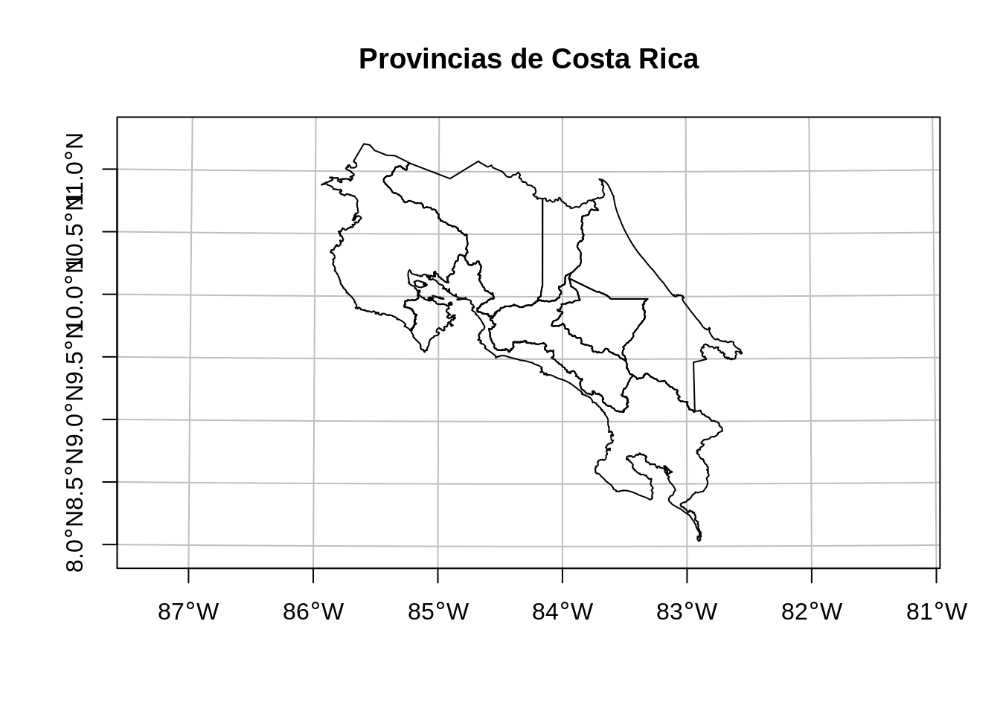
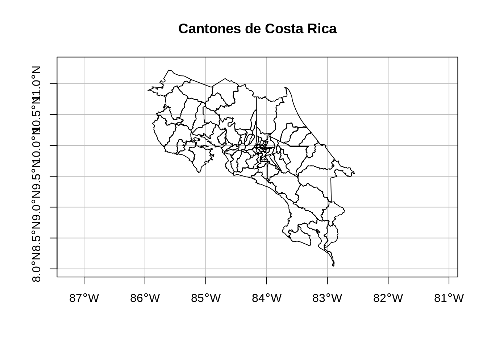
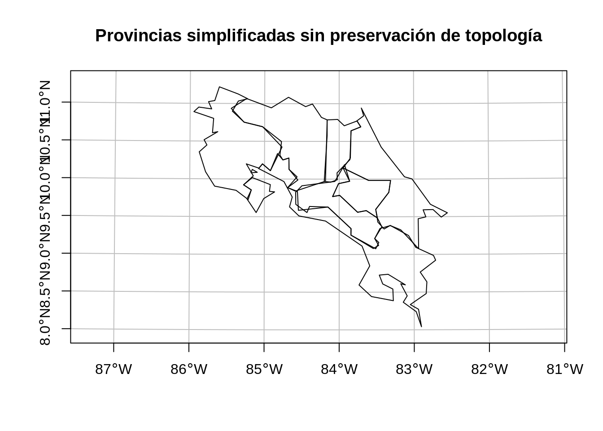
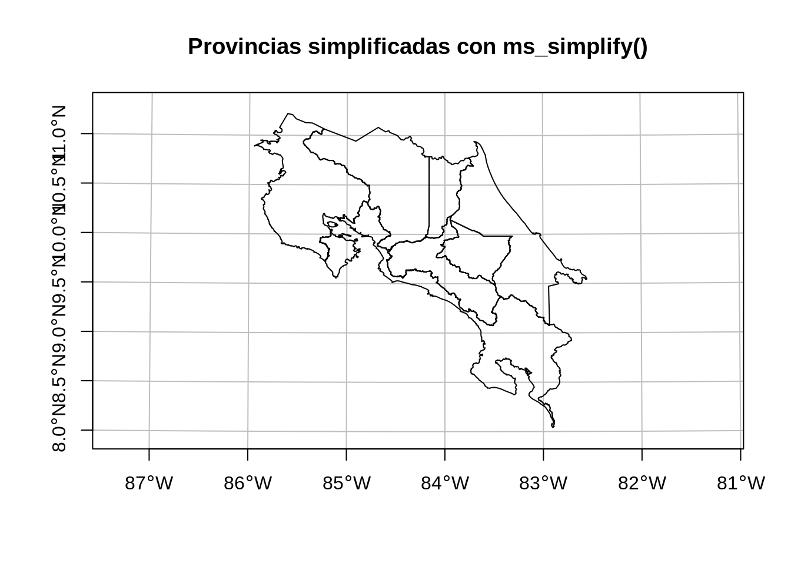
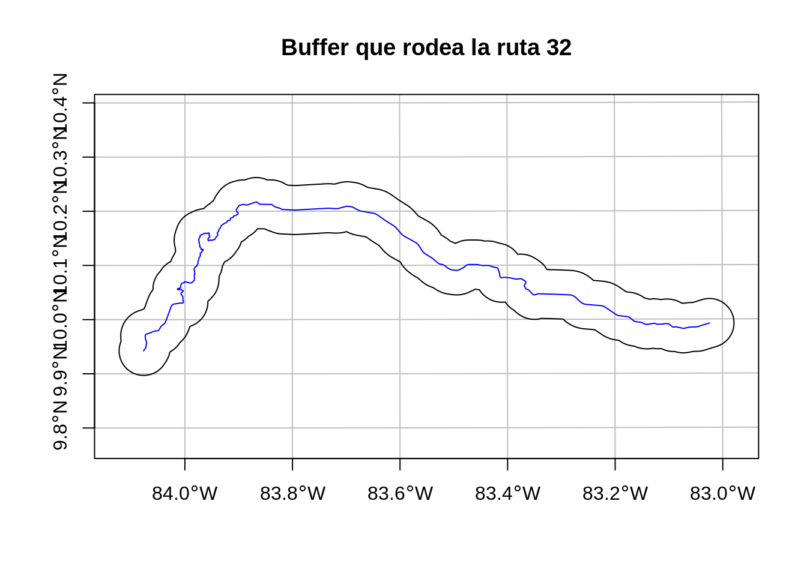

# Operaciones con geometrías

## Resumen
Las operaciones con geometrías para datos vectoriales incluyen simplificación, creación de centroides, creación de áreas de amortiguamiento (*buffers*), recortes (*clipping*) y uniones de geometrías, entre otras. Por su parte, las operaciones con geometrías para datos raster incluyen intersecciones geométricas, agregación y desagregación, entre otras.

## Trabajo previo

### Lecturas
Lovelace, R., Nowosad, J., & Münchow, J. (2019). *Geocomputation with R* (capítulo 5). CRC Press. https://geocompr.robinlovelace.net/

## Preparativos

### Carga de paquetes


```r
# Carga de paquetes

library(dplyr) # transformación de datos
library(sf) # manejo de datos vectoriales
library(terra) # manejo de datos raster
library(DT) # tablas interactivas
library(leaflet) # mapas interactivos
library(leaflet.extras) # funciones adicionales de leaflet
library(leafem) # funciones adicionales de leaflet
library(spData) # datos de ejemplo
library(spDataLarge) # datos de ejemplo
```

Paquete `rmapshaper`, para la edición y simplificación de geometrías:


```r
# Instalación de rmapshaper
install.packages("rmapshaper")
```


```r
# Carga de rmapshaper
library(rmapshaper)
```

### Conjuntos de datos para ejemplos

#### Provincias de Costa Rica
Es un [archivo GeoJSON con los polígonos de las provincias de Costa Rica](datos/ign/delimitacion-territorial-administrativa/provincias.geojson). Este archivo proviene de un [geoservicio de tipo Web Feature Service (WFS)](http://geos.snitcr.go.cr/be/IGN_5/wfs) publicado por el Instituto Geográfico Nacional (IGN).


```r
# Lectura y visualización de datos geoespaciales de provincias

# Lectura
provincias <-
  st_read(
    dsn = "datos/ign/delimitacion-territorial-administrativa/provincias.geojson",
    quiet = TRUE
  )

# Visualización en un mapa
plot(
  provincias$geometry,
  extent = st_bbox(c(xmin = 280000, xmax = 660000, ymin = 880000, ymax= 1250000)),
  main = "Provincias de Costa Rica",
  axes = TRUE,
  graticule = TRUE
)
```



#### Cantones de Costa Rica
Es un [archivo GeoJSON con los polígonos de los cantones de Costa Rica](datos/ign/delimitacion-territorial-administrativa/cantones.geojson). Este archivo proviene de un [geoservicio de tipo Web Feature Service (WFS)](http://geos.snitcr.go.cr/be/IGN_5/wfs) publicado por el Instituto Geográfico Nacional (IGN). Se transforma a WGS84 para combinarlo más fácilmente con otros conjuntos de datos.


```r
# Lectura y visualización de datos geoespaciales de cantones

# Lectura
cantones <-
  st_read(
    dsn = "datos/ign/delimitacion-territorial-administrativa/cantones.geojson",
    quiet = TRUE
  ) %>%
  st_transform(4326) # transformación a WGS84

# Transformación
cantones <-
  cantones %>%
  st_transform(5367) %>%
  st_simplify(dTolerance = 100) %>% # simplificación de geometrías
  st_transform(4326)

# Visualización en un mapa
plot(
  cantones$geometry,
  extent = st_bbox(c(xmin = -86.0, xmax = -82.3, ymin = 8.0, ymax = 11.3)),
  main = "Cantones de Costa Rica",
  axes = TRUE,
  graticule = TRUE
)
```



#### Red vial de Costa Rica
Es un [archivo GeoJSON con las líneas de la red vial de Costa Rica](datos/ign/infraestructura/redvial.geojson). Este archivo proviene de un [geoservicio de tipo Web Feature Service (WFS)](https://geos.snitcr.go.cr/be/IGN_200/wfs?version=1.1.0) publicado por el Instituto Geográfico Nacional (IGN).


```r
# Lectura y visualización de datos geoespaciales de la red vial

# Lectura
red_vial <-
  st_read(
    dsn = "datos/ign/infraestructura/redvial.geojson",
    quiet = TRUE
  )

# Visualización en un mapa
plot(
  red_vial$geometry,
  extent = st_bbox(c(xmin = 280000, xmax = 660000, ymin = 880000, ymax= 1250000)),
  main = "Red vial de Costa Rica",
  axes = TRUE,
  graticule = TRUE
)
```


#### Mamíferos de Costa Rica
Es un [archivo CSV con registros de presencia de la clase *Mammalia* (mamíferos) de Costa Rica](datos/gbif/mamiferos.csv). Este archivo proviene de una [consulta al portal de datos de la Infraestructura Mundial de Información en Biodiversidad (GBIF)](https://doi.org/10.15468/dl.wg9hcc).


```r
# Lectura y visualización de datos geoespaciales de mamíferos

# Lectura
mamiferos <-
  st_read(
    "datos/gbif/mamiferos.csv",
    options = c(
      "X_POSSIBLE_NAMES=decimalLongitude", # columna de longitud decimal
      "Y_POSSIBLE_NAMES=decimalLatitude"   # columna de latitud decimal
    ),
    quiet = TRUE
  )

# Asignación del CRS WGS84
st_crs(mamiferos) <- 4326

# Visualización en un mapa
plot(
  mamiferos$geometry,
  pch = 16,
  main = "Mamíferos de Costa Rica",
  axes = TRUE,
  graticule = TRUE
)
```


#### Altitud de Costa Rica
Es un [archivo GeoTIFF correspondiente a la altitud de Costa Rica](datos/worldclim/altitud.tif), en resolución de 30 x 30 segundos. Este archivo proviene de [WorldClim](https://www.worldclim.org/), un conjunto de capas climáticas disponibles en varias resoluciones espaciales.


```r
# Lectura y visualización de datos geoespaciales de altitud de Costa Rica

# Lectura
altitud <-
  rast(
    "datos/worldclim/altitud.tif"
  )

# Visualización en un mapa
terra::plot(
  altitud,
  main = "Altitud de Costa Rica"
)
```


## Introducción
Esta lección brinda una visión general de las operaciones con geometrías en datos vectoriales implementadas en el paquete `sf` y en datos raster implementadas en el paquete `terra`. Estas operaciones trabajan con la columna de geometrías (ej. `geometry`, `geom`) del paquete `sf`, para el caso de los datos vectoriales, y con la localización geográfica de los pixeles para el caso de los datos raster. En la sección final, se muestran varias operaciones de interacción entre los modelos raster y vectorial.

## Datos vectoriales
Las operaciones con geometrías en datos vectoriales incluyen:

- Simplificación.  
- Centroides. 
- Áreas de amortiguamiento (_buffers_).  
- Recortes (_clipping_).  
- Uniones de geometrías.

## Operaciones con geometrías con el paquete sf
Estas operaciones modifican las geometrías de objetos vectoriales.

### Simplificación
La simplificación puede realizarse en geometrías de líneas y polígonos. Reduce la cantidad de memoria, disco y ancho de banda que utilizan las geometrías. Para simplificar geometrías, el paquete `sf` incluye el método `st_simplify()`, basado en el algoritmo de Douglas-Peucker, el cual recibe el argumento `dTolerance` para controlar el nivel de generalización de las unidades del mapa. Este argumento se expresa en las unidades de medida del CRS de la capa, por lo que es conveniente utilizar un CRS con unidades de medida de distancias (ej. metros).

El siguiente bloque de código simplifica la capa de provincias, primero sin preservar su [topología](https://es.wikipedia.org/wiki/Topolog%C3%ADa_geoespacial) y luego preservándola.


```r
# Simplificación de la capa de provincias

# Simplificación sin preservación de topología
provincias_simplificado <-
  provincias %>%
  st_simplify(dTolerance = 5000, preserveTopology = FALSE)

# Mapa de la capa de provincias con simplificación y sin preservación de topología
plot(
  provincias_simplificado$geometry,
  extent = st_bbox(c(xmin = 280000, xmax = 660000, ymin = 880000, ymax= 1250000)),  
  main = "Provincias simplificadas sin preservación de topología",
  axes = TRUE,
  graticule = TRUE)
```



```r

# Simplificación con preservación de topología
provincias_simplificado_topologia <-
  provincias %>%
  st_simplify(dTolerance = 5000, preserveTopology = TRUE)

# Mapa de la capa de provincias con simplificación y con preservación de topología
plot(
  provincias_simplificado_topologia$geometry,
  extent = st_bbox(c(xmin = 280000, xmax = 660000, ymin = 880000, ymax= 1250000)),  
  main = "Provincias simplificadas con preservación de topología",
  axes = TRUE,
  graticule = TRUE)
```


```r

# Tamaño de la capa original
object.size(provincias)
#> 12144488 bytes

# Tamaño de la capa simplificada sin preservación de topología
object.size(provincias_simplificado)
#> 18720 bytes

# Tamaño de la capa simplificada con preservación de topología
object.size(provincias_simplificado_topologia)
#> 70608 bytes
```

La función `ms_simplify()` del paquete `rmapshaper`` proporciona un método alternativo para la simplificación de geometrías, el cual preserva la topología.


```r
# Simplificación con ms_simplify()
provincias_simplificado_rmapshaper <-
  provincias %>%
  ms_simplify(keep = 0.1, keep_shapes = TRUE)

# Mapa de la capa de provincias con simplificación mediante ms_simplify()
plot(
  provincias_simplificado_rmapshaper$geometry,
  extent = st_bbox(c(xmin = 280000, xmax = 660000, ymin = 880000, ymax= 1250000)),  
  main = "Provincias simplificadas con ms_simplify()",
  axes = TRUE,
  graticule = TRUE)
```



```r

# Tamaño de la capa simplificada con ms_simplify()
object.size(provincias_simplificado_rmapshaper)
#> 1447832 bytes
```

### Centroides
Un centroide es un punto que identifica el centro de un objeto geográfico. Puede calcularse para geometrías de líneas y de polígonos y se utilizan para brindar una representación simplificada de geometrías más complejas. Existen varios métodos para calcularlos. 

El paquete  `sf`  incluye la función `st_centroid()`, la cual calcula el *centroide geográfico* (comúnmente llamado "el centroide"). Es posible que el centroide geográfico se ubique fuera de la geometría "padre" (ej. en el caso de una geometría con forma de anillo). Para evitar este resultado, la función `st_point_on_surface()` se asegura de que el centroide esté siempre dentro de la geometría "padre".

El siguiente bloque de código calcula los centroides para Costa Rica, mediante las dos funciones mencionadas.


```r
# Costa Rica y sus centroides calculados con st_centroid() y st_point_on_surface()

# Mapa de provincias
plot(
  st_union(provincias), # unión de los polígonos de provincias
  main = "Centroides de CR: st_centroid (rojo) y st_point_on_surface (verde)",
  axes = TRUE,
  graticule = TRUE)

# Mapa del centroide calculado con st_centroid()
plot(st_centroid(st_union(provincias)),
     add = TRUE,
     pch = 16,
     col = "red")

# Mapa del centroide calculado con st_point_on_surface()
plot(
  st_point_on_surface(st_union(provincias)),
  add = TRUE,
  pch = 16,
  col = "green")
```


```r

# Coordenadas del centroide calculado con st_centroid()
# CRTM05
st_coordinates(st_centroid(st_union(provincias)))
#>          X       Y
#> 1 478674.5 1102735
# WGS84
st_coordinates(st_transform(st_centroid(st_union(provincias)), crs = 4326))
#>           X        Y
#> 1 -84.19451 9.972732

# Coordenadas del centroide calculado con st_point_on_surface()
# CRTM05
st_coordinates(st_point_on_surface(st_union(provincias)))
#>          X       Y
#> 1 539373.5 1065147
# WGS84
st_coordinates(st_transform(st_point_on_surface(st_union(provincias)), crs = 4326))
#>           X        Y
#> 1 -83.64124 9.632735
```

El siguiente bloque de código calcula los centroides de las provincias de Costa Rica, mediante las dos funciones mencionadas.


```r
# Provincias de Costa Rica y sus centroides calculados con st_centroid() y st_point_on_surface()

# Mapa de provincias
plot(
  provincias$geometry,
  extent = st_bbox(c(xmin = 280000, xmax = 660000, ymin = 880000, ymax= 1250000)),  
  main = "Centroides de provincias: st_centroid (rojo) y st_point_on_surface (verde)",
  axes = TRUE,
  graticule = TRUE)

# Mapa de los centroides calculados con st_centroid()
plot(st_centroid(provincias),
     add = TRUE,
     pch = 16,
     col = "red")

# Mapa de los centroides calculados con st_point_on_surface()
plot(
  st_point_on_surface(provincias),
  add = TRUE,
  pch = 16,
  col = "green")
```


El siguiente bloque de código calcula los centroides para la ruta 32, mediante las dos funciones mencionadas.


```r
# Ruta 32 y sus centroides calculados con st_centroid() y st_point_on_surface()

# Polígonos de San José, Heredia y Limón
sanjose_heredia_limon <-
  provincias %>%
  filter(provincia == "San José" | provincia == "Heredia" | provincia == "Limón")

# Línea de la ruta 32
ruta_32 <-
  red_vial %>%
  filter(num_ruta == "32")

# Mapa de San José, Heredia y Limón
plot(
  sanjose_heredia_limon$geometry,
  main = "Centroides de la ruta 32: st_centroid (rojo) y st_point_on_surface (verde)",
  axes = TRUE,
  graticule = TRUE)

# Mapa de la ruta 32
plot(
  ruta_32$geometry,
  add = TRUE,
  lwd = 2,
  col = "blue")

# Mapa del centroide calculado con st_centroid()
plot(
  st_centroid(st_union(ruta_32)),
  add = TRUE,
  pch = 16,
  col = "red")

# Mapa del centroide calculado con st_point_on_surface()
plot(
  st_point_on_surface(st_union(ruta_32)),
  add = TRUE,
  pch = 16,
  col = "green")
```


### Áreas de amortiguamiento (*buffers*)
Los *buffers* son polígonos creados alrededor de otra geometría, ya sea otro polígono, una línea o un punto. El paquete `sf` incluye la función `st_buffer()` para la generación de *buffers*.


```r
# Buffer alrededor de la ruta 32

# Buffer que rodea la ruta 32
plot(
  st_buffer(st_union(ruta_32), 5000),
  main = "Buffer que rodea la ruta 32",
  axes = TRUE,
  graticule = TRUE)

# Línea de la ruta 32
plot(
  ruta_32$geometry,
  col = "blue",
  add = TRUE
)
```



#### Ejemplos

##### Especies de mamíferos en riesgo de atropello en las cercanías de la ruta 32
Es común el uso de *buffers* en análisis de datos, para responder preguntas como, por ejemplo, "¿cuántos puntos hay alrededor de una línea?" o "¿cuáles especies pueden encontrarse en las márgenes de un río?". En este ejemplo, se utiliza un *buffer* para identificar las especies de mamíferos en riesgo de ser atropellados en las cercanías de la ruta 32.


```r
# Registros de presencia de mamíferos no voladores ubicados alrededor de la ruta 32

# Registros de presencia de mamíferos no voladores
mamiferos_no_voladores <-
  mamiferos %>%
  filter(taxonRank == "SPECIES" | taxonRank == "SUBSPECIES") %>% # para excluir identificaciones a género o superiores
  filter(order != "Chiroptera") # se excluyen los murciélagos

# Línea de la ruta 32
ruta_32 <-
  red_vial %>%
  filter(num_ruta == "32") %>%
  st_transform(4326)

# Buffer de la ruta 32
buffer_ruta_32 <-
  ruta_32 %>%
  st_buffer(dist = 5000) %>%
  st_transform(4326)

# Registros de presencia dentro del buffer
mamiferos_buffer_ruta_32 <-
  st_join(mamiferos_no_voladores, buffer_ruta_32) %>%
  filter(!is.na(codigo))

# Mapa
plot(
  st_union(buffer_ruta_32),
  main = "Mamíferos terrestres alrededor de la ruta 32",
  axes = TRUE,
  graticule = TRUE
)

plot(ruta_32$geometry,
     col = "blue",
     add = TRUE)

plot(
  mamiferos_buffer_ruta_32,
  pch = 16,
  col = "orange",
  add = TRUE
)
```


Lista de especies y cantidad de registros de presencia:


```r
# Lista de especies
lista_especies <-
  mamiferos_buffer_ruta_32 %>%
  st_drop_geometry() %>%
  filter(!is.na(species) & species != "") %>%
  group_by(species) %>%
  summarise(registros = n()) %>%
  arrange(desc(registros)) %>%
  rename(especie = species)

# Tabla
lista_especies %>%
  datatable(options = list(
    pageLength = 10,
    language = list(url = '//cdn.datatables.net/plug-ins/1.10.11/i18n/Spanish.json')
  ))
```

```{=html}
<div id="htmlwidget-183a53ad323f1cbab287" style="width:100%;height:auto;" class="datatables html-widget"></div>
<script type="application/json" data-for="htmlwidget-183a53ad323f1cbab287">{"x":{"filter":"none","vertical":false,"data":[["1","2","3","4","5","6","7","8","9","10","11","12","13","14","15","16","17","18","19","20","21","22","23","24","25","26","27","28","29","30","31","32","33","34","35","36","37","38","39","40","41","42","43","44","45","46","47","48","49","50","51","52","53","54","55","56","57","58","59","60","61","62","63","64","65","66","67","68","69","70","71","72","73"],["Sciurus variegatoides","Bradypus variegatus","Choloepus hoffmanni","Heteromys desmarestianus","Peromyscus mexicanus","Alouatta palliata","Melanomys caliginosus","Procyon lotor","Didelphis marsupialis","Orthogeomys cherriei","Mus musculus","Tamandua mexicana","Cebus imitator","Sciurus granatensis","Tapirella bairdii","Peromyscus nudipes","Dasypus novemcinctus","Nasua narica","Proechimys semispinosus","Scotinomys teguina","Orthogeomys heterodus","Cebus capucinus","Sphiggurus mexicanus","Dasyprocta punctata","Rattus norvegicus","Sylvilagus brasiliensis","Sylvilagus gabbi","Cuniculus paca","Leopardus pardalis","Microsciurus alfari","Philander opossum","Potos flavus","Sigmodon hispidus","Transandinomys bolivaris","Urocyon cinereoargenteus","Ateles geoffroyi","Caluromys derbianus","Eira barbara","Felis catus","Rattus rattus","Reithrodontomys creper","Chironectes minimus","Cryptotis gracilis","Cryptotis orophila","Cyclopes didactylus","Nephelomys albigularis","Nephelomys devius","Oligoryzomys fulvescens","Pecari tajacu","Sciurus aestuans","Bassaricyon gabbii","Bassariscus sumichrasti","Bos taurus","Canis latrans","Canis lupus","Coendou prehensilis","Conepatus semistriatus","Cryptotis nigrescens","Equus asinus","Equus caballus","Lontra longicaudis","Micoureus alstoni","Micoureus demerarae","Neomonachus tropicalis","Odocoileus virginianus","Oryctolagus cuniculus","Oryzomys alfaroi","Ototylomys phyllotis","Reithrodontomys mexicanus","Reithrodontomys sumichrasti","Sigmodon hirsutus","Tayassu pecari","Tursiops truncatus"],[124,103,57,54,38,30,30,21,20,20,13,13,12,12,12,11,10,10,8,8,7,6,6,5,5,5,5,4,4,4,4,4,4,4,4,3,3,3,3,3,3,2,2,2,2,2,2,2,2,2,1,1,1,1,1,1,1,1,1,1,1,1,1,1,1,1,1,1,1,1,1,1,1]],"container":"<table class=\"display\">\n  <thead>\n    <tr>\n      <th> <\/th>\n      <th>especie<\/th>\n      <th>registros<\/th>\n    <\/tr>\n  <\/thead>\n<\/table>","options":{"pageLength":10,"language":{"url":"//cdn.datatables.net/plug-ins/1.10.11/i18n/Spanish.json"},"columnDefs":[{"className":"dt-right","targets":2},{"orderable":false,"targets":0}],"order":[],"autoWidth":false,"orderClasses":false}},"evals":[],"jsHooks":[]}</script>
```

Mapa `leaflet`:


```r
# Mapa de mamíferos cerca de la ruta 32
leaflet() %>%
  addTiles(group = "OpenStreetMap") %>%
  addPolygons(data = st_union(buffer_ruta_32),
              group = "Buffer") %>%
  addHeatmap(
    data = mamiferos_buffer_ruta_32,
    lng = ~ decimalLongitude,
    lat = ~ decimalLatitude,
    radius = 10,
    blur = 20,
    group = "Mapa de calor"
  ) %>%
  addPolylines(data = ruta_32,
               group = "Ruta 32") %>%
  addCircleMarkers(
    data = mamiferos_buffer_ruta_32,
    radius = 1,
    color = "black",
    popup = paste(
      mamiferos_buffer_ruta_32$species,
      paste0(
        "<a href='",
        mamiferos_buffer_ruta_32$occurrenceID,
        "'>Más información</a>"
      ),
      sep = '<br/>'
    ),
    clusterOptions = markerClusterOptions(),
    group = "Registros de presencia"
  ) %>%
  addLayersControl(
    baseGroups = c("OpenStreetMap"),
    overlayGroups = c("Buffer", "Mapa de calor", "Ruta 32", "Registros de presencia")
  ) %>%
  addScaleBar(position = "bottomright", options = scaleBarOptions(imperial = FALSE))
```

```{=html}
<div id="htmlwidget-7582eee9326a9f8b93c1" style="width:672px;height:480px;" class="leaflet html-widget"></div>
<script type="application/json" data-for="htmlwidget-7582eee9326a9f8b93c1">{"x":{"options":{"crs":{"crsClass":"L.CRS.EPSG3857","code":null,"proj4def":null,"projectedBounds":null,"options":{}}},"calls":[{"method":"addTiles","args":["https://{s}.tile.openstreetmap.org/{z}/{x}/{y}.png",null,"OpenStreetMap",{"minZoom":0,"maxZoom":18,"tileSize":256,"subdomains":"abc","errorTileUrl":"","tms":false,"noWrap":false,"zoomOffset":0,"zoomReverse":false,"opacity":1,"zIndex":1,"detectRetina":false,"attribution":"&copy; <a href=\"https://openstreetmap.org\">OpenStreetMap<\/a> contributors, <a href=\"https://creativecommons.org/licenses/by-sa/2.0/\">CC-BY-SA<\/a>"}]},{"method":"addPolygons","args":[[[[{"lng":[-84.1012861174179,-84.1012861174179,-84.0993059760497,-84.0993059760497,-84.0986459144713,-84.0986459144713,-84.0973257696323,-84.0966656863721,-84.0966656863721,-84.0960055958852,-84.0960055958852,-84.0933651616744,-84.0933651616744,-84.0920449012144,-84.0907246118538,-84.0894042935945,-84.0887441236284,-84.0887441236284,-84.0880839464383,-84.0880839464383,-84.0854431654428,-84.0828022688822,-84.0801612567713,-84.0775201291251,-84.0748788859585,-84.0722375272863,-84.0695960531236,-84.0669544634851,-84.0669544634851,-84.0662940480341,-84.0662940480341,-84.0656336253671,-84.0643127583858,-84.062991862543,-84.0616709378406,-84.0616709378406,-84.0590290018644,-84.0590290018644,-84.0583684998361,-84.0583684998361,-84.0577079905944,-84.0563869504722,-84.0550658814998,-84.0550658814998,-84.0537447836789,-84.0537447836789,-84.0530842239509,-84.0530842239509,-84.0524236570115,-84.0511025014994,-84.0511025014994,-84.0510199283222,-84.0510199283222,-84.0497813171445,-84.0497813171445,-84.0491207141516,-84.0491207141516,-84.0484601039487,-84.0471388619137,-84.0471388619137,-84.0458175910416,-84.0458175910416,-84.044496291334,-84.044496291334,-84.0443311268432,-84.0443311268432,-84.043174962793,-84.043174962793,-84.0430097946982,-84.0430097946982,-84.0418536054204,-84.0418536054204,-84.0418329589827,-84.0418329589827,-84.0405322192181,-84.0405322192181,-84.0392108041879,-84.0392108041879,-84.0378893603316,-84.0378893603316,-84.0377241778229,-84.0377241778229,-84.0365678876513,-84.0365678876513,-84.0352463861486,-84.0352463861486,-84.0352463861486,-84.0349160062697,-84.0349160062697,-84.0339248558256,-84.0339248558256,-84.032603296684,-84.032603296684,-84.0312817087257,-84.0312817087257,-84.0312817087257,-84.0312713837064,-84.0312713837064,-84.0299600919527,-84.0299600919527,-84.0286384463667,-84.0286384463667,-84.0286384463667,-84.0286384463667,-84.0273167719697,-84.0273167719697,-84.0273167719697,-84.0272341663633,-84.0272341663633,-84.0246733367499,-84.0246733367499,-84.023351575931,-84.023351575931,-84.02269068472,-84.02269068472,-84.0220297863084,-84.0207079678841,-84.0207079678841,-84.01938612066,-84.01938612066,-84.0193448124702,-84.0193448124702,-84.018064244638,-84.018064244638,-84.017733771133,-84.017733771133,-84.0167423398198,-84.0167423398198,-84.0160813766128,-84.0160813766128,-84.0154204062074,-84.0154204062074,-84.014759428604,-84.014759428604,-84.0140984438027,-84.0140984438027,-84.0134374518038,-84.0134374518038,-84.0127764526075,-84.0127764526075,-84.0124459503104,-84.0124459503104,-84.0114544326237,-84.0114544326237,-84.0101323838531,-84.0101323838531,-84.0088103062977,-84.0088103062977,-84.0088103062977,-84.0081492567263,-84.0081492567263,-84.0074881999593,-84.0074881999593,-84.0068271359971,-84.0068271359971,-84.0061660648398,-84.0048439009411,-84.0048439009411,-84.0035217082649,-84.0035217082649,-84.0021994868133,-84.0021994868133,-84.0021994868133,-84.0015383652973,-84.0015383652973,-84.0008772365881,-84.0008772365881,-84.0005466695361,-84.0005466695361,-83.9995549575911,-83.9995549575911,-83.9982326498242,-83.9982326498242,-83.9969103132893,-83.9969103132893,-83.9969103132893,-83.9955879479883,-83.9955879479883,-83.9955879479883,-83.9954226503032,-83.9954226503032,-83.9942655539231,-83.9942655539231,-83.9942655539231,-83.994182903339,-83.994182903339,-83.9929431310954,-83.9929431310954,-83.9929431310954,-83.9916206795073,-83.9916206795073,-83.9916206795073,-83.9916206795073,-83.9914553710367,-83.9914553710367,-83.9902981991605,-83.9902981991605,-83.9876531521986,-83.9876531521986,-83.9863305855872,-83.9850079902247,-83.9850079902247,-83.9843466817623,-83.9843466817623,-83.9823627132538,-83.9823627132538,-83.9817013760445,-83.9817013760445,-83.9810400316491,-83.9797173213008,-83.9797173213008,-83.9793866392228,-83.9793866392228,-83.9770718143809,-83.9770718143809,-83.975749017813,-83.975749017813,-83.975418314181,-83.975418314181,-83.9744261925091,-83.9744261925091,-83.9737647690816,-83.9737647690816,-83.9731033384708,-83.9717804557002,-83.9717804557002,-83.9704575441992,-83.9704575441992,-83.9691346039695,-83.9691346039695,-83.9678116350131,-83.9678116350131,-83.9678116350131,-83.967150139763,-83.967150139763,-83.9664886373319,-83.9664886373319,-83.9661578834235,-83.9661578834235,-83.9651656109277,-83.9651656109277,-83.9638425558024,-83.9638425558024,-83.9631810174699,-83.9631810174699,-83.9625194719579,-83.9625194719579,-83.961196359396,-83.961196359396,-83.961196359396,-83.9598732181187,-83.9598732181187,-83.9598732181187,-83.9598732181187,-83.9592116367124,-83.9592116367124,-83.9585500481279,-83.9585500481279,-83.9585500481279,-83.9582192511439,-83.9582192511439,-83.9572268494253,-83.9572268494253,-83.9572268494253,-83.9572268494253,-83.9572268494253,-83.9572268494253,-83.9572268494253,-83.9565652393078,-83.9565652393078,-83.955903622013,-83.955903622013,-83.955903622013,-83.955903622013,-83.9552419975412,-83.9552419975412,-83.9545803658927,-83.9545803658927,-83.9539187270676,-83.9539187270676,-83.9532570810663,-83.9532570810663,-83.952595427889,-83.952595427889,-83.9519337675358,-83.9519337675358,-83.9512721000071,-83.9512721000071,-83.950610425303,-83.950610425303,-83.9499487434238,-83.9499487434238,-83.9492870543698,-83.9492870543698,-83.9486253581411,-83.9486253581411,-83.947963654738,-83.947963654738,-83.9473019441608,-83.9473019441608,-83.9466402264097,-83.9466402264097,-83.9463093648439,-83.9463093648439,-83.9453167693865,-83.9453167693865,-83.9439932836705,-83.9439932836705,-83.9426697692634,-83.9426697692634,-83.9413462261673,-83.9413462261673,-83.9413462261673,-83.9410153359108,-83.9410153359108,-83.9400226543839,-83.9400226543839,-83.9400019733472,-83.9400019733472,-83.9386990539151,-83.9386990539151,-83.9386990539151,-83.9386990539151,-83.9380372429244,-83.9380372429244,-83.9373754247629,-83.9373754247629,-83.9373754247629,-83.9373754247629,-83.9367135994311,-83.9367135994311,-83.9360517669291,-83.9360517669291,-83.9360517669291,-83.9360517669291,-83.9360517669291,-83.9360517669291,-83.9347280804156,-83.9347280804156,-83.9347280804156,-83.9347280804156,-83.9347280804156,-83.9347280804156,-83.9347280804156,-83.9334043652243,-83.9334043652243,-83.932080621357,-83.932080621357,-83.932080621357,-83.9294330476021,-83.9294330476021,-83.9294330476021,-83.9294330476021,-83.9294330476021,-83.9287711362439,-83.9287711362439,-83.9267853591661,-83.9267853591661,-83.9267853591661,-83.9254614719474,-83.9254614719474,-83.9241375560641,-83.921489638311,-83.921489638311,-83.918841605922,-83.918841605922,-83.9175175467437,-83.9175175467437,-83.9161934589121,-83.9135451972966,-83.9135451972966,-83.9108968210903,-83.9108968210903,-83.9082483303085,-83.9082483303085,-83.9055997249662,-83.9055997249662,-83.9042753793396,-83.9042753793396,-83.9029510050785,-83.9029510050785,-83.9003021706606,-83.9003021706606,-83.8976532217274,-83.8976532217274,-83.8976532217274,-83.8950041582942,-83.8950041582942,-83.8923549803761,-83.8923549803761,-83.8897056879881,-83.8897056879881,-83.889043347007,-83.889043347007,-83.8870562811454,-83.8870562811454,-83.8857315348082,-83.8857315348082,-83.8844067598631,-83.8817571241563,-83.8817571241563,-83.8791073740401,-83.8791073740401,-83.8764575095298,-83.8738075306403,-83.8738075306403,-83.8711574373868,-83.8711574373868,-83.8685072297846,-83.8685072297846,-83.8658569078486,-83.8658569078487,-83.8632064715942,-83.8605559210363,-83.8579052561902,-83.855254477071,-83.8526035836939,-83.849952576074,-83.8473014542265,-83.8473014542265,-83.8419988679093,-83.8393474034699,-83.8393474034699,-83.8366958248637,-83.8340441321056,-83.831392325211,-83.831392325211,-83.8260883690728,-83.8048679820954,-83.7836403010782,-83.7730237277405,-83.7677147582912,-83.7650601029248,-83.7650601029248,-83.7624053338176,-83.7597504509848,-83.7570954544418,-83.7544403442037,-83.7517851202859,-83.7491297827036,-83.7464743314721,-83.7438187666067,-83.7411630881226,-83.7385072960353,-83.7358513903598,-83.7331953711116,-83.730539238306,-83.7278829919581,-83.7252266320834,-83.7225701586972,-83.7199135718146,-83.7172568714512,-83.7146000576221,-83.7119431303427,-83.7092860896283,-83.7092860896283,-83.7079575267378,-83.7079575267378,-83.7039716679559,-83.6986567927274,-83.6946703387337,-83.6946703387337,-83.6933414640655,-83.6933414640655,-83.6906836297354,-83.688025682093,-83.6860321470092,-83.6860321470092,-83.6853676211536,-83.6853676211536,-83.6827094469326,-83.6773927587071,-83.6700815728524,-83.6700815728524,-83.6694168771406,-83.6694168771406,-83.6667580235524,-83.6640990567901,-83.661439976869,-83.661439976869,-83.6564538970726,-83.6564538970726,-83.6561214776123,-83.6561214776123,-83.6534620583075,-83.6534620583075,-83.6508025259054,-83.6481428804215,-83.6481428804215,-83.6454831218713,-83.6431557404021,-83.6431557404021,-83.64282325027,-83.64282325027,-83.6401632656331,-83.6388332309312,-83.6388332309312,-83.6375031679761,-83.6375031679761,-83.6375031679761,-83.6348429573142,-83.6348429573142,-83.6321826336629,-83.6321826336629,-83.6295221970377,-83.6295221970377,-83.6268616474539,-83.6255313303073,-83.6255313303073,-83.6242009849269,-83.6242009849269,-83.622205413922,-83.622205413922,-83.6215402094722,-83.6215402094722,-83.6188793211053,-83.6188793211053,-83.6135572056961,-83.6135572056961,-83.6108959786847,-83.6082346388228,-83.6082346388228,-83.602911620609,-83.602911620609,-83.6002499422879,-83.6002499422879,-83.5975881511781,-83.5975881511781,-83.5949262472949,-83.5949262472949,-83.5929297453843,-83.5929297453843,-83.5922642306538,-83.5922642306538,-83.5902676441848,-83.5902676441848,-83.5896021012702,-83.5896021012702,-83.5876054302546,-83.5876054302546,-83.5869398591596,-83.5869398591596,-83.5842775043375,-83.5842775043375,-83.5816150368194,-83.5816150368194,-83.5789524566206,-83.5762897637568,-83.5762897637568,-83.5722955132477,-83.5722955132477,-83.5709640400955,-83.5709640400955,-83.5683010093291,-83.5669694517188,-83.5669694517188,-83.5656378659595,-83.5656378659595,-83.5636404345458,-83.5636404345458,-83.5629746100022,-83.5629746100022,-83.5603112414726,-83.5603112414726,-83.5576477603863,-83.5576477603863,-83.5549841667588,-83.5524869455364,-83.5524869455364,-83.5523204606055,-83.5523204606055,-83.549656641942,-83.54732570833,-83.54732570833,-83.5469927107837,-83.5469927107837,-83.5443286671462,-83.5416645110449,-83.5403323908253,-83.5403323908253,-83.5390002424955,-83.5390002424955,-83.5350036288649,-83.5350036288649,-83.533671368114,-83.533671368114,-83.5310067623131,-83.5310067623131,-83.528342044126,-83.5243447561554,-83.5243447561554,-83.5230122706556,-83.5230122706556,-83.5203472154034,-83.5176820478271,-83.5150375908768,-83.5150375908768,-83.5150167679424,-83.5150167679424,-83.5123513757648,-83.5070202545931,-83.5016886844364,-83.4963566654191,-83.4910241976658,-83.4856912813009,-83.4803579164492,-83.4803579164492,-83.4790245051748,-83.4790245051748,-83.4776910658797,-83.4750241032353,-83.4723570285314,-83.4723570285314,-83.4720236363151,-83.4720236363151,-83.4696898417838,-83.467022543008,-83.467022543008,-83.4656888516144,-83.4656888516144,-83.4643551322196,-83.4616876094342,-83.4616876094342,-83.4603538060475,-83.4603538060475,-83.4590199746674,-83.4563522279348,-83.4563522279348,-83.453684369252,-83.4510163986347,-83.4510163986347,-83.4483483160984,-83.4483483160984,-83.445690544511,-83.445690544511,-83.4456801216588,-83.4456801216588,-83.4430118153315,-83.4430118153315,-83.4403433971321,-83.4390091460853,-83.4390091460853,-83.4376748670763,-83.4376748670763,-83.4350062251797,-83.4350062251797,-83.4323374714579,-83.4296686059265,-83.4283341312371,-83.4283341312371,-83.4269996286013,-83.4269996286013,-83.4216613386316,-83.416322601674,-83.416322601674,-83.4136530656139,-83.4109834178539,-83.4083136584094,-83.4056437872964,-83.4056437872964,-83.404308809869,-83.404308809869,-83.4029738045302,-83.4029738045302,-83.4029738045302,-83.4003037101268,-83.4003037101268,-83.3976335041017,-83.3976335041017,-83.3949631864707,-83.3936279858078,-83.3936279858078,-83.3922927572493,-83.3922927572493,-83.3896222164533,-83.3896222164533,-83.3856161960912,-83.3856161960912,-83.3842808002002,-83.3842808002002,-83.3822776540857,-83.3822776540857,-83.3816099247744,-83.3816099247744,-83.3789389378368,-83.3789389378368,-83.3762678394031,-83.3739305368242,-83.3739305368242,-83.3735966294888,-83.3735966294888,-83.3682538752818,-83.3682538752818,-83.3655823310204,-83.3629106753414,-83.3602389082605,-83.3575670297934,-83.3562310487949,-83.3562310487949,-83.3548950399558,-83.3548950399558,-83.3522229387634,-83.3468784023774,-83.3468784023774,-83.3455421987088,-83.3455421987088,-83.3442059672152,-83.3415334207612,-83.3388607630311,-83.3361879940406,-83.3335151138056,-83.3308421223417,-83.3281690196647,-83.3254958057904,-83.3228224807346,-83.3201490445128,-83.3174754971411,-83.314801838635,-83.3121280690105,-83.3094541882832,-83.3067801964689,-83.3041060935834,-83.3014318796426,-83.2987575546621,-83.2960831186578,-83.2960831186578,-83.2934085716454,-83.2920712565161,-83.2920712565161,-83.2907339136408,-83.2907339136408,-83.2880591446597,-83.2880591446597,-83.2840467831418,-83.2840467831418,-83.2827092738314,-83.2827092738314,-83.2800341720158,-83.2776933669431,-83.2776933669431,-83.277358959287,-83.277358959287,-83.2720082011528,-83.2700015525154,-83.2700015525154,-83.2693326557791,-83.2693326557791,-83.2666569995555,-83.2639812324977,-83.2613053546216,-83.258629365943,-83.2559532664778,-83.2532770562417,-83.2506007352507,-83.2479243035205,-83.2479243035205,-83.245247761067,-83.2398943440535,-83.2345404843371,-83.2345404843371,-83.2318633885049,-83.2305247991023,-83.2305247991023,-83.2291861820446,-83.2291861820446,-83.226508864972,-83.226508864972,-83.2238314373029,-83.2214885973814,-83.2214885973814,-83.2211538990533,-83.2211538990533,-83.218476250239,-83.2161332168414,-83.2161332168414,-83.2157984908759,-83.2157984908759,-83.2131206209799,-83.2104426405669,-83.2091036089214,-83.2091036089214,-83.2077645496527,-83.2077645496527,-83.2024080363844,-83.1970510813022,-83.1930330751268,-83.1930330751268,-83.1916936845334,-83.1916936845334,-83.1890148205562,-83.1890148205562,-83.1863358462051,-83.183656761496,-83.183656761496,-83.1809775664447,-83.1782982610673,-83.1756188453795,-83.1756188453795,-83.170259683137,-83.1649000798444,-83.1622201128443,-83.1622201128443,-83.1595400356295,-83.1568598482159,-83.1541795506196,-83.151834199851,-83.151834199851,-83.1514991428564,-83.1514991428564,-83.1488186249424,-83.1434572587254,-83.1327332051833,-83.13005191666,-83.13005191666,-83.1273705181136,-83.1273705181136,-83.1220073910152,-83.1062506616058,-83.1062506616058,-83.1059153708269,-83.1059153708269,-83.1032329827916,-83.1005504848931,-83.0978678771473,-83.0951851595703,-83.0925023321782,-83.0898193949869,-83.0871363480125,-83.0871363480125,-83.0844531912709,-83.0790865485505,-83.0737194669541,-83.0683519466099,-83.0629839876462,-83.0602998437222,-83.0602998437222,-83.0576155901915,-83.0549312270701,-83.0522467543742,-83.0495621721197,-83.0468774803227,-83.0441926789994,-83.0415077681658,-83.0388227478379,-83.0388227478379,-83.0387388391885,-83.0387388391885,-83.0361376180319,-83.0307670300496,-83.0280815719056,-83.0280815719056,-83.0253960043477,-83.0227103273921,-83.0200245410549,-83.0200245410549,-83.0146526403,-83.0119665259145,-83.0119665259145,-83.0092803022118,-83.006593969208,-83.0039075269191,-83.0039075269191,-82.998534314551,-82.998534314551,-82.9958475445039,-82.9958475445039,-82.9958422967993,-82.9958422967993,-82.9931606652364,-82.9931606652364,-82.9924889283557,-82.9924889283557,-82.9904736767644,-82.9904736767644,-82.9898019125851,-82.9898019125851,-82.9877865791042,-82.9877865791042,-82.9874506842202,-82.9874506842202,-82.9850993722719,-82.9850993722719,-82.9824120562836,-82.9824120562836,-82.9797246311555,-82.9797246311555,-82.9797246311555,-82.9797246311555,-82.9790527578223,-82.9790527578223,-82.9770370969037,-82.9770370969037,-82.9770370969037,-82.9770370969037,-82.9770370969037,-82.9770370969037,-82.9797246311555,-82.9797246311555,-82.9797246311555,-82.9797246311555,-82.9824120562836,-82.9824120562836,-82.9837557279212,-82.9837557279212,-82.9850993722719,-82.9850993722719,-82.9850993722719,-82.9877865791042,-82.9877865791042,-82.9904736767644,-82.9904736767644,-82.9931606652364,-82.9931606652364,-82.9971909431811,-82.9971909431811,-82.998534314551,-82.998534314551,-83.0012209753614,-83.0012209753614,-83.0039075269191,-83.0092803022118,-83.0092803022118,-83.0119665259145,-83.0146526403,-83.0173386453522,-83.0200245410549,-83.0227103273921,-83.0253960043477,-83.0280815719056,-83.0307670300496,-83.0334523787637,-83.0361376180319,-83.0361376180319,-83.0368089107461,-83.0368089107461,-83.0415077681658,-83.0441926789994,-83.0441926789994,-83.0455350933509,-83.0455350933509,-83.0468774803227,-83.0495621721197,-83.0522467543742,-83.0549312270701,-83.0549312270701,-83.0576155901915,-83.0790865485505,-83.0790865485505,-83.0817699247783,-83.0844531912709,-83.0857947833616,-83.0857947833616,-83.0871363480125,-83.0871363480125,-83.0898193949869,-83.0951851595703,-83.1005504848931,-83.1059153708269,-83.111279817244,-83.116643824016,-83.1220073910152,-83.1273705181136,-83.1327332051833,-83.1380954520965,-83.1407764104545,-83.1407764104545,-83.1434572587254,-83.1461379968934,-83.1474783246837,-83.1474783246837,-83.1488186249424,-83.1488186249424,-83.1514991428564,-83.1514991428564,-83.1541795506196,-83.1568598482159,-83.1595400356295,-83.1595400356295,-83.1649000798444,-83.170259683137,-83.1752839106632,-83.1752839106632,-83.1756188453795,-83.1756188453795,-83.1782982610673,-83.1809775664447,-83.1809775664447,-83.1863358462051,-83.1863358462051,-83.1890148205562,-83.1903542663426,-83.1903542663426,-83.1916936845334,-83.1916936845334,-83.1943724381207,-83.1943724381207,-83.1970510813022,-83.1997296140621,-83.1997296140621,-83.2024080363844,-83.2077645496527,-83.2077645496527,-83.2104426405669,-83.2131206209799,-83.2157984908759,-83.218476250239,-83.2211538990533,-83.2238314373029,-83.226508864972,-83.226508864972,-83.2291861820446,-83.2345404843371,-83.2398943440535,-83.2412327398152,-83.2412327398152,-83.2425711079061,-83.2425711079061,-83.2450804734876,-83.2450804734876,-83.245247761067,-83.245247761067,-83.2479243035205,-83.2479243035205,-83.2506007352507,-83.2532770562417,-83.2532770562417,-83.2559532664778,-83.258629365943,-83.258629365943,-83.2613053546216,-83.2639812324977,-83.2666569995555,-83.2679948415226,-83.2679948415226,-83.2693326557791,-83.2693326557791,-83.2720082011528,-83.2827092738314,-83.2934085716454,-83.3041060935834,-83.314801838635,-83.3254958057904,-83.3254958057904,-83.3275007266203,-83.3275007266203,-83.3281690196647,-83.3281690196647,-83.3295055849039,-83.3295055849039,-83.3308421223417,-83.3308421223417,-83.3321786319763,-83.3321786319763,-83.3335151138056,-83.3335151138056,-83.3348515678277,-83.3348515678277,-83.3361879940406,-83.3361879940406,-83.3381925812135,-83.3381925812135,-83.3388607630311,-83.3388607630311,-83.3415334207612,-83.3415334207612,-83.3442059672152,-83.3468784023774,-83.3468784023774,-83.351554896068,-83.351554896068,-83.3522229387634,-83.3522229387634,-83.3548950399558,-83.3575670297934,-83.3575670297934,-83.3629106753414,-83.3682538752818,-83.3735966294888,-83.3789389378368,-83.3802744452436,-83.3802744452436,-83.3816099247744,-83.3816099247744,-83.3829453764273,-83.3829453764273,-83.3842808002002,-83.3842808002002,-83.3856161960912,-83.3856161960912,-83.3869515640984,-83.3869515640984,-83.3889545638226,-83.3889545638226,-83.3896222164533,-83.3896222164533,-83.3922927572493,-83.3922927572493,-83.3949631864707,-83.3976335041017,-83.3976335041017,-83.4003037101268,-83.404308809869,-83.404308809869,-83.4056437872964,-83.4056437872964,-83.4083136584094,-83.4109834178539,-83.4136530656139,-83.4156552281317,-83.4156552281317,-83.416322601674,-83.416322601674,-83.4216613386316,-83.4269996286013,-83.4269996286013,-83.4296686059265,-83.4323374714579,-83.4350062251797,-83.4376748670763,-83.4403433971321,-83.4430118153315,-83.4456801216588,-83.4483483160984,-83.4510163986347,-83.453684369252,-83.4563522279348,-83.4590199746674,-83.4616876094342,-83.4643551322196,-83.467022543008,-83.4696898417838,-83.4723570285314,-83.4750241032353,-83.4776910658797,-83.4803579164492,-83.4830246549281,-83.4830246549281,-83.4833579893559,-83.4833579893559,-83.4856912813009,-83.4910241976658,-83.4910241976658,-83.4923573566663,-83.4923573566663,-83.4936904876266,-83.4963566654191,-83.4990227310275,-83.5015220656357,-83.5015220656357,-83.5016886844364,-83.5016886844364,-83.5070202545931,-83.5070202545931,-83.5096858713099,-83.5096858713099,-83.5123513757648,-83.5150167679424,-83.5150167679424,-83.5176820478271,-83.5196809340391,-83.5196809340391,-83.5203472154034,-83.5203472154034,-83.5230122706556,-83.5230122706556,-83.5250109883728,-83.5250109883728,-83.5256772135684,-83.5256772135684,-83.5256772135684,-83.528342044126,-83.528342044126,-83.5310067623131,-83.5310067623131,-83.533671368114,-83.533671368114,-83.5363358615134,-83.5363358615134,-83.5390002424955,-83.540998454449,-83.540998454449,-83.5416645110449,-83.5416645110449,-83.5443286671462,-83.5443286671462,-83.5469927107837,-83.549656641942,-83.549656641942,-83.5549841667588,-83.5549841667588,-83.5576477603863,-83.5603112414726,-83.5603112414726,-83.5656378659595,-83.5656378659595,-83.5679681225656,-83.5679681225656,-83.5683010093291,-83.5683010093291,-83.5702982929613,-83.5702982929613,-83.5709640400955,-83.5709640400955,-83.5756240729387,-83.5756240729387,-83.5762897637568,-83.5762897637568,-83.5789524566206,-83.5789524566206,-83.5816150368194,-83.5816150368194,-83.5842775043375,-83.5866070709705,-83.5866070709705,-83.5869398591596,-83.5869398591596,-83.5909331800538,-83.5909331800538,-83.5922642306538,-83.5922642306538,-83.5949262472949,-83.5949262472949,-83.5975881511781,-83.6002499422879,-83.6002499422879,-83.602911620609,-83.6042424174689,-83.6042424174689,-83.6055731861258,-83.6055731861258,-83.6082346388228,-83.6082346388228,-83.6108959786847,-83.6128919095238,-83.6128919095238,-83.6135572056961,-83.6135572056961,-83.6162183198414,-83.6162183198414,-83.6188793211053,-83.6215402094722,-83.6215402094722,-83.6242009849269,-83.6281919363646,-83.6281919363646,-83.6295221970377,-83.6295221970377,-83.6321826336629,-83.6348429573142,-83.6375031679761,-83.6375031679761,-83.6401632656331,-83.6454831218713,-83.6561214776123,-83.6561214776123,-83.6587807838047,-83.661439976869,-83.663766677988,-83.663766677988,-83.6640990567901,-83.6640990567901,-83.6667580235524,-83.6694168771406,-83.6694168771406,-83.6720756175394,-83.6747342447333,-83.6773927587071,-83.6787219732316,-83.6787219732316,-83.6800511594453,-83.6800511594453,-83.6827094469326,-83.688025682093,-83.6986567927274,-83.7092860896283,-83.7119431303427,-83.7119431303427,-83.7146000576221,-83.7172568714512,-83.7199135718146,-83.7225701586972,-83.7252266320834,-83.7278829919581,-83.7305392383059,-83.7331953711116,-83.7358513903598,-83.7385072960353,-83.7385072960353,-83.7398352062784,-83.7398352062784,-83.7411630881226,-83.7464743314721,-83.7517851202859,-83.7570954544418,-83.7624053338176,-83.7677147582912,-83.7730237277405,-83.7756780417929,-83.7756780417929,-83.7770051561444,-83.7770051561444,-83.7783322420435,-83.780986328477,-83.7836403010782,-83.7862941598318,-83.7889479047225,-83.7916015357353,-83.7942550528548,-83.7969084560658,-83.799561745353,-83.8022149207013,-83.8048679820954,-83.8075209295202,-83.8101737629603,-83.8101737629603,-83.8154790878259,-83.8154790878259,-83.818131579221,-83.8207839565706,-83.8207839565706,-83.8260883690728,-83.8366958248637,-83.8471357553186,-83.8471357553186,-83.8473014542265,-83.8473014542265,-83.849952576074,-83.8526035836939,-83.855254477071,-83.8565798809138,-83.8565798809138,-83.8579052561902,-83.8579052561902,-83.8632064715942,-83.8685072297846,-83.8738075306403,-83.8764575095298,-83.8764575095298,-83.8791073740401,-83.8817571241563,-83.8844067598631,-83.8844067598631,-83.8857315348082,-83.8857315348082,-83.8897056879881,-83.9003021706606,-83.9029510050785,-83.9029510050785,-83.9032821013282,-83.9032821013282,-83.9055997249662,-83.9082483303085,-83.9108968210903,-83.9135451972966,-83.9135451972966,-83.9161934589121,-83.918841605922,-83.918841605922,-83.9191726162393,-83.9191726162393,-83.921489638311,-83.9241375560641,-83.9241375560641,-83.9267853591661,-83.9267853591661,-83.9281092177183,-83.9281092177183,-83.9294330476021,-83.9294330476021,-83.9307568488156,-83.9307568488156,-83.932080621357,-83.9347280804156,-83.9347280804156,-83.9373754247629,-83.9373754247629,-83.9373754247629,-83.9386990539151,-83.9386990539151,-83.9400226543839,-83.9400226543839,-83.9426697692634,-83.9426697692634,-83.9453167693865,-83.9453167693865,-83.9453167693865,-83.947963654738,-83.947963654738,-83.947963654738,-83.9492870543698,-83.9492870543698,-83.950610425303,-83.9532570810663,-83.9532570810663,-83.955903622013,-83.955903622013,-83.9585500481279,-83.9585500481279,-83.9598732181187,-83.9598732181187,-83.9638425558024,-83.9638425558024,-83.9664886373319,-83.9664886373319,-83.967150139763,-83.967150139763,-83.9744261925091,-83.9770718143809,-83.9770718143809,-83.9783945822108,-83.9783945822108,-83.9797173213008,-83.9823627132538,-83.9850079902247,-83.9850079902247,-83.9853386417606,-83.9853386417606,-83.9902981991605,-83.9902981991605,-83.9909594429286,-83.9909594429286,-83.9929431310954,-83.9955879479883,-83.9955879479883,-83.9956705966624,-83.9956705966624,-83.9982326498242,-83.9982326498242,-83.9995549575911,-83.9995549575911,-84.0008772365881,-84.0035217082649,-84.0035217082649,-84.0061660648398,-84.0061660648398,-84.0088103062977,-84.0088103062977,-84.0114544326237,-84.0114544326237,-84.0140984438027,-84.0140984438027,-84.0140984438027,-84.0167423398198,-84.0167423398198,-84.018064244638,-84.018064244638,-84.01938612066,-84.01938612066,-84.01938612066,-84.01938612066,-84.0220297863084,-84.0220297863084,-84.0220297863084,-84.0220297863084,-84.01938612066,-84.01938612066,-84.01938612066,-84.01938612066,-84.01938612066,-84.01938612066,-84.01938612066,-84.0220297863084,-84.0220297863084,-84.02269068472,-84.02269068472,-84.0246733367499,-84.0246733367499,-84.0246733367499,-84.0259950687635,-84.0259950687635,-84.0273167719697,-84.0273167719697,-84.0273167719697,-84.0273167719697,-84.0274819828449,-84.0274819828449,-84.0286384463667,-84.0299600919527,-84.0299600919527,-84.032603296684,-84.032603296684,-84.0339248558256,-84.0339248558256,-84.0352463861486,-84.0352463861486,-84.0359071405026,-84.0359071405026,-84.0365678876513,-84.0365678876513,-84.0372286275944,-84.0372286275944,-84.0378893603316,-84.0392108041879,-84.0392108041879,-84.0405322192181,-84.0405322192181,-84.0418536054204,-84.0418536054204,-84.0418536054204,-84.0425142877106,-84.0425142877106,-84.043174962793,-84.043174962793,-84.0435052976313,-84.0435052976313,-84.044496291334,-84.044496291334,-84.0458175910416,-84.0458175910416,-84.0464782300822,-84.0464782300822,-84.0471388619137,-84.0471388619137,-84.047469175126,-84.047469175126,-84.0484601039487,-84.0484601039487,-84.0487904099514,-84.0487904099514,-84.0497813171445,-84.0497813171445,-84.0511025014994,-84.0511025014994,-84.0524236570115,-84.0524236570115,-84.0524236570115,-84.0527539413826,-84.0527539413826,-84.0537447836789,-84.0537447836789,-84.0550658814998,-84.0550658814998,-84.0550658814998,-84.0563869504722,-84.0563869504722,-84.0563869504722,-84.0577079905944,-84.0577079905944,-84.0577079905944,-84.0577079905944,-84.0590290018644,-84.0590290018644,-84.0590290018644,-84.0593592501736,-84.0593592501736,-84.0603499842804,-84.0603499842804,-84.0603499842804,-84.0603499842804,-84.0603499842804,-84.0603499842804,-84.0603499842804,-84.0616709378406,-84.0616709378406,-84.062991862543,-84.062991862543,-84.062991862543,-84.0633220892093,-84.0633220892093,-84.0643127583858,-84.0643127583858,-84.0656336253671,-84.0656336253671,-84.0656336253671,-84.0669544634851,-84.0669544634851,-84.0669544634851,-84.0682752727378,-84.0682752727378,-84.0682752727378,-84.0695960531236,-84.0695960531236,-84.0695960531236,-84.0699262437093,-84.0699262437093,-84.0709168046403,-84.0709168046403,-84.0709168046403,-84.0722375272863,-84.0722375272863,-84.0722375272863,-84.0722581633486,-84.0722581633486,-84.0735582210597,-84.0735582210597,-84.0735582210597,-84.0735582210597,-84.0742185571185,-84.0742185571185,-84.0748788859585,-84.0748788859585,-84.0761995219809,-84.0761995219809,-84.0761995219809,-84.0763645994533,-84.0763645994533,-84.0775201291251,-84.0788407073892,-84.0788407073892,-84.0795009856906,-84.0795009856906,-84.0801612567713,-84.0814817772696,-84.0828022688822,-84.0828022688822,-84.0854431654428,-84.0867635703871,-84.0867635703871,-84.0870936671087,-84.0870936671087,-84.0880839464383,-84.0894042935945,-84.0907246118538,-84.0907246118538,-84.0933651616744,-84.0933651616744,-84.0946853932319,-84.0960055958852,-84.0960055958852,-84.0973257696323,-84.0973257696323,-84.0979858456654,-84.0979858456654,-84.0986459144713,-84.0999660304005,-84.0999660304005,-84.1012861174179,-84.1012861174179,-84.1016161346546,-84.1016161346546,-84.1026061755217,-84.1026061755217,-84.1032661937304,-84.1032661937304,-84.10392620471,-84.1052462049811,-84.1052462049811,-84.1065661763329,-84.1065661763329,-84.1078861187637,-84.1078861187637,-84.1092060322716,-84.1092060322716,-84.1092060322716,-84.1098659781789,-84.1098659781789,-84.1105259168547,-84.1105259168547,-84.1106909003938,-84.1106909003938,-84.1118457725113,-84.1118457725113,-84.1131655992393,-84.1131655992393,-84.1131655992393,-84.1132480874492,-84.1132480874492,-84.114485397037,-84.114485397037,-84.114485397037,-84.1151452850864,-84.1151452850864,-84.1158051659025,-84.1158051659025,-84.1158051659025,-84.116135103598,-84.116135103598,-84.117124905834,-84.117124905834,-84.117124905834,-84.1184446168296,-84.1184446168296,-84.1184446168296,-84.1184446168296,-84.1184446168296,-84.1197642988874,-84.1197642988874,-84.1197642988874,-84.1197642988874,-84.1197642988874,-84.1197642988874,-84.1197642988874,-84.1197642988874,-84.1197642988874,-84.1197642988874,-84.1210839520056,-84.1210839520056,-84.1210839520056,-84.1210839520056,-84.1224035761823,-84.1224035761823,-84.1224035761823,-84.1224035761823,-84.1224035761823,-84.1210839520056,-84.1210839520056,-84.1210839520056,-84.1210839520056,-84.1197642988874,-84.1197642988874,-84.1197642988874,-84.1191044614758,-84.1191044614758,-84.1184446168296,-84.1184446168296,-84.1184446168296,-84.1174548362957,-84.1174548362957,-84.117124905834,-84.117124905834,-84.117124905834,-84.1158051659025,-84.1158051659025,-84.1151452850864,-84.1151452850864,-84.114485397037,-84.114485397037,-84.1131655992393,-84.1131655992393,-84.1118457725113,-84.1118457725113,-84.1105259168547,-84.1105259168547,-84.1092060322716,-84.1092060322716,-84.1078861187637,-84.1078861187637,-84.1065661763329,-84.105906194272,-84.105906194272,-84.1052462049811,-84.1052462049811,-84.10392620471,-84.10392620471,-84.1026061755217,-84.1019461500841,-84.1019461500841,-84.1012861174179],"lat":[9.90392194225852,9.90322681740286,9.90319215078864,9.90249703390861,9.902485476318,9.90179036585702,9.90176724798674,9.90175568692826,9.90106058444466,9.90104902274968,9.9003539266861,9.9003076688677,9.89891749989927,9.89889436561515,9.89887122566907,9.89884808006077,9.89883650513319,9.89814143457065,9.89812985900765,9.89743479486747,9.89738848158099,9.8973421456439,9.89729578705385,9.89724940580847,9.89720300190539,9.89715657534225,9.89711012611668,9.89706365422634,9.89775869334794,9.8977470710503,9.89844211503061,9.89843049053264,9.89840723728576,9.89838397837074,9.89836071378729,9.89975080770008,9.89970425525215,9.9003993075333,9.90038766509305,9.90108272223061,9.90107107758805,9.90104778404955,9.90102448483961,9.902414608188,9.90239130016562,9.90308636872972,9.90307471180593,9.90376978522449,9.90375812609696,9.90373480358647,9.90503807702772,9.90503661899828,9.90512350458698,9.90510163130106,9.90579671770917,9.90578504913128,9.90648014039211,9.90646846960929,9.90644512378642,9.90783531850621,9.90781196386149,9.90920217798688,9.9091788145185,9.91039526762234,9.91039234644537,9.91056612682024,9.9105456757525,9.91176214583091,9.9117592235506,9.91193300635024,9.91191254755855,9.9132810967036,9.91328073128009,9.91330245445774,9.9132794299317,9.9146697216483,9.91464632286703,9.91603663397363,9.91601322635958,9.91862011452018,9.91861718743043,9.91879098274195,9.91877049028168,9.92016086269095,9.92013743425451,9.92152782604207,9.92257063466641,9.92256477528981,9.92291238078334,9.92289479992937,9.92428523361704,9.92426178434788,9.92704271298283,9.92701925171662,9.92840974665842,9.92978940061083,9.92978921724819,9.92980008075289,9.92977679084911,9.93255788699197,9.93253440172162,9.93392498040169,9.93531558158782,9.93670620527764,9.9366827048443,9.93807334787954,9.94076778278361,9.94076631323787,9.9408532318865,9.94080766454176,9.94219836875274,9.94217483859218,9.94287019755319,9.94285842954507,9.94355379333905,9.94354202311556,9.94351847839139,9.94490921810694,9.94488566451914,9.94623296200095,9.94623222576373,9.94627568732107,9.94625286110812,9.94729594277466,9.94729005067708,9.94763774717875,9.94762006815339,9.94831546418636,9.94830367559558,9.94899907645824,9.94898728565,9.94968269134194,9.94967089831601,9.95036630883685,9.95035451359301,9.95104992894235,9.95103813148037,9.95173355165782,9.95172175197748,9.95276489159221,9.95275899062338,9.95310670643975,9.95308900079845,9.95447987573531,9.95445626005097,9.95584715429268,9.95582352973011,9.95721444327353,9.95790990847011,9.95789809167122,9.95859356169221,9.95858174267293,9.95927721751792,9.95926539627803,9.95996087594665,9.95994905248592,9.95992540127772,9.96131637270756,9.96129271261383,9.96268370333289,9.96266003435181,9.96405104435697,9.96474655777999,9.964734718767,9.96543023701052,9.96541839577485,9.96646168247505,9.96645576072631,9.96680352556778,9.96678575758158,9.96817682859898,9.96815312977222,9.96954422006398,9.96952051234181,9.97091162190481,9.97230275391012,9.97227903411653,9.97367018538759,9.97488746115567,9.9748844950349,9.97505839292585,9.97503762722786,9.97642882019677,9.97773308397875,9.97773160016232,9.97781855176969,9.97779629165204,9.97918752630857,9.98057878339323,9.98055502736528,9.98194630369923,9.98333760245657,9.98455500726155,9.98455203621346,9.98472595253718,9.98470515234494,9.9874878556008,9.98744028310824,9.98883166200153,9.98880786397325,9.98878406020883,9.98947975488007,9.9894678500515,9.99016354953014,9.99012782405258,9.99082352674731,9.99081161459034,9.99150732209149,9.99149540770425,9.99147157462557,9.99251514279938,9.99250918303602,9.99285704169565,9.9928153119139,9.99420675498187,9.99418289831355,9.99522649292683,9.99522052726525,9.99556839473731,9.99555049500172,9.99624623295083,9.99623429720246,9.99693003995447,9.99691810197347,9.99689422170364,9.99828571922384,9.99826183002131,9.99965334674787,9.99962944861083,10.0010209845406,10.0009970774672,10.0023886325971,10.0030844185577,10.0030724604727,10.0037682512323,10.0037562909124,10.0047999863482,10.0047940050509,10.0051419061281,10.0051239594816,10.0065155753855,10.0064916382996,10.0085790993301,10.0085671262357,10.00926295697,10.0092509816391,10.0106426582927,10.0106187001221,10.0120103959555,10.0134021141602,10.013378143846,10.014769881225,10.0161616409706,10.0168575292301,10.0168455379204,10.0175414309719,10.0175294374238,10.0203130623357,10.0213569447345,10.0213509452233,10.0216989086177,10.0216809073246,10.023072772476,10.0244646599798,10.0258565698336,10.0272485020351,10.0286404565818,10.0293364422339,10.0293244307803,10.0300204212187,10.0300084075243,10.0314004035576,10.0341844626361,10.0348804913649,10.0348684706334,10.0355645041458,10.0355524811726,10.0362485194683,10.0362364942531,10.0369325373317,10.0369205098744,10.0376165577355,10.0376045280358,10.038300580679,10.0382885487367,10.0389846061616,10.0389725719765,10.0396686341827,10.0396565977545,10.0403526647417,10.0403406260702,10.0410366978379,10.0410246569228,10.0417207334707,10.0417086903119,10.0424047716395,10.0423927262368,10.0430888123437,10.0430767646967,10.0437728555827,10.0437608056913,10.0448049512802,10.0447989251925,10.0451469763114,10.0451288952815,10.0465211113008,10.0464969950023,10.04788923013,10.047865104849,10.0506496356218,10.0506254981511,10.0520177937908,10.0530620301568,10.0530559934833,10.0534040748593,10.0533859620693,10.056148902654,10.0561485251702,10.0561702809555,10.0561464965799,10.0575388750028,10.0589312757189,10.0596274844361,10.0596153973275,10.0603116108152,10.060299521458,10.0616919635456,10.0644769145762,10.0651731662604,10.0651610698421,10.0658573262943,10.0658452276264,10.0672377556352,10.0686303059206,10.0700228784801,10.0714154733113,10.0728080904119,10.0727838726875,10.075569167269,10.0783545508995,10.0797472761021,10.0797472761021,10.0811400235598,10.0825327932703,10.0825085472822,10.0839013360331,10.0838770810342,10.0866627188564,10.0894484456514,10.0893998925552,10.0921856954571,10.0949715872938,10.0977575680463,10.0998471119502,10.0998349580006,10.1005314829427,10.1004950099672,10.1032811556413,10.1046742618015,10.1046499295767,10.1060430547349,10.1060187134806,10.1059700135256,10.1087563111739,10.1087075750835,10.110100750781,10.1100763707897,10.1114695654711,10.1114451764409,10.1113963809193,10.114182817558,10.1141339858633,10.1169204983951,10.1168716305126,10.1196582189125,10.1196093148275,10.123789344465,10.123764874002,10.1251582583491,10.1251337788288,10.1279206075961,10.1278716181482,10.1306585226891,10.1306094969888,10.1333964772782,10.1361835462172,10.1361344713236,10.1417088492217,10.1416597251079,10.1444470340229,10.1443978736005,10.1464884037103,10.1464761075252,10.1471729611565,10.1471360614048,10.1485297804167,10.1485051700364,10.1498989079472,10.149874288481,10.1498250320012,10.1526125547893,10.1525632619483,10.15535086029,10.1553015310731,10.1552521784407,10.1580398393358,10.1579904503043,10.1607781866965,10.1607287612513,10.1635165731155,10.1634671112418,10.1662549985529,10.1662055002361,10.1661559784673,10.1661064332439,10.1660568645636,10.166007272424,10.1659576568227,10.1659080177573,10.1631202215723,10.1630208991314,10.1629712027145,10.1601835341168,10.1601338272938,10.1600840970071,10.1600343432544,10.1572468023191,10.1571472505719,10.1567481047128,10.1563474557483,10.1561465672216,10.1560459818808,10.1559956539327,10.1587828660178,10.1587325013137,10.1586821130794,10.1586317013125,10.1585812660107,10.1585308071717,10.158480324793,10.1584298188724,10.1583792894073,10.1583287363955,10.1582781598346,10.1582275597222,10.158176936056,10.1581262888336,10.1580756180526,10.1580249237107,10.1579742058056,10.1579234643347,10.1578726992959,10.1578219106867,10.1577710985047,10.1577202627477,10.159113762353,10.1590883322923,10.1604818506701,10.1604055150875,10.16030365175,10.160227192316,10.1588337073883,10.1588082124616,10.1574147529966,10.1573637521479,10.1573127277052,10.1572744438883,10.1565777316665,10.156564968283,10.1544748673098,10.1544238090927,10.1543216218716,10.1541809603045,10.1534842903531,10.1534714949273,10.1513815207798,10.1513303344163,10.1512791244501,10.1512278908788,10.1484413765147,10.1483452752109,10.1479969702984,10.147990560805,10.1455524666229,10.1455011892003,10.1427148923455,10.1426636048161,10.1426122936886,10.1398261123898,10.1397747911696,10.1397298657454,10.1393816024773,10.1393751832959,10.1369373806542,10.1368860257586,10.1368603394628,10.1354673499778,10.135441661165,10.1340486972138,10.1312628357763,10.1312114607538,10.128425701485,10.1283743164142,10.1255886593394,10.1255372642306,10.1227517093752,10.1227003042384,10.1226745928293,10.1212818588253,10.1212561449118,10.1198634364733,10.1198248596386,10.1191285162791,10.1191156552354,10.1170266609707,10.1169752122408,10.1141899777663,10.114087036753,10.1113019181887,10.1112504259195,10.1111989100855,10.1084139074755,10.1083108323136,10.105525945702,10.1054743863882,10.1026896021988,10.1026380329438,10.0998533512019,10.0998017720161,10.097017192747,10.0969785031248,10.096282374748,10.0962694761158,10.0941811268695,10.0941424298141,10.093446327066,10.093433425957,10.0913451536051,10.091306449124,10.090610372011,10.0905974684277,10.0885092729893,10.0884576541817,10.0856734850576,10.0856218563701,10.0828377898456,10.0827861512883,10.0827344892007,10.0799505389719,10.0798730222339,10.0784810907446,10.0784552434886,10.0770633376678,10.0770116323544,10.0769857708751,10.0755938975723,10.0755680336354,10.074176186009,10.0741373842135,10.0734414713145,10.0734285352987,10.0713408325561,10.071289084071,10.0685055720312,10.0684538137392,10.0656704044699,10.0656186363812,10.0655700824428,10.0653961239827,10.0653928863723,10.0627835520325,10.0627317506475,10.0626864051485,10.0623385030386,10.0623320238553,10.0598967495714,10.0598449149059,10.05979305673,10.0597671188249,10.0583755813399,10.0583496409964,10.0569581292321,10.0568802832571,10.0554888041007,10.0554628471298,10.0540713937019,10.0540194690157,10.0512366428032,10.0511847083911,10.0511067626993,10.0497154002661,10.0496894100641,10.0482980733754,10.0482460822421,10.0481940676026,10.0481424360938,10.0481206969577,10.0481202903194,10.0453594643977,10.0453074165601,10.0452032503621,10.0450989901182,10.0449946358102,10.0448901874197,10.0447856449283,10.0446810083177,10.0460721896144,10.0460460122782,10.0474372123996,10.0474110257027,10.0473586346515,10.047306220055,10.0497408434906,10.0497342884881,10.0500820971922,10.0500362003469,10.0499837247256,10.0513749604202,10.0513487102923,10.0527399647944,10.0527137052919,10.0526611686116,10.0540524349479,10.0540261542833,10.0554174394193,10.0553911493743,10.0553385516007,10.0525560245409,10.0525034171461,10.0524507861751,10.0496683761918,10.0496157356138,10.0468334287735,10.0467809843094,10.0467701161526,10.0467699104422,10.0439985749269,10.0439459151658,10.0411638146876,10.0411111453503,10.0410848018459,10.0396937955603,10.0396674496645,10.038276469188,10.0382237667264,10.0354418867145,10.0353891747014,10.0353364391315,10.0353100625121,10.0339191734974,10.0338927944937,10.0325019313039,10.0323963704222,10.0322907153022,10.0295091120394,10.0294562631874,10.0294033907754,10.0293504948009,10.0292975752617,10.0320791222742,10.0320526466287,10.0306618654797,10.0306353874606,10.0292446321555,10.0264631885265,10.0264102359357,10.0236288957155,10.0235759336504,10.0207946968643,10.0207417253352,10.0207152307368,10.0193246564275,10.0192981594658,10.0179076110257,10.0178546064897,10.0150735907577,10.0149940609631,10.0136035972092,10.0135770790328,10.0121866411624,10.0121468581563,10.011451650253,10.0114383871906,10.0093527996654,10.0092997432991,10.0065190523271,10.0064659865565,10.0064195346958,10.0060719579289,10.0060653206984,10.0036323240186,10.0035261030742,10.0007456476391,10.0006925160215,10.0006393608656,10.0005861821694,10.0005329799304,10.0005063699817,9.9991162077235,9.99908959543664,9.99769945910294,9.99764622396998,9.99753968307226,9.99892979809929,9.9989031446044,10.0002932784538,10.0002666155163,10.0002132719737,10.0001599048727,10.000106514211,10.0000530999862,9.99999966219617,9.99994620083863,9.99989271591132,9.999839207412,9.9997856753384,9.99973211968828,9.99967854045939,9.99962493764947,9.99957131125627,9.99951766127755,9.99946398771106,9.99941029055453,9.99935656980574,9.99930282546243,9.99652284423176,9.99646909062832,9.99644220497948,9.99505225868484,9.99502537072367,9.99363545039635,9.99358166395454,9.99080190480222,9.9907212024417,9.98933136721471,9.98930445822515,9.98791464897971,9.98786082049502,9.9878137012239,9.98746625577958,9.98745952320563,9.98502744585884,9.98491969972359,9.98487927060136,9.98418441384833,9.98417093542565,9.98208640146545,9.98203248383303,9.98197854261702,9.98192457781517,9.98187058942524,9.981816577445,9.98176254187221,9.98170848270463,9.98165439994004,9.97887521511295,9.97882112319955,9.97871286858499,9.97860451957188,9.97582549668966,9.97577130126012,9.97574419469549,9.9743547277341,9.97432761889169,9.97293817796728,9.97288394983022,9.97010514972907,9.97005091249495,9.97000343556066,9.96965609525304,9.96964931158587,9.96721797026048,9.96716370034978,9.967116194825,9.96676886935855,9.96676208160734,9.96433084417978,9.96427654160891,9.9642222154477,9.96419504352003,9.96280581399591,9.96277863980501,9.9613894363495,9.9612806951527,9.96117185958432,9.961090170966,9.95970102998551,9.95967379229078,9.95828467739317,9.95823019159621,9.95545204370855,9.95539754890374,9.95534303050536,9.95256500158492,9.95251047419328,9.95245592320998,9.9524013486328,9.94962345333911,9.94951426264367,9.9494049775715,9.9493502996386,9.94657256733516,9.94651788045468,9.9464631699775,9.94640843590141,9.94636052422462,9.94601332110513,9.94600647533401,9.94357609440998,9.94352132780806,9.94341172380443,9.94319223253623,9.94313730069362,9.94591476690162,9.94585979671508,9.94308234523639,9.94297236346923,9.9426487455368,9.94230158494656,9.94229469082839,9.93986460762948,9.93980945432794,9.93975427739612,9.93969907683181,9.93964385263281,9.93958860479694,9.939533333322,9.93947803820579,9.9367009881628,9.93664568423402,9.93653500545635,9.93642423210391,9.93631336415918,9.93620240160463,9.9361468848432,9.93892378629142,9.93886823097655,9.93881265199412,9.93875704934193,9.9387014230178,9.93864577301954,9.93859009934497,9.9385344019919,9.93847868095815,9.94116877434064,9.94116703222439,9.94125381081983,9.94119979328881,9.94108820288865,9.94103237214599,9.94380927417837,9.94375340476709,9.94369751164931,9.94364159482283,9.94641854176445,9.94630660699092,9.94625060402284,9.94902759579785,9.94897155409723,9.94891548866428,9.94885939949681,9.95163643602934,9.95152415642015,9.95430125267479,9.95424506220965,9.95701680893956,9.95701669913999,9.95702212338948,9.95696600392116,9.95904892976782,9.95903486591568,9.95972918480751,9.95968698151468,9.96176996336902,9.96175588980995,9.96245022736825,9.9624079949502,9.96483821067265,9.96483116898825,9.9651783480336,9.96512904418772,9.96790651381519,9.96785012918723,9.97340530729299,9.97334886870941,9.97612657714376,9.97890437519294,9.9809877825282,9.9809736587924,9.98166813815963,9.98162575518668,9.98440371732428,9.98995991025548,9.9955164612689,10.0010733702136,10.003851958863,10.0039085871901,10.0066872803499,10.009466062917,10.0122449348724,10.0123015845493,10.015080560952,10.0151088843641,10.0164984098413,10.0165267310443,10.0179162826242,10.0206954527803,10.0207520998529,10.0235313743866,10.0235880126023,10.0263673914882,10.0264240208363,10.0292035040491,10.0292884257809,10.0306782121425,10.030706511182,10.0320963236145,10.0321529112637,10.0349326180868,10.0349891968325,10.0351022825238,10.0378821236248,10.0379386455821,10.0379951436055,10.0380516176973,10.0381080678597,10.0381644940948,10.0382208964048,10.038277274792,10.0383336292586,10.0383899598067,10.0384462664386,10.0363612649096,10.0363753350285,10.0356803447359,10.035778787194,10.0358350071595,10.034445022765,10.0344731200532,10.0330831542338,10.033111241817,10.0331673990643,10.0332235324213,10.0332796418903,10.0304997249834,10.0305557956673,10.0310035017409,10.0337835525124,10.0338394232222,10.0338952700682,10.033923184543,10.0353132619398,10.0353411741564,10.0367312775665,10.0367870915147,10.0368986478228,10.0370101086948,10.0371214741484,10.0372327442014,10.0373439188716,10.0374549981766,10.0375659821343,10.0376768707624,10.0377876640788,10.0378430250006,10.0406235939838,10.0406789457805,10.0407342737518,10.0407619288036,10.0421522651091,10.0421799178759,10.0435702801485,10.0436255751528,10.0464063812557,10.0464616671055,10.0465169291262,10.04657216732,10.049353106574,10.0494635407866,10.0495738796931,10.0496772358765,10.0500248702997,10.0500317579629,10.0524652395188,10.0525203402139,10.0525754170874,10.0553566516355,10.0554667631216,10.0582481159659,10.058303150564,10.0583306589284,10.0597213796974,10.0597488857507,10.0611396324328,10.0611946339578,10.063976208692,10.0640312009588,10.0640861693944,10.0668678623041,10.0669228214669,10.0670326682952,10.0698144938797,10.0698693960871,10.0699242744617,10.0699791290059,10.0700339597218,10.0700887666116,10.0701435496777,10.0701983089223,10.0729803251408,10.0730350750592,10.0731445034283,10.073253836522,10.0732811549108,10.0746722362078,10.0746995522583,10.0760906594144,10.0761418677378,10.0763157585432,10.0763191717436,10.0789275763719,10.0789821884718,10.0817645873587,10.0818191900809,10.0818737689788,10.084656285673,10.0847108551786,10.0847654008582,10.0875480353153,10.0876025715881,10.0876570840331,10.0877115726526,10.0877388080284,10.0891301838081,10.0891574168275,10.0905488184267,10.0906032737935,10.0908208570325,10.0910380592148,10.0912548804855,10.0914713209896,10.0916873808725,10.0944705516242,10.0945110311853,10.0952068404308,10.0952203315358,10.0973077952617,10.0973347783575,10.0987264521657,10.0987534328771,10.1001451324539,10.1001721107796,10.1015638361218,10.1015908120606,10.102982563165,10.1030095367155,10.104401313579,10.1044282847399,10.1058200873592,10.105860538283,10.1065564505845,10.1065699321402,10.1086577050008,10.1087116270187,10.1114954160541,10.1115493284894,10.1116032171168,10.1143871233255,10.1144813960038,10.1151773926341,10.1151908550949,10.1172788809147,10.1173327265244,10.1173865483228,10.120170688745,10.1202782892775,10.1203857945672,10.1204932046323,10.120600519491,10.1206273333318,10.1220194969782,10.1220463084029,10.1234384977495,10.1234653067569,10.1248575218007,10.1248843283894,10.1262765691271,10.1263033732959,10.1276956397244,10.1277224414719,10.129114733588,10.1291549303435,10.1298510873565,10.129864484181,10.1319529910964,10.1320065740955,10.1347913416165,10.1348449149064,10.1348984643817,10.1376833486831,10.1377368884348,10.1378171534075,10.1392096463763,10.139236392979,10.1406289116052,10.1406823939848,10.1407358525486,10.1407892872991,10.1408293477357,10.1415256285326,10.1415389799133,10.1436278581394,10.1437346366773,10.1438413199732,10.1466266245417,10.1466799444994,10.1467332406472,10.1467865129875,10.1468397615225,10.1468929862546,10.1469461871861,10.1469993643193,10.1470525176565,10.1471056472,10.1471587529521,10.1472118349151,10.1472648930914,10.1473179274832,10.1473709380928,10.1474239249227,10.147476887975,10.147529827252,10.1475827427562,10.1476356344898,10.1476885024552,10.1477413466545,10.1453039438566,10.1453105461913,10.1449623511069,10.1450085555369,10.1451140973692,10.1437213109093,10.1437476780549,10.1423549102608,10.1423812680029,10.142433965681,10.1424866396195,10.1425359998786,10.1427100976198,10.1427133876161,10.1453248960471,10.1454301529298,10.1482158753629,10.14826848203,10.1510543068,10.1511069035523,10.1511594765601,10.1539454174608,10.1539979805395,10.1540373872651,10.1547338923561,10.154747025826,10.1568365768593,10.1568891062487,10.1596752654838,10.1597146572876,10.1604112135006,10.1604243419947,10.1625140463774,10.1653003962446,10.1653529195045,10.1681393715496,10.1681918848292,10.1709784390269,10.171030942316,10.1738175986409,10.1738700919292,10.1766568503557,10.1767093336331,10.1767486804871,10.1774453899136,10.1774585034192,10.1795486673921,10.1796011168671,10.1823880931705,10.1824405326101,10.1824929482669,10.1852800403267,10.1853848277571,10.1881720355289,10.1882244072884,10.1882767552618,10.1910640787014,10.1911687307055,10.1939561697685,10.194001937084,10.1943503746665,10.1943569115815,10.19679601474,10.1968352374067,10.1975321389907,10.1975452110939,10.2024236824578,10.2025151874326,10.2032121399352,10.2032252069783,10.2053161000993,10.205368363647,10.2081563119151,10.2082085653201,10.2109966153527,10.2110488586049,10.2110945519168,10.2114430675645,10.2114495939055,10.2138892434657,10.2139675484444,10.2153616744115,10.2153877675731,10.2167819189626,10.2168340942403,10.2196224766813,10.2196746417678,10.219726783035,10.222515280744,10.222567411806,10.222593468404,10.2239877604698,10.2240138145138,10.2254081319798,10.2254602290016,10.2282489435209,10.2283010303132,10.2283400797713,10.2290372780928,10.2290502924497,10.2311419229462,10.2311939756688,10.2339829068649,10.2340349493339,10.2340869679711,10.2368760142389,10.2369280226085,10.2370059904764,10.238400563524,10.238426544285,10.2398211426947,10.2398730931148,10.2399250197025,10.2399769224603,10.2427662258054,10.2428181182598,10.2429218316766,10.2431289726085,10.2459184583637,10.2459701975282,10.2460219128717,10.2460671442583,10.2464158409977,10.2464223013462,10.2488632184265,10.2489148995968,10.2489665569469,10.2517562857271,10.2518079327088,10.2518595558688,10.2519111552095,10.2519369459484,10.2533318667925,10.2533576549347,10.254752601087,10.2548041662208,10.2549072250356,10.2551130569207,10.2553185079401,10.2553698112025,10.2525797801646,10.2526310462848,10.2526822886213,10.2527335071767,10.2527847019531,10.2528358729531,10.252887020179,10.2529381436332,10.2529892433181,10.253040319236,10.2530913713894,10.251696322188,10.2517218360313,10.2503268054628,10.250352310045,10.2504542689929,10.2505561329455,10.2506579019219,10.2507595759413,10.2508611550227,10.2509626391854,10.2510133456781,10.2496182476545,10.2496435887041,10.2482485093396,10.2482738411596,10.2483244870144,10.2483751091576,10.2484257075917,10.248476282319,10.2485268333419,10.2485773606629,10.2486278642842,10.2486783442084,10.2487288004377,10.2487792329747,10.2488296418217,10.248880026981,10.251670372205,10.2517710977065,10.2545615569953,10.2546118973236,10.2546622139616,10.2574527872711,10.2575533756719,10.2577542682206,10.2579516517805,10.2581260736443,10.2581292038084,10.2607455736776,10.2607956559491,10.2608457145467,10.2608957494728,10.2609207580599,10.2623162096637,10.2623412155873,10.2637366923849,10.2638366699149,10.2639365527729,10.2640363409783,10.2640861995924,10.261295176999,10.2613449989905,10.2613947973347,10.261444572034,10.2600490742091,10.2600739494553,10.2586784703378,10.2587530509124,10.2589516725201,10.2590012688613,10.2565591596887,10.2565653561588,10.2562164887057,10.256259852254,10.2563093884598,10.2563589010572,10.2564083900485,10.2536174498485,10.2536669023557,10.2537163312678,10.2512743081017,10.251280483649,10.2509316284855,10.2509748455905,10.2510242144577,10.2482333984442,10.2482827308737,10.2468873493869,10.2469120035488,10.2455166408177,10.2455412858752,10.2441459419029,10.244170577858,10.2427752526477,10.2427998795021,10.2428491155443,10.2400585117942,10.2401077114513,10.2373171827915,10.2359219514382,10.2359465328169,10.2345513202445,10.2345758925336,10.2317855269493,10.2318346410606,10.229044350636,10.2290934284122,10.2263032131726,10.2235130859504,10.2235621145988,10.2207720626059,10.2193770696291,10.2194015655391,10.218006591378,10.218031078216,10.2180800342797,10.2152901328207,10.215339052614,10.2125492264598,10.2125981099973,10.2112032235699,10.2112276533448,10.2098327857534,10.2099060303103,10.2071163420703,10.2071651296932,10.2050729117878,10.2050851026375,10.2043877068918,10.2045217007928,10.2045703819116,10.2031755830484,10.203199911638,10.2018051316358,10.201829451186,10.2018780727216,10.2019266708394,10.199485831049,10.1994919027762,10.1991432166914,10.1992342457292,10.1971421402883,10.1971542688938,10.1964569106468,10.1964932853071,10.196541764383,10.1938395317316,10.1938410459415,10.1937538785126,10.1938008073062,10.1924061340177,10.192430343572,10.1910356891757,10.1910598897139,10.1911082732584,10.1883190116461,10.1883673591436,10.1855781731424,10.1856264846075,10.1828373742426,10.18288564969,10.1773076686247,10.177355895414,10.1745670247579,10.1717782424815,10.1718264206394,10.1648548201127,10.1648788846414,10.1634846277004,10.1635086832431,10.1607202293848,10.1579318640016,10.1551435871128,10.1551916428143,10.1496153293219,10.1440393700359,10.138463765109,10.1384157852305,10.1356281283368,10.1328405600903,10.1300530805099,10.1272656896148,10.1244783874241,10.1216911739569,10.1217390780106,10.1168616458751,10.1168736127356,10.1161768581182,10.1162127476342,10.1134257751823,10.1120323222551,10.1120562318821,10.1106627980004,10.1106866986768,10.1078998912177,10.1078998912177,10.1066806908885,10.1066836769317,10.106509506795,10.1065304062181,10.1065542858441,10.1051609313296,10.1052086669031,10.103815328296,10.1038391842464,10.1024458647036,10.1024697117143,10.1017730586991,10.1017849792465,10.1010883309987,10.1011002493118,10.1004036058316,10.1004155219106,10.0997188831986,10.0997307970438,10.0997546203954,10.0983613549153,10.0983851693337,10.0969919229313,10.0970157284184,10.0956225010967,10.0949258957723,10.094937793987,10.0942411934338,10.0942530894165,10.0932081978286,10.0932141446881,10.0928658500748,10.0928836878957,10.0914905209805,10.0915142965391,10.0894245831452,10.0894364663989,10.0887399056017,10.0887517866249,10.0877069546764,10.0877128940569,10.0873646193247,10.0873824347107,10.0863376170879,10.0863435542385,10.0859952842819,10.0860130929788,10.0846200247001,10.0846437614342,10.083250712263,10.0832744400817,10.0818814100212,10.0808366520802,10.0808425817586,10.0804943316973,10.0805121179797,10.0791191292898,10.0791428361435,10.0777498665729,10.0763569192639,10.0763806140693,10.0749876858851,10.0735947799673,10.0736184627278,10.0722255759403,10.070832711424,10.0694398691813,10.0694635367622,10.0666779128314,10.0628478254513,10.0628537377204,10.0625055561195,10.0625232901787,10.0611305753525,10.0597378828165,10.0583452125731,10.0569525646246,10.0555599389736,10.0541673356222,10.0541909571771,10.0527983729916,10.0528219856564,10.0514294206397,10.050385011516,10.0503909124116,10.0500427786296,10.0500604785718,10.0486679550363,10.0486915467926,10.0472990424346,10.0459065603907,10.0459301401298,10.0445376772689,10.0431452367266,10.0431688044521,10.0417763830983,10.0403839840681,10.0404075397831,10.0390151599468,10.0365785489621,10.0365844348404,10.0362363529439,10.0362540078382,10.0348616918626,10.0334693982224,10.0334929267962,10.0307084002706,10.0293379239383,10.0293382913808,10.029316537962,10.0293396839649,10.0279474734299,10.026555285242,10.025859199529,10.0258709501883,10.0251748692807,10.0251866177239,10.0224023468478,10.0224258331766,10.0210337281443,10.0198156545824,10.0198185892374,10.0196445800772,10.0196651198118,10.0196885884207,10.0189925523426,10.0190042837162,10.0183082524473,10.0183199816068,10.0183434356282,10.0183668839196,10.0169748303427,10.0170217034902,10.0170451314713,10.0160010989401,10.0160069544551,10.0156589462122,10.0156765100241,10.0156999234288,10.0157233311069,10.0143313035351,10.0143780954751,10.012986084037,10.0130094683019,10.0130328468428,10.0116408515439,10.0116642212453,10.0109682304286,10.0109799123544,10.0102839263531,10.0102956060697,10.0103189612117,10.008927001321,10.0089503476281,10.0079063900619,10.0079122251612,10.0075642419089,10.0075817444783,10.0068857810032,10.0068974468175,10.0062014881604,10.006213151767,10.0062364746919,10.0048445694994,10.0048678835959,10.0034759976802,10.0034993029502,10.0021074363146,10.0021307327598,10.0007388854073,10.0000429701288,10.0000546138771,9.99935870342046,9.99937034496341,9.99815251377775,9.99815542360041,9.99798144906809,9.99800181498782,9.99661002861012,9.99663329548548,9.99524152840263,9.99393676710977,9.99393822072371,9.99385123732555,9.99387303867646,9.99248131329792,9.99178545901177,9.99179708201822,9.99110123255819,9.99111285336149,9.98972116969749,9.9886774216582,9.98868323016647,9.98833531676118,9.98835273956435,9.98696109762512,9.98556947810409,9.98559269730883,9.9842010971046,9.98280951932329,9.98141796396728,9.98002643103893,9.98004963212834,9.97865811852701,9.97587515862391,9.97309228846936,9.97030950808228,9.96752681748164,9.96474421668637,9.96196170571541,9.95917928458771,9.95778810772099,9.95781125347393,9.95642009597281,9.95502896094197,9.95363784838377,9.95366097914455,9.95087881525239,9.93975105906248,9.93418772085963,9.93140618679745,9.9313831056623,9.92999237550093,9.92860166785477,9.92721098272618,9.92718790522527,9.92579724571903,9.9244066087351,9.92439507096104,9.92369976169142,9.9236882232758,9.92299292041349,9.92160233158444,9.92158502479532,9.92123738169015,9.92123161224591,9.92018869196136,9.91879815129743,9.91877507541097,9.91738456038589,9.9173730218701,9.91667777358492,9.91666623442887,9.9145805257103,9.91455744780774,9.91316700661099,9.91314392614985,9.91175351060372,9.91173042758525,9.91034003769287,9.91031695211831,9.90892658788282,9.90890349975339,9.90751316117791,9.90749007049485,9.90747852302962,9.90678336453185,9.90677181642853,9.90607666434707,9.90605356544883,9.90466328131442,9.90464017986548,9.90462862701755,9.9039334957438,9.90392194225852]}]]],null,"Buffer",{"interactive":true,"className":"","stroke":true,"color":"#03F","weight":5,"opacity":0.5,"fill":true,"fillColor":"#03F","fillOpacity":0.2,"smoothFactor":1,"noClip":false},null,null,null,{"interactive":false,"permanent":false,"direction":"auto","opacity":1,"offset":[0,0],"textsize":"10px","textOnly":false,"className":"","sticky":true},null]},{"method":"addHeatmap","args":[[[10.197757,-83.746796],[9.927267,-84.063675],[10.163605,-83.754707],[9.942049,-84.116836],[10.157705,-83.782807],[9.935354,-84.051754],[9.91379,-84.071816],[9.957662,-83.062684],[9.99838,-84.109878],[10.04767,-83.322628],[10.052015,-83.491987],[10.052015,-83.491987],[9.938282,-84.046527],[9.994858,-83.081245],[10.187805,-83.913558],[10.247995,-83.918672],[9.938799,-84.068206],[10.175001,-83.930768],[10.175001,-83.930768],[10.0195,-83.318081],[9.9801,-84.0788],[10.030332,-83.353981],[9.982178,-84.07878],[9.945176,-84.111418],[9.981501,-84.079251],[9.981466,-84.078976],[9.94006,-84.090528],[9.935923,-84.101472],[9.915009,-84.072096],[10.203248,-83.781524],[10.20203,-83.778536],[9.938965,-84.068262],[10.0195,-83.318081],[10.0195,-83.318081],[10.0195,-83.318081],[9.982119,-84.079437],[10.161225,-83.937658],[9.980311,-84.078966],[9.981699,-84.078656],[9.939282,-84.07332],[9.981409,-84.079074],[9.980949,-84.079006],[9.94006,-84.090528],[9.934592,-84.071082],[9.98077,-84.096308],[9.937205,-84.050864],[10.15,-83.95],[9.937205,-84.050864],[9.928069,-84.090725],[9.983001,-84.100286],[9.991311,-83.041508],[10.182591,-83.920622],[10.015419,-83.124791],[10.016056,-83.121793],[9.982028,-84.079814],[9.920382,-84.096064],[9.939636,-84.072676],[10.158415,-83.781526],[10.173517,-83.913648],[9.930151,-84.051102],[9.941263,-84.115926],[10.160905,-83.936938],[9.934288,-84.052404],[10.210821,-83.777864],[10.203194,-83.778436],[9.980944,-84.078972],[10.211366,-83.777727],[9.992849,-83.992056],[10.21336,-83.873062],[10.209847,-83.780975],[9.937401,-84.049558],[9.992849,-83.992056],[10.157938,-83.78294],[9.992849,-83.992056],[10.238645,-83.805847],[10.213193,-83.873032],[9.991167,-83.027458],[9.991167,-83.027458],[9.946342,-83.015414],[10.025678,-84.035469],[10.195259,-83.810028],[10.193336,-83.64176],[9.980484,-84.07885],[9.936041,-84.100761],[10.213392,-83.87282],[9.949106,-83.15465],[9.998971,-84.109493],[10.173512,-83.913405],[9.993743,-83.998615],[10.100022,-83.950865],[10.100022,-83.950865],[9.993743,-83.998615],[9.993743,-83.998615],[9.983334,-84.016066],[9.993743,-83.998615],[9.993743,-83.998615],[10.100022,-83.950865],[10.100022,-83.950865],[9.993743,-83.998615],[9.993743,-83.998615],[10.100022,-83.950865],[10.100022,-83.950865],[9.993743,-83.998615],[9.993743,-83.998615],[9.993743,-83.998615],[9.993743,-83.998615],[9.993743,-83.998615],[9.993743,-83.998615],[10.100022,-83.950865],[10.100022,-83.950865],[9.993743,-83.998615],[9.993743,-83.998615],[10.035266,-83.026894],[9.934667,-84.070059],[9.92405,-84.10218],[10.006059,-83.071817],[10.043158,-84.034952],[10.082011,-83.571602],[9.934228,-84.062461],[10.182591,-83.920622],[9.93738,-84.051068],[9.899705,-84.06353],[10.148734,-83.940031],[10.190305,-83.90963],[9.999012,-84.109294],[9.92517,-84.045725],[10.150512,-83.958943],[9.939008,-84.068253],[9.914096,-84.06646],[9.974732,-84.093995],[10.14701,-83.944297],[10.213774,-83.789787],[10.213774,-83.789787],[9.937419,-84.049483],[10.1723,-83.752488],[9.9357,-84.101516],[9.984436,-84.082016],[9.928375,-84.057623],[10.093923,-83.481697],[10.093923,-83.481697],[9.934472,-84.101166],[9.916058,-84.069664],[10.184399,-83.78566],[10.203349,-83.775129],[9.998256,-84.109628],[9.972857,-84.091881],[10.23499,-83.911781],[9.998256,-84.109628],[10.042772,-83.950117],[9.935055,-84.051694],[10.002633,-83.099005],[10.001863,-83.101796],[9.991271,-84.04355],[10.121712,-83.553096],[10.156553,-83.936667],[9.926899,-84.056536],[10.191534,-83.639285],[10.205689,-83.732936],[9.9916,-83.130433],[10.206054,-83.733226],[9.929562,-84.08953],[10.046274,-83.314895],[9.918916,-84.079021],[9.924759,-84.046256],[9.980484,-84.07885],[10.213679,-83.789089],[9.923337,-84.044814],[9.970516,-83.997759],[9.970729,-83.997769],[10.193694,-83.828985],[9.966932,-83.082314],[9.972857,-84.091881],[10.127894,-83.419508],[10.181602,-83.920077],[10.139878,-84.01817],[10.094961,-83.991016],[10.094961,-83.991016],[9.928069,-84.090725],[9.991407,-83.041508],[10.008142,-83.356171],[9.938945,-84.072708],[10.085978,-83.472288],[10.085978,-83.472288],[10.085978,-83.472288],[10.085978,-83.472288],[9.980894,-84.078803],[9.982119,-84.079437],[10.08244,-83.515122],[10.08244,-83.515122],[9.980894,-84.078803],[9.93996,-84.072919],[10.213273,-83.786765],[10.205489,-83.728729],[9.981159,-84.078843],[9.981197,-84.078823],[10.203371,-83.778269],[10.008371,-83.356133],[10.202864,-83.814904],[9.93757,-84.103197],[10.028261,-83.352371],[10.203371,-83.778269],[10.203413,-83.820054],[10.202864,-83.814904],[10.02859,-83.346718],[10.213273,-83.786765],[10.202825,-83.778493],[10.161927,-83.937965],[10.028574,-83.350136],[10.029079,-83.35061],[10.203309,-83.774401],[9.9365,-84.1012],[10.208131,-83.786668],[10.029617,-83.351038],[10.02,-83.36],[10.219567,-83.873749],[10.211489,-83.780691],[10.028027,-83.351748],[10.08244,-83.515122],[10.08244,-83.515122],[10.202524,-83.778816],[10.029184,-83.352283],[10.1616,-83.9378],[10.202336,-83.778666],[10.212433,-83.896437],[10.203413,-83.820054],[10.247168,-83.918327],[10.073027,-83.369461],[10.075131,-83.373456],[9.981918,-84.078945],[10.202336,-83.778666],[9.980812,-84.078805],[9.934398,-84.070099],[10.162952,-83.940582],[10.008338,-83.356155],[10.002634,-83.355141],[10.174407,-83.930319],[10.006483,-83.352409],[10.02972,-83.351504],[10.162,-83.9382],[10.215169,-83.873471],[10.161583,-83.937999],[10.1999,-83.9037],[10.028666,-83.35123],[9.935384,-84.104576],[9.936013,-84.073576],[10.161817,-83.937959],[10.029611,-83.352112],[10.182125,-83.920705],[10.028206,-83.352303],[10.028529,-83.350056],[10.159,-83.937],[10.006589,-83.354984],[10.162,-83.9382],[9.936132,-84.100124],[10.204443,-83.812176],[10.201364,-83.675301],[10.167385,-83.93886],[9.934763,-84.070121],[10.207489,-83.751526],[10.20195,-83.79402],[9.93452,-84.07084],[9.993363,-84.058607],[9.991234,-84.043616],[10.064828,-83.540759],[10.064828,-83.540759],[10.0036,-83.0447],[9.993934,-83.075433],[10.193308,-83.598995],[10.193308,-83.598995],[10.146725,-83.951989],[9.9388,-84.028161],[10.03884,-84.034817],[10.035197,-84.040743],[9.936384,-84.052208],[9.992805,-83.100961],[10.147614,-83.944806],[9.991311,-83.041508],[10.202885,-83.784119],[9.997805,-83.080047],[9.935722,-84.1],[10.024588,-83.20285],[10.029911,-84.013939],[9.93681,-84.051501],[9.924402,-84.05463],[9.999185,-84.109055],[9.995297,-83.048839],[9.999059,-84.109268],[9.98061,-84.078863],[9.999119,-84.110455],[10.192742,-83.903734],[10.213349,-83.873051],[9.981901,-84.078746],[9.9762,-83.116508],[9.9762,-83.116508],[9.9762,-83.116508],[10.203612,-83.781587],[10.181328,-83.753553],[9.981535,-84.079118],[10.143333,-83.553611],[9.937023,-84.102902],[9.980858,-84.078908],[9.931516,-84.071103],[10.177444,-83.916545],[10.024478,-83.111048],[10.115183,-83.491883],[10.115183,-83.491883],[9.980484,-84.07885],[9.935533,-84.051344],[9.987091,-83.025603],[10.220615,-83.789295],[9.923115,-84.065686],[9.936995,-84.051029],[10.177444,-83.916545],[10.165159,-83.961901],[10.181947,-83.920161],[10.181947,-83.920161],[10.181947,-83.920161],[10.026943,-84.017032],[9.999124,-84.108923],[10.160998,-83.941142],[9.936388,-84.08197],[9.936388,-84.08197],[10.163727,-83.965698],[9.937148,-84.050476],[9.936388,-84.08197],[10.1736,-83.9134],[10.200419,-83.83697],[10.136524,-83.966446],[9.980484,-84.07885],[10.029704,-83.125936],[10.21662,-83.872249],[9.930848,-84.062361],[9.98964,-83.033242],[9.962279,-84.049442],[9.979448,-83.151102],[9.992426,-83.095185],[9.935329,-84.102398],[10.186724,-83.806291],[10.173838,-83.912129],[10.173838,-83.912129],[10.234733,-83.779412],[9.999553,-83.090183],[10.157942,-83.932408],[10.186492,-83.962683],[10.018614,-83.985031],[9.980484,-84.07885],[10.202053,-83.778512],[9.934692,-84.039986],[9.980484,-84.07885],[9.924397,-84.065147],[10.21667,-83.76667],[10.21667,-83.76667],[10.21667,-83.76667],[10,-83],[10.21667,-83.76667],[10.1011248863991,-83.3830382296857],[10.21667,-83.76667],[10.21667,-83.76667],[10,-83],[9.93883,-84.042794],[10.166217,-83.937007],[9.981508,-84.078622],[9.938427,-84.043254],[10.132137,-83.962435],[9.934425,-84.071866],[10.20352,-83.778374],[10.201834,-83.778953],[10.201878,-83.778372],[10.134272,-83.603792],[9.934529,-84.104069],[9.936053,-84.101805],[10.094981,-83.488608],[10.094981,-83.488608],[10.1615,-83.937793],[10.069564,-83.551358],[9.965197,-84.105278],[9.93439,-84.072672],[10.208383,-83.781185],[10.203633,-83.768088],[10.250372,-83.914862],[9.98964,-83.033242],[10.213217,-83.872933],[9.929883,-84.075456],[10.211607,-83.952463],[10.213889,-83.58694],[9.981214,-84.078948],[10.007221,-83.109974],[10.213889,-83.58694],[9.937117,-84.030572],[9.935643,-84.103187],[10,-83.033333],[9.936,-84.073578],[9.98964,-83.033242],[9.94021,-84.059099],[10.203128,-83.77903],[9.965681,-83.072305],[10.1599,-83.974425],[10.149366,-83.946533],[9.936066,-84.103444],[10.213889,-83.58694],[9.981751,-84.078826],[10.164912,-83.979492],[10.135876,-83.564006],[10.161853,-83.938031],[9.980939,-84.078916],[10.16177,-83.937961],[10,-84],[10,-84],[10,-84],[10.20235,-83.77899],[10.014132,-83.998091],[9.927128,-84.082012],[9.982035,-84.078693],[10.161612,-83.940611],[9.933333,-84.083336],[9.933333,-84.083336],[9.933333,-84.083336],[9.933333,-84.083336],[9.933333,-84.083336],[9.933333,-84.083336],[10,-83.03333],[10,-83.03333],[10.03333,-84.06667],[10.03333,-84.06667],[10.03333,-84.06667],[10.03333,-84.06667],[10.03333,-84.06667],[9.98446176404135,-83.049700228636],[9.98446176404135,-83.049700228636],[9.98446176404135,-83.049700228636],[9.98446176404135,-83.049700228636],[9.98446176404135,-83.049700228636],[9.98446176404135,-83.049700228636],[9.98446176404135,-83.049700228636],[9.98446176404135,-83.049700228636],[9.98446176404135,-83.049700228636],[9.98446176404135,-83.049700228636],[9.98446176404135,-83.049700228636],[10.21667,-83.76667],[10.21667,-83.76667],[10.21667,-83.76667],[10.21667,-83.75],[10.21667,-83.75],[9.98115,-84.078932],[10.209665,-83.834291],[10.205364,-83.740087],[10.049333,-83.298525],[10.075516,-83.303318],[10.1011248863991,-83.3830382296857],[10.21667,-83.76667],[10.1011248863991,-83.3830382296857],[10.1011248863991,-83.3830382296857],[10.1011248863991,-83.3830382296857],[10.1011248863991,-83.3830382296857],[9.933333,-84.083336],[9.933333,-84.083336],[10.1011248863991,-83.3830382296857],[9.94446167727282,-84.0597236187855],[10.1011248863991,-83.3830382296857],[10.21667,-83.76667],[10.21667,-83.76667],[10.1011248863991,-83.3830382296857],[10.1011248863991,-83.3830382296857],[10.21667,-83.76667],[10.21667,-83.78333],[10.1011248863991,-83.3830382296857],[9.94446167727282,-84.0597236187855],[9.933333,-84.083336],[10.21667,-83.76667],[10.1011248863991,-83.3830382296857],[10.1011248863991,-83.3830382296857],[9.916667,-84.099998],[10.21667,-83.76667],[10.21667,-83.76667],[10.1011248863991,-83.3830382296857],[10.21667,-83.76667],[10.1011248863991,-83.3830382296857],[9.916667,-84.099998],[10.01029,-83.04371],[10.1011248863991,-83.3830382296857],[10.1011248863991,-83.3830382296857],[10.21667,-83.76667],[10.186853,-83.632418],[10.046645,-83.328227],[10.085897,-83.991147],[10.085897,-83.991147],[10.128361,-83.559137],[10.161575,-83.938736],[9.937148,-84.050476],[10.1,-83.383331],[10.058119,-83.366479],[10.011501,-83.202151],[10.203146,-83.813874],[10.159167,-83.974557],[9.98964,-83.033242],[9.93333,-84.08333],[9.93333,-84.08333],[10.2181177803175,-83.8157185496819],[10.2181177803175,-83.8157185496819],[10.2181177803175,-83.8157185496819],[10.2181177803175,-83.8157185496819],[9.94413169468296,-84.0597236180493],[10.1011248871131,-83.3827082220155],[10.1011248871131,-83.3827082220155],[10.03333,-84.06667],[10.006115523353,-84.0147467097181],[9.923517,-84.050003],[10.01667,-84.03333],[10.01667,-84.03333],[9.923517,-84.050003],[9.923517,-84.050003],[9.91734009738704,-84.0647096742767],[10.03385,-84.007729],[10.00633,-84.016296],[10.00633,-84.016296],[9.933333,-84.033333],[10.05763,-84.011757],[10.05763,-84.011757],[10.05763,-84.011757],[10.05763,-84.011757],[10.05763,-84.011757],[10.05763,-84.011757],[10.05763,-84.011757],[10.05763,-84.011757],[10.05763,-84.011757],[10.05763,-84.011757],[10.05763,-84.011757],[10.05763,-84.011757],[10.05763,-84.011757],[10.05763,-84.011757],[10.05763,-84.011757],[10.05763,-84.011757],[10.05763,-84.011757],[10.05763,-84.011757],[10.05763,-84.011757],[10.05763,-84.011757],[10.05763,-84.011757],[10.05763,-84.011757],[10.05763,-84.011757],[10.05763,-84.011757],[10.05763,-84.011757],[10.05763,-84.011757],[10.05763,-84.011757],[10.05763,-84.011757],[10.05763,-84.011757],[10.05763,-84.011757],[10.05763,-84.011757],[10.05763,-84.011757],[10.05763,-84.011757],[10.05763,-84.011757],[10.03385,-84.007729],[10.03385,-84.007729],[9.98412,-84.007729],[9.98412,-84.007729],[9.98412,-84.007729],[9.98412,-84.007729],[9.98412,-84.007729],[9.98412,-84.007729],[9.98412,-84.007729],[9.98412,-84.007729],[10.05763,-84.011757],[10.05763,-84.011757],[10.05763,-84.011757],[10.05763,-84.011757],[10.05763,-84.011757],[10.05763,-84.011757],[10.05763,-84.011757],[10.05763,-84.011757],[10.03385,-84.007729],[10.03385,-84.007729],[10.03385,-84.007729],[10.03385,-84.007729],[10.03385,-84.007729],[10.03385,-84.007729],[10.03385,-84.007729],[10.03385,-84.007729],[10.05763,-84.011757],[10.05763,-84.011757],[10.05763,-84.011757],[10.05763,-84.011757],[10.05763,-84.011757],[10.05763,-84.011757],[10.05763,-84.011757],[10.05763,-84.011757],[10.05763,-84.011757],[10.05763,-84.011757],[10.03385,-84.007729],[10.03385,-84.007729],[10.03385,-84.007729],[10.03385,-84.007729],[10.05763,-84.011757],[10.05763,-84.011757],[10.05763,-84.011757],[10.05763,-84.011757],[10.05763,-84.011757],[10.05763,-84.011757],[10.05763,-84.011757],[10.05763,-84.011757],[10.05763,-84.011757],[10.05763,-84.011757],[10.05763,-84.011757],[10.05763,-84.011757],[10.05763,-84.011757],[10.05763,-84.011757],[10.05763,-84.011757],[10.05763,-84.011757],[10.05763,-84.011757],[10.05763,-84.011757],[10.05763,-84.011757],[10.05763,-84.011757],[10.05763,-84.011757],[10.05763,-84.011757],[10.03385,-84.007729],[10.03385,-84.007729],[10.03385,-84.007729],[10.03385,-84.007729],[10.03385,-84.007729],[10.03385,-84.007729],[10.03385,-84.007729],[10.03385,-84.007729],[10.05763,-84.011757],[10.05763,-84.011757],[10.05763,-84.011757],[10.05763,-84.011757],[10.03333,-83.283333],[10,-83.033333],[10,-83.033333],[10,-83.033333],[10,-83.033333],[10,-83.033333],[10,-83.033333],[10,-83.033333],[10,-83.033333],[10,-83.033333],[10,-83.033333],[10,-83.033333],[10,-83.033333],[9.933333,-84.083336],[9.933333,-84.083336],[10.21667,-83.75],[10.21667,-83.75],[10.15,-83.916664],[10.21667,-83.76667],[10.21667,-83.76667],[10.21667,-83.76667],[10.21667,-83.76667],[10.21667,-83.76667],[10.21667,-83.76667],[10.21667,-83.76667],[10.21667,-83.76667],[10.21667,-83.76667],[10.21667,-83.76667],[10,-84],[10,-84],[10,-84],[10,-84],[10,-84],[10,-84],[10,-84],[10,-84],[10,-84],[10,-84],[10,-84],[10,-84],[10,-84],[10,-84],[10,-84],[10.155935,-83.58205],[10,-84],[10,-84],[10,-84],[10,-84],[10,-84],[10.007113,-84.016142],[10.007113,-84.016142],[10,-84],[10,-84],[10.007113,-84.016142],[9.992861,-83.030533],[10,-84],[10,-84],[10,-84],[10,-84],[10,-84],[10,-84],[10,-84],[10,-84],[10,-84],[10,-84],[10,-84],[10,-84],[10,-84],[10,-84],[10,-84],[10,-84],[10,-84],[10,-84],[10,-84],[10,-84],[10,-84],[10,-84],[10,-84],[10,-84],[10,-84],[10,-84],[10,-84],[10,-84],[10,-84],[10,-84],[10.1011248871131,-83.3827082220155],[10.1011248871131,-83.3827082220155],[9.964,-83.179],[10.114,-83.458],[10.1,-83.467],[10.1,-83.467],[10.1,-83.467],[10.1,-83.467],[10.1,-83.467],[10.1,-83.467],[9.94413169468296,-84.0597236180493],[9.94413169468296,-84.0597236180493],[9.94413169468296,-84.0597236180493],[9.94413169468296,-84.0597236180493],[9.94413169468296,-84.0597236180493],[9.94413169468296,-84.0597236180493],[9.94413169468296,-84.0597236180493],[9.94413169468296,-84.0597236180493],[9.95,-84.05],[9.964,-83.179],[9.964,-83.179],[10.1011248871131,-83.3827082220155],[10.1011248871131,-83.3827082220155],[9.94413169468296,-84.0597236180493],[10.0071284677886,-84.0157227346838],[10.1011248871131,-83.3827082220155],[9.95,-84.05]],null,"Mapa de calor",{"minOpacity":0.05,"max":1,"radius":10,"blur":20}]},{"method":"addPolylines","args":[[[[{"lng":[-83.0239506907456,-83.0286052846323,-83.0332728619725,-83.0372681252142,-83.0404053842517,-83.0434113616411,-83.0465898490784,-83.0473973056707,-83.0536550834981,-83.0596351382875,-83.062135029452,-83.0659439160953,-83.0710449834967,-83.0719400190989,-83.0725685278826,-83.0731919987852,-83.0792236674373,-83.0846147029356,-83.0860975956533,-83.0881367949059,-83.0902856461306,-83.0908167667861,-83.0924381310589,-83.0928550757848,-83.0932256200875,-83.0938131723369,-83.0942788190438,-83.0952711791082,-83.0957592097593,-83.0977235505971,-83.0981313084436,-83.0985823019471,-83.1002166887482,-83.1006068069759,-83.1011627849115,-83.1023661766675,-83.1028880205205,-83.1042923192015,-83.1068493168193,-83.109716097041,-83.110345145619,-83.1202858196916,-83.1217211609643,-83.1222433048167,-83.1230798965203,-83.1249240077851,-83.1252572919491,-83.1260255759988,-83.1266254523966,-83.1269698138517,-83.1286138389084,-83.1296514684326,-83.1387083823877,-83.1392386181238,-83.1401966784744,-83.1413065532823,-83.1431239674877,-83.1447297551072,-83.1464201397894,-83.1482272335615,-83.150063286814,-83.1505589207246,-83.1519972241045,-83.154452950407,-83.1581314066704,-83.1618446330762,-83.1624543811295,-83.1634616365355,-83.1641189255214,-83.1657770880772,-83.1672469047017,-83.1714294684162,-83.1726501163534,-83.1736880737854,-83.1749741701986,-83.1755067473465,-83.1779328527225,-83.1786589569643,-83.1879120599464,-83.1936310793344,-83.1942272626753,-83.1959676687617,-83.1964336178406,-83.1975667412218,-83.2064984617769,-83.2105601728197,-83.210599150278,-83.2176436351609,-83.2198520371796,-83.2219327545787,-83.2236123207277,-83.225626996994,-83.230293656764,-83.2317915087815,-83.2387109868854,-83.242314349255,-83.2461536685261,-83.2509528466082,-83.2540539037942,-83.2565263545536,-83.2577508040533,-83.2584773886335,-83.2611572033206,-83.2631389576747,-83.2650843422204,-83.2663490139045,-83.2704948586611,-83.2721398492901,-83.2731560506852,-83.2754125193218,-83.2767112816567,-83.2784287793906,-83.27901150967,-83.2807832076321,-83.2814115195707,-83.283276558426,-83.2838948368727,-83.2964893821721,-83.3004441728887,-83.3049176185642,-83.3117687182479,-83.3216227863772,-83.3265661856326,-83.3302124652977,-83.3415760724359,-83.3421962447703,-83.3436414559882,-83.3484988721535,-83.3490138543579,-83.3495294213291,-83.3503903505004,-83.3508047167369,-83.3514477499805,-83.3517553863816,-83.3520488965153,-83.3530479064852,-83.353455346031,-83.3597804671181,-83.3603605011059,-83.360840111855,-83.3613986466138,-83.3644006173906,-83.3648863324656,-83.3653661009481,-83.3658046366964,-83.3660468815227,-83.3666026373166,-83.3680245464966,-83.368146364137,-83.3682826403179,-83.3683254146928,-83.3683174290331,-83.3682424972145,-83.36812780757,-83.3680170437928,-83.3678269726531,-83.367441478926,-83.3660618001927,-83.3655757060245,-83.3655503807866,-83.3654344705269,-83.3653799327277,-83.3653866964818,-83.3654504778835,-83.3655444711521,-83.3656343268985,-83.3661603938383,-83.3664558130694,-83.3670108762258,-83.3700950769271,-83.3718505740043,-83.3728236732541,-83.3732116628821,-83.3742274828754,-83.3750009671601,-83.3755376716593,-83.3812797157542,-83.3834496834329,-83.3850058239766,-83.3946023443472,-83.3999887304068,-83.4048892263375,-83.405420950768,-83.4065719366546,-83.4095167750942,-83.4101408225443,-83.4111217660921,-83.411521035716,-83.4119027042473,-83.4126357262584,-83.4128337405704,-83.4130043382124,-83.4135516086147,-83.4136590519735,-83.413793635222,-83.4141632103784,-83.4144216487421,-83.414552931546,-83.4152765833194,-83.417432928561,-83.4180069741548,-83.4182122160429,-83.4183985494667,-83.4187394470588,-83.4190315982744,-83.4194218417876,-83.4197480816806,-83.4201871769716,-83.4225121970255,-83.4229421266227,-83.4240410709376,-83.4304609549084,-83.4314270277114,-83.4342799823877,-83.4346285544716,-83.434895468801,-83.4393436023642,-83.4443107077225,-83.4464708467724,-83.4515659748349,-83.4546009877031,-83.457119157279,-83.459435931273,-83.4707072591369,-83.4723456413461,-83.4742281474785,-83.4752838922606,-83.4759970104642,-83.476504279619,-83.4816001885961,-83.4834403739101,-83.4868584448263,-83.489070974681,-83.4910144470719,-83.4913486603364,-83.4917872364113,-83.4927617267826,-83.4932066207916,-83.4951714741412,-83.4973107961546,-83.4975988715266,-83.5025538102591,-83.5039577158206,-83.5055868083185,-83.5076299308263,-83.5101566519991],"lat":[9.99245711880608,9.99108262310403,9.98965475647564,9.98842341222469,9.98745642889418,9.98652981104214,9.98555013700371,9.98546963243526,9.98521786013631,9.98500333808186,9.98469603351274,9.98388221070645,9.98279059673308,9.98266606622541,9.98261899464581,9.98270860402247,9.98407690667264,9.9852810641638,9.98536586637909,9.98526431650737,9.98515301796999,9.98516784707635,9.98554067685925,9.98568420412406,9.98585300933913,9.98620638435206,9.98654848788277,9.987446131471,9.98787436238055,9.98965927774442,9.98999543373653,9.99026380978116,9.99112186006099,9.99127398521155,9.99144111308733,9.99165835314931,9.99170161753003,9.99169246708368,9.99126121241177,9.99080861525646,9.9907367932639,9.9904179135016,9.99053254038714,9.99063526416727,9.99091791429051,9.99175425067893,9.99184860836957,9.99199509751979,9.99208970100535,9.99210045801554,9.99190875537349,9.99174095637119,9.99029407819372,9.99023568779208,9.99018373471247,9.9902171545691,9.99050544578254,9.99101658521601,9.99182565138589,9.99275642754491,9.99363808593103,9.99380588384915,9.99416413323027,9.99444675658178,9.99486707412372,9.99542685067309,9.99555730833381,9.99596252348954,9.99626360999623,9.99740123189521,9.99868764163069,10.0023420366511,10.0032436545352,10.0037862500427,10.0042385055945,10.0043450623057,10.0046988701626,10.0047778729033,10.0058593719083,10.0066550556057,10.0068274653839,10.0074885052014,10.0077303027069,10.0083950208398,10.0144242113938,10.0171814520312,10.0172071307392,10.0219897763015,10.0232546593072,10.024098639648,10.0245948551505,10.0249476389113,10.0253603611493,10.0254829901578,10.0260850555377,10.0263910186604,10.0267106788179,10.0271240478771,10.0273911407495,10.0279125717437,10.0282989258967,10.0286050544252,10.029929044463,10.0313273207119,10.0330047864731,10.0342992921506,10.0382138454695,10.0397643089455,10.0406662221848,10.0423028165603,10.043027859327,10.0437861762047,10.0439922260798,10.044501474814,10.0446397203752,10.0448950113178,10.0449507751378,10.0455429035794,10.0457230548461,10.0459269404605,10.0461811879359,10.046463965781,10.0466165347964,10.0467289813048,10.0470685523695,10.0470553175602,10.0469051134451,10.0452773189445,10.0451299630026,10.0451006865695,10.0451693704113,10.0452939572394,10.0455725120318,10.0457420049565,10.0459507092016,10.0467265042717,10.0470791862179,10.0535535506869,10.0541034779471,10.054459545903,10.0547633258383,10.0558130085782,10.0560366276389,10.056409506594,10.0568285974477,10.0571851983107,10.0581715833733,10.0610221314797,10.061430850301,10.0620986301497,10.0624336018185,10.0626934337619,10.0631326078809,10.0635622126882,10.0638024095529,10.0641041165998,10.0645972161362,10.0660038440167,10.0667142819785,10.0668823112017,10.0673270113206,10.0677381050477,10.068152028733,10.0685668754965,10.0689744567389,10.0692116919394,10.0700395272542,10.0703611497921,10.0707775698654,10.0727912607188,10.0739218702032,10.0745304796128,10.0747320228317,10.0749996711251,10.0751366634711,10.0750997041082,10.074328786904,10.0743341965438,10.0744903451167,10.0766579059451,10.0772364273491,10.0776656188567,10.0776597947191,10.0775746139504,10.0768857820146,10.0768827370994,10.0769870151094,10.0771222616923,10.0773041299602,10.0778338109206,10.078015984677,10.0782238775413,10.0790573784107,10.0792767318642,10.0800279468399,10.0831713824279,10.0850094988705,10.0855186702208,10.0878675435298,10.0932270102721,10.0942089211377,10.0944888421468,10.0946794914039,10.094969415841,10.0951715528487,10.0953684373863,10.0954886285356,10.0955624546251,10.0957894015412,10.0958873484493,10.0962170183389,10.0982061457396,10.0985077149077,10.0993715516718,10.0994578616609,10.0994903255466,10.0994644625092,10.0993379694888,10.0994406046473,10.1004943928881,10.1011165925197,10.1013404535025,10.1013631553308,10.1013989763689,10.1013179681846,10.1008114889313,10.1003139013426,10.099936017395,10.0995621451104,10.0955291127147,10.0944693552016,10.0928949619919,10.09187589404,10.0910180574108,10.0908994962581,10.0907903177193,10.0905804265621,10.090514745305,10.0905043739913,10.0907761700835,10.0908139498891,10.0914680093834,10.0917653264102,10.0922393744284,10.0931486570776,10.0946534857197]}]],[[{"lng":[-83.5101566519991,-83.5115934931878,-83.5136296883045,-83.5168223960717,-83.5169082612745,-83.5187683311549,-83.5192390077712,-83.5200462441367,-83.5206612920292,-83.5246952921739,-83.5252917054194,-83.5262858860682,-83.5268366377918,-83.5276799193639,-83.5288270325813,-83.5314021032261,-83.5338652988696,-83.5387928343869,-83.5393086974597,-83.5417265850415,-83.5420659198789,-83.5429315685157,-83.5455010934136,-83.5483526309867,-83.5518798579838,-83.5561794890157,-83.5569767939462,-83.5573771960125,-83.559104202362,-83.5627818661183,-83.564696869526,-83.5659125579222,-83.5666335278029,-83.5684601615356,-83.5703186654858,-83.570405099084,-83.5730698134775,-83.5731985751644,-83.5784488384473,-83.5819079016968,-83.5851918283566,-83.5925654753106,-83.5931867491735,-83.59502868763,-83.597387399335,-83.5974291364224,-83.6039269343049,-83.60664071699,-83.6067241114804,-83.6078816951205,-83.608481357712,-83.60988083867,-83.6119347428904,-83.6119609152529,-83.61656511499,-83.6192362753406,-83.6207848311379,-83.6227018429996,-83.6228444795611,-83.6266316393129,-83.6296616592611,-83.6339266994608,-83.6408771224881,-83.6434866329202,-83.6440489938018,-83.6466817618774,-83.6491865504552,-83.6594073683816,-83.6709313748971,-83.6735863147368,-83.6737013785607,-83.67585251774,-83.6783955899966,-83.6834459065683,-83.6847970412109,-83.6872662360397,-83.6892164541358,-83.6898143969004,-83.6914400819119,-83.696968206947,-83.6985484601331,-83.7003429992787,-83.711261719232,-83.7141539939987,-83.7151097826437,-83.7163641040382,-83.7192319214259,-83.7244236741523,-83.7244746933638,-83.7320967465806,-83.7372396689499,-83.738709230967,-83.738771482902,-83.7421279759477,-83.7426393178102,-83.7427244792673,-83.749189909248,-83.7500058445617,-83.7578531153704,-83.7666155946087,-83.774068129742,-83.7817801614726,-83.7844853499561,-83.788715768971,-83.7888991436118,-83.7903316443203,-83.7924732880782,-83.7959154304058,-83.79594153387,-83.7987001037245,-83.8106437472385,-83.8174297728719,-83.8186436626114,-83.8197032018445,-83.8210962006346,-83.8218743509192,-83.8236424792793,-83.8241406342488,-83.8254495977264,-83.8278182549484,-83.8283237312126,-83.8301513911946,-83.8333486059078,-83.8338260395833,-83.8342608987355,-83.8375492527227,-83.8386648274829,-83.8390925898471,-83.8412974431337,-83.8455957458553,-83.8556205634242,-83.8603669065738,-83.8613559695218,-83.8617474537349,-83.8620907147997,-83.8641822194986,-83.8645426578876,-83.8651473999232,-83.8654580395817,-83.8657016204503,-83.8661240987023,-83.866553530256,-83.8671534902277,-83.8675842451981,-83.8683530579472,-83.8704405960191,-83.8708485710017,-83.8833035729268,-83.8839115404051,-83.8848943709008,-83.8859273335587,-83.8864494048879,-83.8878524646376,-83.8900215485008,-83.8912782568427,-83.8918109710005,-83.8974115876285,-83.8978229652573,-83.8986843195722,-83.8990537052354,-83.8999718495371,-83.9003286814897,-83.9036308503386,-83.9039701500353,-83.9041930311496,-83.9042916157252,-83.9043452158487,-83.9043193164218,-83.9040691819115,-83.9037432826404,-83.9034985935359,-83.9032633697636,-83.9013128529104,-83.901047715208,-83.9008889889574,-83.9007881681604,-83.9007520899787,-83.9008460398655,-83.9010428419269,-83.9014651959778,-83.9020387779625,-83.9031476687323,-83.905620732182,-83.9060173483081,-83.9065069579717,-83.9078713803458,-83.9081950551131,-83.908420891961,-83.9087521909952,-83.9091080725035,-83.910584202015,-83.9108363557504,-83.9111184343465,-83.9116139013932,-83.9143223548132,-83.9146556169098,-83.9149575866174,-83.9151402664825,-83.9152882722211,-83.9154114564036,-83.9154930254,-83.915535673362,-83.9155704372875,-83.9156378162557,-83.9157322492148,-83.9158693001246,-83.916116066857,-83.9163254805231,-83.916551492773,-83.9167909125524,-83.9174600441131,-83.9201747009343,-83.9204758234061,-83.9209163596578,-83.9214214594436,-83.9215799071784,-83.9218244985696,-83.9221912091175,-83.922646244007,-83.9254917336075,-83.9291425371135,-83.9296543490313,-83.9316347972939,-83.9320208403264,-83.9323626267638,-83.9326030990876,-83.932809259063,-83.9339609665209,-83.9341852111412,-83.93451439728,-83.9359654374606,-83.9361358687634,-83.9362599385597,-83.9363714301934,-83.9364225846603,-83.9365067406207,-83.93662628377,-83.936831534599,-83.9371310550849,-83.9391281146561,-83.9393255705051,-83.9394340324987,-83.9396047195669,-83.9396185651919,-83.9395919651714,-83.9394684757629,-83.9389072256579,-83.9388012758581,-83.9388233654915,-83.9389042850717,-83.9390286423906,-83.9392556786586,-83.9395296176799,-83.941233134794,-83.9415898528625,-83.9418733882385,-83.943400464172,-83.9438528584328,-83.9441304361536,-83.9443758744463,-83.9448512169901,-83.9451418173362,-83.9454507498647,-83.9458692790948,-83.9480078722372,-83.9484402683937,-83.9487421742156,-83.9496560408942,-83.9500346059923,-83.9502761746356,-83.9505337956046,-83.9507018876265,-83.9515130312095,-83.9518548707118,-83.9532740859481,-83.9537040910321,-83.953861059766,-83.9540599292233,-83.9546532866258,-83.9549137670511,-83.9551425637697,-83.9554679949549,-83.9557599196597,-83.9560490949517,-83.956682175732,-83.9570052806519,-83.9571485280578,-83.9572298078315,-83.957236896014,-83.9571816439674,-83.9570172310382,-83.955802671474,-83.9556212050177,-83.9553276681562,-83.9543854123322,-83.9541179898681,-83.953959716359,-83.9538321029975,-83.9537429080153,-83.9537181537568,-83.9537191107849,-83.9537678880818,-83.9541206432334,-83.9543216384943,-83.9549544205241,-83.9550676454559,-83.9551314052609,-83.95513182654,-83.9550741146445,-83.9546635888771,-83.9545826053445,-83.954562390111,-83.9546210259462,-83.9548167334318,-83.9550940339586,-83.9556289478551,-83.9558433940617,-83.9559942416419,-83.9562299671213,-83.9563871229646,-83.9567625947078,-83.957040974351,-83.9578802392639,-83.958184073712,-83.9585154571006,-83.9587708045977,-83.9590288845385,-83.9614423053583,-83.9618705045557,-83.9625454930267,-83.9627765784752,-83.9630591436198,-83.9638587636378,-83.9641529177575,-83.9645827686482,-83.9658329735212,-83.9660894241699,-83.9662495949426,-83.9665455761061,-83.9675355690128,-83.9679051111242,-83.9683977597423,-83.970690497197,-83.971150203355,-83.971462159232,-83.9715575441785,-83.9716146087455,-83.971560400298,-83.9716118088647,-83.9717644229392,-83.972337431207,-83.9725433464421,-83.9726632971743,-83.9729371003179,-83.973068182839,-83.973253462787,-83.9737378250582,-83.9738963667725,-83.9742406078438,-83.9743189495013,-83.9742370772336,-83.9741335481833,-83.973935648485,-83.9732373694865,-83.9730906606922,-83.9730793657165,-83.9732068186048,-83.9732218975683,-83.9730693542343,-83.9729589684231,-83.9725593459816,-83.9724410788515,-83.9720689359344,-83.9719856471821,-83.9720106792349,-83.9722743025323,-83.9722725117685,-83.9722009871103,-83.9720343790347,-83.9717976857584,-83.9708999045089,-83.9704420379496,-83.9702070909561,-83.9701052819452,-83.9700068757901,-83.9699767797344,-83.9698714099377,-83.9696766983903,-83.9695390054756,-83.9693016630969,-83.9689231437181,-83.9686002794889,-83.9674776274005,-83.967234887128,-83.9669207931931,-83.966674415641,-83.9664298677234,-83.9662006529751,-83.9660113196536,-83.9659310309587,-83.9658541287316,-83.9658181091694,-83.9658271599969,-83.9659380619981,-83.9661717046791,-83.9680107326811,-83.9683039603843,-83.9685064863947,-83.9689129336409,-83.9690907194035,-83.9692734213791,-83.9694920729672,-83.9705271724957,-83.9708436469098,-83.9710858501595,-83.9713140117629,-83.9715880206334,-83.9716428070172,-83.9715551423603,-83.9710519902704,-83.9709852287609,-83.9710115380595,-83.9715978957964,-83.9718135704053,-83.9720794209893,-83.9734827463382,-83.9736835255214,-83.973866700419,-83.9743102840633,-83.9744792240547,-83.9753118373723,-83.9753742767797,-83.9753730669794,-83.9754061249705,-83.9755139117812,-83.9758315948039,-83.9759229567515,-83.9759363037539,-83.9758928952212,-83.9756325294139,-83.9755842774625,-83.9756087602328,-83.975701580614,-83.9759248022747,-83.9761849764644,-83.9768202839466,-83.9770171214412,-83.9771897863425,-83.9777021352898,-83.9778113718891,-83.9779516298725,-83.978471854776,-83.9788516371956,-83.9791660751833,-83.9798658408872,-83.9801162217157,-83.980573920783,-83.9809098081976,-83.9811492544997,-83.9821685608713,-83.9827337695702,-83.9828842450767,-83.9829234010199,-83.9829039796216,-83.9825945757182,-83.9820243403623,-83.9819489605116,-83.9815837841052,-83.9816075256083,-83.9819931764151,-83.9820476656398,-83.9819731398842,-83.9816021090975],"lat":[10.0946534857197,10.0957540667832,10.097232646895,10.0996265548096,10.0996834611997,10.1008452103597,10.1010588241475,10.1013575556816,10.1014935301758,10.1021927614384,10.1023457890454,10.10265969319,10.1029037005224,10.1033332058579,10.1041466844674,10.1063564841805,10.1084702667154,10.1126674019848,10.1130173977025,10.1145305235311,10.1147318980971,10.1152546155216,10.1168033680426,10.1185252719449,10.1207995156888,10.1241221373872,10.1249450872962,10.1254127118768,10.128079300361,10.13395207758,10.1368080379694,10.1382906498121,10.1390566963289,10.1406901938986,10.1420468715049,10.142103855825,10.1436327280115,10.1437012493904,10.1465764597814,10.1484766234327,10.1502782490727,10.1544174861549,10.1547898649458,10.1561892451151,10.1585007299742,10.1585486110595,10.1660300085789,10.1691502658942,10.1692410528863,10.1704342992966,10.1709820311011,10.1721458129481,10.173570762067,10.1735877008015,10.1764069496666,10.1780879107804,10.1790474816739,10.1802354988437,10.1803238185468,10.182698318704,10.1847917221684,10.1878183986302,10.1927428263581,10.1943738002686,10.1946630204074,10.1956750980228,10.196218030145,10.1980034316443,10.1999933578936,10.2006073233255,10.2006374563679,10.2014194360066,10.2026600167685,10.2053440699593,10.2060783803408,10.2073377194421,10.2080405776223,10.2082264992393,10.2085199025922,10.2091257133688,10.2091162353129,10.2088437444172,10.20586043457,10.205168398734,10.2049998834769,10.2048577550092,10.2047650231503,10.2050847250268,10.2050882038761,10.2056012360131,10.2054007992809,10.2053435685227,10.2053400016289,10.2051454689038,10.2051158536855,10.2051125753269,10.2047360430228,10.2046901035978,10.2042387745788,10.2037569886351,10.2033482964286,10.202909407788,10.2027512548049,10.2025198362894,10.2025111842996,10.2024338050226,10.2022974663915,10.2022530682938,10.2022543504232,10.2023927708411,10.2029916850377,10.2033376825379,10.2034370030719,10.2037106485704,10.2044169381598,10.2048460303831,10.2057540530643,10.2059627327828,10.2063165130029,10.206695170062,10.2068758180079,10.2076302184,10.2089979760932,10.2092322186421,10.2095451017971,10.2121577277155,10.2125392981012,10.212643307864,10.2127058697811,10.2127436437898,10.2128288785623,10.2129687366225,10.2134261261745,10.2136462770437,10.2139344912476,10.2159310554315,10.2161898886261,10.2165635617556,10.216732679539,10.2168293453044,10.2169452526819,10.2170230967175,10.2170516417801,10.2170202610297,10.216855921971,10.2161637084446,10.2160305949675,10.2119326865739,10.2117564084551,10.2116076577942,10.21165340923,10.2117431040369,10.2121388925851,10.2127315008314,10.2127152842757,10.212652620927,10.2111052154103,10.2111246030527,10.2106202518793,10.2103628575221,10.2095010102706,10.2090995757751,10.2042890051877,10.2035725471893,10.202998010039,10.2026637658087,10.2019761572579,10.2012878021105,10.2005183673428,10.1997790190936,10.199425234229,10.1991632256349,10.1974042061482,10.1970764534888,10.1967905056661,10.196380070534,10.1958715520913,10.1954760947748,10.1951171067187,10.1946949846627,10.1943004845995,10.1935983612278,10.192157738352,10.1920122802244,10.1919061797376,10.1918736540968,10.191778535326,10.1916661191817,10.1913977621397,10.1910191926869,10.1890322226479,10.1887978387939,10.1886047836379,10.1884152216769,10.1876924196705,10.1875593215869,10.1873752195835,10.1871902727016,10.1869725856283,10.1867396115273,10.1864915269356,10.186048220917,10.1846931427194,10.1842595176723,10.1840272593489,10.1838121912507,10.18355546868,10.1833901485046,10.1832715782701,10.1831870986819,10.1830292178269,10.1828192164551,10.1827088897443,10.1824076345441,10.1808296081344,10.1804284633771,10.1800800524819,10.1797174747977,10.1794462392347,10.1781019359314,10.1759351631173,10.1755705285427,10.1740221835234,10.1736499239083,10.1732381422276,10.1728654902436,10.1724730296037,10.1696732101117,10.1691927757831,10.1687723090842,10.1672752786529,10.1670682553747,10.1668567021431,10.1665616909391,10.1663249874218,10.1648785020419,10.1644751719067,10.164012001685,10.163572629185,10.1609479081614,10.160654177548,10.1604285149702,10.1597980637734,10.1594498677804,10.1591903641213,10.158766915379,10.1572639791532,10.1567569874114,10.1562513756921,10.1559220894097,10.1556050175336,10.1552308205555,10.154881948982,10.1531324934096,10.1527281183119,10.1522750851715,10.1495391291066,10.1488848531536,10.1485433020061,10.1482932479694,10.1479041697459,10.1477128942175,10.1475837384661,10.1474826299332,10.14724743562,10.1471661274779,10.1470241281932,10.1464127734553,10.1462479089564,10.1461964977223,10.1462044027809,10.1462423129809,10.1465868344626,10.1466844452848,10.1469342022947,10.1469693449732,10.1469407045101,10.1468196628312,10.1462047230824,10.1459946278115,10.1459057782829,10.1458739952632,10.145949623768,10.1461123239783,10.1466301398664,10.1469406767595,10.1471560705378,10.1473957786168,10.1476231802571,10.1479300510467,10.1483511957031,10.1509887929501,10.1512972740032,10.1516273496444,10.1522609588089,10.1524770201641,10.1526777255263,10.1529000449421,10.1531364748612,10.1532955162066,10.1536232806683,10.1539526793471,10.155005914427,10.1553765646191,10.1561842628225,10.1564014616534,10.1566307696951,10.1568835777228,10.1571339365563,10.1580140969355,10.1582596603242,10.1585902247214,10.1589149228174,10.1592682117018,10.159590588725,10.1600614661498,10.1602084237098,10.1602743583813,10.1603115514256,10.1602955683075,10.1601560127901,10.1599318132313,10.1590937492101,10.1589126811605,10.1588237519488,10.1588493721643,10.1589181217734,10.1596894948373,10.1597127819224,10.1595945023831,10.1595092646013,10.1593536874297,10.1586963486144,10.158541133427,10.1584701114545,10.15837919244,10.158330574114,10.1582691064516,10.158081429329,10.1573074617925,10.1570602957681,10.1568588924854,10.1560820534406,10.1558129201889,10.1555210787286,10.1553240666549,10.1550206295714,10.1539721406081,10.1536413064319,10.1533346224277,10.1524431516023,10.1520585315379,10.1516407209299,10.1502606064478,10.1498508437347,10.149565500209,10.1489545859444,10.1486471779776,10.1473413006868,10.1468120913792,10.1458279776517,10.1452107776353,10.1447235909776,10.1432912267448,10.1428887651531,10.142635503915,10.1419345048343,10.1416725656039,10.1401042559405,10.1396866973834,10.1387262462504,10.1376370630557,10.1365889985961,10.1362680081816,10.135941692243,10.1350293981492,10.1346259534826,10.1343998124118,10.1341258322698,10.1338723709466,10.1330325826307,10.1324928378463,10.1321300602992,10.1317942391329,10.1311735114861,10.129990752379,10.1296852207708,10.1294303149893,10.1293369911074,10.1292510722272,10.1292485956934,10.1293446795021,10.1298543473538,10.1299084837655,10.1298954323932,10.1298227117302,10.1297068617348,10.1295680469774,10.1293965048759,10.1292586093481,10.1290252328546,10.128782005009,10.1286225991949,10.128343761822,10.12801357959,10.1261271925493,10.1257884247863,10.1254097738545,10.1243604218363,10.1240801428883,10.1239174075946,10.1237918372708,10.1234788135165,10.1233351673729,10.1231002827738,10.1227350141229,10.1219164841218,10.1215080709809,10.1211884360704,10.1200784219345,10.1196943206714,10.1193673716658,10.1174947760437,10.1169115985516,10.1164532019082,10.114292327235,10.1139110505567,10.1134389927078,10.110838334559,10.1103345384576,10.1082666509815,10.1079207162804,10.1070220515112,10.1066697853424,10.1063501655701,10.1056461940133,10.1053222328286,10.1049826236684,10.1046448187608,10.1039474055171,10.1037143947015,10.1033285827191,10.1030189981248,10.102561589439,10.1021236231099,10.1013645179295,10.1010707632961,10.1006647076618,10.0992401153339,10.098999881815,10.0987853290376,10.0982133782849,10.0978770473244,10.097737913669,10.0975653484613,10.097471599905,10.0971953091695,10.0969119582533,10.096546230698,10.094563327489,10.0937066456478,10.0934187621421,10.0931775286497,10.092918841473,10.0911546778751,10.088898263658,10.0874872847331,10.0863382312142,10.0860031428992,10.0848162448913,10.0844798018911,10.0841499524867,10.0833343606008]}]],[[{"lng":[-84.0767436132229,-84.0763833856402,-84.0761729802449,-84.0741919644844,-84.0733471459705,-84.0729926136033,-84.0727584371342,-84.0726228625281,-84.0716391781644,-84.0712775133628,-84.0712668673424,-84.0713103649989,-84.071416274917,-84.0716443623759,-84.0726363975567,-84.0731252565853,-84.0733254972433,-84.073434972924,-84.0737269568247,-84.0737197761103,-84.0736399760378,-84.0735063578135,-84.073312348966,-84.0730803002497,-84.0727413529609,-84.0724211720708,-84.071991444423,-84.0715885138742,-84.0668481661055,-84.0660053557809,-84.0580066340198,-84.0574174497056,-84.0566433719648,-84.0553403708434,-84.0532443450233,-84.0515915293916,-84.0507329070841,-84.0501415267992,-84.049823041232,-84.049003770754,-84.048575762527,-84.0480254757897,-84.0476477477953,-84.0454374894929,-84.0446999263884,-84.0443936906621,-84.0438681966404,-84.0435495361257,-84.0402033180906,-84.0377752365208,-84.0374728030664,-84.0369953599025,-84.0367284222506,-84.0362324137768,-84.0353241634434,-84.0336797137054,-84.0315569901706,-84.0310072603727,-84.0261529534517,-84.026081814296,-84.0249430098577,-84.024704943349,-84.0238918486938,-84.0237560252584,-84.0229689847454,-84.0218299041976,-84.020889576647,-84.0204549873505,-84.0168746986881,-84.0099976102947,-84.0050025477654,-84.0045749738592,-84.0036794142027,-84.0030485949594,-84.0027888817667,-84.0031205081514,-84.0037187156222,-84.0037395209086,-84.0036659246225,-84.0036700362322,-84.0037839052978,-84.0039534172648,-84.0042220969622,-84.0049395446202,-84.0067847156387,-84.0070310456951,-84.0072920719033,-84.0073684432599,-84.0073471067346,-84.0072276951661,-84.0069280157624,-84.0066195717143,-84.0061886926479,-84.0038884935066,-84.0036705428773,-84.0034993943174,-84.0033301625682,-84.0032275300747,-84.0032549040731,-84.0033798051699,-84.0035768696582,-84.0039814884041,-84.004311568735,-84.0050795665304,-84.0053942297543,-84.005673952417,-84.0065393091674,-84.0068225914781,-84.007448820254,-84.0080193041263,-84.0082628050915,-84.0085785601573,-84.0096983330049,-84.0101126158469,-84.0105416794933,-84.0110499349142,-84.0115639396728,-84.0124353981496,-84.0128608198617,-84.0130848000963,-84.0132857001225,-84.01350010727,-84.0136711806854,-84.0137558545408,-84.0137872490476,-84.0137665495683,-84.0136921134092,-84.0135251684516,-84.0132866024476,-84.0130795990921,-84.0127462362268,-84.0123112358792,-84.0110105134139,-84.0107622676521,-84.0104507993514,-84.0102364960846,-84.0095070124184,-84.0086561799655,-84.008379473183,-84.0082735540477,-84.008150758891,-84.0080634561669,-84.0081518955352,-84.0080505659698,-84.0079682855799,-84.0078153864175,-84.0070854530102,-84.006543730653,-84.0063645513908,-84.0061874660614,-84.0059608386605,-84.0042239910594,-84.0037008443001,-84.0020014803828,-84.001750854748,-84.0016046946329,-84.0014529694751,-84.0013062627218,-84.0010770802962,-84.0009802791008,-84.0007840296891,-84.0005310304978,-84.0003153467188,-84.0000083347265,-83.9991165860706,-83.9985054825896,-83.9951694249943,-83.9947256516808,-83.9936451394549,-83.993292420534,-83.9915036559657,-83.9910744834714,-83.9908121790437,-83.9900141323088,-83.9896637857491,-83.9886967772758,-83.9884535415414,-83.9881490846585,-83.987914148156,-83.9876043033417,-83.985796132349,-83.9854144736853,-83.9842647421852,-83.9835549577411,-83.9833621645453,-83.9827109805161,-83.9825482031307,-83.9824380679343,-83.9823698960629,-83.9823432319599,-83.982448369647,-83.9824562892003,-83.9821761102128,-83.9820527883916,-83.9820332389336,-83.982103920341,-83.9826316859844,-83.9826562066641,-83.9825587455462,-83.9823970520063,-83.981777309806,-83.9816293964613,-83.9816021090975],"lat":[9.9422860934895,9.9431411767795,9.94351700561121,9.94620976355131,9.94737644381309,9.94806894899964,9.94862426218795,9.94923443794832,9.95479875281509,9.95713443800699,9.95766800148096,9.95847145337545,9.95898184462035,9.95973200010173,9.96214207785215,9.96332781262713,9.96432599142683,9.96566470701126,9.96983493442148,9.97075359001921,9.97119313298863,9.97161279571646,9.9719893419858,9.97234320140799,9.97269500443839,9.97294725205815,9.97318406151311,9.97333894531441,9.97470326545277,9.97501284668108,9.97837737250502,9.97860397373034,9.97878856082884,9.97904439424667,9.97911408827146,9.97927800719849,9.9795488531625,9.9797774311026,9.97994267403503,9.98049823808239,9.98082462208396,9.98140600395122,9.98190001570076,9.98578688220681,9.98702282476508,9.98745940721167,9.98804882600271,9.98835375974733,9.99103500541247,9.99307242341512,9.99338856135236,9.99399767498969,9.99444229313059,9.99546055196356,9.99785620102321,10.0022851660372,10.0079828307901,10.0094568861673,10.022471786789,10.0226597724607,10.0254154542381,10.0257942351769,10.026874163019,10.027012693953,10.027670815499,10.0283436065722,10.0286724293288,10.028794792909,10.0293646333677,10.0304080749711,10.0305738385037,10.0306640826289,10.0310032540771,10.0317775140935,10.0325845011355,10.0343741498875,10.0370730425706,10.0375113003467,10.039538300964,10.0400621850961,10.0413455823529,10.0420286911339,10.0427768997038,10.044103869279,10.0465466680999,10.0469196384866,10.0476146785193,10.0480996808006,10.0485892062279,10.0490053141778,10.049649641934,10.0500458616574,10.0503514843204,10.0516192766409,10.0517720862834,10.051957626687,10.0522459726177,10.052556922342,10.0529645278588,10.0533578462081,10.0536123715503,10.0539010722963,10.0540291002327,10.0542624583935,10.0544122763103,10.0546276478334,10.0554053190705,10.0556187003334,10.055906849474,10.0560901135904,10.0561004150917,10.0560224662245,10.0553725076125,10.0552163424612,10.0551057471368,10.0550569042644,10.0550585138237,10.0551682493614,10.0552614540415,10.0553579214191,10.0554914610962,10.055731332017,10.0560080048725,10.0562333237097,10.0564731117168,10.0567145294595,10.056948716004,10.0572255838329,10.0574400658892,10.0575624102564,10.0576566393957,10.0576659692975,10.0574276735432,10.057429580693,10.0574965908843,10.0576146840508,10.0582224077611,10.0586393505441,10.0588223645112,10.0589437086075,10.0591540246955,10.0594666933451,10.060769076065,10.0620067240006,10.0625279873972,10.0629403888955,10.064560249127,10.0661296503873,10.0665092298436,10.0666837405679,10.0668187393583,10.0676184264772,10.0677355247956,10.0679605014157,10.0680223491187,10.0680932378802,10.0682464976229,10.0685124183966,10.0693474318227,10.0695800783176,10.0698183310429,10.06998813719,10.0700423885799,10.0700504362025,10.0698733064339,10.0697090148067,10.0686849086876,10.0686286621247,10.0685712284242,10.0685137157457,10.0678555217155,10.0677522531286,10.0677645430399,10.0678855001624,10.0678657785068,10.067736268736,10.0677369838773,10.0677841716772,10.0678735870062,10.0680489871753,10.0692201937521,10.0695808557726,10.0707908711187,10.0718222377895,10.0719944750025,10.0724283591304,10.0726108146632,10.0728258234277,10.0731505116474,10.0735741195515,10.0746924174134,10.0750337465328,10.0764677643436,10.0775398462268,10.077985787664,10.0785173599311,10.0812594091741,10.0816940505573,10.0820088815443,10.0823061680083,10.0829949404208,10.0832191693698,10.0833343606008]}]]],null,"Ruta 32",{"interactive":true,"className":"","stroke":true,"color":"#03F","weight":5,"opacity":0.5,"fill":false,"fillColor":"#03F","fillOpacity":0.2,"smoothFactor":1,"noClip":false},null,null,null,{"interactive":false,"permanent":false,"direction":"auto","opacity":1,"offset":[0,0],"textsize":"10px","textOnly":false,"className":"","sticky":true},null]},{"method":"addCircleMarkers","args":[[10.197757,9.927267,10.163605,9.942049,10.157705,9.935354,9.91379,9.957662,9.99838,10.04767,10.052015,10.052015,9.938282,9.994858,10.187805,10.247995,9.938799,10.175001,10.175001,10.0195,9.9801,10.030332,9.982178,9.945176,9.981501,9.981466,9.94006,9.935923,9.915009,10.203248,10.20203,9.938965,10.0195,10.0195,10.0195,9.982119,10.161225,9.980311,9.981699,9.939282,9.981409,9.980949,9.94006,9.934592,9.98077,9.937205,10.15,9.937205,9.928069,9.983001,9.991311,10.182591,10.015419,10.016056,9.982028,9.920382,9.939636,10.158415,10.173517,9.930151,9.941263,10.160905,9.934288,10.210821,10.203194,9.980944,10.211366,9.992849,10.21336,10.209847,9.937401,9.992849,10.157938,9.992849,10.238645,10.213193,9.991167,9.991167,9.946342,10.025678,10.195259,10.193336,9.980484,9.936041,10.213392,9.949106,9.998971,10.173512,9.993743,10.100022,10.100022,9.993743,9.993743,9.983334,9.993743,9.993743,10.100022,10.100022,9.993743,9.993743,10.100022,10.100022,9.993743,9.993743,9.993743,9.993743,9.993743,9.993743,10.100022,10.100022,9.993743,9.993743,10.035266,9.934667,9.92405,10.006059,10.043158,10.082011,9.934228,10.182591,9.93738,9.899705,10.148734,10.190305,9.999012,9.92517,10.150512,9.939008,9.914096,9.974732,10.14701,10.213774,10.213774,9.937419,10.1723,9.9357,9.984436,9.928375,10.093923,10.093923,9.934472,9.916058,10.184399,10.203349,9.998256,9.972857,10.23499,9.998256,10.042772,9.935055,10.002633,10.001863,9.991271,10.121712,10.156553,9.926899,10.191534,10.205689,9.9916,10.206054,9.929562,10.046274,9.918916,9.924759,9.980484,10.213679,9.923337,9.970516,9.970729,10.193694,9.966932,9.972857,10.127894,10.181602,10.139878,10.094961,10.094961,9.928069,9.991407,10.008142,9.938945,10.085978,10.085978,10.085978,10.085978,9.980894,9.982119,10.08244,10.08244,9.980894,9.93996,10.213273,10.205489,9.981159,9.981197,10.203371,10.008371,10.202864,9.93757,10.028261,10.203371,10.203413,10.202864,10.02859,10.213273,10.202825,10.161927,10.028574,10.029079,10.203309,9.9365,10.208131,10.029617,10.02,10.219567,10.211489,10.028027,10.08244,10.08244,10.202524,10.029184,10.1616,10.202336,10.212433,10.203413,10.247168,10.073027,10.075131,9.981918,10.202336,9.980812,9.934398,10.162952,10.008338,10.002634,10.174407,10.006483,10.02972,10.162,10.215169,10.161583,10.1999,10.028666,9.935384,9.936013,10.161817,10.029611,10.182125,10.028206,10.028529,10.159,10.006589,10.162,9.936132,10.204443,10.201364,10.167385,9.934763,10.207489,10.20195,9.93452,9.993363,9.991234,10.064828,10.064828,10.0036,9.993934,10.193308,10.193308,10.146725,9.9388,10.03884,10.035197,9.936384,9.992805,10.147614,9.991311,10.202885,9.997805,9.935722,10.024588,10.029911,9.93681,9.924402,9.999185,9.995297,9.999059,9.98061,9.999119,10.192742,10.213349,9.981901,9.9762,9.9762,9.9762,10.203612,10.181328,9.981535,10.143333,9.937023,9.980858,9.931516,10.177444,10.024478,10.115183,10.115183,9.980484,9.935533,9.987091,10.220615,9.923115,9.936995,10.177444,10.165159,10.181947,10.181947,10.181947,10.026943,9.999124,10.160998,9.936388,9.936388,10.163727,9.937148,9.936388,10.1736,10.200419,10.136524,9.980484,10.029704,10.21662,9.930848,9.98964,9.962279,9.979448,9.992426,9.935329,10.186724,10.173838,10.173838,10.234733,9.999553,10.157942,10.186492,10.018614,9.980484,10.202053,9.934692,9.980484,9.924397,10.21667,10.21667,10.21667,10,10.21667,10.1011248863991,10.21667,10.21667,10,9.93883,10.166217,9.981508,9.938427,10.132137,9.934425,10.20352,10.201834,10.201878,10.134272,9.934529,9.936053,10.094981,10.094981,10.1615,10.069564,9.965197,9.93439,10.208383,10.203633,10.250372,9.98964,10.213217,9.929883,10.211607,10.213889,9.981214,10.007221,10.213889,9.937117,9.935643,10,9.936,9.98964,9.94021,10.203128,9.965681,10.1599,10.149366,9.936066,10.213889,9.981751,10.164912,10.135876,10.161853,9.980939,10.16177,10,10,10,10.20235,10.014132,9.927128,9.982035,10.161612,9.933333,9.933333,9.933333,9.933333,9.933333,9.933333,10,10,10.03333,10.03333,10.03333,10.03333,10.03333,9.98446176404135,9.98446176404135,9.98446176404135,9.98446176404135,9.98446176404135,9.98446176404135,9.98446176404135,9.98446176404135,9.98446176404135,9.98446176404135,9.98446176404135,10.21667,10.21667,10.21667,10.21667,10.21667,9.98115,10.209665,10.205364,10.049333,10.075516,10.1011248863991,10.21667,10.1011248863991,10.1011248863991,10.1011248863991,10.1011248863991,9.933333,9.933333,10.1011248863991,9.94446167727282,10.1011248863991,10.21667,10.21667,10.1011248863991,10.1011248863991,10.21667,10.21667,10.1011248863991,9.94446167727282,9.933333,10.21667,10.1011248863991,10.1011248863991,9.916667,10.21667,10.21667,10.1011248863991,10.21667,10.1011248863991,9.916667,10.01029,10.1011248863991,10.1011248863991,10.21667,10.186853,10.046645,10.085897,10.085897,10.128361,10.161575,9.937148,10.1,10.058119,10.011501,10.203146,10.159167,9.98964,9.93333,9.93333,10.2181177803175,10.2181177803175,10.2181177803175,10.2181177803175,9.94413169468296,10.1011248871131,10.1011248871131,10.03333,10.006115523353,9.923517,10.01667,10.01667,9.923517,9.923517,9.91734009738704,10.03385,10.00633,10.00633,9.933333,10.05763,10.05763,10.05763,10.05763,10.05763,10.05763,10.05763,10.05763,10.05763,10.05763,10.05763,10.05763,10.05763,10.05763,10.05763,10.05763,10.05763,10.05763,10.05763,10.05763,10.05763,10.05763,10.05763,10.05763,10.05763,10.05763,10.05763,10.05763,10.05763,10.05763,10.05763,10.05763,10.05763,10.05763,10.03385,10.03385,9.98412,9.98412,9.98412,9.98412,9.98412,9.98412,9.98412,9.98412,10.05763,10.05763,10.05763,10.05763,10.05763,10.05763,10.05763,10.05763,10.03385,10.03385,10.03385,10.03385,10.03385,10.03385,10.03385,10.03385,10.05763,10.05763,10.05763,10.05763,10.05763,10.05763,10.05763,10.05763,10.05763,10.05763,10.03385,10.03385,10.03385,10.03385,10.05763,10.05763,10.05763,10.05763,10.05763,10.05763,10.05763,10.05763,10.05763,10.05763,10.05763,10.05763,10.05763,10.05763,10.05763,10.05763,10.05763,10.05763,10.05763,10.05763,10.05763,10.05763,10.03385,10.03385,10.03385,10.03385,10.03385,10.03385,10.03385,10.03385,10.05763,10.05763,10.05763,10.05763,10.03333,10,10,10,10,10,10,10,10,10,10,10,10,9.933333,9.933333,10.21667,10.21667,10.15,10.21667,10.21667,10.21667,10.21667,10.21667,10.21667,10.21667,10.21667,10.21667,10.21667,10,10,10,10,10,10,10,10,10,10,10,10,10,10,10,10.155935,10,10,10,10,10,10.007113,10.007113,10,10,10.007113,9.992861,10,10,10,10,10,10,10,10,10,10,10,10,10,10,10,10,10,10,10,10,10,10,10,10,10,10,10,10,10,10,10.1011248871131,10.1011248871131,9.964,10.114,10.1,10.1,10.1,10.1,10.1,10.1,9.94413169468296,9.94413169468296,9.94413169468296,9.94413169468296,9.94413169468296,9.94413169468296,9.94413169468296,9.94413169468296,9.95,9.964,9.964,10.1011248871131,10.1011248871131,9.94413169468296,10.0071284677886,10.1011248871131,9.95],[-83.746796,-84.063675,-83.754707,-84.116836,-83.782807,-84.051754,-84.071816,-83.062684,-84.109878,-83.322628,-83.491987,-83.491987,-84.046527,-83.081245,-83.913558,-83.918672,-84.068206,-83.930768,-83.930768,-83.318081,-84.0788,-83.353981,-84.07878,-84.111418,-84.079251,-84.078976,-84.090528,-84.101472,-84.072096,-83.781524,-83.778536,-84.068262,-83.318081,-83.318081,-83.318081,-84.079437,-83.937658,-84.078966,-84.078656,-84.07332,-84.079074,-84.079006,-84.090528,-84.071082,-84.096308,-84.050864,-83.95,-84.050864,-84.090725,-84.100286,-83.041508,-83.920622,-83.124791,-83.121793,-84.079814,-84.096064,-84.072676,-83.781526,-83.913648,-84.051102,-84.115926,-83.936938,-84.052404,-83.777864,-83.778436,-84.078972,-83.777727,-83.992056,-83.873062,-83.780975,-84.049558,-83.992056,-83.78294,-83.992056,-83.805847,-83.873032,-83.027458,-83.027458,-83.015414,-84.035469,-83.810028,-83.64176,-84.07885,-84.100761,-83.87282,-83.15465,-84.109493,-83.913405,-83.998615,-83.950865,-83.950865,-83.998615,-83.998615,-84.016066,-83.998615,-83.998615,-83.950865,-83.950865,-83.998615,-83.998615,-83.950865,-83.950865,-83.998615,-83.998615,-83.998615,-83.998615,-83.998615,-83.998615,-83.950865,-83.950865,-83.998615,-83.998615,-83.026894,-84.070059,-84.10218,-83.071817,-84.034952,-83.571602,-84.062461,-83.920622,-84.051068,-84.06353,-83.940031,-83.90963,-84.109294,-84.045725,-83.958943,-84.068253,-84.06646,-84.093995,-83.944297,-83.789787,-83.789787,-84.049483,-83.752488,-84.101516,-84.082016,-84.057623,-83.481697,-83.481697,-84.101166,-84.069664,-83.78566,-83.775129,-84.109628,-84.091881,-83.911781,-84.109628,-83.950117,-84.051694,-83.099005,-83.101796,-84.04355,-83.553096,-83.936667,-84.056536,-83.639285,-83.732936,-83.130433,-83.733226,-84.08953,-83.314895,-84.079021,-84.046256,-84.07885,-83.789089,-84.044814,-83.997759,-83.997769,-83.828985,-83.082314,-84.091881,-83.419508,-83.920077,-84.01817,-83.991016,-83.991016,-84.090725,-83.041508,-83.356171,-84.072708,-83.472288,-83.472288,-83.472288,-83.472288,-84.078803,-84.079437,-83.515122,-83.515122,-84.078803,-84.072919,-83.786765,-83.728729,-84.078843,-84.078823,-83.778269,-83.356133,-83.814904,-84.103197,-83.352371,-83.778269,-83.820054,-83.814904,-83.346718,-83.786765,-83.778493,-83.937965,-83.350136,-83.35061,-83.774401,-84.1012,-83.786668,-83.351038,-83.36,-83.873749,-83.780691,-83.351748,-83.515122,-83.515122,-83.778816,-83.352283,-83.9378,-83.778666,-83.896437,-83.820054,-83.918327,-83.369461,-83.373456,-84.078945,-83.778666,-84.078805,-84.070099,-83.940582,-83.356155,-83.355141,-83.930319,-83.352409,-83.351504,-83.9382,-83.873471,-83.937999,-83.9037,-83.35123,-84.104576,-84.073576,-83.937959,-83.352112,-83.920705,-83.352303,-83.350056,-83.937,-83.354984,-83.9382,-84.100124,-83.812176,-83.675301,-83.93886,-84.070121,-83.751526,-83.79402,-84.07084,-84.058607,-84.043616,-83.540759,-83.540759,-83.0447,-83.075433,-83.598995,-83.598995,-83.951989,-84.028161,-84.034817,-84.040743,-84.052208,-83.100961,-83.944806,-83.041508,-83.784119,-83.080047,-84.1,-83.20285,-84.013939,-84.051501,-84.05463,-84.109055,-83.048839,-84.109268,-84.078863,-84.110455,-83.903734,-83.873051,-84.078746,-83.116508,-83.116508,-83.116508,-83.781587,-83.753553,-84.079118,-83.553611,-84.102902,-84.078908,-84.071103,-83.916545,-83.111048,-83.491883,-83.491883,-84.07885,-84.051344,-83.025603,-83.789295,-84.065686,-84.051029,-83.916545,-83.961901,-83.920161,-83.920161,-83.920161,-84.017032,-84.108923,-83.941142,-84.08197,-84.08197,-83.965698,-84.050476,-84.08197,-83.9134,-83.83697,-83.966446,-84.07885,-83.125936,-83.872249,-84.062361,-83.033242,-84.049442,-83.151102,-83.095185,-84.102398,-83.806291,-83.912129,-83.912129,-83.779412,-83.090183,-83.932408,-83.962683,-83.985031,-84.07885,-83.778512,-84.039986,-84.07885,-84.065147,-83.76667,-83.76667,-83.76667,-83,-83.76667,-83.3830382296857,-83.76667,-83.76667,-83,-84.042794,-83.937007,-84.078622,-84.043254,-83.962435,-84.071866,-83.778374,-83.778953,-83.778372,-83.603792,-84.104069,-84.101805,-83.488608,-83.488608,-83.937793,-83.551358,-84.105278,-84.072672,-83.781185,-83.768088,-83.914862,-83.033242,-83.872933,-84.075456,-83.952463,-83.58694,-84.078948,-83.109974,-83.58694,-84.030572,-84.103187,-83.033333,-84.073578,-83.033242,-84.059099,-83.77903,-83.072305,-83.974425,-83.946533,-84.103444,-83.58694,-84.078826,-83.979492,-83.564006,-83.938031,-84.078916,-83.937961,-84,-84,-84,-83.77899,-83.998091,-84.082012,-84.078693,-83.940611,-84.083336,-84.083336,-84.083336,-84.083336,-84.083336,-84.083336,-83.03333,-83.03333,-84.06667,-84.06667,-84.06667,-84.06667,-84.06667,-83.049700228636,-83.049700228636,-83.049700228636,-83.049700228636,-83.049700228636,-83.049700228636,-83.049700228636,-83.049700228636,-83.049700228636,-83.049700228636,-83.049700228636,-83.76667,-83.76667,-83.76667,-83.75,-83.75,-84.078932,-83.834291,-83.740087,-83.298525,-83.303318,-83.3830382296857,-83.76667,-83.3830382296857,-83.3830382296857,-83.3830382296857,-83.3830382296857,-84.083336,-84.083336,-83.3830382296857,-84.0597236187855,-83.3830382296857,-83.76667,-83.76667,-83.3830382296857,-83.3830382296857,-83.76667,-83.78333,-83.3830382296857,-84.0597236187855,-84.083336,-83.76667,-83.3830382296857,-83.3830382296857,-84.099998,-83.76667,-83.76667,-83.3830382296857,-83.76667,-83.3830382296857,-84.099998,-83.04371,-83.3830382296857,-83.3830382296857,-83.76667,-83.632418,-83.328227,-83.991147,-83.991147,-83.559137,-83.938736,-84.050476,-83.383331,-83.366479,-83.202151,-83.813874,-83.974557,-83.033242,-84.08333,-84.08333,-83.8157185496819,-83.8157185496819,-83.8157185496819,-83.8157185496819,-84.0597236180493,-83.3827082220155,-83.3827082220155,-84.06667,-84.0147467097181,-84.050003,-84.03333,-84.03333,-84.050003,-84.050003,-84.0647096742767,-84.007729,-84.016296,-84.016296,-84.033333,-84.011757,-84.011757,-84.011757,-84.011757,-84.011757,-84.011757,-84.011757,-84.011757,-84.011757,-84.011757,-84.011757,-84.011757,-84.011757,-84.011757,-84.011757,-84.011757,-84.011757,-84.011757,-84.011757,-84.011757,-84.011757,-84.011757,-84.011757,-84.011757,-84.011757,-84.011757,-84.011757,-84.011757,-84.011757,-84.011757,-84.011757,-84.011757,-84.011757,-84.011757,-84.007729,-84.007729,-84.007729,-84.007729,-84.007729,-84.007729,-84.007729,-84.007729,-84.007729,-84.007729,-84.011757,-84.011757,-84.011757,-84.011757,-84.011757,-84.011757,-84.011757,-84.011757,-84.007729,-84.007729,-84.007729,-84.007729,-84.007729,-84.007729,-84.007729,-84.007729,-84.011757,-84.011757,-84.011757,-84.011757,-84.011757,-84.011757,-84.011757,-84.011757,-84.011757,-84.011757,-84.007729,-84.007729,-84.007729,-84.007729,-84.011757,-84.011757,-84.011757,-84.011757,-84.011757,-84.011757,-84.011757,-84.011757,-84.011757,-84.011757,-84.011757,-84.011757,-84.011757,-84.011757,-84.011757,-84.011757,-84.011757,-84.011757,-84.011757,-84.011757,-84.011757,-84.011757,-84.007729,-84.007729,-84.007729,-84.007729,-84.007729,-84.007729,-84.007729,-84.007729,-84.011757,-84.011757,-84.011757,-84.011757,-83.283333,-83.033333,-83.033333,-83.033333,-83.033333,-83.033333,-83.033333,-83.033333,-83.033333,-83.033333,-83.033333,-83.033333,-83.033333,-84.083336,-84.083336,-83.75,-83.75,-83.916664,-83.76667,-83.76667,-83.76667,-83.76667,-83.76667,-83.76667,-83.76667,-83.76667,-83.76667,-83.76667,-84,-84,-84,-84,-84,-84,-84,-84,-84,-84,-84,-84,-84,-84,-84,-83.58205,-84,-84,-84,-84,-84,-84.016142,-84.016142,-84,-84,-84.016142,-83.030533,-84,-84,-84,-84,-84,-84,-84,-84,-84,-84,-84,-84,-84,-84,-84,-84,-84,-84,-84,-84,-84,-84,-84,-84,-84,-84,-84,-84,-84,-84,-83.3827082220155,-83.3827082220155,-83.179,-83.458,-83.467,-83.467,-83.467,-83.467,-83.467,-83.467,-84.0597236180493,-84.0597236180493,-84.0597236180493,-84.0597236180493,-84.0597236180493,-84.0597236180493,-84.0597236180493,-84.0597236180493,-84.05,-83.179,-83.179,-83.3827082220155,-83.3827082220155,-84.0597236180493,-84.0157227346838,-83.3827082220155,-84.05],1,null,"Registros de presencia",{"interactive":true,"className":"","stroke":true,"color":"black","weight":5,"opacity":0.5,"fill":true,"fillColor":"black","fillOpacity":0.2},{"showCoverageOnHover":true,"zoomToBoundsOnClick":true,"spiderfyOnMaxZoom":true,"removeOutsideVisibleBounds":true,"spiderLegPolylineOptions":{"weight":1.5,"color":"#222","opacity":0.5},"freezeAtZoom":false},null,["Choloepus hoffmanni<br/><a href='https://www.inaturalist.org/observations/118502392'>Más información<\/a>","Sciurus variegatoides<br/><a href='https://www.inaturalist.org/observations/117904509'>Más información<\/a>","Alouatta palliata<br/><a href='https://www.inaturalist.org/observations/118500053'>Más información<\/a>","Sciurus variegatoides<br/><a href='https://www.inaturalist.org/observations/116973244'>Más información<\/a>","Bradypus variegatus<br/><a href='https://www.inaturalist.org/observations/115000251'>Más información<\/a>","Sciurus variegatoides<br/><a href='https://www.inaturalist.org/observations/113455860'>Más información<\/a>","Procyon lotor<br/><a href='https://www.inaturalist.org/observations/114943296'>Más información<\/a>","Dasyprocta punctata<br/><a href='https://www.inaturalist.org/observations/112892802'>Más información<\/a>","Procyon lotor<br/><a href='https://www.inaturalist.org/observations/112997747'>Más información<\/a>","Bradypus variegatus<br/><a href='https://www.inaturalist.org/observations/112213317'>Más información<\/a>","Bradypus variegatus<br/><a href='https://www.inaturalist.org/observations/110053175'>Más información<\/a>","Bradypus variegatus<br/><a href='https://www.inaturalist.org/observations/110053175'>Más información<\/a>","Oryctolagus cuniculus<br/><a href='https://www.inaturalist.org/observations/107036171'>Más información<\/a>","Alouatta palliata<br/><a href='https://www.inaturalist.org/observations/110053904'>Más información<\/a>","Alouatta palliata<br/><a href='https://www.inaturalist.org/observations/108757860'>Más información<\/a>","Bradypus variegatus<br/><a href='https://observation.org/observation/233023277'>Más información<\/a>","Procyon lotor<br/><a href='https://observation.org/observation/228025051'>Más información<\/a>","Alouatta palliata<br/><a href='https://observation.org/observation/203275112'>Más información<\/a>","Alouatta palliata<br/><a href='https://observation.org/observation/203492897'>Más información<\/a>","Procyon lotor<br/><a href='https://observation.org/observation/191313774'>Más información<\/a>","Sciurus variegatoides<br/><a href='https://observation.org/observation/166411557'>Más información<\/a>","Alouatta palliata<br/><a href='https://observation.org/observation/167773812'>Más información<\/a>","Sciurus variegatoides<br/><a href='https://observation.org/observation/160981488'>Más información<\/a>","Sciurus variegatoides<br/><a href='https://observation.org/observation/133413192'>Más información<\/a>","Sciurus variegatoides<br/><a href='https://observation.org/observation/145165567'>Más información<\/a>","Sciurus variegatoides<br/><a href='https://observation.org/observation/145099863'>Más información<\/a>","Sciurus variegatoides<br/><a href='https://observation.org/observation/95516144'>Más información<\/a>","Sciurus variegatoides<br/><a href='https://observation.org/observation/76053272'>Más información<\/a>","Sciurus variegatoides<br/><a href='https://observation.org/observation/64289328'>Más información<\/a>","Choloepus hoffmanni<br/><a href='https://observation.org/observation/216943910'>Más información<\/a>","Bradypus variegatus<br/><a href='https://observation.org/observation/198250488'>Más información<\/a>","Sciurus variegatoides<br/><a href='https://observation.org/observation/198245911'>Más información<\/a>","Choloepus hoffmanni<br/><a href='https://observation.org/observation/191313996'>Más información<\/a>","Alouatta palliata<br/><a href='https://observation.org/observation/191312997'>Más información<\/a>","Bradypus variegatus<br/><a href='https://observation.org/observation/191310987'>Más información<\/a>","Sciurus variegatoides<br/><a href='https://observation.org/observation/166325695'>Más información<\/a>","Tamandua mexicana<br/><a href='https://observation.org/observation/134469065'>Más información<\/a>","Sciurus variegatoides<br/><a href='https://observation.org/observation/145099747'>Más información<\/a>","Sciurus variegatoides<br/><a href='https://observation.org/observation/148091825'>Más información<\/a>","Sciurus variegatoides<br/><a href='https://observation.org/observation/147139856'>Más información<\/a>","Sciurus variegatoides<br/><a href='https://observation.org/observation/115125949'>Más información<\/a>","Sciurus variegatoides<br/><a href='https://observation.org/observation/114762050'>Más información<\/a>","Nasua narica<br/><a href='https://observation.org/observation/75204921'>Más información<\/a>","Sciurus variegatoides<br/><a href='https://observation.org/observation/62267628'>Más información<\/a>","Sciurus variegatoides<br/><a href='https://observation.org/observation/61184312'>Más información<\/a>","Sciurus variegatoides<br/><a href='https://www.inaturalist.org/observations/108084595'>Más información<\/a>","Alouatta palliata<br/><a href='https://www.inaturalist.org/observations/108033678'>Más información<\/a>","Sciurus variegatoides<br/><a href='https://www.inaturalist.org/observations/108144886'>Más información<\/a>","Felis catus<br/><a href='https://www.inaturalist.org/observations/107746705'>Más información<\/a>","Sphiggurus mexicanus<br/><a href='https://www.inaturalist.org/observations/107348072'>Más información<\/a>","Choloepus hoffmanni<br/><a href='https://www.inaturalist.org/observations/104419139'>Más información<\/a>","Bradypus variegatus<br/><a href='https://www.inaturalist.org/observations/88457166'>Más información<\/a>","Choloepus hoffmanni<br/><a href='https://www.inaturalist.org/observations/106684475'>Más información<\/a>","Bradypus variegatus<br/><a href='https://www.inaturalist.org/observations/106685943'>Más información<\/a>","Sciurus variegatoides<br/><a href='https://www.inaturalist.org/observations/106841533'>Más información<\/a>","Didelphis marsupialis<br/><a href='https://www.inaturalist.org/observations/56706994'>Más información<\/a>","Sciurus variegatoides<br/><a href='https://www.inaturalist.org/observations/106440649'>Más información<\/a>","Cebus imitator<br/><a href='https://www.inaturalist.org/observations/105644932'>Más información<\/a>","Bradypus variegatus<br/><a href='https://www.inaturalist.org/observations/105736054'>Más información<\/a>","Sciurus variegatoides<br/><a href='https://www.inaturalist.org/observations/105214212'>Más información<\/a>","Sciurus variegatoides<br/><a href='https://www.inaturalist.org/observations/104679417'>Más información<\/a>","Tamandua mexicana<br/><a href='https://www.inaturalist.org/observations/103615176'>Más información<\/a>","Sciurus variegatoides<br/><a href='https://www.inaturalist.org/observations/104447072'>Más información<\/a>","Alouatta palliata<br/><a href='https://www.inaturalist.org/observations/103502098'>Más información<\/a>","Bradypus variegatus<br/><a href='https://www.inaturalist.org/observations/102267184'>Más información<\/a>","Sciurus variegatoides<br/><a href='https://www.inaturalist.org/observations/102786103'>Más información<\/a>","Procyon lotor<br/><a href='https://www.inaturalist.org/observations/105245767'>Más información<\/a>","Sciurus variegatoides<br/><a href='https://www.inaturalist.org/observations/103967524'>Más información<\/a>","Bradypus variegatus<br/><a href='https://www.inaturalist.org/observations/103890105'>Más información<\/a>","Bradypus variegatus<br/><a href='https://www.inaturalist.org/observations/102714444'>Más información<\/a>","Sciurus variegatoides<br/><a href='https://www.inaturalist.org/observations/103992244'>Más información<\/a>","Didelphis marsupialis<br/><a href='https://www.inaturalist.org/observations/103966770'>Más información<\/a>","Sciurus variegatoides<br/><a href='https://www.inaturalist.org/observations/103768770'>Más información<\/a>","Choloepus hoffmanni<br/><a href='https://www.inaturalist.org/observations/103965073'>Más información<\/a>","Bradypus variegatus<br/><a href='https://www.inaturalist.org/observations/102388173'>Más información<\/a>","Bradypus variegatus<br/><a href='https://www.inaturalist.org/observations/39676437'>Más información<\/a>","Bradypus variegatus<br/><a href=''>Más información<\/a>","Bradypus variegatus<br/><a href=''>Más información<\/a>","Sciurus variegatoides<br/><a href='https://www.inaturalist.org/observations/100620166'>Más información<\/a>","Felis catus<br/><a href='https://www.inaturalist.org/observations/100782495'>Más información<\/a>","Sphiggurus mexicanus<br/><a href='https://www.inaturalist.org/observations/99673064'>Más información<\/a>","Choloepus hoffmanni<br/><a href='https://www.inaturalist.org/observations/98512577'>Más información<\/a>","Sciurus variegatoides<br/><a href='https://www.inaturalist.org/observations/21553000'>Más información<\/a>","Sciurus variegatoides<br/><a href='https://www.inaturalist.org/observations/96220045'>Más información<\/a>","Sciurus variegatoides<br/><a href='https://www.inaturalist.org/observations/97970851'>Más información<\/a>","Choloepus hoffmanni<br/><a href='https://www.inaturalist.org/observations/20980117'>Más información<\/a>","Procyon lotor<br/><a href='https://www.inaturalist.org/observations/96306998'>Más información<\/a>","Bradypus variegatus<br/><a href='https://www.inaturalist.org/observations/97495118'>Más información<\/a>","Peromyscus nudipes<br/><a href='http://arctos.database.museum/guid/BYU:Mamm:15240?seid=4801854'>Más información<\/a>","Heteromys desmarestianus<br/><a href='http://arctos.database.museum/guid/BYU:Mamm:15195?seid=4800966'>Más información<\/a>","Heteromys desmarestianus<br/><a href='http://arctos.database.museum/guid/BYU:Mamm:15195?seid=4800966'>Más información<\/a>","Heteromys desmarestianus<br/><a href='http://arctos.database.museum/guid/BYU:Mamm:15198?seid=4800965'>Más información<\/a>","Peromyscus nudipes<br/><a href='http://arctos.database.museum/guid/BYU:Mamm:15234?seid=4801852'>Más información<\/a>","Mus musculus<br/><a href='http://arctos.database.museum/guid/BYU:Mamm:15206?seid=4801136'>Más información<\/a>","Peromyscus nudipes<br/><a href='http://arctos.database.museum/guid/BYU:Mamm:15236?seid=4801845'>Más información<\/a>","Heteromys desmarestianus<br/><a href='http://arctos.database.museum/guid/BYU:Mamm:15197?seid=4800964'>Más información<\/a>","Scotinomys teguina<br/><a href='http://arctos.database.museum/guid/BYU:Mamm:15250?seid=4802048'>Más información<\/a>","Scotinomys teguina<br/><a href='http://arctos.database.museum/guid/BYU:Mamm:15250?seid=4802048'>Más información<\/a>","Peromyscus nudipes<br/><a href='http://arctos.database.museum/guid/BYU:Mamm:15237?seid=4801846'>Más información<\/a>","Scotinomys teguina<br/><a href='http://arctos.database.museum/guid/BYU:Mamm:15251?seid=4802047'>Más información<\/a>","Heteromys desmarestianus<br/><a href='http://arctos.database.museum/guid/BYU:Mamm:15196?seid=4800963'>Más información<\/a>","Heteromys desmarestianus<br/><a href='http://arctos.database.museum/guid/BYU:Mamm:15196?seid=4800963'>Más información<\/a>","Peromyscus nudipes<br/><a href='http://arctos.database.museum/guid/BYU:Mamm:15238?seid=4801847'>Más información<\/a>","Peromyscus nudipes<br/><a href='http://arctos.database.museum/guid/BYU:Mamm:15235?seid=4801844'>Más información<\/a>","Reithrodontomys creper<br/><a href='http://arctos.database.museum/guid/BYU:Mamm:15245?seid=4801939'>Más información<\/a>","Peromyscus nudipes<br/><a href='http://arctos.database.museum/guid/BYU:Mamm:15239?seid=4801853'>Más información<\/a>","Peromyscus nudipes<br/><a href='http://arctos.database.museum/guid/BYU:Mamm:15233?seid=4801851'>Más información<\/a>","Reithrodontomys creper<br/><a href='http://arctos.database.museum/guid/BYU:Mamm:15244?seid=4801941'>Más información<\/a>","Nephelomys albigularis<br/><a href='http://arctos.database.museum/guid/BYU:Mamm:15210?seid=4801255'>Más información<\/a>","Nephelomys albigularis<br/><a href='http://arctos.database.museum/guid/BYU:Mamm:15210?seid=4801255'>Más información<\/a>","Reithrodontomys sumichrasti<br/><a href='http://arctos.database.museum/guid/BYU:Mamm:15246?seid=4802030'>Más información<\/a>","Peromyscus nudipes<br/><a href='http://arctos.database.museum/guid/BYU:Mamm:15241?seid=4801855'>Más información<\/a>","Bradypus variegatus<br/><a href='https://www.inaturalist.org/observations/93036942'>Más información<\/a>","Sciurus variegatoides<br/><a href='https://www.inaturalist.org/observations/93672836'>Más información<\/a>","Didelphis marsupialis<br/><a href='https://www.inaturalist.org/observations/56629406'>Más información<\/a>","Choloepus hoffmanni<br/><a href='https://www.inaturalist.org/observations/90351149'>Más información<\/a>","Canis lupus<br/><a href='https://www.inaturalist.org/observations/89768723'>Más información<\/a>","Choloepus hoffmanni<br/><a href='https://www.inaturalist.org/observations/89577671'>Más información<\/a>","Procyon lotor<br/><a href='https://www.inaturalist.org/observations/88222768'>Más información<\/a>","Bradypus variegatus<br/><a href='https://www.inaturalist.org/observations/88461238'>Más información<\/a>","Bradypus variegatus<br/><a href='https://www.inaturalist.org/observations/86963447'>Más información<\/a>","Sciurus variegatoides<br/><a href='https://www.inaturalist.org/observations/84225364'>Más información<\/a>","Nasua narica<br/><a href='https://www.inaturalist.org/observations/86090448'>Más información<\/a>","Tamandua mexicana<br/><a href='https://www.inaturalist.org/observations/81886202'>Más información<\/a>","Procyon lotor<br/><a href='https://www.inaturalist.org/observations/81252697'>Más información<\/a>","Sciurus variegatoides<br/><a href='https://www.inaturalist.org/observations/72729594'>Más información<\/a>","Bradypus variegatus<br/><a href='https://www.inaturalist.org/observations/77198591'>Más información<\/a>","Sciurus variegatoides<br/><a href='https://www.inaturalist.org/observations/40029916'>Más información<\/a>","Procyon lotor<br/><a href='https://www.inaturalist.org/observations/74011989'>Más información<\/a>","Bradypus variegatus<br/><a href='https://www.inaturalist.org/observations/73055573'>Más información<\/a>","Dasypus novemcinctus<br/><a href='https://www.inaturalist.org/observations/66697821'>Más información<\/a>","Sciurus variegatoides<br/><a href='https://www.inaturalist.org/observations/62829848'>Más información<\/a>","Sciurus variegatoides<br/><a href='https://www.inaturalist.org/observations/56602715'>Más información<\/a>","Bradypus variegatus<br/><a href='https://www.inaturalist.org/observations/70188307'>Más información<\/a>","Cebus imitator<br/><a href='https://www.inaturalist.org/observations/66950357'>Más información<\/a>","Sciurus variegatoides<br/><a href='https://www.inaturalist.org/observations/69715237'>Más información<\/a>","Didelphis marsupialis<br/><a href='https://www.inaturalist.org/observations/69720188'>Más información<\/a>","Procyon lotor<br/><a href='https://www.inaturalist.org/observations/67857807'>Más información<\/a>","Eira barbara<br/><a href='https://www.inaturalist.org/observations/67825456'>Más información<\/a>","Eira barbara<br/><a href='https://www.inaturalist.org/observations/67825456'>Más información<\/a>","Sciurus variegatoides<br/><a href='https://www.inaturalist.org/observations/68603726'>Más información<\/a>","Procyon lotor<br/><a href='https://www.inaturalist.org/observations/68681329'>Más información<\/a>","Bradypus variegatus<br/><a href='https://www.inaturalist.org/observations/68705895'>Más información<\/a>","Bradypus variegatus<br/><a href='https://www.inaturalist.org/observations/33374953'>Más información<\/a>","Sciurus variegatoides<br/><a href='https://www.inaturalist.org/observations/67048091'>Más información<\/a>","Bradypus variegatus<br/><a href='https://www.inaturalist.org/observations/67682844'>Más información<\/a>","Alouatta palliata<br/><a href='https://www.inaturalist.org/observations/67596477'>Más información<\/a>","Procyon lotor<br/><a href='https://www.inaturalist.org/observations/67048092'>Más información<\/a>","Tapirella bairdii<br/><a href='https://www.inaturalist.org/observations/66801804'>Más información<\/a>","Procyon lotor<br/><a href='https://www.inaturalist.org/observations/66741006'>Más información<\/a>","Choloepus hoffmanni<br/><a href='https://www.inaturalist.org/observations/44810456'>Más información<\/a>","Choloepus hoffmanni<br/><a href='https://www.inaturalist.org/observations/49439462'>Más información<\/a>","Mus musculus<br/><a href='https://www.inaturalist.org/observations/62520771'>Más información<\/a>","Leopardus pardalis<br/><a href='https://www.inaturalist.org/observations/65864190'>Más información<\/a>","Tamandua mexicana<br/><a href='https://www.inaturalist.org/observations/65715737'>Más información<\/a>","Procyon lotor<br/><a href='https://www.inaturalist.org/observations/64858230'>Más información<\/a>","Leopardus pardalis<br/><a href='https://www.inaturalist.org/observations/20330885'>Más información<\/a>","Didelphis marsupialis<br/><a href='http://www.inaturalist.org/observations/631727'>Más información<\/a>","Didelphis marsupialis<br/><a href='http://www.inaturalist.org/observations/634703'>Más información<\/a>","Didelphis marsupialis<br/><a href='http://www.inaturalist.org/observations/1336002'>Más información<\/a>","Sciurus variegatoides<br/><a href='https://www.inaturalist.org/observations/64688262'>Más información<\/a>","Didelphis marsupialis<br/><a href='http://www.inaturalist.org/observations/665458'>Más información<\/a>","Sciurus variegatoides<br/><a href='https://www.inaturalist.org/observations/64337423'>Más información<\/a>","Sciurus variegatoides<br/><a href='https://www.inaturalist.org/observations/62834131'>Más información<\/a>","Sciurus variegatoides<br/><a href='https://www.inaturalist.org/observations/63797167'>Más información<\/a>","Bradypus variegatus<br/><a href='https://www.inaturalist.org/observations/63722468'>Más información<\/a>","Sciurus variegatoides<br/><a href='https://www.inaturalist.org/observations/60975393'>Más información<\/a>","Canis latrans<br/><a href='https://www.inaturalist.org/observations/59653069'>Más información<\/a>","Didelphis marsupialis<br/><a href='https://www.inaturalist.org/observations/59503748'>Más información<\/a>","Cebus imitator<br/><a href='https://www.inaturalist.org/observations/58659670'>Más información<\/a>","Nasua narica<br/><a href='https://www.inaturalist.org/observations/57938329'>Más información<\/a>","Bradypus variegatus<br/><a href='https://www.inaturalist.org/observations/57772238'>Más información<\/a>","Cebus imitator<br/><a href='https://www.inaturalist.org/observations/57158317'>Más información<\/a>","Nasua narica<br/><a href='https://www.inaturalist.org/observations/55670522'>Más información<\/a>","Choloepus hoffmanni<br/><a href='https://www.inaturalist.org/observations/56160278'>Más información<\/a>","Tapirella bairdii<br/><a href='https://www.inaturalist.org/observations/55670524'>Más información<\/a>","Tapirella bairdii<br/><a href='https://www.inaturalist.org/observations/55670524'>Más información<\/a>","Sciurus variegatoides<br/><a href='https://www.inaturalist.org/observations/56573074'>Más información<\/a>","Choloepus hoffmanni<br/><a href='https://www.inaturalist.org/observations/55642326'>Más información<\/a>","Choloepus hoffmanni<br/><a href='https://observation.org/observation/178177484'>Más información<\/a>","Sciurus variegatoides<br/><a href='https://observation.org/observation/168740885'>Más información<\/a>","Alouatta palliata<br/><a href='https://observation.org/observation/180505716'>Más información<\/a>","Alouatta palliata<br/><a href='https://observation.org/observation/180505716'>Más información<\/a>","Cebus capucinus<br/><a href='https://observation.org/observation/180505687'>Más información<\/a>","Cebus capucinus<br/><a href='https://observation.org/observation/180505687'>Más información<\/a>","Sciurus variegatoides<br/><a href='https://observation.org/observation/169557020'>Más información<\/a>","Sciurus variegatoides<br/><a href='https://observation.org/observation/165530726'>Más información<\/a>","Cebus capucinus<br/><a href='https://observation.org/observation/173438984'>Más información<\/a>","Cebus capucinus<br/><a href='https://observation.org/observation/173438984'>Más información<\/a>","Sciurus variegatoides<br/><a href='https://observation.org/observation/169719616'>Más información<\/a>","Sciurus variegatoides<br/><a href='https://observation.org/observation/185122060'>Más información<\/a>","Bradypus variegatus<br/><a href='https://observation.org/observation/154905032'>Más información<\/a>","Bradypus variegatus<br/><a href='https://observation.org/observation/183528939'>Más información<\/a>","Sciurus variegatoides<br/><a href='https://observation.org/observation/115429862'>Más información<\/a>","Sciurus variegatoides<br/><a href='https://observation.org/observation/184849738'>Más información<\/a>","Bradypus variegatus<br/><a href='https://observation.org/observation/115578116'>Más información<\/a>","Bradypus variegatus<br/><a href='https://observation.org/observation/180408300'>Más información<\/a>","Bradypus variegatus<br/><a href='https://observation.org/observation/108823142'>Más información<\/a>","Sciurus variegatoides<br/><a href='https://observation.org/observation/133446608'>Más información<\/a>","Bradypus variegatus<br/><a href='https://observation.org/observation/165725741'>Más información<\/a>","Choloepus hoffmanni<br/><a href='https://observation.org/observation/115578111'>Más información<\/a>","Bradypus variegatus<br/><a href='https://observation.org/observation/108821717'>Más información<\/a>","Bradypus variegatus<br/><a href='https://observation.org/observation/113631383'>Más información<\/a>","Choloepus hoffmanni<br/><a href='https://observation.org/observation/169708312'>Más información<\/a>","Bradypus variegatus<br/><a href='https://observation.org/observation/154905014'>Más información<\/a>","Choloepus hoffmanni<br/><a href='https://observation.org/observation/160063143'>Más información<\/a>","Cebus imitator<br/><a href='https://observation.org/observation/148091817'>Más información<\/a>","Choloepus hoffmanni<br/><a href='https://observation.org/observation/166873685'>Más información<\/a>","Bradypus variegatus<br/><a href='https://observation.org/observation/147478325'>Más información<\/a>","Sciurus granatensis<br/><a href='https://observation.org/observation/166830287'>Más información<\/a>","Sciurus variegatoides<br/><a href='https://observation.org/observation/142127594'>Más información<\/a>","Choloepus hoffmanni<br/><a href='https://observation.org/observation/166068152'>Más información<\/a>","Potos flavus<br/><a href='https://observation.org/observation/148845270'>Más información<\/a>","Leopardus pardalis<br/><a href='https://observation.org/observation/141587484'>Más información<\/a>","Bradypus variegatus<br/><a href='https://observation.org/observation/149957277'>Más información<\/a>","Bradypus variegatus<br/><a href='https://observation.org/observation/87057540'>Más información<\/a>","Choloepus hoffmanni<br/><a href='https://observation.org/observation/147508905'>Más información<\/a>","Cebus capucinus<br/><a href='https://observation.org/observation/153419220'>Más información<\/a>","Cebus capucinus<br/><a href='https://observation.org/observation/153419220'>Más información<\/a>","Choloepus hoffmanni<br/><a href='https://observation.org/observation/121946518'>Más información<\/a>","Bradypus variegatus<br/><a href='https://observation.org/observation/147478326'>Más información<\/a>","Bradypus variegatus<br/><a href='https://observation.org/observation/132803245'>Más información<\/a>","Choloepus hoffmanni<br/><a href='https://observation.org/observation/81983622'>Más información<\/a>","Bradypus variegatus<br/><a href='https://observation.org/observation/185743460'>Más información<\/a>","Bradypus variegatus<br/><a href='https://observation.org/observation/113631328'>Más información<\/a>","Bradypus variegatus<br/><a href='https://observation.org/observation/113172870'>Más información<\/a>","Bradypus variegatus<br/><a href='https://observation.org/observation/183528930'>Más información<\/a>","Bradypus variegatus<br/><a href='https://observation.org/observation/113645451'>Más información<\/a>","Sciurus variegatoides<br/><a href='https://observation.org/observation/81573138'>Más información<\/a>","Bradypus variegatus<br/><a href='https://observation.org/observation/81983619'>Más información<\/a>","Sciurus variegatoides<br/><a href='https://observation.org/observation/182573130'>Más información<\/a>","Sciurus variegatoides<br/><a href='https://observation.org/observation/185359294'>Más información<\/a>","Alouatta palliata<br/><a href='https://observation.org/observation/179274073'>Más información<\/a>","Bradypus variegatus<br/><a href='https://observation.org/observation/178177477'>Más información<\/a>","Bradypus variegatus<br/><a href='https://observation.org/observation/169634915'>Más información<\/a>","Alouatta palliata<br/><a href='https://observation.org/observation/159215518'>Más información<\/a>","Bradypus variegatus<br/><a href='https://observation.org/observation/168521320'>Más información<\/a>","Potos flavus<br/><a href='https://observation.org/observation/161372540'>Más información<\/a>","Bradypus variegatus<br/><a href='https://observation.org/observation/132803246'>Más información<\/a>","Bradypus variegatus<br/><a href='https://observation.org/observation/161130826'>Más información<\/a>","Bradypus variegatus<br/><a href='https://observation.org/observation/139874604'>Más información<\/a>","Alouatta palliata<br/><a href='https://observation.org/observation/114319703'>Más información<\/a>","Bradypus variegatus<br/><a href='https://observation.org/observation/166564828'>Más información<\/a>","Sciurus variegatoides<br/><a href='https://observation.org/observation/187130781'>Más información<\/a>","Sciurus variegatoides<br/><a href='https://observation.org/observation/52623767'>Más información<\/a>","Bradypus variegatus<br/><a href='https://observation.org/observation/113195479'>Más información<\/a>","Bradypus variegatus<br/><a href='https://observation.org/observation/177369208'>Más información<\/a>","Bradypus variegatus<br/><a href='https://observation.org/observation/168741204'>Más información<\/a>","Bradypus variegatus<br/><a href='https://observation.org/observation/166873683'>Más información<\/a>","Bradypus variegatus<br/><a href='https://observation.org/observation/148233474'>Más información<\/a>","Bradypus variegatus<br/><a href='https://observation.org/observation/148745724'>Más información<\/a>","Cyclopes didactylus<br/><a href='https://observation.org/observation/141994803'>Más información<\/a>","Alouatta palliata<br/><a href='https://observation.org/observation/132760340'>Más información<\/a>","Sciurus variegatoides<br/><a href='https://observation.org/observation/138287734'>Más información<\/a>","Bradypus variegatus<br/><a href='https://observation.org/observation/97568398'>Más información<\/a>","Bradypus variegatus<br/><a href='https://observation.org/observation/102389667'>Más información<\/a>","Tamandua mexicana<br/><a href='https://observation.org/observation/72743724'>Más información<\/a>","Sciurus variegatoides<br/><a href='https://observation.org/observation/74044400'>Más información<\/a>","Choloepus hoffmanni<br/><a href='https://observation.org/observation/73810488'>Más información<\/a>","Choloepus hoffmanni<br/><a href='https://observation.org/observation/64388039'>Más información<\/a>","Sciurus variegatoides<br/><a href='https://www.inaturalist.org/observations/54146651'>Más información<\/a>","Rattus norvegicus<br/><a href='https://www.inaturalist.org/observations/7486321'>Más información<\/a>","Sciurus variegatoides<br/><a href='https://www.inaturalist.org/observations/52276511'>Más información<\/a>","Proechimys semispinosus<br/><a href='https://www.inaturalist.org/observations/46689955'>Más información<\/a>","Proechimys semispinosus<br/><a href='https://www.inaturalist.org/observations/46689955'>Más información<\/a>","Sphiggurus mexicanus<br/><a href='urn:catalog:NHM:LACM:025146:7abf603b5d698bcaa42e7b781ac8408d'>Más información<\/a>","Choloepus hoffmanni<br/><a href='https://www.inaturalist.org/observations/45544095'>Más información<\/a>","Cebus imitator<br/><a href='https://www.inaturalist.org/observations/45081616'>Más información<\/a>","Alouatta palliata<br/><a href='https://www.inaturalist.org/observations/45081615'>Más información<\/a>","Tamandua mexicana<br/><a href='https://www.inaturalist.org/observations/43602616'>Más información<\/a>","Sciurus variegatoides<br/><a href='https://www.inaturalist.org/observations/44003712'>Más información<\/a>","Bos taurus<br/><a href='https://www.inaturalist.org/observations/44365249'>Más información<\/a>","Equus asinus<br/><a href='https://www.inaturalist.org/observations/44364916'>Más información<\/a>","Bradypus variegatus<br/><a href='https://www.inaturalist.org/observations/44348952'>Más información<\/a>","Bradypus variegatus<br/><a href='https://www.inaturalist.org/observations/39517197'>Más información<\/a>","Bradypus variegatus<br/><a href='https://www.inaturalist.org/observations/38400804'>Más información<\/a>","Cuniculus paca<br/><a href='MCZ:Mamm:24797'>Más información<\/a>","Sciurus variegatoides<br/><a href='https://www.inaturalist.org/observations/41099643'>Más información<\/a>","Alouatta palliata<br/><a href='https://www.inaturalist.org/observations/37935165'>Más información<\/a>","Sciurus variegatoides<br/><a href='https://www.inaturalist.org/observations/40022629'>Más información<\/a>","Ateles geoffroyi<br/><a href='https://www.inaturalist.org/observations/39996838'>Más información<\/a>","Equus caballus<br/><a href='https://www.inaturalist.org/observations/40037479'>Más información<\/a>","Bradypus variegatus<br/><a href='https://www.inaturalist.org/observations/39914661'>Más información<\/a>","Sciurus variegatoides<br/><a href='https://www.inaturalist.org/observations/39599692'>Más información<\/a>","Sciurus variegatoides<br/><a href='https://www.inaturalist.org/observations/38169701'>Más información<\/a>","Choloepus hoffmanni<br/><a href='https://www.inaturalist.org/observations/38257285'>Más información<\/a>","Sciurus variegatoides<br/><a href='https://www.inaturalist.org/observations/38169695'>Más información<\/a>","Sciurus variegatoides<br/><a href='https://www.inaturalist.org/observations/38467123'>Más información<\/a>","Procyon lotor<br/><a href='https://www.inaturalist.org/observations/36172224'>Más información<\/a>","Bradypus variegatus<br/><a href='https://www.inaturalist.org/observations/38539250'>Más información<\/a>","Bradypus variegatus<br/><a href='https://www.inaturalist.org/observations/38131914'>Más información<\/a>","Sciurus variegatoides<br/><a href='https://www.inaturalist.org/observations/37937581'>Más información<\/a>","Bradypus variegatus<br/><a href='https://www.inaturalist.org/observations/37905839'>Más información<\/a>","Choloepus hoffmanni<br/><a href='https://www.inaturalist.org/observations/37906185'>Más información<\/a>","Alouatta palliata<br/><a href='https://www.inaturalist.org/observations/37905835'>Más información<\/a>","Bradypus variegatus<br/><a href='https://www.inaturalist.org/observations/37889764'>Más información<\/a>","Didelphis marsupialis<br/><a href='https://www.inaturalist.org/observations/37885030'>Más información<\/a>","Sciurus variegatoides<br/><a href='https://www.inaturalist.org/observations/37595531'>Más información<\/a>","Alouatta palliata<br/><a href='https://www.inaturalist.org/observations/37042338'>Más información<\/a>","Sciurus variegatoides<br/><a href='https://www.inaturalist.org/observations/37120027'>Más información<\/a>","Sciurus variegatoides<br/><a href='https://www.inaturalist.org/observations/36759637'>Más información<\/a>","Sciurus variegatoides<br/><a href='https://www.inaturalist.org/observations/36432103'>Más información<\/a>","Cebus imitator<br/><a href='https://www.inaturalist.org/observations/36075819'>Más información<\/a>","Tursiops truncatus<br/><a href='https://www.inaturalist.org/observations/36382787'>Más información<\/a>","Choloepus hoffmanni<br/><a href='https://www.inaturalist.org/observations/30898185'>Más información<\/a>","Choloepus hoffmanni<br/><a href='https://www.inaturalist.org/observations/30898185'>Más información<\/a>","Sciurus variegatoides<br/><a href='https://www.inaturalist.org/observations/36258410'>Más información<\/a>","Sciurus variegatoides<br/><a href='https://www.inaturalist.org/observations/36108786'>Más información<\/a>","Bradypus variegatus<br/><a href='https://www.inaturalist.org/observations/36235620'>Más información<\/a>","Bradypus variegatus<br/><a href='https://www.inaturalist.org/observations/35936243'>Más información<\/a>","Urocyon cinereoargenteus<br/><a href='https://www.inaturalist.org/observations/34974757'>Más información<\/a>","Bradypus variegatus<br/><a href='https://www.inaturalist.org/observations/34829093'>Más información<\/a>","Bradypus variegatus<br/><a href='https://www.inaturalist.org/observations/34390071'>Más información<\/a>","Tapirella bairdii<br/><a href='https://www.inaturalist.org/observations/32781811'>Más información<\/a>","Bradypus variegatus<br/><a href='https://www.inaturalist.org/observations/32781905'>Más información<\/a>","Cebus imitator<br/><a href='https://www.inaturalist.org/observations/32781838'>Más información<\/a>","Nasua narica<br/><a href='https://www.inaturalist.org/observations/32781825'>Más información<\/a>","Bradypus variegatus<br/><a href='https://www.inaturalist.org/observations/31369527'>Más información<\/a>","Procyon lotor<br/><a href='https://www.inaturalist.org/observations/30943187'>Más información<\/a>","Alouatta palliata<br/><a href='https://www.inaturalist.org/observations/30479107'>Más información<\/a>","Sciurus variegatoides<br/><a href=''>Más información<\/a>","Sciurus variegatoides<br/><a href=''>Más información<\/a>","Sciurus variegatoides<br/><a href=''>Más información<\/a>","Sciurus variegatoides<br/><a href=''>Más información<\/a>","Sciurus variegatoides<br/><a href=''>Más información<\/a>","Alouatta palliata<br/><a href='https://www.inaturalist.org/observations/29152504'>Más información<\/a>","Bradypus variegatus<br/><a href='https://www.inaturalist.org/observations/28746758'>Más información<\/a>","Sciurus variegatoides<br/><a href='https://www.inaturalist.org/observations/5509650'>Más información<\/a>","Sciurus variegatoides<br/><a href='https://www.inaturalist.org/observations/28644394'>Más información<\/a>","Bradypus variegatus<br/><a href='https://www.inaturalist.org/observations/28524340'>Más información<\/a>","Bradypus variegatus<br/><a href='https://www.inaturalist.org/observations/28199519'>Más información<\/a>","Sciurus variegatoides<br/><a href='https://www.inaturalist.org/observations/27923358'>Más información<\/a>","Choloepus hoffmanni<br/><a href='https://www.inaturalist.org/observations/25820153'>Más información<\/a>","Sciurus variegatoides<br/><a href='https://www.inaturalist.org/observations/19830656'>Más información<\/a>","Bradypus variegatus<br/><a href='https://www.inaturalist.org/observations/25272046'>Más información<\/a>","Bradypus variegatus<br/><a href='https://www.inaturalist.org/observations/25270949'>Más información<\/a>","Sciurus variegatoides<br/><a href='https://www.inaturalist.org/observations/24923496'>Más información<\/a>","Tapirella bairdii<br/><a href='https://www.inaturalist.org/observations/22795318'>Más información<\/a>","Nasua narica<br/><a href='https://www.inaturalist.org/observations/22795317'>Más información<\/a>","Nasua narica<br/><a href='https://www.inaturalist.org/observations/22795383'>Más información<\/a>","Bradypus variegatus<br/><a href='https://www.inaturalist.org/observations/22194505'>Más información<\/a>","Bradypus variegatus<br/><a href='https://www.inaturalist.org/observations/21760589'>Más información<\/a>","Tapirella bairdii<br/><a href='https://www.inaturalist.org/observations/21638409'>Más información<\/a>","Tapirella bairdii<br/><a href='https://www.inaturalist.org/observations/21301727'>Más información<\/a>","Tapirella bairdii<br/><a href='https://www.inaturalist.org/observations/21229051'>Más información<\/a>","Sciurus variegatoides<br/><a href='https://www.inaturalist.org/observations/20734579'>Más información<\/a>","Bradypus variegatus<br/><a href='https://www.inaturalist.org/observations/20345024'>Más información<\/a>","Procyon lotor<br/><a href='https://www.inaturalist.org/observations/19889448'>Más información<\/a>","Sciurus variegatoides<br/><a href='https://www.inaturalist.org/observations/19881387'>Más información<\/a>","Procyon lotor<br/><a href='https://www.inaturalist.org/observations/19701779'>Más información<\/a>","Sciurus granatensis<br/><a href='f650d3e8-7c79-4a59-8ddd-3c3e57df5fce'>Más información<\/a>","Sylvilagus gabbi<br/><a href='d8a8e7af-b578-43f4-9fc5-4abbe3fdd4dd'>Más información<\/a>","Sciurus variegatoides<br/><a href='c154a08d-6d7b-48ae-afb8-e82ed9a499f7'>Más información<\/a>","Microsciurus alfari<br/><a href='b4e8f1e8-dc21-4e27-8459-7503c8356b07'>Más información<\/a>","Sciurus granatensis<br/><a href='9cb7af7e-89d9-4809-8c04-b7017c08142a'>Más información<\/a>","Sciurus variegatoides<br/><a href='7f1f4d13-f9cc-4c88-b733-5a6a71475985'>Más información<\/a>","Sylvilagus gabbi<br/><a href='74c1be84-ef73-481a-8974-b9aebc66be67'>Más información<\/a>","Sciurus variegatoides<br/><a href='1efdeeeb-5ee3-4736-baa9-e83bcef4e333'>Más información<\/a>","Microsciurus alfari<br/><a href='18f61577-bb05-404e-a19c-198c7c368794'>Más información<\/a>","Sciurus variegatoides<br/><a href='https://www.inaturalist.org/observations/19527820'>Más información<\/a>","Pecari tajacu<br/><a href='https://www.inaturalist.org/observations/19524623'>Más información<\/a>","Sciurus variegatoides<br/><a href='https://www.inaturalist.org/observations/19442326'>Más información<\/a>","Sciurus variegatoides<br/><a href='https://www.inaturalist.org/observations/19411148'>Más información<\/a>","Bradypus variegatus<br/><a href='https://www.inaturalist.org/observations/19234455'>Más información<\/a>","Sciurus variegatoides<br/><a href='https://www.inaturalist.org/observations/19228201'>Más información<\/a>","Bradypus variegatus<br/><a href='https://www.inaturalist.org/observations/18463649'>Más información<\/a>","Choloepus hoffmanni<br/><a href='https://www.inaturalist.org/observations/18463785'>Más información<\/a>","Sciurus variegatoides<br/><a href='https://www.inaturalist.org/observations/18463847'>Más información<\/a>","Alouatta palliata<br/><a href='https://www.inaturalist.org/observations/18134980'>Más información<\/a>","Sciurus variegatoides<br/><a href='https://www.inaturalist.org/observations/8628208'>Más información<\/a>","Sciurus variegatoides<br/><a href='https://www.inaturalist.org/observations/17747935'>Más información<\/a>","Choloepus hoffmanni<br/><a href='https://www.inaturalist.org/observations/17592678'>Más información<\/a>","Choloepus hoffmanni<br/><a href='https://www.inaturalist.org/observations/17592678'>Más información<\/a>","Bradypus variegatus<br/><a href='https://www.inaturalist.org/observations/17181831'>Más información<\/a>","Caluromys derbianus<br/><a href='https://www.inaturalist.org/observations/15276960'>Más información<\/a>","Cebus imitator<br/><a href='https://www.inaturalist.org/observations/16678604'>Más información<\/a>","Sciurus variegatoides<br/><a href='https://www.inaturalist.org/observations/9568478'>Más información<\/a>","Bradypus variegatus<br/><a href='https://www.inaturalist.org/observations/13528632'>Más información<\/a>","Dasypus novemcinctus<br/><a href='https://www.inaturalist.org/observations/13230090'>Más información<\/a>","Bradypus variegatus<br/><a href='https://www.inaturalist.org/observations/12470500'>Más información<\/a>","Dasyprocta punctata<br/><a href='https://www.inaturalist.org/observations/12334186'>Más información<\/a>","Bradypus variegatus<br/><a href='https://www.inaturalist.org/observations/10475996'>Más información<\/a>","Felis catus<br/><a href='https://www.inaturalist.org/observations/10411935'>Más información<\/a>","Cebus imitator<br/><a href='https://www.inaturalist.org/observations/10395604'>Más información<\/a>","Sciurus variegatoides<br/><a href='https://www.inaturalist.org/observations/9451930'>Más información<\/a>","Sciurus variegatoides<br/><a href='https://www.inaturalist.org/observations/9993965'>Más información<\/a>","Bradypus variegatus<br/><a href='https://www.inaturalist.org/observations/9723054'>Más información<\/a>","Alouatta palliata<br/><a href='https://www.inaturalist.org/observations/9420653'>Más información<\/a>","Sciurus variegatoides<br/><a href='https://www.inaturalist.org/observations/8890767'>Más información<\/a>","Sciurus variegatoides<br/><a href='https://www.inaturalist.org/observations/8693286'>Más información<\/a>","Neomonachus tropicalis<br/><a href='pbdb:occ:1352227'>Más información<\/a>","Sciurus variegatoides<br/><a href='https://www.inaturalist.org/observations/8136226'>Más información<\/a>","Cebus imitator<br/><a href='http://conabio.inaturalist.org/observations/4617802'>Más información<\/a>","Sciurus variegatoides<br/><a href='https://www.inaturalist.org/observations/7530957'>Más información<\/a>","Alouatta palliata<br/><a href='https://www.inaturalist.org/observations/7375225'>Más información<\/a>","Bradypus variegatus<br/><a href='http://www.inaturalist.org/observations/626451'>Más información<\/a>","Bradypus variegatus<br/><a href='http://www.inaturalist.org/observations/2375315'>Más información<\/a>","Alouatta palliata<br/><a href=''>Más información<\/a>","Sciurus variegatoides<br/><a href='https://www.inaturalist.org/observations/6814399'>Más información<\/a>","Bradypus variegatus<br/><a href='http://inaturalist.ca/observations/5409334'>Más información<\/a>","Sciurus variegatoides<br/><a href='https://www.inaturalist.org/observations/6310670'>Más información<\/a>","Alouatta palliata<br/><a href='http://www.inaturalist.org/observations/2305444'>Más información<\/a>","Sphiggurus mexicanus<br/><a href='http://www.inaturalist.org/observations/633130'>Más información<\/a>","Bradypus variegatus<br/><a href='https://www.inaturalist.org/observations/5974439'>Más información<\/a>","Sciurus variegatoides<br/><a href='http://inaturalist.ca/observations/5960837'>Más información<\/a>","Bradypus variegatus<br/><a href='http://www.inaturalist.org/observations/1916910'>Más información<\/a>","Sciurus aestuans<br/><a href='MCZ:Mamm:5405'>Más información<\/a>","Sciurus aestuans<br/><a href='MCZ:Mamm:5407'>Más información<\/a>","Micoureus demerarae<br/><a href='MCZ:Mamm:11767'>Más información<\/a>","Bradypus variegatus<br/><a href='http://www.inaturalist.org/observations/4739425'>Más información<\/a>","Tapirella bairdii<br/><a href='http://www.inaturalist.org/observations/3746368'>Más información<\/a>","Bradypus variegatus<br/><a href='http://www.inaturalist.org/observations/191870'>Más información<\/a>","Sciurus variegatoides<br/><a href='http://www.inaturalist.org/observations/3740935'>Más información<\/a>","Bradypus variegatus<br/><a href='http://www.inaturalist.org/observations/1916913'>Más información<\/a>","Choloepus hoffmanni<br/><a href='http://arctos.database.museum/guid/MVZ:Mamm:95065?seid=1561857'>Más información<\/a>","Nasua narica<br/><a href='http://arctos.database.museum/guid/MVZ:Mamm:95049?seid=1347023'>Más información<\/a>","Leopardus pardalis<br/><a href='http://arctos.database.museum/guid/MVZ:Mamm:95050?seid=1349381'>Más información<\/a>","Sciurus variegatoides<br/><a href='http://arctos.database.museum/guid/MVZ:Mamm:95063?seid=1020608'>Más información<\/a>","Procyon lotor<br/><a href='http://arctos.database.museum/guid/MVZ:Mamm:95047?seid=211569'>Más información<\/a>","Procyon lotor<br/><a href='http://arctos.database.museum/guid/MVZ:Mamm:95048?seid=846268'>Más información<\/a>","Cuniculus paca<br/><a href='http://arctos.database.museum/guid/MVZ:Mamm:23839?seid=1285766'>Más información<\/a>","Nasua narica<br/><a href='http://arctos.database.museum/guid/MVZ:Mamm:23840?seid=243098'>Más información<\/a>","Orthogeomys heterodus<br/><a href='http://arctos.database.museum/guid/MVZ:Mamm:167364?seid=1384118'>Más información<\/a>","Orthogeomys heterodus<br/><a href='http://arctos.database.museum/guid/MVZ:Mamm:167366?seid=172704'>Más información<\/a>","Orthogeomys heterodus<br/><a href='http://arctos.database.museum/guid/MVZ:Mamm:167365?seid=678667'>Más información<\/a>","Orthogeomys heterodus<br/><a href='http://arctos.database.museum/guid/MVZ:Mamm:167363?seid=505125'>Más información<\/a>","Orthogeomys heterodus<br/><a href='http://arctos.database.museum/guid/MVZ:Mamm:167367?seid=507767'>Más información<\/a>","Proechimys semispinosus<br/><a href='http://arctos.database.museum/guid/MVZ:Mamm:164965?seid=365750'>Más información<\/a>","Proechimys semispinosus<br/><a href='http://arctos.database.museum/guid/MVZ:Mamm:164966?seid=1824110'>Más información<\/a>","Melanomys caliginosus<br/><a href='http://arctos.database.museum/guid/MVZ:Mamm:164866?seid=1567165'>Más información<\/a>","Heteromys desmarestianus<br/><a href='http://arctos.database.museum/guid/MVZ:Mamm:164848?seid=529331'>Más información<\/a>","Heteromys desmarestianus<br/><a href='http://arctos.database.museum/guid/MVZ:Mamm:164849?seid=1802606'>Más información<\/a>","Heteromys desmarestianus<br/><a href='http://arctos.database.museum/guid/MVZ:Mamm:164847?seid=971926'>Más información<\/a>","Heteromys desmarestianus<br/><a href='http://arctos.database.museum/guid/MVZ:Mamm:164850?seid=401383'>Más información<\/a>","Heteromys desmarestianus<br/><a href='http://arctos.database.museum/guid/MVZ:Mamm:164851?seid=59199'>Más información<\/a>","Heteromys desmarestianus<br/><a href='http://arctos.database.museum/guid/MVZ:Mamm:164844?seid=1680657'>Más información<\/a>","Heteromys desmarestianus<br/><a href='http://arctos.database.museum/guid/MVZ:Mamm:164846?seid=1773869'>Más información<\/a>","Heteromys desmarestianus<br/><a href='http://arctos.database.museum/guid/MVZ:Mamm:164845?seid=1351047'>Más información<\/a>","Sylvilagus gabbi<br/><a href='http://arctos.database.museum/guid/MVZ:Mamm:135474?seid=1036474'>Más información<\/a>","Sylvilagus gabbi<br/><a href='http://arctos.database.museum/guid/MVZ:Mamm:135476?seid=672222'>Más información<\/a>","Sylvilagus gabbi<br/><a href='http://arctos.database.museum/guid/MVZ:Mamm:135475?seid=1001007'>Más información<\/a>","Sciurus variegatoides<br/><a href='http://arctos.database.museum/guid/MVZ:Mamm:131085?seid=919196'>Más información<\/a>","Sciurus variegatoides<br/><a href='http://arctos.database.museum/guid/MVZ:Mamm:131084?seid=893624'>Más información<\/a>","Sciurus variegatoides<br/><a href='http://www.inaturalist.org/observations/1840727'>Más información<\/a>","Sylvilagus brasiliensis<br/><a href='http://www.inaturalist.org/observations/631803'>Más información<\/a>","Sphiggurus mexicanus<br/><a href='http://www.inaturalist.org/observations/628981'>Más información<\/a>","Tamandua mexicana<br/><a href='http://www.inaturalist.org/observations/1335600'>Más información<\/a>","Choloepus hoffmanni<br/><a href='http://www.inaturalist.org/observations/527374'>Más información<\/a>","Melanomys caliginosus<br/><a href='fd3fd24a-6e3b-4861-8ddc-53fd2f76cff6'>Más información<\/a>","Melanomys caliginosus<br/><a href='f65e604e-1f4d-42f7-b085-c6ba6310722e'>Más información<\/a>","Sylvilagus brasiliensis<br/><a href='f5857c69-a70d-4fb9-b591-de406d6a368e'>Más información<\/a>","Heteromys desmarestianus<br/><a href='e0795031-cb09-4beb-9184-da3ab4ade84e'>Más información<\/a>","Melanomys caliginosus<br/><a href='da5a68f7-06e1-4080-b28a-0ca89cfb9de6'>Más información<\/a>","Melanomys caliginosus<br/><a href='d2180a47-0728-4a45-8db5-6b6fca1233f5'>Más información<\/a>","Rattus norvegicus<br/><a href='bdbe18ed-6eab-4658-a465-023b95599668'>Más información<\/a>","Rattus norvegicus<br/><a href='bdba8f2a-a3d7-44f1-a083-3637e41fbda4'>Más información<\/a>","Melanomys caliginosus<br/><a href='b6a49f78-e5b8-4e78-9e82-098dde7fd305'>Más información<\/a>","Mus musculus<br/><a href='b38dfc5a-d50b-42a9-b476-326814aa3dbe'>Más información<\/a>","Melanomys caliginosus<br/><a href='b269bcbe-f40a-4581-9e2f-7af401be11c7'>Más información<\/a>","Sylvilagus brasiliensis<br/><a href='afbf729a-868a-4aa6-a665-42e0acd2d517'>Más información<\/a>","Sylvilagus brasiliensis<br/><a href='af96d230-a569-4ce0-9471-8632aceec41e'>Más información<\/a>","Melanomys caliginosus<br/><a href='af7ce41a-45bf-4e86-8bc3-a68fbafb3c09'>Más información<\/a>","Melanomys caliginosus<br/><a href='97b07482-20b7-4261-9068-6fbceb5b860f'>Más información<\/a>","Choloepus hoffmanni<br/><a href='888d5b91-8a28-4c44-a3d5-722497ef5f12'>Más información<\/a>","Cyclopes didactylus<br/><a href='88837e02-8da5-4f30-aa8e-db3f5ec1950d'>Más información<\/a>","Melanomys caliginosus<br/><a href='87f28aef-e9d1-472b-bd5a-674c7e2417c0'>Más información<\/a>","Mus musculus<br/><a href='83b2cec0-92d2-49ea-86c2-0c3f16594b63'>Más información<\/a>","Rattus norvegicus<br/><a href='7e43c195-26d2-4627-b985-2513fef6a904'>Más información<\/a>","Melanomys caliginosus<br/><a href='7d61f13b-5c16-4ff3-a9b1-ff81f45151c6'>Más información<\/a>","Proechimys semispinosus<br/><a href='727004b1-3ecf-4041-a07d-5cd49ffa2df4'>Más información<\/a>","Melanomys caliginosus<br/><a href='707e142e-2fbb-400b-b778-7248699807da'>Más información<\/a>","Didelphis marsupialis<br/><a href='56a9fd63-b9be-4bb3-bd0a-81cadfb9e917'>Más información<\/a>","Choloepus hoffmanni<br/><a href='4f566d6d-eb27-4b8e-8b03-32c6c2bcd477'>Más información<\/a>","Chironectes minimus<br/><a href='4bc3a1ee-dea1-4e6a-a189-82943c4e4b94'>Más información<\/a>","Proechimys semispinosus<br/><a href='3aa1a18a-95af-4ab6-8ce3-c12365029fc1'>Más información<\/a>","Rattus rattus<br/><a href='2d658142-f988-41c5-ab69-3e946228b283'>Más información<\/a>","Melanomys caliginosus<br/><a href='2c8854fe-31d3-4162-ab50-3ed89259b7e1'>Más información<\/a>","Didelphis marsupialis<br/><a href='29132379-b4a5-4538-b3ec-61e9b620ab81'>Más información<\/a>","Sphiggurus mexicanus<br/><a href='22917f6e-778d-4373-9cd6-6db153423158'>Más información<\/a>","Procyon lotor<br/><a href='1833af0d-1931-44af-955b-e44d1dc8914e'>Más información<\/a>","Proechimys semispinosus<br/><a href='0f35f859-8a2d-4a49-9b9e-30cb4ae7e975'>Más información<\/a>","Sylvilagus brasiliensis<br/><a href='0c7eb085-8571-4e0c-ba42-a80b09b61c72'>Más información<\/a>","Tamandua mexicana<br/><a href='http://www.inaturalist.org/observations/869724'>Más información<\/a>","Tamandua mexicana<br/><a href='http://www.inaturalist.org/observations/869565'>Más información<\/a>","Ateles geoffroyi<br/><a href='http://www.inaturalist.org/observations/749879'>Más información<\/a>","Ateles geoffroyi<br/><a href='http://www.inaturalist.org/observations/749879'>Más información<\/a>","Tamandua mexicana<br/><a href='http://www.inaturalist.org/observations/666257'>Más información<\/a>","Tamandua mexicana<br/><a href='http://www.inaturalist.org/observations/746297'>Más información<\/a>","Bradypus variegatus<br/><a href=''>Más información<\/a>","Heteromys desmarestianus<br/><a href='urn:catalog:TTU:Mammals:48001'>Más información<\/a>","Bradypus variegatus<br/><a href='http://www.inaturalist.org/observations/665465'>Más información<\/a>","Tamandua mexicana<br/><a href='http://www.inaturalist.org/observations/633310'>Más información<\/a>","Didelphis marsupialis<br/><a href='http://www.inaturalist.org/observations/631787'>Más información<\/a>","Alouatta palliata<br/><a href='http://conabio.inaturalist.org/observations/349357'>Más información<\/a>","Dasyprocta punctata<br/><a href='http://www.inaturalist.org/observations/188123'>Más información<\/a>","Potos flavus<br/><a href=''>Más información<\/a>","Chironectes minimus<br/><a href=''>Más información<\/a>","Sigmodon hispidus<br/><a href='urn:catalog:LSUMZ:Mammals:29484'>Más información<\/a>","Sigmodon hispidus<br/><a href='urn:catalog:LSUMZ:Mammals:29486'>Más información<\/a>","Sigmodon hispidus<br/><a href='urn:catalog:LSUMZ:Mammals:29487'>Más información<\/a>","Sigmodon hispidus<br/><a href='urn:catalog:LSUMZ:Mammals:29485'>Más información<\/a>","Rattus norvegicus<br/><a href='urn:catalog:LSUMZ:Mammals:9553'>Más información<\/a>","Rattus rattus<br/><a href='urn:catalog:LSUMZ:Mammals:9325'>Más información<\/a>","Rattus rattus<br/><a href='urn:catalog:LSUMZ:Mammals:9324'>Más información<\/a>","Orthogeomys heterodus<br/><a href='urn:catalog:PSM:Mammal:Mammal-27349'>Más información<\/a>","Cryptotis nigrescens<br/><a href='90008323-1ed8-11e3-bfac-90b11c41863e'>Más información<\/a>","Reithrodontomys creper<br/><a href='8ffff68c-1ed8-11e3-bfac-90b11c41863e'>Más información<\/a>","Cryptotis orophila<br/><a href='8f5b58fa-1ed8-11e3-bfac-90b11c41863e'>Más información<\/a>","Cryptotis orophila<br/><a href='8f5b55de-1ed8-11e3-bfac-90b11c41863e'>Más información<\/a>","Cryptotis gracilis<br/><a href='8f543424-1ed8-11e3-bfac-90b11c41863e'>Más información<\/a>","Cryptotis gracilis<br/><a href='8f5432f4-1ed8-11e3-bfac-90b11c41863e'>Más información<\/a>","Mus musculus<br/><a href='89fb42f2-1ed8-11e3-bfac-90b11c41863e'>Más información<\/a>","Nephelomys devius<br/><a href='be57d168-03db-4805-b525-11dbd19492f1'>Más información<\/a>","Nasua narica<br/><a href='317a2793-1f28-4287-9a9c-472707c0b57a'>Más información<\/a>","Cuniculus paca<br/><a href='2538a6a3-209e-457a-b4bf-4fd5bddf1e77'>Más información<\/a>","Caluromys derbianus<br/><a href='8d49042b-14f9-4ac8-9e72-b7371e8a6ceb'>Más información<\/a>","Peromyscus mexicanus<br/><a href='6112c983-4986-41c1-be1d-a0d060b20cb9'>Más información<\/a>","Peromyscus mexicanus<br/><a href='6112c983-4986-41c1-be1d-a0d060b20cb9'>Más información<\/a>","Peromyscus mexicanus<br/><a href='6acdbfe0-1887-4a1b-8cdb-dc9ab240dec6'>Más información<\/a>","Peromyscus mexicanus<br/><a href='6acdbfe0-1887-4a1b-8cdb-dc9ab240dec6'>Más información<\/a>","Peromyscus mexicanus<br/><a href='181af475-cbd4-409a-961d-4eb17c666298'>Más información<\/a>","Peromyscus mexicanus<br/><a href='181af475-cbd4-409a-961d-4eb17c666298'>Más información<\/a>","Peromyscus mexicanus<br/><a href='93f4d1ec-1d21-4f4d-8780-5f2b397fda44'>Más información<\/a>","Peromyscus mexicanus<br/><a href='93f4d1ec-1d21-4f4d-8780-5f2b397fda44'>Más información<\/a>","Peromyscus mexicanus<br/><a href='8f605d9a-7749-4714-912f-63cc496ea6aa'>Más información<\/a>","Peromyscus mexicanus<br/><a href='8f605d9a-7749-4714-912f-63cc496ea6aa'>Más información<\/a>","Peromyscus mexicanus<br/><a href='41883bd6-0a2c-4c16-be10-68d9118b8153'>Más información<\/a>","Peromyscus mexicanus<br/><a href='41883bd6-0a2c-4c16-be10-68d9118b8153'>Más información<\/a>","Peromyscus mexicanus<br/><a href='89db3e45-0791-44f4-9a3e-f6b01dbb54ab'>Más información<\/a>","Peromyscus mexicanus<br/><a href='89db3e45-0791-44f4-9a3e-f6b01dbb54ab'>Más información<\/a>","Peromyscus mexicanus<br/><a href='1c7d33c3-d935-412c-98a9-6f3695ff8ce8'>Más información<\/a>","Peromyscus mexicanus<br/><a href='1c7d33c3-d935-412c-98a9-6f3695ff8ce8'>Más información<\/a>","Peromyscus mexicanus<br/><a href='4bdd929d-c7f8-46bd-b895-5b7f37195b3e'>Más información<\/a>","Peromyscus mexicanus<br/><a href='4bdd929d-c7f8-46bd-b895-5b7f37195b3e'>Más información<\/a>","Heteromys desmarestianus<br/><a href='a0f3b392-cc36-40e6-b8e5-f5ef34599b69'>Más información<\/a>","Heteromys desmarestianus<br/><a href='a0f3b392-cc36-40e6-b8e5-f5ef34599b69'>Más información<\/a>","Heteromys desmarestianus<br/><a href='a4cc65d5-9e60-43d7-a49e-2aa80de6f777'>Más información<\/a>","Heteromys desmarestianus<br/><a href='a4cc65d5-9e60-43d7-a49e-2aa80de6f777'>Más información<\/a>","Heteromys desmarestianus<br/><a href='a121a20f-1f51-45d6-be7e-6d0d9336739e'>Más información<\/a>","Heteromys desmarestianus<br/><a href='a121a20f-1f51-45d6-be7e-6d0d9336739e'>Más información<\/a>","Heteromys desmarestianus<br/><a href='8b9af926-b2bd-4c22-8a43-f1176d681b23'>Más información<\/a>","Heteromys desmarestianus<br/><a href='8b9af926-b2bd-4c22-8a43-f1176d681b23'>Más información<\/a>","Heteromys desmarestianus<br/><a href='20a4d461-58e0-46f1-9a83-a05d95a80780'>Más información<\/a>","Heteromys desmarestianus<br/><a href='20a4d461-58e0-46f1-9a83-a05d95a80780'>Más información<\/a>","Heteromys desmarestianus<br/><a href='12a663d7-d9a5-4b12-8750-aa61db3188f8'>Más información<\/a>","Heteromys desmarestianus<br/><a href='12a663d7-d9a5-4b12-8750-aa61db3188f8'>Más información<\/a>","Heteromys desmarestianus<br/><a href='870141d7-3e8a-421c-aa70-b3284ed76a94'>Más información<\/a>","Heteromys desmarestianus<br/><a href='870141d7-3e8a-421c-aa70-b3284ed76a94'>Más información<\/a>","Heteromys desmarestianus<br/><a href='ae878897-9991-4ad4-9dad-29936b7b3a59'>Más información<\/a>","Heteromys desmarestianus<br/><a href='ae878897-9991-4ad4-9dad-29936b7b3a59'>Más información<\/a>","Heteromys desmarestianus<br/><a href='0bc6193f-6c1e-4a0f-a4da-92af55b05a68'>Más información<\/a>","Heteromys desmarestianus<br/><a href='df5812e0-c8e9-4f6b-9668-6c17cccc725a'>Más información<\/a>","Scotinomys teguina<br/><a href='85256a9d-643d-4ec7-977e-b4a14d1dfa76'>Más información<\/a>","Scotinomys teguina<br/><a href='fb8c92ae-9994-41ba-a87e-33350ea9873f'>Más información<\/a>","Scotinomys teguina<br/><a href='a1211fa4-27c0-4ca0-99c8-23c289e2af20'>Más información<\/a>","Heteromys desmarestianus<br/><a href='86081bc2-febe-459f-97c5-e5daff8f2d96'>Más información<\/a>","Heteromys desmarestianus<br/><a href='82cac595-4ebe-46b6-a814-4c9b3793b6c8'>Más información<\/a>","Heteromys desmarestianus<br/><a href='bb749be3-c597-458e-9151-43f49d7d31ae'>Más información<\/a>","Scotinomys teguina<br/><a href='8602955c-eff4-41fd-9424-e9cbdd477b58'>Más información<\/a>","Scotinomys teguina<br/><a href='a1770640-9e2e-4616-afae-146e3af1c910'>Más información<\/a>","Heteromys desmarestianus<br/><a href='edac966a-fe28-4935-a274-b76b61b8450f'>Más información<\/a>","Heteromys desmarestianus<br/><a href='edac966a-fe28-4935-a274-b76b61b8450f'>Más información<\/a>","Heteromys desmarestianus<br/><a href='02584cc0-f954-48aa-975e-b5dcb6069bc3'>Más información<\/a>","Heteromys desmarestianus<br/><a href='02584cc0-f954-48aa-975e-b5dcb6069bc3'>Más información<\/a>","Heteromys desmarestianus<br/><a href='0105370b-8a68-4d1b-88e5-c67d113adf4e'>Más información<\/a>","Heteromys desmarestianus<br/><a href='0105370b-8a68-4d1b-88e5-c67d113adf4e'>Más información<\/a>","Heteromys desmarestianus<br/><a href='3c05e390-10fd-43ae-af2a-9b6d563acf2d'>Más información<\/a>","Heteromys desmarestianus<br/><a href='3c05e390-10fd-43ae-af2a-9b6d563acf2d'>Más información<\/a>","Peromyscus mexicanus<br/><a href='cb835f5e-acfe-4a6b-9fa4-f880a9336c22'>Más información<\/a>","Peromyscus mexicanus<br/><a href='34056a76-a1b8-444d-aee1-89ec1cda2851'>Más información<\/a>","Peromyscus mexicanus<br/><a href='cc6069e3-ce65-41e1-8d28-ce6dd0c2771b'>Más información<\/a>","Peromyscus mexicanus<br/><a href='e08e9647-87c6-4414-a9de-c75c02a48058'>Más información<\/a>","Peromyscus mexicanus<br/><a href='ab570969-c1c5-4a43-aa3f-5fe6ead183af'>Más información<\/a>","Peromyscus mexicanus<br/><a href='c993bc74-63b9-4c02-a665-c83b2119fe8a'>Más información<\/a>","Peromyscus mexicanus<br/><a href='8bf8c9f0-0334-4c64-a212-7e4ff65edad4'>Más información<\/a>","Peromyscus mexicanus<br/><a href='5cff2cf8-ff49-4fb1-82f3-ebde6c3aba6c'>Más información<\/a>","Melanomys caliginosus<br/><a href='3590cd9b-2814-46cc-abe1-8f509bf90c49'>Más información<\/a>","Melanomys caliginosus<br/><a href='3590cd9b-2814-46cc-abe1-8f509bf90c49'>Más información<\/a>","Melanomys caliginosus<br/><a href='1bf451fb-3bfc-4244-9f98-241c191523b9'>Más información<\/a>","Melanomys caliginosus<br/><a href='1bf451fb-3bfc-4244-9f98-241c191523b9'>Más información<\/a>","Melanomys caliginosus<br/><a href='8df6ee39-27e1-475d-b3fb-cb13883af94e'>Más información<\/a>","Melanomys caliginosus<br/><a href='8df6ee39-27e1-475d-b3fb-cb13883af94e'>Más información<\/a>","Transandinomys bolivaris<br/><a href='62dcbbe2-0da9-432a-9979-faf1b1f7b268'>Más información<\/a>","Transandinomys bolivaris<br/><a href='62dcbbe2-0da9-432a-9979-faf1b1f7b268'>Más información<\/a>","Transandinomys bolivaris<br/><a href='457872d4-e7e2-4c1a-818e-a0c10a9604af'>Más información<\/a>","Transandinomys bolivaris<br/><a href='457872d4-e7e2-4c1a-818e-a0c10a9604af'>Más información<\/a>","Peromyscus mexicanus<br/><a href='c9abf52a-a1cb-4c8d-a688-782be9650cfb'>Más información<\/a>","Peromyscus mexicanus<br/><a href='b1d13599-25b2-41a3-ba0e-afc80bb27161'>Más información<\/a>","Nephelomys devius<br/><a href='94880b76-513c-4f5e-9cec-56d9bddbf74e'>Más información<\/a>","Peromyscus mexicanus<br/><a href='cba156c1-e2b7-4bac-ad9e-009e30db09d1'>Más información<\/a>","Philander opossum<br/><a href='b9967016-a073-4448-b552-cb14c63ed676'>Más información<\/a>","Philander opossum<br/><a href='b9967016-a073-4448-b552-cb14c63ed676'>Más información<\/a>","Philander opossum<br/><a href='b0c7e15e-078d-444f-97a2-62b894f0048f'>Más información<\/a>","Philander opossum<br/><a href='b0c7e15e-078d-444f-97a2-62b894f0048f'>Más información<\/a>","Didelphis marsupialis<br/><a href='269d44cb-38a6-4df7-bbe5-ebf0039f6e08'>Más información<\/a>","Didelphis marsupialis<br/><a href='269d44cb-38a6-4df7-bbe5-ebf0039f6e08'>Más información<\/a>","Didelphis marsupialis<br/><a href='37fd1689-7a89-42b9-ac25-969db49ac31d'>Más información<\/a>","Didelphis marsupialis<br/><a href='37fd1689-7a89-42b9-ac25-969db49ac31d'>Más información<\/a>","Didelphis marsupialis<br/><a href='d70ffaef-db3c-4d19-a765-c48bfe1aacd2'>Más información<\/a>","Didelphis marsupialis<br/><a href='d70ffaef-db3c-4d19-a765-c48bfe1aacd2'>Más información<\/a>","Melanomys caliginosus<br/><a href='1f155974-ffe7-4c42-a205-b0a5596b8cf6'>Más información<\/a>","Melanomys caliginosus<br/><a href='1f155974-ffe7-4c42-a205-b0a5596b8cf6'>Más información<\/a>","Melanomys caliginosus<br/><a href='e33af74e-0082-46c5-82e0-0a431f015dd9'>Más información<\/a>","Melanomys caliginosus<br/><a href='e33af74e-0082-46c5-82e0-0a431f015dd9'>Más información<\/a>","Melanomys caliginosus<br/><a href='5095eae8-6e04-4f04-a079-5bacd7d9930f'>Más información<\/a>","Melanomys caliginosus<br/><a href='5095eae8-6e04-4f04-a079-5bacd7d9930f'>Más información<\/a>","Melanomys caliginosus<br/><a href='7e03dac7-0d2d-46f4-9315-06eb517cff93'>Más información<\/a>","Melanomys caliginosus<br/><a href='7e03dac7-0d2d-46f4-9315-06eb517cff93'>Más información<\/a>","Melanomys caliginosus<br/><a href='1f02a665-f97c-41c4-81e5-899515ec3ca0'>Más información<\/a>","Melanomys caliginosus<br/><a href='1f02a665-f97c-41c4-81e5-899515ec3ca0'>Más información<\/a>","Heteromys desmarestianus<br/><a href='643dc1ab-7e14-4a56-aaf6-e3d0b29f50bd'>Más información<\/a>","Heteromys desmarestianus<br/><a href='643dc1ab-7e14-4a56-aaf6-e3d0b29f50bd'>Más información<\/a>","Peromyscus mexicanus<br/><a href='f0208268-1328-4cf9-b414-aa00ea5e28c7'>Más información<\/a>","Peromyscus mexicanus<br/><a href='c4d5ab1f-e103-4c4f-bb9b-d7908750833c'>Más información<\/a>","Peromyscus mexicanus<br/><a href='55af37f8-99d3-451c-87b8-93d92ace579c'>Más información<\/a>","Peromyscus mexicanus<br/><a href='5b3bcf49-3abf-425d-9e95-e94e44a0d923'>Más información<\/a>","Peromyscus mexicanus<br/><a href='316464c6-d25d-43fc-86e0-d9facc4a5f10'>Más información<\/a>","Heteromys desmarestianus<br/><a href='9a6a6f44-2db9-4060-a7cc-27235a7d5c71'>Más información<\/a>","Heteromys desmarestianus<br/><a href='ea298b66-868d-4668-b912-cb797a4e676c'>Más información<\/a>","Heteromys desmarestianus<br/><a href='caf8c318-d6cc-4a86-875e-fee84a81e547'>Más información<\/a>","Peromyscus mexicanus<br/><a href='e67c05c1-be65-4ce5-9be4-884e0d3d06d0'>Más información<\/a>","Peromyscus mexicanus<br/><a href='e67c05c1-be65-4ce5-9be4-884e0d3d06d0'>Más información<\/a>","Peromyscus mexicanus<br/><a href='0e0bf9c7-1d78-48c7-8ec9-48a920df3c23'>Más información<\/a>","Peromyscus mexicanus<br/><a href='0e0bf9c7-1d78-48c7-8ec9-48a920df3c23'>Más información<\/a>","Potos flavus<br/><a href='f09b746b-3858-44bf-bdaf-e31ac9c01ec8'>Más información<\/a>","Pecari tajacu<br/><a href='d946130f-5da1-47fb-9d0e-d6ac8b46b4c5'>Más información<\/a>","Tayassu pecari<br/><a href='70df7d53-1bb5-44ba-9805-83b9b9b52281'>Más información<\/a>","Sciurus granatensis<br/><a href='050f3552-dd8b-453d-b149-8919a1c628b0'>Más información<\/a>","Sciurus granatensis<br/><a href='a6933eae-eaa9-4300-9fde-d5621557bb02'>Más información<\/a>","Sciurus granatensis<br/><a href='f6b32299-fc4d-4d02-a381-b91506e21c76'>Más información<\/a>","Sciurus granatensis<br/><a href='189a2ba3-8b00-417e-b073-5b685ed88744'>Más información<\/a>","Sciurus granatensis<br/><a href='e5bfc2eb-2fd4-43dd-9bc2-d3ae42174303'>Más información<\/a>","Sciurus granatensis<br/><a href='012eeb75-6a9f-410e-a678-8b2a42a1989b'>Más información<\/a>","Sciurus granatensis<br/><a href='285dbcff-efef-4e0a-afff-b5cfd63874b5'>Más información<\/a>","Cebus imitator<br/><a href='1278786d-42e0-4d04-abd8-673c13181035'>Más información<\/a>","Dasyprocta punctata<br/><a href='1da8e7d8-c5dd-40a3-98c0-81b010de6004'>Más información<\/a>","Sciurus granatensis<br/><a href='632ca762-41bf-40e6-9805-8a00cea0578d'>Más información<\/a>","Reithrodontomys mexicanus<br/><a href='5ed13f5d-c38e-43d7-ba23-c26b21571ca6'>Más información<\/a>","Sigmodon hirsutus<br/><a href='2362c1ba-d01e-4a2b-bbc3-6454191183a8'>Más información<\/a>","Orthogeomys cherriei<br/><a href='84a2f81a-68cd-43d4-aba1-f821e8a54589'>Más información<\/a>","Orthogeomys cherriei<br/><a href='9d19bc86-3294-4d61-b805-7aa9d040f60b'>Más información<\/a>","Sciurus granatensis<br/><a href='ee588383-ab78-4deb-b344-4ed47e00795b'>Más información<\/a>","Orthogeomys cherriei<br/><a href='babbf255-2a34-46c2-8b63-e7d2fec96d2d'>Más información<\/a>","Orthogeomys cherriei<br/><a href='d73aa683-6d19-4e3a-8048-213feb14844c'>Más información<\/a>","Orthogeomys cherriei<br/><a href='31007483-5f45-483c-a6d7-4dacb588ce42'>Más información<\/a>","Orthogeomys cherriei<br/><a href='840f9f54-6047-4cd4-b220-6f684cf3bdbd'>Más información<\/a>","Orthogeomys cherriei<br/><a href='27fd4d6a-85a3-46cb-ae47-8760c00b9be8'>Más información<\/a>","Orthogeomys cherriei<br/><a href='70cc72bf-706e-4e4d-b744-f1f0180eb29c'>Más información<\/a>","Orthogeomys cherriei<br/><a href='add7e06b-5d61-4277-a646-5ebeaebd84be'>Más información<\/a>","Orthogeomys cherriei<br/><a href='6eff791f-21b4-4a64-814b-1bb0c880781e'>Más información<\/a>","Orthogeomys cherriei<br/><a href='6efb7c11-98eb-42bf-8cee-70f3938e030a'>Más información<\/a>","Orthogeomys cherriei<br/><a href='eeb84305-0c9e-4b0f-9e2b-f596189e418d'>Más información<\/a>","Urocyon cinereoargenteus<br/><a href='MCZ:Mamm:BOM-6283'>Más información<\/a>","Alouatta palliata<br/><a href='MCZ:Mamm:BOM-6281'>Más información<\/a>","Choloepus hoffmanni<br/><a href='MCZ:Mamm:12349'>Más información<\/a>","Choloepus hoffmanni<br/><a href='MCZ:Mamm:12339'>Más información<\/a>","Choloepus hoffmanni<br/><a href='MCZ:Mamm:12336'>Más información<\/a>","Dasyprocta punctata<br/><a href='MCZ:Mamm:12324'>Más información<\/a>","Sciurus variegatoides<br/><a href='MCZ:Mamm:5413'>Más información<\/a>","Sciurus variegatoides<br/><a href='MCZ:Mamm:5414'>Más información<\/a>","Bassariscus sumichrasti<br/><a href='MCZ:Mamm:12321'>Más información<\/a>","Orthogeomys heterodus<br/><a href='MCZ:Mamm:BOM-6285'>Más información<\/a>","Choloepus hoffmanni<br/><a href='MCZ:Mamm:12348'>Más información<\/a>","Choloepus hoffmanni<br/><a href='MCZ:Mamm:12347'>Más información<\/a>","Choloepus hoffmanni<br/><a href='MCZ:Mamm:12341'>Más información<\/a>","Choloepus hoffmanni<br/><a href='MCZ:Mamm:12335'>Más información<\/a>","Choloepus hoffmanni<br/><a href='MCZ:Mamm:12334'>Más información<\/a>","Melanomys caliginosus<br/><a href='MCZ:Mamm:20378'>Más información<\/a>","Conepatus semistriatus<br/><a href='MCZ:Mamm:6166'>Más información<\/a>","Coendou prehensilis<br/><a href='MCZ:Mamm:6601'>Más información<\/a>","Odocoileus virginianus<br/><a href='MCZ:Mamm:57415'>Más información<\/a>","Micoureus alstoni<br/><a href='MCZ:Mamm:15511'>Más información<\/a>","Choloepus hoffmanni<br/><a href='MCZ:Mamm:12342'>Más información<\/a>","Oligoryzomys fulvescens<br/><a href='MCZ:Mamm:27803'>Más información<\/a>","Oligoryzomys fulvescens<br/><a href='MCZ:Mamm:27801'>Más información<\/a>","Eira barbara<br/><a href='MCZ:Mamm:12320'>Más información<\/a>","Lontra longicaudis<br/><a href='MCZ:Mamm:12322'>Más información<\/a>","Oryzomys alfaroi<br/><a href='MCZ:Mamm:27802'>Más información<\/a>","Cuniculus paca<br/><a href='MCZ:Mamm:27783'>Más información<\/a>","Urocyon cinereoargenteus<br/><a href='MCZ:Mamm:12323'>Más información<\/a>","Urocyon cinereoargenteus<br/><a href='MCZ:Mamm:BOM-6284'>Más información<\/a>","Tapirella bairdii<br/><a href='MCZ:Mamm:BOM-6349'>Más información<\/a>","Tapirella bairdii<br/><a href='MCZ:Mamm:6138'>Más información<\/a>","Alouatta palliata<br/><a href='MCZ:Mamm:BOM-8471'>Más información<\/a>","Choloepus hoffmanni<br/><a href='MCZ:Mamm:12350'>Más información<\/a>","Choloepus hoffmanni<br/><a href='MCZ:Mamm:12346'>Más información<\/a>","Choloepus hoffmanni<br/><a href='MCZ:Mamm:12343'>Más información<\/a>","Choloepus hoffmanni<br/><a href='MCZ:Mamm:12340'>Más información<\/a>","Choloepus hoffmanni<br/><a href='MCZ:Mamm:12338'>Más información<\/a>","Choloepus hoffmanni<br/><a href='MCZ:Mamm:12337'>Más información<\/a>","Peromyscus nudipes<br/><a href='MCZ:Mamm:61236'>Más información<\/a>","Choloepus hoffmanni<br/><a href='MCZ:Mamm:12344'>Más información<\/a>","Dasypus novemcinctus<br/><a href='MCZ:Mamm:12332'>Más información<\/a>","Dasypus novemcinctus<br/><a href='MCZ:Mamm:12330'>Más información<\/a>","Dasypus novemcinctus<br/><a href='MCZ:Mamm:12329'>Más información<\/a>","Dasypus novemcinctus<br/><a href='MCZ:Mamm:12327'>Más información<\/a>","Dasypus novemcinctus<br/><a href='MCZ:Mamm:12326'>Más información<\/a>","Dasypus novemcinctus<br/><a href='MCZ:Mamm:12325'>Más información<\/a>","Sciurus variegatoides<br/><a href='MCZ:Mamm:5417'>Más información<\/a>","Sciurus variegatoides<br/><a href='MCZ:Mamm:5416'>Más información<\/a>","Microsciurus alfari<br/><a href='MCZ:Mamm:29021'>Más información<\/a>","Tamandua mexicana<br/><a href='MCZ:Mamm:12333'>Más información<\/a>","Tapirella bairdii<br/><a href='MCZ:Mamm:BOM-6348'>Más información<\/a>","Choloepus hoffmanni<br/><a href='MCZ:Mamm:12345'>Más información<\/a>","Choloepus hoffmanni<br/><a href='MCZ:Mamm:BOM-7280'>Más información<\/a>","Peromyscus nudipes<br/><a href='MCZ:Mamm:59536'>Más información<\/a>","Dasypus novemcinctus<br/><a href='MCZ:Mamm:12331'>Más información<\/a>","Dasypus novemcinctus<br/><a href='MCZ:Mamm:12328'>Más información<\/a>","Ototylomys phyllotis<br/><a href='MCZ:Mamm:61394'>Más información<\/a>","Sciurus variegatoides<br/><a href='urn:catalog:LSUMZ:Mammals:10203'>Más información<\/a>","Proechimys semispinosus<br/><a href='urn:catalog:LSUMZ:Mammals:9900'>Más información<\/a>","Orthogeomys cherriei<br/><a href='urn:catalog:LSUMZ:Mammals:29494'>Más información<\/a>","Orthogeomys cherriei<br/><a href='urn:catalog:LSUMZ:Mammals:29257'>Más información<\/a>","Orthogeomys cherriei<br/><a href='urn:catalog:LSUMZ:Mammals:25174'>Más información<\/a>","Orthogeomys cherriei<br/><a href='urn:catalog:LSUMZ:Mammals:25174'>Más información<\/a>","Orthogeomys cherriei<br/><a href='urn:catalog:LSUMZ:Mammals:25173'>Más información<\/a>","Orthogeomys cherriei<br/><a href='urn:catalog:LSUMZ:Mammals:25173'>Más información<\/a>","Orthogeomys cherriei<br/><a href='urn:catalog:LSUMZ:Mammals:25172'>Más información<\/a>","Orthogeomys cherriei<br/><a href='urn:catalog:LSUMZ:Mammals:25172'>Más información<\/a>","Mus musculus<br/><a href='urn:catalog:LSUMZ:Mammals:9561'>Más información<\/a>","Mus musculus<br/><a href='urn:catalog:LSUMZ:Mammals:9560'>Más información<\/a>","Mus musculus<br/><a href='urn:catalog:LSUMZ:Mammals:9559'>Más información<\/a>","Mus musculus<br/><a href='urn:catalog:LSUMZ:Mammals:9558'>Más información<\/a>","Mus musculus<br/><a href='urn:catalog:LSUMZ:Mammals:9557'>Más información<\/a>","Mus musculus<br/><a href='urn:catalog:LSUMZ:Mammals:9556'>Más información<\/a>","Mus musculus<br/><a href='urn:catalog:LSUMZ:Mammals:9555'>Más información<\/a>","Mus musculus<br/><a href='urn:catalog:LSUMZ:Mammals:9554'>Más información<\/a>","Microsciurus alfari<br/><a href='urn:catalog:LSUMZ:Mammals:13115'>Más información<\/a>","Heteromys desmarestianus<br/><a href='urn:catalog:LSUMZ:Mammals:29497'>Más información<\/a>","Heteromys desmarestianus<br/><a href='urn:catalog:LSUMZ:Mammals:29496'>Más información<\/a>","Heteromys desmarestianus<br/><a href='urn:catalog:LSUMZ:Mammals:9461'>Más información<\/a>","Heteromys desmarestianus<br/><a href='urn:catalog:LSUMZ:Mammals:9460'>Más información<\/a>","Didelphis marsupialis<br/><a href='urn:catalog:LSUMZ:Mammals:11433'>Más información<\/a>","Choloepus hoffmanni<br/><a href='urn:catalog:LSUMZ:Mammals:15757'>Más información<\/a>","Caluromys derbianus<br/><a href='urn:catalog:LSUMZ:Mammals:9337'>Más información<\/a>","Bassaricyon gabbii<br/><a href='urn:catalog:LSUMZ:Mammals:13390'>Más información<\/a>"],null,null,{"interactive":false,"permanent":false,"direction":"auto","opacity":1,"offset":[0,0],"textsize":"10px","textOnly":false,"className":"","sticky":true},null]},{"method":"addLayersControl","args":["OpenStreetMap",["Buffer","Mapa de calor","Ruta 32","Registros de presencia"],{"collapsed":true,"autoZIndex":true,"position":"topright"}]},{"method":"addScaleBar","args":[{"maxWidth":100,"metric":true,"imperial":false,"updateWhenIdle":true,"position":"bottomright"}]}],"limits":{"lat":[9.89706365422634,10.2640861995924],"lng":[-84.1224035761823,-82.9770370969037]}},"evals":[],"jsHooks":[]}</script>
```


## Datos raster
Las operaciones con geometrías en datos raster incluyen:

- Intersecciones geométricas.  
- Agregación y desagregación.

## Operaciones con geometrías con el paquete terra
