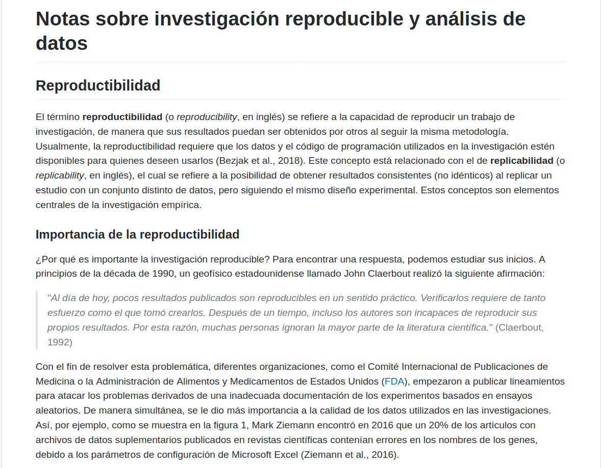
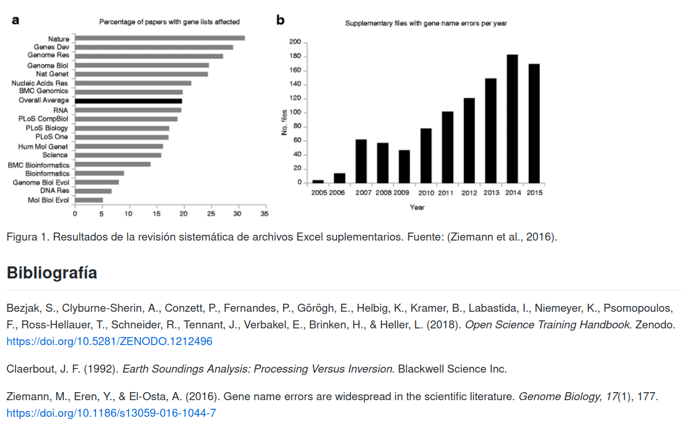

# Tarea 1 {-}

## Fecha y hora límite de entrega {-}
- Grupo 001: Lunes 9 de mayo de 2022. 07:59 a.m.
- Grupo 002: Martes 10 de mayo de 2022. 10:59 a.m.

## Entregables {-}
1. Dirección de un repositorio en GitHub llamado `notas-investigacion-reproducible` con un documento escrito en Markdown llamado `README.md` (ej. https://github.com/mfvargas/notas-investigacion-reproducible), con el contenido especificado en la sección Desarrollo.
2. Dirección de un sitio web publicado en GitHub Pages generado a partir del repositorio especificado en el punto anterior (ej. https://mfvargas.github.io/notas-investigacion-reproducible/). 

La entrega debe realizarse a través de la plataforma Mediación Virtual.

## Objetivos {-}
Cada estudiante debe mostrar que es capaz de:

1. Escribir documentos en el lenguaje de marcado Markdown.
2. Manejar repositorios en GitHub.
3. Publicar repositorios en GitHub como sitios web en GitHub Pages.

## Consideraciones adicionales {-}
**Esta tarea es estrictamente individual**.

## Desarrollo {-}
El sitio web debe tener los contenidos y formatos que se muestran en las siguientes imágenes. Deben reproducirse los encabezados, negritas, itálicas, citas textuales, imágenes e hipervínculos a otros documentos.

Los textos están disponibles en [este enlace](otros/tarea-01-texto.txt).

## Calificación {-}
Entre paréntesis, se muestra el porcentaje correspondiente a cada aspecto que se calificará:

Revisión de las direcciones entregadas en Mediación Virtual:  
- (5%) Dirección del repositorio en GitHub.  
- (5%) Dirección del sitio web publicado en GitHub Pages.  

Revisión de los elementos del documento escrito en Markdown:  
- (10%) Encabezados.  
- (20%) Negritas e itálicas.  
- (20%) Citas textuales.  
- (20%) Imagen de la figura 1 (el archivo está en [ZiemannEtAlFig1.png](img/ZiemannEtAlFig1.png).  
- (20%) Hipervínculos (además de los dos de la bibliografía, incluya uno al sitio web de la FDA en https://www.fda.gov/, en donde se mencionan las siglas).  
