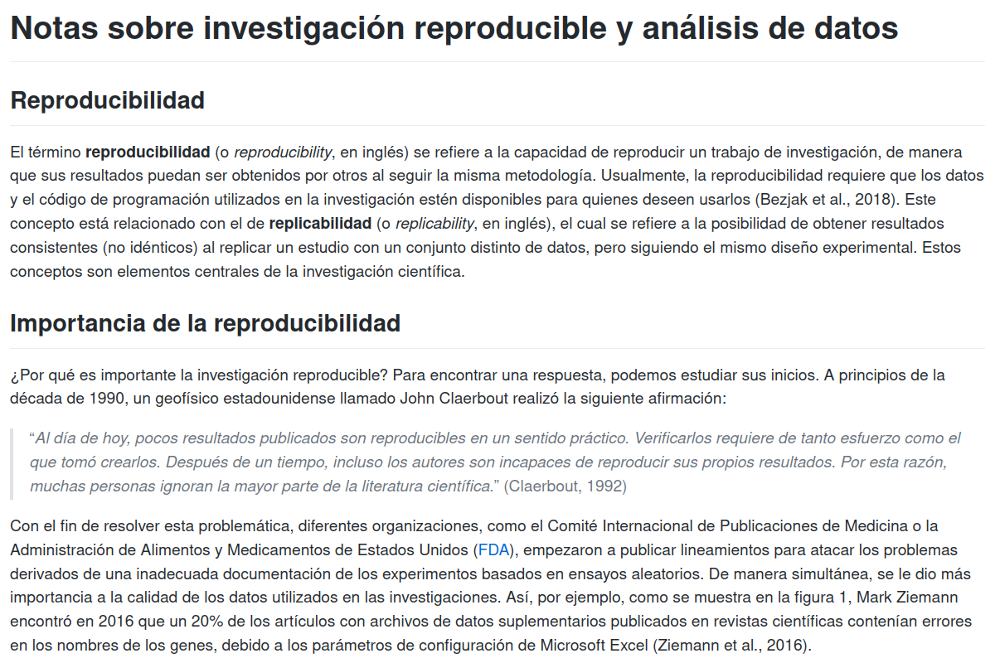

# Tarea 1 {-}

## Fecha y hora límite de entrega {-}
- Grupo 001: Lunes 9 de mayo de 2022. 8:00 a.m.
- Grupo 002: Martes 10 de mayo de 2022. 11:00 a.m.

## Entregables {-}
- Sitio web escrito en Markdown y publicado en GitHub Pages con el contenido especificado en la sección Desarrollo. Debe entregar su tarea a través de la plataforma Mediación Virtual, **proporcionando el enlace al sitio web publicado (ej. https://mfvargas.github.io/notas-investigacion-reproducible/), no la dirección al repositorio en GitHub (ej. https://github.com/mfvargas/notas-investigacion-reproducible)**.

## Objetivos {-}
El estudiante debe mostrar que es capaz de:

1. Escribir documentos en el lenguaje de marcado Markdown.
2. Manejar repositorios en GitHub.
3. Publicar repositorios en GitHub como sitios web en GitHub Pages.

**Esta tarea es estrictamente individual**.

## Desarrollo {-}
El sitio web debe visualizarse igual que las siguientes imágenes. 

Los textos están disponibles en [este enlace](otros/tarea-01-texto.txt).

## Calificación {-}
Entre paréntesis, se muestra el porcentaje correspondiente a cada aspecto que se calificará:

- (10%) Sitio web correctamente publicado en GitHub Pages (no debe entregarse solamente la dirección del repositorio en GitHub).
- (10%) Encabezados.
- (20%) Negritas e itálicas.
- (20%) Citas textuales.
- (20%) Imagen de la figura 1 (el archivo está en [ZiemannEtAlFig1.png](img/ZiemannEtAlFig1.png).
- (20%) Hipervínculos (además de los dos de la bibliografía, incluya uno al sitio web de la FDA en https://www.fda.gov/, en donde se mencionan las siglas).
